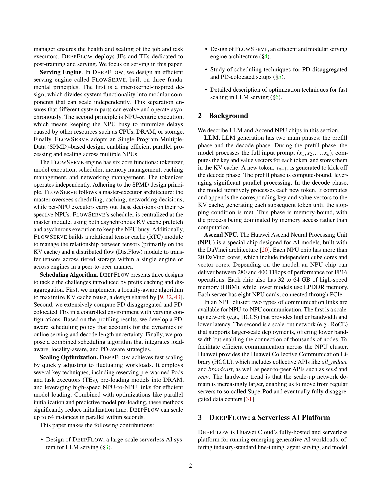
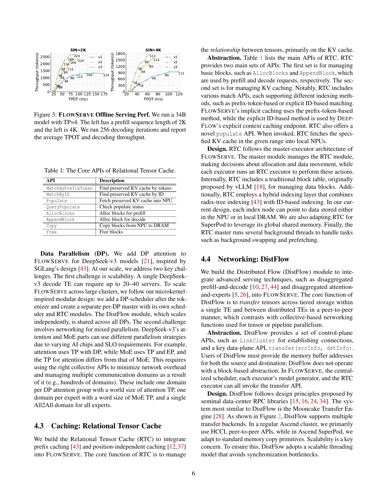
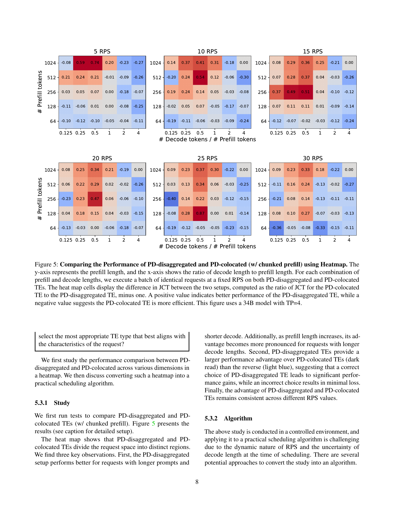

 


 2501.14417 
 Junhao Hu et el. 
 
 🤗 2025-01-29 
 



↗ arXiv


↗ Hugging Face


↗ Papers with Code


### TL;DR



본 논문은 클라우드 환경에서 대규모 언어 모델(LLM)을 효율적으로 서비스하기 위한 새로운 서버리스 AI 플랫폼인 DEEPFLOW를 소개합니다. 기존 시스템에서는 **자원 할당**, **서비스 효율성**, **콜드 스타트 지연** 등의 문제가 있었는데, DEEPFLOW는 이러한 문제들을 해결하기 위해 **요청-작업-태스크 모델**, **FLOWSERVE 서빙 엔진**, **고급 스케줄링 정책**, **확장성 최적화 기법** 등을 활용합니다.  

DEEPFLOW는 **요청-작업-태스크 모델**을 통해 AI 워크로드를 효율적으로 관리하고, **FLOWSERVE 서빙 엔진**은 마이크로커널 기반 설계, NPU 중심 실행, SPMD 병렬 처리를 통해 LLM 서빙 성능을 최적화합니다. 또한, **PD-분산 및 PD-결합 구성**에 맞는 새로운 스케줄링 정책을 사용하며, **DRAM 사전 로딩**, **NPU 포크** 등의 기법을 통해 확장성을 높였습니다.  **1년 이상의 운영 경험**을 통해 **산업 표준 API**를 제공하며, **고객들에게 미세 조정, 에이전트 서빙, 모델 서빙** 등의 서비스를 제공하고 있습니다. 



#### Key Takeaways


 DEEPFLOW는 서버리스 아키텍처를 통해 다양한 AI 워크로드를 효율적으로 관리합니다. 



 FLOWSERVE 서빙 엔진은 마이크로커널 기반 설계, NPU 중심 실행, SPMD 병렬 처리를 통해 LLM 서빙을 최적화합니다. 



 고급 스케줄링 알고리즘과 확장성 최적화 기법을 통해 빠른 확장성과 뛰어난 성능을 제공합니다. 


#### Why does it matter?
본 논문은 **대규모 언어 모델(LLM)** 서빙에 대한 **중요한 과제**를 해결하는 **새로운 시스템 DEEPFLOW**를 제시하여, **서버리스 아키텍처**, **효율적인 서빙 엔진**, **고급 스케줄링 알고리즘**, **확장성 최적화** 등을 통해 LLM 서빙의 **확장성**, **효율성**, **비용 효과**를 크게 향상시켰습니다. 특히, **다양한 AI 워크로드의 동적 자원 할당**, **분산 환경에서의 상태 관리**, **변동하는 자원 요구 사항 처리** 문제에 대한 해결책을 제시하여, **클라우드 기반 AI 서비스** 연구에 **중요한 기여**를 했습니다.  **차세대 클라우드 기반 AI 서비스** 개발에 **필수적인 지침**을 제공하고, **추후 연구**를 위한 **새로운 가능성**을 제시합니다.

------
#### Visual Insights


| API | Description |
|---|---| 
| `MatchByPrefixToken` | Find preserved KV cache by tokens |
| `MatchByID` | Find preserved KV cache by ID |
| `Populate` | Fetch preserved KV cache into NPU |
| `QueryPopulate` | Check populate status |
| `AllocBlocks` | Alloc blocks for prefill |
| `AppendBlock` | Alloc block for decode |
| `Copy` | Copy blocks from NPU to DRAM |
| `Free` | Free blocks |

> 🔼 본 표는 DEEPFLOW 시스템의 핵심 구성 요소 중 하나인 Relational Tensor Cache (RTC)의 주요 API들을 설명합니다. RTC는 모델 서빙 성능 향상을 위해  토큰, 텐서, 메모리 관리 등을 효율적으로 수행하는 캐싱 메커니즘입니다.  표에는 각 API의 이름, 기능 및 설명이 포함되어 있어 RTC의 동작 원리를 이해하는 데 도움이 됩니다.  특히,  `MatchByPrefixToken`과 `MatchByID` API는  prefix-token 기반 및 explicit ID 기반 매칭을 지원하며,  `Populate` API는  KV 캐시를 NPU로 효율적으로 가져오는 기능을 제공합니다.
> 

> 
read the caption

> Table 1: The Core APIs of Relational Tensor Cache.
> 

### Full paper



