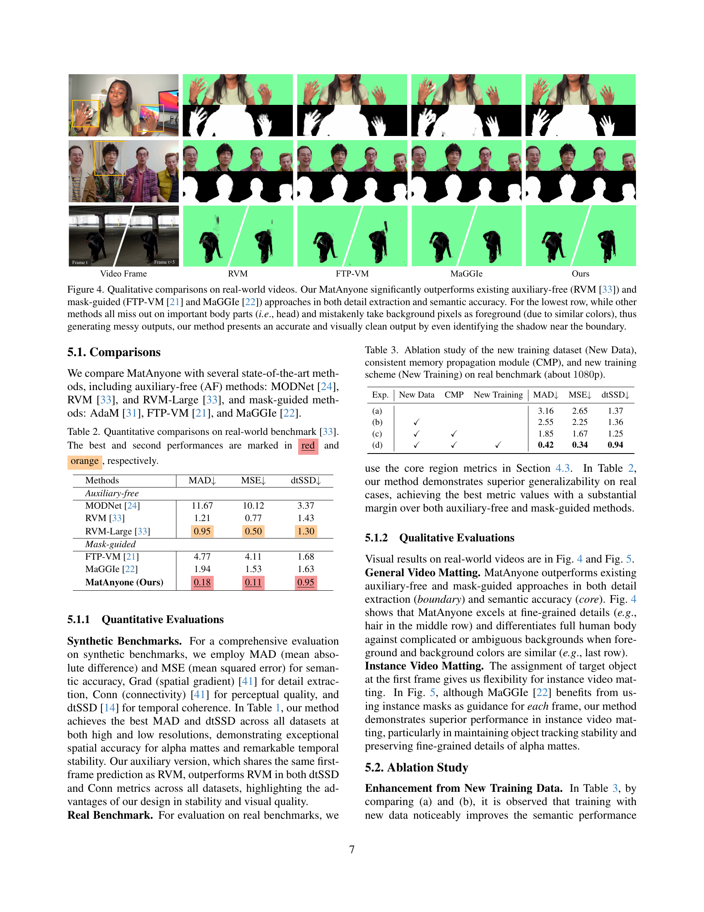
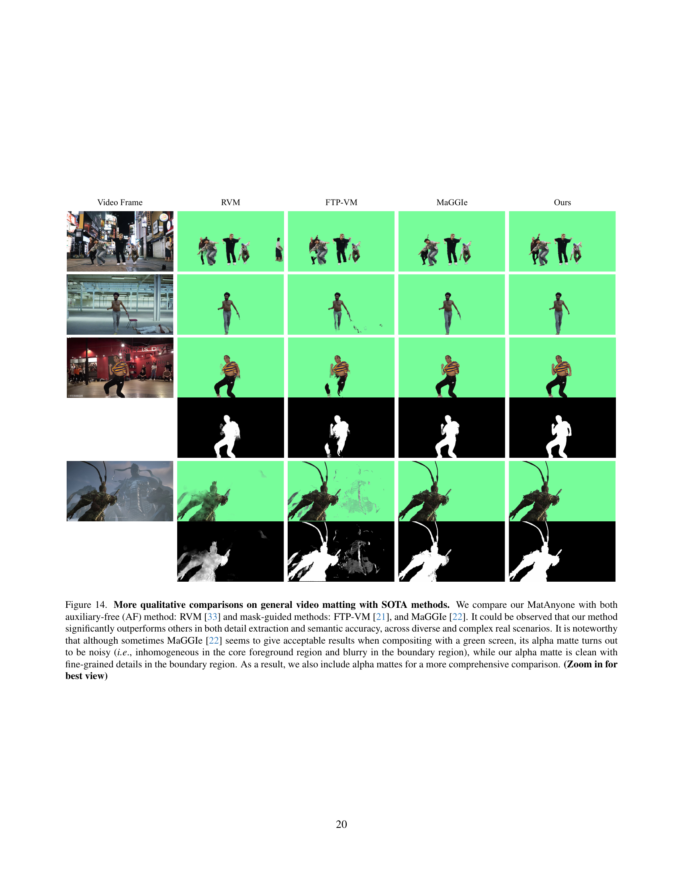

 


 2501.14677 
 Peiqing Yang et el. 
 
 🤗 2025-02-03 
 



↗ arXiv


↗ Hugging Face


↗ Papers with Code


### TL;DR



기존의 보조 데이터 없이 비디오 매팅을 수행하는 방법은 복잡하거나 모호한 배경에서 성능이 저하되는 문제가 있었습니다. 특히, **인물의 머리카락과 같은 미세한 부분**이나 **여러 개의 눈에 띄는 물체가 있는 장면**에서 정확한 매팅을 수행하기 어려웠습니다. 또한, 기존의 비디오 매팅 데이터셋은 양과 질적인 면에서 부족하여 모델의 성능 향상에 제약이 있었습니다. 

본 논문에서는 **일관된 메모리 전파**라는 새로운 방법을 제시하여 이러한 문제를 해결했습니다. **영역 적응 메모리 융합 모듈**을 통해 이전 프레임의 메모리를 효과적으로 통합하여 시간적 일관성을 유지하고 미세한 부분까지 정확하게 매팅하는 것이 가능해졌습니다. **대규모 고품질 데이터셋**을 새롭게 구축하고, **효율적인 훈련 전략**을 통해 모델의 성능을 크게 향상시켰습니다.  **다양한 실제 환경**에서 기존 방법보다 뛰어난 성능을 보였으며, 안정적이고 정확한 비디오 매팅 결과를 얻을 수 있었습니다.



#### Key Takeaways


 MatAnyone은 복잡하거나 모호한 배경에서도 안정적이고 정확한 비디오 매팅 결과를 제공합니다. 



 대규모 고품질 비디오 매팅 데이터셋과 효율적인 훈련 전략을 통해 모델의 강건성과 일반화 성능을 향상시켰습니다. 



 영역 적응 메모리 융합 모듈을 통해 시간적 일관성과 세부적인 디테일을 유지하는 고품질의 알파 매트를 생성합니다. 


#### Why does it matter?
**본 논문은 비보조 비디오 매팅 분야의 어려움을 해결하기 위해 일관된 메모리 전파를 사용하는 강력한 새로운 프레임워크인 MatAnyone을 제시합니다.**  **대규모 고품질 데이터셋을 구축하고 효율적인 훈련 전략을 도입하여 다양한 실제 시나리오에서 강력하고 정확한 결과를 제공합니다.** 이는 비디오 매팅 분야의 발전에 크게 기여하며, 앞으로의 연구에 새로운 가능성을 열어줍니다.

------
#### Visual Insights

> 🔼 그림 1은 MatAnyone이 비디오 전체에서 매우 디테일하고 시간적으로 일관된 알파 매트를 생성할 수 있음을 보여줍니다. (a) 다양한 프레임 크기와 미디어 유형(예: 영화, 게임, 스마트폰 비디오)에 적응하여 이미지 매팅 수준에서 매우 세세한 부분까지 표현합니다. (b) 보조 정보가 필요 없는 비디오 매팅 방법인 RVM [33]은 복잡하거나 모호한 배경에서 어려움을 겪습니다. 반면 MatAnyone은 이러한 방해 요소로부터 목표 객체를 효과적으로 분리하여 깨끗한 배경과 완벽한 전경 부분을 유지합니다. (c) MatAnyone은 여러 개의 두드러진 객체(예: 남성과 여성)가 있는 장면에서도 목표 객체(분홍색 옷을 입은 여성)를 일관되게 추적하는 데 탁월합니다. 상호 작용하는 동안에도 정확하게 구분합니다. (확대해서 보세요)
> 

> 
read the caption

> Figure 1: Our MatAnyone is capable of producing highly detailed and temporally consistent alpha mattes throughout a video. (a) It adapts to a variety of frame sizes and media types (e.g., films, games, smartphone videos), achieving fine-grained details at the image-matting level. (b) RVM [33], an auxiliary-free video matting method, struggles with complex or ambiguous backgrounds. In contrast, our method effectively isolates the target object from such distractors, preserving a clean background and complete foreground parts. (c) Our method also excels at consistently tracking the target (i.e., the lady in pink) even in scenes containing multiple salient objects (i.e., the man and the lady). It accurately distinguishes between them even during their interactions. (Zoom-in for best view)
> 


| Metrics | Auxiliary-free (AF) Methods |  |  |  | Mask-guided Methods |  |  |  |
|---|---|---|---|---|---|---|---|---|
|  | MODNet [24] | RVM [33] | RVM-Large [33] | Ours-AF | AdaM [31] | FTP-VM [20] | MaGGIe† [22] | Ours |
| **VideoMatte (512×288)** |  |  |  |  |  |  |  |  |
| MAD↓ | 9.41 | 6.08 | 5.32 | 5.99 | 5.30 | 6.13 | 5.49 | 5.07 |
| MSE↓ | 4.30 | 1.47 | 0.62 | 1.72 | 0.78 | 1.31 | 0.60 | 0.87 |
| Grad↓ | 1.89 | 0.88 | 0.59 | 0.88 | 0.72 | 1.14 | 0.57 | 0.62 |
| dtSSD↓ | 2.23 | 1.36 | 1.24 | 1.10 | 1.33 | 1.60 | 1.39 | 1.16 |
| Conn↓ | 0.81 | 0.41 | 0.30 | 0.38 | 0.30 | 0.41 | 0.31 | 0.25 |
| **VideoMatte (1920×1080)** |  |  |  |  |  |  |  |  |
| MAD↓ | 11.13 | 6.57 | 5.81 | 5.66 | 4.42 | 8.00 | 4.42 | 4.27 |
| MSE↓ | 5.54 | 1.93 | 0.97 | 1.68 | 0.39 | 3.24 | 0.40 | 0.36 |
| Grad↓ | 15.30 | 10.55 | 9.65 | 5.75 | 5.12 | 23.75 | 4.03 | 4.04 |
| dtSSD↓ | 3.08 | 1.90 | 1.78 | 1.27 | 1.39 | 2.37 | 1.31 | 1.24 |
| **YoutubeMatte (512×288)** |  |  |  |  |  |  |  |  |
| MAD↓ | 19.37 | 4.08 | 3.36 | 3.95 | - | 3.08 | 3.54 | 2.57 |
| MSE↓ | 16.21 | 1.97 | 1.04 | 2.25 | - | 1.29 | 1.23 | 0.94 |
| Grad↓ | 2.05 | 1.34 | 1.03 | 1.26 | - | 1.16 | 1.10 | 0.91 |
| dtSSD↓ | 2.79 | 1.81 | 1.62 | 1.52 | - | 1.83 | 1.88 | 1.53 |
| Conn↓ | 2.68 | 0.60 | 0.50 | 0.57 | - | 0.41 | 0.49 | 0.36 |
| **YoutubeMatte (1920×1080)** |  |  |  |  |  |  |  |  |
| MAD↓ | 15.29 | 4.37 | 3.50 | 3.70 | - | 6.49 | 2.37 | 2.05 |
| MSE↓ | 12.68 | 2.25 | 1.19 | 2.35 | - | 4.58 | 0.98 | 0.76 |
| Grad↓ | 8.42 | 15.1 | 12.64 | 11.45 | - | 29.78 | 7.69 | 9.67 |
| dtSSD↓ | 2.74 | 2.28 | 2.08 | 1.81 | - | 2.41 | 1.77 | 1.75 |

> 🔼 표 1은 다양한 출처의 여러 비디오 매팅 벤치마크에 대한 정량적 비교 결과를 보여줍니다.  최고 성능과 두 번째로 좋은 성능은 각각 빨간색과 주황색으로 표시되어 있습니다.  MaGGIe [22]는 각 프레임에 대한 인스턴스 마스크를 가이드로 필요로 하지만, 본 논문의 방법은 첫 번째 프레임에서만 필요로 합니다.  다양한 비디오 매팅 방법들의 정확도, 세부 묘사, 일관성 등을 정량적으로 비교 분석하여 성능을 평가합니다.
> 

> 
read the caption

> Table 1:  Quantitative comparisons on different video matting benchmarks from diverse sources. The best and second-best performances are marked in red and orange, respectively. ††{\dagger}† indicates that MaGGIe [22] requires the instance mask as guidance for each frame, while our method only requires it in the first frame.
> 

### In-depth insights

#### Memory-Based VM
본 논문에서 제시된 Memory-Based VM(Video Matting) 방법론은 **기존 프레임의 정보를 기억하고 활용**하여 일관성 있는 비디오 매팅 결과를 생성하는 데 중점을 둡니다. 이는 복잡하거나 모호한 배경에서도 안정적인 성능을 유지하는 데 중요한 역할을 합니다. **메모리 기반 접근 방식**은 이전 프레임의 세분화된 마스크나 트라이맵 정보를 메모리에 저장하여 현재 프레임의 매팅 결과 예측에 활용합니다.  **일관된 메모리 전파** 모듈을 통해 시간적 일관성을 유지하고, 영역 적응형 메모리 융합을 통해 세부적인 정보까지 정확하게 유지하는 것이 특징입니다.  **영역별 적응적 메모리 융합**은 배경과 전경의 경계 영역에 집중하여 세부적인 디테일을 유지하면서 동시에 중심 영역의 의미적 안정성을 확보합니다. 이러한 기술은 저품질의 비디오 매팅 데이터셋의 한계를 극복하는 데 효과적이며, **대규모 분할 데이터 활용** 전략을 통해 성능 향상을 더욱 도모합니다.  **새로운 훈련 전략**은 실제 분할 데이터를 효율적으로 활용하여 매팅 안정성을 높입니다.  결과적으로, Memory-Based VM 방법론은 다양한 실제 환경에서 강건하고 정확한 비디오 매팅 결과를 제공합니다.

#### CMP Module
본 논문에서 제안하는 일관된 메모리 전파(CMP) 모듈은 **비디오 매팅의 시간적 일관성과 공간적 정확성을 향상시키는 핵심 요소**입니다.  CMP 모듈은 이전 프레임의 정보를 현재 프레임에 효과적으로 통합하는 **영역 적응형 메모리 융합 기법**을 사용합니다.  **주요 영역에서는 일관성을 유지하고, 경계 영역에서는 세부적인 디테일을 보존**하는 역할을 수행합니다. 이를 통해 복잡한 배경이나 모호한 영역에서도 안정적인 매팅 결과를 얻을 수 있습니다.  특히, **경계 영역에 대한 처리를 강화**하여 머리카락이나 옷의 가장자리 등 미세한 디테일까지 정확하게 표현합니다.  **메모리 기반 패러다임**을 기반으로 하여 이전 프레임의 정보를 효율적으로 활용하고, **대규모 분할 데이터를 효과적으로 활용**하는 훈련 전략과 결합하여 매팅 안정성을 향상시킵니다.  결과적으로 CMP 모듈은 **시간적 일관성과 공간적 정확성을 동시에 만족**시키는 고품질 비디오 매팅 결과를 제공하는 데 중요한 역할을 합니다.  **영역 적응형 메커니즘**을 통해 매팅 과정의 안정성을 극대화하고, **세부적인 디테일까지 고려**한 정확한 매팅을 가능하게 합니다.

#### VM800 Dataset
본 논문에서 제시된 VM800 데이터셋은 기존 VideoMatte240K 데이터셋의 한계를 극복하기 위해 고안되었습니다. **기존 데이터셋의 부족한 양과 질, 다양성**을 개선하여 **더욱 풍부하고 다양한 비디오 매팅 학습 데이터**를 제공하는 것을 목표로 합니다.  **두 배 이상의 양**과 **향상된 화질**, 다양한 헤어스타일과 의상, 동작 등 **다양성 확보**를 통해 더욱 강건하고 정확한 비디오 매팅 모델 학습에 기여합니다.  **실제 환경의 다양성을 반영**하여 실제 응용 분야에서의 성능 향상에도 기여할 것으로 기대됩니다.  데이터셋의 품질 향상을 위해 **수동으로 엄선된 고품질 데이터**만을 포함하여 정확성을 높였으며, **세심한 후처리 과정**을 통해 오류를 최소화했습니다.  **다양한 실제 시나리오**를 반영하여 모델의 일반화 성능을 향상시키는 데 기여할 뿐만 아니라, **복잡하고 모호한 배경**에서도 더욱 안정적인 성능을 보여주는 모델 개발을 가능하게 합니다.  이를 통해 **더욱 실용적인 비디오 매팅 기술**의 발전에 기여할 것으로 예상됩니다.

#### Training Strategy
본 논문의 "훈련 전략" 부분은 **기존의 비디오 매팅 데이터셋의 한계를 극복하기 위한 창의적인 해결책**을 제시합니다.  기존 데이터셋의 질적, 양적 부족 문제를 인식하고, **대규모 실제 분할 데이터를 활용하는 새로운 훈련 전략**을 도입했습니다. 이는 기존 연구들처럼 분할 데이터를 별도의 예측 헤드에 사용하는 대신, **매팅 헤드 자체에 분할 데이터를 통합**하여 더욱 효과적인 지도 학습을 실현한 점이 핵심입니다.  특히, 영역별 손실 함수를 적용하여 **핵심 영역의 의미적 안정성과 경계 영역의 세부 묘사** 모두를 향상시켰습니다. **핵심 영역에는 픽셀 단위 손실을 적용**, **경계 영역에는 개선된 DDC 손실을 적용**하여 매팅과 분할의 차이를 해소하고, 세부적인 정보를 효율적으로 학습할 수 있도록 했습니다. 이러한 전략을 통해 제한된 비디오 매팅 데이터에도 불구하고, **매팅의 안정성과 일반화 성능을 크게 향상**시킬 수 있었습니다.  결론적으로, 본 논문의 훈련 전략은 **데이터 부족 문제에 대한 효과적인 대응 방식**을 제시하며, **비디오 매팅 모델의 성능 향상**에 크게 기여하는 중요한 부분입니다.

#### Future Works
본 논문에서 제시된 MatAnyone 모델은 비디오 매팅 분야에서 고무적인 발전을 보여주지만, 여전히 개선의 여지가 있습니다. **미래 연구 방향**으로는 다음과 같은 가능성을 생각해 볼 수 있습니다. 첫째, **데이터셋 확장 및 다양화**입니다. 더욱 다양하고 정교한 데이터를 확보하여 모델의 일반화 성능을 높일 수 있습니다. 특히, 다양한 조명, 배경, 움직임 패턴을 포함하는 고품질 데이터 확보가 중요합니다. 둘째, **모델 경량화 및 효율성 향상**입니다. 실시간 응용을 위해서는 모델 크기와 연산량을 줄이는 것이 필수적입니다. 지금보다 더욱 효율적인 메모리 관리 및 네트워크 구조 설계가 필요합니다. 셋째, **다양한 매팅 유형 지원**입니다. 현재 모델은 특정 유형의 매팅에 집중되어 있으므로, 다양한 매팅 유형 (예: 포토 매팅, 비디오 매팅 등)에 대한 지원을 확장할 수 있습니다. 마지막으로, **모델의 안정성 및 견고성 강화**입니다. 잡음이나 불완전한 입력에 대한 모델의 민감도를 줄여서 더욱 안정적이고 견고한 성능을 확보해야 합니다. 이러한 미래 연구를 통해 MatAnyone 모델은 실제 응용 분야에서 더욱 유용하고 실용적인 도구로 발전할 수 있을 것입니다. 특히, **실시간 처리 속도 향상**과 **다양한 플랫폼 지원**을 통한 접근성 향상은 중요한 과제입니다.

### More visual insights

More on figures

> 🔼 그림 2는 MatAnyone의 동작 원리를 설명하는 그림입니다. (a)는 매팅 프레임에서 알파 값(투명도)에 따라 이미지를 두 영역으로 나눌 수 있음을 보여줍니다. 핵심 영역(semantic)은 배경(알파 값 0)과 전경(알파 값 1)을 포함하며, 경계 영역(fine-details)은 알파 값이 0과 1 사이인 영역입니다. 경계 영역은 머리카락 등 세밀한 부분을 포함합니다. (b)는 기존의 보조 정보 없는(auxiliary-free) 방법인 RVM [33]과 마스크 기반(mask-guided) 방법인 MaGGIe [22]의 한계점을 보여줍니다. RVM은 모호한 배경에서 객체를 잘못 식별하고, MaGGIe는 부족한 영상 매팅 데이터로 인해 분할 전(segmentation prior) 정보를 제대로 활용하지 못합니다. MatAnyone은 이러한 한계점을 극복하기 위해 설계되었습니다.
> 

> 
read the caption

> Figure 2:  Definitions and motivations for MatAnyone. (a) In a matting frame, the image can be broadly divided into two areas based on the alpha value: the core (semantic) and the boundary (fine-details). The core includes the background (alpha values of 0) and the solid foreground (alpha values of 1), while the boundary (highlighted in pink) encompasses areas with alpha values between 0 and 1. (b) Due to the under-defined setting, auxiliary-free methods like RVM [33] are easily confused by ambiguous background. Meanwhile, mask-guided methods like MaGGIe [22] tend to break the segmentation prior they aim to leverage, due to the deficiency in video matting data.
> 

> 🔼 그림 3은 MatAnyone의 개요를 보여줍니다. MatAnyone은 메모리 기반 비디오 매팅 프레임워크로, 첫 번째 프레임의 타겟 분할맵을 사용하여 일관된 메모리 전파를 통해 안정적이고 고품질의 매팅 결과를 얻습니다. 이는 이전 프레임과 현재 프레임의 정보를 결합하는 지역 적응 메모리 융합 모듈을 통해 가능합니다. 실제 비디오 매팅 데이터 부족 문제를 해결하기 위해, 매팅 데이터를 사용하여 세밀한 매팅 디테일을 효과적으로 활용하고, 분할 데이터를 사용하여 의미적 안정성을 확보하는 새로운 학습 전략을 통합했습니다. 각기 다른 손실 함수를 사용하여 이러한 목표를 달성합니다.
> 

> 
read the caption

> Figure 3:  An overview of MatAnyone. MatAnyone is a memory-based framework for video matting. Given a target segmentation map in the first frame, our model achieves stable and high-quality matting through consistent memory propagation, with a region-adaptive memory fusion module to combine information from the previous and current frame. To overcome the scarcity of real video matting data, we incorporate a new training strategy that effectively leverages matting data for fine-grained matting details and segmentation data for semantic stability, with designed losses separately.
> 

> 🔼 그림 4는 실제 영상에 대한 정성적 비교 결과를 보여줍니다. 제시된 MatAnyone 방법은 기존의 보조 정보 없는(RVM [33]) 및 마스크 기반(FTP-VM [21], MaGGIe [22]) 방법들보다 세부 정보 추출 및 의미적 정확도 측면에서 훨씬 우수한 성능을 보입니다. 특히, 마지막 행의 예시에서 다른 방법들은 중요한 신체 부위(예: 머리)를 누락하거나 유사한 색상으로 인해 배경 픽셀을 잘못된 전경으로 인식하여 결과물이 흐릿하게 나타나는 반면, MatAnyone 방법은 그림자까지도 정확하게 식별하여 정확하고 시각적으로 깨끗한 결과를 제시합니다.
> 

> 
read the caption

> Figure 4:  Qualitative comparisons on real-world videos. Our MatAnyone significantly outperforms existing auxiliary-free (RVM [33]) and mask-guided (FTP-VM [21] and MaGGIe [22]) approaches in both detail extraction and semantic accuracy. For the lowest row, while other methods all miss out on important body parts (i.e., head) and mistakenly take background pixels as foreground (due to similar colors), thus generating messy outputs, our method presents an accurate and visually clean output by even identifying the shadow near the boundary.
> 

> 🔼 그림 5는 제안된 방법과 MaGGIe [22]의 인스턴스 비디오 매팅 결과를 정량적으로 비교한 것입니다. MaGGIe는 각 프레임에 인스턴스 마스크를 사용하지만, 제안된 방법은 첫 번째 프레임에만 마스크를 사용합니다. 결과적으로 제안된 방법은 객체 추적의 안정성과 더욱 세밀한 알파 매트 디테일 측면에서 더 나은 성능을 보여줍니다.  이는 제안된 방법이 시간적 일관성을 유지하면서도 더욱 정확하고 세밀한 매팅 결과를 생성할 수 있음을 시사합니다.
> 

> 
read the caption

> Figure 5:  Quantitative comparisons with MaGGIe [22] on instance video matting. Despite MaGGIe using instance mask as guidance for each frame, our method shows better performance, achieving better stability in object tracking and finer alpha matte details.
> 

> 🔼 그림 6은 반복적 개선을 통한 성능 향상을 보여줍니다. 첫 번째 프레임의 세분화된 마스크를 사용하여 모델은 일련의 반복적인 개선을 통해 각 프레임의 알파 매트를 생성합니다. 반복 횟수가 증가함에 따라 (t=1에서 t=10까지), 알파 매트의 디테일이 점점 더 향상되는 것을 볼 수 있습니다. 특히 경계 영역에서의 디테일이 크게 개선되어, 이미지 매팅 수준의 품질을 달성합니다. 이는 제안된 방법이 반복적인 개선을 통해 정확하고 세밀한 매팅 결과를 생성할 수 있음을 보여줍니다. 그림을 확대하여 자세히 살펴보세요.
> 

> 
read the caption

> Figure 6:  Improvement with Recurrent refinement. (Zoom-in for best view)
> 

> 🔼 이 그림은 원본 DDC 손실 함수[35]와 조정된 DDC 손실 함수를 사용하여 훈련한 매팅 결과를 비교한 것입니다. 조정된 DDC 손실 함수를 사용하면 더욱 안정적이고 자연스러운 매팅 결과를 얻을 수 있음을 보여줍니다.  원본 DDC 손실 함수는 경계 영역에서 계단 현상과 같은 인공적인 결과를 생성하는 반면, 조정된 DDC 손실 함수는 보다 자연스럽고 매끄러운 경계를 생성합니다. 이는 영상 매팅에서 세밀한 디테일과 공간적 일관성을 유지하는 데 중요한 역할을 합니다.
> 

> 
read the caption

> Figure 7:  Comparison of matting results training with original DDC loss [35] and with scaled DDC loss, where the latter gives more stable and natural matting results.
> 

> 🔼 그림 8은 VideoMatte240K 데이터셋의 문제점을 보여줍니다. (a)는 반사되는 영역(예: 안경)에서 알파값 오류가 발생하는 것을 보여줍니다. 안경의 일부분이 잘못된 알파값으로 인해 마치 구멍이 뚫린 것처럼 보입니다. (b)는 그림자와 같이 본래 알파값이 0 또는 1이어야 하는 영역(핵심 영역)에서 알파값이 불균일한 것을 보여줍니다. 이러한 문제는 비일관적이고 부정확한 마스크를 생성하여 영상 매팅 성능에 악영향을 미칠 수 있습니다.
> 

> 
read the caption

> Figure 8:  Issues with VideoMatte240K [32]. (a) Errors in alpha values exist in reflective regions (e.g., “a hole” on glasses). (b) Inhomogeneous alpha values exist in core regions (e.g., caused by shadow), where the alpha value should be exactly 0 or 1.
> 

> 🔼 그림 9는 논문에서 새롭게 제시하는 VM800 영상 매팅 데이터셋의 일부 이미지들을 보여줍니다. 기존 데이터셋들과 비교하여 경계 영역의 디테일이 훨씬 풍부하며, 성별, 헤어스타일, 종횡비 측면에서 다양성이 크게 향상되었음을 보여줍니다.  이 이미지들은 다양한 사람들의 모습과 배경을 담고 있으며, 머리카락, 옷 등 세밀한 부분까지 선명하게 표현되어 있음을 확인할 수 있습니다.  이러한 데이터셋의 질적 향상은 보다 정확하고 자연스러운 영상 매팅 결과를 얻는 데 크게 기여할 것으로 예상됩니다.
> 

> 
read the caption

> Figure 9:  Gallery for our new training dataset VM800. High-quality details in the boundary regions and diversity in terms of gender, hairstyles, and aspect ratios could be clearly observed.
> 

> 🔼 그림 10은 합성 벤치마크에 대한 조화 및 모델 성능에 대한 영향을 보여줍니다. 조화[23]는 합성된 프레임을 더 자연스럽고 현실적으로 만드는 연산으로, YouTubeMatte를 실제 분포에 더 가까운 더욱 어려운 벤치마크로 만듭니다. RVM[33]이 조화된 프레임에 혼란을 겪는 반면, 제시된 방법은 여전히 강력한 성능을 보이는 것을 알 수 있습니다.
> 

> 
read the caption

> Figure 10:  Harmonization on synthetic benchmarks and its effect on model performance. Harmonization [23] is an operation that makes the composited frame more natural and realistic, which also effectively makes our YouTubeMatte a more challenging benchmark that is closer to the real distribution. It is observed that while RVM [33] is confused by the harmonized frame, our method still yields robust performance.
> 

> 🔼 그림 11은 두 가지 비교 실험 결과를 보여줍니다. (a)는 기존 VideoMatte240K 데이터셋과 새로 제작한 VM800 데이터셋을 사용하여 훈련한 결과를 비교합니다. 기존 데이터셋으로 훈련했을 때는 반사 물체(예: 선글라스의 구멍)에서 오류가 발생하고, 중심 영역의 알파 값이 불균일하게 나타나는 문제가 있었습니다. 하지만 새 데이터셋으로 훈련했을 때는 이러한 문제들이 해결되어 더 높은 품질을 달성했습니다. (b)는 중심 영역에 대한 추가적인 지도 학습을 사용했을 때와 사용하지 않았을 때의 결과를 비교합니다. 추가적인 지도 학습 없이 실제 분할 데이터만으로 훈련했을 때는 의미론적 오류가 발생했습니다. 그러나 중심 영역에 대한 지도 학습을 통해 더 강력한 지도 학습이 가능해짐에 따라 의미론적 정확도가 크게 향상되었습니다.
> 

> 
read the caption

> Figure 11:  (a) Comparison on results trained with old training data (VideoMatte240K [32]) and new training data (our VM800). It could be observed that training with old data will lead to errors in reflective objects (e.g., holes on the sunglasses) and inhomogeneous alpha values in the core regions. However, both issues are fixed when training with our new data, indicating a higher quality. (b) Comparison on results trained without and with core-area supervision. It could be observed that training without it will lead to semantics error due to the weak supervision from real segmentation data, while training with core supervision largely improves semantics accuracy thanks to the stronger supervision enabled.
> 

> 🔼 그림 12는 일관된 메모리 전파(CMP) 모듈의 효과를 보여줍니다. CMP를 적용하지 않은 경우, 시맨틱 오류가 비디오 프레임 전체에 걸쳐 지속적으로 발생하는 것을 확인할 수 있습니다. 그러나 CMP를 사용하여 훈련한 경우, '변화 확률' 마스크에서 모델이 일반적으로 경계 근처의 픽셀만 '변경된' 것으로 간주하고, 대부분의 내부 영역(예: 귀걸이)은 이전 프레임의 메모리 값을 주로 사용하는 것을 알 수 있습니다. 그림에서 볼 수 있듯이, t시점에서 예측이 모두 정확한 경우, CMP를 사용한 모델은 정확성을 유지하고 안정적인 결과를 제공하지만, CMP를 사용하지 않은 모델은 정확성이 빨리 깨지고 회복되지 않습니다.  즉, CMP 모듈이 시간적 일관성을 유지하고 세부적인 부분까지 정확하게 예측하는 데 중요한 역할을 수행함을 보여줍니다.
> 

> 
read the caption

> Figure 12:  Comparison on results with and without Consistent Memory Propagation. It could be observed that when CMP is not applied, semantic errors constantly exist across a wide span of video frames. However, when training with CMP, we observe from the “Change Probability” mask that usually our model only takes pixels near the boundary as “changed”, and most of the inner regions (i.e., earring) will mainly take the memory values from the last frame. As we can see on the figure, while predictions are both correct at time t𝑡titalic_t, the model with CMP successfully keeps the correctness and gives stable results, while the model without CMP quickly breaks the correctness and never recovers.
> 

> 🔼 그림 13은 반복적인 개선을 통한 결과 비교를 보여줍니다. 주어진 분할 마스크와 비교하여 단 한 번의 개선만으로도 세부적인 부분이 눈에 띄게 향상되는 것을 확인할 수 있습니다. 10번의 반복적인 개선을 거치면 모델은 SAM [25]의 결과를 기반으로 하는 이미지 매팅 모델인 Matte Anything [56]보다 더 나은 수준의 이미지 매팅 수준의 매팅 디테일을 달성할 수 있습니다.
> 

> 
read the caption

> Figure 13:  Comparison on results with iterative refinement. A noticeable enhancement on details can be observed even with one iteration of refinement compared with the given segmentation mask. Within 10 iterations, our model is able to achieve matting details at an image-matting level, even better than Matte Anything [56], which is an image matting model also based on the results from SAM [25].
> 

> 🔼 그림 14는 다양하고 복잡한 실제 시나리오에서 최첨단 비디오 매팅 방법들과 MatAnyone의 정성적 비교 결과를 보여줍니다. MatAnyone은 보조 자료가 없는 RVM[33]과 마스크 기반 FTP-VM[21], MaGGIe[22] 방법들과 비교됩니다. 결과적으로 MatAnyone은 세부 정보 추출과 의미적 정확도 측면에서 다른 방법들을 크게 능가함을 알 수 있습니다. MaGGIe[22]는 녹색 화면 합성 시 허용되는 결과를 보여주는 경우가 있지만, 알파 매트는 노이즈가 많고(즉, 전경 영역의 불균일성과 경계 영역의 흐릿함), MatAnyone의 알파 매트는 경계 영역에서 세부 정보가 명확하고 깨끗합니다. 따라서 보다 포괄적인 비교를 위해 알파 매트도 포함하였습니다. (확대하여 보세요)
> 

> 
read the caption

> Figure 14:  More qualitative comparisons on general video matting with SOTA methods. We compare our MatAnyone with both auxiliary-free (AF) method: RVM [33] and mask-guided methods: FTP-VM [21], and MaGGIe [22]. It could be observed that our method significantly outperforms others in both detail extraction and semantic accuracy, across diverse and complex real scenarios. It is noteworthy that although sometimes MaGGIe [22] seems to give acceptable results when compositing with a green screen, its alpha matte turns out to be noisy (i.e., inhomogeneous in the core foreground region and blurry in the boundary region), while our alpha matte is clean with fine-grained details in the boundary region. As a result, we also include alpha mattes for a more comprehensive comparison. (Zoom in for best view)
> 

> 🔼 그림 15는 복잡한 장면에서 빠르게 움직이는 객체를 장시간에 걸쳐 매팅하는 어려운 예시를 보여줍니다. MatAnyone을 기존의 보조 정보 없는(auxiliary-free) 방법인 RVM [33]과 마스크 기반(mask-guided) 방법인 FTP-VM [21], MaGGIe [22]와 비교하여, MatAnyone이 복잡한 장면에서도 빠르게 움직이는 객체를 안정적으로 추적하는 능력을 보여줍니다. 다른 방법들은 눈에 띄는 실패를 보이는 반면, MatAnyone은 대상 객체를 정확하게 매팅합니다. 자세히 보기 위해 확대해 보세요.
> 

> 
read the caption

> Figure 15:  A challenging example of general video matting across a long time span. We compare our MatAnyone with both auxiliary-free (AF) method: RVM [33] and mask-guided methods: FTP-VM [21], and MaGGIe [22]. It could be observed that our model is able to track the target object stably even when the object is moving fast in a highly complex scene, where all the other methods present noticeable failures. (Zoom in for best view)
> 

> 🔼 그림 16은 다양한 복잡한 배경과 여러 명의 사람이 있는 장면에서 장시간에 걸쳐 비디오 매팅을 수행하는 어려운 예시를 보여줍니다. MatAnyone을 보조 도구 없이 동작하는 RVM[33] 및 마스크를 사용하는 FTP-VM[21], MaGGIe[22]와 비교하여, MatAnyone은 전경과 배경의 색상이 유사하고 배경에 여러 사람이 있는 애매한 배경에서도 대상 객체를 정확하게 추적할 수 있음을 보여줍니다. 또한, 여러 개의 대상 객체가 있을 때도 MatAnyone이 이러한 어려운 상황을 잘 처리할 수 있음을 보여줍니다. 자세한 내용은 확대하여 확인하십시오.
> 

> 
read the caption

> Figure 16:  Another challenging example of general video matting across a long time span. We compare our MatAnyone with both auxiliary-free (AF) method: RVM [33] and mask-guided methods: FTP-VM [21], and MaGGIe [22]. This example showcases that our model is able to track the target objects even in a highly ambiguous background, where the colors for foreground and background are similar, and also multiple humans in the background. In addition, it also demonstrates when there is more than one target object, our model is still able to handle this challenging case well. (Zoom in for best view)
> 

More on tables


| Methods | MAD↓ | MSE↓ | dtSSD↓ |
|---|---|---|---|
| *Auxiliary-free* |  |  |  |
| MODNet [24] | 11.67 | 10.12 | 3.37 |
| RVM [33] | 1.21 | 0.77 | 1.43 |
| RVM-Large [33] | 0.95 | 0.50 | 1.30 |
| *Mask-guided* |  |  |  |
| FTP-VM [21] | 4.77 | 4.11 | 1.68 |
| MaGGIe [22] | 1.94 | 1.53 | 1.63 |
| **MatAnyone (Ours)** | **0.18** | **0.11** | **0.95** |
> 🔼 표 2는 실제 환경 비디오 매팅 벤치마크 [33]에 대한 정량적 비교 결과를 보여줍니다.  각 방법의 성능을 MAD(평균 절대 차이), MSE(평균 제곱 오차), dtSSD(시간적 일관성 측정 지표) 세 가지 지표로 평가하였습니다.  표에서 빨간색은 가장 좋은 성능, 주황색은 두 번째로 좋은 성능을 나타냅니다.  이 표는 제안된 방법의 성능을 기존의 다른 방법들과 비교하여 보여주는 역할을 합니다.
> 

> 
read the caption

> Table 2:  Quantitative comparisons on real-world benchmark [33]. The best and second performances are marked in red and orange, respectively.
> 


| Exp. | New Data | CMP | New Training | MAD↓ | MSE↓ | dtSSD↓ |
|---|---|---|---|---|---|---|
| (a) |  |  |  | 3.16 | 2.65 | 1.37 |
| (b) | ✓ |  |  | 2.55 | 2.25 | 1.36 |
| (c) | ✓ | ✓ |  | 1.85 | 1.67 | 1.25 |
| (d) | ✓ | ✓ | ✓ | **0.42** | **0.34** | **0.94** |
> 🔼 이 표는 논문의 실험 결과 중 하나로, 새로운 훈련 데이터셋(New Data), 일관된 메모리 전파 모듈(CMP), 그리고 새로운 훈련 방식(New Training)의 세 가지 요소가 실제 비디오 매팅 작업(약 1080p 해상도)에 미치는 영향을 보여줍니다. 각 요소를 개별적으로 또는 조합하여 적용했을 때의 성능 변화를 정량적으로 비교 분석하여 각 요소의 기여도를 평가합니다.  MAD, MSE, dtSSD 세 가지 지표를 사용하여 매팅 성능을 측정합니다.
> 

> 
read the caption

> Table 3: Ablation study of the new training dataset (New Data), consistent memory propagation module (CMP), and new training scheme (New Training) on real benchmark (about 1080108010801080p).
> 


| Training Stage | #Iterations | Matting Data | Segmentation Data | Sequence Length | Matting Loss | Segmentation Loss | Core Supervision Loss |
|---|---|---|---|---|---|---|---| 
| Stage 1 | 85K | video | image & video | 3 (80K) → 8 (5K) | ✓ | ✓ |  |
| Stage 2 | 40K | video | image & video | 8 | ✓ | ✓ | ✓ |
| Stage 3 | 5K | image | image & video | 8 | ✓ | ✓ | ✓ |
> 🔼 표 4는 논문의 훈련 과정에서 사용된 설정과 손실 함수들을 보여줍니다.  세 가지 주요 훈련 단계(Stage 1, 2, 3)에서 각각 다른 설정과 손실 함수가 사용됩니다.  세부적으로 살펴보면, Stage 1에서는 비디오 및 이미지 데이터를 사용하여 일정 길이의 시퀀스에 대해 훈련하고, Stage 2에서는 추가적으로 세분화 데이터를 사용하여 의미적 안정성을 높이고 경계 영역의 세부 정보를 개선합니다. Stage 3에서는 이미지 매팅 데이터를 사용하여 미세한 매팅 디테일을 향상시키는 미세 조정 단계입니다.  표에서 † 표시는 추론 단계에서는 사용되지 않는 보조 손실 함수로서 분할 헤드에서 계산된 분할 손실을 나타냅니다. 매팅 손실과 코어 감독 손실은 코어 영역의 의미적 안정성과 경계 영역의 매팅 디테일을 위해 매팅 헤드에서 계산됩니다.
> 

> 
read the caption

> Table 4:  Training settings and losses used in different training stages. ††{\dagger}† indicates that segmentation loss is computed as an auxiliary loss on a segmentation head, which will be abandoned during inference. Other than that, matting loss and core supervision loss are computed on the matting head for semantic stability in core regions and matting details in the boundary region.
> 


| Datesets | VideoMatte240K (old train) [32] | VM800 (new train) | VideoMatte (old test) [32] | YouTubeMatte (new test) |
|---|---|---|---|---|
| #Foregrounds | 475 | 826 | 5 | 32 |
| Sources | - | Storyblocks, Envato Elements, Motion Array | - | YouTube |
| Harmonized | - | - | x | ✓ |
> 🔼 표 5는 본 논문에서 사용된 새로운 학습 및 테스트 데이터셋과 기존 데이터셋을 비교 분석한 표입니다.  비교 항목은 고유한 전경 영상의 개수, 데이터셋의 출처, 그리고 조화(harmonization) 처리 여부입니다.  기존 데이터셋(VideoMatte240K)과 비교하여 새 학습 데이터셋(VM800)이 고유 전경 영상 수가 두 배 이상 많고, 다양한 출처의 영상을 포함하며,  세밀한 품질 향상을 이뤄냈음을 보여줍니다. 테스트 데이터셋(YouTubeMatte)은  VideoMatte보다 다양성이 훨씬 풍부하고,  실제 환경에 가까운 어려운 조건을 제공함을 강조합니다.
> 

> 
read the caption

> Table 5:  Comparison on Datasets. We compare our new training data and testing data with the old ones, in terms of the number of distinct foregrounds, sources, and whether harmonization is applied.
> 

### Full paper



