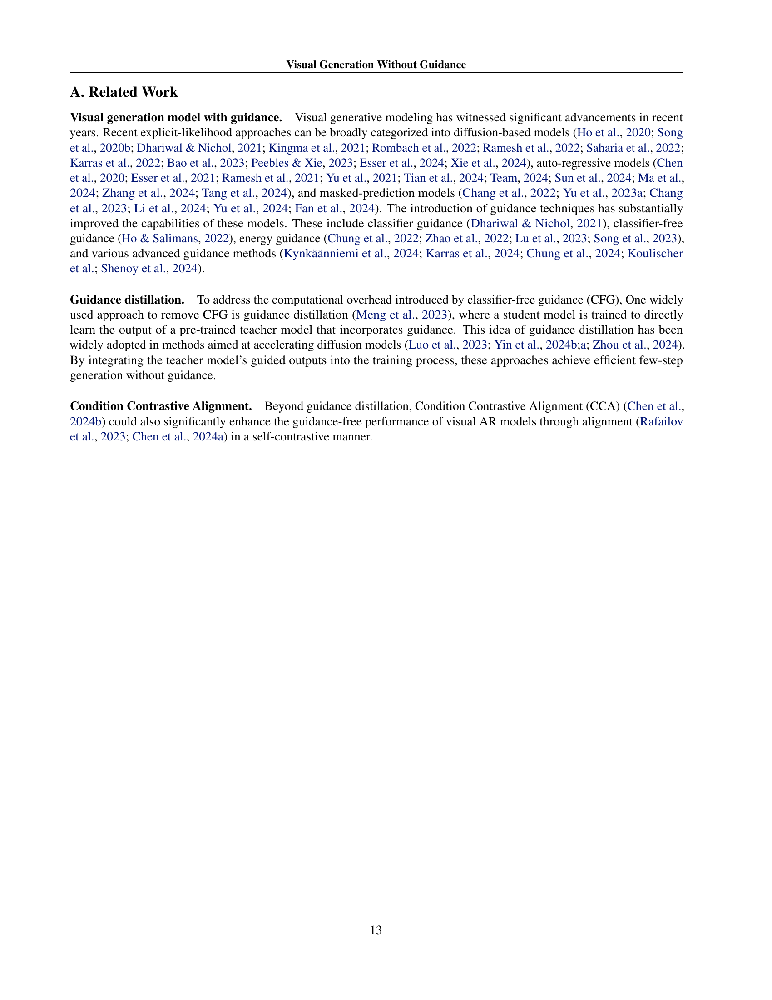

 


 2501.15420 
 Huayu Chen et el. 
 
 🤗 2025-01-28 
 



↗ arXiv


↗ Hugging Face


↗ Papers with Code


### TL;DR



기존의 시각적 생성 모델은 샘플링 과정에서 조건부 및 무조건부 모델을 모두 사용하는 **분류기 없는 지도(CFG)** 방식에 의존하여 샘플링 비용이 높고, 모델 후처리 과정이 복잡했습니다.  **낮은 온도 샘플링**을 통해 생성 품질을 높이려는 시도는 있었지만, 단일 모델만으로는 효과가 제한적이었습니다.

본 논문에서는 **단일 모델만을 사용하는 새로운 훈련 방법인 지도 없는 시각적 생성 모델 훈련(GFT)**을 제시합니다. GFT는 기존 CFG 방식과 동일한 목적 함수를 사용하지만, 조건부 모델을 매개변수화하는 방식을 다르게 하여 단일 모델로 샘플링 분포를 최적화합니다.  실험 결과, GFT는 CFG와 비교하여 성능 저하 없이 샘플링 비용을 절반으로 줄이고 다양한 모델에 적용 가능함을 보였습니다.



#### Key Takeaways


 GFT는 CFG와 동일한 성능을 유지하면서 샘플링 비용을 절반으로 줄입니다. 



 GFT는 기존의 CFG 네트워크에 의존하지 않고 처음부터 학습이 가능합니다. 



 GFT는 다양한 시각적 생성 모델(확산, 자기회귀, 마스크 예측 모델)에 적용 가능합니다. 


#### Why does it matter?
본 논문은 **지도 없는 시각적 생성 모델 훈련(GFT)**이라는 새로운 패러다임을 제시하여 기존의 **분류기 없는 지도(CFG)** 방식의 단점을 극복합니다.  **샘플링 비용을 절반으로 줄이고**, 다양한 시각적 생성 모델에 적용 가능하며, **처음부터 훈련하는 것도 가능**합니다. 이는 시각적 생성 모델링 분야의 효율성과 유연성을 크게 향상시키고 **향후 연구에 새로운 방향**을 제시하여 **연구자들에게 중요한 의미**를 지닙니다.

------
#### Visual Insights

> 🔼 본 그림은 GFT(Guidance-Free Training) 기법을 DiT-XL/2 모델에 적용한 후, 샘플링 온도(β)를 조절했을 때 이미지 생성 결과에 미치는 영향을 보여줍니다. 낮은 β 값은 더 높은 충실도를 가진 이미지를 생성하는 반면, 높은 β 값은 더 다양한 이미지를 생성합니다. 그림 1에서는 β 값을 1.0, 0.5, 0.25, 0.1로 변화시켰을 때의 결과를 보여주고 있으며, 그림 11에서는 더 많은 예시를 제시하고 있습니다.
> 

> 
read the caption

> Figure 1: Impact of adjusting sampling temperature β𝛽\betaitalic_β for DiT-XL/2 after applying GFT. More examples are in Figure 11.
> 


Method | Modeling target | Applicable area | Loss form | Train from scratch? | # Inference / Update | Train time / Update | GPU memory usage
---|---|---|---|---|---|---|
Guidance Distillation | $p_{

ϕ}^c + p_{

ϕ}^u \to p_{

θ}^s(

\mathbf{x}|

\mathbf{c})$ | Diffusion | $\left\|

\mathbf{\epsilon}_{

\theta}^s - [(1 + s)\mathbf{\epsilon}_{

\phi}^c - s\mathbf{\epsilon}_{

\phi}^u] \right\|_{2}^2$ | Not allowed | 3 | ×1.19 | ×1.15
Condition Contrastive Alignment | $p_{

θ}^s + p_{

ϕ}^c \to \frac{p(

\mathbf{x}|

\mathbf{c})}{p(

\mathbf{x})}$ | AR & Masked | $-\log\sigma(r_{

\theta}^p) - \log\sigma(-r_{

\theta}^n); \; r_{

\theta} = \frac{1}{s}\log\frac{p_{

\theta}^s}{p_{

\phi}^c}$ | Not allowed | 4 | ×1.69 | ×1.39
Guidance-Free Training | $p_{

θ}^s + p_{

θ}^u \to p(

\mathbf{x}|

\mathbf{c})$ | All | $\beta f_{

\theta}^s + (1 - \beta)f_{

\theta}^u$ | Allowed | 2 | ×1.00 | ×1.00

> 🔼 표 1은 제안된 방법인 GFT와 기존의 가이드 없이 생성하는 기법들을 비교 분석한 표입니다. DiT-XL 또는 VAR-d30 모델을 사용한 실험 결과를 보여주며, 8개의 80GB H100 GPU 카드를 사용하여 실험을 진행했습니다. 표에는 각 방법의 모델링 목표, 적용 가능한 영역, 손실 함수 형태, 처음부터 학습 가능 여부, 업데이트 당 추론 횟수, 업데이트 당 학습 시간, GPU 메모리 사용량 등이 포함되어 있습니다.  각 방법의 특징과 장단점을 비교하여 GFT의 효율성과 다양성을 강조하고 있습니다.
> 

> 
read the caption

> Table 1: Comparison of GFT (ours) and other guidance-free methods. Numbers are reported based on experiments for the DiT-XL model or the VAR-d30 model. We use 8×\times×80GB H100 GPU cards.
> 

### In-depth insights

#### Guidance-Free Training
본 논문에서 제안하는 **지도 없는 학습(Guidance-Free Training, GFT)**은 기존의 분류기 없는 지도(Classifier-Free Guidance, CFG) 방식의 단점을 극복하기 위한 새로운 시도입니다. CFG는 조건부 모델과 무조건부 모델 두 개를 모두 활용하여 샘플링 과정을 수행하기 때문에 계산 비용이 높고, 후처리 과정이 복잡합니다. 반면, GFT는 **단일 모델만을 사용하여** 샘플링을 수행하므로 계산 비용을 절반으로 줄이고, 후처리 과정을 간소화할 수 있습니다. 이는 기존의 증류 기반 방식과 달리 사전 학습된 CFG 네트워크에 의존하지 않고, **처음부터 직접 학습**할 수 있다는 장점도 있습니다.  GFT는 CFG와 동일한 최대 우도 목적 함수를 사용하며, 조건부 모델의 매개변수화 방식만 다릅니다.  **간단한 구현**으로 기존 코드베이스에 최소한의 수정만으로 적용할 수 있다는 실용적인 측면도 돋보입니다. 다양한 실험을 통해 여러 영역에서 CFG와 유사하거나 더 나은 성능을 보이는 것을 확인했습니다.

#### GFT Algorithm
본 논문에서 제안하는 GFT 알고리즘은 기존의 CFG(Classifier-Free Guidance) 방식의 단점을 해결하기 위해 고안되었습니다. **CFG는 조건부 모델과 무조건부 모델 두 개를 사용하여 샘플링을 수행**하는데, 이는 샘플링 비용을 두 배로 증가시키고 모델 훈련의 복잡성을 높이는 문제점을 가지고 있습니다. 반면 **GFT는 단일 모델만을 사용**하여 샘플링을 수행함으로써 샘플링 비용을 절반으로 줄이고 훈련 과정을 단순화합니다.  **GFT는 CFG와 동일한 최대 우도 목적 함수**를 사용하지만, 조건부 모델의 매개변수화 방식에 차이가 있습니다. **간단한 구현과 기존 코드베이스와의 높은 호환성**으로 인해 실제 적용이 용이하며 다양한 영역에서 효과적인 결과를 보여줍니다.

#### Empirical Analysis
본 논문의 '실증 분석' 부분은 제안된 방법의 효과를 다각적으로 검증하는 데 중점을 둡니다.  **다양한 시각적 생성 모델(확산 모델, 자기회귀 모델, 마스크 예측 모델 등)에 걸쳐 실험을 수행하여** 일관되게 우수한 성능을 보임을 보여줍니다.  **CFG 기준선과 비교하여 FID 점수 및 다양성-충실도 균형 측면에서 경쟁력 있는 결과를 제시하며**, 계산 비용 절감 효과 또한 입증합니다.  **미세 조정 및 처음부터 학습하는 두 가지 시나리오 모두에서** GFT의 성능과 효율성을 평가하여 **실용성을 강조**합니다. 단순한 성능 비교를 넘어, **온도 매개변수를 활용한 다양성-충실도 제어 기능**과 **훈련 안정성** 등 다양한 측면에 대한 분석을 통해 GFT의 우수성을 뒷받침합니다.  결론적으로, 이 부분은 **방법론의 견고성과 실제 적용 가능성을 보여주는 핵심적 증거**를 제시합니다.

#### Visual Model Scope
본 논문은 **다양한 유형의 비지도 시각적 생성 모델에 적용 가능한 새로운 방법론**을 제시합니다. 기존의 Classifier-Free Guidance (CFG) 방식은 샘플링 과정에 조건부 및 무조건부 모델 두 개를 모두 사용하여 계산 비용이 높았으나, 이 논문에서 제안하는 Guidance-Free Training (GFT) 방식은 **단일 모델만을 사용**하여 샘플링을 수행함으로써 계산 효율성을 높였습니다.  **확산 모델, 자기 회귀 모델, 마스크 예측 모델 등 다양한 모델 아키텍처**에 적용될 수 있으며, 기존 코드베이스에 최소한의 수정만으로 구현 가능하다는 장점이 있습니다.  **GFT는 샘플링 온도 제어를 통해 이미지의 다양성과 충실도 간의 균형**을 제어할 수 있으며, 기존 CFG 기반 모델을 GFT 기반 모델로 효율적으로 전환할 수 있다는 점 또한 중요한 의미를 가집니다.  결과적으로 **GFT는 비용 효율적이고 다재다능한 새로운 시각적 생성 모델 훈련 패러다임**을 제시하며, 다양한 응용 분야에 널리 적용될 수 있을 것으로 예상됩니다.

#### Future Works
본 논문에서 제시된 Guidance-Free Training (GFT)는 이미지 생성 모델의 샘플링 과정에서 가이드된 샘플링을 제거하여 계산 비용을 절반으로 줄이는 효과적인 방법을 제시합니다.  **향후 연구 방향**으로는 첫째, **다양한 생성 모델 아키텍처에 대한 GFT 적용성을 더욱 확장**하는 것입니다. 본 논문에서는 여러 유형의 모델에 GFT를 적용하여 그 효과를 검증했지만, 더욱 다양하고 복잡한 모델들에 대한 실험이 필요합니다. 둘째, **GFT의 안정성 및 일반화 성능을 개선**하는 연구가 필요합니다.  특히, 대규모 데이터셋을 사용한 학습이나 다양한 하이퍼파라미터 조정을 통해 모델의 성능을 더욱 향상시킬 수 있습니다. 셋째, **GFT를 다른 생성적 과제에 적용**하는 연구가 있습니다.  예를 들어, 텍스트 생성, 음악 생성 등 다양한 분야에 GFT를 적용하여 그 일반화 성능을 확인할 수 있습니다. 마지막으로, **GFT와 다른 기존의 가이드 없는 방법론들과의 비교 분석**을 통해 GFT의 강점과 약점을 명확히 파악하고,  더욱 개선된 방법론을 개발하는 것이 필요합니다. 이러한 연구들을 통해 GFT는 더욱 강력하고 효율적인 이미지 생성 모델 개발에 기여할 수 있을 것입니다.

### More visual insights

More on figures

> 🔼 그림 2는 GFT(Guidance-Free Training)와 CFG(Classifier-Free Guidance) 방법의 비교를 보여줍니다. 두 방법 모두 동일한 조건부 손실 함수(conditional loss function)를 최적화하지만, 조건부 모델(conditional model)의 매개변수화 방식이 다릅니다. CFG는 별도의 조건부 모델과 무조건부 모델(unconditional model)을 사용하여 가중치를 조절하는 반면, GFT는 샘플링 모델(sampling model)과 무조건부 모델 간의 선형 보간(linear interpolation)을 통해 암시적으로 조건부 모델을 구성합니다. 이를 통해 GFT는 명시적인 샘플링 모델을 직접 학습할 수 있게 됩니다.  즉, CFG는 별도의 조건부 모델과 무조건부 모델을 학습하고 추론 시 두 모델을 모두 사용하는 반면, GFT는 단일 모델만을 사용하여 샘플링 분포를 나타내고, 추론 비용을 절반으로 줄입니다. 
> 

> 
read the caption

> Figure 2: Comparison of GFT and CFG method. GFT shares CFG’s training objective but has a different parameterization technique for the conditional model. This enables direct training of an explicit sampling model.
> 

> 🔼 그림 3은 GFT와 CFG의 계산 효율성을 비교한 것입니다. DiT-XL 모델을 기반으로 추정한 결과, GFT는 샘플당 추론 횟수와 GPU 메모리 사용량 측면에서 CFG보다 효율적임을 보여줍니다. 즉, GFT는 동일한 성능을 유지하면서 CFG보다 훨씬 빠르게 이미지를 생성할 수 있습니다. 이는 GFT가 단일 모델만을 사용하기 때문이며, 이는 샘플링 과정에서 필요한 계산량을 절반으로 줄여줍니다.
> 

> 
read the caption

> Figure 3: Comparison of computational efficiency between GFT and CFG. Estimated based on the DiT-XL model.
> 

> 🔼 그림 4는 Stable Diffusion 1.5 모델을 사용하여 '우아한 크리스탈 꽃병에 분홍색 작약을 담고, 창문 뒤로 빗방울이 떨어지는 모습' 이라는 프롬프트로 생성된 이미지들을 보여줍니다.  세 가지 방법, 즉 일반적인 조건부 생성, 제안된 GFT 방법, 그리고 CFG 방법의 결과를 비교하여 각 방법의 이미지 품질과 스타일을 시각적으로 보여줍니다.  GFT는 CFG와 유사한 성능을 보이면서도 계산 비용을 절반으로 줄이는 효율성을 보여줍니다. 그림 12에는 추가적인 예시 이미지들이 포함되어 있습니다.
> 

> 
read the caption

> Figure 4: Qualitative T2I comparison between vanilla conditional generation, GFT, and CFG on Stable Diffusion 1.5 with the prompt “Elegant crystal vase holding pink peonies, soft raindrops tracing paths down the window behind it”. More examples are in Figure 12.
> 

More on tables


| Model Type | FID ↓ w/o Guidance | FID ↓ w/ Guidance |
|---|---|---|
| **Diffusion Models** |  |  |
| ADM [Dhariwal & Nichol, 2021] | 7.49 | 3.94 |
| LDM-4 [Rombach et al., 2022] | 10.56 | 3.60 |
| U-ViT-H/2 [Bao et al., 2023] | – | 2.29 |
| MDTv2-XL/2 [Gao et al., 2023] | 5.06 | 1.58 |
| DiT-XL/2 [Peebles & Xie, 2023] | 9.34 | 2.11 |
| +Distillation [Meng et al., 2023] | 2.11 | – |
| +**GFT (Ours)** | **1.99** | – |
| **Autoregressive Models** |  |  |
| VQGAN [Esser et al., 2021] | 15.78 | 5.20 |
| ViT-VQGAN [Yu et al., 2021] | 4.17 | 3.04 |
| RQ-Transformer [Lee et al., 2022] | 7.55 | 3.80 |
| LlamaGen-3B [Sun et al., 2024] | 9.44 | 2.22 |
| +CCA [Chen et al., 2024b] | 2.69 | – |
| +**GFT (Ours)** | **2.21** | – |
| VAR-d30 [Tian et al., 2024] | 5.26 | 1.92 |
| +CCA [Chen et al., 2024b] | 2.54 | – |
| +**GFT (Ours)** | **1.91** | – |
| **Masked Models** |  |  |
| MaskGIT [Chang et al., 2022] | 6.18 | – |
| MAGVIT-v2 [Yu et al., 2023b] | 3.65 | 1.78 |
| MAGE [Li et al., 2023] | 6.93 | – |
| MAR-B [Li et al., 2024] | 4.17 | 2.27 |
| +**GFT (Ours)** | **2.39** | – |
> 🔼 표 2는 클래스 조건부 ImageNet 256x256 벤치마크에서 다양한 이미지 생성 모델들의 성능을 비교한 표입니다.  각 모델의 FID(Fréchet Inception Distance) 점수를 제시하여 이미지 생성 품질을 평가하고, 가이드 없이 학습된 모델과 가이드를 사용하여 학습된 모델의 성능 차이를 보여줍니다.  여기에는 확산 모델, 자기 회귀 모델, 마스크 예측 모델 등 다양한 유형의 모델이 포함됩니다.  FID 점수가 낮을수록 이미지 생성 품질이 높다는 것을 의미합니다.
> 

> 
read the caption

> Table 2: Model comparisons on the class-conditional ImageNet 256×256256256256\times 256256 × 256 benchmark.
> 


| Text to Image Models | FID ↓ w/o Guidance | FID ↓ w/ Guidance |
|---|---|---|
| GLIDE (Nichol et al., 2021) | – | 12.24 |
| LDM (Rombach et al., 2022) | – | 12.63 |
| DALL·E 2 (Ramesh et al., 2022) | – | 10.39 |
| Stable Diffusion 1.5 (Rombach et al., 2022) | 22.55 | 8.30 |
| +**GFT (Ours)** | **8.32** | – |
> 🔼 표 3은 COCO 2014 검증 세트에서 제로샷 방식의 텍스트-이미지 생성 성능을 비교한 표입니다.  '제로샷' 이란, 모델이 사전에 특정 데이터셋으로 학습되지 않고, 처음 보는 텍스트 프롬프트를 바탕으로 이미지를 생성하는 것을 의미합니다.  표에는 다양한 모델들의 FID(Fréchet Inception Distance) 점수와 가이드(Guidance) 사용 유무에 따른 성능 차이가 제시되어 있습니다. FID 점수는 생성된 이미지의 품질을 측정하는 지표로, 점수가 낮을수록 이미지 품질이 높음을 나타냅니다.
> 

> 
read the caption

> Table 3: Zero-shot text-to-image generation performance comparison on COCO 2014 validation set.
> 


| Method | Guidance | DiT-B/2 FID ↓ | DiT-B/2 IS ↑ | MAR-B FID ↓ | MAR-B IS ↑ | LlamaGen-L FID ↓ | LlamaGen-L IS ↑ | VAR-d16 FID ↓ | VAR-d16 IS ↑ |
|---|---|---|---|---|---|---|---|---|---|
| **Base** | w/o | 44.8 | 30.7 | 4.17 | 175.4 | 19.0 | 64.7 | 11.97 | 105.5 |
| + **CFG** | w/ | 9.72 | 161.5 | **2.27** | 260.7 | 3.06 | 257.1 | 3.36 | **280.1** |
| + **GFT** | w/o | 10.9 | 128.5 | 2.39 | 264.7 | 2.88 | 238.4 | **3.28** | 251.3 |
| **GFT** | w/o | **9.04** | **166.6** | **2.27** | **279.5** | **2.52** | **270.5** | 3.42 | 254.8 |
> 🔼 표 4는 서로 다른 모델 아키텍처에서 GFT를 처음부터 학습시킨 경우, CFG를 사용한 경우, 미세 조정된 GFT 변형을 사용한 경우의 성능을 비교한 표입니다.  GFT와 기본 모델은 동일한 에포크 수만큼 학습되었습니다. 이 표를 통해 다양한 모델에서 GFT의 효율성과 효과를 확인할 수 있습니다. 특히, GFT를 처음부터 학습시켰을 때도 CFG를 사용한 경우와 비슷하거나 더 나은 성능을 보이는 것을 보여줍니다.  다양한 아키텍처(DiT, MAR, LlamaGen, VAR)에 걸쳐 GFT의 일반화 성능을 비교 분석하여 GFT의 우수성을 보여주고 있습니다.
> 

> 
read the caption

> Table 4:  Performance comparison between GFT from-scratch training, CFG, and GFT fine-tuning variants across different model architectures. GFT and the base model are trained for the same number of epochs.
> 

### Full paper



