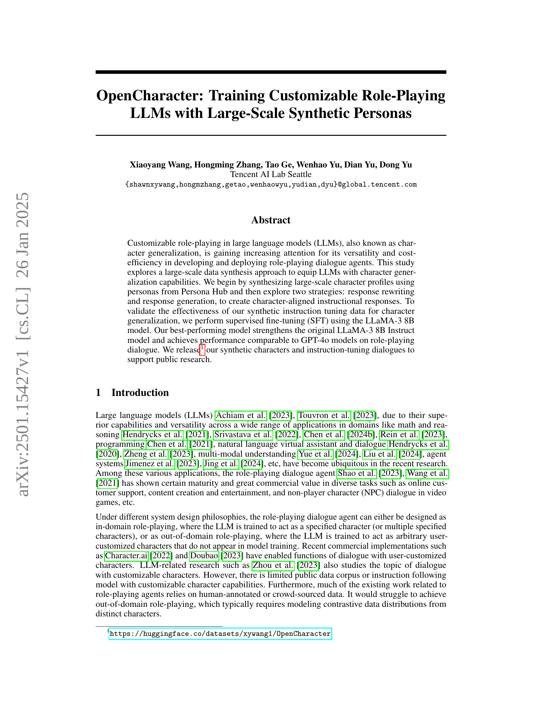

 


 2501.15427 
 Xiaoyang Wang et el. 
 
 🤗 2025-01-28 
 



↗ arXiv


↗ Hugging Face


↗ Papers with Code


### TL;DR



대규모 언어 모델(LLM)을 이용한 맞춤형 역할 수행 대화 에이전트 개발은 비용 효율적이지만, 다양한 캐릭터를 다루는 데 필요한 데이터 확보가 어렵다는 문제가 있습니다. 기존 연구들은 수작업으로 주석이 달린 데이터나 크라우드 소싱 데이터에 의존해 왔으며, 도메인 밖의 역할 수행에는 어려움을 겪었습니다.

본 논문에서는 Persona Hub의 페르소나를 사용하여 대규모 캐릭터 프로필을 합성하고, 두 가지 전략(응답 재작성 및 응답 생성)을 통해 캐릭터에 맞는 지시 응답을 생성하는 방법을 제시합니다.  LLaMA-3 8B 모델에 대한 지도 학습 미세 조정을 통해, 제안된 방법의 효과를 검증하고, GPT-4 모델과 유사한 성능을 달성했습니다.  합성 캐릭터와 지시 튜닝 대화 데이터를 공개하여 공개 연구를 지원합니다.



#### Key Takeaways


 대규모 합성 데이터를 사용한 LLM의 캐릭터 일반화 능력 향상 



 두 가지 전략(응답 재작성 및 응답 생성)을 통한 캐릭터 맞춤형 지시 응답 생성 



 공개된 합성 캐릭터 및 지시 튜닝 대화 데이터를 통한 공개 연구 지원 


#### Why does it matter?
본 논문은 **대규모 합성 데이터를 사용하여 대화형 AI 에이전트의 캐릭터 일반화 능력을 향상시키는 새로운 방법**을 제시합니다. 이는 최근 각광받고 있는 **캐릭터 기반 대화 시스템 연구에 중요한 기여**를 하며, **다양한 분야의 연구자들에게 영감**을 줄 수 있습니다. 특히, **대규모 언어 모델의 튜닝 및 평가 방법에 대한 새로운 관점**을 제시하고, **향후 연구 방향을 제시**함으로써 학계와 산업계 모두에 **중요한 영향**을 미칠 것으로 예상됩니다.

------
#### Visual Insights

> 🔼 본 그림은 논문에서 제시하는 데이터 합성 과정을 보여줍니다.  Persona Hub에서 가져온 인물 정보(persona)를 사용하여 먼저 캐릭터 프로필을 생성합니다.  그 다음, 두 가지 전략, 즉 캐릭터 중심 응답 재작성(response rewriting)과 캐릭터 중심 응답 생성(response generation)을 통해 캐릭터에 맞는 지시어에 대한 응답을 생성합니다.  이 그림은 이러한 데이터 합성 과정을 개략적으로 나타내는 예시이며, 실제 데이터 합성에는 더 복잡한 과정이 포함될 수 있습니다.
> 

> 
read the caption

> Figure 1: Our overall data synthesis approach. As an example, we start with character profile synthesis using a persona from Persona Hub, and then explore character-driven response rewriting and generation.
> 


| Corpus | No. of questions | n | No. of characters | OpenCharacter-R | OpenCharacter-G |
|---|---|---|---|---|---| 
| LIMA | 1,074 | 3 | 2,986 | ✔ | ✔ |
| Alpaca | 51,010 | 3 | 19,991 | ✔ | ✔ |
| PH-Instruct | 50,000 | 3 | 19,990 | ✘ | ✔ |
| Total | 102,084 | 3 | 19,991 | - | ✔ |

> 🔼 이 표는 논문의 데이터 합성 과정에 대한 통계를 보여줍니다.  OpenCharacter-R과 OpenCharacter-G라는 두 가지 전략을 사용하여 합성된 대화 데이터셋의 크기, 각 대화 세션에 무작위로 할당된 캐릭터 수(n), 그리고 사용된 데이터셋(LIMA, Alpaca, PH-Instruct)별 정보를 보여줍니다. PH-Instruct 데이터셋의 응답이 공개되지 않았기 때문에 OpenCharacter-G 전략만 적용되었다는 점도 명시되어 있습니다.
> 

> 
read the caption

> Table 1: Statistics on our character-driven response synthesis. n𝑛nitalic_n is the number of characters randomly assigned to each dialogue session. We apply only OpenCharacter-G to PH-Instruct since its responses are not released.
> 

### In-depth insights

#### Synthetic Persona LLMs
본 논문에서 다룬 합성 페르소나 LLM은 **대규모 언어 모델(LLM)에 인격을 부여하여 역할극 대화 에이전트를 개발하는 새로운 방법**을 제시합니다.  기존의 방식과 달리,  **실제 사람이 작성한 데이터에 의존하지 않고, Persona Hub와 같은 합성 페르소나 데이터를 활용하여 대규모의 캐릭터 프로필을 생성**합니다. 이를 통해 다양한 캐릭터의 대화 데이터를 효율적으로 생성하고, **LLM이 특정 캐릭터의 언어 스타일과 성격을 학습**하도록 합니다.  **두 가지 전략 (응답 재작성 및 응답 생성)**을 통해 캐릭터에 맞춘 지시 응답을 생성하고, LLaMA와 같은 기존 모델을 미세 조정하여 성능을 향상시킵니다.  이는 **비용 효율적인 방식으로 다양한 역할극 대화 에이전트를 개발 및 배포**할 수 있다는 점에서 큰 의의를 가집니다.  하지만, **합성 데이터의 품질과 다양성이 모델 성능에 큰 영향**을 미치므로,  **더욱 정교한 합성 페르소나 생성 및 품질 관리**가 중요한 과제로 남아 있습니다.  또한,  **실제 세계와의 차이**를 줄이기 위한 연구가 필요할 것으로 예상됩니다.  결과적으로,  **합성 페르소나 LLM은 역할극 대화 시스템의 발전**에 크게 기여할 것으로 기대되지만,  **데이터 품질 및 실제 세계 적용성**에 대한 지속적인 연구가 필요합니다.

#### Instruction Tuning Data
본 논문에서 'Instruction Tuning Data'는 **대규모 합성 데이터셋**을 의미하며, 이는 역할극 대화 에이전트를 위한 대규모 언어 모델(LLM)의 성능 향상에 중점을 둡니다.  **Persona Hub에서 추출한 다양한 persona를 기반으로 합성된 캐릭터 프로필**과 **캐릭터 중심의 응답 재작성 및 생성 전략**을 통해 생성됩니다.  재작성 전략은 기존의 지시-응답 데이터셋을 캐릭터에 맞춰 수정하는 반면, 생성 전략은 새로운 캐릭터 맞춤형 응답을 직접 생성합니다.  **두 전략 모두 LLaMA-3 8B 모델의 지도 학습 미세 조정(SFT)**에 활용되어,  **원본 모델보다 향상된 성능**을 보이며 GPT-4 수준의 역할극 대화 성능을 달성합니다.  **합성 데이터의 효과**는 실험적으로 검증되며,  **다양한 캐릭터와 풍부한 대화 데이터**가 캐릭터 일반화에 중요한 역할을 합니다.  **공개된 합성 캐릭터와 지시 미세 조정 대화 데이터**는 향후 연구에 기여할 것으로 기대됩니다.

#### Character Generalization
본 논문에서 제시하는 '캐릭터 일반화(Character Generalization)'는 **대규모 언어 모델(LLM)**이 특정 캐릭터에 국한되지 않고, **다양한 사용자 정의 캐릭터를 자유롭게 구현**할 수 있는 능력을 의미합니다.  이는 단순히 기존 데이터셋에 있는 캐릭터를 모방하는 것을 넘어, **새로운 캐릭터의 특성을 학습하고, 그에 맞는 대화를 생성**할 수 있음을 시사합니다. 이를 위해 본 연구는 **대규모 합성 데이터**를 활용하여 LLM의 캐릭터 일반화 능력을 향상시키는 방안을 제시하며, **두 가지 전략(응답 재작성 및 응답 생성)**을 비교 분석합니다.  **합성 캐릭터 프로필을 생성하고, 이를 바탕으로 다양한 지시어에 대한 캐릭터 맞춤형 응답**을 생성하여, LLM의 미세 조정(SFT)에 활용합니다.  결과적으로, 기존 모델보다 성능이 향상된 **역할극 대화 모델**을 제시하며, 이는 **실제 GPT-4 모델과 유사한 성능**을 보입니다.  **본 연구의 핵심은 대규모 합성 데이터를 통한 효율적인 캐릭터 일반화**이며, 이를 통해 다양한 분야에서의 역할극 에이전트 개발에 기여할 것으로 예상됩니다.  **공개된 합성 데이터 및 미세조정 대화 데이터**는 향후 연구에 도움을 줄 것으로 기대됩니다.

#### PersonaGym Evaluation
본 논문에서 PersonaGym 평가는 **대규모 언어 모델(LLM)**의 역할극 수행 능력을 다각적으로 평가하기 위한 핵심적인 부분입니다.  PersonaGym은 다양한 페르소나와 질문으로 구성되어 있으며,  **‘예상 행동’, ‘독성 관리’, ‘언어 습관’, ‘페르소나 일관성’, ‘행동 정당화’** 와 같은 다섯 가지 측면을 평가합니다. 각 측면은 1~5점으로 평가되어 종합적인 점수를 산출하는데, 이는 모델의 페르소나 기반 대화 생성 능력을 정량적으로 측정합니다.  **높은 점수는 모델이 페르소나에 부합하는 적절한 응답을 생성하고,  부정적인 측면(독성 등)을 최소화하며,  일관된 성격을 유지하는 것을 의미합니다.**  본 연구에서는 PersonaGym을 활용하여 제안된 OpenCharacter 모델의 성능을 기존 모델들과 비교 분석함으로써,  **역할극 수행 능력의 개선 여부와 강점을 효과적으로 보여줍니다.**  PersonaGym 평가는 LLM의 역할극 성능 평가에 있어 **객관적이고 종합적인 지표**를 제공하여,  향후 연구 방향을 제시하는 데 중요한 역할을 합니다.

#### Future Research
본 논문은 대규모 합성 데이터를 활용하여 대화형 에이전트의 **캐릭터 일반화** 능력을 향상시키는 방법을 제시합니다.  하지만, 아직 **개선의 여지**가 많습니다.  미래 연구는 다음과 같은 방향으로 진행될 수 있습니다.  **다양한 문화권의 캐릭터 데이터**를 확보하고 이를 모델에 적용하여 다양성을 확보하는 연구가 필요합니다.  현재는 영어 중심의 데이터셋을 사용하고 있으므로, 한국어를 포함한 다국어 지원을 위한 연구도 중요합니다.  또한, **더욱 정교한 캐릭터 프로파일 생성** 기법을 개발하고 **캐릭터 특징을 세밀하게 반영**하는 모델을 설계하는 방안을 모색해야 합니다.  **실제 사용자와의 상호작용**을 통해 모델의 성능을 평가하고 지속적으로 개선하는 연구도 필요하며, **다양한 평가 지표**를 도입하여  모델의 성능을 좀 더 다각적으로 평가해야 합니다. 마지막으로,  **윤리적인 측면** 또한 고려하여  합성 캐릭터 생성 및 활용 과정에서 발생할 수 있는 문제점을 해결하는 연구가 중요합니다.  예를 들어, 특정 집단에 대한 편향성을 제거하고 사생활 침해 문제를 방지하는 기술 및 가이드라인을 개발해야 합니다.

### More visual insights

More on tables


| Ablation Settings | Corpus | Strategy | Prompting Model |
|---|---|---|---|
| Ablation-1 | LIMA & Alpaca | OpenCharacter-R | gpt-4o-2024-05-13 |
| Ablation-2 | LIMA & Alpaca | OpenCharacter-R | LLaMA-3-70B-Instruct |
| Ablation-3 | PH-Instruct | OpenCharacter-G | gpt-4o-2024-05-13 |
| Ablation-4 | PH-Instruct | OpenCharacter-G | LLaMA-3-70B-Instruct |
| Ablation-5 | LIMA & Alpaca | OpenCharacter-G | LLaMA-3-70B-Instruct |
| _OpenCharacter_ | PH-Instruct, LIMA & Alpaca | OpenCharacter-G | LLaMA-3-70B-Instruct |
> 🔼 표 2는 OpenCharacter 모델의 에이블레이션 연구를 위한 SFT(Supervised Fine-Tuning) 데이터 레시피를 보여줍니다.  각 레시피는 사용된 데이터셋(PH-Instruct, LIMA, Alpaca), 사용된 데이터 합성 전략(OpenCharacter-R 또는 OpenCharacter-G) 그리고 사용된 프롬프팅 모델(GPT-4 또는 LLaMA)을 지정합니다.  마지막 OpenCharacter 모델은 PH-Instruct, LIMA, Alpaca의 모든 명령어를 결합하고 OpenCharacter-G 전략을 사용합니다. 이 표는 다양한 데이터 구성과 모델 설정이 OpenCharacter 모델의 성능에 미치는 영향을 분석하기 위한 실험 설계를 나타냅니다.
> 

> 
read the caption

> Table 2: The SFT data recipes for OpenCharacter ablation study. For our final OpenCharacter model, we combine all instructions from PH-Instruct, LIMA and Alpaca, and use OpenCharacter-G strategy.
> 


| Model | Size | EA | TC | LH | PC | AJ | _PScore-L_ |
|---|---|---|---|---|---|---|---| 
| gpt-3.5-turbo-1106 | - | 4.67 (.50) | 4.99 (.21) | 3.12 (.60) | 4.42 (.58) | 4.37 (.57) | 4.31 (.24) |
| gpt-4o-2024-05-13 | - | 4.74 (.44) | 4.96 (.33) | 3.69 (.82) | 4.75 (.54) | 4.87 (.34) | 4.60 (.24) |
| gpt-4o-mini | - | 4.74 (.44) | 4.99 (.21) | 3.58 (.80) | 4.72 (.45) | 4.89 (.40) | 4.58 (.23) |
| gpt-4o-2024-08-06 | - | 4.81 (.40) | 4.95 (.46) | 3.75 (.81) | 4.68 (.47) | 4.85 (.45) | 4.60 (.24) |
| LLaMA-3 Instruct | 8B | 4.80 (.40) | 4.76 (.82) | 4.05 (.71) | 4.64 (.52) | 4.85 (.38) | 4.62 (.25) |
| LLaMA-3 Instruct | 70B | 4.73 (.45) | 4.75 (.85) | 4.38 (.59) | 4.79 (.41) | 4.97 (.18) | 4.72 (.24) |
| _OpenCharacter_ | 8B | 4.70 (.53) | 4.92 (.50) | 4.32 (.60) | 4.54 (.56) | 4.85 (.38) | 4.66 (.27) |
> 🔼 표 3은 PersonaGym-Light 벤치마크를 사용한 다양한 언어 모델의 성능을 비교한 표입니다.  평가 지표는 '예상 동작(EA)', '독성 제어(TC)', '언어 습관(LH)', '페르소나 일관성(PC)', '행동 정당성(AJ)'의 다섯 가지 지표이며, 각 지표는 1~5점으로 평가됩니다. 표에는 각 모델의 평균 점수와 표준 편차가 제시되어 있으며,  gpt-4o-mini(gpt-4o-mini-2024-07-18 버전), LLaMA-3 8B Instruct, LLaMA-3 70B Instruct 모델과, 표 2에 명시된 데이터 조합으로 학습된 OpenCharacter 모델의 결과가 포함되어 있습니다.  OpenCharacter 모델은 LLaMA-3-8B-Instruct 모델을 기반으로 학습되었습니다.
> 

> 
read the caption

> Table 3: Model performances on PersonaGym-Light. “EA”, “TC”, “LH”, “PC”, and “AJ” stands for the evaluation metrics “expected action”, “toxicity control”, “linguistic habits”, “persona consistency”, and “action justification”, respectively. Their standard deviations over 200 personas are included in parentheses. The tested gpt-4o-mini is in version “gpt-4o-mini-2024-07-18”. We test the LLaMA-3 8B and 70B models with versions LLaMA-3-8B-Instruct and LLaMA-3-70B-Instruct, respectively. Our OpenCharacter model is trained based on LLaMA-3-8B-Instruct with its training data recipe indicated in Table 2.
> 


| Ablation Settings | Size | EA | TC | LH | PC | AJ | _PScore-L_ |
|---|---|---|---|---|---|---|---|---|
| _1. Models trained based on LLaMA-3-8B-Base_ |  |  |  |  |  |  |  |
| Ablation-1 | 8B | 4.45 (.70) | 4.94 (.54) | 3.58 (.79) | 4.16 (.65) | 4.04 (.64) | 4.23 (.31) |
| Ablation-2 | 8B | 4.26 (.79) | 4.88 (.52) | 3.81 (.84) | 4.12 (.59) | 3.98 (.57) | 4.21 (.32) |
| Ablation-3 | 8B | 4.71 (.52) | 4.98 (.22) | 3.68 (.74) | 4.52 (.63) | 4.79 (.49) | 4.53 (.26) |
| Ablation-4 | 8B | 4.69 (.53) | 4.86 (.61) | 4.18 (.60) | 4.52 (.52) | 4.84 (.37) | 4.62 (.24) |
| Ablation-5 | 8B | 4.74 (.46) | 4.86 (.66) | 4.17 (.65) | 4.52 (.51) | 4.89 (.33) | 4.64 (.27) |
| _OpenCharacter_ | 8B | 4.70 (.49) | 4.90 (.58) | 4.16 (.65) | 4.50 (.57) | 4.80 (.40) | 4.61 (.25) |
| _2. Models trained based on LLaMA-3-8B-Instruct_ |  |  |  |  |  |  |  |
| Ablation-1 | 8B | 4.53 (.60) | 4.96 (.30) | 3.77 (.80) | 4.22 (.57) | 4.26 (.64) | 4.35 (.30) |
| Ablation-2 | 8B | 4.46 (.70) | 4.92 (.46) | 4.05 (.80) | 4.21 (.55) | 4.22 (.52) | 4.37 (.30) |
| Ablation-3 | 8B | 4.74 (.45) | 4.97 (.30) | 3.89 (.71) | 4.59 (.49) | 4.80 (.51) | 4.60 (.26) |
| Ablation-4 | 8B | 4.71 (.48) | 4.88 (.59) | 4.31 (.62) | 4.51 (.58) | 4.86 (.35) | 4.65 (.23) |
| Ablation-5 | 8B | 4.72 (.49) | 4.93 (.47) | 4.28 (.64) | 4.54 (.51) | 4.86 (.36) | 4.66 (.25) |
| _OpenCharacter_ | 8B | 4.70 (.53) | 4.92 (.50) | 4.32 (.60) | 4.54 (.56) | 4.85 (.38) | 4.66 (.27) |
> 🔼 표 4는 PersonaGym-Light에 대한 추가 분석 결과를 보여줍니다. 표 2에 제시된 데이터 조합(데이터 레시피)을 사용하여 훈련된 다양한 모델의 성능을 비교 분석합니다.  각 모델의 성능은 다섯 가지 평가 지표(EA: 예상 동작, TC: 독성 제어, LH: 언어 습관, PC: 페르소나 일관성, AJ: 행동 정당화)에 대한 평균 점수와 표준 편차(괄호 안)로 나타냅니다. 이 표는 다양한 요인(기본 모델, 프롬프트 전략, 데이터 출처)이 모델 성능에 미치는 영향을 분석하는 데 사용됩니다.
> 

> 
read the caption

> Table 4: Ablation study on PersonaGym-Light, with the training data recipe for these models indicated in Table 2. “EA”, “TC”, “LH”, “PC”, and “AJ” stands for the evaluation metrics “expected action”, “toxicity control”, “linguistic habits”, “persona consistency”, and “action justification”, respectively. Their standard deviations over 200 personas are included in parentheses.
> 


| Model | Size | EA | TC | LH | PC | AJ | PScore |
|---|---|---|---|---|---|---|---| 
| gpt-4o-2024-05-13 | - | 4.59 (.24) | 4.97 (.17) | 3.48 (.53) | 4.75 (.17) | 4.61 (.17) | 4.48 (.13) |
| gpt-4o-mini | - | 4.56 (.19) | 4.97 (.21) | 3.70 (.49) | 4.67 (.25) | 4.64 (.15) | 4.51 (.14) |
| gpt-4o-2024-08-06 | - | 4.55 (.20) | 4.97 (.19) | 3.80 (.47) | 4.72 (.23) | 4.64 (.15) | 4.53 (.12) |
| LLaMA-3 Instruct | 8B | 4.52 (.21) | 4.58 (.60) | 4.05 (.36) | 4.54 (.20) | 4.57 (.15) | 4.45 (.14) |
| LLaMA-3 Instruct | 70B | 4.59 (.16) | 4.59 (.62) | 4.33 (.27) | 4.72 (.18) | 4.64 (.13) | 4.58 (.14) |
| *1. OpenCharacter models trained based on LLaMA-3-8B-Base* |  |  |  |  |  |  |  |
| Ablation-5 | 8B | 4.45 (.24) | 4.78 (.45) | 4.19 (.28) | 4.44 (.27) | 4.55 (.14) | 4.48 (.14) |
| *OpenCharacter* | 8B | 4.42 (.27) | 4.69 (.53) | 4.20 (.29) | 4.45 (.21) | 4.53 (.14) | 4.46 (.15) |
| *2. OpenCharacter models trained based on LLaMA-3-8B-Instruct* |  |  |  |  |  |  |  |
| Ablation-5 | 8B | 4.45 (.24) | 4.81 (.43) | 4.27 (.29) | 4.44 (.28) | 4.56 (.13) | 4.50 (.15) |
| *OpenCharacter* | 8B | 4.47 (.24) | 4.78 (.47) | 4.27 (.25) | 4.51 (.20) | 4.58 (.12) | 4.52 (.13) |
> 🔼 표 5는 PersonaGym 벤치마크를 사용한 다양한 언어 모델의 성능을 비교한 표입니다.  'EA', 'TC', 'LH', 'PC', 'AJ'는 각각 '예상 동작', '독성 제어', '언어 습관', '페르소나 일관성', '행동 정당화' 평가 지표를 나타냅니다. 괄호 안의 값은 200개의 페르소나에 대한 표준 편차를 나타냅니다. gpt-4o-mini는 'gpt-4o-mini-2024-07-18' 버전을 사용했으며, LLaMA-3 8B 및 70B 모델은 각각 LLaMA-3-8B-Instruct 및 LLaMA-3-70B-Instruct 버전으로 테스트되었습니다. 표에는 표 2에 명시된 학습 데이터 레시피를 사용한 Ablation-5 및 OpenCharacter 모델의 성능도 포함되어 있습니다.
> 

> 
read the caption

> Table 5: Model performances on PersonaGym. “EA”, “TC”, “LH”, “PC”, and “AJ” stands for the evaluation metrics “expected action”, “toxicity control”, “linguistic habits”, “persona consistency”, and “action justification”, respectively. Their standard deviations over 200 personas are included in parentheses. The tested gpt-4o-mini is in version “gpt-4o-mini-2024-07-18”. We test the LLaMA-3 8B and 70B models with versions LLaMA-3-8B-Instruct and LLaMA-3-70B-Instruct, respectively. We include the performances of our Ablation-5 and OpenCharacter models with their training data recipe indicated in Table 2.
> 

### Full paper



