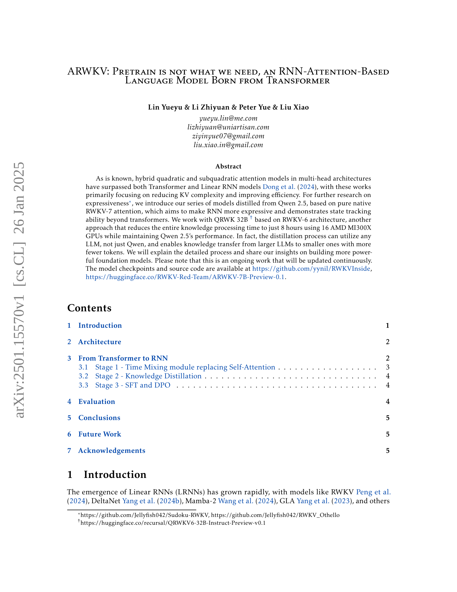
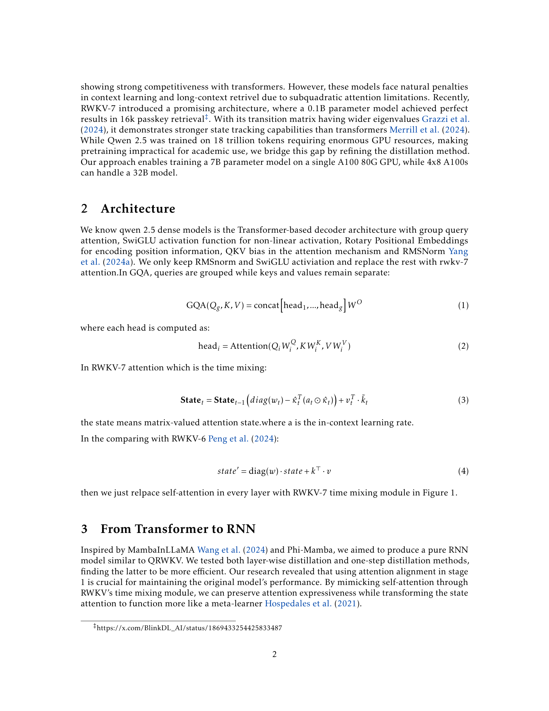
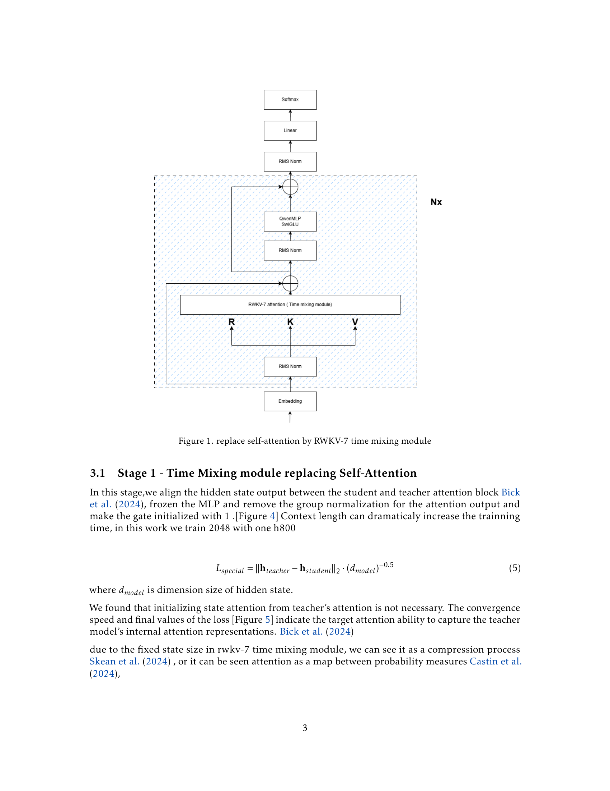
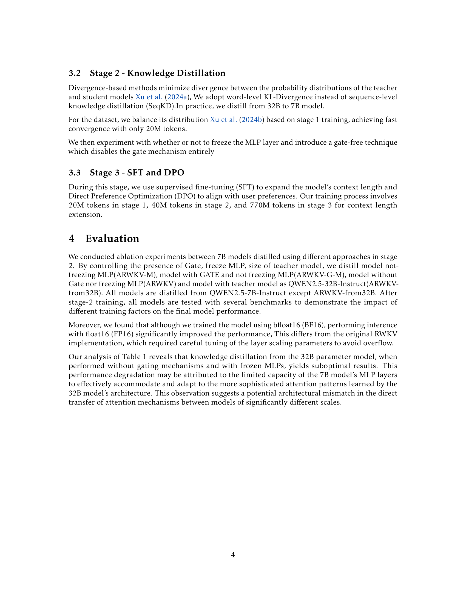
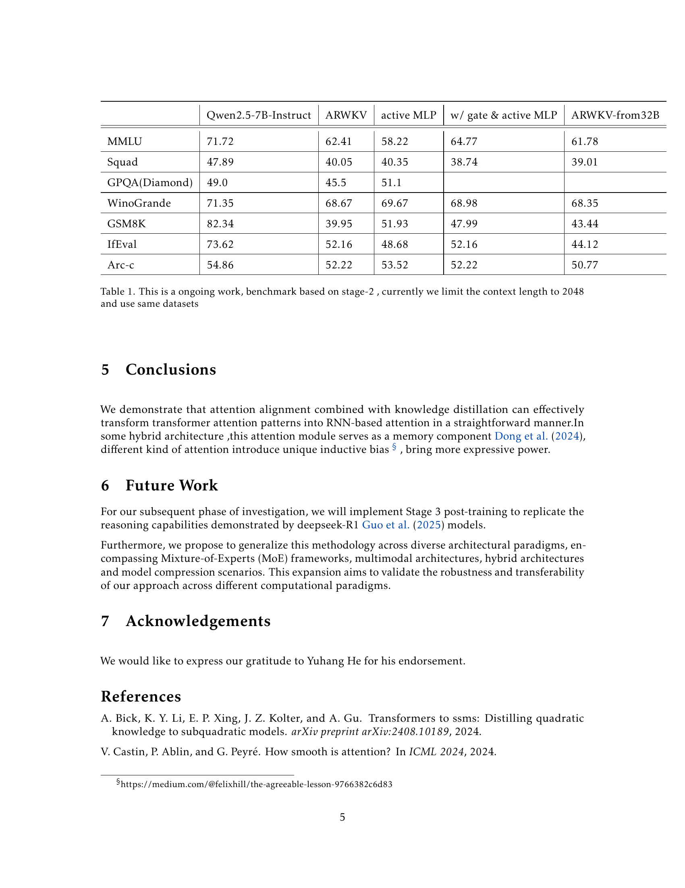
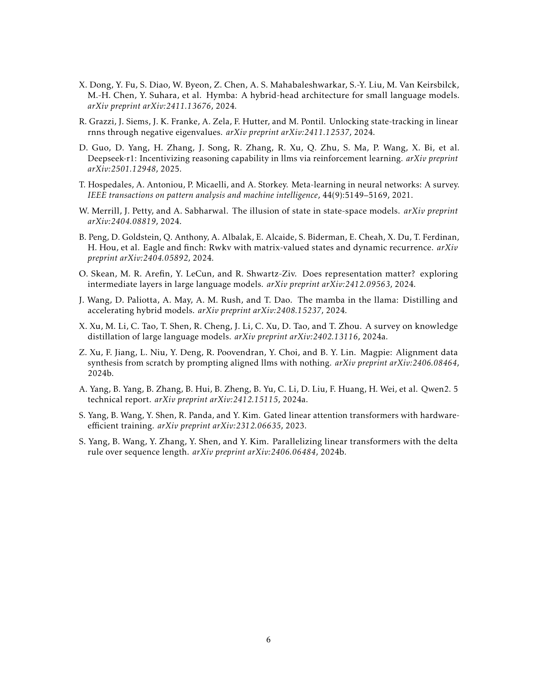
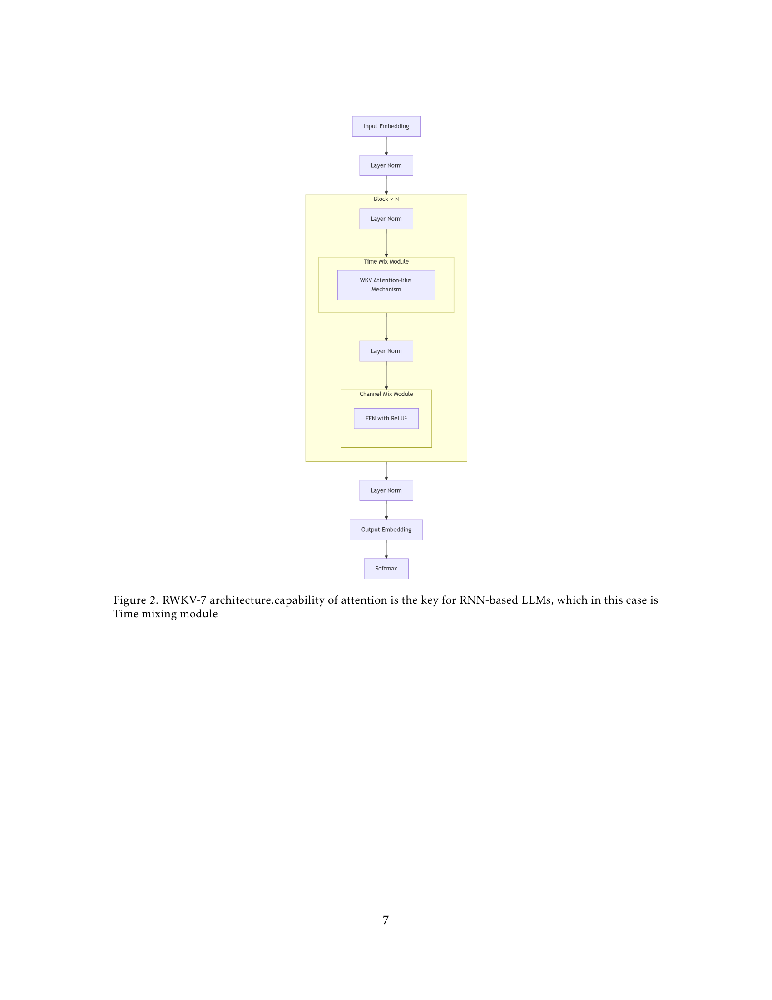
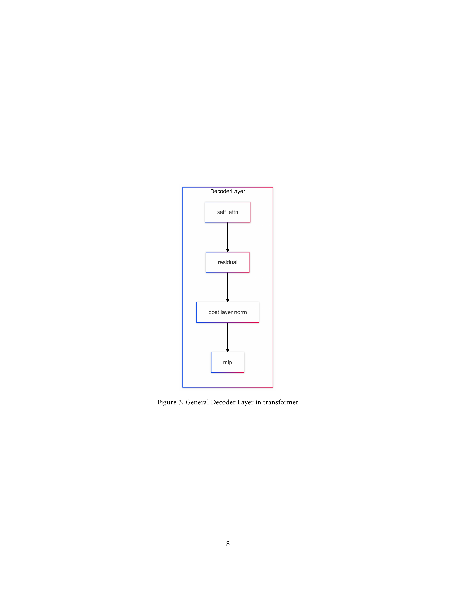
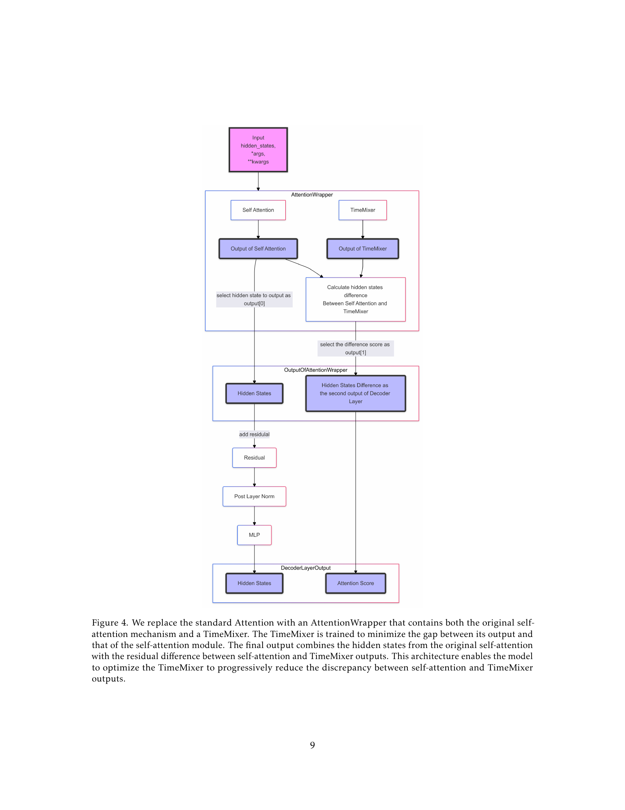
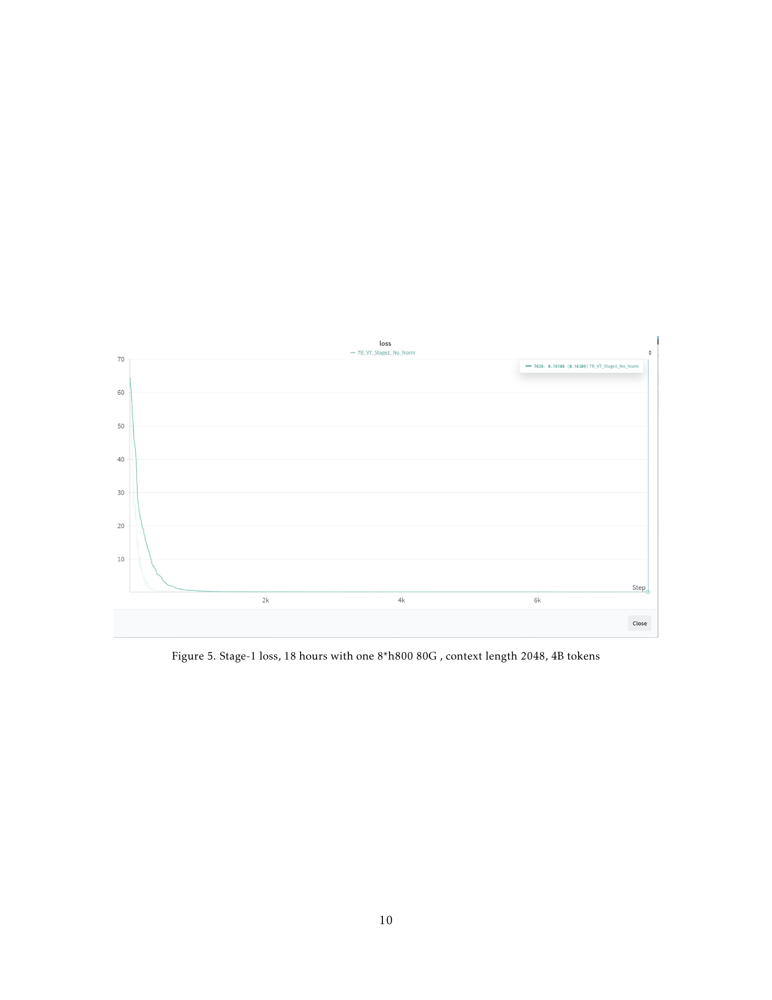

 


 2501.15570 
 Lin Yueyu et el. 
 
 🤗 2025-01-28 
 



↗ arXiv


↗ Hugging Face


↗ Papers with Code


### TL;DR



본 연구는 **기존의 대규모 언어 모델(LLM)을 학습하는 데 필요한 막대한 컴퓨팅 자원의 문제**를 해결하고자 합니다. 기존의 Transformer 기반 모델들은 방대한 데이터와 막대한 연산 자원을 필요로 하기 때문에 학계 연구자들이 접근하기 어려운 실정입니다. 또한, 기존 모델들은 장문의 텍스트 처리에 어려움을 겪는 등의 한계점을 가지고 있습니다. 따라서 본 논문에서는 이러한 문제점들을 해결하기 위한 새로운 접근 방식을 제시합니다.

본 연구에서는 **RWKV-7이라는 새로운 RNN 기반의 아키텍처**를 사용하여, **기존의 대규모 LLM에서 얻은 지식을 소규모 모델로 효율적으로 전달하는 지식 증류 기술**을 개발했습니다. 이를 통해 소규모의 컴퓨팅 자원만으로도 성능이 우수한 LLM을 개발할 수 있게 되었습니다.  **본 연구의 결과는 기존의 LLM 연구에 새로운 가능성**을 열어주는 동시에, **소규모 자원으로도 효과적인 언어 모델 개발**을 가능하게 함으로써, 향후 다양한 분야에서 LLM의 활용도를 높일 것으로 기대됩니다.



#### Key Takeaways


 기존의 대규모 언어 모델(LLM) 학습에 필요한 막대한 자원을 절감하는 새로운 지식 증류 방법 제시 



 RNN 기반의 새로운 아키텍처인 RWKV-7을 통해 Transformer 모델의 한계를 극복하고, 더욱 표현력이 풍부한 언어 모델 구현 



 소규모 자원으로도 효과적인 LLM 개발 및 배포 가능성 제시 


#### Why does it matter?
본 논문은 **기존의 대규모 언어 모델(LLM) 학습에 필요한 막대한 자원을 줄이는 새로운 방법**을 제시함으로써, 학계 연구자들이 더욱 효율적으로 LLM을 연구하고 개발할 수 있도록 기여합니다. 또한, **RNN 기반의 새로운 아키텍처를 제안**하여 Transformer 모델의 한계를 극복하고, 더욱 **표현력이 풍부하고 효율적인 언어 모델 개발의 새로운 가능성**을 열어줍니다.  **소규모 자원으로도 효과적인 LLM 개발**이 가능해짐에 따라 향후 다양한 분야에서 LLM의 활용도가 높아질 것으로 예상되며, 관련 연구 분야의 발전에 큰 영향을 미칠 것으로 기대됩니다.

------
#### Visual Insights

> 🔼 그림 1은 RWKV-7의 시간 혼합 모듈로 자기 주의 메커니즘을 대체하는 과정을 보여줍니다. 기존의 트랜스포머 구조에서 사용되는 자기 주의(self-attention) 메커니즘 대신 RWKV-7의 시간 혼합 모듈을 사용하여 RNN 기반 언어 모델을 구축하는 방법을 시각적으로 설명합니다. 그림에는 입력 임베딩에서부터 출력 임베딩까지의 전체 과정과 각 구성 요소(RMSNorm, SwiGLU, Q, K, V, Time Mixing Module 등)의 연결 관계가 자세히 나타나 있습니다. 이 그림을 통해 기존의 자기 주의 메커니즘을 RWKV-7의 시간 혼합 모듈로 대체하는 방법과 그 과정에서의 주요 구성 요소들의 역할을 명확하게 이해할 수 있습니다.
> 

> 
read the caption

> Figure 1: replace self-attention by RWKV-7 time mixing module
> 


|---|---|---|---|---|---|
| **Metric** | **Qwen2.5-7B-Instruct** | **ARWKV** | **active MLP** | **w/ gate & active MLP** | **ARWKV-from32B** |
| MMLU | 71.72 | 62.41 | 58.22 | 64.77 | 61.78 |
| Squad | 47.89 | 40.05 | 40.35 | 38.74 | 39.01 |
| GPQA(Diamond) | 49.0 | 45.5 | 51.1 |  |  |
| WinoGrande | 71.35 | 68.67 | 69.67 | 68.98 | 68.35 |
| GSM8K | 82.34 | 39.95 | 51.93 | 47.99 | 43.44 |
| IfEval | 73.62 | 52.16 | 48.68 | 52.16 | 44.12 |
| Arc-c | 54.86 | 52.22 | 53.52 | 52.22 | 50.77 |

> 🔼 표 1은 논문의 2단계 결과를 기반으로 한 벤치마크 결과를 보여줍니다. 현재는 최대 컨텍스트 길이를 2048 토큰으로 제한하고 동일한 데이터셋을 사용하고 있으며, 연구가 진행 중이므로 결과는 계속 업데이트될 예정입니다. 표에는 다양한 모델의 성능을 비교하여, 제안된 방법(ARWKV)의 효과를 보여줍니다.  MMLU, SQuAD, GPQA, WinoGrande, GSM8K, IfEval, Arc-c 등 여러 벤치마크 데이터셋에서의 성능을 측정하여, 기존 모델(Qwen2.5-7B-Instruct) 및 다른 변형 모델들과 비교 분석합니다.  'active MLP', 'w/ gate & active MLP', 'ARWKV-from32B' 와 같은 열은 모델의 구성 요소나 학습 방법의 차이에 따른 성능 변화를 보여줍니다.
> 

> 
read the caption

> Table 1: This is a ongoing work, benchmark based on stage-2 , currently we limit the context length to 2048 and use same datasets
> 

### In-depth insights

#### RNN-Attn Model
RNN-Attn 모델은 순환 신경망(RNN)의 장점과 어텐션 메커니즘의 강점을 결합한 모델입니다. **RNN의 시계열 데이터 처리 능력**은 장기 의존성을 가진 언어 모델링에 유용하며, **어텐션 메커니즘은 입력 시퀀스 내의 중요한 정보에 집중**하여 모델의 성능을 향상시킵니다.  그러나 RNN의 병렬 처리 어려움과 장기 의존성 문제를 완화하기 위한 어텐션 메커니즘의 효율적인 구현이 중요합니다. 이를 위해 **계산 복잡도를 줄이거나 메모리 사용량을 최적화하는 다양한 기법**들이 연구되고 있습니다.  예를 들어, **Sparse Attention이나 Linear Attention과 같은 변형된 어텐션 메커니즘**을 적용하여 연산량을 줄일 수 있습니다.  또한, **RNN의 구조적 개선이나 다양한 어텐션 메커니즘의 융합**을 통해 RNN-Attn 모델의 성능과 효율성을 높일 수 있습니다.  궁극적으로는 **특정 작업에 최적화된 RNN-Attn 아키텍처를 설계**하는 것이 중요하며, 이는 데이터셋의 특징과 모델의 목표에 따라 달라질 것입니다.  **효율성과 성능 간의 균형**을 고려하여 적절한 아키텍처를 선택하는 것이 중요한 연구 과제입니다.

#### Distillation Method
본 논문은 거대 언어 모델(LLM)의 지식 증류 방법에 대해 심도 있게 다룹니다. **특히, Qwen 2.5와 같은 거대 모델에서 얻은 지식을 훨씬 작은 모델(예: 7B 파라미터 모델)로 효율적으로 전이하는 방법**을 제시합니다. 이는 단순한 지식 전이를 넘어, **원본 모델의 성능을 유지하면서 모델 크기를 줄이는 데 초점**을 맞춥니다.  기존의 사전 학습 방식 대신, 증류 기법을 통해 **훨씬 적은 컴퓨팅 자원을 사용**하여 7B 파라미터 모델을 학습할 수 있습니다. 이 과정에서 **단계별 지식 증류**를 통해 보다 효과적인 지식 전이를 달성하고,  **모델의 컨텍스트 길이를 확장**하는 방법 또한 제시됩니다.  이러한 **효율적인 증류 방법은 학문적 연구뿐만 아니라 산업적 활용**에도 크게 기여할 것으로 기대되며, **추후 연구를 통해 더욱 발전된 증류 기법 개발**의 가능성을 보여줍니다.

#### Hybrid Approach
본 논문에서는 **하이브리드 접근 방식**이라는 제목으로, 순수 RNN 기반 언어 모델을 Transformer로부터 증류하는 과정을 설명합니다. 이는 기존의 Transformer 모델의 장점과 RNN 모델의 장점을 결합하여 새로운 언어 모델을 만드는 것을 목표로 합니다. 특히, **RWKV-7 어텐션 메커니즘**을 이용하여 RNN의 표현력을 향상시키고, Transformer에서의 어텐션 메커니즘을 대체합니다. 또한, 지식 증류(knowledge distillation) 기법을 통해, 대규모 모델로부터 소규모 모델로 지식을 전이하여 효율성을 높입니다. 이러한 하이브리드 접근 방식을 통해, **계산 비용을 줄이면서도 성능 저하를 최소화**할 수 있습니다.  **단계별 학습 과정**을 통해 모델을 개선하고, 다양한 평가 지표를 통해 성능을 검증합니다.  **결론적으로**, 본 연구는 하이브리드 접근 방식을 통해 효율적이고 표현력 높은 RNN 기반 언어 모델을 구축하는 가능성을 제시합니다.

#### Future Directions
본 논문은 **RWKV-7 아키텍처 기반의 새로운 언어 모델 ARWKV**를 제시하며, 기존 Transformer 기반 모델의 한계를 극복하고자 합니다.  **미래 연구 방향**으로는 먼저, **다양한 아키텍처(MoE, 다중 모달, 하이브리드)**에 대한 적용 가능성을 탐색하고, 모델의 **견고성과 일반화 능력**을 향상시키는 연구가 필요합니다.  **다양한 모델 크기**에 대한 실험을 통해 **자원 효율성**을 높이는 방안과, **추론 속도**를 개선하여 실제 서비스 적용 가능성을 높이는 연구가 중요합니다. 또한, **지식 증류 기법**의 개선을 통해 **더욱 효율적인 학습 방식**을 개발하고,  **다양한 하이퍼파라미터 최적화**를 통해 성능을 향상시키는 연구도 진행되어야 할 것입니다.  **장기적인 관점**에서는 **더욱 표현력이 풍부하고, 추론 능력이 뛰어난 모델**을 개발하여 **다양한 응용 분야**에 적용하는 연구가 필요합니다.

#### Model Limits
이 논문은 **모델의 한계**에 대해 명시적으로 다루지는 않지만,  **ARWKV 모델의 아키텍처 및 훈련 과정**에서 파생되는 몇 가지 제한점을 암시적으로 보여줍니다.  **대규모 언어 모델(LLM)**의 지식 증류를 통해 소규모 모델을 훈련시키는 접근 방식은 원본 모델의 성능을 완벽히 재현하지 못할 수 있습니다.  **지식 증류 과정에서 정보 손실**이 발생할 수 있으며, 이는 특히 모델의 크기가 크게 줄어들 때 더욱 두드러집니다. 또한, **계산 비용**은 여전히 중요한 제약 조건입니다.  비록 논문에서 7B 매개변수 모델을 단일 A100 GPU에서 훈련시켰다고 언급하지만,  더 큰 모델을 훈련시키거나 더 긴 문맥 길이를 다루기 위해서는 여전히 상당한 컴퓨팅 자원이 필요할 것입니다. 마지막으로, **RNN 기반 아키텍처의 고유한 한계**도 고려해야 합니다.  Transformer 아키텍처에 비해 병렬 처리가 어렵고,  긴 시퀀스 처리에 대한 효율성이 떨어질 수 있습니다.  따라서 ARWKV 모델은 뛰어난 성능을 보이지만,  모델 크기, 컴퓨팅 자원, 그리고 RNN 아키텍처의 본질적인 제한 등의 요소에 의해 제약을 받을 수 있습니다.

### More visual insights

More on figures

> 🔼 그림 2는 RWKV-7 아키텍처를 보여줍니다. 이 그림은 RNN 기반의 대규모 언어 모델에서 어텐션(attention) 메커니즘의 중요성을 강조합니다. 특히, 이 모델에서는 시간 혼합(Time mixing) 모듈이 어텐션 메커니즘의 역할을 수행합니다.  그림에서는 입력 임베딩(Input Embedding)부터 출력 임베딩(Output Embedding)까지의 과정을 단계별로 보여주는 다양한 레이어(Layer)들이 표현되어 있습니다. 각 레이어는 레이어 정규화(Layer Norm), 시간 혼합 모듈, 채널 혼합 모듈(Channel Mix Module), 그리고 ReLU 활성화 함수를 사용한 피드포워드 네트워크(Feedforward Network) 등으로 구성되어 있습니다.  이 아키텍처는 순환 신경망(RNN)의 특성을 활용하여 시계열 데이터를 효율적으로 처리하고, 장기 의존성(Long-range dependency) 문제를 해결하는 데 도움을 줍니다.
> 

> 
read the caption

> Figure 2: RWKV-7 architecture.capability of attention is the key for RNN-based LLMs, which in this case is Time mixing module
> 

> 🔼 그림 3은 Transformer의 일반적인 디코더 레이어를 보여줍니다.  트랜스포머 아키텍처에서 디코더는 입력 시퀀스를 처리하고 출력 시퀀스를 생성하는 역할을 합니다. 그림에서 볼 수 있듯이, 일반적인 디코더 레이어는 셀프 어텐션(self-attention), 잔차 연결(residual connection), 후처리 레이어 정규화(post-layer normalization), 그리고 다층 퍼셉트론(MLP)으로 구성됩니다. 셀프 어텐션은 입력 시퀀스 내의 단어들 간의 관계를 파악하는 데 사용되고, 잔차 연결은 그래디언트 소실 문제를 완화하는 데 도움을 줍니다. 후처리 레이어 정규화는 모델의 안정성을 높이고, MLP는 비선형 변환을 수행하여 모델의 표현 능력을 향상시킵니다.
> 

> 
read the caption

> Figure 3: General Decoder Layer in transformer
> 

> 🔼 이 그림은 기존의 어텐션 메커니즘을 자가 어텐션 메커니즘과 TimeMixer를 모두 포함하는 AttentionWrapper로 대체하는 방법을 보여줍니다. TimeMixer는 자가 어텐션 모듈의 출력과의 차이를 최소화하도록 학습됩니다. 최종 출력은 원래 자가 어텐션의 은닉 상태와 자가 어텐션 및 TimeMixer 출력 간의 잔차 차이를 결합합니다. 이 아키텍처를 통해 모델은 자가 어텐션과 TimeMixer 출력 간의 불일치를 점진적으로 줄이도록 TimeMixer를 최적화할 수 있습니다.
> 

> 
read the caption

> Figure 4: We replace the standard Attention with an AttentionWrapper that contains both the original self-attention mechanism and a TimeMixer. The TimeMixer is trained to minimize the gap between its output and that of the self-attention module. The final output combines the hidden states from the original self-attention with the residual difference between self-attention and TimeMixer outputs. This architecture enables the model to optimize the TimeMixer to progressively reduce the discrepancy between self-attention and TimeMixer outputs.
> 

> 🔼 그림 5는 Stage-1 학습 과정에서의 손실 값 변화를 보여줍니다.  단일 8x A100 80GB GPU를 사용하여 18시간 동안 학습을 진행했으며, 문맥 길이(context length)는 2048 토큰, 총 토큰 수는 40억 개였습니다. 그래프는 학습 진행에 따른 손실 값의 감소 추세를 나타내며, 모델 학습의 안정성과 효율성을 시각적으로 보여줍니다.  x축은 학습 단계(step)를, y축은 손실 값(loss)을 나타냅니다.
> 

> 
read the caption

> Figure 5: Stage-1 loss, 18 hours with one 8*h800 80G , context length 2048, 4B tokens
> 

### Full paper



