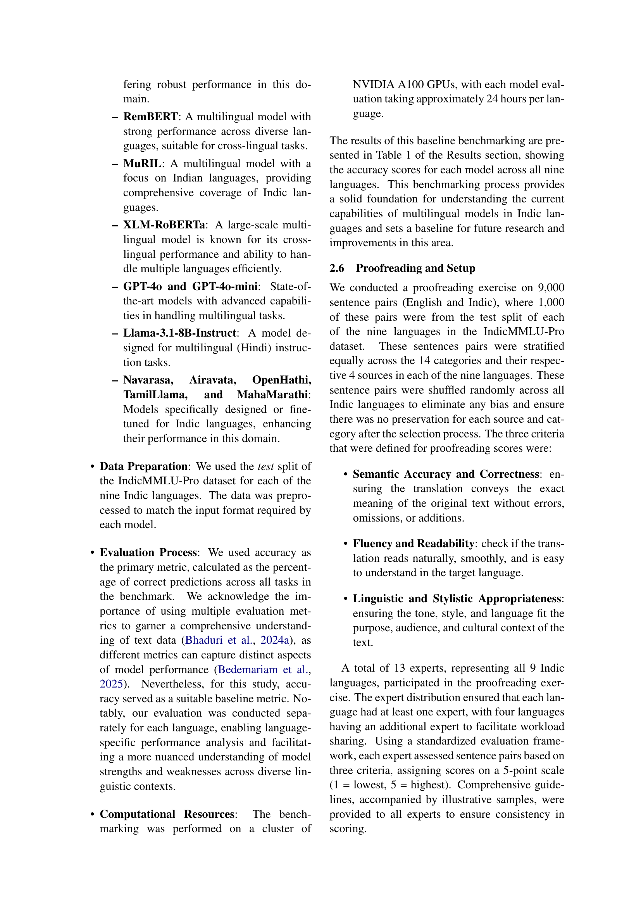
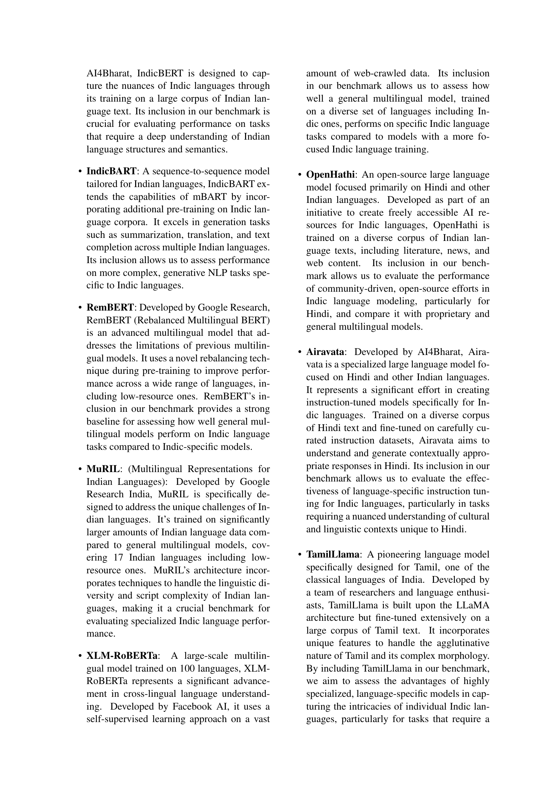

 


 2501.15747 
 Sankalp KJ et el. 
 
 🤗 2025-01-29 
 



↗ arXiv


↗ Hugging Face


↗ Papers with Code


### TL;DR



인도 아대륙에서 15억 명 이상이 사용하는 인도 언어는 풍부한 문화 유산, 언어 다양성, 복잡한 구조로 인해 자연어 처리(NLP) 연구에 있어 독특한 과제와 기회를 제시합니다. 기존의 NLP 연구는 영어 중심으로 이루어져 인도 언어에 대한 자원과 연구가 부족한 상황입니다. 이로 인해 인도 언어 사용자의 사회적 통합과 접근성 향상에 어려움이 있습니다.

본 논문에서는 인도 언어를 위한 다중 과제 언어 이해 벤치마크인 IndicMMLU-Pro를 제시합니다. 이 벤치마크는 힌디어, 벵갈어, 구자라트어, 마라티어, 칸나다어, 펀자브어, 타밀어, 텔루구어, 우르두어 등 주요 인도 언어 9개를 다룹니다. IndicMMLU-Pro는 다양한 언어 이해, 추론, 생성 작업을 포함하며, 최첨단 다국어 모델의 기준 성능을 제공합니다. 또한, 이 벤치마크는 인도 언어 AI 연구의 발전을 촉진하고 더욱 정확하고 효율적이며 문화적으로 민감한 모델 개발을 가능하게 합니다.



#### Key Takeaways


 IndicMMLU-Pro는 인도의 주요 언어 9개에 대한 다중 과제 언어 이해 벤치마크를 제공합니다. 



 본 연구는 최첨단 다국어 모델을 사용하여 IndicMMLU-Pro의 기준 성능을 제시합니다. 



 IndicMMLU-Pro는 인도 언어 기반 기술 발전에 크게 기여할 수 있는 공개적으로 사용 가능한 리소스입니다. 


#### Why does it matter?
**인도 언어에 대한 연구는 아직 부족하지만, 이 논문은 인도 언어를 위한 다양한 과제를 다루는 벤치마크를 제시함으로써 인도 언어 처리 분야의 발전에 크게 기여할 수 있습니다.**  이를 통해 다양한 언어 모델의 성능을 평가하고 개선할 수 있는 기반을 마련하며, 다양한 인도 언어를 지원하는 응용 프로그램 개발에 도움이 될 수 있습니다. 또한, **향후 연구 방향을 제시하고 인도 언어 처리 분야의 발전에 기여할 수 있는 잠재력을 가지고 있습니다.**

------
#### Visual Insights

> 🔼 그림 1은 IndicMMLU-Pro 데이터셋의 생성 및 평가 파이프라인을 보여줍니다. 영어 MMLU-Pro 데이터셋을 시작으로 IndicTrans2(1B 매개변수)를 사용하여 9개의 인도 언어로 콘텐츠를 번역하고, 역번역 및 다중 지표 평가(chrF++, BLEU, METEOR, TER, SacreBLEU)를 통해 엄격한 품질 보증 절차를 거칩니다. 품질 임계값을 충족하는 번역만 최종 데이터셋에 포함됩니다. 또한, 의미 정확도, 유창성 및 언어 스타일을 평가하는 13명의 검토자를 포함한 포괄적인 전문가 검토 과정도 보여줍니다. 이러한 체계적인 접근 방식을 통해 원본 MMLU-Pro의 무결성을 유지하면서 인도 언어의 언어적 특성에 맞게 조정된 고품질의 다국어 벤치마크 데이터셋을 생성할 수 있습니다.
> 

> 
read the caption

> Figure 1: IndicMMLU-Pro Dataset Construction and Evaluation Pipeline. The diagram illustrates the end-to-end process of creating and validating the IndicMMLU-Pro dataset across nine Indic languages. Starting with the English MMLU-Pro dataset, content is translated using IndicTrans2 (1B parameters) and undergoes rigorous quality assurance through back-translation and multiple metric evaluations (chrF++, BLEU, METEOR, TER, and SacreBLEU). Only translations meeting quality thresholds proceed to the final dataset. The workflow also shows the comprehensive evaluation process including expert proofreading involving 13 reviewers who assess semantic accuracy, fluency, and linguistic style. This systematic approach ensures the creation of a high-quality, multilingual benchmark dataset that maintains the integrity of the original MMLU-Pro while adapting to the linguistic nuances of Indic languages.
> 


| Language | GPT-4o | GPT-4o mini | Llama-3.1-8B | IndicBART | IndicBERT | RemBERT | MuRIL |
|---|---|---|---|---|---|---|---| 
| Hindi | **44.80** | 32.33 | 18.61 | 11.21 | 10.78 | 11.41 | 10.87 |
| Bengali | **44.38** | 31.11 | N/A | 12.52 | 10.39 | 12.00 | 9.90 |
| Punjabi | **40.60** | 26.25 | N/A | 11.78 | 10.36 | 11.06 | 10.36 |
| Marathi | **42.20** | 27.13 | N/A | 11.65 | 10.59 | 12.93 | 11.79 |
| Urdu | **44.18** | 31.13 | N/A | 12.11 | 11.63 | 11.32 | 11.20 |
| Gujarati | **41.77** | 28.29 | N/A | 12.14 | 11.06 | 12.13 | 10.79 |
| Telugu | **41.34** | 26.78 | N/A | 12.05 | 11.36 | 10.20 | 9.96 |
| Tamil | **38.46** | 35.08 | N/A | 11.70 | 10.96 | 10.98 | 11.00 |
| Kannada | **38.97** | 25.75 | N/A | 11.51 | 11.71 | 10.87 | 10.62 |

> 🔼 표 1은 9개의 인도 언어(인도-아리아어 계열: 힌디어, 벵갈어, 펀자브어, 마라티어, 우르두어, 구자라트어; 드라비다어 계열: 텔루구어, 타밀어, 칸나다어)를 대상으로 IndicMMLU-Pro 벤치마크에서 다양한 언어 모델의 성능을 비교 분석한 표입니다.  GPT-4o, GPT-4o mini, IndicBART, IndicBERT, RemBERT, MuRIL, Llama-3.1-8B-Instruct 모델들의 정확도 점수(백분율)를 보여줍니다. 각 모델의 인도 언어별 성능 차이와 인도-아리아어와 드라비다어 계열 언어 간의 성능 차이를 비교 분석하는 데 도움이 됩니다.
> 

> 
read the caption

> Table 1: Performance comparison of language models on the IndicMMLU-Pro benchmark across nine Indic languages, including Indo-Aryan (Hindi, Bengali, Punjabi, Marathi, Urdu, and Gujarati) and Dravidian (Telugu, Tamil, and Kannada) languages. Accuracy scores are shown as percentages. Models compared include GPT-4o, GPT-4o mini, IndicBART, IndicBERT, RemBERT, MuRIL, and Llama-3.1-8B-Instruct.
> 

### In-depth insights

#### Indic NLP Gaps
인도 언어 자연어 처리(NLP) 분야는 **데이터 부족**, **자원 부족**, **언어적 다양성**으로 인해 상당한 격차를 보입니다.  **표준화된 평가 기준**의 부재는 모델 성능 비교 및 향상을 어렵게 만듭니다.  이러한 어려움은 인도 언어의 **복잡한 구조**와 **문화적 다양성**을 고려한 NLP 모델 개발을 더욱 어렵게 합니다.  **다양한 인도 언어에 대한 연구 투자**를 늘리고, **고품질 데이터셋**을 구축하며, **표준화된 벤치마크**를 개발하는 것이 시급한 과제입니다.  특히, **저자원 언어**에 대한 집중적인 노력이 필요합니다.

#### MMLU-Pro Adapt
MMLU-Pro는 다양한 언어와 과제에 걸쳐 큰 언어 모델(LLM)의 능력을 평가하기 위한 종합적인 벤치마크이므로, **MMLU-Pro Adapt**는 이러한 강력한 프레임워크를 특정 언어 또는 도메인에 맞게 조정하는 것을 의미할 것입니다.  이는 단순한 번역을 넘어서는 **문화적 맥락, 언어적 특징, 그리고 데이터 가용성의 차이**를 고려한 세심한 적응 과정을 포함할 것입니다.  **데이터 증강, 모델 재훈련, 또는 평가 지표 조정**과 같은 다양한 기술이 사용될 수 있습니다.  **목표 언어의 특수성을 반영한 과제 재구성**도 중요한 요소이며, 모델이 실제 세계 문제를 얼마나 잘 해결하는지 평가하는 데 중요한 영향을 미칠 것입니다.  **성공적인 적응은 특정 언어의 강점과 약점을 드러내고**, 향후 LLM 개발과 개선을 위한 귀중한 통찰력을 제공할 것입니다.  최종적으로는 **더 포괄적이고 공정한 언어 기술**을 개발하는 데 기여할 것입니다.

#### Benchmark Design
본 논문에서 제시된 벤치마크 설계는 **다국어 능력 평가를 위한 견고하고 포괄적인 프레임워크**를 제공하는 것을 목표로 합니다.  기존 MMLU-Pro 프레임워크를 기반으로 하여 인도어권 언어의 고유한 특징을 반영하고자 **다양한 언어 및 작업 유형**을 포함하도록 설계되었습니다.  특히, **번역 품질 보증 절차**를 통해 데이터의 정확성과 일관성을 확보하고, **전문가 검토**를 통해 언어적 미묘함을 고려하여 벤치마크의 신뢰성을 높이고 있습니다.  **다양한 모델의 성능 비교**를 통해 인도어권 언어 처리 분야의 발전 방향을 제시하는데 도움을 줄 것으로 기대됩니다.  **공개적으로 이용 가능한 자원**으로서 인도어권 언어 기술 발전에 기여할 것으로 예상됩니다.

#### Model Perf Tiers
모델 성능 계층(Model Perf Tiers) 분석은 논문에서 제시된 다양한 언어 모델들의 상대적 성능을 계층적으로 분류하여 **모델의 규모, 전문성, 그리고 적용 분야에 따른 성능 차이**를 명확히 보여줍니다.  **GPT-40와 같은 최첨단 모델은 압도적인 성능**을 보이며 상위 계층을 형성하고,  **XLM-ROBERTa와 같은 다국어 모델은 중간 계층**에서 균형 잡힌 성능을 나타냅니다.  반면, **IndicBERT, IndicBART와 같은 특정 언어에 특화된 모델들은 기본 계층**에 위치하며 특정 언어에 대한 전문성을 보여줍니다. 이러한 계층적 구분은 모델 선택에 대한 중요한 지침을 제공하며, 특정 작업과 언어에 적합한 모델을 선택하는 데 유용한 정보를 제공합니다.  **계층 구분을 통해 모델의 강점과 약점을 파악**하고, 향후 연구 방향을 제시하는 데 도움이 됩니다. 예를 들어, 특정 언어에 대한 성능 개선을 위해서는 해당 언어에 특화된 모델 개발 또는 기존 모델의 추가 학습이 필요할 수 있습니다.

#### Future Scope
본 논문에서 제시된 IndicMMLU-Pro 벤치마크는 인도 언어에 대한 다양한 NLP 모델의 성능을 평가하는 데 중요한 역할을 합니다. **향후 연구는 더욱 풍부한 데이터셋을 구축하고, 인도 언어의 복잡한 언어적 특징을 더 잘 다루는 모델을 개발하는 데 집중해야 합니다.**  **특히 저자원 언어에 대한 연구가 필요하며, 언어 간 전이 학습 기술을 통해 저자원 언어 모델의 성능을 향상시킬 수 있습니다.** 또한, 다양한 작업에 대한 특정 과제를 위한 미세 조정 전략을 개발하는 것도 중요합니다. **평가 지표 또한 인도 언어의 문화적, 언어적 특징을 고려하여 개선될 필요가 있으며,**  다양한 지표들을 사용하여 모델 성능을 더욱 포괄적으로 평가하는 것이 필요합니다.  마지막으로, **인도 언어 모델의 사회적 영향을 고려하는 연구도 중요합니다.**  포용성, 접근성을 높이고 다양한 사용자의 요구를 충족하는 모델 개발을 위해서는 다학제적 접근 방식이 필요합니다.  이러한 노력들을 통해 IndicMMLU-Pro는 인도 언어 기술 발전에 지속적으로 기여할 것입니다.

### More visual insights

More on figures

> 🔼 그림 2는 세 가지 언어(영어, 힌디어, 영어로 다시 번역된 힌디어)로 된 동일한 문장을 보여줍니다. 이 그림은 논문의 데이터 생성 과정, 특히 힌디어로의 번역 및 품질 관리에 대한 이해를 돕기 위해 제시되었습니다. 원본 영어 문장을 힌디어로 번역한 후, 다시 영어로 재번역하여 원본과 얼마나 일치하는지 확인하는 백번역 과정을 거칩니다. 이 과정은 번역의 정확성과 원문의 의미가 정확하게 전달되었는지 평가하는 데 사용됩니다. 따라서 그림 2는 IndicMMLU-Pro 데이터셋의 생성 과정을 보여주는 중요한 예시입니다.
> 

> 
read the caption

> Figure 2: The original text sample, its Hindi translation, and the corresponding back-translated text
> 

> 🔼 그림 3은 영어 문장을 구자라트어로 번역한 후 다시 영어로 재번역한 결과를 보여줍니다. 이 과정을 통해 구자라트어 번역의 정확성과 원문과의 의미 일치도를 확인할 수 있습니다. 원문, 구자라트어 번역문, 그리고 재번역된 영어 문장을 비교하여 번역의 정확도와 자연스러움을 평가하는 데 사용됩니다. 그림은 논문의 데이터 생성 과정에서 번역 품질 관리 절차를 시각적으로 보여주는 역할을 합니다.
> 

> 
read the caption

> Figure 3: The original text sample, its Gujarati translation, and the corresponding back-translated text
> 

> 🔼 그림 4는 영어 문장과 그에 대한 타밀어 번역본, 그리고 타밀어 번역본을 다시 영어로 재번역한 결과를 보여줍니다. 이는 논문의 데이터셋 생성 과정에서 타밀어 번역의 정확성을 평가하기 위한 방법의 일환으로 제시되었습니다. 원문과 재번역본을 비교하여 번역의 정확도를 시각적으로 확인할 수 있도록 하였습니다.
> 

> 
read the caption

> Figure 4: The original text sample, its Tamil translation, and the corresponding back-translated text
> 

> 🔼 그림 5는 논문에서 다양한 언어에 걸쳐 여러 언어 모델의 정확도를 보여줍니다.  각 언어(힌디어, 벵골어, 텔루구어, 마라티어, 타밀어, 구자라트어, 우르두어, 칸나다어, 펀자브어)에 대해 여러 모델(GPT-40, GPT-40 mini, Llama-3.1-8B-Instruct, IndicBERT, IndicBART, RemBERT, MuRIL, XLM-ROBERTa, Navarasa)의 정확도를 비교하여 시각적으로 표현합니다.  이 그래프를 통해 다양한 모델의 언어별 성능 차이를 명확히 파악하고, 특정 언어에 강하거나 약한 모델을 확인할 수 있습니다.  모델의 일반적인 성능과 언어 특수성 간의 상관관계를 보여줍니다.
> 

> 
read the caption

> Figure 5: Model Accuracy Across Different Languages
> 

> 🔼 그림 6은 IndicMMLU-Pro 데이터셋에 있는 9개의 인도 언어(Hindi, Bengali, Gujarati, Marathi, Tamil, Telugu, Kannada, Punjabi, Urdu)에 대한 질문과 선택지의 평균 길이를 단어 수와 토큰 수로 보여줍니다. 각 언어에 대해 질문에 사용된 평균 단어 수, 토큰 수, 그리고 선택지에 사용된 평균 단어 수, 토큰 수를 나타내는 막대 그래프입니다. 이를 통해 각 언어의 질문과 선택지의 길이 분포를 파악하고, 모델 성능 평가에 대한 통찰력을 제공합니다.
> 

> 
read the caption

> Figure 6: Average Question and Option Lengths in # Words and # Tokens
> 

> 🔼 그림 7은 기계 번역 워크플로우를 보여주는 추가적인 예시입니다. 원본 텍스트 샘플, 힌디어 번역본, 그리고 해당하는 역번역 텍스트가 포함되어 있습니다. 이 그림은 원본 영어 텍스트가 힌디어로 번역되고 다시 영어로 역번역되는 과정을 보여줍니다. 이를 통해 번역의 정확성과 일관성을 시각적으로 확인하고, 번역 과정의 품질을 평가할 수 있습니다.
> 

> 
read the caption

> Figure 7: Additional examples showcasing the machine translation workflow, including the original text samples, their Hindi translations, and the corresponding back-translated texts.
> 

> 🔼 그림 8은 기계 번역 워크플로우를 보여주는 추가적인 예시입니다. 원본 텍스트 샘플, 그에 대한 구자라트어 번역본, 그리고 해당하는 역번역 텍스트가 포함되어 있습니다. 이 그림은 구자라트어로 번역하는 과정과 원본 텍스트로 다시 번역하는 과정을 보여줍니다. 번역의 정확성과 일관성을 확인하기 위한 것입니다.
> 

> 
read the caption

> Figure 8: Additional examples showcasing the machine translation workflow, including the original text samples, their Gujarati translations, and the corresponding back-translated texts.
> 

> 🔼 그림 9는 기계 번역 워크플로우를 보여주는 추가적인 예시입니다. 원본 텍스트 샘플, 타밀어 번역본, 그리고 그에 해당하는 역번역 텍스트를 포함하고 있습니다. 이 그림은 원본 영어 문장이 어떻게 타밀어로 번역되고 다시 영어로 되돌아오는지 보여줌으로써 번역의 정확성과 일관성을 시각적으로 확인하는 데 도움이 됩니다.
> 

> 
read the caption

> Figure 9: Additional examples showcasing the machine translation workflow, including the original text samples, their Tamil translations, and the corresponding back-translated texts.
> 

More on tables


| Language | XLM-RoBERTa | Navarasa | Airavata | OpenHathi | TamilLlama | MahaMarathi |
|---|---|---|---|---|---|---|
| Hindi | 12.33 | 12.43 | 11.60 | 11.65 | - | - |
| Bengali | 12.68 | 12.08 | - | - | - | - |
| Punjabi | 12.59 | 11.95 | - | - | - | - |
| Marathi | 12.57 | 11.88 | - | - | - | 11.60 |
| Urdu | 12.53 | 10.73 | - | - | - | - |
| Gujarati | 11.92 | 11.53 | - | - | - | - |
| Telugu | 12.62 | 11.77 | - | - | 11.53 | - |
| Tamil | 12.34 | 12.38 | - | - | 11.66 | - |
| Kannada | 13.16 | 11.88 | - | - | - | - |
> 🔼 표 2는 인도 아리아어 계열(힌디어, 벵갈어, 펀자브어, 마라티어, 우르두어, 구자라트어)과 드라비다어 계열(텔루구어, 타밀어, 칸나다어) 모두를 포함한 인도 언어 전반에 걸친 다양한 언어 모델의 성능을 비교 분석한 표입니다. Llama 3.1, Navarasa, Airavata, OpenHathi, TamilLlama, MahaMarathi 모델의 점수를 보여줍니다. 각 모델의 언어별 정확도를 비교하여 인도 언어의 다양한 어휘 및 구문론적 특징에 따른 모델 성능의 차이를 분석할 수 있습니다.
> 

> 
read the caption

> Table 2: Comparison of language model performance across Indian languages, both Indo-Aryan (i.e., Hindi, Bengali, Punjabi, Marathi, Urdu, and Gujarati) and Dravidan (i.e., Telegu, Tamil, and Kannada). Scores are shown for Llama 3.1, Navarasa, Airavata, OpenHathi, TamilLlama, and MahaMarathi models where available.
> 


| Language | chrF++ | BLEU | METEOR | TER | SacreBLEU |
|---|---|---|---|---|---| 
| Hindi | 78.06 | 0.59 | 0.56 | 42.27 | 59.07 |
| Gujarati | 77.67 | 0.58 | 0.55 | 43.09 | 58.28 |
| Tamil | 74.32 | 0.54 | 0.52 | 46.41 | 53.64 |
> 🔼 본 표는 IndicMMLU-Pro 데이터셋의 품질을 평가하기 위해 세 가지 인도 언어(힌디어, 구자라트어, 타밀어)에 대한 역번역 평가 지표를 보여줍니다. chrF++, BLEU, METEOR, TER, SacreBLEU 등 다양한 지표를 사용하여 번역의 정확성과 유창성을 평가합니다. 각 지표는 0에서 100까지의 점수로 표현되며, 높은 점수는 더 높은 품질의 번역을 나타냅니다. 이 표는 데이터셋의 품질을 객관적으로 평가하고, 인도 언어 모델의 성능 평가에 사용되는 데이터셋의 신뢰성을 확인하는 데 도움이 됩니다.
> 

> 
read the caption

> Table 3: Back-translation evaluation metrics for the IndicMMLU-Pro dataset for 3 Indic languages.
> 


| Language | Questions | Choices |
|---|---|---|
| Hindi | 0.9109 | 0.9250 |
| Bengali | 0.9172 | 0.9251 |
| Telugu | 0.9193 | 0.9287 |
| Marathi | 0.9126 | 0.9242 |
| Tamil | 0.9194 | 0.9255 |
| Gujarati | 0.9164 | 0.9320 |
| Urdu | 0.9121 | 0.9302 |
| Kannada | 0.9149 | 0.9238 |
| Punjabi | 0.9177 | 0.9254 |
> 🔼 표 4는 영어 MMLU-Pro와 9가지 인도어 MMLU-Pro 데이터셋의 질문과 선택지에 대한 LaBSE 임베딩 간의 코사인 유사도 점수를 보여줍니다.  더 높은 점수는 언어 간 의미적 유사성이 더 크다는 것을 나타내며, 이는 다국어 모델의 의미론적 일관성을 평가하는 데 유용합니다.  즉, 높은 코사인 유사도는 영어 질문과 인도어 번역본 질문이 의미상으로 매우 가깝다는 것을 의미합니다. 이 표는 번역 과정의 질적 평가와 인도어 모델의 성능 분석에 중요한 역할을 합니다.
> 

> 
read the caption

> Table 4: Cosine similarity scores between LaBSE embeddings of IndicMMLU-Pro languages and English MMLU-Pro for questions and multiple-choice options. These scores are used as a measure of semantic similarity, with higher values suggesting closer meaning alignment across languages.
> 

### Full paper



