 


 2501.15891 
 Hailong Guo et el. 
 
 🤗 2025-01-30 
 



↗ arXiv


↗ Hugging Face


↗ Papers with Code


### TL;DR



기존의 가상 의류 시도 기술은 데이터 부족, 사용자 인터페이스의 복잡성, 특정 작업에 대한 제한적인 적용 등 여러 한계를 가지고 있습니다.  **Any2AnyTryon은 이러한 문제점들을 해결하기 위해 고안된 새로운 프레임워크**입니다.

Any2AnyTryon은 **대규모 가상 의류 시도 데이터셋을 구축**하고, **적응형 위치 임베딩 기법을 도입**하여 다양한 유형의 의류 및 모델 이미지에 대한 **일반화 성능을 향상**시켰습니다.  **마스크나 자세 정보 없이도 다양한 사용자 지시에 따라 고품질의 가상 의류 시도 결과를 생성**할 수 있다는 것이 주요 특징이며, 이는 기존 기술 대비 뛰어난 유연성과 제어 성능을 제공합니다.  또한, 다양한 가상 의류 시도 작업(전체 의상, 상의, 하의 별도 시도 등)을 통합적으로 지원하는 프레임워크를 구축함으로써 사용자 편의성을 높였습니다.



#### Key Takeaways


 Any2AnyTryon은 사용자 친화적인 인터페이스를 제공하여 다양한 가상 의류 시도 작업을 지원합니다. 



 적응형 위치 임베딩 기법을 통해 다양한 크기와 종류의 이미지에 대한 일반화 성능과 제어 성능을 크게 향상시켰습니다. 



 대규모 가상 의류 시도 데이터셋인 LAION-Garment를 구축하여 모델의 성능 향상에 기여했습니다. 


#### Why does it matter?
본 논문은 **사용자 친화적인 인터페이스와 다양한 가상 의류 시도 작업을 지원하는 혁신적인 프레임워크인 Any2AnyTryon을 제시**함으로써 가상 의류 시도 분야의 연구에 중요한 의미를 지닙니다. 기존의 복잡한 전처리 과정과 제한적인 기능을 극복하고, **높은 품질의 가상 의류 시도 결과를 생성**하는 Any2AnyTryon은 **향후 연구의 새로운 방향을 제시**하고 **산업적 응용 가능성을 높입니다**. 특히, **대규모 데이터셋 구축 및 적응형 위치 임베딩 기법**은 향후 유사 연구에 널리 활용될 수 있을 것입니다.

------
#### Visual Insights

> 🔼 그림 1은 Any2AnyTryon 모델이 생성한 다양한 의상을 입은 모델 이미지와 의류 이미지들을 보여줍니다.  모델은 다양한 스타일의 의류(상의, 하의, 전체 의상)를 입고 있으며, 매장이나 실외 등 다양한 환경에서 촬영된 이미지들이 포함되어 있습니다. 이는 Any2AnyTryon 모델의 다양한 의류 스타일과 상황에 대한 적응력을 보여주는 시각적 자료입니다.  각 이미지는 다양한 시나리오(예: 매장에서의 의류, 야외에서의 의류, 레이어드 스타일)를 보여주며,  본 논문에서 제시하는 Any2AnyTryon 모델의 유연성과 다재다능함을 강조하고 있습니다.
> 

> 
read the caption

> Figure 1. Outfitted model and garment images generated by Any2AnyTryon.
> 


| Method | Virtual tryon | Model-free virtual tryon | Garment reconstruction | Try-on in layers |
|---|---|---|---|---|
| DiOr (Cui et al., 2021) | ✓ | ✗ | ✗ | ✓ |
| TryOffDiff (Velioglu et al., 2024) | ✗ | ✗ | ✓ | ✗ |
| StableGarment (Wang et al., 2024b) | ✓ | ✓ | ✗ | ✗ |
| Magic Clothing (Chen et al., 2024) | ✗ | ✓ | ✗ | ✗ |
| GP-VTON (Xie et al., 2023) | ✓ | ✗ | ✗ | ✗ |
| CatVTON (Chong et al., 2024) | ✓ | ✗ | ✗ | ✗ |
| Any2AnyTryon (Ours) | ✓ | ✓ | ✓ | ✓ |

> 🔼 표 1은 Any2AnyTryon과 기존의 가상 피팅(VTON) 방법들의 기능 비교를 보여줍니다.  가상 피팅, 마스크 없는 가상 피팅, 의류 재구성, 레이어별 피팅 등 네 가지 기능에 대해 각 방법이 수행 가능한지 여부(✓ 또는 ✗)를 표시하여 Any2AnyTryon의 우수성과 다양한 기능 지원을 강조합니다.  Any2AnyTryon은 모든 기능을 지원하는 유일한 방법임을 보여줍니다.
> 

> 
read the caption

> Table 1. Comparison of VTON functionalities achieved by our Any2AnyTryon and previous methods.
> 

### In-depth insights

#### Adaptive Position Embedding
본 논문에서 제시된 '적응형 위치 임베딩(Adaptive Position Embedding)'은 **다양한 크기와 종류의 입력 이미지에 대해 만족스러운 결과를 생성**하는 데 중요한 역할을 합니다. 기존의 고정된 위치 임베딩 방식과 달리, 본 방법은 입력 이미지의 크기와 특징에 따라 위치 정보를 동적으로 조정합니다. 이를 통해 **모델의 일반화 성능과 제어 가능성이 크게 향상**됩니다. 특히, 다양한 크기의 의류 이미지와 모델 이미지를 처리하는 데 효과적이며, 사용자의 입력에 따라 결과를 유연하게 조절할 수 있습니다.  **텍스트 설명과 이미지 조건을 바탕으로 위치 임베딩을 적응적으로 조정**하는 방식은 모델의 유연성을 높여 다양한 가상 피팅 작업을 하나의 프레임워크 내에서 수행할 수 있도록 합니다.  **결과적으로 고품질의 가상 피팅 이미지를 생성**하는 데 기여하며, 사용자 친화적인 인터페이스를 제공하는 데 중요한 기술적 기반을 마련합니다.

#### LAION-Garment Dataset
본 논문에서 제시된 LAION-Garment 데이터셋은 **기존 VTON(Virtual Try-on) 모델의 한계점을 극복**하기 위해 고안되었습니다.  기존 데이터셋의 부족으로 인해 VTON 모델은 일반화 성능이 떨어지고 특정 조건에만 의존하는 문제가 있었는데, LAION-Garment는 **다양한 의류 스타일과 모델 이미지를 포함**, 이러한 문제를 해결하고자 합니다. 특히, **'in-the-wild' 및 'in-the-shop' 환경의 이미지를 모두 포함**하여 실제 환경에서의 적용성을 높였습니다.  **대규모 오픈소스 데이터셋**으로서의 공개를 통해 VTON 연구 분야의 발전에 크게 기여할 것으로 기대되며,  다양한 문맥 정보를 포함하는 **텍스트 기반 설명 추가** 또한 모델의 일반화 및 제어 성능 향상에 중요한 역할을 할 것으로 예상됩니다.  **데이터셋의 규모와 다양성**은 모델의 성능을 좌우하는 핵심 요소이기에, LAION-Garment의 이러한 특징들은 **VTON 기술의 혁신**을 가져올 가능성을 시사합니다.

#### Mask-Free VTON
마스크 없는 VTON(Mask-Free VTON)은 기존의 마스크 기반 VTON 방식의 한계를 극복하고자 등장한 기술입니다. **기존 방식은 의류와 사람 이미지를 정확히 분리하기 위해 마스크를 사용해야 했기 때문에, 복잡한 전처리 과정과 불완전한 마스크로 인한 성능 저하 문제를 가지고 있었습니다.**  마스크 없는 VTON은 이러한 마스크 의존성을 제거하여 **더욱 간편하고 효율적인 가상 피팅 경험을 제공**합니다.  **데이터 셋 확보의 어려움**과 **다양한 자세와 배경의 이미지에 대한 일반화 성능 부족** 또한 마스크 없는 VTON이 해결해야 할 중요한 과제입니다.  따라서, **다양한 데이터셋과 강건한 모델 아키텍쳐** 개발이 중요하며, 이를 통해 **더욱 정확하고 사실적인 가상 피팅 결과**를 얻을 수 있을 것입니다.  **특히, 다양한 의류 스타일과 인체 자세에 대한 일반화 능력**을 향상시키는 것이 앞으로 연구의 주요 목표가 될 것입니다.  **실제 환경에서 촬영된 이미지(in-the-wild)**에 대한 성능 또한 중요한 평가 지표가 될 것입니다.

#### Multi-Task VTON
논문에서 "멀티태스크 VTON"이라는 제목으로 다뤄질 만한 내용은 **단일 프레임워크 내에서 다양한 의류 관련 작업을 수행하는 모델**에 대한 것입니다. 이는 기존의 VTON(Virtual Try-On) 모델들이 특정 작업(예: 가상 착용 이미지 생성)에만 국한되었던 것과 대조적입니다.  멀티태스크 VTON은 **가상 착용, 의류 재구성, 모델 및 의류 이미지 생성 등 여러 작업을 동시에 처리**할 수 있도록 설계됩니다. 이를 통해 사용자는 다양한 요구사항에 맞춰 유연하게 모델을 활용할 수 있습니다.  **적응형 위치 임베딩(Adaptive Position Embedding)**과 같은 기술은 입력 이미지의 크기나 종류에 관계없이 만족스러운 결과를 생성하는 데 중요한 역할을 합니다.  **마스크 없이(mask-free) 작업이 가능**하다는 점 또한 멀티태스크 VTON의 주요 특징입니다. 이는 기존 모델들의 데이터 제약을 극복하고 일반화 성능을 향상시키는 데 기여합니다.  결론적으로, 멀티태스크 VTON은 사용자 친화적인 인터페이스와 높은 유연성을 제공하며, 다양한 의류 관련 작업을 효율적으로 처리하는 강력한 도구가 될 수 있습니다.

#### Future of VTON
VTON(가상 피팅) 분야의 미래는 **더욱 현실적이고 사용자 친화적인 경험**을 제공하는 데 초점을 맞출 것입니다. **고해상도, 고품질 이미지 생성**은 물론, **다양한 스타일, 소재, 착용 환경**을 실시간으로 반영하는 기술이 발전할 것입니다.  **개인 맞춤형 피팅 경험**을 위해 사용자의 체형, 선호도, 스타일을 정확하게 파악하는 AI 기반 기술과 **3D 모델링, AR/VR 기술**과의 통합 또한 중요한 발전 방향입니다.  **데이터셋의 확장과 다양화**를 통해 모델의 일반화 능력 향상 및 **새로운 유형의 가상 피팅 태스크** 지원이 가능해질 것입니다.  결국, **더욱 자연스럽고 몰입적인 가상 피팅 경험**을 통해 소비자의 구매 결정 과정을 혁신하고, 패션 산업의 효율성을 높이는 것이 VTON의 미래 목표가 될 것입니다. 이를 위해서는 **윤리적인 측면**과 **프라이버시 보호**에 대한 고려도 필수적일 것입니다.

### More visual insights

More on figures

> 🔼 그림 2는 Any2AnyTryon의 전반적인 개념을 보여줍니다.  왼쪽의 (a) 풀 파이프라인은 사용자의 여러 지시(instruction)와 이미지를 입력받아 Any2AnyTryon 모델을 거쳐 최종 결과 이미지를 출력하는 전체 과정을 나타냅니다.  (b) LAION-Garment 데이터셋 확장 과정은 기존 데이터셋에 추가적인 데이터를 생성하고 통합하는 방법을 보여줍니다.  중앙의 (c) Any2AnyTryon 모델 설계는 이미지 조건과 잡음이 포함된 타겟 이미지를 연결하여 다양한 양과 해상도의 입력 이미지를 처리하고 사용자의 텍스트 지시에 따른 출력 이미지를 생성하는 모델 구조를 보여줍니다.  각 구성 요소는 이미지 전처리, 텍스트 처리, 모델 아키텍처, 그리고 결과 이미지 생성 등의 세부적인 과정을 설명합니다.  이 그림은 Any2AnyTryon 시스템의 전체 아키텍처와 동작 방식을 한눈에 이해하기 쉽도록 시각적으로 보여줍니다.
> 

> 
read the caption

> Figure 2. Overview of Any2AnyTryon.
> 

> 🔼 그림 3은 제시된 의류 이미지를 기반으로 모델이 재구성한 의류 이미지와 실제 의류 이미지를 비교 분석한 결과를 보여줍니다. 본 논문에서는 Any2AnyTryon 모델이 기존의 방법들보다 더 정확하고 세밀하게 의류를 재구성할 수 있음을 보여주기 위해 정성적 비교를 제시합니다.  다양한 의류 유형과 스타일의 비교 이미지를 통해 Any2AnyTryon의 우수성을 시각적으로 보여줍니다.  이를 통해 Any2AnyTryon 모델의 성능을 좀 더 자세히 이해하는 데 도움을 줍니다.
> 

> 
read the caption

> Figure 3. Qualitative comparison of garment reconstruction.
> 

> 🔼 그림 4는 다양한 프롬프트를 사용하여 모델의 다중 의류 평평화 능력을 보여줍니다.  이 이미지는 다양한 의류 조합 (예: 코트와 드레스, 티셔츠와 스커트 등)을 입은 모델 이미지를 보여줍니다. 각 이미지는 서로 다른 프롬프트를 사용하여 생성되었으며, 이를 통해 모델이 다양한 의류 조합을 생성할 수 있음을 보여줍니다. 이는 모델의 유연성과 다양한 스타일의 의류를 생성할 수 있는 능력을 강조합니다.
> 

> 
read the caption

> Figure 4. Demonstration of multi garment flatten ability of our model with different prompt.
> 

> 🔼 본 그림은 Any2AnyTryon 모델의 의복 주도형 생성 능력을 다양한 이미지 크기에서 보여줍니다.  다양한 크기의 의복 이미지를 입력으로 사용하여 모델이 일관되고 고품질의 결과를 생성하는 능력을 보여주는 여러 결과 이미지들을 포함하고 있습니다. 이는 모델의 일반화 능력과 다양한 해상도의 입력에 대한 적응성을 강조합니다.
> 

> 
read the caption

> Figure 5. Demonstration of garment-driven generation ability of our model with different image sizes.
> 

> 🔼 그림 6은 VITON-HD 데이터셋을 기반으로 다양한 기존 가상 피팅 방법들과 Any2AnyTryon 모델의 가상 피팅 결과를 정성적으로 비교한 이미지입니다.  각 방법의 장점과 단점을 시각적으로 보여주어 Any2AnyTryon 모델의 우수성을 강조하고 있습니다.  구체적으로는, 다양한 의상과 모델 이미지에 대한 각 방법의 가상 피팅 결과를 보여주며, 의상의 디테일, 자연스러움, 모델과 의상의 조화 등을 비교하여 Any2AnyTryon의 성능을  다각적으로 평가합니다.
> 

> 
read the caption

> Figure 6. Qualitative comparison of virtual try-on on the VITONHD dataset.
> 

> 🔼 그림 7은 Any2AnyTryon 모델이 여러 겹의 의상을 입히는 작업(Try-on in Layers)을 수행하는 능력을 보여줍니다.  기존의 방법들은 하나의 의상만 입히는 데에 국한되었지만, Any2AnyTryon은 코트와 티셔츠 드레스와 같이 여러 겹의 의상을 순차적으로 입히는 결과를 생성할 수 있음을 보여줍니다. 이는 다양한 스타일과 조합의 의상을 자유롭게 입혀볼 수 있는 사용자 친화적인 기능을 제공합니다. 그림에서는 상점(in-the-shop)과 야외(in-the-wild) 환경에서 각각 코트 드레스와 티셔츠 드레스를 입은 모델 이미지가 보여집니다.
> 

> 
read the caption

> Figure 7. Demonstration of try-on in layer.
> 

> 🔼 그림 8은 의류 재구성에 대한 추가적인 정성적 비교 결과를 보여줍니다. 이 그림은 기존 방법과 Any2AnyTryon의 성능을 비교하여 Any2AnyTryon이 더욱 사실적이고 세밀한 의류 재구성 결과를 생성함을 시각적으로 보여줍니다. 특히, 기존 방법들이 생성한 의류 이미지보다 Any2AnyTryon이 생성한 의류 이미지가 실제 의류와 더욱 유사하며, 주름이나 질감 등 세부적인 디테일도 더욱 정교하게 표현되었음을 확인할 수 있습니다.
> 

> 
read the caption

> Figure 8. Additional qualitative comparison of garment reconstruction.
> 

> 🔼 그림 9는 야외 환경에서 촬영된 모델 이미지를 사용하여 생성된 추가적인 의류 복원 결과를 보여줍니다. 이 그림은 Any2AnyTryon 모델이 다양한 환경과 복잡한 상황에서도 정확하고 사실적인 의류 복원 결과를 생성할 수 있음을 보여주는 추가적인 증거입니다. 그림에는 다양한 유형의 의상과 자세를 가진 여러 모델 이미지와 각 이미지에 대한 복원된 의류가 함께 표시되어 있습니다. 이를 통해 Any2AnyTryon 모델의 강력한 일반화 능력과 다양한 상황에 대한 적응력을 확인할 수 있습니다.
> 

> 
read the caption

> Figure 9. Additional garment reconstruction results in the wild.
> 

> 🔼 그림 10은 논문의 Any2AnyTryon 모델이 매장 환경에서 다양한 의류를 재구성한 추가적인 결과를 보여줍니다.  이 그림은 모델이 다양한 스타일과 유형의 의류를 정확하고 세밀하게 재구성할 수 있는 능력을 보여주는 여러 예시 이미지들을 포함하고 있습니다.  각 이미지는 입력으로 사용된 의류 이미지와 모델이 입은 의류의 재구성된 이미지를 보여줍니다. 이를 통해 Any2AnyTryon 모델의 강력한 의류 재구성 성능을 시각적으로 확인할 수 있습니다. 특히, 다양한 각도와 조명 조건에서의 의류 재구성 결과를 통해 모델의 견고성과 일반화 능력을 확인할 수 있습니다.
> 

> 
read the caption

> Figure 10. Additional garment reconstruction results in the shop.
> 

> 🔼 그림 11은 논문의 '4.3 Model-free Virtual Try-on' 섹션에 속하며, 매장 환경에서의 추가적인 모델프리 가상 피팅 결과를 보여줍니다.  다양한 의류와 모델 이미지를 입력으로 사용하여, 마스크 없이도 현실감 있고 고품질의 가상 피팅 결과를 생성하는 Any2AnyTryon 모델의 성능을 보여주는 여러 예시가 포함되어 있습니다. 각 이미지는 입력 모델 이미지, 선택된 의류 이미지, 그리고 Any2AnyTryon 모델에 의해 생성된 최종 가상 피팅 결과 이미지를 보여줍니다.  이 그림은 모델이 다양한 의류 스타일과 모델 포즈에 대해 얼마나 잘 일반화하고 제어 가능한지를 보여줍니다.
> 

> 
read the caption

> Figure 11. Additional model-free virtual try-on results in the shop.
> 

> 🔼 그림 12는 논문에서 제시된 Any2AnyTryon 모델의 추가적인 가상 피팅 결과를 보여줍니다. 이 이미지들은 다양한 의류(상의, 하의, 원피스 등)와 다양한 체형의 모델들을 사용하여 생성되었으며, Any2AnyTryon 모델이 다양한 스타일과 상황에서도 현실감 있는 가상 피팅 결과를 생성할 수 있음을 보여줍니다. 각 이미지는 입력으로 사용된 의류 이미지와 모델 이미지, 그리고 생성된 가상 피팅 결과 이미지를 포함합니다.
> 

> 
read the caption

> Figure 12. Additional virtual try-on results in the shop.
> 

> 🔼 그림 13은 야외 환경에서 촬영된 모델 이미지를 사용하여 추가적인 레이어드 가상 피팅 결과를 보여줍니다.  기존의 가상 피팅 방식과 달리, Any2AnyTryon은 다양한 의상과 모델 이미지, 사용자의 텍스트 지시사항을 입력받아 현실감 있는 레이어드 가상 피팅 결과를 생성할 수 있습니다. 이는 복잡한 야외 환경에서도 정확하고 세밀한 가상 피팅 결과를 제공하여 Any2AnyTryon의 우수성을 보여줍니다. 그림에는 다양한 의상 조합과 모델의 자연스러운 자세가 포함되어 있어 Any2AnyTryon의 일반화 및 제어 가능성을 강조합니다.
> 

> 
read the caption

> Figure 13. Additional VTON in layers results in the wild.
> 

More on tables


| Method | SSIM (Wang et al., 2004) ↑ | MS-SSIM ↑ | CW-SSIM ↑ | LPIPS (Zhang et al., 2018) ↓ | FID (Heusel et al., 2017) ↓ | CLIP-FID ↓ | KID (Bińkowski et al., 2018) ↓ | DISTS (Ding et al., 2020) ↓ |
|---|---|---|---|---|---|---|---|---|
| TryOffDiff (Velioglu et al., 2024) | 0.793 | 0.712 | 0.466 | 0.334 | 20.346 | 8.371 | 6.8 | 0.226 |
| Ours | 0.805 | 0.710 | 0.453 | 0.328 | 13.367 | 3.872 | 3.5 | 0.217 |
> 🔼 표 2는 VITON-HD 데이터셋을 사용하여 제안된 Any2AnyTryon 모델과 기존의 최첨단 VTON(Virtual Try-on) 방법들의 정량적 성능 비교 결과를 보여줍니다.  SSIM, MS-SSIM, CW-SSIM과 같은 구조적 유사성 지표와 LPIPS, FID, CLIP-FID, KID, DISTS 등의 지각적 유사성 지표를 사용하여 생성된 이미지의 질과 정확성을 다각적으로 평가하였습니다.  이 표는 Any2AnyTryon의 우수성을 수치적으로 보여주는 주요 결과를 제시합니다.
> 

> 
read the caption

> Table 2. Quantitative comparison on VITON-HD dataset.
> 


| Method | MP-LPIPS ↓ | CLIP-I ↑ | DiffSim ↑ | FFA ↑ |
|---|---|---|---|---|
| Magic Clothing (Chen et al., 2024) | 0.192 | 0.642 | 0.143 | 0.459 |
| StableGarment (Wang et al., 2024b) | 0.149 | 0.650 | 0.153 | 0.547 |
| Ours | **0.141** | **0.789** | **0.202** | **0.549** |
> 🔼 표 3은 VITON-HD 데이터셋을 기반으로 한 정량적 비교 결과를 보여줍니다. 기존의 VTON 방법들과 Any2AnyTryon 모델의 성능을 다섯 가지 지표 (MP-LPIPS, CLIP-I, DiffSim, FFA) 를 사용하여 비교 분석한 결과를 제시합니다. 각 지표는 모델의 가상 피팅 성능을 다양한 측면에서 평가하며, Any2AnyTryon이 다른 방법들에 비해 우수한 성능을 보임을 보여줍니다.
> 

> 
read the caption

> Table 3. Quantitative comparison on VITON-HD dataset.
> 


| Method | Paired LPIPS ↓ | Paired SSIM ↑ | Paired FID ↓ | Paired KID ↓ | Unpaired FID ↓ | Unpaired KID ↓ |
|---|---|---|---|---|---|---|
| GP-VTON (Xie et al., 2023) | 0.0677 | **0.8722** | 8.649 | 3.669 | 11.708 | 3.990 |
| OOTD (Xu et al., 2024) | 0.1317 | 0.7838 | 12.131 | 4.335 | 15.136 | 5.774 |
| IDM-VTON (Choi et al., 2024) | 0.0815 | 0.8156 | 8.206 | 1.727 | 10.745 | 2.229 |
| CatVTON (Chong et al., 2024) | **0.0582** | **0.8653** | **5.482** | **0.384** | **9.083** | **1.130** |
| FitDiT (Jiang et al., 2024) | 0.1059 | 0.8298 | 8.362 | 1.543 | 10.340 | 1.648 |
| Ours | 0.0877 | 0.8387 | 6.934 | 0.7387 | 8.965 | 0.981 |
> 🔼 표 4는 VITON-HD 데이터셋을 기반으로 한 정량적 비교 결과를 보여줍니다. KID 값은 비교를 용이하게 하기 위해 1000을 곱했습니다. 최고 성능과 두 번째로 좋은 성능은 각각 굵은 글씨체와 밑줄로 표시되어 있습니다. 이 표는 다양한 VTON(가상 의류 시착) 방법들의 성능을 LPIPS, SSIM, FID, KID 지표를 사용하여 비교 분석한 결과를 보여줍니다.  각 지표는 이미지 품질, 유사성, 다양성 등을 평가하는 데 사용되며,  Any2AnyTryon 모델의 성능을 기존 방법들과 비교하여 그 우수성을 보여주는 데 활용됩니다.  특히, 짝지어진 데이터셋과 짝지어지지 않은 데이터셋에 대한 결과를 모두 포함하여 모델의 일반화 능력을 평가합니다.
> 

> 
read the caption

> Table 4. Quantitative comparison on VITON-HD dataset. We multiply KID by 1000 for better comparison. The best and the second best results are denoted as Bold and underline, respectively.
> 


| Setting | LPIPS ↓ | SSIM ↑ | CLIP-FID ↓ | KID ↓ |
|---|---|---|---|---|
| Ours(w/o clean latent) | 0.3141 | 0.6892 | 9.648 | 6.403 |
| Ours(w/o adaptive position) | 0.3080 | 0.7088 | 9.434 | 5.658 |
| Ours(full) | **0.2590** | **0.7373** | **9.293** | **5.407** |
> 🔼 표 5는 제안된 구성 요소들에 대한 ablation study 결과를 보여줍니다.  Any2AnyTryon 모델의 성능에 각 구성 요소(clean latent 사용 유무, 적응형 위치 임베딩 사용 유무)가 미치는 영향을 정량적으로 분석하여 각 요소의 중요성을 보여줍니다. LPIPS, SSIM, CLIP-FID, KID 지표를 사용하여 모델 성능을 평가했습니다.
> 

> 
read the caption

> Table 5. Ablation study on proposed components.
> 

### Full paper


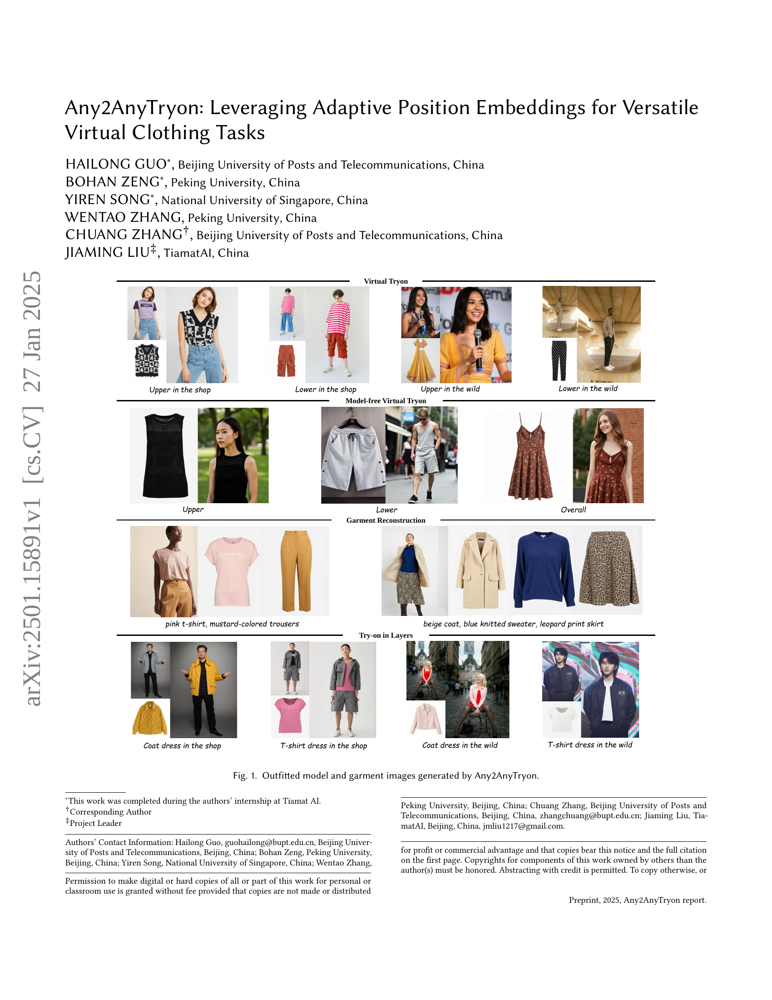
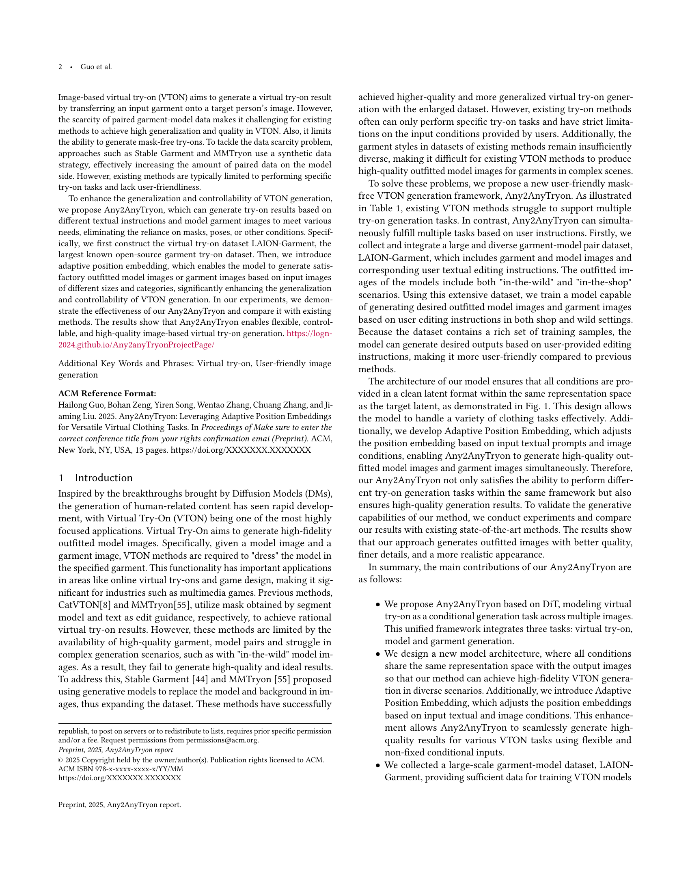
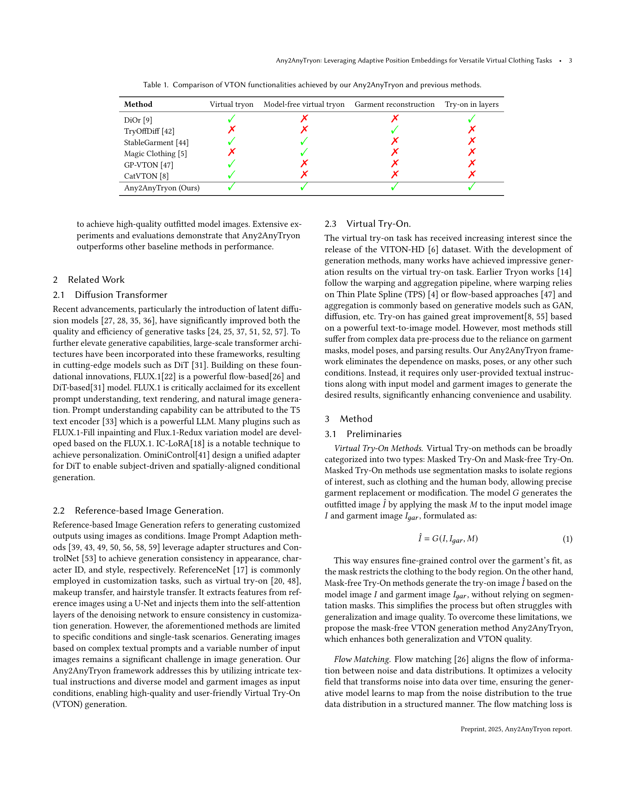
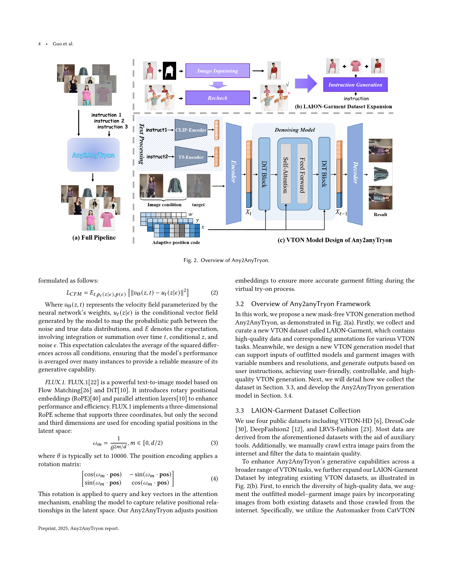
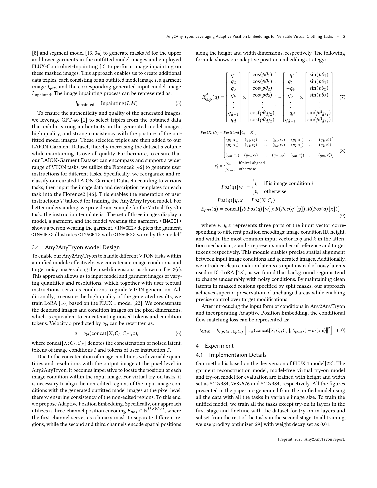
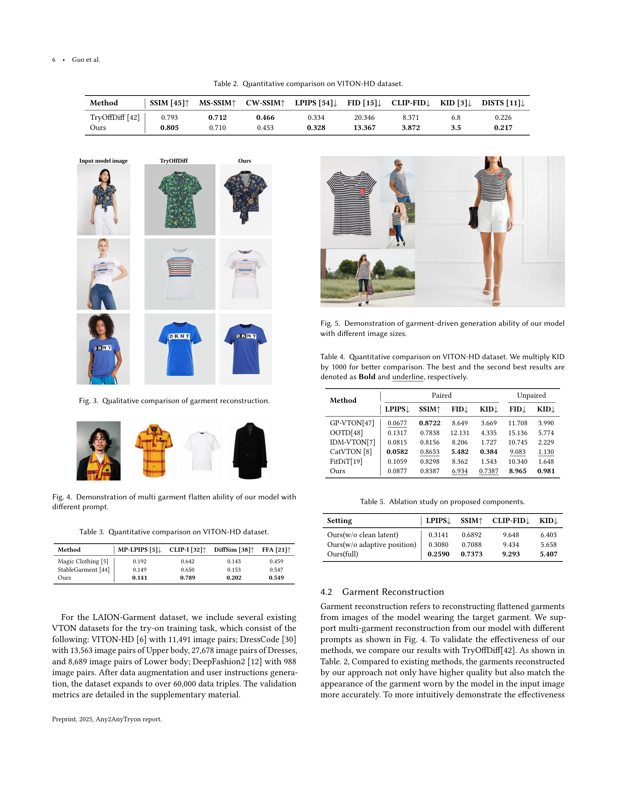
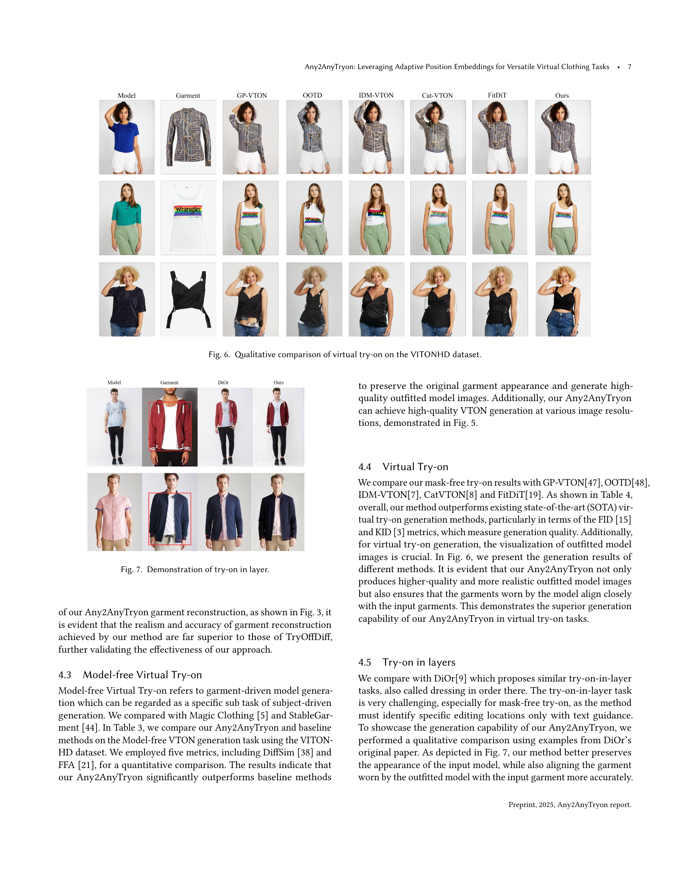
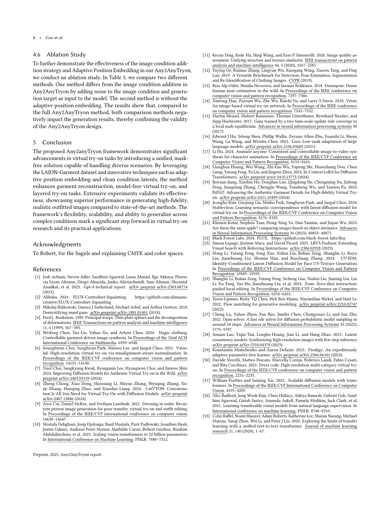
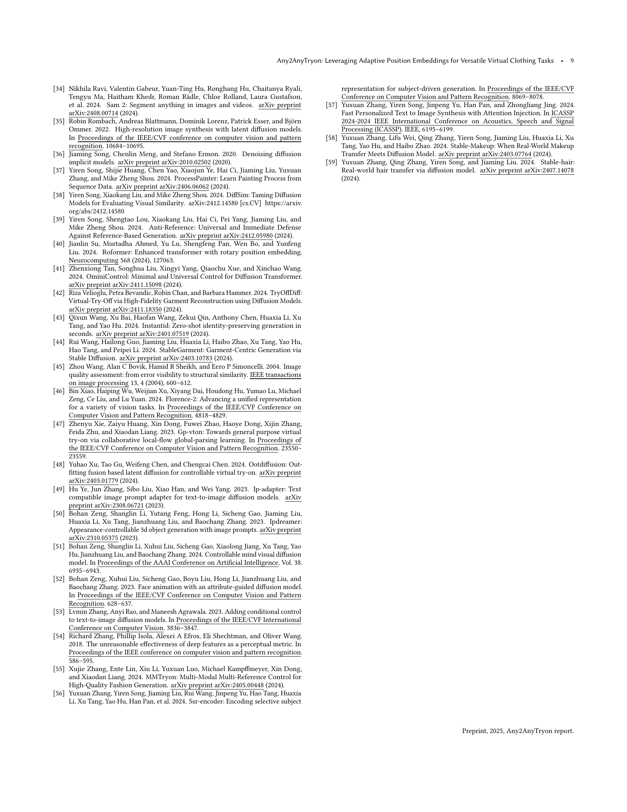
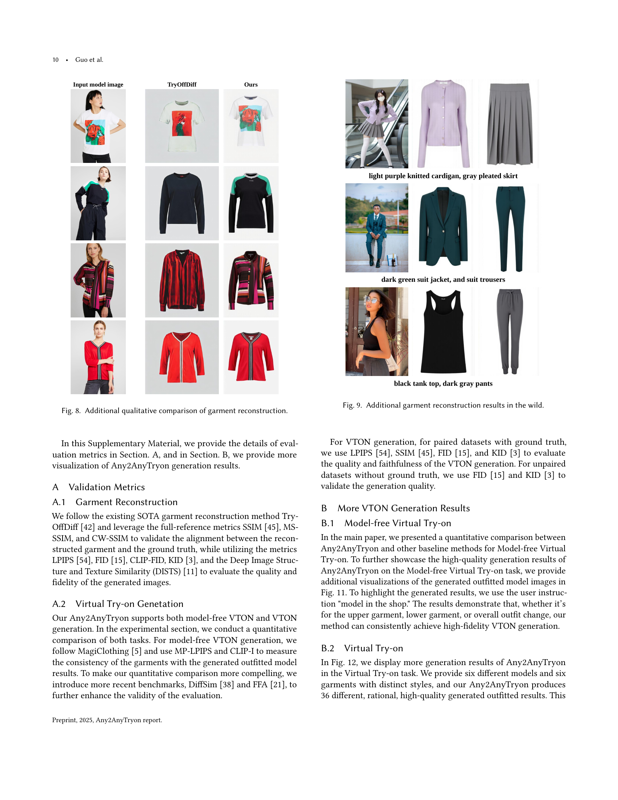
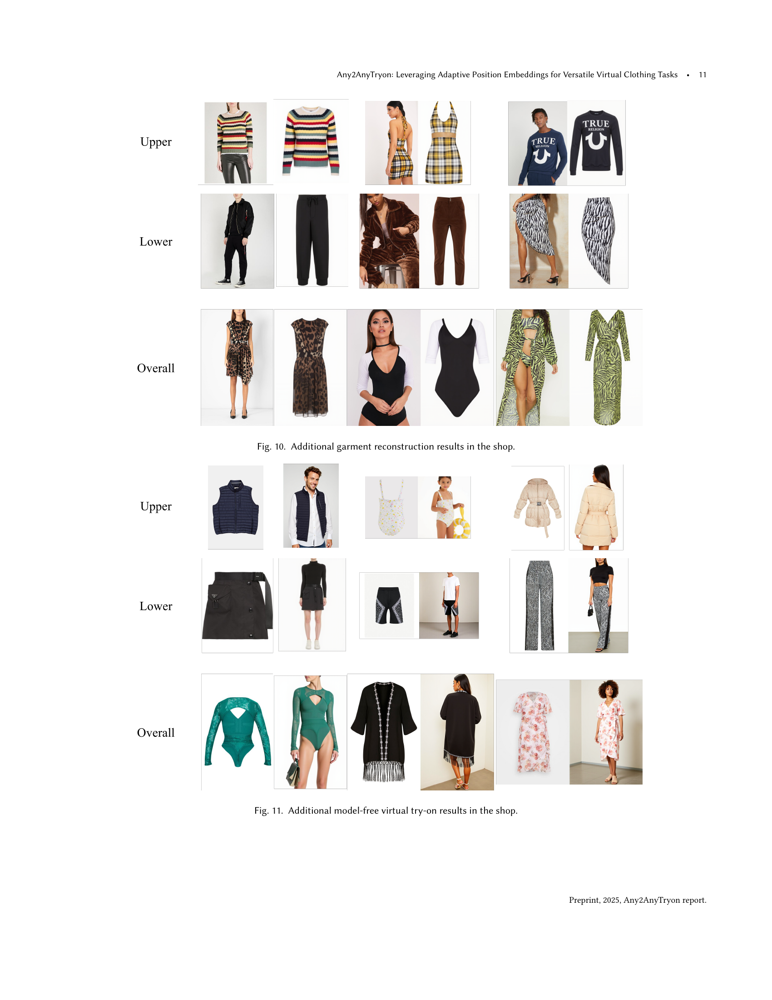
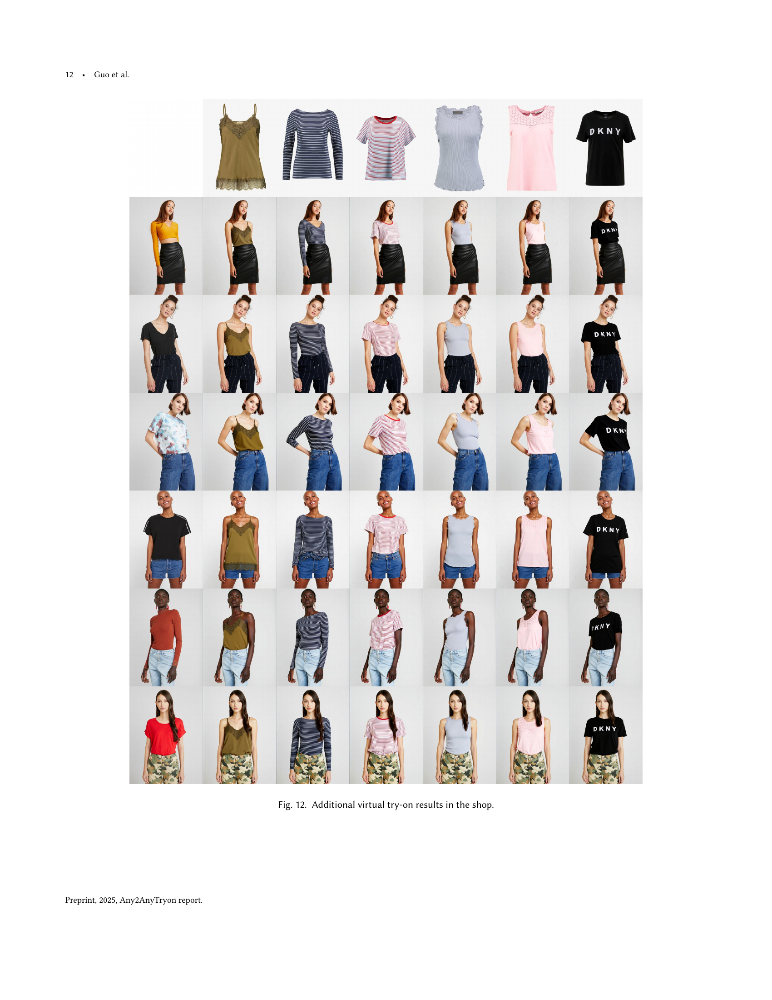
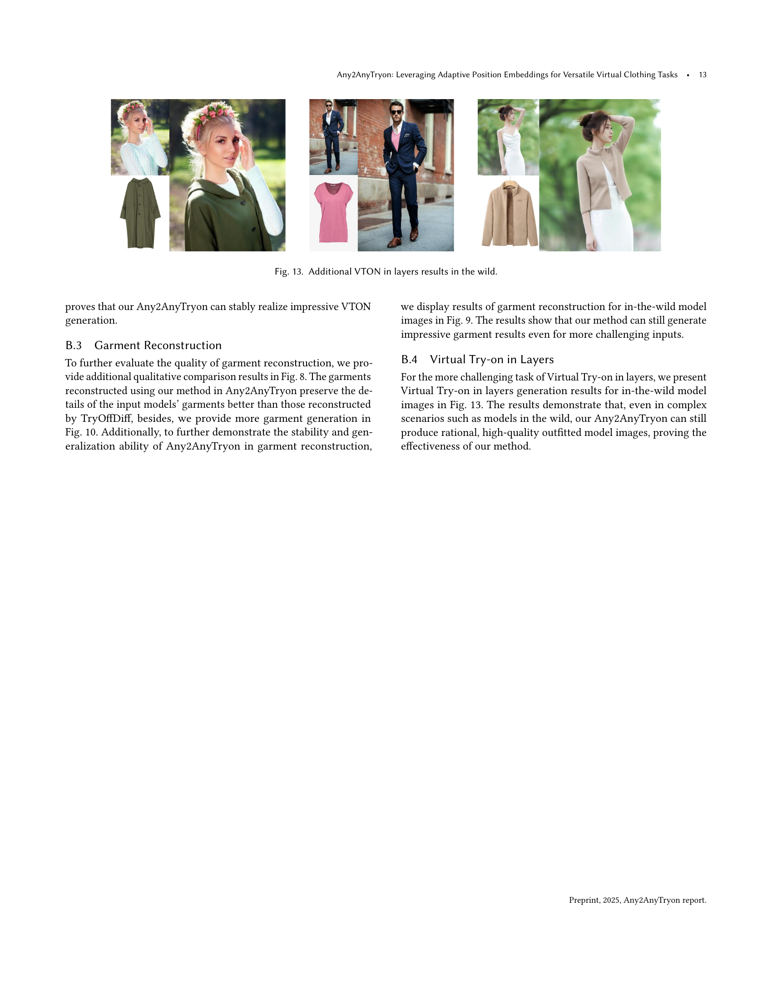
