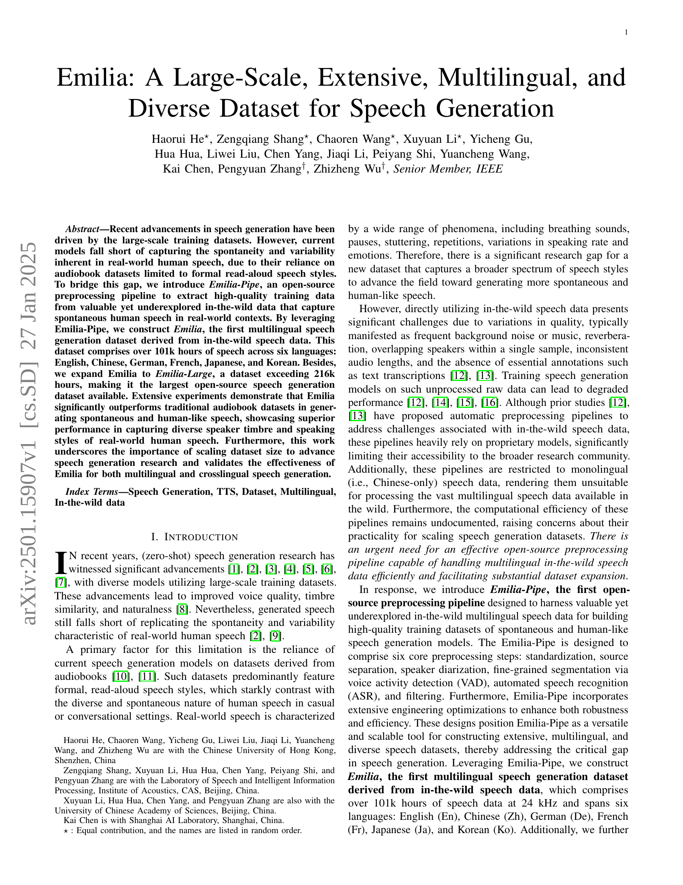
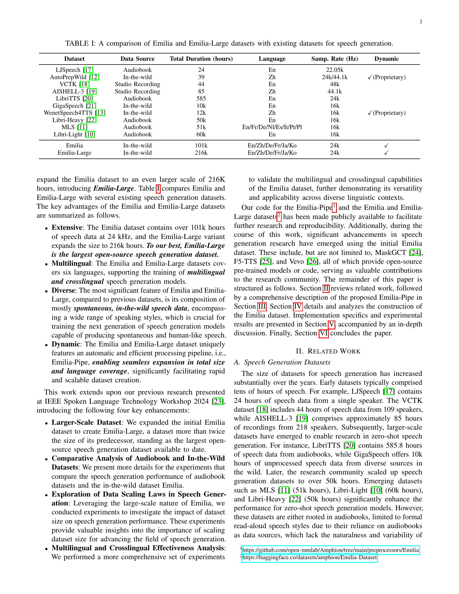
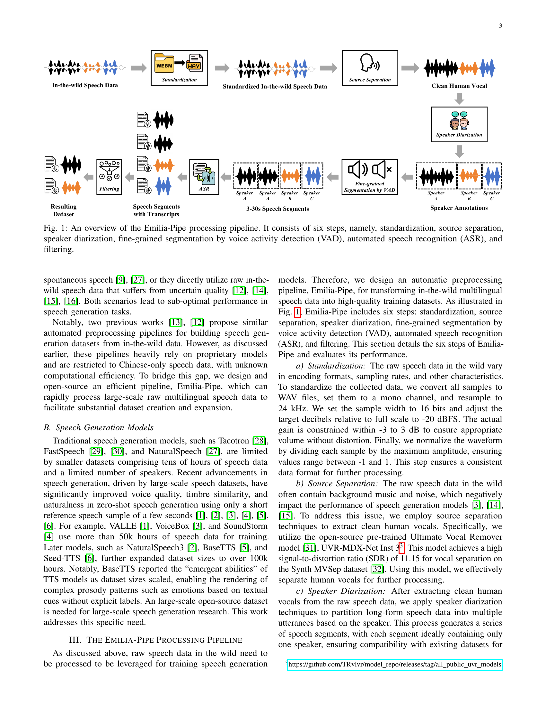
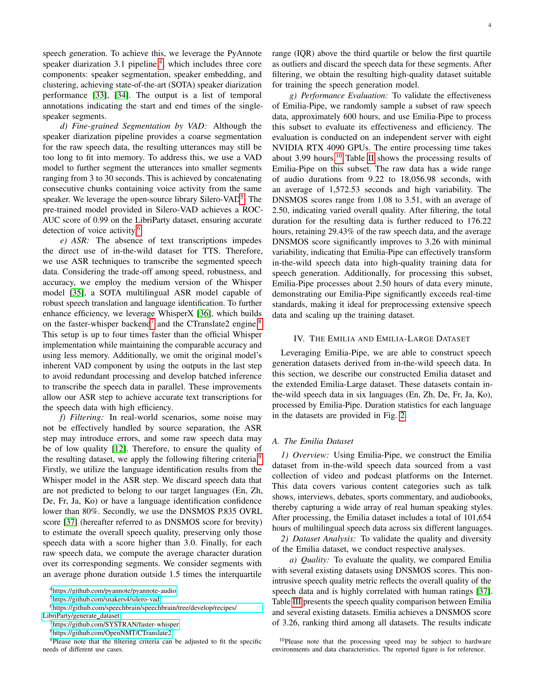
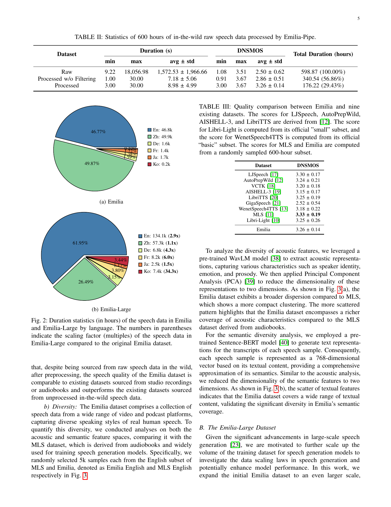
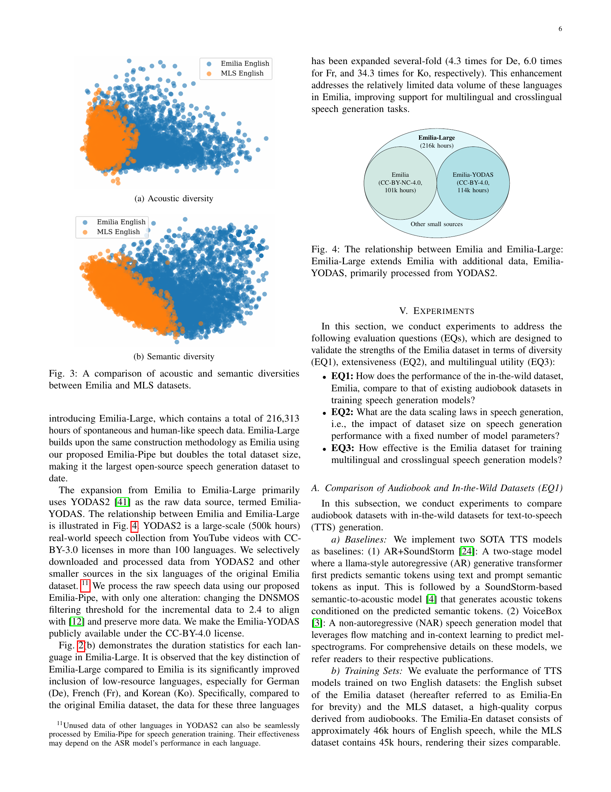
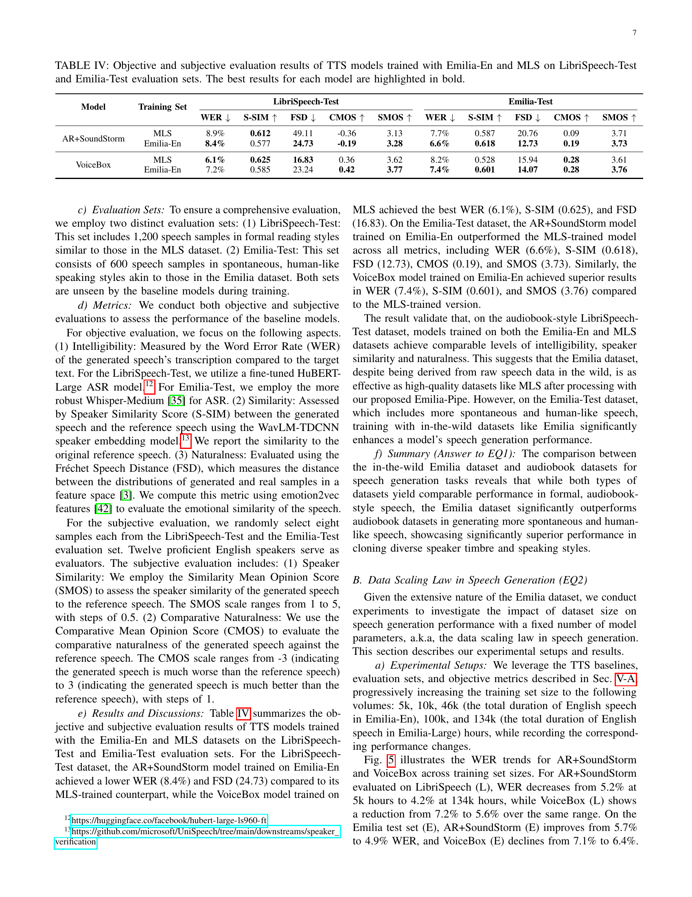
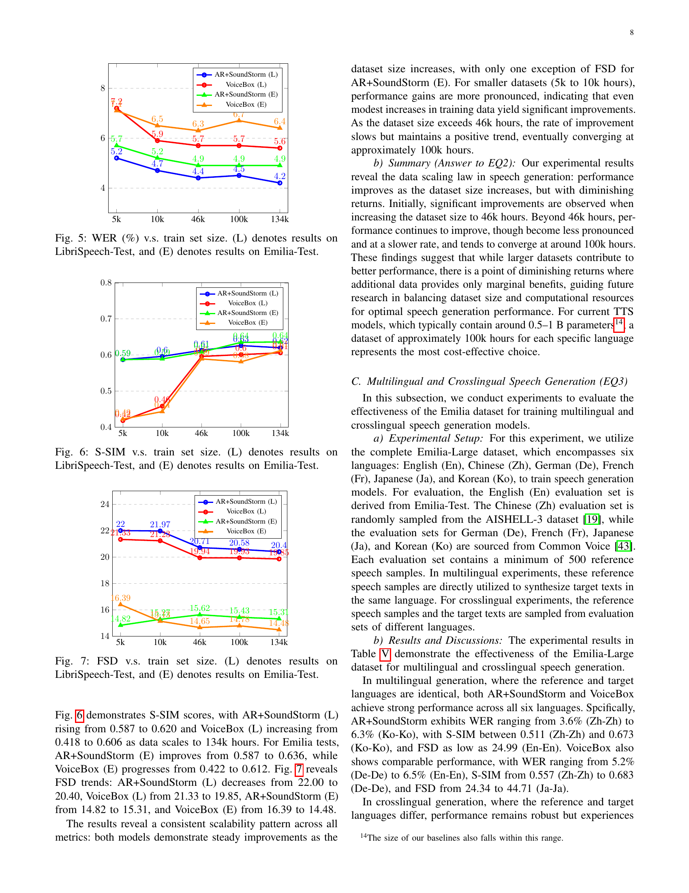
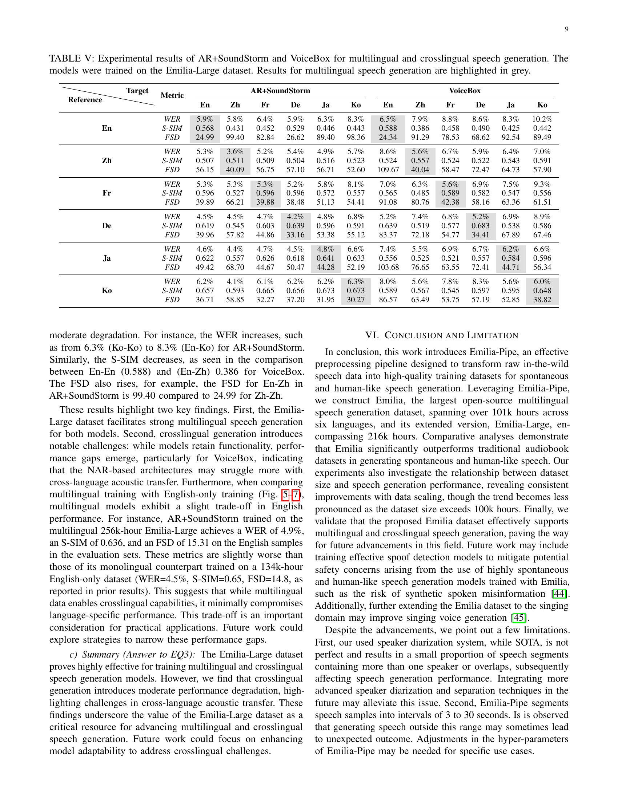
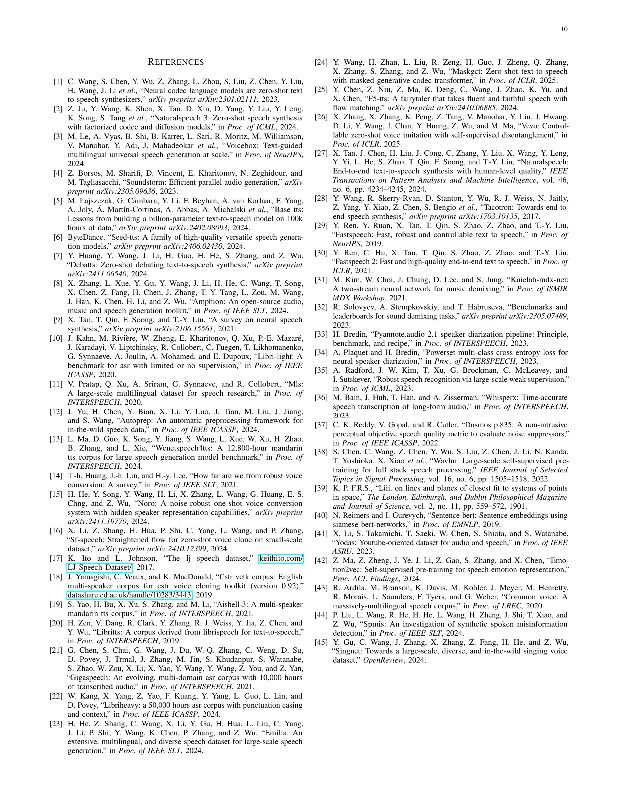

 


 2501.15907 
 Haorui He et el. 
 
 🤗 2025-01-28 
 



↗ arXiv


↗ Hugging Face


↗ Papers with Code


### TL;DR



기존의 음성 생성 모델들은 **정형화된 낭독 음성 데이터**에 의존하여 실제 사람의 자연스러운 말투를 제대로 반영하지 못하는 한계를 가지고 있습니다. 이러한 한계를 극복하기 위해서는 **다양한 말투와 언어를 포함하는 대규모 음성 데이터셋**이 필요합니다.  하지만, 실제 환경에서 수집된 음성 데이터는 잡음, 겹치는 발화 등의 문제점으로 인해 바로 사용하기 어렵습니다.

본 논문에서는 이러한 문제를 해결하기 위해 **Emilia-Pipe라는 오픈소스 전처리 파이프라인**을 개발했습니다. Emilia-Pipe는 6개 언어(영어, 중국어, 독일어, 프랑스어, 일본어, 한국어)의 **10만 시간 이상의 실제 음성 데이터**를 전처리하여 Emilia 데이터셋을 구축했습니다.  Emilia 데이터셋은 기존의 데이터셋보다 자연스럽고 다양한 음성을 생성하는 데 탁월한 성능을 보이며, **대규모 데이터셋의 중요성**을 강조합니다.  또한, Emilia-Pipe는 효율적이고 확장성이 높아 다양한 언어와 대규모 데이터셋 구축에 유용하게 활용될 수 있습니다.



#### Key Takeaways


 Emilia는 216,000시간 이상의 다국어 음성 데이터를 포함하는 대규모 오픈소스 데이터셋입니다. 



 Emilia-Pipe는 다국어 음성 데이터를 효율적으로 전처리하는 오픈소스 파이프라인입니다. 



 Emilia 데이터셋은 다양한 언어와 스타일의 음성을 생성하는 데 탁월한 성능을 보입니다. 


#### Why does it matter?
본 논문은 **대규모 다국어 음성 데이터셋 Emilia 및 전처리 파이프라인 Emilia-Pipe**를 제시하여 음성 생성 연구에 중요한 기여를 합니다. **대용량의 다양한 음성 데이터**를 활용하여 기존의 한계를 극복하고, **다국어 및 교차 언어 음성 생성 모델** 개발에 새로운 가능성을 열어줍니다.  연구자들은 Emilia 데이터셋과 Emilia-Pipe를 활용하여 음성 생성 모델의 성능을 향상시키고, 다양한 언어와 스타일의 음성을 생성하는 데 활용할 수 있습니다. 또한, **데이터 크기 확장에 따른 성능 향상**에 대한 통찰력을 제공하여, 향후 연구 방향을 제시합니다.

------
#### Visual Insights

> 🔼 그림 1은 Emilia-Pipe의 음성 처리 과정을 보여줍니다.  이 과정은 크게 6단계로 구성되어 있으며, 각 단계는 다음과 같습니다. 1) 표준화: 다양한 인코딩 형식, 샘플링 레이트 및 기타 특성을 가진 원시 데이터를 표준화된 WAV 파일 형식으로 변환합니다. 2) 음원 분리: 배경 음악이나 노이즈를 제거하여 깨끗한 음성만 추출합니다. 3) 화자 분리: 여러 화자가 혼합된 음성 데이터를 각 화자의 음성 구간으로 나눕니다. 4) 미세 구간 분할: 음성 활동 탐지(VAD)를 사용하여 화자의 음성 구간을 3~30초 길이의 작은 단위로 나눕니다. 5) 자동 음성 인식(ASR): 각 구간의 텍스트 내용을 자동으로 추출합니다. 6) 필터링: 품질이 낮거나 오류가 있는 데이터를 제거하고 최종적으로 고품질의 음성 데이터를 생성합니다.
> 

> 
read the caption

> Figure 1: An overview of the Emilia-Pipe processing pipeline. It consists of six steps, namely, standardization, source separation, speaker diarization, fine-grained segmentation by voice activity detection (VAD), automated speech recognition (ASR), and filtering.
> 


| Dataset | Data Source | Total Duration (hours) | Language | Samp. Rate (Hz) | Dynamic |
|---|---|---|---|---|---| 
| LJSpeech [17] | Audiobook | 24 | En | 22.05k |  |
| AutoPrepWild [12] | In-the-wild | 39 | Zh | 24k/44.1k | ✓(Proprietary) |
| VCTK [18] | Studio Recording | 44 | En | 48k |  |
| AISHELL-3 [19] | Studio Recording | 85 | Zh | 44.1k |  |
| LibriTTS [20] | Audiobook | 585 | En | 24k |  |
| GigaSpeech [21] | In-the-wild | 10k | En | 16k |  |
| WenetSpeech4TTS [13] | In-the-wild | 12k | Zh | 16k | ✓(Proprietary) |
| Libri-Heavy [22] | Audiobook | 50k | En | 16k |  |
| MLS [11] | Audiobook | 51k | En/Fr/De/Nl/Es/It/Pt/Pl | 16k |  |
| Libri-Light [10] | Audiobook | 60k | En | 16k |  |
| Emilia | In-the-wild | 101k | En/Zh/De/Fr/Ja/Ko | 24k | ✓ |
| Emilia-Large | In-the-wild | 216k | En/Zh/De/Fr/Ja/Ko | 24k | ✓ |

> 🔼 표 I은 음성 생성을 위한 기존 데이터셋과 Emilia 및 Emilia-Large 데이터셋을 비교 분석한 표입니다.  데이터셋의 크기(시간), 언어, 샘플링 레이트, 그리고 데이터 수집 방식(예: 오디오북, 야외 녹음) 등의 특징을 비교하여 Emilia 데이터셋의 규모와 다양성을 보여줍니다.
> 

> 
read the caption

> TABLE I: A comparison of Emilia and Emilia-Large datasets with existing datasets for speech generation.
> 

### In-depth insights

#### Wild Speech Preprocessing
**자연어 음성 전처리**는 잡음이 많고 다양한 환경에서 수집된 음성 데이터의 질을 높이는 중요한 과정입니다.  연구는 **Emilia-Pipe**라는 새로운 전처리 파이프라인을 제시하며, 이는 다국어 **자연어 음성 데이터**의 전처리를 효율적으로 수행합니다.  **표준화, 음원 분리, 화자 분리, 음성 활동 감지 기반의 세분화, 자동 음성 인식, 필터링**의 6단계로 구성되어 있으며, 각 단계는 신중하게 설계되어 데이터의 품질을 보장하고 계산 효율성을 높입니다.  특히, 다국어 지원과 확장성에 중점을 두어 대규모 데이터셋 구축에 용이하도록 설계되었습니다.  **Emilia-Pipe의 성능 평가**는 높은 정확도와 실시간 처리 속도를 달성함을 보여주며, 기존 방식보다 효율적이고 확장성이 뛰어남을 강조합니다.  **Emilia 및 Emilia-Large 데이터셋**의 성공적인 구축은 Emilia-Pipe의 효과성을 증명합니다. 이는 대규모 다국어 음성 데이터셋 구축을 위한 효율적이고 실용적인 방법론을 제시하여, **음성 합성 연구 발전**에 크게 기여할 것으로 기대됩니다.

#### Emilia Dataset Analysis
Emilia 데이터셋 분석은 **대규모 다국어 음성 데이터의 품질과 다양성을 평가**하는 데 중점을 둡니다.  **다양한 출처의 실제 음성 데이터를 사용**하여 기존의 녹음 스튜디오 데이터셋과 비교 분석하여 **자연스러움과 다양성을 측정**하고, **다양한 언어 및 화자 특징을 포착**하는지 확인합니다.  **음질 평가 지표(DNSMOS)** 와 **음향 및 의미적 다양성 분석**을 통해 Emilia 데이터셋의 강점과 한계를 밝히고,  **대규모 음성 생성 모델 학습에 적합성**을 검증합니다.  특히, **다양한 언어 지원 및 잡음 제거, 화자 분리 등 전처리 과정**의 효율성을 분석하고,  **데이터셋의 크기 확장에 따른 성능 변화**를 관찰하여 **음성 생성 모델 학습을 위한 최적의 데이터셋 크기**에 대한 통찰력을 제공합니다.

#### Data Scaling Effects
본 논문은 대규모 음성 데이터셋의 크기가 음성 생성 모델 성능에 미치는 영향, 즉 **데이터 스케일링 효과**에 대해 심층적으로 다룹니다.  **데이터 크기가 증가함에 따라 모델 성능이 향상되지만, 일정 수준을 넘어서면 성능 향상폭은 감소하는 수확 체감 현상**을 보입니다.  이는 **모델 파라미터 수가 일정할 때, 데이터 양 증가가 성능 개선에 미치는 영향이 초기에는 크지만 점차 작아짐**을 의미합니다.  **최적의 데이터 크기는 모델의 복잡도와 사용 가능한 계산 자원에 따라 달라지며**, 본 연구에서는 특정 모델과 계산 자원에 대해 **약 10만 시간 이상의 데이터는 효율적인 성능 향상에 한계**가 있음을 시사합니다. 따라서, 음성 생성 모델 개발 시 **데이터 크기의 효율적인 활용**을 고려해야 하며, 단순히 데이터 양 증가보다는 데이터의 질과 다양성을 고려한 전략이 중요함을 강조합니다.  **데이터의 질과 다양성 확보**는 최적의 모델 성능을 위한 핵심 요소이며,  향후 연구에서는 이러한 측면을 더욱 고려한 효율적인 데이터셋 구축 및 모델 개발 전략이 필요합니다.

#### Multilingual Speech
본 논문은 다국어 음성 생성을 위한 대규모 데이터셋인 Emilia의 개발에 초점을 맞추고 있습니다. **Emilia는 영어, 중국어, 독일어, 프랑스어, 일본어, 한국어 등 6개 언어를 포함하며, 10만 시간 이상의 다양한 음성 데이터를 포함**합니다. 이는 기존의 낭독 데이터셋과 달리 **실제 생활의 자연스러운 음성을 다량 포함**, **다양한 화자의 음색과 말투를 반영**하여, 보다 현실적이고 자연스러운 음성 생성 모델 학습에 기여할 수 있습니다. 특히 **다국어 지원**은 다양한 언어의 음성 생성 모델을 개발하는 데 중요한 역할을 할 것이며, **크로스-링구얼 음성 생성** 연구에도 유용하게 활용될 수 있습니다. Emilia 데이터셋의 규모와 다양성은 음성 생성 기술 발전에 크게 기여할 것으로 예상되며, 앞으로 **더욱 다양한 언어와 더 많은 음성 데이터를 포함하는 확장**이 기대됩니다.  **Emilia의 오픈소스 공개**는 연구자들에게 더욱 폭넓은 접근성을 제공하여 음성 생성 분야 연구 활성화에 기여할 것입니다.

#### Future Work
본 논문의 "향후 연구" 부분에서는 **다국어 및 교차언어 음성 생성 성능 향상**을 위한 구체적인 방향을 제시해야 합니다.  특히, **교차언어 음성 생성에서의 성능 저하 문제**를 해결하기 위한 다양한 접근법을 모색해야 합니다.  **음성 데이터의 품질 향상**을 위해 더욱 정교한 전처리 기법 개발이 필요하며, 특히 **화자 분리 및 잡음 제거 알고리즘** 개선에 집중해야 합니다.  또한, **더욱 다양한 언어**를 포함하는 데이터셋 확장과 **대규모 데이터셋의 확장성 문제**에 대한 연구도 필요합니다.  마지막으로, **합성된 음성의 자연스러움과 다양성**을 높이기 위해 모델 아키텍처 및 학습 전략에 대한 추가 연구가 필요합니다.  **모델의 안전성 및 윤리적 문제**에 대한 고려도 중요하며, 특히 가짜 음성 생성 방지 및 오용 방지를 위한 연구가 필요합니다.

### More visual insights

More on figures

> 🔼 그림 (a)는 Emilia 데이터셋의 언어별 데이터 분포를 보여줍니다. 영어(En), 중국어(Zh), 독일어(De), 프랑스어(Fr), 일본어(Ja), 한국어(Ko) 총 6개 언어의 데이터셋 크기 비율을 원형 그래프로 시각화했습니다. 이를 통해 각 언어별 데이터 양의 차이와 데이터셋의 다양성을 한눈에 파악할 수 있습니다.
> 

> 
read the caption

> (a) Emilia
> 

> 🔼 그림 (b)는 Emilia-Large 데이터셋의 언어별 음성 데이터 지속 시간을 보여줍니다. Emilia 데이터셋과 비교하여 각 언어의 데이터 크기가 얼마나 증가했는지 (배수)를 괄호 안에 표시합니다. 영어는 2.9배, 중국어는 1.1배, 독일어는 4.3배, 프랑스어는 6배, 일본어는 1.5배, 한국어는 34.3배 증가했습니다. 이는 Emilia-Large가 저자원 언어에 대한 데이터를 상당히 확장했음을 보여줍니다.
> 

> 
read the caption

> (b) Emilia-Large
> 

More on tables


| Dataset | Duration (s) min | Duration (s) max | Duration (s) avg ± std | DNSMOS min | DNSMOS max | DNSMOS avg ± std | Total Duration (hours) | 
|---|---|---|---|---|---|---|---| 
| Raw | 9.22 | 18,056.98 | 1,572.53 ± 1,966.66 | 1.08 | 3.51 | 2.50 ± 0.62 | 598.87 (100.00%) | 
| Processed w/o Filtering | 1.00 | 30.00 | 7.18 ± 5.06 | 0.91 | 3.67 | 2.86 ± 0.51 | 340.54 (56.86%) | 
| Processed | 3.00 | 30.00 | 8.98 ± 4.99 | 3.00 | 3.67 | 3.26 ± 0.14 | 176.22 (29.43%) | 
> 🔼 이 표는 Emilia-Pipe를 사용하여 전처리한 600시간 분량의 원시 음성 데이터의 통계를 보여줍니다.  원시 데이터와 필터링 후 데이터의 최소값, 최대값, 평균값, 표준편차를 포함한 지속 시간(초)과 DNSMOS 점수를 비교하여 Emilia-Pipe의 효과를 보여줍니다.
> 

> 
read the caption

> TABLE II: Statistics of 600 hours of in-the-wild raw speech data processed by Emilia-Pipe.
> 


| Dataset | DNSMOS |
|---|---| 
| LJSpeech [17] | 3.30 ± 0.17 |
| AutoPrepWild [12] | 3.24 ± 0.21 |
| VCTK [18] | 3.20 ± 0.18 |
| AISHELL-3 [19] | 3.15 ± 0.17 |
| LibriTTS [20] | 3.25 ± 0.19 |
| GigaSpeech [21] | 2.52 ± 0.54 |
| WenetSpeech4TTS [13] | 3.18 ± 0.22 |
| MLS [11] | **3.33 ± 0.19** |
| Libri-Light [10] | 3.25 ± 0.26 |
| Emilia | 3.26 ± 0.14 |
> 🔼 표 III는 Emilia 데이터셋과 기존의 9개 음성 데이터셋의 음질을 비교한 표입니다. LJSpeech, AutoPrepWild, AISHELL-3, LibriTTS 데이터셋의 점수는 논문 [12]에서 가져왔고, Libri-Light 데이터셋 점수는 공식적으로 제공하는 ‘small’ 하위 데이터셋에서, WenetSpeech4TTS 데이터셋 점수는 공식 ‘basic’ 하위 데이터셋에서 계산되었습니다. MLS와 Emilia 데이터셋의 점수는 무작위로 샘플링한 600시간 분량의 하위 데이터셋을 기반으로 계산되었습니다.
> 

> 
read the caption

> TABLE III: Quality comparison between Emilia and nine existing datasets. The scores for LJSpeech, AutoPrepWild, AISHELL-3, and LibriTTS are derived from [12]. The score for Libri-Light is computed from its official ”small” subset, and the score for WenetSpeech4TTS is computed from its official “basic” subset. The scores for MLS and Emilia are computed from a randomly sampled 600-hour subset.
> 


| Model | Training Set | LibriSpeech-Test WER ↓ | LibriSpeech-Test S-SIM ↑ | LibriSpeech-Test FSD ↓ | LibriSpeech-Test CMOS ↑ | LibriSpeech-Test SMOS ↑ | Emilia-Test WER ↓ | Emilia-Test S-SIM ↑ | Emilia-Test FSD ↓ | Emilia-Test CMOS ↑ | Emilia-Test SMOS ↑ |
|---|---|---|---|---|---|---|---|---|---|---|---| 
| AR+SoundStorm | MLS | 8.9% | 0.612 | 49.11 | -0.36 | 3.13 | 7.7% | 0.587 | 20.76 | 0.09 | 3.71 |
|  | Emilia-En | 8.4% | 0.577 | 24.73 | -0.19 | 3.28 | 6.6% | 0.618 | 12.73 | 0.19 | 3.73 |
| VoiceBox | MLS | 6.1% | 0.625 | 16.83 | 0.36 | 3.62 | 8.2% | 0.528 | 15.94 | 0.28 | 3.61 |
|  | Emilia-En | 7.2% | 0.585 | 23.24 | 0.42 | 3.77 | 7.4% | 0.601 | 14.07 | 0.28 | 3.76 |
> 🔼 표 IV는 LibriSpeech-Test 및 Emilia-Test 평가 세트에서 Emilia-En 및 MLS로 학습된 TTS 모델의 객관적 및 주관적 평가 결과를 보여줍니다.  객관적 평가 지표는 단어 오류율(WER), 스피커 유사성 점수(S-SIM), 프레셰 스피치 디스턴스(FSD)를 포함하며, 주관적 평가는 스피커 유사성에 대한 평균 의견 점수(SMOS)와 비교 자연스러움에 대한 평균 의견 점수(CMOS)를 사용합니다. 각 모델의 최상의 결과는 굵게 표시되어 있습니다.
> 

> 
read the caption

> TABLE IV: Objective and subjective evaluation results of TTS models trained with Emilia-En and MLS on LibriSpeech-Test and Emilia-Test evaluation sets. The best results for each model are highlighted in bold.
> 


| Reference | Target | Metric | AR+SoundStorm En | AR+SoundStorm Zh | AR+SoundStorm Fr | AR+SoundStorm De | AR+SoundStorm Ja | AR+SoundStorm Ko | VoiceBox En | VoiceBox Zh | VoiceBox Fr | VoiceBox De | VoiceBox Ja | VoiceBox Ko |
|---|---|---|---|---|---|---|---|---|---|---|---|---|---|---|
|  |  | _WER_ | 5.9% | 5.8% | 6.4% | 5.9% | 6.3% | 8.3% | 6.5% | 7.9% | 8.8% | 8.6% | 8.3% | 10.2% |
| En | _S-SIM_ | 0.568 | 0.431 | 0.452 | 0.529 | 0.446 | 0.443 | 0.588 | 0.386 | 0.458 | 0.490 | 0.425 | 0.442 |
|  | _FSD_ | 24.99 | 99.40 | 82.84 | 26.62 | 89.40 | 98.36 | 24.34 | 91.29 | 78.53 | 68.62 | 92.54 | 89.49 |
|  | _WER_ | 5.3% | 3.6% | 5.2% | 5.4% | 4.9% | 5.7% | 8.6% | 5.6% | 6.7% | 5.9% | 6.4% | 7.0% |
| Zh | _S-SIM_ | 0.507 | 0.511 | 0.509 | 0.504 | 0.516 | 0.523 | 0.524 | 0.557 | 0.524 | 0.522 | 0.543 | 0.591 |
|  | _FSD_ | 56.15 | 40.09 | 56.75 | 57.10 | 56.71 | 52.60 | 109.67 | 40.04 | 58.47 | 72.47 | 64.73 | 57.90 |
|  | _WER_ | 5.3% | 5.3% | 5.3% | 5.2% | 5.8% | 8.1% | 7.0% | 6.3% | 5.6% | 6.9% | 7.5% | 9.3% |
| Fr | _S-SIM_ | 0.596 | 0.527 | 0.596 | 0.596 | 0.572 | 0.557 | 0.565 | 0.485 | 0.589 | 0.582 | 0.547 | 0.556 |
|  | _FSD_ | 39.89 | 66.21 | 39.88 | 38.48 | 51.13 | 54.41 | 91.08 | 80.76 | 42.38 | 58.16 | 63.36 | 61.51 |
|  | _WER_ | 4.5% | 4.5% | 4.7% | 4.2% | 4.8% | 6.8% | 5.2% | 7.4% | 6.8% | 5.2% | 6.9% | 8.9% |
| De | _S-SIM_ | 0.619 | 0.545 | 0.603 | 0.639 | 0.596 | 0.591 | 0.639 | 0.519 | 0.577 | 0.683 | 0.538 | 0.586 |
|  | _FSD_ | 39.96 | 57.82 | 44.86 | 33.16 | 53.38 | 55.12 | 83.37 | 72.18 | 54.77 | 34.41 | 67.89 | 67.46 |
|  | _WER_ | 4.6% | 4.4% | 4.7% | 4.5% | 4.8% | 6.6% | 7.4% | 5.5% | 6.9% | 6.7% | 6.2% | 6.6% |
| Ja | _S-SIM_ | 0.622 | 0.557 | 0.626 | 0.618 | 0.641 | 0.633 | 0.556 | 0.525 | 0.521 | 0.557 | 0.584 | 0.596 |
|  | _FSD_ | 49.42 | 68.70 | 44.67 | 50.47 | 44.28 | 52.19 | 103.68 | 76.65 | 63.55 | 72.41 | 44.71 | 56.34 |
|  | _WER_ | 6.2% | 4.1% | 6.1% | 6.2% | 6.2% | 6.3% | 8.0% | 5.6% | 7.8% | 8.3% | 5.6% | 6.0% |
| Ko | _S-SIM_ | 0.657 | 0.593 | 0.665 | 0.656 | 0.673 | 0.673 | 0.589 | 0.567 | 0.545 | 0.597 | 0.595 | 0.648 |
|  | _FSD_ | 36.71 | 58.85 | 32.27 | 37.20 | 31.95 | 30.27 | 86.57 | 63.49 | 53.75 | 57.19 | 52.85 | 38.82 |
> 🔼 표 V는 Emilia-Large 데이터셋으로 학습된 AR+SoundStorm과 VoiceBox 모델의 다국어 및 교차 언어 음성 생성 실험 결과를 보여줍니다. 회색으로 강조 표시된 부분은 다국어 음성 생성 결과입니다. 이 표는 다양한 언어 쌍에 대한 WER, S-SIM, FSD 세 가지 지표를 제시하며, 다국어 음성 생성과 교차 언어 음성 생성 모두에 대한 성능을 비교 분석합니다.  모델 성능은 참조 언어와 대상 언어가 동일한 경우(다국어)와 다른 경우(교차 언어)로 나누어 제시됩니다.
> 

> 
read the caption

> TABLE V: Experimental results of AR+SoundStorm and VoiceBox for multilingual and crosslingual speech generation. The models were trained on the Emilia-Large dataset. Results for multilingual speech generation are highlighted in grey.
> 

### Full paper



