 


 2501.16273 
 Mohamed Elfeki et el. 
 
 🤗 2025-01-28 
 



↗ arXiv


↗ Hugging Face


↗ Papers with Code


### TL;DR



최근 대규모 언어 모델 연구가 주로 디코더 전용 아키텍처에 집중되어 왔지만, 본 논문에서는 **인코더-디코더 아키텍처**가 소규모 언어 모델(SLM)에 더욱 효율적임을 밝힙니다.  특히, 제한된 자원 환경에서의 성능과 효율성 면에서 디코더 전용 모델보다 우수함을 실험적으로 증명합니다. 기존의 디코더 전용 모델들은 입력 시퀀스를 매번 처리해야 하지만, 인코더-디코더 모델은 입력을 한 번만 처리하여 고정된 잠재 표현을 생성하기 때문에 훨씬 효율적입니다.

본 논문에서는 이러한 인코더-디코더 아키텍처의 장점을 극대화하기 위해 **새로운 지식 증류 기법**을 제안합니다. 이 기법은 대규모 디코더 전용 모델로부터 지식을 효율적으로 소규모 인코더-디코더 모델로 전이시켜, 다양한 과제에서 성능을 향상시킵니다. 또한, 최신 기술인 회전 위치 임베딩(RoPE) 및 비전 인코더를 통합하여, 자원 제약 환경에서도 성능이 뛰어난 모델을 개발할 수 있음을 보여줍니다.  이 연구는  **자원 효율적인 SLM 개발**에 대한 새로운 패러다임을 제시합니다.



#### Key Takeaways


 인코더-디코더 아키텍처는 소규모 언어 모델에서 디코더 전용 모델보다 **훨씬 높은 처리량과 낮은 지연 시간**을 제공한다. 



 제안된 지식 증류 기법은 **대규모 디코더 전용 모델의 지식을 소규모 인코더-디코더 모델로 효과적으로 전이**시켜 성능을 향상시킨다. 



 인코더-디코더 아키텍처는 **자원 제약 환경**(예: 에지 디바이스)에서 **실용적인 언어 모델 배포**에 유리하다. 


#### Why does it matter?
본 논문은 **매개변수 효율성을 극대화**하는 새로운 언어 모델 아키텍처를 제시하여, **자원 제약 환경**에서의 언어 모델 배포에 중요한 함의를 제공합니다. 특히, **소규모 언어 모델(SLM)**에 초점을 맞춰 **인코더-디코더 아키텍처**의 효율성을 강조하며, 기존의 디코더 전용 모델의 한계를 극복하는 데 기여합니다. 또한, **지식 증류 기법**을 활용하여 대규모 모델의 성능을 소규모 모델에 이전하는 방법을 제시하여, 실용적인 언어 모델 개발에 새로운 방향을 제시합니다. 이러한 연구는 에지 디바이스나 자원 제약 환경에서의 언어 모델 활용에 직접적인 영향을 미치며, 향후 연구에 있어서 아키텍처 선택의 중요성을 강조합니다.

------
#### Visual Insights

> 🔼  그림 1은 소규모 언어 모델(SLM)에서의 아키텍처 효율성을 보여줍니다. 왼쪽 패널은 인코더-디코더 모델과 디코더 전용 모델의 아키텍처를 비교합니다. 인코더-디코더 모델은 입력 시퀀스에 대해 한 번만 처리하여 고정된 잠재 표현을 생성하고, 출력에 대해서만 KV 캐시를 사용합니다. 반면에 디코더 전용 모델은 입력과 출력 모두에 대해 증가하는 KV 캐시를 필요로 합니다. 오른쪽 상단 패널은 입력 시퀀스 길이에 따른 추론 시간을 비교하여 인코더-디코더 모델의 효율적인 고정 표현 방식과 디코더 전용 모델의 가파른 계산 성장을 보여줍니다. 오른쪽 하단 패널은 다양한 작업에 대한 성능을 비교하여 고정된 계산 예산에서 인코더-디코더 모델의 이점과 지식 증류(KD)를 통한 추가적인 성능 향상을 보여줍니다.
> 

> 
read the caption

> Figure 1: Architectural Efficiency in SLMs. Left: Comparison of architectures where encoder-decoder creates a fixed input representation with KV cache only for output, while decoder-only requires growing KV caches for both input and output. Top right: Inference time scaling with input length, showing encoder-decoder’s efficient fixed-representation approach versus decoder-only’s steeper computational growth. Bottom right: Performance across tasks showing encoder-decoder’s advantages at fixed compute budget, further enhanced by KD.
> 


| Model | SQuAD (RL/RG) | IELTS (RL/RG) | CodeX (RL/RG) | XSum (RL/RG) | Average (RL/RG) |
|---|---|---|---|---|---| 
| Phi-3.3B | 0.85/0.96 | 0.31/0.70 | 0.93/0.74 | 0.36/0.28 | 0.61/0.67 |
| Decoder-only |
| Seq2Seq | 0.55/0.90 | 0.30/0.29 | 0.91/0.61 | 0.19/0.14 | 0.49/0.49 |
| KD | 0.57/0.90 | 0.31/0.40 | 0.93/0.63 | 0.24/0.19 | 0.51/0.53 |
| Encoder-Decoder (Seq2Seq) |
| 1/3-2/3 | 0.61/0.91 | 0.31/0.29 | 0.93/0.65 | 0.23/0.15 | 0.52/0.50 |
| 1/2-1/2 | 0.64/0.92 | 0.31/0.28 | 0.93/0.66 | 0.24/0.17 | 0.53/0.51 |
| 2/3-1/3 | 0.67/0.93 | 0.31/0.26 | 0.93/0.66 | 0.25/0.19 | 0.54/0.51 |
| Encoder-Decoder (KD) |
| 1/3-2/3 | 0.62/0.93 | 0.32/0.40 | 0.93/0.70 | 0.26/0.19 | 0.53/0.56 |
| 1/2-1/2 | 0.60/0.91 | 0.32/0.45 | 0.93/0.73 | 0.27/0.20 | 0.53/0.57 |
| 2/3-1/3 | 0.69/0.94 | 0.32/0.46 | 0.93/0.74 | 0.27/0.20 | 0.55/0.59 |

> 🔼 표 1은 다양한 인코더-디코더 할당 및 추가 학습을 사용한 3억 3천만(330M) 매개변수 모델 변형의 다운스트림 작업 성능을 보여줍니다.  다양한 인코더와 디코더 레이어 비율(1/3-2/3, 1/2-1/2, 2/3-1/3)을 가진 인코더-디코더 아키텍처의 성능을 보여주며, 지식 증류(KD)를 적용한 경우와 그렇지 않은 경우를 비교합니다.  각 모델 변형은 다양한 자연어 처리 과제 (질문 답변, 요약, 코드 번역, 창의적인 글쓰기)에서 Rouge-L 및 Ragas-GPT 점수로 평가됩니다. 이 표는 인코더-디코더 아키텍처의 효율성과 지식 증류의 효과를 보여줍니다.
> 

> 
read the caption

> Table 1: Downstream Task Performance of 330M Model Variants with Varying Encoder-Decoder Allocations and Post-Training.
> 

### In-depth insights

#### Encoder Efficiency
본 논문은 인코더-디코더 구조의 효율성에 대해 심도있게 논의합니다. 특히 **작은 언어 모델(SLM)**에서 인코더-디코더 아키텍처가 디코더 전용 모델보다 **훨씬 빠른 처리 속도와 높은 처리량**을 제공한다는 점을 강조합니다. 이는 인코더가 입력을 한 번만 처리하고, 이해와 생성 단계를 효율적으로 분리하기 때문입니다.  **회전 위치 임베딩(RoPE)** 및 비전 인코더와 같은 최신 기술과 결합하면 인코더-디코더는 제한된 자원 환경에서도 성능이 우수한 언어 모델을 구축하는 실용적인 방법이 됩니다.  **지식 증류(KD)** 기법을 통해 큰 디코더 전용 모델의 장점을 활용하여 작은 인코더-디코더 모델의 성능을 향상시키는 방법도 제시합니다.  **결론적으로**,  자원 효율성이 중요한 소형 모델 개발에 있어 인코더-디코더 아키텍처의 재평가와 효율적인 활용이 필수적임을 시사합니다.

#### KD for SLMs
본 논문에서 제시된 소규모 언어 모델(SLM)을 위한 지식 증류(KD) 방법은 **매개변수 효율성**을 극대화하는 데 중점을 둡니다.  기존의 대규모 디코더 전용 모델의 지식을 효과적으로 전달하여, **인코더-디코더 구조의 장점**인 계산 효율성과 비대칭 시퀀스 처리 능력을 유지하면서 성능 향상을 이끌어냅니다.  **크로스 아키텍처 증류**를 통해 인코더-디코더 모델은 대규모 디코더 전용 모델로부터 학습하며, 특히 **비대칭 시퀀스 작업**에서 두드러지는 성능 향상을 보입니다.  이러한 접근 방식은 제한된 자원 환경에서 SLM 배포의 실용성을 높이며, **데이터셋의 비대칭성**을 고려한 효율적인 모델 설계의 중요성을 강조합니다.  **RoPE와 Vision 인코더**와 같은 최신 기술과의 결합을 통해 다양한 작업에서의 성능 개선을 확인하고, 특히 **컴퓨팅 효율성이 중요한 에지 디바이스**에서 유의미한 결과를 보입니다.

#### Vision-Lang Models
본 논문에서 제시된 비전-언어 모델은 **텍스트 인코더-디코더 구조의 효율성을 유지하면서 시각적 처리 기능을 통합**한 모델입니다. **CLIP의 ViT-L-336px를 비전 인코더로 사용**하여 고해상도 이미지를 효율적으로 처리하며, **텍스트 인코더-디코더와의 호환성을 위해 2-layer MLP 투영 레이어를 사용**합니다. 고해상도 이미지 처리를 위해 이미지를 하위 이미지로 분할하고, 전역적 시각적 맥락을 위해 저해상도 축소 이미지도 함께 처리합니다. **다양한 비전-언어 데이터셋을 사용한 효율적인 훈련 전략**을 통해 비전-언어 모델의 성능을 향상시켰습니다. **결과적으로, 제한된 자원 환경에서도 우수한 성능을 보이는 효율적인 비전-언어 모델을 제시**하여 기존의 디코더 전용 모델에 대한 새로운 대안을 제시합니다.

#### Hardware Efficiency
본 논문의 하드웨어 효율성 분석은 **GPU, CPU, NPU 세 플랫폼**에서 엔코더-디코더 아키텍처와 디코더 전용 아키텍처의 성능 및 효율성을 비교하여 이루어졌습니다. 그 결과, 엔코더-디코더 모델은 **모든 플랫폼에서 디코더 전용 모델보다 훨씬 낮은 첫 토큰 지연 시간과 높은 처리량**을 달성했습니다. 특히, NPU 플랫폼에서 엔코더-디코더 모델은 디코더 전용 모델보다 **처리량이 4.7배 높았고, 첫 토큰 지연 시간은 47% 단축**되었습니다. 이러한 결과는 엔코더-디코더 아키텍처의 **일회성 입력 처리 및 이해와 생성 단계의 효율적인 분리**에 기인합니다. 이는 제한된 리소스 환경에서 효율적인 언어 모델 배포에 중요한 시사점을 제공합니다.

#### Future Directions
본 논문의 "미래 방향"에 대한 심도있는 고찰은 **엔코더-디코더 아키텍처의 확장성 한계**와 **디코더 전용 모델과의 비교 우위에 대한 추가 연구 필요성**을 강조합니다. 특히, **엔코더-디코더 모델의 정보 병목 현상 해소를 위한 새로운 메커니즘** 탐색과 **대규모 디코더 전용 모델 학습의 이점을 효율적인 배포 환경에 적용하기 위한 전문적인 지식 증류 기술 개발**이 중요한 미래 연구 과제로 제시됩니다. 또한, **계산 효율성과 성능 간의 균형을 이루는 최적의 모델 크기 규명**을 위한 연구도 필수적이며,  **소규모 장치 배포를 위한 효율적인 SLM 개발**에 있어 **아키텍처 설계의 중요성**을 재차 강조합니다.  결론적으로, **다양한 모델 규모와 하드웨어 플랫폼에서 엔코더-디코더 아키텍처의 장점과 한계를 면밀히 분석**하고 **지식 증류 기술과 혁신적인 아키텍처 설계를 결합**하여 보다 효율적이고 강력한 SLM을 개발하는 데 초점을 맞춰야 합니다.

### More visual insights

More on figures

> 🔼 그림 2는 논문에서 제시된 두 가지 주요 아키텍처(2/3-1/3 인코더-디코더와 디코더 전용)에 대해 다양한 모델 크기(매개변수 수)별 성능을 비교한 그래프입니다.  x축은 모델의 매개변수 수(3억, 5억, 10억)를 나타내고, y축은 추론 및 요약 작업에서의 평균 Rouge 성능 점수를 보여줍니다. 이 그래프는 모델 크기가 증가함에 따라 두 아키텍처 모두 성능이 향상되지만, 특히 2/3-1/3 인코더-디코더 아키텍처가 더 큰 성능 개선을 보임을 시각적으로 보여줍니다.  디코더 전용 아키텍처는 특정 크기 이상부터는 인코더-디코더 아키텍처에 비해 성능 향상 폭이 둔화되는 것을 확인할 수 있습니다.
> 

> 
read the caption

> Figure 2: Performance across various model scales across top two architectures (2/3-1/3 enc-dec vs dec-only).
> 

> 🔼 그림 3은 본 논문에서 제안하는 비전-언어 엔코더-디코더 아키텍처를 보여줍니다.  기존의 텍스트 기반 엔코더-디코더 구조를 확장하여 이미지 처리 기능을 통합한 구조입니다.  CLIP의 ViT-L-336px 모델을 비전 인코더로 사용하여 이미지를 처리하고, 2-layer MLP 투영 레이어를 통해 텍스트 임베딩 공간과 정렬합니다. 고해상도 이미지 처리를 위해 이미지를 여러 서브 이미지로 나누어 처리하고, 전체적인 맥락을 위해 저해상도 썸네일 이미지도 함께 처리합니다.  이렇게 생성된 비전 토큰과 텍스트 토큰을 결합하여 텍스트 엔코더-디코더에 입력으로 사용합니다.  텍스트 디코더는 최종 텍스트 출력을 생성합니다.  비교를 위해 텍스트 인코더 부분을 제거한 디코더 전용 변형 모델도 함께 제시되어 아키텍처 선택의 영향을 평가합니다.
> 

> 
read the caption

> Figure 3: Vision Language Encoder-Decoder Architecture.
> 

> 🔼 그림 4는 비전-언어 모델의 성능을 다양한 과제에 걸쳐 비교한 결과를 보여줍니다. 매개변수 수가 동일(8억 개)함에도 불구하고, 본 논문에서 제안하는 인코더-디코더 구조가 디코더 전용 기반 모델보다 일관되게 우수한 성능을 나타냄을 확인할 수 있습니다. 이는 인코더-디코더 아키텍처가 비전-언어 과제에 더 적합함을 시사합니다.
> 

> 
read the caption

> Figure 4: Performance comparison across vision-language tasks. Despite equal parameter constraints (800M), our encoder-decoder architecture consistently outperforms the decoder-only baseline.
> 

### Full paper


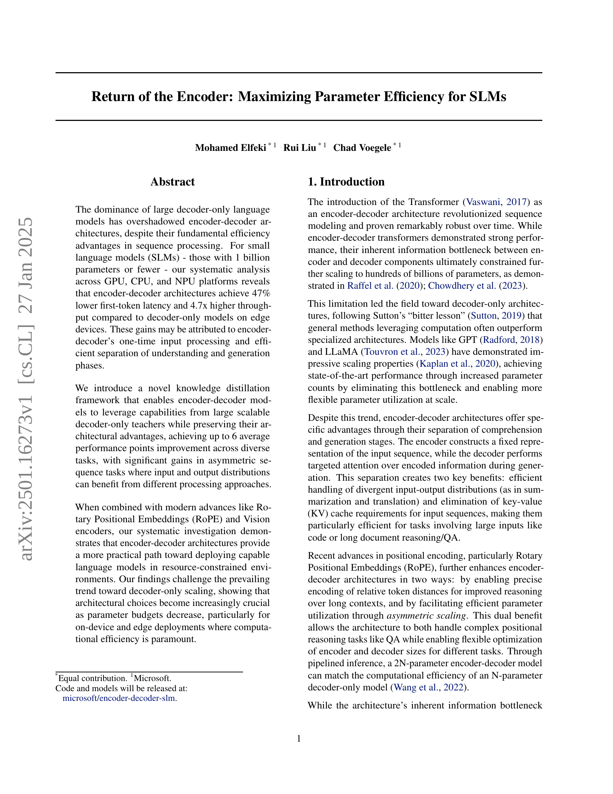
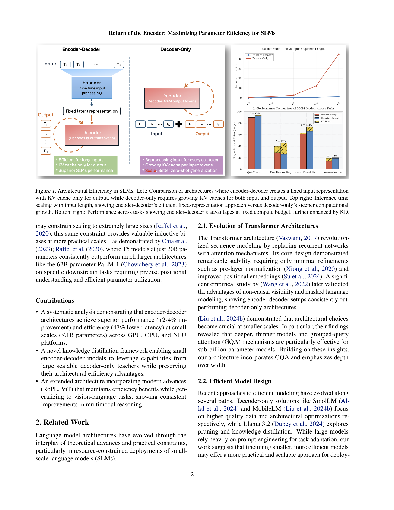
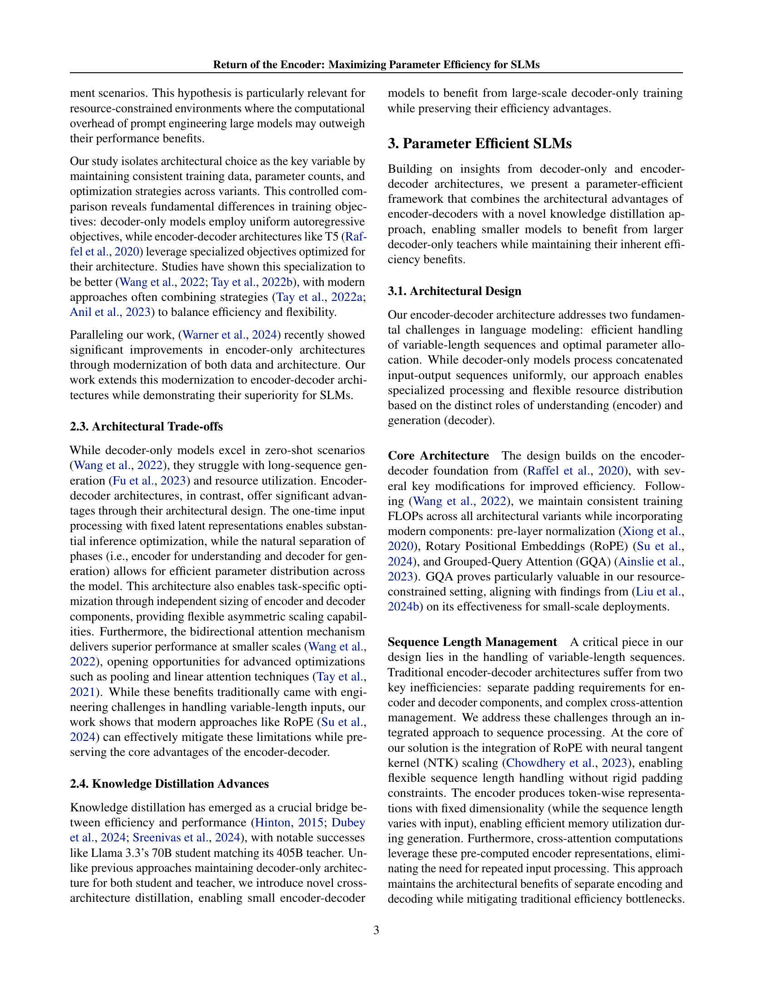
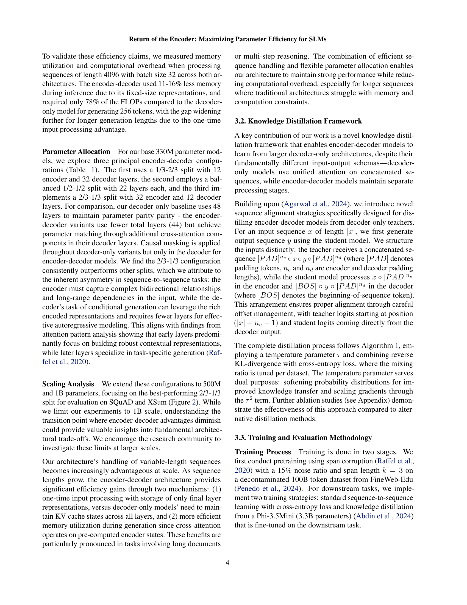
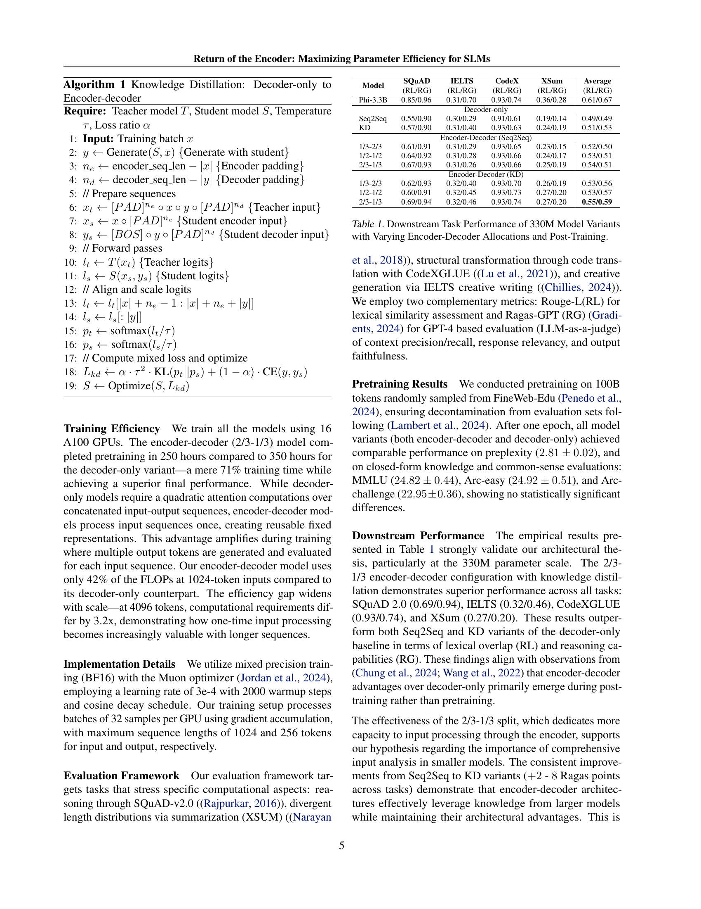
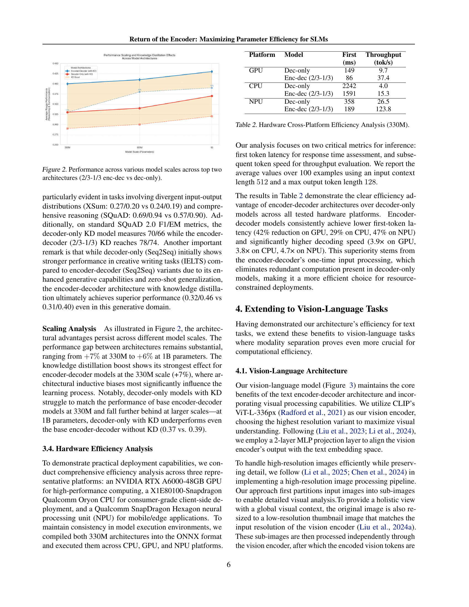
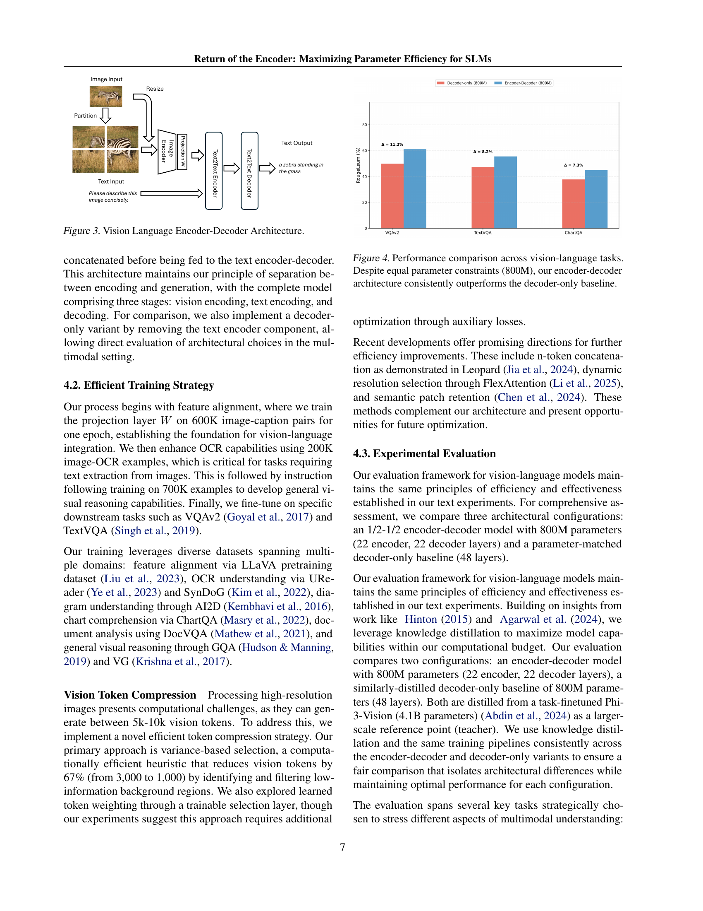
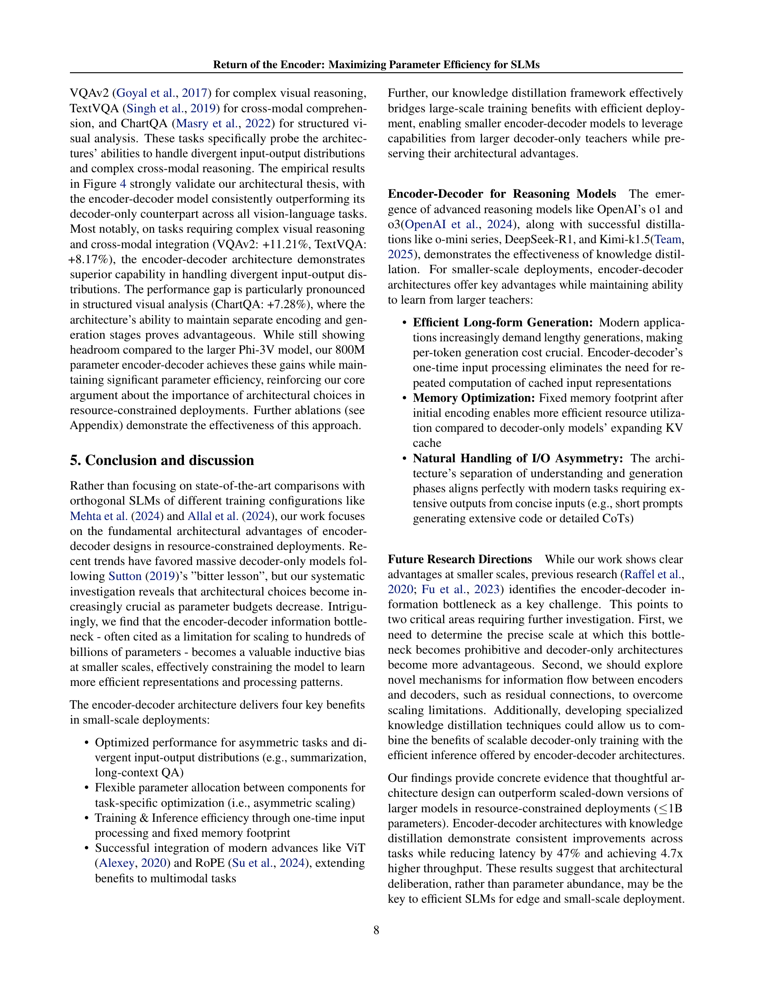
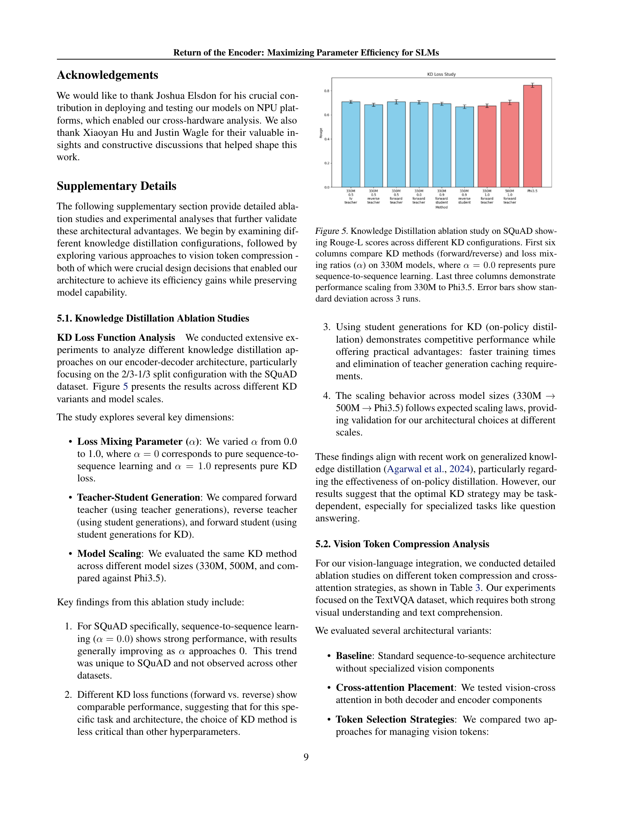
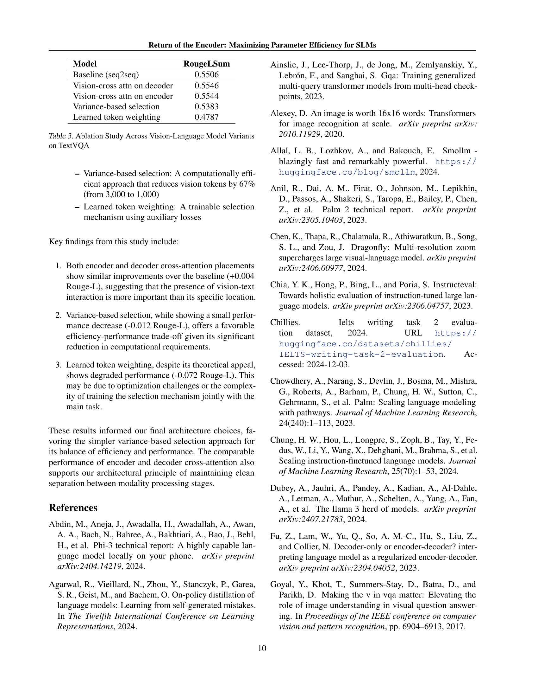
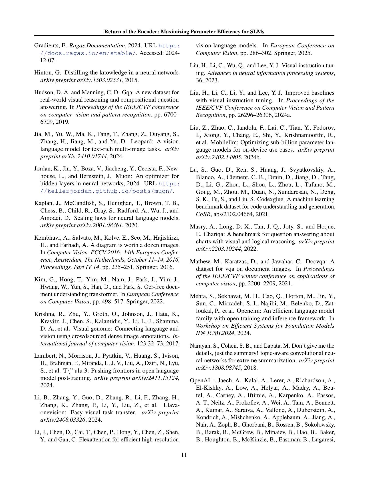
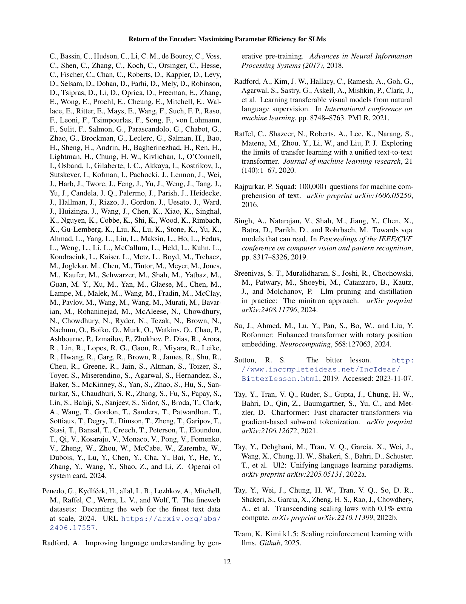
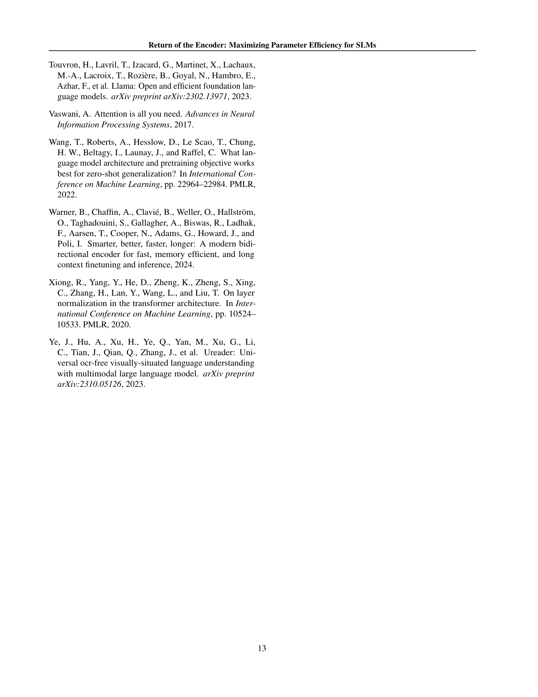
