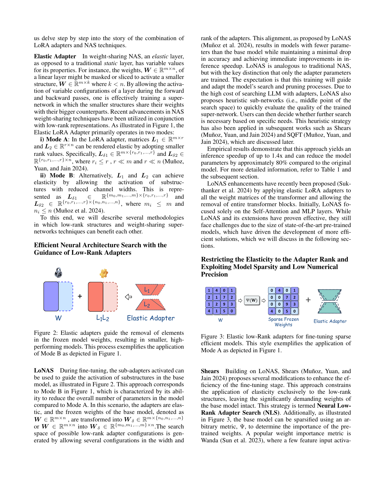

 


 2501.16372 
 J. Pablo Muñoz et el. 
 
 🤗 2025-01-29 
 



↗ arXiv


↗ Hugging Face


↗ Papers with Code


### TL;DR



대규모 언어 모델(LLM)은 뛰어난 성능을 보이지만, 계산 자원 소모가 많아 활용에 제약이 있습니다.  **기존의 미세 조정 방식은 많은 메모리와 처리 시간**을 필요로 하여, **자원이 제한적인 환경에서는 사용이 어렵습니다.** 또한, 모델의 크기가 방대하여, **배포 및 서비스 제공에도 어려움**이 있습니다.

본 논문에서는 **저차원 어댑터**와 **신경망 구조 탐색(NAS)** 기법을 결합하여 이러한 문제를 해결합니다.  **저차원 어댑터는 LLM의 일부 파라미터만 조정**하여 미세 조정 효율을 높이고, **NAS는 효율적인 네트워크 구조를 자동으로 탐색**합니다.  이를 통해 모델 크기를 줄이고, 미세 조정 및 추론 시간을 단축시키는 동시에 정확도 저하를 최소화하는 데 성공했습니다. 특히, **희소 행렬 및 저정밀도 모델에 대한 미세 조정**을 위한 새로운 기술을 제시하여, LLM의 실용성을 더욱 높였습니다.



#### Key Takeaways


 저차원 어댑터와 신경망 구조 탐색을 결합하여 LLM의 크기를 줄이고 미세 조정 효율을 높임 



 희소 모델 및 저정밀도 모델에 대한 미세 조정 기술 개선 



 제한된 자원 환경에서도 LLM 배포 가능성 확대 


#### Why does it matter?
본 논문은 **대규모 언어 모델(LLM)의 효율적인 압축 및 미세 조정**에 대한 중요한 연구 결과를 제시합니다. **저자원 환경에서 LLM을 활용**할 수 있도록 하는 혁신적인 방법을 제시하여, **AI 연구의 민주화**에 기여합니다. 또한, **저차원 어댑터와 신경망 구조 검색을 결합**하는 새로운 접근법을 제시하여, 향후 연구에 중요한 방향을 제시합니다. 특히, **희소 모델 및 저정밀도 모델에 대한 미세 조정 기술**을 개선함으로써, LLM의 실용성을 높이는 데 크게 기여합니다.

------
#### Visual Insights

> 🔼 그림 1은 일반적인 LoRA 어댑터와 두 가지 유형의 탄성 어댑터를 보여줍니다. LoRA 어댑터는 기존의 선형 계층에 저계수 행렬을 추가하여 모델의 파라미터 효율적인 미세 조정을 가능하게 합니다.  탄성 어댑터는 LoRA 어댑터의 확장판으로, 어댑터의 차원(rank)이나 입력/출력 채널의 크기를 동적으로 조절할 수 있습니다. 그림에서 Mode A는 LoRA의 rank만을 조절하고, Mode B는 rank뿐 아니라 입력/출력 채널의 크기까지 조절하는 것을 보여줍니다. 이러한 탄성 어댑터는 다양한 모델 크기와 작업에 맞게 어댑터의 구조를 유연하게 조정하여 모델 압축 및 미세 조정 효율을 높일 수 있습니다.
> 

> 
read the caption

> Figure 1: Vanilla LoRA Adapter and two different modes of the elastic adapter. Mode A allows only the LoRA rank to be elastic, while Mode B also enables the input or output channels to be elastic.
> 


| Method | Average Score | Relative Score | Total Params. | TFLOPs | Inference Speedup |
|---|---|---|---|---|---| 
| LoRA | 65.8 | 100.0% | 6.7B | 1.7 | 1.00× |
| LoNAS (Heuristic Subnet) | 65.2 | 99.1% | 5.6B | 1.4 | 1.23× |
| LoNAS (Search Subnet-1) | 67.1 | 102.0% | 5.6B | 1.4 | 1.28× |
| LoNAS (Search Subnet-2) | 65.6 | 99.7% | 5.1B | 1.3 | 1.41× |

> 🔼 표 1은 LoNAS(Low-rank Neural Architecture Search) 모델의 성능을 보여줍니다.  LLM-Adapters (Hu et al., 2023)의 15,000개의 통합 상식 추론 데이터셋을 사용하여 LLaMA-7B 모델을 미세 조정했을 때의 정확도 점수와 모델 압축 효율성을 보여줍니다. 평균 점수는 8가지 상식 추론 작업에 대한 결과를 나타내며, Muñoz et al.(2024)에서 재현된 결과입니다.  LoNAS는 탄력적 어댑터 모드 B를 사용했으며, 기존 LORA 모델과 비교하여 파라미터 수 감소 및 추론 속도 향상 효과를 보이는지 확인할 수 있습니다.
> 

> 
read the caption

> Table 1: The performance of LoNAS using elastic adapters mode B, including accuracy score and model compression efficiency when fine-tuning LLaMA-7B on 15k unified commonsense reasoning dataset from LLM-Adapters (Hu et al. 2023). The average score represents the results across eight commonsense tasks. These results are reproduced from Muñoz et al. (2024)
> 

### In-depth insights

#### Elastic LoRA
탄력적 LoRA는 기존 LoRA의 한계를 극복하기 위해 제안된 개념으로, **어댑터의 크기 및 차원을 동적으로 조절**하여 다양한 모델 크기와 하드웨어 환경에 적응할 수 있도록 합니다.  이는 **모델 압축 및 미세 조정 효율을 향상**시키는 데 중요한 역할을 합니다.  **NAS(Neural Architecture Search) 기법과 결합**하여 최적의 어댑터 구조를 자동으로 찾아냄으로써, 수동으로 하이퍼파라미터를 조정하는 번거로움을 줄이고 성능을 최대화할 수 있습니다.  **다양한 모드(Mode A, Mode B)**를 통해 어댑터의 랭크 뿐만 아니라 입력/출력 채널의 크기까지 조절이 가능해져, 더욱 유연하고 효율적인 모델 최적화가 가능합니다.  **희소성(sparsity) 및 저정밀도(low numerical precision) 모델과의 통합**을 위한 추가적인 전략 또한 고려되어, 실제 환경에서의 적용성을 높이고 있습니다.  결론적으로, 탄력적 LoRA는 **모델 크기와 성능 간의 균형을 유지**하며, **자원 제약 환경에서도 LLM을 효율적으로 활용**할 수 있도록 하는 핵심 기술입니다.

#### LoNAS Search
LoNAS (Low-Rank Neural Architecture Search)는 **대규모 언어 모델(LLM)의 효율적인 미세 조정을 위해 저차원 어댑터와 신경망 구조 탐색(NAS) 기법을 결합한 혁신적인 방법**입니다.  기존 NAS는 계산 비용이 많이 들지만, LoNAS는 **어댑터 파라미터만 학습**하여 효율성을 높입니다.  **탄력적인 LoRA 어댑터**를 사용하여 어댑터의 차원을 동적으로 조절하며,  **가중치 공유 초 네트워크**를 통해 다양한 아키텍처를 탐색합니다.  **휴리스틱 전략**을 활용하여 탐색 공간을 효과적으로 줄이고,  **저차원 표현의 지침**을 받아 효율적인 탐색을 수행합니다.  결과적으로, LoNAS는 모델 크기를 줄이고 추론 속도를 높이면서 정확도 저하를 최소화하는 데 기여합니다.  이는 **제한된 자원 환경에서 LLM을 활용하는 데 중요한 발전**이며,  **LLM 민주화**에 한 걸음 더 다가가는 의미를 가집니다.

#### Sparsity & SQFT
**희소성(Sparsity)**과 **SQFT(Sparse Quantized Fine-Tuning)**는 대규모 언어 모델(LLM)의 효율적인 미세 조정을 위한 핵심 전략입니다.  **희소성**은 모델의 가중치 행렬에서 불필요한 매개변수를 제거하여 메모리 사용량과 계산량을 줄이는 기술입니다.  **SQFT**는 이러한 희소 행렬에 적합하도록 설계된 미세 조정 기법으로, 낮은 수치적 정밀도를 활용하여 추가적인 계산량 감소를 달성합니다.  **SQFT**는 희소 행렬과 저정밀도 수치 연산의 조합을 통해 LLM의 크기와 연산 비용을 크게 줄이면서 성능 저하를 최소화합니다. **핵심은 희소 행렬과 저정밀도 연산의 시너지 효과**를 활용하는 것입니다. 이는 특히 자원 제약 환경에서 LLM을 배포하는 데 중요한 이점을 제공합니다.

#### NAS & Low-Rank
**저차원 표현(Low-Rank)과 신경망 구조 탐색(NAS)**는 대규모 언어 모델(LLM)을 효율적으로 압축하고 미세 조정하는 데 유망한 방법입니다.  **저차원 어댑터(Low-Rank Adapter)**는 기존 모델의 파라미터를 변경하지 않고 성능을 향상시키는 매력적인 접근 방식입니다. 이는 모델 크기를 줄이고 추론 속도를 높이는 데 크게 기여합니다.  **NAS는 최적의 신경망 구조를 자동으로 찾는 기술**로, 저차원 어댑터와 결합하면 모델의 성능과 효율성을 더욱 개선할 수 있습니다.  **NAS를 통해 저차원 어댑터의 구조 자체를 최적화**하여 더 적은 파라미터로 더 나은 성능을 달성할 수 있고, **가중치 공유(Weight-Sharing)** 기법과 결합하면 탐색 효율성을 높일 수 있습니다. **탄력적인(Elastic) 저차원 어댑터**는 어댑터의 차원을 동적으로 조정하여 다양한 모델 크기와 작업에 적응할 수 있는 유연성을 제공합니다.  그러나 NAS 기반 접근법은 계산 비용이 많이 들 수 있으므로, 효율적인 탐색 전략과 알고리즘 개발이 중요합니다. **희소성(Sparsity)과 낮은 수치 정밀도(Low Numerical Precision)**를 활용하여 모델 압축을 더욱 강화하는 연구도 활발히 진행되고 있습니다.

#### Future of PEFT
PEFT의 미래는 **매개변수 효율적인 학습 방법의 지속적인 발전**과 **다양한 응용 분야**로의 확장에 달려 있습니다.  **저랭크 어댑터**와 같은 기술은 이미 큰 성공을 거두었지만, **더욱 효율적이고 강력한 방법**을 개발하기 위한 연구가 활발히 진행 중입니다.  이는 **신경망 아키텍처 탐색(NAS)**과 같은 최첨단 기법과의 통합을 통해 이루어질 수 있으며, **모델 압축 및 성능 향상**에 획기적인 발전을 가져올 수 있습니다.  또한, **희소 모델 및 저정밀도 계산**과의 결합을 통해 리소스 제약 환경에서도 PEFT를 효과적으로 적용하는 것이 중요하며, 이를 위한 연구는 **모델의 견고성과 일반화 능력 향상**으로 이어질 것입니다.  **다양한 모델 크기와 아키텍처**에 적용 가능한 범용적인 PEFT 기법 개발 또한 중요한 과제입니다.  결론적으로 PEFT의 미래는 **모델의 효율성, 성능, 그리고 접근성을 동시에 개선**하는 방향으로 나아갈 것이며, 이는 **AI 기술의 대중화 및 실생활 응용**에 크게 기여할 것입니다.

### More visual insights

More on figures

> 🔼 그림 2는 기존 모델 가중치의 요소들을 제거하여 더 작고 성능이 뛰어난 모델을 만드는 과정을 보여줍니다.  Elastic Adapter (Mode B)는 기존 모델의 가중치(W)를 그대로 유지하고, 저차원 어댑터(L1, L2)를 추가하여 모델을 수정합니다.  Mode B는 그림 1에서 설명하는 것처럼 어댑터의 입력 및 출력 채널 크기를 변경할 수 있습니다. 이 그림에서는 어댑터의 가중치가 원래 가중치의 일부만을 활성화하여 모델 크기를 줄이고, 동시에 성능을 유지하거나 개선하는 것을 보여줍니다.  즉, 저차원 어댑터를 통해 불필요한 가중치를 제거하여 모델의 크기와 계산량을 줄이고, 동시에 성능 저하를 최소화하는 방법을 시각적으로 설명합니다.
> 

> 
read the caption

> Figure 2: Elastic adapters guide the removal of elements in the frozen model weights, resulting in smaller, high-performing models. This process exemplifies the application of Mode B as depicted in Figure 1.
> 

> 🔼 그림 3은 희소 효율적인 모델을 미세 조정하기 위한 탄성 저계수 어댑터를 보여줍니다. 이 그림은 그림 1에 묘사된 A 모드의 적용을 보여주는 예시입니다.  A 모드는 LoRA 순위만 탄력적으로 조정하는 방식입니다. 그림은 기존 가중치(W)가 희소화된 상태에서, 탄성 저계수 어댑터(L1L2)가 추가되어 미세 조정되는 과정을 보여줍니다.  기존 가중치의 일부는 고정(frozen)되고, 어댑터만 학습되어 모델 크기와 계산량을 줄이는 효율적인 방법입니다.
> 

> 
read the caption

> Figure 3: Elastic low-Rank adapters for fine-tuning sparse efficient models. This style exemplifies the application of Mode A as depicted in Figure 1.
> 

> 🔼 그림 4는 파레토 최적 저계수 어댑터 구성을 발견하기 위한 탐색 과정을 보여줍니다. NSGA-II 알고리즘을 사용하여 여러 목표(예: MAC 연산 및 검증 정확도)를 최적화하는 탐색을 수행합니다. 수평선은 중간 지점 휴리스틱 하위 어댑터의 제로샷 정확도를 나타냅니다.  이 그림은 효율적인 저계수 어댑터를 찾기 위한 다목적 최적화의 과정을 시각적으로 보여주고, 휴리스틱 방법과의 비교를 통해 성능 향상을 확인할 수 있게 합니다.
> 

> 
read the caption

> Figure 4: Search progression to discover Pareto-optimal low-rank adapter configurations. The horizontal line represents the zero-shot accuracy of the midpoint heuristic sub-adapter.
> 

More on tables


| Method | Accuracy | Relative Acc. | Sparsity | Precision |
|---|---|---|---|---|
| w/o tune | 36.0 | - | - | FP16 |
| LoRA | 44.1 | 100.0% | 50% | FP16 |
| **Shears** | 45.1 | 102.3% | 50% | FP16 + FP16 |
| **SQFT + SparsePEFT** | 50.1 | 113.6% | 50% | FP16 |
| **SQFT** | 44.5 | 100.9% | 50% | INT4 + FP16 |
| **SQFT + QA-SparsePEFT** | 44.0 | 99.8% | 50% | INT4 |
> 🔼 표 2는 Muñoz 등의 연구(2024)에서 제시된 Shears와 SQFT 기법을 사용하여 Mistral-7B-v0.3 모델을 GSM8K 데이터셋으로 미세 조정했을 때의 성능을 보여줍니다.  'Elastic Adapter Mode A'를 사용했으며, 정확도, 상대 정확도, 희소성, 그리고 사용된 정밀도를 비교 분석하여 각 기법의 효율성과 정확도를 평가합니다.  Shears와 SQFT는 기존 LoRA 방식에 비해 향상된 성능을 보이는지 확인하고, SparsePEFT와 QA-SparsePEFT 전략이 성능 개선에 어떤 영향을 미치는지 살펴볼 수 있습니다.
> 

> 
read the caption

> Table 2: The performance of Shears and SQFT from Muñoz et al. (2024), when fine-tuning Mistral-7B-v0.3 on GSM8K using elastic adapters mode A.
> 


| Method | Average Score | Relative Score | Sparsity | Non-zero Params. |
|---|---|---|---|---|
| LoRA | 51.1 | 100.0% | - | 13.0B |
| Shears | 52.0 | 101.8% | 40% | 8.0B |
| Shears | 50.9 | 99.6% | 50% | 6.7B |
> 🔼 표 3은 10,000개의 통합 수학 추론 데이터셋(LLM-Adapters (Hu et al., 2023) 참조)에서 탄성 어댑터 모드 A를 사용하여 LLaMA-13B에 대한 Shears의 성능을 보여줍니다. 이 결과는 Muñoz et al.(2024)에서 재현되었으며, 평균 점수는 GSM8K(Cobbe et al., 2021), AQUA(Ling et al., 2017), MAWPS(Lan et al., 2022), SVAMP(Patel, Bhattamishra, and Goyal 2021)의 네 가지 수학 과제에 대한 결과를 종합한 것입니다.
> 

> 
read the caption

> Table 3: The performance of Shears for LLaMA-13B on a 10k unified math reasoning dataset from LLM-Adapters (Hu et al. 2023) using elastic adapters mode A. These results are reproduced from Muñoz et al. (2024), and the average score represents the results across four math tasks (GSM8K (Cobbe et al. 2021), AQUA (Ling et al. 2017), MAWPS (Lan et al. 2022) and SVAMP (Patel, Bhattamishra, and Goyal 2021)).
> 

### Full paper



