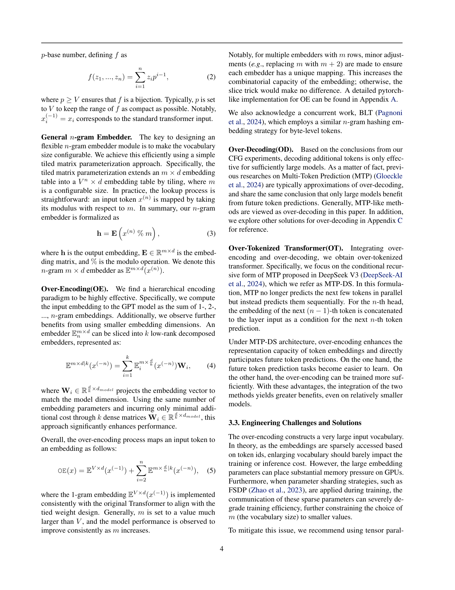

 


 2501.16975 
 Hongzhi Huang et el. 
 
 🤗 2025-01-29 
 



↗ arXiv


↗ Hugging Face


↗ Papers with Code


### TL;DR



본 연구는 **대규모 언어 모델(LLM)에서 토큰화의 중요성**을 재조명합니다. 기존 연구에서는 모델 크기 증가에 따라 어휘 크기도 증가해야 함을 보였지만, **입력과 출력 어휘의 영향을 구분하지 못했습니다.**  이로 인해, **작은 모델에서는 어휘 크기 확장이 오히려 성능 저하를 초래**할 수 있다는 한계점이 존재했습니다.

이러한 문제를 해결하기 위해 연구진은 **입력과 출력 어휘를 분리**하는 **'과도한 토큰화 변환기(Over-Tokenized Transformer)'**라는 새로운 프레임워크를 제시합니다.  **입력 어휘 크기를 확장**하여 다중 그램 토큰을 활용하고, **대규모 실험을 통해 입력 어휘 크기와 학습 손실 간의 로그 선형 관계**를 밝혀냈습니다.  그 결과, **모델 크기와 관계없이 입력 어휘 크기 확장이 성능 향상**에 기여함을 보였고, **추가 비용 없이 기존 모델의 두 배 성능을 달성**하는 것을 확인했습니다.  이는 **토큰화 설계가 LLM 확장 법칙에 중요한 역할**을 한다는 것을 보여줍니다.



#### Key Takeaways


 입력 어휘 크기 확장은 모델 성능을 일관되게 향상시키는 효과가 있습니다. 



 입력과 출력 어휘를 분리하는 과도한 토큰화 기법은 모델 확장성을 크게 향상시킬 수 있습니다. 



 과도한 토큰화 변환기는 기존 모델 크기의 두 배에 해당하는 성능을 추가 비용 없이 달성할 수 있습니다.  


#### Why does it matter?
본 논문은 **토큰화의 중요성을 강조**하고, **대규모 언어 모델의 효율적인 확장을 위한 새로운 방향**을 제시합니다.  이는 **토큰화 설계와 모델 확장 사이의 간극을 메우는 데 기여**하며, **더욱 효율적이고 강력한 LLM 개발**을 위한 새로운 가능성을 제시하여 연구자들에게 중요한 의미를 지닙니다.  **특히, 입력 어휘 크기 확장의 중요성을 실험적으로 증명**하여, 대규모 언어 모델 연구에 큰 영향을 미칠 것입니다.

------
#### Visual Insights

> 🔼 그림 1은 OLMo2 모델을 기반으로 과도하게 토큰화된(Over-Encoded) 모델과 기준 모델의 성능 추이를 보여줍니다. 4000억 개의 토큰을 학습 데이터로 사용했으며, 과도한 토큰화는 입력 어휘 크기를 기준 모델 대비 12배(OE-1.2M) 및 128배(OE-12.8M)로 확장한 것을 의미합니다.  왼쪽 그림은 모델 파라미터 수에 따른 손실을, 오른쪽 그림은 어휘 크기에 따른 손실을 나타냅니다.  특히, 4억 개의 파라미터를 가진 OE-12.8M 모델이 10억 개의 파라미터를 가진 기준 모델과 유사한 성능을 보이는 것을 확인할 수 있습니다. 이는 입력 어휘 크기 확장이 모델 성능 향상에 효과적임을 시사합니다.
> 

> 
read the caption

> Figure 1: Scaling trend for Over-Encoded models and baselines on OLMo2. We plot the loss with 400B tokens’ training. For over-encoding, input vocabulary size is extended from 0.1 to 1.2 and 12.8 million (12×12\times12 × and 128×128\times128 × larger than baseline), referred to as OE-1.2M and OE-12.8M. We observe OE-12.8M with 400M parameters matches the baseline with 1B parameters.
> 


| Model | # Emb. P. | Loss↓ | Downstream↑ |
|---|---|---|---|
| OLMoE-1.3B | 51M | 2.554 | 0.510 |
| +OE-12.8M | 13.1B | 2.472 (-0.082) | 0.524 (+0.014) |
| OLMoE-7B | 102M | 2.305 | 0.601 |
| +OE-12.8M | 26.3B | 2.229 (-0.076) | 0.608 (+0.007) |

> 🔼 본 표는 5000억 토큰의 학습 데이터를 사용하여 MoE(Mixture of Experts) 아키텍처에서 과도한 인코딩(Over-Encoding) 기법의 성능을 보여줍니다.  'Emb. P.' 열은 Embedding Parameter의 수를 나타내며, 'Downstream' 열은 MMLU-Var, Hellaswag, ARC-Challenge, ARC-Easy, PIQA 다섯 가지 하위 작업의 평균 성능 점수를 나타냅니다.  '+OE' 행은 과도한 인코딩을 적용했을 때 기준 모델 대비 성능 변화를 파란색으로 표시합니다.  즉, 과도한 인코딩 적용으로 인한 성능 향상 또는 저하를 수치적으로 보여주는 표입니다.
> 

> 
read the caption

> Table 1: Performance of Over-Encoding on MoE architecture with 500B tokens’ training. The column ‘Emb. P.’ represents ‘Embedding Parameters’. ‘Downstream’ stands for the average of MMLU-Var, Hellaswag, ARC-Challenge, ARC-Easy, and PIQA. For ‘+OE’ rows, we provide metric difference with blue labels.
> 

### In-depth insights

#### Vocab Scaling Laws
본 논문은 어휘 크기 확장이 언어 모델 성능에 미치는 영향을 탐구합니다. **어휘 크기 증가가 훈련 손실 감소와 직접적으로 연관되어 있음**을 보여주는 실험 결과를 제시합니다. 특히, **입력 어휘 크기 확장은 모델 크기에 관계없이 일관되게 성능 향상**을 가져온다는 것을 발견했습니다. 이는 단순히 매개변수 증가가 아닌, **토큰화의 중요성을 강조**하는 결과입니다.  본 연구는 토큰화 전략을 개선하여 더욱 효율적이고 강력한 대규모 언어 모델을 개발할 수 있는 실용적인 통찰력을 제공합니다. **입력 어휘의 확장은 계산 비용 증가 없이도 성능을 향상**시키며, 이러한 발견은 모델 확장 법칙에 새로운 차원을 제시합니다.

#### Over-Tokenization
본 논문은 과도한 토큰화(Over-Tokenization) 개념을 통해 **입력 토큰의 크기(n-gram)**를 확장함으로써 언어 모델의 성능을 향상시키는 방법을 제시합니다. 기존의 토큰화 방식에서 벗어나 입력과 출력 어휘를 분리하여, 입력 어휘의 크기를 늘려 다양한 n-gram 토큰을 활용하는 것이 핵심입니다. **모델 크기와 상관없이 입력 어휘 크기가 증가하면 훈련 손실이 줄어드는 로그 선형 관계**를 발견하여, 대규모 언어 모델의 확장성에 있어 토큰화의 중요성을 강조합니다.  **과도한 입력 토큰화는 모델 성능을 향상**시키지만, **출력 토큰화는 작은 모델에 부정적 영향**을 미칠 수 있음을 실험을 통해 밝힙니다.  이러한 발견을 바탕으로, 효율적인 토큰화 전략을 제시하고, 더욱 강력한 대규모 언어 모델 개발의 새로운 방향을 제시합니다.  특히, **계산 비용 증가 없이 성능을 두 배로 향상**시킬 수 있다는 점이 주목할 만합니다.

#### OE and OD
본 논문에서 제시된 Over-Encoding(OE)과 Over-Decoding(OD)는 **토크나이저 디자인의 새로운 패러다임**을 제시합니다.  OE는 입력 토큰을 다양한 크기의 n-gram으로 변환하여 모델의 입력 공간을 확장하는 기법입니다. 이를 통해 모델은 **더욱 풍부한 문맥 정보**를 활용할 수 있게 되어 성능 향상에 기여합니다.  **특히, 대규모 모델에서 그 효과가 두드러지게 나타나며**, 계산 비용 증가 없이 성능 향상을 가져옵니다. 반면 OD는 출력 토큰을 n-gram으로 확장하는 기법으로, **세분화된 지도 학습**을 가능하게 합니다. 하지만, OD는 소규모 모델에서는 오히려 성능 저하를 야기할 수 있으므로, **모델 규모에 따른 적절한 활용**이 중요합니다. OE와 OD를 결합한 Over-Tokenized Transformer는 각 기법의 장점을 극대화하여 더욱 효율적이고 강력한 LLM을 구축하는 방향을 제시합니다.  **토크나이저 디자인의 중요성을 강조**하며, 효율적인 LLM 개발을 위한 새로운 관점을 제공합니다.

#### Engineering OE
본 논문에서 제시된 "Over-Encoding (OE)" 기법은 대규모 언어 모델의 효율성을 높이는 데 중점을 두고 있습니다. **입력 어휘 크기를 확장하여 다중 어절 토큰을 활용**함으로써 모델 성능을 향상시키는 접근 방식입니다.  하지만 OE 기법을 효과적으로 구현하는 것은 단순하지 않습니다. **매우 큰 임베딩 테이블이 필요**하기 때문에 메모리 부족 및 통신 오버헤드와 같은 문제점에 직면할 수 있습니다. 따라서 논문에서는 이러한 공학적 문제에 대한 해결책을 제시합니다.  **텐서 병렬 처리를 활용하여 메모리 사용량을 줄이고 통신 오버헤드를 최소화**하는 방법을 설명하며, 효율적인 구현을 위한 실질적인 엔지니어링 솔루션을 제공합니다.  **이를 통해 대규모 모델에서도 OE의 효과를 유지하면서 효율성을 높이는 데 기여**할 수 있다는 것을 보여줍니다.  결론적으로, 이 논문의 "Engineering OE" 부분은 단순한 이론적 제안을 넘어 실제 구현의 어려움을 인지하고, 이를 해결하기 위한 구체적인 방법을 제시함으로써 실제 응용 가능성을 높이는 데 기여하고 있습니다.

#### Future Work
본 논문에서 제시된 과잉 토큰화 트랜스포머(Over-Tokenized Transformer)는 토큰화 과정의 중요성을 강조하며, **입력 어휘 크기 확장**을 통해 모델 성능을 향상시키는 효과적인 방법을 제시합니다.  **향후 연구**로는 **다양한 모델 아키텍처**에서 과잉 토큰화 기법의 적용 가능성을 탐색하는 것이 중요합니다.  **대규모 언어 모델의 효율성을 높이는 방안**으로서, 과잉 토큰화 기법과 다른 최적화 기술(예: 희소 행렬 분해, 파이프라인 병렬 처리)을 결합하는 연구가 필요합니다. 또한, **과잉 디코딩(Over-Decoding)** 전략의 개선 및 **다양한 하이퍼파라미터** 최적화 연구를 통해 모델 성능을 더욱 향상시키는 방법을 모색할 수 있습니다. 마지막으로, **다양한 언어 및 작업**에 대한 과잉 토큰화 트랜스포머의 일반화 성능 평가 및 개선 연구를 통해 실제 응용 가능성을 높일 수 있을 것입니다. 이를 통해 **더욱 효율적이고 강력한 대규모 언어 모델** 개발에 기여할 수 있을 것으로 기대됩니다.

### More visual insights

More on figures

> 🔼 그림 2는 CFG 데이터로 학습된 모델의 성능 비교를 보여줍니다. 왼쪽 패널은 1-gram과 3-gram 토크나이저를 비교하여, 3-gram 토크나이저가 큰 모델(85M 파라미터)의 성능을 향상시키지만 작은 모델(2.4M 파라미터)의 성능은 저하시킨다는 것을 보여줍니다. 오른쪽 패널은 인코더와 디코더에서 3-gram 사용을 분석하여, 모델 크기에 관계없이 3-gram 인코더는 성능 향상을 가져오지만 3-gram 디코더는 작은 모델의 성능을 저하시킨다는 것을 보여줍니다.  즉, 토크나이저의 그램 수를 늘리는 것이 항상 좋은 것은 아니며, 모델의 크기에 따라 적절한 토크나이저를 선택해야 함을 시사합니다.
> 

> 
read the caption

> Figure 2: Performance comparison for models trained on CFG data. The left panel compares 1-gram and 3-gram tokenizers, showing that 3-gram improves larger (85M parameters) models but harms smaller (2.4M parameters) ones. The right panel examines 3-gram usage in encoders and decoders, revealing consistent gains with 3-gram encoders regardless of model size, while 3-gram decoders degrade performance in smaller models.
> 

> 🔼 이 그림은 2-gram 인코딩 및 디코딩을 사용하는 GPT 모델의 작동 방식을 보여줍니다.  기존의 GPT 모델과 달리, 입력 토큰을 2-gram 단위로 인코딩하여 모델이 더욱 긴 문맥을 고려할 수 있도록 합니다.  디코딩 과정에서는 다음 두 개의 토큰을 예측하지만, 실제로는 다음 한 개의 토큰만 유지하여 추론 비용을 기존 모델과 동일하게 유지합니다.  이는 2-gram 인코딩을 통해 모델의 성능을 향상시키는 동시에, 추론 속도 저하를 방지하는 효율적인 방법임을 시각적으로 보여줍니다.
> 

> 
read the caption

> Figure 3: Illustration of 2-gram encoding/decoding GPT. Note that 2-gram decoding only preserves the predicted next 1 token though next 2 is predicted, which keeps inference cost identical to the vanilla model.
> 

> 🔼 그림 4는 OLMo2-1B 모델에 대해 OE-12.8M 모델과 기준 모델의 학습 곡선을 보여줍니다. 손실에 대해서는 0.99의 가중치를 사용한 지수 이동 평균을 통해, 하위 작업에 대해서는 0.9의 가중치를 사용한 지수 이동 평균을 통해 메트릭을 부드럽게 처리했습니다. OE 모델은 손실이 5.7배, MMLU-Var가 3.2배, Hellaswag가 3.0배, ARC-Challenge가 2.6배, ARC-Easy가 3.1배, PIQA가 3.9배 향상되는 등 수렴 속도가 크게 향상되는 것을 확인할 수 있습니다.
> 

> 
read the caption

> Figure 4: Training curves for OE-12.8M and baseline model on OLMo2-1B. The metrics are smoothed via exponential moving average with weight 0.99 for loss and 0.9 for downstream tasks. We observe significant convergence acceleration for the OE model: 5.7×5.7\times5.7 × on loss, 3.2×3.2\times3.2 × on MMLU-Var, 3.0×3.0\times3.0 × on Hellaswag, 2.6×2.6\times2.6 × on ARC-Challenge, 3.1×3.1\times3.1 × on ARC-Easy and 3.9×3.9\times3.9 × on PIQA.
> 

> 🔼 그림 5는 OLMoE-1.3B 모델을 5000억 토큰으로 학습시킨 결과를 보여줍니다. 입력 어휘 사전의 크기(m)와 학습 손실(L) 사이의 관계를 나타냅니다.  로그-선형 관계가 관찰되는데, 이는 어휘 사전 크기가 증가함에 따라 학습 손실이 선형적으로 감소함을 의미합니다.  수식 L = 2.6754 - 0.0256 * log₁₀(m)은 이러한 관계를 정량적으로 나타냅니다. 이 그림은 입력 어휘 사전 크기의 확장이 모델 성능 향상에 미치는 영향을 시각적으로 보여주는 중요한 결과입니다.
> 

> 
read the caption

> Figure 5: Log-linear relationship is observed between vocabulary size m𝑚mitalic_m and training loss ℒℒ\mathcal{L}caligraphic_L, i.e. ℒ=2.6754−0.0256×log10⁡mℒ2.67540.0256subscript10𝑚\mathcal{L}=2.6754-0.0256\times\log_{10}{m}caligraphic_L = 2.6754 - 0.0256 × roman_log start_POSTSUBSCRIPT 10 end_POSTSUBSCRIPT italic_m. The values are collected with 500B tokens’ training on OLMoE-1.3B models.
> 

> 🔼 이 그림은 논문의 3.1절 '합성 실험 데이터에서의 통찰'에서 사용된 문맥 자유 문법(CFG)에 대한 설명입니다. 왼쪽 패널은 실험에 사용된 CFG 규칙을 보여줍니다. 오른쪽 패널은 이 규칙을 사용하여 생성된 시퀀스의 예시를 보여줍니다. 이 그림은 Allen-Zhu & Li (2024) 논문에서 가져왔습니다. 그림은 CFG 규칙의 구조와 이를 통해 생성되는 시퀀스의 특징을 시각적으로 보여줌으로써, 논문에서 사용된 합성 데이터의 특징을 이해하는데 도움을 줍니다.
> 

> 
read the caption

> Figure 6: Left Panel: CFG rules used in our experiments; Right Panel: an example of the generated sequences using the rules. This figure is taken from (Allen-Zhu & Li, 2024).
> 

> 🔼 그림 9는 OLMo2-1B 모델에 대한 다양한 평가 지표들을 보여줍니다.  OE-12.8M(Over-Encoding 12.8M) 모델과 기준 모델(baseline)의 성능을 비교하여, 과도한 토큰화(Over-Tokenization) 기법이 모델 성능에 미치는 영향을 다각적으로 분석합니다.  구체적으로는, perplexity, 손실 함수 값(loss)과 여러 하류 작업(downstream task)의 정확도를 비교 분석하여 과도한 토큰화 기법의 효과를 보여줍니다.  각 지표는 학습 과정 전반에 걸쳐 추적되어, 시간에 따른 성능 변화를 시각적으로 보여줍니다.
> 

> 
read the caption

> Figure 9: All metrics for OLMo2-1B, comparing OE-12.8M and baseline.
> 

> 🔼 그림 11은 OLMoE-1.3B 모델에 대한 다양한 평가 지표들을 보여줍니다. OE-12.8M (Over-Encoding 모델, 1280만 개의 임베딩 파라미터)과 기준 모델(baseline)의 성능을 비교하여, 각 지표(예: 손실, 퍼플렉서티, 다운스트림 작업 성능 등)에 대한 차이를 시각적으로 나타냅니다.  이 그림은 과도한 토큰화(Over-Tokenization) 기법이 모델의 성능 향상에 미치는 영향을 종합적으로 보여주는 실험 결과를 제시합니다.
> 

> 
read the caption

> Figure 11: All metrics for OLMoE-1.3B, comparing OE-12.8M and baseline.
> 

> 🔼 그림 12는 OLMoE-7B 모델에 대한 다양한 평가 지표들을 보여줍니다. OE-12.8M(Over-Encoding 모델, 입력 어휘 크기 1280만)과 기준 모델(baseline)의 성능을 비교 분석하여, 각 지표별 추세(training loss, perplexity, downstream task 성능 등)를 시각적으로 나타냅니다. 이를 통해 과도한 토큰화(Over-Tokenization) 기법이 OLMoE-7B 모델의 성능 향상에 미치는 영향을 종합적으로 평가하고 분석할 수 있습니다.
> 

> 
read the caption

> Figure 12: All metrics for OLMoE-7B, comparing OE-12.8M and baseline.
> 

> 🔼 그림 13은 OLMoE-1.3B 모델에 대한 다양한 평가 지표들을 보여줍니다.  OT-12.8M (Over-Tokenized Transformer with 12.8M embedding parameters)과 OE-12.8M (Over-Encoded Transformer with 12.8M embedding parameters)의 성능을 비교 분석하여, 두 모델의 차이점과 각 모델의 강점을 보여주는 다양한 지표들의 추이를 시각적으로 제시합니다.  각 지표는 모델 학습 진행에 따른 변화를 보여주는 그래프로 표현되어, 모델 성능 향상 및 학습 안정성 측면에서 OT-12.8M과 OE-12.8M의 성능 차이를 자세히 비교 분석하는 데 도움이 됩니다.  다양한 하류 작업(downstream tasks)의 성능을 포함하여 모델의 전반적인 성능을 평가합니다.
> 

> 
read the caption

> Figure 13: All metrics for OLMoE-1.3B, comparing OT-12.8 and OE-12.8M.
> 

More on tables


Id|Model|Train Loss ↓|Train PPL ↓|Eval Loss ↓|Eval PPL ↓|Downstream MMLU-V ↑|Downstream HS ↑|Downstream ARC-C ↑|Downstream ARC-E ↑|Downstream PIQA ↑
---|---|---|---|---|---|---|---|---|---|---
1|OLMoE-1.3B|2.554|12.864|2.924|18.625|0.327|0.553|0.325|0.622|0.727
2|+𝔼3.2M×d(x(-2))|2.511|12.319|2.887|17.944|0.340|0.569|0.351|0.656|0.734
3|+𝔼6.4M×d/2(x(-2))|2.507|12.268|2.882|17.851|0.330|0.573|0.341|0.648|0.731
4|+𝔼3.2M×d|2(x(-2))|2.503|12.221|2.877|17.754|0.337|0.575|0.345|0.651|0.740
5|+𝔼3.2M×d|4(x(-2))|2.503|12.226|2.876|17.736|0.328|0.575|0.337|0.653|0.734
6|+∑i∈{2,3}𝔼i3.2M×d/2|2(x(-i))|2.495|12.127|2.870|17.638|0.340|0.578|0.330|0.636|0.738
7|+𝔼12.8M×d(x(-2))|2.493|12.100|2.881|17.832|0.334|0.569|0.343|0.643|0.730
8|+∑i∈{2,3}𝔼i12.8M×d/2|2(x(-i))|2.472|11.854|2.862|17.494|0.342|0.577|0.329|0.645|0.728
> 🔼 표 2는 다양한 입력 어휘 설계에 대한 추가 연구 결과를 보여줍니다.  OLMoE 평가 설정을 따라 MMLU-Var, Hellaswag, ARC-Challenge, ARC-Easy 다운스트림 작업의 평균 점수를 보여줍니다. 모든 모델은 500B 토큰으로 학습되었습니다.  표에서는 입력 임베딩에 사용된 토큰의 n-gram 구성, 임베딩 차원 및 임베딩 매트릭스의 분할 수에 따른 성능 변화를 보여줍니다.  각 구성에 따른 손실, perplexity, 그리고 다운스트림 작업 성능 지표(MMLU-V, HS, ARC-C, ARC-E, PIQA)가 제시되어, 어떤 입력 어휘 설계가 가장 효과적인지 비교 분석할 수 있도록 합니다.
> 

> 
read the caption

> Table 2: Ablation study on different input vocabulary designs. The downstream tasks follow the eval settings in OLMoE, where MMLU-V stands for MMLU-Var, HS for Hellaswag, ARC-C for ARC-Challenge and ARC-E for ARC-Easy. All models are trained with 500B tokens.
> 


| 1-Gram | 2-Gram | 3-Gram | k | Loss↓ | PPL↓ |
|---|---|---|---|---|---| 
| ✓ | ✗ | ✗ | - | 2.714 | 15.094 |
| ✗ | ✓ | ✗ | 1 | 2.785 | 16.205 |
| ✓ | ✓ | ✗ | 1 | **2.678** | **14.555** |
| ✓ | ✓ | ✗ | 4 | 2.670 | 14.447 |
| ✓ | ✗ | ✓ | 4 | 2.684 | 14.642 |
| ✓ | ✓ | ✓ | 4 | **2.667** | **14.394** |
> 🔼 표 3은 계층적 과잉 인코딩 설계에 대한 추가 분석 결과를 보여줍니다.  표는 1-gram, 2-gram, 3-gram 토큰을 사용한 여러 가지 실험 설정을 비교합니다.  '✓' 기호는 해당 n-gram 토큰 (x(-n))이 사용되었음을 나타냅니다. 모든 실험은 m=3.2M으로 진행되었으며, 50B 토큰으로 학습한 후 평가 지표를 보고합니다. 이 표는 다양한 n-gram 토큰 조합을 사용했을 때 모델 성능에 미치는 영향을 분석하여, 계층적 접근 방식의 효과를 보여줍니다.
> 

> 
read the caption

> Table 3: Ablation study for the hierarchical design of over-encoding. The symbol ‘✓’ on the n𝑛nitalic_n-gram column denotes n𝑛nitalic_n-gram token x(−n)superscript𝑥𝑛x^{(-n)}italic_x start_POSTSUPERSCRIPT ( - italic_n ) end_POSTSUPERSCRIPT is adopted. The experiments are conducted with m=3.2⁢M𝑚3.2Mm=3.2\mathrm{M}italic_m = 3.2 roman_M, and the metrics are reported after training on 50B tokens.
> 


| Model | Loss ↓ | PPL ↓ | Eval Loss ↓ | Eval PPL ↓ |
|---|---|---|---|---|
| baseline | 2.714 | 15.094 | 3.094 | 22.060 |
| +𝔼64V×d | 2.702 | 14.892 | 3.077 | 21.710 |
| +𝔼3.2M×d | **2.678** | **14.555** | **3.054** | **21.202** |
> 🔼 표 4는 해싱 충돌에 대한 추가 분석 결과를 보여줍니다.  표의 실험에서는 어휘 크기가 거의 동일하게 유지되도록(64V ≈ 3.218M) 설정되었으며, 각 모델은 500억 토큰으로 학습되었습니다. 표에는 학습 손실, 평가 손실, 그리고 다양한 하위 작업(MMLU-Var, Hellaswag, ARC-Challenge, ARC-Easy, PIQA)에 대한 성능 지표가 포함되어 있습니다. 이 표를 통해 해싱 충돌이 모델 성능에 미치는 영향과 다양한 어휘 구성 방식의 효과를 비교 분석할 수 있습니다.
> 

> 
read the caption

> Table 4: Ablation study on hashing conflicts. Note the experiments are kept roughly the same vocabulary size, i.e. 64⁢V≈3.218⁢M64𝑉3.218M64V\approx 3.218\mathrm{M}64 italic_V ≈ 3.218 roman_M. The metrics are reported after training with 50B tokens.
> 


| Model | Loss ↓ | Eval Loss ↓ | Downstream ↑ |
|---|---|---|---|
| baseline | 2.554 | 2.924 | 0.510 |
| +MTP | 2.556 +0.002 | 2.925 +0.001 | 0.508 -0.002 |
| +MTP-DS | 2.555 +0.001 | 2.926 +0.002 | 0.511 +0.001 |
| OE-12.8M | 2.472 | 2.862 | 0.524 |
| OT-12.8M | 2.481 +0.009 | 2.869 +0.007 | 0.537 +0.013 |
> 🔼 표 5는 OLMoE-1.3B 모델에 대한 다중 토큰 예측(MTP) 실험 결과를 보여줍니다.  'Loss' 열은 MTP 방법에 대한 다음 토큰 예측 손실을 나타냅니다.  기준 모델(baseline)에 비해 성능 향상을 가져온 지표 차이는 파란색으로, 성능 저하를 가져온 지표 차이는 빨간색으로 표시되어 있습니다.  즉, 이 표는 다양한 MTP 방법을 적용했을 때의 손실 및 다운스트림 작업 성능 변화를 정량적으로 비교 분석한 결과를 제시합니다.
> 

> 
read the caption

> Table 5: MTP Experiments on OLMoE-1.3B. The loss refers to the next one token prediction loss for MTP methods. Metric difference that improves baseline are marked blue while degrations are marked red.
> 


| Model | Loss ↓ | Eval Loss ↓ | MMLU-Var ↑ | Hellaswag ↑ | Arc-Challenge ↑ | Arc-Easy ↑ | PIQA ↑ |
|---|---|---|---|---|---|---|---| 
| OLMoE-1.3B | 2.554 | 2.924 | 0.327 | **0.553** | 0.325 | 0.622 | 0.727 |
| +OD λ₂=0.1 | 2.549 | 2.920 | 0.325 | **0.553** | **0.331** | 0.610 | 0.721 |
| +OD λ₂=0.2 | 2.549 | **2.918** | 0.327 | 0.551 | 0.323 | **0.633** | **0.728** |
| +OD λ₂=0.5 | 2.549 | **2.918** | 0.325 | **0.553** | 0.308 | 0.619 | 0.727 |
| +OD λ₂=1.0 | 2.555 | 2.923 | **0.328** | 0.550 | 0.320 | 0.629 | 0.722 |
| OLMoE-7B | 2.306 | **2.670** | 0.385 | **0.695** | **0.414** | **0.740** | 0.775 |
| +OD λ₂=0.1 | **2.304** | 2.672 | **0.387** | 0.691 | 0.409 | 0.724 | **0.776** |
> 🔼 표 6은 과소디코딩(OD)에서 손실 가중치에 대한 추가 연구 결과를 보여줍니다.  다양한 손실 가중치(λ2)를 사용하여 OLMOE-1.3B 및 OLMOE-7B 모델을 훈련시켰고, 평가 손실, MMLU-Var, Hellaswag, ARC-Challenge, ARC-Easy 및 PIQA의 평균 점수를 포함한 여러 지표를 측정했습니다. 이 표는 최적의 성능을 달성하기 위한 손실 가중치의 영향을 보여줍니다.
> 

> 
read the caption

> Table 6: Ablation study on loss weights for OD. The column downstream represents the average score of MMLU-Var, Hellaswag, ARC-Challenge, ARC-Easy and PIQA.
> 

### Full paper



