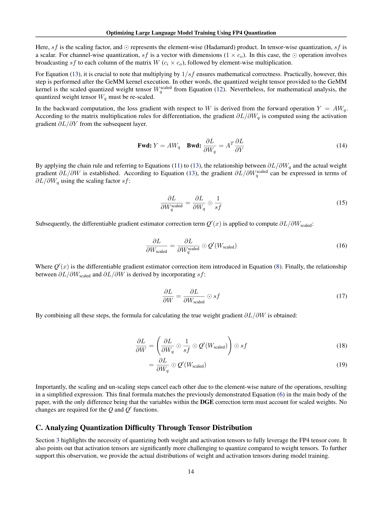

 


 2501.17116 
 Ruizhe Wang et el. 
 
 🤗 2025-01-29 
 



↗ arXiv


↗ Hugging Face


↗ Papers with Code


### TL;DR



대규모 언어 모델(LLM) 훈련에는 막대한 컴퓨팅 자원이 필요하며, 이는 비용과 에너지 소모 측면에서 큰 부담으로 작용합니다.  **양자화 훈련**은 이러한 문제를 해결할 유망한 방법으로 떠오르고 있지만, 기존의 FP8 양자화는 정확도 저하 문제를 완전히 해결하지 못했습니다.  특히, FP4 양자화는 매우 낮은 비트 수로 인해 양자화 오류가 심각하여 LLM 훈련에 적용하는 것은 더욱 어려운 과제였습니다.

본 연구는 이러한 어려움을 극복하기 위해 **미분 가능한 양자화 추정기와 이상치 절단 및 보정 전략**이라는 두 가지 핵심 기술을 도입한 FP4 훈련 프레임워크를 제시합니다. 이 프레임워크는 **정확한 가중치 업데이트를 보장하고 활성화 함수 붕괴를 방지**하여 안정적인 FP4 훈련을 가능하게 합니다.  실험 결과, 이 프레임워크는 BF16 및 FP8과 비교하여 정확도 저하 없이 효율적인 훈련을 수행하며 최대 130억 매개변수 모델과 1000억 토큰까지 확장 가능함을 보여줍니다.  이는 **LLM 훈련의 효율성을 크게 향상**시키는 획기적인 결과이며, 차세대 하드웨어의 FP4 지원과 함께 더욱 폭넓은 활용이 기대됩니다.



#### Key Takeaways


 FP4 양자화 기반의 새로운 LLM 훈련 프레임워크 제시 



 BF16 및 FP8과 비슷한 정확도 달성, 130억 매개변수 모델까지 효과적 확장 



 차세대 하드웨어 지원 시 초저정밀도 훈련 가능성 제시 


#### Why does it matter?
본 논문은 **초저정밀도 FP4 양자화를 사용한 대규모 언어 모델 훈련에 대한 최초의 프레임워크**를 제시하여, 이 분야의 연구에 중요한 기여를 합니다.  **차세대 하드웨어의 등장과 함께 극도로 효율적인 초저정밀도 훈련의 기반을 마련**하며, **에너지 소비 감소 및 컴퓨팅 비용 절감**이라는 중요한 과제에 대응합니다. 또한, 본 연구는 **다양한 모델 크기와 훈련 토큰 수에 걸쳐 효과적으로 확장**됨을 보여주어, 향후 연구 방향에 대한 새로운 가능성을 제시합니다.

------
#### Visual Insights


| Clamp | Comp | Quantile | Sim ↑ | MSE ↓ | SNR ↑ |
|---|---|---|---|---|---| 
| × | — | — | 92.19% | 0.1055 | 8.31 |
| √ | × | 99.9 | 98.83% | 0.0366 | 14.25 |
| √ | √ | 99.9 | 99.61% | 0.0245 | 15.31 |
| √ | √ | 99 | 100% | 0.0099 | 18.38 |
| √ | √ | 97 | 100% | 0.0068 | 20.88 |

> 🔼 표 1은 LLaMA 1.3B 모델의 30,000번의 학습 반복에서 모든 활성화 텐서에 대해 얻은 평균값을 나타내는 원본 및 양자화된 활성화 텐서 간의 수치적 정확도 분석 결과를 보여줍니다.  원본 활성화 텐서와 양자화된 활성화 텐서 간의 코사인 유사도(SIM), 평균 제곱 오차(MSE), 신호 대 잡음비(SNR)를 정량적으로 비교 분석하여 양자화 과정에서의 정보 손실 정도를 평가합니다.  특히, CLAMP, COMP, QUANTILE 매개변수의 조합에 따른 성능 변화를 보여주어 양자화 전략의 효과를 다각적으로 분석합니다.
> 

> 
read the caption

> Table 1: Quantitative analysis of mathematical accuracy between original and quantized activation tensors. Results represent the average values obtained across all activation tensors on the 30,000 training iterations of the LLaMA 1.3B model.
> 

### In-depth insights

#### FP4 Training
본 논문에서 제시된 FP4 트레이닝은 **초저정밀도 FP4 양자화를 활용하여 대규모 언어 모델(LLM) 학습을 최적화**하는 혁신적인 방법론입니다.  기존의 FP8 양자화 방식의 한계를 극복하고자 **미분 가능한 양자화 추정기**와 **이상치 절단 및 보정 전략**을 도입하여 양자화 오류를 최소화합니다. 이를 통해 FP4의 제한된 표현 능력에도 불구하고, BF16이나 FP8과 비슷한 수준의 정확도를 달성하며, 최대 13B 파라미터의 LLM을 100B 토큰으로 효과적으로 확장할 수 있음을 실험적으로 입증합니다.  **차세대 FP4 하드웨어 지원**과의 시너지를 통해 초저정밀도 학습의 새로운 기준을 제시하며, **비용 효율적인 LLM 학습**에 기여할 것으로 예상됩니다.

#### Gradient Estimator
본 논문에서 제시된 'Gradient Estimator'는 **저비트(low-bit) 양자화 과정에서 발생하는 미분 불가능성 문제를 해결하기 위한 핵심 기술**입니다. 기존의 Straight-Through Estimator(STE)는 단순히 양자화된 값의 기울기를 원래 값의 기울기로 대체함으로써 계산 효율성을 높이지만, 정확도 저하 문제를 야기합니다. 반면, 논문에서 제안하는 방법은 **미분 가능한 근사 함수를 사용하여 기울기를 보다 정확하게 추정**, 이를 통해 기울기 소실 문제를 방지하고, FP4 양자화의 정확도를 크게 향상시킵니다.  **양자화 함수의 미분 불가능성을 해결하는 다양한 방법들이 존재하지만**, 본 논문에서 제시된 방법은 하드웨어 가속에 최적화된 방식을 제공하고, **실제 모델 학습 과정에서 효율성과 정확도를 동시에 높이는 데 기여**한다는 점에서 큰 의의를 지닙니다.  이러한 접근 방식은 단순한 근사가 아닌, **수학적 정확성을 고려한 차별화된 기울기 추정 방식**을 제시함으로써, 저비트 양자화의 실용성을 한층 높이는 데 기여하고 있습니다.

#### Outlier Handling
본 논문에서 제시된 FP4 양자화 프레임워크는 특히 활성화 텐서에 대한 효과적인 이상치 처리 전략을 제시합니다. **LLM 훈련 중 활성화 텐서의 값 분포는 매우 복잡하고 이상치가 많기 때문에** 저정밀도 양자화 과정에서 심각한 정확도 저하를 야기할 수 있습니다. 이를 해결하기 위해, **논문에서는 이상치 값을 제한하고 보정하는 OCC(Outlier Clamping and Compensation) 기법을 제안합니다.** OCC는 우선 활성화 텐서의 이상치 값을 미리 정의된 임계값으로 제한하고, 이로 인해 발생하는 오차를 보정하기 위해 희소 행렬을 사용합니다. **실험 결과는 OCC 기법이 양자화 오차를 크게 줄이고 텐서의 구조를 효과적으로 보존하는 데 효과적임을 보여줍니다.**  **이상치 처리 전략은 낮은 비트 양자화에서의 정확도 저하 문제를 완화하는 데 중요한 역할**을 합니다.  **특히, FP4와 같이 매우 낮은 비트 정밀도를 사용하는 경우, 이상치에 대한 효과적인 처리가 매우 중요**하며,  본 논문에서 제시된 OCC 기법은 이러한 문제를 해결하는 데 유용한 접근 방식임을 보여줍니다.

#### Ablation Studies
본 논문의 절삭 연구는 제안된 FP4 훈련 프레임워크의 각 구성 요소의 효과를 체계적으로 평가합니다. **정밀도 절삭 연구**에서는 FP4 방법이 BF16 및 다른 FP8 방법들과 비슷한 성능을 유지하는 반면, 직접 캐스팅된 FP4는 훈련 손실이 크게 증가함을 보여줍니다. **가중치 절삭 연구**는 제안된 DGE(차별 가능한 기울기 추정기) 방법이 가중치를 직접 양자화하는 것보다 수렴을 크게 향상시키지만, 활성화 함수를 양자화하는 것보다 효과가 덜하다는 것을 보여줍니다. **활성화 절삭 연구**에서는 제안된 OCC(이상치 자르기 및 보상) 방법이 활성화 함수를 직접 양자화할 때 발생하는 손실을 줄이는 데 매우 효과적임을 보여줍니다. 마지막으로, **세분화 절삭 연구**는 FP4 양자화의 세분화가 정확도에 중요한 영향을 미침을 보여줍니다. 이러한 절삭 연구를 통해 본 논문은 제안된 FP4 프레임워크의 각 구성 요소의 효과를 명확히 하고, FP4를 사용한 초저 정밀도 LLM 훈련의 실현 가능성을 더욱 강조합니다.

#### Future Work
본 논문은 FP4 양자화를 사용한 대규모 언어 모델 훈련 최적화에 대한 연구로, **차세대 하드웨어의 FP4 지원**에 초점을 맞추고 있습니다.  미래 연구 방향으로는 **실제 FP4 텐서 코어를 활용한 성능 및 에너지 효율성 평가**가 중요하며, 이를 통해 **실질적인 속도 향상**을 확인할 수 있을 것입니다. 또한, **더욱 대규모 모델 및 데이터셋**에 대한 실험을 통해 확장성을 검증하고, **다양한 양자화 기법**과의 비교 연구를 진행하여 FP4 양자화의 강점과 한계를 명확히 규명해야 합니다.  마지막으로, **다양한 모델 아키텍처 및 훈련 방법**에 대한 적용성을 평가하고, **훈련 안정성 및 일반화 성능** 향상을 위한 추가적인 최적화 기법 연구가 필요합니다.  **특히, 활성화 함수의 아웃라이어 처리**에 대한 더욱 심도있는 연구는 FP4 양자화의 효율성을 높이는데 기여할 것입니다.

### More visual insights

More on tables


| Model Size | Precision | Average | PiQA | Hellaswag | ObQA | Arc-C | Arc-E | BoolQ | LogiQA | SciQ | Lambada |
|---|---|---|---|---|---|---|---|---|---|---|---| 
| 1.3B | BF16 | **53.23** | 71.11 | 50.80 | 36.60 | 36.69 | 68.60 | 57.83 | 30.26 | 83.30 | 43.84 |
|  | FP4(Ours) | **53.13** | 70.89 | 50.82 | 36.20 | 36.86 | 67.47 | 58.23 | 29.49 | 83.90 | 44.30 |
| 7B | BF16 | **53.87** | 71.22 | 52.03 | 37.40 | 38.99 | 67.47 | 60.55 | 27.65 | 85.00 | 44.56 |
|  | FP4(Ours) | **54.42** | 71.87 | 52.97 | 38.40 | 39.85 | 67.97 | 62.20 | 27.96 | 84.70 | 43.88 |
| 13B | BF16 | **54.44** | 72.80 | 53.56 | 38.60 | 38.82 | 67.97 | 57.40 | 29.65 | 86.30 | 44.87 |
|  | FP4(Ours) | **54.95** | 73.78 | 54.12 | 39.60 | 39.68 | 67.89 | 55.90 | 30.88 | 85.80 | 46.89 |
> 🔼 표 2는 서로 다른 크기의 언어 모델에서 BF16 모델과 FP4 모델 간의 다운스트림 작업에 대한 제로샷 평가 결과를 보여줍니다.  BF16은 반정밀도 부동소수점 방식이고, FP4는 4비트 부동소수점 양자화 방식입니다.  표는 여러 다운스트림 작업(PiQA, HellaSwag, ObQA, Arc-C, Arc-E, BoolQ, LogiQA, SciQ, Lambada)에 대한 각 모델 크기(1.3B, 7B, 13B 파라미터)별 정확도 점수를 비교하여 FP4 양자화가 정확도에 미치는 영향을 평가합니다.  제로샷 평가는 사전 학습된 모델을 추가적인 미세 조정 없이 다양한 하위 작업에 적용하여 성능을 측정하는 방식입니다.
> 

> 
read the caption

> Table 2: Zero-shot evaluation for downstream tasks between BF16 models and FP4 models under different model sizes.
> 


| Format | 1111 | 1110 | 1101 | 1100 | 1011 | 1010 | 1001 | 1000/0000 | 0001 | 0010 | 0011 | 0100 | 0101 | 0110 | 0111 |
|---|---|---|---|---|---|---|---|---|---|---|---|---|---|---|---|---|
| `e1m2` | -3.5 | -3 | -2.5 | -2 | -1.5 | -1 | -0.5 | ±0 | 0.5 | 1 | 1.5 | 2 | 2.5 | 3 | 3.5 |
| `e2m1` | -6 | -4 | -3 | -2 | -1.5 | -1 | -0.5 | ±0 | 0.5 | 1 | 1.5 | 2 | 3 | 4 | 6 |
| `e3m0` | -16 | -8 | -4 | -2 | -1 | -0.5 | -0.25 | ±0 | 0.25 | 0.5 | 1 | 2 | 4 | 8 | 16 |
> 🔼 표 3은 서로 다른 FP4 형식(E1M2, E2M1, E3M0) 하에서 각 비트의 지수와 가수 부분의 조합에 따른 표현 가능한 모든 숫자 값을 보여줍니다.  각 형식은 지수 비트 수와 가수 비트 수가 달라 표현 가능한 숫자의 범위와 정밀도가 다릅니다.  이 표는 논문의 FP4 양자화 방법을 이해하는 데 중요한 역할을 합니다.  E2M1 형식은 동적 범위와 정밀도 간의 균형을 고려하여 본 논문에서 선택된 형식입니다.
> 

> 
read the caption

> Table 3: FP4 Quantization Table under different FP4 formats.
> 

### Full paper



