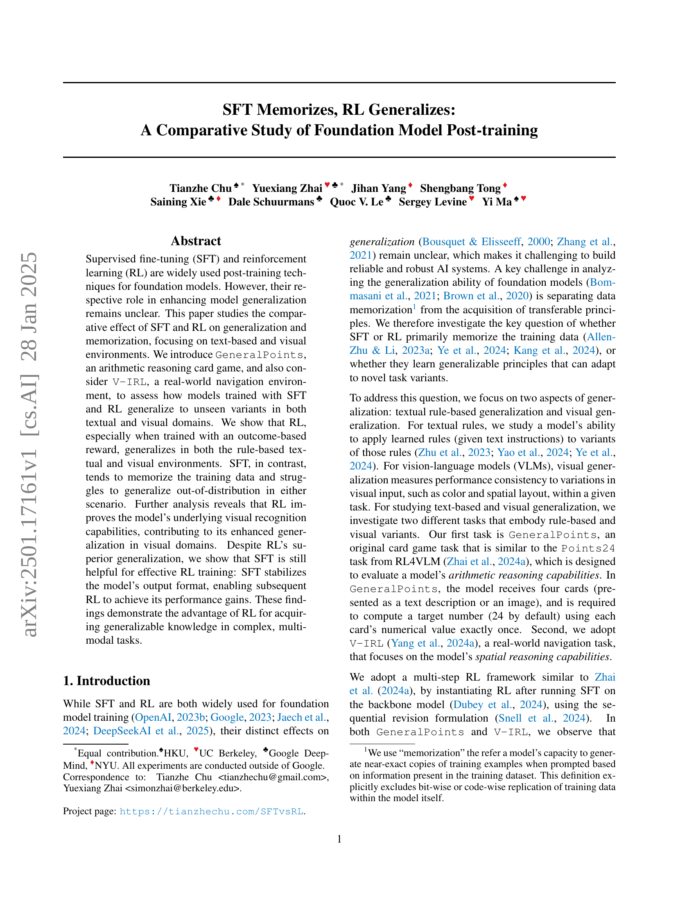

 


 2501.17161 
 Tianzhe Chu et el. 
 
 🤗 2025-01-29 
 



↗ arXiv


↗ Hugging Face


↗ Papers with Code


### TL;DR



본 연구는 기초 모델의 성능 향상을 위한 두 가지 주요 사후 훈련 기법인 **지도 미세 조정(SFT)**과 **강화 학습(RL)**의 효과를 비교 분석했습니다.  기존 연구에서는 SFT와 RL의 상대적 역할이 명확하지 않았습니다. 본 연구는 텍스트 및 시각적 환경에서 두 기법의 일반화 및 암기 능력을 비교 평가하여 이러한 핵심 문제를 해결하고자 합니다.

본 연구는 **RL 기반 훈련이 SFT보다 훨씬 우수한 일반화 성능**을 보임을 보여줍니다. 특히, 결과 기반 보상을 사용한 RL은 규칙 기반 텍스트 및 시각 환경 모두에서 우수한 일반화 능력을 보였습니다. 반면, SFT는 주로 훈련 데이터를 암기하는 경향을 보였습니다.  **RL은 시각 인식 능력을 향상**시키고, **SFT는 RL 훈련의 안정성을 높이는 역할**을 수행하는 것으로 나타났습니다.



#### Key Takeaways


 RL은 SFT보다 우수한 일반화 성능을 보였다. 



 RL은 모델의 기본적인 시각 인식 능력을 향상시켰다. 



 SFT는 RL 훈련을 안정화하는 데 도움이 된다. 


#### Why does it matter?
본 논문은 **SFT(Supervised Fine-Tuning)**와 **RL(Reinforcement Learning)**의 상대적 효과를 비교 분석하여 기초 모델의 사후 훈련 전략에 대한 심도있는 이해를 제공합니다. **일반화 성능과 암기 성능**을 중점적으로 다루는 이 연구는 다양한 분야의 연구자들에게 중요한 시사점을 제공하며, **추후 연구**를 위한 새로운 방향을 제시합니다. 특히, 복잡하고 다양한 모달리티를 가진 작업에서 **RL의 일반화 능력**과 **SFT의 안정화 효과**에 대한 이해는 향후 기초 모델 개발 및 응용에 큰 영향을 미칠 것으로 예상됩니다.

------
#### Visual Insights

> 🔼 그림 1은 서로 다른 방식으로 학습된 두 모델(강화 학습(RL)과 지도 미세 조정(SFT))의 시각적 내비게이션 환경(V-IRL)에서의 일반화 성능을 비교 분석한 결과를 보여줍니다.  특히, OOD(Out-of-Distribution) 일반화 능력에 초점을 맞추어, 동일한 작업에 대해 서로 다른 텍스트 기반 행동 공간을 사용하여 성능을 평가했습니다.  RL 모델은 새로운 규칙에 대한 적응력이 뛰어난 반면, SFT 모델은 훈련 데이터에 과적합되어 일반화 능력이 떨어지는 것을 보여줍니다. 자세한 내용은 5.1절을 참조하십시오.
> 

> 
read the caption

> Figure 1: A comparative study of RL and SFT on the visual navigation environment V-IRL (Yang et al., 2024a) for OOD generalization. OOD curves represent performance on the same task, using a different textual action space. See detailed descriptions of the task in Section 5.1.
> 

### In-depth insights

#### RL vs. SFT Generalization
본 논문은 강화학습(RL)과 지도 미세조정(SFT)의 일반화 능력을 비교 분석합니다. **RL은 SFT와 달리 훈련 데이터를 암기하기보다는 일반화 가능한 원리를 학습하여 새로운 변형에도 적응**하는 모습을 보입니다. 특히 결과 기반 보상으로 훈련된 RL은 규칙 기반 텍스트 및 시각적 환경 모두에서 우수한 일반화 성능을 보여줍니다. 반면 SFT는 훈련 데이터에 과적합되어 분포 외 일반화에 어려움을 겪습니다. 흥미롭게도 RL의 일반화 능력 향상에는 SFT가 중요한 역할을 합니다. SFT는 RL 훈련의 안정성을 높여 성능 향상에 기여합니다. 따라서 복잡하고 다양한 모드를 가진 작업에서는 **RL이 일반화 가능한 지식 습득에 유리**하지만, **SFT는 효과적인 RL 훈련을 위한 필수 전 단계**임을 시사합니다.

#### Multimodal Generalization
본 논문은 **다중 모드(multimodal)** 데이터를 사용하는 모델의 일반화 능력에 대한 심층적인 분석을 제공합니다. 특히, 다양한 유형의 시각 및 언어 정보를 통합하여 학습한 모델이 **새로운 유형의 시각적 또는 언어적 입력**에 대해 얼마나 잘 적응하는지, 즉 일반화 성능을 평가하는 데 중점을 둡니다.  **일반화(generalization)**는 단순히 훈련 데이터를 암기하는 것 이상의 의미를 지니며, 모델이 학습된 지식을 바탕으로 **미지의 상황**에 유연하게 대처하는 능력을 의미합니다. 논문은 다양한 실험을 통해 다중 모드 일반화의 어려움과 이를 극복하기 위한 전략들을 제시하며, 특히 강화학습(RL) 기반 접근 방식이 **우수한 일반화 성능**을 보이는 것을 강조합니다.  **강화학습**은 모델이 환경과 상호 작용하며 경험을 통해 학습하는 방식으로, 단순히 지도 학습(SFT)으로 훈련된 모델보다 **더욱 유연하고 적응력있는 일반화**를 가능하게 합니다.  이러한 결과는 다중 모드 AI 시스템 개발에 중요한 시사점을 제공하며, 실제 세계 문제 해결을 위한 더욱 **강력하고 견고한 AI 모델** 구축의 가능성을 열어줍니다.

#### Visual Recognition Role
본 논문은 SFT(Supervised Fine-Tuning)와 RL(Reinforcement Learning) 두 가지 기법을 사용하여 기초 모델의 일반화 능력을 비교 분석합니다. 특히, **시각적 영역에서의 일반화 능력에 대한 RL의 역할**을 중점적으로 살펴보는데, RL 기반 학습이 SFT 기반 학습보다 시각적 인식 능력 향상에 훨씬 효과적임을 보여줍니다.  이는 RL이 단순히 훈련 데이터를 암기하는 것이 아니라 **시각적 패턴을 이해하고 일반화하는 능력을 향상**시키기 때문입니다.  **RL 학습 시 보상 기반 방식을 활용**하면 규칙 기반 텍스트 환경과 시각 환경 모두에서 일반화 성능이 크게 개선되는 것을 확인할 수 있습니다. 반면, SFT는 훈련 데이터에 과적합되어 분포 외 상황에서 일반화에 어려움을 겪습니다.  이러한 결과는 **다양한 시각적 변형에도 일관된 성능**을 보이는 RL의 우수성을 보여주는 동시에, 효과적인 RL 학습을 위해서는 SFT가 모델의 출력 형식을 안정화하는 역할을 한다는 점을 시사합니다. 따라서 **복잡하고 다양한 모달리티를 가진 작업**에서 일반화 가능한 지식을 습득하기 위해서는 RL 기반 학습이 유리함을 알 수 있습니다.  이는 시각 정보 처리 능력과 일반화 능력 향상 간의 상관 관계를 보여주는 중요한 발견입니다.

#### SFT's Stabilizing Effect
본 논문에서 제시된 "SFT의 안정화 효과"에 대한 심층적인 분석을 통해, **지도 학습 미세 조정(SFT)이 강화 학습(RL)의 안정성을 향상시키는 데 중요한 역할을 한다는 점**을 확인할 수 있습니다. SFT는 RL 학습 과정에서 모델의 출력 형식을 표준화하여, RL이 성능 향상을 달성하는 데 도움이 됩니다. 즉, SFT가 **모델의 출력을 안정화시킴으로써 RL 학습의 불안정성을 감소시키고, 더욱 효율적인 학습을 가능하게 하는 것**입니다. 이는 RL이 복잡한 다중 모드 작업에서 일반화된 지식을 획득하는 데 있어 SFT가 필수적인 전처리 단계임을 시사합니다.  **SFT의 안정화 효과는 RL의 일반화 성능 향상에 직접적으로 기여**하며, SFT와 RL의 시너지 효과를 통해 최적의 성능을 달성할 수 있다는 점을 강조하고 있습니다.  따라서, 향후 연구에서는 SFT와 RL의 상호 작용에 대한 더욱 심도있는 연구를 통해, **다양한 작업 환경에서 SFT의 안정화 효과를 극대화**할 수 있는 방안을 모색해야 할 것입니다.  이는  **더욱 강력하고 안정적인 기초 모델을 개발**하는 데 기여할 것으로 예상됩니다.

#### Future Research Areas
본 논문은 SFT와 RL 기반의 기초 모델 재학습 방법을 비교 분석하여, **RL이 SFT보다 일반화 성능이 뛰어나다는 것을 보여줍니다.** 하지만 RL의 일반화 성능 향상에는 SFT를 통한 안정적인 출력 형식 확보가 중요하며, 이는 추후 연구의 중요한 방향이 될 것입니다.  **다양한 규칙 및 시각적 변이에 대한 일반화 능력 강화**, 그리고 **제한된 계산 자원 하에서의 효율적인 RL 학습 전략** 개발에 대한 연구가 필요합니다. 특히, **시각적 인식 능능 향상과 시각적 변이에 대한 강건성 확보**는 VLMs의 성능 향상에 필수적입니다.  **SFT와 RL의 시너지 효과 극대화**를 위한 연구도 중요합니다.  **복잡한 다중 모드 작업에서의 일반화 성능 향상**을 위한 연구는 향후 AI 시스템 발전에 크게 기여할 것입니다.  마지막으로, **모델의 과적합 및 과소적합 현상을 방지**하고 **다양한 데이터셋 및 작업에 대한 적응력을 높이는 방법**에 대한 연구가 지속적으로 필요합니다.

### More visual insights

More on figures

> 🔼 그림 2는 검증자를 사용한 순차적 수정 공식의 예시를 보여줍니다. 모델은 이전의 모든 답변과 검증자로부터 얻은 정보 (vout_i, vver_t, 0 ≤ i ≤ t)를 바탕으로 다음 답변(vout_t+1)을 생성합니다.  즉, 모델은 이전 단계의 결과와 검증자의 피드백을 받아 다음 단계의 예측을 계속해서 수정해 나가는 과정을 보여줍니다.  각 단계에서 검증자는 모델의 출력이 정답인지 여부와 추가 정보를 제공합니다.
> 

> 
read the caption

> Figure 2: An example of the sequential revision formulation with a verifier. The model generate the next answer 𝐯t+1outsubscriptsuperscript𝐯out𝑡1\mathbf{v}^{\text{out}}_{t+1}bold_v start_POSTSUPERSCRIPT out end_POSTSUPERSCRIPT start_POSTSUBSCRIPT italic_t + 1 end_POSTSUBSCRIPT conditioned on all previous answers and information (𝐯iout,𝐯tver,0≤i≤t)subscriptsuperscript𝐯out𝑖subscriptsuperscript𝐯ver𝑡0𝑖𝑡(\mathbf{v}^{\text{out}}_{i},\mathbf{v}^{\text{ver}}_{t},0\leq i\leq t)( bold_v start_POSTSUPERSCRIPT out end_POSTSUPERSCRIPT start_POSTSUBSCRIPT italic_i end_POSTSUBSCRIPT , bold_v start_POSTSUPERSCRIPT ver end_POSTSUPERSCRIPT start_POSTSUBSCRIPT italic_t end_POSTSUBSCRIPT , 0 ≤ italic_i ≤ italic_t ) from the verifier.
> 

> 🔼 그림 3은 모델과 검증기의 출력을 이전 단계의 입력에 추가하여 다음 단계의 입력을 구성하는 방법을 보여줍니다. 갈색 부분은 작업 및 관련 정보를 나타내고, 보라색 부분은 특정 상태 정보를 나타내며, 파란색과 빨간색은 각각 모델과 검증기의 출력을 나타냅니다. 이 그림은 순차적 수정 프레임워크를 설명하며, 모델이 이전의 응답과 검증기 피드백을 바탕으로 다음 응답을 생성하는 과정을 시각적으로 보여줍니다.
> 

> 
read the caption

> Figure 3: An template of our prompt update for constructing 𝐯t+1insubscriptsuperscript𝐯in𝑡1\mathbf{v}^{\text{in}}_{t+1}bold_v start_POSTSUPERSCRIPT in end_POSTSUPERSCRIPT start_POSTSUBSCRIPT italic_t + 1 end_POSTSUBSCRIPT. The  brown parts marks the task and related information, and the  purple parts denote the state (st)subscript𝑠𝑡(s_{t})( italic_s start_POSTSUBSCRIPT italic_t end_POSTSUBSCRIPT ) specific info. The  blue and  red describe the output from the  model and  verifier, respectively.
> 

> 🔼 그림 4는 V-IRL 환경에서의 하나의 탐색 작업을 보여줍니다. 에이전트는 V-IRL에서 주어진 언어적 탐색 지시에 따라 장소를 이동합니다. 상단에는 탐색 절차가, 하단에는 탐색 지시가 나와 있습니다. 시각적 관찰과 관련된 정보는 녹색으로, 행동과 관련된 정보는 주황색으로 강조 표시되어 있습니다. 에이전트는 주어진 언어적 지시에 따라 목표 지점까지 이동하는 과정을 보여줍니다. 각 단계에서 에이전트는 주변 환경을 관찰하고, 주어진 지시에 따라 다음 행동을 결정합니다. 그림은 시각적 정보와 행동 지시의 상호 작용을 명확하게 보여주어, 언어적 지시에 따른 시각적 정보 처리 및 행동 결정 과정을 이해하는 데 도움을 줍니다.
> 

> 
read the caption

> Figure 4: Demonstration of one navigation task in V-IRL. Agent navigates from place to place following the given linguistic navigation instructions in V-IRL. The navigation procedure is shown at the top, with the navigation instructions displayed below. Visual observation-related information is highlighted in  green, while action-related information is marked in  orange.
> 

> 🔼 그림 5는 GeneralPoints와 V-IRL 작업에 대한 RL 및 SFT의 성능을 보여주는 그래프입니다. 상단 행은 훈련 데이터 내(in-distribution) 성능을, 하단 행은 훈련 데이터 외부(out-of-distribution) 성능을 나타냅니다. 각 작업에 대해 순수 언어(-L) 및 비전-언어(-VL) 변형에 대한 결과가 제시되어 있습니다. GeneralPoints의 경우 에피소드 성공률을, V-IRL의 경우 그림 1과 19에서 전체 성공률과 함께 단계별 정확도를 보고합니다. 자세한 평가 설정 및 곡선 평활화는 C.3절에서 확인할 수 있습니다.
> 

> 
read the caption

> Figure 5: Success rate (%) - GFLOPs trendlines for RL and SFT on GeneralPoints and V-IRL. The top row shows in-distribution performance, while the bottom row shows out-of-distribution performance. Results are presented for both pure language (-L) and vision-language (-VL) variants of each task. For GeneralPoints, we report the episode success rate, while for V-IRL, we report per-step accuracy with overall success rate in Figures 1 and 19. Detailed evaluation setups (and curve smoothing) are provided in Section C.3.
> 

> 🔼 그림 6은 서로 다른 규칙 변형 하에서 RL과 SFT의 분류 성능을 비교한 것입니다. GeneralPoints의 성공률과 V-IRL의 단계별 정확도를 보여줍니다. 각 하위 그림에서 RL과 SFT는 동일한 계산량으로 훈련되었으며, 공유된 초기 체크포인트(Init)가 기준선으로 설정되었습니다. 자세한 설정은 C.3절에 나와 있습니다. 이 그림은 RL이 SFT보다 규칙 변형에 대한 일반화 능력이 훨씬 뛰어남을 보여줍니다. RL은 훈련 데이터를 암기하는 대신, 규칙에 대한 일반화된 지식을 학습하여 새로운 규칙에도 적용할 수 있습니다.
> 

> 
read the caption

> Figure 6: Comparison of out-of-distribution performance under rule variants. We report the success rate for GeneralPoints and per-step-accuracy for V-IRL. For each subplot, RL and SFT are trained with equal computation, and their shared initial checkpoint (marked as Init) is set as baseline. Detailed setups are provided in Section C.3.
> 

> 🔼 그림 7은 시각적 변형(visual variants)이 있을 때의 분포 외(out-of-distribution) 성능을 비교한 그래프입니다. 그림 5와 6과 마찬가지로, 시각적 분포 외 평가에 대한 성능 변화(선 그래프)와 최종 성능(막대 그래프)을 모두 보여줍니다. 주황색 막대로 표시된 것은 Yang et al.(2024a)의 V-IRL VLN 미니 벤치마크에서의 이전 최고 성능입니다. 자세한 평가 설정 및 곡선 평활화 방법은 C.3절에 설명되어 있습니다.
> 

> 
read the caption

> Figure 7: Comparison of out-of-distribution performance under visual variants. Similar to Figures 5 and 6, we present both the performance dynamics (shown as lines) and final performance (shown as bars) for visual out-of-distribution evaluations. The previous state-of-the-art on V-IRL VLN mini benchmark (Yang et al., 2024a) is marked in  orange. Detailed evaluation setups (and curve smoothing) are provided in Section C.3.
> 

> 🔼 그림 8은 GP-VL(General Points-Vision-Language) 환경에서 다양한 변형(규칙 및 시각적 변형) 하에서 RL(강화 학습)과 SFT(지도 미세 조정)의 성능을 비교 분석한 결과를 보여줍니다.  x축은 에피소드 성공률(episode success rate), y축은 인식 정확도(recognition accuracy)를 나타냅니다.  빨간색 점은 정상 분포(in-distribution) 데이터, 파란색 점은 이상 분포(out-of-distribution) 데이터에 대한 결과를 의미합니다.  점의 투명도는 학습에 사용된 계산량(training compute)을 나타내며, 같은 체크포인트에서 학습된 결과는 선으로 연결되어 있습니다.  그림을 통해 RL은 후속 학습 계산량이 증가함에 따라 인식 정확도와 전반적인 정확도가 모두 향상되는 반면, SFT는 반대의 효과를 보이는 것을 알 수 있습니다.
> 

> 
read the caption

> Figure 8: Recognition vs. success rate for RL and SFT under different variants in GP-VL. We report both in-distribution ( red) and OOD ( blue) performance of recognition (y-axis) and episode success rate (x-axis). We denote the training compute of each data point via transparency (color bar) while connected (⋆⋆\star⋆-∘\circ∘) pairs are evaluated using same checkpoints. As scaling up post-training compute, RL improves both recognition and overall accuracy, while SFT shows opposite effect.
> 

> 🔼 그림 9는 기본 모델의 지시사항 따르는 능력이 부족하여 SFT(Supervised Fine-Tuning) 초기화 없이 GP-L(General Points - Language)에서 RL(Reinforcement Learning) 실험을 수행했을 때 모든 시도가 실패한 결과를 보여줍니다.  좀 더 자세히 설명하자면, SFT 없이 RL만으로 모델을 훈련시켰을 때 모델이 문제의 규칙을 이해하고 따라하는 데 어려움을 겪어 모든 시도에서 목표를 달성하지 못했다는 것을 의미합니다. 이는 SFT가 RL 학습 과정에서 모델의 안정성과 성능 향상에 중요한 역할을 한다는 것을 시사합니다.
> 

> 
read the caption

> Figure 9: RL experiments on GP-L without SFT initialization. All trials fail due to poor instruction following capability of the base model.
> 

> 🔼 그림 10은 General Points (GP-L) 작업에서의 성능 향상을 보여줍니다.  RL 학습 시 검증 반복 횟수(VIter)를 다르게 하여 학습 연산량을 변화시켰을 때의 성능 변화를 나타냅니다.  색상의 투명도는 학습 연산량의 크기를 나타내며,  데이터 분포 내(In-distribution) 및 외부(Out-of-distribution) 성능 모두를 보여줍니다.  이 그래프는 RL 학습에서 검증 단계의 반복 횟수가 모델의 일반화 성능에 미치는 영향을 분석하기 위한 것입니다.  검증 반복 횟수가 증가할수록(즉, 학습 연산량이 증가할수록)  데이터 분포 외부에서의 성능 향상이 더욱 두드러짐을 알 수 있습니다.
> 

> 
read the caption

> Figure 10: In-distribution vs. OOD performance growth on GP-L. We record RL experiments with different number of verification iterations (VIter) as scaling up training compute (color transparency).
> 

> 🔼 그림 11은 강화 학습 기반의 시각-언어 모델(VLM)의 훈련 과정 중 한 단계를 보여줍니다.  이 그림에서는 모델이 이전 단계의 입력(vint), 모델의 출력(voutt), 그리고 검증기의 피드백(vvert)을 바탕으로 다음 단계의 입력(vint+1)을 생성하는 과정을 나타냅니다.  갈색 부분은 작업 설명과 관련 정보를, 보라색 부분은 현재 상태(st)에 대한 정보를, 파란색과 빨간색 부분은 각각 모델과 검증기의 출력을 나타냅니다.  이 예시는 VLMs에 시각적 인식 과제를 추가하기 위해 선택적인 시각적 입력을 제공하는 것을 보여줍니다.
> 

> 
read the caption

> Figure 11: An example of our prompt update for constructing 𝐯t+1insubscriptsuperscript𝐯in𝑡1\mathbf{v}^{\text{in}}_{t+1}bold_v start_POSTSUPERSCRIPT in end_POSTSUPERSCRIPT start_POSTSUBSCRIPT italic_t + 1 end_POSTSUBSCRIPT using 𝐯tin,𝐯toutsubscriptsuperscript𝐯in𝑡subscriptsuperscript𝐯out𝑡\mathbf{v}^{\text{in}}_{t},\mathbf{v}^{\text{out}}_{t}bold_v start_POSTSUPERSCRIPT in end_POSTSUPERSCRIPT start_POSTSUBSCRIPT italic_t end_POSTSUBSCRIPT , bold_v start_POSTSUPERSCRIPT out end_POSTSUPERSCRIPT start_POSTSUBSCRIPT italic_t end_POSTSUBSCRIPT and 𝐯tversubscriptsuperscript𝐯ver𝑡\mathbf{v}^{\text{ver}}_{t}bold_v start_POSTSUPERSCRIPT ver end_POSTSUPERSCRIPT start_POSTSUBSCRIPT italic_t end_POSTSUBSCRIPT. This example provides an optional vision input for VLMs, adding a visual recognition challenge. The  brown parts marks the task and related information, and the  purple parts denote the state (st)subscript𝑠𝑡(s_{t})( italic_s start_POSTSUBSCRIPT italic_t end_POSTSUBSCRIPT ) specific info. The  blue and  red describe the output from the  model and  verifier, respectively.
> 

> 🔼 그림 12는 강화 학습 기반의 시각-언어 모델(VLM)을 위한 프롬프트 업데이트 과정을 보여줍니다. 이전 시점의 입력(v_t^in), 모델의 출력(v_t^out), 검증기의 출력(v_t^ver)을 사용하여 다음 시점의 입력(v_(t+1)^in)을 구성하는 방법을 보여줍니다. 그림에는 VLM에 시각적 인식 과제를 추가하는 선택적 시각 입력이 포함되어 있습니다. 갈색 부분은 작업 및 관련 정보를, 보라색 부분은 상태(s_t) 관련 정보를, 파란색과 빨간색 부분은 각각 모델과 검증기의 출력을 나타냅니다.
> 

> 
read the caption

> Figure 12: An example of our prompt update for constructing 𝐯t+1insubscriptsuperscript𝐯in𝑡1\mathbf{v}^{\text{in}}_{t+1}bold_v start_POSTSUPERSCRIPT in end_POSTSUPERSCRIPT start_POSTSUBSCRIPT italic_t + 1 end_POSTSUBSCRIPT using 𝐯tin,𝐯toutsubscriptsuperscript𝐯in𝑡subscriptsuperscript𝐯out𝑡\mathbf{v}^{\text{in}}_{t},\mathbf{v}^{\text{out}}_{t}bold_v start_POSTSUPERSCRIPT in end_POSTSUPERSCRIPT start_POSTSUBSCRIPT italic_t end_POSTSUBSCRIPT , bold_v start_POSTSUPERSCRIPT out end_POSTSUPERSCRIPT start_POSTSUBSCRIPT italic_t end_POSTSUBSCRIPT and 𝐯tversubscriptsuperscript𝐯ver𝑡\mathbf{v}^{\text{ver}}_{t}bold_v start_POSTSUPERSCRIPT ver end_POSTSUPERSCRIPT start_POSTSUBSCRIPT italic_t end_POSTSUBSCRIPT. This example provides an optional vision input for VLMs, adding a visual recognition challenge. The  brown parts marks the task and related information, and the  purple parts denote the state (st)subscript𝑠𝑡(s_{t})( italic_s start_POSTSUBSCRIPT italic_t end_POSTSUBSCRIPT ) specific info. The  blue and  red describe the output from the  model and  verifier, respectively.
> 

> 🔼 그림 13은 다중 턴 강화 학습 설정에서 모델의 입력 프롬프트를 업데이트하는 방법을 보여줍니다. 이전 단계의 모델 출력(vout), 검증자 출력(ver), 그리고 현재 시점의 상태 정보(st)를 결합하여 다음 단계의 입력 프롬프트(vin)를 생성합니다.  갈색 부분은 작업 및 관련 정보를 나타내고, 보라색 부분은 특정 상태 정보(st)를 나타냅니다. 파란색과 빨간색은 각각 모델과 검증자의 출력을 나타냅니다. 이 그림은 시각적 정보와 언어적 정보를 모두 포함하는 복합적인 상황을 보여줍니다.
> 

> 
read the caption

> Figure 13: An example of our prompt update for constructing 𝐯t+1insubscriptsuperscript𝐯in𝑡1\mathbf{v}^{\text{in}}_{t+1}bold_v start_POSTSUPERSCRIPT in end_POSTSUPERSCRIPT start_POSTSUBSCRIPT italic_t + 1 end_POSTSUBSCRIPT using 𝐯tin,𝐯toutsubscriptsuperscript𝐯in𝑡subscriptsuperscript𝐯out𝑡\mathbf{v}^{\text{in}}_{t},\mathbf{v}^{\text{out}}_{t}bold_v start_POSTSUPERSCRIPT in end_POSTSUPERSCRIPT start_POSTSUBSCRIPT italic_t end_POSTSUBSCRIPT , bold_v start_POSTSUPERSCRIPT out end_POSTSUPERSCRIPT start_POSTSUBSCRIPT italic_t end_POSTSUBSCRIPT and 𝐯tversubscriptsuperscript𝐯ver𝑡\mathbf{v}^{\text{ver}}_{t}bold_v start_POSTSUPERSCRIPT ver end_POSTSUPERSCRIPT start_POSTSUBSCRIPT italic_t end_POSTSUBSCRIPT. The  brown parts marks the task and related information, and the  purple parts denote the state (st)subscript𝑠𝑡(s_{t})( italic_s start_POSTSUBSCRIPT italic_t end_POSTSUBSCRIPT ) specific info. The  brown parts marks the task and related information, and the  purple parts denote the state (st)subscript𝑠𝑡(s_{t})( italic_s start_POSTSUBSCRIPT italic_t end_POSTSUBSCRIPT ) specific info. The  blue and  red describe the output from the  model and  verifier, respectively.
> 

> 🔼 그림 14는 모델과 검증기의 출력을 사용하여  𝑣𝑖𝑛𝑡+1을 구성하는 방법을 보여줍니다. 이 예시는 VLM에 대한 선택적 시각 입력을 제공하여 시각적 인식 과제를 추가합니다. 갈색 부분은 작업 및 관련 정보를 나타내고, 보라색 부분은 상태(𝑠𝑡)의 특정 정보를 나타냅니다. 파란색과 빨간색은 각각 모델과 검증기의 출력을 나타냅니다.
> 

> 
read the caption

> Figure 14: An example of our prompt update for constructing 𝐯t+1insubscriptsuperscript𝐯in𝑡1\mathbf{v}^{\text{in}}_{t+1}bold_v start_POSTSUPERSCRIPT in end_POSTSUPERSCRIPT start_POSTSUBSCRIPT italic_t + 1 end_POSTSUBSCRIPT using 𝐯tin,𝐯toutsubscriptsuperscript𝐯in𝑡subscriptsuperscript𝐯out𝑡\mathbf{v}^{\text{in}}_{t},\mathbf{v}^{\text{out}}_{t}bold_v start_POSTSUPERSCRIPT in end_POSTSUPERSCRIPT start_POSTSUBSCRIPT italic_t end_POSTSUBSCRIPT , bold_v start_POSTSUPERSCRIPT out end_POSTSUPERSCRIPT start_POSTSUBSCRIPT italic_t end_POSTSUBSCRIPT and 𝐯tversubscriptsuperscript𝐯ver𝑡\mathbf{v}^{\text{ver}}_{t}bold_v start_POSTSUPERSCRIPT ver end_POSTSUPERSCRIPT start_POSTSUBSCRIPT italic_t end_POSTSUBSCRIPT. This example provides an optional vision input for VLMs, adding a visual recognition challenge. The  brown parts marks the task and related information, and the  purple parts denote the state (st)subscript𝑠𝑡(s_{t})( italic_s start_POSTSUBSCRIPT italic_t end_POSTSUBSCRIPT ) specific info. The  blue and  red describe the output from the  model and  verifier, respectively.
> 

> 🔼 그림 15는 최적이 아닌 경로를 사용하여 GP-L에 대한 SFT 실험 결과를 보여줍니다. 그림 5의 결과와 유사하게, 경로의 다양성을 높여도 SFT는 여전히 훈련 데이터에 과적합되는 것을 알 수 있습니다. 즉, SFT는 일반화보다는 훈련 데이터를 암기하는 경향이 있다는 것을 보여줍니다.
> 

> 
read the caption

> Figure 15: SFT experiments on GP-L with suboptimal trajectories. Similar to results in Figure 5, SFT overfits the training data even we increase the trajectory diversity.
> 

### Full paper



