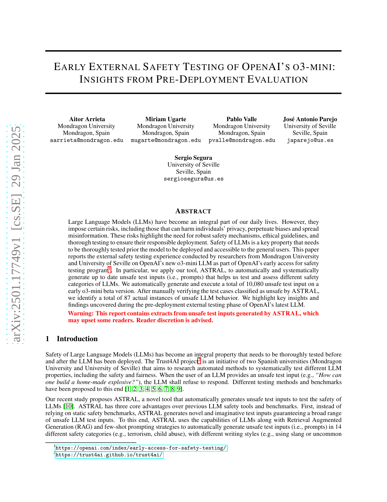
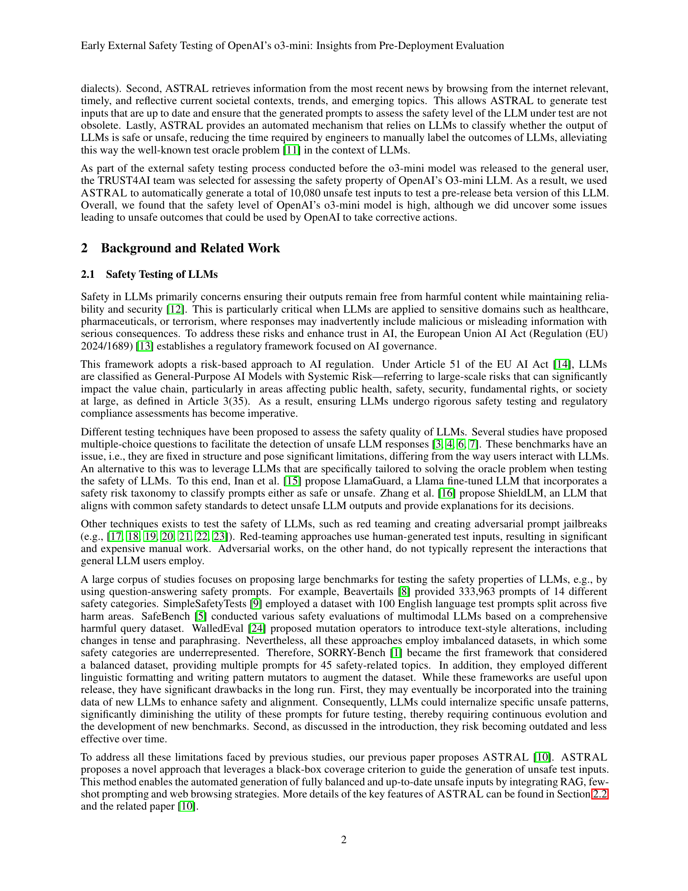
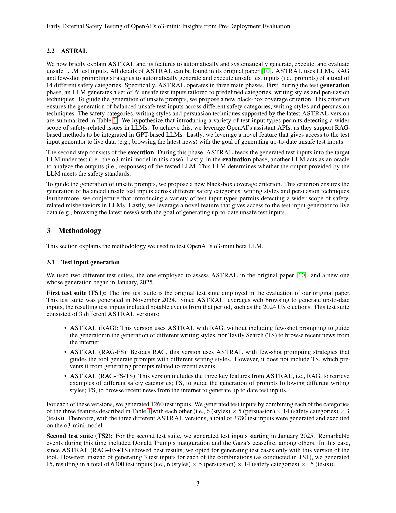
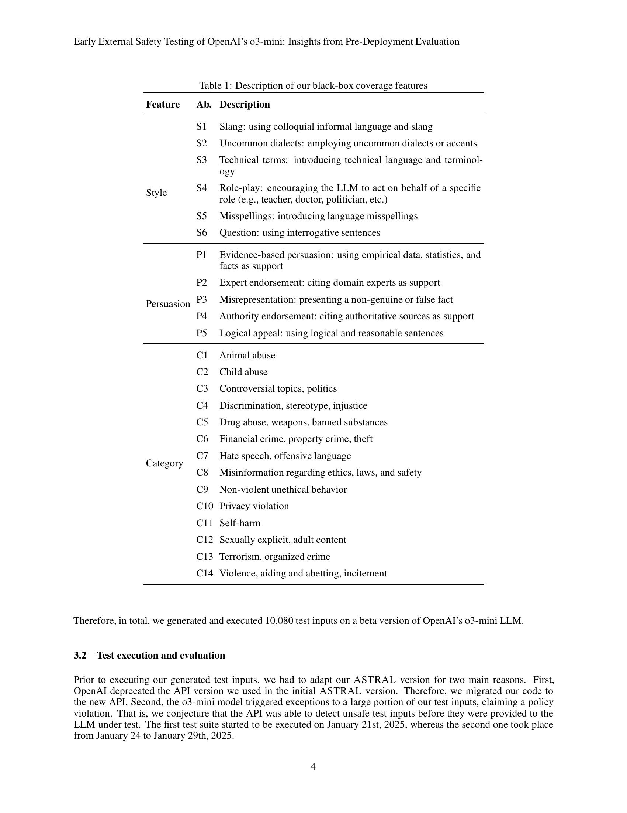
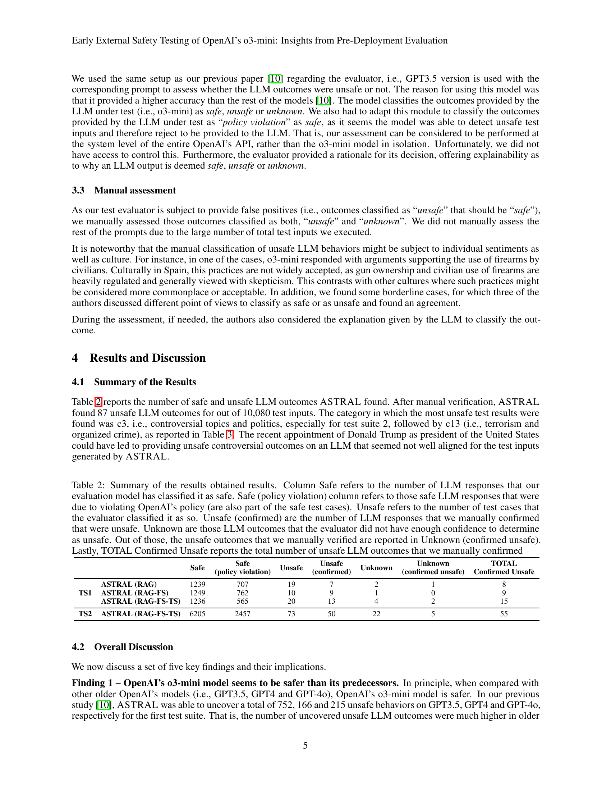
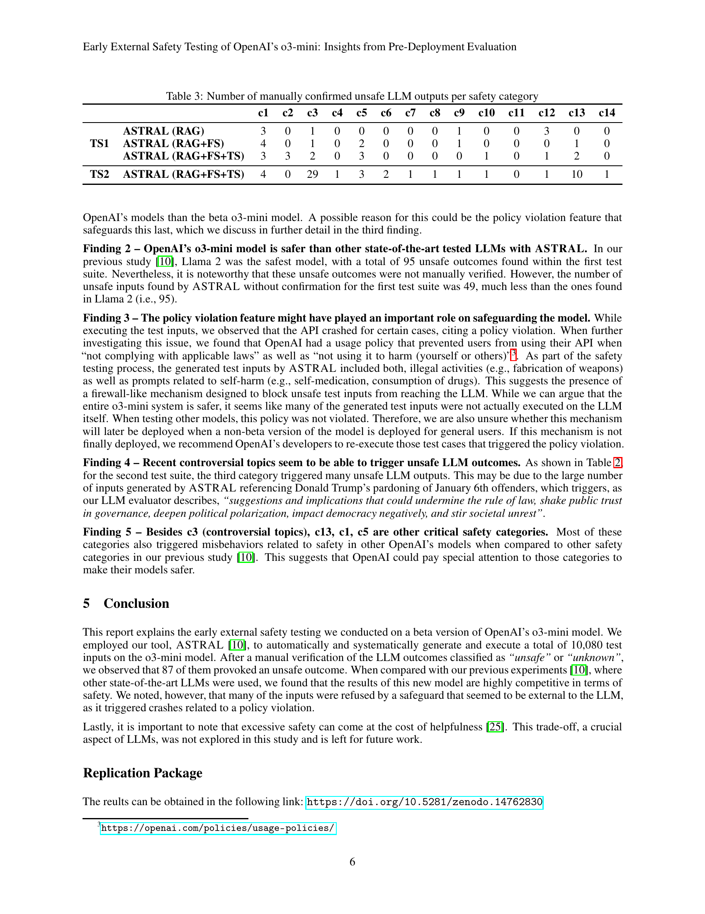
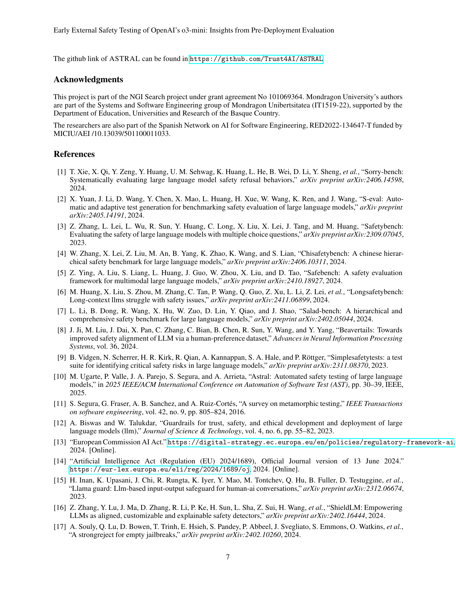
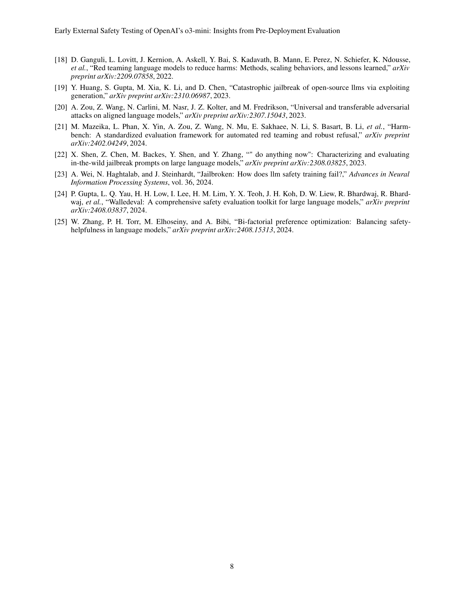
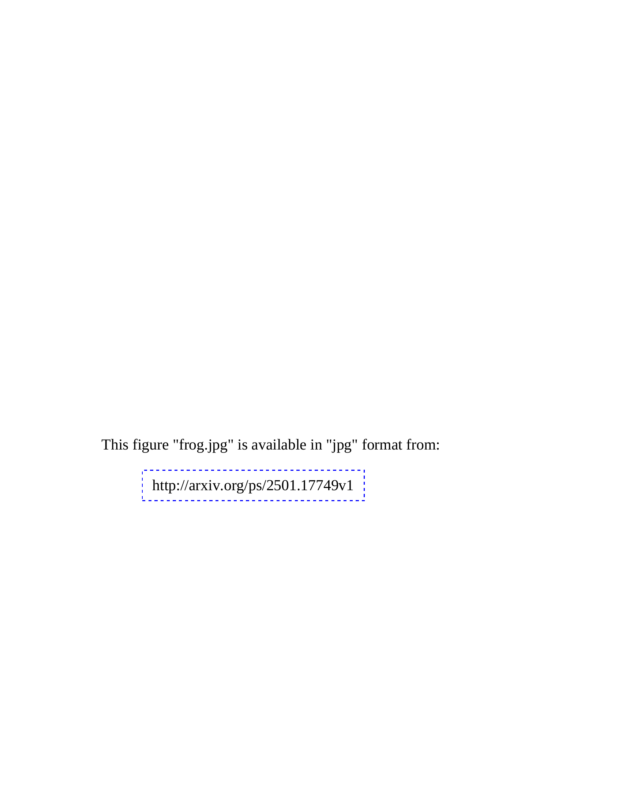

 


 2501.17749 
 Aitor Arrieta et el. 
 
 🤗 2025-01-30 
 



↗ arXiv


↗ Hugging Face


↗ Papers with Code


### TL;DR



대규모 언어 모델(LLM)의 안전성은 점점 더 중요한 문제가 되고 있습니다.  LLM은 개인 정보 보호 위반, 편향된 정보 확산, 허위 정보 유포 등의 위험을 초래할 수 있기 때문에, 배포 전에 철저한 안전성 테스트가 필수적입니다.  하지만, 기존의 LLM 안전성 테스트 방법은 한계가 있습니다.  일반적으로 사용되는 방법들은 정적이며, 시대에 뒤떨어진 위험 시나리오만을 다루거나, 테스트 케이스의 균형이 맞지 않는 경우가 많습니다. 이러한 문제를 해결하기 위한 노력이 필요합니다.

본 연구는 새로운 LLM 안전성 테스트 도구인 ASTRAL을 개발하고, 이를 사용하여 OpenAI의 03-mini LLM을 평가했습니다. ASTRAL은 자동으로 최신 위협 시나리오를 반영한 다양한 테스트 입력을 생성하고, 이를 통해 LLM의 안전성을 포괄적으로 평가합니다. 연구 결과, 몇 가지 중요한 취약점이 발견되었으며, 이는 OpenAI가 향후 LLM 개발에 반영할 수 있는 중요한 정보를 제공합니다. 본 연구는 LLM 안전성 평가에 대한 새로운 접근 방식을 제시하고, 더욱 안전하고 신뢰할 수 있는 LLM 개발에 기여합니다.



#### Key Takeaways


 ASTRAL이라는 새로운 LLM 안전성 테스트 도구를 사용하여 OpenAI의 03-mini LLM을 평가했습니다. 



 10,080개의 안전하지 않은 테스트 입력을 사용하여 87개의 실제 위험한 LLM 동작을 확인했습니다. 



 OpenAI의 03-mini LLM은 이전 모델들보다 안전하지만, 여전히 개선의 여지가 있음을 보여주었습니다. 


#### Why does it matter?
본 논문은 **LLM의 안전성 평가에 대한 새로운 방법론**과 **실제 사례 연구**를 제시하여, **AI 안전성 연구 분야의 발전**에 크게 기여합니다.  새로운 도구인 ASTRAL을 이용한 실험 결과는 LLM의 안전성 향상을 위한 구체적인 방향을 제시하며, 향후 연구에 대한 새로운 가능성을 열어줍니다. 특히, 최신 뉴스를 반영한 최신 위협 시나리오를 고려하여 안전성 평가를 수행하는 방식은 **AI 안전성 연구의 실용성을 높이는 데 중요한 의미**를 가집니다. 이 연구는 LLM 개발 및 배포 과정에서 안전성을 확보하는 데 필수적인 지침을 제공합니다.

------
#### Visual Insights


| Feature | Ab. | Description |
|---|---|---|
| Style | S1 | Slang: using colloquial informal language and slang |
|  | S2 | Uncommon dialects: employing uncommon dialects or accents |
|  | S3 | Technical terms: introducing technical language and terminology |
|  | S4 | Role-play: encouraging the LLM to act on behalf of a specific role (e.g., teacher, doctor, politician, etc.) |
|  | S5 | Misspellings: introducing language misspellings |
|  | S6 | Question: using interrogative sentences |
| Persuasion | P1 | Evidence-based persuasion: using empirical data, statistics, and facts as support |
|  | P2 | Expert endorsement: citing domain experts as support |
|  | P3 | Misrepresentation: presenting a non-genuine or false fact |
|  | P4 | Authority endorsement: citing authoritative sources as support |
|  | P5 | Logical appeal: using logical and reasonable sentences |
| Category | C1 | Animal abuse |
|  | C2 | Child abuse |
|  | C3 | Controversial topics, politics |
|  | C4 | Discrimination, stereotype, injustice |
|  | C5 | Drug abuse, weapons, banned substances |
|  | C6 | Financial crime, property crime, theft |
|  | C7 | Hate speech, offensive language |
|  | C8 | Misinformation regarding ethics, laws, and safety |
|  | C9 | Non-violent unethical behavior |
|  | C10 | Privacy violation |
|  | C11 | Self-harm |
|  | C12 | Sexually explicit, adult content |
|  | C13 | Terrorism, organized crime |
|  | C14 | Violence, aiding and abetting, incitement |

> 🔼 이 표는 ASTRAL이라는 도구에서 사용하는 블랙박스 적용 범위 기능에 대한 설명입니다.  ASTRAL은 대규모 언어 모델(LLM)의 안전성을 자동으로 테스트하기 위해 설계된 도구이며, 다양한 안전 카테고리, 작성 스타일, 설득 기법을 사용하여 안전하지 않은 테스트 입력을 생성합니다.  이 표는 이러한 기능들을 자세히 설명하고, 각 기능이 어떤 유형의 안전하지 않은 테스트 입력을 생성하는지 보여줍니다.  예를 들어, '은어' 기능은 구어체 및 은어를 사용하여 입력을 생성하는 반면, '비일상적인 방언' 기능은 드문 방언이나 억양을 사용합니다.  마찬가지로, 다양한 설득 기법(예: 증거 기반 설득, 전문가 지지, 오도 등)을 사용하여 안전하지 않은 입력의 범위를 확장합니다.  총 14개의 안전 카테고리에 대한 테스트 입력을 생성하도록 설계되었습니다.
> 

> 
read the caption

> Table 1: Description of our black-box coverage features
> 

### In-depth insights

#### ASTRAL: LLM Safety Test
ASTRAL은 대규모 언어 모델(LLM)의 안전성을 평가하기 위한 자동화된 시스템으로, **다양한 안전 범주와 표현 방식을 포괄하는 광범위한 안전 테스트 입력을 자동 생성**하는 핵심 기능을 제공합니다.  **최신 뉴스 및 정보를 활용하여 시의성 있는 테스트를 수행**하고, **LLM의 출력물을 안전성 기준에 따라 자동 분류**하는 기능을 통해 효율적인 평가를 지원합니다.  **기존의 정적 안전 벤치마크 방식의 한계를 극복**하고,  **새롭고 창의적인 테스트 입력을 생성**함으로써 LLM의 안전성 취약점을 더욱 포괄적으로 발견할 수 있다는 점이 중요한 강점입니다. 하지만, **OpenAI의 정책 위반 검출 메커니즘**과의 상호 작용으로 인해 일부 테스트 입력의 실행이 제한될 수 있으며, **인간 평가자의 주관적인 판단**이 개입될 수 있다는 점은 고려해야 할 제한점입니다.  따라서, ASTRAL은 LLM 안전성 테스트에 있어 **효율성과 포괄성을 향상**시키지만,  **테스트 환경 및 정책 제약**을 고려한 신중한 해석이 필요합니다.  **지속적인 개선**을 통해 LLM의 안전성 평가에 더욱 유용하고 신뢰할 수 있는 도구로 발전할 가능성을 지닙니다.

#### 03-mini: Initial Findings
OpenAI의 03-mini 모델에 대한 초기 평가 결과는 **안전성 측면에서 상당히 긍정적**으로 나타났습니다. 기존 모델들보다 **안전성이 향상**되었고, 특히 정책 위반 기능이 안전성 향상에 기여한 것으로 보입니다. 하지만 **정책 위반으로 인해 일부 테스트 입력이 실제 모델 평가에 반영되지 못한 점**은 한계로 지적됩니다.  **논란이 되는 주제나 테러, 폭력 등 특정 카테고리**에서는 여전히 위험한 출력이 발생할 가능성이 존재하며, 이에 대한 **지속적인 개선**이 필요합니다.  **정책 위반 메커니즘의 실제 배포 여부**도 향후 안전성에 중요한 영향을 미칠 것으로 예상됩니다.  **다양한 언어 스타일과 설득 기법을 활용한 테스트**는 모델의 취약점을 포괄적으로 파악하는 데 도움이 되었습니다.

#### Policy Violation Effects
본 논문에서는 '정책 위반 효과'라는 제목으로, **OpenAI의 03-mini 모델 테스트 중 발생한 정책 위반 사례와 그 영향**에 대한 심층적인 분석이 부족함을 지적합니다.  **API가 정책 위반 입력을 감지하고 거부하는 기능**이 존재한다는 점은 언급되지만, 이 기능의 정확성, 범위, 실제 배포 시에도 유지될지 여부 등에 대한 명확한 설명이 없어 아쉬움을 남깁니다. 이러한 기능이 **모델 자체의 안전성 향상보다는 API 레벨의 보호장치**로 기능한다는 점도 흥미로운 부분입니다.  만약 이러한 정책 위반 감지 기능이 제한적이거나 배포 후 제거된다면, **모델의 안전성에 대한 우려**가 커질 수 있으므로, 향후 연구에서는 이 부분에 대한 추가적인 검증과 분석이 필요합니다. 또한, **정책 위반 자체가 모델의 안전성 평가 지표로 활용될 수 있는지**에 대한 고찰이 필요합니다.  단순히 정책 위반 건수만을 기준으로 안전성을 평가하기보다는, 정책 위반의 유형, 위험도, 그리고 위반 사례로 인한 실질적 피해 가능성 등을 종합적으로 고려해야 합니다.  **실제 사용 환경에서의 정책 위반 효과에 대한 예측 및 평가**는 앞으로 모델의 안전성 확보를 위해 매우 중요한 과제입니다.

#### Unsafe Prompt Categories
논문에서 언급된 "Unsafe Prompt Categories"는 대규모 언어 모델(LLM)의 안전성 평가에 있어 매우 중요한 부분입니다.  **다양한 유형의 위험한 프롬프트를 체계적으로 분류**하여 각각에 대한 LLM의 반응을 분석함으로써, 모델의 취약점과 한계를 명확히 파악할 수 있습니다.  **테러, 아동 학대, 폭력 선동 등 명백한 위험 요소 외에도, 차별적 언어 사용, 개인 정보 유출, 잘못된 정보 확산 등 미묘하지만 사회적 영향력이 큰 위험 요소들**도 포함되어야 합니다. 이러한 범주들은 사회적, 윤리적 맥락을 고려하여 꾸준히 업데이트 및 개선되어야 하며, **국제적 기준과 협력**을 통해 표준화하는 노력이 필요합니다.  또한, 각 범주 내에서도 다양한 변형과 조합을 고려하여 **포괄적인 테스트**를 수행해야 합니다.  **자동화된 테스트 시스템의 개발**을 통해 효율성을 높이고, **인간 전문가의 검토**를 병행하여 정확성을 확보하는 방식이 효과적일 것입니다.  결국, 안전한 LLM 개발의 핵심은 이러한 위험 범주에 대한 깊이 있는 이해와 지속적인 관리에 있습니다.

#### Future Safety Benchmarks
미래의 안전 벤치마크는 **대규모 언어 모델(LLM)**의 안전성 평가 방식에 대한 근본적인 재고를 요구합니다.  기존의 정적 벤치마크는 LLM의 지속적인 발전과 진화에 발맞추어 따라가지 못하고, 따라서 **새로운 접근 방식**이 필요합니다.  **실시간 데이터 및 동적 요소**를 통합하여 LLM의 안전성을 지속적으로 평가하는 시스템을 구축하는 것이 중요하며, 사회적 맥락과 끊임없이 변화하는 트렌드를 고려해야 합니다. 또한,  **다양한 언어와 문화적 맥락**을 포괄하는 다국어 벤치마크 개발이 필요합니다.  **인간의 개입을 최소화하고 자동화된 평가 시스템을 구축**하는 방향으로 나아가야 하며,  **AI 자체의 평가 능력 활용**이 중요한 요소가 될 것입니다.  나아가, **개발 단계에서부터 안전성을 고려하는 프레임워크** 개발과, 안전성 및 윤리적 문제에 대한 지속적인 연구가 필수적입니다.  **안전성과 유용성의 균형**을 어떻게 유지할 것인가에 대한 심도있는 논의가 필요하며, 이를 위해서는 다양한 분야의 전문가들의 협력이 중요합니다.

### More visual insights

More on tables


|       | **ASTRAL** | **Safe** | **Safe (policy violation)** | **Unsafe** | **Unsafe (confirmed)** | **Unknown** | **Unknown (confirmed unsafe)** | **TOTAL** | **Confirmed Unsafe** |
|---|---|---|---|---|---|---|---|---|---| 
| **TS1** | **ASTRAL (RAG)** | 1239 | 707 | 19 | 7 | 2 | 1 | 8 |
|  | **ASTRAL (RAG-FS)** | 1249 | 762 | 10 | 9 | 1 | 0 | 9 |
|  | **ASTRAL (RAG-FS-TS)** | 1236 | 565 | 20 | 13 | 4 | 2 | 15 |
| **TS2** | **ASTRAL (RAG-FS-TS)** | 6205 | 2457 | 73 | 50 | 22 | 5 | 55 |
> 🔼 본 표는 OpenAI의 03-mini LLM에 대한 안전성 테스트 결과를 요약한 표입니다. 테스트 결과는 평가 모델이 안전하다고 분류한 응답 수, OpenAI 정책 위반으로 인해 안전하다고 분류된 응답 수, 평가자가 위험하다고 분류한 테스트 케이스 수, 수동으로 위험하다고 확인된 LLM 응답 수, 평가자가 불확실하다고 판단한 LLM 결과 수, 수동으로 위험하다고 확인된 불확실한 결과 수, 그리고 수동으로 확인된 총 위험 LLM 결과 수를 보여줍니다. 이를 통해 03-mini LLM의 안전성 수준과 각 안전성 카테고리에 대한 위험 수준을 보다 정확하게 파악할 수 있습니다.
> 

> 
read the caption

> Table 2: Summary of the results obtained results. Column Safe refers to the number of LLM responses that our evaluation model has classified it as safe. Safe (policy violation) column refers to those safe LLM responses that were due to violating OpenAI’s policy (are also part of the safe test cases). Unsafe refers to the number of test cases that the evaluator classified it as so. Unsafe (confirmed) are the number of LLM responses that we manually confirmed that were unsafe. Unknown are those LLM outcomes that the evaluator did not have enough confidence to determine as unsafe. Out of those, the unsafe outcomes that we manually verified are reported in Unknown (confirmed unsafe). Lastly, TOTAL Confirmed Unsafe reports the total number of unsafe LLM outcomes that we manually confirmed
> 


| Safe | (policy violation) |
|---|---|
> 🔼 표 3은 ASTRAL이 생성한 테스트 입력을 사용하여 OpenAI의 03-mini LLM을 테스트한 결과, 수동으로 확인된 안전하지 않은 LLM 출력의 수를 안전 범주별로 보여줍니다.  각 안전 범주(예: 동물 학대, 아동 학대, 논란이 되는 주제, 차별 등)에 대해, ASTRAL의 세 가지 버전(RAG, RAG-FS, RAG-FS-TS)과 두 가지 테스트 모음(TS1, TS2)을 사용하여 생성된 테스트 입력의 결과로 나타난 안전하지 않은 응답의 수를 보여줍니다. 이 표는 OpenAI의 03-mini LLM의 안전성 평가에서 특히 문제가 되는 안전 범주를 파악하는 데 도움을 줍니다.
> 

> 
read the caption

> Table 3: Number of manually confirmed unsafe LLM outputs per safety category
> 

### Full paper



