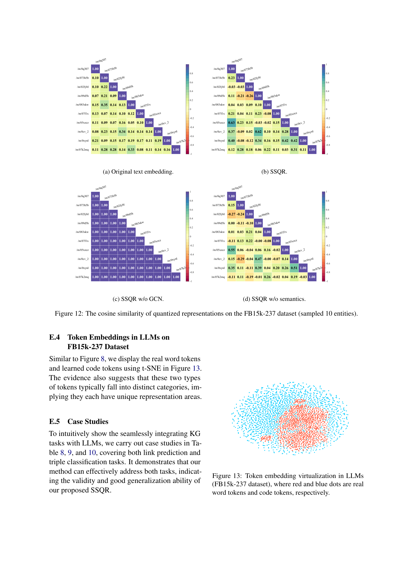

 


 2501.18119 
 Qika Lin et el. 
 
 🤗 2025-02-03 
 



↗ arXiv


↗ Hugging Face


↗ Papers with Code


### TL;DR



본 논문은 지식 그래프(KG)와 대규모 언어 모델(LLM)의 통합이 어려운 점을 다룹니다. 기존 방법들은 KG의 구조적 정보를 효과적으로 활용하지 못하고, 많은 토큰을 필요로 하여 LLM의 처리 능력에 제약이 있습니다. 이러한 문제를 해결하기 위해, 본 논문에서는 **자기 지도 학습 기반의 양자화된 표현(SSQR)** 방법을 제시합니다.

SSQR은 KG의 구조적 및 의미적 정보를 이산적인 코드(토큰)로 변환하여, LLM이 쉽게 처리할 수 있도록 합니다. **이를 통해 KG의 정보를 LLM에 효율적으로 통합**하고, KG 링크 예측 및 트리플 분류 작업에서 기존 방법보다 뛰어난 성능을 달성합니다. 이 연구는 **LLM과 KG 통합 분야에 새로운 패러다임**을 제시하고, **다양한 KG 응용 분야에 광범위한 영향**을 미칠 것으로 기대됩니다.



#### Key Takeaways


 자기 지도 학습 기반 양자화된 표현(SSQR) 방법을 통해 KGì˜ 구조적 ë° 의미적 정보를 효율적으로 압축 



 학습된 코드를 LLM에 직접 입력하여 KG와 LLM을 원활하게 통합하는 새로운 패러다임 제시 



 KG 링크 예측 ë° 트리플 분류 작업에서 기존 방법보다 우수한 성능을 입증 


#### Why does it matter?
본 논문은 **대규모 언어 모델(LLM)**과 **지식 그래프(KG)**의 원활한 통합이라는 중요한 문제를 해결하기 위한 새로운 방법을 제시하여, **연구자들에게 새로운 연구 방향을 제시**하고 **다양한 KG 응용 분야에 광범위한 영향**을 미칠 수 있기 때문에 중요합니다. 제안된 방법은 효율적이고 효과적이며, 기존 방법의 한계를 극복하고 향상된 성능을 제공합니다. 따라서 본 논문은 **KG와 LLM 통합 분야의 연구 발전에 크게 기여**할 것으로 기대됩니다.

------
#### Visual Insights

> 🔼 그림 1은 지식 그래프(KG)를 대규모 언어 모델(LLM)과 통합하는 두 가지 방법을 보여줍니다. (a)는 기존의 직접적인 방법으로, 샘플링된 그래프 구조와 의미적 텍스트를 LLM에 직접 입력하는 방식입니다. 이 방법은 KG의 전체 구조 정보를 활용하지 못하고, 많은 토큰을 필요로 하여 비효율적일 수 있습니다. (b)는 본 논문에서 제안하는 방법으로, KG의 구조적 및 의미적 지식을 이산 코드(즉, 토큰)로 압축하여 LLM과의 원활한 통합을 달성합니다. 이 방법은 언어 문장의 형식과 일치하는 코드를 사용하여 KG 정보를 효율적으로 표현하고 LLM에 입력합니다.  이는 KG와 LLM의 자연스러운 격차를 해소하는 효과적인 방법입니다.
> 

> 
read the caption

> Figure 1: Illustration of different strategies to integrate KGs with LLMs. (a) The direct method utilizes (sampled) graph structures and semantic text as inputs. (b) Our method for seamlessly integrating KGs with LLMs using learned quantized and discrete codes.
> 


| Instruction | This is a knowledge graph completion task, which needs to predict the tail entity for an incomplete query triplet. | 
| Input | The query triplet is ( _h_, _r_, ?). The quantized representation of entity _h_ is: [Code(_h_)] The answer candidates and corresponding quantized representations are as follows: _entity 1_, [Code(_entity 1_)] … _entity 20_, [Code(_entity 20_)] Please generate quantized representations of the top-3 potential answers, ranked from highest to lowest: | 
| Output | 1. [Code(_candidate 1_)] 2. [Code(_candidate 2_)] 3. [Code(_candidate 3_)] |

> 🔼 이 표는 지식 그래프의 링크 예측 작업을 위한 지침 형식을 보여줍니다. 학습된 코드는 엔티티 특징으로 사용되어 랭킹을 향상시키는 데 도움이 됩니다.  구체적으로, 불완전한 쿼리 트리플 (h, r, ?)이 주어지면, 헤드 엔티티 h의 정량화된 표현이 입력으로 사용되고, 잠재적인 답변 후보와 그에 해당하는 정량화된 표현들이 제공됩니다.  모델은 상위 3개의 잠재적인 답변 후보에 대한 정량화된 표현들을 생성하여 순위를 매겨야 합니다.
> 

> 
read the caption

> Table 1: Instruction format for link prediction, where learned codes serve as entity features to help ranking.
> 

### In-depth insights

#### Quantized KG Encoding
양자화된 KG 인코딩은 지식 그래프(KG)의 구조적 및 의미적 정보를 이산 코드(토큰)로 압축하여 **LLM과의 원활한 통합을 가능하게 하는 핵심 기술**입니다.  **자기지도학습 방식**을 통해 KG의 구조와 의미를 모두 포착하는 양자화된 표현을 학습하며, 그래프 합성곱 신경망(GCN)과 벡터 양자화(VQ)를 사용하여 효율적인 인코딩을 수행합니다.  **학습된 코드는 LLM의 토큰 형식과 일치**하므로, 별도의 프레임워크 수정 없이 LLM에 직접 입력 가능하며, KG 작업을 위한 특정 명령어와 결합하여 사용됩니다. 이는 기존의 연속 KG 임베딩 방식과 비교하여 **메모리 효율성 및 LLM과의 통합성을 크게 향상**시킵니다.  **자기지도학습을 통한 학습**은 지도학습 데이터 부족 문제를 해결하고, 다양한 KG 작업에 대한 일반화 성능을 높입니다.

#### LLM Integration
본 논문에서는 **지식 그래프(KG)와 대규모 언어 모델(LLM)의 통합**이라는 주제에 대해 심도 있게 논의하고 있습니다.  기존의 방법들은 KG의 구조적 정보를 LLM에 효과적으로 통합하는 데 어려움을 겪었지만, 본 연구는 **양자화된 코드를 활용하여 KG와 LLM을 원활하게 통합**하는 새로운 프레임워크를 제시합니다. 이를 통해 KG의 구조적, 의미적 정보를 LLM에 효율적으로 전달하고, 기존 방법들보다 우수한 성능을 달성할 수 있습니다. 특히, **자기 지도 학습 방식의 양자화된 표현 학습(SSQR)**은 KG의 구조와 의미 정보를 모두 고려하여 이산적인 코드(토큰)로 변환함으로써 LLM이 자연어 처리처럼 KG 정보를 처리할 수 있도록 합니다.  또한, 본 연구는 **LLM에 KG 정보를 효율적으로 통합하는 새로운 패러다임**을 제시하여 다양한 KG 응용 분야에 적용 가능성을 보여줍니다.  **실험 결과는 제안된 방법이 기존의 비지도 학습 기반 양자화 방법보다 우수한 성능**을 보임을 보여주며, 이를 통해 KG와 LLM의 통합에 대한 새로운 가능성을 제시합니다.

#### SSQR Experiments
본 논문에서 제시된 SSQR(Self-Supervised Quantized Representation) 방법론의 실험 결과는 **정량적 성능 평가와 정성적 분석** 두 가지 측면에서 제시될 것입니다. 정량적 평가는 주로 링크 예측 및 트리플 분류 작업에서의 정확도, 정밀도, 재현율, F1-score와 같은 지표를 사용하여 이루어집니다. 다양한 기존 방법들과 비교하여 SSQR의 우수성을 보여주는 결과가 제시될 것으로 예상됩니다. 특히, **적은 수의 토큰만을 사용하면서도 높은 정확도를 달성**한 점을 강조하여, 기존의 대규모 언어 모델을 활용한 방법론의 한계를 극복하는 효율성을 부각할 것입니다. 정성적 분석은 **학습된 코드의 차별성 및 구조적 정보 표현 능력**을 평가하는 데 초점을 맞춥니다. 예를 들어, t-SNE와 같은 차원 축소 기법을 활용하여 코드의 분포를 시각화하고, 각 코드가 의미적으로 얼마나 잘 구분되는지 분석합니다. 또한, 그래프 재구축 등의 작업을 통해 학습된 코드가 원래의 지식 그래프 구조를 얼마나 잘 복원하는지 분석하여 SSQR의 **구조적 정보 표현 능력**을 검증할 수 있을 것입니다.  **다양한 매개변수 설정**에 따른 성능 변화를 분석하여 SSQR의 안정성과 견고성을 확인하고, 추가적으로 ablation study를 통해 각 모듈의 기여도를 분석하여 방법론의 설계의 타당성을 입증할 수 있을 것입니다. 최종적으로, SSQR이 대규모 언어 모델과의 통합에 있어서 얼마나 효과적이고 효율적인지에 대한 종합적인 결론을 도출할 것입니다.

#### Future Directions
본 논문은 지식 그래프와 거대 언어 모델을 원활하게 통합하기 위한 새로운 방법을 제시합니다. **미래 방향**으로는, 우선 **다양한 지식 그래프 작업에 적용 가능한 통합적인 거대 언어 모델을 구축**하는 것이 중요합니다. 이를 위해서는 지식 그래프의 다양한 특징과 구조를 효과적으로 반영하는 새로운 양자화 기법을 개발하고, 이를 기반으로 다양한 작업에 대한 지침 데이터를 구축해야 합니다. 또한, **계산 비용을 줄이기 위한 효율적인 최적화 기법**을 연구해야 합니다. **거대 언어 모델의 일반화 능력을 향상**시키기 위한 연구도 필요하며, 이를 위해서는 다양한 지식 그래프와 작업에 대한 훈련 데이터를 확보하고, 모델의 일반화 성능을 평가하는 새로운 지표를 개발하는 것이 중요합니다.  마지막으로, **개발된 방법의 윤리적 및 사회적 영향**에 대한 고찰도 필요합니다. 이러한 미래 방향에 대한 연구는 지식 그래프와 거대 언어 모델의 통합을 더욱 발전시키고, 다양한 분야에서의 응용을 확대하는 데 기여할 것입니다.

#### Method Limitations
본 논문에서 제시된 방법의 한계점을 깊이 있게 논의해 보겠습니다. **가장 큰 제약은 대규모 언어 모델(LLM)의 막대한 계산 비용**입니다. LLM은 특정 지식 그래프(KG)와 작업에 미세 조정되기 때문에 다양한 KG 작업에 적용하는 데 제한이 있습니다.  **모델의 일반화 능력을 향상시키기 위해 동일한 이산 공간 내에서 정량화를 구현하는 통합 LLM을 구축하는 것이 필요**합니다.  또한, **본 연구는 자가 감독 방식의 정량화 학습에 초점을 맞추었지만, 다른 비지도 학습 기법과 비교 분석이 부족**합니다.  향후 연구에서는 다양한 접근법과의 비교를 통해 SSQR의 강점과 약점을 더 명확히 규명해야 합니다.  **데이터 셋의 특성에 따른 성능 차이 분석도 추가적으로 필요**하며, 특히 KG 구조와 의미 정보의 상대적 중요도를 다양한 KG 데이터 셋에서 분석하는 연구가 필요할 것으로 생각됩니다.  마지막으로, 제안된 방법의 효율성을 높이고, 다양한 KG 응용 분야에 적용 가능성을 높이기 위한 추가적인 연구가 필요합니다.

### More visual insights

More on figures

> 🔼 그림 2는 FB15k-237 데이터셋에서 각 엔티티에 대해 2-hop 이웃을 샘플링했을 때, LLaMA2 모델을 사용하여 필요한 토큰 수를 나타낸 통계 자료입니다.  20%와 30%의 이웃을 각각 샘플링한 경우에 대한 중간값과 평균값을 보여줍니다.  이는 지식 그래프(KG) 정보를 LLM에 직접 입력하는 방식의 단점을 보여주는 예시로,  hop 수가 증가함에 따라 기하급수적으로 늘어나는 토큰 수로 인해 자원 소모가 매우 커짐을 시각적으로 보여줍니다.
> 

> 
read the caption

> Figure 2: The statistics of 2-hop sampled neighbors and needed tokens (by LLaMA2) for entities in FB15k-237.
> 

> 🔼 그림 3은 본 논문에서 제안하는 방법의 전체 구조를 보여줍니다. (a)는 KG에 대한 자기 지도 학습 기반 양자화된 표현 학습(SSQR) 과정을, (b)는 학습된 양자화된 표현을 특징으로 사용하여 KG 작업을 위한 지시 조정 과정을 나타냅니다. 그림에서 사용된 아이콘 (■)과 (■)은 각각 모듈의 학습 과정 중 고정되었는지 또는 업데이트되는지 여부를 나타냅니다.
> 

> 
read the caption

> Figure 3:  The overall architecture of our study. (a) is for SSQR learning. (b) is for instruction tuning for KG tasks, where the learned quantized representations serve as features. Icons  and  represent the status of the module during training, indicating if it is frozen or being updated, respectively.
> 

> 🔼 그림 4(a)는 WN18RR 데이터셋의 8개 엔티티에 대한 원본 텍스트 임베딩의 코사인 유사도를 보여줍니다. 각 엔티티에 대해 텍스트 설명을 사용하여 얻은 임베딩 벡터 간의 코사인 유사도를 계산합니다. 이를 통해 원본 텍스트 임베딩이 엔티티 간의 의미적 관계를 얼마나 잘 반영하는지 시각적으로 확인할 수 있습니다.  다른 그림들과 비교하여 원본 텍스트 임베딩의 특징과 SSQR 기법의 효과를 파악하는 데 도움을 줍니다.
> 

> 
read the caption

> (a) Original text embedding.
> 

> 🔼 그림 (b)는 본 논문에서 제안하는 자기 지도 학습 기반의 양자화된 표현 학습 방법인 SSQR(Self-supervised Quantized Representation)의 구조를 보여줍니다. SSQR은 지식 그래프(KG)의 구조적 및 의미론적 정보를 이산 코드(토큰)로 압축하여, LLMs(Large Language Models)과의 원활한 통합을 목표로 합니다.  구체적으로, 그래프 합성곱 신경망(GCN)을 이용하여 KG의 구조 정보를 인코딩하고, 벡터 양자화(VQ)를 통해 이산 코드북을 생성합니다.  이렇게 생성된 코드는 LLMs의 입력 형식과 호환되도록 설계되어, LLMs의 어휘 사전 확장만으로 KG 정보를 LLMs에 통합할 수 있게 합니다. 이 그림은 SSQR 학습 과정의 핵심 구성 요소들을 시각적으로 보여주어, KG 정보의 양자화된 표현 학습 및 LLMs와의 통합 과정을 이해하는 데 도움을 줍니다.
> 

> 
read the caption

> (b) SSQR.
> 

> 🔼 이 그림은 지식 그래프의 구조적 정보를 모델링하는 그래프 합성곱 신경망(GCN)을 제거했을 때의 SSQR(Self-supervised Quantized Representation)의 정량화된 표현에 대한 코사인 유사도를 보여줍니다.  GCN을 제외하면, 정량화된 벡터들이 서로 매우 유사해지는 것을 확인할 수 있습니다. 이는 GCN이 지식 그래프의 구조적 정보를 효과적으로 학습하는 데 중요한 역할을 한다는 것을 시사합니다.
> 

> 
read the caption

> (c) SSQR w/o GCN.
> 

> 🔼 그림은 WN18RR 데이터셋의 8개 개체에 대한 정량화된 표현의 코사인 유사도를 보여줍니다.  (d)는 의미 정보 없이 SSQR을 적용한 결과를 나타냅니다. 즉, 지식 그래프의 구조적 정보만을 사용하여 개체를 정량화된 코드로 표현한 결과입니다.  의미 정보를 활용하지 않음으로써, 개체 표현의 다양성이 감소하고 구조적 유사성에 과도하게 의존하는 것을 보여줍니다. 이는 의미 정보가 개체를 보다 잘 구분하는 데 중요한 역할을 한다는 것을 시사합니다.
> 

> 
read the caption

> (d) SSQR w/o semantics.
> 

> 🔼 그림 4는 WN18RR 데이터셋에서 샘플링된 8개 개체에 대한 정량화된 표현의 코사인 유사도를 보여줍니다.  각 그래프는 다른 정량화 방법(원본 텍스트 임베딩, SSQR, GCN 없이 SSQR, 의미 정보 없이 SSQR)으로 생성된 8개 개체의 정량화된 표현 간의 코사인 유사도 행렬을 나타냅니다.  각 행렬의 값은 두 개체의 정량화된 표현 간의 코사인 유사도를 나타내며, 값이 높을수록 두 개체의 유사도가 높다는 것을 의미합니다. 이 그림을 통해 각 정량화 방법이 개체 간의 유사성을 얼마나 잘 포착하는지, 그리고 각 방법의 강점과 약점을 비교할 수 있습니다.
> 

> 
read the caption

> Figure 4: The cosine similarity of quantized representations on the WN18RR dataset (sampled 8 entities).
> 

> 🔼 그림 5(a)는 WN18RR 데이터셋에서 엔티티당 코드북 길이(M)와 시퀀스 길이(N)의 영향을 보여줍니다. 다양한 M과 N 값에 대한 링크 예측 작업의 MRR(Mean Reciprocal Rank), Hits@1, Hits@3, Hits@10 성능을 보여주는 3차원 막대 그래프입니다. 이 그래프를 통해 M과 N의 크기가 모델 성능에 미치는 영향을 시각적으로 파악하고 최적의 M과 N 값을 결정하는 데 도움이 됩니다. 일반적으로 M과 N 값이 클수록 성능이 향상되지만, 특정 지점을 넘어서면 성능 향상폭이 감소하는 것을 확인할 수 있습니다.
> 

> 
read the caption

> (a) WN18RR dataset.
> 

> 🔼 그림 5(b)는 본 논문에서 제안하는 자기 지도 학습 방식의 양자화된 표현 방법(SSQR)이 FB15k-237 데이터셋에 적용되었을 때의 코드북 길이(M)와 각 엔티티에 대한 시퀀스 길이(N)의 영향을 보여줍니다.  M과 N의 크기가 커질수록 모델의 성능이 향상되는 것을 보여주는 그래프입니다.  WN18RR 데이터셋에 대한 결과와 비교하여 FB15k-237 데이터셋에서 N의 영향이 더 크다는 점을 시각적으로 보여줍니다.
> 

> 
read the caption

> (b) FB15k-237 dataset.
> 

> 🔼 그림 5는 각 엔티티에 대한 코드북 길이(M)와 시퀀스 길이(N)의 영향을 보여줍니다.  두 가지 하이퍼파라미터 M과 N이 WN18RR과 FB15k-237 데이터셋에서의 성능에 미치는 영향을 MRR(평균 상호 순위), Hits@1, Hits@3, Hits@10 지표를 사용하여 보여줍니다.  이 그래프를 통해 최적의 코드북 크기(M)와 시퀀스 길이(N)를 선택하는 데 도움이 되는 정보를 얻을 수 있습니다.
> 

> 
read the caption

> Figure 5: The effects of codebook length (M𝑀Mitalic_M) and sequence length (N𝑁Nitalic_N) for each entity.
> 

> 🔼 그림 5는 코드북 길이(M)과 각 엔티티에 대한 시퀀스 길이(N)의 영향을 WN18RR 및 FB15k-237 데이터셋에서 보여줍니다. 일반적으로 M과 N이 클수록 성능이 향상됩니다. 왜냐하면 M과 N이 클수록 SSQR의 모델링 능력이 향상되기 때문입니다. WN18RR 데이터셋에서는 N이 M보다 더 큰 영향을 미치는데, 이는 WN18RR의 구조가 더 희소하고 엔티티가 더 많기 때문일 수 있습니다.
> 

> 
read the caption

> (a) WN18RR dataset.
> 

> 🔼 그림은 본 논문의 SSQR(Self-supervised Quantized Representation) 방법의 성능을 보여주는 실험 결과 중 하나입니다.  FB15k-237 데이터셋을 사용한 실험 결과로,  M(codebook length)과 N(sequence length)의 변화에 따른 MRR(Mean Reciprocal Rank) 및 Hits@k 지표 값을 3차원 그래프로 나타낸 것입니다.  각 축은 M, N, 그리고 성능 지표를 나타내며,  M과 N의 값을 조절함에 따라 성능 지표 값이 어떻게 변하는지 시각적으로 보여줍니다.  이는 SSQR 모델의 하이퍼파라미터 최적화에 대한 분석 결과를 보여주는 것입니다.
> 

> 
read the caption

> (b) FB15k-237 dataset.
> 

> 🔼 이 그림은 특정 엔티티와 해당 엔티티와 가장 가까운 k개의 이웃 엔티티들 간의 코드에 대한 평균 Jaccard 거리를 보여줍니다.  Jaccard 거리는 두 집합의 유사성을 측정하는 지표로, 두 엔티티의 코드 벡터가 얼마나 유사한지를 나타냅니다. k값이 증가함에 따라 거리가 어떻게 변하는지 보여주어,  엔티티 코드의 유사성 및 분포를 파악하는 데 도움을 줍니다.  즉,  서로 비슷한 엔티티일수록 Jaccard 거리가 낮고, 서로 다른 엔티티일수록 Jaccard 거리가 높음을 시각적으로 보여줍니다.
> 

> 
read the caption

> Figure 6: The mean Jaccard distance between codes of a specific entity and its k𝑘kitalic_k nearest ones.
> 

> 🔼 그림 7은 FB15k-237 데이터셋에서 LLM을 사용한 KG 링크 예측 작업에 대한 정량화된 표현의 영향을 보여줍니다.  다양한 코드북 길이(M)와 시퀀스 길이(N) 설정에서 MRR(평균 상호 순위), Hits@1, Hits@3, Hits@10 지표를 비교 분석하여,  최적의 코드 길이와 시퀀스 길이를 찾고  LLM 성능에 미치는 영향을 시각적으로 제시합니다. 이를 통해  최적의 정량화된 표현 설정을 도출하고 LLM 기반 KG 링크 예측 성능 향상에 대한 통찰력을 제공합니다.
> 

> 
read the caption

> Figure 7: The impacts of quantized representation for KG link prediction task using LLMs on FB15k-237.
> 

> 🔼 그림 8은 WN18RR 데이터셋에서 대규모 언어 모델(LLM) 내의 토큰 임베딩 시각화를 보여줍니다. 빨간색 점은 실제 단어 토큰을, 파란색 점은 코드 토큰을 각각 나타냅니다. 이 그림은 두 가지 유형의 토큰이 LLM 내에서 어떻게 다른 영역에 분포하는지를 시각적으로 보여주는 것으로,  LLM이 두 가지 유형의 토큰을 구분하여 처리할 수 있음을 시사합니다.  이는 본 논문에서 제안하는 SSQR 기법이 LLM에 KG 정보를 효과적으로 통합하는 데 사용될 수 있음을 보여주는 중요한 증거입니다.
> 

> 
read the caption

> Figure 8: Token embedding virtualization in LLMs (WN18RR dataset), where red and blue dots are real word tokens and code tokens, respectively.
> 

> 🔼 그림 9는 WN18RR 데이터셋에서 개체당 2-hop 이웃 노드 수와 LLaMA2를 사용하여 필요한 토큰 수의 통계를 보여줍니다.  50%와 100% 두 가지 이웃 샘플링 비율에 따른 이웃 수와 토큰 수의 중간값과 평균값을 나타냅니다. 이는 각 개체를 나타내는 데 SSQR이 16개의 토큰만 필요한 반면, 50%와 100% 샘플링 모두 상당히 많은 수의 토큰을 필요로 함을 보여줍니다.
> 

> 
read the caption

> Figure 9: The statistics of 2-hop sampled neighbors and needed tokens (by LLaMA2) for entities in WN18RR.
> 

> 🔼 그림 10은 제안된 자기지도학습 기반 정량화된 표현 학습 방법(SSQR)의 학습 과정을 Hits@1 지표를 사용하여 보여줍니다. Hits@1은 상위 1개의 예측 결과가 실제 정답과 일치하는 비율을 나타내는 평가 지표입니다.  그래프는 SSQR 모델의 학습 진행에 따른 Hits@1 값의 변화를 보여주며,  GCN(Graph Convolutional Network) 및 의미 정보 증류(semantic distilling)의 유무에 따른 성능 차이를 비교 분석합니다. 이를 통해 SSQR 모델의 학습 안정성 및 성능 향상에 GCN과 의미 정보 증류가 미치는 영향을 시각적으로 확인할 수 있습니다.
> 

> 
read the caption

> Figure 10: The training process of SSQR, where the Hits@1 metric is used to show the model performance.
> 

> 🔼 그림 11은 WN18RR 데이터셋에서 LLMs를 사용한 KG 링크 예측 작업을 위한 정량화된 표현의 영향을 보여줍니다.  이 그래프는 다양한 매개변수 설정(M과 N의 크기) 하에서 평가 지표(MRR, Hits@1, Hits@3, Hits@10)의 변화를 보여주어,  최적의 성능을 얻기 위한 정량화된 벡터의 차원 및 길이에 대한 통찰력을 제공합니다. 이는 모델의 성능과 효율성 사이의 균형을 맞추는 데 중요한 고려 사항입니다.
> 

> 
read the caption

> Figure 11: The impacts of quantized representation for KG link prediction task using LLMs on WN18RR.
> 

> 🔼 그림 4는 WN18RR 데이터셋에서 8개의 엔티티에 대한 정량화된 표현의 코사인 유사성을 보여줍니다. (a)는 원본 텍스트 임베딩을, (b)는 제안된 SSQR 방법을, (c)는 GCN 없이 SSQR을, (d)는 의미론적 정보 없이 SSQR을 각각 나타냅니다. 이 그림은 SSQR이 엔티티 표현을 보다 구별되게 만들고 KG의 구조적 및 의미론적 정보를 효과적으로 포착하는 데 도움이 됨을 시각적으로 보여줍니다.
> 

> 
read the caption

> (a) Original text embedding.
> 

> 🔼 그림 (b)는 자기 지도 학습 기반의 양자화된 표현 학습 방법인 SSQR(Self-supervised Quantized Representation)의 개념을 보여줍니다.  KG(Knowledge Graph)의 구조적 및 의미적 정보를 이산화된 코드(토큰)로 압축하여, LLMs(Large Language Models)이 자연어 문장처럼 처리할 수 있도록 하는 과정을 나타냅니다.  즉, KG의 각 엔티티에 대한 양자화된 코드를 생성하여 LLM에 직접 입력함으로써 KG와 LLM의 원활한 통합을 목표로 합니다.
> 

> 
read the caption

> (b) SSQR.
> 

More on tables


| Model | WN18RR MRR | WN18RR Hits@10 | FB15k-237 MRR | FB15k-237 Hits@10 |
|---|---|---|---|---|
| NodePiece | 0.403 | 0.515 | 0.256 | 0.420 |
| +RandomEQ | 0.425 | 0.522 | 0.263 | 0.425 |
| EARL | 0.440 | 0.527 | 0.310 | 0.501 |
| +RandomEQ | 0.442 | 0.536 | 0.308 | 0.502 |
| SSQR | **0.483** | **0.578** | **0.361** | **0.545** |
| Δ (↑)† | 9.28% | 7.84% | 16.45% | 8.57% |
| w/o GCN | 0.479 | 0.577 | 0.309 | 0.482 |
| Δ (↓)‡ | 0.83% | 0.17% | 14.40% | 11.56% |
| w/o sem | 0.447 | 0.521 | 0.347 | 0.528 |
| Δ (↓)‡ | 7.45% | 9.86% | 3.88% | 3.12 %|
> 🔼 표 2는 본 논문에서 제안된 SSQR 방법의 성능을 기존의 비지도 학습 기반 방법들(NodePiece, EARL, RandomEQ)과 비교 분석한 결과를 보여줍니다.  †는 각 지표에서 SSQR이 기존 최고 성능보다 얼마나 향상되었는지를 백분율(%)로 나타낸 것이고, ‡는 SSQR의 성능을 ablation study를 통해 분석한 결과를 보여줍니다.  즉, SSQR에서 특정 모듈(GCN 또는 semantic distilling)을 제거했을 때 성능이 어떻게 변화하는지를 보여주는 것입니다.  WN18RR과 FB15k-237 두 개의 데이터셋에 대한 결과가 제시되어 있으며, MRR(Mean Reciprocal Rank)과 Hits@10(Top-10 정확도) 지표를 사용하여 성능을 평가합니다.
> 

> 
read the caption

> Table 2: The results of baselines are from Li et al. (2023). ††\dagger† means the improvement of SSQR compared to the best performance in each metric. ‡‡\ddagger‡ means the ablation results compared to the results of SSQR.
> 


| Model | WN18RR MRR | WN18RR Hits@1 | WN18RR Hits@3 | WN18RR Hits@10 | FB15k237 MRR | FB15k237 Hits@1 | FB15k237 Hits@3 | FB15k237 Hits@10 |
|---|---|---|---|---|---|---|---|---|
| **General Embedding Methods** |  |  |  |  |  |  |  |  |
| TransE [Bordes et al. (2013)] | 0.223 | 0.014 | 0.401 | 0.529 | 0.330 | 0.231 | 0.369 | 0.528 |
| CompGCN [Vashishth et al. (2020)] | 0.479 | 0.443 | 0.494 | 0.546 | 0.355 | 0.264 | 0.390 | 0.535 |
| AdaProp [Zhang et al. (2023)] | 0.562 | 0.499 | – | 0.671 | 0.417 | 0.331 | – | 0.585 |
| MA-GNN [Xu et al. (2023)] | 0.565 | 0.507 | 0.592 | 0.679 | 0.379 | 0.282 | 0.415 | 0.569 |
| TCRA [Guo et al. (2024a)] | 0.496 | 0.457 | 0.511 | 0.574 | 0.367 | 0.275 | 0.403 | 0.554 |
| DiffusionE [Cao et al. (2024)] | 0.557 | 0.504 | – | 0.658 | 0.376 | 0.294 | – | 0.539 |
| **LLM-based Methods** |  |  |  |  |  |  |  |  |
| KICGPT [Wei et al. (2023)] | 0.549 | 0.474 | 0.585 | 0.641 | 0.412 | 0.327 | 0.448 | 0.554 |
| CSProm-KG-CD [Li et al. (2024)] | 0.559 | 0.508 | 0.578 | 0.660 | – | – | – | – |
| ARR [Chen et al. (2024)] | 0.521 | – | 0.607 | – | 0.398 | – | 0.436 | – |
| KG-FIT [Jiang et al. (2024)] | 0.553 | 0.488 | 0.595 | 0.695 | 0.362 | 0.275 | 0.485 | 0.572 |
| MKGL [Guo et al. (2024b)] | 0.552 | 0.500 | 0.577 | 0.656 | 0.415 | 0.325 | 0.454 | 0.591 |
| SSQR-LLaMA2 | 0.591 | 0.548 | 0.618 | 0.673 | 0.449 | 0.374 | 0.491 | 0.597 |
| SSQR-LLaMA3.1 | 0.598 | 0.559 | 0.618 | 0.675 | 0.459 | 0.393 | 0.491 | 0.597 |
> 🔼 본 표는 지식 그래프 링크 예측 작업에서 일반적인 임베딩 방법과 LLM 기반 방법의 실험 결과를 보여줍니다.  WN18RR과 FB15k-237 데이터셋에서 다양한 모델의 MRR(평균 역순위), Hits@1, Hits@3, Hits@10 지표를 비교하여 각 모델의 성능을 평가합니다. 일반적인 임베딩 방법과 LLM 기반 방법 간의 성능 차이를 분석하고, 제시된 방법의 효과를 보여줍니다.
> 

> 
read the caption

> Table 3: The experiment results of general embedding methods and LLM-based methods for KG link prediction.
> 


| Model | Acc | P | R | F1 |
|---|---|---|---|---|
| TransE [Bordes et al. (2013)] | 0.697 | 0.708 | 0.671 | 0.689 |
| DistMult [Yang et al. (2015)] | 0.587 | 0.590 | 0.568 | 0.579 |
| RotatE [Sun et al. (2019)] | 0.684 | 0.692 | 0.664 | 0.678 |
| Alpaca$_{zero-shot}$ | 0.561 | 0.533 | 0.974 | 0.689 |
| GPT-3.5$_{zero-shot}$ | 0.602 | 0.866 | 0.240 | 0.376 |
| KG-LLaMA [Yao et al. (2023)] | 0.748 | 0.674 | 0.962 | 0.793 |
| KG-Alpaca [Yao et al. (2023)] | 0.699 | 0.627 | 0.983 | 0.766 |
| KoPA [Zhang et al. (2024b)] | 0.777 | 0.708 | 0.941 | 0.808 |
| SSQR-LLaMA2 | 0.794 | 0.757 | 0.867 | 0.808 |
|  w/o SSQR | 0.754 | 0.699 | 0.891 | 0.783 |
| Δ | -5.13% | -7.71% | +2.85% | -3.07% |
| SSQR-LLaMA3.1 | 0.798 | 0.759 | 0.872 | 0.811 |
|  w/o SSQR | 0.767 | 0.711 | 0.901 | 0.795 |
| Δ | -3.77% | -6.34% | +3.41% | -2.03% |
> 🔼 표 4는 본 논문에서 제안하는 방법의 성능을 평가하기 위해 사용된 FB15k-237N 데이터셋을 기반으로 수행된 삼중항 분류 실험 결과를 보여줍니다.  표에는 제안된 방법(SSQR-LLaMA2, SSQR-LLaMA3.1)의 성능과 비교를 위해 사용된 여러 기존 방법들의 성능(정확도, 정밀도, 재현율, F1-점수)이 정리되어 있습니다.  기존 방법들의 결과는 Zhang et al.(2024b) 논문에서 가져왔습니다. 이 표를 통해 제안된 방법의 성능 우수성과 기존 방법들과의 차이점을 명확하게 확인할 수 있습니다.
> 

> 
read the caption

> Table 4: The experiment results of the triple classification on FB15k-237N dataset. The results of baselines are taken from Zhang et al. (2024b).
> 


| Model | MRR | Hits@1 | Hits@3 | Hits@10 |
|---|---|---|---|---|
| **WN18RR** |  |  |  |  |
| SSQR-LLaMA2 | 0.591 | 0.548 | 0.618 | 0.673 |
| w/o SSQR | 0.541 | 0.495 | 0.603 | 0.668 |
| Δ (↓) | 8.46% | 9.67% | 2.43% | 0.74% |
| **FB15k-237** |  |  |  |  |
| SSQR-LLaMA2 | 0.449 | 0.374 | 0.491 | 0.597 |
| w/o SSQR | 0.401 | 0.322 | 0.441 | 0.589 |
| Δ (↓) | 10.69% | 13.90% | 10.18% | 1.34% |
> 🔼 표 5는 링크 예측 작업에 대한 ablation 연구 결과를 보여줍니다.  SSQR 모델에서 각 모듈(GCN, 의미론적 증류)을 제거했을 때의 성능 변화를 보여주는 실험 결과를 제시하여 각 모듈의 중요성을 분석합니다. WN18RR 및 FB15k-237 데이터셋에 대한 MRR, Hits@1, Hits@3, Hits@10 지표가 제시됩니다.  SSQR 모델의 성능을 기준으로 각 ablation 실험의 성능 저하 정도를 백분율로 표시하여, 모델의 성능에 각 모듈이 얼마나 기여하는지를 정량적으로 보여줍니다.
> 

> 
read the caption

> Table 5: The ablation results for the link prediction task.
> 


| Dataset | Ent | Rel | Train | Valid | Test |
|---|---|---|---|---|---| 
| WN18RR | 40943 | 11 | 86835 | 3034 | 3134 |
| FB15k-237 | 14541 | 237 | 272115 | 17535 | 20466 |
| FB15k-237N | 13104 | 93 | 87282 | 7041/7041 | 8226/8226 |
> 🔼 표 6은 세 가지 지식 그래프 데이터셋(WN18RR, FB15k-237, FB15k-237N)의 통계 정보를 보여줍니다. WN18RR과 FB15k-237 데이터셋은 링크 예측 실험에 사용되었으며, FB15k-237N 데이터셋은 트리플 분류 실험에 사용되었습니다. FB15k-237N 데이터셋의 경우, ‘/’ 기호는 양성 샘플과 음성 샘플을 구분하는 데 사용되었습니다. 각 데이터셋에 대해 엔티티(entity), 릴레이션(relation), 학습 데이터셋 크기, 검증 데이터셋 크기, 테스트 데이터셋 크기가 제시되어 있습니다.
> 

> 
read the caption

> Table 6: The statistics of WN18RR, FB15k-237, and FB15k-237N datasets. The former two are for link prediction. FB15k-237N dataset is for triple classification, where ‘/’ splits the positive and negative samples.
> 


| Instruction | Input | Output |
|---|---|---|
| Given a triple in the knowledge graph, you need to predict its validity based on the triple itself and entities’ quantized representations. | The triple is: ( _h_, _r_, _t_) The quantized representation of entity _h_ is: [Code(_h_)] The quantized representation of entity _t_ is: [Code(_t_)] Please determine the validity of the triple and respond True or False. | True/False |
> 🔼 표 7은 지식 그래프의 세 개의 요소(주어, 관계, 목적어)로 이루어진 삼중항의 유효성을 LLMs(대규모 언어 모델)을 이용하여 예측하는 작업에 대한 지시 사항의 형식을 보여줍니다.  삼중항의 주어와 목적어에 대한 양자화된 표현(코드)이 입력으로 제공되고, LLMs는 삼중항이 유효한지 여부를 True 또는 False로 응답합니다. 이는 LLMs이 KG(지식 그래프) 정보를 처리하고  삼중항의 유효성을 판단하는 방법을 보여주는 예시입니다.
> 

> 
read the caption

> Table 7: Instruction format for triple classification.
> 


| Input | This is a knowledge graph completion task, which needs to predict the tail entity for an incomplete query triplet. The query triplet is (radiotherapy, hypernym, ?). The quantized representation of entity radiotherapy is: [2006] [588] [350] [1486] [214] [929] [328] [1424] [1792] [919] [944] [740] [438] [843] [147] [628] The answer candidates and corresponding quantized representations are as follows: disease, [156] [1880] [1777] [185] [121] [720] [783] [1713] [945] [1077] [180] [1576] [1574] [1433] [216] [1280] tomography, [182] [597] [657] [1486] [404] [468] [732] [564] [833] [1470] [1756] [626] [1674] [843] [1928] [513] medical care, [422] [68] [1329] [1517] [1251] [431] [1479] [1445] [1666] [407] [952] [406] [1337] [388] [1982] [685] status, [1721] [1906] [1773] [1811] [12] [892] [1625] [1476] [1561] [176] [534] [1463] [1657] [368] [70] [1618] physiological state, [1721] [718] [267] [394] [120] [1105] [885] [1823] [1496] [23] [952] [406] [1559] [1198] [1149] [1800] medical science, [565] [413] [842] [1517] [350] [873] [575] [595] [721] [935] [1554] [175] [708] [1643] [1820] [1775] infection, [565] [1594] [990] [1066] [974] [40] [434] [874] [1401] [371] [1700] [1118] [1709] [52] [71] [1408] picturing, [788] [168] [641] [1797] [927] [711] [1608] [123] [1163] [1460] [952] [406] [1752] [1464] [553] [1158] medicine, [1879] [1216] [691] [296] [1743] [892] [1851] [595] [2039] [1428] [426] [740] [399] [579] [433] [1987] unhealthiness, [1389] [644] [570] [258] [635] [647] [732] [1139] [1660] [407] [464] [1020] [1574] [1905] [926] [1971] grounds, [1268] [1053] [803] [780] [1194] [285] [328] [289] [1163] [915] [1921] [1020] [524] [1774] [430] [1572] defense reaction, [1881] [1821] [1620] [1703] [435] [995] [908] [1308] [1596] [1598] [401] [2008] [903] [817] [92] [1158] radiology, [1478] [588] [1340] [1797] [1436] [1914] [1894] [1424] [634] [1460] [1756] [740] [673] [843] [108] [1088] radioscopy, [1005] [1002] [1441] [137] [1436] [1378] [1479] [1649] [1544] [1470] [534] [626] [902] [272] [904] [1874] treat, [396] [2007] [1935] [1305] [1993] [1030] [1690] [1445] [1203] [1417] [1554] [495] [1752] [1001] [1236] [98] specialize, [1005] [1933] [1976] [780] [927] [1728] [575] [105] [1791] [1598] [616] [1118] [1752] [425] [437] [1847] therapy, [396] [816] [81] [488] [336] [1164] [1690] [1288] [900] [915] [1554] [175] [666] [1622] [765] [685] specialism, [384] [816] [599] [394] [435] [789] [1479] [105] [664] [407] [1554] [103] [1752] [1708] [697] [1130] symptom, [1721] [1913] [772] [858] [120] [1150] [1374] [289] [1666] [1417] [944] [2008] [1454] [958] [1169] [1800] medicine, [156] [350] [1599] [1955] [1368] [508] [1527] [1445] [1561] [1460] [426] [1142] [940] [653] [793] [471] Please generate quantized representations of the top-3 potential answer entities, ranked from highest to lowest: LLM Output: 1, [396] [816] [81] [488] [336] [1164] [1690] [1288] [900] [915] [1554] [175] [666] [1622] [765] [685] 2, [156] [1880] [1777] [185] [121] [720] [783] [1713] [945] [1077] [180] [1576] [1574] [1433] [216] [1280] 3, [182] [597] [657] [1486] [404] [468] [732] [564] [833] [1470] [1756] [626] [1674] [843] [1928] [513] Ground Truth: [396] [816] [81] [488] [336] [1164] [1690] [1288] [900] [915] [1554] [175] [666] [1622] [765] [685] |
> 🔼 본 표는 LLaMA2를 사용하여 WN18RR 데이터셋에서 링크 예측 작업에 대한 사례 연구를 보여줍니다. 'radiotherapy' (방사선 치료) 엔티티에 대한 질의가 주어지고, 'hypernym' (상위 개념) 관계에 대한 정답 후보들이 제시됩니다.  LLaMA2 모델은 정답으로 'therapy' (치료)를 예측했으며, 해당 코드는 17번째 순위에서 1위로 올라왔습니다. 이는 본 논문에서 제안하는 방법이 링크 예측 작업에서 효과적임을 보여주는 사례입니다.
> 

> 
read the caption

> Table 8: Case study on WN18RR for link prediction using LLaMA2. The code of ground truth therapy is ranked to the first position from 17-th.
> 


| Input | LLM Output | Ground Truth |
|---|---|---|
|  | 1, [497] [1875] [1849] [377] [1694] [61] [1471] [1445] [392] [1672] [1500] [300] [711] [1839] [331] [136] 2, [1532] [258] [1837] [357] [923] [1994] [638] [555] [771] [1003] [1736] [1473] [1495] [1436] [1313] [20] 3, [661] [1243] [542] [1741] [1907] [1799] [858] [1794] [1916] [458] [1844] [909] [438] [1737] [686] [963] | [497] [1875] [1849] [377] [1694] [61] [1471] [1445] [392] [1672] [1500] [300] [711] [1839] [331] [136] |
> 🔼 표 9는 LLaMA2를 사용하여 FB15k-237 데이터셋에서 링크 예측 작업에 대한 사례 연구를 보여줍니다.  이 표는 질의 트리플에 대한 상위 3개의 예측된 꼬리 엔티티와 각 엔티티에 대한 정량화된 표현을 보여줍니다. 실제 정답인 Indiana는 16번째 위치에서 1위로 올라왔습니다.  이는 본 논문에서 제안하는 방법론이 KG의 구조와 의미 정보를 효과적으로 통합하여 LLM의 성능을 향상시킬 수 있음을 보여주는 좋은 예시입니다.
> 

> 
read the caption

> Table 9: Case study on FB15k-237 for link prediction using LLaMA2. The code of ground truth Indiana is ranked to the first position from 16-th.
> 


| Input | LLM Output | Ground Truth |
|---|---|---|
| Given a triple in the knowledge graph, you need to predict its validity based on the triple itself and entities’ quantized representations. The triple is: (Carl Foreman, /people/person/place_of_birth, Chicago) The quantized representation of entity “Carl Foreman” is: [72] [114] [150] [336] [519] [494] [155] [482] [594] [934] [1012] [677] [473] [450] [827] [455] The quantized representation of entity “Chicago” is: [603] [413] [385] [937] [731] [735] [836] [92] [400] [372] [563] [225] [82] [526] [81] [229] Please determine the validity of the triple and respond True or False. | True | True |
| Given a triple in the knowledge graph, you need to predict its validity based on the triple itself and entities’ quantized representations. The triple is: (Jessica Lange, /people/person/profession, Lawyer) The quantized representation of entity “Jessica Lange†is: [23] [712] [484] [202] [289] [211] [772] [667] [870] [903] [213] [693] [360] [59] [868] [722] The quantized representation of entity “Lawyer†is: [760] [84] [976] [802] [430] [735] [912] [480] [966] [411] [284] [113] [727] [744] [333] [56] Please determine the validity of the triple and respond True or False. | False | False |
> 🔼 표 10은 LLaMA2를 사용하여 FB15k-237N 데이터셋에서 수행한 삼중항 분류 작업의 두 가지 사례를 보여줍니다. 각 사례는 질문(삼중항)과 그에 대한 LLaMA2의 응답을 보여줍니다. 이를 통해 본 논문에서 제안하는 방법의 성능과 일반화 능력을 직관적으로 보여줍니다.
> 

> 
read the caption

> Table 10: Two cases on FB15k-237N dataset for triple classification using LLaMA2.
> 

### Full paper



