 


 2501.18128 
 Abdurrahman Odabaşı et el. 
 
 🤗 2025-02-03 
 



↗ arXiv


↗ Hugging Face


↗ Papers with Code


### TL;DR



본 연구는 최근 등장한 다양한 언어 모델의 뉴스 요약 성능을 비교 분석한 연구입니다. 기존 연구들과 달리, **다양한 크기의 모델들을 포괄적으로 비교**하여 소규모 모델의 성능을 평가하고, **자동 및 수동 평가 방식을 병행**하여 결과의 신뢰도를 높였습니다. 연구 결과, GPT-3.5-Turbo와 GPT-4와 같은 대규모 모델이 우수한 성능을 보였지만, 특정 소규모 모델들도 상당한 경쟁력을 가진다는 것을 확인하였습니다.

본 연구는 **다양한 데이터셋을 활용**하여 모델의 일반화 능력을 평가하고, **모델의 강점과 약점을 심층적으로 분석**했습니다. 특히, 데이터셋의 품질이 모델 성능에 미치는 영향을 강조하며, 저품질의 참조 요약이 모델 성능을 저해할 수 있다는 점을 보여줍니다. 또한, 몇몇 소규모 모델들은 대규모 모델에 비해 비용 효율이 높아, **자원 제약이 있는 연구자들에게 실용적인 대안**이 될 수 있음을 시사합니다.



#### Key Takeaways


 소규모 언어 모델도 대규모 모델과 비슷한 뉴스 요약 성능을 보임 



 데이터셋의 품질이 모델 성능에 큰 영향을 미침 



 다양한 평가 방법(자동, 수동, LLM 기반)을 통한 종합적인 성능 평가가 중요함 


#### Why does it matter?
본 논문은 **소규모 언어 모델의 뉴스 요약 능력**에 대한 종합적인 벤치마킹 연구를 제시하여, 뉴스 요약 분야의 연구 동향과 미래 연구 방향을 제시합니다. 다양한 크기의 모델 성능을 비교 분석하여, **소규모 모델의 경쟁력**을 보여주고, 향후 연구를 위한 기준을 제시함으로써, 자원 제약이 있는 연구자들에게도 **실용적인 대안**을 제시합니다.

------
#### Visual Insights

> 🔼 그림 1은 세 개의 뉴스 요약 데이터셋(CNN/DM, Newsroom, XSum)의 훈련 데이터에 대한 중복 비율 분포를 보여줍니다. 정규화된 히스토그램과 커널 밀도 추정(KDE) 곡선을 통해 시각화했습니다. x축은 중복 비율을 나타내고 y축은 백분율 밀도를 나타냅니다. 세 데이터셋 간 중복 특성의 차이를 강조하여 각 데이터셋의 중복 비율 분포를 비교 분석합니다. CNN/DM은 높은 중복 비율을 보이는 반면, XSum은 낮은 중복 비율을 보이는 경향이 있습니다. 이는 XSum이 CNN/DM보다 추출적 요약보다는 더 추상적인 요약에 중점을 둔다는 점을 시사합니다.
> 

> 
read the caption

> Figure 1: Overlap ratio distributions for the training sets of the three datasets (CNN/DM, Newsroom, XSum), visualized as normalized histograms with overlaid Kernel Density Estimate (KDE) curves. The x-axis represents the overlap ratio, while the y-axis indicates the percentage density, highlighting differences in overlap characteristics among the datasets.
> 


| Name | Year | #Sources | Train Set | Val Set | Test Set |
|---|---|---|---|---|---| 
| CNN/DM [21, 22, 25] | 2015/2016 | 2 | 287,113 | 13,368 | 11,490 |
| Newsroom [23] | 2018 | 38 | 995,041 | 108,837 | 108,862 |
| XSum [24, 26] | 2018 | 1 | 204,045 | 11,332 | 11,334 |

> 🔼 본 표는 뉴스 요약 분야에서 널리 사용되는 세 가지 데이터셋(CNN/Daily Mail, Newsroom, XSum)에 대한 일반적인 정보를 제공합니다. 각 데이터셋의 출처, 작성 연도, 뉴스 기사 수(훈련, 검증, 테스트 세트로 구분), 그리고 데이터셋의 특징을 보여주는 추가 정보를 담고 있습니다.  이 표는 본 논문에서 사용된 데이터셋의 규모와 특성을 이해하는 데 도움을 줍니다.
> 

> 
read the caption

> Table 1: General information about the popular datasets in the field of News Summarization.
> 

### In-depth insights

#### LLM News Summary
LLM 뉴스 요약에 대한 심층적인 고찰은 **대규모 언어 모델(LLM)**이 뉴스 요약 작업에서 보여주는 능력과 한계를 면밀히 조사하는 것을 의미합니다.  본 연구는 다양한 크기의 LLM을 이용하여 여러 뉴스 데이터셋을 대상으로 실험을 진행하고, 제로샷 및 퓨샷 학습 환경에서의 성능을 비교 분석합니다. 특히, **자동 평가 지표(ROUGE, METEOR, BERTScore)**와 **인간 평가, LLM 기반 평가**를 결합한 견고한 평가 방법론을 사용하여 결과의 신뢰성을 높였습니다.  **소규모 LLM의 잠재력**을 확인하는 동시에, **대규모 LLM의 우수성**을 재확인하는 결과를 얻었습니다.  **데이터셋 품질의 중요성** 또한 강조하며, 향후 연구 방향으로 **고품질 데이터셋 구축 및 다국어 지원 확대** 등을 제시합니다.  전반적으로, LLM을 이용한 뉴스 요약 분야는 아직 발전의 여지가 크지만, **소규모 모델의 경쟁력 확보 가능성**과 함께 **다양한 평가 방법론의 활용 중요성**을 시사합니다.  본 연구는 LLM 기반 뉴스 요약 시스템 개발에 중요한 시사점을 제공합니다.

#### Zero-Shot & Few-Shot
본 논문은 제로샷(Zero-Shot) 및 퓨샷(Few-Shot) 학습 설정에서 다양한 크기의 언어 모델의 뉴스 요약 능력을 평가합니다. **제로샷 학습**에서는 모델이 사전 지식 없이 뉴스 기사를 요약하고, **퓨샷 학습**에서는 소수의 예시를 제공하여 모델의 성능을 향상시키려고 시도합니다. 흥미롭게도, 퓨샷 학습에서 데모 예시를 포함시키는 것이 모델 성능을 향상시키지 못했고, 오히려 요약 품질을 저하시키는 경우도 있었습니다. 이는 참조 요약의 질이 좋지 않았기 때문으로, 모델 성능에 부정적인 영향을 미쳤습니다. **GPT-3.5-Turbo와 GPT-4는 우수한 성능을 보였으며, Qwen1.5-7B, SOLAR-10.7B-Instruct-v1.0, Meta-Llama-3-8B, Zephyr-7B-Beta와 같은 일부 공개 모델도 경쟁력 있는 결과**를 보였습니다. 이 연구는 뉴스 요약 작업에 대한 대규모 모델의 우수성을 강조하면서도, **소규모 모델의 잠재력을 확인**하여 향후 연구에 중요한 통찰력을 제공합니다.

#### Multifaceted Evaluation
본 논문에서 제시된 다면적 평가(Multifaceted Evaluation)는 자연어 처리 모델의 성능을 측정하기 위해 **정량적 지표와 정성적 지표를 모두 활용**한다는 점에서 중요합니다.  **자동 평가 지표(ROUGE, METEOR, BERTScore)**는 효율적인 측정을 제공하지만, **어휘 일치에만 초점**을 맞춰 **세련된 언어적 특징이나 의미 파악 능력**을 제대로 반영하지 못하는 한계가 있습니다. 반면, **인간 평가자**는 **맥락과 의미**를 고려하여 더욱 정교한 평가를 수행할 수 있으며,  **AI 기반 평가**는 인간의 노력을 줄이고 일관성을 유지하는 데 기여합니다.  이러한 세 가지 평가 방법의 조합을 통해 연구는 **모델의 강점과 약점을 보다 포괄적이고 균형 있게 분석**하고, **기존 연구의 한계를 극복**하는 데 기여할 수 있을 것입니다. 특히, **단일 지표에 의존하지 않고 다각적인 측정**을 통해 얻은 결과는 모델의 성능을 더욱 정확하게 평가하고 미래 연구 방향을 제시하는 데 중요한 역할을 할 것입니다.

#### Small LLM Potential
본 논문은 소형 언어 모델(Small Language Model, SLLM)의 뉴스 요약 능력을 평가한 연구입니다.  **주목할 만한 점은 몇몇 소형 모델들이 대형 모델들과 비교했을 때 경쟁력 있는 결과를 보였다는 것**입니다. 특히, 제한된 컴퓨팅 자원 환경에서도 효율성과 비용 효과 면에서 우수한 성능을 보여주는 소형 모델들이 뉴스 요약 작업에 적합한 대안으로 떠오르고 있습니다.  **하지만 소형 모델들은 대형 모델에 비해 성능 면에서 한계를 보였으며, 특히 긴 문서나 복잡한 문장을 요약하는 데 어려움을 겪었습니다.** 이는 **모델의 매개변수 수와 컨텍스트 창 크기의 제약** 때문으로 해석됩니다.  **향후 연구는 소형 모델의 성능 향상을 위한 다양한 접근법을 모색하고, 특히 데이터 품질 개선과 더불어 모델의 제약사항을 극복하는 방안을 고려해야 합니다.** 또한, 다양한 뉴스 스타일과 주제에 대한 모델의 일반화 능력을 평가하여 실제 적용 가능성을 높이는 연구가 필요할 것입니다.  **결론적으로, 소형 LLM은 뉴스 요약 작업에 있어 잠재력을 가지고 있지만, 대형 모델과의 성능 차이를 극복하기 위한 추가적인 연구가 필요합니다.**

#### Future Research
본 논문은 뉴스 요약에서 다양한 크기의 언어 모델 성능을 평가하는 종합적인 벤치마킹 연구입니다. **미래 연구는 몇 가지 중요한 방향**을 제시합니다. 첫째, 현재 데이터셋의 저품질 요약본 문제를 해결하기 위해 **고품질 요약본을 구축**하거나 기존 요약본을 전문가 검토를 통해 개선해야 합니다. 둘째, **다양한 언어**를 지원하는 다국어 뉴스 요약 모델을 개발하고 평가해야 합니다. 셋째, 단일 문서 요약뿐만 아니라 **다중 문서 요약**에도 적용 가능한 모델을 연구해야 합니다. 넷째, 모델의 장르별 성능 차이를 분석하여 **장르 특화 모델 개발**을 연구해야 합니다. 마지막으로, 뉴스 요약 모델의 최적화된 하이퍼파라미터 설정을 찾는 연구도 필요합니다.  **이러한 노력을 통해** 더욱 정확하고 효율적인 뉴스 요약 모델 개발과 평가가 가능해질 것입니다.

### More visual insights

More on tables


| Model Name | Creator | #Parameters | Context Window | Public |
|---|---|---|---|---|
| Gemini-1.5-Pro-0409 [28] | Google | - | 128K | ✗ |
| Gemma-2B [29] | Google | 2B | 8K | ✓ |
| Gemma-7B [29] | Google | 7B | 8K | ✓ |
| GPT-3.5-Turbo-0613 [30] | OpenAI | - | 4K | ✗ |
| GPT-4-0125-preview [31] | OpenAI | - | 8K | ✗ |
| Llama-2-7b-hf [32] | Meta | 7B | 4K | ✓ |
| Meta-Llama-3-8B [33] | Meta | 8B | 8K | ✓ |
| Meta-Llama-3-8B-Instruct [33] | Meta | 8B | 8K | ✓ |
| Mistral-7B-v0.1 [34] | Mistral AI | 7B | 4K | ✓ |
| Mistral-7B-Instruct-v0.1 [34] | Mistral AI | 7B | 4K | ✓ |
| Phi-3-Mini-4K-Instruct [35] | Microsoft | 3.8B | 4K | ✓ |
| Qwen1.5-0.5B [36] | Alibaba Cloud | 620M | 32K | ✓ |
| Qwen1.5-1.8B [36] | Alibaba Cloud | 1.8B | 32K | ✓ |
| Qwen1.5-4B [36] | Alibaba Cloud | 4B | 32K | ✓ |
| Qwen1.5-7B [36] | Alibaba Cloud | 7B | 32K | ✓ |
| SOLAR-10.7B-v1.0 [37] | Upstage | 10.7B | 4K | ✓ |
| SOLAR-10.7B-Instruct-v1.0 [37] | Upstage | 10.7B | 4K | ✓ |
| Yi-6B [38] | 01.AI | 6B | 4K | ✓ |
| Yi-9B [38] | 01.AI | 9B | 4K | ✓ |
| Zephyr-7B-Beta [39] | Hugging Face | 7B | 4K | ✓ |
> 🔼 이 표는 논문에서 사용된 20개의 언어 모델 목록을 보여줍니다. 각 모델의 이름, 매개변수 수, 공개 여부 및 최대 컨텍스트 창 크기를 보여줍니다. 모델 크기, 공개 여부 및 컨텍스트 창 크기는 모델 선택에 영향을 미치는 중요한 요소입니다.
> 

> 
read the caption

> Table 2: List of the selected language models.
> 


| Model Name | ROUGE-L | BERTScore | METEOR | Relevance | Faithfulness | Coherence | Relevance | Faithfulness | Coherence |
|---|---|---|---|---|---|---|---|---|---| 
| Gemini-1.5-Pro | 0.189 | 0.866 | 0.3358 | 4.6 | 5.0 | 4.8 | 5.0 | 5.0 | 5.0 |
| GPT-3.5-Turbo | 0.2077 | 0.8764 | 0.3613 | 4.4 | 4.8 | 4.8 | 5.0 | 5.0 | 4.8 |
| GPT-4 | 0.1643 | 0.8674 | 0.3399 | 4.8 | 5.0 | 4.8 | 4.8 | 5.0 | 5.0 |
| Gemma-2B | 0.1795 | 0.8542 | 0.1987 | 2.0 | 2.4 | 3.0 | 3.6 | 3.4 | 3.0 |
| Gemma-7B | 0.1927 | 0.8578 | 0.2242 | 3.6 | 4.0 | 3.4 | 4.0 | 5.0 | 4.6 |
| Llama-2-hf | 0.1653 | 0.8399 | 0.2151 | 3.8 | 4.0 | 4.0 | 3.0 | 3.6 | 3.2 |
| Llama-3 | 0.1828 | 0.8584 | 0.2556 | 3.2 | 4.0 | 3.4 | 4.8 | 4.8 | 4.2 |
| Llama-3-Instruct | 0.1675 | 0.8495 | 0.301 | 3.8 | 4.0 | 4.2 | 4.8 | 4.6 | 4.0 |
| Mistral-v0.1 | 0.1698 | 0.8534 | 0.2773 | 3.2 | 2.6 | 3.2 | 4.0 | 3.6 | 3.6 |
| Mistral-Instruct-v0.1 | 0.1344 | 0.8381 | 0.1587 | 3.4 | 2.6 | 2.6 | 3.0 | 3.2 | 3.4 |
| Phi-3-Mini-Instruct | 0.1593 | 0.8523 | 0.2604 | 3.8 | 2.6 | 3.0 | 3.8 | 3.8 | 3.4 |
| Qwen1.5-0.5B | 0.1608 | 0.8534 | 0.279 | 2.8 | 1.8 | 2.2 | 3.2 | 2.6 | 2.8 |
| Qwen1.5-1.8B | 0.1617 | 0.8502 | 0.268 | 3.4 | 3.2 | 3.4 | 3.4 | 3.2 | 3.2 |
| Qwen1.5-4B | 0.1450 | 0.83 | 0.2503 | 3.4 | 3.0 | 3.2 | 3.6 | 4.0 | 3.8 |
| Qwen1.5-7B | 0.1735 | 0.8575 | 0.2823 | 4.2 | 4.4 | 4.0 | 4.4 | 4.2 | 4.2 |
| SOLAR-v1.0 | 0.1534 | 0.855 | 0.2522 | 3.4 | 3.8 | 4.0 | 4.0 | 3.4 | 3.4 |
| SOLAR-Instruct-v1.0 | 0.1692 | 0.8594 | 0.2887 | 3.6 | 3.2 | 3.6 | 4.6 | 4.6 | 4.6 |
| Yi-6B | 0.1919 | 0.8539 | 0.2409 | 3.6 | 3.4 | 4.2 | 3.6 | 4.0 | 4.2 |
| Yi-9B | 0.2112 | 0.8649 | 0.2515 | 3.2 | 3.4 | 3.8 | 4.4 | 4.4 | 4.6 |
| Zephyr-Beta | 0.1633 | 0.8573 | 0.2894 | 3.6 | 2.8 | 3.8 | 4.0 | 3.6 | 3.8 |
> 🔼 표 3은 CNN/DM 데이터셋에서 제로샷 방식으로 학습된 언어 모델들의 평가 결과를 보여줍니다.  자동 평가 지표(ROUGE-L, BERTScore, METEOR)와 인간 평가(관련성, 사실 정확성, 일관성), 그리고 LLM을 이용한 평가 결과가 포함되어 있습니다.  자동 평가 지표에서 가장 높은 값들은 굵게 표시되어 모델 성능을 명확히 파악할 수 있도록 했습니다. 각 모델의 제로샷 성능을 다양한 측면에서 비교 분석하여, 뉴스 요약 작업에 대한 각 모델의 강점과 약점을 보여줍니다.
> 

> 
read the caption

> Table 3: Evaluation results for zero-shot LMs on CNN/DM dataset. The highest values in the automatic evaluation metrics are emphasized in bold.
> 


| Model Name | ROUGE-L | BERTScore | METEOR | Relevance | Faithfulness | Coherence | Relevance | Faithfulness | Coherence |
|---|---|---|---|---|---|---|---|---|---| 
| Gemini-1.5-Pro | 0.1704 | 0.8676 | 0.2658 | 4.4 | 5.0 | 4.8 | 4.8 | 5.0 | 5.0 |
| GPT-3.5-Turbo | 0.1987 | 0.8714 | 0.2915 | 4.2 | 4.8 | 4.8 | 4.6 | 5.0 | 5.0 |
| GPT-4 | 0.1684 | 0.8649 | 0.2704 | 4.6 | 4.8 | 4.8 | 4.6 | 5.0 | 5.0 |
| Gemma-2B | 0.1538 | 0.8507 | 0.1978 | 3.2 | 3.6 | 3.8 | 3.0 | 4.6 | 3.8 |
| Gemma-7B | 0.1572 | 0.814 | 0.226 | 2.6 | 3.0 | 3.0 | 3.8 | 4.2 | 4.4 |
| Llama-2-hf | 0.1155 | 0.6605 | 0.1557 | 3.8 | 3.2 | 4.2 | 3.4 | 4.2 | 3.8 |
| Llama-3 | 0.1152 | 0.6791 | 0.1853 | 2.4 | 2.4 | 3.0 | 4.2 | 5.0 | 4.8 |
| Llama-3-Instruct | 0.101 | 0.8086 | 0.1405 | 1.2 | 1.4 | 2.6 | 4.6 | 5.0 | 5.0 |
| Mistral-v0.1 | 0.1297 | 0.8449 | 0.2231 | 3.2 | 2.6 | 2.6 | 4.0 | 4.6 | 4.0 |
| Mistral-Instruct-v0.1 | 0.1497 | 0.8504 | 0.1797 | 2.4 | 3.0 | 3.0 | 3.6 | 4.2 | 3.8 |
| Phi-3-Mini-Instruct | 0.1294 | 0.8476 | 0.2092 | 3.4 | 3.2 | 3.6 | 4.0 | 4.0 | 4.8 |
| Qwen1.5-0.5B | 0.1342 | 0.8531 | 0.2259 | 3.6 | 2.2 | 3.2 | 3.8 | 4.0 | 4.0 |
| Qwen1.5-1.8B | 0.1375 | 0.8538 | 0.2299 | 3.6 | 2.8 | 3.8 | 3.8 | 4.6 | 4.8 |
| Qwen1.5-4B | 0.1315 | 0.85 | 0.2268 | 3.4 | 3.0 | 3.2 | 4.0 | 4.6 | 4.8 |
| Qwen1.5-7B | 0.1481 | 0.8569 | 0.2376 | 3.8 | 3.0 | 4.6 | 4.2 | 5.0 | 4.8 |
| SOLAR-v1.0 | 0.1079 | 0.8168 | 0.1571 | 3.2 | 1.8 | 3.0 | 3.6 | 4.4 | 4.4 |
| SOLAR-Instruct-v1.0 | 0.1415 | 0.8536 | 0.222 | 3.6 | 2.4 | 3.6 | 4.0 | 5.0 | 5.0 |
| Yi-6B | 0.1986 | 0.8573 | 0.2098 | 2.6 | 3.4 | 3.4 | 2.8 | 3.2 | 3.2 |
| Yi-9B | 0.2022 | 0.8626 | 0.1872 | 2.4 | 3.0 | 3.4 | 2.2 | 2.8 | 4.0 |
| Zephyr-Beta | 0.1188 | 0.8478 | 0.2216 | 4.2 | 4.0 | 4.4 | 4.2 | 4.8 | 5.0 |
> 🔼 표 4는 뉴스룸 데이터셋에서 제로샷 방식으로 평가한 언어 모델들의 성능을 보여줍니다.  자동 평가 지표(ROUGE-L, BERTScore, METEOR) 점수와 인간 평가자 및 LLM 판정 점수(관련성, 사실 정확성, 일관성)가 포함되어 있습니다.  자동 평가 지표에서 가장 높은 점수는 굵게 표시되어 모델 성능 비교를 용이하게 합니다.  각 지표는 뉴스 요약 작업에서 모델의 강점과 약점을 보여줍니다.  특히, 제로샷 설정에서 모델의 일반화 능력과 다양한 뉴스 스타일을 처리하는 능력을 평가하는 데 중점을 둡니다.
> 

> 
read the caption

> Table 4: Evaluation results for zero-shot LMs on Newsroom dataset. The highest values in the automatic evaluation metrics are emphasized in bold.
> 


| Model Name | ROUGE-L | BERTScore | METEOR | Relevance | Faithfulness | Coherence | Relevance | Faithfulness | Coherence |
|---|---|---|---|---|---|---|---|---|---| 
| Gemini-1.5-Pro | 0.2197 | 0.8869 | 0.2923 | 4.4 | 4.8 | 4.8 | 4.4 | 5.0 | 4.8 |
| GPT-3.5-Turbo | 0.1934 | 0.8791 | 0.2617 | 4.4 | 4.6 | 4.4 | 4.6 | 5.0 | 5.0 |
| GPT-4 | 0.1644 | 0.8718 | 0.2588 | 4.0 | 4.6 | 4.8 | 4.8 | 5.0 | 5.0 |
| Gemma-2B | 0.1645 | 0.8694 | 0.1924 | 3.0 | 2.4 | 3.8 | 3.8 | 5.0 | 4.8 |
| Gemma-7B | 0.1198 | 0.5835 | 0.1529 | 4.0 | 4.0 | 4.6 | 4.4 | 4.8 | 4.8 |
| Llama-2-hf | 0.1096 | 0.6522 | 0.1356 | 1.0 | 1.0 | 1.4 | 3.2 | 4.0 | 4.0 |
| Llama-3 | 0.1422 | 0.7916 | 0.2144 | 3.4 | 2.8 | 3.8 | 4.0 | 4.8 | 4.8 |
| Llama-3-Instruct | 0.1042 | 0.8126 | 0.1498 | 1.6 | 1.6 | 2.8 | 4.0 | 4.8 | 4.8 |
| Mistral-v0.1 | 0.1281 | 0.8553 | 0.2175 | 4.2 | 3.6 | 4.2 | 3.8 | 3.4 | 4.2 |
| Mistral-Instruct-v0.1 | 0.159 | 0.8564 | 0.1993 | 3.0 | 3.0 | 3.4 | 3.4 | 4.0 | 3.8 |
| Phi-3-Mini-Instruct | 0.1231 | 0.8523 | 0.1947 | 4.0 | 3.0 | 4.2 | 4.2 | 4.4 | 4.6 |
| Qwen1.5-0.5B | 0.1387 | 0.8608 | 0.2028 | 3.4 | 2.6 | 3.6 | 3.8 | 3.8 | 4.4 |
| Qwen1.5-1.8B | 0.1322 | 0.8585 | 0.2098 | 3.8 | 3.2 | 3.6 | 4.4 | 5.0 | 5.0 |
| Qwen1.5-4B | 0.1492 | 0.8635 | 0.2281 | 4.0 | 3.8 | 4.4 | 4.2 | 4.8 | 4.8 |
| Qwen1.5-7B | 0.1629 | 0.8669 | 0.2065 | 4.2 | 3.8 | 4.8 | 4.2 | 4.8 | 4.6 |
| SOLAR-v1.0 | 0.1435 | 0.8580 | 0.2006 | 4.0 | 3.8 | 4.2 | 4.6 | 5.0 | 5.0 |
| SOLAR-Instruct-v1.0 | 0.1433 | 0.8597 | 0.2118 | 4.2 | 3.6 | 3.8 | 4.0 | 5.0 | 4.6 |
| Yi-6B | 0.2222 | 0.8809 | 0.2325 | 2.8 | 2.6 | 3.2 | 3.8 | 4.8 | 4.6 |
| Yi-9B | 0.2534 | 0.8884 | 0.2649 | 2.2 | 1.8 | 2.4 | 3.6 | 4.6 | 4.8 |
| Zephyr-Beta | 0.1349 | 0.8572 | 0.2374 | 4.0 | 4.4 | 4.2 | 4.8 | 5.0 | 5.0 |
> 🔼 표 5는 XSum 데이터셋을 사용한 제로샷(Zero-shot) 학습 방식의 여러 언어 모델들에 대한 평가 결과를 보여줍니다.  자동 평가 지표(ROUGE-L, BERTScore, METEOR) 점수와 사람 평가 점수(Relevance, Faithfulness, Coherence), 그리고 LLM 기반 평가 점수가 모델별로 제시되어 있습니다. 자동 평가 지표에서 가장 높은 점수를 기록한 값들은 굵은 글씨로 표시되어 모델 성능을 한눈에 파악할 수 있도록 돕습니다. 각 지표는 요약문의 관련성, 사실 정확성, 일관성 등을 평가하는 데 사용되었습니다.
> 

> 
read the caption

> Table 5: Evaluation results for zero-shot LMs on XSum dataset. The highest values in the automatic evaluation metrics are emphasized in bold.
> 


| Model Name | ROUGE-L | BERTScore | METEOR | Relevance | Faithfulness | Coherence | Relevance | Faithfulness | Coherence |
|---|---|---|---|---|---|---|---|---|---| 
| Gemini-1.5-Pro | 0.2343 | 0.8811 | 0.3485 | 4.4 | 5.0 | 4.8 | 5.0 | 5.0 | 5.0 |
| GPT-3.5-Turbo | 0.2377 | 0.8806 | 0.3525 | 4.2 | 4.8 | 4.8 | 5.0 | 5.0 | 4.8 |
| GPT-4 | 0.1947 | 0.8736 | 0.3484 | 4.8 | 5.0 | 4.6 | 4.8 | 5.0 | 4.8 |
| Gemma-2B | 0.1653 | 0.8525 | 0.1946 | 3.6 | 4.4 | 4.0 | 2.4 | 2.6 | 3.0 |
| Gemma-7B | 0.0558 | 0.2573 | 0.0596 | 3.4 | 4.2 | 4.2 | 3.6 | 3.8 | 3.6 |
| Llama-2-hf | 0.1518 | 0.79 | 0.179 | 3.4 | 3.4 | 3.4 | 3.0 | 2.6 | 2.4 |
| Llama-3 | 0.1694 | 0.7939 | 0.2252 | 3.8 | 3.8 | 4.2 | 3.8 | 4.6 | 4.4 |
| Llama-3-Instruct | 0.1612 | 0.8104 | 0.2432 | 4.0 | 4.0 | 4.0 | 4.0 | 4.0 | 4.0 |
| Mistral-v0.1 | 0.0522 | 0.2773 | 0.0673 | 3.0 | 3.2 | 3.2 | 3.0 | 2.6 | 2.8 |
| Mistral-Instruct-v0.1 | 0.1368 | 0.6916 | 0.1577 | 3.4 | 3.6 | 3.8 | 2.2 | 3.0 | 2.8 |
| Phi-3-Mini-Instruct | 0.1541 | 0.8436 | 0.2359 | 2.6 | 2.4 | 2.6 | 3.4 | 3.6 | 3.2 |
| Qwen1.5-0.5B | 0.1654 | 0.8521 | 0.2723 | 3.0 | 2.0 | 2.8 | 3.4 | 3.2 | 3.0 |
| Qwen1.5-1.8B | 0.1769 | 0.8536 | 0.2517 | 3.8 | 3.6 | 3.2 | 2.8 | 2.4 | 2.6 |
| Qwen1.5-4B | 0.1741 | 0.8548 | 0.277 | 3.6 | 3.6 | 3.6 | 3.0 | 3.2 | 3.2 |
| Qwen1.5-7B | 0.1714 | 0.8537 | 0.2556 | 4.4 | 4.2 | 4.2 | 3.8 | 3.8 | 3.4 |
| SOLAR-v1.0 | 0.1546 | 0.8389 | 0.1994 | 3.8 | 3.6 | 3.6 | 4.0 | 4.0 | 3.6 |
| SOLAR-Instruct-v1.0 | 0.1682 | 0.8594 | 0.285 | 4.2 | 4.0 | 4.2 | 4.0 | 3.8 | 3.8 |
| Yi-6B | 0.1883 | 0.8624 | 0.1857 | 4.0 | 3.6 | 3.8 | 3.4 | 3.8 | 3.4 |
| Yi-9B | 0.1804 | 0.8574 | 0.1565 | 4.0 | 3.4 | 4.0 | 3.2 | 3.2 | 4.0 |
| Zephyr-Beta | 0.1624 | 0.8435 | 0.2641 | 4.0 | 3.6 | 3.8 | 3.6 | 3.6 | 3.8 |
> 🔼 표 6은 CNN/DM 데이터셋에서 세 가지 예시를 사용한 언어 모델의 평가 결과를 보여줍니다.  자동 평가 지표(ROUGE-L, BERTScore, METEOR)와 사람 평가(관련성, 사실 정확성, 일관성), 그리고 LLM을 이용한 평가 결과가 포함되어 있습니다.  각 지표에서 가장 높은 점수는 굵게 표시되어 모델 성능 비교를 용이하게 합니다.  이 표는 제로샷 학습과의 비교를 통해 몇몇 샷 학습 전략의 효과성을 분석하는 데 사용됩니다.
> 

> 
read the caption

> Table 6: Evaluation results for three-shot LMs on CNN/DM dataset. The highest values in the automatic evaluation metrics are emphasized in bold.
> 


| Model Name | ROUGE-L | BERTScore | METEOR | Relevance | Faithfulness | Coherence | Relevance | Faithfulness | Coherence |
|---|---|---|---|---|---|---|---|---|---| 
| Gemini-1.5-Pro | 0.1772 | 0.8695 | 0.2632 | 4.4 | 4.6 | 5.0 | 4.4 | 5.0 | 5.0 |
| GPT-3.5-Turbo | 0.2144 | 0.8744 | 0.2892 | 4.4 | 4.8 | 4.8 | 4.0 | 5.0 | 5.0 |
| GPT-4 | 0.1917 | 0.8707 | 0.2621 | 4.2 | 4.8 | 4.8 | 4.8 | 5.0 | 5.0 |
| Gemma-2B | 0.122 | 0.8383 | 0.1623 | 2.8 | 2.4 | 3.4 | 3.2 | 4.2 | 4.4 |
| Gemma-7B | 0.0176 | 0.0943 | 0.0207 | 4.0 | 3.6 | 4.4 | 3.4 | 4.6 | 4.6 |
| Llama-2-hf | 0.1407 | 0.8042 | 0.1728 | 2.4 | 2.6 | 3.4 | 3.0 | 3.6 | 3.2 |
| Llama-3 | 0.1118 | 0.5872 | 0.1457 | 4.2 | 3.8 | 4.4 | 4.0 | 4.6 | 4.8 |
| Llama-3-Instruct | 0.1062 | 0.7969 | 0.1583 | 2.0 | 2.2 | 2.2 | 4.4 | 5.0 | 5.0 |
| Mistral-v0.1 | 0.0543 | 0.3082 | 0.0734 | 4.0 | 4.2 | 4.2 | 3.4 | 3.2 | 3.6 |
| Mistral-Instruct-v0.1 | 0.1645 | 0.7966 | 0.1708 | 3.2 | 3.8 | 3.8 | 2.6 | 3.6 | 3.2 |
| Phi-3-Mini-Instruct | 0.1342 | 0.8417 | 0.1936 | 3.6 | 3.8 | 3.4 | 3.8 | 4.0 | 4.6 |
| Qwen1.5-0.5B | 0.1302 | 0.8525 | 0.2208 | 3.4 | 3.2 | 2.4 | 3.6 | 3.4 | 4.6 |
| Qwen1.5-1.8B | 0.1388 | 0.8544 | 0.2249 | 3.4 | 2.6 | 3.6 | 3.4 | 3.2 | 4.4 |
| Qwen1.5-4B | 0.1367 | 0.8542 | 0.231 | 4.2 | 3.6 | 4.0 | 4.2 | 3.6 | 4.8 |
| Qwen1.5-7B | 0.1379 | 0.8544 | 0.2258 | 4.0 | 4.4 | 4.6 | 4.2 | 4.2 | 4.8 |
| SOLAR-v1.0 | 0.1791 | 0.8572 | 0.1814 | 4.2 | 3.8 | 4.2 | 3.2 | 3.8 | 4.0 |
| SOLAR-Instruct-v1.0 | 0.1777 | 0.8631 | 0.2358 | 4.0 | 3.6 | 4.2 | 3.4 | 3.8 | 4.8 |
| Yi-6B | 0.1728 | 0.8511 | 0.1919 | 2.8 | 3.0 | 3.0 | 2.8 | 3.8 | 4.0 |
| Yi-9B | 0.1905 | 0.8608 | 0.1798 | 2.0 | 2.2 | 2.8 | 3.4 | 4.2 | 4.8 |
| Zephyr-Beta | 0.1279 | 0.8175 | 0.2064 | 4.0 | 3.6 | 4.4 | 4.2 | 3.8 | 4.8 |
> 🔼 표 7은 뉴스룸 데이터셋에서 3-샷 학습을 사용한 여러 언어 모델의 평가 결과를 보여줍니다.  자동 평가 지표(ROUGE-L, BERTScore, METEOR)와 인간 평가(관련성, 사실 정확성, 일관성), 그리고 LLM 판정 평가 결과가 포함되어 있습니다.  각 지표에서 가장 높은 점수는 굵게 표시되어 모델 성능을 비교 분석하는 데 도움을 줍니다. 뉴스 기사 요약 작업에서 모델의 강점과 약점을 파악하는 데 유용한 정보를 제공합니다.
> 

> 
read the caption

> Table 7: Evaluation results for three-shot LMs on Newsroom dataset. The highest values in the automatic evaluation metrics are emphasized in bold.
> 


| Model Name | ROUGE-L | BERTScore | METEOR | Relevance | Faithfulness | Coherence | Relevance | Faithfulness | Coherence |
|---|---|---|---|---|---|---|---|---|---| 
| Gemini-1.5-Pro | 0.2429 | 0.8929 | 0.3005 | 4.4 | 4.6 | 4.8 | 4.8 | 5.0 | 5.0 |
| GPT-3.5-Turbo | 0.2159 | 0.8856 | 0.2807 | 4.2 | 4.4 | 4.8 | 4.8 | 5.0 | 5.0 |
| GPT-4 | 0.1868 | 0.8773 | 0.27 | 4.2 | 4.6 | 4.8 | 4.6 | 5.0 | 5.0 |
| Gemma-2B | 0.1464 | 0.8497 | 0.1674 | 3.6 | 4.0 | 4.0 | 3.2 | 5.0 | 4.6 |
| Gemma-7B | 0.0123 | 0.0426 | 0.0136 | 3.4 | 3.0 | 4.2 | 3.6 | 4.2 | 4.4 |
| Llama-2-hf | 0.1693 | 0.8275 | 0.192 | 3.4 | 3.6 | 3.6 | 3.8 | 4.0 | 4.6 |
| Llama-3 | 0.1474 | 0.6694 | 0.1817 | 3.6 | 4.2 | 4.0 | 3.8 | 4.4 | 4.6 |
| Llama-3-Instruct | 0.1082 | 0.8298 | 0.1787 | 2.4 | 2.4 | 2.6 | 4.8 | 5.0 | 5.0 |
| Mistral-v0.1 | 0.0226 | 0.127 | 0.0311 | 4.0 | 4.4 | 4.2 | 3.8 | 3.8 | 4.4 |
| Mistral-Instruct-v0.1 | 0.1744 | 0.8177 | 0.2038 | 3.6 | 3.8 | 4.6 | 4.2 | 4.4 | 4.6 |
| Phi-3-Mini-Instruct | 0.1406 | 0.8594 | 0.2038 | 4.0 | 3.8 | 4.6 | 4.2 | 5.0 | 4.8 |
| Qwen1.5-0.5B | 0.132 | 0.859 | 0.2061 | 3.6 | 3.2 | 4.2 | 3.8 | 4.2 | 4.6 |
| Qwen1.5-1.8B | 0.1447 | 0.8635 | 0.2075 | 3.6 | 3.0 | 4.0 | 4.0 | 3.8 | 4.4 |
| Qwen1.5-4B | 0.1546 | 0.867 | 0.2407 | 4.0 | 3.8 | 4.4 | 4.0 | 4.8 | 5.0 |
| Qwen1.5-7B | 0.1755 | 0.8717 | 0.2231 | 4.2 | 4.0 | 4.8 | 4.0 | 5.0 | 4.8 |
| SOLAR-v1.0 | 0.2334 | 0.8723 | 0.2666 | 4.2 | 4.0 | 4.2 | 4.2 | 5.0 | 5.0 |
| SOLAR-Instruct-v1.0 | 0.1599 | 0.8663 | 0.228 | 3.8 | 3.8 | 4.2 | 3.8 | 5.0 | 4.6 |
| Yi-6B | 0.2322 | 0.8812 | 0.2515 | 2.6 | 3.2 | 3.8 | 3.8 | 5.0 | 4.8 |
| Yi-9B | 0.2623 | 0.8915 | 0.2808 | 3.0 | 3.2 | 3.0 | 3.4 | 4.2 | 4.0 |
| Zephyr-Beta | 0.1578 | 0.8463 | 0.2397 | 4.2 | 4.2 | 4.6 | 4.4 | 4.0 | 4.8 |
> 🔼 표 8은 XSum 데이터셋에서 3-shot 학습을 적용한 다양한 언어 모델들의 평가 결과를 보여줍니다.  자동 평가 지표(ROUGE-L, BERTScore, METEOR)와 더불어, 사람 평가자와 LLM(Large Language Model) 판정자의 평가 결과(관련성, 사실 정확성, 일관성)를 포함합니다.  각 지표에서 가장 높은 점수를 기록한 모델은 굵게 표시되어 있습니다. 이 표는 제로샷 학습과 비교하여 몇몇 샷 학습이 모델 성능에 미치는 영향을 분석하는 데 사용됩니다.
> 

> 
read the caption

> Table 8: Evaluation results for three-shot LMs on XSum dataset. The highest values in the automatic evaluation metrics are emphasized in bold.
> 


| Role Adoption | Task Specification | Multi-Step Breakdown | Clear Instructions | Providing Input | Length Constraint |
|---|---|---|---|---|---| 
| ■ | ■ | ■ | ■ | ■ | ■ |
> 🔼 이 표는 XSum 데이터셋에서 제로샷 학습 환경에서 사용된 프롬프트의 디자인을 보여줍니다.  프롬프트는 뉴스 기사를 한 문장으로 요약하는 작업을 모델에게 지시하는데,  기자들이 긴 기사를 간결하게 요약하는 방식을 모방합니다.  표에는 프롬프트의 주요 구성 요소(역할 부여, 명확한 지침, 작업 명세, 입력 제공, 다단계 분석, 길이 제한)를 다양한 색상으로 구분하여 각 요소가 어떤 방식으로 프롬프트 기술에 기여하는지 명확히 보여줍니다.
> 

> 
read the caption

> Table 9: Designed Prompt for zero-shot experiments on XSum dataset
> 

### Full paper


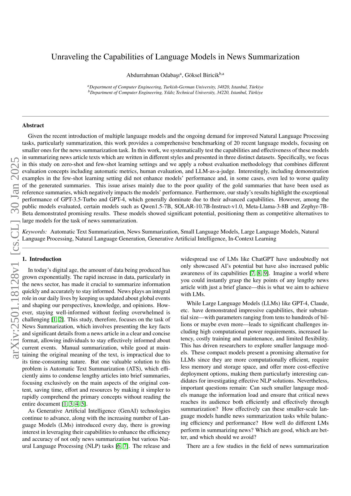
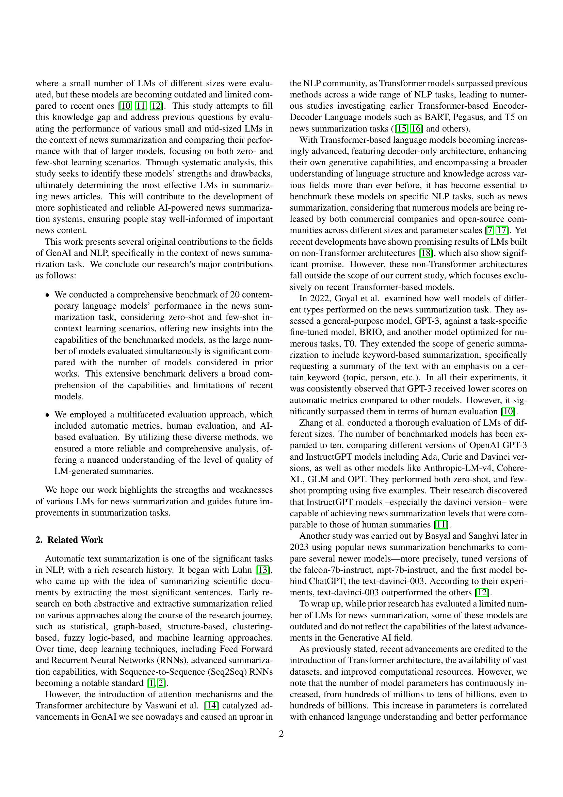
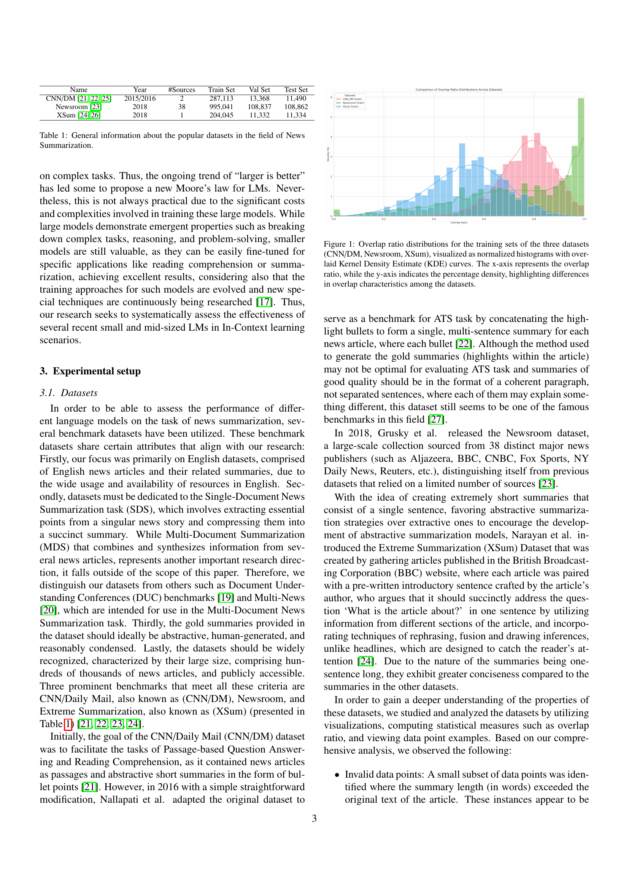
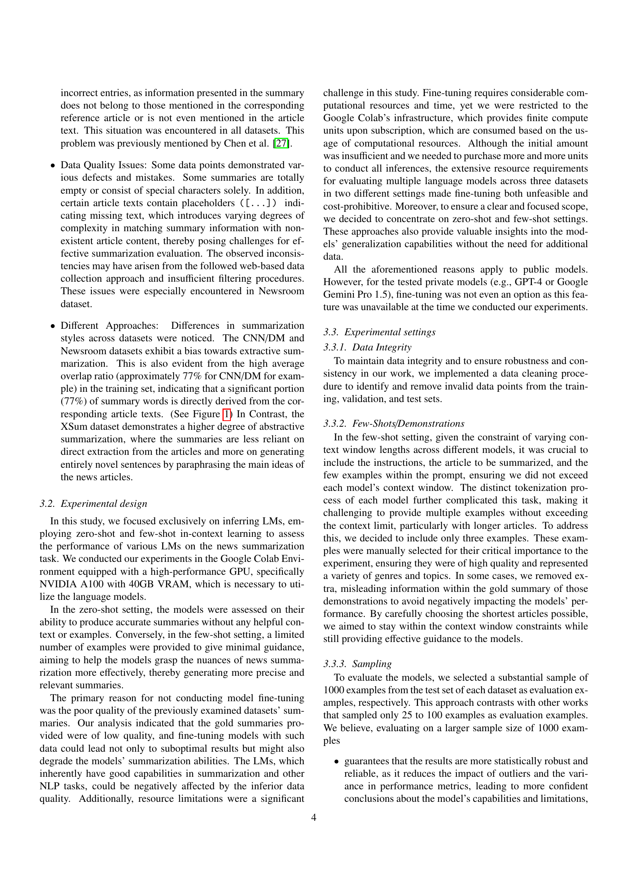
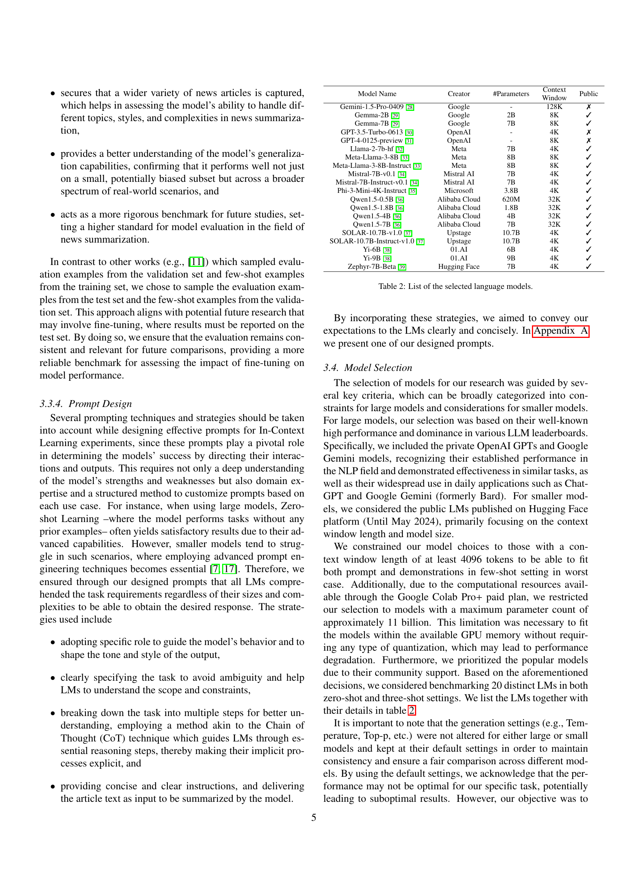
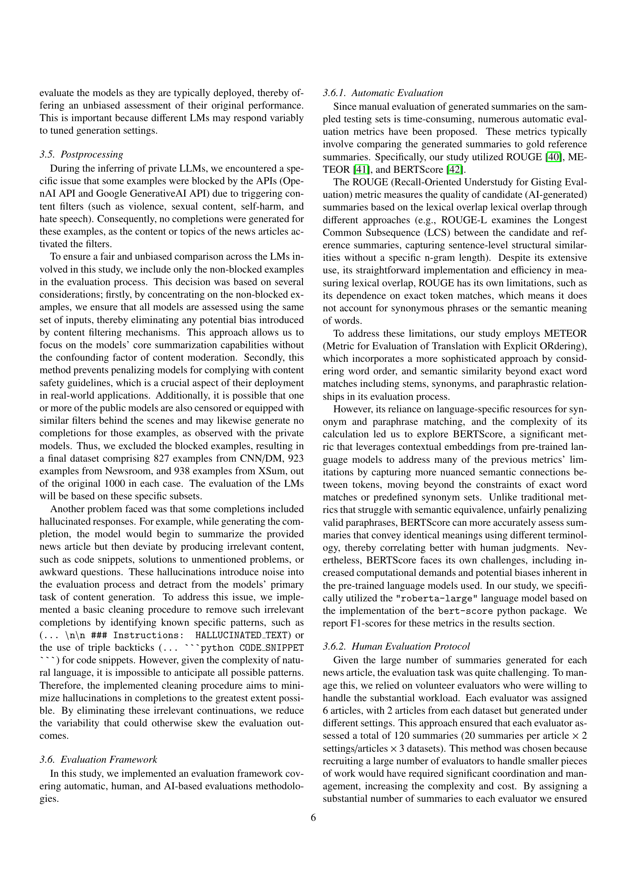
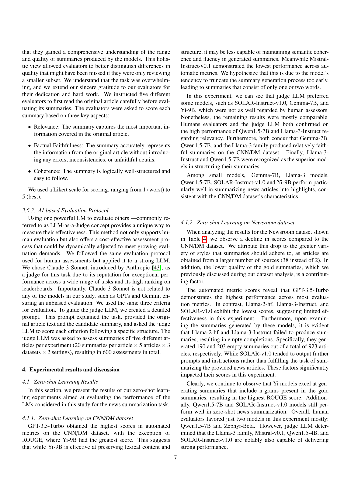
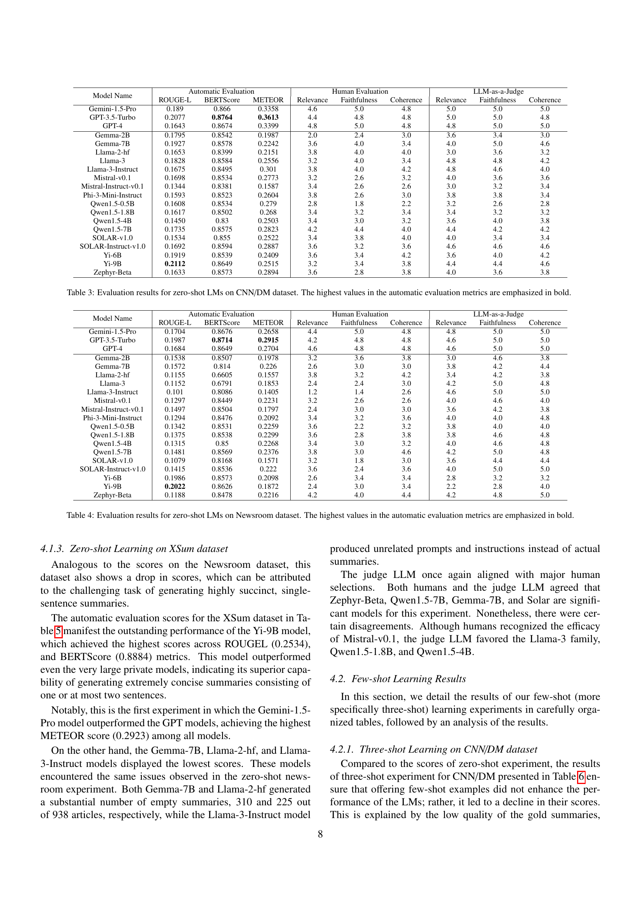
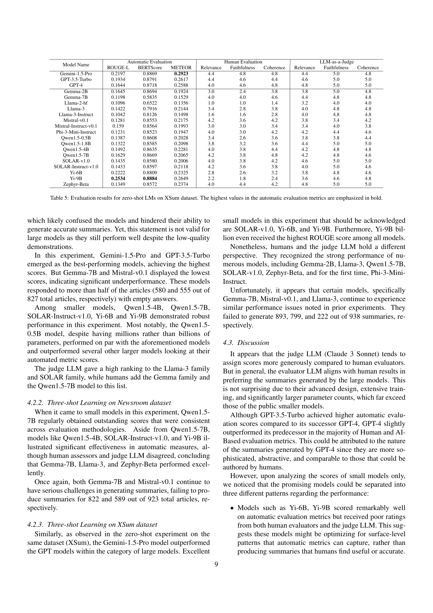
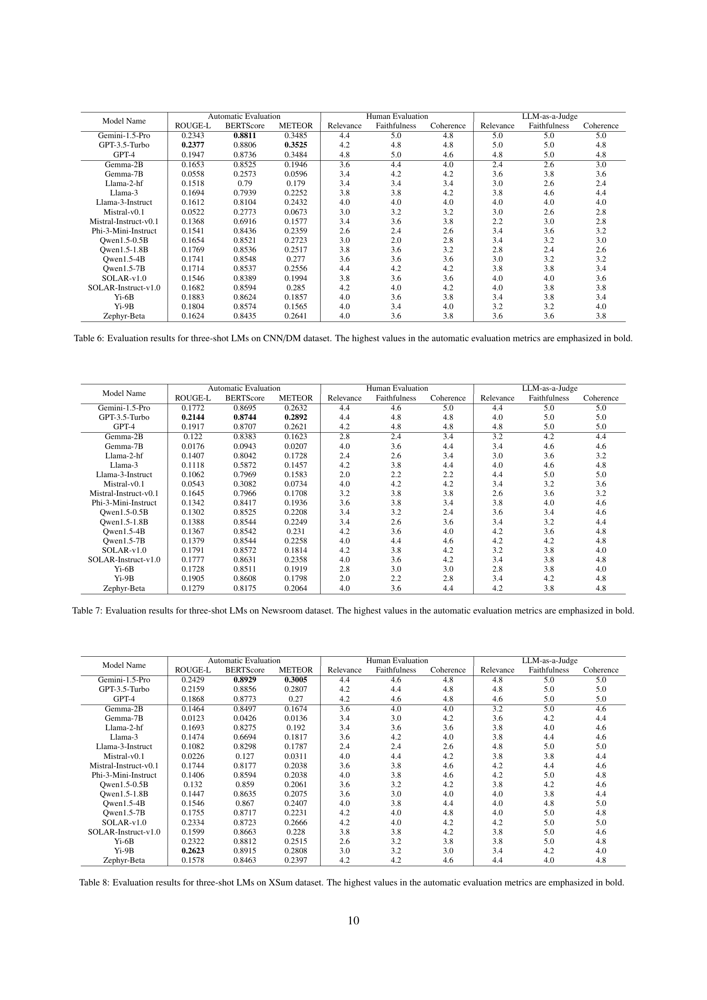
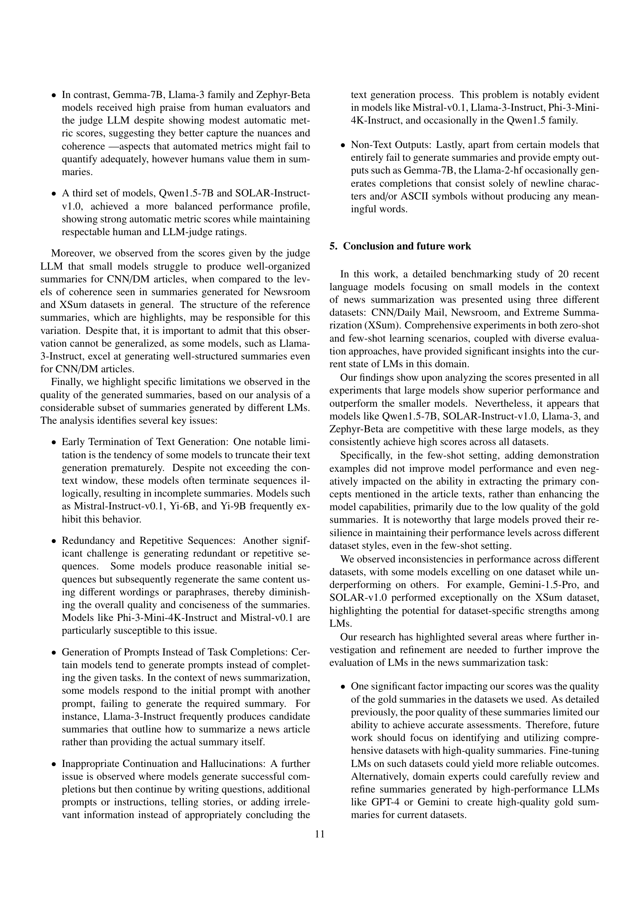
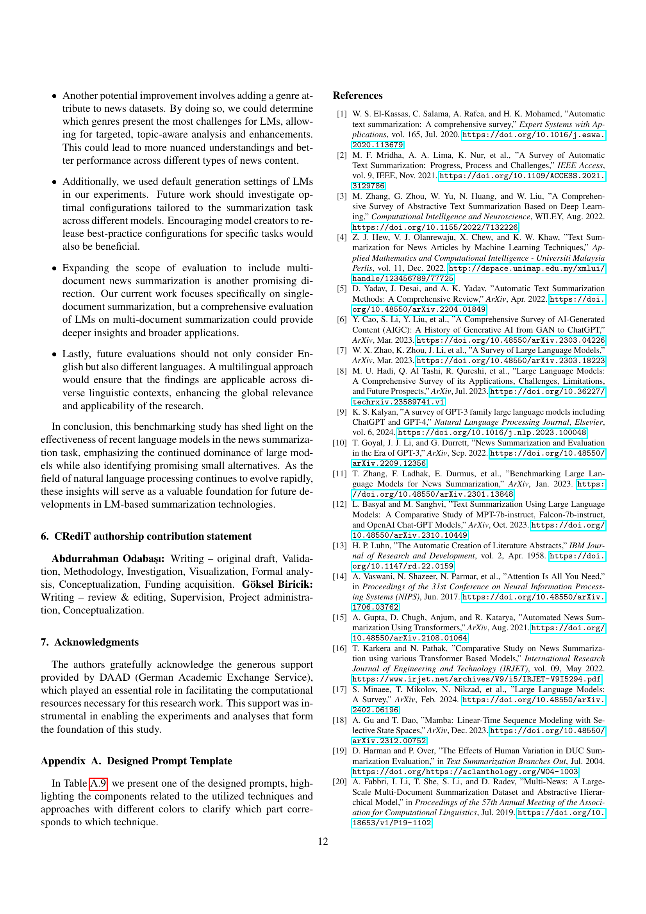
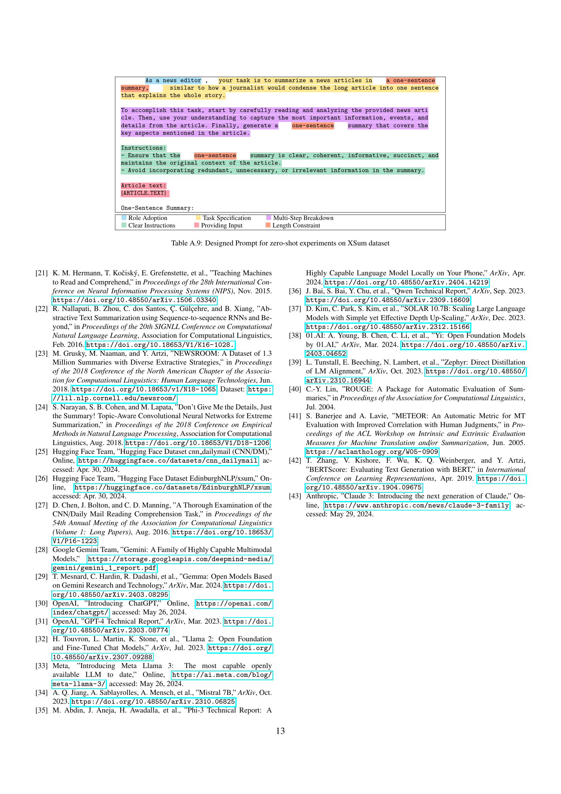
