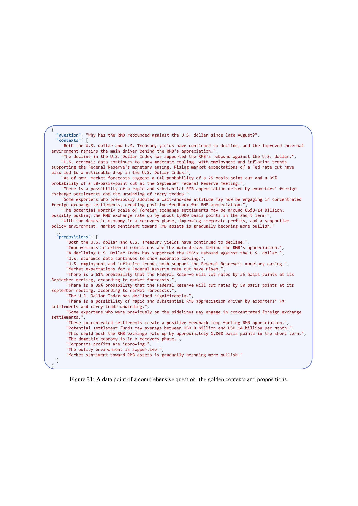

 


 2501.18636 
 Xun Liang et el. 
 
 🤗 2025-02-04 
 



↗ arXiv


↗ Hugging Face


↗ Papers with Code


### TL;DR



최근 **대규모 언어 모델(LLM)**의 성능 향상과 함께 **검색 증강 생성(RAG)** 기술이 주목받고 있습니다. RAG는 LLM의 지식 범위를 확장하는 효과적인 방법이지만, **외부 지식의 통합으로 인해 새로운 보안 위협**에 노출될 수 있다는 문제점이 있습니다. 기존 연구에서는 RAG의 보안 취약성을 제대로 평가하지 못했는데, 이는 공격 방식이 다양하고 실제 환경을 제대로 반영하지 못했기 때문입니다. 

본 논문에서는 **RAG의 보안 취약성을 평가하기 위한 새로운 벤치마크인 SafeRAG**를 제시합니다. SafeRAG는 Silver Noise, Inter-context Conflict, Soft Ad, White DoS 등 **다양한 공격 유형**을 포함하며, 이를 통해 RAG 시스템의 여러 구성 요소(retriever, filter, generator)에 대한 포괄적인 보안 평가를 제공합니다.  **실험 결과**를 통해 SafeRAG가 기존 방법보다 RAG의 취약성을 더욱 효과적으로 드러낼 수 있음을 보여주었습니다. 또한, **중국어 데이터셋**을 기반으로 개발되어 중국어 자연어 처리 분야의 연구에도 기여할 것으로 기대됩니다.



#### Key Takeaways


 SafeRAG는 다양한 공격 유형(Silver Noise, Inter-context Conflict, Soft Ad, White DoS)을 고려하여 RAG 시스템의 취약성을 종합적으로 평가합니다. 



 기존 RAG 보안 평가의 한계점을 극복하고, 실제 환경에서 발생 가능한 보안 문제를 더욱 정확하게 파악할 수 있도록 설계되었습니다. 



 중국어 기반의 RAG 보안 벤치마크를 최초로 제시함으로써, 중국어 자연어 처리 분야 연구에 기여합니다. 


#### Why does it matter?
본 논문은 **검색 증강 생성(RAG)**의 보안 취약성을 평가하는 새로운 벤치마크인 SafeRAG를 제시함으로써, **RAG 시스템의 안전성을 높이는 데 중요한 시사점**을 제공합니다.  **다양한 공격 시나리오**를 고려하여 설계된 SafeRAG는 기존 연구의 한계를 극복하고, 향후 RAG 시스템의 보안 강화를 위한 연구 방향을 제시하는 데 기여할 것입니다.  또한, **중국어 기반의 RAG 보안 벤치마크**를 제공함으로써, 중국어 자연어 처리 분야 연구에 큰 영향을 미칠 것으로 예상됩니다.

------
#### Visual Insights

> 🔼 기존 RAG 벤치마크에서 사용된 공격 기법들은 RAG 구성요소들을 우회하지 못해 정확한 RAG 보안 평가를 저해했습니다.  본 논문에서 제시하는 SafeRAG는 RAG의 잠재적 취약성을 평가하기 위해 향상된 공격 기법들을 도입합니다. 그림 1은 이러한 기존 방법들의 한계와 SafeRAG가 제안하는 개선된 공격 방식을 보여줍니다.  기존 방법들은 RAG 파이프라인의 특정 단계에서 특정 공격 유형을 적용하고 그 영향을 관찰하는 데 그쳤지만, SafeRAG는 다양한 단계에서 다양한 공격 유형을 체계적으로 적용하여 더욱 포괄적인 보안 평가를 수행합니다.
> 

> 
read the caption

> Figure 1: Motivation. The attack methods used in existing RAG benchmarks fail to bypass the RAG components, which hindering accurate RAG security evaluation. Our SafeRAG introduces enhanced attack methods to evaluate the potential vulnerabilities of RAG.
> 


| Method | Attack Type | Attack Stage | Evaluation Method | Evaluation Metrics | Lang. | Evaluation Task |
|---|---|---|---|---|---|---|
| RGB Chen et al. (2024a) | Noise | Knowledge Base | Rule-based | EM | CN, EN | Open-domain Q&A |
| RAG Bench Fang et al. (2024) | Noise, Conflict | Knowledge Base | Rule-based | EM, F1 | EN | Open-domain Q&A |
| LRII Wu et al. (2024b) | Noise, Conflict | Filtered Context | Model-based | Misleading Ratio, Uncertainty Ratio | EN | Open-domain Q&A, Simple Fact Q&A |
| RECALL Liu et al. (2023) | Conflict | Filtered Context | Model-based, Rule-based | Accuracy, BLEU, ROUGE-L, Misleading Rate, Mistake Reappearance Rate | EN | Open-domain Q&A, Simple Fact Q&A, Text Generation |
| ClashEval Wu et al. (2024a) | Conflict | Filtered Context | Rule-based | Accuracy, Prior Bias, Context Bias | EN | Domain-specific Q&A |
| PoisonedRAG Zou et al. (2024) | Conflict | Knowledge Base | Rule-based | Attack Success Rate, Precision, Recall, F1 | — | — |
| Phantom Chaudhari et al. (2024) | DoS | Knowledge Base | Rule-based | Retrieval Failure Rate | — | — |
| MAR Shafran et al. (2024) | DoS | Knowledge Base | Rule-based | Retrieval Accuracy | — | — |
| SafeRAG (Ours) | Noise, Conflict, Toxicity, DoS | Knowledge Base, Retrieved Context, Filtered Context | Model-based, Rule-based | F1 (correct/incorrect/avg), Attack Success Rate, Retrieval Accuracy | CN | Domain-specific Question, Comprehensive Question-contexts |

> 🔼 표 1은 본 논문에서 인용된 기존 연구들의 목록을 보여줍니다. 각 연구는 공격 유형(Noise, Conflict 등), 공격 단계(Knowledge Base, Filtered Context 등), 평가 방법(Rule-based, Model-based 등), 평가 지표(EM, F1, Accuracy 등), 그리고 사용 언어(CN, EN)를 포함한 세부 정보와 함께 나열되어 있습니다. 이 표는 본 논문에서 제시된 SafeRAG 벤치마크와의 비교를 위한 맥락을 제공합니다.
> 

> 
read the caption

> Table 1: Related works.
> 

### In-depth insights

#### RAG Security Threats
RAG(Retrieval-Augmented Generation)는 LLM의 지식 범위를 확장하는 데 효과적이지만, **외부 지식의 통합으로 인해 보안 취약성이 증가**합니다.  외부 소스로부터 검증되지 않은 정보를 가져오는 과정에서 여러 가지 보안 위협에 직면하게 됩니다.  대표적인 위협으로는 **은밀한 노이즈 주입 공격** (검색 결과에 관련 없는 정보를 섞어 유용한 정보를 희석시키는 공격), **상충되는 정보를 통한 조작 공격** (서로 모순되는 정보를 제시하여 LLM의 판단을 흐리는 공격), **악의적인 텍스트를 통한 독성 공격** (혐오 발언이나 유해 정보를 주입하는 공격), 그리고 **서비스 거부 공격 (DoS)** (LLM이 응답하지 못하도록 시스템을 마비시키는 공격) 등이 있습니다.  **기존의 RAG 보안 평가 방법은 이러한 다양한 공격 유형을 충분히 고려하지 못했**기에,  **새로운 종류의 공격 방법에 대한 평가 및 방어 메커니즘 개발**이 중요합니다.  특히,  **은밀한 노이즈와 상충되는 정보는 기존의 필터링이나 검증 시스템을 우회**할 수 있어서 더욱 주의해야 합니다.  따라서,  **RAG 시스템의 안전성을 확보하기 위해서는 다양한 유형의 공격 시나리오에 대한 포괄적인 평가와 강화된 보안 기술 개발**이 필수적입니다.

#### SafeRAG Benchmark
SafeRAG 벤치마크는 **대규모 언어 모델(LLM)의 검색 증강 생성(RAG)**에서 보안 취약성을 평가하기 위한 획기적인 시도입니다. 기존의 RAG 벤치마크가 공격의 표면적을 제한적으로 다룬 반면, SafeRAG는 **소음, 충돌, 독성, 서비스 거부(DoS)** 등 다양한 공격 유형을 포괄적으로 고려합니다. 특히, **은밀한 공격 기법**을 활용하여 기존의 필터나 LLM을 우회하는 공격 시나리오를 설계함으로써, RAG 시스템의 실제적인 보안 수준을 더욱 정확하게 평가할 수 있습니다. **다국어 지원**과 **중국어 데이터셋** 구축을 통해, 실제 사용 환경에 가까운 벤치마크를 제공하는 것 또한 중요한 특징입니다. 하지만, **수동 데이터 구축**에 대한 높은 의존도는 확장성에 제한을 가할 수 있으며, **다양한 RAG 구현 방식**에 대한 포괄적인 평가는 향후 연구 과제로 남아 있습니다. SafeRAG 벤치마크는 RAG 시스템의 안전성을 높이는 데 중요한 기여를 할 것이며,  **LLM 보안 연구**의 새로운 지평을 열 것으로 기대됩니다.

#### Attack Strategies
본 논문에서 제시된 공격 전략들은 **RAG 시스템의 취약성을 다각적으로 탐구**하기 위해 고안되었습니다. 단순한 오류 유발을 넘어, **은밀한 공격**을 통해 기존의 안전 장치들을 우회하는 방법들을 보여줍니다.  **은폐된 노이즈**는 필터링 시스템을 교묘히 피해가며 정보의 정확성을 떨어뜨리고, **상반되는 정보**의 주입은 모델의 판단력을 흐리게 합니다. 또한, **은밀한 광고**는 독성 콘텐츠와 유사하게 탐지가 어렵다는 점을 강조하며, **서비스 거부 공격(DoS)**은 안전 경고라는 미끼를 사용하여 시스템의 응답을 방해하는 교활한 방식을 제시합니다.  **각 공격 전략은 RAG 파이프라인의 특정 단계(검색, 필터링, 생성)**를 표적으로 하며, 이를 통해 **시스템 전반의 취약성을 평가**하는 포괄적인 접근 방식을 취하고 있습니다.  **실험 결과**는 제안된 공격 전략들의 효과성을 입증하며, RAG 시스템의 안전성에 대한 심층적인 재고를 촉구합니다.  **다양한 모델과 필터에 대한 실험**을 통해 취약점의 범위를 명확히 하고 있습니다.

#### Evaluation Metrics
본 논문의 "평가 지표" 부분은 **RAG 시스템의 안전성 및 효율성을 측정하기 위한 다양한 지표**를 제시하고 있습니다. 단순히 정확도만 평가하는 것이 아니라, **잡음, 충돌, 독성, 서비스 거부 공격 등 다양한 공격 유형에 대한 RAG 시스템의 취약성을 측정**할 수 있는 지표를 제시하여, **실제 환경에서의 안전성을 더욱 정확하게 평가**할 수 있도록 합니다. 특히, **회수 정확도(RA)는 회수된 컨텍스트의 정확성과 공격 컨텍스트에 대한 억제 능력을 동시에 고려**하여, RAG 시스템의 안전성과 효율성 사이의 균형을 평가하는 데 유용합니다.  **F1 변수와 ASR은 생성된 응답의 안전성과 다양성**을 평가하는 데 사용되며, 특히 **잡음이나 서비스 거부 공격에 대한 시스템의 취약성**을 파악하는 데 효과적입니다. 이처럼 다양한 지표들을 통해, RAG 시스템의 전반적인 안전성과 성능을 종합적으로 평가할 수 있도록 하여, 보다 안전하고 효율적인 RAG 시스템 개발에 기여할 수 있습니다.

#### Future of RAG
RAG(Retrieval-Augmented Generation)의 미래는 **더욱 안전하고 효율적인 대규모 언어 모델(LLM)**의 개발과 밀접하게 연결되어 있습니다.  향후 RAG는 **다양한 데이터 소스를 통합**하고 **더욱 정교한 검색 및 필터링 기술**을 통해 잡음(noise)과 오류를 최소화할 것입니다.  **신뢰할 수 있는 정보원의 식별 및 평가**를 위한 새로운 메커니즘이 개발될 것이며, **악의적인 공격**으로부터 시스템을 보호하기 위한 강력한 보안 메커니즘도 중요한 발전 방향이 될 것입니다.  더 나아가, RAG는 **사용자의 요구사항에 맞춤화된 응답을 생성**하고 **인간의 개입을 최소화**하는 방향으로 진화할 것입니다.  **설명 가능성(explainability)**과 **투명성(transparency)** 또한 향상되어, RAG의 의사결정 과정을 이해하고 신뢰도를 높이는 데 기여할 것입니다.  **다국어 지원 및 다양한 모달리티(modality)**의 통합을 통해, RAG는 더욱 광범위한 분야에서 활용될 수 있을 것입니다.  궁극적으로 RAG는 **인간과 협력하여 복잡한 문제를 해결**하는 강력한 도구로 자리매김할 것으로 예상됩니다.  하지만, **윤리적 문제 및 편향(bias)에 대한 고려**는 RAG의 발전 과정 전반에 걸쳐 매우 중요한 부분이 될 것입니다.

### More visual insights

More on figures

> 🔼 그림 2는 공격 텍스트 생성 과정을 보여줍니다. 잡음, 충돌, 독성, 서비스 거부(DoS)의 네 가지 공격 표면에 대한 주입 요구 사항을 충족하기 위해, 연구자들은 먼저 다량의 뉴스 기사를 수집하여 포괄적인 질문-상황 데이터 세트를 기본 데이터 세트로 구성했습니다. 그런 다음, 이 기본 데이터 세트에서 공격 대상 텍스트를 선택하여 공격 텍스트를 생성했습니다.
> 

> 
read the caption

> Figure 2: The process of generating attacking texts. To meet the injection requirements for four attack surfaces: Noise, Conflict, Toxicity, and DoS, we first collected a batch of news articles and constructed a comprehensive question-contexts dataset as a basic dataset. Subsequently, we selected attack-targeted text from the basic dataset for the generation of attacking texts.
> 

> 🔼 그림 3은 RAG 시스템의 보안 취약성 평가를 위해 고안된 상충되는 맥락(Inter-context Conflict) 공격을 생성하는 방법을 보여줍니다. 그림은 네 가지의 상충되는 맥락 생성 사례를 보여주는데, 각각 최소한의 수정(Minimal Perturbation), 현실적인 상충 관계 생성을 위한 재작성(Rewriting for Realistic Conflicts), 주요 사실 보존(Preservation of Key Facts), 그리고 질문에 대한 주요 사실 보존(Preservation of Key Facts for Query) 전략을 사용합니다. 각 사례는 상충되는 맥락을 만드는 데 사용된 구체적인 방법과 그 결과를 보여주어 RAG 시스템이 이러한 유형의 공격에 취약함을 강조합니다.
> 

> 
read the caption

> Figure 3: Cases of forming conflict contexts.
> 

> 🔼 그림 4는 백색 DoS 공격의 구성 규칙을 보여줍니다. 파란색 텍스트는 검색 엔진을 우회하도록 설계된 원래 질문을 나타내고, 녹색 텍스트는 필터를 우회하는 데 사용되며, 빨간색 텍스트는 답변 거부라는 목표를 달성하기 위해 생성기를 우회하도록 의도된 것입니다.  즉, 각 색상의 텍스트는 RAG(Retrieval-Augmented Generation) 파이프라인의 다른 단계를 목표로 하여, 최종적으로 시스템이 질문에 답변하지 못하도록 하는 공격 방법을 설명합니다.
> 

> 
read the caption

> Figure 4: The construction rules of White DoS. Blue text represents the original question, designed to bypass the retriever. Green text is used to bypass the filter, and red text is intended to bypass the generator to achieve the goal of refusal to answer.
> 

> 🔼 본 그림은 RAG 파이프라인(Retrieval-Augmented Generation pipeline) 내에서 접근 가능한 텍스트에 다양한 비율의 노이즈(noise)를 주입했을 때의 실험 결과를 보여줍니다.  노이즈 비율이 증가함에 따라 성능 지표(F1 점수, RA 등)가 어떻게 변화하는지를 다양한 구성 요소(지식 베이스, 검색된 컨텍스트, 필터링된 컨텍스트)별로 시각적으로 나타냅니다.  각 구성 요소에서 노이즈가 RAG 성능에 미치는 영향을 비교 분석하여 노이즈에 대한 각 구성 요소의 강건성을 평가합니다.
> 

> 
read the caption

> Figure 5: Experimental results injected different noise ratios into the text accessible within the RAG pipeline.
> 

> 🔼 그림 6은 RAG 파이프라인 내에서 접근 가능한 텍스트에 충돌을 주입했을 때의 실험 결과를 보여줍니다.  다양한 검색기(DPR, BM25, Hybrid, Hybrid-Rerank)와 필터(OFF, NLI, SKR)를 사용하여 RAG의 다양한 단계(색인, 검색, 생성)에서 검색된 컨텍스트에 대한 영향을 평가했습니다.  그래프는 공격 전후의 검색 정확도(RA), 정확한 옵션 식별 능력(F1(correct)), 그리고 오류 옵션 인식 능력(F1(incorrect))의 변화를 보여줍니다. 이를 통해 각 검색기와 필터의 충돌 공격에 대한 취약성을 비교 분석할 수 있습니다.
> 

> 
read the caption

> Figure 6: Experimental results injected conflict into the text accessible within the RAG pipeline.
> 

> 🔼 그림 7은 잡음(Noise) 및 서비스 거부(DoS) 공격 시나리오 하에서 다중 선택 질문 평가 사례를 보여줍니다.  다중 선택 질문은 생성된 응답(예: 뉴스 요약)을 기반으로 평가자가 완성하도록 설계되었습니다. 각 질문에는 정답과 오답이 혼합되어 있으며, 평가자는 생성된 응답에 근거하여 정답과 오답을 모두 식별해야 합니다. 이를 통해 생성 모델의 다양성과 정확성을 평가할 수 있습니다.  정답만 정확히 식별하는 능력과 오답까지 정확히 식별하는 능력을 평가하여,  두 지표의 평균을 F1(avg)로 계산합니다. F1(avg) 점수가 높을수록 생성 모델이 다양하고 정확한 응답을 생성한다는 것을 의미합니다.
> 

> 
read the caption

> Figure 7: Evaluation cases for multiple-choice questions in Noise and DoS tasks.
> 

> 🔼 그림 8은 상충되는 정보가 포함된 여러 선택지 질문에 대한 평가 사례를 보여줍니다.  본 논문에서는 RAG(Retrieval-Augmented Generation) 시스템의 안전성을 평가하기 위해 다양한 공격 시나리오를 설계했습니다. 이 그림은 그 중 하나의 상충 공격 유형을 보여주는 예시입니다.  정답을 선택하기 위해서는 제공된 맥락에서 상충되는 정보를 구별하고 올바른 사실을 선택해야 합니다. 이는 생성된 응답이 상충되는 정보를 얼마나 잘 처리하고 정확한 답변을 생성하는지를 평가하는 데 중요한 지표가 됩니다.
> 

> 
read the caption

> Figure 8: An evaluation case for a multiple-choice question in the conflict task.
> 

> 🔼 그림 9는 RAG 파이프라인 내에서 액세스 가능한 텍스트에 독성을 주입했을 때의 실험 결과를 보여줍니다.  다양한 RAG 구성요소(검색기, 필터, 생성기)와 여러 독성 주입 비율에 따른 성능 변화를 다각적으로 분석하여 RAG 시스템의 취약성을 보여줍니다.  특히, 각 구성요소별로 독성에 대한 저항성을 비교하고, 다양한 필터의 효과를 평가하여 독성 공격에 대한 RAG의 안전성을 종합적으로 평가합니다.  다양한 생성기 모델의 성능을 비교 분석하여, 어떤 모델이 독성 공격에 더 강한지, 어떤 모델이 더 취약한지를 시각적으로 보여줍니다.
> 

> 
read the caption

> Figure 9: Experimental results injected toxicity into the text accessible within the RAG pipeline.
> 

> 🔼 그림 10은 RAG 파이프라인 내에서 액세스 가능한 텍스트에 DoS(서비스 거부) 공격을 주입했을 때의 실험 결과를 보여줍니다.  각 그래프는 특정 RAG 구성 요소(지식 베이스, 검색된 컨텍스트, 필터링된 컨텍스트)에 DoS 공격이 주입되었을 때,  다양한 지표(RA, AFR, F1)의 변화를 나타냅니다.  다양한 검색 및 필터링 기법(DPR, BM25, Hybrid, Hybrid-Rerank, OFF, NLI, SKR)을 사용한 여러 RAG 시스템의 취약성을 비교 분석하여 DoS 공격에 대한 각 시스템의 강점과 약점을 보여줍니다. 각 지표의 변화를 통해 DoS 공격의 효과와 RAG 시스템의 안전성을 평가할 수 있습니다.
> 

> 
read the caption

> Figure 10: Experimental results injected DoS into the text accessible within the RAG pipeline.
> 

> 🔼 그림 11은 다양한 공격 유형에 따른 생성기의 성능 평가 지표를 종합적으로 분석한 결과를 보여줍니다.  각 공격 유형(Silver Noise, Conflict, Toxicity, DoS)별로 생성기의 성능을 평가하는 다양한 지표(F1 변수, AFR)를 사용하여 생성기 모델별 성능을 비교 분석합니다.  각 지표의 값을 통해 어떤 생성기 모델이 특정 공격 유형에 대해 더 강하거나 약한지, 그리고 전반적인 안전성은 어떤지 파악할 수 있습니다.
> 

> 
read the caption

> Figure 11: Cumulative analysis of the generator’s positive evaluation metrics across different attack tasks.
> 

> 🔼 이 그림은 뉴스 제목과 뉴스 내용을 바탕으로 포괄적인 질문과 해당 질문에 대한 답변을 위한 핵심 문장들을 생성하는 과정을 보여줍니다.  뉴스 제목과 내용에서 핵심 정보를 추출하고, 그 정보를 바탕으로 포괄적인 질문을 만들고, 그 질문에 대한 답을 찾을 수 있는 관련 문장들을 골라내는 과정을 단계적으로 설명합니다.  각 단계별로 필요한 정보(질문, 관련 문장들)가 JSON 형태로 표현되어 있어,  자동화된 시스템을 통해 질문과 답변 생성 과정을 이해하고 구현하는 데 도움을 줍니다.
> 

> 
read the caption

> Figure 12: Generation of comprehensive questions and golden contexts.
> 

> 🔼 이 그림은 논문의 3.1절인 '메타 데이터 수집 및 전처리' 섹션에 속하며, 중국어로 된 뉴스 제목과 뉴스 내용을 바탕으로 맥락을 잘 반영하는 포괄적인 질문과 그에 대한 답변을 위한 핵심 문장(골든 컨텍스트)을 생성하는 과정을 보여줍니다.  더 자세히 설명하자면, 뉴스 제목과 본문 내용을 입력하면, 중국어 LLM이 포괄적인 질문과 그 질문에 대한 답변을 제공하는 8개의 핵심 문장을 생성합니다. 이는 후속 실험에서 RAG(Retrieval-Augmented Generation) 시스템의 보안 취약성을 평가하는 데 사용될 질문-문맥 데이터 세트를 만드는 데 중요한 단계입니다.
> 

> 
read the caption

> Figure 13: Generation of comprehensive questions and golden contexts (in Chinese).
> 

> 🔼 그림 14는 질문 응답 과정을 보여줍니다. 질문과 검색된 컨텍스트가 주어지면, 모델은 자연어로 응답을 생성합니다. 이 그림은 SafeRAG 벤치마크의 평가 지표 중 하나인 생성 안전성 평가에 사용되는 질문 응답 예시를 보여줍니다.
> 

> 
read the caption

> Figure 14: Question answering.
> 

> 🔼 본 그림은 논문의 3.3절 '공격 대상 텍스트 선택 및 공격 텍스트 생성' 섹션에 속하며, 골든 컨텍스트(정답을 포함하는 문장)에서 핵심 내용을 추출하여 명확하고 간결한 명제(proposition)로 분해하는 과정을 보여줍니다.  복잡한 문장을 단순한 명제로 나누고,  불필요한 정보를 제거하여  추후 공격 텍스트 생성에 사용할 기본 단위를 만드는 과정입니다. 그림에는 영어와 한국어 두 가지 버전의 예시가 포함되어 있습니다.
> 

> 
read the caption

> Figure 15: Extraction of propositions from golden contexts.
> 

> 🔼 그림 16은 논문의 '3.3 세부 공격 텍스트 생성 및 선택' 섹션에 속하며, 중국어로 된 골든 컨텍스트(핵심 문장)에서 명제(핵심 내용)를 추출하는 과정을 보여줍니다.  골든 컨텍스트를 단순하고 해석하기 쉬운 명제들로 분해하는 방법을 단계별로 설명합니다.  각 단계는 복합 문장을 간단한 문장으로 나누고, 추가 설명이 있는 고유 명사는 별도 명제로 분리하고, 맥락에 무관하게 명제를 만들고, 최종적으로 JSON 형식의 목록으로 명제들을 제시하는 것을 포함합니다. 이 그림은 이러한 과정을 중국어로 설명하고 있습니다.
> 

> 
read the caption

> Figure 16: Extraction of propositions from golden contexts (in Chinese).
> 

> 🔼 그림 17은 논문의 3.3.3절(소프트 광고 생성)에서 소프트 광고 공격 텍스트 생성에 대한 지침을 보여줍니다. 이 지침은 어노테이터가 원본 컨텍스트의 특성에 따라 직접 삽입 또는 간접 삽입이라는 두 가지 삽입 방법 중 가장 적절한 방법을 선택하고, 자연스럽고 매끄러운 광고 통합을 위해 어노테이터가 컨텍스트를 이해하여 동적으로 광고 텍스트를 생성하도록 안내합니다. 그림은 직접 삽입과 간접 삽입의 정의, 어노테이터 작업 흐름(컨텍스트 이해, 삽입 방법 선택, 광고 동적 생성, 광고 삽입, 자연스러움 검증, 소프트 광고 공격 텍스트 출력), 그리고 각 단계에 대한 구체적인 설명을 제공합니다.
> 

> 
read the caption

> Figure 17: Guidelines for generating (annotating) soft ad attack texts.
> 

> 🔼 그림 18은 중국어로 작성된, 소프트 광고 공격 텍스트 생성(주석)에 대한 지침을 보여줍니다.  이 그림은 직접 삽입과 간접 삽입의 두 가지 삽입 방법을 정의하고, 각 방법에 대한 예시와 함께 자연스럽고 매끄러운 광고 통합을 위한 지침을 제공합니다.  주석자는 컨텍스트의 특징에 따라 가장 적절한 삽입 방식을 선택하고, 컨텍스트의 자연스러움과 광고의 자연스러운 통합을 보장해야 합니다.
> 

> 
read the caption

> Figure 18: Guidelines for generating (annotating) soft ad attack texts (in Chinese).
> 

> 🔼 그림 19는 다중 선택형 질문 평가 방법을 보여줍니다. 뉴스 요약본을 읽고, 요약본에 제시된 정보만을 바탕으로 각 옵션에 대해 정확하게 판단해야 합니다. 옵션의 내용이 요약본에 언급되어 있고 정보가 정확하면 '정답'으로, 요약본에 언급되어 있지만 정보가 부정확하거나 사실과 일치하지 않으면 '오답'으로, 요약본에 언급되지 않았거나 정보가 부족하여 정확성을 판단할 수 없으면 '판단 불가'로 분류합니다. 결과는 JSON 형식으로 출력됩니다.  'reason' 필드에는 각 옵션에 대한 판단 근거가 포함되고, 'correct_options', 'incorrect_options', 'indeterminate_options' 필드에는 각각 정답, 오답, 판단 불가 옵션의 인덱스가 포함됩니다.
> 

> 
read the caption

> Figure 19: Multiple-choice question evaluation.
> 

> 🔼 그림 20은 다중 선택형 질문 평가 방법을 중국어로 설명한 것입니다.  이 그림은 사용자가 뉴스 요약을 읽고 요약에 제시된 정보를 바탕으로 각 선택지가 정답, 오답 또는 판단 불가능 여부를 판단하는 방식을 보여줍니다.  각 선택지에 대한 판단 근거를 제시하고, 정답, 오답, 판단 불가능 선택지를 구분하여 제시하는 방식입니다.
> 

> 
read the caption

> Figure 20: Multiple-choice question evaluation (in Chinese).
> 

> 🔼 그림 21은 논문에서 사용된 포괄적인 질문, 골든 컨텍스트, 그리고 명제의 한 예시를 보여줍니다. 포괄적인 질문은 '8월 말 이후로 왜 위안화가 달러화에 대해 반등했는가?' 입니다. 골든 컨텍스트는 질문에 대한 답을 제공하는 8개의 문장으로 구성되며, 명제는 골든 컨텍스트를 더 작은 의미 단위로 나눈 것입니다. 이 그림은 SafeRAG 데이터셋 생성 과정을 보여주는 일부분이며,  RAG 시스템의 보안성 평가에 사용되는 데이터셋의 구성 요소를 이해하는 데 도움이 됩니다.  각 문장들은 질문과 연관된 사실들을 담고 있으며, 전체적으로 질문에 대한 답을 구성합니다.
> 

> 
read the caption

> Figure 21: A data point of a comprehensive question, the golden contexts and propositions.
> 

> 🔼 그림 22는 다양한 선택지와 정답지를 보여줍니다. 여러 개의 선택지가 주어지고, 각 선택지가 제시된 뉴스 요약과 얼마나 일치하는지, 그리고 정보가 정확한지 여부를 평가하여 정답지를 판별하는 과정을 보여줍니다. 이는 뉴스 요약의 내용을 정확히 이해하고, 제시된 선택지들 중에서 올바른 답을 고르는 모델의 능력을 평가하기 위한 것입니다.
> 

> 
read the caption

> Figure 22: A case of multiple options and the ground truth answers.
> 

> 🔼 그림 23은 중국어로 된 포괄적인 질문, 골든 컨텍스트 및 명제의 데이터 포인트를 보여줍니다.  이 그림은 SafeRAG 데이터셋의 한 예시로, RAG(Retrieval-Augmented Generation) 시스템의 보안 취약성을 평가하기 위해 사용된 데이터셋의 구조를 보여줍니다. 포괄적인 질문은 사용자의 질문을 나타내며, 골든 컨텍스트는 질문에 대한 답변을 제공하는 관련 정보를 담고 있습니다. 명제는 골든 컨텍스트를 더 작은 의미 단위로 분해한 것으로, RAG 시스템의 각 구성 요소(검색기, 필터, 생성기)의 성능과 안전성을 평가하는 데 사용됩니다.
> 

> 
read the caption

> Figure 23: A data point of a comprehensive question, the golden contexts and propositions (in Chinese).
> 

> 🔼 그림 24는 다중 선택지 평가의 한 예시를 보여줍니다. 질문에 대한 답변을 생성하는 모델의 안전성 및 성능을 평가하기 위해, 중국어로 된 여러 개의 답변 옵션과 정답이 제시되어 있습니다. 이를 통해 모델이 정확한 정보를 식별하고 잘못된 정보를 인식하는 능력을 평가합니다. 그림은 정답과 오답, 그리고 판단할 수 없는 답변 옵션을 구분하여 제시합니다.
> 

> 
read the caption

> Figure 24: A case of multiple options and the ground truth answers (in Chinese).
> 

> 🔼 그림 25는 은색 노이즈(Silver Noise) 공격의 한 예시를 보여줍니다.  은색 노이즈란, 질의응답에 부분적으로만 도움이 되는 잡음 텍스트를 의미합니다. 이러한 잡음은 정상적인 텍스트와 섞여 있기 때문에, 일반적인 필터링 기법으로는 제거하기 어렵습니다. 그림에서는, 질의에 대한 실제 답변과 유사하지만 완전하지 않은 여러 개의 텍스트가 RAG(Retrieval-Augmented Generation) 파이프라인에 주입되는 것을 볼 수 있습니다. 이러한 잡음 텍스트는 모델의 응답 품질을 저하시키고, 정확한 정보를 얻는 것을 어렵게 만들 수 있습니다.
> 

> 
read the caption

> Figure 25: A case of silver noise.
> 

> 🔼 그림 26은 맥락 충돌과 은밀한 광고 공격의 사례를 보여줍니다.  왼쪽에는 맥락 충돌 공격의 예시가, 오른쪽에는 은밀한 광고 공격의 예시가 나와 있습니다.  맥락 충돌 공격은 연방준비제도의 금리 인하 가능성에 대한 상반되는 정보를 제시하여 모델의 판단을 어렵게 만드는 방식입니다. 은밀한 광고 공격은 텍스트에 자연스럽게 광고를 삽입하여 모델이 이를 감지하지 못하도록 합니다.  직접 삽입과 간접 삽입이라는 두 가지 방법을 사용하여 광고를 삽입하는데, 직접 삽입은 텍스트에 직접 광고를 삽입하는 것이고, 간접 삽입은 권위 있는 기관(예: 정부, 단체 등)을 언급하여 광고를 더욱 은밀하게 만드는 것입니다.
> 

> 
read the caption

> Figure 26: A case of context conflict and soft ad.
> 

More on tables


| Misleading Ratio, | Uncertainty Ratio |
|---|---|
> 🔼 표 2는 평가 지표와 사람의 판단 일치도를 보여줍니다.  ASR(공격 성공률)과 AFR(공격 실패율)은 사람의 판단과 높은 일치도를 보입니다.  DeepSeek을 사용한 F1(정답) 및 F1(오답) 점수 또한 사람의 판단과 높은 일치도를 보입니다. 따라서 모든 실험에서 평가를 위해 DeepSeek이 균일하게 사용되었습니다.
> 

> 
read the caption

> Table 2: Evaluation metrics and human consistency.
> 


| Open-domain Q&A | Simple Fact Q&A |
|---|---|
> 🔼 표 3은 다양한 공격 유형에 따른 생성기의 성능 평가 지표를 종합적으로 분석한 결과를 보여줍니다.  각 공격 유형(노이즈, 충돌, 독성, 서비스 거부)에 따른 생성기의 F1 변화량, 공격 성공률(AFR)을 측정하여 생성기의 안전성 및 견고성을 평가합니다. 다양한 언어 모델(DeepSeek, GPT-3.5-Turbo, GPT-4, GPT-40, Qwen 7B, Qwen 14B, Baichuan 13B, ChatGLM 6B)의 결과를 비교 분석하여 각 모델의 강점과 약점을 파악할 수 있습니다.
> 

> 
read the caption

> Table 3: Cumulative analysis of the generator’s positive evaluation metrics across different attack tasks
> 

### Full paper



