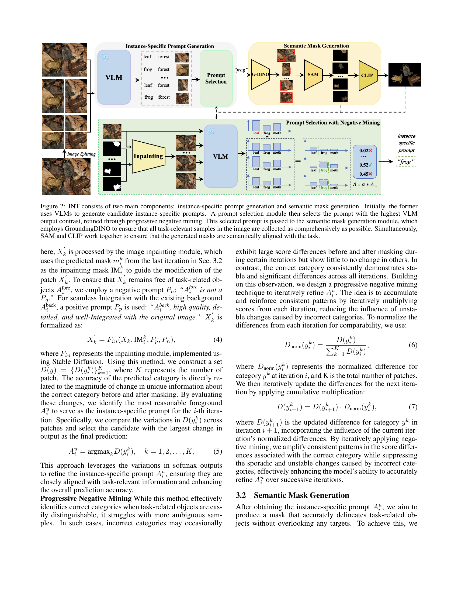

 


 2501.18753 
 Jian Hu et el. 
 
 🤗 2025-02-03 
 



↗ arXiv


↗ Hugging Face


↗ Papers with Code


### TL;DR



기존의 과제 일반적인 프롬프트 기반 이미지 분할 방법들은 **복잡한 이미지나 모호한 객체의 경우 정확도가 떨어지는 문제**를 가지고 있습니다. 특히 **객체가 가려져 있거나 시각적으로 구분하기 어려운 경우**에는 VLM(Vision-Language Model)이 instance-specific prompt를 잘못 예측하여 성능이 저하됩니다. 이는 **수동 주석이 부족한 상황에서 오류가 누적**될 수 있다는 문제점을 야기합니다.

본 논문에서는 이러한 문제를 해결하기 위해 **INT(Instance-Specific Negative Mining)**이라는 새로운 방법을 제안합니다. INT는 **부정적인 정보(irrelevant prior knowledge)의 영향을 줄이고 긍정적인 정보(plausible prior knowledge)의 영향을 높이는 적응적인 방법**을 사용하여 instance-specific prompt 생성을 최적화합니다. 이를 위해 **(1) instance-specific prompt 생성 및 (2) semantic mask 생성** 두 단계를 거치며, 특히 **progressive negative mining** 기법을 통해 오류를 점진적으로 수정합니다. 실험 결과, INT는 다양한 데이터셋에서 기존 방법보다 우수한 성능과 강건성을 보였으며, 특히 **카무플라주된 물체와 의료 이미지 분할에서 효과적**임을 확인했습니다.



#### Key Takeaways


 단일 과제 프롬프트만으로 다양한 이미지를 정확하게 분할하는 새로운 방법인 INT 제시 



 기존 방법의 한계를 극복하고 카무플라주된 물체나 의료 이미지 등 어려운 이미지 분할 문제에 효과적 



 추가 데이터나 훈련 없이 높은 성능을 달성, 다양한 분야의 응용 가능성 제시 


#### Why does it matter?
본 논문은 **과제 일반적인 프롬프트만을 사용하여 다양한 이미지를 분할하는 새로운 방법인 INT(Instance-Specific Negative Mining)**을 제시하여 기존 방법의 한계를 극복하고 성능을 향상시켰다는 점에서 중요합니다. 특히 **카무플라주된 물체나 의료 이미지와 같이 어려운 이미지 분할 문제에 효과적**이며, **추가적인 데이터나 훈련 없이도 높은 성능**을 달성할 수 있다는 점이 큰 의의를 지닙니다. 이는 앞으로 **더욱 다양한 분야에서 과제 일반적인 프롬프트 기반 이미지 분할 기술의 발전과 응용**에 크게 기여할 것으로 예상됩니다.

------
#### Visual Insights

> 🔼 그림 1은 INT의 동작 방식을 설명하는 두 개의 그래프로 구성됩니다. (a)는 INT의 작동 원리를 보여줍니다. VLM(Vision-Language Model)에 입력되는 이미지에서 작업 관련 객체가 가려지면, 해당 객체의 고유한 특징도 사라져 VLM 출력값이 크게 달라집니다. 반대로, 완전히 가려지지 않은 객체는 VLM 출력값의 변화가 미미합니다. 이러한 관찰 결과를 바탕으로, INT는 지상 진실(ground truth) 없이 생성된 인스턴스별 프롬프트의 정확성을 평가하고, 반복적인 부정적 마이닝(negative mining)을 통해 식별하기 어려운 잘못된 프롬프트를 수정합니다. (b)는 INT의 성능 평가 결과입니다. INT가 생성한 인스턴스별 프롬프트와 지상 진실 간의 CLIP 의미 유사도(semantic similarity)를 비교합니다. INT의 대조적인 부정적 마이닝 메커니즘은 잘못된 샘플을 효과적으로 수정하여 생성된 인스턴스별 프롬프트가 인스턴스별로 최적화되도록 합니다.
> 

> 
read the caption

> Figure 1: (a) Motivation of INT. When task-related objects in the input to the VLM are occluded, the unique features of these objects are also obscured, leading to significant changes in the corresponding VLM output. In contrast, the features of other objects, which are not fully occluded, show only minor changes in the VLM output. We leverage this observation to assess the correctness of the generated instance-specific prompts without the need for ground truth. By progressive negative mining, we iteratively correct difficult-to-identify erroneous prompts. (b) Evaluation of INT. CLIP semantic similarities are compared between the instance-specific prompts INT generated and the ground truth. INT’s contrastive negative mining mechanism effectively corrects erroneous samples, ensuring that the generated instance-specific prompts are instance-wise optimised.
> 


Methods | Camouflaged Object Detection |  |  |  |  |  |  |  |  |  |  |  | Scribble Supervision Setting |  |  |  |  |  |  |  |  | Point Supervision Setting |  |  |  |  |  |  |  |  | Task-Generic Prompt Setting |  |  |  |  |  |  |  |  | 
---|---|---|---|---|---|---|---|---|---|---|---|---|---|---|---|---|---|---|---|---|---|---|---|---|---|---|---|---|---|---|---|---|---|---|---| 
 | Venue | CHAMELEON (2018) |  |  |  | CAMO (2019) |  |  |  | COD10K (2021a) |  |  |  |  |  |  |  |  |  |  |  |  |  |  |  |  |  |  |  |  |  |  |  |  |  |  |  |  |  |  |  |  | 
 |  | M↓ | Fβ↑ | Eϕ↑ | Sα↑ | M↓ | Fβ↑ | Eϕ↑ | Sα↑ | M↓ | Fβ↑ | Eϕ↑ | Sα↑ |  |  |  |  |  |  |  |  |  |  |  |  |  |  |  |  |  |  |  |  |  |  |  |  |  |  | 
 WSSA (2020) | CVPR20 | 0.067 | 0.692 | 0.860 | 0.782 | 0.118 | 0.615 | 0.786 | 0.696 | 0.071 | 0.536 | 0.770 | 0.684 | 0.105 | 0.660 | 0.712 | 0.711 | 0.148 | 0.607 | 0.652 | 0.649 | 0.087 | 0.509 | 0.733 | 0.642 |  |  |  |  |  |  |  |  | 
 SCWS (2021) | AAAI21 | 0.053 | 0.758 | 0.881 | 0.792 | 0.102 | 0.658 | 0.795 | 0.713 | 0.055 | 0.602 | 0.805 | 0.710 | 0.097 | 0.684 | 0.739 | 0.714 | 0.142 | 0.624 | 0.672 | 0.687 | 0.082 | 0.593 | 0.777 | 0.738 |  |  |  |  |  |  |  |  | 
 TEL (2020) | CVPR22 | 0.073 | 0.708 | 0.827 | 0.785 | 0.104 | 0.681 | 0.797 | 0.717 | 0.057 | 0.633 | 0.826 | 0.724 | 0.094 | 0.712 | 0.751 | 0.746 | 0.133 | 0.662 | 0.674 | 0.645 | 0.063 | 0.623 | 0.803 | 0.727 |  |  |  |  |  |  |  |  | 
 SCOD (2023c) | AAAI23 | **0.046** | **0.791** | **0.897** | 0.818 | **0.092** | 0.709 | 0.815 | 0.735 | 0.049 | 0.637 | 0.832 | 0.733 | 0.092 | 0.688 | 0.746 | 0.725 | 0.137 | 0.629 | 0.688 | 0.663 | 0.060 | 0.607 | 0.802 | 0.711 |  |  |  |  |  |  |  |  | 
 SAM-S (2023) | ICCV23 | 0.076 | 0.729 | 0.820 | 0.650 | 0.105 | 0.682 | 0.774 | 0.731 | 0.046 | 0.695 | 0.828 | 0.772 |  |  |  |  |  |  |  |  |  |  |  |  |  |  |  |  |  |  |  |  | 
 WS-SAM (2023b) | NeurIPS23 | **0.046** | 0.777 | **0.897** | **0.824** | **0.092** | **0.742** | **0.818** | **0.759** | **0.038** | **0.719** | **0.878** | **0.803** |  |  |  |  |  |  |  |  |  |  |  |  |  |  |  |  |  |  |  |  | 
 CLIP_Surgey+SAM | Arxiv23 | 0.147 | 0.606 | 0.741 | 0.689 | 0.189 | 0.520 | 0.692 | 0.612 | 0.173 | 0.488 | 0.698 | 0.629 |  |  |  |  |  |  |  |  |  |  |  |  |  |  |  |  |  |  |  |  | 
 GPT4V+SAM (2024a, 2023) | Arxiv23 | 0.180 | 0.557 | 0.710 | 0.637 | 0.206 | 0.466 | 0.666 | 0.573 | 0.187 | 0.448 | 0.672 | 0.601 |  |  |  |  |  |  |  |  |  |  |  |  |  |  |  |  |  |  |  |  | 
 LLaVA1.5+SAM (2023b, 2023) | NeurIPS23 | 0.168 | 0.561 | 0.718 | 0.666 | 0.314 | 0.401 | 0.585 | 0.501 | 0.170 | 0.530 | 0.728 | 0.662 |  |  |  |  |  |  |  |  |  |  |  |  |  |  |  |  |  |  |  |  | 
 X-Decoder (2023a) | CVPR23 | 0.124 | 0.654 | 0.748 | 0.716 | 0.104 | 0.628 | 0.745 | 0.709 | 0.171 | 0.556 | 0.705 | 0.652 |  |  |  |  |  |  |  |  |  |  |  |  |  |  |  |  |  |  |  |  | 
 SEEM (2023b) | NeurIPS23 | 0.094 | 0.011 | 0.307 | 0.454 | 0.192 | 0.023 | 0.315 | 0.404 | 0.143 | 0.001 | 0.280 | 0.425 |  |  |  |  |  |  |  |  |  |  |  |  |  |  |  |  |  |  |  |  | 
 GroundingSAM (2023, 2023c) | ICCV23 | 0.122 | 0.662 | 0.776 | 0.744 | 0.157 | 0.656 | 0.753 | 0.707 | 0.085 | 0.670 | 0.813 | 0.764 |  |  |  |  |  |  |  |  |  |  |  |  |  |  |  |  |  |  |  |  | 
 GenSAM (2024a) | AAAI24 | 0.073 | 0.696 | 0.806 | 0.774 | 0.106 | 0.669 | 0.798 | 0.729 | 0.058 | 0.695 | 0.843 | 0.783 |  |  |  |  |  |  |  |  |  |  |  |  |  |  |  |  |  |  |  |  | 
 ProMaC (2024b) | NeurIPS24 | 0.044 | 0.790 | 0.899 | 0.833 | 0.090 | 0.725 | 0.846 | 0.767 | 0.042 | 0.716 | 0.876 | 0.805 |  |  |  |  |  |  |  |  |  |  |  |  |  |  |  |  |  |  |  |  | 
 INT | Ours | **0.039** | **0.801** | **0.906** | **0.842** | **0.086** | **0.734** | **0.853** | **0.772** | **0.037** | **0.722** | **0.883** | **0.808** |  |  |  |  |  |  |  |  |  |  |  |  |  |  |  |  |  |  |  |  | 

> 🔼 표 1은 다양한 설정 하에서 위장 객체 탐지(COD) 작업에 대한 결과를 보여줍니다.  표에는 여러 가지 방법(WSSA, SCWS, TEL, SCOD, SAM, WS-SAM, CLIP Surgery+SAM, GPT4V+SAM, LLaVA1.5+SAM, X-Decoder, SEEM, GroundingSAM, GenSAM, ProMaC, INT)의 성능을 비교 분석하여 M, Fβ, Ep, Sa 지표를 사용하여 척도를 매겼습니다. 각 방법은 스크립트 감독 설정과 점 감독 설정에서 평가되었으며, 작업 일반적인 프롬프트 설정도 포함되어 있습니다. 최상의 결과는 굵게 표시되어 있습니다. 이 표는 제안된 INT 모델의 성능을 기존 방법과 비교하여 위장 객체 탐지 작업에서의 효과를 보여줍니다.
> 

> 
read the caption

> Table 1: Results on Camouflaged Object Detection (COD) under different settings. Best are in bold.
> 

### In-depth insights

#### INT's Negative Mining
INT의 네거티브 마이닝 전략은 **잘못된 정보의 영향력을 줄이고 관련성 있는 정보의 활용도를 높이는 데 초점**을 맞춥니다. 이는 VLM(Vision-Language Model) 출력의 변화를 활용하여 **잘못된 인스턴스 특정 프롬프트를 점진적으로 제거**하는 방식으로 이루어집니다.  **이미지 패치별로 VLM 출력의 차이를 비교 분석**하여 가장 큰 차이를 보이는 부분을 **정확한 인스턴스 특정 프롬프트**로 선택합니다.  여기서 중요한 점은 단순히 하나의 마스크만을 사용하는 것이 아니라, **반복적인 네거티브 마이닝을 통해 잘못된 분류의 영향력을 축소**하고,  **정확한 프롬프트 선택의 확률을 높이는 점**입니다.  **이는 일종의 순차적이고 적응적인 프롬프트 정제 과정**으로 볼 수 있으며,  **어노테이션 없이도 정확한 세그멘테이션을 달성**하는 데 기여합니다.  결과적으로 INT의 네거티브 마이닝은 단순한 오류 수정을 넘어 **모델의 일반화 능력 향상 및 강건성 확보**에 중요한 역할을 수행합니다.

#### VLM Prompt Refinement
본 논문에서 제시된 VLM 프롬프트 개선 기법은 **반복적인 부정적 마이닝(negative mining)**을 통해 **VLM(Vision-Language Model) 출력의 변화**를 이용하여 프롬프트의 정확성을 평가하고, 잘못된 프롬프트의 영향을 줄이는 데 중점을 둡니다.  **이미지 패치별로 VLM 출력의 차이를 계산**하여 가장 큰 차이를 보이는 프롬프트를 선택하고, **누적 곱셈을 통해 변화의 안정성을 높여** 점진적으로 정확도를 향상시킵니다. 이러한 접근 방식은 어노테이션 없이도 부정확한 예측을 줄이고, **복잡한 이미지나 모호한 객체에 대한 분할 성능을 개선**하는 데 효과적입니다.  **단일 작업 설명만을 사용**하여 다양한 이미지의 분할을 달성하는 작업 일반화 가능한 프롬프트 가능 분할 방식에 있어서, 본 논문의 프롬프트 개선 기법은 **실용적이고 확장성 있는 방법**을 제시합니다. 특히, **카무플라주된 물체나 의료 이미지와 같은 어려운 시각적 과제**에서 그 성능이 두드러집니다.

#### Task-Generic Segmentation
본 논문은 **작업 일반화 가능한 분할(Task-Generic Segmentation)** 이라는 개념에 대해 심도있게 논의합니다. 이는 단일 작업 설명만으로 다양한 샘플의 분할을 달성하는 것을 목표로 하며, 기존의 인스턴스별 레이블이 필요한 방법과 달리 **범용적인 프롬프트**만을 활용합니다. 이를 위해 비전-언어 모델(VLMs)의 일반화 능력을 활용하여 작업 일반화 프롬프트로부터 인스턴스 특정 프롬프트를 유추하는 방식을 채택하지만, VLMs의 일반화 한계로 인해 일부 이미지 인스턴스에 대한 프롬프트 생성이 부정확해지는 문제점을 지적합니다.  **인스턴스 특정 네거티브 마이닝(INT)** 기법은 이러한 문제를 해결하기 위해 **관련 없는 정보의 영향을 줄이고 관련성 높은 정보의 활용도를 높이는** 데 초점을 맞춥니다.  이는 프롬프트 생성 과정에서 잘못된 정보를 점진적으로 제거하고, 각 이미지 인스턴스의 분할 결과가 인스턴스 특정 프롬프트의 의미와 일치하도록 하는 두 가지 구성 요소로 이루어져 있습니다. 다양한 데이터셋에서의 실험 결과를 통해 INT의 효과, 강건성 및 확장성을 입증합니다.

#### INT's Scalability
본 논문에서 제시된 INT (Instance-Specific Negative Mining)의 확장성에 대한 깊이 있는 고찰은 다양한 측면에서 이루어져야 합니다. **첫째, 데이터 크기의 변화에 따른 성능 변화**를 분석해야 합니다. 대용량 데이터셋에서의 성능 저하 없이 효율적인 처리가 가능한지 확인해야 합니다.  **둘째, 이미지 해상도 변화에 대한 민감도**를 평가해야 합니다. 고해상도 이미지 처리 시 계산 비용 증가 및 성능 저하 발생 가능성을 확인하고, 이에 대한 해결책을 제시해야 합니다. **셋째, 클래스 수 증가에 따른 영향**을 분석해야 합니다. 다양한 클래스의 객체를 동시에 정확하게 분할할 수 있는지, 계산 복잡도가 기하급수적으로 증가하지 않는지 평가해야 합니다. **넷째, 하드웨어 자원에 대한 의존성**을 파악해야 합니다. 특정 고성능 하드웨어에 의존하지 않고 일반적인 하드웨어 환경에서도 효율적으로 작동하는지 확인해야 합니다. 마지막으로, **모델의 복잡도**를 최소화하는 방향으로 INT를 개선할 수 있는지 검토해야 합니다. 이러한 다양한 측면에 대한 면밀한 분석을 통해 INT의 실질적인 확장성을 평가하고, 그 한계와 개선 방향을 제시할 수 있을 것입니다.

#### Future of INT
INT는 **임의의 객체 클래스를 단일 작업 일반 프롬프트만으로 분할하는 훈련 없는 테스트 시간 적응 방법**으로서 미래가 밝습니다.  **진행 중인 부정적 마이닝을 통해 부정확한 예측을 줄이고 정확한 인스턴스별 프롬프트를 생성하는 능력**은 다양한 비전 작업에서 강력한 성능을 보여줍니다.  하지만, 더욱 발전된 INT는 **더 복잡하고 모호한 이미지에 대한 일반화 능력 향상**, **다양한 VLM과의 호환성 확장**, 그리고 **더욱 효율적인 계산 과정을 위한 최적화** 등을 목표로 해야 합니다.  특히, **의료 영상 분할과 같이 고품질의 주석 데이터 확보가 어려운 분야**에서 INT의 활용은 더욱 중요해지며, 이를 위해 **데이터 증강 기법이나 약지도 학습 기법과의 결합**을 고려해야 합니다.  **새로운 VLM 아키텍처 및 프롬프트 엔지니어링 기술과의 통합**을 통해 INT의 성능을 더욱 향상시키는 연구도 기대됩니다.  궁극적으로, INT는 **다양한 도메인에 걸쳐 단일 작업 지시만으로 정확한 이미지 분할을 가능하게 하는 강력한 도구**가 될 수 있을 것입니다.

### More visual insights

More on figures

> 🔼 그림 2는 INT의 두 가지 주요 구성 요소인 인스턴스별 프롬프트 생성 및 의미 마스크 생성을 보여줍니다.  먼저 VLM(Vision-Language Model)을 사용하여 후보 인스턴스별 프롬프트를 생성합니다. 그런 다음 프롬프트 선택 모듈이 진행적 부정적 마이닝을 통해 VLM 출력 대조가 가장 큰 프롬프트를 선택합니다.  선택된 프롬프트는 의미 마스크 생성 모듈로 전달되고, 이 모듈은 GroundingDINO를 사용하여 작업 관련 샘플을 가능한 한 포괄적으로 수집합니다. 동시에 SAM(Segment Anything Model)과 CLIP(Contrastive Language–Image Pre-training)이 생성된 마스크가 작업과 의미적으로 일치하도록 합니다.
> 

> 
read the caption

> Figure 2: INT consists of two main components: instance-specific prompt generation and semantic mask generation. Initially, the former uses VLMs to generate candidate instance-specific prompts. A prompt selection module then selects the prompt with the highest VLM output contrast, refined through progressive negative mining. This selected prompt is passed to the semantic mask generation module, which employs GroundingDINO to ensure that all task-relevant samples in the image are collected as comprehensively as possible. Simultaneously, SAM and CLIP work together to ensure that the generated masks are semantically aligned with the task.
> 

> 🔼 그림 3은 다양한 분할 작업에서 여러 분할 방법의 시각화를 보여줍니다.  위쪽 행은 다양한 위장 객체 탐지(COD) 작업에 대한 결과를, 아래쪽 행은 의료 이미지 분할(MIS) 작업에 대한 결과를 보여줍니다. 각 열은 다른 방법(GenSAM, ProMaC, INT 및 실제 정답)을 사용한 이미지와 해당 분할 마스크를 보여줍니다. 그림을 통해 각 방법의 강점과 약점을 시각적으로 비교하여 위장된 객체나 의료 이미지에서 어떤 방법이 더 효과적으로 분할 작업을 수행하는지 확인할 수 있습니다.
> 

> 
read the caption

> Figure 3: Visualization of various segmentation methods among various segmentation tasks.
> 

More on tables


| Methods | Venue | CVC-ColonDB   _Tajbakhsh et al._ (2015) |  |  |  | Kvasir   _Jha et al._ (2020) |  |  |  | ISIC   _Codella et al._ (2019) |  |  |  |  | 
|---|---|---|---|---|---|---|---|---|---|---|---|---|---|---|
|  |  | $M↓$ | $F_β↑$ | $E_φ↑$ | $S_α↑$ | $M↓$ | $F_β↑$ | $E_φ↑$ | $S_α↑$ | $M↓$ | $F_β↑$ | $E_φ↑$ | $S_α↑$ |
| GPT4V+SAM   _OpenAI (2024a); Kirillov et al._ (2023) | Arxiv23 | 0.578 | 0.051 | 0.246 | 0.242 | 0.614 | 0.128 | 0.236 | 0.253 | 0.514 | 0.387 | 0.366 | 0.334 |
| LLaVA1.5+SAM   _Liu et al._ (2023b); Kirillov et al._ (2023) | NeruIPS23 | 0.491 | 0.194 | 0.355 | 0.357 | 0.479 | 0.293 | 0.400 | 0.403 | 0.369 | 0.473 | 0.497 | 0.477 |
| X-Decoder   _Zou et al._ (2023a) | CVPR23 | 0.462 | 0.095 | 0.327 | 0.331 | 0.449 | 0.202 | 0.371 | 0.384 | 0.338 | 0.315 | 0.127 | 0.407 |
| SEEM   _Zou et al._ (2023b) | NeruIPS23 | 0.570 | 0.085 | 0.280 | 0.284 | 0.520 | 0.215 | 0.339 | 0.367 | 0.362 | 0.250 | 0.002 | 0.280 |
| GroundingSAM   _Kirillov et al._ (2023); Liu et al._ (2023c) | ICCV23 | 0.711 | 0.071 | 0.195 | 0.206 | 0.387 | 0.353 | 0.521 | 0.468 | 0.301 | 0.348 | 0.247 | 0.533 |
| GenSAM   _Hu et al._ (2024a) | AAAI24 | 0.244 | 0.059 | 0.494 | 0.379 | 0.172 | 0.210 | 0.619 | 0.487 | 0.171 | 0.699 | 0.744 | 0.678 |
| ProMaC   _Hu et al._ (2024b) | NeurIPS24 | 0.176 | 0.243 | 0.583 | 0.530 | 0.166 | 0.394 | 0.726 | 0.573 | 0.160 | 0.728 | 0.766 | 0.703 |
| INT | Ours | **0.172** | **0.250** | **0.589** | **0.537** | **0.161** | **0.401** | **0.732** | **0.5739** | **0.152** | **0.733** | **0.771** | **0.708** |
> 🔼 표 2는 과제 일반적인 프롬프트 설정 하에서 의료 영상 분할(MIS)에 대한 결과를 보여줍니다.  다양한 방법들을 비교하여 과제 일반적인 프롬프트만을 사용하는 경우 의료 영상 분할 성능을 평가합니다.  표에는 각 방법의 평균 절대 오차(M), 적응형 F-측정값(Fβ), 평균 E-측정값(E), 구조 측정값(Sa) 등의 지표가 포함되어 있습니다.
> 

> 
read the caption

> Table 2: Results for Medical Image Segmentation (MIS) under task-generic prompt setting.
> 


<table class="ltx_tabular ltx_guessed_headers ltx_align_middle" id="S4.T3.14.14">
<thead class="ltx_thead">
<tr class="ltx_tr" id="S4.T3.1.1.1">
<th class="ltx_td ltx_nopad_r ltx_align_center ltx_th ltx_th_column ltx_th_row" id="S4.T3.1.1.1.1">
 (a) Number of iteration <math alttext="\mathbf{I}" class="ltx_Math" display="inline" id="S4.T3.1.1.1.1.m1.1"><semantics id="S4.T3.1.1.1.1.m1.1a"><mi id="S4.T3.1.1.1.1.m1.1.1" mathsize="80%" xref="S4.T3.1.1.1.1.m1.1.1.cmml">𝐈</mi><annotation-xml encoding="MathML-Content" id="S4.T3.1.1.1.1.m1.1b"><ci id="S4.T3.1.1.1.1.m1.1.1.cmml" xref="S4.T3.1.1.1.1.m1.1.1">𝐈</ci></annotation-xml><annotation encoding="application/x-tex" id="S4.T3.1.1.1.1.m1.1c">\mathbf{I}</annotation><annotation encoding="application/x-llamapun" id="S4.T3.1.1.1.1.m1.1d">bold_I</annotation></semantics></math>.
</th>
<th class="ltx_td ltx_nopad_l ltx_nopad_r ltx_align_center ltx_th ltx_th_column" id="S4.T3.1.1.1.2"> (b) Image preprocess strategy.</th>
<th class="ltx_td ltx_nopad_l ltx_nopad_r ltx_align_center ltx_th ltx_th_column" id="S4.T3.1.1.1.3">(c) module ablation study.</th>
</tr>
</thead>
<tbody class="ltx_tbody">
<tr class="ltx_tr" id="S4.T3.14.14.14" style="background-color:#F9E6EC;">
<th class="ltx_td ltx_nopad_r ltx_align_center ltx_th ltx_th_row" id="S4.T3.6.6.6.5" style="background-color:#F9E6EC;">

<table class="ltx_tabular ltx_align_middle" id="S4.T3.6.6.6.5.5">
<tr class="ltx_tr" id="S4.T3.6.6.6.5.5.5">
<td class="ltx_td ltx_align_center ltx_border_r ltx_border_t" id="S4.T3.2.2.2.1.1.1.1" style="padding:-1.3pt 5.0pt;"><math alttext="\mathbf{I}" class="ltx_Math" display="inline" id="S4.T3.2.2.2.1.1.1.1.m1.1"><semantics id="S4.T3.2.2.2.1.1.1.1.m1.1a"><mi id="S4.T3.2.2.2.1.1.1.1.m1.1.1" mathbackground="#F9E6EC" mathsize="80%" xref="S4.T3.2.2.2.1.1.1.1.m1.1.1.cmml">𝐈</mi><annotation-xml encoding="MathML-Content" id="S4.T3.2.2.2.1.1.1.1.m1.1b"><ci id="S4.T3.2.2.2.1.1.1.1.m1.1.1.cmml" xref="S4.T3.2.2.2.1.1.1.1.m1.1.1">𝐈</ci></annotation-xml><annotation encoding="application/x-tex" id="S4.T3.2.2.2.1.1.1.1.m1.1c">\mathbf{I}</annotation><annotation encoding="application/x-llamapun" id="S4.T3.2.2.2.1.1.1.1.m1.1d">bold_I</annotation></semantics></math></td>
<td class="ltx_td ltx_align_center ltx_border_t" id="S4.T3.3.3.3.2.2.2.2" style="padding:-1.3pt 5.0pt;"><math alttext="M\downarrow" class="ltx_Math" display="inline" id="S4.T3.3.3.3.2.2.2.2.m1.1"><semantics id="S4.T3.3.3.3.2.2.2.2.m1.1a"><mrow id="S4.T3.3.3.3.2.2.2.2.m1.1.1" xref="S4.T3.3.3.3.2.2.2.2.m1.1.1.cmml"><mi id="S4.T3.3.3.3.2.2.2.2.m1.1.1.2" mathbackground="#F9E6EC" mathsize="80%" xref="S4.T3.3.3.3.2.2.2.2.m1.1.1.2.cmml">M</mi><mo id="S4.T3.3.3.3.2.2.2.2.m1.1.1.1" mathbackground="#F9E6EC" mathsize="80%" stretchy="false" xref="S4.T3.3.3.3.2.2.2.2.m1.1.1.1.cmml">↓</mo><mi id="S4.T3.3.3.3.2.2.2.2.m1.1.1.3" xref="S4.T3.3.3.3.2.2.2.2.m1.1.1.3.cmml"></mi></mrow><annotation-xml encoding="MathML-Content" id="S4.T3.3.3.3.2.2.2.2.m1.1b"><apply id="S4.T3.3.3.3.2.2.2.2.m1.1.1.cmml" xref="S4.T3.3.3.3.2.2.2.2.m1.1.1"><ci id="S4.T3.3.3.3.2.2.2.2.m1.1.1.1.cmml" xref="S4.T3.3.3.3.2.2.2.2.m1.1.1.1">↓</ci><ci id="S4.T3.3.3.3.2.2.2.2.m1.1.1.2.cmml" xref="S4.T3.3.3.3.2.2.2.2.m1.1.1.2">𝑀</ci><csymbol cd="latexml" id="S4.T3.3.3.3.2.2.2.2.m1.1.1.3.cmml" xref="S4.T3.3.3.3.2.2.2.2.m1.1.1.3">absent</csymbol></apply></annotation-xml><annotation encoding="application/x-tex" id="S4.T3.3.3.3.2.2.2.2.m1.1c">M\downarrow</annotation><annotation encoding="application/x-llamapun" id="S4.T3.3.3.3.2.2.2.2.m1.1d">italic_M ↓</annotation></semantics></math></td>
<td class="ltx_td ltx_align_center ltx_border_t" id="S4.T3.4.4.4.3.3.3.3" style="padding:-1.3pt 5.0pt;"><math alttext="F_{\beta}\uparrow" class="ltx_Math" display="inline" id="S4.T3.4.4.4.3.3.3.3.m1.1"><semantics id="S4.T3.4.4.4.3.3.3.3.m1.1a"><mrow id="S4.T3.4.4.4.3.3.3.3.m1.1.1" xref="S4.T3.4.4.4.3.3.3.3.m1.1.1.cmml"><msub id="S4.T3.4.4.4.3.3.3.3.m1.1.1.2" xref="S4.T3.4.4.4.3.3.3.3.m1.1.1.2.cmml"><mi id="S4.T3.4.4.4.3.3.3.3.m1.1.1.2.2" mathbackground="#F9E6EC" mathsize="80%" xref="S4.T3.4.4.4.3.3.3.3.m1.1.1.2.2.cmml">F</mi><mi id="S4.T3.4.4.4.3.3.3.3.m1.1.1.2.3" mathbackground="#F9E6EC" mathsize="80%" xref="S4.T3.4.4.4.3.3.3.3.m1.1.1.2.3.cmml">β</mi></msub><mo id="S4.T3.4.4.4.3.3.3.3.m1.1.1.1" mathbackground="#F9E6EC" mathsize="80%" stretchy="false" xref="S4.T3.4.4.4.3.3.3.3.m1.1.1.1.cmml">↑</mo><mi id="S4.T3.4.4.4.3.3.3.3.m1.1.1.3" xref="S4.T3.4.4.4.3.3.3.3.m1.1.1.3.cmml"></mi></mrow><annotation-xml encoding="MathML-Content" id="S4.T3.4.4.4.3.3.3.3.m1.1b"><apply id="S4.T3.4.4.4.3.3.3.3.m1.1.1.cmml" xref="S4.T3.4.4.4.3.3.3.3.m1.1.1"><ci id="S4.T3.4.4.4.3.3.3.3.m1.1.1.1.cmml" xref="S4.T3.4.4.4.3.3.3.3.m1.1.1.1">↑</ci><apply id="S4.T3.4.4.4.3.3.3.3.m1.1.1.2.cmml" xref="S4.T3.4.4.4.3.3.3.3.m1.1.1.2"><csymbol cd="ambiguous" id="S4.T3.4.4.4.3.3.3.3.m1.1.1.2.1.cmml" xref="S4.T3.4.4.4.3.3.3.3.m1.1.1.2">subscript</csymbol><ci id="S4.T3.4.4.4.3.3.3.3.m1.1.1.2.2.cmml" xref="S4.T3.4.4.4.3.3.3.3.m1.1.1.2.2">𝐹</ci><ci id="S4.T3.4.4.4.3.3.3.3.m1.1.1.2.3.cmml" xref="S4.T3.4.4.4.3.3.3.3.m1.1.1.2.3">𝛽</ci></apply><csymbol cd="latexml" id="S4.T3.4.4.4.3.3.3.3.m1.1.1.3.cmml" xref="S4.T3.4.4.4.3.3.3.3.m1.1.1.3">absent</csymbol></apply></annotation-xml><annotation encoding="application/x-tex" id="S4.T3.4.4.4.3.3.3.3.m1.1c">F_{\beta}\uparrow</annotation><annotation encoding="application/x-llamapun" id="S4.T3.4.4.4.3.3.3.3.m1.1d">italic_F start_POSTSUBSCRIPT italic_β end_POSTSUBSCRIPT ↑</annotation></semantics></math></td>
<td class="ltx_td ltx_align_center ltx_border_t" id="S4.T3.5.5.5.4.4.4.4" style="padding:-1.3pt 5.0pt;"><math alttext="E_{\phi}\uparrow" class="ltx_Math" display="inline" id="S4.T3.5.5.5.4.4.4.4.m1.1"><semantics id="S4.T3.5.5.5.4.4.4.4.m1.1a"><mrow id="S4.T3.5.5.5.4.4.4.4.m1.1.1" xref="S4.T3.5.5.5.4.4.4.4.m1.1.1.cmml"><msub id="S4.T3.5.5.5.4.4.4.4.m1.1.1.2" xref="S4.T3.5.5.5.4.4.4.4.m1.1.1.2.cmml"><mi id="S4.T3.5.5.5.4.4.4.4.m1.1.1.2.2" mathbackground="#F9E6EC" mathsize="80%" xref="S4.T3.5.5.5.4.4.4.4.m1.1.1.2.2.cmml">E</mi><mi id="S4.T3.5.5.5.4.4.4.4.m1.1.1.2.3" mathbackground="#F9E6EC" mathsize="80%" xref="S4.T3.5.5.5.4.4.4.4.m1.1.1.2.3.cmml">ϕ</mi></msub><mo id="S4.T3.5.5.5.4.4.4.4.m1.1.1.1" mathbackground="#F9E6EC" mathsize="80%" stretchy="false" xref="S4.T3.5.5.5.4.4.4.4.m1.1.1.1.cmml">↑</mo><mi id="S4.T3.5.5.5.4.4.4.4.m1.1.1.3" xref="S4.T3.5.5.5.4.4.4.4.m1.1.1.3.cmml"></mi></mrow><annotation-xml encoding="MathML-Content" id="S4.T3.5.5.5.4.4.4.4.m1.1b"><apply id="S4.T3.5.5.5.4.4.4.4.m1.1.1.cmml" xref="S4.T3.5.5.5.4.4.4.4.m1.1.1"><ci id="S4.T3.5.5.5.4.4.4.4.m1.1.1.1.cmml" xref="S4.T3.5.5.5.4.4.4.4.m1.1.1.1">↑</ci><apply id="S4.T3.5.5.5.4.4.4.4.m1.1.1.2.cmml" xref="S4.T3.5.5.5.4.4.4.4.m1.1.1.2"><csymbol cd="ambiguous" id="S4.T3.5.5.5.4.4.4.4.m1.1.1.2.1.cmml" xref="S4.T3.5.5.5.4.4.4.4.m1.1.1.2">subscript</csymbol><ci id="S4.T3.5.5.5.4.4.4.4.m1.1.1.2.2.cmml" xref="S4.T3.5.5.5.4.4.4.4.m1.1.1.2.2">𝐸</ci><ci id="S4.T3.5.5.5.4.4.4.4.m1.1.1.2.3.cmml" xref="S4.T3.5.5.5.4.4.4.4.m1.1.1.2.3">italic-ϕ</ci></apply><csymbol cd="latexml" id="S4.T3.5.5.5.4.4.4.4.m1.1.1.3.cmml" xref="S4.T3.5.5.5.4.4.4.4.m1.1.1.3">absent</csymbol></apply></annotation-xml><annotation encoding="application/x-tex" id="S4.T3.5.5.5.4.4.4.4.m1.1c">E_{\phi}\uparrow</annotation><annotation encoding="application/x-llamapun" id="S4.T3.5.5.5.4.4.4.4.m1.1d">italic_E start_POSTSUBSCRIPT italic_ϕ end_POSTSUBSCRIPT ↑</annotation></semantics></math></td>
<td class="ltx_td ltx_align_center ltx_border_t" id="S4.T3.6.6.6.5.5.5.5" style="padding:-1.3pt 5.0pt;"><math alttext="S_{\alpha}\uparrow" class="ltx_Math" display="inline" id="S4.T3.6.6.6.5.5.5.5.m1.1"><semantics id="S4.T3.6.6.6.5.5.5.5.m1.1a"><mrow id="S4.T3.6.6.6.5.5.5.5.m1.1.1" xref="S4.T3.6.6.6.5.5.5.5.m1.1.1.cmml"><msub id="S4.T3.6.6.6.5.5.5.5.m1.1.1.2" xref="S4.T3.6.6.6.5.5.5.5.m1.1.1.2.cmml"><mi id="S4.T3.6.6.6.5.5.5.5.m1.1.1.2.2" mathbackground="#F9E6EC" mathsize="80%" xref="S4.T3.6.6.6.5.5.5.5.m1.1.1.2.2.cmml">S</mi><mi id="S4.T3.6.6.6.5.5.5.5.m1.1.1.2.3" mathbackground="#F9E6EC" mathsize="80%" xref="S4.T3.6.6.6.5.5.5.5.m1.1.1.2.3.cmml">α</mi></msub><mo id="S4.T3.6.6.6.5.5.5.5.m1.1.1.1" mathbackground="#F9E6EC" mathsize="80%" stretchy="false" xref="S4.T3.6.6.6.5.5.5.5.m1.1.1.1.cmml">↑</mo><mi id="S4.T3.6.6.6.5.5.5.5.m1.1.1.3" xref="S4.T3.6.6.6.5.5.5.5.m1.1.1.3.cmml"></mi></mrow><annotation-xml encoding="MathML-Content" id="S4.T3.6.6.6.5.5.5.5.m1.1b"><apply id="S4.T3.6.6.6.5.5.5.5.m1.1.1.cmml" xref="S4.T3.6.6.6.5.5.5.5.m1.1.1"><ci id="S4.T3.6.6.6.5.5.5.5.m1.1.1.1.cmml" xref="S4.T3.6.6.6.5.5.5.5.m1.1.1.1">↑</ci><apply id="S4.T3.6.6.6.5.5.5.5.m1.1.1.2.cmml" xref="S4.T3.6.6.6.5.5.5.5.m1.1.1.2"><csymbol cd="ambiguous" id="S4.T3.6.6.6.5.5.5.5.m1.1.1.2.1.cmml" xref="S4.T3.6.6.6.5.5.5.5.m1.1.1.2">subscript</csymbol><ci id="S4.T3.6.6.6.5.5.5.5.m1.1.1.2.2.cmml" xref="S4.T3.6.6.6.5.5.5.5.m1.1.1.2.2">𝑆</ci><ci id="S4.T3.6.6.6.5.5.5.5.m1.1.1.2.3.cmml" xref="S4.T3.6.6.6.5.5.5.5.m1.1.1.2.3">𝛼</ci></apply><csymbol cd="latexml" id="S4.T3.6.6.6.5.5.5.5.m1.1.1.3.cmml" xref="S4.T3.6.6.6.5.5.5.5.m1.1.1.3">absent</csymbol></apply></annotation-xml><annotation encoding="application/x-tex" id="S4.T3.6.6.6.5.5.5.5.m1.1c">S_{\alpha}\uparrow</annotation><annotation encoding="application/x-llamapun" id="S4.T3.6.6.6.5.5.5.5.m1.1d">italic_S start_POSTSUBSCRIPT italic_α end_POSTSUBSCRIPT ↑</annotation></semantics></math></td>
</tr>
<tr class="ltx_tr" id="S4.T3.6.6.6.5.5.6">
<td class="ltx_td ltx_align_center ltx_border_r ltx_border_t" id="S4.T3.6.6.6.5.5.6.1" style="padding:-1.3pt 5.0pt;">1</td>
<td class="ltx_td ltx_align_center ltx_border_t" id="S4.T3.6.6.6.5.5.6.2" style="padding:-1.3pt 5.0pt;">0.079</td>
<td class="ltx_td ltx_align_center ltx_border_t" id="S4.T3.6.6.6.5.5.6.3" style="padding:-1.3pt 5.0pt;">0.692</td>
<td class="ltx_td ltx_align_center ltx_border_t" id="S4.T3.6.6.6.5.5.6.4" style="padding:-1.3pt 5.0pt;">0.861</td>
<td class="ltx_td ltx_align_center ltx_border_t" id="S4.T3.6.6.6.5.5.6.5" style="padding:-1.3pt 5.0pt;">0.794</td>
</tr>
<tr class="ltx_tr" id="S4.T3.6.6.6.5.5.7">
<td class="ltx_td ltx_align_center ltx_border_r" id="S4.T3.6.6.6.5.5.7.1" style="padding:-1.3pt 5.0pt;">2</td>
<td class="ltx_td ltx_align_center" id="S4.T3.6.6.6.5.5.7.2" style="padding:-1.3pt 5.0pt;">0.053</td>
<td class="ltx_td ltx_align_center" id="S4.T3.6.6.6.5.5.7.3" style="padding:-1.3pt 5.0pt;">0.748</td>
<td class="ltx_td ltx_align_center" id="S4.T3.6.6.6.5.5.7.4" style="padding:-1.3pt 5.0pt;">0.897</td>
<td class="ltx_td ltx_align_center" id="S4.T3.6.6.6.5.5.7.5" style="padding:-1.3pt 5.0pt;">0.816</td>
</tr>
<tr class="ltx_tr" id="S4.T3.6.6.6.5.5.8">
<td class="ltx_td ltx_align_center ltx_border_r" id="S4.T3.6.6.6.5.5.8.1" style="padding:-1.3pt 5.0pt;">3</td>
<td class="ltx_td ltx_align_center" id="S4.T3.6.6.6.5.5.8.2" style="padding:-1.3pt 5.0pt;">0.050</td>
<td class="ltx_td ltx_align_center" id="S4.T3.6.6.6.5.5.8.3" style="padding:-1.3pt 5.0pt;">0.752</td>
<td class="ltx_td ltx_align_center" id="S4.T3.6.6.6.5.5.8.4" style="padding:-1.3pt 5.0pt;">0.902</td>
<td class="ltx_td ltx_align_center" id="S4.T3.6.6.6.5.5.8.5" style="padding:-1.3pt 5.0pt;">0.823</td>
</tr>
<tr class="ltx_tr" id="S4.T3.6.6.6.5.5.9">
<td class="ltx_td ltx_align_center ltx_border_r" id="S4.T3.6.6.6.5.5.9.1" style="padding:-1.3pt 5.0pt;">4</td>
<td class="ltx_td ltx_align_center" id="S4.T3.6.6.6.5.5.9.2" style="padding:-1.3pt 5.0pt;">0.045</td>
<td class="ltx_td ltx_align_center" id="S4.T3.6.6.6.5.5.9.3" style="padding:-1.3pt 5.0pt;">0.792</td>
<td class="ltx_td ltx_align_center" id="S4.T3.6.6.6.5.5.9.4" style="padding:-1.3pt 5.0pt;">0.903</td>
<td class="ltx_td ltx_align_center" id="S4.T3.6.6.6.5.5.9.5" style="padding:-1.3pt 5.0pt;">0.829</td>
</tr>
<tr class="ltx_tr" id="S4.T3.6.6.6.5.5.10">
<td class="ltx_td ltx_align_center ltx_border_r" id="S4.T3.6.6.6.5.5.10.1" style="padding:-1.3pt 5.0pt;">5</td>
<td class="ltx_td ltx_align_center" id="S4.T3.6.6.6.5.5.10.2" style="padding:-1.3pt 5.0pt;">0.039</td>
<td class="ltx_td ltx_align_center" id="S4.T3.6.6.6.5.5.10.3" style="padding:-1.3pt 5.0pt;">0.801</td>
<td class="ltx_td ltx_align_center" id="S4.T3.6.6.6.5.5.10.4" style="padding:-1.3pt 5.0pt;">0.906</td>
<td class="ltx_td ltx_align_center" id="S4.T3.6.6.6.5.5.10.5" style="padding:-1.3pt 5.0pt;">0.842</td>
</tr>
<tr class="ltx_tr" id="S4.T3.6.6.6.5.5.11">
<td class="ltx_td ltx_align_center ltx_border_b ltx_border_r" id="S4.T3.6.6.6.5.5.11.1" style="padding:-1.3pt 5.0pt;">6</td>
<td class="ltx_td ltx_align_center ltx_border_b" id="S4.T3.6.6.6.5.5.11.2" style="padding:-1.3pt 5.0pt;">0.038</td>
<td class="ltx_td ltx_align_center ltx_border_b" id="S4.T3.6.6.6.5.5.11.3" style="padding:-1.3pt 5.0pt;">0.800</td>
<td class="ltx_td ltx_align_center ltx_border_b" id="S4.T3.6.6.6.5.5.11.4" style="padding:-1.3pt 5.0pt;">0.906</td>
<td class="ltx_td ltx_align_center ltx_border_b" id="S4.T3.6.6.6.5.5.11.5" style="padding:-1.3pt 5.0pt;">0.844</td>
</tr>
</table>
</th>
<td class="ltx_td ltx_nopad_l ltx_nopad_r ltx_align_center" id="S4.T3.10.10.10.9" style="background-color:#F9E6EC;">

<table class="ltx_tabular ltx_align_middle" id="S4.T3.10.10.10.9.4">
<tr class="ltx_tr" id="S4.T3.10.10.10.9.4.4">
<td class="ltx_td ltx_align_center ltx_border_r ltx_border_t" id="S4.T3.10.10.10.9.4.4.5" style="padding:-0.1pt 5.0pt;">Scale</td>
<td class="ltx_td ltx_align_center ltx_border_t" id="S4.T3.7.7.7.6.1.1.1" style="padding:-0.1pt 5.0pt;"><math alttext="M\downarrow" class="ltx_Math" display="inline" id="S4.T3.7.7.7.6.1.1.1.m1.1"><semantics id="S4.T3.7.7.7.6.1.1.1.m1.1a"><mrow id="S4.T3.7.7.7.6.1.1.1.m1.1.1" xref="S4.T3.7.7.7.6.1.1.1.m1.1.1.cmml"><mi id="S4.T3.7.7.7.6.1.1.1.m1.1.1.2" mathbackground="#F9E6EC" mathsize="80%" xref="S4.T3.7.7.7.6.1.1.1.m1.1.1.2.cmml">M</mi><mo id="S4.T3.7.7.7.6.1.1.1.m1.1.1.1" mathbackground="#F9E6EC" mathsize="80%" stretchy="false" xref="S4.T3.7.7.7.6.1.1.1.m1.1.1.1.cmml">↓</mo><mi id="S4.T3.7.7.7.6.1.1.1.m1.1.1.3" xref="S4.T3.7.7.7.6.1.1.1.m1.1.1.3.cmml"></mi></mrow><annotation-xml encoding="MathML-Content" id="S4.T3.7.7.7.6.1.1.1.m1.1b"><apply id="S4.T3.7.7.7.6.1.1.1.m1.1.1.cmml" xref="S4.T3.7.7.7.6.1.1.1.m1.1.1"><ci id="S4.T3.7.7.7.6.1.1.1.m1.1.1.1.cmml" xref="S4.T3.7.7.7.6.1.1.1.m1.1.1.1">↓</ci><ci id="S4.T3.7.7.7.6.1.1.1.m1.1.1.2.cmml" xref="S4.T3.7.7.7.6.1.1.1.m1.1.1.2">𝑀</ci><csymbol cd="latexml" id="S4.T3.7.7.7.6.1.1.1.m1.1.1.3.cmml" xref="S4.T3.7.7.7.6.1.1.1.m1.1.1.3">absent</csymbol></apply></annotation-xml><annotation encoding="application/x-tex" id="S4.T3.7.7.7.6.1.1.1.m1.1c">M\downarrow</annotation><annotation encoding="application/x-llamapun" id="S4.T3.7.7.7.6.1.1.1.m1.1d">italic_M ↓</annotation></semantics></math></td>
<td class="ltx_td ltx_align_center ltx_border_t" id="S4.T3.8.8.8.7.2.2.2" style="padding:-0.1pt 5.0pt;"><math alttext="F_{\beta}\uparrow" class="ltx_Math" display="inline" id="S4.T3.8.8.8.7.2.2.2.m1.1"><semantics id="S4.T3.8.8.8.7.2.2.2.m1.1a"><mrow id="S4.T3.8.8.8.7.2.2.2.m1.1.1" xref="S4.T3.8.8.8.7.2.2.2.m1.1.1.cmml"><msub id="S4.T3.8.8.8.7.2.2.2.m1.1.1.2" xref="S4.T3.8.8.8.7.2.2.2.m1.1.1.2.cmml"><mi id="S4.T3.8.8.8.7.2.2.2.m1.1.1.2.2" mathbackground="#F9E6EC" mathsize="80%" xref="S4.T3.8.8.8.7.2.2.2.m1.1.1.2.2.cmml">F</mi><mi id="S4.T3.8.8.8.7.2.2.2.m1.1.1.2.3" mathbackground="#F9E6EC" mathsize="80%" xref="S4.T3.8.8.8.7.2.2.2.m1.1.1.2.3.cmml">β</mi></msub><mo id="S4.T3.8.8.8.7.2.2.2.m1.1.1.1" mathbackground="#F9E6EC" mathsize="80%" stretchy="false" xref="S4.T3.8.8.8.7.2.2.2.m1.1.1.1.cmml">↑</mo><mi id="S4.T3.8.8.8.7.2.2.2.m1.1.1.3" xref="S4.T3.8.8.8.7.2.2.2.m1.1.1.3.cmml"></mi></mrow><annotation-xml encoding="MathML-Content" id="S4.T3.8.8.8.7.2.2.2.m1.1b"><apply id="S4.T3.8.8.8.7.2.2.2.m1.1.1.cmml" xref="S4.T3.8.8.8.7.2.2.2.m1.1.1"><ci id="S4.T3.8.8.8.7.2.2.2.m1.1.1.1.cmml" xref="S4.T3.8.8.8.7.2.2.2.m1.1.1.1">↑</ci><apply id="S4.T3.8.8.8.7.2.2.2.m1.1.1.2.cmml" xref="S4.T3.8.8.8.7.2.2.2.m1.1.1.2"><csymbol cd="ambiguous" id="S4.T3.8.8.8.7.2.2.2.m1.1.1.2.1.cmml" xref="S4.T3.8.8.8.7.2.2.2.m1.1.1.2">subscript</csymbol><ci id="S4.T3.8.8.8.7.2.2.2.m1.1.1.2.2.cmml" xref="S4.T3.8.8.8.7.2.2.2.m1.1.1.2.2">𝐹</ci><ci id="S4.T3.8.8.8.7.2.2.2.m1.1.1.2.3.cmml" xref="S4.T3.8.8.8.7.2.2.2.m1.1.1.2.3">𝛽</ci></apply><csymbol cd="latexml" id="S4.T3.8.8.8.7.2.2.2.m1.1.1.3.cmml" xref="S4.T3.8.8.8.7.2.2.2.m1.1.1.3">absent</csymbol></apply></annotation-xml><annotation encoding="application/x-tex" id="S4.T3.8.8.8.7.2.2.2.m1.1c">F_{\beta}\uparrow</annotation><annotation encoding="application/x-llamapun" id="S4.T3.8.8.8.7.2.2.2.m1.1d">italic_F start_POSTSUBSCRIPT italic_β end_POSTSUBSCRIPT ↑</annotation></semantics></math></td>
<td class="ltx_td ltx_align_center ltx_border_t" id="S4.T3.9.9.9.8.3.3.3" style="padding:-0.1pt 5.0pt;"><math alttext="E_{\phi}\uparrow" class="ltx_Math" display="inline" id="S4.T3.9.9.9.8.3.3.3.m1.1"><semantics id="S4.T3.9.9.9.8.3.3.3.m1.1a"><mrow id="S4.T3.9.9.9.8.3.3.3.m1.1.1" xref="S4.T3.9.9.9.8.3.3.3.m1.1.1.cmml"><msub id="S4.T3.9.9.9.8.3.3.3.m1.1.1.2" xref="S4.T3.9.9.9.8.3.3.3.m1.1.1.2.cmml"><mi id="S4.T3.9.9.9.8.3.3.3.m1.1.1.2.2" mathbackground="#F9E6EC" mathsize="80%" xref="S4.T3.9.9.9.8.3.3.3.m1.1.1.2.2.cmml">E</mi><mi id="S4.T3.9.9.9.8.3.3.3.m1.1.1.2.3" mathbackground="#F9E6EC" mathsize="80%" xref="S4.T3.9.9.9.8.3.3.3.m1.1.1.2.3.cmml">ϕ</mi></msub><mo id="S4.T3.9.9.9.8.3.3.3.m1.1.1.1" mathbackground="#F9E6EC" mathsize="80%" stretchy="false" xref="S4.T3.9.9.9.8.3.3.3.m1.1.1.1.cmml">↑</mo><mi id="S4.T3.9.9.9.8.3.3.3.m1.1.1.3" xref="S4.T3.9.9.9.8.3.3.3.m1.1.1.3.cmml"></mi></mrow><annotation-xml encoding="MathML-Content" id="S4.T3.9.9.9.8.3.3.3.m1.1b"><apply id="S4.T3.9.9.9.8.3.3.3.m1.1.1.cmml" xref="S4.T3.9.9.9.8.3.3.3.m1.1.1"><ci id="S4.T3.9.9.9.8.3.3.3.m1.1.1.1.cmml" xref="S4.T3.9.9.9.8.3.3.3.m1.1.1.1">↑</ci><apply id="S4.T3.9.9.9.8.3.3.3.m1.1.1.2.cmml" xref="S4.T3.9.9.9.8.3.3.3.m1.1.1.2"><csymbol cd="ambiguous" id="S4.T3.9.9.9.8.3.3.3.m1.1.1.2.1.cmml" xref="S4.T3.9.9.9.8.3.3.3.m1.1.1.2">subscript</csymbol><ci id="S4.T3.9.9.9.8.3.3.3.m1.1.1.2.2.cmml" xref="S4.T3.9.9.9.8.3.3.3.m1.1.1.2.2">𝐸</ci><ci id="S4.T3.9.9.9.8.3.3.3.m1.1.1.2.3.cmml" xref="S4.T3.9.9.9.8.3.3.3.m1.1.1.2.3">italic-ϕ</ci></apply><csymbol cd="latexml" id="S4.T3.9.9.9.8.3.3.3.m1.1.1.3.cmml" xref="S4.T3.9.9.9.8.3.3.3.m1.1.1.3">absent</csymbol></apply></annotation-xml><annotation encoding="application/x-tex" id="S4.T3.9.9.9.8.3.3.3.m1.1c">E_{\phi}\uparrow</annotation><annotation encoding="application/x-llamapun" id="S4.T3.9.9.9.8.3.3.3.m1.1d">italic_E start_POSTSUBSCRIPT italic_ϕ end_POSTSUBSCRIPT ↑</annotation></semantics></math></td>
<td class="ltx_td ltx_align_center ltx_border_t" id="S4.T3.10.10.10.9.4.4.4" style="padding:-0.1pt 5.0pt;"><math alttext="S_{\alpha}\uparrow" class="ltx_Math" display="inline" id="S4.T3.10.10.10.9.4.4.4.m1.1"><semantics id="S4.T3.10.10.10.9.4.4.4.m1.1a"><mrow id="S4.T3.10.10.10.9.4.4.4.m1.1.1" xref="S4.T3.10.10.10.9.4.4.4.m1.1.1.cmml"><msub id="S4.T3.10.10.10.9.4.4.4.m1.1.1.2" xref="S4.T3.10.10.10.9.4.4.4.m1.1.1.2.cmml"><mi id="S4.T3.10.10.10.9.4.4.4.m1.1.1.2.2" mathbackground="#F9E6EC" mathsize="80%" xref="S4.T3.10.10.10.9.4.4.4.m1.1.1.2.2.cmml">S</mi><mi id="S4.T3.10.10.10.9.4.4.4.m1.1.1.2.3" mathbackground="#F9E6EC" mathsize="80%" xref="S4.T3.10.10.10.9.4.4.4.m1.1.1.2.3.cmml">α</mi></msub><mo id="S4.T3.10.10.10.9.4.4.4.m1.1.1.1" mathbackground="#F9E6EC" mathsize="80%" stretchy="false" xref="S4.T3.10.10.10.9.4.4.4.m1.1.1.1.cmml">↑</mo><mi id="S4.T3.10.10.10.9.4.4.4.m1.1.1.3" xref="S4.T3.10.10.10.9.4.4.4.m1.1.1.3.cmml"></mi></mrow><annotation-xml encoding="MathML-Content" id="S4.T3.10.10.10.9.4.4.4.m1.1b"><apply id="S4.T3.10.10.10.9.4.4.4.m1.1.1.cmml" xref="S4.T3.10.10.10.9.4.4.4.m1.1.1"><ci id="S4.T3.10.10.10.9.4.4.4.m1.1.1.1.cmml" xref="S4.T3.10.10.10.9.4.4.4.m1.1.1.1">↑</ci><apply id="S4.T3.10.10.10.9.4.4.4.m1.1.1.2.cmml" xref="S4.T3.10.10.10.9.4.4.4.m1.1.1.2"><csymbol cd="ambiguous" id="S4.T3.10.10.10.9.4.4.4.m1.1.1.2.1.cmml" xref="S4.T3.10.10.10.9.4.4.4.m1.1.1.2">subscript</csymbol><ci id="S4.T3.10.10.10.9.4.4.4.m1.1.1.2.2.cmml" xref="S4.T3.10.10.10.9.4.4.4.m1.1.1.2.2">𝑆</ci><ci id="S4.T3.10.10.10.9.4.4.4.m1.1.1.2.3.cmml" xref="S4.T3.10.10.10.9.4.4.4.m1.1.1.2.3">𝛼</ci></apply><csymbol cd="latexml" id="S4.T3.10.10.10.9.4.4.4.m1.1.1.3.cmml" xref="S4.T3.10.10.10.9.4.4.4.m1.1.1.3">absent</csymbol></apply></annotation-xml><annotation encoding="application/x-tex" id="S4.T3.10.10.10.9.4.4.4.m1.1c">S_{\alpha}\uparrow</annotation><annotation encoding="application/x-llamapun" id="S4.T3.10.10.10.9.4.4.4.m1.1d">italic_S start_POSTSUBSCRIPT italic_α end_POSTSUBSCRIPT ↑</annotation></semantics></math></td>
</tr>
<tr class="ltx_tr" id="S4.T3.10.10.10.9.4.5">
<td class="ltx_td ltx_align_center ltx_border_r ltx_border_t" id="S4.T3.10.10.10.9.4.5.1" style="padding:-0.1pt 5.0pt;">Original</td>
<td class="ltx_td ltx_align_center ltx_border_t" id="S4.T3.10.10.10.9.4.5.2" style="padding:-0.1pt 5.0pt;">0.071</td>
<td class="ltx_td ltx_align_center ltx_border_t" id="S4.T3.10.10.10.9.4.5.3" style="padding:-0.1pt 5.0pt;">0.541</td>
<td class="ltx_td ltx_align_center ltx_border_t" id="S4.T3.10.10.10.9.4.5.4" style="padding:-0.1pt 5.0pt;">0.758</td>
<td class="ltx_td ltx_align_center ltx_border_t" id="S4.T3.10.10.10.9.4.5.5" style="padding:-0.1pt 5.0pt;">0.668</td>
</tr>
<tr class="ltx_tr" id="S4.T3.10.10.10.9.4.6">
<td class="ltx_td ltx_align_center ltx_border_r" id="S4.T3.10.10.10.9.4.6.1" style="padding:-0.1pt 5.0pt;">Havel</td>
<td class="ltx_td ltx_align_center" id="S4.T3.10.10.10.9.4.6.2" style="padding:-0.1pt 5.0pt;">0.059</td>
<td class="ltx_td ltx_align_center" id="S4.T3.10.10.10.9.4.6.3" style="padding:-0.1pt 5.0pt;">0.582</td>
<td class="ltx_td ltx_align_center" id="S4.T3.10.10.10.9.4.6.4" style="padding:-0.1pt 5.0pt;">0.780</td>
<td class="ltx_td ltx_align_center" id="S4.T3.10.10.10.9.4.6.5" style="padding:-0.1pt 5.0pt;">0.692</td>
</tr>
<tr class="ltx_tr" id="S4.T3.10.10.10.9.4.7">
<td class="ltx_td ltx_align_center ltx_border_r" id="S4.T3.10.10.10.9.4.7.1" style="padding:-0.1pt 5.0pt;">Quarters</td>
<td class="ltx_td ltx_align_center" id="S4.T3.10.10.10.9.4.7.2" style="padding:-0.1pt 5.0pt;">0.062</td>
<td class="ltx_td ltx_align_center" id="S4.T3.10.10.10.9.4.7.3" style="padding:-0.1pt 5.0pt;">0.482</td>
<td class="ltx_td ltx_align_center" id="S4.T3.10.10.10.9.4.7.4" style="padding:-0.1pt 5.0pt;">0.685</td>
<td class="ltx_td ltx_align_center" id="S4.T3.10.10.10.9.4.7.5" style="padding:-0.1pt 5.0pt;">0.601</td>
</tr>
<tr class="ltx_tr" id="S4.T3.10.10.10.9.4.8">
<td class="ltx_td ltx_align_center ltx_border_r" id="S4.T3.10.10.10.9.4.8.1" style="padding:-0.1pt 5.0pt;">Original+Havel</td>
<td class="ltx_td ltx_align_center" id="S4.T3.10.10.10.9.4.8.2" style="padding:-0.1pt 5.0pt;">0.043</td>
<td class="ltx_td ltx_align_center" id="S4.T3.10.10.10.9.4.8.3" style="padding:-0.1pt 5.0pt;">0.793</td>
<td class="ltx_td ltx_align_center" id="S4.T3.10.10.10.9.4.8.4" style="padding:-0.1pt 5.0pt;">0.891</td>
<td class="ltx_td ltx_align_center" id="S4.T3.10.10.10.9.4.8.5" style="padding:-0.1pt 5.0pt;">0.835</td>
</tr>
<tr class="ltx_tr" id="S4.T3.10.10.10.9.4.9">
<td class="ltx_td ltx_align_center ltx_border_b ltx_border_r" id="S4.T3.10.10.10.9.4.9.1" style="padding:-0.1pt 5.0pt;">Original +Havel+Quarters</td>
<td class="ltx_td ltx_align_center ltx_border_b" id="S4.T3.10.10.10.9.4.9.2" style="padding:-0.1pt 5.0pt;">0.039</td>
<td class="ltx_td ltx_align_center ltx_border_b" id="S4.T3.10.10.10.9.4.9.3" style="padding:-0.1pt 5.0pt;">0.801</td>
<td class="ltx_td ltx_align_center ltx_border_b" id="S4.T3.10.10.10.9.4.9.4" style="padding:-0.1pt 5.0pt;">0.906</td>
<td class="ltx_td ltx_align_center ltx_border_b" id="S4.T3.10.10.10.9.4.9.5" style="padding:-0.1pt 5.0pt;">0.842</td>
</tr>
</table>
</td>
<td class="ltx_td ltx_nopad_l ltx_nopad_r ltx_align_center" id="S4.T3.14.14.14.13">

<table class="ltx_tabular ltx_align_middle" id="S4.T3.14.14.14.13.4">
<tr class="ltx_tr" id="S4.T3.14.14.14.13.4.5">
<td class="ltx_td ltx_align_center ltx_border_r ltx_border_t" colspan="4" id="S4.T3.14.14.14.13.4.5.1" style="padding:-1.4pt 2.0pt;">Method’s Variants</td>
<td class="ltx_td ltx_align_center ltx_border_t" colspan="4" id="S4.T3.14.14.14.13.4.5.2" style="padding:-1.4pt 2.0pt;">
CHAMELEON <cite class="ltx_cite ltx_citemacro_cite">Skurowski et al. (<a class="ltx_ref" href="https://arxiv.org/html/2501.18753v1#bib.bib33" title="">2018</a>)</cite>
</td>
</tr>
<tr class="ltx_tr" id="S4.T3.14.14.14.13.4.4">
<td class="ltx_td ltx_align_center ltx_border_t" id="S4.T3.14.14.14.13.4.4.5" style="padding:-1.4pt 2.0pt;">HCG</td>
<td class="ltx_td ltx_align_center ltx_border_t" id="S4.T3.14.14.14.13.4.4.6" style="padding:-1.4pt 2.0pt;">PSNM</td>
<td class="ltx_td ltx_align_center ltx_border_t" id="S4.T3.14.14.14.13.4.4.7" style="padding:-1.4pt 2.0pt;">PNM</td>
<td class="ltx_td ltx_align_center ltx_border_r ltx_border_t" id="S4.T3.14.14.14.13.4.4.8" style="padding:-1.4pt 2.0pt;">SMG</td>
<td class="ltx_td ltx_align_center ltx_border_t" id="S4.T3.11.11.11.10.1.1.1" style="padding:-1.4pt 2.0pt;"><math alttext="M\downarrow" class="ltx_Math" display="inline" id="S4.T3.11.11.11.10.1.1.1.m1.1"><semantics id="S4.T3.11.11.11.10.1.1.1.m1.1a"><mrow id="S4.T3.11.11.11.10.1.1.1.m1.1.1" xref="S4.T3.11.11.11.10.1.1.1.m1.1.1.cmml"><mi id="S4.T3.11.11.11.10.1.1.1.m1.1.1.2" mathbackground="#F9E6EC" mathsize="80%" xref="S4.T3.11.11.11.10.1.1.1.m1.1.1.2.cmml">M</mi><mo id="S4.T3.11.11.11.10.1.1.1.m1.1.1.1" mathbackground="#F9E6EC" mathsize="80%" stretchy="false" xref="S4.T3.11.11.11.10.1.1.1.m1.1.1.1.cmml">↓</mo><mi id="S4.T3.11.11.11.10.1.1.1.m1.1.1.3" xref="S4.T3.11.11.11.10.1.1.1.m1.1.1.3.cmml"></mi></mrow><annotation-xml encoding="MathML-Content" id="S4.T3.11.11.11.10.1.1.1.m1.1b"><apply id="S4.T3.11.11.11.10.1.1.1.m1.1.1.cmml" xref="S4.T3.11.11.11.10.1.1.1.m1.1.1"><ci id="S4.T3.11.11.11.10.1.1.1.m1.1.1.1.cmml" xref="S4.T3.11.11.11.10.1.1.1.m1.1.1.1">↓</ci><ci id="S4.T3.11.11.11.10.1.1.1.m1.1.1.2.cmml" xref="S4.T3.11.11.11.10.1.1.1.m1.1.1.2">𝑀</ci><csymbol cd="latexml" id="S4.T3.11.11.11.10.1.1.1.m1.1.1.3.cmml" xref="S4.T3.11.11.11.10.1.1.1.m1.1.1.3">absent</csymbol></apply></annotation-xml><annotation encoding="application/x-tex" id="S4.T3.11.11.11.10.1.1.1.m1.1c">M\downarrow</annotation><annotation encoding="application/x-llamapun" id="S4.T3.11.11.11.10.1.1.1.m1.1d">italic_M ↓</annotation></semantics></math></td>
<td class="ltx_td ltx_align_center ltx_border_t" id="S4.T3.12.12.12.11.2.2.2" style="padding:-1.4pt 2.0pt;"><math alttext="F_{\beta}\uparrow" class="ltx_Math" display="inline" id="S4.T3.12.12.12.11.2.2.2.m1.1"><semantics id="S4.T3.12.12.12.11.2.2.2.m1.1a"><mrow id="S4.T3.12.12.12.11.2.2.2.m1.1.1" xref="S4.T3.12.12.12.11.2.2.2.m1.1.1.cmml"><msub id="S4.T3.12.12.12.11.2.2.2.m1.1.1.2" xref="S4.T3.12.12.12.11.2.2.2.m1.1.1.2.cmml"><mi id="S4.T3.12.12.12.11.2.2.2.m1.1.1.2.2" mathbackground="#F9E6EC" mathsize="80%" xref="S4.T3.12.12.12.11.2.2.2.m1.1.1.2.2.cmml">F</mi><mi id="S4.T3.12.12.12.11.2.2.2.m1.1.1.2.3" mathbackground="#F9E6EC" mathsize="80%" xref="S4.T3.12.12.12.11.2.2.2.m1.1.1.2.3.cmml">β</mi></msub><mo id="S4.T3.12.12.12.11.2.2.2.m1.1.1.1" mathbackground="#F9E6EC" mathsize="80%" stretchy="false" xref="S4.T3.12.12.12.11.2.2.2.m1.1.1.1.cmml">↑</mo><mi id="S4.T3.12.12.12.11.2.2.2.m1.1.1.3" xref="S4.T3.12.12.12.11.2.2.2.m1.1.1.3.cmml"></mi></mrow><annotation-xml encoding="MathML-Content" id="S4.T3.12.12.12.11.2.2.2.m1.1b"><apply id="S4.T3.12.12.12.11.2.2.2.m1.1.1.cmml" xref="S4.T3.12.12.12.11.2.2.2.m1.1.1"><ci id="S4.T3.12.12.12.11.2.2.2.m1.1.1.1.cmml" xref="S4.T3.12.12.12.11.2.2.2.m1.1.1.1">↑</ci><apply id="S4.T3.12.12.12.11.2.2.2.m1.1.1.2.cmml" xref="S4.T3.12.12.12.11.2.2.2.m1.1.1.2"><csymbol cd="ambiguous" id="S4.T3.12.12.12.11.2.2.2.m1.1.1.2.1.cmml" xref="S4.T3.12.12.12.11.2.2.2.m1.1.1.2">subscript</csymbol><ci id="S4.T3.12.12.12.11.2.2.2.m1.1.1.2.2.cmml" xref="S4.T3.12.12.12.11.2.2.2.m1.1.1.2.2">𝐹</ci><ci id="S4.T3.12.12.12.11.2.2.2.m1.1.1.2.3.cmml" xref="S4.T3.12.12.12.11.2.2.2.m1.1.1.2.3">𝛽</ci></apply><csymbol cd="latexml" id="S4.T3.12.12.12.11.2.2.2.m1.1.1.3.cmml" xref="S4.T3.12.12.12.11.2.2.2.m1.1.1.3">absent</csymbol></apply></annotation-xml><annotation encoding="application/x-tex" id="S4.T3.12.12.12.11.2.2.2.m1.1c">F_{\beta}\uparrow</annotation><annotation encoding="application/x-llamapun" id="S4.T3.12.12.12.11.2.2.2.m1.1d">italic_F start_POSTSUBSCRIPT italic_β end_POSTSUBSCRIPT ↑</annotation></semantics></math></td>
<td class="ltx_td ltx_align_center ltx_border_t" id="S4.T3.13.13.13.12.3.3.3" style="padding:-1.4pt 2.0pt;"><math alttext="E_{\phi}\uparrow" class="ltx_Math" display="inline" id="S4.T3.13.13.13.12.3.3.3.m1.1"><semantics id="S4.T3.13.13.13.12.3.3.3.m1.1a"><mrow id="S4.T3.13.13.13.12.3.3.3.m1.1.1" xref="S4.T3.13.13.13.12.3.3.3.m1.1.1.cmml"><msub id="S4.T3.13.13.13.12.3.3.3.m1.1.1.2" xref="S4.T3.13.13.13.12.3.3.3.m1.1.1.2.cmml"><mi id="S4.T3.13.13.13.12.3.3.3.m1.1.1.2.2" mathbackground="#F9E6EC" mathsize="80%" xref="S4.T3.13.13.13.12.3.3.3.m1.1.1.2.2.cmml">E</mi><mi id="S4.T3.13.13.13.12.3.3.3.m1.1.1.2.3" mathbackground="#F9E6EC" mathsize="80%" xref="S4.T3.13.13.13.12.3.3.3.m1.1.1.2.3.cmml">ϕ</mi></msub><mo id="S4.T3.13.13.13.12.3.3.3.m1.1.1.1" mathbackground="#F9E6EC" mathsize="80%" stretchy="false" xref="S4.T3.13.13.13.12.3.3.3.m1.1.1.1.cmml">↑</mo><mi id="S4.T3.13.13.13.12.3.3.3.m1.1.1.3" xref="S4.T3.13.13.13.12.3.3.3.m1.1.1.3.cmml"></mi></mrow><annotation-xml encoding="MathML-Content" id="S4.T3.13.13.13.12.3.3.3.m1.1b"><apply id="S4.T3.13.13.13.12.3.3.3.m1.1.1.cmml" xref="S4.T3.13.13.13.12.3.3.3.m1.1.1"><ci id="S4.T3.13.13.13.12.3.3.3.m1.1.1.1.cmml" xref="S4.T3.13.13.13.12.3.3.3.m1.1.1.1">↑</ci><apply id="S4.T3.13.13.13.12.3.3.3.m1.1.1.2.cmml" xref="S4.T3.13.13.13.12.3.3.3.m1.1.1.2"><csymbol cd="ambiguous" id="S4.T3.13.13.13.12.3.3.3.m1.1.1.2.1.cmml" xref="S4.T3.13.13.13.12.3.3.3.m1.1.1.2">subscript</csymbol><ci id="S4.T3.13.13.13.12.3.3.3.m1.1.1.2.2.cmml" xref="S4.T3.13.13.13.12.3.3.3.m1.1.1.2.2">𝐸</ci><ci id="S4.T3.13.13.13.12.3.3.3.m1.1.1.2.3.cmml" xref="S4.T3.13.13.13.12.3.3.3.m1.1.1.2.3">italic-ϕ</ci></apply><csymbol cd="latexml" id="S4.T3.13.13.13.12.3.3.3.m1.1.1.3.cmml" xref="S4.T3.13.13.13.12.3.3.3.m1.1.1.3">absent</csymbol></apply></annotation-xml><annotation encoding="application/x-tex" id="S4.T3.13.13.13.12.3.3.3.m1.1c">E_{\phi}\uparrow</annotation><annotation encoding="application/x-llamapun" id="S4.T3.13.13.13.12.3.3.3.m1.1d">italic_E start_POSTSUBSCRIPT italic_ϕ end_POSTSUBSCRIPT ↑</annotation></semantics></math></td>
<td class="ltx_td ltx_align_center ltx_border_t" id="S4.T3.14.14.14.13.4.4.4" style="padding:-1.4pt 2.0pt;"><math alttext="S_{\alpha}\uparrow" class="ltx_Math" display="inline" id="S4.T3.14.14.14.13.4.4.4.m1.1"><semantics id="S4.T3.14.14.14.13.4.4.4.m1.1a"><mrow id="S4.T3.14.14.14.13.4.4.4.m1.1.1" xref="S4.T3.14.14.14.13.4.4.4.m1.1.1.cmml"><msub id="S4.T3.14.14.14.13.4.4.4.m1.1.1.2" xref="S4.T3.14.14.14.13.4.4.4.m1.1.1.2.cmml"><mi id="S4.T3.14.14.14.13.4.4.4.m1.1.1.2.2" mathbackground="#F9E6EC" mathsize="80%" xref="S4.T3.14.14.14.13.4.4.4.m1.1.1.2.2.cmml">S</mi><mi id="S4.T3.14.14.14.13.4.4.4.m1.1.1.2.3" mathbackground="#F9E6EC" mathsize="80%" xref="S4.T3.14.14.14.13.4.4.4.m1.1.1.2.3.cmml">α</mi></msub><mo id="S4.T3.14.14.14.13.4.4.4.m1.1.1.1" mathbackground="#F9E6EC" mathsize="80%" stretchy="false" xref="S4.T3.14.14.14.13.4.4.4.m1.1.1.1.cmml">↑</mo><mi id="S4.T3.14.14.14.13.4.4.4.m1.1.1.3" xref="S4.T3.14.14.14.13.4.4.4.m1.1.1.3.cmml"></mi></mrow><annotation-xml encoding="MathML-Content" id="S4.T3.14.14.14.13.4.4.4.m1.1b"><apply id="S4.T3.14.14.14.13.4.4.4.m1.1.1.cmml" xref="S4.T3.14.14.14.13.4.4.4.m1.1.1"><ci id="S4.T3.14.14.14.13.4.4.4.m1.1.1.1.cmml" xref="S4.T3.14.14.14.13.4.4.4.m1.1.1.1">↑</ci><apply id="S4.T3.14.14.14.13.4.4.4.m1.1.1.2.cmml" xref="S4.T3.14.14.14.13.4.4.4.m1.1.1.2"><csymbol cd="ambiguous" id="S4.T3.14.14.14.13.4.4.4.m1.1.1.2.1.cmml" xref="S4.T3.14.14.14.13.4.4.4.m1.1.1.2">subscript</csymbol><ci id="S4.T3.14.14.14.13.4.4.4.m1.1.1.2.2.cmml" xref="S4.T3.14.14.14.13.4.4.4.m1.1.1.2.2">𝑆</ci><ci id="S4.T3.14.14.14.13.4.4.4.m1.1.1.2.3.cmml" xref="S4.T3.14.14.14.13.4.4.4.m1.1.1.2.3">𝛼</ci></apply><csymbol cd="latexml" id="S4.T3.14.14.14.13.4.4.4.m1.1.1.3.cmml" xref="S4.T3.14.14.14.13.4.4.4.m1.1.1.3">absent</csymbol></apply></annotation-xml><annotation encoding="application/x-tex" id="S4.T3.14.14.14.13.4.4.4.m1.1c">S_{\alpha}\uparrow</annotation><annotation encoding="application/x-llamapun" id="S4.T3.14.14.14.13.4.4.4.m1.1d">italic_S start_POSTSUBSCRIPT italic_α end_POSTSUBSCRIPT ↑</annotation></semantics></math></td>
</tr>
<tr class="ltx_tr" id="S4.T3.14.14.14.13.4.6">
<td class="ltx_td ltx_border_t" id="S4.T3.14.14.14.13.4.6.1" style="padding:-1.4pt 2.0pt;"></td>
<td class="ltx_td ltx_align_center ltx_border_t" id="S4.T3.14.14.14.13.4.6.2" style="padding:-1.4pt 2.0pt;">✓</td>
<td class="ltx_td ltx_align_center ltx_border_t" id="S4.T3.14.14.14.13.4.6.3" style="padding:-1.4pt 2.0pt;">✓</td>
<td class="ltx_td ltx_align_center ltx_border_r ltx_border_t" id="S4.T3.14.14.14.13.4.6.4" style="padding:-1.4pt 2.0pt;">✓</td>
<td class="ltx_td ltx_align_center ltx_border_t" id="S4.T3.14.14.14.13.4.6.5" style="padding:-1.4pt 2.0pt;">0.071</td>
<td class="ltx_td ltx_align_center ltx_border_t" id="S4.T3.14.14.14.13.4.6.6" style="padding:-1.4pt 2.0pt;">0.541</td>
<td class="ltx_td ltx_align_center ltx_border_t" id="S4.T3.14.14.14.13.4.6.7" style="padding:-1.4pt 2.0pt;">0.758</td>
<td class="ltx_td ltx_align_center ltx_border_t" id="S4.T3.14.14.14.13.4.6.8" style="padding:-1.4pt 2.0pt;">0.668</td>
</tr>
<tr class="ltx_tr" id="S4.T3.14.14.14.13.4.7">
<td class="ltx_td ltx_align_center" id="S4.T3.14.14.14.13.4.7.1" style="padding:-1.4pt 2.0pt;">✓</td>
<td class="ltx_td" id="S4.T3.14.14.14.13.4.7.2" style="padding:-1.4pt 2.0pt;"></td>
<td class="ltx_td ltx_align_center" id="S4.T3.14.14.14.13.4.7.3" style="padding:-1.4pt 2.0pt;">✓</td>
<td class="ltx_td ltx_align_center ltx_border_r" id="S4.T3.14.14.14.13.4.7.4" style="padding:-1.4pt 2.0pt;">✓</td>
<td class="ltx_td ltx_align_center" id="S4.T3.14.14.14.13.4.7.5" style="padding:-1.4pt 2.0pt;">0.083</td>
<td class="ltx_td ltx_align_center" id="S4.T3.14.14.14.13.4.7.6" style="padding:-1.4pt 2.0pt;">0.703</td>
<td class="ltx_td ltx_align_center" id="S4.T3.14.14.14.13.4.7.7" style="padding:-1.4pt 2.0pt;">0.811</td>
<td class="ltx_td ltx_align_center" id="S4.T3.14.14.14.13.4.7.8" style="padding:-1.4pt 2.0pt;">0.746</td>
</tr>
<tr class="ltx_tr" id="S4.T3.14.14.14.13.4.8">
<td class="ltx_td ltx_align_center" id="S4.T3.14.14.14.13.4.8.1" style="padding:-1.4pt 2.0pt;">✓</td>
<td class="ltx_td ltx_align_center" id="S4.T3.14.14.14.13.4.8.2" style="padding:-1.4pt 2.0pt;">✓</td>
<td class="ltx_td" id="S4.T3.14.14.14.13.4.8.3" style="padding:-1.4pt 2.0pt;"></td>
<td class="ltx_td ltx_align_center ltx_border_r" id="S4.T3.14.14.14.13.4.8.4" style="padding:-1.4pt 2.0pt;">✓</td>
<td class="ltx_td ltx_align_center" id="S4.T3.14.14.14.13.4.8.5" style="padding:-1.4pt 2.0pt;">0.060</td>
<td class="ltx_td ltx_align_center" id="S4.T3.14.14.14.13.4.8.6" style="padding:-1.4pt 2.0pt;">0.732</td>
<td class="ltx_td ltx_align_center" id="S4.T3.14.14.14.13.4.8.7" style="padding:-1.4pt 2.0pt;">0.836</td>
<td class="ltx_td ltx_align_center" id="S4.T3.14.14.14.13.4.8.8" style="padding:-1.4pt 2.0pt;">0.768</td>
</tr>
<tr class="ltx_tr" id="S4.T3.14.14.14.13.4.9">
<td class="ltx_td ltx_align_center" id="S4.T3.14.14.14.13.4.9.1" style="padding:-1.4pt 2.0pt;">✓</td>
<td class="ltx_td ltx_align_center" id="S4.T3.14.14.14.13.4.9.2" style="padding:-1.4pt 2.0pt;">✓</td>
<td class="ltx_td ltx_align_center" id="S4.T3.14.14.14.13.4.9.3" style="padding:-1.4pt 2.0pt;">✓</td>
<td class="ltx_td ltx_border_r" id="S4.T3.14.14.14.13.4.9.4" style="padding:-1.4pt 2.0pt;"></td>
<td class="ltx_td ltx_align_center" id="S4.T3.14.14.14.13.4.9.5" style="padding:-1.4pt 2.0pt;">0.053</td>
<td class="ltx_td ltx_align_center" id="S4.T3.14.14.14.13.4.9.6" style="padding:-1.4pt 2.0pt;">0.772</td>
<td class="ltx_td ltx_align_center" id="S4.T3.14.14.14.13.4.9.7" style="padding:-1.4pt 2.0pt;">0.895</td>
<td class="ltx_td ltx_align_center" id="S4.T3.14.14.14.13.4.9.8" style="padding:-1.4pt 2.0pt;">0.818</td>
</tr>
<tr class="ltx_tr" id="S4.T3.14.14.14.13.4.10">
<td class="ltx_td ltx_align_center ltx_border_b" id="S4.T3.14.14.14.13.4.10.1" style="padding:-1.4pt 2.0pt;">✓</td>
<td class="ltx_td ltx_align_center ltx_border_b" id="S4.T3.14.14.14.13.4.10.2" style="padding:-1.4pt 2.0pt;">✓</td>
<td class="ltx_td ltx_align_center ltx_border_b" id="S4.T3.14.14.14.13.4.10.3" style="padding:-1.4pt 2.0pt;">✓</td>
<td class="ltx_td ltx_align_center ltx_border_b ltx_border_r" id="S4.T3.14.14.14.13.4.10.4" style="padding:-1.4pt 2.0pt;">✓</td>
<td class="ltx_td ltx_align_center ltx_border_b" id="S4.T3.14.14.14.13.4.10.5" style="padding:-1.4pt 2.0pt;">0.039</td>
<td class="ltx_td ltx_align_center ltx_border_b" id="S4.T3.14.14.14.13.4.10.6" style="padding:-1.4pt 2.0pt;">0.801</td>
<td class="ltx_td ltx_align_center ltx_border_b" id="S4.T3.14.14.14.13.4.10.7" style="padding:-1.4pt 2.0pt;">0.906</td>
<td class="ltx_td ltx_align_center ltx_border_b" id="S4.T3.14.14.14.13.4.10.8" style="padding:-1.4pt 2.0pt;">0.842</td>
</tr>
</table>
</td>
</tr>
</tbody>
</table>
> 🔼 표 3은 CHAMELEON 데이터셋을 사용한 INT 모델의 ablation study 결과를 보여줍니다.  반복 횟수, 이미지 전처리 전략, 그리고 각 모듈(hallucination-driven candidate generation, prompt selection with negative mining, progressive negative mining, semantic mask generation)의 제거 효과를 분석하여 INT 모델 성능에 대한 각 요소의 기여도를 정량적으로 평가합니다. 각 실험 설정에 따른 Mean Absolute Error (M), adaptive F-measure (Fβ), mean E-measure (E), structure measure (Sa) 지표 값을 제시하여 성능 변화를 비교 분석합니다.
> 

> 
read the caption

> Table 3: Ablation study on CHAMELEON dataset.
> 

### Full paper



