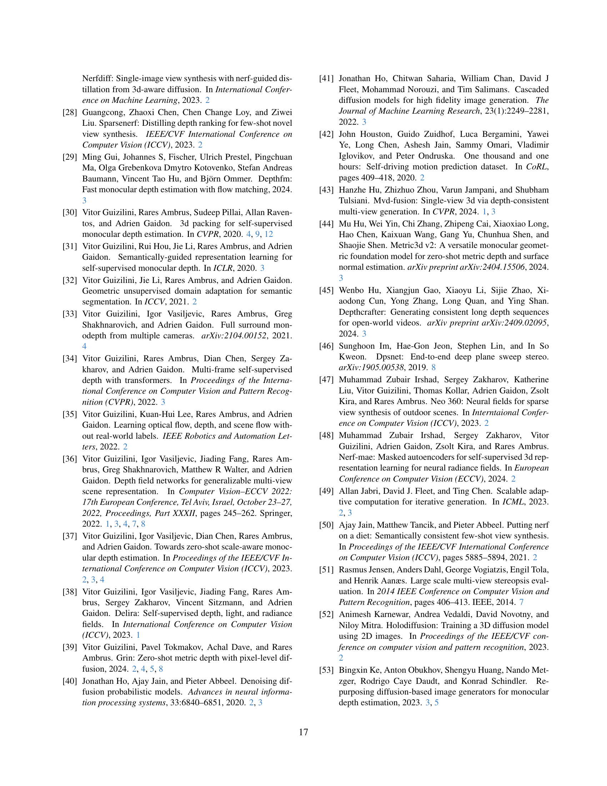

 


 2501.18804 
 Vitor Guizilini et el. 
 
 🤗 2025-02-03 
 



↗ arXiv


↗ Hugging Face


↗ Papers with Code


### TL;DR



기존의 3D 장면 재구성 방법들은 신경장, 복셀 그리드 또는 3D 가우시안과 같은 중간 3D 표현을 사용하여 다중 뷰 일관성을 달성했습니다. 하지만 이러한 방법들은 새로운 장면으로의 일반화가 제한적이며, 입력 뷰의 수가 증가함에 따라 성능이 저하되는 문제점이 있습니다. 또한, 3D 표현 생성에 상당한 계산 비용이 필요합니다.

본 논문에서는 이러한 문제점들을 해결하기 위해, 희소한 포즈된 이미지로부터 새로운 뷰와 깊이 맵을 직접 생성하는 다중 뷰 기하학적 확산 모델(MVGD)을 제안합니다. MVGD는 레이맵 조건화를 통해 다양한 뷰의 공간 정보를 시각적 특징에 통합하고, 학습 가능한 작업 임베딩을 사용하여 이미지와 깊이 맵 생성을 위한 확산 과정을 안내합니다. 6천만 개 이상의 다중 뷰 샘플로 학습된 MVGD는 다양한 벤치마크에서 최첨단 성능을 달성했으며, 스테레오 및 비디오 깊이 추정 과제에서도 우수한 결과를 보였습니다. 또한, 증분 미세 조정 전략을 통해 효율적으로 대규모 모델을 학습할 수 있음을 보였습니다.



#### Key Takeaways


 중간 3D 표현 없이 새로운 뷰와 깊이 맵을 직접 생성 



 다양한 시나리오에서의 뛰어난 성능 및 일반화 능력 



 대규모 데이터셋 학습 및 효율적인 모델 확장 전략 제시 


#### Why does it matter?
본 논문은 **희소한 포즈된 이미지로부터 새로운 뷰와 깊이를 직접 생성하는 혁신적인 다중 뷰 기하학적 확산 모델(MVGD)**을 제시하여, **중간 3D 표현 없이 다중 뷰 일관성을 유지**하는 방법을 제시합니다. 이는 기존 방법의 한계를 극복하고, **다양한 시나리오에서 뛰어난 성능을 보이며 새로운 연구 방향을 제시**합니다. 특히, **대규모 데이터셋 학습 및 효율적인 확장 전략**은 다른 연구 분야에도 적용 가능한 중요한 함의를 지닙니다.  더 나아가, **다양한 과제 (스테레오 및 비디오 깊이 추정)에서도 최첨단 성능**을 달성하여, 그 실용성을 입증했습니다.

------
#### Visual Insights

> 🔼 그림 1은 제시된 임의의 수의 포즈된 입력 뷰를 기반으로 새로운 뷰포인트에서 이미지와 크기가 일관된 깊이 맵을 생성하는 최첨단 방법인 MVGD를 보여줍니다. 빨간색 카메라는 초록색 카메라의 RGB-D 예측을 직접 생성하기 위한 조건으로 사용됩니다. 본 논문의 방법의 다중 뷰 일관성을 강조하기 위해 모든 새로운 뷰포인트에서 예측된 색상 포인트 클라우드가 후처리 없이 시각화를 위해 함께 쌓여져 있습니다. 더 많은 예시와 비디오는 https://mvgd.github.io/ 에서 찾을 수 있습니다.
> 

> 
read the caption

> Figure 1:  MVGD is a state-of-the-art method that generates images and scale-consistent depth maps from novel viewpoints given an arbitrary number of posed input views. In the above, red cameras are used as conditioning to directly generate RGB-D predictions from green cameras. To highlight the multi-view consistency of our method, predicted colored pointclouds from all novel viewpoints are stacked together for visualization without any post-processing. More examples and videos can be found in https://mvgd.github.io/
> 


Dataset|Syn.|Dyn.|Met.|I/O|V/M|# Sequences|# Samples
---|---|---|---|---|---|---|---|---
ArgoVerse2 [105]||✓|✓|O|VM|1043|3,909,297
BlendedMVG [117]||| |O|M|502|115,142
CO3Dv2 [74]||| |I|V|25,243|5,088,873
DROID [56]|||✓|I|M|76,792|7,340,712
LSD [37]||✓|✓|O|VM|17,647|1,057,920
LyftL5 [42]||✓|✓|O|VM|394|347,508
MVImgNet [122]||| |I|V|194,368|5,768,120
NuScenes [8]||✓|✓|O|VM|850|204,894
Taskonomy [123]|||✓|O|M|533|4,584,462
HM3D [71]|||✓|O|M|900|9,531,876
Hypersim [75]|||✓|O|M|457|74,619
P. Domain [32, 35]|✓|✓|✓|IO|VM|5,449|555,000
RealEstate10k [125]|||—|O|V|74,532|10,115,793
RTMV [97]|✓|| |I|M|1,909|286,350
ScanNet [16]|||✓|O|V|1,513|2,477,378
TartanAir [102]|✓|✓|✓|O|VM|369|613,274
VKITTI2 [7]|✓|✓|✓|O|VM|45|38,268
Waymo [93]|✓||✓|O|VM|1,000|990,340
WildRGBD [108]||| |I|V|23,049|8,026,495
Total| | | | | |426,595|61,126,321

> 🔼 이 표는 MVGD(Multi-View Geometric Diffusion) 모델을 학습시키는 데 사용된 데이터셋 목록을 보여줍니다. 각 데이터셋에 대해 합성 데이터 여부(Syn), 동적인 물체 포함 여부(Dyn), 깊이 레이블의 계량화 여부(Met), 카메라가 안쪽 및/또는 바깥쪽을 향하는지 여부(I/O), 여러 대의 카메라 및/또는 비디오가 포함되어 있는지 여부(M/V)를 나타내는 정보가 포함되어 있습니다. 이는 MVGD 모델의 다양하고 광범위한 데이터셋 적용 능력을 보여줍니다.
> 

> 
read the caption

> Table 1:  Datasets used to train MVGD. Syn indicates if the dataset is synthetic, Dyn. if it contains dynamic objects, Met. if depth labels are metric, I/O if cameras are looking inwards and/or outwards, and M/V if it contains multiple cameras and/or videos.
> 

### In-depth insights

#### Multi-view Diffusion
논문에서 "Multi-view Diffusion"이라는 제목의 섹션은 다양한 관점에서 얻은 이미지와 깊이 정보를 결합하여 새로운 관점의 이미지와 깊이 맵을 생성하는 확산 모델에 대한 심층적인 설명을 제공합니다. **핵심 아이디어는 중간 3D 표현 없이도 다중 관점 일관성을 유지하면서 직접적으로 새로운 관점을 생성하는 것입니다.**  이는 **레이 맵(raymap) 조건화**를 통해 가능해지는데, 이를 통해 다양한 관점에서의 공간 정보를 시각적 특징과 결합하여 확산 과정을 유도합니다. 또한 **이미지와 깊이 맵을 동시에 생성하는 다중 작업 학습**과 **학습 가능한 작업 임베딩**을 통해 확산 과정을 특정 모달리티로 유도하고 효율적인 학습을 가능하게 합니다. **다양한 데이터셋을 활용한 대규모 학습**과 함께, **점진적 미세 조정 전략**을 통해 더 큰 모델을 효율적으로 학습시키는 방법 또한 제시됩니다. 이를 통해 **다양한 시나리오에서 견고한 일반화 성능**을 달성하고, 여러 가지 벤치마크에서 최첨단 성능을 달성합니다.

#### Raymap Conditioning
본 논문에서 제안하는 ‘Raymap Conditioning’은 **다중 뷰 기하학적 확산 모델(MVGD)**의 핵심 구성 요소로, 여러 시점에서 촬영된 이미지들의 공간적 정보를 효과적으로 통합하는 역할을 합니다.  **레이 엔코더(Ray Encoder)**를 통해 각 픽셀의 광선 정보를 추출하고, 이를 이용하여 **입력 뷰(Input Views)**들의 시각적 특징을 3차원 공간에 배치합니다. 이는 단순히 2차원 이미지 피처만을 사용하는 기존 방식과 달리, **입력 뷰들의 공간적 관계를 명시적으로 고려**함으로써 보다 정확하고 일관성 있는 3차원 장면 표현을 가능하게 합니다.  **레이맵(Raymap)**은 각 픽셀에서 출발하는 광선을 나타내며, 이를 통해 **시각적 특징과 공간 정보를 결합**시켜 신경망이 보다 효율적이고 정확하게 3차원 장면을 이해하도록 돕습니다. 결과적으로 Raymap Conditioning은 **새로운 시점의 이미지와 깊이 맵 생성**에 있어서 **다중 뷰 일관성(Multi-view Consistency)**을 크게 향상시키는 핵심적인 역할을 수행합니다.  **특히, 중간 3D 표현 없이 직접 픽셀 수준에서 이미지와 깊이 맵을 생성**하는 MVGD의 접근 방식에 필수적인 요소라고 할 수 있습니다.

#### Scene Scale Norm
장면 스케일 정규화는 3D 시각적 자료에서 **스케일 추정의 모호성** 문제를 해결하기 위한 중요한 기법입니다.  **단일 프레임 방법론**은 스케일을 직접 추정할 수 없어 다른 정보에 의존하는 반면, **다중 프레임 방법론**은 카메라 외부 매개변수로 주어진 스케일을 상속받아 다중 뷰 일관성을 유지해야 합니다.  이러한 과정은 서로 다른 보정 절차를 사용하는 다양한 데이터셋에서 훈련할 때 어려움을 야기하며, **메트릭 스케일(정확한 스케일)** 혹은 **비메트릭 스케일(임의의 스케일)** 데이터셋 모두를 고려해야 합니다. 본 논문에서 제안하는 **장면 스케일 정규화**는 조건부 카메라와 기저 진실 심도를 활용하여 **스케일을 자동으로 추출**, 입력을 정규화하고 생성된 예측에 다시 반영하여 **다중 뷰 일관성 있는 심도 맵**을 생성합니다. **표준화된 표현**은 변환 및 회전 불변성을 강화하여 다양한 시나리오에서 강력한 일반화를 가능하게 합니다.

#### Incremental Tuning
논문에서 제시된 증분식 미세 조정(Incremental Tuning) 기법은 **큰 모델을 처음부터 훈련시키는 대신 작은 모델을 먼저 훈련시킨 후, 이를 기반으로 더 큰 모델을 효율적으로 미세 조정하는 방법**입니다. 이는 계산 비용이 많이 드는 대규모 모델 훈련의 어려움을 해결하기 위한 효과적인 전략입니다.  **기존의 방식보다 훨씬 적은 훈련 시간으로 성능 향상을 이끌어 낸다는 점**에서 큰 장점을 가지고 있습니다.  이는 특히 매개변수 수를 늘려 모델의 복잡도를 높일 때 효과적이며, 성능 향상과 훈련 효율 사이의 균형을 잘 맞춥니다.  **증분식 미세 조정은 대규모 모델 훈련의 실용성을 높이고, 다양한 응용 분야에서 혁신적인 결과를 가져올 가능성**을 보여주는 중요한 기법입니다.  **모델의 확장성(Scalability)을 높여 다양한 크기의 모델을 효율적으로 훈련할 수 있게 해준다는 점**도 주목할 만 합니다.

#### Zero-Shot Synthesis
본 논문은 제로샷 합성(Zero-Shot Synthesis)에 대한 심도있는 논의를 제공합니다. **제로샷 합성**은 사전에 학습된 모델이 전혀 본 적 없는 새로운 데이터나 상황에 대해서도 예측이나 생성을 수행하는 능력을 의미합니다. 이는 기존의 딥러닝 모델들이 특정 데이터셋에 과적합되는 문제점을 극복하고, **일반화 성능**을 높이는 데 중요한 개념입니다. 논문에서 제시하는 다양한 기법들은 대규모 데이터셋을 효율적으로 학습하고, 다양한 시나리오에 **일반화**할 수 있는 견고한 모델을 구축하는 데 초점을 맞추고 있습니다. **레이맵(Raymap) 조건화** 와 **다중 작업 학습(Multi-Task Learning)** 등의 기법을 통해 이러한 목표를 달성하고자 하는 연구는 높은 평가를 받을 만 합니다. 특히, **증분식 미세 조정(Incremental Fine-tuning)** 전략은 모델의 확장성과 효율성을 높이는 중요한 전략으로 제시됩니다. 이를 통해 제로샷 합성 분야에서 더욱 **강력하고 효율적인 모델**을 개발하는 데 기여할 것으로 예상됩니다.

### More visual insights

More on figures

> 🔼 그림 2는 제안된 다중 뷰 기하학적 확산(MVGD) 프레임워크의 추론 과정을 보여줍니다.  N개의 입력 이미지와 카메라 정보가 장면 조건 설정에 사용되고, 새로운 뷰와 깊이 합성을 위해 다른 카메라가 선택됩니다. 입력 이미지들은 각각 고유한 카메라 위치와 방향 정보를 담고 있으며, 이 정보들은 새로운 뷰를 생성하기 위한 기준으로 활용됩니다. MVGD는 이러한 다중 뷰 정보를 활용하여 이미지와 깊이 맵을 동시에 생성하는 다중 작업 학습 방식을 사용합니다.  레이(Ray) 인코더는 카메라 정보를 처리하여 공간적 정보를 추가하고, 이미지 인코더는 입력 이미지의 시각적 특징을 추출합니다.  이 정보들은 확산 과정을 통해 새로운 뷰와 깊이 맵을 생성하는 데 사용됩니다.  장면 토큰(Scene Tokens)은 장면 정보를 나타내고, 예측 토큰(Prediction Tokens)은 생성될 이미지와 깊이 맵의 종류를 결정합니다.  마지막으로, 생성된 이미지와 깊이 맵은 장면 크기에 맞춰 정규화되어 일관성 있는 결과를 생성합니다.
> 

> 
read the caption

> Figure 2:  Diagram of our proposed Multi-View Geometric Diffusion (MVGD) framework, at inference time. N𝑁Nitalic_N input images 𝐈cnsuperscriptsubscript𝐈𝑐𝑛\mathbf{I}_{c}^{n}bold_I start_POSTSUBSCRIPT italic_c end_POSTSUBSCRIPT start_POSTSUPERSCRIPT italic_n end_POSTSUPERSCRIPT with cameras 𝒞cnsuperscriptsubscript𝒞𝑐𝑛\mathcal{C}_{c}^{n}caligraphic_C start_POSTSUBSCRIPT italic_c end_POSTSUBSCRIPT start_POSTSUPERSCRIPT italic_n end_POSTSUPERSCRIPT are used for scene conditioning, and a different camera 𝒞tsubscript𝒞𝑡\mathcal{C}_{t}caligraphic_C start_POSTSUBSCRIPT italic_t end_POSTSUBSCRIPT is selected for novel view and depth synthesis.
> 

> 🔼 그림 3은 제안된 다중 뷰 기하학적 확산(MVGD) 모델이 다양한 평가 벤치마크 및 실제 데이터셋에서 생성한 새로운 뷰와 깊이 합성 결과를 무작위로 보여줍니다.  위쪽 이미지는 조건 이미지(색상이 있는 카메라)이고, 아래쪽 이미지는 목표 뷰(검은색 카메라)이며, 왼쪽에서 오른쪽으로 순서대로 실제 이미지, 예측 이미지, 예측 깊이 맵을 보여줍니다.  이러한 예측은 목표 뷰에서 관찰된 3D 점 구름을 생성하는 데 사용됩니다.  더 많은 예와 추가 시각화는 보충 자료를 참조하십시오.
> 

> 
read the caption

> Figure 3:  MVGD novel view and depth synthesis results randomly sampled from different evaluation benchmarks and in-the-wild datasets. Top images are conditioning views (colored cameras), and bottom images are the target view (black camera), showing from left-to-right: ground-truth image, predicted image, and predicted depth map. These predictions are used to produce a colored 3D pointcloud observed from the target view. For more examples and additional visualizations, please refer to the supplementary material.
> 

> 🔼 표 6은 두 개의 조건부 뷰를 사용한 스테레오 깊이 실험 결과를 보여줍니다. ScanNet에 대한 결과는 도메인 내이며, SUN3D 및 RGB-D에 대한 결과는 제로샷입니다.  이 표는 다양한 데이터셋(ScanNet, SUN3D, RGB-D)에서 제로샷(zero-shot) 방식으로 깊이 예측 성능을 평가한 결과를 보여줍니다.  두 개의 입력 이미지만을 사용하여 깊이 맵을 예측하는 모델의 성능을 정량적으로 비교 분석합니다.  ScanNet은 모델이 학습된 데이터셋이므로 도메인 내(in-domain) 평가이고, SUN3D와 RGB-D는 학습에 사용되지 않은 데이터셋이므로 제로샷(zero-shot) 평가입니다.  Abs. Rel, Sq. Rel, RMSE, δ1, δ2, δ3 지표를 통해 깊이 예측의 정확도를 다각적으로 비교 분석합니다.
> 

> 
read the caption

> Table 6: Stereo depth experiments, with 2 conditioning views. Results on ScanNet are in-domain, and results on SUN3D and RGB-D are zero-shot.
> 

> 🔼 표 7은 ScanNet 데이터셋을 사용한 비디오 깊이 추정 실험 결과를 보여줍니다.  'in-domain'이라는 것은, 학습 데이터셋과 같은 종류의 데이터셋을 사용했음을 의미합니다. 10개의 조건부 뷰(conditioning views)를 사용하여 실험을 진행했습니다. 이 표는 다양한 방법들을 비교하여 MVGD 모델의 성능을 보여주는 목적으로 사용됩니다.  각 방법은 절대 상대 오차(Abs. Rel), 제곱 상대 오차(Sq. Rel), RMSE(Root Mean Squared Error) 등의 지표로 평가됩니다.  깊이 추정의 정확도를 비교하여 MVGD의 우수성을 보여줍니다.
> 

> 
read the caption

> Table 7: Video depth experiments on ScanNet (in-domain), with 10101010 conditioning views.
> 

> 🔼 그림 4는 제로샷 MVGD를 사용하여 다양한 평가 벤치마크 및 실제 데이터셋에서 무작위로 샘플링한 새로운 뷰 및 깊이 합성 결과를 보여줍니다. 왼쪽 상단 이미지는 조건부 뷰(색상 카메라)이고, 아래쪽 이미지는 대상 뷰(검정색 카메라)이며, 왼쪽에서 오른쪽으로 순서대로 실제 이미지, 예측 이미지, 예측 깊이 맵을 보여줍니다. 이러한 예측은 대상 뷰포인트에서 관찰된 컬러 3D 포인트 클라우드를 생성하는 데 사용됩니다. 이 그림은 MVGD 모델이 다양한 시나리오에서 새로운 뷰와 깊이를 정확하게 생성할 수 있음을 보여줍니다.
> 

> 
read the caption

> Figure 4:  Zero-Shot MVGD novel view and depth synthesis results randomly sampled from different evaluation benchmarks and in-the-wild datasets. Top left images are conditioning views (colored cameras), and bottom images are the target view (black camera), showing from left-to-right: ground-truth image, predicted image, and predicted depth map. These predictions are used to produce a colored 3D pointcloud observed from the target viewpoint.
> 

> 🔼 그림 5는 제안된 다중 뷰 기하학적 확산(MVGD) 모델이 여러 관점(검은색 카메라)에서 새로운 이미지와 깊이 맵을 생성하여 얻어진 누적된 점 구름을 보여줍니다. 동일한 조건 뷰(색상 카메라)를 사용하여 후처리 없이 점 구름을 함께 쌓았습니다. 제로샷 아키텍처는 조건 카메라의 크기와 일치하는 다중 뷰 일관성 예측을 직접 생성할 수 있습니다.
> 

> 
read the caption

> Figure 5: Accumulated MVGD pointclouds, obtained by generating novel images and depth maps from various viewpoints (black cameras), using the same conditioning views (colored cameras), and stacking them together without any post-processing. Our zero-shot architecture is capable of directly generating multi-view consistent predictions that match the scale from conditioning cameras.
> 

> 🔼 그림은 제시된 논문의 3장, 다중 시점 기하 확산(Multi-View Geometric Diffusion) 섹션에 속하며, 제안된 다중 시점 기하 확산(MVGD) 프레임워크의 추론 과정을 보여줍니다.  N개의 입력 이미지와 카메라 정보를 사용하여 새로운 시점과 깊이를 합성하는 과정을 단계별로 시각화하고 있습니다.  입력 뷰, 광선 인코더, 이미지 인코더, 장면 토큰, 작업 임베딩, 잠재 토큰, 예측 토큰, 그리고 최종적으로 새로운 시점의 이미지와 깊이 맵을 생성하는 과정이 상세하게 그려져 있습니다.  특히, 장면 스케일 정규화(Scene Scale Normalization)과 다중 작업 학습(Multi-Task Learning) 과정을 통해 다중 시점 일관성을 유지하는 방식을 보여주는 것이 핵심입니다.
> 

> 
read the caption

> (a)
> 

> 🔼 이 그림은 논문의 Multi-View Geometric Diffusion (MVGD) 프레임워크를 보여줍니다.  N개의 입력 이미지와 카메라 정보를 사용하여 새로운 관점에서의 이미지와 깊이 맵을 생성하는 과정을 보여줍니다.  레이 인코더는 입력 이미지와 카메라 위치 정보를 처리하고, 이를 기반으로 이미지 인코더가 장면 토큰을 생성합니다.  이 장면 토큰과 목표 관점의 레이 인코더 출력은 잠재 토큰과 결합되어 확산 모델에 입력됩니다.  이후 확산 모델은 학습된 작업 임베딩을 활용하여 이미지와 깊이맵을 생성합니다. 마지막으로 장면 스케일 정규화 과정을 거쳐 일관된 스케일을 가진 최종 결과물을 얻게 됩니다. 이 과정은 추론 시에 발생합니다.
> 

> 
read the caption

> (b)
> 

More on tables


| Methods | RealEstate10K [125] |  |  | ACID [59] |  |  | 
|---|---|---|---|---|---|---|
| PSNR ↑ | SSIM ↑ | LPIPS ↓ | PSNR ↑ | SSIM ↑ | LPIPS ↓ |
|---|---|---|---|---|---|---|
| PixelNeRF [121] | 20.43 | 0.589 | 0.550 | 20.97 | 0.547 | 0.533 |
| GPNR [91] | 24.11 | 0.793 | 0.255 | 25.28 | 0.764 | 0.332 |
| AttnRend [20] | 24.78 | 0.820 | 0.213 | 26.88 | 0.799 | 0.218 |
| MuRF [110] | 26.10 | 0.858 | 0.143 | 28.09 | 0.841 | 0.155 |
| PixelSplat [14] | 25.89 | 0.858 | 0.142 | 28.14 | 0.839 | 0.150 |
| MVSplat [15] | 26.39 | 0.869 | 0.128 | 28.25 | 0.843 | 0.144 |
| **MVGD** | 28.41 | 0.891 | 0.107 | 29.98 | 0.875 | 0.131 |
> 🔼 표 2는 본 논문에서 제안하는 다중 뷰 기하학적 확산(MVGD) 모델의 성능을 보여주는 표입니다. 입력 뷰가 2개일 때, 즉, 두 개의 카메라 시점에서 촬영된 이미지만을 사용하여 새로운 시점에서의 이미지를 생성하는 작업(Novel View Synthesis)에 대한 성능을 정량적으로 평가한 결과를 보여줍니다.  PSNR, SSIM, LPIPS와 같은 척도를 사용하여 기존의 최첨단 방법들과 비교 분석하였습니다.  RealEstate10K와 ACID 데이터셋에서의 실험 결과가 제시되어 있습니다.
> 

> 
read the caption

> Table 2:  Novel view synthesis results with 2 input views.
> 


Dataset | 3-view | 6-view | 9-view | 3-view | 6-view | 9-view | 3-view | 6-view | 9-view
---|---|---|---|---|---|---|---|---
RE10K [125] |  | 20.54 | 25.63 | 27.32 | 0.731 | 0.817 | 0.843 | 0.394 | 0.344 | 0.332
FreeNeRF [113] |  | 23.89 | 28.75 | 29.55 | 0.839 | 0.896 | 0.900 | 0.292 | 0.239 | 0.236
SimpleNeRF [88] |  | 19.11 | 22.54 | 23.73 | 0.675 | 0.744 | 0.766 | 0.422 | 0.374 | 0.358
ZeroNVS* [80] |  | 25.84 | 29.99 | 31.82 | 0.910 | 0.951 | 0.961 | 0.144 | 0.103 | 0.092
ReconFusion† [106] |  | 26.78 | 31.07 | 32.20 | 0.917 | 0.954 | 0.963 | 0.132 | 0.092 | 0.082
CAT3D† [24] |  | 28.70 | 31.71 | 32.89 | 0.925 | 0.960 | 0.969 | 0.128 | 0.090 | 0.085
LLFF [64] |  | 19.63 | 23.72 | 25.12 | 0.613 | 0.773 | 0.820 | 0.347 | 0.232 | 0.193
FreeNeRF [113] |  | 19.24 | 23.05 | 23.98 | 0.623 | 0.737 | 0.762 | 0.375 | 0.296 | 0.286
SimpleNeRF [88] |  | 15.91 | 18.39 | 18.79 | 0.359 | 0.449 | 0.470 | 0.512 | 0.438 | 0.416
ZeroNVS* [80] |  | 21.34 | 24.25 | 25.21 | 0.724 | 0.815 | 0.848 | 0.203 | 0.152 | 0.134
ReconFusion† [106] |  | 21.58 | 24.71 | 25.63 | 0.731 | 0.833 | 0.860 | 0.181 | 0.121 | 0.107
CAT3D† [24] |  | 22.39 | 24.76 | 25.93 | 0.776 | 0.882 | 0.853 | 0.157 | 0.131 | 0.103
DTU [51] |  | 20.46 | 23.48 | 25.56 | 0.826 | 0.870 | 0.902 | 0.173 | 0.131 | 0.102
FreeNeRF [113] |  | 16.25 | 20.60 | 22.75 | 0.751 | 0.828 | 0.856 | 0.249 | 0.190 | 0.176
SimpleNeRF [88] |  | 16.71 | 17.70 | 17.92 | 0.716 | 0.737 | 0.745 | 0.223 | 0.205 | 0.200
ZeroNVS* [80] |  | 20.74 | 23.62 | 24.62 | 0.875 | 0.904 | 0.921 | 0.124 | 0.105 | 0.094
ReconFusion† [106] |  | 22.02 | 24.28 | 25.92 | 0.844 | 0.899 | 0.928 | 0.121 | 0.095 | 0.073
CAT3D† [24] |  | 23.79 | 25.31 | 26.88 | 0.893 | 0.912 | 0.939 | 0.115 | 0.091 | 0.088
CO3D [74] |  | 13.28 | 15.20 | 17.35 | 0.461 | 0.523 | 0.575 | 0.634 | 0.596 | 0.561
FreeNeRF [113] |  | 15.40 | 18.12 | 20.52 | 0.553 | 0.622 | 0.672 | 0.612 | 0.541 | 0.493
SimpleNeRF [88] |  | 17.13 | 19.72 | 20.50 | 0.581 | 0.627 | 0.640 | 0.566 | 0.515 | 0.500
ZeroNVS* [80] |  | 19.59 | 21.84 | 22.95 | 0.662 | 0.714 | 0.736 | 0.398 | 0.342 | 0.318
ReconFusion† [106] |  | 20.57 | 22.79 | 23.58 | 0.666 | 0.726 | 0.752 | 0.351 | 0.292 | 0.273
CAT3D† [24] |  | 20.68 | 23.49 | 24.77 | 0.678 | 0.743 | 0.789 | 0.331 | 0.322 | 0.248
MIP-NeRF360 [4] |  | 12.87 | 13.35 | 14.59 | 0.260 | 0.283 | 0.319 | 0.715 | 0.717 | 0.695
FreeNeRF [113] |  | 13.27 | 13.67 | 15.15 | 0.283 | 0.312 | 0.354 | 0.741 | 0.721 | 0.676
SimpleNeRF [88] |  | 14.44 | 15.51 | 15.99 | 0.316 | 0.337 | 0.350 | 0.680 | 0.663 | 0.655
ZeroNVS* [80] |  | 15.50 | 16.93 | 18.19 | 0.358 | 0.401 | 0.432 | 0.585 | 0.544 | 0.511
ReconFusion† [106] |  | 16.62 | 17.72 | 18.67 | 0.377 | 0.425 | 0.460 | 0.515 | 0.451 | 0.439
CAT3D† [24] |  | 18.74 | 20.28 | 21.18 | 0.425 | 0.463 | 0.512 | 0.499 | 0.512 | 0.488
> 🔼 표 3은 다양한 수의 조건부 뷰(3~9개)를 사용하여 새로운 뷰를 합성한 결과를 보여줍니다.  [106]에서 미세 조정 및 보고된 방법에는 * 표시가 되어 있으며, 내부 데이터셋으로 사전 훈련된 이미지 확산 모델을 사용한 방법에는 † 표시가 되어 있습니다. 색상이 있는 숫자는 각 지표(PSNR, SSIM, LPIPS)에 대한 상위 3개의 결과를 나타냅니다. RealEstate10k 및 CO3D 결과는 도메인 내이며, 다른 벤치마크의 결과는 제로샷입니다.
> 

> 
read the caption

> Table 3:  Novel view synthesis results with 3333-9999 conditioning views. ∗ indicate methods fine-tuned and reported by [106]. † indicate the use of image diffusion models pre-trained with internal datasets. Colored numbers represent first, second, and third best ranked metrics. RealEstate10k and CO3D results are in-domain, and results on other benchmarks are zero-shot.
> 


| Dataset | Split | Abs.Rel. ↓ | RMSE ↓ | δ₁.₂₅ ↑ |
|---|---|---|---|---|
| LLFF | 3-view | 0.105 | 8.378 | 0.865 |
|  | 6-view | 0.098 | 8.260 | 0.879 |
|  | 9-view | 0.093 | 8.006 | 0.891 |
| MIPNeRF360 | 3-view | 0.143 | 2.445 | 0.842 |
|  | 6-view | 0.124 | 2.292 | 0.866 |
|  | 9-view | 0.109 | 2.106 | 0.883 |
| CO3D | 3-view | 0.101 | 4.654 | 0.874 |
|  | 6-view | 0.086 | 4.436 | 0.898 |
|  | 9-view | 0.079 | 4.195 | 0.914 |
> 🔼 표 4는 제시된 카메라 외부 매개변수와 동일한 크기의 예측 깊이 맵을 생성하기 위해 테스트 시간 정렬을 사용하지 않고 COLMAP [82] 기준값에 대해 3~9개의 조건 보기를 사용한 새로운 깊이 합성 결과를 보여줍니다. 이 표는 다양한 수의 조건부 뷰를 사용하여 생성된 깊이 맵의 정확도를 평가하고, 기준값과의 비교를 통해 성능을 측정합니다.
> 

> 
read the caption

> Table 4:  Novel depth synthesis results with 3333-9999 conditioning views, relative to COLMAP [82] ground-truth. No test-time alignment was used, which means that predicted depth maps share the same scale as the provided camera extrinsics.
> 


| Dataset             | Variation       | RE10K(2) PSNR | DTU(3) PSNR | DTU(3) Abs.Rel | CO3D(3) PSNR | CO3D(3) Abs.Rel | LLFF(3) PSNR | LLFF(3) Abs.Rel | ScanNet(2) Abs.Rel |
|----------------------|-----------------|-----------------|-------------|-----------------|---------------|-----------------|--------------|-----------------|------------------|
| A  2048 (scratch)    | 2048 (scratch) | 22.09           | 20.22        | 0.120           | 16.25          | 0.148           | 19.11         | 0.088           | 0.088            |
| B - RGB              | - RGB           | —               | —            | 0.132           | —              | —              | —             | —              | 0.089            |
| C - Depth            | - Depth          | 21.46           | 19.31        | —               | 16.39          | —              | 19.01         | —              | —                |
| D - SSN              | - SSN           | 20.15           | 17.98        | 0.175           | 14.67          | 0.224           | 16.87         | 0.329           | 0.329            |
| E - Dynamic          | - Dynamic        | 23.24           | 19.51        | 0.141           | 17.04          | 0.143           | 19.28         | 0.087           | 0.087            |
| **MVGD (short)**    | **MVGD (short)** | 24.44           | 20.16        | 0.127           | 17.98          | 0.131           | 20.19         | 0.081           | 0.081            |
| F + RGB (B)         | + RGB (B)       | 25.15           | 21.11        | 0.120           | 18.04          | 0.120           | 20.21         | 0.075           | 0.075            |
| G + Depth (C)       | + Depth (C)     | 25.68           | 21.31        | 0.124           | 18.39          | 0.127           | 20.52         | 0.079           | 0.079            |
| **MVGD (full)**     | **MVGD (full)** | 25.89           | 21.32        | 0.121           | 18.48          | 0.119           | 20.58         | 0.075           | 0.075            |
> 🔼 표 5는 MVGD 모델의 성능에 대한 ablation study 결과를 보여줍니다. 상단 결과는 200k 스텝 동안 256개의 latent tokens을 사용하여 학습한 모델의 결과이고, 하단 결과는 상단 모델을 100k 스텝 동안 fine-tuning한 결과입니다. 이를 통해 latent tokens의 수가 모델 성능에 미치는 영향과 fine-tuning 전략의 효과를 확인할 수 있습니다.
> 

> 
read the caption

> Table 5:  MVGD ablation analysis. Top results obtained with 200200200200k steps and 256256256256 latent tokens. Bottom results obtained by fine-tuning top models for 100100100100k steps.
> 


Method | ScanNet [16] |  |  | SUN3D [109] |  |  | RGB-D [90] |  |  |  
---|---|---|---|---|---|---|---|---|---|---
|  Abs.Rel. ↓ | RMSE ↓ | δ1.25 ↑ | Abs.Rel. ↓ | RMSE ↓ | δ1.25 ↑ | Abs.Rel. ↓ | RMSE ↓ | δ1.25 ↑ |  |  
| DPSNet [46] | 0.126 | 0.315 | - | 0.147 | 0.449 | 0.781 | 0.151 | 0.695 | 0.804 |  
| NAS [58] | 0.107 | 0.281 | - | 0.127 | 0.378 | 0.829 | 0.131 | 0.619 | 0.857 |  
| IIB [118] | 0.116 | 0.281 | 0.908 | 0.099 | 0.293 | 0.902 | 0.095 | 0.550 | 0.907 |  
| DeFiNe [36] | 0.093 | 0.246 | 0.911 | 0.095 | 0.287 | 0.914 | 0.095 | 0.539 | 0.909 |  
| EPIO [112] | 0.086 | 0.229 | 0.923 | 0.090 | 0.260 | 0.912 | 0.080 | 0.433 | 0.912 |  
| GRIN [39] | 0.088 | 0.224 | 0.925 | 0.097 | 0.274 | 0.908 | 0.092 | 0.512 | 0.919 |  
| MVGD | 0.065 | 0.202 | 0.946 | 0.088 | 0.247 | 0.926 | 0.074 | 0.405 | 0.938 | 
> 🔼 표 8은 증분 미세 조정 실험 결과를 보여줍니다. 첫 번째 모델(256 차원의 잠재 변수)은 30만 스텝 동안 처음부터 학습되었고, 그 이후 모델들은 이전 모델의 잠재 변수를 복제하고 5만 스텝 동안 미세 조정하여 얻었습니다. 학습 가능한 파라미터의 총 수는 거의 변화가 없었음에도 불구하고 (+0.5%), 모든 벤치마크와 작업에서 성능이 크게 향상(최대 +20%)되었습니다.  이는 더 큰 모델을 처음부터 훈련하는 것보다 작은 모델을 미세 조정하는 것이 훨씬 효율적임을 시사합니다.
> 

> 
read the caption

> Table 8:  Incremental fine-tuning experiments. The first model (256256256256) was trained from scratch for 300300300300k steps, and each subsequent model was obtained by duplicating the latents of the previous one and fine-tuning for 50505050k steps. Even though the total number of learnable parameters barely changes (+0.5%percent0.5+0.5\%+ 0.5 %), results improve by a significant margin (up to +20%percent20+20\%+ 20 %) across all benchmarks and tasks.
> 

### Full paper



