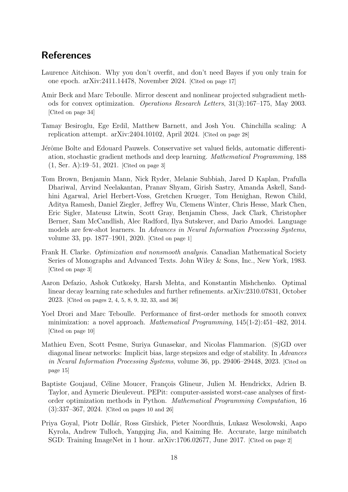

 


 2501.18965 
 Fabian Schaipp et el. 
 
 🤗 2025-02-03 
 



↗ arXiv


↗ Hugging Face


↗ Papers with Code


### TL;DR



본 논문은 **대규모 언어 모델 학습에서의 학습률 스케줄링 문제**를 다룹니다.  기존 연구는 주로 경험적인 방법에 의존해 왔으며, **학습률 스케줄의 형태와 최적의 기본 학습률을 결정하는 데 어려움**을 겪어왔습니다. 특히, 코사인 스케줄과 같은 기존 방법들은 **훈련 시간에 의존적**이어서 지속적인 훈련에 적합하지 않다는 문제점이 있습니다.  본 논문은 비 매끄러운 볼록 최적화 문제에 대한 최적화 이론을 사용하여, **학습률 스케줄의 실제 성능을 분석**하고 **이론적 경계**를 제시합니다.

본 논문은 제시된 이론적 경계를 활용하여 **학습률 조정 기법**을 제안하고, 이를 통해 **Llama 유형의 대규모 모델 학습 성능을 개선**하였습니다.  또한, 이론적 분석을 통해 **냉각(cooldown) 단계의 중요성**을 밝히고, **학습률을 스케줄 간에 전이**하는 기법을 제시합니다.  이는 기존의 시행착오 방식에서 벗어나 **이론적 토대에 기반한 학습률 조정**을 가능하게 하며, **대규모 언어 모델 학습 효율을 높이는 데 기여**합니다.



#### Key Takeaways


 볼록 최적화 이론에서 얻은 새로운 경계가 대규모 언어 모델 학습의 학습률 스케줄링과 매우 유사합니다. 



 이론적 경계를 활용하여 학습률을 조정함으로써 124M 및 210M Llama 유형 모델의 학습 성능을 향상시킬 수 있습니다. 



 이론적 경계는 학습률 스케줄링의 경험적 동작을 정확하게 설명하고, 냉각(cooldown) 기간의 유용성을 설명합니다. 


#### Why does it matter?
본 논문은 **대규모 언어 모델 학습을 위한 학습률 스케줄링에 대한 새로운 이론적 이해**를 제공하여, 기존의 경험적 접근 방식에 대한 **이론적 토대**를 마련하고 **실제 성능 향상**에 기여합니다.  이는 현대 딥러닝 연구의 주요 과제 중 하나인 **최적의 학습률 설정** 문제에 대한 해결책을 제시하며, 향후 연구 방향을 제시함으로써 **딥러닝 분야의 발전**에 크게 기여할 수 있습니다.

------
#### Visual Insights

> 🔼 그림 (a)는 210M Llama 모델을 AdamW 최적화기를 사용하여 실제로 훈련시킨 결과를 보여줍니다. wsd와 코사인 스케줄을 사용하여 훈련 길이(T)가 다른 여러 가지 실험을 수행했으며, 코사인 스케줄의 기본 학습률은 wsd의 두 배입니다.  두 그래프 모두 학습 반복 횟수에 따른 검증 손실을 나타냅니다. 이 그림은 이후에 제시되는 이론적 경계(그림 (b))와의 놀라운 유사성을 보여주기 위해 사용되었습니다.
> 

> 
read the caption

> (a) Real Loss Curves
> 

### In-depth insights

#### LR Schedule Theory
본 논문에서 제시된 'LR Schedule Theory'는 **대규모 모델 학습에서의 학습률 스케줄링(Learning Rate Scheduling)의 경험적 관찰과 이론적 결과 사이의 놀라운 일치**를 보여주는 데 초점을 맞추고 있습니다.  특히, **볼록 최적화 이론(convex optimization theory)에서의 성능 경계(performance bound)**를 사용하여 다양한 경험적 학습률 스케줄의 행동을 설명하고 있으며, 이는 **코사인 스케줄(cosine schedule)이나 wsd 스케줄(warmup-stable-decay schedule)**과 같은 기존 스케줄의 성능을 재현하는 데 성공했습니다.  더 나아가, 이 이론적 틀을 이용하여 **학습률 튜닝(learning-rate tuning)** 및 **학습률 전이(learning-rate transfer)**와 같은 실제적인 적용 방법을 제안하고, 이를 통해 실제 모델 학습에서 눈에 띄는 성능 향상을 달성했습니다. **이 연구는 비볼록적 심층 학습 문제에서도 경험적 관찰과 이론적 결과 간의 밀접한 관계를 보여주는 흥미로운 결과**를 제시하고 있으므로, 향후 심층 학습 모델의 학습률 스케줄링 전략 개선에 중요한 시사점을 제공할 것으로 기대됩니다.  그러나, **현재 이론은 SGD(Stochastic Gradient Descent)에 기반**하고 있으며, AdamW와 같은 실제 최적화 알고리즘과의 차이점을 고려해야 합니다.

#### Convex Optimization
본 논문에서 다루는 "Convex Optimization"은 **큰 규모의 언어 모델 학습에 사용되는 학습률 스케줄링 전략을 이해하는 데 중요한 역할**을 합니다.  특히, 비볼록 최적화 문제인 심층 학습에서 볼록 최적화 이론을 적용하는 것은 직관적이지 않지만, 이 논문에서는 **볼록 최적화 이론의 경계(bound)를 통해 실제 학습률 스케줄링의 현상을 설명**할 수 있음을 보여줍니다.  이를 통해, **학습률 최적화를 위한 새로운 접근 방식**을 제시하고, **실험을 통해 그 효과를 검증**합니다. **특히, 'cooldown' 단계의 중요성을 이론적으로 뒷받침**하고, 이를 이용한 지속적인 학습 전략을 제시하여 모델 성능 향상을 달성합니다.  **볼록 최적화 이론과 실제 학습 간의 놀라운 일치**는 심층 학습의 이론적 이해를 높이고, 더 효율적인 학습 방법 개발을 위한 중요한 발걸음이 될 것입니다.

#### Llama Model Tuning
Llama 모델 튜닝에 대한 심층적인 논의는 본 연구에서 제시된 최적화 이론과 학습률 스케줄링 기법의 놀라운 일치성에 기반합니다.  **연구는 대규모 언어 모델 학습에서 관찰되는 경험적 현상을 설명하는 이론적 토대를 제공하며**, 이를 바탕으로 124M 및 210M Llama 유형 모델에 대한 학습률 조정을 개선하는 실질적인 전략을 제시합니다.  **주요 기여는 최적 학습률을 스케줄링 전반에 적용하고, 최적 학습률을 다양한 스케줄링 기법 간에 전이하는 방법을 제시함으로써 눈에 띄는 성능 향상을 달성한 것입니다.**  **코사인 스케줄과 wsd 스케줄의 성능이 유사하다는 점과 쿨다운 기간의 최적 길이를 이론적으로 뒷받침하는 결과는 실제 응용에 중요한 함의를 지닙니다.** 이 연구는 비볼록 최적화 문제에 대한 이론적 결과를 통해 실제 모델 학습의 개선에 기여하는 사례를 보여주는 중요한 연구입니다.  **특히, 이론적 근거에 기반한 튜닝 전략은 시행착오에 의존하는 기존의 경험적 접근 방식을 뛰어넘는 혁신적인 부분입니다.**

#### Cooldown Dynamics
**쿨다운 다이내믹스**는 큰 언어 모델 학습에서 학습률 스케줄링의 중요한 측면입니다. **학습률을 점진적으로 감소시키는 쿨다운 단계**는 최적화 과정을 안정화하고 과적합을 방지하며 최종 성능을 향상시키는 데 도움이 됩니다.  본 논문에서는 쿨다운 다이내믹스를 자세히 조사하여 그 이점과 최적화 방법을 분석합니다. **이론적 경계**를 활용하여 쿨다운 단계의 길이, 학습률 및 손실 감소 간의 관계를 밝힙니다.  **실험 결과**는 쿨다운이 최적화 과정에 미치는 영향과 성능 향상에 대한 이론적 분석을 뒷받침합니다. 특히, **최적의 쿨다운 길이**를 찾는 것이 중요하며, **이를 통해 학습 효율성을 극대화**할 수 있음을 시사합니다.  **쿨다운 다이내믹스의 이해**는 효과적인 학습률 스케줄링 전략을 설계하고, 대규모 언어 모델 학습의 성능을 향상시키는 데 중요한 역할을 합니다.

#### Method Limitations
본 논문에서 제시된 방법의 한계는 크게 세 가지로 요약할 수 있습니다. 첫째, **이론적 근거가 되는 볼록 최적화 이론은 현실 세계의 대규모 언어 모델 학습과 같은 비볼록 문제에는 직접적으로 적용되지 않습니다.**  따라서 이론적 결과와 실제 모델 성능 간의 차이가 발생할 수 있으며, 이는 실험 결과의 해석에 주의가 필요함을 시사합니다. 둘째, **실험 결과는 주로 AdamW 최적화 알고리즘에 의존하고 있으며, SGD에 대한 이론적 결과가 실제 모델 학습에 얼마나 잘 적용될지는 추가적인 검증이 필요합니다.**  다양한 최적화 알고리즘에 대한 추가 연구가 이루어져야 보다 일반적인 결론을 도출할 수 있습니다. 마지막으로, **이 연구는 기울기 크기가 0에 수렴하지 않는 상황을 전제로 하며, 실제 학습 과정에서 기울기 크기가 0으로 수렴하는 경우에 대한 고려가 부족합니다.**  이러한 현상은 모델 학습의 안정성 및 성능에 영향을 미칠 수 있으므로, 이에 대한 추가 연구가 필요합니다.  결론적으로, 본 논문의 방법론은 대규모 언어 모델 학습 문제에 대한 유용한 통찰력을 제공하지만, **이론적 한계와 알고리즘 의존성, 기울기 크기 수렴 문제 등은 향후 연구에서 반드시 고려해야 할 중요한 제약 조건**임을 명심해야 합니다.

### More visual insights

More on figures

> 🔼 그림 (b)는 볼록 최적화 이론에서 유도된 이론적 경계를 보여줍니다. 구체적으로, 이 경계는 SGD(확률적 경사 하강법) 알고리즘을 사용하여 볼록 문제를 풀 때, 최적점에 도달하지 못하는 정도(suboptimality)를 나타냅니다. 이 그림은 실제 손실 곡선과의 놀라운 유사성을 보여주는 실험 결과와 함께 제시되어 있으며, 이론적 경계가 실제 학습 과정을 잘 설명함을 시사합니다.  그래프는 서로 다른 훈련 길이(T)에 대해 cosine 스케줄과 wsd 스케줄 모두에 대해 suboptimality 경계를 나타냅니다. 두 스케줄 모두에서, 훈련이 진행됨에 따라 경계가 감소하지만, wsd 스케줄의 경우 cooldown 단계 이후 손실 감소가 급격하게 나타납니다. 이는 wsd 스케줄의 실질적인 효용성을 이론적으로 뒷받침하는 증거로 볼 수 있습니다.
> 

> 
read the caption

> (b) Theoretical Bound
> 

> 🔼  그림 1은 2억 1천만 매개변수를 가진 Llama 모델을 AdamW 최적화 알고리즘으로 학습시킨 결과와, 이론적 하한선(convex optimization 이론에서 유도됨)을 비교한 그래프입니다. 왼쪽 그래프는 실제 검증 손실(validation loss)을, 오른쪽 그래프는 이론적 하한선을 나타냅니다. 두 그래프 모두 wsd 스케줄과 cosine 스케줄을 사용하여 학습한 결과를 보여주며, 학습 횟수(T)가 서로 다른 여러 경우에 대한 결과를 포함합니다.  cosine 스케줄의 기본 학습률은 wsd 스케줄의 두 배로 설정되었습니다. 두 그래프의 유사성은, 대규모 모델 학습에서 사용하는 학습률 스케줄이 이론적 하한선과 매우 유사한 경향을 보인다는 것을 시사합니다. 
> 

> 
read the caption

> Figure 1: Strikingly similar: Validation loss for a 210M Llama model trained with AdamW (left) and the theoretical suboptimality bound (6) from convex optimization (right). Both plots show wsd and cosine schedule with different training lengths T𝑇Titalic_T, and with base learning-rate of cosine being twice as large as for wsd.
> 

> 🔼 그림 2는 다양한 훈련 반복 횟수(T)에 따른 코사인 및 wsd 학습률 일정(왼쪽)과 이론적 경계(오른쪽)을 보여줍니다. 여기서 사용된 기본 학습률은 이론적 최적값(γ*)입니다. 이 그림은 코사인과 wsd 스케줄의 비교를 통해, 이론적 경계가 실제 손실 곡선과 매우 유사함을 보여줍니다. 특히, wsd 스케줄의 급격한 손실 감소 현상을 이론적 경계에서도 확인할 수 있습니다. 이는 wsd 스케줄이 훈련 후반부에 학습률을 급격히 감소시키는 냉각(cooldown) 단계를 포함하기 때문입니다.
> 

> 
read the caption

> Figure 2: Learning-rate schedule (left) and theoretical bound (right) for cosine and wsd, and various T𝑇Titalic_T, with base learning-rate γ⋆superscript𝛾⋆\gamma^{\star}italic_γ start_POSTSUPERSCRIPT ⋆ end_POSTSUPERSCRIPT.
> 

> 🔼 그림 3(a)는 다양한 기본 학습률(베이스 러닝 레이트)에 따른 최종 경계값(파이널 바운드)의 변화를 보여줍니다. 가로축은 기본 학습률이고, 세로축은 최종 경계값입니다. 각 선은 다른 훈련 시간(T)을 나타내며, 각 훈련 시간에 대해 최적의 기본 학습률이 존재함을 알 수 있습니다. 코사인 스케줄과 wsd 스케줄 모두에 대해 이러한 현상이 나타납니다. 이는 최적의 기본 학습률이 훈련 시간에 따라 변화한다는 것을 시사하며, 훈련 시간에 따라 기본 학습률을 조정하는 것이 중요함을 보여줍니다.
> 

> 
read the caption

> (a) Learning-rate sweep
> 

> 🔼 이 그림은 다양한 훈련 기간(T)에 따른 최적 기본 학습률(γ*)의 변화를 보여줍니다.  그래프는 코사인 스케줄과 wsd 스케줄에 대한 최적 기본 학습률을 각각 표시하며, 훈련 기간이 길어짐에 따라 최적 기본 학습률이 감소하는 경향을 보여줍니다.  또한, 코사인 스케줄의 최적 기본 학습률이 wsd 스케줄보다 약 두 배 더 크다는 것을 알 수 있습니다. 이는 이론적 경계값과 실제 경험적 관찰 모두에서 일치하는 결과입니다.
> 

> 
read the caption

> (b) Optimal base learning-rate vs. T𝑇Titalic_T
> 

> 🔼 이 그림은 최적의 기본 학습률이 훈련 시간 T의 제곱근의 역수에 비례하여 감소함을 보여줍니다. 코사인 스케줄의 경우, wsd 스케줄의 약 두 배에 해당하는 0.92/0.47 ≈ 2의 비율로 더 큽니다. 오른쪽 그림의 점선은 최소 제곱법으로 얻어진 것입니다.  즉, 훈련 시간이 길어질수록 최적의 기본 학습률은 감소하지만, 코사인 스케줄의 경우 wsd 스케줄보다 더 큰 최적 학습률을 필요로 함을 보여줍니다.
> 

> 
read the caption

> Figure 3: Optimal base learning-rate decays with inverse square-root of training horizon T𝑇Titalic_T (right). For cosine, it is roughly twice as large as for wsd (as 0.92/0.47≈20.920.4720.92/0.47\approx 20.92 / 0.47 ≈ 2). The dashed curve in the right-hand side plot is obtained with a least-squares fit.
> 

> 🔼 그림 3(a)는 다양한 기본 학습률(베이스 러닝 레이트)에 따른 최종 오차의 경향을 보여줍니다. 즉, 코사인 스케줄과 wsd 스케줄 모두에 대해 다양한 T(훈련 시간) 값에 대한 최적의 기본 학습률을 찾는 실험 결과입니다. 이는 학습률 스케줄을 최적화하는 데 있어 기본 학습률의 중요성을 보여주는 시각적 자료입니다.  x축은 기본 학습률의 크기를 나타내며, y축은 최종 오차(final bound ΩT)를 나타냅니다. 각 선은 서로 다른 훈련 시간 T를 나타냅니다.  그래프를 통해 최적의 기본 학습률이 훈련 시간에 따라 어떻게 변하는지, 그리고 코사인 스케줄과 wsd 스케줄의 차이를 비교 분석할 수 있습니다.
> 

> 
read the caption

> (a) Learning-rate sweep
> 

> 🔼 그림은 다양한 냉각 비율에서 최종적으로 얻어지는 오차의 상한선을 보여줍니다. 냉각 비율이란, 학습률이 감소하기 시작하는 시점을 전체 학습 단계에서의 비율로 나타낸 것입니다. 이 그림은 냉각 비율이 증가함에 따라 오차의 상한선이 어떻게 변하는지 보여주며, 특정 냉각 비율에서 오차 상한이 최소화되는 것을 확인할 수 있습니다. 이러한 결과는 최적의 학습률 스케줄링을 설계하는 데 유용한 정보를 제공합니다.
> 

> 
read the caption

> (b) Final bound vs. cooldown fraction
> 

> 🔼 그림 4는 최적의 기본 학습률과 콜다운 비율의 관계를 보여줍니다. (왼쪽) 고정된 기본 학습률(γ)에서 최적의 콜다운 비율은 1보다 작을 수 있습니다. (오른쪽) 실제 실험에서 유사한 포물선 형태의 곡선이 그림 21에 나와 있습니다. 요약하자면, 최적의 기본 학습률은 콜다운 비율이 증가함에 따라 증가하고, 고정된 기본 학습률에서는 최적의 콜다운 비율이 1보다 작을 수 있다는 것을 보여줍니다.
> 

> 
read the caption

> Figure 4: (Left) Optimal base learning-rate increases with cooldown fraction. (Right) For fixed γ𝛾\gammaitalic_γ, the optimal cooldown fraction can be smaller than 1111. The analogous curves for real experiments with similar parabola shapes are in Fig. 21.
> 

> 🔼 그림 5는 다양한 콜다운 비율에 따른 학습률 스케줄(왼쪽)과 이론적 수렴(오른쪽)을 보여줍니다. 최적의 기본 학습률 γ⋆을 사용하면, 콜다운을 T0=1에서 시작하는 것이 최적임을 보여줍니다. 그림 21은 실제 실험 결과를 보여주는 유사한 그래프입니다. 이 그림은 콜다운의 길이가 전체 학습 성능에 미치는 영향을 이론적, 실험적으로 분석한 결과를 시각적으로 제시합니다. 콜다운 단계를 언제 시작하는지에 따라 최종 성능이 달라질 수 있음을 보여줍니다.
> 

> 
read the caption

> Figure 5: Schedule (left) and theoretical convergence (right) for varying cooldown fraction. With optimal base learning-rate γ⋆superscript𝛾⋆\gamma^{\star}italic_γ start_POSTSUPERSCRIPT ⋆ end_POSTSUPERSCRIPT, starting the cooldown at T0=1subscript𝑇01T_{0}=1italic_T start_POSTSUBSCRIPT 0 end_POSTSUBSCRIPT = 1 is optimal. Fig. 21 shows the analogous plot for real experiments with the same behavior.
> 

> 🔼  그림 6은 왼쪽에 가정된 기울기 형태와 오른쪽에 이론적 수렴을 보여줍니다.  일정한 Gt(α=0)의 경우에만 wsd에서 손실의 급격한 감소가 명확하게 나타납니다.  즉, 이 그림은 기울기의 크기가 변하지 않을 때(α=0), wsd 스케줄에서 관찰되는 손실의 급격한 감소 현상을 이론적으로 설명하고 있습니다.  반면 기울기의 크기가 변화하면(α≠0) 이 현상이 나타나지 않음을 시각적으로 보여줍니다.
> 

> 
read the caption

> Figure 6: Assumed gradient shape (left) and theoretical converegnce (right). Only with α=0𝛼0\alpha=0italic_α = 0 (constant Gtsubscript𝐺𝑡G_{t}italic_G start_POSTSUBSCRIPT italic_t end_POSTSUBSCRIPT), the sudden drop for wsd is clearly visible.
> 

> 🔼 그림은 논문의 4장(이론적 시뮬레이션)에서 나온 것으로, wsd(warmup-stable-decay) 스케줄의 성능에 대한 이론적 분석 결과를 보여줍니다.  (a)는 쿨다운 비율이 20%인 wsd 스케줄을 사용했을 때, 학습률 변화와 이론적 하한 경계 값의 변화를 보여줍니다.  x축은 반복 횟수, y축은 학습률(왼쪽) 또는 이론적 하한 경계 값(오른쪽)입니다.  다양한 학습 횟수(200, 300, 400, 500, 600)에 대한 결과가 나타나 있습니다.  쿨다운 구간이 추가됨으로 인해 발생하는 손실 감소 현상을 이론적으로 설명하는 데 도움을 줍니다.  본 그림은 경험적 결과와 이론적 결과 사이의 일치성을 보여줍니다.
> 

> 
read the caption

> (a) wsd with cooldown fraction 0.20.20.20.2
> 

> 🔼 그림 7(b)는 코사인 스케줄에 대한 PEP 하한과 상한 경계를 보여줍니다. 상한 경계는 이전 섹션에서 설명한 것처럼 코사인 스케줄의 손실 곡선과 유사한 모양을 보입니다. 하한 경계는 상한 경계와 모양이 비슷하지만 값은 더 작습니다. 이는 이론적 경계가 실제 손실 곡선을 잘 반영함을 보여줍니다.
> 

> 
read the caption

> (b) cosine
> 

> 🔼 그림 7은 매끄럽지 않은 볼록 최적화 문제에 대한 SGD에 대한 최적의 학습률을 사용하는 상한 Ωt와 하한을 비교한 것입니다. 이 그림은 이론적 상한과 하한이 형태가 매우 유사함을 보여줍니다. 특히, wsd 스케줄의 경우 냉각 단계(cooldown period)에서 손실이 급격히 감소하는 현상이 두 경계 모두에서 관찰됩니다. 이는 이론적 상한이 실제 손실 곡선을 잘 반영함을 시사합니다.
> 

> 
read the caption

> Figure 7: PEP lower bound matches the upper bound ΩtsubscriptΩ𝑡\Omega_{t}roman_Ω start_POSTSUBSCRIPT italic_t end_POSTSUBSCRIPT closely in shape.
> 

> 🔼 그림 8은 짧은 기간 동안 학습된 학습률 스케줄을 더 긴 기간으로 전이하는 방법을 보여줍니다. 먼저 4000번의 반복 횟수 동안 학습된 wsd 스케줄을 사용합니다. 그런 다음, 이 스케줄을 6000번(1.5배), 8000번(2배), 12000번(3배), 16000번(4배)의 반복 횟수로 확장합니다. 짧은 학습 후 학습률을 감소시키면(녹색선), 학습률을 일정하게 유지하는 경우(회색선)보다 Ωt의 상한이 훨씬 더 우수해집니다. 파선(푸른색)은 조정된 γ*를 사용하는 선형 감쇠 스케줄에 대한 상한선을 나타냅니다.
> 

> 
read the caption

> Figure 8: Transfering the learning-rate schedule from horizon T1=4000subscript𝑇14000T_{1}=4000italic_T start_POSTSUBSCRIPT 1 end_POSTSUBSCRIPT = 4000 to T2∈[1.5⁢T1,4⁢T1]subscript𝑇21.5subscript𝑇14subscript𝑇1T_{2}\in[1.5T_{1},4T_{1}]italic_T start_POSTSUBSCRIPT 2 end_POSTSUBSCRIPT ∈ [ 1.5 italic_T start_POSTSUBSCRIPT 1 end_POSTSUBSCRIPT , 4 italic_T start_POSTSUBSCRIPT 1 end_POSTSUBSCRIPT ] (see also Fig. 22, left). Decreasing the learning rate (green) after the short run (at iteration 3200320032003200) leads to significant better bound ΩtsubscriptΩ𝑡\Omega_{t}roman_Ω start_POSTSUBSCRIPT italic_t end_POSTSUBSCRIPT as keeping it constant (grey). Dashed horizontal lines (blue) mark bounds for linear-decay schedule with tuned γ⋆superscript𝛾⋆\gamma^{\star}italic_γ start_POSTSUPERSCRIPT ⋆ end_POSTSUPERSCRIPT.
> 

> 🔼 그림 9는 학습률 스케줄을 다른 시간 지평으로 전이하는 방법을 보여줍니다. (왼쪽) 짧은 기간(T₁ = 4000) 동안 조정된 wsd 스케줄을 더 긴 기간(T₂∈[1.5T₁, 4T₁])으로 확장하는 방법을 보여줍니다. (오른쪽) 쿨다운 길이를 조정하지 않으면 최적값에서 크게 벗어날 수 있음을 보여줍니다. 점선은 조정된 γ*를 사용한 선형 감쇠 스케줄의 경계를 나타냅니다.
> 

> 
read the caption

> Figure 9: (Left) Transferring the wsd schedule from horizon T1=4000subscript𝑇14000T_{1}=4000italic_T start_POSTSUBSCRIPT 1 end_POSTSUBSCRIPT = 4000 to T2∈[1.5⁢T1,4⁢T1]subscript𝑇21.5subscript𝑇14subscript𝑇1T_{2}\in[1.5T_{1},4T_{1}]italic_T start_POSTSUBSCRIPT 2 end_POSTSUBSCRIPT ∈ [ 1.5 italic_T start_POSTSUBSCRIPT 1 end_POSTSUBSCRIPT , 4 italic_T start_POSTSUBSCRIPT 1 end_POSTSUBSCRIPT ]. (Right) Not adapting the cooldown length leads to significant suboptimality. Dashed horizontal lines mark bound for the linear-decay schedule with tuned γ⋆superscript𝛾⋆\gamma^{\star}italic_γ start_POSTSUPERSCRIPT ⋆ end_POSTSUPERSCRIPT.
> 

> 🔼 그림 10은 논문의 5장 '응용' 섹션에 속하며, 지속적인 학습을 위한 학습률 일정 계획의 실제 적용 결과를 보여줍니다. 124M 및 210M Llama 스타일 변환기 모델을 사용한 실험 결과를 나타내며, 기존 학습률 유지 방식과 제안된 적응형 학습률 계획 방식을 비교 분석합니다. 그림 (a)는 124M 모델의 검증 손실 곡선을, (b)는 210M 모델의 검증 손실 곡선을 보여줍니다.  각 그래프는 기존의 학습률을 유지하는 방법과 제안된 적응형 학습률 계획을 사용하는 방법에 따른 검증 손실 변화를 보여줍니다. 이를 통해 제안된 적응형 계획이 검증 손실 감소에 미치는 영향을 시각적으로 확인할 수 있습니다.
> 

> 
read the caption

> (a) 124124124124M model
> 

> 🔼 그림 (b)는 210M 매개변수를 가진 Llama 스타일의 언어 모델을 AdamW 최적화 알고리즘을 사용하여 학습시킨 결과를 보여줍니다.  그림은 두 가지 학습률 스케줄(wsd와 코사인 스케줄)에 따른 검증 손실을 나타내며, 서로 다른 학습 횟수(T)에 대한 결과를 보여줍니다.  wsd 스케줄의 경우 코사인 스케줄보다 기저 학습률이 절반 수준이지만, 성능 면에서 거의 동등한 결과를 보입니다. 이는 본 논문에서 제시하는 볼록 최적화 이론과의 놀라운 일치를 보여주는 예시 중 하나입니다.  특히, wsd 스케줄의 냉각(cooldown) 단계에서 손실이 급격하게 감소하는 현상이 이론적 경계와 실제 결과 모두에서 관찰됩니다.
> 

> 
read the caption

> (b) 210210210210M model
> 

> 🔼 그림 10은 기존 학습 시간(T1=50,000)에서 학습을 더 진행하는 경우(T2는 기존 학습 시간의 2배에서 4배) 학습률 스케줄을 어떻게 조정하는지 보여줍니다. 40,000번의 반복 이후에 기본 학습률을 감소시키면(녹색 선), 기본 학습률을 동일하게 유지하는 경우(회색 선)와 비교하여 검증 손실이 약간 감소하는 것을 확인할 수 있습니다. 손실 값 차이(약 0.01)에 대한 자세한 내용은 5.1절과 B.5절에 설명되어 있습니다. 자세한 스케줄은 그림 22를 참조하세요.
> 

> 
read the caption

> Figure 10: Transferring the learning-rate schedule from horizon T1=50 000subscript𝑇150000T_{1}=50\,000italic_T start_POSTSUBSCRIPT 1 end_POSTSUBSCRIPT = 50 000 to T2∈[2⁢T1,4⁢T1]subscript𝑇22subscript𝑇14subscript𝑇1T_{2}\in[2T_{1},4T_{1}]italic_T start_POSTSUBSCRIPT 2 end_POSTSUBSCRIPT ∈ [ 2 italic_T start_POSTSUBSCRIPT 1 end_POSTSUBSCRIPT , 4 italic_T start_POSTSUBSCRIPT 1 end_POSTSUBSCRIPT ]. Decreasing the base learning-rate (green) after 40404040k steps leads to small improvements in validation loss compared to keeping it the same (grey). We discuss the significance of the difference in loss values of (around 0.010.010.010.01) in Section 5.1 and Section B.5. See Fig. 22 for schedules.
> 

> 🔼 그림 11은 최적의 기본 학습률을 콜다운 비율 c에서 선형 감소(c=1)로 전환하는 방법을 보여줍니다. 왼쪽은 선형 콜다운, 오른쪽은 1-제곱근 콜다운을 사용한 결과입니다. 점선은 6차 다항식을 피팅한 것입니다. 이 그림은 서로 다른 콜다운 방식에서 최적의 기본 학습률을 어떻게 추정하고 전이할 수 있는지 보여줍니다.  특히, 특정 콜다운 비율에서 최적의 학습률을 알고 있다면, 이를 바탕으로 선형 콜다운이나 다른 콜다운 방식에 대한 최적의 학습률을 추정하는 데 도움이 될 수 있습니다.
> 

> 
read the caption

> Figure 11: Transferring the optimal base learning-rate from cooldown fraction c𝑐citalic_c to linear-decay (c=1𝑐1c=1italic_c = 1): for linear cooldown (left) and 1-sqrt cooldown (right). Dashed lines are fitted polynomial of degree 6666.
> 

> 🔼 그림 12a는 제시된 이론적 경계(Corollary 2)를 바탕으로 한 학습률 전이(learning rate transfer)를 보여줍니다. 특정한 냉각(cooldown) 비율에서 최적의 기본 학습률(optimal base learning rate)을 알고 있다면, 이론적 경계에 따라 선형 감소(linear decay) 스케줄에서 기본 학습률을 예측할 수 있습니다. 이 그림은 다양한 수평선(horizon)에서 냉각 비율 c와 선형 감소 스케줄에서 최적의 기본 학습률 간의 관계를 보여주는 것으로, 이론적 예측과 실제 실험 결과 간의 일치성을 강조합니다.
> 

> 
read the caption

> (a) Learning rate transfer
> 

> 🔼 그림 3(b)는 다양한 훈련 호라이즌 T에 대해 최적의 기본 학습률 γ*를 보여줍니다. 최적의 기본 학습률은 코사인 스케줄의 경우 wsd 스케줄보다 대략 두 배 더 크다는 것을 알 수 있습니다. 이는 이전 연구에서 관찰된 경험적 관찰과 일치합니다.
> 

> 
read the caption

> (b) Learning rate sweep
> 

> 🔼 그림 12는 124M 모델에 대한 학습률 전이(그림 11 재분석)를 보여줍니다. 오른쪽 그림에서 확인할 수 있듯이, 각 콜다운 비율 c에 대해 최적의 성능을 내는 기본 학습률 γc를 조사했습니다. 이론적 예측(예: γ(0.994) ≈ e0.7γ*(0.2))과 실제 관측 결과(검은색 선)가 거의 완벽하게 일치하는 것을 확인할 수 있습니다. 워밍업으로 인해 최대 콜다운 비율은 0.994이며, 이는 완전한 선형 스케줄에 해당합니다.
> 

> 
read the caption

> Figure 12: (Left) Re-analysis of learning-rate transfer (Fig. 11) for 124124124124M model. γcsubscript𝛾𝑐\gamma_{c}italic_γ start_POSTSUBSCRIPT italic_c end_POSTSUBSCRIPT denotes the best performing base learning-rate for cooldown fraction c𝑐citalic_c, estimated from a sweep (right). We observe that the learning-rate transfer (black line) almost perfectly matches the predictions by theory (e.g., γ⁢(0.994)≈e0.7⁢γ⋆⁢(0.2)𝛾0.994superscript𝑒0.7superscript𝛾⋆0.2\gamma(0.994)\approx e^{0.7}\gamma^{\star}(0.2)italic_γ ( 0.994 ) ≈ italic_e start_POSTSUPERSCRIPT 0.7 end_POSTSUPERSCRIPT italic_γ start_POSTSUPERSCRIPT ⋆ end_POSTSUPERSCRIPT ( 0.2 )). Note that the maximal cooldown fraction is 0.9940.9940.9940.994 due to warmup and corresponds to a full linear schedule.
> 

> 🔼 그림 13은 그림 2와 동일하지만, (11)식의 Ωt를 사용한다는 점이 다릅니다. 그림 2는 볼록 최적화 문제에 대한 이론적 경계를 실제 손실 곡선과 비교한 것이라면, 그림 13은 (10)식의 평균 최적성 경계 대신 (11)식의 최소 최적성 경계를 사용하여 동일한 비교를 수행한 것입니다. 이는 최적성 경계의 모양에 어떤 영향을 미치는지, 특히 wsd 일정에서 냉각 기간 동안 손실이 급격히 감소하는 현상이 어떻게 반영되는지 보여줍니다.
> 

> 
read the caption

> Figure 13: Same as Fig. 2, but with ΩtsubscriptΩ𝑡\Omega_{t}roman_Ω start_POSTSUBSCRIPT italic_t end_POSTSUBSCRIPT from (11)
> 

> 🔼 이 그림은 다양한 기본 학습률에 따른 최종 경계값(ΩT)을 보여줍니다.  수평축은 기본 학습률(γ)이고, 수직축은 최종 경계값(ΩT)입니다.  다양한 훈련 길이(T)에 대한 곡선들이 표시되어 있으며, 각 곡선은 특정 훈련 길이에서의 최종 경계값 변화를 보여줍니다.  이 그림을 통해, 주어진 훈련 시간 내에서 최적의 기본 학습률을 결정하는 데 도움이 되는 정보를 제공합니다.  다른 그림들과 함께 볼 때, 최적 기본 학습률이 훈련 시간과 어떤 관계를 가지는지, 그리고 이러한 관계가 코사인 스케줄과 wsd 스케줄에서 어떻게 다른지 이해하는 데 중요한 역할을 합니다.
> 

> 
read the caption

> (a) Learning-rate sweep
> 

> 🔼 그림 (b)는 다양한 훈련 횟수(T)에 따른 최적 기본 학습률(γ*)의 변화를 보여줍니다.  이 그림은 이론적 경계(Corollary 2)에서 도출된 최적 기본 학습률이 훈련 횟수에 따라 어떻게 변하는지를 보여주는 시각적 자료입니다.  구체적으로, 최적 기본 학습률은 훈련 횟수의 제곱근에 반비례하는 경향을 보이는데, 이는 코사인 스케줄과 wsd 스케줄 모두에서 관찰됩니다.  그림에서는 코사인 스케줄의 최적 기본 학습률이 wsd 스케줄보다 약 두 배 더 큰 것도 확인할 수 있으며, 이는 이론적 분석과 일치합니다. 이러한 관계는 실제 경험적 관찰과 일치하며, 큰 언어 모델 학습에서 학습률 스케줄링 전략을 조정하는 데 유용한 정보를 제공합니다.
> 

> 
read the caption

> (b) Optimal base learning-rate vs. T𝑇Titalic_T
> 

> 🔼 그림 14는 그림 3과 동일하지만, 수식 (11)의 Ωt를 사용한다는 점만 다릅니다. 그림 3은 SGD(확률적 경사 하강법)에 대한 이론적 경계(bound)를 다양한 학습률 스케줄(cosine과 wsd)과 훈련 기간(T)에 대해 나타낸 것입니다. 이론적 경계는 목적 함수의 최적값과 SGD 반복에 의해 얻어진 현재 값의 차이를 제한하는 상한선을 보여줍니다.  그림 14는 그림 3과 동일한 비교를 하지만, 경계를 계산할 때 사용하는 수식이 다릅니다. 수식 (11)은 수식 (9)와 달리 SGD의 평균적 성능이 아닌 최소값에 대한 경계를 계산합니다. 따라서, 그림 14는  그림 3과 비교하여,  학습률 스케줄 및 훈련 기간에 따른 최소 손실값의 이론적 경계를 보여줍니다.
> 

> 
read the caption

> Figure 14: Same as Fig. 3, but with ΩtsubscriptΩ𝑡\Omega_{t}roman_Ω start_POSTSUBSCRIPT italic_t end_POSTSUBSCRIPT from (11)
> 

> 🔼 그림 3(a)는 다양한 기본 학습률(베이스 러닝 레이트)에 따른 최종 경계값(파이널 바운드)의 변화를 보여줍니다.  수평축은 기본 학습률이고, 수직축은 최종 경계값입니다.  각 선은 서로 다른 훈련 기간(T)을 나타내며, 훈련 기간이 길어짐에 따라 최종 경계값이 어떻게 변하는지 보여줍니다. 코사인 스케줄과 wsd 스케줄 모두에 대해 이러한 경향이 나타납니다.  이는 최적의 기본 학습률이 훈련 기간에 따라 어떻게 변하는지를 이해하는 데 도움이 됩니다.  즉, 훈련 시간에 맞춰 기본 학습률을 조정하는 것이 최적의 성능을 달성하는 데 중요함을 시사합니다.
> 

> 
read the caption

> (a) Learning-rate sweep
> 

> 🔼 이 그림은 다양한 콜다운 비율에 따른 최종 경계값을 보여줍니다. 콜다운 비율이란, 학습률이 감소하기 시작하는 시점을 나타내는 지표입니다. 이 그림은 콜다운 비율이 변화함에 따라 최종 손실 경계값이 어떻게 변하는지 보여줍니다.  일반적으로, 콜다운 비율이 증가함에 따라 최종 손실 경계값이 감소하는 경향을 보입니다. 하지만 특정 지점을 넘어서면 최종 손실 경계값이 다시 증가하기 시작하는 것을 볼 수 있습니다.  이는 최적의 콜다운 비율이 존재함을 시사합니다.
> 

> 
read the caption

> (b) Final bound vs. cooldown fraction
> 

> 🔼 그림 15는 그림 4와 동일하지만, (11)식에서 계산된 Ωt를 사용한다는 점에서 차이가 있습니다. 그림 4는 다양한 냉각 비율에 대한 최적 기본 학습률과 최종 경계값의 관계를 보여주는 반면, 그림 15는 최종 경계값이 냉각 비율에 따라 어떻게 변하는지 보여줍니다. 이는 이론적 한계가 실제 손실 곡선과 얼마나 잘 일치하는지 보여주는 실험 결과입니다.  그림 15는 이론적 경계가 실제 손실 곡선과 일치하는 정도를 보여주는 실험결과입니다. 특히, wsd 스케줄의 경우 냉각 단계에서 손실이 급격히 감소하는 현상이 이론적 경계에도 반영되어 있음을 보여줍니다.
> 

> 
read the caption

> Figure 15: Same as Fig. 4, but with ΩtsubscriptΩ𝑡\Omega_{t}roman_Ω start_POSTSUBSCRIPT italic_t end_POSTSUBSCRIPT from (11)
> 

> 🔼 그림 16은 다양한 냉각 비율(cooldown fraction)에서의 wsd(warmup-stable-decay) 스케줄과 코사인 스케줄의 이론적 최적 기울기(optimal base learning-rate)와 이에 따른 이론적 경계(theoretical bound)를 보여줍니다. 그림 5와 동일한 설정이지만, 여기서는 최적화 문제의 하한선(suboptimality)에 대한 평균값이 아닌, 마지막 반복에서의 하한선(last-iterate suboptimality)을 사용하여 계산된 이론적 경계(theoretical bound)를 사용합니다.  그림을 통해 냉각 단계의 길이 변화가 이론적 경계에 미치는 영향을 시각적으로 확인하고, 냉각 비율이 최적 기울기에 어떻게 영향을 미치는지, 그리고 이론적 경계가 실제 손실 곡선(loss curves)과 얼마나 유사한지 비교 분석합니다.  특히, wsd 스케줄에서 냉각 단계가 시작될 때 손실이 급격히 감소하는 현상이 이론적 경계에서도 나타나는 것을 보여줍니다.
> 

> 
read the caption

> Figure 16: Same as Fig. 5, but with ΩtsubscriptΩ𝑡\Omega_{t}roman_Ω start_POSTSUBSCRIPT italic_t end_POSTSUBSCRIPT from (11)
> 

> 🔼 그림 17은 볼록하지만 매끄럽지 않은 문제에 대한 wsd 스케줄의 손실 급감 현상과 세 가지 스케줄(wsd, constant, cosine)에 대한 반복 경로를 보여줍니다. 왼쪽 그림은 wsd 스케줄에서 손실이 급격히 감소하는 것을 보여주고, 오른쪽 그림은 세 가지 스케줄의 반복 경로를 보여줍니다. wsd 스케줄의 경우 쿨다운 기간이 점선으로 표시되어 있으며, 별표는 최적 해를 나타냅니다.
> 

> 
read the caption

> Figure 17: (Left) Sudden drop of the loss for wsd schedule for a convex, non-smooth problem. (Right) Iterate path for the three schedules. For wsd, the cooldown period is indicated with the dashed line. Star marks solution.
> 

> 🔼 그림 18은 다양한 학습률 스케줄의 수렴 속도를 보여줍니다. 최적의 기본 학습률(각 스케줄마다 개별적으로 선택됨)을 사용하여 수렴도를 나타냅니다. (a)는 다양한 스케줄에 따른 손실 감소를 보여주는 반면, (b)는 기본 학습률에 대한 최적의 수렴도를 보여줍니다.
> 

> 
read the caption

> (a) Convergence
> 

> 🔼 그림 3(b)는 다양한 훈련 기간(T)에 따른 최적 기본 학습률(γ*)의 변화를 보여줍니다. 최적 기본 학습률은 훈련 기간의 제곱근에 반비례하여 감소하는 것을 알 수 있습니다. 코사인 스케줄의 경우 wsd 스케줄보다 최적 기본 학습률이 약 두 배 더 큰 것을 확인할 수 있습니다.
> 

> 
read the caption

> (b) Learning-rate sweep
> 

> 🔼 그림 18은 다양한 학습률 스케줄의 수렴성을 비교한 그래프입니다. 각 스케줄에 대해 개별적으로 선택된 최적 기본 학습률(γ*)을 사용하여 수렴성을 나타냅니다.  그래프는 서로 다른 학습률 스케줄(wsd, linear, 1/sqrt, constant, cosine, 1-sqrt)의 수렴 속도를 보여주며, 각 스케줄의 최적 기본 학습률을 찾는 과정과 그에 따른 수렴 결과를 비교 분석하는 데 유용합니다.
> 

> 
read the caption

> Figure 18: Comparison of various learning-rate schedules. Convergence is plotted with the optimal base learning-rate γ⋆superscript𝛾⋆\gamma^{\star}italic_γ start_POSTSUPERSCRIPT ⋆ end_POSTSUPERSCRIPT (chosen individually for each schedule).
> 

> 🔼 그림 19는 코사인 스케줄의 사이클 길이 비교를 보여줍니다. Hoffmann 등의 논문(2022)의 그림 A1과 비교해 볼 수 있습니다. 이 그림은 다양한 코사인 스케줄의 사이클 길이에 따른 수렴 성능을 보여주는 여러 그래프로 구성되어 있습니다. 각 그래프는 특정 사이클 길이에서의 손실 함수 값의 변화를 시간에 따라 나타내며, 서로 다른 사이클 길이에 따른 수렴 속도와 최종 손실 값의 차이를 시각적으로 비교할 수 있도록 합니다. 이를 통해 코사인 스케줄의 사이클 길이가 모델 학습 성능에 미치는 영향을 분석하고 최적의 사이클 길이를 선택하는 데 도움이 되는 정보를 제공합니다.
> 

> 
read the caption

> Figure 19: Comparison of cycle lengths for the cosine schedule. Compare to Figure A1 in Hoffmann et al. (2022).
> 

> 🔼 그림 20은 wsd 스케줄의 수렴 경계가 상수 스케줄의 경계와 어떻게 다른지를 보여줍니다. (왼쪽) wsd 스케줄은 쿨다운 기간 동안 로그 항이 사라지므로 상수 스케줄보다 더 나은 경계를 제공합니다. 어두운 회색 선은 상수 스케줄의 경계를 나타냅니다. (오른쪽) wsd 스케줄에 대해 Ωt=T1/γ+γT2라는 경계의 개별 항들을 보여줍니다. 여기서 γ는 최적의 기본 학습률입니다. 경계의 급격한 감소는 γT2 항에서 비롯됩니다.
> 

> 
read the caption

> Figure 20: (Left) The benefit of cooldown is reflected in the absence of logarithmic terms. Dark grey marks the bound of the constant schedule. (Right) Plotting the individual terms of the bound Ωt=𝒯1/γ+γ⁢𝒯2subscriptΩ𝑡subscript𝒯1𝛾𝛾subscript𝒯2\Omega_{t}=\mathcal{T}_{1}/\gamma+\gamma\mathcal{T}_{2}roman_Ω start_POSTSUBSCRIPT italic_t end_POSTSUBSCRIPT = caligraphic_T start_POSTSUBSCRIPT 1 end_POSTSUBSCRIPT / italic_γ + italic_γ caligraphic_T start_POSTSUBSCRIPT 2 end_POSTSUBSCRIPT with γ=γ⋆𝛾superscript𝛾⋆\gamma=\gamma^{\star}italic_γ = italic_γ start_POSTSUPERSCRIPT ⋆ end_POSTSUPERSCRIPT for the wsd schedule. The sudden drop of the bound comes from the term γ⁢𝒯2𝛾subscript𝒯2\gamma\mathcal{T}_{2}italic_γ caligraphic_T start_POSTSUBSCRIPT 2 end_POSTSUBSCRIPT.
> 

> 🔼 그림 21은 실제 학습 곡선을 사용하여 그림 5(오른쪽)와 그림 4(b)를 재현한 것입니다. 왼쪽 그림은 쿨다운 비율 0.6을 제외하고, 손실 곡선에 스파이크가 발생하고 늦게 회복되는 것을 보여줍니다. 오른쪽 그림은 고정된 학습률에 대해 실제 학습 데이터가 포물선 모양을 보이는 것을 보여주는 그림 4(b)의 유사 그림입니다.
> 

> 
read the caption

> Figure 21: (Left) Analogous to Fig. 5 (right) with real training curves. We remove cooldown fraction 0.60.60.60.6 as its loss curve shows a spike and recovers only late. (Right) Analogous of Fig. 4(b) with real training data that shows a parabola shape for fixed learning-rates.
> 

### Full paper



