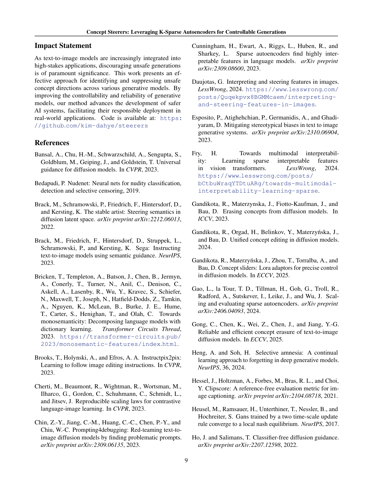

 


 2501.19066 
 Dahye Kim et el. 
 
 🤗 2025-02-05 
 



↗ arXiv


↗ Hugging Face


↗ Papers with Code


### TL;DR



텍스트-이미지 생성 모델은 놀라운 발전을 이루었지만, **부적절한 콘텐츠 생성**이라는 심각한 문제점을 안고 있습니다.  기존 해결 방식들은 모델 재학습이나 추가 모듈 필요 등 **비효율적**이고 **확장성이 부족**하며, 생성 품질 저하를 야기하는 경우도 있습니다. 이러한 문제를 해결하기 위한 새로운 접근법이 필요했습니다.

본 논문에서는 **k-Sparse Autoencoder(k-SAE)**를 이용해 이 문제를 해결합니다. k-SAE는 잠재 공간에서 해석 가능한 개념을 식별하고, 이를 조작하여 생성 결과를 정밀하게 제어하는 방식입니다.  **모델 재학습 없이** 다양한 개념 조작이 가능하며, 기존 방식 대비 **안전하지 않은 콘텐츠 제거 성능이 20% 향상**되었고 **속도가 5배 빨라졌습니다**.  또한, 다양한 스타일 및 속성 제어에 효과적이며, 적대적 프롬프트에도 강건한 성능을 보였습니다.



#### Key Takeaways


 k-Sparse Autoencoder를 이용한 효율적이고 해석 가능한 개념 조작 프레임워크 제안 



 기존 방식 대비 안전하지 않은 개념 제거 성능 20% 향상 및 속도 5배 향상 



 다양한 스타일 및 속성 제어, 적대적 프롬프트에 대한 강건성 확보 


#### Why does it matter?
본 논문은 **텍스트-이미지 생성 모델의 안전성 및 제어 가능성을 향상시키는 데 중요한 기여**를 합니다. 기존의 방법들이 모델 재학습이나 추가 모듈 학습 등의 복잡한 과정을 필요로 하는 반면, 본 논문은 **k-Sparse Autoencoder를 이용하여 효율적이고 해석 가능한 개념 조작 프레임워크**를 제시합니다. 이는 안전하지 않은 콘텐츠 생성 문제 해결과 다양한 스타일/속성 제어를 위한 새로운 가능성을 열어주는 연구로서, **향후 관련 연구 분야에 큰 영향**을 미칠 것으로 예상됩니다.  특히, **높은 효율성과 다양한 모델에의 적용 가능성**은 실제 응용 분야에서의 활용 가능성을 높입니다.

------
#### Visual Insights

> 🔼 그림 1은 k-Sparse Autoencoder (k-SAE)를 사용하여 누드, 사진 스타일, 개체 속성과 같은 해석 가능한 단일 의미 개념을 식별하는 방법을 보여줍니다. 이러한 개념들을 활용하여 생성 과정 중 원하는 개념을 정밀하게 수정할 수 있으며, 전체 이미지 구조, 사실감, 화질, 프롬프트 일치성(안전한 개념의 경우)에는 영향을 미치지 않습니다. 본 프레임워크는 안전하지 않은 개념 제거(위쪽 행), 사진 스타일 변경(중간 행), 개체 속성 변경(아래쪽 행)에 사용될 수 있습니다.
> 

> 
read the caption

> Figure 1: Monosemantic interpretable concepts such as nudity, photographic styles, and object attributes are identified using k-sparse autoencoders (k-SAE). We leverage them to enable precise modification of a desired concept during the generation process, without impacting the overall image structure, photo-realism, visual quality, and prompt alignment (for safe concepts). Our framework can be used to remove unsafe concepts (top row), photographic styles (middle row), and object attributes (last row).
> 


| Method | I2P | COCO ASR ↓ | COCO FID ↓ | COCO CLIP ↑ |
|---|---|---|---|---|
| SDv1.4 | 17.80 | 16.71 | 31.3 |  |
| ESD (Gandikota et al., 2023) | 2.87 | 18.18 | 30.2 |  |
| CA (Kumari et al., 2023) | 1.04 | 24.12 | 30.1 |  |
| MACE (Lu et al., 2024) | 1.51 | 16.80 | 28.7 |  |
| SA (Heng & Soh, 2024) | 2.81 | 25.80 | 29.7 |  |
| UCE (Gandikota et al., 2024) | 0.87 | 17.99 | 30.2 |  |
| RECE (Gong et al., 2025) | 0.72 | 17.74 | 30.2 |  |
| SLD-Max (Schramowski et al., 2023) | 1.74 | 28.75 | 28.4 |  |
| SLD-Strong (Schramowski et al., 2023) | 2.28 | 24.40 | 29.1 |  |
| SLD-Medium (Schramowski et al., 2023) | 3.95 | 21.17 | 29.8 |  |
| SD-NP | 0.74 | 18.33 | 30.1 |  |
| SAFREE (Yoon et al., 2024) | 1.45 | 19.32 | 30.1 |  |
| TraSCE (Jain et al., 2024) | 0.45 | 17.41 | 29.9 |  |
| Ours (w/o negative steering) | 0.57 | 18.37 | 30.8 |  |
| Ours | 0.36 | 18.67 | 30.8 |  |

> 🔼 표 1은 I2P(Inappropriate Image Prompts) 데이터셋과 COCO(Common Objects in Context) 데이터셋을 사용하여 다양한 방법들의 성능을 비교한 표입니다. ASR(Attack Success Rate)은 부적절한 콘텐츠 생성 비율을 나타내며, 값이 낮을수록 성능이 좋습니다. FID(Fréchet Inception Distance)는 생성 이미지의 품질을 나타내며, 값이 낮을수록 좋습니다. CLIP(Contrastive Language-Image Pre-training) 점수는 높을수록 좋습니다. 본 논문의 방법은 ASR이 가장 낮아 부적절한 콘텐츠 제거에 효과적임을 보여줍니다. 동시에 FID 점수가 높아 이미지 품질을 유지하고 프롬프트와의 일관성도 유지함을 의미합니다. 표에는 각 방법의 특징도 함께 표시되어 있습니다. 회색은 모델 재학습 및 가중치 업데이트가 필요한 방법, 분홍색은 재학습 없이 가중치만 업데이트하는 방법, 파란색은 둘 다 필요하지 않은 방법을 나타냅니다.
> 

> 
read the caption

> Table 1: Performance comparison across different methods on I2P and COCO datasets. Lower ASR and FID indicate better performance; higher is better for CLIP. Our method achieves the lowest ASR by effectively removing nudity while preserving visual quality and prompt alignment. Bold: best. Underline: second-best.  Gray : require training and weight updates,  Pink : do not require training but update model weights,  Blue : do not require either.
> 

### In-depth insights

#### Concept Steerers
이 논문에서 제시된 "Concept Steerers"는 텍스트-이미지 생성 모델의 **제어 가능성**을 향상시키는 혁신적인 방법론으로, **k-sparse autoencoders (k-SAEs)**를 활용하여 이미지 생성 과정에 대한 세밀한 조작을 가능하게 합니다.  기존의 미세 조정 기반 방법론과 달리, 본 연구는 기본 모델의 재학습이나 LoRA 어댑터를 필요로 하지 않아 **효율성**과 **확장성**이 뛰어납니다.  **해석 가능성** 또한 높아, 모호하지 않은 개념 조작을 가능하게 하며, 특히 **안전하지 않은 콘텐츠 제거** 및 **사진 스타일/개체 속성 조작**에 효과적입니다.  **적대적 프롬프트 조작에 대한 강건성** 또한 입증되었으며, 기존 기술 대비 **속도 향상**도 이루어졌습니다.  **단일 k-SAE 학습**으로 다양한 개념 조작이 가능하다는 점 또한 주목할 만하며, 이는 본 방법론의 **범용성**과 **실용성**을 높이는 중요한 요소입니다.  **모델 독립성** 덕분에 여러 텍스트-이미지 모델에 적용 가능하여, 향후 연구에 대한 확장성도 높습니다.

#### k-SAE's Role
본 논문에서 제시된 k-Sparse Autoencoder (k-SAE)의 역할은 **텍스트 임베딩의 개념적 공간을 효율적이고 해석 가능하게 조작**하는 데 있습니다.  k-SAE는 텍스트 임베딩에서 **일의미적(monosemantic)** 개념들을 식별하고, 이를 통해 생성 과정을 **미세하게 제어**합니다.  **기존의 미세조정 방식과 달리, k-SAE는 기본 모델의 재훈련이나 LoRA 어댑터 없이도 개념 조작을 가능**하게 하여, 연산 비용을 절감하고 확장성을 높입니다.  **생성 품질 저하 없이 안전하지 않은 개념을 제거하거나, 새로운 개념을 도입하거나, 사진 스타일이나 객체 속성을 변경하는 등 다양한 개념 조작에 효과적**임을 실험적으로 보여줍니다.  k-SAE는 **해석 가능성을 제공**하여, 생성 과정의 투명성을 높이고 사용자가 생성 결과를 예측하고 제어하는 데 도움을 줍니다.  **모델 독립적**이라는 특징은 다양한 사전 훈련된 텍스트-이미지 생성 모델에 적용될 수 있음을 의미합니다.

#### Unsafe Concept Removal
본 논문에서 제시된 **안전하지 않은 개념 제거(Unsafe Concept Removal)** 기법은 텍스트-이미지 생성 모델의 안전성을 향상시키는 데 중점을 둡니다. 기존의 미세 조정 기반 방법과 달리, **k-Sparse Autoencoder(k-SAE)**를 활용하여 **모델 재훈련 없이** 효율적이고 해석 가능한 개념 조작을 가능하게 합니다.  k-SAE는 잠재 공간에서 해석 가능한 개념들을 식별하고, 특정 개념(예: 노출, 폭력)을 제거하거나 새로운 개념을 도입하는 데 활용됩니다. 이는 **기존 방법보다 훨씬 빠르고(약 5배)**, 생성 품질 저하 없이 **높은 정확도(20.01% 향상)**를 달성합니다.  **적대적 프롬프트 조작에 대한 강건성** 또한 중요한 특징입니다.  **모델 재훈련이나 추가 모듈 훈련 없이** 개념 제거가 이루어지므로, **확장성과 효율성**이 뛰어나다는 점이 강조됩니다.  결론적으로, 이 연구는 안전하지 않은 콘텐츠 생성 문제를 해결하는 데 효과적인 새로운 접근 방식을 제시하며, **실제 적용 가능성**이 높은 기술임을 시사합니다.

#### Style & Attribute Control
본 논문에서 제시된 스타일 및 속성 제어 방식은 **k-Sparse Autoencoder(k-SAE)**를 활용하여 텍스트 기반 이미지 생성 모델의 잠재 공간에서 **의미론적으로 해석 가능한 개념(monosemantic concepts)**을 식별하고 조작하는 데 초점을 맞춥니다.  이는 기존의 미세 조정이나 LoRA 어댑터를 사용하는 방법들과 달리 기본 모델을 재훈련할 필요가 없다는 점에서 **효율성**을 높였습니다.  **해석 가능성** 측면에서도, k-SAE를 통해 식별된 개념들은 사용자가 직관적으로 이해하고 조작할 수 있게 됩니다.  실험 결과는 스타일과 속성 모두에 대해 **정밀한 제어**가 가능함을 보여주며, 이는 다양한 미술 스타일의 적용이나 물체의 속성 변경 등의 창의적인 이미지 생성을 가능하게 합니다.  또한, **적대적 예시(adversarial prompt)**에 대한 강건성도 확인되었는데, 이는 안전하지 않은 콘텐츠 생성을 방지하는 데 중요한 의미를 가집니다.  **속도** 또한 기존 방법보다 5배 이상 빠르게 처리되어 실시간 응용 분야에도 적합할 가능성을 시사합니다.  **결론적으로**, 본 논문의 스타일 및 속성 제어 방식은 효율성, 해석 가능성, 정밀도, 그리고 속도 측면에서 기존 방법들을 능가하는 혁신적인 접근 방식임을 알 수 있습니다.

#### Future Work
본 논문의 "향후 연구 방향"에 대한 심층적인 고찰은 **k-SAE의 보편성 확장**과 **다양한 생성 모델 및 모달리티 적용**에 대한 기대를 보여줍니다.  **k-SAE를 이미지 생성 영역 밖의 다른 분야** (예: 텍스트 생성, 오디오 생성)에 적용하여 개념 조작의 효율성과 해석성을 검증하는 것이 중요하며, 이는 모델의 일반화 능력을 향상시키고 다양한 응용 분야로 확장하는데 기여할 것입니다.  **생성 과정에 대한 더욱 세밀한 제어**를 위해서는, 개념 조작의 정확성을 높이고, 부정확하거나 원치 않는 결과를 최소화하는 방안에 대한 연구가 필요합니다. 또한, **대규모 데이터셋과 다양한 개념에 대한 k-SAE 학습**을 통해, 보다 풍부하고 정교한 개념 조작 능력을 확보하고자 하는 노력이 필요하며, 이를 통해 더욱 강력하고 유연한 생성 모델을 개발할 수 있을 것입니다.  마지막으로, **윤리적 문제 및 안전성 확보**는 향후 연구에서 매우 중요한 부분입니다.  안전하지 않은 개념의 생성을 방지하고, 모델의 오용을 막기 위한 메커니즘 개발에 대한 심도있는 연구가 필요하며, 이러한 노력을 통해 사회적으로 책임감 있는 AI 시스템 개발에 기여할 수 있을 것입니다.

### More visual insights

More on figures

> 🔼 그림 2는 텍스트-이미지 확산 모델의 텍스트 인코더로부터 추출된 특징 표현을 기반으로 학습된 k-Sparse Autoencoder (k-SAE)를 보여줍니다.  k-SAE는  Concept Steerer 역할을 하며,  λ(람다) 값을 조정함으로써 확산 모델의 생성 과정에서 특정 개념을 정교하고 선택적으로 조작할 수 있습니다.  즉, 원하는 개념을 추가하거나 제거하는 등의 미세한 조정이 가능합니다.  이를 통해 이미지 생성 과정에 대한 세밀한 제어가 가능해집니다.
> 

> 
read the caption

> Figure 2: K-sparse autoencoder (k-SAE) is trained on feature representations from the text encoder of the diffusion model. Once trained, it serves as a Concept Steerer, enabling precise, surgical concept manipulation by adjusting λ𝜆\lambdaitalic_λ.
> 

> 🔼 그림 3은 I2P 데이터셋에서 TraSCE와 SAFREE를 포함한 여러 접근 방식을 정성적으로 비교한 것입니다. 제안된 방법은 생성된 이미지를 크게 변경하지 않고 노출을 제거하여 입력 프롬프트와 더 잘 정렬된 출력을 생성합니다.  기존 방법들과 달리, 제안된 방법은 이미지의 전반적인 구조나 스타일을 유지하면서 노출과 같은 특정 개념을 정확하게 제어할 수 있습니다. 이는 안전한 이미지 생성을 위한 효과적이고 해석 가능한 방법을 제시합니다.
> 

> 
read the caption

> Figure 3: Qualitative comparisons of different approaches, including TraSCE and SAFREE, on the I2P dataset. Our method removes nudity without significantly altering the generated images, resulting in outputs that are better aligned with the input prompt.
> 

> 🔼 그림 4는 I2P 데이터셋에서 제안된 방법의 세부적인 결과를 보여줍니다.  기존 방법들과 달리, 이 방법은 특정 개념(예: 노출)만 제거하고 이미지의 전체적인 구조와 스타일은 유지하면서 미묘한 제어가 가능함을 보여줍니다.  특정 개념을 제거하는 과정에서 이미지 품질 저하나 원치 않는 부작용 없이 원하는 개념만 정확하게 제거하는 것을 확인할 수 있습니다.  이는 안전하고 윤리적인 이미지 생성에 중요한 의미를 가집니다.
> 

> 
read the caption

> Figure 4: Qualitative examples from the I2P dataset. Our method allows fine-grained control over the removal of specific concepts, removing only the intended concept while preserving the overall structure and style of the generated images.
> 

> 🔼 그림 5는 FLUX를 사용하여 I2P 데이터셋에서 생성한 이미지의 예시를 보여줍니다. 이 그림은 제안된 방법이 U-Net 기반의 Stable Diffusion 1.4와 SDXL-Turbo, 그리고 DiT 기반의 FLUX를 포함한 다양한 모델에 적용될 수 있음을 보여주는 모델 독립적인 성격을 강조합니다.  다양한 λ 값을 사용하여 이미지에 ‘노출’ 개념을 제거하는 과정을 보여줍니다. λ 값이 -0.3에서 0으로 변화함에 따라, 이미지에서 ‘노출’ 개념이 점진적으로 제거되는 것을 확인할 수 있습니다. 이는 제안된 방법이 개념 조작을 미세하게 제어할 수 있음을 시사합니다.
> 

> 
read the caption

> Figure 5: Qualitative example from the I2P dataset with FLUX. Our method is model-agnostic and can be applied to both U-Net-based SD 1.4 and SDXL-Turbo, as well as DiT-based FLUX.
> 

> 🔼 그림 6은 Ring-A-Bell 데이터셋에서 폭력 개념을 제거하는 Concept Steerer의 성능을 보여줍니다.  왼쪽 열에는 원본 프롬프트로 생성된 이미지가, 오른쪽 열에는 Concept Steerer를 사용하여 폭력 개념을 제거한 이미지가 나와 있습니다.  오른쪽 이미지에서 혈흔 등 폭력적인 요소가 제거된 것을 확인할 수 있습니다. 이미지가 불쾌감을 유발할 수 있으므로 흐릿하게 처리되었습니다.  Concept Steerer는 폭력적인 요소를 제거하면서도 이미지의 전반적인 구조와 스타일은 유지합니다.
> 

> 
read the caption

> Figure 6: Qualitative examples from the Ring-A-Bell dataset. Our method successfully removes the abstract concept of violence, as shown by the absence of blood in the right images. The images are intentionally blurred for display purposes as they are disturbing.
> 

More on tables


| Method | Ring-A-Bell-Union (Violence)↓ | 
|---|---| 
| **SDv1.4** | 99.6 | 
| **ESD** <cite>(Gandikota et al., 2023)</cite> | 86.0 | 
| **FNM** <cite>(Zhang et al., 2024)</cite> | 98.8 | 
| **CA** <cite>(Kumari et al., 2023)</cite> | 100.0 | 
| **UCE** <cite>(Gandikota et al., 2024)</cite> | 89.8 | 
| **RECE** <cite>(Gong et al., 2025)</cite> | 89.2 | 
| **SLD-Max** <cite>(Schramowski et al., 2023)</cite> | 40.4 | 
| **SLD-Strong** <cite>(Schramowski et al., 2023)</cite> | 80.4 | 
| **SLD-Medium** <cite>(Schramowski et al., 2023)</cite> | 97.2 | 
| **SD-NP** | 94.8 | 
| **TraSCE** <cite>(Jain et al., 2024)</cite> | 72.4 | 
| **Ours** | 43.7 | 
> 🔼 표 2는 Ring-A-Bell-Union (폭력) 데이터셋에서 다양한 방법들의 성능을 비교한 표입니다. 값이 낮을수록 성능이 더 좋음을 나타냅니다. 본 연구의 방법은 1번 표의 FID 점수에서 알 수 있듯이 생성 품질을 저하시키지 않으면서 경쟁력 있는 성능을 보여줍니다.  굵은 글씨는 최고 성능, 밑줄은 두 번째로 좋은 성능을 나타내며, 회색은 학습 및 가중치 업데이트 필요, 분홍색은 학습 없이 가중치 업데이트 필요, 파란색은 둘 다 필요하지 않음을 의미합니다.
> 

> 
read the caption

> Table 2: Performance comparison across different methods on the Ring-A-Bell-Union (Violence) dataset. Lower values indicate better performance. Our method demonstrates competitive performance without compromising generation quality, as indicated by the FID scores in Table 1. Bold: best. Underline: second-best.  Gray : require training and weight updates,  Pink : do not require training but update model weights,  Blue : do not require either.
> 


| Method | Ring-A-Bell (K77) | Ring-A-Bell (K38) | Ring-A-Bell (K16) | Ring-A-Bell (Avg) | MMA-Diffusion | P4D | UnLearnDiffAtk | Avg | 
|---|---|---|---|---|---|---|---|---|
| SDv1.4 | 85.26 | 87.37 | 93.68 | 88.10 | 95.70 | 98.70 | 69.70 | 87.05 |
| SA (Heng & Soh, 2024) | 63.15 | 56.84 | 56.84 | 58.94 | 47.68 | 12.68 | 2.81 | 30.53 |
| CA (Kumari et al., 2023) | 86.32 | 91.69 | 94.26 | 90.76 | 10.60 | 5.63 | 1.04 | 27.01 |
| ESD (Gandikota et al., 2023) | 20.00 | 29.47 | 35.79 | 28.42 | 9.27 | 15.49 | 2.87 | 14.51 |
| MACE (Lu et al., 2024) | 2.10 | 0.00 | 0.00 | 0.70 | 2.72 | 2.82 | 1.51 | 1.94 |
| UCE (Gandikota et al., 2024) | 10.52 | 9.47 | 12.61 | 10.87 | 29.93 | 9.86 | 0.87 | 12.38 |
| RECE (Gong et al., 2025) | 5.26 | 4.21 | 5.26 | 4.91 | 21.77 | 5.63 | 0.72 | 8.76 |
| SLD-Max (Schramowski et al., 2023) | 23.16 | 32.63 | 42.11 | 32.63 | 35.76 | 9.14 | 2.44 | 20.24 |
| SLD-Strong (Schramowski et al., 2023) | 56.84 | 64.21 | 61.05 | 60.70 | 68.21 | 33.10 | 3.10 | 41.28 |
| SLD-Medium (Schramowski et al., 2023) | 92.63 | 88.42 | 91.05 | 90.70 | 68.21 | 24.00 | 1.98 | 46.72 |
| SD-NP | 17.89 | 40.42 | 34.74 | 31.68 | 24.00 | 10.00 | 1.46 | 16.29 |
| SAFREE (Yoon et al., 2024) | 35.78 | 47.36 | 55.78 | 46.31 | 40.82 | 10.56 | 1.45 | 24.29 |
| TraSCE (Jain et al., 2024) | 1.05 | 2.10 | 2.10 | 1.75 | 16.60 | 3.97 | 0.70 | 5.51 |
| Ours | 3.16 | 8.42 | 9.47 | 7.02 | 6.00 | 1.99 | 2.11 | 4.28 |
> 🔼 표 3은 다양한 적대적 공격 데이터셋에서 여러 방법들의 공격 성공률(ASR)을 보여줍니다. 낮은 ASR은 더 나은 성능을 나타냅니다. 제안된 방법은 모델에 암묵적으로 포함된 노출 이미지를 효과적으로 제거함으로써 모든 데이터셋에서 평균적으로 가장 우수한 견고성을 달성합니다. **굵은 글씨**: 최고, 밑줄: 두 번째로 높은 값, 회색: 훈련 및 가중치 업데이트 필요, 분홍색: 훈련 불필요 가중치 업데이트 필요, 파란색: 둘 다 필요하지 않음.
> 

> 
read the caption

> Table 3: Attack Success Rate (ASR) of different methods on various adversarial attack datasets. Lower ASR indicates better performance. Our method achieves the best overall robustness on average across all datasets by effectively removing nudity implicitly embedded in the model. Bold: best. Underline: second-best.  Gray : require training and weight updates,  Pink : do not require training but update model weights,  Blue : do not require either.
> 


| Method | Inference Time (s/sample) ↓ | 
|---|---| 
| SD 1.4 | 3.02 | 
| SAFREE (Yoon et al., 2024) | 4.24 | 
| TraSCE (Jain et al., 2024) | 15.62 | 
| Ours | 3.16 | 
> 🔼 표 4는 모델 효율성 비교 결과를 보여줍니다. 본 실험은 단일 L40S GPU를 사용하여 P4D 데이터셋(총 150개 샘플)에서 노출된 이미지를 제거하는 작업에 대해 진행되었습니다. 표에는 각 모델의 추론 시간(초/샘플)이 나와있어 모델의 처리 속도를 비교 분석하는 데 유용합니다.  다양한 모델들의 추론 속도를 비교하여, 제안된 방법의 효율성을 강조하기 위한 표입니다.
> 

> 
read the caption

> Table 4: Model Efficiency Comparison. Experiments were conducted on a single L40S GPU on P4D dataset (150 samples in total) for the task of removing nudity.
> 


| Layers | ASR on I2P ↓ |
|---|---| 
| 12 | 1.02 |
| 10 | 0.36 |
| 8 | 0.45 |
| 6 | 1.72 |
| 4 | 3.85 |
> 🔼 표 5는 I2P 데이터셋에서 k-SAE를 훈련시킬 때, 서로 다른 text encoder 레이어의 표현을 사용했을 때의 공격 성공률(ASR)을 보여줍니다.  결과적으로 10번째 레이어를 사용했을 때 ASR이 가장 낮았는데, 이는 10번째 레이어가 노출 개념에 대한 정보를 가장 많이 담고 있음을 시사합니다.  k-SAE의 확장 계수는 4, 은닉 뉴런 수는 3072였습니다.
> 

> 
read the caption

> Table 5: Attack Success Rate (ASR) when representations from different encoder layers are used to train k-SAE on the I2P dataset. The 10th layer yields the lowest ASR, indicating that this layer captures most information about nudity concept. k-SAE expansion factor = 4444, hidden neurons (n) = 3072307230723072.
> 


| Expansion factor | Capacity | ASR on I2P ↓ | 
|---|---|---| 
| 4 | 3072 | 0.36 | 
| 8 | 6144 | 0.51 | 
| 16 | 12288 | 0.47 | 
| 32 | 24576 | 0.49 | 
| 64 | 49152 | 0.53 | 
> 🔼 표 6은 I2P 프롬프트의 10번째 레이어에서 추출한 텍스트 임베딩으로 학습된 k-SAE의 다른 확장 계수에 대한 공격 성공률(ASR)을 보여줍니다. 확장 계수가 4일 때 ASR이 가장 낮아 조향에 효과적임을 나타냅니다. 즉, k-SAE 모델의 확장 계수를 4로 설정했을 때, 부적절한 이미지 생성을 방지하는 데 가장 효과적이었다는 것을 의미합니다. 이 표는 k-SAE 모델의 성능에 대한 하이퍼파라미터 최적화 결과를 보여주는 실험 결과를 제시합니다.
> 

> 
read the caption

> Table 6: Attack Success Rate (ASR) for different expansion factors of k-SAE trained on text embeddings extracted from the 10th layer of the I2P prompts. An expansion factor of 4 yields the lowest ASR, indicating its efficacy for steering.
> 


| λ | ASR on I2P ↓ | 
|---|---| 
| -0.1 | 2.59 | 
| -0.2 | 1.23 | 
| -0.3 | 0.87 | 
| -0.4 | 0.60 | 
| -0.5 | 0.36 | 
> 🔼 표 7은 I2P 데이터셋의 10번째 레이어에서 추출한 텍스트 임베딩으로 학습된 확장 계수 4의 k-SAE에 대해 λ 값이 다를 때 공격 성공률(ASR)을 보여줍니다. λ = -0.5일 때 ASR이 가장 낮은 것을 알 수 있습니다. 이는 λ 값을 조절함으로써 원치 않는 개념(예: 노출)을 제거하는 데 효과적임을 시사합니다.  표는 다양한 λ 값에 따른 ASR 변화를 보여주어, 최적의 λ 값을 찾고 원하는 수준의 노출 제거를 달성하는 데 도움이 됩니다.
> 

> 
read the caption

> Table 7: Attack Success Rate (ASR) for different values of λ𝜆\lambdaitalic_λ of k-SAE with an expansion factor of 4444 trained on text embeddings of 10th layer on the I2P dataset. λ=−0.5𝜆0.5\lambda=-0.5italic_λ = - 0.5 yields the lowest ASR.
> 

### Full paper



