 


 2501.19085 
 Alessandro Giagnorio et el. 
 
 🤗 2025-02-07 
 



↗ arXiv


↗ Hugging Face


↗ Papers with Code


### TL;DR



본 연구는 **저자원 프로그래밍 언어에서의 코드 생성 성능 향상**이라는 어려운 문제를 다룹니다.  기존 연구들에서 고자원 언어에 비해 저자원 언어의 코드 생성 성능이 떨어지는 현상이 확인되었고, 이를 해결하기 위한 다양한 기법들이 제시되었지만, 체계적인 비교 연구는 부족했습니다.  특히, 최근 각광받는 대규모 언어 모델(LLM)의 크기가 성능에 미치는 영향에 대한 연구는 미흡했습니다.

본 연구는 **여러 크기의 LLM을 대상으로 미세 조정, 문맥 학습 등 다양한 기법들을 비교 분석**했습니다.  그 결과, 소규모 LLM에서는 미세 조정이 가장 효과적이었고, 모델 크기가 커짐에 따라 문맥 학습의 효과가 증대되는 것을 확인했습니다. 특히, 문맥 학습은 모든 모델에서 성능 향상을 보여 안전하고 효율적인 방법임을 제시했습니다.  **대규모 LLM에서는 과도한 미세 조정이 오히려 성능 저하를 야기**할 수 있다는 점도 밝혔습니다.



#### Key Takeaways


 저자원 언어의 코드 생성에서 LLM의 성능 격차가 존재한다. 



 소규모 LLM에는 미세 조정, 대규모 LLM에는 문맥 학습이 효과적이다. 



 문맥 학습 기법은 저자원 언어의 코드 생성 성능 향상에 안전하고 경제적인 방법이다. 


#### Why does it matter?
본 논문은 **저자원 언어에 대한 코드 생성 성능 향상**이라는 중요한 문제를 다루고 있습니다. **대규모 언어 모델(LLM)의 성능 격차를 해소하기 위한 다양한 기법**들을 실험적으로 비교 분석하여, 모델 크기와 기법 효과의 상관관계를 밝히고 있습니다. 이는 **저자원 언어 개발 및 응용**에 중요한 시사점을 제공하며, **향후 연구 방향**에 대한 가이드라인을 제시합니다. 특히, **최신 LLM의 코드 생성 성능 평가**에 대한 새로운 관점을 제공하며, **문맥 학습 기법**의 효용성을 강조합니다.

------
#### Visual Insights


| Model | Size | Julia | Lua | R | Racket | Java | Python |
|---|---|---|---|---|---|---|---| 
| DeepSeek Coder - Instruct | 1B | 19.2 | 31.3 | 14.3 | 7.0 | 41.9 | 61.3 |
| DeepSeek Coder - Instruct | 7B | 41.2 | 51.6 | 30.4 | 20.9 | 58.1 | 74.9 |
| DeepSeek Coder - Instruct | 33B | 43.3 | 53.8 | 30.9 | 33.1 | 57.8 | 67.5 |
| Code Llama - Instruct | 7B | 28.4 | 32.3 | 14.2 | 11.5 | 30.6 | 33.7 |
| Code Llama - Instruct | 13B | 33.4 | 32.6 | 15.6 | 15.2 | 38.7 | 44.5 |
| GitHub Copilot | Unknown | 53.5 | 61.4 | 32.9 | 24.7 | 57.2 | 61.7 |
| Average |  | 36.5 | 43.8 | 23.1 | 18.7 | 47.4 | 57.3 |

> 🔼 표 I은 다양한 프로그래밍 언어에 대한 여러 모델의 Pass@1 성공률을 보여줍니다. 검은색 셀은 모델별 최고 성능을 나타내고, 흰색 셀은 최저 성능을 나타냅니다. 그 중간 성능은 회색 음영으로 표시됩니다. 이 표는 다양한 프로그래밍 언어(Julia, Lua, R, Racket, Java, Python)에 대해 6가지 서로 다른 크기의 대규모 언어 모델(LLM)의 코드 생성 성능을 비교 분석하여 저자원 언어와 고자원 언어 간의 성능 차이를 보여줍니다. 각 모델의 성능은 Pass@1 지표를 사용하여 측정되며, 이는 모델이 생성한 코드가 테스트를 통과할 확률을 나타냅니다.
> 

> 
read the caption

> TABLE I: Pass@1 rates of the models on the different languages. Black cells indicate best performance per model, white cells indicate worst performance. Performance in between is gray-scaled.
> 

### In-depth insights

#### LLM Code Gen Gaps
본 논문은 저자원 언어(low-resource languages)에서 대규모 언어 모델(LLM) 기반 코드 생성의 성능 격차를 심층적으로 분석합니다. **고자원 언어(high-resource languages)와의 성능 차이가 상당하며**, 특히 R과 Racket과 같은 특정 언어에서 그 격차가 두드러집니다. 이는 LLM이 학습 데이터의 양에 크게 의존하기 때문이며, **저자원 언어는 학습 데이터가 부족하여 일반화 능력이 떨어지고, 고유한 구문이나 예외적인 경우를 처리하는 데 어려움을 겪습니다.** 따라서, 저자원 언어에 대한 LLM의 코드 생성 능력을 향상시키기 위한 다양한 기법들을 실험적으로 비교 분석하는 것이 본 연구의 핵심입니다. **세부적인 분석 결과는 모델의 크기, 사용된 기법 등에 따라 성능 향상에 차이가 있음을 보여줍니다.** 특히, 대용량 모델의 경우 미세 조정(fine-tuning)보다는 문맥 학습(in-context learning)이 더 효과적임을 확인했습니다. 이는 제한된 데이터로 인해 대용량 모델의 가중치를 효과적으로 업데이트하기 어렵기 때문일 수 있습니다.  **문맥 학습 중에서도, 특히 고자원 언어에서 저자원 언어로의 코드 변환 예시를 제공하는 기법이 가장 안전하고 효과적인 방법**임이 제시됩니다.

#### Boosting LLMs
본 논문은 저자원 언어에 대한 LLM의 코드 생성 성능 향상 방안을 탐구합니다. **파인튜닝**은 소규모 LLM에 효과적이나, 대규모 모델에서는 데이터 부족으로 성능 저하를 야기할 수 있습니다. **컨텍스트 학습**은 모델 크기에 상관없이 효과적이며, 특히 대규모 모델에서 안전하고 저렴한 방법입니다.  **번역 예시를 활용한 컨텍스트 학습**은 다양한 규모의 LLM에서 안정적으로 성능을 향상시키는 최적의 방법으로 제시됩니다.  **파인튜닝 기반 접근법**은 소규모 모델에 유리하지만, 대규모 모델에서는 추가 데이터가 필요하며, **전이 학습**을 통한 사전 훈련은 추가적인 성능 향상을 기대할 수 있습니다.  하지만, **최적의 방법은 모델 크기와 언어에 따라 다르며, 단일 최적 해결책은 없다**는 점을 강조합니다.

#### In-context Learning
본 논문에서 'In-context Learning'은 저자원 언어의 코드 생성 성능을 향상시키기 위한 중요한 전략으로 제시됩니다. **소규모 모델에서는 미미한 효과**를 보이지만, **대규모 모델에서는 상당한 성능 향상**을 가져옵니다. 특히, **번역 예시를 제공하는 프롬프트 방식**이 안정적이고 효과적임을 보여줍니다.  이는 대규모 모델이 풍부한 자원 언어(예: Python)의 지식을 저자원 언어로 전이하는 데 효과적임을 시사합니다. 반면, **규칙 기반 프롬프트나 몇-샷 학습은 일관된 성능 향상을 보장하지 못**합니다.  **모델의 크기가 중요한 변수**임을 강조하며, 소규모 모델은 파라미터 업데이트에 충분한 데이터가 부족하여 미세 조정(fine-tuning)이 더 효과적일 수 있지만, 대규모 모델은 과적합을 방지하기 위해 'In-context Learning'이 더 적합함을 보여줍니다.  결론적으로, **'In-context Learning', 특히 번역 예시 기반 접근법은 저자원 언어 코드 생성 문제에 대한 실용적이고 효과적인 해결책**으로 평가됩니다.

#### Fine-tuning Effects
본 논문은 저자원 언어에 대한 코드 생성 모델의 성능 향상을 위한 여러 기법들을 실험적으로 비교 분석한 연구입니다.  **파인튜닝(Fine-tuning)**은 저자원 언어의 제한된 데이터로 인해 모델의 성능 향상에 제약이 있음을 보여줍니다.  특히, 대규모 모델일수록 파인튜닝 효과가 떨어지거나 오히려 성능이 저하될 수 있습니다.  **데이터 부족으로 모델의 가중치를 효과적으로 업데이트하지 못하기 때문**입니다.  반면, 소규모 모델의 경우 파인튜닝을 통해 상당한 성능 향상을 기대할 수 있습니다.  **이는 소규모 모델의 제한된 파라미터 수에 비해 충분한 데이터가 제공될 경우 효과적**으로 학습이 이루어짐을 의미합니다. 따라서, 모델의 크기와 데이터셋 크기에 따라 파인튜닝의 효과가 다르게 나타날 수 있으며, 이는 모델 선택 및 학습 전략 수립에 중요한 고려 사항이 됩니다.

#### Future Research
본 논문은 저자원 언어에 대한 LLM 기반 코드 생성의 성능 격차를 해소하기 위한 다양한 기법들을 실험적으로 연구하였습니다. **미래 연구는 보다 광범위한 저자원 언어들과 다양한 크기의 LLM을 포함하는 확장된 실험**이 필요하며, **더욱 정교한 평가 지표 및 벤치마크 개발**도 중요합니다.  또한, **프롬프트 엔지니어링 기법 고도화**, **다양한 전이 학습 전략**, 그리고 **상호작용적 코드 생성 시스템 연구**를 통해 LLM의 저자원 언어 코드 생성 능력을 더욱 향상시킬 수 있을 것입니다.  **특히, 기능적 프로그래밍 언어나 도메인 특화 언어와 같이 독특한 구문이나 구조를 가진 언어에 대한 연구**는 향후 LLM의 적용 범위를 넓히는 데 기여할 것입니다.  **대규모 데이터셋 구축을 위한 자동화된 코드 변환 기법의 개선** 또한 중요한 연구 방향입니다.

### More visual insights

More on tables


| Languages | DS-1B | DS-7B | DS-33B | CL-7B | CL-13B | Copilot |
|---|---|---|---|---|---|---|
| Java _vs._ Julia | 5.93 | 2.69 | 2.61 | 1.27 | 1.65 | 1.34 |
| Java _vs._ Lua | 2.04 | 1.50 | 1.28 | 0.85 | 1.75 | 0.72 |
| Java _vs._ R | 8.32 | 4.31 | 4.05 | 4.16 | 4.97 | 4.82 |
| Java _vs._ Racket | 22.88 | 12.08 | 4.33 | 11.21 | 9.17 | 8.91 |
| Python _vs._ Julia | 19.34 | 8.66 | 5.40 | 1.79 | 2.59 | 1.70 |
| Python _vs._ Lua | 9.31 | 4.27 | 2.47 | 1.13 | 2.69 | 1.02 |
| Python _vs._ R | 25.61 | 11.56 | 7.21 | 5.72 | 10.93 | 6.00 |
| Python _vs._ Racket | 251.59 | 42.97 | 8.06 | 11.88 | 16.56 | 9.97 |
| Julia _vs._ R | 1.74 | 2.09 | 2.10 | 3.98 | 4.37 | 3.79 |
| Julia _vs._ Racket | 4.98 | 4.39 | 1.80 | 9.92 | 5.93 | 7.88 |
| Lua _vs._ R | 4.80 | 3.90 | 3.63 | 4.96 | 4.02 | 6.57 |
| Lua _vs._ Racket | 14.16 | 8.13 | 2.91 | 9.69 | 6.24 | 12.43 |
> 🔼 표 II는 다양한 모델에서 각 언어 쌍 간의 승산비를 계산한 결과를 보여줍니다. (DS = DeepSeek Coder, CL = Code Llama).  볼드체 값은 통계적으로 유의미한 결과(p-값 < 0.05)를 나타냅니다.  이 표는 각 모델이 특정 언어 쌍에서 얼마나 다른 성능을 보이는지, 즉 어떤 언어 쌍에서 모델의 성능 차이가 더 큰지(승산비가 높을수록 차이가 큼)를 보여줍니다.  예를 들어 Java와 Julia를 비교했을 때 승산비가 높다면 모델이 Java에서 Julia보다 훨씬 더 정확한 코드를 생성함을 의미합니다.
> 

> 
read the caption

> TABLE II: Odds ratios computed between pairs of languages for each model evaluated (DS = DeepSeek Coder, CL = Code Llama). Values in bold are statistically significant (p𝑝pitalic_p-value <<< 0.05).
> 


| Model | Size | Technique | R | Racket |
|---|---|---|---|---|
| DeepSeek Coder - Instruct | 1B | Baseline | 13.9 | 7.0 |
|  |  | In-context Learning – Translation Examples | 13.8 | 7.7 |
|  |  | In-context Learning – Translation Rules | 13.4 | 6.5 |
|  |  | In-context Learning – Few-shot Examples | 14.1 | 8.4 |
|  |  | Fine-tuning – Code Generation | 16.7 | 18.1 |
|  |  | Pre-training & Fine-tuning – Code Translation and Generation | 16.0 | 18.4 |
| DeepSeek Coder - Instruct | 7B | Baseline | 29.6 | 20.4 |
|  |  | In-context Learning – Translation Examples | 32.1 | 22.5 |
|  |  | In-context Learning – Translation Rules | 30.0 | 20.0 |
|  |  | In-context Learning – Few-shot Examples | 30.9 | 24.6 |
|  |  | Fine-tuning – Code Generation | 26.4 | 31.7 |
|  |  | Pre-training & Fine-tuning – Code Translation and Generation | 25.0 | 30.4 |
| DeepSeek Coder - Instruct | 33B | Baseline | 30.2 | 32.5 |
|  |  | In-context Learning – Translation Examples | 36.5 | 36.3 |
|  |  | In-context Learning – Translation Rules | 33.6 | 35.8 |
|  |  | In-context Learning – Few-shot Examples | 38.3 | 36.2 |
|  |  | Fine-tuning – Code Generation | 25.3 | 28.0 |
|  |  | Pre-training & Fine-tuning – Code Translation and Generation | 25.8 | 26.8 |
| Code Llama - Instruct | 7B | Baseline | 13.9 | 11.2 |
|  |  | In-context Learning – Translation Examples | 15.8 | 12.1 |
|  |  | In-context Learning – Translation Rules | 12.3 | 11.1 |
|  |  | In-context Learning – Few-shot Examples | 14.6 | 12.7 |
|  |  | Fine-tuning – Code Generation | 14.6 | 22.0 |
|  |  | Pre-training & Fine-tuning – Code Translation and Generation | 15.7 | 19.7 |
| Code Llama - Instruct | 13B | Baseline | 15.2 | 14.8 |
|  |  | In-context Learning – Translation Examples | 18.9 | 16.1 |
|  |  | In-context Learning – Translation Rules | 17.2 | 14.2 |
|  |  | In-context Learning – Few-shot Examples | 19.7 | 13.9 |
|  |  | Fine-tuning – Code Generation | 16.6 | 22.3 |
|  |  | Pre-training & Fine-tuning – Code Translation and Generation | 15.6 | 20.7 |
| GitHub Copilot | Unknown | Baseline | 32.7 | 24.3 |
|  |  | In-context Learning – Translation Examples | 37.3 | 27.1 |
|  |  | In-context Learning – Translation Rules | 34.4 | 25.1 |
|  |  | In-context Learning – Few-shot Examples | 41.1 | 25.7 |
> 🔼 표 III는 다양한 모델 크기와 기법을 사용하여 낮은 자원 언어에 대한 코드 생성 성능을 평가한 결과를 보여줍니다.  표는 모델(DeepSeek Coder, Code Llama, GitHub Copilot), 모델 크기(1B, 7B, 13B, 33B 파라미터), 그리고 적용된 기법(컨텍스트 학습 기반 기법, 파인튜닝 기반 기법)별로 나누어져 있으며, 각 셀에는 R과 Racket 언어에 대한 Pass@1 점수가 표시됩니다.  연회색 행은 컨텍스트 학습 기반 기법, 진한 회색 행은 파인튜닝 기반 기법을 나타내며, 각 모델, 크기, 언어별로 가장 성능이 좋은 기법은 굵게 표시되어 있습니다.  이는 낮은 자원 언어에서 코드 생성 성능을 향상시키기 위한 다양한 기법들의 효과를 비교 분석하는 데 유용한 정보를 제공합니다.
> 

> 
read the caption

> TABLE III: Pass@1 rates by model, size, and technique. Light gray rows are in-context learning-based techniques, dark gray rows are fine-tuning-based techniques. Values in bold depict the best-performing technique per model, size and language.
> 

### Full paper


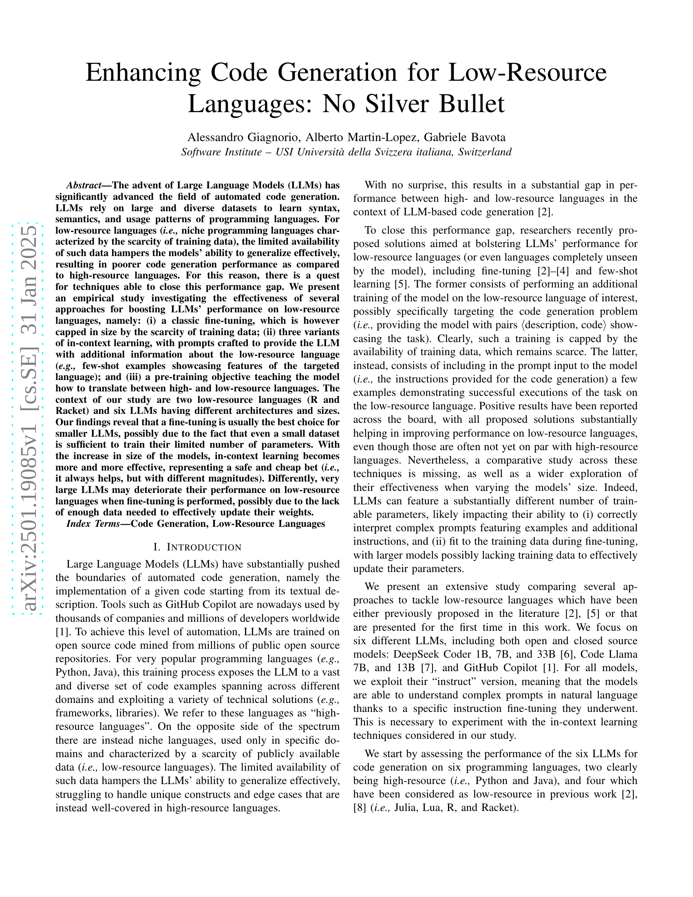
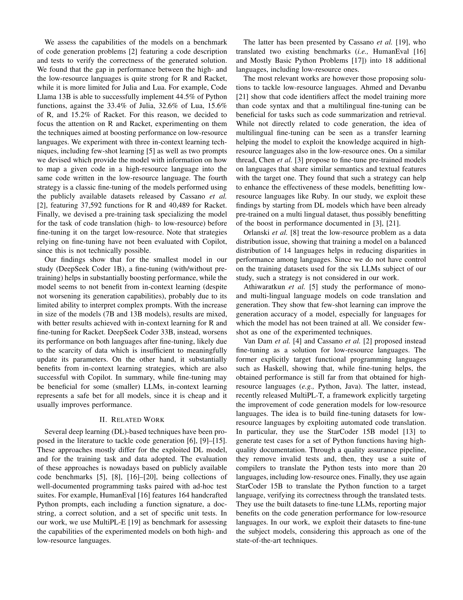
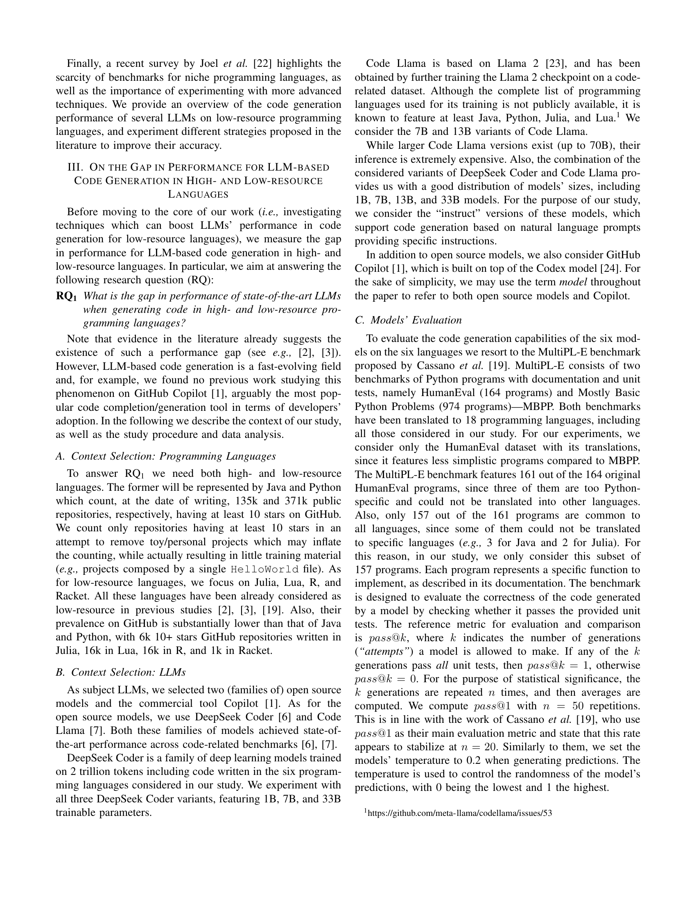
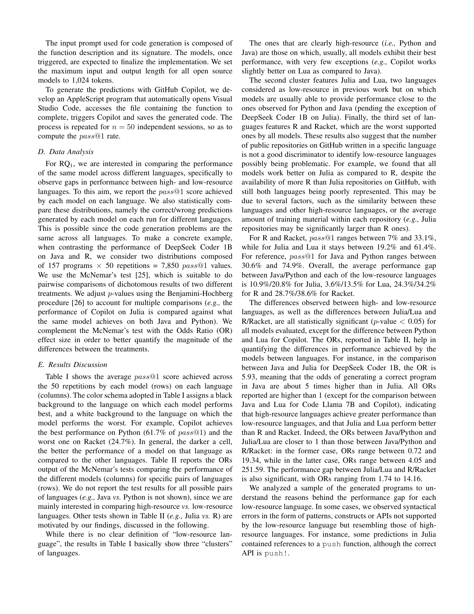
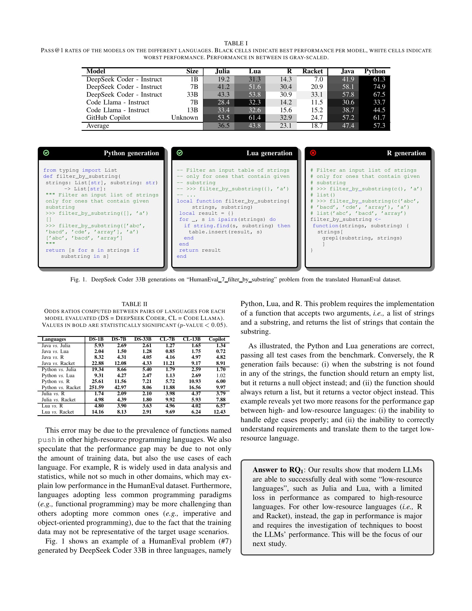
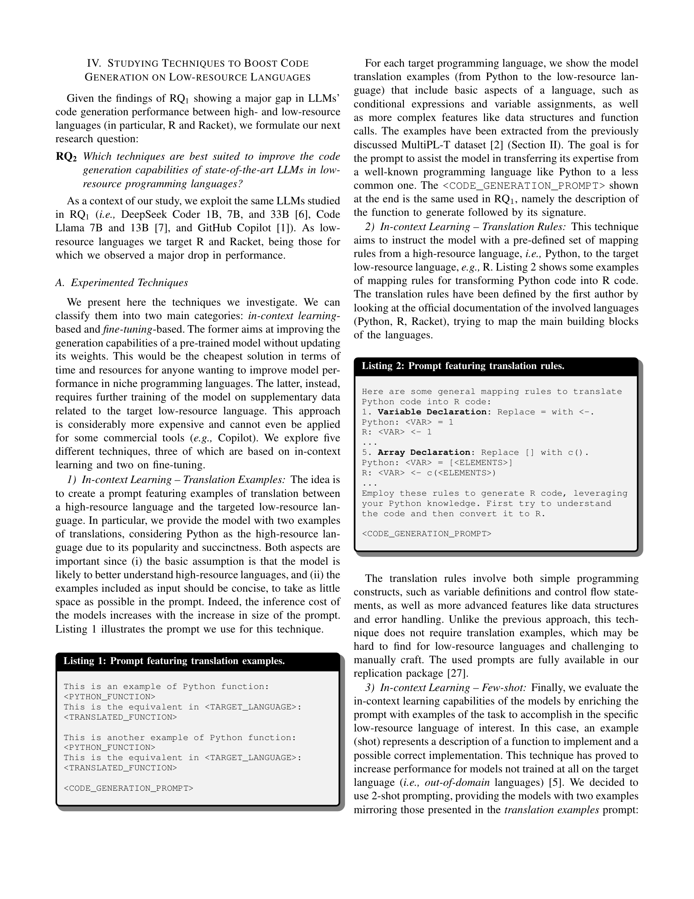
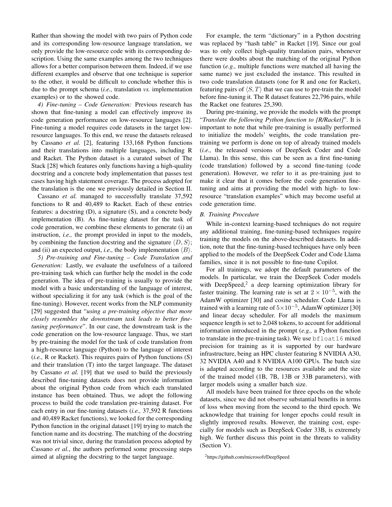
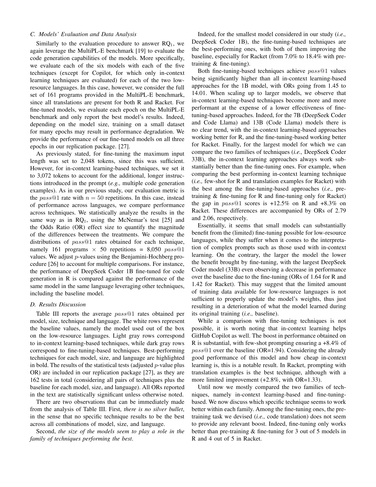
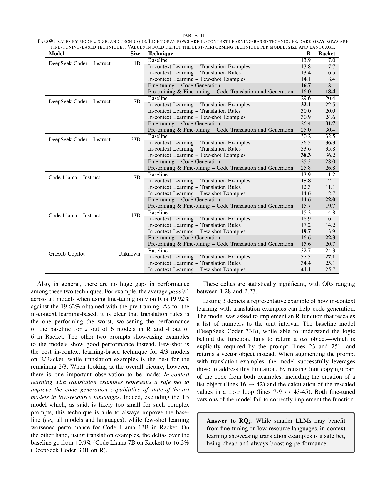
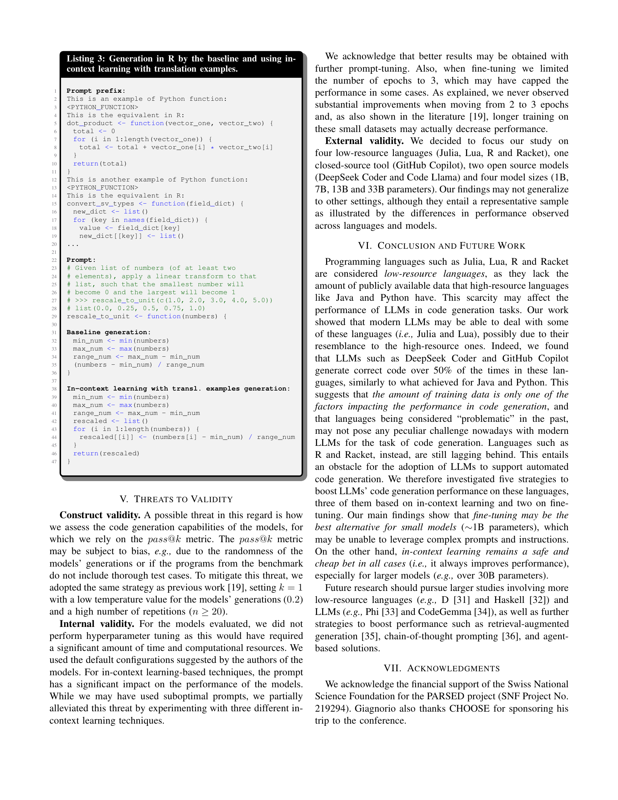
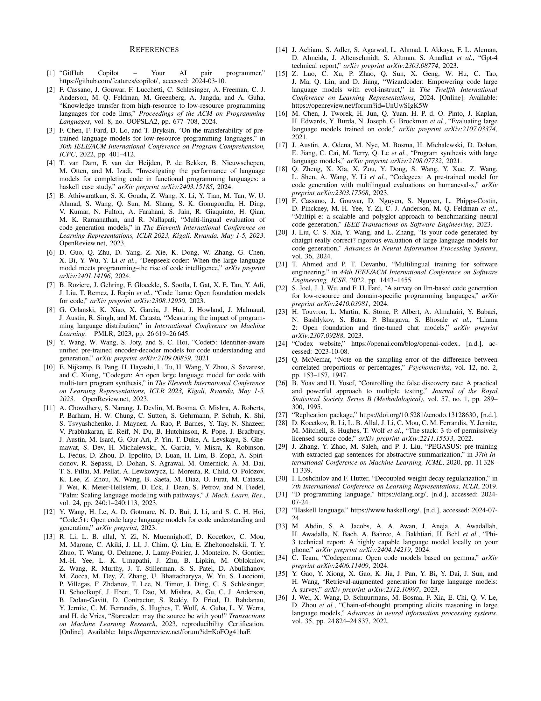
