 


 2501.19339 
 Zhiheng Lyu et el. 
 
 🤗 2025-02-03 
 



↗ arXiv


↗ Hugging Face


↗ Papers with Code


### TL;DR



기존의 딥러닝 모델들은 시각 정보는 픽셀, 텍스트 정보는 토큰으로 처리하는데, 이는 인간의 통합적인 인식 방식과 차이가 있습니다. 특히 **에이전트 기반 AI** 에서는 카메라 픽셀이 주된 입력이므로, **모든 모달리티를 통합적으로 처리하는 프레임워크**가 필요합니다. 본 논문에서는 모든 모달리티를 픽셀 입력으로 통합하는 "Perceive Everything as Pixels" (PEAP) 개념을 제안하고, 이를 평가하기 위한 새로운 평가 기준인 PixelWorld를 제시합니다.

PixelWorld는 다양한 모달리티를 픽셀 공간으로 통합하여 기존 모델의 성능을 평가합니다. 실험 결과, PEAP는 멀티모달 데이터셋에서 기존 토큰 기반 방식보다 성능이 우수하며, 추론 및 코딩 작업에서는 성능 저하를 보였습니다. 또한, **대규모 모델은 PEAP 환경에서도 높은 성능**을 유지했지만, 소규모 모델은 성능 저하가 심했습니다.  본 연구는 **모든 모달리티를 픽셀로 통합하여 처리하는 새로운 패러다임**을 제시하고, 향후 멀티모달 AI 연구의 발전 방향을 제시합니다.



#### Key Takeaways


 모든 모달리티(텍스트, 이미지, 코드 등)를 픽셀 입력으로 통합하여 처리하는 새로운 접근 방식 제시 



 기존 토큰 기반 방식보다 멀티모달 데이터셋에서 성능 향상 및 모호성 해소 



 픽셀 기반 입력 처리 시 추론 및 코딩 능력 저하 문제 발견 및 대규모 모델의 우수한 전이 학습 능력 확인 


#### Why does it matter?
본 논문은 **모든 모달리티를 픽셀 입력으로 통합하는 혁신적인 접근 방식**을 제시하여 기존의 토큰 기반 방식의 한계를 극복하고 **다양한 모달리티를 효율적으로 처리**할 수 있는 가능성을 열었습니다. 이는 **멀티모달 AI 연구의 새로운 지평**을 열고 향후 연구 방향을 제시하는 데 큰 의미가 있습니다. 특히, 대규모 언어 모델의 성능 향상과 효율적인 처리 방식에 대한 연구에 중요한 영향을 미칠 것으로 예상됩니다.

------
#### Visual Insights

> 🔼 본 그림은 논문에서 제안하는 PEAP(Perceive Everything as Pixels) 프레임워크를 보여줍니다. PEAP는 모든 모달리티(텍스트, 표, 코드, 다이어그램, 이미지 등)를 픽셀 입력으로 통합하여 처리하는 방식입니다.  기존의 토큰 기반 방식과 달리 인간의 지각 방식에 더 가깝게 설계되어 사전 처리 과정을 줄일 수 있습니다. PixelWorld 벤치마크를 통해 평가한 결과, PEAP는 웹사이트, 슬라이드, 문서와 같은 다중 모달리티 작업에서 성능 향상을 보였지만, 추론 및 코딩과 같은 복잡한 텍스트 중심 작업에서는 어려움을 겪는 것으로 나타났습니다. 또한, 큰 모델일수록 픽셀 기반과 토큰 기반 성능 간의 전이성이 더 높았으며, 텍스트와 이미지가 유사한 어텐션 패턴을 보이는 것을 확인했습니다. PEAP-Fast를 통해 패치 가지치기(patch pruning)으로 모델 추론 오버헤드를 줄일 수 있음을 보여줍니다.
> 

> 
read the caption

> Figure 1: PEAP framework: we investigate the possibility of perceive everything as pixels. This framework aligns better with human perception reducing the need for excessive pre-processing. Evaluated on our benchmark PixelWorld, PEAP boosts performance on multimodal tasks (e.g., websites, slides, documents) but struggles with complex, text-centric tasks (e.g., reasoning and coding). Larger models achieve better transferability between pixel- and token-based performance compared to smaller ones. We also observed that text and images exhibit similar attention patterns, and reduced the overhead of model reasoning through patch pruning by PEAP-Fast.
> 


| Dataset Name | Size | Task | Modality Transfer | Split |
|---|---|---|---|---|
| **Text-only** |  |  |  |  |
| GLUE (Wang, 2018) | 59,879 | Natural language understanding | Synthesis | test |
| SuperGLUE (Sarlin et al., 2020) | 19,294 | Natural language understanding | Synthesis | test |
| MMLU-Pro (Wang et al., 2024b) | 12,032 | Domain knowledge and reasoning | Synthesis | test |
| ARC (Clark et al., 2018) | 3,548 | Science question answering | Synthesis | test |
| GSM8K (Cobbe et al., 2021) | 1,319 | Math problem solving | Synthesis | test |
| MBPP (Austin et al., 2021) | 757 | Programming tasks | Synthesis | test |
| **Structured** |  |  |  |  |
| TableBench (Wu et al., 2024) | 888 | Table data understanding and analysis | Synthesis | test |
| **Multimodal** |  |  |  |  |
| MathVerse (Zhang et al., 2025) | 788 | Math and visual reasoning | Natural | test |
| MMMU-Pro (Yue et al., 2024) | 1,730 | Multimodal reasoning | Synthesis | test |
| SlidesVQA (Tanaka et al., 2023) | 2,136 | Multimodal question answering | OCR | test |
| Wiki-SS (Ma et al., 2024) | 3,000 | Multimodal retrieval question answering | OCR | train |

> 🔼 표 1은 다양한 모달리티(텍스트 전용, 구조화된 데이터, 멀티모달)의 데이터셋을 개요로 보여줍니다. 각 데이터셋의 용도, 크기, 분할(훈련/테스트) 정보를 담고 있습니다.  '모달리티 변환'은 기존 데이터셋을 다른 모달리티(예: 텍스트를 이미지로)로 변환하는 방법을 설명합니다. OCR을 사용한 데이터셋은 원본 데이터셋의 결과를 그대로 사용하고, WikiSS-QA 데이터셋의 경우 테스트 셋의 양성 문서가 공개되지 않았으므로 3,000개의 훈련 데이터 포인트를 무작위로 추출하여 평가에 사용했습니다.
> 

> 
read the caption

> Table 1: Overview of datasets categorized by modality, usage, size, and split. Modality Transfer means the method to adopt the dataset into counterpart modality. For OCR, we adopt the result from the origin datasets. For WikiSS-QA, since the positive document of the test set is not released, we subsample 3,000 training data points randomly to evaluate.
> 

### In-depth insights

#### Unified Pixel Input
본 논문에서 제안하는 "통합 픽셀 입력" 개념은 **모든 모달리티(텍스트, 이미지, 코드 등)를 픽셀 기반으로 통합 처리**하는 혁신적인 접근 방식입니다. 기존의 토큰 기반 방식과 달리, **인간의 통합적인 지각 방식을 모방**하여 다양한 데이터를 일관된 표현으로 처리함으로써 모달리티 간의 상호 작용 및 정보 활용을 증진시킵니다. 이는 특히 **텍스트를 이미지로 변환하여 처리**하는 방식으로 구현되며, 기존의 어려운 전처리 과정을 단순화하고 모달리티 불일치 문제를 해결하는 데 기여합니다. 하지만, **추론 및 코딩 능력 저하**와 같은 단점도 존재하며, 모델의 크기 및 복잡도에 따라 성능 차이가 발생할 수 있습니다. 따라서, **모델의 지각 능력 향상** 및 효율적인 처리 방식 연구가 필수적입니다.  **특히, 공간적 희소성을 활용한 가속화 기법**은 향후 연구 방향으로 제시되며, 이를 통해 실제 응용 분야에서의 실용성을 높일 수 있을 것으로 기대됩니다.

#### Multimodal Benchmarks
본 논문에서 다루는 멀티모달 벤치마크는 **다양한 모달리티 (텍스트, 이미지, 코드 등)를 통합하여 모델 성능을 평가**하는 데 초점을 맞춥니다. 기존의 벤치마크들이 특정 모달리티에 치우친 경향이 있었다면, 본 논문에서는 **모든 모달리티를 픽셀 공간으로 통합**하여 보다 포괄적이고 균형 잡힌 평가를 수행합니다.  이를 통해 **모델의 멀티모달 이해 능력을 종합적으로 평가**하고 개선 방향을 제시하는 데 도움이 될 것입니다. **특히, 픽셀 기반 입력 방식의 도입은 인간의 지각 방식에 더욱 근접**하게 함으로써 기존 토큰 기반 방식의 한계를 극복하고 실제 세계 문제 해결에 더욱 효과적인 모델 개발을 위한 기반을 마련하는 데 중요한 의미를 가집니다.

#### Model Scalability
본 논문에서 모델 확장성에 대한 분석은 주로 **대규모 모델이 PEAP(Perceive Everything as Pixels) 방식에 더 잘 적응한다는 점**을 보여줍니다.  소규모 모델들은 PEAP 방식에서 성능 저하를 보이는 반면, **대규모 모델들은 픽셀 기반 입력에서도 강력한 성능을 유지**합니다. 이는 대규모 모델이 더 풍부한 표현력과 더 나은 일반화 능력을 갖추고 있기 때문으로 해석됩니다.  **모델 크기가 클수록 픽셀과 토큰 기반 입력 간의 성능 차이가 감소**하는 경향이 나타나는데, 이는 **모델의 지각 능력 향상과 밀접한 관련**이 있습니다. 따라서 **향후 연구는 모델의 지각 능력 개선을 통해 PEAP 방식의 효율성을 높이는 데 집중**해야 함을 시사합니다.

#### Attention Patterns
본 논문에서 주목할 점은 **어텐션 패턴 분석**을 통해 텍스트 기반과 픽셀 기반 입력 방식 간의 유사성을 밝혀냈다는 것입니다.  **단어 토큰과 시각적 패치 간의 차이에도 불구하고,** 모델의 어텐션 메커니즘은 높은 일관성을 유지하며, 이는 비전 인코더를 범용적인 다중 모달리티 토크나이저로 활용할 가능성을 시사합니다.  **픽셀 기반 입력(PEAP)에서 공백 패치에 대한 어텐션이 비정상적으로 높게 나타나는 현상**은 추가적인 연구를 통해 개선될 여지가 있음을 보여줍니다.  **PEAP-Fast 기법을 통해 이러한 비효율성을 완화**하고 처리 속도를 크게 향상시킨 점 또한 중요한 성과입니다.  **어텐션 패턴의 유사성**은 다양한 모달리티 데이터를 통합하고 처리하는 새로운 접근 방식의 가능성을 제시하며, 이는 향후 **다중 모달리티 모델 연구에 중요한 시사점**을 제공합니다.  결론적으로, 이 연구는 **어텐션 패턴 분석을 통해 PEAP의 효율성과 유용성을 입증**하고 향후 연구 방향을 제시하는 데 큰 기여를 합니다.

#### PEAP Efficiency
PEAP (모든 것을 픽셀로 인지)의 효율성은 모델의 크기 및 작업 복잡도에 따라 크게 달라집니다. **대규모 모델**은 PEAP를 사용해도 성능 저하가 크지 않지만, **소규모 모델**은 성능이 상당히 저하될 수 있습니다. 특히 추론 및 코딩과 같은 복잡한 작업에서 성능 저하는 더욱 두드러집니다. 이는 PEAP가 **공간적 희소성**을 활용하여 가속화될 수 있음을 시사하지만, **모델의 크기 및 능력**이 효율성에 중요한 영향을 미친다는 점을 보여줍니다.  **PEAP-Fast**와 같은 최적화 기법은 연산 오버헤드를 줄이고 처리 속도를 높이는 데 효과적이지만, 여전히 PEAP의 전반적인 효율성을 평가하기 위한 추가 연구가 필요합니다. 따라서 PEAP의 효율성은 단순히 기술적 최적화뿐 아니라 모델의 **크기, 복잡도, 그리고 적용되는 작업의 종류**에 따라 종합적으로 고려되어야 합니다.

### More visual insights

More on figures

> 🔼 그림 2는 텍스트 전용 데이터셋에서 모델 성능을 비교 분석한 결과를 보여줍니다. 텍스트 입력과 합성 이미지 입력 간의 비교를 통해 언어 이해 데이터셋(SuperGLUE, GLUE, ARC)에서는 대부분의 모델이 유사한 성능을 보였으나, 수학적 추론 과제(MMLU-Pro, GSM8K)와 프로그래밍 과제(MBPP)에서는 텍스트 기반 입력과 합성 이미지 입력 간에 상당한 성능 차이가 발생함을 보여줍니다. 특히 Phi-3.5-Vision 모델은 모든 시각적 과제에서 일관되게 낮은 성능을 나타냈는데, 이는 지시사항을 제대로 따르지 못하는 능력 부족 때문으로 해석됩니다.  이 그림은 다양한 모델의 텍스트 이해 및 추론 능력을 시각적으로 보여주며, 모델의 크기와 복잡한 과제 해결 능력 간의 상관관계를 이해하는 데 도움이 됩니다.
> 

> 
read the caption

> Figure 2: The performance of text-only datasets. The comparison is made between text input and synthesized image input. Most models demonstrate comparable performance on language understanding datasets such as SuperGLUE, GLUE, and ARC. However, notable performance disparities emerge between text-based input and synthesized image input on mathematical reasoning tasks (e.g., MMLU-Pro, GSM8K) and programming tasks (e.g., MBPP). Phi-3.5-Vision exhibits consistently poor performance across all vision tasks, primarily due to its insufficient instruction-following capabilities.
> 

> 🔼 그림 3은 구조화된 데이터셋(TableBench)에 대한 모델 성능을 보여줍니다. TableBench의 모든 하위 작업에 대한 결과를 제시하며, ‘반쪽(semi)’ 설정에서는 질문은 텍스트로, 표는 합성 이미지로 표현되었습니다. 결과적으로 추론(수치적 추론) 및 코딩(시각화 하위 작업)이 필요한 작업의 경우 합성 이미지는 텍스트에 비해 성능이 떨어졌습니다. 하지만 데이터 분석 및 사실 확인과 같이 의미를 이해하는 데 중점을 둔 작업에서는 합성 이미지의 성능이 텍스트와 비슷하거나 더 나은 경우도 있었습니다. 또한, ‘반쪽’ 방식은 텍스트 또는 합성 이미지만 사용한 경우보다 성능이 떨어지는 경우가 많았는데, 이는 시각 언어 모델(VLMs)의 한계와 향후 개선 방향을 시사합니다.
> 

> 
read the caption

> Figure 3: The performance of the structured dataset. We report all the subsets for the TableBench. In the semi setting, questions were presented as text, while tables were rendered as synthetic images. We observed that for tasks involving reasoning (numerical reasoning) and coding (visualization subset), synthetic images yielded inferior performance compared to text. However, for tasks emphasizing semantic understanding, such as data analysis and fact checking, synthetic images achieved performance comparable to or even surpassing text. Additionally, we found that the semi approach often performed worse than either text or synthetic images individually, providing insights into potential limitations and future directions for leveraging vision-language models (VLMs).
> 

> 🔼 그림 4는 다중 모드 데이터셋(MMMU-Pro)에 대한 모델 성능을 보여줍니다. 원 논문에서 보고된 결과를 사용했습니다. 강력한 모델일수록 PEAP에서 더 나은 성능을 보이는 것을 확인할 수 있습니다.  MMMU-Pro 데이터셋은 다양한 모드(텍스트, 이미지, 비디오 등)의 데이터를 포함하고 있으며, 모델이 다양한 유형의 입력을 얼마나 잘 처리하는지를 평가하는 데 사용됩니다. 이 그림은 PEAP(Perceive Everything as Pixels) 프레임워크를 사용했을 때의 모델 성능을 보여주며,  PEAP가 다중 모달리티 작업에 효과적인지 여부를 시각적으로 보여줍니다.  모델의 크기와 성능 간의 상관관계도 확인할 수 있습니다. 
> 

> 
read the caption

> Figure 4: The performance of the multimodal dataset (MMMU-Pro). We adopt the result reported by the origin paper. We can observe that strong models perform better in PEAP.
> 

> 🔼 그림 5는 MathVerse 데이터셋의 텍스트 전용 및 비전 전용 하위 집합과 SlidesVQA 및 WikiSS-QA와 같은 VQA 작업에 대한 다양한 크기의 모델 성능을 보여줍니다.  MathVerse에서는 텍스트 기반 작업에 더 많은 모달리티가 있는 경우 더 큰 모델이 더 나은 성능을 보이는 것을 확인할 수 있습니다.  하지만, WikiSS-QA와 같은 장문의 질의응답 작업에서는 GPT-40이 더 긴 응답을 생성하는 경향이 있어 성능 저하를 가져오는 것을 알 수 있습니다.  요약하자면, 이 그림은 다양한 모달리티를 사용한 멀티모달 데이터셋에서 모델 크기와 성능의 관계를 보여주는 시각 자료입니다.
> 

> 
read the caption

> Figure 5: The performance of the multimodal datasets (except MMMU-Pro). We compare text-only and vision-only subsets in Mathverse, while SlidesVQA and WikiSS-QA are evaluated as VQA tasks. Larger models perform better on text-based tasks with more modalities. GPT-4o tends to generate longer responses in long-context QA, leading to performance degradation on WikiSS-QA.
> 

> 🔼 본 그림은 QWen2VL-7B 모델의 마지막 레이어에서 어텐션 히트맵을 보여줍니다. 왼쪽은 토큰 기반 입력, 오른쪽은 픽셀 기반 입력을 사용한 경우를 나타냅니다. 이는 두 가지 다른 입력 방식에 대한 모델의 어텐션 패턴 차이를 시각적으로 비교하여, 픽셀 기반 입력이 모델의 어텐션 메커니즘에 어떤 영향을 미치는지 보여줍니다.  두 입력 방식 모두 질문과 관련된 단어 또는 이미지 영역에 어텐션이 집중되는 것을 확인할 수 있습니다. 특히 픽셀 기반 입력의 경우, 빈 공간에도 어느 정도의 어텐션이 분포하는 것을 관찰할 수 있는데, 이는 추가적인 분석을 통해 어떤 의미를 지니는지 파악할 수 있습니다.
> 

> 
read the caption

> Figure 6: Last Layer Attention Heatmap on QWen2VL-7B between token-based (left) and pixel-based (right) inference.
> 

> 🔼 그림 7은 논문의 실험 부분에서 사용된 GSM8K 데이터셋의 예시 입력을 보여줍니다. Direct Prompt 방식을 사용하여 문제가 제시된 것을 확인할 수 있습니다. 그림에는 수학 문제와 함께 문제를 푸는 데 필요한 템플릿과 답변 형식이 함께 제시되어 있습니다.  이는 모델이 GSM8K 데이터셋의 문제를 이해하고 답을 생성하는 방식을 보여주는 예시입니다.  문제 자체는 간단한 수학 문제이지만, 모델이 이를 어떻게 해석하고 답을 생성하는지 보여주는 데 중요한 역할을 합니다.
> 

> 
read the caption

> Figure 7: An example input of GSM8K dataset, using Direct Prompt.
> 

More on tables


| Task | Text | PEAP | PEAP-Fast |
|---|---|---|---| 
| BoolQ | 79.69% | 82.11% | 80.89% |
| CB | 67.70% | 40.77% | 39.57% |
| COPA | 93.00% | 91.00% | 86.00% |
| MultiRC | 65.90% | 61.28% | 60.80% |
| ReCoRD | 12.54% | 5.94% | 6.08% |
| RTE | 82.31% | 72.92% | 77.26% |
| WiC | 53.29% | 55.80% | 55.64% |
| WSC | 63.46% | 65.38% | 59.62% |
| **Final Score** | **64.74%** | **59.40%** | **58.23%** |
> 🔼 본 표는 SuperGLUE 데이터셋을 사용하여 세 가지 다른 방식(텍스트 기반, PEAP, PEAP-Fast)으로 Qwen2VL-7B 모델의 성능을 비교 분석한 결과를 보여줍니다.  PEAP는 모든 모달리티를 픽셀 입력으로 통합 처리하는 방식이며, PEAP-Fast는 PEAP의 속도를 개선하기 위해 빈 픽셀 영역을 제거하는 최적화 기법입니다. 표에서 확인할 수 있듯이 PEAP와 PEAP-Fast의 성능은 서로 비슷하며, PEAP-Fast는 속도 향상에 효과적인 것을 알 수 있습니다.
> 

> 
read the caption

> Table 2: Performance of Qwen2VL-7B on SuperGLUE dataset by Text, PEAP and PEAP-Fast. We can observe the comparable performance between PEAP and PEAP-Fast.
> 


| Subset | Text | PEAP | PEAP-Fast | PEAP | PEAP-Fast |
|---|---|---|---|---|---| 
| **Inference Time (s)** | |  |  | **Overhead (%)** |  |  |
| BoolQ | 369 | 1,381 | 906 | 274.80 | 145.55 |
| CB | 8 | 22 | 15 | 175.00 | 87.50 |
| COPA | 39 | 38 | 22 | -2.56 | -43.59 |
| MultiRC | 609 | 3,861 | 2,550 | 534.80 | 318.71 |
| ReCoRD | 7,016 | 19,012 | 14,288 | 171.01 | 103.72 |
| RTE | 68 | 117 | 92 | 72.06 | 35.29 |
| WiC | 69 | 224 | 157 | 224.64 | 127.54 |
| WSC | 11 | 36 | 27 | 227.27 | 145.45 |
| **Total** | 8,089 | 24,690 | 18,051 | 205.27 | 123.19 |
> 🔼 본 표는 SuperGLUE 데이터셋을 사용하여 단일 A100 서버에서 Qwen2VL-7B 모델의 추론 시간을 측정한 결과를 보여줍니다. PEAP(Perceive Everything as Pixels) 방식과 PEAP-Fast 방식(PEAP의 효율적인 변형)을 비교하여, PEAP-Fast가  텍스트 기반 방법 대비 추론 시간 오버헤드를 82.08% 줄였다는 것을 보여줍니다.  오버헤드는 텍스트 기반 방법 대비 추론 시간 증가율(%)로 계산되었습니다.
> 

> 
read the caption

> Table 3: Inference Time (s) of Qwen2VL-7B on SuperGLUE dataset with single A100 server by PEAP and PEAP-Fast. We can observe a 82.08% overhead reduce on PEAP-Fast method. Overhead is calculated as the percentage increase in time relative to the text method.
> 


| Metric | Direct Text | Direct PEAP | CoT Text | CoT PEAP | Improve (CoT - Direct) Text | Improve (CoT - Direct) PEAP |
|---|---|---|---|---|---|---|
| BoolQ | 79.88% | 81.71% | 81.13% | 80.73% | 1.25% | -0.98% |
| CB | 67.70% | 34.78% | 81.04% | 59.57% | 13.34% | 24.79% |
| COPA | 93.00% | 87.00% | 89.00% | 83.00% | -4.00% | -4.00% |
| MultiRC | 65.73% | 62.28% | 69.08% | 60.41% | 3.35% | -1.87% |
| ReCoRD | 12.50% | 5.88% | 6.37% | 4.66% | -6.13% | -1.22% |
| RTE | 82.31% | 72.92% | 83.03% | 77.26% | 0.72% | 4.34% |
| WiC | 52.82% | 54.39% | 54.39% | 53.92% | 1.57% | -0.47% |
| WSC | 65.38% | 61.54% | 57.69% | 61.54% | -7.69% | 0.00% |
| Overall | 64.92% | 57.56% | 65.22% | 60.14% | 0.30% | 2.58% |
> 🔼 표 4는 직접 프롬프트(Direct)와 사고 과정 프롬프트(Chain-of-Thought, CoT) 방식을 사용하여 텍스트 및 이미지 모달리티에서 모델 성능을 비교 분석한 결과를 보여줍니다.  각 방식의 성능 향상도(CoT - Direct)를 백분율로 제시하여, 두 프롬프트 방식 간의 성능 차이를 명확히 보여줍니다.  BoolQ, CB, COPA, MultiRC, ReCoRD, RTE, WiC, WSC 등 다양한 작업에 대한 성능 변화를 자세히 제시하고 있습니다.
> 

> 
read the caption

> Table 4: Comparison of Direct and CoT performance across Text and Image modalities, along with their respective improvements (CoT - Direct), presented as percentages.
> 

### Full paper


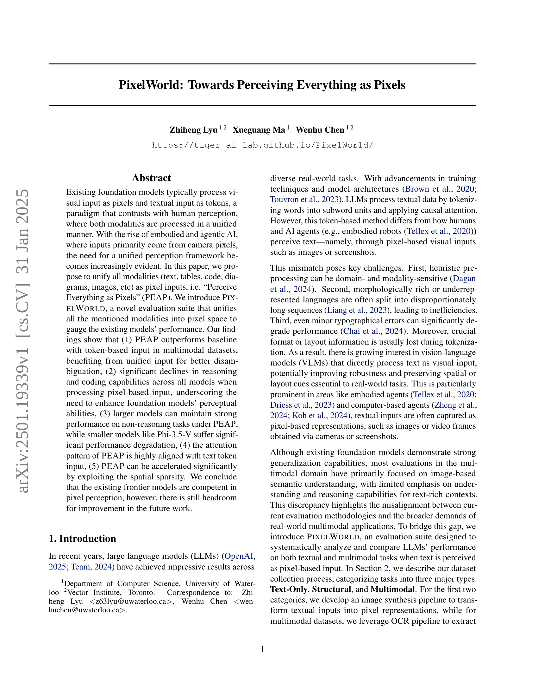
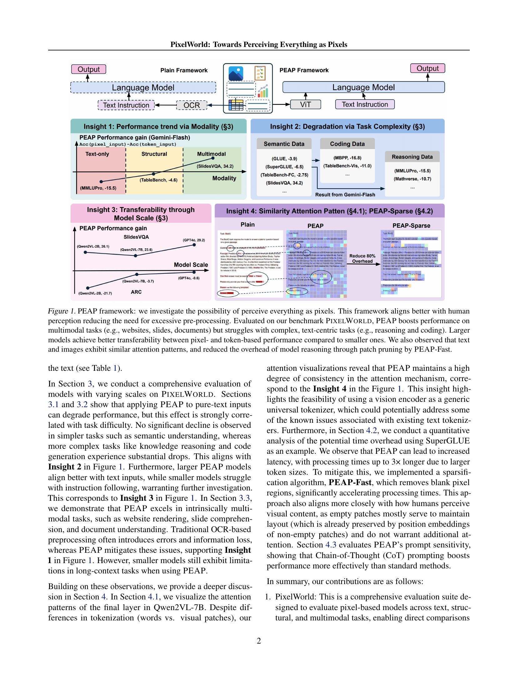
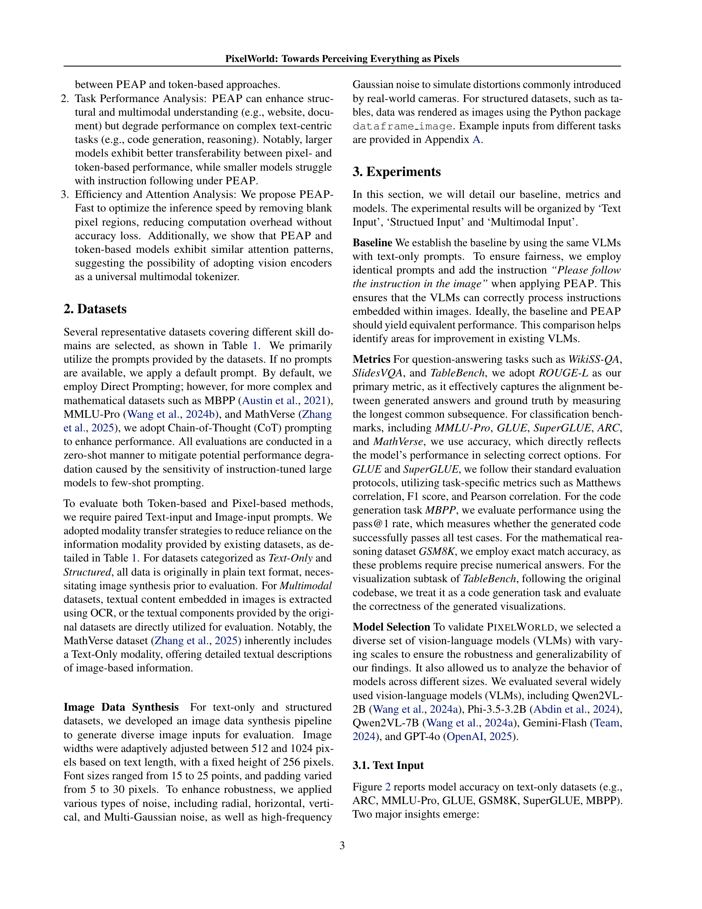
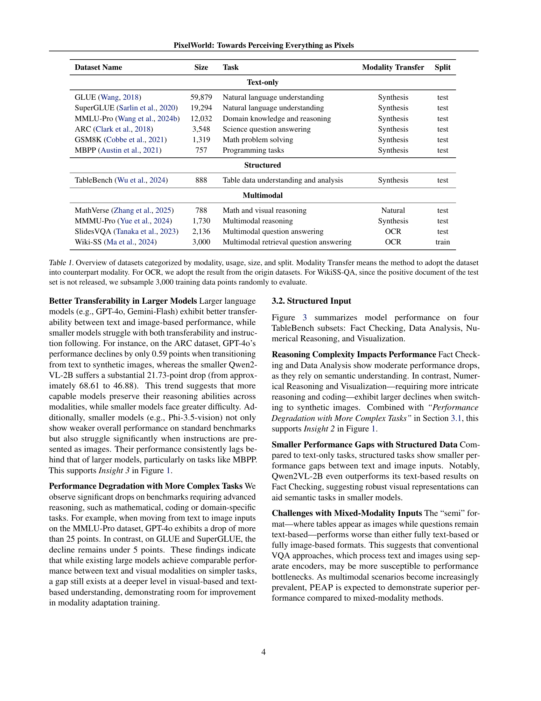
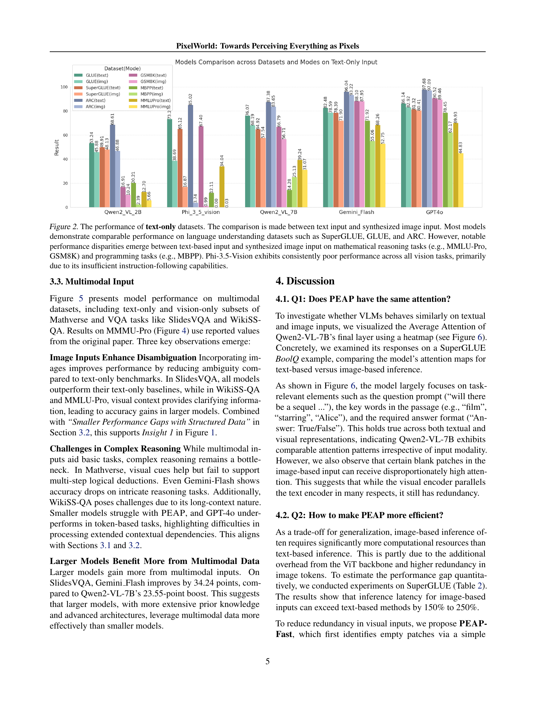
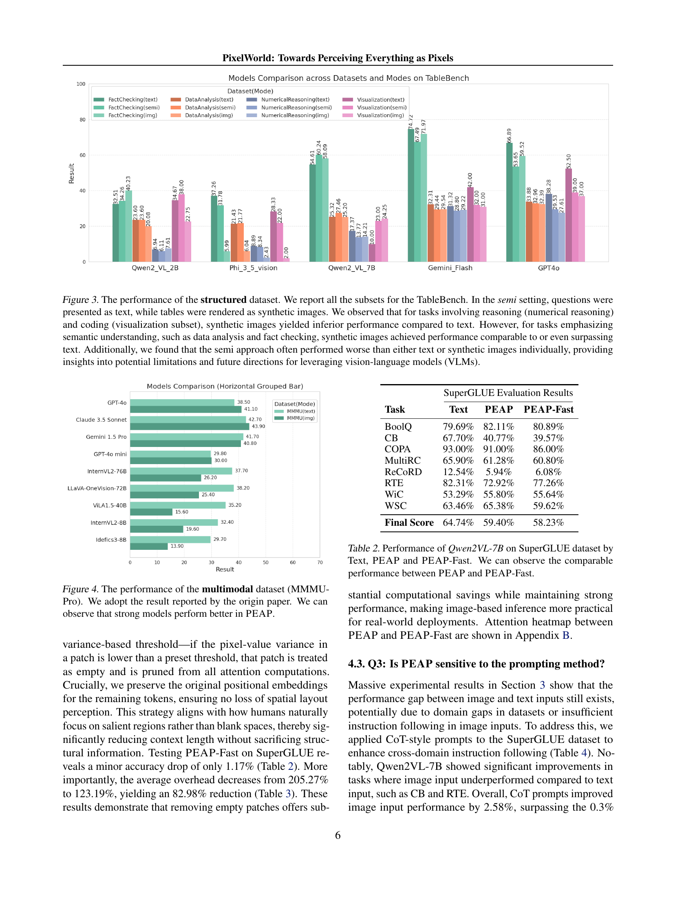
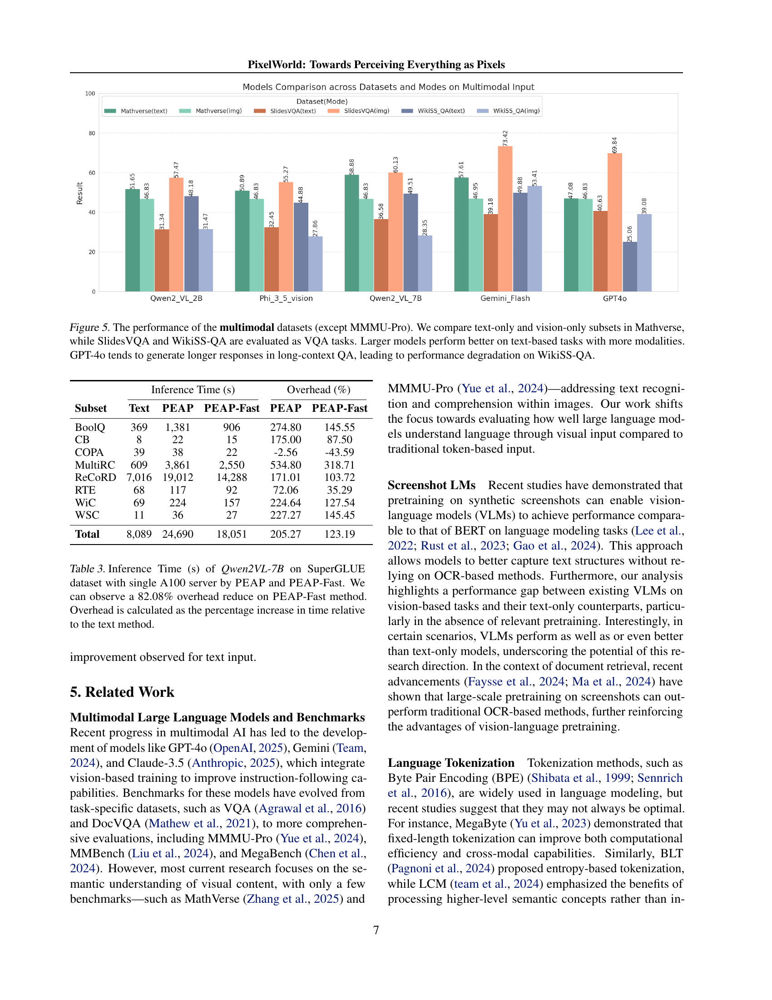
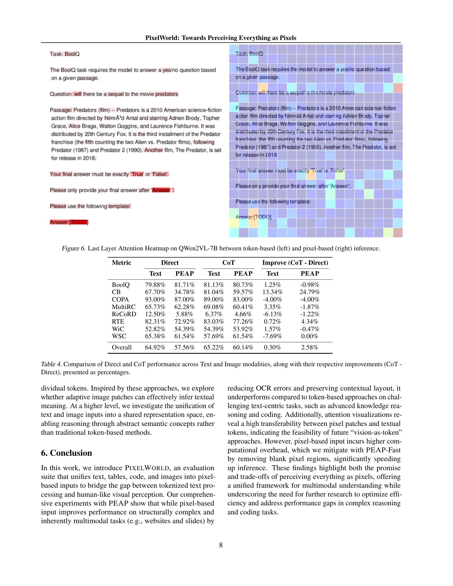
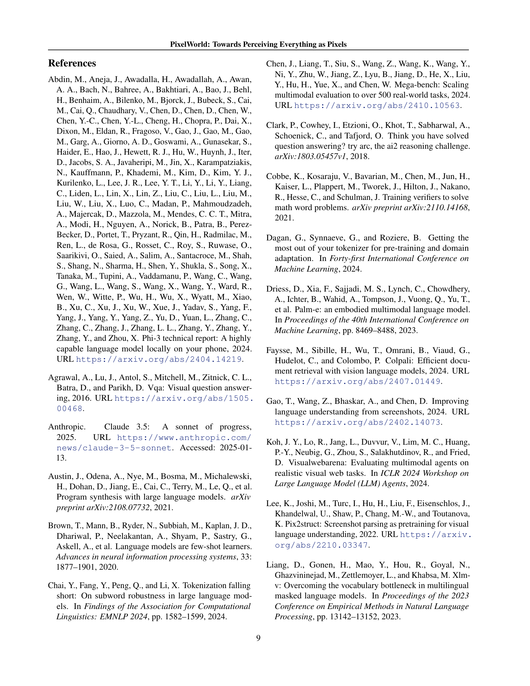
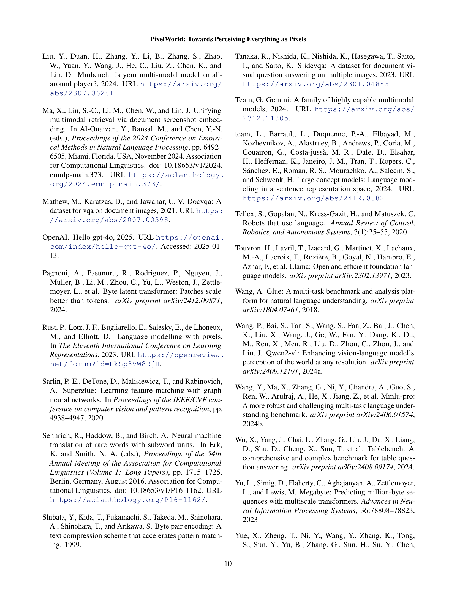
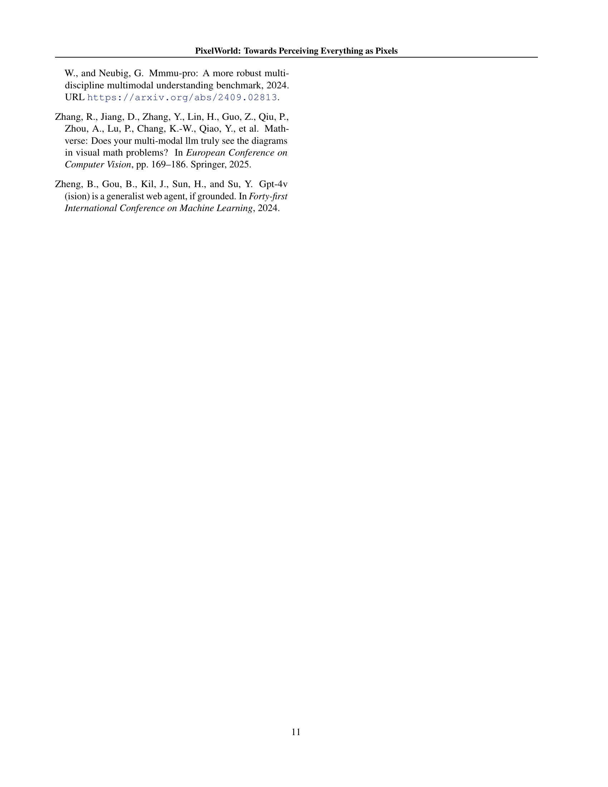
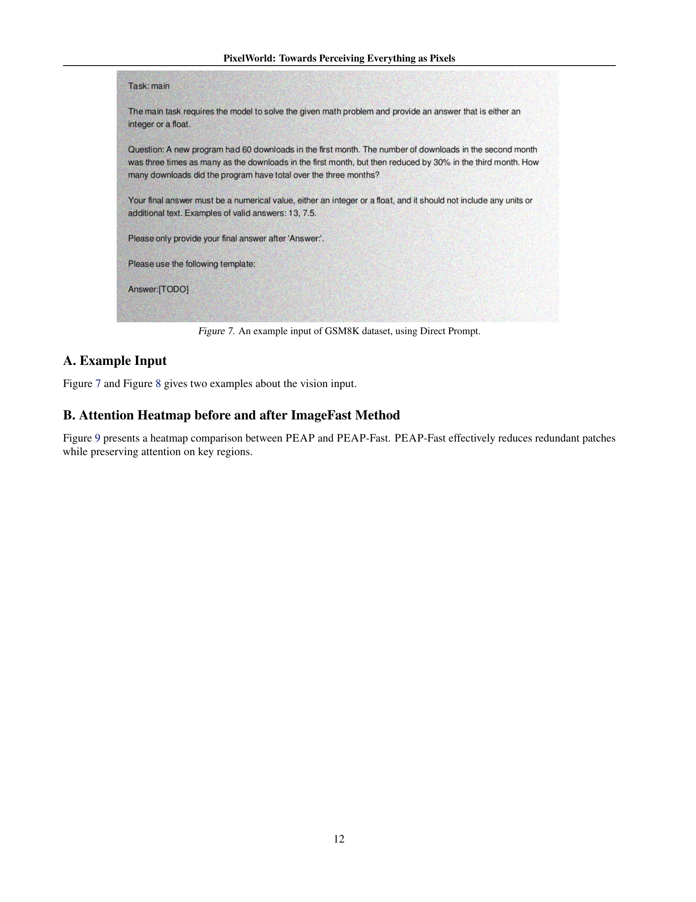
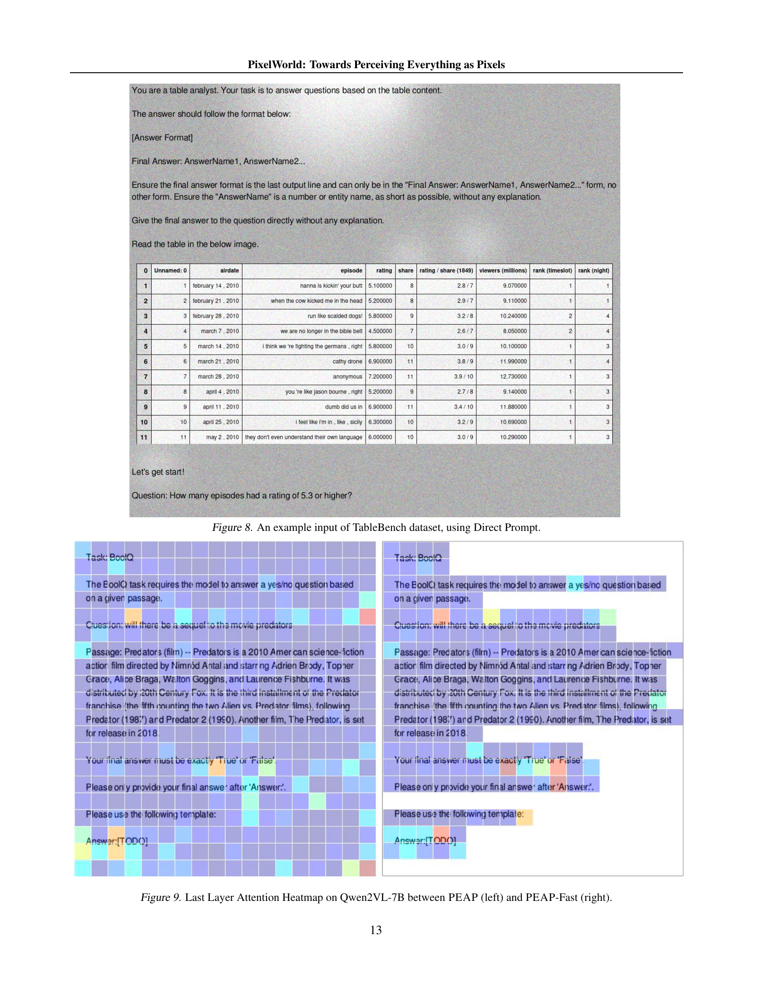
