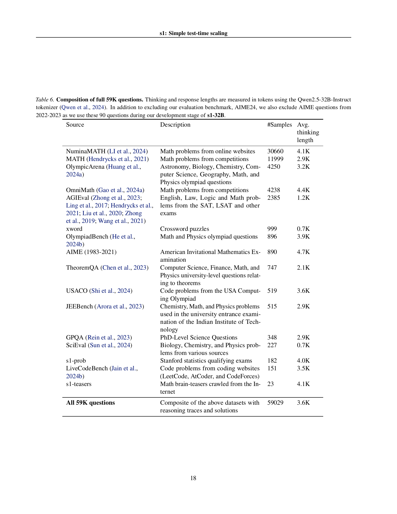

 


 2501.19393 
 Niklas Muennighoff et el. 
 
 🤗 2025-02-03 
 



↗ arXiv


↗ Hugging Face


↗ Papers with Code


### TL;DR



최근 **OpenAI의 o1 모델**은 테스트 시간 연산량을 늘려 성능을 향상시키는 **테스트 시간 확장**의 가능성을 보였지만, 그 방법론은 공개되지 않았습니다.  본 논문에서는 이러한 테스트 시간 확장의 효과를 간단한 방법으로 재현하고, **추론 성능을 향상**시키는 새로운 접근법을 제시합니다.  기존 연구들은 복잡한 강화 학습이나 다량의 데이터를 필요로 했지만, 본 연구는 이러한 제한을 극복하고자 합니다.

본 연구는 **단 1,000개의 질문과 추론 과정 예제로 구성된 s1K 데이터셋**을 구축하고, 모델의 추론 과정을 조절하는 **'예산 제한(budget forcing)' 기법**을 사용했습니다.  **s1K 데이터셋**은 난이도, 다양성, 품질 세 가지 기준에 따라 신중하게 선별되었으며, **s1-32B 모델**은 이 데이터셋으로 미세 조정되었습니다.  결과적으로 s1-32B는 경쟁 모델보다 우수한 성능을 보였으며, 테스트 시간 연산량을 늘릴수록 성능이 향상되는 **테스트 시간 확장 효과**를 입증했습니다.



#### Key Takeaways


 제한된 데이터(1,000개 예제)로 강력한 추론 성능을 달성한 새로운 언어 모델 s1-32B를 개발했습니다. 



 테스트 시간 확장을 위한 간단하고 효과적인 방법인 ‘예산 제한(budget forcing)’ 기법을 제시했습니다. 



 데이터 선택 기준(난이도, 다양성, 품질)을 제시하여, 효율적인 데이터셋 구축 방법을 제시했습니다. 


#### Why does it matter?
본 논문은 **간단한 방법으로 테스트 시간 확장을 달성하고 강력한 추론 성능을 보이는 모델을 개발**함으로써, 연구자들에게 중요한 의미를 가집니다.  **제한된 데이터와 계산으로 강력한 추론 모델을 구축하는 방법**을 제시하며, **향후 연구 방향에 대한 명확한 지침**을 제공합니다. 이는 현재 자연어 처리 분야의 주요 연구 동향과 밀접하게 관련되어 있으며, 향후 연구에 대한 새로운 가능성을 제시합니다.

------
#### Visual Insights

> 🔼 본 그림은 s1-32B 모델을 사용하여 추론 집약적인 작업에서 테스트 시간 컴퓨팅을 변화시키면서 테스트 시간 스케일링을 보여줍니다.  세 가지 다른 유형의 문제(수학 문제 해결, 경쟁 수학, 박사급 과학 질문)에 대한 정확도를 테스트 시간 토큰(모델이 추론하는 데 사용하는 컴퓨팅 양을 나타냄)의 함수로 나타냅니다. 그래프는 테스트 시간 컴퓨팅이 증가함에 따라 세 가지 모든 작업에서 정확도가 향상됨을 보여줍니다. 이는 추가적인 컴퓨팅을 사용하여 모델의 추론 성능을 향상시킬 수 있음을 시사합니다.
> 

> 
read the caption

> Figure 1: Test-time scaling with s1-32B. We benchmark s1-32B on reasoning-intensive tasks and vary test-time compute.
> 


| Model | # ex. | AIME | MATH- | GPQA |
|---|---|---|---|---|
| **API only** |  |  |  |  |
| o1-preview | N.A. | 44.6 | 85.5 | 73.3 |
| o1-mini | N.A. | 70.0 | 90.0 | 60.0 |
| o1 | N.A. | **74.4** | **94.8** | **77.3** |
| Gemini 2.0 | N.A. | 60.0 | N.A. | N.A. |
| Flash Think. | N.A. | 60.0 | N.A. | N.A. |
| **Open Weights** |  |  |  |  |
| Qwen2.5-32B-Instruct | N.A. | 26.7 | 84.0 | 49.0 |
| QwQ-32B | N.A. | 50.0 | 90.6 | 65.2 |
| r1 | &gt;&gt;800K | **79.8** | **97.3** | **71.5** |
| r1-distill | 800K | 72.6 | 94.3 | 62.1 |
| **Open Weights and Open Data** |  |  |  |  |
| Sky-T1 | 17K | 43.3 | 82.4 | 56.8 |
| Bespoke-32B | 17K | **63.3** | **93.0** | 58.1 |
| s1 w/o BF | **1K** | 50.0 | 92.6 | 56.6 |
| **s1-32B** | **1K** | 56.7 | **93.0** | **59.6** |

> 🔼 표 1은 본 논문에서 제시하는 s1-32B 모델이 얼마나 효율적이고 성능이 뛰어난지 보여줍니다.  s1-32B는 기존의 대규모 언어 모델(LLM)들인 Qwen, Gemini 모델들과 비교 평가되었으며,  OpenAI의 o1, DeepSeek의 r1 등 다른 최신 연구 결과들과도 비교 분석되었습니다.  표에는 각 모델의 성능(AIME2024, MATH500, GPQA Diamond 세 가지 벤치마크 과제에 대한 정확도)과 미세 조정을 위해 사용된 데이터의 크기(#ex.), 그리고 테스트 시간 확장 기법(BF)의 적용 여부 등이 포함되어 있습니다.  본 논문의 4장에서 이 표에 대한 자세한 내용이 설명되어 있습니다.
> 

> 
read the caption

> Table 1: s1-32B is an open and sample-efficient reasoning model. We evaluate s1-32B, Qwen, and Gemini (some entries are unknown (N.A.), see §4). Other results are from the respective reports (Qwen et al., 2024; Team, 2024b; OpenAI, 2024; DeepSeek-AI et al., 2025; Labs, 2025; Team, 2025). # ex. = number examples used for reasoning finetuning; BF = budget forcing.
> 

### In-depth insights

#### Test-Time Scaling
본 논문에서 제시된 'Test-Time Scaling'은 **추론 시점의 추가 연산을 통해 언어 모델의 성능을 향상시키는 새로운 접근법**입니다. 기존의 학습 시간 확장에만 의존하던 방식과 달리, **추론 과정 자체에 더 많은 컴퓨팅 자원을 할당**하여 성능 개선을 도모합니다. 이는 특히 **복잡한 추론 능력이 필요한 과제**에서 효과적이며, 제한된 학습 데이터로도 우수한 성능을 달성할 수 있다는 점을 시사합니다. **단순한 방법론**을 사용함에도 불구하고, **뛰어난 성능 향상**을 보이는 것은 주목할 만합니다.  하지만, **추론 시간 증가에 따른 비용 및 효율성 문제**는 향후 개선 과제로 남아있으며, 다양한 과제 유형에 대한 일반화 가능성 또한 추가 연구가 필요한 부분입니다.  **모델의 추론 시간을 효과적으로 제어하는 기술**인 'Budget Forcing'은 이러한 문제 해결에 기여하는 중요한 요소임을 알 수 있습니다.

#### Budget Forcing
본 논문에서 제시된 'Budget Forcing'은 언어 모델의 추론 과정에 **제한된 컴퓨팅 자원**을 할당하는 기법입니다.  이는 모델이 과도하게 추론을 반복하거나 불필요한 계산을 수행하는 것을 방지하여 **효율성**을 높이고, 제한된 시간 내에 최적의 성능을 달성하는 데 목표를 둡니다.  **단순하지만 효과적인 방법**으로, 모델의 생성 토큰 수를 제한하거나, 생성을 강제로 종료하여 추론 시간을 조절합니다.  **모델의 자가 수정 능력**을 활용하여, 부족한 계산으로 인한 오류를 최소화하는 데 기여합니다.  이러한 접근 방식은 **샘플 효율성**을 높여 소규모 데이터셋으로도 강력한 추론 성능을 달성할 수 있다는 점에서 큰 의의가 있습니다.  추가적으로, 'Wait' 토큰을 추가하는 방식으로 추론 시간을 늘려 모델의 **탐색 능력**을 향상시킬 수도 있습니다.  하지만, 과도한 제한은 오히려 성능 저하로 이어질 수 있으므로, 적절한 자원 배분 전략의 수립이 중요합니다.

#### Data Efficiency
본 논문은 데이터 효율성 측면에서 **매우 인상적인 결과**를 제시합니다.  **단 1,000개의 예제만을 사용하여** 강력한 추론 성능을 달성한 점은 주목할 만합니다.  이는 기존의 대규모 언어 모델 학습에 필요한 방대한 데이터셋에 비해 극적으로 적은 양입니다.  이러한 **데이터 효율성**은 모델의 **샘플 효율성**을 높이는 전략과 신중한 데이터 선택 및 정제 과정에 기인합니다.  특히, 어려움, 다양성, 품질 세 가지 기준을 모두 만족하는 예제들을 선택함으로써 효과적인 학습을 가능하게 하였습니다.  **소량의 데이터로 높은 성능**을 도출하는 이러한 접근 방식은 향후 연구 방향에 중요한 시사점을 제공하며, **자원 제약이 있는 상황에서도 효과적인 언어 모델 개발**에 기여할 수 있음을 시사합니다.  **추가적인 연구**를 통해 이러한 접근 방식의 일반성과 한계를 더 자세히 파악하는 것이 중요합니다.

#### Ablation Studies
본 논문의 ablation study는 모델 성능에 영향을 미치는 요소들을 체계적으로 분석하여 **핵심 요소**를 규명하고 모델의 **일반화 성능**을 향상시키는 데 초점을 맞춥니다.  특히 데이터 선정 기준(품질, 난이도, 다양성)과 테스트 시간 확장 기법(예산 제한)의 효과를 면밀히 검증합니다.  **데이터 품질**은 모델 성능에 큰 영향을 미치는 반면, **데이터 양**보다는 **데이터의 질적 요소**에 집중하는 것이 중요함을 보여줍니다.  **예산 제한 기법**은 다른 방법들에 비해 **테스트 시간 제어력**이 뛰어나고 성능 향상에 효과적임을 확인합니다. 이러한 결과는 **데이터 선정 및 테스트 시간 관리**가 효율적인 언어 모델 개발에 필수적임을 시사하며, 향후 연구 방향에 대한 중요한 시사점을 제공합니다.

#### Future Work
본 논문은 간단한 테스트 시간 확장 방법을 제시하며, 향후 연구 방향으로 **더욱 간단하고 효율적인 추론 모델 개발** 및 **테스트 시간 확장의 한계 극복**을 제시합니다. 특히, 제한된 컴퓨팅 환경에서도 강력한 추론 성능을 발휘하는 모델 개발 및 다양한 테스트 시간 확장 기법들을 연구하는 것은 매우 중요합니다. 또한, **다양한 데이터셋 및 추론 방법론**을 활용한 실험과 분석을 통해, 제시된 방법론의 일반화 가능성과 실용성을 높이는 연구가 필요합니다.  **모델의 해석성 향상 및 오류 분석**을 통한 신뢰도 향상 연구도 중요한 과제입니다.  마지막으로, **보다 다양한 종류의 추론 과제에 대한 적용** 및 성능 평가를 통해, 본 논문에서 제시한 방법론의 범용성을 확장하는 연구를 진행할 수 있습니다.

### More visual insights

More on figures

> 🔼 그림 2는 본 논문에서 사용된 데이터셋 s1K와 미세 조정된 언어 모델 s1-32B에 대한 정보를 보여줍니다. 왼쪽 그림은 s1K 데이터셋의 특징을 보여줍니다. s1K는 추론 과정(reasoning traces)이 포함된 1,000개의 고품질, 다양하고 어려운 질문들로 구성되어 있습니다. 오른쪽 그림은 s1K 데이터셋으로 미세 조정된 320억 개의 파라미터를 가진 언어 모델 s1-32B가 표본 효율성(sample efficiency) 측면에서 최첨단 수준임을 보여줍니다. 표본 효율성이란, 적은 양의 데이터로 높은 성능을 달성하는 능력을 의미합니다. 다른 모델들에 대한 자세한 내용은 표 LABEL:tab:perf에서 확인할 수 있습니다.
> 

> 
read the caption

> Figure 2: s1K and s1-32B. (left) s1K is a dataset of 1,000 high-quality, diverse, and difficult questions with reasoning traces. (right) s1-32B, a 32B parameter model finetuned on s1K is on the sample-efficiency frontier. See LABEL:tab:perf for details on other models.
> 

> 🔼 그림 3은 s1-32B 모델에 대한 예시를 보여줍니다. 모델이 '...는 2입니다.' 라고 응답하려고 할 때, 종료 토큰을 추가하지 않고 'Wait'를 추가하여 모델의 사고 과정을 강제로 연장함으로써, 모델이 스스로 오류를 수정하는 과정을 보여줍니다. 이를 통해 테스트 시간 확장 기법인 예산 강제(budget forcing)을 통해 모델의 성능을 향상시킬 수 있음을 시각적으로 보여줍니다.
> 

> 
read the caption

> Figure 3: Budget forcing with s1-32B. The model tries to stop after “…is 2.”, but we suppress the end-of-thinking token delimiter instead appending “Wait” leading s1-32B to self-correct its answer.
> 

> 🔼 그림 (a)는 제안된 예산 제한 기법을 사용한 순차적 확장을 보여줍니다. 테스트 시간 계산량을 증가시킴에 따라 정확도가 향상되는 것을 보여주는 그래프입니다. x축은 평균 추론 시간(토큰 수)이고 y축은 정확도(%)입니다.  세 가지 다른 추론 시간(토큰 수)에 대한 결과가 표시됩니다.  각 점은 특정 계산량에서의 모델 성능을 나타내며, 계산량이 증가함에 따라 성능이 향상되는 것을 보여줍니다. 이 그래프는 제안된 방법의 효과를 시각적으로 보여주는 중요한 증거가 됩니다.
> 

> 
read the caption

> (a) Sequential scaling via budget forcing
> 

> 🔼 이 그림은 다양한 수의 예측 결과를 집계하여 병렬적으로 테스트 시간 확장을 수행하는 방법을 보여줍니다.  OpenAI의 Qwen-2.5-32B-Instruct 모델을 사용하여 각 질문에 대해 64개의 평가를 수행하고, 그 중 2, 4, 8, 16, 32, 64개의 결과를 다수결 투표를 통해 최종 답변을 도출합니다.  이를 통해 투표에 참여하는 결과의 수가 증가함에 따라 정확도가 향상되는 양상을 확인할 수 있습니다. 이는 모델이 테스트 시간에 더 많은 계산을 할 수 있도록 함으로써 성능이 향상될 수 있음을 보여줍니다.
> 

> 
read the caption

> (b) Parallel scaling via majority voting
> 

> 🔼 그림 4는 테스트 시간 확장에 대한 순차적 및 병렬적 접근 방식을 보여줍니다. (a)는 예산 강제가 명확한 확장 추세를 보이고 어느 정도까지 외삽할 수 있음을 보여줍니다. 세 개의 가장 오른쪽 점에 대해 모델이 생각을 2/4/6회 중지하지 못하도록 하여 매번 현재 추론 추적에 'Wait'를 추가합니다. (b)는 Qwen2.5-32B-Instruct에 대해 각 샘플에 대해 64번의 평가를 수행하고 2, 4, 8, 16, 32, 64개에 대한 다수결 투표 시 성능을 시각화합니다.
> 

> 
read the caption

> Figure 4: Sequential and parallel test-time scaling. (a): Budget forcing shows clear scaling trends and extrapolates to some extent. For the three rightmost dots, we prevent the model from stopping its thinking 2/4/6 times, each time appending “Wait” to its current reasoning trace. (b): For Qwen2.5-32B-Instruct we perform 64 evaluations for each sample and visualize the performance when majority voting across 2, 4, 8, 16, 32, and 64 of these.
> 

> 🔼 그림 5는 제시된 세 가지 다른 유형의 문제(AIME24, MATH, GPQA)에 대해 모델 s1-32B가 생성한 답변을 보여줍니다. 각 문제에 대해 검은색 텍스트는 프롬프트, 연한 파란색 텍스트는 추론 과정, 파란색 텍스트는 모델의 최종 답변을 나타냅니다. 모델은 세 가지 문제 모두에 대해 정답을 생성했습니다. 회색 생략 부호([…])는 페이지 공간 제약으로 인해 텍스트가 잘렸음을 나타내지만, 실제 생성된 텍스트는 더 길다는 것을 의미합니다. 이 그림은 모델 s1-32B의 추론 능력과 다양한 유형의 문제에 대한 적응력을 보여주는 대표적인 예시입니다.
> 

> 
read the caption

> Figure 5: Example model outputs. We pick a question from AIME24 (left), MATH (middle), and GPQA (right), where our model generates the correct answer. The black text is the prompt, the light blue text is the reasoning trace, and the blue text is the answer of s1-32B. The gray ellipsis […] indicates that the text was trimmed to fit this page, but the generated text is actually longer.
> 

> 🔼 그림 6은 rejection sampling을 사용하여 AIME24 데이터셋에서 s1-32B 모델의 성능을 평가한 결과를 보여줍니다. rejection sampling이란, 모델이 생성한 답변의 thinking token 수가 특정 임계값(3500, 4000, 5000, 8000, 16000 tokens) 이하가 될 때까지 반복적으로 샘플링하는 기법입니다.  그림에서 볼 수 있듯이, 임계값이 증가할수록 평균적으로 더 적은 샘플링 횟수(655, 97, 8, 3, 2, 1회)로 원하는 조건을 만족하는 샘플을 얻을 수 있었습니다. 하지만,  흥미롭게도 정확도는 오히려 감소하는 경향을 보입니다.  이는 긴 추론 과정을 거친 샘플일수록 오류가 발생할 가능성이 높기 때문일 수 있습니다. 이 결과는 단순히 긴 추론 과정을 통해 성능 향상을 기대할 수 없다는 것을 시사합니다.
> 

> 
read the caption

> Figure 6: Rejection sampling on AIME24 with s1-32B. We sample with a temperature of 1 until all generations have less than (from left to right) 3500, 4000, 5000, 8000, and 16000 thinking tokens requiring an average of 655, 97, 8, 3, 2, and 1 tries per sample.
> 

> 🔼 그림 7은 병렬적 테스트 시간 확장 방법을 사용하여 테스트 시간 계산을 더 확장하는 방법을 보여줍니다. AIME24의 30가지 질문에 대한 평균 지표를 보여줍니다. REBASE에 대한 평균 추론 토큰에는 보상 모델에서 추가 계산이 고려되지 않습니다. 순차적 확장의 경우 모델에 최대 32, 64, 256, 512단계를 사용하도록 프롬프트를 제공합니다. REBASE 및 다수결 투표의 경우 집계를 위해 16개의 병렬 경로를 생성합니다.
> 

> 
read the caption

> Figure 7: Scaling further with parallel scaling methods. All metrics averaged over the 30 questions in AIME24. Average thinking tokens for REBASE do not account for the additional compute from the reward model. For sequential scaling, we prompt the model to use up to (from left to right) 32, 64, 256, and 512 steps. For REBASE and majority voting we generate 16 parallel trajectories to aggregate across.
> 

More on tables


The following table shows the converted markdown format:

| [AIME24]                                                                                                                                                                                                                                                                  | [MATH]                                                                                                                                                                                                 | [GPQA]                                                                                                                                                                                                                                                                                                                                     |
|-----------------------------------------------------------------------------------------------------------------------------------------------------------------------------------------------------------------------------------------------------------------------------------|----------------------------------------------------------------------------------------------------------------------------------------------------------------------------------------------------|--------------------------------------------------------------------------------------------------------------------------------------------------------------------------------------------------------------------------------------------------------------------------------------------------------------------------------------------------------|
| **Alice and Bob play the following game. A stack of** *n* **tokens lies before them. The players take turns with Alice going first. On each turn, the player removes either** 1 **token or** 4 **tokens from the stack. Whoever removes the last token wins. Find the number of positive integers** *n* **less than or equal to** 2024 **for which there exists a strategy for Bob that guarantees that Bob will win the game regardless of Alice’s play.** | **Find the projection of** *a* **onto**  **if** *a* ⋅ *b* = 8.                                                                  | **A quantum mechanical particle of mass** *m* **moves in two dimensions in the following potential, as a function of the polar coordinates** (*r*, θ):
V(*r*, θ) = 12 *k* *r*2 + 32 *k* *r*2 cos2(θ)
Find the energy spectrum.
Hint: Write the potential in Cartesian coordinates. |}   


> 🔼 표 2는 s1K 데이터셋에 대한 추가 분석 결과를 보여줍니다.  각 모델의 성능을 평가하기 위해 최대 32,000 토큰의 추론 시간을 할당하는 '예산 강제(Budget Forcing, BF)' 기법을 사용했습니다. 이는 모델이 무한 루프에 빠지는 것을 방지하여 최종 예측값을 생성하도록 돕는 기법입니다. BF를 사용한 결과는 BF를 사용하지 않은 경우 (표 1 참조) 보다 약간 더 나은 성능을 보였습니다. 표에는 AIME24, MATH500, GPQA Diamond 세 가지 벤치마크에 대한 각 모델의 정확도가 95% Wilson 신뢰 구간과 함께 제시되어 있습니다. 이 표는 데이터셋의 다양성, 난이도, 품질이 모델 성능에 미치는 영향을 분석하는 데 사용되었습니다.
> 

> 
read the caption

> Table 2: s1K data ablations. We budget force (BF) a maximum of 32,000 thinking tokens for scores in this table. This performs slightly better than the scores without BF (LABEL:tab:perf) as it allows the model to finish with a best guess when stuck in an infinite loop. We report 95% Wilson confidence intervals with ±.
> 


| Model | AIME 2024 | MATH-500 | GPQA Diamond |
|---|---|---|---| 
| 1K-random | 36.7 ± 14.8 | 90.6 ± 2.3 | 52.0 ± 6.9 |
| 1K-diverse | 26.7 ± 12.5 | 91.2 ± 2.2 | 54.6 ± 6.8 |
| 1K-longest | 33.3 ± 14.0 | 90.4 ± 2.3 | 59.6 ± 6.6 |
| 59K-full | 53.3 ± 16.8 | 92.8 ± 2.0 | 58.1 ± 6.9 |
| **s1K** | 50.0 ± 16.8 | 93.0 ± 1.9 | 57.6 ± 6.7 |
> 🔼 표 3은 AIME24 문제에 대한 테스트 시간 연산을 조절하기 위한 방법들을 비교 분석한 결과를 보여줍니다.  |A|은 속성을 추정하는 데 사용된 평가 실행 횟수를 나타내며, 값이 클수록 더욱 강건한 결과를 의미합니다.  굵게 표시된 부분은 본 논문에서 제시하는 방법과 최적의 값을 나타냅니다. BF는 예산 제약(Budget Forcing), TCC/SCC/CCC는 토큰/단계/클래스 조건부 제어, RS는 기각 샘플링을 각각 의미합니다.
> 

> 
read the caption

> Table 3: Ablations on methods to scale test-time compute on AIME24. |𝒜|𝒜|\mathcal{A}|| caligraphic_A | refers to the number of evaluation runs used to estimate the properties; thus a higher value indicates more robustness. Bold indicates our chosen method and the best values. BF = budget forcing, TCC/SCC/CCC = token/step/class-conditional control, RS = rejection sampling.
> 


| Method | Control | Scaling | Performance | |\mathcal{A}| | 
|---|---|---|---|---|---|
| **BF** | **100%** | 15 | **56.7** | 5 |
| TCC | 40% | -24 | 40.0 | 5 |
| TCC + BF | **100%** | 13 | 40.0 | 5 |
| SCC | 60% | 3 | 36.7 | 5 |
| SCC + BF | **100%** | 6 | 36.7 | 5 |
| CCC | 50% | **25** | 36.7 | 2 |
| RS | **100%** | -35 | 40.0 | 5 |
> 🔼 표 4는 테스트 시간 확장에 대한 예산 강제 방법의 변화에 따른 결과를 보여줍니다.  구체적으로, 모델이 추론 과정을 조기에 종료시키는 토큰을 무시하고, 대신 다양한 문자열을 추가했을 때의 성능 변화를 비교 분석한 것입니다.  'Wait' 문자열 추가가 가장 효과적임을 보여주는 결과입니다.
> 

> 
read the caption

> Table 4: Budget forcing extrapolation ablations. We compare ignoring the end-of-thinking delimiter twice and appending none or various strings.
> 


| Model | AIME 2024 | MATH -500 | GPQA Diamond |
|---|---|---|---| 
| No extrapolation | 50.0 | **93.0** | 57.6 |
| 2x without string | 50.0 | 90.2 | 55.1 |
| 2x “Alternatively” | 50.0 | 92.2 | **59.6** |
| 2x “Hmm” | 50.0 | **93.0** | **59.6** |
| 2x “Wait†| **53.3** | **93.0** | **59.6** |
> 🔼 표 5는 논문에서 사용된 s1K 데이터셋의 요약 정보를 보여줍니다. Qwen-2.5 토크나이저를 사용하여 각 질문의 토큰 수를 측정하였고, Claude 모델을 이용하여 각 도메인(영역)의 질문에서 키워드를 추출했습니다. 표에는 각 도메인별 질문 수, 총 토큰 수, 대표 키워드가 포함되어 있습니다. 이 표는 데이터셋의 크기, 다양성 및 어려움의 정도를 파악하는 데 유용합니다.
> 

> 
read the caption

> Table 5: Summary of our dataset s1K. Token count measured by the Qwen-2.5 tokenizer. We prompt Claude to produce keywords given several questions from the domain.
> 


| Domain | #questions | Total token count | Keywords |
|---|---|---|---| 
| Geometry | 109 | 560.2K | Area, Triangle, Distance |
| Number theory | 98 | 522.5K | Sequences, Divisibility |
| Combinatorics | 75 | 384.7K | Permutations, Counting |
| Real functions | 43 | 234.8K | Trigonometry, Calculus |
| Biology | 41 | 120.9K | Organic reactions |
| Complex functions | 32 | 170.2K | Complex roots |
| Quantum theory | 32 | 127.9K | Particles, Wave functions |
| Field theory | 28 | 150.1K | Polynomials, Roots |
| Calculus of variations | 28 | 155.5K | Optimization, Control |
| Difference equations | 24 | 132.5K | Recurrence, Recursion |
| Electromagnetic theory | 23 | 95.8K | Optics, Waves, Diffraction |
| Group theory | 22 | 100.0K | Groups, Automorphisms |
| Linear algebra | 22 | 128.3K | Matrices, Determinants |
| Probability theory | 20 | 114.6K | Random walk, Expectation |
| Algebraic systems | 19 | 109.9K | Functional equations |
| Mechanics | 19 | 103.6K | Forces, Motion, Energy |
| Thermodynamics | 19 | 74.2K | Heat engines, Entropy |
| Differential equations | 18 | 89.6K | Substitution, Existence |
| Computer science | 18 | 34.2K | Complexity theory, Algorithms |
| Numerical analysis | 18 | 76.5K | Error analysis, Stability |
| Calculus | 17 | 96.3K | Convergence, Summation |
| Algebraic structures | 17 | 90.4K | Inequalities, Sets |
| Astronomy | 16 | 37.7K | Stellar populations, Orbits |
| Remaining 27 domains | 242 | 982.2K | Domains with ≤ 16 questions |
| All domains (51) | 1000 | 4.7M | **s1K** |
> 🔼 표 6은 논문에서 사용된 총 59,000개의 질문 데이터셋에 대한 구성을 보여줍니다.  각 질문의 사고 과정(Thinking) 및 응답(Response) 길이는 Qwen2.5-32B-Instruct 토크나이저를 사용하여 토큰 단위로 측정되었습니다.  데이터셋에는 평가 벤치마크인 AIME24와 s1-32B 모델 개발 단계에서 사용된 2022년과 2023년 AIME 질문 90개가 제외되었습니다. 표는 데이터 소스, 질문 데이터의 설명, 질문 수, 평균 사고 과정 길이(토큰 수)를 포함합니다.
> 

> 
read the caption

> Table 6: Composition of full 59K questions. Thinking and response lengths are measured in tokens using the Qwen2.5-32B-Instruct tokenizer (Qwen et al., 2024). In addition to excluding our evaluation benchmark, AIME24, we also exclude AIME questions from 2022-2023 as we use these 90 questions during our development stage of s1-32B.
> 


| Source | Description | #Samples | Avg. thinking length |
|---|---|---|---| 
| NuminaMATH (LI et al., 2024) | Math problems from online websites | 30660 | 4.1K |
| MATH (Hendrycks et al., 2021) | Math problems from competitions | 11999 | 2.9K |
| OlympicArena (Huang et al., 2024a) | Astronomy, Biology, Chemistry, Computer Science, Geography, Math, and Physics olympiad questions | 4250 | 3.2K |
| OmniMath (Gao et al., 2024a) | Math problems from competitions | 4238 | 4.4K |
| AGIEval (Zhong et al., 2023; Ling et al., 2017; Hendrycks et al., 2021; Liu et al., 2020; Zhong et al., 2019; Wang et al., 2021) | English, Law, Logic and Math problems from the SAT, LSAT and other exams | 2385 | 1.2K |
| xword | Crossword puzzles | 999 | 0.7K |
| OlympiadBench (He et al., 2024b) | Math and Physics olympiad questions | 896 | 3.9K |
| AIME (1983-2021) | American Invitational Mathematics Examination | 890 | 4.7K |
| TheoremQA (Chen et al., 2023) | Computer Science, Finance, Math, and Physics university-level questions relating to theorems | 747 | 2.1K |
| USACO (Shi et al., 2024) | Code problems from the USA Computing Olympiad | 519 | 3.6K |
| JEEBench (Arora et al., 2023) | Chemistry, Math, and Physics problems used in the university entrance examination of the Indian Institute of Technology | 515 | 2.9K |
| GPQA (Rein et al., 2023) | PhD-Level Science Questions | 348 | 2.9K |
| SciEval (Sun et al., 2024) | Biology, Chemistry, and Physics problems from various sources | 227 | 0.7K |
| s1-prob | Stanford statistics qualifying exams | 182 | 4.0K |
| LiveCodeBench (Jain et al., 2024b) | Code problems from coding websites (LeetCode, AtCoder, and CodeForces) | 151 | 3.5K |
| s1-teasers | Math brain-teasers crawled from the Internet | 23 | 4.1K |
| **All 59K questions** | Composite of the above datasets with reasoning traces and solutions | 59029 | 3.6K |
> 🔼 표 7은 모델 학습 시 시퀀스 길이에 따른 성능 변화를 보여줍니다.  정확도와 평균 추론 토큰 수를 함께 제시하여, 더 높은 정확도와 더 적은 추론 토큰 수(즉, 더 낮은 추론 비용)를 가진 모델이 더 좋은 성능을 가짐을 나타냅니다.  정확도는 AIME24, MATH, GPQA 세 가지 벤치마크에 대한 결과를 보여줍니다.
> 

> 
read the caption

> Table 7: Training sequence length ablation. We report “accuracy / average thinking tokens per sample”; the higher the accuracy and the fewer the thinking tokens (inference cost) the better.
> 


| You are an AI assistant for grading a science problem. The user will provide you with the question itself, an attempt made by a student and the correct answer to the problem. Your job is to judge whether the attempt is correct by comparing it with the correct answer. If the expected solution concludes with a number or choice, there should be no ambiguity. If the expected solution involves going through the entire reasoning process, you should judge the attempt based on whether the reasoning process is correct with correct answer if helpful. The user will provide the attempt and the correct answer in the following format: # Problem {problem} ## Attempt {attempt} ## Correct answer {solution} Explain your reasoning, and end your response on a new line with only ”Yes†or ”No†(without quotes).|
> 🔼 표 8은 논문의 s1K 데이터셋 중 s1-prob에서 추출한 샘플 하나를 보여줍니다. 표의 검은색 글씨는 문제를, 노란색 글씨는 해답을 나타냅니다. 연구진은 Gemini라는 언어 모델을 사용하여 문제에 대한 추론 과정(연한 파란색)과 답변(파란색)을 생성했고, 이를 훈련 데이터로 활용했습니다.
> 

> 
read the caption

> Table 8: s1K sample stemming from s1-prob. The black text is the question and the yellow text is the solution. Based solely on the question we generate the light blue reasoning trace and blue response with Gemini, which we use for training.
> 


|                   | Model A             | Model B             |
|-------------------|----------------------|----------------------|
| Training sequence length | 4096                | 32768               |
| % training samples cutoff | 74%                 | 0%                  |
| AIME24              | 30.0% / 20721        | 50.0% / 6984        |
| MATH                | 90.0% / 5324         | 91.0% / 3268         |
| GPQA                | 52.5% / 6841        | 53.0% / 3568        |
> 🔼 표 9는 논문의 s1-teasers 데이터셋에서 발췌한 샘플들을 보여줍니다. 검은색 텍스트는 문제, 노란색은 답변입니다. 연구진은 질문만을 바탕으로 Gemini를 이용해 연한 파란색 추론 과정 및 파란색 응답을 생성했고, 이를 학습에 사용했습니다.
> 

> 
read the caption

> Table 9: s1K sample stemming from s1-teasers. The black text is the question and the yellow text is the solution. Based solely on the question we generate the light blue reasoning trace and blue response with Gemini, which we use for training.
> 


<table class="ltx_tabular" id="A3.T8.269">
<tr class="ltx_tr" id="A3.T8.12.12">
<td class="ltx_td ltx_nopad_r ltx_align_justify ltx_align_top ltx_border_tt" id="A3.T8.12.12.12">

You are given integrable random variables <math alttext="X,Y_{0}" class="ltx_Math" display="inline" id="A3.T8.1.1.1.1.1.m1.2"><semantics id="A3.T8.1.1.1.1.1.m1.2a"><mrow id="A3.T8.1.1.1.1.1.m1.2.2.1" xref="A3.T8.1.1.1.1.1.m1.2.2.2.cmml"><mi id="A3.T8.1.1.1.1.1.m1.1.1" xref="A3.T8.1.1.1.1.1.m1.1.1.cmml">X</mi><mo id="A3.T8.1.1.1.1.1.m1.2.2.1.2" xref="A3.T8.1.1.1.1.1.m1.2.2.2.cmml">,</mo><msub id="A3.T8.1.1.1.1.1.m1.2.2.1.1" xref="A3.T8.1.1.1.1.1.m1.2.2.1.1.cmml"><mi id="A3.T8.1.1.1.1.1.m1.2.2.1.1.2" xref="A3.T8.1.1.1.1.1.m1.2.2.1.1.2.cmml">Y</mi><mn id="A3.T8.1.1.1.1.1.m1.2.2.1.1.3" xref="A3.T8.1.1.1.1.1.m1.2.2.1.1.3.cmml">0</mn></msub></mrow><annotation-xml encoding="MathML-Content" id="A3.T8.1.1.1.1.1.m1.2b"><list id="A3.T8.1.1.1.1.1.m1.2.2.2.cmml" xref="A3.T8.1.1.1.1.1.m1.2.2.1"><ci id="A3.T8.1.1.1.1.1.m1.1.1.cmml" xref="A3.T8.1.1.1.1.1.m1.1.1">𝑋</ci><apply id="A3.T8.1.1.1.1.1.m1.2.2.1.1.cmml" xref="A3.T8.1.1.1.1.1.m1.2.2.1.1"><csymbol cd="ambiguous" id="A3.T8.1.1.1.1.1.m1.2.2.1.1.1.cmml" xref="A3.T8.1.1.1.1.1.m1.2.2.1.1">subscript</csymbol><ci id="A3.T8.1.1.1.1.1.m1.2.2.1.1.2.cmml" xref="A3.T8.1.1.1.1.1.m1.2.2.1.1.2">𝑌</ci><cn id="A3.T8.1.1.1.1.1.m1.2.2.1.1.3.cmml" type="integer" xref="A3.T8.1.1.1.1.1.m1.2.2.1.1.3">0</cn></apply></list></annotation-xml><annotation encoding="application/x-tex" id="A3.T8.1.1.1.1.1.m1.2c">X,Y_{0}</annotation><annotation encoding="application/x-llamapun" id="A3.T8.1.1.1.1.1.m1.2d">italic_X , italic_Y start_POSTSUBSCRIPT 0 end_POSTSUBSCRIPT</annotation></semantics></math> and <math alttext="Z_{0}" class="ltx_Math" display="inline" id="A3.T8.2.2.2.2.2.m2.1"><semantics id="A3.T8.2.2.2.2.2.m2.1a"><msub id="A3.T8.2.2.2.2.2.m2.1.1" xref="A3.T8.2.2.2.2.2.m2.1.1.cmml"><mi id="A3.T8.2.2.2.2.2.m2.1.1.2" xref="A3.T8.2.2.2.2.2.m2.1.1.2.cmml">Z</mi><mn id="A3.T8.2.2.2.2.2.m2.1.1.3" xref="A3.T8.2.2.2.2.2.m2.1.1.3.cmml">0</mn></msub><annotation-xml encoding="MathML-Content" id="A3.T8.2.2.2.2.2.m2.1b"><apply id="A3.T8.2.2.2.2.2.m2.1.1.cmml" xref="A3.T8.2.2.2.2.2.m2.1.1"><csymbol cd="ambiguous" id="A3.T8.2.2.2.2.2.m2.1.1.1.cmml" xref="A3.T8.2.2.2.2.2.m2.1.1">subscript</csymbol><ci id="A3.T8.2.2.2.2.2.m2.1.1.2.cmml" xref="A3.T8.2.2.2.2.2.m2.1.1.2">ğ‘</ci><cn id="A3.T8.2.2.2.2.2.m2.1.1.3.cmml" type="integer" xref="A3.T8.2.2.2.2.2.m2.1.1.3">0</cn></apply></annotation-xml><annotation encoding="application/x-tex" id="A3.T8.2.2.2.2.2.m2.1c">Z_{0}</annotation><annotation encoding="application/x-llamapun" id="A3.T8.2.2.2.2.2.m2.1d">italic_Z start_POSTSUBSCRIPT 0 end_POSTSUBSCRIPT</annotation></semantics></math> on the same probability space <math alttext="(\Omega,\mathcal{F},\mathbb{P})" class="ltx_Math" display="inline" id="A3.T8.3.3.3.3.3.m3.3"><semantics id="A3.T8.3.3.3.3.3.m3.3a"><mrow id="A3.T8.3.3.3.3.3.m3.3.4.2" xref="A3.T8.3.3.3.3.3.m3.3.4.1.cmml"><mo id="A3.T8.3.3.3.3.3.m3.3.4.2.1" stretchy="false" xref="A3.T8.3.3.3.3.3.m3.3.4.1.cmml">(</mo><mi id="A3.T8.3.3.3.3.3.m3.1.1" mathvariant="normal" xref="A3.T8.3.3.3.3.3.m3.1.1.cmml">Ω</mi><mo id="A3.T8.3.3.3.3.3.m3.3.4.2.2" xref="A3.T8.3.3.3.3.3.m3.3.4.1.cmml">,</mo><mi class="ltx_font_mathcaligraphic" id="A3.T8.3.3.3.3.3.m3.2.2" xref="A3.T8.3.3.3.3.3.m3.2.2.cmml">ℱ</mi><mo id="A3.T8.3.3.3.3.3.m3.3.4.2.3" xref="A3.T8.3.3.3.3.3.m3.3.4.1.cmml">,</mo><mi id="A3.T8.3.3.3.3.3.m3.3.3" xref="A3.T8.3.3.3.3.3.m3.3.3.cmml">ℙ</mi><mo id="A3.T8.3.3.3.3.3.m3.3.4.2.4" stretchy="false" xref="A3.T8.3.3.3.3.3.m3.3.4.1.cmml">)</mo></mrow><annotation-xml encoding="MathML-Content" id="A3.T8.3.3.3.3.3.m3.3b"><vector id="A3.T8.3.3.3.3.3.m3.3.4.1.cmml" xref="A3.T8.3.3.3.3.3.m3.3.4.2"><ci id="A3.T8.3.3.3.3.3.m3.1.1.cmml" xref="A3.T8.3.3.3.3.3.m3.1.1">Ω</ci><ci id="A3.T8.3.3.3.3.3.m3.2.2.cmml" xref="A3.T8.3.3.3.3.3.m3.2.2">ℱ</ci><ci id="A3.T8.3.3.3.3.3.m3.3.3.cmml" xref="A3.T8.3.3.3.3.3.m3.3.3">ℙ</ci></vector></annotation-xml><annotation encoding="application/x-tex" id="A3.T8.3.3.3.3.3.m3.3c">(\Omega,\mathcal{F},\mathbb{P})</annotation><annotation encoding="application/x-llamapun" id="A3.T8.3.3.3.3.3.m3.3d">( roman_Ω , caligraphic_F , blackboard_P )</annotation></semantics></math>, and two <math alttext="\sigma" class="ltx_Math" display="inline" id="A3.T8.4.4.4.4.4.m4.1"><semantics id="A3.T8.4.4.4.4.4.m4.1a"><mi id="A3.T8.4.4.4.4.4.m4.1.1" xref="A3.T8.4.4.4.4.4.m4.1.1.cmml">σ</mi><annotation-xml encoding="MathML-Content" id="A3.T8.4.4.4.4.4.m4.1b"><ci id="A3.T8.4.4.4.4.4.m4.1.1.cmml" xref="A3.T8.4.4.4.4.4.m4.1.1">𝜎</ci></annotation-xml><annotation encoding="application/x-tex" id="A3.T8.4.4.4.4.4.m4.1c">\sigma</annotation><annotation encoding="application/x-llamapun" id="A3.T8.4.4.4.4.4.m4.1d">italic_σ</annotation></semantics></math>-algebras <math alttext="\mathcal{A}\subset\mathcal{F},\mathcal{B}\subset\mathcal{F}." class="ltx_Math" display="inline" id="A3.T8.5.5.5.5.5.m5.1"><semantics id="A3.T8.5.5.5.5.5.m5.1a"><mrow id="A3.T8.5.5.5.5.5.m5.1.1.1"><mrow id="A3.T8.5.5.5.5.5.m5.1.1.1.1.2" xref="A3.T8.5.5.5.5.5.m5.1.1.1.1.3.cmml"><mrow id="A3.T8.5.5.5.5.5.m5.1.1.1.1.1.1" xref="A3.T8.5.5.5.5.5.m5.1.1.1.1.1.1.cmml"><mi class="ltx_font_mathcaligraphic" id="A3.T8.5.5.5.5.5.m5.1.1.1.1.1.1.2" xref="A3.T8.5.5.5.5.5.m5.1.1.1.1.1.1.2.cmml">𝒜</mi><mo id="A3.T8.5.5.5.5.5.m5.1.1.1.1.1.1.1" xref="A3.T8.5.5.5.5.5.m5.1.1.1.1.1.1.1.cmml">⊂</mo><mi class="ltx_font_mathcaligraphic" id="A3.T8.5.5.5.5.5.m5.1.1.1.1.1.1.3" xref="A3.T8.5.5.5.5.5.m5.1.1.1.1.1.1.3.cmml">ℱ</mi></mrow><mo id="A3.T8.5.5.5.5.5.m5.1.1.1.1.2.3" xref="A3.T8.5.5.5.5.5.m5.1.1.1.1.3a.cmml">,</mo><mrow id="A3.T8.5.5.5.5.5.m5.1.1.1.1.2.2" xref="A3.T8.5.5.5.5.5.m5.1.1.1.1.2.2.cmml"><mi class="ltx_font_mathcaligraphic" id="A3.T8.5.5.5.5.5.m5.1.1.1.1.2.2.2" xref="A3.T8.5.5.5.5.5.m5.1.1.1.1.2.2.2.cmml">ℬ</mi><mo id="A3.T8.5.5.5.5.5.m5.1.1.1.1.2.2.1" xref="A3.T8.5.5.5.5.5.m5.1.1.1.1.2.2.1.cmml">⊂</mo><mi class="ltx_font_mathcaligraphic" id="A3.T8.5.5.5.5.5.m5.1.1.1.1.2.2.3" xref="A3.T8.5.5.5.5.5.m5.1.1.1.1.2.2.3.cmml">ℱ</mi></mrow></mrow><mo id="A3.T8.5.5.5.5.5.m5.1.1.1.2" lspace="0em">.</mo></mrow><annotation-xml encoding="MathML-Content" id="A3.T8.5.5.5.5.5.m5.1b"><apply id="A3.T8.5.5.5.5.5.m5.1.1.1.1.3.cmml" xref="A3.T8.5.5.5.5.5.m5.1.1.1.1.2"><csymbol cd="ambiguous" id="A3.T8.5.5.5.5.5.m5.1.1.1.1.3a.cmml" xref="A3.T8.5.5.5.5.5.m5.1.1.1.1.2.3">formulae-sequence</csymbol><apply id="A3.T8.5.5.5.5.5.m5.1.1.1.1.1.1.cmml" xref="A3.T8.5.5.5.5.5.m5.1.1.1.1.1.1"><subset id="A3.T8.5.5.5.5.5.m5.1.1.1.1.1.1.1.cmml" xref="A3.T8.5.5.5.5.5.m5.1.1.1.1.1.1.1"></subset><ci id="A3.T8.5.5.5.5.5.m5.1.1.1.1.1.1.2.cmml" xref="A3.T8.5.5.5.5.5.m5.1.1.1.1.1.1.2">𝒜</ci><ci id="A3.T8.5.5.5.5.5.m5.1.1.1.1.1.1.3.cmml" xref="A3.T8.5.5.5.5.5.m5.1.1.1.1.1.1.3">ℱ</ci></apply><apply id="A3.T8.5.5.5.5.5.m5.1.1.1.1.2.2.cmml" xref="A3.T8.5.5.5.5.5.m5.1.1.1.1.2.2"><subset id="A3.T8.5.5.5.5.5.m5.1.1.1.1.2.2.1.cmml" xref="A3.T8.5.5.5.5.5.m5.1.1.1.1.2.2.1"></subset><ci id="A3.T8.5.5.5.5.5.m5.1.1.1.1.2.2.2.cmml" xref="A3.T8.5.5.5.5.5.m5.1.1.1.1.2.2.2">ℬ</ci><ci id="A3.T8.5.5.5.5.5.m5.1.1.1.1.2.2.3.cmml" xref="A3.T8.5.5.5.5.5.m5.1.1.1.1.2.2.3">ℱ</ci></apply></apply></annotation-xml><annotation encoding="application/x-tex" id="A3.T8.5.5.5.5.5.m5.1c">\mathcal{A}\subset\mathcal{F},\mathcal{B}\subset\mathcal{F}.</annotation><annotation encoding="application/x-llamapun" id="A3.T8.5.5.5.5.5.m5.1d">caligraphic_A ⊂ caligraphic_F , caligraphic_B ⊂ caligraphic_F .</annotation></semantics></math> For <math alttext="k=1,2,\ldots," class="ltx_Math" display="inline" id="A3.T8.6.6.6.6.6.m6.4"><semantics id="A3.T8.6.6.6.6.6.m6.4a"><mrow id="A3.T8.6.6.6.6.6.m6.4.4.1" xref="A3.T8.6.6.6.6.6.m6.4.4.1.1.cmml"><mrow id="A3.T8.6.6.6.6.6.m6.4.4.1.1" xref="A3.T8.6.6.6.6.6.m6.4.4.1.1.cmml"><mi id="A3.T8.6.6.6.6.6.m6.4.4.1.1.2" xref="A3.T8.6.6.6.6.6.m6.4.4.1.1.2.cmml">k</mi><mo id="A3.T8.6.6.6.6.6.m6.4.4.1.1.1" xref="A3.T8.6.6.6.6.6.m6.4.4.1.1.1.cmml">=</mo><mrow id="A3.T8.6.6.6.6.6.m6.4.4.1.1.3.2" xref="A3.T8.6.6.6.6.6.m6.4.4.1.1.3.1.cmml"><mn id="A3.T8.6.6.6.6.6.m6.1.1" xref="A3.T8.6.6.6.6.6.m6.1.1.cmml">1</mn><mo id="A3.T8.6.6.6.6.6.m6.4.4.1.1.3.2.1" xref="A3.T8.6.6.6.6.6.m6.4.4.1.1.3.1.cmml">,</mo><mn id="A3.T8.6.6.6.6.6.m6.2.2" xref="A3.T8.6.6.6.6.6.m6.2.2.cmml">2</mn><mo id="A3.T8.6.6.6.6.6.m6.4.4.1.1.3.2.2" xref="A3.T8.6.6.6.6.6.m6.4.4.1.1.3.1.cmml">,</mo><mi id="A3.T8.6.6.6.6.6.m6.3.3" mathvariant="normal" xref="A3.T8.6.6.6.6.6.m6.3.3.cmml">…</mi></mrow></mrow><mo id="A3.T8.6.6.6.6.6.m6.4.4.1.2" xref="A3.T8.6.6.6.6.6.m6.4.4.1.1.cmml">,</mo></mrow><annotation-xml encoding="MathML-Content" id="A3.T8.6.6.6.6.6.m6.4b"><apply id="A3.T8.6.6.6.6.6.m6.4.4.1.1.cmml" xref="A3.T8.6.6.6.6.6.m6.4.4.1"><eq id="A3.T8.6.6.6.6.6.m6.4.4.1.1.1.cmml" xref="A3.T8.6.6.6.6.6.m6.4.4.1.1.1"></eq><ci id="A3.T8.6.6.6.6.6.m6.4.4.1.1.2.cmml" xref="A3.T8.6.6.6.6.6.m6.4.4.1.1.2">𝑘</ci><list id="A3.T8.6.6.6.6.6.m6.4.4.1.1.3.1.cmml" xref="A3.T8.6.6.6.6.6.m6.4.4.1.1.3.2"><cn id="A3.T8.6.6.6.6.6.m6.1.1.cmml" type="integer" xref="A3.T8.6.6.6.6.6.m6.1.1">1</cn><cn id="A3.T8.6.6.6.6.6.m6.2.2.cmml" type="integer" xref="A3.T8.6.6.6.6.6.m6.2.2">2</cn><ci id="A3.T8.6.6.6.6.6.m6.3.3.cmml" xref="A3.T8.6.6.6.6.6.m6.3.3">…</ci></list></apply></annotation-xml><annotation encoding="application/x-tex" id="A3.T8.6.6.6.6.6.m6.4c">k=1,2,\ldots,</annotation><annotation encoding="application/x-llamapun" id="A3.T8.6.6.6.6.6.m6.4d">italic_k = 1 , 2 , … ,</annotation></semantics></math>, let 

<math alttext="Y_{k}:=\mathbb{E}[X|\sigma(\mathcal{A},Z_{0},\ldots,Z_{k-1})],\quad Z_{k}:=%
\mathbb{E}[X|\sigma(\mathcal{B},Y_{0},\ldots,Y_{k-1})]." class="ltx_Math" display="block" id="A3.Ex1.m1.5"><semantics id="A3.Ex1.m1.5a"><mrow id="A3.Ex1.m1.5.5.1"><mrow id="A3.Ex1.m1.5.5.1.1.2" xref="A3.Ex1.m1.5.5.1.1.3.cmml"><mrow id="A3.Ex1.m1.5.5.1.1.1.1" xref="A3.Ex1.m1.5.5.1.1.1.1.cmml"><msub id="A3.Ex1.m1.5.5.1.1.1.1.3" xref="A3.Ex1.m1.5.5.1.1.1.1.3.cmml"><mi id="A3.Ex1.m1.5.5.1.1.1.1.3.2" xref="A3.Ex1.m1.5.5.1.1.1.1.3.2.cmml">Y</mi><mi id="A3.Ex1.m1.5.5.1.1.1.1.3.3" xref="A3.Ex1.m1.5.5.1.1.1.1.3.3.cmml">k</mi></msub><mo id="A3.Ex1.m1.5.5.1.1.1.1.2" lspace="0.278em" rspace="0.278em" xref="A3.Ex1.m1.5.5.1.1.1.1.2.cmml">:=</mo><mrow id="A3.Ex1.m1.5.5.1.1.1.1.1" xref="A3.Ex1.m1.5.5.1.1.1.1.1.cmml"><mi id="A3.Ex1.m1.5.5.1.1.1.1.1.3" xref="A3.Ex1.m1.5.5.1.1.1.1.1.3.cmml">𝔼</mi><mo id="A3.Ex1.m1.5.5.1.1.1.1.1.2" xref="A3.Ex1.m1.5.5.1.1.1.1.1.2.cmml">⁢</mo><mrow id="A3.Ex1.m1.5.5.1.1.1.1.1.1.1" xref="A3.Ex1.m1.5.5.1.1.1.1.1.1.2.cmml"><mo id="A3.Ex1.m1.5.5.1.1.1.1.1.1.1.2" stretchy="false" xref="A3.Ex1.m1.5.5.1.1.1.1.1.1.2.1.cmml">[</mo><mrow id="A3.Ex1.m1.5.5.1.1.1.1.1.1.1.1" xref="A3.Ex1.m1.5.5.1.1.1.1.1.1.1.1.cmml"><mi id="A3.Ex1.m1.5.5.1.1.1.1.1.1.1.1.4" xref="A3.Ex1.m1.5.5.1.1.1.1.1.1.1.1.4.cmml">X</mi><mo fence="false" id="A3.Ex1.m1.5.5.1.1.1.1.1.1.1.1.3" xref="A3.Ex1.m1.5.5.1.1.1.1.1.1.1.1.3.cmml">|</mo><mrow id="A3.Ex1.m1.5.5.1.1.1.1.1.1.1.1.2" xref="A3.Ex1.m1.5.5.1.1.1.1.1.1.1.1.2.cmml"><mi id="A3.Ex1.m1.5.5.1.1.1.1.1.1.1.1.2.4" xref="A3.Ex1.m1.5.5.1.1.1.1.1.1.1.1.2.4.cmml">σ</mi><mo id="A3.Ex1.m1.5.5.1.1.1.1.1.1.1.1.2.3" xref="A3.Ex1.m1.5.5.1.1.1.1.1.1.1.1.2.3.cmml">⁢</mo><mrow id="A3.Ex1.m1.5.5.1.1.1.1.1.1.1.1.2.2.2" xref="A3.Ex1.m1.5.5.1.1.1.1.1.1.1.1.2.2.3.cmml"><mo id="A3.Ex1.m1.5.5.1.1.1.1.1.1.1.1.2.2.2.3" stretchy="false" xref="A3.Ex1.m1.5.5.1.1.1.1.1.1.1.1.2.2.3.cmml">(</mo><mi class="ltx_font_mathcaligraphic" id="A3.Ex1.m1.1.1" xref="A3.Ex1.m1.1.1.cmml">𝒜</mi><mo id="A3.Ex1.m1.5.5.1.1.1.1.1.1.1.1.2.2.2.4" xref="A3.Ex1.m1.5.5.1.1.1.1.1.1.1.1.2.2.3.cmml">,</mo><msub id="A3.Ex1.m1.5.5.1.1.1.1.1.1.1.1.1.1.1.1" xref="A3.Ex1.m1.5.5.1.1.1.1.1.1.1.1.1.1.1.1.cmml"><mi id="A3.Ex1.m1.5.5.1.1.1.1.1.1.1.1.1.1.1.1.2" xref="A3.Ex1.m1.5.5.1.1.1.1.1.1.1.1.1.1.1.1.2.cmml">Z</mi><mn id="A3.Ex1.m1.5.5.1.1.1.1.1.1.1.1.1.1.1.1.3" xref="A3.Ex1.m1.5.5.1.1.1.1.1.1.1.1.1.1.1.1.3.cmml">0</mn></msub><mo id="A3.Ex1.m1.5.5.1.1.1.1.1.1.1.1.2.2.2.5" xref="A3.Ex1.m1.5.5.1.1.1.1.1.1.1.1.2.2.3.cmml">,</mo><mi id="A3.Ex1.m1.2.2" mathvariant="normal" xref="A3.Ex1.m1.2.2.cmml">…</mi><mo id="A3.Ex1.m1.5.5.1.1.1.1.1.1.1.1.2.2.2.6" xref="A3.Ex1.m1.5.5.1.1.1.1.1.1.1.1.2.2.3.cmml">,</mo><msub id="A3.Ex1.m1.5.5.1.1.1.1.1.1.1.1.2.2.2.2" xref="A3.Ex1.m1.5.5.1.1.1.1.1.1.1.1.2.2.2.2.cmml"><mi id="A3.Ex1.m1.5.5.1.1.1.1.1.1.1.1.2.2.2.2.2" xref="A3.Ex1.m1.5.5.1.1.1.1.1.1.1.1.2.2.2.2.2.cmml">Z</mi><mrow id="A3.Ex1.m1.5.5.1.1.1.1.1.1.1.1.2.2.2.2.3" xref="A3.Ex1.m1.5.5.1.1.1.1.1.1.1.1.2.2.2.2.3.cmml"><mi id="A3.Ex1.m1.5.5.1.1.1.1.1.1.1.1.2.2.2.2.3.2" xref="A3.Ex1.m1.5.5.1.1.1.1.1.1.1.1.2.2.2.2.3.2.cmml">k</mi><mo id="A3.Ex1.m1.5.5.1.1.1.1.1.1.1.1.2.2.2.2.3.1" xref="A3.Ex1.m1.5.5.1.1.1.1.1.1.1.1.2.2.2.2.3.1.cmml">−</mo><mn id="A3.Ex1.m1.5.5.1.1.1.1.1.1.1.1.2.2.2.2.3.3" xref="A3.Ex1.m1.5.5.1.1.1.1.1.1.1.1.2.2.2.2.3.3.cmml">1</mn></mrow></msub><mo id="A3.Ex1.m1.5.5.1.1.1.1.1.1.1.1.2.2.2.7" stretchy="false" xref="A3.Ex1.m1.5.5.1.1.1.1.1.1.1.1.2.2.3.cmml">)</mo></mrow></mrow></mrow><mo id="A3.Ex1.m1.5.5.1.1.1.1.1.1.1.3" stretchy="false" xref="A3.Ex1.m1.5.5.1.1.1.1.1.1.2.1.cmml">]</mo></mrow></mrow></mrow><mo id="A3.Ex1.m1.5.5.1.1.2.3" rspace="1.167em" xref="A3.Ex1.m1.5.5.1.1.3a.cmml">,</mo><mrow id="A3.Ex1.m1.5.5.1.1.2.2" xref="A3.Ex1.m1.5.5.1.1.2.2.cmml"><msub id="A3.Ex1.m1.5.5.1.1.2.2.3" xref="A3.Ex1.m1.5.5.1.1.2.2.3.cmml"><mi id="A3.Ex1.m1.5.5.1.1.2.2.3.2" xref="A3.Ex1.m1.5.5.1.1.2.2.3.2.cmml">Z</mi><mi id="A3.Ex1.m1.5.5.1.1.2.2.3.3" xref="A3.Ex1.m1.5.5.1.1.2.2.3.3.cmml">k</mi></msub><mo id="A3.Ex1.m1.5.5.1.1.2.2.2" lspace="0.278em" rspace="0.278em" xref="A3.Ex1.m1.5.5.1.1.2.2.2.cmml">:=</mo><mrow id="A3.Ex1.m1.5.5.1.1.2.2.1" xref="A3.Ex1.m1.5.5.1.1.2.2.1.cmml"><mi id="A3.Ex1.m1.5.5.1.1.2.2.1.3" xref="A3.Ex1.m1.5.5.1.1.2.2.1.3.cmml">𝔼</mi><mo id="A3.Ex1.m1.5.5.1.1.2.2.1.2" xref="A3.Ex1.m1.5.5.1.1.2.2.1.2.cmml">⁢</mo><mrow id="A3.Ex1.m1.5.5.1.1.2.2.1.1.1" xref="A3.Ex1.m1.5.5.1.1.2.2.1.1.2.cmml"><mo id="A3.Ex1.m1.5.5.1.1.2.2.1.1.1.2" stretchy="false" xref="A3.Ex1.m1.5.5.1.1.2.2.1.1.2.1.cmml">[</mo><mrow id="A3.Ex1.m1.5.5.1.1.2.2.1.1.1.1" xref="A3.Ex1.m1.5.5.1.1.2.2.1.1.1.1.cmml"><mi id="A3.Ex1.m1.5.5.1.1.2.2.1.1.1.1.4" xref="A3.Ex1.m1.5.5.1.1.2.2.1.1.1.1.4.cmml">X</mi><mo fence="false" id="A3.Ex1.m1.5.5.1.1.2.2.1.1.1.1.3" xref="A3.Ex1.m1.5.5.1.1.2.2.1.1.1.1.3.cmml">|</mo><mrow id="A3.Ex1.m1.5.5.1.1.2.2.1.1.1.1.2" xref="A3.Ex1.m1.5.5.1.1.2.2.1.1.1.1.2.cmml"><mi id="A3.Ex1.m1.5.5.1.1.2.2.1.1.1.1.2.4" xref="A3.Ex1.m1.5.5.1.1.2.2.1.1.1.1.2.4.cmml">σ</mi><mo id="A3.Ex1.m1.5.5.1.1.2.2.1.1.1.1.2.3" xref="A3.Ex1.m1.5.5.1.1.2.2.1.1.1.1.2.3.cmml">⁢</mo><mrow id="A3.Ex1.m1.5.5.1.1.2.2.1.1.1.1.2.2.2" xref="A3.Ex1.m1.5.5.1.1.2.2.1.1.1.1.2.2.3.cmml"><mo id="A3.Ex1.m1.5.5.1.1.2.2.1.1.1.1.2.2.2.3" stretchy="false" xref="A3.Ex1.m1.5.5.1.1.2.2.1.1.1.1.2.2.3.cmml">(</mo><mi class="ltx_font_mathcaligraphic" id="A3.Ex1.m1.3.3" xref="A3.Ex1.m1.3.3.cmml">ℬ</mi><mo id="A3.Ex1.m1.5.5.1.1.2.2.1.1.1.1.2.2.2.4" xref="A3.Ex1.m1.5.5.1.1.2.2.1.1.1.1.2.2.3.cmml">,</mo><msub id="A3.Ex1.m1.5.5.1.1.2.2.1.1.1.1.1.1.1.1" xref="A3.Ex1.m1.5.5.1.1.2.2.1.1.1.1.1.1.1.1.cmml"><mi id="A3.Ex1.m1.5.5.1.1.2.2.1.1.1.1.1.1.1.1.2" xref="A3.Ex1.m1.5.5.1.1.2.2.1.1.1.1.1.1.1.1.2.cmml">Y</mi><mn id="A3.Ex1.m1.5.5.1.1.2.2.1.1.1.1.1.1.1.1.3" xref="A3.Ex1.m1.5.5.1.1.2.2.1.1.1.1.1.1.1.1.3.cmml">0</mn></msub><mo id="A3.Ex1.m1.5.5.1.1.2.2.1.1.1.1.2.2.2.5" xref="A3.Ex1.m1.5.5.1.1.2.2.1.1.1.1.2.2.3.cmml">,</mo><mi id="A3.Ex1.m1.4.4" mathvariant="normal" xref="A3.Ex1.m1.4.4.cmml">…</mi><mo id="A3.Ex1.m1.5.5.1.1.2.2.1.1.1.1.2.2.2.6" xref="A3.Ex1.m1.5.5.1.1.2.2.1.1.1.1.2.2.3.cmml">,</mo><msub id="A3.Ex1.m1.5.5.1.1.2.2.1.1.1.1.2.2.2.2" xref="A3.Ex1.m1.5.5.1.1.2.2.1.1.1.1.2.2.2.2.cmml"><mi id="A3.Ex1.m1.5.5.1.1.2.2.1.1.1.1.2.2.2.2.2" xref="A3.Ex1.m1.5.5.1.1.2.2.1.1.1.1.2.2.2.2.2.cmml">Y</mi><mrow id="A3.Ex1.m1.5.5.1.1.2.2.1.1.1.1.2.2.2.2.3" xref="A3.Ex1.m1.5.5.1.1.2.2.1.1.1.1.2.2.2.2.3.cmml"><mi id="A3.Ex1.m1.5.5.1.1.2.2.1.1.1.1.2.2.2.2.3.2" xref="A3.Ex1.m1.5.5.1.1.2.2.1.1.1.1.2.2.2.2.3.2.cmml">k</mi><mo id="A3.Ex1.m1.5.5.1.1.2.2.1.1.1.1.2.2.2.2.3.1" xref="A3.Ex1.m1.5.5.1.1.2.2.1.1.1.1.2.2.2.2.3.1.cmml">−</mo><mn id="A3.Ex1.m1.5.5.1.1.2.2.1.1.1.1.2.2.2.2.3.3" xref="A3.Ex1.m1.5.5.1.1.2.2.1.1.1.1.2.2.2.2.3.3.cmml">1</mn></mrow></msub><mo id="A3.Ex1.m1.5.5.1.1.2.2.1.1.1.1.2.2.2.7" stretchy="false" xref="A3.Ex1.m1.5.5.1.1.2.2.1.1.1.1.2.2.3.cmml">)</mo></mrow></mrow></mrow><mo id="A3.Ex1.m1.5.5.1.1.2.2.1.1.1.3" stretchy="false" xref="A3.Ex1.m1.5.5.1.1.2.2.1.1.2.1.cmml">]</mo></mrow></mrow></mrow></mrow><mo id="A3.Ex1.m1.5.5.1.2" lspace="0em">.</mo></mrow><annotation-xml encoding="MathML-Content" id="A3.Ex1.m1.5b"><apply id="A3.Ex1.m1.5.5.1.1.3.cmml" xref="A3.Ex1.m1.5.5.1.1.2"><csymbol cd="ambiguous" id="A3.Ex1.m1.5.5.1.1.3a.cmml" xref="A3.Ex1.m1.5.5.1.1.2.3">formulae-sequence</csymbol><apply id="A3.Ex1.m1.5.5.1.1.1.1.cmml" xref="A3.Ex1.m1.5.5.1.1.1.1"><csymbol cd="latexml" id="A3.Ex1.m1.5.5.1.1.1.1.2.cmml" xref="A3.Ex1.m1.5.5.1.1.1.1.2">assign</csymbol><apply id="A3.Ex1.m1.5.5.1.1.1.1.3.cmml" xref="A3.Ex1.m1.5.5.1.1.1.1.3"><csymbol cd="ambiguous" id="A3.Ex1.m1.5.5.1.1.1.1.3.1.cmml" xref="A3.Ex1.m1.5.5.1.1.1.1.3">subscript</csymbol><ci id="A3.Ex1.m1.5.5.1.1.1.1.3.2.cmml" xref="A3.Ex1.m1.5.5.1.1.1.1.3.2">𝑌</ci><ci id="A3.Ex1.m1.5.5.1.1.1.1.3.3.cmml" xref="A3.Ex1.m1.5.5.1.1.1.1.3.3">𝑘</ci></apply><apply id="A3.Ex1.m1.5.5.1.1.1.1.1.cmml" xref="A3.Ex1.m1.5.5.1.1.1.1.1"><times id="A3.Ex1.m1.5.5.1.1.1.1.1.2.cmml" xref="A3.Ex1.m1.5.5.1.1.1.1.1.2"></times><ci id="A3.Ex1.m1.5.5.1.1.1.1.1.3.cmml" xref="A3.Ex1.m1.5.5.1.1.1.1.1.3">𝔼</ci><apply id="A3.Ex1.m1.5.5.1.1.1.1.1.1.2.cmml" xref="A3.Ex1.m1.5.5.1.1.1.1.1.1.1"><csymbol cd="latexml" id="A3.Ex1.m1.5.5.1.1.1.1.1.1.2.1.cmml" xref="A3.Ex1.m1.5.5.1.1.1.1.1.1.1.2">delimited-[]</csymbol><apply id="A3.Ex1.m1.5.5.1.1.1.1.1.1.1.1.cmml" xref="A3.Ex1.m1.5.5.1.1.1.1.1.1.1.1"><csymbol cd="latexml" id="A3.Ex1.m1.5.5.1.1.1.1.1.1.1.1.3.cmml" xref="A3.Ex1.m1.5.5.1.1.1.1.1.1.1.1.3">conditional</csymbol><ci id="A3.Ex1.m1.5.5.1.1.1.1.1.1.1.1.4.cmml" xref="A3.Ex1.m1.5.5.1.1.1.1.1.1.1.1.4">𝑋</ci><apply id="A3.Ex1.m1.5.5.1.1.1.1.1.1.1.1.2.cmml" xref="A3.Ex1.m1.5.5.1.1.1.1.1.1.1.1.2"><times id="A3.Ex1.m1.5.5.1.1.1.1.1.1.1.1.2.3.cmml" xref="A3.Ex1.m1.5.5.1.1.1.1.1.1.1.1.2.3"></times><ci id="A3.Ex1.m1.5.5.1.1.1.1.1.1.1.1.2.4.cmml" xref="A3.Ex1.m1.5.5.1.1.1.1.1.1.1.1.2.4">𝜎</ci><vector id="A3.Ex1.m1.5.5.1.1.1.1.1.1.1.1.2.2.3.cmml" xref="A3.Ex1.m1.5.5.1.1.1.1.1.1.1.1.2.2.2"><ci id="A3.Ex1.m1.1.1.cmml" xref="A3.Ex1.m1.1.1">𝒜</ci><apply id="A3.Ex1.m1.5.5.1.1.1.1.1.1.1.1.1.1.1.1.cmml" xref="A3.Ex1.m1.5.5.1.1.1.1.1.1.1.1.1.1.1.1"><csymbol cd="ambiguous" id="A3.Ex1.m1.5.5.1.1.1.1.1.1.1.1.1.1.1.1.1.cmml" xref="A3.Ex1.m1.5.5.1.1.1.1.1.1.1.1.1.1.1.1">subscript</csymbol><ci id="A3.Ex1.m1.5.5.1.1.1.1.1.1.1.1.1.1.1.1.2.cmml" xref="A3.Ex1.m1.5.5.1.1.1.1.1.1.1.1.1.1.1.1.2">𝑍</ci><cn id="A3.Ex1.m1.5.5.1.1.1.1.1.1.1.1.1.1.1.1.3.cmml" type="integer" xref="A3.Ex1.m1.5.5.1.1.1.1.1.1.1.1.1.1.1.1.3">0</cn></apply><ci id="A3.Ex1.m1.2.2.cmml" xref="A3.Ex1.m1.2.2">…</ci><apply id="A3.Ex1.m1.5.5.1.1.1.1.1.1.1.1.2.2.2.2.cmml" xref="A3.Ex1.m1.5.5.1.1.1.1.1.1.1.1.2.2.2.2"><csymbol cd="ambiguous" id="A3.Ex1.m1.5.5.1.1.1.1.1.1.1.1.2.2.2.2.1.cmml" xref="A3.Ex1.m1.5.5.1.1.1.1.1.1.1.1.2.2.2.2">subscript</csymbol><ci id="A3.Ex1.m1.5.5.1.1.1.1.1.1.1.1.2.2.2.2.2.cmml" xref="A3.Ex1.m1.5.5.1.1.1.1.1.1.1.1.2.2.2.2.2">𝑍</ci><apply id="A3.Ex1.m1.5.5.1.1.1.1.1.1.1.1.2.2.2.2.3.cmml" xref="A3.Ex1.m1.5.5.1.1.1.1.1.1.1.1.2.2.2.2.3"><minus id="A3.Ex1.m1.5.5.1.1.1.1.1.1.1.1.2.2.2.2.3.1.cmml" xref="A3.Ex1.m1.5.5.1.1.1.1.1.1.1.1.2.2.2.2.3.1"></minus><ci id="A3.Ex1.m1.5.5.1.1.1.1.1.1.1.1.2.2.2.2.3.2.cmml" xref="A3.Ex1.m1.5.5.1.1.1.1.1.1.1.1.2.2.2.2.3.2">𝑘</ci><cn id="A3.Ex1.m1.5.5.1.1.1.1.1.1.1.1.2.2.2.2.3.3.cmml" type="integer" xref="A3.Ex1.m1.5.5.1.1.1.1.1.1.1.1.2.2.2.2.3.3">1</cn></apply></apply></vector></apply></apply></apply></apply></apply><apply id="A3.Ex1.m1.5.5.1.1.2.2.cmml" xref="A3.Ex1.m1.5.5.1.1.2.2"><csymbol cd="latexml" id="A3.Ex1.m1.5.5.1.1.2.2.2.cmml" xref="A3.Ex1.m1.5.5.1.1.2.2.2">assign</csymbol><apply id="A3.Ex1.m1.5.5.1.1.2.2.3.cmml" xref="A3.Ex1.m1.5.5.1.1.2.2.3"><csymbol cd="ambiguous" id="A3.Ex1.m1.5.5.1.1.2.2.3.1.cmml" xref="A3.Ex1.m1.5.5.1.1.2.2.3">subscript</csymbol><ci id="A3.Ex1.m1.5.5.1.1.2.2.3.2.cmml" xref="A3.Ex1.m1.5.5.1.1.2.2.3.2">𝑍</ci><ci id="A3.Ex1.m1.5.5.1.1.2.2.3.3.cmml" xref="A3.Ex1.m1.5.5.1.1.2.2.3.3">𝑘</ci></apply><apply id="A3.Ex1.m1.5.5.1.1.2.2.1.cmml" xref="A3.Ex1.m1.5.5.1.1.2.2.1"><times id="A3.Ex1.m1.5.5.1.1.2.2.1.2.cmml" xref="A3.Ex1.m1.5.5.1.1.2.2.1.2"></times><ci id="A3.Ex1.m1.5.5.1.1.2.2.1.3.cmml" xref="A3.Ex1.m1.5.5.1.1.2.2.1.3">𝔼</ci><apply id="A3.Ex1.m1.5.5.1.1.2.2.1.1.2.cmml" xref="A3.Ex1.m1.5.5.1.1.2.2.1.1.1"><csymbol cd="latexml" id="A3.Ex1.m1.5.5.1.1.2.2.1.1.2.1.cmml" xref="A3.Ex1.m1.5.5.1.1.2.2.1.1.1.2">delimited-[]</csymbol><apply id="A3.Ex1.m1.5.5.1.1.2.2.1.1.1.1.cmml" xref="A3.Ex1.m1.5.5.1.1.2.2.1.1.1.1"><csymbol cd="latexml" id="A3.Ex1.m1.5.5.1.1.2.2.1.1.1.1.3.cmml" xref="A3.Ex1.m1.5.5.1.1.2.2.1.1.1.1.3">conditional</csymbol><ci id="A3.Ex1.m1.5.5.1.1.2.2.1.1.1.1.4.cmml" xref="A3.Ex1.m1.5.5.1.1.2.2.1.1.1.1.4">𝑋</ci><apply id="A3.Ex1.m1.5.5.1.1.2.2.1.1.1.1.2.cmml" xref="A3.Ex1.m1.5.5.1.1.2.2.1.1.1.1.2"><times id="A3.Ex1.m1.5.5.1.1.2.2.1.1.1.1.2.3.cmml" xref="A3.Ex1.m1.5.5.1.1.2.2.1.1.1.1.2.3"></times><ci id="A3.Ex1.m1.5.5.1.1.2.2.1.1.1.1.2.4.cmml" xref="A3.Ex1.m1.5.5.1.1.2.2.1.1.1.1.2.4">𝜎</ci><vector id="A3.Ex1.m1.5.5.1.1.2.2.1.1.1.1.2.2.3.cmml" xref="A3.Ex1.m1.5.5.1.1.2.2.1.1.1.1.2.2.2"><ci id="A3.Ex1.m1.3.3.cmml" xref="A3.Ex1.m1.3.3">ℬ</ci><apply id="A3.Ex1.m1.5.5.1.1.2.2.1.1.1.1.1.1.1.1.cmml" xref="A3.Ex1.m1.5.5.1.1.2.2.1.1.1.1.1.1.1.1"><csymbol cd="ambiguous" id="A3.Ex1.m1.5.5.1.1.2.2.1.1.1.1.1.1.1.1.1.cmml" xref="A3.Ex1.m1.5.5.1.1.2.2.1.1.1.1.1.1.1.1">subscript</csymbol><ci id="A3.Ex1.m1.5.5.1.1.2.2.1.1.1.1.1.1.1.1.2.cmml" xref="A3.Ex1.m1.5.5.1.1.2.2.1.1.1.1.1.1.1.1.2">𝑌</ci><cn id="A3.Ex1.m1.5.5.1.1.2.2.1.1.1.1.1.1.1.1.3.cmml" type="integer" xref="A3.Ex1.m1.5.5.1.1.2.2.1.1.1.1.1.1.1.1.3">0</cn></apply><ci id="A3.Ex1.m1.4.4.cmml" xref="A3.Ex1.m1.4.4">…</ci><apply id="A3.Ex1.m1.5.5.1.1.2.2.1.1.1.1.2.2.2.2.cmml" xref="A3.Ex1.m1.5.5.1.1.2.2.1.1.1.1.2.2.2.2"><csymbol cd="ambiguous" id="A3.Ex1.m1.5.5.1.1.2.2.1.1.1.1.2.2.2.2.1.cmml" xref="A3.Ex1.m1.5.5.1.1.2.2.1.1.1.1.2.2.2.2">subscript</csymbol><ci id="A3.Ex1.m1.5.5.1.1.2.2.1.1.1.1.2.2.2.2.2.cmml" xref="A3.Ex1.m1.5.5.1.1.2.2.1.1.1.1.2.2.2.2.2">𝑌</ci><apply id="A3.Ex1.m1.5.5.1.1.2.2.1.1.1.1.2.2.2.2.3.cmml" xref="A3.Ex1.m1.5.5.1.1.2.2.1.1.1.1.2.2.2.2.3"><minus id="A3.Ex1.m1.5.5.1.1.2.2.1.1.1.1.2.2.2.2.3.1.cmml" xref="A3.Ex1.m1.5.5.1.1.2.2.1.1.1.1.2.2.2.2.3.1"></minus><ci id="A3.Ex1.m1.5.5.1.1.2.2.1.1.1.1.2.2.2.2.3.2.cmml" xref="A3.Ex1.m1.5.5.1.1.2.2.1.1.1.1.2.2.2.2.3.2">𝑘</ci><cn id="A3.Ex1.m1.5.5.1.1.2.2.1.1.1.1.2.2.2.2.3.3.cmml" type="integer" xref="A3.Ex1.m1.5.5.1.1.2.2.1.1.1.1.2.2.2.2.3.3">1</cn></apply></apply></vector></apply></apply></apply></apply></apply></apply></annotation-xml><annotation encoding="application/x-tex" id="A3.Ex1.m1.5c">Y_{k}:=\mathbb{E}[X|\sigma(\mathcal{A},Z_{0},\ldots,Z_{k-1})],\quad Z_{k}:=%
\mathbb{E}[X|\sigma(\mathcal{B},Y_{0},\ldots,Y_{k-1})].</annotation><annotation encoding="application/x-llamapun" id="A3.Ex1.m1.5d">italic_Y start_POSTSUBSCRIPT italic_k end_POSTSUBSCRIPT := blackboard_E [ italic_X | italic_σ ( caligraphic_A , italic_Z start_POSTSUBSCRIPT 0 end_POSTSUBSCRIPT , … , italic_Z start_POSTSUBSCRIPT italic_k - 1 end_POSTSUBSCRIPT ) ] , italic_Z start_POSTSUBSCRIPT italic_k end_POSTSUBSCRIPT := blackboard_E [ italic_X | italic_σ ( caligraphic_B , italic_Y start_POSTSUBSCRIPT 0 end_POSTSUBSCRIPT , … , italic_Y start_POSTSUBSCRIPT italic_k - 1 end_POSTSUBSCRIPT ) ] .</annotation></semantics></math>

 (a) Show that there exist integrable random variables <math alttext="Y_{\infty}" class="ltx_Math" display="inline" id="A3.T8.7.7.7.7.7.m7.1"><semantics id="A3.T8.7.7.7.7.7.m7.1a"><msub id="A3.T8.7.7.7.7.7.m7.1.1" xref="A3.T8.7.7.7.7.7.m7.1.1.cmml"><mi id="A3.T8.7.7.7.7.7.m7.1.1.2" xref="A3.T8.7.7.7.7.7.m7.1.1.2.cmml">Y</mi><mi id="A3.T8.7.7.7.7.7.m7.1.1.3" mathvariant="normal" xref="A3.T8.7.7.7.7.7.m7.1.1.3.cmml">∞</mi></msub><annotation-xml encoding="MathML-Content" id="A3.T8.7.7.7.7.7.m7.1b"><apply id="A3.T8.7.7.7.7.7.m7.1.1.cmml" xref="A3.T8.7.7.7.7.7.m7.1.1"><csymbol cd="ambiguous" id="A3.T8.7.7.7.7.7.m7.1.1.1.cmml" xref="A3.T8.7.7.7.7.7.m7.1.1">subscript</csymbol><ci id="A3.T8.7.7.7.7.7.m7.1.1.2.cmml" xref="A3.T8.7.7.7.7.7.m7.1.1.2">𝑌</ci><infinity id="A3.T8.7.7.7.7.7.m7.1.1.3.cmml" xref="A3.T8.7.7.7.7.7.m7.1.1.3"></infinity></apply></annotation-xml><annotation encoding="application/x-tex" id="A3.T8.7.7.7.7.7.m7.1c">Y_{\infty}</annotation><annotation encoding="application/x-llamapun" id="A3.T8.7.7.7.7.7.m7.1d">italic_Y start_POSTSUBSCRIPT ∠end_POSTSUBSCRIPT</annotation></semantics></math> and <math alttext="Z_{\infty}" class="ltx_Math" display="inline" id="A3.T8.8.8.8.8.8.m8.1"><semantics id="A3.T8.8.8.8.8.8.m8.1a"><msub id="A3.T8.8.8.8.8.8.m8.1.1" xref="A3.T8.8.8.8.8.8.m8.1.1.cmml"><mi id="A3.T8.8.8.8.8.8.m8.1.1.2" xref="A3.T8.8.8.8.8.8.m8.1.1.2.cmml">Z</mi><mi id="A3.T8.8.8.8.8.8.m8.1.1.3" mathvariant="normal" xref="A3.T8.8.8.8.8.8.m8.1.1.3.cmml">∞</mi></msub><annotation-xml encoding="MathML-Content" id="A3.T8.8.8.8.8.8.m8.1b"><apply id="A3.T8.8.8.8.8.8.m8.1.1.cmml" xref="A3.T8.8.8.8.8.8.m8.1.1"><csymbol cd="ambiguous" id="A3.T8.8.8.8.8.8.m8.1.1.1.cmml" xref="A3.T8.8.8.8.8.8.m8.1.1">subscript</csymbol><ci id="A3.T8.8.8.8.8.8.m8.1.1.2.cmml" xref="A3.T8.8.8.8.8.8.m8.1.1.2">ğ‘</ci><infinity id="A3.T8.8.8.8.8.8.m8.1.1.3.cmml" xref="A3.T8.8.8.8.8.8.m8.1.1.3"></infinity></apply></annotation-xml><annotation encoding="application/x-tex" id="A3.T8.8.8.8.8.8.m8.1c">Z_{\infty}</annotation><annotation encoding="application/x-llamapun" id="A3.T8.8.8.8.8.8.m8.1d">italic_Z start_POSTSUBSCRIPT ∠end_POSTSUBSCRIPT</annotation></semantics></math> such that as <math alttext="n\to\infty" class="ltx_Math" display="inline" id="A3.T8.9.9.9.9.9.m9.1"><semantics id="A3.T8.9.9.9.9.9.m9.1a"><mrow id="A3.T8.9.9.9.9.9.m9.1.1" xref="A3.T8.9.9.9.9.9.m9.1.1.cmml"><mi id="A3.T8.9.9.9.9.9.m9.1.1.2" xref="A3.T8.9.9.9.9.9.m9.1.1.2.cmml">n</mi><mo id="A3.T8.9.9.9.9.9.m9.1.1.1" stretchy="false" xref="A3.T8.9.9.9.9.9.m9.1.1.1.cmml">→</mo><mi id="A3.T8.9.9.9.9.9.m9.1.1.3" mathvariant="normal" xref="A3.T8.9.9.9.9.9.m9.1.1.3.cmml">∞</mi></mrow><annotation-xml encoding="MathML-Content" id="A3.T8.9.9.9.9.9.m9.1b"><apply id="A3.T8.9.9.9.9.9.m9.1.1.cmml" xref="A3.T8.9.9.9.9.9.m9.1.1"><ci id="A3.T8.9.9.9.9.9.m9.1.1.1.cmml" xref="A3.T8.9.9.9.9.9.m9.1.1.1">→</ci><ci id="A3.T8.9.9.9.9.9.m9.1.1.2.cmml" xref="A3.T8.9.9.9.9.9.m9.1.1.2">𝑛</ci><infinity id="A3.T8.9.9.9.9.9.m9.1.1.3.cmml" xref="A3.T8.9.9.9.9.9.m9.1.1.3"></infinity></apply></annotation-xml><annotation encoding="application/x-tex" id="A3.T8.9.9.9.9.9.m9.1c">n\to\infty</annotation><annotation encoding="application/x-llamapun" id="A3.T8.9.9.9.9.9.m9.1d">italic_n → ∞</annotation></semantics></math> both <math alttext="\mathbb{E}[|Y_{n}-Y_{\infty}|]\to 0" class="ltx_Math" display="inline" id="A3.T8.10.10.10.10.10.m10.1"><semantics id="A3.T8.10.10.10.10.10.m10.1a"><mrow id="A3.T8.10.10.10.10.10.m10.1.1" xref="A3.T8.10.10.10.10.10.m10.1.1.cmml"><mrow id="A3.T8.10.10.10.10.10.m10.1.1.1" xref="A3.T8.10.10.10.10.10.m10.1.1.1.cmml"><mi id="A3.T8.10.10.10.10.10.m10.1.1.1.3" xref="A3.T8.10.10.10.10.10.m10.1.1.1.3.cmml">𝔼</mi><mo id="A3.T8.10.10.10.10.10.m10.1.1.1.2" xref="A3.T8.10.10.10.10.10.m10.1.1.1.2.cmml">⁢</mo><mrow id="A3.T8.10.10.10.10.10.m10.1.1.1.1.1" xref="A3.T8.10.10.10.10.10.m10.1.1.1.1.2.cmml"><mo id="A3.T8.10.10.10.10.10.m10.1.1.1.1.1.2" stretchy="false" xref="A3.T8.10.10.10.10.10.m10.1.1.1.1.2.1.cmml">[</mo><mrow id="A3.T8.10.10.10.10.10.m10.1.1.1.1.1.1.1" xref="A3.T8.10.10.10.10.10.m10.1.1.1.1.1.1.2.cmml"><mo id="A3.T8.10.10.10.10.10.m10.1.1.1.1.1.1.1.2" stretchy="false" xref="A3.T8.10.10.10.10.10.m10.1.1.1.1.1.1.2.1.cmml">|</mo><mrow id="A3.T8.10.10.10.10.10.m10.1.1.1.1.1.1.1.1" xref="A3.T8.10.10.10.10.10.m10.1.1.1.1.1.1.1.1.cmml"><msub id="A3.T8.10.10.10.10.10.m10.1.1.1.1.1.1.1.1.2" xref="A3.T8.10.10.10.10.10.m10.1.1.1.1.1.1.1.1.2.cmml"><mi id="A3.T8.10.10.10.10.10.m10.1.1.1.1.1.1.1.1.2.2" xref="A3.T8.10.10.10.10.10.m10.1.1.1.1.1.1.1.1.2.2.cmml">Y</mi><mi id="A3.T8.10.10.10.10.10.m10.1.1.1.1.1.1.1.1.2.3" xref="A3.T8.10.10.10.10.10.m10.1.1.1.1.1.1.1.1.2.3.cmml">n</mi></msub><mo id="A3.T8.10.10.10.10.10.m10.1.1.1.1.1.1.1.1.1" xref="A3.T8.10.10.10.10.10.m10.1.1.1.1.1.1.1.1.1.cmml">−</mo><msub id="A3.T8.10.10.10.10.10.m10.1.1.1.1.1.1.1.1.3" xref="A3.T8.10.10.10.10.10.m10.1.1.1.1.1.1.1.1.3.cmml"><mi id="A3.T8.10.10.10.10.10.m10.1.1.1.1.1.1.1.1.3.2" xref="A3.T8.10.10.10.10.10.m10.1.1.1.1.1.1.1.1.3.2.cmml">Y</mi><mi id="A3.T8.10.10.10.10.10.m10.1.1.1.1.1.1.1.1.3.3" mathvariant="normal" xref="A3.T8.10.10.10.10.10.m10.1.1.1.1.1.1.1.1.3.3.cmml">∞</mi></msub></mrow><mo id="A3.T8.10.10.10.10.10.m10.1.1.1.1.1.1.1.3" stretchy="false" xref="A3.T8.10.10.10.10.10.m10.1.1.1.1.1.1.2.1.cmml">|</mo></mrow><mo id="A3.T8.10.10.10.10.10.m10.1.1.1.1.1.3" stretchy="false" xref="A3.T8.10.10.10.10.10.m10.1.1.1.1.2.1.cmml">]</mo></mrow></mrow><mo id="A3.T8.10.10.10.10.10.m10.1.1.2" stretchy="false" xref="A3.T8.10.10.10.10.10.m10.1.1.2.cmml">→</mo><mn id="A3.T8.10.10.10.10.10.m10.1.1.3" xref="A3.T8.10.10.10.10.10.m10.1.1.3.cmml">0</mn></mrow><annotation-xml encoding="MathML-Content" id="A3.T8.10.10.10.10.10.m10.1b"><apply id="A3.T8.10.10.10.10.10.m10.1.1.cmml" xref="A3.T8.10.10.10.10.10.m10.1.1"><ci id="A3.T8.10.10.10.10.10.m10.1.1.2.cmml" xref="A3.T8.10.10.10.10.10.m10.1.1.2">→</ci><apply id="A3.T8.10.10.10.10.10.m10.1.1.1.cmml" xref="A3.T8.10.10.10.10.10.m10.1.1.1"><times id="A3.T8.10.10.10.10.10.m10.1.1.1.2.cmml" xref="A3.T8.10.10.10.10.10.m10.1.1.1.2"></times><ci id="A3.T8.10.10.10.10.10.m10.1.1.1.3.cmml" xref="A3.T8.10.10.10.10.10.m10.1.1.1.3">𝔼</ci><apply id="A3.T8.10.10.10.10.10.m10.1.1.1.1.2.cmml" xref="A3.T8.10.10.10.10.10.m10.1.1.1.1.1"><csymbol cd="latexml" id="A3.T8.10.10.10.10.10.m10.1.1.1.1.2.1.cmml" xref="A3.T8.10.10.10.10.10.m10.1.1.1.1.1.2">delimited-[]</csymbol><apply id="A3.T8.10.10.10.10.10.m10.1.1.1.1.1.1.2.cmml" xref="A3.T8.10.10.10.10.10.m10.1.1.1.1.1.1.1"><abs id="A3.T8.10.10.10.10.10.m10.1.1.1.1.1.1.2.1.cmml" xref="A3.T8.10.10.10.10.10.m10.1.1.1.1.1.1.1.2"></abs><apply id="A3.T8.10.10.10.10.10.m10.1.1.1.1.1.1.1.1.cmml" xref="A3.T8.10.10.10.10.10.m10.1.1.1.1.1.1.1.1"><minus id="A3.T8.10.10.10.10.10.m10.1.1.1.1.1.1.1.1.1.cmml" xref="A3.T8.10.10.10.10.10.m10.1.1.1.1.1.1.1.1.1"></minus><apply id="A3.T8.10.10.10.10.10.m10.1.1.1.1.1.1.1.1.2.cmml" xref="A3.T8.10.10.10.10.10.m10.1.1.1.1.1.1.1.1.2"><csymbol cd="ambiguous" id="A3.T8.10.10.10.10.10.m10.1.1.1.1.1.1.1.1.2.1.cmml" xref="A3.T8.10.10.10.10.10.m10.1.1.1.1.1.1.1.1.2">subscript</csymbol><ci id="A3.T8.10.10.10.10.10.m10.1.1.1.1.1.1.1.1.2.2.cmml" xref="A3.T8.10.10.10.10.10.m10.1.1.1.1.1.1.1.1.2.2">𝑌</ci><ci id="A3.T8.10.10.10.10.10.m10.1.1.1.1.1.1.1.1.2.3.cmml" xref="A3.T8.10.10.10.10.10.m10.1.1.1.1.1.1.1.1.2.3">𝑛</ci></apply><apply id="A3.T8.10.10.10.10.10.m10.1.1.1.1.1.1.1.1.3.cmml" xref="A3.T8.10.10.10.10.10.m10.1.1.1.1.1.1.1.1.3"><csymbol cd="ambiguous" id="A3.T8.10.10.10.10.10.m10.1.1.1.1.1.1.1.1.3.1.cmml" xref="A3.T8.10.10.10.10.10.m10.1.1.1.1.1.1.1.1.3">subscript</csymbol><ci id="A3.T8.10.10.10.10.10.m10.1.1.1.1.1.1.1.1.3.2.cmml" xref="A3.T8.10.10.10.10.10.m10.1.1.1.1.1.1.1.1.3.2">𝑌</ci><infinity id="A3.T8.10.10.10.10.10.m10.1.1.1.1.1.1.1.1.3.3.cmml" xref="A3.T8.10.10.10.10.10.m10.1.1.1.1.1.1.1.1.3.3"></infinity></apply></apply></apply></apply></apply><cn id="A3.T8.10.10.10.10.10.m10.1.1.3.cmml" type="integer" xref="A3.T8.10.10.10.10.10.m10.1.1.3">0</cn></apply></annotation-xml><annotation encoding="application/x-tex" id="A3.T8.10.10.10.10.10.m10.1c">\mathbb{E}[|Y_{n}-Y_{\infty}|]\to 0</annotation><annotation encoding="application/x-llamapun" id="A3.T8.10.10.10.10.10.m10.1d">blackboard_E [ | italic_Y start_POSTSUBSCRIPT italic_n end_POSTSUBSCRIPT - italic_Y start_POSTSUBSCRIPT ∠end_POSTSUBSCRIPT | ] → 0</annotation></semantics></math> and <math alttext="\mathbb{E}[|Z_{n}-Z_{\infty}|]\to 0" class="ltx_Math" display="inline" id="A3.T8.11.11.11.11.11.m11.1"><semantics id="A3.T8.11.11.11.11.11.m11.1a"><mrow id="A3.T8.11.11.11.11.11.m11.1.1" xref="A3.T8.11.11.11.11.11.m11.1.1.cmml"><mrow id="A3.T8.11.11.11.11.11.m11.1.1.1" xref="A3.T8.11.11.11.11.11.m11.1.1.1.cmml"><mi id="A3.T8.11.11.11.11.11.m11.1.1.1.3" xref="A3.T8.11.11.11.11.11.m11.1.1.1.3.cmml">𝔼</mi><mo id="A3.T8.11.11.11.11.11.m11.1.1.1.2" xref="A3.T8.11.11.11.11.11.m11.1.1.1.2.cmml">⁢</mo><mrow id="A3.T8.11.11.11.11.11.m11.1.1.1.1.1" xref="A3.T8.11.11.11.11.11.m11.1.1.1.1.2.cmml"><mo id="A3.T8.11.11.11.11.11.m11.1.1.1.1.1.2" stretchy="false" xref="A3.T8.11.11.11.11.11.m11.1.1.1.1.2.1.cmml">[</mo><mrow id="A3.T8.11.11.11.11.11.m11.1.1.1.1.1.1.1" xref="A3.T8.11.11.11.11.11.m11.1.1.1.1.1.1.2.cmml"><mo id="A3.T8.11.11.11.11.11.m11.1.1.1.1.1.1.1.2" stretchy="false" xref="A3.T8.11.11.11.11.11.m11.1.1.1.1.1.1.2.1.cmml">|</mo><mrow id="A3.T8.11.11.11.11.11.m11.1.1.1.1.1.1.1.1" xref="A3.T8.11.11.11.11.11.m11.1.1.1.1.1.1.1.1.cmml"><msub id="A3.T8.11.11.11.11.11.m11.1.1.1.1.1.1.1.1.2" xref="A3.T8.11.11.11.11.11.m11.1.1.1.1.1.1.1.1.2.cmml"><mi id="A3.T8.11.11.11.11.11.m11.1.1.1.1.1.1.1.1.2.2" xref="A3.T8.11.11.11.11.11.m11.1.1.1.1.1.1.1.1.2.2.cmml">Z</mi><mi id="A3.T8.11.11.11.11.11.m11.1.1.1.1.1.1.1.1.2.3" xref="A3.T8.11.11.11.11.11.m11.1.1.1.1.1.1.1.1.2.3.cmml">n</mi></msub><mo id="A3.T8.11.11.11.11.11.m11.1.1.1.1.1.1.1.1.1" xref="A3.T8.11.11.11.11.11.m11.1.1.1.1.1.1.1.1.1.cmml">−</mo><msub id="A3.T8.11.11.11.11.11.m11.1.1.1.1.1.1.1.1.3" xref="A3.T8.11.11.11.11.11.m11.1.1.1.1.1.1.1.1.3.cmml"><mi id="A3.T8.11.11.11.11.11.m11.1.1.1.1.1.1.1.1.3.2" xref="A3.T8.11.11.11.11.11.m11.1.1.1.1.1.1.1.1.3.2.cmml">Z</mi><mi id="A3.T8.11.11.11.11.11.m11.1.1.1.1.1.1.1.1.3.3" mathvariant="normal" xref="A3.T8.11.11.11.11.11.m11.1.1.1.1.1.1.1.1.3.3.cmml">∞</mi></msub></mrow><mo id="A3.T8.11.11.11.11.11.m11.1.1.1.1.1.1.1.3" stretchy="false" xref="A3.T8.11.11.11.11.11.m11.1.1.1.1.1.1.2.1.cmml">|</mo></mrow><mo id="A3.T8.11.11.11.11.11.m11.1.1.1.1.1.3" stretchy="false" xref="A3.T8.11.11.11.11.11.m11.1.1.1.1.2.1.cmml">]</mo></mrow></mrow><mo id="A3.T8.11.11.11.11.11.m11.1.1.2" stretchy="false" xref="A3.T8.11.11.11.11.11.m11.1.1.2.cmml">→</mo><mn id="A3.T8.11.11.11.11.11.m11.1.1.3" xref="A3.T8.11.11.11.11.11.m11.1.1.3.cmml">0</mn></mrow><annotation-xml encoding="MathML-Content" id="A3.T8.11.11.11.11.11.m11.1b"><apply id="A3.T8.11.11.11.11.11.m11.1.1.cmml" xref="A3.T8.11.11.11.11.11.m11.1.1"><ci id="A3.T8.11.11.11.11.11.m11.1.1.2.cmml" xref="A3.T8.11.11.11.11.11.m11.1.1.2">→</ci><apply id="A3.T8.11.11.11.11.11.m11.1.1.1.cmml" xref="A3.T8.11.11.11.11.11.m11.1.1.1"><times id="A3.T8.11.11.11.11.11.m11.1.1.1.2.cmml" xref="A3.T8.11.11.11.11.11.m11.1.1.1.2"></times><ci id="A3.T8.11.11.11.11.11.m11.1.1.1.3.cmml" xref="A3.T8.11.11.11.11.11.m11.1.1.1.3">𝔼</ci><apply id="A3.T8.11.11.11.11.11.m11.1.1.1.1.2.cmml" xref="A3.T8.11.11.11.11.11.m11.1.1.1.1.1"><csymbol cd="latexml" id="A3.T8.11.11.11.11.11.m11.1.1.1.1.2.1.cmml" xref="A3.T8.11.11.11.11.11.m11.1.1.1.1.1.2">delimited-[]</csymbol><apply id="A3.T8.11.11.11.11.11.m11.1.1.1.1.1.1.2.cmml" xref="A3.T8.11.11.11.11.11.m11.1.1.1.1.1.1.1"><abs id="A3.T8.11.11.11.11.11.m11.1.1.1.1.1.1.2.1.cmml" xref="A3.T8.11.11.11.11.11.m11.1.1.1.1.1.1.1.2"></abs><apply id="A3.T8.11.11.11.11.11.m11.1.1.1.1.1.1.1.1.cmml" xref="A3.T8.11.11.11.11.11.m11.1.1.1.1.1.1.1.1"><minus id="A3.T8.11.11.11.11.11.m11.1.1.1.1.1.1.1.1.1.cmml" xref="A3.T8.11.11.11.11.11.m11.1.1.1.1.1.1.1.1.1"></minus><apply id="A3.T8.11.11.11.11.11.m11.1.1.1.1.1.1.1.1.2.cmml" xref="A3.T8.11.11.11.11.11.m11.1.1.1.1.1.1.1.1.2"><csymbol cd="ambiguous" id="A3.T8.11.11.11.11.11.m11.1.1.1.1.1.1.1.1.2.1.cmml" xref="A3.T8.11.11.11.11.11.m11.1.1.1.1.1.1.1.1.2">subscript</csymbol><ci id="A3.T8.11.11.11.11.11.m11.1.1.1.1.1.1.1.1.2.2.cmml" xref="A3.T8.11.11.11.11.11.m11.1.1.1.1.1.1.1.1.2.2">ğ‘</ci><ci id="A3.T8.11.11.11.11.11.m11.1.1.1.1.1.1.1.1.2.3.cmml" xref="A3.T8.11.11.11.11.11.m11.1.1.1.1.1.1.1.1.2.3">𝑛</ci></apply><apply id="A3.T8.11.11.11.11.11.m11.1.1.1.1.1.1.1.1.3.cmml" xref="A3.T8.11.11.11.11.11.m11.1.1.1.1.1.1.1.1.3"><csymbol cd="ambiguous" id="A3.T8.11.11.11.11.11.m11.1.1.1.1.1.1.1.1.3.1.cmml" xref="A3.T8.11.11.11.11.11.m11.1.1.1.1.1.1.1.1.3">subscript</csymbol><ci id="A3.T8.11.11.11.11.11.m11.1.1.1.1.1.1.1.1.3.2.cmml" xref="A3.T8.11.11.11.11.11.m11.1.1.1.1.1.1.1.1.3.2">ğ‘</ci><infinity id="A3.T8.11.11.11.11.11.m11.1.1.1.1.1.1.1.1.3.3.cmml" xref="A3.T8.11.11.11.11.11.m11.1.1.1.1.1.1.1.1.3.3"></infinity></apply></apply></apply></apply></apply><cn id="A3.T8.11.11.11.11.11.m11.1.1.3.cmml" type="integer" xref="A3.T8.11.11.11.11.11.m11.1.1.3">0</cn></apply></annotation-xml><annotation encoding="application/x-tex" id="A3.T8.11.11.11.11.11.m11.1c">\mathbb{E}[|Z_{n}-Z_{\infty}|]\to 0</annotation><annotation encoding="application/x-llamapun" id="A3.T8.11.11.11.11.11.m11.1d">blackboard_E [ | italic_Z start_POSTSUBSCRIPT italic_n end_POSTSUBSCRIPT - italic_Z start_POSTSUBSCRIPT ∠end_POSTSUBSCRIPT | ] → 0</annotation></semantics></math>. (b) Prove that almost surely <math alttext="Y_{\infty}=Z_{\infty}." class="ltx_Math" display="inline" id="A3.T8.12.12.12.12.12.m12.1"><semantics id="A3.T8.12.12.12.12.12.m12.1a"><mrow id="A3.T8.12.12.12.12.12.m12.1.1.1" xref="A3.T8.12.12.12.12.12.m12.1.1.1.1.cmml"><mrow id="A3.T8.12.12.12.12.12.m12.1.1.1.1" xref="A3.T8.12.12.12.12.12.m12.1.1.1.1.cmml"><msub id="A3.T8.12.12.12.12.12.m12.1.1.1.1.2" xref="A3.T8.12.12.12.12.12.m12.1.1.1.1.2.cmml"><mi id="A3.T8.12.12.12.12.12.m12.1.1.1.1.2.2" xref="A3.T8.12.12.12.12.12.m12.1.1.1.1.2.2.cmml">Y</mi><mi id="A3.T8.12.12.12.12.12.m12.1.1.1.1.2.3" mathvariant="normal" xref="A3.T8.12.12.12.12.12.m12.1.1.1.1.2.3.cmml">∞</mi></msub><mo id="A3.T8.12.12.12.12.12.m12.1.1.1.1.1" xref="A3.T8.12.12.12.12.12.m12.1.1.1.1.1.cmml">=</mo><msub id="A3.T8.12.12.12.12.12.m12.1.1.1.1.3" xref="A3.T8.12.12.12.12.12.m12.1.1.1.1.3.cmml"><mi id="A3.T8.12.12.12.12.12.m12.1.1.1.1.3.2" xref="A3.T8.12.12.12.12.12.m12.1.1.1.1.3.2.cmml">Z</mi><mi id="A3.T8.12.12.12.12.12.m12.1.1.1.1.3.3" mathvariant="normal" xref="A3.T8.12.12.12.12.12.m12.1.1.1.1.3.3.cmml">∞</mi></msub></mrow><mo id="A3.T8.12.12.12.12.12.m12.1.1.1.2" lspace="0em" xref="A3.T8.12.12.12.12.12.m12.1.1.1.1.cmml">.</mo></mrow><annotation-xml encoding="MathML-Content" id="A3.T8.12.12.12.12.12.m12.1b"><apply id="A3.T8.12.12.12.12.12.m12.1.1.1.1.cmml" xref="A3.T8.12.12.12.12.12.m12.1.1.1"><eq id="A3.T8.12.12.12.12.12.m12.1.1.1.1.1.cmml" xref="A3.T8.12.12.12.12.12.m12.1.1.1.1.1"></eq><apply id="A3.T8.12.12.12.12.12.m12.1.1.1.1.2.cmml" xref="A3.T8.12.12.12.12.12.m12.1.1.1.1.2"><csymbol cd="ambiguous" id="A3.T8.12.12.12.12.12.m12.1.1.1.1.2.1.cmml" xref="A3.T8.12.12.12.12.12.m12.1.1.1.1.2">subscript</csymbol><ci id="A3.T8.12.12.12.12.12.m12.1.1.1.1.2.2.cmml" xref="A3.T8.12.12.12.12.12.m12.1.1.1.1.2.2">𝑌</ci><infinity id="A3.T8.12.12.12.12.12.m12.1.1.1.1.2.3.cmml" xref="A3.T8.12.12.12.12.12.m12.1.1.1.1.2.3"></infinity></apply><apply id="A3.T8.12.12.12.12.12.m12.1.1.1.1.3.cmml" xref="A3.T8.12.12.12.12.12.m12.1.1.1.1.3"><csymbol cd="ambiguous" id="A3.T8.12.12.12.12.12.m12.1.1.1.1.3.1.cmml" xref="A3.T8.12.12.12.12.12.m12.1.1.1.1.3">subscript</csymbol><ci id="A3.T8.12.12.12.12.12.m12.1.1.1.1.3.2.cmml" xref="A3.T8.12.12.12.12.12.m12.1.1.1.1.3.2">ğ‘</ci><infinity id="A3.T8.12.12.12.12.12.m12.1.1.1.1.3.3.cmml" xref="A3.T8.12.12.12.12.12.m12.1.1.1.1.3.3"></infinity></apply></apply></annotation-xml><annotation encoding="application/x-tex" id="A3.T8.12.12.12.12.12.m12.1c">Y_{\infty}=Z_{\infty}.</annotation><annotation encoding="application/x-llamapun" id="A3.T8.12.12.12.12.12.m12.1d">italic_Y start_POSTSUBSCRIPT ∠end_POSTSUBSCRIPT = italic_Z start_POSTSUBSCRIPT ∠end_POSTSUBSCRIPT .</annotation></semantics></math>

</td>
</tr>
<tr class="ltx_tr" id="A3.T8.269.270">
<td class="ltx_td ltx_nopad_r ltx_align_justify ltx_align_top" id="A3.T8.269.270.1">

1.

Introduce the notations, <math alttext="\mathcal{F}_{n}:=\sigma(\mathcal{A},Z_{0},\ldots,Z_{n-1})" class="ltx_Math" display="inline" id="A3.I1.i1.p1.1.m1.4"><semantics id="A3.I1.i1.p1.1.m1.4a"><mrow id="A3.I1.i1.p1.1.m1.4.4" xref="A3.I1.i1.p1.1.m1.4.4.cmml"><msub id="A3.I1.i1.p1.1.m1.4.4.4" xref="A3.I1.i1.p1.1.m1.4.4.4.cmml"><mi class="ltx_font_mathcaligraphic" id="A3.I1.i1.p1.1.m1.4.4.4.2" mathcolor="#FDAC15" xref="A3.I1.i1.p1.1.m1.4.4.4.2.cmml">ℱ</mi><mi id="A3.I1.i1.p1.1.m1.4.4.4.3" mathcolor="#FDAC15" xref="A3.I1.i1.p1.1.m1.4.4.4.3.cmml">n</mi></msub><mo id="A3.I1.i1.p1.1.m1.4.4.3" lspace="0.278em" mathcolor="#FDAC15" rspace="0.278em" xref="A3.I1.i1.p1.1.m1.4.4.3.cmml">:=</mo><mrow id="A3.I1.i1.p1.1.m1.4.4.2" xref="A3.I1.i1.p1.1.m1.4.4.2.cmml"><mi id="A3.I1.i1.p1.1.m1.4.4.2.4" mathcolor="#FDAC15" xref="A3.I1.i1.p1.1.m1.4.4.2.4.cmml">σ</mi><mo id="A3.I1.i1.p1.1.m1.4.4.2.3" xref="A3.I1.i1.p1.1.m1.4.4.2.3.cmml">⁢</mo><mrow id="A3.I1.i1.p1.1.m1.4.4.2.2.2" xref="A3.I1.i1.p1.1.m1.4.4.2.2.3.cmml"><mo id="A3.I1.i1.p1.1.m1.4.4.2.2.2.3" mathcolor="#FDAC15" stretchy="false" xref="A3.I1.i1.p1.1.m1.4.4.2.2.3.cmml">(</mo><mi class="ltx_font_mathcaligraphic" id="A3.I1.i1.p1.1.m1.1.1" mathcolor="#FDAC15" xref="A3.I1.i1.p1.1.m1.1.1.cmml">𝒜</mi><mo id="A3.I1.i1.p1.1.m1.4.4.2.2.2.4" mathcolor="#FDAC15" xref="A3.I1.i1.p1.1.m1.4.4.2.2.3.cmml">,</mo><msub id="A3.I1.i1.p1.1.m1.3.3.1.1.1.1" xref="A3.I1.i1.p1.1.m1.3.3.1.1.1.1.cmml"><mi id="A3.I1.i1.p1.1.m1.3.3.1.1.1.1.2" mathcolor="#FDAC15" xref="A3.I1.i1.p1.1.m1.3.3.1.1.1.1.2.cmml">Z</mi><mn id="A3.I1.i1.p1.1.m1.3.3.1.1.1.1.3" mathcolor="#FDAC15" xref="A3.I1.i1.p1.1.m1.3.3.1.1.1.1.3.cmml">0</mn></msub><mo id="A3.I1.i1.p1.1.m1.4.4.2.2.2.5" mathcolor="#FDAC15" xref="A3.I1.i1.p1.1.m1.4.4.2.2.3.cmml">,</mo><mi id="A3.I1.i1.p1.1.m1.2.2" mathcolor="#FDAC15" mathvariant="normal" xref="A3.I1.i1.p1.1.m1.2.2.cmml">…</mi><mo id="A3.I1.i1.p1.1.m1.4.4.2.2.2.6" mathcolor="#FDAC15" xref="A3.I1.i1.p1.1.m1.4.4.2.2.3.cmml">,</mo><msub id="A3.I1.i1.p1.1.m1.4.4.2.2.2.2" xref="A3.I1.i1.p1.1.m1.4.4.2.2.2.2.cmml"><mi id="A3.I1.i1.p1.1.m1.4.4.2.2.2.2.2" mathcolor="#FDAC15" xref="A3.I1.i1.p1.1.m1.4.4.2.2.2.2.2.cmml">Z</mi><mrow id="A3.I1.i1.p1.1.m1.4.4.2.2.2.2.3" xref="A3.I1.i1.p1.1.m1.4.4.2.2.2.2.3.cmml"><mi id="A3.I1.i1.p1.1.m1.4.4.2.2.2.2.3.2" mathcolor="#FDAC15" xref="A3.I1.i1.p1.1.m1.4.4.2.2.2.2.3.2.cmml">n</mi><mo id="A3.I1.i1.p1.1.m1.4.4.2.2.2.2.3.1" mathcolor="#FDAC15" xref="A3.I1.i1.p1.1.m1.4.4.2.2.2.2.3.1.cmml">−</mo><mn id="A3.I1.i1.p1.1.m1.4.4.2.2.2.2.3.3" mathcolor="#FDAC15" xref="A3.I1.i1.p1.1.m1.4.4.2.2.2.2.3.3.cmml">1</mn></mrow></msub><mo id="A3.I1.i1.p1.1.m1.4.4.2.2.2.7" mathcolor="#FDAC15" stretchy="false" xref="A3.I1.i1.p1.1.m1.4.4.2.2.3.cmml">)</mo></mrow></mrow></mrow><annotation-xml encoding="MathML-Content" id="A3.I1.i1.p1.1.m1.4b"><apply id="A3.I1.i1.p1.1.m1.4.4.cmml" xref="A3.I1.i1.p1.1.m1.4.4"><csymbol cd="latexml" id="A3.I1.i1.p1.1.m1.4.4.3.cmml" xref="A3.I1.i1.p1.1.m1.4.4.3">assign</csymbol><apply id="A3.I1.i1.p1.1.m1.4.4.4.cmml" xref="A3.I1.i1.p1.1.m1.4.4.4"><csymbol cd="ambiguous" id="A3.I1.i1.p1.1.m1.4.4.4.1.cmml" xref="A3.I1.i1.p1.1.m1.4.4.4">subscript</csymbol><ci id="A3.I1.i1.p1.1.m1.4.4.4.2.cmml" xref="A3.I1.i1.p1.1.m1.4.4.4.2">ℱ</ci><ci id="A3.I1.i1.p1.1.m1.4.4.4.3.cmml" xref="A3.I1.i1.p1.1.m1.4.4.4.3">𝑛</ci></apply><apply id="A3.I1.i1.p1.1.m1.4.4.2.cmml" xref="A3.I1.i1.p1.1.m1.4.4.2"><times id="A3.I1.i1.p1.1.m1.4.4.2.3.cmml" xref="A3.I1.i1.p1.1.m1.4.4.2.3"></times><ci id="A3.I1.i1.p1.1.m1.4.4.2.4.cmml" xref="A3.I1.i1.p1.1.m1.4.4.2.4">𝜎</ci><vector id="A3.I1.i1.p1.1.m1.4.4.2.2.3.cmml" xref="A3.I1.i1.p1.1.m1.4.4.2.2.2"><ci id="A3.I1.i1.p1.1.m1.1.1.cmml" xref="A3.I1.i1.p1.1.m1.1.1">𝒜</ci><apply id="A3.I1.i1.p1.1.m1.3.3.1.1.1.1.cmml" xref="A3.I1.i1.p1.1.m1.3.3.1.1.1.1"><csymbol cd="ambiguous" id="A3.I1.i1.p1.1.m1.3.3.1.1.1.1.1.cmml" xref="A3.I1.i1.p1.1.m1.3.3.1.1.1.1">subscript</csymbol><ci id="A3.I1.i1.p1.1.m1.3.3.1.1.1.1.2.cmml" xref="A3.I1.i1.p1.1.m1.3.3.1.1.1.1.2">ğ‘</ci><cn id="A3.I1.i1.p1.1.m1.3.3.1.1.1.1.3.cmml" type="integer" xref="A3.I1.i1.p1.1.m1.3.3.1.1.1.1.3">0</cn></apply><ci id="A3.I1.i1.p1.1.m1.2.2.cmml" xref="A3.I1.i1.p1.1.m1.2.2">…</ci><apply id="A3.I1.i1.p1.1.m1.4.4.2.2.2.2.cmml" xref="A3.I1.i1.p1.1.m1.4.4.2.2.2.2"><csymbol cd="ambiguous" id="A3.I1.i1.p1.1.m1.4.4.2.2.2.2.1.cmml" xref="A3.I1.i1.p1.1.m1.4.4.2.2.2.2">subscript</csymbol><ci id="A3.I1.i1.p1.1.m1.4.4.2.2.2.2.2.cmml" xref="A3.I1.i1.p1.1.m1.4.4.2.2.2.2.2">ğ‘</ci><apply id="A3.I1.i1.p1.1.m1.4.4.2.2.2.2.3.cmml" xref="A3.I1.i1.p1.1.m1.4.4.2.2.2.2.3"><minus id="A3.I1.i1.p1.1.m1.4.4.2.2.2.2.3.1.cmml" xref="A3.I1.i1.p1.1.m1.4.4.2.2.2.2.3.1"></minus><ci id="A3.I1.i1.p1.1.m1.4.4.2.2.2.2.3.2.cmml" xref="A3.I1.i1.p1.1.m1.4.4.2.2.2.2.3.2">𝑛</ci><cn id="A3.I1.i1.p1.1.m1.4.4.2.2.2.2.3.3.cmml" type="integer" xref="A3.I1.i1.p1.1.m1.4.4.2.2.2.2.3.3">1</cn></apply></apply></vector></apply></apply></annotation-xml><annotation encoding="application/x-tex" id="A3.I1.i1.p1.1.m1.4c">\mathcal{F}_{n}:=\sigma(\mathcal{A},Z_{0},\ldots,Z_{n-1})</annotation><annotation encoding="application/x-llamapun" id="A3.I1.i1.p1.1.m1.4d">caligraphic_F start_POSTSUBSCRIPT italic_n end_POSTSUBSCRIPT := italic_σ ( caligraphic_A , italic_Z start_POSTSUBSCRIPT 0 end_POSTSUBSCRIPT , … , italic_Z start_POSTSUBSCRIPT italic_n - 1 end_POSTSUBSCRIPT )</annotation></semantics></math> and <math alttext="\mathcal{G}_{n}:=\sigma(\mathcal{B},Y_{0},\ldots,Y_{n-1})" class="ltx_Math" display="inline" id="A3.I1.i1.p1.2.m2.4"><semantics id="A3.I1.i1.p1.2.m2.4a"><mrow id="A3.I1.i1.p1.2.m2.4.4" xref="A3.I1.i1.p1.2.m2.4.4.cmml"><msub id="A3.I1.i1.p1.2.m2.4.4.4" xref="A3.I1.i1.p1.2.m2.4.4.4.cmml"><mi class="ltx_font_mathcaligraphic" id="A3.I1.i1.p1.2.m2.4.4.4.2" mathcolor="#FDAC15" xref="A3.I1.i1.p1.2.m2.4.4.4.2.cmml">𝒢</mi><mi id="A3.I1.i1.p1.2.m2.4.4.4.3" mathcolor="#FDAC15" xref="A3.I1.i1.p1.2.m2.4.4.4.3.cmml">n</mi></msub><mo id="A3.I1.i1.p1.2.m2.4.4.3" lspace="0.278em" mathcolor="#FDAC15" rspace="0.278em" xref="A3.I1.i1.p1.2.m2.4.4.3.cmml">:=</mo><mrow id="A3.I1.i1.p1.2.m2.4.4.2" xref="A3.I1.i1.p1.2.m2.4.4.2.cmml"><mi id="A3.I1.i1.p1.2.m2.4.4.2.4" mathcolor="#FDAC15" xref="A3.I1.i1.p1.2.m2.4.4.2.4.cmml">σ</mi><mo id="A3.I1.i1.p1.2.m2.4.4.2.3" xref="A3.I1.i1.p1.2.m2.4.4.2.3.cmml">⁢</mo><mrow id="A3.I1.i1.p1.2.m2.4.4.2.2.2" xref="A3.I1.i1.p1.2.m2.4.4.2.2.3.cmml"><mo id="A3.I1.i1.p1.2.m2.4.4.2.2.2.3" mathcolor="#FDAC15" stretchy="false" xref="A3.I1.i1.p1.2.m2.4.4.2.2.3.cmml">(</mo><mi class="ltx_font_mathcaligraphic" id="A3.I1.i1.p1.2.m2.1.1" mathcolor="#FDAC15" xref="A3.I1.i1.p1.2.m2.1.1.cmml">ℬ</mi><mo id="A3.I1.i1.p1.2.m2.4.4.2.2.2.4" mathcolor="#FDAC15" xref="A3.I1.i1.p1.2.m2.4.4.2.2.3.cmml">,</mo><msub id="A3.I1.i1.p1.2.m2.3.3.1.1.1.1" xref="A3.I1.i1.p1.2.m2.3.3.1.1.1.1.cmml"><mi id="A3.I1.i1.p1.2.m2.3.3.1.1.1.1.2" mathcolor="#FDAC15" xref="A3.I1.i1.p1.2.m2.3.3.1.1.1.1.2.cmml">Y</mi><mn id="A3.I1.i1.p1.2.m2.3.3.1.1.1.1.3" mathcolor="#FDAC15" xref="A3.I1.i1.p1.2.m2.3.3.1.1.1.1.3.cmml">0</mn></msub><mo id="A3.I1.i1.p1.2.m2.4.4.2.2.2.5" mathcolor="#FDAC15" xref="A3.I1.i1.p1.2.m2.4.4.2.2.3.cmml">,</mo><mi id="A3.I1.i1.p1.2.m2.2.2" mathcolor="#FDAC15" mathvariant="normal" xref="A3.I1.i1.p1.2.m2.2.2.cmml">…</mi><mo id="A3.I1.i1.p1.2.m2.4.4.2.2.2.6" mathcolor="#FDAC15" xref="A3.I1.i1.p1.2.m2.4.4.2.2.3.cmml">,</mo><msub id="A3.I1.i1.p1.2.m2.4.4.2.2.2.2" xref="A3.I1.i1.p1.2.m2.4.4.2.2.2.2.cmml"><mi id="A3.I1.i1.p1.2.m2.4.4.2.2.2.2.2" mathcolor="#FDAC15" xref="A3.I1.i1.p1.2.m2.4.4.2.2.2.2.2.cmml">Y</mi><mrow id="A3.I1.i1.p1.2.m2.4.4.2.2.2.2.3" xref="A3.I1.i1.p1.2.m2.4.4.2.2.2.2.3.cmml"><mi id="A3.I1.i1.p1.2.m2.4.4.2.2.2.2.3.2" mathcolor="#FDAC15" xref="A3.I1.i1.p1.2.m2.4.4.2.2.2.2.3.2.cmml">n</mi><mo id="A3.I1.i1.p1.2.m2.4.4.2.2.2.2.3.1" mathcolor="#FDAC15" xref="A3.I1.i1.p1.2.m2.4.4.2.2.2.2.3.1.cmml">−</mo><mn id="A3.I1.i1.p1.2.m2.4.4.2.2.2.2.3.3" mathcolor="#FDAC15" xref="A3.I1.i1.p1.2.m2.4.4.2.2.2.2.3.3.cmml">1</mn></mrow></msub><mo id="A3.I1.i1.p1.2.m2.4.4.2.2.2.7" mathcolor="#FDAC15" stretchy="false" xref="A3.I1.i1.p1.2.m2.4.4.2.2.3.cmml">)</mo></mrow></mrow></mrow><annotation-xml encoding="MathML-Content" id="A3.I1.i1.p1.2.m2.4b"><apply id="A3.I1.i1.p1.2.m2.4.4.cmml" xref="A3.I1.i1.p1.2.m2.4.4"><csymbol cd="latexml" id="A3.I1.i1.p1.2.m2.4.4.3.cmml" xref="A3.I1.i1.p1.2.m2.4.4.3">assign</csymbol><apply id="A3.I1.i1.p1.2.m2.4.4.4.cmml" xref="A3.I1.i1.p1.2.m2.4.4.4"><csymbol cd="ambiguous" id="A3.I1.i1.p1.2.m2.4.4.4.1.cmml" xref="A3.I1.i1.p1.2.m2.4.4.4">subscript</csymbol><ci id="A3.I1.i1.p1.2.m2.4.4.4.2.cmml" xref="A3.I1.i1.p1.2.m2.4.4.4.2">𝒢</ci><ci id="A3.I1.i1.p1.2.m2.4.4.4.3.cmml" xref="A3.I1.i1.p1.2.m2.4.4.4.3">𝑛</ci></apply><apply id="A3.I1.i1.p1.2.m2.4.4.2.cmml" xref="A3.I1.i1.p1.2.m2.4.4.2"><times id="A3.I1.i1.p1.2.m2.4.4.2.3.cmml" xref="A3.I1.i1.p1.2.m2.4.4.2.3"></times><ci id="A3.I1.i1.p1.2.m2.4.4.2.4.cmml" xref="A3.I1.i1.p1.2.m2.4.4.2.4">𝜎</ci><vector id="A3.I1.i1.p1.2.m2.4.4.2.2.3.cmml" xref="A3.I1.i1.p1.2.m2.4.4.2.2.2"><ci id="A3.I1.i1.p1.2.m2.1.1.cmml" xref="A3.I1.i1.p1.2.m2.1.1">ℬ</ci><apply id="A3.I1.i1.p1.2.m2.3.3.1.1.1.1.cmml" xref="A3.I1.i1.p1.2.m2.3.3.1.1.1.1"><csymbol cd="ambiguous" id="A3.I1.i1.p1.2.m2.3.3.1.1.1.1.1.cmml" xref="A3.I1.i1.p1.2.m2.3.3.1.1.1.1">subscript</csymbol><ci id="A3.I1.i1.p1.2.m2.3.3.1.1.1.1.2.cmml" xref="A3.I1.i1.p1.2.m2.3.3.1.1.1.1.2">𝑌</ci><cn id="A3.I1.i1.p1.2.m2.3.3.1.1.1.1.3.cmml" type="integer" xref="A3.I1.i1.p1.2.m2.3.3.1.1.1.1.3">0</cn></apply><ci id="A3.I1.i1.p1.2.m2.2.2.cmml" xref="A3.I1.i1.p1.2.m2.2.2">…</ci><apply id="A3.I1.i1.p1.2.m2.4.4.2.2.2.2.cmml" xref="A3.I1.i1.p1.2.m2.4.4.2.2.2.2"><csymbol cd="ambiguous" id="A3.I1.i1.p1.2.m2.4.4.2.2.2.2.1.cmml" xref="A3.I1.i1.p1.2.m2.4.4.2.2.2.2">subscript</csymbol><ci id="A3.I1.i1.p1.2.m2.4.4.2.2.2.2.2.cmml" xref="A3.I1.i1.p1.2.m2.4.4.2.2.2.2.2">𝑌</ci><apply id="A3.I1.i1.p1.2.m2.4.4.2.2.2.2.3.cmml" xref="A3.I1.i1.p1.2.m2.4.4.2.2.2.2.3"><minus id="A3.I1.i1.p1.2.m2.4.4.2.2.2.2.3.1.cmml" xref="A3.I1.i1.p1.2.m2.4.4.2.2.2.2.3.1"></minus><ci id="A3.I1.i1.p1.2.m2.4.4.2.2.2.2.3.2.cmml" xref="A3.I1.i1.p1.2.m2.4.4.2.2.2.2.3.2">𝑛</ci><cn id="A3.I1.i1.p1.2.m2.4.4.2.2.2.2.3.3.cmml" type="integer" xref="A3.I1.i1.p1.2.m2.4.4.2.2.2.2.3.3">1</cn></apply></apply></vector></apply></apply></annotation-xml><annotation encoding="application/x-tex" id="A3.I1.i1.p1.2.m2.4c">\mathcal{G}_{n}:=\sigma(\mathcal{B},Y_{0},\ldots,Y_{n-1})</annotation><annotation encoding="application/x-llamapun" id="A3.I1.i1.p1.2.m2.4d">caligraphic_G start_POSTSUBSCRIPT italic_n end_POSTSUBSCRIPT := italic_σ ( caligraphic_B , italic_Y start_POSTSUBSCRIPT 0 end_POSTSUBSCRIPT , … , italic_Y start_POSTSUBSCRIPT italic_n - 1 end_POSTSUBSCRIPT )</annotation></semantics></math>, for all <math alttext="n\geq 1" class="ltx_Math" display="inline" id="A3.I1.i1.p1.3.m3.1"><semantics id="A3.I1.i1.p1.3.m3.1a"><mrow id="A3.I1.i1.p1.3.m3.1.1" xref="A3.I1.i1.p1.3.m3.1.1.cmml"><mi id="A3.I1.i1.p1.3.m3.1.1.2" mathcolor="#FDAC15" xref="A3.I1.i1.p1.3.m3.1.1.2.cmml">n</mi><mo id="A3.I1.i1.p1.3.m3.1.1.1" mathcolor="#FDAC15" xref="A3.I1.i1.p1.3.m3.1.1.1.cmml">≥</mo><mn id="A3.I1.i1.p1.3.m3.1.1.3" mathcolor="#FDAC15" xref="A3.I1.i1.p1.3.m3.1.1.3.cmml">1</mn></mrow><annotation-xml encoding="MathML-Content" id="A3.I1.i1.p1.3.m3.1b"><apply id="A3.I1.i1.p1.3.m3.1.1.cmml" xref="A3.I1.i1.p1.3.m3.1.1"><geq id="A3.I1.i1.p1.3.m3.1.1.1.cmml" xref="A3.I1.i1.p1.3.m3.1.1.1"></geq><ci id="A3.I1.i1.p1.3.m3.1.1.2.cmml" xref="A3.I1.i1.p1.3.m3.1.1.2">𝑛</ci><cn id="A3.I1.i1.p1.3.m3.1.1.3.cmml" type="integer" xref="A3.I1.i1.p1.3.m3.1.1.3">1</cn></apply></annotation-xml><annotation encoding="application/x-tex" id="A3.I1.i1.p1.3.m3.1c">n\geq 1</annotation><annotation encoding="application/x-llamapun" id="A3.I1.i1.p1.3.m3.1d">italic_n ≥ 1</annotation></semantics></math> and <math alttext="\mathcal{F}_{0}:=\mathcal{A}" class="ltx_Math" display="inline" id="A3.I1.i1.p1.4.m4.1"><semantics id="A3.I1.i1.p1.4.m4.1a"><mrow id="A3.I1.i1.p1.4.m4.1.1" xref="A3.I1.i1.p1.4.m4.1.1.cmml"><msub id="A3.I1.i1.p1.4.m4.1.1.2" xref="A3.I1.i1.p1.4.m4.1.1.2.cmml"><mi class="ltx_font_mathcaligraphic" id="A3.I1.i1.p1.4.m4.1.1.2.2" mathcolor="#FDAC15" xref="A3.I1.i1.p1.4.m4.1.1.2.2.cmml">ℱ</mi><mn id="A3.I1.i1.p1.4.m4.1.1.2.3" mathcolor="#FDAC15" xref="A3.I1.i1.p1.4.m4.1.1.2.3.cmml">0</mn></msub><mo id="A3.I1.i1.p1.4.m4.1.1.1" lspace="0.278em" mathcolor="#FDAC15" rspace="0.278em" xref="A3.I1.i1.p1.4.m4.1.1.1.cmml">:=</mo><mi class="ltx_font_mathcaligraphic" id="A3.I1.i1.p1.4.m4.1.1.3" mathcolor="#FDAC15" xref="A3.I1.i1.p1.4.m4.1.1.3.cmml">𝒜</mi></mrow><annotation-xml encoding="MathML-Content" id="A3.I1.i1.p1.4.m4.1b"><apply id="A3.I1.i1.p1.4.m4.1.1.cmml" xref="A3.I1.i1.p1.4.m4.1.1"><csymbol cd="latexml" id="A3.I1.i1.p1.4.m4.1.1.1.cmml" xref="A3.I1.i1.p1.4.m4.1.1.1">assign</csymbol><apply id="A3.I1.i1.p1.4.m4.1.1.2.cmml" xref="A3.I1.i1.p1.4.m4.1.1.2"><csymbol cd="ambiguous" id="A3.I1.i1.p1.4.m4.1.1.2.1.cmml" xref="A3.I1.i1.p1.4.m4.1.1.2">subscript</csymbol><ci id="A3.I1.i1.p1.4.m4.1.1.2.2.cmml" xref="A3.I1.i1.p1.4.m4.1.1.2.2">ℱ</ci><cn id="A3.I1.i1.p1.4.m4.1.1.2.3.cmml" type="integer" xref="A3.I1.i1.p1.4.m4.1.1.2.3">0</cn></apply><ci id="A3.I1.i1.p1.4.m4.1.1.3.cmml" xref="A3.I1.i1.p1.4.m4.1.1.3">𝒜</ci></apply></annotation-xml><annotation encoding="application/x-tex" id="A3.I1.i1.p1.4.m4.1c">\mathcal{F}_{0}:=\mathcal{A}</annotation><annotation encoding="application/x-llamapun" id="A3.I1.i1.p1.4.m4.1d">caligraphic_F start_POSTSUBSCRIPT 0 end_POSTSUBSCRIPT := caligraphic_A</annotation></semantics></math>, <math alttext="\mathcal{G}_{0}:=\mathcal{B}" class="ltx_Math" display="inline" id="A3.I1.i1.p1.5.m5.1"><semantics id="A3.I1.i1.p1.5.m5.1a"><mrow id="A3.I1.i1.p1.5.m5.1.1" xref="A3.I1.i1.p1.5.m5.1.1.cmml"><msub id="A3.I1.i1.p1.5.m5.1.1.2" xref="A3.I1.i1.p1.5.m5.1.1.2.cmml"><mi class="ltx_font_mathcaligraphic" id="A3.I1.i1.p1.5.m5.1.1.2.2" mathcolor="#FDAC15" xref="A3.I1.i1.p1.5.m5.1.1.2.2.cmml">𝒢</mi><mn id="A3.I1.i1.p1.5.m5.1.1.2.3" mathcolor="#FDAC15" xref="A3.I1.i1.p1.5.m5.1.1.2.3.cmml">0</mn></msub><mo id="A3.I1.i1.p1.5.m5.1.1.1" lspace="0.278em" mathcolor="#FDAC15" rspace="0.278em" xref="A3.I1.i1.p1.5.m5.1.1.1.cmml">:=</mo><mi class="ltx_font_mathcaligraphic" id="A3.I1.i1.p1.5.m5.1.1.3" mathcolor="#FDAC15" xref="A3.I1.i1.p1.5.m5.1.1.3.cmml">ℬ</mi></mrow><annotation-xml encoding="MathML-Content" id="A3.I1.i1.p1.5.m5.1b"><apply id="A3.I1.i1.p1.5.m5.1.1.cmml" xref="A3.I1.i1.p1.5.m5.1.1"><csymbol cd="latexml" id="A3.I1.i1.p1.5.m5.1.1.1.cmml" xref="A3.I1.i1.p1.5.m5.1.1.1">assign</csymbol><apply id="A3.I1.i1.p1.5.m5.1.1.2.cmml" xref="A3.I1.i1.p1.5.m5.1.1.2"><csymbol cd="ambiguous" id="A3.I1.i1.p1.5.m5.1.1.2.1.cmml" xref="A3.I1.i1.p1.5.m5.1.1.2">subscript</csymbol><ci id="A3.I1.i1.p1.5.m5.1.1.2.2.cmml" xref="A3.I1.i1.p1.5.m5.1.1.2.2">𝒢</ci><cn id="A3.I1.i1.p1.5.m5.1.1.2.3.cmml" type="integer" xref="A3.I1.i1.p1.5.m5.1.1.2.3">0</cn></apply><ci id="A3.I1.i1.p1.5.m5.1.1.3.cmml" xref="A3.I1.i1.p1.5.m5.1.1.3">ℬ</ci></apply></annotation-xml><annotation encoding="application/x-tex" id="A3.I1.i1.p1.5.m5.1c">\mathcal{G}_{0}:=\mathcal{B}</annotation><annotation encoding="application/x-llamapun" id="A3.I1.i1.p1.5.m5.1d">caligraphic_G start_POSTSUBSCRIPT 0 end_POSTSUBSCRIPT := caligraphic_B</annotation></semantics></math>. Clearly, both are filtrations and by definition, <math alttext="Y_{n}=\mathbb{E}\left[X\rvert\mathcal{F}_{n}\right]" class="ltx_math_unparsed" display="inline" id="A3.I1.i1.p1.6.m6.1"><semantics id="A3.I1.i1.p1.6.m6.1a"><mrow id="A3.I1.i1.p1.6.m6.1b"><msub id="A3.I1.i1.p1.6.m6.1.1"><mi id="A3.I1.i1.p1.6.m6.1.1.2" mathcolor="#FDAC15">Y</mi><mi id="A3.I1.i1.p1.6.m6.1.1.3" mathcolor="#FDAC15">n</mi></msub><mo id="A3.I1.i1.p1.6.m6.1.2" mathcolor="#FDAC15">=</mo><mi id="A3.I1.i1.p1.6.m6.1.3" mathcolor="#FDAC15">𝔼</mi><mrow id="A3.I1.i1.p1.6.m6.1.4"><mo id="A3.I1.i1.p1.6.m6.1.4.1" mathcolor="#FDAC15">[</mo><mi id="A3.I1.i1.p1.6.m6.1.4.2" mathcolor="#FDAC15">X</mi><mo id="A3.I1.i1.p1.6.m6.1.4.3" mathcolor="#FDAC15" stretchy="false">|</mo></mrow><msub id="A3.I1.i1.p1.6.m6.1.5"><mi class="ltx_font_mathcaligraphic" id="A3.I1.i1.p1.6.m6.1.5.2" mathcolor="#FDAC15">ℱ</mi><mi id="A3.I1.i1.p1.6.m6.1.5.3" mathcolor="#FDAC15">n</mi></msub><mo id="A3.I1.i1.p1.6.m6.1.6" mathcolor="#FDAC15">]</mo></mrow><annotation encoding="application/x-tex" id="A3.I1.i1.p1.6.m6.1c">Y_{n}=\mathbb{E}\left[X\rvert\mathcal{F}_{n}\right]</annotation><annotation encoding="application/x-llamapun" id="A3.I1.i1.p1.6.m6.1d">italic_Y start_POSTSUBSCRIPT italic_n end_POSTSUBSCRIPT = blackboard_E [ italic_X | caligraphic_F start_POSTSUBSCRIPT italic_n end_POSTSUBSCRIPT ]</annotation></semantics></math> and <math alttext="Z_{n}=\mathbb{E}\left[X\rvert\mathcal{G}_{n}\right]" class="ltx_math_unparsed" display="inline" id="A3.I1.i1.p1.7.m7.1"><semantics id="A3.I1.i1.p1.7.m7.1a"><mrow id="A3.I1.i1.p1.7.m7.1b"><msub id="A3.I1.i1.p1.7.m7.1.1"><mi id="A3.I1.i1.p1.7.m7.1.1.2" mathcolor="#FDAC15">Z</mi><mi id="A3.I1.i1.p1.7.m7.1.1.3" mathcolor="#FDAC15">n</mi></msub><mo id="A3.I1.i1.p1.7.m7.1.2" mathcolor="#FDAC15">=</mo><mi id="A3.I1.i1.p1.7.m7.1.3" mathcolor="#FDAC15">𝔼</mi><mrow id="A3.I1.i1.p1.7.m7.1.4"><mo id="A3.I1.i1.p1.7.m7.1.4.1" mathcolor="#FDAC15">[</mo><mi id="A3.I1.i1.p1.7.m7.1.4.2" mathcolor="#FDAC15">X</mi><mo id="A3.I1.i1.p1.7.m7.1.4.3" mathcolor="#FDAC15" stretchy="false">|</mo></mrow><msub id="A3.I1.i1.p1.7.m7.1.5"><mi class="ltx_font_mathcaligraphic" id="A3.I1.i1.p1.7.m7.1.5.2" mathcolor="#FDAC15">𝒢</mi><mi id="A3.I1.i1.p1.7.m7.1.5.3" mathcolor="#FDAC15">n</mi></msub><mo id="A3.I1.i1.p1.7.m7.1.6" mathcolor="#FDAC15">]</mo></mrow><annotation encoding="application/x-tex" id="A3.I1.i1.p1.7.m7.1c">Z_{n}=\mathbb{E}\left[X\rvert\mathcal{G}_{n}\right]</annotation><annotation encoding="application/x-llamapun" id="A3.I1.i1.p1.7.m7.1d">italic_Z start_POSTSUBSCRIPT italic_n end_POSTSUBSCRIPT = blackboard_E [ italic_X | caligraphic_G start_POSTSUBSCRIPT italic_n end_POSTSUBSCRIPT ]</annotation></semantics></math>, for all <math alttext="n\geq 0" class="ltx_Math" display="inline" id="A3.I1.i1.p1.8.m8.1"><semantics id="A3.I1.i1.p1.8.m8.1a"><mrow id="A3.I1.i1.p1.8.m8.1.1" xref="A3.I1.i1.p1.8.m8.1.1.cmml"><mi id="A3.I1.i1.p1.8.m8.1.1.2" mathcolor="#FDAC15" xref="A3.I1.i1.p1.8.m8.1.1.2.cmml">n</mi><mo id="A3.I1.i1.p1.8.m8.1.1.1" mathcolor="#FDAC15" xref="A3.I1.i1.p1.8.m8.1.1.1.cmml">≥</mo><mn id="A3.I1.i1.p1.8.m8.1.1.3" mathcolor="#FDAC15" xref="A3.I1.i1.p1.8.m8.1.1.3.cmml">0</mn></mrow><annotation-xml encoding="MathML-Content" id="A3.I1.i1.p1.8.m8.1b"><apply id="A3.I1.i1.p1.8.m8.1.1.cmml" xref="A3.I1.i1.p1.8.m8.1.1"><geq id="A3.I1.i1.p1.8.m8.1.1.1.cmml" xref="A3.I1.i1.p1.8.m8.1.1.1"></geq><ci id="A3.I1.i1.p1.8.m8.1.1.2.cmml" xref="A3.I1.i1.p1.8.m8.1.1.2">𝑛</ci><cn id="A3.I1.i1.p1.8.m8.1.1.3.cmml" type="integer" xref="A3.I1.i1.p1.8.m8.1.1.3">0</cn></apply></annotation-xml><annotation encoding="application/x-tex" id="A3.I1.i1.p1.8.m8.1c">n\geq 0</annotation><annotation encoding="application/x-llamapun" id="A3.I1.i1.p1.8.m8.1d">italic_n ≥ 0</annotation></semantics></math>. Thus <math alttext="\left\{Y_{n}\right\}_{n\geq 0}" class="ltx_Math" display="inline" id="A3.I1.i1.p1.9.m9.1"><semantics id="A3.I1.i1.p1.9.m9.1a"><msub id="A3.I1.i1.p1.9.m9.1.1" xref="A3.I1.i1.p1.9.m9.1.1.cmml"><mrow id="A3.I1.i1.p1.9.m9.1.1.1.1" xref="A3.I1.i1.p1.9.m9.1.1.1.2.cmml"><mo id="A3.I1.i1.p1.9.m9.1.1.1.1.2" mathcolor="#FDAC15" xref="A3.I1.i1.p1.9.m9.1.1.1.2.cmml">{</mo><msub id="A3.I1.i1.p1.9.m9.1.1.1.1.1" xref="A3.I1.i1.p1.9.m9.1.1.1.1.1.cmml"><mi id="A3.I1.i1.p1.9.m9.1.1.1.1.1.2" mathcolor="#FDAC15" xref="A3.I1.i1.p1.9.m9.1.1.1.1.1.2.cmml">Y</mi><mi id="A3.I1.i1.p1.9.m9.1.1.1.1.1.3" mathcolor="#FDAC15" xref="A3.I1.i1.p1.9.m9.1.1.1.1.1.3.cmml">n</mi></msub><mo id="A3.I1.i1.p1.9.m9.1.1.1.1.3" mathcolor="#FDAC15" xref="A3.I1.i1.p1.9.m9.1.1.1.2.cmml">}</mo></mrow><mrow id="A3.I1.i1.p1.9.m9.1.1.3" xref="A3.I1.i1.p1.9.m9.1.1.3.cmml"><mi id="A3.I1.i1.p1.9.m9.1.1.3.2" mathcolor="#FDAC15" xref="A3.I1.i1.p1.9.m9.1.1.3.2.cmml">n</mi><mo id="A3.I1.i1.p1.9.m9.1.1.3.1" mathcolor="#FDAC15" xref="A3.I1.i1.p1.9.m9.1.1.3.1.cmml">≥</mo><mn id="A3.I1.i1.p1.9.m9.1.1.3.3" mathcolor="#FDAC15" xref="A3.I1.i1.p1.9.m9.1.1.3.3.cmml">0</mn></mrow></msub><annotation-xml encoding="MathML-Content" id="A3.I1.i1.p1.9.m9.1b"><apply id="A3.I1.i1.p1.9.m9.1.1.cmml" xref="A3.I1.i1.p1.9.m9.1.1"><csymbol cd="ambiguous" id="A3.I1.i1.p1.9.m9.1.1.2.cmml" xref="A3.I1.i1.p1.9.m9.1.1">subscript</csymbol><set id="A3.I1.i1.p1.9.m9.1.1.1.2.cmml" xref="A3.I1.i1.p1.9.m9.1.1.1.1"><apply id="A3.I1.i1.p1.9.m9.1.1.1.1.1.cmml" xref="A3.I1.i1.p1.9.m9.1.1.1.1.1"><csymbol cd="ambiguous" id="A3.I1.i1.p1.9.m9.1.1.1.1.1.1.cmml" xref="A3.I1.i1.p1.9.m9.1.1.1.1.1">subscript</csymbol><ci id="A3.I1.i1.p1.9.m9.1.1.1.1.1.2.cmml" xref="A3.I1.i1.p1.9.m9.1.1.1.1.1.2">𝑌</ci><ci id="A3.I1.i1.p1.9.m9.1.1.1.1.1.3.cmml" xref="A3.I1.i1.p1.9.m9.1.1.1.1.1.3">𝑛</ci></apply></set><apply id="A3.I1.i1.p1.9.m9.1.1.3.cmml" xref="A3.I1.i1.p1.9.m9.1.1.3"><geq id="A3.I1.i1.p1.9.m9.1.1.3.1.cmml" xref="A3.I1.i1.p1.9.m9.1.1.3.1"></geq><ci id="A3.I1.i1.p1.9.m9.1.1.3.2.cmml" xref="A3.I1.i1.p1.9.m9.1.1.3.2">𝑛</ci><cn id="A3.I1.i1.p1.9.m9.1.1.3.3.cmml" type="integer" xref="A3.I1.i1.p1.9.m9.1.1.3.3">0</cn></apply></apply></annotation-xml><annotation encoding="application/x-tex" id="A3.I1.i1.p1.9.m9.1c">\left\{Y_{n}\right\}_{n\geq 0}</annotation><annotation encoding="application/x-llamapun" id="A3.I1.i1.p1.9.m9.1d">{ italic_Y start_POSTSUBSCRIPT italic_n end_POSTSUBSCRIPT } start_POSTSUBSCRIPT italic_n ≥ 0 end_POSTSUBSCRIPT</annotation></semantics></math> (or <math alttext="\left\{Z_{n}\right\}_{n\geq 0}" class="ltx_Math" display="inline" id="A3.I1.i1.p1.10.m10.1"><semantics id="A3.I1.i1.p1.10.m10.1a"><msub id="A3.I1.i1.p1.10.m10.1.1" xref="A3.I1.i1.p1.10.m10.1.1.cmml"><mrow id="A3.I1.i1.p1.10.m10.1.1.1.1" xref="A3.I1.i1.p1.10.m10.1.1.1.2.cmml"><mo id="A3.I1.i1.p1.10.m10.1.1.1.1.2" mathcolor="#FDAC15" xref="A3.I1.i1.p1.10.m10.1.1.1.2.cmml">{</mo><msub id="A3.I1.i1.p1.10.m10.1.1.1.1.1" xref="A3.I1.i1.p1.10.m10.1.1.1.1.1.cmml"><mi id="A3.I1.i1.p1.10.m10.1.1.1.1.1.2" mathcolor="#FDAC15" xref="A3.I1.i1.p1.10.m10.1.1.1.1.1.2.cmml">Z</mi><mi id="A3.I1.i1.p1.10.m10.1.1.1.1.1.3" mathcolor="#FDAC15" xref="A3.I1.i1.p1.10.m10.1.1.1.1.1.3.cmml">n</mi></msub><mo id="A3.I1.i1.p1.10.m10.1.1.1.1.3" mathcolor="#FDAC15" xref="A3.I1.i1.p1.10.m10.1.1.1.2.cmml">}</mo></mrow><mrow id="A3.I1.i1.p1.10.m10.1.1.3" xref="A3.I1.i1.p1.10.m10.1.1.3.cmml"><mi id="A3.I1.i1.p1.10.m10.1.1.3.2" mathcolor="#FDAC15" xref="A3.I1.i1.p1.10.m10.1.1.3.2.cmml">n</mi><mo id="A3.I1.i1.p1.10.m10.1.1.3.1" mathcolor="#FDAC15" xref="A3.I1.i1.p1.10.m10.1.1.3.1.cmml">≥</mo><mn id="A3.I1.i1.p1.10.m10.1.1.3.3" mathcolor="#FDAC15" xref="A3.I1.i1.p1.10.m10.1.1.3.3.cmml">0</mn></mrow></msub><annotation-xml encoding="MathML-Content" id="A3.I1.i1.p1.10.m10.1b"><apply id="A3.I1.i1.p1.10.m10.1.1.cmml" xref="A3.I1.i1.p1.10.m10.1.1"><csymbol cd="ambiguous" id="A3.I1.i1.p1.10.m10.1.1.2.cmml" xref="A3.I1.i1.p1.10.m10.1.1">subscript</csymbol><set id="A3.I1.i1.p1.10.m10.1.1.1.2.cmml" xref="A3.I1.i1.p1.10.m10.1.1.1.1"><apply id="A3.I1.i1.p1.10.m10.1.1.1.1.1.cmml" xref="A3.I1.i1.p1.10.m10.1.1.1.1.1"><csymbol cd="ambiguous" id="A3.I1.i1.p1.10.m10.1.1.1.1.1.1.cmml" xref="A3.I1.i1.p1.10.m10.1.1.1.1.1">subscript</csymbol><ci id="A3.I1.i1.p1.10.m10.1.1.1.1.1.2.cmml" xref="A3.I1.i1.p1.10.m10.1.1.1.1.1.2">ğ‘</ci><ci id="A3.I1.i1.p1.10.m10.1.1.1.1.1.3.cmml" xref="A3.I1.i1.p1.10.m10.1.1.1.1.1.3">𝑛</ci></apply></set><apply id="A3.I1.i1.p1.10.m10.1.1.3.cmml" xref="A3.I1.i1.p1.10.m10.1.1.3"><geq id="A3.I1.i1.p1.10.m10.1.1.3.1.cmml" xref="A3.I1.i1.p1.10.m10.1.1.3.1"></geq><ci id="A3.I1.i1.p1.10.m10.1.1.3.2.cmml" xref="A3.I1.i1.p1.10.m10.1.1.3.2">𝑛</ci><cn id="A3.I1.i1.p1.10.m10.1.1.3.3.cmml" type="integer" xref="A3.I1.i1.p1.10.m10.1.1.3.3">0</cn></apply></apply></annotation-xml><annotation encoding="application/x-tex" id="A3.I1.i1.p1.10.m10.1c">\left\{Z_{n}\right\}_{n\geq 0}</annotation><annotation encoding="application/x-llamapun" id="A3.I1.i1.p1.10.m10.1d">{ italic_Z start_POSTSUBSCRIPT italic_n end_POSTSUBSCRIPT } start_POSTSUBSCRIPT italic_n ≥ 0 end_POSTSUBSCRIPT</annotation></semantics></math> ) is a Doob’s Martingale with respect to filtration <math alttext="\left\{\mathcal{F}_{n}\right\}_{n\geq 0}" class="ltx_Math" display="inline" id="A3.I1.i1.p1.11.m11.1"><semantics id="A3.I1.i1.p1.11.m11.1a"><msub id="A3.I1.i1.p1.11.m11.1.1" xref="A3.I1.i1.p1.11.m11.1.1.cmml"><mrow id="A3.I1.i1.p1.11.m11.1.1.1.1" xref="A3.I1.i1.p1.11.m11.1.1.1.2.cmml"><mo id="A3.I1.i1.p1.11.m11.1.1.1.1.2" mathcolor="#FDAC15" xref="A3.I1.i1.p1.11.m11.1.1.1.2.cmml">{</mo><msub id="A3.I1.i1.p1.11.m11.1.1.1.1.1" xref="A3.I1.i1.p1.11.m11.1.1.1.1.1.cmml"><mi class="ltx_font_mathcaligraphic" id="A3.I1.i1.p1.11.m11.1.1.1.1.1.2" mathcolor="#FDAC15" xref="A3.I1.i1.p1.11.m11.1.1.1.1.1.2.cmml">ℱ</mi><mi id="A3.I1.i1.p1.11.m11.1.1.1.1.1.3" mathcolor="#FDAC15" xref="A3.I1.i1.p1.11.m11.1.1.1.1.1.3.cmml">n</mi></msub><mo id="A3.I1.i1.p1.11.m11.1.1.1.1.3" mathcolor="#FDAC15" xref="A3.I1.i1.p1.11.m11.1.1.1.2.cmml">}</mo></mrow><mrow id="A3.I1.i1.p1.11.m11.1.1.3" xref="A3.I1.i1.p1.11.m11.1.1.3.cmml"><mi id="A3.I1.i1.p1.11.m11.1.1.3.2" mathcolor="#FDAC15" xref="A3.I1.i1.p1.11.m11.1.1.3.2.cmml">n</mi><mo id="A3.I1.i1.p1.11.m11.1.1.3.1" mathcolor="#FDAC15" xref="A3.I1.i1.p1.11.m11.1.1.3.1.cmml">≥</mo><mn id="A3.I1.i1.p1.11.m11.1.1.3.3" mathcolor="#FDAC15" xref="A3.I1.i1.p1.11.m11.1.1.3.3.cmml">0</mn></mrow></msub><annotation-xml encoding="MathML-Content" id="A3.I1.i1.p1.11.m11.1b"><apply id="A3.I1.i1.p1.11.m11.1.1.cmml" xref="A3.I1.i1.p1.11.m11.1.1"><csymbol cd="ambiguous" id="A3.I1.i1.p1.11.m11.1.1.2.cmml" xref="A3.I1.i1.p1.11.m11.1.1">subscript</csymbol><set id="A3.I1.i1.p1.11.m11.1.1.1.2.cmml" xref="A3.I1.i1.p1.11.m11.1.1.1.1"><apply id="A3.I1.i1.p1.11.m11.1.1.1.1.1.cmml" xref="A3.I1.i1.p1.11.m11.1.1.1.1.1"><csymbol cd="ambiguous" id="A3.I1.i1.p1.11.m11.1.1.1.1.1.1.cmml" xref="A3.I1.i1.p1.11.m11.1.1.1.1.1">subscript</csymbol><ci id="A3.I1.i1.p1.11.m11.1.1.1.1.1.2.cmml" xref="A3.I1.i1.p1.11.m11.1.1.1.1.1.2">ℱ</ci><ci id="A3.I1.i1.p1.11.m11.1.1.1.1.1.3.cmml" xref="A3.I1.i1.p1.11.m11.1.1.1.1.1.3">𝑛</ci></apply></set><apply id="A3.I1.i1.p1.11.m11.1.1.3.cmml" xref="A3.I1.i1.p1.11.m11.1.1.3"><geq id="A3.I1.i1.p1.11.m11.1.1.3.1.cmml" xref="A3.I1.i1.p1.11.m11.1.1.3.1"></geq><ci id="A3.I1.i1.p1.11.m11.1.1.3.2.cmml" xref="A3.I1.i1.p1.11.m11.1.1.3.2">𝑛</ci><cn id="A3.I1.i1.p1.11.m11.1.1.3.3.cmml" type="integer" xref="A3.I1.i1.p1.11.m11.1.1.3.3">0</cn></apply></apply></annotation-xml><annotation encoding="application/x-tex" id="A3.I1.i1.p1.11.m11.1c">\left\{\mathcal{F}_{n}\right\}_{n\geq 0}</annotation><annotation encoding="application/x-llamapun" id="A3.I1.i1.p1.11.m11.1d">{ caligraphic_F start_POSTSUBSCRIPT italic_n end_POSTSUBSCRIPT } start_POSTSUBSCRIPT italic_n ≥ 0 end_POSTSUBSCRIPT</annotation></semantics></math> (or <math alttext="\left\{\mathcal{G}_{n}\right\}_{n\geq 0}" class="ltx_Math" display="inline" id="A3.I1.i1.p1.12.m12.1"><semantics id="A3.I1.i1.p1.12.m12.1a"><msub id="A3.I1.i1.p1.12.m12.1.1" xref="A3.I1.i1.p1.12.m12.1.1.cmml"><mrow id="A3.I1.i1.p1.12.m12.1.1.1.1" xref="A3.I1.i1.p1.12.m12.1.1.1.2.cmml"><mo id="A3.I1.i1.p1.12.m12.1.1.1.1.2" mathcolor="#FDAC15" xref="A3.I1.i1.p1.12.m12.1.1.1.2.cmml">{</mo><msub id="A3.I1.i1.p1.12.m12.1.1.1.1.1" xref="A3.I1.i1.p1.12.m12.1.1.1.1.1.cmml"><mi class="ltx_font_mathcaligraphic" id="A3.I1.i1.p1.12.m12.1.1.1.1.1.2" mathcolor="#FDAC15" xref="A3.I1.i1.p1.12.m12.1.1.1.1.1.2.cmml">𝒢</mi><mi id="A3.I1.i1.p1.12.m12.1.1.1.1.1.3" mathcolor="#FDAC15" xref="A3.I1.i1.p1.12.m12.1.1.1.1.1.3.cmml">n</mi></msub><mo id="A3.I1.i1.p1.12.m12.1.1.1.1.3" mathcolor="#FDAC15" xref="A3.I1.i1.p1.12.m12.1.1.1.2.cmml">}</mo></mrow><mrow id="A3.I1.i1.p1.12.m12.1.1.3" xref="A3.I1.i1.p1.12.m12.1.1.3.cmml"><mi id="A3.I1.i1.p1.12.m12.1.1.3.2" mathcolor="#FDAC15" xref="A3.I1.i1.p1.12.m12.1.1.3.2.cmml">n</mi><mo id="A3.I1.i1.p1.12.m12.1.1.3.1" mathcolor="#FDAC15" xref="A3.I1.i1.p1.12.m12.1.1.3.1.cmml">≥</mo><mn id="A3.I1.i1.p1.12.m12.1.1.3.3" mathcolor="#FDAC15" xref="A3.I1.i1.p1.12.m12.1.1.3.3.cmml">0</mn></mrow></msub><annotation-xml encoding="MathML-Content" id="A3.I1.i1.p1.12.m12.1b"><apply id="A3.I1.i1.p1.12.m12.1.1.cmml" xref="A3.I1.i1.p1.12.m12.1.1"><csymbol cd="ambiguous" id="A3.I1.i1.p1.12.m12.1.1.2.cmml" xref="A3.I1.i1.p1.12.m12.1.1">subscript</csymbol><set id="A3.I1.i1.p1.12.m12.1.1.1.2.cmml" xref="A3.I1.i1.p1.12.m12.1.1.1.1"><apply id="A3.I1.i1.p1.12.m12.1.1.1.1.1.cmml" xref="A3.I1.i1.p1.12.m12.1.1.1.1.1"><csymbol cd="ambiguous" id="A3.I1.i1.p1.12.m12.1.1.1.1.1.1.cmml" xref="A3.I1.i1.p1.12.m12.1.1.1.1.1">subscript</csymbol><ci id="A3.I1.i1.p1.12.m12.1.1.1.1.1.2.cmml" xref="A3.I1.i1.p1.12.m12.1.1.1.1.1.2">𝒢</ci><ci id="A3.I1.i1.p1.12.m12.1.1.1.1.1.3.cmml" xref="A3.I1.i1.p1.12.m12.1.1.1.1.1.3">𝑛</ci></apply></set><apply id="A3.I1.i1.p1.12.m12.1.1.3.cmml" xref="A3.I1.i1.p1.12.m12.1.1.3"><geq id="A3.I1.i1.p1.12.m12.1.1.3.1.cmml" xref="A3.I1.i1.p1.12.m12.1.1.3.1"></geq><ci id="A3.I1.i1.p1.12.m12.1.1.3.2.cmml" xref="A3.I1.i1.p1.12.m12.1.1.3.2">𝑛</ci><cn id="A3.I1.i1.p1.12.m12.1.1.3.3.cmml" type="integer" xref="A3.I1.i1.p1.12.m12.1.1.3.3">0</cn></apply></apply></annotation-xml><annotation encoding="application/x-tex" id="A3.I1.i1.p1.12.m12.1c">\left\{\mathcal{G}_{n}\right\}_{n\geq 0}</annotation><annotation encoding="application/x-llamapun" id="A3.I1.i1.p1.12.m12.1d">{ caligraphic_G start_POSTSUBSCRIPT italic_n end_POSTSUBSCRIPT } start_POSTSUBSCRIPT italic_n ≥ 0 end_POSTSUBSCRIPT</annotation></semantics></math>) and hence is U.I., <math alttext="X" class="ltx_Math" display="inline" id="A3.I1.i1.p1.13.m13.1"><semantics id="A3.I1.i1.p1.13.m13.1a"><mi id="A3.I1.i1.p1.13.m13.1.1" mathcolor="#FDAC15" xref="A3.I1.i1.p1.13.m13.1.1.cmml">X</mi><annotation-xml encoding="MathML-Content" id="A3.I1.i1.p1.13.m13.1b"><ci id="A3.I1.i1.p1.13.m13.1.1.cmml" xref="A3.I1.i1.p1.13.m13.1.1">𝑋</ci></annotation-xml><annotation encoding="application/x-tex" id="A3.I1.i1.p1.13.m13.1c">X</annotation><annotation encoding="application/x-llamapun" id="A3.I1.i1.p1.13.m13.1d">italic_X</annotation></semantics></math> being integrable. Now apply the fact that a Martingale is U.I. if and only if it converges in <math alttext="L^{1}" class="ltx_Math" display="inline" id="A3.I1.i1.p1.14.m14.1"><semantics id="A3.I1.i1.p1.14.m14.1a"><msup id="A3.I1.i1.p1.14.m14.1.1" xref="A3.I1.i1.p1.14.m14.1.1.cmml"><mi id="A3.I1.i1.p1.14.m14.1.1.2" mathcolor="#FDAC15" xref="A3.I1.i1.p1.14.m14.1.1.2.cmml">L</mi><mn id="A3.I1.i1.p1.14.m14.1.1.3" mathcolor="#FDAC15" xref="A3.I1.i1.p1.14.m14.1.1.3.cmml">1</mn></msup><annotation-xml encoding="MathML-Content" id="A3.I1.i1.p1.14.m14.1b"><apply id="A3.I1.i1.p1.14.m14.1.1.cmml" xref="A3.I1.i1.p1.14.m14.1.1"><csymbol cd="ambiguous" id="A3.I1.i1.p1.14.m14.1.1.1.cmml" xref="A3.I1.i1.p1.14.m14.1.1">superscript</csymbol><ci id="A3.I1.i1.p1.14.m14.1.1.2.cmml" xref="A3.I1.i1.p1.14.m14.1.1.2">𝐿</ci><cn id="A3.I1.i1.p1.14.m14.1.1.3.cmml" type="integer" xref="A3.I1.i1.p1.14.m14.1.1.3">1</cn></apply></annotation-xml><annotation encoding="application/x-tex" id="A3.I1.i1.p1.14.m14.1c">L^{1}</annotation><annotation encoding="application/x-llamapun" id="A3.I1.i1.p1.14.m14.1d">italic_L start_POSTSUPERSCRIPT 1 end_POSTSUPERSCRIPT</annotation></semantics></math> and conclude.

2.

We provide two different proofs.

1.

Observe the following identity which follows from Tower Property.

<math alttext="{}\mathbb{E}\left[Y_{n}\rvert\mathcal{G}_{n}\right]=\mathbb{E}\left[\mathbb{E}%
\left[X\rvert\mathcal{F}_{n}\right]\rvert\mathcal{G}_{n}\right]=\mathbb{E}%
\left[\mathbb{E}\left[X\rvert\mathcal{G}_{n}\right]\rvert\mathcal{F}_{n}\right%
]=\mathbb{E}\left[Z_{n}\rvert\mathcal{F}_{n}\right]." class="ltx_math_unparsed" display="block" id="A3.E4.m1.1"><semantics id="A3.E4.m1.1a"><mrow id="A3.E4.m1.1b"><mrow id="A3.E4.m1.1.1"><mrow id="A3.E4.m1.1.1.1"><mrow id="A3.E4.m1.1.1.1.1"><mrow id="A3.E4.m1.1.1.1.1.1"><mrow id="A3.E4.m1.1.1.1.1.1.1"><mi id="A3.E4.m1.1.1.1.1.1.1.1" mathcolor="#FDAC15">𝔼</mi><mrow id="A3.E4.m1.1.1.1.1.1.1.2"><mo id="A3.E4.m1.1.1.1.1.1.1.2.1" mathcolor="#FDAC15">[</mo><msub id="A3.E4.m1.1.1.1.1.1.1.2.2"><mi id="A3.E4.m1.1.1.1.1.1.1.2.2.2" mathcolor="#FDAC15">Y</mi><mi id="A3.E4.m1.1.1.1.1.1.1.2.2.3" mathcolor="#FDAC15">n</mi></msub><mo id="A3.E4.m1.1.1.1.1.1.1.2.3" mathcolor="#FDAC15" stretchy="false">|</mo></mrow><msub id="A3.E4.m1.1.1.1.1.1.1.3"><mi class="ltx_font_mathcaligraphic" id="A3.E4.m1.1.1.1.1.1.1.3.2" mathcolor="#FDAC15">𝒢</mi><mi id="A3.E4.m1.1.1.1.1.1.1.3.3" mathcolor="#FDAC15">n</mi></msub><mo id="A3.E4.m1.1.1.1.1.1.1.4" mathcolor="#FDAC15">]</mo></mrow><mo id="A3.E4.m1.1.1.1.1.1.2" mathcolor="#FDAC15">=</mo><mi id="A3.E4.m1.1.1.1.1.1.3" mathcolor="#FDAC15">𝔼</mi><mrow id="A3.E4.m1.1.1.1.1.1.4"><mo id="A3.E4.m1.1.1.1.1.1.4.1" mathcolor="#FDAC15">[</mo><mi id="A3.E4.m1.1.1.1.1.1.4.2" mathcolor="#FDAC15">𝔼</mi><mrow id="A3.E4.m1.1.1.1.1.1.4.3"><mo id="A3.E4.m1.1.1.1.1.1.4.3.1" mathcolor="#FDAC15">[</mo><mi id="A3.E4.m1.1.1.1.1.1.4.3.2" mathcolor="#FDAC15">X</mi><mo id="A3.E4.m1.1.1.1.1.1.4.3.3" mathcolor="#FDAC15" stretchy="false">|</mo></mrow><msub id="A3.E4.m1.1.1.1.1.1.4.4"><mi class="ltx_font_mathcaligraphic" id="A3.E4.m1.1.1.1.1.1.4.4.2" mathcolor="#FDAC15">ℱ</mi><mi id="A3.E4.m1.1.1.1.1.1.4.4.3" mathcolor="#FDAC15">n</mi></msub><mo id="A3.E4.m1.1.1.1.1.1.4.5" mathcolor="#FDAC15">]</mo></mrow><mo id="A3.E4.m1.1.1.1.1.1.5" mathcolor="#FDAC15" stretchy="false">|</mo></mrow><msub id="A3.E4.m1.1.1.1.1.2"><mi class="ltx_font_mathcaligraphic" id="A3.E4.m1.1.1.1.1.2.2" mathcolor="#FDAC15">𝒢</mi><mi id="A3.E4.m1.1.1.1.1.2.3" mathcolor="#FDAC15">n</mi></msub><mo id="A3.E4.m1.1.1.1.1.3" mathcolor="#FDAC15">]</mo></mrow><mo id="A3.E4.m1.1.1.1.2" mathcolor="#FDAC15">=</mo><mi id="A3.E4.m1.1.1.1.3" mathcolor="#FDAC15">𝔼</mi><mrow id="A3.E4.m1.1.1.1.4"><mo id="A3.E4.m1.1.1.1.4.1" mathcolor="#FDAC15">[</mo><mi id="A3.E4.m1.1.1.1.4.2" mathcolor="#FDAC15">𝔼</mi><mrow id="A3.E4.m1.1.1.1.4.3"><mo id="A3.E4.m1.1.1.1.4.3.1" mathcolor="#FDAC15">[</mo><mi id="A3.E4.m1.1.1.1.4.3.2" mathcolor="#FDAC15">X</mi><mo id="A3.E4.m1.1.1.1.4.3.3" mathcolor="#FDAC15" stretchy="false">|</mo></mrow><msub id="A3.E4.m1.1.1.1.4.4"><mi class="ltx_font_mathcaligraphic" id="A3.E4.m1.1.1.1.4.4.2" mathcolor="#FDAC15">𝒢</mi><mi id="A3.E4.m1.1.1.1.4.4.3" mathcolor="#FDAC15">n</mi></msub><mo id="A3.E4.m1.1.1.1.4.5" mathcolor="#FDAC15">]</mo></mrow><mo id="A3.E4.m1.1.1.1.5" mathcolor="#FDAC15" stretchy="false">|</mo></mrow><msub id="A3.E4.m1.1.1.2"><mi class="ltx_font_mathcaligraphic" id="A3.E4.m1.1.1.2.2" mathcolor="#FDAC15">ℱ</mi><mi id="A3.E4.m1.1.1.2.3" mathcolor="#FDAC15">n</mi></msub><mo id="A3.E4.m1.1.1.3" mathcolor="#FDAC15">]</mo></mrow><mo id="A3.E4.m1.1.2" mathcolor="#FDAC15">=</mo><mi id="A3.E4.m1.1.3" mathcolor="#FDAC15">𝔼</mi><mrow id="A3.E4.m1.1.4"><mo id="A3.E4.m1.1.4.1" mathcolor="#FDAC15">[</mo><msub id="A3.E4.m1.1.4.2"><mi id="A3.E4.m1.1.4.2.2" mathcolor="#FDAC15">Z</mi><mi id="A3.E4.m1.1.4.2.3" mathcolor="#FDAC15">n</mi></msub><mo id="A3.E4.m1.1.4.3" mathcolor="#FDAC15" stretchy="false">|</mo></mrow><msub id="A3.E4.m1.1.5"><mi class="ltx_font_mathcaligraphic" id="A3.E4.m1.1.5.2" mathcolor="#FDAC15">ℱ</mi><mi id="A3.E4.m1.1.5.3" mathcolor="#FDAC15">n</mi></msub><mo id="A3.E4.m1.1.6" mathcolor="#FDAC15">]</mo><mo id="A3.E4.m1.1.7" lspace="0em" mathcolor="#FDAC15">.</mo></mrow><annotation encoding="application/x-tex" id="A3.E4.m1.1c">{}\mathbb{E}\left[Y_{n}\rvert\mathcal{G}_{n}\right]=\mathbb{E}\left[\mathbb{E}%
\left[X\rvert\mathcal{F}_{n}\right]\rvert\mathcal{G}_{n}\right]=\mathbb{E}%
\left[\mathbb{E}\left[X\rvert\mathcal{G}_{n}\right]\rvert\mathcal{F}_{n}\right%
]=\mathbb{E}\left[Z_{n}\rvert\mathcal{F}_{n}\right].</annotation><annotation encoding="application/x-llamapun" id="A3.E4.m1.1d">blackboard_E [ italic_Y start_POSTSUBSCRIPT italic_n end_POSTSUBSCRIPT | caligraphic_G start_POSTSUBSCRIPT italic_n end_POSTSUBSCRIPT ] = blackboard_E [ blackboard_E [ italic_X | caligraphic_F start_POSTSUBSCRIPT italic_n end_POSTSUBSCRIPT ] | caligraphic_G start_POSTSUBSCRIPT italic_n end_POSTSUBSCRIPT ] = blackboard_E [ blackboard_E [ italic_X | caligraphic_G start_POSTSUBSCRIPT italic_n end_POSTSUBSCRIPT ] | caligraphic_F start_POSTSUBSCRIPT italic_n end_POSTSUBSCRIPT ] = blackboard_E [ italic_Z start_POSTSUBSCRIPT italic_n end_POSTSUBSCRIPT | caligraphic_F start_POSTSUBSCRIPT italic_n end_POSTSUBSCRIPT ] .</annotation></semantics></math>

(4)

Note that <math alttext="\mathbb{E}\rvert\mathbb{E}\left[Y_{n}\rvert\mathcal{G}_{n}\right]-\mathbb{E}%
\left[Y_{\infty}\rvert\mathcal{G}_{n}\right]\rvert\leq\mathbb{E}|Y_{n}-Y_{%
\infty}|=o(1)" class="ltx_math_unparsed" display="inline" id="A3.I2.i1.p1.1.m1.1"><semantics id="A3.I2.i1.p1.1.m1.1a"><mrow id="A3.I2.i1.p1.1.m1.1b"><mrow id="A3.I2.i1.p1.1.m1.1.1"><mrow id="A3.I2.i1.p1.1.m1.1.1.1"><mrow id="A3.I2.i1.p1.1.m1.1.1.1.1"><mi id="A3.I2.i1.p1.1.m1.1.1.1.1.1" mathcolor="#FDAC15">𝔼</mi><mo id="A3.I2.i1.p1.1.m1.1.1.1.1.2" mathcolor="#FDAC15" stretchy="false">|</mo></mrow><mi id="A3.I2.i1.p1.1.m1.1.1.1.2" mathcolor="#FDAC15">𝔼</mi><mrow id="A3.I2.i1.p1.1.m1.1.1.1.3"><mo id="A3.I2.i1.p1.1.m1.1.1.1.3.1" mathcolor="#FDAC15">[</mo><msub id="A3.I2.i1.p1.1.m1.1.1.1.3.2"><mi id="A3.I2.i1.p1.1.m1.1.1.1.3.2.2" mathcolor="#FDAC15">Y</mi><mi id="A3.I2.i1.p1.1.m1.1.1.1.3.2.3" mathcolor="#FDAC15">n</mi></msub><mo id="A3.I2.i1.p1.1.m1.1.1.1.3.3" mathcolor="#FDAC15" stretchy="false">|</mo></mrow><msub id="A3.I2.i1.p1.1.m1.1.1.1.4"><mi class="ltx_font_mathcaligraphic" id="A3.I2.i1.p1.1.m1.1.1.1.4.2" mathcolor="#FDAC15">𝒢</mi><mi id="A3.I2.i1.p1.1.m1.1.1.1.4.3" mathcolor="#FDAC15">n</mi></msub><mo id="A3.I2.i1.p1.1.m1.1.1.1.5" mathcolor="#FDAC15">]</mo></mrow><mo id="A3.I2.i1.p1.1.m1.1.1.2" mathcolor="#FDAC15">−</mo><mi id="A3.I2.i1.p1.1.m1.1.1.3" mathcolor="#FDAC15">𝔼</mi><mrow id="A3.I2.i1.p1.1.m1.1.1.4"><mo id="A3.I2.i1.p1.1.m1.1.1.4.1" mathcolor="#FDAC15">[</mo><msub id="A3.I2.i1.p1.1.m1.1.1.4.2"><mi id="A3.I2.i1.p1.1.m1.1.1.4.2.2" mathcolor="#FDAC15">Y</mi><mi id="A3.I2.i1.p1.1.m1.1.1.4.2.3" mathcolor="#FDAC15" mathvariant="normal">∞</mi></msub><mo id="A3.I2.i1.p1.1.m1.1.1.4.3" mathcolor="#FDAC15" stretchy="false">|</mo></mrow><msub id="A3.I2.i1.p1.1.m1.1.1.5"><mi class="ltx_font_mathcaligraphic" id="A3.I2.i1.p1.1.m1.1.1.5.2" mathcolor="#FDAC15">𝒢</mi><mi id="A3.I2.i1.p1.1.m1.1.1.5.3" mathcolor="#FDAC15">n</mi></msub><mo id="A3.I2.i1.p1.1.m1.1.1.6" mathcolor="#FDAC15">]</mo></mrow><mo id="A3.I2.i1.p1.1.m1.1.2" mathcolor="#FDAC15" stretchy="false">|</mo><mo id="A3.I2.i1.p1.1.m1.1.3" mathcolor="#FDAC15">≤</mo><mi id="A3.I2.i1.p1.1.m1.1.4" mathcolor="#FDAC15">𝔼</mi><mo fence="false" id="A3.I2.i1.p1.1.m1.1.5" mathcolor="#FDAC15" rspace="0.167em" stretchy="false">|</mo><mi id="A3.I2.i1.p1.1.m1.1.6" mathcolor="#FDAC15">Y</mi><msub id="A3.I2.i1.p1.1.m1.1.7"><mi id="A3.I2.i1.p1.1.m1.1.7a"></mi><mi id="A3.I2.i1.p1.1.m1.1.7.1" mathcolor="#FDAC15">n</mi></msub><mo id="A3.I2.i1.p1.1.m1.1.8" mathcolor="#FDAC15">−</mo><mi id="A3.I2.i1.p1.1.m1.1.9" mathcolor="#FDAC15">Y</mi><msub id="A3.I2.i1.p1.1.m1.1.10"><mi id="A3.I2.i1.p1.1.m1.1.10a"></mi><mi id="A3.I2.i1.p1.1.m1.1.10.1" mathcolor="#FDAC15" mathvariant="normal">∞</mi></msub><mo fence="false" id="A3.I2.i1.p1.1.m1.1.11" mathcolor="#FDAC15" stretchy="false">|</mo><mo id="A3.I2.i1.p1.1.m1.1.12" lspace="0.167em" mathcolor="#FDAC15">=</mo><mi id="A3.I2.i1.p1.1.m1.1.13" mathcolor="#FDAC15">o</mi><mo id="A3.I2.i1.p1.1.m1.1.14" mathcolor="#FDAC15" stretchy="false">(</mo><mn id="A3.I2.i1.p1.1.m1.1.15" mathcolor="#FDAC15">1</mn><mo id="A3.I2.i1.p1.1.m1.1.16" mathcolor="#FDAC15" stretchy="false">)</mo></mrow><annotation encoding="application/x-tex" id="A3.I2.i1.p1.1.m1.1c">\mathbb{E}\rvert\mathbb{E}\left[Y_{n}\rvert\mathcal{G}_{n}\right]-\mathbb{E}%
\left[Y_{\infty}\rvert\mathcal{G}_{n}\right]\rvert\leq\mathbb{E}|Y_{n}-Y_{%
\infty}|=o(1)</annotation><annotation encoding="application/x-llamapun" id="A3.I2.i1.p1.1.m1.1d">blackboard_E | blackboard_E [ italic_Y start_POSTSUBSCRIPT italic_n end_POSTSUBSCRIPT | caligraphic_G start_POSTSUBSCRIPT italic_n end_POSTSUBSCRIPT ] - blackboard_E [ italic_Y start_POSTSUBSCRIPT ∠end_POSTSUBSCRIPT | caligraphic_G start_POSTSUBSCRIPT italic_n end_POSTSUBSCRIPT ] | ≤ blackboard_E | italic_Y start_POSTSUBSCRIPT italic_n end_POSTSUBSCRIPT - italic_Y start_POSTSUBSCRIPT ∠end_POSTSUBSCRIPT | = italic_o ( 1 )</annotation></semantics></math> and by Levy’s Upward Theorem, <math alttext="\mathbb{E}\left[Y_{\infty}\rvert\mathcal{G}_{n}\right]\stackrel{{\scriptstyle L%
^{1}}}{{\longrightarrow}}\mathbb{E}\left[Y_{\infty}\rvert\mathcal{G}_{\infty}\right]" class="ltx_math_unparsed" display="inline" id="A3.I2.i1.p1.2.m2.1"><semantics id="A3.I2.i1.p1.2.m2.1a"><mrow id="A3.I2.i1.p1.2.m2.1b"><mrow id="A3.I2.i1.p1.2.m2.1.1"><mi id="A3.I2.i1.p1.2.m2.1.1.1" mathcolor="#FDAC15">𝔼</mi><mrow id="A3.I2.i1.p1.2.m2.1.1.2"><mo id="A3.I2.i1.p1.2.m2.1.1.2.1" mathcolor="#FDAC15">[</mo><msub id="A3.I2.i1.p1.2.m2.1.1.2.2"><mi id="A3.I2.i1.p1.2.m2.1.1.2.2.2" mathcolor="#FDAC15">Y</mi><mi id="A3.I2.i1.p1.2.m2.1.1.2.2.3" mathcolor="#FDAC15" mathvariant="normal">∞</mi></msub><mo id="A3.I2.i1.p1.2.m2.1.1.2.3" mathcolor="#FDAC15" stretchy="false">|</mo></mrow><msub id="A3.I2.i1.p1.2.m2.1.1.3"><mi class="ltx_font_mathcaligraphic" id="A3.I2.i1.p1.2.m2.1.1.3.2" mathcolor="#FDAC15">𝒢</mi><mi id="A3.I2.i1.p1.2.m2.1.1.3.3" mathcolor="#FDAC15">n</mi></msub><mo id="A3.I2.i1.p1.2.m2.1.1.4" mathcolor="#FDAC15">]</mo></mrow><mover id="A3.I2.i1.p1.2.m2.1.2"><mo id="A3.I2.i1.p1.2.m2.1.2.2" mathcolor="#FDAC15" stretchy="false">⟶</mo><msup id="A3.I2.i1.p1.2.m2.1.2.3"><mi id="A3.I2.i1.p1.2.m2.1.2.3.2" mathcolor="#FDAC15">L</mi><mn id="A3.I2.i1.p1.2.m2.1.2.3.3" mathcolor="#FDAC15">1</mn></msup></mover><mi id="A3.I2.i1.p1.2.m2.1.3" mathcolor="#FDAC15">𝔼</mi><mrow id="A3.I2.i1.p1.2.m2.1.4"><mo id="A3.I2.i1.p1.2.m2.1.4.1" mathcolor="#FDAC15">[</mo><msub id="A3.I2.i1.p1.2.m2.1.4.2"><mi id="A3.I2.i1.p1.2.m2.1.4.2.2" mathcolor="#FDAC15">Y</mi><mi id="A3.I2.i1.p1.2.m2.1.4.2.3" mathcolor="#FDAC15" mathvariant="normal">∞</mi></msub><mo id="A3.I2.i1.p1.2.m2.1.4.3" mathcolor="#FDAC15" stretchy="false">|</mo></mrow><msub id="A3.I2.i1.p1.2.m2.1.5"><mi class="ltx_font_mathcaligraphic" id="A3.I2.i1.p1.2.m2.1.5.2" mathcolor="#FDAC15">𝒢</mi><mi id="A3.I2.i1.p1.2.m2.1.5.3" mathcolor="#FDAC15" mathvariant="normal">∞</mi></msub><mo id="A3.I2.i1.p1.2.m2.1.6" mathcolor="#FDAC15">]</mo></mrow><annotation encoding="application/x-tex" id="A3.I2.i1.p1.2.m2.1c">\mathbb{E}\left[Y_{\infty}\rvert\mathcal{G}_{n}\right]\stackrel{{\scriptstyle L%
^{1}}}{{\longrightarrow}}\mathbb{E}\left[Y_{\infty}\rvert\mathcal{G}_{\infty}\right]</annotation><annotation encoding="application/x-llamapun" id="A3.I2.i1.p1.2.m2.1d">blackboard_E [ italic_Y start_POSTSUBSCRIPT ∞ end_POSTSUBSCRIPT | caligraphic_G start_POSTSUBSCRIPT italic_n end_POSTSUBSCRIPT ] start_RELOP SUPERSCRIPTOP start_ARG ⟶ end_ARG start_ARG italic_L start_POSTSUPERSCRIPT 1 end_POSTSUPERSCRIPT end_ARG end_RELOP blackboard_E [ italic_Y start_POSTSUBSCRIPT ∞ end_POSTSUBSCRIPT | caligraphic_G start_POSTSUBSCRIPT ∞ end_POSTSUBSCRIPT ]</annotation></semantics></math>, where <math alttext="\mathcal{G}_{\infty}=\sigma\left(\cup_{n\geq 0}\mathcal{G}_{n}\right)=\sigma(%
\mathcal{B},Y_{0},Y_{1}\ldots)." class="ltx_Math" display="inline" id="A3.I2.i1.p1.3.m3.2"><semantics id="A3.I2.i1.p1.3.m3.2a"><mrow id="A3.I2.i1.p1.3.m3.2.2.1" xref="A3.I2.i1.p1.3.m3.2.2.1.1.cmml"><mrow id="A3.I2.i1.p1.3.m3.2.2.1.1" xref="A3.I2.i1.p1.3.m3.2.2.1.1.cmml"><msub id="A3.I2.i1.p1.3.m3.2.2.1.1.5" xref="A3.I2.i1.p1.3.m3.2.2.1.1.5.cmml"><mi class="ltx_font_mathcaligraphic" id="A3.I2.i1.p1.3.m3.2.2.1.1.5.2" mathcolor="#FDAC15" xref="A3.I2.i1.p1.3.m3.2.2.1.1.5.2.cmml">𝒢</mi><mi id="A3.I2.i1.p1.3.m3.2.2.1.1.5.3" mathcolor="#FDAC15" mathvariant="normal" xref="A3.I2.i1.p1.3.m3.2.2.1.1.5.3.cmml">∞</mi></msub><mo id="A3.I2.i1.p1.3.m3.2.2.1.1.6" mathcolor="#FDAC15" xref="A3.I2.i1.p1.3.m3.2.2.1.1.6.cmml">=</mo><mrow id="A3.I2.i1.p1.3.m3.2.2.1.1.1" xref="A3.I2.i1.p1.3.m3.2.2.1.1.1.cmml"><mi id="A3.I2.i1.p1.3.m3.2.2.1.1.1.3" mathcolor="#FDAC15" xref="A3.I2.i1.p1.3.m3.2.2.1.1.1.3.cmml">σ</mi><mo id="A3.I2.i1.p1.3.m3.2.2.1.1.1.2" xref="A3.I2.i1.p1.3.m3.2.2.1.1.1.2.cmml">⁢</mo><mrow id="A3.I2.i1.p1.3.m3.2.2.1.1.1.1.1" xref="A3.I2.i1.p1.3.m3.2.2.1.1.1.1.1.1.cmml"><mo id="A3.I2.i1.p1.3.m3.2.2.1.1.1.1.1.2" mathcolor="#FDAC15" xref="A3.I2.i1.p1.3.m3.2.2.1.1.1.1.1.1.cmml">(</mo><mrow id="A3.I2.i1.p1.3.m3.2.2.1.1.1.1.1.1" xref="A3.I2.i1.p1.3.m3.2.2.1.1.1.1.1.1.cmml"><msub id="A3.I2.i1.p1.3.m3.2.2.1.1.1.1.1.1.1" xref="A3.I2.i1.p1.3.m3.2.2.1.1.1.1.1.1.1.cmml"><mo id="A3.I2.i1.p1.3.m3.2.2.1.1.1.1.1.1.1.2" lspace="0em" mathcolor="#FDAC15" xref="A3.I2.i1.p1.3.m3.2.2.1.1.1.1.1.1.1.2.cmml">∪</mo><mrow id="A3.I2.i1.p1.3.m3.2.2.1.1.1.1.1.1.1.3" xref="A3.I2.i1.p1.3.m3.2.2.1.1.1.1.1.1.1.3.cmml"><mi id="A3.I2.i1.p1.3.m3.2.2.1.1.1.1.1.1.1.3.2" mathcolor="#FDAC15" xref="A3.I2.i1.p1.3.m3.2.2.1.1.1.1.1.1.1.3.2.cmml">n</mi><mo id="A3.I2.i1.p1.3.m3.2.2.1.1.1.1.1.1.1.3.1" mathcolor="#FDAC15" xref="A3.I2.i1.p1.3.m3.2.2.1.1.1.1.1.1.1.3.1.cmml">≥</mo><mn id="A3.I2.i1.p1.3.m3.2.2.1.1.1.1.1.1.1.3.3" mathcolor="#FDAC15" xref="A3.I2.i1.p1.3.m3.2.2.1.1.1.1.1.1.1.3.3.cmml">0</mn></mrow></msub><msub id="A3.I2.i1.p1.3.m3.2.2.1.1.1.1.1.1.2" xref="A3.I2.i1.p1.3.m3.2.2.1.1.1.1.1.1.2.cmml"><mi class="ltx_font_mathcaligraphic" id="A3.I2.i1.p1.3.m3.2.2.1.1.1.1.1.1.2.2" mathcolor="#FDAC15" xref="A3.I2.i1.p1.3.m3.2.2.1.1.1.1.1.1.2.2.cmml">𝒢</mi><mi id="A3.I2.i1.p1.3.m3.2.2.1.1.1.1.1.1.2.3" mathcolor="#FDAC15" xref="A3.I2.i1.p1.3.m3.2.2.1.1.1.1.1.1.2.3.cmml">n</mi></msub></mrow><mo id="A3.I2.i1.p1.3.m3.2.2.1.1.1.1.1.3" mathcolor="#FDAC15" xref="A3.I2.i1.p1.3.m3.2.2.1.1.1.1.1.1.cmml">)</mo></mrow></mrow><mo id="A3.I2.i1.p1.3.m3.2.2.1.1.7" mathcolor="#FDAC15" xref="A3.I2.i1.p1.3.m3.2.2.1.1.7.cmml">=</mo><mrow id="A3.I2.i1.p1.3.m3.2.2.1.1.3" xref="A3.I2.i1.p1.3.m3.2.2.1.1.3.cmml"><mi id="A3.I2.i1.p1.3.m3.2.2.1.1.3.4" mathcolor="#FDAC15" xref="A3.I2.i1.p1.3.m3.2.2.1.1.3.4.cmml">σ</mi><mo id="A3.I2.i1.p1.3.m3.2.2.1.1.3.3" xref="A3.I2.i1.p1.3.m3.2.2.1.1.3.3.cmml">⁢</mo><mrow id="A3.I2.i1.p1.3.m3.2.2.1.1.3.2.2" xref="A3.I2.i1.p1.3.m3.2.2.1.1.3.2.3.cmml"><mo id="A3.I2.i1.p1.3.m3.2.2.1.1.3.2.2.3" mathcolor="#FDAC15" stretchy="false" xref="A3.I2.i1.p1.3.m3.2.2.1.1.3.2.3.cmml">(</mo><mi class="ltx_font_mathcaligraphic" id="A3.I2.i1.p1.3.m3.1.1" mathcolor="#FDAC15" xref="A3.I2.i1.p1.3.m3.1.1.cmml">ℬ</mi><mo id="A3.I2.i1.p1.3.m3.2.2.1.1.3.2.2.4" mathcolor="#FDAC15" xref="A3.I2.i1.p1.3.m3.2.2.1.1.3.2.3.cmml">,</mo><msub id="A3.I2.i1.p1.3.m3.2.2.1.1.2.1.1.1" xref="A3.I2.i1.p1.3.m3.2.2.1.1.2.1.1.1.cmml"><mi id="A3.I2.i1.p1.3.m3.2.2.1.1.2.1.1.1.2" mathcolor="#FDAC15" xref="A3.I2.i1.p1.3.m3.2.2.1.1.2.1.1.1.2.cmml">Y</mi><mn id="A3.I2.i1.p1.3.m3.2.2.1.1.2.1.1.1.3" mathcolor="#FDAC15" xref="A3.I2.i1.p1.3.m3.2.2.1.1.2.1.1.1.3.cmml">0</mn></msub><mo id="A3.I2.i1.p1.3.m3.2.2.1.1.3.2.2.5" mathcolor="#FDAC15" xref="A3.I2.i1.p1.3.m3.2.2.1.1.3.2.3.cmml">,</mo><mrow id="A3.I2.i1.p1.3.m3.2.2.1.1.3.2.2.2" xref="A3.I2.i1.p1.3.m3.2.2.1.1.3.2.2.2.cmml"><msub id="A3.I2.i1.p1.3.m3.2.2.1.1.3.2.2.2.2" xref="A3.I2.i1.p1.3.m3.2.2.1.1.3.2.2.2.2.cmml"><mi id="A3.I2.i1.p1.3.m3.2.2.1.1.3.2.2.2.2.2" mathcolor="#FDAC15" xref="A3.I2.i1.p1.3.m3.2.2.1.1.3.2.2.2.2.2.cmml">Y</mi><mn id="A3.I2.i1.p1.3.m3.2.2.1.1.3.2.2.2.2.3" mathcolor="#FDAC15" xref="A3.I2.i1.p1.3.m3.2.2.1.1.3.2.2.2.2.3.cmml">1</mn></msub><mo id="A3.I2.i1.p1.3.m3.2.2.1.1.3.2.2.2.1" xref="A3.I2.i1.p1.3.m3.2.2.1.1.3.2.2.2.1.cmml">⁢</mo><mi id="A3.I2.i1.p1.3.m3.2.2.1.1.3.2.2.2.3" mathcolor="#FDAC15" mathvariant="normal" xref="A3.I2.i1.p1.3.m3.2.2.1.1.3.2.2.2.3.cmml">…</mi></mrow><mo id="A3.I2.i1.p1.3.m3.2.2.1.1.3.2.2.6" mathcolor="#FDAC15" stretchy="false" xref="A3.I2.i1.p1.3.m3.2.2.1.1.3.2.3.cmml">)</mo></mrow></mrow></mrow><mo id="A3.I2.i1.p1.3.m3.2.2.1.2" lspace="0em" mathcolor="#FDAC15" xref="A3.I2.i1.p1.3.m3.2.2.1.1.cmml">.</mo></mrow><annotation-xml encoding="MathML-Content" id="A3.I2.i1.p1.3.m3.2b"><apply id="A3.I2.i1.p1.3.m3.2.2.1.1.cmml" xref="A3.I2.i1.p1.3.m3.2.2.1"><and id="A3.I2.i1.p1.3.m3.2.2.1.1a.cmml" xref="A3.I2.i1.p1.3.m3.2.2.1"></and><apply id="A3.I2.i1.p1.3.m3.2.2.1.1b.cmml" xref="A3.I2.i1.p1.3.m3.2.2.1"><eq id="A3.I2.i1.p1.3.m3.2.2.1.1.6.cmml" xref="A3.I2.i1.p1.3.m3.2.2.1.1.6"></eq><apply id="A3.I2.i1.p1.3.m3.2.2.1.1.5.cmml" xref="A3.I2.i1.p1.3.m3.2.2.1.1.5"><csymbol cd="ambiguous" id="A3.I2.i1.p1.3.m3.2.2.1.1.5.1.cmml" xref="A3.I2.i1.p1.3.m3.2.2.1.1.5">subscript</csymbol><ci id="A3.I2.i1.p1.3.m3.2.2.1.1.5.2.cmml" xref="A3.I2.i1.p1.3.m3.2.2.1.1.5.2">𝒢</ci><infinity id="A3.I2.i1.p1.3.m3.2.2.1.1.5.3.cmml" xref="A3.I2.i1.p1.3.m3.2.2.1.1.5.3"></infinity></apply><apply id="A3.I2.i1.p1.3.m3.2.2.1.1.1.cmml" xref="A3.I2.i1.p1.3.m3.2.2.1.1.1"><times id="A3.I2.i1.p1.3.m3.2.2.1.1.1.2.cmml" xref="A3.I2.i1.p1.3.m3.2.2.1.1.1.2"></times><ci id="A3.I2.i1.p1.3.m3.2.2.1.1.1.3.cmml" xref="A3.I2.i1.p1.3.m3.2.2.1.1.1.3">𝜎</ci><apply id="A3.I2.i1.p1.3.m3.2.2.1.1.1.1.1.1.cmml" xref="A3.I2.i1.p1.3.m3.2.2.1.1.1.1.1"><apply id="A3.I2.i1.p1.3.m3.2.2.1.1.1.1.1.1.1.cmml" xref="A3.I2.i1.p1.3.m3.2.2.1.1.1.1.1.1.1"><csymbol cd="ambiguous" id="A3.I2.i1.p1.3.m3.2.2.1.1.1.1.1.1.1.1.cmml" xref="A3.I2.i1.p1.3.m3.2.2.1.1.1.1.1.1.1">subscript</csymbol><union id="A3.I2.i1.p1.3.m3.2.2.1.1.1.1.1.1.1.2.cmml" xref="A3.I2.i1.p1.3.m3.2.2.1.1.1.1.1.1.1.2"></union><apply id="A3.I2.i1.p1.3.m3.2.2.1.1.1.1.1.1.1.3.cmml" xref="A3.I2.i1.p1.3.m3.2.2.1.1.1.1.1.1.1.3"><geq id="A3.I2.i1.p1.3.m3.2.2.1.1.1.1.1.1.1.3.1.cmml" xref="A3.I2.i1.p1.3.m3.2.2.1.1.1.1.1.1.1.3.1"></geq><ci id="A3.I2.i1.p1.3.m3.2.2.1.1.1.1.1.1.1.3.2.cmml" xref="A3.I2.i1.p1.3.m3.2.2.1.1.1.1.1.1.1.3.2">𝑛</ci><cn id="A3.I2.i1.p1.3.m3.2.2.1.1.1.1.1.1.1.3.3.cmml" type="integer" xref="A3.I2.i1.p1.3.m3.2.2.1.1.1.1.1.1.1.3.3">0</cn></apply></apply><apply id="A3.I2.i1.p1.3.m3.2.2.1.1.1.1.1.1.2.cmml" xref="A3.I2.i1.p1.3.m3.2.2.1.1.1.1.1.1.2"><csymbol cd="ambiguous" id="A3.I2.i1.p1.3.m3.2.2.1.1.1.1.1.1.2.1.cmml" xref="A3.I2.i1.p1.3.m3.2.2.1.1.1.1.1.1.2">subscript</csymbol><ci id="A3.I2.i1.p1.3.m3.2.2.1.1.1.1.1.1.2.2.cmml" xref="A3.I2.i1.p1.3.m3.2.2.1.1.1.1.1.1.2.2">𝒢</ci><ci id="A3.I2.i1.p1.3.m3.2.2.1.1.1.1.1.1.2.3.cmml" xref="A3.I2.i1.p1.3.m3.2.2.1.1.1.1.1.1.2.3">𝑛</ci></apply></apply></apply></apply><apply id="A3.I2.i1.p1.3.m3.2.2.1.1c.cmml" xref="A3.I2.i1.p1.3.m3.2.2.1"><eq id="A3.I2.i1.p1.3.m3.2.2.1.1.7.cmml" xref="A3.I2.i1.p1.3.m3.2.2.1.1.7"></eq><share href="https://arxiv.org/html/2501.19393v1#A3.I2.i1.p1.3.m3.2.2.1.1.1.cmml" id="A3.I2.i1.p1.3.m3.2.2.1.1d.cmml" xref="A3.I2.i1.p1.3.m3.2.2.1"></share><apply id="A3.I2.i1.p1.3.m3.2.2.1.1.3.cmml" xref="A3.I2.i1.p1.3.m3.2.2.1.1.3"><times id="A3.I2.i1.p1.3.m3.2.2.1.1.3.3.cmml" xref="A3.I2.i1.p1.3.m3.2.2.1.1.3.3"></times><ci id="A3.I2.i1.p1.3.m3.2.2.1.1.3.4.cmml" xref="A3.I2.i1.p1.3.m3.2.2.1.1.3.4">𝜎</ci><vector id="A3.I2.i1.p1.3.m3.2.2.1.1.3.2.3.cmml" xref="A3.I2.i1.p1.3.m3.2.2.1.1.3.2.2"><ci id="A3.I2.i1.p1.3.m3.1.1.cmml" xref="A3.I2.i1.p1.3.m3.1.1">ℬ</ci><apply id="A3.I2.i1.p1.3.m3.2.2.1.1.2.1.1.1.cmml" xref="A3.I2.i1.p1.3.m3.2.2.1.1.2.1.1.1"><csymbol cd="ambiguous" id="A3.I2.i1.p1.3.m3.2.2.1.1.2.1.1.1.1.cmml" xref="A3.I2.i1.p1.3.m3.2.2.1.1.2.1.1.1">subscript</csymbol><ci id="A3.I2.i1.p1.3.m3.2.2.1.1.2.1.1.1.2.cmml" xref="A3.I2.i1.p1.3.m3.2.2.1.1.2.1.1.1.2">𝑌</ci><cn id="A3.I2.i1.p1.3.m3.2.2.1.1.2.1.1.1.3.cmml" type="integer" xref="A3.I2.i1.p1.3.m3.2.2.1.1.2.1.1.1.3">0</cn></apply><apply id="A3.I2.i1.p1.3.m3.2.2.1.1.3.2.2.2.cmml" xref="A3.I2.i1.p1.3.m3.2.2.1.1.3.2.2.2"><times id="A3.I2.i1.p1.3.m3.2.2.1.1.3.2.2.2.1.cmml" xref="A3.I2.i1.p1.3.m3.2.2.1.1.3.2.2.2.1"></times><apply id="A3.I2.i1.p1.3.m3.2.2.1.1.3.2.2.2.2.cmml" xref="A3.I2.i1.p1.3.m3.2.2.1.1.3.2.2.2.2"><csymbol cd="ambiguous" id="A3.I2.i1.p1.3.m3.2.2.1.1.3.2.2.2.2.1.cmml" xref="A3.I2.i1.p1.3.m3.2.2.1.1.3.2.2.2.2">subscript</csymbol><ci id="A3.I2.i1.p1.3.m3.2.2.1.1.3.2.2.2.2.2.cmml" xref="A3.I2.i1.p1.3.m3.2.2.1.1.3.2.2.2.2.2">𝑌</ci><cn id="A3.I2.i1.p1.3.m3.2.2.1.1.3.2.2.2.2.3.cmml" type="integer" xref="A3.I2.i1.p1.3.m3.2.2.1.1.3.2.2.2.2.3">1</cn></apply><ci id="A3.I2.i1.p1.3.m3.2.2.1.1.3.2.2.2.3.cmml" xref="A3.I2.i1.p1.3.m3.2.2.1.1.3.2.2.2.3">…</ci></apply></vector></apply></apply></apply></annotation-xml><annotation encoding="application/x-tex" id="A3.I2.i1.p1.3.m3.2c">\mathcal{G}_{\infty}=\sigma\left(\cup_{n\geq 0}\mathcal{G}_{n}\right)=\sigma(%
\mathcal{B},Y_{0},Y_{1}\ldots).</annotation><annotation encoding="application/x-llamapun" id="A3.I2.i1.p1.3.m3.2d">caligraphic_G start_POSTSUBSCRIPT ∞ end_POSTSUBSCRIPT = italic_σ ( ∪ start_POSTSUBSCRIPT italic_n ≥ 0 end_POSTSUBSCRIPT caligraphic_G start_POSTSUBSCRIPT italic_n end_POSTSUBSCRIPT ) = italic_σ ( caligraphic_B , italic_Y start_POSTSUBSCRIPT 0 end_POSTSUBSCRIPT , italic_Y start_POSTSUBSCRIPT 1 end_POSTSUBSCRIPT … ) .</annotation></semantics></math> It is evident that <math alttext="Y_{\infty}\in m\mathcal{G}_{\infty}" class="ltx_Math" display="inline" id="A3.I2.i1.p1.4.m4.1"><semantics id="A3.I2.i1.p1.4.m4.1a"><mrow id="A3.I2.i1.p1.4.m4.1.1" xref="A3.I2.i1.p1.4.m4.1.1.cmml"><msub id="A3.I2.i1.p1.4.m4.1.1.2" xref="A3.I2.i1.p1.4.m4.1.1.2.cmml"><mi id="A3.I2.i1.p1.4.m4.1.1.2.2" mathcolor="#FDAC15" xref="A3.I2.i1.p1.4.m4.1.1.2.2.cmml">Y</mi><mi id="A3.I2.i1.p1.4.m4.1.1.2.3" mathcolor="#FDAC15" mathvariant="normal" xref="A3.I2.i1.p1.4.m4.1.1.2.3.cmml">∞</mi></msub><mo id="A3.I2.i1.p1.4.m4.1.1.1" mathcolor="#FDAC15" xref="A3.I2.i1.p1.4.m4.1.1.1.cmml">∈</mo><mrow id="A3.I2.i1.p1.4.m4.1.1.3" xref="A3.I2.i1.p1.4.m4.1.1.3.cmml"><mi id="A3.I2.i1.p1.4.m4.1.1.3.2" mathcolor="#FDAC15" xref="A3.I2.i1.p1.4.m4.1.1.3.2.cmml">m</mi><mo id="A3.I2.i1.p1.4.m4.1.1.3.1" xref="A3.I2.i1.p1.4.m4.1.1.3.1.cmml">⁢</mo><msub id="A3.I2.i1.p1.4.m4.1.1.3.3" xref="A3.I2.i1.p1.4.m4.1.1.3.3.cmml"><mi class="ltx_font_mathcaligraphic" id="A3.I2.i1.p1.4.m4.1.1.3.3.2" mathcolor="#FDAC15" xref="A3.I2.i1.p1.4.m4.1.1.3.3.2.cmml">𝒢</mi><mi id="A3.I2.i1.p1.4.m4.1.1.3.3.3" mathcolor="#FDAC15" mathvariant="normal" xref="A3.I2.i1.p1.4.m4.1.1.3.3.3.cmml">∞</mi></msub></mrow></mrow><annotation-xml encoding="MathML-Content" id="A3.I2.i1.p1.4.m4.1b"><apply id="A3.I2.i1.p1.4.m4.1.1.cmml" xref="A3.I2.i1.p1.4.m4.1.1"><in id="A3.I2.i1.p1.4.m4.1.1.1.cmml" xref="A3.I2.i1.p1.4.m4.1.1.1"></in><apply id="A3.I2.i1.p1.4.m4.1.1.2.cmml" xref="A3.I2.i1.p1.4.m4.1.1.2"><csymbol cd="ambiguous" id="A3.I2.i1.p1.4.m4.1.1.2.1.cmml" xref="A3.I2.i1.p1.4.m4.1.1.2">subscript</csymbol><ci id="A3.I2.i1.p1.4.m4.1.1.2.2.cmml" xref="A3.I2.i1.p1.4.m4.1.1.2.2">𝑌</ci><infinity id="A3.I2.i1.p1.4.m4.1.1.2.3.cmml" xref="A3.I2.i1.p1.4.m4.1.1.2.3"></infinity></apply><apply id="A3.I2.i1.p1.4.m4.1.1.3.cmml" xref="A3.I2.i1.p1.4.m4.1.1.3"><times id="A3.I2.i1.p1.4.m4.1.1.3.1.cmml" xref="A3.I2.i1.p1.4.m4.1.1.3.1"></times><ci id="A3.I2.i1.p1.4.m4.1.1.3.2.cmml" xref="A3.I2.i1.p1.4.m4.1.1.3.2">𝑚</ci><apply id="A3.I2.i1.p1.4.m4.1.1.3.3.cmml" xref="A3.I2.i1.p1.4.m4.1.1.3.3"><csymbol cd="ambiguous" id="A3.I2.i1.p1.4.m4.1.1.3.3.1.cmml" xref="A3.I2.i1.p1.4.m4.1.1.3.3">subscript</csymbol><ci id="A3.I2.i1.p1.4.m4.1.1.3.3.2.cmml" xref="A3.I2.i1.p1.4.m4.1.1.3.3.2">𝒢</ci><infinity id="A3.I2.i1.p1.4.m4.1.1.3.3.3.cmml" xref="A3.I2.i1.p1.4.m4.1.1.3.3.3"></infinity></apply></apply></apply></annotation-xml><annotation encoding="application/x-tex" id="A3.I2.i1.p1.4.m4.1c">Y_{\infty}\in m\mathcal{G}_{\infty}</annotation><annotation encoding="application/x-llamapun" id="A3.I2.i1.p1.4.m4.1d">italic_Y start_POSTSUBSCRIPT ∞ end_POSTSUBSCRIPT ∈ italic_m caligraphic_G start_POSTSUBSCRIPT ∞ end_POSTSUBSCRIPT</annotation></semantics></math> (since it is almost sure limit of <math alttext="Y_{n}\in m\mathcal{G}_{n}" class="ltx_Math" display="inline" id="A3.I2.i1.p1.5.m5.1"><semantics id="A3.I2.i1.p1.5.m5.1a"><mrow id="A3.I2.i1.p1.5.m5.1.1" xref="A3.I2.i1.p1.5.m5.1.1.cmml"><msub id="A3.I2.i1.p1.5.m5.1.1.2" xref="A3.I2.i1.p1.5.m5.1.1.2.cmml"><mi id="A3.I2.i1.p1.5.m5.1.1.2.2" mathcolor="#FDAC15" xref="A3.I2.i1.p1.5.m5.1.1.2.2.cmml">Y</mi><mi id="A3.I2.i1.p1.5.m5.1.1.2.3" mathcolor="#FDAC15" xref="A3.I2.i1.p1.5.m5.1.1.2.3.cmml">n</mi></msub><mo id="A3.I2.i1.p1.5.m5.1.1.1" mathcolor="#FDAC15" xref="A3.I2.i1.p1.5.m5.1.1.1.cmml">∈</mo><mrow id="A3.I2.i1.p1.5.m5.1.1.3" xref="A3.I2.i1.p1.5.m5.1.1.3.cmml"><mi id="A3.I2.i1.p1.5.m5.1.1.3.2" mathcolor="#FDAC15" xref="A3.I2.i1.p1.5.m5.1.1.3.2.cmml">m</mi><mo id="A3.I2.i1.p1.5.m5.1.1.3.1" xref="A3.I2.i1.p1.5.m5.1.1.3.1.cmml">⁢</mo><msub id="A3.I2.i1.p1.5.m5.1.1.3.3" xref="A3.I2.i1.p1.5.m5.1.1.3.3.cmml"><mi class="ltx_font_mathcaligraphic" id="A3.I2.i1.p1.5.m5.1.1.3.3.2" mathcolor="#FDAC15" xref="A3.I2.i1.p1.5.m5.1.1.3.3.2.cmml">𝒢</mi><mi id="A3.I2.i1.p1.5.m5.1.1.3.3.3" mathcolor="#FDAC15" xref="A3.I2.i1.p1.5.m5.1.1.3.3.3.cmml">n</mi></msub></mrow></mrow><annotation-xml encoding="MathML-Content" id="A3.I2.i1.p1.5.m5.1b"><apply id="A3.I2.i1.p1.5.m5.1.1.cmml" xref="A3.I2.i1.p1.5.m5.1.1"><in id="A3.I2.i1.p1.5.m5.1.1.1.cmml" xref="A3.I2.i1.p1.5.m5.1.1.1"></in><apply id="A3.I2.i1.p1.5.m5.1.1.2.cmml" xref="A3.I2.i1.p1.5.m5.1.1.2"><csymbol cd="ambiguous" id="A3.I2.i1.p1.5.m5.1.1.2.1.cmml" xref="A3.I2.i1.p1.5.m5.1.1.2">subscript</csymbol><ci id="A3.I2.i1.p1.5.m5.1.1.2.2.cmml" xref="A3.I2.i1.p1.5.m5.1.1.2.2">𝑌</ci><ci id="A3.I2.i1.p1.5.m5.1.1.2.3.cmml" xref="A3.I2.i1.p1.5.m5.1.1.2.3">𝑛</ci></apply><apply id="A3.I2.i1.p1.5.m5.1.1.3.cmml" xref="A3.I2.i1.p1.5.m5.1.1.3"><times id="A3.I2.i1.p1.5.m5.1.1.3.1.cmml" xref="A3.I2.i1.p1.5.m5.1.1.3.1"></times><ci id="A3.I2.i1.p1.5.m5.1.1.3.2.cmml" xref="A3.I2.i1.p1.5.m5.1.1.3.2">𝑚</ci><apply id="A3.I2.i1.p1.5.m5.1.1.3.3.cmml" xref="A3.I2.i1.p1.5.m5.1.1.3.3"><csymbol cd="ambiguous" id="A3.I2.i1.p1.5.m5.1.1.3.3.1.cmml" xref="A3.I2.i1.p1.5.m5.1.1.3.3">subscript</csymbol><ci id="A3.I2.i1.p1.5.m5.1.1.3.3.2.cmml" xref="A3.I2.i1.p1.5.m5.1.1.3.3.2">𝒢</ci><ci id="A3.I2.i1.p1.5.m5.1.1.3.3.3.cmml" xref="A3.I2.i1.p1.5.m5.1.1.3.3.3">𝑛</ci></apply></apply></apply></annotation-xml><annotation encoding="application/x-tex" id="A3.I2.i1.p1.5.m5.1c">Y_{n}\in m\mathcal{G}_{n}</annotation><annotation encoding="application/x-llamapun" id="A3.I2.i1.p1.5.m5.1d">italic_Y start_POSTSUBSCRIPT italic_n end_POSTSUBSCRIPT ∈ italic_m caligraphic_G start_POSTSUBSCRIPT italic_n end_POSTSUBSCRIPT</annotation></semantics></math>) and hence <math alttext="\mathbb{E}\left[Y_{\infty}\rvert\mathcal{G}_{\infty}\right]=Y_{\infty}" class="ltx_math_unparsed" display="inline" id="A3.I2.i1.p1.6.m6.1"><semantics id="A3.I2.i1.p1.6.m6.1a"><mrow id="A3.I2.i1.p1.6.m6.1b"><mi id="A3.I2.i1.p1.6.m6.1.1" mathcolor="#FDAC15">𝔼</mi><mrow id="A3.I2.i1.p1.6.m6.1.2"><mo id="A3.I2.i1.p1.6.m6.1.2.1" mathcolor="#FDAC15">[</mo><msub id="A3.I2.i1.p1.6.m6.1.2.2"><mi id="A3.I2.i1.p1.6.m6.1.2.2.2" mathcolor="#FDAC15">Y</mi><mi id="A3.I2.i1.p1.6.m6.1.2.2.3" mathcolor="#FDAC15" mathvariant="normal">∞</mi></msub><mo id="A3.I2.i1.p1.6.m6.1.2.3" mathcolor="#FDAC15" stretchy="false">|</mo></mrow><msub id="A3.I2.i1.p1.6.m6.1.3"><mi class="ltx_font_mathcaligraphic" id="A3.I2.i1.p1.6.m6.1.3.2" mathcolor="#FDAC15">𝒢</mi><mi id="A3.I2.i1.p1.6.m6.1.3.3" mathcolor="#FDAC15" mathvariant="normal">∞</mi></msub><mo id="A3.I2.i1.p1.6.m6.1.4" mathcolor="#FDAC15">]</mo><mo id="A3.I2.i1.p1.6.m6.1.5" mathcolor="#FDAC15">=</mo><mi id="A3.I2.i1.p1.6.m6.1.6" mathcolor="#FDAC15">Y</mi><msub id="A3.I2.i1.p1.6.m6.1.7"><mi id="A3.I2.i1.p1.6.m6.1.7a"></mi><mi id="A3.I2.i1.p1.6.m6.1.7.1" mathcolor="#FDAC15" mathvariant="normal">∞</mi></msub></mrow><annotation encoding="application/x-tex" id="A3.I2.i1.p1.6.m6.1c">\mathbb{E}\left[Y_{\infty}\rvert\mathcal{G}_{\infty}\right]=Y_{\infty}</annotation><annotation encoding="application/x-llamapun" id="A3.I2.i1.p1.6.m6.1d">blackboard_E [ italic_Y start_POSTSUBSCRIPT ∞ end_POSTSUBSCRIPT | caligraphic_G start_POSTSUBSCRIPT ∞ end_POSTSUBSCRIPT ] = italic_Y start_POSTSUBSCRIPT ∞ end_POSTSUBSCRIPT</annotation></semantics></math> almost surely. Combining the above observations we conclude that <math alttext="\mathbb{E}\left[Y_{n}\rvert\mathcal{G}_{n}\right]\stackrel{{\scriptstyle L^{1}%
}}{{\longrightarrow}}Y_{\infty}." class="ltx_math_unparsed" display="inline" id="A3.I2.i1.p1.7.m7.1"><semantics id="A3.I2.i1.p1.7.m7.1a"><mrow id="A3.I2.i1.p1.7.m7.1b"><mi id="A3.I2.i1.p1.7.m7.1.1" mathcolor="#FDAC15">𝔼</mi><mrow id="A3.I2.i1.p1.7.m7.1.2"><mo id="A3.I2.i1.p1.7.m7.1.2.1" mathcolor="#FDAC15">[</mo><msub id="A3.I2.i1.p1.7.m7.1.2.2"><mi id="A3.I2.i1.p1.7.m7.1.2.2.2" mathcolor="#FDAC15">Y</mi><mi id="A3.I2.i1.p1.7.m7.1.2.2.3" mathcolor="#FDAC15">n</mi></msub><mo id="A3.I2.i1.p1.7.m7.1.2.3" mathcolor="#FDAC15" stretchy="false">|</mo></mrow><msub id="A3.I2.i1.p1.7.m7.1.3"><mi class="ltx_font_mathcaligraphic" id="A3.I2.i1.p1.7.m7.1.3.2" mathcolor="#FDAC15">𝒢</mi><mi id="A3.I2.i1.p1.7.m7.1.3.3" mathcolor="#FDAC15">n</mi></msub><mo id="A3.I2.i1.p1.7.m7.1.4" mathcolor="#FDAC15">]</mo><mover id="A3.I2.i1.p1.7.m7.1.5"><mo id="A3.I2.i1.p1.7.m7.1.5.2" mathcolor="#FDAC15" stretchy="false">⟶</mo><msup id="A3.I2.i1.p1.7.m7.1.5.3"><mi id="A3.I2.i1.p1.7.m7.1.5.3.2" mathcolor="#FDAC15">L</mi><mn id="A3.I2.i1.p1.7.m7.1.5.3.3" mathcolor="#FDAC15">1</mn></msup></mover><mi id="A3.I2.i1.p1.7.m7.1.6" mathcolor="#FDAC15">Y</mi><msub id="A3.I2.i1.p1.7.m7.1.7"><mi id="A3.I2.i1.p1.7.m7.1.7a"></mi><mi id="A3.I2.i1.p1.7.m7.1.7.1" mathcolor="#FDAC15" mathvariant="normal">∞</mi></msub><mo id="A3.I2.i1.p1.7.m7.1.8" lspace="0em" mathcolor="#FDAC15">.</mo></mrow><annotation encoding="application/x-tex" id="A3.I2.i1.p1.7.m7.1c">\mathbb{E}\left[Y_{n}\rvert\mathcal{G}_{n}\right]\stackrel{{\scriptstyle L^{1}%
}}{{\longrightarrow}}Y_{\infty}.</annotation><annotation encoding="application/x-llamapun" id="A3.I2.i1.p1.7.m7.1d">blackboard_E [ italic_Y start_POSTSUBSCRIPT italic_n end_POSTSUBSCRIPT | caligraphic_G start_POSTSUBSCRIPT italic_n end_POSTSUBSCRIPT ] start_RELOP SUPERSCRIPTOP start_ARG ⟶ end_ARG start_ARG italic_L start_POSTSUPERSCRIPT 1 end_POSTSUPERSCRIPT end_ARG end_RELOP italic_Y start_POSTSUBSCRIPT ∞ end_POSTSUBSCRIPT .</annotation></semantics></math> Similarly, <math alttext="\mathbb{E}\left[Z_{n}\rvert\mathcal{F}_{n}\right]\stackrel{{\scriptstyle L^{1}%
}}{{\longrightarrow}}Z_{\infty}." class="ltx_math_unparsed" display="inline" id="A3.I2.i1.p1.8.m8.1"><semantics id="A3.I2.i1.p1.8.m8.1a"><mrow id="A3.I2.i1.p1.8.m8.1b"><mi id="A3.I2.i1.p1.8.m8.1.1" mathcolor="#FDAC15">𝔼</mi><mrow id="A3.I2.i1.p1.8.m8.1.2"><mo id="A3.I2.i1.p1.8.m8.1.2.1" mathcolor="#FDAC15">[</mo><msub id="A3.I2.i1.p1.8.m8.1.2.2"><mi id="A3.I2.i1.p1.8.m8.1.2.2.2" mathcolor="#FDAC15">Z</mi><mi id="A3.I2.i1.p1.8.m8.1.2.2.3" mathcolor="#FDAC15">n</mi></msub><mo id="A3.I2.i1.p1.8.m8.1.2.3" mathcolor="#FDAC15" stretchy="false">|</mo></mrow><msub id="A3.I2.i1.p1.8.m8.1.3"><mi class="ltx_font_mathcaligraphic" id="A3.I2.i1.p1.8.m8.1.3.2" mathcolor="#FDAC15">ℱ</mi><mi id="A3.I2.i1.p1.8.m8.1.3.3" mathcolor="#FDAC15">n</mi></msub><mo id="A3.I2.i1.p1.8.m8.1.4" mathcolor="#FDAC15">]</mo><mover id="A3.I2.i1.p1.8.m8.1.5"><mo id="A3.I2.i1.p1.8.m8.1.5.2" mathcolor="#FDAC15" stretchy="false">⟶</mo><msup id="A3.I2.i1.p1.8.m8.1.5.3"><mi id="A3.I2.i1.p1.8.m8.1.5.3.2" mathcolor="#FDAC15">L</mi><mn id="A3.I2.i1.p1.8.m8.1.5.3.3" mathcolor="#FDAC15">1</mn></msup></mover><mi id="A3.I2.i1.p1.8.m8.1.6" mathcolor="#FDAC15">Z</mi><msub id="A3.I2.i1.p1.8.m8.1.7"><mi id="A3.I2.i1.p1.8.m8.1.7a"></mi><mi id="A3.I2.i1.p1.8.m8.1.7.1" mathcolor="#FDAC15" mathvariant="normal">∞</mi></msub><mo id="A3.I2.i1.p1.8.m8.1.8" lspace="0em" mathcolor="#FDAC15">.</mo></mrow><annotation encoding="application/x-tex" id="A3.I2.i1.p1.8.m8.1c">\mathbb{E}\left[Z_{n}\rvert\mathcal{F}_{n}\right]\stackrel{{\scriptstyle L^{1}%
}}{{\longrightarrow}}Z_{\infty}.</annotation><annotation encoding="application/x-llamapun" id="A3.I2.i1.p1.8.m8.1d">blackboard_E [ italic_Z start_POSTSUBSCRIPT italic_n end_POSTSUBSCRIPT | caligraphic_F start_POSTSUBSCRIPT italic_n end_POSTSUBSCRIPT ] start_RELOP SUPERSCRIPTOP start_ARG ⟶ end_ARG start_ARG italic_L start_POSTSUPERSCRIPT 1 end_POSTSUPERSCRIPT end_ARG end_RELOP italic_Z start_POSTSUBSCRIPT ∠end_POSTSUBSCRIPT .</annotation></semantics></math> Now invoke Equation (LABEL:tower), to conclude that <math alttext="Y_{\infty}=Z_{\infty}" class="ltx_Math" display="inline" id="A3.I2.i1.p1.9.m9.1"><semantics id="A3.I2.i1.p1.9.m9.1a"><mrow id="A3.I2.i1.p1.9.m9.1.1" xref="A3.I2.i1.p1.9.m9.1.1.cmml"><msub id="A3.I2.i1.p1.9.m9.1.1.2" xref="A3.I2.i1.p1.9.m9.1.1.2.cmml"><mi id="A3.I2.i1.p1.9.m9.1.1.2.2" mathcolor="#FDAC15" xref="A3.I2.i1.p1.9.m9.1.1.2.2.cmml">Y</mi><mi id="A3.I2.i1.p1.9.m9.1.1.2.3" mathcolor="#FDAC15" mathvariant="normal" xref="A3.I2.i1.p1.9.m9.1.1.2.3.cmml">∞</mi></msub><mo id="A3.I2.i1.p1.9.m9.1.1.1" mathcolor="#FDAC15" xref="A3.I2.i1.p1.9.m9.1.1.1.cmml">=</mo><msub id="A3.I2.i1.p1.9.m9.1.1.3" xref="A3.I2.i1.p1.9.m9.1.1.3.cmml"><mi id="A3.I2.i1.p1.9.m9.1.1.3.2" mathcolor="#FDAC15" xref="A3.I2.i1.p1.9.m9.1.1.3.2.cmml">Z</mi><mi id="A3.I2.i1.p1.9.m9.1.1.3.3" mathcolor="#FDAC15" mathvariant="normal" xref="A3.I2.i1.p1.9.m9.1.1.3.3.cmml">∞</mi></msub></mrow><annotation-xml encoding="MathML-Content" id="A3.I2.i1.p1.9.m9.1b"><apply id="A3.I2.i1.p1.9.m9.1.1.cmml" xref="A3.I2.i1.p1.9.m9.1.1"><eq id="A3.I2.i1.p1.9.m9.1.1.1.cmml" xref="A3.I2.i1.p1.9.m9.1.1.1"></eq><apply id="A3.I2.i1.p1.9.m9.1.1.2.cmml" xref="A3.I2.i1.p1.9.m9.1.1.2"><csymbol cd="ambiguous" id="A3.I2.i1.p1.9.m9.1.1.2.1.cmml" xref="A3.I2.i1.p1.9.m9.1.1.2">subscript</csymbol><ci id="A3.I2.i1.p1.9.m9.1.1.2.2.cmml" xref="A3.I2.i1.p1.9.m9.1.1.2.2">𝑌</ci><infinity id="A3.I2.i1.p1.9.m9.1.1.2.3.cmml" xref="A3.I2.i1.p1.9.m9.1.1.2.3"></infinity></apply><apply id="A3.I2.i1.p1.9.m9.1.1.3.cmml" xref="A3.I2.i1.p1.9.m9.1.1.3"><csymbol cd="ambiguous" id="A3.I2.i1.p1.9.m9.1.1.3.1.cmml" xref="A3.I2.i1.p1.9.m9.1.1.3">subscript</csymbol><ci id="A3.I2.i1.p1.9.m9.1.1.3.2.cmml" xref="A3.I2.i1.p1.9.m9.1.1.3.2">ğ‘</ci><infinity id="A3.I2.i1.p1.9.m9.1.1.3.3.cmml" xref="A3.I2.i1.p1.9.m9.1.1.3.3"></infinity></apply></apply></annotation-xml><annotation encoding="application/x-tex" id="A3.I2.i1.p1.9.m9.1c">Y_{\infty}=Z_{\infty}</annotation><annotation encoding="application/x-llamapun" id="A3.I2.i1.p1.9.m9.1d">italic_Y start_POSTSUBSCRIPT ∠end_POSTSUBSCRIPT = italic_Z start_POSTSUBSCRIPT ∠end_POSTSUBSCRIPT</annotation></semantics></math> almost surely.

2.

Since <math alttext="X" class="ltx_Math" display="inline" id="A3.I2.i2.p1.1.m1.1"><semantics id="A3.I2.i2.p1.1.m1.1a"><mi id="A3.I2.i2.p1.1.m1.1.1" mathcolor="#FDAC15" xref="A3.I2.i2.p1.1.m1.1.1.cmml">X</mi><annotation-xml encoding="MathML-Content" id="A3.I2.i2.p1.1.m1.1b"><ci id="A3.I2.i2.p1.1.m1.1.1.cmml" xref="A3.I2.i2.p1.1.m1.1.1">𝑋</ci></annotation-xml><annotation encoding="application/x-tex" id="A3.I2.i2.p1.1.m1.1c">X</annotation><annotation encoding="application/x-llamapun" id="A3.I2.i2.p1.1.m1.1d">italic_X</annotation></semantics></math> is integrable, we have by Levy’s Upward Theorem, <math alttext="Y_{\infty}=\lim_{n\to\infty}Y_{n}=\lim_{n\to\infty}\mathbb{E}\left[X\rvert%
\mathcal{F}_{n}\right]=\mathbb{E}\left[X\rvert\mathcal{F}_{\infty}\right]." class="ltx_math_unparsed" display="inline" id="A3.I2.i2.p1.2.m2.1"><semantics id="A3.I2.i2.p1.2.m2.1a"><mrow id="A3.I2.i2.p1.2.m2.1b"><mrow id="A3.I2.i2.p1.2.m2.1.1"><msub id="A3.I2.i2.p1.2.m2.1.1.1"><mi id="A3.I2.i2.p1.2.m2.1.1.1.2" mathcolor="#FDAC15">Y</mi><mi id="A3.I2.i2.p1.2.m2.1.1.1.3" mathcolor="#FDAC15" mathvariant="normal">∞</mi></msub><mo id="A3.I2.i2.p1.2.m2.1.1.2" mathcolor="#FDAC15" rspace="0.1389em">=</mo><msub id="A3.I2.i2.p1.2.m2.1.1.3"><mo id="A3.I2.i2.p1.2.m2.1.1.3.2" lspace="0.1389em" mathcolor="#FDAC15" rspace="0.167em">lim</mo><mrow id="A3.I2.i2.p1.2.m2.1.1.3.3"><mi id="A3.I2.i2.p1.2.m2.1.1.3.3.2" mathcolor="#FDAC15">n</mi><mo id="A3.I2.i2.p1.2.m2.1.1.3.3.1" mathcolor="#FDAC15" stretchy="false">→</mo><mi id="A3.I2.i2.p1.2.m2.1.1.3.3.3" mathcolor="#FDAC15" mathvariant="normal">∞</mi></mrow></msub><msub id="A3.I2.i2.p1.2.m2.1.1.4"><mi id="A3.I2.i2.p1.2.m2.1.1.4.2" mathcolor="#FDAC15">Y</mi><mi id="A3.I2.i2.p1.2.m2.1.1.4.3" mathcolor="#FDAC15">n</mi></msub><mo id="A3.I2.i2.p1.2.m2.1.1.5" mathcolor="#FDAC15" rspace="0.1389em">=</mo><msub id="A3.I2.i2.p1.2.m2.1.1.6"><mo id="A3.I2.i2.p1.2.m2.1.1.6.2" lspace="0.1389em" mathcolor="#FDAC15" rspace="0.167em">lim</mo><mrow id="A3.I2.i2.p1.2.m2.1.1.6.3"><mi id="A3.I2.i2.p1.2.m2.1.1.6.3.2" mathcolor="#FDAC15">n</mi><mo id="A3.I2.i2.p1.2.m2.1.1.6.3.1" mathcolor="#FDAC15" stretchy="false">→</mo><mi id="A3.I2.i2.p1.2.m2.1.1.6.3.3" mathcolor="#FDAC15" mathvariant="normal">∞</mi></mrow></msub><mi id="A3.I2.i2.p1.2.m2.1.1.7" mathcolor="#FDAC15">𝔼</mi><mrow id="A3.I2.i2.p1.2.m2.1.1.8"><mo id="A3.I2.i2.p1.2.m2.1.1.8.1" mathcolor="#FDAC15">[</mo><mi id="A3.I2.i2.p1.2.m2.1.1.8.2" mathcolor="#FDAC15">X</mi><mo id="A3.I2.i2.p1.2.m2.1.1.8.3" mathcolor="#FDAC15" stretchy="false">|</mo></mrow><msub id="A3.I2.i2.p1.2.m2.1.1.9"><mi class="ltx_font_mathcaligraphic" id="A3.I2.i2.p1.2.m2.1.1.9.2" mathcolor="#FDAC15">ℱ</mi><mi id="A3.I2.i2.p1.2.m2.1.1.9.3" mathcolor="#FDAC15">n</mi></msub><mo id="A3.I2.i2.p1.2.m2.1.1.10" mathcolor="#FDAC15">]</mo></mrow><mo id="A3.I2.i2.p1.2.m2.1.2" mathcolor="#FDAC15">=</mo><mi id="A3.I2.i2.p1.2.m2.1.3" mathcolor="#FDAC15">𝔼</mi><mrow id="A3.I2.i2.p1.2.m2.1.4"><mo id="A3.I2.i2.p1.2.m2.1.4.1" mathcolor="#FDAC15">[</mo><mi id="A3.I2.i2.p1.2.m2.1.4.2" mathcolor="#FDAC15">X</mi><mo id="A3.I2.i2.p1.2.m2.1.4.3" mathcolor="#FDAC15" stretchy="false">|</mo></mrow><msub id="A3.I2.i2.p1.2.m2.1.5"><mi class="ltx_font_mathcaligraphic" id="A3.I2.i2.p1.2.m2.1.5.2" mathcolor="#FDAC15">ℱ</mi><mi id="A3.I2.i2.p1.2.m2.1.5.3" mathcolor="#FDAC15" mathvariant="normal">∞</mi></msub><mo id="A3.I2.i2.p1.2.m2.1.6" mathcolor="#FDAC15">]</mo><mo id="A3.I2.i2.p1.2.m2.1.7" lspace="0em" mathcolor="#FDAC15">.</mo></mrow><annotation encoding="application/x-tex" id="A3.I2.i2.p1.2.m2.1c">Y_{\infty}=\lim_{n\to\infty}Y_{n}=\lim_{n\to\infty}\mathbb{E}\left[X\rvert%
\mathcal{F}_{n}\right]=\mathbb{E}\left[X\rvert\mathcal{F}_{\infty}\right].</annotation><annotation encoding="application/x-llamapun" id="A3.I2.i2.p1.2.m2.1d">italic_Y start_POSTSUBSCRIPT ∞ end_POSTSUBSCRIPT = roman_lim start_POSTSUBSCRIPT italic_n → ∞ end_POSTSUBSCRIPT italic_Y start_POSTSUBSCRIPT italic_n end_POSTSUBSCRIPT = roman_lim start_POSTSUBSCRIPT italic_n → ∞ end_POSTSUBSCRIPT blackboard_E [ italic_X | caligraphic_F start_POSTSUBSCRIPT italic_n end_POSTSUBSCRIPT ] = blackboard_E [ italic_X | caligraphic_F start_POSTSUBSCRIPT ∞ end_POSTSUBSCRIPT ] .</annotation></semantics></math> Similarly, <math alttext="Z_{\infty}=\mathbb{E}\left[X\rvert\mathcal{G}_{\infty}\right]." class="ltx_math_unparsed" display="inline" id="A3.I2.i2.p1.3.m3.1"><semantics id="A3.I2.i2.p1.3.m3.1a"><mrow id="A3.I2.i2.p1.3.m3.1b"><msub id="A3.I2.i2.p1.3.m3.1.1"><mi id="A3.I2.i2.p1.3.m3.1.1.2" mathcolor="#FDAC15">Z</mi><mi id="A3.I2.i2.p1.3.m3.1.1.3" mathcolor="#FDAC15" mathvariant="normal">∞</mi></msub><mo id="A3.I2.i2.p1.3.m3.1.2" mathcolor="#FDAC15">=</mo><mi id="A3.I2.i2.p1.3.m3.1.3" mathcolor="#FDAC15">𝔼</mi><mrow id="A3.I2.i2.p1.3.m3.1.4"><mo id="A3.I2.i2.p1.3.m3.1.4.1" mathcolor="#FDAC15">[</mo><mi id="A3.I2.i2.p1.3.m3.1.4.2" mathcolor="#FDAC15">X</mi><mo id="A3.I2.i2.p1.3.m3.1.4.3" mathcolor="#FDAC15" stretchy="false">|</mo></mrow><msub id="A3.I2.i2.p1.3.m3.1.5"><mi class="ltx_font_mathcaligraphic" id="A3.I2.i2.p1.3.m3.1.5.2" mathcolor="#FDAC15">𝒢</mi><mi id="A3.I2.i2.p1.3.m3.1.5.3" mathcolor="#FDAC15" mathvariant="normal">∞</mi></msub><mo id="A3.I2.i2.p1.3.m3.1.6" mathcolor="#FDAC15">]</mo><mo id="A3.I2.i2.p1.3.m3.1.7" lspace="0em" mathcolor="#FDAC15">.</mo></mrow><annotation encoding="application/x-tex" id="A3.I2.i2.p1.3.m3.1c">Z_{\infty}=\mathbb{E}\left[X\rvert\mathcal{G}_{\infty}\right].</annotation><annotation encoding="application/x-llamapun" id="A3.I2.i2.p1.3.m3.1d">italic_Z start_POSTSUBSCRIPT ∞ end_POSTSUBSCRIPT = blackboard_E [ italic_X | caligraphic_G start_POSTSUBSCRIPT ∞ end_POSTSUBSCRIPT ] .</annotation></semantics></math> On the otherhand, in first proof we have observed that <math alttext="Y_{\infty}\in m\mathcal{G}_{\infty}" class="ltx_Math" display="inline" id="A3.I2.i2.p1.4.m4.1"><semantics id="A3.I2.i2.p1.4.m4.1a"><mrow id="A3.I2.i2.p1.4.m4.1.1" xref="A3.I2.i2.p1.4.m4.1.1.cmml"><msub id="A3.I2.i2.p1.4.m4.1.1.2" xref="A3.I2.i2.p1.4.m4.1.1.2.cmml"><mi id="A3.I2.i2.p1.4.m4.1.1.2.2" mathcolor="#FDAC15" xref="A3.I2.i2.p1.4.m4.1.1.2.2.cmml">Y</mi><mi id="A3.I2.i2.p1.4.m4.1.1.2.3" mathcolor="#FDAC15" mathvariant="normal" xref="A3.I2.i2.p1.4.m4.1.1.2.3.cmml">∞</mi></msub><mo id="A3.I2.i2.p1.4.m4.1.1.1" mathcolor="#FDAC15" xref="A3.I2.i2.p1.4.m4.1.1.1.cmml">∈</mo><mrow id="A3.I2.i2.p1.4.m4.1.1.3" xref="A3.I2.i2.p1.4.m4.1.1.3.cmml"><mi id="A3.I2.i2.p1.4.m4.1.1.3.2" mathcolor="#FDAC15" xref="A3.I2.i2.p1.4.m4.1.1.3.2.cmml">m</mi><mo id="A3.I2.i2.p1.4.m4.1.1.3.1" xref="A3.I2.i2.p1.4.m4.1.1.3.1.cmml">⁢</mo><msub id="A3.I2.i2.p1.4.m4.1.1.3.3" xref="A3.I2.i2.p1.4.m4.1.1.3.3.cmml"><mi class="ltx_font_mathcaligraphic" id="A3.I2.i2.p1.4.m4.1.1.3.3.2" mathcolor="#FDAC15" xref="A3.I2.i2.p1.4.m4.1.1.3.3.2.cmml">𝒢</mi><mi id="A3.I2.i2.p1.4.m4.1.1.3.3.3" mathcolor="#FDAC15" mathvariant="normal" xref="A3.I2.i2.p1.4.m4.1.1.3.3.3.cmml">∞</mi></msub></mrow></mrow><annotation-xml encoding="MathML-Content" id="A3.I2.i2.p1.4.m4.1b"><apply id="A3.I2.i2.p1.4.m4.1.1.cmml" xref="A3.I2.i2.p1.4.m4.1.1"><in id="A3.I2.i2.p1.4.m4.1.1.1.cmml" xref="A3.I2.i2.p1.4.m4.1.1.1"></in><apply id="A3.I2.i2.p1.4.m4.1.1.2.cmml" xref="A3.I2.i2.p1.4.m4.1.1.2"><csymbol cd="ambiguous" id="A3.I2.i2.p1.4.m4.1.1.2.1.cmml" xref="A3.I2.i2.p1.4.m4.1.1.2">subscript</csymbol><ci id="A3.I2.i2.p1.4.m4.1.1.2.2.cmml" xref="A3.I2.i2.p1.4.m4.1.1.2.2">𝑌</ci><infinity id="A3.I2.i2.p1.4.m4.1.1.2.3.cmml" xref="A3.I2.i2.p1.4.m4.1.1.2.3"></infinity></apply><apply id="A3.I2.i2.p1.4.m4.1.1.3.cmml" xref="A3.I2.i2.p1.4.m4.1.1.3"><times id="A3.I2.i2.p1.4.m4.1.1.3.1.cmml" xref="A3.I2.i2.p1.4.m4.1.1.3.1"></times><ci id="A3.I2.i2.p1.4.m4.1.1.3.2.cmml" xref="A3.I2.i2.p1.4.m4.1.1.3.2">𝑚</ci><apply id="A3.I2.i2.p1.4.m4.1.1.3.3.cmml" xref="A3.I2.i2.p1.4.m4.1.1.3.3"><csymbol cd="ambiguous" id="A3.I2.i2.p1.4.m4.1.1.3.3.1.cmml" xref="A3.I2.i2.p1.4.m4.1.1.3.3">subscript</csymbol><ci id="A3.I2.i2.p1.4.m4.1.1.3.3.2.cmml" xref="A3.I2.i2.p1.4.m4.1.1.3.3.2">𝒢</ci><infinity id="A3.I2.i2.p1.4.m4.1.1.3.3.3.cmml" xref="A3.I2.i2.p1.4.m4.1.1.3.3.3"></infinity></apply></apply></apply></annotation-xml><annotation encoding="application/x-tex" id="A3.I2.i2.p1.4.m4.1c">Y_{\infty}\in m\mathcal{G}_{\infty}</annotation><annotation encoding="application/x-llamapun" id="A3.I2.i2.p1.4.m4.1d">italic_Y start_POSTSUBSCRIPT ∞ end_POSTSUBSCRIPT ∈ italic_m caligraphic_G start_POSTSUBSCRIPT ∞ end_POSTSUBSCRIPT</annotation></semantics></math> and hence <math alttext="Y_{\infty}\in m\mathcal{G}_{\infty}\cap m\mathcal{F}_{\infty}=m\left(\mathcal{%
G}_{\infty}\cap\mathcal{F}_{\infty}\right)" class="ltx_Math" display="inline" id="A3.I2.i2.p1.5.m5.1"><semantics id="A3.I2.i2.p1.5.m5.1a"><mrow id="A3.I2.i2.p1.5.m5.1.1" xref="A3.I2.i2.p1.5.m5.1.1.cmml"><msub id="A3.I2.i2.p1.5.m5.1.1.3" xref="A3.I2.i2.p1.5.m5.1.1.3.cmml"><mi id="A3.I2.i2.p1.5.m5.1.1.3.2" mathcolor="#FDAC15" xref="A3.I2.i2.p1.5.m5.1.1.3.2.cmml">Y</mi><mi id="A3.I2.i2.p1.5.m5.1.1.3.3" mathcolor="#FDAC15" mathvariant="normal" xref="A3.I2.i2.p1.5.m5.1.1.3.3.cmml">∞</mi></msub><mo id="A3.I2.i2.p1.5.m5.1.1.4" mathcolor="#FDAC15" xref="A3.I2.i2.p1.5.m5.1.1.4.cmml">∈</mo><mrow id="A3.I2.i2.p1.5.m5.1.1.5" xref="A3.I2.i2.p1.5.m5.1.1.5.cmml"><mrow id="A3.I2.i2.p1.5.m5.1.1.5.2" xref="A3.I2.i2.p1.5.m5.1.1.5.2.cmml"><mi id="A3.I2.i2.p1.5.m5.1.1.5.2.2" mathcolor="#FDAC15" xref="A3.I2.i2.p1.5.m5.1.1.5.2.2.cmml">m</mi><mo id="A3.I2.i2.p1.5.m5.1.1.5.2.1" xref="A3.I2.i2.p1.5.m5.1.1.5.2.1.cmml">⁢</mo><msub id="A3.I2.i2.p1.5.m5.1.1.5.2.3" xref="A3.I2.i2.p1.5.m5.1.1.5.2.3.cmml"><mi class="ltx_font_mathcaligraphic" id="A3.I2.i2.p1.5.m5.1.1.5.2.3.2" mathcolor="#FDAC15" xref="A3.I2.i2.p1.5.m5.1.1.5.2.3.2.cmml">𝒢</mi><mi id="A3.I2.i2.p1.5.m5.1.1.5.2.3.3" mathcolor="#FDAC15" mathvariant="normal" xref="A3.I2.i2.p1.5.m5.1.1.5.2.3.3.cmml">∞</mi></msub></mrow><mo id="A3.I2.i2.p1.5.m5.1.1.5.1" mathcolor="#FDAC15" xref="A3.I2.i2.p1.5.m5.1.1.5.1.cmml">∩</mo><mrow id="A3.I2.i2.p1.5.m5.1.1.5.3" xref="A3.I2.i2.p1.5.m5.1.1.5.3.cmml"><mi id="A3.I2.i2.p1.5.m5.1.1.5.3.2" mathcolor="#FDAC15" xref="A3.I2.i2.p1.5.m5.1.1.5.3.2.cmml">m</mi><mo id="A3.I2.i2.p1.5.m5.1.1.5.3.1" xref="A3.I2.i2.p1.5.m5.1.1.5.3.1.cmml">⁢</mo><msub id="A3.I2.i2.p1.5.m5.1.1.5.3.3" xref="A3.I2.i2.p1.5.m5.1.1.5.3.3.cmml"><mi class="ltx_font_mathcaligraphic" id="A3.I2.i2.p1.5.m5.1.1.5.3.3.2" mathcolor="#FDAC15" xref="A3.I2.i2.p1.5.m5.1.1.5.3.3.2.cmml">ℱ</mi><mi id="A3.I2.i2.p1.5.m5.1.1.5.3.3.3" mathcolor="#FDAC15" mathvariant="normal" xref="A3.I2.i2.p1.5.m5.1.1.5.3.3.3.cmml">∞</mi></msub></mrow></mrow><mo id="A3.I2.i2.p1.5.m5.1.1.6" mathcolor="#FDAC15" xref="A3.I2.i2.p1.5.m5.1.1.6.cmml">=</mo><mrow id="A3.I2.i2.p1.5.m5.1.1.1" xref="A3.I2.i2.p1.5.m5.1.1.1.cmml"><mi id="A3.I2.i2.p1.5.m5.1.1.1.3" mathcolor="#FDAC15" xref="A3.I2.i2.p1.5.m5.1.1.1.3.cmml">m</mi><mo id="A3.I2.i2.p1.5.m5.1.1.1.2" xref="A3.I2.i2.p1.5.m5.1.1.1.2.cmml">⁢</mo><mrow id="A3.I2.i2.p1.5.m5.1.1.1.1.1" xref="A3.I2.i2.p1.5.m5.1.1.1.1.1.1.cmml"><mo id="A3.I2.i2.p1.5.m5.1.1.1.1.1.2" mathcolor="#FDAC15" xref="A3.I2.i2.p1.5.m5.1.1.1.1.1.1.cmml">(</mo><mrow id="A3.I2.i2.p1.5.m5.1.1.1.1.1.1" xref="A3.I2.i2.p1.5.m5.1.1.1.1.1.1.cmml"><msub id="A3.I2.i2.p1.5.m5.1.1.1.1.1.1.2" xref="A3.I2.i2.p1.5.m5.1.1.1.1.1.1.2.cmml"><mi class="ltx_font_mathcaligraphic" id="A3.I2.i2.p1.5.m5.1.1.1.1.1.1.2.2" mathcolor="#FDAC15" xref="A3.I2.i2.p1.5.m5.1.1.1.1.1.1.2.2.cmml">𝒢</mi><mi id="A3.I2.i2.p1.5.m5.1.1.1.1.1.1.2.3" mathcolor="#FDAC15" mathvariant="normal" xref="A3.I2.i2.p1.5.m5.1.1.1.1.1.1.2.3.cmml">∞</mi></msub><mo id="A3.I2.i2.p1.5.m5.1.1.1.1.1.1.1" mathcolor="#FDAC15" xref="A3.I2.i2.p1.5.m5.1.1.1.1.1.1.1.cmml">∩</mo><msub id="A3.I2.i2.p1.5.m5.1.1.1.1.1.1.3" xref="A3.I2.i2.p1.5.m5.1.1.1.1.1.1.3.cmml"><mi class="ltx_font_mathcaligraphic" id="A3.I2.i2.p1.5.m5.1.1.1.1.1.1.3.2" mathcolor="#FDAC15" xref="A3.I2.i2.p1.5.m5.1.1.1.1.1.1.3.2.cmml">ℱ</mi><mi id="A3.I2.i2.p1.5.m5.1.1.1.1.1.1.3.3" mathcolor="#FDAC15" mathvariant="normal" xref="A3.I2.i2.p1.5.m5.1.1.1.1.1.1.3.3.cmml">∞</mi></msub></mrow><mo id="A3.I2.i2.p1.5.m5.1.1.1.1.1.3" mathcolor="#FDAC15" xref="A3.I2.i2.p1.5.m5.1.1.1.1.1.1.cmml">)</mo></mrow></mrow></mrow><annotation-xml encoding="MathML-Content" id="A3.I2.i2.p1.5.m5.1b"><apply id="A3.I2.i2.p1.5.m5.1.1.cmml" xref="A3.I2.i2.p1.5.m5.1.1"><and id="A3.I2.i2.p1.5.m5.1.1a.cmml" xref="A3.I2.i2.p1.5.m5.1.1"></and><apply id="A3.I2.i2.p1.5.m5.1.1b.cmml" xref="A3.I2.i2.p1.5.m5.1.1"><in id="A3.I2.i2.p1.5.m5.1.1.4.cmml" xref="A3.I2.i2.p1.5.m5.1.1.4"></in><apply id="A3.I2.i2.p1.5.m5.1.1.3.cmml" xref="A3.I2.i2.p1.5.m5.1.1.3"><csymbol cd="ambiguous" id="A3.I2.i2.p1.5.m5.1.1.3.1.cmml" xref="A3.I2.i2.p1.5.m5.1.1.3">subscript</csymbol><ci id="A3.I2.i2.p1.5.m5.1.1.3.2.cmml" xref="A3.I2.i2.p1.5.m5.1.1.3.2">𝑌</ci><infinity id="A3.I2.i2.p1.5.m5.1.1.3.3.cmml" xref="A3.I2.i2.p1.5.m5.1.1.3.3"></infinity></apply><apply id="A3.I2.i2.p1.5.m5.1.1.5.cmml" xref="A3.I2.i2.p1.5.m5.1.1.5"><intersect id="A3.I2.i2.p1.5.m5.1.1.5.1.cmml" xref="A3.I2.i2.p1.5.m5.1.1.5.1"></intersect><apply id="A3.I2.i2.p1.5.m5.1.1.5.2.cmml" xref="A3.I2.i2.p1.5.m5.1.1.5.2"><times id="A3.I2.i2.p1.5.m5.1.1.5.2.1.cmml" xref="A3.I2.i2.p1.5.m5.1.1.5.2.1"></times><ci id="A3.I2.i2.p1.5.m5.1.1.5.2.2.cmml" xref="A3.I2.i2.p1.5.m5.1.1.5.2.2">𝑚</ci><apply id="A3.I2.i2.p1.5.m5.1.1.5.2.3.cmml" xref="A3.I2.i2.p1.5.m5.1.1.5.2.3"><csymbol cd="ambiguous" id="A3.I2.i2.p1.5.m5.1.1.5.2.3.1.cmml" xref="A3.I2.i2.p1.5.m5.1.1.5.2.3">subscript</csymbol><ci id="A3.I2.i2.p1.5.m5.1.1.5.2.3.2.cmml" xref="A3.I2.i2.p1.5.m5.1.1.5.2.3.2">𝒢</ci><infinity id="A3.I2.i2.p1.5.m5.1.1.5.2.3.3.cmml" xref="A3.I2.i2.p1.5.m5.1.1.5.2.3.3"></infinity></apply></apply><apply id="A3.I2.i2.p1.5.m5.1.1.5.3.cmml" xref="A3.I2.i2.p1.5.m5.1.1.5.3"><times id="A3.I2.i2.p1.5.m5.1.1.5.3.1.cmml" xref="A3.I2.i2.p1.5.m5.1.1.5.3.1"></times><ci id="A3.I2.i2.p1.5.m5.1.1.5.3.2.cmml" xref="A3.I2.i2.p1.5.m5.1.1.5.3.2">𝑚</ci><apply id="A3.I2.i2.p1.5.m5.1.1.5.3.3.cmml" xref="A3.I2.i2.p1.5.m5.1.1.5.3.3"><csymbol cd="ambiguous" id="A3.I2.i2.p1.5.m5.1.1.5.3.3.1.cmml" xref="A3.I2.i2.p1.5.m5.1.1.5.3.3">subscript</csymbol><ci id="A3.I2.i2.p1.5.m5.1.1.5.3.3.2.cmml" xref="A3.I2.i2.p1.5.m5.1.1.5.3.3.2">ℱ</ci><infinity id="A3.I2.i2.p1.5.m5.1.1.5.3.3.3.cmml" xref="A3.I2.i2.p1.5.m5.1.1.5.3.3.3"></infinity></apply></apply></apply></apply><apply id="A3.I2.i2.p1.5.m5.1.1c.cmml" xref="A3.I2.i2.p1.5.m5.1.1"><eq id="A3.I2.i2.p1.5.m5.1.1.6.cmml" xref="A3.I2.i2.p1.5.m5.1.1.6"></eq><share href="https://arxiv.org/html/2501.19393v1#A3.I2.i2.p1.5.m5.1.1.5.cmml" id="A3.I2.i2.p1.5.m5.1.1d.cmml" xref="A3.I2.i2.p1.5.m5.1.1"></share><apply id="A3.I2.i2.p1.5.m5.1.1.1.cmml" xref="A3.I2.i2.p1.5.m5.1.1.1"><times id="A3.I2.i2.p1.5.m5.1.1.1.2.cmml" xref="A3.I2.i2.p1.5.m5.1.1.1.2"></times><ci id="A3.I2.i2.p1.5.m5.1.1.1.3.cmml" xref="A3.I2.i2.p1.5.m5.1.1.1.3">𝑚</ci><apply id="A3.I2.i2.p1.5.m5.1.1.1.1.1.1.cmml" xref="A3.I2.i2.p1.5.m5.1.1.1.1.1"><intersect id="A3.I2.i2.p1.5.m5.1.1.1.1.1.1.1.cmml" xref="A3.I2.i2.p1.5.m5.1.1.1.1.1.1.1"></intersect><apply id="A3.I2.i2.p1.5.m5.1.1.1.1.1.1.2.cmml" xref="A3.I2.i2.p1.5.m5.1.1.1.1.1.1.2"><csymbol cd="ambiguous" id="A3.I2.i2.p1.5.m5.1.1.1.1.1.1.2.1.cmml" xref="A3.I2.i2.p1.5.m5.1.1.1.1.1.1.2">subscript</csymbol><ci id="A3.I2.i2.p1.5.m5.1.1.1.1.1.1.2.2.cmml" xref="A3.I2.i2.p1.5.m5.1.1.1.1.1.1.2.2">𝒢</ci><infinity id="A3.I2.i2.p1.5.m5.1.1.1.1.1.1.2.3.cmml" xref="A3.I2.i2.p1.5.m5.1.1.1.1.1.1.2.3"></infinity></apply><apply id="A3.I2.i2.p1.5.m5.1.1.1.1.1.1.3.cmml" xref="A3.I2.i2.p1.5.m5.1.1.1.1.1.1.3"><csymbol cd="ambiguous" id="A3.I2.i2.p1.5.m5.1.1.1.1.1.1.3.1.cmml" xref="A3.I2.i2.p1.5.m5.1.1.1.1.1.1.3">subscript</csymbol><ci id="A3.I2.i2.p1.5.m5.1.1.1.1.1.1.3.2.cmml" xref="A3.I2.i2.p1.5.m5.1.1.1.1.1.1.3.2">ℱ</ci><infinity id="A3.I2.i2.p1.5.m5.1.1.1.1.1.1.3.3.cmml" xref="A3.I2.i2.p1.5.m5.1.1.1.1.1.1.3.3"></infinity></apply></apply></apply></apply></apply></annotation-xml><annotation encoding="application/x-tex" id="A3.I2.i2.p1.5.m5.1c">Y_{\infty}\in m\mathcal{G}_{\infty}\cap m\mathcal{F}_{\infty}=m\left(\mathcal{%
G}_{\infty}\cap\mathcal{F}_{\infty}\right)</annotation><annotation encoding="application/x-llamapun" id="A3.I2.i2.p1.5.m5.1d">italic_Y start_POSTSUBSCRIPT ∠end_POSTSUBSCRIPT ∈ italic_m caligraphic_G start_POSTSUBSCRIPT ∠end_POSTSUBSCRIPT ∩ italic_m caligraphic_F start_POSTSUBSCRIPT ∠end_POSTSUBSCRIPT = italic_m ( caligraphic_G start_POSTSUBSCRIPT ∠end_POSTSUBSCRIPT ∩ caligraphic_F start_POSTSUBSCRIPT ∠end_POSTSUBSCRIPT )</annotation></semantics></math>. This yields the following.  Y_∠= E [Y_∠|G_∠∩F_∠] = E [ E [X |F_∠]|G_∠∩F_∠] = E [X|G_∠∩F_∠].  Similarly, <math alttext="Z_{\infty}=\mathbb{E}\left[X\rvert\mathcal{G}_{\infty}\cap\mathcal{F}_{\infty}%
\right]." class="ltx_math_unparsed" display="inline" id="A3.I2.i2.p1.8.m8.1"><semantics id="A3.I2.i2.p1.8.m8.1a"><mrow id="A3.I2.i2.p1.8.m8.1b"><msub id="A3.I2.i2.p1.8.m8.1.1"><mi id="A3.I2.i2.p1.8.m8.1.1.2" mathcolor="#FDAC15">Z</mi><mi id="A3.I2.i2.p1.8.m8.1.1.3" mathcolor="#FDAC15" mathvariant="normal">∞</mi></msub><mo id="A3.I2.i2.p1.8.m8.1.2" mathcolor="#FDAC15">=</mo><mi id="A3.I2.i2.p1.8.m8.1.3" mathcolor="#FDAC15">𝔼</mi><mrow id="A3.I2.i2.p1.8.m8.1.4"><mo id="A3.I2.i2.p1.8.m8.1.4.1" mathcolor="#FDAC15">[</mo><mi id="A3.I2.i2.p1.8.m8.1.4.2" mathcolor="#FDAC15">X</mi><mo id="A3.I2.i2.p1.8.m8.1.4.3" mathcolor="#FDAC15" stretchy="false">|</mo></mrow><msub id="A3.I2.i2.p1.8.m8.1.5"><mi class="ltx_font_mathcaligraphic" id="A3.I2.i2.p1.8.m8.1.5.2" mathcolor="#FDAC15">𝒢</mi><mi id="A3.I2.i2.p1.8.m8.1.5.3" mathcolor="#FDAC15" mathvariant="normal">∞</mi></msub><mo id="A3.I2.i2.p1.8.m8.1.6" mathcolor="#FDAC15">∩</mo><msub id="A3.I2.i2.p1.8.m8.1.7"><mi class="ltx_font_mathcaligraphic" id="A3.I2.i2.p1.8.m8.1.7.2" mathcolor="#FDAC15">ℱ</mi><mi id="A3.I2.i2.p1.8.m8.1.7.3" mathcolor="#FDAC15" mathvariant="normal">∞</mi></msub><mo id="A3.I2.i2.p1.8.m8.1.8" mathcolor="#FDAC15">]</mo><mo id="A3.I2.i2.p1.8.m8.1.9" lspace="0em" mathcolor="#FDAC15">.</mo></mrow><annotation encoding="application/x-tex" id="A3.I2.i2.p1.8.m8.1c">Z_{\infty}=\mathbb{E}\left[X\rvert\mathcal{G}_{\infty}\cap\mathcal{F}_{\infty}%
\right].</annotation><annotation encoding="application/x-llamapun" id="A3.I2.i2.p1.8.m8.1d">italic_Z start_POSTSUBSCRIPT ∠end_POSTSUBSCRIPT = blackboard_E [ italic_X | caligraphic_G start_POSTSUBSCRIPT ∠end_POSTSUBSCRIPT ∩ caligraphic_F start_POSTSUBSCRIPT ∠end_POSTSUBSCRIPT ] .</annotation></semantics></math> This proves that <math alttext="Y_{\infty}=Z_{\infty}" class="ltx_Math" display="inline" id="A3.I2.i2.p1.9.m9.1"><semantics id="A3.I2.i2.p1.9.m9.1a"><mrow id="A3.I2.i2.p1.9.m9.1.1" xref="A3.I2.i2.p1.9.m9.1.1.cmml"><msub id="A3.I2.i2.p1.9.m9.1.1.2" xref="A3.I2.i2.p1.9.m9.1.1.2.cmml"><mi id="A3.I2.i2.p1.9.m9.1.1.2.2" mathcolor="#FDAC15" xref="A3.I2.i2.p1.9.m9.1.1.2.2.cmml">Y</mi><mi id="A3.I2.i2.p1.9.m9.1.1.2.3" mathcolor="#FDAC15" mathvariant="normal" xref="A3.I2.i2.p1.9.m9.1.1.2.3.cmml">∞</mi></msub><mo id="A3.I2.i2.p1.9.m9.1.1.1" mathcolor="#FDAC15" xref="A3.I2.i2.p1.9.m9.1.1.1.cmml">=</mo><msub id="A3.I2.i2.p1.9.m9.1.1.3" xref="A3.I2.i2.p1.9.m9.1.1.3.cmml"><mi id="A3.I2.i2.p1.9.m9.1.1.3.2" mathcolor="#FDAC15" xref="A3.I2.i2.p1.9.m9.1.1.3.2.cmml">Z</mi><mi id="A3.I2.i2.p1.9.m9.1.1.3.3" mathcolor="#FDAC15" mathvariant="normal" xref="A3.I2.i2.p1.9.m9.1.1.3.3.cmml">∞</mi></msub></mrow><annotation-xml encoding="MathML-Content" id="A3.I2.i2.p1.9.m9.1b"><apply id="A3.I2.i2.p1.9.m9.1.1.cmml" xref="A3.I2.i2.p1.9.m9.1.1"><eq id="A3.I2.i2.p1.9.m9.1.1.1.cmml" xref="A3.I2.i2.p1.9.m9.1.1.1"></eq><apply id="A3.I2.i2.p1.9.m9.1.1.2.cmml" xref="A3.I2.i2.p1.9.m9.1.1.2"><csymbol cd="ambiguous" id="A3.I2.i2.p1.9.m9.1.1.2.1.cmml" xref="A3.I2.i2.p1.9.m9.1.1.2">subscript</csymbol><ci id="A3.I2.i2.p1.9.m9.1.1.2.2.cmml" xref="A3.I2.i2.p1.9.m9.1.1.2.2">𝑌</ci><infinity id="A3.I2.i2.p1.9.m9.1.1.2.3.cmml" xref="A3.I2.i2.p1.9.m9.1.1.2.3"></infinity></apply><apply id="A3.I2.i2.p1.9.m9.1.1.3.cmml" xref="A3.I2.i2.p1.9.m9.1.1.3"><csymbol cd="ambiguous" id="A3.I2.i2.p1.9.m9.1.1.3.1.cmml" xref="A3.I2.i2.p1.9.m9.1.1.3">subscript</csymbol><ci id="A3.I2.i2.p1.9.m9.1.1.3.2.cmml" xref="A3.I2.i2.p1.9.m9.1.1.3.2">ğ‘</ci><infinity id="A3.I2.i2.p1.9.m9.1.1.3.3.cmml" xref="A3.I2.i2.p1.9.m9.1.1.3.3"></infinity></apply></apply></annotation-xml><annotation encoding="application/x-tex" id="A3.I2.i2.p1.9.m9.1c">Y_{\infty}=Z_{\infty}</annotation><annotation encoding="application/x-llamapun" id="A3.I2.i2.p1.9.m9.1d">italic_Y start_POSTSUBSCRIPT ∠end_POSTSUBSCRIPT = italic_Z start_POSTSUBSCRIPT ∠end_POSTSUBSCRIPT</annotation></semantics></math> almost surely.

</td>
</tr>
<tr class="ltx_tr" id="A3.T8.28.28">
<td class="ltx_td ltx_nopad_r ltx_align_justify ltx_align_top" id="A3.T8.28.28.16">

Let’s analyze the problem. We are given two sequences of random variables <math alttext="Y_{k}" class="ltx_Math" display="inline" id="A3.T8.13.13.1.1.1.1.m1.1"><semantics id="A3.T8.13.13.1.1.1.1.m1.1a"><msub id="A3.T8.13.13.1.1.1.1.m1.1.1" xref="A3.T8.13.13.1.1.1.1.m1.1.1.cmml"><mi id="A3.T8.13.13.1.1.1.1.m1.1.1.2" mathcolor="#00B4D8" xref="A3.T8.13.13.1.1.1.1.m1.1.1.2.cmml">Y</mi><mi id="A3.T8.13.13.1.1.1.1.m1.1.1.3" mathcolor="#00B4D8" xref="A3.T8.13.13.1.1.1.1.m1.1.1.3.cmml">k</mi></msub><annotation-xml encoding="MathML-Content" id="A3.T8.13.13.1.1.1.1.m1.1b"><apply id="A3.T8.13.13.1.1.1.1.m1.1.1.cmml" xref="A3.T8.13.13.1.1.1.1.m1.1.1"><csymbol cd="ambiguous" id="A3.T8.13.13.1.1.1.1.m1.1.1.1.cmml" xref="A3.T8.13.13.1.1.1.1.m1.1.1">subscript</csymbol><ci id="A3.T8.13.13.1.1.1.1.m1.1.1.2.cmml" xref="A3.T8.13.13.1.1.1.1.m1.1.1.2">𝑌</ci><ci id="A3.T8.13.13.1.1.1.1.m1.1.1.3.cmml" xref="A3.T8.13.13.1.1.1.1.m1.1.1.3">𝑘</ci></apply></annotation-xml><annotation encoding="application/x-tex" id="A3.T8.13.13.1.1.1.1.m1.1c">Y_{k}</annotation><annotation encoding="application/x-llamapun" id="A3.T8.13.13.1.1.1.1.m1.1d">italic_Y start_POSTSUBSCRIPT italic_k end_POSTSUBSCRIPT</annotation></semantics></math> and <math alttext="Z_{k}" class="ltx_Math" display="inline" id="A3.T8.14.14.2.2.2.2.m2.1"><semantics id="A3.T8.14.14.2.2.2.2.m2.1a"><msub id="A3.T8.14.14.2.2.2.2.m2.1.1" xref="A3.T8.14.14.2.2.2.2.m2.1.1.cmml"><mi id="A3.T8.14.14.2.2.2.2.m2.1.1.2" mathcolor="#00B4D8" xref="A3.T8.14.14.2.2.2.2.m2.1.1.2.cmml">Z</mi><mi id="A3.T8.14.14.2.2.2.2.m2.1.1.3" mathcolor="#00B4D8" xref="A3.T8.14.14.2.2.2.2.m2.1.1.3.cmml">k</mi></msub><annotation-xml encoding="MathML-Content" id="A3.T8.14.14.2.2.2.2.m2.1b"><apply id="A3.T8.14.14.2.2.2.2.m2.1.1.cmml" xref="A3.T8.14.14.2.2.2.2.m2.1.1"><csymbol cd="ambiguous" id="A3.T8.14.14.2.2.2.2.m2.1.1.1.cmml" xref="A3.T8.14.14.2.2.2.2.m2.1.1">subscript</csymbol><ci id="A3.T8.14.14.2.2.2.2.m2.1.1.2.cmml" xref="A3.T8.14.14.2.2.2.2.m2.1.1.2">ğ‘</ci><ci id="A3.T8.14.14.2.2.2.2.m2.1.1.3.cmml" xref="A3.T8.14.14.2.2.2.2.m2.1.1.3">𝑘</ci></apply></annotation-xml><annotation encoding="application/x-tex" id="A3.T8.14.14.2.2.2.2.m2.1c">Z_{k}</annotation><annotation encoding="application/x-llamapun" id="A3.T8.14.14.2.2.2.2.m2.1d">italic_Z start_POSTSUBSCRIPT italic_k end_POSTSUBSCRIPT</annotation></semantics></math> defined by conditional expectations. We need to show that these sequences converge in <math alttext="L^{1}" class="ltx_Math" display="inline" id="A3.T8.15.15.3.3.3.3.m3.1"><semantics id="A3.T8.15.15.3.3.3.3.m3.1a"><msup id="A3.T8.15.15.3.3.3.3.m3.1.1" xref="A3.T8.15.15.3.3.3.3.m3.1.1.cmml"><mi id="A3.T8.15.15.3.3.3.3.m3.1.1.2" mathcolor="#00B4D8" xref="A3.T8.15.15.3.3.3.3.m3.1.1.2.cmml">L</mi><mn id="A3.T8.15.15.3.3.3.3.m3.1.1.3" mathcolor="#00B4D8" xref="A3.T8.15.15.3.3.3.3.m3.1.1.3.cmml">1</mn></msup><annotation-xml encoding="MathML-Content" id="A3.T8.15.15.3.3.3.3.m3.1b"><apply id="A3.T8.15.15.3.3.3.3.m3.1.1.cmml" xref="A3.T8.15.15.3.3.3.3.m3.1.1"><csymbol cd="ambiguous" id="A3.T8.15.15.3.3.3.3.m3.1.1.1.cmml" xref="A3.T8.15.15.3.3.3.3.m3.1.1">superscript</csymbol><ci id="A3.T8.15.15.3.3.3.3.m3.1.1.2.cmml" xref="A3.T8.15.15.3.3.3.3.m3.1.1.2">𝐿</ci><cn id="A3.T8.15.15.3.3.3.3.m3.1.1.3.cmml" type="integer" xref="A3.T8.15.15.3.3.3.3.m3.1.1.3">1</cn></apply></annotation-xml><annotation encoding="application/x-tex" id="A3.T8.15.15.3.3.3.3.m3.1c">L^{1}</annotation><annotation encoding="application/x-llamapun" id="A3.T8.15.15.3.3.3.3.m3.1d">italic_L start_POSTSUPERSCRIPT 1 end_POSTSUPERSCRIPT</annotation></semantics></math> and that their limits are equal almost surely.
Part (a): Convergence in <math alttext="L^{1}" class="ltx_Math" display="inline" id="A3.T8.16.16.4.4.4.1.m1.1"><semantics id="A3.T8.16.16.4.4.4.1.m1.1a"><msup id="A3.T8.16.16.4.4.4.1.m1.1.1" xref="A3.T8.16.16.4.4.4.1.m1.1.1.cmml"><mi id="A3.T8.16.16.4.4.4.1.m1.1.1.2" mathcolor="#00B4D8" xref="A3.T8.16.16.4.4.4.1.m1.1.1.2.cmml">L</mi><mn id="A3.T8.16.16.4.4.4.1.m1.1.1.3" mathcolor="#00B4D8" xref="A3.T8.16.16.4.4.4.1.m1.1.1.3.cmml">1</mn></msup><annotation-xml encoding="MathML-Content" id="A3.T8.16.16.4.4.4.1.m1.1b"><apply id="A3.T8.16.16.4.4.4.1.m1.1.1.cmml" xref="A3.T8.16.16.4.4.4.1.m1.1.1"><csymbol cd="ambiguous" id="A3.T8.16.16.4.4.4.1.m1.1.1.1.cmml" xref="A3.T8.16.16.4.4.4.1.m1.1.1">superscript</csymbol><ci id="A3.T8.16.16.4.4.4.1.m1.1.1.2.cmml" xref="A3.T8.16.16.4.4.4.1.m1.1.1.2">𝐿</ci><cn id="A3.T8.16.16.4.4.4.1.m1.1.1.3.cmml" type="integer" xref="A3.T8.16.16.4.4.4.1.m1.1.1.3">1</cn></apply></annotation-xml><annotation encoding="application/x-tex" id="A3.T8.16.16.4.4.4.1.m1.1c">L^{1}</annotation><annotation encoding="application/x-llamapun" id="A3.T8.16.16.4.4.4.1.m1.1d">italic_L start_POSTSUPERSCRIPT 1 end_POSTSUPERSCRIPT</annotation></semantics></math>.
The sigma-algebras involved are increasing:
<math alttext="\mathcal{F}_{k}=\sigma(\mathcal{A},Z_{0},\ldots,Z_{k-1})" class="ltx_Math" display="inline" id="A3.T8.17.17.5.5.5.m1.4"><semantics id="A3.T8.17.17.5.5.5.m1.4a"><mrow id="A3.T8.17.17.5.5.5.m1.4.4" xref="A3.T8.17.17.5.5.5.m1.4.4.cmml"><msub id="A3.T8.17.17.5.5.5.m1.4.4.4" xref="A3.T8.17.17.5.5.5.m1.4.4.4.cmml"><mi class="ltx_font_mathcaligraphic" id="A3.T8.17.17.5.5.5.m1.4.4.4.2" mathcolor="#00B4D8" xref="A3.T8.17.17.5.5.5.m1.4.4.4.2.cmml">ℱ</mi><mi id="A3.T8.17.17.5.5.5.m1.4.4.4.3" mathcolor="#00B4D8" xref="A3.T8.17.17.5.5.5.m1.4.4.4.3.cmml">k</mi></msub><mo id="A3.T8.17.17.5.5.5.m1.4.4.3" mathcolor="#00B4D8" xref="A3.T8.17.17.5.5.5.m1.4.4.3.cmml">=</mo><mrow id="A3.T8.17.17.5.5.5.m1.4.4.2" xref="A3.T8.17.17.5.5.5.m1.4.4.2.cmml"><mi id="A3.T8.17.17.5.5.5.m1.4.4.2.4" mathcolor="#00B4D8" xref="A3.T8.17.17.5.5.5.m1.4.4.2.4.cmml">σ</mi><mo id="A3.T8.17.17.5.5.5.m1.4.4.2.3" xref="A3.T8.17.17.5.5.5.m1.4.4.2.3.cmml">⁢</mo><mrow id="A3.T8.17.17.5.5.5.m1.4.4.2.2.2" xref="A3.T8.17.17.5.5.5.m1.4.4.2.2.3.cmml"><mo id="A3.T8.17.17.5.5.5.m1.4.4.2.2.2.3" mathcolor="#00B4D8" stretchy="false" xref="A3.T8.17.17.5.5.5.m1.4.4.2.2.3.cmml">(</mo><mi class="ltx_font_mathcaligraphic" id="A3.T8.17.17.5.5.5.m1.1.1" mathcolor="#00B4D8" xref="A3.T8.17.17.5.5.5.m1.1.1.cmml">𝒜</mi><mo id="A3.T8.17.17.5.5.5.m1.4.4.2.2.2.4" mathcolor="#00B4D8" xref="A3.T8.17.17.5.5.5.m1.4.4.2.2.3.cmml">,</mo><msub id="A3.T8.17.17.5.5.5.m1.3.3.1.1.1.1" xref="A3.T8.17.17.5.5.5.m1.3.3.1.1.1.1.cmml"><mi id="A3.T8.17.17.5.5.5.m1.3.3.1.1.1.1.2" mathcolor="#00B4D8" xref="A3.T8.17.17.5.5.5.m1.3.3.1.1.1.1.2.cmml">Z</mi><mn id="A3.T8.17.17.5.5.5.m1.3.3.1.1.1.1.3" mathcolor="#00B4D8" xref="A3.T8.17.17.5.5.5.m1.3.3.1.1.1.1.3.cmml">0</mn></msub><mo id="A3.T8.17.17.5.5.5.m1.4.4.2.2.2.5" mathcolor="#00B4D8" xref="A3.T8.17.17.5.5.5.m1.4.4.2.2.3.cmml">,</mo><mi id="A3.T8.17.17.5.5.5.m1.2.2" mathcolor="#00B4D8" mathvariant="normal" xref="A3.T8.17.17.5.5.5.m1.2.2.cmml">…</mi><mo id="A3.T8.17.17.5.5.5.m1.4.4.2.2.2.6" mathcolor="#00B4D8" xref="A3.T8.17.17.5.5.5.m1.4.4.2.2.3.cmml">,</mo><msub id="A3.T8.17.17.5.5.5.m1.4.4.2.2.2.2" xref="A3.T8.17.17.5.5.5.m1.4.4.2.2.2.2.cmml"><mi id="A3.T8.17.17.5.5.5.m1.4.4.2.2.2.2.2" mathcolor="#00B4D8" xref="A3.T8.17.17.5.5.5.m1.4.4.2.2.2.2.2.cmml">Z</mi><mrow id="A3.T8.17.17.5.5.5.m1.4.4.2.2.2.2.3" xref="A3.T8.17.17.5.5.5.m1.4.4.2.2.2.2.3.cmml"><mi id="A3.T8.17.17.5.5.5.m1.4.4.2.2.2.2.3.2" mathcolor="#00B4D8" xref="A3.T8.17.17.5.5.5.m1.4.4.2.2.2.2.3.2.cmml">k</mi><mo id="A3.T8.17.17.5.5.5.m1.4.4.2.2.2.2.3.1" mathcolor="#00B4D8" xref="A3.T8.17.17.5.5.5.m1.4.4.2.2.2.2.3.1.cmml">−</mo><mn id="A3.T8.17.17.5.5.5.m1.4.4.2.2.2.2.3.3" mathcolor="#00B4D8" xref="A3.T8.17.17.5.5.5.m1.4.4.2.2.2.2.3.3.cmml">1</mn></mrow></msub><mo id="A3.T8.17.17.5.5.5.m1.4.4.2.2.2.7" mathcolor="#00B4D8" stretchy="false" xref="A3.T8.17.17.5.5.5.m1.4.4.2.2.3.cmml">)</mo></mrow></mrow></mrow><annotation-xml encoding="MathML-Content" id="A3.T8.17.17.5.5.5.m1.4b"><apply id="A3.T8.17.17.5.5.5.m1.4.4.cmml" xref="A3.T8.17.17.5.5.5.m1.4.4"><eq id="A3.T8.17.17.5.5.5.m1.4.4.3.cmml" xref="A3.T8.17.17.5.5.5.m1.4.4.3"></eq><apply id="A3.T8.17.17.5.5.5.m1.4.4.4.cmml" xref="A3.T8.17.17.5.5.5.m1.4.4.4"><csymbol cd="ambiguous" id="A3.T8.17.17.5.5.5.m1.4.4.4.1.cmml" xref="A3.T8.17.17.5.5.5.m1.4.4.4">subscript</csymbol><ci id="A3.T8.17.17.5.5.5.m1.4.4.4.2.cmml" xref="A3.T8.17.17.5.5.5.m1.4.4.4.2">ℱ</ci><ci id="A3.T8.17.17.5.5.5.m1.4.4.4.3.cmml" xref="A3.T8.17.17.5.5.5.m1.4.4.4.3">𝑘</ci></apply><apply id="A3.T8.17.17.5.5.5.m1.4.4.2.cmml" xref="A3.T8.17.17.5.5.5.m1.4.4.2"><times id="A3.T8.17.17.5.5.5.m1.4.4.2.3.cmml" xref="A3.T8.17.17.5.5.5.m1.4.4.2.3"></times><ci id="A3.T8.17.17.5.5.5.m1.4.4.2.4.cmml" xref="A3.T8.17.17.5.5.5.m1.4.4.2.4">𝜎</ci><vector id="A3.T8.17.17.5.5.5.m1.4.4.2.2.3.cmml" xref="A3.T8.17.17.5.5.5.m1.4.4.2.2.2"><ci id="A3.T8.17.17.5.5.5.m1.1.1.cmml" xref="A3.T8.17.17.5.5.5.m1.1.1">𝒜</ci><apply id="A3.T8.17.17.5.5.5.m1.3.3.1.1.1.1.cmml" xref="A3.T8.17.17.5.5.5.m1.3.3.1.1.1.1"><csymbol cd="ambiguous" id="A3.T8.17.17.5.5.5.m1.3.3.1.1.1.1.1.cmml" xref="A3.T8.17.17.5.5.5.m1.3.3.1.1.1.1">subscript</csymbol><ci id="A3.T8.17.17.5.5.5.m1.3.3.1.1.1.1.2.cmml" xref="A3.T8.17.17.5.5.5.m1.3.3.1.1.1.1.2">ğ‘</ci><cn id="A3.T8.17.17.5.5.5.m1.3.3.1.1.1.1.3.cmml" type="integer" xref="A3.T8.17.17.5.5.5.m1.3.3.1.1.1.1.3">0</cn></apply><ci id="A3.T8.17.17.5.5.5.m1.2.2.cmml" xref="A3.T8.17.17.5.5.5.m1.2.2">…</ci><apply id="A3.T8.17.17.5.5.5.m1.4.4.2.2.2.2.cmml" xref="A3.T8.17.17.5.5.5.m1.4.4.2.2.2.2"><csymbol cd="ambiguous" id="A3.T8.17.17.5.5.5.m1.4.4.2.2.2.2.1.cmml" xref="A3.T8.17.17.5.5.5.m1.4.4.2.2.2.2">subscript</csymbol><ci id="A3.T8.17.17.5.5.5.m1.4.4.2.2.2.2.2.cmml" xref="A3.T8.17.17.5.5.5.m1.4.4.2.2.2.2.2">ğ‘</ci><apply id="A3.T8.17.17.5.5.5.m1.4.4.2.2.2.2.3.cmml" xref="A3.T8.17.17.5.5.5.m1.4.4.2.2.2.2.3"><minus id="A3.T8.17.17.5.5.5.m1.4.4.2.2.2.2.3.1.cmml" xref="A3.T8.17.17.5.5.5.m1.4.4.2.2.2.2.3.1"></minus><ci id="A3.T8.17.17.5.5.5.m1.4.4.2.2.2.2.3.2.cmml" xref="A3.T8.17.17.5.5.5.m1.4.4.2.2.2.2.3.2">𝑘</ci><cn id="A3.T8.17.17.5.5.5.m1.4.4.2.2.2.2.3.3.cmml" type="integer" xref="A3.T8.17.17.5.5.5.m1.4.4.2.2.2.2.3.3">1</cn></apply></apply></vector></apply></apply></annotation-xml><annotation encoding="application/x-tex" id="A3.T8.17.17.5.5.5.m1.4c">\mathcal{F}_{k}=\sigma(\mathcal{A},Z_{0},\ldots,Z_{k-1})</annotation><annotation encoding="application/x-llamapun" id="A3.T8.17.17.5.5.5.m1.4d">caligraphic_F start_POSTSUBSCRIPT italic_k end_POSTSUBSCRIPT = italic_σ ( caligraphic_A , italic_Z start_POSTSUBSCRIPT 0 end_POSTSUBSCRIPT , … , italic_Z start_POSTSUBSCRIPT italic_k - 1 end_POSTSUBSCRIPT )</annotation></semantics></math>
<math alttext="\mathcal{G}_{k}=\sigma(\mathcal{B},Y_{0},\ldots,Y_{k-1})" class="ltx_Math" display="inline" id="A3.T8.18.18.6.6.6.m1.4"><semantics id="A3.T8.18.18.6.6.6.m1.4a"><mrow id="A3.T8.18.18.6.6.6.m1.4.4" xref="A3.T8.18.18.6.6.6.m1.4.4.cmml"><msub id="A3.T8.18.18.6.6.6.m1.4.4.4" xref="A3.T8.18.18.6.6.6.m1.4.4.4.cmml"><mi class="ltx_font_mathcaligraphic" id="A3.T8.18.18.6.6.6.m1.4.4.4.2" mathcolor="#00B4D8" xref="A3.T8.18.18.6.6.6.m1.4.4.4.2.cmml">𝒢</mi><mi id="A3.T8.18.18.6.6.6.m1.4.4.4.3" mathcolor="#00B4D8" xref="A3.T8.18.18.6.6.6.m1.4.4.4.3.cmml">k</mi></msub><mo id="A3.T8.18.18.6.6.6.m1.4.4.3" mathcolor="#00B4D8" xref="A3.T8.18.18.6.6.6.m1.4.4.3.cmml">=</mo><mrow id="A3.T8.18.18.6.6.6.m1.4.4.2" xref="A3.T8.18.18.6.6.6.m1.4.4.2.cmml"><mi id="A3.T8.18.18.6.6.6.m1.4.4.2.4" mathcolor="#00B4D8" xref="A3.T8.18.18.6.6.6.m1.4.4.2.4.cmml">σ</mi><mo id="A3.T8.18.18.6.6.6.m1.4.4.2.3" xref="A3.T8.18.18.6.6.6.m1.4.4.2.3.cmml">⁢</mo><mrow id="A3.T8.18.18.6.6.6.m1.4.4.2.2.2" xref="A3.T8.18.18.6.6.6.m1.4.4.2.2.3.cmml"><mo id="A3.T8.18.18.6.6.6.m1.4.4.2.2.2.3" mathcolor="#00B4D8" stretchy="false" xref="A3.T8.18.18.6.6.6.m1.4.4.2.2.3.cmml">(</mo><mi class="ltx_font_mathcaligraphic" id="A3.T8.18.18.6.6.6.m1.1.1" mathcolor="#00B4D8" xref="A3.T8.18.18.6.6.6.m1.1.1.cmml">ℬ</mi><mo id="A3.T8.18.18.6.6.6.m1.4.4.2.2.2.4" mathcolor="#00B4D8" xref="A3.T8.18.18.6.6.6.m1.4.4.2.2.3.cmml">,</mo><msub id="A3.T8.18.18.6.6.6.m1.3.3.1.1.1.1" xref="A3.T8.18.18.6.6.6.m1.3.3.1.1.1.1.cmml"><mi id="A3.T8.18.18.6.6.6.m1.3.3.1.1.1.1.2" mathcolor="#00B4D8" xref="A3.T8.18.18.6.6.6.m1.3.3.1.1.1.1.2.cmml">Y</mi><mn id="A3.T8.18.18.6.6.6.m1.3.3.1.1.1.1.3" mathcolor="#00B4D8" xref="A3.T8.18.18.6.6.6.m1.3.3.1.1.1.1.3.cmml">0</mn></msub><mo id="A3.T8.18.18.6.6.6.m1.4.4.2.2.2.5" mathcolor="#00B4D8" xref="A3.T8.18.18.6.6.6.m1.4.4.2.2.3.cmml">,</mo><mi id="A3.T8.18.18.6.6.6.m1.2.2" mathcolor="#00B4D8" mathvariant="normal" xref="A3.T8.18.18.6.6.6.m1.2.2.cmml">…</mi><mo id="A3.T8.18.18.6.6.6.m1.4.4.2.2.2.6" mathcolor="#00B4D8" xref="A3.T8.18.18.6.6.6.m1.4.4.2.2.3.cmml">,</mo><msub id="A3.T8.18.18.6.6.6.m1.4.4.2.2.2.2" xref="A3.T8.18.18.6.6.6.m1.4.4.2.2.2.2.cmml"><mi id="A3.T8.18.18.6.6.6.m1.4.4.2.2.2.2.2" mathcolor="#00B4D8" xref="A3.T8.18.18.6.6.6.m1.4.4.2.2.2.2.2.cmml">Y</mi><mrow id="A3.T8.18.18.6.6.6.m1.4.4.2.2.2.2.3" xref="A3.T8.18.18.6.6.6.m1.4.4.2.2.2.2.3.cmml"><mi id="A3.T8.18.18.6.6.6.m1.4.4.2.2.2.2.3.2" mathcolor="#00B4D8" xref="A3.T8.18.18.6.6.6.m1.4.4.2.2.2.2.3.2.cmml">k</mi><mo id="A3.T8.18.18.6.6.6.m1.4.4.2.2.2.2.3.1" mathcolor="#00B4D8" xref="A3.T8.18.18.6.6.6.m1.4.4.2.2.2.2.3.1.cmml">−</mo><mn id="A3.T8.18.18.6.6.6.m1.4.4.2.2.2.2.3.3" mathcolor="#00B4D8" xref="A3.T8.18.18.6.6.6.m1.4.4.2.2.2.2.3.3.cmml">1</mn></mrow></msub><mo id="A3.T8.18.18.6.6.6.m1.4.4.2.2.2.7" mathcolor="#00B4D8" stretchy="false" xref="A3.T8.18.18.6.6.6.m1.4.4.2.2.3.cmml">)</mo></mrow></mrow></mrow><annotation-xml encoding="MathML-Content" id="A3.T8.18.18.6.6.6.m1.4b"><apply id="A3.T8.18.18.6.6.6.m1.4.4.cmml" xref="A3.T8.18.18.6.6.6.m1.4.4"><eq id="A3.T8.18.18.6.6.6.m1.4.4.3.cmml" xref="A3.T8.18.18.6.6.6.m1.4.4.3"></eq><apply id="A3.T8.18.18.6.6.6.m1.4.4.4.cmml" xref="A3.T8.18.18.6.6.6.m1.4.4.4"><csymbol cd="ambiguous" id="A3.T8.18.18.6.6.6.m1.4.4.4.1.cmml" xref="A3.T8.18.18.6.6.6.m1.4.4.4">subscript</csymbol><ci id="A3.T8.18.18.6.6.6.m1.4.4.4.2.cmml" xref="A3.T8.18.18.6.6.6.m1.4.4.4.2">𝒢</ci><ci id="A3.T8.18.18.6.6.6.m1.4.4.4.3.cmml" xref="A3.T8.18.18.6.6.6.m1.4.4.4.3">𝑘</ci></apply><apply id="A3.T8.18.18.6.6.6.m1.4.4.2.cmml" xref="A3.T8.18.18.6.6.6.m1.4.4.2"><times id="A3.T8.18.18.6.6.6.m1.4.4.2.3.cmml" xref="A3.T8.18.18.6.6.6.m1.4.4.2.3"></times><ci id="A3.T8.18.18.6.6.6.m1.4.4.2.4.cmml" xref="A3.T8.18.18.6.6.6.m1.4.4.2.4">𝜎</ci><vector id="A3.T8.18.18.6.6.6.m1.4.4.2.2.3.cmml" xref="A3.T8.18.18.6.6.6.m1.4.4.2.2.2"><ci id="A3.T8.18.18.6.6.6.m1.1.1.cmml" xref="A3.T8.18.18.6.6.6.m1.1.1">ℬ</ci><apply id="A3.T8.18.18.6.6.6.m1.3.3.1.1.1.1.cmml" xref="A3.T8.18.18.6.6.6.m1.3.3.1.1.1.1"><csymbol cd="ambiguous" id="A3.T8.18.18.6.6.6.m1.3.3.1.1.1.1.1.cmml" xref="A3.T8.18.18.6.6.6.m1.3.3.1.1.1.1">subscript</csymbol><ci id="A3.T8.18.18.6.6.6.m1.3.3.1.1.1.1.2.cmml" xref="A3.T8.18.18.6.6.6.m1.3.3.1.1.1.1.2">𝑌</ci><cn id="A3.T8.18.18.6.6.6.m1.3.3.1.1.1.1.3.cmml" type="integer" xref="A3.T8.18.18.6.6.6.m1.3.3.1.1.1.1.3">0</cn></apply><ci id="A3.T8.18.18.6.6.6.m1.2.2.cmml" xref="A3.T8.18.18.6.6.6.m1.2.2">…</ci><apply id="A3.T8.18.18.6.6.6.m1.4.4.2.2.2.2.cmml" xref="A3.T8.18.18.6.6.6.m1.4.4.2.2.2.2"><csymbol cd="ambiguous" id="A3.T8.18.18.6.6.6.m1.4.4.2.2.2.2.1.cmml" xref="A3.T8.18.18.6.6.6.m1.4.4.2.2.2.2">subscript</csymbol><ci id="A3.T8.18.18.6.6.6.m1.4.4.2.2.2.2.2.cmml" xref="A3.T8.18.18.6.6.6.m1.4.4.2.2.2.2.2">𝑌</ci><apply id="A3.T8.18.18.6.6.6.m1.4.4.2.2.2.2.3.cmml" xref="A3.T8.18.18.6.6.6.m1.4.4.2.2.2.2.3"><minus id="A3.T8.18.18.6.6.6.m1.4.4.2.2.2.2.3.1.cmml" xref="A3.T8.18.18.6.6.6.m1.4.4.2.2.2.2.3.1"></minus><ci id="A3.T8.18.18.6.6.6.m1.4.4.2.2.2.2.3.2.cmml" xref="A3.T8.18.18.6.6.6.m1.4.4.2.2.2.2.3.2">𝑘</ci><cn id="A3.T8.18.18.6.6.6.m1.4.4.2.2.2.2.3.3.cmml" type="integer" xref="A3.T8.18.18.6.6.6.m1.4.4.2.2.2.2.3.3">1</cn></apply></apply></vector></apply></apply></annotation-xml><annotation encoding="application/x-tex" id="A3.T8.18.18.6.6.6.m1.4c">\mathcal{G}_{k}=\sigma(\mathcal{B},Y_{0},\ldots,Y_{k-1})</annotation><annotation encoding="application/x-llamapun" id="A3.T8.18.18.6.6.6.m1.4d">caligraphic_G start_POSTSUBSCRIPT italic_k end_POSTSUBSCRIPT = italic_σ ( caligraphic_B , italic_Y start_POSTSUBSCRIPT 0 end_POSTSUBSCRIPT , … , italic_Y start_POSTSUBSCRIPT italic_k - 1 end_POSTSUBSCRIPT )</annotation></semantics></math>
For the <math alttext="Y_{k}" class="ltx_Math" display="inline" id="A3.T8.19.19.7.7.7.1.m1.1"><semantics id="A3.T8.19.19.7.7.7.1.m1.1a"><msub id="A3.T8.19.19.7.7.7.1.m1.1.1" xref="A3.T8.19.19.7.7.7.1.m1.1.1.cmml"><mi id="A3.T8.19.19.7.7.7.1.m1.1.1.2" mathcolor="#00B4D8" xref="A3.T8.19.19.7.7.7.1.m1.1.1.2.cmml">Y</mi><mi id="A3.T8.19.19.7.7.7.1.m1.1.1.3" mathcolor="#00B4D8" xref="A3.T8.19.19.7.7.7.1.m1.1.1.3.cmml">k</mi></msub><annotation-xml encoding="MathML-Content" id="A3.T8.19.19.7.7.7.1.m1.1b"><apply id="A3.T8.19.19.7.7.7.1.m1.1.1.cmml" xref="A3.T8.19.19.7.7.7.1.m1.1.1"><csymbol cd="ambiguous" id="A3.T8.19.19.7.7.7.1.m1.1.1.1.cmml" xref="A3.T8.19.19.7.7.7.1.m1.1.1">subscript</csymbol><ci id="A3.T8.19.19.7.7.7.1.m1.1.1.2.cmml" xref="A3.T8.19.19.7.7.7.1.m1.1.1.2">𝑌</ci><ci id="A3.T8.19.19.7.7.7.1.m1.1.1.3.cmml" xref="A3.T8.19.19.7.7.7.1.m1.1.1.3">𝑘</ci></apply></annotation-xml><annotation encoding="application/x-tex" id="A3.T8.19.19.7.7.7.1.m1.1c">Y_{k}</annotation><annotation encoding="application/x-llamapun" id="A3.T8.19.19.7.7.7.1.m1.1d">italic_Y start_POSTSUBSCRIPT italic_k end_POSTSUBSCRIPT</annotation></semantics></math> sequence:
<math alttext="Y_{1}=\mathbb{E}[X|\sigma(\mathcal{A})]" class="ltx_Math" display="inline" id="A3.T8.20.20.8.8.8.m1.2"><semantics id="A3.T8.20.20.8.8.8.m1.2a"><mrow id="A3.T8.20.20.8.8.8.m1.2.2" xref="A3.T8.20.20.8.8.8.m1.2.2.cmml"><msub id="A3.T8.20.20.8.8.8.m1.2.2.3" xref="A3.T8.20.20.8.8.8.m1.2.2.3.cmml"><mi id="A3.T8.20.20.8.8.8.m1.2.2.3.2" mathcolor="#00B4D8" xref="A3.T8.20.20.8.8.8.m1.2.2.3.2.cmml">Y</mi><mn id="A3.T8.20.20.8.8.8.m1.2.2.3.3" mathcolor="#00B4D8" xref="A3.T8.20.20.8.8.8.m1.2.2.3.3.cmml">1</mn></msub><mo id="A3.T8.20.20.8.8.8.m1.2.2.2" mathcolor="#00B4D8" xref="A3.T8.20.20.8.8.8.m1.2.2.2.cmml">=</mo><mrow id="A3.T8.20.20.8.8.8.m1.2.2.1" xref="A3.T8.20.20.8.8.8.m1.2.2.1.cmml"><mi id="A3.T8.20.20.8.8.8.m1.2.2.1.3" mathcolor="#00B4D8" xref="A3.T8.20.20.8.8.8.m1.2.2.1.3.cmml">𝔼</mi><mo id="A3.T8.20.20.8.8.8.m1.2.2.1.2" xref="A3.T8.20.20.8.8.8.m1.2.2.1.2.cmml">⁢</mo><mrow id="A3.T8.20.20.8.8.8.m1.2.2.1.1.1" xref="A3.T8.20.20.8.8.8.m1.2.2.1.1.2.cmml"><mo id="A3.T8.20.20.8.8.8.m1.2.2.1.1.1.2" mathcolor="#00B4D8" stretchy="false" xref="A3.T8.20.20.8.8.8.m1.2.2.1.1.2.1.cmml">[</mo><mrow id="A3.T8.20.20.8.8.8.m1.2.2.1.1.1.1" xref="A3.T8.20.20.8.8.8.m1.2.2.1.1.1.1.cmml"><mi id="A3.T8.20.20.8.8.8.m1.2.2.1.1.1.1.2" mathcolor="#00B4D8" xref="A3.T8.20.20.8.8.8.m1.2.2.1.1.1.1.2.cmml">X</mi><mo fence="false" id="A3.T8.20.20.8.8.8.m1.2.2.1.1.1.1.1" mathcolor="#00B4D8" xref="A3.T8.20.20.8.8.8.m1.2.2.1.1.1.1.1.cmml">|</mo><mrow id="A3.T8.20.20.8.8.8.m1.2.2.1.1.1.1.3" xref="A3.T8.20.20.8.8.8.m1.2.2.1.1.1.1.3.cmml"><mi id="A3.T8.20.20.8.8.8.m1.2.2.1.1.1.1.3.2" mathcolor="#00B4D8" xref="A3.T8.20.20.8.8.8.m1.2.2.1.1.1.1.3.2.cmml">σ</mi><mo id="A3.T8.20.20.8.8.8.m1.2.2.1.1.1.1.3.1" xref="A3.T8.20.20.8.8.8.m1.2.2.1.1.1.1.3.1.cmml">⁢</mo><mrow id="A3.T8.20.20.8.8.8.m1.2.2.1.1.1.1.3.3.2" xref="A3.T8.20.20.8.8.8.m1.2.2.1.1.1.1.3.cmml"><mo id="A3.T8.20.20.8.8.8.m1.2.2.1.1.1.1.3.3.2.1" mathcolor="#00B4D8" stretchy="false" xref="A3.T8.20.20.8.8.8.m1.2.2.1.1.1.1.3.cmml">(</mo><mi class="ltx_font_mathcaligraphic" id="A3.T8.20.20.8.8.8.m1.1.1" mathcolor="#00B4D8" xref="A3.T8.20.20.8.8.8.m1.1.1.cmml">𝒜</mi><mo id="A3.T8.20.20.8.8.8.m1.2.2.1.1.1.1.3.3.2.2" mathcolor="#00B4D8" stretchy="false" xref="A3.T8.20.20.8.8.8.m1.2.2.1.1.1.1.3.cmml">)</mo></mrow></mrow></mrow><mo id="A3.T8.20.20.8.8.8.m1.2.2.1.1.1.3" mathcolor="#00B4D8" stretchy="false" xref="A3.T8.20.20.8.8.8.m1.2.2.1.1.2.1.cmml">]</mo></mrow></mrow></mrow><annotation-xml encoding="MathML-Content" id="A3.T8.20.20.8.8.8.m1.2b"><apply id="A3.T8.20.20.8.8.8.m1.2.2.cmml" xref="A3.T8.20.20.8.8.8.m1.2.2"><eq id="A3.T8.20.20.8.8.8.m1.2.2.2.cmml" xref="A3.T8.20.20.8.8.8.m1.2.2.2"></eq><apply id="A3.T8.20.20.8.8.8.m1.2.2.3.cmml" xref="A3.T8.20.20.8.8.8.m1.2.2.3"><csymbol cd="ambiguous" id="A3.T8.20.20.8.8.8.m1.2.2.3.1.cmml" xref="A3.T8.20.20.8.8.8.m1.2.2.3">subscript</csymbol><ci id="A3.T8.20.20.8.8.8.m1.2.2.3.2.cmml" xref="A3.T8.20.20.8.8.8.m1.2.2.3.2">𝑌</ci><cn id="A3.T8.20.20.8.8.8.m1.2.2.3.3.cmml" type="integer" xref="A3.T8.20.20.8.8.8.m1.2.2.3.3">1</cn></apply><apply id="A3.T8.20.20.8.8.8.m1.2.2.1.cmml" xref="A3.T8.20.20.8.8.8.m1.2.2.1"><times id="A3.T8.20.20.8.8.8.m1.2.2.1.2.cmml" xref="A3.T8.20.20.8.8.8.m1.2.2.1.2"></times><ci id="A3.T8.20.20.8.8.8.m1.2.2.1.3.cmml" xref="A3.T8.20.20.8.8.8.m1.2.2.1.3">𝔼</ci><apply id="A3.T8.20.20.8.8.8.m1.2.2.1.1.2.cmml" xref="A3.T8.20.20.8.8.8.m1.2.2.1.1.1"><csymbol cd="latexml" id="A3.T8.20.20.8.8.8.m1.2.2.1.1.2.1.cmml" xref="A3.T8.20.20.8.8.8.m1.2.2.1.1.1.2">delimited-[]</csymbol><apply id="A3.T8.20.20.8.8.8.m1.2.2.1.1.1.1.cmml" xref="A3.T8.20.20.8.8.8.m1.2.2.1.1.1.1"><csymbol cd="latexml" id="A3.T8.20.20.8.8.8.m1.2.2.1.1.1.1.1.cmml" xref="A3.T8.20.20.8.8.8.m1.2.2.1.1.1.1.1">conditional</csymbol><ci id="A3.T8.20.20.8.8.8.m1.2.2.1.1.1.1.2.cmml" xref="A3.T8.20.20.8.8.8.m1.2.2.1.1.1.1.2">𝑋</ci><apply id="A3.T8.20.20.8.8.8.m1.2.2.1.1.1.1.3.cmml" xref="A3.T8.20.20.8.8.8.m1.2.2.1.1.1.1.3"><times id="A3.T8.20.20.8.8.8.m1.2.2.1.1.1.1.3.1.cmml" xref="A3.T8.20.20.8.8.8.m1.2.2.1.1.1.1.3.1"></times><ci id="A3.T8.20.20.8.8.8.m1.2.2.1.1.1.1.3.2.cmml" xref="A3.T8.20.20.8.8.8.m1.2.2.1.1.1.1.3.2">𝜎</ci><ci id="A3.T8.20.20.8.8.8.m1.1.1.cmml" xref="A3.T8.20.20.8.8.8.m1.1.1">𝒜</ci></apply></apply></apply></apply></apply></annotation-xml><annotation encoding="application/x-tex" id="A3.T8.20.20.8.8.8.m1.2c">Y_{1}=\mathbb{E}[X|\sigma(\mathcal{A})]</annotation><annotation encoding="application/x-llamapun" id="A3.T8.20.20.8.8.8.m1.2d">italic_Y start_POSTSUBSCRIPT 1 end_POSTSUBSCRIPT = blackboard_E [ italic_X | italic_σ ( caligraphic_A ) ]</annotation></semantics></math>
<math alttext="Y_{2}=\mathbb{E}[X|\sigma(\mathcal{A},Z_{0})]" class="ltx_Math" display="inline" id="A3.T8.21.21.9.9.9.m1.2"><semantics id="A3.T8.21.21.9.9.9.m1.2a"><mrow id="A3.T8.21.21.9.9.9.m1.2.2" xref="A3.T8.21.21.9.9.9.m1.2.2.cmml"><msub id="A3.T8.21.21.9.9.9.m1.2.2.3" xref="A3.T8.21.21.9.9.9.m1.2.2.3.cmml"><mi id="A3.T8.21.21.9.9.9.m1.2.2.3.2" mathcolor="#00B4D8" xref="A3.T8.21.21.9.9.9.m1.2.2.3.2.cmml">Y</mi><mn id="A3.T8.21.21.9.9.9.m1.2.2.3.3" mathcolor="#00B4D8" xref="A3.T8.21.21.9.9.9.m1.2.2.3.3.cmml">2</mn></msub><mo id="A3.T8.21.21.9.9.9.m1.2.2.2" mathcolor="#00B4D8" xref="A3.T8.21.21.9.9.9.m1.2.2.2.cmml">=</mo><mrow id="A3.T8.21.21.9.9.9.m1.2.2.1" xref="A3.T8.21.21.9.9.9.m1.2.2.1.cmml"><mi id="A3.T8.21.21.9.9.9.m1.2.2.1.3" mathcolor="#00B4D8" xref="A3.T8.21.21.9.9.9.m1.2.2.1.3.cmml">𝔼</mi><mo id="A3.T8.21.21.9.9.9.m1.2.2.1.2" xref="A3.T8.21.21.9.9.9.m1.2.2.1.2.cmml">⁢</mo><mrow id="A3.T8.21.21.9.9.9.m1.2.2.1.1.1" xref="A3.T8.21.21.9.9.9.m1.2.2.1.1.2.cmml"><mo id="A3.T8.21.21.9.9.9.m1.2.2.1.1.1.2" mathcolor="#00B4D8" stretchy="false" xref="A3.T8.21.21.9.9.9.m1.2.2.1.1.2.1.cmml">[</mo><mrow id="A3.T8.21.21.9.9.9.m1.2.2.1.1.1.1" xref="A3.T8.21.21.9.9.9.m1.2.2.1.1.1.1.cmml"><mi id="A3.T8.21.21.9.9.9.m1.2.2.1.1.1.1.3" mathcolor="#00B4D8" xref="A3.T8.21.21.9.9.9.m1.2.2.1.1.1.1.3.cmml">X</mi><mo fence="false" id="A3.T8.21.21.9.9.9.m1.2.2.1.1.1.1.2" mathcolor="#00B4D8" xref="A3.T8.21.21.9.9.9.m1.2.2.1.1.1.1.2.cmml">|</mo><mrow id="A3.T8.21.21.9.9.9.m1.2.2.1.1.1.1.1" xref="A3.T8.21.21.9.9.9.m1.2.2.1.1.1.1.1.cmml"><mi id="A3.T8.21.21.9.9.9.m1.2.2.1.1.1.1.1.3" mathcolor="#00B4D8" xref="A3.T8.21.21.9.9.9.m1.2.2.1.1.1.1.1.3.cmml">σ</mi><mo id="A3.T8.21.21.9.9.9.m1.2.2.1.1.1.1.1.2" xref="A3.T8.21.21.9.9.9.m1.2.2.1.1.1.1.1.2.cmml">⁢</mo><mrow id="A3.T8.21.21.9.9.9.m1.2.2.1.1.1.1.1.1.1" xref="A3.T8.21.21.9.9.9.m1.2.2.1.1.1.1.1.1.2.cmml"><mo id="A3.T8.21.21.9.9.9.m1.2.2.1.1.1.1.1.1.1.2" mathcolor="#00B4D8" stretchy="false" xref="A3.T8.21.21.9.9.9.m1.2.2.1.1.1.1.1.1.2.cmml">(</mo><mi class="ltx_font_mathcaligraphic" id="A3.T8.21.21.9.9.9.m1.1.1" mathcolor="#00B4D8" xref="A3.T8.21.21.9.9.9.m1.1.1.cmml">𝒜</mi><mo id="A3.T8.21.21.9.9.9.m1.2.2.1.1.1.1.1.1.1.3" mathcolor="#00B4D8" xref="A3.T8.21.21.9.9.9.m1.2.2.1.1.1.1.1.1.2.cmml">,</mo><msub id="A3.T8.21.21.9.9.9.m1.2.2.1.1.1.1.1.1.1.1" xref="A3.T8.21.21.9.9.9.m1.2.2.1.1.1.1.1.1.1.1.cmml"><mi id="A3.T8.21.21.9.9.9.m1.2.2.1.1.1.1.1.1.1.1.2" mathcolor="#00B4D8" xref="A3.T8.21.21.9.9.9.m1.2.2.1.1.1.1.1.1.1.1.2.cmml">Z</mi><mn id="A3.T8.21.21.9.9.9.m1.2.2.1.1.1.1.1.1.1.1.3" mathcolor="#00B4D8" xref="A3.T8.21.21.9.9.9.m1.2.2.1.1.1.1.1.1.1.1.3.cmml">0</mn></msub><mo id="A3.T8.21.21.9.9.9.m1.2.2.1.1.1.1.1.1.1.4" mathcolor="#00B4D8" stretchy="false" xref="A3.T8.21.21.9.9.9.m1.2.2.1.1.1.1.1.1.2.cmml">)</mo></mrow></mrow></mrow><mo id="A3.T8.21.21.9.9.9.m1.2.2.1.1.1.3" mathcolor="#00B4D8" stretchy="false" xref="A3.T8.21.21.9.9.9.m1.2.2.1.1.2.1.cmml">]</mo></mrow></mrow></mrow><annotation-xml encoding="MathML-Content" id="A3.T8.21.21.9.9.9.m1.2b"><apply id="A3.T8.21.21.9.9.9.m1.2.2.cmml" xref="A3.T8.21.21.9.9.9.m1.2.2"><eq id="A3.T8.21.21.9.9.9.m1.2.2.2.cmml" xref="A3.T8.21.21.9.9.9.m1.2.2.2"></eq><apply id="A3.T8.21.21.9.9.9.m1.2.2.3.cmml" xref="A3.T8.21.21.9.9.9.m1.2.2.3"><csymbol cd="ambiguous" id="A3.T8.21.21.9.9.9.m1.2.2.3.1.cmml" xref="A3.T8.21.21.9.9.9.m1.2.2.3">subscript</csymbol><ci id="A3.T8.21.21.9.9.9.m1.2.2.3.2.cmml" xref="A3.T8.21.21.9.9.9.m1.2.2.3.2">𝑌</ci><cn id="A3.T8.21.21.9.9.9.m1.2.2.3.3.cmml" type="integer" xref="A3.T8.21.21.9.9.9.m1.2.2.3.3">2</cn></apply><apply id="A3.T8.21.21.9.9.9.m1.2.2.1.cmml" xref="A3.T8.21.21.9.9.9.m1.2.2.1"><times id="A3.T8.21.21.9.9.9.m1.2.2.1.2.cmml" xref="A3.T8.21.21.9.9.9.m1.2.2.1.2"></times><ci id="A3.T8.21.21.9.9.9.m1.2.2.1.3.cmml" xref="A3.T8.21.21.9.9.9.m1.2.2.1.3">𝔼</ci><apply id="A3.T8.21.21.9.9.9.m1.2.2.1.1.2.cmml" xref="A3.T8.21.21.9.9.9.m1.2.2.1.1.1"><csymbol cd="latexml" id="A3.T8.21.21.9.9.9.m1.2.2.1.1.2.1.cmml" xref="A3.T8.21.21.9.9.9.m1.2.2.1.1.1.2">delimited-[]</csymbol><apply id="A3.T8.21.21.9.9.9.m1.2.2.1.1.1.1.cmml" xref="A3.T8.21.21.9.9.9.m1.2.2.1.1.1.1"><csymbol cd="latexml" id="A3.T8.21.21.9.9.9.m1.2.2.1.1.1.1.2.cmml" xref="A3.T8.21.21.9.9.9.m1.2.2.1.1.1.1.2">conditional</csymbol><ci id="A3.T8.21.21.9.9.9.m1.2.2.1.1.1.1.3.cmml" xref="A3.T8.21.21.9.9.9.m1.2.2.1.1.1.1.3">𝑋</ci><apply id="A3.T8.21.21.9.9.9.m1.2.2.1.1.1.1.1.cmml" xref="A3.T8.21.21.9.9.9.m1.2.2.1.1.1.1.1"><times id="A3.T8.21.21.9.9.9.m1.2.2.1.1.1.1.1.2.cmml" xref="A3.T8.21.21.9.9.9.m1.2.2.1.1.1.1.1.2"></times><ci id="A3.T8.21.21.9.9.9.m1.2.2.1.1.1.1.1.3.cmml" xref="A3.T8.21.21.9.9.9.m1.2.2.1.1.1.1.1.3">𝜎</ci><interval closure="open" id="A3.T8.21.21.9.9.9.m1.2.2.1.1.1.1.1.1.2.cmml" xref="A3.T8.21.21.9.9.9.m1.2.2.1.1.1.1.1.1.1"><ci id="A3.T8.21.21.9.9.9.m1.1.1.cmml" xref="A3.T8.21.21.9.9.9.m1.1.1">𝒜</ci><apply id="A3.T8.21.21.9.9.9.m1.2.2.1.1.1.1.1.1.1.1.cmml" xref="A3.T8.21.21.9.9.9.m1.2.2.1.1.1.1.1.1.1.1"><csymbol cd="ambiguous" id="A3.T8.21.21.9.9.9.m1.2.2.1.1.1.1.1.1.1.1.1.cmml" xref="A3.T8.21.21.9.9.9.m1.2.2.1.1.1.1.1.1.1.1">subscript</csymbol><ci id="A3.T8.21.21.9.9.9.m1.2.2.1.1.1.1.1.1.1.1.2.cmml" xref="A3.T8.21.21.9.9.9.m1.2.2.1.1.1.1.1.1.1.1.2">ğ‘</ci><cn id="A3.T8.21.21.9.9.9.m1.2.2.1.1.1.1.1.1.1.1.3.cmml" type="integer" xref="A3.T8.21.21.9.9.9.m1.2.2.1.1.1.1.1.1.1.1.3">0</cn></apply></interval></apply></apply></apply></apply></apply></annotation-xml><annotation encoding="application/x-tex" id="A3.T8.21.21.9.9.9.m1.2c">Y_{2}=\mathbb{E}[X|\sigma(\mathcal{A},Z_{0})]</annotation><annotation encoding="application/x-llamapun" id="A3.T8.21.21.9.9.9.m1.2d">italic_Y start_POSTSUBSCRIPT 2 end_POSTSUBSCRIPT = blackboard_E [ italic_X | italic_σ ( caligraphic_A , italic_Z start_POSTSUBSCRIPT 0 end_POSTSUBSCRIPT ) ]</annotation></semantics></math>
<math alttext="Y_{3}=\mathbb{E}[X|\sigma(\mathcal{A},Z_{0},Z_{1})]" class="ltx_Math" display="inline" id="A3.T8.22.22.10.10.10.m1.2"><semantics id="A3.T8.22.22.10.10.10.m1.2a"><mrow id="A3.T8.22.22.10.10.10.m1.2.2" xref="A3.T8.22.22.10.10.10.m1.2.2.cmml"><msub id="A3.T8.22.22.10.10.10.m1.2.2.3" xref="A3.T8.22.22.10.10.10.m1.2.2.3.cmml"><mi id="A3.T8.22.22.10.10.10.m1.2.2.3.2" mathcolor="#00B4D8" xref="A3.T8.22.22.10.10.10.m1.2.2.3.2.cmml">Y</mi><mn id="A3.T8.22.22.10.10.10.m1.2.2.3.3" mathcolor="#00B4D8" xref="A3.T8.22.22.10.10.10.m1.2.2.3.3.cmml">3</mn></msub><mo id="A3.T8.22.22.10.10.10.m1.2.2.2" mathcolor="#00B4D8" xref="A3.T8.22.22.10.10.10.m1.2.2.2.cmml">=</mo><mrow id="A3.T8.22.22.10.10.10.m1.2.2.1" xref="A3.T8.22.22.10.10.10.m1.2.2.1.cmml"><mi id="A3.T8.22.22.10.10.10.m1.2.2.1.3" mathcolor="#00B4D8" xref="A3.T8.22.22.10.10.10.m1.2.2.1.3.cmml">𝔼</mi><mo id="A3.T8.22.22.10.10.10.m1.2.2.1.2" xref="A3.T8.22.22.10.10.10.m1.2.2.1.2.cmml">⁢</mo><mrow id="A3.T8.22.22.10.10.10.m1.2.2.1.1.1" xref="A3.T8.22.22.10.10.10.m1.2.2.1.1.2.cmml"><mo id="A3.T8.22.22.10.10.10.m1.2.2.1.1.1.2" mathcolor="#00B4D8" stretchy="false" xref="A3.T8.22.22.10.10.10.m1.2.2.1.1.2.1.cmml">[</mo><mrow id="A3.T8.22.22.10.10.10.m1.2.2.1.1.1.1" xref="A3.T8.22.22.10.10.10.m1.2.2.1.1.1.1.cmml"><mi id="A3.T8.22.22.10.10.10.m1.2.2.1.1.1.1.4" mathcolor="#00B4D8" xref="A3.T8.22.22.10.10.10.m1.2.2.1.1.1.1.4.cmml">X</mi><mo fence="false" id="A3.T8.22.22.10.10.10.m1.2.2.1.1.1.1.3" mathcolor="#00B4D8" xref="A3.T8.22.22.10.10.10.m1.2.2.1.1.1.1.3.cmml">|</mo><mrow id="A3.T8.22.22.10.10.10.m1.2.2.1.1.1.1.2" xref="A3.T8.22.22.10.10.10.m1.2.2.1.1.1.1.2.cmml"><mi id="A3.T8.22.22.10.10.10.m1.2.2.1.1.1.1.2.4" mathcolor="#00B4D8" xref="A3.T8.22.22.10.10.10.m1.2.2.1.1.1.1.2.4.cmml">σ</mi><mo id="A3.T8.22.22.10.10.10.m1.2.2.1.1.1.1.2.3" xref="A3.T8.22.22.10.10.10.m1.2.2.1.1.1.1.2.3.cmml">⁢</mo><mrow id="A3.T8.22.22.10.10.10.m1.2.2.1.1.1.1.2.2.2" xref="A3.T8.22.22.10.10.10.m1.2.2.1.1.1.1.2.2.3.cmml"><mo id="A3.T8.22.22.10.10.10.m1.2.2.1.1.1.1.2.2.2.3" mathcolor="#00B4D8" stretchy="false" xref="A3.T8.22.22.10.10.10.m1.2.2.1.1.1.1.2.2.3.cmml">(</mo><mi class="ltx_font_mathcaligraphic" id="A3.T8.22.22.10.10.10.m1.1.1" mathcolor="#00B4D8" xref="A3.T8.22.22.10.10.10.m1.1.1.cmml">𝒜</mi><mo id="A3.T8.22.22.10.10.10.m1.2.2.1.1.1.1.2.2.2.4" mathcolor="#00B4D8" xref="A3.T8.22.22.10.10.10.m1.2.2.1.1.1.1.2.2.3.cmml">,</mo><msub id="A3.T8.22.22.10.10.10.m1.2.2.1.1.1.1.1.1.1.1" xref="A3.T8.22.22.10.10.10.m1.2.2.1.1.1.1.1.1.1.1.cmml"><mi id="A3.T8.22.22.10.10.10.m1.2.2.1.1.1.1.1.1.1.1.2" mathcolor="#00B4D8" xref="A3.T8.22.22.10.10.10.m1.2.2.1.1.1.1.1.1.1.1.2.cmml">Z</mi><mn id="A3.T8.22.22.10.10.10.m1.2.2.1.1.1.1.1.1.1.1.3" mathcolor="#00B4D8" xref="A3.T8.22.22.10.10.10.m1.2.2.1.1.1.1.1.1.1.1.3.cmml">0</mn></msub><mo id="A3.T8.22.22.10.10.10.m1.2.2.1.1.1.1.2.2.2.5" mathcolor="#00B4D8" xref="A3.T8.22.22.10.10.10.m1.2.2.1.1.1.1.2.2.3.cmml">,</mo><msub id="A3.T8.22.22.10.10.10.m1.2.2.1.1.1.1.2.2.2.2" xref="A3.T8.22.22.10.10.10.m1.2.2.1.1.1.1.2.2.2.2.cmml"><mi id="A3.T8.22.22.10.10.10.m1.2.2.1.1.1.1.2.2.2.2.2" mathcolor="#00B4D8" xref="A3.T8.22.22.10.10.10.m1.2.2.1.1.1.1.2.2.2.2.2.cmml">Z</mi><mn id="A3.T8.22.22.10.10.10.m1.2.2.1.1.1.1.2.2.2.2.3" mathcolor="#00B4D8" xref="A3.T8.22.22.10.10.10.m1.2.2.1.1.1.1.2.2.2.2.3.cmml">1</mn></msub><mo id="A3.T8.22.22.10.10.10.m1.2.2.1.1.1.1.2.2.2.6" mathcolor="#00B4D8" stretchy="false" xref="A3.T8.22.22.10.10.10.m1.2.2.1.1.1.1.2.2.3.cmml">)</mo></mrow></mrow></mrow><mo id="A3.T8.22.22.10.10.10.m1.2.2.1.1.1.3" mathcolor="#00B4D8" stretchy="false" xref="A3.T8.22.22.10.10.10.m1.2.2.1.1.2.1.cmml">]</mo></mrow></mrow></mrow><annotation-xml encoding="MathML-Content" id="A3.T8.22.22.10.10.10.m1.2b"><apply id="A3.T8.22.22.10.10.10.m1.2.2.cmml" xref="A3.T8.22.22.10.10.10.m1.2.2"><eq id="A3.T8.22.22.10.10.10.m1.2.2.2.cmml" xref="A3.T8.22.22.10.10.10.m1.2.2.2"></eq><apply id="A3.T8.22.22.10.10.10.m1.2.2.3.cmml" xref="A3.T8.22.22.10.10.10.m1.2.2.3"><csymbol cd="ambiguous" id="A3.T8.22.22.10.10.10.m1.2.2.3.1.cmml" xref="A3.T8.22.22.10.10.10.m1.2.2.3">subscript</csymbol><ci id="A3.T8.22.22.10.10.10.m1.2.2.3.2.cmml" xref="A3.T8.22.22.10.10.10.m1.2.2.3.2">𝑌</ci><cn id="A3.T8.22.22.10.10.10.m1.2.2.3.3.cmml" type="integer" xref="A3.T8.22.22.10.10.10.m1.2.2.3.3">3</cn></apply><apply id="A3.T8.22.22.10.10.10.m1.2.2.1.cmml" xref="A3.T8.22.22.10.10.10.m1.2.2.1"><times id="A3.T8.22.22.10.10.10.m1.2.2.1.2.cmml" xref="A3.T8.22.22.10.10.10.m1.2.2.1.2"></times><ci id="A3.T8.22.22.10.10.10.m1.2.2.1.3.cmml" xref="A3.T8.22.22.10.10.10.m1.2.2.1.3">𝔼</ci><apply id="A3.T8.22.22.10.10.10.m1.2.2.1.1.2.cmml" xref="A3.T8.22.22.10.10.10.m1.2.2.1.1.1"><csymbol cd="latexml" id="A3.T8.22.22.10.10.10.m1.2.2.1.1.2.1.cmml" xref="A3.T8.22.22.10.10.10.m1.2.2.1.1.1.2">delimited-[]</csymbol><apply id="A3.T8.22.22.10.10.10.m1.2.2.1.1.1.1.cmml" xref="A3.T8.22.22.10.10.10.m1.2.2.1.1.1.1"><csymbol cd="latexml" id="A3.T8.22.22.10.10.10.m1.2.2.1.1.1.1.3.cmml" xref="A3.T8.22.22.10.10.10.m1.2.2.1.1.1.1.3">conditional</csymbol><ci id="A3.T8.22.22.10.10.10.m1.2.2.1.1.1.1.4.cmml" xref="A3.T8.22.22.10.10.10.m1.2.2.1.1.1.1.4">𝑋</ci><apply id="A3.T8.22.22.10.10.10.m1.2.2.1.1.1.1.2.cmml" xref="A3.T8.22.22.10.10.10.m1.2.2.1.1.1.1.2"><times id="A3.T8.22.22.10.10.10.m1.2.2.1.1.1.1.2.3.cmml" xref="A3.T8.22.22.10.10.10.m1.2.2.1.1.1.1.2.3"></times><ci id="A3.T8.22.22.10.10.10.m1.2.2.1.1.1.1.2.4.cmml" xref="A3.T8.22.22.10.10.10.m1.2.2.1.1.1.1.2.4">𝜎</ci><vector id="A3.T8.22.22.10.10.10.m1.2.2.1.1.1.1.2.2.3.cmml" xref="A3.T8.22.22.10.10.10.m1.2.2.1.1.1.1.2.2.2"><ci id="A3.T8.22.22.10.10.10.m1.1.1.cmml" xref="A3.T8.22.22.10.10.10.m1.1.1">𝒜</ci><apply id="A3.T8.22.22.10.10.10.m1.2.2.1.1.1.1.1.1.1.1.cmml" xref="A3.T8.22.22.10.10.10.m1.2.2.1.1.1.1.1.1.1.1"><csymbol cd="ambiguous" id="A3.T8.22.22.10.10.10.m1.2.2.1.1.1.1.1.1.1.1.1.cmml" xref="A3.T8.22.22.10.10.10.m1.2.2.1.1.1.1.1.1.1.1">subscript</csymbol><ci id="A3.T8.22.22.10.10.10.m1.2.2.1.1.1.1.1.1.1.1.2.cmml" xref="A3.T8.22.22.10.10.10.m1.2.2.1.1.1.1.1.1.1.1.2">ğ‘</ci><cn id="A3.T8.22.22.10.10.10.m1.2.2.1.1.1.1.1.1.1.1.3.cmml" type="integer" xref="A3.T8.22.22.10.10.10.m1.2.2.1.1.1.1.1.1.1.1.3">0</cn></apply><apply id="A3.T8.22.22.10.10.10.m1.2.2.1.1.1.1.2.2.2.2.cmml" xref="A3.T8.22.22.10.10.10.m1.2.2.1.1.1.1.2.2.2.2"><csymbol cd="ambiguous" id="A3.T8.22.22.10.10.10.m1.2.2.1.1.1.1.2.2.2.2.1.cmml" xref="A3.T8.22.22.10.10.10.m1.2.2.1.1.1.1.2.2.2.2">subscript</csymbol><ci id="A3.T8.22.22.10.10.10.m1.2.2.1.1.1.1.2.2.2.2.2.cmml" xref="A3.T8.22.22.10.10.10.m1.2.2.1.1.1.1.2.2.2.2.2">ğ‘</ci><cn id="A3.T8.22.22.10.10.10.m1.2.2.1.1.1.1.2.2.2.2.3.cmml" type="integer" xref="A3.T8.22.22.10.10.10.m1.2.2.1.1.1.1.2.2.2.2.3">1</cn></apply></vector></apply></apply></apply></apply></apply></annotation-xml><annotation encoding="application/x-tex" id="A3.T8.22.22.10.10.10.m1.2c">Y_{3}=\mathbb{E}[X|\sigma(\mathcal{A},Z_{0},Z_{1})]</annotation><annotation encoding="application/x-llamapun" id="A3.T8.22.22.10.10.10.m1.2d">italic_Y start_POSTSUBSCRIPT 3 end_POSTSUBSCRIPT = blackboard_E [ italic_X | italic_σ ( caligraphic_A , italic_Z start_POSTSUBSCRIPT 0 end_POSTSUBSCRIPT , italic_Z start_POSTSUBSCRIPT 1 end_POSTSUBSCRIPT ) ]</annotation></semantics></math>
…
The sequence of sigma-algebras <math alttext="\sigma(\mathcal{A},Z_{0},\ldots,Z_{k-1})" class="ltx_Math" display="inline" id="A3.T8.23.23.11.11.11.1.m1.4"><semantics id="A3.T8.23.23.11.11.11.1.m1.4a"><mrow id="A3.T8.23.23.11.11.11.1.m1.4.4" xref="A3.T8.23.23.11.11.11.1.m1.4.4.cmml"><mi id="A3.T8.23.23.11.11.11.1.m1.4.4.4" mathcolor="#00B4D8" xref="A3.T8.23.23.11.11.11.1.m1.4.4.4.cmml">σ</mi><mo id="A3.T8.23.23.11.11.11.1.m1.4.4.3" xref="A3.T8.23.23.11.11.11.1.m1.4.4.3.cmml">⁢</mo><mrow id="A3.T8.23.23.11.11.11.1.m1.4.4.2.2" xref="A3.T8.23.23.11.11.11.1.m1.4.4.2.3.cmml"><mo id="A3.T8.23.23.11.11.11.1.m1.4.4.2.2.3" mathcolor="#00B4D8" stretchy="false" xref="A3.T8.23.23.11.11.11.1.m1.4.4.2.3.cmml">(</mo><mi class="ltx_font_mathcaligraphic" id="A3.T8.23.23.11.11.11.1.m1.1.1" mathcolor="#00B4D8" xref="A3.T8.23.23.11.11.11.1.m1.1.1.cmml">𝒜</mi><mo id="A3.T8.23.23.11.11.11.1.m1.4.4.2.2.4" mathcolor="#00B4D8" xref="A3.T8.23.23.11.11.11.1.m1.4.4.2.3.cmml">,</mo><msub id="A3.T8.23.23.11.11.11.1.m1.3.3.1.1.1" xref="A3.T8.23.23.11.11.11.1.m1.3.3.1.1.1.cmml"><mi id="A3.T8.23.23.11.11.11.1.m1.3.3.1.1.1.2" mathcolor="#00B4D8" xref="A3.T8.23.23.11.11.11.1.m1.3.3.1.1.1.2.cmml">Z</mi><mn id="A3.T8.23.23.11.11.11.1.m1.3.3.1.1.1.3" mathcolor="#00B4D8" xref="A3.T8.23.23.11.11.11.1.m1.3.3.1.1.1.3.cmml">0</mn></msub><mo id="A3.T8.23.23.11.11.11.1.m1.4.4.2.2.5" mathcolor="#00B4D8" xref="A3.T8.23.23.11.11.11.1.m1.4.4.2.3.cmml">,</mo><mi id="A3.T8.23.23.11.11.11.1.m1.2.2" mathcolor="#00B4D8" mathvariant="normal" xref="A3.T8.23.23.11.11.11.1.m1.2.2.cmml">…</mi><mo id="A3.T8.23.23.11.11.11.1.m1.4.4.2.2.6" mathcolor="#00B4D8" xref="A3.T8.23.23.11.11.11.1.m1.4.4.2.3.cmml">,</mo><msub id="A3.T8.23.23.11.11.11.1.m1.4.4.2.2.2" xref="A3.T8.23.23.11.11.11.1.m1.4.4.2.2.2.cmml"><mi id="A3.T8.23.23.11.11.11.1.m1.4.4.2.2.2.2" mathcolor="#00B4D8" xref="A3.T8.23.23.11.11.11.1.m1.4.4.2.2.2.2.cmml">Z</mi><mrow id="A3.T8.23.23.11.11.11.1.m1.4.4.2.2.2.3" xref="A3.T8.23.23.11.11.11.1.m1.4.4.2.2.2.3.cmml"><mi id="A3.T8.23.23.11.11.11.1.m1.4.4.2.2.2.3.2" mathcolor="#00B4D8" xref="A3.T8.23.23.11.11.11.1.m1.4.4.2.2.2.3.2.cmml">k</mi><mo id="A3.T8.23.23.11.11.11.1.m1.4.4.2.2.2.3.1" mathcolor="#00B4D8" xref="A3.T8.23.23.11.11.11.1.m1.4.4.2.2.2.3.1.cmml">−</mo><mn id="A3.T8.23.23.11.11.11.1.m1.4.4.2.2.2.3.3" mathcolor="#00B4D8" xref="A3.T8.23.23.11.11.11.1.m1.4.4.2.2.2.3.3.cmml">1</mn></mrow></msub><mo id="A3.T8.23.23.11.11.11.1.m1.4.4.2.2.7" mathcolor="#00B4D8" stretchy="false" xref="A3.T8.23.23.11.11.11.1.m1.4.4.2.3.cmml">)</mo></mrow></mrow><annotation-xml encoding="MathML-Content" id="A3.T8.23.23.11.11.11.1.m1.4b"><apply id="A3.T8.23.23.11.11.11.1.m1.4.4.cmml" xref="A3.T8.23.23.11.11.11.1.m1.4.4"><times id="A3.T8.23.23.11.11.11.1.m1.4.4.3.cmml" xref="A3.T8.23.23.11.11.11.1.m1.4.4.3"></times><ci id="A3.T8.23.23.11.11.11.1.m1.4.4.4.cmml" xref="A3.T8.23.23.11.11.11.1.m1.4.4.4">𝜎</ci><vector id="A3.T8.23.23.11.11.11.1.m1.4.4.2.3.cmml" xref="A3.T8.23.23.11.11.11.1.m1.4.4.2.2"><ci id="A3.T8.23.23.11.11.11.1.m1.1.1.cmml" xref="A3.T8.23.23.11.11.11.1.m1.1.1">𝒜</ci><apply id="A3.T8.23.23.11.11.11.1.m1.3.3.1.1.1.cmml" xref="A3.T8.23.23.11.11.11.1.m1.3.3.1.1.1"><csymbol cd="ambiguous" id="A3.T8.23.23.11.11.11.1.m1.3.3.1.1.1.1.cmml" xref="A3.T8.23.23.11.11.11.1.m1.3.3.1.1.1">subscript</csymbol><ci id="A3.T8.23.23.11.11.11.1.m1.3.3.1.1.1.2.cmml" xref="A3.T8.23.23.11.11.11.1.m1.3.3.1.1.1.2">ğ‘</ci><cn id="A3.T8.23.23.11.11.11.1.m1.3.3.1.1.1.3.cmml" type="integer" xref="A3.T8.23.23.11.11.11.1.m1.3.3.1.1.1.3">0</cn></apply><ci id="A3.T8.23.23.11.11.11.1.m1.2.2.cmml" xref="A3.T8.23.23.11.11.11.1.m1.2.2">…</ci><apply id="A3.T8.23.23.11.11.11.1.m1.4.4.2.2.2.cmml" xref="A3.T8.23.23.11.11.11.1.m1.4.4.2.2.2"><csymbol cd="ambiguous" id="A3.T8.23.23.11.11.11.1.m1.4.4.2.2.2.1.cmml" xref="A3.T8.23.23.11.11.11.1.m1.4.4.2.2.2">subscript</csymbol><ci id="A3.T8.23.23.11.11.11.1.m1.4.4.2.2.2.2.cmml" xref="A3.T8.23.23.11.11.11.1.m1.4.4.2.2.2.2">ğ‘</ci><apply id="A3.T8.23.23.11.11.11.1.m1.4.4.2.2.2.3.cmml" xref="A3.T8.23.23.11.11.11.1.m1.4.4.2.2.2.3"><minus id="A3.T8.23.23.11.11.11.1.m1.4.4.2.2.2.3.1.cmml" xref="A3.T8.23.23.11.11.11.1.m1.4.4.2.2.2.3.1"></minus><ci id="A3.T8.23.23.11.11.11.1.m1.4.4.2.2.2.3.2.cmml" xref="A3.T8.23.23.11.11.11.1.m1.4.4.2.2.2.3.2">𝑘</ci><cn id="A3.T8.23.23.11.11.11.1.m1.4.4.2.2.2.3.3.cmml" type="integer" xref="A3.T8.23.23.11.11.11.1.m1.4.4.2.2.2.3.3">1</cn></apply></apply></vector></apply></annotation-xml><annotation encoding="application/x-tex" id="A3.T8.23.23.11.11.11.1.m1.4c">\sigma(\mathcal{A},Z_{0},\ldots,Z_{k-1})</annotation><annotation encoding="application/x-llamapun" id="A3.T8.23.23.11.11.11.1.m1.4d">italic_σ ( caligraphic_A , italic_Z start_POSTSUBSCRIPT 0 end_POSTSUBSCRIPT , … , italic_Z start_POSTSUBSCRIPT italic_k - 1 end_POSTSUBSCRIPT )</annotation></semantics></math> is increasing. By the Martingale Convergence Theorem (for conditional expectations), since <math alttext="X" class="ltx_Math" display="inline" id="A3.T8.24.24.12.12.12.2.m2.1"><semantics id="A3.T8.24.24.12.12.12.2.m2.1a"><mi id="A3.T8.24.24.12.12.12.2.m2.1.1" mathcolor="#00B4D8" xref="A3.T8.24.24.12.12.12.2.m2.1.1.cmml">X</mi><annotation-xml encoding="MathML-Content" id="A3.T8.24.24.12.12.12.2.m2.1b"><ci id="A3.T8.24.24.12.12.12.2.m2.1.1.cmml" xref="A3.T8.24.24.12.12.12.2.m2.1.1">𝑋</ci></annotation-xml><annotation encoding="application/x-tex" id="A3.T8.24.24.12.12.12.2.m2.1c">X</annotation><annotation encoding="application/x-llamapun" id="A3.T8.24.24.12.12.12.2.m2.1d">italic_X</annotation></semantics></math> is integrable, the sequence <math alttext="Y_{k}" class="ltx_Math" display="inline" id="A3.T8.25.25.13.13.13.3.m3.1"><semantics id="A3.T8.25.25.13.13.13.3.m3.1a"><msub id="A3.T8.25.25.13.13.13.3.m3.1.1" xref="A3.T8.25.25.13.13.13.3.m3.1.1.cmml"><mi id="A3.T8.25.25.13.13.13.3.m3.1.1.2" mathcolor="#00B4D8" xref="A3.T8.25.25.13.13.13.3.m3.1.1.2.cmml">Y</mi><mi id="A3.T8.25.25.13.13.13.3.m3.1.1.3" mathcolor="#00B4D8" xref="A3.T8.25.25.13.13.13.3.m3.1.1.3.cmml">k</mi></msub><annotation-xml encoding="MathML-Content" id="A3.T8.25.25.13.13.13.3.m3.1b"><apply id="A3.T8.25.25.13.13.13.3.m3.1.1.cmml" xref="A3.T8.25.25.13.13.13.3.m3.1.1"><csymbol cd="ambiguous" id="A3.T8.25.25.13.13.13.3.m3.1.1.1.cmml" xref="A3.T8.25.25.13.13.13.3.m3.1.1">subscript</csymbol><ci id="A3.T8.25.25.13.13.13.3.m3.1.1.2.cmml" xref="A3.T8.25.25.13.13.13.3.m3.1.1.2">𝑌</ci><ci id="A3.T8.25.25.13.13.13.3.m3.1.1.3.cmml" xref="A3.T8.25.25.13.13.13.3.m3.1.1.3">𝑘</ci></apply></annotation-xml><annotation encoding="application/x-tex" id="A3.T8.25.25.13.13.13.3.m3.1c">Y_{k}</annotation><annotation encoding="application/x-llamapun" id="A3.T8.25.25.13.13.13.3.m3.1d">italic_Y start_POSTSUBSCRIPT italic_k end_POSTSUBSCRIPT</annotation></semantics></math> converges almost surely and in <math alttext="L^{1}" class="ltx_Math" display="inline" id="A3.T8.26.26.14.14.14.4.m4.1"><semantics id="A3.T8.26.26.14.14.14.4.m4.1a"><msup id="A3.T8.26.26.14.14.14.4.m4.1.1" xref="A3.T8.26.26.14.14.14.4.m4.1.1.cmml"><mi id="A3.T8.26.26.14.14.14.4.m4.1.1.2" mathcolor="#00B4D8" xref="A3.T8.26.26.14.14.14.4.m4.1.1.2.cmml">L</mi><mn id="A3.T8.26.26.14.14.14.4.m4.1.1.3" mathcolor="#00B4D8" xref="A3.T8.26.26.14.14.14.4.m4.1.1.3.cmml">1</mn></msup><annotation-xml encoding="MathML-Content" id="A3.T8.26.26.14.14.14.4.m4.1b"><apply id="A3.T8.26.26.14.14.14.4.m4.1.1.cmml" xref="A3.T8.26.26.14.14.14.4.m4.1.1"><csymbol cd="ambiguous" id="A3.T8.26.26.14.14.14.4.m4.1.1.1.cmml" xref="A3.T8.26.26.14.14.14.4.m4.1.1">superscript</csymbol><ci id="A3.T8.26.26.14.14.14.4.m4.1.1.2.cmml" xref="A3.T8.26.26.14.14.14.4.m4.1.1.2">𝐿</ci><cn id="A3.T8.26.26.14.14.14.4.m4.1.1.3.cmml" type="integer" xref="A3.T8.26.26.14.14.14.4.m4.1.1.3">1</cn></apply></annotation-xml><annotation encoding="application/x-tex" id="A3.T8.26.26.14.14.14.4.m4.1c">L^{1}</annotation><annotation encoding="application/x-llamapun" id="A3.T8.26.26.14.14.14.4.m4.1d">italic_L start_POSTSUPERSCRIPT 1 end_POSTSUPERSCRIPT</annotation></semantics></math> to <math alttext="\mathbb{E}[X|\sigma(\mathcal{A},Z_{0},Z_{1},\ldots)]" class="ltx_Math" display="inline" id="A3.T8.27.27.15.15.15.5.m5.3"><semantics id="A3.T8.27.27.15.15.15.5.m5.3a"><mrow id="A3.T8.27.27.15.15.15.5.m5.3.3" xref="A3.T8.27.27.15.15.15.5.m5.3.3.cmml"><mi id="A3.T8.27.27.15.15.15.5.m5.3.3.3" mathcolor="#00B4D8" xref="A3.T8.27.27.15.15.15.5.m5.3.3.3.cmml">𝔼</mi><mo id="A3.T8.27.27.15.15.15.5.m5.3.3.2" xref="A3.T8.27.27.15.15.15.5.m5.3.3.2.cmml">⁢</mo><mrow id="A3.T8.27.27.15.15.15.5.m5.3.3.1.1" xref="A3.T8.27.27.15.15.15.5.m5.3.3.1.2.cmml"><mo id="A3.T8.27.27.15.15.15.5.m5.3.3.1.1.2" mathcolor="#00B4D8" stretchy="false" xref="A3.T8.27.27.15.15.15.5.m5.3.3.1.2.1.cmml">[</mo><mrow id="A3.T8.27.27.15.15.15.5.m5.3.3.1.1.1" xref="A3.T8.27.27.15.15.15.5.m5.3.3.1.1.1.cmml"><mi id="A3.T8.27.27.15.15.15.5.m5.3.3.1.1.1.4" mathcolor="#00B4D8" xref="A3.T8.27.27.15.15.15.5.m5.3.3.1.1.1.4.cmml">X</mi><mo fence="false" id="A3.T8.27.27.15.15.15.5.m5.3.3.1.1.1.3" mathcolor="#00B4D8" xref="A3.T8.27.27.15.15.15.5.m5.3.3.1.1.1.3.cmml">|</mo><mrow id="A3.T8.27.27.15.15.15.5.m5.3.3.1.1.1.2" xref="A3.T8.27.27.15.15.15.5.m5.3.3.1.1.1.2.cmml"><mi id="A3.T8.27.27.15.15.15.5.m5.3.3.1.1.1.2.4" mathcolor="#00B4D8" xref="A3.T8.27.27.15.15.15.5.m5.3.3.1.1.1.2.4.cmml">σ</mi><mo id="A3.T8.27.27.15.15.15.5.m5.3.3.1.1.1.2.3" xref="A3.T8.27.27.15.15.15.5.m5.3.3.1.1.1.2.3.cmml">⁢</mo><mrow id="A3.T8.27.27.15.15.15.5.m5.3.3.1.1.1.2.2.2" xref="A3.T8.27.27.15.15.15.5.m5.3.3.1.1.1.2.2.3.cmml"><mo id="A3.T8.27.27.15.15.15.5.m5.3.3.1.1.1.2.2.2.3" mathcolor="#00B4D8" stretchy="false" xref="A3.T8.27.27.15.15.15.5.m5.3.3.1.1.1.2.2.3.cmml">(</mo><mi class="ltx_font_mathcaligraphic" id="A3.T8.27.27.15.15.15.5.m5.1.1" mathcolor="#00B4D8" xref="A3.T8.27.27.15.15.15.5.m5.1.1.cmml">𝒜</mi><mo id="A3.T8.27.27.15.15.15.5.m5.3.3.1.1.1.2.2.2.4" mathcolor="#00B4D8" xref="A3.T8.27.27.15.15.15.5.m5.3.3.1.1.1.2.2.3.cmml">,</mo><msub id="A3.T8.27.27.15.15.15.5.m5.3.3.1.1.1.1.1.1.1" xref="A3.T8.27.27.15.15.15.5.m5.3.3.1.1.1.1.1.1.1.cmml"><mi id="A3.T8.27.27.15.15.15.5.m5.3.3.1.1.1.1.1.1.1.2" mathcolor="#00B4D8" xref="A3.T8.27.27.15.15.15.5.m5.3.3.1.1.1.1.1.1.1.2.cmml">Z</mi><mn id="A3.T8.27.27.15.15.15.5.m5.3.3.1.1.1.1.1.1.1.3" mathcolor="#00B4D8" xref="A3.T8.27.27.15.15.15.5.m5.3.3.1.1.1.1.1.1.1.3.cmml">0</mn></msub><mo id="A3.T8.27.27.15.15.15.5.m5.3.3.1.1.1.2.2.2.5" mathcolor="#00B4D8" xref="A3.T8.27.27.15.15.15.5.m5.3.3.1.1.1.2.2.3.cmml">,</mo><msub id="A3.T8.27.27.15.15.15.5.m5.3.3.1.1.1.2.2.2.2" xref="A3.T8.27.27.15.15.15.5.m5.3.3.1.1.1.2.2.2.2.cmml"><mi id="A3.T8.27.27.15.15.15.5.m5.3.3.1.1.1.2.2.2.2.2" mathcolor="#00B4D8" xref="A3.T8.27.27.15.15.15.5.m5.3.3.1.1.1.2.2.2.2.2.cmml">Z</mi><mn id="A3.T8.27.27.15.15.15.5.m5.3.3.1.1.1.2.2.2.2.3" mathcolor="#00B4D8" xref="A3.T8.27.27.15.15.15.5.m5.3.3.1.1.1.2.2.2.2.3.cmml">1</mn></msub><mo id="A3.T8.27.27.15.15.15.5.m5.3.3.1.1.1.2.2.2.6" mathcolor="#00B4D8" xref="A3.T8.27.27.15.15.15.5.m5.3.3.1.1.1.2.2.3.cmml">,</mo><mi id="A3.T8.27.27.15.15.15.5.m5.2.2" mathcolor="#00B4D8" mathvariant="normal" xref="A3.T8.27.27.15.15.15.5.m5.2.2.cmml">…</mi><mo id="A3.T8.27.27.15.15.15.5.m5.3.3.1.1.1.2.2.2.7" mathcolor="#00B4D8" stretchy="false" xref="A3.T8.27.27.15.15.15.5.m5.3.3.1.1.1.2.2.3.cmml">)</mo></mrow></mrow></mrow><mo id="A3.T8.27.27.15.15.15.5.m5.3.3.1.1.3" mathcolor="#00B4D8" stretchy="false" xref="A3.T8.27.27.15.15.15.5.m5.3.3.1.2.1.cmml">]</mo></mrow></mrow><annotation-xml encoding="MathML-Content" id="A3.T8.27.27.15.15.15.5.m5.3b"><apply id="A3.T8.27.27.15.15.15.5.m5.3.3.cmml" xref="A3.T8.27.27.15.15.15.5.m5.3.3"><times id="A3.T8.27.27.15.15.15.5.m5.3.3.2.cmml" xref="A3.T8.27.27.15.15.15.5.m5.3.3.2"></times><ci id="A3.T8.27.27.15.15.15.5.m5.3.3.3.cmml" xref="A3.T8.27.27.15.15.15.5.m5.3.3.3">𝔼</ci><apply id="A3.T8.27.27.15.15.15.5.m5.3.3.1.2.cmml" xref="A3.T8.27.27.15.15.15.5.m5.3.3.1.1"><csymbol cd="latexml" id="A3.T8.27.27.15.15.15.5.m5.3.3.1.2.1.cmml" xref="A3.T8.27.27.15.15.15.5.m5.3.3.1.1.2">delimited-[]</csymbol><apply id="A3.T8.27.27.15.15.15.5.m5.3.3.1.1.1.cmml" xref="A3.T8.27.27.15.15.15.5.m5.3.3.1.1.1"><csymbol cd="latexml" id="A3.T8.27.27.15.15.15.5.m5.3.3.1.1.1.3.cmml" xref="A3.T8.27.27.15.15.15.5.m5.3.3.1.1.1.3">conditional</csymbol><ci id="A3.T8.27.27.15.15.15.5.m5.3.3.1.1.1.4.cmml" xref="A3.T8.27.27.15.15.15.5.m5.3.3.1.1.1.4">𝑋</ci><apply id="A3.T8.27.27.15.15.15.5.m5.3.3.1.1.1.2.cmml" xref="A3.T8.27.27.15.15.15.5.m5.3.3.1.1.1.2"><times id="A3.T8.27.27.15.15.15.5.m5.3.3.1.1.1.2.3.cmml" xref="A3.T8.27.27.15.15.15.5.m5.3.3.1.1.1.2.3"></times><ci id="A3.T8.27.27.15.15.15.5.m5.3.3.1.1.1.2.4.cmml" xref="A3.T8.27.27.15.15.15.5.m5.3.3.1.1.1.2.4">𝜎</ci><vector id="A3.T8.27.27.15.15.15.5.m5.3.3.1.1.1.2.2.3.cmml" xref="A3.T8.27.27.15.15.15.5.m5.3.3.1.1.1.2.2.2"><ci id="A3.T8.27.27.15.15.15.5.m5.1.1.cmml" xref="A3.T8.27.27.15.15.15.5.m5.1.1">𝒜</ci><apply id="A3.T8.27.27.15.15.15.5.m5.3.3.1.1.1.1.1.1.1.cmml" xref="A3.T8.27.27.15.15.15.5.m5.3.3.1.1.1.1.1.1.1"><csymbol cd="ambiguous" id="A3.T8.27.27.15.15.15.5.m5.3.3.1.1.1.1.1.1.1.1.cmml" xref="A3.T8.27.27.15.15.15.5.m5.3.3.1.1.1.1.1.1.1">subscript</csymbol><ci id="A3.T8.27.27.15.15.15.5.m5.3.3.1.1.1.1.1.1.1.2.cmml" xref="A3.T8.27.27.15.15.15.5.m5.3.3.1.1.1.1.1.1.1.2">ğ‘</ci><cn id="A3.T8.27.27.15.15.15.5.m5.3.3.1.1.1.1.1.1.1.3.cmml" type="integer" xref="A3.T8.27.27.15.15.15.5.m5.3.3.1.1.1.1.1.1.1.3">0</cn></apply><apply id="A3.T8.27.27.15.15.15.5.m5.3.3.1.1.1.2.2.2.2.cmml" xref="A3.T8.27.27.15.15.15.5.m5.3.3.1.1.1.2.2.2.2"><csymbol cd="ambiguous" id="A3.T8.27.27.15.15.15.5.m5.3.3.1.1.1.2.2.2.2.1.cmml" xref="A3.T8.27.27.15.15.15.5.m5.3.3.1.1.1.2.2.2.2">subscript</csymbol><ci id="A3.T8.27.27.15.15.15.5.m5.3.3.1.1.1.2.2.2.2.2.cmml" xref="A3.T8.27.27.15.15.15.5.m5.3.3.1.1.1.2.2.2.2.2">ğ‘</ci><cn id="A3.T8.27.27.15.15.15.5.m5.3.3.1.1.1.2.2.2.2.3.cmml" type="integer" xref="A3.T8.27.27.15.15.15.5.m5.3.3.1.1.1.2.2.2.2.3">1</cn></apply><ci id="A3.T8.27.27.15.15.15.5.m5.2.2.cmml" xref="A3.T8.27.27.15.15.15.5.m5.2.2">…</ci></vector></apply></apply></apply></apply></annotation-xml><annotation encoding="application/x-tex" id="A3.T8.27.27.15.15.15.5.m5.3c">\mathbb{E}[X|\sigma(\mathcal{A},Z_{0},Z_{1},\ldots)]</annotation><annotation encoding="application/x-llamapun" id="A3.T8.27.27.15.15.15.5.m5.3d">blackboard_E [ italic_X | italic_σ ( caligraphic_A , italic_Z start_POSTSUBSCRIPT 0 end_POSTSUBSCRIPT , italic_Z start_POSTSUBSCRIPT 1 end_POSTSUBSCRIPT , … ) ]</annotation></semantics></math>. Let <math alttext="Y_{\infty}=\mathbb{E}[X|\sigma(\mathcal{A},Z_{0},Z_{1},\ldots)]" class="ltx_Math" display="inline" id="A3.T8.28.28.16.16.16.6.m6.3"><semantics id="A3.T8.28.28.16.16.16.6.m6.3a"><mrow id="A3.T8.28.28.16.16.16.6.m6.3.3" xref="A3.T8.28.28.16.16.16.6.m6.3.3.cmml"><msub id="A3.T8.28.28.16.16.16.6.m6.3.3.3" xref="A3.T8.28.28.16.16.16.6.m6.3.3.3.cmml"><mi id="A3.T8.28.28.16.16.16.6.m6.3.3.3.2" mathcolor="#00B4D8" xref="A3.T8.28.28.16.16.16.6.m6.3.3.3.2.cmml">Y</mi><mi id="A3.T8.28.28.16.16.16.6.m6.3.3.3.3" mathcolor="#00B4D8" mathvariant="normal" xref="A3.T8.28.28.16.16.16.6.m6.3.3.3.3.cmml">∞</mi></msub><mo id="A3.T8.28.28.16.16.16.6.m6.3.3.2" mathcolor="#00B4D8" xref="A3.T8.28.28.16.16.16.6.m6.3.3.2.cmml">=</mo><mrow id="A3.T8.28.28.16.16.16.6.m6.3.3.1" xref="A3.T8.28.28.16.16.16.6.m6.3.3.1.cmml"><mi id="A3.T8.28.28.16.16.16.6.m6.3.3.1.3" mathcolor="#00B4D8" xref="A3.T8.28.28.16.16.16.6.m6.3.3.1.3.cmml">𝔼</mi><mo id="A3.T8.28.28.16.16.16.6.m6.3.3.1.2" xref="A3.T8.28.28.16.16.16.6.m6.3.3.1.2.cmml">⁢</mo><mrow id="A3.T8.28.28.16.16.16.6.m6.3.3.1.1.1" xref="A3.T8.28.28.16.16.16.6.m6.3.3.1.1.2.cmml"><mo id="A3.T8.28.28.16.16.16.6.m6.3.3.1.1.1.2" mathcolor="#00B4D8" stretchy="false" xref="A3.T8.28.28.16.16.16.6.m6.3.3.1.1.2.1.cmml">[</mo><mrow id="A3.T8.28.28.16.16.16.6.m6.3.3.1.1.1.1" xref="A3.T8.28.28.16.16.16.6.m6.3.3.1.1.1.1.cmml"><mi id="A3.T8.28.28.16.16.16.6.m6.3.3.1.1.1.1.4" mathcolor="#00B4D8" xref="A3.T8.28.28.16.16.16.6.m6.3.3.1.1.1.1.4.cmml">X</mi><mo fence="false" id="A3.T8.28.28.16.16.16.6.m6.3.3.1.1.1.1.3" mathcolor="#00B4D8" xref="A3.T8.28.28.16.16.16.6.m6.3.3.1.1.1.1.3.cmml">|</mo><mrow id="A3.T8.28.28.16.16.16.6.m6.3.3.1.1.1.1.2" xref="A3.T8.28.28.16.16.16.6.m6.3.3.1.1.1.1.2.cmml"><mi id="A3.T8.28.28.16.16.16.6.m6.3.3.1.1.1.1.2.4" mathcolor="#00B4D8" xref="A3.T8.28.28.16.16.16.6.m6.3.3.1.1.1.1.2.4.cmml">σ</mi><mo id="A3.T8.28.28.16.16.16.6.m6.3.3.1.1.1.1.2.3" xref="A3.T8.28.28.16.16.16.6.m6.3.3.1.1.1.1.2.3.cmml">⁢</mo><mrow id="A3.T8.28.28.16.16.16.6.m6.3.3.1.1.1.1.2.2.2" xref="A3.T8.28.28.16.16.16.6.m6.3.3.1.1.1.1.2.2.3.cmml"><mo id="A3.T8.28.28.16.16.16.6.m6.3.3.1.1.1.1.2.2.2.3" mathcolor="#00B4D8" stretchy="false" xref="A3.T8.28.28.16.16.16.6.m6.3.3.1.1.1.1.2.2.3.cmml">(</mo><mi class="ltx_font_mathcaligraphic" id="A3.T8.28.28.16.16.16.6.m6.1.1" mathcolor="#00B4D8" xref="A3.T8.28.28.16.16.16.6.m6.1.1.cmml">𝒜</mi><mo id="A3.T8.28.28.16.16.16.6.m6.3.3.1.1.1.1.2.2.2.4" mathcolor="#00B4D8" xref="A3.T8.28.28.16.16.16.6.m6.3.3.1.1.1.1.2.2.3.cmml">,</mo><msub id="A3.T8.28.28.16.16.16.6.m6.3.3.1.1.1.1.1.1.1.1" xref="A3.T8.28.28.16.16.16.6.m6.3.3.1.1.1.1.1.1.1.1.cmml"><mi id="A3.T8.28.28.16.16.16.6.m6.3.3.1.1.1.1.1.1.1.1.2" mathcolor="#00B4D8" xref="A3.T8.28.28.16.16.16.6.m6.3.3.1.1.1.1.1.1.1.1.2.cmml">Z</mi><mn id="A3.T8.28.28.16.16.16.6.m6.3.3.1.1.1.1.1.1.1.1.3" mathcolor="#00B4D8" xref="A3.T8.28.28.16.16.16.6.m6.3.3.1.1.1.1.1.1.1.1.3.cmml">0</mn></msub><mo id="A3.T8.28.28.16.16.16.6.m6.3.3.1.1.1.1.2.2.2.5" mathcolor="#00B4D8" xref="A3.T8.28.28.16.16.16.6.m6.3.3.1.1.1.1.2.2.3.cmml">,</mo><msub id="A3.T8.28.28.16.16.16.6.m6.3.3.1.1.1.1.2.2.2.2" xref="A3.T8.28.28.16.16.16.6.m6.3.3.1.1.1.1.2.2.2.2.cmml"><mi id="A3.T8.28.28.16.16.16.6.m6.3.3.1.1.1.1.2.2.2.2.2" mathcolor="#00B4D8" xref="A3.T8.28.28.16.16.16.6.m6.3.3.1.1.1.1.2.2.2.2.2.cmml">Z</mi><mn id="A3.T8.28.28.16.16.16.6.m6.3.3.1.1.1.1.2.2.2.2.3" mathcolor="#00B4D8" xref="A3.T8.28.28.16.16.16.6.m6.3.3.1.1.1.1.2.2.2.2.3.cmml">1</mn></msub><mo id="A3.T8.28.28.16.16.16.6.m6.3.3.1.1.1.1.2.2.2.6" mathcolor="#00B4D8" xref="A3.T8.28.28.16.16.16.6.m6.3.3.1.1.1.1.2.2.3.cmml">,</mo><mi id="A3.T8.28.28.16.16.16.6.m6.2.2" mathcolor="#00B4D8" mathvariant="normal" xref="A3.T8.28.28.16.16.16.6.m6.2.2.cmml">…</mi><mo id="A3.T8.28.28.16.16.16.6.m6.3.3.1.1.1.1.2.2.2.7" mathcolor="#00B4D8" stretchy="false" xref="A3.T8.28.28.16.16.16.6.m6.3.3.1.1.1.1.2.2.3.cmml">)</mo></mrow></mrow></mrow><mo id="A3.T8.28.28.16.16.16.6.m6.3.3.1.1.1.3" mathcolor="#00B4D8" stretchy="false" xref="A3.T8.28.28.16.16.16.6.m6.3.3.1.1.2.1.cmml">]</mo></mrow></mrow></mrow><annotation-xml encoding="MathML-Content" id="A3.T8.28.28.16.16.16.6.m6.3b"><apply id="A3.T8.28.28.16.16.16.6.m6.3.3.cmml" xref="A3.T8.28.28.16.16.16.6.m6.3.3"><eq id="A3.T8.28.28.16.16.16.6.m6.3.3.2.cmml" xref="A3.T8.28.28.16.16.16.6.m6.3.3.2"></eq><apply id="A3.T8.28.28.16.16.16.6.m6.3.3.3.cmml" xref="A3.T8.28.28.16.16.16.6.m6.3.3.3"><csymbol cd="ambiguous" id="A3.T8.28.28.16.16.16.6.m6.3.3.3.1.cmml" xref="A3.T8.28.28.16.16.16.6.m6.3.3.3">subscript</csymbol><ci id="A3.T8.28.28.16.16.16.6.m6.3.3.3.2.cmml" xref="A3.T8.28.28.16.16.16.6.m6.3.3.3.2">𝑌</ci><infinity id="A3.T8.28.28.16.16.16.6.m6.3.3.3.3.cmml" xref="A3.T8.28.28.16.16.16.6.m6.3.3.3.3"></infinity></apply><apply id="A3.T8.28.28.16.16.16.6.m6.3.3.1.cmml" xref="A3.T8.28.28.16.16.16.6.m6.3.3.1"><times id="A3.T8.28.28.16.16.16.6.m6.3.3.1.2.cmml" xref="A3.T8.28.28.16.16.16.6.m6.3.3.1.2"></times><ci id="A3.T8.28.28.16.16.16.6.m6.3.3.1.3.cmml" xref="A3.T8.28.28.16.16.16.6.m6.3.3.1.3">𝔼</ci><apply id="A3.T8.28.28.16.16.16.6.m6.3.3.1.1.2.cmml" xref="A3.T8.28.28.16.16.16.6.m6.3.3.1.1.1"><csymbol cd="latexml" id="A3.T8.28.28.16.16.16.6.m6.3.3.1.1.2.1.cmml" xref="A3.T8.28.28.16.16.16.6.m6.3.3.1.1.1.2">delimited-[]</csymbol><apply id="A3.T8.28.28.16.16.16.6.m6.3.3.1.1.1.1.cmml" xref="A3.T8.28.28.16.16.16.6.m6.3.3.1.1.1.1"><csymbol cd="latexml" id="A3.T8.28.28.16.16.16.6.m6.3.3.1.1.1.1.3.cmml" xref="A3.T8.28.28.16.16.16.6.m6.3.3.1.1.1.1.3">conditional</csymbol><ci id="A3.T8.28.28.16.16.16.6.m6.3.3.1.1.1.1.4.cmml" xref="A3.T8.28.28.16.16.16.6.m6.3.3.1.1.1.1.4">𝑋</ci><apply id="A3.T8.28.28.16.16.16.6.m6.3.3.1.1.1.1.2.cmml" xref="A3.T8.28.28.16.16.16.6.m6.3.3.1.1.1.1.2"><times id="A3.T8.28.28.16.16.16.6.m6.3.3.1.1.1.1.2.3.cmml" xref="A3.T8.28.28.16.16.16.6.m6.3.3.1.1.1.1.2.3"></times><ci id="A3.T8.28.28.16.16.16.6.m6.3.3.1.1.1.1.2.4.cmml" xref="A3.T8.28.28.16.16.16.6.m6.3.3.1.1.1.1.2.4">𝜎</ci><vector id="A3.T8.28.28.16.16.16.6.m6.3.3.1.1.1.1.2.2.3.cmml" xref="A3.T8.28.28.16.16.16.6.m6.3.3.1.1.1.1.2.2.2"><ci id="A3.T8.28.28.16.16.16.6.m6.1.1.cmml" xref="A3.T8.28.28.16.16.16.6.m6.1.1">𝒜</ci><apply id="A3.T8.28.28.16.16.16.6.m6.3.3.1.1.1.1.1.1.1.1.cmml" xref="A3.T8.28.28.16.16.16.6.m6.3.3.1.1.1.1.1.1.1.1"><csymbol cd="ambiguous" id="A3.T8.28.28.16.16.16.6.m6.3.3.1.1.1.1.1.1.1.1.1.cmml" xref="A3.T8.28.28.16.16.16.6.m6.3.3.1.1.1.1.1.1.1.1">subscript</csymbol><ci id="A3.T8.28.28.16.16.16.6.m6.3.3.1.1.1.1.1.1.1.1.2.cmml" xref="A3.T8.28.28.16.16.16.6.m6.3.3.1.1.1.1.1.1.1.1.2">ğ‘</ci><cn id="A3.T8.28.28.16.16.16.6.m6.3.3.1.1.1.1.1.1.1.1.3.cmml" type="integer" xref="A3.T8.28.28.16.16.16.6.m6.3.3.1.1.1.1.1.1.1.1.3">0</cn></apply><apply id="A3.T8.28.28.16.16.16.6.m6.3.3.1.1.1.1.2.2.2.2.cmml" xref="A3.T8.28.28.16.16.16.6.m6.3.3.1.1.1.1.2.2.2.2"><csymbol cd="ambiguous" id="A3.T8.28.28.16.16.16.6.m6.3.3.1.1.1.1.2.2.2.2.1.cmml" xref="A3.T8.28.28.16.16.16.6.m6.3.3.1.1.1.1.2.2.2.2">subscript</csymbol><ci id="A3.T8.28.28.16.16.16.6.m6.3.3.1.1.1.1.2.2.2.2.2.cmml" xref="A3.T8.28.28.16.16.16.6.m6.3.3.1.1.1.1.2.2.2.2.2">ğ‘</ci><cn id="A3.T8.28.28.16.16.16.6.m6.3.3.1.1.1.1.2.2.2.2.3.cmml" type="integer" xref="A3.T8.28.28.16.16.16.6.m6.3.3.1.1.1.1.2.2.2.2.3">1</cn></apply><ci id="A3.T8.28.28.16.16.16.6.m6.2.2.cmml" xref="A3.T8.28.28.16.16.16.6.m6.2.2">…</ci></vector></apply></apply></apply></apply></apply></annotation-xml><annotation encoding="application/x-tex" id="A3.T8.28.28.16.16.16.6.m6.3c">Y_{\infty}=\mathbb{E}[X|\sigma(\mathcal{A},Z_{0},Z_{1},\ldots)]</annotation><annotation encoding="application/x-llamapun" id="A3.T8.28.28.16.16.16.6.m6.3d">italic_Y start_POSTSUBSCRIPT ∠end_POSTSUBSCRIPT = blackboard_E [ italic_X | italic_σ ( caligraphic_A , italic_Z start_POSTSUBSCRIPT 0 end_POSTSUBSCRIPT , italic_Z start_POSTSUBSCRIPT 1 end_POSTSUBSCRIPT , … ) ]</annotation></semantics></math>.

</td>
</tr>
<tr class="ltx_tr" id="A3.T8.126.126">
<td class="ltx_td ltx_nopad_r ltx_align_justify ltx_align_top" id="A3.T8.126.126.98">

Similarly, for the <math alttext="Z_{k}" class="ltx_Math" display="inline" id="A3.T8.29.29.1.1.1.1.m1.1"><semantics id="A3.T8.29.29.1.1.1.1.m1.1a"><msub id="A3.T8.29.29.1.1.1.1.m1.1.1" xref="A3.T8.29.29.1.1.1.1.m1.1.1.cmml"><mi id="A3.T8.29.29.1.1.1.1.m1.1.1.2" mathcolor="#00B4D8" xref="A3.T8.29.29.1.1.1.1.m1.1.1.2.cmml">Z</mi><mi id="A3.T8.29.29.1.1.1.1.m1.1.1.3" mathcolor="#00B4D8" xref="A3.T8.29.29.1.1.1.1.m1.1.1.3.cmml">k</mi></msub><annotation-xml encoding="MathML-Content" id="A3.T8.29.29.1.1.1.1.m1.1b"><apply id="A3.T8.29.29.1.1.1.1.m1.1.1.cmml" xref="A3.T8.29.29.1.1.1.1.m1.1.1"><csymbol cd="ambiguous" id="A3.T8.29.29.1.1.1.1.m1.1.1.1.cmml" xref="A3.T8.29.29.1.1.1.1.m1.1.1">subscript</csymbol><ci id="A3.T8.29.29.1.1.1.1.m1.1.1.2.cmml" xref="A3.T8.29.29.1.1.1.1.m1.1.1.2">ğ‘</ci><ci id="A3.T8.29.29.1.1.1.1.m1.1.1.3.cmml" xref="A3.T8.29.29.1.1.1.1.m1.1.1.3">𝑘</ci></apply></annotation-xml><annotation encoding="application/x-tex" id="A3.T8.29.29.1.1.1.1.m1.1c">Z_{k}</annotation><annotation encoding="application/x-llamapun" id="A3.T8.29.29.1.1.1.1.m1.1d">italic_Z start_POSTSUBSCRIPT italic_k end_POSTSUBSCRIPT</annotation></semantics></math> sequence:
<math alttext="Z_{1}=\mathbb{E}[X|\sigma(\mathcal{B})]" class="ltx_Math" display="inline" id="A3.T8.30.30.2.2.2.m1.2"><semantics id="A3.T8.30.30.2.2.2.m1.2a"><mrow id="A3.T8.30.30.2.2.2.m1.2.2" xref="A3.T8.30.30.2.2.2.m1.2.2.cmml"><msub id="A3.T8.30.30.2.2.2.m1.2.2.3" xref="A3.T8.30.30.2.2.2.m1.2.2.3.cmml"><mi id="A3.T8.30.30.2.2.2.m1.2.2.3.2" mathcolor="#00B4D8" xref="A3.T8.30.30.2.2.2.m1.2.2.3.2.cmml">Z</mi><mn id="A3.T8.30.30.2.2.2.m1.2.2.3.3" mathcolor="#00B4D8" xref="A3.T8.30.30.2.2.2.m1.2.2.3.3.cmml">1</mn></msub><mo id="A3.T8.30.30.2.2.2.m1.2.2.2" mathcolor="#00B4D8" xref="A3.T8.30.30.2.2.2.m1.2.2.2.cmml">=</mo><mrow id="A3.T8.30.30.2.2.2.m1.2.2.1" xref="A3.T8.30.30.2.2.2.m1.2.2.1.cmml"><mi id="A3.T8.30.30.2.2.2.m1.2.2.1.3" mathcolor="#00B4D8" xref="A3.T8.30.30.2.2.2.m1.2.2.1.3.cmml">𝔼</mi><mo id="A3.T8.30.30.2.2.2.m1.2.2.1.2" xref="A3.T8.30.30.2.2.2.m1.2.2.1.2.cmml">⁢</mo><mrow id="A3.T8.30.30.2.2.2.m1.2.2.1.1.1" xref="A3.T8.30.30.2.2.2.m1.2.2.1.1.2.cmml"><mo id="A3.T8.30.30.2.2.2.m1.2.2.1.1.1.2" mathcolor="#00B4D8" stretchy="false" xref="A3.T8.30.30.2.2.2.m1.2.2.1.1.2.1.cmml">[</mo><mrow id="A3.T8.30.30.2.2.2.m1.2.2.1.1.1.1" xref="A3.T8.30.30.2.2.2.m1.2.2.1.1.1.1.cmml"><mi id="A3.T8.30.30.2.2.2.m1.2.2.1.1.1.1.2" mathcolor="#00B4D8" xref="A3.T8.30.30.2.2.2.m1.2.2.1.1.1.1.2.cmml">X</mi><mo fence="false" id="A3.T8.30.30.2.2.2.m1.2.2.1.1.1.1.1" mathcolor="#00B4D8" xref="A3.T8.30.30.2.2.2.m1.2.2.1.1.1.1.1.cmml">|</mo><mrow id="A3.T8.30.30.2.2.2.m1.2.2.1.1.1.1.3" xref="A3.T8.30.30.2.2.2.m1.2.2.1.1.1.1.3.cmml"><mi id="A3.T8.30.30.2.2.2.m1.2.2.1.1.1.1.3.2" mathcolor="#00B4D8" xref="A3.T8.30.30.2.2.2.m1.2.2.1.1.1.1.3.2.cmml">σ</mi><mo id="A3.T8.30.30.2.2.2.m1.2.2.1.1.1.1.3.1" xref="A3.T8.30.30.2.2.2.m1.2.2.1.1.1.1.3.1.cmml">⁢</mo><mrow id="A3.T8.30.30.2.2.2.m1.2.2.1.1.1.1.3.3.2" xref="A3.T8.30.30.2.2.2.m1.2.2.1.1.1.1.3.cmml"><mo id="A3.T8.30.30.2.2.2.m1.2.2.1.1.1.1.3.3.2.1" mathcolor="#00B4D8" stretchy="false" xref="A3.T8.30.30.2.2.2.m1.2.2.1.1.1.1.3.cmml">(</mo><mi class="ltx_font_mathcaligraphic" id="A3.T8.30.30.2.2.2.m1.1.1" mathcolor="#00B4D8" xref="A3.T8.30.30.2.2.2.m1.1.1.cmml">ℬ</mi><mo id="A3.T8.30.30.2.2.2.m1.2.2.1.1.1.1.3.3.2.2" mathcolor="#00B4D8" stretchy="false" xref="A3.T8.30.30.2.2.2.m1.2.2.1.1.1.1.3.cmml">)</mo></mrow></mrow></mrow><mo id="A3.T8.30.30.2.2.2.m1.2.2.1.1.1.3" mathcolor="#00B4D8" stretchy="false" xref="A3.T8.30.30.2.2.2.m1.2.2.1.1.2.1.cmml">]</mo></mrow></mrow></mrow><annotation-xml encoding="MathML-Content" id="A3.T8.30.30.2.2.2.m1.2b"><apply id="A3.T8.30.30.2.2.2.m1.2.2.cmml" xref="A3.T8.30.30.2.2.2.m1.2.2"><eq id="A3.T8.30.30.2.2.2.m1.2.2.2.cmml" xref="A3.T8.30.30.2.2.2.m1.2.2.2"></eq><apply id="A3.T8.30.30.2.2.2.m1.2.2.3.cmml" xref="A3.T8.30.30.2.2.2.m1.2.2.3"><csymbol cd="ambiguous" id="A3.T8.30.30.2.2.2.m1.2.2.3.1.cmml" xref="A3.T8.30.30.2.2.2.m1.2.2.3">subscript</csymbol><ci id="A3.T8.30.30.2.2.2.m1.2.2.3.2.cmml" xref="A3.T8.30.30.2.2.2.m1.2.2.3.2">ğ‘</ci><cn id="A3.T8.30.30.2.2.2.m1.2.2.3.3.cmml" type="integer" xref="A3.T8.30.30.2.2.2.m1.2.2.3.3">1</cn></apply><apply id="A3.T8.30.30.2.2.2.m1.2.2.1.cmml" xref="A3.T8.30.30.2.2.2.m1.2.2.1"><times id="A3.T8.30.30.2.2.2.m1.2.2.1.2.cmml" xref="A3.T8.30.30.2.2.2.m1.2.2.1.2"></times><ci id="A3.T8.30.30.2.2.2.m1.2.2.1.3.cmml" xref="A3.T8.30.30.2.2.2.m1.2.2.1.3">𝔼</ci><apply id="A3.T8.30.30.2.2.2.m1.2.2.1.1.2.cmml" xref="A3.T8.30.30.2.2.2.m1.2.2.1.1.1"><csymbol cd="latexml" id="A3.T8.30.30.2.2.2.m1.2.2.1.1.2.1.cmml" xref="A3.T8.30.30.2.2.2.m1.2.2.1.1.1.2">delimited-[]</csymbol><apply id="A3.T8.30.30.2.2.2.m1.2.2.1.1.1.1.cmml" xref="A3.T8.30.30.2.2.2.m1.2.2.1.1.1.1"><csymbol cd="latexml" id="A3.T8.30.30.2.2.2.m1.2.2.1.1.1.1.1.cmml" xref="A3.T8.30.30.2.2.2.m1.2.2.1.1.1.1.1">conditional</csymbol><ci id="A3.T8.30.30.2.2.2.m1.2.2.1.1.1.1.2.cmml" xref="A3.T8.30.30.2.2.2.m1.2.2.1.1.1.1.2">𝑋</ci><apply id="A3.T8.30.30.2.2.2.m1.2.2.1.1.1.1.3.cmml" xref="A3.T8.30.30.2.2.2.m1.2.2.1.1.1.1.3"><times id="A3.T8.30.30.2.2.2.m1.2.2.1.1.1.1.3.1.cmml" xref="A3.T8.30.30.2.2.2.m1.2.2.1.1.1.1.3.1"></times><ci id="A3.T8.30.30.2.2.2.m1.2.2.1.1.1.1.3.2.cmml" xref="A3.T8.30.30.2.2.2.m1.2.2.1.1.1.1.3.2">𝜎</ci><ci id="A3.T8.30.30.2.2.2.m1.1.1.cmml" xref="A3.T8.30.30.2.2.2.m1.1.1">ℬ</ci></apply></apply></apply></apply></apply></annotation-xml><annotation encoding="application/x-tex" id="A3.T8.30.30.2.2.2.m1.2c">Z_{1}=\mathbb{E}[X|\sigma(\mathcal{B})]</annotation><annotation encoding="application/x-llamapun" id="A3.T8.30.30.2.2.2.m1.2d">italic_Z start_POSTSUBSCRIPT 1 end_POSTSUBSCRIPT = blackboard_E [ italic_X | italic_σ ( caligraphic_B ) ]</annotation></semantics></math>
<math alttext="Z_{2}=\mathbb{E}[X|\sigma(\mathcal{B},Y_{0})]" class="ltx_Math" display="inline" id="A3.T8.31.31.3.3.3.m1.2"><semantics id="A3.T8.31.31.3.3.3.m1.2a"><mrow id="A3.T8.31.31.3.3.3.m1.2.2" xref="A3.T8.31.31.3.3.3.m1.2.2.cmml"><msub id="A3.T8.31.31.3.3.3.m1.2.2.3" xref="A3.T8.31.31.3.3.3.m1.2.2.3.cmml"><mi id="A3.T8.31.31.3.3.3.m1.2.2.3.2" mathcolor="#00B4D8" xref="A3.T8.31.31.3.3.3.m1.2.2.3.2.cmml">Z</mi><mn id="A3.T8.31.31.3.3.3.m1.2.2.3.3" mathcolor="#00B4D8" xref="A3.T8.31.31.3.3.3.m1.2.2.3.3.cmml">2</mn></msub><mo id="A3.T8.31.31.3.3.3.m1.2.2.2" mathcolor="#00B4D8" xref="A3.T8.31.31.3.3.3.m1.2.2.2.cmml">=</mo><mrow id="A3.T8.31.31.3.3.3.m1.2.2.1" xref="A3.T8.31.31.3.3.3.m1.2.2.1.cmml"><mi id="A3.T8.31.31.3.3.3.m1.2.2.1.3" mathcolor="#00B4D8" xref="A3.T8.31.31.3.3.3.m1.2.2.1.3.cmml">𝔼</mi><mo id="A3.T8.31.31.3.3.3.m1.2.2.1.2" xref="A3.T8.31.31.3.3.3.m1.2.2.1.2.cmml">⁢</mo><mrow id="A3.T8.31.31.3.3.3.m1.2.2.1.1.1" xref="A3.T8.31.31.3.3.3.m1.2.2.1.1.2.cmml"><mo id="A3.T8.31.31.3.3.3.m1.2.2.1.1.1.2" mathcolor="#00B4D8" stretchy="false" xref="A3.T8.31.31.3.3.3.m1.2.2.1.1.2.1.cmml">[</mo><mrow id="A3.T8.31.31.3.3.3.m1.2.2.1.1.1.1" xref="A3.T8.31.31.3.3.3.m1.2.2.1.1.1.1.cmml"><mi id="A3.T8.31.31.3.3.3.m1.2.2.1.1.1.1.3" mathcolor="#00B4D8" xref="A3.T8.31.31.3.3.3.m1.2.2.1.1.1.1.3.cmml">X</mi><mo fence="false" id="A3.T8.31.31.3.3.3.m1.2.2.1.1.1.1.2" mathcolor="#00B4D8" xref="A3.T8.31.31.3.3.3.m1.2.2.1.1.1.1.2.cmml">|</mo><mrow id="A3.T8.31.31.3.3.3.m1.2.2.1.1.1.1.1" xref="A3.T8.31.31.3.3.3.m1.2.2.1.1.1.1.1.cmml"><mi id="A3.T8.31.31.3.3.3.m1.2.2.1.1.1.1.1.3" mathcolor="#00B4D8" xref="A3.T8.31.31.3.3.3.m1.2.2.1.1.1.1.1.3.cmml">σ</mi><mo id="A3.T8.31.31.3.3.3.m1.2.2.1.1.1.1.1.2" xref="A3.T8.31.31.3.3.3.m1.2.2.1.1.1.1.1.2.cmml">⁢</mo><mrow id="A3.T8.31.31.3.3.3.m1.2.2.1.1.1.1.1.1.1" xref="A3.T8.31.31.3.3.3.m1.2.2.1.1.1.1.1.1.2.cmml"><mo id="A3.T8.31.31.3.3.3.m1.2.2.1.1.1.1.1.1.1.2" mathcolor="#00B4D8" stretchy="false" xref="A3.T8.31.31.3.3.3.m1.2.2.1.1.1.1.1.1.2.cmml">(</mo><mi class="ltx_font_mathcaligraphic" id="A3.T8.31.31.3.3.3.m1.1.1" mathcolor="#00B4D8" xref="A3.T8.31.31.3.3.3.m1.1.1.cmml">ℬ</mi><mo id="A3.T8.31.31.3.3.3.m1.2.2.1.1.1.1.1.1.1.3" mathcolor="#00B4D8" xref="A3.T8.31.31.3.3.3.m1.2.2.1.1.1.1.1.1.2.cmml">,</mo><msub id="A3.T8.31.31.3.3.3.m1.2.2.1.1.1.1.1.1.1.1" xref="A3.T8.31.31.3.3.3.m1.2.2.1.1.1.1.1.1.1.1.cmml"><mi id="A3.T8.31.31.3.3.3.m1.2.2.1.1.1.1.1.1.1.1.2" mathcolor="#00B4D8" xref="A3.T8.31.31.3.3.3.m1.2.2.1.1.1.1.1.1.1.1.2.cmml">Y</mi><mn id="A3.T8.31.31.3.3.3.m1.2.2.1.1.1.1.1.1.1.1.3" mathcolor="#00B4D8" xref="A3.T8.31.31.3.3.3.m1.2.2.1.1.1.1.1.1.1.1.3.cmml">0</mn></msub><mo id="A3.T8.31.31.3.3.3.m1.2.2.1.1.1.1.1.1.1.4" mathcolor="#00B4D8" stretchy="false" xref="A3.T8.31.31.3.3.3.m1.2.2.1.1.1.1.1.1.2.cmml">)</mo></mrow></mrow></mrow><mo id="A3.T8.31.31.3.3.3.m1.2.2.1.1.1.3" mathcolor="#00B4D8" stretchy="false" xref="A3.T8.31.31.3.3.3.m1.2.2.1.1.2.1.cmml">]</mo></mrow></mrow></mrow><annotation-xml encoding="MathML-Content" id="A3.T8.31.31.3.3.3.m1.2b"><apply id="A3.T8.31.31.3.3.3.m1.2.2.cmml" xref="A3.T8.31.31.3.3.3.m1.2.2"><eq id="A3.T8.31.31.3.3.3.m1.2.2.2.cmml" xref="A3.T8.31.31.3.3.3.m1.2.2.2"></eq><apply id="A3.T8.31.31.3.3.3.m1.2.2.3.cmml" xref="A3.T8.31.31.3.3.3.m1.2.2.3"><csymbol cd="ambiguous" id="A3.T8.31.31.3.3.3.m1.2.2.3.1.cmml" xref="A3.T8.31.31.3.3.3.m1.2.2.3">subscript</csymbol><ci id="A3.T8.31.31.3.3.3.m1.2.2.3.2.cmml" xref="A3.T8.31.31.3.3.3.m1.2.2.3.2">ğ‘</ci><cn id="A3.T8.31.31.3.3.3.m1.2.2.3.3.cmml" type="integer" xref="A3.T8.31.31.3.3.3.m1.2.2.3.3">2</cn></apply><apply id="A3.T8.31.31.3.3.3.m1.2.2.1.cmml" xref="A3.T8.31.31.3.3.3.m1.2.2.1"><times id="A3.T8.31.31.3.3.3.m1.2.2.1.2.cmml" xref="A3.T8.31.31.3.3.3.m1.2.2.1.2"></times><ci id="A3.T8.31.31.3.3.3.m1.2.2.1.3.cmml" xref="A3.T8.31.31.3.3.3.m1.2.2.1.3">𝔼</ci><apply id="A3.T8.31.31.3.3.3.m1.2.2.1.1.2.cmml" xref="A3.T8.31.31.3.3.3.m1.2.2.1.1.1"><csymbol cd="latexml" id="A3.T8.31.31.3.3.3.m1.2.2.1.1.2.1.cmml" xref="A3.T8.31.31.3.3.3.m1.2.2.1.1.1.2">delimited-[]</csymbol><apply id="A3.T8.31.31.3.3.3.m1.2.2.1.1.1.1.cmml" xref="A3.T8.31.31.3.3.3.m1.2.2.1.1.1.1"><csymbol cd="latexml" id="A3.T8.31.31.3.3.3.m1.2.2.1.1.1.1.2.cmml" xref="A3.T8.31.31.3.3.3.m1.2.2.1.1.1.1.2">conditional</csymbol><ci id="A3.T8.31.31.3.3.3.m1.2.2.1.1.1.1.3.cmml" xref="A3.T8.31.31.3.3.3.m1.2.2.1.1.1.1.3">𝑋</ci><apply id="A3.T8.31.31.3.3.3.m1.2.2.1.1.1.1.1.cmml" xref="A3.T8.31.31.3.3.3.m1.2.2.1.1.1.1.1"><times id="A3.T8.31.31.3.3.3.m1.2.2.1.1.1.1.1.2.cmml" xref="A3.T8.31.31.3.3.3.m1.2.2.1.1.1.1.1.2"></times><ci id="A3.T8.31.31.3.3.3.m1.2.2.1.1.1.1.1.3.cmml" xref="A3.T8.31.31.3.3.3.m1.2.2.1.1.1.1.1.3">𝜎</ci><interval closure="open" id="A3.T8.31.31.3.3.3.m1.2.2.1.1.1.1.1.1.2.cmml" xref="A3.T8.31.31.3.3.3.m1.2.2.1.1.1.1.1.1.1"><ci id="A3.T8.31.31.3.3.3.m1.1.1.cmml" xref="A3.T8.31.31.3.3.3.m1.1.1">ℬ</ci><apply id="A3.T8.31.31.3.3.3.m1.2.2.1.1.1.1.1.1.1.1.cmml" xref="A3.T8.31.31.3.3.3.m1.2.2.1.1.1.1.1.1.1.1"><csymbol cd="ambiguous" id="A3.T8.31.31.3.3.3.m1.2.2.1.1.1.1.1.1.1.1.1.cmml" xref="A3.T8.31.31.3.3.3.m1.2.2.1.1.1.1.1.1.1.1">subscript</csymbol><ci id="A3.T8.31.31.3.3.3.m1.2.2.1.1.1.1.1.1.1.1.2.cmml" xref="A3.T8.31.31.3.3.3.m1.2.2.1.1.1.1.1.1.1.1.2">𝑌</ci><cn id="A3.T8.31.31.3.3.3.m1.2.2.1.1.1.1.1.1.1.1.3.cmml" type="integer" xref="A3.T8.31.31.3.3.3.m1.2.2.1.1.1.1.1.1.1.1.3">0</cn></apply></interval></apply></apply></apply></apply></apply></annotation-xml><annotation encoding="application/x-tex" id="A3.T8.31.31.3.3.3.m1.2c">Z_{2}=\mathbb{E}[X|\sigma(\mathcal{B},Y_{0})]</annotation><annotation encoding="application/x-llamapun" id="A3.T8.31.31.3.3.3.m1.2d">italic_Z start_POSTSUBSCRIPT 2 end_POSTSUBSCRIPT = blackboard_E [ italic_X | italic_σ ( caligraphic_B , italic_Y start_POSTSUBSCRIPT 0 end_POSTSUBSCRIPT ) ]</annotation></semantics></math>
<math alttext="Z_{3}=\mathbb{E}[X|\sigma(\mathcal{B},Y_{0},Y_{1})]" class="ltx_Math" display="inline" id="A3.T8.32.32.4.4.4.m1.2"><semantics id="A3.T8.32.32.4.4.4.m1.2a"><mrow id="A3.T8.32.32.4.4.4.m1.2.2" xref="A3.T8.32.32.4.4.4.m1.2.2.cmml"><msub id="A3.T8.32.32.4.4.4.m1.2.2.3" xref="A3.T8.32.32.4.4.4.m1.2.2.3.cmml"><mi id="A3.T8.32.32.4.4.4.m1.2.2.3.2" mathcolor="#00B4D8" xref="A3.T8.32.32.4.4.4.m1.2.2.3.2.cmml">Z</mi><mn id="A3.T8.32.32.4.4.4.m1.2.2.3.3" mathcolor="#00B4D8" xref="A3.T8.32.32.4.4.4.m1.2.2.3.3.cmml">3</mn></msub><mo id="A3.T8.32.32.4.4.4.m1.2.2.2" mathcolor="#00B4D8" xref="A3.T8.32.32.4.4.4.m1.2.2.2.cmml">=</mo><mrow id="A3.T8.32.32.4.4.4.m1.2.2.1" xref="A3.T8.32.32.4.4.4.m1.2.2.1.cmml"><mi id="A3.T8.32.32.4.4.4.m1.2.2.1.3" mathcolor="#00B4D8" xref="A3.T8.32.32.4.4.4.m1.2.2.1.3.cmml">𝔼</mi><mo id="A3.T8.32.32.4.4.4.m1.2.2.1.2" xref="A3.T8.32.32.4.4.4.m1.2.2.1.2.cmml">⁢</mo><mrow id="A3.T8.32.32.4.4.4.m1.2.2.1.1.1" xref="A3.T8.32.32.4.4.4.m1.2.2.1.1.2.cmml"><mo id="A3.T8.32.32.4.4.4.m1.2.2.1.1.1.2" mathcolor="#00B4D8" stretchy="false" xref="A3.T8.32.32.4.4.4.m1.2.2.1.1.2.1.cmml">[</mo><mrow id="A3.T8.32.32.4.4.4.m1.2.2.1.1.1.1" xref="A3.T8.32.32.4.4.4.m1.2.2.1.1.1.1.cmml"><mi id="A3.T8.32.32.4.4.4.m1.2.2.1.1.1.1.4" mathcolor="#00B4D8" xref="A3.T8.32.32.4.4.4.m1.2.2.1.1.1.1.4.cmml">X</mi><mo fence="false" id="A3.T8.32.32.4.4.4.m1.2.2.1.1.1.1.3" mathcolor="#00B4D8" xref="A3.T8.32.32.4.4.4.m1.2.2.1.1.1.1.3.cmml">|</mo><mrow id="A3.T8.32.32.4.4.4.m1.2.2.1.1.1.1.2" xref="A3.T8.32.32.4.4.4.m1.2.2.1.1.1.1.2.cmml"><mi id="A3.T8.32.32.4.4.4.m1.2.2.1.1.1.1.2.4" mathcolor="#00B4D8" xref="A3.T8.32.32.4.4.4.m1.2.2.1.1.1.1.2.4.cmml">σ</mi><mo id="A3.T8.32.32.4.4.4.m1.2.2.1.1.1.1.2.3" xref="A3.T8.32.32.4.4.4.m1.2.2.1.1.1.1.2.3.cmml">⁢</mo><mrow id="A3.T8.32.32.4.4.4.m1.2.2.1.1.1.1.2.2.2" xref="A3.T8.32.32.4.4.4.m1.2.2.1.1.1.1.2.2.3.cmml"><mo id="A3.T8.32.32.4.4.4.m1.2.2.1.1.1.1.2.2.2.3" mathcolor="#00B4D8" stretchy="false" xref="A3.T8.32.32.4.4.4.m1.2.2.1.1.1.1.2.2.3.cmml">(</mo><mi class="ltx_font_mathcaligraphic" id="A3.T8.32.32.4.4.4.m1.1.1" mathcolor="#00B4D8" xref="A3.T8.32.32.4.4.4.m1.1.1.cmml">ℬ</mi><mo id="A3.T8.32.32.4.4.4.m1.2.2.1.1.1.1.2.2.2.4" mathcolor="#00B4D8" xref="A3.T8.32.32.4.4.4.m1.2.2.1.1.1.1.2.2.3.cmml">,</mo><msub id="A3.T8.32.32.4.4.4.m1.2.2.1.1.1.1.1.1.1.1" xref="A3.T8.32.32.4.4.4.m1.2.2.1.1.1.1.1.1.1.1.cmml"><mi id="A3.T8.32.32.4.4.4.m1.2.2.1.1.1.1.1.1.1.1.2" mathcolor="#00B4D8" xref="A3.T8.32.32.4.4.4.m1.2.2.1.1.1.1.1.1.1.1.2.cmml">Y</mi><mn id="A3.T8.32.32.4.4.4.m1.2.2.1.1.1.1.1.1.1.1.3" mathcolor="#00B4D8" xref="A3.T8.32.32.4.4.4.m1.2.2.1.1.1.1.1.1.1.1.3.cmml">0</mn></msub><mo id="A3.T8.32.32.4.4.4.m1.2.2.1.1.1.1.2.2.2.5" mathcolor="#00B4D8" xref="A3.T8.32.32.4.4.4.m1.2.2.1.1.1.1.2.2.3.cmml">,</mo><msub id="A3.T8.32.32.4.4.4.m1.2.2.1.1.1.1.2.2.2.2" xref="A3.T8.32.32.4.4.4.m1.2.2.1.1.1.1.2.2.2.2.cmml"><mi id="A3.T8.32.32.4.4.4.m1.2.2.1.1.1.1.2.2.2.2.2" mathcolor="#00B4D8" xref="A3.T8.32.32.4.4.4.m1.2.2.1.1.1.1.2.2.2.2.2.cmml">Y</mi><mn id="A3.T8.32.32.4.4.4.m1.2.2.1.1.1.1.2.2.2.2.3" mathcolor="#00B4D8" xref="A3.T8.32.32.4.4.4.m1.2.2.1.1.1.1.2.2.2.2.3.cmml">1</mn></msub><mo id="A3.T8.32.32.4.4.4.m1.2.2.1.1.1.1.2.2.2.6" mathcolor="#00B4D8" stretchy="false" xref="A3.T8.32.32.4.4.4.m1.2.2.1.1.1.1.2.2.3.cmml">)</mo></mrow></mrow></mrow><mo id="A3.T8.32.32.4.4.4.m1.2.2.1.1.1.3" mathcolor="#00B4D8" stretchy="false" xref="A3.T8.32.32.4.4.4.m1.2.2.1.1.2.1.cmml">]</mo></mrow></mrow></mrow><annotation-xml encoding="MathML-Content" id="A3.T8.32.32.4.4.4.m1.2b"><apply id="A3.T8.32.32.4.4.4.m1.2.2.cmml" xref="A3.T8.32.32.4.4.4.m1.2.2"><eq id="A3.T8.32.32.4.4.4.m1.2.2.2.cmml" xref="A3.T8.32.32.4.4.4.m1.2.2.2"></eq><apply id="A3.T8.32.32.4.4.4.m1.2.2.3.cmml" xref="A3.T8.32.32.4.4.4.m1.2.2.3"><csymbol cd="ambiguous" id="A3.T8.32.32.4.4.4.m1.2.2.3.1.cmml" xref="A3.T8.32.32.4.4.4.m1.2.2.3">subscript</csymbol><ci id="A3.T8.32.32.4.4.4.m1.2.2.3.2.cmml" xref="A3.T8.32.32.4.4.4.m1.2.2.3.2">ğ‘</ci><cn id="A3.T8.32.32.4.4.4.m1.2.2.3.3.cmml" type="integer" xref="A3.T8.32.32.4.4.4.m1.2.2.3.3">3</cn></apply><apply id="A3.T8.32.32.4.4.4.m1.2.2.1.cmml" xref="A3.T8.32.32.4.4.4.m1.2.2.1"><times id="A3.T8.32.32.4.4.4.m1.2.2.1.2.cmml" xref="A3.T8.32.32.4.4.4.m1.2.2.1.2"></times><ci id="A3.T8.32.32.4.4.4.m1.2.2.1.3.cmml" xref="A3.T8.32.32.4.4.4.m1.2.2.1.3">𝔼</ci><apply id="A3.T8.32.32.4.4.4.m1.2.2.1.1.2.cmml" xref="A3.T8.32.32.4.4.4.m1.2.2.1.1.1"><csymbol cd="latexml" id="A3.T8.32.32.4.4.4.m1.2.2.1.1.2.1.cmml" xref="A3.T8.32.32.4.4.4.m1.2.2.1.1.1.2">delimited-[]</csymbol><apply id="A3.T8.32.32.4.4.4.m1.2.2.1.1.1.1.cmml" xref="A3.T8.32.32.4.4.4.m1.2.2.1.1.1.1"><csymbol cd="latexml" id="A3.T8.32.32.4.4.4.m1.2.2.1.1.1.1.3.cmml" xref="A3.T8.32.32.4.4.4.m1.2.2.1.1.1.1.3">conditional</csymbol><ci id="A3.T8.32.32.4.4.4.m1.2.2.1.1.1.1.4.cmml" xref="A3.T8.32.32.4.4.4.m1.2.2.1.1.1.1.4">𝑋</ci><apply id="A3.T8.32.32.4.4.4.m1.2.2.1.1.1.1.2.cmml" xref="A3.T8.32.32.4.4.4.m1.2.2.1.1.1.1.2"><times id="A3.T8.32.32.4.4.4.m1.2.2.1.1.1.1.2.3.cmml" xref="A3.T8.32.32.4.4.4.m1.2.2.1.1.1.1.2.3"></times><ci id="A3.T8.32.32.4.4.4.m1.2.2.1.1.1.1.2.4.cmml" xref="A3.T8.32.32.4.4.4.m1.2.2.1.1.1.1.2.4">𝜎</ci><vector id="A3.T8.32.32.4.4.4.m1.2.2.1.1.1.1.2.2.3.cmml" xref="A3.T8.32.32.4.4.4.m1.2.2.1.1.1.1.2.2.2"><ci id="A3.T8.32.32.4.4.4.m1.1.1.cmml" xref="A3.T8.32.32.4.4.4.m1.1.1">ℬ</ci><apply id="A3.T8.32.32.4.4.4.m1.2.2.1.1.1.1.1.1.1.1.cmml" xref="A3.T8.32.32.4.4.4.m1.2.2.1.1.1.1.1.1.1.1"><csymbol cd="ambiguous" id="A3.T8.32.32.4.4.4.m1.2.2.1.1.1.1.1.1.1.1.1.cmml" xref="A3.T8.32.32.4.4.4.m1.2.2.1.1.1.1.1.1.1.1">subscript</csymbol><ci id="A3.T8.32.32.4.4.4.m1.2.2.1.1.1.1.1.1.1.1.2.cmml" xref="A3.T8.32.32.4.4.4.m1.2.2.1.1.1.1.1.1.1.1.2">𝑌</ci><cn id="A3.T8.32.32.4.4.4.m1.2.2.1.1.1.1.1.1.1.1.3.cmml" type="integer" xref="A3.T8.32.32.4.4.4.m1.2.2.1.1.1.1.1.1.1.1.3">0</cn></apply><apply id="A3.T8.32.32.4.4.4.m1.2.2.1.1.1.1.2.2.2.2.cmml" xref="A3.T8.32.32.4.4.4.m1.2.2.1.1.1.1.2.2.2.2"><csymbol cd="ambiguous" id="A3.T8.32.32.4.4.4.m1.2.2.1.1.1.1.2.2.2.2.1.cmml" xref="A3.T8.32.32.4.4.4.m1.2.2.1.1.1.1.2.2.2.2">subscript</csymbol><ci id="A3.T8.32.32.4.4.4.m1.2.2.1.1.1.1.2.2.2.2.2.cmml" xref="A3.T8.32.32.4.4.4.m1.2.2.1.1.1.1.2.2.2.2.2">𝑌</ci><cn id="A3.T8.32.32.4.4.4.m1.2.2.1.1.1.1.2.2.2.2.3.cmml" type="integer" xref="A3.T8.32.32.4.4.4.m1.2.2.1.1.1.1.2.2.2.2.3">1</cn></apply></vector></apply></apply></apply></apply></apply></annotation-xml><annotation encoding="application/x-tex" id="A3.T8.32.32.4.4.4.m1.2c">Z_{3}=\mathbb{E}[X|\sigma(\mathcal{B},Y_{0},Y_{1})]</annotation><annotation encoding="application/x-llamapun" id="A3.T8.32.32.4.4.4.m1.2d">italic_Z start_POSTSUBSCRIPT 3 end_POSTSUBSCRIPT = blackboard_E [ italic_X | italic_σ ( caligraphic_B , italic_Y start_POSTSUBSCRIPT 0 end_POSTSUBSCRIPT , italic_Y start_POSTSUBSCRIPT 1 end_POSTSUBSCRIPT ) ]</annotation></semantics></math>
…
The sequence of sigma-algebras <math alttext="\sigma(\mathcal{B},Y_{0},\ldots,Y_{k-1})" class="ltx_Math" display="inline" id="A3.T8.33.33.5.5.5.1.m1.4"><semantics id="A3.T8.33.33.5.5.5.1.m1.4a"><mrow id="A3.T8.33.33.5.5.5.1.m1.4.4" xref="A3.T8.33.33.5.5.5.1.m1.4.4.cmml"><mi id="A3.T8.33.33.5.5.5.1.m1.4.4.4" mathcolor="#00B4D8" xref="A3.T8.33.33.5.5.5.1.m1.4.4.4.cmml">σ</mi><mo id="A3.T8.33.33.5.5.5.1.m1.4.4.3" xref="A3.T8.33.33.5.5.5.1.m1.4.4.3.cmml">⁢</mo><mrow id="A3.T8.33.33.5.5.5.1.m1.4.4.2.2" xref="A3.T8.33.33.5.5.5.1.m1.4.4.2.3.cmml"><mo id="A3.T8.33.33.5.5.5.1.m1.4.4.2.2.3" mathcolor="#00B4D8" stretchy="false" xref="A3.T8.33.33.5.5.5.1.m1.4.4.2.3.cmml">(</mo><mi class="ltx_font_mathcaligraphic" id="A3.T8.33.33.5.5.5.1.m1.1.1" mathcolor="#00B4D8" xref="A3.T8.33.33.5.5.5.1.m1.1.1.cmml">ℬ</mi><mo id="A3.T8.33.33.5.5.5.1.m1.4.4.2.2.4" mathcolor="#00B4D8" xref="A3.T8.33.33.5.5.5.1.m1.4.4.2.3.cmml">,</mo><msub id="A3.T8.33.33.5.5.5.1.m1.3.3.1.1.1" xref="A3.T8.33.33.5.5.5.1.m1.3.3.1.1.1.cmml"><mi id="A3.T8.33.33.5.5.5.1.m1.3.3.1.1.1.2" mathcolor="#00B4D8" xref="A3.T8.33.33.5.5.5.1.m1.3.3.1.1.1.2.cmml">Y</mi><mn id="A3.T8.33.33.5.5.5.1.m1.3.3.1.1.1.3" mathcolor="#00B4D8" xref="A3.T8.33.33.5.5.5.1.m1.3.3.1.1.1.3.cmml">0</mn></msub><mo id="A3.T8.33.33.5.5.5.1.m1.4.4.2.2.5" mathcolor="#00B4D8" xref="A3.T8.33.33.5.5.5.1.m1.4.4.2.3.cmml">,</mo><mi id="A3.T8.33.33.5.5.5.1.m1.2.2" mathcolor="#00B4D8" mathvariant="normal" xref="A3.T8.33.33.5.5.5.1.m1.2.2.cmml">…</mi><mo id="A3.T8.33.33.5.5.5.1.m1.4.4.2.2.6" mathcolor="#00B4D8" xref="A3.T8.33.33.5.5.5.1.m1.4.4.2.3.cmml">,</mo><msub id="A3.T8.33.33.5.5.5.1.m1.4.4.2.2.2" xref="A3.T8.33.33.5.5.5.1.m1.4.4.2.2.2.cmml"><mi id="A3.T8.33.33.5.5.5.1.m1.4.4.2.2.2.2" mathcolor="#00B4D8" xref="A3.T8.33.33.5.5.5.1.m1.4.4.2.2.2.2.cmml">Y</mi><mrow id="A3.T8.33.33.5.5.5.1.m1.4.4.2.2.2.3" xref="A3.T8.33.33.5.5.5.1.m1.4.4.2.2.2.3.cmml"><mi id="A3.T8.33.33.5.5.5.1.m1.4.4.2.2.2.3.2" mathcolor="#00B4D8" xref="A3.T8.33.33.5.5.5.1.m1.4.4.2.2.2.3.2.cmml">k</mi><mo id="A3.T8.33.33.5.5.5.1.m1.4.4.2.2.2.3.1" mathcolor="#00B4D8" xref="A3.T8.33.33.5.5.5.1.m1.4.4.2.2.2.3.1.cmml">−</mo><mn id="A3.T8.33.33.5.5.5.1.m1.4.4.2.2.2.3.3" mathcolor="#00B4D8" xref="A3.T8.33.33.5.5.5.1.m1.4.4.2.2.2.3.3.cmml">1</mn></mrow></msub><mo id="A3.T8.33.33.5.5.5.1.m1.4.4.2.2.7" mathcolor="#00B4D8" stretchy="false" xref="A3.T8.33.33.5.5.5.1.m1.4.4.2.3.cmml">)</mo></mrow></mrow><annotation-xml encoding="MathML-Content" id="A3.T8.33.33.5.5.5.1.m1.4b"><apply id="A3.T8.33.33.5.5.5.1.m1.4.4.cmml" xref="A3.T8.33.33.5.5.5.1.m1.4.4"><times id="A3.T8.33.33.5.5.5.1.m1.4.4.3.cmml" xref="A3.T8.33.33.5.5.5.1.m1.4.4.3"></times><ci id="A3.T8.33.33.5.5.5.1.m1.4.4.4.cmml" xref="A3.T8.33.33.5.5.5.1.m1.4.4.4">𝜎</ci><vector id="A3.T8.33.33.5.5.5.1.m1.4.4.2.3.cmml" xref="A3.T8.33.33.5.5.5.1.m1.4.4.2.2"><ci id="A3.T8.33.33.5.5.5.1.m1.1.1.cmml" xref="A3.T8.33.33.5.5.5.1.m1.1.1">ℬ</ci><apply id="A3.T8.33.33.5.5.5.1.m1.3.3.1.1.1.cmml" xref="A3.T8.33.33.5.5.5.1.m1.3.3.1.1.1"><csymbol cd="ambiguous" id="A3.T8.33.33.5.5.5.1.m1.3.3.1.1.1.1.cmml" xref="A3.T8.33.33.5.5.5.1.m1.3.3.1.1.1">subscript</csymbol><ci id="A3.T8.33.33.5.5.5.1.m1.3.3.1.1.1.2.cmml" xref="A3.T8.33.33.5.5.5.1.m1.3.3.1.1.1.2">𝑌</ci><cn id="A3.T8.33.33.5.5.5.1.m1.3.3.1.1.1.3.cmml" type="integer" xref="A3.T8.33.33.5.5.5.1.m1.3.3.1.1.1.3">0</cn></apply><ci id="A3.T8.33.33.5.5.5.1.m1.2.2.cmml" xref="A3.T8.33.33.5.5.5.1.m1.2.2">…</ci><apply id="A3.T8.33.33.5.5.5.1.m1.4.4.2.2.2.cmml" xref="A3.T8.33.33.5.5.5.1.m1.4.4.2.2.2"><csymbol cd="ambiguous" id="A3.T8.33.33.5.5.5.1.m1.4.4.2.2.2.1.cmml" xref="A3.T8.33.33.5.5.5.1.m1.4.4.2.2.2">subscript</csymbol><ci id="A3.T8.33.33.5.5.5.1.m1.4.4.2.2.2.2.cmml" xref="A3.T8.33.33.5.5.5.1.m1.4.4.2.2.2.2">𝑌</ci><apply id="A3.T8.33.33.5.5.5.1.m1.4.4.2.2.2.3.cmml" xref="A3.T8.33.33.5.5.5.1.m1.4.4.2.2.2.3"><minus id="A3.T8.33.33.5.5.5.1.m1.4.4.2.2.2.3.1.cmml" xref="A3.T8.33.33.5.5.5.1.m1.4.4.2.2.2.3.1"></minus><ci id="A3.T8.33.33.5.5.5.1.m1.4.4.2.2.2.3.2.cmml" xref="A3.T8.33.33.5.5.5.1.m1.4.4.2.2.2.3.2">𝑘</ci><cn id="A3.T8.33.33.5.5.5.1.m1.4.4.2.2.2.3.3.cmml" type="integer" xref="A3.T8.33.33.5.5.5.1.m1.4.4.2.2.2.3.3">1</cn></apply></apply></vector></apply></annotation-xml><annotation encoding="application/x-tex" id="A3.T8.33.33.5.5.5.1.m1.4c">\sigma(\mathcal{B},Y_{0},\ldots,Y_{k-1})</annotation><annotation encoding="application/x-llamapun" id="A3.T8.33.33.5.5.5.1.m1.4d">italic_σ ( caligraphic_B , italic_Y start_POSTSUBSCRIPT 0 end_POSTSUBSCRIPT , … , italic_Y start_POSTSUBSCRIPT italic_k - 1 end_POSTSUBSCRIPT )</annotation></semantics></math> is increasing. By the Martingale Convergence Theorem, the sequence <math alttext="Z_{k}" class="ltx_Math" display="inline" id="A3.T8.34.34.6.6.6.2.m2.1"><semantics id="A3.T8.34.34.6.6.6.2.m2.1a"><msub id="A3.T8.34.34.6.6.6.2.m2.1.1" xref="A3.T8.34.34.6.6.6.2.m2.1.1.cmml"><mi id="A3.T8.34.34.6.6.6.2.m2.1.1.2" mathcolor="#00B4D8" xref="A3.T8.34.34.6.6.6.2.m2.1.1.2.cmml">Z</mi><mi id="A3.T8.34.34.6.6.6.2.m2.1.1.3" mathcolor="#00B4D8" xref="A3.T8.34.34.6.6.6.2.m2.1.1.3.cmml">k</mi></msub><annotation-xml encoding="MathML-Content" id="A3.T8.34.34.6.6.6.2.m2.1b"><apply id="A3.T8.34.34.6.6.6.2.m2.1.1.cmml" xref="A3.T8.34.34.6.6.6.2.m2.1.1"><csymbol cd="ambiguous" id="A3.T8.34.34.6.6.6.2.m2.1.1.1.cmml" xref="A3.T8.34.34.6.6.6.2.m2.1.1">subscript</csymbol><ci id="A3.T8.34.34.6.6.6.2.m2.1.1.2.cmml" xref="A3.T8.34.34.6.6.6.2.m2.1.1.2">ğ‘</ci><ci id="A3.T8.34.34.6.6.6.2.m2.1.1.3.cmml" xref="A3.T8.34.34.6.6.6.2.m2.1.1.3">𝑘</ci></apply></annotation-xml><annotation encoding="application/x-tex" id="A3.T8.34.34.6.6.6.2.m2.1c">Z_{k}</annotation><annotation encoding="application/x-llamapun" id="A3.T8.34.34.6.6.6.2.m2.1d">italic_Z start_POSTSUBSCRIPT italic_k end_POSTSUBSCRIPT</annotation></semantics></math> converges almost surely and in <math alttext="L^{1}" class="ltx_Math" display="inline" id="A3.T8.35.35.7.7.7.3.m3.1"><semantics id="A3.T8.35.35.7.7.7.3.m3.1a"><msup id="A3.T8.35.35.7.7.7.3.m3.1.1" xref="A3.T8.35.35.7.7.7.3.m3.1.1.cmml"><mi id="A3.T8.35.35.7.7.7.3.m3.1.1.2" mathcolor="#00B4D8" xref="A3.T8.35.35.7.7.7.3.m3.1.1.2.cmml">L</mi><mn id="A3.T8.35.35.7.7.7.3.m3.1.1.3" mathcolor="#00B4D8" xref="A3.T8.35.35.7.7.7.3.m3.1.1.3.cmml">1</mn></msup><annotation-xml encoding="MathML-Content" id="A3.T8.35.35.7.7.7.3.m3.1b"><apply id="A3.T8.35.35.7.7.7.3.m3.1.1.cmml" xref="A3.T8.35.35.7.7.7.3.m3.1.1"><csymbol cd="ambiguous" id="A3.T8.35.35.7.7.7.3.m3.1.1.1.cmml" xref="A3.T8.35.35.7.7.7.3.m3.1.1">superscript</csymbol><ci id="A3.T8.35.35.7.7.7.3.m3.1.1.2.cmml" xref="A3.T8.35.35.7.7.7.3.m3.1.1.2">𝐿</ci><cn id="A3.T8.35.35.7.7.7.3.m3.1.1.3.cmml" type="integer" xref="A3.T8.35.35.7.7.7.3.m3.1.1.3">1</cn></apply></annotation-xml><annotation encoding="application/x-tex" id="A3.T8.35.35.7.7.7.3.m3.1c">L^{1}</annotation><annotation encoding="application/x-llamapun" id="A3.T8.35.35.7.7.7.3.m3.1d">italic_L start_POSTSUPERSCRIPT 1 end_POSTSUPERSCRIPT</annotation></semantics></math> to <math alttext="\mathbb{E}[X|\sigma(\mathcal{B},Y_{0},Y_{1},\ldots)]" class="ltx_Math" display="inline" id="A3.T8.36.36.8.8.8.4.m4.3"><semantics id="A3.T8.36.36.8.8.8.4.m4.3a"><mrow id="A3.T8.36.36.8.8.8.4.m4.3.3" xref="A3.T8.36.36.8.8.8.4.m4.3.3.cmml"><mi id="A3.T8.36.36.8.8.8.4.m4.3.3.3" mathcolor="#00B4D8" xref="A3.T8.36.36.8.8.8.4.m4.3.3.3.cmml">𝔼</mi><mo id="A3.T8.36.36.8.8.8.4.m4.3.3.2" xref="A3.T8.36.36.8.8.8.4.m4.3.3.2.cmml">⁢</mo><mrow id="A3.T8.36.36.8.8.8.4.m4.3.3.1.1" xref="A3.T8.36.36.8.8.8.4.m4.3.3.1.2.cmml"><mo id="A3.T8.36.36.8.8.8.4.m4.3.3.1.1.2" mathcolor="#00B4D8" stretchy="false" xref="A3.T8.36.36.8.8.8.4.m4.3.3.1.2.1.cmml">[</mo><mrow id="A3.T8.36.36.8.8.8.4.m4.3.3.1.1.1" xref="A3.T8.36.36.8.8.8.4.m4.3.3.1.1.1.cmml"><mi id="A3.T8.36.36.8.8.8.4.m4.3.3.1.1.1.4" mathcolor="#00B4D8" xref="A3.T8.36.36.8.8.8.4.m4.3.3.1.1.1.4.cmml">X</mi><mo fence="false" id="A3.T8.36.36.8.8.8.4.m4.3.3.1.1.1.3" mathcolor="#00B4D8" xref="A3.T8.36.36.8.8.8.4.m4.3.3.1.1.1.3.cmml">|</mo><mrow id="A3.T8.36.36.8.8.8.4.m4.3.3.1.1.1.2" xref="A3.T8.36.36.8.8.8.4.m4.3.3.1.1.1.2.cmml"><mi id="A3.T8.36.36.8.8.8.4.m4.3.3.1.1.1.2.4" mathcolor="#00B4D8" xref="A3.T8.36.36.8.8.8.4.m4.3.3.1.1.1.2.4.cmml">σ</mi><mo id="A3.T8.36.36.8.8.8.4.m4.3.3.1.1.1.2.3" xref="A3.T8.36.36.8.8.8.4.m4.3.3.1.1.1.2.3.cmml">⁢</mo><mrow id="A3.T8.36.36.8.8.8.4.m4.3.3.1.1.1.2.2.2" xref="A3.T8.36.36.8.8.8.4.m4.3.3.1.1.1.2.2.3.cmml"><mo id="A3.T8.36.36.8.8.8.4.m4.3.3.1.1.1.2.2.2.3" mathcolor="#00B4D8" stretchy="false" xref="A3.T8.36.36.8.8.8.4.m4.3.3.1.1.1.2.2.3.cmml">(</mo><mi class="ltx_font_mathcaligraphic" id="A3.T8.36.36.8.8.8.4.m4.1.1" mathcolor="#00B4D8" xref="A3.T8.36.36.8.8.8.4.m4.1.1.cmml">ℬ</mi><mo id="A3.T8.36.36.8.8.8.4.m4.3.3.1.1.1.2.2.2.4" mathcolor="#00B4D8" xref="A3.T8.36.36.8.8.8.4.m4.3.3.1.1.1.2.2.3.cmml">,</mo><msub id="A3.T8.36.36.8.8.8.4.m4.3.3.1.1.1.1.1.1.1" xref="A3.T8.36.36.8.8.8.4.m4.3.3.1.1.1.1.1.1.1.cmml"><mi id="A3.T8.36.36.8.8.8.4.m4.3.3.1.1.1.1.1.1.1.2" mathcolor="#00B4D8" xref="A3.T8.36.36.8.8.8.4.m4.3.3.1.1.1.1.1.1.1.2.cmml">Y</mi><mn id="A3.T8.36.36.8.8.8.4.m4.3.3.1.1.1.1.1.1.1.3" mathcolor="#00B4D8" xref="A3.T8.36.36.8.8.8.4.m4.3.3.1.1.1.1.1.1.1.3.cmml">0</mn></msub><mo id="A3.T8.36.36.8.8.8.4.m4.3.3.1.1.1.2.2.2.5" mathcolor="#00B4D8" xref="A3.T8.36.36.8.8.8.4.m4.3.3.1.1.1.2.2.3.cmml">,</mo><msub id="A3.T8.36.36.8.8.8.4.m4.3.3.1.1.1.2.2.2.2" xref="A3.T8.36.36.8.8.8.4.m4.3.3.1.1.1.2.2.2.2.cmml"><mi id="A3.T8.36.36.8.8.8.4.m4.3.3.1.1.1.2.2.2.2.2" mathcolor="#00B4D8" xref="A3.T8.36.36.8.8.8.4.m4.3.3.1.1.1.2.2.2.2.2.cmml">Y</mi><mn id="A3.T8.36.36.8.8.8.4.m4.3.3.1.1.1.2.2.2.2.3" mathcolor="#00B4D8" xref="A3.T8.36.36.8.8.8.4.m4.3.3.1.1.1.2.2.2.2.3.cmml">1</mn></msub><mo id="A3.T8.36.36.8.8.8.4.m4.3.3.1.1.1.2.2.2.6" mathcolor="#00B4D8" xref="A3.T8.36.36.8.8.8.4.m4.3.3.1.1.1.2.2.3.cmml">,</mo><mi id="A3.T8.36.36.8.8.8.4.m4.2.2" mathcolor="#00B4D8" mathvariant="normal" xref="A3.T8.36.36.8.8.8.4.m4.2.2.cmml">…</mi><mo id="A3.T8.36.36.8.8.8.4.m4.3.3.1.1.1.2.2.2.7" mathcolor="#00B4D8" stretchy="false" xref="A3.T8.36.36.8.8.8.4.m4.3.3.1.1.1.2.2.3.cmml">)</mo></mrow></mrow></mrow><mo id="A3.T8.36.36.8.8.8.4.m4.3.3.1.1.3" mathcolor="#00B4D8" stretchy="false" xref="A3.T8.36.36.8.8.8.4.m4.3.3.1.2.1.cmml">]</mo></mrow></mrow><annotation-xml encoding="MathML-Content" id="A3.T8.36.36.8.8.8.4.m4.3b"><apply id="A3.T8.36.36.8.8.8.4.m4.3.3.cmml" xref="A3.T8.36.36.8.8.8.4.m4.3.3"><times id="A3.T8.36.36.8.8.8.4.m4.3.3.2.cmml" xref="A3.T8.36.36.8.8.8.4.m4.3.3.2"></times><ci id="A3.T8.36.36.8.8.8.4.m4.3.3.3.cmml" xref="A3.T8.36.36.8.8.8.4.m4.3.3.3">𝔼</ci><apply id="A3.T8.36.36.8.8.8.4.m4.3.3.1.2.cmml" xref="A3.T8.36.36.8.8.8.4.m4.3.3.1.1"><csymbol cd="latexml" id="A3.T8.36.36.8.8.8.4.m4.3.3.1.2.1.cmml" xref="A3.T8.36.36.8.8.8.4.m4.3.3.1.1.2">delimited-[]</csymbol><apply id="A3.T8.36.36.8.8.8.4.m4.3.3.1.1.1.cmml" xref="A3.T8.36.36.8.8.8.4.m4.3.3.1.1.1"><csymbol cd="latexml" id="A3.T8.36.36.8.8.8.4.m4.3.3.1.1.1.3.cmml" xref="A3.T8.36.36.8.8.8.4.m4.3.3.1.1.1.3">conditional</csymbol><ci id="A3.T8.36.36.8.8.8.4.m4.3.3.1.1.1.4.cmml" xref="A3.T8.36.36.8.8.8.4.m4.3.3.1.1.1.4">𝑋</ci><apply id="A3.T8.36.36.8.8.8.4.m4.3.3.1.1.1.2.cmml" xref="A3.T8.36.36.8.8.8.4.m4.3.3.1.1.1.2"><times id="A3.T8.36.36.8.8.8.4.m4.3.3.1.1.1.2.3.cmml" xref="A3.T8.36.36.8.8.8.4.m4.3.3.1.1.1.2.3"></times><ci id="A3.T8.36.36.8.8.8.4.m4.3.3.1.1.1.2.4.cmml" xref="A3.T8.36.36.8.8.8.4.m4.3.3.1.1.1.2.4">𝜎</ci><vector id="A3.T8.36.36.8.8.8.4.m4.3.3.1.1.1.2.2.3.cmml" xref="A3.T8.36.36.8.8.8.4.m4.3.3.1.1.1.2.2.2"><ci id="A3.T8.36.36.8.8.8.4.m4.1.1.cmml" xref="A3.T8.36.36.8.8.8.4.m4.1.1">ℬ</ci><apply id="A3.T8.36.36.8.8.8.4.m4.3.3.1.1.1.1.1.1.1.cmml" xref="A3.T8.36.36.8.8.8.4.m4.3.3.1.1.1.1.1.1.1"><csymbol cd="ambiguous" id="A3.T8.36.36.8.8.8.4.m4.3.3.1.1.1.1.1.1.1.1.cmml" xref="A3.T8.36.36.8.8.8.4.m4.3.3.1.1.1.1.1.1.1">subscript</csymbol><ci id="A3.T8.36.36.8.8.8.4.m4.3.3.1.1.1.1.1.1.1.2.cmml" xref="A3.T8.36.36.8.8.8.4.m4.3.3.1.1.1.1.1.1.1.2">𝑌</ci><cn id="A3.T8.36.36.8.8.8.4.m4.3.3.1.1.1.1.1.1.1.3.cmml" type="integer" xref="A3.T8.36.36.8.8.8.4.m4.3.3.1.1.1.1.1.1.1.3">0</cn></apply><apply id="A3.T8.36.36.8.8.8.4.m4.3.3.1.1.1.2.2.2.2.cmml" xref="A3.T8.36.36.8.8.8.4.m4.3.3.1.1.1.2.2.2.2"><csymbol cd="ambiguous" id="A3.T8.36.36.8.8.8.4.m4.3.3.1.1.1.2.2.2.2.1.cmml" xref="A3.T8.36.36.8.8.8.4.m4.3.3.1.1.1.2.2.2.2">subscript</csymbol><ci id="A3.T8.36.36.8.8.8.4.m4.3.3.1.1.1.2.2.2.2.2.cmml" xref="A3.T8.36.36.8.8.8.4.m4.3.3.1.1.1.2.2.2.2.2">𝑌</ci><cn id="A3.T8.36.36.8.8.8.4.m4.3.3.1.1.1.2.2.2.2.3.cmml" type="integer" xref="A3.T8.36.36.8.8.8.4.m4.3.3.1.1.1.2.2.2.2.3">1</cn></apply><ci id="A3.T8.36.36.8.8.8.4.m4.2.2.cmml" xref="A3.T8.36.36.8.8.8.4.m4.2.2">…</ci></vector></apply></apply></apply></apply></annotation-xml><annotation encoding="application/x-tex" id="A3.T8.36.36.8.8.8.4.m4.3c">\mathbb{E}[X|\sigma(\mathcal{B},Y_{0},Y_{1},\ldots)]</annotation><annotation encoding="application/x-llamapun" id="A3.T8.36.36.8.8.8.4.m4.3d">blackboard_E [ italic_X | italic_σ ( caligraphic_B , italic_Y start_POSTSUBSCRIPT 0 end_POSTSUBSCRIPT , italic_Y start_POSTSUBSCRIPT 1 end_POSTSUBSCRIPT , … ) ]</annotation></semantics></math>. Let <math alttext="Z_{\infty}=\mathbb{E}[X|\sigma(\mathcal{B},Y_{0},Y_{1},\ldots)]" class="ltx_Math" display="inline" id="A3.T8.37.37.9.9.9.5.m5.3"><semantics id="A3.T8.37.37.9.9.9.5.m5.3a"><mrow id="A3.T8.37.37.9.9.9.5.m5.3.3" xref="A3.T8.37.37.9.9.9.5.m5.3.3.cmml"><msub id="A3.T8.37.37.9.9.9.5.m5.3.3.3" xref="A3.T8.37.37.9.9.9.5.m5.3.3.3.cmml"><mi id="A3.T8.37.37.9.9.9.5.m5.3.3.3.2" mathcolor="#00B4D8" xref="A3.T8.37.37.9.9.9.5.m5.3.3.3.2.cmml">Z</mi><mi id="A3.T8.37.37.9.9.9.5.m5.3.3.3.3" mathcolor="#00B4D8" mathvariant="normal" xref="A3.T8.37.37.9.9.9.5.m5.3.3.3.3.cmml">∞</mi></msub><mo id="A3.T8.37.37.9.9.9.5.m5.3.3.2" mathcolor="#00B4D8" xref="A3.T8.37.37.9.9.9.5.m5.3.3.2.cmml">=</mo><mrow id="A3.T8.37.37.9.9.9.5.m5.3.3.1" xref="A3.T8.37.37.9.9.9.5.m5.3.3.1.cmml"><mi id="A3.T8.37.37.9.9.9.5.m5.3.3.1.3" mathcolor="#00B4D8" xref="A3.T8.37.37.9.9.9.5.m5.3.3.1.3.cmml">𝔼</mi><mo id="A3.T8.37.37.9.9.9.5.m5.3.3.1.2" xref="A3.T8.37.37.9.9.9.5.m5.3.3.1.2.cmml">⁢</mo><mrow id="A3.T8.37.37.9.9.9.5.m5.3.3.1.1.1" xref="A3.T8.37.37.9.9.9.5.m5.3.3.1.1.2.cmml"><mo id="A3.T8.37.37.9.9.9.5.m5.3.3.1.1.1.2" mathcolor="#00B4D8" stretchy="false" xref="A3.T8.37.37.9.9.9.5.m5.3.3.1.1.2.1.cmml">[</mo><mrow id="A3.T8.37.37.9.9.9.5.m5.3.3.1.1.1.1" xref="A3.T8.37.37.9.9.9.5.m5.3.3.1.1.1.1.cmml"><mi id="A3.T8.37.37.9.9.9.5.m5.3.3.1.1.1.1.4" mathcolor="#00B4D8" xref="A3.T8.37.37.9.9.9.5.m5.3.3.1.1.1.1.4.cmml">X</mi><mo fence="false" id="A3.T8.37.37.9.9.9.5.m5.3.3.1.1.1.1.3" mathcolor="#00B4D8" xref="A3.T8.37.37.9.9.9.5.m5.3.3.1.1.1.1.3.cmml">|</mo><mrow id="A3.T8.37.37.9.9.9.5.m5.3.3.1.1.1.1.2" xref="A3.T8.37.37.9.9.9.5.m5.3.3.1.1.1.1.2.cmml"><mi id="A3.T8.37.37.9.9.9.5.m5.3.3.1.1.1.1.2.4" mathcolor="#00B4D8" xref="A3.T8.37.37.9.9.9.5.m5.3.3.1.1.1.1.2.4.cmml">σ</mi><mo id="A3.T8.37.37.9.9.9.5.m5.3.3.1.1.1.1.2.3" xref="A3.T8.37.37.9.9.9.5.m5.3.3.1.1.1.1.2.3.cmml">⁢</mo><mrow id="A3.T8.37.37.9.9.9.5.m5.3.3.1.1.1.1.2.2.2" xref="A3.T8.37.37.9.9.9.5.m5.3.3.1.1.1.1.2.2.3.cmml"><mo id="A3.T8.37.37.9.9.9.5.m5.3.3.1.1.1.1.2.2.2.3" mathcolor="#00B4D8" stretchy="false" xref="A3.T8.37.37.9.9.9.5.m5.3.3.1.1.1.1.2.2.3.cmml">(</mo><mi class="ltx_font_mathcaligraphic" id="A3.T8.37.37.9.9.9.5.m5.1.1" mathcolor="#00B4D8" xref="A3.T8.37.37.9.9.9.5.m5.1.1.cmml">ℬ</mi><mo id="A3.T8.37.37.9.9.9.5.m5.3.3.1.1.1.1.2.2.2.4" mathcolor="#00B4D8" xref="A3.T8.37.37.9.9.9.5.m5.3.3.1.1.1.1.2.2.3.cmml">,</mo><msub id="A3.T8.37.37.9.9.9.5.m5.3.3.1.1.1.1.1.1.1.1" xref="A3.T8.37.37.9.9.9.5.m5.3.3.1.1.1.1.1.1.1.1.cmml"><mi id="A3.T8.37.37.9.9.9.5.m5.3.3.1.1.1.1.1.1.1.1.2" mathcolor="#00B4D8" xref="A3.T8.37.37.9.9.9.5.m5.3.3.1.1.1.1.1.1.1.1.2.cmml">Y</mi><mn id="A3.T8.37.37.9.9.9.5.m5.3.3.1.1.1.1.1.1.1.1.3" mathcolor="#00B4D8" xref="A3.T8.37.37.9.9.9.5.m5.3.3.1.1.1.1.1.1.1.1.3.cmml">0</mn></msub><mo id="A3.T8.37.37.9.9.9.5.m5.3.3.1.1.1.1.2.2.2.5" mathcolor="#00B4D8" xref="A3.T8.37.37.9.9.9.5.m5.3.3.1.1.1.1.2.2.3.cmml">,</mo><msub id="A3.T8.37.37.9.9.9.5.m5.3.3.1.1.1.1.2.2.2.2" xref="A3.T8.37.37.9.9.9.5.m5.3.3.1.1.1.1.2.2.2.2.cmml"><mi id="A3.T8.37.37.9.9.9.5.m5.3.3.1.1.1.1.2.2.2.2.2" mathcolor="#00B4D8" xref="A3.T8.37.37.9.9.9.5.m5.3.3.1.1.1.1.2.2.2.2.2.cmml">Y</mi><mn id="A3.T8.37.37.9.9.9.5.m5.3.3.1.1.1.1.2.2.2.2.3" mathcolor="#00B4D8" xref="A3.T8.37.37.9.9.9.5.m5.3.3.1.1.1.1.2.2.2.2.3.cmml">1</mn></msub><mo id="A3.T8.37.37.9.9.9.5.m5.3.3.1.1.1.1.2.2.2.6" mathcolor="#00B4D8" xref="A3.T8.37.37.9.9.9.5.m5.3.3.1.1.1.1.2.2.3.cmml">,</mo><mi id="A3.T8.37.37.9.9.9.5.m5.2.2" mathcolor="#00B4D8" mathvariant="normal" xref="A3.T8.37.37.9.9.9.5.m5.2.2.cmml">…</mi><mo id="A3.T8.37.37.9.9.9.5.m5.3.3.1.1.1.1.2.2.2.7" mathcolor="#00B4D8" stretchy="false" xref="A3.T8.37.37.9.9.9.5.m5.3.3.1.1.1.1.2.2.3.cmml">)</mo></mrow></mrow></mrow><mo id="A3.T8.37.37.9.9.9.5.m5.3.3.1.1.1.3" mathcolor="#00B4D8" stretchy="false" xref="A3.T8.37.37.9.9.9.5.m5.3.3.1.1.2.1.cmml">]</mo></mrow></mrow></mrow><annotation-xml encoding="MathML-Content" id="A3.T8.37.37.9.9.9.5.m5.3b"><apply id="A3.T8.37.37.9.9.9.5.m5.3.3.cmml" xref="A3.T8.37.37.9.9.9.5.m5.3.3"><eq id="A3.T8.37.37.9.9.9.5.m5.3.3.2.cmml" xref="A3.T8.37.37.9.9.9.5.m5.3.3.2"></eq><apply id="A3.T8.37.37.9.9.9.5.m5.3.3.3.cmml" xref="A3.T8.37.37.9.9.9.5.m5.3.3.3"><csymbol cd="ambiguous" id="A3.T8.37.37.9.9.9.5.m5.3.3.3.1.cmml" xref="A3.T8.37.37.9.9.9.5.m5.3.3.3">subscript</csymbol><ci id="A3.T8.37.37.9.9.9.5.m5.3.3.3.2.cmml" xref="A3.T8.37.37.9.9.9.5.m5.3.3.3.2">ğ‘</ci><infinity id="A3.T8.37.37.9.9.9.5.m5.3.3.3.3.cmml" xref="A3.T8.37.37.9.9.9.5.m5.3.3.3.3"></infinity></apply><apply id="A3.T8.37.37.9.9.9.5.m5.3.3.1.cmml" xref="A3.T8.37.37.9.9.9.5.m5.3.3.1"><times id="A3.T8.37.37.9.9.9.5.m5.3.3.1.2.cmml" xref="A3.T8.37.37.9.9.9.5.m5.3.3.1.2"></times><ci id="A3.T8.37.37.9.9.9.5.m5.3.3.1.3.cmml" xref="A3.T8.37.37.9.9.9.5.m5.3.3.1.3">𝔼</ci><apply id="A3.T8.37.37.9.9.9.5.m5.3.3.1.1.2.cmml" xref="A3.T8.37.37.9.9.9.5.m5.3.3.1.1.1"><csymbol cd="latexml" id="A3.T8.37.37.9.9.9.5.m5.3.3.1.1.2.1.cmml" xref="A3.T8.37.37.9.9.9.5.m5.3.3.1.1.1.2">delimited-[]</csymbol><apply id="A3.T8.37.37.9.9.9.5.m5.3.3.1.1.1.1.cmml" xref="A3.T8.37.37.9.9.9.5.m5.3.3.1.1.1.1"><csymbol cd="latexml" id="A3.T8.37.37.9.9.9.5.m5.3.3.1.1.1.1.3.cmml" xref="A3.T8.37.37.9.9.9.5.m5.3.3.1.1.1.1.3">conditional</csymbol><ci id="A3.T8.37.37.9.9.9.5.m5.3.3.1.1.1.1.4.cmml" xref="A3.T8.37.37.9.9.9.5.m5.3.3.1.1.1.1.4">𝑋</ci><apply id="A3.T8.37.37.9.9.9.5.m5.3.3.1.1.1.1.2.cmml" xref="A3.T8.37.37.9.9.9.5.m5.3.3.1.1.1.1.2"><times id="A3.T8.37.37.9.9.9.5.m5.3.3.1.1.1.1.2.3.cmml" xref="A3.T8.37.37.9.9.9.5.m5.3.3.1.1.1.1.2.3"></times><ci id="A3.T8.37.37.9.9.9.5.m5.3.3.1.1.1.1.2.4.cmml" xref="A3.T8.37.37.9.9.9.5.m5.3.3.1.1.1.1.2.4">𝜎</ci><vector id="A3.T8.37.37.9.9.9.5.m5.3.3.1.1.1.1.2.2.3.cmml" xref="A3.T8.37.37.9.9.9.5.m5.3.3.1.1.1.1.2.2.2"><ci id="A3.T8.37.37.9.9.9.5.m5.1.1.cmml" xref="A3.T8.37.37.9.9.9.5.m5.1.1">ℬ</ci><apply id="A3.T8.37.37.9.9.9.5.m5.3.3.1.1.1.1.1.1.1.1.cmml" xref="A3.T8.37.37.9.9.9.5.m5.3.3.1.1.1.1.1.1.1.1"><csymbol cd="ambiguous" id="A3.T8.37.37.9.9.9.5.m5.3.3.1.1.1.1.1.1.1.1.1.cmml" xref="A3.T8.37.37.9.9.9.5.m5.3.3.1.1.1.1.1.1.1.1">subscript</csymbol><ci id="A3.T8.37.37.9.9.9.5.m5.3.3.1.1.1.1.1.1.1.1.2.cmml" xref="A3.T8.37.37.9.9.9.5.m5.3.3.1.1.1.1.1.1.1.1.2">𝑌</ci><cn id="A3.T8.37.37.9.9.9.5.m5.3.3.1.1.1.1.1.1.1.1.3.cmml" type="integer" xref="A3.T8.37.37.9.9.9.5.m5.3.3.1.1.1.1.1.1.1.1.3">0</cn></apply><apply id="A3.T8.37.37.9.9.9.5.m5.3.3.1.1.1.1.2.2.2.2.cmml" xref="A3.T8.37.37.9.9.9.5.m5.3.3.1.1.1.1.2.2.2.2"><csymbol cd="ambiguous" id="A3.T8.37.37.9.9.9.5.m5.3.3.1.1.1.1.2.2.2.2.1.cmml" xref="A3.T8.37.37.9.9.9.5.m5.3.3.1.1.1.1.2.2.2.2">subscript</csymbol><ci id="A3.T8.37.37.9.9.9.5.m5.3.3.1.1.1.1.2.2.2.2.2.cmml" xref="A3.T8.37.37.9.9.9.5.m5.3.3.1.1.1.1.2.2.2.2.2">𝑌</ci><cn id="A3.T8.37.37.9.9.9.5.m5.3.3.1.1.1.1.2.2.2.2.3.cmml" type="integer" xref="A3.T8.37.37.9.9.9.5.m5.3.3.1.1.1.1.2.2.2.2.3">1</cn></apply><ci id="A3.T8.37.37.9.9.9.5.m5.2.2.cmml" xref="A3.T8.37.37.9.9.9.5.m5.2.2">…</ci></vector></apply></apply></apply></apply></apply></annotation-xml><annotation encoding="application/x-tex" id="A3.T8.37.37.9.9.9.5.m5.3c">Z_{\infty}=\mathbb{E}[X|\sigma(\mathcal{B},Y_{0},Y_{1},\ldots)]</annotation><annotation encoding="application/x-llamapun" id="A3.T8.37.37.9.9.9.5.m5.3d">italic_Z start_POSTSUBSCRIPT ∠end_POSTSUBSCRIPT = blackboard_E [ italic_X | italic_σ ( caligraphic_B , italic_Y start_POSTSUBSCRIPT 0 end_POSTSUBSCRIPT , italic_Y start_POSTSUBSCRIPT 1 end_POSTSUBSCRIPT , … ) ]</annotation></semantics></math>.
Part (b): Prove that almost surely <math alttext="Y_{\infty}=Z_{\infty}" class="ltx_Math" display="inline" id="A3.T8.38.38.10.10.10.1.m1.1"><semantics id="A3.T8.38.38.10.10.10.1.m1.1a"><mrow id="A3.T8.38.38.10.10.10.1.m1.1.1" xref="A3.T8.38.38.10.10.10.1.m1.1.1.cmml"><msub id="A3.T8.38.38.10.10.10.1.m1.1.1.2" xref="A3.T8.38.38.10.10.10.1.m1.1.1.2.cmml"><mi id="A3.T8.38.38.10.10.10.1.m1.1.1.2.2" mathcolor="#00B4D8" xref="A3.T8.38.38.10.10.10.1.m1.1.1.2.2.cmml">Y</mi><mi id="A3.T8.38.38.10.10.10.1.m1.1.1.2.3" mathcolor="#00B4D8" mathvariant="normal" xref="A3.T8.38.38.10.10.10.1.m1.1.1.2.3.cmml">∞</mi></msub><mo id="A3.T8.38.38.10.10.10.1.m1.1.1.1" mathcolor="#00B4D8" xref="A3.T8.38.38.10.10.10.1.m1.1.1.1.cmml">=</mo><msub id="A3.T8.38.38.10.10.10.1.m1.1.1.3" xref="A3.T8.38.38.10.10.10.1.m1.1.1.3.cmml"><mi id="A3.T8.38.38.10.10.10.1.m1.1.1.3.2" mathcolor="#00B4D8" xref="A3.T8.38.38.10.10.10.1.m1.1.1.3.2.cmml">Z</mi><mi id="A3.T8.38.38.10.10.10.1.m1.1.1.3.3" mathcolor="#00B4D8" mathvariant="normal" xref="A3.T8.38.38.10.10.10.1.m1.1.1.3.3.cmml">∞</mi></msub></mrow><annotation-xml encoding="MathML-Content" id="A3.T8.38.38.10.10.10.1.m1.1b"><apply id="A3.T8.38.38.10.10.10.1.m1.1.1.cmml" xref="A3.T8.38.38.10.10.10.1.m1.1.1"><eq id="A3.T8.38.38.10.10.10.1.m1.1.1.1.cmml" xref="A3.T8.38.38.10.10.10.1.m1.1.1.1"></eq><apply id="A3.T8.38.38.10.10.10.1.m1.1.1.2.cmml" xref="A3.T8.38.38.10.10.10.1.m1.1.1.2"><csymbol cd="ambiguous" id="A3.T8.38.38.10.10.10.1.m1.1.1.2.1.cmml" xref="A3.T8.38.38.10.10.10.1.m1.1.1.2">subscript</csymbol><ci id="A3.T8.38.38.10.10.10.1.m1.1.1.2.2.cmml" xref="A3.T8.38.38.10.10.10.1.m1.1.1.2.2">𝑌</ci><infinity id="A3.T8.38.38.10.10.10.1.m1.1.1.2.3.cmml" xref="A3.T8.38.38.10.10.10.1.m1.1.1.2.3"></infinity></apply><apply id="A3.T8.38.38.10.10.10.1.m1.1.1.3.cmml" xref="A3.T8.38.38.10.10.10.1.m1.1.1.3"><csymbol cd="ambiguous" id="A3.T8.38.38.10.10.10.1.m1.1.1.3.1.cmml" xref="A3.T8.38.38.10.10.10.1.m1.1.1.3">subscript</csymbol><ci id="A3.T8.38.38.10.10.10.1.m1.1.1.3.2.cmml" xref="A3.T8.38.38.10.10.10.1.m1.1.1.3.2">ğ‘</ci><infinity id="A3.T8.38.38.10.10.10.1.m1.1.1.3.3.cmml" xref="A3.T8.38.38.10.10.10.1.m1.1.1.3.3"></infinity></apply></apply></annotation-xml><annotation encoding="application/x-tex" id="A3.T8.38.38.10.10.10.1.m1.1c">Y_{\infty}=Z_{\infty}</annotation><annotation encoding="application/x-llamapun" id="A3.T8.38.38.10.10.10.1.m1.1d">italic_Y start_POSTSUBSCRIPT ∠end_POSTSUBSCRIPT = italic_Z start_POSTSUBSCRIPT ∠end_POSTSUBSCRIPT</annotation></semantics></math>.
We have <math alttext="Y_{\infty}=\mathbb{E}[X|\sigma(\mathcal{A},Z_{0},Z_{1},\ldots)]" class="ltx_Math" display="inline" id="A3.T8.39.39.11.11.11.1.m1.3"><semantics id="A3.T8.39.39.11.11.11.1.m1.3a"><mrow id="A3.T8.39.39.11.11.11.1.m1.3.3" xref="A3.T8.39.39.11.11.11.1.m1.3.3.cmml"><msub id="A3.T8.39.39.11.11.11.1.m1.3.3.3" xref="A3.T8.39.39.11.11.11.1.m1.3.3.3.cmml"><mi id="A3.T8.39.39.11.11.11.1.m1.3.3.3.2" mathcolor="#00B4D8" xref="A3.T8.39.39.11.11.11.1.m1.3.3.3.2.cmml">Y</mi><mi id="A3.T8.39.39.11.11.11.1.m1.3.3.3.3" mathcolor="#00B4D8" mathvariant="normal" xref="A3.T8.39.39.11.11.11.1.m1.3.3.3.3.cmml">∞</mi></msub><mo id="A3.T8.39.39.11.11.11.1.m1.3.3.2" mathcolor="#00B4D8" xref="A3.T8.39.39.11.11.11.1.m1.3.3.2.cmml">=</mo><mrow id="A3.T8.39.39.11.11.11.1.m1.3.3.1" xref="A3.T8.39.39.11.11.11.1.m1.3.3.1.cmml"><mi id="A3.T8.39.39.11.11.11.1.m1.3.3.1.3" mathcolor="#00B4D8" xref="A3.T8.39.39.11.11.11.1.m1.3.3.1.3.cmml">𝔼</mi><mo id="A3.T8.39.39.11.11.11.1.m1.3.3.1.2" xref="A3.T8.39.39.11.11.11.1.m1.3.3.1.2.cmml">⁢</mo><mrow id="A3.T8.39.39.11.11.11.1.m1.3.3.1.1.1" xref="A3.T8.39.39.11.11.11.1.m1.3.3.1.1.2.cmml"><mo id="A3.T8.39.39.11.11.11.1.m1.3.3.1.1.1.2" mathcolor="#00B4D8" stretchy="false" xref="A3.T8.39.39.11.11.11.1.m1.3.3.1.1.2.1.cmml">[</mo><mrow id="A3.T8.39.39.11.11.11.1.m1.3.3.1.1.1.1" xref="A3.T8.39.39.11.11.11.1.m1.3.3.1.1.1.1.cmml"><mi id="A3.T8.39.39.11.11.11.1.m1.3.3.1.1.1.1.4" mathcolor="#00B4D8" xref="A3.T8.39.39.11.11.11.1.m1.3.3.1.1.1.1.4.cmml">X</mi><mo fence="false" id="A3.T8.39.39.11.11.11.1.m1.3.3.1.1.1.1.3" mathcolor="#00B4D8" xref="A3.T8.39.39.11.11.11.1.m1.3.3.1.1.1.1.3.cmml">|</mo><mrow id="A3.T8.39.39.11.11.11.1.m1.3.3.1.1.1.1.2" xref="A3.T8.39.39.11.11.11.1.m1.3.3.1.1.1.1.2.cmml"><mi id="A3.T8.39.39.11.11.11.1.m1.3.3.1.1.1.1.2.4" mathcolor="#00B4D8" xref="A3.T8.39.39.11.11.11.1.m1.3.3.1.1.1.1.2.4.cmml">σ</mi><mo id="A3.T8.39.39.11.11.11.1.m1.3.3.1.1.1.1.2.3" xref="A3.T8.39.39.11.11.11.1.m1.3.3.1.1.1.1.2.3.cmml">⁢</mo><mrow id="A3.T8.39.39.11.11.11.1.m1.3.3.1.1.1.1.2.2.2" xref="A3.T8.39.39.11.11.11.1.m1.3.3.1.1.1.1.2.2.3.cmml"><mo id="A3.T8.39.39.11.11.11.1.m1.3.3.1.1.1.1.2.2.2.3" mathcolor="#00B4D8" stretchy="false" xref="A3.T8.39.39.11.11.11.1.m1.3.3.1.1.1.1.2.2.3.cmml">(</mo><mi class="ltx_font_mathcaligraphic" id="A3.T8.39.39.11.11.11.1.m1.1.1" mathcolor="#00B4D8" xref="A3.T8.39.39.11.11.11.1.m1.1.1.cmml">𝒜</mi><mo id="A3.T8.39.39.11.11.11.1.m1.3.3.1.1.1.1.2.2.2.4" mathcolor="#00B4D8" xref="A3.T8.39.39.11.11.11.1.m1.3.3.1.1.1.1.2.2.3.cmml">,</mo><msub id="A3.T8.39.39.11.11.11.1.m1.3.3.1.1.1.1.1.1.1.1" xref="A3.T8.39.39.11.11.11.1.m1.3.3.1.1.1.1.1.1.1.1.cmml"><mi id="A3.T8.39.39.11.11.11.1.m1.3.3.1.1.1.1.1.1.1.1.2" mathcolor="#00B4D8" xref="A3.T8.39.39.11.11.11.1.m1.3.3.1.1.1.1.1.1.1.1.2.cmml">Z</mi><mn id="A3.T8.39.39.11.11.11.1.m1.3.3.1.1.1.1.1.1.1.1.3" mathcolor="#00B4D8" xref="A3.T8.39.39.11.11.11.1.m1.3.3.1.1.1.1.1.1.1.1.3.cmml">0</mn></msub><mo id="A3.T8.39.39.11.11.11.1.m1.3.3.1.1.1.1.2.2.2.5" mathcolor="#00B4D8" xref="A3.T8.39.39.11.11.11.1.m1.3.3.1.1.1.1.2.2.3.cmml">,</mo><msub id="A3.T8.39.39.11.11.11.1.m1.3.3.1.1.1.1.2.2.2.2" xref="A3.T8.39.39.11.11.11.1.m1.3.3.1.1.1.1.2.2.2.2.cmml"><mi id="A3.T8.39.39.11.11.11.1.m1.3.3.1.1.1.1.2.2.2.2.2" mathcolor="#00B4D8" xref="A3.T8.39.39.11.11.11.1.m1.3.3.1.1.1.1.2.2.2.2.2.cmml">Z</mi><mn id="A3.T8.39.39.11.11.11.1.m1.3.3.1.1.1.1.2.2.2.2.3" mathcolor="#00B4D8" xref="A3.T8.39.39.11.11.11.1.m1.3.3.1.1.1.1.2.2.2.2.3.cmml">1</mn></msub><mo id="A3.T8.39.39.11.11.11.1.m1.3.3.1.1.1.1.2.2.2.6" mathcolor="#00B4D8" xref="A3.T8.39.39.11.11.11.1.m1.3.3.1.1.1.1.2.2.3.cmml">,</mo><mi id="A3.T8.39.39.11.11.11.1.m1.2.2" mathcolor="#00B4D8" mathvariant="normal" xref="A3.T8.39.39.11.11.11.1.m1.2.2.cmml">…</mi><mo id="A3.T8.39.39.11.11.11.1.m1.3.3.1.1.1.1.2.2.2.7" mathcolor="#00B4D8" stretchy="false" xref="A3.T8.39.39.11.11.11.1.m1.3.3.1.1.1.1.2.2.3.cmml">)</mo></mrow></mrow></mrow><mo id="A3.T8.39.39.11.11.11.1.m1.3.3.1.1.1.3" mathcolor="#00B4D8" stretchy="false" xref="A3.T8.39.39.11.11.11.1.m1.3.3.1.1.2.1.cmml">]</mo></mrow></mrow></mrow><annotation-xml encoding="MathML-Content" id="A3.T8.39.39.11.11.11.1.m1.3b"><apply id="A3.T8.39.39.11.11.11.1.m1.3.3.cmml" xref="A3.T8.39.39.11.11.11.1.m1.3.3"><eq id="A3.T8.39.39.11.11.11.1.m1.3.3.2.cmml" xref="A3.T8.39.39.11.11.11.1.m1.3.3.2"></eq><apply id="A3.T8.39.39.11.11.11.1.m1.3.3.3.cmml" xref="A3.T8.39.39.11.11.11.1.m1.3.3.3"><csymbol cd="ambiguous" id="A3.T8.39.39.11.11.11.1.m1.3.3.3.1.cmml" xref="A3.T8.39.39.11.11.11.1.m1.3.3.3">subscript</csymbol><ci id="A3.T8.39.39.11.11.11.1.m1.3.3.3.2.cmml" xref="A3.T8.39.39.11.11.11.1.m1.3.3.3.2">𝑌</ci><infinity id="A3.T8.39.39.11.11.11.1.m1.3.3.3.3.cmml" xref="A3.T8.39.39.11.11.11.1.m1.3.3.3.3"></infinity></apply><apply id="A3.T8.39.39.11.11.11.1.m1.3.3.1.cmml" xref="A3.T8.39.39.11.11.11.1.m1.3.3.1"><times id="A3.T8.39.39.11.11.11.1.m1.3.3.1.2.cmml" xref="A3.T8.39.39.11.11.11.1.m1.3.3.1.2"></times><ci id="A3.T8.39.39.11.11.11.1.m1.3.3.1.3.cmml" xref="A3.T8.39.39.11.11.11.1.m1.3.3.1.3">𝔼</ci><apply id="A3.T8.39.39.11.11.11.1.m1.3.3.1.1.2.cmml" xref="A3.T8.39.39.11.11.11.1.m1.3.3.1.1.1"><csymbol cd="latexml" id="A3.T8.39.39.11.11.11.1.m1.3.3.1.1.2.1.cmml" xref="A3.T8.39.39.11.11.11.1.m1.3.3.1.1.1.2">delimited-[]</csymbol><apply id="A3.T8.39.39.11.11.11.1.m1.3.3.1.1.1.1.cmml" xref="A3.T8.39.39.11.11.11.1.m1.3.3.1.1.1.1"><csymbol cd="latexml" id="A3.T8.39.39.11.11.11.1.m1.3.3.1.1.1.1.3.cmml" xref="A3.T8.39.39.11.11.11.1.m1.3.3.1.1.1.1.3">conditional</csymbol><ci id="A3.T8.39.39.11.11.11.1.m1.3.3.1.1.1.1.4.cmml" xref="A3.T8.39.39.11.11.11.1.m1.3.3.1.1.1.1.4">𝑋</ci><apply id="A3.T8.39.39.11.11.11.1.m1.3.3.1.1.1.1.2.cmml" xref="A3.T8.39.39.11.11.11.1.m1.3.3.1.1.1.1.2"><times id="A3.T8.39.39.11.11.11.1.m1.3.3.1.1.1.1.2.3.cmml" xref="A3.T8.39.39.11.11.11.1.m1.3.3.1.1.1.1.2.3"></times><ci id="A3.T8.39.39.11.11.11.1.m1.3.3.1.1.1.1.2.4.cmml" xref="A3.T8.39.39.11.11.11.1.m1.3.3.1.1.1.1.2.4">𝜎</ci><vector id="A3.T8.39.39.11.11.11.1.m1.3.3.1.1.1.1.2.2.3.cmml" xref="A3.T8.39.39.11.11.11.1.m1.3.3.1.1.1.1.2.2.2"><ci id="A3.T8.39.39.11.11.11.1.m1.1.1.cmml" xref="A3.T8.39.39.11.11.11.1.m1.1.1">𝒜</ci><apply id="A3.T8.39.39.11.11.11.1.m1.3.3.1.1.1.1.1.1.1.1.cmml" xref="A3.T8.39.39.11.11.11.1.m1.3.3.1.1.1.1.1.1.1.1"><csymbol cd="ambiguous" id="A3.T8.39.39.11.11.11.1.m1.3.3.1.1.1.1.1.1.1.1.1.cmml" xref="A3.T8.39.39.11.11.11.1.m1.3.3.1.1.1.1.1.1.1.1">subscript</csymbol><ci id="A3.T8.39.39.11.11.11.1.m1.3.3.1.1.1.1.1.1.1.1.2.cmml" xref="A3.T8.39.39.11.11.11.1.m1.3.3.1.1.1.1.1.1.1.1.2">ğ‘</ci><cn id="A3.T8.39.39.11.11.11.1.m1.3.3.1.1.1.1.1.1.1.1.3.cmml" type="integer" xref="A3.T8.39.39.11.11.11.1.m1.3.3.1.1.1.1.1.1.1.1.3">0</cn></apply><apply id="A3.T8.39.39.11.11.11.1.m1.3.3.1.1.1.1.2.2.2.2.cmml" xref="A3.T8.39.39.11.11.11.1.m1.3.3.1.1.1.1.2.2.2.2"><csymbol cd="ambiguous" id="A3.T8.39.39.11.11.11.1.m1.3.3.1.1.1.1.2.2.2.2.1.cmml" xref="A3.T8.39.39.11.11.11.1.m1.3.3.1.1.1.1.2.2.2.2">subscript</csymbol><ci id="A3.T8.39.39.11.11.11.1.m1.3.3.1.1.1.1.2.2.2.2.2.cmml" xref="A3.T8.39.39.11.11.11.1.m1.3.3.1.1.1.1.2.2.2.2.2">ğ‘</ci><cn id="A3.T8.39.39.11.11.11.1.m1.3.3.1.1.1.1.2.2.2.2.3.cmml" type="integer" xref="A3.T8.39.39.11.11.11.1.m1.3.3.1.1.1.1.2.2.2.2.3">1</cn></apply><ci id="A3.T8.39.39.11.11.11.1.m1.2.2.cmml" xref="A3.T8.39.39.11.11.11.1.m1.2.2">…</ci></vector></apply></apply></apply></apply></apply></annotation-xml><annotation encoding="application/x-tex" id="A3.T8.39.39.11.11.11.1.m1.3c">Y_{\infty}=\mathbb{E}[X|\sigma(\mathcal{A},Z_{0},Z_{1},\ldots)]</annotation><annotation encoding="application/x-llamapun" id="A3.T8.39.39.11.11.11.1.m1.3d">italic_Y start_POSTSUBSCRIPT ∠end_POSTSUBSCRIPT = blackboard_E [ italic_X | italic_σ ( caligraphic_A , italic_Z start_POSTSUBSCRIPT 0 end_POSTSUBSCRIPT , italic_Z start_POSTSUBSCRIPT 1 end_POSTSUBSCRIPT , … ) ]</annotation></semantics></math> and <math alttext="Z_{\infty}=\mathbb{E}[X|\sigma(\mathcal{B},Y_{0},Y_{1},\ldots)]" class="ltx_Math" display="inline" id="A3.T8.40.40.12.12.12.2.m2.3"><semantics id="A3.T8.40.40.12.12.12.2.m2.3a"><mrow id="A3.T8.40.40.12.12.12.2.m2.3.3" xref="A3.T8.40.40.12.12.12.2.m2.3.3.cmml"><msub id="A3.T8.40.40.12.12.12.2.m2.3.3.3" xref="A3.T8.40.40.12.12.12.2.m2.3.3.3.cmml"><mi id="A3.T8.40.40.12.12.12.2.m2.3.3.3.2" mathcolor="#00B4D8" xref="A3.T8.40.40.12.12.12.2.m2.3.3.3.2.cmml">Z</mi><mi id="A3.T8.40.40.12.12.12.2.m2.3.3.3.3" mathcolor="#00B4D8" mathvariant="normal" xref="A3.T8.40.40.12.12.12.2.m2.3.3.3.3.cmml">∞</mi></msub><mo id="A3.T8.40.40.12.12.12.2.m2.3.3.2" mathcolor="#00B4D8" xref="A3.T8.40.40.12.12.12.2.m2.3.3.2.cmml">=</mo><mrow id="A3.T8.40.40.12.12.12.2.m2.3.3.1" xref="A3.T8.40.40.12.12.12.2.m2.3.3.1.cmml"><mi id="A3.T8.40.40.12.12.12.2.m2.3.3.1.3" mathcolor="#00B4D8" xref="A3.T8.40.40.12.12.12.2.m2.3.3.1.3.cmml">𝔼</mi><mo id="A3.T8.40.40.12.12.12.2.m2.3.3.1.2" xref="A3.T8.40.40.12.12.12.2.m2.3.3.1.2.cmml">⁢</mo><mrow id="A3.T8.40.40.12.12.12.2.m2.3.3.1.1.1" xref="A3.T8.40.40.12.12.12.2.m2.3.3.1.1.2.cmml"><mo id="A3.T8.40.40.12.12.12.2.m2.3.3.1.1.1.2" mathcolor="#00B4D8" stretchy="false" xref="A3.T8.40.40.12.12.12.2.m2.3.3.1.1.2.1.cmml">[</mo><mrow id="A3.T8.40.40.12.12.12.2.m2.3.3.1.1.1.1" xref="A3.T8.40.40.12.12.12.2.m2.3.3.1.1.1.1.cmml"><mi id="A3.T8.40.40.12.12.12.2.m2.3.3.1.1.1.1.4" mathcolor="#00B4D8" xref="A3.T8.40.40.12.12.12.2.m2.3.3.1.1.1.1.4.cmml">X</mi><mo fence="false" id="A3.T8.40.40.12.12.12.2.m2.3.3.1.1.1.1.3" mathcolor="#00B4D8" xref="A3.T8.40.40.12.12.12.2.m2.3.3.1.1.1.1.3.cmml">|</mo><mrow id="A3.T8.40.40.12.12.12.2.m2.3.3.1.1.1.1.2" xref="A3.T8.40.40.12.12.12.2.m2.3.3.1.1.1.1.2.cmml"><mi id="A3.T8.40.40.12.12.12.2.m2.3.3.1.1.1.1.2.4" mathcolor="#00B4D8" xref="A3.T8.40.40.12.12.12.2.m2.3.3.1.1.1.1.2.4.cmml">σ</mi><mo id="A3.T8.40.40.12.12.12.2.m2.3.3.1.1.1.1.2.3" xref="A3.T8.40.40.12.12.12.2.m2.3.3.1.1.1.1.2.3.cmml">⁢</mo><mrow id="A3.T8.40.40.12.12.12.2.m2.3.3.1.1.1.1.2.2.2" xref="A3.T8.40.40.12.12.12.2.m2.3.3.1.1.1.1.2.2.3.cmml"><mo id="A3.T8.40.40.12.12.12.2.m2.3.3.1.1.1.1.2.2.2.3" mathcolor="#00B4D8" stretchy="false" xref="A3.T8.40.40.12.12.12.2.m2.3.3.1.1.1.1.2.2.3.cmml">(</mo><mi class="ltx_font_mathcaligraphic" id="A3.T8.40.40.12.12.12.2.m2.1.1" mathcolor="#00B4D8" xref="A3.T8.40.40.12.12.12.2.m2.1.1.cmml">ℬ</mi><mo id="A3.T8.40.40.12.12.12.2.m2.3.3.1.1.1.1.2.2.2.4" mathcolor="#00B4D8" xref="A3.T8.40.40.12.12.12.2.m2.3.3.1.1.1.1.2.2.3.cmml">,</mo><msub id="A3.T8.40.40.12.12.12.2.m2.3.3.1.1.1.1.1.1.1.1" xref="A3.T8.40.40.12.12.12.2.m2.3.3.1.1.1.1.1.1.1.1.cmml"><mi id="A3.T8.40.40.12.12.12.2.m2.3.3.1.1.1.1.1.1.1.1.2" mathcolor="#00B4D8" xref="A3.T8.40.40.12.12.12.2.m2.3.3.1.1.1.1.1.1.1.1.2.cmml">Y</mi><mn id="A3.T8.40.40.12.12.12.2.m2.3.3.1.1.1.1.1.1.1.1.3" mathcolor="#00B4D8" xref="A3.T8.40.40.12.12.12.2.m2.3.3.1.1.1.1.1.1.1.1.3.cmml">0</mn></msub><mo id="A3.T8.40.40.12.12.12.2.m2.3.3.1.1.1.1.2.2.2.5" mathcolor="#00B4D8" xref="A3.T8.40.40.12.12.12.2.m2.3.3.1.1.1.1.2.2.3.cmml">,</mo><msub id="A3.T8.40.40.12.12.12.2.m2.3.3.1.1.1.1.2.2.2.2" xref="A3.T8.40.40.12.12.12.2.m2.3.3.1.1.1.1.2.2.2.2.cmml"><mi id="A3.T8.40.40.12.12.12.2.m2.3.3.1.1.1.1.2.2.2.2.2" mathcolor="#00B4D8" xref="A3.T8.40.40.12.12.12.2.m2.3.3.1.1.1.1.2.2.2.2.2.cmml">Y</mi><mn id="A3.T8.40.40.12.12.12.2.m2.3.3.1.1.1.1.2.2.2.2.3" mathcolor="#00B4D8" xref="A3.T8.40.40.12.12.12.2.m2.3.3.1.1.1.1.2.2.2.2.3.cmml">1</mn></msub><mo id="A3.T8.40.40.12.12.12.2.m2.3.3.1.1.1.1.2.2.2.6" mathcolor="#00B4D8" xref="A3.T8.40.40.12.12.12.2.m2.3.3.1.1.1.1.2.2.3.cmml">,</mo><mi id="A3.T8.40.40.12.12.12.2.m2.2.2" mathcolor="#00B4D8" mathvariant="normal" xref="A3.T8.40.40.12.12.12.2.m2.2.2.cmml">…</mi><mo id="A3.T8.40.40.12.12.12.2.m2.3.3.1.1.1.1.2.2.2.7" mathcolor="#00B4D8" stretchy="false" xref="A3.T8.40.40.12.12.12.2.m2.3.3.1.1.1.1.2.2.3.cmml">)</mo></mrow></mrow></mrow><mo id="A3.T8.40.40.12.12.12.2.m2.3.3.1.1.1.3" mathcolor="#00B4D8" stretchy="false" xref="A3.T8.40.40.12.12.12.2.m2.3.3.1.1.2.1.cmml">]</mo></mrow></mrow></mrow><annotation-xml encoding="MathML-Content" id="A3.T8.40.40.12.12.12.2.m2.3b"><apply id="A3.T8.40.40.12.12.12.2.m2.3.3.cmml" xref="A3.T8.40.40.12.12.12.2.m2.3.3"><eq id="A3.T8.40.40.12.12.12.2.m2.3.3.2.cmml" xref="A3.T8.40.40.12.12.12.2.m2.3.3.2"></eq><apply id="A3.T8.40.40.12.12.12.2.m2.3.3.3.cmml" xref="A3.T8.40.40.12.12.12.2.m2.3.3.3"><csymbol cd="ambiguous" id="A3.T8.40.40.12.12.12.2.m2.3.3.3.1.cmml" xref="A3.T8.40.40.12.12.12.2.m2.3.3.3">subscript</csymbol><ci id="A3.T8.40.40.12.12.12.2.m2.3.3.3.2.cmml" xref="A3.T8.40.40.12.12.12.2.m2.3.3.3.2">ğ‘</ci><infinity id="A3.T8.40.40.12.12.12.2.m2.3.3.3.3.cmml" xref="A3.T8.40.40.12.12.12.2.m2.3.3.3.3"></infinity></apply><apply id="A3.T8.40.40.12.12.12.2.m2.3.3.1.cmml" xref="A3.T8.40.40.12.12.12.2.m2.3.3.1"><times id="A3.T8.40.40.12.12.12.2.m2.3.3.1.2.cmml" xref="A3.T8.40.40.12.12.12.2.m2.3.3.1.2"></times><ci id="A3.T8.40.40.12.12.12.2.m2.3.3.1.3.cmml" xref="A3.T8.40.40.12.12.12.2.m2.3.3.1.3">𝔼</ci><apply id="A3.T8.40.40.12.12.12.2.m2.3.3.1.1.2.cmml" xref="A3.T8.40.40.12.12.12.2.m2.3.3.1.1.1"><csymbol cd="latexml" id="A3.T8.40.40.12.12.12.2.m2.3.3.1.1.2.1.cmml" xref="A3.T8.40.40.12.12.12.2.m2.3.3.1.1.1.2">delimited-[]</csymbol><apply id="A3.T8.40.40.12.12.12.2.m2.3.3.1.1.1.1.cmml" xref="A3.T8.40.40.12.12.12.2.m2.3.3.1.1.1.1"><csymbol cd="latexml" id="A3.T8.40.40.12.12.12.2.m2.3.3.1.1.1.1.3.cmml" xref="A3.T8.40.40.12.12.12.2.m2.3.3.1.1.1.1.3">conditional</csymbol><ci id="A3.T8.40.40.12.12.12.2.m2.3.3.1.1.1.1.4.cmml" xref="A3.T8.40.40.12.12.12.2.m2.3.3.1.1.1.1.4">𝑋</ci><apply id="A3.T8.40.40.12.12.12.2.m2.3.3.1.1.1.1.2.cmml" xref="A3.T8.40.40.12.12.12.2.m2.3.3.1.1.1.1.2"><times id="A3.T8.40.40.12.12.12.2.m2.3.3.1.1.1.1.2.3.cmml" xref="A3.T8.40.40.12.12.12.2.m2.3.3.1.1.1.1.2.3"></times><ci id="A3.T8.40.40.12.12.12.2.m2.3.3.1.1.1.1.2.4.cmml" xref="A3.T8.40.40.12.12.12.2.m2.3.3.1.1.1.1.2.4">𝜎</ci><vector id="A3.T8.40.40.12.12.12.2.m2.3.3.1.1.1.1.2.2.3.cmml" xref="A3.T8.40.40.12.12.12.2.m2.3.3.1.1.1.1.2.2.2"><ci id="A3.T8.40.40.12.12.12.2.m2.1.1.cmml" xref="A3.T8.40.40.12.12.12.2.m2.1.1">ℬ</ci><apply id="A3.T8.40.40.12.12.12.2.m2.3.3.1.1.1.1.1.1.1.1.cmml" xref="A3.T8.40.40.12.12.12.2.m2.3.3.1.1.1.1.1.1.1.1"><csymbol cd="ambiguous" id="A3.T8.40.40.12.12.12.2.m2.3.3.1.1.1.1.1.1.1.1.1.cmml" xref="A3.T8.40.40.12.12.12.2.m2.3.3.1.1.1.1.1.1.1.1">subscript</csymbol><ci id="A3.T8.40.40.12.12.12.2.m2.3.3.1.1.1.1.1.1.1.1.2.cmml" xref="A3.T8.40.40.12.12.12.2.m2.3.3.1.1.1.1.1.1.1.1.2">𝑌</ci><cn id="A3.T8.40.40.12.12.12.2.m2.3.3.1.1.1.1.1.1.1.1.3.cmml" type="integer" xref="A3.T8.40.40.12.12.12.2.m2.3.3.1.1.1.1.1.1.1.1.3">0</cn></apply><apply id="A3.T8.40.40.12.12.12.2.m2.3.3.1.1.1.1.2.2.2.2.cmml" xref="A3.T8.40.40.12.12.12.2.m2.3.3.1.1.1.1.2.2.2.2"><csymbol cd="ambiguous" id="A3.T8.40.40.12.12.12.2.m2.3.3.1.1.1.1.2.2.2.2.1.cmml" xref="A3.T8.40.40.12.12.12.2.m2.3.3.1.1.1.1.2.2.2.2">subscript</csymbol><ci id="A3.T8.40.40.12.12.12.2.m2.3.3.1.1.1.1.2.2.2.2.2.cmml" xref="A3.T8.40.40.12.12.12.2.m2.3.3.1.1.1.1.2.2.2.2.2">𝑌</ci><cn id="A3.T8.40.40.12.12.12.2.m2.3.3.1.1.1.1.2.2.2.2.3.cmml" type="integer" xref="A3.T8.40.40.12.12.12.2.m2.3.3.1.1.1.1.2.2.2.2.3">1</cn></apply><ci id="A3.T8.40.40.12.12.12.2.m2.2.2.cmml" xref="A3.T8.40.40.12.12.12.2.m2.2.2">…</ci></vector></apply></apply></apply></apply></apply></annotation-xml><annotation encoding="application/x-tex" id="A3.T8.40.40.12.12.12.2.m2.3c">Z_{\infty}=\mathbb{E}[X|\sigma(\mathcal{B},Y_{0},Y_{1},\ldots)]</annotation><annotation encoding="application/x-llamapun" id="A3.T8.40.40.12.12.12.2.m2.3d">italic_Z start_POSTSUBSCRIPT ∠end_POSTSUBSCRIPT = blackboard_E [ italic_X | italic_σ ( caligraphic_B , italic_Y start_POSTSUBSCRIPT 0 end_POSTSUBSCRIPT , italic_Y start_POSTSUBSCRIPT 1 end_POSTSUBSCRIPT , … ) ]</annotation></semantics></math>.
Let <math alttext="\mathcal{Y}_{\infty}=\sigma(\mathcal{A},Z_{0},Z_{1},\ldots)" class="ltx_Math" display="inline" id="A3.T8.41.41.13.13.13.1.m1.4"><semantics id="A3.T8.41.41.13.13.13.1.m1.4a"><mrow id="A3.T8.41.41.13.13.13.1.m1.4.4" xref="A3.T8.41.41.13.13.13.1.m1.4.4.cmml"><msub id="A3.T8.41.41.13.13.13.1.m1.4.4.4" xref="A3.T8.41.41.13.13.13.1.m1.4.4.4.cmml"><mi class="ltx_font_mathcaligraphic" id="A3.T8.41.41.13.13.13.1.m1.4.4.4.2" mathcolor="#00B4D8" xref="A3.T8.41.41.13.13.13.1.m1.4.4.4.2.cmml">𝒴</mi><mi id="A3.T8.41.41.13.13.13.1.m1.4.4.4.3" mathcolor="#00B4D8" mathvariant="normal" xref="A3.T8.41.41.13.13.13.1.m1.4.4.4.3.cmml">∞</mi></msub><mo id="A3.T8.41.41.13.13.13.1.m1.4.4.3" mathcolor="#00B4D8" xref="A3.T8.41.41.13.13.13.1.m1.4.4.3.cmml">=</mo><mrow id="A3.T8.41.41.13.13.13.1.m1.4.4.2" xref="A3.T8.41.41.13.13.13.1.m1.4.4.2.cmml"><mi id="A3.T8.41.41.13.13.13.1.m1.4.4.2.4" mathcolor="#00B4D8" xref="A3.T8.41.41.13.13.13.1.m1.4.4.2.4.cmml">σ</mi><mo id="A3.T8.41.41.13.13.13.1.m1.4.4.2.3" xref="A3.T8.41.41.13.13.13.1.m1.4.4.2.3.cmml">⁢</mo><mrow id="A3.T8.41.41.13.13.13.1.m1.4.4.2.2.2" xref="A3.T8.41.41.13.13.13.1.m1.4.4.2.2.3.cmml"><mo id="A3.T8.41.41.13.13.13.1.m1.4.4.2.2.2.3" mathcolor="#00B4D8" stretchy="false" xref="A3.T8.41.41.13.13.13.1.m1.4.4.2.2.3.cmml">(</mo><mi class="ltx_font_mathcaligraphic" id="A3.T8.41.41.13.13.13.1.m1.1.1" mathcolor="#00B4D8" xref="A3.T8.41.41.13.13.13.1.m1.1.1.cmml">𝒜</mi><mo id="A3.T8.41.41.13.13.13.1.m1.4.4.2.2.2.4" mathcolor="#00B4D8" xref="A3.T8.41.41.13.13.13.1.m1.4.4.2.2.3.cmml">,</mo><msub id="A3.T8.41.41.13.13.13.1.m1.3.3.1.1.1.1" xref="A3.T8.41.41.13.13.13.1.m1.3.3.1.1.1.1.cmml"><mi id="A3.T8.41.41.13.13.13.1.m1.3.3.1.1.1.1.2" mathcolor="#00B4D8" xref="A3.T8.41.41.13.13.13.1.m1.3.3.1.1.1.1.2.cmml">Z</mi><mn id="A3.T8.41.41.13.13.13.1.m1.3.3.1.1.1.1.3" mathcolor="#00B4D8" xref="A3.T8.41.41.13.13.13.1.m1.3.3.1.1.1.1.3.cmml">0</mn></msub><mo id="A3.T8.41.41.13.13.13.1.m1.4.4.2.2.2.5" mathcolor="#00B4D8" xref="A3.T8.41.41.13.13.13.1.m1.4.4.2.2.3.cmml">,</mo><msub id="A3.T8.41.41.13.13.13.1.m1.4.4.2.2.2.2" xref="A3.T8.41.41.13.13.13.1.m1.4.4.2.2.2.2.cmml"><mi id="A3.T8.41.41.13.13.13.1.m1.4.4.2.2.2.2.2" mathcolor="#00B4D8" xref="A3.T8.41.41.13.13.13.1.m1.4.4.2.2.2.2.2.cmml">Z</mi><mn id="A3.T8.41.41.13.13.13.1.m1.4.4.2.2.2.2.3" mathcolor="#00B4D8" xref="A3.T8.41.41.13.13.13.1.m1.4.4.2.2.2.2.3.cmml">1</mn></msub><mo id="A3.T8.41.41.13.13.13.1.m1.4.4.2.2.2.6" mathcolor="#00B4D8" xref="A3.T8.41.41.13.13.13.1.m1.4.4.2.2.3.cmml">,</mo><mi id="A3.T8.41.41.13.13.13.1.m1.2.2" mathcolor="#00B4D8" mathvariant="normal" xref="A3.T8.41.41.13.13.13.1.m1.2.2.cmml">…</mi><mo id="A3.T8.41.41.13.13.13.1.m1.4.4.2.2.2.7" mathcolor="#00B4D8" stretchy="false" xref="A3.T8.41.41.13.13.13.1.m1.4.4.2.2.3.cmml">)</mo></mrow></mrow></mrow><annotation-xml encoding="MathML-Content" id="A3.T8.41.41.13.13.13.1.m1.4b"><apply id="A3.T8.41.41.13.13.13.1.m1.4.4.cmml" xref="A3.T8.41.41.13.13.13.1.m1.4.4"><eq id="A3.T8.41.41.13.13.13.1.m1.4.4.3.cmml" xref="A3.T8.41.41.13.13.13.1.m1.4.4.3"></eq><apply id="A3.T8.41.41.13.13.13.1.m1.4.4.4.cmml" xref="A3.T8.41.41.13.13.13.1.m1.4.4.4"><csymbol cd="ambiguous" id="A3.T8.41.41.13.13.13.1.m1.4.4.4.1.cmml" xref="A3.T8.41.41.13.13.13.1.m1.4.4.4">subscript</csymbol><ci id="A3.T8.41.41.13.13.13.1.m1.4.4.4.2.cmml" xref="A3.T8.41.41.13.13.13.1.m1.4.4.4.2">𝒴</ci><infinity id="A3.T8.41.41.13.13.13.1.m1.4.4.4.3.cmml" xref="A3.T8.41.41.13.13.13.1.m1.4.4.4.3"></infinity></apply><apply id="A3.T8.41.41.13.13.13.1.m1.4.4.2.cmml" xref="A3.T8.41.41.13.13.13.1.m1.4.4.2"><times id="A3.T8.41.41.13.13.13.1.m1.4.4.2.3.cmml" xref="A3.T8.41.41.13.13.13.1.m1.4.4.2.3"></times><ci id="A3.T8.41.41.13.13.13.1.m1.4.4.2.4.cmml" xref="A3.T8.41.41.13.13.13.1.m1.4.4.2.4">𝜎</ci><vector id="A3.T8.41.41.13.13.13.1.m1.4.4.2.2.3.cmml" xref="A3.T8.41.41.13.13.13.1.m1.4.4.2.2.2"><ci id="A3.T8.41.41.13.13.13.1.m1.1.1.cmml" xref="A3.T8.41.41.13.13.13.1.m1.1.1">𝒜</ci><apply id="A3.T8.41.41.13.13.13.1.m1.3.3.1.1.1.1.cmml" xref="A3.T8.41.41.13.13.13.1.m1.3.3.1.1.1.1"><csymbol cd="ambiguous" id="A3.T8.41.41.13.13.13.1.m1.3.3.1.1.1.1.1.cmml" xref="A3.T8.41.41.13.13.13.1.m1.3.3.1.1.1.1">subscript</csymbol><ci id="A3.T8.41.41.13.13.13.1.m1.3.3.1.1.1.1.2.cmml" xref="A3.T8.41.41.13.13.13.1.m1.3.3.1.1.1.1.2">ğ‘</ci><cn id="A3.T8.41.41.13.13.13.1.m1.3.3.1.1.1.1.3.cmml" type="integer" xref="A3.T8.41.41.13.13.13.1.m1.3.3.1.1.1.1.3">0</cn></apply><apply id="A3.T8.41.41.13.13.13.1.m1.4.4.2.2.2.2.cmml" xref="A3.T8.41.41.13.13.13.1.m1.4.4.2.2.2.2"><csymbol cd="ambiguous" id="A3.T8.41.41.13.13.13.1.m1.4.4.2.2.2.2.1.cmml" xref="A3.T8.41.41.13.13.13.1.m1.4.4.2.2.2.2">subscript</csymbol><ci id="A3.T8.41.41.13.13.13.1.m1.4.4.2.2.2.2.2.cmml" xref="A3.T8.41.41.13.13.13.1.m1.4.4.2.2.2.2.2">ğ‘</ci><cn id="A3.T8.41.41.13.13.13.1.m1.4.4.2.2.2.2.3.cmml" type="integer" xref="A3.T8.41.41.13.13.13.1.m1.4.4.2.2.2.2.3">1</cn></apply><ci id="A3.T8.41.41.13.13.13.1.m1.2.2.cmml" xref="A3.T8.41.41.13.13.13.1.m1.2.2">…</ci></vector></apply></apply></annotation-xml><annotation encoding="application/x-tex" id="A3.T8.41.41.13.13.13.1.m1.4c">\mathcal{Y}_{\infty}=\sigma(\mathcal{A},Z_{0},Z_{1},\ldots)</annotation><annotation encoding="application/x-llamapun" id="A3.T8.41.41.13.13.13.1.m1.4d">caligraphic_Y start_POSTSUBSCRIPT ∠end_POSTSUBSCRIPT = italic_σ ( caligraphic_A , italic_Z start_POSTSUBSCRIPT 0 end_POSTSUBSCRIPT , italic_Z start_POSTSUBSCRIPT 1 end_POSTSUBSCRIPT , … )</annotation></semantics></math> and <math alttext="\mathcal{Z}_{\infty}=\sigma(\mathcal{B},Y_{0},Y_{1},\ldots)" class="ltx_Math" display="inline" id="A3.T8.42.42.14.14.14.2.m2.4"><semantics id="A3.T8.42.42.14.14.14.2.m2.4a"><mrow id="A3.T8.42.42.14.14.14.2.m2.4.4" xref="A3.T8.42.42.14.14.14.2.m2.4.4.cmml"><msub id="A3.T8.42.42.14.14.14.2.m2.4.4.4" xref="A3.T8.42.42.14.14.14.2.m2.4.4.4.cmml"><mi class="ltx_font_mathcaligraphic" id="A3.T8.42.42.14.14.14.2.m2.4.4.4.2" mathcolor="#00B4D8" xref="A3.T8.42.42.14.14.14.2.m2.4.4.4.2.cmml">𝒵</mi><mi id="A3.T8.42.42.14.14.14.2.m2.4.4.4.3" mathcolor="#00B4D8" mathvariant="normal" xref="A3.T8.42.42.14.14.14.2.m2.4.4.4.3.cmml">∞</mi></msub><mo id="A3.T8.42.42.14.14.14.2.m2.4.4.3" mathcolor="#00B4D8" xref="A3.T8.42.42.14.14.14.2.m2.4.4.3.cmml">=</mo><mrow id="A3.T8.42.42.14.14.14.2.m2.4.4.2" xref="A3.T8.42.42.14.14.14.2.m2.4.4.2.cmml"><mi id="A3.T8.42.42.14.14.14.2.m2.4.4.2.4" mathcolor="#00B4D8" xref="A3.T8.42.42.14.14.14.2.m2.4.4.2.4.cmml">σ</mi><mo id="A3.T8.42.42.14.14.14.2.m2.4.4.2.3" xref="A3.T8.42.42.14.14.14.2.m2.4.4.2.3.cmml">⁢</mo><mrow id="A3.T8.42.42.14.14.14.2.m2.4.4.2.2.2" xref="A3.T8.42.42.14.14.14.2.m2.4.4.2.2.3.cmml"><mo id="A3.T8.42.42.14.14.14.2.m2.4.4.2.2.2.3" mathcolor="#00B4D8" stretchy="false" xref="A3.T8.42.42.14.14.14.2.m2.4.4.2.2.3.cmml">(</mo><mi class="ltx_font_mathcaligraphic" id="A3.T8.42.42.14.14.14.2.m2.1.1" mathcolor="#00B4D8" xref="A3.T8.42.42.14.14.14.2.m2.1.1.cmml">ℬ</mi><mo id="A3.T8.42.42.14.14.14.2.m2.4.4.2.2.2.4" mathcolor="#00B4D8" xref="A3.T8.42.42.14.14.14.2.m2.4.4.2.2.3.cmml">,</mo><msub id="A3.T8.42.42.14.14.14.2.m2.3.3.1.1.1.1" xref="A3.T8.42.42.14.14.14.2.m2.3.3.1.1.1.1.cmml"><mi id="A3.T8.42.42.14.14.14.2.m2.3.3.1.1.1.1.2" mathcolor="#00B4D8" xref="A3.T8.42.42.14.14.14.2.m2.3.3.1.1.1.1.2.cmml">Y</mi><mn id="A3.T8.42.42.14.14.14.2.m2.3.3.1.1.1.1.3" mathcolor="#00B4D8" xref="A3.T8.42.42.14.14.14.2.m2.3.3.1.1.1.1.3.cmml">0</mn></msub><mo id="A3.T8.42.42.14.14.14.2.m2.4.4.2.2.2.5" mathcolor="#00B4D8" xref="A3.T8.42.42.14.14.14.2.m2.4.4.2.2.3.cmml">,</mo><msub id="A3.T8.42.42.14.14.14.2.m2.4.4.2.2.2.2" xref="A3.T8.42.42.14.14.14.2.m2.4.4.2.2.2.2.cmml"><mi id="A3.T8.42.42.14.14.14.2.m2.4.4.2.2.2.2.2" mathcolor="#00B4D8" xref="A3.T8.42.42.14.14.14.2.m2.4.4.2.2.2.2.2.cmml">Y</mi><mn id="A3.T8.42.42.14.14.14.2.m2.4.4.2.2.2.2.3" mathcolor="#00B4D8" xref="A3.T8.42.42.14.14.14.2.m2.4.4.2.2.2.2.3.cmml">1</mn></msub><mo id="A3.T8.42.42.14.14.14.2.m2.4.4.2.2.2.6" mathcolor="#00B4D8" xref="A3.T8.42.42.14.14.14.2.m2.4.4.2.2.3.cmml">,</mo><mi id="A3.T8.42.42.14.14.14.2.m2.2.2" mathcolor="#00B4D8" mathvariant="normal" xref="A3.T8.42.42.14.14.14.2.m2.2.2.cmml">…</mi><mo id="A3.T8.42.42.14.14.14.2.m2.4.4.2.2.2.7" mathcolor="#00B4D8" stretchy="false" xref="A3.T8.42.42.14.14.14.2.m2.4.4.2.2.3.cmml">)</mo></mrow></mrow></mrow><annotation-xml encoding="MathML-Content" id="A3.T8.42.42.14.14.14.2.m2.4b"><apply id="A3.T8.42.42.14.14.14.2.m2.4.4.cmml" xref="A3.T8.42.42.14.14.14.2.m2.4.4"><eq id="A3.T8.42.42.14.14.14.2.m2.4.4.3.cmml" xref="A3.T8.42.42.14.14.14.2.m2.4.4.3"></eq><apply id="A3.T8.42.42.14.14.14.2.m2.4.4.4.cmml" xref="A3.T8.42.42.14.14.14.2.m2.4.4.4"><csymbol cd="ambiguous" id="A3.T8.42.42.14.14.14.2.m2.4.4.4.1.cmml" xref="A3.T8.42.42.14.14.14.2.m2.4.4.4">subscript</csymbol><ci id="A3.T8.42.42.14.14.14.2.m2.4.4.4.2.cmml" xref="A3.T8.42.42.14.14.14.2.m2.4.4.4.2">𝒵</ci><infinity id="A3.T8.42.42.14.14.14.2.m2.4.4.4.3.cmml" xref="A3.T8.42.42.14.14.14.2.m2.4.4.4.3"></infinity></apply><apply id="A3.T8.42.42.14.14.14.2.m2.4.4.2.cmml" xref="A3.T8.42.42.14.14.14.2.m2.4.4.2"><times id="A3.T8.42.42.14.14.14.2.m2.4.4.2.3.cmml" xref="A3.T8.42.42.14.14.14.2.m2.4.4.2.3"></times><ci id="A3.T8.42.42.14.14.14.2.m2.4.4.2.4.cmml" xref="A3.T8.42.42.14.14.14.2.m2.4.4.2.4">𝜎</ci><vector id="A3.T8.42.42.14.14.14.2.m2.4.4.2.2.3.cmml" xref="A3.T8.42.42.14.14.14.2.m2.4.4.2.2.2"><ci id="A3.T8.42.42.14.14.14.2.m2.1.1.cmml" xref="A3.T8.42.42.14.14.14.2.m2.1.1">ℬ</ci><apply id="A3.T8.42.42.14.14.14.2.m2.3.3.1.1.1.1.cmml" xref="A3.T8.42.42.14.14.14.2.m2.3.3.1.1.1.1"><csymbol cd="ambiguous" id="A3.T8.42.42.14.14.14.2.m2.3.3.1.1.1.1.1.cmml" xref="A3.T8.42.42.14.14.14.2.m2.3.3.1.1.1.1">subscript</csymbol><ci id="A3.T8.42.42.14.14.14.2.m2.3.3.1.1.1.1.2.cmml" xref="A3.T8.42.42.14.14.14.2.m2.3.3.1.1.1.1.2">𝑌</ci><cn id="A3.T8.42.42.14.14.14.2.m2.3.3.1.1.1.1.3.cmml" type="integer" xref="A3.T8.42.42.14.14.14.2.m2.3.3.1.1.1.1.3">0</cn></apply><apply id="A3.T8.42.42.14.14.14.2.m2.4.4.2.2.2.2.cmml" xref="A3.T8.42.42.14.14.14.2.m2.4.4.2.2.2.2"><csymbol cd="ambiguous" id="A3.T8.42.42.14.14.14.2.m2.4.4.2.2.2.2.1.cmml" xref="A3.T8.42.42.14.14.14.2.m2.4.4.2.2.2.2">subscript</csymbol><ci id="A3.T8.42.42.14.14.14.2.m2.4.4.2.2.2.2.2.cmml" xref="A3.T8.42.42.14.14.14.2.m2.4.4.2.2.2.2.2">𝑌</ci><cn id="A3.T8.42.42.14.14.14.2.m2.4.4.2.2.2.2.3.cmml" type="integer" xref="A3.T8.42.42.14.14.14.2.m2.4.4.2.2.2.2.3">1</cn></apply><ci id="A3.T8.42.42.14.14.14.2.m2.2.2.cmml" xref="A3.T8.42.42.14.14.14.2.m2.2.2">…</ci></vector></apply></apply></annotation-xml><annotation encoding="application/x-tex" id="A3.T8.42.42.14.14.14.2.m2.4c">\mathcal{Z}_{\infty}=\sigma(\mathcal{B},Y_{0},Y_{1},\ldots)</annotation><annotation encoding="application/x-llamapun" id="A3.T8.42.42.14.14.14.2.m2.4d">caligraphic_Z start_POSTSUBSCRIPT ∠end_POSTSUBSCRIPT = italic_σ ( caligraphic_B , italic_Y start_POSTSUBSCRIPT 0 end_POSTSUBSCRIPT , italic_Y start_POSTSUBSCRIPT 1 end_POSTSUBSCRIPT , … )</annotation></semantics></math>.
Then <math alttext="Y_{\infty}=\mathbb{E}[X|\mathcal{Y}_{\infty}]" class="ltx_Math" display="inline" id="A3.T8.43.43.15.15.15.1.m1.1"><semantics id="A3.T8.43.43.15.15.15.1.m1.1a"><mrow id="A3.T8.43.43.15.15.15.1.m1.1.1" xref="A3.T8.43.43.15.15.15.1.m1.1.1.cmml"><msub id="A3.T8.43.43.15.15.15.1.m1.1.1.3" xref="A3.T8.43.43.15.15.15.1.m1.1.1.3.cmml"><mi id="A3.T8.43.43.15.15.15.1.m1.1.1.3.2" mathcolor="#00B4D8" xref="A3.T8.43.43.15.15.15.1.m1.1.1.3.2.cmml">Y</mi><mi id="A3.T8.43.43.15.15.15.1.m1.1.1.3.3" mathcolor="#00B4D8" mathvariant="normal" xref="A3.T8.43.43.15.15.15.1.m1.1.1.3.3.cmml">∞</mi></msub><mo id="A3.T8.43.43.15.15.15.1.m1.1.1.2" mathcolor="#00B4D8" xref="A3.T8.43.43.15.15.15.1.m1.1.1.2.cmml">=</mo><mrow id="A3.T8.43.43.15.15.15.1.m1.1.1.1" xref="A3.T8.43.43.15.15.15.1.m1.1.1.1.cmml"><mi id="A3.T8.43.43.15.15.15.1.m1.1.1.1.3" mathcolor="#00B4D8" xref="A3.T8.43.43.15.15.15.1.m1.1.1.1.3.cmml">𝔼</mi><mo id="A3.T8.43.43.15.15.15.1.m1.1.1.1.2" xref="A3.T8.43.43.15.15.15.1.m1.1.1.1.2.cmml">⁢</mo><mrow id="A3.T8.43.43.15.15.15.1.m1.1.1.1.1.1" xref="A3.T8.43.43.15.15.15.1.m1.1.1.1.1.2.cmml"><mo id="A3.T8.43.43.15.15.15.1.m1.1.1.1.1.1.2" mathcolor="#00B4D8" stretchy="false" xref="A3.T8.43.43.15.15.15.1.m1.1.1.1.1.2.1.cmml">[</mo><mrow id="A3.T8.43.43.15.15.15.1.m1.1.1.1.1.1.1" xref="A3.T8.43.43.15.15.15.1.m1.1.1.1.1.1.1.cmml"><mi id="A3.T8.43.43.15.15.15.1.m1.1.1.1.1.1.1.2" mathcolor="#00B4D8" xref="A3.T8.43.43.15.15.15.1.m1.1.1.1.1.1.1.2.cmml">X</mi><mo fence="false" id="A3.T8.43.43.15.15.15.1.m1.1.1.1.1.1.1.1" mathcolor="#00B4D8" xref="A3.T8.43.43.15.15.15.1.m1.1.1.1.1.1.1.1.cmml">|</mo><msub id="A3.T8.43.43.15.15.15.1.m1.1.1.1.1.1.1.3" xref="A3.T8.43.43.15.15.15.1.m1.1.1.1.1.1.1.3.cmml"><mi class="ltx_font_mathcaligraphic" id="A3.T8.43.43.15.15.15.1.m1.1.1.1.1.1.1.3.2" mathcolor="#00B4D8" xref="A3.T8.43.43.15.15.15.1.m1.1.1.1.1.1.1.3.2.cmml">𝒴</mi><mi id="A3.T8.43.43.15.15.15.1.m1.1.1.1.1.1.1.3.3" mathcolor="#00B4D8" mathvariant="normal" xref="A3.T8.43.43.15.15.15.1.m1.1.1.1.1.1.1.3.3.cmml">∞</mi></msub></mrow><mo id="A3.T8.43.43.15.15.15.1.m1.1.1.1.1.1.3" mathcolor="#00B4D8" stretchy="false" xref="A3.T8.43.43.15.15.15.1.m1.1.1.1.1.2.1.cmml">]</mo></mrow></mrow></mrow><annotation-xml encoding="MathML-Content" id="A3.T8.43.43.15.15.15.1.m1.1b"><apply id="A3.T8.43.43.15.15.15.1.m1.1.1.cmml" xref="A3.T8.43.43.15.15.15.1.m1.1.1"><eq id="A3.T8.43.43.15.15.15.1.m1.1.1.2.cmml" xref="A3.T8.43.43.15.15.15.1.m1.1.1.2"></eq><apply id="A3.T8.43.43.15.15.15.1.m1.1.1.3.cmml" xref="A3.T8.43.43.15.15.15.1.m1.1.1.3"><csymbol cd="ambiguous" id="A3.T8.43.43.15.15.15.1.m1.1.1.3.1.cmml" xref="A3.T8.43.43.15.15.15.1.m1.1.1.3">subscript</csymbol><ci id="A3.T8.43.43.15.15.15.1.m1.1.1.3.2.cmml" xref="A3.T8.43.43.15.15.15.1.m1.1.1.3.2">𝑌</ci><infinity id="A3.T8.43.43.15.15.15.1.m1.1.1.3.3.cmml" xref="A3.T8.43.43.15.15.15.1.m1.1.1.3.3"></infinity></apply><apply id="A3.T8.43.43.15.15.15.1.m1.1.1.1.cmml" xref="A3.T8.43.43.15.15.15.1.m1.1.1.1"><times id="A3.T8.43.43.15.15.15.1.m1.1.1.1.2.cmml" xref="A3.T8.43.43.15.15.15.1.m1.1.1.1.2"></times><ci id="A3.T8.43.43.15.15.15.1.m1.1.1.1.3.cmml" xref="A3.T8.43.43.15.15.15.1.m1.1.1.1.3">𝔼</ci><apply id="A3.T8.43.43.15.15.15.1.m1.1.1.1.1.2.cmml" xref="A3.T8.43.43.15.15.15.1.m1.1.1.1.1.1"><csymbol cd="latexml" id="A3.T8.43.43.15.15.15.1.m1.1.1.1.1.2.1.cmml" xref="A3.T8.43.43.15.15.15.1.m1.1.1.1.1.1.2">delimited-[]</csymbol><apply id="A3.T8.43.43.15.15.15.1.m1.1.1.1.1.1.1.cmml" xref="A3.T8.43.43.15.15.15.1.m1.1.1.1.1.1.1"><csymbol cd="latexml" id="A3.T8.43.43.15.15.15.1.m1.1.1.1.1.1.1.1.cmml" xref="A3.T8.43.43.15.15.15.1.m1.1.1.1.1.1.1.1">conditional</csymbol><ci id="A3.T8.43.43.15.15.15.1.m1.1.1.1.1.1.1.2.cmml" xref="A3.T8.43.43.15.15.15.1.m1.1.1.1.1.1.1.2">𝑋</ci><apply id="A3.T8.43.43.15.15.15.1.m1.1.1.1.1.1.1.3.cmml" xref="A3.T8.43.43.15.15.15.1.m1.1.1.1.1.1.1.3"><csymbol cd="ambiguous" id="A3.T8.43.43.15.15.15.1.m1.1.1.1.1.1.1.3.1.cmml" xref="A3.T8.43.43.15.15.15.1.m1.1.1.1.1.1.1.3">subscript</csymbol><ci id="A3.T8.43.43.15.15.15.1.m1.1.1.1.1.1.1.3.2.cmml" xref="A3.T8.43.43.15.15.15.1.m1.1.1.1.1.1.1.3.2">𝒴</ci><infinity id="A3.T8.43.43.15.15.15.1.m1.1.1.1.1.1.1.3.3.cmml" xref="A3.T8.43.43.15.15.15.1.m1.1.1.1.1.1.1.3.3"></infinity></apply></apply></apply></apply></apply></annotation-xml><annotation encoding="application/x-tex" id="A3.T8.43.43.15.15.15.1.m1.1c">Y_{\infty}=\mathbb{E}[X|\mathcal{Y}_{\infty}]</annotation><annotation encoding="application/x-llamapun" id="A3.T8.43.43.15.15.15.1.m1.1d">italic_Y start_POSTSUBSCRIPT ∠end_POSTSUBSCRIPT = blackboard_E [ italic_X | caligraphic_Y start_POSTSUBSCRIPT ∠end_POSTSUBSCRIPT ]</annotation></semantics></math> and <math alttext="Z_{\infty}=\mathbb{E}[X|\mathcal{Z}_{\infty}]" class="ltx_Math" display="inline" id="A3.T8.44.44.16.16.16.2.m2.1"><semantics id="A3.T8.44.44.16.16.16.2.m2.1a"><mrow id="A3.T8.44.44.16.16.16.2.m2.1.1" xref="A3.T8.44.44.16.16.16.2.m2.1.1.cmml"><msub id="A3.T8.44.44.16.16.16.2.m2.1.1.3" xref="A3.T8.44.44.16.16.16.2.m2.1.1.3.cmml"><mi id="A3.T8.44.44.16.16.16.2.m2.1.1.3.2" mathcolor="#00B4D8" xref="A3.T8.44.44.16.16.16.2.m2.1.1.3.2.cmml">Z</mi><mi id="A3.T8.44.44.16.16.16.2.m2.1.1.3.3" mathcolor="#00B4D8" mathvariant="normal" xref="A3.T8.44.44.16.16.16.2.m2.1.1.3.3.cmml">∞</mi></msub><mo id="A3.T8.44.44.16.16.16.2.m2.1.1.2" mathcolor="#00B4D8" xref="A3.T8.44.44.16.16.16.2.m2.1.1.2.cmml">=</mo><mrow id="A3.T8.44.44.16.16.16.2.m2.1.1.1" xref="A3.T8.44.44.16.16.16.2.m2.1.1.1.cmml"><mi id="A3.T8.44.44.16.16.16.2.m2.1.1.1.3" mathcolor="#00B4D8" xref="A3.T8.44.44.16.16.16.2.m2.1.1.1.3.cmml">𝔼</mi><mo id="A3.T8.44.44.16.16.16.2.m2.1.1.1.2" xref="A3.T8.44.44.16.16.16.2.m2.1.1.1.2.cmml">⁢</mo><mrow id="A3.T8.44.44.16.16.16.2.m2.1.1.1.1.1" xref="A3.T8.44.44.16.16.16.2.m2.1.1.1.1.2.cmml"><mo id="A3.T8.44.44.16.16.16.2.m2.1.1.1.1.1.2" mathcolor="#00B4D8" stretchy="false" xref="A3.T8.44.44.16.16.16.2.m2.1.1.1.1.2.1.cmml">[</mo><mrow id="A3.T8.44.44.16.16.16.2.m2.1.1.1.1.1.1" xref="A3.T8.44.44.16.16.16.2.m2.1.1.1.1.1.1.cmml"><mi id="A3.T8.44.44.16.16.16.2.m2.1.1.1.1.1.1.2" mathcolor="#00B4D8" xref="A3.T8.44.44.16.16.16.2.m2.1.1.1.1.1.1.2.cmml">X</mi><mo fence="false" id="A3.T8.44.44.16.16.16.2.m2.1.1.1.1.1.1.1" mathcolor="#00B4D8" xref="A3.T8.44.44.16.16.16.2.m2.1.1.1.1.1.1.1.cmml">|</mo><msub id="A3.T8.44.44.16.16.16.2.m2.1.1.1.1.1.1.3" xref="A3.T8.44.44.16.16.16.2.m2.1.1.1.1.1.1.3.cmml"><mi class="ltx_font_mathcaligraphic" id="A3.T8.44.44.16.16.16.2.m2.1.1.1.1.1.1.3.2" mathcolor="#00B4D8" xref="A3.T8.44.44.16.16.16.2.m2.1.1.1.1.1.1.3.2.cmml">𝒵</mi><mi id="A3.T8.44.44.16.16.16.2.m2.1.1.1.1.1.1.3.3" mathcolor="#00B4D8" mathvariant="normal" xref="A3.T8.44.44.16.16.16.2.m2.1.1.1.1.1.1.3.3.cmml">∞</mi></msub></mrow><mo id="A3.T8.44.44.16.16.16.2.m2.1.1.1.1.1.3" mathcolor="#00B4D8" stretchy="false" xref="A3.T8.44.44.16.16.16.2.m2.1.1.1.1.2.1.cmml">]</mo></mrow></mrow></mrow><annotation-xml encoding="MathML-Content" id="A3.T8.44.44.16.16.16.2.m2.1b"><apply id="A3.T8.44.44.16.16.16.2.m2.1.1.cmml" xref="A3.T8.44.44.16.16.16.2.m2.1.1"><eq id="A3.T8.44.44.16.16.16.2.m2.1.1.2.cmml" xref="A3.T8.44.44.16.16.16.2.m2.1.1.2"></eq><apply id="A3.T8.44.44.16.16.16.2.m2.1.1.3.cmml" xref="A3.T8.44.44.16.16.16.2.m2.1.1.3"><csymbol cd="ambiguous" id="A3.T8.44.44.16.16.16.2.m2.1.1.3.1.cmml" xref="A3.T8.44.44.16.16.16.2.m2.1.1.3">subscript</csymbol><ci id="A3.T8.44.44.16.16.16.2.m2.1.1.3.2.cmml" xref="A3.T8.44.44.16.16.16.2.m2.1.1.3.2">ğ‘</ci><infinity id="A3.T8.44.44.16.16.16.2.m2.1.1.3.3.cmml" xref="A3.T8.44.44.16.16.16.2.m2.1.1.3.3"></infinity></apply><apply id="A3.T8.44.44.16.16.16.2.m2.1.1.1.cmml" xref="A3.T8.44.44.16.16.16.2.m2.1.1.1"><times id="A3.T8.44.44.16.16.16.2.m2.1.1.1.2.cmml" xref="A3.T8.44.44.16.16.16.2.m2.1.1.1.2"></times><ci id="A3.T8.44.44.16.16.16.2.m2.1.1.1.3.cmml" xref="A3.T8.44.44.16.16.16.2.m2.1.1.1.3">𝔼</ci><apply id="A3.T8.44.44.16.16.16.2.m2.1.1.1.1.2.cmml" xref="A3.T8.44.44.16.16.16.2.m2.1.1.1.1.1"><csymbol cd="latexml" id="A3.T8.44.44.16.16.16.2.m2.1.1.1.1.2.1.cmml" xref="A3.T8.44.44.16.16.16.2.m2.1.1.1.1.1.2">delimited-[]</csymbol><apply id="A3.T8.44.44.16.16.16.2.m2.1.1.1.1.1.1.cmml" xref="A3.T8.44.44.16.16.16.2.m2.1.1.1.1.1.1"><csymbol cd="latexml" id="A3.T8.44.44.16.16.16.2.m2.1.1.1.1.1.1.1.cmml" xref="A3.T8.44.44.16.16.16.2.m2.1.1.1.1.1.1.1">conditional</csymbol><ci id="A3.T8.44.44.16.16.16.2.m2.1.1.1.1.1.1.2.cmml" xref="A3.T8.44.44.16.16.16.2.m2.1.1.1.1.1.1.2">𝑋</ci><apply id="A3.T8.44.44.16.16.16.2.m2.1.1.1.1.1.1.3.cmml" xref="A3.T8.44.44.16.16.16.2.m2.1.1.1.1.1.1.3"><csymbol cd="ambiguous" id="A3.T8.44.44.16.16.16.2.m2.1.1.1.1.1.1.3.1.cmml" xref="A3.T8.44.44.16.16.16.2.m2.1.1.1.1.1.1.3">subscript</csymbol><ci id="A3.T8.44.44.16.16.16.2.m2.1.1.1.1.1.1.3.2.cmml" xref="A3.T8.44.44.16.16.16.2.m2.1.1.1.1.1.1.3.2">𝒵</ci><infinity id="A3.T8.44.44.16.16.16.2.m2.1.1.1.1.1.1.3.3.cmml" xref="A3.T8.44.44.16.16.16.2.m2.1.1.1.1.1.1.3.3"></infinity></apply></apply></apply></apply></apply></annotation-xml><annotation encoding="application/x-tex" id="A3.T8.44.44.16.16.16.2.m2.1c">Z_{\infty}=\mathbb{E}[X|\mathcal{Z}_{\infty}]</annotation><annotation encoding="application/x-llamapun" id="A3.T8.44.44.16.16.16.2.m2.1d">italic_Z start_POSTSUBSCRIPT ∠end_POSTSUBSCRIPT = blackboard_E [ italic_X | caligraphic_Z start_POSTSUBSCRIPT ∠end_POSTSUBSCRIPT ]</annotation></semantics></math>.
Consider <math alttext="Y_{1}=\mathbb{E}[X|\mathcal{A}]" class="ltx_Math" display="inline" id="A3.T8.45.45.17.17.17.1.m1.1"><semantics id="A3.T8.45.45.17.17.17.1.m1.1a"><mrow id="A3.T8.45.45.17.17.17.1.m1.1.1" xref="A3.T8.45.45.17.17.17.1.m1.1.1.cmml"><msub id="A3.T8.45.45.17.17.17.1.m1.1.1.3" xref="A3.T8.45.45.17.17.17.1.m1.1.1.3.cmml"><mi id="A3.T8.45.45.17.17.17.1.m1.1.1.3.2" mathcolor="#00B4D8" xref="A3.T8.45.45.17.17.17.1.m1.1.1.3.2.cmml">Y</mi><mn id="A3.T8.45.45.17.17.17.1.m1.1.1.3.3" mathcolor="#00B4D8" xref="A3.T8.45.45.17.17.17.1.m1.1.1.3.3.cmml">1</mn></msub><mo id="A3.T8.45.45.17.17.17.1.m1.1.1.2" mathcolor="#00B4D8" xref="A3.T8.45.45.17.17.17.1.m1.1.1.2.cmml">=</mo><mrow id="A3.T8.45.45.17.17.17.1.m1.1.1.1" xref="A3.T8.45.45.17.17.17.1.m1.1.1.1.cmml"><mi id="A3.T8.45.45.17.17.17.1.m1.1.1.1.3" mathcolor="#00B4D8" xref="A3.T8.45.45.17.17.17.1.m1.1.1.1.3.cmml">𝔼</mi><mo id="A3.T8.45.45.17.17.17.1.m1.1.1.1.2" xref="A3.T8.45.45.17.17.17.1.m1.1.1.1.2.cmml">⁢</mo><mrow id="A3.T8.45.45.17.17.17.1.m1.1.1.1.1.1" xref="A3.T8.45.45.17.17.17.1.m1.1.1.1.1.2.cmml"><mo id="A3.T8.45.45.17.17.17.1.m1.1.1.1.1.1.2" mathcolor="#00B4D8" stretchy="false" xref="A3.T8.45.45.17.17.17.1.m1.1.1.1.1.2.1.cmml">[</mo><mrow id="A3.T8.45.45.17.17.17.1.m1.1.1.1.1.1.1" xref="A3.T8.45.45.17.17.17.1.m1.1.1.1.1.1.1.cmml"><mi id="A3.T8.45.45.17.17.17.1.m1.1.1.1.1.1.1.2" mathcolor="#00B4D8" xref="A3.T8.45.45.17.17.17.1.m1.1.1.1.1.1.1.2.cmml">X</mi><mo fence="false" id="A3.T8.45.45.17.17.17.1.m1.1.1.1.1.1.1.1" mathcolor="#00B4D8" xref="A3.T8.45.45.17.17.17.1.m1.1.1.1.1.1.1.1.cmml">|</mo><mi class="ltx_font_mathcaligraphic" id="A3.T8.45.45.17.17.17.1.m1.1.1.1.1.1.1.3" mathcolor="#00B4D8" xref="A3.T8.45.45.17.17.17.1.m1.1.1.1.1.1.1.3.cmml">𝒜</mi></mrow><mo id="A3.T8.45.45.17.17.17.1.m1.1.1.1.1.1.3" mathcolor="#00B4D8" stretchy="false" xref="A3.T8.45.45.17.17.17.1.m1.1.1.1.1.2.1.cmml">]</mo></mrow></mrow></mrow><annotation-xml encoding="MathML-Content" id="A3.T8.45.45.17.17.17.1.m1.1b"><apply id="A3.T8.45.45.17.17.17.1.m1.1.1.cmml" xref="A3.T8.45.45.17.17.17.1.m1.1.1"><eq id="A3.T8.45.45.17.17.17.1.m1.1.1.2.cmml" xref="A3.T8.45.45.17.17.17.1.m1.1.1.2"></eq><apply id="A3.T8.45.45.17.17.17.1.m1.1.1.3.cmml" xref="A3.T8.45.45.17.17.17.1.m1.1.1.3"><csymbol cd="ambiguous" id="A3.T8.45.45.17.17.17.1.m1.1.1.3.1.cmml" xref="A3.T8.45.45.17.17.17.1.m1.1.1.3">subscript</csymbol><ci id="A3.T8.45.45.17.17.17.1.m1.1.1.3.2.cmml" xref="A3.T8.45.45.17.17.17.1.m1.1.1.3.2">𝑌</ci><cn id="A3.T8.45.45.17.17.17.1.m1.1.1.3.3.cmml" type="integer" xref="A3.T8.45.45.17.17.17.1.m1.1.1.3.3">1</cn></apply><apply id="A3.T8.45.45.17.17.17.1.m1.1.1.1.cmml" xref="A3.T8.45.45.17.17.17.1.m1.1.1.1"><times id="A3.T8.45.45.17.17.17.1.m1.1.1.1.2.cmml" xref="A3.T8.45.45.17.17.17.1.m1.1.1.1.2"></times><ci id="A3.T8.45.45.17.17.17.1.m1.1.1.1.3.cmml" xref="A3.T8.45.45.17.17.17.1.m1.1.1.1.3">𝔼</ci><apply id="A3.T8.45.45.17.17.17.1.m1.1.1.1.1.2.cmml" xref="A3.T8.45.45.17.17.17.1.m1.1.1.1.1.1"><csymbol cd="latexml" id="A3.T8.45.45.17.17.17.1.m1.1.1.1.1.2.1.cmml" xref="A3.T8.45.45.17.17.17.1.m1.1.1.1.1.1.2">delimited-[]</csymbol><apply id="A3.T8.45.45.17.17.17.1.m1.1.1.1.1.1.1.cmml" xref="A3.T8.45.45.17.17.17.1.m1.1.1.1.1.1.1"><csymbol cd="latexml" id="A3.T8.45.45.17.17.17.1.m1.1.1.1.1.1.1.1.cmml" xref="A3.T8.45.45.17.17.17.1.m1.1.1.1.1.1.1.1">conditional</csymbol><ci id="A3.T8.45.45.17.17.17.1.m1.1.1.1.1.1.1.2.cmml" xref="A3.T8.45.45.17.17.17.1.m1.1.1.1.1.1.1.2">𝑋</ci><ci id="A3.T8.45.45.17.17.17.1.m1.1.1.1.1.1.1.3.cmml" xref="A3.T8.45.45.17.17.17.1.m1.1.1.1.1.1.1.3">𝒜</ci></apply></apply></apply></apply></annotation-xml><annotation encoding="application/x-tex" id="A3.T8.45.45.17.17.17.1.m1.1c">Y_{1}=\mathbb{E}[X|\mathcal{A}]</annotation><annotation encoding="application/x-llamapun" id="A3.T8.45.45.17.17.17.1.m1.1d">italic_Y start_POSTSUBSCRIPT 1 end_POSTSUBSCRIPT = blackboard_E [ italic_X | caligraphic_A ]</annotation></semantics></math>. <math alttext="Z_{1}=\mathbb{E}[X|\mathcal{B}]" class="ltx_Math" display="inline" id="A3.T8.46.46.18.18.18.2.m2.1"><semantics id="A3.T8.46.46.18.18.18.2.m2.1a"><mrow id="A3.T8.46.46.18.18.18.2.m2.1.1" xref="A3.T8.46.46.18.18.18.2.m2.1.1.cmml"><msub id="A3.T8.46.46.18.18.18.2.m2.1.1.3" xref="A3.T8.46.46.18.18.18.2.m2.1.1.3.cmml"><mi id="A3.T8.46.46.18.18.18.2.m2.1.1.3.2" mathcolor="#00B4D8" xref="A3.T8.46.46.18.18.18.2.m2.1.1.3.2.cmml">Z</mi><mn id="A3.T8.46.46.18.18.18.2.m2.1.1.3.3" mathcolor="#00B4D8" xref="A3.T8.46.46.18.18.18.2.m2.1.1.3.3.cmml">1</mn></msub><mo id="A3.T8.46.46.18.18.18.2.m2.1.1.2" mathcolor="#00B4D8" xref="A3.T8.46.46.18.18.18.2.m2.1.1.2.cmml">=</mo><mrow id="A3.T8.46.46.18.18.18.2.m2.1.1.1" xref="A3.T8.46.46.18.18.18.2.m2.1.1.1.cmml"><mi id="A3.T8.46.46.18.18.18.2.m2.1.1.1.3" mathcolor="#00B4D8" xref="A3.T8.46.46.18.18.18.2.m2.1.1.1.3.cmml">𝔼</mi><mo id="A3.T8.46.46.18.18.18.2.m2.1.1.1.2" xref="A3.T8.46.46.18.18.18.2.m2.1.1.1.2.cmml">⁢</mo><mrow id="A3.T8.46.46.18.18.18.2.m2.1.1.1.1.1" xref="A3.T8.46.46.18.18.18.2.m2.1.1.1.1.2.cmml"><mo id="A3.T8.46.46.18.18.18.2.m2.1.1.1.1.1.2" mathcolor="#00B4D8" stretchy="false" xref="A3.T8.46.46.18.18.18.2.m2.1.1.1.1.2.1.cmml">[</mo><mrow id="A3.T8.46.46.18.18.18.2.m2.1.1.1.1.1.1" xref="A3.T8.46.46.18.18.18.2.m2.1.1.1.1.1.1.cmml"><mi id="A3.T8.46.46.18.18.18.2.m2.1.1.1.1.1.1.2" mathcolor="#00B4D8" xref="A3.T8.46.46.18.18.18.2.m2.1.1.1.1.1.1.2.cmml">X</mi><mo fence="false" id="A3.T8.46.46.18.18.18.2.m2.1.1.1.1.1.1.1" mathcolor="#00B4D8" xref="A3.T8.46.46.18.18.18.2.m2.1.1.1.1.1.1.1.cmml">|</mo><mi class="ltx_font_mathcaligraphic" id="A3.T8.46.46.18.18.18.2.m2.1.1.1.1.1.1.3" mathcolor="#00B4D8" xref="A3.T8.46.46.18.18.18.2.m2.1.1.1.1.1.1.3.cmml">ℬ</mi></mrow><mo id="A3.T8.46.46.18.18.18.2.m2.1.1.1.1.1.3" mathcolor="#00B4D8" stretchy="false" xref="A3.T8.46.46.18.18.18.2.m2.1.1.1.1.2.1.cmml">]</mo></mrow></mrow></mrow><annotation-xml encoding="MathML-Content" id="A3.T8.46.46.18.18.18.2.m2.1b"><apply id="A3.T8.46.46.18.18.18.2.m2.1.1.cmml" xref="A3.T8.46.46.18.18.18.2.m2.1.1"><eq id="A3.T8.46.46.18.18.18.2.m2.1.1.2.cmml" xref="A3.T8.46.46.18.18.18.2.m2.1.1.2"></eq><apply id="A3.T8.46.46.18.18.18.2.m2.1.1.3.cmml" xref="A3.T8.46.46.18.18.18.2.m2.1.1.3"><csymbol cd="ambiguous" id="A3.T8.46.46.18.18.18.2.m2.1.1.3.1.cmml" xref="A3.T8.46.46.18.18.18.2.m2.1.1.3">subscript</csymbol><ci id="A3.T8.46.46.18.18.18.2.m2.1.1.3.2.cmml" xref="A3.T8.46.46.18.18.18.2.m2.1.1.3.2">ğ‘</ci><cn id="A3.T8.46.46.18.18.18.2.m2.1.1.3.3.cmml" type="integer" xref="A3.T8.46.46.18.18.18.2.m2.1.1.3.3">1</cn></apply><apply id="A3.T8.46.46.18.18.18.2.m2.1.1.1.cmml" xref="A3.T8.46.46.18.18.18.2.m2.1.1.1"><times id="A3.T8.46.46.18.18.18.2.m2.1.1.1.2.cmml" xref="A3.T8.46.46.18.18.18.2.m2.1.1.1.2"></times><ci id="A3.T8.46.46.18.18.18.2.m2.1.1.1.3.cmml" xref="A3.T8.46.46.18.18.18.2.m2.1.1.1.3">𝔼</ci><apply id="A3.T8.46.46.18.18.18.2.m2.1.1.1.1.2.cmml" xref="A3.T8.46.46.18.18.18.2.m2.1.1.1.1.1"><csymbol cd="latexml" id="A3.T8.46.46.18.18.18.2.m2.1.1.1.1.2.1.cmml" xref="A3.T8.46.46.18.18.18.2.m2.1.1.1.1.1.2">delimited-[]</csymbol><apply id="A3.T8.46.46.18.18.18.2.m2.1.1.1.1.1.1.cmml" xref="A3.T8.46.46.18.18.18.2.m2.1.1.1.1.1.1"><csymbol cd="latexml" id="A3.T8.46.46.18.18.18.2.m2.1.1.1.1.1.1.1.cmml" xref="A3.T8.46.46.18.18.18.2.m2.1.1.1.1.1.1.1">conditional</csymbol><ci id="A3.T8.46.46.18.18.18.2.m2.1.1.1.1.1.1.2.cmml" xref="A3.T8.46.46.18.18.18.2.m2.1.1.1.1.1.1.2">𝑋</ci><ci id="A3.T8.46.46.18.18.18.2.m2.1.1.1.1.1.1.3.cmml" xref="A3.T8.46.46.18.18.18.2.m2.1.1.1.1.1.1.3">ℬ</ci></apply></apply></apply></apply></annotation-xml><annotation encoding="application/x-tex" id="A3.T8.46.46.18.18.18.2.m2.1c">Z_{1}=\mathbb{E}[X|\mathcal{B}]</annotation><annotation encoding="application/x-llamapun" id="A3.T8.46.46.18.18.18.2.m2.1d">italic_Z start_POSTSUBSCRIPT 1 end_POSTSUBSCRIPT = blackboard_E [ italic_X | caligraphic_B ]</annotation></semantics></math>.
<math alttext="Y_{2}=\mathbb{E}[X|\sigma(\mathcal{A},Z_{0})]" class="ltx_Math" display="inline" id="A3.T8.47.47.19.19.19.m1.2"><semantics id="A3.T8.47.47.19.19.19.m1.2a"><mrow id="A3.T8.47.47.19.19.19.m1.2.2" xref="A3.T8.47.47.19.19.19.m1.2.2.cmml"><msub id="A3.T8.47.47.19.19.19.m1.2.2.3" xref="A3.T8.47.47.19.19.19.m1.2.2.3.cmml"><mi id="A3.T8.47.47.19.19.19.m1.2.2.3.2" mathcolor="#00B4D8" xref="A3.T8.47.47.19.19.19.m1.2.2.3.2.cmml">Y</mi><mn id="A3.T8.47.47.19.19.19.m1.2.2.3.3" mathcolor="#00B4D8" xref="A3.T8.47.47.19.19.19.m1.2.2.3.3.cmml">2</mn></msub><mo id="A3.T8.47.47.19.19.19.m1.2.2.2" mathcolor="#00B4D8" xref="A3.T8.47.47.19.19.19.m1.2.2.2.cmml">=</mo><mrow id="A3.T8.47.47.19.19.19.m1.2.2.1" xref="A3.T8.47.47.19.19.19.m1.2.2.1.cmml"><mi id="A3.T8.47.47.19.19.19.m1.2.2.1.3" mathcolor="#00B4D8" xref="A3.T8.47.47.19.19.19.m1.2.2.1.3.cmml">𝔼</mi><mo id="A3.T8.47.47.19.19.19.m1.2.2.1.2" xref="A3.T8.47.47.19.19.19.m1.2.2.1.2.cmml">⁢</mo><mrow id="A3.T8.47.47.19.19.19.m1.2.2.1.1.1" xref="A3.T8.47.47.19.19.19.m1.2.2.1.1.2.cmml"><mo id="A3.T8.47.47.19.19.19.m1.2.2.1.1.1.2" mathcolor="#00B4D8" stretchy="false" xref="A3.T8.47.47.19.19.19.m1.2.2.1.1.2.1.cmml">[</mo><mrow id="A3.T8.47.47.19.19.19.m1.2.2.1.1.1.1" xref="A3.T8.47.47.19.19.19.m1.2.2.1.1.1.1.cmml"><mi id="A3.T8.47.47.19.19.19.m1.2.2.1.1.1.1.3" mathcolor="#00B4D8" xref="A3.T8.47.47.19.19.19.m1.2.2.1.1.1.1.3.cmml">X</mi><mo fence="false" id="A3.T8.47.47.19.19.19.m1.2.2.1.1.1.1.2" mathcolor="#00B4D8" xref="A3.T8.47.47.19.19.19.m1.2.2.1.1.1.1.2.cmml">|</mo><mrow id="A3.T8.47.47.19.19.19.m1.2.2.1.1.1.1.1" xref="A3.T8.47.47.19.19.19.m1.2.2.1.1.1.1.1.cmml"><mi id="A3.T8.47.47.19.19.19.m1.2.2.1.1.1.1.1.3" mathcolor="#00B4D8" xref="A3.T8.47.47.19.19.19.m1.2.2.1.1.1.1.1.3.cmml">σ</mi><mo id="A3.T8.47.47.19.19.19.m1.2.2.1.1.1.1.1.2" xref="A3.T8.47.47.19.19.19.m1.2.2.1.1.1.1.1.2.cmml">⁢</mo><mrow id="A3.T8.47.47.19.19.19.m1.2.2.1.1.1.1.1.1.1" xref="A3.T8.47.47.19.19.19.m1.2.2.1.1.1.1.1.1.2.cmml"><mo id="A3.T8.47.47.19.19.19.m1.2.2.1.1.1.1.1.1.1.2" mathcolor="#00B4D8" stretchy="false" xref="A3.T8.47.47.19.19.19.m1.2.2.1.1.1.1.1.1.2.cmml">(</mo><mi class="ltx_font_mathcaligraphic" id="A3.T8.47.47.19.19.19.m1.1.1" mathcolor="#00B4D8" xref="A3.T8.47.47.19.19.19.m1.1.1.cmml">𝒜</mi><mo id="A3.T8.47.47.19.19.19.m1.2.2.1.1.1.1.1.1.1.3" mathcolor="#00B4D8" xref="A3.T8.47.47.19.19.19.m1.2.2.1.1.1.1.1.1.2.cmml">,</mo><msub id="A3.T8.47.47.19.19.19.m1.2.2.1.1.1.1.1.1.1.1" xref="A3.T8.47.47.19.19.19.m1.2.2.1.1.1.1.1.1.1.1.cmml"><mi id="A3.T8.47.47.19.19.19.m1.2.2.1.1.1.1.1.1.1.1.2" mathcolor="#00B4D8" xref="A3.T8.47.47.19.19.19.m1.2.2.1.1.1.1.1.1.1.1.2.cmml">Z</mi><mn id="A3.T8.47.47.19.19.19.m1.2.2.1.1.1.1.1.1.1.1.3" mathcolor="#00B4D8" xref="A3.T8.47.47.19.19.19.m1.2.2.1.1.1.1.1.1.1.1.3.cmml">0</mn></msub><mo id="A3.T8.47.47.19.19.19.m1.2.2.1.1.1.1.1.1.1.4" mathcolor="#00B4D8" stretchy="false" xref="A3.T8.47.47.19.19.19.m1.2.2.1.1.1.1.1.1.2.cmml">)</mo></mrow></mrow></mrow><mo id="A3.T8.47.47.19.19.19.m1.2.2.1.1.1.3" mathcolor="#00B4D8" stretchy="false" xref="A3.T8.47.47.19.19.19.m1.2.2.1.1.2.1.cmml">]</mo></mrow></mrow></mrow><annotation-xml encoding="MathML-Content" id="A3.T8.47.47.19.19.19.m1.2b"><apply id="A3.T8.47.47.19.19.19.m1.2.2.cmml" xref="A3.T8.47.47.19.19.19.m1.2.2"><eq id="A3.T8.47.47.19.19.19.m1.2.2.2.cmml" xref="A3.T8.47.47.19.19.19.m1.2.2.2"></eq><apply id="A3.T8.47.47.19.19.19.m1.2.2.3.cmml" xref="A3.T8.47.47.19.19.19.m1.2.2.3"><csymbol cd="ambiguous" id="A3.T8.47.47.19.19.19.m1.2.2.3.1.cmml" xref="A3.T8.47.47.19.19.19.m1.2.2.3">subscript</csymbol><ci id="A3.T8.47.47.19.19.19.m1.2.2.3.2.cmml" xref="A3.T8.47.47.19.19.19.m1.2.2.3.2">𝑌</ci><cn id="A3.T8.47.47.19.19.19.m1.2.2.3.3.cmml" type="integer" xref="A3.T8.47.47.19.19.19.m1.2.2.3.3">2</cn></apply><apply id="A3.T8.47.47.19.19.19.m1.2.2.1.cmml" xref="A3.T8.47.47.19.19.19.m1.2.2.1"><times id="A3.T8.47.47.19.19.19.m1.2.2.1.2.cmml" xref="A3.T8.47.47.19.19.19.m1.2.2.1.2"></times><ci id="A3.T8.47.47.19.19.19.m1.2.2.1.3.cmml" xref="A3.T8.47.47.19.19.19.m1.2.2.1.3">𝔼</ci><apply id="A3.T8.47.47.19.19.19.m1.2.2.1.1.2.cmml" xref="A3.T8.47.47.19.19.19.m1.2.2.1.1.1"><csymbol cd="latexml" id="A3.T8.47.47.19.19.19.m1.2.2.1.1.2.1.cmml" xref="A3.T8.47.47.19.19.19.m1.2.2.1.1.1.2">delimited-[]</csymbol><apply id="A3.T8.47.47.19.19.19.m1.2.2.1.1.1.1.cmml" xref="A3.T8.47.47.19.19.19.m1.2.2.1.1.1.1"><csymbol cd="latexml" id="A3.T8.47.47.19.19.19.m1.2.2.1.1.1.1.2.cmml" xref="A3.T8.47.47.19.19.19.m1.2.2.1.1.1.1.2">conditional</csymbol><ci id="A3.T8.47.47.19.19.19.m1.2.2.1.1.1.1.3.cmml" xref="A3.T8.47.47.19.19.19.m1.2.2.1.1.1.1.3">𝑋</ci><apply id="A3.T8.47.47.19.19.19.m1.2.2.1.1.1.1.1.cmml" xref="A3.T8.47.47.19.19.19.m1.2.2.1.1.1.1.1"><times id="A3.T8.47.47.19.19.19.m1.2.2.1.1.1.1.1.2.cmml" xref="A3.T8.47.47.19.19.19.m1.2.2.1.1.1.1.1.2"></times><ci id="A3.T8.47.47.19.19.19.m1.2.2.1.1.1.1.1.3.cmml" xref="A3.T8.47.47.19.19.19.m1.2.2.1.1.1.1.1.3">𝜎</ci><interval closure="open" id="A3.T8.47.47.19.19.19.m1.2.2.1.1.1.1.1.1.2.cmml" xref="A3.T8.47.47.19.19.19.m1.2.2.1.1.1.1.1.1.1"><ci id="A3.T8.47.47.19.19.19.m1.1.1.cmml" xref="A3.T8.47.47.19.19.19.m1.1.1">𝒜</ci><apply id="A3.T8.47.47.19.19.19.m1.2.2.1.1.1.1.1.1.1.1.cmml" xref="A3.T8.47.47.19.19.19.m1.2.2.1.1.1.1.1.1.1.1"><csymbol cd="ambiguous" id="A3.T8.47.47.19.19.19.m1.2.2.1.1.1.1.1.1.1.1.1.cmml" xref="A3.T8.47.47.19.19.19.m1.2.2.1.1.1.1.1.1.1.1">subscript</csymbol><ci id="A3.T8.47.47.19.19.19.m1.2.2.1.1.1.1.1.1.1.1.2.cmml" xref="A3.T8.47.47.19.19.19.m1.2.2.1.1.1.1.1.1.1.1.2">ğ‘</ci><cn id="A3.T8.47.47.19.19.19.m1.2.2.1.1.1.1.1.1.1.1.3.cmml" type="integer" xref="A3.T8.47.47.19.19.19.m1.2.2.1.1.1.1.1.1.1.1.3">0</cn></apply></interval></apply></apply></apply></apply></apply></annotation-xml><annotation encoding="application/x-tex" id="A3.T8.47.47.19.19.19.m1.2c">Y_{2}=\mathbb{E}[X|\sigma(\mathcal{A},Z_{0})]</annotation><annotation encoding="application/x-llamapun" id="A3.T8.47.47.19.19.19.m1.2d">italic_Y start_POSTSUBSCRIPT 2 end_POSTSUBSCRIPT = blackboard_E [ italic_X | italic_σ ( caligraphic_A , italic_Z start_POSTSUBSCRIPT 0 end_POSTSUBSCRIPT ) ]</annotation></semantics></math>. Since <math alttext="Z_{0}=\mathbb{E}[X|\mathcal{B}]" class="ltx_Math" display="inline" id="A3.T8.48.48.20.20.20.1.m1.1"><semantics id="A3.T8.48.48.20.20.20.1.m1.1a"><mrow id="A3.T8.48.48.20.20.20.1.m1.1.1" xref="A3.T8.48.48.20.20.20.1.m1.1.1.cmml"><msub id="A3.T8.48.48.20.20.20.1.m1.1.1.3" xref="A3.T8.48.48.20.20.20.1.m1.1.1.3.cmml"><mi id="A3.T8.48.48.20.20.20.1.m1.1.1.3.2" mathcolor="#00B4D8" xref="A3.T8.48.48.20.20.20.1.m1.1.1.3.2.cmml">Z</mi><mn id="A3.T8.48.48.20.20.20.1.m1.1.1.3.3" mathcolor="#00B4D8" xref="A3.T8.48.48.20.20.20.1.m1.1.1.3.3.cmml">0</mn></msub><mo id="A3.T8.48.48.20.20.20.1.m1.1.1.2" mathcolor="#00B4D8" xref="A3.T8.48.48.20.20.20.1.m1.1.1.2.cmml">=</mo><mrow id="A3.T8.48.48.20.20.20.1.m1.1.1.1" xref="A3.T8.48.48.20.20.20.1.m1.1.1.1.cmml"><mi id="A3.T8.48.48.20.20.20.1.m1.1.1.1.3" mathcolor="#00B4D8" xref="A3.T8.48.48.20.20.20.1.m1.1.1.1.3.cmml">𝔼</mi><mo id="A3.T8.48.48.20.20.20.1.m1.1.1.1.2" xref="A3.T8.48.48.20.20.20.1.m1.1.1.1.2.cmml">⁢</mo><mrow id="A3.T8.48.48.20.20.20.1.m1.1.1.1.1.1" xref="A3.T8.48.48.20.20.20.1.m1.1.1.1.1.2.cmml"><mo id="A3.T8.48.48.20.20.20.1.m1.1.1.1.1.1.2" mathcolor="#00B4D8" stretchy="false" xref="A3.T8.48.48.20.20.20.1.m1.1.1.1.1.2.1.cmml">[</mo><mrow id="A3.T8.48.48.20.20.20.1.m1.1.1.1.1.1.1" xref="A3.T8.48.48.20.20.20.1.m1.1.1.1.1.1.1.cmml"><mi id="A3.T8.48.48.20.20.20.1.m1.1.1.1.1.1.1.2" mathcolor="#00B4D8" xref="A3.T8.48.48.20.20.20.1.m1.1.1.1.1.1.1.2.cmml">X</mi><mo fence="false" id="A3.T8.48.48.20.20.20.1.m1.1.1.1.1.1.1.1" mathcolor="#00B4D8" xref="A3.T8.48.48.20.20.20.1.m1.1.1.1.1.1.1.1.cmml">|</mo><mi class="ltx_font_mathcaligraphic" id="A3.T8.48.48.20.20.20.1.m1.1.1.1.1.1.1.3" mathcolor="#00B4D8" xref="A3.T8.48.48.20.20.20.1.m1.1.1.1.1.1.1.3.cmml">ℬ</mi></mrow><mo id="A3.T8.48.48.20.20.20.1.m1.1.1.1.1.1.3" mathcolor="#00B4D8" stretchy="false" xref="A3.T8.48.48.20.20.20.1.m1.1.1.1.1.2.1.cmml">]</mo></mrow></mrow></mrow><annotation-xml encoding="MathML-Content" id="A3.T8.48.48.20.20.20.1.m1.1b"><apply id="A3.T8.48.48.20.20.20.1.m1.1.1.cmml" xref="A3.T8.48.48.20.20.20.1.m1.1.1"><eq id="A3.T8.48.48.20.20.20.1.m1.1.1.2.cmml" xref="A3.T8.48.48.20.20.20.1.m1.1.1.2"></eq><apply id="A3.T8.48.48.20.20.20.1.m1.1.1.3.cmml" xref="A3.T8.48.48.20.20.20.1.m1.1.1.3"><csymbol cd="ambiguous" id="A3.T8.48.48.20.20.20.1.m1.1.1.3.1.cmml" xref="A3.T8.48.48.20.20.20.1.m1.1.1.3">subscript</csymbol><ci id="A3.T8.48.48.20.20.20.1.m1.1.1.3.2.cmml" xref="A3.T8.48.48.20.20.20.1.m1.1.1.3.2">ğ‘</ci><cn id="A3.T8.48.48.20.20.20.1.m1.1.1.3.3.cmml" type="integer" xref="A3.T8.48.48.20.20.20.1.m1.1.1.3.3">0</cn></apply><apply id="A3.T8.48.48.20.20.20.1.m1.1.1.1.cmml" xref="A3.T8.48.48.20.20.20.1.m1.1.1.1"><times id="A3.T8.48.48.20.20.20.1.m1.1.1.1.2.cmml" xref="A3.T8.48.48.20.20.20.1.m1.1.1.1.2"></times><ci id="A3.T8.48.48.20.20.20.1.m1.1.1.1.3.cmml" xref="A3.T8.48.48.20.20.20.1.m1.1.1.1.3">𝔼</ci><apply id="A3.T8.48.48.20.20.20.1.m1.1.1.1.1.2.cmml" xref="A3.T8.48.48.20.20.20.1.m1.1.1.1.1.1"><csymbol cd="latexml" id="A3.T8.48.48.20.20.20.1.m1.1.1.1.1.2.1.cmml" xref="A3.T8.48.48.20.20.20.1.m1.1.1.1.1.1.2">delimited-[]</csymbol><apply id="A3.T8.48.48.20.20.20.1.m1.1.1.1.1.1.1.cmml" xref="A3.T8.48.48.20.20.20.1.m1.1.1.1.1.1.1"><csymbol cd="latexml" id="A3.T8.48.48.20.20.20.1.m1.1.1.1.1.1.1.1.cmml" xref="A3.T8.48.48.20.20.20.1.m1.1.1.1.1.1.1.1">conditional</csymbol><ci id="A3.T8.48.48.20.20.20.1.m1.1.1.1.1.1.1.2.cmml" xref="A3.T8.48.48.20.20.20.1.m1.1.1.1.1.1.1.2">𝑋</ci><ci id="A3.T8.48.48.20.20.20.1.m1.1.1.1.1.1.1.3.cmml" xref="A3.T8.48.48.20.20.20.1.m1.1.1.1.1.1.1.3">ℬ</ci></apply></apply></apply></apply></annotation-xml><annotation encoding="application/x-tex" id="A3.T8.48.48.20.20.20.1.m1.1c">Z_{0}=\mathbb{E}[X|\mathcal{B}]</annotation><annotation encoding="application/x-llamapun" id="A3.T8.48.48.20.20.20.1.m1.1d">italic_Z start_POSTSUBSCRIPT 0 end_POSTSUBSCRIPT = blackboard_E [ italic_X | caligraphic_B ]</annotation></semantics></math>, <math alttext="\sigma(\mathcal{A},Z_{0})=\sigma(\mathcal{A},\mathbb{E}[X|\mathcal{B}])" class="ltx_Math" display="inline" id="A3.T8.49.49.21.21.21.2.m2.4"><semantics id="A3.T8.49.49.21.21.21.2.m2.4a"><mrow id="A3.T8.49.49.21.21.21.2.m2.4.4" xref="A3.T8.49.49.21.21.21.2.m2.4.4.cmml"><mrow id="A3.T8.49.49.21.21.21.2.m2.3.3.1" xref="A3.T8.49.49.21.21.21.2.m2.3.3.1.cmml"><mi id="A3.T8.49.49.21.21.21.2.m2.3.3.1.3" mathcolor="#00B4D8" xref="A3.T8.49.49.21.21.21.2.m2.3.3.1.3.cmml">σ</mi><mo id="A3.T8.49.49.21.21.21.2.m2.3.3.1.2" xref="A3.T8.49.49.21.21.21.2.m2.3.3.1.2.cmml">⁢</mo><mrow id="A3.T8.49.49.21.21.21.2.m2.3.3.1.1.1" xref="A3.T8.49.49.21.21.21.2.m2.3.3.1.1.2.cmml"><mo id="A3.T8.49.49.21.21.21.2.m2.3.3.1.1.1.2" mathcolor="#00B4D8" stretchy="false" xref="A3.T8.49.49.21.21.21.2.m2.3.3.1.1.2.cmml">(</mo><mi class="ltx_font_mathcaligraphic" id="A3.T8.49.49.21.21.21.2.m2.1.1" mathcolor="#00B4D8" xref="A3.T8.49.49.21.21.21.2.m2.1.1.cmml">𝒜</mi><mo id="A3.T8.49.49.21.21.21.2.m2.3.3.1.1.1.3" mathcolor="#00B4D8" xref="A3.T8.49.49.21.21.21.2.m2.3.3.1.1.2.cmml">,</mo><msub id="A3.T8.49.49.21.21.21.2.m2.3.3.1.1.1.1" xref="A3.T8.49.49.21.21.21.2.m2.3.3.1.1.1.1.cmml"><mi id="A3.T8.49.49.21.21.21.2.m2.3.3.1.1.1.1.2" mathcolor="#00B4D8" xref="A3.T8.49.49.21.21.21.2.m2.3.3.1.1.1.1.2.cmml">Z</mi><mn id="A3.T8.49.49.21.21.21.2.m2.3.3.1.1.1.1.3" mathcolor="#00B4D8" xref="A3.T8.49.49.21.21.21.2.m2.3.3.1.1.1.1.3.cmml">0</mn></msub><mo id="A3.T8.49.49.21.21.21.2.m2.3.3.1.1.1.4" mathcolor="#00B4D8" stretchy="false" xref="A3.T8.49.49.21.21.21.2.m2.3.3.1.1.2.cmml">)</mo></mrow></mrow><mo id="A3.T8.49.49.21.21.21.2.m2.4.4.3" mathcolor="#00B4D8" xref="A3.T8.49.49.21.21.21.2.m2.4.4.3.cmml">=</mo><mrow id="A3.T8.49.49.21.21.21.2.m2.4.4.2" xref="A3.T8.49.49.21.21.21.2.m2.4.4.2.cmml"><mi id="A3.T8.49.49.21.21.21.2.m2.4.4.2.3" mathcolor="#00B4D8" xref="A3.T8.49.49.21.21.21.2.m2.4.4.2.3.cmml">σ</mi><mo id="A3.T8.49.49.21.21.21.2.m2.4.4.2.2" xref="A3.T8.49.49.21.21.21.2.m2.4.4.2.2.cmml">⁢</mo><mrow id="A3.T8.49.49.21.21.21.2.m2.4.4.2.1.1" xref="A3.T8.49.49.21.21.21.2.m2.4.4.2.1.2.cmml"><mo id="A3.T8.49.49.21.21.21.2.m2.4.4.2.1.1.2" mathcolor="#00B4D8" stretchy="false" xref="A3.T8.49.49.21.21.21.2.m2.4.4.2.1.2.cmml">(</mo><mi class="ltx_font_mathcaligraphic" id="A3.T8.49.49.21.21.21.2.m2.2.2" mathcolor="#00B4D8" xref="A3.T8.49.49.21.21.21.2.m2.2.2.cmml">𝒜</mi><mo id="A3.T8.49.49.21.21.21.2.m2.4.4.2.1.1.3" mathcolor="#00B4D8" xref="A3.T8.49.49.21.21.21.2.m2.4.4.2.1.2.cmml">,</mo><mrow id="A3.T8.49.49.21.21.21.2.m2.4.4.2.1.1.1" xref="A3.T8.49.49.21.21.21.2.m2.4.4.2.1.1.1.cmml"><mi id="A3.T8.49.49.21.21.21.2.m2.4.4.2.1.1.1.3" mathcolor="#00B4D8" xref="A3.T8.49.49.21.21.21.2.m2.4.4.2.1.1.1.3.cmml">𝔼</mi><mo id="A3.T8.49.49.21.21.21.2.m2.4.4.2.1.1.1.2" xref="A3.T8.49.49.21.21.21.2.m2.4.4.2.1.1.1.2.cmml">⁢</mo><mrow id="A3.T8.49.49.21.21.21.2.m2.4.4.2.1.1.1.1.1" xref="A3.T8.49.49.21.21.21.2.m2.4.4.2.1.1.1.1.2.cmml"><mo id="A3.T8.49.49.21.21.21.2.m2.4.4.2.1.1.1.1.1.2" mathcolor="#00B4D8" stretchy="false" xref="A3.T8.49.49.21.21.21.2.m2.4.4.2.1.1.1.1.2.1.cmml">[</mo><mrow id="A3.T8.49.49.21.21.21.2.m2.4.4.2.1.1.1.1.1.1" xref="A3.T8.49.49.21.21.21.2.m2.4.4.2.1.1.1.1.1.1.cmml"><mi id="A3.T8.49.49.21.21.21.2.m2.4.4.2.1.1.1.1.1.1.2" mathcolor="#00B4D8" xref="A3.T8.49.49.21.21.21.2.m2.4.4.2.1.1.1.1.1.1.2.cmml">X</mi><mo fence="false" id="A3.T8.49.49.21.21.21.2.m2.4.4.2.1.1.1.1.1.1.1" mathcolor="#00B4D8" xref="A3.T8.49.49.21.21.21.2.m2.4.4.2.1.1.1.1.1.1.1.cmml">|</mo><mi class="ltx_font_mathcaligraphic" id="A3.T8.49.49.21.21.21.2.m2.4.4.2.1.1.1.1.1.1.3" mathcolor="#00B4D8" xref="A3.T8.49.49.21.21.21.2.m2.4.4.2.1.1.1.1.1.1.3.cmml">ℬ</mi></mrow><mo id="A3.T8.49.49.21.21.21.2.m2.4.4.2.1.1.1.1.1.3" mathcolor="#00B4D8" stretchy="false" xref="A3.T8.49.49.21.21.21.2.m2.4.4.2.1.1.1.1.2.1.cmml">]</mo></mrow></mrow><mo id="A3.T8.49.49.21.21.21.2.m2.4.4.2.1.1.4" mathcolor="#00B4D8" stretchy="false" xref="A3.T8.49.49.21.21.21.2.m2.4.4.2.1.2.cmml">)</mo></mrow></mrow></mrow><annotation-xml encoding="MathML-Content" id="A3.T8.49.49.21.21.21.2.m2.4b"><apply id="A3.T8.49.49.21.21.21.2.m2.4.4.cmml" xref="A3.T8.49.49.21.21.21.2.m2.4.4"><eq id="A3.T8.49.49.21.21.21.2.m2.4.4.3.cmml" xref="A3.T8.49.49.21.21.21.2.m2.4.4.3"></eq><apply id="A3.T8.49.49.21.21.21.2.m2.3.3.1.cmml" xref="A3.T8.49.49.21.21.21.2.m2.3.3.1"><times id="A3.T8.49.49.21.21.21.2.m2.3.3.1.2.cmml" xref="A3.T8.49.49.21.21.21.2.m2.3.3.1.2"></times><ci id="A3.T8.49.49.21.21.21.2.m2.3.3.1.3.cmml" xref="A3.T8.49.49.21.21.21.2.m2.3.3.1.3">𝜎</ci><interval closure="open" id="A3.T8.49.49.21.21.21.2.m2.3.3.1.1.2.cmml" xref="A3.T8.49.49.21.21.21.2.m2.3.3.1.1.1"><ci id="A3.T8.49.49.21.21.21.2.m2.1.1.cmml" xref="A3.T8.49.49.21.21.21.2.m2.1.1">𝒜</ci><apply id="A3.T8.49.49.21.21.21.2.m2.3.3.1.1.1.1.cmml" xref="A3.T8.49.49.21.21.21.2.m2.3.3.1.1.1.1"><csymbol cd="ambiguous" id="A3.T8.49.49.21.21.21.2.m2.3.3.1.1.1.1.1.cmml" xref="A3.T8.49.49.21.21.21.2.m2.3.3.1.1.1.1">subscript</csymbol><ci id="A3.T8.49.49.21.21.21.2.m2.3.3.1.1.1.1.2.cmml" xref="A3.T8.49.49.21.21.21.2.m2.3.3.1.1.1.1.2">ğ‘</ci><cn id="A3.T8.49.49.21.21.21.2.m2.3.3.1.1.1.1.3.cmml" type="integer" xref="A3.T8.49.49.21.21.21.2.m2.3.3.1.1.1.1.3">0</cn></apply></interval></apply><apply id="A3.T8.49.49.21.21.21.2.m2.4.4.2.cmml" xref="A3.T8.49.49.21.21.21.2.m2.4.4.2"><times id="A3.T8.49.49.21.21.21.2.m2.4.4.2.2.cmml" xref="A3.T8.49.49.21.21.21.2.m2.4.4.2.2"></times><ci id="A3.T8.49.49.21.21.21.2.m2.4.4.2.3.cmml" xref="A3.T8.49.49.21.21.21.2.m2.4.4.2.3">𝜎</ci><interval closure="open" id="A3.T8.49.49.21.21.21.2.m2.4.4.2.1.2.cmml" xref="A3.T8.49.49.21.21.21.2.m2.4.4.2.1.1"><ci id="A3.T8.49.49.21.21.21.2.m2.2.2.cmml" xref="A3.T8.49.49.21.21.21.2.m2.2.2">𝒜</ci><apply id="A3.T8.49.49.21.21.21.2.m2.4.4.2.1.1.1.cmml" xref="A3.T8.49.49.21.21.21.2.m2.4.4.2.1.1.1"><times id="A3.T8.49.49.21.21.21.2.m2.4.4.2.1.1.1.2.cmml" xref="A3.T8.49.49.21.21.21.2.m2.4.4.2.1.1.1.2"></times><ci id="A3.T8.49.49.21.21.21.2.m2.4.4.2.1.1.1.3.cmml" xref="A3.T8.49.49.21.21.21.2.m2.4.4.2.1.1.1.3">𝔼</ci><apply id="A3.T8.49.49.21.21.21.2.m2.4.4.2.1.1.1.1.2.cmml" xref="A3.T8.49.49.21.21.21.2.m2.4.4.2.1.1.1.1.1"><csymbol cd="latexml" id="A3.T8.49.49.21.21.21.2.m2.4.4.2.1.1.1.1.2.1.cmml" xref="A3.T8.49.49.21.21.21.2.m2.4.4.2.1.1.1.1.1.2">delimited-[]</csymbol><apply id="A3.T8.49.49.21.21.21.2.m2.4.4.2.1.1.1.1.1.1.cmml" xref="A3.T8.49.49.21.21.21.2.m2.4.4.2.1.1.1.1.1.1"><csymbol cd="latexml" id="A3.T8.49.49.21.21.21.2.m2.4.4.2.1.1.1.1.1.1.1.cmml" xref="A3.T8.49.49.21.21.21.2.m2.4.4.2.1.1.1.1.1.1.1">conditional</csymbol><ci id="A3.T8.49.49.21.21.21.2.m2.4.4.2.1.1.1.1.1.1.2.cmml" xref="A3.T8.49.49.21.21.21.2.m2.4.4.2.1.1.1.1.1.1.2">𝑋</ci><ci id="A3.T8.49.49.21.21.21.2.m2.4.4.2.1.1.1.1.1.1.3.cmml" xref="A3.T8.49.49.21.21.21.2.m2.4.4.2.1.1.1.1.1.1.3">ℬ</ci></apply></apply></apply></interval></apply></apply></annotation-xml><annotation encoding="application/x-tex" id="A3.T8.49.49.21.21.21.2.m2.4c">\sigma(\mathcal{A},Z_{0})=\sigma(\mathcal{A},\mathbb{E}[X|\mathcal{B}])</annotation><annotation encoding="application/x-llamapun" id="A3.T8.49.49.21.21.21.2.m2.4d">italic_σ ( caligraphic_A , italic_Z start_POSTSUBSCRIPT 0 end_POSTSUBSCRIPT ) = italic_σ ( caligraphic_A , blackboard_E [ italic_X | caligraphic_B ] )</annotation></semantics></math>.
<math alttext="Z_{2}=\mathbb{E}[X|\sigma(\mathcal{B},Y_{0})]" class="ltx_Math" display="inline" id="A3.T8.50.50.22.22.22.m1.2"><semantics id="A3.T8.50.50.22.22.22.m1.2a"><mrow id="A3.T8.50.50.22.22.22.m1.2.2" xref="A3.T8.50.50.22.22.22.m1.2.2.cmml"><msub id="A3.T8.50.50.22.22.22.m1.2.2.3" xref="A3.T8.50.50.22.22.22.m1.2.2.3.cmml"><mi id="A3.T8.50.50.22.22.22.m1.2.2.3.2" mathcolor="#00B4D8" xref="A3.T8.50.50.22.22.22.m1.2.2.3.2.cmml">Z</mi><mn id="A3.T8.50.50.22.22.22.m1.2.2.3.3" mathcolor="#00B4D8" xref="A3.T8.50.50.22.22.22.m1.2.2.3.3.cmml">2</mn></msub><mo id="A3.T8.50.50.22.22.22.m1.2.2.2" mathcolor="#00B4D8" xref="A3.T8.50.50.22.22.22.m1.2.2.2.cmml">=</mo><mrow id="A3.T8.50.50.22.22.22.m1.2.2.1" xref="A3.T8.50.50.22.22.22.m1.2.2.1.cmml"><mi id="A3.T8.50.50.22.22.22.m1.2.2.1.3" mathcolor="#00B4D8" xref="A3.T8.50.50.22.22.22.m1.2.2.1.3.cmml">𝔼</mi><mo id="A3.T8.50.50.22.22.22.m1.2.2.1.2" xref="A3.T8.50.50.22.22.22.m1.2.2.1.2.cmml">⁢</mo><mrow id="A3.T8.50.50.22.22.22.m1.2.2.1.1.1" xref="A3.T8.50.50.22.22.22.m1.2.2.1.1.2.cmml"><mo id="A3.T8.50.50.22.22.22.m1.2.2.1.1.1.2" mathcolor="#00B4D8" stretchy="false" xref="A3.T8.50.50.22.22.22.m1.2.2.1.1.2.1.cmml">[</mo><mrow id="A3.T8.50.50.22.22.22.m1.2.2.1.1.1.1" xref="A3.T8.50.50.22.22.22.m1.2.2.1.1.1.1.cmml"><mi id="A3.T8.50.50.22.22.22.m1.2.2.1.1.1.1.3" mathcolor="#00B4D8" xref="A3.T8.50.50.22.22.22.m1.2.2.1.1.1.1.3.cmml">X</mi><mo fence="false" id="A3.T8.50.50.22.22.22.m1.2.2.1.1.1.1.2" mathcolor="#00B4D8" xref="A3.T8.50.50.22.22.22.m1.2.2.1.1.1.1.2.cmml">|</mo><mrow id="A3.T8.50.50.22.22.22.m1.2.2.1.1.1.1.1" xref="A3.T8.50.50.22.22.22.m1.2.2.1.1.1.1.1.cmml"><mi id="A3.T8.50.50.22.22.22.m1.2.2.1.1.1.1.1.3" mathcolor="#00B4D8" xref="A3.T8.50.50.22.22.22.m1.2.2.1.1.1.1.1.3.cmml">σ</mi><mo id="A3.T8.50.50.22.22.22.m1.2.2.1.1.1.1.1.2" xref="A3.T8.50.50.22.22.22.m1.2.2.1.1.1.1.1.2.cmml">⁢</mo><mrow id="A3.T8.50.50.22.22.22.m1.2.2.1.1.1.1.1.1.1" xref="A3.T8.50.50.22.22.22.m1.2.2.1.1.1.1.1.1.2.cmml"><mo id="A3.T8.50.50.22.22.22.m1.2.2.1.1.1.1.1.1.1.2" mathcolor="#00B4D8" stretchy="false" xref="A3.T8.50.50.22.22.22.m1.2.2.1.1.1.1.1.1.2.cmml">(</mo><mi class="ltx_font_mathcaligraphic" id="A3.T8.50.50.22.22.22.m1.1.1" mathcolor="#00B4D8" xref="A3.T8.50.50.22.22.22.m1.1.1.cmml">ℬ</mi><mo id="A3.T8.50.50.22.22.22.m1.2.2.1.1.1.1.1.1.1.3" mathcolor="#00B4D8" xref="A3.T8.50.50.22.22.22.m1.2.2.1.1.1.1.1.1.2.cmml">,</mo><msub id="A3.T8.50.50.22.22.22.m1.2.2.1.1.1.1.1.1.1.1" xref="A3.T8.50.50.22.22.22.m1.2.2.1.1.1.1.1.1.1.1.cmml"><mi id="A3.T8.50.50.22.22.22.m1.2.2.1.1.1.1.1.1.1.1.2" mathcolor="#00B4D8" xref="A3.T8.50.50.22.22.22.m1.2.2.1.1.1.1.1.1.1.1.2.cmml">Y</mi><mn id="A3.T8.50.50.22.22.22.m1.2.2.1.1.1.1.1.1.1.1.3" mathcolor="#00B4D8" xref="A3.T8.50.50.22.22.22.m1.2.2.1.1.1.1.1.1.1.1.3.cmml">0</mn></msub><mo id="A3.T8.50.50.22.22.22.m1.2.2.1.1.1.1.1.1.1.4" mathcolor="#00B4D8" stretchy="false" xref="A3.T8.50.50.22.22.22.m1.2.2.1.1.1.1.1.1.2.cmml">)</mo></mrow></mrow></mrow><mo id="A3.T8.50.50.22.22.22.m1.2.2.1.1.1.3" mathcolor="#00B4D8" stretchy="false" xref="A3.T8.50.50.22.22.22.m1.2.2.1.1.2.1.cmml">]</mo></mrow></mrow></mrow><annotation-xml encoding="MathML-Content" id="A3.T8.50.50.22.22.22.m1.2b"><apply id="A3.T8.50.50.22.22.22.m1.2.2.cmml" xref="A3.T8.50.50.22.22.22.m1.2.2"><eq id="A3.T8.50.50.22.22.22.m1.2.2.2.cmml" xref="A3.T8.50.50.22.22.22.m1.2.2.2"></eq><apply id="A3.T8.50.50.22.22.22.m1.2.2.3.cmml" xref="A3.T8.50.50.22.22.22.m1.2.2.3"><csymbol cd="ambiguous" id="A3.T8.50.50.22.22.22.m1.2.2.3.1.cmml" xref="A3.T8.50.50.22.22.22.m1.2.2.3">subscript</csymbol><ci id="A3.T8.50.50.22.22.22.m1.2.2.3.2.cmml" xref="A3.T8.50.50.22.22.22.m1.2.2.3.2">ğ‘</ci><cn id="A3.T8.50.50.22.22.22.m1.2.2.3.3.cmml" type="integer" xref="A3.T8.50.50.22.22.22.m1.2.2.3.3">2</cn></apply><apply id="A3.T8.50.50.22.22.22.m1.2.2.1.cmml" xref="A3.T8.50.50.22.22.22.m1.2.2.1"><times id="A3.T8.50.50.22.22.22.m1.2.2.1.2.cmml" xref="A3.T8.50.50.22.22.22.m1.2.2.1.2"></times><ci id="A3.T8.50.50.22.22.22.m1.2.2.1.3.cmml" xref="A3.T8.50.50.22.22.22.m1.2.2.1.3">𝔼</ci><apply id="A3.T8.50.50.22.22.22.m1.2.2.1.1.2.cmml" xref="A3.T8.50.50.22.22.22.m1.2.2.1.1.1"><csymbol cd="latexml" id="A3.T8.50.50.22.22.22.m1.2.2.1.1.2.1.cmml" xref="A3.T8.50.50.22.22.22.m1.2.2.1.1.1.2">delimited-[]</csymbol><apply id="A3.T8.50.50.22.22.22.m1.2.2.1.1.1.1.cmml" xref="A3.T8.50.50.22.22.22.m1.2.2.1.1.1.1"><csymbol cd="latexml" id="A3.T8.50.50.22.22.22.m1.2.2.1.1.1.1.2.cmml" xref="A3.T8.50.50.22.22.22.m1.2.2.1.1.1.1.2">conditional</csymbol><ci id="A3.T8.50.50.22.22.22.m1.2.2.1.1.1.1.3.cmml" xref="A3.T8.50.50.22.22.22.m1.2.2.1.1.1.1.3">𝑋</ci><apply id="A3.T8.50.50.22.22.22.m1.2.2.1.1.1.1.1.cmml" xref="A3.T8.50.50.22.22.22.m1.2.2.1.1.1.1.1"><times id="A3.T8.50.50.22.22.22.m1.2.2.1.1.1.1.1.2.cmml" xref="A3.T8.50.50.22.22.22.m1.2.2.1.1.1.1.1.2"></times><ci id="A3.T8.50.50.22.22.22.m1.2.2.1.1.1.1.1.3.cmml" xref="A3.T8.50.50.22.22.22.m1.2.2.1.1.1.1.1.3">𝜎</ci><interval closure="open" id="A3.T8.50.50.22.22.22.m1.2.2.1.1.1.1.1.1.2.cmml" xref="A3.T8.50.50.22.22.22.m1.2.2.1.1.1.1.1.1.1"><ci id="A3.T8.50.50.22.22.22.m1.1.1.cmml" xref="A3.T8.50.50.22.22.22.m1.1.1">ℬ</ci><apply id="A3.T8.50.50.22.22.22.m1.2.2.1.1.1.1.1.1.1.1.cmml" xref="A3.T8.50.50.22.22.22.m1.2.2.1.1.1.1.1.1.1.1"><csymbol cd="ambiguous" id="A3.T8.50.50.22.22.22.m1.2.2.1.1.1.1.1.1.1.1.1.cmml" xref="A3.T8.50.50.22.22.22.m1.2.2.1.1.1.1.1.1.1.1">subscript</csymbol><ci id="A3.T8.50.50.22.22.22.m1.2.2.1.1.1.1.1.1.1.1.2.cmml" xref="A3.T8.50.50.22.22.22.m1.2.2.1.1.1.1.1.1.1.1.2">𝑌</ci><cn id="A3.T8.50.50.22.22.22.m1.2.2.1.1.1.1.1.1.1.1.3.cmml" type="integer" xref="A3.T8.50.50.22.22.22.m1.2.2.1.1.1.1.1.1.1.1.3">0</cn></apply></interval></apply></apply></apply></apply></apply></annotation-xml><annotation encoding="application/x-tex" id="A3.T8.50.50.22.22.22.m1.2c">Z_{2}=\mathbb{E}[X|\sigma(\mathcal{B},Y_{0})]</annotation><annotation encoding="application/x-llamapun" id="A3.T8.50.50.22.22.22.m1.2d">italic_Z start_POSTSUBSCRIPT 2 end_POSTSUBSCRIPT = blackboard_E [ italic_X | italic_σ ( caligraphic_B , italic_Y start_POSTSUBSCRIPT 0 end_POSTSUBSCRIPT ) ]</annotation></semantics></math>. Since <math alttext="Y_{0}" class="ltx_Math" display="inline" id="A3.T8.51.51.23.23.23.1.m1.1"><semantics id="A3.T8.51.51.23.23.23.1.m1.1a"><msub id="A3.T8.51.51.23.23.23.1.m1.1.1" xref="A3.T8.51.51.23.23.23.1.m1.1.1.cmml"><mi id="A3.T8.51.51.23.23.23.1.m1.1.1.2" mathcolor="#00B4D8" xref="A3.T8.51.51.23.23.23.1.m1.1.1.2.cmml">Y</mi><mn id="A3.T8.51.51.23.23.23.1.m1.1.1.3" mathcolor="#00B4D8" xref="A3.T8.51.51.23.23.23.1.m1.1.1.3.cmml">0</mn></msub><annotation-xml encoding="MathML-Content" id="A3.T8.51.51.23.23.23.1.m1.1b"><apply id="A3.T8.51.51.23.23.23.1.m1.1.1.cmml" xref="A3.T8.51.51.23.23.23.1.m1.1.1"><csymbol cd="ambiguous" id="A3.T8.51.51.23.23.23.1.m1.1.1.1.cmml" xref="A3.T8.51.51.23.23.23.1.m1.1.1">subscript</csymbol><ci id="A3.T8.51.51.23.23.23.1.m1.1.1.2.cmml" xref="A3.T8.51.51.23.23.23.1.m1.1.1.2">𝑌</ci><cn id="A3.T8.51.51.23.23.23.1.m1.1.1.3.cmml" type="integer" xref="A3.T8.51.51.23.23.23.1.m1.1.1.3">0</cn></apply></annotation-xml><annotation encoding="application/x-tex" id="A3.T8.51.51.23.23.23.1.m1.1c">Y_{0}</annotation><annotation encoding="application/x-llamapun" id="A3.T8.51.51.23.23.23.1.m1.1d">italic_Y start_POSTSUBSCRIPT 0 end_POSTSUBSCRIPT</annotation></semantics></math> is not defined, let’s assume <math alttext="Y_{0}" class="ltx_Math" display="inline" id="A3.T8.52.52.24.24.24.2.m2.1"><semantics id="A3.T8.52.52.24.24.24.2.m2.1a"><msub id="A3.T8.52.52.24.24.24.2.m2.1.1" xref="A3.T8.52.52.24.24.24.2.m2.1.1.cmml"><mi id="A3.T8.52.52.24.24.24.2.m2.1.1.2" mathcolor="#00B4D8" xref="A3.T8.52.52.24.24.24.2.m2.1.1.2.cmml">Y</mi><mn id="A3.T8.52.52.24.24.24.2.m2.1.1.3" mathcolor="#00B4D8" xref="A3.T8.52.52.24.24.24.2.m2.1.1.3.cmml">0</mn></msub><annotation-xml encoding="MathML-Content" id="A3.T8.52.52.24.24.24.2.m2.1b"><apply id="A3.T8.52.52.24.24.24.2.m2.1.1.cmml" xref="A3.T8.52.52.24.24.24.2.m2.1.1"><csymbol cd="ambiguous" id="A3.T8.52.52.24.24.24.2.m2.1.1.1.cmml" xref="A3.T8.52.52.24.24.24.2.m2.1.1">subscript</csymbol><ci id="A3.T8.52.52.24.24.24.2.m2.1.1.2.cmml" xref="A3.T8.52.52.24.24.24.2.m2.1.1.2">𝑌</ci><cn id="A3.T8.52.52.24.24.24.2.m2.1.1.3.cmml" type="integer" xref="A3.T8.52.52.24.24.24.2.m2.1.1.3">0</cn></apply></annotation-xml><annotation encoding="application/x-tex" id="A3.T8.52.52.24.24.24.2.m2.1c">Y_{0}</annotation><annotation encoding="application/x-llamapun" id="A3.T8.52.52.24.24.24.2.m2.1d">italic_Y start_POSTSUBSCRIPT 0 end_POSTSUBSCRIPT</annotation></semantics></math> and <math alttext="Z_{0}" class="ltx_Math" display="inline" id="A3.T8.53.53.25.25.25.3.m3.1"><semantics id="A3.T8.53.53.25.25.25.3.m3.1a"><msub id="A3.T8.53.53.25.25.25.3.m3.1.1" xref="A3.T8.53.53.25.25.25.3.m3.1.1.cmml"><mi id="A3.T8.53.53.25.25.25.3.m3.1.1.2" mathcolor="#00B4D8" xref="A3.T8.53.53.25.25.25.3.m3.1.1.2.cmml">Z</mi><mn id="A3.T8.53.53.25.25.25.3.m3.1.1.3" mathcolor="#00B4D8" xref="A3.T8.53.53.25.25.25.3.m3.1.1.3.cmml">0</mn></msub><annotation-xml encoding="MathML-Content" id="A3.T8.53.53.25.25.25.3.m3.1b"><apply id="A3.T8.53.53.25.25.25.3.m3.1.1.cmml" xref="A3.T8.53.53.25.25.25.3.m3.1.1"><csymbol cd="ambiguous" id="A3.T8.53.53.25.25.25.3.m3.1.1.1.cmml" xref="A3.T8.53.53.25.25.25.3.m3.1.1">subscript</csymbol><ci id="A3.T8.53.53.25.25.25.3.m3.1.1.2.cmml" xref="A3.T8.53.53.25.25.25.3.m3.1.1.2">ğ‘</ci><cn id="A3.T8.53.53.25.25.25.3.m3.1.1.3.cmml" type="integer" xref="A3.T8.53.53.25.25.25.3.m3.1.1.3">0</cn></apply></annotation-xml><annotation encoding="application/x-tex" id="A3.T8.53.53.25.25.25.3.m3.1c">Z_{0}</annotation><annotation encoding="application/x-llamapun" id="A3.T8.53.53.25.25.25.3.m3.1d">italic_Z start_POSTSUBSCRIPT 0 end_POSTSUBSCRIPT</annotation></semantics></math> are given.
Let’s consider the sigma-algebra generated by all the <math alttext="Y_{i}" class="ltx_Math" display="inline" id="A3.T8.54.54.26.26.26.1.m1.1"><semantics id="A3.T8.54.54.26.26.26.1.m1.1a"><msub id="A3.T8.54.54.26.26.26.1.m1.1.1" xref="A3.T8.54.54.26.26.26.1.m1.1.1.cmml"><mi id="A3.T8.54.54.26.26.26.1.m1.1.1.2" mathcolor="#00B4D8" xref="A3.T8.54.54.26.26.26.1.m1.1.1.2.cmml">Y</mi><mi id="A3.T8.54.54.26.26.26.1.m1.1.1.3" mathcolor="#00B4D8" xref="A3.T8.54.54.26.26.26.1.m1.1.1.3.cmml">i</mi></msub><annotation-xml encoding="MathML-Content" id="A3.T8.54.54.26.26.26.1.m1.1b"><apply id="A3.T8.54.54.26.26.26.1.m1.1.1.cmml" xref="A3.T8.54.54.26.26.26.1.m1.1.1"><csymbol cd="ambiguous" id="A3.T8.54.54.26.26.26.1.m1.1.1.1.cmml" xref="A3.T8.54.54.26.26.26.1.m1.1.1">subscript</csymbol><ci id="A3.T8.54.54.26.26.26.1.m1.1.1.2.cmml" xref="A3.T8.54.54.26.26.26.1.m1.1.1.2">𝑌</ci><ci id="A3.T8.54.54.26.26.26.1.m1.1.1.3.cmml" xref="A3.T8.54.54.26.26.26.1.m1.1.1.3">𝑖</ci></apply></annotation-xml><annotation encoding="application/x-tex" id="A3.T8.54.54.26.26.26.1.m1.1c">Y_{i}</annotation><annotation encoding="application/x-llamapun" id="A3.T8.54.54.26.26.26.1.m1.1d">italic_Y start_POSTSUBSCRIPT italic_i end_POSTSUBSCRIPT</annotation></semantics></math> and <math alttext="Z_{i}" class="ltx_Math" display="inline" id="A3.T8.55.55.27.27.27.2.m2.1"><semantics id="A3.T8.55.55.27.27.27.2.m2.1a"><msub id="A3.T8.55.55.27.27.27.2.m2.1.1" xref="A3.T8.55.55.27.27.27.2.m2.1.1.cmml"><mi id="A3.T8.55.55.27.27.27.2.m2.1.1.2" mathcolor="#00B4D8" xref="A3.T8.55.55.27.27.27.2.m2.1.1.2.cmml">Z</mi><mi id="A3.T8.55.55.27.27.27.2.m2.1.1.3" mathcolor="#00B4D8" xref="A3.T8.55.55.27.27.27.2.m2.1.1.3.cmml">i</mi></msub><annotation-xml encoding="MathML-Content" id="A3.T8.55.55.27.27.27.2.m2.1b"><apply id="A3.T8.55.55.27.27.27.2.m2.1.1.cmml" xref="A3.T8.55.55.27.27.27.2.m2.1.1"><csymbol cd="ambiguous" id="A3.T8.55.55.27.27.27.2.m2.1.1.1.cmml" xref="A3.T8.55.55.27.27.27.2.m2.1.1">subscript</csymbol><ci id="A3.T8.55.55.27.27.27.2.m2.1.1.2.cmml" xref="A3.T8.55.55.27.27.27.2.m2.1.1.2">ğ‘</ci><ci id="A3.T8.55.55.27.27.27.2.m2.1.1.3.cmml" xref="A3.T8.55.55.27.27.27.2.m2.1.1.3">𝑖</ci></apply></annotation-xml><annotation encoding="application/x-tex" id="A3.T8.55.55.27.27.27.2.m2.1c">Z_{i}</annotation><annotation encoding="application/x-llamapun" id="A3.T8.55.55.27.27.27.2.m2.1d">italic_Z start_POSTSUBSCRIPT italic_i end_POSTSUBSCRIPT</annotation></semantics></math>.
Let <math alttext="\mathcal{G}=\sigma(Y_{0},Z_{0},Y_{1},Z_{1},\ldots)" class="ltx_Math" display="inline" id="A3.T8.56.56.28.28.28.1.m1.5"><semantics id="A3.T8.56.56.28.28.28.1.m1.5a"><mrow id="A3.T8.56.56.28.28.28.1.m1.5.5" xref="A3.T8.56.56.28.28.28.1.m1.5.5.cmml"><mi class="ltx_font_mathcaligraphic" id="A3.T8.56.56.28.28.28.1.m1.5.5.6" mathcolor="#00B4D8" xref="A3.T8.56.56.28.28.28.1.m1.5.5.6.cmml">𝒢</mi><mo id="A3.T8.56.56.28.28.28.1.m1.5.5.5" mathcolor="#00B4D8" xref="A3.T8.56.56.28.28.28.1.m1.5.5.5.cmml">=</mo><mrow id="A3.T8.56.56.28.28.28.1.m1.5.5.4" xref="A3.T8.56.56.28.28.28.1.m1.5.5.4.cmml"><mi id="A3.T8.56.56.28.28.28.1.m1.5.5.4.6" mathcolor="#00B4D8" xref="A3.T8.56.56.28.28.28.1.m1.5.5.4.6.cmml">σ</mi><mo id="A3.T8.56.56.28.28.28.1.m1.5.5.4.5" xref="A3.T8.56.56.28.28.28.1.m1.5.5.4.5.cmml">⁢</mo><mrow id="A3.T8.56.56.28.28.28.1.m1.5.5.4.4.4" xref="A3.T8.56.56.28.28.28.1.m1.5.5.4.4.5.cmml"><mo id="A3.T8.56.56.28.28.28.1.m1.5.5.4.4.4.5" mathcolor="#00B4D8" stretchy="false" xref="A3.T8.56.56.28.28.28.1.m1.5.5.4.4.5.cmml">(</mo><msub id="A3.T8.56.56.28.28.28.1.m1.2.2.1.1.1.1" xref="A3.T8.56.56.28.28.28.1.m1.2.2.1.1.1.1.cmml"><mi id="A3.T8.56.56.28.28.28.1.m1.2.2.1.1.1.1.2" mathcolor="#00B4D8" xref="A3.T8.56.56.28.28.28.1.m1.2.2.1.1.1.1.2.cmml">Y</mi><mn id="A3.T8.56.56.28.28.28.1.m1.2.2.1.1.1.1.3" mathcolor="#00B4D8" xref="A3.T8.56.56.28.28.28.1.m1.2.2.1.1.1.1.3.cmml">0</mn></msub><mo id="A3.T8.56.56.28.28.28.1.m1.5.5.4.4.4.6" mathcolor="#00B4D8" xref="A3.T8.56.56.28.28.28.1.m1.5.5.4.4.5.cmml">,</mo><msub id="A3.T8.56.56.28.28.28.1.m1.3.3.2.2.2.2" xref="A3.T8.56.56.28.28.28.1.m1.3.3.2.2.2.2.cmml"><mi id="A3.T8.56.56.28.28.28.1.m1.3.3.2.2.2.2.2" mathcolor="#00B4D8" xref="A3.T8.56.56.28.28.28.1.m1.3.3.2.2.2.2.2.cmml">Z</mi><mn id="A3.T8.56.56.28.28.28.1.m1.3.3.2.2.2.2.3" mathcolor="#00B4D8" xref="A3.T8.56.56.28.28.28.1.m1.3.3.2.2.2.2.3.cmml">0</mn></msub><mo id="A3.T8.56.56.28.28.28.1.m1.5.5.4.4.4.7" mathcolor="#00B4D8" xref="A3.T8.56.56.28.28.28.1.m1.5.5.4.4.5.cmml">,</mo><msub id="A3.T8.56.56.28.28.28.1.m1.4.4.3.3.3.3" xref="A3.T8.56.56.28.28.28.1.m1.4.4.3.3.3.3.cmml"><mi id="A3.T8.56.56.28.28.28.1.m1.4.4.3.3.3.3.2" mathcolor="#00B4D8" xref="A3.T8.56.56.28.28.28.1.m1.4.4.3.3.3.3.2.cmml">Y</mi><mn id="A3.T8.56.56.28.28.28.1.m1.4.4.3.3.3.3.3" mathcolor="#00B4D8" xref="A3.T8.56.56.28.28.28.1.m1.4.4.3.3.3.3.3.cmml">1</mn></msub><mo id="A3.T8.56.56.28.28.28.1.m1.5.5.4.4.4.8" mathcolor="#00B4D8" xref="A3.T8.56.56.28.28.28.1.m1.5.5.4.4.5.cmml">,</mo><msub id="A3.T8.56.56.28.28.28.1.m1.5.5.4.4.4.4" xref="A3.T8.56.56.28.28.28.1.m1.5.5.4.4.4.4.cmml"><mi id="A3.T8.56.56.28.28.28.1.m1.5.5.4.4.4.4.2" mathcolor="#00B4D8" xref="A3.T8.56.56.28.28.28.1.m1.5.5.4.4.4.4.2.cmml">Z</mi><mn id="A3.T8.56.56.28.28.28.1.m1.5.5.4.4.4.4.3" mathcolor="#00B4D8" xref="A3.T8.56.56.28.28.28.1.m1.5.5.4.4.4.4.3.cmml">1</mn></msub><mo id="A3.T8.56.56.28.28.28.1.m1.5.5.4.4.4.9" mathcolor="#00B4D8" xref="A3.T8.56.56.28.28.28.1.m1.5.5.4.4.5.cmml">,</mo><mi id="A3.T8.56.56.28.28.28.1.m1.1.1" mathcolor="#00B4D8" mathvariant="normal" xref="A3.T8.56.56.28.28.28.1.m1.1.1.cmml">…</mi><mo id="A3.T8.56.56.28.28.28.1.m1.5.5.4.4.4.10" mathcolor="#00B4D8" stretchy="false" xref="A3.T8.56.56.28.28.28.1.m1.5.5.4.4.5.cmml">)</mo></mrow></mrow></mrow><annotation-xml encoding="MathML-Content" id="A3.T8.56.56.28.28.28.1.m1.5b"><apply id="A3.T8.56.56.28.28.28.1.m1.5.5.cmml" xref="A3.T8.56.56.28.28.28.1.m1.5.5"><eq id="A3.T8.56.56.28.28.28.1.m1.5.5.5.cmml" xref="A3.T8.56.56.28.28.28.1.m1.5.5.5"></eq><ci id="A3.T8.56.56.28.28.28.1.m1.5.5.6.cmml" xref="A3.T8.56.56.28.28.28.1.m1.5.5.6">𝒢</ci><apply id="A3.T8.56.56.28.28.28.1.m1.5.5.4.cmml" xref="A3.T8.56.56.28.28.28.1.m1.5.5.4"><times id="A3.T8.56.56.28.28.28.1.m1.5.5.4.5.cmml" xref="A3.T8.56.56.28.28.28.1.m1.5.5.4.5"></times><ci id="A3.T8.56.56.28.28.28.1.m1.5.5.4.6.cmml" xref="A3.T8.56.56.28.28.28.1.m1.5.5.4.6">𝜎</ci><vector id="A3.T8.56.56.28.28.28.1.m1.5.5.4.4.5.cmml" xref="A3.T8.56.56.28.28.28.1.m1.5.5.4.4.4"><apply id="A3.T8.56.56.28.28.28.1.m1.2.2.1.1.1.1.cmml" xref="A3.T8.56.56.28.28.28.1.m1.2.2.1.1.1.1"><csymbol cd="ambiguous" id="A3.T8.56.56.28.28.28.1.m1.2.2.1.1.1.1.1.cmml" xref="A3.T8.56.56.28.28.28.1.m1.2.2.1.1.1.1">subscript</csymbol><ci id="A3.T8.56.56.28.28.28.1.m1.2.2.1.1.1.1.2.cmml" xref="A3.T8.56.56.28.28.28.1.m1.2.2.1.1.1.1.2">𝑌</ci><cn id="A3.T8.56.56.28.28.28.1.m1.2.2.1.1.1.1.3.cmml" type="integer" xref="A3.T8.56.56.28.28.28.1.m1.2.2.1.1.1.1.3">0</cn></apply><apply id="A3.T8.56.56.28.28.28.1.m1.3.3.2.2.2.2.cmml" xref="A3.T8.56.56.28.28.28.1.m1.3.3.2.2.2.2"><csymbol cd="ambiguous" id="A3.T8.56.56.28.28.28.1.m1.3.3.2.2.2.2.1.cmml" xref="A3.T8.56.56.28.28.28.1.m1.3.3.2.2.2.2">subscript</csymbol><ci id="A3.T8.56.56.28.28.28.1.m1.3.3.2.2.2.2.2.cmml" xref="A3.T8.56.56.28.28.28.1.m1.3.3.2.2.2.2.2">ğ‘</ci><cn id="A3.T8.56.56.28.28.28.1.m1.3.3.2.2.2.2.3.cmml" type="integer" xref="A3.T8.56.56.28.28.28.1.m1.3.3.2.2.2.2.3">0</cn></apply><apply id="A3.T8.56.56.28.28.28.1.m1.4.4.3.3.3.3.cmml" xref="A3.T8.56.56.28.28.28.1.m1.4.4.3.3.3.3"><csymbol cd="ambiguous" id="A3.T8.56.56.28.28.28.1.m1.4.4.3.3.3.3.1.cmml" xref="A3.T8.56.56.28.28.28.1.m1.4.4.3.3.3.3">subscript</csymbol><ci id="A3.T8.56.56.28.28.28.1.m1.4.4.3.3.3.3.2.cmml" xref="A3.T8.56.56.28.28.28.1.m1.4.4.3.3.3.3.2">𝑌</ci><cn id="A3.T8.56.56.28.28.28.1.m1.4.4.3.3.3.3.3.cmml" type="integer" xref="A3.T8.56.56.28.28.28.1.m1.4.4.3.3.3.3.3">1</cn></apply><apply id="A3.T8.56.56.28.28.28.1.m1.5.5.4.4.4.4.cmml" xref="A3.T8.56.56.28.28.28.1.m1.5.5.4.4.4.4"><csymbol cd="ambiguous" id="A3.T8.56.56.28.28.28.1.m1.5.5.4.4.4.4.1.cmml" xref="A3.T8.56.56.28.28.28.1.m1.5.5.4.4.4.4">subscript</csymbol><ci id="A3.T8.56.56.28.28.28.1.m1.5.5.4.4.4.4.2.cmml" xref="A3.T8.56.56.28.28.28.1.m1.5.5.4.4.4.4.2">ğ‘</ci><cn id="A3.T8.56.56.28.28.28.1.m1.5.5.4.4.4.4.3.cmml" type="integer" xref="A3.T8.56.56.28.28.28.1.m1.5.5.4.4.4.4.3">1</cn></apply><ci id="A3.T8.56.56.28.28.28.1.m1.1.1.cmml" xref="A3.T8.56.56.28.28.28.1.m1.1.1">…</ci></vector></apply></apply></annotation-xml><annotation encoding="application/x-tex" id="A3.T8.56.56.28.28.28.1.m1.5c">\mathcal{G}=\sigma(Y_{0},Z_{0},Y_{1},Z_{1},\ldots)</annotation><annotation encoding="application/x-llamapun" id="A3.T8.56.56.28.28.28.1.m1.5d">caligraphic_G = italic_σ ( italic_Y start_POSTSUBSCRIPT 0 end_POSTSUBSCRIPT , italic_Z start_POSTSUBSCRIPT 0 end_POSTSUBSCRIPT , italic_Y start_POSTSUBSCRIPT 1 end_POSTSUBSCRIPT , italic_Z start_POSTSUBSCRIPT 1 end_POSTSUBSCRIPT , … )</annotation></semantics></math>.
Both <math alttext="Y_{k}" class="ltx_Math" display="inline" id="A3.T8.57.57.29.29.29.1.m1.1"><semantics id="A3.T8.57.57.29.29.29.1.m1.1a"><msub id="A3.T8.57.57.29.29.29.1.m1.1.1" xref="A3.T8.57.57.29.29.29.1.m1.1.1.cmml"><mi id="A3.T8.57.57.29.29.29.1.m1.1.1.2" mathcolor="#00B4D8" xref="A3.T8.57.57.29.29.29.1.m1.1.1.2.cmml">Y</mi><mi id="A3.T8.57.57.29.29.29.1.m1.1.1.3" mathcolor="#00B4D8" xref="A3.T8.57.57.29.29.29.1.m1.1.1.3.cmml">k</mi></msub><annotation-xml encoding="MathML-Content" id="A3.T8.57.57.29.29.29.1.m1.1b"><apply id="A3.T8.57.57.29.29.29.1.m1.1.1.cmml" xref="A3.T8.57.57.29.29.29.1.m1.1.1"><csymbol cd="ambiguous" id="A3.T8.57.57.29.29.29.1.m1.1.1.1.cmml" xref="A3.T8.57.57.29.29.29.1.m1.1.1">subscript</csymbol><ci id="A3.T8.57.57.29.29.29.1.m1.1.1.2.cmml" xref="A3.T8.57.57.29.29.29.1.m1.1.1.2">𝑌</ci><ci id="A3.T8.57.57.29.29.29.1.m1.1.1.3.cmml" xref="A3.T8.57.57.29.29.29.1.m1.1.1.3">𝑘</ci></apply></annotation-xml><annotation encoding="application/x-tex" id="A3.T8.57.57.29.29.29.1.m1.1c">Y_{k}</annotation><annotation encoding="application/x-llamapun" id="A3.T8.57.57.29.29.29.1.m1.1d">italic_Y start_POSTSUBSCRIPT italic_k end_POSTSUBSCRIPT</annotation></semantics></math> and <math alttext="Z_{k}" class="ltx_Math" display="inline" id="A3.T8.58.58.30.30.30.2.m2.1"><semantics id="A3.T8.58.58.30.30.30.2.m2.1a"><msub id="A3.T8.58.58.30.30.30.2.m2.1.1" xref="A3.T8.58.58.30.30.30.2.m2.1.1.cmml"><mi id="A3.T8.58.58.30.30.30.2.m2.1.1.2" mathcolor="#00B4D8" xref="A3.T8.58.58.30.30.30.2.m2.1.1.2.cmml">Z</mi><mi id="A3.T8.58.58.30.30.30.2.m2.1.1.3" mathcolor="#00B4D8" xref="A3.T8.58.58.30.30.30.2.m2.1.1.3.cmml">k</mi></msub><annotation-xml encoding="MathML-Content" id="A3.T8.58.58.30.30.30.2.m2.1b"><apply id="A3.T8.58.58.30.30.30.2.m2.1.1.cmml" xref="A3.T8.58.58.30.30.30.2.m2.1.1"><csymbol cd="ambiguous" id="A3.T8.58.58.30.30.30.2.m2.1.1.1.cmml" xref="A3.T8.58.58.30.30.30.2.m2.1.1">subscript</csymbol><ci id="A3.T8.58.58.30.30.30.2.m2.1.1.2.cmml" xref="A3.T8.58.58.30.30.30.2.m2.1.1.2">ğ‘</ci><ci id="A3.T8.58.58.30.30.30.2.m2.1.1.3.cmml" xref="A3.T8.58.58.30.30.30.2.m2.1.1.3">𝑘</ci></apply></annotation-xml><annotation encoding="application/x-tex" id="A3.T8.58.58.30.30.30.2.m2.1c">Z_{k}</annotation><annotation encoding="application/x-llamapun" id="A3.T8.58.58.30.30.30.2.m2.1d">italic_Z start_POSTSUBSCRIPT italic_k end_POSTSUBSCRIPT</annotation></semantics></math> are measurable with respect to <math alttext="\mathcal{G}" class="ltx_Math" display="inline" id="A3.T8.59.59.31.31.31.3.m3.1"><semantics id="A3.T8.59.59.31.31.31.3.m3.1a"><mi class="ltx_font_mathcaligraphic" id="A3.T8.59.59.31.31.31.3.m3.1.1" mathcolor="#00B4D8" xref="A3.T8.59.59.31.31.31.3.m3.1.1.cmml">𝒢</mi><annotation-xml encoding="MathML-Content" id="A3.T8.59.59.31.31.31.3.m3.1b"><ci id="A3.T8.59.59.31.31.31.3.m3.1.1.cmml" xref="A3.T8.59.59.31.31.31.3.m3.1.1">𝒢</ci></annotation-xml><annotation encoding="application/x-tex" id="A3.T8.59.59.31.31.31.3.m3.1c">\mathcal{G}</annotation><annotation encoding="application/x-llamapun" id="A3.T8.59.59.31.31.31.3.m3.1d">caligraphic_G</annotation></semantics></math>. Thus, <math alttext="Y_{\infty}" class="ltx_Math" display="inline" id="A3.T8.60.60.32.32.32.4.m4.1"><semantics id="A3.T8.60.60.32.32.32.4.m4.1a"><msub id="A3.T8.60.60.32.32.32.4.m4.1.1" xref="A3.T8.60.60.32.32.32.4.m4.1.1.cmml"><mi id="A3.T8.60.60.32.32.32.4.m4.1.1.2" mathcolor="#00B4D8" xref="A3.T8.60.60.32.32.32.4.m4.1.1.2.cmml">Y</mi><mi id="A3.T8.60.60.32.32.32.4.m4.1.1.3" mathcolor="#00B4D8" mathvariant="normal" xref="A3.T8.60.60.32.32.32.4.m4.1.1.3.cmml">∞</mi></msub><annotation-xml encoding="MathML-Content" id="A3.T8.60.60.32.32.32.4.m4.1b"><apply id="A3.T8.60.60.32.32.32.4.m4.1.1.cmml" xref="A3.T8.60.60.32.32.32.4.m4.1.1"><csymbol cd="ambiguous" id="A3.T8.60.60.32.32.32.4.m4.1.1.1.cmml" xref="A3.T8.60.60.32.32.32.4.m4.1.1">subscript</csymbol><ci id="A3.T8.60.60.32.32.32.4.m4.1.1.2.cmml" xref="A3.T8.60.60.32.32.32.4.m4.1.1.2">𝑌</ci><infinity id="A3.T8.60.60.32.32.32.4.m4.1.1.3.cmml" xref="A3.T8.60.60.32.32.32.4.m4.1.1.3"></infinity></apply></annotation-xml><annotation encoding="application/x-tex" id="A3.T8.60.60.32.32.32.4.m4.1c">Y_{\infty}</annotation><annotation encoding="application/x-llamapun" id="A3.T8.60.60.32.32.32.4.m4.1d">italic_Y start_POSTSUBSCRIPT ∠end_POSTSUBSCRIPT</annotation></semantics></math> and <math alttext="Z_{\infty}" class="ltx_Math" display="inline" id="A3.T8.61.61.33.33.33.5.m5.1"><semantics id="A3.T8.61.61.33.33.33.5.m5.1a"><msub id="A3.T8.61.61.33.33.33.5.m5.1.1" xref="A3.T8.61.61.33.33.33.5.m5.1.1.cmml"><mi id="A3.T8.61.61.33.33.33.5.m5.1.1.2" mathcolor="#00B4D8" xref="A3.T8.61.61.33.33.33.5.m5.1.1.2.cmml">Z</mi><mi id="A3.T8.61.61.33.33.33.5.m5.1.1.3" mathcolor="#00B4D8" mathvariant="normal" xref="A3.T8.61.61.33.33.33.5.m5.1.1.3.cmml">∞</mi></msub><annotation-xml encoding="MathML-Content" id="A3.T8.61.61.33.33.33.5.m5.1b"><apply id="A3.T8.61.61.33.33.33.5.m5.1.1.cmml" xref="A3.T8.61.61.33.33.33.5.m5.1.1"><csymbol cd="ambiguous" id="A3.T8.61.61.33.33.33.5.m5.1.1.1.cmml" xref="A3.T8.61.61.33.33.33.5.m5.1.1">subscript</csymbol><ci id="A3.T8.61.61.33.33.33.5.m5.1.1.2.cmml" xref="A3.T8.61.61.33.33.33.5.m5.1.1.2">ğ‘</ci><infinity id="A3.T8.61.61.33.33.33.5.m5.1.1.3.cmml" xref="A3.T8.61.61.33.33.33.5.m5.1.1.3"></infinity></apply></annotation-xml><annotation encoding="application/x-tex" id="A3.T8.61.61.33.33.33.5.m5.1c">Z_{\infty}</annotation><annotation encoding="application/x-llamapun" id="A3.T8.61.61.33.33.33.5.m5.1d">italic_Z start_POSTSUBSCRIPT ∠end_POSTSUBSCRIPT</annotation></semantics></math> are measurable with respect to <math alttext="\mathcal{G}" class="ltx_Math" display="inline" id="A3.T8.62.62.34.34.34.6.m6.1"><semantics id="A3.T8.62.62.34.34.34.6.m6.1a"><mi class="ltx_font_mathcaligraphic" id="A3.T8.62.62.34.34.34.6.m6.1.1" mathcolor="#00B4D8" xref="A3.T8.62.62.34.34.34.6.m6.1.1.cmml">𝒢</mi><annotation-xml encoding="MathML-Content" id="A3.T8.62.62.34.34.34.6.m6.1b"><ci id="A3.T8.62.62.34.34.34.6.m6.1.1.cmml" xref="A3.T8.62.62.34.34.34.6.m6.1.1">𝒢</ci></annotation-xml><annotation encoding="application/x-tex" id="A3.T8.62.62.34.34.34.6.m6.1c">\mathcal{G}</annotation><annotation encoding="application/x-llamapun" id="A3.T8.62.62.34.34.34.6.m6.1d">caligraphic_G</annotation></semantics></math>.
Consider <math alttext="\mathbb{E}[Y_{n+1}|\mathcal{A},Z_{0},\ldots,Z_{n-1}]=\mathbb{E}[\mathbb{E}[X|%
\sigma(\mathcal{A},Z_{0},\ldots,Z_{n})]|\mathcal{A},Z_{0},\ldots,Z_{n-1}]=Y_{n}" class="ltx_Math" display="inline" id="A3.T8.63.63.35.35.35.1.m1.8"><semantics id="A3.T8.63.63.35.35.35.1.m1.8a"><mrow id="A3.T8.63.63.35.35.35.1.m1.8.8" xref="A3.T8.63.63.35.35.35.1.m1.8.8.cmml"><mrow id="A3.T8.63.63.35.35.35.1.m1.7.7.1" xref="A3.T8.63.63.35.35.35.1.m1.7.7.1.cmml"><mi id="A3.T8.63.63.35.35.35.1.m1.7.7.1.3" mathcolor="#00B4D8" xref="A3.T8.63.63.35.35.35.1.m1.7.7.1.3.cmml">𝔼</mi><mo id="A3.T8.63.63.35.35.35.1.m1.7.7.1.2" xref="A3.T8.63.63.35.35.35.1.m1.7.7.1.2.cmml">⁢</mo><mrow id="A3.T8.63.63.35.35.35.1.m1.7.7.1.1.1" xref="A3.T8.63.63.35.35.35.1.m1.7.7.1.1.2.cmml"><mo id="A3.T8.63.63.35.35.35.1.m1.7.7.1.1.1.2" mathcolor="#00B4D8" stretchy="false" xref="A3.T8.63.63.35.35.35.1.m1.7.7.1.1.2.1.cmml">[</mo><mrow id="A3.T8.63.63.35.35.35.1.m1.7.7.1.1.1.1" xref="A3.T8.63.63.35.35.35.1.m1.7.7.1.1.1.1.cmml"><msub id="A3.T8.63.63.35.35.35.1.m1.7.7.1.1.1.1.4" xref="A3.T8.63.63.35.35.35.1.m1.7.7.1.1.1.1.4.cmml"><mi id="A3.T8.63.63.35.35.35.1.m1.7.7.1.1.1.1.4.2" mathcolor="#00B4D8" xref="A3.T8.63.63.35.35.35.1.m1.7.7.1.1.1.1.4.2.cmml">Y</mi><mrow id="A3.T8.63.63.35.35.35.1.m1.7.7.1.1.1.1.4.3" xref="A3.T8.63.63.35.35.35.1.m1.7.7.1.1.1.1.4.3.cmml"><mi id="A3.T8.63.63.35.35.35.1.m1.7.7.1.1.1.1.4.3.2" mathcolor="#00B4D8" xref="A3.T8.63.63.35.35.35.1.m1.7.7.1.1.1.1.4.3.2.cmml">n</mi><mo id="A3.T8.63.63.35.35.35.1.m1.7.7.1.1.1.1.4.3.1" mathcolor="#00B4D8" xref="A3.T8.63.63.35.35.35.1.m1.7.7.1.1.1.1.4.3.1.cmml">+</mo><mn id="A3.T8.63.63.35.35.35.1.m1.7.7.1.1.1.1.4.3.3" mathcolor="#00B4D8" xref="A3.T8.63.63.35.35.35.1.m1.7.7.1.1.1.1.4.3.3.cmml">1</mn></mrow></msub><mo fence="false" id="A3.T8.63.63.35.35.35.1.m1.7.7.1.1.1.1.3" mathcolor="#00B4D8" xref="A3.T8.63.63.35.35.35.1.m1.7.7.1.1.1.1.3.cmml">|</mo><mrow id="A3.T8.63.63.35.35.35.1.m1.7.7.1.1.1.1.2.2" xref="A3.T8.63.63.35.35.35.1.m1.7.7.1.1.1.1.2.3.cmml"><mi class="ltx_font_mathcaligraphic" id="A3.T8.63.63.35.35.35.1.m1.1.1" mathcolor="#00B4D8" xref="A3.T8.63.63.35.35.35.1.m1.1.1.cmml">𝒜</mi><mo id="A3.T8.63.63.35.35.35.1.m1.7.7.1.1.1.1.2.2.3" mathcolor="#00B4D8" xref="A3.T8.63.63.35.35.35.1.m1.7.7.1.1.1.1.2.3.cmml">,</mo><msub id="A3.T8.63.63.35.35.35.1.m1.7.7.1.1.1.1.1.1.1" xref="A3.T8.63.63.35.35.35.1.m1.7.7.1.1.1.1.1.1.1.cmml"><mi id="A3.T8.63.63.35.35.35.1.m1.7.7.1.1.1.1.1.1.1.2" mathcolor="#00B4D8" xref="A3.T8.63.63.35.35.35.1.m1.7.7.1.1.1.1.1.1.1.2.cmml">Z</mi><mn id="A3.T8.63.63.35.35.35.1.m1.7.7.1.1.1.1.1.1.1.3" mathcolor="#00B4D8" xref="A3.T8.63.63.35.35.35.1.m1.7.7.1.1.1.1.1.1.1.3.cmml">0</mn></msub><mo id="A3.T8.63.63.35.35.35.1.m1.7.7.1.1.1.1.2.2.4" mathcolor="#00B4D8" xref="A3.T8.63.63.35.35.35.1.m1.7.7.1.1.1.1.2.3.cmml">,</mo><mi id="A3.T8.63.63.35.35.35.1.m1.2.2" mathcolor="#00B4D8" mathvariant="normal" xref="A3.T8.63.63.35.35.35.1.m1.2.2.cmml">…</mi><mo id="A3.T8.63.63.35.35.35.1.m1.7.7.1.1.1.1.2.2.5" mathcolor="#00B4D8" xref="A3.T8.63.63.35.35.35.1.m1.7.7.1.1.1.1.2.3.cmml">,</mo><msub id="A3.T8.63.63.35.35.35.1.m1.7.7.1.1.1.1.2.2.2" xref="A3.T8.63.63.35.35.35.1.m1.7.7.1.1.1.1.2.2.2.cmml"><mi id="A3.T8.63.63.35.35.35.1.m1.7.7.1.1.1.1.2.2.2.2" mathcolor="#00B4D8" xref="A3.T8.63.63.35.35.35.1.m1.7.7.1.1.1.1.2.2.2.2.cmml">Z</mi><mrow id="A3.T8.63.63.35.35.35.1.m1.7.7.1.1.1.1.2.2.2.3" xref="A3.T8.63.63.35.35.35.1.m1.7.7.1.1.1.1.2.2.2.3.cmml"><mi id="A3.T8.63.63.35.35.35.1.m1.7.7.1.1.1.1.2.2.2.3.2" mathcolor="#00B4D8" xref="A3.T8.63.63.35.35.35.1.m1.7.7.1.1.1.1.2.2.2.3.2.cmml">n</mi><mo id="A3.T8.63.63.35.35.35.1.m1.7.7.1.1.1.1.2.2.2.3.1" mathcolor="#00B4D8" xref="A3.T8.63.63.35.35.35.1.m1.7.7.1.1.1.1.2.2.2.3.1.cmml">−</mo><mn id="A3.T8.63.63.35.35.35.1.m1.7.7.1.1.1.1.2.2.2.3.3" mathcolor="#00B4D8" xref="A3.T8.63.63.35.35.35.1.m1.7.7.1.1.1.1.2.2.2.3.3.cmml">1</mn></mrow></msub></mrow></mrow><mo id="A3.T8.63.63.35.35.35.1.m1.7.7.1.1.1.3" mathcolor="#00B4D8" stretchy="false" xref="A3.T8.63.63.35.35.35.1.m1.7.7.1.1.2.1.cmml">]</mo></mrow></mrow><mo id="A3.T8.63.63.35.35.35.1.m1.8.8.4" mathcolor="#00B4D8" xref="A3.T8.63.63.35.35.35.1.m1.8.8.4.cmml">=</mo><mrow id="A3.T8.63.63.35.35.35.1.m1.8.8.2" xref="A3.T8.63.63.35.35.35.1.m1.8.8.2.cmml"><mi id="A3.T8.63.63.35.35.35.1.m1.8.8.2.3" mathcolor="#00B4D8" xref="A3.T8.63.63.35.35.35.1.m1.8.8.2.3.cmml">𝔼</mi><mo id="A3.T8.63.63.35.35.35.1.m1.8.8.2.2" xref="A3.T8.63.63.35.35.35.1.m1.8.8.2.2.cmml">⁢</mo><mrow id="A3.T8.63.63.35.35.35.1.m1.8.8.2.1.1" xref="A3.T8.63.63.35.35.35.1.m1.8.8.2.1.2.cmml"><mo id="A3.T8.63.63.35.35.35.1.m1.8.8.2.1.1.2" mathcolor="#00B4D8" stretchy="false" xref="A3.T8.63.63.35.35.35.1.m1.8.8.2.1.2.1.cmml">[</mo><mrow id="A3.T8.63.63.35.35.35.1.m1.8.8.2.1.1.1" xref="A3.T8.63.63.35.35.35.1.m1.8.8.2.1.1.1.cmml"><mrow id="A3.T8.63.63.35.35.35.1.m1.8.8.2.1.1.1.1" xref="A3.T8.63.63.35.35.35.1.m1.8.8.2.1.1.1.1.cmml"><mi id="A3.T8.63.63.35.35.35.1.m1.8.8.2.1.1.1.1.3" mathcolor="#00B4D8" xref="A3.T8.63.63.35.35.35.1.m1.8.8.2.1.1.1.1.3.cmml">𝔼</mi><mo id="A3.T8.63.63.35.35.35.1.m1.8.8.2.1.1.1.1.2" xref="A3.T8.63.63.35.35.35.1.m1.8.8.2.1.1.1.1.2.cmml">⁢</mo><mrow id="A3.T8.63.63.35.35.35.1.m1.8.8.2.1.1.1.1.1.1" xref="A3.T8.63.63.35.35.35.1.m1.8.8.2.1.1.1.1.1.2.cmml"><mo id="A3.T8.63.63.35.35.35.1.m1.8.8.2.1.1.1.1.1.1.2" mathcolor="#00B4D8" stretchy="false" xref="A3.T8.63.63.35.35.35.1.m1.8.8.2.1.1.1.1.1.2.1.cmml">[</mo><mrow id="A3.T8.63.63.35.35.35.1.m1.8.8.2.1.1.1.1.1.1.1" xref="A3.T8.63.63.35.35.35.1.m1.8.8.2.1.1.1.1.1.1.1.cmml"><mi id="A3.T8.63.63.35.35.35.1.m1.8.8.2.1.1.1.1.1.1.1.4" mathcolor="#00B4D8" xref="A3.T8.63.63.35.35.35.1.m1.8.8.2.1.1.1.1.1.1.1.4.cmml">X</mi><mo fence="false" id="A3.T8.63.63.35.35.35.1.m1.8.8.2.1.1.1.1.1.1.1.3" mathcolor="#00B4D8" xref="A3.T8.63.63.35.35.35.1.m1.8.8.2.1.1.1.1.1.1.1.3.cmml">|</mo><mrow id="A3.T8.63.63.35.35.35.1.m1.8.8.2.1.1.1.1.1.1.1.2" xref="A3.T8.63.63.35.35.35.1.m1.8.8.2.1.1.1.1.1.1.1.2.cmml"><mi id="A3.T8.63.63.35.35.35.1.m1.8.8.2.1.1.1.1.1.1.1.2.4" mathcolor="#00B4D8" xref="A3.T8.63.63.35.35.35.1.m1.8.8.2.1.1.1.1.1.1.1.2.4.cmml">σ</mi><mo id="A3.T8.63.63.35.35.35.1.m1.8.8.2.1.1.1.1.1.1.1.2.3" xref="A3.T8.63.63.35.35.35.1.m1.8.8.2.1.1.1.1.1.1.1.2.3.cmml">⁢</mo><mrow id="A3.T8.63.63.35.35.35.1.m1.8.8.2.1.1.1.1.1.1.1.2.2.2" xref="A3.T8.63.63.35.35.35.1.m1.8.8.2.1.1.1.1.1.1.1.2.2.3.cmml"><mo id="A3.T8.63.63.35.35.35.1.m1.8.8.2.1.1.1.1.1.1.1.2.2.2.3" mathcolor="#00B4D8" stretchy="false" xref="A3.T8.63.63.35.35.35.1.m1.8.8.2.1.1.1.1.1.1.1.2.2.3.cmml">(</mo><mi class="ltx_font_mathcaligraphic" id="A3.T8.63.63.35.35.35.1.m1.3.3" mathcolor="#00B4D8" xref="A3.T8.63.63.35.35.35.1.m1.3.3.cmml">𝒜</mi><mo id="A3.T8.63.63.35.35.35.1.m1.8.8.2.1.1.1.1.1.1.1.2.2.2.4" mathcolor="#00B4D8" xref="A3.T8.63.63.35.35.35.1.m1.8.8.2.1.1.1.1.1.1.1.2.2.3.cmml">,</mo><msub id="A3.T8.63.63.35.35.35.1.m1.8.8.2.1.1.1.1.1.1.1.1.1.1.1" xref="A3.T8.63.63.35.35.35.1.m1.8.8.2.1.1.1.1.1.1.1.1.1.1.1.cmml"><mi id="A3.T8.63.63.35.35.35.1.m1.8.8.2.1.1.1.1.1.1.1.1.1.1.1.2" mathcolor="#00B4D8" xref="A3.T8.63.63.35.35.35.1.m1.8.8.2.1.1.1.1.1.1.1.1.1.1.1.2.cmml">Z</mi><mn id="A3.T8.63.63.35.35.35.1.m1.8.8.2.1.1.1.1.1.1.1.1.1.1.1.3" mathcolor="#00B4D8" xref="A3.T8.63.63.35.35.35.1.m1.8.8.2.1.1.1.1.1.1.1.1.1.1.1.3.cmml">0</mn></msub><mo id="A3.T8.63.63.35.35.35.1.m1.8.8.2.1.1.1.1.1.1.1.2.2.2.5" mathcolor="#00B4D8" xref="A3.T8.63.63.35.35.35.1.m1.8.8.2.1.1.1.1.1.1.1.2.2.3.cmml">,</mo><mi id="A3.T8.63.63.35.35.35.1.m1.4.4" mathcolor="#00B4D8" mathvariant="normal" xref="A3.T8.63.63.35.35.35.1.m1.4.4.cmml">…</mi><mo id="A3.T8.63.63.35.35.35.1.m1.8.8.2.1.1.1.1.1.1.1.2.2.2.6" mathcolor="#00B4D8" xref="A3.T8.63.63.35.35.35.1.m1.8.8.2.1.1.1.1.1.1.1.2.2.3.cmml">,</mo><msub id="A3.T8.63.63.35.35.35.1.m1.8.8.2.1.1.1.1.1.1.1.2.2.2.2" xref="A3.T8.63.63.35.35.35.1.m1.8.8.2.1.1.1.1.1.1.1.2.2.2.2.cmml"><mi id="A3.T8.63.63.35.35.35.1.m1.8.8.2.1.1.1.1.1.1.1.2.2.2.2.2" mathcolor="#00B4D8" xref="A3.T8.63.63.35.35.35.1.m1.8.8.2.1.1.1.1.1.1.1.2.2.2.2.2.cmml">Z</mi><mi id="A3.T8.63.63.35.35.35.1.m1.8.8.2.1.1.1.1.1.1.1.2.2.2.2.3" mathcolor="#00B4D8" xref="A3.T8.63.63.35.35.35.1.m1.8.8.2.1.1.1.1.1.1.1.2.2.2.2.3.cmml">n</mi></msub><mo id="A3.T8.63.63.35.35.35.1.m1.8.8.2.1.1.1.1.1.1.1.2.2.2.7" mathcolor="#00B4D8" stretchy="false" xref="A3.T8.63.63.35.35.35.1.m1.8.8.2.1.1.1.1.1.1.1.2.2.3.cmml">)</mo></mrow></mrow></mrow><mo id="A3.T8.63.63.35.35.35.1.m1.8.8.2.1.1.1.1.1.1.3" mathcolor="#00B4D8" stretchy="false" xref="A3.T8.63.63.35.35.35.1.m1.8.8.2.1.1.1.1.1.2.1.cmml">]</mo></mrow></mrow><mo fence="false" id="A3.T8.63.63.35.35.35.1.m1.8.8.2.1.1.1.4" mathcolor="#00B4D8" xref="A3.T8.63.63.35.35.35.1.m1.8.8.2.1.1.1.4.cmml">|</mo><mrow id="A3.T8.63.63.35.35.35.1.m1.8.8.2.1.1.1.3.2" xref="A3.T8.63.63.35.35.35.1.m1.8.8.2.1.1.1.3.3.cmml"><mi class="ltx_font_mathcaligraphic" id="A3.T8.63.63.35.35.35.1.m1.5.5" mathcolor="#00B4D8" xref="A3.T8.63.63.35.35.35.1.m1.5.5.cmml">𝒜</mi><mo id="A3.T8.63.63.35.35.35.1.m1.8.8.2.1.1.1.3.2.3" mathcolor="#00B4D8" xref="A3.T8.63.63.35.35.35.1.m1.8.8.2.1.1.1.3.3.cmml">,</mo><msub id="A3.T8.63.63.35.35.35.1.m1.8.8.2.1.1.1.2.1.1" xref="A3.T8.63.63.35.35.35.1.m1.8.8.2.1.1.1.2.1.1.cmml"><mi id="A3.T8.63.63.35.35.35.1.m1.8.8.2.1.1.1.2.1.1.2" mathcolor="#00B4D8" xref="A3.T8.63.63.35.35.35.1.m1.8.8.2.1.1.1.2.1.1.2.cmml">Z</mi><mn id="A3.T8.63.63.35.35.35.1.m1.8.8.2.1.1.1.2.1.1.3" mathcolor="#00B4D8" xref="A3.T8.63.63.35.35.35.1.m1.8.8.2.1.1.1.2.1.1.3.cmml">0</mn></msub><mo id="A3.T8.63.63.35.35.35.1.m1.8.8.2.1.1.1.3.2.4" mathcolor="#00B4D8" xref="A3.T8.63.63.35.35.35.1.m1.8.8.2.1.1.1.3.3.cmml">,</mo><mi id="A3.T8.63.63.35.35.35.1.m1.6.6" mathcolor="#00B4D8" mathvariant="normal" xref="A3.T8.63.63.35.35.35.1.m1.6.6.cmml">…</mi><mo id="A3.T8.63.63.35.35.35.1.m1.8.8.2.1.1.1.3.2.5" mathcolor="#00B4D8" xref="A3.T8.63.63.35.35.35.1.m1.8.8.2.1.1.1.3.3.cmml">,</mo><msub id="A3.T8.63.63.35.35.35.1.m1.8.8.2.1.1.1.3.2.2" xref="A3.T8.63.63.35.35.35.1.m1.8.8.2.1.1.1.3.2.2.cmml"><mi id="A3.T8.63.63.35.35.35.1.m1.8.8.2.1.1.1.3.2.2.2" mathcolor="#00B4D8" xref="A3.T8.63.63.35.35.35.1.m1.8.8.2.1.1.1.3.2.2.2.cmml">Z</mi><mrow id="A3.T8.63.63.35.35.35.1.m1.8.8.2.1.1.1.3.2.2.3" xref="A3.T8.63.63.35.35.35.1.m1.8.8.2.1.1.1.3.2.2.3.cmml"><mi id="A3.T8.63.63.35.35.35.1.m1.8.8.2.1.1.1.3.2.2.3.2" mathcolor="#00B4D8" xref="A3.T8.63.63.35.35.35.1.m1.8.8.2.1.1.1.3.2.2.3.2.cmml">n</mi><mo id="A3.T8.63.63.35.35.35.1.m1.8.8.2.1.1.1.3.2.2.3.1" mathcolor="#00B4D8" xref="A3.T8.63.63.35.35.35.1.m1.8.8.2.1.1.1.3.2.2.3.1.cmml">−</mo><mn id="A3.T8.63.63.35.35.35.1.m1.8.8.2.1.1.1.3.2.2.3.3" mathcolor="#00B4D8" xref="A3.T8.63.63.35.35.35.1.m1.8.8.2.1.1.1.3.2.2.3.3.cmml">1</mn></mrow></msub></mrow></mrow><mo id="A3.T8.63.63.35.35.35.1.m1.8.8.2.1.1.3" mathcolor="#00B4D8" stretchy="false" xref="A3.T8.63.63.35.35.35.1.m1.8.8.2.1.2.1.cmml">]</mo></mrow></mrow><mo id="A3.T8.63.63.35.35.35.1.m1.8.8.5" mathcolor="#00B4D8" xref="A3.T8.63.63.35.35.35.1.m1.8.8.5.cmml">=</mo><msub id="A3.T8.63.63.35.35.35.1.m1.8.8.6" xref="A3.T8.63.63.35.35.35.1.m1.8.8.6.cmml"><mi id="A3.T8.63.63.35.35.35.1.m1.8.8.6.2" mathcolor="#00B4D8" xref="A3.T8.63.63.35.35.35.1.m1.8.8.6.2.cmml">Y</mi><mi id="A3.T8.63.63.35.35.35.1.m1.8.8.6.3" mathcolor="#00B4D8" xref="A3.T8.63.63.35.35.35.1.m1.8.8.6.3.cmml">n</mi></msub></mrow><annotation-xml encoding="MathML-Content" id="A3.T8.63.63.35.35.35.1.m1.8b"><apply id="A3.T8.63.63.35.35.35.1.m1.8.8.cmml" xref="A3.T8.63.63.35.35.35.1.m1.8.8"><and id="A3.T8.63.63.35.35.35.1.m1.8.8a.cmml" xref="A3.T8.63.63.35.35.35.1.m1.8.8"></and><apply id="A3.T8.63.63.35.35.35.1.m1.8.8b.cmml" xref="A3.T8.63.63.35.35.35.1.m1.8.8"><eq id="A3.T8.63.63.35.35.35.1.m1.8.8.4.cmml" xref="A3.T8.63.63.35.35.35.1.m1.8.8.4"></eq><apply id="A3.T8.63.63.35.35.35.1.m1.7.7.1.cmml" xref="A3.T8.63.63.35.35.35.1.m1.7.7.1"><times id="A3.T8.63.63.35.35.35.1.m1.7.7.1.2.cmml" xref="A3.T8.63.63.35.35.35.1.m1.7.7.1.2"></times><ci id="A3.T8.63.63.35.35.35.1.m1.7.7.1.3.cmml" xref="A3.T8.63.63.35.35.35.1.m1.7.7.1.3">𝔼</ci><apply id="A3.T8.63.63.35.35.35.1.m1.7.7.1.1.2.cmml" xref="A3.T8.63.63.35.35.35.1.m1.7.7.1.1.1"><csymbol cd="latexml" id="A3.T8.63.63.35.35.35.1.m1.7.7.1.1.2.1.cmml" xref="A3.T8.63.63.35.35.35.1.m1.7.7.1.1.1.2">delimited-[]</csymbol><apply id="A3.T8.63.63.35.35.35.1.m1.7.7.1.1.1.1.cmml" xref="A3.T8.63.63.35.35.35.1.m1.7.7.1.1.1.1"><csymbol cd="latexml" id="A3.T8.63.63.35.35.35.1.m1.7.7.1.1.1.1.3.cmml" xref="A3.T8.63.63.35.35.35.1.m1.7.7.1.1.1.1.3">conditional</csymbol><apply id="A3.T8.63.63.35.35.35.1.m1.7.7.1.1.1.1.4.cmml" xref="A3.T8.63.63.35.35.35.1.m1.7.7.1.1.1.1.4"><csymbol cd="ambiguous" id="A3.T8.63.63.35.35.35.1.m1.7.7.1.1.1.1.4.1.cmml" xref="A3.T8.63.63.35.35.35.1.m1.7.7.1.1.1.1.4">subscript</csymbol><ci id="A3.T8.63.63.35.35.35.1.m1.7.7.1.1.1.1.4.2.cmml" xref="A3.T8.63.63.35.35.35.1.m1.7.7.1.1.1.1.4.2">𝑌</ci><apply id="A3.T8.63.63.35.35.35.1.m1.7.7.1.1.1.1.4.3.cmml" xref="A3.T8.63.63.35.35.35.1.m1.7.7.1.1.1.1.4.3"><plus id="A3.T8.63.63.35.35.35.1.m1.7.7.1.1.1.1.4.3.1.cmml" xref="A3.T8.63.63.35.35.35.1.m1.7.7.1.1.1.1.4.3.1"></plus><ci id="A3.T8.63.63.35.35.35.1.m1.7.7.1.1.1.1.4.3.2.cmml" xref="A3.T8.63.63.35.35.35.1.m1.7.7.1.1.1.1.4.3.2">𝑛</ci><cn id="A3.T8.63.63.35.35.35.1.m1.7.7.1.1.1.1.4.3.3.cmml" type="integer" xref="A3.T8.63.63.35.35.35.1.m1.7.7.1.1.1.1.4.3.3">1</cn></apply></apply><list id="A3.T8.63.63.35.35.35.1.m1.7.7.1.1.1.1.2.3.cmml" xref="A3.T8.63.63.35.35.35.1.m1.7.7.1.1.1.1.2.2"><ci id="A3.T8.63.63.35.35.35.1.m1.1.1.cmml" xref="A3.T8.63.63.35.35.35.1.m1.1.1">𝒜</ci><apply id="A3.T8.63.63.35.35.35.1.m1.7.7.1.1.1.1.1.1.1.cmml" xref="A3.T8.63.63.35.35.35.1.m1.7.7.1.1.1.1.1.1.1"><csymbol cd="ambiguous" id="A3.T8.63.63.35.35.35.1.m1.7.7.1.1.1.1.1.1.1.1.cmml" xref="A3.T8.63.63.35.35.35.1.m1.7.7.1.1.1.1.1.1.1">subscript</csymbol><ci id="A3.T8.63.63.35.35.35.1.m1.7.7.1.1.1.1.1.1.1.2.cmml" xref="A3.T8.63.63.35.35.35.1.m1.7.7.1.1.1.1.1.1.1.2">𝑍</ci><cn id="A3.T8.63.63.35.35.35.1.m1.7.7.1.1.1.1.1.1.1.3.cmml" type="integer" xref="A3.T8.63.63.35.35.35.1.m1.7.7.1.1.1.1.1.1.1.3">0</cn></apply><ci id="A3.T8.63.63.35.35.35.1.m1.2.2.cmml" xref="A3.T8.63.63.35.35.35.1.m1.2.2">…</ci><apply id="A3.T8.63.63.35.35.35.1.m1.7.7.1.1.1.1.2.2.2.cmml" xref="A3.T8.63.63.35.35.35.1.m1.7.7.1.1.1.1.2.2.2"><csymbol cd="ambiguous" id="A3.T8.63.63.35.35.35.1.m1.7.7.1.1.1.1.2.2.2.1.cmml" xref="A3.T8.63.63.35.35.35.1.m1.7.7.1.1.1.1.2.2.2">subscript</csymbol><ci id="A3.T8.63.63.35.35.35.1.m1.7.7.1.1.1.1.2.2.2.2.cmml" xref="A3.T8.63.63.35.35.35.1.m1.7.7.1.1.1.1.2.2.2.2">𝑍</ci><apply id="A3.T8.63.63.35.35.35.1.m1.7.7.1.1.1.1.2.2.2.3.cmml" xref="A3.T8.63.63.35.35.35.1.m1.7.7.1.1.1.1.2.2.2.3"><minus id="A3.T8.63.63.35.35.35.1.m1.7.7.1.1.1.1.2.2.2.3.1.cmml" xref="A3.T8.63.63.35.35.35.1.m1.7.7.1.1.1.1.2.2.2.3.1"></minus><ci id="A3.T8.63.63.35.35.35.1.m1.7.7.1.1.1.1.2.2.2.3.2.cmml" xref="A3.T8.63.63.35.35.35.1.m1.7.7.1.1.1.1.2.2.2.3.2">𝑛</ci><cn id="A3.T8.63.63.35.35.35.1.m1.7.7.1.1.1.1.2.2.2.3.3.cmml" type="integer" xref="A3.T8.63.63.35.35.35.1.m1.7.7.1.1.1.1.2.2.2.3.3">1</cn></apply></apply></list></apply></apply></apply><apply id="A3.T8.63.63.35.35.35.1.m1.8.8.2.cmml" xref="A3.T8.63.63.35.35.35.1.m1.8.8.2"><times id="A3.T8.63.63.35.35.35.1.m1.8.8.2.2.cmml" xref="A3.T8.63.63.35.35.35.1.m1.8.8.2.2"></times><ci id="A3.T8.63.63.35.35.35.1.m1.8.8.2.3.cmml" xref="A3.T8.63.63.35.35.35.1.m1.8.8.2.3">𝔼</ci><apply id="A3.T8.63.63.35.35.35.1.m1.8.8.2.1.2.cmml" xref="A3.T8.63.63.35.35.35.1.m1.8.8.2.1.1"><csymbol cd="latexml" id="A3.T8.63.63.35.35.35.1.m1.8.8.2.1.2.1.cmml" xref="A3.T8.63.63.35.35.35.1.m1.8.8.2.1.1.2">delimited-[]</csymbol><apply id="A3.T8.63.63.35.35.35.1.m1.8.8.2.1.1.1.cmml" xref="A3.T8.63.63.35.35.35.1.m1.8.8.2.1.1.1"><csymbol cd="latexml" id="A3.T8.63.63.35.35.35.1.m1.8.8.2.1.1.1.4.cmml" xref="A3.T8.63.63.35.35.35.1.m1.8.8.2.1.1.1.4">conditional</csymbol><apply id="A3.T8.63.63.35.35.35.1.m1.8.8.2.1.1.1.1.cmml" xref="A3.T8.63.63.35.35.35.1.m1.8.8.2.1.1.1.1"><times id="A3.T8.63.63.35.35.35.1.m1.8.8.2.1.1.1.1.2.cmml" xref="A3.T8.63.63.35.35.35.1.m1.8.8.2.1.1.1.1.2"></times><ci id="A3.T8.63.63.35.35.35.1.m1.8.8.2.1.1.1.1.3.cmml" xref="A3.T8.63.63.35.35.35.1.m1.8.8.2.1.1.1.1.3">𝔼</ci><apply id="A3.T8.63.63.35.35.35.1.m1.8.8.2.1.1.1.1.1.2.cmml" xref="A3.T8.63.63.35.35.35.1.m1.8.8.2.1.1.1.1.1.1"><csymbol cd="latexml" id="A3.T8.63.63.35.35.35.1.m1.8.8.2.1.1.1.1.1.2.1.cmml" xref="A3.T8.63.63.35.35.35.1.m1.8.8.2.1.1.1.1.1.1.2">delimited-[]</csymbol><apply id="A3.T8.63.63.35.35.35.1.m1.8.8.2.1.1.1.1.1.1.1.cmml" xref="A3.T8.63.63.35.35.35.1.m1.8.8.2.1.1.1.1.1.1.1"><csymbol cd="latexml" id="A3.T8.63.63.35.35.35.1.m1.8.8.2.1.1.1.1.1.1.1.3.cmml" xref="A3.T8.63.63.35.35.35.1.m1.8.8.2.1.1.1.1.1.1.1.3">conditional</csymbol><ci id="A3.T8.63.63.35.35.35.1.m1.8.8.2.1.1.1.1.1.1.1.4.cmml" xref="A3.T8.63.63.35.35.35.1.m1.8.8.2.1.1.1.1.1.1.1.4">𝑋</ci><apply id="A3.T8.63.63.35.35.35.1.m1.8.8.2.1.1.1.1.1.1.1.2.cmml" xref="A3.T8.63.63.35.35.35.1.m1.8.8.2.1.1.1.1.1.1.1.2"><times id="A3.T8.63.63.35.35.35.1.m1.8.8.2.1.1.1.1.1.1.1.2.3.cmml" xref="A3.T8.63.63.35.35.35.1.m1.8.8.2.1.1.1.1.1.1.1.2.3"></times><ci id="A3.T8.63.63.35.35.35.1.m1.8.8.2.1.1.1.1.1.1.1.2.4.cmml" xref="A3.T8.63.63.35.35.35.1.m1.8.8.2.1.1.1.1.1.1.1.2.4">𝜎</ci><vector id="A3.T8.63.63.35.35.35.1.m1.8.8.2.1.1.1.1.1.1.1.2.2.3.cmml" xref="A3.T8.63.63.35.35.35.1.m1.8.8.2.1.1.1.1.1.1.1.2.2.2"><ci id="A3.T8.63.63.35.35.35.1.m1.3.3.cmml" xref="A3.T8.63.63.35.35.35.1.m1.3.3">𝒜</ci><apply id="A3.T8.63.63.35.35.35.1.m1.8.8.2.1.1.1.1.1.1.1.1.1.1.1.cmml" xref="A3.T8.63.63.35.35.35.1.m1.8.8.2.1.1.1.1.1.1.1.1.1.1.1"><csymbol cd="ambiguous" id="A3.T8.63.63.35.35.35.1.m1.8.8.2.1.1.1.1.1.1.1.1.1.1.1.1.cmml" xref="A3.T8.63.63.35.35.35.1.m1.8.8.2.1.1.1.1.1.1.1.1.1.1.1">subscript</csymbol><ci id="A3.T8.63.63.35.35.35.1.m1.8.8.2.1.1.1.1.1.1.1.1.1.1.1.2.cmml" xref="A3.T8.63.63.35.35.35.1.m1.8.8.2.1.1.1.1.1.1.1.1.1.1.1.2">𝑍</ci><cn id="A3.T8.63.63.35.35.35.1.m1.8.8.2.1.1.1.1.1.1.1.1.1.1.1.3.cmml" type="integer" xref="A3.T8.63.63.35.35.35.1.m1.8.8.2.1.1.1.1.1.1.1.1.1.1.1.3">0</cn></apply><ci id="A3.T8.63.63.35.35.35.1.m1.4.4.cmml" xref="A3.T8.63.63.35.35.35.1.m1.4.4">…</ci><apply id="A3.T8.63.63.35.35.35.1.m1.8.8.2.1.1.1.1.1.1.1.2.2.2.2.cmml" xref="A3.T8.63.63.35.35.35.1.m1.8.8.2.1.1.1.1.1.1.1.2.2.2.2"><csymbol cd="ambiguous" id="A3.T8.63.63.35.35.35.1.m1.8.8.2.1.1.1.1.1.1.1.2.2.2.2.1.cmml" xref="A3.T8.63.63.35.35.35.1.m1.8.8.2.1.1.1.1.1.1.1.2.2.2.2">subscript</csymbol><ci id="A3.T8.63.63.35.35.35.1.m1.8.8.2.1.1.1.1.1.1.1.2.2.2.2.2.cmml" xref="A3.T8.63.63.35.35.35.1.m1.8.8.2.1.1.1.1.1.1.1.2.2.2.2.2">𝑍</ci><ci id="A3.T8.63.63.35.35.35.1.m1.8.8.2.1.1.1.1.1.1.1.2.2.2.2.3.cmml" xref="A3.T8.63.63.35.35.35.1.m1.8.8.2.1.1.1.1.1.1.1.2.2.2.2.3">𝑛</ci></apply></vector></apply></apply></apply></apply><list id="A3.T8.63.63.35.35.35.1.m1.8.8.2.1.1.1.3.3.cmml" xref="A3.T8.63.63.35.35.35.1.m1.8.8.2.1.1.1.3.2"><ci id="A3.T8.63.63.35.35.35.1.m1.5.5.cmml" xref="A3.T8.63.63.35.35.35.1.m1.5.5">𝒜</ci><apply id="A3.T8.63.63.35.35.35.1.m1.8.8.2.1.1.1.2.1.1.cmml" xref="A3.T8.63.63.35.35.35.1.m1.8.8.2.1.1.1.2.1.1"><csymbol cd="ambiguous" id="A3.T8.63.63.35.35.35.1.m1.8.8.2.1.1.1.2.1.1.1.cmml" xref="A3.T8.63.63.35.35.35.1.m1.8.8.2.1.1.1.2.1.1">subscript</csymbol><ci id="A3.T8.63.63.35.35.35.1.m1.8.8.2.1.1.1.2.1.1.2.cmml" xref="A3.T8.63.63.35.35.35.1.m1.8.8.2.1.1.1.2.1.1.2">𝑍</ci><cn id="A3.T8.63.63.35.35.35.1.m1.8.8.2.1.1.1.2.1.1.3.cmml" type="integer" xref="A3.T8.63.63.35.35.35.1.m1.8.8.2.1.1.1.2.1.1.3">0</cn></apply><ci id="A3.T8.63.63.35.35.35.1.m1.6.6.cmml" xref="A3.T8.63.63.35.35.35.1.m1.6.6">…</ci><apply id="A3.T8.63.63.35.35.35.1.m1.8.8.2.1.1.1.3.2.2.cmml" xref="A3.T8.63.63.35.35.35.1.m1.8.8.2.1.1.1.3.2.2"><csymbol cd="ambiguous" id="A3.T8.63.63.35.35.35.1.m1.8.8.2.1.1.1.3.2.2.1.cmml" xref="A3.T8.63.63.35.35.35.1.m1.8.8.2.1.1.1.3.2.2">subscript</csymbol><ci id="A3.T8.63.63.35.35.35.1.m1.8.8.2.1.1.1.3.2.2.2.cmml" xref="A3.T8.63.63.35.35.35.1.m1.8.8.2.1.1.1.3.2.2.2">𝑍</ci><apply id="A3.T8.63.63.35.35.35.1.m1.8.8.2.1.1.1.3.2.2.3.cmml" xref="A3.T8.63.63.35.35.35.1.m1.8.8.2.1.1.1.3.2.2.3"><minus id="A3.T8.63.63.35.35.35.1.m1.8.8.2.1.1.1.3.2.2.3.1.cmml" xref="A3.T8.63.63.35.35.35.1.m1.8.8.2.1.1.1.3.2.2.3.1"></minus><ci id="A3.T8.63.63.35.35.35.1.m1.8.8.2.1.1.1.3.2.2.3.2.cmml" xref="A3.T8.63.63.35.35.35.1.m1.8.8.2.1.1.1.3.2.2.3.2">𝑛</ci><cn id="A3.T8.63.63.35.35.35.1.m1.8.8.2.1.1.1.3.2.2.3.3.cmml" type="integer" xref="A3.T8.63.63.35.35.35.1.m1.8.8.2.1.1.1.3.2.2.3.3">1</cn></apply></apply></list></apply></apply></apply></apply><apply id="A3.T8.63.63.35.35.35.1.m1.8.8c.cmml" xref="A3.T8.63.63.35.35.35.1.m1.8.8"><eq id="A3.T8.63.63.35.35.35.1.m1.8.8.5.cmml" xref="A3.T8.63.63.35.35.35.1.m1.8.8.5"></eq><share href="https://arxiv.org/html/2501.19393v1#A3.T8.63.63.35.35.35.1.m1.8.8.2.cmml" id="A3.T8.63.63.35.35.35.1.m1.8.8d.cmml" xref="A3.T8.63.63.35.35.35.1.m1.8.8"></share><apply id="A3.T8.63.63.35.35.35.1.m1.8.8.6.cmml" xref="A3.T8.63.63.35.35.35.1.m1.8.8.6"><csymbol cd="ambiguous" id="A3.T8.63.63.35.35.35.1.m1.8.8.6.1.cmml" xref="A3.T8.63.63.35.35.35.1.m1.8.8.6">subscript</csymbol><ci id="A3.T8.63.63.35.35.35.1.m1.8.8.6.2.cmml" xref="A3.T8.63.63.35.35.35.1.m1.8.8.6.2">𝑌</ci><ci id="A3.T8.63.63.35.35.35.1.m1.8.8.6.3.cmml" xref="A3.T8.63.63.35.35.35.1.m1.8.8.6.3">𝑛</ci></apply></apply></apply></annotation-xml><annotation encoding="application/x-tex" id="A3.T8.63.63.35.35.35.1.m1.8c">\mathbb{E}[Y_{n+1}|\mathcal{A},Z_{0},\ldots,Z_{n-1}]=\mathbb{E}[\mathbb{E}[X|%
\sigma(\mathcal{A},Z_{0},\ldots,Z_{n})]|\mathcal{A},Z_{0},\ldots,Z_{n-1}]=Y_{n}</annotation><annotation encoding="application/x-llamapun" id="A3.T8.63.63.35.35.35.1.m1.8d">blackboard_E [ italic_Y start_POSTSUBSCRIPT italic_n + 1 end_POSTSUBSCRIPT | caligraphic_A , italic_Z start_POSTSUBSCRIPT 0 end_POSTSUBSCRIPT , … , italic_Z start_POSTSUBSCRIPT italic_n - 1 end_POSTSUBSCRIPT ] = blackboard_E [ blackboard_E [ italic_X | italic_σ ( caligraphic_A , italic_Z start_POSTSUBSCRIPT 0 end_POSTSUBSCRIPT , … , italic_Z start_POSTSUBSCRIPT italic_n end_POSTSUBSCRIPT ) ] | caligraphic_A , italic_Z start_POSTSUBSCRIPT 0 end_POSTSUBSCRIPT , … , italic_Z start_POSTSUBSCRIPT italic_n - 1 end_POSTSUBSCRIPT ] = italic_Y start_POSTSUBSCRIPT italic_n end_POSTSUBSCRIPT</annotation></semantics></math>.
Consider <math alttext="\mathbb{E}[Z_{n+1}|\mathcal{B},Y_{0},\ldots,Y_{n-1}]=\mathbb{E}[\mathbb{E}[X|%
\sigma(\mathcal{B},Y_{0},\ldots,Y_{n})]|\mathcal{B},Y_{0},\ldots,Y_{n-1}]=Z_{n}" class="ltx_Math" display="inline" id="A3.T8.64.64.36.36.36.1.m1.8"><semantics id="A3.T8.64.64.36.36.36.1.m1.8a"><mrow id="A3.T8.64.64.36.36.36.1.m1.8.8" xref="A3.T8.64.64.36.36.36.1.m1.8.8.cmml"><mrow id="A3.T8.64.64.36.36.36.1.m1.7.7.1" xref="A3.T8.64.64.36.36.36.1.m1.7.7.1.cmml"><mi id="A3.T8.64.64.36.36.36.1.m1.7.7.1.3" mathcolor="#00B4D8" xref="A3.T8.64.64.36.36.36.1.m1.7.7.1.3.cmml">𝔼</mi><mo id="A3.T8.64.64.36.36.36.1.m1.7.7.1.2" xref="A3.T8.64.64.36.36.36.1.m1.7.7.1.2.cmml">⁢</mo><mrow id="A3.T8.64.64.36.36.36.1.m1.7.7.1.1.1" xref="A3.T8.64.64.36.36.36.1.m1.7.7.1.1.2.cmml"><mo id="A3.T8.64.64.36.36.36.1.m1.7.7.1.1.1.2" mathcolor="#00B4D8" stretchy="false" xref="A3.T8.64.64.36.36.36.1.m1.7.7.1.1.2.1.cmml">[</mo><mrow id="A3.T8.64.64.36.36.36.1.m1.7.7.1.1.1.1" xref="A3.T8.64.64.36.36.36.1.m1.7.7.1.1.1.1.cmml"><msub id="A3.T8.64.64.36.36.36.1.m1.7.7.1.1.1.1.4" xref="A3.T8.64.64.36.36.36.1.m1.7.7.1.1.1.1.4.cmml"><mi id="A3.T8.64.64.36.36.36.1.m1.7.7.1.1.1.1.4.2" mathcolor="#00B4D8" xref="A3.T8.64.64.36.36.36.1.m1.7.7.1.1.1.1.4.2.cmml">Z</mi><mrow id="A3.T8.64.64.36.36.36.1.m1.7.7.1.1.1.1.4.3" xref="A3.T8.64.64.36.36.36.1.m1.7.7.1.1.1.1.4.3.cmml"><mi id="A3.T8.64.64.36.36.36.1.m1.7.7.1.1.1.1.4.3.2" mathcolor="#00B4D8" xref="A3.T8.64.64.36.36.36.1.m1.7.7.1.1.1.1.4.3.2.cmml">n</mi><mo id="A3.T8.64.64.36.36.36.1.m1.7.7.1.1.1.1.4.3.1" mathcolor="#00B4D8" xref="A3.T8.64.64.36.36.36.1.m1.7.7.1.1.1.1.4.3.1.cmml">+</mo><mn id="A3.T8.64.64.36.36.36.1.m1.7.7.1.1.1.1.4.3.3" mathcolor="#00B4D8" xref="A3.T8.64.64.36.36.36.1.m1.7.7.1.1.1.1.4.3.3.cmml">1</mn></mrow></msub><mo fence="false" id="A3.T8.64.64.36.36.36.1.m1.7.7.1.1.1.1.3" mathcolor="#00B4D8" xref="A3.T8.64.64.36.36.36.1.m1.7.7.1.1.1.1.3.cmml">|</mo><mrow id="A3.T8.64.64.36.36.36.1.m1.7.7.1.1.1.1.2.2" xref="A3.T8.64.64.36.36.36.1.m1.7.7.1.1.1.1.2.3.cmml"><mi class="ltx_font_mathcaligraphic" id="A3.T8.64.64.36.36.36.1.m1.1.1" mathcolor="#00B4D8" xref="A3.T8.64.64.36.36.36.1.m1.1.1.cmml">ℬ</mi><mo id="A3.T8.64.64.36.36.36.1.m1.7.7.1.1.1.1.2.2.3" mathcolor="#00B4D8" xref="A3.T8.64.64.36.36.36.1.m1.7.7.1.1.1.1.2.3.cmml">,</mo><msub id="A3.T8.64.64.36.36.36.1.m1.7.7.1.1.1.1.1.1.1" xref="A3.T8.64.64.36.36.36.1.m1.7.7.1.1.1.1.1.1.1.cmml"><mi id="A3.T8.64.64.36.36.36.1.m1.7.7.1.1.1.1.1.1.1.2" mathcolor="#00B4D8" xref="A3.T8.64.64.36.36.36.1.m1.7.7.1.1.1.1.1.1.1.2.cmml">Y</mi><mn id="A3.T8.64.64.36.36.36.1.m1.7.7.1.1.1.1.1.1.1.3" mathcolor="#00B4D8" xref="A3.T8.64.64.36.36.36.1.m1.7.7.1.1.1.1.1.1.1.3.cmml">0</mn></msub><mo id="A3.T8.64.64.36.36.36.1.m1.7.7.1.1.1.1.2.2.4" mathcolor="#00B4D8" xref="A3.T8.64.64.36.36.36.1.m1.7.7.1.1.1.1.2.3.cmml">,</mo><mi id="A3.T8.64.64.36.36.36.1.m1.2.2" mathcolor="#00B4D8" mathvariant="normal" xref="A3.T8.64.64.36.36.36.1.m1.2.2.cmml">…</mi><mo id="A3.T8.64.64.36.36.36.1.m1.7.7.1.1.1.1.2.2.5" mathcolor="#00B4D8" xref="A3.T8.64.64.36.36.36.1.m1.7.7.1.1.1.1.2.3.cmml">,</mo><msub id="A3.T8.64.64.36.36.36.1.m1.7.7.1.1.1.1.2.2.2" xref="A3.T8.64.64.36.36.36.1.m1.7.7.1.1.1.1.2.2.2.cmml"><mi id="A3.T8.64.64.36.36.36.1.m1.7.7.1.1.1.1.2.2.2.2" mathcolor="#00B4D8" xref="A3.T8.64.64.36.36.36.1.m1.7.7.1.1.1.1.2.2.2.2.cmml">Y</mi><mrow id="A3.T8.64.64.36.36.36.1.m1.7.7.1.1.1.1.2.2.2.3" xref="A3.T8.64.64.36.36.36.1.m1.7.7.1.1.1.1.2.2.2.3.cmml"><mi id="A3.T8.64.64.36.36.36.1.m1.7.7.1.1.1.1.2.2.2.3.2" mathcolor="#00B4D8" xref="A3.T8.64.64.36.36.36.1.m1.7.7.1.1.1.1.2.2.2.3.2.cmml">n</mi><mo id="A3.T8.64.64.36.36.36.1.m1.7.7.1.1.1.1.2.2.2.3.1" mathcolor="#00B4D8" xref="A3.T8.64.64.36.36.36.1.m1.7.7.1.1.1.1.2.2.2.3.1.cmml">−</mo><mn id="A3.T8.64.64.36.36.36.1.m1.7.7.1.1.1.1.2.2.2.3.3" mathcolor="#00B4D8" xref="A3.T8.64.64.36.36.36.1.m1.7.7.1.1.1.1.2.2.2.3.3.cmml">1</mn></mrow></msub></mrow></mrow><mo id="A3.T8.64.64.36.36.36.1.m1.7.7.1.1.1.3" mathcolor="#00B4D8" stretchy="false" xref="A3.T8.64.64.36.36.36.1.m1.7.7.1.1.2.1.cmml">]</mo></mrow></mrow><mo id="A3.T8.64.64.36.36.36.1.m1.8.8.4" mathcolor="#00B4D8" xref="A3.T8.64.64.36.36.36.1.m1.8.8.4.cmml">=</mo><mrow id="A3.T8.64.64.36.36.36.1.m1.8.8.2" xref="A3.T8.64.64.36.36.36.1.m1.8.8.2.cmml"><mi id="A3.T8.64.64.36.36.36.1.m1.8.8.2.3" mathcolor="#00B4D8" xref="A3.T8.64.64.36.36.36.1.m1.8.8.2.3.cmml">𝔼</mi><mo id="A3.T8.64.64.36.36.36.1.m1.8.8.2.2" xref="A3.T8.64.64.36.36.36.1.m1.8.8.2.2.cmml">⁢</mo><mrow id="A3.T8.64.64.36.36.36.1.m1.8.8.2.1.1" xref="A3.T8.64.64.36.36.36.1.m1.8.8.2.1.2.cmml"><mo id="A3.T8.64.64.36.36.36.1.m1.8.8.2.1.1.2" mathcolor="#00B4D8" stretchy="false" xref="A3.T8.64.64.36.36.36.1.m1.8.8.2.1.2.1.cmml">[</mo><mrow id="A3.T8.64.64.36.36.36.1.m1.8.8.2.1.1.1" xref="A3.T8.64.64.36.36.36.1.m1.8.8.2.1.1.1.cmml"><mrow id="A3.T8.64.64.36.36.36.1.m1.8.8.2.1.1.1.1" xref="A3.T8.64.64.36.36.36.1.m1.8.8.2.1.1.1.1.cmml"><mi id="A3.T8.64.64.36.36.36.1.m1.8.8.2.1.1.1.1.3" mathcolor="#00B4D8" xref="A3.T8.64.64.36.36.36.1.m1.8.8.2.1.1.1.1.3.cmml">𝔼</mi><mo id="A3.T8.64.64.36.36.36.1.m1.8.8.2.1.1.1.1.2" xref="A3.T8.64.64.36.36.36.1.m1.8.8.2.1.1.1.1.2.cmml">⁢</mo><mrow id="A3.T8.64.64.36.36.36.1.m1.8.8.2.1.1.1.1.1.1" xref="A3.T8.64.64.36.36.36.1.m1.8.8.2.1.1.1.1.1.2.cmml"><mo id="A3.T8.64.64.36.36.36.1.m1.8.8.2.1.1.1.1.1.1.2" mathcolor="#00B4D8" stretchy="false" xref="A3.T8.64.64.36.36.36.1.m1.8.8.2.1.1.1.1.1.2.1.cmml">[</mo><mrow id="A3.T8.64.64.36.36.36.1.m1.8.8.2.1.1.1.1.1.1.1" xref="A3.T8.64.64.36.36.36.1.m1.8.8.2.1.1.1.1.1.1.1.cmml"><mi id="A3.T8.64.64.36.36.36.1.m1.8.8.2.1.1.1.1.1.1.1.4" mathcolor="#00B4D8" xref="A3.T8.64.64.36.36.36.1.m1.8.8.2.1.1.1.1.1.1.1.4.cmml">X</mi><mo fence="false" id="A3.T8.64.64.36.36.36.1.m1.8.8.2.1.1.1.1.1.1.1.3" mathcolor="#00B4D8" xref="A3.T8.64.64.36.36.36.1.m1.8.8.2.1.1.1.1.1.1.1.3.cmml">|</mo><mrow id="A3.T8.64.64.36.36.36.1.m1.8.8.2.1.1.1.1.1.1.1.2" xref="A3.T8.64.64.36.36.36.1.m1.8.8.2.1.1.1.1.1.1.1.2.cmml"><mi id="A3.T8.64.64.36.36.36.1.m1.8.8.2.1.1.1.1.1.1.1.2.4" mathcolor="#00B4D8" xref="A3.T8.64.64.36.36.36.1.m1.8.8.2.1.1.1.1.1.1.1.2.4.cmml">σ</mi><mo id="A3.T8.64.64.36.36.36.1.m1.8.8.2.1.1.1.1.1.1.1.2.3" xref="A3.T8.64.64.36.36.36.1.m1.8.8.2.1.1.1.1.1.1.1.2.3.cmml">⁢</mo><mrow id="A3.T8.64.64.36.36.36.1.m1.8.8.2.1.1.1.1.1.1.1.2.2.2" xref="A3.T8.64.64.36.36.36.1.m1.8.8.2.1.1.1.1.1.1.1.2.2.3.cmml"><mo id="A3.T8.64.64.36.36.36.1.m1.8.8.2.1.1.1.1.1.1.1.2.2.2.3" mathcolor="#00B4D8" stretchy="false" xref="A3.T8.64.64.36.36.36.1.m1.8.8.2.1.1.1.1.1.1.1.2.2.3.cmml">(</mo><mi class="ltx_font_mathcaligraphic" id="A3.T8.64.64.36.36.36.1.m1.3.3" mathcolor="#00B4D8" xref="A3.T8.64.64.36.36.36.1.m1.3.3.cmml">ℬ</mi><mo id="A3.T8.64.64.36.36.36.1.m1.8.8.2.1.1.1.1.1.1.1.2.2.2.4" mathcolor="#00B4D8" xref="A3.T8.64.64.36.36.36.1.m1.8.8.2.1.1.1.1.1.1.1.2.2.3.cmml">,</mo><msub id="A3.T8.64.64.36.36.36.1.m1.8.8.2.1.1.1.1.1.1.1.1.1.1.1" xref="A3.T8.64.64.36.36.36.1.m1.8.8.2.1.1.1.1.1.1.1.1.1.1.1.cmml"><mi id="A3.T8.64.64.36.36.36.1.m1.8.8.2.1.1.1.1.1.1.1.1.1.1.1.2" mathcolor="#00B4D8" xref="A3.T8.64.64.36.36.36.1.m1.8.8.2.1.1.1.1.1.1.1.1.1.1.1.2.cmml">Y</mi><mn id="A3.T8.64.64.36.36.36.1.m1.8.8.2.1.1.1.1.1.1.1.1.1.1.1.3" mathcolor="#00B4D8" xref="A3.T8.64.64.36.36.36.1.m1.8.8.2.1.1.1.1.1.1.1.1.1.1.1.3.cmml">0</mn></msub><mo id="A3.T8.64.64.36.36.36.1.m1.8.8.2.1.1.1.1.1.1.1.2.2.2.5" mathcolor="#00B4D8" xref="A3.T8.64.64.36.36.36.1.m1.8.8.2.1.1.1.1.1.1.1.2.2.3.cmml">,</mo><mi id="A3.T8.64.64.36.36.36.1.m1.4.4" mathcolor="#00B4D8" mathvariant="normal" xref="A3.T8.64.64.36.36.36.1.m1.4.4.cmml">…</mi><mo id="A3.T8.64.64.36.36.36.1.m1.8.8.2.1.1.1.1.1.1.1.2.2.2.6" mathcolor="#00B4D8" xref="A3.T8.64.64.36.36.36.1.m1.8.8.2.1.1.1.1.1.1.1.2.2.3.cmml">,</mo><msub id="A3.T8.64.64.36.36.36.1.m1.8.8.2.1.1.1.1.1.1.1.2.2.2.2" xref="A3.T8.64.64.36.36.36.1.m1.8.8.2.1.1.1.1.1.1.1.2.2.2.2.cmml"><mi id="A3.T8.64.64.36.36.36.1.m1.8.8.2.1.1.1.1.1.1.1.2.2.2.2.2" mathcolor="#00B4D8" xref="A3.T8.64.64.36.36.36.1.m1.8.8.2.1.1.1.1.1.1.1.2.2.2.2.2.cmml">Y</mi><mi id="A3.T8.64.64.36.36.36.1.m1.8.8.2.1.1.1.1.1.1.1.2.2.2.2.3" mathcolor="#00B4D8" xref="A3.T8.64.64.36.36.36.1.m1.8.8.2.1.1.1.1.1.1.1.2.2.2.2.3.cmml">n</mi></msub><mo id="A3.T8.64.64.36.36.36.1.m1.8.8.2.1.1.1.1.1.1.1.2.2.2.7" mathcolor="#00B4D8" stretchy="false" xref="A3.T8.64.64.36.36.36.1.m1.8.8.2.1.1.1.1.1.1.1.2.2.3.cmml">)</mo></mrow></mrow></mrow><mo id="A3.T8.64.64.36.36.36.1.m1.8.8.2.1.1.1.1.1.1.3" mathcolor="#00B4D8" stretchy="false" xref="A3.T8.64.64.36.36.36.1.m1.8.8.2.1.1.1.1.1.2.1.cmml">]</mo></mrow></mrow><mo fence="false" id="A3.T8.64.64.36.36.36.1.m1.8.8.2.1.1.1.4" mathcolor="#00B4D8" xref="A3.T8.64.64.36.36.36.1.m1.8.8.2.1.1.1.4.cmml">|</mo><mrow id="A3.T8.64.64.36.36.36.1.m1.8.8.2.1.1.1.3.2" xref="A3.T8.64.64.36.36.36.1.m1.8.8.2.1.1.1.3.3.cmml"><mi class="ltx_font_mathcaligraphic" id="A3.T8.64.64.36.36.36.1.m1.5.5" mathcolor="#00B4D8" xref="A3.T8.64.64.36.36.36.1.m1.5.5.cmml">ℬ</mi><mo id="A3.T8.64.64.36.36.36.1.m1.8.8.2.1.1.1.3.2.3" mathcolor="#00B4D8" xref="A3.T8.64.64.36.36.36.1.m1.8.8.2.1.1.1.3.3.cmml">,</mo><msub id="A3.T8.64.64.36.36.36.1.m1.8.8.2.1.1.1.2.1.1" xref="A3.T8.64.64.36.36.36.1.m1.8.8.2.1.1.1.2.1.1.cmml"><mi id="A3.T8.64.64.36.36.36.1.m1.8.8.2.1.1.1.2.1.1.2" mathcolor="#00B4D8" xref="A3.T8.64.64.36.36.36.1.m1.8.8.2.1.1.1.2.1.1.2.cmml">Y</mi><mn id="A3.T8.64.64.36.36.36.1.m1.8.8.2.1.1.1.2.1.1.3" mathcolor="#00B4D8" xref="A3.T8.64.64.36.36.36.1.m1.8.8.2.1.1.1.2.1.1.3.cmml">0</mn></msub><mo id="A3.T8.64.64.36.36.36.1.m1.8.8.2.1.1.1.3.2.4" mathcolor="#00B4D8" xref="A3.T8.64.64.36.36.36.1.m1.8.8.2.1.1.1.3.3.cmml">,</mo><mi id="A3.T8.64.64.36.36.36.1.m1.6.6" mathcolor="#00B4D8" mathvariant="normal" xref="A3.T8.64.64.36.36.36.1.m1.6.6.cmml">…</mi><mo id="A3.T8.64.64.36.36.36.1.m1.8.8.2.1.1.1.3.2.5" mathcolor="#00B4D8" xref="A3.T8.64.64.36.36.36.1.m1.8.8.2.1.1.1.3.3.cmml">,</mo><msub id="A3.T8.64.64.36.36.36.1.m1.8.8.2.1.1.1.3.2.2" xref="A3.T8.64.64.36.36.36.1.m1.8.8.2.1.1.1.3.2.2.cmml"><mi id="A3.T8.64.64.36.36.36.1.m1.8.8.2.1.1.1.3.2.2.2" mathcolor="#00B4D8" xref="A3.T8.64.64.36.36.36.1.m1.8.8.2.1.1.1.3.2.2.2.cmml">Y</mi><mrow id="A3.T8.64.64.36.36.36.1.m1.8.8.2.1.1.1.3.2.2.3" xref="A3.T8.64.64.36.36.36.1.m1.8.8.2.1.1.1.3.2.2.3.cmml"><mi id="A3.T8.64.64.36.36.36.1.m1.8.8.2.1.1.1.3.2.2.3.2" mathcolor="#00B4D8" xref="A3.T8.64.64.36.36.36.1.m1.8.8.2.1.1.1.3.2.2.3.2.cmml">n</mi><mo id="A3.T8.64.64.36.36.36.1.m1.8.8.2.1.1.1.3.2.2.3.1" mathcolor="#00B4D8" xref="A3.T8.64.64.36.36.36.1.m1.8.8.2.1.1.1.3.2.2.3.1.cmml">−</mo><mn id="A3.T8.64.64.36.36.36.1.m1.8.8.2.1.1.1.3.2.2.3.3" mathcolor="#00B4D8" xref="A3.T8.64.64.36.36.36.1.m1.8.8.2.1.1.1.3.2.2.3.3.cmml">1</mn></mrow></msub></mrow></mrow><mo id="A3.T8.64.64.36.36.36.1.m1.8.8.2.1.1.3" mathcolor="#00B4D8" stretchy="false" xref="A3.T8.64.64.36.36.36.1.m1.8.8.2.1.2.1.cmml">]</mo></mrow></mrow><mo id="A3.T8.64.64.36.36.36.1.m1.8.8.5" mathcolor="#00B4D8" xref="A3.T8.64.64.36.36.36.1.m1.8.8.5.cmml">=</mo><msub id="A3.T8.64.64.36.36.36.1.m1.8.8.6" xref="A3.T8.64.64.36.36.36.1.m1.8.8.6.cmml"><mi id="A3.T8.64.64.36.36.36.1.m1.8.8.6.2" mathcolor="#00B4D8" xref="A3.T8.64.64.36.36.36.1.m1.8.8.6.2.cmml">Z</mi><mi id="A3.T8.64.64.36.36.36.1.m1.8.8.6.3" mathcolor="#00B4D8" xref="A3.T8.64.64.36.36.36.1.m1.8.8.6.3.cmml">n</mi></msub></mrow><annotation-xml encoding="MathML-Content" id="A3.T8.64.64.36.36.36.1.m1.8b"><apply id="A3.T8.64.64.36.36.36.1.m1.8.8.cmml" xref="A3.T8.64.64.36.36.36.1.m1.8.8"><and id="A3.T8.64.64.36.36.36.1.m1.8.8a.cmml" xref="A3.T8.64.64.36.36.36.1.m1.8.8"></and><apply id="A3.T8.64.64.36.36.36.1.m1.8.8b.cmml" xref="A3.T8.64.64.36.36.36.1.m1.8.8"><eq id="A3.T8.64.64.36.36.36.1.m1.8.8.4.cmml" xref="A3.T8.64.64.36.36.36.1.m1.8.8.4"></eq><apply id="A3.T8.64.64.36.36.36.1.m1.7.7.1.cmml" xref="A3.T8.64.64.36.36.36.1.m1.7.7.1"><times id="A3.T8.64.64.36.36.36.1.m1.7.7.1.2.cmml" xref="A3.T8.64.64.36.36.36.1.m1.7.7.1.2"></times><ci id="A3.T8.64.64.36.36.36.1.m1.7.7.1.3.cmml" xref="A3.T8.64.64.36.36.36.1.m1.7.7.1.3">𝔼</ci><apply id="A3.T8.64.64.36.36.36.1.m1.7.7.1.1.2.cmml" xref="A3.T8.64.64.36.36.36.1.m1.7.7.1.1.1"><csymbol cd="latexml" id="A3.T8.64.64.36.36.36.1.m1.7.7.1.1.2.1.cmml" xref="A3.T8.64.64.36.36.36.1.m1.7.7.1.1.1.2">delimited-[]</csymbol><apply id="A3.T8.64.64.36.36.36.1.m1.7.7.1.1.1.1.cmml" xref="A3.T8.64.64.36.36.36.1.m1.7.7.1.1.1.1"><csymbol cd="latexml" id="A3.T8.64.64.36.36.36.1.m1.7.7.1.1.1.1.3.cmml" xref="A3.T8.64.64.36.36.36.1.m1.7.7.1.1.1.1.3">conditional</csymbol><apply id="A3.T8.64.64.36.36.36.1.m1.7.7.1.1.1.1.4.cmml" xref="A3.T8.64.64.36.36.36.1.m1.7.7.1.1.1.1.4"><csymbol cd="ambiguous" id="A3.T8.64.64.36.36.36.1.m1.7.7.1.1.1.1.4.1.cmml" xref="A3.T8.64.64.36.36.36.1.m1.7.7.1.1.1.1.4">subscript</csymbol><ci id="A3.T8.64.64.36.36.36.1.m1.7.7.1.1.1.1.4.2.cmml" xref="A3.T8.64.64.36.36.36.1.m1.7.7.1.1.1.1.4.2">𝑍</ci><apply id="A3.T8.64.64.36.36.36.1.m1.7.7.1.1.1.1.4.3.cmml" xref="A3.T8.64.64.36.36.36.1.m1.7.7.1.1.1.1.4.3"><plus id="A3.T8.64.64.36.36.36.1.m1.7.7.1.1.1.1.4.3.1.cmml" xref="A3.T8.64.64.36.36.36.1.m1.7.7.1.1.1.1.4.3.1"></plus><ci id="A3.T8.64.64.36.36.36.1.m1.7.7.1.1.1.1.4.3.2.cmml" xref="A3.T8.64.64.36.36.36.1.m1.7.7.1.1.1.1.4.3.2">𝑛</ci><cn id="A3.T8.64.64.36.36.36.1.m1.7.7.1.1.1.1.4.3.3.cmml" type="integer" xref="A3.T8.64.64.36.36.36.1.m1.7.7.1.1.1.1.4.3.3">1</cn></apply></apply><list id="A3.T8.64.64.36.36.36.1.m1.7.7.1.1.1.1.2.3.cmml" xref="A3.T8.64.64.36.36.36.1.m1.7.7.1.1.1.1.2.2"><ci id="A3.T8.64.64.36.36.36.1.m1.1.1.cmml" xref="A3.T8.64.64.36.36.36.1.m1.1.1">ℬ</ci><apply id="A3.T8.64.64.36.36.36.1.m1.7.7.1.1.1.1.1.1.1.cmml" xref="A3.T8.64.64.36.36.36.1.m1.7.7.1.1.1.1.1.1.1"><csymbol cd="ambiguous" id="A3.T8.64.64.36.36.36.1.m1.7.7.1.1.1.1.1.1.1.1.cmml" xref="A3.T8.64.64.36.36.36.1.m1.7.7.1.1.1.1.1.1.1">subscript</csymbol><ci id="A3.T8.64.64.36.36.36.1.m1.7.7.1.1.1.1.1.1.1.2.cmml" xref="A3.T8.64.64.36.36.36.1.m1.7.7.1.1.1.1.1.1.1.2">𝑌</ci><cn id="A3.T8.64.64.36.36.36.1.m1.7.7.1.1.1.1.1.1.1.3.cmml" type="integer" xref="A3.T8.64.64.36.36.36.1.m1.7.7.1.1.1.1.1.1.1.3">0</cn></apply><ci id="A3.T8.64.64.36.36.36.1.m1.2.2.cmml" xref="A3.T8.64.64.36.36.36.1.m1.2.2">…</ci><apply id="A3.T8.64.64.36.36.36.1.m1.7.7.1.1.1.1.2.2.2.cmml" xref="A3.T8.64.64.36.36.36.1.m1.7.7.1.1.1.1.2.2.2"><csymbol cd="ambiguous" id="A3.T8.64.64.36.36.36.1.m1.7.7.1.1.1.1.2.2.2.1.cmml" xref="A3.T8.64.64.36.36.36.1.m1.7.7.1.1.1.1.2.2.2">subscript</csymbol><ci id="A3.T8.64.64.36.36.36.1.m1.7.7.1.1.1.1.2.2.2.2.cmml" xref="A3.T8.64.64.36.36.36.1.m1.7.7.1.1.1.1.2.2.2.2">𝑌</ci><apply id="A3.T8.64.64.36.36.36.1.m1.7.7.1.1.1.1.2.2.2.3.cmml" xref="A3.T8.64.64.36.36.36.1.m1.7.7.1.1.1.1.2.2.2.3"><minus id="A3.T8.64.64.36.36.36.1.m1.7.7.1.1.1.1.2.2.2.3.1.cmml" xref="A3.T8.64.64.36.36.36.1.m1.7.7.1.1.1.1.2.2.2.3.1"></minus><ci id="A3.T8.64.64.36.36.36.1.m1.7.7.1.1.1.1.2.2.2.3.2.cmml" xref="A3.T8.64.64.36.36.36.1.m1.7.7.1.1.1.1.2.2.2.3.2">𝑛</ci><cn id="A3.T8.64.64.36.36.36.1.m1.7.7.1.1.1.1.2.2.2.3.3.cmml" type="integer" xref="A3.T8.64.64.36.36.36.1.m1.7.7.1.1.1.1.2.2.2.3.3">1</cn></apply></apply></list></apply></apply></apply><apply id="A3.T8.64.64.36.36.36.1.m1.8.8.2.cmml" xref="A3.T8.64.64.36.36.36.1.m1.8.8.2"><times id="A3.T8.64.64.36.36.36.1.m1.8.8.2.2.cmml" xref="A3.T8.64.64.36.36.36.1.m1.8.8.2.2"></times><ci id="A3.T8.64.64.36.36.36.1.m1.8.8.2.3.cmml" xref="A3.T8.64.64.36.36.36.1.m1.8.8.2.3">𝔼</ci><apply id="A3.T8.64.64.36.36.36.1.m1.8.8.2.1.2.cmml" xref="A3.T8.64.64.36.36.36.1.m1.8.8.2.1.1"><csymbol cd="latexml" id="A3.T8.64.64.36.36.36.1.m1.8.8.2.1.2.1.cmml" xref="A3.T8.64.64.36.36.36.1.m1.8.8.2.1.1.2">delimited-[]</csymbol><apply id="A3.T8.64.64.36.36.36.1.m1.8.8.2.1.1.1.cmml" xref="A3.T8.64.64.36.36.36.1.m1.8.8.2.1.1.1"><csymbol cd="latexml" id="A3.T8.64.64.36.36.36.1.m1.8.8.2.1.1.1.4.cmml" xref="A3.T8.64.64.36.36.36.1.m1.8.8.2.1.1.1.4">conditional</csymbol><apply id="A3.T8.64.64.36.36.36.1.m1.8.8.2.1.1.1.1.cmml" xref="A3.T8.64.64.36.36.36.1.m1.8.8.2.1.1.1.1"><times id="A3.T8.64.64.36.36.36.1.m1.8.8.2.1.1.1.1.2.cmml" xref="A3.T8.64.64.36.36.36.1.m1.8.8.2.1.1.1.1.2"></times><ci id="A3.T8.64.64.36.36.36.1.m1.8.8.2.1.1.1.1.3.cmml" xref="A3.T8.64.64.36.36.36.1.m1.8.8.2.1.1.1.1.3">𝔼</ci><apply id="A3.T8.64.64.36.36.36.1.m1.8.8.2.1.1.1.1.1.2.cmml" xref="A3.T8.64.64.36.36.36.1.m1.8.8.2.1.1.1.1.1.1"><csymbol cd="latexml" id="A3.T8.64.64.36.36.36.1.m1.8.8.2.1.1.1.1.1.2.1.cmml" xref="A3.T8.64.64.36.36.36.1.m1.8.8.2.1.1.1.1.1.1.2">delimited-[]</csymbol><apply id="A3.T8.64.64.36.36.36.1.m1.8.8.2.1.1.1.1.1.1.1.cmml" xref="A3.T8.64.64.36.36.36.1.m1.8.8.2.1.1.1.1.1.1.1"><csymbol cd="latexml" id="A3.T8.64.64.36.36.36.1.m1.8.8.2.1.1.1.1.1.1.1.3.cmml" xref="A3.T8.64.64.36.36.36.1.m1.8.8.2.1.1.1.1.1.1.1.3">conditional</csymbol><ci id="A3.T8.64.64.36.36.36.1.m1.8.8.2.1.1.1.1.1.1.1.4.cmml" xref="A3.T8.64.64.36.36.36.1.m1.8.8.2.1.1.1.1.1.1.1.4">𝑋</ci><apply id="A3.T8.64.64.36.36.36.1.m1.8.8.2.1.1.1.1.1.1.1.2.cmml" xref="A3.T8.64.64.36.36.36.1.m1.8.8.2.1.1.1.1.1.1.1.2"><times id="A3.T8.64.64.36.36.36.1.m1.8.8.2.1.1.1.1.1.1.1.2.3.cmml" xref="A3.T8.64.64.36.36.36.1.m1.8.8.2.1.1.1.1.1.1.1.2.3"></times><ci id="A3.T8.64.64.36.36.36.1.m1.8.8.2.1.1.1.1.1.1.1.2.4.cmml" xref="A3.T8.64.64.36.36.36.1.m1.8.8.2.1.1.1.1.1.1.1.2.4">𝜎</ci><vector id="A3.T8.64.64.36.36.36.1.m1.8.8.2.1.1.1.1.1.1.1.2.2.3.cmml" xref="A3.T8.64.64.36.36.36.1.m1.8.8.2.1.1.1.1.1.1.1.2.2.2"><ci id="A3.T8.64.64.36.36.36.1.m1.3.3.cmml" xref="A3.T8.64.64.36.36.36.1.m1.3.3">ℬ</ci><apply id="A3.T8.64.64.36.36.36.1.m1.8.8.2.1.1.1.1.1.1.1.1.1.1.1.cmml" xref="A3.T8.64.64.36.36.36.1.m1.8.8.2.1.1.1.1.1.1.1.1.1.1.1"><csymbol cd="ambiguous" id="A3.T8.64.64.36.36.36.1.m1.8.8.2.1.1.1.1.1.1.1.1.1.1.1.1.cmml" xref="A3.T8.64.64.36.36.36.1.m1.8.8.2.1.1.1.1.1.1.1.1.1.1.1">subscript</csymbol><ci id="A3.T8.64.64.36.36.36.1.m1.8.8.2.1.1.1.1.1.1.1.1.1.1.1.2.cmml" xref="A3.T8.64.64.36.36.36.1.m1.8.8.2.1.1.1.1.1.1.1.1.1.1.1.2">𝑌</ci><cn id="A3.T8.64.64.36.36.36.1.m1.8.8.2.1.1.1.1.1.1.1.1.1.1.1.3.cmml" type="integer" xref="A3.T8.64.64.36.36.36.1.m1.8.8.2.1.1.1.1.1.1.1.1.1.1.1.3">0</cn></apply><ci id="A3.T8.64.64.36.36.36.1.m1.4.4.cmml" xref="A3.T8.64.64.36.36.36.1.m1.4.4">…</ci><apply id="A3.T8.64.64.36.36.36.1.m1.8.8.2.1.1.1.1.1.1.1.2.2.2.2.cmml" xref="A3.T8.64.64.36.36.36.1.m1.8.8.2.1.1.1.1.1.1.1.2.2.2.2"><csymbol cd="ambiguous" id="A3.T8.64.64.36.36.36.1.m1.8.8.2.1.1.1.1.1.1.1.2.2.2.2.1.cmml" xref="A3.T8.64.64.36.36.36.1.m1.8.8.2.1.1.1.1.1.1.1.2.2.2.2">subscript</csymbol><ci id="A3.T8.64.64.36.36.36.1.m1.8.8.2.1.1.1.1.1.1.1.2.2.2.2.2.cmml" xref="A3.T8.64.64.36.36.36.1.m1.8.8.2.1.1.1.1.1.1.1.2.2.2.2.2">𝑌</ci><ci id="A3.T8.64.64.36.36.36.1.m1.8.8.2.1.1.1.1.1.1.1.2.2.2.2.3.cmml" xref="A3.T8.64.64.36.36.36.1.m1.8.8.2.1.1.1.1.1.1.1.2.2.2.2.3">𝑛</ci></apply></vector></apply></apply></apply></apply><list id="A3.T8.64.64.36.36.36.1.m1.8.8.2.1.1.1.3.3.cmml" xref="A3.T8.64.64.36.36.36.1.m1.8.8.2.1.1.1.3.2"><ci id="A3.T8.64.64.36.36.36.1.m1.5.5.cmml" xref="A3.T8.64.64.36.36.36.1.m1.5.5">ℬ</ci><apply id="A3.T8.64.64.36.36.36.1.m1.8.8.2.1.1.1.2.1.1.cmml" xref="A3.T8.64.64.36.36.36.1.m1.8.8.2.1.1.1.2.1.1"><csymbol cd="ambiguous" id="A3.T8.64.64.36.36.36.1.m1.8.8.2.1.1.1.2.1.1.1.cmml" xref="A3.T8.64.64.36.36.36.1.m1.8.8.2.1.1.1.2.1.1">subscript</csymbol><ci id="A3.T8.64.64.36.36.36.1.m1.8.8.2.1.1.1.2.1.1.2.cmml" xref="A3.T8.64.64.36.36.36.1.m1.8.8.2.1.1.1.2.1.1.2">𝑌</ci><cn id="A3.T8.64.64.36.36.36.1.m1.8.8.2.1.1.1.2.1.1.3.cmml" type="integer" xref="A3.T8.64.64.36.36.36.1.m1.8.8.2.1.1.1.2.1.1.3">0</cn></apply><ci id="A3.T8.64.64.36.36.36.1.m1.6.6.cmml" xref="A3.T8.64.64.36.36.36.1.m1.6.6">…</ci><apply id="A3.T8.64.64.36.36.36.1.m1.8.8.2.1.1.1.3.2.2.cmml" xref="A3.T8.64.64.36.36.36.1.m1.8.8.2.1.1.1.3.2.2"><csymbol cd="ambiguous" id="A3.T8.64.64.36.36.36.1.m1.8.8.2.1.1.1.3.2.2.1.cmml" xref="A3.T8.64.64.36.36.36.1.m1.8.8.2.1.1.1.3.2.2">subscript</csymbol><ci id="A3.T8.64.64.36.36.36.1.m1.8.8.2.1.1.1.3.2.2.2.cmml" xref="A3.T8.64.64.36.36.36.1.m1.8.8.2.1.1.1.3.2.2.2">𝑌</ci><apply id="A3.T8.64.64.36.36.36.1.m1.8.8.2.1.1.1.3.2.2.3.cmml" xref="A3.T8.64.64.36.36.36.1.m1.8.8.2.1.1.1.3.2.2.3"><minus id="A3.T8.64.64.36.36.36.1.m1.8.8.2.1.1.1.3.2.2.3.1.cmml" xref="A3.T8.64.64.36.36.36.1.m1.8.8.2.1.1.1.3.2.2.3.1"></minus><ci id="A3.T8.64.64.36.36.36.1.m1.8.8.2.1.1.1.3.2.2.3.2.cmml" xref="A3.T8.64.64.36.36.36.1.m1.8.8.2.1.1.1.3.2.2.3.2">𝑛</ci><cn id="A3.T8.64.64.36.36.36.1.m1.8.8.2.1.1.1.3.2.2.3.3.cmml" type="integer" xref="A3.T8.64.64.36.36.36.1.m1.8.8.2.1.1.1.3.2.2.3.3">1</cn></apply></apply></list></apply></apply></apply></apply><apply id="A3.T8.64.64.36.36.36.1.m1.8.8c.cmml" xref="A3.T8.64.64.36.36.36.1.m1.8.8"><eq id="A3.T8.64.64.36.36.36.1.m1.8.8.5.cmml" xref="A3.T8.64.64.36.36.36.1.m1.8.8.5"></eq><share href="https://arxiv.org/html/2501.19393v1#A3.T8.64.64.36.36.36.1.m1.8.8.2.cmml" id="A3.T8.64.64.36.36.36.1.m1.8.8d.cmml" xref="A3.T8.64.64.36.36.36.1.m1.8.8"></share><apply id="A3.T8.64.64.36.36.36.1.m1.8.8.6.cmml" xref="A3.T8.64.64.36.36.36.1.m1.8.8.6"><csymbol cd="ambiguous" id="A3.T8.64.64.36.36.36.1.m1.8.8.6.1.cmml" xref="A3.T8.64.64.36.36.36.1.m1.8.8.6">subscript</csymbol><ci id="A3.T8.64.64.36.36.36.1.m1.8.8.6.2.cmml" xref="A3.T8.64.64.36.36.36.1.m1.8.8.6.2">𝑍</ci><ci id="A3.T8.64.64.36.36.36.1.m1.8.8.6.3.cmml" xref="A3.T8.64.64.36.36.36.1.m1.8.8.6.3">𝑛</ci></apply></apply></apply></annotation-xml><annotation encoding="application/x-tex" id="A3.T8.64.64.36.36.36.1.m1.8c">\mathbb{E}[Z_{n+1}|\mathcal{B},Y_{0},\ldots,Y_{n-1}]=\mathbb{E}[\mathbb{E}[X|%
\sigma(\mathcal{B},Y_{0},\ldots,Y_{n})]|\mathcal{B},Y_{0},\ldots,Y_{n-1}]=Z_{n}</annotation><annotation encoding="application/x-llamapun" id="A3.T8.64.64.36.36.36.1.m1.8d">blackboard_E [ italic_Z start_POSTSUBSCRIPT italic_n + 1 end_POSTSUBSCRIPT | caligraphic_B , italic_Y start_POSTSUBSCRIPT 0 end_POSTSUBSCRIPT , … , italic_Y start_POSTSUBSCRIPT italic_n - 1 end_POSTSUBSCRIPT ] = blackboard_E [ blackboard_E [ italic_X | italic_σ ( caligraphic_B , italic_Y start_POSTSUBSCRIPT 0 end_POSTSUBSCRIPT , … , italic_Y start_POSTSUBSCRIPT italic_n end_POSTSUBSCRIPT ) ] | caligraphic_B , italic_Y start_POSTSUBSCRIPT 0 end_POSTSUBSCRIPT , … , italic_Y start_POSTSUBSCRIPT italic_n - 1 end_POSTSUBSCRIPT ] = italic_Z start_POSTSUBSCRIPT italic_n end_POSTSUBSCRIPT</annotation></semantics></math>.
Let <math alttext="\mathcal{H}=\sigma(\mathcal{A}\cup\mathcal{B}\cup\sigma(Y_{0},Z_{0},Y_{1},Z_{1%
},\ldots))" class="ltx_Math" display="inline" id="A3.T8.65.65.37.37.37.1.m1.2"><semantics id="A3.T8.65.65.37.37.37.1.m1.2a"><mrow id="A3.T8.65.65.37.37.37.1.m1.2.2" xref="A3.T8.65.65.37.37.37.1.m1.2.2.cmml"><mi class="ltx_font_mathcaligraphic" id="A3.T8.65.65.37.37.37.1.m1.2.2.3" mathcolor="#00B4D8" xref="A3.T8.65.65.37.37.37.1.m1.2.2.3.cmml">ℋ</mi><mo id="A3.T8.65.65.37.37.37.1.m1.2.2.2" mathcolor="#00B4D8" xref="A3.T8.65.65.37.37.37.1.m1.2.2.2.cmml">=</mo><mrow id="A3.T8.65.65.37.37.37.1.m1.2.2.1" xref="A3.T8.65.65.37.37.37.1.m1.2.2.1.cmml"><mi id="A3.T8.65.65.37.37.37.1.m1.2.2.1.3" mathcolor="#00B4D8" xref="A3.T8.65.65.37.37.37.1.m1.2.2.1.3.cmml">σ</mi><mo id="A3.T8.65.65.37.37.37.1.m1.2.2.1.2" xref="A3.T8.65.65.37.37.37.1.m1.2.2.1.2.cmml">⁢</mo><mrow id="A3.T8.65.65.37.37.37.1.m1.2.2.1.1.1" xref="A3.T8.65.65.37.37.37.1.m1.2.2.1.1.1.1.cmml"><mo id="A3.T8.65.65.37.37.37.1.m1.2.2.1.1.1.2" mathcolor="#00B4D8" stretchy="false" xref="A3.T8.65.65.37.37.37.1.m1.2.2.1.1.1.1.cmml">(</mo><mrow id="A3.T8.65.65.37.37.37.1.m1.2.2.1.1.1.1" xref="A3.T8.65.65.37.37.37.1.m1.2.2.1.1.1.1.cmml"><mi class="ltx_font_mathcaligraphic" id="A3.T8.65.65.37.37.37.1.m1.2.2.1.1.1.1.6" mathcolor="#00B4D8" xref="A3.T8.65.65.37.37.37.1.m1.2.2.1.1.1.1.6.cmml">𝒜</mi><mo id="A3.T8.65.65.37.37.37.1.m1.2.2.1.1.1.1.5" mathcolor="#00B4D8" xref="A3.T8.65.65.37.37.37.1.m1.2.2.1.1.1.1.5.cmml">∪</mo><mi class="ltx_font_mathcaligraphic" id="A3.T8.65.65.37.37.37.1.m1.2.2.1.1.1.1.7" mathcolor="#00B4D8" xref="A3.T8.65.65.37.37.37.1.m1.2.2.1.1.1.1.7.cmml">ℬ</mi><mo id="A3.T8.65.65.37.37.37.1.m1.2.2.1.1.1.1.5a" mathcolor="#00B4D8" xref="A3.T8.65.65.37.37.37.1.m1.2.2.1.1.1.1.5.cmml">∪</mo><mrow id="A3.T8.65.65.37.37.37.1.m1.2.2.1.1.1.1.4" xref="A3.T8.65.65.37.37.37.1.m1.2.2.1.1.1.1.4.cmml"><mi id="A3.T8.65.65.37.37.37.1.m1.2.2.1.1.1.1.4.6" mathcolor="#00B4D8" xref="A3.T8.65.65.37.37.37.1.m1.2.2.1.1.1.1.4.6.cmml">σ</mi><mo id="A3.T8.65.65.37.37.37.1.m1.2.2.1.1.1.1.4.5" xref="A3.T8.65.65.37.37.37.1.m1.2.2.1.1.1.1.4.5.cmml">⁢</mo><mrow id="A3.T8.65.65.37.37.37.1.m1.2.2.1.1.1.1.4.4.4" xref="A3.T8.65.65.37.37.37.1.m1.2.2.1.1.1.1.4.4.5.cmml"><mo id="A3.T8.65.65.37.37.37.1.m1.2.2.1.1.1.1.4.4.4.5" mathcolor="#00B4D8" stretchy="false" xref="A3.T8.65.65.37.37.37.1.m1.2.2.1.1.1.1.4.4.5.cmml">(</mo><msub id="A3.T8.65.65.37.37.37.1.m1.2.2.1.1.1.1.1.1.1.1" xref="A3.T8.65.65.37.37.37.1.m1.2.2.1.1.1.1.1.1.1.1.cmml"><mi id="A3.T8.65.65.37.37.37.1.m1.2.2.1.1.1.1.1.1.1.1.2" mathcolor="#00B4D8" xref="A3.T8.65.65.37.37.37.1.m1.2.2.1.1.1.1.1.1.1.1.2.cmml">Y</mi><mn id="A3.T8.65.65.37.37.37.1.m1.2.2.1.1.1.1.1.1.1.1.3" mathcolor="#00B4D8" xref="A3.T8.65.65.37.37.37.1.m1.2.2.1.1.1.1.1.1.1.1.3.cmml">0</mn></msub><mo id="A3.T8.65.65.37.37.37.1.m1.2.2.1.1.1.1.4.4.4.6" mathcolor="#00B4D8" xref="A3.T8.65.65.37.37.37.1.m1.2.2.1.1.1.1.4.4.5.cmml">,</mo><msub id="A3.T8.65.65.37.37.37.1.m1.2.2.1.1.1.1.2.2.2.2" xref="A3.T8.65.65.37.37.37.1.m1.2.2.1.1.1.1.2.2.2.2.cmml"><mi id="A3.T8.65.65.37.37.37.1.m1.2.2.1.1.1.1.2.2.2.2.2" mathcolor="#00B4D8" xref="A3.T8.65.65.37.37.37.1.m1.2.2.1.1.1.1.2.2.2.2.2.cmml">Z</mi><mn id="A3.T8.65.65.37.37.37.1.m1.2.2.1.1.1.1.2.2.2.2.3" mathcolor="#00B4D8" xref="A3.T8.65.65.37.37.37.1.m1.2.2.1.1.1.1.2.2.2.2.3.cmml">0</mn></msub><mo id="A3.T8.65.65.37.37.37.1.m1.2.2.1.1.1.1.4.4.4.7" mathcolor="#00B4D8" xref="A3.T8.65.65.37.37.37.1.m1.2.2.1.1.1.1.4.4.5.cmml">,</mo><msub id="A3.T8.65.65.37.37.37.1.m1.2.2.1.1.1.1.3.3.3.3" xref="A3.T8.65.65.37.37.37.1.m1.2.2.1.1.1.1.3.3.3.3.cmml"><mi id="A3.T8.65.65.37.37.37.1.m1.2.2.1.1.1.1.3.3.3.3.2" mathcolor="#00B4D8" xref="A3.T8.65.65.37.37.37.1.m1.2.2.1.1.1.1.3.3.3.3.2.cmml">Y</mi><mn id="A3.T8.65.65.37.37.37.1.m1.2.2.1.1.1.1.3.3.3.3.3" mathcolor="#00B4D8" xref="A3.T8.65.65.37.37.37.1.m1.2.2.1.1.1.1.3.3.3.3.3.cmml">1</mn></msub><mo id="A3.T8.65.65.37.37.37.1.m1.2.2.1.1.1.1.4.4.4.8" mathcolor="#00B4D8" xref="A3.T8.65.65.37.37.37.1.m1.2.2.1.1.1.1.4.4.5.cmml">,</mo><msub id="A3.T8.65.65.37.37.37.1.m1.2.2.1.1.1.1.4.4.4.4" xref="A3.T8.65.65.37.37.37.1.m1.2.2.1.1.1.1.4.4.4.4.cmml"><mi id="A3.T8.65.65.37.37.37.1.m1.2.2.1.1.1.1.4.4.4.4.2" mathcolor="#00B4D8" xref="A3.T8.65.65.37.37.37.1.m1.2.2.1.1.1.1.4.4.4.4.2.cmml">Z</mi><mn id="A3.T8.65.65.37.37.37.1.m1.2.2.1.1.1.1.4.4.4.4.3" mathcolor="#00B4D8" xref="A3.T8.65.65.37.37.37.1.m1.2.2.1.1.1.1.4.4.4.4.3.cmml">1</mn></msub><mo id="A3.T8.65.65.37.37.37.1.m1.2.2.1.1.1.1.4.4.4.9" mathcolor="#00B4D8" xref="A3.T8.65.65.37.37.37.1.m1.2.2.1.1.1.1.4.4.5.cmml">,</mo><mi id="A3.T8.65.65.37.37.37.1.m1.1.1" mathcolor="#00B4D8" mathvariant="normal" xref="A3.T8.65.65.37.37.37.1.m1.1.1.cmml">…</mi><mo id="A3.T8.65.65.37.37.37.1.m1.2.2.1.1.1.1.4.4.4.10" mathcolor="#00B4D8" stretchy="false" xref="A3.T8.65.65.37.37.37.1.m1.2.2.1.1.1.1.4.4.5.cmml">)</mo></mrow></mrow></mrow><mo id="A3.T8.65.65.37.37.37.1.m1.2.2.1.1.1.3" mathcolor="#00B4D8" stretchy="false" xref="A3.T8.65.65.37.37.37.1.m1.2.2.1.1.1.1.cmml">)</mo></mrow></mrow></mrow><annotation-xml encoding="MathML-Content" id="A3.T8.65.65.37.37.37.1.m1.2b"><apply id="A3.T8.65.65.37.37.37.1.m1.2.2.cmml" xref="A3.T8.65.65.37.37.37.1.m1.2.2"><eq id="A3.T8.65.65.37.37.37.1.m1.2.2.2.cmml" xref="A3.T8.65.65.37.37.37.1.m1.2.2.2"></eq><ci id="A3.T8.65.65.37.37.37.1.m1.2.2.3.cmml" xref="A3.T8.65.65.37.37.37.1.m1.2.2.3">ℋ</ci><apply id="A3.T8.65.65.37.37.37.1.m1.2.2.1.cmml" xref="A3.T8.65.65.37.37.37.1.m1.2.2.1"><times id="A3.T8.65.65.37.37.37.1.m1.2.2.1.2.cmml" xref="A3.T8.65.65.37.37.37.1.m1.2.2.1.2"></times><ci id="A3.T8.65.65.37.37.37.1.m1.2.2.1.3.cmml" xref="A3.T8.65.65.37.37.37.1.m1.2.2.1.3">𝜎</ci><apply id="A3.T8.65.65.37.37.37.1.m1.2.2.1.1.1.1.cmml" xref="A3.T8.65.65.37.37.37.1.m1.2.2.1.1.1"><union id="A3.T8.65.65.37.37.37.1.m1.2.2.1.1.1.1.5.cmml" xref="A3.T8.65.65.37.37.37.1.m1.2.2.1.1.1.1.5"></union><ci id="A3.T8.65.65.37.37.37.1.m1.2.2.1.1.1.1.6.cmml" xref="A3.T8.65.65.37.37.37.1.m1.2.2.1.1.1.1.6">𝒜</ci><ci id="A3.T8.65.65.37.37.37.1.m1.2.2.1.1.1.1.7.cmml" xref="A3.T8.65.65.37.37.37.1.m1.2.2.1.1.1.1.7">ℬ</ci><apply id="A3.T8.65.65.37.37.37.1.m1.2.2.1.1.1.1.4.cmml" xref="A3.T8.65.65.37.37.37.1.m1.2.2.1.1.1.1.4"><times id="A3.T8.65.65.37.37.37.1.m1.2.2.1.1.1.1.4.5.cmml" xref="A3.T8.65.65.37.37.37.1.m1.2.2.1.1.1.1.4.5"></times><ci id="A3.T8.65.65.37.37.37.1.m1.2.2.1.1.1.1.4.6.cmml" xref="A3.T8.65.65.37.37.37.1.m1.2.2.1.1.1.1.4.6">𝜎</ci><vector id="A3.T8.65.65.37.37.37.1.m1.2.2.1.1.1.1.4.4.5.cmml" xref="A3.T8.65.65.37.37.37.1.m1.2.2.1.1.1.1.4.4.4"><apply id="A3.T8.65.65.37.37.37.1.m1.2.2.1.1.1.1.1.1.1.1.cmml" xref="A3.T8.65.65.37.37.37.1.m1.2.2.1.1.1.1.1.1.1.1"><csymbol cd="ambiguous" id="A3.T8.65.65.37.37.37.1.m1.2.2.1.1.1.1.1.1.1.1.1.cmml" xref="A3.T8.65.65.37.37.37.1.m1.2.2.1.1.1.1.1.1.1.1">subscript</csymbol><ci id="A3.T8.65.65.37.37.37.1.m1.2.2.1.1.1.1.1.1.1.1.2.cmml" xref="A3.T8.65.65.37.37.37.1.m1.2.2.1.1.1.1.1.1.1.1.2">𝑌</ci><cn id="A3.T8.65.65.37.37.37.1.m1.2.2.1.1.1.1.1.1.1.1.3.cmml" type="integer" xref="A3.T8.65.65.37.37.37.1.m1.2.2.1.1.1.1.1.1.1.1.3">0</cn></apply><apply id="A3.T8.65.65.37.37.37.1.m1.2.2.1.1.1.1.2.2.2.2.cmml" xref="A3.T8.65.65.37.37.37.1.m1.2.2.1.1.1.1.2.2.2.2"><csymbol cd="ambiguous" id="A3.T8.65.65.37.37.37.1.m1.2.2.1.1.1.1.2.2.2.2.1.cmml" xref="A3.T8.65.65.37.37.37.1.m1.2.2.1.1.1.1.2.2.2.2">subscript</csymbol><ci id="A3.T8.65.65.37.37.37.1.m1.2.2.1.1.1.1.2.2.2.2.2.cmml" xref="A3.T8.65.65.37.37.37.1.m1.2.2.1.1.1.1.2.2.2.2.2">𝑍</ci><cn id="A3.T8.65.65.37.37.37.1.m1.2.2.1.1.1.1.2.2.2.2.3.cmml" type="integer" xref="A3.T8.65.65.37.37.37.1.m1.2.2.1.1.1.1.2.2.2.2.3">0</cn></apply><apply id="A3.T8.65.65.37.37.37.1.m1.2.2.1.1.1.1.3.3.3.3.cmml" xref="A3.T8.65.65.37.37.37.1.m1.2.2.1.1.1.1.3.3.3.3"><csymbol cd="ambiguous" id="A3.T8.65.65.37.37.37.1.m1.2.2.1.1.1.1.3.3.3.3.1.cmml" xref="A3.T8.65.65.37.37.37.1.m1.2.2.1.1.1.1.3.3.3.3">subscript</csymbol><ci id="A3.T8.65.65.37.37.37.1.m1.2.2.1.1.1.1.3.3.3.3.2.cmml" xref="A3.T8.65.65.37.37.37.1.m1.2.2.1.1.1.1.3.3.3.3.2">𝑌</ci><cn id="A3.T8.65.65.37.37.37.1.m1.2.2.1.1.1.1.3.3.3.3.3.cmml" type="integer" xref="A3.T8.65.65.37.37.37.1.m1.2.2.1.1.1.1.3.3.3.3.3">1</cn></apply><apply id="A3.T8.65.65.37.37.37.1.m1.2.2.1.1.1.1.4.4.4.4.cmml" xref="A3.T8.65.65.37.37.37.1.m1.2.2.1.1.1.1.4.4.4.4"><csymbol cd="ambiguous" id="A3.T8.65.65.37.37.37.1.m1.2.2.1.1.1.1.4.4.4.4.1.cmml" xref="A3.T8.65.65.37.37.37.1.m1.2.2.1.1.1.1.4.4.4.4">subscript</csymbol><ci id="A3.T8.65.65.37.37.37.1.m1.2.2.1.1.1.1.4.4.4.4.2.cmml" xref="A3.T8.65.65.37.37.37.1.m1.2.2.1.1.1.1.4.4.4.4.2">𝑍</ci><cn id="A3.T8.65.65.37.37.37.1.m1.2.2.1.1.1.1.4.4.4.4.3.cmml" type="integer" xref="A3.T8.65.65.37.37.37.1.m1.2.2.1.1.1.1.4.4.4.4.3">1</cn></apply><ci id="A3.T8.65.65.37.37.37.1.m1.1.1.cmml" xref="A3.T8.65.65.37.37.37.1.m1.1.1">…</ci></vector></apply></apply></apply></apply></annotation-xml><annotation encoding="application/x-tex" id="A3.T8.65.65.37.37.37.1.m1.2c">\mathcal{H}=\sigma(\mathcal{A}\cup\mathcal{B}\cup\sigma(Y_{0},Z_{0},Y_{1},Z_{1%
},\ldots))</annotation><annotation encoding="application/x-llamapun" id="A3.T8.65.65.37.37.37.1.m1.2d">caligraphic_H = italic_σ ( caligraphic_A ∪ caligraphic_B ∪ italic_σ ( italic_Y start_POSTSUBSCRIPT 0 end_POSTSUBSCRIPT , italic_Z start_POSTSUBSCRIPT 0 end_POSTSUBSCRIPT , italic_Y start_POSTSUBSCRIPT 1 end_POSTSUBSCRIPT , italic_Z start_POSTSUBSCRIPT 1 end_POSTSUBSCRIPT , … ) )</annotation></semantics></math>.
Consider <math alttext="\mathbb{E}[X|\mathcal{A},Z_{0},\ldots,Z_{k-1}]=Y_{k}" class="ltx_Math" display="inline" id="A3.T8.66.66.38.38.38.1.m1.3"><semantics id="A3.T8.66.66.38.38.38.1.m1.3a"><mrow id="A3.T8.66.66.38.38.38.1.m1.3.3" xref="A3.T8.66.66.38.38.38.1.m1.3.3.cmml"><mrow id="A3.T8.66.66.38.38.38.1.m1.3.3.1" xref="A3.T8.66.66.38.38.38.1.m1.3.3.1.cmml"><mi id="A3.T8.66.66.38.38.38.1.m1.3.3.1.3" mathcolor="#00B4D8" xref="A3.T8.66.66.38.38.38.1.m1.3.3.1.3.cmml">𝔼</mi><mo id="A3.T8.66.66.38.38.38.1.m1.3.3.1.2" xref="A3.T8.66.66.38.38.38.1.m1.3.3.1.2.cmml">⁢</mo><mrow id="A3.T8.66.66.38.38.38.1.m1.3.3.1.1.1" xref="A3.T8.66.66.38.38.38.1.m1.3.3.1.1.2.cmml"><mo id="A3.T8.66.66.38.38.38.1.m1.3.3.1.1.1.2" mathcolor="#00B4D8" stretchy="false" xref="A3.T8.66.66.38.38.38.1.m1.3.3.1.1.2.1.cmml">[</mo><mrow id="A3.T8.66.66.38.38.38.1.m1.3.3.1.1.1.1" xref="A3.T8.66.66.38.38.38.1.m1.3.3.1.1.1.1.cmml"><mi id="A3.T8.66.66.38.38.38.1.m1.3.3.1.1.1.1.4" mathcolor="#00B4D8" xref="A3.T8.66.66.38.38.38.1.m1.3.3.1.1.1.1.4.cmml">X</mi><mo fence="false" id="A3.T8.66.66.38.38.38.1.m1.3.3.1.1.1.1.3" mathcolor="#00B4D8" xref="A3.T8.66.66.38.38.38.1.m1.3.3.1.1.1.1.3.cmml">|</mo><mrow id="A3.T8.66.66.38.38.38.1.m1.3.3.1.1.1.1.2.2" xref="A3.T8.66.66.38.38.38.1.m1.3.3.1.1.1.1.2.3.cmml"><mi class="ltx_font_mathcaligraphic" id="A3.T8.66.66.38.38.38.1.m1.1.1" mathcolor="#00B4D8" xref="A3.T8.66.66.38.38.38.1.m1.1.1.cmml">𝒜</mi><mo id="A3.T8.66.66.38.38.38.1.m1.3.3.1.1.1.1.2.2.3" mathcolor="#00B4D8" xref="A3.T8.66.66.38.38.38.1.m1.3.3.1.1.1.1.2.3.cmml">,</mo><msub id="A3.T8.66.66.38.38.38.1.m1.3.3.1.1.1.1.1.1.1" xref="A3.T8.66.66.38.38.38.1.m1.3.3.1.1.1.1.1.1.1.cmml"><mi id="A3.T8.66.66.38.38.38.1.m1.3.3.1.1.1.1.1.1.1.2" mathcolor="#00B4D8" xref="A3.T8.66.66.38.38.38.1.m1.3.3.1.1.1.1.1.1.1.2.cmml">Z</mi><mn id="A3.T8.66.66.38.38.38.1.m1.3.3.1.1.1.1.1.1.1.3" mathcolor="#00B4D8" xref="A3.T8.66.66.38.38.38.1.m1.3.3.1.1.1.1.1.1.1.3.cmml">0</mn></msub><mo id="A3.T8.66.66.38.38.38.1.m1.3.3.1.1.1.1.2.2.4" mathcolor="#00B4D8" xref="A3.T8.66.66.38.38.38.1.m1.3.3.1.1.1.1.2.3.cmml">,</mo><mi id="A3.T8.66.66.38.38.38.1.m1.2.2" mathcolor="#00B4D8" mathvariant="normal" xref="A3.T8.66.66.38.38.38.1.m1.2.2.cmml">…</mi><mo id="A3.T8.66.66.38.38.38.1.m1.3.3.1.1.1.1.2.2.5" mathcolor="#00B4D8" xref="A3.T8.66.66.38.38.38.1.m1.3.3.1.1.1.1.2.3.cmml">,</mo><msub id="A3.T8.66.66.38.38.38.1.m1.3.3.1.1.1.1.2.2.2" xref="A3.T8.66.66.38.38.38.1.m1.3.3.1.1.1.1.2.2.2.cmml"><mi id="A3.T8.66.66.38.38.38.1.m1.3.3.1.1.1.1.2.2.2.2" mathcolor="#00B4D8" xref="A3.T8.66.66.38.38.38.1.m1.3.3.1.1.1.1.2.2.2.2.cmml">Z</mi><mrow id="A3.T8.66.66.38.38.38.1.m1.3.3.1.1.1.1.2.2.2.3" xref="A3.T8.66.66.38.38.38.1.m1.3.3.1.1.1.1.2.2.2.3.cmml"><mi id="A3.T8.66.66.38.38.38.1.m1.3.3.1.1.1.1.2.2.2.3.2" mathcolor="#00B4D8" xref="A3.T8.66.66.38.38.38.1.m1.3.3.1.1.1.1.2.2.2.3.2.cmml">k</mi><mo id="A3.T8.66.66.38.38.38.1.m1.3.3.1.1.1.1.2.2.2.3.1" mathcolor="#00B4D8" xref="A3.T8.66.66.38.38.38.1.m1.3.3.1.1.1.1.2.2.2.3.1.cmml">−</mo><mn id="A3.T8.66.66.38.38.38.1.m1.3.3.1.1.1.1.2.2.2.3.3" mathcolor="#00B4D8" xref="A3.T8.66.66.38.38.38.1.m1.3.3.1.1.1.1.2.2.2.3.3.cmml">1</mn></mrow></msub></mrow></mrow><mo id="A3.T8.66.66.38.38.38.1.m1.3.3.1.1.1.3" mathcolor="#00B4D8" stretchy="false" xref="A3.T8.66.66.38.38.38.1.m1.3.3.1.1.2.1.cmml">]</mo></mrow></mrow><mo id="A3.T8.66.66.38.38.38.1.m1.3.3.2" mathcolor="#00B4D8" xref="A3.T8.66.66.38.38.38.1.m1.3.3.2.cmml">=</mo><msub id="A3.T8.66.66.38.38.38.1.m1.3.3.3" xref="A3.T8.66.66.38.38.38.1.m1.3.3.3.cmml"><mi id="A3.T8.66.66.38.38.38.1.m1.3.3.3.2" mathcolor="#00B4D8" xref="A3.T8.66.66.38.38.38.1.m1.3.3.3.2.cmml">Y</mi><mi id="A3.T8.66.66.38.38.38.1.m1.3.3.3.3" mathcolor="#00B4D8" xref="A3.T8.66.66.38.38.38.1.m1.3.3.3.3.cmml">k</mi></msub></mrow><annotation-xml encoding="MathML-Content" id="A3.T8.66.66.38.38.38.1.m1.3b"><apply id="A3.T8.66.66.38.38.38.1.m1.3.3.cmml" xref="A3.T8.66.66.38.38.38.1.m1.3.3"><eq id="A3.T8.66.66.38.38.38.1.m1.3.3.2.cmml" xref="A3.T8.66.66.38.38.38.1.m1.3.3.2"></eq><apply id="A3.T8.66.66.38.38.38.1.m1.3.3.1.cmml" xref="A3.T8.66.66.38.38.38.1.m1.3.3.1"><times id="A3.T8.66.66.38.38.38.1.m1.3.3.1.2.cmml" xref="A3.T8.66.66.38.38.38.1.m1.3.3.1.2"></times><ci id="A3.T8.66.66.38.38.38.1.m1.3.3.1.3.cmml" xref="A3.T8.66.66.38.38.38.1.m1.3.3.1.3">𝔼</ci><apply id="A3.T8.66.66.38.38.38.1.m1.3.3.1.1.2.cmml" xref="A3.T8.66.66.38.38.38.1.m1.3.3.1.1.1"><csymbol cd="latexml" id="A3.T8.66.66.38.38.38.1.m1.3.3.1.1.2.1.cmml" xref="A3.T8.66.66.38.38.38.1.m1.3.3.1.1.1.2">delimited-[]</csymbol><apply id="A3.T8.66.66.38.38.38.1.m1.3.3.1.1.1.1.cmml" xref="A3.T8.66.66.38.38.38.1.m1.3.3.1.1.1.1"><csymbol cd="latexml" id="A3.T8.66.66.38.38.38.1.m1.3.3.1.1.1.1.3.cmml" xref="A3.T8.66.66.38.38.38.1.m1.3.3.1.1.1.1.3">conditional</csymbol><ci id="A3.T8.66.66.38.38.38.1.m1.3.3.1.1.1.1.4.cmml" xref="A3.T8.66.66.38.38.38.1.m1.3.3.1.1.1.1.4">𝑋</ci><list id="A3.T8.66.66.38.38.38.1.m1.3.3.1.1.1.1.2.3.cmml" xref="A3.T8.66.66.38.38.38.1.m1.3.3.1.1.1.1.2.2"><ci id="A3.T8.66.66.38.38.38.1.m1.1.1.cmml" xref="A3.T8.66.66.38.38.38.1.m1.1.1">𝒜</ci><apply id="A3.T8.66.66.38.38.38.1.m1.3.3.1.1.1.1.1.1.1.cmml" xref="A3.T8.66.66.38.38.38.1.m1.3.3.1.1.1.1.1.1.1"><csymbol cd="ambiguous" id="A3.T8.66.66.38.38.38.1.m1.3.3.1.1.1.1.1.1.1.1.cmml" xref="A3.T8.66.66.38.38.38.1.m1.3.3.1.1.1.1.1.1.1">subscript</csymbol><ci id="A3.T8.66.66.38.38.38.1.m1.3.3.1.1.1.1.1.1.1.2.cmml" xref="A3.T8.66.66.38.38.38.1.m1.3.3.1.1.1.1.1.1.1.2">ğ‘</ci><cn id="A3.T8.66.66.38.38.38.1.m1.3.3.1.1.1.1.1.1.1.3.cmml" type="integer" xref="A3.T8.66.66.38.38.38.1.m1.3.3.1.1.1.1.1.1.1.3">0</cn></apply><ci id="A3.T8.66.66.38.38.38.1.m1.2.2.cmml" xref="A3.T8.66.66.38.38.38.1.m1.2.2">…</ci><apply id="A3.T8.66.66.38.38.38.1.m1.3.3.1.1.1.1.2.2.2.cmml" xref="A3.T8.66.66.38.38.38.1.m1.3.3.1.1.1.1.2.2.2"><csymbol cd="ambiguous" id="A3.T8.66.66.38.38.38.1.m1.3.3.1.1.1.1.2.2.2.1.cmml" xref="A3.T8.66.66.38.38.38.1.m1.3.3.1.1.1.1.2.2.2">subscript</csymbol><ci id="A3.T8.66.66.38.38.38.1.m1.3.3.1.1.1.1.2.2.2.2.cmml" xref="A3.T8.66.66.38.38.38.1.m1.3.3.1.1.1.1.2.2.2.2">ğ‘</ci><apply id="A3.T8.66.66.38.38.38.1.m1.3.3.1.1.1.1.2.2.2.3.cmml" xref="A3.T8.66.66.38.38.38.1.m1.3.3.1.1.1.1.2.2.2.3"><minus id="A3.T8.66.66.38.38.38.1.m1.3.3.1.1.1.1.2.2.2.3.1.cmml" xref="A3.T8.66.66.38.38.38.1.m1.3.3.1.1.1.1.2.2.2.3.1"></minus><ci id="A3.T8.66.66.38.38.38.1.m1.3.3.1.1.1.1.2.2.2.3.2.cmml" xref="A3.T8.66.66.38.38.38.1.m1.3.3.1.1.1.1.2.2.2.3.2">𝑘</ci><cn id="A3.T8.66.66.38.38.38.1.m1.3.3.1.1.1.1.2.2.2.3.3.cmml" type="integer" xref="A3.T8.66.66.38.38.38.1.m1.3.3.1.1.1.1.2.2.2.3.3">1</cn></apply></apply></list></apply></apply></apply><apply id="A3.T8.66.66.38.38.38.1.m1.3.3.3.cmml" xref="A3.T8.66.66.38.38.38.1.m1.3.3.3"><csymbol cd="ambiguous" id="A3.T8.66.66.38.38.38.1.m1.3.3.3.1.cmml" xref="A3.T8.66.66.38.38.38.1.m1.3.3.3">subscript</csymbol><ci id="A3.T8.66.66.38.38.38.1.m1.3.3.3.2.cmml" xref="A3.T8.66.66.38.38.38.1.m1.3.3.3.2">𝑌</ci><ci id="A3.T8.66.66.38.38.38.1.m1.3.3.3.3.cmml" xref="A3.T8.66.66.38.38.38.1.m1.3.3.3.3">𝑘</ci></apply></apply></annotation-xml><annotation encoding="application/x-tex" id="A3.T8.66.66.38.38.38.1.m1.3c">\mathbb{E}[X|\mathcal{A},Z_{0},\ldots,Z_{k-1}]=Y_{k}</annotation><annotation encoding="application/x-llamapun" id="A3.T8.66.66.38.38.38.1.m1.3d">blackboard_E [ italic_X | caligraphic_A , italic_Z start_POSTSUBSCRIPT 0 end_POSTSUBSCRIPT , … , italic_Z start_POSTSUBSCRIPT italic_k - 1 end_POSTSUBSCRIPT ] = italic_Y start_POSTSUBSCRIPT italic_k end_POSTSUBSCRIPT</annotation></semantics></math>.
Consider <math alttext="\mathbb{E}[X|\mathcal{B},Y_{0},\ldots,Y_{k-1}]=Z_{k}" class="ltx_Math" display="inline" id="A3.T8.67.67.39.39.39.1.m1.3"><semantics id="A3.T8.67.67.39.39.39.1.m1.3a"><mrow id="A3.T8.67.67.39.39.39.1.m1.3.3" xref="A3.T8.67.67.39.39.39.1.m1.3.3.cmml"><mrow id="A3.T8.67.67.39.39.39.1.m1.3.3.1" xref="A3.T8.67.67.39.39.39.1.m1.3.3.1.cmml"><mi id="A3.T8.67.67.39.39.39.1.m1.3.3.1.3" mathcolor="#00B4D8" xref="A3.T8.67.67.39.39.39.1.m1.3.3.1.3.cmml">𝔼</mi><mo id="A3.T8.67.67.39.39.39.1.m1.3.3.1.2" xref="A3.T8.67.67.39.39.39.1.m1.3.3.1.2.cmml">⁢</mo><mrow id="A3.T8.67.67.39.39.39.1.m1.3.3.1.1.1" xref="A3.T8.67.67.39.39.39.1.m1.3.3.1.1.2.cmml"><mo id="A3.T8.67.67.39.39.39.1.m1.3.3.1.1.1.2" mathcolor="#00B4D8" stretchy="false" xref="A3.T8.67.67.39.39.39.1.m1.3.3.1.1.2.1.cmml">[</mo><mrow id="A3.T8.67.67.39.39.39.1.m1.3.3.1.1.1.1" xref="A3.T8.67.67.39.39.39.1.m1.3.3.1.1.1.1.cmml"><mi id="A3.T8.67.67.39.39.39.1.m1.3.3.1.1.1.1.4" mathcolor="#00B4D8" xref="A3.T8.67.67.39.39.39.1.m1.3.3.1.1.1.1.4.cmml">X</mi><mo fence="false" id="A3.T8.67.67.39.39.39.1.m1.3.3.1.1.1.1.3" mathcolor="#00B4D8" xref="A3.T8.67.67.39.39.39.1.m1.3.3.1.1.1.1.3.cmml">|</mo><mrow id="A3.T8.67.67.39.39.39.1.m1.3.3.1.1.1.1.2.2" xref="A3.T8.67.67.39.39.39.1.m1.3.3.1.1.1.1.2.3.cmml"><mi class="ltx_font_mathcaligraphic" id="A3.T8.67.67.39.39.39.1.m1.1.1" mathcolor="#00B4D8" xref="A3.T8.67.67.39.39.39.1.m1.1.1.cmml">ℬ</mi><mo id="A3.T8.67.67.39.39.39.1.m1.3.3.1.1.1.1.2.2.3" mathcolor="#00B4D8" xref="A3.T8.67.67.39.39.39.1.m1.3.3.1.1.1.1.2.3.cmml">,</mo><msub id="A3.T8.67.67.39.39.39.1.m1.3.3.1.1.1.1.1.1.1" xref="A3.T8.67.67.39.39.39.1.m1.3.3.1.1.1.1.1.1.1.cmml"><mi id="A3.T8.67.67.39.39.39.1.m1.3.3.1.1.1.1.1.1.1.2" mathcolor="#00B4D8" xref="A3.T8.67.67.39.39.39.1.m1.3.3.1.1.1.1.1.1.1.2.cmml">Y</mi><mn id="A3.T8.67.67.39.39.39.1.m1.3.3.1.1.1.1.1.1.1.3" mathcolor="#00B4D8" xref="A3.T8.67.67.39.39.39.1.m1.3.3.1.1.1.1.1.1.1.3.cmml">0</mn></msub><mo id="A3.T8.67.67.39.39.39.1.m1.3.3.1.1.1.1.2.2.4" mathcolor="#00B4D8" xref="A3.T8.67.67.39.39.39.1.m1.3.3.1.1.1.1.2.3.cmml">,</mo><mi id="A3.T8.67.67.39.39.39.1.m1.2.2" mathcolor="#00B4D8" mathvariant="normal" xref="A3.T8.67.67.39.39.39.1.m1.2.2.cmml">…</mi><mo id="A3.T8.67.67.39.39.39.1.m1.3.3.1.1.1.1.2.2.5" mathcolor="#00B4D8" xref="A3.T8.67.67.39.39.39.1.m1.3.3.1.1.1.1.2.3.cmml">,</mo><msub id="A3.T8.67.67.39.39.39.1.m1.3.3.1.1.1.1.2.2.2" xref="A3.T8.67.67.39.39.39.1.m1.3.3.1.1.1.1.2.2.2.cmml"><mi id="A3.T8.67.67.39.39.39.1.m1.3.3.1.1.1.1.2.2.2.2" mathcolor="#00B4D8" xref="A3.T8.67.67.39.39.39.1.m1.3.3.1.1.1.1.2.2.2.2.cmml">Y</mi><mrow id="A3.T8.67.67.39.39.39.1.m1.3.3.1.1.1.1.2.2.2.3" xref="A3.T8.67.67.39.39.39.1.m1.3.3.1.1.1.1.2.2.2.3.cmml"><mi id="A3.T8.67.67.39.39.39.1.m1.3.3.1.1.1.1.2.2.2.3.2" mathcolor="#00B4D8" xref="A3.T8.67.67.39.39.39.1.m1.3.3.1.1.1.1.2.2.2.3.2.cmml">k</mi><mo id="A3.T8.67.67.39.39.39.1.m1.3.3.1.1.1.1.2.2.2.3.1" mathcolor="#00B4D8" xref="A3.T8.67.67.39.39.39.1.m1.3.3.1.1.1.1.2.2.2.3.1.cmml">−</mo><mn id="A3.T8.67.67.39.39.39.1.m1.3.3.1.1.1.1.2.2.2.3.3" mathcolor="#00B4D8" xref="A3.T8.67.67.39.39.39.1.m1.3.3.1.1.1.1.2.2.2.3.3.cmml">1</mn></mrow></msub></mrow></mrow><mo id="A3.T8.67.67.39.39.39.1.m1.3.3.1.1.1.3" mathcolor="#00B4D8" stretchy="false" xref="A3.T8.67.67.39.39.39.1.m1.3.3.1.1.2.1.cmml">]</mo></mrow></mrow><mo id="A3.T8.67.67.39.39.39.1.m1.3.3.2" mathcolor="#00B4D8" xref="A3.T8.67.67.39.39.39.1.m1.3.3.2.cmml">=</mo><msub id="A3.T8.67.67.39.39.39.1.m1.3.3.3" xref="A3.T8.67.67.39.39.39.1.m1.3.3.3.cmml"><mi id="A3.T8.67.67.39.39.39.1.m1.3.3.3.2" mathcolor="#00B4D8" xref="A3.T8.67.67.39.39.39.1.m1.3.3.3.2.cmml">Z</mi><mi id="A3.T8.67.67.39.39.39.1.m1.3.3.3.3" mathcolor="#00B4D8" xref="A3.T8.67.67.39.39.39.1.m1.3.3.3.3.cmml">k</mi></msub></mrow><annotation-xml encoding="MathML-Content" id="A3.T8.67.67.39.39.39.1.m1.3b"><apply id="A3.T8.67.67.39.39.39.1.m1.3.3.cmml" xref="A3.T8.67.67.39.39.39.1.m1.3.3"><eq id="A3.T8.67.67.39.39.39.1.m1.3.3.2.cmml" xref="A3.T8.67.67.39.39.39.1.m1.3.3.2"></eq><apply id="A3.T8.67.67.39.39.39.1.m1.3.3.1.cmml" xref="A3.T8.67.67.39.39.39.1.m1.3.3.1"><times id="A3.T8.67.67.39.39.39.1.m1.3.3.1.2.cmml" xref="A3.T8.67.67.39.39.39.1.m1.3.3.1.2"></times><ci id="A3.T8.67.67.39.39.39.1.m1.3.3.1.3.cmml" xref="A3.T8.67.67.39.39.39.1.m1.3.3.1.3">𝔼</ci><apply id="A3.T8.67.67.39.39.39.1.m1.3.3.1.1.2.cmml" xref="A3.T8.67.67.39.39.39.1.m1.3.3.1.1.1"><csymbol cd="latexml" id="A3.T8.67.67.39.39.39.1.m1.3.3.1.1.2.1.cmml" xref="A3.T8.67.67.39.39.39.1.m1.3.3.1.1.1.2">delimited-[]</csymbol><apply id="A3.T8.67.67.39.39.39.1.m1.3.3.1.1.1.1.cmml" xref="A3.T8.67.67.39.39.39.1.m1.3.3.1.1.1.1"><csymbol cd="latexml" id="A3.T8.67.67.39.39.39.1.m1.3.3.1.1.1.1.3.cmml" xref="A3.T8.67.67.39.39.39.1.m1.3.3.1.1.1.1.3">conditional</csymbol><ci id="A3.T8.67.67.39.39.39.1.m1.3.3.1.1.1.1.4.cmml" xref="A3.T8.67.67.39.39.39.1.m1.3.3.1.1.1.1.4">𝑋</ci><list id="A3.T8.67.67.39.39.39.1.m1.3.3.1.1.1.1.2.3.cmml" xref="A3.T8.67.67.39.39.39.1.m1.3.3.1.1.1.1.2.2"><ci id="A3.T8.67.67.39.39.39.1.m1.1.1.cmml" xref="A3.T8.67.67.39.39.39.1.m1.1.1">ℬ</ci><apply id="A3.T8.67.67.39.39.39.1.m1.3.3.1.1.1.1.1.1.1.cmml" xref="A3.T8.67.67.39.39.39.1.m1.3.3.1.1.1.1.1.1.1"><csymbol cd="ambiguous" id="A3.T8.67.67.39.39.39.1.m1.3.3.1.1.1.1.1.1.1.1.cmml" xref="A3.T8.67.67.39.39.39.1.m1.3.3.1.1.1.1.1.1.1">subscript</csymbol><ci id="A3.T8.67.67.39.39.39.1.m1.3.3.1.1.1.1.1.1.1.2.cmml" xref="A3.T8.67.67.39.39.39.1.m1.3.3.1.1.1.1.1.1.1.2">𝑌</ci><cn id="A3.T8.67.67.39.39.39.1.m1.3.3.1.1.1.1.1.1.1.3.cmml" type="integer" xref="A3.T8.67.67.39.39.39.1.m1.3.3.1.1.1.1.1.1.1.3">0</cn></apply><ci id="A3.T8.67.67.39.39.39.1.m1.2.2.cmml" xref="A3.T8.67.67.39.39.39.1.m1.2.2">…</ci><apply id="A3.T8.67.67.39.39.39.1.m1.3.3.1.1.1.1.2.2.2.cmml" xref="A3.T8.67.67.39.39.39.1.m1.3.3.1.1.1.1.2.2.2"><csymbol cd="ambiguous" id="A3.T8.67.67.39.39.39.1.m1.3.3.1.1.1.1.2.2.2.1.cmml" xref="A3.T8.67.67.39.39.39.1.m1.3.3.1.1.1.1.2.2.2">subscript</csymbol><ci id="A3.T8.67.67.39.39.39.1.m1.3.3.1.1.1.1.2.2.2.2.cmml" xref="A3.T8.67.67.39.39.39.1.m1.3.3.1.1.1.1.2.2.2.2">𝑌</ci><apply id="A3.T8.67.67.39.39.39.1.m1.3.3.1.1.1.1.2.2.2.3.cmml" xref="A3.T8.67.67.39.39.39.1.m1.3.3.1.1.1.1.2.2.2.3"><minus id="A3.T8.67.67.39.39.39.1.m1.3.3.1.1.1.1.2.2.2.3.1.cmml" xref="A3.T8.67.67.39.39.39.1.m1.3.3.1.1.1.1.2.2.2.3.1"></minus><ci id="A3.T8.67.67.39.39.39.1.m1.3.3.1.1.1.1.2.2.2.3.2.cmml" xref="A3.T8.67.67.39.39.39.1.m1.3.3.1.1.1.1.2.2.2.3.2">𝑘</ci><cn id="A3.T8.67.67.39.39.39.1.m1.3.3.1.1.1.1.2.2.2.3.3.cmml" type="integer" xref="A3.T8.67.67.39.39.39.1.m1.3.3.1.1.1.1.2.2.2.3.3">1</cn></apply></apply></list></apply></apply></apply><apply id="A3.T8.67.67.39.39.39.1.m1.3.3.3.cmml" xref="A3.T8.67.67.39.39.39.1.m1.3.3.3"><csymbol cd="ambiguous" id="A3.T8.67.67.39.39.39.1.m1.3.3.3.1.cmml" xref="A3.T8.67.67.39.39.39.1.m1.3.3.3">subscript</csymbol><ci id="A3.T8.67.67.39.39.39.1.m1.3.3.3.2.cmml" xref="A3.T8.67.67.39.39.39.1.m1.3.3.3.2">ğ‘</ci><ci id="A3.T8.67.67.39.39.39.1.m1.3.3.3.3.cmml" xref="A3.T8.67.67.39.39.39.1.m1.3.3.3.3">𝑘</ci></apply></apply></annotation-xml><annotation encoding="application/x-tex" id="A3.T8.67.67.39.39.39.1.m1.3c">\mathbb{E}[X|\mathcal{B},Y_{0},\ldots,Y_{k-1}]=Z_{k}</annotation><annotation encoding="application/x-llamapun" id="A3.T8.67.67.39.39.39.1.m1.3d">blackboard_E [ italic_X | caligraphic_B , italic_Y start_POSTSUBSCRIPT 0 end_POSTSUBSCRIPT , … , italic_Y start_POSTSUBSCRIPT italic_k - 1 end_POSTSUBSCRIPT ] = italic_Z start_POSTSUBSCRIPT italic_k end_POSTSUBSCRIPT</annotation></semantics></math>.
Let’s consider the limit sigma-algebras <math alttext="\mathcal{Y}_{\infty}=\sigma(\mathcal{A},Z_{0},Z_{1},\ldots)" class="ltx_Math" display="inline" id="A3.T8.68.68.40.40.40.1.m1.4"><semantics id="A3.T8.68.68.40.40.40.1.m1.4a"><mrow id="A3.T8.68.68.40.40.40.1.m1.4.4" xref="A3.T8.68.68.40.40.40.1.m1.4.4.cmml"><msub id="A3.T8.68.68.40.40.40.1.m1.4.4.4" xref="A3.T8.68.68.40.40.40.1.m1.4.4.4.cmml"><mi class="ltx_font_mathcaligraphic" id="A3.T8.68.68.40.40.40.1.m1.4.4.4.2" mathcolor="#00B4D8" xref="A3.T8.68.68.40.40.40.1.m1.4.4.4.2.cmml">𝒴</mi><mi id="A3.T8.68.68.40.40.40.1.m1.4.4.4.3" mathcolor="#00B4D8" mathvariant="normal" xref="A3.T8.68.68.40.40.40.1.m1.4.4.4.3.cmml">∞</mi></msub><mo id="A3.T8.68.68.40.40.40.1.m1.4.4.3" mathcolor="#00B4D8" xref="A3.T8.68.68.40.40.40.1.m1.4.4.3.cmml">=</mo><mrow id="A3.T8.68.68.40.40.40.1.m1.4.4.2" xref="A3.T8.68.68.40.40.40.1.m1.4.4.2.cmml"><mi id="A3.T8.68.68.40.40.40.1.m1.4.4.2.4" mathcolor="#00B4D8" xref="A3.T8.68.68.40.40.40.1.m1.4.4.2.4.cmml">σ</mi><mo id="A3.T8.68.68.40.40.40.1.m1.4.4.2.3" xref="A3.T8.68.68.40.40.40.1.m1.4.4.2.3.cmml">⁢</mo><mrow id="A3.T8.68.68.40.40.40.1.m1.4.4.2.2.2" xref="A3.T8.68.68.40.40.40.1.m1.4.4.2.2.3.cmml"><mo id="A3.T8.68.68.40.40.40.1.m1.4.4.2.2.2.3" mathcolor="#00B4D8" stretchy="false" xref="A3.T8.68.68.40.40.40.1.m1.4.4.2.2.3.cmml">(</mo><mi class="ltx_font_mathcaligraphic" id="A3.T8.68.68.40.40.40.1.m1.1.1" mathcolor="#00B4D8" xref="A3.T8.68.68.40.40.40.1.m1.1.1.cmml">𝒜</mi><mo id="A3.T8.68.68.40.40.40.1.m1.4.4.2.2.2.4" mathcolor="#00B4D8" xref="A3.T8.68.68.40.40.40.1.m1.4.4.2.2.3.cmml">,</mo><msub id="A3.T8.68.68.40.40.40.1.m1.3.3.1.1.1.1" xref="A3.T8.68.68.40.40.40.1.m1.3.3.1.1.1.1.cmml"><mi id="A3.T8.68.68.40.40.40.1.m1.3.3.1.1.1.1.2" mathcolor="#00B4D8" xref="A3.T8.68.68.40.40.40.1.m1.3.3.1.1.1.1.2.cmml">Z</mi><mn id="A3.T8.68.68.40.40.40.1.m1.3.3.1.1.1.1.3" mathcolor="#00B4D8" xref="A3.T8.68.68.40.40.40.1.m1.3.3.1.1.1.1.3.cmml">0</mn></msub><mo id="A3.T8.68.68.40.40.40.1.m1.4.4.2.2.2.5" mathcolor="#00B4D8" xref="A3.T8.68.68.40.40.40.1.m1.4.4.2.2.3.cmml">,</mo><msub id="A3.T8.68.68.40.40.40.1.m1.4.4.2.2.2.2" xref="A3.T8.68.68.40.40.40.1.m1.4.4.2.2.2.2.cmml"><mi id="A3.T8.68.68.40.40.40.1.m1.4.4.2.2.2.2.2" mathcolor="#00B4D8" xref="A3.T8.68.68.40.40.40.1.m1.4.4.2.2.2.2.2.cmml">Z</mi><mn id="A3.T8.68.68.40.40.40.1.m1.4.4.2.2.2.2.3" mathcolor="#00B4D8" xref="A3.T8.68.68.40.40.40.1.m1.4.4.2.2.2.2.3.cmml">1</mn></msub><mo id="A3.T8.68.68.40.40.40.1.m1.4.4.2.2.2.6" mathcolor="#00B4D8" xref="A3.T8.68.68.40.40.40.1.m1.4.4.2.2.3.cmml">,</mo><mi id="A3.T8.68.68.40.40.40.1.m1.2.2" mathcolor="#00B4D8" mathvariant="normal" xref="A3.T8.68.68.40.40.40.1.m1.2.2.cmml">…</mi><mo id="A3.T8.68.68.40.40.40.1.m1.4.4.2.2.2.7" mathcolor="#00B4D8" stretchy="false" xref="A3.T8.68.68.40.40.40.1.m1.4.4.2.2.3.cmml">)</mo></mrow></mrow></mrow><annotation-xml encoding="MathML-Content" id="A3.T8.68.68.40.40.40.1.m1.4b"><apply id="A3.T8.68.68.40.40.40.1.m1.4.4.cmml" xref="A3.T8.68.68.40.40.40.1.m1.4.4"><eq id="A3.T8.68.68.40.40.40.1.m1.4.4.3.cmml" xref="A3.T8.68.68.40.40.40.1.m1.4.4.3"></eq><apply id="A3.T8.68.68.40.40.40.1.m1.4.4.4.cmml" xref="A3.T8.68.68.40.40.40.1.m1.4.4.4"><csymbol cd="ambiguous" id="A3.T8.68.68.40.40.40.1.m1.4.4.4.1.cmml" xref="A3.T8.68.68.40.40.40.1.m1.4.4.4">subscript</csymbol><ci id="A3.T8.68.68.40.40.40.1.m1.4.4.4.2.cmml" xref="A3.T8.68.68.40.40.40.1.m1.4.4.4.2">𝒴</ci><infinity id="A3.T8.68.68.40.40.40.1.m1.4.4.4.3.cmml" xref="A3.T8.68.68.40.40.40.1.m1.4.4.4.3"></infinity></apply><apply id="A3.T8.68.68.40.40.40.1.m1.4.4.2.cmml" xref="A3.T8.68.68.40.40.40.1.m1.4.4.2"><times id="A3.T8.68.68.40.40.40.1.m1.4.4.2.3.cmml" xref="A3.T8.68.68.40.40.40.1.m1.4.4.2.3"></times><ci id="A3.T8.68.68.40.40.40.1.m1.4.4.2.4.cmml" xref="A3.T8.68.68.40.40.40.1.m1.4.4.2.4">𝜎</ci><vector id="A3.T8.68.68.40.40.40.1.m1.4.4.2.2.3.cmml" xref="A3.T8.68.68.40.40.40.1.m1.4.4.2.2.2"><ci id="A3.T8.68.68.40.40.40.1.m1.1.1.cmml" xref="A3.T8.68.68.40.40.40.1.m1.1.1">𝒜</ci><apply id="A3.T8.68.68.40.40.40.1.m1.3.3.1.1.1.1.cmml" xref="A3.T8.68.68.40.40.40.1.m1.3.3.1.1.1.1"><csymbol cd="ambiguous" id="A3.T8.68.68.40.40.40.1.m1.3.3.1.1.1.1.1.cmml" xref="A3.T8.68.68.40.40.40.1.m1.3.3.1.1.1.1">subscript</csymbol><ci id="A3.T8.68.68.40.40.40.1.m1.3.3.1.1.1.1.2.cmml" xref="A3.T8.68.68.40.40.40.1.m1.3.3.1.1.1.1.2">ğ‘</ci><cn id="A3.T8.68.68.40.40.40.1.m1.3.3.1.1.1.1.3.cmml" type="integer" xref="A3.T8.68.68.40.40.40.1.m1.3.3.1.1.1.1.3">0</cn></apply><apply id="A3.T8.68.68.40.40.40.1.m1.4.4.2.2.2.2.cmml" xref="A3.T8.68.68.40.40.40.1.m1.4.4.2.2.2.2"><csymbol cd="ambiguous" id="A3.T8.68.68.40.40.40.1.m1.4.4.2.2.2.2.1.cmml" xref="A3.T8.68.68.40.40.40.1.m1.4.4.2.2.2.2">subscript</csymbol><ci id="A3.T8.68.68.40.40.40.1.m1.4.4.2.2.2.2.2.cmml" xref="A3.T8.68.68.40.40.40.1.m1.4.4.2.2.2.2.2">ğ‘</ci><cn id="A3.T8.68.68.40.40.40.1.m1.4.4.2.2.2.2.3.cmml" type="integer" xref="A3.T8.68.68.40.40.40.1.m1.4.4.2.2.2.2.3">1</cn></apply><ci id="A3.T8.68.68.40.40.40.1.m1.2.2.cmml" xref="A3.T8.68.68.40.40.40.1.m1.2.2">…</ci></vector></apply></apply></annotation-xml><annotation encoding="application/x-tex" id="A3.T8.68.68.40.40.40.1.m1.4c">\mathcal{Y}_{\infty}=\sigma(\mathcal{A},Z_{0},Z_{1},\ldots)</annotation><annotation encoding="application/x-llamapun" id="A3.T8.68.68.40.40.40.1.m1.4d">caligraphic_Y start_POSTSUBSCRIPT ∠end_POSTSUBSCRIPT = italic_σ ( caligraphic_A , italic_Z start_POSTSUBSCRIPT 0 end_POSTSUBSCRIPT , italic_Z start_POSTSUBSCRIPT 1 end_POSTSUBSCRIPT , … )</annotation></semantics></math> and <math alttext="\mathcal{Z}_{\infty}=\sigma(\mathcal{B},Y_{0},Y_{1},\ldots)" class="ltx_Math" display="inline" id="A3.T8.69.69.41.41.41.2.m2.4"><semantics id="A3.T8.69.69.41.41.41.2.m2.4a"><mrow id="A3.T8.69.69.41.41.41.2.m2.4.4" xref="A3.T8.69.69.41.41.41.2.m2.4.4.cmml"><msub id="A3.T8.69.69.41.41.41.2.m2.4.4.4" xref="A3.T8.69.69.41.41.41.2.m2.4.4.4.cmml"><mi class="ltx_font_mathcaligraphic" id="A3.T8.69.69.41.41.41.2.m2.4.4.4.2" mathcolor="#00B4D8" xref="A3.T8.69.69.41.41.41.2.m2.4.4.4.2.cmml">𝒵</mi><mi id="A3.T8.69.69.41.41.41.2.m2.4.4.4.3" mathcolor="#00B4D8" mathvariant="normal" xref="A3.T8.69.69.41.41.41.2.m2.4.4.4.3.cmml">∞</mi></msub><mo id="A3.T8.69.69.41.41.41.2.m2.4.4.3" mathcolor="#00B4D8" xref="A3.T8.69.69.41.41.41.2.m2.4.4.3.cmml">=</mo><mrow id="A3.T8.69.69.41.41.41.2.m2.4.4.2" xref="A3.T8.69.69.41.41.41.2.m2.4.4.2.cmml"><mi id="A3.T8.69.69.41.41.41.2.m2.4.4.2.4" mathcolor="#00B4D8" xref="A3.T8.69.69.41.41.41.2.m2.4.4.2.4.cmml">σ</mi><mo id="A3.T8.69.69.41.41.41.2.m2.4.4.2.3" xref="A3.T8.69.69.41.41.41.2.m2.4.4.2.3.cmml">⁢</mo><mrow id="A3.T8.69.69.41.41.41.2.m2.4.4.2.2.2" xref="A3.T8.69.69.41.41.41.2.m2.4.4.2.2.3.cmml"><mo id="A3.T8.69.69.41.41.41.2.m2.4.4.2.2.2.3" mathcolor="#00B4D8" stretchy="false" xref="A3.T8.69.69.41.41.41.2.m2.4.4.2.2.3.cmml">(</mo><mi class="ltx_font_mathcaligraphic" id="A3.T8.69.69.41.41.41.2.m2.1.1" mathcolor="#00B4D8" xref="A3.T8.69.69.41.41.41.2.m2.1.1.cmml">ℬ</mi><mo id="A3.T8.69.69.41.41.41.2.m2.4.4.2.2.2.4" mathcolor="#00B4D8" xref="A3.T8.69.69.41.41.41.2.m2.4.4.2.2.3.cmml">,</mo><msub id="A3.T8.69.69.41.41.41.2.m2.3.3.1.1.1.1" xref="A3.T8.69.69.41.41.41.2.m2.3.3.1.1.1.1.cmml"><mi id="A3.T8.69.69.41.41.41.2.m2.3.3.1.1.1.1.2" mathcolor="#00B4D8" xref="A3.T8.69.69.41.41.41.2.m2.3.3.1.1.1.1.2.cmml">Y</mi><mn id="A3.T8.69.69.41.41.41.2.m2.3.3.1.1.1.1.3" mathcolor="#00B4D8" xref="A3.T8.69.69.41.41.41.2.m2.3.3.1.1.1.1.3.cmml">0</mn></msub><mo id="A3.T8.69.69.41.41.41.2.m2.4.4.2.2.2.5" mathcolor="#00B4D8" xref="A3.T8.69.69.41.41.41.2.m2.4.4.2.2.3.cmml">,</mo><msub id="A3.T8.69.69.41.41.41.2.m2.4.4.2.2.2.2" xref="A3.T8.69.69.41.41.41.2.m2.4.4.2.2.2.2.cmml"><mi id="A3.T8.69.69.41.41.41.2.m2.4.4.2.2.2.2.2" mathcolor="#00B4D8" xref="A3.T8.69.69.41.41.41.2.m2.4.4.2.2.2.2.2.cmml">Y</mi><mn id="A3.T8.69.69.41.41.41.2.m2.4.4.2.2.2.2.3" mathcolor="#00B4D8" xref="A3.T8.69.69.41.41.41.2.m2.4.4.2.2.2.2.3.cmml">1</mn></msub><mo id="A3.T8.69.69.41.41.41.2.m2.4.4.2.2.2.6" mathcolor="#00B4D8" xref="A3.T8.69.69.41.41.41.2.m2.4.4.2.2.3.cmml">,</mo><mi id="A3.T8.69.69.41.41.41.2.m2.2.2" mathcolor="#00B4D8" mathvariant="normal" xref="A3.T8.69.69.41.41.41.2.m2.2.2.cmml">…</mi><mo id="A3.T8.69.69.41.41.41.2.m2.4.4.2.2.2.7" mathcolor="#00B4D8" stretchy="false" xref="A3.T8.69.69.41.41.41.2.m2.4.4.2.2.3.cmml">)</mo></mrow></mrow></mrow><annotation-xml encoding="MathML-Content" id="A3.T8.69.69.41.41.41.2.m2.4b"><apply id="A3.T8.69.69.41.41.41.2.m2.4.4.cmml" xref="A3.T8.69.69.41.41.41.2.m2.4.4"><eq id="A3.T8.69.69.41.41.41.2.m2.4.4.3.cmml" xref="A3.T8.69.69.41.41.41.2.m2.4.4.3"></eq><apply id="A3.T8.69.69.41.41.41.2.m2.4.4.4.cmml" xref="A3.T8.69.69.41.41.41.2.m2.4.4.4"><csymbol cd="ambiguous" id="A3.T8.69.69.41.41.41.2.m2.4.4.4.1.cmml" xref="A3.T8.69.69.41.41.41.2.m2.4.4.4">subscript</csymbol><ci id="A3.T8.69.69.41.41.41.2.m2.4.4.4.2.cmml" xref="A3.T8.69.69.41.41.41.2.m2.4.4.4.2">𝒵</ci><infinity id="A3.T8.69.69.41.41.41.2.m2.4.4.4.3.cmml" xref="A3.T8.69.69.41.41.41.2.m2.4.4.4.3"></infinity></apply><apply id="A3.T8.69.69.41.41.41.2.m2.4.4.2.cmml" xref="A3.T8.69.69.41.41.41.2.m2.4.4.2"><times id="A3.T8.69.69.41.41.41.2.m2.4.4.2.3.cmml" xref="A3.T8.69.69.41.41.41.2.m2.4.4.2.3"></times><ci id="A3.T8.69.69.41.41.41.2.m2.4.4.2.4.cmml" xref="A3.T8.69.69.41.41.41.2.m2.4.4.2.4">𝜎</ci><vector id="A3.T8.69.69.41.41.41.2.m2.4.4.2.2.3.cmml" xref="A3.T8.69.69.41.41.41.2.m2.4.4.2.2.2"><ci id="A3.T8.69.69.41.41.41.2.m2.1.1.cmml" xref="A3.T8.69.69.41.41.41.2.m2.1.1">ℬ</ci><apply id="A3.T8.69.69.41.41.41.2.m2.3.3.1.1.1.1.cmml" xref="A3.T8.69.69.41.41.41.2.m2.3.3.1.1.1.1"><csymbol cd="ambiguous" id="A3.T8.69.69.41.41.41.2.m2.3.3.1.1.1.1.1.cmml" xref="A3.T8.69.69.41.41.41.2.m2.3.3.1.1.1.1">subscript</csymbol><ci id="A3.T8.69.69.41.41.41.2.m2.3.3.1.1.1.1.2.cmml" xref="A3.T8.69.69.41.41.41.2.m2.3.3.1.1.1.1.2">𝑌</ci><cn id="A3.T8.69.69.41.41.41.2.m2.3.3.1.1.1.1.3.cmml" type="integer" xref="A3.T8.69.69.41.41.41.2.m2.3.3.1.1.1.1.3">0</cn></apply><apply id="A3.T8.69.69.41.41.41.2.m2.4.4.2.2.2.2.cmml" xref="A3.T8.69.69.41.41.41.2.m2.4.4.2.2.2.2"><csymbol cd="ambiguous" id="A3.T8.69.69.41.41.41.2.m2.4.4.2.2.2.2.1.cmml" xref="A3.T8.69.69.41.41.41.2.m2.4.4.2.2.2.2">subscript</csymbol><ci id="A3.T8.69.69.41.41.41.2.m2.4.4.2.2.2.2.2.cmml" xref="A3.T8.69.69.41.41.41.2.m2.4.4.2.2.2.2.2">𝑌</ci><cn id="A3.T8.69.69.41.41.41.2.m2.4.4.2.2.2.2.3.cmml" type="integer" xref="A3.T8.69.69.41.41.41.2.m2.4.4.2.2.2.2.3">1</cn></apply><ci id="A3.T8.69.69.41.41.41.2.m2.2.2.cmml" xref="A3.T8.69.69.41.41.41.2.m2.2.2">…</ci></vector></apply></apply></annotation-xml><annotation encoding="application/x-tex" id="A3.T8.69.69.41.41.41.2.m2.4c">\mathcal{Z}_{\infty}=\sigma(\mathcal{B},Y_{0},Y_{1},\ldots)</annotation><annotation encoding="application/x-llamapun" id="A3.T8.69.69.41.41.41.2.m2.4d">caligraphic_Z start_POSTSUBSCRIPT ∠end_POSTSUBSCRIPT = italic_σ ( caligraphic_B , italic_Y start_POSTSUBSCRIPT 0 end_POSTSUBSCRIPT , italic_Y start_POSTSUBSCRIPT 1 end_POSTSUBSCRIPT , … )</annotation></semantics></math>.
We know that <math alttext="Y_{\infty}" class="ltx_Math" display="inline" id="A3.T8.70.70.42.42.42.1.m1.1"><semantics id="A3.T8.70.70.42.42.42.1.m1.1a"><msub id="A3.T8.70.70.42.42.42.1.m1.1.1" xref="A3.T8.70.70.42.42.42.1.m1.1.1.cmml"><mi id="A3.T8.70.70.42.42.42.1.m1.1.1.2" mathcolor="#00B4D8" xref="A3.T8.70.70.42.42.42.1.m1.1.1.2.cmml">Y</mi><mi id="A3.T8.70.70.42.42.42.1.m1.1.1.3" mathcolor="#00B4D8" mathvariant="normal" xref="A3.T8.70.70.42.42.42.1.m1.1.1.3.cmml">∞</mi></msub><annotation-xml encoding="MathML-Content" id="A3.T8.70.70.42.42.42.1.m1.1b"><apply id="A3.T8.70.70.42.42.42.1.m1.1.1.cmml" xref="A3.T8.70.70.42.42.42.1.m1.1.1"><csymbol cd="ambiguous" id="A3.T8.70.70.42.42.42.1.m1.1.1.1.cmml" xref="A3.T8.70.70.42.42.42.1.m1.1.1">subscript</csymbol><ci id="A3.T8.70.70.42.42.42.1.m1.1.1.2.cmml" xref="A3.T8.70.70.42.42.42.1.m1.1.1.2">𝑌</ci><infinity id="A3.T8.70.70.42.42.42.1.m1.1.1.3.cmml" xref="A3.T8.70.70.42.42.42.1.m1.1.1.3"></infinity></apply></annotation-xml><annotation encoding="application/x-tex" id="A3.T8.70.70.42.42.42.1.m1.1c">Y_{\infty}</annotation><annotation encoding="application/x-llamapun" id="A3.T8.70.70.42.42.42.1.m1.1d">italic_Y start_POSTSUBSCRIPT ∠end_POSTSUBSCRIPT</annotation></semantics></math> is <math alttext="\mathcal{Y}_{\infty}" class="ltx_Math" display="inline" id="A3.T8.71.71.43.43.43.2.m2.1"><semantics id="A3.T8.71.71.43.43.43.2.m2.1a"><msub id="A3.T8.71.71.43.43.43.2.m2.1.1" xref="A3.T8.71.71.43.43.43.2.m2.1.1.cmml"><mi class="ltx_font_mathcaligraphic" id="A3.T8.71.71.43.43.43.2.m2.1.1.2" mathcolor="#00B4D8" xref="A3.T8.71.71.43.43.43.2.m2.1.1.2.cmml">𝒴</mi><mi id="A3.T8.71.71.43.43.43.2.m2.1.1.3" mathcolor="#00B4D8" mathvariant="normal" xref="A3.T8.71.71.43.43.43.2.m2.1.1.3.cmml">∞</mi></msub><annotation-xml encoding="MathML-Content" id="A3.T8.71.71.43.43.43.2.m2.1b"><apply id="A3.T8.71.71.43.43.43.2.m2.1.1.cmml" xref="A3.T8.71.71.43.43.43.2.m2.1.1"><csymbol cd="ambiguous" id="A3.T8.71.71.43.43.43.2.m2.1.1.1.cmml" xref="A3.T8.71.71.43.43.43.2.m2.1.1">subscript</csymbol><ci id="A3.T8.71.71.43.43.43.2.m2.1.1.2.cmml" xref="A3.T8.71.71.43.43.43.2.m2.1.1.2">𝒴</ci><infinity id="A3.T8.71.71.43.43.43.2.m2.1.1.3.cmml" xref="A3.T8.71.71.43.43.43.2.m2.1.1.3"></infinity></apply></annotation-xml><annotation encoding="application/x-tex" id="A3.T8.71.71.43.43.43.2.m2.1c">\mathcal{Y}_{\infty}</annotation><annotation encoding="application/x-llamapun" id="A3.T8.71.71.43.43.43.2.m2.1d">caligraphic_Y start_POSTSUBSCRIPT ∠end_POSTSUBSCRIPT</annotation></semantics></math>-measurable and <math alttext="Z_{\infty}" class="ltx_Math" display="inline" id="A3.T8.72.72.44.44.44.3.m3.1"><semantics id="A3.T8.72.72.44.44.44.3.m3.1a"><msub id="A3.T8.72.72.44.44.44.3.m3.1.1" xref="A3.T8.72.72.44.44.44.3.m3.1.1.cmml"><mi id="A3.T8.72.72.44.44.44.3.m3.1.1.2" mathcolor="#00B4D8" xref="A3.T8.72.72.44.44.44.3.m3.1.1.2.cmml">Z</mi><mi id="A3.T8.72.72.44.44.44.3.m3.1.1.3" mathcolor="#00B4D8" mathvariant="normal" xref="A3.T8.72.72.44.44.44.3.m3.1.1.3.cmml">∞</mi></msub><annotation-xml encoding="MathML-Content" id="A3.T8.72.72.44.44.44.3.m3.1b"><apply id="A3.T8.72.72.44.44.44.3.m3.1.1.cmml" xref="A3.T8.72.72.44.44.44.3.m3.1.1"><csymbol cd="ambiguous" id="A3.T8.72.72.44.44.44.3.m3.1.1.1.cmml" xref="A3.T8.72.72.44.44.44.3.m3.1.1">subscript</csymbol><ci id="A3.T8.72.72.44.44.44.3.m3.1.1.2.cmml" xref="A3.T8.72.72.44.44.44.3.m3.1.1.2">ğ‘</ci><infinity id="A3.T8.72.72.44.44.44.3.m3.1.1.3.cmml" xref="A3.T8.72.72.44.44.44.3.m3.1.1.3"></infinity></apply></annotation-xml><annotation encoding="application/x-tex" id="A3.T8.72.72.44.44.44.3.m3.1c">Z_{\infty}</annotation><annotation encoding="application/x-llamapun" id="A3.T8.72.72.44.44.44.3.m3.1d">italic_Z start_POSTSUBSCRIPT ∠end_POSTSUBSCRIPT</annotation></semantics></math> is <math alttext="\mathcal{Z}_{\infty}" class="ltx_Math" display="inline" id="A3.T8.73.73.45.45.45.4.m4.1"><semantics id="A3.T8.73.73.45.45.45.4.m4.1a"><msub id="A3.T8.73.73.45.45.45.4.m4.1.1" xref="A3.T8.73.73.45.45.45.4.m4.1.1.cmml"><mi class="ltx_font_mathcaligraphic" id="A3.T8.73.73.45.45.45.4.m4.1.1.2" mathcolor="#00B4D8" xref="A3.T8.73.73.45.45.45.4.m4.1.1.2.cmml">𝒵</mi><mi id="A3.T8.73.73.45.45.45.4.m4.1.1.3" mathcolor="#00B4D8" mathvariant="normal" xref="A3.T8.73.73.45.45.45.4.m4.1.1.3.cmml">∞</mi></msub><annotation-xml encoding="MathML-Content" id="A3.T8.73.73.45.45.45.4.m4.1b"><apply id="A3.T8.73.73.45.45.45.4.m4.1.1.cmml" xref="A3.T8.73.73.45.45.45.4.m4.1.1"><csymbol cd="ambiguous" id="A3.T8.73.73.45.45.45.4.m4.1.1.1.cmml" xref="A3.T8.73.73.45.45.45.4.m4.1.1">subscript</csymbol><ci id="A3.T8.73.73.45.45.45.4.m4.1.1.2.cmml" xref="A3.T8.73.73.45.45.45.4.m4.1.1.2">𝒵</ci><infinity id="A3.T8.73.73.45.45.45.4.m4.1.1.3.cmml" xref="A3.T8.73.73.45.45.45.4.m4.1.1.3"></infinity></apply></annotation-xml><annotation encoding="application/x-tex" id="A3.T8.73.73.45.45.45.4.m4.1c">\mathcal{Z}_{\infty}</annotation><annotation encoding="application/x-llamapun" id="A3.T8.73.73.45.45.45.4.m4.1d">caligraphic_Z start_POSTSUBSCRIPT ∠end_POSTSUBSCRIPT</annotation></semantics></math>-measurable.
Let <math alttext="\mathcal{C}=\sigma(\mathcal{A}\cup\mathcal{B})" class="ltx_Math" display="inline" id="A3.T8.74.74.46.46.46.1.m1.1"><semantics id="A3.T8.74.74.46.46.46.1.m1.1a"><mrow id="A3.T8.74.74.46.46.46.1.m1.1.1" xref="A3.T8.74.74.46.46.46.1.m1.1.1.cmml"><mi class="ltx_font_mathcaligraphic" id="A3.T8.74.74.46.46.46.1.m1.1.1.3" mathcolor="#00B4D8" xref="A3.T8.74.74.46.46.46.1.m1.1.1.3.cmml">𝒞</mi><mo id="A3.T8.74.74.46.46.46.1.m1.1.1.2" mathcolor="#00B4D8" xref="A3.T8.74.74.46.46.46.1.m1.1.1.2.cmml">=</mo><mrow id="A3.T8.74.74.46.46.46.1.m1.1.1.1" xref="A3.T8.74.74.46.46.46.1.m1.1.1.1.cmml"><mi id="A3.T8.74.74.46.46.46.1.m1.1.1.1.3" mathcolor="#00B4D8" xref="A3.T8.74.74.46.46.46.1.m1.1.1.1.3.cmml">σ</mi><mo id="A3.T8.74.74.46.46.46.1.m1.1.1.1.2" xref="A3.T8.74.74.46.46.46.1.m1.1.1.1.2.cmml">⁢</mo><mrow id="A3.T8.74.74.46.46.46.1.m1.1.1.1.1.1" xref="A3.T8.74.74.46.46.46.1.m1.1.1.1.1.1.1.cmml"><mo id="A3.T8.74.74.46.46.46.1.m1.1.1.1.1.1.2" mathcolor="#00B4D8" stretchy="false" xref="A3.T8.74.74.46.46.46.1.m1.1.1.1.1.1.1.cmml">(</mo><mrow id="A3.T8.74.74.46.46.46.1.m1.1.1.1.1.1.1" xref="A3.T8.74.74.46.46.46.1.m1.1.1.1.1.1.1.cmml"><mi class="ltx_font_mathcaligraphic" id="A3.T8.74.74.46.46.46.1.m1.1.1.1.1.1.1.2" mathcolor="#00B4D8" xref="A3.T8.74.74.46.46.46.1.m1.1.1.1.1.1.1.2.cmml">𝒜</mi><mo id="A3.T8.74.74.46.46.46.1.m1.1.1.1.1.1.1.1" mathcolor="#00B4D8" xref="A3.T8.74.74.46.46.46.1.m1.1.1.1.1.1.1.1.cmml">∪</mo><mi class="ltx_font_mathcaligraphic" id="A3.T8.74.74.46.46.46.1.m1.1.1.1.1.1.1.3" mathcolor="#00B4D8" xref="A3.T8.74.74.46.46.46.1.m1.1.1.1.1.1.1.3.cmml">ℬ</mi></mrow><mo id="A3.T8.74.74.46.46.46.1.m1.1.1.1.1.1.3" mathcolor="#00B4D8" stretchy="false" xref="A3.T8.74.74.46.46.46.1.m1.1.1.1.1.1.1.cmml">)</mo></mrow></mrow></mrow><annotation-xml encoding="MathML-Content" id="A3.T8.74.74.46.46.46.1.m1.1b"><apply id="A3.T8.74.74.46.46.46.1.m1.1.1.cmml" xref="A3.T8.74.74.46.46.46.1.m1.1.1"><eq id="A3.T8.74.74.46.46.46.1.m1.1.1.2.cmml" xref="A3.T8.74.74.46.46.46.1.m1.1.1.2"></eq><ci id="A3.T8.74.74.46.46.46.1.m1.1.1.3.cmml" xref="A3.T8.74.74.46.46.46.1.m1.1.1.3">𝒞</ci><apply id="A3.T8.74.74.46.46.46.1.m1.1.1.1.cmml" xref="A3.T8.74.74.46.46.46.1.m1.1.1.1"><times id="A3.T8.74.74.46.46.46.1.m1.1.1.1.2.cmml" xref="A3.T8.74.74.46.46.46.1.m1.1.1.1.2"></times><ci id="A3.T8.74.74.46.46.46.1.m1.1.1.1.3.cmml" xref="A3.T8.74.74.46.46.46.1.m1.1.1.1.3">𝜎</ci><apply id="A3.T8.74.74.46.46.46.1.m1.1.1.1.1.1.1.cmml" xref="A3.T8.74.74.46.46.46.1.m1.1.1.1.1.1"><union id="A3.T8.74.74.46.46.46.1.m1.1.1.1.1.1.1.1.cmml" xref="A3.T8.74.74.46.46.46.1.m1.1.1.1.1.1.1.1"></union><ci id="A3.T8.74.74.46.46.46.1.m1.1.1.1.1.1.1.2.cmml" xref="A3.T8.74.74.46.46.46.1.m1.1.1.1.1.1.1.2">𝒜</ci><ci id="A3.T8.74.74.46.46.46.1.m1.1.1.1.1.1.1.3.cmml" xref="A3.T8.74.74.46.46.46.1.m1.1.1.1.1.1.1.3">ℬ</ci></apply></apply></apply></annotation-xml><annotation encoding="application/x-tex" id="A3.T8.74.74.46.46.46.1.m1.1c">\mathcal{C}=\sigma(\mathcal{A}\cup\mathcal{B})</annotation><annotation encoding="application/x-llamapun" id="A3.T8.74.74.46.46.46.1.m1.1d">caligraphic_C = italic_σ ( caligraphic_A ∪ caligraphic_B )</annotation></semantics></math>.
<math alttext="Y_{1}=\mathbb{E}[X|\mathcal{A}]" class="ltx_Math" display="inline" id="A3.T8.75.75.47.47.47.m1.1"><semantics id="A3.T8.75.75.47.47.47.m1.1a"><mrow id="A3.T8.75.75.47.47.47.m1.1.1" xref="A3.T8.75.75.47.47.47.m1.1.1.cmml"><msub id="A3.T8.75.75.47.47.47.m1.1.1.3" xref="A3.T8.75.75.47.47.47.m1.1.1.3.cmml"><mi id="A3.T8.75.75.47.47.47.m1.1.1.3.2" mathcolor="#00B4D8" xref="A3.T8.75.75.47.47.47.m1.1.1.3.2.cmml">Y</mi><mn id="A3.T8.75.75.47.47.47.m1.1.1.3.3" mathcolor="#00B4D8" xref="A3.T8.75.75.47.47.47.m1.1.1.3.3.cmml">1</mn></msub><mo id="A3.T8.75.75.47.47.47.m1.1.1.2" mathcolor="#00B4D8" xref="A3.T8.75.75.47.47.47.m1.1.1.2.cmml">=</mo><mrow id="A3.T8.75.75.47.47.47.m1.1.1.1" xref="A3.T8.75.75.47.47.47.m1.1.1.1.cmml"><mi id="A3.T8.75.75.47.47.47.m1.1.1.1.3" mathcolor="#00B4D8" xref="A3.T8.75.75.47.47.47.m1.1.1.1.3.cmml">𝔼</mi><mo id="A3.T8.75.75.47.47.47.m1.1.1.1.2" xref="A3.T8.75.75.47.47.47.m1.1.1.1.2.cmml">⁢</mo><mrow id="A3.T8.75.75.47.47.47.m1.1.1.1.1.1" xref="A3.T8.75.75.47.47.47.m1.1.1.1.1.2.cmml"><mo id="A3.T8.75.75.47.47.47.m1.1.1.1.1.1.2" mathcolor="#00B4D8" stretchy="false" xref="A3.T8.75.75.47.47.47.m1.1.1.1.1.2.1.cmml">[</mo><mrow id="A3.T8.75.75.47.47.47.m1.1.1.1.1.1.1" xref="A3.T8.75.75.47.47.47.m1.1.1.1.1.1.1.cmml"><mi id="A3.T8.75.75.47.47.47.m1.1.1.1.1.1.1.2" mathcolor="#00B4D8" xref="A3.T8.75.75.47.47.47.m1.1.1.1.1.1.1.2.cmml">X</mi><mo fence="false" id="A3.T8.75.75.47.47.47.m1.1.1.1.1.1.1.1" mathcolor="#00B4D8" xref="A3.T8.75.75.47.47.47.m1.1.1.1.1.1.1.1.cmml">|</mo><mi class="ltx_font_mathcaligraphic" id="A3.T8.75.75.47.47.47.m1.1.1.1.1.1.1.3" mathcolor="#00B4D8" xref="A3.T8.75.75.47.47.47.m1.1.1.1.1.1.1.3.cmml">𝒜</mi></mrow><mo id="A3.T8.75.75.47.47.47.m1.1.1.1.1.1.3" mathcolor="#00B4D8" stretchy="false" xref="A3.T8.75.75.47.47.47.m1.1.1.1.1.2.1.cmml">]</mo></mrow></mrow></mrow><annotation-xml encoding="MathML-Content" id="A3.T8.75.75.47.47.47.m1.1b"><apply id="A3.T8.75.75.47.47.47.m1.1.1.cmml" xref="A3.T8.75.75.47.47.47.m1.1.1"><eq id="A3.T8.75.75.47.47.47.m1.1.1.2.cmml" xref="A3.T8.75.75.47.47.47.m1.1.1.2"></eq><apply id="A3.T8.75.75.47.47.47.m1.1.1.3.cmml" xref="A3.T8.75.75.47.47.47.m1.1.1.3"><csymbol cd="ambiguous" id="A3.T8.75.75.47.47.47.m1.1.1.3.1.cmml" xref="A3.T8.75.75.47.47.47.m1.1.1.3">subscript</csymbol><ci id="A3.T8.75.75.47.47.47.m1.1.1.3.2.cmml" xref="A3.T8.75.75.47.47.47.m1.1.1.3.2">𝑌</ci><cn id="A3.T8.75.75.47.47.47.m1.1.1.3.3.cmml" type="integer" xref="A3.T8.75.75.47.47.47.m1.1.1.3.3">1</cn></apply><apply id="A3.T8.75.75.47.47.47.m1.1.1.1.cmml" xref="A3.T8.75.75.47.47.47.m1.1.1.1"><times id="A3.T8.75.75.47.47.47.m1.1.1.1.2.cmml" xref="A3.T8.75.75.47.47.47.m1.1.1.1.2"></times><ci id="A3.T8.75.75.47.47.47.m1.1.1.1.3.cmml" xref="A3.T8.75.75.47.47.47.m1.1.1.1.3">𝔼</ci><apply id="A3.T8.75.75.47.47.47.m1.1.1.1.1.2.cmml" xref="A3.T8.75.75.47.47.47.m1.1.1.1.1.1"><csymbol cd="latexml" id="A3.T8.75.75.47.47.47.m1.1.1.1.1.2.1.cmml" xref="A3.T8.75.75.47.47.47.m1.1.1.1.1.1.2">delimited-[]</csymbol><apply id="A3.T8.75.75.47.47.47.m1.1.1.1.1.1.1.cmml" xref="A3.T8.75.75.47.47.47.m1.1.1.1.1.1.1"><csymbol cd="latexml" id="A3.T8.75.75.47.47.47.m1.1.1.1.1.1.1.1.cmml" xref="A3.T8.75.75.47.47.47.m1.1.1.1.1.1.1.1">conditional</csymbol><ci id="A3.T8.75.75.47.47.47.m1.1.1.1.1.1.1.2.cmml" xref="A3.T8.75.75.47.47.47.m1.1.1.1.1.1.1.2">𝑋</ci><ci id="A3.T8.75.75.47.47.47.m1.1.1.1.1.1.1.3.cmml" xref="A3.T8.75.75.47.47.47.m1.1.1.1.1.1.1.3">𝒜</ci></apply></apply></apply></apply></annotation-xml><annotation encoding="application/x-tex" id="A3.T8.75.75.47.47.47.m1.1c">Y_{1}=\mathbb{E}[X|\mathcal{A}]</annotation><annotation encoding="application/x-llamapun" id="A3.T8.75.75.47.47.47.m1.1d">italic_Y start_POSTSUBSCRIPT 1 end_POSTSUBSCRIPT = blackboard_E [ italic_X | caligraphic_A ]</annotation></semantics></math>. <math alttext="Z_{1}=\mathbb{E}[X|\mathcal{B}]" class="ltx_Math" display="inline" id="A3.T8.76.76.48.48.48.1.m1.1"><semantics id="A3.T8.76.76.48.48.48.1.m1.1a"><mrow id="A3.T8.76.76.48.48.48.1.m1.1.1" xref="A3.T8.76.76.48.48.48.1.m1.1.1.cmml"><msub id="A3.T8.76.76.48.48.48.1.m1.1.1.3" xref="A3.T8.76.76.48.48.48.1.m1.1.1.3.cmml"><mi id="A3.T8.76.76.48.48.48.1.m1.1.1.3.2" mathcolor="#00B4D8" xref="A3.T8.76.76.48.48.48.1.m1.1.1.3.2.cmml">Z</mi><mn id="A3.T8.76.76.48.48.48.1.m1.1.1.3.3" mathcolor="#00B4D8" xref="A3.T8.76.76.48.48.48.1.m1.1.1.3.3.cmml">1</mn></msub><mo id="A3.T8.76.76.48.48.48.1.m1.1.1.2" mathcolor="#00B4D8" xref="A3.T8.76.76.48.48.48.1.m1.1.1.2.cmml">=</mo><mrow id="A3.T8.76.76.48.48.48.1.m1.1.1.1" xref="A3.T8.76.76.48.48.48.1.m1.1.1.1.cmml"><mi id="A3.T8.76.76.48.48.48.1.m1.1.1.1.3" mathcolor="#00B4D8" xref="A3.T8.76.76.48.48.48.1.m1.1.1.1.3.cmml">𝔼</mi><mo id="A3.T8.76.76.48.48.48.1.m1.1.1.1.2" xref="A3.T8.76.76.48.48.48.1.m1.1.1.1.2.cmml">⁢</mo><mrow id="A3.T8.76.76.48.48.48.1.m1.1.1.1.1.1" xref="A3.T8.76.76.48.48.48.1.m1.1.1.1.1.2.cmml"><mo id="A3.T8.76.76.48.48.48.1.m1.1.1.1.1.1.2" mathcolor="#00B4D8" stretchy="false" xref="A3.T8.76.76.48.48.48.1.m1.1.1.1.1.2.1.cmml">[</mo><mrow id="A3.T8.76.76.48.48.48.1.m1.1.1.1.1.1.1" xref="A3.T8.76.76.48.48.48.1.m1.1.1.1.1.1.1.cmml"><mi id="A3.T8.76.76.48.48.48.1.m1.1.1.1.1.1.1.2" mathcolor="#00B4D8" xref="A3.T8.76.76.48.48.48.1.m1.1.1.1.1.1.1.2.cmml">X</mi><mo fence="false" id="A3.T8.76.76.48.48.48.1.m1.1.1.1.1.1.1.1" mathcolor="#00B4D8" xref="A3.T8.76.76.48.48.48.1.m1.1.1.1.1.1.1.1.cmml">|</mo><mi class="ltx_font_mathcaligraphic" id="A3.T8.76.76.48.48.48.1.m1.1.1.1.1.1.1.3" mathcolor="#00B4D8" xref="A3.T8.76.76.48.48.48.1.m1.1.1.1.1.1.1.3.cmml">ℬ</mi></mrow><mo id="A3.T8.76.76.48.48.48.1.m1.1.1.1.1.1.3" mathcolor="#00B4D8" stretchy="false" xref="A3.T8.76.76.48.48.48.1.m1.1.1.1.1.2.1.cmml">]</mo></mrow></mrow></mrow><annotation-xml encoding="MathML-Content" id="A3.T8.76.76.48.48.48.1.m1.1b"><apply id="A3.T8.76.76.48.48.48.1.m1.1.1.cmml" xref="A3.T8.76.76.48.48.48.1.m1.1.1"><eq id="A3.T8.76.76.48.48.48.1.m1.1.1.2.cmml" xref="A3.T8.76.76.48.48.48.1.m1.1.1.2"></eq><apply id="A3.T8.76.76.48.48.48.1.m1.1.1.3.cmml" xref="A3.T8.76.76.48.48.48.1.m1.1.1.3"><csymbol cd="ambiguous" id="A3.T8.76.76.48.48.48.1.m1.1.1.3.1.cmml" xref="A3.T8.76.76.48.48.48.1.m1.1.1.3">subscript</csymbol><ci id="A3.T8.76.76.48.48.48.1.m1.1.1.3.2.cmml" xref="A3.T8.76.76.48.48.48.1.m1.1.1.3.2">ğ‘</ci><cn id="A3.T8.76.76.48.48.48.1.m1.1.1.3.3.cmml" type="integer" xref="A3.T8.76.76.48.48.48.1.m1.1.1.3.3">1</cn></apply><apply id="A3.T8.76.76.48.48.48.1.m1.1.1.1.cmml" xref="A3.T8.76.76.48.48.48.1.m1.1.1.1"><times id="A3.T8.76.76.48.48.48.1.m1.1.1.1.2.cmml" xref="A3.T8.76.76.48.48.48.1.m1.1.1.1.2"></times><ci id="A3.T8.76.76.48.48.48.1.m1.1.1.1.3.cmml" xref="A3.T8.76.76.48.48.48.1.m1.1.1.1.3">𝔼</ci><apply id="A3.T8.76.76.48.48.48.1.m1.1.1.1.1.2.cmml" xref="A3.T8.76.76.48.48.48.1.m1.1.1.1.1.1"><csymbol cd="latexml" id="A3.T8.76.76.48.48.48.1.m1.1.1.1.1.2.1.cmml" xref="A3.T8.76.76.48.48.48.1.m1.1.1.1.1.1.2">delimited-[]</csymbol><apply id="A3.T8.76.76.48.48.48.1.m1.1.1.1.1.1.1.cmml" xref="A3.T8.76.76.48.48.48.1.m1.1.1.1.1.1.1"><csymbol cd="latexml" id="A3.T8.76.76.48.48.48.1.m1.1.1.1.1.1.1.1.cmml" xref="A3.T8.76.76.48.48.48.1.m1.1.1.1.1.1.1.1">conditional</csymbol><ci id="A3.T8.76.76.48.48.48.1.m1.1.1.1.1.1.1.2.cmml" xref="A3.T8.76.76.48.48.48.1.m1.1.1.1.1.1.1.2">𝑋</ci><ci id="A3.T8.76.76.48.48.48.1.m1.1.1.1.1.1.1.3.cmml" xref="A3.T8.76.76.48.48.48.1.m1.1.1.1.1.1.1.3">ℬ</ci></apply></apply></apply></apply></annotation-xml><annotation encoding="application/x-tex" id="A3.T8.76.76.48.48.48.1.m1.1c">Z_{1}=\mathbb{E}[X|\mathcal{B}]</annotation><annotation encoding="application/x-llamapun" id="A3.T8.76.76.48.48.48.1.m1.1d">italic_Z start_POSTSUBSCRIPT 1 end_POSTSUBSCRIPT = blackboard_E [ italic_X | caligraphic_B ]</annotation></semantics></math>.
<math alttext="Y_{2}=\mathbb{E}[X|\sigma(\mathcal{A},Z_{0})]=\mathbb{E}[X|\sigma(\mathcal{A},%
\mathbb{E}[X|\mathcal{B}])]" class="ltx_math_unparsed" display="inline" id="A3.T8.77.77.49.49.49.m1.3"><semantics id="A3.T8.77.77.49.49.49.m1.3a"><mrow id="A3.T8.77.77.49.49.49.m1.3b"><msub id="A3.T8.77.77.49.49.49.m1.3.4"><mi id="A3.T8.77.77.49.49.49.m1.3.4.2" mathcolor="#00B4D8">Y</mi><mn id="A3.T8.77.77.49.49.49.m1.3.4.3" mathcolor="#00B4D8">2</mn></msub><mo id="A3.T8.77.77.49.49.49.m1.3.5" mathcolor="#00B4D8">=</mo><mi id="A3.T8.77.77.49.49.49.m1.3.6" mathcolor="#00B4D8">𝔼</mi><mrow id="A3.T8.77.77.49.49.49.m1.3.7"><mo id="A3.T8.77.77.49.49.49.m1.3.7.1" mathcolor="#00B4D8" stretchy="false">[</mo><mi id="A3.T8.77.77.49.49.49.m1.3.7.2" mathcolor="#00B4D8">X</mi><mo fence="false" id="A3.T8.77.77.49.49.49.m1.3.7.3" mathcolor="#00B4D8" rspace="0.167em" stretchy="false">|</mo><mi id="A3.T8.77.77.49.49.49.m1.3.7.4" mathcolor="#00B4D8">σ</mi><mrow id="A3.T8.77.77.49.49.49.m1.3.7.5"><mo id="A3.T8.77.77.49.49.49.m1.3.7.5.1" mathcolor="#00B4D8" stretchy="false">(</mo><mi class="ltx_font_mathcaligraphic" id="A3.T8.77.77.49.49.49.m1.1.1" mathcolor="#00B4D8">𝒜</mi><mo id="A3.T8.77.77.49.49.49.m1.3.7.5.2" mathcolor="#00B4D8">,</mo><msub id="A3.T8.77.77.49.49.49.m1.3.7.5.3"><mi id="A3.T8.77.77.49.49.49.m1.3.7.5.3.2" mathcolor="#00B4D8">Z</mi><mn id="A3.T8.77.77.49.49.49.m1.3.7.5.3.3" mathcolor="#00B4D8">0</mn></msub><mo id="A3.T8.77.77.49.49.49.m1.3.7.5.4" mathcolor="#00B4D8" stretchy="false">)</mo></mrow><mo id="A3.T8.77.77.49.49.49.m1.3.7.6" mathcolor="#00B4D8" stretchy="false">]</mo></mrow><mo id="A3.T8.77.77.49.49.49.m1.3.8" mathcolor="#00B4D8">=</mo><mi id="A3.T8.77.77.49.49.49.m1.3.9" mathcolor="#00B4D8">𝔼</mi><mrow id="A3.T8.77.77.49.49.49.m1.3.10"><mo id="A3.T8.77.77.49.49.49.m1.3.10.1" mathcolor="#00B4D8" stretchy="false">[</mo><mi id="A3.T8.77.77.49.49.49.m1.3.10.2" mathcolor="#00B4D8">X</mi><mo fence="false" id="A3.T8.77.77.49.49.49.m1.3.10.3" mathcolor="#00B4D8" rspace="0.167em" stretchy="false">|</mo><mi id="A3.T8.77.77.49.49.49.m1.3.10.4" mathcolor="#00B4D8">σ</mi><mrow id="A3.T8.77.77.49.49.49.m1.3.10.5"><mo id="A3.T8.77.77.49.49.49.m1.3.10.5.1" mathcolor="#00B4D8" stretchy="false">(</mo><mi class="ltx_font_mathcaligraphic" id="A3.T8.77.77.49.49.49.m1.2.2" mathcolor="#00B4D8">𝒜</mi><mo id="A3.T8.77.77.49.49.49.m1.3.10.5.2" mathcolor="#00B4D8">,</mo><mi id="A3.T8.77.77.49.49.49.m1.3.3" mathcolor="#00B4D8">𝔼</mi><mrow id="A3.T8.77.77.49.49.49.m1.3.10.5.3"><mo id="A3.T8.77.77.49.49.49.m1.3.10.5.3.1" mathcolor="#00B4D8" stretchy="false">[</mo><mi id="A3.T8.77.77.49.49.49.m1.3.10.5.3.2" mathcolor="#00B4D8">X</mi><mo fence="false" id="A3.T8.77.77.49.49.49.m1.3.10.5.3.3" mathcolor="#00B4D8" rspace="0.167em" stretchy="false">|</mo><mi class="ltx_font_mathcaligraphic" id="A3.T8.77.77.49.49.49.m1.3.10.5.3.4" mathcolor="#00B4D8">ℬ</mi><mo id="A3.T8.77.77.49.49.49.m1.3.10.5.3.5" mathcolor="#00B4D8" stretchy="false">]</mo></mrow><mo id="A3.T8.77.77.49.49.49.m1.3.10.5.4" mathcolor="#00B4D8" stretchy="false">)</mo></mrow><mo id="A3.T8.77.77.49.49.49.m1.3.10.6" mathcolor="#00B4D8" stretchy="false">]</mo></mrow></mrow><annotation encoding="application/x-tex" id="A3.T8.77.77.49.49.49.m1.3c">Y_{2}=\mathbb{E}[X|\sigma(\mathcal{A},Z_{0})]=\mathbb{E}[X|\sigma(\mathcal{A},%
\mathbb{E}[X|\mathcal{B}])]</annotation><annotation encoding="application/x-llamapun" id="A3.T8.77.77.49.49.49.m1.3d">italic_Y start_POSTSUBSCRIPT 2 end_POSTSUBSCRIPT = blackboard_E [ italic_X | italic_σ ( caligraphic_A , italic_Z start_POSTSUBSCRIPT 0 end_POSTSUBSCRIPT ) ] = blackboard_E [ italic_X | italic_σ ( caligraphic_A , blackboard_E [ italic_X | caligraphic_B ] ) ]</annotation></semantics></math>.
<math alttext="Z_{2}=\mathbb{E}[X|\sigma(\mathcal{B},Y_{0})]=\mathbb{E}[X|\sigma(\mathcal{B},%
\mathbb{E}[X|\mathcal{A}])]" class="ltx_math_unparsed" display="inline" id="A3.T8.78.78.50.50.50.m1.3"><semantics id="A3.T8.78.78.50.50.50.m1.3a"><mrow id="A3.T8.78.78.50.50.50.m1.3b"><msub id="A3.T8.78.78.50.50.50.m1.3.4"><mi id="A3.T8.78.78.50.50.50.m1.3.4.2" mathcolor="#00B4D8">Z</mi><mn id="A3.T8.78.78.50.50.50.m1.3.4.3" mathcolor="#00B4D8">2</mn></msub><mo id="A3.T8.78.78.50.50.50.m1.3.5" mathcolor="#00B4D8">=</mo><mi id="A3.T8.78.78.50.50.50.m1.3.6" mathcolor="#00B4D8">𝔼</mi><mrow id="A3.T8.78.78.50.50.50.m1.3.7"><mo id="A3.T8.78.78.50.50.50.m1.3.7.1" mathcolor="#00B4D8" stretchy="false">[</mo><mi id="A3.T8.78.78.50.50.50.m1.3.7.2" mathcolor="#00B4D8">X</mi><mo fence="false" id="A3.T8.78.78.50.50.50.m1.3.7.3" mathcolor="#00B4D8" rspace="0.167em" stretchy="false">|</mo><mi id="A3.T8.78.78.50.50.50.m1.3.7.4" mathcolor="#00B4D8">σ</mi><mrow id="A3.T8.78.78.50.50.50.m1.3.7.5"><mo id="A3.T8.78.78.50.50.50.m1.3.7.5.1" mathcolor="#00B4D8" stretchy="false">(</mo><mi class="ltx_font_mathcaligraphic" id="A3.T8.78.78.50.50.50.m1.1.1" mathcolor="#00B4D8">ℬ</mi><mo id="A3.T8.78.78.50.50.50.m1.3.7.5.2" mathcolor="#00B4D8">,</mo><msub id="A3.T8.78.78.50.50.50.m1.3.7.5.3"><mi id="A3.T8.78.78.50.50.50.m1.3.7.5.3.2" mathcolor="#00B4D8">Y</mi><mn id="A3.T8.78.78.50.50.50.m1.3.7.5.3.3" mathcolor="#00B4D8">0</mn></msub><mo id="A3.T8.78.78.50.50.50.m1.3.7.5.4" mathcolor="#00B4D8" stretchy="false">)</mo></mrow><mo id="A3.T8.78.78.50.50.50.m1.3.7.6" mathcolor="#00B4D8" stretchy="false">]</mo></mrow><mo id="A3.T8.78.78.50.50.50.m1.3.8" mathcolor="#00B4D8">=</mo><mi id="A3.T8.78.78.50.50.50.m1.3.9" mathcolor="#00B4D8">𝔼</mi><mrow id="A3.T8.78.78.50.50.50.m1.3.10"><mo id="A3.T8.78.78.50.50.50.m1.3.10.1" mathcolor="#00B4D8" stretchy="false">[</mo><mi id="A3.T8.78.78.50.50.50.m1.3.10.2" mathcolor="#00B4D8">X</mi><mo fence="false" id="A3.T8.78.78.50.50.50.m1.3.10.3" mathcolor="#00B4D8" rspace="0.167em" stretchy="false">|</mo><mi id="A3.T8.78.78.50.50.50.m1.3.10.4" mathcolor="#00B4D8">σ</mi><mrow id="A3.T8.78.78.50.50.50.m1.3.10.5"><mo id="A3.T8.78.78.50.50.50.m1.3.10.5.1" mathcolor="#00B4D8" stretchy="false">(</mo><mi class="ltx_font_mathcaligraphic" id="A3.T8.78.78.50.50.50.m1.2.2" mathcolor="#00B4D8">ℬ</mi><mo id="A3.T8.78.78.50.50.50.m1.3.10.5.2" mathcolor="#00B4D8">,</mo><mi id="A3.T8.78.78.50.50.50.m1.3.3" mathcolor="#00B4D8">𝔼</mi><mrow id="A3.T8.78.78.50.50.50.m1.3.10.5.3"><mo id="A3.T8.78.78.50.50.50.m1.3.10.5.3.1" mathcolor="#00B4D8" stretchy="false">[</mo><mi id="A3.T8.78.78.50.50.50.m1.3.10.5.3.2" mathcolor="#00B4D8">X</mi><mo fence="false" id="A3.T8.78.78.50.50.50.m1.3.10.5.3.3" mathcolor="#00B4D8" rspace="0.167em" stretchy="false">|</mo><mi class="ltx_font_mathcaligraphic" id="A3.T8.78.78.50.50.50.m1.3.10.5.3.4" mathcolor="#00B4D8">𝒜</mi><mo id="A3.T8.78.78.50.50.50.m1.3.10.5.3.5" mathcolor="#00B4D8" stretchy="false">]</mo></mrow><mo id="A3.T8.78.78.50.50.50.m1.3.10.5.4" mathcolor="#00B4D8" stretchy="false">)</mo></mrow><mo id="A3.T8.78.78.50.50.50.m1.3.10.6" mathcolor="#00B4D8" stretchy="false">]</mo></mrow></mrow><annotation encoding="application/x-tex" id="A3.T8.78.78.50.50.50.m1.3c">Z_{2}=\mathbb{E}[X|\sigma(\mathcal{B},Y_{0})]=\mathbb{E}[X|\sigma(\mathcal{B},%
\mathbb{E}[X|\mathcal{A}])]</annotation><annotation encoding="application/x-llamapun" id="A3.T8.78.78.50.50.50.m1.3d">italic_Z start_POSTSUBSCRIPT 2 end_POSTSUBSCRIPT = blackboard_E [ italic_X | italic_σ ( caligraphic_B , italic_Y start_POSTSUBSCRIPT 0 end_POSTSUBSCRIPT ) ] = blackboard_E [ italic_X | italic_σ ( caligraphic_B , blackboard_E [ italic_X | caligraphic_A ] ) ]</annotation></semantics></math>.
Consider the case when <math alttext="\mathcal{A}" class="ltx_Math" display="inline" id="A3.T8.79.79.51.51.51.1.m1.1"><semantics id="A3.T8.79.79.51.51.51.1.m1.1a"><mi class="ltx_font_mathcaligraphic" id="A3.T8.79.79.51.51.51.1.m1.1.1" mathcolor="#00B4D8" xref="A3.T8.79.79.51.51.51.1.m1.1.1.cmml">𝒜</mi><annotation-xml encoding="MathML-Content" id="A3.T8.79.79.51.51.51.1.m1.1b"><ci id="A3.T8.79.79.51.51.51.1.m1.1.1.cmml" xref="A3.T8.79.79.51.51.51.1.m1.1.1">𝒜</ci></annotation-xml><annotation encoding="application/x-tex" id="A3.T8.79.79.51.51.51.1.m1.1c">\mathcal{A}</annotation><annotation encoding="application/x-llamapun" id="A3.T8.79.79.51.51.51.1.m1.1d">caligraphic_A</annotation></semantics></math> and <math alttext="\mathcal{B}" class="ltx_Math" display="inline" id="A3.T8.80.80.52.52.52.2.m2.1"><semantics id="A3.T8.80.80.52.52.52.2.m2.1a"><mi class="ltx_font_mathcaligraphic" id="A3.T8.80.80.52.52.52.2.m2.1.1" mathcolor="#00B4D8" xref="A3.T8.80.80.52.52.52.2.m2.1.1.cmml">ℬ</mi><annotation-xml encoding="MathML-Content" id="A3.T8.80.80.52.52.52.2.m2.1b"><ci id="A3.T8.80.80.52.52.52.2.m2.1.1.cmml" xref="A3.T8.80.80.52.52.52.2.m2.1.1">ℬ</ci></annotation-xml><annotation encoding="application/x-tex" id="A3.T8.80.80.52.52.52.2.m2.1c">\mathcal{B}</annotation><annotation encoding="application/x-llamapun" id="A3.T8.80.80.52.52.52.2.m2.1d">caligraphic_B</annotation></semantics></math> are independent. Then <math alttext="Y_{1}=\mathbb{E}[X|\mathcal{A}]" class="ltx_Math" display="inline" id="A3.T8.81.81.53.53.53.3.m3.1"><semantics id="A3.T8.81.81.53.53.53.3.m3.1a"><mrow id="A3.T8.81.81.53.53.53.3.m3.1.1" xref="A3.T8.81.81.53.53.53.3.m3.1.1.cmml"><msub id="A3.T8.81.81.53.53.53.3.m3.1.1.3" xref="A3.T8.81.81.53.53.53.3.m3.1.1.3.cmml"><mi id="A3.T8.81.81.53.53.53.3.m3.1.1.3.2" mathcolor="#00B4D8" xref="A3.T8.81.81.53.53.53.3.m3.1.1.3.2.cmml">Y</mi><mn id="A3.T8.81.81.53.53.53.3.m3.1.1.3.3" mathcolor="#00B4D8" xref="A3.T8.81.81.53.53.53.3.m3.1.1.3.3.cmml">1</mn></msub><mo id="A3.T8.81.81.53.53.53.3.m3.1.1.2" mathcolor="#00B4D8" xref="A3.T8.81.81.53.53.53.3.m3.1.1.2.cmml">=</mo><mrow id="A3.T8.81.81.53.53.53.3.m3.1.1.1" xref="A3.T8.81.81.53.53.53.3.m3.1.1.1.cmml"><mi id="A3.T8.81.81.53.53.53.3.m3.1.1.1.3" mathcolor="#00B4D8" xref="A3.T8.81.81.53.53.53.3.m3.1.1.1.3.cmml">𝔼</mi><mo id="A3.T8.81.81.53.53.53.3.m3.1.1.1.2" xref="A3.T8.81.81.53.53.53.3.m3.1.1.1.2.cmml">⁢</mo><mrow id="A3.T8.81.81.53.53.53.3.m3.1.1.1.1.1" xref="A3.T8.81.81.53.53.53.3.m3.1.1.1.1.2.cmml"><mo id="A3.T8.81.81.53.53.53.3.m3.1.1.1.1.1.2" mathcolor="#00B4D8" stretchy="false" xref="A3.T8.81.81.53.53.53.3.m3.1.1.1.1.2.1.cmml">[</mo><mrow id="A3.T8.81.81.53.53.53.3.m3.1.1.1.1.1.1" xref="A3.T8.81.81.53.53.53.3.m3.1.1.1.1.1.1.cmml"><mi id="A3.T8.81.81.53.53.53.3.m3.1.1.1.1.1.1.2" mathcolor="#00B4D8" xref="A3.T8.81.81.53.53.53.3.m3.1.1.1.1.1.1.2.cmml">X</mi><mo fence="false" id="A3.T8.81.81.53.53.53.3.m3.1.1.1.1.1.1.1" mathcolor="#00B4D8" xref="A3.T8.81.81.53.53.53.3.m3.1.1.1.1.1.1.1.cmml">|</mo><mi class="ltx_font_mathcaligraphic" id="A3.T8.81.81.53.53.53.3.m3.1.1.1.1.1.1.3" mathcolor="#00B4D8" xref="A3.T8.81.81.53.53.53.3.m3.1.1.1.1.1.1.3.cmml">𝒜</mi></mrow><mo id="A3.T8.81.81.53.53.53.3.m3.1.1.1.1.1.3" mathcolor="#00B4D8" stretchy="false" xref="A3.T8.81.81.53.53.53.3.m3.1.1.1.1.2.1.cmml">]</mo></mrow></mrow></mrow><annotation-xml encoding="MathML-Content" id="A3.T8.81.81.53.53.53.3.m3.1b"><apply id="A3.T8.81.81.53.53.53.3.m3.1.1.cmml" xref="A3.T8.81.81.53.53.53.3.m3.1.1"><eq id="A3.T8.81.81.53.53.53.3.m3.1.1.2.cmml" xref="A3.T8.81.81.53.53.53.3.m3.1.1.2"></eq><apply id="A3.T8.81.81.53.53.53.3.m3.1.1.3.cmml" xref="A3.T8.81.81.53.53.53.3.m3.1.1.3"><csymbol cd="ambiguous" id="A3.T8.81.81.53.53.53.3.m3.1.1.3.1.cmml" xref="A3.T8.81.81.53.53.53.3.m3.1.1.3">subscript</csymbol><ci id="A3.T8.81.81.53.53.53.3.m3.1.1.3.2.cmml" xref="A3.T8.81.81.53.53.53.3.m3.1.1.3.2">𝑌</ci><cn id="A3.T8.81.81.53.53.53.3.m3.1.1.3.3.cmml" type="integer" xref="A3.T8.81.81.53.53.53.3.m3.1.1.3.3">1</cn></apply><apply id="A3.T8.81.81.53.53.53.3.m3.1.1.1.cmml" xref="A3.T8.81.81.53.53.53.3.m3.1.1.1"><times id="A3.T8.81.81.53.53.53.3.m3.1.1.1.2.cmml" xref="A3.T8.81.81.53.53.53.3.m3.1.1.1.2"></times><ci id="A3.T8.81.81.53.53.53.3.m3.1.1.1.3.cmml" xref="A3.T8.81.81.53.53.53.3.m3.1.1.1.3">𝔼</ci><apply id="A3.T8.81.81.53.53.53.3.m3.1.1.1.1.2.cmml" xref="A3.T8.81.81.53.53.53.3.m3.1.1.1.1.1"><csymbol cd="latexml" id="A3.T8.81.81.53.53.53.3.m3.1.1.1.1.2.1.cmml" xref="A3.T8.81.81.53.53.53.3.m3.1.1.1.1.1.2">delimited-[]</csymbol><apply id="A3.T8.81.81.53.53.53.3.m3.1.1.1.1.1.1.cmml" xref="A3.T8.81.81.53.53.53.3.m3.1.1.1.1.1.1"><csymbol cd="latexml" id="A3.T8.81.81.53.53.53.3.m3.1.1.1.1.1.1.1.cmml" xref="A3.T8.81.81.53.53.53.3.m3.1.1.1.1.1.1.1">conditional</csymbol><ci id="A3.T8.81.81.53.53.53.3.m3.1.1.1.1.1.1.2.cmml" xref="A3.T8.81.81.53.53.53.3.m3.1.1.1.1.1.1.2">𝑋</ci><ci id="A3.T8.81.81.53.53.53.3.m3.1.1.1.1.1.1.3.cmml" xref="A3.T8.81.81.53.53.53.3.m3.1.1.1.1.1.1.3">𝒜</ci></apply></apply></apply></apply></annotation-xml><annotation encoding="application/x-tex" id="A3.T8.81.81.53.53.53.3.m3.1c">Y_{1}=\mathbb{E}[X|\mathcal{A}]</annotation><annotation encoding="application/x-llamapun" id="A3.T8.81.81.53.53.53.3.m3.1d">italic_Y start_POSTSUBSCRIPT 1 end_POSTSUBSCRIPT = blackboard_E [ italic_X | caligraphic_A ]</annotation></semantics></math> and <math alttext="Z_{1}=\mathbb{E}[X|\mathcal{B}]" class="ltx_Math" display="inline" id="A3.T8.82.82.54.54.54.4.m4.1"><semantics id="A3.T8.82.82.54.54.54.4.m4.1a"><mrow id="A3.T8.82.82.54.54.54.4.m4.1.1" xref="A3.T8.82.82.54.54.54.4.m4.1.1.cmml"><msub id="A3.T8.82.82.54.54.54.4.m4.1.1.3" xref="A3.T8.82.82.54.54.54.4.m4.1.1.3.cmml"><mi id="A3.T8.82.82.54.54.54.4.m4.1.1.3.2" mathcolor="#00B4D8" xref="A3.T8.82.82.54.54.54.4.m4.1.1.3.2.cmml">Z</mi><mn id="A3.T8.82.82.54.54.54.4.m4.1.1.3.3" mathcolor="#00B4D8" xref="A3.T8.82.82.54.54.54.4.m4.1.1.3.3.cmml">1</mn></msub><mo id="A3.T8.82.82.54.54.54.4.m4.1.1.2" mathcolor="#00B4D8" xref="A3.T8.82.82.54.54.54.4.m4.1.1.2.cmml">=</mo><mrow id="A3.T8.82.82.54.54.54.4.m4.1.1.1" xref="A3.T8.82.82.54.54.54.4.m4.1.1.1.cmml"><mi id="A3.T8.82.82.54.54.54.4.m4.1.1.1.3" mathcolor="#00B4D8" xref="A3.T8.82.82.54.54.54.4.m4.1.1.1.3.cmml">𝔼</mi><mo id="A3.T8.82.82.54.54.54.4.m4.1.1.1.2" xref="A3.T8.82.82.54.54.54.4.m4.1.1.1.2.cmml">⁢</mo><mrow id="A3.T8.82.82.54.54.54.4.m4.1.1.1.1.1" xref="A3.T8.82.82.54.54.54.4.m4.1.1.1.1.2.cmml"><mo id="A3.T8.82.82.54.54.54.4.m4.1.1.1.1.1.2" mathcolor="#00B4D8" stretchy="false" xref="A3.T8.82.82.54.54.54.4.m4.1.1.1.1.2.1.cmml">[</mo><mrow id="A3.T8.82.82.54.54.54.4.m4.1.1.1.1.1.1" xref="A3.T8.82.82.54.54.54.4.m4.1.1.1.1.1.1.cmml"><mi id="A3.T8.82.82.54.54.54.4.m4.1.1.1.1.1.1.2" mathcolor="#00B4D8" xref="A3.T8.82.82.54.54.54.4.m4.1.1.1.1.1.1.2.cmml">X</mi><mo fence="false" id="A3.T8.82.82.54.54.54.4.m4.1.1.1.1.1.1.1" mathcolor="#00B4D8" xref="A3.T8.82.82.54.54.54.4.m4.1.1.1.1.1.1.1.cmml">|</mo><mi class="ltx_font_mathcaligraphic" id="A3.T8.82.82.54.54.54.4.m4.1.1.1.1.1.1.3" mathcolor="#00B4D8" xref="A3.T8.82.82.54.54.54.4.m4.1.1.1.1.1.1.3.cmml">ℬ</mi></mrow><mo id="A3.T8.82.82.54.54.54.4.m4.1.1.1.1.1.3" mathcolor="#00B4D8" stretchy="false" xref="A3.T8.82.82.54.54.54.4.m4.1.1.1.1.2.1.cmml">]</mo></mrow></mrow></mrow><annotation-xml encoding="MathML-Content" id="A3.T8.82.82.54.54.54.4.m4.1b"><apply id="A3.T8.82.82.54.54.54.4.m4.1.1.cmml" xref="A3.T8.82.82.54.54.54.4.m4.1.1"><eq id="A3.T8.82.82.54.54.54.4.m4.1.1.2.cmml" xref="A3.T8.82.82.54.54.54.4.m4.1.1.2"></eq><apply id="A3.T8.82.82.54.54.54.4.m4.1.1.3.cmml" xref="A3.T8.82.82.54.54.54.4.m4.1.1.3"><csymbol cd="ambiguous" id="A3.T8.82.82.54.54.54.4.m4.1.1.3.1.cmml" xref="A3.T8.82.82.54.54.54.4.m4.1.1.3">subscript</csymbol><ci id="A3.T8.82.82.54.54.54.4.m4.1.1.3.2.cmml" xref="A3.T8.82.82.54.54.54.4.m4.1.1.3.2">ğ‘</ci><cn id="A3.T8.82.82.54.54.54.4.m4.1.1.3.3.cmml" type="integer" xref="A3.T8.82.82.54.54.54.4.m4.1.1.3.3">1</cn></apply><apply id="A3.T8.82.82.54.54.54.4.m4.1.1.1.cmml" xref="A3.T8.82.82.54.54.54.4.m4.1.1.1"><times id="A3.T8.82.82.54.54.54.4.m4.1.1.1.2.cmml" xref="A3.T8.82.82.54.54.54.4.m4.1.1.1.2"></times><ci id="A3.T8.82.82.54.54.54.4.m4.1.1.1.3.cmml" xref="A3.T8.82.82.54.54.54.4.m4.1.1.1.3">𝔼</ci><apply id="A3.T8.82.82.54.54.54.4.m4.1.1.1.1.2.cmml" xref="A3.T8.82.82.54.54.54.4.m4.1.1.1.1.1"><csymbol cd="latexml" id="A3.T8.82.82.54.54.54.4.m4.1.1.1.1.2.1.cmml" xref="A3.T8.82.82.54.54.54.4.m4.1.1.1.1.1.2">delimited-[]</csymbol><apply id="A3.T8.82.82.54.54.54.4.m4.1.1.1.1.1.1.cmml" xref="A3.T8.82.82.54.54.54.4.m4.1.1.1.1.1.1"><csymbol cd="latexml" id="A3.T8.82.82.54.54.54.4.m4.1.1.1.1.1.1.1.cmml" xref="A3.T8.82.82.54.54.54.4.m4.1.1.1.1.1.1.1">conditional</csymbol><ci id="A3.T8.82.82.54.54.54.4.m4.1.1.1.1.1.1.2.cmml" xref="A3.T8.82.82.54.54.54.4.m4.1.1.1.1.1.1.2">𝑋</ci><ci id="A3.T8.82.82.54.54.54.4.m4.1.1.1.1.1.1.3.cmml" xref="A3.T8.82.82.54.54.54.4.m4.1.1.1.1.1.1.3">ℬ</ci></apply></apply></apply></apply></annotation-xml><annotation encoding="application/x-tex" id="A3.T8.82.82.54.54.54.4.m4.1c">Z_{1}=\mathbb{E}[X|\mathcal{B}]</annotation><annotation encoding="application/x-llamapun" id="A3.T8.82.82.54.54.54.4.m4.1d">italic_Z start_POSTSUBSCRIPT 1 end_POSTSUBSCRIPT = blackboard_E [ italic_X | caligraphic_B ]</annotation></semantics></math>.
<math alttext="Y_{2}=\mathbb{E}[X|\sigma(\mathcal{A},\mathbb{E}[X|\mathcal{B}])]" class="ltx_math_unparsed" display="inline" id="A3.T8.83.83.55.55.55.m1.2"><semantics id="A3.T8.83.83.55.55.55.m1.2a"><mrow id="A3.T8.83.83.55.55.55.m1.2b"><msub id="A3.T8.83.83.55.55.55.m1.2.3"><mi id="A3.T8.83.83.55.55.55.m1.2.3.2" mathcolor="#00B4D8">Y</mi><mn id="A3.T8.83.83.55.55.55.m1.2.3.3" mathcolor="#00B4D8">2</mn></msub><mo id="A3.T8.83.83.55.55.55.m1.2.4" mathcolor="#00B4D8">=</mo><mi id="A3.T8.83.83.55.55.55.m1.2.5" mathcolor="#00B4D8">𝔼</mi><mrow id="A3.T8.83.83.55.55.55.m1.2.6"><mo id="A3.T8.83.83.55.55.55.m1.2.6.1" mathcolor="#00B4D8" stretchy="false">[</mo><mi id="A3.T8.83.83.55.55.55.m1.2.6.2" mathcolor="#00B4D8">X</mi><mo fence="false" id="A3.T8.83.83.55.55.55.m1.2.6.3" mathcolor="#00B4D8" rspace="0.167em" stretchy="false">|</mo><mi id="A3.T8.83.83.55.55.55.m1.2.6.4" mathcolor="#00B4D8">σ</mi><mrow id="A3.T8.83.83.55.55.55.m1.2.6.5"><mo id="A3.T8.83.83.55.55.55.m1.2.6.5.1" mathcolor="#00B4D8" stretchy="false">(</mo><mi class="ltx_font_mathcaligraphic" id="A3.T8.83.83.55.55.55.m1.1.1" mathcolor="#00B4D8">𝒜</mi><mo id="A3.T8.83.83.55.55.55.m1.2.6.5.2" mathcolor="#00B4D8">,</mo><mi id="A3.T8.83.83.55.55.55.m1.2.2" mathcolor="#00B4D8">𝔼</mi><mrow id="A3.T8.83.83.55.55.55.m1.2.6.5.3"><mo id="A3.T8.83.83.55.55.55.m1.2.6.5.3.1" mathcolor="#00B4D8" stretchy="false">[</mo><mi id="A3.T8.83.83.55.55.55.m1.2.6.5.3.2" mathcolor="#00B4D8">X</mi><mo fence="false" id="A3.T8.83.83.55.55.55.m1.2.6.5.3.3" mathcolor="#00B4D8" rspace="0.167em" stretchy="false">|</mo><mi class="ltx_font_mathcaligraphic" id="A3.T8.83.83.55.55.55.m1.2.6.5.3.4" mathcolor="#00B4D8">ℬ</mi><mo id="A3.T8.83.83.55.55.55.m1.2.6.5.3.5" mathcolor="#00B4D8" stretchy="false">]</mo></mrow><mo id="A3.T8.83.83.55.55.55.m1.2.6.5.4" mathcolor="#00B4D8" stretchy="false">)</mo></mrow><mo id="A3.T8.83.83.55.55.55.m1.2.6.6" mathcolor="#00B4D8" stretchy="false">]</mo></mrow></mrow><annotation encoding="application/x-tex" id="A3.T8.83.83.55.55.55.m1.2c">Y_{2}=\mathbb{E}[X|\sigma(\mathcal{A},\mathbb{E}[X|\mathcal{B}])]</annotation><annotation encoding="application/x-llamapun" id="A3.T8.83.83.55.55.55.m1.2d">italic_Y start_POSTSUBSCRIPT 2 end_POSTSUBSCRIPT = blackboard_E [ italic_X | italic_σ ( caligraphic_A , blackboard_E [ italic_X | caligraphic_B ] ) ]</annotation></semantics></math>.
Let’s consider the sigma-algebra generated by all the information. Let <math alttext="\mathcal{F}_{\infty}=\sigma(\mathcal{A},\mathcal{B},Y_{0},Z_{0},Y_{1},Z_{1},\ldots)" class="ltx_Math" display="inline" id="A3.T8.84.84.56.56.56.1.m1.7"><semantics id="A3.T8.84.84.56.56.56.1.m1.7a"><mrow id="A3.T8.84.84.56.56.56.1.m1.7.7" xref="A3.T8.84.84.56.56.56.1.m1.7.7.cmml"><msub id="A3.T8.84.84.56.56.56.1.m1.7.7.6" xref="A3.T8.84.84.56.56.56.1.m1.7.7.6.cmml"><mi class="ltx_font_mathcaligraphic" id="A3.T8.84.84.56.56.56.1.m1.7.7.6.2" mathcolor="#00B4D8" xref="A3.T8.84.84.56.56.56.1.m1.7.7.6.2.cmml">ℱ</mi><mi id="A3.T8.84.84.56.56.56.1.m1.7.7.6.3" mathcolor="#00B4D8" mathvariant="normal" xref="A3.T8.84.84.56.56.56.1.m1.7.7.6.3.cmml">∞</mi></msub><mo id="A3.T8.84.84.56.56.56.1.m1.7.7.5" mathcolor="#00B4D8" xref="A3.T8.84.84.56.56.56.1.m1.7.7.5.cmml">=</mo><mrow id="A3.T8.84.84.56.56.56.1.m1.7.7.4" xref="A3.T8.84.84.56.56.56.1.m1.7.7.4.cmml"><mi id="A3.T8.84.84.56.56.56.1.m1.7.7.4.6" mathcolor="#00B4D8" xref="A3.T8.84.84.56.56.56.1.m1.7.7.4.6.cmml">σ</mi><mo id="A3.T8.84.84.56.56.56.1.m1.7.7.4.5" xref="A3.T8.84.84.56.56.56.1.m1.7.7.4.5.cmml">⁢</mo><mrow id="A3.T8.84.84.56.56.56.1.m1.7.7.4.4.4" xref="A3.T8.84.84.56.56.56.1.m1.7.7.4.4.5.cmml"><mo id="A3.T8.84.84.56.56.56.1.m1.7.7.4.4.4.5" mathcolor="#00B4D8" stretchy="false" xref="A3.T8.84.84.56.56.56.1.m1.7.7.4.4.5.cmml">(</mo><mi class="ltx_font_mathcaligraphic" id="A3.T8.84.84.56.56.56.1.m1.1.1" mathcolor="#00B4D8" xref="A3.T8.84.84.56.56.56.1.m1.1.1.cmml">𝒜</mi><mo id="A3.T8.84.84.56.56.56.1.m1.7.7.4.4.4.6" mathcolor="#00B4D8" xref="A3.T8.84.84.56.56.56.1.m1.7.7.4.4.5.cmml">,</mo><mi class="ltx_font_mathcaligraphic" id="A3.T8.84.84.56.56.56.1.m1.2.2" mathcolor="#00B4D8" xref="A3.T8.84.84.56.56.56.1.m1.2.2.cmml">ℬ</mi><mo id="A3.T8.84.84.56.56.56.1.m1.7.7.4.4.4.7" mathcolor="#00B4D8" xref="A3.T8.84.84.56.56.56.1.m1.7.7.4.4.5.cmml">,</mo><msub id="A3.T8.84.84.56.56.56.1.m1.4.4.1.1.1.1" xref="A3.T8.84.84.56.56.56.1.m1.4.4.1.1.1.1.cmml"><mi id="A3.T8.84.84.56.56.56.1.m1.4.4.1.1.1.1.2" mathcolor="#00B4D8" xref="A3.T8.84.84.56.56.56.1.m1.4.4.1.1.1.1.2.cmml">Y</mi><mn id="A3.T8.84.84.56.56.56.1.m1.4.4.1.1.1.1.3" mathcolor="#00B4D8" xref="A3.T8.84.84.56.56.56.1.m1.4.4.1.1.1.1.3.cmml">0</mn></msub><mo id="A3.T8.84.84.56.56.56.1.m1.7.7.4.4.4.8" mathcolor="#00B4D8" xref="A3.T8.84.84.56.56.56.1.m1.7.7.4.4.5.cmml">,</mo><msub id="A3.T8.84.84.56.56.56.1.m1.5.5.2.2.2.2" xref="A3.T8.84.84.56.56.56.1.m1.5.5.2.2.2.2.cmml"><mi id="A3.T8.84.84.56.56.56.1.m1.5.5.2.2.2.2.2" mathcolor="#00B4D8" xref="A3.T8.84.84.56.56.56.1.m1.5.5.2.2.2.2.2.cmml">Z</mi><mn id="A3.T8.84.84.56.56.56.1.m1.5.5.2.2.2.2.3" mathcolor="#00B4D8" xref="A3.T8.84.84.56.56.56.1.m1.5.5.2.2.2.2.3.cmml">0</mn></msub><mo id="A3.T8.84.84.56.56.56.1.m1.7.7.4.4.4.9" mathcolor="#00B4D8" xref="A3.T8.84.84.56.56.56.1.m1.7.7.4.4.5.cmml">,</mo><msub id="A3.T8.84.84.56.56.56.1.m1.6.6.3.3.3.3" xref="A3.T8.84.84.56.56.56.1.m1.6.6.3.3.3.3.cmml"><mi id="A3.T8.84.84.56.56.56.1.m1.6.6.3.3.3.3.2" mathcolor="#00B4D8" xref="A3.T8.84.84.56.56.56.1.m1.6.6.3.3.3.3.2.cmml">Y</mi><mn id="A3.T8.84.84.56.56.56.1.m1.6.6.3.3.3.3.3" mathcolor="#00B4D8" xref="A3.T8.84.84.56.56.56.1.m1.6.6.3.3.3.3.3.cmml">1</mn></msub><mo id="A3.T8.84.84.56.56.56.1.m1.7.7.4.4.4.10" mathcolor="#00B4D8" xref="A3.T8.84.84.56.56.56.1.m1.7.7.4.4.5.cmml">,</mo><msub id="A3.T8.84.84.56.56.56.1.m1.7.7.4.4.4.4" xref="A3.T8.84.84.56.56.56.1.m1.7.7.4.4.4.4.cmml"><mi id="A3.T8.84.84.56.56.56.1.m1.7.7.4.4.4.4.2" mathcolor="#00B4D8" xref="A3.T8.84.84.56.56.56.1.m1.7.7.4.4.4.4.2.cmml">Z</mi><mn id="A3.T8.84.84.56.56.56.1.m1.7.7.4.4.4.4.3" mathcolor="#00B4D8" xref="A3.T8.84.84.56.56.56.1.m1.7.7.4.4.4.4.3.cmml">1</mn></msub><mo id="A3.T8.84.84.56.56.56.1.m1.7.7.4.4.4.11" mathcolor="#00B4D8" xref="A3.T8.84.84.56.56.56.1.m1.7.7.4.4.5.cmml">,</mo><mi id="A3.T8.84.84.56.56.56.1.m1.3.3" mathcolor="#00B4D8" mathvariant="normal" xref="A3.T8.84.84.56.56.56.1.m1.3.3.cmml">…</mi><mo id="A3.T8.84.84.56.56.56.1.m1.7.7.4.4.4.12" mathcolor="#00B4D8" stretchy="false" xref="A3.T8.84.84.56.56.56.1.m1.7.7.4.4.5.cmml">)</mo></mrow></mrow></mrow><annotation-xml encoding="MathML-Content" id="A3.T8.84.84.56.56.56.1.m1.7b"><apply id="A3.T8.84.84.56.56.56.1.m1.7.7.cmml" xref="A3.T8.84.84.56.56.56.1.m1.7.7"><eq id="A3.T8.84.84.56.56.56.1.m1.7.7.5.cmml" xref="A3.T8.84.84.56.56.56.1.m1.7.7.5"></eq><apply id="A3.T8.84.84.56.56.56.1.m1.7.7.6.cmml" xref="A3.T8.84.84.56.56.56.1.m1.7.7.6"><csymbol cd="ambiguous" id="A3.T8.84.84.56.56.56.1.m1.7.7.6.1.cmml" xref="A3.T8.84.84.56.56.56.1.m1.7.7.6">subscript</csymbol><ci id="A3.T8.84.84.56.56.56.1.m1.7.7.6.2.cmml" xref="A3.T8.84.84.56.56.56.1.m1.7.7.6.2">ℱ</ci><infinity id="A3.T8.84.84.56.56.56.1.m1.7.7.6.3.cmml" xref="A3.T8.84.84.56.56.56.1.m1.7.7.6.3"></infinity></apply><apply id="A3.T8.84.84.56.56.56.1.m1.7.7.4.cmml" xref="A3.T8.84.84.56.56.56.1.m1.7.7.4"><times id="A3.T8.84.84.56.56.56.1.m1.7.7.4.5.cmml" xref="A3.T8.84.84.56.56.56.1.m1.7.7.4.5"></times><ci id="A3.T8.84.84.56.56.56.1.m1.7.7.4.6.cmml" xref="A3.T8.84.84.56.56.56.1.m1.7.7.4.6">𝜎</ci><vector id="A3.T8.84.84.56.56.56.1.m1.7.7.4.4.5.cmml" xref="A3.T8.84.84.56.56.56.1.m1.7.7.4.4.4"><ci id="A3.T8.84.84.56.56.56.1.m1.1.1.cmml" xref="A3.T8.84.84.56.56.56.1.m1.1.1">𝒜</ci><ci id="A3.T8.84.84.56.56.56.1.m1.2.2.cmml" xref="A3.T8.84.84.56.56.56.1.m1.2.2">ℬ</ci><apply id="A3.T8.84.84.56.56.56.1.m1.4.4.1.1.1.1.cmml" xref="A3.T8.84.84.56.56.56.1.m1.4.4.1.1.1.1"><csymbol cd="ambiguous" id="A3.T8.84.84.56.56.56.1.m1.4.4.1.1.1.1.1.cmml" xref="A3.T8.84.84.56.56.56.1.m1.4.4.1.1.1.1">subscript</csymbol><ci id="A3.T8.84.84.56.56.56.1.m1.4.4.1.1.1.1.2.cmml" xref="A3.T8.84.84.56.56.56.1.m1.4.4.1.1.1.1.2">𝑌</ci><cn id="A3.T8.84.84.56.56.56.1.m1.4.4.1.1.1.1.3.cmml" type="integer" xref="A3.T8.84.84.56.56.56.1.m1.4.4.1.1.1.1.3">0</cn></apply><apply id="A3.T8.84.84.56.56.56.1.m1.5.5.2.2.2.2.cmml" xref="A3.T8.84.84.56.56.56.1.m1.5.5.2.2.2.2"><csymbol cd="ambiguous" id="A3.T8.84.84.56.56.56.1.m1.5.5.2.2.2.2.1.cmml" xref="A3.T8.84.84.56.56.56.1.m1.5.5.2.2.2.2">subscript</csymbol><ci id="A3.T8.84.84.56.56.56.1.m1.5.5.2.2.2.2.2.cmml" xref="A3.T8.84.84.56.56.56.1.m1.5.5.2.2.2.2.2">ğ‘</ci><cn id="A3.T8.84.84.56.56.56.1.m1.5.5.2.2.2.2.3.cmml" type="integer" xref="A3.T8.84.84.56.56.56.1.m1.5.5.2.2.2.2.3">0</cn></apply><apply id="A3.T8.84.84.56.56.56.1.m1.6.6.3.3.3.3.cmml" xref="A3.T8.84.84.56.56.56.1.m1.6.6.3.3.3.3"><csymbol cd="ambiguous" id="A3.T8.84.84.56.56.56.1.m1.6.6.3.3.3.3.1.cmml" xref="A3.T8.84.84.56.56.56.1.m1.6.6.3.3.3.3">subscript</csymbol><ci id="A3.T8.84.84.56.56.56.1.m1.6.6.3.3.3.3.2.cmml" xref="A3.T8.84.84.56.56.56.1.m1.6.6.3.3.3.3.2">𝑌</ci><cn id="A3.T8.84.84.56.56.56.1.m1.6.6.3.3.3.3.3.cmml" type="integer" xref="A3.T8.84.84.56.56.56.1.m1.6.6.3.3.3.3.3">1</cn></apply><apply id="A3.T8.84.84.56.56.56.1.m1.7.7.4.4.4.4.cmml" xref="A3.T8.84.84.56.56.56.1.m1.7.7.4.4.4.4"><csymbol cd="ambiguous" id="A3.T8.84.84.56.56.56.1.m1.7.7.4.4.4.4.1.cmml" xref="A3.T8.84.84.56.56.56.1.m1.7.7.4.4.4.4">subscript</csymbol><ci id="A3.T8.84.84.56.56.56.1.m1.7.7.4.4.4.4.2.cmml" xref="A3.T8.84.84.56.56.56.1.m1.7.7.4.4.4.4.2">ğ‘</ci><cn id="A3.T8.84.84.56.56.56.1.m1.7.7.4.4.4.4.3.cmml" type="integer" xref="A3.T8.84.84.56.56.56.1.m1.7.7.4.4.4.4.3">1</cn></apply><ci id="A3.T8.84.84.56.56.56.1.m1.3.3.cmml" xref="A3.T8.84.84.56.56.56.1.m1.3.3">…</ci></vector></apply></apply></annotation-xml><annotation encoding="application/x-tex" id="A3.T8.84.84.56.56.56.1.m1.7c">\mathcal{F}_{\infty}=\sigma(\mathcal{A},\mathcal{B},Y_{0},Z_{0},Y_{1},Z_{1},\ldots)</annotation><annotation encoding="application/x-llamapun" id="A3.T8.84.84.56.56.56.1.m1.7d">caligraphic_F start_POSTSUBSCRIPT ∠end_POSTSUBSCRIPT = italic_σ ( caligraphic_A , caligraphic_B , italic_Y start_POSTSUBSCRIPT 0 end_POSTSUBSCRIPT , italic_Z start_POSTSUBSCRIPT 0 end_POSTSUBSCRIPT , italic_Y start_POSTSUBSCRIPT 1 end_POSTSUBSCRIPT , italic_Z start_POSTSUBSCRIPT 1 end_POSTSUBSCRIPT , … )</annotation></semantics></math>.
Then both <math alttext="Y_{\infty}" class="ltx_Math" display="inline" id="A3.T8.85.85.57.57.57.1.m1.1"><semantics id="A3.T8.85.85.57.57.57.1.m1.1a"><msub id="A3.T8.85.85.57.57.57.1.m1.1.1" xref="A3.T8.85.85.57.57.57.1.m1.1.1.cmml"><mi id="A3.T8.85.85.57.57.57.1.m1.1.1.2" mathcolor="#00B4D8" xref="A3.T8.85.85.57.57.57.1.m1.1.1.2.cmml">Y</mi><mi id="A3.T8.85.85.57.57.57.1.m1.1.1.3" mathcolor="#00B4D8" mathvariant="normal" xref="A3.T8.85.85.57.57.57.1.m1.1.1.3.cmml">∞</mi></msub><annotation-xml encoding="MathML-Content" id="A3.T8.85.85.57.57.57.1.m1.1b"><apply id="A3.T8.85.85.57.57.57.1.m1.1.1.cmml" xref="A3.T8.85.85.57.57.57.1.m1.1.1"><csymbol cd="ambiguous" id="A3.T8.85.85.57.57.57.1.m1.1.1.1.cmml" xref="A3.T8.85.85.57.57.57.1.m1.1.1">subscript</csymbol><ci id="A3.T8.85.85.57.57.57.1.m1.1.1.2.cmml" xref="A3.T8.85.85.57.57.57.1.m1.1.1.2">𝑌</ci><infinity id="A3.T8.85.85.57.57.57.1.m1.1.1.3.cmml" xref="A3.T8.85.85.57.57.57.1.m1.1.1.3"></infinity></apply></annotation-xml><annotation encoding="application/x-tex" id="A3.T8.85.85.57.57.57.1.m1.1c">Y_{\infty}</annotation><annotation encoding="application/x-llamapun" id="A3.T8.85.85.57.57.57.1.m1.1d">italic_Y start_POSTSUBSCRIPT ∠end_POSTSUBSCRIPT</annotation></semantics></math> and <math alttext="Z_{\infty}" class="ltx_Math" display="inline" id="A3.T8.86.86.58.58.58.2.m2.1"><semantics id="A3.T8.86.86.58.58.58.2.m2.1a"><msub id="A3.T8.86.86.58.58.58.2.m2.1.1" xref="A3.T8.86.86.58.58.58.2.m2.1.1.cmml"><mi id="A3.T8.86.86.58.58.58.2.m2.1.1.2" mathcolor="#00B4D8" xref="A3.T8.86.86.58.58.58.2.m2.1.1.2.cmml">Z</mi><mi id="A3.T8.86.86.58.58.58.2.m2.1.1.3" mathcolor="#00B4D8" mathvariant="normal" xref="A3.T8.86.86.58.58.58.2.m2.1.1.3.cmml">∞</mi></msub><annotation-xml encoding="MathML-Content" id="A3.T8.86.86.58.58.58.2.m2.1b"><apply id="A3.T8.86.86.58.58.58.2.m2.1.1.cmml" xref="A3.T8.86.86.58.58.58.2.m2.1.1"><csymbol cd="ambiguous" id="A3.T8.86.86.58.58.58.2.m2.1.1.1.cmml" xref="A3.T8.86.86.58.58.58.2.m2.1.1">subscript</csymbol><ci id="A3.T8.86.86.58.58.58.2.m2.1.1.2.cmml" xref="A3.T8.86.86.58.58.58.2.m2.1.1.2">ğ‘</ci><infinity id="A3.T8.86.86.58.58.58.2.m2.1.1.3.cmml" xref="A3.T8.86.86.58.58.58.2.m2.1.1.3"></infinity></apply></annotation-xml><annotation encoding="application/x-tex" id="A3.T8.86.86.58.58.58.2.m2.1c">Z_{\infty}</annotation><annotation encoding="application/x-llamapun" id="A3.T8.86.86.58.58.58.2.m2.1d">italic_Z start_POSTSUBSCRIPT ∠end_POSTSUBSCRIPT</annotation></semantics></math> are <math alttext="\mathcal{F}_{\infty}" class="ltx_Math" display="inline" id="A3.T8.87.87.59.59.59.3.m3.1"><semantics id="A3.T8.87.87.59.59.59.3.m3.1a"><msub id="A3.T8.87.87.59.59.59.3.m3.1.1" xref="A3.T8.87.87.59.59.59.3.m3.1.1.cmml"><mi class="ltx_font_mathcaligraphic" id="A3.T8.87.87.59.59.59.3.m3.1.1.2" mathcolor="#00B4D8" xref="A3.T8.87.87.59.59.59.3.m3.1.1.2.cmml">ℱ</mi><mi id="A3.T8.87.87.59.59.59.3.m3.1.1.3" mathcolor="#00B4D8" mathvariant="normal" xref="A3.T8.87.87.59.59.59.3.m3.1.1.3.cmml">∞</mi></msub><annotation-xml encoding="MathML-Content" id="A3.T8.87.87.59.59.59.3.m3.1b"><apply id="A3.T8.87.87.59.59.59.3.m3.1.1.cmml" xref="A3.T8.87.87.59.59.59.3.m3.1.1"><csymbol cd="ambiguous" id="A3.T8.87.87.59.59.59.3.m3.1.1.1.cmml" xref="A3.T8.87.87.59.59.59.3.m3.1.1">subscript</csymbol><ci id="A3.T8.87.87.59.59.59.3.m3.1.1.2.cmml" xref="A3.T8.87.87.59.59.59.3.m3.1.1.2">ℱ</ci><infinity id="A3.T8.87.87.59.59.59.3.m3.1.1.3.cmml" xref="A3.T8.87.87.59.59.59.3.m3.1.1.3"></infinity></apply></annotation-xml><annotation encoding="application/x-tex" id="A3.T8.87.87.59.59.59.3.m3.1c">\mathcal{F}_{\infty}</annotation><annotation encoding="application/x-llamapun" id="A3.T8.87.87.59.59.59.3.m3.1d">caligraphic_F start_POSTSUBSCRIPT ∠end_POSTSUBSCRIPT</annotation></semantics></math>-measurable.
We have <math alttext="Y_{\infty}=\lim_{n\to\infty}Y_{n}" class="ltx_Math" display="inline" id="A3.T8.88.88.60.60.60.1.m1.1"><semantics id="A3.T8.88.88.60.60.60.1.m1.1a"><mrow id="A3.T8.88.88.60.60.60.1.m1.1.1" xref="A3.T8.88.88.60.60.60.1.m1.1.1.cmml"><msub id="A3.T8.88.88.60.60.60.1.m1.1.1.2" xref="A3.T8.88.88.60.60.60.1.m1.1.1.2.cmml"><mi id="A3.T8.88.88.60.60.60.1.m1.1.1.2.2" mathcolor="#00B4D8" xref="A3.T8.88.88.60.60.60.1.m1.1.1.2.2.cmml">Y</mi><mi id="A3.T8.88.88.60.60.60.1.m1.1.1.2.3" mathcolor="#00B4D8" mathvariant="normal" xref="A3.T8.88.88.60.60.60.1.m1.1.1.2.3.cmml">∞</mi></msub><mo id="A3.T8.88.88.60.60.60.1.m1.1.1.1" mathcolor="#00B4D8" rspace="0.1389em" xref="A3.T8.88.88.60.60.60.1.m1.1.1.1.cmml">=</mo><mrow id="A3.T8.88.88.60.60.60.1.m1.1.1.3" xref="A3.T8.88.88.60.60.60.1.m1.1.1.3.cmml"><msub id="A3.T8.88.88.60.60.60.1.m1.1.1.3.1" xref="A3.T8.88.88.60.60.60.1.m1.1.1.3.1.cmml"><mo id="A3.T8.88.88.60.60.60.1.m1.1.1.3.1.2" lspace="0.1389em" mathcolor="#00B4D8" rspace="0.167em" xref="A3.T8.88.88.60.60.60.1.m1.1.1.3.1.2.cmml">lim</mo><mrow id="A3.T8.88.88.60.60.60.1.m1.1.1.3.1.3" xref="A3.T8.88.88.60.60.60.1.m1.1.1.3.1.3.cmml"><mi id="A3.T8.88.88.60.60.60.1.m1.1.1.3.1.3.2" mathcolor="#00B4D8" xref="A3.T8.88.88.60.60.60.1.m1.1.1.3.1.3.2.cmml">n</mi><mo id="A3.T8.88.88.60.60.60.1.m1.1.1.3.1.3.1" mathcolor="#00B4D8" stretchy="false" xref="A3.T8.88.88.60.60.60.1.m1.1.1.3.1.3.1.cmml">→</mo><mi id="A3.T8.88.88.60.60.60.1.m1.1.1.3.1.3.3" mathcolor="#00B4D8" mathvariant="normal" xref="A3.T8.88.88.60.60.60.1.m1.1.1.3.1.3.3.cmml">∞</mi></mrow></msub><msub id="A3.T8.88.88.60.60.60.1.m1.1.1.3.2" xref="A3.T8.88.88.60.60.60.1.m1.1.1.3.2.cmml"><mi id="A3.T8.88.88.60.60.60.1.m1.1.1.3.2.2" mathcolor="#00B4D8" xref="A3.T8.88.88.60.60.60.1.m1.1.1.3.2.2.cmml">Y</mi><mi id="A3.T8.88.88.60.60.60.1.m1.1.1.3.2.3" mathcolor="#00B4D8" xref="A3.T8.88.88.60.60.60.1.m1.1.1.3.2.3.cmml">n</mi></msub></mrow></mrow><annotation-xml encoding="MathML-Content" id="A3.T8.88.88.60.60.60.1.m1.1b"><apply id="A3.T8.88.88.60.60.60.1.m1.1.1.cmml" xref="A3.T8.88.88.60.60.60.1.m1.1.1"><eq id="A3.T8.88.88.60.60.60.1.m1.1.1.1.cmml" xref="A3.T8.88.88.60.60.60.1.m1.1.1.1"></eq><apply id="A3.T8.88.88.60.60.60.1.m1.1.1.2.cmml" xref="A3.T8.88.88.60.60.60.1.m1.1.1.2"><csymbol cd="ambiguous" id="A3.T8.88.88.60.60.60.1.m1.1.1.2.1.cmml" xref="A3.T8.88.88.60.60.60.1.m1.1.1.2">subscript</csymbol><ci id="A3.T8.88.88.60.60.60.1.m1.1.1.2.2.cmml" xref="A3.T8.88.88.60.60.60.1.m1.1.1.2.2">𝑌</ci><infinity id="A3.T8.88.88.60.60.60.1.m1.1.1.2.3.cmml" xref="A3.T8.88.88.60.60.60.1.m1.1.1.2.3"></infinity></apply><apply id="A3.T8.88.88.60.60.60.1.m1.1.1.3.cmml" xref="A3.T8.88.88.60.60.60.1.m1.1.1.3"><apply id="A3.T8.88.88.60.60.60.1.m1.1.1.3.1.cmml" xref="A3.T8.88.88.60.60.60.1.m1.1.1.3.1"><csymbol cd="ambiguous" id="A3.T8.88.88.60.60.60.1.m1.1.1.3.1.1.cmml" xref="A3.T8.88.88.60.60.60.1.m1.1.1.3.1">subscript</csymbol><limit id="A3.T8.88.88.60.60.60.1.m1.1.1.3.1.2.cmml" xref="A3.T8.88.88.60.60.60.1.m1.1.1.3.1.2"></limit><apply id="A3.T8.88.88.60.60.60.1.m1.1.1.3.1.3.cmml" xref="A3.T8.88.88.60.60.60.1.m1.1.1.3.1.3"><ci id="A3.T8.88.88.60.60.60.1.m1.1.1.3.1.3.1.cmml" xref="A3.T8.88.88.60.60.60.1.m1.1.1.3.1.3.1">→</ci><ci id="A3.T8.88.88.60.60.60.1.m1.1.1.3.1.3.2.cmml" xref="A3.T8.88.88.60.60.60.1.m1.1.1.3.1.3.2">𝑛</ci><infinity id="A3.T8.88.88.60.60.60.1.m1.1.1.3.1.3.3.cmml" xref="A3.T8.88.88.60.60.60.1.m1.1.1.3.1.3.3"></infinity></apply></apply><apply id="A3.T8.88.88.60.60.60.1.m1.1.1.3.2.cmml" xref="A3.T8.88.88.60.60.60.1.m1.1.1.3.2"><csymbol cd="ambiguous" id="A3.T8.88.88.60.60.60.1.m1.1.1.3.2.1.cmml" xref="A3.T8.88.88.60.60.60.1.m1.1.1.3.2">subscript</csymbol><ci id="A3.T8.88.88.60.60.60.1.m1.1.1.3.2.2.cmml" xref="A3.T8.88.88.60.60.60.1.m1.1.1.3.2.2">𝑌</ci><ci id="A3.T8.88.88.60.60.60.1.m1.1.1.3.2.3.cmml" xref="A3.T8.88.88.60.60.60.1.m1.1.1.3.2.3">𝑛</ci></apply></apply></apply></annotation-xml><annotation encoding="application/x-tex" id="A3.T8.88.88.60.60.60.1.m1.1c">Y_{\infty}=\lim_{n\to\infty}Y_{n}</annotation><annotation encoding="application/x-llamapun" id="A3.T8.88.88.60.60.60.1.m1.1d">italic_Y start_POSTSUBSCRIPT ∠end_POSTSUBSCRIPT = roman_lim start_POSTSUBSCRIPT italic_n → ∠end_POSTSUBSCRIPT italic_Y start_POSTSUBSCRIPT italic_n end_POSTSUBSCRIPT</annotation></semantics></math> and <math alttext="Z_{\infty}=\lim_{n\to\infty}Z_{n}" class="ltx_Math" display="inline" id="A3.T8.89.89.61.61.61.2.m2.1"><semantics id="A3.T8.89.89.61.61.61.2.m2.1a"><mrow id="A3.T8.89.89.61.61.61.2.m2.1.1" xref="A3.T8.89.89.61.61.61.2.m2.1.1.cmml"><msub id="A3.T8.89.89.61.61.61.2.m2.1.1.2" xref="A3.T8.89.89.61.61.61.2.m2.1.1.2.cmml"><mi id="A3.T8.89.89.61.61.61.2.m2.1.1.2.2" mathcolor="#00B4D8" xref="A3.T8.89.89.61.61.61.2.m2.1.1.2.2.cmml">Z</mi><mi id="A3.T8.89.89.61.61.61.2.m2.1.1.2.3" mathcolor="#00B4D8" mathvariant="normal" xref="A3.T8.89.89.61.61.61.2.m2.1.1.2.3.cmml">∞</mi></msub><mo id="A3.T8.89.89.61.61.61.2.m2.1.1.1" mathcolor="#00B4D8" rspace="0.1389em" xref="A3.T8.89.89.61.61.61.2.m2.1.1.1.cmml">=</mo><mrow id="A3.T8.89.89.61.61.61.2.m2.1.1.3" xref="A3.T8.89.89.61.61.61.2.m2.1.1.3.cmml"><msub id="A3.T8.89.89.61.61.61.2.m2.1.1.3.1" xref="A3.T8.89.89.61.61.61.2.m2.1.1.3.1.cmml"><mo id="A3.T8.89.89.61.61.61.2.m2.1.1.3.1.2" lspace="0.1389em" mathcolor="#00B4D8" rspace="0.167em" xref="A3.T8.89.89.61.61.61.2.m2.1.1.3.1.2.cmml">lim</mo><mrow id="A3.T8.89.89.61.61.61.2.m2.1.1.3.1.3" xref="A3.T8.89.89.61.61.61.2.m2.1.1.3.1.3.cmml"><mi id="A3.T8.89.89.61.61.61.2.m2.1.1.3.1.3.2" mathcolor="#00B4D8" xref="A3.T8.89.89.61.61.61.2.m2.1.1.3.1.3.2.cmml">n</mi><mo id="A3.T8.89.89.61.61.61.2.m2.1.1.3.1.3.1" mathcolor="#00B4D8" stretchy="false" xref="A3.T8.89.89.61.61.61.2.m2.1.1.3.1.3.1.cmml">→</mo><mi id="A3.T8.89.89.61.61.61.2.m2.1.1.3.1.3.3" mathcolor="#00B4D8" mathvariant="normal" xref="A3.T8.89.89.61.61.61.2.m2.1.1.3.1.3.3.cmml">∞</mi></mrow></msub><msub id="A3.T8.89.89.61.61.61.2.m2.1.1.3.2" xref="A3.T8.89.89.61.61.61.2.m2.1.1.3.2.cmml"><mi id="A3.T8.89.89.61.61.61.2.m2.1.1.3.2.2" mathcolor="#00B4D8" xref="A3.T8.89.89.61.61.61.2.m2.1.1.3.2.2.cmml">Z</mi><mi id="A3.T8.89.89.61.61.61.2.m2.1.1.3.2.3" mathcolor="#00B4D8" xref="A3.T8.89.89.61.61.61.2.m2.1.1.3.2.3.cmml">n</mi></msub></mrow></mrow><annotation-xml encoding="MathML-Content" id="A3.T8.89.89.61.61.61.2.m2.1b"><apply id="A3.T8.89.89.61.61.61.2.m2.1.1.cmml" xref="A3.T8.89.89.61.61.61.2.m2.1.1"><eq id="A3.T8.89.89.61.61.61.2.m2.1.1.1.cmml" xref="A3.T8.89.89.61.61.61.2.m2.1.1.1"></eq><apply id="A3.T8.89.89.61.61.61.2.m2.1.1.2.cmml" xref="A3.T8.89.89.61.61.61.2.m2.1.1.2"><csymbol cd="ambiguous" id="A3.T8.89.89.61.61.61.2.m2.1.1.2.1.cmml" xref="A3.T8.89.89.61.61.61.2.m2.1.1.2">subscript</csymbol><ci id="A3.T8.89.89.61.61.61.2.m2.1.1.2.2.cmml" xref="A3.T8.89.89.61.61.61.2.m2.1.1.2.2">ğ‘</ci><infinity id="A3.T8.89.89.61.61.61.2.m2.1.1.2.3.cmml" xref="A3.T8.89.89.61.61.61.2.m2.1.1.2.3"></infinity></apply><apply id="A3.T8.89.89.61.61.61.2.m2.1.1.3.cmml" xref="A3.T8.89.89.61.61.61.2.m2.1.1.3"><apply id="A3.T8.89.89.61.61.61.2.m2.1.1.3.1.cmml" xref="A3.T8.89.89.61.61.61.2.m2.1.1.3.1"><csymbol cd="ambiguous" id="A3.T8.89.89.61.61.61.2.m2.1.1.3.1.1.cmml" xref="A3.T8.89.89.61.61.61.2.m2.1.1.3.1">subscript</csymbol><limit id="A3.T8.89.89.61.61.61.2.m2.1.1.3.1.2.cmml" xref="A3.T8.89.89.61.61.61.2.m2.1.1.3.1.2"></limit><apply id="A3.T8.89.89.61.61.61.2.m2.1.1.3.1.3.cmml" xref="A3.T8.89.89.61.61.61.2.m2.1.1.3.1.3"><ci id="A3.T8.89.89.61.61.61.2.m2.1.1.3.1.3.1.cmml" xref="A3.T8.89.89.61.61.61.2.m2.1.1.3.1.3.1">→</ci><ci id="A3.T8.89.89.61.61.61.2.m2.1.1.3.1.3.2.cmml" xref="A3.T8.89.89.61.61.61.2.m2.1.1.3.1.3.2">𝑛</ci><infinity id="A3.T8.89.89.61.61.61.2.m2.1.1.3.1.3.3.cmml" xref="A3.T8.89.89.61.61.61.2.m2.1.1.3.1.3.3"></infinity></apply></apply><apply id="A3.T8.89.89.61.61.61.2.m2.1.1.3.2.cmml" xref="A3.T8.89.89.61.61.61.2.m2.1.1.3.2"><csymbol cd="ambiguous" id="A3.T8.89.89.61.61.61.2.m2.1.1.3.2.1.cmml" xref="A3.T8.89.89.61.61.61.2.m2.1.1.3.2">subscript</csymbol><ci id="A3.T8.89.89.61.61.61.2.m2.1.1.3.2.2.cmml" xref="A3.T8.89.89.61.61.61.2.m2.1.1.3.2.2">ğ‘</ci><ci id="A3.T8.89.89.61.61.61.2.m2.1.1.3.2.3.cmml" xref="A3.T8.89.89.61.61.61.2.m2.1.1.3.2.3">𝑛</ci></apply></apply></apply></annotation-xml><annotation encoding="application/x-tex" id="A3.T8.89.89.61.61.61.2.m2.1c">Z_{\infty}=\lim_{n\to\infty}Z_{n}</annotation><annotation encoding="application/x-llamapun" id="A3.T8.89.89.61.61.61.2.m2.1d">italic_Z start_POSTSUBSCRIPT ∠end_POSTSUBSCRIPT = roman_lim start_POSTSUBSCRIPT italic_n → ∠end_POSTSUBSCRIPT italic_Z start_POSTSUBSCRIPT italic_n end_POSTSUBSCRIPT</annotation></semantics></math> a.s. and in <math alttext="L^{1}" class="ltx_Math" display="inline" id="A3.T8.90.90.62.62.62.3.m3.1"><semantics id="A3.T8.90.90.62.62.62.3.m3.1a"><msup id="A3.T8.90.90.62.62.62.3.m3.1.1" xref="A3.T8.90.90.62.62.62.3.m3.1.1.cmml"><mi id="A3.T8.90.90.62.62.62.3.m3.1.1.2" mathcolor="#00B4D8" xref="A3.T8.90.90.62.62.62.3.m3.1.1.2.cmml">L</mi><mn id="A3.T8.90.90.62.62.62.3.m3.1.1.3" mathcolor="#00B4D8" xref="A3.T8.90.90.62.62.62.3.m3.1.1.3.cmml">1</mn></msup><annotation-xml encoding="MathML-Content" id="A3.T8.90.90.62.62.62.3.m3.1b"><apply id="A3.T8.90.90.62.62.62.3.m3.1.1.cmml" xref="A3.T8.90.90.62.62.62.3.m3.1.1"><csymbol cd="ambiguous" id="A3.T8.90.90.62.62.62.3.m3.1.1.1.cmml" xref="A3.T8.90.90.62.62.62.3.m3.1.1">superscript</csymbol><ci id="A3.T8.90.90.62.62.62.3.m3.1.1.2.cmml" xref="A3.T8.90.90.62.62.62.3.m3.1.1.2">𝐿</ci><cn id="A3.T8.90.90.62.62.62.3.m3.1.1.3.cmml" type="integer" xref="A3.T8.90.90.62.62.62.3.m3.1.1.3">1</cn></apply></annotation-xml><annotation encoding="application/x-tex" id="A3.T8.90.90.62.62.62.3.m3.1c">L^{1}</annotation><annotation encoding="application/x-llamapun" id="A3.T8.90.90.62.62.62.3.m3.1d">italic_L start_POSTSUPERSCRIPT 1 end_POSTSUPERSCRIPT</annotation></semantics></math>.
Consider <math alttext="\mathbb{E}[X|\mathcal{A},Z_{0},Z_{1},\ldots]=Y_{\infty}" class="ltx_Math" display="inline" id="A3.T8.91.91.63.63.63.1.m1.3"><semantics id="A3.T8.91.91.63.63.63.1.m1.3a"><mrow id="A3.T8.91.91.63.63.63.1.m1.3.3" xref="A3.T8.91.91.63.63.63.1.m1.3.3.cmml"><mrow id="A3.T8.91.91.63.63.63.1.m1.3.3.1" xref="A3.T8.91.91.63.63.63.1.m1.3.3.1.cmml"><mi id="A3.T8.91.91.63.63.63.1.m1.3.3.1.3" mathcolor="#00B4D8" xref="A3.T8.91.91.63.63.63.1.m1.3.3.1.3.cmml">𝔼</mi><mo id="A3.T8.91.91.63.63.63.1.m1.3.3.1.2" xref="A3.T8.91.91.63.63.63.1.m1.3.3.1.2.cmml">⁢</mo><mrow id="A3.T8.91.91.63.63.63.1.m1.3.3.1.1.1" xref="A3.T8.91.91.63.63.63.1.m1.3.3.1.1.2.cmml"><mo id="A3.T8.91.91.63.63.63.1.m1.3.3.1.1.1.2" mathcolor="#00B4D8" stretchy="false" xref="A3.T8.91.91.63.63.63.1.m1.3.3.1.1.2.1.cmml">[</mo><mrow id="A3.T8.91.91.63.63.63.1.m1.3.3.1.1.1.1" xref="A3.T8.91.91.63.63.63.1.m1.3.3.1.1.1.1.cmml"><mi id="A3.T8.91.91.63.63.63.1.m1.3.3.1.1.1.1.4" mathcolor="#00B4D8" xref="A3.T8.91.91.63.63.63.1.m1.3.3.1.1.1.1.4.cmml">X</mi><mo fence="false" id="A3.T8.91.91.63.63.63.1.m1.3.3.1.1.1.1.3" mathcolor="#00B4D8" xref="A3.T8.91.91.63.63.63.1.m1.3.3.1.1.1.1.3.cmml">|</mo><mrow id="A3.T8.91.91.63.63.63.1.m1.3.3.1.1.1.1.2.2" xref="A3.T8.91.91.63.63.63.1.m1.3.3.1.1.1.1.2.3.cmml"><mi class="ltx_font_mathcaligraphic" id="A3.T8.91.91.63.63.63.1.m1.1.1" mathcolor="#00B4D8" xref="A3.T8.91.91.63.63.63.1.m1.1.1.cmml">𝒜</mi><mo id="A3.T8.91.91.63.63.63.1.m1.3.3.1.1.1.1.2.2.3" mathcolor="#00B4D8" xref="A3.T8.91.91.63.63.63.1.m1.3.3.1.1.1.1.2.3.cmml">,</mo><msub id="A3.T8.91.91.63.63.63.1.m1.3.3.1.1.1.1.1.1.1" xref="A3.T8.91.91.63.63.63.1.m1.3.3.1.1.1.1.1.1.1.cmml"><mi id="A3.T8.91.91.63.63.63.1.m1.3.3.1.1.1.1.1.1.1.2" mathcolor="#00B4D8" xref="A3.T8.91.91.63.63.63.1.m1.3.3.1.1.1.1.1.1.1.2.cmml">Z</mi><mn id="A3.T8.91.91.63.63.63.1.m1.3.3.1.1.1.1.1.1.1.3" mathcolor="#00B4D8" xref="A3.T8.91.91.63.63.63.1.m1.3.3.1.1.1.1.1.1.1.3.cmml">0</mn></msub><mo id="A3.T8.91.91.63.63.63.1.m1.3.3.1.1.1.1.2.2.4" mathcolor="#00B4D8" xref="A3.T8.91.91.63.63.63.1.m1.3.3.1.1.1.1.2.3.cmml">,</mo><msub id="A3.T8.91.91.63.63.63.1.m1.3.3.1.1.1.1.2.2.2" xref="A3.T8.91.91.63.63.63.1.m1.3.3.1.1.1.1.2.2.2.cmml"><mi id="A3.T8.91.91.63.63.63.1.m1.3.3.1.1.1.1.2.2.2.2" mathcolor="#00B4D8" xref="A3.T8.91.91.63.63.63.1.m1.3.3.1.1.1.1.2.2.2.2.cmml">Z</mi><mn id="A3.T8.91.91.63.63.63.1.m1.3.3.1.1.1.1.2.2.2.3" mathcolor="#00B4D8" xref="A3.T8.91.91.63.63.63.1.m1.3.3.1.1.1.1.2.2.2.3.cmml">1</mn></msub><mo id="A3.T8.91.91.63.63.63.1.m1.3.3.1.1.1.1.2.2.5" mathcolor="#00B4D8" xref="A3.T8.91.91.63.63.63.1.m1.3.3.1.1.1.1.2.3.cmml">,</mo><mi id="A3.T8.91.91.63.63.63.1.m1.2.2" mathcolor="#00B4D8" mathvariant="normal" xref="A3.T8.91.91.63.63.63.1.m1.2.2.cmml">…</mi></mrow></mrow><mo id="A3.T8.91.91.63.63.63.1.m1.3.3.1.1.1.3" mathcolor="#00B4D8" stretchy="false" xref="A3.T8.91.91.63.63.63.1.m1.3.3.1.1.2.1.cmml">]</mo></mrow></mrow><mo id="A3.T8.91.91.63.63.63.1.m1.3.3.2" mathcolor="#00B4D8" xref="A3.T8.91.91.63.63.63.1.m1.3.3.2.cmml">=</mo><msub id="A3.T8.91.91.63.63.63.1.m1.3.3.3" xref="A3.T8.91.91.63.63.63.1.m1.3.3.3.cmml"><mi id="A3.T8.91.91.63.63.63.1.m1.3.3.3.2" mathcolor="#00B4D8" xref="A3.T8.91.91.63.63.63.1.m1.3.3.3.2.cmml">Y</mi><mi id="A3.T8.91.91.63.63.63.1.m1.3.3.3.3" mathcolor="#00B4D8" mathvariant="normal" xref="A3.T8.91.91.63.63.63.1.m1.3.3.3.3.cmml">∞</mi></msub></mrow><annotation-xml encoding="MathML-Content" id="A3.T8.91.91.63.63.63.1.m1.3b"><apply id="A3.T8.91.91.63.63.63.1.m1.3.3.cmml" xref="A3.T8.91.91.63.63.63.1.m1.3.3"><eq id="A3.T8.91.91.63.63.63.1.m1.3.3.2.cmml" xref="A3.T8.91.91.63.63.63.1.m1.3.3.2"></eq><apply id="A3.T8.91.91.63.63.63.1.m1.3.3.1.cmml" xref="A3.T8.91.91.63.63.63.1.m1.3.3.1"><times id="A3.T8.91.91.63.63.63.1.m1.3.3.1.2.cmml" xref="A3.T8.91.91.63.63.63.1.m1.3.3.1.2"></times><ci id="A3.T8.91.91.63.63.63.1.m1.3.3.1.3.cmml" xref="A3.T8.91.91.63.63.63.1.m1.3.3.1.3">𝔼</ci><apply id="A3.T8.91.91.63.63.63.1.m1.3.3.1.1.2.cmml" xref="A3.T8.91.91.63.63.63.1.m1.3.3.1.1.1"><csymbol cd="latexml" id="A3.T8.91.91.63.63.63.1.m1.3.3.1.1.2.1.cmml" xref="A3.T8.91.91.63.63.63.1.m1.3.3.1.1.1.2">delimited-[]</csymbol><apply id="A3.T8.91.91.63.63.63.1.m1.3.3.1.1.1.1.cmml" xref="A3.T8.91.91.63.63.63.1.m1.3.3.1.1.1.1"><csymbol cd="latexml" id="A3.T8.91.91.63.63.63.1.m1.3.3.1.1.1.1.3.cmml" xref="A3.T8.91.91.63.63.63.1.m1.3.3.1.1.1.1.3">conditional</csymbol><ci id="A3.T8.91.91.63.63.63.1.m1.3.3.1.1.1.1.4.cmml" xref="A3.T8.91.91.63.63.63.1.m1.3.3.1.1.1.1.4">𝑋</ci><list id="A3.T8.91.91.63.63.63.1.m1.3.3.1.1.1.1.2.3.cmml" xref="A3.T8.91.91.63.63.63.1.m1.3.3.1.1.1.1.2.2"><ci id="A3.T8.91.91.63.63.63.1.m1.1.1.cmml" xref="A3.T8.91.91.63.63.63.1.m1.1.1">𝒜</ci><apply id="A3.T8.91.91.63.63.63.1.m1.3.3.1.1.1.1.1.1.1.cmml" xref="A3.T8.91.91.63.63.63.1.m1.3.3.1.1.1.1.1.1.1"><csymbol cd="ambiguous" id="A3.T8.91.91.63.63.63.1.m1.3.3.1.1.1.1.1.1.1.1.cmml" xref="A3.T8.91.91.63.63.63.1.m1.3.3.1.1.1.1.1.1.1">subscript</csymbol><ci id="A3.T8.91.91.63.63.63.1.m1.3.3.1.1.1.1.1.1.1.2.cmml" xref="A3.T8.91.91.63.63.63.1.m1.3.3.1.1.1.1.1.1.1.2">ğ‘</ci><cn id="A3.T8.91.91.63.63.63.1.m1.3.3.1.1.1.1.1.1.1.3.cmml" type="integer" xref="A3.T8.91.91.63.63.63.1.m1.3.3.1.1.1.1.1.1.1.3">0</cn></apply><apply id="A3.T8.91.91.63.63.63.1.m1.3.3.1.1.1.1.2.2.2.cmml" xref="A3.T8.91.91.63.63.63.1.m1.3.3.1.1.1.1.2.2.2"><csymbol cd="ambiguous" id="A3.T8.91.91.63.63.63.1.m1.3.3.1.1.1.1.2.2.2.1.cmml" xref="A3.T8.91.91.63.63.63.1.m1.3.3.1.1.1.1.2.2.2">subscript</csymbol><ci id="A3.T8.91.91.63.63.63.1.m1.3.3.1.1.1.1.2.2.2.2.cmml" xref="A3.T8.91.91.63.63.63.1.m1.3.3.1.1.1.1.2.2.2.2">ğ‘</ci><cn id="A3.T8.91.91.63.63.63.1.m1.3.3.1.1.1.1.2.2.2.3.cmml" type="integer" xref="A3.T8.91.91.63.63.63.1.m1.3.3.1.1.1.1.2.2.2.3">1</cn></apply><ci id="A3.T8.91.91.63.63.63.1.m1.2.2.cmml" xref="A3.T8.91.91.63.63.63.1.m1.2.2">…</ci></list></apply></apply></apply><apply id="A3.T8.91.91.63.63.63.1.m1.3.3.3.cmml" xref="A3.T8.91.91.63.63.63.1.m1.3.3.3"><csymbol cd="ambiguous" id="A3.T8.91.91.63.63.63.1.m1.3.3.3.1.cmml" xref="A3.T8.91.91.63.63.63.1.m1.3.3.3">subscript</csymbol><ci id="A3.T8.91.91.63.63.63.1.m1.3.3.3.2.cmml" xref="A3.T8.91.91.63.63.63.1.m1.3.3.3.2">𝑌</ci><infinity id="A3.T8.91.91.63.63.63.1.m1.3.3.3.3.cmml" xref="A3.T8.91.91.63.63.63.1.m1.3.3.3.3"></infinity></apply></apply></annotation-xml><annotation encoding="application/x-tex" id="A3.T8.91.91.63.63.63.1.m1.3c">\mathbb{E}[X|\mathcal{A},Z_{0},Z_{1},\ldots]=Y_{\infty}</annotation><annotation encoding="application/x-llamapun" id="A3.T8.91.91.63.63.63.1.m1.3d">blackboard_E [ italic_X | caligraphic_A , italic_Z start_POSTSUBSCRIPT 0 end_POSTSUBSCRIPT , italic_Z start_POSTSUBSCRIPT 1 end_POSTSUBSCRIPT , … ] = italic_Y start_POSTSUBSCRIPT ∠end_POSTSUBSCRIPT</annotation></semantics></math> and <math alttext="\mathbb{E}[X|\mathcal{B},Y_{0},Y_{1},\ldots]=Z_{\infty}" class="ltx_Math" display="inline" id="A3.T8.92.92.64.64.64.2.m2.3"><semantics id="A3.T8.92.92.64.64.64.2.m2.3a"><mrow id="A3.T8.92.92.64.64.64.2.m2.3.3" xref="A3.T8.92.92.64.64.64.2.m2.3.3.cmml"><mrow id="A3.T8.92.92.64.64.64.2.m2.3.3.1" xref="A3.T8.92.92.64.64.64.2.m2.3.3.1.cmml"><mi id="A3.T8.92.92.64.64.64.2.m2.3.3.1.3" mathcolor="#00B4D8" xref="A3.T8.92.92.64.64.64.2.m2.3.3.1.3.cmml">𝔼</mi><mo id="A3.T8.92.92.64.64.64.2.m2.3.3.1.2" xref="A3.T8.92.92.64.64.64.2.m2.3.3.1.2.cmml">⁢</mo><mrow id="A3.T8.92.92.64.64.64.2.m2.3.3.1.1.1" xref="A3.T8.92.92.64.64.64.2.m2.3.3.1.1.2.cmml"><mo id="A3.T8.92.92.64.64.64.2.m2.3.3.1.1.1.2" mathcolor="#00B4D8" stretchy="false" xref="A3.T8.92.92.64.64.64.2.m2.3.3.1.1.2.1.cmml">[</mo><mrow id="A3.T8.92.92.64.64.64.2.m2.3.3.1.1.1.1" xref="A3.T8.92.92.64.64.64.2.m2.3.3.1.1.1.1.cmml"><mi id="A3.T8.92.92.64.64.64.2.m2.3.3.1.1.1.1.4" mathcolor="#00B4D8" xref="A3.T8.92.92.64.64.64.2.m2.3.3.1.1.1.1.4.cmml">X</mi><mo fence="false" id="A3.T8.92.92.64.64.64.2.m2.3.3.1.1.1.1.3" mathcolor="#00B4D8" xref="A3.T8.92.92.64.64.64.2.m2.3.3.1.1.1.1.3.cmml">|</mo><mrow id="A3.T8.92.92.64.64.64.2.m2.3.3.1.1.1.1.2.2" xref="A3.T8.92.92.64.64.64.2.m2.3.3.1.1.1.1.2.3.cmml"><mi class="ltx_font_mathcaligraphic" id="A3.T8.92.92.64.64.64.2.m2.1.1" mathcolor="#00B4D8" xref="A3.T8.92.92.64.64.64.2.m2.1.1.cmml">ℬ</mi><mo id="A3.T8.92.92.64.64.64.2.m2.3.3.1.1.1.1.2.2.3" mathcolor="#00B4D8" xref="A3.T8.92.92.64.64.64.2.m2.3.3.1.1.1.1.2.3.cmml">,</mo><msub id="A3.T8.92.92.64.64.64.2.m2.3.3.1.1.1.1.1.1.1" xref="A3.T8.92.92.64.64.64.2.m2.3.3.1.1.1.1.1.1.1.cmml"><mi id="A3.T8.92.92.64.64.64.2.m2.3.3.1.1.1.1.1.1.1.2" mathcolor="#00B4D8" xref="A3.T8.92.92.64.64.64.2.m2.3.3.1.1.1.1.1.1.1.2.cmml">Y</mi><mn id="A3.T8.92.92.64.64.64.2.m2.3.3.1.1.1.1.1.1.1.3" mathcolor="#00B4D8" xref="A3.T8.92.92.64.64.64.2.m2.3.3.1.1.1.1.1.1.1.3.cmml">0</mn></msub><mo id="A3.T8.92.92.64.64.64.2.m2.3.3.1.1.1.1.2.2.4" mathcolor="#00B4D8" xref="A3.T8.92.92.64.64.64.2.m2.3.3.1.1.1.1.2.3.cmml">,</mo><msub id="A3.T8.92.92.64.64.64.2.m2.3.3.1.1.1.1.2.2.2" xref="A3.T8.92.92.64.64.64.2.m2.3.3.1.1.1.1.2.2.2.cmml"><mi id="A3.T8.92.92.64.64.64.2.m2.3.3.1.1.1.1.2.2.2.2" mathcolor="#00B4D8" xref="A3.T8.92.92.64.64.64.2.m2.3.3.1.1.1.1.2.2.2.2.cmml">Y</mi><mn id="A3.T8.92.92.64.64.64.2.m2.3.3.1.1.1.1.2.2.2.3" mathcolor="#00B4D8" xref="A3.T8.92.92.64.64.64.2.m2.3.3.1.1.1.1.2.2.2.3.cmml">1</mn></msub><mo id="A3.T8.92.92.64.64.64.2.m2.3.3.1.1.1.1.2.2.5" mathcolor="#00B4D8" xref="A3.T8.92.92.64.64.64.2.m2.3.3.1.1.1.1.2.3.cmml">,</mo><mi id="A3.T8.92.92.64.64.64.2.m2.2.2" mathcolor="#00B4D8" mathvariant="normal" xref="A3.T8.92.92.64.64.64.2.m2.2.2.cmml">…</mi></mrow></mrow><mo id="A3.T8.92.92.64.64.64.2.m2.3.3.1.1.1.3" mathcolor="#00B4D8" stretchy="false" xref="A3.T8.92.92.64.64.64.2.m2.3.3.1.1.2.1.cmml">]</mo></mrow></mrow><mo id="A3.T8.92.92.64.64.64.2.m2.3.3.2" mathcolor="#00B4D8" xref="A3.T8.92.92.64.64.64.2.m2.3.3.2.cmml">=</mo><msub id="A3.T8.92.92.64.64.64.2.m2.3.3.3" xref="A3.T8.92.92.64.64.64.2.m2.3.3.3.cmml"><mi id="A3.T8.92.92.64.64.64.2.m2.3.3.3.2" mathcolor="#00B4D8" xref="A3.T8.92.92.64.64.64.2.m2.3.3.3.2.cmml">Z</mi><mi id="A3.T8.92.92.64.64.64.2.m2.3.3.3.3" mathcolor="#00B4D8" mathvariant="normal" xref="A3.T8.92.92.64.64.64.2.m2.3.3.3.3.cmml">∞</mi></msub></mrow><annotation-xml encoding="MathML-Content" id="A3.T8.92.92.64.64.64.2.m2.3b"><apply id="A3.T8.92.92.64.64.64.2.m2.3.3.cmml" xref="A3.T8.92.92.64.64.64.2.m2.3.3"><eq id="A3.T8.92.92.64.64.64.2.m2.3.3.2.cmml" xref="A3.T8.92.92.64.64.64.2.m2.3.3.2"></eq><apply id="A3.T8.92.92.64.64.64.2.m2.3.3.1.cmml" xref="A3.T8.92.92.64.64.64.2.m2.3.3.1"><times id="A3.T8.92.92.64.64.64.2.m2.3.3.1.2.cmml" xref="A3.T8.92.92.64.64.64.2.m2.3.3.1.2"></times><ci id="A3.T8.92.92.64.64.64.2.m2.3.3.1.3.cmml" xref="A3.T8.92.92.64.64.64.2.m2.3.3.1.3">𝔼</ci><apply id="A3.T8.92.92.64.64.64.2.m2.3.3.1.1.2.cmml" xref="A3.T8.92.92.64.64.64.2.m2.3.3.1.1.1"><csymbol cd="latexml" id="A3.T8.92.92.64.64.64.2.m2.3.3.1.1.2.1.cmml" xref="A3.T8.92.92.64.64.64.2.m2.3.3.1.1.1.2">delimited-[]</csymbol><apply id="A3.T8.92.92.64.64.64.2.m2.3.3.1.1.1.1.cmml" xref="A3.T8.92.92.64.64.64.2.m2.3.3.1.1.1.1"><csymbol cd="latexml" id="A3.T8.92.92.64.64.64.2.m2.3.3.1.1.1.1.3.cmml" xref="A3.T8.92.92.64.64.64.2.m2.3.3.1.1.1.1.3">conditional</csymbol><ci id="A3.T8.92.92.64.64.64.2.m2.3.3.1.1.1.1.4.cmml" xref="A3.T8.92.92.64.64.64.2.m2.3.3.1.1.1.1.4">𝑋</ci><list id="A3.T8.92.92.64.64.64.2.m2.3.3.1.1.1.1.2.3.cmml" xref="A3.T8.92.92.64.64.64.2.m2.3.3.1.1.1.1.2.2"><ci id="A3.T8.92.92.64.64.64.2.m2.1.1.cmml" xref="A3.T8.92.92.64.64.64.2.m2.1.1">ℬ</ci><apply id="A3.T8.92.92.64.64.64.2.m2.3.3.1.1.1.1.1.1.1.cmml" xref="A3.T8.92.92.64.64.64.2.m2.3.3.1.1.1.1.1.1.1"><csymbol cd="ambiguous" id="A3.T8.92.92.64.64.64.2.m2.3.3.1.1.1.1.1.1.1.1.cmml" xref="A3.T8.92.92.64.64.64.2.m2.3.3.1.1.1.1.1.1.1">subscript</csymbol><ci id="A3.T8.92.92.64.64.64.2.m2.3.3.1.1.1.1.1.1.1.2.cmml" xref="A3.T8.92.92.64.64.64.2.m2.3.3.1.1.1.1.1.1.1.2">𝑌</ci><cn id="A3.T8.92.92.64.64.64.2.m2.3.3.1.1.1.1.1.1.1.3.cmml" type="integer" xref="A3.T8.92.92.64.64.64.2.m2.3.3.1.1.1.1.1.1.1.3">0</cn></apply><apply id="A3.T8.92.92.64.64.64.2.m2.3.3.1.1.1.1.2.2.2.cmml" xref="A3.T8.92.92.64.64.64.2.m2.3.3.1.1.1.1.2.2.2"><csymbol cd="ambiguous" id="A3.T8.92.92.64.64.64.2.m2.3.3.1.1.1.1.2.2.2.1.cmml" xref="A3.T8.92.92.64.64.64.2.m2.3.3.1.1.1.1.2.2.2">subscript</csymbol><ci id="A3.T8.92.92.64.64.64.2.m2.3.3.1.1.1.1.2.2.2.2.cmml" xref="A3.T8.92.92.64.64.64.2.m2.3.3.1.1.1.1.2.2.2.2">𝑌</ci><cn id="A3.T8.92.92.64.64.64.2.m2.3.3.1.1.1.1.2.2.2.3.cmml" type="integer" xref="A3.T8.92.92.64.64.64.2.m2.3.3.1.1.1.1.2.2.2.3">1</cn></apply><ci id="A3.T8.92.92.64.64.64.2.m2.2.2.cmml" xref="A3.T8.92.92.64.64.64.2.m2.2.2">…</ci></list></apply></apply></apply><apply id="A3.T8.92.92.64.64.64.2.m2.3.3.3.cmml" xref="A3.T8.92.92.64.64.64.2.m2.3.3.3"><csymbol cd="ambiguous" id="A3.T8.92.92.64.64.64.2.m2.3.3.3.1.cmml" xref="A3.T8.92.92.64.64.64.2.m2.3.3.3">subscript</csymbol><ci id="A3.T8.92.92.64.64.64.2.m2.3.3.3.2.cmml" xref="A3.T8.92.92.64.64.64.2.m2.3.3.3.2">ğ‘</ci><infinity id="A3.T8.92.92.64.64.64.2.m2.3.3.3.3.cmml" xref="A3.T8.92.92.64.64.64.2.m2.3.3.3.3"></infinity></apply></apply></annotation-xml><annotation encoding="application/x-tex" id="A3.T8.92.92.64.64.64.2.m2.3c">\mathbb{E}[X|\mathcal{B},Y_{0},Y_{1},\ldots]=Z_{\infty}</annotation><annotation encoding="application/x-llamapun" id="A3.T8.92.92.64.64.64.2.m2.3d">blackboard_E [ italic_X | caligraphic_B , italic_Y start_POSTSUBSCRIPT 0 end_POSTSUBSCRIPT , italic_Y start_POSTSUBSCRIPT 1 end_POSTSUBSCRIPT , … ] = italic_Z start_POSTSUBSCRIPT ∠end_POSTSUBSCRIPT</annotation></semantics></math>.
Let <math alttext="\mathcal{H}_{\infty}=\sigma(\mathcal{A}\cup\mathcal{B})" class="ltx_Math" display="inline" id="A3.T8.93.93.65.65.65.1.m1.1"><semantics id="A3.T8.93.93.65.65.65.1.m1.1a"><mrow id="A3.T8.93.93.65.65.65.1.m1.1.1" xref="A3.T8.93.93.65.65.65.1.m1.1.1.cmml"><msub id="A3.T8.93.93.65.65.65.1.m1.1.1.3" xref="A3.T8.93.93.65.65.65.1.m1.1.1.3.cmml"><mi class="ltx_font_mathcaligraphic" id="A3.T8.93.93.65.65.65.1.m1.1.1.3.2" mathcolor="#00B4D8" xref="A3.T8.93.93.65.65.65.1.m1.1.1.3.2.cmml">ℋ</mi><mi id="A3.T8.93.93.65.65.65.1.m1.1.1.3.3" mathcolor="#00B4D8" mathvariant="normal" xref="A3.T8.93.93.65.65.65.1.m1.1.1.3.3.cmml">∞</mi></msub><mo id="A3.T8.93.93.65.65.65.1.m1.1.1.2" mathcolor="#00B4D8" xref="A3.T8.93.93.65.65.65.1.m1.1.1.2.cmml">=</mo><mrow id="A3.T8.93.93.65.65.65.1.m1.1.1.1" xref="A3.T8.93.93.65.65.65.1.m1.1.1.1.cmml"><mi id="A3.T8.93.93.65.65.65.1.m1.1.1.1.3" mathcolor="#00B4D8" xref="A3.T8.93.93.65.65.65.1.m1.1.1.1.3.cmml">σ</mi><mo id="A3.T8.93.93.65.65.65.1.m1.1.1.1.2" xref="A3.T8.93.93.65.65.65.1.m1.1.1.1.2.cmml">⁢</mo><mrow id="A3.T8.93.93.65.65.65.1.m1.1.1.1.1.1" xref="A3.T8.93.93.65.65.65.1.m1.1.1.1.1.1.1.cmml"><mo id="A3.T8.93.93.65.65.65.1.m1.1.1.1.1.1.2" mathcolor="#00B4D8" stretchy="false" xref="A3.T8.93.93.65.65.65.1.m1.1.1.1.1.1.1.cmml">(</mo><mrow id="A3.T8.93.93.65.65.65.1.m1.1.1.1.1.1.1" xref="A3.T8.93.93.65.65.65.1.m1.1.1.1.1.1.1.cmml"><mi class="ltx_font_mathcaligraphic" id="A3.T8.93.93.65.65.65.1.m1.1.1.1.1.1.1.2" mathcolor="#00B4D8" xref="A3.T8.93.93.65.65.65.1.m1.1.1.1.1.1.1.2.cmml">𝒜</mi><mo id="A3.T8.93.93.65.65.65.1.m1.1.1.1.1.1.1.1" mathcolor="#00B4D8" xref="A3.T8.93.93.65.65.65.1.m1.1.1.1.1.1.1.1.cmml">∪</mo><mi class="ltx_font_mathcaligraphic" id="A3.T8.93.93.65.65.65.1.m1.1.1.1.1.1.1.3" mathcolor="#00B4D8" xref="A3.T8.93.93.65.65.65.1.m1.1.1.1.1.1.1.3.cmml">ℬ</mi></mrow><mo id="A3.T8.93.93.65.65.65.1.m1.1.1.1.1.1.3" mathcolor="#00B4D8" stretchy="false" xref="A3.T8.93.93.65.65.65.1.m1.1.1.1.1.1.1.cmml">)</mo></mrow></mrow></mrow><annotation-xml encoding="MathML-Content" id="A3.T8.93.93.65.65.65.1.m1.1b"><apply id="A3.T8.93.93.65.65.65.1.m1.1.1.cmml" xref="A3.T8.93.93.65.65.65.1.m1.1.1"><eq id="A3.T8.93.93.65.65.65.1.m1.1.1.2.cmml" xref="A3.T8.93.93.65.65.65.1.m1.1.1.2"></eq><apply id="A3.T8.93.93.65.65.65.1.m1.1.1.3.cmml" xref="A3.T8.93.93.65.65.65.1.m1.1.1.3"><csymbol cd="ambiguous" id="A3.T8.93.93.65.65.65.1.m1.1.1.3.1.cmml" xref="A3.T8.93.93.65.65.65.1.m1.1.1.3">subscript</csymbol><ci id="A3.T8.93.93.65.65.65.1.m1.1.1.3.2.cmml" xref="A3.T8.93.93.65.65.65.1.m1.1.1.3.2">ℋ</ci><infinity id="A3.T8.93.93.65.65.65.1.m1.1.1.3.3.cmml" xref="A3.T8.93.93.65.65.65.1.m1.1.1.3.3"></infinity></apply><apply id="A3.T8.93.93.65.65.65.1.m1.1.1.1.cmml" xref="A3.T8.93.93.65.65.65.1.m1.1.1.1"><times id="A3.T8.93.93.65.65.65.1.m1.1.1.1.2.cmml" xref="A3.T8.93.93.65.65.65.1.m1.1.1.1.2"></times><ci id="A3.T8.93.93.65.65.65.1.m1.1.1.1.3.cmml" xref="A3.T8.93.93.65.65.65.1.m1.1.1.1.3">𝜎</ci><apply id="A3.T8.93.93.65.65.65.1.m1.1.1.1.1.1.1.cmml" xref="A3.T8.93.93.65.65.65.1.m1.1.1.1.1.1"><union id="A3.T8.93.93.65.65.65.1.m1.1.1.1.1.1.1.1.cmml" xref="A3.T8.93.93.65.65.65.1.m1.1.1.1.1.1.1.1"></union><ci id="A3.T8.93.93.65.65.65.1.m1.1.1.1.1.1.1.2.cmml" xref="A3.T8.93.93.65.65.65.1.m1.1.1.1.1.1.1.2">𝒜</ci><ci id="A3.T8.93.93.65.65.65.1.m1.1.1.1.1.1.1.3.cmml" xref="A3.T8.93.93.65.65.65.1.m1.1.1.1.1.1.1.3">ℬ</ci></apply></apply></apply></annotation-xml><annotation encoding="application/x-tex" id="A3.T8.93.93.65.65.65.1.m1.1c">\mathcal{H}_{\infty}=\sigma(\mathcal{A}\cup\mathcal{B})</annotation><annotation encoding="application/x-llamapun" id="A3.T8.93.93.65.65.65.1.m1.1d">caligraphic_H start_POSTSUBSCRIPT ∠end_POSTSUBSCRIPT = italic_σ ( caligraphic_A ∪ caligraphic_B )</annotation></semantics></math>.
Consider <math alttext="\mathbb{E}[X|\mathcal{H}_{\infty}]" class="ltx_Math" display="inline" id="A3.T8.94.94.66.66.66.1.m1.1"><semantics id="A3.T8.94.94.66.66.66.1.m1.1a"><mrow id="A3.T8.94.94.66.66.66.1.m1.1.1" xref="A3.T8.94.94.66.66.66.1.m1.1.1.cmml"><mi id="A3.T8.94.94.66.66.66.1.m1.1.1.3" mathcolor="#00B4D8" xref="A3.T8.94.94.66.66.66.1.m1.1.1.3.cmml">𝔼</mi><mo id="A3.T8.94.94.66.66.66.1.m1.1.1.2" xref="A3.T8.94.94.66.66.66.1.m1.1.1.2.cmml">⁢</mo><mrow id="A3.T8.94.94.66.66.66.1.m1.1.1.1.1" xref="A3.T8.94.94.66.66.66.1.m1.1.1.1.2.cmml"><mo id="A3.T8.94.94.66.66.66.1.m1.1.1.1.1.2" mathcolor="#00B4D8" stretchy="false" xref="A3.T8.94.94.66.66.66.1.m1.1.1.1.2.1.cmml">[</mo><mrow id="A3.T8.94.94.66.66.66.1.m1.1.1.1.1.1" xref="A3.T8.94.94.66.66.66.1.m1.1.1.1.1.1.cmml"><mi id="A3.T8.94.94.66.66.66.1.m1.1.1.1.1.1.2" mathcolor="#00B4D8" xref="A3.T8.94.94.66.66.66.1.m1.1.1.1.1.1.2.cmml">X</mi><mo fence="false" id="A3.T8.94.94.66.66.66.1.m1.1.1.1.1.1.1" mathcolor="#00B4D8" xref="A3.T8.94.94.66.66.66.1.m1.1.1.1.1.1.1.cmml">|</mo><msub id="A3.T8.94.94.66.66.66.1.m1.1.1.1.1.1.3" xref="A3.T8.94.94.66.66.66.1.m1.1.1.1.1.1.3.cmml"><mi class="ltx_font_mathcaligraphic" id="A3.T8.94.94.66.66.66.1.m1.1.1.1.1.1.3.2" mathcolor="#00B4D8" xref="A3.T8.94.94.66.66.66.1.m1.1.1.1.1.1.3.2.cmml">ℋ</mi><mi id="A3.T8.94.94.66.66.66.1.m1.1.1.1.1.1.3.3" mathcolor="#00B4D8" mathvariant="normal" xref="A3.T8.94.94.66.66.66.1.m1.1.1.1.1.1.3.3.cmml">∞</mi></msub></mrow><mo id="A3.T8.94.94.66.66.66.1.m1.1.1.1.1.3" mathcolor="#00B4D8" stretchy="false" xref="A3.T8.94.94.66.66.66.1.m1.1.1.1.2.1.cmml">]</mo></mrow></mrow><annotation-xml encoding="MathML-Content" id="A3.T8.94.94.66.66.66.1.m1.1b"><apply id="A3.T8.94.94.66.66.66.1.m1.1.1.cmml" xref="A3.T8.94.94.66.66.66.1.m1.1.1"><times id="A3.T8.94.94.66.66.66.1.m1.1.1.2.cmml" xref="A3.T8.94.94.66.66.66.1.m1.1.1.2"></times><ci id="A3.T8.94.94.66.66.66.1.m1.1.1.3.cmml" xref="A3.T8.94.94.66.66.66.1.m1.1.1.3">𝔼</ci><apply id="A3.T8.94.94.66.66.66.1.m1.1.1.1.2.cmml" xref="A3.T8.94.94.66.66.66.1.m1.1.1.1.1"><csymbol cd="latexml" id="A3.T8.94.94.66.66.66.1.m1.1.1.1.2.1.cmml" xref="A3.T8.94.94.66.66.66.1.m1.1.1.1.1.2">delimited-[]</csymbol><apply id="A3.T8.94.94.66.66.66.1.m1.1.1.1.1.1.cmml" xref="A3.T8.94.94.66.66.66.1.m1.1.1.1.1.1"><csymbol cd="latexml" id="A3.T8.94.94.66.66.66.1.m1.1.1.1.1.1.1.cmml" xref="A3.T8.94.94.66.66.66.1.m1.1.1.1.1.1.1">conditional</csymbol><ci id="A3.T8.94.94.66.66.66.1.m1.1.1.1.1.1.2.cmml" xref="A3.T8.94.94.66.66.66.1.m1.1.1.1.1.1.2">𝑋</ci><apply id="A3.T8.94.94.66.66.66.1.m1.1.1.1.1.1.3.cmml" xref="A3.T8.94.94.66.66.66.1.m1.1.1.1.1.1.3"><csymbol cd="ambiguous" id="A3.T8.94.94.66.66.66.1.m1.1.1.1.1.1.3.1.cmml" xref="A3.T8.94.94.66.66.66.1.m1.1.1.1.1.1.3">subscript</csymbol><ci id="A3.T8.94.94.66.66.66.1.m1.1.1.1.1.1.3.2.cmml" xref="A3.T8.94.94.66.66.66.1.m1.1.1.1.1.1.3.2">ℋ</ci><infinity id="A3.T8.94.94.66.66.66.1.m1.1.1.1.1.1.3.3.cmml" xref="A3.T8.94.94.66.66.66.1.m1.1.1.1.1.1.3.3"></infinity></apply></apply></apply></apply></annotation-xml><annotation encoding="application/x-tex" id="A3.T8.94.94.66.66.66.1.m1.1c">\mathbb{E}[X|\mathcal{H}_{\infty}]</annotation><annotation encoding="application/x-llamapun" id="A3.T8.94.94.66.66.66.1.m1.1d">blackboard_E [ italic_X | caligraphic_H start_POSTSUBSCRIPT ∠end_POSTSUBSCRIPT ]</annotation></semantics></math>.
Let’s try to show that both <math alttext="Y_{\infty}" class="ltx_Math" display="inline" id="A3.T8.95.95.67.67.67.1.m1.1"><semantics id="A3.T8.95.95.67.67.67.1.m1.1a"><msub id="A3.T8.95.95.67.67.67.1.m1.1.1" xref="A3.T8.95.95.67.67.67.1.m1.1.1.cmml"><mi id="A3.T8.95.95.67.67.67.1.m1.1.1.2" mathcolor="#00B4D8" xref="A3.T8.95.95.67.67.67.1.m1.1.1.2.cmml">Y</mi><mi id="A3.T8.95.95.67.67.67.1.m1.1.1.3" mathcolor="#00B4D8" mathvariant="normal" xref="A3.T8.95.95.67.67.67.1.m1.1.1.3.cmml">∞</mi></msub><annotation-xml encoding="MathML-Content" id="A3.T8.95.95.67.67.67.1.m1.1b"><apply id="A3.T8.95.95.67.67.67.1.m1.1.1.cmml" xref="A3.T8.95.95.67.67.67.1.m1.1.1"><csymbol cd="ambiguous" id="A3.T8.95.95.67.67.67.1.m1.1.1.1.cmml" xref="A3.T8.95.95.67.67.67.1.m1.1.1">subscript</csymbol><ci id="A3.T8.95.95.67.67.67.1.m1.1.1.2.cmml" xref="A3.T8.95.95.67.67.67.1.m1.1.1.2">𝑌</ci><infinity id="A3.T8.95.95.67.67.67.1.m1.1.1.3.cmml" xref="A3.T8.95.95.67.67.67.1.m1.1.1.3"></infinity></apply></annotation-xml><annotation encoding="application/x-tex" id="A3.T8.95.95.67.67.67.1.m1.1c">Y_{\infty}</annotation><annotation encoding="application/x-llamapun" id="A3.T8.95.95.67.67.67.1.m1.1d">italic_Y start_POSTSUBSCRIPT ∠end_POSTSUBSCRIPT</annotation></semantics></math> and <math alttext="Z_{\infty}" class="ltx_Math" display="inline" id="A3.T8.96.96.68.68.68.2.m2.1"><semantics id="A3.T8.96.96.68.68.68.2.m2.1a"><msub id="A3.T8.96.96.68.68.68.2.m2.1.1" xref="A3.T8.96.96.68.68.68.2.m2.1.1.cmml"><mi id="A3.T8.96.96.68.68.68.2.m2.1.1.2" mathcolor="#00B4D8" xref="A3.T8.96.96.68.68.68.2.m2.1.1.2.cmml">Z</mi><mi id="A3.T8.96.96.68.68.68.2.m2.1.1.3" mathcolor="#00B4D8" mathvariant="normal" xref="A3.T8.96.96.68.68.68.2.m2.1.1.3.cmml">∞</mi></msub><annotation-xml encoding="MathML-Content" id="A3.T8.96.96.68.68.68.2.m2.1b"><apply id="A3.T8.96.96.68.68.68.2.m2.1.1.cmml" xref="A3.T8.96.96.68.68.68.2.m2.1.1"><csymbol cd="ambiguous" id="A3.T8.96.96.68.68.68.2.m2.1.1.1.cmml" xref="A3.T8.96.96.68.68.68.2.m2.1.1">subscript</csymbol><ci id="A3.T8.96.96.68.68.68.2.m2.1.1.2.cmml" xref="A3.T8.96.96.68.68.68.2.m2.1.1.2">ğ‘</ci><infinity id="A3.T8.96.96.68.68.68.2.m2.1.1.3.cmml" xref="A3.T8.96.96.68.68.68.2.m2.1.1.3"></infinity></apply></annotation-xml><annotation encoding="application/x-tex" id="A3.T8.96.96.68.68.68.2.m2.1c">Z_{\infty}</annotation><annotation encoding="application/x-llamapun" id="A3.T8.96.96.68.68.68.2.m2.1d">italic_Z start_POSTSUBSCRIPT ∠end_POSTSUBSCRIPT</annotation></semantics></math> are equal to <math alttext="\mathbb{E}[X|\sigma(\mathcal{A}\vee\mathcal{B})]" class="ltx_Math" display="inline" id="A3.T8.97.97.69.69.69.3.m3.1"><semantics id="A3.T8.97.97.69.69.69.3.m3.1a"><mrow id="A3.T8.97.97.69.69.69.3.m3.1.1" xref="A3.T8.97.97.69.69.69.3.m3.1.1.cmml"><mi id="A3.T8.97.97.69.69.69.3.m3.1.1.3" mathcolor="#00B4D8" xref="A3.T8.97.97.69.69.69.3.m3.1.1.3.cmml">𝔼</mi><mo id="A3.T8.97.97.69.69.69.3.m3.1.1.2" xref="A3.T8.97.97.69.69.69.3.m3.1.1.2.cmml">⁢</mo><mrow id="A3.T8.97.97.69.69.69.3.m3.1.1.1.1" xref="A3.T8.97.97.69.69.69.3.m3.1.1.1.2.cmml"><mo id="A3.T8.97.97.69.69.69.3.m3.1.1.1.1.2" mathcolor="#00B4D8" stretchy="false" xref="A3.T8.97.97.69.69.69.3.m3.1.1.1.2.1.cmml">[</mo><mrow id="A3.T8.97.97.69.69.69.3.m3.1.1.1.1.1" xref="A3.T8.97.97.69.69.69.3.m3.1.1.1.1.1.cmml"><mi id="A3.T8.97.97.69.69.69.3.m3.1.1.1.1.1.3" mathcolor="#00B4D8" xref="A3.T8.97.97.69.69.69.3.m3.1.1.1.1.1.3.cmml">X</mi><mo fence="false" id="A3.T8.97.97.69.69.69.3.m3.1.1.1.1.1.2" mathcolor="#00B4D8" xref="A3.T8.97.97.69.69.69.3.m3.1.1.1.1.1.2.cmml">|</mo><mrow id="A3.T8.97.97.69.69.69.3.m3.1.1.1.1.1.1" xref="A3.T8.97.97.69.69.69.3.m3.1.1.1.1.1.1.cmml"><mi id="A3.T8.97.97.69.69.69.3.m3.1.1.1.1.1.1.3" mathcolor="#00B4D8" xref="A3.T8.97.97.69.69.69.3.m3.1.1.1.1.1.1.3.cmml">σ</mi><mo id="A3.T8.97.97.69.69.69.3.m3.1.1.1.1.1.1.2" xref="A3.T8.97.97.69.69.69.3.m3.1.1.1.1.1.1.2.cmml">⁢</mo><mrow id="A3.T8.97.97.69.69.69.3.m3.1.1.1.1.1.1.1.1" xref="A3.T8.97.97.69.69.69.3.m3.1.1.1.1.1.1.1.1.1.cmml"><mo id="A3.T8.97.97.69.69.69.3.m3.1.1.1.1.1.1.1.1.2" mathcolor="#00B4D8" stretchy="false" xref="A3.T8.97.97.69.69.69.3.m3.1.1.1.1.1.1.1.1.1.cmml">(</mo><mrow id="A3.T8.97.97.69.69.69.3.m3.1.1.1.1.1.1.1.1.1" xref="A3.T8.97.97.69.69.69.3.m3.1.1.1.1.1.1.1.1.1.cmml"><mi class="ltx_font_mathcaligraphic" id="A3.T8.97.97.69.69.69.3.m3.1.1.1.1.1.1.1.1.1.2" mathcolor="#00B4D8" xref="A3.T8.97.97.69.69.69.3.m3.1.1.1.1.1.1.1.1.1.2.cmml">𝒜</mi><mo id="A3.T8.97.97.69.69.69.3.m3.1.1.1.1.1.1.1.1.1.1" mathcolor="#00B4D8" xref="A3.T8.97.97.69.69.69.3.m3.1.1.1.1.1.1.1.1.1.1.cmml">∨</mo><mi class="ltx_font_mathcaligraphic" id="A3.T8.97.97.69.69.69.3.m3.1.1.1.1.1.1.1.1.1.3" mathcolor="#00B4D8" xref="A3.T8.97.97.69.69.69.3.m3.1.1.1.1.1.1.1.1.1.3.cmml">ℬ</mi></mrow><mo id="A3.T8.97.97.69.69.69.3.m3.1.1.1.1.1.1.1.1.3" mathcolor="#00B4D8" stretchy="false" xref="A3.T8.97.97.69.69.69.3.m3.1.1.1.1.1.1.1.1.1.cmml">)</mo></mrow></mrow></mrow><mo id="A3.T8.97.97.69.69.69.3.m3.1.1.1.1.3" mathcolor="#00B4D8" stretchy="false" xref="A3.T8.97.97.69.69.69.3.m3.1.1.1.2.1.cmml">]</mo></mrow></mrow><annotation-xml encoding="MathML-Content" id="A3.T8.97.97.69.69.69.3.m3.1b"><apply id="A3.T8.97.97.69.69.69.3.m3.1.1.cmml" xref="A3.T8.97.97.69.69.69.3.m3.1.1"><times id="A3.T8.97.97.69.69.69.3.m3.1.1.2.cmml" xref="A3.T8.97.97.69.69.69.3.m3.1.1.2"></times><ci id="A3.T8.97.97.69.69.69.3.m3.1.1.3.cmml" xref="A3.T8.97.97.69.69.69.3.m3.1.1.3">𝔼</ci><apply id="A3.T8.97.97.69.69.69.3.m3.1.1.1.2.cmml" xref="A3.T8.97.97.69.69.69.3.m3.1.1.1.1"><csymbol cd="latexml" id="A3.T8.97.97.69.69.69.3.m3.1.1.1.2.1.cmml" xref="A3.T8.97.97.69.69.69.3.m3.1.1.1.1.2">delimited-[]</csymbol><apply id="A3.T8.97.97.69.69.69.3.m3.1.1.1.1.1.cmml" xref="A3.T8.97.97.69.69.69.3.m3.1.1.1.1.1"><csymbol cd="latexml" id="A3.T8.97.97.69.69.69.3.m3.1.1.1.1.1.2.cmml" xref="A3.T8.97.97.69.69.69.3.m3.1.1.1.1.1.2">conditional</csymbol><ci id="A3.T8.97.97.69.69.69.3.m3.1.1.1.1.1.3.cmml" xref="A3.T8.97.97.69.69.69.3.m3.1.1.1.1.1.3">𝑋</ci><apply id="A3.T8.97.97.69.69.69.3.m3.1.1.1.1.1.1.cmml" xref="A3.T8.97.97.69.69.69.3.m3.1.1.1.1.1.1"><times id="A3.T8.97.97.69.69.69.3.m3.1.1.1.1.1.1.2.cmml" xref="A3.T8.97.97.69.69.69.3.m3.1.1.1.1.1.1.2"></times><ci id="A3.T8.97.97.69.69.69.3.m3.1.1.1.1.1.1.3.cmml" xref="A3.T8.97.97.69.69.69.3.m3.1.1.1.1.1.1.3">𝜎</ci><apply id="A3.T8.97.97.69.69.69.3.m3.1.1.1.1.1.1.1.1.1.cmml" xref="A3.T8.97.97.69.69.69.3.m3.1.1.1.1.1.1.1.1"><or id="A3.T8.97.97.69.69.69.3.m3.1.1.1.1.1.1.1.1.1.1.cmml" xref="A3.T8.97.97.69.69.69.3.m3.1.1.1.1.1.1.1.1.1.1"></or><ci id="A3.T8.97.97.69.69.69.3.m3.1.1.1.1.1.1.1.1.1.2.cmml" xref="A3.T8.97.97.69.69.69.3.m3.1.1.1.1.1.1.1.1.1.2">𝒜</ci><ci id="A3.T8.97.97.69.69.69.3.m3.1.1.1.1.1.1.1.1.1.3.cmml" xref="A3.T8.97.97.69.69.69.3.m3.1.1.1.1.1.1.1.1.1.3">ℬ</ci></apply></apply></apply></apply></apply></annotation-xml><annotation encoding="application/x-tex" id="A3.T8.97.97.69.69.69.3.m3.1c">\mathbb{E}[X|\sigma(\mathcal{A}\vee\mathcal{B})]</annotation><annotation encoding="application/x-llamapun" id="A3.T8.97.97.69.69.69.3.m3.1d">blackboard_E [ italic_X | italic_σ ( caligraphic_A ∨ caligraphic_B ) ]</annotation></semantics></math>. This seems too simple.
Let’s consider the definition of conditional expectation. For any set <math alttext="A\in\mathcal{Y}_{\infty}" class="ltx_Math" display="inline" id="A3.T8.98.98.70.70.70.1.m1.1"><semantics id="A3.T8.98.98.70.70.70.1.m1.1a"><mrow id="A3.T8.98.98.70.70.70.1.m1.1.1" xref="A3.T8.98.98.70.70.70.1.m1.1.1.cmml"><mi id="A3.T8.98.98.70.70.70.1.m1.1.1.2" mathcolor="#00B4D8" xref="A3.T8.98.98.70.70.70.1.m1.1.1.2.cmml">A</mi><mo id="A3.T8.98.98.70.70.70.1.m1.1.1.1" mathcolor="#00B4D8" xref="A3.T8.98.98.70.70.70.1.m1.1.1.1.cmml">∈</mo><msub id="A3.T8.98.98.70.70.70.1.m1.1.1.3" xref="A3.T8.98.98.70.70.70.1.m1.1.1.3.cmml"><mi class="ltx_font_mathcaligraphic" id="A3.T8.98.98.70.70.70.1.m1.1.1.3.2" mathcolor="#00B4D8" xref="A3.T8.98.98.70.70.70.1.m1.1.1.3.2.cmml">𝒴</mi><mi id="A3.T8.98.98.70.70.70.1.m1.1.1.3.3" mathcolor="#00B4D8" mathvariant="normal" xref="A3.T8.98.98.70.70.70.1.m1.1.1.3.3.cmml">∞</mi></msub></mrow><annotation-xml encoding="MathML-Content" id="A3.T8.98.98.70.70.70.1.m1.1b"><apply id="A3.T8.98.98.70.70.70.1.m1.1.1.cmml" xref="A3.T8.98.98.70.70.70.1.m1.1.1"><in id="A3.T8.98.98.70.70.70.1.m1.1.1.1.cmml" xref="A3.T8.98.98.70.70.70.1.m1.1.1.1"></in><ci id="A3.T8.98.98.70.70.70.1.m1.1.1.2.cmml" xref="A3.T8.98.98.70.70.70.1.m1.1.1.2">𝐴</ci><apply id="A3.T8.98.98.70.70.70.1.m1.1.1.3.cmml" xref="A3.T8.98.98.70.70.70.1.m1.1.1.3"><csymbol cd="ambiguous" id="A3.T8.98.98.70.70.70.1.m1.1.1.3.1.cmml" xref="A3.T8.98.98.70.70.70.1.m1.1.1.3">subscript</csymbol><ci id="A3.T8.98.98.70.70.70.1.m1.1.1.3.2.cmml" xref="A3.T8.98.98.70.70.70.1.m1.1.1.3.2">𝒴</ci><infinity id="A3.T8.98.98.70.70.70.1.m1.1.1.3.3.cmml" xref="A3.T8.98.98.70.70.70.1.m1.1.1.3.3"></infinity></apply></apply></annotation-xml><annotation encoding="application/x-tex" id="A3.T8.98.98.70.70.70.1.m1.1c">A\in\mathcal{Y}_{\infty}</annotation><annotation encoding="application/x-llamapun" id="A3.T8.98.98.70.70.70.1.m1.1d">italic_A ∈ caligraphic_Y start_POSTSUBSCRIPT ∠end_POSTSUBSCRIPT</annotation></semantics></math>, <math alttext="\mathbb{E}[Y_{\infty}1_{A}]=\mathbb{E}[X1_{A}]" class="ltx_Math" display="inline" id="A3.T8.99.99.71.71.71.2.m2.2"><semantics id="A3.T8.99.99.71.71.71.2.m2.2a"><mrow id="A3.T8.99.99.71.71.71.2.m2.2.2" xref="A3.T8.99.99.71.71.71.2.m2.2.2.cmml"><mrow id="A3.T8.99.99.71.71.71.2.m2.1.1.1" xref="A3.T8.99.99.71.71.71.2.m2.1.1.1.cmml"><mi id="A3.T8.99.99.71.71.71.2.m2.1.1.1.3" mathcolor="#00B4D8" xref="A3.T8.99.99.71.71.71.2.m2.1.1.1.3.cmml">𝔼</mi><mo id="A3.T8.99.99.71.71.71.2.m2.1.1.1.2" xref="A3.T8.99.99.71.71.71.2.m2.1.1.1.2.cmml">⁢</mo><mrow id="A3.T8.99.99.71.71.71.2.m2.1.1.1.1.1" xref="A3.T8.99.99.71.71.71.2.m2.1.1.1.1.2.cmml"><mo id="A3.T8.99.99.71.71.71.2.m2.1.1.1.1.1.2" mathcolor="#00B4D8" stretchy="false" xref="A3.T8.99.99.71.71.71.2.m2.1.1.1.1.2.1.cmml">[</mo><mrow id="A3.T8.99.99.71.71.71.2.m2.1.1.1.1.1.1" xref="A3.T8.99.99.71.71.71.2.m2.1.1.1.1.1.1.cmml"><msub id="A3.T8.99.99.71.71.71.2.m2.1.1.1.1.1.1.2" xref="A3.T8.99.99.71.71.71.2.m2.1.1.1.1.1.1.2.cmml"><mi id="A3.T8.99.99.71.71.71.2.m2.1.1.1.1.1.1.2.2" mathcolor="#00B4D8" xref="A3.T8.99.99.71.71.71.2.m2.1.1.1.1.1.1.2.2.cmml">Y</mi><mi id="A3.T8.99.99.71.71.71.2.m2.1.1.1.1.1.1.2.3" mathcolor="#00B4D8" mathvariant="normal" xref="A3.T8.99.99.71.71.71.2.m2.1.1.1.1.1.1.2.3.cmml">∞</mi></msub><mo id="A3.T8.99.99.71.71.71.2.m2.1.1.1.1.1.1.1" xref="A3.T8.99.99.71.71.71.2.m2.1.1.1.1.1.1.1.cmml">⁢</mo><msub id="A3.T8.99.99.71.71.71.2.m2.1.1.1.1.1.1.3" xref="A3.T8.99.99.71.71.71.2.m2.1.1.1.1.1.1.3.cmml"><mn id="A3.T8.99.99.71.71.71.2.m2.1.1.1.1.1.1.3.2" mathcolor="#00B4D8" xref="A3.T8.99.99.71.71.71.2.m2.1.1.1.1.1.1.3.2.cmml">1</mn><mi id="A3.T8.99.99.71.71.71.2.m2.1.1.1.1.1.1.3.3" mathcolor="#00B4D8" xref="A3.T8.99.99.71.71.71.2.m2.1.1.1.1.1.1.3.3.cmml">A</mi></msub></mrow><mo id="A3.T8.99.99.71.71.71.2.m2.1.1.1.1.1.3" mathcolor="#00B4D8" stretchy="false" xref="A3.T8.99.99.71.71.71.2.m2.1.1.1.1.2.1.cmml">]</mo></mrow></mrow><mo id="A3.T8.99.99.71.71.71.2.m2.2.2.3" mathcolor="#00B4D8" xref="A3.T8.99.99.71.71.71.2.m2.2.2.3.cmml">=</mo><mrow id="A3.T8.99.99.71.71.71.2.m2.2.2.2" xref="A3.T8.99.99.71.71.71.2.m2.2.2.2.cmml"><mi id="A3.T8.99.99.71.71.71.2.m2.2.2.2.3" mathcolor="#00B4D8" xref="A3.T8.99.99.71.71.71.2.m2.2.2.2.3.cmml">𝔼</mi><mo id="A3.T8.99.99.71.71.71.2.m2.2.2.2.2" xref="A3.T8.99.99.71.71.71.2.m2.2.2.2.2.cmml">⁢</mo><mrow id="A3.T8.99.99.71.71.71.2.m2.2.2.2.1.1" xref="A3.T8.99.99.71.71.71.2.m2.2.2.2.1.2.cmml"><mo id="A3.T8.99.99.71.71.71.2.m2.2.2.2.1.1.2" mathcolor="#00B4D8" stretchy="false" xref="A3.T8.99.99.71.71.71.2.m2.2.2.2.1.2.1.cmml">[</mo><mrow id="A3.T8.99.99.71.71.71.2.m2.2.2.2.1.1.1" xref="A3.T8.99.99.71.71.71.2.m2.2.2.2.1.1.1.cmml"><mi id="A3.T8.99.99.71.71.71.2.m2.2.2.2.1.1.1.2" mathcolor="#00B4D8" xref="A3.T8.99.99.71.71.71.2.m2.2.2.2.1.1.1.2.cmml">X</mi><mo id="A3.T8.99.99.71.71.71.2.m2.2.2.2.1.1.1.1" xref="A3.T8.99.99.71.71.71.2.m2.2.2.2.1.1.1.1.cmml">⁢</mo><msub id="A3.T8.99.99.71.71.71.2.m2.2.2.2.1.1.1.3" xref="A3.T8.99.99.71.71.71.2.m2.2.2.2.1.1.1.3.cmml"><mn id="A3.T8.99.99.71.71.71.2.m2.2.2.2.1.1.1.3.2" mathcolor="#00B4D8" xref="A3.T8.99.99.71.71.71.2.m2.2.2.2.1.1.1.3.2.cmml">1</mn><mi id="A3.T8.99.99.71.71.71.2.m2.2.2.2.1.1.1.3.3" mathcolor="#00B4D8" xref="A3.T8.99.99.71.71.71.2.m2.2.2.2.1.1.1.3.3.cmml">A</mi></msub></mrow><mo id="A3.T8.99.99.71.71.71.2.m2.2.2.2.1.1.3" mathcolor="#00B4D8" stretchy="false" xref="A3.T8.99.99.71.71.71.2.m2.2.2.2.1.2.1.cmml">]</mo></mrow></mrow></mrow><annotation-xml encoding="MathML-Content" id="A3.T8.99.99.71.71.71.2.m2.2b"><apply id="A3.T8.99.99.71.71.71.2.m2.2.2.cmml" xref="A3.T8.99.99.71.71.71.2.m2.2.2"><eq id="A3.T8.99.99.71.71.71.2.m2.2.2.3.cmml" xref="A3.T8.99.99.71.71.71.2.m2.2.2.3"></eq><apply id="A3.T8.99.99.71.71.71.2.m2.1.1.1.cmml" xref="A3.T8.99.99.71.71.71.2.m2.1.1.1"><times id="A3.T8.99.99.71.71.71.2.m2.1.1.1.2.cmml" xref="A3.T8.99.99.71.71.71.2.m2.1.1.1.2"></times><ci id="A3.T8.99.99.71.71.71.2.m2.1.1.1.3.cmml" xref="A3.T8.99.99.71.71.71.2.m2.1.1.1.3">𝔼</ci><apply id="A3.T8.99.99.71.71.71.2.m2.1.1.1.1.2.cmml" xref="A3.T8.99.99.71.71.71.2.m2.1.1.1.1.1"><csymbol cd="latexml" id="A3.T8.99.99.71.71.71.2.m2.1.1.1.1.2.1.cmml" xref="A3.T8.99.99.71.71.71.2.m2.1.1.1.1.1.2">delimited-[]</csymbol><apply id="A3.T8.99.99.71.71.71.2.m2.1.1.1.1.1.1.cmml" xref="A3.T8.99.99.71.71.71.2.m2.1.1.1.1.1.1"><times id="A3.T8.99.99.71.71.71.2.m2.1.1.1.1.1.1.1.cmml" xref="A3.T8.99.99.71.71.71.2.m2.1.1.1.1.1.1.1"></times><apply id="A3.T8.99.99.71.71.71.2.m2.1.1.1.1.1.1.2.cmml" xref="A3.T8.99.99.71.71.71.2.m2.1.1.1.1.1.1.2"><csymbol cd="ambiguous" id="A3.T8.99.99.71.71.71.2.m2.1.1.1.1.1.1.2.1.cmml" xref="A3.T8.99.99.71.71.71.2.m2.1.1.1.1.1.1.2">subscript</csymbol><ci id="A3.T8.99.99.71.71.71.2.m2.1.1.1.1.1.1.2.2.cmml" xref="A3.T8.99.99.71.71.71.2.m2.1.1.1.1.1.1.2.2">𝑌</ci><infinity id="A3.T8.99.99.71.71.71.2.m2.1.1.1.1.1.1.2.3.cmml" xref="A3.T8.99.99.71.71.71.2.m2.1.1.1.1.1.1.2.3"></infinity></apply><apply id="A3.T8.99.99.71.71.71.2.m2.1.1.1.1.1.1.3.cmml" xref="A3.T8.99.99.71.71.71.2.m2.1.1.1.1.1.1.3"><csymbol cd="ambiguous" id="A3.T8.99.99.71.71.71.2.m2.1.1.1.1.1.1.3.1.cmml" xref="A3.T8.99.99.71.71.71.2.m2.1.1.1.1.1.1.3">subscript</csymbol><cn id="A3.T8.99.99.71.71.71.2.m2.1.1.1.1.1.1.3.2.cmml" type="integer" xref="A3.T8.99.99.71.71.71.2.m2.1.1.1.1.1.1.3.2">1</cn><ci id="A3.T8.99.99.71.71.71.2.m2.1.1.1.1.1.1.3.3.cmml" xref="A3.T8.99.99.71.71.71.2.m2.1.1.1.1.1.1.3.3">𝐴</ci></apply></apply></apply></apply><apply id="A3.T8.99.99.71.71.71.2.m2.2.2.2.cmml" xref="A3.T8.99.99.71.71.71.2.m2.2.2.2"><times id="A3.T8.99.99.71.71.71.2.m2.2.2.2.2.cmml" xref="A3.T8.99.99.71.71.71.2.m2.2.2.2.2"></times><ci id="A3.T8.99.99.71.71.71.2.m2.2.2.2.3.cmml" xref="A3.T8.99.99.71.71.71.2.m2.2.2.2.3">𝔼</ci><apply id="A3.T8.99.99.71.71.71.2.m2.2.2.2.1.2.cmml" xref="A3.T8.99.99.71.71.71.2.m2.2.2.2.1.1"><csymbol cd="latexml" id="A3.T8.99.99.71.71.71.2.m2.2.2.2.1.2.1.cmml" xref="A3.T8.99.99.71.71.71.2.m2.2.2.2.1.1.2">delimited-[]</csymbol><apply id="A3.T8.99.99.71.71.71.2.m2.2.2.2.1.1.1.cmml" xref="A3.T8.99.99.71.71.71.2.m2.2.2.2.1.1.1"><times id="A3.T8.99.99.71.71.71.2.m2.2.2.2.1.1.1.1.cmml" xref="A3.T8.99.99.71.71.71.2.m2.2.2.2.1.1.1.1"></times><ci id="A3.T8.99.99.71.71.71.2.m2.2.2.2.1.1.1.2.cmml" xref="A3.T8.99.99.71.71.71.2.m2.2.2.2.1.1.1.2">𝑋</ci><apply id="A3.T8.99.99.71.71.71.2.m2.2.2.2.1.1.1.3.cmml" xref="A3.T8.99.99.71.71.71.2.m2.2.2.2.1.1.1.3"><csymbol cd="ambiguous" id="A3.T8.99.99.71.71.71.2.m2.2.2.2.1.1.1.3.1.cmml" xref="A3.T8.99.99.71.71.71.2.m2.2.2.2.1.1.1.3">subscript</csymbol><cn id="A3.T8.99.99.71.71.71.2.m2.2.2.2.1.1.1.3.2.cmml" type="integer" xref="A3.T8.99.99.71.71.71.2.m2.2.2.2.1.1.1.3.2">1</cn><ci id="A3.T8.99.99.71.71.71.2.m2.2.2.2.1.1.1.3.3.cmml" xref="A3.T8.99.99.71.71.71.2.m2.2.2.2.1.1.1.3.3">𝐴</ci></apply></apply></apply></apply></apply></annotation-xml><annotation encoding="application/x-tex" id="A3.T8.99.99.71.71.71.2.m2.2c">\mathbb{E}[Y_{\infty}1_{A}]=\mathbb{E}[X1_{A}]</annotation><annotation encoding="application/x-llamapun" id="A3.T8.99.99.71.71.71.2.m2.2d">blackboard_E [ italic_Y start_POSTSUBSCRIPT ∠end_POSTSUBSCRIPT 1 start_POSTSUBSCRIPT italic_A end_POSTSUBSCRIPT ] = blackboard_E [ italic_X 1 start_POSTSUBSCRIPT italic_A end_POSTSUBSCRIPT ]</annotation></semantics></math>.
For any set <math alttext="B\in\mathcal{Z}_{\infty}" class="ltx_Math" display="inline" id="A3.T8.100.100.72.72.72.1.m1.1"><semantics id="A3.T8.100.100.72.72.72.1.m1.1a"><mrow id="A3.T8.100.100.72.72.72.1.m1.1.1" xref="A3.T8.100.100.72.72.72.1.m1.1.1.cmml"><mi id="A3.T8.100.100.72.72.72.1.m1.1.1.2" mathcolor="#00B4D8" xref="A3.T8.100.100.72.72.72.1.m1.1.1.2.cmml">B</mi><mo id="A3.T8.100.100.72.72.72.1.m1.1.1.1" mathcolor="#00B4D8" xref="A3.T8.100.100.72.72.72.1.m1.1.1.1.cmml">∈</mo><msub id="A3.T8.100.100.72.72.72.1.m1.1.1.3" xref="A3.T8.100.100.72.72.72.1.m1.1.1.3.cmml"><mi class="ltx_font_mathcaligraphic" id="A3.T8.100.100.72.72.72.1.m1.1.1.3.2" mathcolor="#00B4D8" xref="A3.T8.100.100.72.72.72.1.m1.1.1.3.2.cmml">𝒵</mi><mi id="A3.T8.100.100.72.72.72.1.m1.1.1.3.3" mathcolor="#00B4D8" mathvariant="normal" xref="A3.T8.100.100.72.72.72.1.m1.1.1.3.3.cmml">∞</mi></msub></mrow><annotation-xml encoding="MathML-Content" id="A3.T8.100.100.72.72.72.1.m1.1b"><apply id="A3.T8.100.100.72.72.72.1.m1.1.1.cmml" xref="A3.T8.100.100.72.72.72.1.m1.1.1"><in id="A3.T8.100.100.72.72.72.1.m1.1.1.1.cmml" xref="A3.T8.100.100.72.72.72.1.m1.1.1.1"></in><ci id="A3.T8.100.100.72.72.72.1.m1.1.1.2.cmml" xref="A3.T8.100.100.72.72.72.1.m1.1.1.2">𝐵</ci><apply id="A3.T8.100.100.72.72.72.1.m1.1.1.3.cmml" xref="A3.T8.100.100.72.72.72.1.m1.1.1.3"><csymbol cd="ambiguous" id="A3.T8.100.100.72.72.72.1.m1.1.1.3.1.cmml" xref="A3.T8.100.100.72.72.72.1.m1.1.1.3">subscript</csymbol><ci id="A3.T8.100.100.72.72.72.1.m1.1.1.3.2.cmml" xref="A3.T8.100.100.72.72.72.1.m1.1.1.3.2">𝒵</ci><infinity id="A3.T8.100.100.72.72.72.1.m1.1.1.3.3.cmml" xref="A3.T8.100.100.72.72.72.1.m1.1.1.3.3"></infinity></apply></apply></annotation-xml><annotation encoding="application/x-tex" id="A3.T8.100.100.72.72.72.1.m1.1c">B\in\mathcal{Z}_{\infty}</annotation><annotation encoding="application/x-llamapun" id="A3.T8.100.100.72.72.72.1.m1.1d">italic_B ∈ caligraphic_Z start_POSTSUBSCRIPT ∠end_POSTSUBSCRIPT</annotation></semantics></math>, <math alttext="\mathbb{E}[Z_{\infty}1_{B}]=\mathbb{E}[X1_{B}]" class="ltx_Math" display="inline" id="A3.T8.101.101.73.73.73.2.m2.2"><semantics id="A3.T8.101.101.73.73.73.2.m2.2a"><mrow id="A3.T8.101.101.73.73.73.2.m2.2.2" xref="A3.T8.101.101.73.73.73.2.m2.2.2.cmml"><mrow id="A3.T8.101.101.73.73.73.2.m2.1.1.1" xref="A3.T8.101.101.73.73.73.2.m2.1.1.1.cmml"><mi id="A3.T8.101.101.73.73.73.2.m2.1.1.1.3" mathcolor="#00B4D8" xref="A3.T8.101.101.73.73.73.2.m2.1.1.1.3.cmml">𝔼</mi><mo id="A3.T8.101.101.73.73.73.2.m2.1.1.1.2" xref="A3.T8.101.101.73.73.73.2.m2.1.1.1.2.cmml">⁢</mo><mrow id="A3.T8.101.101.73.73.73.2.m2.1.1.1.1.1" xref="A3.T8.101.101.73.73.73.2.m2.1.1.1.1.2.cmml"><mo id="A3.T8.101.101.73.73.73.2.m2.1.1.1.1.1.2" mathcolor="#00B4D8" stretchy="false" xref="A3.T8.101.101.73.73.73.2.m2.1.1.1.1.2.1.cmml">[</mo><mrow id="A3.T8.101.101.73.73.73.2.m2.1.1.1.1.1.1" xref="A3.T8.101.101.73.73.73.2.m2.1.1.1.1.1.1.cmml"><msub id="A3.T8.101.101.73.73.73.2.m2.1.1.1.1.1.1.2" xref="A3.T8.101.101.73.73.73.2.m2.1.1.1.1.1.1.2.cmml"><mi id="A3.T8.101.101.73.73.73.2.m2.1.1.1.1.1.1.2.2" mathcolor="#00B4D8" xref="A3.T8.101.101.73.73.73.2.m2.1.1.1.1.1.1.2.2.cmml">Z</mi><mi id="A3.T8.101.101.73.73.73.2.m2.1.1.1.1.1.1.2.3" mathcolor="#00B4D8" mathvariant="normal" xref="A3.T8.101.101.73.73.73.2.m2.1.1.1.1.1.1.2.3.cmml">∞</mi></msub><mo id="A3.T8.101.101.73.73.73.2.m2.1.1.1.1.1.1.1" xref="A3.T8.101.101.73.73.73.2.m2.1.1.1.1.1.1.1.cmml">⁢</mo><msub id="A3.T8.101.101.73.73.73.2.m2.1.1.1.1.1.1.3" xref="A3.T8.101.101.73.73.73.2.m2.1.1.1.1.1.1.3.cmml"><mn id="A3.T8.101.101.73.73.73.2.m2.1.1.1.1.1.1.3.2" mathcolor="#00B4D8" xref="A3.T8.101.101.73.73.73.2.m2.1.1.1.1.1.1.3.2.cmml">1</mn><mi id="A3.T8.101.101.73.73.73.2.m2.1.1.1.1.1.1.3.3" mathcolor="#00B4D8" xref="A3.T8.101.101.73.73.73.2.m2.1.1.1.1.1.1.3.3.cmml">B</mi></msub></mrow><mo id="A3.T8.101.101.73.73.73.2.m2.1.1.1.1.1.3" mathcolor="#00B4D8" stretchy="false" xref="A3.T8.101.101.73.73.73.2.m2.1.1.1.1.2.1.cmml">]</mo></mrow></mrow><mo id="A3.T8.101.101.73.73.73.2.m2.2.2.3" mathcolor="#00B4D8" xref="A3.T8.101.101.73.73.73.2.m2.2.2.3.cmml">=</mo><mrow id="A3.T8.101.101.73.73.73.2.m2.2.2.2" xref="A3.T8.101.101.73.73.73.2.m2.2.2.2.cmml"><mi id="A3.T8.101.101.73.73.73.2.m2.2.2.2.3" mathcolor="#00B4D8" xref="A3.T8.101.101.73.73.73.2.m2.2.2.2.3.cmml">𝔼</mi><mo id="A3.T8.101.101.73.73.73.2.m2.2.2.2.2" xref="A3.T8.101.101.73.73.73.2.m2.2.2.2.2.cmml">⁢</mo><mrow id="A3.T8.101.101.73.73.73.2.m2.2.2.2.1.1" xref="A3.T8.101.101.73.73.73.2.m2.2.2.2.1.2.cmml"><mo id="A3.T8.101.101.73.73.73.2.m2.2.2.2.1.1.2" mathcolor="#00B4D8" stretchy="false" xref="A3.T8.101.101.73.73.73.2.m2.2.2.2.1.2.1.cmml">[</mo><mrow id="A3.T8.101.101.73.73.73.2.m2.2.2.2.1.1.1" xref="A3.T8.101.101.73.73.73.2.m2.2.2.2.1.1.1.cmml"><mi id="A3.T8.101.101.73.73.73.2.m2.2.2.2.1.1.1.2" mathcolor="#00B4D8" xref="A3.T8.101.101.73.73.73.2.m2.2.2.2.1.1.1.2.cmml">X</mi><mo id="A3.T8.101.101.73.73.73.2.m2.2.2.2.1.1.1.1" xref="A3.T8.101.101.73.73.73.2.m2.2.2.2.1.1.1.1.cmml">⁢</mo><msub id="A3.T8.101.101.73.73.73.2.m2.2.2.2.1.1.1.3" xref="A3.T8.101.101.73.73.73.2.m2.2.2.2.1.1.1.3.cmml"><mn id="A3.T8.101.101.73.73.73.2.m2.2.2.2.1.1.1.3.2" mathcolor="#00B4D8" xref="A3.T8.101.101.73.73.73.2.m2.2.2.2.1.1.1.3.2.cmml">1</mn><mi id="A3.T8.101.101.73.73.73.2.m2.2.2.2.1.1.1.3.3" mathcolor="#00B4D8" xref="A3.T8.101.101.73.73.73.2.m2.2.2.2.1.1.1.3.3.cmml">B</mi></msub></mrow><mo id="A3.T8.101.101.73.73.73.2.m2.2.2.2.1.1.3" mathcolor="#00B4D8" stretchy="false" xref="A3.T8.101.101.73.73.73.2.m2.2.2.2.1.2.1.cmml">]</mo></mrow></mrow></mrow><annotation-xml encoding="MathML-Content" id="A3.T8.101.101.73.73.73.2.m2.2b"><apply id="A3.T8.101.101.73.73.73.2.m2.2.2.cmml" xref="A3.T8.101.101.73.73.73.2.m2.2.2"><eq id="A3.T8.101.101.73.73.73.2.m2.2.2.3.cmml" xref="A3.T8.101.101.73.73.73.2.m2.2.2.3"></eq><apply id="A3.T8.101.101.73.73.73.2.m2.1.1.1.cmml" xref="A3.T8.101.101.73.73.73.2.m2.1.1.1"><times id="A3.T8.101.101.73.73.73.2.m2.1.1.1.2.cmml" xref="A3.T8.101.101.73.73.73.2.m2.1.1.1.2"></times><ci id="A3.T8.101.101.73.73.73.2.m2.1.1.1.3.cmml" xref="A3.T8.101.101.73.73.73.2.m2.1.1.1.3">𝔼</ci><apply id="A3.T8.101.101.73.73.73.2.m2.1.1.1.1.2.cmml" xref="A3.T8.101.101.73.73.73.2.m2.1.1.1.1.1"><csymbol cd="latexml" id="A3.T8.101.101.73.73.73.2.m2.1.1.1.1.2.1.cmml" xref="A3.T8.101.101.73.73.73.2.m2.1.1.1.1.1.2">delimited-[]</csymbol><apply id="A3.T8.101.101.73.73.73.2.m2.1.1.1.1.1.1.cmml" xref="A3.T8.101.101.73.73.73.2.m2.1.1.1.1.1.1"><times id="A3.T8.101.101.73.73.73.2.m2.1.1.1.1.1.1.1.cmml" xref="A3.T8.101.101.73.73.73.2.m2.1.1.1.1.1.1.1"></times><apply id="A3.T8.101.101.73.73.73.2.m2.1.1.1.1.1.1.2.cmml" xref="A3.T8.101.101.73.73.73.2.m2.1.1.1.1.1.1.2"><csymbol cd="ambiguous" id="A3.T8.101.101.73.73.73.2.m2.1.1.1.1.1.1.2.1.cmml" xref="A3.T8.101.101.73.73.73.2.m2.1.1.1.1.1.1.2">subscript</csymbol><ci id="A3.T8.101.101.73.73.73.2.m2.1.1.1.1.1.1.2.2.cmml" xref="A3.T8.101.101.73.73.73.2.m2.1.1.1.1.1.1.2.2">ğ‘</ci><infinity id="A3.T8.101.101.73.73.73.2.m2.1.1.1.1.1.1.2.3.cmml" xref="A3.T8.101.101.73.73.73.2.m2.1.1.1.1.1.1.2.3"></infinity></apply><apply id="A3.T8.101.101.73.73.73.2.m2.1.1.1.1.1.1.3.cmml" xref="A3.T8.101.101.73.73.73.2.m2.1.1.1.1.1.1.3"><csymbol cd="ambiguous" id="A3.T8.101.101.73.73.73.2.m2.1.1.1.1.1.1.3.1.cmml" xref="A3.T8.101.101.73.73.73.2.m2.1.1.1.1.1.1.3">subscript</csymbol><cn id="A3.T8.101.101.73.73.73.2.m2.1.1.1.1.1.1.3.2.cmml" type="integer" xref="A3.T8.101.101.73.73.73.2.m2.1.1.1.1.1.1.3.2">1</cn><ci id="A3.T8.101.101.73.73.73.2.m2.1.1.1.1.1.1.3.3.cmml" xref="A3.T8.101.101.73.73.73.2.m2.1.1.1.1.1.1.3.3">𝐵</ci></apply></apply></apply></apply><apply id="A3.T8.101.101.73.73.73.2.m2.2.2.2.cmml" xref="A3.T8.101.101.73.73.73.2.m2.2.2.2"><times id="A3.T8.101.101.73.73.73.2.m2.2.2.2.2.cmml" xref="A3.T8.101.101.73.73.73.2.m2.2.2.2.2"></times><ci id="A3.T8.101.101.73.73.73.2.m2.2.2.2.3.cmml" xref="A3.T8.101.101.73.73.73.2.m2.2.2.2.3">𝔼</ci><apply id="A3.T8.101.101.73.73.73.2.m2.2.2.2.1.2.cmml" xref="A3.T8.101.101.73.73.73.2.m2.2.2.2.1.1"><csymbol cd="latexml" id="A3.T8.101.101.73.73.73.2.m2.2.2.2.1.2.1.cmml" xref="A3.T8.101.101.73.73.73.2.m2.2.2.2.1.1.2">delimited-[]</csymbol><apply id="A3.T8.101.101.73.73.73.2.m2.2.2.2.1.1.1.cmml" xref="A3.T8.101.101.73.73.73.2.m2.2.2.2.1.1.1"><times id="A3.T8.101.101.73.73.73.2.m2.2.2.2.1.1.1.1.cmml" xref="A3.T8.101.101.73.73.73.2.m2.2.2.2.1.1.1.1"></times><ci id="A3.T8.101.101.73.73.73.2.m2.2.2.2.1.1.1.2.cmml" xref="A3.T8.101.101.73.73.73.2.m2.2.2.2.1.1.1.2">𝑋</ci><apply id="A3.T8.101.101.73.73.73.2.m2.2.2.2.1.1.1.3.cmml" xref="A3.T8.101.101.73.73.73.2.m2.2.2.2.1.1.1.3"><csymbol cd="ambiguous" id="A3.T8.101.101.73.73.73.2.m2.2.2.2.1.1.1.3.1.cmml" xref="A3.T8.101.101.73.73.73.2.m2.2.2.2.1.1.1.3">subscript</csymbol><cn id="A3.T8.101.101.73.73.73.2.m2.2.2.2.1.1.1.3.2.cmml" type="integer" xref="A3.T8.101.101.73.73.73.2.m2.2.2.2.1.1.1.3.2">1</cn><ci id="A3.T8.101.101.73.73.73.2.m2.2.2.2.1.1.1.3.3.cmml" xref="A3.T8.101.101.73.73.73.2.m2.2.2.2.1.1.1.3.3">𝐵</ci></apply></apply></apply></apply></apply></annotation-xml><annotation encoding="application/x-tex" id="A3.T8.101.101.73.73.73.2.m2.2c">\mathbb{E}[Z_{\infty}1_{B}]=\mathbb{E}[X1_{B}]</annotation><annotation encoding="application/x-llamapun" id="A3.T8.101.101.73.73.73.2.m2.2d">blackboard_E [ italic_Z start_POSTSUBSCRIPT ∠end_POSTSUBSCRIPT 1 start_POSTSUBSCRIPT italic_B end_POSTSUBSCRIPT ] = blackboard_E [ italic_X 1 start_POSTSUBSCRIPT italic_B end_POSTSUBSCRIPT ]</annotation></semantics></math>.
Consider <math alttext="\mathbb{E}[Y_{k+1}|\mathcal{F}_{k}]=Y_{k}" class="ltx_Math" display="inline" id="A3.T8.102.102.74.74.74.1.m1.1"><semantics id="A3.T8.102.102.74.74.74.1.m1.1a"><mrow id="A3.T8.102.102.74.74.74.1.m1.1.1" xref="A3.T8.102.102.74.74.74.1.m1.1.1.cmml"><mrow id="A3.T8.102.102.74.74.74.1.m1.1.1.1" xref="A3.T8.102.102.74.74.74.1.m1.1.1.1.cmml"><mi id="A3.T8.102.102.74.74.74.1.m1.1.1.1.3" mathcolor="#00B4D8" xref="A3.T8.102.102.74.74.74.1.m1.1.1.1.3.cmml">𝔼</mi><mo id="A3.T8.102.102.74.74.74.1.m1.1.1.1.2" xref="A3.T8.102.102.74.74.74.1.m1.1.1.1.2.cmml">⁢</mo><mrow id="A3.T8.102.102.74.74.74.1.m1.1.1.1.1.1" xref="A3.T8.102.102.74.74.74.1.m1.1.1.1.1.2.cmml"><mo id="A3.T8.102.102.74.74.74.1.m1.1.1.1.1.1.2" mathcolor="#00B4D8" stretchy="false" xref="A3.T8.102.102.74.74.74.1.m1.1.1.1.1.2.1.cmml">[</mo><mrow id="A3.T8.102.102.74.74.74.1.m1.1.1.1.1.1.1" xref="A3.T8.102.102.74.74.74.1.m1.1.1.1.1.1.1.cmml"><msub id="A3.T8.102.102.74.74.74.1.m1.1.1.1.1.1.1.2" xref="A3.T8.102.102.74.74.74.1.m1.1.1.1.1.1.1.2.cmml"><mi id="A3.T8.102.102.74.74.74.1.m1.1.1.1.1.1.1.2.2" mathcolor="#00B4D8" xref="A3.T8.102.102.74.74.74.1.m1.1.1.1.1.1.1.2.2.cmml">Y</mi><mrow id="A3.T8.102.102.74.74.74.1.m1.1.1.1.1.1.1.2.3" xref="A3.T8.102.102.74.74.74.1.m1.1.1.1.1.1.1.2.3.cmml"><mi id="A3.T8.102.102.74.74.74.1.m1.1.1.1.1.1.1.2.3.2" mathcolor="#00B4D8" xref="A3.T8.102.102.74.74.74.1.m1.1.1.1.1.1.1.2.3.2.cmml">k</mi><mo id="A3.T8.102.102.74.74.74.1.m1.1.1.1.1.1.1.2.3.1" mathcolor="#00B4D8" xref="A3.T8.102.102.74.74.74.1.m1.1.1.1.1.1.1.2.3.1.cmml">+</mo><mn id="A3.T8.102.102.74.74.74.1.m1.1.1.1.1.1.1.2.3.3" mathcolor="#00B4D8" xref="A3.T8.102.102.74.74.74.1.m1.1.1.1.1.1.1.2.3.3.cmml">1</mn></mrow></msub><mo fence="false" id="A3.T8.102.102.74.74.74.1.m1.1.1.1.1.1.1.1" mathcolor="#00B4D8" xref="A3.T8.102.102.74.74.74.1.m1.1.1.1.1.1.1.1.cmml">|</mo><msub id="A3.T8.102.102.74.74.74.1.m1.1.1.1.1.1.1.3" xref="A3.T8.102.102.74.74.74.1.m1.1.1.1.1.1.1.3.cmml"><mi class="ltx_font_mathcaligraphic" id="A3.T8.102.102.74.74.74.1.m1.1.1.1.1.1.1.3.2" mathcolor="#00B4D8" xref="A3.T8.102.102.74.74.74.1.m1.1.1.1.1.1.1.3.2.cmml">ℱ</mi><mi id="A3.T8.102.102.74.74.74.1.m1.1.1.1.1.1.1.3.3" mathcolor="#00B4D8" xref="A3.T8.102.102.74.74.74.1.m1.1.1.1.1.1.1.3.3.cmml">k</mi></msub></mrow><mo id="A3.T8.102.102.74.74.74.1.m1.1.1.1.1.1.3" mathcolor="#00B4D8" stretchy="false" xref="A3.T8.102.102.74.74.74.1.m1.1.1.1.1.2.1.cmml">]</mo></mrow></mrow><mo id="A3.T8.102.102.74.74.74.1.m1.1.1.2" mathcolor="#00B4D8" xref="A3.T8.102.102.74.74.74.1.m1.1.1.2.cmml">=</mo><msub id="A3.T8.102.102.74.74.74.1.m1.1.1.3" xref="A3.T8.102.102.74.74.74.1.m1.1.1.3.cmml"><mi id="A3.T8.102.102.74.74.74.1.m1.1.1.3.2" mathcolor="#00B4D8" xref="A3.T8.102.102.74.74.74.1.m1.1.1.3.2.cmml">Y</mi><mi id="A3.T8.102.102.74.74.74.1.m1.1.1.3.3" mathcolor="#00B4D8" xref="A3.T8.102.102.74.74.74.1.m1.1.1.3.3.cmml">k</mi></msub></mrow><annotation-xml encoding="MathML-Content" id="A3.T8.102.102.74.74.74.1.m1.1b"><apply id="A3.T8.102.102.74.74.74.1.m1.1.1.cmml" xref="A3.T8.102.102.74.74.74.1.m1.1.1"><eq id="A3.T8.102.102.74.74.74.1.m1.1.1.2.cmml" xref="A3.T8.102.102.74.74.74.1.m1.1.1.2"></eq><apply id="A3.T8.102.102.74.74.74.1.m1.1.1.1.cmml" xref="A3.T8.102.102.74.74.74.1.m1.1.1.1"><times id="A3.T8.102.102.74.74.74.1.m1.1.1.1.2.cmml" xref="A3.T8.102.102.74.74.74.1.m1.1.1.1.2"></times><ci id="A3.T8.102.102.74.74.74.1.m1.1.1.1.3.cmml" xref="A3.T8.102.102.74.74.74.1.m1.1.1.1.3">𝔼</ci><apply id="A3.T8.102.102.74.74.74.1.m1.1.1.1.1.2.cmml" xref="A3.T8.102.102.74.74.74.1.m1.1.1.1.1.1"><csymbol cd="latexml" id="A3.T8.102.102.74.74.74.1.m1.1.1.1.1.2.1.cmml" xref="A3.T8.102.102.74.74.74.1.m1.1.1.1.1.1.2">delimited-[]</csymbol><apply id="A3.T8.102.102.74.74.74.1.m1.1.1.1.1.1.1.cmml" xref="A3.T8.102.102.74.74.74.1.m1.1.1.1.1.1.1"><csymbol cd="latexml" id="A3.T8.102.102.74.74.74.1.m1.1.1.1.1.1.1.1.cmml" xref="A3.T8.102.102.74.74.74.1.m1.1.1.1.1.1.1.1">conditional</csymbol><apply id="A3.T8.102.102.74.74.74.1.m1.1.1.1.1.1.1.2.cmml" xref="A3.T8.102.102.74.74.74.1.m1.1.1.1.1.1.1.2"><csymbol cd="ambiguous" id="A3.T8.102.102.74.74.74.1.m1.1.1.1.1.1.1.2.1.cmml" xref="A3.T8.102.102.74.74.74.1.m1.1.1.1.1.1.1.2">subscript</csymbol><ci id="A3.T8.102.102.74.74.74.1.m1.1.1.1.1.1.1.2.2.cmml" xref="A3.T8.102.102.74.74.74.1.m1.1.1.1.1.1.1.2.2">𝑌</ci><apply id="A3.T8.102.102.74.74.74.1.m1.1.1.1.1.1.1.2.3.cmml" xref="A3.T8.102.102.74.74.74.1.m1.1.1.1.1.1.1.2.3"><plus id="A3.T8.102.102.74.74.74.1.m1.1.1.1.1.1.1.2.3.1.cmml" xref="A3.T8.102.102.74.74.74.1.m1.1.1.1.1.1.1.2.3.1"></plus><ci id="A3.T8.102.102.74.74.74.1.m1.1.1.1.1.1.1.2.3.2.cmml" xref="A3.T8.102.102.74.74.74.1.m1.1.1.1.1.1.1.2.3.2">𝑘</ci><cn id="A3.T8.102.102.74.74.74.1.m1.1.1.1.1.1.1.2.3.3.cmml" type="integer" xref="A3.T8.102.102.74.74.74.1.m1.1.1.1.1.1.1.2.3.3">1</cn></apply></apply><apply id="A3.T8.102.102.74.74.74.1.m1.1.1.1.1.1.1.3.cmml" xref="A3.T8.102.102.74.74.74.1.m1.1.1.1.1.1.1.3"><csymbol cd="ambiguous" id="A3.T8.102.102.74.74.74.1.m1.1.1.1.1.1.1.3.1.cmml" xref="A3.T8.102.102.74.74.74.1.m1.1.1.1.1.1.1.3">subscript</csymbol><ci id="A3.T8.102.102.74.74.74.1.m1.1.1.1.1.1.1.3.2.cmml" xref="A3.T8.102.102.74.74.74.1.m1.1.1.1.1.1.1.3.2">ℱ</ci><ci id="A3.T8.102.102.74.74.74.1.m1.1.1.1.1.1.1.3.3.cmml" xref="A3.T8.102.102.74.74.74.1.m1.1.1.1.1.1.1.3.3">𝑘</ci></apply></apply></apply></apply><apply id="A3.T8.102.102.74.74.74.1.m1.1.1.3.cmml" xref="A3.T8.102.102.74.74.74.1.m1.1.1.3"><csymbol cd="ambiguous" id="A3.T8.102.102.74.74.74.1.m1.1.1.3.1.cmml" xref="A3.T8.102.102.74.74.74.1.m1.1.1.3">subscript</csymbol><ci id="A3.T8.102.102.74.74.74.1.m1.1.1.3.2.cmml" xref="A3.T8.102.102.74.74.74.1.m1.1.1.3.2">𝑌</ci><ci id="A3.T8.102.102.74.74.74.1.m1.1.1.3.3.cmml" xref="A3.T8.102.102.74.74.74.1.m1.1.1.3.3">𝑘</ci></apply></apply></annotation-xml><annotation encoding="application/x-tex" id="A3.T8.102.102.74.74.74.1.m1.1c">\mathbb{E}[Y_{k+1}|\mathcal{F}_{k}]=Y_{k}</annotation><annotation encoding="application/x-llamapun" id="A3.T8.102.102.74.74.74.1.m1.1d">blackboard_E [ italic_Y start_POSTSUBSCRIPT italic_k + 1 end_POSTSUBSCRIPT | caligraphic_F start_POSTSUBSCRIPT italic_k end_POSTSUBSCRIPT ] = italic_Y start_POSTSUBSCRIPT italic_k end_POSTSUBSCRIPT</annotation></semantics></math> where <math alttext="\mathcal{F}_{k}=\sigma(\mathcal{A},Z_{0},\ldots,Z_{k-1})" class="ltx_Math" display="inline" id="A3.T8.103.103.75.75.75.2.m2.4"><semantics id="A3.T8.103.103.75.75.75.2.m2.4a"><mrow id="A3.T8.103.103.75.75.75.2.m2.4.4" xref="A3.T8.103.103.75.75.75.2.m2.4.4.cmml"><msub id="A3.T8.103.103.75.75.75.2.m2.4.4.4" xref="A3.T8.103.103.75.75.75.2.m2.4.4.4.cmml"><mi class="ltx_font_mathcaligraphic" id="A3.T8.103.103.75.75.75.2.m2.4.4.4.2" mathcolor="#00B4D8" xref="A3.T8.103.103.75.75.75.2.m2.4.4.4.2.cmml">ℱ</mi><mi id="A3.T8.103.103.75.75.75.2.m2.4.4.4.3" mathcolor="#00B4D8" xref="A3.T8.103.103.75.75.75.2.m2.4.4.4.3.cmml">k</mi></msub><mo id="A3.T8.103.103.75.75.75.2.m2.4.4.3" mathcolor="#00B4D8" xref="A3.T8.103.103.75.75.75.2.m2.4.4.3.cmml">=</mo><mrow id="A3.T8.103.103.75.75.75.2.m2.4.4.2" xref="A3.T8.103.103.75.75.75.2.m2.4.4.2.cmml"><mi id="A3.T8.103.103.75.75.75.2.m2.4.4.2.4" mathcolor="#00B4D8" xref="A3.T8.103.103.75.75.75.2.m2.4.4.2.4.cmml">σ</mi><mo id="A3.T8.103.103.75.75.75.2.m2.4.4.2.3" xref="A3.T8.103.103.75.75.75.2.m2.4.4.2.3.cmml">⁢</mo><mrow id="A3.T8.103.103.75.75.75.2.m2.4.4.2.2.2" xref="A3.T8.103.103.75.75.75.2.m2.4.4.2.2.3.cmml"><mo id="A3.T8.103.103.75.75.75.2.m2.4.4.2.2.2.3" mathcolor="#00B4D8" stretchy="false" xref="A3.T8.103.103.75.75.75.2.m2.4.4.2.2.3.cmml">(</mo><mi class="ltx_font_mathcaligraphic" id="A3.T8.103.103.75.75.75.2.m2.1.1" mathcolor="#00B4D8" xref="A3.T8.103.103.75.75.75.2.m2.1.1.cmml">𝒜</mi><mo id="A3.T8.103.103.75.75.75.2.m2.4.4.2.2.2.4" mathcolor="#00B4D8" xref="A3.T8.103.103.75.75.75.2.m2.4.4.2.2.3.cmml">,</mo><msub id="A3.T8.103.103.75.75.75.2.m2.3.3.1.1.1.1" xref="A3.T8.103.103.75.75.75.2.m2.3.3.1.1.1.1.cmml"><mi id="A3.T8.103.103.75.75.75.2.m2.3.3.1.1.1.1.2" mathcolor="#00B4D8" xref="A3.T8.103.103.75.75.75.2.m2.3.3.1.1.1.1.2.cmml">Z</mi><mn id="A3.T8.103.103.75.75.75.2.m2.3.3.1.1.1.1.3" mathcolor="#00B4D8" xref="A3.T8.103.103.75.75.75.2.m2.3.3.1.1.1.1.3.cmml">0</mn></msub><mo id="A3.T8.103.103.75.75.75.2.m2.4.4.2.2.2.5" mathcolor="#00B4D8" xref="A3.T8.103.103.75.75.75.2.m2.4.4.2.2.3.cmml">,</mo><mi id="A3.T8.103.103.75.75.75.2.m2.2.2" mathcolor="#00B4D8" mathvariant="normal" xref="A3.T8.103.103.75.75.75.2.m2.2.2.cmml">…</mi><mo id="A3.T8.103.103.75.75.75.2.m2.4.4.2.2.2.6" mathcolor="#00B4D8" xref="A3.T8.103.103.75.75.75.2.m2.4.4.2.2.3.cmml">,</mo><msub id="A3.T8.103.103.75.75.75.2.m2.4.4.2.2.2.2" xref="A3.T8.103.103.75.75.75.2.m2.4.4.2.2.2.2.cmml"><mi id="A3.T8.103.103.75.75.75.2.m2.4.4.2.2.2.2.2" mathcolor="#00B4D8" xref="A3.T8.103.103.75.75.75.2.m2.4.4.2.2.2.2.2.cmml">Z</mi><mrow id="A3.T8.103.103.75.75.75.2.m2.4.4.2.2.2.2.3" xref="A3.T8.103.103.75.75.75.2.m2.4.4.2.2.2.2.3.cmml"><mi id="A3.T8.103.103.75.75.75.2.m2.4.4.2.2.2.2.3.2" mathcolor="#00B4D8" xref="A3.T8.103.103.75.75.75.2.m2.4.4.2.2.2.2.3.2.cmml">k</mi><mo id="A3.T8.103.103.75.75.75.2.m2.4.4.2.2.2.2.3.1" mathcolor="#00B4D8" xref="A3.T8.103.103.75.75.75.2.m2.4.4.2.2.2.2.3.1.cmml">−</mo><mn id="A3.T8.103.103.75.75.75.2.m2.4.4.2.2.2.2.3.3" mathcolor="#00B4D8" xref="A3.T8.103.103.75.75.75.2.m2.4.4.2.2.2.2.3.3.cmml">1</mn></mrow></msub><mo id="A3.T8.103.103.75.75.75.2.m2.4.4.2.2.2.7" mathcolor="#00B4D8" stretchy="false" xref="A3.T8.103.103.75.75.75.2.m2.4.4.2.2.3.cmml">)</mo></mrow></mrow></mrow><annotation-xml encoding="MathML-Content" id="A3.T8.103.103.75.75.75.2.m2.4b"><apply id="A3.T8.103.103.75.75.75.2.m2.4.4.cmml" xref="A3.T8.103.103.75.75.75.2.m2.4.4"><eq id="A3.T8.103.103.75.75.75.2.m2.4.4.3.cmml" xref="A3.T8.103.103.75.75.75.2.m2.4.4.3"></eq><apply id="A3.T8.103.103.75.75.75.2.m2.4.4.4.cmml" xref="A3.T8.103.103.75.75.75.2.m2.4.4.4"><csymbol cd="ambiguous" id="A3.T8.103.103.75.75.75.2.m2.4.4.4.1.cmml" xref="A3.T8.103.103.75.75.75.2.m2.4.4.4">subscript</csymbol><ci id="A3.T8.103.103.75.75.75.2.m2.4.4.4.2.cmml" xref="A3.T8.103.103.75.75.75.2.m2.4.4.4.2">ℱ</ci><ci id="A3.T8.103.103.75.75.75.2.m2.4.4.4.3.cmml" xref="A3.T8.103.103.75.75.75.2.m2.4.4.4.3">𝑘</ci></apply><apply id="A3.T8.103.103.75.75.75.2.m2.4.4.2.cmml" xref="A3.T8.103.103.75.75.75.2.m2.4.4.2"><times id="A3.T8.103.103.75.75.75.2.m2.4.4.2.3.cmml" xref="A3.T8.103.103.75.75.75.2.m2.4.4.2.3"></times><ci id="A3.T8.103.103.75.75.75.2.m2.4.4.2.4.cmml" xref="A3.T8.103.103.75.75.75.2.m2.4.4.2.4">𝜎</ci><vector id="A3.T8.103.103.75.75.75.2.m2.4.4.2.2.3.cmml" xref="A3.T8.103.103.75.75.75.2.m2.4.4.2.2.2"><ci id="A3.T8.103.103.75.75.75.2.m2.1.1.cmml" xref="A3.T8.103.103.75.75.75.2.m2.1.1">𝒜</ci><apply id="A3.T8.103.103.75.75.75.2.m2.3.3.1.1.1.1.cmml" xref="A3.T8.103.103.75.75.75.2.m2.3.3.1.1.1.1"><csymbol cd="ambiguous" id="A3.T8.103.103.75.75.75.2.m2.3.3.1.1.1.1.1.cmml" xref="A3.T8.103.103.75.75.75.2.m2.3.3.1.1.1.1">subscript</csymbol><ci id="A3.T8.103.103.75.75.75.2.m2.3.3.1.1.1.1.2.cmml" xref="A3.T8.103.103.75.75.75.2.m2.3.3.1.1.1.1.2">ğ‘</ci><cn id="A3.T8.103.103.75.75.75.2.m2.3.3.1.1.1.1.3.cmml" type="integer" xref="A3.T8.103.103.75.75.75.2.m2.3.3.1.1.1.1.3">0</cn></apply><ci id="A3.T8.103.103.75.75.75.2.m2.2.2.cmml" xref="A3.T8.103.103.75.75.75.2.m2.2.2">…</ci><apply id="A3.T8.103.103.75.75.75.2.m2.4.4.2.2.2.2.cmml" xref="A3.T8.103.103.75.75.75.2.m2.4.4.2.2.2.2"><csymbol cd="ambiguous" id="A3.T8.103.103.75.75.75.2.m2.4.4.2.2.2.2.1.cmml" xref="A3.T8.103.103.75.75.75.2.m2.4.4.2.2.2.2">subscript</csymbol><ci id="A3.T8.103.103.75.75.75.2.m2.4.4.2.2.2.2.2.cmml" xref="A3.T8.103.103.75.75.75.2.m2.4.4.2.2.2.2.2">ğ‘</ci><apply id="A3.T8.103.103.75.75.75.2.m2.4.4.2.2.2.2.3.cmml" xref="A3.T8.103.103.75.75.75.2.m2.4.4.2.2.2.2.3"><minus id="A3.T8.103.103.75.75.75.2.m2.4.4.2.2.2.2.3.1.cmml" xref="A3.T8.103.103.75.75.75.2.m2.4.4.2.2.2.2.3.1"></minus><ci id="A3.T8.103.103.75.75.75.2.m2.4.4.2.2.2.2.3.2.cmml" xref="A3.T8.103.103.75.75.75.2.m2.4.4.2.2.2.2.3.2">𝑘</ci><cn id="A3.T8.103.103.75.75.75.2.m2.4.4.2.2.2.2.3.3.cmml" type="integer" xref="A3.T8.103.103.75.75.75.2.m2.4.4.2.2.2.2.3.3">1</cn></apply></apply></vector></apply></apply></annotation-xml><annotation encoding="application/x-tex" id="A3.T8.103.103.75.75.75.2.m2.4c">\mathcal{F}_{k}=\sigma(\mathcal{A},Z_{0},\ldots,Z_{k-1})</annotation><annotation encoding="application/x-llamapun" id="A3.T8.103.103.75.75.75.2.m2.4d">caligraphic_F start_POSTSUBSCRIPT italic_k end_POSTSUBSCRIPT = italic_σ ( caligraphic_A , italic_Z start_POSTSUBSCRIPT 0 end_POSTSUBSCRIPT , … , italic_Z start_POSTSUBSCRIPT italic_k - 1 end_POSTSUBSCRIPT )</annotation></semantics></math>.
Consider <math alttext="\mathbb{E}[Z_{k+1}|\mathcal{G}_{k}]=Z_{k}" class="ltx_Math" display="inline" id="A3.T8.104.104.76.76.76.1.m1.1"><semantics id="A3.T8.104.104.76.76.76.1.m1.1a"><mrow id="A3.T8.104.104.76.76.76.1.m1.1.1" xref="A3.T8.104.104.76.76.76.1.m1.1.1.cmml"><mrow id="A3.T8.104.104.76.76.76.1.m1.1.1.1" xref="A3.T8.104.104.76.76.76.1.m1.1.1.1.cmml"><mi id="A3.T8.104.104.76.76.76.1.m1.1.1.1.3" mathcolor="#00B4D8" xref="A3.T8.104.104.76.76.76.1.m1.1.1.1.3.cmml">𝔼</mi><mo id="A3.T8.104.104.76.76.76.1.m1.1.1.1.2" xref="A3.T8.104.104.76.76.76.1.m1.1.1.1.2.cmml">⁢</mo><mrow id="A3.T8.104.104.76.76.76.1.m1.1.1.1.1.1" xref="A3.T8.104.104.76.76.76.1.m1.1.1.1.1.2.cmml"><mo id="A3.T8.104.104.76.76.76.1.m1.1.1.1.1.1.2" mathcolor="#00B4D8" stretchy="false" xref="A3.T8.104.104.76.76.76.1.m1.1.1.1.1.2.1.cmml">[</mo><mrow id="A3.T8.104.104.76.76.76.1.m1.1.1.1.1.1.1" xref="A3.T8.104.104.76.76.76.1.m1.1.1.1.1.1.1.cmml"><msub id="A3.T8.104.104.76.76.76.1.m1.1.1.1.1.1.1.2" xref="A3.T8.104.104.76.76.76.1.m1.1.1.1.1.1.1.2.cmml"><mi id="A3.T8.104.104.76.76.76.1.m1.1.1.1.1.1.1.2.2" mathcolor="#00B4D8" xref="A3.T8.104.104.76.76.76.1.m1.1.1.1.1.1.1.2.2.cmml">Z</mi><mrow id="A3.T8.104.104.76.76.76.1.m1.1.1.1.1.1.1.2.3" xref="A3.T8.104.104.76.76.76.1.m1.1.1.1.1.1.1.2.3.cmml"><mi id="A3.T8.104.104.76.76.76.1.m1.1.1.1.1.1.1.2.3.2" mathcolor="#00B4D8" xref="A3.T8.104.104.76.76.76.1.m1.1.1.1.1.1.1.2.3.2.cmml">k</mi><mo id="A3.T8.104.104.76.76.76.1.m1.1.1.1.1.1.1.2.3.1" mathcolor="#00B4D8" xref="A3.T8.104.104.76.76.76.1.m1.1.1.1.1.1.1.2.3.1.cmml">+</mo><mn id="A3.T8.104.104.76.76.76.1.m1.1.1.1.1.1.1.2.3.3" mathcolor="#00B4D8" xref="A3.T8.104.104.76.76.76.1.m1.1.1.1.1.1.1.2.3.3.cmml">1</mn></mrow></msub><mo fence="false" id="A3.T8.104.104.76.76.76.1.m1.1.1.1.1.1.1.1" mathcolor="#00B4D8" xref="A3.T8.104.104.76.76.76.1.m1.1.1.1.1.1.1.1.cmml">|</mo><msub id="A3.T8.104.104.76.76.76.1.m1.1.1.1.1.1.1.3" xref="A3.T8.104.104.76.76.76.1.m1.1.1.1.1.1.1.3.cmml"><mi class="ltx_font_mathcaligraphic" id="A3.T8.104.104.76.76.76.1.m1.1.1.1.1.1.1.3.2" mathcolor="#00B4D8" xref="A3.T8.104.104.76.76.76.1.m1.1.1.1.1.1.1.3.2.cmml">𝒢</mi><mi id="A3.T8.104.104.76.76.76.1.m1.1.1.1.1.1.1.3.3" mathcolor="#00B4D8" xref="A3.T8.104.104.76.76.76.1.m1.1.1.1.1.1.1.3.3.cmml">k</mi></msub></mrow><mo id="A3.T8.104.104.76.76.76.1.m1.1.1.1.1.1.3" mathcolor="#00B4D8" stretchy="false" xref="A3.T8.104.104.76.76.76.1.m1.1.1.1.1.2.1.cmml">]</mo></mrow></mrow><mo id="A3.T8.104.104.76.76.76.1.m1.1.1.2" mathcolor="#00B4D8" xref="A3.T8.104.104.76.76.76.1.m1.1.1.2.cmml">=</mo><msub id="A3.T8.104.104.76.76.76.1.m1.1.1.3" xref="A3.T8.104.104.76.76.76.1.m1.1.1.3.cmml"><mi id="A3.T8.104.104.76.76.76.1.m1.1.1.3.2" mathcolor="#00B4D8" xref="A3.T8.104.104.76.76.76.1.m1.1.1.3.2.cmml">Z</mi><mi id="A3.T8.104.104.76.76.76.1.m1.1.1.3.3" mathcolor="#00B4D8" xref="A3.T8.104.104.76.76.76.1.m1.1.1.3.3.cmml">k</mi></msub></mrow><annotation-xml encoding="MathML-Content" id="A3.T8.104.104.76.76.76.1.m1.1b"><apply id="A3.T8.104.104.76.76.76.1.m1.1.1.cmml" xref="A3.T8.104.104.76.76.76.1.m1.1.1"><eq id="A3.T8.104.104.76.76.76.1.m1.1.1.2.cmml" xref="A3.T8.104.104.76.76.76.1.m1.1.1.2"></eq><apply id="A3.T8.104.104.76.76.76.1.m1.1.1.1.cmml" xref="A3.T8.104.104.76.76.76.1.m1.1.1.1"><times id="A3.T8.104.104.76.76.76.1.m1.1.1.1.2.cmml" xref="A3.T8.104.104.76.76.76.1.m1.1.1.1.2"></times><ci id="A3.T8.104.104.76.76.76.1.m1.1.1.1.3.cmml" xref="A3.T8.104.104.76.76.76.1.m1.1.1.1.3">𝔼</ci><apply id="A3.T8.104.104.76.76.76.1.m1.1.1.1.1.2.cmml" xref="A3.T8.104.104.76.76.76.1.m1.1.1.1.1.1"><csymbol cd="latexml" id="A3.T8.104.104.76.76.76.1.m1.1.1.1.1.2.1.cmml" xref="A3.T8.104.104.76.76.76.1.m1.1.1.1.1.1.2">delimited-[]</csymbol><apply id="A3.T8.104.104.76.76.76.1.m1.1.1.1.1.1.1.cmml" xref="A3.T8.104.104.76.76.76.1.m1.1.1.1.1.1.1"><csymbol cd="latexml" id="A3.T8.104.104.76.76.76.1.m1.1.1.1.1.1.1.1.cmml" xref="A3.T8.104.104.76.76.76.1.m1.1.1.1.1.1.1.1">conditional</csymbol><apply id="A3.T8.104.104.76.76.76.1.m1.1.1.1.1.1.1.2.cmml" xref="A3.T8.104.104.76.76.76.1.m1.1.1.1.1.1.1.2"><csymbol cd="ambiguous" id="A3.T8.104.104.76.76.76.1.m1.1.1.1.1.1.1.2.1.cmml" xref="A3.T8.104.104.76.76.76.1.m1.1.1.1.1.1.1.2">subscript</csymbol><ci id="A3.T8.104.104.76.76.76.1.m1.1.1.1.1.1.1.2.2.cmml" xref="A3.T8.104.104.76.76.76.1.m1.1.1.1.1.1.1.2.2">ğ‘</ci><apply id="A3.T8.104.104.76.76.76.1.m1.1.1.1.1.1.1.2.3.cmml" xref="A3.T8.104.104.76.76.76.1.m1.1.1.1.1.1.1.2.3"><plus id="A3.T8.104.104.76.76.76.1.m1.1.1.1.1.1.1.2.3.1.cmml" xref="A3.T8.104.104.76.76.76.1.m1.1.1.1.1.1.1.2.3.1"></plus><ci id="A3.T8.104.104.76.76.76.1.m1.1.1.1.1.1.1.2.3.2.cmml" xref="A3.T8.104.104.76.76.76.1.m1.1.1.1.1.1.1.2.3.2">𝑘</ci><cn id="A3.T8.104.104.76.76.76.1.m1.1.1.1.1.1.1.2.3.3.cmml" type="integer" xref="A3.T8.104.104.76.76.76.1.m1.1.1.1.1.1.1.2.3.3">1</cn></apply></apply><apply id="A3.T8.104.104.76.76.76.1.m1.1.1.1.1.1.1.3.cmml" xref="A3.T8.104.104.76.76.76.1.m1.1.1.1.1.1.1.3"><csymbol cd="ambiguous" id="A3.T8.104.104.76.76.76.1.m1.1.1.1.1.1.1.3.1.cmml" xref="A3.T8.104.104.76.76.76.1.m1.1.1.1.1.1.1.3">subscript</csymbol><ci id="A3.T8.104.104.76.76.76.1.m1.1.1.1.1.1.1.3.2.cmml" xref="A3.T8.104.104.76.76.76.1.m1.1.1.1.1.1.1.3.2">𝒢</ci><ci id="A3.T8.104.104.76.76.76.1.m1.1.1.1.1.1.1.3.3.cmml" xref="A3.T8.104.104.76.76.76.1.m1.1.1.1.1.1.1.3.3">𝑘</ci></apply></apply></apply></apply><apply id="A3.T8.104.104.76.76.76.1.m1.1.1.3.cmml" xref="A3.T8.104.104.76.76.76.1.m1.1.1.3"><csymbol cd="ambiguous" id="A3.T8.104.104.76.76.76.1.m1.1.1.3.1.cmml" xref="A3.T8.104.104.76.76.76.1.m1.1.1.3">subscript</csymbol><ci id="A3.T8.104.104.76.76.76.1.m1.1.1.3.2.cmml" xref="A3.T8.104.104.76.76.76.1.m1.1.1.3.2">ğ‘</ci><ci id="A3.T8.104.104.76.76.76.1.m1.1.1.3.3.cmml" xref="A3.T8.104.104.76.76.76.1.m1.1.1.3.3">𝑘</ci></apply></apply></annotation-xml><annotation encoding="application/x-tex" id="A3.T8.104.104.76.76.76.1.m1.1c">\mathbb{E}[Z_{k+1}|\mathcal{G}_{k}]=Z_{k}</annotation><annotation encoding="application/x-llamapun" id="A3.T8.104.104.76.76.76.1.m1.1d">blackboard_E [ italic_Z start_POSTSUBSCRIPT italic_k + 1 end_POSTSUBSCRIPT | caligraphic_G start_POSTSUBSCRIPT italic_k end_POSTSUBSCRIPT ] = italic_Z start_POSTSUBSCRIPT italic_k end_POSTSUBSCRIPT</annotation></semantics></math> where <math alttext="\mathcal{G}_{k}=\sigma(\mathcal{B},Y_{0},\ldots,Y_{k-1})" class="ltx_Math" display="inline" id="A3.T8.105.105.77.77.77.2.m2.4"><semantics id="A3.T8.105.105.77.77.77.2.m2.4a"><mrow id="A3.T8.105.105.77.77.77.2.m2.4.4" xref="A3.T8.105.105.77.77.77.2.m2.4.4.cmml"><msub id="A3.T8.105.105.77.77.77.2.m2.4.4.4" xref="A3.T8.105.105.77.77.77.2.m2.4.4.4.cmml"><mi class="ltx_font_mathcaligraphic" id="A3.T8.105.105.77.77.77.2.m2.4.4.4.2" mathcolor="#00B4D8" xref="A3.T8.105.105.77.77.77.2.m2.4.4.4.2.cmml">𝒢</mi><mi id="A3.T8.105.105.77.77.77.2.m2.4.4.4.3" mathcolor="#00B4D8" xref="A3.T8.105.105.77.77.77.2.m2.4.4.4.3.cmml">k</mi></msub><mo id="A3.T8.105.105.77.77.77.2.m2.4.4.3" mathcolor="#00B4D8" xref="A3.T8.105.105.77.77.77.2.m2.4.4.3.cmml">=</mo><mrow id="A3.T8.105.105.77.77.77.2.m2.4.4.2" xref="A3.T8.105.105.77.77.77.2.m2.4.4.2.cmml"><mi id="A3.T8.105.105.77.77.77.2.m2.4.4.2.4" mathcolor="#00B4D8" xref="A3.T8.105.105.77.77.77.2.m2.4.4.2.4.cmml">σ</mi><mo id="A3.T8.105.105.77.77.77.2.m2.4.4.2.3" xref="A3.T8.105.105.77.77.77.2.m2.4.4.2.3.cmml">⁢</mo><mrow id="A3.T8.105.105.77.77.77.2.m2.4.4.2.2.2" xref="A3.T8.105.105.77.77.77.2.m2.4.4.2.2.3.cmml"><mo id="A3.T8.105.105.77.77.77.2.m2.4.4.2.2.2.3" mathcolor="#00B4D8" stretchy="false" xref="A3.T8.105.105.77.77.77.2.m2.4.4.2.2.3.cmml">(</mo><mi class="ltx_font_mathcaligraphic" id="A3.T8.105.105.77.77.77.2.m2.1.1" mathcolor="#00B4D8" xref="A3.T8.105.105.77.77.77.2.m2.1.1.cmml">ℬ</mi><mo id="A3.T8.105.105.77.77.77.2.m2.4.4.2.2.2.4" mathcolor="#00B4D8" xref="A3.T8.105.105.77.77.77.2.m2.4.4.2.2.3.cmml">,</mo><msub id="A3.T8.105.105.77.77.77.2.m2.3.3.1.1.1.1" xref="A3.T8.105.105.77.77.77.2.m2.3.3.1.1.1.1.cmml"><mi id="A3.T8.105.105.77.77.77.2.m2.3.3.1.1.1.1.2" mathcolor="#00B4D8" xref="A3.T8.105.105.77.77.77.2.m2.3.3.1.1.1.1.2.cmml">Y</mi><mn id="A3.T8.105.105.77.77.77.2.m2.3.3.1.1.1.1.3" mathcolor="#00B4D8" xref="A3.T8.105.105.77.77.77.2.m2.3.3.1.1.1.1.3.cmml">0</mn></msub><mo id="A3.T8.105.105.77.77.77.2.m2.4.4.2.2.2.5" mathcolor="#00B4D8" xref="A3.T8.105.105.77.77.77.2.m2.4.4.2.2.3.cmml">,</mo><mi id="A3.T8.105.105.77.77.77.2.m2.2.2" mathcolor="#00B4D8" mathvariant="normal" xref="A3.T8.105.105.77.77.77.2.m2.2.2.cmml">…</mi><mo id="A3.T8.105.105.77.77.77.2.m2.4.4.2.2.2.6" mathcolor="#00B4D8" xref="A3.T8.105.105.77.77.77.2.m2.4.4.2.2.3.cmml">,</mo><msub id="A3.T8.105.105.77.77.77.2.m2.4.4.2.2.2.2" xref="A3.T8.105.105.77.77.77.2.m2.4.4.2.2.2.2.cmml"><mi id="A3.T8.105.105.77.77.77.2.m2.4.4.2.2.2.2.2" mathcolor="#00B4D8" xref="A3.T8.105.105.77.77.77.2.m2.4.4.2.2.2.2.2.cmml">Y</mi><mrow id="A3.T8.105.105.77.77.77.2.m2.4.4.2.2.2.2.3" xref="A3.T8.105.105.77.77.77.2.m2.4.4.2.2.2.2.3.cmml"><mi id="A3.T8.105.105.77.77.77.2.m2.4.4.2.2.2.2.3.2" mathcolor="#00B4D8" xref="A3.T8.105.105.77.77.77.2.m2.4.4.2.2.2.2.3.2.cmml">k</mi><mo id="A3.T8.105.105.77.77.77.2.m2.4.4.2.2.2.2.3.1" mathcolor="#00B4D8" xref="A3.T8.105.105.77.77.77.2.m2.4.4.2.2.2.2.3.1.cmml">−</mo><mn id="A3.T8.105.105.77.77.77.2.m2.4.4.2.2.2.2.3.3" mathcolor="#00B4D8" xref="A3.T8.105.105.77.77.77.2.m2.4.4.2.2.2.2.3.3.cmml">1</mn></mrow></msub><mo id="A3.T8.105.105.77.77.77.2.m2.4.4.2.2.2.7" mathcolor="#00B4D8" stretchy="false" xref="A3.T8.105.105.77.77.77.2.m2.4.4.2.2.3.cmml">)</mo></mrow></mrow></mrow><annotation-xml encoding="MathML-Content" id="A3.T8.105.105.77.77.77.2.m2.4b"><apply id="A3.T8.105.105.77.77.77.2.m2.4.4.cmml" xref="A3.T8.105.105.77.77.77.2.m2.4.4"><eq id="A3.T8.105.105.77.77.77.2.m2.4.4.3.cmml" xref="A3.T8.105.105.77.77.77.2.m2.4.4.3"></eq><apply id="A3.T8.105.105.77.77.77.2.m2.4.4.4.cmml" xref="A3.T8.105.105.77.77.77.2.m2.4.4.4"><csymbol cd="ambiguous" id="A3.T8.105.105.77.77.77.2.m2.4.4.4.1.cmml" xref="A3.T8.105.105.77.77.77.2.m2.4.4.4">subscript</csymbol><ci id="A3.T8.105.105.77.77.77.2.m2.4.4.4.2.cmml" xref="A3.T8.105.105.77.77.77.2.m2.4.4.4.2">𝒢</ci><ci id="A3.T8.105.105.77.77.77.2.m2.4.4.4.3.cmml" xref="A3.T8.105.105.77.77.77.2.m2.4.4.4.3">𝑘</ci></apply><apply id="A3.T8.105.105.77.77.77.2.m2.4.4.2.cmml" xref="A3.T8.105.105.77.77.77.2.m2.4.4.2"><times id="A3.T8.105.105.77.77.77.2.m2.4.4.2.3.cmml" xref="A3.T8.105.105.77.77.77.2.m2.4.4.2.3"></times><ci id="A3.T8.105.105.77.77.77.2.m2.4.4.2.4.cmml" xref="A3.T8.105.105.77.77.77.2.m2.4.4.2.4">𝜎</ci><vector id="A3.T8.105.105.77.77.77.2.m2.4.4.2.2.3.cmml" xref="A3.T8.105.105.77.77.77.2.m2.4.4.2.2.2"><ci id="A3.T8.105.105.77.77.77.2.m2.1.1.cmml" xref="A3.T8.105.105.77.77.77.2.m2.1.1">ℬ</ci><apply id="A3.T8.105.105.77.77.77.2.m2.3.3.1.1.1.1.cmml" xref="A3.T8.105.105.77.77.77.2.m2.3.3.1.1.1.1"><csymbol cd="ambiguous" id="A3.T8.105.105.77.77.77.2.m2.3.3.1.1.1.1.1.cmml" xref="A3.T8.105.105.77.77.77.2.m2.3.3.1.1.1.1">subscript</csymbol><ci id="A3.T8.105.105.77.77.77.2.m2.3.3.1.1.1.1.2.cmml" xref="A3.T8.105.105.77.77.77.2.m2.3.3.1.1.1.1.2">𝑌</ci><cn id="A3.T8.105.105.77.77.77.2.m2.3.3.1.1.1.1.3.cmml" type="integer" xref="A3.T8.105.105.77.77.77.2.m2.3.3.1.1.1.1.3">0</cn></apply><ci id="A3.T8.105.105.77.77.77.2.m2.2.2.cmml" xref="A3.T8.105.105.77.77.77.2.m2.2.2">…</ci><apply id="A3.T8.105.105.77.77.77.2.m2.4.4.2.2.2.2.cmml" xref="A3.T8.105.105.77.77.77.2.m2.4.4.2.2.2.2"><csymbol cd="ambiguous" id="A3.T8.105.105.77.77.77.2.m2.4.4.2.2.2.2.1.cmml" xref="A3.T8.105.105.77.77.77.2.m2.4.4.2.2.2.2">subscript</csymbol><ci id="A3.T8.105.105.77.77.77.2.m2.4.4.2.2.2.2.2.cmml" xref="A3.T8.105.105.77.77.77.2.m2.4.4.2.2.2.2.2">𝑌</ci><apply id="A3.T8.105.105.77.77.77.2.m2.4.4.2.2.2.2.3.cmml" xref="A3.T8.105.105.77.77.77.2.m2.4.4.2.2.2.2.3"><minus id="A3.T8.105.105.77.77.77.2.m2.4.4.2.2.2.2.3.1.cmml" xref="A3.T8.105.105.77.77.77.2.m2.4.4.2.2.2.2.3.1"></minus><ci id="A3.T8.105.105.77.77.77.2.m2.4.4.2.2.2.2.3.2.cmml" xref="A3.T8.105.105.77.77.77.2.m2.4.4.2.2.2.2.3.2">𝑘</ci><cn id="A3.T8.105.105.77.77.77.2.m2.4.4.2.2.2.2.3.3.cmml" type="integer" xref="A3.T8.105.105.77.77.77.2.m2.4.4.2.2.2.2.3.3">1</cn></apply></apply></vector></apply></apply></annotation-xml><annotation encoding="application/x-tex" id="A3.T8.105.105.77.77.77.2.m2.4c">\mathcal{G}_{k}=\sigma(\mathcal{B},Y_{0},\ldots,Y_{k-1})</annotation><annotation encoding="application/x-llamapun" id="A3.T8.105.105.77.77.77.2.m2.4d">caligraphic_G start_POSTSUBSCRIPT italic_k end_POSTSUBSCRIPT = italic_σ ( caligraphic_B , italic_Y start_POSTSUBSCRIPT 0 end_POSTSUBSCRIPT , … , italic_Y start_POSTSUBSCRIPT italic_k - 1 end_POSTSUBSCRIPT )</annotation></semantics></math>.
Consider the sigma-algebra <math alttext="\sigma(\mathcal{A}\cup\mathcal{B})" class="ltx_Math" display="inline" id="A3.T8.106.106.78.78.78.1.m1.1"><semantics id="A3.T8.106.106.78.78.78.1.m1.1a"><mrow id="A3.T8.106.106.78.78.78.1.m1.1.1" xref="A3.T8.106.106.78.78.78.1.m1.1.1.cmml"><mi id="A3.T8.106.106.78.78.78.1.m1.1.1.3" mathcolor="#00B4D8" xref="A3.T8.106.106.78.78.78.1.m1.1.1.3.cmml">σ</mi><mo id="A3.T8.106.106.78.78.78.1.m1.1.1.2" xref="A3.T8.106.106.78.78.78.1.m1.1.1.2.cmml">⁢</mo><mrow id="A3.T8.106.106.78.78.78.1.m1.1.1.1.1" xref="A3.T8.106.106.78.78.78.1.m1.1.1.1.1.1.cmml"><mo id="A3.T8.106.106.78.78.78.1.m1.1.1.1.1.2" mathcolor="#00B4D8" stretchy="false" xref="A3.T8.106.106.78.78.78.1.m1.1.1.1.1.1.cmml">(</mo><mrow id="A3.T8.106.106.78.78.78.1.m1.1.1.1.1.1" xref="A3.T8.106.106.78.78.78.1.m1.1.1.1.1.1.cmml"><mi class="ltx_font_mathcaligraphic" id="A3.T8.106.106.78.78.78.1.m1.1.1.1.1.1.2" mathcolor="#00B4D8" xref="A3.T8.106.106.78.78.78.1.m1.1.1.1.1.1.2.cmml">𝒜</mi><mo id="A3.T8.106.106.78.78.78.1.m1.1.1.1.1.1.1" mathcolor="#00B4D8" xref="A3.T8.106.106.78.78.78.1.m1.1.1.1.1.1.1.cmml">∪</mo><mi class="ltx_font_mathcaligraphic" id="A3.T8.106.106.78.78.78.1.m1.1.1.1.1.1.3" mathcolor="#00B4D8" xref="A3.T8.106.106.78.78.78.1.m1.1.1.1.1.1.3.cmml">ℬ</mi></mrow><mo id="A3.T8.106.106.78.78.78.1.m1.1.1.1.1.3" mathcolor="#00B4D8" stretchy="false" xref="A3.T8.106.106.78.78.78.1.m1.1.1.1.1.1.cmml">)</mo></mrow></mrow><annotation-xml encoding="MathML-Content" id="A3.T8.106.106.78.78.78.1.m1.1b"><apply id="A3.T8.106.106.78.78.78.1.m1.1.1.cmml" xref="A3.T8.106.106.78.78.78.1.m1.1.1"><times id="A3.T8.106.106.78.78.78.1.m1.1.1.2.cmml" xref="A3.T8.106.106.78.78.78.1.m1.1.1.2"></times><ci id="A3.T8.106.106.78.78.78.1.m1.1.1.3.cmml" xref="A3.T8.106.106.78.78.78.1.m1.1.1.3">𝜎</ci><apply id="A3.T8.106.106.78.78.78.1.m1.1.1.1.1.1.cmml" xref="A3.T8.106.106.78.78.78.1.m1.1.1.1.1"><union id="A3.T8.106.106.78.78.78.1.m1.1.1.1.1.1.1.cmml" xref="A3.T8.106.106.78.78.78.1.m1.1.1.1.1.1.1"></union><ci id="A3.T8.106.106.78.78.78.1.m1.1.1.1.1.1.2.cmml" xref="A3.T8.106.106.78.78.78.1.m1.1.1.1.1.1.2">𝒜</ci><ci id="A3.T8.106.106.78.78.78.1.m1.1.1.1.1.1.3.cmml" xref="A3.T8.106.106.78.78.78.1.m1.1.1.1.1.1.3">ℬ</ci></apply></apply></annotation-xml><annotation encoding="application/x-tex" id="A3.T8.106.106.78.78.78.1.m1.1c">\sigma(\mathcal{A}\cup\mathcal{B})</annotation><annotation encoding="application/x-llamapun" id="A3.T8.106.106.78.78.78.1.m1.1d">italic_σ ( caligraphic_A ∪ caligraphic_B )</annotation></semantics></math>.
Let <math alttext="W=\mathbb{E}[X|\sigma(\mathcal{A}\cup\mathcal{B})]" class="ltx_Math" display="inline" id="A3.T8.107.107.79.79.79.1.m1.1"><semantics id="A3.T8.107.107.79.79.79.1.m1.1a"><mrow id="A3.T8.107.107.79.79.79.1.m1.1.1" xref="A3.T8.107.107.79.79.79.1.m1.1.1.cmml"><mi id="A3.T8.107.107.79.79.79.1.m1.1.1.3" mathcolor="#00B4D8" xref="A3.T8.107.107.79.79.79.1.m1.1.1.3.cmml">W</mi><mo id="A3.T8.107.107.79.79.79.1.m1.1.1.2" mathcolor="#00B4D8" xref="A3.T8.107.107.79.79.79.1.m1.1.1.2.cmml">=</mo><mrow id="A3.T8.107.107.79.79.79.1.m1.1.1.1" xref="A3.T8.107.107.79.79.79.1.m1.1.1.1.cmml"><mi id="A3.T8.107.107.79.79.79.1.m1.1.1.1.3" mathcolor="#00B4D8" xref="A3.T8.107.107.79.79.79.1.m1.1.1.1.3.cmml">𝔼</mi><mo id="A3.T8.107.107.79.79.79.1.m1.1.1.1.2" xref="A3.T8.107.107.79.79.79.1.m1.1.1.1.2.cmml">⁢</mo><mrow id="A3.T8.107.107.79.79.79.1.m1.1.1.1.1.1" xref="A3.T8.107.107.79.79.79.1.m1.1.1.1.1.2.cmml"><mo id="A3.T8.107.107.79.79.79.1.m1.1.1.1.1.1.2" mathcolor="#00B4D8" stretchy="false" xref="A3.T8.107.107.79.79.79.1.m1.1.1.1.1.2.1.cmml">[</mo><mrow id="A3.T8.107.107.79.79.79.1.m1.1.1.1.1.1.1" xref="A3.T8.107.107.79.79.79.1.m1.1.1.1.1.1.1.cmml"><mi id="A3.T8.107.107.79.79.79.1.m1.1.1.1.1.1.1.3" mathcolor="#00B4D8" xref="A3.T8.107.107.79.79.79.1.m1.1.1.1.1.1.1.3.cmml">X</mi><mo fence="false" id="A3.T8.107.107.79.79.79.1.m1.1.1.1.1.1.1.2" mathcolor="#00B4D8" xref="A3.T8.107.107.79.79.79.1.m1.1.1.1.1.1.1.2.cmml">|</mo><mrow id="A3.T8.107.107.79.79.79.1.m1.1.1.1.1.1.1.1" xref="A3.T8.107.107.79.79.79.1.m1.1.1.1.1.1.1.1.cmml"><mi id="A3.T8.107.107.79.79.79.1.m1.1.1.1.1.1.1.1.3" mathcolor="#00B4D8" xref="A3.T8.107.107.79.79.79.1.m1.1.1.1.1.1.1.1.3.cmml">σ</mi><mo id="A3.T8.107.107.79.79.79.1.m1.1.1.1.1.1.1.1.2" xref="A3.T8.107.107.79.79.79.1.m1.1.1.1.1.1.1.1.2.cmml">⁢</mo><mrow id="A3.T8.107.107.79.79.79.1.m1.1.1.1.1.1.1.1.1.1" xref="A3.T8.107.107.79.79.79.1.m1.1.1.1.1.1.1.1.1.1.1.cmml"><mo id="A3.T8.107.107.79.79.79.1.m1.1.1.1.1.1.1.1.1.1.2" mathcolor="#00B4D8" stretchy="false" xref="A3.T8.107.107.79.79.79.1.m1.1.1.1.1.1.1.1.1.1.1.cmml">(</mo><mrow id="A3.T8.107.107.79.79.79.1.m1.1.1.1.1.1.1.1.1.1.1" xref="A3.T8.107.107.79.79.79.1.m1.1.1.1.1.1.1.1.1.1.1.cmml"><mi class="ltx_font_mathcaligraphic" id="A3.T8.107.107.79.79.79.1.m1.1.1.1.1.1.1.1.1.1.1.2" mathcolor="#00B4D8" xref="A3.T8.107.107.79.79.79.1.m1.1.1.1.1.1.1.1.1.1.1.2.cmml">𝒜</mi><mo id="A3.T8.107.107.79.79.79.1.m1.1.1.1.1.1.1.1.1.1.1.1" mathcolor="#00B4D8" xref="A3.T8.107.107.79.79.79.1.m1.1.1.1.1.1.1.1.1.1.1.1.cmml">∪</mo><mi class="ltx_font_mathcaligraphic" id="A3.T8.107.107.79.79.79.1.m1.1.1.1.1.1.1.1.1.1.1.3" mathcolor="#00B4D8" xref="A3.T8.107.107.79.79.79.1.m1.1.1.1.1.1.1.1.1.1.1.3.cmml">ℬ</mi></mrow><mo id="A3.T8.107.107.79.79.79.1.m1.1.1.1.1.1.1.1.1.1.3" mathcolor="#00B4D8" stretchy="false" xref="A3.T8.107.107.79.79.79.1.m1.1.1.1.1.1.1.1.1.1.1.cmml">)</mo></mrow></mrow></mrow><mo id="A3.T8.107.107.79.79.79.1.m1.1.1.1.1.1.3" mathcolor="#00B4D8" stretchy="false" xref="A3.T8.107.107.79.79.79.1.m1.1.1.1.1.2.1.cmml">]</mo></mrow></mrow></mrow><annotation-xml encoding="MathML-Content" id="A3.T8.107.107.79.79.79.1.m1.1b"><apply id="A3.T8.107.107.79.79.79.1.m1.1.1.cmml" xref="A3.T8.107.107.79.79.79.1.m1.1.1"><eq id="A3.T8.107.107.79.79.79.1.m1.1.1.2.cmml" xref="A3.T8.107.107.79.79.79.1.m1.1.1.2"></eq><ci id="A3.T8.107.107.79.79.79.1.m1.1.1.3.cmml" xref="A3.T8.107.107.79.79.79.1.m1.1.1.3">𝑊</ci><apply id="A3.T8.107.107.79.79.79.1.m1.1.1.1.cmml" xref="A3.T8.107.107.79.79.79.1.m1.1.1.1"><times id="A3.T8.107.107.79.79.79.1.m1.1.1.1.2.cmml" xref="A3.T8.107.107.79.79.79.1.m1.1.1.1.2"></times><ci id="A3.T8.107.107.79.79.79.1.m1.1.1.1.3.cmml" xref="A3.T8.107.107.79.79.79.1.m1.1.1.1.3">𝔼</ci><apply id="A3.T8.107.107.79.79.79.1.m1.1.1.1.1.2.cmml" xref="A3.T8.107.107.79.79.79.1.m1.1.1.1.1.1"><csymbol cd="latexml" id="A3.T8.107.107.79.79.79.1.m1.1.1.1.1.2.1.cmml" xref="A3.T8.107.107.79.79.79.1.m1.1.1.1.1.1.2">delimited-[]</csymbol><apply id="A3.T8.107.107.79.79.79.1.m1.1.1.1.1.1.1.cmml" xref="A3.T8.107.107.79.79.79.1.m1.1.1.1.1.1.1"><csymbol cd="latexml" id="A3.T8.107.107.79.79.79.1.m1.1.1.1.1.1.1.2.cmml" xref="A3.T8.107.107.79.79.79.1.m1.1.1.1.1.1.1.2">conditional</csymbol><ci id="A3.T8.107.107.79.79.79.1.m1.1.1.1.1.1.1.3.cmml" xref="A3.T8.107.107.79.79.79.1.m1.1.1.1.1.1.1.3">𝑋</ci><apply id="A3.T8.107.107.79.79.79.1.m1.1.1.1.1.1.1.1.cmml" xref="A3.T8.107.107.79.79.79.1.m1.1.1.1.1.1.1.1"><times id="A3.T8.107.107.79.79.79.1.m1.1.1.1.1.1.1.1.2.cmml" xref="A3.T8.107.107.79.79.79.1.m1.1.1.1.1.1.1.1.2"></times><ci id="A3.T8.107.107.79.79.79.1.m1.1.1.1.1.1.1.1.3.cmml" xref="A3.T8.107.107.79.79.79.1.m1.1.1.1.1.1.1.1.3">𝜎</ci><apply id="A3.T8.107.107.79.79.79.1.m1.1.1.1.1.1.1.1.1.1.1.cmml" xref="A3.T8.107.107.79.79.79.1.m1.1.1.1.1.1.1.1.1.1"><union id="A3.T8.107.107.79.79.79.1.m1.1.1.1.1.1.1.1.1.1.1.1.cmml" xref="A3.T8.107.107.79.79.79.1.m1.1.1.1.1.1.1.1.1.1.1.1"></union><ci id="A3.T8.107.107.79.79.79.1.m1.1.1.1.1.1.1.1.1.1.1.2.cmml" xref="A3.T8.107.107.79.79.79.1.m1.1.1.1.1.1.1.1.1.1.1.2">𝒜</ci><ci id="A3.T8.107.107.79.79.79.1.m1.1.1.1.1.1.1.1.1.1.1.3.cmml" xref="A3.T8.107.107.79.79.79.1.m1.1.1.1.1.1.1.1.1.1.1.3">ℬ</ci></apply></apply></apply></apply></apply></apply></annotation-xml><annotation encoding="application/x-tex" id="A3.T8.107.107.79.79.79.1.m1.1c">W=\mathbb{E}[X|\sigma(\mathcal{A}\cup\mathcal{B})]</annotation><annotation encoding="application/x-llamapun" id="A3.T8.107.107.79.79.79.1.m1.1d">italic_W = blackboard_E [ italic_X | italic_σ ( caligraphic_A ∪ caligraphic_B ) ]</annotation></semantics></math>.
We have <math alttext="Y_{\infty}=\mathbb{E}[X|\sigma(\mathcal{A},Z_{0},Z_{1},\ldots)]" class="ltx_Math" display="inline" id="A3.T8.108.108.80.80.80.1.m1.3"><semantics id="A3.T8.108.108.80.80.80.1.m1.3a"><mrow id="A3.T8.108.108.80.80.80.1.m1.3.3" xref="A3.T8.108.108.80.80.80.1.m1.3.3.cmml"><msub id="A3.T8.108.108.80.80.80.1.m1.3.3.3" xref="A3.T8.108.108.80.80.80.1.m1.3.3.3.cmml"><mi id="A3.T8.108.108.80.80.80.1.m1.3.3.3.2" mathcolor="#00B4D8" xref="A3.T8.108.108.80.80.80.1.m1.3.3.3.2.cmml">Y</mi><mi id="A3.T8.108.108.80.80.80.1.m1.3.3.3.3" mathcolor="#00B4D8" mathvariant="normal" xref="A3.T8.108.108.80.80.80.1.m1.3.3.3.3.cmml">∞</mi></msub><mo id="A3.T8.108.108.80.80.80.1.m1.3.3.2" mathcolor="#00B4D8" xref="A3.T8.108.108.80.80.80.1.m1.3.3.2.cmml">=</mo><mrow id="A3.T8.108.108.80.80.80.1.m1.3.3.1" xref="A3.T8.108.108.80.80.80.1.m1.3.3.1.cmml"><mi id="A3.T8.108.108.80.80.80.1.m1.3.3.1.3" mathcolor="#00B4D8" xref="A3.T8.108.108.80.80.80.1.m1.3.3.1.3.cmml">𝔼</mi><mo id="A3.T8.108.108.80.80.80.1.m1.3.3.1.2" xref="A3.T8.108.108.80.80.80.1.m1.3.3.1.2.cmml">⁢</mo><mrow id="A3.T8.108.108.80.80.80.1.m1.3.3.1.1.1" xref="A3.T8.108.108.80.80.80.1.m1.3.3.1.1.2.cmml"><mo id="A3.T8.108.108.80.80.80.1.m1.3.3.1.1.1.2" mathcolor="#00B4D8" stretchy="false" xref="A3.T8.108.108.80.80.80.1.m1.3.3.1.1.2.1.cmml">[</mo><mrow id="A3.T8.108.108.80.80.80.1.m1.3.3.1.1.1.1" xref="A3.T8.108.108.80.80.80.1.m1.3.3.1.1.1.1.cmml"><mi id="A3.T8.108.108.80.80.80.1.m1.3.3.1.1.1.1.4" mathcolor="#00B4D8" xref="A3.T8.108.108.80.80.80.1.m1.3.3.1.1.1.1.4.cmml">X</mi><mo fence="false" id="A3.T8.108.108.80.80.80.1.m1.3.3.1.1.1.1.3" mathcolor="#00B4D8" xref="A3.T8.108.108.80.80.80.1.m1.3.3.1.1.1.1.3.cmml">|</mo><mrow id="A3.T8.108.108.80.80.80.1.m1.3.3.1.1.1.1.2" xref="A3.T8.108.108.80.80.80.1.m1.3.3.1.1.1.1.2.cmml"><mi id="A3.T8.108.108.80.80.80.1.m1.3.3.1.1.1.1.2.4" mathcolor="#00B4D8" xref="A3.T8.108.108.80.80.80.1.m1.3.3.1.1.1.1.2.4.cmml">σ</mi><mo id="A3.T8.108.108.80.80.80.1.m1.3.3.1.1.1.1.2.3" xref="A3.T8.108.108.80.80.80.1.m1.3.3.1.1.1.1.2.3.cmml">⁢</mo><mrow id="A3.T8.108.108.80.80.80.1.m1.3.3.1.1.1.1.2.2.2" xref="A3.T8.108.108.80.80.80.1.m1.3.3.1.1.1.1.2.2.3.cmml"><mo id="A3.T8.108.108.80.80.80.1.m1.3.3.1.1.1.1.2.2.2.3" mathcolor="#00B4D8" stretchy="false" xref="A3.T8.108.108.80.80.80.1.m1.3.3.1.1.1.1.2.2.3.cmml">(</mo><mi class="ltx_font_mathcaligraphic" id="A3.T8.108.108.80.80.80.1.m1.1.1" mathcolor="#00B4D8" xref="A3.T8.108.108.80.80.80.1.m1.1.1.cmml">𝒜</mi><mo id="A3.T8.108.108.80.80.80.1.m1.3.3.1.1.1.1.2.2.2.4" mathcolor="#00B4D8" xref="A3.T8.108.108.80.80.80.1.m1.3.3.1.1.1.1.2.2.3.cmml">,</mo><msub id="A3.T8.108.108.80.80.80.1.m1.3.3.1.1.1.1.1.1.1.1" xref="A3.T8.108.108.80.80.80.1.m1.3.3.1.1.1.1.1.1.1.1.cmml"><mi id="A3.T8.108.108.80.80.80.1.m1.3.3.1.1.1.1.1.1.1.1.2" mathcolor="#00B4D8" xref="A3.T8.108.108.80.80.80.1.m1.3.3.1.1.1.1.1.1.1.1.2.cmml">Z</mi><mn id="A3.T8.108.108.80.80.80.1.m1.3.3.1.1.1.1.1.1.1.1.3" mathcolor="#00B4D8" xref="A3.T8.108.108.80.80.80.1.m1.3.3.1.1.1.1.1.1.1.1.3.cmml">0</mn></msub><mo id="A3.T8.108.108.80.80.80.1.m1.3.3.1.1.1.1.2.2.2.5" mathcolor="#00B4D8" xref="A3.T8.108.108.80.80.80.1.m1.3.3.1.1.1.1.2.2.3.cmml">,</mo><msub id="A3.T8.108.108.80.80.80.1.m1.3.3.1.1.1.1.2.2.2.2" xref="A3.T8.108.108.80.80.80.1.m1.3.3.1.1.1.1.2.2.2.2.cmml"><mi id="A3.T8.108.108.80.80.80.1.m1.3.3.1.1.1.1.2.2.2.2.2" mathcolor="#00B4D8" xref="A3.T8.108.108.80.80.80.1.m1.3.3.1.1.1.1.2.2.2.2.2.cmml">Z</mi><mn id="A3.T8.108.108.80.80.80.1.m1.3.3.1.1.1.1.2.2.2.2.3" mathcolor="#00B4D8" xref="A3.T8.108.108.80.80.80.1.m1.3.3.1.1.1.1.2.2.2.2.3.cmml">1</mn></msub><mo id="A3.T8.108.108.80.80.80.1.m1.3.3.1.1.1.1.2.2.2.6" mathcolor="#00B4D8" xref="A3.T8.108.108.80.80.80.1.m1.3.3.1.1.1.1.2.2.3.cmml">,</mo><mi id="A3.T8.108.108.80.80.80.1.m1.2.2" mathcolor="#00B4D8" mathvariant="normal" xref="A3.T8.108.108.80.80.80.1.m1.2.2.cmml">…</mi><mo id="A3.T8.108.108.80.80.80.1.m1.3.3.1.1.1.1.2.2.2.7" mathcolor="#00B4D8" stretchy="false" xref="A3.T8.108.108.80.80.80.1.m1.3.3.1.1.1.1.2.2.3.cmml">)</mo></mrow></mrow></mrow><mo id="A3.T8.108.108.80.80.80.1.m1.3.3.1.1.1.3" mathcolor="#00B4D8" stretchy="false" xref="A3.T8.108.108.80.80.80.1.m1.3.3.1.1.2.1.cmml">]</mo></mrow></mrow></mrow><annotation-xml encoding="MathML-Content" id="A3.T8.108.108.80.80.80.1.m1.3b"><apply id="A3.T8.108.108.80.80.80.1.m1.3.3.cmml" xref="A3.T8.108.108.80.80.80.1.m1.3.3"><eq id="A3.T8.108.108.80.80.80.1.m1.3.3.2.cmml" xref="A3.T8.108.108.80.80.80.1.m1.3.3.2"></eq><apply id="A3.T8.108.108.80.80.80.1.m1.3.3.3.cmml" xref="A3.T8.108.108.80.80.80.1.m1.3.3.3"><csymbol cd="ambiguous" id="A3.T8.108.108.80.80.80.1.m1.3.3.3.1.cmml" xref="A3.T8.108.108.80.80.80.1.m1.3.3.3">subscript</csymbol><ci id="A3.T8.108.108.80.80.80.1.m1.3.3.3.2.cmml" xref="A3.T8.108.108.80.80.80.1.m1.3.3.3.2">𝑌</ci><infinity id="A3.T8.108.108.80.80.80.1.m1.3.3.3.3.cmml" xref="A3.T8.108.108.80.80.80.1.m1.3.3.3.3"></infinity></apply><apply id="A3.T8.108.108.80.80.80.1.m1.3.3.1.cmml" xref="A3.T8.108.108.80.80.80.1.m1.3.3.1"><times id="A3.T8.108.108.80.80.80.1.m1.3.3.1.2.cmml" xref="A3.T8.108.108.80.80.80.1.m1.3.3.1.2"></times><ci id="A3.T8.108.108.80.80.80.1.m1.3.3.1.3.cmml" xref="A3.T8.108.108.80.80.80.1.m1.3.3.1.3">𝔼</ci><apply id="A3.T8.108.108.80.80.80.1.m1.3.3.1.1.2.cmml" xref="A3.T8.108.108.80.80.80.1.m1.3.3.1.1.1"><csymbol cd="latexml" id="A3.T8.108.108.80.80.80.1.m1.3.3.1.1.2.1.cmml" xref="A3.T8.108.108.80.80.80.1.m1.3.3.1.1.1.2">delimited-[]</csymbol><apply id="A3.T8.108.108.80.80.80.1.m1.3.3.1.1.1.1.cmml" xref="A3.T8.108.108.80.80.80.1.m1.3.3.1.1.1.1"><csymbol cd="latexml" id="A3.T8.108.108.80.80.80.1.m1.3.3.1.1.1.1.3.cmml" xref="A3.T8.108.108.80.80.80.1.m1.3.3.1.1.1.1.3">conditional</csymbol><ci id="A3.T8.108.108.80.80.80.1.m1.3.3.1.1.1.1.4.cmml" xref="A3.T8.108.108.80.80.80.1.m1.3.3.1.1.1.1.4">𝑋</ci><apply id="A3.T8.108.108.80.80.80.1.m1.3.3.1.1.1.1.2.cmml" xref="A3.T8.108.108.80.80.80.1.m1.3.3.1.1.1.1.2"><times id="A3.T8.108.108.80.80.80.1.m1.3.3.1.1.1.1.2.3.cmml" xref="A3.T8.108.108.80.80.80.1.m1.3.3.1.1.1.1.2.3"></times><ci id="A3.T8.108.108.80.80.80.1.m1.3.3.1.1.1.1.2.4.cmml" xref="A3.T8.108.108.80.80.80.1.m1.3.3.1.1.1.1.2.4">𝜎</ci><vector id="A3.T8.108.108.80.80.80.1.m1.3.3.1.1.1.1.2.2.3.cmml" xref="A3.T8.108.108.80.80.80.1.m1.3.3.1.1.1.1.2.2.2"><ci id="A3.T8.108.108.80.80.80.1.m1.1.1.cmml" xref="A3.T8.108.108.80.80.80.1.m1.1.1">𝒜</ci><apply id="A3.T8.108.108.80.80.80.1.m1.3.3.1.1.1.1.1.1.1.1.cmml" xref="A3.T8.108.108.80.80.80.1.m1.3.3.1.1.1.1.1.1.1.1"><csymbol cd="ambiguous" id="A3.T8.108.108.80.80.80.1.m1.3.3.1.1.1.1.1.1.1.1.1.cmml" xref="A3.T8.108.108.80.80.80.1.m1.3.3.1.1.1.1.1.1.1.1">subscript</csymbol><ci id="A3.T8.108.108.80.80.80.1.m1.3.3.1.1.1.1.1.1.1.1.2.cmml" xref="A3.T8.108.108.80.80.80.1.m1.3.3.1.1.1.1.1.1.1.1.2">ğ‘</ci><cn id="A3.T8.108.108.80.80.80.1.m1.3.3.1.1.1.1.1.1.1.1.3.cmml" type="integer" xref="A3.T8.108.108.80.80.80.1.m1.3.3.1.1.1.1.1.1.1.1.3">0</cn></apply><apply id="A3.T8.108.108.80.80.80.1.m1.3.3.1.1.1.1.2.2.2.2.cmml" xref="A3.T8.108.108.80.80.80.1.m1.3.3.1.1.1.1.2.2.2.2"><csymbol cd="ambiguous" id="A3.T8.108.108.80.80.80.1.m1.3.3.1.1.1.1.2.2.2.2.1.cmml" xref="A3.T8.108.108.80.80.80.1.m1.3.3.1.1.1.1.2.2.2.2">subscript</csymbol><ci id="A3.T8.108.108.80.80.80.1.m1.3.3.1.1.1.1.2.2.2.2.2.cmml" xref="A3.T8.108.108.80.80.80.1.m1.3.3.1.1.1.1.2.2.2.2.2">ğ‘</ci><cn id="A3.T8.108.108.80.80.80.1.m1.3.3.1.1.1.1.2.2.2.2.3.cmml" type="integer" xref="A3.T8.108.108.80.80.80.1.m1.3.3.1.1.1.1.2.2.2.2.3">1</cn></apply><ci id="A3.T8.108.108.80.80.80.1.m1.2.2.cmml" xref="A3.T8.108.108.80.80.80.1.m1.2.2">…</ci></vector></apply></apply></apply></apply></apply></annotation-xml><annotation encoding="application/x-tex" id="A3.T8.108.108.80.80.80.1.m1.3c">Y_{\infty}=\mathbb{E}[X|\sigma(\mathcal{A},Z_{0},Z_{1},\ldots)]</annotation><annotation encoding="application/x-llamapun" id="A3.T8.108.108.80.80.80.1.m1.3d">italic_Y start_POSTSUBSCRIPT ∠end_POSTSUBSCRIPT = blackboard_E [ italic_X | italic_σ ( caligraphic_A , italic_Z start_POSTSUBSCRIPT 0 end_POSTSUBSCRIPT , italic_Z start_POSTSUBSCRIPT 1 end_POSTSUBSCRIPT , … ) ]</annotation></semantics></math>.
Since <math alttext="Z_{k}" class="ltx_Math" display="inline" id="A3.T8.109.109.81.81.81.1.m1.1"><semantics id="A3.T8.109.109.81.81.81.1.m1.1a"><msub id="A3.T8.109.109.81.81.81.1.m1.1.1" xref="A3.T8.109.109.81.81.81.1.m1.1.1.cmml"><mi id="A3.T8.109.109.81.81.81.1.m1.1.1.2" mathcolor="#00B4D8" xref="A3.T8.109.109.81.81.81.1.m1.1.1.2.cmml">Z</mi><mi id="A3.T8.109.109.81.81.81.1.m1.1.1.3" mathcolor="#00B4D8" xref="A3.T8.109.109.81.81.81.1.m1.1.1.3.cmml">k</mi></msub><annotation-xml encoding="MathML-Content" id="A3.T8.109.109.81.81.81.1.m1.1b"><apply id="A3.T8.109.109.81.81.81.1.m1.1.1.cmml" xref="A3.T8.109.109.81.81.81.1.m1.1.1"><csymbol cd="ambiguous" id="A3.T8.109.109.81.81.81.1.m1.1.1.1.cmml" xref="A3.T8.109.109.81.81.81.1.m1.1.1">subscript</csymbol><ci id="A3.T8.109.109.81.81.81.1.m1.1.1.2.cmml" xref="A3.T8.109.109.81.81.81.1.m1.1.1.2">ğ‘</ci><ci id="A3.T8.109.109.81.81.81.1.m1.1.1.3.cmml" xref="A3.T8.109.109.81.81.81.1.m1.1.1.3">𝑘</ci></apply></annotation-xml><annotation encoding="application/x-tex" id="A3.T8.109.109.81.81.81.1.m1.1c">Z_{k}</annotation><annotation encoding="application/x-llamapun" id="A3.T8.109.109.81.81.81.1.m1.1d">italic_Z start_POSTSUBSCRIPT italic_k end_POSTSUBSCRIPT</annotation></semantics></math> depends on <math alttext="Y_{k-1}" class="ltx_Math" display="inline" id="A3.T8.110.110.82.82.82.2.m2.1"><semantics id="A3.T8.110.110.82.82.82.2.m2.1a"><msub id="A3.T8.110.110.82.82.82.2.m2.1.1" xref="A3.T8.110.110.82.82.82.2.m2.1.1.cmml"><mi id="A3.T8.110.110.82.82.82.2.m2.1.1.2" mathcolor="#00B4D8" xref="A3.T8.110.110.82.82.82.2.m2.1.1.2.cmml">Y</mi><mrow id="A3.T8.110.110.82.82.82.2.m2.1.1.3" xref="A3.T8.110.110.82.82.82.2.m2.1.1.3.cmml"><mi id="A3.T8.110.110.82.82.82.2.m2.1.1.3.2" mathcolor="#00B4D8" xref="A3.T8.110.110.82.82.82.2.m2.1.1.3.2.cmml">k</mi><mo id="A3.T8.110.110.82.82.82.2.m2.1.1.3.1" mathcolor="#00B4D8" xref="A3.T8.110.110.82.82.82.2.m2.1.1.3.1.cmml">−</mo><mn id="A3.T8.110.110.82.82.82.2.m2.1.1.3.3" mathcolor="#00B4D8" xref="A3.T8.110.110.82.82.82.2.m2.1.1.3.3.cmml">1</mn></mrow></msub><annotation-xml encoding="MathML-Content" id="A3.T8.110.110.82.82.82.2.m2.1b"><apply id="A3.T8.110.110.82.82.82.2.m2.1.1.cmml" xref="A3.T8.110.110.82.82.82.2.m2.1.1"><csymbol cd="ambiguous" id="A3.T8.110.110.82.82.82.2.m2.1.1.1.cmml" xref="A3.T8.110.110.82.82.82.2.m2.1.1">subscript</csymbol><ci id="A3.T8.110.110.82.82.82.2.m2.1.1.2.cmml" xref="A3.T8.110.110.82.82.82.2.m2.1.1.2">𝑌</ci><apply id="A3.T8.110.110.82.82.82.2.m2.1.1.3.cmml" xref="A3.T8.110.110.82.82.82.2.m2.1.1.3"><minus id="A3.T8.110.110.82.82.82.2.m2.1.1.3.1.cmml" xref="A3.T8.110.110.82.82.82.2.m2.1.1.3.1"></minus><ci id="A3.T8.110.110.82.82.82.2.m2.1.1.3.2.cmml" xref="A3.T8.110.110.82.82.82.2.m2.1.1.3.2">𝑘</ci><cn id="A3.T8.110.110.82.82.82.2.m2.1.1.3.3.cmml" type="integer" xref="A3.T8.110.110.82.82.82.2.m2.1.1.3.3">1</cn></apply></apply></annotation-xml><annotation encoding="application/x-tex" id="A3.T8.110.110.82.82.82.2.m2.1c">Y_{k-1}</annotation><annotation encoding="application/x-llamapun" id="A3.T8.110.110.82.82.82.2.m2.1d">italic_Y start_POSTSUBSCRIPT italic_k - 1 end_POSTSUBSCRIPT</annotation></semantics></math> which depends on <math alttext="Z_{k-2}" class="ltx_Math" display="inline" id="A3.T8.111.111.83.83.83.3.m3.1"><semantics id="A3.T8.111.111.83.83.83.3.m3.1a"><msub id="A3.T8.111.111.83.83.83.3.m3.1.1" xref="A3.T8.111.111.83.83.83.3.m3.1.1.cmml"><mi id="A3.T8.111.111.83.83.83.3.m3.1.1.2" mathcolor="#00B4D8" xref="A3.T8.111.111.83.83.83.3.m3.1.1.2.cmml">Z</mi><mrow id="A3.T8.111.111.83.83.83.3.m3.1.1.3" xref="A3.T8.111.111.83.83.83.3.m3.1.1.3.cmml"><mi id="A3.T8.111.111.83.83.83.3.m3.1.1.3.2" mathcolor="#00B4D8" xref="A3.T8.111.111.83.83.83.3.m3.1.1.3.2.cmml">k</mi><mo id="A3.T8.111.111.83.83.83.3.m3.1.1.3.1" mathcolor="#00B4D8" xref="A3.T8.111.111.83.83.83.3.m3.1.1.3.1.cmml">−</mo><mn id="A3.T8.111.111.83.83.83.3.m3.1.1.3.3" mathcolor="#00B4D8" xref="A3.T8.111.111.83.83.83.3.m3.1.1.3.3.cmml">2</mn></mrow></msub><annotation-xml encoding="MathML-Content" id="A3.T8.111.111.83.83.83.3.m3.1b"><apply id="A3.T8.111.111.83.83.83.3.m3.1.1.cmml" xref="A3.T8.111.111.83.83.83.3.m3.1.1"><csymbol cd="ambiguous" id="A3.T8.111.111.83.83.83.3.m3.1.1.1.cmml" xref="A3.T8.111.111.83.83.83.3.m3.1.1">subscript</csymbol><ci id="A3.T8.111.111.83.83.83.3.m3.1.1.2.cmml" xref="A3.T8.111.111.83.83.83.3.m3.1.1.2">ğ‘</ci><apply id="A3.T8.111.111.83.83.83.3.m3.1.1.3.cmml" xref="A3.T8.111.111.83.83.83.3.m3.1.1.3"><minus id="A3.T8.111.111.83.83.83.3.m3.1.1.3.1.cmml" xref="A3.T8.111.111.83.83.83.3.m3.1.1.3.1"></minus><ci id="A3.T8.111.111.83.83.83.3.m3.1.1.3.2.cmml" xref="A3.T8.111.111.83.83.83.3.m3.1.1.3.2">𝑘</ci><cn id="A3.T8.111.111.83.83.83.3.m3.1.1.3.3.cmml" type="integer" xref="A3.T8.111.111.83.83.83.3.m3.1.1.3.3">2</cn></apply></apply></annotation-xml><annotation encoding="application/x-tex" id="A3.T8.111.111.83.83.83.3.m3.1c">Z_{k-2}</annotation><annotation encoding="application/x-llamapun" id="A3.T8.111.111.83.83.83.3.m3.1d">italic_Z start_POSTSUBSCRIPT italic_k - 2 end_POSTSUBSCRIPT</annotation></semantics></math> etc., it is complex.
Let’s consider the case where <math alttext="Y_{0}=\mathbb{E}[X|\mathcal{A}]" class="ltx_Math" display="inline" id="A3.T8.112.112.84.84.84.1.m1.1"><semantics id="A3.T8.112.112.84.84.84.1.m1.1a"><mrow id="A3.T8.112.112.84.84.84.1.m1.1.1" xref="A3.T8.112.112.84.84.84.1.m1.1.1.cmml"><msub id="A3.T8.112.112.84.84.84.1.m1.1.1.3" xref="A3.T8.112.112.84.84.84.1.m1.1.1.3.cmml"><mi id="A3.T8.112.112.84.84.84.1.m1.1.1.3.2" mathcolor="#00B4D8" xref="A3.T8.112.112.84.84.84.1.m1.1.1.3.2.cmml">Y</mi><mn id="A3.T8.112.112.84.84.84.1.m1.1.1.3.3" mathcolor="#00B4D8" xref="A3.T8.112.112.84.84.84.1.m1.1.1.3.3.cmml">0</mn></msub><mo id="A3.T8.112.112.84.84.84.1.m1.1.1.2" mathcolor="#00B4D8" xref="A3.T8.112.112.84.84.84.1.m1.1.1.2.cmml">=</mo><mrow id="A3.T8.112.112.84.84.84.1.m1.1.1.1" xref="A3.T8.112.112.84.84.84.1.m1.1.1.1.cmml"><mi id="A3.T8.112.112.84.84.84.1.m1.1.1.1.3" mathcolor="#00B4D8" xref="A3.T8.112.112.84.84.84.1.m1.1.1.1.3.cmml">𝔼</mi><mo id="A3.T8.112.112.84.84.84.1.m1.1.1.1.2" xref="A3.T8.112.112.84.84.84.1.m1.1.1.1.2.cmml">⁢</mo><mrow id="A3.T8.112.112.84.84.84.1.m1.1.1.1.1.1" xref="A3.T8.112.112.84.84.84.1.m1.1.1.1.1.2.cmml"><mo id="A3.T8.112.112.84.84.84.1.m1.1.1.1.1.1.2" mathcolor="#00B4D8" stretchy="false" xref="A3.T8.112.112.84.84.84.1.m1.1.1.1.1.2.1.cmml">[</mo><mrow id="A3.T8.112.112.84.84.84.1.m1.1.1.1.1.1.1" xref="A3.T8.112.112.84.84.84.1.m1.1.1.1.1.1.1.cmml"><mi id="A3.T8.112.112.84.84.84.1.m1.1.1.1.1.1.1.2" mathcolor="#00B4D8" xref="A3.T8.112.112.84.84.84.1.m1.1.1.1.1.1.1.2.cmml">X</mi><mo fence="false" id="A3.T8.112.112.84.84.84.1.m1.1.1.1.1.1.1.1" mathcolor="#00B4D8" xref="A3.T8.112.112.84.84.84.1.m1.1.1.1.1.1.1.1.cmml">|</mo><mi class="ltx_font_mathcaligraphic" id="A3.T8.112.112.84.84.84.1.m1.1.1.1.1.1.1.3" mathcolor="#00B4D8" xref="A3.T8.112.112.84.84.84.1.m1.1.1.1.1.1.1.3.cmml">𝒜</mi></mrow><mo id="A3.T8.112.112.84.84.84.1.m1.1.1.1.1.1.3" mathcolor="#00B4D8" stretchy="false" xref="A3.T8.112.112.84.84.84.1.m1.1.1.1.1.2.1.cmml">]</mo></mrow></mrow></mrow><annotation-xml encoding="MathML-Content" id="A3.T8.112.112.84.84.84.1.m1.1b"><apply id="A3.T8.112.112.84.84.84.1.m1.1.1.cmml" xref="A3.T8.112.112.84.84.84.1.m1.1.1"><eq id="A3.T8.112.112.84.84.84.1.m1.1.1.2.cmml" xref="A3.T8.112.112.84.84.84.1.m1.1.1.2"></eq><apply id="A3.T8.112.112.84.84.84.1.m1.1.1.3.cmml" xref="A3.T8.112.112.84.84.84.1.m1.1.1.3"><csymbol cd="ambiguous" id="A3.T8.112.112.84.84.84.1.m1.1.1.3.1.cmml" xref="A3.T8.112.112.84.84.84.1.m1.1.1.3">subscript</csymbol><ci id="A3.T8.112.112.84.84.84.1.m1.1.1.3.2.cmml" xref="A3.T8.112.112.84.84.84.1.m1.1.1.3.2">𝑌</ci><cn id="A3.T8.112.112.84.84.84.1.m1.1.1.3.3.cmml" type="integer" xref="A3.T8.112.112.84.84.84.1.m1.1.1.3.3">0</cn></apply><apply id="A3.T8.112.112.84.84.84.1.m1.1.1.1.cmml" xref="A3.T8.112.112.84.84.84.1.m1.1.1.1"><times id="A3.T8.112.112.84.84.84.1.m1.1.1.1.2.cmml" xref="A3.T8.112.112.84.84.84.1.m1.1.1.1.2"></times><ci id="A3.T8.112.112.84.84.84.1.m1.1.1.1.3.cmml" xref="A3.T8.112.112.84.84.84.1.m1.1.1.1.3">𝔼</ci><apply id="A3.T8.112.112.84.84.84.1.m1.1.1.1.1.2.cmml" xref="A3.T8.112.112.84.84.84.1.m1.1.1.1.1.1"><csymbol cd="latexml" id="A3.T8.112.112.84.84.84.1.m1.1.1.1.1.2.1.cmml" xref="A3.T8.112.112.84.84.84.1.m1.1.1.1.1.1.2">delimited-[]</csymbol><apply id="A3.T8.112.112.84.84.84.1.m1.1.1.1.1.1.1.cmml" xref="A3.T8.112.112.84.84.84.1.m1.1.1.1.1.1.1"><csymbol cd="latexml" id="A3.T8.112.112.84.84.84.1.m1.1.1.1.1.1.1.1.cmml" xref="A3.T8.112.112.84.84.84.1.m1.1.1.1.1.1.1.1">conditional</csymbol><ci id="A3.T8.112.112.84.84.84.1.m1.1.1.1.1.1.1.2.cmml" xref="A3.T8.112.112.84.84.84.1.m1.1.1.1.1.1.1.2">𝑋</ci><ci id="A3.T8.112.112.84.84.84.1.m1.1.1.1.1.1.1.3.cmml" xref="A3.T8.112.112.84.84.84.1.m1.1.1.1.1.1.1.3">𝒜</ci></apply></apply></apply></apply></annotation-xml><annotation encoding="application/x-tex" id="A3.T8.112.112.84.84.84.1.m1.1c">Y_{0}=\mathbb{E}[X|\mathcal{A}]</annotation><annotation encoding="application/x-llamapun" id="A3.T8.112.112.84.84.84.1.m1.1d">italic_Y start_POSTSUBSCRIPT 0 end_POSTSUBSCRIPT = blackboard_E [ italic_X | caligraphic_A ]</annotation></semantics></math> and <math alttext="Z_{0}=\mathbb{E}[X|\mathcal{B}]" class="ltx_Math" display="inline" id="A3.T8.113.113.85.85.85.2.m2.1"><semantics id="A3.T8.113.113.85.85.85.2.m2.1a"><mrow id="A3.T8.113.113.85.85.85.2.m2.1.1" xref="A3.T8.113.113.85.85.85.2.m2.1.1.cmml"><msub id="A3.T8.113.113.85.85.85.2.m2.1.1.3" xref="A3.T8.113.113.85.85.85.2.m2.1.1.3.cmml"><mi id="A3.T8.113.113.85.85.85.2.m2.1.1.3.2" mathcolor="#00B4D8" xref="A3.T8.113.113.85.85.85.2.m2.1.1.3.2.cmml">Z</mi><mn id="A3.T8.113.113.85.85.85.2.m2.1.1.3.3" mathcolor="#00B4D8" xref="A3.T8.113.113.85.85.85.2.m2.1.1.3.3.cmml">0</mn></msub><mo id="A3.T8.113.113.85.85.85.2.m2.1.1.2" mathcolor="#00B4D8" xref="A3.T8.113.113.85.85.85.2.m2.1.1.2.cmml">=</mo><mrow id="A3.T8.113.113.85.85.85.2.m2.1.1.1" xref="A3.T8.113.113.85.85.85.2.m2.1.1.1.cmml"><mi id="A3.T8.113.113.85.85.85.2.m2.1.1.1.3" mathcolor="#00B4D8" xref="A3.T8.113.113.85.85.85.2.m2.1.1.1.3.cmml">𝔼</mi><mo id="A3.T8.113.113.85.85.85.2.m2.1.1.1.2" xref="A3.T8.113.113.85.85.85.2.m2.1.1.1.2.cmml">⁢</mo><mrow id="A3.T8.113.113.85.85.85.2.m2.1.1.1.1.1" xref="A3.T8.113.113.85.85.85.2.m2.1.1.1.1.2.cmml"><mo id="A3.T8.113.113.85.85.85.2.m2.1.1.1.1.1.2" mathcolor="#00B4D8" stretchy="false" xref="A3.T8.113.113.85.85.85.2.m2.1.1.1.1.2.1.cmml">[</mo><mrow id="A3.T8.113.113.85.85.85.2.m2.1.1.1.1.1.1" xref="A3.T8.113.113.85.85.85.2.m2.1.1.1.1.1.1.cmml"><mi id="A3.T8.113.113.85.85.85.2.m2.1.1.1.1.1.1.2" mathcolor="#00B4D8" xref="A3.T8.113.113.85.85.85.2.m2.1.1.1.1.1.1.2.cmml">X</mi><mo fence="false" id="A3.T8.113.113.85.85.85.2.m2.1.1.1.1.1.1.1" mathcolor="#00B4D8" xref="A3.T8.113.113.85.85.85.2.m2.1.1.1.1.1.1.1.cmml">|</mo><mi class="ltx_font_mathcaligraphic" id="A3.T8.113.113.85.85.85.2.m2.1.1.1.1.1.1.3" mathcolor="#00B4D8" xref="A3.T8.113.113.85.85.85.2.m2.1.1.1.1.1.1.3.cmml">ℬ</mi></mrow><mo id="A3.T8.113.113.85.85.85.2.m2.1.1.1.1.1.3" mathcolor="#00B4D8" stretchy="false" xref="A3.T8.113.113.85.85.85.2.m2.1.1.1.1.2.1.cmml">]</mo></mrow></mrow></mrow><annotation-xml encoding="MathML-Content" id="A3.T8.113.113.85.85.85.2.m2.1b"><apply id="A3.T8.113.113.85.85.85.2.m2.1.1.cmml" xref="A3.T8.113.113.85.85.85.2.m2.1.1"><eq id="A3.T8.113.113.85.85.85.2.m2.1.1.2.cmml" xref="A3.T8.113.113.85.85.85.2.m2.1.1.2"></eq><apply id="A3.T8.113.113.85.85.85.2.m2.1.1.3.cmml" xref="A3.T8.113.113.85.85.85.2.m2.1.1.3"><csymbol cd="ambiguous" id="A3.T8.113.113.85.85.85.2.m2.1.1.3.1.cmml" xref="A3.T8.113.113.85.85.85.2.m2.1.1.3">subscript</csymbol><ci id="A3.T8.113.113.85.85.85.2.m2.1.1.3.2.cmml" xref="A3.T8.113.113.85.85.85.2.m2.1.1.3.2">ğ‘</ci><cn id="A3.T8.113.113.85.85.85.2.m2.1.1.3.3.cmml" type="integer" xref="A3.T8.113.113.85.85.85.2.m2.1.1.3.3">0</cn></apply><apply id="A3.T8.113.113.85.85.85.2.m2.1.1.1.cmml" xref="A3.T8.113.113.85.85.85.2.m2.1.1.1"><times id="A3.T8.113.113.85.85.85.2.m2.1.1.1.2.cmml" xref="A3.T8.113.113.85.85.85.2.m2.1.1.1.2"></times><ci id="A3.T8.113.113.85.85.85.2.m2.1.1.1.3.cmml" xref="A3.T8.113.113.85.85.85.2.m2.1.1.1.3">𝔼</ci><apply id="A3.T8.113.113.85.85.85.2.m2.1.1.1.1.2.cmml" xref="A3.T8.113.113.85.85.85.2.m2.1.1.1.1.1"><csymbol cd="latexml" id="A3.T8.113.113.85.85.85.2.m2.1.1.1.1.2.1.cmml" xref="A3.T8.113.113.85.85.85.2.m2.1.1.1.1.1.2">delimited-[]</csymbol><apply id="A3.T8.113.113.85.85.85.2.m2.1.1.1.1.1.1.cmml" xref="A3.T8.113.113.85.85.85.2.m2.1.1.1.1.1.1"><csymbol cd="latexml" id="A3.T8.113.113.85.85.85.2.m2.1.1.1.1.1.1.1.cmml" xref="A3.T8.113.113.85.85.85.2.m2.1.1.1.1.1.1.1">conditional</csymbol><ci id="A3.T8.113.113.85.85.85.2.m2.1.1.1.1.1.1.2.cmml" xref="A3.T8.113.113.85.85.85.2.m2.1.1.1.1.1.1.2">𝑋</ci><ci id="A3.T8.113.113.85.85.85.2.m2.1.1.1.1.1.1.3.cmml" xref="A3.T8.113.113.85.85.85.2.m2.1.1.1.1.1.1.3">ℬ</ci></apply></apply></apply></apply></annotation-xml><annotation encoding="application/x-tex" id="A3.T8.113.113.85.85.85.2.m2.1c">Z_{0}=\mathbb{E}[X|\mathcal{B}]</annotation><annotation encoding="application/x-llamapun" id="A3.T8.113.113.85.85.85.2.m2.1d">italic_Z start_POSTSUBSCRIPT 0 end_POSTSUBSCRIPT = blackboard_E [ italic_X | caligraphic_B ]</annotation></semantics></math>.
Then <math alttext="Y_{1}=\mathbb{E}[X|\mathcal{A}]=Y_{0}" class="ltx_Math" display="inline" id="A3.T8.114.114.86.86.86.1.m1.1"><semantics id="A3.T8.114.114.86.86.86.1.m1.1a"><mrow id="A3.T8.114.114.86.86.86.1.m1.1.1" xref="A3.T8.114.114.86.86.86.1.m1.1.1.cmml"><msub id="A3.T8.114.114.86.86.86.1.m1.1.1.3" xref="A3.T8.114.114.86.86.86.1.m1.1.1.3.cmml"><mi id="A3.T8.114.114.86.86.86.1.m1.1.1.3.2" mathcolor="#00B4D8" xref="A3.T8.114.114.86.86.86.1.m1.1.1.3.2.cmml">Y</mi><mn id="A3.T8.114.114.86.86.86.1.m1.1.1.3.3" mathcolor="#00B4D8" xref="A3.T8.114.114.86.86.86.1.m1.1.1.3.3.cmml">1</mn></msub><mo id="A3.T8.114.114.86.86.86.1.m1.1.1.4" mathcolor="#00B4D8" xref="A3.T8.114.114.86.86.86.1.m1.1.1.4.cmml">=</mo><mrow id="A3.T8.114.114.86.86.86.1.m1.1.1.1" xref="A3.T8.114.114.86.86.86.1.m1.1.1.1.cmml"><mi id="A3.T8.114.114.86.86.86.1.m1.1.1.1.3" mathcolor="#00B4D8" xref="A3.T8.114.114.86.86.86.1.m1.1.1.1.3.cmml">𝔼</mi><mo id="A3.T8.114.114.86.86.86.1.m1.1.1.1.2" xref="A3.T8.114.114.86.86.86.1.m1.1.1.1.2.cmml">⁢</mo><mrow id="A3.T8.114.114.86.86.86.1.m1.1.1.1.1.1" xref="A3.T8.114.114.86.86.86.1.m1.1.1.1.1.2.cmml"><mo id="A3.T8.114.114.86.86.86.1.m1.1.1.1.1.1.2" mathcolor="#00B4D8" stretchy="false" xref="A3.T8.114.114.86.86.86.1.m1.1.1.1.1.2.1.cmml">[</mo><mrow id="A3.T8.114.114.86.86.86.1.m1.1.1.1.1.1.1" xref="A3.T8.114.114.86.86.86.1.m1.1.1.1.1.1.1.cmml"><mi id="A3.T8.114.114.86.86.86.1.m1.1.1.1.1.1.1.2" mathcolor="#00B4D8" xref="A3.T8.114.114.86.86.86.1.m1.1.1.1.1.1.1.2.cmml">X</mi><mo fence="false" id="A3.T8.114.114.86.86.86.1.m1.1.1.1.1.1.1.1" mathcolor="#00B4D8" xref="A3.T8.114.114.86.86.86.1.m1.1.1.1.1.1.1.1.cmml">|</mo><mi class="ltx_font_mathcaligraphic" id="A3.T8.114.114.86.86.86.1.m1.1.1.1.1.1.1.3" mathcolor="#00B4D8" xref="A3.T8.114.114.86.86.86.1.m1.1.1.1.1.1.1.3.cmml">𝒜</mi></mrow><mo id="A3.T8.114.114.86.86.86.1.m1.1.1.1.1.1.3" mathcolor="#00B4D8" stretchy="false" xref="A3.T8.114.114.86.86.86.1.m1.1.1.1.1.2.1.cmml">]</mo></mrow></mrow><mo id="A3.T8.114.114.86.86.86.1.m1.1.1.5" mathcolor="#00B4D8" xref="A3.T8.114.114.86.86.86.1.m1.1.1.5.cmml">=</mo><msub id="A3.T8.114.114.86.86.86.1.m1.1.1.6" xref="A3.T8.114.114.86.86.86.1.m1.1.1.6.cmml"><mi id="A3.T8.114.114.86.86.86.1.m1.1.1.6.2" mathcolor="#00B4D8" xref="A3.T8.114.114.86.86.86.1.m1.1.1.6.2.cmml">Y</mi><mn id="A3.T8.114.114.86.86.86.1.m1.1.1.6.3" mathcolor="#00B4D8" xref="A3.T8.114.114.86.86.86.1.m1.1.1.6.3.cmml">0</mn></msub></mrow><annotation-xml encoding="MathML-Content" id="A3.T8.114.114.86.86.86.1.m1.1b"><apply id="A3.T8.114.114.86.86.86.1.m1.1.1.cmml" xref="A3.T8.114.114.86.86.86.1.m1.1.1"><and id="A3.T8.114.114.86.86.86.1.m1.1.1a.cmml" xref="A3.T8.114.114.86.86.86.1.m1.1.1"></and><apply id="A3.T8.114.114.86.86.86.1.m1.1.1b.cmml" xref="A3.T8.114.114.86.86.86.1.m1.1.1"><eq id="A3.T8.114.114.86.86.86.1.m1.1.1.4.cmml" xref="A3.T8.114.114.86.86.86.1.m1.1.1.4"></eq><apply id="A3.T8.114.114.86.86.86.1.m1.1.1.3.cmml" xref="A3.T8.114.114.86.86.86.1.m1.1.1.3"><csymbol cd="ambiguous" id="A3.T8.114.114.86.86.86.1.m1.1.1.3.1.cmml" xref="A3.T8.114.114.86.86.86.1.m1.1.1.3">subscript</csymbol><ci id="A3.T8.114.114.86.86.86.1.m1.1.1.3.2.cmml" xref="A3.T8.114.114.86.86.86.1.m1.1.1.3.2">𝑌</ci><cn id="A3.T8.114.114.86.86.86.1.m1.1.1.3.3.cmml" type="integer" xref="A3.T8.114.114.86.86.86.1.m1.1.1.3.3">1</cn></apply><apply id="A3.T8.114.114.86.86.86.1.m1.1.1.1.cmml" xref="A3.T8.114.114.86.86.86.1.m1.1.1.1"><times id="A3.T8.114.114.86.86.86.1.m1.1.1.1.2.cmml" xref="A3.T8.114.114.86.86.86.1.m1.1.1.1.2"></times><ci id="A3.T8.114.114.86.86.86.1.m1.1.1.1.3.cmml" xref="A3.T8.114.114.86.86.86.1.m1.1.1.1.3">𝔼</ci><apply id="A3.T8.114.114.86.86.86.1.m1.1.1.1.1.2.cmml" xref="A3.T8.114.114.86.86.86.1.m1.1.1.1.1.1"><csymbol cd="latexml" id="A3.T8.114.114.86.86.86.1.m1.1.1.1.1.2.1.cmml" xref="A3.T8.114.114.86.86.86.1.m1.1.1.1.1.1.2">delimited-[]</csymbol><apply id="A3.T8.114.114.86.86.86.1.m1.1.1.1.1.1.1.cmml" xref="A3.T8.114.114.86.86.86.1.m1.1.1.1.1.1.1"><csymbol cd="latexml" id="A3.T8.114.114.86.86.86.1.m1.1.1.1.1.1.1.1.cmml" xref="A3.T8.114.114.86.86.86.1.m1.1.1.1.1.1.1.1">conditional</csymbol><ci id="A3.T8.114.114.86.86.86.1.m1.1.1.1.1.1.1.2.cmml" xref="A3.T8.114.114.86.86.86.1.m1.1.1.1.1.1.1.2">𝑋</ci><ci id="A3.T8.114.114.86.86.86.1.m1.1.1.1.1.1.1.3.cmml" xref="A3.T8.114.114.86.86.86.1.m1.1.1.1.1.1.1.3">𝒜</ci></apply></apply></apply></apply><apply id="A3.T8.114.114.86.86.86.1.m1.1.1c.cmml" xref="A3.T8.114.114.86.86.86.1.m1.1.1"><eq id="A3.T8.114.114.86.86.86.1.m1.1.1.5.cmml" xref="A3.T8.114.114.86.86.86.1.m1.1.1.5"></eq><share href="https://arxiv.org/html/2501.19393v1#A3.T8.114.114.86.86.86.1.m1.1.1.1.cmml" id="A3.T8.114.114.86.86.86.1.m1.1.1d.cmml" xref="A3.T8.114.114.86.86.86.1.m1.1.1"></share><apply id="A3.T8.114.114.86.86.86.1.m1.1.1.6.cmml" xref="A3.T8.114.114.86.86.86.1.m1.1.1.6"><csymbol cd="ambiguous" id="A3.T8.114.114.86.86.86.1.m1.1.1.6.1.cmml" xref="A3.T8.114.114.86.86.86.1.m1.1.1.6">subscript</csymbol><ci id="A3.T8.114.114.86.86.86.1.m1.1.1.6.2.cmml" xref="A3.T8.114.114.86.86.86.1.m1.1.1.6.2">𝑌</ci><cn id="A3.T8.114.114.86.86.86.1.m1.1.1.6.3.cmml" type="integer" xref="A3.T8.114.114.86.86.86.1.m1.1.1.6.3">0</cn></apply></apply></apply></annotation-xml><annotation encoding="application/x-tex" id="A3.T8.114.114.86.86.86.1.m1.1c">Y_{1}=\mathbb{E}[X|\mathcal{A}]=Y_{0}</annotation><annotation encoding="application/x-llamapun" id="A3.T8.114.114.86.86.86.1.m1.1d">italic_Y start_POSTSUBSCRIPT 1 end_POSTSUBSCRIPT = blackboard_E [ italic_X | caligraphic_A ] = italic_Y start_POSTSUBSCRIPT 0 end_POSTSUBSCRIPT</annotation></semantics></math>.
<math alttext="Z_{1}=\mathbb{E}[X|\mathcal{B}]=Z_{0}" class="ltx_Math" display="inline" id="A3.T8.115.115.87.87.87.m1.1"><semantics id="A3.T8.115.115.87.87.87.m1.1a"><mrow id="A3.T8.115.115.87.87.87.m1.1.1" xref="A3.T8.115.115.87.87.87.m1.1.1.cmml"><msub id="A3.T8.115.115.87.87.87.m1.1.1.3" xref="A3.T8.115.115.87.87.87.m1.1.1.3.cmml"><mi id="A3.T8.115.115.87.87.87.m1.1.1.3.2" mathcolor="#00B4D8" xref="A3.T8.115.115.87.87.87.m1.1.1.3.2.cmml">Z</mi><mn id="A3.T8.115.115.87.87.87.m1.1.1.3.3" mathcolor="#00B4D8" xref="A3.T8.115.115.87.87.87.m1.1.1.3.3.cmml">1</mn></msub><mo id="A3.T8.115.115.87.87.87.m1.1.1.4" mathcolor="#00B4D8" xref="A3.T8.115.115.87.87.87.m1.1.1.4.cmml">=</mo><mrow id="A3.T8.115.115.87.87.87.m1.1.1.1" xref="A3.T8.115.115.87.87.87.m1.1.1.1.cmml"><mi id="A3.T8.115.115.87.87.87.m1.1.1.1.3" mathcolor="#00B4D8" xref="A3.T8.115.115.87.87.87.m1.1.1.1.3.cmml">𝔼</mi><mo id="A3.T8.115.115.87.87.87.m1.1.1.1.2" xref="A3.T8.115.115.87.87.87.m1.1.1.1.2.cmml">⁢</mo><mrow id="A3.T8.115.115.87.87.87.m1.1.1.1.1.1" xref="A3.T8.115.115.87.87.87.m1.1.1.1.1.2.cmml"><mo id="A3.T8.115.115.87.87.87.m1.1.1.1.1.1.2" mathcolor="#00B4D8" stretchy="false" xref="A3.T8.115.115.87.87.87.m1.1.1.1.1.2.1.cmml">[</mo><mrow id="A3.T8.115.115.87.87.87.m1.1.1.1.1.1.1" xref="A3.T8.115.115.87.87.87.m1.1.1.1.1.1.1.cmml"><mi id="A3.T8.115.115.87.87.87.m1.1.1.1.1.1.1.2" mathcolor="#00B4D8" xref="A3.T8.115.115.87.87.87.m1.1.1.1.1.1.1.2.cmml">X</mi><mo fence="false" id="A3.T8.115.115.87.87.87.m1.1.1.1.1.1.1.1" mathcolor="#00B4D8" xref="A3.T8.115.115.87.87.87.m1.1.1.1.1.1.1.1.cmml">|</mo><mi class="ltx_font_mathcaligraphic" id="A3.T8.115.115.87.87.87.m1.1.1.1.1.1.1.3" mathcolor="#00B4D8" xref="A3.T8.115.115.87.87.87.m1.1.1.1.1.1.1.3.cmml">ℬ</mi></mrow><mo id="A3.T8.115.115.87.87.87.m1.1.1.1.1.1.3" mathcolor="#00B4D8" stretchy="false" xref="A3.T8.115.115.87.87.87.m1.1.1.1.1.2.1.cmml">]</mo></mrow></mrow><mo id="A3.T8.115.115.87.87.87.m1.1.1.5" mathcolor="#00B4D8" xref="A3.T8.115.115.87.87.87.m1.1.1.5.cmml">=</mo><msub id="A3.T8.115.115.87.87.87.m1.1.1.6" xref="A3.T8.115.115.87.87.87.m1.1.1.6.cmml"><mi id="A3.T8.115.115.87.87.87.m1.1.1.6.2" mathcolor="#00B4D8" xref="A3.T8.115.115.87.87.87.m1.1.1.6.2.cmml">Z</mi><mn id="A3.T8.115.115.87.87.87.m1.1.1.6.3" mathcolor="#00B4D8" xref="A3.T8.115.115.87.87.87.m1.1.1.6.3.cmml">0</mn></msub></mrow><annotation-xml encoding="MathML-Content" id="A3.T8.115.115.87.87.87.m1.1b"><apply id="A3.T8.115.115.87.87.87.m1.1.1.cmml" xref="A3.T8.115.115.87.87.87.m1.1.1"><and id="A3.T8.115.115.87.87.87.m1.1.1a.cmml" xref="A3.T8.115.115.87.87.87.m1.1.1"></and><apply id="A3.T8.115.115.87.87.87.m1.1.1b.cmml" xref="A3.T8.115.115.87.87.87.m1.1.1"><eq id="A3.T8.115.115.87.87.87.m1.1.1.4.cmml" xref="A3.T8.115.115.87.87.87.m1.1.1.4"></eq><apply id="A3.T8.115.115.87.87.87.m1.1.1.3.cmml" xref="A3.T8.115.115.87.87.87.m1.1.1.3"><csymbol cd="ambiguous" id="A3.T8.115.115.87.87.87.m1.1.1.3.1.cmml" xref="A3.T8.115.115.87.87.87.m1.1.1.3">subscript</csymbol><ci id="A3.T8.115.115.87.87.87.m1.1.1.3.2.cmml" xref="A3.T8.115.115.87.87.87.m1.1.1.3.2">ğ‘</ci><cn id="A3.T8.115.115.87.87.87.m1.1.1.3.3.cmml" type="integer" xref="A3.T8.115.115.87.87.87.m1.1.1.3.3">1</cn></apply><apply id="A3.T8.115.115.87.87.87.m1.1.1.1.cmml" xref="A3.T8.115.115.87.87.87.m1.1.1.1"><times id="A3.T8.115.115.87.87.87.m1.1.1.1.2.cmml" xref="A3.T8.115.115.87.87.87.m1.1.1.1.2"></times><ci id="A3.T8.115.115.87.87.87.m1.1.1.1.3.cmml" xref="A3.T8.115.115.87.87.87.m1.1.1.1.3">𝔼</ci><apply id="A3.T8.115.115.87.87.87.m1.1.1.1.1.2.cmml" xref="A3.T8.115.115.87.87.87.m1.1.1.1.1.1"><csymbol cd="latexml" id="A3.T8.115.115.87.87.87.m1.1.1.1.1.2.1.cmml" xref="A3.T8.115.115.87.87.87.m1.1.1.1.1.1.2">delimited-[]</csymbol><apply id="A3.T8.115.115.87.87.87.m1.1.1.1.1.1.1.cmml" xref="A3.T8.115.115.87.87.87.m1.1.1.1.1.1.1"><csymbol cd="latexml" id="A3.T8.115.115.87.87.87.m1.1.1.1.1.1.1.1.cmml" xref="A3.T8.115.115.87.87.87.m1.1.1.1.1.1.1.1">conditional</csymbol><ci id="A3.T8.115.115.87.87.87.m1.1.1.1.1.1.1.2.cmml" xref="A3.T8.115.115.87.87.87.m1.1.1.1.1.1.1.2">𝑋</ci><ci id="A3.T8.115.115.87.87.87.m1.1.1.1.1.1.1.3.cmml" xref="A3.T8.115.115.87.87.87.m1.1.1.1.1.1.1.3">ℬ</ci></apply></apply></apply></apply><apply id="A3.T8.115.115.87.87.87.m1.1.1c.cmml" xref="A3.T8.115.115.87.87.87.m1.1.1"><eq id="A3.T8.115.115.87.87.87.m1.1.1.5.cmml" xref="A3.T8.115.115.87.87.87.m1.1.1.5"></eq><share href="https://arxiv.org/html/2501.19393v1#A3.T8.115.115.87.87.87.m1.1.1.1.cmml" id="A3.T8.115.115.87.87.87.m1.1.1d.cmml" xref="A3.T8.115.115.87.87.87.m1.1.1"></share><apply id="A3.T8.115.115.87.87.87.m1.1.1.6.cmml" xref="A3.T8.115.115.87.87.87.m1.1.1.6"><csymbol cd="ambiguous" id="A3.T8.115.115.87.87.87.m1.1.1.6.1.cmml" xref="A3.T8.115.115.87.87.87.m1.1.1.6">subscript</csymbol><ci id="A3.T8.115.115.87.87.87.m1.1.1.6.2.cmml" xref="A3.T8.115.115.87.87.87.m1.1.1.6.2">ğ‘</ci><cn id="A3.T8.115.115.87.87.87.m1.1.1.6.3.cmml" type="integer" xref="A3.T8.115.115.87.87.87.m1.1.1.6.3">0</cn></apply></apply></apply></annotation-xml><annotation encoding="application/x-tex" id="A3.T8.115.115.87.87.87.m1.1c">Z_{1}=\mathbb{E}[X|\mathcal{B}]=Z_{0}</annotation><annotation encoding="application/x-llamapun" id="A3.T8.115.115.87.87.87.m1.1d">italic_Z start_POSTSUBSCRIPT 1 end_POSTSUBSCRIPT = blackboard_E [ italic_X | caligraphic_B ] = italic_Z start_POSTSUBSCRIPT 0 end_POSTSUBSCRIPT</annotation></semantics></math>.
If this were the case, then <math alttext="Y_{k}=Y_{0}" class="ltx_Math" display="inline" id="A3.T8.116.116.88.88.88.1.m1.1"><semantics id="A3.T8.116.116.88.88.88.1.m1.1a"><mrow id="A3.T8.116.116.88.88.88.1.m1.1.1" xref="A3.T8.116.116.88.88.88.1.m1.1.1.cmml"><msub id="A3.T8.116.116.88.88.88.1.m1.1.1.2" xref="A3.T8.116.116.88.88.88.1.m1.1.1.2.cmml"><mi id="A3.T8.116.116.88.88.88.1.m1.1.1.2.2" mathcolor="#00B4D8" xref="A3.T8.116.116.88.88.88.1.m1.1.1.2.2.cmml">Y</mi><mi id="A3.T8.116.116.88.88.88.1.m1.1.1.2.3" mathcolor="#00B4D8" xref="A3.T8.116.116.88.88.88.1.m1.1.1.2.3.cmml">k</mi></msub><mo id="A3.T8.116.116.88.88.88.1.m1.1.1.1" mathcolor="#00B4D8" xref="A3.T8.116.116.88.88.88.1.m1.1.1.1.cmml">=</mo><msub id="A3.T8.116.116.88.88.88.1.m1.1.1.3" xref="A3.T8.116.116.88.88.88.1.m1.1.1.3.cmml"><mi id="A3.T8.116.116.88.88.88.1.m1.1.1.3.2" mathcolor="#00B4D8" xref="A3.T8.116.116.88.88.88.1.m1.1.1.3.2.cmml">Y</mi><mn id="A3.T8.116.116.88.88.88.1.m1.1.1.3.3" mathcolor="#00B4D8" xref="A3.T8.116.116.88.88.88.1.m1.1.1.3.3.cmml">0</mn></msub></mrow><annotation-xml encoding="MathML-Content" id="A3.T8.116.116.88.88.88.1.m1.1b"><apply id="A3.T8.116.116.88.88.88.1.m1.1.1.cmml" xref="A3.T8.116.116.88.88.88.1.m1.1.1"><eq id="A3.T8.116.116.88.88.88.1.m1.1.1.1.cmml" xref="A3.T8.116.116.88.88.88.1.m1.1.1.1"></eq><apply id="A3.T8.116.116.88.88.88.1.m1.1.1.2.cmml" xref="A3.T8.116.116.88.88.88.1.m1.1.1.2"><csymbol cd="ambiguous" id="A3.T8.116.116.88.88.88.1.m1.1.1.2.1.cmml" xref="A3.T8.116.116.88.88.88.1.m1.1.1.2">subscript</csymbol><ci id="A3.T8.116.116.88.88.88.1.m1.1.1.2.2.cmml" xref="A3.T8.116.116.88.88.88.1.m1.1.1.2.2">𝑌</ci><ci id="A3.T8.116.116.88.88.88.1.m1.1.1.2.3.cmml" xref="A3.T8.116.116.88.88.88.1.m1.1.1.2.3">𝑘</ci></apply><apply id="A3.T8.116.116.88.88.88.1.m1.1.1.3.cmml" xref="A3.T8.116.116.88.88.88.1.m1.1.1.3"><csymbol cd="ambiguous" id="A3.T8.116.116.88.88.88.1.m1.1.1.3.1.cmml" xref="A3.T8.116.116.88.88.88.1.m1.1.1.3">subscript</csymbol><ci id="A3.T8.116.116.88.88.88.1.m1.1.1.3.2.cmml" xref="A3.T8.116.116.88.88.88.1.m1.1.1.3.2">𝑌</ci><cn id="A3.T8.116.116.88.88.88.1.m1.1.1.3.3.cmml" type="integer" xref="A3.T8.116.116.88.88.88.1.m1.1.1.3.3">0</cn></apply></apply></annotation-xml><annotation encoding="application/x-tex" id="A3.T8.116.116.88.88.88.1.m1.1c">Y_{k}=Y_{0}</annotation><annotation encoding="application/x-llamapun" id="A3.T8.116.116.88.88.88.1.m1.1d">italic_Y start_POSTSUBSCRIPT italic_k end_POSTSUBSCRIPT = italic_Y start_POSTSUBSCRIPT 0 end_POSTSUBSCRIPT</annotation></semantics></math> and <math alttext="Z_{k}=Z_{0}" class="ltx_Math" display="inline" id="A3.T8.117.117.89.89.89.2.m2.1"><semantics id="A3.T8.117.117.89.89.89.2.m2.1a"><mrow id="A3.T8.117.117.89.89.89.2.m2.1.1" xref="A3.T8.117.117.89.89.89.2.m2.1.1.cmml"><msub id="A3.T8.117.117.89.89.89.2.m2.1.1.2" xref="A3.T8.117.117.89.89.89.2.m2.1.1.2.cmml"><mi id="A3.T8.117.117.89.89.89.2.m2.1.1.2.2" mathcolor="#00B4D8" xref="A3.T8.117.117.89.89.89.2.m2.1.1.2.2.cmml">Z</mi><mi id="A3.T8.117.117.89.89.89.2.m2.1.1.2.3" mathcolor="#00B4D8" xref="A3.T8.117.117.89.89.89.2.m2.1.1.2.3.cmml">k</mi></msub><mo id="A3.T8.117.117.89.89.89.2.m2.1.1.1" mathcolor="#00B4D8" xref="A3.T8.117.117.89.89.89.2.m2.1.1.1.cmml">=</mo><msub id="A3.T8.117.117.89.89.89.2.m2.1.1.3" xref="A3.T8.117.117.89.89.89.2.m2.1.1.3.cmml"><mi id="A3.T8.117.117.89.89.89.2.m2.1.1.3.2" mathcolor="#00B4D8" xref="A3.T8.117.117.89.89.89.2.m2.1.1.3.2.cmml">Z</mi><mn id="A3.T8.117.117.89.89.89.2.m2.1.1.3.3" mathcolor="#00B4D8" xref="A3.T8.117.117.89.89.89.2.m2.1.1.3.3.cmml">0</mn></msub></mrow><annotation-xml encoding="MathML-Content" id="A3.T8.117.117.89.89.89.2.m2.1b"><apply id="A3.T8.117.117.89.89.89.2.m2.1.1.cmml" xref="A3.T8.117.117.89.89.89.2.m2.1.1"><eq id="A3.T8.117.117.89.89.89.2.m2.1.1.1.cmml" xref="A3.T8.117.117.89.89.89.2.m2.1.1.1"></eq><apply id="A3.T8.117.117.89.89.89.2.m2.1.1.2.cmml" xref="A3.T8.117.117.89.89.89.2.m2.1.1.2"><csymbol cd="ambiguous" id="A3.T8.117.117.89.89.89.2.m2.1.1.2.1.cmml" xref="A3.T8.117.117.89.89.89.2.m2.1.1.2">subscript</csymbol><ci id="A3.T8.117.117.89.89.89.2.m2.1.1.2.2.cmml" xref="A3.T8.117.117.89.89.89.2.m2.1.1.2.2">ğ‘</ci><ci id="A3.T8.117.117.89.89.89.2.m2.1.1.2.3.cmml" xref="A3.T8.117.117.89.89.89.2.m2.1.1.2.3">𝑘</ci></apply><apply id="A3.T8.117.117.89.89.89.2.m2.1.1.3.cmml" xref="A3.T8.117.117.89.89.89.2.m2.1.1.3"><csymbol cd="ambiguous" id="A3.T8.117.117.89.89.89.2.m2.1.1.3.1.cmml" xref="A3.T8.117.117.89.89.89.2.m2.1.1.3">subscript</csymbol><ci id="A3.T8.117.117.89.89.89.2.m2.1.1.3.2.cmml" xref="A3.T8.117.117.89.89.89.2.m2.1.1.3.2">ğ‘</ci><cn id="A3.T8.117.117.89.89.89.2.m2.1.1.3.3.cmml" type="integer" xref="A3.T8.117.117.89.89.89.2.m2.1.1.3.3">0</cn></apply></apply></annotation-xml><annotation encoding="application/x-tex" id="A3.T8.117.117.89.89.89.2.m2.1c">Z_{k}=Z_{0}</annotation><annotation encoding="application/x-llamapun" id="A3.T8.117.117.89.89.89.2.m2.1d">italic_Z start_POSTSUBSCRIPT italic_k end_POSTSUBSCRIPT = italic_Z start_POSTSUBSCRIPT 0 end_POSTSUBSCRIPT</annotation></semantics></math>, so <math alttext="Y_{\infty}=Y_{0}" class="ltx_Math" display="inline" id="A3.T8.118.118.90.90.90.3.m3.1"><semantics id="A3.T8.118.118.90.90.90.3.m3.1a"><mrow id="A3.T8.118.118.90.90.90.3.m3.1.1" xref="A3.T8.118.118.90.90.90.3.m3.1.1.cmml"><msub id="A3.T8.118.118.90.90.90.3.m3.1.1.2" xref="A3.T8.118.118.90.90.90.3.m3.1.1.2.cmml"><mi id="A3.T8.118.118.90.90.90.3.m3.1.1.2.2" mathcolor="#00B4D8" xref="A3.T8.118.118.90.90.90.3.m3.1.1.2.2.cmml">Y</mi><mi id="A3.T8.118.118.90.90.90.3.m3.1.1.2.3" mathcolor="#00B4D8" mathvariant="normal" xref="A3.T8.118.118.90.90.90.3.m3.1.1.2.3.cmml">∞</mi></msub><mo id="A3.T8.118.118.90.90.90.3.m3.1.1.1" mathcolor="#00B4D8" xref="A3.T8.118.118.90.90.90.3.m3.1.1.1.cmml">=</mo><msub id="A3.T8.118.118.90.90.90.3.m3.1.1.3" xref="A3.T8.118.118.90.90.90.3.m3.1.1.3.cmml"><mi id="A3.T8.118.118.90.90.90.3.m3.1.1.3.2" mathcolor="#00B4D8" xref="A3.T8.118.118.90.90.90.3.m3.1.1.3.2.cmml">Y</mi><mn id="A3.T8.118.118.90.90.90.3.m3.1.1.3.3" mathcolor="#00B4D8" xref="A3.T8.118.118.90.90.90.3.m3.1.1.3.3.cmml">0</mn></msub></mrow><annotation-xml encoding="MathML-Content" id="A3.T8.118.118.90.90.90.3.m3.1b"><apply id="A3.T8.118.118.90.90.90.3.m3.1.1.cmml" xref="A3.T8.118.118.90.90.90.3.m3.1.1"><eq id="A3.T8.118.118.90.90.90.3.m3.1.1.1.cmml" xref="A3.T8.118.118.90.90.90.3.m3.1.1.1"></eq><apply id="A3.T8.118.118.90.90.90.3.m3.1.1.2.cmml" xref="A3.T8.118.118.90.90.90.3.m3.1.1.2"><csymbol cd="ambiguous" id="A3.T8.118.118.90.90.90.3.m3.1.1.2.1.cmml" xref="A3.T8.118.118.90.90.90.3.m3.1.1.2">subscript</csymbol><ci id="A3.T8.118.118.90.90.90.3.m3.1.1.2.2.cmml" xref="A3.T8.118.118.90.90.90.3.m3.1.1.2.2">𝑌</ci><infinity id="A3.T8.118.118.90.90.90.3.m3.1.1.2.3.cmml" xref="A3.T8.118.118.90.90.90.3.m3.1.1.2.3"></infinity></apply><apply id="A3.T8.118.118.90.90.90.3.m3.1.1.3.cmml" xref="A3.T8.118.118.90.90.90.3.m3.1.1.3"><csymbol cd="ambiguous" id="A3.T8.118.118.90.90.90.3.m3.1.1.3.1.cmml" xref="A3.T8.118.118.90.90.90.3.m3.1.1.3">subscript</csymbol><ci id="A3.T8.118.118.90.90.90.3.m3.1.1.3.2.cmml" xref="A3.T8.118.118.90.90.90.3.m3.1.1.3.2">𝑌</ci><cn id="A3.T8.118.118.90.90.90.3.m3.1.1.3.3.cmml" type="integer" xref="A3.T8.118.118.90.90.90.3.m3.1.1.3.3">0</cn></apply></apply></annotation-xml><annotation encoding="application/x-tex" id="A3.T8.118.118.90.90.90.3.m3.1c">Y_{\infty}=Y_{0}</annotation><annotation encoding="application/x-llamapun" id="A3.T8.118.118.90.90.90.3.m3.1d">italic_Y start_POSTSUBSCRIPT ∠end_POSTSUBSCRIPT = italic_Y start_POSTSUBSCRIPT 0 end_POSTSUBSCRIPT</annotation></semantics></math> and <math alttext="Z_{\infty}=Z_{0}" class="ltx_Math" display="inline" id="A3.T8.119.119.91.91.91.4.m4.1"><semantics id="A3.T8.119.119.91.91.91.4.m4.1a"><mrow id="A3.T8.119.119.91.91.91.4.m4.1.1" xref="A3.T8.119.119.91.91.91.4.m4.1.1.cmml"><msub id="A3.T8.119.119.91.91.91.4.m4.1.1.2" xref="A3.T8.119.119.91.91.91.4.m4.1.1.2.cmml"><mi id="A3.T8.119.119.91.91.91.4.m4.1.1.2.2" mathcolor="#00B4D8" xref="A3.T8.119.119.91.91.91.4.m4.1.1.2.2.cmml">Z</mi><mi id="A3.T8.119.119.91.91.91.4.m4.1.1.2.3" mathcolor="#00B4D8" mathvariant="normal" xref="A3.T8.119.119.91.91.91.4.m4.1.1.2.3.cmml">∞</mi></msub><mo id="A3.T8.119.119.91.91.91.4.m4.1.1.1" mathcolor="#00B4D8" xref="A3.T8.119.119.91.91.91.4.m4.1.1.1.cmml">=</mo><msub id="A3.T8.119.119.91.91.91.4.m4.1.1.3" xref="A3.T8.119.119.91.91.91.4.m4.1.1.3.cmml"><mi id="A3.T8.119.119.91.91.91.4.m4.1.1.3.2" mathcolor="#00B4D8" xref="A3.T8.119.119.91.91.91.4.m4.1.1.3.2.cmml">Z</mi><mn id="A3.T8.119.119.91.91.91.4.m4.1.1.3.3" mathcolor="#00B4D8" xref="A3.T8.119.119.91.91.91.4.m4.1.1.3.3.cmml">0</mn></msub></mrow><annotation-xml encoding="MathML-Content" id="A3.T8.119.119.91.91.91.4.m4.1b"><apply id="A3.T8.119.119.91.91.91.4.m4.1.1.cmml" xref="A3.T8.119.119.91.91.91.4.m4.1.1"><eq id="A3.T8.119.119.91.91.91.4.m4.1.1.1.cmml" xref="A3.T8.119.119.91.91.91.4.m4.1.1.1"></eq><apply id="A3.T8.119.119.91.91.91.4.m4.1.1.2.cmml" xref="A3.T8.119.119.91.91.91.4.m4.1.1.2"><csymbol cd="ambiguous" id="A3.T8.119.119.91.91.91.4.m4.1.1.2.1.cmml" xref="A3.T8.119.119.91.91.91.4.m4.1.1.2">subscript</csymbol><ci id="A3.T8.119.119.91.91.91.4.m4.1.1.2.2.cmml" xref="A3.T8.119.119.91.91.91.4.m4.1.1.2.2">ğ‘</ci><infinity id="A3.T8.119.119.91.91.91.4.m4.1.1.2.3.cmml" xref="A3.T8.119.119.91.91.91.4.m4.1.1.2.3"></infinity></apply><apply id="A3.T8.119.119.91.91.91.4.m4.1.1.3.cmml" xref="A3.T8.119.119.91.91.91.4.m4.1.1.3"><csymbol cd="ambiguous" id="A3.T8.119.119.91.91.91.4.m4.1.1.3.1.cmml" xref="A3.T8.119.119.91.91.91.4.m4.1.1.3">subscript</csymbol><ci id="A3.T8.119.119.91.91.91.4.m4.1.1.3.2.cmml" xref="A3.T8.119.119.91.91.91.4.m4.1.1.3.2">ğ‘</ci><cn id="A3.T8.119.119.91.91.91.4.m4.1.1.3.3.cmml" type="integer" xref="A3.T8.119.119.91.91.91.4.m4.1.1.3.3">0</cn></apply></apply></annotation-xml><annotation encoding="application/x-tex" id="A3.T8.119.119.91.91.91.4.m4.1c">Z_{\infty}=Z_{0}</annotation><annotation encoding="application/x-llamapun" id="A3.T8.119.119.91.91.91.4.m4.1d">italic_Z start_POSTSUBSCRIPT ∠end_POSTSUBSCRIPT = italic_Z start_POSTSUBSCRIPT 0 end_POSTSUBSCRIPT</annotation></semantics></math>.
We need <math alttext="Y_{0}=Z_{0}" class="ltx_Math" display="inline" id="A3.T8.120.120.92.92.92.1.m1.1"><semantics id="A3.T8.120.120.92.92.92.1.m1.1a"><mrow id="A3.T8.120.120.92.92.92.1.m1.1.1" xref="A3.T8.120.120.92.92.92.1.m1.1.1.cmml"><msub id="A3.T8.120.120.92.92.92.1.m1.1.1.2" xref="A3.T8.120.120.92.92.92.1.m1.1.1.2.cmml"><mi id="A3.T8.120.120.92.92.92.1.m1.1.1.2.2" mathcolor="#00B4D8" xref="A3.T8.120.120.92.92.92.1.m1.1.1.2.2.cmml">Y</mi><mn id="A3.T8.120.120.92.92.92.1.m1.1.1.2.3" mathcolor="#00B4D8" xref="A3.T8.120.120.92.92.92.1.m1.1.1.2.3.cmml">0</mn></msub><mo id="A3.T8.120.120.92.92.92.1.m1.1.1.1" mathcolor="#00B4D8" xref="A3.T8.120.120.92.92.92.1.m1.1.1.1.cmml">=</mo><msub id="A3.T8.120.120.92.92.92.1.m1.1.1.3" xref="A3.T8.120.120.92.92.92.1.m1.1.1.3.cmml"><mi id="A3.T8.120.120.92.92.92.1.m1.1.1.3.2" mathcolor="#00B4D8" xref="A3.T8.120.120.92.92.92.1.m1.1.1.3.2.cmml">Z</mi><mn id="A3.T8.120.120.92.92.92.1.m1.1.1.3.3" mathcolor="#00B4D8" xref="A3.T8.120.120.92.92.92.1.m1.1.1.3.3.cmml">0</mn></msub></mrow><annotation-xml encoding="MathML-Content" id="A3.T8.120.120.92.92.92.1.m1.1b"><apply id="A3.T8.120.120.92.92.92.1.m1.1.1.cmml" xref="A3.T8.120.120.92.92.92.1.m1.1.1"><eq id="A3.T8.120.120.92.92.92.1.m1.1.1.1.cmml" xref="A3.T8.120.120.92.92.92.1.m1.1.1.1"></eq><apply id="A3.T8.120.120.92.92.92.1.m1.1.1.2.cmml" xref="A3.T8.120.120.92.92.92.1.m1.1.1.2"><csymbol cd="ambiguous" id="A3.T8.120.120.92.92.92.1.m1.1.1.2.1.cmml" xref="A3.T8.120.120.92.92.92.1.m1.1.1.2">subscript</csymbol><ci id="A3.T8.120.120.92.92.92.1.m1.1.1.2.2.cmml" xref="A3.T8.120.120.92.92.92.1.m1.1.1.2.2">𝑌</ci><cn id="A3.T8.120.120.92.92.92.1.m1.1.1.2.3.cmml" type="integer" xref="A3.T8.120.120.92.92.92.1.m1.1.1.2.3">0</cn></apply><apply id="A3.T8.120.120.92.92.92.1.m1.1.1.3.cmml" xref="A3.T8.120.120.92.92.92.1.m1.1.1.3"><csymbol cd="ambiguous" id="A3.T8.120.120.92.92.92.1.m1.1.1.3.1.cmml" xref="A3.T8.120.120.92.92.92.1.m1.1.1.3">subscript</csymbol><ci id="A3.T8.120.120.92.92.92.1.m1.1.1.3.2.cmml" xref="A3.T8.120.120.92.92.92.1.m1.1.1.3.2">ğ‘</ci><cn id="A3.T8.120.120.92.92.92.1.m1.1.1.3.3.cmml" type="integer" xref="A3.T8.120.120.92.92.92.1.m1.1.1.3.3">0</cn></apply></apply></annotation-xml><annotation encoding="application/x-tex" id="A3.T8.120.120.92.92.92.1.m1.1c">Y_{0}=Z_{0}</annotation><annotation encoding="application/x-llamapun" id="A3.T8.120.120.92.92.92.1.m1.1d">italic_Y start_POSTSUBSCRIPT 0 end_POSTSUBSCRIPT = italic_Z start_POSTSUBSCRIPT 0 end_POSTSUBSCRIPT</annotation></semantics></math> a.s., i.e., <math alttext="\mathbb{E}[X|\mathcal{A}]=\mathbb{E}[X|\mathcal{B}]" class="ltx_Math" display="inline" id="A3.T8.121.121.93.93.93.2.m2.2"><semantics id="A3.T8.121.121.93.93.93.2.m2.2a"><mrow id="A3.T8.121.121.93.93.93.2.m2.2.2" xref="A3.T8.121.121.93.93.93.2.m2.2.2.cmml"><mrow id="A3.T8.121.121.93.93.93.2.m2.1.1.1" xref="A3.T8.121.121.93.93.93.2.m2.1.1.1.cmml"><mi id="A3.T8.121.121.93.93.93.2.m2.1.1.1.3" mathcolor="#00B4D8" xref="A3.T8.121.121.93.93.93.2.m2.1.1.1.3.cmml">𝔼</mi><mo id="A3.T8.121.121.93.93.93.2.m2.1.1.1.2" xref="A3.T8.121.121.93.93.93.2.m2.1.1.1.2.cmml">⁢</mo><mrow id="A3.T8.121.121.93.93.93.2.m2.1.1.1.1.1" xref="A3.T8.121.121.93.93.93.2.m2.1.1.1.1.2.cmml"><mo id="A3.T8.121.121.93.93.93.2.m2.1.1.1.1.1.2" mathcolor="#00B4D8" stretchy="false" xref="A3.T8.121.121.93.93.93.2.m2.1.1.1.1.2.1.cmml">[</mo><mrow id="A3.T8.121.121.93.93.93.2.m2.1.1.1.1.1.1" xref="A3.T8.121.121.93.93.93.2.m2.1.1.1.1.1.1.cmml"><mi id="A3.T8.121.121.93.93.93.2.m2.1.1.1.1.1.1.2" mathcolor="#00B4D8" xref="A3.T8.121.121.93.93.93.2.m2.1.1.1.1.1.1.2.cmml">X</mi><mo fence="false" id="A3.T8.121.121.93.93.93.2.m2.1.1.1.1.1.1.1" mathcolor="#00B4D8" xref="A3.T8.121.121.93.93.93.2.m2.1.1.1.1.1.1.1.cmml">|</mo><mi class="ltx_font_mathcaligraphic" id="A3.T8.121.121.93.93.93.2.m2.1.1.1.1.1.1.3" mathcolor="#00B4D8" xref="A3.T8.121.121.93.93.93.2.m2.1.1.1.1.1.1.3.cmml">𝒜</mi></mrow><mo id="A3.T8.121.121.93.93.93.2.m2.1.1.1.1.1.3" mathcolor="#00B4D8" stretchy="false" xref="A3.T8.121.121.93.93.93.2.m2.1.1.1.1.2.1.cmml">]</mo></mrow></mrow><mo id="A3.T8.121.121.93.93.93.2.m2.2.2.3" mathcolor="#00B4D8" xref="A3.T8.121.121.93.93.93.2.m2.2.2.3.cmml">=</mo><mrow id="A3.T8.121.121.93.93.93.2.m2.2.2.2" xref="A3.T8.121.121.93.93.93.2.m2.2.2.2.cmml"><mi id="A3.T8.121.121.93.93.93.2.m2.2.2.2.3" mathcolor="#00B4D8" xref="A3.T8.121.121.93.93.93.2.m2.2.2.2.3.cmml">𝔼</mi><mo id="A3.T8.121.121.93.93.93.2.m2.2.2.2.2" xref="A3.T8.121.121.93.93.93.2.m2.2.2.2.2.cmml">⁢</mo><mrow id="A3.T8.121.121.93.93.93.2.m2.2.2.2.1.1" xref="A3.T8.121.121.93.93.93.2.m2.2.2.2.1.2.cmml"><mo id="A3.T8.121.121.93.93.93.2.m2.2.2.2.1.1.2" mathcolor="#00B4D8" stretchy="false" xref="A3.T8.121.121.93.93.93.2.m2.2.2.2.1.2.1.cmml">[</mo><mrow id="A3.T8.121.121.93.93.93.2.m2.2.2.2.1.1.1" xref="A3.T8.121.121.93.93.93.2.m2.2.2.2.1.1.1.cmml"><mi id="A3.T8.121.121.93.93.93.2.m2.2.2.2.1.1.1.2" mathcolor="#00B4D8" xref="A3.T8.121.121.93.93.93.2.m2.2.2.2.1.1.1.2.cmml">X</mi><mo fence="false" id="A3.T8.121.121.93.93.93.2.m2.2.2.2.1.1.1.1" mathcolor="#00B4D8" xref="A3.T8.121.121.93.93.93.2.m2.2.2.2.1.1.1.1.cmml">|</mo><mi class="ltx_font_mathcaligraphic" id="A3.T8.121.121.93.93.93.2.m2.2.2.2.1.1.1.3" mathcolor="#00B4D8" xref="A3.T8.121.121.93.93.93.2.m2.2.2.2.1.1.1.3.cmml">ℬ</mi></mrow><mo id="A3.T8.121.121.93.93.93.2.m2.2.2.2.1.1.3" mathcolor="#00B4D8" stretchy="false" xref="A3.T8.121.121.93.93.93.2.m2.2.2.2.1.2.1.cmml">]</mo></mrow></mrow></mrow><annotation-xml encoding="MathML-Content" id="A3.T8.121.121.93.93.93.2.m2.2b"><apply id="A3.T8.121.121.93.93.93.2.m2.2.2.cmml" xref="A3.T8.121.121.93.93.93.2.m2.2.2"><eq id="A3.T8.121.121.93.93.93.2.m2.2.2.3.cmml" xref="A3.T8.121.121.93.93.93.2.m2.2.2.3"></eq><apply id="A3.T8.121.121.93.93.93.2.m2.1.1.1.cmml" xref="A3.T8.121.121.93.93.93.2.m2.1.1.1"><times id="A3.T8.121.121.93.93.93.2.m2.1.1.1.2.cmml" xref="A3.T8.121.121.93.93.93.2.m2.1.1.1.2"></times><ci id="A3.T8.121.121.93.93.93.2.m2.1.1.1.3.cmml" xref="A3.T8.121.121.93.93.93.2.m2.1.1.1.3">𝔼</ci><apply id="A3.T8.121.121.93.93.93.2.m2.1.1.1.1.2.cmml" xref="A3.T8.121.121.93.93.93.2.m2.1.1.1.1.1"><csymbol cd="latexml" id="A3.T8.121.121.93.93.93.2.m2.1.1.1.1.2.1.cmml" xref="A3.T8.121.121.93.93.93.2.m2.1.1.1.1.1.2">delimited-[]</csymbol><apply id="A3.T8.121.121.93.93.93.2.m2.1.1.1.1.1.1.cmml" xref="A3.T8.121.121.93.93.93.2.m2.1.1.1.1.1.1"><csymbol cd="latexml" id="A3.T8.121.121.93.93.93.2.m2.1.1.1.1.1.1.1.cmml" xref="A3.T8.121.121.93.93.93.2.m2.1.1.1.1.1.1.1">conditional</csymbol><ci id="A3.T8.121.121.93.93.93.2.m2.1.1.1.1.1.1.2.cmml" xref="A3.T8.121.121.93.93.93.2.m2.1.1.1.1.1.1.2">𝑋</ci><ci id="A3.T8.121.121.93.93.93.2.m2.1.1.1.1.1.1.3.cmml" xref="A3.T8.121.121.93.93.93.2.m2.1.1.1.1.1.1.3">𝒜</ci></apply></apply></apply><apply id="A3.T8.121.121.93.93.93.2.m2.2.2.2.cmml" xref="A3.T8.121.121.93.93.93.2.m2.2.2.2"><times id="A3.T8.121.121.93.93.93.2.m2.2.2.2.2.cmml" xref="A3.T8.121.121.93.93.93.2.m2.2.2.2.2"></times><ci id="A3.T8.121.121.93.93.93.2.m2.2.2.2.3.cmml" xref="A3.T8.121.121.93.93.93.2.m2.2.2.2.3">𝔼</ci><apply id="A3.T8.121.121.93.93.93.2.m2.2.2.2.1.2.cmml" xref="A3.T8.121.121.93.93.93.2.m2.2.2.2.1.1"><csymbol cd="latexml" id="A3.T8.121.121.93.93.93.2.m2.2.2.2.1.2.1.cmml" xref="A3.T8.121.121.93.93.93.2.m2.2.2.2.1.1.2">delimited-[]</csymbol><apply id="A3.T8.121.121.93.93.93.2.m2.2.2.2.1.1.1.cmml" xref="A3.T8.121.121.93.93.93.2.m2.2.2.2.1.1.1"><csymbol cd="latexml" id="A3.T8.121.121.93.93.93.2.m2.2.2.2.1.1.1.1.cmml" xref="A3.T8.121.121.93.93.93.2.m2.2.2.2.1.1.1.1">conditional</csymbol><ci id="A3.T8.121.121.93.93.93.2.m2.2.2.2.1.1.1.2.cmml" xref="A3.T8.121.121.93.93.93.2.m2.2.2.2.1.1.1.2">𝑋</ci><ci id="A3.T8.121.121.93.93.93.2.m2.2.2.2.1.1.1.3.cmml" xref="A3.T8.121.121.93.93.93.2.m2.2.2.2.1.1.1.3">ℬ</ci></apply></apply></apply></apply></annotation-xml><annotation encoding="application/x-tex" id="A3.T8.121.121.93.93.93.2.m2.2c">\mathbb{E}[X|\mathcal{A}]=\mathbb{E}[X|\mathcal{B}]</annotation><annotation encoding="application/x-llamapun" id="A3.T8.121.121.93.93.93.2.m2.2d">blackboard_E [ italic_X | caligraphic_A ] = blackboard_E [ italic_X | caligraphic_B ]</annotation></semantics></math> a.s. This is not generally true.
Consider the sigma-algebra generated by all <math alttext="Y_{i}" class="ltx_Math" display="inline" id="A3.T8.122.122.94.94.94.1.m1.1"><semantics id="A3.T8.122.122.94.94.94.1.m1.1a"><msub id="A3.T8.122.122.94.94.94.1.m1.1.1" xref="A3.T8.122.122.94.94.94.1.m1.1.1.cmml"><mi id="A3.T8.122.122.94.94.94.1.m1.1.1.2" mathcolor="#00B4D8" xref="A3.T8.122.122.94.94.94.1.m1.1.1.2.cmml">Y</mi><mi id="A3.T8.122.122.94.94.94.1.m1.1.1.3" mathcolor="#00B4D8" xref="A3.T8.122.122.94.94.94.1.m1.1.1.3.cmml">i</mi></msub><annotation-xml encoding="MathML-Content" id="A3.T8.122.122.94.94.94.1.m1.1b"><apply id="A3.T8.122.122.94.94.94.1.m1.1.1.cmml" xref="A3.T8.122.122.94.94.94.1.m1.1.1"><csymbol cd="ambiguous" id="A3.T8.122.122.94.94.94.1.m1.1.1.1.cmml" xref="A3.T8.122.122.94.94.94.1.m1.1.1">subscript</csymbol><ci id="A3.T8.122.122.94.94.94.1.m1.1.1.2.cmml" xref="A3.T8.122.122.94.94.94.1.m1.1.1.2">𝑌</ci><ci id="A3.T8.122.122.94.94.94.1.m1.1.1.3.cmml" xref="A3.T8.122.122.94.94.94.1.m1.1.1.3">𝑖</ci></apply></annotation-xml><annotation encoding="application/x-tex" id="A3.T8.122.122.94.94.94.1.m1.1c">Y_{i}</annotation><annotation encoding="application/x-llamapun" id="A3.T8.122.122.94.94.94.1.m1.1d">italic_Y start_POSTSUBSCRIPT italic_i end_POSTSUBSCRIPT</annotation></semantics></math> and <math alttext="Z_{i}" class="ltx_Math" display="inline" id="A3.T8.123.123.95.95.95.2.m2.1"><semantics id="A3.T8.123.123.95.95.95.2.m2.1a"><msub id="A3.T8.123.123.95.95.95.2.m2.1.1" xref="A3.T8.123.123.95.95.95.2.m2.1.1.cmml"><mi id="A3.T8.123.123.95.95.95.2.m2.1.1.2" mathcolor="#00B4D8" xref="A3.T8.123.123.95.95.95.2.m2.1.1.2.cmml">Z</mi><mi id="A3.T8.123.123.95.95.95.2.m2.1.1.3" mathcolor="#00B4D8" xref="A3.T8.123.123.95.95.95.2.m2.1.1.3.cmml">i</mi></msub><annotation-xml encoding="MathML-Content" id="A3.T8.123.123.95.95.95.2.m2.1b"><apply id="A3.T8.123.123.95.95.95.2.m2.1.1.cmml" xref="A3.T8.123.123.95.95.95.2.m2.1.1"><csymbol cd="ambiguous" id="A3.T8.123.123.95.95.95.2.m2.1.1.1.cmml" xref="A3.T8.123.123.95.95.95.2.m2.1.1">subscript</csymbol><ci id="A3.T8.123.123.95.95.95.2.m2.1.1.2.cmml" xref="A3.T8.123.123.95.95.95.2.m2.1.1.2">ğ‘</ci><ci id="A3.T8.123.123.95.95.95.2.m2.1.1.3.cmml" xref="A3.T8.123.123.95.95.95.2.m2.1.1.3">𝑖</ci></apply></annotation-xml><annotation encoding="application/x-tex" id="A3.T8.123.123.95.95.95.2.m2.1c">Z_{i}</annotation><annotation encoding="application/x-llamapun" id="A3.T8.123.123.95.95.95.2.m2.1d">italic_Z start_POSTSUBSCRIPT italic_i end_POSTSUBSCRIPT</annotation></semantics></math>, denoted by <math alttext="\mathcal{G}_{\infty}=\sigma(Y_{0},Z_{0},Y_{1},Z_{1},\ldots)" class="ltx_Math" display="inline" id="A3.T8.124.124.96.96.96.3.m3.5"><semantics id="A3.T8.124.124.96.96.96.3.m3.5a"><mrow id="A3.T8.124.124.96.96.96.3.m3.5.5" xref="A3.T8.124.124.96.96.96.3.m3.5.5.cmml"><msub id="A3.T8.124.124.96.96.96.3.m3.5.5.6" xref="A3.T8.124.124.96.96.96.3.m3.5.5.6.cmml"><mi class="ltx_font_mathcaligraphic" id="A3.T8.124.124.96.96.96.3.m3.5.5.6.2" mathcolor="#00B4D8" xref="A3.T8.124.124.96.96.96.3.m3.5.5.6.2.cmml">𝒢</mi><mi id="A3.T8.124.124.96.96.96.3.m3.5.5.6.3" mathcolor="#00B4D8" mathvariant="normal" xref="A3.T8.124.124.96.96.96.3.m3.5.5.6.3.cmml">∞</mi></msub><mo id="A3.T8.124.124.96.96.96.3.m3.5.5.5" mathcolor="#00B4D8" xref="A3.T8.124.124.96.96.96.3.m3.5.5.5.cmml">=</mo><mrow id="A3.T8.124.124.96.96.96.3.m3.5.5.4" xref="A3.T8.124.124.96.96.96.3.m3.5.5.4.cmml"><mi id="A3.T8.124.124.96.96.96.3.m3.5.5.4.6" mathcolor="#00B4D8" xref="A3.T8.124.124.96.96.96.3.m3.5.5.4.6.cmml">σ</mi><mo id="A3.T8.124.124.96.96.96.3.m3.5.5.4.5" xref="A3.T8.124.124.96.96.96.3.m3.5.5.4.5.cmml">⁢</mo><mrow id="A3.T8.124.124.96.96.96.3.m3.5.5.4.4.4" xref="A3.T8.124.124.96.96.96.3.m3.5.5.4.4.5.cmml"><mo id="A3.T8.124.124.96.96.96.3.m3.5.5.4.4.4.5" mathcolor="#00B4D8" stretchy="false" xref="A3.T8.124.124.96.96.96.3.m3.5.5.4.4.5.cmml">(</mo><msub id="A3.T8.124.124.96.96.96.3.m3.2.2.1.1.1.1" xref="A3.T8.124.124.96.96.96.3.m3.2.2.1.1.1.1.cmml"><mi id="A3.T8.124.124.96.96.96.3.m3.2.2.1.1.1.1.2" mathcolor="#00B4D8" xref="A3.T8.124.124.96.96.96.3.m3.2.2.1.1.1.1.2.cmml">Y</mi><mn id="A3.T8.124.124.96.96.96.3.m3.2.2.1.1.1.1.3" mathcolor="#00B4D8" xref="A3.T8.124.124.96.96.96.3.m3.2.2.1.1.1.1.3.cmml">0</mn></msub><mo id="A3.T8.124.124.96.96.96.3.m3.5.5.4.4.4.6" mathcolor="#00B4D8" xref="A3.T8.124.124.96.96.96.3.m3.5.5.4.4.5.cmml">,</mo><msub id="A3.T8.124.124.96.96.96.3.m3.3.3.2.2.2.2" xref="A3.T8.124.124.96.96.96.3.m3.3.3.2.2.2.2.cmml"><mi id="A3.T8.124.124.96.96.96.3.m3.3.3.2.2.2.2.2" mathcolor="#00B4D8" xref="A3.T8.124.124.96.96.96.3.m3.3.3.2.2.2.2.2.cmml">Z</mi><mn id="A3.T8.124.124.96.96.96.3.m3.3.3.2.2.2.2.3" mathcolor="#00B4D8" xref="A3.T8.124.124.96.96.96.3.m3.3.3.2.2.2.2.3.cmml">0</mn></msub><mo id="A3.T8.124.124.96.96.96.3.m3.5.5.4.4.4.7" mathcolor="#00B4D8" xref="A3.T8.124.124.96.96.96.3.m3.5.5.4.4.5.cmml">,</mo><msub id="A3.T8.124.124.96.96.96.3.m3.4.4.3.3.3.3" xref="A3.T8.124.124.96.96.96.3.m3.4.4.3.3.3.3.cmml"><mi id="A3.T8.124.124.96.96.96.3.m3.4.4.3.3.3.3.2" mathcolor="#00B4D8" xref="A3.T8.124.124.96.96.96.3.m3.4.4.3.3.3.3.2.cmml">Y</mi><mn id="A3.T8.124.124.96.96.96.3.m3.4.4.3.3.3.3.3" mathcolor="#00B4D8" xref="A3.T8.124.124.96.96.96.3.m3.4.4.3.3.3.3.3.cmml">1</mn></msub><mo id="A3.T8.124.124.96.96.96.3.m3.5.5.4.4.4.8" mathcolor="#00B4D8" xref="A3.T8.124.124.96.96.96.3.m3.5.5.4.4.5.cmml">,</mo><msub id="A3.T8.124.124.96.96.96.3.m3.5.5.4.4.4.4" xref="A3.T8.124.124.96.96.96.3.m3.5.5.4.4.4.4.cmml"><mi id="A3.T8.124.124.96.96.96.3.m3.5.5.4.4.4.4.2" mathcolor="#00B4D8" xref="A3.T8.124.124.96.96.96.3.m3.5.5.4.4.4.4.2.cmml">Z</mi><mn id="A3.T8.124.124.96.96.96.3.m3.5.5.4.4.4.4.3" mathcolor="#00B4D8" xref="A3.T8.124.124.96.96.96.3.m3.5.5.4.4.4.4.3.cmml">1</mn></msub><mo id="A3.T8.124.124.96.96.96.3.m3.5.5.4.4.4.9" mathcolor="#00B4D8" xref="A3.T8.124.124.96.96.96.3.m3.5.5.4.4.5.cmml">,</mo><mi id="A3.T8.124.124.96.96.96.3.m3.1.1" mathcolor="#00B4D8" mathvariant="normal" xref="A3.T8.124.124.96.96.96.3.m3.1.1.cmml">…</mi><mo id="A3.T8.124.124.96.96.96.3.m3.5.5.4.4.4.10" mathcolor="#00B4D8" stretchy="false" xref="A3.T8.124.124.96.96.96.3.m3.5.5.4.4.5.cmml">)</mo></mrow></mrow></mrow><annotation-xml encoding="MathML-Content" id="A3.T8.124.124.96.96.96.3.m3.5b"><apply id="A3.T8.124.124.96.96.96.3.m3.5.5.cmml" xref="A3.T8.124.124.96.96.96.3.m3.5.5"><eq id="A3.T8.124.124.96.96.96.3.m3.5.5.5.cmml" xref="A3.T8.124.124.96.96.96.3.m3.5.5.5"></eq><apply id="A3.T8.124.124.96.96.96.3.m3.5.5.6.cmml" xref="A3.T8.124.124.96.96.96.3.m3.5.5.6"><csymbol cd="ambiguous" id="A3.T8.124.124.96.96.96.3.m3.5.5.6.1.cmml" xref="A3.T8.124.124.96.96.96.3.m3.5.5.6">subscript</csymbol><ci id="A3.T8.124.124.96.96.96.3.m3.5.5.6.2.cmml" xref="A3.T8.124.124.96.96.96.3.m3.5.5.6.2">𝒢</ci><infinity id="A3.T8.124.124.96.96.96.3.m3.5.5.6.3.cmml" xref="A3.T8.124.124.96.96.96.3.m3.5.5.6.3"></infinity></apply><apply id="A3.T8.124.124.96.96.96.3.m3.5.5.4.cmml" xref="A3.T8.124.124.96.96.96.3.m3.5.5.4"><times id="A3.T8.124.124.96.96.96.3.m3.5.5.4.5.cmml" xref="A3.T8.124.124.96.96.96.3.m3.5.5.4.5"></times><ci id="A3.T8.124.124.96.96.96.3.m3.5.5.4.6.cmml" xref="A3.T8.124.124.96.96.96.3.m3.5.5.4.6">𝜎</ci><vector id="A3.T8.124.124.96.96.96.3.m3.5.5.4.4.5.cmml" xref="A3.T8.124.124.96.96.96.3.m3.5.5.4.4.4"><apply id="A3.T8.124.124.96.96.96.3.m3.2.2.1.1.1.1.cmml" xref="A3.T8.124.124.96.96.96.3.m3.2.2.1.1.1.1"><csymbol cd="ambiguous" id="A3.T8.124.124.96.96.96.3.m3.2.2.1.1.1.1.1.cmml" xref="A3.T8.124.124.96.96.96.3.m3.2.2.1.1.1.1">subscript</csymbol><ci id="A3.T8.124.124.96.96.96.3.m3.2.2.1.1.1.1.2.cmml" xref="A3.T8.124.124.96.96.96.3.m3.2.2.1.1.1.1.2">𝑌</ci><cn id="A3.T8.124.124.96.96.96.3.m3.2.2.1.1.1.1.3.cmml" type="integer" xref="A3.T8.124.124.96.96.96.3.m3.2.2.1.1.1.1.3">0</cn></apply><apply id="A3.T8.124.124.96.96.96.3.m3.3.3.2.2.2.2.cmml" xref="A3.T8.124.124.96.96.96.3.m3.3.3.2.2.2.2"><csymbol cd="ambiguous" id="A3.T8.124.124.96.96.96.3.m3.3.3.2.2.2.2.1.cmml" xref="A3.T8.124.124.96.96.96.3.m3.3.3.2.2.2.2">subscript</csymbol><ci id="A3.T8.124.124.96.96.96.3.m3.3.3.2.2.2.2.2.cmml" xref="A3.T8.124.124.96.96.96.3.m3.3.3.2.2.2.2.2">ğ‘</ci><cn id="A3.T8.124.124.96.96.96.3.m3.3.3.2.2.2.2.3.cmml" type="integer" xref="A3.T8.124.124.96.96.96.3.m3.3.3.2.2.2.2.3">0</cn></apply><apply id="A3.T8.124.124.96.96.96.3.m3.4.4.3.3.3.3.cmml" xref="A3.T8.124.124.96.96.96.3.m3.4.4.3.3.3.3"><csymbol cd="ambiguous" id="A3.T8.124.124.96.96.96.3.m3.4.4.3.3.3.3.1.cmml" xref="A3.T8.124.124.96.96.96.3.m3.4.4.3.3.3.3">subscript</csymbol><ci id="A3.T8.124.124.96.96.96.3.m3.4.4.3.3.3.3.2.cmml" xref="A3.T8.124.124.96.96.96.3.m3.4.4.3.3.3.3.2">𝑌</ci><cn id="A3.T8.124.124.96.96.96.3.m3.4.4.3.3.3.3.3.cmml" type="integer" xref="A3.T8.124.124.96.96.96.3.m3.4.4.3.3.3.3.3">1</cn></apply><apply id="A3.T8.124.124.96.96.96.3.m3.5.5.4.4.4.4.cmml" xref="A3.T8.124.124.96.96.96.3.m3.5.5.4.4.4.4"><csymbol cd="ambiguous" id="A3.T8.124.124.96.96.96.3.m3.5.5.4.4.4.4.1.cmml" xref="A3.T8.124.124.96.96.96.3.m3.5.5.4.4.4.4">subscript</csymbol><ci id="A3.T8.124.124.96.96.96.3.m3.5.5.4.4.4.4.2.cmml" xref="A3.T8.124.124.96.96.96.3.m3.5.5.4.4.4.4.2">ğ‘</ci><cn id="A3.T8.124.124.96.96.96.3.m3.5.5.4.4.4.4.3.cmml" type="integer" xref="A3.T8.124.124.96.96.96.3.m3.5.5.4.4.4.4.3">1</cn></apply><ci id="A3.T8.124.124.96.96.96.3.m3.1.1.cmml" xref="A3.T8.124.124.96.96.96.3.m3.1.1">…</ci></vector></apply></apply></annotation-xml><annotation encoding="application/x-tex" id="A3.T8.124.124.96.96.96.3.m3.5c">\mathcal{G}_{\infty}=\sigma(Y_{0},Z_{0},Y_{1},Z_{1},\ldots)</annotation><annotation encoding="application/x-llamapun" id="A3.T8.124.124.96.96.96.3.m3.5d">caligraphic_G start_POSTSUBSCRIPT ∠end_POSTSUBSCRIPT = italic_σ ( italic_Y start_POSTSUBSCRIPT 0 end_POSTSUBSCRIPT , italic_Z start_POSTSUBSCRIPT 0 end_POSTSUBSCRIPT , italic_Y start_POSTSUBSCRIPT 1 end_POSTSUBSCRIPT , italic_Z start_POSTSUBSCRIPT 1 end_POSTSUBSCRIPT , … )</annotation></semantics></math>.
Then <math alttext="\mathcal{Y}_{\infty}=\sigma(\mathcal{A},Z_{0},Z_{1},\ldots)\subseteq\sigma(%
\mathcal{A},\mathcal{G}_{\infty})" class="ltx_Math" display="inline" id="A3.T8.125.125.97.97.97.1.m1.6"><semantics id="A3.T8.125.125.97.97.97.1.m1.6a"><mrow id="A3.T8.125.125.97.97.97.1.m1.6.6" xref="A3.T8.125.125.97.97.97.1.m1.6.6.cmml"><msub id="A3.T8.125.125.97.97.97.1.m1.6.6.5" xref="A3.T8.125.125.97.97.97.1.m1.6.6.5.cmml"><mi class="ltx_font_mathcaligraphic" id="A3.T8.125.125.97.97.97.1.m1.6.6.5.2" mathcolor="#00B4D8" xref="A3.T8.125.125.97.97.97.1.m1.6.6.5.2.cmml">𝒴</mi><mi id="A3.T8.125.125.97.97.97.1.m1.6.6.5.3" mathcolor="#00B4D8" mathvariant="normal" xref="A3.T8.125.125.97.97.97.1.m1.6.6.5.3.cmml">∞</mi></msub><mo id="A3.T8.125.125.97.97.97.1.m1.6.6.6" mathcolor="#00B4D8" xref="A3.T8.125.125.97.97.97.1.m1.6.6.6.cmml">=</mo><mrow id="A3.T8.125.125.97.97.97.1.m1.5.5.2" xref="A3.T8.125.125.97.97.97.1.m1.5.5.2.cmml"><mi id="A3.T8.125.125.97.97.97.1.m1.5.5.2.4" mathcolor="#00B4D8" xref="A3.T8.125.125.97.97.97.1.m1.5.5.2.4.cmml">σ</mi><mo id="A3.T8.125.125.97.97.97.1.m1.5.5.2.3" xref="A3.T8.125.125.97.97.97.1.m1.5.5.2.3.cmml">⁢</mo><mrow id="A3.T8.125.125.97.97.97.1.m1.5.5.2.2.2" xref="A3.T8.125.125.97.97.97.1.m1.5.5.2.2.3.cmml"><mo id="A3.T8.125.125.97.97.97.1.m1.5.5.2.2.2.3" mathcolor="#00B4D8" stretchy="false" xref="A3.T8.125.125.97.97.97.1.m1.5.5.2.2.3.cmml">(</mo><mi class="ltx_font_mathcaligraphic" id="A3.T8.125.125.97.97.97.1.m1.1.1" mathcolor="#00B4D8" xref="A3.T8.125.125.97.97.97.1.m1.1.1.cmml">𝒜</mi><mo id="A3.T8.125.125.97.97.97.1.m1.5.5.2.2.2.4" mathcolor="#00B4D8" xref="A3.T8.125.125.97.97.97.1.m1.5.5.2.2.3.cmml">,</mo><msub id="A3.T8.125.125.97.97.97.1.m1.4.4.1.1.1.1" xref="A3.T8.125.125.97.97.97.1.m1.4.4.1.1.1.1.cmml"><mi id="A3.T8.125.125.97.97.97.1.m1.4.4.1.1.1.1.2" mathcolor="#00B4D8" xref="A3.T8.125.125.97.97.97.1.m1.4.4.1.1.1.1.2.cmml">Z</mi><mn id="A3.T8.125.125.97.97.97.1.m1.4.4.1.1.1.1.3" mathcolor="#00B4D8" xref="A3.T8.125.125.97.97.97.1.m1.4.4.1.1.1.1.3.cmml">0</mn></msub><mo id="A3.T8.125.125.97.97.97.1.m1.5.5.2.2.2.5" mathcolor="#00B4D8" xref="A3.T8.125.125.97.97.97.1.m1.5.5.2.2.3.cmml">,</mo><msub id="A3.T8.125.125.97.97.97.1.m1.5.5.2.2.2.2" xref="A3.T8.125.125.97.97.97.1.m1.5.5.2.2.2.2.cmml"><mi id="A3.T8.125.125.97.97.97.1.m1.5.5.2.2.2.2.2" mathcolor="#00B4D8" xref="A3.T8.125.125.97.97.97.1.m1.5.5.2.2.2.2.2.cmml">Z</mi><mn id="A3.T8.125.125.97.97.97.1.m1.5.5.2.2.2.2.3" mathcolor="#00B4D8" xref="A3.T8.125.125.97.97.97.1.m1.5.5.2.2.2.2.3.cmml">1</mn></msub><mo id="A3.T8.125.125.97.97.97.1.m1.5.5.2.2.2.6" mathcolor="#00B4D8" xref="A3.T8.125.125.97.97.97.1.m1.5.5.2.2.3.cmml">,</mo><mi id="A3.T8.125.125.97.97.97.1.m1.2.2" mathcolor="#00B4D8" mathvariant="normal" xref="A3.T8.125.125.97.97.97.1.m1.2.2.cmml">…</mi><mo id="A3.T8.125.125.97.97.97.1.m1.5.5.2.2.2.7" mathcolor="#00B4D8" stretchy="false" xref="A3.T8.125.125.97.97.97.1.m1.5.5.2.2.3.cmml">)</mo></mrow></mrow><mo id="A3.T8.125.125.97.97.97.1.m1.6.6.7" mathcolor="#00B4D8" xref="A3.T8.125.125.97.97.97.1.m1.6.6.7.cmml">⊆</mo><mrow id="A3.T8.125.125.97.97.97.1.m1.6.6.3" xref="A3.T8.125.125.97.97.97.1.m1.6.6.3.cmml"><mi id="A3.T8.125.125.97.97.97.1.m1.6.6.3.3" mathcolor="#00B4D8" xref="A3.T8.125.125.97.97.97.1.m1.6.6.3.3.cmml">σ</mi><mo id="A3.T8.125.125.97.97.97.1.m1.6.6.3.2" xref="A3.T8.125.125.97.97.97.1.m1.6.6.3.2.cmml">⁢</mo><mrow id="A3.T8.125.125.97.97.97.1.m1.6.6.3.1.1" xref="A3.T8.125.125.97.97.97.1.m1.6.6.3.1.2.cmml"><mo id="A3.T8.125.125.97.97.97.1.m1.6.6.3.1.1.2" mathcolor="#00B4D8" stretchy="false" xref="A3.T8.125.125.97.97.97.1.m1.6.6.3.1.2.cmml">(</mo><mi class="ltx_font_mathcaligraphic" id="A3.T8.125.125.97.97.97.1.m1.3.3" mathcolor="#00B4D8" xref="A3.T8.125.125.97.97.97.1.m1.3.3.cmml">𝒜</mi><mo id="A3.T8.125.125.97.97.97.1.m1.6.6.3.1.1.3" mathcolor="#00B4D8" xref="A3.T8.125.125.97.97.97.1.m1.6.6.3.1.2.cmml">,</mo><msub id="A3.T8.125.125.97.97.97.1.m1.6.6.3.1.1.1" xref="A3.T8.125.125.97.97.97.1.m1.6.6.3.1.1.1.cmml"><mi class="ltx_font_mathcaligraphic" id="A3.T8.125.125.97.97.97.1.m1.6.6.3.1.1.1.2" mathcolor="#00B4D8" xref="A3.T8.125.125.97.97.97.1.m1.6.6.3.1.1.1.2.cmml">𝒢</mi><mi id="A3.T8.125.125.97.97.97.1.m1.6.6.3.1.1.1.3" mathcolor="#00B4D8" mathvariant="normal" xref="A3.T8.125.125.97.97.97.1.m1.6.6.3.1.1.1.3.cmml">∞</mi></msub><mo id="A3.T8.125.125.97.97.97.1.m1.6.6.3.1.1.4" mathcolor="#00B4D8" stretchy="false" xref="A3.T8.125.125.97.97.97.1.m1.6.6.3.1.2.cmml">)</mo></mrow></mrow></mrow><annotation-xml encoding="MathML-Content" id="A3.T8.125.125.97.97.97.1.m1.6b"><apply id="A3.T8.125.125.97.97.97.1.m1.6.6.cmml" xref="A3.T8.125.125.97.97.97.1.m1.6.6"><and id="A3.T8.125.125.97.97.97.1.m1.6.6a.cmml" xref="A3.T8.125.125.97.97.97.1.m1.6.6"></and><apply id="A3.T8.125.125.97.97.97.1.m1.6.6b.cmml" xref="A3.T8.125.125.97.97.97.1.m1.6.6"><eq id="A3.T8.125.125.97.97.97.1.m1.6.6.6.cmml" xref="A3.T8.125.125.97.97.97.1.m1.6.6.6"></eq><apply id="A3.T8.125.125.97.97.97.1.m1.6.6.5.cmml" xref="A3.T8.125.125.97.97.97.1.m1.6.6.5"><csymbol cd="ambiguous" id="A3.T8.125.125.97.97.97.1.m1.6.6.5.1.cmml" xref="A3.T8.125.125.97.97.97.1.m1.6.6.5">subscript</csymbol><ci id="A3.T8.125.125.97.97.97.1.m1.6.6.5.2.cmml" xref="A3.T8.125.125.97.97.97.1.m1.6.6.5.2">𝒴</ci><infinity id="A3.T8.125.125.97.97.97.1.m1.6.6.5.3.cmml" xref="A3.T8.125.125.97.97.97.1.m1.6.6.5.3"></infinity></apply><apply id="A3.T8.125.125.97.97.97.1.m1.5.5.2.cmml" xref="A3.T8.125.125.97.97.97.1.m1.5.5.2"><times id="A3.T8.125.125.97.97.97.1.m1.5.5.2.3.cmml" xref="A3.T8.125.125.97.97.97.1.m1.5.5.2.3"></times><ci id="A3.T8.125.125.97.97.97.1.m1.5.5.2.4.cmml" xref="A3.T8.125.125.97.97.97.1.m1.5.5.2.4">𝜎</ci><vector id="A3.T8.125.125.97.97.97.1.m1.5.5.2.2.3.cmml" xref="A3.T8.125.125.97.97.97.1.m1.5.5.2.2.2"><ci id="A3.T8.125.125.97.97.97.1.m1.1.1.cmml" xref="A3.T8.125.125.97.97.97.1.m1.1.1">𝒜</ci><apply id="A3.T8.125.125.97.97.97.1.m1.4.4.1.1.1.1.cmml" xref="A3.T8.125.125.97.97.97.1.m1.4.4.1.1.1.1"><csymbol cd="ambiguous" id="A3.T8.125.125.97.97.97.1.m1.4.4.1.1.1.1.1.cmml" xref="A3.T8.125.125.97.97.97.1.m1.4.4.1.1.1.1">subscript</csymbol><ci id="A3.T8.125.125.97.97.97.1.m1.4.4.1.1.1.1.2.cmml" xref="A3.T8.125.125.97.97.97.1.m1.4.4.1.1.1.1.2">𝑍</ci><cn id="A3.T8.125.125.97.97.97.1.m1.4.4.1.1.1.1.3.cmml" type="integer" xref="A3.T8.125.125.97.97.97.1.m1.4.4.1.1.1.1.3">0</cn></apply><apply id="A3.T8.125.125.97.97.97.1.m1.5.5.2.2.2.2.cmml" xref="A3.T8.125.125.97.97.97.1.m1.5.5.2.2.2.2"><csymbol cd="ambiguous" id="A3.T8.125.125.97.97.97.1.m1.5.5.2.2.2.2.1.cmml" xref="A3.T8.125.125.97.97.97.1.m1.5.5.2.2.2.2">subscript</csymbol><ci id="A3.T8.125.125.97.97.97.1.m1.5.5.2.2.2.2.2.cmml" xref="A3.T8.125.125.97.97.97.1.m1.5.5.2.2.2.2.2">𝑍</ci><cn id="A3.T8.125.125.97.97.97.1.m1.5.5.2.2.2.2.3.cmml" type="integer" xref="A3.T8.125.125.97.97.97.1.m1.5.5.2.2.2.2.3">1</cn></apply><ci id="A3.T8.125.125.97.97.97.1.m1.2.2.cmml" xref="A3.T8.125.125.97.97.97.1.m1.2.2">…</ci></vector></apply></apply><apply id="A3.T8.125.125.97.97.97.1.m1.6.6c.cmml" xref="A3.T8.125.125.97.97.97.1.m1.6.6"><subset id="A3.T8.125.125.97.97.97.1.m1.6.6.7.cmml" xref="A3.T8.125.125.97.97.97.1.m1.6.6.7"></subset><share href="https://arxiv.org/html/2501.19393v1#A3.T8.125.125.97.97.97.1.m1.5.5.2.cmml" id="A3.T8.125.125.97.97.97.1.m1.6.6d.cmml" xref="A3.T8.125.125.97.97.97.1.m1.6.6"></share><apply id="A3.T8.125.125.97.97.97.1.m1.6.6.3.cmml" xref="A3.T8.125.125.97.97.97.1.m1.6.6.3"><times id="A3.T8.125.125.97.97.97.1.m1.6.6.3.2.cmml" xref="A3.T8.125.125.97.97.97.1.m1.6.6.3.2"></times><ci id="A3.T8.125.125.97.97.97.1.m1.6.6.3.3.cmml" xref="A3.T8.125.125.97.97.97.1.m1.6.6.3.3">𝜎</ci><interval closure="open" id="A3.T8.125.125.97.97.97.1.m1.6.6.3.1.2.cmml" xref="A3.T8.125.125.97.97.97.1.m1.6.6.3.1.1"><ci id="A3.T8.125.125.97.97.97.1.m1.3.3.cmml" xref="A3.T8.125.125.97.97.97.1.m1.3.3">𝒜</ci><apply id="A3.T8.125.125.97.97.97.1.m1.6.6.3.1.1.1.cmml" xref="A3.T8.125.125.97.97.97.1.m1.6.6.3.1.1.1"><csymbol cd="ambiguous" id="A3.T8.125.125.97.97.97.1.m1.6.6.3.1.1.1.1.cmml" xref="A3.T8.125.125.97.97.97.1.m1.6.6.3.1.1.1">subscript</csymbol><ci id="A3.T8.125.125.97.97.97.1.m1.6.6.3.1.1.1.2.cmml" xref="A3.T8.125.125.97.97.97.1.m1.6.6.3.1.1.1.2">𝒢</ci><infinity id="A3.T8.125.125.97.97.97.1.m1.6.6.3.1.1.1.3.cmml" xref="A3.T8.125.125.97.97.97.1.m1.6.6.3.1.1.1.3"></infinity></apply></interval></apply></apply></apply></annotation-xml><annotation encoding="application/x-tex" id="A3.T8.125.125.97.97.97.1.m1.6c">\mathcal{Y}_{\infty}=\sigma(\mathcal{A},Z_{0},Z_{1},\ldots)\subseteq\sigma(%
\mathcal{A},\mathcal{G}_{\infty})</annotation><annotation encoding="application/x-llamapun" id="A3.T8.125.125.97.97.97.1.m1.6d">caligraphic_Y start_POSTSUBSCRIPT ∠end_POSTSUBSCRIPT = italic_σ ( caligraphic_A , italic_Z start_POSTSUBSCRIPT 0 end_POSTSUBSCRIPT , italic_Z start_POSTSUBSCRIPT 1 end_POSTSUBSCRIPT , … ) ⊆ italic_σ ( caligraphic_A , caligraphic_G start_POSTSUBSCRIPT ∠end_POSTSUBSCRIPT )</annotation></semantics></math>.
<math alttext="\mathcal{Z}_{\infty}=\sigma(\mathcal{B},Y_{0},Y_{1},\ldots)\subseteq\sigma(%
\mathcal{B},\mathcal{G}_{\infty})" class="ltx_Math" display="inline" id="A3.T8.126.126.98.98.98.m1.6"><semantics id="A3.T8.126.126.98.98.98.m1.6a"><mrow id="A3.T8.126.126.98.98.98.m1.6.6" xref="A3.T8.126.126.98.98.98.m1.6.6.cmml"><msub id="A3.T8.126.126.98.98.98.m1.6.6.5" xref="A3.T8.126.126.98.98.98.m1.6.6.5.cmml"><mi class="ltx_font_mathcaligraphic" id="A3.T8.126.126.98.98.98.m1.6.6.5.2" mathcolor="#00B4D8" xref="A3.T8.126.126.98.98.98.m1.6.6.5.2.cmml">𝒵</mi><mi id="A3.T8.126.126.98.98.98.m1.6.6.5.3" mathcolor="#00B4D8" mathvariant="normal" xref="A3.T8.126.126.98.98.98.m1.6.6.5.3.cmml">∞</mi></msub><mo id="A3.T8.126.126.98.98.98.m1.6.6.6" mathcolor="#00B4D8" xref="A3.T8.126.126.98.98.98.m1.6.6.6.cmml">=</mo><mrow id="A3.T8.126.126.98.98.98.m1.5.5.2" xref="A3.T8.126.126.98.98.98.m1.5.5.2.cmml"><mi id="A3.T8.126.126.98.98.98.m1.5.5.2.4" mathcolor="#00B4D8" xref="A3.T8.126.126.98.98.98.m1.5.5.2.4.cmml">σ</mi><mo id="A3.T8.126.126.98.98.98.m1.5.5.2.3" xref="A3.T8.126.126.98.98.98.m1.5.5.2.3.cmml">⁢</mo><mrow id="A3.T8.126.126.98.98.98.m1.5.5.2.2.2" xref="A3.T8.126.126.98.98.98.m1.5.5.2.2.3.cmml"><mo id="A3.T8.126.126.98.98.98.m1.5.5.2.2.2.3" mathcolor="#00B4D8" stretchy="false" xref="A3.T8.126.126.98.98.98.m1.5.5.2.2.3.cmml">(</mo><mi class="ltx_font_mathcaligraphic" id="A3.T8.126.126.98.98.98.m1.1.1" mathcolor="#00B4D8" xref="A3.T8.126.126.98.98.98.m1.1.1.cmml">ℬ</mi><mo id="A3.T8.126.126.98.98.98.m1.5.5.2.2.2.4" mathcolor="#00B4D8" xref="A3.T8.126.126.98.98.98.m1.5.5.2.2.3.cmml">,</mo><msub id="A3.T8.126.126.98.98.98.m1.4.4.1.1.1.1" xref="A3.T8.126.126.98.98.98.m1.4.4.1.1.1.1.cmml"><mi id="A3.T8.126.126.98.98.98.m1.4.4.1.1.1.1.2" mathcolor="#00B4D8" xref="A3.T8.126.126.98.98.98.m1.4.4.1.1.1.1.2.cmml">Y</mi><mn id="A3.T8.126.126.98.98.98.m1.4.4.1.1.1.1.3" mathcolor="#00B4D8" xref="A3.T8.126.126.98.98.98.m1.4.4.1.1.1.1.3.cmml">0</mn></msub><mo id="A3.T8.126.126.98.98.98.m1.5.5.2.2.2.5" mathcolor="#00B4D8" xref="A3.T8.126.126.98.98.98.m1.5.5.2.2.3.cmml">,</mo><msub id="A3.T8.126.126.98.98.98.m1.5.5.2.2.2.2" xref="A3.T8.126.126.98.98.98.m1.5.5.2.2.2.2.cmml"><mi id="A3.T8.126.126.98.98.98.m1.5.5.2.2.2.2.2" mathcolor="#00B4D8" xref="A3.T8.126.126.98.98.98.m1.5.5.2.2.2.2.2.cmml">Y</mi><mn id="A3.T8.126.126.98.98.98.m1.5.5.2.2.2.2.3" mathcolor="#00B4D8" xref="A3.T8.126.126.98.98.98.m1.5.5.2.2.2.2.3.cmml">1</mn></msub><mo id="A3.T8.126.126.98.98.98.m1.5.5.2.2.2.6" mathcolor="#00B4D8" xref="A3.T8.126.126.98.98.98.m1.5.5.2.2.3.cmml">,</mo><mi id="A3.T8.126.126.98.98.98.m1.2.2" mathcolor="#00B4D8" mathvariant="normal" xref="A3.T8.126.126.98.98.98.m1.2.2.cmml">…</mi><mo id="A3.T8.126.126.98.98.98.m1.5.5.2.2.2.7" mathcolor="#00B4D8" stretchy="false" xref="A3.T8.126.126.98.98.98.m1.5.5.2.2.3.cmml">)</mo></mrow></mrow><mo id="A3.T8.126.126.98.98.98.m1.6.6.7" mathcolor="#00B4D8" xref="A3.T8.126.126.98.98.98.m1.6.6.7.cmml">⊆</mo><mrow id="A3.T8.126.126.98.98.98.m1.6.6.3" xref="A3.T8.126.126.98.98.98.m1.6.6.3.cmml"><mi id="A3.T8.126.126.98.98.98.m1.6.6.3.3" mathcolor="#00B4D8" xref="A3.T8.126.126.98.98.98.m1.6.6.3.3.cmml">σ</mi><mo id="A3.T8.126.126.98.98.98.m1.6.6.3.2" xref="A3.T8.126.126.98.98.98.m1.6.6.3.2.cmml">⁢</mo><mrow id="A3.T8.126.126.98.98.98.m1.6.6.3.1.1" xref="A3.T8.126.126.98.98.98.m1.6.6.3.1.2.cmml"><mo id="A3.T8.126.126.98.98.98.m1.6.6.3.1.1.2" mathcolor="#00B4D8" stretchy="false" xref="A3.T8.126.126.98.98.98.m1.6.6.3.1.2.cmml">(</mo><mi class="ltx_font_mathcaligraphic" id="A3.T8.126.126.98.98.98.m1.3.3" mathcolor="#00B4D8" xref="A3.T8.126.126.98.98.98.m1.3.3.cmml">ℬ</mi><mo id="A3.T8.126.126.98.98.98.m1.6.6.3.1.1.3" mathcolor="#00B4D8" xref="A3.T8.126.126.98.98.98.m1.6.6.3.1.2.cmml">,</mo><msub id="A3.T8.126.126.98.98.98.m1.6.6.3.1.1.1" xref="A3.T8.126.126.98.98.98.m1.6.6.3.1.1.1.cmml"><mi class="ltx_font_mathcaligraphic" id="A3.T8.126.126.98.98.98.m1.6.6.3.1.1.1.2" mathcolor="#00B4D8" xref="A3.T8.126.126.98.98.98.m1.6.6.3.1.1.1.2.cmml">𝒢</mi><mi id="A3.T8.126.126.98.98.98.m1.6.6.3.1.1.1.3" mathcolor="#00B4D8" mathvariant="normal" xref="A3.T8.126.126.98.98.98.m1.6.6.3.1.1.1.3.cmml">∞</mi></msub><mo id="A3.T8.126.126.98.98.98.m1.6.6.3.1.1.4" mathcolor="#00B4D8" stretchy="false" xref="A3.T8.126.126.98.98.98.m1.6.6.3.1.2.cmml">)</mo></mrow></mrow></mrow><annotation-xml encoding="MathML-Content" id="A3.T8.126.126.98.98.98.m1.6b"><apply id="A3.T8.126.126.98.98.98.m1.6.6.cmml" xref="A3.T8.126.126.98.98.98.m1.6.6"><and id="A3.T8.126.126.98.98.98.m1.6.6a.cmml" xref="A3.T8.126.126.98.98.98.m1.6.6"></and><apply id="A3.T8.126.126.98.98.98.m1.6.6b.cmml" xref="A3.T8.126.126.98.98.98.m1.6.6"><eq id="A3.T8.126.126.98.98.98.m1.6.6.6.cmml" xref="A3.T8.126.126.98.98.98.m1.6.6.6"></eq><apply id="A3.T8.126.126.98.98.98.m1.6.6.5.cmml" xref="A3.T8.126.126.98.98.98.m1.6.6.5"><csymbol cd="ambiguous" id="A3.T8.126.126.98.98.98.m1.6.6.5.1.cmml" xref="A3.T8.126.126.98.98.98.m1.6.6.5">subscript</csymbol><ci id="A3.T8.126.126.98.98.98.m1.6.6.5.2.cmml" xref="A3.T8.126.126.98.98.98.m1.6.6.5.2">𝒵</ci><infinity id="A3.T8.126.126.98.98.98.m1.6.6.5.3.cmml" xref="A3.T8.126.126.98.98.98.m1.6.6.5.3"></infinity></apply><apply id="A3.T8.126.126.98.98.98.m1.5.5.2.cmml" xref="A3.T8.126.126.98.98.98.m1.5.5.2"><times id="A3.T8.126.126.98.98.98.m1.5.5.2.3.cmml" xref="A3.T8.126.126.98.98.98.m1.5.5.2.3"></times><ci id="A3.T8.126.126.98.98.98.m1.5.5.2.4.cmml" xref="A3.T8.126.126.98.98.98.m1.5.5.2.4">𝜎</ci><vector id="A3.T8.126.126.98.98.98.m1.5.5.2.2.3.cmml" xref="A3.T8.126.126.98.98.98.m1.5.5.2.2.2"><ci id="A3.T8.126.126.98.98.98.m1.1.1.cmml" xref="A3.T8.126.126.98.98.98.m1.1.1">ℬ</ci><apply id="A3.T8.126.126.98.98.98.m1.4.4.1.1.1.1.cmml" xref="A3.T8.126.126.98.98.98.m1.4.4.1.1.1.1"><csymbol cd="ambiguous" id="A3.T8.126.126.98.98.98.m1.4.4.1.1.1.1.1.cmml" xref="A3.T8.126.126.98.98.98.m1.4.4.1.1.1.1">subscript</csymbol><ci id="A3.T8.126.126.98.98.98.m1.4.4.1.1.1.1.2.cmml" xref="A3.T8.126.126.98.98.98.m1.4.4.1.1.1.1.2">𝑌</ci><cn id="A3.T8.126.126.98.98.98.m1.4.4.1.1.1.1.3.cmml" type="integer" xref="A3.T8.126.126.98.98.98.m1.4.4.1.1.1.1.3">0</cn></apply><apply id="A3.T8.126.126.98.98.98.m1.5.5.2.2.2.2.cmml" xref="A3.T8.126.126.98.98.98.m1.5.5.2.2.2.2"><csymbol cd="ambiguous" id="A3.T8.126.126.98.98.98.m1.5.5.2.2.2.2.1.cmml" xref="A3.T8.126.126.98.98.98.m1.5.5.2.2.2.2">subscript</csymbol><ci id="A3.T8.126.126.98.98.98.m1.5.5.2.2.2.2.2.cmml" xref="A3.T8.126.126.98.98.98.m1.5.5.2.2.2.2.2">𝑌</ci><cn id="A3.T8.126.126.98.98.98.m1.5.5.2.2.2.2.3.cmml" type="integer" xref="A3.T8.126.126.98.98.98.m1.5.5.2.2.2.2.3">1</cn></apply><ci id="A3.T8.126.126.98.98.98.m1.2.2.cmml" xref="A3.T8.126.126.98.98.98.m1.2.2">…</ci></vector></apply></apply><apply id="A3.T8.126.126.98.98.98.m1.6.6c.cmml" xref="A3.T8.126.126.98.98.98.m1.6.6"><subset id="A3.T8.126.126.98.98.98.m1.6.6.7.cmml" xref="A3.T8.126.126.98.98.98.m1.6.6.7"></subset><share href="https://arxiv.org/html/2501.19393v1#A3.T8.126.126.98.98.98.m1.5.5.2.cmml" id="A3.T8.126.126.98.98.98.m1.6.6d.cmml" xref="A3.T8.126.126.98.98.98.m1.6.6"></share><apply id="A3.T8.126.126.98.98.98.m1.6.6.3.cmml" xref="A3.T8.126.126.98.98.98.m1.6.6.3"><times id="A3.T8.126.126.98.98.98.m1.6.6.3.2.cmml" xref="A3.T8.126.126.98.98.98.m1.6.6.3.2"></times><ci id="A3.T8.126.126.98.98.98.m1.6.6.3.3.cmml" xref="A3.T8.126.126.98.98.98.m1.6.6.3.3">𝜎</ci><interval closure="open" id="A3.T8.126.126.98.98.98.m1.6.6.3.1.2.cmml" xref="A3.T8.126.126.98.98.98.m1.6.6.3.1.1"><ci id="A3.T8.126.126.98.98.98.m1.3.3.cmml" xref="A3.T8.126.126.98.98.98.m1.3.3">ℬ</ci><apply id="A3.T8.126.126.98.98.98.m1.6.6.3.1.1.1.cmml" xref="A3.T8.126.126.98.98.98.m1.6.6.3.1.1.1"><csymbol cd="ambiguous" id="A3.T8.126.126.98.98.98.m1.6.6.3.1.1.1.1.cmml" xref="A3.T8.126.126.98.98.98.m1.6.6.3.1.1.1">subscript</csymbol><ci id="A3.T8.126.126.98.98.98.m1.6.6.3.1.1.1.2.cmml" xref="A3.T8.126.126.98.98.98.m1.6.6.3.1.1.1.2">𝒢</ci><infinity id="A3.T8.126.126.98.98.98.m1.6.6.3.1.1.1.3.cmml" xref="A3.T8.126.126.98.98.98.m1.6.6.3.1.1.1.3"></infinity></apply></interval></apply></apply></apply></annotation-xml><annotation encoding="application/x-tex" id="A3.T8.126.126.98.98.98.m1.6c">\mathcal{Z}_{\infty}=\sigma(\mathcal{B},Y_{0},Y_{1},\ldots)\subseteq\sigma(%
\mathcal{B},\mathcal{G}_{\infty})</annotation><annotation encoding="application/x-llamapun" id="A3.T8.126.126.98.98.98.m1.6d">caligraphic_Z start_POSTSUBSCRIPT ∠end_POSTSUBSCRIPT = italic_σ ( caligraphic_B , italic_Y start_POSTSUBSCRIPT 0 end_POSTSUBSCRIPT , italic_Y start_POSTSUBSCRIPT 1 end_POSTSUBSCRIPT , … ) ⊆ italic_σ ( caligraphic_B , caligraphic_G start_POSTSUBSCRIPT ∠end_POSTSUBSCRIPT )</annotation></semantics></math>.

</td>
</tr>
<tr class="ltx_tr" id="A3.T8.200.200">
<td class="ltx_td ltx_nopad_r ltx_align_justify ltx_align_top" id="A3.T8.200.200.74">

Consider <math alttext="\mathbb{E}[X|\mathcal{A},Z_{0},Z_{1},\ldots]=Y_{\infty}" class="ltx_Math" display="inline" id="A3.T8.127.127.1.1.1.1.m1.3"><semantics id="A3.T8.127.127.1.1.1.1.m1.3a"><mrow id="A3.T8.127.127.1.1.1.1.m1.3.3" xref="A3.T8.127.127.1.1.1.1.m1.3.3.cmml"><mrow id="A3.T8.127.127.1.1.1.1.m1.3.3.1" xref="A3.T8.127.127.1.1.1.1.m1.3.3.1.cmml"><mi id="A3.T8.127.127.1.1.1.1.m1.3.3.1.3" mathcolor="#00B4D8" xref="A3.T8.127.127.1.1.1.1.m1.3.3.1.3.cmml">𝔼</mi><mo id="A3.T8.127.127.1.1.1.1.m1.3.3.1.2" xref="A3.T8.127.127.1.1.1.1.m1.3.3.1.2.cmml">⁢</mo><mrow id="A3.T8.127.127.1.1.1.1.m1.3.3.1.1.1" xref="A3.T8.127.127.1.1.1.1.m1.3.3.1.1.2.cmml"><mo id="A3.T8.127.127.1.1.1.1.m1.3.3.1.1.1.2" mathcolor="#00B4D8" stretchy="false" xref="A3.T8.127.127.1.1.1.1.m1.3.3.1.1.2.1.cmml">[</mo><mrow id="A3.T8.127.127.1.1.1.1.m1.3.3.1.1.1.1" xref="A3.T8.127.127.1.1.1.1.m1.3.3.1.1.1.1.cmml"><mi id="A3.T8.127.127.1.1.1.1.m1.3.3.1.1.1.1.4" mathcolor="#00B4D8" xref="A3.T8.127.127.1.1.1.1.m1.3.3.1.1.1.1.4.cmml">X</mi><mo fence="false" id="A3.T8.127.127.1.1.1.1.m1.3.3.1.1.1.1.3" mathcolor="#00B4D8" xref="A3.T8.127.127.1.1.1.1.m1.3.3.1.1.1.1.3.cmml">|</mo><mrow id="A3.T8.127.127.1.1.1.1.m1.3.3.1.1.1.1.2.2" xref="A3.T8.127.127.1.1.1.1.m1.3.3.1.1.1.1.2.3.cmml"><mi class="ltx_font_mathcaligraphic" id="A3.T8.127.127.1.1.1.1.m1.1.1" mathcolor="#00B4D8" xref="A3.T8.127.127.1.1.1.1.m1.1.1.cmml">𝒜</mi><mo id="A3.T8.127.127.1.1.1.1.m1.3.3.1.1.1.1.2.2.3" mathcolor="#00B4D8" xref="A3.T8.127.127.1.1.1.1.m1.3.3.1.1.1.1.2.3.cmml">,</mo><msub id="A3.T8.127.127.1.1.1.1.m1.3.3.1.1.1.1.1.1.1" xref="A3.T8.127.127.1.1.1.1.m1.3.3.1.1.1.1.1.1.1.cmml"><mi id="A3.T8.127.127.1.1.1.1.m1.3.3.1.1.1.1.1.1.1.2" mathcolor="#00B4D8" xref="A3.T8.127.127.1.1.1.1.m1.3.3.1.1.1.1.1.1.1.2.cmml">Z</mi><mn id="A3.T8.127.127.1.1.1.1.m1.3.3.1.1.1.1.1.1.1.3" mathcolor="#00B4D8" xref="A3.T8.127.127.1.1.1.1.m1.3.3.1.1.1.1.1.1.1.3.cmml">0</mn></msub><mo id="A3.T8.127.127.1.1.1.1.m1.3.3.1.1.1.1.2.2.4" mathcolor="#00B4D8" xref="A3.T8.127.127.1.1.1.1.m1.3.3.1.1.1.1.2.3.cmml">,</mo><msub id="A3.T8.127.127.1.1.1.1.m1.3.3.1.1.1.1.2.2.2" xref="A3.T8.127.127.1.1.1.1.m1.3.3.1.1.1.1.2.2.2.cmml"><mi id="A3.T8.127.127.1.1.1.1.m1.3.3.1.1.1.1.2.2.2.2" mathcolor="#00B4D8" xref="A3.T8.127.127.1.1.1.1.m1.3.3.1.1.1.1.2.2.2.2.cmml">Z</mi><mn id="A3.T8.127.127.1.1.1.1.m1.3.3.1.1.1.1.2.2.2.3" mathcolor="#00B4D8" xref="A3.T8.127.127.1.1.1.1.m1.3.3.1.1.1.1.2.2.2.3.cmml">1</mn></msub><mo id="A3.T8.127.127.1.1.1.1.m1.3.3.1.1.1.1.2.2.5" mathcolor="#00B4D8" xref="A3.T8.127.127.1.1.1.1.m1.3.3.1.1.1.1.2.3.cmml">,</mo><mi id="A3.T8.127.127.1.1.1.1.m1.2.2" mathcolor="#00B4D8" mathvariant="normal" xref="A3.T8.127.127.1.1.1.1.m1.2.2.cmml">…</mi></mrow></mrow><mo id="A3.T8.127.127.1.1.1.1.m1.3.3.1.1.1.3" mathcolor="#00B4D8" stretchy="false" xref="A3.T8.127.127.1.1.1.1.m1.3.3.1.1.2.1.cmml">]</mo></mrow></mrow><mo id="A3.T8.127.127.1.1.1.1.m1.3.3.2" mathcolor="#00B4D8" xref="A3.T8.127.127.1.1.1.1.m1.3.3.2.cmml">=</mo><msub id="A3.T8.127.127.1.1.1.1.m1.3.3.3" xref="A3.T8.127.127.1.1.1.1.m1.3.3.3.cmml"><mi id="A3.T8.127.127.1.1.1.1.m1.3.3.3.2" mathcolor="#00B4D8" xref="A3.T8.127.127.1.1.1.1.m1.3.3.3.2.cmml">Y</mi><mi id="A3.T8.127.127.1.1.1.1.m1.3.3.3.3" mathcolor="#00B4D8" mathvariant="normal" xref="A3.T8.127.127.1.1.1.1.m1.3.3.3.3.cmml">∞</mi></msub></mrow><annotation-xml encoding="MathML-Content" id="A3.T8.127.127.1.1.1.1.m1.3b"><apply id="A3.T8.127.127.1.1.1.1.m1.3.3.cmml" xref="A3.T8.127.127.1.1.1.1.m1.3.3"><eq id="A3.T8.127.127.1.1.1.1.m1.3.3.2.cmml" xref="A3.T8.127.127.1.1.1.1.m1.3.3.2"></eq><apply id="A3.T8.127.127.1.1.1.1.m1.3.3.1.cmml" xref="A3.T8.127.127.1.1.1.1.m1.3.3.1"><times id="A3.T8.127.127.1.1.1.1.m1.3.3.1.2.cmml" xref="A3.T8.127.127.1.1.1.1.m1.3.3.1.2"></times><ci id="A3.T8.127.127.1.1.1.1.m1.3.3.1.3.cmml" xref="A3.T8.127.127.1.1.1.1.m1.3.3.1.3">𝔼</ci><apply id="A3.T8.127.127.1.1.1.1.m1.3.3.1.1.2.cmml" xref="A3.T8.127.127.1.1.1.1.m1.3.3.1.1.1"><csymbol cd="latexml" id="A3.T8.127.127.1.1.1.1.m1.3.3.1.1.2.1.cmml" xref="A3.T8.127.127.1.1.1.1.m1.3.3.1.1.1.2">delimited-[]</csymbol><apply id="A3.T8.127.127.1.1.1.1.m1.3.3.1.1.1.1.cmml" xref="A3.T8.127.127.1.1.1.1.m1.3.3.1.1.1.1"><csymbol cd="latexml" id="A3.T8.127.127.1.1.1.1.m1.3.3.1.1.1.1.3.cmml" xref="A3.T8.127.127.1.1.1.1.m1.3.3.1.1.1.1.3">conditional</csymbol><ci id="A3.T8.127.127.1.1.1.1.m1.3.3.1.1.1.1.4.cmml" xref="A3.T8.127.127.1.1.1.1.m1.3.3.1.1.1.1.4">𝑋</ci><list id="A3.T8.127.127.1.1.1.1.m1.3.3.1.1.1.1.2.3.cmml" xref="A3.T8.127.127.1.1.1.1.m1.3.3.1.1.1.1.2.2"><ci id="A3.T8.127.127.1.1.1.1.m1.1.1.cmml" xref="A3.T8.127.127.1.1.1.1.m1.1.1">𝒜</ci><apply id="A3.T8.127.127.1.1.1.1.m1.3.3.1.1.1.1.1.1.1.cmml" xref="A3.T8.127.127.1.1.1.1.m1.3.3.1.1.1.1.1.1.1"><csymbol cd="ambiguous" id="A3.T8.127.127.1.1.1.1.m1.3.3.1.1.1.1.1.1.1.1.cmml" xref="A3.T8.127.127.1.1.1.1.m1.3.3.1.1.1.1.1.1.1">subscript</csymbol><ci id="A3.T8.127.127.1.1.1.1.m1.3.3.1.1.1.1.1.1.1.2.cmml" xref="A3.T8.127.127.1.1.1.1.m1.3.3.1.1.1.1.1.1.1.2">ğ‘</ci><cn id="A3.T8.127.127.1.1.1.1.m1.3.3.1.1.1.1.1.1.1.3.cmml" type="integer" xref="A3.T8.127.127.1.1.1.1.m1.3.3.1.1.1.1.1.1.1.3">0</cn></apply><apply id="A3.T8.127.127.1.1.1.1.m1.3.3.1.1.1.1.2.2.2.cmml" xref="A3.T8.127.127.1.1.1.1.m1.3.3.1.1.1.1.2.2.2"><csymbol cd="ambiguous" id="A3.T8.127.127.1.1.1.1.m1.3.3.1.1.1.1.2.2.2.1.cmml" xref="A3.T8.127.127.1.1.1.1.m1.3.3.1.1.1.1.2.2.2">subscript</csymbol><ci id="A3.T8.127.127.1.1.1.1.m1.3.3.1.1.1.1.2.2.2.2.cmml" xref="A3.T8.127.127.1.1.1.1.m1.3.3.1.1.1.1.2.2.2.2">ğ‘</ci><cn id="A3.T8.127.127.1.1.1.1.m1.3.3.1.1.1.1.2.2.2.3.cmml" type="integer" xref="A3.T8.127.127.1.1.1.1.m1.3.3.1.1.1.1.2.2.2.3">1</cn></apply><ci id="A3.T8.127.127.1.1.1.1.m1.2.2.cmml" xref="A3.T8.127.127.1.1.1.1.m1.2.2">…</ci></list></apply></apply></apply><apply id="A3.T8.127.127.1.1.1.1.m1.3.3.3.cmml" xref="A3.T8.127.127.1.1.1.1.m1.3.3.3"><csymbol cd="ambiguous" id="A3.T8.127.127.1.1.1.1.m1.3.3.3.1.cmml" xref="A3.T8.127.127.1.1.1.1.m1.3.3.3">subscript</csymbol><ci id="A3.T8.127.127.1.1.1.1.m1.3.3.3.2.cmml" xref="A3.T8.127.127.1.1.1.1.m1.3.3.3.2">𝑌</ci><infinity id="A3.T8.127.127.1.1.1.1.m1.3.3.3.3.cmml" xref="A3.T8.127.127.1.1.1.1.m1.3.3.3.3"></infinity></apply></apply></annotation-xml><annotation encoding="application/x-tex" id="A3.T8.127.127.1.1.1.1.m1.3c">\mathbb{E}[X|\mathcal{A},Z_{0},Z_{1},\ldots]=Y_{\infty}</annotation><annotation encoding="application/x-llamapun" id="A3.T8.127.127.1.1.1.1.m1.3d">blackboard_E [ italic_X | caligraphic_A , italic_Z start_POSTSUBSCRIPT 0 end_POSTSUBSCRIPT , italic_Z start_POSTSUBSCRIPT 1 end_POSTSUBSCRIPT , … ] = italic_Y start_POSTSUBSCRIPT ∠end_POSTSUBSCRIPT</annotation></semantics></math>. This means for any <math alttext="A\in\sigma(\mathcal{A},Z_{0},Z_{1},\ldots)" class="ltx_Math" display="inline" id="A3.T8.128.128.2.2.2.2.m2.4"><semantics id="A3.T8.128.128.2.2.2.2.m2.4a"><mrow id="A3.T8.128.128.2.2.2.2.m2.4.4" xref="A3.T8.128.128.2.2.2.2.m2.4.4.cmml"><mi id="A3.T8.128.128.2.2.2.2.m2.4.4.4" mathcolor="#00B4D8" xref="A3.T8.128.128.2.2.2.2.m2.4.4.4.cmml">A</mi><mo id="A3.T8.128.128.2.2.2.2.m2.4.4.3" mathcolor="#00B4D8" xref="A3.T8.128.128.2.2.2.2.m2.4.4.3.cmml">∈</mo><mrow id="A3.T8.128.128.2.2.2.2.m2.4.4.2" xref="A3.T8.128.128.2.2.2.2.m2.4.4.2.cmml"><mi id="A3.T8.128.128.2.2.2.2.m2.4.4.2.4" mathcolor="#00B4D8" xref="A3.T8.128.128.2.2.2.2.m2.4.4.2.4.cmml">σ</mi><mo id="A3.T8.128.128.2.2.2.2.m2.4.4.2.3" xref="A3.T8.128.128.2.2.2.2.m2.4.4.2.3.cmml">⁢</mo><mrow id="A3.T8.128.128.2.2.2.2.m2.4.4.2.2.2" xref="A3.T8.128.128.2.2.2.2.m2.4.4.2.2.3.cmml"><mo id="A3.T8.128.128.2.2.2.2.m2.4.4.2.2.2.3" mathcolor="#00B4D8" stretchy="false" xref="A3.T8.128.128.2.2.2.2.m2.4.4.2.2.3.cmml">(</mo><mi class="ltx_font_mathcaligraphic" id="A3.T8.128.128.2.2.2.2.m2.1.1" mathcolor="#00B4D8" xref="A3.T8.128.128.2.2.2.2.m2.1.1.cmml">𝒜</mi><mo id="A3.T8.128.128.2.2.2.2.m2.4.4.2.2.2.4" mathcolor="#00B4D8" xref="A3.T8.128.128.2.2.2.2.m2.4.4.2.2.3.cmml">,</mo><msub id="A3.T8.128.128.2.2.2.2.m2.3.3.1.1.1.1" xref="A3.T8.128.128.2.2.2.2.m2.3.3.1.1.1.1.cmml"><mi id="A3.T8.128.128.2.2.2.2.m2.3.3.1.1.1.1.2" mathcolor="#00B4D8" xref="A3.T8.128.128.2.2.2.2.m2.3.3.1.1.1.1.2.cmml">Z</mi><mn id="A3.T8.128.128.2.2.2.2.m2.3.3.1.1.1.1.3" mathcolor="#00B4D8" xref="A3.T8.128.128.2.2.2.2.m2.3.3.1.1.1.1.3.cmml">0</mn></msub><mo id="A3.T8.128.128.2.2.2.2.m2.4.4.2.2.2.5" mathcolor="#00B4D8" xref="A3.T8.128.128.2.2.2.2.m2.4.4.2.2.3.cmml">,</mo><msub id="A3.T8.128.128.2.2.2.2.m2.4.4.2.2.2.2" xref="A3.T8.128.128.2.2.2.2.m2.4.4.2.2.2.2.cmml"><mi id="A3.T8.128.128.2.2.2.2.m2.4.4.2.2.2.2.2" mathcolor="#00B4D8" xref="A3.T8.128.128.2.2.2.2.m2.4.4.2.2.2.2.2.cmml">Z</mi><mn id="A3.T8.128.128.2.2.2.2.m2.4.4.2.2.2.2.3" mathcolor="#00B4D8" xref="A3.T8.128.128.2.2.2.2.m2.4.4.2.2.2.2.3.cmml">1</mn></msub><mo id="A3.T8.128.128.2.2.2.2.m2.4.4.2.2.2.6" mathcolor="#00B4D8" xref="A3.T8.128.128.2.2.2.2.m2.4.4.2.2.3.cmml">,</mo><mi id="A3.T8.128.128.2.2.2.2.m2.2.2" mathcolor="#00B4D8" mathvariant="normal" xref="A3.T8.128.128.2.2.2.2.m2.2.2.cmml">…</mi><mo id="A3.T8.128.128.2.2.2.2.m2.4.4.2.2.2.7" mathcolor="#00B4D8" stretchy="false" xref="A3.T8.128.128.2.2.2.2.m2.4.4.2.2.3.cmml">)</mo></mrow></mrow></mrow><annotation-xml encoding="MathML-Content" id="A3.T8.128.128.2.2.2.2.m2.4b"><apply id="A3.T8.128.128.2.2.2.2.m2.4.4.cmml" xref="A3.T8.128.128.2.2.2.2.m2.4.4"><in id="A3.T8.128.128.2.2.2.2.m2.4.4.3.cmml" xref="A3.T8.128.128.2.2.2.2.m2.4.4.3"></in><ci id="A3.T8.128.128.2.2.2.2.m2.4.4.4.cmml" xref="A3.T8.128.128.2.2.2.2.m2.4.4.4">𝐴</ci><apply id="A3.T8.128.128.2.2.2.2.m2.4.4.2.cmml" xref="A3.T8.128.128.2.2.2.2.m2.4.4.2"><times id="A3.T8.128.128.2.2.2.2.m2.4.4.2.3.cmml" xref="A3.T8.128.128.2.2.2.2.m2.4.4.2.3"></times><ci id="A3.T8.128.128.2.2.2.2.m2.4.4.2.4.cmml" xref="A3.T8.128.128.2.2.2.2.m2.4.4.2.4">𝜎</ci><vector id="A3.T8.128.128.2.2.2.2.m2.4.4.2.2.3.cmml" xref="A3.T8.128.128.2.2.2.2.m2.4.4.2.2.2"><ci id="A3.T8.128.128.2.2.2.2.m2.1.1.cmml" xref="A3.T8.128.128.2.2.2.2.m2.1.1">𝒜</ci><apply id="A3.T8.128.128.2.2.2.2.m2.3.3.1.1.1.1.cmml" xref="A3.T8.128.128.2.2.2.2.m2.3.3.1.1.1.1"><csymbol cd="ambiguous" id="A3.T8.128.128.2.2.2.2.m2.3.3.1.1.1.1.1.cmml" xref="A3.T8.128.128.2.2.2.2.m2.3.3.1.1.1.1">subscript</csymbol><ci id="A3.T8.128.128.2.2.2.2.m2.3.3.1.1.1.1.2.cmml" xref="A3.T8.128.128.2.2.2.2.m2.3.3.1.1.1.1.2">ğ‘</ci><cn id="A3.T8.128.128.2.2.2.2.m2.3.3.1.1.1.1.3.cmml" type="integer" xref="A3.T8.128.128.2.2.2.2.m2.3.3.1.1.1.1.3">0</cn></apply><apply id="A3.T8.128.128.2.2.2.2.m2.4.4.2.2.2.2.cmml" xref="A3.T8.128.128.2.2.2.2.m2.4.4.2.2.2.2"><csymbol cd="ambiguous" id="A3.T8.128.128.2.2.2.2.m2.4.4.2.2.2.2.1.cmml" xref="A3.T8.128.128.2.2.2.2.m2.4.4.2.2.2.2">subscript</csymbol><ci id="A3.T8.128.128.2.2.2.2.m2.4.4.2.2.2.2.2.cmml" xref="A3.T8.128.128.2.2.2.2.m2.4.4.2.2.2.2.2">ğ‘</ci><cn id="A3.T8.128.128.2.2.2.2.m2.4.4.2.2.2.2.3.cmml" type="integer" xref="A3.T8.128.128.2.2.2.2.m2.4.4.2.2.2.2.3">1</cn></apply><ci id="A3.T8.128.128.2.2.2.2.m2.2.2.cmml" xref="A3.T8.128.128.2.2.2.2.m2.2.2">…</ci></vector></apply></apply></annotation-xml><annotation encoding="application/x-tex" id="A3.T8.128.128.2.2.2.2.m2.4c">A\in\sigma(\mathcal{A},Z_{0},Z_{1},\ldots)</annotation><annotation encoding="application/x-llamapun" id="A3.T8.128.128.2.2.2.2.m2.4d">italic_A ∈ italic_σ ( caligraphic_A , italic_Z start_POSTSUBSCRIPT 0 end_POSTSUBSCRIPT , italic_Z start_POSTSUBSCRIPT 1 end_POSTSUBSCRIPT , … )</annotation></semantics></math>, <math alttext="\mathbb{E}[X1_{A}]=\mathbb{E}[Y_{\infty}1_{A}]" class="ltx_Math" display="inline" id="A3.T8.129.129.3.3.3.3.m3.2"><semantics id="A3.T8.129.129.3.3.3.3.m3.2a"><mrow id="A3.T8.129.129.3.3.3.3.m3.2.2" xref="A3.T8.129.129.3.3.3.3.m3.2.2.cmml"><mrow id="A3.T8.129.129.3.3.3.3.m3.1.1.1" xref="A3.T8.129.129.3.3.3.3.m3.1.1.1.cmml"><mi id="A3.T8.129.129.3.3.3.3.m3.1.1.1.3" mathcolor="#00B4D8" xref="A3.T8.129.129.3.3.3.3.m3.1.1.1.3.cmml">𝔼</mi><mo id="A3.T8.129.129.3.3.3.3.m3.1.1.1.2" xref="A3.T8.129.129.3.3.3.3.m3.1.1.1.2.cmml">⁢</mo><mrow id="A3.T8.129.129.3.3.3.3.m3.1.1.1.1.1" xref="A3.T8.129.129.3.3.3.3.m3.1.1.1.1.2.cmml"><mo id="A3.T8.129.129.3.3.3.3.m3.1.1.1.1.1.2" mathcolor="#00B4D8" stretchy="false" xref="A3.T8.129.129.3.3.3.3.m3.1.1.1.1.2.1.cmml">[</mo><mrow id="A3.T8.129.129.3.3.3.3.m3.1.1.1.1.1.1" xref="A3.T8.129.129.3.3.3.3.m3.1.1.1.1.1.1.cmml"><mi id="A3.T8.129.129.3.3.3.3.m3.1.1.1.1.1.1.2" mathcolor="#00B4D8" xref="A3.T8.129.129.3.3.3.3.m3.1.1.1.1.1.1.2.cmml">X</mi><mo id="A3.T8.129.129.3.3.3.3.m3.1.1.1.1.1.1.1" xref="A3.T8.129.129.3.3.3.3.m3.1.1.1.1.1.1.1.cmml">⁢</mo><msub id="A3.T8.129.129.3.3.3.3.m3.1.1.1.1.1.1.3" xref="A3.T8.129.129.3.3.3.3.m3.1.1.1.1.1.1.3.cmml"><mn id="A3.T8.129.129.3.3.3.3.m3.1.1.1.1.1.1.3.2" mathcolor="#00B4D8" xref="A3.T8.129.129.3.3.3.3.m3.1.1.1.1.1.1.3.2.cmml">1</mn><mi id="A3.T8.129.129.3.3.3.3.m3.1.1.1.1.1.1.3.3" mathcolor="#00B4D8" xref="A3.T8.129.129.3.3.3.3.m3.1.1.1.1.1.1.3.3.cmml">A</mi></msub></mrow><mo id="A3.T8.129.129.3.3.3.3.m3.1.1.1.1.1.3" mathcolor="#00B4D8" stretchy="false" xref="A3.T8.129.129.3.3.3.3.m3.1.1.1.1.2.1.cmml">]</mo></mrow></mrow><mo id="A3.T8.129.129.3.3.3.3.m3.2.2.3" mathcolor="#00B4D8" xref="A3.T8.129.129.3.3.3.3.m3.2.2.3.cmml">=</mo><mrow id="A3.T8.129.129.3.3.3.3.m3.2.2.2" xref="A3.T8.129.129.3.3.3.3.m3.2.2.2.cmml"><mi id="A3.T8.129.129.3.3.3.3.m3.2.2.2.3" mathcolor="#00B4D8" xref="A3.T8.129.129.3.3.3.3.m3.2.2.2.3.cmml">𝔼</mi><mo id="A3.T8.129.129.3.3.3.3.m3.2.2.2.2" xref="A3.T8.129.129.3.3.3.3.m3.2.2.2.2.cmml">⁢</mo><mrow id="A3.T8.129.129.3.3.3.3.m3.2.2.2.1.1" xref="A3.T8.129.129.3.3.3.3.m3.2.2.2.1.2.cmml"><mo id="A3.T8.129.129.3.3.3.3.m3.2.2.2.1.1.2" mathcolor="#00B4D8" stretchy="false" xref="A3.T8.129.129.3.3.3.3.m3.2.2.2.1.2.1.cmml">[</mo><mrow id="A3.T8.129.129.3.3.3.3.m3.2.2.2.1.1.1" xref="A3.T8.129.129.3.3.3.3.m3.2.2.2.1.1.1.cmml"><msub id="A3.T8.129.129.3.3.3.3.m3.2.2.2.1.1.1.2" xref="A3.T8.129.129.3.3.3.3.m3.2.2.2.1.1.1.2.cmml"><mi id="A3.T8.129.129.3.3.3.3.m3.2.2.2.1.1.1.2.2" mathcolor="#00B4D8" xref="A3.T8.129.129.3.3.3.3.m3.2.2.2.1.1.1.2.2.cmml">Y</mi><mi id="A3.T8.129.129.3.3.3.3.m3.2.2.2.1.1.1.2.3" mathcolor="#00B4D8" mathvariant="normal" xref="A3.T8.129.129.3.3.3.3.m3.2.2.2.1.1.1.2.3.cmml">∞</mi></msub><mo id="A3.T8.129.129.3.3.3.3.m3.2.2.2.1.1.1.1" xref="A3.T8.129.129.3.3.3.3.m3.2.2.2.1.1.1.1.cmml">⁢</mo><msub id="A3.T8.129.129.3.3.3.3.m3.2.2.2.1.1.1.3" xref="A3.T8.129.129.3.3.3.3.m3.2.2.2.1.1.1.3.cmml"><mn id="A3.T8.129.129.3.3.3.3.m3.2.2.2.1.1.1.3.2" mathcolor="#00B4D8" xref="A3.T8.129.129.3.3.3.3.m3.2.2.2.1.1.1.3.2.cmml">1</mn><mi id="A3.T8.129.129.3.3.3.3.m3.2.2.2.1.1.1.3.3" mathcolor="#00B4D8" xref="A3.T8.129.129.3.3.3.3.m3.2.2.2.1.1.1.3.3.cmml">A</mi></msub></mrow><mo id="A3.T8.129.129.3.3.3.3.m3.2.2.2.1.1.3" mathcolor="#00B4D8" stretchy="false" xref="A3.T8.129.129.3.3.3.3.m3.2.2.2.1.2.1.cmml">]</mo></mrow></mrow></mrow><annotation-xml encoding="MathML-Content" id="A3.T8.129.129.3.3.3.3.m3.2b"><apply id="A3.T8.129.129.3.3.3.3.m3.2.2.cmml" xref="A3.T8.129.129.3.3.3.3.m3.2.2"><eq id="A3.T8.129.129.3.3.3.3.m3.2.2.3.cmml" xref="A3.T8.129.129.3.3.3.3.m3.2.2.3"></eq><apply id="A3.T8.129.129.3.3.3.3.m3.1.1.1.cmml" xref="A3.T8.129.129.3.3.3.3.m3.1.1.1"><times id="A3.T8.129.129.3.3.3.3.m3.1.1.1.2.cmml" xref="A3.T8.129.129.3.3.3.3.m3.1.1.1.2"></times><ci id="A3.T8.129.129.3.3.3.3.m3.1.1.1.3.cmml" xref="A3.T8.129.129.3.3.3.3.m3.1.1.1.3">𝔼</ci><apply id="A3.T8.129.129.3.3.3.3.m3.1.1.1.1.2.cmml" xref="A3.T8.129.129.3.3.3.3.m3.1.1.1.1.1"><csymbol cd="latexml" id="A3.T8.129.129.3.3.3.3.m3.1.1.1.1.2.1.cmml" xref="A3.T8.129.129.3.3.3.3.m3.1.1.1.1.1.2">delimited-[]</csymbol><apply id="A3.T8.129.129.3.3.3.3.m3.1.1.1.1.1.1.cmml" xref="A3.T8.129.129.3.3.3.3.m3.1.1.1.1.1.1"><times id="A3.T8.129.129.3.3.3.3.m3.1.1.1.1.1.1.1.cmml" xref="A3.T8.129.129.3.3.3.3.m3.1.1.1.1.1.1.1"></times><ci id="A3.T8.129.129.3.3.3.3.m3.1.1.1.1.1.1.2.cmml" xref="A3.T8.129.129.3.3.3.3.m3.1.1.1.1.1.1.2">𝑋</ci><apply id="A3.T8.129.129.3.3.3.3.m3.1.1.1.1.1.1.3.cmml" xref="A3.T8.129.129.3.3.3.3.m3.1.1.1.1.1.1.3"><csymbol cd="ambiguous" id="A3.T8.129.129.3.3.3.3.m3.1.1.1.1.1.1.3.1.cmml" xref="A3.T8.129.129.3.3.3.3.m3.1.1.1.1.1.1.3">subscript</csymbol><cn id="A3.T8.129.129.3.3.3.3.m3.1.1.1.1.1.1.3.2.cmml" type="integer" xref="A3.T8.129.129.3.3.3.3.m3.1.1.1.1.1.1.3.2">1</cn><ci id="A3.T8.129.129.3.3.3.3.m3.1.1.1.1.1.1.3.3.cmml" xref="A3.T8.129.129.3.3.3.3.m3.1.1.1.1.1.1.3.3">𝐴</ci></apply></apply></apply></apply><apply id="A3.T8.129.129.3.3.3.3.m3.2.2.2.cmml" xref="A3.T8.129.129.3.3.3.3.m3.2.2.2"><times id="A3.T8.129.129.3.3.3.3.m3.2.2.2.2.cmml" xref="A3.T8.129.129.3.3.3.3.m3.2.2.2.2"></times><ci id="A3.T8.129.129.3.3.3.3.m3.2.2.2.3.cmml" xref="A3.T8.129.129.3.3.3.3.m3.2.2.2.3">𝔼</ci><apply id="A3.T8.129.129.3.3.3.3.m3.2.2.2.1.2.cmml" xref="A3.T8.129.129.3.3.3.3.m3.2.2.2.1.1"><csymbol cd="latexml" id="A3.T8.129.129.3.3.3.3.m3.2.2.2.1.2.1.cmml" xref="A3.T8.129.129.3.3.3.3.m3.2.2.2.1.1.2">delimited-[]</csymbol><apply id="A3.T8.129.129.3.3.3.3.m3.2.2.2.1.1.1.cmml" xref="A3.T8.129.129.3.3.3.3.m3.2.2.2.1.1.1"><times id="A3.T8.129.129.3.3.3.3.m3.2.2.2.1.1.1.1.cmml" xref="A3.T8.129.129.3.3.3.3.m3.2.2.2.1.1.1.1"></times><apply id="A3.T8.129.129.3.3.3.3.m3.2.2.2.1.1.1.2.cmml" xref="A3.T8.129.129.3.3.3.3.m3.2.2.2.1.1.1.2"><csymbol cd="ambiguous" id="A3.T8.129.129.3.3.3.3.m3.2.2.2.1.1.1.2.1.cmml" xref="A3.T8.129.129.3.3.3.3.m3.2.2.2.1.1.1.2">subscript</csymbol><ci id="A3.T8.129.129.3.3.3.3.m3.2.2.2.1.1.1.2.2.cmml" xref="A3.T8.129.129.3.3.3.3.m3.2.2.2.1.1.1.2.2">𝑌</ci><infinity id="A3.T8.129.129.3.3.3.3.m3.2.2.2.1.1.1.2.3.cmml" xref="A3.T8.129.129.3.3.3.3.m3.2.2.2.1.1.1.2.3"></infinity></apply><apply id="A3.T8.129.129.3.3.3.3.m3.2.2.2.1.1.1.3.cmml" xref="A3.T8.129.129.3.3.3.3.m3.2.2.2.1.1.1.3"><csymbol cd="ambiguous" id="A3.T8.129.129.3.3.3.3.m3.2.2.2.1.1.1.3.1.cmml" xref="A3.T8.129.129.3.3.3.3.m3.2.2.2.1.1.1.3">subscript</csymbol><cn id="A3.T8.129.129.3.3.3.3.m3.2.2.2.1.1.1.3.2.cmml" type="integer" xref="A3.T8.129.129.3.3.3.3.m3.2.2.2.1.1.1.3.2">1</cn><ci id="A3.T8.129.129.3.3.3.3.m3.2.2.2.1.1.1.3.3.cmml" xref="A3.T8.129.129.3.3.3.3.m3.2.2.2.1.1.1.3.3">𝐴</ci></apply></apply></apply></apply></apply></annotation-xml><annotation encoding="application/x-tex" id="A3.T8.129.129.3.3.3.3.m3.2c">\mathbb{E}[X1_{A}]=\mathbb{E}[Y_{\infty}1_{A}]</annotation><annotation encoding="application/x-llamapun" id="A3.T8.129.129.3.3.3.3.m3.2d">blackboard_E [ italic_X 1 start_POSTSUBSCRIPT italic_A end_POSTSUBSCRIPT ] = blackboard_E [ italic_Y start_POSTSUBSCRIPT ∠end_POSTSUBSCRIPT 1 start_POSTSUBSCRIPT italic_A end_POSTSUBSCRIPT ]</annotation></semantics></math>.
Consider <math alttext="\mathbb{E}[X|\mathcal{B},Y_{0},Y_{1},\ldots]=Z_{\infty}" class="ltx_Math" display="inline" id="A3.T8.130.130.4.4.4.1.m1.3"><semantics id="A3.T8.130.130.4.4.4.1.m1.3a"><mrow id="A3.T8.130.130.4.4.4.1.m1.3.3" xref="A3.T8.130.130.4.4.4.1.m1.3.3.cmml"><mrow id="A3.T8.130.130.4.4.4.1.m1.3.3.1" xref="A3.T8.130.130.4.4.4.1.m1.3.3.1.cmml"><mi id="A3.T8.130.130.4.4.4.1.m1.3.3.1.3" mathcolor="#00B4D8" xref="A3.T8.130.130.4.4.4.1.m1.3.3.1.3.cmml">𝔼</mi><mo id="A3.T8.130.130.4.4.4.1.m1.3.3.1.2" xref="A3.T8.130.130.4.4.4.1.m1.3.3.1.2.cmml">⁢</mo><mrow id="A3.T8.130.130.4.4.4.1.m1.3.3.1.1.1" xref="A3.T8.130.130.4.4.4.1.m1.3.3.1.1.2.cmml"><mo id="A3.T8.130.130.4.4.4.1.m1.3.3.1.1.1.2" mathcolor="#00B4D8" stretchy="false" xref="A3.T8.130.130.4.4.4.1.m1.3.3.1.1.2.1.cmml">[</mo><mrow id="A3.T8.130.130.4.4.4.1.m1.3.3.1.1.1.1" xref="A3.T8.130.130.4.4.4.1.m1.3.3.1.1.1.1.cmml"><mi id="A3.T8.130.130.4.4.4.1.m1.3.3.1.1.1.1.4" mathcolor="#00B4D8" xref="A3.T8.130.130.4.4.4.1.m1.3.3.1.1.1.1.4.cmml">X</mi><mo fence="false" id="A3.T8.130.130.4.4.4.1.m1.3.3.1.1.1.1.3" mathcolor="#00B4D8" xref="A3.T8.130.130.4.4.4.1.m1.3.3.1.1.1.1.3.cmml">|</mo><mrow id="A3.T8.130.130.4.4.4.1.m1.3.3.1.1.1.1.2.2" xref="A3.T8.130.130.4.4.4.1.m1.3.3.1.1.1.1.2.3.cmml"><mi class="ltx_font_mathcaligraphic" id="A3.T8.130.130.4.4.4.1.m1.1.1" mathcolor="#00B4D8" xref="A3.T8.130.130.4.4.4.1.m1.1.1.cmml">ℬ</mi><mo id="A3.T8.130.130.4.4.4.1.m1.3.3.1.1.1.1.2.2.3" mathcolor="#00B4D8" xref="A3.T8.130.130.4.4.4.1.m1.3.3.1.1.1.1.2.3.cmml">,</mo><msub id="A3.T8.130.130.4.4.4.1.m1.3.3.1.1.1.1.1.1.1" xref="A3.T8.130.130.4.4.4.1.m1.3.3.1.1.1.1.1.1.1.cmml"><mi id="A3.T8.130.130.4.4.4.1.m1.3.3.1.1.1.1.1.1.1.2" mathcolor="#00B4D8" xref="A3.T8.130.130.4.4.4.1.m1.3.3.1.1.1.1.1.1.1.2.cmml">Y</mi><mn id="A3.T8.130.130.4.4.4.1.m1.3.3.1.1.1.1.1.1.1.3" mathcolor="#00B4D8" xref="A3.T8.130.130.4.4.4.1.m1.3.3.1.1.1.1.1.1.1.3.cmml">0</mn></msub><mo id="A3.T8.130.130.4.4.4.1.m1.3.3.1.1.1.1.2.2.4" mathcolor="#00B4D8" xref="A3.T8.130.130.4.4.4.1.m1.3.3.1.1.1.1.2.3.cmml">,</mo><msub id="A3.T8.130.130.4.4.4.1.m1.3.3.1.1.1.1.2.2.2" xref="A3.T8.130.130.4.4.4.1.m1.3.3.1.1.1.1.2.2.2.cmml"><mi id="A3.T8.130.130.4.4.4.1.m1.3.3.1.1.1.1.2.2.2.2" mathcolor="#00B4D8" xref="A3.T8.130.130.4.4.4.1.m1.3.3.1.1.1.1.2.2.2.2.cmml">Y</mi><mn id="A3.T8.130.130.4.4.4.1.m1.3.3.1.1.1.1.2.2.2.3" mathcolor="#00B4D8" xref="A3.T8.130.130.4.4.4.1.m1.3.3.1.1.1.1.2.2.2.3.cmml">1</mn></msub><mo id="A3.T8.130.130.4.4.4.1.m1.3.3.1.1.1.1.2.2.5" mathcolor="#00B4D8" xref="A3.T8.130.130.4.4.4.1.m1.3.3.1.1.1.1.2.3.cmml">,</mo><mi id="A3.T8.130.130.4.4.4.1.m1.2.2" mathcolor="#00B4D8" mathvariant="normal" xref="A3.T8.130.130.4.4.4.1.m1.2.2.cmml">…</mi></mrow></mrow><mo id="A3.T8.130.130.4.4.4.1.m1.3.3.1.1.1.3" mathcolor="#00B4D8" stretchy="false" xref="A3.T8.130.130.4.4.4.1.m1.3.3.1.1.2.1.cmml">]</mo></mrow></mrow><mo id="A3.T8.130.130.4.4.4.1.m1.3.3.2" mathcolor="#00B4D8" xref="A3.T8.130.130.4.4.4.1.m1.3.3.2.cmml">=</mo><msub id="A3.T8.130.130.4.4.4.1.m1.3.3.3" xref="A3.T8.130.130.4.4.4.1.m1.3.3.3.cmml"><mi id="A3.T8.130.130.4.4.4.1.m1.3.3.3.2" mathcolor="#00B4D8" xref="A3.T8.130.130.4.4.4.1.m1.3.3.3.2.cmml">Z</mi><mi id="A3.T8.130.130.4.4.4.1.m1.3.3.3.3" mathcolor="#00B4D8" mathvariant="normal" xref="A3.T8.130.130.4.4.4.1.m1.3.3.3.3.cmml">∞</mi></msub></mrow><annotation-xml encoding="MathML-Content" id="A3.T8.130.130.4.4.4.1.m1.3b"><apply id="A3.T8.130.130.4.4.4.1.m1.3.3.cmml" xref="A3.T8.130.130.4.4.4.1.m1.3.3"><eq id="A3.T8.130.130.4.4.4.1.m1.3.3.2.cmml" xref="A3.T8.130.130.4.4.4.1.m1.3.3.2"></eq><apply id="A3.T8.130.130.4.4.4.1.m1.3.3.1.cmml" xref="A3.T8.130.130.4.4.4.1.m1.3.3.1"><times id="A3.T8.130.130.4.4.4.1.m1.3.3.1.2.cmml" xref="A3.T8.130.130.4.4.4.1.m1.3.3.1.2"></times><ci id="A3.T8.130.130.4.4.4.1.m1.3.3.1.3.cmml" xref="A3.T8.130.130.4.4.4.1.m1.3.3.1.3">𝔼</ci><apply id="A3.T8.130.130.4.4.4.1.m1.3.3.1.1.2.cmml" xref="A3.T8.130.130.4.4.4.1.m1.3.3.1.1.1"><csymbol cd="latexml" id="A3.T8.130.130.4.4.4.1.m1.3.3.1.1.2.1.cmml" xref="A3.T8.130.130.4.4.4.1.m1.3.3.1.1.1.2">delimited-[]</csymbol><apply id="A3.T8.130.130.4.4.4.1.m1.3.3.1.1.1.1.cmml" xref="A3.T8.130.130.4.4.4.1.m1.3.3.1.1.1.1"><csymbol cd="latexml" id="A3.T8.130.130.4.4.4.1.m1.3.3.1.1.1.1.3.cmml" xref="A3.T8.130.130.4.4.4.1.m1.3.3.1.1.1.1.3">conditional</csymbol><ci id="A3.T8.130.130.4.4.4.1.m1.3.3.1.1.1.1.4.cmml" xref="A3.T8.130.130.4.4.4.1.m1.3.3.1.1.1.1.4">𝑋</ci><list id="A3.T8.130.130.4.4.4.1.m1.3.3.1.1.1.1.2.3.cmml" xref="A3.T8.130.130.4.4.4.1.m1.3.3.1.1.1.1.2.2"><ci id="A3.T8.130.130.4.4.4.1.m1.1.1.cmml" xref="A3.T8.130.130.4.4.4.1.m1.1.1">ℬ</ci><apply id="A3.T8.130.130.4.4.4.1.m1.3.3.1.1.1.1.1.1.1.cmml" xref="A3.T8.130.130.4.4.4.1.m1.3.3.1.1.1.1.1.1.1"><csymbol cd="ambiguous" id="A3.T8.130.130.4.4.4.1.m1.3.3.1.1.1.1.1.1.1.1.cmml" xref="A3.T8.130.130.4.4.4.1.m1.3.3.1.1.1.1.1.1.1">subscript</csymbol><ci id="A3.T8.130.130.4.4.4.1.m1.3.3.1.1.1.1.1.1.1.2.cmml" xref="A3.T8.130.130.4.4.4.1.m1.3.3.1.1.1.1.1.1.1.2">𝑌</ci><cn id="A3.T8.130.130.4.4.4.1.m1.3.3.1.1.1.1.1.1.1.3.cmml" type="integer" xref="A3.T8.130.130.4.4.4.1.m1.3.3.1.1.1.1.1.1.1.3">0</cn></apply><apply id="A3.T8.130.130.4.4.4.1.m1.3.3.1.1.1.1.2.2.2.cmml" xref="A3.T8.130.130.4.4.4.1.m1.3.3.1.1.1.1.2.2.2"><csymbol cd="ambiguous" id="A3.T8.130.130.4.4.4.1.m1.3.3.1.1.1.1.2.2.2.1.cmml" xref="A3.T8.130.130.4.4.4.1.m1.3.3.1.1.1.1.2.2.2">subscript</csymbol><ci id="A3.T8.130.130.4.4.4.1.m1.3.3.1.1.1.1.2.2.2.2.cmml" xref="A3.T8.130.130.4.4.4.1.m1.3.3.1.1.1.1.2.2.2.2">𝑌</ci><cn id="A3.T8.130.130.4.4.4.1.m1.3.3.1.1.1.1.2.2.2.3.cmml" type="integer" xref="A3.T8.130.130.4.4.4.1.m1.3.3.1.1.1.1.2.2.2.3">1</cn></apply><ci id="A3.T8.130.130.4.4.4.1.m1.2.2.cmml" xref="A3.T8.130.130.4.4.4.1.m1.2.2">…</ci></list></apply></apply></apply><apply id="A3.T8.130.130.4.4.4.1.m1.3.3.3.cmml" xref="A3.T8.130.130.4.4.4.1.m1.3.3.3"><csymbol cd="ambiguous" id="A3.T8.130.130.4.4.4.1.m1.3.3.3.1.cmml" xref="A3.T8.130.130.4.4.4.1.m1.3.3.3">subscript</csymbol><ci id="A3.T8.130.130.4.4.4.1.m1.3.3.3.2.cmml" xref="A3.T8.130.130.4.4.4.1.m1.3.3.3.2">ğ‘</ci><infinity id="A3.T8.130.130.4.4.4.1.m1.3.3.3.3.cmml" xref="A3.T8.130.130.4.4.4.1.m1.3.3.3.3"></infinity></apply></apply></annotation-xml><annotation encoding="application/x-tex" id="A3.T8.130.130.4.4.4.1.m1.3c">\mathbb{E}[X|\mathcal{B},Y_{0},Y_{1},\ldots]=Z_{\infty}</annotation><annotation encoding="application/x-llamapun" id="A3.T8.130.130.4.4.4.1.m1.3d">blackboard_E [ italic_X | caligraphic_B , italic_Y start_POSTSUBSCRIPT 0 end_POSTSUBSCRIPT , italic_Y start_POSTSUBSCRIPT 1 end_POSTSUBSCRIPT , … ] = italic_Z start_POSTSUBSCRIPT ∠end_POSTSUBSCRIPT</annotation></semantics></math>. This means for any <math alttext="B\in\sigma(\mathcal{B},Y_{0},Y_{1},\ldots)" class="ltx_Math" display="inline" id="A3.T8.131.131.5.5.5.2.m2.4"><semantics id="A3.T8.131.131.5.5.5.2.m2.4a"><mrow id="A3.T8.131.131.5.5.5.2.m2.4.4" xref="A3.T8.131.131.5.5.5.2.m2.4.4.cmml"><mi id="A3.T8.131.131.5.5.5.2.m2.4.4.4" mathcolor="#00B4D8" xref="A3.T8.131.131.5.5.5.2.m2.4.4.4.cmml">B</mi><mo id="A3.T8.131.131.5.5.5.2.m2.4.4.3" mathcolor="#00B4D8" xref="A3.T8.131.131.5.5.5.2.m2.4.4.3.cmml">∈</mo><mrow id="A3.T8.131.131.5.5.5.2.m2.4.4.2" xref="A3.T8.131.131.5.5.5.2.m2.4.4.2.cmml"><mi id="A3.T8.131.131.5.5.5.2.m2.4.4.2.4" mathcolor="#00B4D8" xref="A3.T8.131.131.5.5.5.2.m2.4.4.2.4.cmml">σ</mi><mo id="A3.T8.131.131.5.5.5.2.m2.4.4.2.3" xref="A3.T8.131.131.5.5.5.2.m2.4.4.2.3.cmml">⁢</mo><mrow id="A3.T8.131.131.5.5.5.2.m2.4.4.2.2.2" xref="A3.T8.131.131.5.5.5.2.m2.4.4.2.2.3.cmml"><mo id="A3.T8.131.131.5.5.5.2.m2.4.4.2.2.2.3" mathcolor="#00B4D8" stretchy="false" xref="A3.T8.131.131.5.5.5.2.m2.4.4.2.2.3.cmml">(</mo><mi class="ltx_font_mathcaligraphic" id="A3.T8.131.131.5.5.5.2.m2.1.1" mathcolor="#00B4D8" xref="A3.T8.131.131.5.5.5.2.m2.1.1.cmml">ℬ</mi><mo id="A3.T8.131.131.5.5.5.2.m2.4.4.2.2.2.4" mathcolor="#00B4D8" xref="A3.T8.131.131.5.5.5.2.m2.4.4.2.2.3.cmml">,</mo><msub id="A3.T8.131.131.5.5.5.2.m2.3.3.1.1.1.1" xref="A3.T8.131.131.5.5.5.2.m2.3.3.1.1.1.1.cmml"><mi id="A3.T8.131.131.5.5.5.2.m2.3.3.1.1.1.1.2" mathcolor="#00B4D8" xref="A3.T8.131.131.5.5.5.2.m2.3.3.1.1.1.1.2.cmml">Y</mi><mn id="A3.T8.131.131.5.5.5.2.m2.3.3.1.1.1.1.3" mathcolor="#00B4D8" xref="A3.T8.131.131.5.5.5.2.m2.3.3.1.1.1.1.3.cmml">0</mn></msub><mo id="A3.T8.131.131.5.5.5.2.m2.4.4.2.2.2.5" mathcolor="#00B4D8" xref="A3.T8.131.131.5.5.5.2.m2.4.4.2.2.3.cmml">,</mo><msub id="A3.T8.131.131.5.5.5.2.m2.4.4.2.2.2.2" xref="A3.T8.131.131.5.5.5.2.m2.4.4.2.2.2.2.cmml"><mi id="A3.T8.131.131.5.5.5.2.m2.4.4.2.2.2.2.2" mathcolor="#00B4D8" xref="A3.T8.131.131.5.5.5.2.m2.4.4.2.2.2.2.2.cmml">Y</mi><mn id="A3.T8.131.131.5.5.5.2.m2.4.4.2.2.2.2.3" mathcolor="#00B4D8" xref="A3.T8.131.131.5.5.5.2.m2.4.4.2.2.2.2.3.cmml">1</mn></msub><mo id="A3.T8.131.131.5.5.5.2.m2.4.4.2.2.2.6" mathcolor="#00B4D8" xref="A3.T8.131.131.5.5.5.2.m2.4.4.2.2.3.cmml">,</mo><mi id="A3.T8.131.131.5.5.5.2.m2.2.2" mathcolor="#00B4D8" mathvariant="normal" xref="A3.T8.131.131.5.5.5.2.m2.2.2.cmml">…</mi><mo id="A3.T8.131.131.5.5.5.2.m2.4.4.2.2.2.7" mathcolor="#00B4D8" stretchy="false" xref="A3.T8.131.131.5.5.5.2.m2.4.4.2.2.3.cmml">)</mo></mrow></mrow></mrow><annotation-xml encoding="MathML-Content" id="A3.T8.131.131.5.5.5.2.m2.4b"><apply id="A3.T8.131.131.5.5.5.2.m2.4.4.cmml" xref="A3.T8.131.131.5.5.5.2.m2.4.4"><in id="A3.T8.131.131.5.5.5.2.m2.4.4.3.cmml" xref="A3.T8.131.131.5.5.5.2.m2.4.4.3"></in><ci id="A3.T8.131.131.5.5.5.2.m2.4.4.4.cmml" xref="A3.T8.131.131.5.5.5.2.m2.4.4.4">𝐵</ci><apply id="A3.T8.131.131.5.5.5.2.m2.4.4.2.cmml" xref="A3.T8.131.131.5.5.5.2.m2.4.4.2"><times id="A3.T8.131.131.5.5.5.2.m2.4.4.2.3.cmml" xref="A3.T8.131.131.5.5.5.2.m2.4.4.2.3"></times><ci id="A3.T8.131.131.5.5.5.2.m2.4.4.2.4.cmml" xref="A3.T8.131.131.5.5.5.2.m2.4.4.2.4">𝜎</ci><vector id="A3.T8.131.131.5.5.5.2.m2.4.4.2.2.3.cmml" xref="A3.T8.131.131.5.5.5.2.m2.4.4.2.2.2"><ci id="A3.T8.131.131.5.5.5.2.m2.1.1.cmml" xref="A3.T8.131.131.5.5.5.2.m2.1.1">ℬ</ci><apply id="A3.T8.131.131.5.5.5.2.m2.3.3.1.1.1.1.cmml" xref="A3.T8.131.131.5.5.5.2.m2.3.3.1.1.1.1"><csymbol cd="ambiguous" id="A3.T8.131.131.5.5.5.2.m2.3.3.1.1.1.1.1.cmml" xref="A3.T8.131.131.5.5.5.2.m2.3.3.1.1.1.1">subscript</csymbol><ci id="A3.T8.131.131.5.5.5.2.m2.3.3.1.1.1.1.2.cmml" xref="A3.T8.131.131.5.5.5.2.m2.3.3.1.1.1.1.2">𝑌</ci><cn id="A3.T8.131.131.5.5.5.2.m2.3.3.1.1.1.1.3.cmml" type="integer" xref="A3.T8.131.131.5.5.5.2.m2.3.3.1.1.1.1.3">0</cn></apply><apply id="A3.T8.131.131.5.5.5.2.m2.4.4.2.2.2.2.cmml" xref="A3.T8.131.131.5.5.5.2.m2.4.4.2.2.2.2"><csymbol cd="ambiguous" id="A3.T8.131.131.5.5.5.2.m2.4.4.2.2.2.2.1.cmml" xref="A3.T8.131.131.5.5.5.2.m2.4.4.2.2.2.2">subscript</csymbol><ci id="A3.T8.131.131.5.5.5.2.m2.4.4.2.2.2.2.2.cmml" xref="A3.T8.131.131.5.5.5.2.m2.4.4.2.2.2.2.2">𝑌</ci><cn id="A3.T8.131.131.5.5.5.2.m2.4.4.2.2.2.2.3.cmml" type="integer" xref="A3.T8.131.131.5.5.5.2.m2.4.4.2.2.2.2.3">1</cn></apply><ci id="A3.T8.131.131.5.5.5.2.m2.2.2.cmml" xref="A3.T8.131.131.5.5.5.2.m2.2.2">…</ci></vector></apply></apply></annotation-xml><annotation encoding="application/x-tex" id="A3.T8.131.131.5.5.5.2.m2.4c">B\in\sigma(\mathcal{B},Y_{0},Y_{1},\ldots)</annotation><annotation encoding="application/x-llamapun" id="A3.T8.131.131.5.5.5.2.m2.4d">italic_B ∈ italic_σ ( caligraphic_B , italic_Y start_POSTSUBSCRIPT 0 end_POSTSUBSCRIPT , italic_Y start_POSTSUBSCRIPT 1 end_POSTSUBSCRIPT , … )</annotation></semantics></math>, <math alttext="\mathbb{E}[X1_{B}]=\mathbb{E}[Z_{\infty}1_{B}]" class="ltx_Math" display="inline" id="A3.T8.132.132.6.6.6.3.m3.2"><semantics id="A3.T8.132.132.6.6.6.3.m3.2a"><mrow id="A3.T8.132.132.6.6.6.3.m3.2.2" xref="A3.T8.132.132.6.6.6.3.m3.2.2.cmml"><mrow id="A3.T8.132.132.6.6.6.3.m3.1.1.1" xref="A3.T8.132.132.6.6.6.3.m3.1.1.1.cmml"><mi id="A3.T8.132.132.6.6.6.3.m3.1.1.1.3" mathcolor="#00B4D8" xref="A3.T8.132.132.6.6.6.3.m3.1.1.1.3.cmml">𝔼</mi><mo id="A3.T8.132.132.6.6.6.3.m3.1.1.1.2" xref="A3.T8.132.132.6.6.6.3.m3.1.1.1.2.cmml">⁢</mo><mrow id="A3.T8.132.132.6.6.6.3.m3.1.1.1.1.1" xref="A3.T8.132.132.6.6.6.3.m3.1.1.1.1.2.cmml"><mo id="A3.T8.132.132.6.6.6.3.m3.1.1.1.1.1.2" mathcolor="#00B4D8" stretchy="false" xref="A3.T8.132.132.6.6.6.3.m3.1.1.1.1.2.1.cmml">[</mo><mrow id="A3.T8.132.132.6.6.6.3.m3.1.1.1.1.1.1" xref="A3.T8.132.132.6.6.6.3.m3.1.1.1.1.1.1.cmml"><mi id="A3.T8.132.132.6.6.6.3.m3.1.1.1.1.1.1.2" mathcolor="#00B4D8" xref="A3.T8.132.132.6.6.6.3.m3.1.1.1.1.1.1.2.cmml">X</mi><mo id="A3.T8.132.132.6.6.6.3.m3.1.1.1.1.1.1.1" xref="A3.T8.132.132.6.6.6.3.m3.1.1.1.1.1.1.1.cmml">⁢</mo><msub id="A3.T8.132.132.6.6.6.3.m3.1.1.1.1.1.1.3" xref="A3.T8.132.132.6.6.6.3.m3.1.1.1.1.1.1.3.cmml"><mn id="A3.T8.132.132.6.6.6.3.m3.1.1.1.1.1.1.3.2" mathcolor="#00B4D8" xref="A3.T8.132.132.6.6.6.3.m3.1.1.1.1.1.1.3.2.cmml">1</mn><mi id="A3.T8.132.132.6.6.6.3.m3.1.1.1.1.1.1.3.3" mathcolor="#00B4D8" xref="A3.T8.132.132.6.6.6.3.m3.1.1.1.1.1.1.3.3.cmml">B</mi></msub></mrow><mo id="A3.T8.132.132.6.6.6.3.m3.1.1.1.1.1.3" mathcolor="#00B4D8" stretchy="false" xref="A3.T8.132.132.6.6.6.3.m3.1.1.1.1.2.1.cmml">]</mo></mrow></mrow><mo id="A3.T8.132.132.6.6.6.3.m3.2.2.3" mathcolor="#00B4D8" xref="A3.T8.132.132.6.6.6.3.m3.2.2.3.cmml">=</mo><mrow id="A3.T8.132.132.6.6.6.3.m3.2.2.2" xref="A3.T8.132.132.6.6.6.3.m3.2.2.2.cmml"><mi id="A3.T8.132.132.6.6.6.3.m3.2.2.2.3" mathcolor="#00B4D8" xref="A3.T8.132.132.6.6.6.3.m3.2.2.2.3.cmml">𝔼</mi><mo id="A3.T8.132.132.6.6.6.3.m3.2.2.2.2" xref="A3.T8.132.132.6.6.6.3.m3.2.2.2.2.cmml">⁢</mo><mrow id="A3.T8.132.132.6.6.6.3.m3.2.2.2.1.1" xref="A3.T8.132.132.6.6.6.3.m3.2.2.2.1.2.cmml"><mo id="A3.T8.132.132.6.6.6.3.m3.2.2.2.1.1.2" mathcolor="#00B4D8" stretchy="false" xref="A3.T8.132.132.6.6.6.3.m3.2.2.2.1.2.1.cmml">[</mo><mrow id="A3.T8.132.132.6.6.6.3.m3.2.2.2.1.1.1" xref="A3.T8.132.132.6.6.6.3.m3.2.2.2.1.1.1.cmml"><msub id="A3.T8.132.132.6.6.6.3.m3.2.2.2.1.1.1.2" xref="A3.T8.132.132.6.6.6.3.m3.2.2.2.1.1.1.2.cmml"><mi id="A3.T8.132.132.6.6.6.3.m3.2.2.2.1.1.1.2.2" mathcolor="#00B4D8" xref="A3.T8.132.132.6.6.6.3.m3.2.2.2.1.1.1.2.2.cmml">Z</mi><mi id="A3.T8.132.132.6.6.6.3.m3.2.2.2.1.1.1.2.3" mathcolor="#00B4D8" mathvariant="normal" xref="A3.T8.132.132.6.6.6.3.m3.2.2.2.1.1.1.2.3.cmml">∞</mi></msub><mo id="A3.T8.132.132.6.6.6.3.m3.2.2.2.1.1.1.1" xref="A3.T8.132.132.6.6.6.3.m3.2.2.2.1.1.1.1.cmml">⁢</mo><msub id="A3.T8.132.132.6.6.6.3.m3.2.2.2.1.1.1.3" xref="A3.T8.132.132.6.6.6.3.m3.2.2.2.1.1.1.3.cmml"><mn id="A3.T8.132.132.6.6.6.3.m3.2.2.2.1.1.1.3.2" mathcolor="#00B4D8" xref="A3.T8.132.132.6.6.6.3.m3.2.2.2.1.1.1.3.2.cmml">1</mn><mi id="A3.T8.132.132.6.6.6.3.m3.2.2.2.1.1.1.3.3" mathcolor="#00B4D8" xref="A3.T8.132.132.6.6.6.3.m3.2.2.2.1.1.1.3.3.cmml">B</mi></msub></mrow><mo id="A3.T8.132.132.6.6.6.3.m3.2.2.2.1.1.3" mathcolor="#00B4D8" stretchy="false" xref="A3.T8.132.132.6.6.6.3.m3.2.2.2.1.2.1.cmml">]</mo></mrow></mrow></mrow><annotation-xml encoding="MathML-Content" id="A3.T8.132.132.6.6.6.3.m3.2b"><apply id="A3.T8.132.132.6.6.6.3.m3.2.2.cmml" xref="A3.T8.132.132.6.6.6.3.m3.2.2"><eq id="A3.T8.132.132.6.6.6.3.m3.2.2.3.cmml" xref="A3.T8.132.132.6.6.6.3.m3.2.2.3"></eq><apply id="A3.T8.132.132.6.6.6.3.m3.1.1.1.cmml" xref="A3.T8.132.132.6.6.6.3.m3.1.1.1"><times id="A3.T8.132.132.6.6.6.3.m3.1.1.1.2.cmml" xref="A3.T8.132.132.6.6.6.3.m3.1.1.1.2"></times><ci id="A3.T8.132.132.6.6.6.3.m3.1.1.1.3.cmml" xref="A3.T8.132.132.6.6.6.3.m3.1.1.1.3">𝔼</ci><apply id="A3.T8.132.132.6.6.6.3.m3.1.1.1.1.2.cmml" xref="A3.T8.132.132.6.6.6.3.m3.1.1.1.1.1"><csymbol cd="latexml" id="A3.T8.132.132.6.6.6.3.m3.1.1.1.1.2.1.cmml" xref="A3.T8.132.132.6.6.6.3.m3.1.1.1.1.1.2">delimited-[]</csymbol><apply id="A3.T8.132.132.6.6.6.3.m3.1.1.1.1.1.1.cmml" xref="A3.T8.132.132.6.6.6.3.m3.1.1.1.1.1.1"><times id="A3.T8.132.132.6.6.6.3.m3.1.1.1.1.1.1.1.cmml" xref="A3.T8.132.132.6.6.6.3.m3.1.1.1.1.1.1.1"></times><ci id="A3.T8.132.132.6.6.6.3.m3.1.1.1.1.1.1.2.cmml" xref="A3.T8.132.132.6.6.6.3.m3.1.1.1.1.1.1.2">𝑋</ci><apply id="A3.T8.132.132.6.6.6.3.m3.1.1.1.1.1.1.3.cmml" xref="A3.T8.132.132.6.6.6.3.m3.1.1.1.1.1.1.3"><csymbol cd="ambiguous" id="A3.T8.132.132.6.6.6.3.m3.1.1.1.1.1.1.3.1.cmml" xref="A3.T8.132.132.6.6.6.3.m3.1.1.1.1.1.1.3">subscript</csymbol><cn id="A3.T8.132.132.6.6.6.3.m3.1.1.1.1.1.1.3.2.cmml" type="integer" xref="A3.T8.132.132.6.6.6.3.m3.1.1.1.1.1.1.3.2">1</cn><ci id="A3.T8.132.132.6.6.6.3.m3.1.1.1.1.1.1.3.3.cmml" xref="A3.T8.132.132.6.6.6.3.m3.1.1.1.1.1.1.3.3">𝐵</ci></apply></apply></apply></apply><apply id="A3.T8.132.132.6.6.6.3.m3.2.2.2.cmml" xref="A3.T8.132.132.6.6.6.3.m3.2.2.2"><times id="A3.T8.132.132.6.6.6.3.m3.2.2.2.2.cmml" xref="A3.T8.132.132.6.6.6.3.m3.2.2.2.2"></times><ci id="A3.T8.132.132.6.6.6.3.m3.2.2.2.3.cmml" xref="A3.T8.132.132.6.6.6.3.m3.2.2.2.3">𝔼</ci><apply id="A3.T8.132.132.6.6.6.3.m3.2.2.2.1.2.cmml" xref="A3.T8.132.132.6.6.6.3.m3.2.2.2.1.1"><csymbol cd="latexml" id="A3.T8.132.132.6.6.6.3.m3.2.2.2.1.2.1.cmml" xref="A3.T8.132.132.6.6.6.3.m3.2.2.2.1.1.2">delimited-[]</csymbol><apply id="A3.T8.132.132.6.6.6.3.m3.2.2.2.1.1.1.cmml" xref="A3.T8.132.132.6.6.6.3.m3.2.2.2.1.1.1"><times id="A3.T8.132.132.6.6.6.3.m3.2.2.2.1.1.1.1.cmml" xref="A3.T8.132.132.6.6.6.3.m3.2.2.2.1.1.1.1"></times><apply id="A3.T8.132.132.6.6.6.3.m3.2.2.2.1.1.1.2.cmml" xref="A3.T8.132.132.6.6.6.3.m3.2.2.2.1.1.1.2"><csymbol cd="ambiguous" id="A3.T8.132.132.6.6.6.3.m3.2.2.2.1.1.1.2.1.cmml" xref="A3.T8.132.132.6.6.6.3.m3.2.2.2.1.1.1.2">subscript</csymbol><ci id="A3.T8.132.132.6.6.6.3.m3.2.2.2.1.1.1.2.2.cmml" xref="A3.T8.132.132.6.6.6.3.m3.2.2.2.1.1.1.2.2">ğ‘</ci><infinity id="A3.T8.132.132.6.6.6.3.m3.2.2.2.1.1.1.2.3.cmml" xref="A3.T8.132.132.6.6.6.3.m3.2.2.2.1.1.1.2.3"></infinity></apply><apply id="A3.T8.132.132.6.6.6.3.m3.2.2.2.1.1.1.3.cmml" xref="A3.T8.132.132.6.6.6.3.m3.2.2.2.1.1.1.3"><csymbol cd="ambiguous" id="A3.T8.132.132.6.6.6.3.m3.2.2.2.1.1.1.3.1.cmml" xref="A3.T8.132.132.6.6.6.3.m3.2.2.2.1.1.1.3">subscript</csymbol><cn id="A3.T8.132.132.6.6.6.3.m3.2.2.2.1.1.1.3.2.cmml" type="integer" xref="A3.T8.132.132.6.6.6.3.m3.2.2.2.1.1.1.3.2">1</cn><ci id="A3.T8.132.132.6.6.6.3.m3.2.2.2.1.1.1.3.3.cmml" xref="A3.T8.132.132.6.6.6.3.m3.2.2.2.1.1.1.3.3">𝐵</ci></apply></apply></apply></apply></apply></annotation-xml><annotation encoding="application/x-tex" id="A3.T8.132.132.6.6.6.3.m3.2c">\mathbb{E}[X1_{B}]=\mathbb{E}[Z_{\infty}1_{B}]</annotation><annotation encoding="application/x-llamapun" id="A3.T8.132.132.6.6.6.3.m3.2d">blackboard_E [ italic_X 1 start_POSTSUBSCRIPT italic_B end_POSTSUBSCRIPT ] = blackboard_E [ italic_Z start_POSTSUBSCRIPT ∠end_POSTSUBSCRIPT 1 start_POSTSUBSCRIPT italic_B end_POSTSUBSCRIPT ]</annotation></semantics></math>.
Let <math alttext="\mathcal{H}=\sigma(\mathcal{A},\mathcal{B})" class="ltx_Math" display="inline" id="A3.T8.133.133.7.7.7.1.m1.2"><semantics id="A3.T8.133.133.7.7.7.1.m1.2a"><mrow id="A3.T8.133.133.7.7.7.1.m1.2.3" xref="A3.T8.133.133.7.7.7.1.m1.2.3.cmml"><mi class="ltx_font_mathcaligraphic" id="A3.T8.133.133.7.7.7.1.m1.2.3.2" mathcolor="#00B4D8" xref="A3.T8.133.133.7.7.7.1.m1.2.3.2.cmml">ℋ</mi><mo id="A3.T8.133.133.7.7.7.1.m1.2.3.1" mathcolor="#00B4D8" xref="A3.T8.133.133.7.7.7.1.m1.2.3.1.cmml">=</mo><mrow id="A3.T8.133.133.7.7.7.1.m1.2.3.3" xref="A3.T8.133.133.7.7.7.1.m1.2.3.3.cmml"><mi id="A3.T8.133.133.7.7.7.1.m1.2.3.3.2" mathcolor="#00B4D8" xref="A3.T8.133.133.7.7.7.1.m1.2.3.3.2.cmml">σ</mi><mo id="A3.T8.133.133.7.7.7.1.m1.2.3.3.1" xref="A3.T8.133.133.7.7.7.1.m1.2.3.3.1.cmml">⁢</mo><mrow id="A3.T8.133.133.7.7.7.1.m1.2.3.3.3.2" xref="A3.T8.133.133.7.7.7.1.m1.2.3.3.3.1.cmml"><mo id="A3.T8.133.133.7.7.7.1.m1.2.3.3.3.2.1" mathcolor="#00B4D8" stretchy="false" xref="A3.T8.133.133.7.7.7.1.m1.2.3.3.3.1.cmml">(</mo><mi class="ltx_font_mathcaligraphic" id="A3.T8.133.133.7.7.7.1.m1.1.1" mathcolor="#00B4D8" xref="A3.T8.133.133.7.7.7.1.m1.1.1.cmml">𝒜</mi><mo id="A3.T8.133.133.7.7.7.1.m1.2.3.3.3.2.2" mathcolor="#00B4D8" xref="A3.T8.133.133.7.7.7.1.m1.2.3.3.3.1.cmml">,</mo><mi class="ltx_font_mathcaligraphic" id="A3.T8.133.133.7.7.7.1.m1.2.2" mathcolor="#00B4D8" xref="A3.T8.133.133.7.7.7.1.m1.2.2.cmml">ℬ</mi><mo id="A3.T8.133.133.7.7.7.1.m1.2.3.3.3.2.3" mathcolor="#00B4D8" stretchy="false" xref="A3.T8.133.133.7.7.7.1.m1.2.3.3.3.1.cmml">)</mo></mrow></mrow></mrow><annotation-xml encoding="MathML-Content" id="A3.T8.133.133.7.7.7.1.m1.2b"><apply id="A3.T8.133.133.7.7.7.1.m1.2.3.cmml" xref="A3.T8.133.133.7.7.7.1.m1.2.3"><eq id="A3.T8.133.133.7.7.7.1.m1.2.3.1.cmml" xref="A3.T8.133.133.7.7.7.1.m1.2.3.1"></eq><ci id="A3.T8.133.133.7.7.7.1.m1.2.3.2.cmml" xref="A3.T8.133.133.7.7.7.1.m1.2.3.2">ℋ</ci><apply id="A3.T8.133.133.7.7.7.1.m1.2.3.3.cmml" xref="A3.T8.133.133.7.7.7.1.m1.2.3.3"><times id="A3.T8.133.133.7.7.7.1.m1.2.3.3.1.cmml" xref="A3.T8.133.133.7.7.7.1.m1.2.3.3.1"></times><ci id="A3.T8.133.133.7.7.7.1.m1.2.3.3.2.cmml" xref="A3.T8.133.133.7.7.7.1.m1.2.3.3.2">𝜎</ci><interval closure="open" id="A3.T8.133.133.7.7.7.1.m1.2.3.3.3.1.cmml" xref="A3.T8.133.133.7.7.7.1.m1.2.3.3.3.2"><ci id="A3.T8.133.133.7.7.7.1.m1.1.1.cmml" xref="A3.T8.133.133.7.7.7.1.m1.1.1">𝒜</ci><ci id="A3.T8.133.133.7.7.7.1.m1.2.2.cmml" xref="A3.T8.133.133.7.7.7.1.m1.2.2">ℬ</ci></interval></apply></apply></annotation-xml><annotation encoding="application/x-tex" id="A3.T8.133.133.7.7.7.1.m1.2c">\mathcal{H}=\sigma(\mathcal{A},\mathcal{B})</annotation><annotation encoding="application/x-llamapun" id="A3.T8.133.133.7.7.7.1.m1.2d">caligraphic_H = italic_σ ( caligraphic_A , caligraphic_B )</annotation></semantics></math>.
Consider <math alttext="\mathbb{E}[X|\mathcal{H}]" class="ltx_Math" display="inline" id="A3.T8.134.134.8.8.8.1.m1.1"><semantics id="A3.T8.134.134.8.8.8.1.m1.1a"><mrow id="A3.T8.134.134.8.8.8.1.m1.1.1" xref="A3.T8.134.134.8.8.8.1.m1.1.1.cmml"><mi id="A3.T8.134.134.8.8.8.1.m1.1.1.3" mathcolor="#00B4D8" xref="A3.T8.134.134.8.8.8.1.m1.1.1.3.cmml">𝔼</mi><mo id="A3.T8.134.134.8.8.8.1.m1.1.1.2" xref="A3.T8.134.134.8.8.8.1.m1.1.1.2.cmml">⁢</mo><mrow id="A3.T8.134.134.8.8.8.1.m1.1.1.1.1" xref="A3.T8.134.134.8.8.8.1.m1.1.1.1.2.cmml"><mo id="A3.T8.134.134.8.8.8.1.m1.1.1.1.1.2" mathcolor="#00B4D8" stretchy="false" xref="A3.T8.134.134.8.8.8.1.m1.1.1.1.2.1.cmml">[</mo><mrow id="A3.T8.134.134.8.8.8.1.m1.1.1.1.1.1" xref="A3.T8.134.134.8.8.8.1.m1.1.1.1.1.1.cmml"><mi id="A3.T8.134.134.8.8.8.1.m1.1.1.1.1.1.2" mathcolor="#00B4D8" xref="A3.T8.134.134.8.8.8.1.m1.1.1.1.1.1.2.cmml">X</mi><mo fence="false" id="A3.T8.134.134.8.8.8.1.m1.1.1.1.1.1.1" mathcolor="#00B4D8" xref="A3.T8.134.134.8.8.8.1.m1.1.1.1.1.1.1.cmml">|</mo><mi class="ltx_font_mathcaligraphic" id="A3.T8.134.134.8.8.8.1.m1.1.1.1.1.1.3" mathcolor="#00B4D8" xref="A3.T8.134.134.8.8.8.1.m1.1.1.1.1.1.3.cmml">ℋ</mi></mrow><mo id="A3.T8.134.134.8.8.8.1.m1.1.1.1.1.3" mathcolor="#00B4D8" stretchy="false" xref="A3.T8.134.134.8.8.8.1.m1.1.1.1.2.1.cmml">]</mo></mrow></mrow><annotation-xml encoding="MathML-Content" id="A3.T8.134.134.8.8.8.1.m1.1b"><apply id="A3.T8.134.134.8.8.8.1.m1.1.1.cmml" xref="A3.T8.134.134.8.8.8.1.m1.1.1"><times id="A3.T8.134.134.8.8.8.1.m1.1.1.2.cmml" xref="A3.T8.134.134.8.8.8.1.m1.1.1.2"></times><ci id="A3.T8.134.134.8.8.8.1.m1.1.1.3.cmml" xref="A3.T8.134.134.8.8.8.1.m1.1.1.3">𝔼</ci><apply id="A3.T8.134.134.8.8.8.1.m1.1.1.1.2.cmml" xref="A3.T8.134.134.8.8.8.1.m1.1.1.1.1"><csymbol cd="latexml" id="A3.T8.134.134.8.8.8.1.m1.1.1.1.2.1.cmml" xref="A3.T8.134.134.8.8.8.1.m1.1.1.1.1.2">delimited-[]</csymbol><apply id="A3.T8.134.134.8.8.8.1.m1.1.1.1.1.1.cmml" xref="A3.T8.134.134.8.8.8.1.m1.1.1.1.1.1"><csymbol cd="latexml" id="A3.T8.134.134.8.8.8.1.m1.1.1.1.1.1.1.cmml" xref="A3.T8.134.134.8.8.8.1.m1.1.1.1.1.1.1">conditional</csymbol><ci id="A3.T8.134.134.8.8.8.1.m1.1.1.1.1.1.2.cmml" xref="A3.T8.134.134.8.8.8.1.m1.1.1.1.1.1.2">𝑋</ci><ci id="A3.T8.134.134.8.8.8.1.m1.1.1.1.1.1.3.cmml" xref="A3.T8.134.134.8.8.8.1.m1.1.1.1.1.1.3">ℋ</ci></apply></apply></apply></annotation-xml><annotation encoding="application/x-tex" id="A3.T8.134.134.8.8.8.1.m1.1c">\mathbb{E}[X|\mathcal{H}]</annotation><annotation encoding="application/x-llamapun" id="A3.T8.134.134.8.8.8.1.m1.1d">blackboard_E [ italic_X | caligraphic_H ]</annotation></semantics></math>.
Consider <math alttext="\mathbb{E}[Y_{\infty}|\mathcal{B},Y_{0},Y_{1},\ldots]=\mathbb{E}[\mathbb{E}[X|%
\mathcal{A},Z_{0},Z_{1},\ldots]|\mathcal{B},Y_{0},Y_{1},\ldots]" class="ltx_Math" display="inline" id="A3.T8.135.135.9.9.9.1.m1.8"><semantics id="A3.T8.135.135.9.9.9.1.m1.8a"><mrow id="A3.T8.135.135.9.9.9.1.m1.8.8" xref="A3.T8.135.135.9.9.9.1.m1.8.8.cmml"><mrow id="A3.T8.135.135.9.9.9.1.m1.7.7.1" xref="A3.T8.135.135.9.9.9.1.m1.7.7.1.cmml"><mi id="A3.T8.135.135.9.9.9.1.m1.7.7.1.3" mathcolor="#00B4D8" xref="A3.T8.135.135.9.9.9.1.m1.7.7.1.3.cmml">𝔼</mi><mo id="A3.T8.135.135.9.9.9.1.m1.7.7.1.2" xref="A3.T8.135.135.9.9.9.1.m1.7.7.1.2.cmml">⁢</mo><mrow id="A3.T8.135.135.9.9.9.1.m1.7.7.1.1.1" xref="A3.T8.135.135.9.9.9.1.m1.7.7.1.1.2.cmml"><mo id="A3.T8.135.135.9.9.9.1.m1.7.7.1.1.1.2" mathcolor="#00B4D8" stretchy="false" xref="A3.T8.135.135.9.9.9.1.m1.7.7.1.1.2.1.cmml">[</mo><mrow id="A3.T8.135.135.9.9.9.1.m1.7.7.1.1.1.1" xref="A3.T8.135.135.9.9.9.1.m1.7.7.1.1.1.1.cmml"><msub id="A3.T8.135.135.9.9.9.1.m1.7.7.1.1.1.1.4" xref="A3.T8.135.135.9.9.9.1.m1.7.7.1.1.1.1.4.cmml"><mi id="A3.T8.135.135.9.9.9.1.m1.7.7.1.1.1.1.4.2" mathcolor="#00B4D8" xref="A3.T8.135.135.9.9.9.1.m1.7.7.1.1.1.1.4.2.cmml">Y</mi><mi id="A3.T8.135.135.9.9.9.1.m1.7.7.1.1.1.1.4.3" mathcolor="#00B4D8" mathvariant="normal" xref="A3.T8.135.135.9.9.9.1.m1.7.7.1.1.1.1.4.3.cmml">∞</mi></msub><mo fence="false" id="A3.T8.135.135.9.9.9.1.m1.7.7.1.1.1.1.3" mathcolor="#00B4D8" xref="A3.T8.135.135.9.9.9.1.m1.7.7.1.1.1.1.3.cmml">|</mo><mrow id="A3.T8.135.135.9.9.9.1.m1.7.7.1.1.1.1.2.2" xref="A3.T8.135.135.9.9.9.1.m1.7.7.1.1.1.1.2.3.cmml"><mi class="ltx_font_mathcaligraphic" id="A3.T8.135.135.9.9.9.1.m1.1.1" mathcolor="#00B4D8" xref="A3.T8.135.135.9.9.9.1.m1.1.1.cmml">ℬ</mi><mo id="A3.T8.135.135.9.9.9.1.m1.7.7.1.1.1.1.2.2.3" mathcolor="#00B4D8" xref="A3.T8.135.135.9.9.9.1.m1.7.7.1.1.1.1.2.3.cmml">,</mo><msub id="A3.T8.135.135.9.9.9.1.m1.7.7.1.1.1.1.1.1.1" xref="A3.T8.135.135.9.9.9.1.m1.7.7.1.1.1.1.1.1.1.cmml"><mi id="A3.T8.135.135.9.9.9.1.m1.7.7.1.1.1.1.1.1.1.2" mathcolor="#00B4D8" xref="A3.T8.135.135.9.9.9.1.m1.7.7.1.1.1.1.1.1.1.2.cmml">Y</mi><mn id="A3.T8.135.135.9.9.9.1.m1.7.7.1.1.1.1.1.1.1.3" mathcolor="#00B4D8" xref="A3.T8.135.135.9.9.9.1.m1.7.7.1.1.1.1.1.1.1.3.cmml">0</mn></msub><mo id="A3.T8.135.135.9.9.9.1.m1.7.7.1.1.1.1.2.2.4" mathcolor="#00B4D8" xref="A3.T8.135.135.9.9.9.1.m1.7.7.1.1.1.1.2.3.cmml">,</mo><msub id="A3.T8.135.135.9.9.9.1.m1.7.7.1.1.1.1.2.2.2" xref="A3.T8.135.135.9.9.9.1.m1.7.7.1.1.1.1.2.2.2.cmml"><mi id="A3.T8.135.135.9.9.9.1.m1.7.7.1.1.1.1.2.2.2.2" mathcolor="#00B4D8" xref="A3.T8.135.135.9.9.9.1.m1.7.7.1.1.1.1.2.2.2.2.cmml">Y</mi><mn id="A3.T8.135.135.9.9.9.1.m1.7.7.1.1.1.1.2.2.2.3" mathcolor="#00B4D8" xref="A3.T8.135.135.9.9.9.1.m1.7.7.1.1.1.1.2.2.2.3.cmml">1</mn></msub><mo id="A3.T8.135.135.9.9.9.1.m1.7.7.1.1.1.1.2.2.5" mathcolor="#00B4D8" xref="A3.T8.135.135.9.9.9.1.m1.7.7.1.1.1.1.2.3.cmml">,</mo><mi id="A3.T8.135.135.9.9.9.1.m1.2.2" mathcolor="#00B4D8" mathvariant="normal" xref="A3.T8.135.135.9.9.9.1.m1.2.2.cmml">…</mi></mrow></mrow><mo id="A3.T8.135.135.9.9.9.1.m1.7.7.1.1.1.3" mathcolor="#00B4D8" stretchy="false" xref="A3.T8.135.135.9.9.9.1.m1.7.7.1.1.2.1.cmml">]</mo></mrow></mrow><mo id="A3.T8.135.135.9.9.9.1.m1.8.8.3" mathcolor="#00B4D8" xref="A3.T8.135.135.9.9.9.1.m1.8.8.3.cmml">=</mo><mrow id="A3.T8.135.135.9.9.9.1.m1.8.8.2" xref="A3.T8.135.135.9.9.9.1.m1.8.8.2.cmml"><mi id="A3.T8.135.135.9.9.9.1.m1.8.8.2.3" mathcolor="#00B4D8" xref="A3.T8.135.135.9.9.9.1.m1.8.8.2.3.cmml">𝔼</mi><mo id="A3.T8.135.135.9.9.9.1.m1.8.8.2.2" xref="A3.T8.135.135.9.9.9.1.m1.8.8.2.2.cmml">⁢</mo><mrow id="A3.T8.135.135.9.9.9.1.m1.8.8.2.1.1" xref="A3.T8.135.135.9.9.9.1.m1.8.8.2.1.2.cmml"><mo id="A3.T8.135.135.9.9.9.1.m1.8.8.2.1.1.2" mathcolor="#00B4D8" stretchy="false" xref="A3.T8.135.135.9.9.9.1.m1.8.8.2.1.2.1.cmml">[</mo><mrow id="A3.T8.135.135.9.9.9.1.m1.8.8.2.1.1.1" xref="A3.T8.135.135.9.9.9.1.m1.8.8.2.1.1.1.cmml"><mrow id="A3.T8.135.135.9.9.9.1.m1.8.8.2.1.1.1.1" xref="A3.T8.135.135.9.9.9.1.m1.8.8.2.1.1.1.1.cmml"><mi id="A3.T8.135.135.9.9.9.1.m1.8.8.2.1.1.1.1.3" mathcolor="#00B4D8" xref="A3.T8.135.135.9.9.9.1.m1.8.8.2.1.1.1.1.3.cmml">𝔼</mi><mo id="A3.T8.135.135.9.9.9.1.m1.8.8.2.1.1.1.1.2" xref="A3.T8.135.135.9.9.9.1.m1.8.8.2.1.1.1.1.2.cmml">⁢</mo><mrow id="A3.T8.135.135.9.9.9.1.m1.8.8.2.1.1.1.1.1.1" xref="A3.T8.135.135.9.9.9.1.m1.8.8.2.1.1.1.1.1.2.cmml"><mo id="A3.T8.135.135.9.9.9.1.m1.8.8.2.1.1.1.1.1.1.2" mathcolor="#00B4D8" stretchy="false" xref="A3.T8.135.135.9.9.9.1.m1.8.8.2.1.1.1.1.1.2.1.cmml">[</mo><mrow id="A3.T8.135.135.9.9.9.1.m1.8.8.2.1.1.1.1.1.1.1" xref="A3.T8.135.135.9.9.9.1.m1.8.8.2.1.1.1.1.1.1.1.cmml"><mi id="A3.T8.135.135.9.9.9.1.m1.8.8.2.1.1.1.1.1.1.1.4" mathcolor="#00B4D8" xref="A3.T8.135.135.9.9.9.1.m1.8.8.2.1.1.1.1.1.1.1.4.cmml">X</mi><mo fence="false" id="A3.T8.135.135.9.9.9.1.m1.8.8.2.1.1.1.1.1.1.1.3" mathcolor="#00B4D8" xref="A3.T8.135.135.9.9.9.1.m1.8.8.2.1.1.1.1.1.1.1.3.cmml">|</mo><mrow id="A3.T8.135.135.9.9.9.1.m1.8.8.2.1.1.1.1.1.1.1.2.2" xref="A3.T8.135.135.9.9.9.1.m1.8.8.2.1.1.1.1.1.1.1.2.3.cmml"><mi class="ltx_font_mathcaligraphic" id="A3.T8.135.135.9.9.9.1.m1.3.3" mathcolor="#00B4D8" xref="A3.T8.135.135.9.9.9.1.m1.3.3.cmml">𝒜</mi><mo id="A3.T8.135.135.9.9.9.1.m1.8.8.2.1.1.1.1.1.1.1.2.2.3" mathcolor="#00B4D8" xref="A3.T8.135.135.9.9.9.1.m1.8.8.2.1.1.1.1.1.1.1.2.3.cmml">,</mo><msub id="A3.T8.135.135.9.9.9.1.m1.8.8.2.1.1.1.1.1.1.1.1.1.1" xref="A3.T8.135.135.9.9.9.1.m1.8.8.2.1.1.1.1.1.1.1.1.1.1.cmml"><mi id="A3.T8.135.135.9.9.9.1.m1.8.8.2.1.1.1.1.1.1.1.1.1.1.2" mathcolor="#00B4D8" xref="A3.T8.135.135.9.9.9.1.m1.8.8.2.1.1.1.1.1.1.1.1.1.1.2.cmml">Z</mi><mn id="A3.T8.135.135.9.9.9.1.m1.8.8.2.1.1.1.1.1.1.1.1.1.1.3" mathcolor="#00B4D8" xref="A3.T8.135.135.9.9.9.1.m1.8.8.2.1.1.1.1.1.1.1.1.1.1.3.cmml">0</mn></msub><mo id="A3.T8.135.135.9.9.9.1.m1.8.8.2.1.1.1.1.1.1.1.2.2.4" mathcolor="#00B4D8" xref="A3.T8.135.135.9.9.9.1.m1.8.8.2.1.1.1.1.1.1.1.2.3.cmml">,</mo><msub id="A3.T8.135.135.9.9.9.1.m1.8.8.2.1.1.1.1.1.1.1.2.2.2" xref="A3.T8.135.135.9.9.9.1.m1.8.8.2.1.1.1.1.1.1.1.2.2.2.cmml"><mi id="A3.T8.135.135.9.9.9.1.m1.8.8.2.1.1.1.1.1.1.1.2.2.2.2" mathcolor="#00B4D8" xref="A3.T8.135.135.9.9.9.1.m1.8.8.2.1.1.1.1.1.1.1.2.2.2.2.cmml">Z</mi><mn id="A3.T8.135.135.9.9.9.1.m1.8.8.2.1.1.1.1.1.1.1.2.2.2.3" mathcolor="#00B4D8" xref="A3.T8.135.135.9.9.9.1.m1.8.8.2.1.1.1.1.1.1.1.2.2.2.3.cmml">1</mn></msub><mo id="A3.T8.135.135.9.9.9.1.m1.8.8.2.1.1.1.1.1.1.1.2.2.5" mathcolor="#00B4D8" xref="A3.T8.135.135.9.9.9.1.m1.8.8.2.1.1.1.1.1.1.1.2.3.cmml">,</mo><mi id="A3.T8.135.135.9.9.9.1.m1.4.4" mathcolor="#00B4D8" mathvariant="normal" xref="A3.T8.135.135.9.9.9.1.m1.4.4.cmml">…</mi></mrow></mrow><mo id="A3.T8.135.135.9.9.9.1.m1.8.8.2.1.1.1.1.1.1.3" mathcolor="#00B4D8" stretchy="false" xref="A3.T8.135.135.9.9.9.1.m1.8.8.2.1.1.1.1.1.2.1.cmml">]</mo></mrow></mrow><mo fence="false" id="A3.T8.135.135.9.9.9.1.m1.8.8.2.1.1.1.4" mathcolor="#00B4D8" xref="A3.T8.135.135.9.9.9.1.m1.8.8.2.1.1.1.4.cmml">|</mo><mrow id="A3.T8.135.135.9.9.9.1.m1.8.8.2.1.1.1.3.2" xref="A3.T8.135.135.9.9.9.1.m1.8.8.2.1.1.1.3.3.cmml"><mi class="ltx_font_mathcaligraphic" id="A3.T8.135.135.9.9.9.1.m1.5.5" mathcolor="#00B4D8" xref="A3.T8.135.135.9.9.9.1.m1.5.5.cmml">ℬ</mi><mo id="A3.T8.135.135.9.9.9.1.m1.8.8.2.1.1.1.3.2.3" mathcolor="#00B4D8" xref="A3.T8.135.135.9.9.9.1.m1.8.8.2.1.1.1.3.3.cmml">,</mo><msub id="A3.T8.135.135.9.9.9.1.m1.8.8.2.1.1.1.2.1.1" xref="A3.T8.135.135.9.9.9.1.m1.8.8.2.1.1.1.2.1.1.cmml"><mi id="A3.T8.135.135.9.9.9.1.m1.8.8.2.1.1.1.2.1.1.2" mathcolor="#00B4D8" xref="A3.T8.135.135.9.9.9.1.m1.8.8.2.1.1.1.2.1.1.2.cmml">Y</mi><mn id="A3.T8.135.135.9.9.9.1.m1.8.8.2.1.1.1.2.1.1.3" mathcolor="#00B4D8" xref="A3.T8.135.135.9.9.9.1.m1.8.8.2.1.1.1.2.1.1.3.cmml">0</mn></msub><mo id="A3.T8.135.135.9.9.9.1.m1.8.8.2.1.1.1.3.2.4" mathcolor="#00B4D8" xref="A3.T8.135.135.9.9.9.1.m1.8.8.2.1.1.1.3.3.cmml">,</mo><msub id="A3.T8.135.135.9.9.9.1.m1.8.8.2.1.1.1.3.2.2" xref="A3.T8.135.135.9.9.9.1.m1.8.8.2.1.1.1.3.2.2.cmml"><mi id="A3.T8.135.135.9.9.9.1.m1.8.8.2.1.1.1.3.2.2.2" mathcolor="#00B4D8" xref="A3.T8.135.135.9.9.9.1.m1.8.8.2.1.1.1.3.2.2.2.cmml">Y</mi><mn id="A3.T8.135.135.9.9.9.1.m1.8.8.2.1.1.1.3.2.2.3" mathcolor="#00B4D8" xref="A3.T8.135.135.9.9.9.1.m1.8.8.2.1.1.1.3.2.2.3.cmml">1</mn></msub><mo id="A3.T8.135.135.9.9.9.1.m1.8.8.2.1.1.1.3.2.5" mathcolor="#00B4D8" xref="A3.T8.135.135.9.9.9.1.m1.8.8.2.1.1.1.3.3.cmml">,</mo><mi id="A3.T8.135.135.9.9.9.1.m1.6.6" mathcolor="#00B4D8" mathvariant="normal" xref="A3.T8.135.135.9.9.9.1.m1.6.6.cmml">…</mi></mrow></mrow><mo id="A3.T8.135.135.9.9.9.1.m1.8.8.2.1.1.3" mathcolor="#00B4D8" stretchy="false" xref="A3.T8.135.135.9.9.9.1.m1.8.8.2.1.2.1.cmml">]</mo></mrow></mrow></mrow><annotation-xml encoding="MathML-Content" id="A3.T8.135.135.9.9.9.1.m1.8b"><apply id="A3.T8.135.135.9.9.9.1.m1.8.8.cmml" xref="A3.T8.135.135.9.9.9.1.m1.8.8"><eq id="A3.T8.135.135.9.9.9.1.m1.8.8.3.cmml" xref="A3.T8.135.135.9.9.9.1.m1.8.8.3"></eq><apply id="A3.T8.135.135.9.9.9.1.m1.7.7.1.cmml" xref="A3.T8.135.135.9.9.9.1.m1.7.7.1"><times id="A3.T8.135.135.9.9.9.1.m1.7.7.1.2.cmml" xref="A3.T8.135.135.9.9.9.1.m1.7.7.1.2"></times><ci id="A3.T8.135.135.9.9.9.1.m1.7.7.1.3.cmml" xref="A3.T8.135.135.9.9.9.1.m1.7.7.1.3">𝔼</ci><apply id="A3.T8.135.135.9.9.9.1.m1.7.7.1.1.2.cmml" xref="A3.T8.135.135.9.9.9.1.m1.7.7.1.1.1"><csymbol cd="latexml" id="A3.T8.135.135.9.9.9.1.m1.7.7.1.1.2.1.cmml" xref="A3.T8.135.135.9.9.9.1.m1.7.7.1.1.1.2">delimited-[]</csymbol><apply id="A3.T8.135.135.9.9.9.1.m1.7.7.1.1.1.1.cmml" xref="A3.T8.135.135.9.9.9.1.m1.7.7.1.1.1.1"><csymbol cd="latexml" id="A3.T8.135.135.9.9.9.1.m1.7.7.1.1.1.1.3.cmml" xref="A3.T8.135.135.9.9.9.1.m1.7.7.1.1.1.1.3">conditional</csymbol><apply id="A3.T8.135.135.9.9.9.1.m1.7.7.1.1.1.1.4.cmml" xref="A3.T8.135.135.9.9.9.1.m1.7.7.1.1.1.1.4"><csymbol cd="ambiguous" id="A3.T8.135.135.9.9.9.1.m1.7.7.1.1.1.1.4.1.cmml" xref="A3.T8.135.135.9.9.9.1.m1.7.7.1.1.1.1.4">subscript</csymbol><ci id="A3.T8.135.135.9.9.9.1.m1.7.7.1.1.1.1.4.2.cmml" xref="A3.T8.135.135.9.9.9.1.m1.7.7.1.1.1.1.4.2">𝑌</ci><infinity id="A3.T8.135.135.9.9.9.1.m1.7.7.1.1.1.1.4.3.cmml" xref="A3.T8.135.135.9.9.9.1.m1.7.7.1.1.1.1.4.3"></infinity></apply><list id="A3.T8.135.135.9.9.9.1.m1.7.7.1.1.1.1.2.3.cmml" xref="A3.T8.135.135.9.9.9.1.m1.7.7.1.1.1.1.2.2"><ci id="A3.T8.135.135.9.9.9.1.m1.1.1.cmml" xref="A3.T8.135.135.9.9.9.1.m1.1.1">ℬ</ci><apply id="A3.T8.135.135.9.9.9.1.m1.7.7.1.1.1.1.1.1.1.cmml" xref="A3.T8.135.135.9.9.9.1.m1.7.7.1.1.1.1.1.1.1"><csymbol cd="ambiguous" id="A3.T8.135.135.9.9.9.1.m1.7.7.1.1.1.1.1.1.1.1.cmml" xref="A3.T8.135.135.9.9.9.1.m1.7.7.1.1.1.1.1.1.1">subscript</csymbol><ci id="A3.T8.135.135.9.9.9.1.m1.7.7.1.1.1.1.1.1.1.2.cmml" xref="A3.T8.135.135.9.9.9.1.m1.7.7.1.1.1.1.1.1.1.2">𝑌</ci><cn id="A3.T8.135.135.9.9.9.1.m1.7.7.1.1.1.1.1.1.1.3.cmml" type="integer" xref="A3.T8.135.135.9.9.9.1.m1.7.7.1.1.1.1.1.1.1.3">0</cn></apply><apply id="A3.T8.135.135.9.9.9.1.m1.7.7.1.1.1.1.2.2.2.cmml" xref="A3.T8.135.135.9.9.9.1.m1.7.7.1.1.1.1.2.2.2"><csymbol cd="ambiguous" id="A3.T8.135.135.9.9.9.1.m1.7.7.1.1.1.1.2.2.2.1.cmml" xref="A3.T8.135.135.9.9.9.1.m1.7.7.1.1.1.1.2.2.2">subscript</csymbol><ci id="A3.T8.135.135.9.9.9.1.m1.7.7.1.1.1.1.2.2.2.2.cmml" xref="A3.T8.135.135.9.9.9.1.m1.7.7.1.1.1.1.2.2.2.2">𝑌</ci><cn id="A3.T8.135.135.9.9.9.1.m1.7.7.1.1.1.1.2.2.2.3.cmml" type="integer" xref="A3.T8.135.135.9.9.9.1.m1.7.7.1.1.1.1.2.2.2.3">1</cn></apply><ci id="A3.T8.135.135.9.9.9.1.m1.2.2.cmml" xref="A3.T8.135.135.9.9.9.1.m1.2.2">…</ci></list></apply></apply></apply><apply id="A3.T8.135.135.9.9.9.1.m1.8.8.2.cmml" xref="A3.T8.135.135.9.9.9.1.m1.8.8.2"><times id="A3.T8.135.135.9.9.9.1.m1.8.8.2.2.cmml" xref="A3.T8.135.135.9.9.9.1.m1.8.8.2.2"></times><ci id="A3.T8.135.135.9.9.9.1.m1.8.8.2.3.cmml" xref="A3.T8.135.135.9.9.9.1.m1.8.8.2.3">𝔼</ci><apply id="A3.T8.135.135.9.9.9.1.m1.8.8.2.1.2.cmml" xref="A3.T8.135.135.9.9.9.1.m1.8.8.2.1.1"><csymbol cd="latexml" id="A3.T8.135.135.9.9.9.1.m1.8.8.2.1.2.1.cmml" xref="A3.T8.135.135.9.9.9.1.m1.8.8.2.1.1.2">delimited-[]</csymbol><apply id="A3.T8.135.135.9.9.9.1.m1.8.8.2.1.1.1.cmml" xref="A3.T8.135.135.9.9.9.1.m1.8.8.2.1.1.1"><csymbol cd="latexml" id="A3.T8.135.135.9.9.9.1.m1.8.8.2.1.1.1.4.cmml" xref="A3.T8.135.135.9.9.9.1.m1.8.8.2.1.1.1.4">conditional</csymbol><apply id="A3.T8.135.135.9.9.9.1.m1.8.8.2.1.1.1.1.cmml" xref="A3.T8.135.135.9.9.9.1.m1.8.8.2.1.1.1.1"><times id="A3.T8.135.135.9.9.9.1.m1.8.8.2.1.1.1.1.2.cmml" xref="A3.T8.135.135.9.9.9.1.m1.8.8.2.1.1.1.1.2"></times><ci id="A3.T8.135.135.9.9.9.1.m1.8.8.2.1.1.1.1.3.cmml" xref="A3.T8.135.135.9.9.9.1.m1.8.8.2.1.1.1.1.3">𝔼</ci><apply id="A3.T8.135.135.9.9.9.1.m1.8.8.2.1.1.1.1.1.2.cmml" xref="A3.T8.135.135.9.9.9.1.m1.8.8.2.1.1.1.1.1.1"><csymbol cd="latexml" id="A3.T8.135.135.9.9.9.1.m1.8.8.2.1.1.1.1.1.2.1.cmml" xref="A3.T8.135.135.9.9.9.1.m1.8.8.2.1.1.1.1.1.1.2">delimited-[]</csymbol><apply id="A3.T8.135.135.9.9.9.1.m1.8.8.2.1.1.1.1.1.1.1.cmml" xref="A3.T8.135.135.9.9.9.1.m1.8.8.2.1.1.1.1.1.1.1"><csymbol cd="latexml" id="A3.T8.135.135.9.9.9.1.m1.8.8.2.1.1.1.1.1.1.1.3.cmml" xref="A3.T8.135.135.9.9.9.1.m1.8.8.2.1.1.1.1.1.1.1.3">conditional</csymbol><ci id="A3.T8.135.135.9.9.9.1.m1.8.8.2.1.1.1.1.1.1.1.4.cmml" xref="A3.T8.135.135.9.9.9.1.m1.8.8.2.1.1.1.1.1.1.1.4">𝑋</ci><list id="A3.T8.135.135.9.9.9.1.m1.8.8.2.1.1.1.1.1.1.1.2.3.cmml" xref="A3.T8.135.135.9.9.9.1.m1.8.8.2.1.1.1.1.1.1.1.2.2"><ci id="A3.T8.135.135.9.9.9.1.m1.3.3.cmml" xref="A3.T8.135.135.9.9.9.1.m1.3.3">𝒜</ci><apply id="A3.T8.135.135.9.9.9.1.m1.8.8.2.1.1.1.1.1.1.1.1.1.1.cmml" xref="A3.T8.135.135.9.9.9.1.m1.8.8.2.1.1.1.1.1.1.1.1.1.1"><csymbol cd="ambiguous" id="A3.T8.135.135.9.9.9.1.m1.8.8.2.1.1.1.1.1.1.1.1.1.1.1.cmml" xref="A3.T8.135.135.9.9.9.1.m1.8.8.2.1.1.1.1.1.1.1.1.1.1">subscript</csymbol><ci id="A3.T8.135.135.9.9.9.1.m1.8.8.2.1.1.1.1.1.1.1.1.1.1.2.cmml" xref="A3.T8.135.135.9.9.9.1.m1.8.8.2.1.1.1.1.1.1.1.1.1.1.2">𝑍</ci><cn id="A3.T8.135.135.9.9.9.1.m1.8.8.2.1.1.1.1.1.1.1.1.1.1.3.cmml" type="integer" xref="A3.T8.135.135.9.9.9.1.m1.8.8.2.1.1.1.1.1.1.1.1.1.1.3">0</cn></apply><apply id="A3.T8.135.135.9.9.9.1.m1.8.8.2.1.1.1.1.1.1.1.2.2.2.cmml" xref="A3.T8.135.135.9.9.9.1.m1.8.8.2.1.1.1.1.1.1.1.2.2.2"><csymbol cd="ambiguous" id="A3.T8.135.135.9.9.9.1.m1.8.8.2.1.1.1.1.1.1.1.2.2.2.1.cmml" xref="A3.T8.135.135.9.9.9.1.m1.8.8.2.1.1.1.1.1.1.1.2.2.2">subscript</csymbol><ci id="A3.T8.135.135.9.9.9.1.m1.8.8.2.1.1.1.1.1.1.1.2.2.2.2.cmml" xref="A3.T8.135.135.9.9.9.1.m1.8.8.2.1.1.1.1.1.1.1.2.2.2.2">𝑍</ci><cn id="A3.T8.135.135.9.9.9.1.m1.8.8.2.1.1.1.1.1.1.1.2.2.2.3.cmml" type="integer" xref="A3.T8.135.135.9.9.9.1.m1.8.8.2.1.1.1.1.1.1.1.2.2.2.3">1</cn></apply><ci id="A3.T8.135.135.9.9.9.1.m1.4.4.cmml" xref="A3.T8.135.135.9.9.9.1.m1.4.4">…</ci></list></apply></apply></apply><list id="A3.T8.135.135.9.9.9.1.m1.8.8.2.1.1.1.3.3.cmml" xref="A3.T8.135.135.9.9.9.1.m1.8.8.2.1.1.1.3.2"><ci id="A3.T8.135.135.9.9.9.1.m1.5.5.cmml" xref="A3.T8.135.135.9.9.9.1.m1.5.5">ℬ</ci><apply id="A3.T8.135.135.9.9.9.1.m1.8.8.2.1.1.1.2.1.1.cmml" xref="A3.T8.135.135.9.9.9.1.m1.8.8.2.1.1.1.2.1.1"><csymbol cd="ambiguous" id="A3.T8.135.135.9.9.9.1.m1.8.8.2.1.1.1.2.1.1.1.cmml" xref="A3.T8.135.135.9.9.9.1.m1.8.8.2.1.1.1.2.1.1">subscript</csymbol><ci id="A3.T8.135.135.9.9.9.1.m1.8.8.2.1.1.1.2.1.1.2.cmml" xref="A3.T8.135.135.9.9.9.1.m1.8.8.2.1.1.1.2.1.1.2">𝑌</ci><cn id="A3.T8.135.135.9.9.9.1.m1.8.8.2.1.1.1.2.1.1.3.cmml" type="integer" xref="A3.T8.135.135.9.9.9.1.m1.8.8.2.1.1.1.2.1.1.3">0</cn></apply><apply id="A3.T8.135.135.9.9.9.1.m1.8.8.2.1.1.1.3.2.2.cmml" xref="A3.T8.135.135.9.9.9.1.m1.8.8.2.1.1.1.3.2.2"><csymbol cd="ambiguous" id="A3.T8.135.135.9.9.9.1.m1.8.8.2.1.1.1.3.2.2.1.cmml" xref="A3.T8.135.135.9.9.9.1.m1.8.8.2.1.1.1.3.2.2">subscript</csymbol><ci id="A3.T8.135.135.9.9.9.1.m1.8.8.2.1.1.1.3.2.2.2.cmml" xref="A3.T8.135.135.9.9.9.1.m1.8.8.2.1.1.1.3.2.2.2">𝑌</ci><cn id="A3.T8.135.135.9.9.9.1.m1.8.8.2.1.1.1.3.2.2.3.cmml" type="integer" xref="A3.T8.135.135.9.9.9.1.m1.8.8.2.1.1.1.3.2.2.3">1</cn></apply><ci id="A3.T8.135.135.9.9.9.1.m1.6.6.cmml" xref="A3.T8.135.135.9.9.9.1.m1.6.6">…</ci></list></apply></apply></apply></apply></annotation-xml><annotation encoding="application/x-tex" id="A3.T8.135.135.9.9.9.1.m1.8c">\mathbb{E}[Y_{\infty}|\mathcal{B},Y_{0},Y_{1},\ldots]=\mathbb{E}[\mathbb{E}[X|%
\mathcal{A},Z_{0},Z_{1},\ldots]|\mathcal{B},Y_{0},Y_{1},\ldots]</annotation><annotation encoding="application/x-llamapun" id="A3.T8.135.135.9.9.9.1.m1.8d">blackboard_E [ italic_Y start_POSTSUBSCRIPT ∠end_POSTSUBSCRIPT | caligraphic_B , italic_Y start_POSTSUBSCRIPT 0 end_POSTSUBSCRIPT , italic_Y start_POSTSUBSCRIPT 1 end_POSTSUBSCRIPT , … ] = blackboard_E [ blackboard_E [ italic_X | caligraphic_A , italic_Z start_POSTSUBSCRIPT 0 end_POSTSUBSCRIPT , italic_Z start_POSTSUBSCRIPT 1 end_POSTSUBSCRIPT , … ] | caligraphic_B , italic_Y start_POSTSUBSCRIPT 0 end_POSTSUBSCRIPT , italic_Y start_POSTSUBSCRIPT 1 end_POSTSUBSCRIPT , … ]</annotation></semantics></math>.
Let’s use the fact that <math alttext="Y_{\infty}" class="ltx_Math" display="inline" id="A3.T8.136.136.10.10.10.1.m1.1"><semantics id="A3.T8.136.136.10.10.10.1.m1.1a"><msub id="A3.T8.136.136.10.10.10.1.m1.1.1" xref="A3.T8.136.136.10.10.10.1.m1.1.1.cmml"><mi id="A3.T8.136.136.10.10.10.1.m1.1.1.2" mathcolor="#00B4D8" xref="A3.T8.136.136.10.10.10.1.m1.1.1.2.cmml">Y</mi><mi id="A3.T8.136.136.10.10.10.1.m1.1.1.3" mathcolor="#00B4D8" mathvariant="normal" xref="A3.T8.136.136.10.10.10.1.m1.1.1.3.cmml">∞</mi></msub><annotation-xml encoding="MathML-Content" id="A3.T8.136.136.10.10.10.1.m1.1b"><apply id="A3.T8.136.136.10.10.10.1.m1.1.1.cmml" xref="A3.T8.136.136.10.10.10.1.m1.1.1"><csymbol cd="ambiguous" id="A3.T8.136.136.10.10.10.1.m1.1.1.1.cmml" xref="A3.T8.136.136.10.10.10.1.m1.1.1">subscript</csymbol><ci id="A3.T8.136.136.10.10.10.1.m1.1.1.2.cmml" xref="A3.T8.136.136.10.10.10.1.m1.1.1.2">𝑌</ci><infinity id="A3.T8.136.136.10.10.10.1.m1.1.1.3.cmml" xref="A3.T8.136.136.10.10.10.1.m1.1.1.3"></infinity></apply></annotation-xml><annotation encoding="application/x-tex" id="A3.T8.136.136.10.10.10.1.m1.1c">Y_{\infty}</annotation><annotation encoding="application/x-llamapun" id="A3.T8.136.136.10.10.10.1.m1.1d">italic_Y start_POSTSUBSCRIPT ∠end_POSTSUBSCRIPT</annotation></semantics></math> is <math alttext="\sigma(\mathcal{A},Z_{0},Z_{1},\ldots)" class="ltx_Math" display="inline" id="A3.T8.137.137.11.11.11.2.m2.4"><semantics id="A3.T8.137.137.11.11.11.2.m2.4a"><mrow id="A3.T8.137.137.11.11.11.2.m2.4.4" xref="A3.T8.137.137.11.11.11.2.m2.4.4.cmml"><mi id="A3.T8.137.137.11.11.11.2.m2.4.4.4" mathcolor="#00B4D8" xref="A3.T8.137.137.11.11.11.2.m2.4.4.4.cmml">σ</mi><mo id="A3.T8.137.137.11.11.11.2.m2.4.4.3" xref="A3.T8.137.137.11.11.11.2.m2.4.4.3.cmml">⁢</mo><mrow id="A3.T8.137.137.11.11.11.2.m2.4.4.2.2" xref="A3.T8.137.137.11.11.11.2.m2.4.4.2.3.cmml"><mo id="A3.T8.137.137.11.11.11.2.m2.4.4.2.2.3" mathcolor="#00B4D8" stretchy="false" xref="A3.T8.137.137.11.11.11.2.m2.4.4.2.3.cmml">(</mo><mi class="ltx_font_mathcaligraphic" id="A3.T8.137.137.11.11.11.2.m2.1.1" mathcolor="#00B4D8" xref="A3.T8.137.137.11.11.11.2.m2.1.1.cmml">𝒜</mi><mo id="A3.T8.137.137.11.11.11.2.m2.4.4.2.2.4" mathcolor="#00B4D8" xref="A3.T8.137.137.11.11.11.2.m2.4.4.2.3.cmml">,</mo><msub id="A3.T8.137.137.11.11.11.2.m2.3.3.1.1.1" xref="A3.T8.137.137.11.11.11.2.m2.3.3.1.1.1.cmml"><mi id="A3.T8.137.137.11.11.11.2.m2.3.3.1.1.1.2" mathcolor="#00B4D8" xref="A3.T8.137.137.11.11.11.2.m2.3.3.1.1.1.2.cmml">Z</mi><mn id="A3.T8.137.137.11.11.11.2.m2.3.3.1.1.1.3" mathcolor="#00B4D8" xref="A3.T8.137.137.11.11.11.2.m2.3.3.1.1.1.3.cmml">0</mn></msub><mo id="A3.T8.137.137.11.11.11.2.m2.4.4.2.2.5" mathcolor="#00B4D8" xref="A3.T8.137.137.11.11.11.2.m2.4.4.2.3.cmml">,</mo><msub id="A3.T8.137.137.11.11.11.2.m2.4.4.2.2.2" xref="A3.T8.137.137.11.11.11.2.m2.4.4.2.2.2.cmml"><mi id="A3.T8.137.137.11.11.11.2.m2.4.4.2.2.2.2" mathcolor="#00B4D8" xref="A3.T8.137.137.11.11.11.2.m2.4.4.2.2.2.2.cmml">Z</mi><mn id="A3.T8.137.137.11.11.11.2.m2.4.4.2.2.2.3" mathcolor="#00B4D8" xref="A3.T8.137.137.11.11.11.2.m2.4.4.2.2.2.3.cmml">1</mn></msub><mo id="A3.T8.137.137.11.11.11.2.m2.4.4.2.2.6" mathcolor="#00B4D8" xref="A3.T8.137.137.11.11.11.2.m2.4.4.2.3.cmml">,</mo><mi id="A3.T8.137.137.11.11.11.2.m2.2.2" mathcolor="#00B4D8" mathvariant="normal" xref="A3.T8.137.137.11.11.11.2.m2.2.2.cmml">…</mi><mo id="A3.T8.137.137.11.11.11.2.m2.4.4.2.2.7" mathcolor="#00B4D8" stretchy="false" xref="A3.T8.137.137.11.11.11.2.m2.4.4.2.3.cmml">)</mo></mrow></mrow><annotation-xml encoding="MathML-Content" id="A3.T8.137.137.11.11.11.2.m2.4b"><apply id="A3.T8.137.137.11.11.11.2.m2.4.4.cmml" xref="A3.T8.137.137.11.11.11.2.m2.4.4"><times id="A3.T8.137.137.11.11.11.2.m2.4.4.3.cmml" xref="A3.T8.137.137.11.11.11.2.m2.4.4.3"></times><ci id="A3.T8.137.137.11.11.11.2.m2.4.4.4.cmml" xref="A3.T8.137.137.11.11.11.2.m2.4.4.4">𝜎</ci><vector id="A3.T8.137.137.11.11.11.2.m2.4.4.2.3.cmml" xref="A3.T8.137.137.11.11.11.2.m2.4.4.2.2"><ci id="A3.T8.137.137.11.11.11.2.m2.1.1.cmml" xref="A3.T8.137.137.11.11.11.2.m2.1.1">𝒜</ci><apply id="A3.T8.137.137.11.11.11.2.m2.3.3.1.1.1.cmml" xref="A3.T8.137.137.11.11.11.2.m2.3.3.1.1.1"><csymbol cd="ambiguous" id="A3.T8.137.137.11.11.11.2.m2.3.3.1.1.1.1.cmml" xref="A3.T8.137.137.11.11.11.2.m2.3.3.1.1.1">subscript</csymbol><ci id="A3.T8.137.137.11.11.11.2.m2.3.3.1.1.1.2.cmml" xref="A3.T8.137.137.11.11.11.2.m2.3.3.1.1.1.2">ğ‘</ci><cn id="A3.T8.137.137.11.11.11.2.m2.3.3.1.1.1.3.cmml" type="integer" xref="A3.T8.137.137.11.11.11.2.m2.3.3.1.1.1.3">0</cn></apply><apply id="A3.T8.137.137.11.11.11.2.m2.4.4.2.2.2.cmml" xref="A3.T8.137.137.11.11.11.2.m2.4.4.2.2.2"><csymbol cd="ambiguous" id="A3.T8.137.137.11.11.11.2.m2.4.4.2.2.2.1.cmml" xref="A3.T8.137.137.11.11.11.2.m2.4.4.2.2.2">subscript</csymbol><ci id="A3.T8.137.137.11.11.11.2.m2.4.4.2.2.2.2.cmml" xref="A3.T8.137.137.11.11.11.2.m2.4.4.2.2.2.2">ğ‘</ci><cn id="A3.T8.137.137.11.11.11.2.m2.4.4.2.2.2.3.cmml" type="integer" xref="A3.T8.137.137.11.11.11.2.m2.4.4.2.2.2.3">1</cn></apply><ci id="A3.T8.137.137.11.11.11.2.m2.2.2.cmml" xref="A3.T8.137.137.11.11.11.2.m2.2.2">…</ci></vector></apply></annotation-xml><annotation encoding="application/x-tex" id="A3.T8.137.137.11.11.11.2.m2.4c">\sigma(\mathcal{A},Z_{0},Z_{1},\ldots)</annotation><annotation encoding="application/x-llamapun" id="A3.T8.137.137.11.11.11.2.m2.4d">italic_σ ( caligraphic_A , italic_Z start_POSTSUBSCRIPT 0 end_POSTSUBSCRIPT , italic_Z start_POSTSUBSCRIPT 1 end_POSTSUBSCRIPT , … )</annotation></semantics></math>-measurable and <math alttext="Z_{\infty}" class="ltx_Math" display="inline" id="A3.T8.138.138.12.12.12.3.m3.1"><semantics id="A3.T8.138.138.12.12.12.3.m3.1a"><msub id="A3.T8.138.138.12.12.12.3.m3.1.1" xref="A3.T8.138.138.12.12.12.3.m3.1.1.cmml"><mi id="A3.T8.138.138.12.12.12.3.m3.1.1.2" mathcolor="#00B4D8" xref="A3.T8.138.138.12.12.12.3.m3.1.1.2.cmml">Z</mi><mi id="A3.T8.138.138.12.12.12.3.m3.1.1.3" mathcolor="#00B4D8" mathvariant="normal" xref="A3.T8.138.138.12.12.12.3.m3.1.1.3.cmml">∞</mi></msub><annotation-xml encoding="MathML-Content" id="A3.T8.138.138.12.12.12.3.m3.1b"><apply id="A3.T8.138.138.12.12.12.3.m3.1.1.cmml" xref="A3.T8.138.138.12.12.12.3.m3.1.1"><csymbol cd="ambiguous" id="A3.T8.138.138.12.12.12.3.m3.1.1.1.cmml" xref="A3.T8.138.138.12.12.12.3.m3.1.1">subscript</csymbol><ci id="A3.T8.138.138.12.12.12.3.m3.1.1.2.cmml" xref="A3.T8.138.138.12.12.12.3.m3.1.1.2">ğ‘</ci><infinity id="A3.T8.138.138.12.12.12.3.m3.1.1.3.cmml" xref="A3.T8.138.138.12.12.12.3.m3.1.1.3"></infinity></apply></annotation-xml><annotation encoding="application/x-tex" id="A3.T8.138.138.12.12.12.3.m3.1c">Z_{\infty}</annotation><annotation encoding="application/x-llamapun" id="A3.T8.138.138.12.12.12.3.m3.1d">italic_Z start_POSTSUBSCRIPT ∠end_POSTSUBSCRIPT</annotation></semantics></math> is <math alttext="\sigma(\mathcal{B},Y_{0},Y_{1},\ldots)" class="ltx_Math" display="inline" id="A3.T8.139.139.13.13.13.4.m4.4"><semantics id="A3.T8.139.139.13.13.13.4.m4.4a"><mrow id="A3.T8.139.139.13.13.13.4.m4.4.4" xref="A3.T8.139.139.13.13.13.4.m4.4.4.cmml"><mi id="A3.T8.139.139.13.13.13.4.m4.4.4.4" mathcolor="#00B4D8" xref="A3.T8.139.139.13.13.13.4.m4.4.4.4.cmml">σ</mi><mo id="A3.T8.139.139.13.13.13.4.m4.4.4.3" xref="A3.T8.139.139.13.13.13.4.m4.4.4.3.cmml">⁢</mo><mrow id="A3.T8.139.139.13.13.13.4.m4.4.4.2.2" xref="A3.T8.139.139.13.13.13.4.m4.4.4.2.3.cmml"><mo id="A3.T8.139.139.13.13.13.4.m4.4.4.2.2.3" mathcolor="#00B4D8" stretchy="false" xref="A3.T8.139.139.13.13.13.4.m4.4.4.2.3.cmml">(</mo><mi class="ltx_font_mathcaligraphic" id="A3.T8.139.139.13.13.13.4.m4.1.1" mathcolor="#00B4D8" xref="A3.T8.139.139.13.13.13.4.m4.1.1.cmml">ℬ</mi><mo id="A3.T8.139.139.13.13.13.4.m4.4.4.2.2.4" mathcolor="#00B4D8" xref="A3.T8.139.139.13.13.13.4.m4.4.4.2.3.cmml">,</mo><msub id="A3.T8.139.139.13.13.13.4.m4.3.3.1.1.1" xref="A3.T8.139.139.13.13.13.4.m4.3.3.1.1.1.cmml"><mi id="A3.T8.139.139.13.13.13.4.m4.3.3.1.1.1.2" mathcolor="#00B4D8" xref="A3.T8.139.139.13.13.13.4.m4.3.3.1.1.1.2.cmml">Y</mi><mn id="A3.T8.139.139.13.13.13.4.m4.3.3.1.1.1.3" mathcolor="#00B4D8" xref="A3.T8.139.139.13.13.13.4.m4.3.3.1.1.1.3.cmml">0</mn></msub><mo id="A3.T8.139.139.13.13.13.4.m4.4.4.2.2.5" mathcolor="#00B4D8" xref="A3.T8.139.139.13.13.13.4.m4.4.4.2.3.cmml">,</mo><msub id="A3.T8.139.139.13.13.13.4.m4.4.4.2.2.2" xref="A3.T8.139.139.13.13.13.4.m4.4.4.2.2.2.cmml"><mi id="A3.T8.139.139.13.13.13.4.m4.4.4.2.2.2.2" mathcolor="#00B4D8" xref="A3.T8.139.139.13.13.13.4.m4.4.4.2.2.2.2.cmml">Y</mi><mn id="A3.T8.139.139.13.13.13.4.m4.4.4.2.2.2.3" mathcolor="#00B4D8" xref="A3.T8.139.139.13.13.13.4.m4.4.4.2.2.2.3.cmml">1</mn></msub><mo id="A3.T8.139.139.13.13.13.4.m4.4.4.2.2.6" mathcolor="#00B4D8" xref="A3.T8.139.139.13.13.13.4.m4.4.4.2.3.cmml">,</mo><mi id="A3.T8.139.139.13.13.13.4.m4.2.2" mathcolor="#00B4D8" mathvariant="normal" xref="A3.T8.139.139.13.13.13.4.m4.2.2.cmml">…</mi><mo id="A3.T8.139.139.13.13.13.4.m4.4.4.2.2.7" mathcolor="#00B4D8" stretchy="false" xref="A3.T8.139.139.13.13.13.4.m4.4.4.2.3.cmml">)</mo></mrow></mrow><annotation-xml encoding="MathML-Content" id="A3.T8.139.139.13.13.13.4.m4.4b"><apply id="A3.T8.139.139.13.13.13.4.m4.4.4.cmml" xref="A3.T8.139.139.13.13.13.4.m4.4.4"><times id="A3.T8.139.139.13.13.13.4.m4.4.4.3.cmml" xref="A3.T8.139.139.13.13.13.4.m4.4.4.3"></times><ci id="A3.T8.139.139.13.13.13.4.m4.4.4.4.cmml" xref="A3.T8.139.139.13.13.13.4.m4.4.4.4">𝜎</ci><vector id="A3.T8.139.139.13.13.13.4.m4.4.4.2.3.cmml" xref="A3.T8.139.139.13.13.13.4.m4.4.4.2.2"><ci id="A3.T8.139.139.13.13.13.4.m4.1.1.cmml" xref="A3.T8.139.139.13.13.13.4.m4.1.1">ℬ</ci><apply id="A3.T8.139.139.13.13.13.4.m4.3.3.1.1.1.cmml" xref="A3.T8.139.139.13.13.13.4.m4.3.3.1.1.1"><csymbol cd="ambiguous" id="A3.T8.139.139.13.13.13.4.m4.3.3.1.1.1.1.cmml" xref="A3.T8.139.139.13.13.13.4.m4.3.3.1.1.1">subscript</csymbol><ci id="A3.T8.139.139.13.13.13.4.m4.3.3.1.1.1.2.cmml" xref="A3.T8.139.139.13.13.13.4.m4.3.3.1.1.1.2">𝑌</ci><cn id="A3.T8.139.139.13.13.13.4.m4.3.3.1.1.1.3.cmml" type="integer" xref="A3.T8.139.139.13.13.13.4.m4.3.3.1.1.1.3">0</cn></apply><apply id="A3.T8.139.139.13.13.13.4.m4.4.4.2.2.2.cmml" xref="A3.T8.139.139.13.13.13.4.m4.4.4.2.2.2"><csymbol cd="ambiguous" id="A3.T8.139.139.13.13.13.4.m4.4.4.2.2.2.1.cmml" xref="A3.T8.139.139.13.13.13.4.m4.4.4.2.2.2">subscript</csymbol><ci id="A3.T8.139.139.13.13.13.4.m4.4.4.2.2.2.2.cmml" xref="A3.T8.139.139.13.13.13.4.m4.4.4.2.2.2.2">𝑌</ci><cn id="A3.T8.139.139.13.13.13.4.m4.4.4.2.2.2.3.cmml" type="integer" xref="A3.T8.139.139.13.13.13.4.m4.4.4.2.2.2.3">1</cn></apply><ci id="A3.T8.139.139.13.13.13.4.m4.2.2.cmml" xref="A3.T8.139.139.13.13.13.4.m4.2.2">…</ci></vector></apply></annotation-xml><annotation encoding="application/x-tex" id="A3.T8.139.139.13.13.13.4.m4.4c">\sigma(\mathcal{B},Y_{0},Y_{1},\ldots)</annotation><annotation encoding="application/x-llamapun" id="A3.T8.139.139.13.13.13.4.m4.4d">italic_σ ( caligraphic_B , italic_Y start_POSTSUBSCRIPT 0 end_POSTSUBSCRIPT , italic_Y start_POSTSUBSCRIPT 1 end_POSTSUBSCRIPT , … )</annotation></semantics></math>-measurable.
Consider the smallest sigma-algebra containing both <math alttext="\sigma(\mathcal{A},Z_{0},Z_{1},\ldots)" class="ltx_Math" display="inline" id="A3.T8.140.140.14.14.14.1.m1.4"><semantics id="A3.T8.140.140.14.14.14.1.m1.4a"><mrow id="A3.T8.140.140.14.14.14.1.m1.4.4" xref="A3.T8.140.140.14.14.14.1.m1.4.4.cmml"><mi id="A3.T8.140.140.14.14.14.1.m1.4.4.4" mathcolor="#00B4D8" xref="A3.T8.140.140.14.14.14.1.m1.4.4.4.cmml">σ</mi><mo id="A3.T8.140.140.14.14.14.1.m1.4.4.3" xref="A3.T8.140.140.14.14.14.1.m1.4.4.3.cmml">⁢</mo><mrow id="A3.T8.140.140.14.14.14.1.m1.4.4.2.2" xref="A3.T8.140.140.14.14.14.1.m1.4.4.2.3.cmml"><mo id="A3.T8.140.140.14.14.14.1.m1.4.4.2.2.3" mathcolor="#00B4D8" stretchy="false" xref="A3.T8.140.140.14.14.14.1.m1.4.4.2.3.cmml">(</mo><mi class="ltx_font_mathcaligraphic" id="A3.T8.140.140.14.14.14.1.m1.1.1" mathcolor="#00B4D8" xref="A3.T8.140.140.14.14.14.1.m1.1.1.cmml">𝒜</mi><mo id="A3.T8.140.140.14.14.14.1.m1.4.4.2.2.4" mathcolor="#00B4D8" xref="A3.T8.140.140.14.14.14.1.m1.4.4.2.3.cmml">,</mo><msub id="A3.T8.140.140.14.14.14.1.m1.3.3.1.1.1" xref="A3.T8.140.140.14.14.14.1.m1.3.3.1.1.1.cmml"><mi id="A3.T8.140.140.14.14.14.1.m1.3.3.1.1.1.2" mathcolor="#00B4D8" xref="A3.T8.140.140.14.14.14.1.m1.3.3.1.1.1.2.cmml">Z</mi><mn id="A3.T8.140.140.14.14.14.1.m1.3.3.1.1.1.3" mathcolor="#00B4D8" xref="A3.T8.140.140.14.14.14.1.m1.3.3.1.1.1.3.cmml">0</mn></msub><mo id="A3.T8.140.140.14.14.14.1.m1.4.4.2.2.5" mathcolor="#00B4D8" xref="A3.T8.140.140.14.14.14.1.m1.4.4.2.3.cmml">,</mo><msub id="A3.T8.140.140.14.14.14.1.m1.4.4.2.2.2" xref="A3.T8.140.140.14.14.14.1.m1.4.4.2.2.2.cmml"><mi id="A3.T8.140.140.14.14.14.1.m1.4.4.2.2.2.2" mathcolor="#00B4D8" xref="A3.T8.140.140.14.14.14.1.m1.4.4.2.2.2.2.cmml">Z</mi><mn id="A3.T8.140.140.14.14.14.1.m1.4.4.2.2.2.3" mathcolor="#00B4D8" xref="A3.T8.140.140.14.14.14.1.m1.4.4.2.2.2.3.cmml">1</mn></msub><mo id="A3.T8.140.140.14.14.14.1.m1.4.4.2.2.6" mathcolor="#00B4D8" xref="A3.T8.140.140.14.14.14.1.m1.4.4.2.3.cmml">,</mo><mi id="A3.T8.140.140.14.14.14.1.m1.2.2" mathcolor="#00B4D8" mathvariant="normal" xref="A3.T8.140.140.14.14.14.1.m1.2.2.cmml">…</mi><mo id="A3.T8.140.140.14.14.14.1.m1.4.4.2.2.7" mathcolor="#00B4D8" stretchy="false" xref="A3.T8.140.140.14.14.14.1.m1.4.4.2.3.cmml">)</mo></mrow></mrow><annotation-xml encoding="MathML-Content" id="A3.T8.140.140.14.14.14.1.m1.4b"><apply id="A3.T8.140.140.14.14.14.1.m1.4.4.cmml" xref="A3.T8.140.140.14.14.14.1.m1.4.4"><times id="A3.T8.140.140.14.14.14.1.m1.4.4.3.cmml" xref="A3.T8.140.140.14.14.14.1.m1.4.4.3"></times><ci id="A3.T8.140.140.14.14.14.1.m1.4.4.4.cmml" xref="A3.T8.140.140.14.14.14.1.m1.4.4.4">𝜎</ci><vector id="A3.T8.140.140.14.14.14.1.m1.4.4.2.3.cmml" xref="A3.T8.140.140.14.14.14.1.m1.4.4.2.2"><ci id="A3.T8.140.140.14.14.14.1.m1.1.1.cmml" xref="A3.T8.140.140.14.14.14.1.m1.1.1">𝒜</ci><apply id="A3.T8.140.140.14.14.14.1.m1.3.3.1.1.1.cmml" xref="A3.T8.140.140.14.14.14.1.m1.3.3.1.1.1"><csymbol cd="ambiguous" id="A3.T8.140.140.14.14.14.1.m1.3.3.1.1.1.1.cmml" xref="A3.T8.140.140.14.14.14.1.m1.3.3.1.1.1">subscript</csymbol><ci id="A3.T8.140.140.14.14.14.1.m1.3.3.1.1.1.2.cmml" xref="A3.T8.140.140.14.14.14.1.m1.3.3.1.1.1.2">ğ‘</ci><cn id="A3.T8.140.140.14.14.14.1.m1.3.3.1.1.1.3.cmml" type="integer" xref="A3.T8.140.140.14.14.14.1.m1.3.3.1.1.1.3">0</cn></apply><apply id="A3.T8.140.140.14.14.14.1.m1.4.4.2.2.2.cmml" xref="A3.T8.140.140.14.14.14.1.m1.4.4.2.2.2"><csymbol cd="ambiguous" id="A3.T8.140.140.14.14.14.1.m1.4.4.2.2.2.1.cmml" xref="A3.T8.140.140.14.14.14.1.m1.4.4.2.2.2">subscript</csymbol><ci id="A3.T8.140.140.14.14.14.1.m1.4.4.2.2.2.2.cmml" xref="A3.T8.140.140.14.14.14.1.m1.4.4.2.2.2.2">ğ‘</ci><cn id="A3.T8.140.140.14.14.14.1.m1.4.4.2.2.2.3.cmml" type="integer" xref="A3.T8.140.140.14.14.14.1.m1.4.4.2.2.2.3">1</cn></apply><ci id="A3.T8.140.140.14.14.14.1.m1.2.2.cmml" xref="A3.T8.140.140.14.14.14.1.m1.2.2">…</ci></vector></apply></annotation-xml><annotation encoding="application/x-tex" id="A3.T8.140.140.14.14.14.1.m1.4c">\sigma(\mathcal{A},Z_{0},Z_{1},\ldots)</annotation><annotation encoding="application/x-llamapun" id="A3.T8.140.140.14.14.14.1.m1.4d">italic_σ ( caligraphic_A , italic_Z start_POSTSUBSCRIPT 0 end_POSTSUBSCRIPT , italic_Z start_POSTSUBSCRIPT 1 end_POSTSUBSCRIPT , … )</annotation></semantics></math> and <math alttext="\sigma(\mathcal{B},Y_{0},Y_{1},\ldots)" class="ltx_Math" display="inline" id="A3.T8.141.141.15.15.15.2.m2.4"><semantics id="A3.T8.141.141.15.15.15.2.m2.4a"><mrow id="A3.T8.141.141.15.15.15.2.m2.4.4" xref="A3.T8.141.141.15.15.15.2.m2.4.4.cmml"><mi id="A3.T8.141.141.15.15.15.2.m2.4.4.4" mathcolor="#00B4D8" xref="A3.T8.141.141.15.15.15.2.m2.4.4.4.cmml">σ</mi><mo id="A3.T8.141.141.15.15.15.2.m2.4.4.3" xref="A3.T8.141.141.15.15.15.2.m2.4.4.3.cmml">⁢</mo><mrow id="A3.T8.141.141.15.15.15.2.m2.4.4.2.2" xref="A3.T8.141.141.15.15.15.2.m2.4.4.2.3.cmml"><mo id="A3.T8.141.141.15.15.15.2.m2.4.4.2.2.3" mathcolor="#00B4D8" stretchy="false" xref="A3.T8.141.141.15.15.15.2.m2.4.4.2.3.cmml">(</mo><mi class="ltx_font_mathcaligraphic" id="A3.T8.141.141.15.15.15.2.m2.1.1" mathcolor="#00B4D8" xref="A3.T8.141.141.15.15.15.2.m2.1.1.cmml">ℬ</mi><mo id="A3.T8.141.141.15.15.15.2.m2.4.4.2.2.4" mathcolor="#00B4D8" xref="A3.T8.141.141.15.15.15.2.m2.4.4.2.3.cmml">,</mo><msub id="A3.T8.141.141.15.15.15.2.m2.3.3.1.1.1" xref="A3.T8.141.141.15.15.15.2.m2.3.3.1.1.1.cmml"><mi id="A3.T8.141.141.15.15.15.2.m2.3.3.1.1.1.2" mathcolor="#00B4D8" xref="A3.T8.141.141.15.15.15.2.m2.3.3.1.1.1.2.cmml">Y</mi><mn id="A3.T8.141.141.15.15.15.2.m2.3.3.1.1.1.3" mathcolor="#00B4D8" xref="A3.T8.141.141.15.15.15.2.m2.3.3.1.1.1.3.cmml">0</mn></msub><mo id="A3.T8.141.141.15.15.15.2.m2.4.4.2.2.5" mathcolor="#00B4D8" xref="A3.T8.141.141.15.15.15.2.m2.4.4.2.3.cmml">,</mo><msub id="A3.T8.141.141.15.15.15.2.m2.4.4.2.2.2" xref="A3.T8.141.141.15.15.15.2.m2.4.4.2.2.2.cmml"><mi id="A3.T8.141.141.15.15.15.2.m2.4.4.2.2.2.2" mathcolor="#00B4D8" xref="A3.T8.141.141.15.15.15.2.m2.4.4.2.2.2.2.cmml">Y</mi><mn id="A3.T8.141.141.15.15.15.2.m2.4.4.2.2.2.3" mathcolor="#00B4D8" xref="A3.T8.141.141.15.15.15.2.m2.4.4.2.2.2.3.cmml">1</mn></msub><mo id="A3.T8.141.141.15.15.15.2.m2.4.4.2.2.6" mathcolor="#00B4D8" xref="A3.T8.141.141.15.15.15.2.m2.4.4.2.3.cmml">,</mo><mi id="A3.T8.141.141.15.15.15.2.m2.2.2" mathcolor="#00B4D8" mathvariant="normal" xref="A3.T8.141.141.15.15.15.2.m2.2.2.cmml">…</mi><mo id="A3.T8.141.141.15.15.15.2.m2.4.4.2.2.7" mathcolor="#00B4D8" stretchy="false" xref="A3.T8.141.141.15.15.15.2.m2.4.4.2.3.cmml">)</mo></mrow></mrow><annotation-xml encoding="MathML-Content" id="A3.T8.141.141.15.15.15.2.m2.4b"><apply id="A3.T8.141.141.15.15.15.2.m2.4.4.cmml" xref="A3.T8.141.141.15.15.15.2.m2.4.4"><times id="A3.T8.141.141.15.15.15.2.m2.4.4.3.cmml" xref="A3.T8.141.141.15.15.15.2.m2.4.4.3"></times><ci id="A3.T8.141.141.15.15.15.2.m2.4.4.4.cmml" xref="A3.T8.141.141.15.15.15.2.m2.4.4.4">𝜎</ci><vector id="A3.T8.141.141.15.15.15.2.m2.4.4.2.3.cmml" xref="A3.T8.141.141.15.15.15.2.m2.4.4.2.2"><ci id="A3.T8.141.141.15.15.15.2.m2.1.1.cmml" xref="A3.T8.141.141.15.15.15.2.m2.1.1">ℬ</ci><apply id="A3.T8.141.141.15.15.15.2.m2.3.3.1.1.1.cmml" xref="A3.T8.141.141.15.15.15.2.m2.3.3.1.1.1"><csymbol cd="ambiguous" id="A3.T8.141.141.15.15.15.2.m2.3.3.1.1.1.1.cmml" xref="A3.T8.141.141.15.15.15.2.m2.3.3.1.1.1">subscript</csymbol><ci id="A3.T8.141.141.15.15.15.2.m2.3.3.1.1.1.2.cmml" xref="A3.T8.141.141.15.15.15.2.m2.3.3.1.1.1.2">𝑌</ci><cn id="A3.T8.141.141.15.15.15.2.m2.3.3.1.1.1.3.cmml" type="integer" xref="A3.T8.141.141.15.15.15.2.m2.3.3.1.1.1.3">0</cn></apply><apply id="A3.T8.141.141.15.15.15.2.m2.4.4.2.2.2.cmml" xref="A3.T8.141.141.15.15.15.2.m2.4.4.2.2.2"><csymbol cd="ambiguous" id="A3.T8.141.141.15.15.15.2.m2.4.4.2.2.2.1.cmml" xref="A3.T8.141.141.15.15.15.2.m2.4.4.2.2.2">subscript</csymbol><ci id="A3.T8.141.141.15.15.15.2.m2.4.4.2.2.2.2.cmml" xref="A3.T8.141.141.15.15.15.2.m2.4.4.2.2.2.2">𝑌</ci><cn id="A3.T8.141.141.15.15.15.2.m2.4.4.2.2.2.3.cmml" type="integer" xref="A3.T8.141.141.15.15.15.2.m2.4.4.2.2.2.3">1</cn></apply><ci id="A3.T8.141.141.15.15.15.2.m2.2.2.cmml" xref="A3.T8.141.141.15.15.15.2.m2.2.2">…</ci></vector></apply></annotation-xml><annotation encoding="application/x-tex" id="A3.T8.141.141.15.15.15.2.m2.4c">\sigma(\mathcal{B},Y_{0},Y_{1},\ldots)</annotation><annotation encoding="application/x-llamapun" id="A3.T8.141.141.15.15.15.2.m2.4d">italic_σ ( caligraphic_B , italic_Y start_POSTSUBSCRIPT 0 end_POSTSUBSCRIPT , italic_Y start_POSTSUBSCRIPT 1 end_POSTSUBSCRIPT , … )</annotation></semantics></math>.
This is <math alttext="\sigma(\mathcal{A}\cup\mathcal{B}\cup\{Y_{i}\}_{i\geq 0}\cup\{Z_{i}\}_{i\geq 0})" class="ltx_Math" display="inline" id="A3.T8.142.142.16.16.16.1.m1.1"><semantics id="A3.T8.142.142.16.16.16.1.m1.1a"><mrow id="A3.T8.142.142.16.16.16.1.m1.1.1" xref="A3.T8.142.142.16.16.16.1.m1.1.1.cmml"><mi id="A3.T8.142.142.16.16.16.1.m1.1.1.3" mathcolor="#00B4D8" xref="A3.T8.142.142.16.16.16.1.m1.1.1.3.cmml">σ</mi><mo id="A3.T8.142.142.16.16.16.1.m1.1.1.2" xref="A3.T8.142.142.16.16.16.1.m1.1.1.2.cmml">⁢</mo><mrow id="A3.T8.142.142.16.16.16.1.m1.1.1.1.1" xref="A3.T8.142.142.16.16.16.1.m1.1.1.1.1.1.cmml"><mo id="A3.T8.142.142.16.16.16.1.m1.1.1.1.1.2" mathcolor="#00B4D8" stretchy="false" xref="A3.T8.142.142.16.16.16.1.m1.1.1.1.1.1.cmml">(</mo><mrow id="A3.T8.142.142.16.16.16.1.m1.1.1.1.1.1" xref="A3.T8.142.142.16.16.16.1.m1.1.1.1.1.1.cmml"><mi class="ltx_font_mathcaligraphic" id="A3.T8.142.142.16.16.16.1.m1.1.1.1.1.1.4" mathcolor="#00B4D8" xref="A3.T8.142.142.16.16.16.1.m1.1.1.1.1.1.4.cmml">𝒜</mi><mo id="A3.T8.142.142.16.16.16.1.m1.1.1.1.1.1.3" mathcolor="#00B4D8" xref="A3.T8.142.142.16.16.16.1.m1.1.1.1.1.1.3.cmml">∪</mo><mi class="ltx_font_mathcaligraphic" id="A3.T8.142.142.16.16.16.1.m1.1.1.1.1.1.5" mathcolor="#00B4D8" xref="A3.T8.142.142.16.16.16.1.m1.1.1.1.1.1.5.cmml">ℬ</mi><mo id="A3.T8.142.142.16.16.16.1.m1.1.1.1.1.1.3a" mathcolor="#00B4D8" xref="A3.T8.142.142.16.16.16.1.m1.1.1.1.1.1.3.cmml">∪</mo><msub id="A3.T8.142.142.16.16.16.1.m1.1.1.1.1.1.1" xref="A3.T8.142.142.16.16.16.1.m1.1.1.1.1.1.1.cmml"><mrow id="A3.T8.142.142.16.16.16.1.m1.1.1.1.1.1.1.1.1" xref="A3.T8.142.142.16.16.16.1.m1.1.1.1.1.1.1.1.2.cmml"><mo id="A3.T8.142.142.16.16.16.1.m1.1.1.1.1.1.1.1.1.2" mathcolor="#00B4D8" stretchy="false" xref="A3.T8.142.142.16.16.16.1.m1.1.1.1.1.1.1.1.2.cmml">{</mo><msub id="A3.T8.142.142.16.16.16.1.m1.1.1.1.1.1.1.1.1.1" xref="A3.T8.142.142.16.16.16.1.m1.1.1.1.1.1.1.1.1.1.cmml"><mi id="A3.T8.142.142.16.16.16.1.m1.1.1.1.1.1.1.1.1.1.2" mathcolor="#00B4D8" xref="A3.T8.142.142.16.16.16.1.m1.1.1.1.1.1.1.1.1.1.2.cmml">Y</mi><mi id="A3.T8.142.142.16.16.16.1.m1.1.1.1.1.1.1.1.1.1.3" mathcolor="#00B4D8" xref="A3.T8.142.142.16.16.16.1.m1.1.1.1.1.1.1.1.1.1.3.cmml">i</mi></msub><mo id="A3.T8.142.142.16.16.16.1.m1.1.1.1.1.1.1.1.1.3" mathcolor="#00B4D8" stretchy="false" xref="A3.T8.142.142.16.16.16.1.m1.1.1.1.1.1.1.1.2.cmml">}</mo></mrow><mrow id="A3.T8.142.142.16.16.16.1.m1.1.1.1.1.1.1.3" xref="A3.T8.142.142.16.16.16.1.m1.1.1.1.1.1.1.3.cmml"><mi id="A3.T8.142.142.16.16.16.1.m1.1.1.1.1.1.1.3.2" mathcolor="#00B4D8" xref="A3.T8.142.142.16.16.16.1.m1.1.1.1.1.1.1.3.2.cmml">i</mi><mo id="A3.T8.142.142.16.16.16.1.m1.1.1.1.1.1.1.3.1" mathcolor="#00B4D8" xref="A3.T8.142.142.16.16.16.1.m1.1.1.1.1.1.1.3.1.cmml">≥</mo><mn id="A3.T8.142.142.16.16.16.1.m1.1.1.1.1.1.1.3.3" mathcolor="#00B4D8" xref="A3.T8.142.142.16.16.16.1.m1.1.1.1.1.1.1.3.3.cmml">0</mn></mrow></msub><mo id="A3.T8.142.142.16.16.16.1.m1.1.1.1.1.1.3b" mathcolor="#00B4D8" xref="A3.T8.142.142.16.16.16.1.m1.1.1.1.1.1.3.cmml">∪</mo><msub id="A3.T8.142.142.16.16.16.1.m1.1.1.1.1.1.2" xref="A3.T8.142.142.16.16.16.1.m1.1.1.1.1.1.2.cmml"><mrow id="A3.T8.142.142.16.16.16.1.m1.1.1.1.1.1.2.1.1" xref="A3.T8.142.142.16.16.16.1.m1.1.1.1.1.1.2.1.2.cmml"><mo id="A3.T8.142.142.16.16.16.1.m1.1.1.1.1.1.2.1.1.2" mathcolor="#00B4D8" stretchy="false" xref="A3.T8.142.142.16.16.16.1.m1.1.1.1.1.1.2.1.2.cmml">{</mo><msub id="A3.T8.142.142.16.16.16.1.m1.1.1.1.1.1.2.1.1.1" xref="A3.T8.142.142.16.16.16.1.m1.1.1.1.1.1.2.1.1.1.cmml"><mi id="A3.T8.142.142.16.16.16.1.m1.1.1.1.1.1.2.1.1.1.2" mathcolor="#00B4D8" xref="A3.T8.142.142.16.16.16.1.m1.1.1.1.1.1.2.1.1.1.2.cmml">Z</mi><mi id="A3.T8.142.142.16.16.16.1.m1.1.1.1.1.1.2.1.1.1.3" mathcolor="#00B4D8" xref="A3.T8.142.142.16.16.16.1.m1.1.1.1.1.1.2.1.1.1.3.cmml">i</mi></msub><mo id="A3.T8.142.142.16.16.16.1.m1.1.1.1.1.1.2.1.1.3" mathcolor="#00B4D8" stretchy="false" xref="A3.T8.142.142.16.16.16.1.m1.1.1.1.1.1.2.1.2.cmml">}</mo></mrow><mrow id="A3.T8.142.142.16.16.16.1.m1.1.1.1.1.1.2.3" xref="A3.T8.142.142.16.16.16.1.m1.1.1.1.1.1.2.3.cmml"><mi id="A3.T8.142.142.16.16.16.1.m1.1.1.1.1.1.2.3.2" mathcolor="#00B4D8" xref="A3.T8.142.142.16.16.16.1.m1.1.1.1.1.1.2.3.2.cmml">i</mi><mo id="A3.T8.142.142.16.16.16.1.m1.1.1.1.1.1.2.3.1" mathcolor="#00B4D8" xref="A3.T8.142.142.16.16.16.1.m1.1.1.1.1.1.2.3.1.cmml">≥</mo><mn id="A3.T8.142.142.16.16.16.1.m1.1.1.1.1.1.2.3.3" mathcolor="#00B4D8" xref="A3.T8.142.142.16.16.16.1.m1.1.1.1.1.1.2.3.3.cmml">0</mn></mrow></msub></mrow><mo id="A3.T8.142.142.16.16.16.1.m1.1.1.1.1.3" mathcolor="#00B4D8" stretchy="false" xref="A3.T8.142.142.16.16.16.1.m1.1.1.1.1.1.cmml">)</mo></mrow></mrow><annotation-xml encoding="MathML-Content" id="A3.T8.142.142.16.16.16.1.m1.1b"><apply id="A3.T8.142.142.16.16.16.1.m1.1.1.cmml" xref="A3.T8.142.142.16.16.16.1.m1.1.1"><times id="A3.T8.142.142.16.16.16.1.m1.1.1.2.cmml" xref="A3.T8.142.142.16.16.16.1.m1.1.1.2"></times><ci id="A3.T8.142.142.16.16.16.1.m1.1.1.3.cmml" xref="A3.T8.142.142.16.16.16.1.m1.1.1.3">𝜎</ci><apply id="A3.T8.142.142.16.16.16.1.m1.1.1.1.1.1.cmml" xref="A3.T8.142.142.16.16.16.1.m1.1.1.1.1"><union id="A3.T8.142.142.16.16.16.1.m1.1.1.1.1.1.3.cmml" xref="A3.T8.142.142.16.16.16.1.m1.1.1.1.1.1.3"></union><ci id="A3.T8.142.142.16.16.16.1.m1.1.1.1.1.1.4.cmml" xref="A3.T8.142.142.16.16.16.1.m1.1.1.1.1.1.4">𝒜</ci><ci id="A3.T8.142.142.16.16.16.1.m1.1.1.1.1.1.5.cmml" xref="A3.T8.142.142.16.16.16.1.m1.1.1.1.1.1.5">ℬ</ci><apply id="A3.T8.142.142.16.16.16.1.m1.1.1.1.1.1.1.cmml" xref="A3.T8.142.142.16.16.16.1.m1.1.1.1.1.1.1"><csymbol cd="ambiguous" id="A3.T8.142.142.16.16.16.1.m1.1.1.1.1.1.1.2.cmml" xref="A3.T8.142.142.16.16.16.1.m1.1.1.1.1.1.1">subscript</csymbol><set id="A3.T8.142.142.16.16.16.1.m1.1.1.1.1.1.1.1.2.cmml" xref="A3.T8.142.142.16.16.16.1.m1.1.1.1.1.1.1.1.1"><apply id="A3.T8.142.142.16.16.16.1.m1.1.1.1.1.1.1.1.1.1.cmml" xref="A3.T8.142.142.16.16.16.1.m1.1.1.1.1.1.1.1.1.1"><csymbol cd="ambiguous" id="A3.T8.142.142.16.16.16.1.m1.1.1.1.1.1.1.1.1.1.1.cmml" xref="A3.T8.142.142.16.16.16.1.m1.1.1.1.1.1.1.1.1.1">subscript</csymbol><ci id="A3.T8.142.142.16.16.16.1.m1.1.1.1.1.1.1.1.1.1.2.cmml" xref="A3.T8.142.142.16.16.16.1.m1.1.1.1.1.1.1.1.1.1.2">𝑌</ci><ci id="A3.T8.142.142.16.16.16.1.m1.1.1.1.1.1.1.1.1.1.3.cmml" xref="A3.T8.142.142.16.16.16.1.m1.1.1.1.1.1.1.1.1.1.3">𝑖</ci></apply></set><apply id="A3.T8.142.142.16.16.16.1.m1.1.1.1.1.1.1.3.cmml" xref="A3.T8.142.142.16.16.16.1.m1.1.1.1.1.1.1.3"><geq id="A3.T8.142.142.16.16.16.1.m1.1.1.1.1.1.1.3.1.cmml" xref="A3.T8.142.142.16.16.16.1.m1.1.1.1.1.1.1.3.1"></geq><ci id="A3.T8.142.142.16.16.16.1.m1.1.1.1.1.1.1.3.2.cmml" xref="A3.T8.142.142.16.16.16.1.m1.1.1.1.1.1.1.3.2">𝑖</ci><cn id="A3.T8.142.142.16.16.16.1.m1.1.1.1.1.1.1.3.3.cmml" type="integer" xref="A3.T8.142.142.16.16.16.1.m1.1.1.1.1.1.1.3.3">0</cn></apply></apply><apply id="A3.T8.142.142.16.16.16.1.m1.1.1.1.1.1.2.cmml" xref="A3.T8.142.142.16.16.16.1.m1.1.1.1.1.1.2"><csymbol cd="ambiguous" id="A3.T8.142.142.16.16.16.1.m1.1.1.1.1.1.2.2.cmml" xref="A3.T8.142.142.16.16.16.1.m1.1.1.1.1.1.2">subscript</csymbol><set id="A3.T8.142.142.16.16.16.1.m1.1.1.1.1.1.2.1.2.cmml" xref="A3.T8.142.142.16.16.16.1.m1.1.1.1.1.1.2.1.1"><apply id="A3.T8.142.142.16.16.16.1.m1.1.1.1.1.1.2.1.1.1.cmml" xref="A3.T8.142.142.16.16.16.1.m1.1.1.1.1.1.2.1.1.1"><csymbol cd="ambiguous" id="A3.T8.142.142.16.16.16.1.m1.1.1.1.1.1.2.1.1.1.1.cmml" xref="A3.T8.142.142.16.16.16.1.m1.1.1.1.1.1.2.1.1.1">subscript</csymbol><ci id="A3.T8.142.142.16.16.16.1.m1.1.1.1.1.1.2.1.1.1.2.cmml" xref="A3.T8.142.142.16.16.16.1.m1.1.1.1.1.1.2.1.1.1.2">ğ‘</ci><ci id="A3.T8.142.142.16.16.16.1.m1.1.1.1.1.1.2.1.1.1.3.cmml" xref="A3.T8.142.142.16.16.16.1.m1.1.1.1.1.1.2.1.1.1.3">𝑖</ci></apply></set><apply id="A3.T8.142.142.16.16.16.1.m1.1.1.1.1.1.2.3.cmml" xref="A3.T8.142.142.16.16.16.1.m1.1.1.1.1.1.2.3"><geq id="A3.T8.142.142.16.16.16.1.m1.1.1.1.1.1.2.3.1.cmml" xref="A3.T8.142.142.16.16.16.1.m1.1.1.1.1.1.2.3.1"></geq><ci id="A3.T8.142.142.16.16.16.1.m1.1.1.1.1.1.2.3.2.cmml" xref="A3.T8.142.142.16.16.16.1.m1.1.1.1.1.1.2.3.2">𝑖</ci><cn id="A3.T8.142.142.16.16.16.1.m1.1.1.1.1.1.2.3.3.cmml" type="integer" xref="A3.T8.142.142.16.16.16.1.m1.1.1.1.1.1.2.3.3">0</cn></apply></apply></apply></apply></annotation-xml><annotation encoding="application/x-tex" id="A3.T8.142.142.16.16.16.1.m1.1c">\sigma(\mathcal{A}\cup\mathcal{B}\cup\{Y_{i}\}_{i\geq 0}\cup\{Z_{i}\}_{i\geq 0})</annotation><annotation encoding="application/x-llamapun" id="A3.T8.142.142.16.16.16.1.m1.1d">italic_σ ( caligraphic_A ∪ caligraphic_B ∪ { italic_Y start_POSTSUBSCRIPT italic_i end_POSTSUBSCRIPT } start_POSTSUBSCRIPT italic_i ≥ 0 end_POSTSUBSCRIPT ∪ { italic_Z start_POSTSUBSCRIPT italic_i end_POSTSUBSCRIPT } start_POSTSUBSCRIPT italic_i ≥ 0 end_POSTSUBSCRIPT )</annotation></semantics></math>.
Let’s try to show that <math alttext="\mathbb{E}[(Y_{\infty}-Z_{\infty})^{2}]=0" class="ltx_Math" display="inline" id="A3.T8.143.143.17.17.17.1.m1.1"><semantics id="A3.T8.143.143.17.17.17.1.m1.1a"><mrow id="A3.T8.143.143.17.17.17.1.m1.1.1" xref="A3.T8.143.143.17.17.17.1.m1.1.1.cmml"><mrow id="A3.T8.143.143.17.17.17.1.m1.1.1.1" xref="A3.T8.143.143.17.17.17.1.m1.1.1.1.cmml"><mi id="A3.T8.143.143.17.17.17.1.m1.1.1.1.3" mathcolor="#00B4D8" xref="A3.T8.143.143.17.17.17.1.m1.1.1.1.3.cmml">𝔼</mi><mo id="A3.T8.143.143.17.17.17.1.m1.1.1.1.2" xref="A3.T8.143.143.17.17.17.1.m1.1.1.1.2.cmml">⁢</mo><mrow id="A3.T8.143.143.17.17.17.1.m1.1.1.1.1.1" xref="A3.T8.143.143.17.17.17.1.m1.1.1.1.1.2.cmml"><mo id="A3.T8.143.143.17.17.17.1.m1.1.1.1.1.1.2" mathcolor="#00B4D8" stretchy="false" xref="A3.T8.143.143.17.17.17.1.m1.1.1.1.1.2.1.cmml">[</mo><msup id="A3.T8.143.143.17.17.17.1.m1.1.1.1.1.1.1" xref="A3.T8.143.143.17.17.17.1.m1.1.1.1.1.1.1.cmml"><mrow id="A3.T8.143.143.17.17.17.1.m1.1.1.1.1.1.1.1.1" xref="A3.T8.143.143.17.17.17.1.m1.1.1.1.1.1.1.1.1.1.cmml"><mo id="A3.T8.143.143.17.17.17.1.m1.1.1.1.1.1.1.1.1.2" mathcolor="#00B4D8" stretchy="false" xref="A3.T8.143.143.17.17.17.1.m1.1.1.1.1.1.1.1.1.1.cmml">(</mo><mrow id="A3.T8.143.143.17.17.17.1.m1.1.1.1.1.1.1.1.1.1" xref="A3.T8.143.143.17.17.17.1.m1.1.1.1.1.1.1.1.1.1.cmml"><msub id="A3.T8.143.143.17.17.17.1.m1.1.1.1.1.1.1.1.1.1.2" xref="A3.T8.143.143.17.17.17.1.m1.1.1.1.1.1.1.1.1.1.2.cmml"><mi id="A3.T8.143.143.17.17.17.1.m1.1.1.1.1.1.1.1.1.1.2.2" mathcolor="#00B4D8" xref="A3.T8.143.143.17.17.17.1.m1.1.1.1.1.1.1.1.1.1.2.2.cmml">Y</mi><mi id="A3.T8.143.143.17.17.17.1.m1.1.1.1.1.1.1.1.1.1.2.3" mathcolor="#00B4D8" mathvariant="normal" xref="A3.T8.143.143.17.17.17.1.m1.1.1.1.1.1.1.1.1.1.2.3.cmml">∞</mi></msub><mo id="A3.T8.143.143.17.17.17.1.m1.1.1.1.1.1.1.1.1.1.1" mathcolor="#00B4D8" xref="A3.T8.143.143.17.17.17.1.m1.1.1.1.1.1.1.1.1.1.1.cmml">−</mo><msub id="A3.T8.143.143.17.17.17.1.m1.1.1.1.1.1.1.1.1.1.3" xref="A3.T8.143.143.17.17.17.1.m1.1.1.1.1.1.1.1.1.1.3.cmml"><mi id="A3.T8.143.143.17.17.17.1.m1.1.1.1.1.1.1.1.1.1.3.2" mathcolor="#00B4D8" xref="A3.T8.143.143.17.17.17.1.m1.1.1.1.1.1.1.1.1.1.3.2.cmml">Z</mi><mi id="A3.T8.143.143.17.17.17.1.m1.1.1.1.1.1.1.1.1.1.3.3" mathcolor="#00B4D8" mathvariant="normal" xref="A3.T8.143.143.17.17.17.1.m1.1.1.1.1.1.1.1.1.1.3.3.cmml">∞</mi></msub></mrow><mo id="A3.T8.143.143.17.17.17.1.m1.1.1.1.1.1.1.1.1.3" mathcolor="#00B4D8" stretchy="false" xref="A3.T8.143.143.17.17.17.1.m1.1.1.1.1.1.1.1.1.1.cmml">)</mo></mrow><mn id="A3.T8.143.143.17.17.17.1.m1.1.1.1.1.1.1.3" mathcolor="#00B4D8" xref="A3.T8.143.143.17.17.17.1.m1.1.1.1.1.1.1.3.cmml">2</mn></msup><mo id="A3.T8.143.143.17.17.17.1.m1.1.1.1.1.1.3" mathcolor="#00B4D8" stretchy="false" xref="A3.T8.143.143.17.17.17.1.m1.1.1.1.1.2.1.cmml">]</mo></mrow></mrow><mo id="A3.T8.143.143.17.17.17.1.m1.1.1.2" mathcolor="#00B4D8" xref="A3.T8.143.143.17.17.17.1.m1.1.1.2.cmml">=</mo><mn id="A3.T8.143.143.17.17.17.1.m1.1.1.3" mathcolor="#00B4D8" xref="A3.T8.143.143.17.17.17.1.m1.1.1.3.cmml">0</mn></mrow><annotation-xml encoding="MathML-Content" id="A3.T8.143.143.17.17.17.1.m1.1b"><apply id="A3.T8.143.143.17.17.17.1.m1.1.1.cmml" xref="A3.T8.143.143.17.17.17.1.m1.1.1"><eq id="A3.T8.143.143.17.17.17.1.m1.1.1.2.cmml" xref="A3.T8.143.143.17.17.17.1.m1.1.1.2"></eq><apply id="A3.T8.143.143.17.17.17.1.m1.1.1.1.cmml" xref="A3.T8.143.143.17.17.17.1.m1.1.1.1"><times id="A3.T8.143.143.17.17.17.1.m1.1.1.1.2.cmml" xref="A3.T8.143.143.17.17.17.1.m1.1.1.1.2"></times><ci id="A3.T8.143.143.17.17.17.1.m1.1.1.1.3.cmml" xref="A3.T8.143.143.17.17.17.1.m1.1.1.1.3">𝔼</ci><apply id="A3.T8.143.143.17.17.17.1.m1.1.1.1.1.2.cmml" xref="A3.T8.143.143.17.17.17.1.m1.1.1.1.1.1"><csymbol cd="latexml" id="A3.T8.143.143.17.17.17.1.m1.1.1.1.1.2.1.cmml" xref="A3.T8.143.143.17.17.17.1.m1.1.1.1.1.1.2">delimited-[]</csymbol><apply id="A3.T8.143.143.17.17.17.1.m1.1.1.1.1.1.1.cmml" xref="A3.T8.143.143.17.17.17.1.m1.1.1.1.1.1.1"><csymbol cd="ambiguous" id="A3.T8.143.143.17.17.17.1.m1.1.1.1.1.1.1.2.cmml" xref="A3.T8.143.143.17.17.17.1.m1.1.1.1.1.1.1">superscript</csymbol><apply id="A3.T8.143.143.17.17.17.1.m1.1.1.1.1.1.1.1.1.1.cmml" xref="A3.T8.143.143.17.17.17.1.m1.1.1.1.1.1.1.1.1"><minus id="A3.T8.143.143.17.17.17.1.m1.1.1.1.1.1.1.1.1.1.1.cmml" xref="A3.T8.143.143.17.17.17.1.m1.1.1.1.1.1.1.1.1.1.1"></minus><apply id="A3.T8.143.143.17.17.17.1.m1.1.1.1.1.1.1.1.1.1.2.cmml" xref="A3.T8.143.143.17.17.17.1.m1.1.1.1.1.1.1.1.1.1.2"><csymbol cd="ambiguous" id="A3.T8.143.143.17.17.17.1.m1.1.1.1.1.1.1.1.1.1.2.1.cmml" xref="A3.T8.143.143.17.17.17.1.m1.1.1.1.1.1.1.1.1.1.2">subscript</csymbol><ci id="A3.T8.143.143.17.17.17.1.m1.1.1.1.1.1.1.1.1.1.2.2.cmml" xref="A3.T8.143.143.17.17.17.1.m1.1.1.1.1.1.1.1.1.1.2.2">𝑌</ci><infinity id="A3.T8.143.143.17.17.17.1.m1.1.1.1.1.1.1.1.1.1.2.3.cmml" xref="A3.T8.143.143.17.17.17.1.m1.1.1.1.1.1.1.1.1.1.2.3"></infinity></apply><apply id="A3.T8.143.143.17.17.17.1.m1.1.1.1.1.1.1.1.1.1.3.cmml" xref="A3.T8.143.143.17.17.17.1.m1.1.1.1.1.1.1.1.1.1.3"><csymbol cd="ambiguous" id="A3.T8.143.143.17.17.17.1.m1.1.1.1.1.1.1.1.1.1.3.1.cmml" xref="A3.T8.143.143.17.17.17.1.m1.1.1.1.1.1.1.1.1.1.3">subscript</csymbol><ci id="A3.T8.143.143.17.17.17.1.m1.1.1.1.1.1.1.1.1.1.3.2.cmml" xref="A3.T8.143.143.17.17.17.1.m1.1.1.1.1.1.1.1.1.1.3.2">ğ‘</ci><infinity id="A3.T8.143.143.17.17.17.1.m1.1.1.1.1.1.1.1.1.1.3.3.cmml" xref="A3.T8.143.143.17.17.17.1.m1.1.1.1.1.1.1.1.1.1.3.3"></infinity></apply></apply><cn id="A3.T8.143.143.17.17.17.1.m1.1.1.1.1.1.1.3.cmml" type="integer" xref="A3.T8.143.143.17.17.17.1.m1.1.1.1.1.1.1.3">2</cn></apply></apply></apply><cn id="A3.T8.143.143.17.17.17.1.m1.1.1.3.cmml" type="integer" xref="A3.T8.143.143.17.17.17.1.m1.1.1.3">0</cn></apply></annotation-xml><annotation encoding="application/x-tex" id="A3.T8.143.143.17.17.17.1.m1.1c">\mathbb{E}[(Y_{\infty}-Z_{\infty})^{2}]=0</annotation><annotation encoding="application/x-llamapun" id="A3.T8.143.143.17.17.17.1.m1.1d">blackboard_E [ ( italic_Y start_POSTSUBSCRIPT ∠end_POSTSUBSCRIPT - italic_Z start_POSTSUBSCRIPT ∠end_POSTSUBSCRIPT ) start_POSTSUPERSCRIPT 2 end_POSTSUPERSCRIPT ] = 0</annotation></semantics></math>.
<math alttext="\mathbb{E}[(Y_{\infty}-Z_{\infty})^{2}]=\mathbb{E}[Y_{\infty}^{2}]+\mathbb{E}[%
Z_{\infty}^{2}]-2\mathbb{E}[Y_{\infty}Z_{\infty}]" class="ltx_Math" display="inline" id="A3.T8.144.144.18.18.18.m1.4"><semantics id="A3.T8.144.144.18.18.18.m1.4a"><mrow id="A3.T8.144.144.18.18.18.m1.4.4" xref="A3.T8.144.144.18.18.18.m1.4.4.cmml"><mrow id="A3.T8.144.144.18.18.18.m1.1.1.1" xref="A3.T8.144.144.18.18.18.m1.1.1.1.cmml"><mi id="A3.T8.144.144.18.18.18.m1.1.1.1.3" mathcolor="#00B4D8" xref="A3.T8.144.144.18.18.18.m1.1.1.1.3.cmml">𝔼</mi><mo id="A3.T8.144.144.18.18.18.m1.1.1.1.2" xref="A3.T8.144.144.18.18.18.m1.1.1.1.2.cmml">⁢</mo><mrow id="A3.T8.144.144.18.18.18.m1.1.1.1.1.1" xref="A3.T8.144.144.18.18.18.m1.1.1.1.1.2.cmml"><mo id="A3.T8.144.144.18.18.18.m1.1.1.1.1.1.2" mathcolor="#00B4D8" stretchy="false" xref="A3.T8.144.144.18.18.18.m1.1.1.1.1.2.1.cmml">[</mo><msup id="A3.T8.144.144.18.18.18.m1.1.1.1.1.1.1" xref="A3.T8.144.144.18.18.18.m1.1.1.1.1.1.1.cmml"><mrow id="A3.T8.144.144.18.18.18.m1.1.1.1.1.1.1.1.1" xref="A3.T8.144.144.18.18.18.m1.1.1.1.1.1.1.1.1.1.cmml"><mo id="A3.T8.144.144.18.18.18.m1.1.1.1.1.1.1.1.1.2" mathcolor="#00B4D8" stretchy="false" xref="A3.T8.144.144.18.18.18.m1.1.1.1.1.1.1.1.1.1.cmml">(</mo><mrow id="A3.T8.144.144.18.18.18.m1.1.1.1.1.1.1.1.1.1" xref="A3.T8.144.144.18.18.18.m1.1.1.1.1.1.1.1.1.1.cmml"><msub id="A3.T8.144.144.18.18.18.m1.1.1.1.1.1.1.1.1.1.2" xref="A3.T8.144.144.18.18.18.m1.1.1.1.1.1.1.1.1.1.2.cmml"><mi id="A3.T8.144.144.18.18.18.m1.1.1.1.1.1.1.1.1.1.2.2" mathcolor="#00B4D8" xref="A3.T8.144.144.18.18.18.m1.1.1.1.1.1.1.1.1.1.2.2.cmml">Y</mi><mi id="A3.T8.144.144.18.18.18.m1.1.1.1.1.1.1.1.1.1.2.3" mathcolor="#00B4D8" mathvariant="normal" xref="A3.T8.144.144.18.18.18.m1.1.1.1.1.1.1.1.1.1.2.3.cmml">∞</mi></msub><mo id="A3.T8.144.144.18.18.18.m1.1.1.1.1.1.1.1.1.1.1" mathcolor="#00B4D8" xref="A3.T8.144.144.18.18.18.m1.1.1.1.1.1.1.1.1.1.1.cmml">−</mo><msub id="A3.T8.144.144.18.18.18.m1.1.1.1.1.1.1.1.1.1.3" xref="A3.T8.144.144.18.18.18.m1.1.1.1.1.1.1.1.1.1.3.cmml"><mi id="A3.T8.144.144.18.18.18.m1.1.1.1.1.1.1.1.1.1.3.2" mathcolor="#00B4D8" xref="A3.T8.144.144.18.18.18.m1.1.1.1.1.1.1.1.1.1.3.2.cmml">Z</mi><mi id="A3.T8.144.144.18.18.18.m1.1.1.1.1.1.1.1.1.1.3.3" mathcolor="#00B4D8" mathvariant="normal" xref="A3.T8.144.144.18.18.18.m1.1.1.1.1.1.1.1.1.1.3.3.cmml">∞</mi></msub></mrow><mo id="A3.T8.144.144.18.18.18.m1.1.1.1.1.1.1.1.1.3" mathcolor="#00B4D8" stretchy="false" xref="A3.T8.144.144.18.18.18.m1.1.1.1.1.1.1.1.1.1.cmml">)</mo></mrow><mn id="A3.T8.144.144.18.18.18.m1.1.1.1.1.1.1.3" mathcolor="#00B4D8" xref="A3.T8.144.144.18.18.18.m1.1.1.1.1.1.1.3.cmml">2</mn></msup><mo id="A3.T8.144.144.18.18.18.m1.1.1.1.1.1.3" mathcolor="#00B4D8" stretchy="false" xref="A3.T8.144.144.18.18.18.m1.1.1.1.1.2.1.cmml">]</mo></mrow></mrow><mo id="A3.T8.144.144.18.18.18.m1.4.4.5" mathcolor="#00B4D8" xref="A3.T8.144.144.18.18.18.m1.4.4.5.cmml">=</mo><mrow id="A3.T8.144.144.18.18.18.m1.4.4.4" xref="A3.T8.144.144.18.18.18.m1.4.4.4.cmml"><mrow id="A3.T8.144.144.18.18.18.m1.3.3.3.2" xref="A3.T8.144.144.18.18.18.m1.3.3.3.2.cmml"><mrow id="A3.T8.144.144.18.18.18.m1.2.2.2.1.1" xref="A3.T8.144.144.18.18.18.m1.2.2.2.1.1.cmml"><mi id="A3.T8.144.144.18.18.18.m1.2.2.2.1.1.3" mathcolor="#00B4D8" xref="A3.T8.144.144.18.18.18.m1.2.2.2.1.1.3.cmml">𝔼</mi><mo id="A3.T8.144.144.18.18.18.m1.2.2.2.1.1.2" xref="A3.T8.144.144.18.18.18.m1.2.2.2.1.1.2.cmml">⁢</mo><mrow id="A3.T8.144.144.18.18.18.m1.2.2.2.1.1.1.1" xref="A3.T8.144.144.18.18.18.m1.2.2.2.1.1.1.2.cmml"><mo id="A3.T8.144.144.18.18.18.m1.2.2.2.1.1.1.1.2" mathcolor="#00B4D8" stretchy="false" xref="A3.T8.144.144.18.18.18.m1.2.2.2.1.1.1.2.1.cmml">[</mo><msubsup id="A3.T8.144.144.18.18.18.m1.2.2.2.1.1.1.1.1" xref="A3.T8.144.144.18.18.18.m1.2.2.2.1.1.1.1.1.cmml"><mi id="A3.T8.144.144.18.18.18.m1.2.2.2.1.1.1.1.1.2.2" mathcolor="#00B4D8" xref="A3.T8.144.144.18.18.18.m1.2.2.2.1.1.1.1.1.2.2.cmml">Y</mi><mi id="A3.T8.144.144.18.18.18.m1.2.2.2.1.1.1.1.1.2.3" mathcolor="#00B4D8" mathvariant="normal" xref="A3.T8.144.144.18.18.18.m1.2.2.2.1.1.1.1.1.2.3.cmml">∞</mi><mn id="A3.T8.144.144.18.18.18.m1.2.2.2.1.1.1.1.1.3" mathcolor="#00B4D8" xref="A3.T8.144.144.18.18.18.m1.2.2.2.1.1.1.1.1.3.cmml">2</mn></msubsup><mo id="A3.T8.144.144.18.18.18.m1.2.2.2.1.1.1.1.3" mathcolor="#00B4D8" stretchy="false" xref="A3.T8.144.144.18.18.18.m1.2.2.2.1.1.1.2.1.cmml">]</mo></mrow></mrow><mo id="A3.T8.144.144.18.18.18.m1.3.3.3.2.3" mathcolor="#00B4D8" xref="A3.T8.144.144.18.18.18.m1.3.3.3.2.3.cmml">+</mo><mrow id="A3.T8.144.144.18.18.18.m1.3.3.3.2.2" xref="A3.T8.144.144.18.18.18.m1.3.3.3.2.2.cmml"><mi id="A3.T8.144.144.18.18.18.m1.3.3.3.2.2.3" mathcolor="#00B4D8" xref="A3.T8.144.144.18.18.18.m1.3.3.3.2.2.3.cmml">𝔼</mi><mo id="A3.T8.144.144.18.18.18.m1.3.3.3.2.2.2" xref="A3.T8.144.144.18.18.18.m1.3.3.3.2.2.2.cmml">⁢</mo><mrow id="A3.T8.144.144.18.18.18.m1.3.3.3.2.2.1.1" xref="A3.T8.144.144.18.18.18.m1.3.3.3.2.2.1.2.cmml"><mo id="A3.T8.144.144.18.18.18.m1.3.3.3.2.2.1.1.2" mathcolor="#00B4D8" stretchy="false" xref="A3.T8.144.144.18.18.18.m1.3.3.3.2.2.1.2.1.cmml">[</mo><msubsup id="A3.T8.144.144.18.18.18.m1.3.3.3.2.2.1.1.1" xref="A3.T8.144.144.18.18.18.m1.3.3.3.2.2.1.1.1.cmml"><mi id="A3.T8.144.144.18.18.18.m1.3.3.3.2.2.1.1.1.2.2" mathcolor="#00B4D8" xref="A3.T8.144.144.18.18.18.m1.3.3.3.2.2.1.1.1.2.2.cmml">Z</mi><mi id="A3.T8.144.144.18.18.18.m1.3.3.3.2.2.1.1.1.2.3" mathcolor="#00B4D8" mathvariant="normal" xref="A3.T8.144.144.18.18.18.m1.3.3.3.2.2.1.1.1.2.3.cmml">∞</mi><mn id="A3.T8.144.144.18.18.18.m1.3.3.3.2.2.1.1.1.3" mathcolor="#00B4D8" xref="A3.T8.144.144.18.18.18.m1.3.3.3.2.2.1.1.1.3.cmml">2</mn></msubsup><mo id="A3.T8.144.144.18.18.18.m1.3.3.3.2.2.1.1.3" mathcolor="#00B4D8" stretchy="false" xref="A3.T8.144.144.18.18.18.m1.3.3.3.2.2.1.2.1.cmml">]</mo></mrow></mrow></mrow><mo id="A3.T8.144.144.18.18.18.m1.4.4.4.4" mathcolor="#00B4D8" xref="A3.T8.144.144.18.18.18.m1.4.4.4.4.cmml">−</mo><mrow id="A3.T8.144.144.18.18.18.m1.4.4.4.3" xref="A3.T8.144.144.18.18.18.m1.4.4.4.3.cmml"><mn id="A3.T8.144.144.18.18.18.m1.4.4.4.3.3" mathcolor="#00B4D8" xref="A3.T8.144.144.18.18.18.m1.4.4.4.3.3.cmml">2</mn><mo id="A3.T8.144.144.18.18.18.m1.4.4.4.3.2" xref="A3.T8.144.144.18.18.18.m1.4.4.4.3.2.cmml">⁢</mo><mi id="A3.T8.144.144.18.18.18.m1.4.4.4.3.4" mathcolor="#00B4D8" xref="A3.T8.144.144.18.18.18.m1.4.4.4.3.4.cmml">𝔼</mi><mo id="A3.T8.144.144.18.18.18.m1.4.4.4.3.2a" xref="A3.T8.144.144.18.18.18.m1.4.4.4.3.2.cmml">⁢</mo><mrow id="A3.T8.144.144.18.18.18.m1.4.4.4.3.1.1" xref="A3.T8.144.144.18.18.18.m1.4.4.4.3.1.2.cmml"><mo id="A3.T8.144.144.18.18.18.m1.4.4.4.3.1.1.2" mathcolor="#00B4D8" stretchy="false" xref="A3.T8.144.144.18.18.18.m1.4.4.4.3.1.2.1.cmml">[</mo><mrow id="A3.T8.144.144.18.18.18.m1.4.4.4.3.1.1.1" xref="A3.T8.144.144.18.18.18.m1.4.4.4.3.1.1.1.cmml"><msub id="A3.T8.144.144.18.18.18.m1.4.4.4.3.1.1.1.2" xref="A3.T8.144.144.18.18.18.m1.4.4.4.3.1.1.1.2.cmml"><mi id="A3.T8.144.144.18.18.18.m1.4.4.4.3.1.1.1.2.2" mathcolor="#00B4D8" xref="A3.T8.144.144.18.18.18.m1.4.4.4.3.1.1.1.2.2.cmml">Y</mi><mi id="A3.T8.144.144.18.18.18.m1.4.4.4.3.1.1.1.2.3" mathcolor="#00B4D8" mathvariant="normal" xref="A3.T8.144.144.18.18.18.m1.4.4.4.3.1.1.1.2.3.cmml">∞</mi></msub><mo id="A3.T8.144.144.18.18.18.m1.4.4.4.3.1.1.1.1" xref="A3.T8.144.144.18.18.18.m1.4.4.4.3.1.1.1.1.cmml">⁢</mo><msub id="A3.T8.144.144.18.18.18.m1.4.4.4.3.1.1.1.3" xref="A3.T8.144.144.18.18.18.m1.4.4.4.3.1.1.1.3.cmml"><mi id="A3.T8.144.144.18.18.18.m1.4.4.4.3.1.1.1.3.2" mathcolor="#00B4D8" xref="A3.T8.144.144.18.18.18.m1.4.4.4.3.1.1.1.3.2.cmml">Z</mi><mi id="A3.T8.144.144.18.18.18.m1.4.4.4.3.1.1.1.3.3" mathcolor="#00B4D8" mathvariant="normal" xref="A3.T8.144.144.18.18.18.m1.4.4.4.3.1.1.1.3.3.cmml">∞</mi></msub></mrow><mo id="A3.T8.144.144.18.18.18.m1.4.4.4.3.1.1.3" mathcolor="#00B4D8" stretchy="false" xref="A3.T8.144.144.18.18.18.m1.4.4.4.3.1.2.1.cmml">]</mo></mrow></mrow></mrow></mrow><annotation-xml encoding="MathML-Content" id="A3.T8.144.144.18.18.18.m1.4b"><apply id="A3.T8.144.144.18.18.18.m1.4.4.cmml" xref="A3.T8.144.144.18.18.18.m1.4.4"><eq id="A3.T8.144.144.18.18.18.m1.4.4.5.cmml" xref="A3.T8.144.144.18.18.18.m1.4.4.5"></eq><apply id="A3.T8.144.144.18.18.18.m1.1.1.1.cmml" xref="A3.T8.144.144.18.18.18.m1.1.1.1"><times id="A3.T8.144.144.18.18.18.m1.1.1.1.2.cmml" xref="A3.T8.144.144.18.18.18.m1.1.1.1.2"></times><ci id="A3.T8.144.144.18.18.18.m1.1.1.1.3.cmml" xref="A3.T8.144.144.18.18.18.m1.1.1.1.3">𝔼</ci><apply id="A3.T8.144.144.18.18.18.m1.1.1.1.1.2.cmml" xref="A3.T8.144.144.18.18.18.m1.1.1.1.1.1"><csymbol cd="latexml" id="A3.T8.144.144.18.18.18.m1.1.1.1.1.2.1.cmml" xref="A3.T8.144.144.18.18.18.m1.1.1.1.1.1.2">delimited-[]</csymbol><apply id="A3.T8.144.144.18.18.18.m1.1.1.1.1.1.1.cmml" xref="A3.T8.144.144.18.18.18.m1.1.1.1.1.1.1"><csymbol cd="ambiguous" id="A3.T8.144.144.18.18.18.m1.1.1.1.1.1.1.2.cmml" xref="A3.T8.144.144.18.18.18.m1.1.1.1.1.1.1">superscript</csymbol><apply id="A3.T8.144.144.18.18.18.m1.1.1.1.1.1.1.1.1.1.cmml" xref="A3.T8.144.144.18.18.18.m1.1.1.1.1.1.1.1.1"><minus id="A3.T8.144.144.18.18.18.m1.1.1.1.1.1.1.1.1.1.1.cmml" xref="A3.T8.144.144.18.18.18.m1.1.1.1.1.1.1.1.1.1.1"></minus><apply id="A3.T8.144.144.18.18.18.m1.1.1.1.1.1.1.1.1.1.2.cmml" xref="A3.T8.144.144.18.18.18.m1.1.1.1.1.1.1.1.1.1.2"><csymbol cd="ambiguous" id="A3.T8.144.144.18.18.18.m1.1.1.1.1.1.1.1.1.1.2.1.cmml" xref="A3.T8.144.144.18.18.18.m1.1.1.1.1.1.1.1.1.1.2">subscript</csymbol><ci id="A3.T8.144.144.18.18.18.m1.1.1.1.1.1.1.1.1.1.2.2.cmml" xref="A3.T8.144.144.18.18.18.m1.1.1.1.1.1.1.1.1.1.2.2">𝑌</ci><infinity id="A3.T8.144.144.18.18.18.m1.1.1.1.1.1.1.1.1.1.2.3.cmml" xref="A3.T8.144.144.18.18.18.m1.1.1.1.1.1.1.1.1.1.2.3"></infinity></apply><apply id="A3.T8.144.144.18.18.18.m1.1.1.1.1.1.1.1.1.1.3.cmml" xref="A3.T8.144.144.18.18.18.m1.1.1.1.1.1.1.1.1.1.3"><csymbol cd="ambiguous" id="A3.T8.144.144.18.18.18.m1.1.1.1.1.1.1.1.1.1.3.1.cmml" xref="A3.T8.144.144.18.18.18.m1.1.1.1.1.1.1.1.1.1.3">subscript</csymbol><ci id="A3.T8.144.144.18.18.18.m1.1.1.1.1.1.1.1.1.1.3.2.cmml" xref="A3.T8.144.144.18.18.18.m1.1.1.1.1.1.1.1.1.1.3.2">𝑍</ci><infinity id="A3.T8.144.144.18.18.18.m1.1.1.1.1.1.1.1.1.1.3.3.cmml" xref="A3.T8.144.144.18.18.18.m1.1.1.1.1.1.1.1.1.1.3.3"></infinity></apply></apply><cn id="A3.T8.144.144.18.18.18.m1.1.1.1.1.1.1.3.cmml" type="integer" xref="A3.T8.144.144.18.18.18.m1.1.1.1.1.1.1.3">2</cn></apply></apply></apply><apply id="A3.T8.144.144.18.18.18.m1.4.4.4.cmml" xref="A3.T8.144.144.18.18.18.m1.4.4.4"><minus id="A3.T8.144.144.18.18.18.m1.4.4.4.4.cmml" xref="A3.T8.144.144.18.18.18.m1.4.4.4.4"></minus><apply id="A3.T8.144.144.18.18.18.m1.3.3.3.2.cmml" xref="A3.T8.144.144.18.18.18.m1.3.3.3.2"><plus id="A3.T8.144.144.18.18.18.m1.3.3.3.2.3.cmml" xref="A3.T8.144.144.18.18.18.m1.3.3.3.2.3"></plus><apply id="A3.T8.144.144.18.18.18.m1.2.2.2.1.1.cmml" xref="A3.T8.144.144.18.18.18.m1.2.2.2.1.1"><times id="A3.T8.144.144.18.18.18.m1.2.2.2.1.1.2.cmml" xref="A3.T8.144.144.18.18.18.m1.2.2.2.1.1.2"></times><ci id="A3.T8.144.144.18.18.18.m1.2.2.2.1.1.3.cmml" xref="A3.T8.144.144.18.18.18.m1.2.2.2.1.1.3">𝔼</ci><apply id="A3.T8.144.144.18.18.18.m1.2.2.2.1.1.1.2.cmml" xref="A3.T8.144.144.18.18.18.m1.2.2.2.1.1.1.1"><csymbol cd="latexml" id="A3.T8.144.144.18.18.18.m1.2.2.2.1.1.1.2.1.cmml" xref="A3.T8.144.144.18.18.18.m1.2.2.2.1.1.1.1.2">delimited-[]</csymbol><apply id="A3.T8.144.144.18.18.18.m1.2.2.2.1.1.1.1.1.cmml" xref="A3.T8.144.144.18.18.18.m1.2.2.2.1.1.1.1.1"><csymbol cd="ambiguous" id="A3.T8.144.144.18.18.18.m1.2.2.2.1.1.1.1.1.1.cmml" xref="A3.T8.144.144.18.18.18.m1.2.2.2.1.1.1.1.1">superscript</csymbol><apply id="A3.T8.144.144.18.18.18.m1.2.2.2.1.1.1.1.1.2.cmml" xref="A3.T8.144.144.18.18.18.m1.2.2.2.1.1.1.1.1"><csymbol cd="ambiguous" id="A3.T8.144.144.18.18.18.m1.2.2.2.1.1.1.1.1.2.1.cmml" xref="A3.T8.144.144.18.18.18.m1.2.2.2.1.1.1.1.1">subscript</csymbol><ci id="A3.T8.144.144.18.18.18.m1.2.2.2.1.1.1.1.1.2.2.cmml" xref="A3.T8.144.144.18.18.18.m1.2.2.2.1.1.1.1.1.2.2">𝑌</ci><infinity id="A3.T8.144.144.18.18.18.m1.2.2.2.1.1.1.1.1.2.3.cmml" xref="A3.T8.144.144.18.18.18.m1.2.2.2.1.1.1.1.1.2.3"></infinity></apply><cn id="A3.T8.144.144.18.18.18.m1.2.2.2.1.1.1.1.1.3.cmml" type="integer" xref="A3.T8.144.144.18.18.18.m1.2.2.2.1.1.1.1.1.3">2</cn></apply></apply></apply><apply id="A3.T8.144.144.18.18.18.m1.3.3.3.2.2.cmml" xref="A3.T8.144.144.18.18.18.m1.3.3.3.2.2"><times id="A3.T8.144.144.18.18.18.m1.3.3.3.2.2.2.cmml" xref="A3.T8.144.144.18.18.18.m1.3.3.3.2.2.2"></times><ci id="A3.T8.144.144.18.18.18.m1.3.3.3.2.2.3.cmml" xref="A3.T8.144.144.18.18.18.m1.3.3.3.2.2.3">𝔼</ci><apply id="A3.T8.144.144.18.18.18.m1.3.3.3.2.2.1.2.cmml" xref="A3.T8.144.144.18.18.18.m1.3.3.3.2.2.1.1"><csymbol cd="latexml" id="A3.T8.144.144.18.18.18.m1.3.3.3.2.2.1.2.1.cmml" xref="A3.T8.144.144.18.18.18.m1.3.3.3.2.2.1.1.2">delimited-[]</csymbol><apply id="A3.T8.144.144.18.18.18.m1.3.3.3.2.2.1.1.1.cmml" xref="A3.T8.144.144.18.18.18.m1.3.3.3.2.2.1.1.1"><csymbol cd="ambiguous" id="A3.T8.144.144.18.18.18.m1.3.3.3.2.2.1.1.1.1.cmml" xref="A3.T8.144.144.18.18.18.m1.3.3.3.2.2.1.1.1">superscript</csymbol><apply id="A3.T8.144.144.18.18.18.m1.3.3.3.2.2.1.1.1.2.cmml" xref="A3.T8.144.144.18.18.18.m1.3.3.3.2.2.1.1.1"><csymbol cd="ambiguous" id="A3.T8.144.144.18.18.18.m1.3.3.3.2.2.1.1.1.2.1.cmml" xref="A3.T8.144.144.18.18.18.m1.3.3.3.2.2.1.1.1">subscript</csymbol><ci id="A3.T8.144.144.18.18.18.m1.3.3.3.2.2.1.1.1.2.2.cmml" xref="A3.T8.144.144.18.18.18.m1.3.3.3.2.2.1.1.1.2.2">𝑍</ci><infinity id="A3.T8.144.144.18.18.18.m1.3.3.3.2.2.1.1.1.2.3.cmml" xref="A3.T8.144.144.18.18.18.m1.3.3.3.2.2.1.1.1.2.3"></infinity></apply><cn id="A3.T8.144.144.18.18.18.m1.3.3.3.2.2.1.1.1.3.cmml" type="integer" xref="A3.T8.144.144.18.18.18.m1.3.3.3.2.2.1.1.1.3">2</cn></apply></apply></apply></apply><apply id="A3.T8.144.144.18.18.18.m1.4.4.4.3.cmml" xref="A3.T8.144.144.18.18.18.m1.4.4.4.3"><times id="A3.T8.144.144.18.18.18.m1.4.4.4.3.2.cmml" xref="A3.T8.144.144.18.18.18.m1.4.4.4.3.2"></times><cn id="A3.T8.144.144.18.18.18.m1.4.4.4.3.3.cmml" type="integer" xref="A3.T8.144.144.18.18.18.m1.4.4.4.3.3">2</cn><ci id="A3.T8.144.144.18.18.18.m1.4.4.4.3.4.cmml" xref="A3.T8.144.144.18.18.18.m1.4.4.4.3.4">𝔼</ci><apply id="A3.T8.144.144.18.18.18.m1.4.4.4.3.1.2.cmml" xref="A3.T8.144.144.18.18.18.m1.4.4.4.3.1.1"><csymbol cd="latexml" id="A3.T8.144.144.18.18.18.m1.4.4.4.3.1.2.1.cmml" xref="A3.T8.144.144.18.18.18.m1.4.4.4.3.1.1.2">delimited-[]</csymbol><apply id="A3.T8.144.144.18.18.18.m1.4.4.4.3.1.1.1.cmml" xref="A3.T8.144.144.18.18.18.m1.4.4.4.3.1.1.1"><times id="A3.T8.144.144.18.18.18.m1.4.4.4.3.1.1.1.1.cmml" xref="A3.T8.144.144.18.18.18.m1.4.4.4.3.1.1.1.1"></times><apply id="A3.T8.144.144.18.18.18.m1.4.4.4.3.1.1.1.2.cmml" xref="A3.T8.144.144.18.18.18.m1.4.4.4.3.1.1.1.2"><csymbol cd="ambiguous" id="A3.T8.144.144.18.18.18.m1.4.4.4.3.1.1.1.2.1.cmml" xref="A3.T8.144.144.18.18.18.m1.4.4.4.3.1.1.1.2">subscript</csymbol><ci id="A3.T8.144.144.18.18.18.m1.4.4.4.3.1.1.1.2.2.cmml" xref="A3.T8.144.144.18.18.18.m1.4.4.4.3.1.1.1.2.2">𝑌</ci><infinity id="A3.T8.144.144.18.18.18.m1.4.4.4.3.1.1.1.2.3.cmml" xref="A3.T8.144.144.18.18.18.m1.4.4.4.3.1.1.1.2.3"></infinity></apply><apply id="A3.T8.144.144.18.18.18.m1.4.4.4.3.1.1.1.3.cmml" xref="A3.T8.144.144.18.18.18.m1.4.4.4.3.1.1.1.3"><csymbol cd="ambiguous" id="A3.T8.144.144.18.18.18.m1.4.4.4.3.1.1.1.3.1.cmml" xref="A3.T8.144.144.18.18.18.m1.4.4.4.3.1.1.1.3">subscript</csymbol><ci id="A3.T8.144.144.18.18.18.m1.4.4.4.3.1.1.1.3.2.cmml" xref="A3.T8.144.144.18.18.18.m1.4.4.4.3.1.1.1.3.2">𝑍</ci><infinity id="A3.T8.144.144.18.18.18.m1.4.4.4.3.1.1.1.3.3.cmml" xref="A3.T8.144.144.18.18.18.m1.4.4.4.3.1.1.1.3.3"></infinity></apply></apply></apply></apply></apply></apply></annotation-xml><annotation encoding="application/x-tex" id="A3.T8.144.144.18.18.18.m1.4c">\mathbb{E}[(Y_{\infty}-Z_{\infty})^{2}]=\mathbb{E}[Y_{\infty}^{2}]+\mathbb{E}[%
Z_{\infty}^{2}]-2\mathbb{E}[Y_{\infty}Z_{\infty}]</annotation><annotation encoding="application/x-llamapun" id="A3.T8.144.144.18.18.18.m1.4d">blackboard_E [ ( italic_Y start_POSTSUBSCRIPT ∠end_POSTSUBSCRIPT - italic_Z start_POSTSUBSCRIPT ∠end_POSTSUBSCRIPT ) start_POSTSUPERSCRIPT 2 end_POSTSUPERSCRIPT ] = blackboard_E [ italic_Y start_POSTSUBSCRIPT ∠end_POSTSUBSCRIPT start_POSTSUPERSCRIPT 2 end_POSTSUPERSCRIPT ] + blackboard_E [ italic_Z start_POSTSUBSCRIPT ∠end_POSTSUBSCRIPT start_POSTSUPERSCRIPT 2 end_POSTSUPERSCRIPT ] - 2 blackboard_E [ italic_Y start_POSTSUBSCRIPT ∠end_POSTSUBSCRIPT italic_Z start_POSTSUBSCRIPT ∠end_POSTSUBSCRIPT ]</annotation></semantics></math>.
Consider the definition of <math alttext="Y_{k}" class="ltx_Math" display="inline" id="A3.T8.145.145.19.19.19.1.m1.1"><semantics id="A3.T8.145.145.19.19.19.1.m1.1a"><msub id="A3.T8.145.145.19.19.19.1.m1.1.1" xref="A3.T8.145.145.19.19.19.1.m1.1.1.cmml"><mi id="A3.T8.145.145.19.19.19.1.m1.1.1.2" mathcolor="#00B4D8" xref="A3.T8.145.145.19.19.19.1.m1.1.1.2.cmml">Y</mi><mi id="A3.T8.145.145.19.19.19.1.m1.1.1.3" mathcolor="#00B4D8" xref="A3.T8.145.145.19.19.19.1.m1.1.1.3.cmml">k</mi></msub><annotation-xml encoding="MathML-Content" id="A3.T8.145.145.19.19.19.1.m1.1b"><apply id="A3.T8.145.145.19.19.19.1.m1.1.1.cmml" xref="A3.T8.145.145.19.19.19.1.m1.1.1"><csymbol cd="ambiguous" id="A3.T8.145.145.19.19.19.1.m1.1.1.1.cmml" xref="A3.T8.145.145.19.19.19.1.m1.1.1">subscript</csymbol><ci id="A3.T8.145.145.19.19.19.1.m1.1.1.2.cmml" xref="A3.T8.145.145.19.19.19.1.m1.1.1.2">𝑌</ci><ci id="A3.T8.145.145.19.19.19.1.m1.1.1.3.cmml" xref="A3.T8.145.145.19.19.19.1.m1.1.1.3">𝑘</ci></apply></annotation-xml><annotation encoding="application/x-tex" id="A3.T8.145.145.19.19.19.1.m1.1c">Y_{k}</annotation><annotation encoding="application/x-llamapun" id="A3.T8.145.145.19.19.19.1.m1.1d">italic_Y start_POSTSUBSCRIPT italic_k end_POSTSUBSCRIPT</annotation></semantics></math> and <math alttext="Z_{k}" class="ltx_Math" display="inline" id="A3.T8.146.146.20.20.20.2.m2.1"><semantics id="A3.T8.146.146.20.20.20.2.m2.1a"><msub id="A3.T8.146.146.20.20.20.2.m2.1.1" xref="A3.T8.146.146.20.20.20.2.m2.1.1.cmml"><mi id="A3.T8.146.146.20.20.20.2.m2.1.1.2" mathcolor="#00B4D8" xref="A3.T8.146.146.20.20.20.2.m2.1.1.2.cmml">Z</mi><mi id="A3.T8.146.146.20.20.20.2.m2.1.1.3" mathcolor="#00B4D8" xref="A3.T8.146.146.20.20.20.2.m2.1.1.3.cmml">k</mi></msub><annotation-xml encoding="MathML-Content" id="A3.T8.146.146.20.20.20.2.m2.1b"><apply id="A3.T8.146.146.20.20.20.2.m2.1.1.cmml" xref="A3.T8.146.146.20.20.20.2.m2.1.1"><csymbol cd="ambiguous" id="A3.T8.146.146.20.20.20.2.m2.1.1.1.cmml" xref="A3.T8.146.146.20.20.20.2.m2.1.1">subscript</csymbol><ci id="A3.T8.146.146.20.20.20.2.m2.1.1.2.cmml" xref="A3.T8.146.146.20.20.20.2.m2.1.1.2">ğ‘</ci><ci id="A3.T8.146.146.20.20.20.2.m2.1.1.3.cmml" xref="A3.T8.146.146.20.20.20.2.m2.1.1.3">𝑘</ci></apply></annotation-xml><annotation encoding="application/x-tex" id="A3.T8.146.146.20.20.20.2.m2.1c">Z_{k}</annotation><annotation encoding="application/x-llamapun" id="A3.T8.146.146.20.20.20.2.m2.1d">italic_Z start_POSTSUBSCRIPT italic_k end_POSTSUBSCRIPT</annotation></semantics></math>.
<math alttext="\mathbb{E}[Y_{k+1}|\mathcal{A},Z_{0},\ldots,Z_{k-1}]=Y_{k}" class="ltx_Math" display="inline" id="A3.T8.147.147.21.21.21.m1.3"><semantics id="A3.T8.147.147.21.21.21.m1.3a"><mrow id="A3.T8.147.147.21.21.21.m1.3.3" xref="A3.T8.147.147.21.21.21.m1.3.3.cmml"><mrow id="A3.T8.147.147.21.21.21.m1.3.3.1" xref="A3.T8.147.147.21.21.21.m1.3.3.1.cmml"><mi id="A3.T8.147.147.21.21.21.m1.3.3.1.3" mathcolor="#00B4D8" xref="A3.T8.147.147.21.21.21.m1.3.3.1.3.cmml">𝔼</mi><mo id="A3.T8.147.147.21.21.21.m1.3.3.1.2" xref="A3.T8.147.147.21.21.21.m1.3.3.1.2.cmml">⁢</mo><mrow id="A3.T8.147.147.21.21.21.m1.3.3.1.1.1" xref="A3.T8.147.147.21.21.21.m1.3.3.1.1.2.cmml"><mo id="A3.T8.147.147.21.21.21.m1.3.3.1.1.1.2" mathcolor="#00B4D8" stretchy="false" xref="A3.T8.147.147.21.21.21.m1.3.3.1.1.2.1.cmml">[</mo><mrow id="A3.T8.147.147.21.21.21.m1.3.3.1.1.1.1" xref="A3.T8.147.147.21.21.21.m1.3.3.1.1.1.1.cmml"><msub id="A3.T8.147.147.21.21.21.m1.3.3.1.1.1.1.4" xref="A3.T8.147.147.21.21.21.m1.3.3.1.1.1.1.4.cmml"><mi id="A3.T8.147.147.21.21.21.m1.3.3.1.1.1.1.4.2" mathcolor="#00B4D8" xref="A3.T8.147.147.21.21.21.m1.3.3.1.1.1.1.4.2.cmml">Y</mi><mrow id="A3.T8.147.147.21.21.21.m1.3.3.1.1.1.1.4.3" xref="A3.T8.147.147.21.21.21.m1.3.3.1.1.1.1.4.3.cmml"><mi id="A3.T8.147.147.21.21.21.m1.3.3.1.1.1.1.4.3.2" mathcolor="#00B4D8" xref="A3.T8.147.147.21.21.21.m1.3.3.1.1.1.1.4.3.2.cmml">k</mi><mo id="A3.T8.147.147.21.21.21.m1.3.3.1.1.1.1.4.3.1" mathcolor="#00B4D8" xref="A3.T8.147.147.21.21.21.m1.3.3.1.1.1.1.4.3.1.cmml">+</mo><mn id="A3.T8.147.147.21.21.21.m1.3.3.1.1.1.1.4.3.3" mathcolor="#00B4D8" xref="A3.T8.147.147.21.21.21.m1.3.3.1.1.1.1.4.3.3.cmml">1</mn></mrow></msub><mo fence="false" id="A3.T8.147.147.21.21.21.m1.3.3.1.1.1.1.3" mathcolor="#00B4D8" xref="A3.T8.147.147.21.21.21.m1.3.3.1.1.1.1.3.cmml">|</mo><mrow id="A3.T8.147.147.21.21.21.m1.3.3.1.1.1.1.2.2" xref="A3.T8.147.147.21.21.21.m1.3.3.1.1.1.1.2.3.cmml"><mi class="ltx_font_mathcaligraphic" id="A3.T8.147.147.21.21.21.m1.1.1" mathcolor="#00B4D8" xref="A3.T8.147.147.21.21.21.m1.1.1.cmml">𝒜</mi><mo id="A3.T8.147.147.21.21.21.m1.3.3.1.1.1.1.2.2.3" mathcolor="#00B4D8" xref="A3.T8.147.147.21.21.21.m1.3.3.1.1.1.1.2.3.cmml">,</mo><msub id="A3.T8.147.147.21.21.21.m1.3.3.1.1.1.1.1.1.1" xref="A3.T8.147.147.21.21.21.m1.3.3.1.1.1.1.1.1.1.cmml"><mi id="A3.T8.147.147.21.21.21.m1.3.3.1.1.1.1.1.1.1.2" mathcolor="#00B4D8" xref="A3.T8.147.147.21.21.21.m1.3.3.1.1.1.1.1.1.1.2.cmml">Z</mi><mn id="A3.T8.147.147.21.21.21.m1.3.3.1.1.1.1.1.1.1.3" mathcolor="#00B4D8" xref="A3.T8.147.147.21.21.21.m1.3.3.1.1.1.1.1.1.1.3.cmml">0</mn></msub><mo id="A3.T8.147.147.21.21.21.m1.3.3.1.1.1.1.2.2.4" mathcolor="#00B4D8" xref="A3.T8.147.147.21.21.21.m1.3.3.1.1.1.1.2.3.cmml">,</mo><mi id="A3.T8.147.147.21.21.21.m1.2.2" mathcolor="#00B4D8" mathvariant="normal" xref="A3.T8.147.147.21.21.21.m1.2.2.cmml">…</mi><mo id="A3.T8.147.147.21.21.21.m1.3.3.1.1.1.1.2.2.5" mathcolor="#00B4D8" xref="A3.T8.147.147.21.21.21.m1.3.3.1.1.1.1.2.3.cmml">,</mo><msub id="A3.T8.147.147.21.21.21.m1.3.3.1.1.1.1.2.2.2" xref="A3.T8.147.147.21.21.21.m1.3.3.1.1.1.1.2.2.2.cmml"><mi id="A3.T8.147.147.21.21.21.m1.3.3.1.1.1.1.2.2.2.2" mathcolor="#00B4D8" xref="A3.T8.147.147.21.21.21.m1.3.3.1.1.1.1.2.2.2.2.cmml">Z</mi><mrow id="A3.T8.147.147.21.21.21.m1.3.3.1.1.1.1.2.2.2.3" xref="A3.T8.147.147.21.21.21.m1.3.3.1.1.1.1.2.2.2.3.cmml"><mi id="A3.T8.147.147.21.21.21.m1.3.3.1.1.1.1.2.2.2.3.2" mathcolor="#00B4D8" xref="A3.T8.147.147.21.21.21.m1.3.3.1.1.1.1.2.2.2.3.2.cmml">k</mi><mo id="A3.T8.147.147.21.21.21.m1.3.3.1.1.1.1.2.2.2.3.1" mathcolor="#00B4D8" xref="A3.T8.147.147.21.21.21.m1.3.3.1.1.1.1.2.2.2.3.1.cmml">−</mo><mn id="A3.T8.147.147.21.21.21.m1.3.3.1.1.1.1.2.2.2.3.3" mathcolor="#00B4D8" xref="A3.T8.147.147.21.21.21.m1.3.3.1.1.1.1.2.2.2.3.3.cmml">1</mn></mrow></msub></mrow></mrow><mo id="A3.T8.147.147.21.21.21.m1.3.3.1.1.1.3" mathcolor="#00B4D8" stretchy="false" xref="A3.T8.147.147.21.21.21.m1.3.3.1.1.2.1.cmml">]</mo></mrow></mrow><mo id="A3.T8.147.147.21.21.21.m1.3.3.2" mathcolor="#00B4D8" xref="A3.T8.147.147.21.21.21.m1.3.3.2.cmml">=</mo><msub id="A3.T8.147.147.21.21.21.m1.3.3.3" xref="A3.T8.147.147.21.21.21.m1.3.3.3.cmml"><mi id="A3.T8.147.147.21.21.21.m1.3.3.3.2" mathcolor="#00B4D8" xref="A3.T8.147.147.21.21.21.m1.3.3.3.2.cmml">Y</mi><mi id="A3.T8.147.147.21.21.21.m1.3.3.3.3" mathcolor="#00B4D8" xref="A3.T8.147.147.21.21.21.m1.3.3.3.3.cmml">k</mi></msub></mrow><annotation-xml encoding="MathML-Content" id="A3.T8.147.147.21.21.21.m1.3b"><apply id="A3.T8.147.147.21.21.21.m1.3.3.cmml" xref="A3.T8.147.147.21.21.21.m1.3.3"><eq id="A3.T8.147.147.21.21.21.m1.3.3.2.cmml" xref="A3.T8.147.147.21.21.21.m1.3.3.2"></eq><apply id="A3.T8.147.147.21.21.21.m1.3.3.1.cmml" xref="A3.T8.147.147.21.21.21.m1.3.3.1"><times id="A3.T8.147.147.21.21.21.m1.3.3.1.2.cmml" xref="A3.T8.147.147.21.21.21.m1.3.3.1.2"></times><ci id="A3.T8.147.147.21.21.21.m1.3.3.1.3.cmml" xref="A3.T8.147.147.21.21.21.m1.3.3.1.3">𝔼</ci><apply id="A3.T8.147.147.21.21.21.m1.3.3.1.1.2.cmml" xref="A3.T8.147.147.21.21.21.m1.3.3.1.1.1"><csymbol cd="latexml" id="A3.T8.147.147.21.21.21.m1.3.3.1.1.2.1.cmml" xref="A3.T8.147.147.21.21.21.m1.3.3.1.1.1.2">delimited-[]</csymbol><apply id="A3.T8.147.147.21.21.21.m1.3.3.1.1.1.1.cmml" xref="A3.T8.147.147.21.21.21.m1.3.3.1.1.1.1"><csymbol cd="latexml" id="A3.T8.147.147.21.21.21.m1.3.3.1.1.1.1.3.cmml" xref="A3.T8.147.147.21.21.21.m1.3.3.1.1.1.1.3">conditional</csymbol><apply id="A3.T8.147.147.21.21.21.m1.3.3.1.1.1.1.4.cmml" xref="A3.T8.147.147.21.21.21.m1.3.3.1.1.1.1.4"><csymbol cd="ambiguous" id="A3.T8.147.147.21.21.21.m1.3.3.1.1.1.1.4.1.cmml" xref="A3.T8.147.147.21.21.21.m1.3.3.1.1.1.1.4">subscript</csymbol><ci id="A3.T8.147.147.21.21.21.m1.3.3.1.1.1.1.4.2.cmml" xref="A3.T8.147.147.21.21.21.m1.3.3.1.1.1.1.4.2">𝑌</ci><apply id="A3.T8.147.147.21.21.21.m1.3.3.1.1.1.1.4.3.cmml" xref="A3.T8.147.147.21.21.21.m1.3.3.1.1.1.1.4.3"><plus id="A3.T8.147.147.21.21.21.m1.3.3.1.1.1.1.4.3.1.cmml" xref="A3.T8.147.147.21.21.21.m1.3.3.1.1.1.1.4.3.1"></plus><ci id="A3.T8.147.147.21.21.21.m1.3.3.1.1.1.1.4.3.2.cmml" xref="A3.T8.147.147.21.21.21.m1.3.3.1.1.1.1.4.3.2">𝑘</ci><cn id="A3.T8.147.147.21.21.21.m1.3.3.1.1.1.1.4.3.3.cmml" type="integer" xref="A3.T8.147.147.21.21.21.m1.3.3.1.1.1.1.4.3.3">1</cn></apply></apply><list id="A3.T8.147.147.21.21.21.m1.3.3.1.1.1.1.2.3.cmml" xref="A3.T8.147.147.21.21.21.m1.3.3.1.1.1.1.2.2"><ci id="A3.T8.147.147.21.21.21.m1.1.1.cmml" xref="A3.T8.147.147.21.21.21.m1.1.1">𝒜</ci><apply id="A3.T8.147.147.21.21.21.m1.3.3.1.1.1.1.1.1.1.cmml" xref="A3.T8.147.147.21.21.21.m1.3.3.1.1.1.1.1.1.1"><csymbol cd="ambiguous" id="A3.T8.147.147.21.21.21.m1.3.3.1.1.1.1.1.1.1.1.cmml" xref="A3.T8.147.147.21.21.21.m1.3.3.1.1.1.1.1.1.1">subscript</csymbol><ci id="A3.T8.147.147.21.21.21.m1.3.3.1.1.1.1.1.1.1.2.cmml" xref="A3.T8.147.147.21.21.21.m1.3.3.1.1.1.1.1.1.1.2">ğ‘</ci><cn id="A3.T8.147.147.21.21.21.m1.3.3.1.1.1.1.1.1.1.3.cmml" type="integer" xref="A3.T8.147.147.21.21.21.m1.3.3.1.1.1.1.1.1.1.3">0</cn></apply><ci id="A3.T8.147.147.21.21.21.m1.2.2.cmml" xref="A3.T8.147.147.21.21.21.m1.2.2">…</ci><apply id="A3.T8.147.147.21.21.21.m1.3.3.1.1.1.1.2.2.2.cmml" xref="A3.T8.147.147.21.21.21.m1.3.3.1.1.1.1.2.2.2"><csymbol cd="ambiguous" id="A3.T8.147.147.21.21.21.m1.3.3.1.1.1.1.2.2.2.1.cmml" xref="A3.T8.147.147.21.21.21.m1.3.3.1.1.1.1.2.2.2">subscript</csymbol><ci id="A3.T8.147.147.21.21.21.m1.3.3.1.1.1.1.2.2.2.2.cmml" xref="A3.T8.147.147.21.21.21.m1.3.3.1.1.1.1.2.2.2.2">ğ‘</ci><apply id="A3.T8.147.147.21.21.21.m1.3.3.1.1.1.1.2.2.2.3.cmml" xref="A3.T8.147.147.21.21.21.m1.3.3.1.1.1.1.2.2.2.3"><minus id="A3.T8.147.147.21.21.21.m1.3.3.1.1.1.1.2.2.2.3.1.cmml" xref="A3.T8.147.147.21.21.21.m1.3.3.1.1.1.1.2.2.2.3.1"></minus><ci id="A3.T8.147.147.21.21.21.m1.3.3.1.1.1.1.2.2.2.3.2.cmml" xref="A3.T8.147.147.21.21.21.m1.3.3.1.1.1.1.2.2.2.3.2">𝑘</ci><cn id="A3.T8.147.147.21.21.21.m1.3.3.1.1.1.1.2.2.2.3.3.cmml" type="integer" xref="A3.T8.147.147.21.21.21.m1.3.3.1.1.1.1.2.2.2.3.3">1</cn></apply></apply></list></apply></apply></apply><apply id="A3.T8.147.147.21.21.21.m1.3.3.3.cmml" xref="A3.T8.147.147.21.21.21.m1.3.3.3"><csymbol cd="ambiguous" id="A3.T8.147.147.21.21.21.m1.3.3.3.1.cmml" xref="A3.T8.147.147.21.21.21.m1.3.3.3">subscript</csymbol><ci id="A3.T8.147.147.21.21.21.m1.3.3.3.2.cmml" xref="A3.T8.147.147.21.21.21.m1.3.3.3.2">𝑌</ci><ci id="A3.T8.147.147.21.21.21.m1.3.3.3.3.cmml" xref="A3.T8.147.147.21.21.21.m1.3.3.3.3">𝑘</ci></apply></apply></annotation-xml><annotation encoding="application/x-tex" id="A3.T8.147.147.21.21.21.m1.3c">\mathbb{E}[Y_{k+1}|\mathcal{A},Z_{0},\ldots,Z_{k-1}]=Y_{k}</annotation><annotation encoding="application/x-llamapun" id="A3.T8.147.147.21.21.21.m1.3d">blackboard_E [ italic_Y start_POSTSUBSCRIPT italic_k + 1 end_POSTSUBSCRIPT | caligraphic_A , italic_Z start_POSTSUBSCRIPT 0 end_POSTSUBSCRIPT , … , italic_Z start_POSTSUBSCRIPT italic_k - 1 end_POSTSUBSCRIPT ] = italic_Y start_POSTSUBSCRIPT italic_k end_POSTSUBSCRIPT</annotation></semantics></math>.
<math alttext="\mathbb{E}[Z_{k+1}|\mathcal{B},Y_{0},\ldots,Y_{k-1}]=Z_{k}" class="ltx_Math" display="inline" id="A3.T8.148.148.22.22.22.m1.3"><semantics id="A3.T8.148.148.22.22.22.m1.3a"><mrow id="A3.T8.148.148.22.22.22.m1.3.3" xref="A3.T8.148.148.22.22.22.m1.3.3.cmml"><mrow id="A3.T8.148.148.22.22.22.m1.3.3.1" xref="A3.T8.148.148.22.22.22.m1.3.3.1.cmml"><mi id="A3.T8.148.148.22.22.22.m1.3.3.1.3" mathcolor="#00B4D8" xref="A3.T8.148.148.22.22.22.m1.3.3.1.3.cmml">𝔼</mi><mo id="A3.T8.148.148.22.22.22.m1.3.3.1.2" xref="A3.T8.148.148.22.22.22.m1.3.3.1.2.cmml">⁢</mo><mrow id="A3.T8.148.148.22.22.22.m1.3.3.1.1.1" xref="A3.T8.148.148.22.22.22.m1.3.3.1.1.2.cmml"><mo id="A3.T8.148.148.22.22.22.m1.3.3.1.1.1.2" mathcolor="#00B4D8" stretchy="false" xref="A3.T8.148.148.22.22.22.m1.3.3.1.1.2.1.cmml">[</mo><mrow id="A3.T8.148.148.22.22.22.m1.3.3.1.1.1.1" xref="A3.T8.148.148.22.22.22.m1.3.3.1.1.1.1.cmml"><msub id="A3.T8.148.148.22.22.22.m1.3.3.1.1.1.1.4" xref="A3.T8.148.148.22.22.22.m1.3.3.1.1.1.1.4.cmml"><mi id="A3.T8.148.148.22.22.22.m1.3.3.1.1.1.1.4.2" mathcolor="#00B4D8" xref="A3.T8.148.148.22.22.22.m1.3.3.1.1.1.1.4.2.cmml">Z</mi><mrow id="A3.T8.148.148.22.22.22.m1.3.3.1.1.1.1.4.3" xref="A3.T8.148.148.22.22.22.m1.3.3.1.1.1.1.4.3.cmml"><mi id="A3.T8.148.148.22.22.22.m1.3.3.1.1.1.1.4.3.2" mathcolor="#00B4D8" xref="A3.T8.148.148.22.22.22.m1.3.3.1.1.1.1.4.3.2.cmml">k</mi><mo id="A3.T8.148.148.22.22.22.m1.3.3.1.1.1.1.4.3.1" mathcolor="#00B4D8" xref="A3.T8.148.148.22.22.22.m1.3.3.1.1.1.1.4.3.1.cmml">+</mo><mn id="A3.T8.148.148.22.22.22.m1.3.3.1.1.1.1.4.3.3" mathcolor="#00B4D8" xref="A3.T8.148.148.22.22.22.m1.3.3.1.1.1.1.4.3.3.cmml">1</mn></mrow></msub><mo fence="false" id="A3.T8.148.148.22.22.22.m1.3.3.1.1.1.1.3" mathcolor="#00B4D8" xref="A3.T8.148.148.22.22.22.m1.3.3.1.1.1.1.3.cmml">|</mo><mrow id="A3.T8.148.148.22.22.22.m1.3.3.1.1.1.1.2.2" xref="A3.T8.148.148.22.22.22.m1.3.3.1.1.1.1.2.3.cmml"><mi class="ltx_font_mathcaligraphic" id="A3.T8.148.148.22.22.22.m1.1.1" mathcolor="#00B4D8" xref="A3.T8.148.148.22.22.22.m1.1.1.cmml">ℬ</mi><mo id="A3.T8.148.148.22.22.22.m1.3.3.1.1.1.1.2.2.3" mathcolor="#00B4D8" xref="A3.T8.148.148.22.22.22.m1.3.3.1.1.1.1.2.3.cmml">,</mo><msub id="A3.T8.148.148.22.22.22.m1.3.3.1.1.1.1.1.1.1" xref="A3.T8.148.148.22.22.22.m1.3.3.1.1.1.1.1.1.1.cmml"><mi id="A3.T8.148.148.22.22.22.m1.3.3.1.1.1.1.1.1.1.2" mathcolor="#00B4D8" xref="A3.T8.148.148.22.22.22.m1.3.3.1.1.1.1.1.1.1.2.cmml">Y</mi><mn id="A3.T8.148.148.22.22.22.m1.3.3.1.1.1.1.1.1.1.3" mathcolor="#00B4D8" xref="A3.T8.148.148.22.22.22.m1.3.3.1.1.1.1.1.1.1.3.cmml">0</mn></msub><mo id="A3.T8.148.148.22.22.22.m1.3.3.1.1.1.1.2.2.4" mathcolor="#00B4D8" xref="A3.T8.148.148.22.22.22.m1.3.3.1.1.1.1.2.3.cmml">,</mo><mi id="A3.T8.148.148.22.22.22.m1.2.2" mathcolor="#00B4D8" mathvariant="normal" xref="A3.T8.148.148.22.22.22.m1.2.2.cmml">…</mi><mo id="A3.T8.148.148.22.22.22.m1.3.3.1.1.1.1.2.2.5" mathcolor="#00B4D8" xref="A3.T8.148.148.22.22.22.m1.3.3.1.1.1.1.2.3.cmml">,</mo><msub id="A3.T8.148.148.22.22.22.m1.3.3.1.1.1.1.2.2.2" xref="A3.T8.148.148.22.22.22.m1.3.3.1.1.1.1.2.2.2.cmml"><mi id="A3.T8.148.148.22.22.22.m1.3.3.1.1.1.1.2.2.2.2" mathcolor="#00B4D8" xref="A3.T8.148.148.22.22.22.m1.3.3.1.1.1.1.2.2.2.2.cmml">Y</mi><mrow id="A3.T8.148.148.22.22.22.m1.3.3.1.1.1.1.2.2.2.3" xref="A3.T8.148.148.22.22.22.m1.3.3.1.1.1.1.2.2.2.3.cmml"><mi id="A3.T8.148.148.22.22.22.m1.3.3.1.1.1.1.2.2.2.3.2" mathcolor="#00B4D8" xref="A3.T8.148.148.22.22.22.m1.3.3.1.1.1.1.2.2.2.3.2.cmml">k</mi><mo id="A3.T8.148.148.22.22.22.m1.3.3.1.1.1.1.2.2.2.3.1" mathcolor="#00B4D8" xref="A3.T8.148.148.22.22.22.m1.3.3.1.1.1.1.2.2.2.3.1.cmml">−</mo><mn id="A3.T8.148.148.22.22.22.m1.3.3.1.1.1.1.2.2.2.3.3" mathcolor="#00B4D8" xref="A3.T8.148.148.22.22.22.m1.3.3.1.1.1.1.2.2.2.3.3.cmml">1</mn></mrow></msub></mrow></mrow><mo id="A3.T8.148.148.22.22.22.m1.3.3.1.1.1.3" mathcolor="#00B4D8" stretchy="false" xref="A3.T8.148.148.22.22.22.m1.3.3.1.1.2.1.cmml">]</mo></mrow></mrow><mo id="A3.T8.148.148.22.22.22.m1.3.3.2" mathcolor="#00B4D8" xref="A3.T8.148.148.22.22.22.m1.3.3.2.cmml">=</mo><msub id="A3.T8.148.148.22.22.22.m1.3.3.3" xref="A3.T8.148.148.22.22.22.m1.3.3.3.cmml"><mi id="A3.T8.148.148.22.22.22.m1.3.3.3.2" mathcolor="#00B4D8" xref="A3.T8.148.148.22.22.22.m1.3.3.3.2.cmml">Z</mi><mi id="A3.T8.148.148.22.22.22.m1.3.3.3.3" mathcolor="#00B4D8" xref="A3.T8.148.148.22.22.22.m1.3.3.3.3.cmml">k</mi></msub></mrow><annotation-xml encoding="MathML-Content" id="A3.T8.148.148.22.22.22.m1.3b"><apply id="A3.T8.148.148.22.22.22.m1.3.3.cmml" xref="A3.T8.148.148.22.22.22.m1.3.3"><eq id="A3.T8.148.148.22.22.22.m1.3.3.2.cmml" xref="A3.T8.148.148.22.22.22.m1.3.3.2"></eq><apply id="A3.T8.148.148.22.22.22.m1.3.3.1.cmml" xref="A3.T8.148.148.22.22.22.m1.3.3.1"><times id="A3.T8.148.148.22.22.22.m1.3.3.1.2.cmml" xref="A3.T8.148.148.22.22.22.m1.3.3.1.2"></times><ci id="A3.T8.148.148.22.22.22.m1.3.3.1.3.cmml" xref="A3.T8.148.148.22.22.22.m1.3.3.1.3">𝔼</ci><apply id="A3.T8.148.148.22.22.22.m1.3.3.1.1.2.cmml" xref="A3.T8.148.148.22.22.22.m1.3.3.1.1.1"><csymbol cd="latexml" id="A3.T8.148.148.22.22.22.m1.3.3.1.1.2.1.cmml" xref="A3.T8.148.148.22.22.22.m1.3.3.1.1.1.2">delimited-[]</csymbol><apply id="A3.T8.148.148.22.22.22.m1.3.3.1.1.1.1.cmml" xref="A3.T8.148.148.22.22.22.m1.3.3.1.1.1.1"><csymbol cd="latexml" id="A3.T8.148.148.22.22.22.m1.3.3.1.1.1.1.3.cmml" xref="A3.T8.148.148.22.22.22.m1.3.3.1.1.1.1.3">conditional</csymbol><apply id="A3.T8.148.148.22.22.22.m1.3.3.1.1.1.1.4.cmml" xref="A3.T8.148.148.22.22.22.m1.3.3.1.1.1.1.4"><csymbol cd="ambiguous" id="A3.T8.148.148.22.22.22.m1.3.3.1.1.1.1.4.1.cmml" xref="A3.T8.148.148.22.22.22.m1.3.3.1.1.1.1.4">subscript</csymbol><ci id="A3.T8.148.148.22.22.22.m1.3.3.1.1.1.1.4.2.cmml" xref="A3.T8.148.148.22.22.22.m1.3.3.1.1.1.1.4.2">ğ‘</ci><apply id="A3.T8.148.148.22.22.22.m1.3.3.1.1.1.1.4.3.cmml" xref="A3.T8.148.148.22.22.22.m1.3.3.1.1.1.1.4.3"><plus id="A3.T8.148.148.22.22.22.m1.3.3.1.1.1.1.4.3.1.cmml" xref="A3.T8.148.148.22.22.22.m1.3.3.1.1.1.1.4.3.1"></plus><ci id="A3.T8.148.148.22.22.22.m1.3.3.1.1.1.1.4.3.2.cmml" xref="A3.T8.148.148.22.22.22.m1.3.3.1.1.1.1.4.3.2">𝑘</ci><cn id="A3.T8.148.148.22.22.22.m1.3.3.1.1.1.1.4.3.3.cmml" type="integer" xref="A3.T8.148.148.22.22.22.m1.3.3.1.1.1.1.4.3.3">1</cn></apply></apply><list id="A3.T8.148.148.22.22.22.m1.3.3.1.1.1.1.2.3.cmml" xref="A3.T8.148.148.22.22.22.m1.3.3.1.1.1.1.2.2"><ci id="A3.T8.148.148.22.22.22.m1.1.1.cmml" xref="A3.T8.148.148.22.22.22.m1.1.1">ℬ</ci><apply id="A3.T8.148.148.22.22.22.m1.3.3.1.1.1.1.1.1.1.cmml" xref="A3.T8.148.148.22.22.22.m1.3.3.1.1.1.1.1.1.1"><csymbol cd="ambiguous" id="A3.T8.148.148.22.22.22.m1.3.3.1.1.1.1.1.1.1.1.cmml" xref="A3.T8.148.148.22.22.22.m1.3.3.1.1.1.1.1.1.1">subscript</csymbol><ci id="A3.T8.148.148.22.22.22.m1.3.3.1.1.1.1.1.1.1.2.cmml" xref="A3.T8.148.148.22.22.22.m1.3.3.1.1.1.1.1.1.1.2">𝑌</ci><cn id="A3.T8.148.148.22.22.22.m1.3.3.1.1.1.1.1.1.1.3.cmml" type="integer" xref="A3.T8.148.148.22.22.22.m1.3.3.1.1.1.1.1.1.1.3">0</cn></apply><ci id="A3.T8.148.148.22.22.22.m1.2.2.cmml" xref="A3.T8.148.148.22.22.22.m1.2.2">…</ci><apply id="A3.T8.148.148.22.22.22.m1.3.3.1.1.1.1.2.2.2.cmml" xref="A3.T8.148.148.22.22.22.m1.3.3.1.1.1.1.2.2.2"><csymbol cd="ambiguous" id="A3.T8.148.148.22.22.22.m1.3.3.1.1.1.1.2.2.2.1.cmml" xref="A3.T8.148.148.22.22.22.m1.3.3.1.1.1.1.2.2.2">subscript</csymbol><ci id="A3.T8.148.148.22.22.22.m1.3.3.1.1.1.1.2.2.2.2.cmml" xref="A3.T8.148.148.22.22.22.m1.3.3.1.1.1.1.2.2.2.2">𝑌</ci><apply id="A3.T8.148.148.22.22.22.m1.3.3.1.1.1.1.2.2.2.3.cmml" xref="A3.T8.148.148.22.22.22.m1.3.3.1.1.1.1.2.2.2.3"><minus id="A3.T8.148.148.22.22.22.m1.3.3.1.1.1.1.2.2.2.3.1.cmml" xref="A3.T8.148.148.22.22.22.m1.3.3.1.1.1.1.2.2.2.3.1"></minus><ci id="A3.T8.148.148.22.22.22.m1.3.3.1.1.1.1.2.2.2.3.2.cmml" xref="A3.T8.148.148.22.22.22.m1.3.3.1.1.1.1.2.2.2.3.2">𝑘</ci><cn id="A3.T8.148.148.22.22.22.m1.3.3.1.1.1.1.2.2.2.3.3.cmml" type="integer" xref="A3.T8.148.148.22.22.22.m1.3.3.1.1.1.1.2.2.2.3.3">1</cn></apply></apply></list></apply></apply></apply><apply id="A3.T8.148.148.22.22.22.m1.3.3.3.cmml" xref="A3.T8.148.148.22.22.22.m1.3.3.3"><csymbol cd="ambiguous" id="A3.T8.148.148.22.22.22.m1.3.3.3.1.cmml" xref="A3.T8.148.148.22.22.22.m1.3.3.3">subscript</csymbol><ci id="A3.T8.148.148.22.22.22.m1.3.3.3.2.cmml" xref="A3.T8.148.148.22.22.22.m1.3.3.3.2">ğ‘</ci><ci id="A3.T8.148.148.22.22.22.m1.3.3.3.3.cmml" xref="A3.T8.148.148.22.22.22.m1.3.3.3.3">𝑘</ci></apply></apply></annotation-xml><annotation encoding="application/x-tex" id="A3.T8.148.148.22.22.22.m1.3c">\mathbb{E}[Z_{k+1}|\mathcal{B},Y_{0},\ldots,Y_{k-1}]=Z_{k}</annotation><annotation encoding="application/x-llamapun" id="A3.T8.148.148.22.22.22.m1.3d">blackboard_E [ italic_Z start_POSTSUBSCRIPT italic_k + 1 end_POSTSUBSCRIPT | caligraphic_B , italic_Y start_POSTSUBSCRIPT 0 end_POSTSUBSCRIPT , … , italic_Y start_POSTSUBSCRIPT italic_k - 1 end_POSTSUBSCRIPT ] = italic_Z start_POSTSUBSCRIPT italic_k end_POSTSUBSCRIPT</annotation></semantics></math>.
Consider <math alttext="\mathbb{E}[Y_{\infty}|\mathcal{B},Y_{0},Y_{1},\ldots]" class="ltx_Math" display="inline" id="A3.T8.149.149.23.23.23.1.m1.3"><semantics id="A3.T8.149.149.23.23.23.1.m1.3a"><mrow id="A3.T8.149.149.23.23.23.1.m1.3.3" xref="A3.T8.149.149.23.23.23.1.m1.3.3.cmml"><mi id="A3.T8.149.149.23.23.23.1.m1.3.3.3" mathcolor="#00B4D8" xref="A3.T8.149.149.23.23.23.1.m1.3.3.3.cmml">𝔼</mi><mo id="A3.T8.149.149.23.23.23.1.m1.3.3.2" xref="A3.T8.149.149.23.23.23.1.m1.3.3.2.cmml">⁢</mo><mrow id="A3.T8.149.149.23.23.23.1.m1.3.3.1.1" xref="A3.T8.149.149.23.23.23.1.m1.3.3.1.2.cmml"><mo id="A3.T8.149.149.23.23.23.1.m1.3.3.1.1.2" mathcolor="#00B4D8" stretchy="false" xref="A3.T8.149.149.23.23.23.1.m1.3.3.1.2.1.cmml">[</mo><mrow id="A3.T8.149.149.23.23.23.1.m1.3.3.1.1.1" xref="A3.T8.149.149.23.23.23.1.m1.3.3.1.1.1.cmml"><msub id="A3.T8.149.149.23.23.23.1.m1.3.3.1.1.1.4" xref="A3.T8.149.149.23.23.23.1.m1.3.3.1.1.1.4.cmml"><mi id="A3.T8.149.149.23.23.23.1.m1.3.3.1.1.1.4.2" mathcolor="#00B4D8" xref="A3.T8.149.149.23.23.23.1.m1.3.3.1.1.1.4.2.cmml">Y</mi><mi id="A3.T8.149.149.23.23.23.1.m1.3.3.1.1.1.4.3" mathcolor="#00B4D8" mathvariant="normal" xref="A3.T8.149.149.23.23.23.1.m1.3.3.1.1.1.4.3.cmml">∞</mi></msub><mo fence="false" id="A3.T8.149.149.23.23.23.1.m1.3.3.1.1.1.3" mathcolor="#00B4D8" xref="A3.T8.149.149.23.23.23.1.m1.3.3.1.1.1.3.cmml">|</mo><mrow id="A3.T8.149.149.23.23.23.1.m1.3.3.1.1.1.2.2" xref="A3.T8.149.149.23.23.23.1.m1.3.3.1.1.1.2.3.cmml"><mi class="ltx_font_mathcaligraphic" id="A3.T8.149.149.23.23.23.1.m1.1.1" mathcolor="#00B4D8" xref="A3.T8.149.149.23.23.23.1.m1.1.1.cmml">ℬ</mi><mo id="A3.T8.149.149.23.23.23.1.m1.3.3.1.1.1.2.2.3" mathcolor="#00B4D8" xref="A3.T8.149.149.23.23.23.1.m1.3.3.1.1.1.2.3.cmml">,</mo><msub id="A3.T8.149.149.23.23.23.1.m1.3.3.1.1.1.1.1.1" xref="A3.T8.149.149.23.23.23.1.m1.3.3.1.1.1.1.1.1.cmml"><mi id="A3.T8.149.149.23.23.23.1.m1.3.3.1.1.1.1.1.1.2" mathcolor="#00B4D8" xref="A3.T8.149.149.23.23.23.1.m1.3.3.1.1.1.1.1.1.2.cmml">Y</mi><mn id="A3.T8.149.149.23.23.23.1.m1.3.3.1.1.1.1.1.1.3" mathcolor="#00B4D8" xref="A3.T8.149.149.23.23.23.1.m1.3.3.1.1.1.1.1.1.3.cmml">0</mn></msub><mo id="A3.T8.149.149.23.23.23.1.m1.3.3.1.1.1.2.2.4" mathcolor="#00B4D8" xref="A3.T8.149.149.23.23.23.1.m1.3.3.1.1.1.2.3.cmml">,</mo><msub id="A3.T8.149.149.23.23.23.1.m1.3.3.1.1.1.2.2.2" xref="A3.T8.149.149.23.23.23.1.m1.3.3.1.1.1.2.2.2.cmml"><mi id="A3.T8.149.149.23.23.23.1.m1.3.3.1.1.1.2.2.2.2" mathcolor="#00B4D8" xref="A3.T8.149.149.23.23.23.1.m1.3.3.1.1.1.2.2.2.2.cmml">Y</mi><mn id="A3.T8.149.149.23.23.23.1.m1.3.3.1.1.1.2.2.2.3" mathcolor="#00B4D8" xref="A3.T8.149.149.23.23.23.1.m1.3.3.1.1.1.2.2.2.3.cmml">1</mn></msub><mo id="A3.T8.149.149.23.23.23.1.m1.3.3.1.1.1.2.2.5" mathcolor="#00B4D8" xref="A3.T8.149.149.23.23.23.1.m1.3.3.1.1.1.2.3.cmml">,</mo><mi id="A3.T8.149.149.23.23.23.1.m1.2.2" mathcolor="#00B4D8" mathvariant="normal" xref="A3.T8.149.149.23.23.23.1.m1.2.2.cmml">…</mi></mrow></mrow><mo id="A3.T8.149.149.23.23.23.1.m1.3.3.1.1.3" mathcolor="#00B4D8" stretchy="false" xref="A3.T8.149.149.23.23.23.1.m1.3.3.1.2.1.cmml">]</mo></mrow></mrow><annotation-xml encoding="MathML-Content" id="A3.T8.149.149.23.23.23.1.m1.3b"><apply id="A3.T8.149.149.23.23.23.1.m1.3.3.cmml" xref="A3.T8.149.149.23.23.23.1.m1.3.3"><times id="A3.T8.149.149.23.23.23.1.m1.3.3.2.cmml" xref="A3.T8.149.149.23.23.23.1.m1.3.3.2"></times><ci id="A3.T8.149.149.23.23.23.1.m1.3.3.3.cmml" xref="A3.T8.149.149.23.23.23.1.m1.3.3.3">𝔼</ci><apply id="A3.T8.149.149.23.23.23.1.m1.3.3.1.2.cmml" xref="A3.T8.149.149.23.23.23.1.m1.3.3.1.1"><csymbol cd="latexml" id="A3.T8.149.149.23.23.23.1.m1.3.3.1.2.1.cmml" xref="A3.T8.149.149.23.23.23.1.m1.3.3.1.1.2">delimited-[]</csymbol><apply id="A3.T8.149.149.23.23.23.1.m1.3.3.1.1.1.cmml" xref="A3.T8.149.149.23.23.23.1.m1.3.3.1.1.1"><csymbol cd="latexml" id="A3.T8.149.149.23.23.23.1.m1.3.3.1.1.1.3.cmml" xref="A3.T8.149.149.23.23.23.1.m1.3.3.1.1.1.3">conditional</csymbol><apply id="A3.T8.149.149.23.23.23.1.m1.3.3.1.1.1.4.cmml" xref="A3.T8.149.149.23.23.23.1.m1.3.3.1.1.1.4"><csymbol cd="ambiguous" id="A3.T8.149.149.23.23.23.1.m1.3.3.1.1.1.4.1.cmml" xref="A3.T8.149.149.23.23.23.1.m1.3.3.1.1.1.4">subscript</csymbol><ci id="A3.T8.149.149.23.23.23.1.m1.3.3.1.1.1.4.2.cmml" xref="A3.T8.149.149.23.23.23.1.m1.3.3.1.1.1.4.2">𝑌</ci><infinity id="A3.T8.149.149.23.23.23.1.m1.3.3.1.1.1.4.3.cmml" xref="A3.T8.149.149.23.23.23.1.m1.3.3.1.1.1.4.3"></infinity></apply><list id="A3.T8.149.149.23.23.23.1.m1.3.3.1.1.1.2.3.cmml" xref="A3.T8.149.149.23.23.23.1.m1.3.3.1.1.1.2.2"><ci id="A3.T8.149.149.23.23.23.1.m1.1.1.cmml" xref="A3.T8.149.149.23.23.23.1.m1.1.1">ℬ</ci><apply id="A3.T8.149.149.23.23.23.1.m1.3.3.1.1.1.1.1.1.cmml" xref="A3.T8.149.149.23.23.23.1.m1.3.3.1.1.1.1.1.1"><csymbol cd="ambiguous" id="A3.T8.149.149.23.23.23.1.m1.3.3.1.1.1.1.1.1.1.cmml" xref="A3.T8.149.149.23.23.23.1.m1.3.3.1.1.1.1.1.1">subscript</csymbol><ci id="A3.T8.149.149.23.23.23.1.m1.3.3.1.1.1.1.1.1.2.cmml" xref="A3.T8.149.149.23.23.23.1.m1.3.3.1.1.1.1.1.1.2">𝑌</ci><cn id="A3.T8.149.149.23.23.23.1.m1.3.3.1.1.1.1.1.1.3.cmml" type="integer" xref="A3.T8.149.149.23.23.23.1.m1.3.3.1.1.1.1.1.1.3">0</cn></apply><apply id="A3.T8.149.149.23.23.23.1.m1.3.3.1.1.1.2.2.2.cmml" xref="A3.T8.149.149.23.23.23.1.m1.3.3.1.1.1.2.2.2"><csymbol cd="ambiguous" id="A3.T8.149.149.23.23.23.1.m1.3.3.1.1.1.2.2.2.1.cmml" xref="A3.T8.149.149.23.23.23.1.m1.3.3.1.1.1.2.2.2">subscript</csymbol><ci id="A3.T8.149.149.23.23.23.1.m1.3.3.1.1.1.2.2.2.2.cmml" xref="A3.T8.149.149.23.23.23.1.m1.3.3.1.1.1.2.2.2.2">𝑌</ci><cn id="A3.T8.149.149.23.23.23.1.m1.3.3.1.1.1.2.2.2.3.cmml" type="integer" xref="A3.T8.149.149.23.23.23.1.m1.3.3.1.1.1.2.2.2.3">1</cn></apply><ci id="A3.T8.149.149.23.23.23.1.m1.2.2.cmml" xref="A3.T8.149.149.23.23.23.1.m1.2.2">…</ci></list></apply></apply></apply></annotation-xml><annotation encoding="application/x-tex" id="A3.T8.149.149.23.23.23.1.m1.3c">\mathbb{E}[Y_{\infty}|\mathcal{B},Y_{0},Y_{1},\ldots]</annotation><annotation encoding="application/x-llamapun" id="A3.T8.149.149.23.23.23.1.m1.3d">blackboard_E [ italic_Y start_POSTSUBSCRIPT ∠end_POSTSUBSCRIPT | caligraphic_B , italic_Y start_POSTSUBSCRIPT 0 end_POSTSUBSCRIPT , italic_Y start_POSTSUBSCRIPT 1 end_POSTSUBSCRIPT , … ]</annotation></semantics></math>.
Since <math alttext="Y_{\infty}" class="ltx_Math" display="inline" id="A3.T8.150.150.24.24.24.1.m1.1"><semantics id="A3.T8.150.150.24.24.24.1.m1.1a"><msub id="A3.T8.150.150.24.24.24.1.m1.1.1" xref="A3.T8.150.150.24.24.24.1.m1.1.1.cmml"><mi id="A3.T8.150.150.24.24.24.1.m1.1.1.2" mathcolor="#00B4D8" xref="A3.T8.150.150.24.24.24.1.m1.1.1.2.cmml">Y</mi><mi id="A3.T8.150.150.24.24.24.1.m1.1.1.3" mathcolor="#00B4D8" mathvariant="normal" xref="A3.T8.150.150.24.24.24.1.m1.1.1.3.cmml">∞</mi></msub><annotation-xml encoding="MathML-Content" id="A3.T8.150.150.24.24.24.1.m1.1b"><apply id="A3.T8.150.150.24.24.24.1.m1.1.1.cmml" xref="A3.T8.150.150.24.24.24.1.m1.1.1"><csymbol cd="ambiguous" id="A3.T8.150.150.24.24.24.1.m1.1.1.1.cmml" xref="A3.T8.150.150.24.24.24.1.m1.1.1">subscript</csymbol><ci id="A3.T8.150.150.24.24.24.1.m1.1.1.2.cmml" xref="A3.T8.150.150.24.24.24.1.m1.1.1.2">𝑌</ci><infinity id="A3.T8.150.150.24.24.24.1.m1.1.1.3.cmml" xref="A3.T8.150.150.24.24.24.1.m1.1.1.3"></infinity></apply></annotation-xml><annotation encoding="application/x-tex" id="A3.T8.150.150.24.24.24.1.m1.1c">Y_{\infty}</annotation><annotation encoding="application/x-llamapun" id="A3.T8.150.150.24.24.24.1.m1.1d">italic_Y start_POSTSUBSCRIPT ∠end_POSTSUBSCRIPT</annotation></semantics></math> is measurable with respect to <math alttext="\sigma(\mathcal{A},Z_{0},Z_{1},\ldots)" class="ltx_Math" display="inline" id="A3.T8.151.151.25.25.25.2.m2.4"><semantics id="A3.T8.151.151.25.25.25.2.m2.4a"><mrow id="A3.T8.151.151.25.25.25.2.m2.4.4" xref="A3.T8.151.151.25.25.25.2.m2.4.4.cmml"><mi id="A3.T8.151.151.25.25.25.2.m2.4.4.4" mathcolor="#00B4D8" xref="A3.T8.151.151.25.25.25.2.m2.4.4.4.cmml">σ</mi><mo id="A3.T8.151.151.25.25.25.2.m2.4.4.3" xref="A3.T8.151.151.25.25.25.2.m2.4.4.3.cmml">⁢</mo><mrow id="A3.T8.151.151.25.25.25.2.m2.4.4.2.2" xref="A3.T8.151.151.25.25.25.2.m2.4.4.2.3.cmml"><mo id="A3.T8.151.151.25.25.25.2.m2.4.4.2.2.3" mathcolor="#00B4D8" stretchy="false" xref="A3.T8.151.151.25.25.25.2.m2.4.4.2.3.cmml">(</mo><mi class="ltx_font_mathcaligraphic" id="A3.T8.151.151.25.25.25.2.m2.1.1" mathcolor="#00B4D8" xref="A3.T8.151.151.25.25.25.2.m2.1.1.cmml">𝒜</mi><mo id="A3.T8.151.151.25.25.25.2.m2.4.4.2.2.4" mathcolor="#00B4D8" xref="A3.T8.151.151.25.25.25.2.m2.4.4.2.3.cmml">,</mo><msub id="A3.T8.151.151.25.25.25.2.m2.3.3.1.1.1" xref="A3.T8.151.151.25.25.25.2.m2.3.3.1.1.1.cmml"><mi id="A3.T8.151.151.25.25.25.2.m2.3.3.1.1.1.2" mathcolor="#00B4D8" xref="A3.T8.151.151.25.25.25.2.m2.3.3.1.1.1.2.cmml">Z</mi><mn id="A3.T8.151.151.25.25.25.2.m2.3.3.1.1.1.3" mathcolor="#00B4D8" xref="A3.T8.151.151.25.25.25.2.m2.3.3.1.1.1.3.cmml">0</mn></msub><mo id="A3.T8.151.151.25.25.25.2.m2.4.4.2.2.5" mathcolor="#00B4D8" xref="A3.T8.151.151.25.25.25.2.m2.4.4.2.3.cmml">,</mo><msub id="A3.T8.151.151.25.25.25.2.m2.4.4.2.2.2" xref="A3.T8.151.151.25.25.25.2.m2.4.4.2.2.2.cmml"><mi id="A3.T8.151.151.25.25.25.2.m2.4.4.2.2.2.2" mathcolor="#00B4D8" xref="A3.T8.151.151.25.25.25.2.m2.4.4.2.2.2.2.cmml">Z</mi><mn id="A3.T8.151.151.25.25.25.2.m2.4.4.2.2.2.3" mathcolor="#00B4D8" xref="A3.T8.151.151.25.25.25.2.m2.4.4.2.2.2.3.cmml">1</mn></msub><mo id="A3.T8.151.151.25.25.25.2.m2.4.4.2.2.6" mathcolor="#00B4D8" xref="A3.T8.151.151.25.25.25.2.m2.4.4.2.3.cmml">,</mo><mi id="A3.T8.151.151.25.25.25.2.m2.2.2" mathcolor="#00B4D8" mathvariant="normal" xref="A3.T8.151.151.25.25.25.2.m2.2.2.cmml">…</mi><mo id="A3.T8.151.151.25.25.25.2.m2.4.4.2.2.7" mathcolor="#00B4D8" stretchy="false" xref="A3.T8.151.151.25.25.25.2.m2.4.4.2.3.cmml">)</mo></mrow></mrow><annotation-xml encoding="MathML-Content" id="A3.T8.151.151.25.25.25.2.m2.4b"><apply id="A3.T8.151.151.25.25.25.2.m2.4.4.cmml" xref="A3.T8.151.151.25.25.25.2.m2.4.4"><times id="A3.T8.151.151.25.25.25.2.m2.4.4.3.cmml" xref="A3.T8.151.151.25.25.25.2.m2.4.4.3"></times><ci id="A3.T8.151.151.25.25.25.2.m2.4.4.4.cmml" xref="A3.T8.151.151.25.25.25.2.m2.4.4.4">𝜎</ci><vector id="A3.T8.151.151.25.25.25.2.m2.4.4.2.3.cmml" xref="A3.T8.151.151.25.25.25.2.m2.4.4.2.2"><ci id="A3.T8.151.151.25.25.25.2.m2.1.1.cmml" xref="A3.T8.151.151.25.25.25.2.m2.1.1">𝒜</ci><apply id="A3.T8.151.151.25.25.25.2.m2.3.3.1.1.1.cmml" xref="A3.T8.151.151.25.25.25.2.m2.3.3.1.1.1"><csymbol cd="ambiguous" id="A3.T8.151.151.25.25.25.2.m2.3.3.1.1.1.1.cmml" xref="A3.T8.151.151.25.25.25.2.m2.3.3.1.1.1">subscript</csymbol><ci id="A3.T8.151.151.25.25.25.2.m2.3.3.1.1.1.2.cmml" xref="A3.T8.151.151.25.25.25.2.m2.3.3.1.1.1.2">ğ‘</ci><cn id="A3.T8.151.151.25.25.25.2.m2.3.3.1.1.1.3.cmml" type="integer" xref="A3.T8.151.151.25.25.25.2.m2.3.3.1.1.1.3">0</cn></apply><apply id="A3.T8.151.151.25.25.25.2.m2.4.4.2.2.2.cmml" xref="A3.T8.151.151.25.25.25.2.m2.4.4.2.2.2"><csymbol cd="ambiguous" id="A3.T8.151.151.25.25.25.2.m2.4.4.2.2.2.1.cmml" xref="A3.T8.151.151.25.25.25.2.m2.4.4.2.2.2">subscript</csymbol><ci id="A3.T8.151.151.25.25.25.2.m2.4.4.2.2.2.2.cmml" xref="A3.T8.151.151.25.25.25.2.m2.4.4.2.2.2.2">ğ‘</ci><cn id="A3.T8.151.151.25.25.25.2.m2.4.4.2.2.2.3.cmml" type="integer" xref="A3.T8.151.151.25.25.25.2.m2.4.4.2.2.2.3">1</cn></apply><ci id="A3.T8.151.151.25.25.25.2.m2.2.2.cmml" xref="A3.T8.151.151.25.25.25.2.m2.2.2">…</ci></vector></apply></annotation-xml><annotation encoding="application/x-tex" id="A3.T8.151.151.25.25.25.2.m2.4c">\sigma(\mathcal{A},Z_{0},Z_{1},\ldots)</annotation><annotation encoding="application/x-llamapun" id="A3.T8.151.151.25.25.25.2.m2.4d">italic_σ ( caligraphic_A , italic_Z start_POSTSUBSCRIPT 0 end_POSTSUBSCRIPT , italic_Z start_POSTSUBSCRIPT 1 end_POSTSUBSCRIPT , … )</annotation></semantics></math>, this does not simplify easily.
Let’s assume <math alttext="Y_{\infty}\neq Z_{\infty}" class="ltx_Math" display="inline" id="A3.T8.152.152.26.26.26.1.m1.1"><semantics id="A3.T8.152.152.26.26.26.1.m1.1a"><mrow id="A3.T8.152.152.26.26.26.1.m1.1.1" xref="A3.T8.152.152.26.26.26.1.m1.1.1.cmml"><msub id="A3.T8.152.152.26.26.26.1.m1.1.1.2" xref="A3.T8.152.152.26.26.26.1.m1.1.1.2.cmml"><mi id="A3.T8.152.152.26.26.26.1.m1.1.1.2.2" mathcolor="#00B4D8" xref="A3.T8.152.152.26.26.26.1.m1.1.1.2.2.cmml">Y</mi><mi id="A3.T8.152.152.26.26.26.1.m1.1.1.2.3" mathcolor="#00B4D8" mathvariant="normal" xref="A3.T8.152.152.26.26.26.1.m1.1.1.2.3.cmml">∞</mi></msub><mo id="A3.T8.152.152.26.26.26.1.m1.1.1.1" mathcolor="#00B4D8" xref="A3.T8.152.152.26.26.26.1.m1.1.1.1.cmml">≠</mo><msub id="A3.T8.152.152.26.26.26.1.m1.1.1.3" xref="A3.T8.152.152.26.26.26.1.m1.1.1.3.cmml"><mi id="A3.T8.152.152.26.26.26.1.m1.1.1.3.2" mathcolor="#00B4D8" xref="A3.T8.152.152.26.26.26.1.m1.1.1.3.2.cmml">Z</mi><mi id="A3.T8.152.152.26.26.26.1.m1.1.1.3.3" mathcolor="#00B4D8" mathvariant="normal" xref="A3.T8.152.152.26.26.26.1.m1.1.1.3.3.cmml">∞</mi></msub></mrow><annotation-xml encoding="MathML-Content" id="A3.T8.152.152.26.26.26.1.m1.1b"><apply id="A3.T8.152.152.26.26.26.1.m1.1.1.cmml" xref="A3.T8.152.152.26.26.26.1.m1.1.1"><neq id="A3.T8.152.152.26.26.26.1.m1.1.1.1.cmml" xref="A3.T8.152.152.26.26.26.1.m1.1.1.1"></neq><apply id="A3.T8.152.152.26.26.26.1.m1.1.1.2.cmml" xref="A3.T8.152.152.26.26.26.1.m1.1.1.2"><csymbol cd="ambiguous" id="A3.T8.152.152.26.26.26.1.m1.1.1.2.1.cmml" xref="A3.T8.152.152.26.26.26.1.m1.1.1.2">subscript</csymbol><ci id="A3.T8.152.152.26.26.26.1.m1.1.1.2.2.cmml" xref="A3.T8.152.152.26.26.26.1.m1.1.1.2.2">𝑌</ci><infinity id="A3.T8.152.152.26.26.26.1.m1.1.1.2.3.cmml" xref="A3.T8.152.152.26.26.26.1.m1.1.1.2.3"></infinity></apply><apply id="A3.T8.152.152.26.26.26.1.m1.1.1.3.cmml" xref="A3.T8.152.152.26.26.26.1.m1.1.1.3"><csymbol cd="ambiguous" id="A3.T8.152.152.26.26.26.1.m1.1.1.3.1.cmml" xref="A3.T8.152.152.26.26.26.1.m1.1.1.3">subscript</csymbol><ci id="A3.T8.152.152.26.26.26.1.m1.1.1.3.2.cmml" xref="A3.T8.152.152.26.26.26.1.m1.1.1.3.2">ğ‘</ci><infinity id="A3.T8.152.152.26.26.26.1.m1.1.1.3.3.cmml" xref="A3.T8.152.152.26.26.26.1.m1.1.1.3.3"></infinity></apply></apply></annotation-xml><annotation encoding="application/x-tex" id="A3.T8.152.152.26.26.26.1.m1.1c">Y_{\infty}\neq Z_{\infty}</annotation><annotation encoding="application/x-llamapun" id="A3.T8.152.152.26.26.26.1.m1.1d">italic_Y start_POSTSUBSCRIPT ∠end_POSTSUBSCRIPT ≠ italic_Z start_POSTSUBSCRIPT ∠end_POSTSUBSCRIPT</annotation></semantics></math> on a set of positive measure.
Consider the case where <math alttext="\mathcal{A}" class="ltx_Math" display="inline" id="A3.T8.153.153.27.27.27.1.m1.1"><semantics id="A3.T8.153.153.27.27.27.1.m1.1a"><mi class="ltx_font_mathcaligraphic" id="A3.T8.153.153.27.27.27.1.m1.1.1" mathcolor="#00B4D8" xref="A3.T8.153.153.27.27.27.1.m1.1.1.cmml">𝒜</mi><annotation-xml encoding="MathML-Content" id="A3.T8.153.153.27.27.27.1.m1.1b"><ci id="A3.T8.153.153.27.27.27.1.m1.1.1.cmml" xref="A3.T8.153.153.27.27.27.1.m1.1.1">𝒜</ci></annotation-xml><annotation encoding="application/x-tex" id="A3.T8.153.153.27.27.27.1.m1.1c">\mathcal{A}</annotation><annotation encoding="application/x-llamapun" id="A3.T8.153.153.27.27.27.1.m1.1d">caligraphic_A</annotation></semantics></math> and <math alttext="\mathcal{B}" class="ltx_Math" display="inline" id="A3.T8.154.154.28.28.28.2.m2.1"><semantics id="A3.T8.154.154.28.28.28.2.m2.1a"><mi class="ltx_font_mathcaligraphic" id="A3.T8.154.154.28.28.28.2.m2.1.1" mathcolor="#00B4D8" xref="A3.T8.154.154.28.28.28.2.m2.1.1.cmml">ℬ</mi><annotation-xml encoding="MathML-Content" id="A3.T8.154.154.28.28.28.2.m2.1b"><ci id="A3.T8.154.154.28.28.28.2.m2.1.1.cmml" xref="A3.T8.154.154.28.28.28.2.m2.1.1">ℬ</ci></annotation-xml><annotation encoding="application/x-tex" id="A3.T8.154.154.28.28.28.2.m2.1c">\mathcal{B}</annotation><annotation encoding="application/x-llamapun" id="A3.T8.154.154.28.28.28.2.m2.1d">caligraphic_B</annotation></semantics></math> are trivial.
Then <math alttext="Y_{k}=\mathbb{E}[X|\sigma(Z_{0},\ldots,Z_{k-1})]" class="ltx_Math" display="inline" id="A3.T8.155.155.29.29.29.1.m1.2"><semantics id="A3.T8.155.155.29.29.29.1.m1.2a"><mrow id="A3.T8.155.155.29.29.29.1.m1.2.2" xref="A3.T8.155.155.29.29.29.1.m1.2.2.cmml"><msub id="A3.T8.155.155.29.29.29.1.m1.2.2.3" xref="A3.T8.155.155.29.29.29.1.m1.2.2.3.cmml"><mi id="A3.T8.155.155.29.29.29.1.m1.2.2.3.2" mathcolor="#00B4D8" xref="A3.T8.155.155.29.29.29.1.m1.2.2.3.2.cmml">Y</mi><mi id="A3.T8.155.155.29.29.29.1.m1.2.2.3.3" mathcolor="#00B4D8" xref="A3.T8.155.155.29.29.29.1.m1.2.2.3.3.cmml">k</mi></msub><mo id="A3.T8.155.155.29.29.29.1.m1.2.2.2" mathcolor="#00B4D8" xref="A3.T8.155.155.29.29.29.1.m1.2.2.2.cmml">=</mo><mrow id="A3.T8.155.155.29.29.29.1.m1.2.2.1" xref="A3.T8.155.155.29.29.29.1.m1.2.2.1.cmml"><mi id="A3.T8.155.155.29.29.29.1.m1.2.2.1.3" mathcolor="#00B4D8" xref="A3.T8.155.155.29.29.29.1.m1.2.2.1.3.cmml">𝔼</mi><mo id="A3.T8.155.155.29.29.29.1.m1.2.2.1.2" xref="A3.T8.155.155.29.29.29.1.m1.2.2.1.2.cmml">⁢</mo><mrow id="A3.T8.155.155.29.29.29.1.m1.2.2.1.1.1" xref="A3.T8.155.155.29.29.29.1.m1.2.2.1.1.2.cmml"><mo id="A3.T8.155.155.29.29.29.1.m1.2.2.1.1.1.2" mathcolor="#00B4D8" stretchy="false" xref="A3.T8.155.155.29.29.29.1.m1.2.2.1.1.2.1.cmml">[</mo><mrow id="A3.T8.155.155.29.29.29.1.m1.2.2.1.1.1.1" xref="A3.T8.155.155.29.29.29.1.m1.2.2.1.1.1.1.cmml"><mi id="A3.T8.155.155.29.29.29.1.m1.2.2.1.1.1.1.4" mathcolor="#00B4D8" xref="A3.T8.155.155.29.29.29.1.m1.2.2.1.1.1.1.4.cmml">X</mi><mo fence="false" id="A3.T8.155.155.29.29.29.1.m1.2.2.1.1.1.1.3" mathcolor="#00B4D8" xref="A3.T8.155.155.29.29.29.1.m1.2.2.1.1.1.1.3.cmml">|</mo><mrow id="A3.T8.155.155.29.29.29.1.m1.2.2.1.1.1.1.2" xref="A3.T8.155.155.29.29.29.1.m1.2.2.1.1.1.1.2.cmml"><mi id="A3.T8.155.155.29.29.29.1.m1.2.2.1.1.1.1.2.4" mathcolor="#00B4D8" xref="A3.T8.155.155.29.29.29.1.m1.2.2.1.1.1.1.2.4.cmml">σ</mi><mo id="A3.T8.155.155.29.29.29.1.m1.2.2.1.1.1.1.2.3" xref="A3.T8.155.155.29.29.29.1.m1.2.2.1.1.1.1.2.3.cmml">⁢</mo><mrow id="A3.T8.155.155.29.29.29.1.m1.2.2.1.1.1.1.2.2.2" xref="A3.T8.155.155.29.29.29.1.m1.2.2.1.1.1.1.2.2.3.cmml"><mo id="A3.T8.155.155.29.29.29.1.m1.2.2.1.1.1.1.2.2.2.3" mathcolor="#00B4D8" stretchy="false" xref="A3.T8.155.155.29.29.29.1.m1.2.2.1.1.1.1.2.2.3.cmml">(</mo><msub id="A3.T8.155.155.29.29.29.1.m1.2.2.1.1.1.1.1.1.1.1" xref="A3.T8.155.155.29.29.29.1.m1.2.2.1.1.1.1.1.1.1.1.cmml"><mi id="A3.T8.155.155.29.29.29.1.m1.2.2.1.1.1.1.1.1.1.1.2" mathcolor="#00B4D8" xref="A3.T8.155.155.29.29.29.1.m1.2.2.1.1.1.1.1.1.1.1.2.cmml">Z</mi><mn id="A3.T8.155.155.29.29.29.1.m1.2.2.1.1.1.1.1.1.1.1.3" mathcolor="#00B4D8" xref="A3.T8.155.155.29.29.29.1.m1.2.2.1.1.1.1.1.1.1.1.3.cmml">0</mn></msub><mo id="A3.T8.155.155.29.29.29.1.m1.2.2.1.1.1.1.2.2.2.4" mathcolor="#00B4D8" xref="A3.T8.155.155.29.29.29.1.m1.2.2.1.1.1.1.2.2.3.cmml">,</mo><mi id="A3.T8.155.155.29.29.29.1.m1.1.1" mathcolor="#00B4D8" mathvariant="normal" xref="A3.T8.155.155.29.29.29.1.m1.1.1.cmml">…</mi><mo id="A3.T8.155.155.29.29.29.1.m1.2.2.1.1.1.1.2.2.2.5" mathcolor="#00B4D8" xref="A3.T8.155.155.29.29.29.1.m1.2.2.1.1.1.1.2.2.3.cmml">,</mo><msub id="A3.T8.155.155.29.29.29.1.m1.2.2.1.1.1.1.2.2.2.2" xref="A3.T8.155.155.29.29.29.1.m1.2.2.1.1.1.1.2.2.2.2.cmml"><mi id="A3.T8.155.155.29.29.29.1.m1.2.2.1.1.1.1.2.2.2.2.2" mathcolor="#00B4D8" xref="A3.T8.155.155.29.29.29.1.m1.2.2.1.1.1.1.2.2.2.2.2.cmml">Z</mi><mrow id="A3.T8.155.155.29.29.29.1.m1.2.2.1.1.1.1.2.2.2.2.3" xref="A3.T8.155.155.29.29.29.1.m1.2.2.1.1.1.1.2.2.2.2.3.cmml"><mi id="A3.T8.155.155.29.29.29.1.m1.2.2.1.1.1.1.2.2.2.2.3.2" mathcolor="#00B4D8" xref="A3.T8.155.155.29.29.29.1.m1.2.2.1.1.1.1.2.2.2.2.3.2.cmml">k</mi><mo id="A3.T8.155.155.29.29.29.1.m1.2.2.1.1.1.1.2.2.2.2.3.1" mathcolor="#00B4D8" xref="A3.T8.155.155.29.29.29.1.m1.2.2.1.1.1.1.2.2.2.2.3.1.cmml">−</mo><mn id="A3.T8.155.155.29.29.29.1.m1.2.2.1.1.1.1.2.2.2.2.3.3" mathcolor="#00B4D8" xref="A3.T8.155.155.29.29.29.1.m1.2.2.1.1.1.1.2.2.2.2.3.3.cmml">1</mn></mrow></msub><mo id="A3.T8.155.155.29.29.29.1.m1.2.2.1.1.1.1.2.2.2.6" mathcolor="#00B4D8" stretchy="false" xref="A3.T8.155.155.29.29.29.1.m1.2.2.1.1.1.1.2.2.3.cmml">)</mo></mrow></mrow></mrow><mo id="A3.T8.155.155.29.29.29.1.m1.2.2.1.1.1.3" mathcolor="#00B4D8" stretchy="false" xref="A3.T8.155.155.29.29.29.1.m1.2.2.1.1.2.1.cmml">]</mo></mrow></mrow></mrow><annotation-xml encoding="MathML-Content" id="A3.T8.155.155.29.29.29.1.m1.2b"><apply id="A3.T8.155.155.29.29.29.1.m1.2.2.cmml" xref="A3.T8.155.155.29.29.29.1.m1.2.2"><eq id="A3.T8.155.155.29.29.29.1.m1.2.2.2.cmml" xref="A3.T8.155.155.29.29.29.1.m1.2.2.2"></eq><apply id="A3.T8.155.155.29.29.29.1.m1.2.2.3.cmml" xref="A3.T8.155.155.29.29.29.1.m1.2.2.3"><csymbol cd="ambiguous" id="A3.T8.155.155.29.29.29.1.m1.2.2.3.1.cmml" xref="A3.T8.155.155.29.29.29.1.m1.2.2.3">subscript</csymbol><ci id="A3.T8.155.155.29.29.29.1.m1.2.2.3.2.cmml" xref="A3.T8.155.155.29.29.29.1.m1.2.2.3.2">𝑌</ci><ci id="A3.T8.155.155.29.29.29.1.m1.2.2.3.3.cmml" xref="A3.T8.155.155.29.29.29.1.m1.2.2.3.3">𝑘</ci></apply><apply id="A3.T8.155.155.29.29.29.1.m1.2.2.1.cmml" xref="A3.T8.155.155.29.29.29.1.m1.2.2.1"><times id="A3.T8.155.155.29.29.29.1.m1.2.2.1.2.cmml" xref="A3.T8.155.155.29.29.29.1.m1.2.2.1.2"></times><ci id="A3.T8.155.155.29.29.29.1.m1.2.2.1.3.cmml" xref="A3.T8.155.155.29.29.29.1.m1.2.2.1.3">𝔼</ci><apply id="A3.T8.155.155.29.29.29.1.m1.2.2.1.1.2.cmml" xref="A3.T8.155.155.29.29.29.1.m1.2.2.1.1.1"><csymbol cd="latexml" id="A3.T8.155.155.29.29.29.1.m1.2.2.1.1.2.1.cmml" xref="A3.T8.155.155.29.29.29.1.m1.2.2.1.1.1.2">delimited-[]</csymbol><apply id="A3.T8.155.155.29.29.29.1.m1.2.2.1.1.1.1.cmml" xref="A3.T8.155.155.29.29.29.1.m1.2.2.1.1.1.1"><csymbol cd="latexml" id="A3.T8.155.155.29.29.29.1.m1.2.2.1.1.1.1.3.cmml" xref="A3.T8.155.155.29.29.29.1.m1.2.2.1.1.1.1.3">conditional</csymbol><ci id="A3.T8.155.155.29.29.29.1.m1.2.2.1.1.1.1.4.cmml" xref="A3.T8.155.155.29.29.29.1.m1.2.2.1.1.1.1.4">𝑋</ci><apply id="A3.T8.155.155.29.29.29.1.m1.2.2.1.1.1.1.2.cmml" xref="A3.T8.155.155.29.29.29.1.m1.2.2.1.1.1.1.2"><times id="A3.T8.155.155.29.29.29.1.m1.2.2.1.1.1.1.2.3.cmml" xref="A3.T8.155.155.29.29.29.1.m1.2.2.1.1.1.1.2.3"></times><ci id="A3.T8.155.155.29.29.29.1.m1.2.2.1.1.1.1.2.4.cmml" xref="A3.T8.155.155.29.29.29.1.m1.2.2.1.1.1.1.2.4">𝜎</ci><vector id="A3.T8.155.155.29.29.29.1.m1.2.2.1.1.1.1.2.2.3.cmml" xref="A3.T8.155.155.29.29.29.1.m1.2.2.1.1.1.1.2.2.2"><apply id="A3.T8.155.155.29.29.29.1.m1.2.2.1.1.1.1.1.1.1.1.cmml" xref="A3.T8.155.155.29.29.29.1.m1.2.2.1.1.1.1.1.1.1.1"><csymbol cd="ambiguous" id="A3.T8.155.155.29.29.29.1.m1.2.2.1.1.1.1.1.1.1.1.1.cmml" xref="A3.T8.155.155.29.29.29.1.m1.2.2.1.1.1.1.1.1.1.1">subscript</csymbol><ci id="A3.T8.155.155.29.29.29.1.m1.2.2.1.1.1.1.1.1.1.1.2.cmml" xref="A3.T8.155.155.29.29.29.1.m1.2.2.1.1.1.1.1.1.1.1.2">ğ‘</ci><cn id="A3.T8.155.155.29.29.29.1.m1.2.2.1.1.1.1.1.1.1.1.3.cmml" type="integer" xref="A3.T8.155.155.29.29.29.1.m1.2.2.1.1.1.1.1.1.1.1.3">0</cn></apply><ci id="A3.T8.155.155.29.29.29.1.m1.1.1.cmml" xref="A3.T8.155.155.29.29.29.1.m1.1.1">…</ci><apply id="A3.T8.155.155.29.29.29.1.m1.2.2.1.1.1.1.2.2.2.2.cmml" xref="A3.T8.155.155.29.29.29.1.m1.2.2.1.1.1.1.2.2.2.2"><csymbol cd="ambiguous" id="A3.T8.155.155.29.29.29.1.m1.2.2.1.1.1.1.2.2.2.2.1.cmml" xref="A3.T8.155.155.29.29.29.1.m1.2.2.1.1.1.1.2.2.2.2">subscript</csymbol><ci id="A3.T8.155.155.29.29.29.1.m1.2.2.1.1.1.1.2.2.2.2.2.cmml" xref="A3.T8.155.155.29.29.29.1.m1.2.2.1.1.1.1.2.2.2.2.2">ğ‘</ci><apply id="A3.T8.155.155.29.29.29.1.m1.2.2.1.1.1.1.2.2.2.2.3.cmml" xref="A3.T8.155.155.29.29.29.1.m1.2.2.1.1.1.1.2.2.2.2.3"><minus id="A3.T8.155.155.29.29.29.1.m1.2.2.1.1.1.1.2.2.2.2.3.1.cmml" xref="A3.T8.155.155.29.29.29.1.m1.2.2.1.1.1.1.2.2.2.2.3.1"></minus><ci id="A3.T8.155.155.29.29.29.1.m1.2.2.1.1.1.1.2.2.2.2.3.2.cmml" xref="A3.T8.155.155.29.29.29.1.m1.2.2.1.1.1.1.2.2.2.2.3.2">𝑘</ci><cn id="A3.T8.155.155.29.29.29.1.m1.2.2.1.1.1.1.2.2.2.2.3.3.cmml" type="integer" xref="A3.T8.155.155.29.29.29.1.m1.2.2.1.1.1.1.2.2.2.2.3.3">1</cn></apply></apply></vector></apply></apply></apply></apply></apply></annotation-xml><annotation encoding="application/x-tex" id="A3.T8.155.155.29.29.29.1.m1.2c">Y_{k}=\mathbb{E}[X|\sigma(Z_{0},\ldots,Z_{k-1})]</annotation><annotation encoding="application/x-llamapun" id="A3.T8.155.155.29.29.29.1.m1.2d">italic_Y start_POSTSUBSCRIPT italic_k end_POSTSUBSCRIPT = blackboard_E [ italic_X | italic_σ ( italic_Z start_POSTSUBSCRIPT 0 end_POSTSUBSCRIPT , … , italic_Z start_POSTSUBSCRIPT italic_k - 1 end_POSTSUBSCRIPT ) ]</annotation></semantics></math> and <math alttext="Z_{k}=\mathbb{E}[X|\sigma(Y_{0},\ldots,Y_{k-1})]" class="ltx_Math" display="inline" id="A3.T8.156.156.30.30.30.2.m2.2"><semantics id="A3.T8.156.156.30.30.30.2.m2.2a"><mrow id="A3.T8.156.156.30.30.30.2.m2.2.2" xref="A3.T8.156.156.30.30.30.2.m2.2.2.cmml"><msub id="A3.T8.156.156.30.30.30.2.m2.2.2.3" xref="A3.T8.156.156.30.30.30.2.m2.2.2.3.cmml"><mi id="A3.T8.156.156.30.30.30.2.m2.2.2.3.2" mathcolor="#00B4D8" xref="A3.T8.156.156.30.30.30.2.m2.2.2.3.2.cmml">Z</mi><mi id="A3.T8.156.156.30.30.30.2.m2.2.2.3.3" mathcolor="#00B4D8" xref="A3.T8.156.156.30.30.30.2.m2.2.2.3.3.cmml">k</mi></msub><mo id="A3.T8.156.156.30.30.30.2.m2.2.2.2" mathcolor="#00B4D8" xref="A3.T8.156.156.30.30.30.2.m2.2.2.2.cmml">=</mo><mrow id="A3.T8.156.156.30.30.30.2.m2.2.2.1" xref="A3.T8.156.156.30.30.30.2.m2.2.2.1.cmml"><mi id="A3.T8.156.156.30.30.30.2.m2.2.2.1.3" mathcolor="#00B4D8" xref="A3.T8.156.156.30.30.30.2.m2.2.2.1.3.cmml">𝔼</mi><mo id="A3.T8.156.156.30.30.30.2.m2.2.2.1.2" xref="A3.T8.156.156.30.30.30.2.m2.2.2.1.2.cmml">⁢</mo><mrow id="A3.T8.156.156.30.30.30.2.m2.2.2.1.1.1" xref="A3.T8.156.156.30.30.30.2.m2.2.2.1.1.2.cmml"><mo id="A3.T8.156.156.30.30.30.2.m2.2.2.1.1.1.2" mathcolor="#00B4D8" stretchy="false" xref="A3.T8.156.156.30.30.30.2.m2.2.2.1.1.2.1.cmml">[</mo><mrow id="A3.T8.156.156.30.30.30.2.m2.2.2.1.1.1.1" xref="A3.T8.156.156.30.30.30.2.m2.2.2.1.1.1.1.cmml"><mi id="A3.T8.156.156.30.30.30.2.m2.2.2.1.1.1.1.4" mathcolor="#00B4D8" xref="A3.T8.156.156.30.30.30.2.m2.2.2.1.1.1.1.4.cmml">X</mi><mo fence="false" id="A3.T8.156.156.30.30.30.2.m2.2.2.1.1.1.1.3" mathcolor="#00B4D8" xref="A3.T8.156.156.30.30.30.2.m2.2.2.1.1.1.1.3.cmml">|</mo><mrow id="A3.T8.156.156.30.30.30.2.m2.2.2.1.1.1.1.2" xref="A3.T8.156.156.30.30.30.2.m2.2.2.1.1.1.1.2.cmml"><mi id="A3.T8.156.156.30.30.30.2.m2.2.2.1.1.1.1.2.4" mathcolor="#00B4D8" xref="A3.T8.156.156.30.30.30.2.m2.2.2.1.1.1.1.2.4.cmml">σ</mi><mo id="A3.T8.156.156.30.30.30.2.m2.2.2.1.1.1.1.2.3" xref="A3.T8.156.156.30.30.30.2.m2.2.2.1.1.1.1.2.3.cmml">⁢</mo><mrow id="A3.T8.156.156.30.30.30.2.m2.2.2.1.1.1.1.2.2.2" xref="A3.T8.156.156.30.30.30.2.m2.2.2.1.1.1.1.2.2.3.cmml"><mo id="A3.T8.156.156.30.30.30.2.m2.2.2.1.1.1.1.2.2.2.3" mathcolor="#00B4D8" stretchy="false" xref="A3.T8.156.156.30.30.30.2.m2.2.2.1.1.1.1.2.2.3.cmml">(</mo><msub id="A3.T8.156.156.30.30.30.2.m2.2.2.1.1.1.1.1.1.1.1" xref="A3.T8.156.156.30.30.30.2.m2.2.2.1.1.1.1.1.1.1.1.cmml"><mi id="A3.T8.156.156.30.30.30.2.m2.2.2.1.1.1.1.1.1.1.1.2" mathcolor="#00B4D8" xref="A3.T8.156.156.30.30.30.2.m2.2.2.1.1.1.1.1.1.1.1.2.cmml">Y</mi><mn id="A3.T8.156.156.30.30.30.2.m2.2.2.1.1.1.1.1.1.1.1.3" mathcolor="#00B4D8" xref="A3.T8.156.156.30.30.30.2.m2.2.2.1.1.1.1.1.1.1.1.3.cmml">0</mn></msub><mo id="A3.T8.156.156.30.30.30.2.m2.2.2.1.1.1.1.2.2.2.4" mathcolor="#00B4D8" xref="A3.T8.156.156.30.30.30.2.m2.2.2.1.1.1.1.2.2.3.cmml">,</mo><mi id="A3.T8.156.156.30.30.30.2.m2.1.1" mathcolor="#00B4D8" mathvariant="normal" xref="A3.T8.156.156.30.30.30.2.m2.1.1.cmml">…</mi><mo id="A3.T8.156.156.30.30.30.2.m2.2.2.1.1.1.1.2.2.2.5" mathcolor="#00B4D8" xref="A3.T8.156.156.30.30.30.2.m2.2.2.1.1.1.1.2.2.3.cmml">,</mo><msub id="A3.T8.156.156.30.30.30.2.m2.2.2.1.1.1.1.2.2.2.2" xref="A3.T8.156.156.30.30.30.2.m2.2.2.1.1.1.1.2.2.2.2.cmml"><mi id="A3.T8.156.156.30.30.30.2.m2.2.2.1.1.1.1.2.2.2.2.2" mathcolor="#00B4D8" xref="A3.T8.156.156.30.30.30.2.m2.2.2.1.1.1.1.2.2.2.2.2.cmml">Y</mi><mrow id="A3.T8.156.156.30.30.30.2.m2.2.2.1.1.1.1.2.2.2.2.3" xref="A3.T8.156.156.30.30.30.2.m2.2.2.1.1.1.1.2.2.2.2.3.cmml"><mi id="A3.T8.156.156.30.30.30.2.m2.2.2.1.1.1.1.2.2.2.2.3.2" mathcolor="#00B4D8" xref="A3.T8.156.156.30.30.30.2.m2.2.2.1.1.1.1.2.2.2.2.3.2.cmml">k</mi><mo id="A3.T8.156.156.30.30.30.2.m2.2.2.1.1.1.1.2.2.2.2.3.1" mathcolor="#00B4D8" xref="A3.T8.156.156.30.30.30.2.m2.2.2.1.1.1.1.2.2.2.2.3.1.cmml">−</mo><mn id="A3.T8.156.156.30.30.30.2.m2.2.2.1.1.1.1.2.2.2.2.3.3" mathcolor="#00B4D8" xref="A3.T8.156.156.30.30.30.2.m2.2.2.1.1.1.1.2.2.2.2.3.3.cmml">1</mn></mrow></msub><mo id="A3.T8.156.156.30.30.30.2.m2.2.2.1.1.1.1.2.2.2.6" mathcolor="#00B4D8" stretchy="false" xref="A3.T8.156.156.30.30.30.2.m2.2.2.1.1.1.1.2.2.3.cmml">)</mo></mrow></mrow></mrow><mo id="A3.T8.156.156.30.30.30.2.m2.2.2.1.1.1.3" mathcolor="#00B4D8" stretchy="false" xref="A3.T8.156.156.30.30.30.2.m2.2.2.1.1.2.1.cmml">]</mo></mrow></mrow></mrow><annotation-xml encoding="MathML-Content" id="A3.T8.156.156.30.30.30.2.m2.2b"><apply id="A3.T8.156.156.30.30.30.2.m2.2.2.cmml" xref="A3.T8.156.156.30.30.30.2.m2.2.2"><eq id="A3.T8.156.156.30.30.30.2.m2.2.2.2.cmml" xref="A3.T8.156.156.30.30.30.2.m2.2.2.2"></eq><apply id="A3.T8.156.156.30.30.30.2.m2.2.2.3.cmml" xref="A3.T8.156.156.30.30.30.2.m2.2.2.3"><csymbol cd="ambiguous" id="A3.T8.156.156.30.30.30.2.m2.2.2.3.1.cmml" xref="A3.T8.156.156.30.30.30.2.m2.2.2.3">subscript</csymbol><ci id="A3.T8.156.156.30.30.30.2.m2.2.2.3.2.cmml" xref="A3.T8.156.156.30.30.30.2.m2.2.2.3.2">ğ‘</ci><ci id="A3.T8.156.156.30.30.30.2.m2.2.2.3.3.cmml" xref="A3.T8.156.156.30.30.30.2.m2.2.2.3.3">𝑘</ci></apply><apply id="A3.T8.156.156.30.30.30.2.m2.2.2.1.cmml" xref="A3.T8.156.156.30.30.30.2.m2.2.2.1"><times id="A3.T8.156.156.30.30.30.2.m2.2.2.1.2.cmml" xref="A3.T8.156.156.30.30.30.2.m2.2.2.1.2"></times><ci id="A3.T8.156.156.30.30.30.2.m2.2.2.1.3.cmml" xref="A3.T8.156.156.30.30.30.2.m2.2.2.1.3">𝔼</ci><apply id="A3.T8.156.156.30.30.30.2.m2.2.2.1.1.2.cmml" xref="A3.T8.156.156.30.30.30.2.m2.2.2.1.1.1"><csymbol cd="latexml" id="A3.T8.156.156.30.30.30.2.m2.2.2.1.1.2.1.cmml" xref="A3.T8.156.156.30.30.30.2.m2.2.2.1.1.1.2">delimited-[]</csymbol><apply id="A3.T8.156.156.30.30.30.2.m2.2.2.1.1.1.1.cmml" xref="A3.T8.156.156.30.30.30.2.m2.2.2.1.1.1.1"><csymbol cd="latexml" id="A3.T8.156.156.30.30.30.2.m2.2.2.1.1.1.1.3.cmml" xref="A3.T8.156.156.30.30.30.2.m2.2.2.1.1.1.1.3">conditional</csymbol><ci id="A3.T8.156.156.30.30.30.2.m2.2.2.1.1.1.1.4.cmml" xref="A3.T8.156.156.30.30.30.2.m2.2.2.1.1.1.1.4">𝑋</ci><apply id="A3.T8.156.156.30.30.30.2.m2.2.2.1.1.1.1.2.cmml" xref="A3.T8.156.156.30.30.30.2.m2.2.2.1.1.1.1.2"><times id="A3.T8.156.156.30.30.30.2.m2.2.2.1.1.1.1.2.3.cmml" xref="A3.T8.156.156.30.30.30.2.m2.2.2.1.1.1.1.2.3"></times><ci id="A3.T8.156.156.30.30.30.2.m2.2.2.1.1.1.1.2.4.cmml" xref="A3.T8.156.156.30.30.30.2.m2.2.2.1.1.1.1.2.4">𝜎</ci><vector id="A3.T8.156.156.30.30.30.2.m2.2.2.1.1.1.1.2.2.3.cmml" xref="A3.T8.156.156.30.30.30.2.m2.2.2.1.1.1.1.2.2.2"><apply id="A3.T8.156.156.30.30.30.2.m2.2.2.1.1.1.1.1.1.1.1.cmml" xref="A3.T8.156.156.30.30.30.2.m2.2.2.1.1.1.1.1.1.1.1"><csymbol cd="ambiguous" id="A3.T8.156.156.30.30.30.2.m2.2.2.1.1.1.1.1.1.1.1.1.cmml" xref="A3.T8.156.156.30.30.30.2.m2.2.2.1.1.1.1.1.1.1.1">subscript</csymbol><ci id="A3.T8.156.156.30.30.30.2.m2.2.2.1.1.1.1.1.1.1.1.2.cmml" xref="A3.T8.156.156.30.30.30.2.m2.2.2.1.1.1.1.1.1.1.1.2">𝑌</ci><cn id="A3.T8.156.156.30.30.30.2.m2.2.2.1.1.1.1.1.1.1.1.3.cmml" type="integer" xref="A3.T8.156.156.30.30.30.2.m2.2.2.1.1.1.1.1.1.1.1.3">0</cn></apply><ci id="A3.T8.156.156.30.30.30.2.m2.1.1.cmml" xref="A3.T8.156.156.30.30.30.2.m2.1.1">…</ci><apply id="A3.T8.156.156.30.30.30.2.m2.2.2.1.1.1.1.2.2.2.2.cmml" xref="A3.T8.156.156.30.30.30.2.m2.2.2.1.1.1.1.2.2.2.2"><csymbol cd="ambiguous" id="A3.T8.156.156.30.30.30.2.m2.2.2.1.1.1.1.2.2.2.2.1.cmml" xref="A3.T8.156.156.30.30.30.2.m2.2.2.1.1.1.1.2.2.2.2">subscript</csymbol><ci id="A3.T8.156.156.30.30.30.2.m2.2.2.1.1.1.1.2.2.2.2.2.cmml" xref="A3.T8.156.156.30.30.30.2.m2.2.2.1.1.1.1.2.2.2.2.2">𝑌</ci><apply id="A3.T8.156.156.30.30.30.2.m2.2.2.1.1.1.1.2.2.2.2.3.cmml" xref="A3.T8.156.156.30.30.30.2.m2.2.2.1.1.1.1.2.2.2.2.3"><minus id="A3.T8.156.156.30.30.30.2.m2.2.2.1.1.1.1.2.2.2.2.3.1.cmml" xref="A3.T8.156.156.30.30.30.2.m2.2.2.1.1.1.1.2.2.2.2.3.1"></minus><ci id="A3.T8.156.156.30.30.30.2.m2.2.2.1.1.1.1.2.2.2.2.3.2.cmml" xref="A3.T8.156.156.30.30.30.2.m2.2.2.1.1.1.1.2.2.2.2.3.2">𝑘</ci><cn id="A3.T8.156.156.30.30.30.2.m2.2.2.1.1.1.1.2.2.2.2.3.3.cmml" type="integer" xref="A3.T8.156.156.30.30.30.2.m2.2.2.1.1.1.1.2.2.2.2.3.3">1</cn></apply></apply></vector></apply></apply></apply></apply></apply></annotation-xml><annotation encoding="application/x-tex" id="A3.T8.156.156.30.30.30.2.m2.2c">Z_{k}=\mathbb{E}[X|\sigma(Y_{0},\ldots,Y_{k-1})]</annotation><annotation encoding="application/x-llamapun" id="A3.T8.156.156.30.30.30.2.m2.2d">italic_Z start_POSTSUBSCRIPT italic_k end_POSTSUBSCRIPT = blackboard_E [ italic_X | italic_σ ( italic_Y start_POSTSUBSCRIPT 0 end_POSTSUBSCRIPT , … , italic_Y start_POSTSUBSCRIPT italic_k - 1 end_POSTSUBSCRIPT ) ]</annotation></semantics></math>.
Let <math alttext="\mathcal{H}_{\infty}=\sigma(\mathcal{A}\cup\mathcal{B}\cup\{Y_{i},Z_{i}\}_{i%
\geq 0})" class="ltx_Math" display="inline" id="A3.T8.157.157.31.31.31.1.m1.1"><semantics id="A3.T8.157.157.31.31.31.1.m1.1a"><mrow id="A3.T8.157.157.31.31.31.1.m1.1.1" xref="A3.T8.157.157.31.31.31.1.m1.1.1.cmml"><msub id="A3.T8.157.157.31.31.31.1.m1.1.1.3" xref="A3.T8.157.157.31.31.31.1.m1.1.1.3.cmml"><mi class="ltx_font_mathcaligraphic" id="A3.T8.157.157.31.31.31.1.m1.1.1.3.2" mathcolor="#00B4D8" xref="A3.T8.157.157.31.31.31.1.m1.1.1.3.2.cmml">ℋ</mi><mi id="A3.T8.157.157.31.31.31.1.m1.1.1.3.3" mathcolor="#00B4D8" mathvariant="normal" xref="A3.T8.157.157.31.31.31.1.m1.1.1.3.3.cmml">∞</mi></msub><mo id="A3.T8.157.157.31.31.31.1.m1.1.1.2" mathcolor="#00B4D8" xref="A3.T8.157.157.31.31.31.1.m1.1.1.2.cmml">=</mo><mrow id="A3.T8.157.157.31.31.31.1.m1.1.1.1" xref="A3.T8.157.157.31.31.31.1.m1.1.1.1.cmml"><mi id="A3.T8.157.157.31.31.31.1.m1.1.1.1.3" mathcolor="#00B4D8" xref="A3.T8.157.157.31.31.31.1.m1.1.1.1.3.cmml">σ</mi><mo id="A3.T8.157.157.31.31.31.1.m1.1.1.1.2" xref="A3.T8.157.157.31.31.31.1.m1.1.1.1.2.cmml">⁢</mo><mrow id="A3.T8.157.157.31.31.31.1.m1.1.1.1.1.1" xref="A3.T8.157.157.31.31.31.1.m1.1.1.1.1.1.1.cmml"><mo id="A3.T8.157.157.31.31.31.1.m1.1.1.1.1.1.2" mathcolor="#00B4D8" stretchy="false" xref="A3.T8.157.157.31.31.31.1.m1.1.1.1.1.1.1.cmml">(</mo><mrow id="A3.T8.157.157.31.31.31.1.m1.1.1.1.1.1.1" xref="A3.T8.157.157.31.31.31.1.m1.1.1.1.1.1.1.cmml"><mi class="ltx_font_mathcaligraphic" id="A3.T8.157.157.31.31.31.1.m1.1.1.1.1.1.1.4" mathcolor="#00B4D8" xref="A3.T8.157.157.31.31.31.1.m1.1.1.1.1.1.1.4.cmml">𝒜</mi><mo id="A3.T8.157.157.31.31.31.1.m1.1.1.1.1.1.1.3" mathcolor="#00B4D8" xref="A3.T8.157.157.31.31.31.1.m1.1.1.1.1.1.1.3.cmml">∪</mo><mi class="ltx_font_mathcaligraphic" id="A3.T8.157.157.31.31.31.1.m1.1.1.1.1.1.1.5" mathcolor="#00B4D8" xref="A3.T8.157.157.31.31.31.1.m1.1.1.1.1.1.1.5.cmml">ℬ</mi><mo id="A3.T8.157.157.31.31.31.1.m1.1.1.1.1.1.1.3a" mathcolor="#00B4D8" xref="A3.T8.157.157.31.31.31.1.m1.1.1.1.1.1.1.3.cmml">∪</mo><msub id="A3.T8.157.157.31.31.31.1.m1.1.1.1.1.1.1.2" xref="A3.T8.157.157.31.31.31.1.m1.1.1.1.1.1.1.2.cmml"><mrow id="A3.T8.157.157.31.31.31.1.m1.1.1.1.1.1.1.2.2.2" xref="A3.T8.157.157.31.31.31.1.m1.1.1.1.1.1.1.2.2.3.cmml"><mo id="A3.T8.157.157.31.31.31.1.m1.1.1.1.1.1.1.2.2.2.3" mathcolor="#00B4D8" stretchy="false" xref="A3.T8.157.157.31.31.31.1.m1.1.1.1.1.1.1.2.2.3.cmml">{</mo><msub id="A3.T8.157.157.31.31.31.1.m1.1.1.1.1.1.1.1.1.1.1" xref="A3.T8.157.157.31.31.31.1.m1.1.1.1.1.1.1.1.1.1.1.cmml"><mi id="A3.T8.157.157.31.31.31.1.m1.1.1.1.1.1.1.1.1.1.1.2" mathcolor="#00B4D8" xref="A3.T8.157.157.31.31.31.1.m1.1.1.1.1.1.1.1.1.1.1.2.cmml">Y</mi><mi id="A3.T8.157.157.31.31.31.1.m1.1.1.1.1.1.1.1.1.1.1.3" mathcolor="#00B4D8" xref="A3.T8.157.157.31.31.31.1.m1.1.1.1.1.1.1.1.1.1.1.3.cmml">i</mi></msub><mo id="A3.T8.157.157.31.31.31.1.m1.1.1.1.1.1.1.2.2.2.4" mathcolor="#00B4D8" xref="A3.T8.157.157.31.31.31.1.m1.1.1.1.1.1.1.2.2.3.cmml">,</mo><msub id="A3.T8.157.157.31.31.31.1.m1.1.1.1.1.1.1.2.2.2.2" xref="A3.T8.157.157.31.31.31.1.m1.1.1.1.1.1.1.2.2.2.2.cmml"><mi id="A3.T8.157.157.31.31.31.1.m1.1.1.1.1.1.1.2.2.2.2.2" mathcolor="#00B4D8" xref="A3.T8.157.157.31.31.31.1.m1.1.1.1.1.1.1.2.2.2.2.2.cmml">Z</mi><mi id="A3.T8.157.157.31.31.31.1.m1.1.1.1.1.1.1.2.2.2.2.3" mathcolor="#00B4D8" xref="A3.T8.157.157.31.31.31.1.m1.1.1.1.1.1.1.2.2.2.2.3.cmml">i</mi></msub><mo id="A3.T8.157.157.31.31.31.1.m1.1.1.1.1.1.1.2.2.2.5" mathcolor="#00B4D8" stretchy="false" xref="A3.T8.157.157.31.31.31.1.m1.1.1.1.1.1.1.2.2.3.cmml">}</mo></mrow><mrow id="A3.T8.157.157.31.31.31.1.m1.1.1.1.1.1.1.2.4" xref="A3.T8.157.157.31.31.31.1.m1.1.1.1.1.1.1.2.4.cmml"><mi id="A3.T8.157.157.31.31.31.1.m1.1.1.1.1.1.1.2.4.2" mathcolor="#00B4D8" xref="A3.T8.157.157.31.31.31.1.m1.1.1.1.1.1.1.2.4.2.cmml">i</mi><mo id="A3.T8.157.157.31.31.31.1.m1.1.1.1.1.1.1.2.4.1" mathcolor="#00B4D8" xref="A3.T8.157.157.31.31.31.1.m1.1.1.1.1.1.1.2.4.1.cmml">≥</mo><mn id="A3.T8.157.157.31.31.31.1.m1.1.1.1.1.1.1.2.4.3" mathcolor="#00B4D8" xref="A3.T8.157.157.31.31.31.1.m1.1.1.1.1.1.1.2.4.3.cmml">0</mn></mrow></msub></mrow><mo id="A3.T8.157.157.31.31.31.1.m1.1.1.1.1.1.3" mathcolor="#00B4D8" stretchy="false" xref="A3.T8.157.157.31.31.31.1.m1.1.1.1.1.1.1.cmml">)</mo></mrow></mrow></mrow><annotation-xml encoding="MathML-Content" id="A3.T8.157.157.31.31.31.1.m1.1b"><apply id="A3.T8.157.157.31.31.31.1.m1.1.1.cmml" xref="A3.T8.157.157.31.31.31.1.m1.1.1"><eq id="A3.T8.157.157.31.31.31.1.m1.1.1.2.cmml" xref="A3.T8.157.157.31.31.31.1.m1.1.1.2"></eq><apply id="A3.T8.157.157.31.31.31.1.m1.1.1.3.cmml" xref="A3.T8.157.157.31.31.31.1.m1.1.1.3"><csymbol cd="ambiguous" id="A3.T8.157.157.31.31.31.1.m1.1.1.3.1.cmml" xref="A3.T8.157.157.31.31.31.1.m1.1.1.3">subscript</csymbol><ci id="A3.T8.157.157.31.31.31.1.m1.1.1.3.2.cmml" xref="A3.T8.157.157.31.31.31.1.m1.1.1.3.2">ℋ</ci><infinity id="A3.T8.157.157.31.31.31.1.m1.1.1.3.3.cmml" xref="A3.T8.157.157.31.31.31.1.m1.1.1.3.3"></infinity></apply><apply id="A3.T8.157.157.31.31.31.1.m1.1.1.1.cmml" xref="A3.T8.157.157.31.31.31.1.m1.1.1.1"><times id="A3.T8.157.157.31.31.31.1.m1.1.1.1.2.cmml" xref="A3.T8.157.157.31.31.31.1.m1.1.1.1.2"></times><ci id="A3.T8.157.157.31.31.31.1.m1.1.1.1.3.cmml" xref="A3.T8.157.157.31.31.31.1.m1.1.1.1.3">𝜎</ci><apply id="A3.T8.157.157.31.31.31.1.m1.1.1.1.1.1.1.cmml" xref="A3.T8.157.157.31.31.31.1.m1.1.1.1.1.1"><union id="A3.T8.157.157.31.31.31.1.m1.1.1.1.1.1.1.3.cmml" xref="A3.T8.157.157.31.31.31.1.m1.1.1.1.1.1.1.3"></union><ci id="A3.T8.157.157.31.31.31.1.m1.1.1.1.1.1.1.4.cmml" xref="A3.T8.157.157.31.31.31.1.m1.1.1.1.1.1.1.4">𝒜</ci><ci id="A3.T8.157.157.31.31.31.1.m1.1.1.1.1.1.1.5.cmml" xref="A3.T8.157.157.31.31.31.1.m1.1.1.1.1.1.1.5">ℬ</ci><apply id="A3.T8.157.157.31.31.31.1.m1.1.1.1.1.1.1.2.cmml" xref="A3.T8.157.157.31.31.31.1.m1.1.1.1.1.1.1.2"><csymbol cd="ambiguous" id="A3.T8.157.157.31.31.31.1.m1.1.1.1.1.1.1.2.3.cmml" xref="A3.T8.157.157.31.31.31.1.m1.1.1.1.1.1.1.2">subscript</csymbol><set id="A3.T8.157.157.31.31.31.1.m1.1.1.1.1.1.1.2.2.3.cmml" xref="A3.T8.157.157.31.31.31.1.m1.1.1.1.1.1.1.2.2.2"><apply id="A3.T8.157.157.31.31.31.1.m1.1.1.1.1.1.1.1.1.1.1.cmml" xref="A3.T8.157.157.31.31.31.1.m1.1.1.1.1.1.1.1.1.1.1"><csymbol cd="ambiguous" id="A3.T8.157.157.31.31.31.1.m1.1.1.1.1.1.1.1.1.1.1.1.cmml" xref="A3.T8.157.157.31.31.31.1.m1.1.1.1.1.1.1.1.1.1.1">subscript</csymbol><ci id="A3.T8.157.157.31.31.31.1.m1.1.1.1.1.1.1.1.1.1.1.2.cmml" xref="A3.T8.157.157.31.31.31.1.m1.1.1.1.1.1.1.1.1.1.1.2">𝑌</ci><ci id="A3.T8.157.157.31.31.31.1.m1.1.1.1.1.1.1.1.1.1.1.3.cmml" xref="A3.T8.157.157.31.31.31.1.m1.1.1.1.1.1.1.1.1.1.1.3">𝑖</ci></apply><apply id="A3.T8.157.157.31.31.31.1.m1.1.1.1.1.1.1.2.2.2.2.cmml" xref="A3.T8.157.157.31.31.31.1.m1.1.1.1.1.1.1.2.2.2.2"><csymbol cd="ambiguous" id="A3.T8.157.157.31.31.31.1.m1.1.1.1.1.1.1.2.2.2.2.1.cmml" xref="A3.T8.157.157.31.31.31.1.m1.1.1.1.1.1.1.2.2.2.2">subscript</csymbol><ci id="A3.T8.157.157.31.31.31.1.m1.1.1.1.1.1.1.2.2.2.2.2.cmml" xref="A3.T8.157.157.31.31.31.1.m1.1.1.1.1.1.1.2.2.2.2.2">𝑍</ci><ci id="A3.T8.157.157.31.31.31.1.m1.1.1.1.1.1.1.2.2.2.2.3.cmml" xref="A3.T8.157.157.31.31.31.1.m1.1.1.1.1.1.1.2.2.2.2.3">𝑖</ci></apply></set><apply id="A3.T8.157.157.31.31.31.1.m1.1.1.1.1.1.1.2.4.cmml" xref="A3.T8.157.157.31.31.31.1.m1.1.1.1.1.1.1.2.4"><geq id="A3.T8.157.157.31.31.31.1.m1.1.1.1.1.1.1.2.4.1.cmml" xref="A3.T8.157.157.31.31.31.1.m1.1.1.1.1.1.1.2.4.1"></geq><ci id="A3.T8.157.157.31.31.31.1.m1.1.1.1.1.1.1.2.4.2.cmml" xref="A3.T8.157.157.31.31.31.1.m1.1.1.1.1.1.1.2.4.2">𝑖</ci><cn id="A3.T8.157.157.31.31.31.1.m1.1.1.1.1.1.1.2.4.3.cmml" type="integer" xref="A3.T8.157.157.31.31.31.1.m1.1.1.1.1.1.1.2.4.3">0</cn></apply></apply></apply></apply></apply></annotation-xml><annotation encoding="application/x-tex" id="A3.T8.157.157.31.31.31.1.m1.1c">\mathcal{H}_{\infty}=\sigma(\mathcal{A}\cup\mathcal{B}\cup\{Y_{i},Z_{i}\}_{i%
\geq 0})</annotation><annotation encoding="application/x-llamapun" id="A3.T8.157.157.31.31.31.1.m1.1d">caligraphic_H start_POSTSUBSCRIPT ∠end_POSTSUBSCRIPT = italic_σ ( caligraphic_A ∪ caligraphic_B ∪ { italic_Y start_POSTSUBSCRIPT italic_i end_POSTSUBSCRIPT , italic_Z start_POSTSUBSCRIPT italic_i end_POSTSUBSCRIPT } start_POSTSUBSCRIPT italic_i ≥ 0 end_POSTSUBSCRIPT )</annotation></semantics></math>.
Consider <math alttext="\mathbb{E}[X|\mathcal{H}_{\infty}]" class="ltx_Math" display="inline" id="A3.T8.158.158.32.32.32.1.m1.1"><semantics id="A3.T8.158.158.32.32.32.1.m1.1a"><mrow id="A3.T8.158.158.32.32.32.1.m1.1.1" xref="A3.T8.158.158.32.32.32.1.m1.1.1.cmml"><mi id="A3.T8.158.158.32.32.32.1.m1.1.1.3" mathcolor="#00B4D8" xref="A3.T8.158.158.32.32.32.1.m1.1.1.3.cmml">𝔼</mi><mo id="A3.T8.158.158.32.32.32.1.m1.1.1.2" xref="A3.T8.158.158.32.32.32.1.m1.1.1.2.cmml">⁢</mo><mrow id="A3.T8.158.158.32.32.32.1.m1.1.1.1.1" xref="A3.T8.158.158.32.32.32.1.m1.1.1.1.2.cmml"><mo id="A3.T8.158.158.32.32.32.1.m1.1.1.1.1.2" mathcolor="#00B4D8" stretchy="false" xref="A3.T8.158.158.32.32.32.1.m1.1.1.1.2.1.cmml">[</mo><mrow id="A3.T8.158.158.32.32.32.1.m1.1.1.1.1.1" xref="A3.T8.158.158.32.32.32.1.m1.1.1.1.1.1.cmml"><mi id="A3.T8.158.158.32.32.32.1.m1.1.1.1.1.1.2" mathcolor="#00B4D8" xref="A3.T8.158.158.32.32.32.1.m1.1.1.1.1.1.2.cmml">X</mi><mo fence="false" id="A3.T8.158.158.32.32.32.1.m1.1.1.1.1.1.1" mathcolor="#00B4D8" xref="A3.T8.158.158.32.32.32.1.m1.1.1.1.1.1.1.cmml">|</mo><msub id="A3.T8.158.158.32.32.32.1.m1.1.1.1.1.1.3" xref="A3.T8.158.158.32.32.32.1.m1.1.1.1.1.1.3.cmml"><mi class="ltx_font_mathcaligraphic" id="A3.T8.158.158.32.32.32.1.m1.1.1.1.1.1.3.2" mathcolor="#00B4D8" xref="A3.T8.158.158.32.32.32.1.m1.1.1.1.1.1.3.2.cmml">ℋ</mi><mi id="A3.T8.158.158.32.32.32.1.m1.1.1.1.1.1.3.3" mathcolor="#00B4D8" mathvariant="normal" xref="A3.T8.158.158.32.32.32.1.m1.1.1.1.1.1.3.3.cmml">∞</mi></msub></mrow><mo id="A3.T8.158.158.32.32.32.1.m1.1.1.1.1.3" mathcolor="#00B4D8" stretchy="false" xref="A3.T8.158.158.32.32.32.1.m1.1.1.1.2.1.cmml">]</mo></mrow></mrow><annotation-xml encoding="MathML-Content" id="A3.T8.158.158.32.32.32.1.m1.1b"><apply id="A3.T8.158.158.32.32.32.1.m1.1.1.cmml" xref="A3.T8.158.158.32.32.32.1.m1.1.1"><times id="A3.T8.158.158.32.32.32.1.m1.1.1.2.cmml" xref="A3.T8.158.158.32.32.32.1.m1.1.1.2"></times><ci id="A3.T8.158.158.32.32.32.1.m1.1.1.3.cmml" xref="A3.T8.158.158.32.32.32.1.m1.1.1.3">𝔼</ci><apply id="A3.T8.158.158.32.32.32.1.m1.1.1.1.2.cmml" xref="A3.T8.158.158.32.32.32.1.m1.1.1.1.1"><csymbol cd="latexml" id="A3.T8.158.158.32.32.32.1.m1.1.1.1.2.1.cmml" xref="A3.T8.158.158.32.32.32.1.m1.1.1.1.1.2">delimited-[]</csymbol><apply id="A3.T8.158.158.32.32.32.1.m1.1.1.1.1.1.cmml" xref="A3.T8.158.158.32.32.32.1.m1.1.1.1.1.1"><csymbol cd="latexml" id="A3.T8.158.158.32.32.32.1.m1.1.1.1.1.1.1.cmml" xref="A3.T8.158.158.32.32.32.1.m1.1.1.1.1.1.1">conditional</csymbol><ci id="A3.T8.158.158.32.32.32.1.m1.1.1.1.1.1.2.cmml" xref="A3.T8.158.158.32.32.32.1.m1.1.1.1.1.1.2">𝑋</ci><apply id="A3.T8.158.158.32.32.32.1.m1.1.1.1.1.1.3.cmml" xref="A3.T8.158.158.32.32.32.1.m1.1.1.1.1.1.3"><csymbol cd="ambiguous" id="A3.T8.158.158.32.32.32.1.m1.1.1.1.1.1.3.1.cmml" xref="A3.T8.158.158.32.32.32.1.m1.1.1.1.1.1.3">subscript</csymbol><ci id="A3.T8.158.158.32.32.32.1.m1.1.1.1.1.1.3.2.cmml" xref="A3.T8.158.158.32.32.32.1.m1.1.1.1.1.1.3.2">ℋ</ci><infinity id="A3.T8.158.158.32.32.32.1.m1.1.1.1.1.1.3.3.cmml" xref="A3.T8.158.158.32.32.32.1.m1.1.1.1.1.1.3.3"></infinity></apply></apply></apply></apply></annotation-xml><annotation encoding="application/x-tex" id="A3.T8.158.158.32.32.32.1.m1.1c">\mathbb{E}[X|\mathcal{H}_{\infty}]</annotation><annotation encoding="application/x-llamapun" id="A3.T8.158.158.32.32.32.1.m1.1d">blackboard_E [ italic_X | caligraphic_H start_POSTSUBSCRIPT ∠end_POSTSUBSCRIPT ]</annotation></semantics></math>.
We have <math alttext="Y_{\infty}=\mathbb{E}[X|\sigma(\mathcal{A},Z_{0},Z_{1},\ldots)]" class="ltx_Math" display="inline" id="A3.T8.159.159.33.33.33.1.m1.3"><semantics id="A3.T8.159.159.33.33.33.1.m1.3a"><mrow id="A3.T8.159.159.33.33.33.1.m1.3.3" xref="A3.T8.159.159.33.33.33.1.m1.3.3.cmml"><msub id="A3.T8.159.159.33.33.33.1.m1.3.3.3" xref="A3.T8.159.159.33.33.33.1.m1.3.3.3.cmml"><mi id="A3.T8.159.159.33.33.33.1.m1.3.3.3.2" mathcolor="#00B4D8" xref="A3.T8.159.159.33.33.33.1.m1.3.3.3.2.cmml">Y</mi><mi id="A3.T8.159.159.33.33.33.1.m1.3.3.3.3" mathcolor="#00B4D8" mathvariant="normal" xref="A3.T8.159.159.33.33.33.1.m1.3.3.3.3.cmml">∞</mi></msub><mo id="A3.T8.159.159.33.33.33.1.m1.3.3.2" mathcolor="#00B4D8" xref="A3.T8.159.159.33.33.33.1.m1.3.3.2.cmml">=</mo><mrow id="A3.T8.159.159.33.33.33.1.m1.3.3.1" xref="A3.T8.159.159.33.33.33.1.m1.3.3.1.cmml"><mi id="A3.T8.159.159.33.33.33.1.m1.3.3.1.3" mathcolor="#00B4D8" xref="A3.T8.159.159.33.33.33.1.m1.3.3.1.3.cmml">𝔼</mi><mo id="A3.T8.159.159.33.33.33.1.m1.3.3.1.2" xref="A3.T8.159.159.33.33.33.1.m1.3.3.1.2.cmml">⁢</mo><mrow id="A3.T8.159.159.33.33.33.1.m1.3.3.1.1.1" xref="A3.T8.159.159.33.33.33.1.m1.3.3.1.1.2.cmml"><mo id="A3.T8.159.159.33.33.33.1.m1.3.3.1.1.1.2" mathcolor="#00B4D8" stretchy="false" xref="A3.T8.159.159.33.33.33.1.m1.3.3.1.1.2.1.cmml">[</mo><mrow id="A3.T8.159.159.33.33.33.1.m1.3.3.1.1.1.1" xref="A3.T8.159.159.33.33.33.1.m1.3.3.1.1.1.1.cmml"><mi id="A3.T8.159.159.33.33.33.1.m1.3.3.1.1.1.1.4" mathcolor="#00B4D8" xref="A3.T8.159.159.33.33.33.1.m1.3.3.1.1.1.1.4.cmml">X</mi><mo fence="false" id="A3.T8.159.159.33.33.33.1.m1.3.3.1.1.1.1.3" mathcolor="#00B4D8" xref="A3.T8.159.159.33.33.33.1.m1.3.3.1.1.1.1.3.cmml">|</mo><mrow id="A3.T8.159.159.33.33.33.1.m1.3.3.1.1.1.1.2" xref="A3.T8.159.159.33.33.33.1.m1.3.3.1.1.1.1.2.cmml"><mi id="A3.T8.159.159.33.33.33.1.m1.3.3.1.1.1.1.2.4" mathcolor="#00B4D8" xref="A3.T8.159.159.33.33.33.1.m1.3.3.1.1.1.1.2.4.cmml">σ</mi><mo id="A3.T8.159.159.33.33.33.1.m1.3.3.1.1.1.1.2.3" xref="A3.T8.159.159.33.33.33.1.m1.3.3.1.1.1.1.2.3.cmml">⁢</mo><mrow id="A3.T8.159.159.33.33.33.1.m1.3.3.1.1.1.1.2.2.2" xref="A3.T8.159.159.33.33.33.1.m1.3.3.1.1.1.1.2.2.3.cmml"><mo id="A3.T8.159.159.33.33.33.1.m1.3.3.1.1.1.1.2.2.2.3" mathcolor="#00B4D8" stretchy="false" xref="A3.T8.159.159.33.33.33.1.m1.3.3.1.1.1.1.2.2.3.cmml">(</mo><mi class="ltx_font_mathcaligraphic" id="A3.T8.159.159.33.33.33.1.m1.1.1" mathcolor="#00B4D8" xref="A3.T8.159.159.33.33.33.1.m1.1.1.cmml">𝒜</mi><mo id="A3.T8.159.159.33.33.33.1.m1.3.3.1.1.1.1.2.2.2.4" mathcolor="#00B4D8" xref="A3.T8.159.159.33.33.33.1.m1.3.3.1.1.1.1.2.2.3.cmml">,</mo><msub id="A3.T8.159.159.33.33.33.1.m1.3.3.1.1.1.1.1.1.1.1" xref="A3.T8.159.159.33.33.33.1.m1.3.3.1.1.1.1.1.1.1.1.cmml"><mi id="A3.T8.159.159.33.33.33.1.m1.3.3.1.1.1.1.1.1.1.1.2" mathcolor="#00B4D8" xref="A3.T8.159.159.33.33.33.1.m1.3.3.1.1.1.1.1.1.1.1.2.cmml">Z</mi><mn id="A3.T8.159.159.33.33.33.1.m1.3.3.1.1.1.1.1.1.1.1.3" mathcolor="#00B4D8" xref="A3.T8.159.159.33.33.33.1.m1.3.3.1.1.1.1.1.1.1.1.3.cmml">0</mn></msub><mo id="A3.T8.159.159.33.33.33.1.m1.3.3.1.1.1.1.2.2.2.5" mathcolor="#00B4D8" xref="A3.T8.159.159.33.33.33.1.m1.3.3.1.1.1.1.2.2.3.cmml">,</mo><msub id="A3.T8.159.159.33.33.33.1.m1.3.3.1.1.1.1.2.2.2.2" xref="A3.T8.159.159.33.33.33.1.m1.3.3.1.1.1.1.2.2.2.2.cmml"><mi id="A3.T8.159.159.33.33.33.1.m1.3.3.1.1.1.1.2.2.2.2.2" mathcolor="#00B4D8" xref="A3.T8.159.159.33.33.33.1.m1.3.3.1.1.1.1.2.2.2.2.2.cmml">Z</mi><mn id="A3.T8.159.159.33.33.33.1.m1.3.3.1.1.1.1.2.2.2.2.3" mathcolor="#00B4D8" xref="A3.T8.159.159.33.33.33.1.m1.3.3.1.1.1.1.2.2.2.2.3.cmml">1</mn></msub><mo id="A3.T8.159.159.33.33.33.1.m1.3.3.1.1.1.1.2.2.2.6" mathcolor="#00B4D8" xref="A3.T8.159.159.33.33.33.1.m1.3.3.1.1.1.1.2.2.3.cmml">,</mo><mi id="A3.T8.159.159.33.33.33.1.m1.2.2" mathcolor="#00B4D8" mathvariant="normal" xref="A3.T8.159.159.33.33.33.1.m1.2.2.cmml">…</mi><mo id="A3.T8.159.159.33.33.33.1.m1.3.3.1.1.1.1.2.2.2.7" mathcolor="#00B4D8" stretchy="false" xref="A3.T8.159.159.33.33.33.1.m1.3.3.1.1.1.1.2.2.3.cmml">)</mo></mrow></mrow></mrow><mo id="A3.T8.159.159.33.33.33.1.m1.3.3.1.1.1.3" mathcolor="#00B4D8" stretchy="false" xref="A3.T8.159.159.33.33.33.1.m1.3.3.1.1.2.1.cmml">]</mo></mrow></mrow></mrow><annotation-xml encoding="MathML-Content" id="A3.T8.159.159.33.33.33.1.m1.3b"><apply id="A3.T8.159.159.33.33.33.1.m1.3.3.cmml" xref="A3.T8.159.159.33.33.33.1.m1.3.3"><eq id="A3.T8.159.159.33.33.33.1.m1.3.3.2.cmml" xref="A3.T8.159.159.33.33.33.1.m1.3.3.2"></eq><apply id="A3.T8.159.159.33.33.33.1.m1.3.3.3.cmml" xref="A3.T8.159.159.33.33.33.1.m1.3.3.3"><csymbol cd="ambiguous" id="A3.T8.159.159.33.33.33.1.m1.3.3.3.1.cmml" xref="A3.T8.159.159.33.33.33.1.m1.3.3.3">subscript</csymbol><ci id="A3.T8.159.159.33.33.33.1.m1.3.3.3.2.cmml" xref="A3.T8.159.159.33.33.33.1.m1.3.3.3.2">𝑌</ci><infinity id="A3.T8.159.159.33.33.33.1.m1.3.3.3.3.cmml" xref="A3.T8.159.159.33.33.33.1.m1.3.3.3.3"></infinity></apply><apply id="A3.T8.159.159.33.33.33.1.m1.3.3.1.cmml" xref="A3.T8.159.159.33.33.33.1.m1.3.3.1"><times id="A3.T8.159.159.33.33.33.1.m1.3.3.1.2.cmml" xref="A3.T8.159.159.33.33.33.1.m1.3.3.1.2"></times><ci id="A3.T8.159.159.33.33.33.1.m1.3.3.1.3.cmml" xref="A3.T8.159.159.33.33.33.1.m1.3.3.1.3">𝔼</ci><apply id="A3.T8.159.159.33.33.33.1.m1.3.3.1.1.2.cmml" xref="A3.T8.159.159.33.33.33.1.m1.3.3.1.1.1"><csymbol cd="latexml" id="A3.T8.159.159.33.33.33.1.m1.3.3.1.1.2.1.cmml" xref="A3.T8.159.159.33.33.33.1.m1.3.3.1.1.1.2">delimited-[]</csymbol><apply id="A3.T8.159.159.33.33.33.1.m1.3.3.1.1.1.1.cmml" xref="A3.T8.159.159.33.33.33.1.m1.3.3.1.1.1.1"><csymbol cd="latexml" id="A3.T8.159.159.33.33.33.1.m1.3.3.1.1.1.1.3.cmml" xref="A3.T8.159.159.33.33.33.1.m1.3.3.1.1.1.1.3">conditional</csymbol><ci id="A3.T8.159.159.33.33.33.1.m1.3.3.1.1.1.1.4.cmml" xref="A3.T8.159.159.33.33.33.1.m1.3.3.1.1.1.1.4">𝑋</ci><apply id="A3.T8.159.159.33.33.33.1.m1.3.3.1.1.1.1.2.cmml" xref="A3.T8.159.159.33.33.33.1.m1.3.3.1.1.1.1.2"><times id="A3.T8.159.159.33.33.33.1.m1.3.3.1.1.1.1.2.3.cmml" xref="A3.T8.159.159.33.33.33.1.m1.3.3.1.1.1.1.2.3"></times><ci id="A3.T8.159.159.33.33.33.1.m1.3.3.1.1.1.1.2.4.cmml" xref="A3.T8.159.159.33.33.33.1.m1.3.3.1.1.1.1.2.4">𝜎</ci><vector id="A3.T8.159.159.33.33.33.1.m1.3.3.1.1.1.1.2.2.3.cmml" xref="A3.T8.159.159.33.33.33.1.m1.3.3.1.1.1.1.2.2.2"><ci id="A3.T8.159.159.33.33.33.1.m1.1.1.cmml" xref="A3.T8.159.159.33.33.33.1.m1.1.1">𝒜</ci><apply id="A3.T8.159.159.33.33.33.1.m1.3.3.1.1.1.1.1.1.1.1.cmml" xref="A3.T8.159.159.33.33.33.1.m1.3.3.1.1.1.1.1.1.1.1"><csymbol cd="ambiguous" id="A3.T8.159.159.33.33.33.1.m1.3.3.1.1.1.1.1.1.1.1.1.cmml" xref="A3.T8.159.159.33.33.33.1.m1.3.3.1.1.1.1.1.1.1.1">subscript</csymbol><ci id="A3.T8.159.159.33.33.33.1.m1.3.3.1.1.1.1.1.1.1.1.2.cmml" xref="A3.T8.159.159.33.33.33.1.m1.3.3.1.1.1.1.1.1.1.1.2">ğ‘</ci><cn id="A3.T8.159.159.33.33.33.1.m1.3.3.1.1.1.1.1.1.1.1.3.cmml" type="integer" xref="A3.T8.159.159.33.33.33.1.m1.3.3.1.1.1.1.1.1.1.1.3">0</cn></apply><apply id="A3.T8.159.159.33.33.33.1.m1.3.3.1.1.1.1.2.2.2.2.cmml" xref="A3.T8.159.159.33.33.33.1.m1.3.3.1.1.1.1.2.2.2.2"><csymbol cd="ambiguous" id="A3.T8.159.159.33.33.33.1.m1.3.3.1.1.1.1.2.2.2.2.1.cmml" xref="A3.T8.159.159.33.33.33.1.m1.3.3.1.1.1.1.2.2.2.2">subscript</csymbol><ci id="A3.T8.159.159.33.33.33.1.m1.3.3.1.1.1.1.2.2.2.2.2.cmml" xref="A3.T8.159.159.33.33.33.1.m1.3.3.1.1.1.1.2.2.2.2.2">ğ‘</ci><cn id="A3.T8.159.159.33.33.33.1.m1.3.3.1.1.1.1.2.2.2.2.3.cmml" type="integer" xref="A3.T8.159.159.33.33.33.1.m1.3.3.1.1.1.1.2.2.2.2.3">1</cn></apply><ci id="A3.T8.159.159.33.33.33.1.m1.2.2.cmml" xref="A3.T8.159.159.33.33.33.1.m1.2.2">…</ci></vector></apply></apply></apply></apply></apply></annotation-xml><annotation encoding="application/x-tex" id="A3.T8.159.159.33.33.33.1.m1.3c">Y_{\infty}=\mathbb{E}[X|\sigma(\mathcal{A},Z_{0},Z_{1},\ldots)]</annotation><annotation encoding="application/x-llamapun" id="A3.T8.159.159.33.33.33.1.m1.3d">italic_Y start_POSTSUBSCRIPT ∠end_POSTSUBSCRIPT = blackboard_E [ italic_X | italic_σ ( caligraphic_A , italic_Z start_POSTSUBSCRIPT 0 end_POSTSUBSCRIPT , italic_Z start_POSTSUBSCRIPT 1 end_POSTSUBSCRIPT , … ) ]</annotation></semantics></math>.
By the properties of conditional expectation, <math alttext="\mathbb{E}[Y_{\infty}|\mathcal{A}]=\mathbb{E}[\mathbb{E}[X|\mathcal{A},Z_{0},Z%
_{1},\ldots]|\mathcal{A}]" class="ltx_Math" display="inline" id="A3.T8.160.160.34.34.34.1.m1.4"><semantics id="A3.T8.160.160.34.34.34.1.m1.4a"><mrow id="A3.T8.160.160.34.34.34.1.m1.4.4" xref="A3.T8.160.160.34.34.34.1.m1.4.4.cmml"><mrow id="A3.T8.160.160.34.34.34.1.m1.3.3.1" xref="A3.T8.160.160.34.34.34.1.m1.3.3.1.cmml"><mi id="A3.T8.160.160.34.34.34.1.m1.3.3.1.3" mathcolor="#00B4D8" xref="A3.T8.160.160.34.34.34.1.m1.3.3.1.3.cmml">𝔼</mi><mo id="A3.T8.160.160.34.34.34.1.m1.3.3.1.2" xref="A3.T8.160.160.34.34.34.1.m1.3.3.1.2.cmml">⁢</mo><mrow id="A3.T8.160.160.34.34.34.1.m1.3.3.1.1.1" xref="A3.T8.160.160.34.34.34.1.m1.3.3.1.1.2.cmml"><mo id="A3.T8.160.160.34.34.34.1.m1.3.3.1.1.1.2" mathcolor="#00B4D8" stretchy="false" xref="A3.T8.160.160.34.34.34.1.m1.3.3.1.1.2.1.cmml">[</mo><mrow id="A3.T8.160.160.34.34.34.1.m1.3.3.1.1.1.1" xref="A3.T8.160.160.34.34.34.1.m1.3.3.1.1.1.1.cmml"><msub id="A3.T8.160.160.34.34.34.1.m1.3.3.1.1.1.1.2" xref="A3.T8.160.160.34.34.34.1.m1.3.3.1.1.1.1.2.cmml"><mi id="A3.T8.160.160.34.34.34.1.m1.3.3.1.1.1.1.2.2" mathcolor="#00B4D8" xref="A3.T8.160.160.34.34.34.1.m1.3.3.1.1.1.1.2.2.cmml">Y</mi><mi id="A3.T8.160.160.34.34.34.1.m1.3.3.1.1.1.1.2.3" mathcolor="#00B4D8" mathvariant="normal" xref="A3.T8.160.160.34.34.34.1.m1.3.3.1.1.1.1.2.3.cmml">∞</mi></msub><mo fence="false" id="A3.T8.160.160.34.34.34.1.m1.3.3.1.1.1.1.1" mathcolor="#00B4D8" xref="A3.T8.160.160.34.34.34.1.m1.3.3.1.1.1.1.1.cmml">|</mo><mi class="ltx_font_mathcaligraphic" id="A3.T8.160.160.34.34.34.1.m1.3.3.1.1.1.1.3" mathcolor="#00B4D8" xref="A3.T8.160.160.34.34.34.1.m1.3.3.1.1.1.1.3.cmml">𝒜</mi></mrow><mo id="A3.T8.160.160.34.34.34.1.m1.3.3.1.1.1.3" mathcolor="#00B4D8" stretchy="false" xref="A3.T8.160.160.34.34.34.1.m1.3.3.1.1.2.1.cmml">]</mo></mrow></mrow><mo id="A3.T8.160.160.34.34.34.1.m1.4.4.3" mathcolor="#00B4D8" xref="A3.T8.160.160.34.34.34.1.m1.4.4.3.cmml">=</mo><mrow id="A3.T8.160.160.34.34.34.1.m1.4.4.2" xref="A3.T8.160.160.34.34.34.1.m1.4.4.2.cmml"><mi id="A3.T8.160.160.34.34.34.1.m1.4.4.2.3" mathcolor="#00B4D8" xref="A3.T8.160.160.34.34.34.1.m1.4.4.2.3.cmml">𝔼</mi><mo id="A3.T8.160.160.34.34.34.1.m1.4.4.2.2" xref="A3.T8.160.160.34.34.34.1.m1.4.4.2.2.cmml">⁢</mo><mrow id="A3.T8.160.160.34.34.34.1.m1.4.4.2.1.1" xref="A3.T8.160.160.34.34.34.1.m1.4.4.2.1.2.cmml"><mo id="A3.T8.160.160.34.34.34.1.m1.4.4.2.1.1.2" mathcolor="#00B4D8" stretchy="false" xref="A3.T8.160.160.34.34.34.1.m1.4.4.2.1.2.1.cmml">[</mo><mrow id="A3.T8.160.160.34.34.34.1.m1.4.4.2.1.1.1" xref="A3.T8.160.160.34.34.34.1.m1.4.4.2.1.1.1.cmml"><mrow id="A3.T8.160.160.34.34.34.1.m1.4.4.2.1.1.1.1" xref="A3.T8.160.160.34.34.34.1.m1.4.4.2.1.1.1.1.cmml"><mi id="A3.T8.160.160.34.34.34.1.m1.4.4.2.1.1.1.1.3" mathcolor="#00B4D8" xref="A3.T8.160.160.34.34.34.1.m1.4.4.2.1.1.1.1.3.cmml">𝔼</mi><mo id="A3.T8.160.160.34.34.34.1.m1.4.4.2.1.1.1.1.2" xref="A3.T8.160.160.34.34.34.1.m1.4.4.2.1.1.1.1.2.cmml">⁢</mo><mrow id="A3.T8.160.160.34.34.34.1.m1.4.4.2.1.1.1.1.1.1" xref="A3.T8.160.160.34.34.34.1.m1.4.4.2.1.1.1.1.1.2.cmml"><mo id="A3.T8.160.160.34.34.34.1.m1.4.4.2.1.1.1.1.1.1.2" mathcolor="#00B4D8" stretchy="false" xref="A3.T8.160.160.34.34.34.1.m1.4.4.2.1.1.1.1.1.2.1.cmml">[</mo><mrow id="A3.T8.160.160.34.34.34.1.m1.4.4.2.1.1.1.1.1.1.1" xref="A3.T8.160.160.34.34.34.1.m1.4.4.2.1.1.1.1.1.1.1.cmml"><mi id="A3.T8.160.160.34.34.34.1.m1.4.4.2.1.1.1.1.1.1.1.4" mathcolor="#00B4D8" xref="A3.T8.160.160.34.34.34.1.m1.4.4.2.1.1.1.1.1.1.1.4.cmml">X</mi><mo fence="false" id="A3.T8.160.160.34.34.34.1.m1.4.4.2.1.1.1.1.1.1.1.3" mathcolor="#00B4D8" xref="A3.T8.160.160.34.34.34.1.m1.4.4.2.1.1.1.1.1.1.1.3.cmml">|</mo><mrow id="A3.T8.160.160.34.34.34.1.m1.4.4.2.1.1.1.1.1.1.1.2.2" xref="A3.T8.160.160.34.34.34.1.m1.4.4.2.1.1.1.1.1.1.1.2.3.cmml"><mi class="ltx_font_mathcaligraphic" id="A3.T8.160.160.34.34.34.1.m1.1.1" mathcolor="#00B4D8" xref="A3.T8.160.160.34.34.34.1.m1.1.1.cmml">𝒜</mi><mo id="A3.T8.160.160.34.34.34.1.m1.4.4.2.1.1.1.1.1.1.1.2.2.3" mathcolor="#00B4D8" xref="A3.T8.160.160.34.34.34.1.m1.4.4.2.1.1.1.1.1.1.1.2.3.cmml">,</mo><msub id="A3.T8.160.160.34.34.34.1.m1.4.4.2.1.1.1.1.1.1.1.1.1.1" xref="A3.T8.160.160.34.34.34.1.m1.4.4.2.1.1.1.1.1.1.1.1.1.1.cmml"><mi id="A3.T8.160.160.34.34.34.1.m1.4.4.2.1.1.1.1.1.1.1.1.1.1.2" mathcolor="#00B4D8" xref="A3.T8.160.160.34.34.34.1.m1.4.4.2.1.1.1.1.1.1.1.1.1.1.2.cmml">Z</mi><mn id="A3.T8.160.160.34.34.34.1.m1.4.4.2.1.1.1.1.1.1.1.1.1.1.3" mathcolor="#00B4D8" xref="A3.T8.160.160.34.34.34.1.m1.4.4.2.1.1.1.1.1.1.1.1.1.1.3.cmml">0</mn></msub><mo id="A3.T8.160.160.34.34.34.1.m1.4.4.2.1.1.1.1.1.1.1.2.2.4" mathcolor="#00B4D8" xref="A3.T8.160.160.34.34.34.1.m1.4.4.2.1.1.1.1.1.1.1.2.3.cmml">,</mo><msub id="A3.T8.160.160.34.34.34.1.m1.4.4.2.1.1.1.1.1.1.1.2.2.2" xref="A3.T8.160.160.34.34.34.1.m1.4.4.2.1.1.1.1.1.1.1.2.2.2.cmml"><mi id="A3.T8.160.160.34.34.34.1.m1.4.4.2.1.1.1.1.1.1.1.2.2.2.2" mathcolor="#00B4D8" xref="A3.T8.160.160.34.34.34.1.m1.4.4.2.1.1.1.1.1.1.1.2.2.2.2.cmml">Z</mi><mn id="A3.T8.160.160.34.34.34.1.m1.4.4.2.1.1.1.1.1.1.1.2.2.2.3" mathcolor="#00B4D8" xref="A3.T8.160.160.34.34.34.1.m1.4.4.2.1.1.1.1.1.1.1.2.2.2.3.cmml">1</mn></msub><mo id="A3.T8.160.160.34.34.34.1.m1.4.4.2.1.1.1.1.1.1.1.2.2.5" mathcolor="#00B4D8" xref="A3.T8.160.160.34.34.34.1.m1.4.4.2.1.1.1.1.1.1.1.2.3.cmml">,</mo><mi id="A3.T8.160.160.34.34.34.1.m1.2.2" mathcolor="#00B4D8" mathvariant="normal" xref="A3.T8.160.160.34.34.34.1.m1.2.2.cmml">…</mi></mrow></mrow><mo id="A3.T8.160.160.34.34.34.1.m1.4.4.2.1.1.1.1.1.1.3" mathcolor="#00B4D8" stretchy="false" xref="A3.T8.160.160.34.34.34.1.m1.4.4.2.1.1.1.1.1.2.1.cmml">]</mo></mrow></mrow><mo fence="false" id="A3.T8.160.160.34.34.34.1.m1.4.4.2.1.1.1.2" mathcolor="#00B4D8" xref="A3.T8.160.160.34.34.34.1.m1.4.4.2.1.1.1.2.cmml">|</mo><mi class="ltx_font_mathcaligraphic" id="A3.T8.160.160.34.34.34.1.m1.4.4.2.1.1.1.3" mathcolor="#00B4D8" xref="A3.T8.160.160.34.34.34.1.m1.4.4.2.1.1.1.3.cmml">𝒜</mi></mrow><mo id="A3.T8.160.160.34.34.34.1.m1.4.4.2.1.1.3" mathcolor="#00B4D8" stretchy="false" xref="A3.T8.160.160.34.34.34.1.m1.4.4.2.1.2.1.cmml">]</mo></mrow></mrow></mrow><annotation-xml encoding="MathML-Content" id="A3.T8.160.160.34.34.34.1.m1.4b"><apply id="A3.T8.160.160.34.34.34.1.m1.4.4.cmml" xref="A3.T8.160.160.34.34.34.1.m1.4.4"><eq id="A3.T8.160.160.34.34.34.1.m1.4.4.3.cmml" xref="A3.T8.160.160.34.34.34.1.m1.4.4.3"></eq><apply id="A3.T8.160.160.34.34.34.1.m1.3.3.1.cmml" xref="A3.T8.160.160.34.34.34.1.m1.3.3.1"><times id="A3.T8.160.160.34.34.34.1.m1.3.3.1.2.cmml" xref="A3.T8.160.160.34.34.34.1.m1.3.3.1.2"></times><ci id="A3.T8.160.160.34.34.34.1.m1.3.3.1.3.cmml" xref="A3.T8.160.160.34.34.34.1.m1.3.3.1.3">𝔼</ci><apply id="A3.T8.160.160.34.34.34.1.m1.3.3.1.1.2.cmml" xref="A3.T8.160.160.34.34.34.1.m1.3.3.1.1.1"><csymbol cd="latexml" id="A3.T8.160.160.34.34.34.1.m1.3.3.1.1.2.1.cmml" xref="A3.T8.160.160.34.34.34.1.m1.3.3.1.1.1.2">delimited-[]</csymbol><apply id="A3.T8.160.160.34.34.34.1.m1.3.3.1.1.1.1.cmml" xref="A3.T8.160.160.34.34.34.1.m1.3.3.1.1.1.1"><csymbol cd="latexml" id="A3.T8.160.160.34.34.34.1.m1.3.3.1.1.1.1.1.cmml" xref="A3.T8.160.160.34.34.34.1.m1.3.3.1.1.1.1.1">conditional</csymbol><apply id="A3.T8.160.160.34.34.34.1.m1.3.3.1.1.1.1.2.cmml" xref="A3.T8.160.160.34.34.34.1.m1.3.3.1.1.1.1.2"><csymbol cd="ambiguous" id="A3.T8.160.160.34.34.34.1.m1.3.3.1.1.1.1.2.1.cmml" xref="A3.T8.160.160.34.34.34.1.m1.3.3.1.1.1.1.2">subscript</csymbol><ci id="A3.T8.160.160.34.34.34.1.m1.3.3.1.1.1.1.2.2.cmml" xref="A3.T8.160.160.34.34.34.1.m1.3.3.1.1.1.1.2.2">𝑌</ci><infinity id="A3.T8.160.160.34.34.34.1.m1.3.3.1.1.1.1.2.3.cmml" xref="A3.T8.160.160.34.34.34.1.m1.3.3.1.1.1.1.2.3"></infinity></apply><ci id="A3.T8.160.160.34.34.34.1.m1.3.3.1.1.1.1.3.cmml" xref="A3.T8.160.160.34.34.34.1.m1.3.3.1.1.1.1.3">𝒜</ci></apply></apply></apply><apply id="A3.T8.160.160.34.34.34.1.m1.4.4.2.cmml" xref="A3.T8.160.160.34.34.34.1.m1.4.4.2"><times id="A3.T8.160.160.34.34.34.1.m1.4.4.2.2.cmml" xref="A3.T8.160.160.34.34.34.1.m1.4.4.2.2"></times><ci id="A3.T8.160.160.34.34.34.1.m1.4.4.2.3.cmml" xref="A3.T8.160.160.34.34.34.1.m1.4.4.2.3">𝔼</ci><apply id="A3.T8.160.160.34.34.34.1.m1.4.4.2.1.2.cmml" xref="A3.T8.160.160.34.34.34.1.m1.4.4.2.1.1"><csymbol cd="latexml" id="A3.T8.160.160.34.34.34.1.m1.4.4.2.1.2.1.cmml" xref="A3.T8.160.160.34.34.34.1.m1.4.4.2.1.1.2">delimited-[]</csymbol><apply id="A3.T8.160.160.34.34.34.1.m1.4.4.2.1.1.1.cmml" xref="A3.T8.160.160.34.34.34.1.m1.4.4.2.1.1.1"><csymbol cd="latexml" id="A3.T8.160.160.34.34.34.1.m1.4.4.2.1.1.1.2.cmml" xref="A3.T8.160.160.34.34.34.1.m1.4.4.2.1.1.1.2">conditional</csymbol><apply id="A3.T8.160.160.34.34.34.1.m1.4.4.2.1.1.1.1.cmml" xref="A3.T8.160.160.34.34.34.1.m1.4.4.2.1.1.1.1"><times id="A3.T8.160.160.34.34.34.1.m1.4.4.2.1.1.1.1.2.cmml" xref="A3.T8.160.160.34.34.34.1.m1.4.4.2.1.1.1.1.2"></times><ci id="A3.T8.160.160.34.34.34.1.m1.4.4.2.1.1.1.1.3.cmml" xref="A3.T8.160.160.34.34.34.1.m1.4.4.2.1.1.1.1.3">𝔼</ci><apply id="A3.T8.160.160.34.34.34.1.m1.4.4.2.1.1.1.1.1.2.cmml" xref="A3.T8.160.160.34.34.34.1.m1.4.4.2.1.1.1.1.1.1"><csymbol cd="latexml" id="A3.T8.160.160.34.34.34.1.m1.4.4.2.1.1.1.1.1.2.1.cmml" xref="A3.T8.160.160.34.34.34.1.m1.4.4.2.1.1.1.1.1.1.2">delimited-[]</csymbol><apply id="A3.T8.160.160.34.34.34.1.m1.4.4.2.1.1.1.1.1.1.1.cmml" xref="A3.T8.160.160.34.34.34.1.m1.4.4.2.1.1.1.1.1.1.1"><csymbol cd="latexml" id="A3.T8.160.160.34.34.34.1.m1.4.4.2.1.1.1.1.1.1.1.3.cmml" xref="A3.T8.160.160.34.34.34.1.m1.4.4.2.1.1.1.1.1.1.1.3">conditional</csymbol><ci id="A3.T8.160.160.34.34.34.1.m1.4.4.2.1.1.1.1.1.1.1.4.cmml" xref="A3.T8.160.160.34.34.34.1.m1.4.4.2.1.1.1.1.1.1.1.4">𝑋</ci><list id="A3.T8.160.160.34.34.34.1.m1.4.4.2.1.1.1.1.1.1.1.2.3.cmml" xref="A3.T8.160.160.34.34.34.1.m1.4.4.2.1.1.1.1.1.1.1.2.2"><ci id="A3.T8.160.160.34.34.34.1.m1.1.1.cmml" xref="A3.T8.160.160.34.34.34.1.m1.1.1">𝒜</ci><apply id="A3.T8.160.160.34.34.34.1.m1.4.4.2.1.1.1.1.1.1.1.1.1.1.cmml" xref="A3.T8.160.160.34.34.34.1.m1.4.4.2.1.1.1.1.1.1.1.1.1.1"><csymbol cd="ambiguous" id="A3.T8.160.160.34.34.34.1.m1.4.4.2.1.1.1.1.1.1.1.1.1.1.1.cmml" xref="A3.T8.160.160.34.34.34.1.m1.4.4.2.1.1.1.1.1.1.1.1.1.1">subscript</csymbol><ci id="A3.T8.160.160.34.34.34.1.m1.4.4.2.1.1.1.1.1.1.1.1.1.1.2.cmml" xref="A3.T8.160.160.34.34.34.1.m1.4.4.2.1.1.1.1.1.1.1.1.1.1.2">𝑍</ci><cn id="A3.T8.160.160.34.34.34.1.m1.4.4.2.1.1.1.1.1.1.1.1.1.1.3.cmml" type="integer" xref="A3.T8.160.160.34.34.34.1.m1.4.4.2.1.1.1.1.1.1.1.1.1.1.3">0</cn></apply><apply id="A3.T8.160.160.34.34.34.1.m1.4.4.2.1.1.1.1.1.1.1.2.2.2.cmml" xref="A3.T8.160.160.34.34.34.1.m1.4.4.2.1.1.1.1.1.1.1.2.2.2"><csymbol cd="ambiguous" id="A3.T8.160.160.34.34.34.1.m1.4.4.2.1.1.1.1.1.1.1.2.2.2.1.cmml" xref="A3.T8.160.160.34.34.34.1.m1.4.4.2.1.1.1.1.1.1.1.2.2.2">subscript</csymbol><ci id="A3.T8.160.160.34.34.34.1.m1.4.4.2.1.1.1.1.1.1.1.2.2.2.2.cmml" xref="A3.T8.160.160.34.34.34.1.m1.4.4.2.1.1.1.1.1.1.1.2.2.2.2">𝑍</ci><cn id="A3.T8.160.160.34.34.34.1.m1.4.4.2.1.1.1.1.1.1.1.2.2.2.3.cmml" type="integer" xref="A3.T8.160.160.34.34.34.1.m1.4.4.2.1.1.1.1.1.1.1.2.2.2.3">1</cn></apply><ci id="A3.T8.160.160.34.34.34.1.m1.2.2.cmml" xref="A3.T8.160.160.34.34.34.1.m1.2.2">…</ci></list></apply></apply></apply><ci id="A3.T8.160.160.34.34.34.1.m1.4.4.2.1.1.1.3.cmml" xref="A3.T8.160.160.34.34.34.1.m1.4.4.2.1.1.1.3">𝒜</ci></apply></apply></apply></apply></annotation-xml><annotation encoding="application/x-tex" id="A3.T8.160.160.34.34.34.1.m1.4c">\mathbb{E}[Y_{\infty}|\mathcal{A}]=\mathbb{E}[\mathbb{E}[X|\mathcal{A},Z_{0},Z%
_{1},\ldots]|\mathcal{A}]</annotation><annotation encoding="application/x-llamapun" id="A3.T8.160.160.34.34.34.1.m1.4d">blackboard_E [ italic_Y start_POSTSUBSCRIPT ∠end_POSTSUBSCRIPT | caligraphic_A ] = blackboard_E [ blackboard_E [ italic_X | caligraphic_A , italic_Z start_POSTSUBSCRIPT 0 end_POSTSUBSCRIPT , italic_Z start_POSTSUBSCRIPT 1 end_POSTSUBSCRIPT , … ] | caligraphic_A ]</annotation></semantics></math>.
Consider the sigma-algebra <math alttext="\mathcal{D}" class="ltx_Math" display="inline" id="A3.T8.161.161.35.35.35.1.m1.1"><semantics id="A3.T8.161.161.35.35.35.1.m1.1a"><mi class="ltx_font_mathcaligraphic" id="A3.T8.161.161.35.35.35.1.m1.1.1" mathcolor="#00B4D8" xref="A3.T8.161.161.35.35.35.1.m1.1.1.cmml">𝒟</mi><annotation-xml encoding="MathML-Content" id="A3.T8.161.161.35.35.35.1.m1.1b"><ci id="A3.T8.161.161.35.35.35.1.m1.1.1.cmml" xref="A3.T8.161.161.35.35.35.1.m1.1.1">𝒟</ci></annotation-xml><annotation encoding="application/x-tex" id="A3.T8.161.161.35.35.35.1.m1.1c">\mathcal{D}</annotation><annotation encoding="application/x-llamapun" id="A3.T8.161.161.35.35.35.1.m1.1d">caligraphic_D</annotation></semantics></math> generated by all the random variables involved.
<math alttext="\mathcal{D}=\sigma(\mathcal{A}\cup\mathcal{B}\cup\{Y_{i}\}_{i\geq 0}\cup\{Z_{i%
}\}_{i\geq 0})" class="ltx_Math" display="inline" id="A3.T8.162.162.36.36.36.m1.1"><semantics id="A3.T8.162.162.36.36.36.m1.1a"><mrow id="A3.T8.162.162.36.36.36.m1.1.1" xref="A3.T8.162.162.36.36.36.m1.1.1.cmml"><mi class="ltx_font_mathcaligraphic" id="A3.T8.162.162.36.36.36.m1.1.1.3" mathcolor="#00B4D8" xref="A3.T8.162.162.36.36.36.m1.1.1.3.cmml">𝒟</mi><mo id="A3.T8.162.162.36.36.36.m1.1.1.2" mathcolor="#00B4D8" xref="A3.T8.162.162.36.36.36.m1.1.1.2.cmml">=</mo><mrow id="A3.T8.162.162.36.36.36.m1.1.1.1" xref="A3.T8.162.162.36.36.36.m1.1.1.1.cmml"><mi id="A3.T8.162.162.36.36.36.m1.1.1.1.3" mathcolor="#00B4D8" xref="A3.T8.162.162.36.36.36.m1.1.1.1.3.cmml">σ</mi><mo id="A3.T8.162.162.36.36.36.m1.1.1.1.2" xref="A3.T8.162.162.36.36.36.m1.1.1.1.2.cmml">⁢</mo><mrow id="A3.T8.162.162.36.36.36.m1.1.1.1.1.1" xref="A3.T8.162.162.36.36.36.m1.1.1.1.1.1.1.cmml"><mo id="A3.T8.162.162.36.36.36.m1.1.1.1.1.1.2" mathcolor="#00B4D8" stretchy="false" xref="A3.T8.162.162.36.36.36.m1.1.1.1.1.1.1.cmml">(</mo><mrow id="A3.T8.162.162.36.36.36.m1.1.1.1.1.1.1" xref="A3.T8.162.162.36.36.36.m1.1.1.1.1.1.1.cmml"><mi class="ltx_font_mathcaligraphic" id="A3.T8.162.162.36.36.36.m1.1.1.1.1.1.1.4" mathcolor="#00B4D8" xref="A3.T8.162.162.36.36.36.m1.1.1.1.1.1.1.4.cmml">𝒜</mi><mo id="A3.T8.162.162.36.36.36.m1.1.1.1.1.1.1.3" mathcolor="#00B4D8" xref="A3.T8.162.162.36.36.36.m1.1.1.1.1.1.1.3.cmml">∪</mo><mi class="ltx_font_mathcaligraphic" id="A3.T8.162.162.36.36.36.m1.1.1.1.1.1.1.5" mathcolor="#00B4D8" xref="A3.T8.162.162.36.36.36.m1.1.1.1.1.1.1.5.cmml">ℬ</mi><mo id="A3.T8.162.162.36.36.36.m1.1.1.1.1.1.1.3a" mathcolor="#00B4D8" xref="A3.T8.162.162.36.36.36.m1.1.1.1.1.1.1.3.cmml">∪</mo><msub id="A3.T8.162.162.36.36.36.m1.1.1.1.1.1.1.1" xref="A3.T8.162.162.36.36.36.m1.1.1.1.1.1.1.1.cmml"><mrow id="A3.T8.162.162.36.36.36.m1.1.1.1.1.1.1.1.1.1" xref="A3.T8.162.162.36.36.36.m1.1.1.1.1.1.1.1.1.2.cmml"><mo id="A3.T8.162.162.36.36.36.m1.1.1.1.1.1.1.1.1.1.2" mathcolor="#00B4D8" stretchy="false" xref="A3.T8.162.162.36.36.36.m1.1.1.1.1.1.1.1.1.2.cmml">{</mo><msub id="A3.T8.162.162.36.36.36.m1.1.1.1.1.1.1.1.1.1.1" xref="A3.T8.162.162.36.36.36.m1.1.1.1.1.1.1.1.1.1.1.cmml"><mi id="A3.T8.162.162.36.36.36.m1.1.1.1.1.1.1.1.1.1.1.2" mathcolor="#00B4D8" xref="A3.T8.162.162.36.36.36.m1.1.1.1.1.1.1.1.1.1.1.2.cmml">Y</mi><mi id="A3.T8.162.162.36.36.36.m1.1.1.1.1.1.1.1.1.1.1.3" mathcolor="#00B4D8" xref="A3.T8.162.162.36.36.36.m1.1.1.1.1.1.1.1.1.1.1.3.cmml">i</mi></msub><mo id="A3.T8.162.162.36.36.36.m1.1.1.1.1.1.1.1.1.1.3" mathcolor="#00B4D8" stretchy="false" xref="A3.T8.162.162.36.36.36.m1.1.1.1.1.1.1.1.1.2.cmml">}</mo></mrow><mrow id="A3.T8.162.162.36.36.36.m1.1.1.1.1.1.1.1.3" xref="A3.T8.162.162.36.36.36.m1.1.1.1.1.1.1.1.3.cmml"><mi id="A3.T8.162.162.36.36.36.m1.1.1.1.1.1.1.1.3.2" mathcolor="#00B4D8" xref="A3.T8.162.162.36.36.36.m1.1.1.1.1.1.1.1.3.2.cmml">i</mi><mo id="A3.T8.162.162.36.36.36.m1.1.1.1.1.1.1.1.3.1" mathcolor="#00B4D8" xref="A3.T8.162.162.36.36.36.m1.1.1.1.1.1.1.1.3.1.cmml">≥</mo><mn id="A3.T8.162.162.36.36.36.m1.1.1.1.1.1.1.1.3.3" mathcolor="#00B4D8" xref="A3.T8.162.162.36.36.36.m1.1.1.1.1.1.1.1.3.3.cmml">0</mn></mrow></msub><mo id="A3.T8.162.162.36.36.36.m1.1.1.1.1.1.1.3b" mathcolor="#00B4D8" xref="A3.T8.162.162.36.36.36.m1.1.1.1.1.1.1.3.cmml">∪</mo><msub id="A3.T8.162.162.36.36.36.m1.1.1.1.1.1.1.2" xref="A3.T8.162.162.36.36.36.m1.1.1.1.1.1.1.2.cmml"><mrow id="A3.T8.162.162.36.36.36.m1.1.1.1.1.1.1.2.1.1" xref="A3.T8.162.162.36.36.36.m1.1.1.1.1.1.1.2.1.2.cmml"><mo id="A3.T8.162.162.36.36.36.m1.1.1.1.1.1.1.2.1.1.2" mathcolor="#00B4D8" stretchy="false" xref="A3.T8.162.162.36.36.36.m1.1.1.1.1.1.1.2.1.2.cmml">{</mo><msub id="A3.T8.162.162.36.36.36.m1.1.1.1.1.1.1.2.1.1.1" xref="A3.T8.162.162.36.36.36.m1.1.1.1.1.1.1.2.1.1.1.cmml"><mi id="A3.T8.162.162.36.36.36.m1.1.1.1.1.1.1.2.1.1.1.2" mathcolor="#00B4D8" xref="A3.T8.162.162.36.36.36.m1.1.1.1.1.1.1.2.1.1.1.2.cmml">Z</mi><mi id="A3.T8.162.162.36.36.36.m1.1.1.1.1.1.1.2.1.1.1.3" mathcolor="#00B4D8" xref="A3.T8.162.162.36.36.36.m1.1.1.1.1.1.1.2.1.1.1.3.cmml">i</mi></msub><mo id="A3.T8.162.162.36.36.36.m1.1.1.1.1.1.1.2.1.1.3" mathcolor="#00B4D8" stretchy="false" xref="A3.T8.162.162.36.36.36.m1.1.1.1.1.1.1.2.1.2.cmml">}</mo></mrow><mrow id="A3.T8.162.162.36.36.36.m1.1.1.1.1.1.1.2.3" xref="A3.T8.162.162.36.36.36.m1.1.1.1.1.1.1.2.3.cmml"><mi id="A3.T8.162.162.36.36.36.m1.1.1.1.1.1.1.2.3.2" mathcolor="#00B4D8" xref="A3.T8.162.162.36.36.36.m1.1.1.1.1.1.1.2.3.2.cmml">i</mi><mo id="A3.T8.162.162.36.36.36.m1.1.1.1.1.1.1.2.3.1" mathcolor="#00B4D8" xref="A3.T8.162.162.36.36.36.m1.1.1.1.1.1.1.2.3.1.cmml">≥</mo><mn id="A3.T8.162.162.36.36.36.m1.1.1.1.1.1.1.2.3.3" mathcolor="#00B4D8" xref="A3.T8.162.162.36.36.36.m1.1.1.1.1.1.1.2.3.3.cmml">0</mn></mrow></msub></mrow><mo id="A3.T8.162.162.36.36.36.m1.1.1.1.1.1.3" mathcolor="#00B4D8" stretchy="false" xref="A3.T8.162.162.36.36.36.m1.1.1.1.1.1.1.cmml">)</mo></mrow></mrow></mrow><annotation-xml encoding="MathML-Content" id="A3.T8.162.162.36.36.36.m1.1b"><apply id="A3.T8.162.162.36.36.36.m1.1.1.cmml" xref="A3.T8.162.162.36.36.36.m1.1.1"><eq id="A3.T8.162.162.36.36.36.m1.1.1.2.cmml" xref="A3.T8.162.162.36.36.36.m1.1.1.2"></eq><ci id="A3.T8.162.162.36.36.36.m1.1.1.3.cmml" xref="A3.T8.162.162.36.36.36.m1.1.1.3">𝒟</ci><apply id="A3.T8.162.162.36.36.36.m1.1.1.1.cmml" xref="A3.T8.162.162.36.36.36.m1.1.1.1"><times id="A3.T8.162.162.36.36.36.m1.1.1.1.2.cmml" xref="A3.T8.162.162.36.36.36.m1.1.1.1.2"></times><ci id="A3.T8.162.162.36.36.36.m1.1.1.1.3.cmml" xref="A3.T8.162.162.36.36.36.m1.1.1.1.3">𝜎</ci><apply id="A3.T8.162.162.36.36.36.m1.1.1.1.1.1.1.cmml" xref="A3.T8.162.162.36.36.36.m1.1.1.1.1.1"><union id="A3.T8.162.162.36.36.36.m1.1.1.1.1.1.1.3.cmml" xref="A3.T8.162.162.36.36.36.m1.1.1.1.1.1.1.3"></union><ci id="A3.T8.162.162.36.36.36.m1.1.1.1.1.1.1.4.cmml" xref="A3.T8.162.162.36.36.36.m1.1.1.1.1.1.1.4">𝒜</ci><ci id="A3.T8.162.162.36.36.36.m1.1.1.1.1.1.1.5.cmml" xref="A3.T8.162.162.36.36.36.m1.1.1.1.1.1.1.5">ℬ</ci><apply id="A3.T8.162.162.36.36.36.m1.1.1.1.1.1.1.1.cmml" xref="A3.T8.162.162.36.36.36.m1.1.1.1.1.1.1.1"><csymbol cd="ambiguous" id="A3.T8.162.162.36.36.36.m1.1.1.1.1.1.1.1.2.cmml" xref="A3.T8.162.162.36.36.36.m1.1.1.1.1.1.1.1">subscript</csymbol><set id="A3.T8.162.162.36.36.36.m1.1.1.1.1.1.1.1.1.2.cmml" xref="A3.T8.162.162.36.36.36.m1.1.1.1.1.1.1.1.1.1"><apply id="A3.T8.162.162.36.36.36.m1.1.1.1.1.1.1.1.1.1.1.cmml" xref="A3.T8.162.162.36.36.36.m1.1.1.1.1.1.1.1.1.1.1"><csymbol cd="ambiguous" id="A3.T8.162.162.36.36.36.m1.1.1.1.1.1.1.1.1.1.1.1.cmml" xref="A3.T8.162.162.36.36.36.m1.1.1.1.1.1.1.1.1.1.1">subscript</csymbol><ci id="A3.T8.162.162.36.36.36.m1.1.1.1.1.1.1.1.1.1.1.2.cmml" xref="A3.T8.162.162.36.36.36.m1.1.1.1.1.1.1.1.1.1.1.2">𝑌</ci><ci id="A3.T8.162.162.36.36.36.m1.1.1.1.1.1.1.1.1.1.1.3.cmml" xref="A3.T8.162.162.36.36.36.m1.1.1.1.1.1.1.1.1.1.1.3">𝑖</ci></apply></set><apply id="A3.T8.162.162.36.36.36.m1.1.1.1.1.1.1.1.3.cmml" xref="A3.T8.162.162.36.36.36.m1.1.1.1.1.1.1.1.3"><geq id="A3.T8.162.162.36.36.36.m1.1.1.1.1.1.1.1.3.1.cmml" xref="A3.T8.162.162.36.36.36.m1.1.1.1.1.1.1.1.3.1"></geq><ci id="A3.T8.162.162.36.36.36.m1.1.1.1.1.1.1.1.3.2.cmml" xref="A3.T8.162.162.36.36.36.m1.1.1.1.1.1.1.1.3.2">𝑖</ci><cn id="A3.T8.162.162.36.36.36.m1.1.1.1.1.1.1.1.3.3.cmml" type="integer" xref="A3.T8.162.162.36.36.36.m1.1.1.1.1.1.1.1.3.3">0</cn></apply></apply><apply id="A3.T8.162.162.36.36.36.m1.1.1.1.1.1.1.2.cmml" xref="A3.T8.162.162.36.36.36.m1.1.1.1.1.1.1.2"><csymbol cd="ambiguous" id="A3.T8.162.162.36.36.36.m1.1.1.1.1.1.1.2.2.cmml" xref="A3.T8.162.162.36.36.36.m1.1.1.1.1.1.1.2">subscript</csymbol><set id="A3.T8.162.162.36.36.36.m1.1.1.1.1.1.1.2.1.2.cmml" xref="A3.T8.162.162.36.36.36.m1.1.1.1.1.1.1.2.1.1"><apply id="A3.T8.162.162.36.36.36.m1.1.1.1.1.1.1.2.1.1.1.cmml" xref="A3.T8.162.162.36.36.36.m1.1.1.1.1.1.1.2.1.1.1"><csymbol cd="ambiguous" id="A3.T8.162.162.36.36.36.m1.1.1.1.1.1.1.2.1.1.1.1.cmml" xref="A3.T8.162.162.36.36.36.m1.1.1.1.1.1.1.2.1.1.1">subscript</csymbol><ci id="A3.T8.162.162.36.36.36.m1.1.1.1.1.1.1.2.1.1.1.2.cmml" xref="A3.T8.162.162.36.36.36.m1.1.1.1.1.1.1.2.1.1.1.2">𝑍</ci><ci id="A3.T8.162.162.36.36.36.m1.1.1.1.1.1.1.2.1.1.1.3.cmml" xref="A3.T8.162.162.36.36.36.m1.1.1.1.1.1.1.2.1.1.1.3">𝑖</ci></apply></set><apply id="A3.T8.162.162.36.36.36.m1.1.1.1.1.1.1.2.3.cmml" xref="A3.T8.162.162.36.36.36.m1.1.1.1.1.1.1.2.3"><geq id="A3.T8.162.162.36.36.36.m1.1.1.1.1.1.1.2.3.1.cmml" xref="A3.T8.162.162.36.36.36.m1.1.1.1.1.1.1.2.3.1"></geq><ci id="A3.T8.162.162.36.36.36.m1.1.1.1.1.1.1.2.3.2.cmml" xref="A3.T8.162.162.36.36.36.m1.1.1.1.1.1.1.2.3.2">𝑖</ci><cn id="A3.T8.162.162.36.36.36.m1.1.1.1.1.1.1.2.3.3.cmml" type="integer" xref="A3.T8.162.162.36.36.36.m1.1.1.1.1.1.1.2.3.3">0</cn></apply></apply></apply></apply></apply></annotation-xml><annotation encoding="application/x-tex" id="A3.T8.162.162.36.36.36.m1.1c">\mathcal{D}=\sigma(\mathcal{A}\cup\mathcal{B}\cup\{Y_{i}\}_{i\geq 0}\cup\{Z_{i%
}\}_{i\geq 0})</annotation><annotation encoding="application/x-llamapun" id="A3.T8.162.162.36.36.36.m1.1d">caligraphic_D = italic_σ ( caligraphic_A ∪ caligraphic_B ∪ { italic_Y start_POSTSUBSCRIPT italic_i end_POSTSUBSCRIPT } start_POSTSUBSCRIPT italic_i ≥ 0 end_POSTSUBSCRIPT ∪ { italic_Z start_POSTSUBSCRIPT italic_i end_POSTSUBSCRIPT } start_POSTSUBSCRIPT italic_i ≥ 0 end_POSTSUBSCRIPT )</annotation></semantics></math>.
Let <math alttext="M_{\infty}=\mathbb{E}[X|\mathcal{A}\vee\mathcal{B}]" class="ltx_Math" display="inline" id="A3.T8.163.163.37.37.37.1.m1.1"><semantics id="A3.T8.163.163.37.37.37.1.m1.1a"><mrow id="A3.T8.163.163.37.37.37.1.m1.1.1" xref="A3.T8.163.163.37.37.37.1.m1.1.1.cmml"><msub id="A3.T8.163.163.37.37.37.1.m1.1.1.3" xref="A3.T8.163.163.37.37.37.1.m1.1.1.3.cmml"><mi id="A3.T8.163.163.37.37.37.1.m1.1.1.3.2" mathcolor="#00B4D8" xref="A3.T8.163.163.37.37.37.1.m1.1.1.3.2.cmml">M</mi><mi id="A3.T8.163.163.37.37.37.1.m1.1.1.3.3" mathcolor="#00B4D8" mathvariant="normal" xref="A3.T8.163.163.37.37.37.1.m1.1.1.3.3.cmml">∞</mi></msub><mo id="A3.T8.163.163.37.37.37.1.m1.1.1.2" mathcolor="#00B4D8" xref="A3.T8.163.163.37.37.37.1.m1.1.1.2.cmml">=</mo><mrow id="A3.T8.163.163.37.37.37.1.m1.1.1.1" xref="A3.T8.163.163.37.37.37.1.m1.1.1.1.cmml"><mi id="A3.T8.163.163.37.37.37.1.m1.1.1.1.3" mathcolor="#00B4D8" xref="A3.T8.163.163.37.37.37.1.m1.1.1.1.3.cmml">𝔼</mi><mo id="A3.T8.163.163.37.37.37.1.m1.1.1.1.2" xref="A3.T8.163.163.37.37.37.1.m1.1.1.1.2.cmml">⁢</mo><mrow id="A3.T8.163.163.37.37.37.1.m1.1.1.1.1.1" xref="A3.T8.163.163.37.37.37.1.m1.1.1.1.1.2.cmml"><mo id="A3.T8.163.163.37.37.37.1.m1.1.1.1.1.1.2" mathcolor="#00B4D8" stretchy="false" xref="A3.T8.163.163.37.37.37.1.m1.1.1.1.1.2.1.cmml">[</mo><mrow id="A3.T8.163.163.37.37.37.1.m1.1.1.1.1.1.1" xref="A3.T8.163.163.37.37.37.1.m1.1.1.1.1.1.1.cmml"><mi id="A3.T8.163.163.37.37.37.1.m1.1.1.1.1.1.1.2" mathcolor="#00B4D8" xref="A3.T8.163.163.37.37.37.1.m1.1.1.1.1.1.1.2.cmml">X</mi><mo fence="false" id="A3.T8.163.163.37.37.37.1.m1.1.1.1.1.1.1.1" mathcolor="#00B4D8" xref="A3.T8.163.163.37.37.37.1.m1.1.1.1.1.1.1.1.cmml">|</mo><mrow id="A3.T8.163.163.37.37.37.1.m1.1.1.1.1.1.1.3" xref="A3.T8.163.163.37.37.37.1.m1.1.1.1.1.1.1.3.cmml"><mi class="ltx_font_mathcaligraphic" id="A3.T8.163.163.37.37.37.1.m1.1.1.1.1.1.1.3.2" mathcolor="#00B4D8" xref="A3.T8.163.163.37.37.37.1.m1.1.1.1.1.1.1.3.2.cmml">𝒜</mi><mo id="A3.T8.163.163.37.37.37.1.m1.1.1.1.1.1.1.3.1" mathcolor="#00B4D8" xref="A3.T8.163.163.37.37.37.1.m1.1.1.1.1.1.1.3.1.cmml">∨</mo><mi class="ltx_font_mathcaligraphic" id="A3.T8.163.163.37.37.37.1.m1.1.1.1.1.1.1.3.3" mathcolor="#00B4D8" xref="A3.T8.163.163.37.37.37.1.m1.1.1.1.1.1.1.3.3.cmml">ℬ</mi></mrow></mrow><mo id="A3.T8.163.163.37.37.37.1.m1.1.1.1.1.1.3" mathcolor="#00B4D8" stretchy="false" xref="A3.T8.163.163.37.37.37.1.m1.1.1.1.1.2.1.cmml">]</mo></mrow></mrow></mrow><annotation-xml encoding="MathML-Content" id="A3.T8.163.163.37.37.37.1.m1.1b"><apply id="A3.T8.163.163.37.37.37.1.m1.1.1.cmml" xref="A3.T8.163.163.37.37.37.1.m1.1.1"><eq id="A3.T8.163.163.37.37.37.1.m1.1.1.2.cmml" xref="A3.T8.163.163.37.37.37.1.m1.1.1.2"></eq><apply id="A3.T8.163.163.37.37.37.1.m1.1.1.3.cmml" xref="A3.T8.163.163.37.37.37.1.m1.1.1.3"><csymbol cd="ambiguous" id="A3.T8.163.163.37.37.37.1.m1.1.1.3.1.cmml" xref="A3.T8.163.163.37.37.37.1.m1.1.1.3">subscript</csymbol><ci id="A3.T8.163.163.37.37.37.1.m1.1.1.3.2.cmml" xref="A3.T8.163.163.37.37.37.1.m1.1.1.3.2">ğ‘€</ci><infinity id="A3.T8.163.163.37.37.37.1.m1.1.1.3.3.cmml" xref="A3.T8.163.163.37.37.37.1.m1.1.1.3.3"></infinity></apply><apply id="A3.T8.163.163.37.37.37.1.m1.1.1.1.cmml" xref="A3.T8.163.163.37.37.37.1.m1.1.1.1"><times id="A3.T8.163.163.37.37.37.1.m1.1.1.1.2.cmml" xref="A3.T8.163.163.37.37.37.1.m1.1.1.1.2"></times><ci id="A3.T8.163.163.37.37.37.1.m1.1.1.1.3.cmml" xref="A3.T8.163.163.37.37.37.1.m1.1.1.1.3">𝔼</ci><apply id="A3.T8.163.163.37.37.37.1.m1.1.1.1.1.2.cmml" xref="A3.T8.163.163.37.37.37.1.m1.1.1.1.1.1"><csymbol cd="latexml" id="A3.T8.163.163.37.37.37.1.m1.1.1.1.1.2.1.cmml" xref="A3.T8.163.163.37.37.37.1.m1.1.1.1.1.1.2">delimited-[]</csymbol><apply id="A3.T8.163.163.37.37.37.1.m1.1.1.1.1.1.1.cmml" xref="A3.T8.163.163.37.37.37.1.m1.1.1.1.1.1.1"><csymbol cd="latexml" id="A3.T8.163.163.37.37.37.1.m1.1.1.1.1.1.1.1.cmml" xref="A3.T8.163.163.37.37.37.1.m1.1.1.1.1.1.1.1">conditional</csymbol><ci id="A3.T8.163.163.37.37.37.1.m1.1.1.1.1.1.1.2.cmml" xref="A3.T8.163.163.37.37.37.1.m1.1.1.1.1.1.1.2">𝑋</ci><apply id="A3.T8.163.163.37.37.37.1.m1.1.1.1.1.1.1.3.cmml" xref="A3.T8.163.163.37.37.37.1.m1.1.1.1.1.1.1.3"><or id="A3.T8.163.163.37.37.37.1.m1.1.1.1.1.1.1.3.1.cmml" xref="A3.T8.163.163.37.37.37.1.m1.1.1.1.1.1.1.3.1"></or><ci id="A3.T8.163.163.37.37.37.1.m1.1.1.1.1.1.1.3.2.cmml" xref="A3.T8.163.163.37.37.37.1.m1.1.1.1.1.1.1.3.2">𝒜</ci><ci id="A3.T8.163.163.37.37.37.1.m1.1.1.1.1.1.1.3.3.cmml" xref="A3.T8.163.163.37.37.37.1.m1.1.1.1.1.1.1.3.3">ℬ</ci></apply></apply></apply></apply></apply></annotation-xml><annotation encoding="application/x-tex" id="A3.T8.163.163.37.37.37.1.m1.1c">M_{\infty}=\mathbb{E}[X|\mathcal{A}\vee\mathcal{B}]</annotation><annotation encoding="application/x-llamapun" id="A3.T8.163.163.37.37.37.1.m1.1d">italic_M start_POSTSUBSCRIPT ∠end_POSTSUBSCRIPT = blackboard_E [ italic_X | caligraphic_A ∨ caligraphic_B ]</annotation></semantics></math>.
Consider the limits. As <math alttext="n\to\infty" class="ltx_Math" display="inline" id="A3.T8.164.164.38.38.38.1.m1.1"><semantics id="A3.T8.164.164.38.38.38.1.m1.1a"><mrow id="A3.T8.164.164.38.38.38.1.m1.1.1" xref="A3.T8.164.164.38.38.38.1.m1.1.1.cmml"><mi id="A3.T8.164.164.38.38.38.1.m1.1.1.2" mathcolor="#00B4D8" xref="A3.T8.164.164.38.38.38.1.m1.1.1.2.cmml">n</mi><mo id="A3.T8.164.164.38.38.38.1.m1.1.1.1" mathcolor="#00B4D8" stretchy="false" xref="A3.T8.164.164.38.38.38.1.m1.1.1.1.cmml">→</mo><mi id="A3.T8.164.164.38.38.38.1.m1.1.1.3" mathcolor="#00B4D8" mathvariant="normal" xref="A3.T8.164.164.38.38.38.1.m1.1.1.3.cmml">∞</mi></mrow><annotation-xml encoding="MathML-Content" id="A3.T8.164.164.38.38.38.1.m1.1b"><apply id="A3.T8.164.164.38.38.38.1.m1.1.1.cmml" xref="A3.T8.164.164.38.38.38.1.m1.1.1"><ci id="A3.T8.164.164.38.38.38.1.m1.1.1.1.cmml" xref="A3.T8.164.164.38.38.38.1.m1.1.1.1">→</ci><ci id="A3.T8.164.164.38.38.38.1.m1.1.1.2.cmml" xref="A3.T8.164.164.38.38.38.1.m1.1.1.2">𝑛</ci><infinity id="A3.T8.164.164.38.38.38.1.m1.1.1.3.cmml" xref="A3.T8.164.164.38.38.38.1.m1.1.1.3"></infinity></apply></annotation-xml><annotation encoding="application/x-tex" id="A3.T8.164.164.38.38.38.1.m1.1c">n\to\infty</annotation><annotation encoding="application/x-llamapun" id="A3.T8.164.164.38.38.38.1.m1.1d">italic_n → ∞</annotation></semantics></math>, <math alttext="\sigma(\mathcal{A},Z_{0},\ldots,Z_{n-1})\uparrow\sigma(\mathcal{A},Z_{0},Z_{1}%
,\ldots)" class="ltx_Math" display="inline" id="A3.T8.165.165.39.39.39.2.m2.8"><semantics id="A3.T8.165.165.39.39.39.2.m2.8a"><mrow id="A3.T8.165.165.39.39.39.2.m2.8.8" xref="A3.T8.165.165.39.39.39.2.m2.8.8.cmml"><mrow id="A3.T8.165.165.39.39.39.2.m2.6.6.2" xref="A3.T8.165.165.39.39.39.2.m2.6.6.2.cmml"><mi id="A3.T8.165.165.39.39.39.2.m2.6.6.2.4" mathcolor="#00B4D8" xref="A3.T8.165.165.39.39.39.2.m2.6.6.2.4.cmml">σ</mi><mo id="A3.T8.165.165.39.39.39.2.m2.6.6.2.3" xref="A3.T8.165.165.39.39.39.2.m2.6.6.2.3.cmml">⁢</mo><mrow id="A3.T8.165.165.39.39.39.2.m2.6.6.2.2.2" xref="A3.T8.165.165.39.39.39.2.m2.6.6.2.2.3.cmml"><mo id="A3.T8.165.165.39.39.39.2.m2.6.6.2.2.2.3" mathcolor="#00B4D8" stretchy="false" xref="A3.T8.165.165.39.39.39.2.m2.6.6.2.2.3.cmml">(</mo><mi class="ltx_font_mathcaligraphic" id="A3.T8.165.165.39.39.39.2.m2.1.1" mathcolor="#00B4D8" xref="A3.T8.165.165.39.39.39.2.m2.1.1.cmml">𝒜</mi><mo id="A3.T8.165.165.39.39.39.2.m2.6.6.2.2.2.4" mathcolor="#00B4D8" xref="A3.T8.165.165.39.39.39.2.m2.6.6.2.2.3.cmml">,</mo><msub id="A3.T8.165.165.39.39.39.2.m2.5.5.1.1.1.1" xref="A3.T8.165.165.39.39.39.2.m2.5.5.1.1.1.1.cmml"><mi id="A3.T8.165.165.39.39.39.2.m2.5.5.1.1.1.1.2" mathcolor="#00B4D8" xref="A3.T8.165.165.39.39.39.2.m2.5.5.1.1.1.1.2.cmml">Z</mi><mn id="A3.T8.165.165.39.39.39.2.m2.5.5.1.1.1.1.3" mathcolor="#00B4D8" xref="A3.T8.165.165.39.39.39.2.m2.5.5.1.1.1.1.3.cmml">0</mn></msub><mo id="A3.T8.165.165.39.39.39.2.m2.6.6.2.2.2.5" mathcolor="#00B4D8" xref="A3.T8.165.165.39.39.39.2.m2.6.6.2.2.3.cmml">,</mo><mi id="A3.T8.165.165.39.39.39.2.m2.2.2" mathcolor="#00B4D8" mathvariant="normal" xref="A3.T8.165.165.39.39.39.2.m2.2.2.cmml">…</mi><mo id="A3.T8.165.165.39.39.39.2.m2.6.6.2.2.2.6" mathcolor="#00B4D8" xref="A3.T8.165.165.39.39.39.2.m2.6.6.2.2.3.cmml">,</mo><msub id="A3.T8.165.165.39.39.39.2.m2.6.6.2.2.2.2" xref="A3.T8.165.165.39.39.39.2.m2.6.6.2.2.2.2.cmml"><mi id="A3.T8.165.165.39.39.39.2.m2.6.6.2.2.2.2.2" mathcolor="#00B4D8" xref="A3.T8.165.165.39.39.39.2.m2.6.6.2.2.2.2.2.cmml">Z</mi><mrow id="A3.T8.165.165.39.39.39.2.m2.6.6.2.2.2.2.3" xref="A3.T8.165.165.39.39.39.2.m2.6.6.2.2.2.2.3.cmml"><mi id="A3.T8.165.165.39.39.39.2.m2.6.6.2.2.2.2.3.2" mathcolor="#00B4D8" xref="A3.T8.165.165.39.39.39.2.m2.6.6.2.2.2.2.3.2.cmml">n</mi><mo id="A3.T8.165.165.39.39.39.2.m2.6.6.2.2.2.2.3.1" mathcolor="#00B4D8" xref="A3.T8.165.165.39.39.39.2.m2.6.6.2.2.2.2.3.1.cmml">−</mo><mn id="A3.T8.165.165.39.39.39.2.m2.6.6.2.2.2.2.3.3" mathcolor="#00B4D8" xref="A3.T8.165.165.39.39.39.2.m2.6.6.2.2.2.2.3.3.cmml">1</mn></mrow></msub><mo id="A3.T8.165.165.39.39.39.2.m2.6.6.2.2.2.7" mathcolor="#00B4D8" stretchy="false" xref="A3.T8.165.165.39.39.39.2.m2.6.6.2.2.3.cmml">)</mo></mrow></mrow><mo id="A3.T8.165.165.39.39.39.2.m2.8.8.5" mathcolor="#00B4D8" stretchy="false" xref="A3.T8.165.165.39.39.39.2.m2.8.8.5.cmml">↑</mo><mrow id="A3.T8.165.165.39.39.39.2.m2.8.8.4" xref="A3.T8.165.165.39.39.39.2.m2.8.8.4.cmml"><mi id="A3.T8.165.165.39.39.39.2.m2.8.8.4.4" mathcolor="#00B4D8" xref="A3.T8.165.165.39.39.39.2.m2.8.8.4.4.cmml">σ</mi><mo id="A3.T8.165.165.39.39.39.2.m2.8.8.4.3" xref="A3.T8.165.165.39.39.39.2.m2.8.8.4.3.cmml">⁢</mo><mrow id="A3.T8.165.165.39.39.39.2.m2.8.8.4.2.2" xref="A3.T8.165.165.39.39.39.2.m2.8.8.4.2.3.cmml"><mo id="A3.T8.165.165.39.39.39.2.m2.8.8.4.2.2.3" mathcolor="#00B4D8" stretchy="false" xref="A3.T8.165.165.39.39.39.2.m2.8.8.4.2.3.cmml">(</mo><mi class="ltx_font_mathcaligraphic" id="A3.T8.165.165.39.39.39.2.m2.3.3" mathcolor="#00B4D8" xref="A3.T8.165.165.39.39.39.2.m2.3.3.cmml">𝒜</mi><mo id="A3.T8.165.165.39.39.39.2.m2.8.8.4.2.2.4" mathcolor="#00B4D8" xref="A3.T8.165.165.39.39.39.2.m2.8.8.4.2.3.cmml">,</mo><msub id="A3.T8.165.165.39.39.39.2.m2.7.7.3.1.1.1" xref="A3.T8.165.165.39.39.39.2.m2.7.7.3.1.1.1.cmml"><mi id="A3.T8.165.165.39.39.39.2.m2.7.7.3.1.1.1.2" mathcolor="#00B4D8" xref="A3.T8.165.165.39.39.39.2.m2.7.7.3.1.1.1.2.cmml">Z</mi><mn id="A3.T8.165.165.39.39.39.2.m2.7.7.3.1.1.1.3" mathcolor="#00B4D8" xref="A3.T8.165.165.39.39.39.2.m2.7.7.3.1.1.1.3.cmml">0</mn></msub><mo id="A3.T8.165.165.39.39.39.2.m2.8.8.4.2.2.5" mathcolor="#00B4D8" xref="A3.T8.165.165.39.39.39.2.m2.8.8.4.2.3.cmml">,</mo><msub id="A3.T8.165.165.39.39.39.2.m2.8.8.4.2.2.2" xref="A3.T8.165.165.39.39.39.2.m2.8.8.4.2.2.2.cmml"><mi id="A3.T8.165.165.39.39.39.2.m2.8.8.4.2.2.2.2" mathcolor="#00B4D8" xref="A3.T8.165.165.39.39.39.2.m2.8.8.4.2.2.2.2.cmml">Z</mi><mn id="A3.T8.165.165.39.39.39.2.m2.8.8.4.2.2.2.3" mathcolor="#00B4D8" xref="A3.T8.165.165.39.39.39.2.m2.8.8.4.2.2.2.3.cmml">1</mn></msub><mo id="A3.T8.165.165.39.39.39.2.m2.8.8.4.2.2.6" mathcolor="#00B4D8" xref="A3.T8.165.165.39.39.39.2.m2.8.8.4.2.3.cmml">,</mo><mi id="A3.T8.165.165.39.39.39.2.m2.4.4" mathcolor="#00B4D8" mathvariant="normal" xref="A3.T8.165.165.39.39.39.2.m2.4.4.cmml">…</mi><mo id="A3.T8.165.165.39.39.39.2.m2.8.8.4.2.2.7" mathcolor="#00B4D8" stretchy="false" xref="A3.T8.165.165.39.39.39.2.m2.8.8.4.2.3.cmml">)</mo></mrow></mrow></mrow><annotation-xml encoding="MathML-Content" id="A3.T8.165.165.39.39.39.2.m2.8b"><apply id="A3.T8.165.165.39.39.39.2.m2.8.8.cmml" xref="A3.T8.165.165.39.39.39.2.m2.8.8"><ci id="A3.T8.165.165.39.39.39.2.m2.8.8.5.cmml" xref="A3.T8.165.165.39.39.39.2.m2.8.8.5">↑</ci><apply id="A3.T8.165.165.39.39.39.2.m2.6.6.2.cmml" xref="A3.T8.165.165.39.39.39.2.m2.6.6.2"><times id="A3.T8.165.165.39.39.39.2.m2.6.6.2.3.cmml" xref="A3.T8.165.165.39.39.39.2.m2.6.6.2.3"></times><ci id="A3.T8.165.165.39.39.39.2.m2.6.6.2.4.cmml" xref="A3.T8.165.165.39.39.39.2.m2.6.6.2.4">𝜎</ci><vector id="A3.T8.165.165.39.39.39.2.m2.6.6.2.2.3.cmml" xref="A3.T8.165.165.39.39.39.2.m2.6.6.2.2.2"><ci id="A3.T8.165.165.39.39.39.2.m2.1.1.cmml" xref="A3.T8.165.165.39.39.39.2.m2.1.1">𝒜</ci><apply id="A3.T8.165.165.39.39.39.2.m2.5.5.1.1.1.1.cmml" xref="A3.T8.165.165.39.39.39.2.m2.5.5.1.1.1.1"><csymbol cd="ambiguous" id="A3.T8.165.165.39.39.39.2.m2.5.5.1.1.1.1.1.cmml" xref="A3.T8.165.165.39.39.39.2.m2.5.5.1.1.1.1">subscript</csymbol><ci id="A3.T8.165.165.39.39.39.2.m2.5.5.1.1.1.1.2.cmml" xref="A3.T8.165.165.39.39.39.2.m2.5.5.1.1.1.1.2">𝑍</ci><cn id="A3.T8.165.165.39.39.39.2.m2.5.5.1.1.1.1.3.cmml" type="integer" xref="A3.T8.165.165.39.39.39.2.m2.5.5.1.1.1.1.3">0</cn></apply><ci id="A3.T8.165.165.39.39.39.2.m2.2.2.cmml" xref="A3.T8.165.165.39.39.39.2.m2.2.2">…</ci><apply id="A3.T8.165.165.39.39.39.2.m2.6.6.2.2.2.2.cmml" xref="A3.T8.165.165.39.39.39.2.m2.6.6.2.2.2.2"><csymbol cd="ambiguous" id="A3.T8.165.165.39.39.39.2.m2.6.6.2.2.2.2.1.cmml" xref="A3.T8.165.165.39.39.39.2.m2.6.6.2.2.2.2">subscript</csymbol><ci id="A3.T8.165.165.39.39.39.2.m2.6.6.2.2.2.2.2.cmml" xref="A3.T8.165.165.39.39.39.2.m2.6.6.2.2.2.2.2">𝑍</ci><apply id="A3.T8.165.165.39.39.39.2.m2.6.6.2.2.2.2.3.cmml" xref="A3.T8.165.165.39.39.39.2.m2.6.6.2.2.2.2.3"><minus id="A3.T8.165.165.39.39.39.2.m2.6.6.2.2.2.2.3.1.cmml" xref="A3.T8.165.165.39.39.39.2.m2.6.6.2.2.2.2.3.1"></minus><ci id="A3.T8.165.165.39.39.39.2.m2.6.6.2.2.2.2.3.2.cmml" xref="A3.T8.165.165.39.39.39.2.m2.6.6.2.2.2.2.3.2">𝑛</ci><cn id="A3.T8.165.165.39.39.39.2.m2.6.6.2.2.2.2.3.3.cmml" type="integer" xref="A3.T8.165.165.39.39.39.2.m2.6.6.2.2.2.2.3.3">1</cn></apply></apply></vector></apply><apply id="A3.T8.165.165.39.39.39.2.m2.8.8.4.cmml" xref="A3.T8.165.165.39.39.39.2.m2.8.8.4"><times id="A3.T8.165.165.39.39.39.2.m2.8.8.4.3.cmml" xref="A3.T8.165.165.39.39.39.2.m2.8.8.4.3"></times><ci id="A3.T8.165.165.39.39.39.2.m2.8.8.4.4.cmml" xref="A3.T8.165.165.39.39.39.2.m2.8.8.4.4">𝜎</ci><vector id="A3.T8.165.165.39.39.39.2.m2.8.8.4.2.3.cmml" xref="A3.T8.165.165.39.39.39.2.m2.8.8.4.2.2"><ci id="A3.T8.165.165.39.39.39.2.m2.3.3.cmml" xref="A3.T8.165.165.39.39.39.2.m2.3.3">𝒜</ci><apply id="A3.T8.165.165.39.39.39.2.m2.7.7.3.1.1.1.cmml" xref="A3.T8.165.165.39.39.39.2.m2.7.7.3.1.1.1"><csymbol cd="ambiguous" id="A3.T8.165.165.39.39.39.2.m2.7.7.3.1.1.1.1.cmml" xref="A3.T8.165.165.39.39.39.2.m2.7.7.3.1.1.1">subscript</csymbol><ci id="A3.T8.165.165.39.39.39.2.m2.7.7.3.1.1.1.2.cmml" xref="A3.T8.165.165.39.39.39.2.m2.7.7.3.1.1.1.2">𝑍</ci><cn id="A3.T8.165.165.39.39.39.2.m2.7.7.3.1.1.1.3.cmml" type="integer" xref="A3.T8.165.165.39.39.39.2.m2.7.7.3.1.1.1.3">0</cn></apply><apply id="A3.T8.165.165.39.39.39.2.m2.8.8.4.2.2.2.cmml" xref="A3.T8.165.165.39.39.39.2.m2.8.8.4.2.2.2"><csymbol cd="ambiguous" id="A3.T8.165.165.39.39.39.2.m2.8.8.4.2.2.2.1.cmml" xref="A3.T8.165.165.39.39.39.2.m2.8.8.4.2.2.2">subscript</csymbol><ci id="A3.T8.165.165.39.39.39.2.m2.8.8.4.2.2.2.2.cmml" xref="A3.T8.165.165.39.39.39.2.m2.8.8.4.2.2.2.2">𝑍</ci><cn id="A3.T8.165.165.39.39.39.2.m2.8.8.4.2.2.2.3.cmml" type="integer" xref="A3.T8.165.165.39.39.39.2.m2.8.8.4.2.2.2.3">1</cn></apply><ci id="A3.T8.165.165.39.39.39.2.m2.4.4.cmml" xref="A3.T8.165.165.39.39.39.2.m2.4.4">…</ci></vector></apply></apply></annotation-xml><annotation encoding="application/x-tex" id="A3.T8.165.165.39.39.39.2.m2.8c">\sigma(\mathcal{A},Z_{0},\ldots,Z_{n-1})\uparrow\sigma(\mathcal{A},Z_{0},Z_{1}%
,\ldots)</annotation><annotation encoding="application/x-llamapun" id="A3.T8.165.165.39.39.39.2.m2.8d">italic_σ ( caligraphic_A , italic_Z start_POSTSUBSCRIPT 0 end_POSTSUBSCRIPT , … , italic_Z start_POSTSUBSCRIPT italic_n - 1 end_POSTSUBSCRIPT ) ↑ italic_σ ( caligraphic_A , italic_Z start_POSTSUBSCRIPT 0 end_POSTSUBSCRIPT , italic_Z start_POSTSUBSCRIPT 1 end_POSTSUBSCRIPT , … )</annotation></semantics></math>.
As <math alttext="n\to\infty" class="ltx_Math" display="inline" id="A3.T8.166.166.40.40.40.1.m1.1"><semantics id="A3.T8.166.166.40.40.40.1.m1.1a"><mrow id="A3.T8.166.166.40.40.40.1.m1.1.1" xref="A3.T8.166.166.40.40.40.1.m1.1.1.cmml"><mi id="A3.T8.166.166.40.40.40.1.m1.1.1.2" mathcolor="#00B4D8" xref="A3.T8.166.166.40.40.40.1.m1.1.1.2.cmml">n</mi><mo id="A3.T8.166.166.40.40.40.1.m1.1.1.1" mathcolor="#00B4D8" stretchy="false" xref="A3.T8.166.166.40.40.40.1.m1.1.1.1.cmml">→</mo><mi id="A3.T8.166.166.40.40.40.1.m1.1.1.3" mathcolor="#00B4D8" mathvariant="normal" xref="A3.T8.166.166.40.40.40.1.m1.1.1.3.cmml">∞</mi></mrow><annotation-xml encoding="MathML-Content" id="A3.T8.166.166.40.40.40.1.m1.1b"><apply id="A3.T8.166.166.40.40.40.1.m1.1.1.cmml" xref="A3.T8.166.166.40.40.40.1.m1.1.1"><ci id="A3.T8.166.166.40.40.40.1.m1.1.1.1.cmml" xref="A3.T8.166.166.40.40.40.1.m1.1.1.1">→</ci><ci id="A3.T8.166.166.40.40.40.1.m1.1.1.2.cmml" xref="A3.T8.166.166.40.40.40.1.m1.1.1.2">𝑛</ci><infinity id="A3.T8.166.166.40.40.40.1.m1.1.1.3.cmml" xref="A3.T8.166.166.40.40.40.1.m1.1.1.3"></infinity></apply></annotation-xml><annotation encoding="application/x-tex" id="A3.T8.166.166.40.40.40.1.m1.1c">n\to\infty</annotation><annotation encoding="application/x-llamapun" id="A3.T8.166.166.40.40.40.1.m1.1d">italic_n → ∞</annotation></semantics></math>, <math alttext="\sigma(\mathcal{B},Y_{0},\ldots,Y_{n-1})\uparrow\sigma(\mathcal{B},Y_{0},Y_{1}%
,\ldots)" class="ltx_Math" display="inline" id="A3.T8.167.167.41.41.41.2.m2.8"><semantics id="A3.T8.167.167.41.41.41.2.m2.8a"><mrow id="A3.T8.167.167.41.41.41.2.m2.8.8" xref="A3.T8.167.167.41.41.41.2.m2.8.8.cmml"><mrow id="A3.T8.167.167.41.41.41.2.m2.6.6.2" xref="A3.T8.167.167.41.41.41.2.m2.6.6.2.cmml"><mi id="A3.T8.167.167.41.41.41.2.m2.6.6.2.4" mathcolor="#00B4D8" xref="A3.T8.167.167.41.41.41.2.m2.6.6.2.4.cmml">σ</mi><mo id="A3.T8.167.167.41.41.41.2.m2.6.6.2.3" xref="A3.T8.167.167.41.41.41.2.m2.6.6.2.3.cmml">⁢</mo><mrow id="A3.T8.167.167.41.41.41.2.m2.6.6.2.2.2" xref="A3.T8.167.167.41.41.41.2.m2.6.6.2.2.3.cmml"><mo id="A3.T8.167.167.41.41.41.2.m2.6.6.2.2.2.3" mathcolor="#00B4D8" stretchy="false" xref="A3.T8.167.167.41.41.41.2.m2.6.6.2.2.3.cmml">(</mo><mi class="ltx_font_mathcaligraphic" id="A3.T8.167.167.41.41.41.2.m2.1.1" mathcolor="#00B4D8" xref="A3.T8.167.167.41.41.41.2.m2.1.1.cmml">ℬ</mi><mo id="A3.T8.167.167.41.41.41.2.m2.6.6.2.2.2.4" mathcolor="#00B4D8" xref="A3.T8.167.167.41.41.41.2.m2.6.6.2.2.3.cmml">,</mo><msub id="A3.T8.167.167.41.41.41.2.m2.5.5.1.1.1.1" xref="A3.T8.167.167.41.41.41.2.m2.5.5.1.1.1.1.cmml"><mi id="A3.T8.167.167.41.41.41.2.m2.5.5.1.1.1.1.2" mathcolor="#00B4D8" xref="A3.T8.167.167.41.41.41.2.m2.5.5.1.1.1.1.2.cmml">Y</mi><mn id="A3.T8.167.167.41.41.41.2.m2.5.5.1.1.1.1.3" mathcolor="#00B4D8" xref="A3.T8.167.167.41.41.41.2.m2.5.5.1.1.1.1.3.cmml">0</mn></msub><mo id="A3.T8.167.167.41.41.41.2.m2.6.6.2.2.2.5" mathcolor="#00B4D8" xref="A3.T8.167.167.41.41.41.2.m2.6.6.2.2.3.cmml">,</mo><mi id="A3.T8.167.167.41.41.41.2.m2.2.2" mathcolor="#00B4D8" mathvariant="normal" xref="A3.T8.167.167.41.41.41.2.m2.2.2.cmml">…</mi><mo id="A3.T8.167.167.41.41.41.2.m2.6.6.2.2.2.6" mathcolor="#00B4D8" xref="A3.T8.167.167.41.41.41.2.m2.6.6.2.2.3.cmml">,</mo><msub id="A3.T8.167.167.41.41.41.2.m2.6.6.2.2.2.2" xref="A3.T8.167.167.41.41.41.2.m2.6.6.2.2.2.2.cmml"><mi id="A3.T8.167.167.41.41.41.2.m2.6.6.2.2.2.2.2" mathcolor="#00B4D8" xref="A3.T8.167.167.41.41.41.2.m2.6.6.2.2.2.2.2.cmml">Y</mi><mrow id="A3.T8.167.167.41.41.41.2.m2.6.6.2.2.2.2.3" xref="A3.T8.167.167.41.41.41.2.m2.6.6.2.2.2.2.3.cmml"><mi id="A3.T8.167.167.41.41.41.2.m2.6.6.2.2.2.2.3.2" mathcolor="#00B4D8" xref="A3.T8.167.167.41.41.41.2.m2.6.6.2.2.2.2.3.2.cmml">n</mi><mo id="A3.T8.167.167.41.41.41.2.m2.6.6.2.2.2.2.3.1" mathcolor="#00B4D8" xref="A3.T8.167.167.41.41.41.2.m2.6.6.2.2.2.2.3.1.cmml">−</mo><mn id="A3.T8.167.167.41.41.41.2.m2.6.6.2.2.2.2.3.3" mathcolor="#00B4D8" xref="A3.T8.167.167.41.41.41.2.m2.6.6.2.2.2.2.3.3.cmml">1</mn></mrow></msub><mo id="A3.T8.167.167.41.41.41.2.m2.6.6.2.2.2.7" mathcolor="#00B4D8" stretchy="false" xref="A3.T8.167.167.41.41.41.2.m2.6.6.2.2.3.cmml">)</mo></mrow></mrow><mo id="A3.T8.167.167.41.41.41.2.m2.8.8.5" mathcolor="#00B4D8" stretchy="false" xref="A3.T8.167.167.41.41.41.2.m2.8.8.5.cmml">↑</mo><mrow id="A3.T8.167.167.41.41.41.2.m2.8.8.4" xref="A3.T8.167.167.41.41.41.2.m2.8.8.4.cmml"><mi id="A3.T8.167.167.41.41.41.2.m2.8.8.4.4" mathcolor="#00B4D8" xref="A3.T8.167.167.41.41.41.2.m2.8.8.4.4.cmml">σ</mi><mo id="A3.T8.167.167.41.41.41.2.m2.8.8.4.3" xref="A3.T8.167.167.41.41.41.2.m2.8.8.4.3.cmml">⁢</mo><mrow id="A3.T8.167.167.41.41.41.2.m2.8.8.4.2.2" xref="A3.T8.167.167.41.41.41.2.m2.8.8.4.2.3.cmml"><mo id="A3.T8.167.167.41.41.41.2.m2.8.8.4.2.2.3" mathcolor="#00B4D8" stretchy="false" xref="A3.T8.167.167.41.41.41.2.m2.8.8.4.2.3.cmml">(</mo><mi class="ltx_font_mathcaligraphic" id="A3.T8.167.167.41.41.41.2.m2.3.3" mathcolor="#00B4D8" xref="A3.T8.167.167.41.41.41.2.m2.3.3.cmml">ℬ</mi><mo id="A3.T8.167.167.41.41.41.2.m2.8.8.4.2.2.4" mathcolor="#00B4D8" xref="A3.T8.167.167.41.41.41.2.m2.8.8.4.2.3.cmml">,</mo><msub id="A3.T8.167.167.41.41.41.2.m2.7.7.3.1.1.1" xref="A3.T8.167.167.41.41.41.2.m2.7.7.3.1.1.1.cmml"><mi id="A3.T8.167.167.41.41.41.2.m2.7.7.3.1.1.1.2" mathcolor="#00B4D8" xref="A3.T8.167.167.41.41.41.2.m2.7.7.3.1.1.1.2.cmml">Y</mi><mn id="A3.T8.167.167.41.41.41.2.m2.7.7.3.1.1.1.3" mathcolor="#00B4D8" xref="A3.T8.167.167.41.41.41.2.m2.7.7.3.1.1.1.3.cmml">0</mn></msub><mo id="A3.T8.167.167.41.41.41.2.m2.8.8.4.2.2.5" mathcolor="#00B4D8" xref="A3.T8.167.167.41.41.41.2.m2.8.8.4.2.3.cmml">,</mo><msub id="A3.T8.167.167.41.41.41.2.m2.8.8.4.2.2.2" xref="A3.T8.167.167.41.41.41.2.m2.8.8.4.2.2.2.cmml"><mi id="A3.T8.167.167.41.41.41.2.m2.8.8.4.2.2.2.2" mathcolor="#00B4D8" xref="A3.T8.167.167.41.41.41.2.m2.8.8.4.2.2.2.2.cmml">Y</mi><mn id="A3.T8.167.167.41.41.41.2.m2.8.8.4.2.2.2.3" mathcolor="#00B4D8" xref="A3.T8.167.167.41.41.41.2.m2.8.8.4.2.2.2.3.cmml">1</mn></msub><mo id="A3.T8.167.167.41.41.41.2.m2.8.8.4.2.2.6" mathcolor="#00B4D8" xref="A3.T8.167.167.41.41.41.2.m2.8.8.4.2.3.cmml">,</mo><mi id="A3.T8.167.167.41.41.41.2.m2.4.4" mathcolor="#00B4D8" mathvariant="normal" xref="A3.T8.167.167.41.41.41.2.m2.4.4.cmml">…</mi><mo id="A3.T8.167.167.41.41.41.2.m2.8.8.4.2.2.7" mathcolor="#00B4D8" stretchy="false" xref="A3.T8.167.167.41.41.41.2.m2.8.8.4.2.3.cmml">)</mo></mrow></mrow></mrow><annotation-xml encoding="MathML-Content" id="A3.T8.167.167.41.41.41.2.m2.8b"><apply id="A3.T8.167.167.41.41.41.2.m2.8.8.cmml" xref="A3.T8.167.167.41.41.41.2.m2.8.8"><ci id="A3.T8.167.167.41.41.41.2.m2.8.8.5.cmml" xref="A3.T8.167.167.41.41.41.2.m2.8.8.5">↑</ci><apply id="A3.T8.167.167.41.41.41.2.m2.6.6.2.cmml" xref="A3.T8.167.167.41.41.41.2.m2.6.6.2"><times id="A3.T8.167.167.41.41.41.2.m2.6.6.2.3.cmml" xref="A3.T8.167.167.41.41.41.2.m2.6.6.2.3"></times><ci id="A3.T8.167.167.41.41.41.2.m2.6.6.2.4.cmml" xref="A3.T8.167.167.41.41.41.2.m2.6.6.2.4">𝜎</ci><vector id="A3.T8.167.167.41.41.41.2.m2.6.6.2.2.3.cmml" xref="A3.T8.167.167.41.41.41.2.m2.6.6.2.2.2"><ci id="A3.T8.167.167.41.41.41.2.m2.1.1.cmml" xref="A3.T8.167.167.41.41.41.2.m2.1.1">ℬ</ci><apply id="A3.T8.167.167.41.41.41.2.m2.5.5.1.1.1.1.cmml" xref="A3.T8.167.167.41.41.41.2.m2.5.5.1.1.1.1"><csymbol cd="ambiguous" id="A3.T8.167.167.41.41.41.2.m2.5.5.1.1.1.1.1.cmml" xref="A3.T8.167.167.41.41.41.2.m2.5.5.1.1.1.1">subscript</csymbol><ci id="A3.T8.167.167.41.41.41.2.m2.5.5.1.1.1.1.2.cmml" xref="A3.T8.167.167.41.41.41.2.m2.5.5.1.1.1.1.2">𝑌</ci><cn id="A3.T8.167.167.41.41.41.2.m2.5.5.1.1.1.1.3.cmml" type="integer" xref="A3.T8.167.167.41.41.41.2.m2.5.5.1.1.1.1.3">0</cn></apply><ci id="A3.T8.167.167.41.41.41.2.m2.2.2.cmml" xref="A3.T8.167.167.41.41.41.2.m2.2.2">…</ci><apply id="A3.T8.167.167.41.41.41.2.m2.6.6.2.2.2.2.cmml" xref="A3.T8.167.167.41.41.41.2.m2.6.6.2.2.2.2"><csymbol cd="ambiguous" id="A3.T8.167.167.41.41.41.2.m2.6.6.2.2.2.2.1.cmml" xref="A3.T8.167.167.41.41.41.2.m2.6.6.2.2.2.2">subscript</csymbol><ci id="A3.T8.167.167.41.41.41.2.m2.6.6.2.2.2.2.2.cmml" xref="A3.T8.167.167.41.41.41.2.m2.6.6.2.2.2.2.2">𝑌</ci><apply id="A3.T8.167.167.41.41.41.2.m2.6.6.2.2.2.2.3.cmml" xref="A3.T8.167.167.41.41.41.2.m2.6.6.2.2.2.2.3"><minus id="A3.T8.167.167.41.41.41.2.m2.6.6.2.2.2.2.3.1.cmml" xref="A3.T8.167.167.41.41.41.2.m2.6.6.2.2.2.2.3.1"></minus><ci id="A3.T8.167.167.41.41.41.2.m2.6.6.2.2.2.2.3.2.cmml" xref="A3.T8.167.167.41.41.41.2.m2.6.6.2.2.2.2.3.2">𝑛</ci><cn id="A3.T8.167.167.41.41.41.2.m2.6.6.2.2.2.2.3.3.cmml" type="integer" xref="A3.T8.167.167.41.41.41.2.m2.6.6.2.2.2.2.3.3">1</cn></apply></apply></vector></apply><apply id="A3.T8.167.167.41.41.41.2.m2.8.8.4.cmml" xref="A3.T8.167.167.41.41.41.2.m2.8.8.4"><times id="A3.T8.167.167.41.41.41.2.m2.8.8.4.3.cmml" xref="A3.T8.167.167.41.41.41.2.m2.8.8.4.3"></times><ci id="A3.T8.167.167.41.41.41.2.m2.8.8.4.4.cmml" xref="A3.T8.167.167.41.41.41.2.m2.8.8.4.4">𝜎</ci><vector id="A3.T8.167.167.41.41.41.2.m2.8.8.4.2.3.cmml" xref="A3.T8.167.167.41.41.41.2.m2.8.8.4.2.2"><ci id="A3.T8.167.167.41.41.41.2.m2.3.3.cmml" xref="A3.T8.167.167.41.41.41.2.m2.3.3">ℬ</ci><apply id="A3.T8.167.167.41.41.41.2.m2.7.7.3.1.1.1.cmml" xref="A3.T8.167.167.41.41.41.2.m2.7.7.3.1.1.1"><csymbol cd="ambiguous" id="A3.T8.167.167.41.41.41.2.m2.7.7.3.1.1.1.1.cmml" xref="A3.T8.167.167.41.41.41.2.m2.7.7.3.1.1.1">subscript</csymbol><ci id="A3.T8.167.167.41.41.41.2.m2.7.7.3.1.1.1.2.cmml" xref="A3.T8.167.167.41.41.41.2.m2.7.7.3.1.1.1.2">𝑌</ci><cn id="A3.T8.167.167.41.41.41.2.m2.7.7.3.1.1.1.3.cmml" type="integer" xref="A3.T8.167.167.41.41.41.2.m2.7.7.3.1.1.1.3">0</cn></apply><apply id="A3.T8.167.167.41.41.41.2.m2.8.8.4.2.2.2.cmml" xref="A3.T8.167.167.41.41.41.2.m2.8.8.4.2.2.2"><csymbol cd="ambiguous" id="A3.T8.167.167.41.41.41.2.m2.8.8.4.2.2.2.1.cmml" xref="A3.T8.167.167.41.41.41.2.m2.8.8.4.2.2.2">subscript</csymbol><ci id="A3.T8.167.167.41.41.41.2.m2.8.8.4.2.2.2.2.cmml" xref="A3.T8.167.167.41.41.41.2.m2.8.8.4.2.2.2.2">𝑌</ci><cn id="A3.T8.167.167.41.41.41.2.m2.8.8.4.2.2.2.3.cmml" type="integer" xref="A3.T8.167.167.41.41.41.2.m2.8.8.4.2.2.2.3">1</cn></apply><ci id="A3.T8.167.167.41.41.41.2.m2.4.4.cmml" xref="A3.T8.167.167.41.41.41.2.m2.4.4">…</ci></vector></apply></apply></annotation-xml><annotation encoding="application/x-tex" id="A3.T8.167.167.41.41.41.2.m2.8c">\sigma(\mathcal{B},Y_{0},\ldots,Y_{n-1})\uparrow\sigma(\mathcal{B},Y_{0},Y_{1}%
,\ldots)</annotation><annotation encoding="application/x-llamapun" id="A3.T8.167.167.41.41.41.2.m2.8d">italic_σ ( caligraphic_B , italic_Y start_POSTSUBSCRIPT 0 end_POSTSUBSCRIPT , … , italic_Y start_POSTSUBSCRIPT italic_n - 1 end_POSTSUBSCRIPT ) ↑ italic_σ ( caligraphic_B , italic_Y start_POSTSUBSCRIPT 0 end_POSTSUBSCRIPT , italic_Y start_POSTSUBSCRIPT 1 end_POSTSUBSCRIPT , … )</annotation></semantics></math>.
Let <math alttext="\mathcal{Y}_{\infty}=\sigma(\mathcal{A},Z_{0},Z_{1},\ldots)" class="ltx_Math" display="inline" id="A3.T8.168.168.42.42.42.1.m1.4"><semantics id="A3.T8.168.168.42.42.42.1.m1.4a"><mrow id="A3.T8.168.168.42.42.42.1.m1.4.4" xref="A3.T8.168.168.42.42.42.1.m1.4.4.cmml"><msub id="A3.T8.168.168.42.42.42.1.m1.4.4.4" xref="A3.T8.168.168.42.42.42.1.m1.4.4.4.cmml"><mi class="ltx_font_mathcaligraphic" id="A3.T8.168.168.42.42.42.1.m1.4.4.4.2" mathcolor="#00B4D8" xref="A3.T8.168.168.42.42.42.1.m1.4.4.4.2.cmml">𝒴</mi><mi id="A3.T8.168.168.42.42.42.1.m1.4.4.4.3" mathcolor="#00B4D8" mathvariant="normal" xref="A3.T8.168.168.42.42.42.1.m1.4.4.4.3.cmml">∞</mi></msub><mo id="A3.T8.168.168.42.42.42.1.m1.4.4.3" mathcolor="#00B4D8" xref="A3.T8.168.168.42.42.42.1.m1.4.4.3.cmml">=</mo><mrow id="A3.T8.168.168.42.42.42.1.m1.4.4.2" xref="A3.T8.168.168.42.42.42.1.m1.4.4.2.cmml"><mi id="A3.T8.168.168.42.42.42.1.m1.4.4.2.4" mathcolor="#00B4D8" xref="A3.T8.168.168.42.42.42.1.m1.4.4.2.4.cmml">σ</mi><mo id="A3.T8.168.168.42.42.42.1.m1.4.4.2.3" xref="A3.T8.168.168.42.42.42.1.m1.4.4.2.3.cmml">⁢</mo><mrow id="A3.T8.168.168.42.42.42.1.m1.4.4.2.2.2" xref="A3.T8.168.168.42.42.42.1.m1.4.4.2.2.3.cmml"><mo id="A3.T8.168.168.42.42.42.1.m1.4.4.2.2.2.3" mathcolor="#00B4D8" stretchy="false" xref="A3.T8.168.168.42.42.42.1.m1.4.4.2.2.3.cmml">(</mo><mi class="ltx_font_mathcaligraphic" id="A3.T8.168.168.42.42.42.1.m1.1.1" mathcolor="#00B4D8" xref="A3.T8.168.168.42.42.42.1.m1.1.1.cmml">𝒜</mi><mo id="A3.T8.168.168.42.42.42.1.m1.4.4.2.2.2.4" mathcolor="#00B4D8" xref="A3.T8.168.168.42.42.42.1.m1.4.4.2.2.3.cmml">,</mo><msub id="A3.T8.168.168.42.42.42.1.m1.3.3.1.1.1.1" xref="A3.T8.168.168.42.42.42.1.m1.3.3.1.1.1.1.cmml"><mi id="A3.T8.168.168.42.42.42.1.m1.3.3.1.1.1.1.2" mathcolor="#00B4D8" xref="A3.T8.168.168.42.42.42.1.m1.3.3.1.1.1.1.2.cmml">Z</mi><mn id="A3.T8.168.168.42.42.42.1.m1.3.3.1.1.1.1.3" mathcolor="#00B4D8" xref="A3.T8.168.168.42.42.42.1.m1.3.3.1.1.1.1.3.cmml">0</mn></msub><mo id="A3.T8.168.168.42.42.42.1.m1.4.4.2.2.2.5" mathcolor="#00B4D8" xref="A3.T8.168.168.42.42.42.1.m1.4.4.2.2.3.cmml">,</mo><msub id="A3.T8.168.168.42.42.42.1.m1.4.4.2.2.2.2" xref="A3.T8.168.168.42.42.42.1.m1.4.4.2.2.2.2.cmml"><mi id="A3.T8.168.168.42.42.42.1.m1.4.4.2.2.2.2.2" mathcolor="#00B4D8" xref="A3.T8.168.168.42.42.42.1.m1.4.4.2.2.2.2.2.cmml">Z</mi><mn id="A3.T8.168.168.42.42.42.1.m1.4.4.2.2.2.2.3" mathcolor="#00B4D8" xref="A3.T8.168.168.42.42.42.1.m1.4.4.2.2.2.2.3.cmml">1</mn></msub><mo id="A3.T8.168.168.42.42.42.1.m1.4.4.2.2.2.6" mathcolor="#00B4D8" xref="A3.T8.168.168.42.42.42.1.m1.4.4.2.2.3.cmml">,</mo><mi id="A3.T8.168.168.42.42.42.1.m1.2.2" mathcolor="#00B4D8" mathvariant="normal" xref="A3.T8.168.168.42.42.42.1.m1.2.2.cmml">…</mi><mo id="A3.T8.168.168.42.42.42.1.m1.4.4.2.2.2.7" mathcolor="#00B4D8" stretchy="false" xref="A3.T8.168.168.42.42.42.1.m1.4.4.2.2.3.cmml">)</mo></mrow></mrow></mrow><annotation-xml encoding="MathML-Content" id="A3.T8.168.168.42.42.42.1.m1.4b"><apply id="A3.T8.168.168.42.42.42.1.m1.4.4.cmml" xref="A3.T8.168.168.42.42.42.1.m1.4.4"><eq id="A3.T8.168.168.42.42.42.1.m1.4.4.3.cmml" xref="A3.T8.168.168.42.42.42.1.m1.4.4.3"></eq><apply id="A3.T8.168.168.42.42.42.1.m1.4.4.4.cmml" xref="A3.T8.168.168.42.42.42.1.m1.4.4.4"><csymbol cd="ambiguous" id="A3.T8.168.168.42.42.42.1.m1.4.4.4.1.cmml" xref="A3.T8.168.168.42.42.42.1.m1.4.4.4">subscript</csymbol><ci id="A3.T8.168.168.42.42.42.1.m1.4.4.4.2.cmml" xref="A3.T8.168.168.42.42.42.1.m1.4.4.4.2">𝒴</ci><infinity id="A3.T8.168.168.42.42.42.1.m1.4.4.4.3.cmml" xref="A3.T8.168.168.42.42.42.1.m1.4.4.4.3"></infinity></apply><apply id="A3.T8.168.168.42.42.42.1.m1.4.4.2.cmml" xref="A3.T8.168.168.42.42.42.1.m1.4.4.2"><times id="A3.T8.168.168.42.42.42.1.m1.4.4.2.3.cmml" xref="A3.T8.168.168.42.42.42.1.m1.4.4.2.3"></times><ci id="A3.T8.168.168.42.42.42.1.m1.4.4.2.4.cmml" xref="A3.T8.168.168.42.42.42.1.m1.4.4.2.4">𝜎</ci><vector id="A3.T8.168.168.42.42.42.1.m1.4.4.2.2.3.cmml" xref="A3.T8.168.168.42.42.42.1.m1.4.4.2.2.2"><ci id="A3.T8.168.168.42.42.42.1.m1.1.1.cmml" xref="A3.T8.168.168.42.42.42.1.m1.1.1">𝒜</ci><apply id="A3.T8.168.168.42.42.42.1.m1.3.3.1.1.1.1.cmml" xref="A3.T8.168.168.42.42.42.1.m1.3.3.1.1.1.1"><csymbol cd="ambiguous" id="A3.T8.168.168.42.42.42.1.m1.3.3.1.1.1.1.1.cmml" xref="A3.T8.168.168.42.42.42.1.m1.3.3.1.1.1.1">subscript</csymbol><ci id="A3.T8.168.168.42.42.42.1.m1.3.3.1.1.1.1.2.cmml" xref="A3.T8.168.168.42.42.42.1.m1.3.3.1.1.1.1.2">ğ‘</ci><cn id="A3.T8.168.168.42.42.42.1.m1.3.3.1.1.1.1.3.cmml" type="integer" xref="A3.T8.168.168.42.42.42.1.m1.3.3.1.1.1.1.3">0</cn></apply><apply id="A3.T8.168.168.42.42.42.1.m1.4.4.2.2.2.2.cmml" xref="A3.T8.168.168.42.42.42.1.m1.4.4.2.2.2.2"><csymbol cd="ambiguous" id="A3.T8.168.168.42.42.42.1.m1.4.4.2.2.2.2.1.cmml" xref="A3.T8.168.168.42.42.42.1.m1.4.4.2.2.2.2">subscript</csymbol><ci id="A3.T8.168.168.42.42.42.1.m1.4.4.2.2.2.2.2.cmml" xref="A3.T8.168.168.42.42.42.1.m1.4.4.2.2.2.2.2">ğ‘</ci><cn id="A3.T8.168.168.42.42.42.1.m1.4.4.2.2.2.2.3.cmml" type="integer" xref="A3.T8.168.168.42.42.42.1.m1.4.4.2.2.2.2.3">1</cn></apply><ci id="A3.T8.168.168.42.42.42.1.m1.2.2.cmml" xref="A3.T8.168.168.42.42.42.1.m1.2.2">…</ci></vector></apply></apply></annotation-xml><annotation encoding="application/x-tex" id="A3.T8.168.168.42.42.42.1.m1.4c">\mathcal{Y}_{\infty}=\sigma(\mathcal{A},Z_{0},Z_{1},\ldots)</annotation><annotation encoding="application/x-llamapun" id="A3.T8.168.168.42.42.42.1.m1.4d">caligraphic_Y start_POSTSUBSCRIPT ∠end_POSTSUBSCRIPT = italic_σ ( caligraphic_A , italic_Z start_POSTSUBSCRIPT 0 end_POSTSUBSCRIPT , italic_Z start_POSTSUBSCRIPT 1 end_POSTSUBSCRIPT , … )</annotation></semantics></math> and <math alttext="\mathcal{Z}_{\infty}=\sigma(\mathcal{B},Y_{0},Y_{1},\ldots)" class="ltx_Math" display="inline" id="A3.T8.169.169.43.43.43.2.m2.4"><semantics id="A3.T8.169.169.43.43.43.2.m2.4a"><mrow id="A3.T8.169.169.43.43.43.2.m2.4.4" xref="A3.T8.169.169.43.43.43.2.m2.4.4.cmml"><msub id="A3.T8.169.169.43.43.43.2.m2.4.4.4" xref="A3.T8.169.169.43.43.43.2.m2.4.4.4.cmml"><mi class="ltx_font_mathcaligraphic" id="A3.T8.169.169.43.43.43.2.m2.4.4.4.2" mathcolor="#00B4D8" xref="A3.T8.169.169.43.43.43.2.m2.4.4.4.2.cmml">𝒵</mi><mi id="A3.T8.169.169.43.43.43.2.m2.4.4.4.3" mathcolor="#00B4D8" mathvariant="normal" xref="A3.T8.169.169.43.43.43.2.m2.4.4.4.3.cmml">∞</mi></msub><mo id="A3.T8.169.169.43.43.43.2.m2.4.4.3" mathcolor="#00B4D8" xref="A3.T8.169.169.43.43.43.2.m2.4.4.3.cmml">=</mo><mrow id="A3.T8.169.169.43.43.43.2.m2.4.4.2" xref="A3.T8.169.169.43.43.43.2.m2.4.4.2.cmml"><mi id="A3.T8.169.169.43.43.43.2.m2.4.4.2.4" mathcolor="#00B4D8" xref="A3.T8.169.169.43.43.43.2.m2.4.4.2.4.cmml">σ</mi><mo id="A3.T8.169.169.43.43.43.2.m2.4.4.2.3" xref="A3.T8.169.169.43.43.43.2.m2.4.4.2.3.cmml">⁢</mo><mrow id="A3.T8.169.169.43.43.43.2.m2.4.4.2.2.2" xref="A3.T8.169.169.43.43.43.2.m2.4.4.2.2.3.cmml"><mo id="A3.T8.169.169.43.43.43.2.m2.4.4.2.2.2.3" mathcolor="#00B4D8" stretchy="false" xref="A3.T8.169.169.43.43.43.2.m2.4.4.2.2.3.cmml">(</mo><mi class="ltx_font_mathcaligraphic" id="A3.T8.169.169.43.43.43.2.m2.1.1" mathcolor="#00B4D8" xref="A3.T8.169.169.43.43.43.2.m2.1.1.cmml">ℬ</mi><mo id="A3.T8.169.169.43.43.43.2.m2.4.4.2.2.2.4" mathcolor="#00B4D8" xref="A3.T8.169.169.43.43.43.2.m2.4.4.2.2.3.cmml">,</mo><msub id="A3.T8.169.169.43.43.43.2.m2.3.3.1.1.1.1" xref="A3.T8.169.169.43.43.43.2.m2.3.3.1.1.1.1.cmml"><mi id="A3.T8.169.169.43.43.43.2.m2.3.3.1.1.1.1.2" mathcolor="#00B4D8" xref="A3.T8.169.169.43.43.43.2.m2.3.3.1.1.1.1.2.cmml">Y</mi><mn id="A3.T8.169.169.43.43.43.2.m2.3.3.1.1.1.1.3" mathcolor="#00B4D8" xref="A3.T8.169.169.43.43.43.2.m2.3.3.1.1.1.1.3.cmml">0</mn></msub><mo id="A3.T8.169.169.43.43.43.2.m2.4.4.2.2.2.5" mathcolor="#00B4D8" xref="A3.T8.169.169.43.43.43.2.m2.4.4.2.2.3.cmml">,</mo><msub id="A3.T8.169.169.43.43.43.2.m2.4.4.2.2.2.2" xref="A3.T8.169.169.43.43.43.2.m2.4.4.2.2.2.2.cmml"><mi id="A3.T8.169.169.43.43.43.2.m2.4.4.2.2.2.2.2" mathcolor="#00B4D8" xref="A3.T8.169.169.43.43.43.2.m2.4.4.2.2.2.2.2.cmml">Y</mi><mn id="A3.T8.169.169.43.43.43.2.m2.4.4.2.2.2.2.3" mathcolor="#00B4D8" xref="A3.T8.169.169.43.43.43.2.m2.4.4.2.2.2.2.3.cmml">1</mn></msub><mo id="A3.T8.169.169.43.43.43.2.m2.4.4.2.2.2.6" mathcolor="#00B4D8" xref="A3.T8.169.169.43.43.43.2.m2.4.4.2.2.3.cmml">,</mo><mi id="A3.T8.169.169.43.43.43.2.m2.2.2" mathcolor="#00B4D8" mathvariant="normal" xref="A3.T8.169.169.43.43.43.2.m2.2.2.cmml">…</mi><mo id="A3.T8.169.169.43.43.43.2.m2.4.4.2.2.2.7" mathcolor="#00B4D8" stretchy="false" xref="A3.T8.169.169.43.43.43.2.m2.4.4.2.2.3.cmml">)</mo></mrow></mrow></mrow><annotation-xml encoding="MathML-Content" id="A3.T8.169.169.43.43.43.2.m2.4b"><apply id="A3.T8.169.169.43.43.43.2.m2.4.4.cmml" xref="A3.T8.169.169.43.43.43.2.m2.4.4"><eq id="A3.T8.169.169.43.43.43.2.m2.4.4.3.cmml" xref="A3.T8.169.169.43.43.43.2.m2.4.4.3"></eq><apply id="A3.T8.169.169.43.43.43.2.m2.4.4.4.cmml" xref="A3.T8.169.169.43.43.43.2.m2.4.4.4"><csymbol cd="ambiguous" id="A3.T8.169.169.43.43.43.2.m2.4.4.4.1.cmml" xref="A3.T8.169.169.43.43.43.2.m2.4.4.4">subscript</csymbol><ci id="A3.T8.169.169.43.43.43.2.m2.4.4.4.2.cmml" xref="A3.T8.169.169.43.43.43.2.m2.4.4.4.2">𝒵</ci><infinity id="A3.T8.169.169.43.43.43.2.m2.4.4.4.3.cmml" xref="A3.T8.169.169.43.43.43.2.m2.4.4.4.3"></infinity></apply><apply id="A3.T8.169.169.43.43.43.2.m2.4.4.2.cmml" xref="A3.T8.169.169.43.43.43.2.m2.4.4.2"><times id="A3.T8.169.169.43.43.43.2.m2.4.4.2.3.cmml" xref="A3.T8.169.169.43.43.43.2.m2.4.4.2.3"></times><ci id="A3.T8.169.169.43.43.43.2.m2.4.4.2.4.cmml" xref="A3.T8.169.169.43.43.43.2.m2.4.4.2.4">𝜎</ci><vector id="A3.T8.169.169.43.43.43.2.m2.4.4.2.2.3.cmml" xref="A3.T8.169.169.43.43.43.2.m2.4.4.2.2.2"><ci id="A3.T8.169.169.43.43.43.2.m2.1.1.cmml" xref="A3.T8.169.169.43.43.43.2.m2.1.1">ℬ</ci><apply id="A3.T8.169.169.43.43.43.2.m2.3.3.1.1.1.1.cmml" xref="A3.T8.169.169.43.43.43.2.m2.3.3.1.1.1.1"><csymbol cd="ambiguous" id="A3.T8.169.169.43.43.43.2.m2.3.3.1.1.1.1.1.cmml" xref="A3.T8.169.169.43.43.43.2.m2.3.3.1.1.1.1">subscript</csymbol><ci id="A3.T8.169.169.43.43.43.2.m2.3.3.1.1.1.1.2.cmml" xref="A3.T8.169.169.43.43.43.2.m2.3.3.1.1.1.1.2">𝑌</ci><cn id="A3.T8.169.169.43.43.43.2.m2.3.3.1.1.1.1.3.cmml" type="integer" xref="A3.T8.169.169.43.43.43.2.m2.3.3.1.1.1.1.3">0</cn></apply><apply id="A3.T8.169.169.43.43.43.2.m2.4.4.2.2.2.2.cmml" xref="A3.T8.169.169.43.43.43.2.m2.4.4.2.2.2.2"><csymbol cd="ambiguous" id="A3.T8.169.169.43.43.43.2.m2.4.4.2.2.2.2.1.cmml" xref="A3.T8.169.169.43.43.43.2.m2.4.4.2.2.2.2">subscript</csymbol><ci id="A3.T8.169.169.43.43.43.2.m2.4.4.2.2.2.2.2.cmml" xref="A3.T8.169.169.43.43.43.2.m2.4.4.2.2.2.2.2">𝑌</ci><cn id="A3.T8.169.169.43.43.43.2.m2.4.4.2.2.2.2.3.cmml" type="integer" xref="A3.T8.169.169.43.43.43.2.m2.4.4.2.2.2.2.3">1</cn></apply><ci id="A3.T8.169.169.43.43.43.2.m2.2.2.cmml" xref="A3.T8.169.169.43.43.43.2.m2.2.2">…</ci></vector></apply></apply></annotation-xml><annotation encoding="application/x-tex" id="A3.T8.169.169.43.43.43.2.m2.4c">\mathcal{Z}_{\infty}=\sigma(\mathcal{B},Y_{0},Y_{1},\ldots)</annotation><annotation encoding="application/x-llamapun" id="A3.T8.169.169.43.43.43.2.m2.4d">caligraphic_Z start_POSTSUBSCRIPT ∠end_POSTSUBSCRIPT = italic_σ ( caligraphic_B , italic_Y start_POSTSUBSCRIPT 0 end_POSTSUBSCRIPT , italic_Y start_POSTSUBSCRIPT 1 end_POSTSUBSCRIPT , … )</annotation></semantics></math>.
We have <math alttext="Y_{\infty}=\mathbb{E}[X|\mathcal{Y}_{\infty}]" class="ltx_Math" display="inline" id="A3.T8.170.170.44.44.44.1.m1.1"><semantics id="A3.T8.170.170.44.44.44.1.m1.1a"><mrow id="A3.T8.170.170.44.44.44.1.m1.1.1" xref="A3.T8.170.170.44.44.44.1.m1.1.1.cmml"><msub id="A3.T8.170.170.44.44.44.1.m1.1.1.3" xref="A3.T8.170.170.44.44.44.1.m1.1.1.3.cmml"><mi id="A3.T8.170.170.44.44.44.1.m1.1.1.3.2" mathcolor="#00B4D8" xref="A3.T8.170.170.44.44.44.1.m1.1.1.3.2.cmml">Y</mi><mi id="A3.T8.170.170.44.44.44.1.m1.1.1.3.3" mathcolor="#00B4D8" mathvariant="normal" xref="A3.T8.170.170.44.44.44.1.m1.1.1.3.3.cmml">∞</mi></msub><mo id="A3.T8.170.170.44.44.44.1.m1.1.1.2" mathcolor="#00B4D8" xref="A3.T8.170.170.44.44.44.1.m1.1.1.2.cmml">=</mo><mrow id="A3.T8.170.170.44.44.44.1.m1.1.1.1" xref="A3.T8.170.170.44.44.44.1.m1.1.1.1.cmml"><mi id="A3.T8.170.170.44.44.44.1.m1.1.1.1.3" mathcolor="#00B4D8" xref="A3.T8.170.170.44.44.44.1.m1.1.1.1.3.cmml">𝔼</mi><mo id="A3.T8.170.170.44.44.44.1.m1.1.1.1.2" xref="A3.T8.170.170.44.44.44.1.m1.1.1.1.2.cmml">⁢</mo><mrow id="A3.T8.170.170.44.44.44.1.m1.1.1.1.1.1" xref="A3.T8.170.170.44.44.44.1.m1.1.1.1.1.2.cmml"><mo id="A3.T8.170.170.44.44.44.1.m1.1.1.1.1.1.2" mathcolor="#00B4D8" stretchy="false" xref="A3.T8.170.170.44.44.44.1.m1.1.1.1.1.2.1.cmml">[</mo><mrow id="A3.T8.170.170.44.44.44.1.m1.1.1.1.1.1.1" xref="A3.T8.170.170.44.44.44.1.m1.1.1.1.1.1.1.cmml"><mi id="A3.T8.170.170.44.44.44.1.m1.1.1.1.1.1.1.2" mathcolor="#00B4D8" xref="A3.T8.170.170.44.44.44.1.m1.1.1.1.1.1.1.2.cmml">X</mi><mo fence="false" id="A3.T8.170.170.44.44.44.1.m1.1.1.1.1.1.1.1" mathcolor="#00B4D8" xref="A3.T8.170.170.44.44.44.1.m1.1.1.1.1.1.1.1.cmml">|</mo><msub id="A3.T8.170.170.44.44.44.1.m1.1.1.1.1.1.1.3" xref="A3.T8.170.170.44.44.44.1.m1.1.1.1.1.1.1.3.cmml"><mi class="ltx_font_mathcaligraphic" id="A3.T8.170.170.44.44.44.1.m1.1.1.1.1.1.1.3.2" mathcolor="#00B4D8" xref="A3.T8.170.170.44.44.44.1.m1.1.1.1.1.1.1.3.2.cmml">𝒴</mi><mi id="A3.T8.170.170.44.44.44.1.m1.1.1.1.1.1.1.3.3" mathcolor="#00B4D8" mathvariant="normal" xref="A3.T8.170.170.44.44.44.1.m1.1.1.1.1.1.1.3.3.cmml">∞</mi></msub></mrow><mo id="A3.T8.170.170.44.44.44.1.m1.1.1.1.1.1.3" mathcolor="#00B4D8" stretchy="false" xref="A3.T8.170.170.44.44.44.1.m1.1.1.1.1.2.1.cmml">]</mo></mrow></mrow></mrow><annotation-xml encoding="MathML-Content" id="A3.T8.170.170.44.44.44.1.m1.1b"><apply id="A3.T8.170.170.44.44.44.1.m1.1.1.cmml" xref="A3.T8.170.170.44.44.44.1.m1.1.1"><eq id="A3.T8.170.170.44.44.44.1.m1.1.1.2.cmml" xref="A3.T8.170.170.44.44.44.1.m1.1.1.2"></eq><apply id="A3.T8.170.170.44.44.44.1.m1.1.1.3.cmml" xref="A3.T8.170.170.44.44.44.1.m1.1.1.3"><csymbol cd="ambiguous" id="A3.T8.170.170.44.44.44.1.m1.1.1.3.1.cmml" xref="A3.T8.170.170.44.44.44.1.m1.1.1.3">subscript</csymbol><ci id="A3.T8.170.170.44.44.44.1.m1.1.1.3.2.cmml" xref="A3.T8.170.170.44.44.44.1.m1.1.1.3.2">𝑌</ci><infinity id="A3.T8.170.170.44.44.44.1.m1.1.1.3.3.cmml" xref="A3.T8.170.170.44.44.44.1.m1.1.1.3.3"></infinity></apply><apply id="A3.T8.170.170.44.44.44.1.m1.1.1.1.cmml" xref="A3.T8.170.170.44.44.44.1.m1.1.1.1"><times id="A3.T8.170.170.44.44.44.1.m1.1.1.1.2.cmml" xref="A3.T8.170.170.44.44.44.1.m1.1.1.1.2"></times><ci id="A3.T8.170.170.44.44.44.1.m1.1.1.1.3.cmml" xref="A3.T8.170.170.44.44.44.1.m1.1.1.1.3">𝔼</ci><apply id="A3.T8.170.170.44.44.44.1.m1.1.1.1.1.2.cmml" xref="A3.T8.170.170.44.44.44.1.m1.1.1.1.1.1"><csymbol cd="latexml" id="A3.T8.170.170.44.44.44.1.m1.1.1.1.1.2.1.cmml" xref="A3.T8.170.170.44.44.44.1.m1.1.1.1.1.1.2">delimited-[]</csymbol><apply id="A3.T8.170.170.44.44.44.1.m1.1.1.1.1.1.1.cmml" xref="A3.T8.170.170.44.44.44.1.m1.1.1.1.1.1.1"><csymbol cd="latexml" id="A3.T8.170.170.44.44.44.1.m1.1.1.1.1.1.1.1.cmml" xref="A3.T8.170.170.44.44.44.1.m1.1.1.1.1.1.1.1">conditional</csymbol><ci id="A3.T8.170.170.44.44.44.1.m1.1.1.1.1.1.1.2.cmml" xref="A3.T8.170.170.44.44.44.1.m1.1.1.1.1.1.1.2">𝑋</ci><apply id="A3.T8.170.170.44.44.44.1.m1.1.1.1.1.1.1.3.cmml" xref="A3.T8.170.170.44.44.44.1.m1.1.1.1.1.1.1.3"><csymbol cd="ambiguous" id="A3.T8.170.170.44.44.44.1.m1.1.1.1.1.1.1.3.1.cmml" xref="A3.T8.170.170.44.44.44.1.m1.1.1.1.1.1.1.3">subscript</csymbol><ci id="A3.T8.170.170.44.44.44.1.m1.1.1.1.1.1.1.3.2.cmml" xref="A3.T8.170.170.44.44.44.1.m1.1.1.1.1.1.1.3.2">𝒴</ci><infinity id="A3.T8.170.170.44.44.44.1.m1.1.1.1.1.1.1.3.3.cmml" xref="A3.T8.170.170.44.44.44.1.m1.1.1.1.1.1.1.3.3"></infinity></apply></apply></apply></apply></apply></annotation-xml><annotation encoding="application/x-tex" id="A3.T8.170.170.44.44.44.1.m1.1c">Y_{\infty}=\mathbb{E}[X|\mathcal{Y}_{\infty}]</annotation><annotation encoding="application/x-llamapun" id="A3.T8.170.170.44.44.44.1.m1.1d">italic_Y start_POSTSUBSCRIPT ∠end_POSTSUBSCRIPT = blackboard_E [ italic_X | caligraphic_Y start_POSTSUBSCRIPT ∠end_POSTSUBSCRIPT ]</annotation></semantics></math> and <math alttext="Z_{\infty}=\mathbb{E}[X|\mathcal{Z}_{\infty}]" class="ltx_Math" display="inline" id="A3.T8.171.171.45.45.45.2.m2.1"><semantics id="A3.T8.171.171.45.45.45.2.m2.1a"><mrow id="A3.T8.171.171.45.45.45.2.m2.1.1" xref="A3.T8.171.171.45.45.45.2.m2.1.1.cmml"><msub id="A3.T8.171.171.45.45.45.2.m2.1.1.3" xref="A3.T8.171.171.45.45.45.2.m2.1.1.3.cmml"><mi id="A3.T8.171.171.45.45.45.2.m2.1.1.3.2" mathcolor="#00B4D8" xref="A3.T8.171.171.45.45.45.2.m2.1.1.3.2.cmml">Z</mi><mi id="A3.T8.171.171.45.45.45.2.m2.1.1.3.3" mathcolor="#00B4D8" mathvariant="normal" xref="A3.T8.171.171.45.45.45.2.m2.1.1.3.3.cmml">∞</mi></msub><mo id="A3.T8.171.171.45.45.45.2.m2.1.1.2" mathcolor="#00B4D8" xref="A3.T8.171.171.45.45.45.2.m2.1.1.2.cmml">=</mo><mrow id="A3.T8.171.171.45.45.45.2.m2.1.1.1" xref="A3.T8.171.171.45.45.45.2.m2.1.1.1.cmml"><mi id="A3.T8.171.171.45.45.45.2.m2.1.1.1.3" mathcolor="#00B4D8" xref="A3.T8.171.171.45.45.45.2.m2.1.1.1.3.cmml">𝔼</mi><mo id="A3.T8.171.171.45.45.45.2.m2.1.1.1.2" xref="A3.T8.171.171.45.45.45.2.m2.1.1.1.2.cmml">⁢</mo><mrow id="A3.T8.171.171.45.45.45.2.m2.1.1.1.1.1" xref="A3.T8.171.171.45.45.45.2.m2.1.1.1.1.2.cmml"><mo id="A3.T8.171.171.45.45.45.2.m2.1.1.1.1.1.2" mathcolor="#00B4D8" stretchy="false" xref="A3.T8.171.171.45.45.45.2.m2.1.1.1.1.2.1.cmml">[</mo><mrow id="A3.T8.171.171.45.45.45.2.m2.1.1.1.1.1.1" xref="A3.T8.171.171.45.45.45.2.m2.1.1.1.1.1.1.cmml"><mi id="A3.T8.171.171.45.45.45.2.m2.1.1.1.1.1.1.2" mathcolor="#00B4D8" xref="A3.T8.171.171.45.45.45.2.m2.1.1.1.1.1.1.2.cmml">X</mi><mo fence="false" id="A3.T8.171.171.45.45.45.2.m2.1.1.1.1.1.1.1" mathcolor="#00B4D8" xref="A3.T8.171.171.45.45.45.2.m2.1.1.1.1.1.1.1.cmml">|</mo><msub id="A3.T8.171.171.45.45.45.2.m2.1.1.1.1.1.1.3" xref="A3.T8.171.171.45.45.45.2.m2.1.1.1.1.1.1.3.cmml"><mi class="ltx_font_mathcaligraphic" id="A3.T8.171.171.45.45.45.2.m2.1.1.1.1.1.1.3.2" mathcolor="#00B4D8" xref="A3.T8.171.171.45.45.45.2.m2.1.1.1.1.1.1.3.2.cmml">𝒵</mi><mi id="A3.T8.171.171.45.45.45.2.m2.1.1.1.1.1.1.3.3" mathcolor="#00B4D8" mathvariant="normal" xref="A3.T8.171.171.45.45.45.2.m2.1.1.1.1.1.1.3.3.cmml">∞</mi></msub></mrow><mo id="A3.T8.171.171.45.45.45.2.m2.1.1.1.1.1.3" mathcolor="#00B4D8" stretchy="false" xref="A3.T8.171.171.45.45.45.2.m2.1.1.1.1.2.1.cmml">]</mo></mrow></mrow></mrow><annotation-xml encoding="MathML-Content" id="A3.T8.171.171.45.45.45.2.m2.1b"><apply id="A3.T8.171.171.45.45.45.2.m2.1.1.cmml" xref="A3.T8.171.171.45.45.45.2.m2.1.1"><eq id="A3.T8.171.171.45.45.45.2.m2.1.1.2.cmml" xref="A3.T8.171.171.45.45.45.2.m2.1.1.2"></eq><apply id="A3.T8.171.171.45.45.45.2.m2.1.1.3.cmml" xref="A3.T8.171.171.45.45.45.2.m2.1.1.3"><csymbol cd="ambiguous" id="A3.T8.171.171.45.45.45.2.m2.1.1.3.1.cmml" xref="A3.T8.171.171.45.45.45.2.m2.1.1.3">subscript</csymbol><ci id="A3.T8.171.171.45.45.45.2.m2.1.1.3.2.cmml" xref="A3.T8.171.171.45.45.45.2.m2.1.1.3.2">ğ‘</ci><infinity id="A3.T8.171.171.45.45.45.2.m2.1.1.3.3.cmml" xref="A3.T8.171.171.45.45.45.2.m2.1.1.3.3"></infinity></apply><apply id="A3.T8.171.171.45.45.45.2.m2.1.1.1.cmml" xref="A3.T8.171.171.45.45.45.2.m2.1.1.1"><times id="A3.T8.171.171.45.45.45.2.m2.1.1.1.2.cmml" xref="A3.T8.171.171.45.45.45.2.m2.1.1.1.2"></times><ci id="A3.T8.171.171.45.45.45.2.m2.1.1.1.3.cmml" xref="A3.T8.171.171.45.45.45.2.m2.1.1.1.3">𝔼</ci><apply id="A3.T8.171.171.45.45.45.2.m2.1.1.1.1.2.cmml" xref="A3.T8.171.171.45.45.45.2.m2.1.1.1.1.1"><csymbol cd="latexml" id="A3.T8.171.171.45.45.45.2.m2.1.1.1.1.2.1.cmml" xref="A3.T8.171.171.45.45.45.2.m2.1.1.1.1.1.2">delimited-[]</csymbol><apply id="A3.T8.171.171.45.45.45.2.m2.1.1.1.1.1.1.cmml" xref="A3.T8.171.171.45.45.45.2.m2.1.1.1.1.1.1"><csymbol cd="latexml" id="A3.T8.171.171.45.45.45.2.m2.1.1.1.1.1.1.1.cmml" xref="A3.T8.171.171.45.45.45.2.m2.1.1.1.1.1.1.1">conditional</csymbol><ci id="A3.T8.171.171.45.45.45.2.m2.1.1.1.1.1.1.2.cmml" xref="A3.T8.171.171.45.45.45.2.m2.1.1.1.1.1.1.2">𝑋</ci><apply id="A3.T8.171.171.45.45.45.2.m2.1.1.1.1.1.1.3.cmml" xref="A3.T8.171.171.45.45.45.2.m2.1.1.1.1.1.1.3"><csymbol cd="ambiguous" id="A3.T8.171.171.45.45.45.2.m2.1.1.1.1.1.1.3.1.cmml" xref="A3.T8.171.171.45.45.45.2.m2.1.1.1.1.1.1.3">subscript</csymbol><ci id="A3.T8.171.171.45.45.45.2.m2.1.1.1.1.1.1.3.2.cmml" xref="A3.T8.171.171.45.45.45.2.m2.1.1.1.1.1.1.3.2">𝒵</ci><infinity id="A3.T8.171.171.45.45.45.2.m2.1.1.1.1.1.1.3.3.cmml" xref="A3.T8.171.171.45.45.45.2.m2.1.1.1.1.1.1.3.3"></infinity></apply></apply></apply></apply></apply></annotation-xml><annotation encoding="application/x-tex" id="A3.T8.171.171.45.45.45.2.m2.1c">Z_{\infty}=\mathbb{E}[X|\mathcal{Z}_{\infty}]</annotation><annotation encoding="application/x-llamapun" id="A3.T8.171.171.45.45.45.2.m2.1d">italic_Z start_POSTSUBSCRIPT ∠end_POSTSUBSCRIPT = blackboard_E [ italic_X | caligraphic_Z start_POSTSUBSCRIPT ∠end_POSTSUBSCRIPT ]</annotation></semantics></math>.
Consider <math alttext="\mathbb{E}[Y_{\infty}-Z_{\infty}]^{2}=\mathbb{E}[(Y_{\infty}-X)+(X-Z_{\infty})%
]^{2}" class="ltx_Math" display="inline" id="A3.T8.172.172.46.46.46.1.m1.2"><semantics id="A3.T8.172.172.46.46.46.1.m1.2a"><mrow id="A3.T8.172.172.46.46.46.1.m1.2.2" xref="A3.T8.172.172.46.46.46.1.m1.2.2.cmml"><mrow id="A3.T8.172.172.46.46.46.1.m1.1.1.1" xref="A3.T8.172.172.46.46.46.1.m1.1.1.1.cmml"><mi id="A3.T8.172.172.46.46.46.1.m1.1.1.1.3" mathcolor="#00B4D8" xref="A3.T8.172.172.46.46.46.1.m1.1.1.1.3.cmml">𝔼</mi><mo id="A3.T8.172.172.46.46.46.1.m1.1.1.1.2" xref="A3.T8.172.172.46.46.46.1.m1.1.1.1.2.cmml">⁢</mo><msup id="A3.T8.172.172.46.46.46.1.m1.1.1.1.1" xref="A3.T8.172.172.46.46.46.1.m1.1.1.1.1.cmml"><mrow id="A3.T8.172.172.46.46.46.1.m1.1.1.1.1.1.1" xref="A3.T8.172.172.46.46.46.1.m1.1.1.1.1.1.2.cmml"><mo id="A3.T8.172.172.46.46.46.1.m1.1.1.1.1.1.1.2" mathcolor="#00B4D8" stretchy="false" xref="A3.T8.172.172.46.46.46.1.m1.1.1.1.1.1.2.1.cmml">[</mo><mrow id="A3.T8.172.172.46.46.46.1.m1.1.1.1.1.1.1.1" xref="A3.T8.172.172.46.46.46.1.m1.1.1.1.1.1.1.1.cmml"><msub id="A3.T8.172.172.46.46.46.1.m1.1.1.1.1.1.1.1.2" xref="A3.T8.172.172.46.46.46.1.m1.1.1.1.1.1.1.1.2.cmml"><mi id="A3.T8.172.172.46.46.46.1.m1.1.1.1.1.1.1.1.2.2" mathcolor="#00B4D8" xref="A3.T8.172.172.46.46.46.1.m1.1.1.1.1.1.1.1.2.2.cmml">Y</mi><mi id="A3.T8.172.172.46.46.46.1.m1.1.1.1.1.1.1.1.2.3" mathcolor="#00B4D8" mathvariant="normal" xref="A3.T8.172.172.46.46.46.1.m1.1.1.1.1.1.1.1.2.3.cmml">∞</mi></msub><mo id="A3.T8.172.172.46.46.46.1.m1.1.1.1.1.1.1.1.1" mathcolor="#00B4D8" xref="A3.T8.172.172.46.46.46.1.m1.1.1.1.1.1.1.1.1.cmml">−</mo><msub id="A3.T8.172.172.46.46.46.1.m1.1.1.1.1.1.1.1.3" xref="A3.T8.172.172.46.46.46.1.m1.1.1.1.1.1.1.1.3.cmml"><mi id="A3.T8.172.172.46.46.46.1.m1.1.1.1.1.1.1.1.3.2" mathcolor="#00B4D8" xref="A3.T8.172.172.46.46.46.1.m1.1.1.1.1.1.1.1.3.2.cmml">Z</mi><mi id="A3.T8.172.172.46.46.46.1.m1.1.1.1.1.1.1.1.3.3" mathcolor="#00B4D8" mathvariant="normal" xref="A3.T8.172.172.46.46.46.1.m1.1.1.1.1.1.1.1.3.3.cmml">∞</mi></msub></mrow><mo id="A3.T8.172.172.46.46.46.1.m1.1.1.1.1.1.1.3" mathcolor="#00B4D8" stretchy="false" xref="A3.T8.172.172.46.46.46.1.m1.1.1.1.1.1.2.1.cmml">]</mo></mrow><mn id="A3.T8.172.172.46.46.46.1.m1.1.1.1.1.3" mathcolor="#00B4D8" xref="A3.T8.172.172.46.46.46.1.m1.1.1.1.1.3.cmml">2</mn></msup></mrow><mo id="A3.T8.172.172.46.46.46.1.m1.2.2.3" mathcolor="#00B4D8" xref="A3.T8.172.172.46.46.46.1.m1.2.2.3.cmml">=</mo><mrow id="A3.T8.172.172.46.46.46.1.m1.2.2.2" xref="A3.T8.172.172.46.46.46.1.m1.2.2.2.cmml"><mi id="A3.T8.172.172.46.46.46.1.m1.2.2.2.3" mathcolor="#00B4D8" xref="A3.T8.172.172.46.46.46.1.m1.2.2.2.3.cmml">𝔼</mi><mo id="A3.T8.172.172.46.46.46.1.m1.2.2.2.2" xref="A3.T8.172.172.46.46.46.1.m1.2.2.2.2.cmml">⁢</mo><msup id="A3.T8.172.172.46.46.46.1.m1.2.2.2.1" xref="A3.T8.172.172.46.46.46.1.m1.2.2.2.1.cmml"><mrow id="A3.T8.172.172.46.46.46.1.m1.2.2.2.1.1.1" xref="A3.T8.172.172.46.46.46.1.m1.2.2.2.1.1.2.cmml"><mo id="A3.T8.172.172.46.46.46.1.m1.2.2.2.1.1.1.2" mathcolor="#00B4D8" stretchy="false" xref="A3.T8.172.172.46.46.46.1.m1.2.2.2.1.1.2.1.cmml">[</mo><mrow id="A3.T8.172.172.46.46.46.1.m1.2.2.2.1.1.1.1" xref="A3.T8.172.172.46.46.46.1.m1.2.2.2.1.1.1.1.cmml"><mrow id="A3.T8.172.172.46.46.46.1.m1.2.2.2.1.1.1.1.1.1" xref="A3.T8.172.172.46.46.46.1.m1.2.2.2.1.1.1.1.1.1.1.cmml"><mo id="A3.T8.172.172.46.46.46.1.m1.2.2.2.1.1.1.1.1.1.2" mathcolor="#00B4D8" stretchy="false" xref="A3.T8.172.172.46.46.46.1.m1.2.2.2.1.1.1.1.1.1.1.cmml">(</mo><mrow id="A3.T8.172.172.46.46.46.1.m1.2.2.2.1.1.1.1.1.1.1" xref="A3.T8.172.172.46.46.46.1.m1.2.2.2.1.1.1.1.1.1.1.cmml"><msub id="A3.T8.172.172.46.46.46.1.m1.2.2.2.1.1.1.1.1.1.1.2" xref="A3.T8.172.172.46.46.46.1.m1.2.2.2.1.1.1.1.1.1.1.2.cmml"><mi id="A3.T8.172.172.46.46.46.1.m1.2.2.2.1.1.1.1.1.1.1.2.2" mathcolor="#00B4D8" xref="A3.T8.172.172.46.46.46.1.m1.2.2.2.1.1.1.1.1.1.1.2.2.cmml">Y</mi><mi id="A3.T8.172.172.46.46.46.1.m1.2.2.2.1.1.1.1.1.1.1.2.3" mathcolor="#00B4D8" mathvariant="normal" xref="A3.T8.172.172.46.46.46.1.m1.2.2.2.1.1.1.1.1.1.1.2.3.cmml">∞</mi></msub><mo id="A3.T8.172.172.46.46.46.1.m1.2.2.2.1.1.1.1.1.1.1.1" mathcolor="#00B4D8" xref="A3.T8.172.172.46.46.46.1.m1.2.2.2.1.1.1.1.1.1.1.1.cmml">−</mo><mi id="A3.T8.172.172.46.46.46.1.m1.2.2.2.1.1.1.1.1.1.1.3" mathcolor="#00B4D8" xref="A3.T8.172.172.46.46.46.1.m1.2.2.2.1.1.1.1.1.1.1.3.cmml">X</mi></mrow><mo id="A3.T8.172.172.46.46.46.1.m1.2.2.2.1.1.1.1.1.1.3" mathcolor="#00B4D8" stretchy="false" xref="A3.T8.172.172.46.46.46.1.m1.2.2.2.1.1.1.1.1.1.1.cmml">)</mo></mrow><mo id="A3.T8.172.172.46.46.46.1.m1.2.2.2.1.1.1.1.3" mathcolor="#00B4D8" xref="A3.T8.172.172.46.46.46.1.m1.2.2.2.1.1.1.1.3.cmml">+</mo><mrow id="A3.T8.172.172.46.46.46.1.m1.2.2.2.1.1.1.1.2.1" xref="A3.T8.172.172.46.46.46.1.m1.2.2.2.1.1.1.1.2.1.1.cmml"><mo id="A3.T8.172.172.46.46.46.1.m1.2.2.2.1.1.1.1.2.1.2" mathcolor="#00B4D8" stretchy="false" xref="A3.T8.172.172.46.46.46.1.m1.2.2.2.1.1.1.1.2.1.1.cmml">(</mo><mrow id="A3.T8.172.172.46.46.46.1.m1.2.2.2.1.1.1.1.2.1.1" xref="A3.T8.172.172.46.46.46.1.m1.2.2.2.1.1.1.1.2.1.1.cmml"><mi id="A3.T8.172.172.46.46.46.1.m1.2.2.2.1.1.1.1.2.1.1.2" mathcolor="#00B4D8" xref="A3.T8.172.172.46.46.46.1.m1.2.2.2.1.1.1.1.2.1.1.2.cmml">X</mi><mo id="A3.T8.172.172.46.46.46.1.m1.2.2.2.1.1.1.1.2.1.1.1" mathcolor="#00B4D8" xref="A3.T8.172.172.46.46.46.1.m1.2.2.2.1.1.1.1.2.1.1.1.cmml">−</mo><msub id="A3.T8.172.172.46.46.46.1.m1.2.2.2.1.1.1.1.2.1.1.3" xref="A3.T8.172.172.46.46.46.1.m1.2.2.2.1.1.1.1.2.1.1.3.cmml"><mi id="A3.T8.172.172.46.46.46.1.m1.2.2.2.1.1.1.1.2.1.1.3.2" mathcolor="#00B4D8" xref="A3.T8.172.172.46.46.46.1.m1.2.2.2.1.1.1.1.2.1.1.3.2.cmml">Z</mi><mi id="A3.T8.172.172.46.46.46.1.m1.2.2.2.1.1.1.1.2.1.1.3.3" mathcolor="#00B4D8" mathvariant="normal" xref="A3.T8.172.172.46.46.46.1.m1.2.2.2.1.1.1.1.2.1.1.3.3.cmml">∞</mi></msub></mrow><mo id="A3.T8.172.172.46.46.46.1.m1.2.2.2.1.1.1.1.2.1.3" mathcolor="#00B4D8" stretchy="false" xref="A3.T8.172.172.46.46.46.1.m1.2.2.2.1.1.1.1.2.1.1.cmml">)</mo></mrow></mrow><mo id="A3.T8.172.172.46.46.46.1.m1.2.2.2.1.1.1.3" mathcolor="#00B4D8" stretchy="false" xref="A3.T8.172.172.46.46.46.1.m1.2.2.2.1.1.2.1.cmml">]</mo></mrow><mn id="A3.T8.172.172.46.46.46.1.m1.2.2.2.1.3" mathcolor="#00B4D8" xref="A3.T8.172.172.46.46.46.1.m1.2.2.2.1.3.cmml">2</mn></msup></mrow></mrow><annotation-xml encoding="MathML-Content" id="A3.T8.172.172.46.46.46.1.m1.2b"><apply id="A3.T8.172.172.46.46.46.1.m1.2.2.cmml" xref="A3.T8.172.172.46.46.46.1.m1.2.2"><eq id="A3.T8.172.172.46.46.46.1.m1.2.2.3.cmml" xref="A3.T8.172.172.46.46.46.1.m1.2.2.3"></eq><apply id="A3.T8.172.172.46.46.46.1.m1.1.1.1.cmml" xref="A3.T8.172.172.46.46.46.1.m1.1.1.1"><times id="A3.T8.172.172.46.46.46.1.m1.1.1.1.2.cmml" xref="A3.T8.172.172.46.46.46.1.m1.1.1.1.2"></times><ci id="A3.T8.172.172.46.46.46.1.m1.1.1.1.3.cmml" xref="A3.T8.172.172.46.46.46.1.m1.1.1.1.3">𝔼</ci><apply id="A3.T8.172.172.46.46.46.1.m1.1.1.1.1.cmml" xref="A3.T8.172.172.46.46.46.1.m1.1.1.1.1"><csymbol cd="ambiguous" id="A3.T8.172.172.46.46.46.1.m1.1.1.1.1.2.cmml" xref="A3.T8.172.172.46.46.46.1.m1.1.1.1.1">superscript</csymbol><apply id="A3.T8.172.172.46.46.46.1.m1.1.1.1.1.1.2.cmml" xref="A3.T8.172.172.46.46.46.1.m1.1.1.1.1.1.1"><csymbol cd="latexml" id="A3.T8.172.172.46.46.46.1.m1.1.1.1.1.1.2.1.cmml" xref="A3.T8.172.172.46.46.46.1.m1.1.1.1.1.1.1.2">delimited-[]</csymbol><apply id="A3.T8.172.172.46.46.46.1.m1.1.1.1.1.1.1.1.cmml" xref="A3.T8.172.172.46.46.46.1.m1.1.1.1.1.1.1.1"><minus id="A3.T8.172.172.46.46.46.1.m1.1.1.1.1.1.1.1.1.cmml" xref="A3.T8.172.172.46.46.46.1.m1.1.1.1.1.1.1.1.1"></minus><apply id="A3.T8.172.172.46.46.46.1.m1.1.1.1.1.1.1.1.2.cmml" xref="A3.T8.172.172.46.46.46.1.m1.1.1.1.1.1.1.1.2"><csymbol cd="ambiguous" id="A3.T8.172.172.46.46.46.1.m1.1.1.1.1.1.1.1.2.1.cmml" xref="A3.T8.172.172.46.46.46.1.m1.1.1.1.1.1.1.1.2">subscript</csymbol><ci id="A3.T8.172.172.46.46.46.1.m1.1.1.1.1.1.1.1.2.2.cmml" xref="A3.T8.172.172.46.46.46.1.m1.1.1.1.1.1.1.1.2.2">𝑌</ci><infinity id="A3.T8.172.172.46.46.46.1.m1.1.1.1.1.1.1.1.2.3.cmml" xref="A3.T8.172.172.46.46.46.1.m1.1.1.1.1.1.1.1.2.3"></infinity></apply><apply id="A3.T8.172.172.46.46.46.1.m1.1.1.1.1.1.1.1.3.cmml" xref="A3.T8.172.172.46.46.46.1.m1.1.1.1.1.1.1.1.3"><csymbol cd="ambiguous" id="A3.T8.172.172.46.46.46.1.m1.1.1.1.1.1.1.1.3.1.cmml" xref="A3.T8.172.172.46.46.46.1.m1.1.1.1.1.1.1.1.3">subscript</csymbol><ci id="A3.T8.172.172.46.46.46.1.m1.1.1.1.1.1.1.1.3.2.cmml" xref="A3.T8.172.172.46.46.46.1.m1.1.1.1.1.1.1.1.3.2">𝑍</ci><infinity id="A3.T8.172.172.46.46.46.1.m1.1.1.1.1.1.1.1.3.3.cmml" xref="A3.T8.172.172.46.46.46.1.m1.1.1.1.1.1.1.1.3.3"></infinity></apply></apply></apply><cn id="A3.T8.172.172.46.46.46.1.m1.1.1.1.1.3.cmml" type="integer" xref="A3.T8.172.172.46.46.46.1.m1.1.1.1.1.3">2</cn></apply></apply><apply id="A3.T8.172.172.46.46.46.1.m1.2.2.2.cmml" xref="A3.T8.172.172.46.46.46.1.m1.2.2.2"><times id="A3.T8.172.172.46.46.46.1.m1.2.2.2.2.cmml" xref="A3.T8.172.172.46.46.46.1.m1.2.2.2.2"></times><ci id="A3.T8.172.172.46.46.46.1.m1.2.2.2.3.cmml" xref="A3.T8.172.172.46.46.46.1.m1.2.2.2.3">𝔼</ci><apply id="A3.T8.172.172.46.46.46.1.m1.2.2.2.1.cmml" xref="A3.T8.172.172.46.46.46.1.m1.2.2.2.1"><csymbol cd="ambiguous" id="A3.T8.172.172.46.46.46.1.m1.2.2.2.1.2.cmml" xref="A3.T8.172.172.46.46.46.1.m1.2.2.2.1">superscript</csymbol><apply id="A3.T8.172.172.46.46.46.1.m1.2.2.2.1.1.2.cmml" xref="A3.T8.172.172.46.46.46.1.m1.2.2.2.1.1.1"><csymbol cd="latexml" id="A3.T8.172.172.46.46.46.1.m1.2.2.2.1.1.2.1.cmml" xref="A3.T8.172.172.46.46.46.1.m1.2.2.2.1.1.1.2">delimited-[]</csymbol><apply id="A3.T8.172.172.46.46.46.1.m1.2.2.2.1.1.1.1.cmml" xref="A3.T8.172.172.46.46.46.1.m1.2.2.2.1.1.1.1"><plus id="A3.T8.172.172.46.46.46.1.m1.2.2.2.1.1.1.1.3.cmml" xref="A3.T8.172.172.46.46.46.1.m1.2.2.2.1.1.1.1.3"></plus><apply id="A3.T8.172.172.46.46.46.1.m1.2.2.2.1.1.1.1.1.1.1.cmml" xref="A3.T8.172.172.46.46.46.1.m1.2.2.2.1.1.1.1.1.1"><minus id="A3.T8.172.172.46.46.46.1.m1.2.2.2.1.1.1.1.1.1.1.1.cmml" xref="A3.T8.172.172.46.46.46.1.m1.2.2.2.1.1.1.1.1.1.1.1"></minus><apply id="A3.T8.172.172.46.46.46.1.m1.2.2.2.1.1.1.1.1.1.1.2.cmml" xref="A3.T8.172.172.46.46.46.1.m1.2.2.2.1.1.1.1.1.1.1.2"><csymbol cd="ambiguous" id="A3.T8.172.172.46.46.46.1.m1.2.2.2.1.1.1.1.1.1.1.2.1.cmml" xref="A3.T8.172.172.46.46.46.1.m1.2.2.2.1.1.1.1.1.1.1.2">subscript</csymbol><ci id="A3.T8.172.172.46.46.46.1.m1.2.2.2.1.1.1.1.1.1.1.2.2.cmml" xref="A3.T8.172.172.46.46.46.1.m1.2.2.2.1.1.1.1.1.1.1.2.2">𝑌</ci><infinity id="A3.T8.172.172.46.46.46.1.m1.2.2.2.1.1.1.1.1.1.1.2.3.cmml" xref="A3.T8.172.172.46.46.46.1.m1.2.2.2.1.1.1.1.1.1.1.2.3"></infinity></apply><ci id="A3.T8.172.172.46.46.46.1.m1.2.2.2.1.1.1.1.1.1.1.3.cmml" xref="A3.T8.172.172.46.46.46.1.m1.2.2.2.1.1.1.1.1.1.1.3">𝑋</ci></apply><apply id="A3.T8.172.172.46.46.46.1.m1.2.2.2.1.1.1.1.2.1.1.cmml" xref="A3.T8.172.172.46.46.46.1.m1.2.2.2.1.1.1.1.2.1"><minus id="A3.T8.172.172.46.46.46.1.m1.2.2.2.1.1.1.1.2.1.1.1.cmml" xref="A3.T8.172.172.46.46.46.1.m1.2.2.2.1.1.1.1.2.1.1.1"></minus><ci id="A3.T8.172.172.46.46.46.1.m1.2.2.2.1.1.1.1.2.1.1.2.cmml" xref="A3.T8.172.172.46.46.46.1.m1.2.2.2.1.1.1.1.2.1.1.2">𝑋</ci><apply id="A3.T8.172.172.46.46.46.1.m1.2.2.2.1.1.1.1.2.1.1.3.cmml" xref="A3.T8.172.172.46.46.46.1.m1.2.2.2.1.1.1.1.2.1.1.3"><csymbol cd="ambiguous" id="A3.T8.172.172.46.46.46.1.m1.2.2.2.1.1.1.1.2.1.1.3.1.cmml" xref="A3.T8.172.172.46.46.46.1.m1.2.2.2.1.1.1.1.2.1.1.3">subscript</csymbol><ci id="A3.T8.172.172.46.46.46.1.m1.2.2.2.1.1.1.1.2.1.1.3.2.cmml" xref="A3.T8.172.172.46.46.46.1.m1.2.2.2.1.1.1.1.2.1.1.3.2">𝑍</ci><infinity id="A3.T8.172.172.46.46.46.1.m1.2.2.2.1.1.1.1.2.1.1.3.3.cmml" xref="A3.T8.172.172.46.46.46.1.m1.2.2.2.1.1.1.1.2.1.1.3.3"></infinity></apply></apply></apply></apply><cn id="A3.T8.172.172.46.46.46.1.m1.2.2.2.1.3.cmml" type="integer" xref="A3.T8.172.172.46.46.46.1.m1.2.2.2.1.3">2</cn></apply></apply></apply></annotation-xml><annotation encoding="application/x-tex" id="A3.T8.172.172.46.46.46.1.m1.2c">\mathbb{E}[Y_{\infty}-Z_{\infty}]^{2}=\mathbb{E}[(Y_{\infty}-X)+(X-Z_{\infty})%
]^{2}</annotation><annotation encoding="application/x-llamapun" id="A3.T8.172.172.46.46.46.1.m1.2d">blackboard_E [ italic_Y start_POSTSUBSCRIPT ∠end_POSTSUBSCRIPT - italic_Z start_POSTSUBSCRIPT ∠end_POSTSUBSCRIPT ] start_POSTSUPERSCRIPT 2 end_POSTSUPERSCRIPT = blackboard_E [ ( italic_Y start_POSTSUBSCRIPT ∠end_POSTSUBSCRIPT - italic_X ) + ( italic_X - italic_Z start_POSTSUBSCRIPT ∠end_POSTSUBSCRIPT ) ] start_POSTSUPERSCRIPT 2 end_POSTSUPERSCRIPT</annotation></semantics></math>
<math alttext="=\mathbb{E}[(Y_{\infty}-X)^{2}]+\mathbb{E}[(X-Z_{\infty})^{2}]+2\mathbb{E}[(Y_%
{\infty}-X)(X-Z_{\infty})]" class="ltx_Math" display="inline" id="A3.T8.173.173.47.47.47.m1.3"><semantics id="A3.T8.173.173.47.47.47.m1.3a"><mrow id="A3.T8.173.173.47.47.47.m1.3.3" xref="A3.T8.173.173.47.47.47.m1.3.3.cmml"><mi id="A3.T8.173.173.47.47.47.m1.3.3.5" xref="A3.T8.173.173.47.47.47.m1.3.3.5.cmml"></mi><mo id="A3.T8.173.173.47.47.47.m1.3.3.4" mathcolor="#00B4D8" xref="A3.T8.173.173.47.47.47.m1.3.3.4.cmml">=</mo><mrow id="A3.T8.173.173.47.47.47.m1.3.3.3" xref="A3.T8.173.173.47.47.47.m1.3.3.3.cmml"><mrow id="A3.T8.173.173.47.47.47.m1.1.1.1.1" xref="A3.T8.173.173.47.47.47.m1.1.1.1.1.cmml"><mi id="A3.T8.173.173.47.47.47.m1.1.1.1.1.3" mathcolor="#00B4D8" xref="A3.T8.173.173.47.47.47.m1.1.1.1.1.3.cmml">𝔼</mi><mo id="A3.T8.173.173.47.47.47.m1.1.1.1.1.2" xref="A3.T8.173.173.47.47.47.m1.1.1.1.1.2.cmml">⁢</mo><mrow id="A3.T8.173.173.47.47.47.m1.1.1.1.1.1.1" xref="A3.T8.173.173.47.47.47.m1.1.1.1.1.1.2.cmml"><mo id="A3.T8.173.173.47.47.47.m1.1.1.1.1.1.1.2" mathcolor="#00B4D8" stretchy="false" xref="A3.T8.173.173.47.47.47.m1.1.1.1.1.1.2.1.cmml">[</mo><msup id="A3.T8.173.173.47.47.47.m1.1.1.1.1.1.1.1" xref="A3.T8.173.173.47.47.47.m1.1.1.1.1.1.1.1.cmml"><mrow id="A3.T8.173.173.47.47.47.m1.1.1.1.1.1.1.1.1.1" xref="A3.T8.173.173.47.47.47.m1.1.1.1.1.1.1.1.1.1.1.cmml"><mo id="A3.T8.173.173.47.47.47.m1.1.1.1.1.1.1.1.1.1.2" mathcolor="#00B4D8" stretchy="false" xref="A3.T8.173.173.47.47.47.m1.1.1.1.1.1.1.1.1.1.1.cmml">(</mo><mrow id="A3.T8.173.173.47.47.47.m1.1.1.1.1.1.1.1.1.1.1" xref="A3.T8.173.173.47.47.47.m1.1.1.1.1.1.1.1.1.1.1.cmml"><msub id="A3.T8.173.173.47.47.47.m1.1.1.1.1.1.1.1.1.1.1.2" xref="A3.T8.173.173.47.47.47.m1.1.1.1.1.1.1.1.1.1.1.2.cmml"><mi id="A3.T8.173.173.47.47.47.m1.1.1.1.1.1.1.1.1.1.1.2.2" mathcolor="#00B4D8" xref="A3.T8.173.173.47.47.47.m1.1.1.1.1.1.1.1.1.1.1.2.2.cmml">Y</mi><mi id="A3.T8.173.173.47.47.47.m1.1.1.1.1.1.1.1.1.1.1.2.3" mathcolor="#00B4D8" mathvariant="normal" xref="A3.T8.173.173.47.47.47.m1.1.1.1.1.1.1.1.1.1.1.2.3.cmml">∞</mi></msub><mo id="A3.T8.173.173.47.47.47.m1.1.1.1.1.1.1.1.1.1.1.1" mathcolor="#00B4D8" xref="A3.T8.173.173.47.47.47.m1.1.1.1.1.1.1.1.1.1.1.1.cmml">−</mo><mi id="A3.T8.173.173.47.47.47.m1.1.1.1.1.1.1.1.1.1.1.3" mathcolor="#00B4D8" xref="A3.T8.173.173.47.47.47.m1.1.1.1.1.1.1.1.1.1.1.3.cmml">X</mi></mrow><mo id="A3.T8.173.173.47.47.47.m1.1.1.1.1.1.1.1.1.1.3" mathcolor="#00B4D8" stretchy="false" xref="A3.T8.173.173.47.47.47.m1.1.1.1.1.1.1.1.1.1.1.cmml">)</mo></mrow><mn id="A3.T8.173.173.47.47.47.m1.1.1.1.1.1.1.1.3" mathcolor="#00B4D8" xref="A3.T8.173.173.47.47.47.m1.1.1.1.1.1.1.1.3.cmml">2</mn></msup><mo id="A3.T8.173.173.47.47.47.m1.1.1.1.1.1.1.3" mathcolor="#00B4D8" stretchy="false" xref="A3.T8.173.173.47.47.47.m1.1.1.1.1.1.2.1.cmml">]</mo></mrow></mrow><mo id="A3.T8.173.173.47.47.47.m1.3.3.3.4" mathcolor="#00B4D8" xref="A3.T8.173.173.47.47.47.m1.3.3.3.4.cmml">+</mo><mrow id="A3.T8.173.173.47.47.47.m1.2.2.2.2" xref="A3.T8.173.173.47.47.47.m1.2.2.2.2.cmml"><mi id="A3.T8.173.173.47.47.47.m1.2.2.2.2.3" mathcolor="#00B4D8" xref="A3.T8.173.173.47.47.47.m1.2.2.2.2.3.cmml">𝔼</mi><mo id="A3.T8.173.173.47.47.47.m1.2.2.2.2.2" xref="A3.T8.173.173.47.47.47.m1.2.2.2.2.2.cmml">⁢</mo><mrow id="A3.T8.173.173.47.47.47.m1.2.2.2.2.1.1" xref="A3.T8.173.173.47.47.47.m1.2.2.2.2.1.2.cmml"><mo id="A3.T8.173.173.47.47.47.m1.2.2.2.2.1.1.2" mathcolor="#00B4D8" stretchy="false" xref="A3.T8.173.173.47.47.47.m1.2.2.2.2.1.2.1.cmml">[</mo><msup id="A3.T8.173.173.47.47.47.m1.2.2.2.2.1.1.1" xref="A3.T8.173.173.47.47.47.m1.2.2.2.2.1.1.1.cmml"><mrow id="A3.T8.173.173.47.47.47.m1.2.2.2.2.1.1.1.1.1" xref="A3.T8.173.173.47.47.47.m1.2.2.2.2.1.1.1.1.1.1.cmml"><mo id="A3.T8.173.173.47.47.47.m1.2.2.2.2.1.1.1.1.1.2" mathcolor="#00B4D8" stretchy="false" xref="A3.T8.173.173.47.47.47.m1.2.2.2.2.1.1.1.1.1.1.cmml">(</mo><mrow id="A3.T8.173.173.47.47.47.m1.2.2.2.2.1.1.1.1.1.1" xref="A3.T8.173.173.47.47.47.m1.2.2.2.2.1.1.1.1.1.1.cmml"><mi id="A3.T8.173.173.47.47.47.m1.2.2.2.2.1.1.1.1.1.1.2" mathcolor="#00B4D8" xref="A3.T8.173.173.47.47.47.m1.2.2.2.2.1.1.1.1.1.1.2.cmml">X</mi><mo id="A3.T8.173.173.47.47.47.m1.2.2.2.2.1.1.1.1.1.1.1" mathcolor="#00B4D8" xref="A3.T8.173.173.47.47.47.m1.2.2.2.2.1.1.1.1.1.1.1.cmml">−</mo><msub id="A3.T8.173.173.47.47.47.m1.2.2.2.2.1.1.1.1.1.1.3" xref="A3.T8.173.173.47.47.47.m1.2.2.2.2.1.1.1.1.1.1.3.cmml"><mi id="A3.T8.173.173.47.47.47.m1.2.2.2.2.1.1.1.1.1.1.3.2" mathcolor="#00B4D8" xref="A3.T8.173.173.47.47.47.m1.2.2.2.2.1.1.1.1.1.1.3.2.cmml">Z</mi><mi id="A3.T8.173.173.47.47.47.m1.2.2.2.2.1.1.1.1.1.1.3.3" mathcolor="#00B4D8" mathvariant="normal" xref="A3.T8.173.173.47.47.47.m1.2.2.2.2.1.1.1.1.1.1.3.3.cmml">∞</mi></msub></mrow><mo id="A3.T8.173.173.47.47.47.m1.2.2.2.2.1.1.1.1.1.3" mathcolor="#00B4D8" stretchy="false" xref="A3.T8.173.173.47.47.47.m1.2.2.2.2.1.1.1.1.1.1.cmml">)</mo></mrow><mn id="A3.T8.173.173.47.47.47.m1.2.2.2.2.1.1.1.3" mathcolor="#00B4D8" xref="A3.T8.173.173.47.47.47.m1.2.2.2.2.1.1.1.3.cmml">2</mn></msup><mo id="A3.T8.173.173.47.47.47.m1.2.2.2.2.1.1.3" mathcolor="#00B4D8" stretchy="false" xref="A3.T8.173.173.47.47.47.m1.2.2.2.2.1.2.1.cmml">]</mo></mrow></mrow><mo id="A3.T8.173.173.47.47.47.m1.3.3.3.4a" mathcolor="#00B4D8" xref="A3.T8.173.173.47.47.47.m1.3.3.3.4.cmml">+</mo><mrow id="A3.T8.173.173.47.47.47.m1.3.3.3.3" xref="A3.T8.173.173.47.47.47.m1.3.3.3.3.cmml"><mn id="A3.T8.173.173.47.47.47.m1.3.3.3.3.3" mathcolor="#00B4D8" xref="A3.T8.173.173.47.47.47.m1.3.3.3.3.3.cmml">2</mn><mo id="A3.T8.173.173.47.47.47.m1.3.3.3.3.2" xref="A3.T8.173.173.47.47.47.m1.3.3.3.3.2.cmml">⁢</mo><mi id="A3.T8.173.173.47.47.47.m1.3.3.3.3.4" mathcolor="#00B4D8" xref="A3.T8.173.173.47.47.47.m1.3.3.3.3.4.cmml">𝔼</mi><mo id="A3.T8.173.173.47.47.47.m1.3.3.3.3.2a" xref="A3.T8.173.173.47.47.47.m1.3.3.3.3.2.cmml">⁢</mo><mrow id="A3.T8.173.173.47.47.47.m1.3.3.3.3.1.1" xref="A3.T8.173.173.47.47.47.m1.3.3.3.3.1.2.cmml"><mo id="A3.T8.173.173.47.47.47.m1.3.3.3.3.1.1.2" mathcolor="#00B4D8" stretchy="false" xref="A3.T8.173.173.47.47.47.m1.3.3.3.3.1.2.1.cmml">[</mo><mrow id="A3.T8.173.173.47.47.47.m1.3.3.3.3.1.1.1" xref="A3.T8.173.173.47.47.47.m1.3.3.3.3.1.1.1.cmml"><mrow id="A3.T8.173.173.47.47.47.m1.3.3.3.3.1.1.1.1.1" xref="A3.T8.173.173.47.47.47.m1.3.3.3.3.1.1.1.1.1.1.cmml"><mo id="A3.T8.173.173.47.47.47.m1.3.3.3.3.1.1.1.1.1.2" mathcolor="#00B4D8" stretchy="false" xref="A3.T8.173.173.47.47.47.m1.3.3.3.3.1.1.1.1.1.1.cmml">(</mo><mrow id="A3.T8.173.173.47.47.47.m1.3.3.3.3.1.1.1.1.1.1" xref="A3.T8.173.173.47.47.47.m1.3.3.3.3.1.1.1.1.1.1.cmml"><msub id="A3.T8.173.173.47.47.47.m1.3.3.3.3.1.1.1.1.1.1.2" xref="A3.T8.173.173.47.47.47.m1.3.3.3.3.1.1.1.1.1.1.2.cmml"><mi id="A3.T8.173.173.47.47.47.m1.3.3.3.3.1.1.1.1.1.1.2.2" mathcolor="#00B4D8" xref="A3.T8.173.173.47.47.47.m1.3.3.3.3.1.1.1.1.1.1.2.2.cmml">Y</mi><mi id="A3.T8.173.173.47.47.47.m1.3.3.3.3.1.1.1.1.1.1.2.3" mathcolor="#00B4D8" mathvariant="normal" xref="A3.T8.173.173.47.47.47.m1.3.3.3.3.1.1.1.1.1.1.2.3.cmml">∞</mi></msub><mo id="A3.T8.173.173.47.47.47.m1.3.3.3.3.1.1.1.1.1.1.1" mathcolor="#00B4D8" xref="A3.T8.173.173.47.47.47.m1.3.3.3.3.1.1.1.1.1.1.1.cmml">−</mo><mi id="A3.T8.173.173.47.47.47.m1.3.3.3.3.1.1.1.1.1.1.3" mathcolor="#00B4D8" xref="A3.T8.173.173.47.47.47.m1.3.3.3.3.1.1.1.1.1.1.3.cmml">X</mi></mrow><mo id="A3.T8.173.173.47.47.47.m1.3.3.3.3.1.1.1.1.1.3" mathcolor="#00B4D8" stretchy="false" xref="A3.T8.173.173.47.47.47.m1.3.3.3.3.1.1.1.1.1.1.cmml">)</mo></mrow><mo id="A3.T8.173.173.47.47.47.m1.3.3.3.3.1.1.1.3" xref="A3.T8.173.173.47.47.47.m1.3.3.3.3.1.1.1.3.cmml">⁢</mo><mrow id="A3.T8.173.173.47.47.47.m1.3.3.3.3.1.1.1.2.1" xref="A3.T8.173.173.47.47.47.m1.3.3.3.3.1.1.1.2.1.1.cmml"><mo id="A3.T8.173.173.47.47.47.m1.3.3.3.3.1.1.1.2.1.2" mathcolor="#00B4D8" stretchy="false" xref="A3.T8.173.173.47.47.47.m1.3.3.3.3.1.1.1.2.1.1.cmml">(</mo><mrow id="A3.T8.173.173.47.47.47.m1.3.3.3.3.1.1.1.2.1.1" xref="A3.T8.173.173.47.47.47.m1.3.3.3.3.1.1.1.2.1.1.cmml"><mi id="A3.T8.173.173.47.47.47.m1.3.3.3.3.1.1.1.2.1.1.2" mathcolor="#00B4D8" xref="A3.T8.173.173.47.47.47.m1.3.3.3.3.1.1.1.2.1.1.2.cmml">X</mi><mo id="A3.T8.173.173.47.47.47.m1.3.3.3.3.1.1.1.2.1.1.1" mathcolor="#00B4D8" xref="A3.T8.173.173.47.47.47.m1.3.3.3.3.1.1.1.2.1.1.1.cmml">−</mo><msub id="A3.T8.173.173.47.47.47.m1.3.3.3.3.1.1.1.2.1.1.3" xref="A3.T8.173.173.47.47.47.m1.3.3.3.3.1.1.1.2.1.1.3.cmml"><mi id="A3.T8.173.173.47.47.47.m1.3.3.3.3.1.1.1.2.1.1.3.2" mathcolor="#00B4D8" xref="A3.T8.173.173.47.47.47.m1.3.3.3.3.1.1.1.2.1.1.3.2.cmml">Z</mi><mi id="A3.T8.173.173.47.47.47.m1.3.3.3.3.1.1.1.2.1.1.3.3" mathcolor="#00B4D8" mathvariant="normal" xref="A3.T8.173.173.47.47.47.m1.3.3.3.3.1.1.1.2.1.1.3.3.cmml">∞</mi></msub></mrow><mo id="A3.T8.173.173.47.47.47.m1.3.3.3.3.1.1.1.2.1.3" mathcolor="#00B4D8" stretchy="false" xref="A3.T8.173.173.47.47.47.m1.3.3.3.3.1.1.1.2.1.1.cmml">)</mo></mrow></mrow><mo id="A3.T8.173.173.47.47.47.m1.3.3.3.3.1.1.3" mathcolor="#00B4D8" stretchy="false" xref="A3.T8.173.173.47.47.47.m1.3.3.3.3.1.2.1.cmml">]</mo></mrow></mrow></mrow></mrow><annotation-xml encoding="MathML-Content" id="A3.T8.173.173.47.47.47.m1.3b"><apply id="A3.T8.173.173.47.47.47.m1.3.3.cmml" xref="A3.T8.173.173.47.47.47.m1.3.3"><eq id="A3.T8.173.173.47.47.47.m1.3.3.4.cmml" xref="A3.T8.173.173.47.47.47.m1.3.3.4"></eq><csymbol cd="latexml" id="A3.T8.173.173.47.47.47.m1.3.3.5.cmml" xref="A3.T8.173.173.47.47.47.m1.3.3.5">absent</csymbol><apply id="A3.T8.173.173.47.47.47.m1.3.3.3.cmml" xref="A3.T8.173.173.47.47.47.m1.3.3.3"><plus id="A3.T8.173.173.47.47.47.m1.3.3.3.4.cmml" xref="A3.T8.173.173.47.47.47.m1.3.3.3.4"></plus><apply id="A3.T8.173.173.47.47.47.m1.1.1.1.1.cmml" xref="A3.T8.173.173.47.47.47.m1.1.1.1.1"><times id="A3.T8.173.173.47.47.47.m1.1.1.1.1.2.cmml" xref="A3.T8.173.173.47.47.47.m1.1.1.1.1.2"></times><ci id="A3.T8.173.173.47.47.47.m1.1.1.1.1.3.cmml" xref="A3.T8.173.173.47.47.47.m1.1.1.1.1.3">𝔼</ci><apply id="A3.T8.173.173.47.47.47.m1.1.1.1.1.1.2.cmml" xref="A3.T8.173.173.47.47.47.m1.1.1.1.1.1.1"><csymbol cd="latexml" id="A3.T8.173.173.47.47.47.m1.1.1.1.1.1.2.1.cmml" xref="A3.T8.173.173.47.47.47.m1.1.1.1.1.1.1.2">delimited-[]</csymbol><apply id="A3.T8.173.173.47.47.47.m1.1.1.1.1.1.1.1.cmml" xref="A3.T8.173.173.47.47.47.m1.1.1.1.1.1.1.1"><csymbol cd="ambiguous" id="A3.T8.173.173.47.47.47.m1.1.1.1.1.1.1.1.2.cmml" xref="A3.T8.173.173.47.47.47.m1.1.1.1.1.1.1.1">superscript</csymbol><apply id="A3.T8.173.173.47.47.47.m1.1.1.1.1.1.1.1.1.1.1.cmml" xref="A3.T8.173.173.47.47.47.m1.1.1.1.1.1.1.1.1.1"><minus id="A3.T8.173.173.47.47.47.m1.1.1.1.1.1.1.1.1.1.1.1.cmml" xref="A3.T8.173.173.47.47.47.m1.1.1.1.1.1.1.1.1.1.1.1"></minus><apply id="A3.T8.173.173.47.47.47.m1.1.1.1.1.1.1.1.1.1.1.2.cmml" xref="A3.T8.173.173.47.47.47.m1.1.1.1.1.1.1.1.1.1.1.2"><csymbol cd="ambiguous" id="A3.T8.173.173.47.47.47.m1.1.1.1.1.1.1.1.1.1.1.2.1.cmml" xref="A3.T8.173.173.47.47.47.m1.1.1.1.1.1.1.1.1.1.1.2">subscript</csymbol><ci id="A3.T8.173.173.47.47.47.m1.1.1.1.1.1.1.1.1.1.1.2.2.cmml" xref="A3.T8.173.173.47.47.47.m1.1.1.1.1.1.1.1.1.1.1.2.2">𝑌</ci><infinity id="A3.T8.173.173.47.47.47.m1.1.1.1.1.1.1.1.1.1.1.2.3.cmml" xref="A3.T8.173.173.47.47.47.m1.1.1.1.1.1.1.1.1.1.1.2.3"></infinity></apply><ci id="A3.T8.173.173.47.47.47.m1.1.1.1.1.1.1.1.1.1.1.3.cmml" xref="A3.T8.173.173.47.47.47.m1.1.1.1.1.1.1.1.1.1.1.3">𝑋</ci></apply><cn id="A3.T8.173.173.47.47.47.m1.1.1.1.1.1.1.1.3.cmml" type="integer" xref="A3.T8.173.173.47.47.47.m1.1.1.1.1.1.1.1.3">2</cn></apply></apply></apply><apply id="A3.T8.173.173.47.47.47.m1.2.2.2.2.cmml" xref="A3.T8.173.173.47.47.47.m1.2.2.2.2"><times id="A3.T8.173.173.47.47.47.m1.2.2.2.2.2.cmml" xref="A3.T8.173.173.47.47.47.m1.2.2.2.2.2"></times><ci id="A3.T8.173.173.47.47.47.m1.2.2.2.2.3.cmml" xref="A3.T8.173.173.47.47.47.m1.2.2.2.2.3">𝔼</ci><apply id="A3.T8.173.173.47.47.47.m1.2.2.2.2.1.2.cmml" xref="A3.T8.173.173.47.47.47.m1.2.2.2.2.1.1"><csymbol cd="latexml" id="A3.T8.173.173.47.47.47.m1.2.2.2.2.1.2.1.cmml" xref="A3.T8.173.173.47.47.47.m1.2.2.2.2.1.1.2">delimited-[]</csymbol><apply id="A3.T8.173.173.47.47.47.m1.2.2.2.2.1.1.1.cmml" xref="A3.T8.173.173.47.47.47.m1.2.2.2.2.1.1.1"><csymbol cd="ambiguous" id="A3.T8.173.173.47.47.47.m1.2.2.2.2.1.1.1.2.cmml" xref="A3.T8.173.173.47.47.47.m1.2.2.2.2.1.1.1">superscript</csymbol><apply id="A3.T8.173.173.47.47.47.m1.2.2.2.2.1.1.1.1.1.1.cmml" xref="A3.T8.173.173.47.47.47.m1.2.2.2.2.1.1.1.1.1"><minus id="A3.T8.173.173.47.47.47.m1.2.2.2.2.1.1.1.1.1.1.1.cmml" xref="A3.T8.173.173.47.47.47.m1.2.2.2.2.1.1.1.1.1.1.1"></minus><ci id="A3.T8.173.173.47.47.47.m1.2.2.2.2.1.1.1.1.1.1.2.cmml" xref="A3.T8.173.173.47.47.47.m1.2.2.2.2.1.1.1.1.1.1.2">𝑋</ci><apply id="A3.T8.173.173.47.47.47.m1.2.2.2.2.1.1.1.1.1.1.3.cmml" xref="A3.T8.173.173.47.47.47.m1.2.2.2.2.1.1.1.1.1.1.3"><csymbol cd="ambiguous" id="A3.T8.173.173.47.47.47.m1.2.2.2.2.1.1.1.1.1.1.3.1.cmml" xref="A3.T8.173.173.47.47.47.m1.2.2.2.2.1.1.1.1.1.1.3">subscript</csymbol><ci id="A3.T8.173.173.47.47.47.m1.2.2.2.2.1.1.1.1.1.1.3.2.cmml" xref="A3.T8.173.173.47.47.47.m1.2.2.2.2.1.1.1.1.1.1.3.2">𝑍</ci><infinity id="A3.T8.173.173.47.47.47.m1.2.2.2.2.1.1.1.1.1.1.3.3.cmml" xref="A3.T8.173.173.47.47.47.m1.2.2.2.2.1.1.1.1.1.1.3.3"></infinity></apply></apply><cn id="A3.T8.173.173.47.47.47.m1.2.2.2.2.1.1.1.3.cmml" type="integer" xref="A3.T8.173.173.47.47.47.m1.2.2.2.2.1.1.1.3">2</cn></apply></apply></apply><apply id="A3.T8.173.173.47.47.47.m1.3.3.3.3.cmml" xref="A3.T8.173.173.47.47.47.m1.3.3.3.3"><times id="A3.T8.173.173.47.47.47.m1.3.3.3.3.2.cmml" xref="A3.T8.173.173.47.47.47.m1.3.3.3.3.2"></times><cn id="A3.T8.173.173.47.47.47.m1.3.3.3.3.3.cmml" type="integer" xref="A3.T8.173.173.47.47.47.m1.3.3.3.3.3">2</cn><ci id="A3.T8.173.173.47.47.47.m1.3.3.3.3.4.cmml" xref="A3.T8.173.173.47.47.47.m1.3.3.3.3.4">𝔼</ci><apply id="A3.T8.173.173.47.47.47.m1.3.3.3.3.1.2.cmml" xref="A3.T8.173.173.47.47.47.m1.3.3.3.3.1.1"><csymbol cd="latexml" id="A3.T8.173.173.47.47.47.m1.3.3.3.3.1.2.1.cmml" xref="A3.T8.173.173.47.47.47.m1.3.3.3.3.1.1.2">delimited-[]</csymbol><apply id="A3.T8.173.173.47.47.47.m1.3.3.3.3.1.1.1.cmml" xref="A3.T8.173.173.47.47.47.m1.3.3.3.3.1.1.1"><times id="A3.T8.173.173.47.47.47.m1.3.3.3.3.1.1.1.3.cmml" xref="A3.T8.173.173.47.47.47.m1.3.3.3.3.1.1.1.3"></times><apply id="A3.T8.173.173.47.47.47.m1.3.3.3.3.1.1.1.1.1.1.cmml" xref="A3.T8.173.173.47.47.47.m1.3.3.3.3.1.1.1.1.1"><minus id="A3.T8.173.173.47.47.47.m1.3.3.3.3.1.1.1.1.1.1.1.cmml" xref="A3.T8.173.173.47.47.47.m1.3.3.3.3.1.1.1.1.1.1.1"></minus><apply id="A3.T8.173.173.47.47.47.m1.3.3.3.3.1.1.1.1.1.1.2.cmml" xref="A3.T8.173.173.47.47.47.m1.3.3.3.3.1.1.1.1.1.1.2"><csymbol cd="ambiguous" id="A3.T8.173.173.47.47.47.m1.3.3.3.3.1.1.1.1.1.1.2.1.cmml" xref="A3.T8.173.173.47.47.47.m1.3.3.3.3.1.1.1.1.1.1.2">subscript</csymbol><ci id="A3.T8.173.173.47.47.47.m1.3.3.3.3.1.1.1.1.1.1.2.2.cmml" xref="A3.T8.173.173.47.47.47.m1.3.3.3.3.1.1.1.1.1.1.2.2">𝑌</ci><infinity id="A3.T8.173.173.47.47.47.m1.3.3.3.3.1.1.1.1.1.1.2.3.cmml" xref="A3.T8.173.173.47.47.47.m1.3.3.3.3.1.1.1.1.1.1.2.3"></infinity></apply><ci id="A3.T8.173.173.47.47.47.m1.3.3.3.3.1.1.1.1.1.1.3.cmml" xref="A3.T8.173.173.47.47.47.m1.3.3.3.3.1.1.1.1.1.1.3">𝑋</ci></apply><apply id="A3.T8.173.173.47.47.47.m1.3.3.3.3.1.1.1.2.1.1.cmml" xref="A3.T8.173.173.47.47.47.m1.3.3.3.3.1.1.1.2.1"><minus id="A3.T8.173.173.47.47.47.m1.3.3.3.3.1.1.1.2.1.1.1.cmml" xref="A3.T8.173.173.47.47.47.m1.3.3.3.3.1.1.1.2.1.1.1"></minus><ci id="A3.T8.173.173.47.47.47.m1.3.3.3.3.1.1.1.2.1.1.2.cmml" xref="A3.T8.173.173.47.47.47.m1.3.3.3.3.1.1.1.2.1.1.2">𝑋</ci><apply id="A3.T8.173.173.47.47.47.m1.3.3.3.3.1.1.1.2.1.1.3.cmml" xref="A3.T8.173.173.47.47.47.m1.3.3.3.3.1.1.1.2.1.1.3"><csymbol cd="ambiguous" id="A3.T8.173.173.47.47.47.m1.3.3.3.3.1.1.1.2.1.1.3.1.cmml" xref="A3.T8.173.173.47.47.47.m1.3.3.3.3.1.1.1.2.1.1.3">subscript</csymbol><ci id="A3.T8.173.173.47.47.47.m1.3.3.3.3.1.1.1.2.1.1.3.2.cmml" xref="A3.T8.173.173.47.47.47.m1.3.3.3.3.1.1.1.2.1.1.3.2">𝑍</ci><infinity id="A3.T8.173.173.47.47.47.m1.3.3.3.3.1.1.1.2.1.1.3.3.cmml" xref="A3.T8.173.173.47.47.47.m1.3.3.3.3.1.1.1.2.1.1.3.3"></infinity></apply></apply></apply></apply></apply></apply></apply></annotation-xml><annotation encoding="application/x-tex" id="A3.T8.173.173.47.47.47.m1.3c">=\mathbb{E}[(Y_{\infty}-X)^{2}]+\mathbb{E}[(X-Z_{\infty})^{2}]+2\mathbb{E}[(Y_%
{\infty}-X)(X-Z_{\infty})]</annotation><annotation encoding="application/x-llamapun" id="A3.T8.173.173.47.47.47.m1.3d">= blackboard_E [ ( italic_Y start_POSTSUBSCRIPT ∠end_POSTSUBSCRIPT - italic_X ) start_POSTSUPERSCRIPT 2 end_POSTSUPERSCRIPT ] + blackboard_E [ ( italic_X - italic_Z start_POSTSUBSCRIPT ∠end_POSTSUBSCRIPT ) start_POSTSUPERSCRIPT 2 end_POSTSUPERSCRIPT ] + 2 blackboard_E [ ( italic_Y start_POSTSUBSCRIPT ∠end_POSTSUBSCRIPT - italic_X ) ( italic_X - italic_Z start_POSTSUBSCRIPT ∠end_POSTSUBSCRIPT ) ]</annotation></semantics></math>
<math alttext="=\mathbb{E}[(X-\mathbb{E}[X|\mathcal{Y}_{\infty}])^{2}]+\mathbb{E}[(X-\mathbb{%
E}[X|\mathcal{Z}_{\infty}])^{2}]+2\mathbb{E}[Y_{\infty}X-Y_{\infty}Z_{\infty}-%
X^{2}+XZ_{\infty}]" class="ltx_Math" display="inline" id="A3.T8.174.174.48.48.48.m1.3"><semantics id="A3.T8.174.174.48.48.48.m1.3a"><mrow id="A3.T8.174.174.48.48.48.m1.3.3" xref="A3.T8.174.174.48.48.48.m1.3.3.cmml"><mi id="A3.T8.174.174.48.48.48.m1.3.3.5" xref="A3.T8.174.174.48.48.48.m1.3.3.5.cmml"></mi><mo id="A3.T8.174.174.48.48.48.m1.3.3.4" mathcolor="#00B4D8" xref="A3.T8.174.174.48.48.48.m1.3.3.4.cmml">=</mo><mrow id="A3.T8.174.174.48.48.48.m1.3.3.3" xref="A3.T8.174.174.48.48.48.m1.3.3.3.cmml"><mrow id="A3.T8.174.174.48.48.48.m1.1.1.1.1" xref="A3.T8.174.174.48.48.48.m1.1.1.1.1.cmml"><mi id="A3.T8.174.174.48.48.48.m1.1.1.1.1.3" mathcolor="#00B4D8" xref="A3.T8.174.174.48.48.48.m1.1.1.1.1.3.cmml">𝔼</mi><mo id="A3.T8.174.174.48.48.48.m1.1.1.1.1.2" xref="A3.T8.174.174.48.48.48.m1.1.1.1.1.2.cmml">⁢</mo><mrow id="A3.T8.174.174.48.48.48.m1.1.1.1.1.1.1" xref="A3.T8.174.174.48.48.48.m1.1.1.1.1.1.2.cmml"><mo id="A3.T8.174.174.48.48.48.m1.1.1.1.1.1.1.2" mathcolor="#00B4D8" stretchy="false" xref="A3.T8.174.174.48.48.48.m1.1.1.1.1.1.2.1.cmml">[</mo><msup id="A3.T8.174.174.48.48.48.m1.1.1.1.1.1.1.1" xref="A3.T8.174.174.48.48.48.m1.1.1.1.1.1.1.1.cmml"><mrow id="A3.T8.174.174.48.48.48.m1.1.1.1.1.1.1.1.1.1" xref="A3.T8.174.174.48.48.48.m1.1.1.1.1.1.1.1.1.1.1.cmml"><mo id="A3.T8.174.174.48.48.48.m1.1.1.1.1.1.1.1.1.1.2" mathcolor="#00B4D8" stretchy="false" xref="A3.T8.174.174.48.48.48.m1.1.1.1.1.1.1.1.1.1.1.cmml">(</mo><mrow id="A3.T8.174.174.48.48.48.m1.1.1.1.1.1.1.1.1.1.1" xref="A3.T8.174.174.48.48.48.m1.1.1.1.1.1.1.1.1.1.1.cmml"><mi id="A3.T8.174.174.48.48.48.m1.1.1.1.1.1.1.1.1.1.1.3" mathcolor="#00B4D8" xref="A3.T8.174.174.48.48.48.m1.1.1.1.1.1.1.1.1.1.1.3.cmml">X</mi><mo id="A3.T8.174.174.48.48.48.m1.1.1.1.1.1.1.1.1.1.1.2" mathcolor="#00B4D8" xref="A3.T8.174.174.48.48.48.m1.1.1.1.1.1.1.1.1.1.1.2.cmml">−</mo><mrow id="A3.T8.174.174.48.48.48.m1.1.1.1.1.1.1.1.1.1.1.1" xref="A3.T8.174.174.48.48.48.m1.1.1.1.1.1.1.1.1.1.1.1.cmml"><mi id="A3.T8.174.174.48.48.48.m1.1.1.1.1.1.1.1.1.1.1.1.3" mathcolor="#00B4D8" xref="A3.T8.174.174.48.48.48.m1.1.1.1.1.1.1.1.1.1.1.1.3.cmml">𝔼</mi><mo id="A3.T8.174.174.48.48.48.m1.1.1.1.1.1.1.1.1.1.1.1.2" xref="A3.T8.174.174.48.48.48.m1.1.1.1.1.1.1.1.1.1.1.1.2.cmml">⁢</mo><mrow id="A3.T8.174.174.48.48.48.m1.1.1.1.1.1.1.1.1.1.1.1.1.1" xref="A3.T8.174.174.48.48.48.m1.1.1.1.1.1.1.1.1.1.1.1.1.2.cmml"><mo id="A3.T8.174.174.48.48.48.m1.1.1.1.1.1.1.1.1.1.1.1.1.1.2" mathcolor="#00B4D8" stretchy="false" xref="A3.T8.174.174.48.48.48.m1.1.1.1.1.1.1.1.1.1.1.1.1.2.1.cmml">[</mo><mrow id="A3.T8.174.174.48.48.48.m1.1.1.1.1.1.1.1.1.1.1.1.1.1.1" xref="A3.T8.174.174.48.48.48.m1.1.1.1.1.1.1.1.1.1.1.1.1.1.1.cmml"><mi id="A3.T8.174.174.48.48.48.m1.1.1.1.1.1.1.1.1.1.1.1.1.1.1.2" mathcolor="#00B4D8" xref="A3.T8.174.174.48.48.48.m1.1.1.1.1.1.1.1.1.1.1.1.1.1.1.2.cmml">X</mi><mo fence="false" id="A3.T8.174.174.48.48.48.m1.1.1.1.1.1.1.1.1.1.1.1.1.1.1.1" mathcolor="#00B4D8" xref="A3.T8.174.174.48.48.48.m1.1.1.1.1.1.1.1.1.1.1.1.1.1.1.1.cmml">|</mo><msub id="A3.T8.174.174.48.48.48.m1.1.1.1.1.1.1.1.1.1.1.1.1.1.1.3" xref="A3.T8.174.174.48.48.48.m1.1.1.1.1.1.1.1.1.1.1.1.1.1.1.3.cmml"><mi class="ltx_font_mathcaligraphic" id="A3.T8.174.174.48.48.48.m1.1.1.1.1.1.1.1.1.1.1.1.1.1.1.3.2" mathcolor="#00B4D8" xref="A3.T8.174.174.48.48.48.m1.1.1.1.1.1.1.1.1.1.1.1.1.1.1.3.2.cmml">𝒴</mi><mi id="A3.T8.174.174.48.48.48.m1.1.1.1.1.1.1.1.1.1.1.1.1.1.1.3.3" mathcolor="#00B4D8" mathvariant="normal" xref="A3.T8.174.174.48.48.48.m1.1.1.1.1.1.1.1.1.1.1.1.1.1.1.3.3.cmml">∞</mi></msub></mrow><mo id="A3.T8.174.174.48.48.48.m1.1.1.1.1.1.1.1.1.1.1.1.1.1.3" mathcolor="#00B4D8" stretchy="false" xref="A3.T8.174.174.48.48.48.m1.1.1.1.1.1.1.1.1.1.1.1.1.2.1.cmml">]</mo></mrow></mrow></mrow><mo id="A3.T8.174.174.48.48.48.m1.1.1.1.1.1.1.1.1.1.3" mathcolor="#00B4D8" stretchy="false" xref="A3.T8.174.174.48.48.48.m1.1.1.1.1.1.1.1.1.1.1.cmml">)</mo></mrow><mn id="A3.T8.174.174.48.48.48.m1.1.1.1.1.1.1.1.3" mathcolor="#00B4D8" xref="A3.T8.174.174.48.48.48.m1.1.1.1.1.1.1.1.3.cmml">2</mn></msup><mo id="A3.T8.174.174.48.48.48.m1.1.1.1.1.1.1.3" mathcolor="#00B4D8" stretchy="false" xref="A3.T8.174.174.48.48.48.m1.1.1.1.1.1.2.1.cmml">]</mo></mrow></mrow><mo id="A3.T8.174.174.48.48.48.m1.3.3.3.4" mathcolor="#00B4D8" xref="A3.T8.174.174.48.48.48.m1.3.3.3.4.cmml">+</mo><mrow id="A3.T8.174.174.48.48.48.m1.2.2.2.2" xref="A3.T8.174.174.48.48.48.m1.2.2.2.2.cmml"><mi id="A3.T8.174.174.48.48.48.m1.2.2.2.2.3" mathcolor="#00B4D8" xref="A3.T8.174.174.48.48.48.m1.2.2.2.2.3.cmml">𝔼</mi><mo id="A3.T8.174.174.48.48.48.m1.2.2.2.2.2" xref="A3.T8.174.174.48.48.48.m1.2.2.2.2.2.cmml">⁢</mo><mrow id="A3.T8.174.174.48.48.48.m1.2.2.2.2.1.1" xref="A3.T8.174.174.48.48.48.m1.2.2.2.2.1.2.cmml"><mo id="A3.T8.174.174.48.48.48.m1.2.2.2.2.1.1.2" mathcolor="#00B4D8" stretchy="false" xref="A3.T8.174.174.48.48.48.m1.2.2.2.2.1.2.1.cmml">[</mo><msup id="A3.T8.174.174.48.48.48.m1.2.2.2.2.1.1.1" xref="A3.T8.174.174.48.48.48.m1.2.2.2.2.1.1.1.cmml"><mrow id="A3.T8.174.174.48.48.48.m1.2.2.2.2.1.1.1.1.1" xref="A3.T8.174.174.48.48.48.m1.2.2.2.2.1.1.1.1.1.1.cmml"><mo id="A3.T8.174.174.48.48.48.m1.2.2.2.2.1.1.1.1.1.2" mathcolor="#00B4D8" stretchy="false" xref="A3.T8.174.174.48.48.48.m1.2.2.2.2.1.1.1.1.1.1.cmml">(</mo><mrow id="A3.T8.174.174.48.48.48.m1.2.2.2.2.1.1.1.1.1.1" xref="A3.T8.174.174.48.48.48.m1.2.2.2.2.1.1.1.1.1.1.cmml"><mi id="A3.T8.174.174.48.48.48.m1.2.2.2.2.1.1.1.1.1.1.3" mathcolor="#00B4D8" xref="A3.T8.174.174.48.48.48.m1.2.2.2.2.1.1.1.1.1.1.3.cmml">X</mi><mo id="A3.T8.174.174.48.48.48.m1.2.2.2.2.1.1.1.1.1.1.2" mathcolor="#00B4D8" xref="A3.T8.174.174.48.48.48.m1.2.2.2.2.1.1.1.1.1.1.2.cmml">−</mo><mrow id="A3.T8.174.174.48.48.48.m1.2.2.2.2.1.1.1.1.1.1.1" xref="A3.T8.174.174.48.48.48.m1.2.2.2.2.1.1.1.1.1.1.1.cmml"><mi id="A3.T8.174.174.48.48.48.m1.2.2.2.2.1.1.1.1.1.1.1.3" mathcolor="#00B4D8" xref="A3.T8.174.174.48.48.48.m1.2.2.2.2.1.1.1.1.1.1.1.3.cmml">𝔼</mi><mo id="A3.T8.174.174.48.48.48.m1.2.2.2.2.1.1.1.1.1.1.1.2" xref="A3.T8.174.174.48.48.48.m1.2.2.2.2.1.1.1.1.1.1.1.2.cmml">⁢</mo><mrow id="A3.T8.174.174.48.48.48.m1.2.2.2.2.1.1.1.1.1.1.1.1.1" xref="A3.T8.174.174.48.48.48.m1.2.2.2.2.1.1.1.1.1.1.1.1.2.cmml"><mo id="A3.T8.174.174.48.48.48.m1.2.2.2.2.1.1.1.1.1.1.1.1.1.2" mathcolor="#00B4D8" stretchy="false" xref="A3.T8.174.174.48.48.48.m1.2.2.2.2.1.1.1.1.1.1.1.1.2.1.cmml">[</mo><mrow id="A3.T8.174.174.48.48.48.m1.2.2.2.2.1.1.1.1.1.1.1.1.1.1" xref="A3.T8.174.174.48.48.48.m1.2.2.2.2.1.1.1.1.1.1.1.1.1.1.cmml"><mi id="A3.T8.174.174.48.48.48.m1.2.2.2.2.1.1.1.1.1.1.1.1.1.1.2" mathcolor="#00B4D8" xref="A3.T8.174.174.48.48.48.m1.2.2.2.2.1.1.1.1.1.1.1.1.1.1.2.cmml">X</mi><mo fence="false" id="A3.T8.174.174.48.48.48.m1.2.2.2.2.1.1.1.1.1.1.1.1.1.1.1" mathcolor="#00B4D8" xref="A3.T8.174.174.48.48.48.m1.2.2.2.2.1.1.1.1.1.1.1.1.1.1.1.cmml">|</mo><msub id="A3.T8.174.174.48.48.48.m1.2.2.2.2.1.1.1.1.1.1.1.1.1.1.3" xref="A3.T8.174.174.48.48.48.m1.2.2.2.2.1.1.1.1.1.1.1.1.1.1.3.cmml"><mi class="ltx_font_mathcaligraphic" id="A3.T8.174.174.48.48.48.m1.2.2.2.2.1.1.1.1.1.1.1.1.1.1.3.2" mathcolor="#00B4D8" xref="A3.T8.174.174.48.48.48.m1.2.2.2.2.1.1.1.1.1.1.1.1.1.1.3.2.cmml">𝒵</mi><mi id="A3.T8.174.174.48.48.48.m1.2.2.2.2.1.1.1.1.1.1.1.1.1.1.3.3" mathcolor="#00B4D8" mathvariant="normal" xref="A3.T8.174.174.48.48.48.m1.2.2.2.2.1.1.1.1.1.1.1.1.1.1.3.3.cmml">∞</mi></msub></mrow><mo id="A3.T8.174.174.48.48.48.m1.2.2.2.2.1.1.1.1.1.1.1.1.1.3" mathcolor="#00B4D8" stretchy="false" xref="A3.T8.174.174.48.48.48.m1.2.2.2.2.1.1.1.1.1.1.1.1.2.1.cmml">]</mo></mrow></mrow></mrow><mo id="A3.T8.174.174.48.48.48.m1.2.2.2.2.1.1.1.1.1.3" mathcolor="#00B4D8" stretchy="false" xref="A3.T8.174.174.48.48.48.m1.2.2.2.2.1.1.1.1.1.1.cmml">)</mo></mrow><mn id="A3.T8.174.174.48.48.48.m1.2.2.2.2.1.1.1.3" mathcolor="#00B4D8" xref="A3.T8.174.174.48.48.48.m1.2.2.2.2.1.1.1.3.cmml">2</mn></msup><mo id="A3.T8.174.174.48.48.48.m1.2.2.2.2.1.1.3" mathcolor="#00B4D8" stretchy="false" xref="A3.T8.174.174.48.48.48.m1.2.2.2.2.1.2.1.cmml">]</mo></mrow></mrow><mo id="A3.T8.174.174.48.48.48.m1.3.3.3.4a" mathcolor="#00B4D8" xref="A3.T8.174.174.48.48.48.m1.3.3.3.4.cmml">+</mo><mrow id="A3.T8.174.174.48.48.48.m1.3.3.3.3" xref="A3.T8.174.174.48.48.48.m1.3.3.3.3.cmml"><mn id="A3.T8.174.174.48.48.48.m1.3.3.3.3.3" mathcolor="#00B4D8" xref="A3.T8.174.174.48.48.48.m1.3.3.3.3.3.cmml">2</mn><mo id="A3.T8.174.174.48.48.48.m1.3.3.3.3.2" xref="A3.T8.174.174.48.48.48.m1.3.3.3.3.2.cmml">⁢</mo><mi id="A3.T8.174.174.48.48.48.m1.3.3.3.3.4" mathcolor="#00B4D8" xref="A3.T8.174.174.48.48.48.m1.3.3.3.3.4.cmml">𝔼</mi><mo id="A3.T8.174.174.48.48.48.m1.3.3.3.3.2a" xref="A3.T8.174.174.48.48.48.m1.3.3.3.3.2.cmml">⁢</mo><mrow id="A3.T8.174.174.48.48.48.m1.3.3.3.3.1.1" xref="A3.T8.174.174.48.48.48.m1.3.3.3.3.1.2.cmml"><mo id="A3.T8.174.174.48.48.48.m1.3.3.3.3.1.1.2" mathcolor="#00B4D8" stretchy="false" xref="A3.T8.174.174.48.48.48.m1.3.3.3.3.1.2.1.cmml">[</mo><mrow id="A3.T8.174.174.48.48.48.m1.3.3.3.3.1.1.1" xref="A3.T8.174.174.48.48.48.m1.3.3.3.3.1.1.1.cmml"><mrow id="A3.T8.174.174.48.48.48.m1.3.3.3.3.1.1.1.2" xref="A3.T8.174.174.48.48.48.m1.3.3.3.3.1.1.1.2.cmml"><mrow id="A3.T8.174.174.48.48.48.m1.3.3.3.3.1.1.1.2.2" xref="A3.T8.174.174.48.48.48.m1.3.3.3.3.1.1.1.2.2.cmml"><msub id="A3.T8.174.174.48.48.48.m1.3.3.3.3.1.1.1.2.2.2" xref="A3.T8.174.174.48.48.48.m1.3.3.3.3.1.1.1.2.2.2.cmml"><mi id="A3.T8.174.174.48.48.48.m1.3.3.3.3.1.1.1.2.2.2.2" mathcolor="#00B4D8" xref="A3.T8.174.174.48.48.48.m1.3.3.3.3.1.1.1.2.2.2.2.cmml">Y</mi><mi id="A3.T8.174.174.48.48.48.m1.3.3.3.3.1.1.1.2.2.2.3" mathcolor="#00B4D8" mathvariant="normal" xref="A3.T8.174.174.48.48.48.m1.3.3.3.3.1.1.1.2.2.2.3.cmml">∞</mi></msub><mo id="A3.T8.174.174.48.48.48.m1.3.3.3.3.1.1.1.2.2.1" xref="A3.T8.174.174.48.48.48.m1.3.3.3.3.1.1.1.2.2.1.cmml">⁢</mo><mi id="A3.T8.174.174.48.48.48.m1.3.3.3.3.1.1.1.2.2.3" mathcolor="#00B4D8" xref="A3.T8.174.174.48.48.48.m1.3.3.3.3.1.1.1.2.2.3.cmml">X</mi></mrow><mo id="A3.T8.174.174.48.48.48.m1.3.3.3.3.1.1.1.2.1" mathcolor="#00B4D8" xref="A3.T8.174.174.48.48.48.m1.3.3.3.3.1.1.1.2.1.cmml">−</mo><mrow id="A3.T8.174.174.48.48.48.m1.3.3.3.3.1.1.1.2.3" xref="A3.T8.174.174.48.48.48.m1.3.3.3.3.1.1.1.2.3.cmml"><msub id="A3.T8.174.174.48.48.48.m1.3.3.3.3.1.1.1.2.3.2" xref="A3.T8.174.174.48.48.48.m1.3.3.3.3.1.1.1.2.3.2.cmml"><mi id="A3.T8.174.174.48.48.48.m1.3.3.3.3.1.1.1.2.3.2.2" mathcolor="#00B4D8" xref="A3.T8.174.174.48.48.48.m1.3.3.3.3.1.1.1.2.3.2.2.cmml">Y</mi><mi id="A3.T8.174.174.48.48.48.m1.3.3.3.3.1.1.1.2.3.2.3" mathcolor="#00B4D8" mathvariant="normal" xref="A3.T8.174.174.48.48.48.m1.3.3.3.3.1.1.1.2.3.2.3.cmml">∞</mi></msub><mo id="A3.T8.174.174.48.48.48.m1.3.3.3.3.1.1.1.2.3.1" xref="A3.T8.174.174.48.48.48.m1.3.3.3.3.1.1.1.2.3.1.cmml">⁢</mo><msub id="A3.T8.174.174.48.48.48.m1.3.3.3.3.1.1.1.2.3.3" xref="A3.T8.174.174.48.48.48.m1.3.3.3.3.1.1.1.2.3.3.cmml"><mi id="A3.T8.174.174.48.48.48.m1.3.3.3.3.1.1.1.2.3.3.2" mathcolor="#00B4D8" xref="A3.T8.174.174.48.48.48.m1.3.3.3.3.1.1.1.2.3.3.2.cmml">Z</mi><mi id="A3.T8.174.174.48.48.48.m1.3.3.3.3.1.1.1.2.3.3.3" mathcolor="#00B4D8" mathvariant="normal" xref="A3.T8.174.174.48.48.48.m1.3.3.3.3.1.1.1.2.3.3.3.cmml">∞</mi></msub></mrow><mo id="A3.T8.174.174.48.48.48.m1.3.3.3.3.1.1.1.2.1a" mathcolor="#00B4D8" xref="A3.T8.174.174.48.48.48.m1.3.3.3.3.1.1.1.2.1.cmml">−</mo><msup id="A3.T8.174.174.48.48.48.m1.3.3.3.3.1.1.1.2.4" xref="A3.T8.174.174.48.48.48.m1.3.3.3.3.1.1.1.2.4.cmml"><mi id="A3.T8.174.174.48.48.48.m1.3.3.3.3.1.1.1.2.4.2" mathcolor="#00B4D8" xref="A3.T8.174.174.48.48.48.m1.3.3.3.3.1.1.1.2.4.2.cmml">X</mi><mn id="A3.T8.174.174.48.48.48.m1.3.3.3.3.1.1.1.2.4.3" mathcolor="#00B4D8" xref="A3.T8.174.174.48.48.48.m1.3.3.3.3.1.1.1.2.4.3.cmml">2</mn></msup></mrow><mo id="A3.T8.174.174.48.48.48.m1.3.3.3.3.1.1.1.1" mathcolor="#00B4D8" xref="A3.T8.174.174.48.48.48.m1.3.3.3.3.1.1.1.1.cmml">+</mo><mrow id="A3.T8.174.174.48.48.48.m1.3.3.3.3.1.1.1.3" xref="A3.T8.174.174.48.48.48.m1.3.3.3.3.1.1.1.3.cmml"><mi id="A3.T8.174.174.48.48.48.m1.3.3.3.3.1.1.1.3.2" mathcolor="#00B4D8" xref="A3.T8.174.174.48.48.48.m1.3.3.3.3.1.1.1.3.2.cmml">X</mi><mo id="A3.T8.174.174.48.48.48.m1.3.3.3.3.1.1.1.3.1" xref="A3.T8.174.174.48.48.48.m1.3.3.3.3.1.1.1.3.1.cmml">⁢</mo><msub id="A3.T8.174.174.48.48.48.m1.3.3.3.3.1.1.1.3.3" xref="A3.T8.174.174.48.48.48.m1.3.3.3.3.1.1.1.3.3.cmml"><mi id="A3.T8.174.174.48.48.48.m1.3.3.3.3.1.1.1.3.3.2" mathcolor="#00B4D8" xref="A3.T8.174.174.48.48.48.m1.3.3.3.3.1.1.1.3.3.2.cmml">Z</mi><mi id="A3.T8.174.174.48.48.48.m1.3.3.3.3.1.1.1.3.3.3" mathcolor="#00B4D8" mathvariant="normal" xref="A3.T8.174.174.48.48.48.m1.3.3.3.3.1.1.1.3.3.3.cmml">∞</mi></msub></mrow></mrow><mo id="A3.T8.174.174.48.48.48.m1.3.3.3.3.1.1.3" mathcolor="#00B4D8" stretchy="false" xref="A3.T8.174.174.48.48.48.m1.3.3.3.3.1.2.1.cmml">]</mo></mrow></mrow></mrow></mrow><annotation-xml encoding="MathML-Content" id="A3.T8.174.174.48.48.48.m1.3b"><apply id="A3.T8.174.174.48.48.48.m1.3.3.cmml" xref="A3.T8.174.174.48.48.48.m1.3.3"><eq id="A3.T8.174.174.48.48.48.m1.3.3.4.cmml" xref="A3.T8.174.174.48.48.48.m1.3.3.4"></eq><csymbol cd="latexml" id="A3.T8.174.174.48.48.48.m1.3.3.5.cmml" xref="A3.T8.174.174.48.48.48.m1.3.3.5">absent</csymbol><apply id="A3.T8.174.174.48.48.48.m1.3.3.3.cmml" xref="A3.T8.174.174.48.48.48.m1.3.3.3"><plus id="A3.T8.174.174.48.48.48.m1.3.3.3.4.cmml" xref="A3.T8.174.174.48.48.48.m1.3.3.3.4"></plus><apply id="A3.T8.174.174.48.48.48.m1.1.1.1.1.cmml" xref="A3.T8.174.174.48.48.48.m1.1.1.1.1"><times id="A3.T8.174.174.48.48.48.m1.1.1.1.1.2.cmml" xref="A3.T8.174.174.48.48.48.m1.1.1.1.1.2"></times><ci id="A3.T8.174.174.48.48.48.m1.1.1.1.1.3.cmml" xref="A3.T8.174.174.48.48.48.m1.1.1.1.1.3">𝔼</ci><apply id="A3.T8.174.174.48.48.48.m1.1.1.1.1.1.2.cmml" xref="A3.T8.174.174.48.48.48.m1.1.1.1.1.1.1"><csymbol cd="latexml" id="A3.T8.174.174.48.48.48.m1.1.1.1.1.1.2.1.cmml" xref="A3.T8.174.174.48.48.48.m1.1.1.1.1.1.1.2">delimited-[]</csymbol><apply id="A3.T8.174.174.48.48.48.m1.1.1.1.1.1.1.1.cmml" xref="A3.T8.174.174.48.48.48.m1.1.1.1.1.1.1.1"><csymbol cd="ambiguous" id="A3.T8.174.174.48.48.48.m1.1.1.1.1.1.1.1.2.cmml" xref="A3.T8.174.174.48.48.48.m1.1.1.1.1.1.1.1">superscript</csymbol><apply id="A3.T8.174.174.48.48.48.m1.1.1.1.1.1.1.1.1.1.1.cmml" xref="A3.T8.174.174.48.48.48.m1.1.1.1.1.1.1.1.1.1"><minus id="A3.T8.174.174.48.48.48.m1.1.1.1.1.1.1.1.1.1.1.2.cmml" xref="A3.T8.174.174.48.48.48.m1.1.1.1.1.1.1.1.1.1.1.2"></minus><ci id="A3.T8.174.174.48.48.48.m1.1.1.1.1.1.1.1.1.1.1.3.cmml" xref="A3.T8.174.174.48.48.48.m1.1.1.1.1.1.1.1.1.1.1.3">𝑋</ci><apply id="A3.T8.174.174.48.48.48.m1.1.1.1.1.1.1.1.1.1.1.1.cmml" xref="A3.T8.174.174.48.48.48.m1.1.1.1.1.1.1.1.1.1.1.1"><times id="A3.T8.174.174.48.48.48.m1.1.1.1.1.1.1.1.1.1.1.1.2.cmml" xref="A3.T8.174.174.48.48.48.m1.1.1.1.1.1.1.1.1.1.1.1.2"></times><ci id="A3.T8.174.174.48.48.48.m1.1.1.1.1.1.1.1.1.1.1.1.3.cmml" xref="A3.T8.174.174.48.48.48.m1.1.1.1.1.1.1.1.1.1.1.1.3">𝔼</ci><apply id="A3.T8.174.174.48.48.48.m1.1.1.1.1.1.1.1.1.1.1.1.1.2.cmml" xref="A3.T8.174.174.48.48.48.m1.1.1.1.1.1.1.1.1.1.1.1.1.1"><csymbol cd="latexml" id="A3.T8.174.174.48.48.48.m1.1.1.1.1.1.1.1.1.1.1.1.1.2.1.cmml" xref="A3.T8.174.174.48.48.48.m1.1.1.1.1.1.1.1.1.1.1.1.1.1.2">delimited-[]</csymbol><apply id="A3.T8.174.174.48.48.48.m1.1.1.1.1.1.1.1.1.1.1.1.1.1.1.cmml" xref="A3.T8.174.174.48.48.48.m1.1.1.1.1.1.1.1.1.1.1.1.1.1.1"><csymbol cd="latexml" id="A3.T8.174.174.48.48.48.m1.1.1.1.1.1.1.1.1.1.1.1.1.1.1.1.cmml" xref="A3.T8.174.174.48.48.48.m1.1.1.1.1.1.1.1.1.1.1.1.1.1.1.1">conditional</csymbol><ci id="A3.T8.174.174.48.48.48.m1.1.1.1.1.1.1.1.1.1.1.1.1.1.1.2.cmml" xref="A3.T8.174.174.48.48.48.m1.1.1.1.1.1.1.1.1.1.1.1.1.1.1.2">𝑋</ci><apply id="A3.T8.174.174.48.48.48.m1.1.1.1.1.1.1.1.1.1.1.1.1.1.1.3.cmml" xref="A3.T8.174.174.48.48.48.m1.1.1.1.1.1.1.1.1.1.1.1.1.1.1.3"><csymbol cd="ambiguous" id="A3.T8.174.174.48.48.48.m1.1.1.1.1.1.1.1.1.1.1.1.1.1.1.3.1.cmml" xref="A3.T8.174.174.48.48.48.m1.1.1.1.1.1.1.1.1.1.1.1.1.1.1.3">subscript</csymbol><ci id="A3.T8.174.174.48.48.48.m1.1.1.1.1.1.1.1.1.1.1.1.1.1.1.3.2.cmml" xref="A3.T8.174.174.48.48.48.m1.1.1.1.1.1.1.1.1.1.1.1.1.1.1.3.2">𝒴</ci><infinity id="A3.T8.174.174.48.48.48.m1.1.1.1.1.1.1.1.1.1.1.1.1.1.1.3.3.cmml" xref="A3.T8.174.174.48.48.48.m1.1.1.1.1.1.1.1.1.1.1.1.1.1.1.3.3"></infinity></apply></apply></apply></apply></apply><cn id="A3.T8.174.174.48.48.48.m1.1.1.1.1.1.1.1.3.cmml" type="integer" xref="A3.T8.174.174.48.48.48.m1.1.1.1.1.1.1.1.3">2</cn></apply></apply></apply><apply id="A3.T8.174.174.48.48.48.m1.2.2.2.2.cmml" xref="A3.T8.174.174.48.48.48.m1.2.2.2.2"><times id="A3.T8.174.174.48.48.48.m1.2.2.2.2.2.cmml" xref="A3.T8.174.174.48.48.48.m1.2.2.2.2.2"></times><ci id="A3.T8.174.174.48.48.48.m1.2.2.2.2.3.cmml" xref="A3.T8.174.174.48.48.48.m1.2.2.2.2.3">𝔼</ci><apply id="A3.T8.174.174.48.48.48.m1.2.2.2.2.1.2.cmml" xref="A3.T8.174.174.48.48.48.m1.2.2.2.2.1.1"><csymbol cd="latexml" id="A3.T8.174.174.48.48.48.m1.2.2.2.2.1.2.1.cmml" xref="A3.T8.174.174.48.48.48.m1.2.2.2.2.1.1.2">delimited-[]</csymbol><apply id="A3.T8.174.174.48.48.48.m1.2.2.2.2.1.1.1.cmml" xref="A3.T8.174.174.48.48.48.m1.2.2.2.2.1.1.1"><csymbol cd="ambiguous" id="A3.T8.174.174.48.48.48.m1.2.2.2.2.1.1.1.2.cmml" xref="A3.T8.174.174.48.48.48.m1.2.2.2.2.1.1.1">superscript</csymbol><apply id="A3.T8.174.174.48.48.48.m1.2.2.2.2.1.1.1.1.1.1.cmml" xref="A3.T8.174.174.48.48.48.m1.2.2.2.2.1.1.1.1.1"><minus id="A3.T8.174.174.48.48.48.m1.2.2.2.2.1.1.1.1.1.1.2.cmml" xref="A3.T8.174.174.48.48.48.m1.2.2.2.2.1.1.1.1.1.1.2"></minus><ci id="A3.T8.174.174.48.48.48.m1.2.2.2.2.1.1.1.1.1.1.3.cmml" xref="A3.T8.174.174.48.48.48.m1.2.2.2.2.1.1.1.1.1.1.3">𝑋</ci><apply id="A3.T8.174.174.48.48.48.m1.2.2.2.2.1.1.1.1.1.1.1.cmml" xref="A3.T8.174.174.48.48.48.m1.2.2.2.2.1.1.1.1.1.1.1"><times id="A3.T8.174.174.48.48.48.m1.2.2.2.2.1.1.1.1.1.1.1.2.cmml" xref="A3.T8.174.174.48.48.48.m1.2.2.2.2.1.1.1.1.1.1.1.2"></times><ci id="A3.T8.174.174.48.48.48.m1.2.2.2.2.1.1.1.1.1.1.1.3.cmml" xref="A3.T8.174.174.48.48.48.m1.2.2.2.2.1.1.1.1.1.1.1.3">𝔼</ci><apply id="A3.T8.174.174.48.48.48.m1.2.2.2.2.1.1.1.1.1.1.1.1.2.cmml" xref="A3.T8.174.174.48.48.48.m1.2.2.2.2.1.1.1.1.1.1.1.1.1"><csymbol cd="latexml" id="A3.T8.174.174.48.48.48.m1.2.2.2.2.1.1.1.1.1.1.1.1.2.1.cmml" xref="A3.T8.174.174.48.48.48.m1.2.2.2.2.1.1.1.1.1.1.1.1.1.2">delimited-[]</csymbol><apply id="A3.T8.174.174.48.48.48.m1.2.2.2.2.1.1.1.1.1.1.1.1.1.1.cmml" xref="A3.T8.174.174.48.48.48.m1.2.2.2.2.1.1.1.1.1.1.1.1.1.1"><csymbol cd="latexml" id="A3.T8.174.174.48.48.48.m1.2.2.2.2.1.1.1.1.1.1.1.1.1.1.1.cmml" xref="A3.T8.174.174.48.48.48.m1.2.2.2.2.1.1.1.1.1.1.1.1.1.1.1">conditional</csymbol><ci id="A3.T8.174.174.48.48.48.m1.2.2.2.2.1.1.1.1.1.1.1.1.1.1.2.cmml" xref="A3.T8.174.174.48.48.48.m1.2.2.2.2.1.1.1.1.1.1.1.1.1.1.2">𝑋</ci><apply id="A3.T8.174.174.48.48.48.m1.2.2.2.2.1.1.1.1.1.1.1.1.1.1.3.cmml" xref="A3.T8.174.174.48.48.48.m1.2.2.2.2.1.1.1.1.1.1.1.1.1.1.3"><csymbol cd="ambiguous" id="A3.T8.174.174.48.48.48.m1.2.2.2.2.1.1.1.1.1.1.1.1.1.1.3.1.cmml" xref="A3.T8.174.174.48.48.48.m1.2.2.2.2.1.1.1.1.1.1.1.1.1.1.3">subscript</csymbol><ci id="A3.T8.174.174.48.48.48.m1.2.2.2.2.1.1.1.1.1.1.1.1.1.1.3.2.cmml" xref="A3.T8.174.174.48.48.48.m1.2.2.2.2.1.1.1.1.1.1.1.1.1.1.3.2">𝒵</ci><infinity id="A3.T8.174.174.48.48.48.m1.2.2.2.2.1.1.1.1.1.1.1.1.1.1.3.3.cmml" xref="A3.T8.174.174.48.48.48.m1.2.2.2.2.1.1.1.1.1.1.1.1.1.1.3.3"></infinity></apply></apply></apply></apply></apply><cn id="A3.T8.174.174.48.48.48.m1.2.2.2.2.1.1.1.3.cmml" type="integer" xref="A3.T8.174.174.48.48.48.m1.2.2.2.2.1.1.1.3">2</cn></apply></apply></apply><apply id="A3.T8.174.174.48.48.48.m1.3.3.3.3.cmml" xref="A3.T8.174.174.48.48.48.m1.3.3.3.3"><times id="A3.T8.174.174.48.48.48.m1.3.3.3.3.2.cmml" xref="A3.T8.174.174.48.48.48.m1.3.3.3.3.2"></times><cn id="A3.T8.174.174.48.48.48.m1.3.3.3.3.3.cmml" type="integer" xref="A3.T8.174.174.48.48.48.m1.3.3.3.3.3">2</cn><ci id="A3.T8.174.174.48.48.48.m1.3.3.3.3.4.cmml" xref="A3.T8.174.174.48.48.48.m1.3.3.3.3.4">𝔼</ci><apply id="A3.T8.174.174.48.48.48.m1.3.3.3.3.1.2.cmml" xref="A3.T8.174.174.48.48.48.m1.3.3.3.3.1.1"><csymbol cd="latexml" id="A3.T8.174.174.48.48.48.m1.3.3.3.3.1.2.1.cmml" xref="A3.T8.174.174.48.48.48.m1.3.3.3.3.1.1.2">delimited-[]</csymbol><apply id="A3.T8.174.174.48.48.48.m1.3.3.3.3.1.1.1.cmml" xref="A3.T8.174.174.48.48.48.m1.3.3.3.3.1.1.1"><plus id="A3.T8.174.174.48.48.48.m1.3.3.3.3.1.1.1.1.cmml" xref="A3.T8.174.174.48.48.48.m1.3.3.3.3.1.1.1.1"></plus><apply id="A3.T8.174.174.48.48.48.m1.3.3.3.3.1.1.1.2.cmml" xref="A3.T8.174.174.48.48.48.m1.3.3.3.3.1.1.1.2"><minus id="A3.T8.174.174.48.48.48.m1.3.3.3.3.1.1.1.2.1.cmml" xref="A3.T8.174.174.48.48.48.m1.3.3.3.3.1.1.1.2.1"></minus><apply id="A3.T8.174.174.48.48.48.m1.3.3.3.3.1.1.1.2.2.cmml" xref="A3.T8.174.174.48.48.48.m1.3.3.3.3.1.1.1.2.2"><times id="A3.T8.174.174.48.48.48.m1.3.3.3.3.1.1.1.2.2.1.cmml" xref="A3.T8.174.174.48.48.48.m1.3.3.3.3.1.1.1.2.2.1"></times><apply id="A3.T8.174.174.48.48.48.m1.3.3.3.3.1.1.1.2.2.2.cmml" xref="A3.T8.174.174.48.48.48.m1.3.3.3.3.1.1.1.2.2.2"><csymbol cd="ambiguous" id="A3.T8.174.174.48.48.48.m1.3.3.3.3.1.1.1.2.2.2.1.cmml" xref="A3.T8.174.174.48.48.48.m1.3.3.3.3.1.1.1.2.2.2">subscript</csymbol><ci id="A3.T8.174.174.48.48.48.m1.3.3.3.3.1.1.1.2.2.2.2.cmml" xref="A3.T8.174.174.48.48.48.m1.3.3.3.3.1.1.1.2.2.2.2">𝑌</ci><infinity id="A3.T8.174.174.48.48.48.m1.3.3.3.3.1.1.1.2.2.2.3.cmml" xref="A3.T8.174.174.48.48.48.m1.3.3.3.3.1.1.1.2.2.2.3"></infinity></apply><ci id="A3.T8.174.174.48.48.48.m1.3.3.3.3.1.1.1.2.2.3.cmml" xref="A3.T8.174.174.48.48.48.m1.3.3.3.3.1.1.1.2.2.3">𝑋</ci></apply><apply id="A3.T8.174.174.48.48.48.m1.3.3.3.3.1.1.1.2.3.cmml" xref="A3.T8.174.174.48.48.48.m1.3.3.3.3.1.1.1.2.3"><times id="A3.T8.174.174.48.48.48.m1.3.3.3.3.1.1.1.2.3.1.cmml" xref="A3.T8.174.174.48.48.48.m1.3.3.3.3.1.1.1.2.3.1"></times><apply id="A3.T8.174.174.48.48.48.m1.3.3.3.3.1.1.1.2.3.2.cmml" xref="A3.T8.174.174.48.48.48.m1.3.3.3.3.1.1.1.2.3.2"><csymbol cd="ambiguous" id="A3.T8.174.174.48.48.48.m1.3.3.3.3.1.1.1.2.3.2.1.cmml" xref="A3.T8.174.174.48.48.48.m1.3.3.3.3.1.1.1.2.3.2">subscript</csymbol><ci id="A3.T8.174.174.48.48.48.m1.3.3.3.3.1.1.1.2.3.2.2.cmml" xref="A3.T8.174.174.48.48.48.m1.3.3.3.3.1.1.1.2.3.2.2">𝑌</ci><infinity id="A3.T8.174.174.48.48.48.m1.3.3.3.3.1.1.1.2.3.2.3.cmml" xref="A3.T8.174.174.48.48.48.m1.3.3.3.3.1.1.1.2.3.2.3"></infinity></apply><apply id="A3.T8.174.174.48.48.48.m1.3.3.3.3.1.1.1.2.3.3.cmml" xref="A3.T8.174.174.48.48.48.m1.3.3.3.3.1.1.1.2.3.3"><csymbol cd="ambiguous" id="A3.T8.174.174.48.48.48.m1.3.3.3.3.1.1.1.2.3.3.1.cmml" xref="A3.T8.174.174.48.48.48.m1.3.3.3.3.1.1.1.2.3.3">subscript</csymbol><ci id="A3.T8.174.174.48.48.48.m1.3.3.3.3.1.1.1.2.3.3.2.cmml" xref="A3.T8.174.174.48.48.48.m1.3.3.3.3.1.1.1.2.3.3.2">𝑍</ci><infinity id="A3.T8.174.174.48.48.48.m1.3.3.3.3.1.1.1.2.3.3.3.cmml" xref="A3.T8.174.174.48.48.48.m1.3.3.3.3.1.1.1.2.3.3.3"></infinity></apply></apply><apply id="A3.T8.174.174.48.48.48.m1.3.3.3.3.1.1.1.2.4.cmml" xref="A3.T8.174.174.48.48.48.m1.3.3.3.3.1.1.1.2.4"><csymbol cd="ambiguous" id="A3.T8.174.174.48.48.48.m1.3.3.3.3.1.1.1.2.4.1.cmml" xref="A3.T8.174.174.48.48.48.m1.3.3.3.3.1.1.1.2.4">superscript</csymbol><ci id="A3.T8.174.174.48.48.48.m1.3.3.3.3.1.1.1.2.4.2.cmml" xref="A3.T8.174.174.48.48.48.m1.3.3.3.3.1.1.1.2.4.2">𝑋</ci><cn id="A3.T8.174.174.48.48.48.m1.3.3.3.3.1.1.1.2.4.3.cmml" type="integer" xref="A3.T8.174.174.48.48.48.m1.3.3.3.3.1.1.1.2.4.3">2</cn></apply></apply><apply id="A3.T8.174.174.48.48.48.m1.3.3.3.3.1.1.1.3.cmml" xref="A3.T8.174.174.48.48.48.m1.3.3.3.3.1.1.1.3"><times id="A3.T8.174.174.48.48.48.m1.3.3.3.3.1.1.1.3.1.cmml" xref="A3.T8.174.174.48.48.48.m1.3.3.3.3.1.1.1.3.1"></times><ci id="A3.T8.174.174.48.48.48.m1.3.3.3.3.1.1.1.3.2.cmml" xref="A3.T8.174.174.48.48.48.m1.3.3.3.3.1.1.1.3.2">𝑋</ci><apply id="A3.T8.174.174.48.48.48.m1.3.3.3.3.1.1.1.3.3.cmml" xref="A3.T8.174.174.48.48.48.m1.3.3.3.3.1.1.1.3.3"><csymbol cd="ambiguous" id="A3.T8.174.174.48.48.48.m1.3.3.3.3.1.1.1.3.3.1.cmml" xref="A3.T8.174.174.48.48.48.m1.3.3.3.3.1.1.1.3.3">subscript</csymbol><ci id="A3.T8.174.174.48.48.48.m1.3.3.3.3.1.1.1.3.3.2.cmml" xref="A3.T8.174.174.48.48.48.m1.3.3.3.3.1.1.1.3.3.2">𝑍</ci><infinity id="A3.T8.174.174.48.48.48.m1.3.3.3.3.1.1.1.3.3.3.cmml" xref="A3.T8.174.174.48.48.48.m1.3.3.3.3.1.1.1.3.3.3"></infinity></apply></apply></apply></apply></apply></apply></apply></annotation-xml><annotation encoding="application/x-tex" id="A3.T8.174.174.48.48.48.m1.3c">=\mathbb{E}[(X-\mathbb{E}[X|\mathcal{Y}_{\infty}])^{2}]+\mathbb{E}[(X-\mathbb{%
E}[X|\mathcal{Z}_{\infty}])^{2}]+2\mathbb{E}[Y_{\infty}X-Y_{\infty}Z_{\infty}-%
X^{2}+XZ_{\infty}]</annotation><annotation encoding="application/x-llamapun" id="A3.T8.174.174.48.48.48.m1.3d">= blackboard_E [ ( italic_X - blackboard_E [ italic_X | caligraphic_Y start_POSTSUBSCRIPT ∠end_POSTSUBSCRIPT ] ) start_POSTSUPERSCRIPT 2 end_POSTSUPERSCRIPT ] + blackboard_E [ ( italic_X - blackboard_E [ italic_X | caligraphic_Z start_POSTSUBSCRIPT ∠end_POSTSUBSCRIPT ] ) start_POSTSUPERSCRIPT 2 end_POSTSUPERSCRIPT ] + 2 blackboard_E [ italic_Y start_POSTSUBSCRIPT ∠end_POSTSUBSCRIPT italic_X - italic_Y start_POSTSUBSCRIPT ∠end_POSTSUBSCRIPT italic_Z start_POSTSUBSCRIPT ∠end_POSTSUBSCRIPT - italic_X start_POSTSUPERSCRIPT 2 end_POSTSUPERSCRIPT + italic_X italic_Z start_POSTSUBSCRIPT ∠end_POSTSUBSCRIPT ]</annotation></semantics></math>
<math alttext="=\mathbb{E}[X^{2}]-\mathbb{E}[Y_{\infty}^{2}]+\mathbb{E}[X^{2}]-\mathbb{E}[Z_{%
\infty}^{2}]+2\mathbb{E}[Y_{\infty}X]-2\mathbb{E}[Y_{\infty}Z_{\infty}]-2%
\mathbb{E}[X^{2}]+2\mathbb{E}[XZ_{\infty}]" class="ltx_Math" display="inline" id="A3.T8.175.175.49.49.49.m1.8"><semantics id="A3.T8.175.175.49.49.49.m1.8a"><mrow id="A3.T8.175.175.49.49.49.m1.8.8" xref="A3.T8.175.175.49.49.49.m1.8.8.cmml"><mi id="A3.T8.175.175.49.49.49.m1.8.8.10" xref="A3.T8.175.175.49.49.49.m1.8.8.10.cmml"></mi><mo id="A3.T8.175.175.49.49.49.m1.8.8.9" mathcolor="#00B4D8" xref="A3.T8.175.175.49.49.49.m1.8.8.9.cmml">=</mo><mrow id="A3.T8.175.175.49.49.49.m1.8.8.8" xref="A3.T8.175.175.49.49.49.m1.8.8.8.cmml"><mrow id="A3.T8.175.175.49.49.49.m1.7.7.7.7" xref="A3.T8.175.175.49.49.49.m1.7.7.7.7.cmml"><mrow id="A3.T8.175.175.49.49.49.m1.5.5.5.5.5" xref="A3.T8.175.175.49.49.49.m1.5.5.5.5.5.cmml"><mrow id="A3.T8.175.175.49.49.49.m1.4.4.4.4.4.4" xref="A3.T8.175.175.49.49.49.m1.4.4.4.4.4.4.cmml"><mrow id="A3.T8.175.175.49.49.49.m1.3.3.3.3.3.3.3" xref="A3.T8.175.175.49.49.49.m1.3.3.3.3.3.3.3.cmml"><mrow id="A3.T8.175.175.49.49.49.m1.2.2.2.2.2.2.2.2" xref="A3.T8.175.175.49.49.49.m1.2.2.2.2.2.2.2.2.cmml"><mrow id="A3.T8.175.175.49.49.49.m1.1.1.1.1.1.1.1.1.1" xref="A3.T8.175.175.49.49.49.m1.1.1.1.1.1.1.1.1.1.cmml"><mi id="A3.T8.175.175.49.49.49.m1.1.1.1.1.1.1.1.1.1.3" mathcolor="#00B4D8" xref="A3.T8.175.175.49.49.49.m1.1.1.1.1.1.1.1.1.1.3.cmml">𝔼</mi><mo id="A3.T8.175.175.49.49.49.m1.1.1.1.1.1.1.1.1.1.2" xref="A3.T8.175.175.49.49.49.m1.1.1.1.1.1.1.1.1.1.2.cmml">⁢</mo><mrow id="A3.T8.175.175.49.49.49.m1.1.1.1.1.1.1.1.1.1.1.1" xref="A3.T8.175.175.49.49.49.m1.1.1.1.1.1.1.1.1.1.1.2.cmml"><mo id="A3.T8.175.175.49.49.49.m1.1.1.1.1.1.1.1.1.1.1.1.2" mathcolor="#00B4D8" stretchy="false" xref="A3.T8.175.175.49.49.49.m1.1.1.1.1.1.1.1.1.1.1.2.1.cmml">[</mo><msup id="A3.T8.175.175.49.49.49.m1.1.1.1.1.1.1.1.1.1.1.1.1" xref="A3.T8.175.175.49.49.49.m1.1.1.1.1.1.1.1.1.1.1.1.1.cmml"><mi id="A3.T8.175.175.49.49.49.m1.1.1.1.1.1.1.1.1.1.1.1.1.2" mathcolor="#00B4D8" xref="A3.T8.175.175.49.49.49.m1.1.1.1.1.1.1.1.1.1.1.1.1.2.cmml">X</mi><mn id="A3.T8.175.175.49.49.49.m1.1.1.1.1.1.1.1.1.1.1.1.1.3" mathcolor="#00B4D8" xref="A3.T8.175.175.49.49.49.m1.1.1.1.1.1.1.1.1.1.1.1.1.3.cmml">2</mn></msup><mo id="A3.T8.175.175.49.49.49.m1.1.1.1.1.1.1.1.1.1.1.1.3" mathcolor="#00B4D8" stretchy="false" xref="A3.T8.175.175.49.49.49.m1.1.1.1.1.1.1.1.1.1.1.2.1.cmml">]</mo></mrow></mrow><mo id="A3.T8.175.175.49.49.49.m1.2.2.2.2.2.2.2.2.3" mathcolor="#00B4D8" xref="A3.T8.175.175.49.49.49.m1.2.2.2.2.2.2.2.2.3.cmml">−</mo><mrow id="A3.T8.175.175.49.49.49.m1.2.2.2.2.2.2.2.2.2" xref="A3.T8.175.175.49.49.49.m1.2.2.2.2.2.2.2.2.2.cmml"><mi id="A3.T8.175.175.49.49.49.m1.2.2.2.2.2.2.2.2.2.3" mathcolor="#00B4D8" xref="A3.T8.175.175.49.49.49.m1.2.2.2.2.2.2.2.2.2.3.cmml">𝔼</mi><mo id="A3.T8.175.175.49.49.49.m1.2.2.2.2.2.2.2.2.2.2" xref="A3.T8.175.175.49.49.49.m1.2.2.2.2.2.2.2.2.2.2.cmml">⁢</mo><mrow id="A3.T8.175.175.49.49.49.m1.2.2.2.2.2.2.2.2.2.1.1" xref="A3.T8.175.175.49.49.49.m1.2.2.2.2.2.2.2.2.2.1.2.cmml"><mo id="A3.T8.175.175.49.49.49.m1.2.2.2.2.2.2.2.2.2.1.1.2" mathcolor="#00B4D8" stretchy="false" xref="A3.T8.175.175.49.49.49.m1.2.2.2.2.2.2.2.2.2.1.2.1.cmml">[</mo><msubsup id="A3.T8.175.175.49.49.49.m1.2.2.2.2.2.2.2.2.2.1.1.1" xref="A3.T8.175.175.49.49.49.m1.2.2.2.2.2.2.2.2.2.1.1.1.cmml"><mi id="A3.T8.175.175.49.49.49.m1.2.2.2.2.2.2.2.2.2.1.1.1.2.2" mathcolor="#00B4D8" xref="A3.T8.175.175.49.49.49.m1.2.2.2.2.2.2.2.2.2.1.1.1.2.2.cmml">Y</mi><mi id="A3.T8.175.175.49.49.49.m1.2.2.2.2.2.2.2.2.2.1.1.1.2.3" mathcolor="#00B4D8" mathvariant="normal" xref="A3.T8.175.175.49.49.49.m1.2.2.2.2.2.2.2.2.2.1.1.1.2.3.cmml">∞</mi><mn id="A3.T8.175.175.49.49.49.m1.2.2.2.2.2.2.2.2.2.1.1.1.3" mathcolor="#00B4D8" xref="A3.T8.175.175.49.49.49.m1.2.2.2.2.2.2.2.2.2.1.1.1.3.cmml">2</mn></msubsup><mo id="A3.T8.175.175.49.49.49.m1.2.2.2.2.2.2.2.2.2.1.1.3" mathcolor="#00B4D8" stretchy="false" xref="A3.T8.175.175.49.49.49.m1.2.2.2.2.2.2.2.2.2.1.2.1.cmml">]</mo></mrow></mrow></mrow><mo id="A3.T8.175.175.49.49.49.m1.3.3.3.3.3.3.3.4" mathcolor="#00B4D8" xref="A3.T8.175.175.49.49.49.m1.3.3.3.3.3.3.3.4.cmml">+</mo><mrow id="A3.T8.175.175.49.49.49.m1.3.3.3.3.3.3.3.3" xref="A3.T8.175.175.49.49.49.m1.3.3.3.3.3.3.3.3.cmml"><mi id="A3.T8.175.175.49.49.49.m1.3.3.3.3.3.3.3.3.3" mathcolor="#00B4D8" xref="A3.T8.175.175.49.49.49.m1.3.3.3.3.3.3.3.3.3.cmml">𝔼</mi><mo id="A3.T8.175.175.49.49.49.m1.3.3.3.3.3.3.3.3.2" xref="A3.T8.175.175.49.49.49.m1.3.3.3.3.3.3.3.3.2.cmml">⁢</mo><mrow id="A3.T8.175.175.49.49.49.m1.3.3.3.3.3.3.3.3.1.1" xref="A3.T8.175.175.49.49.49.m1.3.3.3.3.3.3.3.3.1.2.cmml"><mo id="A3.T8.175.175.49.49.49.m1.3.3.3.3.3.3.3.3.1.1.2" mathcolor="#00B4D8" stretchy="false" xref="A3.T8.175.175.49.49.49.m1.3.3.3.3.3.3.3.3.1.2.1.cmml">[</mo><msup id="A3.T8.175.175.49.49.49.m1.3.3.3.3.3.3.3.3.1.1.1" xref="A3.T8.175.175.49.49.49.m1.3.3.3.3.3.3.3.3.1.1.1.cmml"><mi id="A3.T8.175.175.49.49.49.m1.3.3.3.3.3.3.3.3.1.1.1.2" mathcolor="#00B4D8" xref="A3.T8.175.175.49.49.49.m1.3.3.3.3.3.3.3.3.1.1.1.2.cmml">X</mi><mn id="A3.T8.175.175.49.49.49.m1.3.3.3.3.3.3.3.3.1.1.1.3" mathcolor="#00B4D8" xref="A3.T8.175.175.49.49.49.m1.3.3.3.3.3.3.3.3.1.1.1.3.cmml">2</mn></msup><mo id="A3.T8.175.175.49.49.49.m1.3.3.3.3.3.3.3.3.1.1.3" mathcolor="#00B4D8" stretchy="false" xref="A3.T8.175.175.49.49.49.m1.3.3.3.3.3.3.3.3.1.2.1.cmml">]</mo></mrow></mrow></mrow><mo id="A3.T8.175.175.49.49.49.m1.4.4.4.4.4.4.5" mathcolor="#00B4D8" xref="A3.T8.175.175.49.49.49.m1.4.4.4.4.4.4.5.cmml">−</mo><mrow id="A3.T8.175.175.49.49.49.m1.4.4.4.4.4.4.4" xref="A3.T8.175.175.49.49.49.m1.4.4.4.4.4.4.4.cmml"><mi id="A3.T8.175.175.49.49.49.m1.4.4.4.4.4.4.4.3" mathcolor="#00B4D8" xref="A3.T8.175.175.49.49.49.m1.4.4.4.4.4.4.4.3.cmml">𝔼</mi><mo id="A3.T8.175.175.49.49.49.m1.4.4.4.4.4.4.4.2" xref="A3.T8.175.175.49.49.49.m1.4.4.4.4.4.4.4.2.cmml">⁢</mo><mrow id="A3.T8.175.175.49.49.49.m1.4.4.4.4.4.4.4.1.1" xref="A3.T8.175.175.49.49.49.m1.4.4.4.4.4.4.4.1.2.cmml"><mo id="A3.T8.175.175.49.49.49.m1.4.4.4.4.4.4.4.1.1.2" mathcolor="#00B4D8" stretchy="false" xref="A3.T8.175.175.49.49.49.m1.4.4.4.4.4.4.4.1.2.1.cmml">[</mo><msubsup id="A3.T8.175.175.49.49.49.m1.4.4.4.4.4.4.4.1.1.1" xref="A3.T8.175.175.49.49.49.m1.4.4.4.4.4.4.4.1.1.1.cmml"><mi id="A3.T8.175.175.49.49.49.m1.4.4.4.4.4.4.4.1.1.1.2.2" mathcolor="#00B4D8" xref="A3.T8.175.175.49.49.49.m1.4.4.4.4.4.4.4.1.1.1.2.2.cmml">Z</mi><mi id="A3.T8.175.175.49.49.49.m1.4.4.4.4.4.4.4.1.1.1.2.3" mathcolor="#00B4D8" mathvariant="normal" xref="A3.T8.175.175.49.49.49.m1.4.4.4.4.4.4.4.1.1.1.2.3.cmml">∞</mi><mn id="A3.T8.175.175.49.49.49.m1.4.4.4.4.4.4.4.1.1.1.3" mathcolor="#00B4D8" xref="A3.T8.175.175.49.49.49.m1.4.4.4.4.4.4.4.1.1.1.3.cmml">2</mn></msubsup><mo id="A3.T8.175.175.49.49.49.m1.4.4.4.4.4.4.4.1.1.3" mathcolor="#00B4D8" stretchy="false" xref="A3.T8.175.175.49.49.49.m1.4.4.4.4.4.4.4.1.2.1.cmml">]</mo></mrow></mrow></mrow><mo id="A3.T8.175.175.49.49.49.m1.5.5.5.5.5.6" mathcolor="#00B4D8" xref="A3.T8.175.175.49.49.49.m1.5.5.5.5.5.6.cmml">+</mo><mrow id="A3.T8.175.175.49.49.49.m1.5.5.5.5.5.5" xref="A3.T8.175.175.49.49.49.m1.5.5.5.5.5.5.cmml"><mn id="A3.T8.175.175.49.49.49.m1.5.5.5.5.5.5.3" mathcolor="#00B4D8" xref="A3.T8.175.175.49.49.49.m1.5.5.5.5.5.5.3.cmml">2</mn><mo id="A3.T8.175.175.49.49.49.m1.5.5.5.5.5.5.2" xref="A3.T8.175.175.49.49.49.m1.5.5.5.5.5.5.2.cmml">⁢</mo><mi id="A3.T8.175.175.49.49.49.m1.5.5.5.5.5.5.4" mathcolor="#00B4D8" xref="A3.T8.175.175.49.49.49.m1.5.5.5.5.5.5.4.cmml">𝔼</mi><mo id="A3.T8.175.175.49.49.49.m1.5.5.5.5.5.5.2a" xref="A3.T8.175.175.49.49.49.m1.5.5.5.5.5.5.2.cmml">⁢</mo><mrow id="A3.T8.175.175.49.49.49.m1.5.5.5.5.5.5.1.1" xref="A3.T8.175.175.49.49.49.m1.5.5.5.5.5.5.1.2.cmml"><mo id="A3.T8.175.175.49.49.49.m1.5.5.5.5.5.5.1.1.2" mathcolor="#00B4D8" stretchy="false" xref="A3.T8.175.175.49.49.49.m1.5.5.5.5.5.5.1.2.1.cmml">[</mo><mrow id="A3.T8.175.175.49.49.49.m1.5.5.5.5.5.5.1.1.1" xref="A3.T8.175.175.49.49.49.m1.5.5.5.5.5.5.1.1.1.cmml"><msub id="A3.T8.175.175.49.49.49.m1.5.5.5.5.5.5.1.1.1.2" xref="A3.T8.175.175.49.49.49.m1.5.5.5.5.5.5.1.1.1.2.cmml"><mi id="A3.T8.175.175.49.49.49.m1.5.5.5.5.5.5.1.1.1.2.2" mathcolor="#00B4D8" xref="A3.T8.175.175.49.49.49.m1.5.5.5.5.5.5.1.1.1.2.2.cmml">Y</mi><mi id="A3.T8.175.175.49.49.49.m1.5.5.5.5.5.5.1.1.1.2.3" mathcolor="#00B4D8" mathvariant="normal" xref="A3.T8.175.175.49.49.49.m1.5.5.5.5.5.5.1.1.1.2.3.cmml">∞</mi></msub><mo id="A3.T8.175.175.49.49.49.m1.5.5.5.5.5.5.1.1.1.1" xref="A3.T8.175.175.49.49.49.m1.5.5.5.5.5.5.1.1.1.1.cmml">⁢</mo><mi id="A3.T8.175.175.49.49.49.m1.5.5.5.5.5.5.1.1.1.3" mathcolor="#00B4D8" xref="A3.T8.175.175.49.49.49.m1.5.5.5.5.5.5.1.1.1.3.cmml">X</mi></mrow><mo id="A3.T8.175.175.49.49.49.m1.5.5.5.5.5.5.1.1.3" mathcolor="#00B4D8" stretchy="false" xref="A3.T8.175.175.49.49.49.m1.5.5.5.5.5.5.1.2.1.cmml">]</mo></mrow></mrow></mrow><mo id="A3.T8.175.175.49.49.49.m1.7.7.7.7.8" mathcolor="#00B4D8" xref="A3.T8.175.175.49.49.49.m1.7.7.7.7.8.cmml">−</mo><mrow id="A3.T8.175.175.49.49.49.m1.6.6.6.6.6" xref="A3.T8.175.175.49.49.49.m1.6.6.6.6.6.cmml"><mn id="A3.T8.175.175.49.49.49.m1.6.6.6.6.6.3" mathcolor="#00B4D8" xref="A3.T8.175.175.49.49.49.m1.6.6.6.6.6.3.cmml">2</mn><mo id="A3.T8.175.175.49.49.49.m1.6.6.6.6.6.2" xref="A3.T8.175.175.49.49.49.m1.6.6.6.6.6.2.cmml">⁢</mo><mi id="A3.T8.175.175.49.49.49.m1.6.6.6.6.6.4" mathcolor="#00B4D8" xref="A3.T8.175.175.49.49.49.m1.6.6.6.6.6.4.cmml">𝔼</mi><mo id="A3.T8.175.175.49.49.49.m1.6.6.6.6.6.2a" xref="A3.T8.175.175.49.49.49.m1.6.6.6.6.6.2.cmml">⁢</mo><mrow id="A3.T8.175.175.49.49.49.m1.6.6.6.6.6.1.1" xref="A3.T8.175.175.49.49.49.m1.6.6.6.6.6.1.2.cmml"><mo id="A3.T8.175.175.49.49.49.m1.6.6.6.6.6.1.1.2" mathcolor="#00B4D8" stretchy="false" xref="A3.T8.175.175.49.49.49.m1.6.6.6.6.6.1.2.1.cmml">[</mo><mrow id="A3.T8.175.175.49.49.49.m1.6.6.6.6.6.1.1.1" xref="A3.T8.175.175.49.49.49.m1.6.6.6.6.6.1.1.1.cmml"><msub id="A3.T8.175.175.49.49.49.m1.6.6.6.6.6.1.1.1.2" xref="A3.T8.175.175.49.49.49.m1.6.6.6.6.6.1.1.1.2.cmml"><mi id="A3.T8.175.175.49.49.49.m1.6.6.6.6.6.1.1.1.2.2" mathcolor="#00B4D8" xref="A3.T8.175.175.49.49.49.m1.6.6.6.6.6.1.1.1.2.2.cmml">Y</mi><mi id="A3.T8.175.175.49.49.49.m1.6.6.6.6.6.1.1.1.2.3" mathcolor="#00B4D8" mathvariant="normal" xref="A3.T8.175.175.49.49.49.m1.6.6.6.6.6.1.1.1.2.3.cmml">∞</mi></msub><mo id="A3.T8.175.175.49.49.49.m1.6.6.6.6.6.1.1.1.1" xref="A3.T8.175.175.49.49.49.m1.6.6.6.6.6.1.1.1.1.cmml">⁢</mo><msub id="A3.T8.175.175.49.49.49.m1.6.6.6.6.6.1.1.1.3" xref="A3.T8.175.175.49.49.49.m1.6.6.6.6.6.1.1.1.3.cmml"><mi id="A3.T8.175.175.49.49.49.m1.6.6.6.6.6.1.1.1.3.2" mathcolor="#00B4D8" xref="A3.T8.175.175.49.49.49.m1.6.6.6.6.6.1.1.1.3.2.cmml">Z</mi><mi id="A3.T8.175.175.49.49.49.m1.6.6.6.6.6.1.1.1.3.3" mathcolor="#00B4D8" mathvariant="normal" xref="A3.T8.175.175.49.49.49.m1.6.6.6.6.6.1.1.1.3.3.cmml">∞</mi></msub></mrow><mo id="A3.T8.175.175.49.49.49.m1.6.6.6.6.6.1.1.3" mathcolor="#00B4D8" stretchy="false" xref="A3.T8.175.175.49.49.49.m1.6.6.6.6.6.1.2.1.cmml">]</mo></mrow></mrow><mo id="A3.T8.175.175.49.49.49.m1.7.7.7.7.8a" mathcolor="#00B4D8" xref="A3.T8.175.175.49.49.49.m1.7.7.7.7.8.cmml">−</mo><mrow id="A3.T8.175.175.49.49.49.m1.7.7.7.7.7" xref="A3.T8.175.175.49.49.49.m1.7.7.7.7.7.cmml"><mn id="A3.T8.175.175.49.49.49.m1.7.7.7.7.7.3" mathcolor="#00B4D8" xref="A3.T8.175.175.49.49.49.m1.7.7.7.7.7.3.cmml">2</mn><mo id="A3.T8.175.175.49.49.49.m1.7.7.7.7.7.2" xref="A3.T8.175.175.49.49.49.m1.7.7.7.7.7.2.cmml">⁢</mo><mi id="A3.T8.175.175.49.49.49.m1.7.7.7.7.7.4" mathcolor="#00B4D8" xref="A3.T8.175.175.49.49.49.m1.7.7.7.7.7.4.cmml">𝔼</mi><mo id="A3.T8.175.175.49.49.49.m1.7.7.7.7.7.2a" xref="A3.T8.175.175.49.49.49.m1.7.7.7.7.7.2.cmml">⁢</mo><mrow id="A3.T8.175.175.49.49.49.m1.7.7.7.7.7.1.1" xref="A3.T8.175.175.49.49.49.m1.7.7.7.7.7.1.2.cmml"><mo id="A3.T8.175.175.49.49.49.m1.7.7.7.7.7.1.1.2" mathcolor="#00B4D8" stretchy="false" xref="A3.T8.175.175.49.49.49.m1.7.7.7.7.7.1.2.1.cmml">[</mo><msup id="A3.T8.175.175.49.49.49.m1.7.7.7.7.7.1.1.1" xref="A3.T8.175.175.49.49.49.m1.7.7.7.7.7.1.1.1.cmml"><mi id="A3.T8.175.175.49.49.49.m1.7.7.7.7.7.1.1.1.2" mathcolor="#00B4D8" xref="A3.T8.175.175.49.49.49.m1.7.7.7.7.7.1.1.1.2.cmml">X</mi><mn id="A3.T8.175.175.49.49.49.m1.7.7.7.7.7.1.1.1.3" mathcolor="#00B4D8" xref="A3.T8.175.175.49.49.49.m1.7.7.7.7.7.1.1.1.3.cmml">2</mn></msup><mo id="A3.T8.175.175.49.49.49.m1.7.7.7.7.7.1.1.3" mathcolor="#00B4D8" stretchy="false" xref="A3.T8.175.175.49.49.49.m1.7.7.7.7.7.1.2.1.cmml">]</mo></mrow></mrow></mrow><mo id="A3.T8.175.175.49.49.49.m1.8.8.8.9" mathcolor="#00B4D8" xref="A3.T8.175.175.49.49.49.m1.8.8.8.9.cmml">+</mo><mrow id="A3.T8.175.175.49.49.49.m1.8.8.8.8" xref="A3.T8.175.175.49.49.49.m1.8.8.8.8.cmml"><mn id="A3.T8.175.175.49.49.49.m1.8.8.8.8.3" mathcolor="#00B4D8" xref="A3.T8.175.175.49.49.49.m1.8.8.8.8.3.cmml">2</mn><mo id="A3.T8.175.175.49.49.49.m1.8.8.8.8.2" xref="A3.T8.175.175.49.49.49.m1.8.8.8.8.2.cmml">⁢</mo><mi id="A3.T8.175.175.49.49.49.m1.8.8.8.8.4" mathcolor="#00B4D8" xref="A3.T8.175.175.49.49.49.m1.8.8.8.8.4.cmml">𝔼</mi><mo id="A3.T8.175.175.49.49.49.m1.8.8.8.8.2a" xref="A3.T8.175.175.49.49.49.m1.8.8.8.8.2.cmml">⁢</mo><mrow id="A3.T8.175.175.49.49.49.m1.8.8.8.8.1.1" xref="A3.T8.175.175.49.49.49.m1.8.8.8.8.1.2.cmml"><mo id="A3.T8.175.175.49.49.49.m1.8.8.8.8.1.1.2" mathcolor="#00B4D8" stretchy="false" xref="A3.T8.175.175.49.49.49.m1.8.8.8.8.1.2.1.cmml">[</mo><mrow id="A3.T8.175.175.49.49.49.m1.8.8.8.8.1.1.1" xref="A3.T8.175.175.49.49.49.m1.8.8.8.8.1.1.1.cmml"><mi id="A3.T8.175.175.49.49.49.m1.8.8.8.8.1.1.1.2" mathcolor="#00B4D8" xref="A3.T8.175.175.49.49.49.m1.8.8.8.8.1.1.1.2.cmml">X</mi><mo id="A3.T8.175.175.49.49.49.m1.8.8.8.8.1.1.1.1" xref="A3.T8.175.175.49.49.49.m1.8.8.8.8.1.1.1.1.cmml">⁢</mo><msub id="A3.T8.175.175.49.49.49.m1.8.8.8.8.1.1.1.3" xref="A3.T8.175.175.49.49.49.m1.8.8.8.8.1.1.1.3.cmml"><mi id="A3.T8.175.175.49.49.49.m1.8.8.8.8.1.1.1.3.2" mathcolor="#00B4D8" xref="A3.T8.175.175.49.49.49.m1.8.8.8.8.1.1.1.3.2.cmml">Z</mi><mi id="A3.T8.175.175.49.49.49.m1.8.8.8.8.1.1.1.3.3" mathcolor="#00B4D8" mathvariant="normal" xref="A3.T8.175.175.49.49.49.m1.8.8.8.8.1.1.1.3.3.cmml">∞</mi></msub></mrow><mo id="A3.T8.175.175.49.49.49.m1.8.8.8.8.1.1.3" mathcolor="#00B4D8" stretchy="false" xref="A3.T8.175.175.49.49.49.m1.8.8.8.8.1.2.1.cmml">]</mo></mrow></mrow></mrow></mrow><annotation-xml encoding="MathML-Content" id="A3.T8.175.175.49.49.49.m1.8b"><apply id="A3.T8.175.175.49.49.49.m1.8.8.cmml" xref="A3.T8.175.175.49.49.49.m1.8.8"><eq id="A3.T8.175.175.49.49.49.m1.8.8.9.cmml" xref="A3.T8.175.175.49.49.49.m1.8.8.9"></eq><csymbol cd="latexml" id="A3.T8.175.175.49.49.49.m1.8.8.10.cmml" xref="A3.T8.175.175.49.49.49.m1.8.8.10">absent</csymbol><apply id="A3.T8.175.175.49.49.49.m1.8.8.8.cmml" xref="A3.T8.175.175.49.49.49.m1.8.8.8"><plus id="A3.T8.175.175.49.49.49.m1.8.8.8.9.cmml" xref="A3.T8.175.175.49.49.49.m1.8.8.8.9"></plus><apply id="A3.T8.175.175.49.49.49.m1.7.7.7.7.cmml" xref="A3.T8.175.175.49.49.49.m1.7.7.7.7"><minus id="A3.T8.175.175.49.49.49.m1.7.7.7.7.8.cmml" xref="A3.T8.175.175.49.49.49.m1.7.7.7.7.8"></minus><apply id="A3.T8.175.175.49.49.49.m1.5.5.5.5.5.cmml" xref="A3.T8.175.175.49.49.49.m1.5.5.5.5.5"><plus id="A3.T8.175.175.49.49.49.m1.5.5.5.5.5.6.cmml" xref="A3.T8.175.175.49.49.49.m1.5.5.5.5.5.6"></plus><apply id="A3.T8.175.175.49.49.49.m1.4.4.4.4.4.4.cmml" xref="A3.T8.175.175.49.49.49.m1.4.4.4.4.4.4"><minus id="A3.T8.175.175.49.49.49.m1.4.4.4.4.4.4.5.cmml" xref="A3.T8.175.175.49.49.49.m1.4.4.4.4.4.4.5"></minus><apply id="A3.T8.175.175.49.49.49.m1.3.3.3.3.3.3.3.cmml" xref="A3.T8.175.175.49.49.49.m1.3.3.3.3.3.3.3"><plus id="A3.T8.175.175.49.49.49.m1.3.3.3.3.3.3.3.4.cmml" xref="A3.T8.175.175.49.49.49.m1.3.3.3.3.3.3.3.4"></plus><apply id="A3.T8.175.175.49.49.49.m1.2.2.2.2.2.2.2.2.cmml" xref="A3.T8.175.175.49.49.49.m1.2.2.2.2.2.2.2.2"><minus id="A3.T8.175.175.49.49.49.m1.2.2.2.2.2.2.2.2.3.cmml" xref="A3.T8.175.175.49.49.49.m1.2.2.2.2.2.2.2.2.3"></minus><apply id="A3.T8.175.175.49.49.49.m1.1.1.1.1.1.1.1.1.1.cmml" xref="A3.T8.175.175.49.49.49.m1.1.1.1.1.1.1.1.1.1"><times id="A3.T8.175.175.49.49.49.m1.1.1.1.1.1.1.1.1.1.2.cmml" xref="A3.T8.175.175.49.49.49.m1.1.1.1.1.1.1.1.1.1.2"></times><ci id="A3.T8.175.175.49.49.49.m1.1.1.1.1.1.1.1.1.1.3.cmml" xref="A3.T8.175.175.49.49.49.m1.1.1.1.1.1.1.1.1.1.3">𝔼</ci><apply id="A3.T8.175.175.49.49.49.m1.1.1.1.1.1.1.1.1.1.1.2.cmml" xref="A3.T8.175.175.49.49.49.m1.1.1.1.1.1.1.1.1.1.1.1"><csymbol cd="latexml" id="A3.T8.175.175.49.49.49.m1.1.1.1.1.1.1.1.1.1.1.2.1.cmml" xref="A3.T8.175.175.49.49.49.m1.1.1.1.1.1.1.1.1.1.1.1.2">delimited-[]</csymbol><apply id="A3.T8.175.175.49.49.49.m1.1.1.1.1.1.1.1.1.1.1.1.1.cmml" xref="A3.T8.175.175.49.49.49.m1.1.1.1.1.1.1.1.1.1.1.1.1"><csymbol cd="ambiguous" id="A3.T8.175.175.49.49.49.m1.1.1.1.1.1.1.1.1.1.1.1.1.1.cmml" xref="A3.T8.175.175.49.49.49.m1.1.1.1.1.1.1.1.1.1.1.1.1">superscript</csymbol><ci id="A3.T8.175.175.49.49.49.m1.1.1.1.1.1.1.1.1.1.1.1.1.2.cmml" xref="A3.T8.175.175.49.49.49.m1.1.1.1.1.1.1.1.1.1.1.1.1.2">𝑋</ci><cn id="A3.T8.175.175.49.49.49.m1.1.1.1.1.1.1.1.1.1.1.1.1.3.cmml" type="integer" xref="A3.T8.175.175.49.49.49.m1.1.1.1.1.1.1.1.1.1.1.1.1.3">2</cn></apply></apply></apply><apply id="A3.T8.175.175.49.49.49.m1.2.2.2.2.2.2.2.2.2.cmml" xref="A3.T8.175.175.49.49.49.m1.2.2.2.2.2.2.2.2.2"><times id="A3.T8.175.175.49.49.49.m1.2.2.2.2.2.2.2.2.2.2.cmml" xref="A3.T8.175.175.49.49.49.m1.2.2.2.2.2.2.2.2.2.2"></times><ci id="A3.T8.175.175.49.49.49.m1.2.2.2.2.2.2.2.2.2.3.cmml" xref="A3.T8.175.175.49.49.49.m1.2.2.2.2.2.2.2.2.2.3">𝔼</ci><apply id="A3.T8.175.175.49.49.49.m1.2.2.2.2.2.2.2.2.2.1.2.cmml" xref="A3.T8.175.175.49.49.49.m1.2.2.2.2.2.2.2.2.2.1.1"><csymbol cd="latexml" id="A3.T8.175.175.49.49.49.m1.2.2.2.2.2.2.2.2.2.1.2.1.cmml" xref="A3.T8.175.175.49.49.49.m1.2.2.2.2.2.2.2.2.2.1.1.2">delimited-[]</csymbol><apply id="A3.T8.175.175.49.49.49.m1.2.2.2.2.2.2.2.2.2.1.1.1.cmml" xref="A3.T8.175.175.49.49.49.m1.2.2.2.2.2.2.2.2.2.1.1.1"><csymbol cd="ambiguous" id="A3.T8.175.175.49.49.49.m1.2.2.2.2.2.2.2.2.2.1.1.1.1.cmml" xref="A3.T8.175.175.49.49.49.m1.2.2.2.2.2.2.2.2.2.1.1.1">superscript</csymbol><apply id="A3.T8.175.175.49.49.49.m1.2.2.2.2.2.2.2.2.2.1.1.1.2.cmml" xref="A3.T8.175.175.49.49.49.m1.2.2.2.2.2.2.2.2.2.1.1.1"><csymbol cd="ambiguous" id="A3.T8.175.175.49.49.49.m1.2.2.2.2.2.2.2.2.2.1.1.1.2.1.cmml" xref="A3.T8.175.175.49.49.49.m1.2.2.2.2.2.2.2.2.2.1.1.1">subscript</csymbol><ci id="A3.T8.175.175.49.49.49.m1.2.2.2.2.2.2.2.2.2.1.1.1.2.2.cmml" xref="A3.T8.175.175.49.49.49.m1.2.2.2.2.2.2.2.2.2.1.1.1.2.2">𝑌</ci><infinity id="A3.T8.175.175.49.49.49.m1.2.2.2.2.2.2.2.2.2.1.1.1.2.3.cmml" xref="A3.T8.175.175.49.49.49.m1.2.2.2.2.2.2.2.2.2.1.1.1.2.3"></infinity></apply><cn id="A3.T8.175.175.49.49.49.m1.2.2.2.2.2.2.2.2.2.1.1.1.3.cmml" type="integer" xref="A3.T8.175.175.49.49.49.m1.2.2.2.2.2.2.2.2.2.1.1.1.3">2</cn></apply></apply></apply></apply><apply id="A3.T8.175.175.49.49.49.m1.3.3.3.3.3.3.3.3.cmml" xref="A3.T8.175.175.49.49.49.m1.3.3.3.3.3.3.3.3"><times id="A3.T8.175.175.49.49.49.m1.3.3.3.3.3.3.3.3.2.cmml" xref="A3.T8.175.175.49.49.49.m1.3.3.3.3.3.3.3.3.2"></times><ci id="A3.T8.175.175.49.49.49.m1.3.3.3.3.3.3.3.3.3.cmml" xref="A3.T8.175.175.49.49.49.m1.3.3.3.3.3.3.3.3.3">𝔼</ci><apply id="A3.T8.175.175.49.49.49.m1.3.3.3.3.3.3.3.3.1.2.cmml" xref="A3.T8.175.175.49.49.49.m1.3.3.3.3.3.3.3.3.1.1"><csymbol cd="latexml" id="A3.T8.175.175.49.49.49.m1.3.3.3.3.3.3.3.3.1.2.1.cmml" xref="A3.T8.175.175.49.49.49.m1.3.3.3.3.3.3.3.3.1.1.2">delimited-[]</csymbol><apply id="A3.T8.175.175.49.49.49.m1.3.3.3.3.3.3.3.3.1.1.1.cmml" xref="A3.T8.175.175.49.49.49.m1.3.3.3.3.3.3.3.3.1.1.1"><csymbol cd="ambiguous" id="A3.T8.175.175.49.49.49.m1.3.3.3.3.3.3.3.3.1.1.1.1.cmml" xref="A3.T8.175.175.49.49.49.m1.3.3.3.3.3.3.3.3.1.1.1">superscript</csymbol><ci id="A3.T8.175.175.49.49.49.m1.3.3.3.3.3.3.3.3.1.1.1.2.cmml" xref="A3.T8.175.175.49.49.49.m1.3.3.3.3.3.3.3.3.1.1.1.2">𝑋</ci><cn id="A3.T8.175.175.49.49.49.m1.3.3.3.3.3.3.3.3.1.1.1.3.cmml" type="integer" xref="A3.T8.175.175.49.49.49.m1.3.3.3.3.3.3.3.3.1.1.1.3">2</cn></apply></apply></apply></apply><apply id="A3.T8.175.175.49.49.49.m1.4.4.4.4.4.4.4.cmml" xref="A3.T8.175.175.49.49.49.m1.4.4.4.4.4.4.4"><times id="A3.T8.175.175.49.49.49.m1.4.4.4.4.4.4.4.2.cmml" xref="A3.T8.175.175.49.49.49.m1.4.4.4.4.4.4.4.2"></times><ci id="A3.T8.175.175.49.49.49.m1.4.4.4.4.4.4.4.3.cmml" xref="A3.T8.175.175.49.49.49.m1.4.4.4.4.4.4.4.3">𝔼</ci><apply id="A3.T8.175.175.49.49.49.m1.4.4.4.4.4.4.4.1.2.cmml" xref="A3.T8.175.175.49.49.49.m1.4.4.4.4.4.4.4.1.1"><csymbol cd="latexml" id="A3.T8.175.175.49.49.49.m1.4.4.4.4.4.4.4.1.2.1.cmml" xref="A3.T8.175.175.49.49.49.m1.4.4.4.4.4.4.4.1.1.2">delimited-[]</csymbol><apply id="A3.T8.175.175.49.49.49.m1.4.4.4.4.4.4.4.1.1.1.cmml" xref="A3.T8.175.175.49.49.49.m1.4.4.4.4.4.4.4.1.1.1"><csymbol cd="ambiguous" id="A3.T8.175.175.49.49.49.m1.4.4.4.4.4.4.4.1.1.1.1.cmml" xref="A3.T8.175.175.49.49.49.m1.4.4.4.4.4.4.4.1.1.1">superscript</csymbol><apply id="A3.T8.175.175.49.49.49.m1.4.4.4.4.4.4.4.1.1.1.2.cmml" xref="A3.T8.175.175.49.49.49.m1.4.4.4.4.4.4.4.1.1.1"><csymbol cd="ambiguous" id="A3.T8.175.175.49.49.49.m1.4.4.4.4.4.4.4.1.1.1.2.1.cmml" xref="A3.T8.175.175.49.49.49.m1.4.4.4.4.4.4.4.1.1.1">subscript</csymbol><ci id="A3.T8.175.175.49.49.49.m1.4.4.4.4.4.4.4.1.1.1.2.2.cmml" xref="A3.T8.175.175.49.49.49.m1.4.4.4.4.4.4.4.1.1.1.2.2">𝑍</ci><infinity id="A3.T8.175.175.49.49.49.m1.4.4.4.4.4.4.4.1.1.1.2.3.cmml" xref="A3.T8.175.175.49.49.49.m1.4.4.4.4.4.4.4.1.1.1.2.3"></infinity></apply><cn id="A3.T8.175.175.49.49.49.m1.4.4.4.4.4.4.4.1.1.1.3.cmml" type="integer" xref="A3.T8.175.175.49.49.49.m1.4.4.4.4.4.4.4.1.1.1.3">2</cn></apply></apply></apply></apply><apply id="A3.T8.175.175.49.49.49.m1.5.5.5.5.5.5.cmml" xref="A3.T8.175.175.49.49.49.m1.5.5.5.5.5.5"><times id="A3.T8.175.175.49.49.49.m1.5.5.5.5.5.5.2.cmml" xref="A3.T8.175.175.49.49.49.m1.5.5.5.5.5.5.2"></times><cn id="A3.T8.175.175.49.49.49.m1.5.5.5.5.5.5.3.cmml" type="integer" xref="A3.T8.175.175.49.49.49.m1.5.5.5.5.5.5.3">2</cn><ci id="A3.T8.175.175.49.49.49.m1.5.5.5.5.5.5.4.cmml" xref="A3.T8.175.175.49.49.49.m1.5.5.5.5.5.5.4">𝔼</ci><apply id="A3.T8.175.175.49.49.49.m1.5.5.5.5.5.5.1.2.cmml" xref="A3.T8.175.175.49.49.49.m1.5.5.5.5.5.5.1.1"><csymbol cd="latexml" id="A3.T8.175.175.49.49.49.m1.5.5.5.5.5.5.1.2.1.cmml" xref="A3.T8.175.175.49.49.49.m1.5.5.5.5.5.5.1.1.2">delimited-[]</csymbol><apply id="A3.T8.175.175.49.49.49.m1.5.5.5.5.5.5.1.1.1.cmml" xref="A3.T8.175.175.49.49.49.m1.5.5.5.5.5.5.1.1.1"><times id="A3.T8.175.175.49.49.49.m1.5.5.5.5.5.5.1.1.1.1.cmml" xref="A3.T8.175.175.49.49.49.m1.5.5.5.5.5.5.1.1.1.1"></times><apply id="A3.T8.175.175.49.49.49.m1.5.5.5.5.5.5.1.1.1.2.cmml" xref="A3.T8.175.175.49.49.49.m1.5.5.5.5.5.5.1.1.1.2"><csymbol cd="ambiguous" id="A3.T8.175.175.49.49.49.m1.5.5.5.5.5.5.1.1.1.2.1.cmml" xref="A3.T8.175.175.49.49.49.m1.5.5.5.5.5.5.1.1.1.2">subscript</csymbol><ci id="A3.T8.175.175.49.49.49.m1.5.5.5.5.5.5.1.1.1.2.2.cmml" xref="A3.T8.175.175.49.49.49.m1.5.5.5.5.5.5.1.1.1.2.2">𝑌</ci><infinity id="A3.T8.175.175.49.49.49.m1.5.5.5.5.5.5.1.1.1.2.3.cmml" xref="A3.T8.175.175.49.49.49.m1.5.5.5.5.5.5.1.1.1.2.3"></infinity></apply><ci id="A3.T8.175.175.49.49.49.m1.5.5.5.5.5.5.1.1.1.3.cmml" xref="A3.T8.175.175.49.49.49.m1.5.5.5.5.5.5.1.1.1.3">𝑋</ci></apply></apply></apply></apply><apply id="A3.T8.175.175.49.49.49.m1.6.6.6.6.6.cmml" xref="A3.T8.175.175.49.49.49.m1.6.6.6.6.6"><times id="A3.T8.175.175.49.49.49.m1.6.6.6.6.6.2.cmml" xref="A3.T8.175.175.49.49.49.m1.6.6.6.6.6.2"></times><cn id="A3.T8.175.175.49.49.49.m1.6.6.6.6.6.3.cmml" type="integer" xref="A3.T8.175.175.49.49.49.m1.6.6.6.6.6.3">2</cn><ci id="A3.T8.175.175.49.49.49.m1.6.6.6.6.6.4.cmml" xref="A3.T8.175.175.49.49.49.m1.6.6.6.6.6.4">𝔼</ci><apply id="A3.T8.175.175.49.49.49.m1.6.6.6.6.6.1.2.cmml" xref="A3.T8.175.175.49.49.49.m1.6.6.6.6.6.1.1"><csymbol cd="latexml" id="A3.T8.175.175.49.49.49.m1.6.6.6.6.6.1.2.1.cmml" xref="A3.T8.175.175.49.49.49.m1.6.6.6.6.6.1.1.2">delimited-[]</csymbol><apply id="A3.T8.175.175.49.49.49.m1.6.6.6.6.6.1.1.1.cmml" xref="A3.T8.175.175.49.49.49.m1.6.6.6.6.6.1.1.1"><times id="A3.T8.175.175.49.49.49.m1.6.6.6.6.6.1.1.1.1.cmml" xref="A3.T8.175.175.49.49.49.m1.6.6.6.6.6.1.1.1.1"></times><apply id="A3.T8.175.175.49.49.49.m1.6.6.6.6.6.1.1.1.2.cmml" xref="A3.T8.175.175.49.49.49.m1.6.6.6.6.6.1.1.1.2"><csymbol cd="ambiguous" id="A3.T8.175.175.49.49.49.m1.6.6.6.6.6.1.1.1.2.1.cmml" xref="A3.T8.175.175.49.49.49.m1.6.6.6.6.6.1.1.1.2">subscript</csymbol><ci id="A3.T8.175.175.49.49.49.m1.6.6.6.6.6.1.1.1.2.2.cmml" xref="A3.T8.175.175.49.49.49.m1.6.6.6.6.6.1.1.1.2.2">𝑌</ci><infinity id="A3.T8.175.175.49.49.49.m1.6.6.6.6.6.1.1.1.2.3.cmml" xref="A3.T8.175.175.49.49.49.m1.6.6.6.6.6.1.1.1.2.3"></infinity></apply><apply id="A3.T8.175.175.49.49.49.m1.6.6.6.6.6.1.1.1.3.cmml" xref="A3.T8.175.175.49.49.49.m1.6.6.6.6.6.1.1.1.3"><csymbol cd="ambiguous" id="A3.T8.175.175.49.49.49.m1.6.6.6.6.6.1.1.1.3.1.cmml" xref="A3.T8.175.175.49.49.49.m1.6.6.6.6.6.1.1.1.3">subscript</csymbol><ci id="A3.T8.175.175.49.49.49.m1.6.6.6.6.6.1.1.1.3.2.cmml" xref="A3.T8.175.175.49.49.49.m1.6.6.6.6.6.1.1.1.3.2">𝑍</ci><infinity id="A3.T8.175.175.49.49.49.m1.6.6.6.6.6.1.1.1.3.3.cmml" xref="A3.T8.175.175.49.49.49.m1.6.6.6.6.6.1.1.1.3.3"></infinity></apply></apply></apply></apply><apply id="A3.T8.175.175.49.49.49.m1.7.7.7.7.7.cmml" xref="A3.T8.175.175.49.49.49.m1.7.7.7.7.7"><times id="A3.T8.175.175.49.49.49.m1.7.7.7.7.7.2.cmml" xref="A3.T8.175.175.49.49.49.m1.7.7.7.7.7.2"></times><cn id="A3.T8.175.175.49.49.49.m1.7.7.7.7.7.3.cmml" type="integer" xref="A3.T8.175.175.49.49.49.m1.7.7.7.7.7.3">2</cn><ci id="A3.T8.175.175.49.49.49.m1.7.7.7.7.7.4.cmml" xref="A3.T8.175.175.49.49.49.m1.7.7.7.7.7.4">𝔼</ci><apply id="A3.T8.175.175.49.49.49.m1.7.7.7.7.7.1.2.cmml" xref="A3.T8.175.175.49.49.49.m1.7.7.7.7.7.1.1"><csymbol cd="latexml" id="A3.T8.175.175.49.49.49.m1.7.7.7.7.7.1.2.1.cmml" xref="A3.T8.175.175.49.49.49.m1.7.7.7.7.7.1.1.2">delimited-[]</csymbol><apply id="A3.T8.175.175.49.49.49.m1.7.7.7.7.7.1.1.1.cmml" xref="A3.T8.175.175.49.49.49.m1.7.7.7.7.7.1.1.1"><csymbol cd="ambiguous" id="A3.T8.175.175.49.49.49.m1.7.7.7.7.7.1.1.1.1.cmml" xref="A3.T8.175.175.49.49.49.m1.7.7.7.7.7.1.1.1">superscript</csymbol><ci id="A3.T8.175.175.49.49.49.m1.7.7.7.7.7.1.1.1.2.cmml" xref="A3.T8.175.175.49.49.49.m1.7.7.7.7.7.1.1.1.2">𝑋</ci><cn id="A3.T8.175.175.49.49.49.m1.7.7.7.7.7.1.1.1.3.cmml" type="integer" xref="A3.T8.175.175.49.49.49.m1.7.7.7.7.7.1.1.1.3">2</cn></apply></apply></apply></apply><apply id="A3.T8.175.175.49.49.49.m1.8.8.8.8.cmml" xref="A3.T8.175.175.49.49.49.m1.8.8.8.8"><times id="A3.T8.175.175.49.49.49.m1.8.8.8.8.2.cmml" xref="A3.T8.175.175.49.49.49.m1.8.8.8.8.2"></times><cn id="A3.T8.175.175.49.49.49.m1.8.8.8.8.3.cmml" type="integer" xref="A3.T8.175.175.49.49.49.m1.8.8.8.8.3">2</cn><ci id="A3.T8.175.175.49.49.49.m1.8.8.8.8.4.cmml" xref="A3.T8.175.175.49.49.49.m1.8.8.8.8.4">𝔼</ci><apply id="A3.T8.175.175.49.49.49.m1.8.8.8.8.1.2.cmml" xref="A3.T8.175.175.49.49.49.m1.8.8.8.8.1.1"><csymbol cd="latexml" id="A3.T8.175.175.49.49.49.m1.8.8.8.8.1.2.1.cmml" xref="A3.T8.175.175.49.49.49.m1.8.8.8.8.1.1.2">delimited-[]</csymbol><apply id="A3.T8.175.175.49.49.49.m1.8.8.8.8.1.1.1.cmml" xref="A3.T8.175.175.49.49.49.m1.8.8.8.8.1.1.1"><times id="A3.T8.175.175.49.49.49.m1.8.8.8.8.1.1.1.1.cmml" xref="A3.T8.175.175.49.49.49.m1.8.8.8.8.1.1.1.1"></times><ci id="A3.T8.175.175.49.49.49.m1.8.8.8.8.1.1.1.2.cmml" xref="A3.T8.175.175.49.49.49.m1.8.8.8.8.1.1.1.2">𝑋</ci><apply id="A3.T8.175.175.49.49.49.m1.8.8.8.8.1.1.1.3.cmml" xref="A3.T8.175.175.49.49.49.m1.8.8.8.8.1.1.1.3"><csymbol cd="ambiguous" id="A3.T8.175.175.49.49.49.m1.8.8.8.8.1.1.1.3.1.cmml" xref="A3.T8.175.175.49.49.49.m1.8.8.8.8.1.1.1.3">subscript</csymbol><ci id="A3.T8.175.175.49.49.49.m1.8.8.8.8.1.1.1.3.2.cmml" xref="A3.T8.175.175.49.49.49.m1.8.8.8.8.1.1.1.3.2">𝑍</ci><infinity id="A3.T8.175.175.49.49.49.m1.8.8.8.8.1.1.1.3.3.cmml" xref="A3.T8.175.175.49.49.49.m1.8.8.8.8.1.1.1.3.3"></infinity></apply></apply></apply></apply></apply></apply></annotation-xml><annotation encoding="application/x-tex" id="A3.T8.175.175.49.49.49.m1.8c">=\mathbb{E}[X^{2}]-\mathbb{E}[Y_{\infty}^{2}]+\mathbb{E}[X^{2}]-\mathbb{E}[Z_{%
\infty}^{2}]+2\mathbb{E}[Y_{\infty}X]-2\mathbb{E}[Y_{\infty}Z_{\infty}]-2%
\mathbb{E}[X^{2}]+2\mathbb{E}[XZ_{\infty}]</annotation><annotation encoding="application/x-llamapun" id="A3.T8.175.175.49.49.49.m1.8d">= blackboard_E [ italic_X start_POSTSUPERSCRIPT 2 end_POSTSUPERSCRIPT ] - blackboard_E [ italic_Y start_POSTSUBSCRIPT ∠end_POSTSUBSCRIPT start_POSTSUPERSCRIPT 2 end_POSTSUPERSCRIPT ] + blackboard_E [ italic_X start_POSTSUPERSCRIPT 2 end_POSTSUPERSCRIPT ] - blackboard_E [ italic_Z start_POSTSUBSCRIPT ∠end_POSTSUBSCRIPT start_POSTSUPERSCRIPT 2 end_POSTSUPERSCRIPT ] + 2 blackboard_E [ italic_Y start_POSTSUBSCRIPT ∠end_POSTSUBSCRIPT italic_X ] - 2 blackboard_E [ italic_Y start_POSTSUBSCRIPT ∠end_POSTSUBSCRIPT italic_Z start_POSTSUBSCRIPT ∠end_POSTSUBSCRIPT ] - 2 blackboard_E [ italic_X start_POSTSUPERSCRIPT 2 end_POSTSUPERSCRIPT ] + 2 blackboard_E [ italic_X italic_Z start_POSTSUBSCRIPT ∠end_POSTSUBSCRIPT ]</annotation></semantics></math>
<math alttext="=-\mathbb{E}[Y_{\infty}^{2}]-\mathbb{E}[Z_{\infty}^{2}]+2\mathbb{E}[Y_{\infty}%
^{2}]-2\mathbb{E}[Y_{\infty}Z_{\infty}]+2\mathbb{E}[Z_{\infty}^{2}]" class="ltx_Math" display="inline" id="A3.T8.176.176.50.50.50.m1.5"><semantics id="A3.T8.176.176.50.50.50.m1.5a"><mrow id="A3.T8.176.176.50.50.50.m1.5.5" xref="A3.T8.176.176.50.50.50.m1.5.5.cmml"><mi id="A3.T8.176.176.50.50.50.m1.5.5.7" xref="A3.T8.176.176.50.50.50.m1.5.5.7.cmml"></mi><mo id="A3.T8.176.176.50.50.50.m1.5.5.6" mathcolor="#00B4D8" xref="A3.T8.176.176.50.50.50.m1.5.5.6.cmml">=</mo><mrow id="A3.T8.176.176.50.50.50.m1.5.5.5" xref="A3.T8.176.176.50.50.50.m1.5.5.5.cmml"><mrow id="A3.T8.176.176.50.50.50.m1.4.4.4.4" xref="A3.T8.176.176.50.50.50.m1.4.4.4.4.cmml"><mrow id="A3.T8.176.176.50.50.50.m1.3.3.3.3.3" xref="A3.T8.176.176.50.50.50.m1.3.3.3.3.3.cmml"><mrow id="A3.T8.176.176.50.50.50.m1.2.2.2.2.2.2" xref="A3.T8.176.176.50.50.50.m1.2.2.2.2.2.2.cmml"><mrow id="A3.T8.176.176.50.50.50.m1.1.1.1.1.1.1.1" xref="A3.T8.176.176.50.50.50.m1.1.1.1.1.1.1.1.cmml"><mo id="A3.T8.176.176.50.50.50.m1.1.1.1.1.1.1.1a" mathcolor="#00B4D8" xref="A3.T8.176.176.50.50.50.m1.1.1.1.1.1.1.1.cmml">−</mo><mrow id="A3.T8.176.176.50.50.50.m1.1.1.1.1.1.1.1.1" xref="A3.T8.176.176.50.50.50.m1.1.1.1.1.1.1.1.1.cmml"><mi id="A3.T8.176.176.50.50.50.m1.1.1.1.1.1.1.1.1.3" mathcolor="#00B4D8" xref="A3.T8.176.176.50.50.50.m1.1.1.1.1.1.1.1.1.3.cmml">𝔼</mi><mo id="A3.T8.176.176.50.50.50.m1.1.1.1.1.1.1.1.1.2" xref="A3.T8.176.176.50.50.50.m1.1.1.1.1.1.1.1.1.2.cmml">⁢</mo><mrow id="A3.T8.176.176.50.50.50.m1.1.1.1.1.1.1.1.1.1.1" xref="A3.T8.176.176.50.50.50.m1.1.1.1.1.1.1.1.1.1.2.cmml"><mo id="A3.T8.176.176.50.50.50.m1.1.1.1.1.1.1.1.1.1.1.2" mathcolor="#00B4D8" stretchy="false" xref="A3.T8.176.176.50.50.50.m1.1.1.1.1.1.1.1.1.1.2.1.cmml">[</mo><msubsup id="A3.T8.176.176.50.50.50.m1.1.1.1.1.1.1.1.1.1.1.1" xref="A3.T8.176.176.50.50.50.m1.1.1.1.1.1.1.1.1.1.1.1.cmml"><mi id="A3.T8.176.176.50.50.50.m1.1.1.1.1.1.1.1.1.1.1.1.2.2" mathcolor="#00B4D8" xref="A3.T8.176.176.50.50.50.m1.1.1.1.1.1.1.1.1.1.1.1.2.2.cmml">Y</mi><mi id="A3.T8.176.176.50.50.50.m1.1.1.1.1.1.1.1.1.1.1.1.2.3" mathcolor="#00B4D8" mathvariant="normal" xref="A3.T8.176.176.50.50.50.m1.1.1.1.1.1.1.1.1.1.1.1.2.3.cmml">∞</mi><mn id="A3.T8.176.176.50.50.50.m1.1.1.1.1.1.1.1.1.1.1.1.3" mathcolor="#00B4D8" xref="A3.T8.176.176.50.50.50.m1.1.1.1.1.1.1.1.1.1.1.1.3.cmml">2</mn></msubsup><mo id="A3.T8.176.176.50.50.50.m1.1.1.1.1.1.1.1.1.1.1.3" mathcolor="#00B4D8" stretchy="false" xref="A3.T8.176.176.50.50.50.m1.1.1.1.1.1.1.1.1.1.2.1.cmml">]</mo></mrow></mrow></mrow><mo id="A3.T8.176.176.50.50.50.m1.2.2.2.2.2.2.3" mathcolor="#00B4D8" xref="A3.T8.176.176.50.50.50.m1.2.2.2.2.2.2.3.cmml">−</mo><mrow id="A3.T8.176.176.50.50.50.m1.2.2.2.2.2.2.2" xref="A3.T8.176.176.50.50.50.m1.2.2.2.2.2.2.2.cmml"><mi id="A3.T8.176.176.50.50.50.m1.2.2.2.2.2.2.2.3" mathcolor="#00B4D8" xref="A3.T8.176.176.50.50.50.m1.2.2.2.2.2.2.2.3.cmml">𝔼</mi><mo id="A3.T8.176.176.50.50.50.m1.2.2.2.2.2.2.2.2" xref="A3.T8.176.176.50.50.50.m1.2.2.2.2.2.2.2.2.cmml">⁢</mo><mrow id="A3.T8.176.176.50.50.50.m1.2.2.2.2.2.2.2.1.1" xref="A3.T8.176.176.50.50.50.m1.2.2.2.2.2.2.2.1.2.cmml"><mo id="A3.T8.176.176.50.50.50.m1.2.2.2.2.2.2.2.1.1.2" mathcolor="#00B4D8" stretchy="false" xref="A3.T8.176.176.50.50.50.m1.2.2.2.2.2.2.2.1.2.1.cmml">[</mo><msubsup id="A3.T8.176.176.50.50.50.m1.2.2.2.2.2.2.2.1.1.1" xref="A3.T8.176.176.50.50.50.m1.2.2.2.2.2.2.2.1.1.1.cmml"><mi id="A3.T8.176.176.50.50.50.m1.2.2.2.2.2.2.2.1.1.1.2.2" mathcolor="#00B4D8" xref="A3.T8.176.176.50.50.50.m1.2.2.2.2.2.2.2.1.1.1.2.2.cmml">Z</mi><mi id="A3.T8.176.176.50.50.50.m1.2.2.2.2.2.2.2.1.1.1.2.3" mathcolor="#00B4D8" mathvariant="normal" xref="A3.T8.176.176.50.50.50.m1.2.2.2.2.2.2.2.1.1.1.2.3.cmml">∞</mi><mn id="A3.T8.176.176.50.50.50.m1.2.2.2.2.2.2.2.1.1.1.3" mathcolor="#00B4D8" xref="A3.T8.176.176.50.50.50.m1.2.2.2.2.2.2.2.1.1.1.3.cmml">2</mn></msubsup><mo id="A3.T8.176.176.50.50.50.m1.2.2.2.2.2.2.2.1.1.3" mathcolor="#00B4D8" stretchy="false" xref="A3.T8.176.176.50.50.50.m1.2.2.2.2.2.2.2.1.2.1.cmml">]</mo></mrow></mrow></mrow><mo id="A3.T8.176.176.50.50.50.m1.3.3.3.3.3.4" mathcolor="#00B4D8" xref="A3.T8.176.176.50.50.50.m1.3.3.3.3.3.4.cmml">+</mo><mrow id="A3.T8.176.176.50.50.50.m1.3.3.3.3.3.3" xref="A3.T8.176.176.50.50.50.m1.3.3.3.3.3.3.cmml"><mn id="A3.T8.176.176.50.50.50.m1.3.3.3.3.3.3.3" mathcolor="#00B4D8" xref="A3.T8.176.176.50.50.50.m1.3.3.3.3.3.3.3.cmml">2</mn><mo id="A3.T8.176.176.50.50.50.m1.3.3.3.3.3.3.2" xref="A3.T8.176.176.50.50.50.m1.3.3.3.3.3.3.2.cmml">⁢</mo><mi id="A3.T8.176.176.50.50.50.m1.3.3.3.3.3.3.4" mathcolor="#00B4D8" xref="A3.T8.176.176.50.50.50.m1.3.3.3.3.3.3.4.cmml">𝔼</mi><mo id="A3.T8.176.176.50.50.50.m1.3.3.3.3.3.3.2a" xref="A3.T8.176.176.50.50.50.m1.3.3.3.3.3.3.2.cmml">⁢</mo><mrow id="A3.T8.176.176.50.50.50.m1.3.3.3.3.3.3.1.1" xref="A3.T8.176.176.50.50.50.m1.3.3.3.3.3.3.1.2.cmml"><mo id="A3.T8.176.176.50.50.50.m1.3.3.3.3.3.3.1.1.2" mathcolor="#00B4D8" stretchy="false" xref="A3.T8.176.176.50.50.50.m1.3.3.3.3.3.3.1.2.1.cmml">[</mo><msubsup id="A3.T8.176.176.50.50.50.m1.3.3.3.3.3.3.1.1.1" xref="A3.T8.176.176.50.50.50.m1.3.3.3.3.3.3.1.1.1.cmml"><mi id="A3.T8.176.176.50.50.50.m1.3.3.3.3.3.3.1.1.1.2.2" mathcolor="#00B4D8" xref="A3.T8.176.176.50.50.50.m1.3.3.3.3.3.3.1.1.1.2.2.cmml">Y</mi><mi id="A3.T8.176.176.50.50.50.m1.3.3.3.3.3.3.1.1.1.2.3" mathcolor="#00B4D8" mathvariant="normal" xref="A3.T8.176.176.50.50.50.m1.3.3.3.3.3.3.1.1.1.2.3.cmml">∞</mi><mn id="A3.T8.176.176.50.50.50.m1.3.3.3.3.3.3.1.1.1.3" mathcolor="#00B4D8" xref="A3.T8.176.176.50.50.50.m1.3.3.3.3.3.3.1.1.1.3.cmml">2</mn></msubsup><mo id="A3.T8.176.176.50.50.50.m1.3.3.3.3.3.3.1.1.3" mathcolor="#00B4D8" stretchy="false" xref="A3.T8.176.176.50.50.50.m1.3.3.3.3.3.3.1.2.1.cmml">]</mo></mrow></mrow></mrow><mo id="A3.T8.176.176.50.50.50.m1.4.4.4.4.5" mathcolor="#00B4D8" xref="A3.T8.176.176.50.50.50.m1.4.4.4.4.5.cmml">−</mo><mrow id="A3.T8.176.176.50.50.50.m1.4.4.4.4.4" xref="A3.T8.176.176.50.50.50.m1.4.4.4.4.4.cmml"><mn id="A3.T8.176.176.50.50.50.m1.4.4.4.4.4.3" mathcolor="#00B4D8" xref="A3.T8.176.176.50.50.50.m1.4.4.4.4.4.3.cmml">2</mn><mo id="A3.T8.176.176.50.50.50.m1.4.4.4.4.4.2" xref="A3.T8.176.176.50.50.50.m1.4.4.4.4.4.2.cmml">⁢</mo><mi id="A3.T8.176.176.50.50.50.m1.4.4.4.4.4.4" mathcolor="#00B4D8" xref="A3.T8.176.176.50.50.50.m1.4.4.4.4.4.4.cmml">𝔼</mi><mo id="A3.T8.176.176.50.50.50.m1.4.4.4.4.4.2a" xref="A3.T8.176.176.50.50.50.m1.4.4.4.4.4.2.cmml">⁢</mo><mrow id="A3.T8.176.176.50.50.50.m1.4.4.4.4.4.1.1" xref="A3.T8.176.176.50.50.50.m1.4.4.4.4.4.1.2.cmml"><mo id="A3.T8.176.176.50.50.50.m1.4.4.4.4.4.1.1.2" mathcolor="#00B4D8" stretchy="false" xref="A3.T8.176.176.50.50.50.m1.4.4.4.4.4.1.2.1.cmml">[</mo><mrow id="A3.T8.176.176.50.50.50.m1.4.4.4.4.4.1.1.1" xref="A3.T8.176.176.50.50.50.m1.4.4.4.4.4.1.1.1.cmml"><msub id="A3.T8.176.176.50.50.50.m1.4.4.4.4.4.1.1.1.2" xref="A3.T8.176.176.50.50.50.m1.4.4.4.4.4.1.1.1.2.cmml"><mi id="A3.T8.176.176.50.50.50.m1.4.4.4.4.4.1.1.1.2.2" mathcolor="#00B4D8" xref="A3.T8.176.176.50.50.50.m1.4.4.4.4.4.1.1.1.2.2.cmml">Y</mi><mi id="A3.T8.176.176.50.50.50.m1.4.4.4.4.4.1.1.1.2.3" mathcolor="#00B4D8" mathvariant="normal" xref="A3.T8.176.176.50.50.50.m1.4.4.4.4.4.1.1.1.2.3.cmml">∞</mi></msub><mo id="A3.T8.176.176.50.50.50.m1.4.4.4.4.4.1.1.1.1" xref="A3.T8.176.176.50.50.50.m1.4.4.4.4.4.1.1.1.1.cmml">⁢</mo><msub id="A3.T8.176.176.50.50.50.m1.4.4.4.4.4.1.1.1.3" xref="A3.T8.176.176.50.50.50.m1.4.4.4.4.4.1.1.1.3.cmml"><mi id="A3.T8.176.176.50.50.50.m1.4.4.4.4.4.1.1.1.3.2" mathcolor="#00B4D8" xref="A3.T8.176.176.50.50.50.m1.4.4.4.4.4.1.1.1.3.2.cmml">Z</mi><mi id="A3.T8.176.176.50.50.50.m1.4.4.4.4.4.1.1.1.3.3" mathcolor="#00B4D8" mathvariant="normal" xref="A3.T8.176.176.50.50.50.m1.4.4.4.4.4.1.1.1.3.3.cmml">∞</mi></msub></mrow><mo id="A3.T8.176.176.50.50.50.m1.4.4.4.4.4.1.1.3" mathcolor="#00B4D8" stretchy="false" xref="A3.T8.176.176.50.50.50.m1.4.4.4.4.4.1.2.1.cmml">]</mo></mrow></mrow></mrow><mo id="A3.T8.176.176.50.50.50.m1.5.5.5.6" mathcolor="#00B4D8" xref="A3.T8.176.176.50.50.50.m1.5.5.5.6.cmml">+</mo><mrow id="A3.T8.176.176.50.50.50.m1.5.5.5.5" xref="A3.T8.176.176.50.50.50.m1.5.5.5.5.cmml"><mn id="A3.T8.176.176.50.50.50.m1.5.5.5.5.3" mathcolor="#00B4D8" xref="A3.T8.176.176.50.50.50.m1.5.5.5.5.3.cmml">2</mn><mo id="A3.T8.176.176.50.50.50.m1.5.5.5.5.2" xref="A3.T8.176.176.50.50.50.m1.5.5.5.5.2.cmml">⁢</mo><mi id="A3.T8.176.176.50.50.50.m1.5.5.5.5.4" mathcolor="#00B4D8" xref="A3.T8.176.176.50.50.50.m1.5.5.5.5.4.cmml">𝔼</mi><mo id="A3.T8.176.176.50.50.50.m1.5.5.5.5.2a" xref="A3.T8.176.176.50.50.50.m1.5.5.5.5.2.cmml">⁢</mo><mrow id="A3.T8.176.176.50.50.50.m1.5.5.5.5.1.1" xref="A3.T8.176.176.50.50.50.m1.5.5.5.5.1.2.cmml"><mo id="A3.T8.176.176.50.50.50.m1.5.5.5.5.1.1.2" mathcolor="#00B4D8" stretchy="false" xref="A3.T8.176.176.50.50.50.m1.5.5.5.5.1.2.1.cmml">[</mo><msubsup id="A3.T8.176.176.50.50.50.m1.5.5.5.5.1.1.1" xref="A3.T8.176.176.50.50.50.m1.5.5.5.5.1.1.1.cmml"><mi id="A3.T8.176.176.50.50.50.m1.5.5.5.5.1.1.1.2.2" mathcolor="#00B4D8" xref="A3.T8.176.176.50.50.50.m1.5.5.5.5.1.1.1.2.2.cmml">Z</mi><mi id="A3.T8.176.176.50.50.50.m1.5.5.5.5.1.1.1.2.3" mathcolor="#00B4D8" mathvariant="normal" xref="A3.T8.176.176.50.50.50.m1.5.5.5.5.1.1.1.2.3.cmml">∞</mi><mn id="A3.T8.176.176.50.50.50.m1.5.5.5.5.1.1.1.3" mathcolor="#00B4D8" xref="A3.T8.176.176.50.50.50.m1.5.5.5.5.1.1.1.3.cmml">2</mn></msubsup><mo id="A3.T8.176.176.50.50.50.m1.5.5.5.5.1.1.3" mathcolor="#00B4D8" stretchy="false" xref="A3.T8.176.176.50.50.50.m1.5.5.5.5.1.2.1.cmml">]</mo></mrow></mrow></mrow></mrow><annotation-xml encoding="MathML-Content" id="A3.T8.176.176.50.50.50.m1.5b"><apply id="A3.T8.176.176.50.50.50.m1.5.5.cmml" xref="A3.T8.176.176.50.50.50.m1.5.5"><eq id="A3.T8.176.176.50.50.50.m1.5.5.6.cmml" xref="A3.T8.176.176.50.50.50.m1.5.5.6"></eq><csymbol cd="latexml" id="A3.T8.176.176.50.50.50.m1.5.5.7.cmml" xref="A3.T8.176.176.50.50.50.m1.5.5.7">absent</csymbol><apply id="A3.T8.176.176.50.50.50.m1.5.5.5.cmml" xref="A3.T8.176.176.50.50.50.m1.5.5.5"><plus id="A3.T8.176.176.50.50.50.m1.5.5.5.6.cmml" xref="A3.T8.176.176.50.50.50.m1.5.5.5.6"></plus><apply id="A3.T8.176.176.50.50.50.m1.4.4.4.4.cmml" xref="A3.T8.176.176.50.50.50.m1.4.4.4.4"><minus id="A3.T8.176.176.50.50.50.m1.4.4.4.4.5.cmml" xref="A3.T8.176.176.50.50.50.m1.4.4.4.4.5"></minus><apply id="A3.T8.176.176.50.50.50.m1.3.3.3.3.3.cmml" xref="A3.T8.176.176.50.50.50.m1.3.3.3.3.3"><plus id="A3.T8.176.176.50.50.50.m1.3.3.3.3.3.4.cmml" xref="A3.T8.176.176.50.50.50.m1.3.3.3.3.3.4"></plus><apply id="A3.T8.176.176.50.50.50.m1.2.2.2.2.2.2.cmml" xref="A3.T8.176.176.50.50.50.m1.2.2.2.2.2.2"><minus id="A3.T8.176.176.50.50.50.m1.2.2.2.2.2.2.3.cmml" xref="A3.T8.176.176.50.50.50.m1.2.2.2.2.2.2.3"></minus><apply id="A3.T8.176.176.50.50.50.m1.1.1.1.1.1.1.1.cmml" xref="A3.T8.176.176.50.50.50.m1.1.1.1.1.1.1.1"><minus id="A3.T8.176.176.50.50.50.m1.1.1.1.1.1.1.1.2.cmml" xref="A3.T8.176.176.50.50.50.m1.1.1.1.1.1.1.1"></minus><apply id="A3.T8.176.176.50.50.50.m1.1.1.1.1.1.1.1.1.cmml" xref="A3.T8.176.176.50.50.50.m1.1.1.1.1.1.1.1.1"><times id="A3.T8.176.176.50.50.50.m1.1.1.1.1.1.1.1.1.2.cmml" xref="A3.T8.176.176.50.50.50.m1.1.1.1.1.1.1.1.1.2"></times><ci id="A3.T8.176.176.50.50.50.m1.1.1.1.1.1.1.1.1.3.cmml" xref="A3.T8.176.176.50.50.50.m1.1.1.1.1.1.1.1.1.3">𝔼</ci><apply id="A3.T8.176.176.50.50.50.m1.1.1.1.1.1.1.1.1.1.2.cmml" xref="A3.T8.176.176.50.50.50.m1.1.1.1.1.1.1.1.1.1.1"><csymbol cd="latexml" id="A3.T8.176.176.50.50.50.m1.1.1.1.1.1.1.1.1.1.2.1.cmml" xref="A3.T8.176.176.50.50.50.m1.1.1.1.1.1.1.1.1.1.1.2">delimited-[]</csymbol><apply id="A3.T8.176.176.50.50.50.m1.1.1.1.1.1.1.1.1.1.1.1.cmml" xref="A3.T8.176.176.50.50.50.m1.1.1.1.1.1.1.1.1.1.1.1"><csymbol cd="ambiguous" id="A3.T8.176.176.50.50.50.m1.1.1.1.1.1.1.1.1.1.1.1.1.cmml" xref="A3.T8.176.176.50.50.50.m1.1.1.1.1.1.1.1.1.1.1.1">superscript</csymbol><apply id="A3.T8.176.176.50.50.50.m1.1.1.1.1.1.1.1.1.1.1.1.2.cmml" xref="A3.T8.176.176.50.50.50.m1.1.1.1.1.1.1.1.1.1.1.1"><csymbol cd="ambiguous" id="A3.T8.176.176.50.50.50.m1.1.1.1.1.1.1.1.1.1.1.1.2.1.cmml" xref="A3.T8.176.176.50.50.50.m1.1.1.1.1.1.1.1.1.1.1.1">subscript</csymbol><ci id="A3.T8.176.176.50.50.50.m1.1.1.1.1.1.1.1.1.1.1.1.2.2.cmml" xref="A3.T8.176.176.50.50.50.m1.1.1.1.1.1.1.1.1.1.1.1.2.2">𝑌</ci><infinity id="A3.T8.176.176.50.50.50.m1.1.1.1.1.1.1.1.1.1.1.1.2.3.cmml" xref="A3.T8.176.176.50.50.50.m1.1.1.1.1.1.1.1.1.1.1.1.2.3"></infinity></apply><cn id="A3.T8.176.176.50.50.50.m1.1.1.1.1.1.1.1.1.1.1.1.3.cmml" type="integer" xref="A3.T8.176.176.50.50.50.m1.1.1.1.1.1.1.1.1.1.1.1.3">2</cn></apply></apply></apply></apply><apply id="A3.T8.176.176.50.50.50.m1.2.2.2.2.2.2.2.cmml" xref="A3.T8.176.176.50.50.50.m1.2.2.2.2.2.2.2"><times id="A3.T8.176.176.50.50.50.m1.2.2.2.2.2.2.2.2.cmml" xref="A3.T8.176.176.50.50.50.m1.2.2.2.2.2.2.2.2"></times><ci id="A3.T8.176.176.50.50.50.m1.2.2.2.2.2.2.2.3.cmml" xref="A3.T8.176.176.50.50.50.m1.2.2.2.2.2.2.2.3">𝔼</ci><apply id="A3.T8.176.176.50.50.50.m1.2.2.2.2.2.2.2.1.2.cmml" xref="A3.T8.176.176.50.50.50.m1.2.2.2.2.2.2.2.1.1"><csymbol cd="latexml" id="A3.T8.176.176.50.50.50.m1.2.2.2.2.2.2.2.1.2.1.cmml" xref="A3.T8.176.176.50.50.50.m1.2.2.2.2.2.2.2.1.1.2">delimited-[]</csymbol><apply id="A3.T8.176.176.50.50.50.m1.2.2.2.2.2.2.2.1.1.1.cmml" xref="A3.T8.176.176.50.50.50.m1.2.2.2.2.2.2.2.1.1.1"><csymbol cd="ambiguous" id="A3.T8.176.176.50.50.50.m1.2.2.2.2.2.2.2.1.1.1.1.cmml" xref="A3.T8.176.176.50.50.50.m1.2.2.2.2.2.2.2.1.1.1">superscript</csymbol><apply id="A3.T8.176.176.50.50.50.m1.2.2.2.2.2.2.2.1.1.1.2.cmml" xref="A3.T8.176.176.50.50.50.m1.2.2.2.2.2.2.2.1.1.1"><csymbol cd="ambiguous" id="A3.T8.176.176.50.50.50.m1.2.2.2.2.2.2.2.1.1.1.2.1.cmml" xref="A3.T8.176.176.50.50.50.m1.2.2.2.2.2.2.2.1.1.1">subscript</csymbol><ci id="A3.T8.176.176.50.50.50.m1.2.2.2.2.2.2.2.1.1.1.2.2.cmml" xref="A3.T8.176.176.50.50.50.m1.2.2.2.2.2.2.2.1.1.1.2.2">𝑍</ci><infinity id="A3.T8.176.176.50.50.50.m1.2.2.2.2.2.2.2.1.1.1.2.3.cmml" xref="A3.T8.176.176.50.50.50.m1.2.2.2.2.2.2.2.1.1.1.2.3"></infinity></apply><cn id="A3.T8.176.176.50.50.50.m1.2.2.2.2.2.2.2.1.1.1.3.cmml" type="integer" xref="A3.T8.176.176.50.50.50.m1.2.2.2.2.2.2.2.1.1.1.3">2</cn></apply></apply></apply></apply><apply id="A3.T8.176.176.50.50.50.m1.3.3.3.3.3.3.cmml" xref="A3.T8.176.176.50.50.50.m1.3.3.3.3.3.3"><times id="A3.T8.176.176.50.50.50.m1.3.3.3.3.3.3.2.cmml" xref="A3.T8.176.176.50.50.50.m1.3.3.3.3.3.3.2"></times><cn id="A3.T8.176.176.50.50.50.m1.3.3.3.3.3.3.3.cmml" type="integer" xref="A3.T8.176.176.50.50.50.m1.3.3.3.3.3.3.3">2</cn><ci id="A3.T8.176.176.50.50.50.m1.3.3.3.3.3.3.4.cmml" xref="A3.T8.176.176.50.50.50.m1.3.3.3.3.3.3.4">𝔼</ci><apply id="A3.T8.176.176.50.50.50.m1.3.3.3.3.3.3.1.2.cmml" xref="A3.T8.176.176.50.50.50.m1.3.3.3.3.3.3.1.1"><csymbol cd="latexml" id="A3.T8.176.176.50.50.50.m1.3.3.3.3.3.3.1.2.1.cmml" xref="A3.T8.176.176.50.50.50.m1.3.3.3.3.3.3.1.1.2">delimited-[]</csymbol><apply id="A3.T8.176.176.50.50.50.m1.3.3.3.3.3.3.1.1.1.cmml" xref="A3.T8.176.176.50.50.50.m1.3.3.3.3.3.3.1.1.1"><csymbol cd="ambiguous" id="A3.T8.176.176.50.50.50.m1.3.3.3.3.3.3.1.1.1.1.cmml" xref="A3.T8.176.176.50.50.50.m1.3.3.3.3.3.3.1.1.1">superscript</csymbol><apply id="A3.T8.176.176.50.50.50.m1.3.3.3.3.3.3.1.1.1.2.cmml" xref="A3.T8.176.176.50.50.50.m1.3.3.3.3.3.3.1.1.1"><csymbol cd="ambiguous" id="A3.T8.176.176.50.50.50.m1.3.3.3.3.3.3.1.1.1.2.1.cmml" xref="A3.T8.176.176.50.50.50.m1.3.3.3.3.3.3.1.1.1">subscript</csymbol><ci id="A3.T8.176.176.50.50.50.m1.3.3.3.3.3.3.1.1.1.2.2.cmml" xref="A3.T8.176.176.50.50.50.m1.3.3.3.3.3.3.1.1.1.2.2">𝑌</ci><infinity id="A3.T8.176.176.50.50.50.m1.3.3.3.3.3.3.1.1.1.2.3.cmml" xref="A3.T8.176.176.50.50.50.m1.3.3.3.3.3.3.1.1.1.2.3"></infinity></apply><cn id="A3.T8.176.176.50.50.50.m1.3.3.3.3.3.3.1.1.1.3.cmml" type="integer" xref="A3.T8.176.176.50.50.50.m1.3.3.3.3.3.3.1.1.1.3">2</cn></apply></apply></apply></apply><apply id="A3.T8.176.176.50.50.50.m1.4.4.4.4.4.cmml" xref="A3.T8.176.176.50.50.50.m1.4.4.4.4.4"><times id="A3.T8.176.176.50.50.50.m1.4.4.4.4.4.2.cmml" xref="A3.T8.176.176.50.50.50.m1.4.4.4.4.4.2"></times><cn id="A3.T8.176.176.50.50.50.m1.4.4.4.4.4.3.cmml" type="integer" xref="A3.T8.176.176.50.50.50.m1.4.4.4.4.4.3">2</cn><ci id="A3.T8.176.176.50.50.50.m1.4.4.4.4.4.4.cmml" xref="A3.T8.176.176.50.50.50.m1.4.4.4.4.4.4">𝔼</ci><apply id="A3.T8.176.176.50.50.50.m1.4.4.4.4.4.1.2.cmml" xref="A3.T8.176.176.50.50.50.m1.4.4.4.4.4.1.1"><csymbol cd="latexml" id="A3.T8.176.176.50.50.50.m1.4.4.4.4.4.1.2.1.cmml" xref="A3.T8.176.176.50.50.50.m1.4.4.4.4.4.1.1.2">delimited-[]</csymbol><apply id="A3.T8.176.176.50.50.50.m1.4.4.4.4.4.1.1.1.cmml" xref="A3.T8.176.176.50.50.50.m1.4.4.4.4.4.1.1.1"><times id="A3.T8.176.176.50.50.50.m1.4.4.4.4.4.1.1.1.1.cmml" xref="A3.T8.176.176.50.50.50.m1.4.4.4.4.4.1.1.1.1"></times><apply id="A3.T8.176.176.50.50.50.m1.4.4.4.4.4.1.1.1.2.cmml" xref="A3.T8.176.176.50.50.50.m1.4.4.4.4.4.1.1.1.2"><csymbol cd="ambiguous" id="A3.T8.176.176.50.50.50.m1.4.4.4.4.4.1.1.1.2.1.cmml" xref="A3.T8.176.176.50.50.50.m1.4.4.4.4.4.1.1.1.2">subscript</csymbol><ci id="A3.T8.176.176.50.50.50.m1.4.4.4.4.4.1.1.1.2.2.cmml" xref="A3.T8.176.176.50.50.50.m1.4.4.4.4.4.1.1.1.2.2">𝑌</ci><infinity id="A3.T8.176.176.50.50.50.m1.4.4.4.4.4.1.1.1.2.3.cmml" xref="A3.T8.176.176.50.50.50.m1.4.4.4.4.4.1.1.1.2.3"></infinity></apply><apply id="A3.T8.176.176.50.50.50.m1.4.4.4.4.4.1.1.1.3.cmml" xref="A3.T8.176.176.50.50.50.m1.4.4.4.4.4.1.1.1.3"><csymbol cd="ambiguous" id="A3.T8.176.176.50.50.50.m1.4.4.4.4.4.1.1.1.3.1.cmml" xref="A3.T8.176.176.50.50.50.m1.4.4.4.4.4.1.1.1.3">subscript</csymbol><ci id="A3.T8.176.176.50.50.50.m1.4.4.4.4.4.1.1.1.3.2.cmml" xref="A3.T8.176.176.50.50.50.m1.4.4.4.4.4.1.1.1.3.2">𝑍</ci><infinity id="A3.T8.176.176.50.50.50.m1.4.4.4.4.4.1.1.1.3.3.cmml" xref="A3.T8.176.176.50.50.50.m1.4.4.4.4.4.1.1.1.3.3"></infinity></apply></apply></apply></apply></apply><apply id="A3.T8.176.176.50.50.50.m1.5.5.5.5.cmml" xref="A3.T8.176.176.50.50.50.m1.5.5.5.5"><times id="A3.T8.176.176.50.50.50.m1.5.5.5.5.2.cmml" xref="A3.T8.176.176.50.50.50.m1.5.5.5.5.2"></times><cn id="A3.T8.176.176.50.50.50.m1.5.5.5.5.3.cmml" type="integer" xref="A3.T8.176.176.50.50.50.m1.5.5.5.5.3">2</cn><ci id="A3.T8.176.176.50.50.50.m1.5.5.5.5.4.cmml" xref="A3.T8.176.176.50.50.50.m1.5.5.5.5.4">𝔼</ci><apply id="A3.T8.176.176.50.50.50.m1.5.5.5.5.1.2.cmml" xref="A3.T8.176.176.50.50.50.m1.5.5.5.5.1.1"><csymbol cd="latexml" id="A3.T8.176.176.50.50.50.m1.5.5.5.5.1.2.1.cmml" xref="A3.T8.176.176.50.50.50.m1.5.5.5.5.1.1.2">delimited-[]</csymbol><apply id="A3.T8.176.176.50.50.50.m1.5.5.5.5.1.1.1.cmml" xref="A3.T8.176.176.50.50.50.m1.5.5.5.5.1.1.1"><csymbol cd="ambiguous" id="A3.T8.176.176.50.50.50.m1.5.5.5.5.1.1.1.1.cmml" xref="A3.T8.176.176.50.50.50.m1.5.5.5.5.1.1.1">superscript</csymbol><apply id="A3.T8.176.176.50.50.50.m1.5.5.5.5.1.1.1.2.cmml" xref="A3.T8.176.176.50.50.50.m1.5.5.5.5.1.1.1"><csymbol cd="ambiguous" id="A3.T8.176.176.50.50.50.m1.5.5.5.5.1.1.1.2.1.cmml" xref="A3.T8.176.176.50.50.50.m1.5.5.5.5.1.1.1">subscript</csymbol><ci id="A3.T8.176.176.50.50.50.m1.5.5.5.5.1.1.1.2.2.cmml" xref="A3.T8.176.176.50.50.50.m1.5.5.5.5.1.1.1.2.2">𝑍</ci><infinity id="A3.T8.176.176.50.50.50.m1.5.5.5.5.1.1.1.2.3.cmml" xref="A3.T8.176.176.50.50.50.m1.5.5.5.5.1.1.1.2.3"></infinity></apply><cn id="A3.T8.176.176.50.50.50.m1.5.5.5.5.1.1.1.3.cmml" type="integer" xref="A3.T8.176.176.50.50.50.m1.5.5.5.5.1.1.1.3">2</cn></apply></apply></apply></apply></apply></annotation-xml><annotation encoding="application/x-tex" id="A3.T8.176.176.50.50.50.m1.5c">=-\mathbb{E}[Y_{\infty}^{2}]-\mathbb{E}[Z_{\infty}^{2}]+2\mathbb{E}[Y_{\infty}%
^{2}]-2\mathbb{E}[Y_{\infty}Z_{\infty}]+2\mathbb{E}[Z_{\infty}^{2}]</annotation><annotation encoding="application/x-llamapun" id="A3.T8.176.176.50.50.50.m1.5d">= - blackboard_E [ italic_Y start_POSTSUBSCRIPT ∠end_POSTSUBSCRIPT start_POSTSUPERSCRIPT 2 end_POSTSUPERSCRIPT ] - blackboard_E [ italic_Z start_POSTSUBSCRIPT ∠end_POSTSUBSCRIPT start_POSTSUPERSCRIPT 2 end_POSTSUPERSCRIPT ] + 2 blackboard_E [ italic_Y start_POSTSUBSCRIPT ∠end_POSTSUBSCRIPT start_POSTSUPERSCRIPT 2 end_POSTSUPERSCRIPT ] - 2 blackboard_E [ italic_Y start_POSTSUBSCRIPT ∠end_POSTSUBSCRIPT italic_Z start_POSTSUBSCRIPT ∠end_POSTSUBSCRIPT ] + 2 blackboard_E [ italic_Z start_POSTSUBSCRIPT ∠end_POSTSUBSCRIPT start_POSTSUPERSCRIPT 2 end_POSTSUPERSCRIPT ]</annotation></semantics></math>
<math alttext="=\mathbb{E}[Y_{\infty}^{2}]+\mathbb{E}[Z_{\infty}^{2}]-2\mathbb{E}[Y_{\infty}Z%
_{\infty}]" class="ltx_Math" display="inline" id="A3.T8.177.177.51.51.51.m1.3"><semantics id="A3.T8.177.177.51.51.51.m1.3a"><mrow id="A3.T8.177.177.51.51.51.m1.3.3" xref="A3.T8.177.177.51.51.51.m1.3.3.cmml"><mi id="A3.T8.177.177.51.51.51.m1.3.3.5" xref="A3.T8.177.177.51.51.51.m1.3.3.5.cmml"></mi><mo id="A3.T8.177.177.51.51.51.m1.3.3.4" mathcolor="#00B4D8" xref="A3.T8.177.177.51.51.51.m1.3.3.4.cmml">=</mo><mrow id="A3.T8.177.177.51.51.51.m1.3.3.3" xref="A3.T8.177.177.51.51.51.m1.3.3.3.cmml"><mrow id="A3.T8.177.177.51.51.51.m1.2.2.2.2" xref="A3.T8.177.177.51.51.51.m1.2.2.2.2.cmml"><mrow id="A3.T8.177.177.51.51.51.m1.1.1.1.1.1" xref="A3.T8.177.177.51.51.51.m1.1.1.1.1.1.cmml"><mi id="A3.T8.177.177.51.51.51.m1.1.1.1.1.1.3" mathcolor="#00B4D8" xref="A3.T8.177.177.51.51.51.m1.1.1.1.1.1.3.cmml">𝔼</mi><mo id="A3.T8.177.177.51.51.51.m1.1.1.1.1.1.2" xref="A3.T8.177.177.51.51.51.m1.1.1.1.1.1.2.cmml">⁢</mo><mrow id="A3.T8.177.177.51.51.51.m1.1.1.1.1.1.1.1" xref="A3.T8.177.177.51.51.51.m1.1.1.1.1.1.1.2.cmml"><mo id="A3.T8.177.177.51.51.51.m1.1.1.1.1.1.1.1.2" mathcolor="#00B4D8" stretchy="false" xref="A3.T8.177.177.51.51.51.m1.1.1.1.1.1.1.2.1.cmml">[</mo><msubsup id="A3.T8.177.177.51.51.51.m1.1.1.1.1.1.1.1.1" xref="A3.T8.177.177.51.51.51.m1.1.1.1.1.1.1.1.1.cmml"><mi id="A3.T8.177.177.51.51.51.m1.1.1.1.1.1.1.1.1.2.2" mathcolor="#00B4D8" xref="A3.T8.177.177.51.51.51.m1.1.1.1.1.1.1.1.1.2.2.cmml">Y</mi><mi id="A3.T8.177.177.51.51.51.m1.1.1.1.1.1.1.1.1.2.3" mathcolor="#00B4D8" mathvariant="normal" xref="A3.T8.177.177.51.51.51.m1.1.1.1.1.1.1.1.1.2.3.cmml">∞</mi><mn id="A3.T8.177.177.51.51.51.m1.1.1.1.1.1.1.1.1.3" mathcolor="#00B4D8" xref="A3.T8.177.177.51.51.51.m1.1.1.1.1.1.1.1.1.3.cmml">2</mn></msubsup><mo id="A3.T8.177.177.51.51.51.m1.1.1.1.1.1.1.1.3" mathcolor="#00B4D8" stretchy="false" xref="A3.T8.177.177.51.51.51.m1.1.1.1.1.1.1.2.1.cmml">]</mo></mrow></mrow><mo id="A3.T8.177.177.51.51.51.m1.2.2.2.2.3" mathcolor="#00B4D8" xref="A3.T8.177.177.51.51.51.m1.2.2.2.2.3.cmml">+</mo><mrow id="A3.T8.177.177.51.51.51.m1.2.2.2.2.2" xref="A3.T8.177.177.51.51.51.m1.2.2.2.2.2.cmml"><mi id="A3.T8.177.177.51.51.51.m1.2.2.2.2.2.3" mathcolor="#00B4D8" xref="A3.T8.177.177.51.51.51.m1.2.2.2.2.2.3.cmml">𝔼</mi><mo id="A3.T8.177.177.51.51.51.m1.2.2.2.2.2.2" xref="A3.T8.177.177.51.51.51.m1.2.2.2.2.2.2.cmml">⁢</mo><mrow id="A3.T8.177.177.51.51.51.m1.2.2.2.2.2.1.1" xref="A3.T8.177.177.51.51.51.m1.2.2.2.2.2.1.2.cmml"><mo id="A3.T8.177.177.51.51.51.m1.2.2.2.2.2.1.1.2" mathcolor="#00B4D8" stretchy="false" xref="A3.T8.177.177.51.51.51.m1.2.2.2.2.2.1.2.1.cmml">[</mo><msubsup id="A3.T8.177.177.51.51.51.m1.2.2.2.2.2.1.1.1" xref="A3.T8.177.177.51.51.51.m1.2.2.2.2.2.1.1.1.cmml"><mi id="A3.T8.177.177.51.51.51.m1.2.2.2.2.2.1.1.1.2.2" mathcolor="#00B4D8" xref="A3.T8.177.177.51.51.51.m1.2.2.2.2.2.1.1.1.2.2.cmml">Z</mi><mi id="A3.T8.177.177.51.51.51.m1.2.2.2.2.2.1.1.1.2.3" mathcolor="#00B4D8" mathvariant="normal" xref="A3.T8.177.177.51.51.51.m1.2.2.2.2.2.1.1.1.2.3.cmml">∞</mi><mn id="A3.T8.177.177.51.51.51.m1.2.2.2.2.2.1.1.1.3" mathcolor="#00B4D8" xref="A3.T8.177.177.51.51.51.m1.2.2.2.2.2.1.1.1.3.cmml">2</mn></msubsup><mo id="A3.T8.177.177.51.51.51.m1.2.2.2.2.2.1.1.3" mathcolor="#00B4D8" stretchy="false" xref="A3.T8.177.177.51.51.51.m1.2.2.2.2.2.1.2.1.cmml">]</mo></mrow></mrow></mrow><mo id="A3.T8.177.177.51.51.51.m1.3.3.3.4" mathcolor="#00B4D8" xref="A3.T8.177.177.51.51.51.m1.3.3.3.4.cmml">−</mo><mrow id="A3.T8.177.177.51.51.51.m1.3.3.3.3" xref="A3.T8.177.177.51.51.51.m1.3.3.3.3.cmml"><mn id="A3.T8.177.177.51.51.51.m1.3.3.3.3.3" mathcolor="#00B4D8" xref="A3.T8.177.177.51.51.51.m1.3.3.3.3.3.cmml">2</mn><mo id="A3.T8.177.177.51.51.51.m1.3.3.3.3.2" xref="A3.T8.177.177.51.51.51.m1.3.3.3.3.2.cmml">⁢</mo><mi id="A3.T8.177.177.51.51.51.m1.3.3.3.3.4" mathcolor="#00B4D8" xref="A3.T8.177.177.51.51.51.m1.3.3.3.3.4.cmml">𝔼</mi><mo id="A3.T8.177.177.51.51.51.m1.3.3.3.3.2a" xref="A3.T8.177.177.51.51.51.m1.3.3.3.3.2.cmml">⁢</mo><mrow id="A3.T8.177.177.51.51.51.m1.3.3.3.3.1.1" xref="A3.T8.177.177.51.51.51.m1.3.3.3.3.1.2.cmml"><mo id="A3.T8.177.177.51.51.51.m1.3.3.3.3.1.1.2" mathcolor="#00B4D8" stretchy="false" xref="A3.T8.177.177.51.51.51.m1.3.3.3.3.1.2.1.cmml">[</mo><mrow id="A3.T8.177.177.51.51.51.m1.3.3.3.3.1.1.1" xref="A3.T8.177.177.51.51.51.m1.3.3.3.3.1.1.1.cmml"><msub id="A3.T8.177.177.51.51.51.m1.3.3.3.3.1.1.1.2" xref="A3.T8.177.177.51.51.51.m1.3.3.3.3.1.1.1.2.cmml"><mi id="A3.T8.177.177.51.51.51.m1.3.3.3.3.1.1.1.2.2" mathcolor="#00B4D8" xref="A3.T8.177.177.51.51.51.m1.3.3.3.3.1.1.1.2.2.cmml">Y</mi><mi id="A3.T8.177.177.51.51.51.m1.3.3.3.3.1.1.1.2.3" mathcolor="#00B4D8" mathvariant="normal" xref="A3.T8.177.177.51.51.51.m1.3.3.3.3.1.1.1.2.3.cmml">∞</mi></msub><mo id="A3.T8.177.177.51.51.51.m1.3.3.3.3.1.1.1.1" xref="A3.T8.177.177.51.51.51.m1.3.3.3.3.1.1.1.1.cmml">⁢</mo><msub id="A3.T8.177.177.51.51.51.m1.3.3.3.3.1.1.1.3" xref="A3.T8.177.177.51.51.51.m1.3.3.3.3.1.1.1.3.cmml"><mi id="A3.T8.177.177.51.51.51.m1.3.3.3.3.1.1.1.3.2" mathcolor="#00B4D8" xref="A3.T8.177.177.51.51.51.m1.3.3.3.3.1.1.1.3.2.cmml">Z</mi><mi id="A3.T8.177.177.51.51.51.m1.3.3.3.3.1.1.1.3.3" mathcolor="#00B4D8" mathvariant="normal" xref="A3.T8.177.177.51.51.51.m1.3.3.3.3.1.1.1.3.3.cmml">∞</mi></msub></mrow><mo id="A3.T8.177.177.51.51.51.m1.3.3.3.3.1.1.3" mathcolor="#00B4D8" stretchy="false" xref="A3.T8.177.177.51.51.51.m1.3.3.3.3.1.2.1.cmml">]</mo></mrow></mrow></mrow></mrow><annotation-xml encoding="MathML-Content" id="A3.T8.177.177.51.51.51.m1.3b"><apply id="A3.T8.177.177.51.51.51.m1.3.3.cmml" xref="A3.T8.177.177.51.51.51.m1.3.3"><eq id="A3.T8.177.177.51.51.51.m1.3.3.4.cmml" xref="A3.T8.177.177.51.51.51.m1.3.3.4"></eq><csymbol cd="latexml" id="A3.T8.177.177.51.51.51.m1.3.3.5.cmml" xref="A3.T8.177.177.51.51.51.m1.3.3.5">absent</csymbol><apply id="A3.T8.177.177.51.51.51.m1.3.3.3.cmml" xref="A3.T8.177.177.51.51.51.m1.3.3.3"><minus id="A3.T8.177.177.51.51.51.m1.3.3.3.4.cmml" xref="A3.T8.177.177.51.51.51.m1.3.3.3.4"></minus><apply id="A3.T8.177.177.51.51.51.m1.2.2.2.2.cmml" xref="A3.T8.177.177.51.51.51.m1.2.2.2.2"><plus id="A3.T8.177.177.51.51.51.m1.2.2.2.2.3.cmml" xref="A3.T8.177.177.51.51.51.m1.2.2.2.2.3"></plus><apply id="A3.T8.177.177.51.51.51.m1.1.1.1.1.1.cmml" xref="A3.T8.177.177.51.51.51.m1.1.1.1.1.1"><times id="A3.T8.177.177.51.51.51.m1.1.1.1.1.1.2.cmml" xref="A3.T8.177.177.51.51.51.m1.1.1.1.1.1.2"></times><ci id="A3.T8.177.177.51.51.51.m1.1.1.1.1.1.3.cmml" xref="A3.T8.177.177.51.51.51.m1.1.1.1.1.1.3">𝔼</ci><apply id="A3.T8.177.177.51.51.51.m1.1.1.1.1.1.1.2.cmml" xref="A3.T8.177.177.51.51.51.m1.1.1.1.1.1.1.1"><csymbol cd="latexml" id="A3.T8.177.177.51.51.51.m1.1.1.1.1.1.1.2.1.cmml" xref="A3.T8.177.177.51.51.51.m1.1.1.1.1.1.1.1.2">delimited-[]</csymbol><apply id="A3.T8.177.177.51.51.51.m1.1.1.1.1.1.1.1.1.cmml" xref="A3.T8.177.177.51.51.51.m1.1.1.1.1.1.1.1.1"><csymbol cd="ambiguous" id="A3.T8.177.177.51.51.51.m1.1.1.1.1.1.1.1.1.1.cmml" xref="A3.T8.177.177.51.51.51.m1.1.1.1.1.1.1.1.1">superscript</csymbol><apply id="A3.T8.177.177.51.51.51.m1.1.1.1.1.1.1.1.1.2.cmml" xref="A3.T8.177.177.51.51.51.m1.1.1.1.1.1.1.1.1"><csymbol cd="ambiguous" id="A3.T8.177.177.51.51.51.m1.1.1.1.1.1.1.1.1.2.1.cmml" xref="A3.T8.177.177.51.51.51.m1.1.1.1.1.1.1.1.1">subscript</csymbol><ci id="A3.T8.177.177.51.51.51.m1.1.1.1.1.1.1.1.1.2.2.cmml" xref="A3.T8.177.177.51.51.51.m1.1.1.1.1.1.1.1.1.2.2">𝑌</ci><infinity id="A3.T8.177.177.51.51.51.m1.1.1.1.1.1.1.1.1.2.3.cmml" xref="A3.T8.177.177.51.51.51.m1.1.1.1.1.1.1.1.1.2.3"></infinity></apply><cn id="A3.T8.177.177.51.51.51.m1.1.1.1.1.1.1.1.1.3.cmml" type="integer" xref="A3.T8.177.177.51.51.51.m1.1.1.1.1.1.1.1.1.3">2</cn></apply></apply></apply><apply id="A3.T8.177.177.51.51.51.m1.2.2.2.2.2.cmml" xref="A3.T8.177.177.51.51.51.m1.2.2.2.2.2"><times id="A3.T8.177.177.51.51.51.m1.2.2.2.2.2.2.cmml" xref="A3.T8.177.177.51.51.51.m1.2.2.2.2.2.2"></times><ci id="A3.T8.177.177.51.51.51.m1.2.2.2.2.2.3.cmml" xref="A3.T8.177.177.51.51.51.m1.2.2.2.2.2.3">𝔼</ci><apply id="A3.T8.177.177.51.51.51.m1.2.2.2.2.2.1.2.cmml" xref="A3.T8.177.177.51.51.51.m1.2.2.2.2.2.1.1"><csymbol cd="latexml" id="A3.T8.177.177.51.51.51.m1.2.2.2.2.2.1.2.1.cmml" xref="A3.T8.177.177.51.51.51.m1.2.2.2.2.2.1.1.2">delimited-[]</csymbol><apply id="A3.T8.177.177.51.51.51.m1.2.2.2.2.2.1.1.1.cmml" xref="A3.T8.177.177.51.51.51.m1.2.2.2.2.2.1.1.1"><csymbol cd="ambiguous" id="A3.T8.177.177.51.51.51.m1.2.2.2.2.2.1.1.1.1.cmml" xref="A3.T8.177.177.51.51.51.m1.2.2.2.2.2.1.1.1">superscript</csymbol><apply id="A3.T8.177.177.51.51.51.m1.2.2.2.2.2.1.1.1.2.cmml" xref="A3.T8.177.177.51.51.51.m1.2.2.2.2.2.1.1.1"><csymbol cd="ambiguous" id="A3.T8.177.177.51.51.51.m1.2.2.2.2.2.1.1.1.2.1.cmml" xref="A3.T8.177.177.51.51.51.m1.2.2.2.2.2.1.1.1">subscript</csymbol><ci id="A3.T8.177.177.51.51.51.m1.2.2.2.2.2.1.1.1.2.2.cmml" xref="A3.T8.177.177.51.51.51.m1.2.2.2.2.2.1.1.1.2.2">𝑍</ci><infinity id="A3.T8.177.177.51.51.51.m1.2.2.2.2.2.1.1.1.2.3.cmml" xref="A3.T8.177.177.51.51.51.m1.2.2.2.2.2.1.1.1.2.3"></infinity></apply><cn id="A3.T8.177.177.51.51.51.m1.2.2.2.2.2.1.1.1.3.cmml" type="integer" xref="A3.T8.177.177.51.51.51.m1.2.2.2.2.2.1.1.1.3">2</cn></apply></apply></apply></apply><apply id="A3.T8.177.177.51.51.51.m1.3.3.3.3.cmml" xref="A3.T8.177.177.51.51.51.m1.3.3.3.3"><times id="A3.T8.177.177.51.51.51.m1.3.3.3.3.2.cmml" xref="A3.T8.177.177.51.51.51.m1.3.3.3.3.2"></times><cn id="A3.T8.177.177.51.51.51.m1.3.3.3.3.3.cmml" type="integer" xref="A3.T8.177.177.51.51.51.m1.3.3.3.3.3">2</cn><ci id="A3.T8.177.177.51.51.51.m1.3.3.3.3.4.cmml" xref="A3.T8.177.177.51.51.51.m1.3.3.3.3.4">𝔼</ci><apply id="A3.T8.177.177.51.51.51.m1.3.3.3.3.1.2.cmml" xref="A3.T8.177.177.51.51.51.m1.3.3.3.3.1.1"><csymbol cd="latexml" id="A3.T8.177.177.51.51.51.m1.3.3.3.3.1.2.1.cmml" xref="A3.T8.177.177.51.51.51.m1.3.3.3.3.1.1.2">delimited-[]</csymbol><apply id="A3.T8.177.177.51.51.51.m1.3.3.3.3.1.1.1.cmml" xref="A3.T8.177.177.51.51.51.m1.3.3.3.3.1.1.1"><times id="A3.T8.177.177.51.51.51.m1.3.3.3.3.1.1.1.1.cmml" xref="A3.T8.177.177.51.51.51.m1.3.3.3.3.1.1.1.1"></times><apply id="A3.T8.177.177.51.51.51.m1.3.3.3.3.1.1.1.2.cmml" xref="A3.T8.177.177.51.51.51.m1.3.3.3.3.1.1.1.2"><csymbol cd="ambiguous" id="A3.T8.177.177.51.51.51.m1.3.3.3.3.1.1.1.2.1.cmml" xref="A3.T8.177.177.51.51.51.m1.3.3.3.3.1.1.1.2">subscript</csymbol><ci id="A3.T8.177.177.51.51.51.m1.3.3.3.3.1.1.1.2.2.cmml" xref="A3.T8.177.177.51.51.51.m1.3.3.3.3.1.1.1.2.2">𝑌</ci><infinity id="A3.T8.177.177.51.51.51.m1.3.3.3.3.1.1.1.2.3.cmml" xref="A3.T8.177.177.51.51.51.m1.3.3.3.3.1.1.1.2.3"></infinity></apply><apply id="A3.T8.177.177.51.51.51.m1.3.3.3.3.1.1.1.3.cmml" xref="A3.T8.177.177.51.51.51.m1.3.3.3.3.1.1.1.3"><csymbol cd="ambiguous" id="A3.T8.177.177.51.51.51.m1.3.3.3.3.1.1.1.3.1.cmml" xref="A3.T8.177.177.51.51.51.m1.3.3.3.3.1.1.1.3">subscript</csymbol><ci id="A3.T8.177.177.51.51.51.m1.3.3.3.3.1.1.1.3.2.cmml" xref="A3.T8.177.177.51.51.51.m1.3.3.3.3.1.1.1.3.2">𝑍</ci><infinity id="A3.T8.177.177.51.51.51.m1.3.3.3.3.1.1.1.3.3.cmml" xref="A3.T8.177.177.51.51.51.m1.3.3.3.3.1.1.1.3.3"></infinity></apply></apply></apply></apply></apply></apply></annotation-xml><annotation encoding="application/x-tex" id="A3.T8.177.177.51.51.51.m1.3c">=\mathbb{E}[Y_{\infty}^{2}]+\mathbb{E}[Z_{\infty}^{2}]-2\mathbb{E}[Y_{\infty}Z%
_{\infty}]</annotation><annotation encoding="application/x-llamapun" id="A3.T8.177.177.51.51.51.m1.3d">= blackboard_E [ italic_Y start_POSTSUBSCRIPT ∠end_POSTSUBSCRIPT start_POSTSUPERSCRIPT 2 end_POSTSUPERSCRIPT ] + blackboard_E [ italic_Z start_POSTSUBSCRIPT ∠end_POSTSUBSCRIPT start_POSTSUPERSCRIPT 2 end_POSTSUPERSCRIPT ] - 2 blackboard_E [ italic_Y start_POSTSUBSCRIPT ∠end_POSTSUBSCRIPT italic_Z start_POSTSUBSCRIPT ∠end_POSTSUBSCRIPT ]</annotation></semantics></math>
Consider the sigma-algebra <math alttext="\mathcal{C}=\sigma(\mathcal{A}\cup\mathcal{B})" class="ltx_Math" display="inline" id="A3.T8.178.178.52.52.52.1.m1.1"><semantics id="A3.T8.178.178.52.52.52.1.m1.1a"><mrow id="A3.T8.178.178.52.52.52.1.m1.1.1" xref="A3.T8.178.178.52.52.52.1.m1.1.1.cmml"><mi class="ltx_font_mathcaligraphic" id="A3.T8.178.178.52.52.52.1.m1.1.1.3" mathcolor="#00B4D8" xref="A3.T8.178.178.52.52.52.1.m1.1.1.3.cmml">𝒞</mi><mo id="A3.T8.178.178.52.52.52.1.m1.1.1.2" mathcolor="#00B4D8" xref="A3.T8.178.178.52.52.52.1.m1.1.1.2.cmml">=</mo><mrow id="A3.T8.178.178.52.52.52.1.m1.1.1.1" xref="A3.T8.178.178.52.52.52.1.m1.1.1.1.cmml"><mi id="A3.T8.178.178.52.52.52.1.m1.1.1.1.3" mathcolor="#00B4D8" xref="A3.T8.178.178.52.52.52.1.m1.1.1.1.3.cmml">σ</mi><mo id="A3.T8.178.178.52.52.52.1.m1.1.1.1.2" xref="A3.T8.178.178.52.52.52.1.m1.1.1.1.2.cmml">⁢</mo><mrow id="A3.T8.178.178.52.52.52.1.m1.1.1.1.1.1" xref="A3.T8.178.178.52.52.52.1.m1.1.1.1.1.1.1.cmml"><mo id="A3.T8.178.178.52.52.52.1.m1.1.1.1.1.1.2" mathcolor="#00B4D8" stretchy="false" xref="A3.T8.178.178.52.52.52.1.m1.1.1.1.1.1.1.cmml">(</mo><mrow id="A3.T8.178.178.52.52.52.1.m1.1.1.1.1.1.1" xref="A3.T8.178.178.52.52.52.1.m1.1.1.1.1.1.1.cmml"><mi class="ltx_font_mathcaligraphic" id="A3.T8.178.178.52.52.52.1.m1.1.1.1.1.1.1.2" mathcolor="#00B4D8" xref="A3.T8.178.178.52.52.52.1.m1.1.1.1.1.1.1.2.cmml">𝒜</mi><mo id="A3.T8.178.178.52.52.52.1.m1.1.1.1.1.1.1.1" mathcolor="#00B4D8" xref="A3.T8.178.178.52.52.52.1.m1.1.1.1.1.1.1.1.cmml">∪</mo><mi class="ltx_font_mathcaligraphic" id="A3.T8.178.178.52.52.52.1.m1.1.1.1.1.1.1.3" mathcolor="#00B4D8" xref="A3.T8.178.178.52.52.52.1.m1.1.1.1.1.1.1.3.cmml">ℬ</mi></mrow><mo id="A3.T8.178.178.52.52.52.1.m1.1.1.1.1.1.3" mathcolor="#00B4D8" stretchy="false" xref="A3.T8.178.178.52.52.52.1.m1.1.1.1.1.1.1.cmml">)</mo></mrow></mrow></mrow><annotation-xml encoding="MathML-Content" id="A3.T8.178.178.52.52.52.1.m1.1b"><apply id="A3.T8.178.178.52.52.52.1.m1.1.1.cmml" xref="A3.T8.178.178.52.52.52.1.m1.1.1"><eq id="A3.T8.178.178.52.52.52.1.m1.1.1.2.cmml" xref="A3.T8.178.178.52.52.52.1.m1.1.1.2"></eq><ci id="A3.T8.178.178.52.52.52.1.m1.1.1.3.cmml" xref="A3.T8.178.178.52.52.52.1.m1.1.1.3">𝒞</ci><apply id="A3.T8.178.178.52.52.52.1.m1.1.1.1.cmml" xref="A3.T8.178.178.52.52.52.1.m1.1.1.1"><times id="A3.T8.178.178.52.52.52.1.m1.1.1.1.2.cmml" xref="A3.T8.178.178.52.52.52.1.m1.1.1.1.2"></times><ci id="A3.T8.178.178.52.52.52.1.m1.1.1.1.3.cmml" xref="A3.T8.178.178.52.52.52.1.m1.1.1.1.3">𝜎</ci><apply id="A3.T8.178.178.52.52.52.1.m1.1.1.1.1.1.1.cmml" xref="A3.T8.178.178.52.52.52.1.m1.1.1.1.1.1"><union id="A3.T8.178.178.52.52.52.1.m1.1.1.1.1.1.1.1.cmml" xref="A3.T8.178.178.52.52.52.1.m1.1.1.1.1.1.1.1"></union><ci id="A3.T8.178.178.52.52.52.1.m1.1.1.1.1.1.1.2.cmml" xref="A3.T8.178.178.52.52.52.1.m1.1.1.1.1.1.1.2">𝒜</ci><ci id="A3.T8.178.178.52.52.52.1.m1.1.1.1.1.1.1.3.cmml" xref="A3.T8.178.178.52.52.52.1.m1.1.1.1.1.1.1.3">ℬ</ci></apply></apply></apply></annotation-xml><annotation encoding="application/x-tex" id="A3.T8.178.178.52.52.52.1.m1.1c">\mathcal{C}=\sigma(\mathcal{A}\cup\mathcal{B})</annotation><annotation encoding="application/x-llamapun" id="A3.T8.178.178.52.52.52.1.m1.1d">caligraphic_C = italic_σ ( caligraphic_A ∪ caligraphic_B )</annotation></semantics></math>.
Let <math alttext="W=\mathbb{E}[X|\mathcal{C}]" class="ltx_Math" display="inline" id="A3.T8.179.179.53.53.53.1.m1.1"><semantics id="A3.T8.179.179.53.53.53.1.m1.1a"><mrow id="A3.T8.179.179.53.53.53.1.m1.1.1" xref="A3.T8.179.179.53.53.53.1.m1.1.1.cmml"><mi id="A3.T8.179.179.53.53.53.1.m1.1.1.3" mathcolor="#00B4D8" xref="A3.T8.179.179.53.53.53.1.m1.1.1.3.cmml">W</mi><mo id="A3.T8.179.179.53.53.53.1.m1.1.1.2" mathcolor="#00B4D8" xref="A3.T8.179.179.53.53.53.1.m1.1.1.2.cmml">=</mo><mrow id="A3.T8.179.179.53.53.53.1.m1.1.1.1" xref="A3.T8.179.179.53.53.53.1.m1.1.1.1.cmml"><mi id="A3.T8.179.179.53.53.53.1.m1.1.1.1.3" mathcolor="#00B4D8" xref="A3.T8.179.179.53.53.53.1.m1.1.1.1.3.cmml">𝔼</mi><mo id="A3.T8.179.179.53.53.53.1.m1.1.1.1.2" xref="A3.T8.179.179.53.53.53.1.m1.1.1.1.2.cmml">⁢</mo><mrow id="A3.T8.179.179.53.53.53.1.m1.1.1.1.1.1" xref="A3.T8.179.179.53.53.53.1.m1.1.1.1.1.2.cmml"><mo id="A3.T8.179.179.53.53.53.1.m1.1.1.1.1.1.2" mathcolor="#00B4D8" stretchy="false" xref="A3.T8.179.179.53.53.53.1.m1.1.1.1.1.2.1.cmml">[</mo><mrow id="A3.T8.179.179.53.53.53.1.m1.1.1.1.1.1.1" xref="A3.T8.179.179.53.53.53.1.m1.1.1.1.1.1.1.cmml"><mi id="A3.T8.179.179.53.53.53.1.m1.1.1.1.1.1.1.2" mathcolor="#00B4D8" xref="A3.T8.179.179.53.53.53.1.m1.1.1.1.1.1.1.2.cmml">X</mi><mo fence="false" id="A3.T8.179.179.53.53.53.1.m1.1.1.1.1.1.1.1" mathcolor="#00B4D8" xref="A3.T8.179.179.53.53.53.1.m1.1.1.1.1.1.1.1.cmml">|</mo><mi class="ltx_font_mathcaligraphic" id="A3.T8.179.179.53.53.53.1.m1.1.1.1.1.1.1.3" mathcolor="#00B4D8" xref="A3.T8.179.179.53.53.53.1.m1.1.1.1.1.1.1.3.cmml">𝒞</mi></mrow><mo id="A3.T8.179.179.53.53.53.1.m1.1.1.1.1.1.3" mathcolor="#00B4D8" stretchy="false" xref="A3.T8.179.179.53.53.53.1.m1.1.1.1.1.2.1.cmml">]</mo></mrow></mrow></mrow><annotation-xml encoding="MathML-Content" id="A3.T8.179.179.53.53.53.1.m1.1b"><apply id="A3.T8.179.179.53.53.53.1.m1.1.1.cmml" xref="A3.T8.179.179.53.53.53.1.m1.1.1"><eq id="A3.T8.179.179.53.53.53.1.m1.1.1.2.cmml" xref="A3.T8.179.179.53.53.53.1.m1.1.1.2"></eq><ci id="A3.T8.179.179.53.53.53.1.m1.1.1.3.cmml" xref="A3.T8.179.179.53.53.53.1.m1.1.1.3">𝑊</ci><apply id="A3.T8.179.179.53.53.53.1.m1.1.1.1.cmml" xref="A3.T8.179.179.53.53.53.1.m1.1.1.1"><times id="A3.T8.179.179.53.53.53.1.m1.1.1.1.2.cmml" xref="A3.T8.179.179.53.53.53.1.m1.1.1.1.2"></times><ci id="A3.T8.179.179.53.53.53.1.m1.1.1.1.3.cmml" xref="A3.T8.179.179.53.53.53.1.m1.1.1.1.3">𝔼</ci><apply id="A3.T8.179.179.53.53.53.1.m1.1.1.1.1.2.cmml" xref="A3.T8.179.179.53.53.53.1.m1.1.1.1.1.1"><csymbol cd="latexml" id="A3.T8.179.179.53.53.53.1.m1.1.1.1.1.2.1.cmml" xref="A3.T8.179.179.53.53.53.1.m1.1.1.1.1.1.2">delimited-[]</csymbol><apply id="A3.T8.179.179.53.53.53.1.m1.1.1.1.1.1.1.cmml" xref="A3.T8.179.179.53.53.53.1.m1.1.1.1.1.1.1"><csymbol cd="latexml" id="A3.T8.179.179.53.53.53.1.m1.1.1.1.1.1.1.1.cmml" xref="A3.T8.179.179.53.53.53.1.m1.1.1.1.1.1.1.1">conditional</csymbol><ci id="A3.T8.179.179.53.53.53.1.m1.1.1.1.1.1.1.2.cmml" xref="A3.T8.179.179.53.53.53.1.m1.1.1.1.1.1.1.2">𝑋</ci><ci id="A3.T8.179.179.53.53.53.1.m1.1.1.1.1.1.1.3.cmml" xref="A3.T8.179.179.53.53.53.1.m1.1.1.1.1.1.1.3">𝒞</ci></apply></apply></apply></apply></annotation-xml><annotation encoding="application/x-tex" id="A3.T8.179.179.53.53.53.1.m1.1c">W=\mathbb{E}[X|\mathcal{C}]</annotation><annotation encoding="application/x-llamapun" id="A3.T8.179.179.53.53.53.1.m1.1d">italic_W = blackboard_E [ italic_X | caligraphic_C ]</annotation></semantics></math>.
Consider the limit sigma-algebra generated by all the information.
Let <math alttext="\mathcal{F}_{\infty}=\sigma(\mathcal{A},\mathcal{B},Y_{0},Z_{0},Y_{1},Z_{1},\ldots)" class="ltx_Math" display="inline" id="A3.T8.180.180.54.54.54.1.m1.7"><semantics id="A3.T8.180.180.54.54.54.1.m1.7a"><mrow id="A3.T8.180.180.54.54.54.1.m1.7.7" xref="A3.T8.180.180.54.54.54.1.m1.7.7.cmml"><msub id="A3.T8.180.180.54.54.54.1.m1.7.7.6" xref="A3.T8.180.180.54.54.54.1.m1.7.7.6.cmml"><mi class="ltx_font_mathcaligraphic" id="A3.T8.180.180.54.54.54.1.m1.7.7.6.2" mathcolor="#00B4D8" xref="A3.T8.180.180.54.54.54.1.m1.7.7.6.2.cmml">ℱ</mi><mi id="A3.T8.180.180.54.54.54.1.m1.7.7.6.3" mathcolor="#00B4D8" mathvariant="normal" xref="A3.T8.180.180.54.54.54.1.m1.7.7.6.3.cmml">∞</mi></msub><mo id="A3.T8.180.180.54.54.54.1.m1.7.7.5" mathcolor="#00B4D8" xref="A3.T8.180.180.54.54.54.1.m1.7.7.5.cmml">=</mo><mrow id="A3.T8.180.180.54.54.54.1.m1.7.7.4" xref="A3.T8.180.180.54.54.54.1.m1.7.7.4.cmml"><mi id="A3.T8.180.180.54.54.54.1.m1.7.7.4.6" mathcolor="#00B4D8" xref="A3.T8.180.180.54.54.54.1.m1.7.7.4.6.cmml">σ</mi><mo id="A3.T8.180.180.54.54.54.1.m1.7.7.4.5" xref="A3.T8.180.180.54.54.54.1.m1.7.7.4.5.cmml">⁢</mo><mrow id="A3.T8.180.180.54.54.54.1.m1.7.7.4.4.4" xref="A3.T8.180.180.54.54.54.1.m1.7.7.4.4.5.cmml"><mo id="A3.T8.180.180.54.54.54.1.m1.7.7.4.4.4.5" mathcolor="#00B4D8" stretchy="false" xref="A3.T8.180.180.54.54.54.1.m1.7.7.4.4.5.cmml">(</mo><mi class="ltx_font_mathcaligraphic" id="A3.T8.180.180.54.54.54.1.m1.1.1" mathcolor="#00B4D8" xref="A3.T8.180.180.54.54.54.1.m1.1.1.cmml">𝒜</mi><mo id="A3.T8.180.180.54.54.54.1.m1.7.7.4.4.4.6" mathcolor="#00B4D8" xref="A3.T8.180.180.54.54.54.1.m1.7.7.4.4.5.cmml">,</mo><mi class="ltx_font_mathcaligraphic" id="A3.T8.180.180.54.54.54.1.m1.2.2" mathcolor="#00B4D8" xref="A3.T8.180.180.54.54.54.1.m1.2.2.cmml">ℬ</mi><mo id="A3.T8.180.180.54.54.54.1.m1.7.7.4.4.4.7" mathcolor="#00B4D8" xref="A3.T8.180.180.54.54.54.1.m1.7.7.4.4.5.cmml">,</mo><msub id="A3.T8.180.180.54.54.54.1.m1.4.4.1.1.1.1" xref="A3.T8.180.180.54.54.54.1.m1.4.4.1.1.1.1.cmml"><mi id="A3.T8.180.180.54.54.54.1.m1.4.4.1.1.1.1.2" mathcolor="#00B4D8" xref="A3.T8.180.180.54.54.54.1.m1.4.4.1.1.1.1.2.cmml">Y</mi><mn id="A3.T8.180.180.54.54.54.1.m1.4.4.1.1.1.1.3" mathcolor="#00B4D8" xref="A3.T8.180.180.54.54.54.1.m1.4.4.1.1.1.1.3.cmml">0</mn></msub><mo id="A3.T8.180.180.54.54.54.1.m1.7.7.4.4.4.8" mathcolor="#00B4D8" xref="A3.T8.180.180.54.54.54.1.m1.7.7.4.4.5.cmml">,</mo><msub id="A3.T8.180.180.54.54.54.1.m1.5.5.2.2.2.2" xref="A3.T8.180.180.54.54.54.1.m1.5.5.2.2.2.2.cmml"><mi id="A3.T8.180.180.54.54.54.1.m1.5.5.2.2.2.2.2" mathcolor="#00B4D8" xref="A3.T8.180.180.54.54.54.1.m1.5.5.2.2.2.2.2.cmml">Z</mi><mn id="A3.T8.180.180.54.54.54.1.m1.5.5.2.2.2.2.3" mathcolor="#00B4D8" xref="A3.T8.180.180.54.54.54.1.m1.5.5.2.2.2.2.3.cmml">0</mn></msub><mo id="A3.T8.180.180.54.54.54.1.m1.7.7.4.4.4.9" mathcolor="#00B4D8" xref="A3.T8.180.180.54.54.54.1.m1.7.7.4.4.5.cmml">,</mo><msub id="A3.T8.180.180.54.54.54.1.m1.6.6.3.3.3.3" xref="A3.T8.180.180.54.54.54.1.m1.6.6.3.3.3.3.cmml"><mi id="A3.T8.180.180.54.54.54.1.m1.6.6.3.3.3.3.2" mathcolor="#00B4D8" xref="A3.T8.180.180.54.54.54.1.m1.6.6.3.3.3.3.2.cmml">Y</mi><mn id="A3.T8.180.180.54.54.54.1.m1.6.6.3.3.3.3.3" mathcolor="#00B4D8" xref="A3.T8.180.180.54.54.54.1.m1.6.6.3.3.3.3.3.cmml">1</mn></msub><mo id="A3.T8.180.180.54.54.54.1.m1.7.7.4.4.4.10" mathcolor="#00B4D8" xref="A3.T8.180.180.54.54.54.1.m1.7.7.4.4.5.cmml">,</mo><msub id="A3.T8.180.180.54.54.54.1.m1.7.7.4.4.4.4" xref="A3.T8.180.180.54.54.54.1.m1.7.7.4.4.4.4.cmml"><mi id="A3.T8.180.180.54.54.54.1.m1.7.7.4.4.4.4.2" mathcolor="#00B4D8" xref="A3.T8.180.180.54.54.54.1.m1.7.7.4.4.4.4.2.cmml">Z</mi><mn id="A3.T8.180.180.54.54.54.1.m1.7.7.4.4.4.4.3" mathcolor="#00B4D8" xref="A3.T8.180.180.54.54.54.1.m1.7.7.4.4.4.4.3.cmml">1</mn></msub><mo id="A3.T8.180.180.54.54.54.1.m1.7.7.4.4.4.11" mathcolor="#00B4D8" xref="A3.T8.180.180.54.54.54.1.m1.7.7.4.4.5.cmml">,</mo><mi id="A3.T8.180.180.54.54.54.1.m1.3.3" mathcolor="#00B4D8" mathvariant="normal" xref="A3.T8.180.180.54.54.54.1.m1.3.3.cmml">…</mi><mo id="A3.T8.180.180.54.54.54.1.m1.7.7.4.4.4.12" mathcolor="#00B4D8" stretchy="false" xref="A3.T8.180.180.54.54.54.1.m1.7.7.4.4.5.cmml">)</mo></mrow></mrow></mrow><annotation-xml encoding="MathML-Content" id="A3.T8.180.180.54.54.54.1.m1.7b"><apply id="A3.T8.180.180.54.54.54.1.m1.7.7.cmml" xref="A3.T8.180.180.54.54.54.1.m1.7.7"><eq id="A3.T8.180.180.54.54.54.1.m1.7.7.5.cmml" xref="A3.T8.180.180.54.54.54.1.m1.7.7.5"></eq><apply id="A3.T8.180.180.54.54.54.1.m1.7.7.6.cmml" xref="A3.T8.180.180.54.54.54.1.m1.7.7.6"><csymbol cd="ambiguous" id="A3.T8.180.180.54.54.54.1.m1.7.7.6.1.cmml" xref="A3.T8.180.180.54.54.54.1.m1.7.7.6">subscript</csymbol><ci id="A3.T8.180.180.54.54.54.1.m1.7.7.6.2.cmml" xref="A3.T8.180.180.54.54.54.1.m1.7.7.6.2">ℱ</ci><infinity id="A3.T8.180.180.54.54.54.1.m1.7.7.6.3.cmml" xref="A3.T8.180.180.54.54.54.1.m1.7.7.6.3"></infinity></apply><apply id="A3.T8.180.180.54.54.54.1.m1.7.7.4.cmml" xref="A3.T8.180.180.54.54.54.1.m1.7.7.4"><times id="A3.T8.180.180.54.54.54.1.m1.7.7.4.5.cmml" xref="A3.T8.180.180.54.54.54.1.m1.7.7.4.5"></times><ci id="A3.T8.180.180.54.54.54.1.m1.7.7.4.6.cmml" xref="A3.T8.180.180.54.54.54.1.m1.7.7.4.6">𝜎</ci><vector id="A3.T8.180.180.54.54.54.1.m1.7.7.4.4.5.cmml" xref="A3.T8.180.180.54.54.54.1.m1.7.7.4.4.4"><ci id="A3.T8.180.180.54.54.54.1.m1.1.1.cmml" xref="A3.T8.180.180.54.54.54.1.m1.1.1">𝒜</ci><ci id="A3.T8.180.180.54.54.54.1.m1.2.2.cmml" xref="A3.T8.180.180.54.54.54.1.m1.2.2">ℬ</ci><apply id="A3.T8.180.180.54.54.54.1.m1.4.4.1.1.1.1.cmml" xref="A3.T8.180.180.54.54.54.1.m1.4.4.1.1.1.1"><csymbol cd="ambiguous" id="A3.T8.180.180.54.54.54.1.m1.4.4.1.1.1.1.1.cmml" xref="A3.T8.180.180.54.54.54.1.m1.4.4.1.1.1.1">subscript</csymbol><ci id="A3.T8.180.180.54.54.54.1.m1.4.4.1.1.1.1.2.cmml" xref="A3.T8.180.180.54.54.54.1.m1.4.4.1.1.1.1.2">𝑌</ci><cn id="A3.T8.180.180.54.54.54.1.m1.4.4.1.1.1.1.3.cmml" type="integer" xref="A3.T8.180.180.54.54.54.1.m1.4.4.1.1.1.1.3">0</cn></apply><apply id="A3.T8.180.180.54.54.54.1.m1.5.5.2.2.2.2.cmml" xref="A3.T8.180.180.54.54.54.1.m1.5.5.2.2.2.2"><csymbol cd="ambiguous" id="A3.T8.180.180.54.54.54.1.m1.5.5.2.2.2.2.1.cmml" xref="A3.T8.180.180.54.54.54.1.m1.5.5.2.2.2.2">subscript</csymbol><ci id="A3.T8.180.180.54.54.54.1.m1.5.5.2.2.2.2.2.cmml" xref="A3.T8.180.180.54.54.54.1.m1.5.5.2.2.2.2.2">ğ‘</ci><cn id="A3.T8.180.180.54.54.54.1.m1.5.5.2.2.2.2.3.cmml" type="integer" xref="A3.T8.180.180.54.54.54.1.m1.5.5.2.2.2.2.3">0</cn></apply><apply id="A3.T8.180.180.54.54.54.1.m1.6.6.3.3.3.3.cmml" xref="A3.T8.180.180.54.54.54.1.m1.6.6.3.3.3.3"><csymbol cd="ambiguous" id="A3.T8.180.180.54.54.54.1.m1.6.6.3.3.3.3.1.cmml" xref="A3.T8.180.180.54.54.54.1.m1.6.6.3.3.3.3">subscript</csymbol><ci id="A3.T8.180.180.54.54.54.1.m1.6.6.3.3.3.3.2.cmml" xref="A3.T8.180.180.54.54.54.1.m1.6.6.3.3.3.3.2">𝑌</ci><cn id="A3.T8.180.180.54.54.54.1.m1.6.6.3.3.3.3.3.cmml" type="integer" xref="A3.T8.180.180.54.54.54.1.m1.6.6.3.3.3.3.3">1</cn></apply><apply id="A3.T8.180.180.54.54.54.1.m1.7.7.4.4.4.4.cmml" xref="A3.T8.180.180.54.54.54.1.m1.7.7.4.4.4.4"><csymbol cd="ambiguous" id="A3.T8.180.180.54.54.54.1.m1.7.7.4.4.4.4.1.cmml" xref="A3.T8.180.180.54.54.54.1.m1.7.7.4.4.4.4">subscript</csymbol><ci id="A3.T8.180.180.54.54.54.1.m1.7.7.4.4.4.4.2.cmml" xref="A3.T8.180.180.54.54.54.1.m1.7.7.4.4.4.4.2">ğ‘</ci><cn id="A3.T8.180.180.54.54.54.1.m1.7.7.4.4.4.4.3.cmml" type="integer" xref="A3.T8.180.180.54.54.54.1.m1.7.7.4.4.4.4.3">1</cn></apply><ci id="A3.T8.180.180.54.54.54.1.m1.3.3.cmml" xref="A3.T8.180.180.54.54.54.1.m1.3.3">…</ci></vector></apply></apply></annotation-xml><annotation encoding="application/x-tex" id="A3.T8.180.180.54.54.54.1.m1.7c">\mathcal{F}_{\infty}=\sigma(\mathcal{A},\mathcal{B},Y_{0},Z_{0},Y_{1},Z_{1},\ldots)</annotation><annotation encoding="application/x-llamapun" id="A3.T8.180.180.54.54.54.1.m1.7d">caligraphic_F start_POSTSUBSCRIPT ∠end_POSTSUBSCRIPT = italic_σ ( caligraphic_A , caligraphic_B , italic_Y start_POSTSUBSCRIPT 0 end_POSTSUBSCRIPT , italic_Z start_POSTSUBSCRIPT 0 end_POSTSUBSCRIPT , italic_Y start_POSTSUBSCRIPT 1 end_POSTSUBSCRIPT , italic_Z start_POSTSUBSCRIPT 1 end_POSTSUBSCRIPT , … )</annotation></semantics></math>.
Then <math alttext="\mathcal{Y}_{\infty}\subseteq\mathcal{F}_{\infty}" class="ltx_Math" display="inline" id="A3.T8.181.181.55.55.55.1.m1.1"><semantics id="A3.T8.181.181.55.55.55.1.m1.1a"><mrow id="A3.T8.181.181.55.55.55.1.m1.1.1" xref="A3.T8.181.181.55.55.55.1.m1.1.1.cmml"><msub id="A3.T8.181.181.55.55.55.1.m1.1.1.2" xref="A3.T8.181.181.55.55.55.1.m1.1.1.2.cmml"><mi class="ltx_font_mathcaligraphic" id="A3.T8.181.181.55.55.55.1.m1.1.1.2.2" mathcolor="#00B4D8" xref="A3.T8.181.181.55.55.55.1.m1.1.1.2.2.cmml">𝒴</mi><mi id="A3.T8.181.181.55.55.55.1.m1.1.1.2.3" mathcolor="#00B4D8" mathvariant="normal" xref="A3.T8.181.181.55.55.55.1.m1.1.1.2.3.cmml">∞</mi></msub><mo id="A3.T8.181.181.55.55.55.1.m1.1.1.1" mathcolor="#00B4D8" xref="A3.T8.181.181.55.55.55.1.m1.1.1.1.cmml">⊆</mo><msub id="A3.T8.181.181.55.55.55.1.m1.1.1.3" xref="A3.T8.181.181.55.55.55.1.m1.1.1.3.cmml"><mi class="ltx_font_mathcaligraphic" id="A3.T8.181.181.55.55.55.1.m1.1.1.3.2" mathcolor="#00B4D8" xref="A3.T8.181.181.55.55.55.1.m1.1.1.3.2.cmml">ℱ</mi><mi id="A3.T8.181.181.55.55.55.1.m1.1.1.3.3" mathcolor="#00B4D8" mathvariant="normal" xref="A3.T8.181.181.55.55.55.1.m1.1.1.3.3.cmml">∞</mi></msub></mrow><annotation-xml encoding="MathML-Content" id="A3.T8.181.181.55.55.55.1.m1.1b"><apply id="A3.T8.181.181.55.55.55.1.m1.1.1.cmml" xref="A3.T8.181.181.55.55.55.1.m1.1.1"><subset id="A3.T8.181.181.55.55.55.1.m1.1.1.1.cmml" xref="A3.T8.181.181.55.55.55.1.m1.1.1.1"></subset><apply id="A3.T8.181.181.55.55.55.1.m1.1.1.2.cmml" xref="A3.T8.181.181.55.55.55.1.m1.1.1.2"><csymbol cd="ambiguous" id="A3.T8.181.181.55.55.55.1.m1.1.1.2.1.cmml" xref="A3.T8.181.181.55.55.55.1.m1.1.1.2">subscript</csymbol><ci id="A3.T8.181.181.55.55.55.1.m1.1.1.2.2.cmml" xref="A3.T8.181.181.55.55.55.1.m1.1.1.2.2">𝒴</ci><infinity id="A3.T8.181.181.55.55.55.1.m1.1.1.2.3.cmml" xref="A3.T8.181.181.55.55.55.1.m1.1.1.2.3"></infinity></apply><apply id="A3.T8.181.181.55.55.55.1.m1.1.1.3.cmml" xref="A3.T8.181.181.55.55.55.1.m1.1.1.3"><csymbol cd="ambiguous" id="A3.T8.181.181.55.55.55.1.m1.1.1.3.1.cmml" xref="A3.T8.181.181.55.55.55.1.m1.1.1.3">subscript</csymbol><ci id="A3.T8.181.181.55.55.55.1.m1.1.1.3.2.cmml" xref="A3.T8.181.181.55.55.55.1.m1.1.1.3.2">ℱ</ci><infinity id="A3.T8.181.181.55.55.55.1.m1.1.1.3.3.cmml" xref="A3.T8.181.181.55.55.55.1.m1.1.1.3.3"></infinity></apply></apply></annotation-xml><annotation encoding="application/x-tex" id="A3.T8.181.181.55.55.55.1.m1.1c">\mathcal{Y}_{\infty}\subseteq\mathcal{F}_{\infty}</annotation><annotation encoding="application/x-llamapun" id="A3.T8.181.181.55.55.55.1.m1.1d">caligraphic_Y start_POSTSUBSCRIPT ∠end_POSTSUBSCRIPT ⊆ caligraphic_F start_POSTSUBSCRIPT ∠end_POSTSUBSCRIPT</annotation></semantics></math> and <math alttext="\mathcal{Z}_{\infty}\subseteq\mathcal{F}_{\infty}" class="ltx_Math" display="inline" id="A3.T8.182.182.56.56.56.2.m2.1"><semantics id="A3.T8.182.182.56.56.56.2.m2.1a"><mrow id="A3.T8.182.182.56.56.56.2.m2.1.1" xref="A3.T8.182.182.56.56.56.2.m2.1.1.cmml"><msub id="A3.T8.182.182.56.56.56.2.m2.1.1.2" xref="A3.T8.182.182.56.56.56.2.m2.1.1.2.cmml"><mi class="ltx_font_mathcaligraphic" id="A3.T8.182.182.56.56.56.2.m2.1.1.2.2" mathcolor="#00B4D8" xref="A3.T8.182.182.56.56.56.2.m2.1.1.2.2.cmml">𝒵</mi><mi id="A3.T8.182.182.56.56.56.2.m2.1.1.2.3" mathcolor="#00B4D8" mathvariant="normal" xref="A3.T8.182.182.56.56.56.2.m2.1.1.2.3.cmml">∞</mi></msub><mo id="A3.T8.182.182.56.56.56.2.m2.1.1.1" mathcolor="#00B4D8" xref="A3.T8.182.182.56.56.56.2.m2.1.1.1.cmml">⊆</mo><msub id="A3.T8.182.182.56.56.56.2.m2.1.1.3" xref="A3.T8.182.182.56.56.56.2.m2.1.1.3.cmml"><mi class="ltx_font_mathcaligraphic" id="A3.T8.182.182.56.56.56.2.m2.1.1.3.2" mathcolor="#00B4D8" xref="A3.T8.182.182.56.56.56.2.m2.1.1.3.2.cmml">ℱ</mi><mi id="A3.T8.182.182.56.56.56.2.m2.1.1.3.3" mathcolor="#00B4D8" mathvariant="normal" xref="A3.T8.182.182.56.56.56.2.m2.1.1.3.3.cmml">∞</mi></msub></mrow><annotation-xml encoding="MathML-Content" id="A3.T8.182.182.56.56.56.2.m2.1b"><apply id="A3.T8.182.182.56.56.56.2.m2.1.1.cmml" xref="A3.T8.182.182.56.56.56.2.m2.1.1"><subset id="A3.T8.182.182.56.56.56.2.m2.1.1.1.cmml" xref="A3.T8.182.182.56.56.56.2.m2.1.1.1"></subset><apply id="A3.T8.182.182.56.56.56.2.m2.1.1.2.cmml" xref="A3.T8.182.182.56.56.56.2.m2.1.1.2"><csymbol cd="ambiguous" id="A3.T8.182.182.56.56.56.2.m2.1.1.2.1.cmml" xref="A3.T8.182.182.56.56.56.2.m2.1.1.2">subscript</csymbol><ci id="A3.T8.182.182.56.56.56.2.m2.1.1.2.2.cmml" xref="A3.T8.182.182.56.56.56.2.m2.1.1.2.2">𝒵</ci><infinity id="A3.T8.182.182.56.56.56.2.m2.1.1.2.3.cmml" xref="A3.T8.182.182.56.56.56.2.m2.1.1.2.3"></infinity></apply><apply id="A3.T8.182.182.56.56.56.2.m2.1.1.3.cmml" xref="A3.T8.182.182.56.56.56.2.m2.1.1.3"><csymbol cd="ambiguous" id="A3.T8.182.182.56.56.56.2.m2.1.1.3.1.cmml" xref="A3.T8.182.182.56.56.56.2.m2.1.1.3">subscript</csymbol><ci id="A3.T8.182.182.56.56.56.2.m2.1.1.3.2.cmml" xref="A3.T8.182.182.56.56.56.2.m2.1.1.3.2">ℱ</ci><infinity id="A3.T8.182.182.56.56.56.2.m2.1.1.3.3.cmml" xref="A3.T8.182.182.56.56.56.2.m2.1.1.3.3"></infinity></apply></apply></annotation-xml><annotation encoding="application/x-tex" id="A3.T8.182.182.56.56.56.2.m2.1c">\mathcal{Z}_{\infty}\subseteq\mathcal{F}_{\infty}</annotation><annotation encoding="application/x-llamapun" id="A3.T8.182.182.56.56.56.2.m2.1d">caligraphic_Z start_POSTSUBSCRIPT ∠end_POSTSUBSCRIPT ⊆ caligraphic_F start_POSTSUBSCRIPT ∠end_POSTSUBSCRIPT</annotation></semantics></math>.
We have <math alttext="\mathbb{E}[X|\mathcal{Y}_{\infty}]=Y_{\infty}" class="ltx_Math" display="inline" id="A3.T8.183.183.57.57.57.1.m1.1"><semantics id="A3.T8.183.183.57.57.57.1.m1.1a"><mrow id="A3.T8.183.183.57.57.57.1.m1.1.1" xref="A3.T8.183.183.57.57.57.1.m1.1.1.cmml"><mrow id="A3.T8.183.183.57.57.57.1.m1.1.1.1" xref="A3.T8.183.183.57.57.57.1.m1.1.1.1.cmml"><mi id="A3.T8.183.183.57.57.57.1.m1.1.1.1.3" mathcolor="#00B4D8" xref="A3.T8.183.183.57.57.57.1.m1.1.1.1.3.cmml">𝔼</mi><mo id="A3.T8.183.183.57.57.57.1.m1.1.1.1.2" xref="A3.T8.183.183.57.57.57.1.m1.1.1.1.2.cmml">⁢</mo><mrow id="A3.T8.183.183.57.57.57.1.m1.1.1.1.1.1" xref="A3.T8.183.183.57.57.57.1.m1.1.1.1.1.2.cmml"><mo id="A3.T8.183.183.57.57.57.1.m1.1.1.1.1.1.2" mathcolor="#00B4D8" stretchy="false" xref="A3.T8.183.183.57.57.57.1.m1.1.1.1.1.2.1.cmml">[</mo><mrow id="A3.T8.183.183.57.57.57.1.m1.1.1.1.1.1.1" xref="A3.T8.183.183.57.57.57.1.m1.1.1.1.1.1.1.cmml"><mi id="A3.T8.183.183.57.57.57.1.m1.1.1.1.1.1.1.2" mathcolor="#00B4D8" xref="A3.T8.183.183.57.57.57.1.m1.1.1.1.1.1.1.2.cmml">X</mi><mo fence="false" id="A3.T8.183.183.57.57.57.1.m1.1.1.1.1.1.1.1" mathcolor="#00B4D8" xref="A3.T8.183.183.57.57.57.1.m1.1.1.1.1.1.1.1.cmml">|</mo><msub id="A3.T8.183.183.57.57.57.1.m1.1.1.1.1.1.1.3" xref="A3.T8.183.183.57.57.57.1.m1.1.1.1.1.1.1.3.cmml"><mi class="ltx_font_mathcaligraphic" id="A3.T8.183.183.57.57.57.1.m1.1.1.1.1.1.1.3.2" mathcolor="#00B4D8" xref="A3.T8.183.183.57.57.57.1.m1.1.1.1.1.1.1.3.2.cmml">𝒴</mi><mi id="A3.T8.183.183.57.57.57.1.m1.1.1.1.1.1.1.3.3" mathcolor="#00B4D8" mathvariant="normal" xref="A3.T8.183.183.57.57.57.1.m1.1.1.1.1.1.1.3.3.cmml">∞</mi></msub></mrow><mo id="A3.T8.183.183.57.57.57.1.m1.1.1.1.1.1.3" mathcolor="#00B4D8" stretchy="false" xref="A3.T8.183.183.57.57.57.1.m1.1.1.1.1.2.1.cmml">]</mo></mrow></mrow><mo id="A3.T8.183.183.57.57.57.1.m1.1.1.2" mathcolor="#00B4D8" xref="A3.T8.183.183.57.57.57.1.m1.1.1.2.cmml">=</mo><msub id="A3.T8.183.183.57.57.57.1.m1.1.1.3" xref="A3.T8.183.183.57.57.57.1.m1.1.1.3.cmml"><mi id="A3.T8.183.183.57.57.57.1.m1.1.1.3.2" mathcolor="#00B4D8" xref="A3.T8.183.183.57.57.57.1.m1.1.1.3.2.cmml">Y</mi><mi id="A3.T8.183.183.57.57.57.1.m1.1.1.3.3" mathcolor="#00B4D8" mathvariant="normal" xref="A3.T8.183.183.57.57.57.1.m1.1.1.3.3.cmml">∞</mi></msub></mrow><annotation-xml encoding="MathML-Content" id="A3.T8.183.183.57.57.57.1.m1.1b"><apply id="A3.T8.183.183.57.57.57.1.m1.1.1.cmml" xref="A3.T8.183.183.57.57.57.1.m1.1.1"><eq id="A3.T8.183.183.57.57.57.1.m1.1.1.2.cmml" xref="A3.T8.183.183.57.57.57.1.m1.1.1.2"></eq><apply id="A3.T8.183.183.57.57.57.1.m1.1.1.1.cmml" xref="A3.T8.183.183.57.57.57.1.m1.1.1.1"><times id="A3.T8.183.183.57.57.57.1.m1.1.1.1.2.cmml" xref="A3.T8.183.183.57.57.57.1.m1.1.1.1.2"></times><ci id="A3.T8.183.183.57.57.57.1.m1.1.1.1.3.cmml" xref="A3.T8.183.183.57.57.57.1.m1.1.1.1.3">𝔼</ci><apply id="A3.T8.183.183.57.57.57.1.m1.1.1.1.1.2.cmml" xref="A3.T8.183.183.57.57.57.1.m1.1.1.1.1.1"><csymbol cd="latexml" id="A3.T8.183.183.57.57.57.1.m1.1.1.1.1.2.1.cmml" xref="A3.T8.183.183.57.57.57.1.m1.1.1.1.1.1.2">delimited-[]</csymbol><apply id="A3.T8.183.183.57.57.57.1.m1.1.1.1.1.1.1.cmml" xref="A3.T8.183.183.57.57.57.1.m1.1.1.1.1.1.1"><csymbol cd="latexml" id="A3.T8.183.183.57.57.57.1.m1.1.1.1.1.1.1.1.cmml" xref="A3.T8.183.183.57.57.57.1.m1.1.1.1.1.1.1.1">conditional</csymbol><ci id="A3.T8.183.183.57.57.57.1.m1.1.1.1.1.1.1.2.cmml" xref="A3.T8.183.183.57.57.57.1.m1.1.1.1.1.1.1.2">𝑋</ci><apply id="A3.T8.183.183.57.57.57.1.m1.1.1.1.1.1.1.3.cmml" xref="A3.T8.183.183.57.57.57.1.m1.1.1.1.1.1.1.3"><csymbol cd="ambiguous" id="A3.T8.183.183.57.57.57.1.m1.1.1.1.1.1.1.3.1.cmml" xref="A3.T8.183.183.57.57.57.1.m1.1.1.1.1.1.1.3">subscript</csymbol><ci id="A3.T8.183.183.57.57.57.1.m1.1.1.1.1.1.1.3.2.cmml" xref="A3.T8.183.183.57.57.57.1.m1.1.1.1.1.1.1.3.2">𝒴</ci><infinity id="A3.T8.183.183.57.57.57.1.m1.1.1.1.1.1.1.3.3.cmml" xref="A3.T8.183.183.57.57.57.1.m1.1.1.1.1.1.1.3.3"></infinity></apply></apply></apply></apply><apply id="A3.T8.183.183.57.57.57.1.m1.1.1.3.cmml" xref="A3.T8.183.183.57.57.57.1.m1.1.1.3"><csymbol cd="ambiguous" id="A3.T8.183.183.57.57.57.1.m1.1.1.3.1.cmml" xref="A3.T8.183.183.57.57.57.1.m1.1.1.3">subscript</csymbol><ci id="A3.T8.183.183.57.57.57.1.m1.1.1.3.2.cmml" xref="A3.T8.183.183.57.57.57.1.m1.1.1.3.2">𝑌</ci><infinity id="A3.T8.183.183.57.57.57.1.m1.1.1.3.3.cmml" xref="A3.T8.183.183.57.57.57.1.m1.1.1.3.3"></infinity></apply></apply></annotation-xml><annotation encoding="application/x-tex" id="A3.T8.183.183.57.57.57.1.m1.1c">\mathbb{E}[X|\mathcal{Y}_{\infty}]=Y_{\infty}</annotation><annotation encoding="application/x-llamapun" id="A3.T8.183.183.57.57.57.1.m1.1d">blackboard_E [ italic_X | caligraphic_Y start_POSTSUBSCRIPT ∠end_POSTSUBSCRIPT ] = italic_Y start_POSTSUBSCRIPT ∠end_POSTSUBSCRIPT</annotation></semantics></math> and <math alttext="\mathbb{E}[X|\mathcal{Z}_{\infty}]=Z_{\infty}" class="ltx_Math" display="inline" id="A3.T8.184.184.58.58.58.2.m2.1"><semantics id="A3.T8.184.184.58.58.58.2.m2.1a"><mrow id="A3.T8.184.184.58.58.58.2.m2.1.1" xref="A3.T8.184.184.58.58.58.2.m2.1.1.cmml"><mrow id="A3.T8.184.184.58.58.58.2.m2.1.1.1" xref="A3.T8.184.184.58.58.58.2.m2.1.1.1.cmml"><mi id="A3.T8.184.184.58.58.58.2.m2.1.1.1.3" mathcolor="#00B4D8" xref="A3.T8.184.184.58.58.58.2.m2.1.1.1.3.cmml">𝔼</mi><mo id="A3.T8.184.184.58.58.58.2.m2.1.1.1.2" xref="A3.T8.184.184.58.58.58.2.m2.1.1.1.2.cmml">⁢</mo><mrow id="A3.T8.184.184.58.58.58.2.m2.1.1.1.1.1" xref="A3.T8.184.184.58.58.58.2.m2.1.1.1.1.2.cmml"><mo id="A3.T8.184.184.58.58.58.2.m2.1.1.1.1.1.2" mathcolor="#00B4D8" stretchy="false" xref="A3.T8.184.184.58.58.58.2.m2.1.1.1.1.2.1.cmml">[</mo><mrow id="A3.T8.184.184.58.58.58.2.m2.1.1.1.1.1.1" xref="A3.T8.184.184.58.58.58.2.m2.1.1.1.1.1.1.cmml"><mi id="A3.T8.184.184.58.58.58.2.m2.1.1.1.1.1.1.2" mathcolor="#00B4D8" xref="A3.T8.184.184.58.58.58.2.m2.1.1.1.1.1.1.2.cmml">X</mi><mo fence="false" id="A3.T8.184.184.58.58.58.2.m2.1.1.1.1.1.1.1" mathcolor="#00B4D8" xref="A3.T8.184.184.58.58.58.2.m2.1.1.1.1.1.1.1.cmml">|</mo><msub id="A3.T8.184.184.58.58.58.2.m2.1.1.1.1.1.1.3" xref="A3.T8.184.184.58.58.58.2.m2.1.1.1.1.1.1.3.cmml"><mi class="ltx_font_mathcaligraphic" id="A3.T8.184.184.58.58.58.2.m2.1.1.1.1.1.1.3.2" mathcolor="#00B4D8" xref="A3.T8.184.184.58.58.58.2.m2.1.1.1.1.1.1.3.2.cmml">𝒵</mi><mi id="A3.T8.184.184.58.58.58.2.m2.1.1.1.1.1.1.3.3" mathcolor="#00B4D8" mathvariant="normal" xref="A3.T8.184.184.58.58.58.2.m2.1.1.1.1.1.1.3.3.cmml">∞</mi></msub></mrow><mo id="A3.T8.184.184.58.58.58.2.m2.1.1.1.1.1.3" mathcolor="#00B4D8" stretchy="false" xref="A3.T8.184.184.58.58.58.2.m2.1.1.1.1.2.1.cmml">]</mo></mrow></mrow><mo id="A3.T8.184.184.58.58.58.2.m2.1.1.2" mathcolor="#00B4D8" xref="A3.T8.184.184.58.58.58.2.m2.1.1.2.cmml">=</mo><msub id="A3.T8.184.184.58.58.58.2.m2.1.1.3" xref="A3.T8.184.184.58.58.58.2.m2.1.1.3.cmml"><mi id="A3.T8.184.184.58.58.58.2.m2.1.1.3.2" mathcolor="#00B4D8" xref="A3.T8.184.184.58.58.58.2.m2.1.1.3.2.cmml">Z</mi><mi id="A3.T8.184.184.58.58.58.2.m2.1.1.3.3" mathcolor="#00B4D8" mathvariant="normal" xref="A3.T8.184.184.58.58.58.2.m2.1.1.3.3.cmml">∞</mi></msub></mrow><annotation-xml encoding="MathML-Content" id="A3.T8.184.184.58.58.58.2.m2.1b"><apply id="A3.T8.184.184.58.58.58.2.m2.1.1.cmml" xref="A3.T8.184.184.58.58.58.2.m2.1.1"><eq id="A3.T8.184.184.58.58.58.2.m2.1.1.2.cmml" xref="A3.T8.184.184.58.58.58.2.m2.1.1.2"></eq><apply id="A3.T8.184.184.58.58.58.2.m2.1.1.1.cmml" xref="A3.T8.184.184.58.58.58.2.m2.1.1.1"><times id="A3.T8.184.184.58.58.58.2.m2.1.1.1.2.cmml" xref="A3.T8.184.184.58.58.58.2.m2.1.1.1.2"></times><ci id="A3.T8.184.184.58.58.58.2.m2.1.1.1.3.cmml" xref="A3.T8.184.184.58.58.58.2.m2.1.1.1.3">𝔼</ci><apply id="A3.T8.184.184.58.58.58.2.m2.1.1.1.1.2.cmml" xref="A3.T8.184.184.58.58.58.2.m2.1.1.1.1.1"><csymbol cd="latexml" id="A3.T8.184.184.58.58.58.2.m2.1.1.1.1.2.1.cmml" xref="A3.T8.184.184.58.58.58.2.m2.1.1.1.1.1.2">delimited-[]</csymbol><apply id="A3.T8.184.184.58.58.58.2.m2.1.1.1.1.1.1.cmml" xref="A3.T8.184.184.58.58.58.2.m2.1.1.1.1.1.1"><csymbol cd="latexml" id="A3.T8.184.184.58.58.58.2.m2.1.1.1.1.1.1.1.cmml" xref="A3.T8.184.184.58.58.58.2.m2.1.1.1.1.1.1.1">conditional</csymbol><ci id="A3.T8.184.184.58.58.58.2.m2.1.1.1.1.1.1.2.cmml" xref="A3.T8.184.184.58.58.58.2.m2.1.1.1.1.1.1.2">𝑋</ci><apply id="A3.T8.184.184.58.58.58.2.m2.1.1.1.1.1.1.3.cmml" xref="A3.T8.184.184.58.58.58.2.m2.1.1.1.1.1.1.3"><csymbol cd="ambiguous" id="A3.T8.184.184.58.58.58.2.m2.1.1.1.1.1.1.3.1.cmml" xref="A3.T8.184.184.58.58.58.2.m2.1.1.1.1.1.1.3">subscript</csymbol><ci id="A3.T8.184.184.58.58.58.2.m2.1.1.1.1.1.1.3.2.cmml" xref="A3.T8.184.184.58.58.58.2.m2.1.1.1.1.1.1.3.2">𝒵</ci><infinity id="A3.T8.184.184.58.58.58.2.m2.1.1.1.1.1.1.3.3.cmml" xref="A3.T8.184.184.58.58.58.2.m2.1.1.1.1.1.1.3.3"></infinity></apply></apply></apply></apply><apply id="A3.T8.184.184.58.58.58.2.m2.1.1.3.cmml" xref="A3.T8.184.184.58.58.58.2.m2.1.1.3"><csymbol cd="ambiguous" id="A3.T8.184.184.58.58.58.2.m2.1.1.3.1.cmml" xref="A3.T8.184.184.58.58.58.2.m2.1.1.3">subscript</csymbol><ci id="A3.T8.184.184.58.58.58.2.m2.1.1.3.2.cmml" xref="A3.T8.184.184.58.58.58.2.m2.1.1.3.2">ğ‘</ci><infinity id="A3.T8.184.184.58.58.58.2.m2.1.1.3.3.cmml" xref="A3.T8.184.184.58.58.58.2.m2.1.1.3.3"></infinity></apply></apply></annotation-xml><annotation encoding="application/x-tex" id="A3.T8.184.184.58.58.58.2.m2.1c">\mathbb{E}[X|\mathcal{Z}_{\infty}]=Z_{\infty}</annotation><annotation encoding="application/x-llamapun" id="A3.T8.184.184.58.58.58.2.m2.1d">blackboard_E [ italic_X | caligraphic_Z start_POSTSUBSCRIPT ∠end_POSTSUBSCRIPT ] = italic_Z start_POSTSUBSCRIPT ∠end_POSTSUBSCRIPT</annotation></semantics></math>.
Consider <math alttext="\mathbb{E}[Y_{\infty}|\mathcal{Z}_{\infty}]" class="ltx_Math" display="inline" id="A3.T8.185.185.59.59.59.1.m1.1"><semantics id="A3.T8.185.185.59.59.59.1.m1.1a"><mrow id="A3.T8.185.185.59.59.59.1.m1.1.1" xref="A3.T8.185.185.59.59.59.1.m1.1.1.cmml"><mi id="A3.T8.185.185.59.59.59.1.m1.1.1.3" mathcolor="#00B4D8" xref="A3.T8.185.185.59.59.59.1.m1.1.1.3.cmml">𝔼</mi><mo id="A3.T8.185.185.59.59.59.1.m1.1.1.2" xref="A3.T8.185.185.59.59.59.1.m1.1.1.2.cmml">⁢</mo><mrow id="A3.T8.185.185.59.59.59.1.m1.1.1.1.1" xref="A3.T8.185.185.59.59.59.1.m1.1.1.1.2.cmml"><mo id="A3.T8.185.185.59.59.59.1.m1.1.1.1.1.2" mathcolor="#00B4D8" stretchy="false" xref="A3.T8.185.185.59.59.59.1.m1.1.1.1.2.1.cmml">[</mo><mrow id="A3.T8.185.185.59.59.59.1.m1.1.1.1.1.1" xref="A3.T8.185.185.59.59.59.1.m1.1.1.1.1.1.cmml"><msub id="A3.T8.185.185.59.59.59.1.m1.1.1.1.1.1.2" xref="A3.T8.185.185.59.59.59.1.m1.1.1.1.1.1.2.cmml"><mi id="A3.T8.185.185.59.59.59.1.m1.1.1.1.1.1.2.2" mathcolor="#00B4D8" xref="A3.T8.185.185.59.59.59.1.m1.1.1.1.1.1.2.2.cmml">Y</mi><mi id="A3.T8.185.185.59.59.59.1.m1.1.1.1.1.1.2.3" mathcolor="#00B4D8" mathvariant="normal" xref="A3.T8.185.185.59.59.59.1.m1.1.1.1.1.1.2.3.cmml">∞</mi></msub><mo fence="false" id="A3.T8.185.185.59.59.59.1.m1.1.1.1.1.1.1" mathcolor="#00B4D8" xref="A3.T8.185.185.59.59.59.1.m1.1.1.1.1.1.1.cmml">|</mo><msub id="A3.T8.185.185.59.59.59.1.m1.1.1.1.1.1.3" xref="A3.T8.185.185.59.59.59.1.m1.1.1.1.1.1.3.cmml"><mi class="ltx_font_mathcaligraphic" id="A3.T8.185.185.59.59.59.1.m1.1.1.1.1.1.3.2" mathcolor="#00B4D8" xref="A3.T8.185.185.59.59.59.1.m1.1.1.1.1.1.3.2.cmml">𝒵</mi><mi id="A3.T8.185.185.59.59.59.1.m1.1.1.1.1.1.3.3" mathcolor="#00B4D8" mathvariant="normal" xref="A3.T8.185.185.59.59.59.1.m1.1.1.1.1.1.3.3.cmml">∞</mi></msub></mrow><mo id="A3.T8.185.185.59.59.59.1.m1.1.1.1.1.3" mathcolor="#00B4D8" stretchy="false" xref="A3.T8.185.185.59.59.59.1.m1.1.1.1.2.1.cmml">]</mo></mrow></mrow><annotation-xml encoding="MathML-Content" id="A3.T8.185.185.59.59.59.1.m1.1b"><apply id="A3.T8.185.185.59.59.59.1.m1.1.1.cmml" xref="A3.T8.185.185.59.59.59.1.m1.1.1"><times id="A3.T8.185.185.59.59.59.1.m1.1.1.2.cmml" xref="A3.T8.185.185.59.59.59.1.m1.1.1.2"></times><ci id="A3.T8.185.185.59.59.59.1.m1.1.1.3.cmml" xref="A3.T8.185.185.59.59.59.1.m1.1.1.3">𝔼</ci><apply id="A3.T8.185.185.59.59.59.1.m1.1.1.1.2.cmml" xref="A3.T8.185.185.59.59.59.1.m1.1.1.1.1"><csymbol cd="latexml" id="A3.T8.185.185.59.59.59.1.m1.1.1.1.2.1.cmml" xref="A3.T8.185.185.59.59.59.1.m1.1.1.1.1.2">delimited-[]</csymbol><apply id="A3.T8.185.185.59.59.59.1.m1.1.1.1.1.1.cmml" xref="A3.T8.185.185.59.59.59.1.m1.1.1.1.1.1"><csymbol cd="latexml" id="A3.T8.185.185.59.59.59.1.m1.1.1.1.1.1.1.cmml" xref="A3.T8.185.185.59.59.59.1.m1.1.1.1.1.1.1">conditional</csymbol><apply id="A3.T8.185.185.59.59.59.1.m1.1.1.1.1.1.2.cmml" xref="A3.T8.185.185.59.59.59.1.m1.1.1.1.1.1.2"><csymbol cd="ambiguous" id="A3.T8.185.185.59.59.59.1.m1.1.1.1.1.1.2.1.cmml" xref="A3.T8.185.185.59.59.59.1.m1.1.1.1.1.1.2">subscript</csymbol><ci id="A3.T8.185.185.59.59.59.1.m1.1.1.1.1.1.2.2.cmml" xref="A3.T8.185.185.59.59.59.1.m1.1.1.1.1.1.2.2">𝑌</ci><infinity id="A3.T8.185.185.59.59.59.1.m1.1.1.1.1.1.2.3.cmml" xref="A3.T8.185.185.59.59.59.1.m1.1.1.1.1.1.2.3"></infinity></apply><apply id="A3.T8.185.185.59.59.59.1.m1.1.1.1.1.1.3.cmml" xref="A3.T8.185.185.59.59.59.1.m1.1.1.1.1.1.3"><csymbol cd="ambiguous" id="A3.T8.185.185.59.59.59.1.m1.1.1.1.1.1.3.1.cmml" xref="A3.T8.185.185.59.59.59.1.m1.1.1.1.1.1.3">subscript</csymbol><ci id="A3.T8.185.185.59.59.59.1.m1.1.1.1.1.1.3.2.cmml" xref="A3.T8.185.185.59.59.59.1.m1.1.1.1.1.1.3.2">𝒵</ci><infinity id="A3.T8.185.185.59.59.59.1.m1.1.1.1.1.1.3.3.cmml" xref="A3.T8.185.185.59.59.59.1.m1.1.1.1.1.1.3.3"></infinity></apply></apply></apply></apply></annotation-xml><annotation encoding="application/x-tex" id="A3.T8.185.185.59.59.59.1.m1.1c">\mathbb{E}[Y_{\infty}|\mathcal{Z}_{\infty}]</annotation><annotation encoding="application/x-llamapun" id="A3.T8.185.185.59.59.59.1.m1.1d">blackboard_E [ italic_Y start_POSTSUBSCRIPT ∠end_POSTSUBSCRIPT | caligraphic_Z start_POSTSUBSCRIPT ∠end_POSTSUBSCRIPT ]</annotation></semantics></math> and <math alttext="\mathbb{E}[Z_{\infty}|\mathcal{Y}_{\infty}]" class="ltx_Math" display="inline" id="A3.T8.186.186.60.60.60.2.m2.1"><semantics id="A3.T8.186.186.60.60.60.2.m2.1a"><mrow id="A3.T8.186.186.60.60.60.2.m2.1.1" xref="A3.T8.186.186.60.60.60.2.m2.1.1.cmml"><mi id="A3.T8.186.186.60.60.60.2.m2.1.1.3" mathcolor="#00B4D8" xref="A3.T8.186.186.60.60.60.2.m2.1.1.3.cmml">𝔼</mi><mo id="A3.T8.186.186.60.60.60.2.m2.1.1.2" xref="A3.T8.186.186.60.60.60.2.m2.1.1.2.cmml">⁢</mo><mrow id="A3.T8.186.186.60.60.60.2.m2.1.1.1.1" xref="A3.T8.186.186.60.60.60.2.m2.1.1.1.2.cmml"><mo id="A3.T8.186.186.60.60.60.2.m2.1.1.1.1.2" mathcolor="#00B4D8" stretchy="false" xref="A3.T8.186.186.60.60.60.2.m2.1.1.1.2.1.cmml">[</mo><mrow id="A3.T8.186.186.60.60.60.2.m2.1.1.1.1.1" xref="A3.T8.186.186.60.60.60.2.m2.1.1.1.1.1.cmml"><msub id="A3.T8.186.186.60.60.60.2.m2.1.1.1.1.1.2" xref="A3.T8.186.186.60.60.60.2.m2.1.1.1.1.1.2.cmml"><mi id="A3.T8.186.186.60.60.60.2.m2.1.1.1.1.1.2.2" mathcolor="#00B4D8" xref="A3.T8.186.186.60.60.60.2.m2.1.1.1.1.1.2.2.cmml">Z</mi><mi id="A3.T8.186.186.60.60.60.2.m2.1.1.1.1.1.2.3" mathcolor="#00B4D8" mathvariant="normal" xref="A3.T8.186.186.60.60.60.2.m2.1.1.1.1.1.2.3.cmml">∞</mi></msub><mo fence="false" id="A3.T8.186.186.60.60.60.2.m2.1.1.1.1.1.1" mathcolor="#00B4D8" xref="A3.T8.186.186.60.60.60.2.m2.1.1.1.1.1.1.cmml">|</mo><msub id="A3.T8.186.186.60.60.60.2.m2.1.1.1.1.1.3" xref="A3.T8.186.186.60.60.60.2.m2.1.1.1.1.1.3.cmml"><mi class="ltx_font_mathcaligraphic" id="A3.T8.186.186.60.60.60.2.m2.1.1.1.1.1.3.2" mathcolor="#00B4D8" xref="A3.T8.186.186.60.60.60.2.m2.1.1.1.1.1.3.2.cmml">𝒴</mi><mi id="A3.T8.186.186.60.60.60.2.m2.1.1.1.1.1.3.3" mathcolor="#00B4D8" mathvariant="normal" xref="A3.T8.186.186.60.60.60.2.m2.1.1.1.1.1.3.3.cmml">∞</mi></msub></mrow><mo id="A3.T8.186.186.60.60.60.2.m2.1.1.1.1.3" mathcolor="#00B4D8" stretchy="false" xref="A3.T8.186.186.60.60.60.2.m2.1.1.1.2.1.cmml">]</mo></mrow></mrow><annotation-xml encoding="MathML-Content" id="A3.T8.186.186.60.60.60.2.m2.1b"><apply id="A3.T8.186.186.60.60.60.2.m2.1.1.cmml" xref="A3.T8.186.186.60.60.60.2.m2.1.1"><times id="A3.T8.186.186.60.60.60.2.m2.1.1.2.cmml" xref="A3.T8.186.186.60.60.60.2.m2.1.1.2"></times><ci id="A3.T8.186.186.60.60.60.2.m2.1.1.3.cmml" xref="A3.T8.186.186.60.60.60.2.m2.1.1.3">𝔼</ci><apply id="A3.T8.186.186.60.60.60.2.m2.1.1.1.2.cmml" xref="A3.T8.186.186.60.60.60.2.m2.1.1.1.1"><csymbol cd="latexml" id="A3.T8.186.186.60.60.60.2.m2.1.1.1.2.1.cmml" xref="A3.T8.186.186.60.60.60.2.m2.1.1.1.1.2">delimited-[]</csymbol><apply id="A3.T8.186.186.60.60.60.2.m2.1.1.1.1.1.cmml" xref="A3.T8.186.186.60.60.60.2.m2.1.1.1.1.1"><csymbol cd="latexml" id="A3.T8.186.186.60.60.60.2.m2.1.1.1.1.1.1.cmml" xref="A3.T8.186.186.60.60.60.2.m2.1.1.1.1.1.1">conditional</csymbol><apply id="A3.T8.186.186.60.60.60.2.m2.1.1.1.1.1.2.cmml" xref="A3.T8.186.186.60.60.60.2.m2.1.1.1.1.1.2"><csymbol cd="ambiguous" id="A3.T8.186.186.60.60.60.2.m2.1.1.1.1.1.2.1.cmml" xref="A3.T8.186.186.60.60.60.2.m2.1.1.1.1.1.2">subscript</csymbol><ci id="A3.T8.186.186.60.60.60.2.m2.1.1.1.1.1.2.2.cmml" xref="A3.T8.186.186.60.60.60.2.m2.1.1.1.1.1.2.2">ğ‘</ci><infinity id="A3.T8.186.186.60.60.60.2.m2.1.1.1.1.1.2.3.cmml" xref="A3.T8.186.186.60.60.60.2.m2.1.1.1.1.1.2.3"></infinity></apply><apply id="A3.T8.186.186.60.60.60.2.m2.1.1.1.1.1.3.cmml" xref="A3.T8.186.186.60.60.60.2.m2.1.1.1.1.1.3"><csymbol cd="ambiguous" id="A3.T8.186.186.60.60.60.2.m2.1.1.1.1.1.3.1.cmml" xref="A3.T8.186.186.60.60.60.2.m2.1.1.1.1.1.3">subscript</csymbol><ci id="A3.T8.186.186.60.60.60.2.m2.1.1.1.1.1.3.2.cmml" xref="A3.T8.186.186.60.60.60.2.m2.1.1.1.1.1.3.2">𝒴</ci><infinity id="A3.T8.186.186.60.60.60.2.m2.1.1.1.1.1.3.3.cmml" xref="A3.T8.186.186.60.60.60.2.m2.1.1.1.1.1.3.3"></infinity></apply></apply></apply></apply></annotation-xml><annotation encoding="application/x-tex" id="A3.T8.186.186.60.60.60.2.m2.1c">\mathbb{E}[Z_{\infty}|\mathcal{Y}_{\infty}]</annotation><annotation encoding="application/x-llamapun" id="A3.T8.186.186.60.60.60.2.m2.1d">blackboard_E [ italic_Z start_POSTSUBSCRIPT ∠end_POSTSUBSCRIPT | caligraphic_Y start_POSTSUBSCRIPT ∠end_POSTSUBSCRIPT ]</annotation></semantics></math>.
Let <math alttext="\mathcal{H}=\sigma(\mathcal{A}\cup\mathcal{B})" class="ltx_Math" display="inline" id="A3.T8.187.187.61.61.61.1.m1.1"><semantics id="A3.T8.187.187.61.61.61.1.m1.1a"><mrow id="A3.T8.187.187.61.61.61.1.m1.1.1" xref="A3.T8.187.187.61.61.61.1.m1.1.1.cmml"><mi class="ltx_font_mathcaligraphic" id="A3.T8.187.187.61.61.61.1.m1.1.1.3" mathcolor="#00B4D8" xref="A3.T8.187.187.61.61.61.1.m1.1.1.3.cmml">ℋ</mi><mo id="A3.T8.187.187.61.61.61.1.m1.1.1.2" mathcolor="#00B4D8" xref="A3.T8.187.187.61.61.61.1.m1.1.1.2.cmml">=</mo><mrow id="A3.T8.187.187.61.61.61.1.m1.1.1.1" xref="A3.T8.187.187.61.61.61.1.m1.1.1.1.cmml"><mi id="A3.T8.187.187.61.61.61.1.m1.1.1.1.3" mathcolor="#00B4D8" xref="A3.T8.187.187.61.61.61.1.m1.1.1.1.3.cmml">σ</mi><mo id="A3.T8.187.187.61.61.61.1.m1.1.1.1.2" xref="A3.T8.187.187.61.61.61.1.m1.1.1.1.2.cmml">⁢</mo><mrow id="A3.T8.187.187.61.61.61.1.m1.1.1.1.1.1" xref="A3.T8.187.187.61.61.61.1.m1.1.1.1.1.1.1.cmml"><mo id="A3.T8.187.187.61.61.61.1.m1.1.1.1.1.1.2" mathcolor="#00B4D8" stretchy="false" xref="A3.T8.187.187.61.61.61.1.m1.1.1.1.1.1.1.cmml">(</mo><mrow id="A3.T8.187.187.61.61.61.1.m1.1.1.1.1.1.1" xref="A3.T8.187.187.61.61.61.1.m1.1.1.1.1.1.1.cmml"><mi class="ltx_font_mathcaligraphic" id="A3.T8.187.187.61.61.61.1.m1.1.1.1.1.1.1.2" mathcolor="#00B4D8" xref="A3.T8.187.187.61.61.61.1.m1.1.1.1.1.1.1.2.cmml">𝒜</mi><mo id="A3.T8.187.187.61.61.61.1.m1.1.1.1.1.1.1.1" mathcolor="#00B4D8" xref="A3.T8.187.187.61.61.61.1.m1.1.1.1.1.1.1.1.cmml">∪</mo><mi class="ltx_font_mathcaligraphic" id="A3.T8.187.187.61.61.61.1.m1.1.1.1.1.1.1.3" mathcolor="#00B4D8" xref="A3.T8.187.187.61.61.61.1.m1.1.1.1.1.1.1.3.cmml">ℬ</mi></mrow><mo id="A3.T8.187.187.61.61.61.1.m1.1.1.1.1.1.3" mathcolor="#00B4D8" stretchy="false" xref="A3.T8.187.187.61.61.61.1.m1.1.1.1.1.1.1.cmml">)</mo></mrow></mrow></mrow><annotation-xml encoding="MathML-Content" id="A3.T8.187.187.61.61.61.1.m1.1b"><apply id="A3.T8.187.187.61.61.61.1.m1.1.1.cmml" xref="A3.T8.187.187.61.61.61.1.m1.1.1"><eq id="A3.T8.187.187.61.61.61.1.m1.1.1.2.cmml" xref="A3.T8.187.187.61.61.61.1.m1.1.1.2"></eq><ci id="A3.T8.187.187.61.61.61.1.m1.1.1.3.cmml" xref="A3.T8.187.187.61.61.61.1.m1.1.1.3">ℋ</ci><apply id="A3.T8.187.187.61.61.61.1.m1.1.1.1.cmml" xref="A3.T8.187.187.61.61.61.1.m1.1.1.1"><times id="A3.T8.187.187.61.61.61.1.m1.1.1.1.2.cmml" xref="A3.T8.187.187.61.61.61.1.m1.1.1.1.2"></times><ci id="A3.T8.187.187.61.61.61.1.m1.1.1.1.3.cmml" xref="A3.T8.187.187.61.61.61.1.m1.1.1.1.3">𝜎</ci><apply id="A3.T8.187.187.61.61.61.1.m1.1.1.1.1.1.1.cmml" xref="A3.T8.187.187.61.61.61.1.m1.1.1.1.1.1"><union id="A3.T8.187.187.61.61.61.1.m1.1.1.1.1.1.1.1.cmml" xref="A3.T8.187.187.61.61.61.1.m1.1.1.1.1.1.1.1"></union><ci id="A3.T8.187.187.61.61.61.1.m1.1.1.1.1.1.1.2.cmml" xref="A3.T8.187.187.61.61.61.1.m1.1.1.1.1.1.1.2">𝒜</ci><ci id="A3.T8.187.187.61.61.61.1.m1.1.1.1.1.1.1.3.cmml" xref="A3.T8.187.187.61.61.61.1.m1.1.1.1.1.1.1.3">ℬ</ci></apply></apply></apply></annotation-xml><annotation encoding="application/x-tex" id="A3.T8.187.187.61.61.61.1.m1.1c">\mathcal{H}=\sigma(\mathcal{A}\cup\mathcal{B})</annotation><annotation encoding="application/x-llamapun" id="A3.T8.187.187.61.61.61.1.m1.1d">caligraphic_H = italic_σ ( caligraphic_A ∪ caligraphic_B )</annotation></semantics></math>.
Consider <math alttext="\mathbb{E}[X|\mathcal{H}]" class="ltx_Math" display="inline" id="A3.T8.188.188.62.62.62.1.m1.1"><semantics id="A3.T8.188.188.62.62.62.1.m1.1a"><mrow id="A3.T8.188.188.62.62.62.1.m1.1.1" xref="A3.T8.188.188.62.62.62.1.m1.1.1.cmml"><mi id="A3.T8.188.188.62.62.62.1.m1.1.1.3" mathcolor="#00B4D8" xref="A3.T8.188.188.62.62.62.1.m1.1.1.3.cmml">𝔼</mi><mo id="A3.T8.188.188.62.62.62.1.m1.1.1.2" xref="A3.T8.188.188.62.62.62.1.m1.1.1.2.cmml">⁢</mo><mrow id="A3.T8.188.188.62.62.62.1.m1.1.1.1.1" xref="A3.T8.188.188.62.62.62.1.m1.1.1.1.2.cmml"><mo id="A3.T8.188.188.62.62.62.1.m1.1.1.1.1.2" mathcolor="#00B4D8" stretchy="false" xref="A3.T8.188.188.62.62.62.1.m1.1.1.1.2.1.cmml">[</mo><mrow id="A3.T8.188.188.62.62.62.1.m1.1.1.1.1.1" xref="A3.T8.188.188.62.62.62.1.m1.1.1.1.1.1.cmml"><mi id="A3.T8.188.188.62.62.62.1.m1.1.1.1.1.1.2" mathcolor="#00B4D8" xref="A3.T8.188.188.62.62.62.1.m1.1.1.1.1.1.2.cmml">X</mi><mo fence="false" id="A3.T8.188.188.62.62.62.1.m1.1.1.1.1.1.1" mathcolor="#00B4D8" xref="A3.T8.188.188.62.62.62.1.m1.1.1.1.1.1.1.cmml">|</mo><mi class="ltx_font_mathcaligraphic" id="A3.T8.188.188.62.62.62.1.m1.1.1.1.1.1.3" mathcolor="#00B4D8" xref="A3.T8.188.188.62.62.62.1.m1.1.1.1.1.1.3.cmml">ℋ</mi></mrow><mo id="A3.T8.188.188.62.62.62.1.m1.1.1.1.1.3" mathcolor="#00B4D8" stretchy="false" xref="A3.T8.188.188.62.62.62.1.m1.1.1.1.2.1.cmml">]</mo></mrow></mrow><annotation-xml encoding="MathML-Content" id="A3.T8.188.188.62.62.62.1.m1.1b"><apply id="A3.T8.188.188.62.62.62.1.m1.1.1.cmml" xref="A3.T8.188.188.62.62.62.1.m1.1.1"><times id="A3.T8.188.188.62.62.62.1.m1.1.1.2.cmml" xref="A3.T8.188.188.62.62.62.1.m1.1.1.2"></times><ci id="A3.T8.188.188.62.62.62.1.m1.1.1.3.cmml" xref="A3.T8.188.188.62.62.62.1.m1.1.1.3">𝔼</ci><apply id="A3.T8.188.188.62.62.62.1.m1.1.1.1.2.cmml" xref="A3.T8.188.188.62.62.62.1.m1.1.1.1.1"><csymbol cd="latexml" id="A3.T8.188.188.62.62.62.1.m1.1.1.1.2.1.cmml" xref="A3.T8.188.188.62.62.62.1.m1.1.1.1.1.2">delimited-[]</csymbol><apply id="A3.T8.188.188.62.62.62.1.m1.1.1.1.1.1.cmml" xref="A3.T8.188.188.62.62.62.1.m1.1.1.1.1.1"><csymbol cd="latexml" id="A3.T8.188.188.62.62.62.1.m1.1.1.1.1.1.1.cmml" xref="A3.T8.188.188.62.62.62.1.m1.1.1.1.1.1.1">conditional</csymbol><ci id="A3.T8.188.188.62.62.62.1.m1.1.1.1.1.1.2.cmml" xref="A3.T8.188.188.62.62.62.1.m1.1.1.1.1.1.2">𝑋</ci><ci id="A3.T8.188.188.62.62.62.1.m1.1.1.1.1.1.3.cmml" xref="A3.T8.188.188.62.62.62.1.m1.1.1.1.1.1.3">ℋ</ci></apply></apply></apply></annotation-xml><annotation encoding="application/x-tex" id="A3.T8.188.188.62.62.62.1.m1.1c">\mathbb{E}[X|\mathcal{H}]</annotation><annotation encoding="application/x-llamapun" id="A3.T8.188.188.62.62.62.1.m1.1d">blackboard_E [ italic_X | caligraphic_H ]</annotation></semantics></math>.
Consider the sequence of pairs <math alttext="(Y_{k},Z_{k})" class="ltx_Math" display="inline" id="A3.T8.189.189.63.63.63.1.m1.2"><semantics id="A3.T8.189.189.63.63.63.1.m1.2a"><mrow id="A3.T8.189.189.63.63.63.1.m1.2.2.2" xref="A3.T8.189.189.63.63.63.1.m1.2.2.3.cmml"><mo id="A3.T8.189.189.63.63.63.1.m1.2.2.2.3" mathcolor="#00B4D8" stretchy="false" xref="A3.T8.189.189.63.63.63.1.m1.2.2.3.cmml">(</mo><msub id="A3.T8.189.189.63.63.63.1.m1.1.1.1.1" xref="A3.T8.189.189.63.63.63.1.m1.1.1.1.1.cmml"><mi id="A3.T8.189.189.63.63.63.1.m1.1.1.1.1.2" mathcolor="#00B4D8" xref="A3.T8.189.189.63.63.63.1.m1.1.1.1.1.2.cmml">Y</mi><mi id="A3.T8.189.189.63.63.63.1.m1.1.1.1.1.3" mathcolor="#00B4D8" xref="A3.T8.189.189.63.63.63.1.m1.1.1.1.1.3.cmml">k</mi></msub><mo id="A3.T8.189.189.63.63.63.1.m1.2.2.2.4" mathcolor="#00B4D8" xref="A3.T8.189.189.63.63.63.1.m1.2.2.3.cmml">,</mo><msub id="A3.T8.189.189.63.63.63.1.m1.2.2.2.2" xref="A3.T8.189.189.63.63.63.1.m1.2.2.2.2.cmml"><mi id="A3.T8.189.189.63.63.63.1.m1.2.2.2.2.2" mathcolor="#00B4D8" xref="A3.T8.189.189.63.63.63.1.m1.2.2.2.2.2.cmml">Z</mi><mi id="A3.T8.189.189.63.63.63.1.m1.2.2.2.2.3" mathcolor="#00B4D8" xref="A3.T8.189.189.63.63.63.1.m1.2.2.2.2.3.cmml">k</mi></msub><mo id="A3.T8.189.189.63.63.63.1.m1.2.2.2.5" mathcolor="#00B4D8" stretchy="false" xref="A3.T8.189.189.63.63.63.1.m1.2.2.3.cmml">)</mo></mrow><annotation-xml encoding="MathML-Content" id="A3.T8.189.189.63.63.63.1.m1.2b"><interval closure="open" id="A3.T8.189.189.63.63.63.1.m1.2.2.3.cmml" xref="A3.T8.189.189.63.63.63.1.m1.2.2.2"><apply id="A3.T8.189.189.63.63.63.1.m1.1.1.1.1.cmml" xref="A3.T8.189.189.63.63.63.1.m1.1.1.1.1"><csymbol cd="ambiguous" id="A3.T8.189.189.63.63.63.1.m1.1.1.1.1.1.cmml" xref="A3.T8.189.189.63.63.63.1.m1.1.1.1.1">subscript</csymbol><ci id="A3.T8.189.189.63.63.63.1.m1.1.1.1.1.2.cmml" xref="A3.T8.189.189.63.63.63.1.m1.1.1.1.1.2">𝑌</ci><ci id="A3.T8.189.189.63.63.63.1.m1.1.1.1.1.3.cmml" xref="A3.T8.189.189.63.63.63.1.m1.1.1.1.1.3">𝑘</ci></apply><apply id="A3.T8.189.189.63.63.63.1.m1.2.2.2.2.cmml" xref="A3.T8.189.189.63.63.63.1.m1.2.2.2.2"><csymbol cd="ambiguous" id="A3.T8.189.189.63.63.63.1.m1.2.2.2.2.1.cmml" xref="A3.T8.189.189.63.63.63.1.m1.2.2.2.2">subscript</csymbol><ci id="A3.T8.189.189.63.63.63.1.m1.2.2.2.2.2.cmml" xref="A3.T8.189.189.63.63.63.1.m1.2.2.2.2.2">ğ‘</ci><ci id="A3.T8.189.189.63.63.63.1.m1.2.2.2.2.3.cmml" xref="A3.T8.189.189.63.63.63.1.m1.2.2.2.2.3">𝑘</ci></apply></interval></annotation-xml><annotation encoding="application/x-tex" id="A3.T8.189.189.63.63.63.1.m1.2c">(Y_{k},Z_{k})</annotation><annotation encoding="application/x-llamapun" id="A3.T8.189.189.63.63.63.1.m1.2d">( italic_Y start_POSTSUBSCRIPT italic_k end_POSTSUBSCRIPT , italic_Z start_POSTSUBSCRIPT italic_k end_POSTSUBSCRIPT )</annotation></semantics></math>.
If the limits are the same, then for any bounded measurable function <math alttext="f" class="ltx_Math" display="inline" id="A3.T8.190.190.64.64.64.1.m1.1"><semantics id="A3.T8.190.190.64.64.64.1.m1.1a"><mi id="A3.T8.190.190.64.64.64.1.m1.1.1" mathcolor="#00B4D8" xref="A3.T8.190.190.64.64.64.1.m1.1.1.cmml">f</mi><annotation-xml encoding="MathML-Content" id="A3.T8.190.190.64.64.64.1.m1.1b"><ci id="A3.T8.190.190.64.64.64.1.m1.1.1.cmml" xref="A3.T8.190.190.64.64.64.1.m1.1.1">𝑓</ci></annotation-xml><annotation encoding="application/x-tex" id="A3.T8.190.190.64.64.64.1.m1.1c">f</annotation><annotation encoding="application/x-llamapun" id="A3.T8.190.190.64.64.64.1.m1.1d">italic_f</annotation></semantics></math>, <math alttext="\mathbb{E}[f(Y_{\infty})]=\mathbb{E}[f(Z_{\infty})]" class="ltx_Math" display="inline" id="A3.T8.191.191.65.65.65.2.m2.2"><semantics id="A3.T8.191.191.65.65.65.2.m2.2a"><mrow id="A3.T8.191.191.65.65.65.2.m2.2.2" xref="A3.T8.191.191.65.65.65.2.m2.2.2.cmml"><mrow id="A3.T8.191.191.65.65.65.2.m2.1.1.1" xref="A3.T8.191.191.65.65.65.2.m2.1.1.1.cmml"><mi id="A3.T8.191.191.65.65.65.2.m2.1.1.1.3" mathcolor="#00B4D8" xref="A3.T8.191.191.65.65.65.2.m2.1.1.1.3.cmml">𝔼</mi><mo id="A3.T8.191.191.65.65.65.2.m2.1.1.1.2" xref="A3.T8.191.191.65.65.65.2.m2.1.1.1.2.cmml">⁢</mo><mrow id="A3.T8.191.191.65.65.65.2.m2.1.1.1.1.1" xref="A3.T8.191.191.65.65.65.2.m2.1.1.1.1.2.cmml"><mo id="A3.T8.191.191.65.65.65.2.m2.1.1.1.1.1.2" mathcolor="#00B4D8" stretchy="false" xref="A3.T8.191.191.65.65.65.2.m2.1.1.1.1.2.1.cmml">[</mo><mrow id="A3.T8.191.191.65.65.65.2.m2.1.1.1.1.1.1" xref="A3.T8.191.191.65.65.65.2.m2.1.1.1.1.1.1.cmml"><mi id="A3.T8.191.191.65.65.65.2.m2.1.1.1.1.1.1.3" mathcolor="#00B4D8" xref="A3.T8.191.191.65.65.65.2.m2.1.1.1.1.1.1.3.cmml">f</mi><mo id="A3.T8.191.191.65.65.65.2.m2.1.1.1.1.1.1.2" xref="A3.T8.191.191.65.65.65.2.m2.1.1.1.1.1.1.2.cmml">⁢</mo><mrow id="A3.T8.191.191.65.65.65.2.m2.1.1.1.1.1.1.1.1" xref="A3.T8.191.191.65.65.65.2.m2.1.1.1.1.1.1.1.1.1.cmml"><mo id="A3.T8.191.191.65.65.65.2.m2.1.1.1.1.1.1.1.1.2" mathcolor="#00B4D8" stretchy="false" xref="A3.T8.191.191.65.65.65.2.m2.1.1.1.1.1.1.1.1.1.cmml">(</mo><msub id="A3.T8.191.191.65.65.65.2.m2.1.1.1.1.1.1.1.1.1" xref="A3.T8.191.191.65.65.65.2.m2.1.1.1.1.1.1.1.1.1.cmml"><mi id="A3.T8.191.191.65.65.65.2.m2.1.1.1.1.1.1.1.1.1.2" mathcolor="#00B4D8" xref="A3.T8.191.191.65.65.65.2.m2.1.1.1.1.1.1.1.1.1.2.cmml">Y</mi><mi id="A3.T8.191.191.65.65.65.2.m2.1.1.1.1.1.1.1.1.1.3" mathcolor="#00B4D8" mathvariant="normal" xref="A3.T8.191.191.65.65.65.2.m2.1.1.1.1.1.1.1.1.1.3.cmml">∞</mi></msub><mo id="A3.T8.191.191.65.65.65.2.m2.1.1.1.1.1.1.1.1.3" mathcolor="#00B4D8" stretchy="false" xref="A3.T8.191.191.65.65.65.2.m2.1.1.1.1.1.1.1.1.1.cmml">)</mo></mrow></mrow><mo id="A3.T8.191.191.65.65.65.2.m2.1.1.1.1.1.3" mathcolor="#00B4D8" stretchy="false" xref="A3.T8.191.191.65.65.65.2.m2.1.1.1.1.2.1.cmml">]</mo></mrow></mrow><mo id="A3.T8.191.191.65.65.65.2.m2.2.2.3" mathcolor="#00B4D8" xref="A3.T8.191.191.65.65.65.2.m2.2.2.3.cmml">=</mo><mrow id="A3.T8.191.191.65.65.65.2.m2.2.2.2" xref="A3.T8.191.191.65.65.65.2.m2.2.2.2.cmml"><mi id="A3.T8.191.191.65.65.65.2.m2.2.2.2.3" mathcolor="#00B4D8" xref="A3.T8.191.191.65.65.65.2.m2.2.2.2.3.cmml">𝔼</mi><mo id="A3.T8.191.191.65.65.65.2.m2.2.2.2.2" xref="A3.T8.191.191.65.65.65.2.m2.2.2.2.2.cmml">⁢</mo><mrow id="A3.T8.191.191.65.65.65.2.m2.2.2.2.1.1" xref="A3.T8.191.191.65.65.65.2.m2.2.2.2.1.2.cmml"><mo id="A3.T8.191.191.65.65.65.2.m2.2.2.2.1.1.2" mathcolor="#00B4D8" stretchy="false" xref="A3.T8.191.191.65.65.65.2.m2.2.2.2.1.2.1.cmml">[</mo><mrow id="A3.T8.191.191.65.65.65.2.m2.2.2.2.1.1.1" xref="A3.T8.191.191.65.65.65.2.m2.2.2.2.1.1.1.cmml"><mi id="A3.T8.191.191.65.65.65.2.m2.2.2.2.1.1.1.3" mathcolor="#00B4D8" xref="A3.T8.191.191.65.65.65.2.m2.2.2.2.1.1.1.3.cmml">f</mi><mo id="A3.T8.191.191.65.65.65.2.m2.2.2.2.1.1.1.2" xref="A3.T8.191.191.65.65.65.2.m2.2.2.2.1.1.1.2.cmml">⁢</mo><mrow id="A3.T8.191.191.65.65.65.2.m2.2.2.2.1.1.1.1.1" xref="A3.T8.191.191.65.65.65.2.m2.2.2.2.1.1.1.1.1.1.cmml"><mo id="A3.T8.191.191.65.65.65.2.m2.2.2.2.1.1.1.1.1.2" mathcolor="#00B4D8" stretchy="false" xref="A3.T8.191.191.65.65.65.2.m2.2.2.2.1.1.1.1.1.1.cmml">(</mo><msub id="A3.T8.191.191.65.65.65.2.m2.2.2.2.1.1.1.1.1.1" xref="A3.T8.191.191.65.65.65.2.m2.2.2.2.1.1.1.1.1.1.cmml"><mi id="A3.T8.191.191.65.65.65.2.m2.2.2.2.1.1.1.1.1.1.2" mathcolor="#00B4D8" xref="A3.T8.191.191.65.65.65.2.m2.2.2.2.1.1.1.1.1.1.2.cmml">Z</mi><mi id="A3.T8.191.191.65.65.65.2.m2.2.2.2.1.1.1.1.1.1.3" mathcolor="#00B4D8" mathvariant="normal" xref="A3.T8.191.191.65.65.65.2.m2.2.2.2.1.1.1.1.1.1.3.cmml">∞</mi></msub><mo id="A3.T8.191.191.65.65.65.2.m2.2.2.2.1.1.1.1.1.3" mathcolor="#00B4D8" stretchy="false" xref="A3.T8.191.191.65.65.65.2.m2.2.2.2.1.1.1.1.1.1.cmml">)</mo></mrow></mrow><mo id="A3.T8.191.191.65.65.65.2.m2.2.2.2.1.1.3" mathcolor="#00B4D8" stretchy="false" xref="A3.T8.191.191.65.65.65.2.m2.2.2.2.1.2.1.cmml">]</mo></mrow></mrow></mrow><annotation-xml encoding="MathML-Content" id="A3.T8.191.191.65.65.65.2.m2.2b"><apply id="A3.T8.191.191.65.65.65.2.m2.2.2.cmml" xref="A3.T8.191.191.65.65.65.2.m2.2.2"><eq id="A3.T8.191.191.65.65.65.2.m2.2.2.3.cmml" xref="A3.T8.191.191.65.65.65.2.m2.2.2.3"></eq><apply id="A3.T8.191.191.65.65.65.2.m2.1.1.1.cmml" xref="A3.T8.191.191.65.65.65.2.m2.1.1.1"><times id="A3.T8.191.191.65.65.65.2.m2.1.1.1.2.cmml" xref="A3.T8.191.191.65.65.65.2.m2.1.1.1.2"></times><ci id="A3.T8.191.191.65.65.65.2.m2.1.1.1.3.cmml" xref="A3.T8.191.191.65.65.65.2.m2.1.1.1.3">𝔼</ci><apply id="A3.T8.191.191.65.65.65.2.m2.1.1.1.1.2.cmml" xref="A3.T8.191.191.65.65.65.2.m2.1.1.1.1.1"><csymbol cd="latexml" id="A3.T8.191.191.65.65.65.2.m2.1.1.1.1.2.1.cmml" xref="A3.T8.191.191.65.65.65.2.m2.1.1.1.1.1.2">delimited-[]</csymbol><apply id="A3.T8.191.191.65.65.65.2.m2.1.1.1.1.1.1.cmml" xref="A3.T8.191.191.65.65.65.2.m2.1.1.1.1.1.1"><times id="A3.T8.191.191.65.65.65.2.m2.1.1.1.1.1.1.2.cmml" xref="A3.T8.191.191.65.65.65.2.m2.1.1.1.1.1.1.2"></times><ci id="A3.T8.191.191.65.65.65.2.m2.1.1.1.1.1.1.3.cmml" xref="A3.T8.191.191.65.65.65.2.m2.1.1.1.1.1.1.3">𝑓</ci><apply id="A3.T8.191.191.65.65.65.2.m2.1.1.1.1.1.1.1.1.1.cmml" xref="A3.T8.191.191.65.65.65.2.m2.1.1.1.1.1.1.1.1"><csymbol cd="ambiguous" id="A3.T8.191.191.65.65.65.2.m2.1.1.1.1.1.1.1.1.1.1.cmml" xref="A3.T8.191.191.65.65.65.2.m2.1.1.1.1.1.1.1.1">subscript</csymbol><ci id="A3.T8.191.191.65.65.65.2.m2.1.1.1.1.1.1.1.1.1.2.cmml" xref="A3.T8.191.191.65.65.65.2.m2.1.1.1.1.1.1.1.1.1.2">𝑌</ci><infinity id="A3.T8.191.191.65.65.65.2.m2.1.1.1.1.1.1.1.1.1.3.cmml" xref="A3.T8.191.191.65.65.65.2.m2.1.1.1.1.1.1.1.1.1.3"></infinity></apply></apply></apply></apply><apply id="A3.T8.191.191.65.65.65.2.m2.2.2.2.cmml" xref="A3.T8.191.191.65.65.65.2.m2.2.2.2"><times id="A3.T8.191.191.65.65.65.2.m2.2.2.2.2.cmml" xref="A3.T8.191.191.65.65.65.2.m2.2.2.2.2"></times><ci id="A3.T8.191.191.65.65.65.2.m2.2.2.2.3.cmml" xref="A3.T8.191.191.65.65.65.2.m2.2.2.2.3">𝔼</ci><apply id="A3.T8.191.191.65.65.65.2.m2.2.2.2.1.2.cmml" xref="A3.T8.191.191.65.65.65.2.m2.2.2.2.1.1"><csymbol cd="latexml" id="A3.T8.191.191.65.65.65.2.m2.2.2.2.1.2.1.cmml" xref="A3.T8.191.191.65.65.65.2.m2.2.2.2.1.1.2">delimited-[]</csymbol><apply id="A3.T8.191.191.65.65.65.2.m2.2.2.2.1.1.1.cmml" xref="A3.T8.191.191.65.65.65.2.m2.2.2.2.1.1.1"><times id="A3.T8.191.191.65.65.65.2.m2.2.2.2.1.1.1.2.cmml" xref="A3.T8.191.191.65.65.65.2.m2.2.2.2.1.1.1.2"></times><ci id="A3.T8.191.191.65.65.65.2.m2.2.2.2.1.1.1.3.cmml" xref="A3.T8.191.191.65.65.65.2.m2.2.2.2.1.1.1.3">𝑓</ci><apply id="A3.T8.191.191.65.65.65.2.m2.2.2.2.1.1.1.1.1.1.cmml" xref="A3.T8.191.191.65.65.65.2.m2.2.2.2.1.1.1.1.1"><csymbol cd="ambiguous" id="A3.T8.191.191.65.65.65.2.m2.2.2.2.1.1.1.1.1.1.1.cmml" xref="A3.T8.191.191.65.65.65.2.m2.2.2.2.1.1.1.1.1">subscript</csymbol><ci id="A3.T8.191.191.65.65.65.2.m2.2.2.2.1.1.1.1.1.1.2.cmml" xref="A3.T8.191.191.65.65.65.2.m2.2.2.2.1.1.1.1.1.1.2">ğ‘</ci><infinity id="A3.T8.191.191.65.65.65.2.m2.2.2.2.1.1.1.1.1.1.3.cmml" xref="A3.T8.191.191.65.65.65.2.m2.2.2.2.1.1.1.1.1.1.3"></infinity></apply></apply></apply></apply></apply></annotation-xml><annotation encoding="application/x-tex" id="A3.T8.191.191.65.65.65.2.m2.2c">\mathbb{E}[f(Y_{\infty})]=\mathbb{E}[f(Z_{\infty})]</annotation><annotation encoding="application/x-llamapun" id="A3.T8.191.191.65.65.65.2.m2.2d">blackboard_E [ italic_f ( italic_Y start_POSTSUBSCRIPT ∠end_POSTSUBSCRIPT ) ] = blackboard_E [ italic_f ( italic_Z start_POSTSUBSCRIPT ∠end_POSTSUBSCRIPT ) ]</annotation></semantics></math>.
Consider the sigma-algebra <math alttext="\mathcal{D}=\sigma(\mathcal{A}\cup\mathcal{B}\cup\sigma(Y_{0},Z_{0},\ldots))" class="ltx_Math" display="inline" id="A3.T8.192.192.66.66.66.1.m1.2"><semantics id="A3.T8.192.192.66.66.66.1.m1.2a"><mrow id="A3.T8.192.192.66.66.66.1.m1.2.2" xref="A3.T8.192.192.66.66.66.1.m1.2.2.cmml"><mi class="ltx_font_mathcaligraphic" id="A3.T8.192.192.66.66.66.1.m1.2.2.3" mathcolor="#00B4D8" xref="A3.T8.192.192.66.66.66.1.m1.2.2.3.cmml">𝒟</mi><mo id="A3.T8.192.192.66.66.66.1.m1.2.2.2" mathcolor="#00B4D8" xref="A3.T8.192.192.66.66.66.1.m1.2.2.2.cmml">=</mo><mrow id="A3.T8.192.192.66.66.66.1.m1.2.2.1" xref="A3.T8.192.192.66.66.66.1.m1.2.2.1.cmml"><mi id="A3.T8.192.192.66.66.66.1.m1.2.2.1.3" mathcolor="#00B4D8" xref="A3.T8.192.192.66.66.66.1.m1.2.2.1.3.cmml">σ</mi><mo id="A3.T8.192.192.66.66.66.1.m1.2.2.1.2" xref="A3.T8.192.192.66.66.66.1.m1.2.2.1.2.cmml">⁢</mo><mrow id="A3.T8.192.192.66.66.66.1.m1.2.2.1.1.1" xref="A3.T8.192.192.66.66.66.1.m1.2.2.1.1.1.1.cmml"><mo id="A3.T8.192.192.66.66.66.1.m1.2.2.1.1.1.2" mathcolor="#00B4D8" stretchy="false" xref="A3.T8.192.192.66.66.66.1.m1.2.2.1.1.1.1.cmml">(</mo><mrow id="A3.T8.192.192.66.66.66.1.m1.2.2.1.1.1.1" xref="A3.T8.192.192.66.66.66.1.m1.2.2.1.1.1.1.cmml"><mi class="ltx_font_mathcaligraphic" id="A3.T8.192.192.66.66.66.1.m1.2.2.1.1.1.1.4" mathcolor="#00B4D8" xref="A3.T8.192.192.66.66.66.1.m1.2.2.1.1.1.1.4.cmml">𝒜</mi><mo id="A3.T8.192.192.66.66.66.1.m1.2.2.1.1.1.1.3" mathcolor="#00B4D8" xref="A3.T8.192.192.66.66.66.1.m1.2.2.1.1.1.1.3.cmml">∪</mo><mi class="ltx_font_mathcaligraphic" id="A3.T8.192.192.66.66.66.1.m1.2.2.1.1.1.1.5" mathcolor="#00B4D8" xref="A3.T8.192.192.66.66.66.1.m1.2.2.1.1.1.1.5.cmml">ℬ</mi><mo id="A3.T8.192.192.66.66.66.1.m1.2.2.1.1.1.1.3a" mathcolor="#00B4D8" xref="A3.T8.192.192.66.66.66.1.m1.2.2.1.1.1.1.3.cmml">∪</mo><mrow id="A3.T8.192.192.66.66.66.1.m1.2.2.1.1.1.1.2" xref="A3.T8.192.192.66.66.66.1.m1.2.2.1.1.1.1.2.cmml"><mi id="A3.T8.192.192.66.66.66.1.m1.2.2.1.1.1.1.2.4" mathcolor="#00B4D8" xref="A3.T8.192.192.66.66.66.1.m1.2.2.1.1.1.1.2.4.cmml">σ</mi><mo id="A3.T8.192.192.66.66.66.1.m1.2.2.1.1.1.1.2.3" xref="A3.T8.192.192.66.66.66.1.m1.2.2.1.1.1.1.2.3.cmml">⁢</mo><mrow id="A3.T8.192.192.66.66.66.1.m1.2.2.1.1.1.1.2.2.2" xref="A3.T8.192.192.66.66.66.1.m1.2.2.1.1.1.1.2.2.3.cmml"><mo id="A3.T8.192.192.66.66.66.1.m1.2.2.1.1.1.1.2.2.2.3" mathcolor="#00B4D8" stretchy="false" xref="A3.T8.192.192.66.66.66.1.m1.2.2.1.1.1.1.2.2.3.cmml">(</mo><msub id="A3.T8.192.192.66.66.66.1.m1.2.2.1.1.1.1.1.1.1.1" xref="A3.T8.192.192.66.66.66.1.m1.2.2.1.1.1.1.1.1.1.1.cmml"><mi id="A3.T8.192.192.66.66.66.1.m1.2.2.1.1.1.1.1.1.1.1.2" mathcolor="#00B4D8" xref="A3.T8.192.192.66.66.66.1.m1.2.2.1.1.1.1.1.1.1.1.2.cmml">Y</mi><mn id="A3.T8.192.192.66.66.66.1.m1.2.2.1.1.1.1.1.1.1.1.3" mathcolor="#00B4D8" xref="A3.T8.192.192.66.66.66.1.m1.2.2.1.1.1.1.1.1.1.1.3.cmml">0</mn></msub><mo id="A3.T8.192.192.66.66.66.1.m1.2.2.1.1.1.1.2.2.2.4" mathcolor="#00B4D8" xref="A3.T8.192.192.66.66.66.1.m1.2.2.1.1.1.1.2.2.3.cmml">,</mo><msub id="A3.T8.192.192.66.66.66.1.m1.2.2.1.1.1.1.2.2.2.2" xref="A3.T8.192.192.66.66.66.1.m1.2.2.1.1.1.1.2.2.2.2.cmml"><mi id="A3.T8.192.192.66.66.66.1.m1.2.2.1.1.1.1.2.2.2.2.2" mathcolor="#00B4D8" xref="A3.T8.192.192.66.66.66.1.m1.2.2.1.1.1.1.2.2.2.2.2.cmml">Z</mi><mn id="A3.T8.192.192.66.66.66.1.m1.2.2.1.1.1.1.2.2.2.2.3" mathcolor="#00B4D8" xref="A3.T8.192.192.66.66.66.1.m1.2.2.1.1.1.1.2.2.2.2.3.cmml">0</mn></msub><mo id="A3.T8.192.192.66.66.66.1.m1.2.2.1.1.1.1.2.2.2.5" mathcolor="#00B4D8" xref="A3.T8.192.192.66.66.66.1.m1.2.2.1.1.1.1.2.2.3.cmml">,</mo><mi id="A3.T8.192.192.66.66.66.1.m1.1.1" mathcolor="#00B4D8" mathvariant="normal" xref="A3.T8.192.192.66.66.66.1.m1.1.1.cmml">…</mi><mo id="A3.T8.192.192.66.66.66.1.m1.2.2.1.1.1.1.2.2.2.6" mathcolor="#00B4D8" stretchy="false" xref="A3.T8.192.192.66.66.66.1.m1.2.2.1.1.1.1.2.2.3.cmml">)</mo></mrow></mrow></mrow><mo id="A3.T8.192.192.66.66.66.1.m1.2.2.1.1.1.3" mathcolor="#00B4D8" stretchy="false" xref="A3.T8.192.192.66.66.66.1.m1.2.2.1.1.1.1.cmml">)</mo></mrow></mrow></mrow><annotation-xml encoding="MathML-Content" id="A3.T8.192.192.66.66.66.1.m1.2b"><apply id="A3.T8.192.192.66.66.66.1.m1.2.2.cmml" xref="A3.T8.192.192.66.66.66.1.m1.2.2"><eq id="A3.T8.192.192.66.66.66.1.m1.2.2.2.cmml" xref="A3.T8.192.192.66.66.66.1.m1.2.2.2"></eq><ci id="A3.T8.192.192.66.66.66.1.m1.2.2.3.cmml" xref="A3.T8.192.192.66.66.66.1.m1.2.2.3">𝒟</ci><apply id="A3.T8.192.192.66.66.66.1.m1.2.2.1.cmml" xref="A3.T8.192.192.66.66.66.1.m1.2.2.1"><times id="A3.T8.192.192.66.66.66.1.m1.2.2.1.2.cmml" xref="A3.T8.192.192.66.66.66.1.m1.2.2.1.2"></times><ci id="A3.T8.192.192.66.66.66.1.m1.2.2.1.3.cmml" xref="A3.T8.192.192.66.66.66.1.m1.2.2.1.3">𝜎</ci><apply id="A3.T8.192.192.66.66.66.1.m1.2.2.1.1.1.1.cmml" xref="A3.T8.192.192.66.66.66.1.m1.2.2.1.1.1"><union id="A3.T8.192.192.66.66.66.1.m1.2.2.1.1.1.1.3.cmml" xref="A3.T8.192.192.66.66.66.1.m1.2.2.1.1.1.1.3"></union><ci id="A3.T8.192.192.66.66.66.1.m1.2.2.1.1.1.1.4.cmml" xref="A3.T8.192.192.66.66.66.1.m1.2.2.1.1.1.1.4">𝒜</ci><ci id="A3.T8.192.192.66.66.66.1.m1.2.2.1.1.1.1.5.cmml" xref="A3.T8.192.192.66.66.66.1.m1.2.2.1.1.1.1.5">ℬ</ci><apply id="A3.T8.192.192.66.66.66.1.m1.2.2.1.1.1.1.2.cmml" xref="A3.T8.192.192.66.66.66.1.m1.2.2.1.1.1.1.2"><times id="A3.T8.192.192.66.66.66.1.m1.2.2.1.1.1.1.2.3.cmml" xref="A3.T8.192.192.66.66.66.1.m1.2.2.1.1.1.1.2.3"></times><ci id="A3.T8.192.192.66.66.66.1.m1.2.2.1.1.1.1.2.4.cmml" xref="A3.T8.192.192.66.66.66.1.m1.2.2.1.1.1.1.2.4">𝜎</ci><vector id="A3.T8.192.192.66.66.66.1.m1.2.2.1.1.1.1.2.2.3.cmml" xref="A3.T8.192.192.66.66.66.1.m1.2.2.1.1.1.1.2.2.2"><apply id="A3.T8.192.192.66.66.66.1.m1.2.2.1.1.1.1.1.1.1.1.cmml" xref="A3.T8.192.192.66.66.66.1.m1.2.2.1.1.1.1.1.1.1.1"><csymbol cd="ambiguous" id="A3.T8.192.192.66.66.66.1.m1.2.2.1.1.1.1.1.1.1.1.1.cmml" xref="A3.T8.192.192.66.66.66.1.m1.2.2.1.1.1.1.1.1.1.1">subscript</csymbol><ci id="A3.T8.192.192.66.66.66.1.m1.2.2.1.1.1.1.1.1.1.1.2.cmml" xref="A3.T8.192.192.66.66.66.1.m1.2.2.1.1.1.1.1.1.1.1.2">𝑌</ci><cn id="A3.T8.192.192.66.66.66.1.m1.2.2.1.1.1.1.1.1.1.1.3.cmml" type="integer" xref="A3.T8.192.192.66.66.66.1.m1.2.2.1.1.1.1.1.1.1.1.3">0</cn></apply><apply id="A3.T8.192.192.66.66.66.1.m1.2.2.1.1.1.1.2.2.2.2.cmml" xref="A3.T8.192.192.66.66.66.1.m1.2.2.1.1.1.1.2.2.2.2"><csymbol cd="ambiguous" id="A3.T8.192.192.66.66.66.1.m1.2.2.1.1.1.1.2.2.2.2.1.cmml" xref="A3.T8.192.192.66.66.66.1.m1.2.2.1.1.1.1.2.2.2.2">subscript</csymbol><ci id="A3.T8.192.192.66.66.66.1.m1.2.2.1.1.1.1.2.2.2.2.2.cmml" xref="A3.T8.192.192.66.66.66.1.m1.2.2.1.1.1.1.2.2.2.2.2">ğ‘</ci><cn id="A3.T8.192.192.66.66.66.1.m1.2.2.1.1.1.1.2.2.2.2.3.cmml" type="integer" xref="A3.T8.192.192.66.66.66.1.m1.2.2.1.1.1.1.2.2.2.2.3">0</cn></apply><ci id="A3.T8.192.192.66.66.66.1.m1.1.1.cmml" xref="A3.T8.192.192.66.66.66.1.m1.1.1">…</ci></vector></apply></apply></apply></apply></annotation-xml><annotation encoding="application/x-tex" id="A3.T8.192.192.66.66.66.1.m1.2c">\mathcal{D}=\sigma(\mathcal{A}\cup\mathcal{B}\cup\sigma(Y_{0},Z_{0},\ldots))</annotation><annotation encoding="application/x-llamapun" id="A3.T8.192.192.66.66.66.1.m1.2d">caligraphic_D = italic_σ ( caligraphic_A ∪ caligraphic_B ∪ italic_σ ( italic_Y start_POSTSUBSCRIPT 0 end_POSTSUBSCRIPT , italic_Z start_POSTSUBSCRIPT 0 end_POSTSUBSCRIPT , … ) )</annotation></semantics></math>.
Then both <math alttext="Y_{\infty}" class="ltx_Math" display="inline" id="A3.T8.193.193.67.67.67.1.m1.1"><semantics id="A3.T8.193.193.67.67.67.1.m1.1a"><msub id="A3.T8.193.193.67.67.67.1.m1.1.1" xref="A3.T8.193.193.67.67.67.1.m1.1.1.cmml"><mi id="A3.T8.193.193.67.67.67.1.m1.1.1.2" mathcolor="#00B4D8" xref="A3.T8.193.193.67.67.67.1.m1.1.1.2.cmml">Y</mi><mi id="A3.T8.193.193.67.67.67.1.m1.1.1.3" mathcolor="#00B4D8" mathvariant="normal" xref="A3.T8.193.193.67.67.67.1.m1.1.1.3.cmml">∞</mi></msub><annotation-xml encoding="MathML-Content" id="A3.T8.193.193.67.67.67.1.m1.1b"><apply id="A3.T8.193.193.67.67.67.1.m1.1.1.cmml" xref="A3.T8.193.193.67.67.67.1.m1.1.1"><csymbol cd="ambiguous" id="A3.T8.193.193.67.67.67.1.m1.1.1.1.cmml" xref="A3.T8.193.193.67.67.67.1.m1.1.1">subscript</csymbol><ci id="A3.T8.193.193.67.67.67.1.m1.1.1.2.cmml" xref="A3.T8.193.193.67.67.67.1.m1.1.1.2">𝑌</ci><infinity id="A3.T8.193.193.67.67.67.1.m1.1.1.3.cmml" xref="A3.T8.193.193.67.67.67.1.m1.1.1.3"></infinity></apply></annotation-xml><annotation encoding="application/x-tex" id="A3.T8.193.193.67.67.67.1.m1.1c">Y_{\infty}</annotation><annotation encoding="application/x-llamapun" id="A3.T8.193.193.67.67.67.1.m1.1d">italic_Y start_POSTSUBSCRIPT ∠end_POSTSUBSCRIPT</annotation></semantics></math> and <math alttext="Z_{\infty}" class="ltx_Math" display="inline" id="A3.T8.194.194.68.68.68.2.m2.1"><semantics id="A3.T8.194.194.68.68.68.2.m2.1a"><msub id="A3.T8.194.194.68.68.68.2.m2.1.1" xref="A3.T8.194.194.68.68.68.2.m2.1.1.cmml"><mi id="A3.T8.194.194.68.68.68.2.m2.1.1.2" mathcolor="#00B4D8" xref="A3.T8.194.194.68.68.68.2.m2.1.1.2.cmml">Z</mi><mi id="A3.T8.194.194.68.68.68.2.m2.1.1.3" mathcolor="#00B4D8" mathvariant="normal" xref="A3.T8.194.194.68.68.68.2.m2.1.1.3.cmml">∞</mi></msub><annotation-xml encoding="MathML-Content" id="A3.T8.194.194.68.68.68.2.m2.1b"><apply id="A3.T8.194.194.68.68.68.2.m2.1.1.cmml" xref="A3.T8.194.194.68.68.68.2.m2.1.1"><csymbol cd="ambiguous" id="A3.T8.194.194.68.68.68.2.m2.1.1.1.cmml" xref="A3.T8.194.194.68.68.68.2.m2.1.1">subscript</csymbol><ci id="A3.T8.194.194.68.68.68.2.m2.1.1.2.cmml" xref="A3.T8.194.194.68.68.68.2.m2.1.1.2">ğ‘</ci><infinity id="A3.T8.194.194.68.68.68.2.m2.1.1.3.cmml" xref="A3.T8.194.194.68.68.68.2.m2.1.1.3"></infinity></apply></annotation-xml><annotation encoding="application/x-tex" id="A3.T8.194.194.68.68.68.2.m2.1c">Z_{\infty}</annotation><annotation encoding="application/x-llamapun" id="A3.T8.194.194.68.68.68.2.m2.1d">italic_Z start_POSTSUBSCRIPT ∠end_POSTSUBSCRIPT</annotation></semantics></math> are measurable with respect to <math alttext="\mathcal{D}" class="ltx_Math" display="inline" id="A3.T8.195.195.69.69.69.3.m3.1"><semantics id="A3.T8.195.195.69.69.69.3.m3.1a"><mi class="ltx_font_mathcaligraphic" id="A3.T8.195.195.69.69.69.3.m3.1.1" mathcolor="#00B4D8" xref="A3.T8.195.195.69.69.69.3.m3.1.1.cmml">𝒟</mi><annotation-xml encoding="MathML-Content" id="A3.T8.195.195.69.69.69.3.m3.1b"><ci id="A3.T8.195.195.69.69.69.3.m3.1.1.cmml" xref="A3.T8.195.195.69.69.69.3.m3.1.1">𝒟</ci></annotation-xml><annotation encoding="application/x-tex" id="A3.T8.195.195.69.69.69.3.m3.1c">\mathcal{D}</annotation><annotation encoding="application/x-llamapun" id="A3.T8.195.195.69.69.69.3.m3.1d">caligraphic_D</annotation></semantics></math>.
Consider <math alttext="\mathbb{E}[(Y_{n}-Z_{n})^{2}]" class="ltx_Math" display="inline" id="A3.T8.196.196.70.70.70.1.m1.1"><semantics id="A3.T8.196.196.70.70.70.1.m1.1a"><mrow id="A3.T8.196.196.70.70.70.1.m1.1.1" xref="A3.T8.196.196.70.70.70.1.m1.1.1.cmml"><mi id="A3.T8.196.196.70.70.70.1.m1.1.1.3" mathcolor="#00B4D8" xref="A3.T8.196.196.70.70.70.1.m1.1.1.3.cmml">𝔼</mi><mo id="A3.T8.196.196.70.70.70.1.m1.1.1.2" xref="A3.T8.196.196.70.70.70.1.m1.1.1.2.cmml">⁢</mo><mrow id="A3.T8.196.196.70.70.70.1.m1.1.1.1.1" xref="A3.T8.196.196.70.70.70.1.m1.1.1.1.2.cmml"><mo id="A3.T8.196.196.70.70.70.1.m1.1.1.1.1.2" mathcolor="#00B4D8" stretchy="false" xref="A3.T8.196.196.70.70.70.1.m1.1.1.1.2.1.cmml">[</mo><msup id="A3.T8.196.196.70.70.70.1.m1.1.1.1.1.1" xref="A3.T8.196.196.70.70.70.1.m1.1.1.1.1.1.cmml"><mrow id="A3.T8.196.196.70.70.70.1.m1.1.1.1.1.1.1.1" xref="A3.T8.196.196.70.70.70.1.m1.1.1.1.1.1.1.1.1.cmml"><mo id="A3.T8.196.196.70.70.70.1.m1.1.1.1.1.1.1.1.2" mathcolor="#00B4D8" stretchy="false" xref="A3.T8.196.196.70.70.70.1.m1.1.1.1.1.1.1.1.1.cmml">(</mo><mrow id="A3.T8.196.196.70.70.70.1.m1.1.1.1.1.1.1.1.1" xref="A3.T8.196.196.70.70.70.1.m1.1.1.1.1.1.1.1.1.cmml"><msub id="A3.T8.196.196.70.70.70.1.m1.1.1.1.1.1.1.1.1.2" xref="A3.T8.196.196.70.70.70.1.m1.1.1.1.1.1.1.1.1.2.cmml"><mi id="A3.T8.196.196.70.70.70.1.m1.1.1.1.1.1.1.1.1.2.2" mathcolor="#00B4D8" xref="A3.T8.196.196.70.70.70.1.m1.1.1.1.1.1.1.1.1.2.2.cmml">Y</mi><mi id="A3.T8.196.196.70.70.70.1.m1.1.1.1.1.1.1.1.1.2.3" mathcolor="#00B4D8" xref="A3.T8.196.196.70.70.70.1.m1.1.1.1.1.1.1.1.1.2.3.cmml">n</mi></msub><mo id="A3.T8.196.196.70.70.70.1.m1.1.1.1.1.1.1.1.1.1" mathcolor="#00B4D8" xref="A3.T8.196.196.70.70.70.1.m1.1.1.1.1.1.1.1.1.1.cmml">−</mo><msub id="A3.T8.196.196.70.70.70.1.m1.1.1.1.1.1.1.1.1.3" xref="A3.T8.196.196.70.70.70.1.m1.1.1.1.1.1.1.1.1.3.cmml"><mi id="A3.T8.196.196.70.70.70.1.m1.1.1.1.1.1.1.1.1.3.2" mathcolor="#00B4D8" xref="A3.T8.196.196.70.70.70.1.m1.1.1.1.1.1.1.1.1.3.2.cmml">Z</mi><mi id="A3.T8.196.196.70.70.70.1.m1.1.1.1.1.1.1.1.1.3.3" mathcolor="#00B4D8" xref="A3.T8.196.196.70.70.70.1.m1.1.1.1.1.1.1.1.1.3.3.cmml">n</mi></msub></mrow><mo id="A3.T8.196.196.70.70.70.1.m1.1.1.1.1.1.1.1.3" mathcolor="#00B4D8" stretchy="false" xref="A3.T8.196.196.70.70.70.1.m1.1.1.1.1.1.1.1.1.cmml">)</mo></mrow><mn id="A3.T8.196.196.70.70.70.1.m1.1.1.1.1.1.3" mathcolor="#00B4D8" xref="A3.T8.196.196.70.70.70.1.m1.1.1.1.1.1.3.cmml">2</mn></msup><mo id="A3.T8.196.196.70.70.70.1.m1.1.1.1.1.3" mathcolor="#00B4D8" stretchy="false" xref="A3.T8.196.196.70.70.70.1.m1.1.1.1.2.1.cmml">]</mo></mrow></mrow><annotation-xml encoding="MathML-Content" id="A3.T8.196.196.70.70.70.1.m1.1b"><apply id="A3.T8.196.196.70.70.70.1.m1.1.1.cmml" xref="A3.T8.196.196.70.70.70.1.m1.1.1"><times id="A3.T8.196.196.70.70.70.1.m1.1.1.2.cmml" xref="A3.T8.196.196.70.70.70.1.m1.1.1.2"></times><ci id="A3.T8.196.196.70.70.70.1.m1.1.1.3.cmml" xref="A3.T8.196.196.70.70.70.1.m1.1.1.3">𝔼</ci><apply id="A3.T8.196.196.70.70.70.1.m1.1.1.1.2.cmml" xref="A3.T8.196.196.70.70.70.1.m1.1.1.1.1"><csymbol cd="latexml" id="A3.T8.196.196.70.70.70.1.m1.1.1.1.2.1.cmml" xref="A3.T8.196.196.70.70.70.1.m1.1.1.1.1.2">delimited-[]</csymbol><apply id="A3.T8.196.196.70.70.70.1.m1.1.1.1.1.1.cmml" xref="A3.T8.196.196.70.70.70.1.m1.1.1.1.1.1"><csymbol cd="ambiguous" id="A3.T8.196.196.70.70.70.1.m1.1.1.1.1.1.2.cmml" xref="A3.T8.196.196.70.70.70.1.m1.1.1.1.1.1">superscript</csymbol><apply id="A3.T8.196.196.70.70.70.1.m1.1.1.1.1.1.1.1.1.cmml" xref="A3.T8.196.196.70.70.70.1.m1.1.1.1.1.1.1.1"><minus id="A3.T8.196.196.70.70.70.1.m1.1.1.1.1.1.1.1.1.1.cmml" xref="A3.T8.196.196.70.70.70.1.m1.1.1.1.1.1.1.1.1.1"></minus><apply id="A3.T8.196.196.70.70.70.1.m1.1.1.1.1.1.1.1.1.2.cmml" xref="A3.T8.196.196.70.70.70.1.m1.1.1.1.1.1.1.1.1.2"><csymbol cd="ambiguous" id="A3.T8.196.196.70.70.70.1.m1.1.1.1.1.1.1.1.1.2.1.cmml" xref="A3.T8.196.196.70.70.70.1.m1.1.1.1.1.1.1.1.1.2">subscript</csymbol><ci id="A3.T8.196.196.70.70.70.1.m1.1.1.1.1.1.1.1.1.2.2.cmml" xref="A3.T8.196.196.70.70.70.1.m1.1.1.1.1.1.1.1.1.2.2">𝑌</ci><ci id="A3.T8.196.196.70.70.70.1.m1.1.1.1.1.1.1.1.1.2.3.cmml" xref="A3.T8.196.196.70.70.70.1.m1.1.1.1.1.1.1.1.1.2.3">𝑛</ci></apply><apply id="A3.T8.196.196.70.70.70.1.m1.1.1.1.1.1.1.1.1.3.cmml" xref="A3.T8.196.196.70.70.70.1.m1.1.1.1.1.1.1.1.1.3"><csymbol cd="ambiguous" id="A3.T8.196.196.70.70.70.1.m1.1.1.1.1.1.1.1.1.3.1.cmml" xref="A3.T8.196.196.70.70.70.1.m1.1.1.1.1.1.1.1.1.3">subscript</csymbol><ci id="A3.T8.196.196.70.70.70.1.m1.1.1.1.1.1.1.1.1.3.2.cmml" xref="A3.T8.196.196.70.70.70.1.m1.1.1.1.1.1.1.1.1.3.2">ğ‘</ci><ci id="A3.T8.196.196.70.70.70.1.m1.1.1.1.1.1.1.1.1.3.3.cmml" xref="A3.T8.196.196.70.70.70.1.m1.1.1.1.1.1.1.1.1.3.3">𝑛</ci></apply></apply><cn id="A3.T8.196.196.70.70.70.1.m1.1.1.1.1.1.3.cmml" type="integer" xref="A3.T8.196.196.70.70.70.1.m1.1.1.1.1.1.3">2</cn></apply></apply></apply></annotation-xml><annotation encoding="application/x-tex" id="A3.T8.196.196.70.70.70.1.m1.1c">\mathbb{E}[(Y_{n}-Z_{n})^{2}]</annotation><annotation encoding="application/x-llamapun" id="A3.T8.196.196.70.70.70.1.m1.1d">blackboard_E [ ( italic_Y start_POSTSUBSCRIPT italic_n end_POSTSUBSCRIPT - italic_Z start_POSTSUBSCRIPT italic_n end_POSTSUBSCRIPT ) start_POSTSUPERSCRIPT 2 end_POSTSUPERSCRIPT ]</annotation></semantics></math>.
Let <math alttext="\mathcal{G}=\sigma(\mathcal{A}\cup\mathcal{B})" class="ltx_Math" display="inline" id="A3.T8.197.197.71.71.71.1.m1.1"><semantics id="A3.T8.197.197.71.71.71.1.m1.1a"><mrow id="A3.T8.197.197.71.71.71.1.m1.1.1" xref="A3.T8.197.197.71.71.71.1.m1.1.1.cmml"><mi class="ltx_font_mathcaligraphic" id="A3.T8.197.197.71.71.71.1.m1.1.1.3" mathcolor="#00B4D8" xref="A3.T8.197.197.71.71.71.1.m1.1.1.3.cmml">𝒢</mi><mo id="A3.T8.197.197.71.71.71.1.m1.1.1.2" mathcolor="#00B4D8" xref="A3.T8.197.197.71.71.71.1.m1.1.1.2.cmml">=</mo><mrow id="A3.T8.197.197.71.71.71.1.m1.1.1.1" xref="A3.T8.197.197.71.71.71.1.m1.1.1.1.cmml"><mi id="A3.T8.197.197.71.71.71.1.m1.1.1.1.3" mathcolor="#00B4D8" xref="A3.T8.197.197.71.71.71.1.m1.1.1.1.3.cmml">σ</mi><mo id="A3.T8.197.197.71.71.71.1.m1.1.1.1.2" xref="A3.T8.197.197.71.71.71.1.m1.1.1.1.2.cmml">⁢</mo><mrow id="A3.T8.197.197.71.71.71.1.m1.1.1.1.1.1" xref="A3.T8.197.197.71.71.71.1.m1.1.1.1.1.1.1.cmml"><mo id="A3.T8.197.197.71.71.71.1.m1.1.1.1.1.1.2" mathcolor="#00B4D8" stretchy="false" xref="A3.T8.197.197.71.71.71.1.m1.1.1.1.1.1.1.cmml">(</mo><mrow id="A3.T8.197.197.71.71.71.1.m1.1.1.1.1.1.1" xref="A3.T8.197.197.71.71.71.1.m1.1.1.1.1.1.1.cmml"><mi class="ltx_font_mathcaligraphic" id="A3.T8.197.197.71.71.71.1.m1.1.1.1.1.1.1.2" mathcolor="#00B4D8" xref="A3.T8.197.197.71.71.71.1.m1.1.1.1.1.1.1.2.cmml">𝒜</mi><mo id="A3.T8.197.197.71.71.71.1.m1.1.1.1.1.1.1.1" mathcolor="#00B4D8" xref="A3.T8.197.197.71.71.71.1.m1.1.1.1.1.1.1.1.cmml">∪</mo><mi class="ltx_font_mathcaligraphic" id="A3.T8.197.197.71.71.71.1.m1.1.1.1.1.1.1.3" mathcolor="#00B4D8" xref="A3.T8.197.197.71.71.71.1.m1.1.1.1.1.1.1.3.cmml">ℬ</mi></mrow><mo id="A3.T8.197.197.71.71.71.1.m1.1.1.1.1.1.3" mathcolor="#00B4D8" stretchy="false" xref="A3.T8.197.197.71.71.71.1.m1.1.1.1.1.1.1.cmml">)</mo></mrow></mrow></mrow><annotation-xml encoding="MathML-Content" id="A3.T8.197.197.71.71.71.1.m1.1b"><apply id="A3.T8.197.197.71.71.71.1.m1.1.1.cmml" xref="A3.T8.197.197.71.71.71.1.m1.1.1"><eq id="A3.T8.197.197.71.71.71.1.m1.1.1.2.cmml" xref="A3.T8.197.197.71.71.71.1.m1.1.1.2"></eq><ci id="A3.T8.197.197.71.71.71.1.m1.1.1.3.cmml" xref="A3.T8.197.197.71.71.71.1.m1.1.1.3">𝒢</ci><apply id="A3.T8.197.197.71.71.71.1.m1.1.1.1.cmml" xref="A3.T8.197.197.71.71.71.1.m1.1.1.1"><times id="A3.T8.197.197.71.71.71.1.m1.1.1.1.2.cmml" xref="A3.T8.197.197.71.71.71.1.m1.1.1.1.2"></times><ci id="A3.T8.197.197.71.71.71.1.m1.1.1.1.3.cmml" xref="A3.T8.197.197.71.71.71.1.m1.1.1.1.3">𝜎</ci><apply id="A3.T8.197.197.71.71.71.1.m1.1.1.1.1.1.1.cmml" xref="A3.T8.197.197.71.71.71.1.m1.1.1.1.1.1"><union id="A3.T8.197.197.71.71.71.1.m1.1.1.1.1.1.1.1.cmml" xref="A3.T8.197.197.71.71.71.1.m1.1.1.1.1.1.1.1"></union><ci id="A3.T8.197.197.71.71.71.1.m1.1.1.1.1.1.1.2.cmml" xref="A3.T8.197.197.71.71.71.1.m1.1.1.1.1.1.1.2">𝒜</ci><ci id="A3.T8.197.197.71.71.71.1.m1.1.1.1.1.1.1.3.cmml" xref="A3.T8.197.197.71.71.71.1.m1.1.1.1.1.1.1.3">ℬ</ci></apply></apply></apply></annotation-xml><annotation encoding="application/x-tex" id="A3.T8.197.197.71.71.71.1.m1.1c">\mathcal{G}=\sigma(\mathcal{A}\cup\mathcal{B})</annotation><annotation encoding="application/x-llamapun" id="A3.T8.197.197.71.71.71.1.m1.1d">caligraphic_G = italic_σ ( caligraphic_A ∪ caligraphic_B )</annotation></semantics></math>.
Consider <math alttext="W=\mathbb{E}[X|\mathcal{G}]" class="ltx_Math" display="inline" id="A3.T8.198.198.72.72.72.1.m1.1"><semantics id="A3.T8.198.198.72.72.72.1.m1.1a"><mrow id="A3.T8.198.198.72.72.72.1.m1.1.1" xref="A3.T8.198.198.72.72.72.1.m1.1.1.cmml"><mi id="A3.T8.198.198.72.72.72.1.m1.1.1.3" mathcolor="#00B4D8" xref="A3.T8.198.198.72.72.72.1.m1.1.1.3.cmml">W</mi><mo id="A3.T8.198.198.72.72.72.1.m1.1.1.2" mathcolor="#00B4D8" xref="A3.T8.198.198.72.72.72.1.m1.1.1.2.cmml">=</mo><mrow id="A3.T8.198.198.72.72.72.1.m1.1.1.1" xref="A3.T8.198.198.72.72.72.1.m1.1.1.1.cmml"><mi id="A3.T8.198.198.72.72.72.1.m1.1.1.1.3" mathcolor="#00B4D8" xref="A3.T8.198.198.72.72.72.1.m1.1.1.1.3.cmml">𝔼</mi><mo id="A3.T8.198.198.72.72.72.1.m1.1.1.1.2" xref="A3.T8.198.198.72.72.72.1.m1.1.1.1.2.cmml">⁢</mo><mrow id="A3.T8.198.198.72.72.72.1.m1.1.1.1.1.1" xref="A3.T8.198.198.72.72.72.1.m1.1.1.1.1.2.cmml"><mo id="A3.T8.198.198.72.72.72.1.m1.1.1.1.1.1.2" mathcolor="#00B4D8" stretchy="false" xref="A3.T8.198.198.72.72.72.1.m1.1.1.1.1.2.1.cmml">[</mo><mrow id="A3.T8.198.198.72.72.72.1.m1.1.1.1.1.1.1" xref="A3.T8.198.198.72.72.72.1.m1.1.1.1.1.1.1.cmml"><mi id="A3.T8.198.198.72.72.72.1.m1.1.1.1.1.1.1.2" mathcolor="#00B4D8" xref="A3.T8.198.198.72.72.72.1.m1.1.1.1.1.1.1.2.cmml">X</mi><mo fence="false" id="A3.T8.198.198.72.72.72.1.m1.1.1.1.1.1.1.1" mathcolor="#00B4D8" xref="A3.T8.198.198.72.72.72.1.m1.1.1.1.1.1.1.1.cmml">|</mo><mi class="ltx_font_mathcaligraphic" id="A3.T8.198.198.72.72.72.1.m1.1.1.1.1.1.1.3" mathcolor="#00B4D8" xref="A3.T8.198.198.72.72.72.1.m1.1.1.1.1.1.1.3.cmml">𝒢</mi></mrow><mo id="A3.T8.198.198.72.72.72.1.m1.1.1.1.1.1.3" mathcolor="#00B4D8" stretchy="false" xref="A3.T8.198.198.72.72.72.1.m1.1.1.1.1.2.1.cmml">]</mo></mrow></mrow></mrow><annotation-xml encoding="MathML-Content" id="A3.T8.198.198.72.72.72.1.m1.1b"><apply id="A3.T8.198.198.72.72.72.1.m1.1.1.cmml" xref="A3.T8.198.198.72.72.72.1.m1.1.1"><eq id="A3.T8.198.198.72.72.72.1.m1.1.1.2.cmml" xref="A3.T8.198.198.72.72.72.1.m1.1.1.2"></eq><ci id="A3.T8.198.198.72.72.72.1.m1.1.1.3.cmml" xref="A3.T8.198.198.72.72.72.1.m1.1.1.3">𝑊</ci><apply id="A3.T8.198.198.72.72.72.1.m1.1.1.1.cmml" xref="A3.T8.198.198.72.72.72.1.m1.1.1.1"><times id="A3.T8.198.198.72.72.72.1.m1.1.1.1.2.cmml" xref="A3.T8.198.198.72.72.72.1.m1.1.1.1.2"></times><ci id="A3.T8.198.198.72.72.72.1.m1.1.1.1.3.cmml" xref="A3.T8.198.198.72.72.72.1.m1.1.1.1.3">𝔼</ci><apply id="A3.T8.198.198.72.72.72.1.m1.1.1.1.1.2.cmml" xref="A3.T8.198.198.72.72.72.1.m1.1.1.1.1.1"><csymbol cd="latexml" id="A3.T8.198.198.72.72.72.1.m1.1.1.1.1.2.1.cmml" xref="A3.T8.198.198.72.72.72.1.m1.1.1.1.1.1.2">delimited-[]</csymbol><apply id="A3.T8.198.198.72.72.72.1.m1.1.1.1.1.1.1.cmml" xref="A3.T8.198.198.72.72.72.1.m1.1.1.1.1.1.1"><csymbol cd="latexml" id="A3.T8.198.198.72.72.72.1.m1.1.1.1.1.1.1.1.cmml" xref="A3.T8.198.198.72.72.72.1.m1.1.1.1.1.1.1.1">conditional</csymbol><ci id="A3.T8.198.198.72.72.72.1.m1.1.1.1.1.1.1.2.cmml" xref="A3.T8.198.198.72.72.72.1.m1.1.1.1.1.1.1.2">𝑋</ci><ci id="A3.T8.198.198.72.72.72.1.m1.1.1.1.1.1.1.3.cmml" xref="A3.T8.198.198.72.72.72.1.m1.1.1.1.1.1.1.3">𝒢</ci></apply></apply></apply></apply></annotation-xml><annotation encoding="application/x-tex" id="A3.T8.198.198.72.72.72.1.m1.1c">W=\mathbb{E}[X|\mathcal{G}]</annotation><annotation encoding="application/x-llamapun" id="A3.T8.198.198.72.72.72.1.m1.1d">italic_W = blackboard_E [ italic_X | caligraphic_G ]</annotation></semantics></math>.
Then <math alttext="\mathbb{E}[W|\mathcal{A}]=\mathbb{E}[X|\mathcal{A}]" class="ltx_Math" display="inline" id="A3.T8.199.199.73.73.73.1.m1.2"><semantics id="A3.T8.199.199.73.73.73.1.m1.2a"><mrow id="A3.T8.199.199.73.73.73.1.m1.2.2" xref="A3.T8.199.199.73.73.73.1.m1.2.2.cmml"><mrow id="A3.T8.199.199.73.73.73.1.m1.1.1.1" xref="A3.T8.199.199.73.73.73.1.m1.1.1.1.cmml"><mi id="A3.T8.199.199.73.73.73.1.m1.1.1.1.3" mathcolor="#00B4D8" xref="A3.T8.199.199.73.73.73.1.m1.1.1.1.3.cmml">𝔼</mi><mo id="A3.T8.199.199.73.73.73.1.m1.1.1.1.2" xref="A3.T8.199.199.73.73.73.1.m1.1.1.1.2.cmml">⁢</mo><mrow id="A3.T8.199.199.73.73.73.1.m1.1.1.1.1.1" xref="A3.T8.199.199.73.73.73.1.m1.1.1.1.1.2.cmml"><mo id="A3.T8.199.199.73.73.73.1.m1.1.1.1.1.1.2" mathcolor="#00B4D8" stretchy="false" xref="A3.T8.199.199.73.73.73.1.m1.1.1.1.1.2.1.cmml">[</mo><mrow id="A3.T8.199.199.73.73.73.1.m1.1.1.1.1.1.1" xref="A3.T8.199.199.73.73.73.1.m1.1.1.1.1.1.1.cmml"><mi id="A3.T8.199.199.73.73.73.1.m1.1.1.1.1.1.1.2" mathcolor="#00B4D8" xref="A3.T8.199.199.73.73.73.1.m1.1.1.1.1.1.1.2.cmml">W</mi><mo fence="false" id="A3.T8.199.199.73.73.73.1.m1.1.1.1.1.1.1.1" mathcolor="#00B4D8" xref="A3.T8.199.199.73.73.73.1.m1.1.1.1.1.1.1.1.cmml">|</mo><mi class="ltx_font_mathcaligraphic" id="A3.T8.199.199.73.73.73.1.m1.1.1.1.1.1.1.3" mathcolor="#00B4D8" xref="A3.T8.199.199.73.73.73.1.m1.1.1.1.1.1.1.3.cmml">𝒜</mi></mrow><mo id="A3.T8.199.199.73.73.73.1.m1.1.1.1.1.1.3" mathcolor="#00B4D8" stretchy="false" xref="A3.T8.199.199.73.73.73.1.m1.1.1.1.1.2.1.cmml">]</mo></mrow></mrow><mo id="A3.T8.199.199.73.73.73.1.m1.2.2.3" mathcolor="#00B4D8" xref="A3.T8.199.199.73.73.73.1.m1.2.2.3.cmml">=</mo><mrow id="A3.T8.199.199.73.73.73.1.m1.2.2.2" xref="A3.T8.199.199.73.73.73.1.m1.2.2.2.cmml"><mi id="A3.T8.199.199.73.73.73.1.m1.2.2.2.3" mathcolor="#00B4D8" xref="A3.T8.199.199.73.73.73.1.m1.2.2.2.3.cmml">𝔼</mi><mo id="A3.T8.199.199.73.73.73.1.m1.2.2.2.2" xref="A3.T8.199.199.73.73.73.1.m1.2.2.2.2.cmml">⁢</mo><mrow id="A3.T8.199.199.73.73.73.1.m1.2.2.2.1.1" xref="A3.T8.199.199.73.73.73.1.m1.2.2.2.1.2.cmml"><mo id="A3.T8.199.199.73.73.73.1.m1.2.2.2.1.1.2" mathcolor="#00B4D8" stretchy="false" xref="A3.T8.199.199.73.73.73.1.m1.2.2.2.1.2.1.cmml">[</mo><mrow id="A3.T8.199.199.73.73.73.1.m1.2.2.2.1.1.1" xref="A3.T8.199.199.73.73.73.1.m1.2.2.2.1.1.1.cmml"><mi id="A3.T8.199.199.73.73.73.1.m1.2.2.2.1.1.1.2" mathcolor="#00B4D8" xref="A3.T8.199.199.73.73.73.1.m1.2.2.2.1.1.1.2.cmml">X</mi><mo fence="false" id="A3.T8.199.199.73.73.73.1.m1.2.2.2.1.1.1.1" mathcolor="#00B4D8" xref="A3.T8.199.199.73.73.73.1.m1.2.2.2.1.1.1.1.cmml">|</mo><mi class="ltx_font_mathcaligraphic" id="A3.T8.199.199.73.73.73.1.m1.2.2.2.1.1.1.3" mathcolor="#00B4D8" xref="A3.T8.199.199.73.73.73.1.m1.2.2.2.1.1.1.3.cmml">𝒜</mi></mrow><mo id="A3.T8.199.199.73.73.73.1.m1.2.2.2.1.1.3" mathcolor="#00B4D8" stretchy="false" xref="A3.T8.199.199.73.73.73.1.m1.2.2.2.1.2.1.cmml">]</mo></mrow></mrow></mrow><annotation-xml encoding="MathML-Content" id="A3.T8.199.199.73.73.73.1.m1.2b"><apply id="A3.T8.199.199.73.73.73.1.m1.2.2.cmml" xref="A3.T8.199.199.73.73.73.1.m1.2.2"><eq id="A3.T8.199.199.73.73.73.1.m1.2.2.3.cmml" xref="A3.T8.199.199.73.73.73.1.m1.2.2.3"></eq><apply id="A3.T8.199.199.73.73.73.1.m1.1.1.1.cmml" xref="A3.T8.199.199.73.73.73.1.m1.1.1.1"><times id="A3.T8.199.199.73.73.73.1.m1.1.1.1.2.cmml" xref="A3.T8.199.199.73.73.73.1.m1.1.1.1.2"></times><ci id="A3.T8.199.199.73.73.73.1.m1.1.1.1.3.cmml" xref="A3.T8.199.199.73.73.73.1.m1.1.1.1.3">𝔼</ci><apply id="A3.T8.199.199.73.73.73.1.m1.1.1.1.1.2.cmml" xref="A3.T8.199.199.73.73.73.1.m1.1.1.1.1.1"><csymbol cd="latexml" id="A3.T8.199.199.73.73.73.1.m1.1.1.1.1.2.1.cmml" xref="A3.T8.199.199.73.73.73.1.m1.1.1.1.1.1.2">delimited-[]</csymbol><apply id="A3.T8.199.199.73.73.73.1.m1.1.1.1.1.1.1.cmml" xref="A3.T8.199.199.73.73.73.1.m1.1.1.1.1.1.1"><csymbol cd="latexml" id="A3.T8.199.199.73.73.73.1.m1.1.1.1.1.1.1.1.cmml" xref="A3.T8.199.199.73.73.73.1.m1.1.1.1.1.1.1.1">conditional</csymbol><ci id="A3.T8.199.199.73.73.73.1.m1.1.1.1.1.1.1.2.cmml" xref="A3.T8.199.199.73.73.73.1.m1.1.1.1.1.1.1.2">𝑊</ci><ci id="A3.T8.199.199.73.73.73.1.m1.1.1.1.1.1.1.3.cmml" xref="A3.T8.199.199.73.73.73.1.m1.1.1.1.1.1.1.3">𝒜</ci></apply></apply></apply><apply id="A3.T8.199.199.73.73.73.1.m1.2.2.2.cmml" xref="A3.T8.199.199.73.73.73.1.m1.2.2.2"><times id="A3.T8.199.199.73.73.73.1.m1.2.2.2.2.cmml" xref="A3.T8.199.199.73.73.73.1.m1.2.2.2.2"></times><ci id="A3.T8.199.199.73.73.73.1.m1.2.2.2.3.cmml" xref="A3.T8.199.199.73.73.73.1.m1.2.2.2.3">𝔼</ci><apply id="A3.T8.199.199.73.73.73.1.m1.2.2.2.1.2.cmml" xref="A3.T8.199.199.73.73.73.1.m1.2.2.2.1.1"><csymbol cd="latexml" id="A3.T8.199.199.73.73.73.1.m1.2.2.2.1.2.1.cmml" xref="A3.T8.199.199.73.73.73.1.m1.2.2.2.1.1.2">delimited-[]</csymbol><apply id="A3.T8.199.199.73.73.73.1.m1.2.2.2.1.1.1.cmml" xref="A3.T8.199.199.73.73.73.1.m1.2.2.2.1.1.1"><csymbol cd="latexml" id="A3.T8.199.199.73.73.73.1.m1.2.2.2.1.1.1.1.cmml" xref="A3.T8.199.199.73.73.73.1.m1.2.2.2.1.1.1.1">conditional</csymbol><ci id="A3.T8.199.199.73.73.73.1.m1.2.2.2.1.1.1.2.cmml" xref="A3.T8.199.199.73.73.73.1.m1.2.2.2.1.1.1.2">𝑋</ci><ci id="A3.T8.199.199.73.73.73.1.m1.2.2.2.1.1.1.3.cmml" xref="A3.T8.199.199.73.73.73.1.m1.2.2.2.1.1.1.3">𝒜</ci></apply></apply></apply></apply></annotation-xml><annotation encoding="application/x-tex" id="A3.T8.199.199.73.73.73.1.m1.2c">\mathbb{E}[W|\mathcal{A}]=\mathbb{E}[X|\mathcal{A}]</annotation><annotation encoding="application/x-llamapun" id="A3.T8.199.199.73.73.73.1.m1.2d">blackboard_E [ italic_W | caligraphic_A ] = blackboard_E [ italic_X | caligraphic_A ]</annotation></semantics></math> and <math alttext="\mathbb{E}[W|\mathcal{B}]=\mathbb{E}[X|\mathcal{B}]" class="ltx_Math" display="inline" id="A3.T8.200.200.74.74.74.2.m2.2"><semantics id="A3.T8.200.200.74.74.74.2.m2.2a"><mrow id="A3.T8.200.200.74.74.74.2.m2.2.2" xref="A3.T8.200.200.74.74.74.2.m2.2.2.cmml"><mrow id="A3.T8.200.200.74.74.74.2.m2.1.1.1" xref="A3.T8.200.200.74.74.74.2.m2.1.1.1.cmml"><mi id="A3.T8.200.200.74.74.74.2.m2.1.1.1.3" mathcolor="#00B4D8" xref="A3.T8.200.200.74.74.74.2.m2.1.1.1.3.cmml">𝔼</mi><mo id="A3.T8.200.200.74.74.74.2.m2.1.1.1.2" xref="A3.T8.200.200.74.74.74.2.m2.1.1.1.2.cmml">⁢</mo><mrow id="A3.T8.200.200.74.74.74.2.m2.1.1.1.1.1" xref="A3.T8.200.200.74.74.74.2.m2.1.1.1.1.2.cmml"><mo id="A3.T8.200.200.74.74.74.2.m2.1.1.1.1.1.2" mathcolor="#00B4D8" stretchy="false" xref="A3.T8.200.200.74.74.74.2.m2.1.1.1.1.2.1.cmml">[</mo><mrow id="A3.T8.200.200.74.74.74.2.m2.1.1.1.1.1.1" xref="A3.T8.200.200.74.74.74.2.m2.1.1.1.1.1.1.cmml"><mi id="A3.T8.200.200.74.74.74.2.m2.1.1.1.1.1.1.2" mathcolor="#00B4D8" xref="A3.T8.200.200.74.74.74.2.m2.1.1.1.1.1.1.2.cmml">W</mi><mo fence="false" id="A3.T8.200.200.74.74.74.2.m2.1.1.1.1.1.1.1" mathcolor="#00B4D8" xref="A3.T8.200.200.74.74.74.2.m2.1.1.1.1.1.1.1.cmml">|</mo><mi class="ltx_font_mathcaligraphic" id="A3.T8.200.200.74.74.74.2.m2.1.1.1.1.1.1.3" mathcolor="#00B4D8" xref="A3.T8.200.200.74.74.74.2.m2.1.1.1.1.1.1.3.cmml">ℬ</mi></mrow><mo id="A3.T8.200.200.74.74.74.2.m2.1.1.1.1.1.3" mathcolor="#00B4D8" stretchy="false" xref="A3.T8.200.200.74.74.74.2.m2.1.1.1.1.2.1.cmml">]</mo></mrow></mrow><mo id="A3.T8.200.200.74.74.74.2.m2.2.2.3" mathcolor="#00B4D8" xref="A3.T8.200.200.74.74.74.2.m2.2.2.3.cmml">=</mo><mrow id="A3.T8.200.200.74.74.74.2.m2.2.2.2" xref="A3.T8.200.200.74.74.74.2.m2.2.2.2.cmml"><mi id="A3.T8.200.200.74.74.74.2.m2.2.2.2.3" mathcolor="#00B4D8" xref="A3.T8.200.200.74.74.74.2.m2.2.2.2.3.cmml">𝔼</mi><mo id="A3.T8.200.200.74.74.74.2.m2.2.2.2.2" xref="A3.T8.200.200.74.74.74.2.m2.2.2.2.2.cmml">⁢</mo><mrow id="A3.T8.200.200.74.74.74.2.m2.2.2.2.1.1" xref="A3.T8.200.200.74.74.74.2.m2.2.2.2.1.2.cmml"><mo id="A3.T8.200.200.74.74.74.2.m2.2.2.2.1.1.2" mathcolor="#00B4D8" stretchy="false" xref="A3.T8.200.200.74.74.74.2.m2.2.2.2.1.2.1.cmml">[</mo><mrow id="A3.T8.200.200.74.74.74.2.m2.2.2.2.1.1.1" xref="A3.T8.200.200.74.74.74.2.m2.2.2.2.1.1.1.cmml"><mi id="A3.T8.200.200.74.74.74.2.m2.2.2.2.1.1.1.2" mathcolor="#00B4D8" xref="A3.T8.200.200.74.74.74.2.m2.2.2.2.1.1.1.2.cmml">X</mi><mo fence="false" id="A3.T8.200.200.74.74.74.2.m2.2.2.2.1.1.1.1" mathcolor="#00B4D8" xref="A3.T8.200.200.74.74.74.2.m2.2.2.2.1.1.1.1.cmml">|</mo><mi class="ltx_font_mathcaligraphic" id="A3.T8.200.200.74.74.74.2.m2.2.2.2.1.1.1.3" mathcolor="#00B4D8" xref="A3.T8.200.200.74.74.74.2.m2.2.2.2.1.1.1.3.cmml">ℬ</mi></mrow><mo id="A3.T8.200.200.74.74.74.2.m2.2.2.2.1.1.3" mathcolor="#00B4D8" stretchy="false" xref="A3.T8.200.200.74.74.74.2.m2.2.2.2.1.2.1.cmml">]</mo></mrow></mrow></mrow><annotation-xml encoding="MathML-Content" id="A3.T8.200.200.74.74.74.2.m2.2b"><apply id="A3.T8.200.200.74.74.74.2.m2.2.2.cmml" xref="A3.T8.200.200.74.74.74.2.m2.2.2"><eq id="A3.T8.200.200.74.74.74.2.m2.2.2.3.cmml" xref="A3.T8.200.200.74.74.74.2.m2.2.2.3"></eq><apply id="A3.T8.200.200.74.74.74.2.m2.1.1.1.cmml" xref="A3.T8.200.200.74.74.74.2.m2.1.1.1"><times id="A3.T8.200.200.74.74.74.2.m2.1.1.1.2.cmml" xref="A3.T8.200.200.74.74.74.2.m2.1.1.1.2"></times><ci id="A3.T8.200.200.74.74.74.2.m2.1.1.1.3.cmml" xref="A3.T8.200.200.74.74.74.2.m2.1.1.1.3">𝔼</ci><apply id="A3.T8.200.200.74.74.74.2.m2.1.1.1.1.2.cmml" xref="A3.T8.200.200.74.74.74.2.m2.1.1.1.1.1"><csymbol cd="latexml" id="A3.T8.200.200.74.74.74.2.m2.1.1.1.1.2.1.cmml" xref="A3.T8.200.200.74.74.74.2.m2.1.1.1.1.1.2">delimited-[]</csymbol><apply id="A3.T8.200.200.74.74.74.2.m2.1.1.1.1.1.1.cmml" xref="A3.T8.200.200.74.74.74.2.m2.1.1.1.1.1.1"><csymbol cd="latexml" id="A3.T8.200.200.74.74.74.2.m2.1.1.1.1.1.1.1.cmml" xref="A3.T8.200.200.74.74.74.2.m2.1.1.1.1.1.1.1">conditional</csymbol><ci id="A3.T8.200.200.74.74.74.2.m2.1.1.1.1.1.1.2.cmml" xref="A3.T8.200.200.74.74.74.2.m2.1.1.1.1.1.1.2">𝑊</ci><ci id="A3.T8.200.200.74.74.74.2.m2.1.1.1.1.1.1.3.cmml" xref="A3.T8.200.200.74.74.74.2.m2.1.1.1.1.1.1.3">ℬ</ci></apply></apply></apply><apply id="A3.T8.200.200.74.74.74.2.m2.2.2.2.cmml" xref="A3.T8.200.200.74.74.74.2.m2.2.2.2"><times id="A3.T8.200.200.74.74.74.2.m2.2.2.2.2.cmml" xref="A3.T8.200.200.74.74.74.2.m2.2.2.2.2"></times><ci id="A3.T8.200.200.74.74.74.2.m2.2.2.2.3.cmml" xref="A3.T8.200.200.74.74.74.2.m2.2.2.2.3">𝔼</ci><apply id="A3.T8.200.200.74.74.74.2.m2.2.2.2.1.2.cmml" xref="A3.T8.200.200.74.74.74.2.m2.2.2.2.1.1"><csymbol cd="latexml" id="A3.T8.200.200.74.74.74.2.m2.2.2.2.1.2.1.cmml" xref="A3.T8.200.200.74.74.74.2.m2.2.2.2.1.1.2">delimited-[]</csymbol><apply id="A3.T8.200.200.74.74.74.2.m2.2.2.2.1.1.1.cmml" xref="A3.T8.200.200.74.74.74.2.m2.2.2.2.1.1.1"><csymbol cd="latexml" id="A3.T8.200.200.74.74.74.2.m2.2.2.2.1.1.1.1.cmml" xref="A3.T8.200.200.74.74.74.2.m2.2.2.2.1.1.1.1">conditional</csymbol><ci id="A3.T8.200.200.74.74.74.2.m2.2.2.2.1.1.1.2.cmml" xref="A3.T8.200.200.74.74.74.2.m2.2.2.2.1.1.1.2">𝑋</ci><ci id="A3.T8.200.200.74.74.74.2.m2.2.2.2.1.1.1.3.cmml" xref="A3.T8.200.200.74.74.74.2.m2.2.2.2.1.1.1.3">ℬ</ci></apply></apply></apply></apply></annotation-xml><annotation encoding="application/x-tex" id="A3.T8.200.200.74.74.74.2.m2.2c">\mathbb{E}[W|\mathcal{B}]=\mathbb{E}[X|\mathcal{B}]</annotation><annotation encoding="application/x-llamapun" id="A3.T8.200.200.74.74.74.2.m2.2d">blackboard_E [ italic_W | caligraphic_B ] = blackboard_E [ italic_X | caligraphic_B ]</annotation></semantics></math>.

</td>
</tr>
<tr class="ltx_tr" id="A3.T8.269.269">
<td class="ltx_td ltx_nopad_r ltx_align_justify ltx_align_top ltx_border_bb" id="A3.T8.269.269.69">

Consider the limit sigma-algebra <math alttext="\mathcal{L}=\sigma(\mathcal{A}\cup\mathcal{B}\cup\sigma(Y_{0},Z_{0},\ldots))" class="ltx_Math" display="inline" id="A3.T8.201.201.1.1.1.1.m1.2"><semantics id="A3.T8.201.201.1.1.1.1.m1.2a"><mrow id="A3.T8.201.201.1.1.1.1.m1.2.2" xref="A3.T8.201.201.1.1.1.1.m1.2.2.cmml"><mi class="ltx_font_mathcaligraphic" id="A3.T8.201.201.1.1.1.1.m1.2.2.3" mathcolor="#00B4D8" xref="A3.T8.201.201.1.1.1.1.m1.2.2.3.cmml">ℒ</mi><mo id="A3.T8.201.201.1.1.1.1.m1.2.2.2" mathcolor="#00B4D8" xref="A3.T8.201.201.1.1.1.1.m1.2.2.2.cmml">=</mo><mrow id="A3.T8.201.201.1.1.1.1.m1.2.2.1" xref="A3.T8.201.201.1.1.1.1.m1.2.2.1.cmml"><mi id="A3.T8.201.201.1.1.1.1.m1.2.2.1.3" mathcolor="#00B4D8" xref="A3.T8.201.201.1.1.1.1.m1.2.2.1.3.cmml">σ</mi><mo id="A3.T8.201.201.1.1.1.1.m1.2.2.1.2" xref="A3.T8.201.201.1.1.1.1.m1.2.2.1.2.cmml">⁢</mo><mrow id="A3.T8.201.201.1.1.1.1.m1.2.2.1.1.1" xref="A3.T8.201.201.1.1.1.1.m1.2.2.1.1.1.1.cmml"><mo id="A3.T8.201.201.1.1.1.1.m1.2.2.1.1.1.2" mathcolor="#00B4D8" stretchy="false" xref="A3.T8.201.201.1.1.1.1.m1.2.2.1.1.1.1.cmml">(</mo><mrow id="A3.T8.201.201.1.1.1.1.m1.2.2.1.1.1.1" xref="A3.T8.201.201.1.1.1.1.m1.2.2.1.1.1.1.cmml"><mi class="ltx_font_mathcaligraphic" id="A3.T8.201.201.1.1.1.1.m1.2.2.1.1.1.1.4" mathcolor="#00B4D8" xref="A3.T8.201.201.1.1.1.1.m1.2.2.1.1.1.1.4.cmml">𝒜</mi><mo id="A3.T8.201.201.1.1.1.1.m1.2.2.1.1.1.1.3" mathcolor="#00B4D8" xref="A3.T8.201.201.1.1.1.1.m1.2.2.1.1.1.1.3.cmml">∪</mo><mi class="ltx_font_mathcaligraphic" id="A3.T8.201.201.1.1.1.1.m1.2.2.1.1.1.1.5" mathcolor="#00B4D8" xref="A3.T8.201.201.1.1.1.1.m1.2.2.1.1.1.1.5.cmml">ℬ</mi><mo id="A3.T8.201.201.1.1.1.1.m1.2.2.1.1.1.1.3a" mathcolor="#00B4D8" xref="A3.T8.201.201.1.1.1.1.m1.2.2.1.1.1.1.3.cmml">∪</mo><mrow id="A3.T8.201.201.1.1.1.1.m1.2.2.1.1.1.1.2" xref="A3.T8.201.201.1.1.1.1.m1.2.2.1.1.1.1.2.cmml"><mi id="A3.T8.201.201.1.1.1.1.m1.2.2.1.1.1.1.2.4" mathcolor="#00B4D8" xref="A3.T8.201.201.1.1.1.1.m1.2.2.1.1.1.1.2.4.cmml">σ</mi><mo id="A3.T8.201.201.1.1.1.1.m1.2.2.1.1.1.1.2.3" xref="A3.T8.201.201.1.1.1.1.m1.2.2.1.1.1.1.2.3.cmml">⁢</mo><mrow id="A3.T8.201.201.1.1.1.1.m1.2.2.1.1.1.1.2.2.2" xref="A3.T8.201.201.1.1.1.1.m1.2.2.1.1.1.1.2.2.3.cmml"><mo id="A3.T8.201.201.1.1.1.1.m1.2.2.1.1.1.1.2.2.2.3" mathcolor="#00B4D8" stretchy="false" xref="A3.T8.201.201.1.1.1.1.m1.2.2.1.1.1.1.2.2.3.cmml">(</mo><msub id="A3.T8.201.201.1.1.1.1.m1.2.2.1.1.1.1.1.1.1.1" xref="A3.T8.201.201.1.1.1.1.m1.2.2.1.1.1.1.1.1.1.1.cmml"><mi id="A3.T8.201.201.1.1.1.1.m1.2.2.1.1.1.1.1.1.1.1.2" mathcolor="#00B4D8" xref="A3.T8.201.201.1.1.1.1.m1.2.2.1.1.1.1.1.1.1.1.2.cmml">Y</mi><mn id="A3.T8.201.201.1.1.1.1.m1.2.2.1.1.1.1.1.1.1.1.3" mathcolor="#00B4D8" xref="A3.T8.201.201.1.1.1.1.m1.2.2.1.1.1.1.1.1.1.1.3.cmml">0</mn></msub><mo id="A3.T8.201.201.1.1.1.1.m1.2.2.1.1.1.1.2.2.2.4" mathcolor="#00B4D8" xref="A3.T8.201.201.1.1.1.1.m1.2.2.1.1.1.1.2.2.3.cmml">,</mo><msub id="A3.T8.201.201.1.1.1.1.m1.2.2.1.1.1.1.2.2.2.2" xref="A3.T8.201.201.1.1.1.1.m1.2.2.1.1.1.1.2.2.2.2.cmml"><mi id="A3.T8.201.201.1.1.1.1.m1.2.2.1.1.1.1.2.2.2.2.2" mathcolor="#00B4D8" xref="A3.T8.201.201.1.1.1.1.m1.2.2.1.1.1.1.2.2.2.2.2.cmml">Z</mi><mn id="A3.T8.201.201.1.1.1.1.m1.2.2.1.1.1.1.2.2.2.2.3" mathcolor="#00B4D8" xref="A3.T8.201.201.1.1.1.1.m1.2.2.1.1.1.1.2.2.2.2.3.cmml">0</mn></msub><mo id="A3.T8.201.201.1.1.1.1.m1.2.2.1.1.1.1.2.2.2.5" mathcolor="#00B4D8" xref="A3.T8.201.201.1.1.1.1.m1.2.2.1.1.1.1.2.2.3.cmml">,</mo><mi id="A3.T8.201.201.1.1.1.1.m1.1.1" mathcolor="#00B4D8" mathvariant="normal" xref="A3.T8.201.201.1.1.1.1.m1.1.1.cmml">…</mi><mo id="A3.T8.201.201.1.1.1.1.m1.2.2.1.1.1.1.2.2.2.6" mathcolor="#00B4D8" stretchy="false" xref="A3.T8.201.201.1.1.1.1.m1.2.2.1.1.1.1.2.2.3.cmml">)</mo></mrow></mrow></mrow><mo id="A3.T8.201.201.1.1.1.1.m1.2.2.1.1.1.3" mathcolor="#00B4D8" stretchy="false" xref="A3.T8.201.201.1.1.1.1.m1.2.2.1.1.1.1.cmml">)</mo></mrow></mrow></mrow><annotation-xml encoding="MathML-Content" id="A3.T8.201.201.1.1.1.1.m1.2b"><apply id="A3.T8.201.201.1.1.1.1.m1.2.2.cmml" xref="A3.T8.201.201.1.1.1.1.m1.2.2"><eq id="A3.T8.201.201.1.1.1.1.m1.2.2.2.cmml" xref="A3.T8.201.201.1.1.1.1.m1.2.2.2"></eq><ci id="A3.T8.201.201.1.1.1.1.m1.2.2.3.cmml" xref="A3.T8.201.201.1.1.1.1.m1.2.2.3">ℒ</ci><apply id="A3.T8.201.201.1.1.1.1.m1.2.2.1.cmml" xref="A3.T8.201.201.1.1.1.1.m1.2.2.1"><times id="A3.T8.201.201.1.1.1.1.m1.2.2.1.2.cmml" xref="A3.T8.201.201.1.1.1.1.m1.2.2.1.2"></times><ci id="A3.T8.201.201.1.1.1.1.m1.2.2.1.3.cmml" xref="A3.T8.201.201.1.1.1.1.m1.2.2.1.3">𝜎</ci><apply id="A3.T8.201.201.1.1.1.1.m1.2.2.1.1.1.1.cmml" xref="A3.T8.201.201.1.1.1.1.m1.2.2.1.1.1"><union id="A3.T8.201.201.1.1.1.1.m1.2.2.1.1.1.1.3.cmml" xref="A3.T8.201.201.1.1.1.1.m1.2.2.1.1.1.1.3"></union><ci id="A3.T8.201.201.1.1.1.1.m1.2.2.1.1.1.1.4.cmml" xref="A3.T8.201.201.1.1.1.1.m1.2.2.1.1.1.1.4">𝒜</ci><ci id="A3.T8.201.201.1.1.1.1.m1.2.2.1.1.1.1.5.cmml" xref="A3.T8.201.201.1.1.1.1.m1.2.2.1.1.1.1.5">ℬ</ci><apply id="A3.T8.201.201.1.1.1.1.m1.2.2.1.1.1.1.2.cmml" xref="A3.T8.201.201.1.1.1.1.m1.2.2.1.1.1.1.2"><times id="A3.T8.201.201.1.1.1.1.m1.2.2.1.1.1.1.2.3.cmml" xref="A3.T8.201.201.1.1.1.1.m1.2.2.1.1.1.1.2.3"></times><ci id="A3.T8.201.201.1.1.1.1.m1.2.2.1.1.1.1.2.4.cmml" xref="A3.T8.201.201.1.1.1.1.m1.2.2.1.1.1.1.2.4">𝜎</ci><vector id="A3.T8.201.201.1.1.1.1.m1.2.2.1.1.1.1.2.2.3.cmml" xref="A3.T8.201.201.1.1.1.1.m1.2.2.1.1.1.1.2.2.2"><apply id="A3.T8.201.201.1.1.1.1.m1.2.2.1.1.1.1.1.1.1.1.cmml" xref="A3.T8.201.201.1.1.1.1.m1.2.2.1.1.1.1.1.1.1.1"><csymbol cd="ambiguous" id="A3.T8.201.201.1.1.1.1.m1.2.2.1.1.1.1.1.1.1.1.1.cmml" xref="A3.T8.201.201.1.1.1.1.m1.2.2.1.1.1.1.1.1.1.1">subscript</csymbol><ci id="A3.T8.201.201.1.1.1.1.m1.2.2.1.1.1.1.1.1.1.1.2.cmml" xref="A3.T8.201.201.1.1.1.1.m1.2.2.1.1.1.1.1.1.1.1.2">𝑌</ci><cn id="A3.T8.201.201.1.1.1.1.m1.2.2.1.1.1.1.1.1.1.1.3.cmml" type="integer" xref="A3.T8.201.201.1.1.1.1.m1.2.2.1.1.1.1.1.1.1.1.3">0</cn></apply><apply id="A3.T8.201.201.1.1.1.1.m1.2.2.1.1.1.1.2.2.2.2.cmml" xref="A3.T8.201.201.1.1.1.1.m1.2.2.1.1.1.1.2.2.2.2"><csymbol cd="ambiguous" id="A3.T8.201.201.1.1.1.1.m1.2.2.1.1.1.1.2.2.2.2.1.cmml" xref="A3.T8.201.201.1.1.1.1.m1.2.2.1.1.1.1.2.2.2.2">subscript</csymbol><ci id="A3.T8.201.201.1.1.1.1.m1.2.2.1.1.1.1.2.2.2.2.2.cmml" xref="A3.T8.201.201.1.1.1.1.m1.2.2.1.1.1.1.2.2.2.2.2">ğ‘</ci><cn id="A3.T8.201.201.1.1.1.1.m1.2.2.1.1.1.1.2.2.2.2.3.cmml" type="integer" xref="A3.T8.201.201.1.1.1.1.m1.2.2.1.1.1.1.2.2.2.2.3">0</cn></apply><ci id="A3.T8.201.201.1.1.1.1.m1.1.1.cmml" xref="A3.T8.201.201.1.1.1.1.m1.1.1">…</ci></vector></apply></apply></apply></apply></annotation-xml><annotation encoding="application/x-tex" id="A3.T8.201.201.1.1.1.1.m1.2c">\mathcal{L}=\sigma(\mathcal{A}\cup\mathcal{B}\cup\sigma(Y_{0},Z_{0},\ldots))</annotation><annotation encoding="application/x-llamapun" id="A3.T8.201.201.1.1.1.1.m1.2d">caligraphic_L = italic_σ ( caligraphic_A ∪ caligraphic_B ∪ italic_σ ( italic_Y start_POSTSUBSCRIPT 0 end_POSTSUBSCRIPT , italic_Z start_POSTSUBSCRIPT 0 end_POSTSUBSCRIPT , … ) )</annotation></semantics></math>.
We have <math alttext="Y_{\infty}=\mathbb{E}[X|\sigma(\mathcal{A},Z_{0},Z_{1},\ldots)]" class="ltx_Math" display="inline" id="A3.T8.202.202.2.2.2.1.m1.3"><semantics id="A3.T8.202.202.2.2.2.1.m1.3a"><mrow id="A3.T8.202.202.2.2.2.1.m1.3.3" xref="A3.T8.202.202.2.2.2.1.m1.3.3.cmml"><msub id="A3.T8.202.202.2.2.2.1.m1.3.3.3" xref="A3.T8.202.202.2.2.2.1.m1.3.3.3.cmml"><mi id="A3.T8.202.202.2.2.2.1.m1.3.3.3.2" mathcolor="#00B4D8" xref="A3.T8.202.202.2.2.2.1.m1.3.3.3.2.cmml">Y</mi><mi id="A3.T8.202.202.2.2.2.1.m1.3.3.3.3" mathcolor="#00B4D8" mathvariant="normal" xref="A3.T8.202.202.2.2.2.1.m1.3.3.3.3.cmml">∞</mi></msub><mo id="A3.T8.202.202.2.2.2.1.m1.3.3.2" mathcolor="#00B4D8" xref="A3.T8.202.202.2.2.2.1.m1.3.3.2.cmml">=</mo><mrow id="A3.T8.202.202.2.2.2.1.m1.3.3.1" xref="A3.T8.202.202.2.2.2.1.m1.3.3.1.cmml"><mi id="A3.T8.202.202.2.2.2.1.m1.3.3.1.3" mathcolor="#00B4D8" xref="A3.T8.202.202.2.2.2.1.m1.3.3.1.3.cmml">𝔼</mi><mo id="A3.T8.202.202.2.2.2.1.m1.3.3.1.2" xref="A3.T8.202.202.2.2.2.1.m1.3.3.1.2.cmml">⁢</mo><mrow id="A3.T8.202.202.2.2.2.1.m1.3.3.1.1.1" xref="A3.T8.202.202.2.2.2.1.m1.3.3.1.1.2.cmml"><mo id="A3.T8.202.202.2.2.2.1.m1.3.3.1.1.1.2" mathcolor="#00B4D8" stretchy="false" xref="A3.T8.202.202.2.2.2.1.m1.3.3.1.1.2.1.cmml">[</mo><mrow id="A3.T8.202.202.2.2.2.1.m1.3.3.1.1.1.1" xref="A3.T8.202.202.2.2.2.1.m1.3.3.1.1.1.1.cmml"><mi id="A3.T8.202.202.2.2.2.1.m1.3.3.1.1.1.1.4" mathcolor="#00B4D8" xref="A3.T8.202.202.2.2.2.1.m1.3.3.1.1.1.1.4.cmml">X</mi><mo fence="false" id="A3.T8.202.202.2.2.2.1.m1.3.3.1.1.1.1.3" mathcolor="#00B4D8" xref="A3.T8.202.202.2.2.2.1.m1.3.3.1.1.1.1.3.cmml">|</mo><mrow id="A3.T8.202.202.2.2.2.1.m1.3.3.1.1.1.1.2" xref="A3.T8.202.202.2.2.2.1.m1.3.3.1.1.1.1.2.cmml"><mi id="A3.T8.202.202.2.2.2.1.m1.3.3.1.1.1.1.2.4" mathcolor="#00B4D8" xref="A3.T8.202.202.2.2.2.1.m1.3.3.1.1.1.1.2.4.cmml">σ</mi><mo id="A3.T8.202.202.2.2.2.1.m1.3.3.1.1.1.1.2.3" xref="A3.T8.202.202.2.2.2.1.m1.3.3.1.1.1.1.2.3.cmml">⁢</mo><mrow id="A3.T8.202.202.2.2.2.1.m1.3.3.1.1.1.1.2.2.2" xref="A3.T8.202.202.2.2.2.1.m1.3.3.1.1.1.1.2.2.3.cmml"><mo id="A3.T8.202.202.2.2.2.1.m1.3.3.1.1.1.1.2.2.2.3" mathcolor="#00B4D8" stretchy="false" xref="A3.T8.202.202.2.2.2.1.m1.3.3.1.1.1.1.2.2.3.cmml">(</mo><mi class="ltx_font_mathcaligraphic" id="A3.T8.202.202.2.2.2.1.m1.1.1" mathcolor="#00B4D8" xref="A3.T8.202.202.2.2.2.1.m1.1.1.cmml">𝒜</mi><mo id="A3.T8.202.202.2.2.2.1.m1.3.3.1.1.1.1.2.2.2.4" mathcolor="#00B4D8" xref="A3.T8.202.202.2.2.2.1.m1.3.3.1.1.1.1.2.2.3.cmml">,</mo><msub id="A3.T8.202.202.2.2.2.1.m1.3.3.1.1.1.1.1.1.1.1" xref="A3.T8.202.202.2.2.2.1.m1.3.3.1.1.1.1.1.1.1.1.cmml"><mi id="A3.T8.202.202.2.2.2.1.m1.3.3.1.1.1.1.1.1.1.1.2" mathcolor="#00B4D8" xref="A3.T8.202.202.2.2.2.1.m1.3.3.1.1.1.1.1.1.1.1.2.cmml">Z</mi><mn id="A3.T8.202.202.2.2.2.1.m1.3.3.1.1.1.1.1.1.1.1.3" mathcolor="#00B4D8" xref="A3.T8.202.202.2.2.2.1.m1.3.3.1.1.1.1.1.1.1.1.3.cmml">0</mn></msub><mo id="A3.T8.202.202.2.2.2.1.m1.3.3.1.1.1.1.2.2.2.5" mathcolor="#00B4D8" xref="A3.T8.202.202.2.2.2.1.m1.3.3.1.1.1.1.2.2.3.cmml">,</mo><msub id="A3.T8.202.202.2.2.2.1.m1.3.3.1.1.1.1.2.2.2.2" xref="A3.T8.202.202.2.2.2.1.m1.3.3.1.1.1.1.2.2.2.2.cmml"><mi id="A3.T8.202.202.2.2.2.1.m1.3.3.1.1.1.1.2.2.2.2.2" mathcolor="#00B4D8" xref="A3.T8.202.202.2.2.2.1.m1.3.3.1.1.1.1.2.2.2.2.2.cmml">Z</mi><mn id="A3.T8.202.202.2.2.2.1.m1.3.3.1.1.1.1.2.2.2.2.3" mathcolor="#00B4D8" xref="A3.T8.202.202.2.2.2.1.m1.3.3.1.1.1.1.2.2.2.2.3.cmml">1</mn></msub><mo id="A3.T8.202.202.2.2.2.1.m1.3.3.1.1.1.1.2.2.2.6" mathcolor="#00B4D8" xref="A3.T8.202.202.2.2.2.1.m1.3.3.1.1.1.1.2.2.3.cmml">,</mo><mi id="A3.T8.202.202.2.2.2.1.m1.2.2" mathcolor="#00B4D8" mathvariant="normal" xref="A3.T8.202.202.2.2.2.1.m1.2.2.cmml">…</mi><mo id="A3.T8.202.202.2.2.2.1.m1.3.3.1.1.1.1.2.2.2.7" mathcolor="#00B4D8" stretchy="false" xref="A3.T8.202.202.2.2.2.1.m1.3.3.1.1.1.1.2.2.3.cmml">)</mo></mrow></mrow></mrow><mo id="A3.T8.202.202.2.2.2.1.m1.3.3.1.1.1.3" mathcolor="#00B4D8" stretchy="false" xref="A3.T8.202.202.2.2.2.1.m1.3.3.1.1.2.1.cmml">]</mo></mrow></mrow></mrow><annotation-xml encoding="MathML-Content" id="A3.T8.202.202.2.2.2.1.m1.3b"><apply id="A3.T8.202.202.2.2.2.1.m1.3.3.cmml" xref="A3.T8.202.202.2.2.2.1.m1.3.3"><eq id="A3.T8.202.202.2.2.2.1.m1.3.3.2.cmml" xref="A3.T8.202.202.2.2.2.1.m1.3.3.2"></eq><apply id="A3.T8.202.202.2.2.2.1.m1.3.3.3.cmml" xref="A3.T8.202.202.2.2.2.1.m1.3.3.3"><csymbol cd="ambiguous" id="A3.T8.202.202.2.2.2.1.m1.3.3.3.1.cmml" xref="A3.T8.202.202.2.2.2.1.m1.3.3.3">subscript</csymbol><ci id="A3.T8.202.202.2.2.2.1.m1.3.3.3.2.cmml" xref="A3.T8.202.202.2.2.2.1.m1.3.3.3.2">𝑌</ci><infinity id="A3.T8.202.202.2.2.2.1.m1.3.3.3.3.cmml" xref="A3.T8.202.202.2.2.2.1.m1.3.3.3.3"></infinity></apply><apply id="A3.T8.202.202.2.2.2.1.m1.3.3.1.cmml" xref="A3.T8.202.202.2.2.2.1.m1.3.3.1"><times id="A3.T8.202.202.2.2.2.1.m1.3.3.1.2.cmml" xref="A3.T8.202.202.2.2.2.1.m1.3.3.1.2"></times><ci id="A3.T8.202.202.2.2.2.1.m1.3.3.1.3.cmml" xref="A3.T8.202.202.2.2.2.1.m1.3.3.1.3">𝔼</ci><apply id="A3.T8.202.202.2.2.2.1.m1.3.3.1.1.2.cmml" xref="A3.T8.202.202.2.2.2.1.m1.3.3.1.1.1"><csymbol cd="latexml" id="A3.T8.202.202.2.2.2.1.m1.3.3.1.1.2.1.cmml" xref="A3.T8.202.202.2.2.2.1.m1.3.3.1.1.1.2">delimited-[]</csymbol><apply id="A3.T8.202.202.2.2.2.1.m1.3.3.1.1.1.1.cmml" xref="A3.T8.202.202.2.2.2.1.m1.3.3.1.1.1.1"><csymbol cd="latexml" id="A3.T8.202.202.2.2.2.1.m1.3.3.1.1.1.1.3.cmml" xref="A3.T8.202.202.2.2.2.1.m1.3.3.1.1.1.1.3">conditional</csymbol><ci id="A3.T8.202.202.2.2.2.1.m1.3.3.1.1.1.1.4.cmml" xref="A3.T8.202.202.2.2.2.1.m1.3.3.1.1.1.1.4">𝑋</ci><apply id="A3.T8.202.202.2.2.2.1.m1.3.3.1.1.1.1.2.cmml" xref="A3.T8.202.202.2.2.2.1.m1.3.3.1.1.1.1.2"><times id="A3.T8.202.202.2.2.2.1.m1.3.3.1.1.1.1.2.3.cmml" xref="A3.T8.202.202.2.2.2.1.m1.3.3.1.1.1.1.2.3"></times><ci id="A3.T8.202.202.2.2.2.1.m1.3.3.1.1.1.1.2.4.cmml" xref="A3.T8.202.202.2.2.2.1.m1.3.3.1.1.1.1.2.4">𝜎</ci><vector id="A3.T8.202.202.2.2.2.1.m1.3.3.1.1.1.1.2.2.3.cmml" xref="A3.T8.202.202.2.2.2.1.m1.3.3.1.1.1.1.2.2.2"><ci id="A3.T8.202.202.2.2.2.1.m1.1.1.cmml" xref="A3.T8.202.202.2.2.2.1.m1.1.1">𝒜</ci><apply id="A3.T8.202.202.2.2.2.1.m1.3.3.1.1.1.1.1.1.1.1.cmml" xref="A3.T8.202.202.2.2.2.1.m1.3.3.1.1.1.1.1.1.1.1"><csymbol cd="ambiguous" id="A3.T8.202.202.2.2.2.1.m1.3.3.1.1.1.1.1.1.1.1.1.cmml" xref="A3.T8.202.202.2.2.2.1.m1.3.3.1.1.1.1.1.1.1.1">subscript</csymbol><ci id="A3.T8.202.202.2.2.2.1.m1.3.3.1.1.1.1.1.1.1.1.2.cmml" xref="A3.T8.202.202.2.2.2.1.m1.3.3.1.1.1.1.1.1.1.1.2">ğ‘</ci><cn id="A3.T8.202.202.2.2.2.1.m1.3.3.1.1.1.1.1.1.1.1.3.cmml" type="integer" xref="A3.T8.202.202.2.2.2.1.m1.3.3.1.1.1.1.1.1.1.1.3">0</cn></apply><apply id="A3.T8.202.202.2.2.2.1.m1.3.3.1.1.1.1.2.2.2.2.cmml" xref="A3.T8.202.202.2.2.2.1.m1.3.3.1.1.1.1.2.2.2.2"><csymbol cd="ambiguous" id="A3.T8.202.202.2.2.2.1.m1.3.3.1.1.1.1.2.2.2.2.1.cmml" xref="A3.T8.202.202.2.2.2.1.m1.3.3.1.1.1.1.2.2.2.2">subscript</csymbol><ci id="A3.T8.202.202.2.2.2.1.m1.3.3.1.1.1.1.2.2.2.2.2.cmml" xref="A3.T8.202.202.2.2.2.1.m1.3.3.1.1.1.1.2.2.2.2.2">ğ‘</ci><cn id="A3.T8.202.202.2.2.2.1.m1.3.3.1.1.1.1.2.2.2.2.3.cmml" type="integer" xref="A3.T8.202.202.2.2.2.1.m1.3.3.1.1.1.1.2.2.2.2.3">1</cn></apply><ci id="A3.T8.202.202.2.2.2.1.m1.2.2.cmml" xref="A3.T8.202.202.2.2.2.1.m1.2.2">…</ci></vector></apply></apply></apply></apply></apply></annotation-xml><annotation encoding="application/x-tex" id="A3.T8.202.202.2.2.2.1.m1.3c">Y_{\infty}=\mathbb{E}[X|\sigma(\mathcal{A},Z_{0},Z_{1},\ldots)]</annotation><annotation encoding="application/x-llamapun" id="A3.T8.202.202.2.2.2.1.m1.3d">italic_Y start_POSTSUBSCRIPT ∠end_POSTSUBSCRIPT = blackboard_E [ italic_X | italic_σ ( caligraphic_A , italic_Z start_POSTSUBSCRIPT 0 end_POSTSUBSCRIPT , italic_Z start_POSTSUBSCRIPT 1 end_POSTSUBSCRIPT , … ) ]</annotation></semantics></math> and <math alttext="Z_{\infty}=\mathbb{E}[X|\sigma(\mathcal{B},Y_{0},Y_{1},\ldots)]" class="ltx_Math" display="inline" id="A3.T8.203.203.3.3.3.2.m2.3"><semantics id="A3.T8.203.203.3.3.3.2.m2.3a"><mrow id="A3.T8.203.203.3.3.3.2.m2.3.3" xref="A3.T8.203.203.3.3.3.2.m2.3.3.cmml"><msub id="A3.T8.203.203.3.3.3.2.m2.3.3.3" xref="A3.T8.203.203.3.3.3.2.m2.3.3.3.cmml"><mi id="A3.T8.203.203.3.3.3.2.m2.3.3.3.2" mathcolor="#00B4D8" xref="A3.T8.203.203.3.3.3.2.m2.3.3.3.2.cmml">Z</mi><mi id="A3.T8.203.203.3.3.3.2.m2.3.3.3.3" mathcolor="#00B4D8" mathvariant="normal" xref="A3.T8.203.203.3.3.3.2.m2.3.3.3.3.cmml">∞</mi></msub><mo id="A3.T8.203.203.3.3.3.2.m2.3.3.2" mathcolor="#00B4D8" xref="A3.T8.203.203.3.3.3.2.m2.3.3.2.cmml">=</mo><mrow id="A3.T8.203.203.3.3.3.2.m2.3.3.1" xref="A3.T8.203.203.3.3.3.2.m2.3.3.1.cmml"><mi id="A3.T8.203.203.3.3.3.2.m2.3.3.1.3" mathcolor="#00B4D8" xref="A3.T8.203.203.3.3.3.2.m2.3.3.1.3.cmml">𝔼</mi><mo id="A3.T8.203.203.3.3.3.2.m2.3.3.1.2" xref="A3.T8.203.203.3.3.3.2.m2.3.3.1.2.cmml">⁢</mo><mrow id="A3.T8.203.203.3.3.3.2.m2.3.3.1.1.1" xref="A3.T8.203.203.3.3.3.2.m2.3.3.1.1.2.cmml"><mo id="A3.T8.203.203.3.3.3.2.m2.3.3.1.1.1.2" mathcolor="#00B4D8" stretchy="false" xref="A3.T8.203.203.3.3.3.2.m2.3.3.1.1.2.1.cmml">[</mo><mrow id="A3.T8.203.203.3.3.3.2.m2.3.3.1.1.1.1" xref="A3.T8.203.203.3.3.3.2.m2.3.3.1.1.1.1.cmml"><mi id="A3.T8.203.203.3.3.3.2.m2.3.3.1.1.1.1.4" mathcolor="#00B4D8" xref="A3.T8.203.203.3.3.3.2.m2.3.3.1.1.1.1.4.cmml">X</mi><mo fence="false" id="A3.T8.203.203.3.3.3.2.m2.3.3.1.1.1.1.3" mathcolor="#00B4D8" xref="A3.T8.203.203.3.3.3.2.m2.3.3.1.1.1.1.3.cmml">|</mo><mrow id="A3.T8.203.203.3.3.3.2.m2.3.3.1.1.1.1.2" xref="A3.T8.203.203.3.3.3.2.m2.3.3.1.1.1.1.2.cmml"><mi id="A3.T8.203.203.3.3.3.2.m2.3.3.1.1.1.1.2.4" mathcolor="#00B4D8" xref="A3.T8.203.203.3.3.3.2.m2.3.3.1.1.1.1.2.4.cmml">σ</mi><mo id="A3.T8.203.203.3.3.3.2.m2.3.3.1.1.1.1.2.3" xref="A3.T8.203.203.3.3.3.2.m2.3.3.1.1.1.1.2.3.cmml">⁢</mo><mrow id="A3.T8.203.203.3.3.3.2.m2.3.3.1.1.1.1.2.2.2" xref="A3.T8.203.203.3.3.3.2.m2.3.3.1.1.1.1.2.2.3.cmml"><mo id="A3.T8.203.203.3.3.3.2.m2.3.3.1.1.1.1.2.2.2.3" mathcolor="#00B4D8" stretchy="false" xref="A3.T8.203.203.3.3.3.2.m2.3.3.1.1.1.1.2.2.3.cmml">(</mo><mi class="ltx_font_mathcaligraphic" id="A3.T8.203.203.3.3.3.2.m2.1.1" mathcolor="#00B4D8" xref="A3.T8.203.203.3.3.3.2.m2.1.1.cmml">ℬ</mi><mo id="A3.T8.203.203.3.3.3.2.m2.3.3.1.1.1.1.2.2.2.4" mathcolor="#00B4D8" xref="A3.T8.203.203.3.3.3.2.m2.3.3.1.1.1.1.2.2.3.cmml">,</mo><msub id="A3.T8.203.203.3.3.3.2.m2.3.3.1.1.1.1.1.1.1.1" xref="A3.T8.203.203.3.3.3.2.m2.3.3.1.1.1.1.1.1.1.1.cmml"><mi id="A3.T8.203.203.3.3.3.2.m2.3.3.1.1.1.1.1.1.1.1.2" mathcolor="#00B4D8" xref="A3.T8.203.203.3.3.3.2.m2.3.3.1.1.1.1.1.1.1.1.2.cmml">Y</mi><mn id="A3.T8.203.203.3.3.3.2.m2.3.3.1.1.1.1.1.1.1.1.3" mathcolor="#00B4D8" xref="A3.T8.203.203.3.3.3.2.m2.3.3.1.1.1.1.1.1.1.1.3.cmml">0</mn></msub><mo id="A3.T8.203.203.3.3.3.2.m2.3.3.1.1.1.1.2.2.2.5" mathcolor="#00B4D8" xref="A3.T8.203.203.3.3.3.2.m2.3.3.1.1.1.1.2.2.3.cmml">,</mo><msub id="A3.T8.203.203.3.3.3.2.m2.3.3.1.1.1.1.2.2.2.2" xref="A3.T8.203.203.3.3.3.2.m2.3.3.1.1.1.1.2.2.2.2.cmml"><mi id="A3.T8.203.203.3.3.3.2.m2.3.3.1.1.1.1.2.2.2.2.2" mathcolor="#00B4D8" xref="A3.T8.203.203.3.3.3.2.m2.3.3.1.1.1.1.2.2.2.2.2.cmml">Y</mi><mn id="A3.T8.203.203.3.3.3.2.m2.3.3.1.1.1.1.2.2.2.2.3" mathcolor="#00B4D8" xref="A3.T8.203.203.3.3.3.2.m2.3.3.1.1.1.1.2.2.2.2.3.cmml">1</mn></msub><mo id="A3.T8.203.203.3.3.3.2.m2.3.3.1.1.1.1.2.2.2.6" mathcolor="#00B4D8" xref="A3.T8.203.203.3.3.3.2.m2.3.3.1.1.1.1.2.2.3.cmml">,</mo><mi id="A3.T8.203.203.3.3.3.2.m2.2.2" mathcolor="#00B4D8" mathvariant="normal" xref="A3.T8.203.203.3.3.3.2.m2.2.2.cmml">…</mi><mo id="A3.T8.203.203.3.3.3.2.m2.3.3.1.1.1.1.2.2.2.7" mathcolor="#00B4D8" stretchy="false" xref="A3.T8.203.203.3.3.3.2.m2.3.3.1.1.1.1.2.2.3.cmml">)</mo></mrow></mrow></mrow><mo id="A3.T8.203.203.3.3.3.2.m2.3.3.1.1.1.3" mathcolor="#00B4D8" stretchy="false" xref="A3.T8.203.203.3.3.3.2.m2.3.3.1.1.2.1.cmml">]</mo></mrow></mrow></mrow><annotation-xml encoding="MathML-Content" id="A3.T8.203.203.3.3.3.2.m2.3b"><apply id="A3.T8.203.203.3.3.3.2.m2.3.3.cmml" xref="A3.T8.203.203.3.3.3.2.m2.3.3"><eq id="A3.T8.203.203.3.3.3.2.m2.3.3.2.cmml" xref="A3.T8.203.203.3.3.3.2.m2.3.3.2"></eq><apply id="A3.T8.203.203.3.3.3.2.m2.3.3.3.cmml" xref="A3.T8.203.203.3.3.3.2.m2.3.3.3"><csymbol cd="ambiguous" id="A3.T8.203.203.3.3.3.2.m2.3.3.3.1.cmml" xref="A3.T8.203.203.3.3.3.2.m2.3.3.3">subscript</csymbol><ci id="A3.T8.203.203.3.3.3.2.m2.3.3.3.2.cmml" xref="A3.T8.203.203.3.3.3.2.m2.3.3.3.2">ğ‘</ci><infinity id="A3.T8.203.203.3.3.3.2.m2.3.3.3.3.cmml" xref="A3.T8.203.203.3.3.3.2.m2.3.3.3.3"></infinity></apply><apply id="A3.T8.203.203.3.3.3.2.m2.3.3.1.cmml" xref="A3.T8.203.203.3.3.3.2.m2.3.3.1"><times id="A3.T8.203.203.3.3.3.2.m2.3.3.1.2.cmml" xref="A3.T8.203.203.3.3.3.2.m2.3.3.1.2"></times><ci id="A3.T8.203.203.3.3.3.2.m2.3.3.1.3.cmml" xref="A3.T8.203.203.3.3.3.2.m2.3.3.1.3">𝔼</ci><apply id="A3.T8.203.203.3.3.3.2.m2.3.3.1.1.2.cmml" xref="A3.T8.203.203.3.3.3.2.m2.3.3.1.1.1"><csymbol cd="latexml" id="A3.T8.203.203.3.3.3.2.m2.3.3.1.1.2.1.cmml" xref="A3.T8.203.203.3.3.3.2.m2.3.3.1.1.1.2">delimited-[]</csymbol><apply id="A3.T8.203.203.3.3.3.2.m2.3.3.1.1.1.1.cmml" xref="A3.T8.203.203.3.3.3.2.m2.3.3.1.1.1.1"><csymbol cd="latexml" id="A3.T8.203.203.3.3.3.2.m2.3.3.1.1.1.1.3.cmml" xref="A3.T8.203.203.3.3.3.2.m2.3.3.1.1.1.1.3">conditional</csymbol><ci id="A3.T8.203.203.3.3.3.2.m2.3.3.1.1.1.1.4.cmml" xref="A3.T8.203.203.3.3.3.2.m2.3.3.1.1.1.1.4">𝑋</ci><apply id="A3.T8.203.203.3.3.3.2.m2.3.3.1.1.1.1.2.cmml" xref="A3.T8.203.203.3.3.3.2.m2.3.3.1.1.1.1.2"><times id="A3.T8.203.203.3.3.3.2.m2.3.3.1.1.1.1.2.3.cmml" xref="A3.T8.203.203.3.3.3.2.m2.3.3.1.1.1.1.2.3"></times><ci id="A3.T8.203.203.3.3.3.2.m2.3.3.1.1.1.1.2.4.cmml" xref="A3.T8.203.203.3.3.3.2.m2.3.3.1.1.1.1.2.4">𝜎</ci><vector id="A3.T8.203.203.3.3.3.2.m2.3.3.1.1.1.1.2.2.3.cmml" xref="A3.T8.203.203.3.3.3.2.m2.3.3.1.1.1.1.2.2.2"><ci id="A3.T8.203.203.3.3.3.2.m2.1.1.cmml" xref="A3.T8.203.203.3.3.3.2.m2.1.1">ℬ</ci><apply id="A3.T8.203.203.3.3.3.2.m2.3.3.1.1.1.1.1.1.1.1.cmml" xref="A3.T8.203.203.3.3.3.2.m2.3.3.1.1.1.1.1.1.1.1"><csymbol cd="ambiguous" id="A3.T8.203.203.3.3.3.2.m2.3.3.1.1.1.1.1.1.1.1.1.cmml" xref="A3.T8.203.203.3.3.3.2.m2.3.3.1.1.1.1.1.1.1.1">subscript</csymbol><ci id="A3.T8.203.203.3.3.3.2.m2.3.3.1.1.1.1.1.1.1.1.2.cmml" xref="A3.T8.203.203.3.3.3.2.m2.3.3.1.1.1.1.1.1.1.1.2">𝑌</ci><cn id="A3.T8.203.203.3.3.3.2.m2.3.3.1.1.1.1.1.1.1.1.3.cmml" type="integer" xref="A3.T8.203.203.3.3.3.2.m2.3.3.1.1.1.1.1.1.1.1.3">0</cn></apply><apply id="A3.T8.203.203.3.3.3.2.m2.3.3.1.1.1.1.2.2.2.2.cmml" xref="A3.T8.203.203.3.3.3.2.m2.3.3.1.1.1.1.2.2.2.2"><csymbol cd="ambiguous" id="A3.T8.203.203.3.3.3.2.m2.3.3.1.1.1.1.2.2.2.2.1.cmml" xref="A3.T8.203.203.3.3.3.2.m2.3.3.1.1.1.1.2.2.2.2">subscript</csymbol><ci id="A3.T8.203.203.3.3.3.2.m2.3.3.1.1.1.1.2.2.2.2.2.cmml" xref="A3.T8.203.203.3.3.3.2.m2.3.3.1.1.1.1.2.2.2.2.2">𝑌</ci><cn id="A3.T8.203.203.3.3.3.2.m2.3.3.1.1.1.1.2.2.2.2.3.cmml" type="integer" xref="A3.T8.203.203.3.3.3.2.m2.3.3.1.1.1.1.2.2.2.2.3">1</cn></apply><ci id="A3.T8.203.203.3.3.3.2.m2.2.2.cmml" xref="A3.T8.203.203.3.3.3.2.m2.2.2">…</ci></vector></apply></apply></apply></apply></apply></annotation-xml><annotation encoding="application/x-tex" id="A3.T8.203.203.3.3.3.2.m2.3c">Z_{\infty}=\mathbb{E}[X|\sigma(\mathcal{B},Y_{0},Y_{1},\ldots)]</annotation><annotation encoding="application/x-llamapun" id="A3.T8.203.203.3.3.3.2.m2.3d">italic_Z start_POSTSUBSCRIPT ∠end_POSTSUBSCRIPT = blackboard_E [ italic_X | italic_σ ( caligraphic_B , italic_Y start_POSTSUBSCRIPT 0 end_POSTSUBSCRIPT , italic_Y start_POSTSUBSCRIPT 1 end_POSTSUBSCRIPT , … ) ]</annotation></semantics></math>.
Let <math alttext="\mathcal{M}=\sigma(\mathcal{A},Z_{0},Z_{1},\ldots)\vee\sigma(\mathcal{B},Y_{0}%
,Y_{1},\ldots)" class="ltx_Math" display="inline" id="A3.T8.204.204.4.4.4.1.m1.8"><semantics id="A3.T8.204.204.4.4.4.1.m1.8a"><mrow id="A3.T8.204.204.4.4.4.1.m1.8.8" xref="A3.T8.204.204.4.4.4.1.m1.8.8.cmml"><mi class="ltx_font_mathcaligraphic" id="A3.T8.204.204.4.4.4.1.m1.8.8.6" mathcolor="#00B4D8" xref="A3.T8.204.204.4.4.4.1.m1.8.8.6.cmml">ℳ</mi><mo id="A3.T8.204.204.4.4.4.1.m1.8.8.5" mathcolor="#00B4D8" xref="A3.T8.204.204.4.4.4.1.m1.8.8.5.cmml">=</mo><mrow id="A3.T8.204.204.4.4.4.1.m1.8.8.4" xref="A3.T8.204.204.4.4.4.1.m1.8.8.4.cmml"><mrow id="A3.T8.204.204.4.4.4.1.m1.6.6.2.2" xref="A3.T8.204.204.4.4.4.1.m1.6.6.2.2.cmml"><mi id="A3.T8.204.204.4.4.4.1.m1.6.6.2.2.4" mathcolor="#00B4D8" xref="A3.T8.204.204.4.4.4.1.m1.6.6.2.2.4.cmml">σ</mi><mo id="A3.T8.204.204.4.4.4.1.m1.6.6.2.2.3" xref="A3.T8.204.204.4.4.4.1.m1.6.6.2.2.3.cmml">⁢</mo><mrow id="A3.T8.204.204.4.4.4.1.m1.6.6.2.2.2.2" xref="A3.T8.204.204.4.4.4.1.m1.6.6.2.2.2.3.cmml"><mo id="A3.T8.204.204.4.4.4.1.m1.6.6.2.2.2.2.3" mathcolor="#00B4D8" stretchy="false" xref="A3.T8.204.204.4.4.4.1.m1.6.6.2.2.2.3.cmml">(</mo><mi class="ltx_font_mathcaligraphic" id="A3.T8.204.204.4.4.4.1.m1.1.1" mathcolor="#00B4D8" xref="A3.T8.204.204.4.4.4.1.m1.1.1.cmml">𝒜</mi><mo id="A3.T8.204.204.4.4.4.1.m1.6.6.2.2.2.2.4" mathcolor="#00B4D8" xref="A3.T8.204.204.4.4.4.1.m1.6.6.2.2.2.3.cmml">,</mo><msub id="A3.T8.204.204.4.4.4.1.m1.5.5.1.1.1.1.1" xref="A3.T8.204.204.4.4.4.1.m1.5.5.1.1.1.1.1.cmml"><mi id="A3.T8.204.204.4.4.4.1.m1.5.5.1.1.1.1.1.2" mathcolor="#00B4D8" xref="A3.T8.204.204.4.4.4.1.m1.5.5.1.1.1.1.1.2.cmml">Z</mi><mn id="A3.T8.204.204.4.4.4.1.m1.5.5.1.1.1.1.1.3" mathcolor="#00B4D8" xref="A3.T8.204.204.4.4.4.1.m1.5.5.1.1.1.1.1.3.cmml">0</mn></msub><mo id="A3.T8.204.204.4.4.4.1.m1.6.6.2.2.2.2.5" mathcolor="#00B4D8" xref="A3.T8.204.204.4.4.4.1.m1.6.6.2.2.2.3.cmml">,</mo><msub id="A3.T8.204.204.4.4.4.1.m1.6.6.2.2.2.2.2" xref="A3.T8.204.204.4.4.4.1.m1.6.6.2.2.2.2.2.cmml"><mi id="A3.T8.204.204.4.4.4.1.m1.6.6.2.2.2.2.2.2" mathcolor="#00B4D8" xref="A3.T8.204.204.4.4.4.1.m1.6.6.2.2.2.2.2.2.cmml">Z</mi><mn id="A3.T8.204.204.4.4.4.1.m1.6.6.2.2.2.2.2.3" mathcolor="#00B4D8" xref="A3.T8.204.204.4.4.4.1.m1.6.6.2.2.2.2.2.3.cmml">1</mn></msub><mo id="A3.T8.204.204.4.4.4.1.m1.6.6.2.2.2.2.6" mathcolor="#00B4D8" xref="A3.T8.204.204.4.4.4.1.m1.6.6.2.2.2.3.cmml">,</mo><mi id="A3.T8.204.204.4.4.4.1.m1.2.2" mathcolor="#00B4D8" mathvariant="normal" xref="A3.T8.204.204.4.4.4.1.m1.2.2.cmml">…</mi><mo id="A3.T8.204.204.4.4.4.1.m1.6.6.2.2.2.2.7" mathcolor="#00B4D8" stretchy="false" xref="A3.T8.204.204.4.4.4.1.m1.6.6.2.2.2.3.cmml">)</mo></mrow></mrow><mo id="A3.T8.204.204.4.4.4.1.m1.8.8.4.5" mathcolor="#00B4D8" xref="A3.T8.204.204.4.4.4.1.m1.8.8.4.5.cmml">∨</mo><mrow id="A3.T8.204.204.4.4.4.1.m1.8.8.4.4" xref="A3.T8.204.204.4.4.4.1.m1.8.8.4.4.cmml"><mi id="A3.T8.204.204.4.4.4.1.m1.8.8.4.4.4" mathcolor="#00B4D8" xref="A3.T8.204.204.4.4.4.1.m1.8.8.4.4.4.cmml">σ</mi><mo id="A3.T8.204.204.4.4.4.1.m1.8.8.4.4.3" xref="A3.T8.204.204.4.4.4.1.m1.8.8.4.4.3.cmml">⁢</mo><mrow id="A3.T8.204.204.4.4.4.1.m1.8.8.4.4.2.2" xref="A3.T8.204.204.4.4.4.1.m1.8.8.4.4.2.3.cmml"><mo id="A3.T8.204.204.4.4.4.1.m1.8.8.4.4.2.2.3" mathcolor="#00B4D8" stretchy="false" xref="A3.T8.204.204.4.4.4.1.m1.8.8.4.4.2.3.cmml">(</mo><mi class="ltx_font_mathcaligraphic" id="A3.T8.204.204.4.4.4.1.m1.3.3" mathcolor="#00B4D8" xref="A3.T8.204.204.4.4.4.1.m1.3.3.cmml">ℬ</mi><mo id="A3.T8.204.204.4.4.4.1.m1.8.8.4.4.2.2.4" mathcolor="#00B4D8" xref="A3.T8.204.204.4.4.4.1.m1.8.8.4.4.2.3.cmml">,</mo><msub id="A3.T8.204.204.4.4.4.1.m1.7.7.3.3.1.1.1" xref="A3.T8.204.204.4.4.4.1.m1.7.7.3.3.1.1.1.cmml"><mi id="A3.T8.204.204.4.4.4.1.m1.7.7.3.3.1.1.1.2" mathcolor="#00B4D8" xref="A3.T8.204.204.4.4.4.1.m1.7.7.3.3.1.1.1.2.cmml">Y</mi><mn id="A3.T8.204.204.4.4.4.1.m1.7.7.3.3.1.1.1.3" mathcolor="#00B4D8" xref="A3.T8.204.204.4.4.4.1.m1.7.7.3.3.1.1.1.3.cmml">0</mn></msub><mo id="A3.T8.204.204.4.4.4.1.m1.8.8.4.4.2.2.5" mathcolor="#00B4D8" xref="A3.T8.204.204.4.4.4.1.m1.8.8.4.4.2.3.cmml">,</mo><msub id="A3.T8.204.204.4.4.4.1.m1.8.8.4.4.2.2.2" xref="A3.T8.204.204.4.4.4.1.m1.8.8.4.4.2.2.2.cmml"><mi id="A3.T8.204.204.4.4.4.1.m1.8.8.4.4.2.2.2.2" mathcolor="#00B4D8" xref="A3.T8.204.204.4.4.4.1.m1.8.8.4.4.2.2.2.2.cmml">Y</mi><mn id="A3.T8.204.204.4.4.4.1.m1.8.8.4.4.2.2.2.3" mathcolor="#00B4D8" xref="A3.T8.204.204.4.4.4.1.m1.8.8.4.4.2.2.2.3.cmml">1</mn></msub><mo id="A3.T8.204.204.4.4.4.1.m1.8.8.4.4.2.2.6" mathcolor="#00B4D8" xref="A3.T8.204.204.4.4.4.1.m1.8.8.4.4.2.3.cmml">,</mo><mi id="A3.T8.204.204.4.4.4.1.m1.4.4" mathcolor="#00B4D8" mathvariant="normal" xref="A3.T8.204.204.4.4.4.1.m1.4.4.cmml">…</mi><mo id="A3.T8.204.204.4.4.4.1.m1.8.8.4.4.2.2.7" mathcolor="#00B4D8" stretchy="false" xref="A3.T8.204.204.4.4.4.1.m1.8.8.4.4.2.3.cmml">)</mo></mrow></mrow></mrow></mrow><annotation-xml encoding="MathML-Content" id="A3.T8.204.204.4.4.4.1.m1.8b"><apply id="A3.T8.204.204.4.4.4.1.m1.8.8.cmml" xref="A3.T8.204.204.4.4.4.1.m1.8.8"><eq id="A3.T8.204.204.4.4.4.1.m1.8.8.5.cmml" xref="A3.T8.204.204.4.4.4.1.m1.8.8.5"></eq><ci id="A3.T8.204.204.4.4.4.1.m1.8.8.6.cmml" xref="A3.T8.204.204.4.4.4.1.m1.8.8.6">ℳ</ci><apply id="A3.T8.204.204.4.4.4.1.m1.8.8.4.cmml" xref="A3.T8.204.204.4.4.4.1.m1.8.8.4"><or id="A3.T8.204.204.4.4.4.1.m1.8.8.4.5.cmml" xref="A3.T8.204.204.4.4.4.1.m1.8.8.4.5"></or><apply id="A3.T8.204.204.4.4.4.1.m1.6.6.2.2.cmml" xref="A3.T8.204.204.4.4.4.1.m1.6.6.2.2"><times id="A3.T8.204.204.4.4.4.1.m1.6.6.2.2.3.cmml" xref="A3.T8.204.204.4.4.4.1.m1.6.6.2.2.3"></times><ci id="A3.T8.204.204.4.4.4.1.m1.6.6.2.2.4.cmml" xref="A3.T8.204.204.4.4.4.1.m1.6.6.2.2.4">𝜎</ci><vector id="A3.T8.204.204.4.4.4.1.m1.6.6.2.2.2.3.cmml" xref="A3.T8.204.204.4.4.4.1.m1.6.6.2.2.2.2"><ci id="A3.T8.204.204.4.4.4.1.m1.1.1.cmml" xref="A3.T8.204.204.4.4.4.1.m1.1.1">𝒜</ci><apply id="A3.T8.204.204.4.4.4.1.m1.5.5.1.1.1.1.1.cmml" xref="A3.T8.204.204.4.4.4.1.m1.5.5.1.1.1.1.1"><csymbol cd="ambiguous" id="A3.T8.204.204.4.4.4.1.m1.5.5.1.1.1.1.1.1.cmml" xref="A3.T8.204.204.4.4.4.1.m1.5.5.1.1.1.1.1">subscript</csymbol><ci id="A3.T8.204.204.4.4.4.1.m1.5.5.1.1.1.1.1.2.cmml" xref="A3.T8.204.204.4.4.4.1.m1.5.5.1.1.1.1.1.2">𝑍</ci><cn id="A3.T8.204.204.4.4.4.1.m1.5.5.1.1.1.1.1.3.cmml" type="integer" xref="A3.T8.204.204.4.4.4.1.m1.5.5.1.1.1.1.1.3">0</cn></apply><apply id="A3.T8.204.204.4.4.4.1.m1.6.6.2.2.2.2.2.cmml" xref="A3.T8.204.204.4.4.4.1.m1.6.6.2.2.2.2.2"><csymbol cd="ambiguous" id="A3.T8.204.204.4.4.4.1.m1.6.6.2.2.2.2.2.1.cmml" xref="A3.T8.204.204.4.4.4.1.m1.6.6.2.2.2.2.2">subscript</csymbol><ci id="A3.T8.204.204.4.4.4.1.m1.6.6.2.2.2.2.2.2.cmml" xref="A3.T8.204.204.4.4.4.1.m1.6.6.2.2.2.2.2.2">𝑍</ci><cn id="A3.T8.204.204.4.4.4.1.m1.6.6.2.2.2.2.2.3.cmml" type="integer" xref="A3.T8.204.204.4.4.4.1.m1.6.6.2.2.2.2.2.3">1</cn></apply><ci id="A3.T8.204.204.4.4.4.1.m1.2.2.cmml" xref="A3.T8.204.204.4.4.4.1.m1.2.2">…</ci></vector></apply><apply id="A3.T8.204.204.4.4.4.1.m1.8.8.4.4.cmml" xref="A3.T8.204.204.4.4.4.1.m1.8.8.4.4"><times id="A3.T8.204.204.4.4.4.1.m1.8.8.4.4.3.cmml" xref="A3.T8.204.204.4.4.4.1.m1.8.8.4.4.3"></times><ci id="A3.T8.204.204.4.4.4.1.m1.8.8.4.4.4.cmml" xref="A3.T8.204.204.4.4.4.1.m1.8.8.4.4.4">𝜎</ci><vector id="A3.T8.204.204.4.4.4.1.m1.8.8.4.4.2.3.cmml" xref="A3.T8.204.204.4.4.4.1.m1.8.8.4.4.2.2"><ci id="A3.T8.204.204.4.4.4.1.m1.3.3.cmml" xref="A3.T8.204.204.4.4.4.1.m1.3.3">ℬ</ci><apply id="A3.T8.204.204.4.4.4.1.m1.7.7.3.3.1.1.1.cmml" xref="A3.T8.204.204.4.4.4.1.m1.7.7.3.3.1.1.1"><csymbol cd="ambiguous" id="A3.T8.204.204.4.4.4.1.m1.7.7.3.3.1.1.1.1.cmml" xref="A3.T8.204.204.4.4.4.1.m1.7.7.3.3.1.1.1">subscript</csymbol><ci id="A3.T8.204.204.4.4.4.1.m1.7.7.3.3.1.1.1.2.cmml" xref="A3.T8.204.204.4.4.4.1.m1.7.7.3.3.1.1.1.2">𝑌</ci><cn id="A3.T8.204.204.4.4.4.1.m1.7.7.3.3.1.1.1.3.cmml" type="integer" xref="A3.T8.204.204.4.4.4.1.m1.7.7.3.3.1.1.1.3">0</cn></apply><apply id="A3.T8.204.204.4.4.4.1.m1.8.8.4.4.2.2.2.cmml" xref="A3.T8.204.204.4.4.4.1.m1.8.8.4.4.2.2.2"><csymbol cd="ambiguous" id="A3.T8.204.204.4.4.4.1.m1.8.8.4.4.2.2.2.1.cmml" xref="A3.T8.204.204.4.4.4.1.m1.8.8.4.4.2.2.2">subscript</csymbol><ci id="A3.T8.204.204.4.4.4.1.m1.8.8.4.4.2.2.2.2.cmml" xref="A3.T8.204.204.4.4.4.1.m1.8.8.4.4.2.2.2.2">𝑌</ci><cn id="A3.T8.204.204.4.4.4.1.m1.8.8.4.4.2.2.2.3.cmml" type="integer" xref="A3.T8.204.204.4.4.4.1.m1.8.8.4.4.2.2.2.3">1</cn></apply><ci id="A3.T8.204.204.4.4.4.1.m1.4.4.cmml" xref="A3.T8.204.204.4.4.4.1.m1.4.4">…</ci></vector></apply></apply></apply></annotation-xml><annotation encoding="application/x-tex" id="A3.T8.204.204.4.4.4.1.m1.8c">\mathcal{M}=\sigma(\mathcal{A},Z_{0},Z_{1},\ldots)\vee\sigma(\mathcal{B},Y_{0}%
,Y_{1},\ldots)</annotation><annotation encoding="application/x-llamapun" id="A3.T8.204.204.4.4.4.1.m1.8d">caligraphic_M = italic_σ ( caligraphic_A , italic_Z start_POSTSUBSCRIPT 0 end_POSTSUBSCRIPT , italic_Z start_POSTSUBSCRIPT 1 end_POSTSUBSCRIPT , … ) ∨ italic_σ ( caligraphic_B , italic_Y start_POSTSUBSCRIPT 0 end_POSTSUBSCRIPT , italic_Y start_POSTSUBSCRIPT 1 end_POSTSUBSCRIPT , … )</annotation></semantics></math>.
Consider <math alttext="\mathbb{E}[X|\mathcal{M}]" class="ltx_Math" display="inline" id="A3.T8.205.205.5.5.5.1.m1.1"><semantics id="A3.T8.205.205.5.5.5.1.m1.1a"><mrow id="A3.T8.205.205.5.5.5.1.m1.1.1" xref="A3.T8.205.205.5.5.5.1.m1.1.1.cmml"><mi id="A3.T8.205.205.5.5.5.1.m1.1.1.3" mathcolor="#00B4D8" xref="A3.T8.205.205.5.5.5.1.m1.1.1.3.cmml">𝔼</mi><mo id="A3.T8.205.205.5.5.5.1.m1.1.1.2" xref="A3.T8.205.205.5.5.5.1.m1.1.1.2.cmml">⁢</mo><mrow id="A3.T8.205.205.5.5.5.1.m1.1.1.1.1" xref="A3.T8.205.205.5.5.5.1.m1.1.1.1.2.cmml"><mo id="A3.T8.205.205.5.5.5.1.m1.1.1.1.1.2" mathcolor="#00B4D8" stretchy="false" xref="A3.T8.205.205.5.5.5.1.m1.1.1.1.2.1.cmml">[</mo><mrow id="A3.T8.205.205.5.5.5.1.m1.1.1.1.1.1" xref="A3.T8.205.205.5.5.5.1.m1.1.1.1.1.1.cmml"><mi id="A3.T8.205.205.5.5.5.1.m1.1.1.1.1.1.2" mathcolor="#00B4D8" xref="A3.T8.205.205.5.5.5.1.m1.1.1.1.1.1.2.cmml">X</mi><mo fence="false" id="A3.T8.205.205.5.5.5.1.m1.1.1.1.1.1.1" mathcolor="#00B4D8" xref="A3.T8.205.205.5.5.5.1.m1.1.1.1.1.1.1.cmml">|</mo><mi class="ltx_font_mathcaligraphic" id="A3.T8.205.205.5.5.5.1.m1.1.1.1.1.1.3" mathcolor="#00B4D8" xref="A3.T8.205.205.5.5.5.1.m1.1.1.1.1.1.3.cmml">ℳ</mi></mrow><mo id="A3.T8.205.205.5.5.5.1.m1.1.1.1.1.3" mathcolor="#00B4D8" stretchy="false" xref="A3.T8.205.205.5.5.5.1.m1.1.1.1.2.1.cmml">]</mo></mrow></mrow><annotation-xml encoding="MathML-Content" id="A3.T8.205.205.5.5.5.1.m1.1b"><apply id="A3.T8.205.205.5.5.5.1.m1.1.1.cmml" xref="A3.T8.205.205.5.5.5.1.m1.1.1"><times id="A3.T8.205.205.5.5.5.1.m1.1.1.2.cmml" xref="A3.T8.205.205.5.5.5.1.m1.1.1.2"></times><ci id="A3.T8.205.205.5.5.5.1.m1.1.1.3.cmml" xref="A3.T8.205.205.5.5.5.1.m1.1.1.3">𝔼</ci><apply id="A3.T8.205.205.5.5.5.1.m1.1.1.1.2.cmml" xref="A3.T8.205.205.5.5.5.1.m1.1.1.1.1"><csymbol cd="latexml" id="A3.T8.205.205.5.5.5.1.m1.1.1.1.2.1.cmml" xref="A3.T8.205.205.5.5.5.1.m1.1.1.1.1.2">delimited-[]</csymbol><apply id="A3.T8.205.205.5.5.5.1.m1.1.1.1.1.1.cmml" xref="A3.T8.205.205.5.5.5.1.m1.1.1.1.1.1"><csymbol cd="latexml" id="A3.T8.205.205.5.5.5.1.m1.1.1.1.1.1.1.cmml" xref="A3.T8.205.205.5.5.5.1.m1.1.1.1.1.1.1">conditional</csymbol><ci id="A3.T8.205.205.5.5.5.1.m1.1.1.1.1.1.2.cmml" xref="A3.T8.205.205.5.5.5.1.m1.1.1.1.1.1.2">𝑋</ci><ci id="A3.T8.205.205.5.5.5.1.m1.1.1.1.1.1.3.cmml" xref="A3.T8.205.205.5.5.5.1.m1.1.1.1.1.1.3">ℳ</ci></apply></apply></apply></annotation-xml><annotation encoding="application/x-tex" id="A3.T8.205.205.5.5.5.1.m1.1c">\mathbb{E}[X|\mathcal{M}]</annotation><annotation encoding="application/x-llamapun" id="A3.T8.205.205.5.5.5.1.m1.1d">blackboard_E [ italic_X | caligraphic_M ]</annotation></semantics></math>.
Consider the random variable <math alttext="X" class="ltx_Math" display="inline" id="A3.T8.206.206.6.6.6.1.m1.1"><semantics id="A3.T8.206.206.6.6.6.1.m1.1a"><mi id="A3.T8.206.206.6.6.6.1.m1.1.1" mathcolor="#00B4D8" xref="A3.T8.206.206.6.6.6.1.m1.1.1.cmml">X</mi><annotation-xml encoding="MathML-Content" id="A3.T8.206.206.6.6.6.1.m1.1b"><ci id="A3.T8.206.206.6.6.6.1.m1.1.1.cmml" xref="A3.T8.206.206.6.6.6.1.m1.1.1">𝑋</ci></annotation-xml><annotation encoding="application/x-tex" id="A3.T8.206.206.6.6.6.1.m1.1c">X</annotation><annotation encoding="application/x-llamapun" id="A3.T8.206.206.6.6.6.1.m1.1d">italic_X</annotation></semantics></math>. Then <math alttext="Y_{\infty}=\lim_{n}\mathbb{E}[X|\mathcal{F}_{n}]" class="ltx_Math" display="inline" id="A3.T8.207.207.7.7.7.2.m2.1"><semantics id="A3.T8.207.207.7.7.7.2.m2.1a"><mrow id="A3.T8.207.207.7.7.7.2.m2.1.1" xref="A3.T8.207.207.7.7.7.2.m2.1.1.cmml"><msub id="A3.T8.207.207.7.7.7.2.m2.1.1.3" xref="A3.T8.207.207.7.7.7.2.m2.1.1.3.cmml"><mi id="A3.T8.207.207.7.7.7.2.m2.1.1.3.2" mathcolor="#00B4D8" xref="A3.T8.207.207.7.7.7.2.m2.1.1.3.2.cmml">Y</mi><mi id="A3.T8.207.207.7.7.7.2.m2.1.1.3.3" mathcolor="#00B4D8" mathvariant="normal" xref="A3.T8.207.207.7.7.7.2.m2.1.1.3.3.cmml">∞</mi></msub><mo id="A3.T8.207.207.7.7.7.2.m2.1.1.2" mathcolor="#00B4D8" rspace="0.1389em" xref="A3.T8.207.207.7.7.7.2.m2.1.1.2.cmml">=</mo><mrow id="A3.T8.207.207.7.7.7.2.m2.1.1.1" xref="A3.T8.207.207.7.7.7.2.m2.1.1.1.cmml"><msub id="A3.T8.207.207.7.7.7.2.m2.1.1.1.2" xref="A3.T8.207.207.7.7.7.2.m2.1.1.1.2.cmml"><mo id="A3.T8.207.207.7.7.7.2.m2.1.1.1.2.2" lspace="0.1389em" mathcolor="#00B4D8" rspace="0.167em" xref="A3.T8.207.207.7.7.7.2.m2.1.1.1.2.2.cmml">lim</mo><mi id="A3.T8.207.207.7.7.7.2.m2.1.1.1.2.3" mathcolor="#00B4D8" xref="A3.T8.207.207.7.7.7.2.m2.1.1.1.2.3.cmml">n</mi></msub><mrow id="A3.T8.207.207.7.7.7.2.m2.1.1.1.1" xref="A3.T8.207.207.7.7.7.2.m2.1.1.1.1.cmml"><mi id="A3.T8.207.207.7.7.7.2.m2.1.1.1.1.3" mathcolor="#00B4D8" xref="A3.T8.207.207.7.7.7.2.m2.1.1.1.1.3.cmml">𝔼</mi><mo id="A3.T8.207.207.7.7.7.2.m2.1.1.1.1.2" xref="A3.T8.207.207.7.7.7.2.m2.1.1.1.1.2.cmml">⁢</mo><mrow id="A3.T8.207.207.7.7.7.2.m2.1.1.1.1.1.1" xref="A3.T8.207.207.7.7.7.2.m2.1.1.1.1.1.2.cmml"><mo id="A3.T8.207.207.7.7.7.2.m2.1.1.1.1.1.1.2" mathcolor="#00B4D8" stretchy="false" xref="A3.T8.207.207.7.7.7.2.m2.1.1.1.1.1.2.1.cmml">[</mo><mrow id="A3.T8.207.207.7.7.7.2.m2.1.1.1.1.1.1.1" xref="A3.T8.207.207.7.7.7.2.m2.1.1.1.1.1.1.1.cmml"><mi id="A3.T8.207.207.7.7.7.2.m2.1.1.1.1.1.1.1.2" mathcolor="#00B4D8" xref="A3.T8.207.207.7.7.7.2.m2.1.1.1.1.1.1.1.2.cmml">X</mi><mo fence="false" id="A3.T8.207.207.7.7.7.2.m2.1.1.1.1.1.1.1.1" mathcolor="#00B4D8" xref="A3.T8.207.207.7.7.7.2.m2.1.1.1.1.1.1.1.1.cmml">|</mo><msub id="A3.T8.207.207.7.7.7.2.m2.1.1.1.1.1.1.1.3" xref="A3.T8.207.207.7.7.7.2.m2.1.1.1.1.1.1.1.3.cmml"><mi class="ltx_font_mathcaligraphic" id="A3.T8.207.207.7.7.7.2.m2.1.1.1.1.1.1.1.3.2" mathcolor="#00B4D8" xref="A3.T8.207.207.7.7.7.2.m2.1.1.1.1.1.1.1.3.2.cmml">ℱ</mi><mi id="A3.T8.207.207.7.7.7.2.m2.1.1.1.1.1.1.1.3.3" mathcolor="#00B4D8" xref="A3.T8.207.207.7.7.7.2.m2.1.1.1.1.1.1.1.3.3.cmml">n</mi></msub></mrow><mo id="A3.T8.207.207.7.7.7.2.m2.1.1.1.1.1.1.3" mathcolor="#00B4D8" stretchy="false" xref="A3.T8.207.207.7.7.7.2.m2.1.1.1.1.1.2.1.cmml">]</mo></mrow></mrow></mrow></mrow><annotation-xml encoding="MathML-Content" id="A3.T8.207.207.7.7.7.2.m2.1b"><apply id="A3.T8.207.207.7.7.7.2.m2.1.1.cmml" xref="A3.T8.207.207.7.7.7.2.m2.1.1"><eq id="A3.T8.207.207.7.7.7.2.m2.1.1.2.cmml" xref="A3.T8.207.207.7.7.7.2.m2.1.1.2"></eq><apply id="A3.T8.207.207.7.7.7.2.m2.1.1.3.cmml" xref="A3.T8.207.207.7.7.7.2.m2.1.1.3"><csymbol cd="ambiguous" id="A3.T8.207.207.7.7.7.2.m2.1.1.3.1.cmml" xref="A3.T8.207.207.7.7.7.2.m2.1.1.3">subscript</csymbol><ci id="A3.T8.207.207.7.7.7.2.m2.1.1.3.2.cmml" xref="A3.T8.207.207.7.7.7.2.m2.1.1.3.2">𝑌</ci><infinity id="A3.T8.207.207.7.7.7.2.m2.1.1.3.3.cmml" xref="A3.T8.207.207.7.7.7.2.m2.1.1.3.3"></infinity></apply><apply id="A3.T8.207.207.7.7.7.2.m2.1.1.1.cmml" xref="A3.T8.207.207.7.7.7.2.m2.1.1.1"><apply id="A3.T8.207.207.7.7.7.2.m2.1.1.1.2.cmml" xref="A3.T8.207.207.7.7.7.2.m2.1.1.1.2"><csymbol cd="ambiguous" id="A3.T8.207.207.7.7.7.2.m2.1.1.1.2.1.cmml" xref="A3.T8.207.207.7.7.7.2.m2.1.1.1.2">subscript</csymbol><limit id="A3.T8.207.207.7.7.7.2.m2.1.1.1.2.2.cmml" xref="A3.T8.207.207.7.7.7.2.m2.1.1.1.2.2"></limit><ci id="A3.T8.207.207.7.7.7.2.m2.1.1.1.2.3.cmml" xref="A3.T8.207.207.7.7.7.2.m2.1.1.1.2.3">𝑛</ci></apply><apply id="A3.T8.207.207.7.7.7.2.m2.1.1.1.1.cmml" xref="A3.T8.207.207.7.7.7.2.m2.1.1.1.1"><times id="A3.T8.207.207.7.7.7.2.m2.1.1.1.1.2.cmml" xref="A3.T8.207.207.7.7.7.2.m2.1.1.1.1.2"></times><ci id="A3.T8.207.207.7.7.7.2.m2.1.1.1.1.3.cmml" xref="A3.T8.207.207.7.7.7.2.m2.1.1.1.1.3">𝔼</ci><apply id="A3.T8.207.207.7.7.7.2.m2.1.1.1.1.1.2.cmml" xref="A3.T8.207.207.7.7.7.2.m2.1.1.1.1.1.1"><csymbol cd="latexml" id="A3.T8.207.207.7.7.7.2.m2.1.1.1.1.1.2.1.cmml" xref="A3.T8.207.207.7.7.7.2.m2.1.1.1.1.1.1.2">delimited-[]</csymbol><apply id="A3.T8.207.207.7.7.7.2.m2.1.1.1.1.1.1.1.cmml" xref="A3.T8.207.207.7.7.7.2.m2.1.1.1.1.1.1.1"><csymbol cd="latexml" id="A3.T8.207.207.7.7.7.2.m2.1.1.1.1.1.1.1.1.cmml" xref="A3.T8.207.207.7.7.7.2.m2.1.1.1.1.1.1.1.1">conditional</csymbol><ci id="A3.T8.207.207.7.7.7.2.m2.1.1.1.1.1.1.1.2.cmml" xref="A3.T8.207.207.7.7.7.2.m2.1.1.1.1.1.1.1.2">𝑋</ci><apply id="A3.T8.207.207.7.7.7.2.m2.1.1.1.1.1.1.1.3.cmml" xref="A3.T8.207.207.7.7.7.2.m2.1.1.1.1.1.1.1.3"><csymbol cd="ambiguous" id="A3.T8.207.207.7.7.7.2.m2.1.1.1.1.1.1.1.3.1.cmml" xref="A3.T8.207.207.7.7.7.2.m2.1.1.1.1.1.1.1.3">subscript</csymbol><ci id="A3.T8.207.207.7.7.7.2.m2.1.1.1.1.1.1.1.3.2.cmml" xref="A3.T8.207.207.7.7.7.2.m2.1.1.1.1.1.1.1.3.2">ℱ</ci><ci id="A3.T8.207.207.7.7.7.2.m2.1.1.1.1.1.1.1.3.3.cmml" xref="A3.T8.207.207.7.7.7.2.m2.1.1.1.1.1.1.1.3.3">𝑛</ci></apply></apply></apply></apply></apply></apply></annotation-xml><annotation encoding="application/x-tex" id="A3.T8.207.207.7.7.7.2.m2.1c">Y_{\infty}=\lim_{n}\mathbb{E}[X|\mathcal{F}_{n}]</annotation><annotation encoding="application/x-llamapun" id="A3.T8.207.207.7.7.7.2.m2.1d">italic_Y start_POSTSUBSCRIPT ∠end_POSTSUBSCRIPT = roman_lim start_POSTSUBSCRIPT italic_n end_POSTSUBSCRIPT blackboard_E [ italic_X | caligraphic_F start_POSTSUBSCRIPT italic_n end_POSTSUBSCRIPT ]</annotation></semantics></math> and <math alttext="Z_{\infty}=\lim_{n}\mathbb{E}[X|\mathcal{G}_{n}]" class="ltx_Math" display="inline" id="A3.T8.208.208.8.8.8.3.m3.1"><semantics id="A3.T8.208.208.8.8.8.3.m3.1a"><mrow id="A3.T8.208.208.8.8.8.3.m3.1.1" xref="A3.T8.208.208.8.8.8.3.m3.1.1.cmml"><msub id="A3.T8.208.208.8.8.8.3.m3.1.1.3" xref="A3.T8.208.208.8.8.8.3.m3.1.1.3.cmml"><mi id="A3.T8.208.208.8.8.8.3.m3.1.1.3.2" mathcolor="#00B4D8" xref="A3.T8.208.208.8.8.8.3.m3.1.1.3.2.cmml">Z</mi><mi id="A3.T8.208.208.8.8.8.3.m3.1.1.3.3" mathcolor="#00B4D8" mathvariant="normal" xref="A3.T8.208.208.8.8.8.3.m3.1.1.3.3.cmml">∞</mi></msub><mo id="A3.T8.208.208.8.8.8.3.m3.1.1.2" mathcolor="#00B4D8" rspace="0.1389em" xref="A3.T8.208.208.8.8.8.3.m3.1.1.2.cmml">=</mo><mrow id="A3.T8.208.208.8.8.8.3.m3.1.1.1" xref="A3.T8.208.208.8.8.8.3.m3.1.1.1.cmml"><msub id="A3.T8.208.208.8.8.8.3.m3.1.1.1.2" xref="A3.T8.208.208.8.8.8.3.m3.1.1.1.2.cmml"><mo id="A3.T8.208.208.8.8.8.3.m3.1.1.1.2.2" lspace="0.1389em" mathcolor="#00B4D8" rspace="0.167em" xref="A3.T8.208.208.8.8.8.3.m3.1.1.1.2.2.cmml">lim</mo><mi id="A3.T8.208.208.8.8.8.3.m3.1.1.1.2.3" mathcolor="#00B4D8" xref="A3.T8.208.208.8.8.8.3.m3.1.1.1.2.3.cmml">n</mi></msub><mrow id="A3.T8.208.208.8.8.8.3.m3.1.1.1.1" xref="A3.T8.208.208.8.8.8.3.m3.1.1.1.1.cmml"><mi id="A3.T8.208.208.8.8.8.3.m3.1.1.1.1.3" mathcolor="#00B4D8" xref="A3.T8.208.208.8.8.8.3.m3.1.1.1.1.3.cmml">𝔼</mi><mo id="A3.T8.208.208.8.8.8.3.m3.1.1.1.1.2" xref="A3.T8.208.208.8.8.8.3.m3.1.1.1.1.2.cmml">⁢</mo><mrow id="A3.T8.208.208.8.8.8.3.m3.1.1.1.1.1.1" xref="A3.T8.208.208.8.8.8.3.m3.1.1.1.1.1.2.cmml"><mo id="A3.T8.208.208.8.8.8.3.m3.1.1.1.1.1.1.2" mathcolor="#00B4D8" stretchy="false" xref="A3.T8.208.208.8.8.8.3.m3.1.1.1.1.1.2.1.cmml">[</mo><mrow id="A3.T8.208.208.8.8.8.3.m3.1.1.1.1.1.1.1" xref="A3.T8.208.208.8.8.8.3.m3.1.1.1.1.1.1.1.cmml"><mi id="A3.T8.208.208.8.8.8.3.m3.1.1.1.1.1.1.1.2" mathcolor="#00B4D8" xref="A3.T8.208.208.8.8.8.3.m3.1.1.1.1.1.1.1.2.cmml">X</mi><mo fence="false" id="A3.T8.208.208.8.8.8.3.m3.1.1.1.1.1.1.1.1" mathcolor="#00B4D8" xref="A3.T8.208.208.8.8.8.3.m3.1.1.1.1.1.1.1.1.cmml">|</mo><msub id="A3.T8.208.208.8.8.8.3.m3.1.1.1.1.1.1.1.3" xref="A3.T8.208.208.8.8.8.3.m3.1.1.1.1.1.1.1.3.cmml"><mi class="ltx_font_mathcaligraphic" id="A3.T8.208.208.8.8.8.3.m3.1.1.1.1.1.1.1.3.2" mathcolor="#00B4D8" xref="A3.T8.208.208.8.8.8.3.m3.1.1.1.1.1.1.1.3.2.cmml">𝒢</mi><mi id="A3.T8.208.208.8.8.8.3.m3.1.1.1.1.1.1.1.3.3" mathcolor="#00B4D8" xref="A3.T8.208.208.8.8.8.3.m3.1.1.1.1.1.1.1.3.3.cmml">n</mi></msub></mrow><mo id="A3.T8.208.208.8.8.8.3.m3.1.1.1.1.1.1.3" mathcolor="#00B4D8" stretchy="false" xref="A3.T8.208.208.8.8.8.3.m3.1.1.1.1.1.2.1.cmml">]</mo></mrow></mrow></mrow></mrow><annotation-xml encoding="MathML-Content" id="A3.T8.208.208.8.8.8.3.m3.1b"><apply id="A3.T8.208.208.8.8.8.3.m3.1.1.cmml" xref="A3.T8.208.208.8.8.8.3.m3.1.1"><eq id="A3.T8.208.208.8.8.8.3.m3.1.1.2.cmml" xref="A3.T8.208.208.8.8.8.3.m3.1.1.2"></eq><apply id="A3.T8.208.208.8.8.8.3.m3.1.1.3.cmml" xref="A3.T8.208.208.8.8.8.3.m3.1.1.3"><csymbol cd="ambiguous" id="A3.T8.208.208.8.8.8.3.m3.1.1.3.1.cmml" xref="A3.T8.208.208.8.8.8.3.m3.1.1.3">subscript</csymbol><ci id="A3.T8.208.208.8.8.8.3.m3.1.1.3.2.cmml" xref="A3.T8.208.208.8.8.8.3.m3.1.1.3.2">ğ‘</ci><infinity id="A3.T8.208.208.8.8.8.3.m3.1.1.3.3.cmml" xref="A3.T8.208.208.8.8.8.3.m3.1.1.3.3"></infinity></apply><apply id="A3.T8.208.208.8.8.8.3.m3.1.1.1.cmml" xref="A3.T8.208.208.8.8.8.3.m3.1.1.1"><apply id="A3.T8.208.208.8.8.8.3.m3.1.1.1.2.cmml" xref="A3.T8.208.208.8.8.8.3.m3.1.1.1.2"><csymbol cd="ambiguous" id="A3.T8.208.208.8.8.8.3.m3.1.1.1.2.1.cmml" xref="A3.T8.208.208.8.8.8.3.m3.1.1.1.2">subscript</csymbol><limit id="A3.T8.208.208.8.8.8.3.m3.1.1.1.2.2.cmml" xref="A3.T8.208.208.8.8.8.3.m3.1.1.1.2.2"></limit><ci id="A3.T8.208.208.8.8.8.3.m3.1.1.1.2.3.cmml" xref="A3.T8.208.208.8.8.8.3.m3.1.1.1.2.3">𝑛</ci></apply><apply id="A3.T8.208.208.8.8.8.3.m3.1.1.1.1.cmml" xref="A3.T8.208.208.8.8.8.3.m3.1.1.1.1"><times id="A3.T8.208.208.8.8.8.3.m3.1.1.1.1.2.cmml" xref="A3.T8.208.208.8.8.8.3.m3.1.1.1.1.2"></times><ci id="A3.T8.208.208.8.8.8.3.m3.1.1.1.1.3.cmml" xref="A3.T8.208.208.8.8.8.3.m3.1.1.1.1.3">𝔼</ci><apply id="A3.T8.208.208.8.8.8.3.m3.1.1.1.1.1.2.cmml" xref="A3.T8.208.208.8.8.8.3.m3.1.1.1.1.1.1"><csymbol cd="latexml" id="A3.T8.208.208.8.8.8.3.m3.1.1.1.1.1.2.1.cmml" xref="A3.T8.208.208.8.8.8.3.m3.1.1.1.1.1.1.2">delimited-[]</csymbol><apply id="A3.T8.208.208.8.8.8.3.m3.1.1.1.1.1.1.1.cmml" xref="A3.T8.208.208.8.8.8.3.m3.1.1.1.1.1.1.1"><csymbol cd="latexml" id="A3.T8.208.208.8.8.8.3.m3.1.1.1.1.1.1.1.1.cmml" xref="A3.T8.208.208.8.8.8.3.m3.1.1.1.1.1.1.1.1">conditional</csymbol><ci id="A3.T8.208.208.8.8.8.3.m3.1.1.1.1.1.1.1.2.cmml" xref="A3.T8.208.208.8.8.8.3.m3.1.1.1.1.1.1.1.2">𝑋</ci><apply id="A3.T8.208.208.8.8.8.3.m3.1.1.1.1.1.1.1.3.cmml" xref="A3.T8.208.208.8.8.8.3.m3.1.1.1.1.1.1.1.3"><csymbol cd="ambiguous" id="A3.T8.208.208.8.8.8.3.m3.1.1.1.1.1.1.1.3.1.cmml" xref="A3.T8.208.208.8.8.8.3.m3.1.1.1.1.1.1.1.3">subscript</csymbol><ci id="A3.T8.208.208.8.8.8.3.m3.1.1.1.1.1.1.1.3.2.cmml" xref="A3.T8.208.208.8.8.8.3.m3.1.1.1.1.1.1.1.3.2">𝒢</ci><ci id="A3.T8.208.208.8.8.8.3.m3.1.1.1.1.1.1.1.3.3.cmml" xref="A3.T8.208.208.8.8.8.3.m3.1.1.1.1.1.1.1.3.3">𝑛</ci></apply></apply></apply></apply></apply></apply></annotation-xml><annotation encoding="application/x-tex" id="A3.T8.208.208.8.8.8.3.m3.1c">Z_{\infty}=\lim_{n}\mathbb{E}[X|\mathcal{G}_{n}]</annotation><annotation encoding="application/x-llamapun" id="A3.T8.208.208.8.8.8.3.m3.1d">italic_Z start_POSTSUBSCRIPT ∠end_POSTSUBSCRIPT = roman_lim start_POSTSUBSCRIPT italic_n end_POSTSUBSCRIPT blackboard_E [ italic_X | caligraphic_G start_POSTSUBSCRIPT italic_n end_POSTSUBSCRIPT ]</annotation></semantics></math>.
Let <math alttext="\mathcal{H}_{\infty}=\sigma(\mathcal{A}\cup\mathcal{B}\cup\sigma(Y_{0},Z_{0},%
\ldots))" class="ltx_Math" display="inline" id="A3.T8.209.209.9.9.9.1.m1.2"><semantics id="A3.T8.209.209.9.9.9.1.m1.2a"><mrow id="A3.T8.209.209.9.9.9.1.m1.2.2" xref="A3.T8.209.209.9.9.9.1.m1.2.2.cmml"><msub id="A3.T8.209.209.9.9.9.1.m1.2.2.3" xref="A3.T8.209.209.9.9.9.1.m1.2.2.3.cmml"><mi class="ltx_font_mathcaligraphic" id="A3.T8.209.209.9.9.9.1.m1.2.2.3.2" mathcolor="#00B4D8" xref="A3.T8.209.209.9.9.9.1.m1.2.2.3.2.cmml">ℋ</mi><mi id="A3.T8.209.209.9.9.9.1.m1.2.2.3.3" mathcolor="#00B4D8" mathvariant="normal" xref="A3.T8.209.209.9.9.9.1.m1.2.2.3.3.cmml">∞</mi></msub><mo id="A3.T8.209.209.9.9.9.1.m1.2.2.2" mathcolor="#00B4D8" xref="A3.T8.209.209.9.9.9.1.m1.2.2.2.cmml">=</mo><mrow id="A3.T8.209.209.9.9.9.1.m1.2.2.1" xref="A3.T8.209.209.9.9.9.1.m1.2.2.1.cmml"><mi id="A3.T8.209.209.9.9.9.1.m1.2.2.1.3" mathcolor="#00B4D8" xref="A3.T8.209.209.9.9.9.1.m1.2.2.1.3.cmml">σ</mi><mo id="A3.T8.209.209.9.9.9.1.m1.2.2.1.2" xref="A3.T8.209.209.9.9.9.1.m1.2.2.1.2.cmml">⁢</mo><mrow id="A3.T8.209.209.9.9.9.1.m1.2.2.1.1.1" xref="A3.T8.209.209.9.9.9.1.m1.2.2.1.1.1.1.cmml"><mo id="A3.T8.209.209.9.9.9.1.m1.2.2.1.1.1.2" mathcolor="#00B4D8" stretchy="false" xref="A3.T8.209.209.9.9.9.1.m1.2.2.1.1.1.1.cmml">(</mo><mrow id="A3.T8.209.209.9.9.9.1.m1.2.2.1.1.1.1" xref="A3.T8.209.209.9.9.9.1.m1.2.2.1.1.1.1.cmml"><mi class="ltx_font_mathcaligraphic" id="A3.T8.209.209.9.9.9.1.m1.2.2.1.1.1.1.4" mathcolor="#00B4D8" xref="A3.T8.209.209.9.9.9.1.m1.2.2.1.1.1.1.4.cmml">𝒜</mi><mo id="A3.T8.209.209.9.9.9.1.m1.2.2.1.1.1.1.3" mathcolor="#00B4D8" xref="A3.T8.209.209.9.9.9.1.m1.2.2.1.1.1.1.3.cmml">∪</mo><mi class="ltx_font_mathcaligraphic" id="A3.T8.209.209.9.9.9.1.m1.2.2.1.1.1.1.5" mathcolor="#00B4D8" xref="A3.T8.209.209.9.9.9.1.m1.2.2.1.1.1.1.5.cmml">ℬ</mi><mo id="A3.T8.209.209.9.9.9.1.m1.2.2.1.1.1.1.3a" mathcolor="#00B4D8" xref="A3.T8.209.209.9.9.9.1.m1.2.2.1.1.1.1.3.cmml">∪</mo><mrow id="A3.T8.209.209.9.9.9.1.m1.2.2.1.1.1.1.2" xref="A3.T8.209.209.9.9.9.1.m1.2.2.1.1.1.1.2.cmml"><mi id="A3.T8.209.209.9.9.9.1.m1.2.2.1.1.1.1.2.4" mathcolor="#00B4D8" xref="A3.T8.209.209.9.9.9.1.m1.2.2.1.1.1.1.2.4.cmml">σ</mi><mo id="A3.T8.209.209.9.9.9.1.m1.2.2.1.1.1.1.2.3" xref="A3.T8.209.209.9.9.9.1.m1.2.2.1.1.1.1.2.3.cmml">⁢</mo><mrow id="A3.T8.209.209.9.9.9.1.m1.2.2.1.1.1.1.2.2.2" xref="A3.T8.209.209.9.9.9.1.m1.2.2.1.1.1.1.2.2.3.cmml"><mo id="A3.T8.209.209.9.9.9.1.m1.2.2.1.1.1.1.2.2.2.3" mathcolor="#00B4D8" stretchy="false" xref="A3.T8.209.209.9.9.9.1.m1.2.2.1.1.1.1.2.2.3.cmml">(</mo><msub id="A3.T8.209.209.9.9.9.1.m1.2.2.1.1.1.1.1.1.1.1" xref="A3.T8.209.209.9.9.9.1.m1.2.2.1.1.1.1.1.1.1.1.cmml"><mi id="A3.T8.209.209.9.9.9.1.m1.2.2.1.1.1.1.1.1.1.1.2" mathcolor="#00B4D8" xref="A3.T8.209.209.9.9.9.1.m1.2.2.1.1.1.1.1.1.1.1.2.cmml">Y</mi><mn id="A3.T8.209.209.9.9.9.1.m1.2.2.1.1.1.1.1.1.1.1.3" mathcolor="#00B4D8" xref="A3.T8.209.209.9.9.9.1.m1.2.2.1.1.1.1.1.1.1.1.3.cmml">0</mn></msub><mo id="A3.T8.209.209.9.9.9.1.m1.2.2.1.1.1.1.2.2.2.4" mathcolor="#00B4D8" xref="A3.T8.209.209.9.9.9.1.m1.2.2.1.1.1.1.2.2.3.cmml">,</mo><msub id="A3.T8.209.209.9.9.9.1.m1.2.2.1.1.1.1.2.2.2.2" xref="A3.T8.209.209.9.9.9.1.m1.2.2.1.1.1.1.2.2.2.2.cmml"><mi id="A3.T8.209.209.9.9.9.1.m1.2.2.1.1.1.1.2.2.2.2.2" mathcolor="#00B4D8" xref="A3.T8.209.209.9.9.9.1.m1.2.2.1.1.1.1.2.2.2.2.2.cmml">Z</mi><mn id="A3.T8.209.209.9.9.9.1.m1.2.2.1.1.1.1.2.2.2.2.3" mathcolor="#00B4D8" xref="A3.T8.209.209.9.9.9.1.m1.2.2.1.1.1.1.2.2.2.2.3.cmml">0</mn></msub><mo id="A3.T8.209.209.9.9.9.1.m1.2.2.1.1.1.1.2.2.2.5" mathcolor="#00B4D8" xref="A3.T8.209.209.9.9.9.1.m1.2.2.1.1.1.1.2.2.3.cmml">,</mo><mi id="A3.T8.209.209.9.9.9.1.m1.1.1" mathcolor="#00B4D8" mathvariant="normal" xref="A3.T8.209.209.9.9.9.1.m1.1.1.cmml">…</mi><mo id="A3.T8.209.209.9.9.9.1.m1.2.2.1.1.1.1.2.2.2.6" mathcolor="#00B4D8" stretchy="false" xref="A3.T8.209.209.9.9.9.1.m1.2.2.1.1.1.1.2.2.3.cmml">)</mo></mrow></mrow></mrow><mo id="A3.T8.209.209.9.9.9.1.m1.2.2.1.1.1.3" mathcolor="#00B4D8" stretchy="false" xref="A3.T8.209.209.9.9.9.1.m1.2.2.1.1.1.1.cmml">)</mo></mrow></mrow></mrow><annotation-xml encoding="MathML-Content" id="A3.T8.209.209.9.9.9.1.m1.2b"><apply id="A3.T8.209.209.9.9.9.1.m1.2.2.cmml" xref="A3.T8.209.209.9.9.9.1.m1.2.2"><eq id="A3.T8.209.209.9.9.9.1.m1.2.2.2.cmml" xref="A3.T8.209.209.9.9.9.1.m1.2.2.2"></eq><apply id="A3.T8.209.209.9.9.9.1.m1.2.2.3.cmml" xref="A3.T8.209.209.9.9.9.1.m1.2.2.3"><csymbol cd="ambiguous" id="A3.T8.209.209.9.9.9.1.m1.2.2.3.1.cmml" xref="A3.T8.209.209.9.9.9.1.m1.2.2.3">subscript</csymbol><ci id="A3.T8.209.209.9.9.9.1.m1.2.2.3.2.cmml" xref="A3.T8.209.209.9.9.9.1.m1.2.2.3.2">ℋ</ci><infinity id="A3.T8.209.209.9.9.9.1.m1.2.2.3.3.cmml" xref="A3.T8.209.209.9.9.9.1.m1.2.2.3.3"></infinity></apply><apply id="A3.T8.209.209.9.9.9.1.m1.2.2.1.cmml" xref="A3.T8.209.209.9.9.9.1.m1.2.2.1"><times id="A3.T8.209.209.9.9.9.1.m1.2.2.1.2.cmml" xref="A3.T8.209.209.9.9.9.1.m1.2.2.1.2"></times><ci id="A3.T8.209.209.9.9.9.1.m1.2.2.1.3.cmml" xref="A3.T8.209.209.9.9.9.1.m1.2.2.1.3">𝜎</ci><apply id="A3.T8.209.209.9.9.9.1.m1.2.2.1.1.1.1.cmml" xref="A3.T8.209.209.9.9.9.1.m1.2.2.1.1.1"><union id="A3.T8.209.209.9.9.9.1.m1.2.2.1.1.1.1.3.cmml" xref="A3.T8.209.209.9.9.9.1.m1.2.2.1.1.1.1.3"></union><ci id="A3.T8.209.209.9.9.9.1.m1.2.2.1.1.1.1.4.cmml" xref="A3.T8.209.209.9.9.9.1.m1.2.2.1.1.1.1.4">𝒜</ci><ci id="A3.T8.209.209.9.9.9.1.m1.2.2.1.1.1.1.5.cmml" xref="A3.T8.209.209.9.9.9.1.m1.2.2.1.1.1.1.5">ℬ</ci><apply id="A3.T8.209.209.9.9.9.1.m1.2.2.1.1.1.1.2.cmml" xref="A3.T8.209.209.9.9.9.1.m1.2.2.1.1.1.1.2"><times id="A3.T8.209.209.9.9.9.1.m1.2.2.1.1.1.1.2.3.cmml" xref="A3.T8.209.209.9.9.9.1.m1.2.2.1.1.1.1.2.3"></times><ci id="A3.T8.209.209.9.9.9.1.m1.2.2.1.1.1.1.2.4.cmml" xref="A3.T8.209.209.9.9.9.1.m1.2.2.1.1.1.1.2.4">𝜎</ci><vector id="A3.T8.209.209.9.9.9.1.m1.2.2.1.1.1.1.2.2.3.cmml" xref="A3.T8.209.209.9.9.9.1.m1.2.2.1.1.1.1.2.2.2"><apply id="A3.T8.209.209.9.9.9.1.m1.2.2.1.1.1.1.1.1.1.1.cmml" xref="A3.T8.209.209.9.9.9.1.m1.2.2.1.1.1.1.1.1.1.1"><csymbol cd="ambiguous" id="A3.T8.209.209.9.9.9.1.m1.2.2.1.1.1.1.1.1.1.1.1.cmml" xref="A3.T8.209.209.9.9.9.1.m1.2.2.1.1.1.1.1.1.1.1">subscript</csymbol><ci id="A3.T8.209.209.9.9.9.1.m1.2.2.1.1.1.1.1.1.1.1.2.cmml" xref="A3.T8.209.209.9.9.9.1.m1.2.2.1.1.1.1.1.1.1.1.2">𝑌</ci><cn id="A3.T8.209.209.9.9.9.1.m1.2.2.1.1.1.1.1.1.1.1.3.cmml" type="integer" xref="A3.T8.209.209.9.9.9.1.m1.2.2.1.1.1.1.1.1.1.1.3">0</cn></apply><apply id="A3.T8.209.209.9.9.9.1.m1.2.2.1.1.1.1.2.2.2.2.cmml" xref="A3.T8.209.209.9.9.9.1.m1.2.2.1.1.1.1.2.2.2.2"><csymbol cd="ambiguous" id="A3.T8.209.209.9.9.9.1.m1.2.2.1.1.1.1.2.2.2.2.1.cmml" xref="A3.T8.209.209.9.9.9.1.m1.2.2.1.1.1.1.2.2.2.2">subscript</csymbol><ci id="A3.T8.209.209.9.9.9.1.m1.2.2.1.1.1.1.2.2.2.2.2.cmml" xref="A3.T8.209.209.9.9.9.1.m1.2.2.1.1.1.1.2.2.2.2.2">𝑍</ci><cn id="A3.T8.209.209.9.9.9.1.m1.2.2.1.1.1.1.2.2.2.2.3.cmml" type="integer" xref="A3.T8.209.209.9.9.9.1.m1.2.2.1.1.1.1.2.2.2.2.3">0</cn></apply><ci id="A3.T8.209.209.9.9.9.1.m1.1.1.cmml" xref="A3.T8.209.209.9.9.9.1.m1.1.1">…</ci></vector></apply></apply></apply></apply></annotation-xml><annotation encoding="application/x-tex" id="A3.T8.209.209.9.9.9.1.m1.2c">\mathcal{H}_{\infty}=\sigma(\mathcal{A}\cup\mathcal{B}\cup\sigma(Y_{0},Z_{0},%
\ldots))</annotation><annotation encoding="application/x-llamapun" id="A3.T8.209.209.9.9.9.1.m1.2d">caligraphic_H start_POSTSUBSCRIPT ∠end_POSTSUBSCRIPT = italic_σ ( caligraphic_A ∪ caligraphic_B ∪ italic_σ ( italic_Y start_POSTSUBSCRIPT 0 end_POSTSUBSCRIPT , italic_Z start_POSTSUBSCRIPT 0 end_POSTSUBSCRIPT , … ) )</annotation></semantics></math>.
Consider <math alttext="E=\{\omega:Y_{\infty}(\omega)\neq Z_{\infty}(\omega)\}" class="ltx_Math" display="inline" id="A3.T8.210.210.10.10.10.1.m1.4"><semantics id="A3.T8.210.210.10.10.10.1.m1.4a"><mrow id="A3.T8.210.210.10.10.10.1.m1.4.4" xref="A3.T8.210.210.10.10.10.1.m1.4.4.cmml"><mi id="A3.T8.210.210.10.10.10.1.m1.4.4.3" mathcolor="#00B4D8" xref="A3.T8.210.210.10.10.10.1.m1.4.4.3.cmml">E</mi><mo id="A3.T8.210.210.10.10.10.1.m1.4.4.2" mathcolor="#00B4D8" xref="A3.T8.210.210.10.10.10.1.m1.4.4.2.cmml">=</mo><mrow id="A3.T8.210.210.10.10.10.1.m1.4.4.1.1" xref="A3.T8.210.210.10.10.10.1.m1.4.4.1.2.cmml"><mo id="A3.T8.210.210.10.10.10.1.m1.4.4.1.1.2" mathcolor="#00B4D8" stretchy="false" xref="A3.T8.210.210.10.10.10.1.m1.4.4.1.2.1.cmml">{</mo><mi id="A3.T8.210.210.10.10.10.1.m1.3.3" mathcolor="#00B4D8" xref="A3.T8.210.210.10.10.10.1.m1.3.3.cmml">ω</mi><mo id="A3.T8.210.210.10.10.10.1.m1.4.4.1.1.3" lspace="0.278em" mathcolor="#00B4D8" rspace="0.278em" xref="A3.T8.210.210.10.10.10.1.m1.4.4.1.2.1.cmml">:</mo><mrow id="A3.T8.210.210.10.10.10.1.m1.4.4.1.1.1" xref="A3.T8.210.210.10.10.10.1.m1.4.4.1.1.1.cmml"><mrow id="A3.T8.210.210.10.10.10.1.m1.4.4.1.1.1.2" xref="A3.T8.210.210.10.10.10.1.m1.4.4.1.1.1.2.cmml"><msub id="A3.T8.210.210.10.10.10.1.m1.4.4.1.1.1.2.2" xref="A3.T8.210.210.10.10.10.1.m1.4.4.1.1.1.2.2.cmml"><mi id="A3.T8.210.210.10.10.10.1.m1.4.4.1.1.1.2.2.2" mathcolor="#00B4D8" xref="A3.T8.210.210.10.10.10.1.m1.4.4.1.1.1.2.2.2.cmml">Y</mi><mi id="A3.T8.210.210.10.10.10.1.m1.4.4.1.1.1.2.2.3" mathcolor="#00B4D8" mathvariant="normal" xref="A3.T8.210.210.10.10.10.1.m1.4.4.1.1.1.2.2.3.cmml">∞</mi></msub><mo id="A3.T8.210.210.10.10.10.1.m1.4.4.1.1.1.2.1" xref="A3.T8.210.210.10.10.10.1.m1.4.4.1.1.1.2.1.cmml">⁢</mo><mrow id="A3.T8.210.210.10.10.10.1.m1.4.4.1.1.1.2.3.2" xref="A3.T8.210.210.10.10.10.1.m1.4.4.1.1.1.2.cmml"><mo id="A3.T8.210.210.10.10.10.1.m1.4.4.1.1.1.2.3.2.1" mathcolor="#00B4D8" stretchy="false" xref="A3.T8.210.210.10.10.10.1.m1.4.4.1.1.1.2.cmml">(</mo><mi id="A3.T8.210.210.10.10.10.1.m1.1.1" mathcolor="#00B4D8" xref="A3.T8.210.210.10.10.10.1.m1.1.1.cmml">ω</mi><mo id="A3.T8.210.210.10.10.10.1.m1.4.4.1.1.1.2.3.2.2" mathcolor="#00B4D8" stretchy="false" xref="A3.T8.210.210.10.10.10.1.m1.4.4.1.1.1.2.cmml">)</mo></mrow></mrow><mo id="A3.T8.210.210.10.10.10.1.m1.4.4.1.1.1.1" mathcolor="#00B4D8" xref="A3.T8.210.210.10.10.10.1.m1.4.4.1.1.1.1.cmml">≠</mo><mrow id="A3.T8.210.210.10.10.10.1.m1.4.4.1.1.1.3" xref="A3.T8.210.210.10.10.10.1.m1.4.4.1.1.1.3.cmml"><msub id="A3.T8.210.210.10.10.10.1.m1.4.4.1.1.1.3.2" xref="A3.T8.210.210.10.10.10.1.m1.4.4.1.1.1.3.2.cmml"><mi id="A3.T8.210.210.10.10.10.1.m1.4.4.1.1.1.3.2.2" mathcolor="#00B4D8" xref="A3.T8.210.210.10.10.10.1.m1.4.4.1.1.1.3.2.2.cmml">Z</mi><mi id="A3.T8.210.210.10.10.10.1.m1.4.4.1.1.1.3.2.3" mathcolor="#00B4D8" mathvariant="normal" xref="A3.T8.210.210.10.10.10.1.m1.4.4.1.1.1.3.2.3.cmml">∞</mi></msub><mo id="A3.T8.210.210.10.10.10.1.m1.4.4.1.1.1.3.1" xref="A3.T8.210.210.10.10.10.1.m1.4.4.1.1.1.3.1.cmml">⁢</mo><mrow id="A3.T8.210.210.10.10.10.1.m1.4.4.1.1.1.3.3.2" xref="A3.T8.210.210.10.10.10.1.m1.4.4.1.1.1.3.cmml"><mo id="A3.T8.210.210.10.10.10.1.m1.4.4.1.1.1.3.3.2.1" mathcolor="#00B4D8" stretchy="false" xref="A3.T8.210.210.10.10.10.1.m1.4.4.1.1.1.3.cmml">(</mo><mi id="A3.T8.210.210.10.10.10.1.m1.2.2" mathcolor="#00B4D8" xref="A3.T8.210.210.10.10.10.1.m1.2.2.cmml">ω</mi><mo id="A3.T8.210.210.10.10.10.1.m1.4.4.1.1.1.3.3.2.2" mathcolor="#00B4D8" stretchy="false" xref="A3.T8.210.210.10.10.10.1.m1.4.4.1.1.1.3.cmml">)</mo></mrow></mrow></mrow><mo id="A3.T8.210.210.10.10.10.1.m1.4.4.1.1.4" mathcolor="#00B4D8" stretchy="false" xref="A3.T8.210.210.10.10.10.1.m1.4.4.1.2.1.cmml">}</mo></mrow></mrow><annotation-xml encoding="MathML-Content" id="A3.T8.210.210.10.10.10.1.m1.4b"><apply id="A3.T8.210.210.10.10.10.1.m1.4.4.cmml" xref="A3.T8.210.210.10.10.10.1.m1.4.4"><eq id="A3.T8.210.210.10.10.10.1.m1.4.4.2.cmml" xref="A3.T8.210.210.10.10.10.1.m1.4.4.2"></eq><ci id="A3.T8.210.210.10.10.10.1.m1.4.4.3.cmml" xref="A3.T8.210.210.10.10.10.1.m1.4.4.3">𝐸</ci><apply id="A3.T8.210.210.10.10.10.1.m1.4.4.1.2.cmml" xref="A3.T8.210.210.10.10.10.1.m1.4.4.1.1"><csymbol cd="latexml" id="A3.T8.210.210.10.10.10.1.m1.4.4.1.2.1.cmml" xref="A3.T8.210.210.10.10.10.1.m1.4.4.1.1.2">conditional-set</csymbol><ci id="A3.T8.210.210.10.10.10.1.m1.3.3.cmml" xref="A3.T8.210.210.10.10.10.1.m1.3.3">ğœ”</ci><apply id="A3.T8.210.210.10.10.10.1.m1.4.4.1.1.1.cmml" xref="A3.T8.210.210.10.10.10.1.m1.4.4.1.1.1"><neq id="A3.T8.210.210.10.10.10.1.m1.4.4.1.1.1.1.cmml" xref="A3.T8.210.210.10.10.10.1.m1.4.4.1.1.1.1"></neq><apply id="A3.T8.210.210.10.10.10.1.m1.4.4.1.1.1.2.cmml" xref="A3.T8.210.210.10.10.10.1.m1.4.4.1.1.1.2"><times id="A3.T8.210.210.10.10.10.1.m1.4.4.1.1.1.2.1.cmml" xref="A3.T8.210.210.10.10.10.1.m1.4.4.1.1.1.2.1"></times><apply id="A3.T8.210.210.10.10.10.1.m1.4.4.1.1.1.2.2.cmml" xref="A3.T8.210.210.10.10.10.1.m1.4.4.1.1.1.2.2"><csymbol cd="ambiguous" id="A3.T8.210.210.10.10.10.1.m1.4.4.1.1.1.2.2.1.cmml" xref="A3.T8.210.210.10.10.10.1.m1.4.4.1.1.1.2.2">subscript</csymbol><ci id="A3.T8.210.210.10.10.10.1.m1.4.4.1.1.1.2.2.2.cmml" xref="A3.T8.210.210.10.10.10.1.m1.4.4.1.1.1.2.2.2">𝑌</ci><infinity id="A3.T8.210.210.10.10.10.1.m1.4.4.1.1.1.2.2.3.cmml" xref="A3.T8.210.210.10.10.10.1.m1.4.4.1.1.1.2.2.3"></infinity></apply><ci id="A3.T8.210.210.10.10.10.1.m1.1.1.cmml" xref="A3.T8.210.210.10.10.10.1.m1.1.1">ğœ”</ci></apply><apply id="A3.T8.210.210.10.10.10.1.m1.4.4.1.1.1.3.cmml" xref="A3.T8.210.210.10.10.10.1.m1.4.4.1.1.1.3"><times id="A3.T8.210.210.10.10.10.1.m1.4.4.1.1.1.3.1.cmml" xref="A3.T8.210.210.10.10.10.1.m1.4.4.1.1.1.3.1"></times><apply id="A3.T8.210.210.10.10.10.1.m1.4.4.1.1.1.3.2.cmml" xref="A3.T8.210.210.10.10.10.1.m1.4.4.1.1.1.3.2"><csymbol cd="ambiguous" id="A3.T8.210.210.10.10.10.1.m1.4.4.1.1.1.3.2.1.cmml" xref="A3.T8.210.210.10.10.10.1.m1.4.4.1.1.1.3.2">subscript</csymbol><ci id="A3.T8.210.210.10.10.10.1.m1.4.4.1.1.1.3.2.2.cmml" xref="A3.T8.210.210.10.10.10.1.m1.4.4.1.1.1.3.2.2">ğ‘</ci><infinity id="A3.T8.210.210.10.10.10.1.m1.4.4.1.1.1.3.2.3.cmml" xref="A3.T8.210.210.10.10.10.1.m1.4.4.1.1.1.3.2.3"></infinity></apply><ci id="A3.T8.210.210.10.10.10.1.m1.2.2.cmml" xref="A3.T8.210.210.10.10.10.1.m1.2.2">ğœ”</ci></apply></apply></apply></apply></annotation-xml><annotation encoding="application/x-tex" id="A3.T8.210.210.10.10.10.1.m1.4c">E=\{\omega:Y_{\infty}(\omega)\neq Z_{\infty}(\omega)\}</annotation><annotation encoding="application/x-llamapun" id="A3.T8.210.210.10.10.10.1.m1.4d">italic_E = { italic_ω : italic_Y start_POSTSUBSCRIPT ∠end_POSTSUBSCRIPT ( italic_ω ) ≠ italic_Z start_POSTSUBSCRIPT ∠end_POSTSUBSCRIPT ( italic_ω ) }</annotation></semantics></math>. Suppose <math alttext="P(E)&gt;0" class="ltx_Math" display="inline" id="A3.T8.211.211.11.11.11.2.m2.1"><semantics id="A3.T8.211.211.11.11.11.2.m2.1a"><mrow id="A3.T8.211.211.11.11.11.2.m2.1.2" xref="A3.T8.211.211.11.11.11.2.m2.1.2.cmml"><mrow id="A3.T8.211.211.11.11.11.2.m2.1.2.2" xref="A3.T8.211.211.11.11.11.2.m2.1.2.2.cmml"><mi id="A3.T8.211.211.11.11.11.2.m2.1.2.2.2" mathcolor="#00B4D8" xref="A3.T8.211.211.11.11.11.2.m2.1.2.2.2.cmml">P</mi><mo id="A3.T8.211.211.11.11.11.2.m2.1.2.2.1" xref="A3.T8.211.211.11.11.11.2.m2.1.2.2.1.cmml">⁢</mo><mrow id="A3.T8.211.211.11.11.11.2.m2.1.2.2.3.2" xref="A3.T8.211.211.11.11.11.2.m2.1.2.2.cmml"><mo id="A3.T8.211.211.11.11.11.2.m2.1.2.2.3.2.1" mathcolor="#00B4D8" stretchy="false" xref="A3.T8.211.211.11.11.11.2.m2.1.2.2.cmml">(</mo><mi id="A3.T8.211.211.11.11.11.2.m2.1.1" mathcolor="#00B4D8" xref="A3.T8.211.211.11.11.11.2.m2.1.1.cmml">E</mi><mo id="A3.T8.211.211.11.11.11.2.m2.1.2.2.3.2.2" mathcolor="#00B4D8" stretchy="false" xref="A3.T8.211.211.11.11.11.2.m2.1.2.2.cmml">)</mo></mrow></mrow><mo id="A3.T8.211.211.11.11.11.2.m2.1.2.1" mathcolor="#00B4D8" xref="A3.T8.211.211.11.11.11.2.m2.1.2.1.cmml">&gt;</mo><mn id="A3.T8.211.211.11.11.11.2.m2.1.2.3" mathcolor="#00B4D8" xref="A3.T8.211.211.11.11.11.2.m2.1.2.3.cmml">0</mn></mrow><annotation-xml encoding="MathML-Content" id="A3.T8.211.211.11.11.11.2.m2.1b"><apply id="A3.T8.211.211.11.11.11.2.m2.1.2.cmml" xref="A3.T8.211.211.11.11.11.2.m2.1.2"><gt id="A3.T8.211.211.11.11.11.2.m2.1.2.1.cmml" xref="A3.T8.211.211.11.11.11.2.m2.1.2.1"></gt><apply id="A3.T8.211.211.11.11.11.2.m2.1.2.2.cmml" xref="A3.T8.211.211.11.11.11.2.m2.1.2.2"><times id="A3.T8.211.211.11.11.11.2.m2.1.2.2.1.cmml" xref="A3.T8.211.211.11.11.11.2.m2.1.2.2.1"></times><ci id="A3.T8.211.211.11.11.11.2.m2.1.2.2.2.cmml" xref="A3.T8.211.211.11.11.11.2.m2.1.2.2.2">𝑃</ci><ci id="A3.T8.211.211.11.11.11.2.m2.1.1.cmml" xref="A3.T8.211.211.11.11.11.2.m2.1.1">𝐸</ci></apply><cn id="A3.T8.211.211.11.11.11.2.m2.1.2.3.cmml" type="integer" xref="A3.T8.211.211.11.11.11.2.m2.1.2.3">0</cn></apply></annotation-xml><annotation encoding="application/x-tex" id="A3.T8.211.211.11.11.11.2.m2.1c">P(E)&gt;0</annotation><annotation encoding="application/x-llamapun" id="A3.T8.211.211.11.11.11.2.m2.1d">italic_P ( italic_E ) &gt; 0</annotation></semantics></math>.
Consider the conditional expectation with respect to the join of the sigma-algebras.
Let <math alttext="\mathcal{C}_{\infty}=\sigma(\mathcal{A},\mathcal{B},Y_{0},Z_{0},\ldots)" class="ltx_Math" display="inline" id="A3.T8.212.212.12.12.12.1.m1.5"><semantics id="A3.T8.212.212.12.12.12.1.m1.5a"><mrow id="A3.T8.212.212.12.12.12.1.m1.5.5" xref="A3.T8.212.212.12.12.12.1.m1.5.5.cmml"><msub id="A3.T8.212.212.12.12.12.1.m1.5.5.4" xref="A3.T8.212.212.12.12.12.1.m1.5.5.4.cmml"><mi class="ltx_font_mathcaligraphic" id="A3.T8.212.212.12.12.12.1.m1.5.5.4.2" mathcolor="#00B4D8" xref="A3.T8.212.212.12.12.12.1.m1.5.5.4.2.cmml">𝒞</mi><mi id="A3.T8.212.212.12.12.12.1.m1.5.5.4.3" mathcolor="#00B4D8" mathvariant="normal" xref="A3.T8.212.212.12.12.12.1.m1.5.5.4.3.cmml">∞</mi></msub><mo id="A3.T8.212.212.12.12.12.1.m1.5.5.3" mathcolor="#00B4D8" xref="A3.T8.212.212.12.12.12.1.m1.5.5.3.cmml">=</mo><mrow id="A3.T8.212.212.12.12.12.1.m1.5.5.2" xref="A3.T8.212.212.12.12.12.1.m1.5.5.2.cmml"><mi id="A3.T8.212.212.12.12.12.1.m1.5.5.2.4" mathcolor="#00B4D8" xref="A3.T8.212.212.12.12.12.1.m1.5.5.2.4.cmml">σ</mi><mo id="A3.T8.212.212.12.12.12.1.m1.5.5.2.3" xref="A3.T8.212.212.12.12.12.1.m1.5.5.2.3.cmml">⁢</mo><mrow id="A3.T8.212.212.12.12.12.1.m1.5.5.2.2.2" xref="A3.T8.212.212.12.12.12.1.m1.5.5.2.2.3.cmml"><mo id="A3.T8.212.212.12.12.12.1.m1.5.5.2.2.2.3" mathcolor="#00B4D8" stretchy="false" xref="A3.T8.212.212.12.12.12.1.m1.5.5.2.2.3.cmml">(</mo><mi class="ltx_font_mathcaligraphic" id="A3.T8.212.212.12.12.12.1.m1.1.1" mathcolor="#00B4D8" xref="A3.T8.212.212.12.12.12.1.m1.1.1.cmml">𝒜</mi><mo id="A3.T8.212.212.12.12.12.1.m1.5.5.2.2.2.4" mathcolor="#00B4D8" xref="A3.T8.212.212.12.12.12.1.m1.5.5.2.2.3.cmml">,</mo><mi class="ltx_font_mathcaligraphic" id="A3.T8.212.212.12.12.12.1.m1.2.2" mathcolor="#00B4D8" xref="A3.T8.212.212.12.12.12.1.m1.2.2.cmml">ℬ</mi><mo id="A3.T8.212.212.12.12.12.1.m1.5.5.2.2.2.5" mathcolor="#00B4D8" xref="A3.T8.212.212.12.12.12.1.m1.5.5.2.2.3.cmml">,</mo><msub id="A3.T8.212.212.12.12.12.1.m1.4.4.1.1.1.1" xref="A3.T8.212.212.12.12.12.1.m1.4.4.1.1.1.1.cmml"><mi id="A3.T8.212.212.12.12.12.1.m1.4.4.1.1.1.1.2" mathcolor="#00B4D8" xref="A3.T8.212.212.12.12.12.1.m1.4.4.1.1.1.1.2.cmml">Y</mi><mn id="A3.T8.212.212.12.12.12.1.m1.4.4.1.1.1.1.3" mathcolor="#00B4D8" xref="A3.T8.212.212.12.12.12.1.m1.4.4.1.1.1.1.3.cmml">0</mn></msub><mo id="A3.T8.212.212.12.12.12.1.m1.5.5.2.2.2.6" mathcolor="#00B4D8" xref="A3.T8.212.212.12.12.12.1.m1.5.5.2.2.3.cmml">,</mo><msub id="A3.T8.212.212.12.12.12.1.m1.5.5.2.2.2.2" xref="A3.T8.212.212.12.12.12.1.m1.5.5.2.2.2.2.cmml"><mi id="A3.T8.212.212.12.12.12.1.m1.5.5.2.2.2.2.2" mathcolor="#00B4D8" xref="A3.T8.212.212.12.12.12.1.m1.5.5.2.2.2.2.2.cmml">Z</mi><mn id="A3.T8.212.212.12.12.12.1.m1.5.5.2.2.2.2.3" mathcolor="#00B4D8" xref="A3.T8.212.212.12.12.12.1.m1.5.5.2.2.2.2.3.cmml">0</mn></msub><mo id="A3.T8.212.212.12.12.12.1.m1.5.5.2.2.2.7" mathcolor="#00B4D8" xref="A3.T8.212.212.12.12.12.1.m1.5.5.2.2.3.cmml">,</mo><mi id="A3.T8.212.212.12.12.12.1.m1.3.3" mathcolor="#00B4D8" mathvariant="normal" xref="A3.T8.212.212.12.12.12.1.m1.3.3.cmml">…</mi><mo id="A3.T8.212.212.12.12.12.1.m1.5.5.2.2.2.8" mathcolor="#00B4D8" stretchy="false" xref="A3.T8.212.212.12.12.12.1.m1.5.5.2.2.3.cmml">)</mo></mrow></mrow></mrow><annotation-xml encoding="MathML-Content" id="A3.T8.212.212.12.12.12.1.m1.5b"><apply id="A3.T8.212.212.12.12.12.1.m1.5.5.cmml" xref="A3.T8.212.212.12.12.12.1.m1.5.5"><eq id="A3.T8.212.212.12.12.12.1.m1.5.5.3.cmml" xref="A3.T8.212.212.12.12.12.1.m1.5.5.3"></eq><apply id="A3.T8.212.212.12.12.12.1.m1.5.5.4.cmml" xref="A3.T8.212.212.12.12.12.1.m1.5.5.4"><csymbol cd="ambiguous" id="A3.T8.212.212.12.12.12.1.m1.5.5.4.1.cmml" xref="A3.T8.212.212.12.12.12.1.m1.5.5.4">subscript</csymbol><ci id="A3.T8.212.212.12.12.12.1.m1.5.5.4.2.cmml" xref="A3.T8.212.212.12.12.12.1.m1.5.5.4.2">𝒞</ci><infinity id="A3.T8.212.212.12.12.12.1.m1.5.5.4.3.cmml" xref="A3.T8.212.212.12.12.12.1.m1.5.5.4.3"></infinity></apply><apply id="A3.T8.212.212.12.12.12.1.m1.5.5.2.cmml" xref="A3.T8.212.212.12.12.12.1.m1.5.5.2"><times id="A3.T8.212.212.12.12.12.1.m1.5.5.2.3.cmml" xref="A3.T8.212.212.12.12.12.1.m1.5.5.2.3"></times><ci id="A3.T8.212.212.12.12.12.1.m1.5.5.2.4.cmml" xref="A3.T8.212.212.12.12.12.1.m1.5.5.2.4">𝜎</ci><vector id="A3.T8.212.212.12.12.12.1.m1.5.5.2.2.3.cmml" xref="A3.T8.212.212.12.12.12.1.m1.5.5.2.2.2"><ci id="A3.T8.212.212.12.12.12.1.m1.1.1.cmml" xref="A3.T8.212.212.12.12.12.1.m1.1.1">𝒜</ci><ci id="A3.T8.212.212.12.12.12.1.m1.2.2.cmml" xref="A3.T8.212.212.12.12.12.1.m1.2.2">ℬ</ci><apply id="A3.T8.212.212.12.12.12.1.m1.4.4.1.1.1.1.cmml" xref="A3.T8.212.212.12.12.12.1.m1.4.4.1.1.1.1"><csymbol cd="ambiguous" id="A3.T8.212.212.12.12.12.1.m1.4.4.1.1.1.1.1.cmml" xref="A3.T8.212.212.12.12.12.1.m1.4.4.1.1.1.1">subscript</csymbol><ci id="A3.T8.212.212.12.12.12.1.m1.4.4.1.1.1.1.2.cmml" xref="A3.T8.212.212.12.12.12.1.m1.4.4.1.1.1.1.2">𝑌</ci><cn id="A3.T8.212.212.12.12.12.1.m1.4.4.1.1.1.1.3.cmml" type="integer" xref="A3.T8.212.212.12.12.12.1.m1.4.4.1.1.1.1.3">0</cn></apply><apply id="A3.T8.212.212.12.12.12.1.m1.5.5.2.2.2.2.cmml" xref="A3.T8.212.212.12.12.12.1.m1.5.5.2.2.2.2"><csymbol cd="ambiguous" id="A3.T8.212.212.12.12.12.1.m1.5.5.2.2.2.2.1.cmml" xref="A3.T8.212.212.12.12.12.1.m1.5.5.2.2.2.2">subscript</csymbol><ci id="A3.T8.212.212.12.12.12.1.m1.5.5.2.2.2.2.2.cmml" xref="A3.T8.212.212.12.12.12.1.m1.5.5.2.2.2.2.2">ğ‘</ci><cn id="A3.T8.212.212.12.12.12.1.m1.5.5.2.2.2.2.3.cmml" type="integer" xref="A3.T8.212.212.12.12.12.1.m1.5.5.2.2.2.2.3">0</cn></apply><ci id="A3.T8.212.212.12.12.12.1.m1.3.3.cmml" xref="A3.T8.212.212.12.12.12.1.m1.3.3">…</ci></vector></apply></apply></annotation-xml><annotation encoding="application/x-tex" id="A3.T8.212.212.12.12.12.1.m1.5c">\mathcal{C}_{\infty}=\sigma(\mathcal{A},\mathcal{B},Y_{0},Z_{0},\ldots)</annotation><annotation encoding="application/x-llamapun" id="A3.T8.212.212.12.12.12.1.m1.5d">caligraphic_C start_POSTSUBSCRIPT ∠end_POSTSUBSCRIPT = italic_σ ( caligraphic_A , caligraphic_B , italic_Y start_POSTSUBSCRIPT 0 end_POSTSUBSCRIPT , italic_Z start_POSTSUBSCRIPT 0 end_POSTSUBSCRIPT , … )</annotation></semantics></math>.
Consider <math alttext="\mathbb{E}[X|\mathcal{C}_{\infty}]" class="ltx_Math" display="inline" id="A3.T8.213.213.13.13.13.1.m1.1"><semantics id="A3.T8.213.213.13.13.13.1.m1.1a"><mrow id="A3.T8.213.213.13.13.13.1.m1.1.1" xref="A3.T8.213.213.13.13.13.1.m1.1.1.cmml"><mi id="A3.T8.213.213.13.13.13.1.m1.1.1.3" mathcolor="#00B4D8" xref="A3.T8.213.213.13.13.13.1.m1.1.1.3.cmml">𝔼</mi><mo id="A3.T8.213.213.13.13.13.1.m1.1.1.2" xref="A3.T8.213.213.13.13.13.1.m1.1.1.2.cmml">⁢</mo><mrow id="A3.T8.213.213.13.13.13.1.m1.1.1.1.1" xref="A3.T8.213.213.13.13.13.1.m1.1.1.1.2.cmml"><mo id="A3.T8.213.213.13.13.13.1.m1.1.1.1.1.2" mathcolor="#00B4D8" stretchy="false" xref="A3.T8.213.213.13.13.13.1.m1.1.1.1.2.1.cmml">[</mo><mrow id="A3.T8.213.213.13.13.13.1.m1.1.1.1.1.1" xref="A3.T8.213.213.13.13.13.1.m1.1.1.1.1.1.cmml"><mi id="A3.T8.213.213.13.13.13.1.m1.1.1.1.1.1.2" mathcolor="#00B4D8" xref="A3.T8.213.213.13.13.13.1.m1.1.1.1.1.1.2.cmml">X</mi><mo fence="false" id="A3.T8.213.213.13.13.13.1.m1.1.1.1.1.1.1" mathcolor="#00B4D8" xref="A3.T8.213.213.13.13.13.1.m1.1.1.1.1.1.1.cmml">|</mo><msub id="A3.T8.213.213.13.13.13.1.m1.1.1.1.1.1.3" xref="A3.T8.213.213.13.13.13.1.m1.1.1.1.1.1.3.cmml"><mi class="ltx_font_mathcaligraphic" id="A3.T8.213.213.13.13.13.1.m1.1.1.1.1.1.3.2" mathcolor="#00B4D8" xref="A3.T8.213.213.13.13.13.1.m1.1.1.1.1.1.3.2.cmml">𝒞</mi><mi id="A3.T8.213.213.13.13.13.1.m1.1.1.1.1.1.3.3" mathcolor="#00B4D8" mathvariant="normal" xref="A3.T8.213.213.13.13.13.1.m1.1.1.1.1.1.3.3.cmml">∞</mi></msub></mrow><mo id="A3.T8.213.213.13.13.13.1.m1.1.1.1.1.3" mathcolor="#00B4D8" stretchy="false" xref="A3.T8.213.213.13.13.13.1.m1.1.1.1.2.1.cmml">]</mo></mrow></mrow><annotation-xml encoding="MathML-Content" id="A3.T8.213.213.13.13.13.1.m1.1b"><apply id="A3.T8.213.213.13.13.13.1.m1.1.1.cmml" xref="A3.T8.213.213.13.13.13.1.m1.1.1"><times id="A3.T8.213.213.13.13.13.1.m1.1.1.2.cmml" xref="A3.T8.213.213.13.13.13.1.m1.1.1.2"></times><ci id="A3.T8.213.213.13.13.13.1.m1.1.1.3.cmml" xref="A3.T8.213.213.13.13.13.1.m1.1.1.3">𝔼</ci><apply id="A3.T8.213.213.13.13.13.1.m1.1.1.1.2.cmml" xref="A3.T8.213.213.13.13.13.1.m1.1.1.1.1"><csymbol cd="latexml" id="A3.T8.213.213.13.13.13.1.m1.1.1.1.2.1.cmml" xref="A3.T8.213.213.13.13.13.1.m1.1.1.1.1.2">delimited-[]</csymbol><apply id="A3.T8.213.213.13.13.13.1.m1.1.1.1.1.1.cmml" xref="A3.T8.213.213.13.13.13.1.m1.1.1.1.1.1"><csymbol cd="latexml" id="A3.T8.213.213.13.13.13.1.m1.1.1.1.1.1.1.cmml" xref="A3.T8.213.213.13.13.13.1.m1.1.1.1.1.1.1">conditional</csymbol><ci id="A3.T8.213.213.13.13.13.1.m1.1.1.1.1.1.2.cmml" xref="A3.T8.213.213.13.13.13.1.m1.1.1.1.1.1.2">𝑋</ci><apply id="A3.T8.213.213.13.13.13.1.m1.1.1.1.1.1.3.cmml" xref="A3.T8.213.213.13.13.13.1.m1.1.1.1.1.1.3"><csymbol cd="ambiguous" id="A3.T8.213.213.13.13.13.1.m1.1.1.1.1.1.3.1.cmml" xref="A3.T8.213.213.13.13.13.1.m1.1.1.1.1.1.3">subscript</csymbol><ci id="A3.T8.213.213.13.13.13.1.m1.1.1.1.1.1.3.2.cmml" xref="A3.T8.213.213.13.13.13.1.m1.1.1.1.1.1.3.2">𝒞</ci><infinity id="A3.T8.213.213.13.13.13.1.m1.1.1.1.1.1.3.3.cmml" xref="A3.T8.213.213.13.13.13.1.m1.1.1.1.1.1.3.3"></infinity></apply></apply></apply></apply></annotation-xml><annotation encoding="application/x-tex" id="A3.T8.213.213.13.13.13.1.m1.1c">\mathbb{E}[X|\mathcal{C}_{\infty}]</annotation><annotation encoding="application/x-llamapun" id="A3.T8.213.213.13.13.13.1.m1.1d">blackboard_E [ italic_X | caligraphic_C start_POSTSUBSCRIPT ∠end_POSTSUBSCRIPT ]</annotation></semantics></math>.
Then <math alttext="\mathbb{E}[\mathbb{E}[X|\mathcal{C}_{\infty}]|\mathcal{A},Z_{0},\ldots]=%
\mathbb{E}[X|\mathcal{A},Z_{0},\ldots]=Y_{n+1}" class="ltx_Math" display="inline" id="A3.T8.214.214.14.14.14.1.m1.6"><semantics id="A3.T8.214.214.14.14.14.1.m1.6a"><mrow id="A3.T8.214.214.14.14.14.1.m1.6.6" xref="A3.T8.214.214.14.14.14.1.m1.6.6.cmml"><mrow id="A3.T8.214.214.14.14.14.1.m1.5.5.1" xref="A3.T8.214.214.14.14.14.1.m1.5.5.1.cmml"><mi id="A3.T8.214.214.14.14.14.1.m1.5.5.1.3" mathcolor="#00B4D8" xref="A3.T8.214.214.14.14.14.1.m1.5.5.1.3.cmml">𝔼</mi><mo id="A3.T8.214.214.14.14.14.1.m1.5.5.1.2" xref="A3.T8.214.214.14.14.14.1.m1.5.5.1.2.cmml">⁢</mo><mrow id="A3.T8.214.214.14.14.14.1.m1.5.5.1.1.1" xref="A3.T8.214.214.14.14.14.1.m1.5.5.1.1.2.cmml"><mo id="A3.T8.214.214.14.14.14.1.m1.5.5.1.1.1.2" mathcolor="#00B4D8" stretchy="false" xref="A3.T8.214.214.14.14.14.1.m1.5.5.1.1.2.1.cmml">[</mo><mrow id="A3.T8.214.214.14.14.14.1.m1.5.5.1.1.1.1" xref="A3.T8.214.214.14.14.14.1.m1.5.5.1.1.1.1.cmml"><mrow id="A3.T8.214.214.14.14.14.1.m1.5.5.1.1.1.1.1" xref="A3.T8.214.214.14.14.14.1.m1.5.5.1.1.1.1.1.cmml"><mi id="A3.T8.214.214.14.14.14.1.m1.5.5.1.1.1.1.1.3" mathcolor="#00B4D8" xref="A3.T8.214.214.14.14.14.1.m1.5.5.1.1.1.1.1.3.cmml">𝔼</mi><mo id="A3.T8.214.214.14.14.14.1.m1.5.5.1.1.1.1.1.2" xref="A3.T8.214.214.14.14.14.1.m1.5.5.1.1.1.1.1.2.cmml">⁢</mo><mrow id="A3.T8.214.214.14.14.14.1.m1.5.5.1.1.1.1.1.1.1" xref="A3.T8.214.214.14.14.14.1.m1.5.5.1.1.1.1.1.1.2.cmml"><mo id="A3.T8.214.214.14.14.14.1.m1.5.5.1.1.1.1.1.1.1.2" mathcolor="#00B4D8" stretchy="false" xref="A3.T8.214.214.14.14.14.1.m1.5.5.1.1.1.1.1.1.2.1.cmml">[</mo><mrow id="A3.T8.214.214.14.14.14.1.m1.5.5.1.1.1.1.1.1.1.1" xref="A3.T8.214.214.14.14.14.1.m1.5.5.1.1.1.1.1.1.1.1.cmml"><mi id="A3.T8.214.214.14.14.14.1.m1.5.5.1.1.1.1.1.1.1.1.2" mathcolor="#00B4D8" xref="A3.T8.214.214.14.14.14.1.m1.5.5.1.1.1.1.1.1.1.1.2.cmml">X</mi><mo fence="false" id="A3.T8.214.214.14.14.14.1.m1.5.5.1.1.1.1.1.1.1.1.1" mathcolor="#00B4D8" xref="A3.T8.214.214.14.14.14.1.m1.5.5.1.1.1.1.1.1.1.1.1.cmml">|</mo><msub id="A3.T8.214.214.14.14.14.1.m1.5.5.1.1.1.1.1.1.1.1.3" xref="A3.T8.214.214.14.14.14.1.m1.5.5.1.1.1.1.1.1.1.1.3.cmml"><mi class="ltx_font_mathcaligraphic" id="A3.T8.214.214.14.14.14.1.m1.5.5.1.1.1.1.1.1.1.1.3.2" mathcolor="#00B4D8" xref="A3.T8.214.214.14.14.14.1.m1.5.5.1.1.1.1.1.1.1.1.3.2.cmml">𝒞</mi><mi id="A3.T8.214.214.14.14.14.1.m1.5.5.1.1.1.1.1.1.1.1.3.3" mathcolor="#00B4D8" mathvariant="normal" xref="A3.T8.214.214.14.14.14.1.m1.5.5.1.1.1.1.1.1.1.1.3.3.cmml">∞</mi></msub></mrow><mo id="A3.T8.214.214.14.14.14.1.m1.5.5.1.1.1.1.1.1.1.3" mathcolor="#00B4D8" stretchy="false" xref="A3.T8.214.214.14.14.14.1.m1.5.5.1.1.1.1.1.1.2.1.cmml">]</mo></mrow></mrow><mo fence="false" id="A3.T8.214.214.14.14.14.1.m1.5.5.1.1.1.1.3" mathcolor="#00B4D8" xref="A3.T8.214.214.14.14.14.1.m1.5.5.1.1.1.1.3.cmml">|</mo><mrow id="A3.T8.214.214.14.14.14.1.m1.5.5.1.1.1.1.2.1" xref="A3.T8.214.214.14.14.14.1.m1.5.5.1.1.1.1.2.2.cmml"><mi class="ltx_font_mathcaligraphic" id="A3.T8.214.214.14.14.14.1.m1.1.1" mathcolor="#00B4D8" xref="A3.T8.214.214.14.14.14.1.m1.1.1.cmml">𝒜</mi><mo id="A3.T8.214.214.14.14.14.1.m1.5.5.1.1.1.1.2.1.2" mathcolor="#00B4D8" xref="A3.T8.214.214.14.14.14.1.m1.5.5.1.1.1.1.2.2.cmml">,</mo><msub id="A3.T8.214.214.14.14.14.1.m1.5.5.1.1.1.1.2.1.1" xref="A3.T8.214.214.14.14.14.1.m1.5.5.1.1.1.1.2.1.1.cmml"><mi id="A3.T8.214.214.14.14.14.1.m1.5.5.1.1.1.1.2.1.1.2" mathcolor="#00B4D8" xref="A3.T8.214.214.14.14.14.1.m1.5.5.1.1.1.1.2.1.1.2.cmml">Z</mi><mn id="A3.T8.214.214.14.14.14.1.m1.5.5.1.1.1.1.2.1.1.3" mathcolor="#00B4D8" xref="A3.T8.214.214.14.14.14.1.m1.5.5.1.1.1.1.2.1.1.3.cmml">0</mn></msub><mo id="A3.T8.214.214.14.14.14.1.m1.5.5.1.1.1.1.2.1.3" mathcolor="#00B4D8" xref="A3.T8.214.214.14.14.14.1.m1.5.5.1.1.1.1.2.2.cmml">,</mo><mi id="A3.T8.214.214.14.14.14.1.m1.2.2" mathcolor="#00B4D8" mathvariant="normal" xref="A3.T8.214.214.14.14.14.1.m1.2.2.cmml">…</mi></mrow></mrow><mo id="A3.T8.214.214.14.14.14.1.m1.5.5.1.1.1.3" mathcolor="#00B4D8" stretchy="false" xref="A3.T8.214.214.14.14.14.1.m1.5.5.1.1.2.1.cmml">]</mo></mrow></mrow><mo id="A3.T8.214.214.14.14.14.1.m1.6.6.4" mathcolor="#00B4D8" xref="A3.T8.214.214.14.14.14.1.m1.6.6.4.cmml">=</mo><mrow id="A3.T8.214.214.14.14.14.1.m1.6.6.2" xref="A3.T8.214.214.14.14.14.1.m1.6.6.2.cmml"><mi id="A3.T8.214.214.14.14.14.1.m1.6.6.2.3" mathcolor="#00B4D8" xref="A3.T8.214.214.14.14.14.1.m1.6.6.2.3.cmml">𝔼</mi><mo id="A3.T8.214.214.14.14.14.1.m1.6.6.2.2" xref="A3.T8.214.214.14.14.14.1.m1.6.6.2.2.cmml">⁢</mo><mrow id="A3.T8.214.214.14.14.14.1.m1.6.6.2.1.1" xref="A3.T8.214.214.14.14.14.1.m1.6.6.2.1.2.cmml"><mo id="A3.T8.214.214.14.14.14.1.m1.6.6.2.1.1.2" mathcolor="#00B4D8" stretchy="false" xref="A3.T8.214.214.14.14.14.1.m1.6.6.2.1.2.1.cmml">[</mo><mrow id="A3.T8.214.214.14.14.14.1.m1.6.6.2.1.1.1" xref="A3.T8.214.214.14.14.14.1.m1.6.6.2.1.1.1.cmml"><mi id="A3.T8.214.214.14.14.14.1.m1.6.6.2.1.1.1.3" mathcolor="#00B4D8" xref="A3.T8.214.214.14.14.14.1.m1.6.6.2.1.1.1.3.cmml">X</mi><mo fence="false" id="A3.T8.214.214.14.14.14.1.m1.6.6.2.1.1.1.2" mathcolor="#00B4D8" xref="A3.T8.214.214.14.14.14.1.m1.6.6.2.1.1.1.2.cmml">|</mo><mrow id="A3.T8.214.214.14.14.14.1.m1.6.6.2.1.1.1.1.1" xref="A3.T8.214.214.14.14.14.1.m1.6.6.2.1.1.1.1.2.cmml"><mi class="ltx_font_mathcaligraphic" id="A3.T8.214.214.14.14.14.1.m1.3.3" mathcolor="#00B4D8" xref="A3.T8.214.214.14.14.14.1.m1.3.3.cmml">𝒜</mi><mo id="A3.T8.214.214.14.14.14.1.m1.6.6.2.1.1.1.1.1.2" mathcolor="#00B4D8" xref="A3.T8.214.214.14.14.14.1.m1.6.6.2.1.1.1.1.2.cmml">,</mo><msub id="A3.T8.214.214.14.14.14.1.m1.6.6.2.1.1.1.1.1.1" xref="A3.T8.214.214.14.14.14.1.m1.6.6.2.1.1.1.1.1.1.cmml"><mi id="A3.T8.214.214.14.14.14.1.m1.6.6.2.1.1.1.1.1.1.2" mathcolor="#00B4D8" xref="A3.T8.214.214.14.14.14.1.m1.6.6.2.1.1.1.1.1.1.2.cmml">Z</mi><mn id="A3.T8.214.214.14.14.14.1.m1.6.6.2.1.1.1.1.1.1.3" mathcolor="#00B4D8" xref="A3.T8.214.214.14.14.14.1.m1.6.6.2.1.1.1.1.1.1.3.cmml">0</mn></msub><mo id="A3.T8.214.214.14.14.14.1.m1.6.6.2.1.1.1.1.1.3" mathcolor="#00B4D8" xref="A3.T8.214.214.14.14.14.1.m1.6.6.2.1.1.1.1.2.cmml">,</mo><mi id="A3.T8.214.214.14.14.14.1.m1.4.4" mathcolor="#00B4D8" mathvariant="normal" xref="A3.T8.214.214.14.14.14.1.m1.4.4.cmml">…</mi></mrow></mrow><mo id="A3.T8.214.214.14.14.14.1.m1.6.6.2.1.1.3" mathcolor="#00B4D8" stretchy="false" xref="A3.T8.214.214.14.14.14.1.m1.6.6.2.1.2.1.cmml">]</mo></mrow></mrow><mo id="A3.T8.214.214.14.14.14.1.m1.6.6.5" mathcolor="#00B4D8" xref="A3.T8.214.214.14.14.14.1.m1.6.6.5.cmml">=</mo><msub id="A3.T8.214.214.14.14.14.1.m1.6.6.6" xref="A3.T8.214.214.14.14.14.1.m1.6.6.6.cmml"><mi id="A3.T8.214.214.14.14.14.1.m1.6.6.6.2" mathcolor="#00B4D8" xref="A3.T8.214.214.14.14.14.1.m1.6.6.6.2.cmml">Y</mi><mrow id="A3.T8.214.214.14.14.14.1.m1.6.6.6.3" xref="A3.T8.214.214.14.14.14.1.m1.6.6.6.3.cmml"><mi id="A3.T8.214.214.14.14.14.1.m1.6.6.6.3.2" mathcolor="#00B4D8" xref="A3.T8.214.214.14.14.14.1.m1.6.6.6.3.2.cmml">n</mi><mo id="A3.T8.214.214.14.14.14.1.m1.6.6.6.3.1" mathcolor="#00B4D8" xref="A3.T8.214.214.14.14.14.1.m1.6.6.6.3.1.cmml">+</mo><mn id="A3.T8.214.214.14.14.14.1.m1.6.6.6.3.3" mathcolor="#00B4D8" xref="A3.T8.214.214.14.14.14.1.m1.6.6.6.3.3.cmml">1</mn></mrow></msub></mrow><annotation-xml encoding="MathML-Content" id="A3.T8.214.214.14.14.14.1.m1.6b"><apply id="A3.T8.214.214.14.14.14.1.m1.6.6.cmml" xref="A3.T8.214.214.14.14.14.1.m1.6.6"><and id="A3.T8.214.214.14.14.14.1.m1.6.6a.cmml" xref="A3.T8.214.214.14.14.14.1.m1.6.6"></and><apply id="A3.T8.214.214.14.14.14.1.m1.6.6b.cmml" xref="A3.T8.214.214.14.14.14.1.m1.6.6"><eq id="A3.T8.214.214.14.14.14.1.m1.6.6.4.cmml" xref="A3.T8.214.214.14.14.14.1.m1.6.6.4"></eq><apply id="A3.T8.214.214.14.14.14.1.m1.5.5.1.cmml" xref="A3.T8.214.214.14.14.14.1.m1.5.5.1"><times id="A3.T8.214.214.14.14.14.1.m1.5.5.1.2.cmml" xref="A3.T8.214.214.14.14.14.1.m1.5.5.1.2"></times><ci id="A3.T8.214.214.14.14.14.1.m1.5.5.1.3.cmml" xref="A3.T8.214.214.14.14.14.1.m1.5.5.1.3">𝔼</ci><apply id="A3.T8.214.214.14.14.14.1.m1.5.5.1.1.2.cmml" xref="A3.T8.214.214.14.14.14.1.m1.5.5.1.1.1"><csymbol cd="latexml" id="A3.T8.214.214.14.14.14.1.m1.5.5.1.1.2.1.cmml" xref="A3.T8.214.214.14.14.14.1.m1.5.5.1.1.1.2">delimited-[]</csymbol><apply id="A3.T8.214.214.14.14.14.1.m1.5.5.1.1.1.1.cmml" xref="A3.T8.214.214.14.14.14.1.m1.5.5.1.1.1.1"><csymbol cd="latexml" id="A3.T8.214.214.14.14.14.1.m1.5.5.1.1.1.1.3.cmml" xref="A3.T8.214.214.14.14.14.1.m1.5.5.1.1.1.1.3">conditional</csymbol><apply id="A3.T8.214.214.14.14.14.1.m1.5.5.1.1.1.1.1.cmml" xref="A3.T8.214.214.14.14.14.1.m1.5.5.1.1.1.1.1"><times id="A3.T8.214.214.14.14.14.1.m1.5.5.1.1.1.1.1.2.cmml" xref="A3.T8.214.214.14.14.14.1.m1.5.5.1.1.1.1.1.2"></times><ci id="A3.T8.214.214.14.14.14.1.m1.5.5.1.1.1.1.1.3.cmml" xref="A3.T8.214.214.14.14.14.1.m1.5.5.1.1.1.1.1.3">𝔼</ci><apply id="A3.T8.214.214.14.14.14.1.m1.5.5.1.1.1.1.1.1.2.cmml" xref="A3.T8.214.214.14.14.14.1.m1.5.5.1.1.1.1.1.1.1"><csymbol cd="latexml" id="A3.T8.214.214.14.14.14.1.m1.5.5.1.1.1.1.1.1.2.1.cmml" xref="A3.T8.214.214.14.14.14.1.m1.5.5.1.1.1.1.1.1.1.2">delimited-[]</csymbol><apply id="A3.T8.214.214.14.14.14.1.m1.5.5.1.1.1.1.1.1.1.1.cmml" xref="A3.T8.214.214.14.14.14.1.m1.5.5.1.1.1.1.1.1.1.1"><csymbol cd="latexml" id="A3.T8.214.214.14.14.14.1.m1.5.5.1.1.1.1.1.1.1.1.1.cmml" xref="A3.T8.214.214.14.14.14.1.m1.5.5.1.1.1.1.1.1.1.1.1">conditional</csymbol><ci id="A3.T8.214.214.14.14.14.1.m1.5.5.1.1.1.1.1.1.1.1.2.cmml" xref="A3.T8.214.214.14.14.14.1.m1.5.5.1.1.1.1.1.1.1.1.2">𝑋</ci><apply id="A3.T8.214.214.14.14.14.1.m1.5.5.1.1.1.1.1.1.1.1.3.cmml" xref="A3.T8.214.214.14.14.14.1.m1.5.5.1.1.1.1.1.1.1.1.3"><csymbol cd="ambiguous" id="A3.T8.214.214.14.14.14.1.m1.5.5.1.1.1.1.1.1.1.1.3.1.cmml" xref="A3.T8.214.214.14.14.14.1.m1.5.5.1.1.1.1.1.1.1.1.3">subscript</csymbol><ci id="A3.T8.214.214.14.14.14.1.m1.5.5.1.1.1.1.1.1.1.1.3.2.cmml" xref="A3.T8.214.214.14.14.14.1.m1.5.5.1.1.1.1.1.1.1.1.3.2">𝒞</ci><infinity id="A3.T8.214.214.14.14.14.1.m1.5.5.1.1.1.1.1.1.1.1.3.3.cmml" xref="A3.T8.214.214.14.14.14.1.m1.5.5.1.1.1.1.1.1.1.1.3.3"></infinity></apply></apply></apply></apply><list id="A3.T8.214.214.14.14.14.1.m1.5.5.1.1.1.1.2.2.cmml" xref="A3.T8.214.214.14.14.14.1.m1.5.5.1.1.1.1.2.1"><ci id="A3.T8.214.214.14.14.14.1.m1.1.1.cmml" xref="A3.T8.214.214.14.14.14.1.m1.1.1">𝒜</ci><apply id="A3.T8.214.214.14.14.14.1.m1.5.5.1.1.1.1.2.1.1.cmml" xref="A3.T8.214.214.14.14.14.1.m1.5.5.1.1.1.1.2.1.1"><csymbol cd="ambiguous" id="A3.T8.214.214.14.14.14.1.m1.5.5.1.1.1.1.2.1.1.1.cmml" xref="A3.T8.214.214.14.14.14.1.m1.5.5.1.1.1.1.2.1.1">subscript</csymbol><ci id="A3.T8.214.214.14.14.14.1.m1.5.5.1.1.1.1.2.1.1.2.cmml" xref="A3.T8.214.214.14.14.14.1.m1.5.5.1.1.1.1.2.1.1.2">𝑍</ci><cn id="A3.T8.214.214.14.14.14.1.m1.5.5.1.1.1.1.2.1.1.3.cmml" type="integer" xref="A3.T8.214.214.14.14.14.1.m1.5.5.1.1.1.1.2.1.1.3">0</cn></apply><ci id="A3.T8.214.214.14.14.14.1.m1.2.2.cmml" xref="A3.T8.214.214.14.14.14.1.m1.2.2">…</ci></list></apply></apply></apply><apply id="A3.T8.214.214.14.14.14.1.m1.6.6.2.cmml" xref="A3.T8.214.214.14.14.14.1.m1.6.6.2"><times id="A3.T8.214.214.14.14.14.1.m1.6.6.2.2.cmml" xref="A3.T8.214.214.14.14.14.1.m1.6.6.2.2"></times><ci id="A3.T8.214.214.14.14.14.1.m1.6.6.2.3.cmml" xref="A3.T8.214.214.14.14.14.1.m1.6.6.2.3">𝔼</ci><apply id="A3.T8.214.214.14.14.14.1.m1.6.6.2.1.2.cmml" xref="A3.T8.214.214.14.14.14.1.m1.6.6.2.1.1"><csymbol cd="latexml" id="A3.T8.214.214.14.14.14.1.m1.6.6.2.1.2.1.cmml" xref="A3.T8.214.214.14.14.14.1.m1.6.6.2.1.1.2">delimited-[]</csymbol><apply id="A3.T8.214.214.14.14.14.1.m1.6.6.2.1.1.1.cmml" xref="A3.T8.214.214.14.14.14.1.m1.6.6.2.1.1.1"><csymbol cd="latexml" id="A3.T8.214.214.14.14.14.1.m1.6.6.2.1.1.1.2.cmml" xref="A3.T8.214.214.14.14.14.1.m1.6.6.2.1.1.1.2">conditional</csymbol><ci id="A3.T8.214.214.14.14.14.1.m1.6.6.2.1.1.1.3.cmml" xref="A3.T8.214.214.14.14.14.1.m1.6.6.2.1.1.1.3">𝑋</ci><list id="A3.T8.214.214.14.14.14.1.m1.6.6.2.1.1.1.1.2.cmml" xref="A3.T8.214.214.14.14.14.1.m1.6.6.2.1.1.1.1.1"><ci id="A3.T8.214.214.14.14.14.1.m1.3.3.cmml" xref="A3.T8.214.214.14.14.14.1.m1.3.3">𝒜</ci><apply id="A3.T8.214.214.14.14.14.1.m1.6.6.2.1.1.1.1.1.1.cmml" xref="A3.T8.214.214.14.14.14.1.m1.6.6.2.1.1.1.1.1.1"><csymbol cd="ambiguous" id="A3.T8.214.214.14.14.14.1.m1.6.6.2.1.1.1.1.1.1.1.cmml" xref="A3.T8.214.214.14.14.14.1.m1.6.6.2.1.1.1.1.1.1">subscript</csymbol><ci id="A3.T8.214.214.14.14.14.1.m1.6.6.2.1.1.1.1.1.1.2.cmml" xref="A3.T8.214.214.14.14.14.1.m1.6.6.2.1.1.1.1.1.1.2">𝑍</ci><cn id="A3.T8.214.214.14.14.14.1.m1.6.6.2.1.1.1.1.1.1.3.cmml" type="integer" xref="A3.T8.214.214.14.14.14.1.m1.6.6.2.1.1.1.1.1.1.3">0</cn></apply><ci id="A3.T8.214.214.14.14.14.1.m1.4.4.cmml" xref="A3.T8.214.214.14.14.14.1.m1.4.4">…</ci></list></apply></apply></apply></apply><apply id="A3.T8.214.214.14.14.14.1.m1.6.6c.cmml" xref="A3.T8.214.214.14.14.14.1.m1.6.6"><eq id="A3.T8.214.214.14.14.14.1.m1.6.6.5.cmml" xref="A3.T8.214.214.14.14.14.1.m1.6.6.5"></eq><share href="https://arxiv.org/html/2501.19393v1#A3.T8.214.214.14.14.14.1.m1.6.6.2.cmml" id="A3.T8.214.214.14.14.14.1.m1.6.6d.cmml" xref="A3.T8.214.214.14.14.14.1.m1.6.6"></share><apply id="A3.T8.214.214.14.14.14.1.m1.6.6.6.cmml" xref="A3.T8.214.214.14.14.14.1.m1.6.6.6"><csymbol cd="ambiguous" id="A3.T8.214.214.14.14.14.1.m1.6.6.6.1.cmml" xref="A3.T8.214.214.14.14.14.1.m1.6.6.6">subscript</csymbol><ci id="A3.T8.214.214.14.14.14.1.m1.6.6.6.2.cmml" xref="A3.T8.214.214.14.14.14.1.m1.6.6.6.2">𝑌</ci><apply id="A3.T8.214.214.14.14.14.1.m1.6.6.6.3.cmml" xref="A3.T8.214.214.14.14.14.1.m1.6.6.6.3"><plus id="A3.T8.214.214.14.14.14.1.m1.6.6.6.3.1.cmml" xref="A3.T8.214.214.14.14.14.1.m1.6.6.6.3.1"></plus><ci id="A3.T8.214.214.14.14.14.1.m1.6.6.6.3.2.cmml" xref="A3.T8.214.214.14.14.14.1.m1.6.6.6.3.2">𝑛</ci><cn id="A3.T8.214.214.14.14.14.1.m1.6.6.6.3.3.cmml" type="integer" xref="A3.T8.214.214.14.14.14.1.m1.6.6.6.3.3">1</cn></apply></apply></apply></apply></annotation-xml><annotation encoding="application/x-tex" id="A3.T8.214.214.14.14.14.1.m1.6c">\mathbb{E}[\mathbb{E}[X|\mathcal{C}_{\infty}]|\mathcal{A},Z_{0},\ldots]=%
\mathbb{E}[X|\mathcal{A},Z_{0},\ldots]=Y_{n+1}</annotation><annotation encoding="application/x-llamapun" id="A3.T8.214.214.14.14.14.1.m1.6d">blackboard_E [ blackboard_E [ italic_X | caligraphic_C start_POSTSUBSCRIPT ∠end_POSTSUBSCRIPT ] | caligraphic_A , italic_Z start_POSTSUBSCRIPT 0 end_POSTSUBSCRIPT , … ] = blackboard_E [ italic_X | caligraphic_A , italic_Z start_POSTSUBSCRIPT 0 end_POSTSUBSCRIPT , … ] = italic_Y start_POSTSUBSCRIPT italic_n + 1 end_POSTSUBSCRIPT</annotation></semantics></math>.
And <math alttext="\mathbb{E}[\mathbb{E}[X|\mathcal{C}_{\infty}]|\mathcal{B},Y_{0},\ldots]=%
\mathbb{E}[X|\mathcal{B},Y_{0},\ldots]=Z_{n+1}" class="ltx_Math" display="inline" id="A3.T8.215.215.15.15.15.1.m1.6"><semantics id="A3.T8.215.215.15.15.15.1.m1.6a"><mrow id="A3.T8.215.215.15.15.15.1.m1.6.6" xref="A3.T8.215.215.15.15.15.1.m1.6.6.cmml"><mrow id="A3.T8.215.215.15.15.15.1.m1.5.5.1" xref="A3.T8.215.215.15.15.15.1.m1.5.5.1.cmml"><mi id="A3.T8.215.215.15.15.15.1.m1.5.5.1.3" mathcolor="#00B4D8" xref="A3.T8.215.215.15.15.15.1.m1.5.5.1.3.cmml">𝔼</mi><mo id="A3.T8.215.215.15.15.15.1.m1.5.5.1.2" xref="A3.T8.215.215.15.15.15.1.m1.5.5.1.2.cmml">⁢</mo><mrow id="A3.T8.215.215.15.15.15.1.m1.5.5.1.1.1" xref="A3.T8.215.215.15.15.15.1.m1.5.5.1.1.2.cmml"><mo id="A3.T8.215.215.15.15.15.1.m1.5.5.1.1.1.2" mathcolor="#00B4D8" stretchy="false" xref="A3.T8.215.215.15.15.15.1.m1.5.5.1.1.2.1.cmml">[</mo><mrow id="A3.T8.215.215.15.15.15.1.m1.5.5.1.1.1.1" xref="A3.T8.215.215.15.15.15.1.m1.5.5.1.1.1.1.cmml"><mrow id="A3.T8.215.215.15.15.15.1.m1.5.5.1.1.1.1.1" xref="A3.T8.215.215.15.15.15.1.m1.5.5.1.1.1.1.1.cmml"><mi id="A3.T8.215.215.15.15.15.1.m1.5.5.1.1.1.1.1.3" mathcolor="#00B4D8" xref="A3.T8.215.215.15.15.15.1.m1.5.5.1.1.1.1.1.3.cmml">𝔼</mi><mo id="A3.T8.215.215.15.15.15.1.m1.5.5.1.1.1.1.1.2" xref="A3.T8.215.215.15.15.15.1.m1.5.5.1.1.1.1.1.2.cmml">⁢</mo><mrow id="A3.T8.215.215.15.15.15.1.m1.5.5.1.1.1.1.1.1.1" xref="A3.T8.215.215.15.15.15.1.m1.5.5.1.1.1.1.1.1.2.cmml"><mo id="A3.T8.215.215.15.15.15.1.m1.5.5.1.1.1.1.1.1.1.2" mathcolor="#00B4D8" stretchy="false" xref="A3.T8.215.215.15.15.15.1.m1.5.5.1.1.1.1.1.1.2.1.cmml">[</mo><mrow id="A3.T8.215.215.15.15.15.1.m1.5.5.1.1.1.1.1.1.1.1" xref="A3.T8.215.215.15.15.15.1.m1.5.5.1.1.1.1.1.1.1.1.cmml"><mi id="A3.T8.215.215.15.15.15.1.m1.5.5.1.1.1.1.1.1.1.1.2" mathcolor="#00B4D8" xref="A3.T8.215.215.15.15.15.1.m1.5.5.1.1.1.1.1.1.1.1.2.cmml">X</mi><mo fence="false" id="A3.T8.215.215.15.15.15.1.m1.5.5.1.1.1.1.1.1.1.1.1" mathcolor="#00B4D8" xref="A3.T8.215.215.15.15.15.1.m1.5.5.1.1.1.1.1.1.1.1.1.cmml">|</mo><msub id="A3.T8.215.215.15.15.15.1.m1.5.5.1.1.1.1.1.1.1.1.3" xref="A3.T8.215.215.15.15.15.1.m1.5.5.1.1.1.1.1.1.1.1.3.cmml"><mi class="ltx_font_mathcaligraphic" id="A3.T8.215.215.15.15.15.1.m1.5.5.1.1.1.1.1.1.1.1.3.2" mathcolor="#00B4D8" xref="A3.T8.215.215.15.15.15.1.m1.5.5.1.1.1.1.1.1.1.1.3.2.cmml">𝒞</mi><mi id="A3.T8.215.215.15.15.15.1.m1.5.5.1.1.1.1.1.1.1.1.3.3" mathcolor="#00B4D8" mathvariant="normal" xref="A3.T8.215.215.15.15.15.1.m1.5.5.1.1.1.1.1.1.1.1.3.3.cmml">∞</mi></msub></mrow><mo id="A3.T8.215.215.15.15.15.1.m1.5.5.1.1.1.1.1.1.1.3" mathcolor="#00B4D8" stretchy="false" xref="A3.T8.215.215.15.15.15.1.m1.5.5.1.1.1.1.1.1.2.1.cmml">]</mo></mrow></mrow><mo fence="false" id="A3.T8.215.215.15.15.15.1.m1.5.5.1.1.1.1.3" mathcolor="#00B4D8" xref="A3.T8.215.215.15.15.15.1.m1.5.5.1.1.1.1.3.cmml">|</mo><mrow id="A3.T8.215.215.15.15.15.1.m1.5.5.1.1.1.1.2.1" xref="A3.T8.215.215.15.15.15.1.m1.5.5.1.1.1.1.2.2.cmml"><mi class="ltx_font_mathcaligraphic" id="A3.T8.215.215.15.15.15.1.m1.1.1" mathcolor="#00B4D8" xref="A3.T8.215.215.15.15.15.1.m1.1.1.cmml">ℬ</mi><mo id="A3.T8.215.215.15.15.15.1.m1.5.5.1.1.1.1.2.1.2" mathcolor="#00B4D8" xref="A3.T8.215.215.15.15.15.1.m1.5.5.1.1.1.1.2.2.cmml">,</mo><msub id="A3.T8.215.215.15.15.15.1.m1.5.5.1.1.1.1.2.1.1" xref="A3.T8.215.215.15.15.15.1.m1.5.5.1.1.1.1.2.1.1.cmml"><mi id="A3.T8.215.215.15.15.15.1.m1.5.5.1.1.1.1.2.1.1.2" mathcolor="#00B4D8" xref="A3.T8.215.215.15.15.15.1.m1.5.5.1.1.1.1.2.1.1.2.cmml">Y</mi><mn id="A3.T8.215.215.15.15.15.1.m1.5.5.1.1.1.1.2.1.1.3" mathcolor="#00B4D8" xref="A3.T8.215.215.15.15.15.1.m1.5.5.1.1.1.1.2.1.1.3.cmml">0</mn></msub><mo id="A3.T8.215.215.15.15.15.1.m1.5.5.1.1.1.1.2.1.3" mathcolor="#00B4D8" xref="A3.T8.215.215.15.15.15.1.m1.5.5.1.1.1.1.2.2.cmml">,</mo><mi id="A3.T8.215.215.15.15.15.1.m1.2.2" mathcolor="#00B4D8" mathvariant="normal" xref="A3.T8.215.215.15.15.15.1.m1.2.2.cmml">…</mi></mrow></mrow><mo id="A3.T8.215.215.15.15.15.1.m1.5.5.1.1.1.3" mathcolor="#00B4D8" stretchy="false" xref="A3.T8.215.215.15.15.15.1.m1.5.5.1.1.2.1.cmml">]</mo></mrow></mrow><mo id="A3.T8.215.215.15.15.15.1.m1.6.6.4" mathcolor="#00B4D8" xref="A3.T8.215.215.15.15.15.1.m1.6.6.4.cmml">=</mo><mrow id="A3.T8.215.215.15.15.15.1.m1.6.6.2" xref="A3.T8.215.215.15.15.15.1.m1.6.6.2.cmml"><mi id="A3.T8.215.215.15.15.15.1.m1.6.6.2.3" mathcolor="#00B4D8" xref="A3.T8.215.215.15.15.15.1.m1.6.6.2.3.cmml">𝔼</mi><mo id="A3.T8.215.215.15.15.15.1.m1.6.6.2.2" xref="A3.T8.215.215.15.15.15.1.m1.6.6.2.2.cmml">⁢</mo><mrow id="A3.T8.215.215.15.15.15.1.m1.6.6.2.1.1" xref="A3.T8.215.215.15.15.15.1.m1.6.6.2.1.2.cmml"><mo id="A3.T8.215.215.15.15.15.1.m1.6.6.2.1.1.2" mathcolor="#00B4D8" stretchy="false" xref="A3.T8.215.215.15.15.15.1.m1.6.6.2.1.2.1.cmml">[</mo><mrow id="A3.T8.215.215.15.15.15.1.m1.6.6.2.1.1.1" xref="A3.T8.215.215.15.15.15.1.m1.6.6.2.1.1.1.cmml"><mi id="A3.T8.215.215.15.15.15.1.m1.6.6.2.1.1.1.3" mathcolor="#00B4D8" xref="A3.T8.215.215.15.15.15.1.m1.6.6.2.1.1.1.3.cmml">X</mi><mo fence="false" id="A3.T8.215.215.15.15.15.1.m1.6.6.2.1.1.1.2" mathcolor="#00B4D8" xref="A3.T8.215.215.15.15.15.1.m1.6.6.2.1.1.1.2.cmml">|</mo><mrow id="A3.T8.215.215.15.15.15.1.m1.6.6.2.1.1.1.1.1" xref="A3.T8.215.215.15.15.15.1.m1.6.6.2.1.1.1.1.2.cmml"><mi class="ltx_font_mathcaligraphic" id="A3.T8.215.215.15.15.15.1.m1.3.3" mathcolor="#00B4D8" xref="A3.T8.215.215.15.15.15.1.m1.3.3.cmml">ℬ</mi><mo id="A3.T8.215.215.15.15.15.1.m1.6.6.2.1.1.1.1.1.2" mathcolor="#00B4D8" xref="A3.T8.215.215.15.15.15.1.m1.6.6.2.1.1.1.1.2.cmml">,</mo><msub id="A3.T8.215.215.15.15.15.1.m1.6.6.2.1.1.1.1.1.1" xref="A3.T8.215.215.15.15.15.1.m1.6.6.2.1.1.1.1.1.1.cmml"><mi id="A3.T8.215.215.15.15.15.1.m1.6.6.2.1.1.1.1.1.1.2" mathcolor="#00B4D8" xref="A3.T8.215.215.15.15.15.1.m1.6.6.2.1.1.1.1.1.1.2.cmml">Y</mi><mn id="A3.T8.215.215.15.15.15.1.m1.6.6.2.1.1.1.1.1.1.3" mathcolor="#00B4D8" xref="A3.T8.215.215.15.15.15.1.m1.6.6.2.1.1.1.1.1.1.3.cmml">0</mn></msub><mo id="A3.T8.215.215.15.15.15.1.m1.6.6.2.1.1.1.1.1.3" mathcolor="#00B4D8" xref="A3.T8.215.215.15.15.15.1.m1.6.6.2.1.1.1.1.2.cmml">,</mo><mi id="A3.T8.215.215.15.15.15.1.m1.4.4" mathcolor="#00B4D8" mathvariant="normal" xref="A3.T8.215.215.15.15.15.1.m1.4.4.cmml">…</mi></mrow></mrow><mo id="A3.T8.215.215.15.15.15.1.m1.6.6.2.1.1.3" mathcolor="#00B4D8" stretchy="false" xref="A3.T8.215.215.15.15.15.1.m1.6.6.2.1.2.1.cmml">]</mo></mrow></mrow><mo id="A3.T8.215.215.15.15.15.1.m1.6.6.5" mathcolor="#00B4D8" xref="A3.T8.215.215.15.15.15.1.m1.6.6.5.cmml">=</mo><msub id="A3.T8.215.215.15.15.15.1.m1.6.6.6" xref="A3.T8.215.215.15.15.15.1.m1.6.6.6.cmml"><mi id="A3.T8.215.215.15.15.15.1.m1.6.6.6.2" mathcolor="#00B4D8" xref="A3.T8.215.215.15.15.15.1.m1.6.6.6.2.cmml">Z</mi><mrow id="A3.T8.215.215.15.15.15.1.m1.6.6.6.3" xref="A3.T8.215.215.15.15.15.1.m1.6.6.6.3.cmml"><mi id="A3.T8.215.215.15.15.15.1.m1.6.6.6.3.2" mathcolor="#00B4D8" xref="A3.T8.215.215.15.15.15.1.m1.6.6.6.3.2.cmml">n</mi><mo id="A3.T8.215.215.15.15.15.1.m1.6.6.6.3.1" mathcolor="#00B4D8" xref="A3.T8.215.215.15.15.15.1.m1.6.6.6.3.1.cmml">+</mo><mn id="A3.T8.215.215.15.15.15.1.m1.6.6.6.3.3" mathcolor="#00B4D8" xref="A3.T8.215.215.15.15.15.1.m1.6.6.6.3.3.cmml">1</mn></mrow></msub></mrow><annotation-xml encoding="MathML-Content" id="A3.T8.215.215.15.15.15.1.m1.6b"><apply id="A3.T8.215.215.15.15.15.1.m1.6.6.cmml" xref="A3.T8.215.215.15.15.15.1.m1.6.6"><and id="A3.T8.215.215.15.15.15.1.m1.6.6a.cmml" xref="A3.T8.215.215.15.15.15.1.m1.6.6"></and><apply id="A3.T8.215.215.15.15.15.1.m1.6.6b.cmml" xref="A3.T8.215.215.15.15.15.1.m1.6.6"><eq id="A3.T8.215.215.15.15.15.1.m1.6.6.4.cmml" xref="A3.T8.215.215.15.15.15.1.m1.6.6.4"></eq><apply id="A3.T8.215.215.15.15.15.1.m1.5.5.1.cmml" xref="A3.T8.215.215.15.15.15.1.m1.5.5.1"><times id="A3.T8.215.215.15.15.15.1.m1.5.5.1.2.cmml" xref="A3.T8.215.215.15.15.15.1.m1.5.5.1.2"></times><ci id="A3.T8.215.215.15.15.15.1.m1.5.5.1.3.cmml" xref="A3.T8.215.215.15.15.15.1.m1.5.5.1.3">𝔼</ci><apply id="A3.T8.215.215.15.15.15.1.m1.5.5.1.1.2.cmml" xref="A3.T8.215.215.15.15.15.1.m1.5.5.1.1.1"><csymbol cd="latexml" id="A3.T8.215.215.15.15.15.1.m1.5.5.1.1.2.1.cmml" xref="A3.T8.215.215.15.15.15.1.m1.5.5.1.1.1.2">delimited-[]</csymbol><apply id="A3.T8.215.215.15.15.15.1.m1.5.5.1.1.1.1.cmml" xref="A3.T8.215.215.15.15.15.1.m1.5.5.1.1.1.1"><csymbol cd="latexml" id="A3.T8.215.215.15.15.15.1.m1.5.5.1.1.1.1.3.cmml" xref="A3.T8.215.215.15.15.15.1.m1.5.5.1.1.1.1.3">conditional</csymbol><apply id="A3.T8.215.215.15.15.15.1.m1.5.5.1.1.1.1.1.cmml" xref="A3.T8.215.215.15.15.15.1.m1.5.5.1.1.1.1.1"><times id="A3.T8.215.215.15.15.15.1.m1.5.5.1.1.1.1.1.2.cmml" xref="A3.T8.215.215.15.15.15.1.m1.5.5.1.1.1.1.1.2"></times><ci id="A3.T8.215.215.15.15.15.1.m1.5.5.1.1.1.1.1.3.cmml" xref="A3.T8.215.215.15.15.15.1.m1.5.5.1.1.1.1.1.3">𝔼</ci><apply id="A3.T8.215.215.15.15.15.1.m1.5.5.1.1.1.1.1.1.2.cmml" xref="A3.T8.215.215.15.15.15.1.m1.5.5.1.1.1.1.1.1.1"><csymbol cd="latexml" id="A3.T8.215.215.15.15.15.1.m1.5.5.1.1.1.1.1.1.2.1.cmml" xref="A3.T8.215.215.15.15.15.1.m1.5.5.1.1.1.1.1.1.1.2">delimited-[]</csymbol><apply id="A3.T8.215.215.15.15.15.1.m1.5.5.1.1.1.1.1.1.1.1.cmml" xref="A3.T8.215.215.15.15.15.1.m1.5.5.1.1.1.1.1.1.1.1"><csymbol cd="latexml" id="A3.T8.215.215.15.15.15.1.m1.5.5.1.1.1.1.1.1.1.1.1.cmml" xref="A3.T8.215.215.15.15.15.1.m1.5.5.1.1.1.1.1.1.1.1.1">conditional</csymbol><ci id="A3.T8.215.215.15.15.15.1.m1.5.5.1.1.1.1.1.1.1.1.2.cmml" xref="A3.T8.215.215.15.15.15.1.m1.5.5.1.1.1.1.1.1.1.1.2">𝑋</ci><apply id="A3.T8.215.215.15.15.15.1.m1.5.5.1.1.1.1.1.1.1.1.3.cmml" xref="A3.T8.215.215.15.15.15.1.m1.5.5.1.1.1.1.1.1.1.1.3"><csymbol cd="ambiguous" id="A3.T8.215.215.15.15.15.1.m1.5.5.1.1.1.1.1.1.1.1.3.1.cmml" xref="A3.T8.215.215.15.15.15.1.m1.5.5.1.1.1.1.1.1.1.1.3">subscript</csymbol><ci id="A3.T8.215.215.15.15.15.1.m1.5.5.1.1.1.1.1.1.1.1.3.2.cmml" xref="A3.T8.215.215.15.15.15.1.m1.5.5.1.1.1.1.1.1.1.1.3.2">𝒞</ci><infinity id="A3.T8.215.215.15.15.15.1.m1.5.5.1.1.1.1.1.1.1.1.3.3.cmml" xref="A3.T8.215.215.15.15.15.1.m1.5.5.1.1.1.1.1.1.1.1.3.3"></infinity></apply></apply></apply></apply><list id="A3.T8.215.215.15.15.15.1.m1.5.5.1.1.1.1.2.2.cmml" xref="A3.T8.215.215.15.15.15.1.m1.5.5.1.1.1.1.2.1"><ci id="A3.T8.215.215.15.15.15.1.m1.1.1.cmml" xref="A3.T8.215.215.15.15.15.1.m1.1.1">ℬ</ci><apply id="A3.T8.215.215.15.15.15.1.m1.5.5.1.1.1.1.2.1.1.cmml" xref="A3.T8.215.215.15.15.15.1.m1.5.5.1.1.1.1.2.1.1"><csymbol cd="ambiguous" id="A3.T8.215.215.15.15.15.1.m1.5.5.1.1.1.1.2.1.1.1.cmml" xref="A3.T8.215.215.15.15.15.1.m1.5.5.1.1.1.1.2.1.1">subscript</csymbol><ci id="A3.T8.215.215.15.15.15.1.m1.5.5.1.1.1.1.2.1.1.2.cmml" xref="A3.T8.215.215.15.15.15.1.m1.5.5.1.1.1.1.2.1.1.2">𝑌</ci><cn id="A3.T8.215.215.15.15.15.1.m1.5.5.1.1.1.1.2.1.1.3.cmml" type="integer" xref="A3.T8.215.215.15.15.15.1.m1.5.5.1.1.1.1.2.1.1.3">0</cn></apply><ci id="A3.T8.215.215.15.15.15.1.m1.2.2.cmml" xref="A3.T8.215.215.15.15.15.1.m1.2.2">…</ci></list></apply></apply></apply><apply id="A3.T8.215.215.15.15.15.1.m1.6.6.2.cmml" xref="A3.T8.215.215.15.15.15.1.m1.6.6.2"><times id="A3.T8.215.215.15.15.15.1.m1.6.6.2.2.cmml" xref="A3.T8.215.215.15.15.15.1.m1.6.6.2.2"></times><ci id="A3.T8.215.215.15.15.15.1.m1.6.6.2.3.cmml" xref="A3.T8.215.215.15.15.15.1.m1.6.6.2.3">𝔼</ci><apply id="A3.T8.215.215.15.15.15.1.m1.6.6.2.1.2.cmml" xref="A3.T8.215.215.15.15.15.1.m1.6.6.2.1.1"><csymbol cd="latexml" id="A3.T8.215.215.15.15.15.1.m1.6.6.2.1.2.1.cmml" xref="A3.T8.215.215.15.15.15.1.m1.6.6.2.1.1.2">delimited-[]</csymbol><apply id="A3.T8.215.215.15.15.15.1.m1.6.6.2.1.1.1.cmml" xref="A3.T8.215.215.15.15.15.1.m1.6.6.2.1.1.1"><csymbol cd="latexml" id="A3.T8.215.215.15.15.15.1.m1.6.6.2.1.1.1.2.cmml" xref="A3.T8.215.215.15.15.15.1.m1.6.6.2.1.1.1.2">conditional</csymbol><ci id="A3.T8.215.215.15.15.15.1.m1.6.6.2.1.1.1.3.cmml" xref="A3.T8.215.215.15.15.15.1.m1.6.6.2.1.1.1.3">𝑋</ci><list id="A3.T8.215.215.15.15.15.1.m1.6.6.2.1.1.1.1.2.cmml" xref="A3.T8.215.215.15.15.15.1.m1.6.6.2.1.1.1.1.1"><ci id="A3.T8.215.215.15.15.15.1.m1.3.3.cmml" xref="A3.T8.215.215.15.15.15.1.m1.3.3">ℬ</ci><apply id="A3.T8.215.215.15.15.15.1.m1.6.6.2.1.1.1.1.1.1.cmml" xref="A3.T8.215.215.15.15.15.1.m1.6.6.2.1.1.1.1.1.1"><csymbol cd="ambiguous" id="A3.T8.215.215.15.15.15.1.m1.6.6.2.1.1.1.1.1.1.1.cmml" xref="A3.T8.215.215.15.15.15.1.m1.6.6.2.1.1.1.1.1.1">subscript</csymbol><ci id="A3.T8.215.215.15.15.15.1.m1.6.6.2.1.1.1.1.1.1.2.cmml" xref="A3.T8.215.215.15.15.15.1.m1.6.6.2.1.1.1.1.1.1.2">𝑌</ci><cn id="A3.T8.215.215.15.15.15.1.m1.6.6.2.1.1.1.1.1.1.3.cmml" type="integer" xref="A3.T8.215.215.15.15.15.1.m1.6.6.2.1.1.1.1.1.1.3">0</cn></apply><ci id="A3.T8.215.215.15.15.15.1.m1.4.4.cmml" xref="A3.T8.215.215.15.15.15.1.m1.4.4">…</ci></list></apply></apply></apply></apply><apply id="A3.T8.215.215.15.15.15.1.m1.6.6c.cmml" xref="A3.T8.215.215.15.15.15.1.m1.6.6"><eq id="A3.T8.215.215.15.15.15.1.m1.6.6.5.cmml" xref="A3.T8.215.215.15.15.15.1.m1.6.6.5"></eq><share href="https://arxiv.org/html/2501.19393v1#A3.T8.215.215.15.15.15.1.m1.6.6.2.cmml" id="A3.T8.215.215.15.15.15.1.m1.6.6d.cmml" xref="A3.T8.215.215.15.15.15.1.m1.6.6"></share><apply id="A3.T8.215.215.15.15.15.1.m1.6.6.6.cmml" xref="A3.T8.215.215.15.15.15.1.m1.6.6.6"><csymbol cd="ambiguous" id="A3.T8.215.215.15.15.15.1.m1.6.6.6.1.cmml" xref="A3.T8.215.215.15.15.15.1.m1.6.6.6">subscript</csymbol><ci id="A3.T8.215.215.15.15.15.1.m1.6.6.6.2.cmml" xref="A3.T8.215.215.15.15.15.1.m1.6.6.6.2">𝑍</ci><apply id="A3.T8.215.215.15.15.15.1.m1.6.6.6.3.cmml" xref="A3.T8.215.215.15.15.15.1.m1.6.6.6.3"><plus id="A3.T8.215.215.15.15.15.1.m1.6.6.6.3.1.cmml" xref="A3.T8.215.215.15.15.15.1.m1.6.6.6.3.1"></plus><ci id="A3.T8.215.215.15.15.15.1.m1.6.6.6.3.2.cmml" xref="A3.T8.215.215.15.15.15.1.m1.6.6.6.3.2">𝑛</ci><cn id="A3.T8.215.215.15.15.15.1.m1.6.6.6.3.3.cmml" type="integer" xref="A3.T8.215.215.15.15.15.1.m1.6.6.6.3.3">1</cn></apply></apply></apply></apply></annotation-xml><annotation encoding="application/x-tex" id="A3.T8.215.215.15.15.15.1.m1.6c">\mathbb{E}[\mathbb{E}[X|\mathcal{C}_{\infty}]|\mathcal{B},Y_{0},\ldots]=%
\mathbb{E}[X|\mathcal{B},Y_{0},\ldots]=Z_{n+1}</annotation><annotation encoding="application/x-llamapun" id="A3.T8.215.215.15.15.15.1.m1.6d">blackboard_E [ blackboard_E [ italic_X | caligraphic_C start_POSTSUBSCRIPT ∠end_POSTSUBSCRIPT ] | caligraphic_B , italic_Y start_POSTSUBSCRIPT 0 end_POSTSUBSCRIPT , … ] = blackboard_E [ italic_X | caligraphic_B , italic_Y start_POSTSUBSCRIPT 0 end_POSTSUBSCRIPT , … ] = italic_Z start_POSTSUBSCRIPT italic_n + 1 end_POSTSUBSCRIPT</annotation></semantics></math>.
So <math alttext="Y_{\infty}=\mathbb{E}[X|\sigma(\mathcal{A},Z_{0},Z_{1},\ldots)]" class="ltx_Math" display="inline" id="A3.T8.216.216.16.16.16.1.m1.3"><semantics id="A3.T8.216.216.16.16.16.1.m1.3a"><mrow id="A3.T8.216.216.16.16.16.1.m1.3.3" xref="A3.T8.216.216.16.16.16.1.m1.3.3.cmml"><msub id="A3.T8.216.216.16.16.16.1.m1.3.3.3" xref="A3.T8.216.216.16.16.16.1.m1.3.3.3.cmml"><mi id="A3.T8.216.216.16.16.16.1.m1.3.3.3.2" mathcolor="#00B4D8" xref="A3.T8.216.216.16.16.16.1.m1.3.3.3.2.cmml">Y</mi><mi id="A3.T8.216.216.16.16.16.1.m1.3.3.3.3" mathcolor="#00B4D8" mathvariant="normal" xref="A3.T8.216.216.16.16.16.1.m1.3.3.3.3.cmml">∞</mi></msub><mo id="A3.T8.216.216.16.16.16.1.m1.3.3.2" mathcolor="#00B4D8" xref="A3.T8.216.216.16.16.16.1.m1.3.3.2.cmml">=</mo><mrow id="A3.T8.216.216.16.16.16.1.m1.3.3.1" xref="A3.T8.216.216.16.16.16.1.m1.3.3.1.cmml"><mi id="A3.T8.216.216.16.16.16.1.m1.3.3.1.3" mathcolor="#00B4D8" xref="A3.T8.216.216.16.16.16.1.m1.3.3.1.3.cmml">𝔼</mi><mo id="A3.T8.216.216.16.16.16.1.m1.3.3.1.2" xref="A3.T8.216.216.16.16.16.1.m1.3.3.1.2.cmml">⁢</mo><mrow id="A3.T8.216.216.16.16.16.1.m1.3.3.1.1.1" xref="A3.T8.216.216.16.16.16.1.m1.3.3.1.1.2.cmml"><mo id="A3.T8.216.216.16.16.16.1.m1.3.3.1.1.1.2" mathcolor="#00B4D8" stretchy="false" xref="A3.T8.216.216.16.16.16.1.m1.3.3.1.1.2.1.cmml">[</mo><mrow id="A3.T8.216.216.16.16.16.1.m1.3.3.1.1.1.1" xref="A3.T8.216.216.16.16.16.1.m1.3.3.1.1.1.1.cmml"><mi id="A3.T8.216.216.16.16.16.1.m1.3.3.1.1.1.1.4" mathcolor="#00B4D8" xref="A3.T8.216.216.16.16.16.1.m1.3.3.1.1.1.1.4.cmml">X</mi><mo fence="false" id="A3.T8.216.216.16.16.16.1.m1.3.3.1.1.1.1.3" mathcolor="#00B4D8" xref="A3.T8.216.216.16.16.16.1.m1.3.3.1.1.1.1.3.cmml">|</mo><mrow id="A3.T8.216.216.16.16.16.1.m1.3.3.1.1.1.1.2" xref="A3.T8.216.216.16.16.16.1.m1.3.3.1.1.1.1.2.cmml"><mi id="A3.T8.216.216.16.16.16.1.m1.3.3.1.1.1.1.2.4" mathcolor="#00B4D8" xref="A3.T8.216.216.16.16.16.1.m1.3.3.1.1.1.1.2.4.cmml">σ</mi><mo id="A3.T8.216.216.16.16.16.1.m1.3.3.1.1.1.1.2.3" xref="A3.T8.216.216.16.16.16.1.m1.3.3.1.1.1.1.2.3.cmml">⁢</mo><mrow id="A3.T8.216.216.16.16.16.1.m1.3.3.1.1.1.1.2.2.2" xref="A3.T8.216.216.16.16.16.1.m1.3.3.1.1.1.1.2.2.3.cmml"><mo id="A3.T8.216.216.16.16.16.1.m1.3.3.1.1.1.1.2.2.2.3" mathcolor="#00B4D8" stretchy="false" xref="A3.T8.216.216.16.16.16.1.m1.3.3.1.1.1.1.2.2.3.cmml">(</mo><mi class="ltx_font_mathcaligraphic" id="A3.T8.216.216.16.16.16.1.m1.1.1" mathcolor="#00B4D8" xref="A3.T8.216.216.16.16.16.1.m1.1.1.cmml">𝒜</mi><mo id="A3.T8.216.216.16.16.16.1.m1.3.3.1.1.1.1.2.2.2.4" mathcolor="#00B4D8" xref="A3.T8.216.216.16.16.16.1.m1.3.3.1.1.1.1.2.2.3.cmml">,</mo><msub id="A3.T8.216.216.16.16.16.1.m1.3.3.1.1.1.1.1.1.1.1" xref="A3.T8.216.216.16.16.16.1.m1.3.3.1.1.1.1.1.1.1.1.cmml"><mi id="A3.T8.216.216.16.16.16.1.m1.3.3.1.1.1.1.1.1.1.1.2" mathcolor="#00B4D8" xref="A3.T8.216.216.16.16.16.1.m1.3.3.1.1.1.1.1.1.1.1.2.cmml">Z</mi><mn id="A3.T8.216.216.16.16.16.1.m1.3.3.1.1.1.1.1.1.1.1.3" mathcolor="#00B4D8" xref="A3.T8.216.216.16.16.16.1.m1.3.3.1.1.1.1.1.1.1.1.3.cmml">0</mn></msub><mo id="A3.T8.216.216.16.16.16.1.m1.3.3.1.1.1.1.2.2.2.5" mathcolor="#00B4D8" xref="A3.T8.216.216.16.16.16.1.m1.3.3.1.1.1.1.2.2.3.cmml">,</mo><msub id="A3.T8.216.216.16.16.16.1.m1.3.3.1.1.1.1.2.2.2.2" xref="A3.T8.216.216.16.16.16.1.m1.3.3.1.1.1.1.2.2.2.2.cmml"><mi id="A3.T8.216.216.16.16.16.1.m1.3.3.1.1.1.1.2.2.2.2.2" mathcolor="#00B4D8" xref="A3.T8.216.216.16.16.16.1.m1.3.3.1.1.1.1.2.2.2.2.2.cmml">Z</mi><mn id="A3.T8.216.216.16.16.16.1.m1.3.3.1.1.1.1.2.2.2.2.3" mathcolor="#00B4D8" xref="A3.T8.216.216.16.16.16.1.m1.3.3.1.1.1.1.2.2.2.2.3.cmml">1</mn></msub><mo id="A3.T8.216.216.16.16.16.1.m1.3.3.1.1.1.1.2.2.2.6" mathcolor="#00B4D8" xref="A3.T8.216.216.16.16.16.1.m1.3.3.1.1.1.1.2.2.3.cmml">,</mo><mi id="A3.T8.216.216.16.16.16.1.m1.2.2" mathcolor="#00B4D8" mathvariant="normal" xref="A3.T8.216.216.16.16.16.1.m1.2.2.cmml">…</mi><mo id="A3.T8.216.216.16.16.16.1.m1.3.3.1.1.1.1.2.2.2.7" mathcolor="#00B4D8" stretchy="false" xref="A3.T8.216.216.16.16.16.1.m1.3.3.1.1.1.1.2.2.3.cmml">)</mo></mrow></mrow></mrow><mo id="A3.T8.216.216.16.16.16.1.m1.3.3.1.1.1.3" mathcolor="#00B4D8" stretchy="false" xref="A3.T8.216.216.16.16.16.1.m1.3.3.1.1.2.1.cmml">]</mo></mrow></mrow></mrow><annotation-xml encoding="MathML-Content" id="A3.T8.216.216.16.16.16.1.m1.3b"><apply id="A3.T8.216.216.16.16.16.1.m1.3.3.cmml" xref="A3.T8.216.216.16.16.16.1.m1.3.3"><eq id="A3.T8.216.216.16.16.16.1.m1.3.3.2.cmml" xref="A3.T8.216.216.16.16.16.1.m1.3.3.2"></eq><apply id="A3.T8.216.216.16.16.16.1.m1.3.3.3.cmml" xref="A3.T8.216.216.16.16.16.1.m1.3.3.3"><csymbol cd="ambiguous" id="A3.T8.216.216.16.16.16.1.m1.3.3.3.1.cmml" xref="A3.T8.216.216.16.16.16.1.m1.3.3.3">subscript</csymbol><ci id="A3.T8.216.216.16.16.16.1.m1.3.3.3.2.cmml" xref="A3.T8.216.216.16.16.16.1.m1.3.3.3.2">𝑌</ci><infinity id="A3.T8.216.216.16.16.16.1.m1.3.3.3.3.cmml" xref="A3.T8.216.216.16.16.16.1.m1.3.3.3.3"></infinity></apply><apply id="A3.T8.216.216.16.16.16.1.m1.3.3.1.cmml" xref="A3.T8.216.216.16.16.16.1.m1.3.3.1"><times id="A3.T8.216.216.16.16.16.1.m1.3.3.1.2.cmml" xref="A3.T8.216.216.16.16.16.1.m1.3.3.1.2"></times><ci id="A3.T8.216.216.16.16.16.1.m1.3.3.1.3.cmml" xref="A3.T8.216.216.16.16.16.1.m1.3.3.1.3">𝔼</ci><apply id="A3.T8.216.216.16.16.16.1.m1.3.3.1.1.2.cmml" xref="A3.T8.216.216.16.16.16.1.m1.3.3.1.1.1"><csymbol cd="latexml" id="A3.T8.216.216.16.16.16.1.m1.3.3.1.1.2.1.cmml" xref="A3.T8.216.216.16.16.16.1.m1.3.3.1.1.1.2">delimited-[]</csymbol><apply id="A3.T8.216.216.16.16.16.1.m1.3.3.1.1.1.1.cmml" xref="A3.T8.216.216.16.16.16.1.m1.3.3.1.1.1.1"><csymbol cd="latexml" id="A3.T8.216.216.16.16.16.1.m1.3.3.1.1.1.1.3.cmml" xref="A3.T8.216.216.16.16.16.1.m1.3.3.1.1.1.1.3">conditional</csymbol><ci id="A3.T8.216.216.16.16.16.1.m1.3.3.1.1.1.1.4.cmml" xref="A3.T8.216.216.16.16.16.1.m1.3.3.1.1.1.1.4">𝑋</ci><apply id="A3.T8.216.216.16.16.16.1.m1.3.3.1.1.1.1.2.cmml" xref="A3.T8.216.216.16.16.16.1.m1.3.3.1.1.1.1.2"><times id="A3.T8.216.216.16.16.16.1.m1.3.3.1.1.1.1.2.3.cmml" xref="A3.T8.216.216.16.16.16.1.m1.3.3.1.1.1.1.2.3"></times><ci id="A3.T8.216.216.16.16.16.1.m1.3.3.1.1.1.1.2.4.cmml" xref="A3.T8.216.216.16.16.16.1.m1.3.3.1.1.1.1.2.4">𝜎</ci><vector id="A3.T8.216.216.16.16.16.1.m1.3.3.1.1.1.1.2.2.3.cmml" xref="A3.T8.216.216.16.16.16.1.m1.3.3.1.1.1.1.2.2.2"><ci id="A3.T8.216.216.16.16.16.1.m1.1.1.cmml" xref="A3.T8.216.216.16.16.16.1.m1.1.1">𝒜</ci><apply id="A3.T8.216.216.16.16.16.1.m1.3.3.1.1.1.1.1.1.1.1.cmml" xref="A3.T8.216.216.16.16.16.1.m1.3.3.1.1.1.1.1.1.1.1"><csymbol cd="ambiguous" id="A3.T8.216.216.16.16.16.1.m1.3.3.1.1.1.1.1.1.1.1.1.cmml" xref="A3.T8.216.216.16.16.16.1.m1.3.3.1.1.1.1.1.1.1.1">subscript</csymbol><ci id="A3.T8.216.216.16.16.16.1.m1.3.3.1.1.1.1.1.1.1.1.2.cmml" xref="A3.T8.216.216.16.16.16.1.m1.3.3.1.1.1.1.1.1.1.1.2">ğ‘</ci><cn id="A3.T8.216.216.16.16.16.1.m1.3.3.1.1.1.1.1.1.1.1.3.cmml" type="integer" xref="A3.T8.216.216.16.16.16.1.m1.3.3.1.1.1.1.1.1.1.1.3">0</cn></apply><apply id="A3.T8.216.216.16.16.16.1.m1.3.3.1.1.1.1.2.2.2.2.cmml" xref="A3.T8.216.216.16.16.16.1.m1.3.3.1.1.1.1.2.2.2.2"><csymbol cd="ambiguous" id="A3.T8.216.216.16.16.16.1.m1.3.3.1.1.1.1.2.2.2.2.1.cmml" xref="A3.T8.216.216.16.16.16.1.m1.3.3.1.1.1.1.2.2.2.2">subscript</csymbol><ci id="A3.T8.216.216.16.16.16.1.m1.3.3.1.1.1.1.2.2.2.2.2.cmml" xref="A3.T8.216.216.16.16.16.1.m1.3.3.1.1.1.1.2.2.2.2.2">ğ‘</ci><cn id="A3.T8.216.216.16.16.16.1.m1.3.3.1.1.1.1.2.2.2.2.3.cmml" type="integer" xref="A3.T8.216.216.16.16.16.1.m1.3.3.1.1.1.1.2.2.2.2.3">1</cn></apply><ci id="A3.T8.216.216.16.16.16.1.m1.2.2.cmml" xref="A3.T8.216.216.16.16.16.1.m1.2.2">…</ci></vector></apply></apply></apply></apply></apply></annotation-xml><annotation encoding="application/x-tex" id="A3.T8.216.216.16.16.16.1.m1.3c">Y_{\infty}=\mathbb{E}[X|\sigma(\mathcal{A},Z_{0},Z_{1},\ldots)]</annotation><annotation encoding="application/x-llamapun" id="A3.T8.216.216.16.16.16.1.m1.3d">italic_Y start_POSTSUBSCRIPT ∠end_POSTSUBSCRIPT = blackboard_E [ italic_X | italic_σ ( caligraphic_A , italic_Z start_POSTSUBSCRIPT 0 end_POSTSUBSCRIPT , italic_Z start_POSTSUBSCRIPT 1 end_POSTSUBSCRIPT , … ) ]</annotation></semantics></math> and <math alttext="Z_{\infty}=\mathbb{E}[X|\sigma(\mathcal{B},Y_{0},Y_{1},\ldots)]" class="ltx_Math" display="inline" id="A3.T8.217.217.17.17.17.2.m2.3"><semantics id="A3.T8.217.217.17.17.17.2.m2.3a"><mrow id="A3.T8.217.217.17.17.17.2.m2.3.3" xref="A3.T8.217.217.17.17.17.2.m2.3.3.cmml"><msub id="A3.T8.217.217.17.17.17.2.m2.3.3.3" xref="A3.T8.217.217.17.17.17.2.m2.3.3.3.cmml"><mi id="A3.T8.217.217.17.17.17.2.m2.3.3.3.2" mathcolor="#00B4D8" xref="A3.T8.217.217.17.17.17.2.m2.3.3.3.2.cmml">Z</mi><mi id="A3.T8.217.217.17.17.17.2.m2.3.3.3.3" mathcolor="#00B4D8" mathvariant="normal" xref="A3.T8.217.217.17.17.17.2.m2.3.3.3.3.cmml">∞</mi></msub><mo id="A3.T8.217.217.17.17.17.2.m2.3.3.2" mathcolor="#00B4D8" xref="A3.T8.217.217.17.17.17.2.m2.3.3.2.cmml">=</mo><mrow id="A3.T8.217.217.17.17.17.2.m2.3.3.1" xref="A3.T8.217.217.17.17.17.2.m2.3.3.1.cmml"><mi id="A3.T8.217.217.17.17.17.2.m2.3.3.1.3" mathcolor="#00B4D8" xref="A3.T8.217.217.17.17.17.2.m2.3.3.1.3.cmml">𝔼</mi><mo id="A3.T8.217.217.17.17.17.2.m2.3.3.1.2" xref="A3.T8.217.217.17.17.17.2.m2.3.3.1.2.cmml">⁢</mo><mrow id="A3.T8.217.217.17.17.17.2.m2.3.3.1.1.1" xref="A3.T8.217.217.17.17.17.2.m2.3.3.1.1.2.cmml"><mo id="A3.T8.217.217.17.17.17.2.m2.3.3.1.1.1.2" mathcolor="#00B4D8" stretchy="false" xref="A3.T8.217.217.17.17.17.2.m2.3.3.1.1.2.1.cmml">[</mo><mrow id="A3.T8.217.217.17.17.17.2.m2.3.3.1.1.1.1" xref="A3.T8.217.217.17.17.17.2.m2.3.3.1.1.1.1.cmml"><mi id="A3.T8.217.217.17.17.17.2.m2.3.3.1.1.1.1.4" mathcolor="#00B4D8" xref="A3.T8.217.217.17.17.17.2.m2.3.3.1.1.1.1.4.cmml">X</mi><mo fence="false" id="A3.T8.217.217.17.17.17.2.m2.3.3.1.1.1.1.3" mathcolor="#00B4D8" xref="A3.T8.217.217.17.17.17.2.m2.3.3.1.1.1.1.3.cmml">|</mo><mrow id="A3.T8.217.217.17.17.17.2.m2.3.3.1.1.1.1.2" xref="A3.T8.217.217.17.17.17.2.m2.3.3.1.1.1.1.2.cmml"><mi id="A3.T8.217.217.17.17.17.2.m2.3.3.1.1.1.1.2.4" mathcolor="#00B4D8" xref="A3.T8.217.217.17.17.17.2.m2.3.3.1.1.1.1.2.4.cmml">σ</mi><mo id="A3.T8.217.217.17.17.17.2.m2.3.3.1.1.1.1.2.3" xref="A3.T8.217.217.17.17.17.2.m2.3.3.1.1.1.1.2.3.cmml">⁢</mo><mrow id="A3.T8.217.217.17.17.17.2.m2.3.3.1.1.1.1.2.2.2" xref="A3.T8.217.217.17.17.17.2.m2.3.3.1.1.1.1.2.2.3.cmml"><mo id="A3.T8.217.217.17.17.17.2.m2.3.3.1.1.1.1.2.2.2.3" mathcolor="#00B4D8" stretchy="false" xref="A3.T8.217.217.17.17.17.2.m2.3.3.1.1.1.1.2.2.3.cmml">(</mo><mi class="ltx_font_mathcaligraphic" id="A3.T8.217.217.17.17.17.2.m2.1.1" mathcolor="#00B4D8" xref="A3.T8.217.217.17.17.17.2.m2.1.1.cmml">ℬ</mi><mo id="A3.T8.217.217.17.17.17.2.m2.3.3.1.1.1.1.2.2.2.4" mathcolor="#00B4D8" xref="A3.T8.217.217.17.17.17.2.m2.3.3.1.1.1.1.2.2.3.cmml">,</mo><msub id="A3.T8.217.217.17.17.17.2.m2.3.3.1.1.1.1.1.1.1.1" xref="A3.T8.217.217.17.17.17.2.m2.3.3.1.1.1.1.1.1.1.1.cmml"><mi id="A3.T8.217.217.17.17.17.2.m2.3.3.1.1.1.1.1.1.1.1.2" mathcolor="#00B4D8" xref="A3.T8.217.217.17.17.17.2.m2.3.3.1.1.1.1.1.1.1.1.2.cmml">Y</mi><mn id="A3.T8.217.217.17.17.17.2.m2.3.3.1.1.1.1.1.1.1.1.3" mathcolor="#00B4D8" xref="A3.T8.217.217.17.17.17.2.m2.3.3.1.1.1.1.1.1.1.1.3.cmml">0</mn></msub><mo id="A3.T8.217.217.17.17.17.2.m2.3.3.1.1.1.1.2.2.2.5" mathcolor="#00B4D8" xref="A3.T8.217.217.17.17.17.2.m2.3.3.1.1.1.1.2.2.3.cmml">,</mo><msub id="A3.T8.217.217.17.17.17.2.m2.3.3.1.1.1.1.2.2.2.2" xref="A3.T8.217.217.17.17.17.2.m2.3.3.1.1.1.1.2.2.2.2.cmml"><mi id="A3.T8.217.217.17.17.17.2.m2.3.3.1.1.1.1.2.2.2.2.2" mathcolor="#00B4D8" xref="A3.T8.217.217.17.17.17.2.m2.3.3.1.1.1.1.2.2.2.2.2.cmml">Y</mi><mn id="A3.T8.217.217.17.17.17.2.m2.3.3.1.1.1.1.2.2.2.2.3" mathcolor="#00B4D8" xref="A3.T8.217.217.17.17.17.2.m2.3.3.1.1.1.1.2.2.2.2.3.cmml">1</mn></msub><mo id="A3.T8.217.217.17.17.17.2.m2.3.3.1.1.1.1.2.2.2.6" mathcolor="#00B4D8" xref="A3.T8.217.217.17.17.17.2.m2.3.3.1.1.1.1.2.2.3.cmml">,</mo><mi id="A3.T8.217.217.17.17.17.2.m2.2.2" mathcolor="#00B4D8" mathvariant="normal" xref="A3.T8.217.217.17.17.17.2.m2.2.2.cmml">…</mi><mo id="A3.T8.217.217.17.17.17.2.m2.3.3.1.1.1.1.2.2.2.7" mathcolor="#00B4D8" stretchy="false" xref="A3.T8.217.217.17.17.17.2.m2.3.3.1.1.1.1.2.2.3.cmml">)</mo></mrow></mrow></mrow><mo id="A3.T8.217.217.17.17.17.2.m2.3.3.1.1.1.3" mathcolor="#00B4D8" stretchy="false" xref="A3.T8.217.217.17.17.17.2.m2.3.3.1.1.2.1.cmml">]</mo></mrow></mrow></mrow><annotation-xml encoding="MathML-Content" id="A3.T8.217.217.17.17.17.2.m2.3b"><apply id="A3.T8.217.217.17.17.17.2.m2.3.3.cmml" xref="A3.T8.217.217.17.17.17.2.m2.3.3"><eq id="A3.T8.217.217.17.17.17.2.m2.3.3.2.cmml" xref="A3.T8.217.217.17.17.17.2.m2.3.3.2"></eq><apply id="A3.T8.217.217.17.17.17.2.m2.3.3.3.cmml" xref="A3.T8.217.217.17.17.17.2.m2.3.3.3"><csymbol cd="ambiguous" id="A3.T8.217.217.17.17.17.2.m2.3.3.3.1.cmml" xref="A3.T8.217.217.17.17.17.2.m2.3.3.3">subscript</csymbol><ci id="A3.T8.217.217.17.17.17.2.m2.3.3.3.2.cmml" xref="A3.T8.217.217.17.17.17.2.m2.3.3.3.2">ğ‘</ci><infinity id="A3.T8.217.217.17.17.17.2.m2.3.3.3.3.cmml" xref="A3.T8.217.217.17.17.17.2.m2.3.3.3.3"></infinity></apply><apply id="A3.T8.217.217.17.17.17.2.m2.3.3.1.cmml" xref="A3.T8.217.217.17.17.17.2.m2.3.3.1"><times id="A3.T8.217.217.17.17.17.2.m2.3.3.1.2.cmml" xref="A3.T8.217.217.17.17.17.2.m2.3.3.1.2"></times><ci id="A3.T8.217.217.17.17.17.2.m2.3.3.1.3.cmml" xref="A3.T8.217.217.17.17.17.2.m2.3.3.1.3">𝔼</ci><apply id="A3.T8.217.217.17.17.17.2.m2.3.3.1.1.2.cmml" xref="A3.T8.217.217.17.17.17.2.m2.3.3.1.1.1"><csymbol cd="latexml" id="A3.T8.217.217.17.17.17.2.m2.3.3.1.1.2.1.cmml" xref="A3.T8.217.217.17.17.17.2.m2.3.3.1.1.1.2">delimited-[]</csymbol><apply id="A3.T8.217.217.17.17.17.2.m2.3.3.1.1.1.1.cmml" xref="A3.T8.217.217.17.17.17.2.m2.3.3.1.1.1.1"><csymbol cd="latexml" id="A3.T8.217.217.17.17.17.2.m2.3.3.1.1.1.1.3.cmml" xref="A3.T8.217.217.17.17.17.2.m2.3.3.1.1.1.1.3">conditional</csymbol><ci id="A3.T8.217.217.17.17.17.2.m2.3.3.1.1.1.1.4.cmml" xref="A3.T8.217.217.17.17.17.2.m2.3.3.1.1.1.1.4">𝑋</ci><apply id="A3.T8.217.217.17.17.17.2.m2.3.3.1.1.1.1.2.cmml" xref="A3.T8.217.217.17.17.17.2.m2.3.3.1.1.1.1.2"><times id="A3.T8.217.217.17.17.17.2.m2.3.3.1.1.1.1.2.3.cmml" xref="A3.T8.217.217.17.17.17.2.m2.3.3.1.1.1.1.2.3"></times><ci id="A3.T8.217.217.17.17.17.2.m2.3.3.1.1.1.1.2.4.cmml" xref="A3.T8.217.217.17.17.17.2.m2.3.3.1.1.1.1.2.4">𝜎</ci><vector id="A3.T8.217.217.17.17.17.2.m2.3.3.1.1.1.1.2.2.3.cmml" xref="A3.T8.217.217.17.17.17.2.m2.3.3.1.1.1.1.2.2.2"><ci id="A3.T8.217.217.17.17.17.2.m2.1.1.cmml" xref="A3.T8.217.217.17.17.17.2.m2.1.1">ℬ</ci><apply id="A3.T8.217.217.17.17.17.2.m2.3.3.1.1.1.1.1.1.1.1.cmml" xref="A3.T8.217.217.17.17.17.2.m2.3.3.1.1.1.1.1.1.1.1"><csymbol cd="ambiguous" id="A3.T8.217.217.17.17.17.2.m2.3.3.1.1.1.1.1.1.1.1.1.cmml" xref="A3.T8.217.217.17.17.17.2.m2.3.3.1.1.1.1.1.1.1.1">subscript</csymbol><ci id="A3.T8.217.217.17.17.17.2.m2.3.3.1.1.1.1.1.1.1.1.2.cmml" xref="A3.T8.217.217.17.17.17.2.m2.3.3.1.1.1.1.1.1.1.1.2">𝑌</ci><cn id="A3.T8.217.217.17.17.17.2.m2.3.3.1.1.1.1.1.1.1.1.3.cmml" type="integer" xref="A3.T8.217.217.17.17.17.2.m2.3.3.1.1.1.1.1.1.1.1.3">0</cn></apply><apply id="A3.T8.217.217.17.17.17.2.m2.3.3.1.1.1.1.2.2.2.2.cmml" xref="A3.T8.217.217.17.17.17.2.m2.3.3.1.1.1.1.2.2.2.2"><csymbol cd="ambiguous" id="A3.T8.217.217.17.17.17.2.m2.3.3.1.1.1.1.2.2.2.2.1.cmml" xref="A3.T8.217.217.17.17.17.2.m2.3.3.1.1.1.1.2.2.2.2">subscript</csymbol><ci id="A3.T8.217.217.17.17.17.2.m2.3.3.1.1.1.1.2.2.2.2.2.cmml" xref="A3.T8.217.217.17.17.17.2.m2.3.3.1.1.1.1.2.2.2.2.2">𝑌</ci><cn id="A3.T8.217.217.17.17.17.2.m2.3.3.1.1.1.1.2.2.2.2.3.cmml" type="integer" xref="A3.T8.217.217.17.17.17.2.m2.3.3.1.1.1.1.2.2.2.2.3">1</cn></apply><ci id="A3.T8.217.217.17.17.17.2.m2.2.2.cmml" xref="A3.T8.217.217.17.17.17.2.m2.2.2">…</ci></vector></apply></apply></apply></apply></apply></annotation-xml><annotation encoding="application/x-tex" id="A3.T8.217.217.17.17.17.2.m2.3c">Z_{\infty}=\mathbb{E}[X|\sigma(\mathcal{B},Y_{0},Y_{1},\ldots)]</annotation><annotation encoding="application/x-llamapun" id="A3.T8.217.217.17.17.17.2.m2.3d">italic_Z start_POSTSUBSCRIPT ∠end_POSTSUBSCRIPT = blackboard_E [ italic_X | italic_σ ( caligraphic_B , italic_Y start_POSTSUBSCRIPT 0 end_POSTSUBSCRIPT , italic_Y start_POSTSUBSCRIPT 1 end_POSTSUBSCRIPT , … ) ]</annotation></semantics></math>.
Let <math alttext="\mathcal{F}_{\infty}=\sigma(\mathcal{A},Z_{0},Z_{1},\ldots)" class="ltx_Math" display="inline" id="A3.T8.218.218.18.18.18.1.m1.4"><semantics id="A3.T8.218.218.18.18.18.1.m1.4a"><mrow id="A3.T8.218.218.18.18.18.1.m1.4.4" xref="A3.T8.218.218.18.18.18.1.m1.4.4.cmml"><msub id="A3.T8.218.218.18.18.18.1.m1.4.4.4" xref="A3.T8.218.218.18.18.18.1.m1.4.4.4.cmml"><mi class="ltx_font_mathcaligraphic" id="A3.T8.218.218.18.18.18.1.m1.4.4.4.2" mathcolor="#00B4D8" xref="A3.T8.218.218.18.18.18.1.m1.4.4.4.2.cmml">ℱ</mi><mi id="A3.T8.218.218.18.18.18.1.m1.4.4.4.3" mathcolor="#00B4D8" mathvariant="normal" xref="A3.T8.218.218.18.18.18.1.m1.4.4.4.3.cmml">∞</mi></msub><mo id="A3.T8.218.218.18.18.18.1.m1.4.4.3" mathcolor="#00B4D8" xref="A3.T8.218.218.18.18.18.1.m1.4.4.3.cmml">=</mo><mrow id="A3.T8.218.218.18.18.18.1.m1.4.4.2" xref="A3.T8.218.218.18.18.18.1.m1.4.4.2.cmml"><mi id="A3.T8.218.218.18.18.18.1.m1.4.4.2.4" mathcolor="#00B4D8" xref="A3.T8.218.218.18.18.18.1.m1.4.4.2.4.cmml">σ</mi><mo id="A3.T8.218.218.18.18.18.1.m1.4.4.2.3" xref="A3.T8.218.218.18.18.18.1.m1.4.4.2.3.cmml">⁢</mo><mrow id="A3.T8.218.218.18.18.18.1.m1.4.4.2.2.2" xref="A3.T8.218.218.18.18.18.1.m1.4.4.2.2.3.cmml"><mo id="A3.T8.218.218.18.18.18.1.m1.4.4.2.2.2.3" mathcolor="#00B4D8" stretchy="false" xref="A3.T8.218.218.18.18.18.1.m1.4.4.2.2.3.cmml">(</mo><mi class="ltx_font_mathcaligraphic" id="A3.T8.218.218.18.18.18.1.m1.1.1" mathcolor="#00B4D8" xref="A3.T8.218.218.18.18.18.1.m1.1.1.cmml">𝒜</mi><mo id="A3.T8.218.218.18.18.18.1.m1.4.4.2.2.2.4" mathcolor="#00B4D8" xref="A3.T8.218.218.18.18.18.1.m1.4.4.2.2.3.cmml">,</mo><msub id="A3.T8.218.218.18.18.18.1.m1.3.3.1.1.1.1" xref="A3.T8.218.218.18.18.18.1.m1.3.3.1.1.1.1.cmml"><mi id="A3.T8.218.218.18.18.18.1.m1.3.3.1.1.1.1.2" mathcolor="#00B4D8" xref="A3.T8.218.218.18.18.18.1.m1.3.3.1.1.1.1.2.cmml">Z</mi><mn id="A3.T8.218.218.18.18.18.1.m1.3.3.1.1.1.1.3" mathcolor="#00B4D8" xref="A3.T8.218.218.18.18.18.1.m1.3.3.1.1.1.1.3.cmml">0</mn></msub><mo id="A3.T8.218.218.18.18.18.1.m1.4.4.2.2.2.5" mathcolor="#00B4D8" xref="A3.T8.218.218.18.18.18.1.m1.4.4.2.2.3.cmml">,</mo><msub id="A3.T8.218.218.18.18.18.1.m1.4.4.2.2.2.2" xref="A3.T8.218.218.18.18.18.1.m1.4.4.2.2.2.2.cmml"><mi id="A3.T8.218.218.18.18.18.1.m1.4.4.2.2.2.2.2" mathcolor="#00B4D8" xref="A3.T8.218.218.18.18.18.1.m1.4.4.2.2.2.2.2.cmml">Z</mi><mn id="A3.T8.218.218.18.18.18.1.m1.4.4.2.2.2.2.3" mathcolor="#00B4D8" xref="A3.T8.218.218.18.18.18.1.m1.4.4.2.2.2.2.3.cmml">1</mn></msub><mo id="A3.T8.218.218.18.18.18.1.m1.4.4.2.2.2.6" mathcolor="#00B4D8" xref="A3.T8.218.218.18.18.18.1.m1.4.4.2.2.3.cmml">,</mo><mi id="A3.T8.218.218.18.18.18.1.m1.2.2" mathcolor="#00B4D8" mathvariant="normal" xref="A3.T8.218.218.18.18.18.1.m1.2.2.cmml">…</mi><mo id="A3.T8.218.218.18.18.18.1.m1.4.4.2.2.2.7" mathcolor="#00B4D8" stretchy="false" xref="A3.T8.218.218.18.18.18.1.m1.4.4.2.2.3.cmml">)</mo></mrow></mrow></mrow><annotation-xml encoding="MathML-Content" id="A3.T8.218.218.18.18.18.1.m1.4b"><apply id="A3.T8.218.218.18.18.18.1.m1.4.4.cmml" xref="A3.T8.218.218.18.18.18.1.m1.4.4"><eq id="A3.T8.218.218.18.18.18.1.m1.4.4.3.cmml" xref="A3.T8.218.218.18.18.18.1.m1.4.4.3"></eq><apply id="A3.T8.218.218.18.18.18.1.m1.4.4.4.cmml" xref="A3.T8.218.218.18.18.18.1.m1.4.4.4"><csymbol cd="ambiguous" id="A3.T8.218.218.18.18.18.1.m1.4.4.4.1.cmml" xref="A3.T8.218.218.18.18.18.1.m1.4.4.4">subscript</csymbol><ci id="A3.T8.218.218.18.18.18.1.m1.4.4.4.2.cmml" xref="A3.T8.218.218.18.18.18.1.m1.4.4.4.2">ℱ</ci><infinity id="A3.T8.218.218.18.18.18.1.m1.4.4.4.3.cmml" xref="A3.T8.218.218.18.18.18.1.m1.4.4.4.3"></infinity></apply><apply id="A3.T8.218.218.18.18.18.1.m1.4.4.2.cmml" xref="A3.T8.218.218.18.18.18.1.m1.4.4.2"><times id="A3.T8.218.218.18.18.18.1.m1.4.4.2.3.cmml" xref="A3.T8.218.218.18.18.18.1.m1.4.4.2.3"></times><ci id="A3.T8.218.218.18.18.18.1.m1.4.4.2.4.cmml" xref="A3.T8.218.218.18.18.18.1.m1.4.4.2.4">𝜎</ci><vector id="A3.T8.218.218.18.18.18.1.m1.4.4.2.2.3.cmml" xref="A3.T8.218.218.18.18.18.1.m1.4.4.2.2.2"><ci id="A3.T8.218.218.18.18.18.1.m1.1.1.cmml" xref="A3.T8.218.218.18.18.18.1.m1.1.1">𝒜</ci><apply id="A3.T8.218.218.18.18.18.1.m1.3.3.1.1.1.1.cmml" xref="A3.T8.218.218.18.18.18.1.m1.3.3.1.1.1.1"><csymbol cd="ambiguous" id="A3.T8.218.218.18.18.18.1.m1.3.3.1.1.1.1.1.cmml" xref="A3.T8.218.218.18.18.18.1.m1.3.3.1.1.1.1">subscript</csymbol><ci id="A3.T8.218.218.18.18.18.1.m1.3.3.1.1.1.1.2.cmml" xref="A3.T8.218.218.18.18.18.1.m1.3.3.1.1.1.1.2">ğ‘</ci><cn id="A3.T8.218.218.18.18.18.1.m1.3.3.1.1.1.1.3.cmml" type="integer" xref="A3.T8.218.218.18.18.18.1.m1.3.3.1.1.1.1.3">0</cn></apply><apply id="A3.T8.218.218.18.18.18.1.m1.4.4.2.2.2.2.cmml" xref="A3.T8.218.218.18.18.18.1.m1.4.4.2.2.2.2"><csymbol cd="ambiguous" id="A3.T8.218.218.18.18.18.1.m1.4.4.2.2.2.2.1.cmml" xref="A3.T8.218.218.18.18.18.1.m1.4.4.2.2.2.2">subscript</csymbol><ci id="A3.T8.218.218.18.18.18.1.m1.4.4.2.2.2.2.2.cmml" xref="A3.T8.218.218.18.18.18.1.m1.4.4.2.2.2.2.2">ğ‘</ci><cn id="A3.T8.218.218.18.18.18.1.m1.4.4.2.2.2.2.3.cmml" type="integer" xref="A3.T8.218.218.18.18.18.1.m1.4.4.2.2.2.2.3">1</cn></apply><ci id="A3.T8.218.218.18.18.18.1.m1.2.2.cmml" xref="A3.T8.218.218.18.18.18.1.m1.2.2">…</ci></vector></apply></apply></annotation-xml><annotation encoding="application/x-tex" id="A3.T8.218.218.18.18.18.1.m1.4c">\mathcal{F}_{\infty}=\sigma(\mathcal{A},Z_{0},Z_{1},\ldots)</annotation><annotation encoding="application/x-llamapun" id="A3.T8.218.218.18.18.18.1.m1.4d">caligraphic_F start_POSTSUBSCRIPT ∠end_POSTSUBSCRIPT = italic_σ ( caligraphic_A , italic_Z start_POSTSUBSCRIPT 0 end_POSTSUBSCRIPT , italic_Z start_POSTSUBSCRIPT 1 end_POSTSUBSCRIPT , … )</annotation></semantics></math> and <math alttext="\mathcal{G}_{\infty}=\sigma(\mathcal{B},Y_{0},Y_{1},\ldots)" class="ltx_Math" display="inline" id="A3.T8.219.219.19.19.19.2.m2.4"><semantics id="A3.T8.219.219.19.19.19.2.m2.4a"><mrow id="A3.T8.219.219.19.19.19.2.m2.4.4" xref="A3.T8.219.219.19.19.19.2.m2.4.4.cmml"><msub id="A3.T8.219.219.19.19.19.2.m2.4.4.4" xref="A3.T8.219.219.19.19.19.2.m2.4.4.4.cmml"><mi class="ltx_font_mathcaligraphic" id="A3.T8.219.219.19.19.19.2.m2.4.4.4.2" mathcolor="#00B4D8" xref="A3.T8.219.219.19.19.19.2.m2.4.4.4.2.cmml">𝒢</mi><mi id="A3.T8.219.219.19.19.19.2.m2.4.4.4.3" mathcolor="#00B4D8" mathvariant="normal" xref="A3.T8.219.219.19.19.19.2.m2.4.4.4.3.cmml">∞</mi></msub><mo id="A3.T8.219.219.19.19.19.2.m2.4.4.3" mathcolor="#00B4D8" xref="A3.T8.219.219.19.19.19.2.m2.4.4.3.cmml">=</mo><mrow id="A3.T8.219.219.19.19.19.2.m2.4.4.2" xref="A3.T8.219.219.19.19.19.2.m2.4.4.2.cmml"><mi id="A3.T8.219.219.19.19.19.2.m2.4.4.2.4" mathcolor="#00B4D8" xref="A3.T8.219.219.19.19.19.2.m2.4.4.2.4.cmml">σ</mi><mo id="A3.T8.219.219.19.19.19.2.m2.4.4.2.3" xref="A3.T8.219.219.19.19.19.2.m2.4.4.2.3.cmml">⁢</mo><mrow id="A3.T8.219.219.19.19.19.2.m2.4.4.2.2.2" xref="A3.T8.219.219.19.19.19.2.m2.4.4.2.2.3.cmml"><mo id="A3.T8.219.219.19.19.19.2.m2.4.4.2.2.2.3" mathcolor="#00B4D8" stretchy="false" xref="A3.T8.219.219.19.19.19.2.m2.4.4.2.2.3.cmml">(</mo><mi class="ltx_font_mathcaligraphic" id="A3.T8.219.219.19.19.19.2.m2.1.1" mathcolor="#00B4D8" xref="A3.T8.219.219.19.19.19.2.m2.1.1.cmml">ℬ</mi><mo id="A3.T8.219.219.19.19.19.2.m2.4.4.2.2.2.4" mathcolor="#00B4D8" xref="A3.T8.219.219.19.19.19.2.m2.4.4.2.2.3.cmml">,</mo><msub id="A3.T8.219.219.19.19.19.2.m2.3.3.1.1.1.1" xref="A3.T8.219.219.19.19.19.2.m2.3.3.1.1.1.1.cmml"><mi id="A3.T8.219.219.19.19.19.2.m2.3.3.1.1.1.1.2" mathcolor="#00B4D8" xref="A3.T8.219.219.19.19.19.2.m2.3.3.1.1.1.1.2.cmml">Y</mi><mn id="A3.T8.219.219.19.19.19.2.m2.3.3.1.1.1.1.3" mathcolor="#00B4D8" xref="A3.T8.219.219.19.19.19.2.m2.3.3.1.1.1.1.3.cmml">0</mn></msub><mo id="A3.T8.219.219.19.19.19.2.m2.4.4.2.2.2.5" mathcolor="#00B4D8" xref="A3.T8.219.219.19.19.19.2.m2.4.4.2.2.3.cmml">,</mo><msub id="A3.T8.219.219.19.19.19.2.m2.4.4.2.2.2.2" xref="A3.T8.219.219.19.19.19.2.m2.4.4.2.2.2.2.cmml"><mi id="A3.T8.219.219.19.19.19.2.m2.4.4.2.2.2.2.2" mathcolor="#00B4D8" xref="A3.T8.219.219.19.19.19.2.m2.4.4.2.2.2.2.2.cmml">Y</mi><mn id="A3.T8.219.219.19.19.19.2.m2.4.4.2.2.2.2.3" mathcolor="#00B4D8" xref="A3.T8.219.219.19.19.19.2.m2.4.4.2.2.2.2.3.cmml">1</mn></msub><mo id="A3.T8.219.219.19.19.19.2.m2.4.4.2.2.2.6" mathcolor="#00B4D8" xref="A3.T8.219.219.19.19.19.2.m2.4.4.2.2.3.cmml">,</mo><mi id="A3.T8.219.219.19.19.19.2.m2.2.2" mathcolor="#00B4D8" mathvariant="normal" xref="A3.T8.219.219.19.19.19.2.m2.2.2.cmml">…</mi><mo id="A3.T8.219.219.19.19.19.2.m2.4.4.2.2.2.7" mathcolor="#00B4D8" stretchy="false" xref="A3.T8.219.219.19.19.19.2.m2.4.4.2.2.3.cmml">)</mo></mrow></mrow></mrow><annotation-xml encoding="MathML-Content" id="A3.T8.219.219.19.19.19.2.m2.4b"><apply id="A3.T8.219.219.19.19.19.2.m2.4.4.cmml" xref="A3.T8.219.219.19.19.19.2.m2.4.4"><eq id="A3.T8.219.219.19.19.19.2.m2.4.4.3.cmml" xref="A3.T8.219.219.19.19.19.2.m2.4.4.3"></eq><apply id="A3.T8.219.219.19.19.19.2.m2.4.4.4.cmml" xref="A3.T8.219.219.19.19.19.2.m2.4.4.4"><csymbol cd="ambiguous" id="A3.T8.219.219.19.19.19.2.m2.4.4.4.1.cmml" xref="A3.T8.219.219.19.19.19.2.m2.4.4.4">subscript</csymbol><ci id="A3.T8.219.219.19.19.19.2.m2.4.4.4.2.cmml" xref="A3.T8.219.219.19.19.19.2.m2.4.4.4.2">𝒢</ci><infinity id="A3.T8.219.219.19.19.19.2.m2.4.4.4.3.cmml" xref="A3.T8.219.219.19.19.19.2.m2.4.4.4.3"></infinity></apply><apply id="A3.T8.219.219.19.19.19.2.m2.4.4.2.cmml" xref="A3.T8.219.219.19.19.19.2.m2.4.4.2"><times id="A3.T8.219.219.19.19.19.2.m2.4.4.2.3.cmml" xref="A3.T8.219.219.19.19.19.2.m2.4.4.2.3"></times><ci id="A3.T8.219.219.19.19.19.2.m2.4.4.2.4.cmml" xref="A3.T8.219.219.19.19.19.2.m2.4.4.2.4">𝜎</ci><vector id="A3.T8.219.219.19.19.19.2.m2.4.4.2.2.3.cmml" xref="A3.T8.219.219.19.19.19.2.m2.4.4.2.2.2"><ci id="A3.T8.219.219.19.19.19.2.m2.1.1.cmml" xref="A3.T8.219.219.19.19.19.2.m2.1.1">ℬ</ci><apply id="A3.T8.219.219.19.19.19.2.m2.3.3.1.1.1.1.cmml" xref="A3.T8.219.219.19.19.19.2.m2.3.3.1.1.1.1"><csymbol cd="ambiguous" id="A3.T8.219.219.19.19.19.2.m2.3.3.1.1.1.1.1.cmml" xref="A3.T8.219.219.19.19.19.2.m2.3.3.1.1.1.1">subscript</csymbol><ci id="A3.T8.219.219.19.19.19.2.m2.3.3.1.1.1.1.2.cmml" xref="A3.T8.219.219.19.19.19.2.m2.3.3.1.1.1.1.2">𝑌</ci><cn id="A3.T8.219.219.19.19.19.2.m2.3.3.1.1.1.1.3.cmml" type="integer" xref="A3.T8.219.219.19.19.19.2.m2.3.3.1.1.1.1.3">0</cn></apply><apply id="A3.T8.219.219.19.19.19.2.m2.4.4.2.2.2.2.cmml" xref="A3.T8.219.219.19.19.19.2.m2.4.4.2.2.2.2"><csymbol cd="ambiguous" id="A3.T8.219.219.19.19.19.2.m2.4.4.2.2.2.2.1.cmml" xref="A3.T8.219.219.19.19.19.2.m2.4.4.2.2.2.2">subscript</csymbol><ci id="A3.T8.219.219.19.19.19.2.m2.4.4.2.2.2.2.2.cmml" xref="A3.T8.219.219.19.19.19.2.m2.4.4.2.2.2.2.2">𝑌</ci><cn id="A3.T8.219.219.19.19.19.2.m2.4.4.2.2.2.2.3.cmml" type="integer" xref="A3.T8.219.219.19.19.19.2.m2.4.4.2.2.2.2.3">1</cn></apply><ci id="A3.T8.219.219.19.19.19.2.m2.2.2.cmml" xref="A3.T8.219.219.19.19.19.2.m2.2.2">…</ci></vector></apply></apply></annotation-xml><annotation encoding="application/x-tex" id="A3.T8.219.219.19.19.19.2.m2.4c">\mathcal{G}_{\infty}=\sigma(\mathcal{B},Y_{0},Y_{1},\ldots)</annotation><annotation encoding="application/x-llamapun" id="A3.T8.219.219.19.19.19.2.m2.4d">caligraphic_G start_POSTSUBSCRIPT ∠end_POSTSUBSCRIPT = italic_σ ( caligraphic_B , italic_Y start_POSTSUBSCRIPT 0 end_POSTSUBSCRIPT , italic_Y start_POSTSUBSCRIPT 1 end_POSTSUBSCRIPT , … )</annotation></semantics></math>.
Consider <math alttext="\mathbb{E}[X|\mathcal{F}_{\infty}\vee\mathcal{G}_{\infty}]" class="ltx_Math" display="inline" id="A3.T8.220.220.20.20.20.1.m1.1"><semantics id="A3.T8.220.220.20.20.20.1.m1.1a"><mrow id="A3.T8.220.220.20.20.20.1.m1.1.1" xref="A3.T8.220.220.20.20.20.1.m1.1.1.cmml"><mi id="A3.T8.220.220.20.20.20.1.m1.1.1.3" mathcolor="#00B4D8" xref="A3.T8.220.220.20.20.20.1.m1.1.1.3.cmml">𝔼</mi><mo id="A3.T8.220.220.20.20.20.1.m1.1.1.2" xref="A3.T8.220.220.20.20.20.1.m1.1.1.2.cmml">⁢</mo><mrow id="A3.T8.220.220.20.20.20.1.m1.1.1.1.1" xref="A3.T8.220.220.20.20.20.1.m1.1.1.1.2.cmml"><mo id="A3.T8.220.220.20.20.20.1.m1.1.1.1.1.2" mathcolor="#00B4D8" stretchy="false" xref="A3.T8.220.220.20.20.20.1.m1.1.1.1.2.1.cmml">[</mo><mrow id="A3.T8.220.220.20.20.20.1.m1.1.1.1.1.1" xref="A3.T8.220.220.20.20.20.1.m1.1.1.1.1.1.cmml"><mi id="A3.T8.220.220.20.20.20.1.m1.1.1.1.1.1.2" mathcolor="#00B4D8" xref="A3.T8.220.220.20.20.20.1.m1.1.1.1.1.1.2.cmml">X</mi><mo fence="false" id="A3.T8.220.220.20.20.20.1.m1.1.1.1.1.1.1" mathcolor="#00B4D8" xref="A3.T8.220.220.20.20.20.1.m1.1.1.1.1.1.1.cmml">|</mo><mrow id="A3.T8.220.220.20.20.20.1.m1.1.1.1.1.1.3" xref="A3.T8.220.220.20.20.20.1.m1.1.1.1.1.1.3.cmml"><msub id="A3.T8.220.220.20.20.20.1.m1.1.1.1.1.1.3.2" xref="A3.T8.220.220.20.20.20.1.m1.1.1.1.1.1.3.2.cmml"><mi class="ltx_font_mathcaligraphic" id="A3.T8.220.220.20.20.20.1.m1.1.1.1.1.1.3.2.2" mathcolor="#00B4D8" xref="A3.T8.220.220.20.20.20.1.m1.1.1.1.1.1.3.2.2.cmml">ℱ</mi><mi id="A3.T8.220.220.20.20.20.1.m1.1.1.1.1.1.3.2.3" mathcolor="#00B4D8" mathvariant="normal" xref="A3.T8.220.220.20.20.20.1.m1.1.1.1.1.1.3.2.3.cmml">∞</mi></msub><mo id="A3.T8.220.220.20.20.20.1.m1.1.1.1.1.1.3.1" mathcolor="#00B4D8" xref="A3.T8.220.220.20.20.20.1.m1.1.1.1.1.1.3.1.cmml">∨</mo><msub id="A3.T8.220.220.20.20.20.1.m1.1.1.1.1.1.3.3" xref="A3.T8.220.220.20.20.20.1.m1.1.1.1.1.1.3.3.cmml"><mi class="ltx_font_mathcaligraphic" id="A3.T8.220.220.20.20.20.1.m1.1.1.1.1.1.3.3.2" mathcolor="#00B4D8" xref="A3.T8.220.220.20.20.20.1.m1.1.1.1.1.1.3.3.2.cmml">𝒢</mi><mi id="A3.T8.220.220.20.20.20.1.m1.1.1.1.1.1.3.3.3" mathcolor="#00B4D8" mathvariant="normal" xref="A3.T8.220.220.20.20.20.1.m1.1.1.1.1.1.3.3.3.cmml">∞</mi></msub></mrow></mrow><mo id="A3.T8.220.220.20.20.20.1.m1.1.1.1.1.3" mathcolor="#00B4D8" stretchy="false" xref="A3.T8.220.220.20.20.20.1.m1.1.1.1.2.1.cmml">]</mo></mrow></mrow><annotation-xml encoding="MathML-Content" id="A3.T8.220.220.20.20.20.1.m1.1b"><apply id="A3.T8.220.220.20.20.20.1.m1.1.1.cmml" xref="A3.T8.220.220.20.20.20.1.m1.1.1"><times id="A3.T8.220.220.20.20.20.1.m1.1.1.2.cmml" xref="A3.T8.220.220.20.20.20.1.m1.1.1.2"></times><ci id="A3.T8.220.220.20.20.20.1.m1.1.1.3.cmml" xref="A3.T8.220.220.20.20.20.1.m1.1.1.3">𝔼</ci><apply id="A3.T8.220.220.20.20.20.1.m1.1.1.1.2.cmml" xref="A3.T8.220.220.20.20.20.1.m1.1.1.1.1"><csymbol cd="latexml" id="A3.T8.220.220.20.20.20.1.m1.1.1.1.2.1.cmml" xref="A3.T8.220.220.20.20.20.1.m1.1.1.1.1.2">delimited-[]</csymbol><apply id="A3.T8.220.220.20.20.20.1.m1.1.1.1.1.1.cmml" xref="A3.T8.220.220.20.20.20.1.m1.1.1.1.1.1"><csymbol cd="latexml" id="A3.T8.220.220.20.20.20.1.m1.1.1.1.1.1.1.cmml" xref="A3.T8.220.220.20.20.20.1.m1.1.1.1.1.1.1">conditional</csymbol><ci id="A3.T8.220.220.20.20.20.1.m1.1.1.1.1.1.2.cmml" xref="A3.T8.220.220.20.20.20.1.m1.1.1.1.1.1.2">𝑋</ci><apply id="A3.T8.220.220.20.20.20.1.m1.1.1.1.1.1.3.cmml" xref="A3.T8.220.220.20.20.20.1.m1.1.1.1.1.1.3"><or id="A3.T8.220.220.20.20.20.1.m1.1.1.1.1.1.3.1.cmml" xref="A3.T8.220.220.20.20.20.1.m1.1.1.1.1.1.3.1"></or><apply id="A3.T8.220.220.20.20.20.1.m1.1.1.1.1.1.3.2.cmml" xref="A3.T8.220.220.20.20.20.1.m1.1.1.1.1.1.3.2"><csymbol cd="ambiguous" id="A3.T8.220.220.20.20.20.1.m1.1.1.1.1.1.3.2.1.cmml" xref="A3.T8.220.220.20.20.20.1.m1.1.1.1.1.1.3.2">subscript</csymbol><ci id="A3.T8.220.220.20.20.20.1.m1.1.1.1.1.1.3.2.2.cmml" xref="A3.T8.220.220.20.20.20.1.m1.1.1.1.1.1.3.2.2">ℱ</ci><infinity id="A3.T8.220.220.20.20.20.1.m1.1.1.1.1.1.3.2.3.cmml" xref="A3.T8.220.220.20.20.20.1.m1.1.1.1.1.1.3.2.3"></infinity></apply><apply id="A3.T8.220.220.20.20.20.1.m1.1.1.1.1.1.3.3.cmml" xref="A3.T8.220.220.20.20.20.1.m1.1.1.1.1.1.3.3"><csymbol cd="ambiguous" id="A3.T8.220.220.20.20.20.1.m1.1.1.1.1.1.3.3.1.cmml" xref="A3.T8.220.220.20.20.20.1.m1.1.1.1.1.1.3.3">subscript</csymbol><ci id="A3.T8.220.220.20.20.20.1.m1.1.1.1.1.1.3.3.2.cmml" xref="A3.T8.220.220.20.20.20.1.m1.1.1.1.1.1.3.3.2">𝒢</ci><infinity id="A3.T8.220.220.20.20.20.1.m1.1.1.1.1.1.3.3.3.cmml" xref="A3.T8.220.220.20.20.20.1.m1.1.1.1.1.1.3.3.3"></infinity></apply></apply></apply></apply></apply></annotation-xml><annotation encoding="application/x-tex" id="A3.T8.220.220.20.20.20.1.m1.1c">\mathbb{E}[X|\mathcal{F}_{\infty}\vee\mathcal{G}_{\infty}]</annotation><annotation encoding="application/x-llamapun" id="A3.T8.220.220.20.20.20.1.m1.1d">blackboard_E [ italic_X | caligraphic_F start_POSTSUBSCRIPT ∠end_POSTSUBSCRIPT ∨ caligraphic_G start_POSTSUBSCRIPT ∠end_POSTSUBSCRIPT ]</annotation></semantics></math>.
Then <math alttext="\mathbb{E}[\mathbb{E}[X|\mathcal{F}_{\infty}\vee\mathcal{G}_{\infty}]|\mathcal%
{F}_{\infty}]=\mathbb{E}[X|\mathcal{F}_{\infty}]=Y_{\infty}" class="ltx_Math" display="inline" id="A3.T8.221.221.21.21.21.1.m1.2"><semantics id="A3.T8.221.221.21.21.21.1.m1.2a"><mrow id="A3.T8.221.221.21.21.21.1.m1.2.2" xref="A3.T8.221.221.21.21.21.1.m1.2.2.cmml"><mrow id="A3.T8.221.221.21.21.21.1.m1.1.1.1" xref="A3.T8.221.221.21.21.21.1.m1.1.1.1.cmml"><mi id="A3.T8.221.221.21.21.21.1.m1.1.1.1.3" mathcolor="#00B4D8" xref="A3.T8.221.221.21.21.21.1.m1.1.1.1.3.cmml">𝔼</mi><mo id="A3.T8.221.221.21.21.21.1.m1.1.1.1.2" xref="A3.T8.221.221.21.21.21.1.m1.1.1.1.2.cmml">⁢</mo><mrow id="A3.T8.221.221.21.21.21.1.m1.1.1.1.1.1" xref="A3.T8.221.221.21.21.21.1.m1.1.1.1.1.2.cmml"><mo id="A3.T8.221.221.21.21.21.1.m1.1.1.1.1.1.2" mathcolor="#00B4D8" stretchy="false" xref="A3.T8.221.221.21.21.21.1.m1.1.1.1.1.2.1.cmml">[</mo><mrow id="A3.T8.221.221.21.21.21.1.m1.1.1.1.1.1.1" xref="A3.T8.221.221.21.21.21.1.m1.1.1.1.1.1.1.cmml"><mrow id="A3.T8.221.221.21.21.21.1.m1.1.1.1.1.1.1.1" xref="A3.T8.221.221.21.21.21.1.m1.1.1.1.1.1.1.1.cmml"><mi id="A3.T8.221.221.21.21.21.1.m1.1.1.1.1.1.1.1.3" mathcolor="#00B4D8" xref="A3.T8.221.221.21.21.21.1.m1.1.1.1.1.1.1.1.3.cmml">𝔼</mi><mo id="A3.T8.221.221.21.21.21.1.m1.1.1.1.1.1.1.1.2" xref="A3.T8.221.221.21.21.21.1.m1.1.1.1.1.1.1.1.2.cmml">⁢</mo><mrow id="A3.T8.221.221.21.21.21.1.m1.1.1.1.1.1.1.1.1.1" xref="A3.T8.221.221.21.21.21.1.m1.1.1.1.1.1.1.1.1.2.cmml"><mo id="A3.T8.221.221.21.21.21.1.m1.1.1.1.1.1.1.1.1.1.2" mathcolor="#00B4D8" stretchy="false" xref="A3.T8.221.221.21.21.21.1.m1.1.1.1.1.1.1.1.1.2.1.cmml">[</mo><mrow id="A3.T8.221.221.21.21.21.1.m1.1.1.1.1.1.1.1.1.1.1" xref="A3.T8.221.221.21.21.21.1.m1.1.1.1.1.1.1.1.1.1.1.cmml"><mi id="A3.T8.221.221.21.21.21.1.m1.1.1.1.1.1.1.1.1.1.1.2" mathcolor="#00B4D8" xref="A3.T8.221.221.21.21.21.1.m1.1.1.1.1.1.1.1.1.1.1.2.cmml">X</mi><mo fence="false" id="A3.T8.221.221.21.21.21.1.m1.1.1.1.1.1.1.1.1.1.1.1" mathcolor="#00B4D8" xref="A3.T8.221.221.21.21.21.1.m1.1.1.1.1.1.1.1.1.1.1.1.cmml">|</mo><mrow id="A3.T8.221.221.21.21.21.1.m1.1.1.1.1.1.1.1.1.1.1.3" xref="A3.T8.221.221.21.21.21.1.m1.1.1.1.1.1.1.1.1.1.1.3.cmml"><msub id="A3.T8.221.221.21.21.21.1.m1.1.1.1.1.1.1.1.1.1.1.3.2" xref="A3.T8.221.221.21.21.21.1.m1.1.1.1.1.1.1.1.1.1.1.3.2.cmml"><mi class="ltx_font_mathcaligraphic" id="A3.T8.221.221.21.21.21.1.m1.1.1.1.1.1.1.1.1.1.1.3.2.2" mathcolor="#00B4D8" xref="A3.T8.221.221.21.21.21.1.m1.1.1.1.1.1.1.1.1.1.1.3.2.2.cmml">ℱ</mi><mi id="A3.T8.221.221.21.21.21.1.m1.1.1.1.1.1.1.1.1.1.1.3.2.3" mathcolor="#00B4D8" mathvariant="normal" xref="A3.T8.221.221.21.21.21.1.m1.1.1.1.1.1.1.1.1.1.1.3.2.3.cmml">∞</mi></msub><mo id="A3.T8.221.221.21.21.21.1.m1.1.1.1.1.1.1.1.1.1.1.3.1" mathcolor="#00B4D8" xref="A3.T8.221.221.21.21.21.1.m1.1.1.1.1.1.1.1.1.1.1.3.1.cmml">∨</mo><msub id="A3.T8.221.221.21.21.21.1.m1.1.1.1.1.1.1.1.1.1.1.3.3" xref="A3.T8.221.221.21.21.21.1.m1.1.1.1.1.1.1.1.1.1.1.3.3.cmml"><mi class="ltx_font_mathcaligraphic" id="A3.T8.221.221.21.21.21.1.m1.1.1.1.1.1.1.1.1.1.1.3.3.2" mathcolor="#00B4D8" xref="A3.T8.221.221.21.21.21.1.m1.1.1.1.1.1.1.1.1.1.1.3.3.2.cmml">𝒢</mi><mi id="A3.T8.221.221.21.21.21.1.m1.1.1.1.1.1.1.1.1.1.1.3.3.3" mathcolor="#00B4D8" mathvariant="normal" xref="A3.T8.221.221.21.21.21.1.m1.1.1.1.1.1.1.1.1.1.1.3.3.3.cmml">∞</mi></msub></mrow></mrow><mo id="A3.T8.221.221.21.21.21.1.m1.1.1.1.1.1.1.1.1.1.3" mathcolor="#00B4D8" stretchy="false" xref="A3.T8.221.221.21.21.21.1.m1.1.1.1.1.1.1.1.1.2.1.cmml">]</mo></mrow></mrow><mo fence="false" id="A3.T8.221.221.21.21.21.1.m1.1.1.1.1.1.1.2" mathcolor="#00B4D8" xref="A3.T8.221.221.21.21.21.1.m1.1.1.1.1.1.1.2.cmml">|</mo><msub id="A3.T8.221.221.21.21.21.1.m1.1.1.1.1.1.1.3" xref="A3.T8.221.221.21.21.21.1.m1.1.1.1.1.1.1.3.cmml"><mi class="ltx_font_mathcaligraphic" id="A3.T8.221.221.21.21.21.1.m1.1.1.1.1.1.1.3.2" mathcolor="#00B4D8" xref="A3.T8.221.221.21.21.21.1.m1.1.1.1.1.1.1.3.2.cmml">ℱ</mi><mi id="A3.T8.221.221.21.21.21.1.m1.1.1.1.1.1.1.3.3" mathcolor="#00B4D8" mathvariant="normal" xref="A3.T8.221.221.21.21.21.1.m1.1.1.1.1.1.1.3.3.cmml">∞</mi></msub></mrow><mo id="A3.T8.221.221.21.21.21.1.m1.1.1.1.1.1.3" mathcolor="#00B4D8" stretchy="false" xref="A3.T8.221.221.21.21.21.1.m1.1.1.1.1.2.1.cmml">]</mo></mrow></mrow><mo id="A3.T8.221.221.21.21.21.1.m1.2.2.4" mathcolor="#00B4D8" xref="A3.T8.221.221.21.21.21.1.m1.2.2.4.cmml">=</mo><mrow id="A3.T8.221.221.21.21.21.1.m1.2.2.2" xref="A3.T8.221.221.21.21.21.1.m1.2.2.2.cmml"><mi id="A3.T8.221.221.21.21.21.1.m1.2.2.2.3" mathcolor="#00B4D8" xref="A3.T8.221.221.21.21.21.1.m1.2.2.2.3.cmml">𝔼</mi><mo id="A3.T8.221.221.21.21.21.1.m1.2.2.2.2" xref="A3.T8.221.221.21.21.21.1.m1.2.2.2.2.cmml">⁢</mo><mrow id="A3.T8.221.221.21.21.21.1.m1.2.2.2.1.1" xref="A3.T8.221.221.21.21.21.1.m1.2.2.2.1.2.cmml"><mo id="A3.T8.221.221.21.21.21.1.m1.2.2.2.1.1.2" mathcolor="#00B4D8" stretchy="false" xref="A3.T8.221.221.21.21.21.1.m1.2.2.2.1.2.1.cmml">[</mo><mrow id="A3.T8.221.221.21.21.21.1.m1.2.2.2.1.1.1" xref="A3.T8.221.221.21.21.21.1.m1.2.2.2.1.1.1.cmml"><mi id="A3.T8.221.221.21.21.21.1.m1.2.2.2.1.1.1.2" mathcolor="#00B4D8" xref="A3.T8.221.221.21.21.21.1.m1.2.2.2.1.1.1.2.cmml">X</mi><mo fence="false" id="A3.T8.221.221.21.21.21.1.m1.2.2.2.1.1.1.1" mathcolor="#00B4D8" xref="A3.T8.221.221.21.21.21.1.m1.2.2.2.1.1.1.1.cmml">|</mo><msub id="A3.T8.221.221.21.21.21.1.m1.2.2.2.1.1.1.3" xref="A3.T8.221.221.21.21.21.1.m1.2.2.2.1.1.1.3.cmml"><mi class="ltx_font_mathcaligraphic" id="A3.T8.221.221.21.21.21.1.m1.2.2.2.1.1.1.3.2" mathcolor="#00B4D8" xref="A3.T8.221.221.21.21.21.1.m1.2.2.2.1.1.1.3.2.cmml">ℱ</mi><mi id="A3.T8.221.221.21.21.21.1.m1.2.2.2.1.1.1.3.3" mathcolor="#00B4D8" mathvariant="normal" xref="A3.T8.221.221.21.21.21.1.m1.2.2.2.1.1.1.3.3.cmml">∞</mi></msub></mrow><mo id="A3.T8.221.221.21.21.21.1.m1.2.2.2.1.1.3" mathcolor="#00B4D8" stretchy="false" xref="A3.T8.221.221.21.21.21.1.m1.2.2.2.1.2.1.cmml">]</mo></mrow></mrow><mo id="A3.T8.221.221.21.21.21.1.m1.2.2.5" mathcolor="#00B4D8" xref="A3.T8.221.221.21.21.21.1.m1.2.2.5.cmml">=</mo><msub id="A3.T8.221.221.21.21.21.1.m1.2.2.6" xref="A3.T8.221.221.21.21.21.1.m1.2.2.6.cmml"><mi id="A3.T8.221.221.21.21.21.1.m1.2.2.6.2" mathcolor="#00B4D8" xref="A3.T8.221.221.21.21.21.1.m1.2.2.6.2.cmml">Y</mi><mi id="A3.T8.221.221.21.21.21.1.m1.2.2.6.3" mathcolor="#00B4D8" mathvariant="normal" xref="A3.T8.221.221.21.21.21.1.m1.2.2.6.3.cmml">∞</mi></msub></mrow><annotation-xml encoding="MathML-Content" id="A3.T8.221.221.21.21.21.1.m1.2b"><apply id="A3.T8.221.221.21.21.21.1.m1.2.2.cmml" xref="A3.T8.221.221.21.21.21.1.m1.2.2"><and id="A3.T8.221.221.21.21.21.1.m1.2.2a.cmml" xref="A3.T8.221.221.21.21.21.1.m1.2.2"></and><apply id="A3.T8.221.221.21.21.21.1.m1.2.2b.cmml" xref="A3.T8.221.221.21.21.21.1.m1.2.2"><eq id="A3.T8.221.221.21.21.21.1.m1.2.2.4.cmml" xref="A3.T8.221.221.21.21.21.1.m1.2.2.4"></eq><apply id="A3.T8.221.221.21.21.21.1.m1.1.1.1.cmml" xref="A3.T8.221.221.21.21.21.1.m1.1.1.1"><times id="A3.T8.221.221.21.21.21.1.m1.1.1.1.2.cmml" xref="A3.T8.221.221.21.21.21.1.m1.1.1.1.2"></times><ci id="A3.T8.221.221.21.21.21.1.m1.1.1.1.3.cmml" xref="A3.T8.221.221.21.21.21.1.m1.1.1.1.3">𝔼</ci><apply id="A3.T8.221.221.21.21.21.1.m1.1.1.1.1.2.cmml" xref="A3.T8.221.221.21.21.21.1.m1.1.1.1.1.1"><csymbol cd="latexml" id="A3.T8.221.221.21.21.21.1.m1.1.1.1.1.2.1.cmml" xref="A3.T8.221.221.21.21.21.1.m1.1.1.1.1.1.2">delimited-[]</csymbol><apply id="A3.T8.221.221.21.21.21.1.m1.1.1.1.1.1.1.cmml" xref="A3.T8.221.221.21.21.21.1.m1.1.1.1.1.1.1"><csymbol cd="latexml" id="A3.T8.221.221.21.21.21.1.m1.1.1.1.1.1.1.2.cmml" xref="A3.T8.221.221.21.21.21.1.m1.1.1.1.1.1.1.2">conditional</csymbol><apply id="A3.T8.221.221.21.21.21.1.m1.1.1.1.1.1.1.1.cmml" xref="A3.T8.221.221.21.21.21.1.m1.1.1.1.1.1.1.1"><times id="A3.T8.221.221.21.21.21.1.m1.1.1.1.1.1.1.1.2.cmml" xref="A3.T8.221.221.21.21.21.1.m1.1.1.1.1.1.1.1.2"></times><ci id="A3.T8.221.221.21.21.21.1.m1.1.1.1.1.1.1.1.3.cmml" xref="A3.T8.221.221.21.21.21.1.m1.1.1.1.1.1.1.1.3">𝔼</ci><apply id="A3.T8.221.221.21.21.21.1.m1.1.1.1.1.1.1.1.1.2.cmml" xref="A3.T8.221.221.21.21.21.1.m1.1.1.1.1.1.1.1.1.1"><csymbol cd="latexml" id="A3.T8.221.221.21.21.21.1.m1.1.1.1.1.1.1.1.1.2.1.cmml" xref="A3.T8.221.221.21.21.21.1.m1.1.1.1.1.1.1.1.1.1.2">delimited-[]</csymbol><apply id="A3.T8.221.221.21.21.21.1.m1.1.1.1.1.1.1.1.1.1.1.cmml" xref="A3.T8.221.221.21.21.21.1.m1.1.1.1.1.1.1.1.1.1.1"><csymbol cd="latexml" id="A3.T8.221.221.21.21.21.1.m1.1.1.1.1.1.1.1.1.1.1.1.cmml" xref="A3.T8.221.221.21.21.21.1.m1.1.1.1.1.1.1.1.1.1.1.1">conditional</csymbol><ci id="A3.T8.221.221.21.21.21.1.m1.1.1.1.1.1.1.1.1.1.1.2.cmml" xref="A3.T8.221.221.21.21.21.1.m1.1.1.1.1.1.1.1.1.1.1.2">𝑋</ci><apply id="A3.T8.221.221.21.21.21.1.m1.1.1.1.1.1.1.1.1.1.1.3.cmml" xref="A3.T8.221.221.21.21.21.1.m1.1.1.1.1.1.1.1.1.1.1.3"><or id="A3.T8.221.221.21.21.21.1.m1.1.1.1.1.1.1.1.1.1.1.3.1.cmml" xref="A3.T8.221.221.21.21.21.1.m1.1.1.1.1.1.1.1.1.1.1.3.1"></or><apply id="A3.T8.221.221.21.21.21.1.m1.1.1.1.1.1.1.1.1.1.1.3.2.cmml" xref="A3.T8.221.221.21.21.21.1.m1.1.1.1.1.1.1.1.1.1.1.3.2"><csymbol cd="ambiguous" id="A3.T8.221.221.21.21.21.1.m1.1.1.1.1.1.1.1.1.1.1.3.2.1.cmml" xref="A3.T8.221.221.21.21.21.1.m1.1.1.1.1.1.1.1.1.1.1.3.2">subscript</csymbol><ci id="A3.T8.221.221.21.21.21.1.m1.1.1.1.1.1.1.1.1.1.1.3.2.2.cmml" xref="A3.T8.221.221.21.21.21.1.m1.1.1.1.1.1.1.1.1.1.1.3.2.2">ℱ</ci><infinity id="A3.T8.221.221.21.21.21.1.m1.1.1.1.1.1.1.1.1.1.1.3.2.3.cmml" xref="A3.T8.221.221.21.21.21.1.m1.1.1.1.1.1.1.1.1.1.1.3.2.3"></infinity></apply><apply id="A3.T8.221.221.21.21.21.1.m1.1.1.1.1.1.1.1.1.1.1.3.3.cmml" xref="A3.T8.221.221.21.21.21.1.m1.1.1.1.1.1.1.1.1.1.1.3.3"><csymbol cd="ambiguous" id="A3.T8.221.221.21.21.21.1.m1.1.1.1.1.1.1.1.1.1.1.3.3.1.cmml" xref="A3.T8.221.221.21.21.21.1.m1.1.1.1.1.1.1.1.1.1.1.3.3">subscript</csymbol><ci id="A3.T8.221.221.21.21.21.1.m1.1.1.1.1.1.1.1.1.1.1.3.3.2.cmml" xref="A3.T8.221.221.21.21.21.1.m1.1.1.1.1.1.1.1.1.1.1.3.3.2">𝒢</ci><infinity id="A3.T8.221.221.21.21.21.1.m1.1.1.1.1.1.1.1.1.1.1.3.3.3.cmml" xref="A3.T8.221.221.21.21.21.1.m1.1.1.1.1.1.1.1.1.1.1.3.3.3"></infinity></apply></apply></apply></apply></apply><apply id="A3.T8.221.221.21.21.21.1.m1.1.1.1.1.1.1.3.cmml" xref="A3.T8.221.221.21.21.21.1.m1.1.1.1.1.1.1.3"><csymbol cd="ambiguous" id="A3.T8.221.221.21.21.21.1.m1.1.1.1.1.1.1.3.1.cmml" xref="A3.T8.221.221.21.21.21.1.m1.1.1.1.1.1.1.3">subscript</csymbol><ci id="A3.T8.221.221.21.21.21.1.m1.1.1.1.1.1.1.3.2.cmml" xref="A3.T8.221.221.21.21.21.1.m1.1.1.1.1.1.1.3.2">ℱ</ci><infinity id="A3.T8.221.221.21.21.21.1.m1.1.1.1.1.1.1.3.3.cmml" xref="A3.T8.221.221.21.21.21.1.m1.1.1.1.1.1.1.3.3"></infinity></apply></apply></apply></apply><apply id="A3.T8.221.221.21.21.21.1.m1.2.2.2.cmml" xref="A3.T8.221.221.21.21.21.1.m1.2.2.2"><times id="A3.T8.221.221.21.21.21.1.m1.2.2.2.2.cmml" xref="A3.T8.221.221.21.21.21.1.m1.2.2.2.2"></times><ci id="A3.T8.221.221.21.21.21.1.m1.2.2.2.3.cmml" xref="A3.T8.221.221.21.21.21.1.m1.2.2.2.3">𝔼</ci><apply id="A3.T8.221.221.21.21.21.1.m1.2.2.2.1.2.cmml" xref="A3.T8.221.221.21.21.21.1.m1.2.2.2.1.1"><csymbol cd="latexml" id="A3.T8.221.221.21.21.21.1.m1.2.2.2.1.2.1.cmml" xref="A3.T8.221.221.21.21.21.1.m1.2.2.2.1.1.2">delimited-[]</csymbol><apply id="A3.T8.221.221.21.21.21.1.m1.2.2.2.1.1.1.cmml" xref="A3.T8.221.221.21.21.21.1.m1.2.2.2.1.1.1"><csymbol cd="latexml" id="A3.T8.221.221.21.21.21.1.m1.2.2.2.1.1.1.1.cmml" xref="A3.T8.221.221.21.21.21.1.m1.2.2.2.1.1.1.1">conditional</csymbol><ci id="A3.T8.221.221.21.21.21.1.m1.2.2.2.1.1.1.2.cmml" xref="A3.T8.221.221.21.21.21.1.m1.2.2.2.1.1.1.2">𝑋</ci><apply id="A3.T8.221.221.21.21.21.1.m1.2.2.2.1.1.1.3.cmml" xref="A3.T8.221.221.21.21.21.1.m1.2.2.2.1.1.1.3"><csymbol cd="ambiguous" id="A3.T8.221.221.21.21.21.1.m1.2.2.2.1.1.1.3.1.cmml" xref="A3.T8.221.221.21.21.21.1.m1.2.2.2.1.1.1.3">subscript</csymbol><ci id="A3.T8.221.221.21.21.21.1.m1.2.2.2.1.1.1.3.2.cmml" xref="A3.T8.221.221.21.21.21.1.m1.2.2.2.1.1.1.3.2">ℱ</ci><infinity id="A3.T8.221.221.21.21.21.1.m1.2.2.2.1.1.1.3.3.cmml" xref="A3.T8.221.221.21.21.21.1.m1.2.2.2.1.1.1.3.3"></infinity></apply></apply></apply></apply></apply><apply id="A3.T8.221.221.21.21.21.1.m1.2.2c.cmml" xref="A3.T8.221.221.21.21.21.1.m1.2.2"><eq id="A3.T8.221.221.21.21.21.1.m1.2.2.5.cmml" xref="A3.T8.221.221.21.21.21.1.m1.2.2.5"></eq><share href="https://arxiv.org/html/2501.19393v1#A3.T8.221.221.21.21.21.1.m1.2.2.2.cmml" id="A3.T8.221.221.21.21.21.1.m1.2.2d.cmml" xref="A3.T8.221.221.21.21.21.1.m1.2.2"></share><apply id="A3.T8.221.221.21.21.21.1.m1.2.2.6.cmml" xref="A3.T8.221.221.21.21.21.1.m1.2.2.6"><csymbol cd="ambiguous" id="A3.T8.221.221.21.21.21.1.m1.2.2.6.1.cmml" xref="A3.T8.221.221.21.21.21.1.m1.2.2.6">subscript</csymbol><ci id="A3.T8.221.221.21.21.21.1.m1.2.2.6.2.cmml" xref="A3.T8.221.221.21.21.21.1.m1.2.2.6.2">𝑌</ci><infinity id="A3.T8.221.221.21.21.21.1.m1.2.2.6.3.cmml" xref="A3.T8.221.221.21.21.21.1.m1.2.2.6.3"></infinity></apply></apply></apply></annotation-xml><annotation encoding="application/x-tex" id="A3.T8.221.221.21.21.21.1.m1.2c">\mathbb{E}[\mathbb{E}[X|\mathcal{F}_{\infty}\vee\mathcal{G}_{\infty}]|\mathcal%
{F}_{\infty}]=\mathbb{E}[X|\mathcal{F}_{\infty}]=Y_{\infty}</annotation><annotation encoding="application/x-llamapun" id="A3.T8.221.221.21.21.21.1.m1.2d">blackboard_E [ blackboard_E [ italic_X | caligraphic_F start_POSTSUBSCRIPT ∠end_POSTSUBSCRIPT ∨ caligraphic_G start_POSTSUBSCRIPT ∠end_POSTSUBSCRIPT ] | caligraphic_F start_POSTSUBSCRIPT ∠end_POSTSUBSCRIPT ] = blackboard_E [ italic_X | caligraphic_F start_POSTSUBSCRIPT ∠end_POSTSUBSCRIPT ] = italic_Y start_POSTSUBSCRIPT ∠end_POSTSUBSCRIPT</annotation></semantics></math>.
And <math alttext="\mathbb{E}[\mathbb{E}[X|\mathcal{F}_{\infty}\vee\mathcal{G}_{\infty}]|\mathcal%
{G}_{\infty}]=\mathbb{E}[X|\mathcal{G}_{\infty}]=Z_{\infty}" class="ltx_Math" display="inline" id="A3.T8.222.222.22.22.22.1.m1.2"><semantics id="A3.T8.222.222.22.22.22.1.m1.2a"><mrow id="A3.T8.222.222.22.22.22.1.m1.2.2" xref="A3.T8.222.222.22.22.22.1.m1.2.2.cmml"><mrow id="A3.T8.222.222.22.22.22.1.m1.1.1.1" xref="A3.T8.222.222.22.22.22.1.m1.1.1.1.cmml"><mi id="A3.T8.222.222.22.22.22.1.m1.1.1.1.3" mathcolor="#00B4D8" xref="A3.T8.222.222.22.22.22.1.m1.1.1.1.3.cmml">𝔼</mi><mo id="A3.T8.222.222.22.22.22.1.m1.1.1.1.2" xref="A3.T8.222.222.22.22.22.1.m1.1.1.1.2.cmml">⁢</mo><mrow id="A3.T8.222.222.22.22.22.1.m1.1.1.1.1.1" xref="A3.T8.222.222.22.22.22.1.m1.1.1.1.1.2.cmml"><mo id="A3.T8.222.222.22.22.22.1.m1.1.1.1.1.1.2" mathcolor="#00B4D8" stretchy="false" xref="A3.T8.222.222.22.22.22.1.m1.1.1.1.1.2.1.cmml">[</mo><mrow id="A3.T8.222.222.22.22.22.1.m1.1.1.1.1.1.1" xref="A3.T8.222.222.22.22.22.1.m1.1.1.1.1.1.1.cmml"><mrow id="A3.T8.222.222.22.22.22.1.m1.1.1.1.1.1.1.1" xref="A3.T8.222.222.22.22.22.1.m1.1.1.1.1.1.1.1.cmml"><mi id="A3.T8.222.222.22.22.22.1.m1.1.1.1.1.1.1.1.3" mathcolor="#00B4D8" xref="A3.T8.222.222.22.22.22.1.m1.1.1.1.1.1.1.1.3.cmml">𝔼</mi><mo id="A3.T8.222.222.22.22.22.1.m1.1.1.1.1.1.1.1.2" xref="A3.T8.222.222.22.22.22.1.m1.1.1.1.1.1.1.1.2.cmml">⁢</mo><mrow id="A3.T8.222.222.22.22.22.1.m1.1.1.1.1.1.1.1.1.1" xref="A3.T8.222.222.22.22.22.1.m1.1.1.1.1.1.1.1.1.2.cmml"><mo id="A3.T8.222.222.22.22.22.1.m1.1.1.1.1.1.1.1.1.1.2" mathcolor="#00B4D8" stretchy="false" xref="A3.T8.222.222.22.22.22.1.m1.1.1.1.1.1.1.1.1.2.1.cmml">[</mo><mrow id="A3.T8.222.222.22.22.22.1.m1.1.1.1.1.1.1.1.1.1.1" xref="A3.T8.222.222.22.22.22.1.m1.1.1.1.1.1.1.1.1.1.1.cmml"><mi id="A3.T8.222.222.22.22.22.1.m1.1.1.1.1.1.1.1.1.1.1.2" mathcolor="#00B4D8" xref="A3.T8.222.222.22.22.22.1.m1.1.1.1.1.1.1.1.1.1.1.2.cmml">X</mi><mo fence="false" id="A3.T8.222.222.22.22.22.1.m1.1.1.1.1.1.1.1.1.1.1.1" mathcolor="#00B4D8" xref="A3.T8.222.222.22.22.22.1.m1.1.1.1.1.1.1.1.1.1.1.1.cmml">|</mo><mrow id="A3.T8.222.222.22.22.22.1.m1.1.1.1.1.1.1.1.1.1.1.3" xref="A3.T8.222.222.22.22.22.1.m1.1.1.1.1.1.1.1.1.1.1.3.cmml"><msub id="A3.T8.222.222.22.22.22.1.m1.1.1.1.1.1.1.1.1.1.1.3.2" xref="A3.T8.222.222.22.22.22.1.m1.1.1.1.1.1.1.1.1.1.1.3.2.cmml"><mi class="ltx_font_mathcaligraphic" id="A3.T8.222.222.22.22.22.1.m1.1.1.1.1.1.1.1.1.1.1.3.2.2" mathcolor="#00B4D8" xref="A3.T8.222.222.22.22.22.1.m1.1.1.1.1.1.1.1.1.1.1.3.2.2.cmml">ℱ</mi><mi id="A3.T8.222.222.22.22.22.1.m1.1.1.1.1.1.1.1.1.1.1.3.2.3" mathcolor="#00B4D8" mathvariant="normal" xref="A3.T8.222.222.22.22.22.1.m1.1.1.1.1.1.1.1.1.1.1.3.2.3.cmml">∞</mi></msub><mo id="A3.T8.222.222.22.22.22.1.m1.1.1.1.1.1.1.1.1.1.1.3.1" mathcolor="#00B4D8" xref="A3.T8.222.222.22.22.22.1.m1.1.1.1.1.1.1.1.1.1.1.3.1.cmml">∨</mo><msub id="A3.T8.222.222.22.22.22.1.m1.1.1.1.1.1.1.1.1.1.1.3.3" xref="A3.T8.222.222.22.22.22.1.m1.1.1.1.1.1.1.1.1.1.1.3.3.cmml"><mi class="ltx_font_mathcaligraphic" id="A3.T8.222.222.22.22.22.1.m1.1.1.1.1.1.1.1.1.1.1.3.3.2" mathcolor="#00B4D8" xref="A3.T8.222.222.22.22.22.1.m1.1.1.1.1.1.1.1.1.1.1.3.3.2.cmml">𝒢</mi><mi id="A3.T8.222.222.22.22.22.1.m1.1.1.1.1.1.1.1.1.1.1.3.3.3" mathcolor="#00B4D8" mathvariant="normal" xref="A3.T8.222.222.22.22.22.1.m1.1.1.1.1.1.1.1.1.1.1.3.3.3.cmml">∞</mi></msub></mrow></mrow><mo id="A3.T8.222.222.22.22.22.1.m1.1.1.1.1.1.1.1.1.1.3" mathcolor="#00B4D8" stretchy="false" xref="A3.T8.222.222.22.22.22.1.m1.1.1.1.1.1.1.1.1.2.1.cmml">]</mo></mrow></mrow><mo fence="false" id="A3.T8.222.222.22.22.22.1.m1.1.1.1.1.1.1.2" mathcolor="#00B4D8" xref="A3.T8.222.222.22.22.22.1.m1.1.1.1.1.1.1.2.cmml">|</mo><msub id="A3.T8.222.222.22.22.22.1.m1.1.1.1.1.1.1.3" xref="A3.T8.222.222.22.22.22.1.m1.1.1.1.1.1.1.3.cmml"><mi class="ltx_font_mathcaligraphic" id="A3.T8.222.222.22.22.22.1.m1.1.1.1.1.1.1.3.2" mathcolor="#00B4D8" xref="A3.T8.222.222.22.22.22.1.m1.1.1.1.1.1.1.3.2.cmml">𝒢</mi><mi id="A3.T8.222.222.22.22.22.1.m1.1.1.1.1.1.1.3.3" mathcolor="#00B4D8" mathvariant="normal" xref="A3.T8.222.222.22.22.22.1.m1.1.1.1.1.1.1.3.3.cmml">∞</mi></msub></mrow><mo id="A3.T8.222.222.22.22.22.1.m1.1.1.1.1.1.3" mathcolor="#00B4D8" stretchy="false" xref="A3.T8.222.222.22.22.22.1.m1.1.1.1.1.2.1.cmml">]</mo></mrow></mrow><mo id="A3.T8.222.222.22.22.22.1.m1.2.2.4" mathcolor="#00B4D8" xref="A3.T8.222.222.22.22.22.1.m1.2.2.4.cmml">=</mo><mrow id="A3.T8.222.222.22.22.22.1.m1.2.2.2" xref="A3.T8.222.222.22.22.22.1.m1.2.2.2.cmml"><mi id="A3.T8.222.222.22.22.22.1.m1.2.2.2.3" mathcolor="#00B4D8" xref="A3.T8.222.222.22.22.22.1.m1.2.2.2.3.cmml">𝔼</mi><mo id="A3.T8.222.222.22.22.22.1.m1.2.2.2.2" xref="A3.T8.222.222.22.22.22.1.m1.2.2.2.2.cmml">⁢</mo><mrow id="A3.T8.222.222.22.22.22.1.m1.2.2.2.1.1" xref="A3.T8.222.222.22.22.22.1.m1.2.2.2.1.2.cmml"><mo id="A3.T8.222.222.22.22.22.1.m1.2.2.2.1.1.2" mathcolor="#00B4D8" stretchy="false" xref="A3.T8.222.222.22.22.22.1.m1.2.2.2.1.2.1.cmml">[</mo><mrow id="A3.T8.222.222.22.22.22.1.m1.2.2.2.1.1.1" xref="A3.T8.222.222.22.22.22.1.m1.2.2.2.1.1.1.cmml"><mi id="A3.T8.222.222.22.22.22.1.m1.2.2.2.1.1.1.2" mathcolor="#00B4D8" xref="A3.T8.222.222.22.22.22.1.m1.2.2.2.1.1.1.2.cmml">X</mi><mo fence="false" id="A3.T8.222.222.22.22.22.1.m1.2.2.2.1.1.1.1" mathcolor="#00B4D8" xref="A3.T8.222.222.22.22.22.1.m1.2.2.2.1.1.1.1.cmml">|</mo><msub id="A3.T8.222.222.22.22.22.1.m1.2.2.2.1.1.1.3" xref="A3.T8.222.222.22.22.22.1.m1.2.2.2.1.1.1.3.cmml"><mi class="ltx_font_mathcaligraphic" id="A3.T8.222.222.22.22.22.1.m1.2.2.2.1.1.1.3.2" mathcolor="#00B4D8" xref="A3.T8.222.222.22.22.22.1.m1.2.2.2.1.1.1.3.2.cmml">𝒢</mi><mi id="A3.T8.222.222.22.22.22.1.m1.2.2.2.1.1.1.3.3" mathcolor="#00B4D8" mathvariant="normal" xref="A3.T8.222.222.22.22.22.1.m1.2.2.2.1.1.1.3.3.cmml">∞</mi></msub></mrow><mo id="A3.T8.222.222.22.22.22.1.m1.2.2.2.1.1.3" mathcolor="#00B4D8" stretchy="false" xref="A3.T8.222.222.22.22.22.1.m1.2.2.2.1.2.1.cmml">]</mo></mrow></mrow><mo id="A3.T8.222.222.22.22.22.1.m1.2.2.5" mathcolor="#00B4D8" xref="A3.T8.222.222.22.22.22.1.m1.2.2.5.cmml">=</mo><msub id="A3.T8.222.222.22.22.22.1.m1.2.2.6" xref="A3.T8.222.222.22.22.22.1.m1.2.2.6.cmml"><mi id="A3.T8.222.222.22.22.22.1.m1.2.2.6.2" mathcolor="#00B4D8" xref="A3.T8.222.222.22.22.22.1.m1.2.2.6.2.cmml">Z</mi><mi id="A3.T8.222.222.22.22.22.1.m1.2.2.6.3" mathcolor="#00B4D8" mathvariant="normal" xref="A3.T8.222.222.22.22.22.1.m1.2.2.6.3.cmml">∞</mi></msub></mrow><annotation-xml encoding="MathML-Content" id="A3.T8.222.222.22.22.22.1.m1.2b"><apply id="A3.T8.222.222.22.22.22.1.m1.2.2.cmml" xref="A3.T8.222.222.22.22.22.1.m1.2.2"><and id="A3.T8.222.222.22.22.22.1.m1.2.2a.cmml" xref="A3.T8.222.222.22.22.22.1.m1.2.2"></and><apply id="A3.T8.222.222.22.22.22.1.m1.2.2b.cmml" xref="A3.T8.222.222.22.22.22.1.m1.2.2"><eq id="A3.T8.222.222.22.22.22.1.m1.2.2.4.cmml" xref="A3.T8.222.222.22.22.22.1.m1.2.2.4"></eq><apply id="A3.T8.222.222.22.22.22.1.m1.1.1.1.cmml" xref="A3.T8.222.222.22.22.22.1.m1.1.1.1"><times id="A3.T8.222.222.22.22.22.1.m1.1.1.1.2.cmml" xref="A3.T8.222.222.22.22.22.1.m1.1.1.1.2"></times><ci id="A3.T8.222.222.22.22.22.1.m1.1.1.1.3.cmml" xref="A3.T8.222.222.22.22.22.1.m1.1.1.1.3">𝔼</ci><apply id="A3.T8.222.222.22.22.22.1.m1.1.1.1.1.2.cmml" xref="A3.T8.222.222.22.22.22.1.m1.1.1.1.1.1"><csymbol cd="latexml" id="A3.T8.222.222.22.22.22.1.m1.1.1.1.1.2.1.cmml" xref="A3.T8.222.222.22.22.22.1.m1.1.1.1.1.1.2">delimited-[]</csymbol><apply id="A3.T8.222.222.22.22.22.1.m1.1.1.1.1.1.1.cmml" xref="A3.T8.222.222.22.22.22.1.m1.1.1.1.1.1.1"><csymbol cd="latexml" id="A3.T8.222.222.22.22.22.1.m1.1.1.1.1.1.1.2.cmml" xref="A3.T8.222.222.22.22.22.1.m1.1.1.1.1.1.1.2">conditional</csymbol><apply id="A3.T8.222.222.22.22.22.1.m1.1.1.1.1.1.1.1.cmml" xref="A3.T8.222.222.22.22.22.1.m1.1.1.1.1.1.1.1"><times id="A3.T8.222.222.22.22.22.1.m1.1.1.1.1.1.1.1.2.cmml" xref="A3.T8.222.222.22.22.22.1.m1.1.1.1.1.1.1.1.2"></times><ci id="A3.T8.222.222.22.22.22.1.m1.1.1.1.1.1.1.1.3.cmml" xref="A3.T8.222.222.22.22.22.1.m1.1.1.1.1.1.1.1.3">𝔼</ci><apply id="A3.T8.222.222.22.22.22.1.m1.1.1.1.1.1.1.1.1.2.cmml" xref="A3.T8.222.222.22.22.22.1.m1.1.1.1.1.1.1.1.1.1"><csymbol cd="latexml" id="A3.T8.222.222.22.22.22.1.m1.1.1.1.1.1.1.1.1.2.1.cmml" xref="A3.T8.222.222.22.22.22.1.m1.1.1.1.1.1.1.1.1.1.2">delimited-[]</csymbol><apply id="A3.T8.222.222.22.22.22.1.m1.1.1.1.1.1.1.1.1.1.1.cmml" xref="A3.T8.222.222.22.22.22.1.m1.1.1.1.1.1.1.1.1.1.1"><csymbol cd="latexml" id="A3.T8.222.222.22.22.22.1.m1.1.1.1.1.1.1.1.1.1.1.1.cmml" xref="A3.T8.222.222.22.22.22.1.m1.1.1.1.1.1.1.1.1.1.1.1">conditional</csymbol><ci id="A3.T8.222.222.22.22.22.1.m1.1.1.1.1.1.1.1.1.1.1.2.cmml" xref="A3.T8.222.222.22.22.22.1.m1.1.1.1.1.1.1.1.1.1.1.2">𝑋</ci><apply id="A3.T8.222.222.22.22.22.1.m1.1.1.1.1.1.1.1.1.1.1.3.cmml" xref="A3.T8.222.222.22.22.22.1.m1.1.1.1.1.1.1.1.1.1.1.3"><or id="A3.T8.222.222.22.22.22.1.m1.1.1.1.1.1.1.1.1.1.1.3.1.cmml" xref="A3.T8.222.222.22.22.22.1.m1.1.1.1.1.1.1.1.1.1.1.3.1"></or><apply id="A3.T8.222.222.22.22.22.1.m1.1.1.1.1.1.1.1.1.1.1.3.2.cmml" xref="A3.T8.222.222.22.22.22.1.m1.1.1.1.1.1.1.1.1.1.1.3.2"><csymbol cd="ambiguous" id="A3.T8.222.222.22.22.22.1.m1.1.1.1.1.1.1.1.1.1.1.3.2.1.cmml" xref="A3.T8.222.222.22.22.22.1.m1.1.1.1.1.1.1.1.1.1.1.3.2">subscript</csymbol><ci id="A3.T8.222.222.22.22.22.1.m1.1.1.1.1.1.1.1.1.1.1.3.2.2.cmml" xref="A3.T8.222.222.22.22.22.1.m1.1.1.1.1.1.1.1.1.1.1.3.2.2">ℱ</ci><infinity id="A3.T8.222.222.22.22.22.1.m1.1.1.1.1.1.1.1.1.1.1.3.2.3.cmml" xref="A3.T8.222.222.22.22.22.1.m1.1.1.1.1.1.1.1.1.1.1.3.2.3"></infinity></apply><apply id="A3.T8.222.222.22.22.22.1.m1.1.1.1.1.1.1.1.1.1.1.3.3.cmml" xref="A3.T8.222.222.22.22.22.1.m1.1.1.1.1.1.1.1.1.1.1.3.3"><csymbol cd="ambiguous" id="A3.T8.222.222.22.22.22.1.m1.1.1.1.1.1.1.1.1.1.1.3.3.1.cmml" xref="A3.T8.222.222.22.22.22.1.m1.1.1.1.1.1.1.1.1.1.1.3.3">subscript</csymbol><ci id="A3.T8.222.222.22.22.22.1.m1.1.1.1.1.1.1.1.1.1.1.3.3.2.cmml" xref="A3.T8.222.222.22.22.22.1.m1.1.1.1.1.1.1.1.1.1.1.3.3.2">𝒢</ci><infinity id="A3.T8.222.222.22.22.22.1.m1.1.1.1.1.1.1.1.1.1.1.3.3.3.cmml" xref="A3.T8.222.222.22.22.22.1.m1.1.1.1.1.1.1.1.1.1.1.3.3.3"></infinity></apply></apply></apply></apply></apply><apply id="A3.T8.222.222.22.22.22.1.m1.1.1.1.1.1.1.3.cmml" xref="A3.T8.222.222.22.22.22.1.m1.1.1.1.1.1.1.3"><csymbol cd="ambiguous" id="A3.T8.222.222.22.22.22.1.m1.1.1.1.1.1.1.3.1.cmml" xref="A3.T8.222.222.22.22.22.1.m1.1.1.1.1.1.1.3">subscript</csymbol><ci id="A3.T8.222.222.22.22.22.1.m1.1.1.1.1.1.1.3.2.cmml" xref="A3.T8.222.222.22.22.22.1.m1.1.1.1.1.1.1.3.2">𝒢</ci><infinity id="A3.T8.222.222.22.22.22.1.m1.1.1.1.1.1.1.3.3.cmml" xref="A3.T8.222.222.22.22.22.1.m1.1.1.1.1.1.1.3.3"></infinity></apply></apply></apply></apply><apply id="A3.T8.222.222.22.22.22.1.m1.2.2.2.cmml" xref="A3.T8.222.222.22.22.22.1.m1.2.2.2"><times id="A3.T8.222.222.22.22.22.1.m1.2.2.2.2.cmml" xref="A3.T8.222.222.22.22.22.1.m1.2.2.2.2"></times><ci id="A3.T8.222.222.22.22.22.1.m1.2.2.2.3.cmml" xref="A3.T8.222.222.22.22.22.1.m1.2.2.2.3">𝔼</ci><apply id="A3.T8.222.222.22.22.22.1.m1.2.2.2.1.2.cmml" xref="A3.T8.222.222.22.22.22.1.m1.2.2.2.1.1"><csymbol cd="latexml" id="A3.T8.222.222.22.22.22.1.m1.2.2.2.1.2.1.cmml" xref="A3.T8.222.222.22.22.22.1.m1.2.2.2.1.1.2">delimited-[]</csymbol><apply id="A3.T8.222.222.22.22.22.1.m1.2.2.2.1.1.1.cmml" xref="A3.T8.222.222.22.22.22.1.m1.2.2.2.1.1.1"><csymbol cd="latexml" id="A3.T8.222.222.22.22.22.1.m1.2.2.2.1.1.1.1.cmml" xref="A3.T8.222.222.22.22.22.1.m1.2.2.2.1.1.1.1">conditional</csymbol><ci id="A3.T8.222.222.22.22.22.1.m1.2.2.2.1.1.1.2.cmml" xref="A3.T8.222.222.22.22.22.1.m1.2.2.2.1.1.1.2">𝑋</ci><apply id="A3.T8.222.222.22.22.22.1.m1.2.2.2.1.1.1.3.cmml" xref="A3.T8.222.222.22.22.22.1.m1.2.2.2.1.1.1.3"><csymbol cd="ambiguous" id="A3.T8.222.222.22.22.22.1.m1.2.2.2.1.1.1.3.1.cmml" xref="A3.T8.222.222.22.22.22.1.m1.2.2.2.1.1.1.3">subscript</csymbol><ci id="A3.T8.222.222.22.22.22.1.m1.2.2.2.1.1.1.3.2.cmml" xref="A3.T8.222.222.22.22.22.1.m1.2.2.2.1.1.1.3.2">𝒢</ci><infinity id="A3.T8.222.222.22.22.22.1.m1.2.2.2.1.1.1.3.3.cmml" xref="A3.T8.222.222.22.22.22.1.m1.2.2.2.1.1.1.3.3"></infinity></apply></apply></apply></apply></apply><apply id="A3.T8.222.222.22.22.22.1.m1.2.2c.cmml" xref="A3.T8.222.222.22.22.22.1.m1.2.2"><eq id="A3.T8.222.222.22.22.22.1.m1.2.2.5.cmml" xref="A3.T8.222.222.22.22.22.1.m1.2.2.5"></eq><share href="https://arxiv.org/html/2501.19393v1#A3.T8.222.222.22.22.22.1.m1.2.2.2.cmml" id="A3.T8.222.222.22.22.22.1.m1.2.2d.cmml" xref="A3.T8.222.222.22.22.22.1.m1.2.2"></share><apply id="A3.T8.222.222.22.22.22.1.m1.2.2.6.cmml" xref="A3.T8.222.222.22.22.22.1.m1.2.2.6"><csymbol cd="ambiguous" id="A3.T8.222.222.22.22.22.1.m1.2.2.6.1.cmml" xref="A3.T8.222.222.22.22.22.1.m1.2.2.6">subscript</csymbol><ci id="A3.T8.222.222.22.22.22.1.m1.2.2.6.2.cmml" xref="A3.T8.222.222.22.22.22.1.m1.2.2.6.2">𝑍</ci><infinity id="A3.T8.222.222.22.22.22.1.m1.2.2.6.3.cmml" xref="A3.T8.222.222.22.22.22.1.m1.2.2.6.3"></infinity></apply></apply></apply></annotation-xml><annotation encoding="application/x-tex" id="A3.T8.222.222.22.22.22.1.m1.2c">\mathbb{E}[\mathbb{E}[X|\mathcal{F}_{\infty}\vee\mathcal{G}_{\infty}]|\mathcal%
{G}_{\infty}]=\mathbb{E}[X|\mathcal{G}_{\infty}]=Z_{\infty}</annotation><annotation encoding="application/x-llamapun" id="A3.T8.222.222.22.22.22.1.m1.2d">blackboard_E [ blackboard_E [ italic_X | caligraphic_F start_POSTSUBSCRIPT ∠end_POSTSUBSCRIPT ∨ caligraphic_G start_POSTSUBSCRIPT ∠end_POSTSUBSCRIPT ] | caligraphic_G start_POSTSUBSCRIPT ∠end_POSTSUBSCRIPT ] = blackboard_E [ italic_X | caligraphic_G start_POSTSUBSCRIPT ∠end_POSTSUBSCRIPT ] = italic_Z start_POSTSUBSCRIPT ∠end_POSTSUBSCRIPT</annotation></semantics></math>.
This means <math alttext="Y_{\infty}=\mathbb{E}[X|\mathcal{F}_{\infty}\vee\mathcal{G}_{\infty}]" class="ltx_Math" display="inline" id="A3.T8.223.223.23.23.23.1.m1.1"><semantics id="A3.T8.223.223.23.23.23.1.m1.1a"><mrow id="A3.T8.223.223.23.23.23.1.m1.1.1" xref="A3.T8.223.223.23.23.23.1.m1.1.1.cmml"><msub id="A3.T8.223.223.23.23.23.1.m1.1.1.3" xref="A3.T8.223.223.23.23.23.1.m1.1.1.3.cmml"><mi id="A3.T8.223.223.23.23.23.1.m1.1.1.3.2" mathcolor="#00B4D8" xref="A3.T8.223.223.23.23.23.1.m1.1.1.3.2.cmml">Y</mi><mi id="A3.T8.223.223.23.23.23.1.m1.1.1.3.3" mathcolor="#00B4D8" mathvariant="normal" xref="A3.T8.223.223.23.23.23.1.m1.1.1.3.3.cmml">∞</mi></msub><mo id="A3.T8.223.223.23.23.23.1.m1.1.1.2" mathcolor="#00B4D8" xref="A3.T8.223.223.23.23.23.1.m1.1.1.2.cmml">=</mo><mrow id="A3.T8.223.223.23.23.23.1.m1.1.1.1" xref="A3.T8.223.223.23.23.23.1.m1.1.1.1.cmml"><mi id="A3.T8.223.223.23.23.23.1.m1.1.1.1.3" mathcolor="#00B4D8" xref="A3.T8.223.223.23.23.23.1.m1.1.1.1.3.cmml">𝔼</mi><mo id="A3.T8.223.223.23.23.23.1.m1.1.1.1.2" xref="A3.T8.223.223.23.23.23.1.m1.1.1.1.2.cmml">⁢</mo><mrow id="A3.T8.223.223.23.23.23.1.m1.1.1.1.1.1" xref="A3.T8.223.223.23.23.23.1.m1.1.1.1.1.2.cmml"><mo id="A3.T8.223.223.23.23.23.1.m1.1.1.1.1.1.2" mathcolor="#00B4D8" stretchy="false" xref="A3.T8.223.223.23.23.23.1.m1.1.1.1.1.2.1.cmml">[</mo><mrow id="A3.T8.223.223.23.23.23.1.m1.1.1.1.1.1.1" xref="A3.T8.223.223.23.23.23.1.m1.1.1.1.1.1.1.cmml"><mi id="A3.T8.223.223.23.23.23.1.m1.1.1.1.1.1.1.2" mathcolor="#00B4D8" xref="A3.T8.223.223.23.23.23.1.m1.1.1.1.1.1.1.2.cmml">X</mi><mo fence="false" id="A3.T8.223.223.23.23.23.1.m1.1.1.1.1.1.1.1" mathcolor="#00B4D8" xref="A3.T8.223.223.23.23.23.1.m1.1.1.1.1.1.1.1.cmml">|</mo><mrow id="A3.T8.223.223.23.23.23.1.m1.1.1.1.1.1.1.3" xref="A3.T8.223.223.23.23.23.1.m1.1.1.1.1.1.1.3.cmml"><msub id="A3.T8.223.223.23.23.23.1.m1.1.1.1.1.1.1.3.2" xref="A3.T8.223.223.23.23.23.1.m1.1.1.1.1.1.1.3.2.cmml"><mi class="ltx_font_mathcaligraphic" id="A3.T8.223.223.23.23.23.1.m1.1.1.1.1.1.1.3.2.2" mathcolor="#00B4D8" xref="A3.T8.223.223.23.23.23.1.m1.1.1.1.1.1.1.3.2.2.cmml">ℱ</mi><mi id="A3.T8.223.223.23.23.23.1.m1.1.1.1.1.1.1.3.2.3" mathcolor="#00B4D8" mathvariant="normal" xref="A3.T8.223.223.23.23.23.1.m1.1.1.1.1.1.1.3.2.3.cmml">∞</mi></msub><mo id="A3.T8.223.223.23.23.23.1.m1.1.1.1.1.1.1.3.1" mathcolor="#00B4D8" xref="A3.T8.223.223.23.23.23.1.m1.1.1.1.1.1.1.3.1.cmml">∨</mo><msub id="A3.T8.223.223.23.23.23.1.m1.1.1.1.1.1.1.3.3" xref="A3.T8.223.223.23.23.23.1.m1.1.1.1.1.1.1.3.3.cmml"><mi class="ltx_font_mathcaligraphic" id="A3.T8.223.223.23.23.23.1.m1.1.1.1.1.1.1.3.3.2" mathcolor="#00B4D8" xref="A3.T8.223.223.23.23.23.1.m1.1.1.1.1.1.1.3.3.2.cmml">𝒢</mi><mi id="A3.T8.223.223.23.23.23.1.m1.1.1.1.1.1.1.3.3.3" mathcolor="#00B4D8" mathvariant="normal" xref="A3.T8.223.223.23.23.23.1.m1.1.1.1.1.1.1.3.3.3.cmml">∞</mi></msub></mrow></mrow><mo id="A3.T8.223.223.23.23.23.1.m1.1.1.1.1.1.3" mathcolor="#00B4D8" stretchy="false" xref="A3.T8.223.223.23.23.23.1.m1.1.1.1.1.2.1.cmml">]</mo></mrow></mrow></mrow><annotation-xml encoding="MathML-Content" id="A3.T8.223.223.23.23.23.1.m1.1b"><apply id="A3.T8.223.223.23.23.23.1.m1.1.1.cmml" xref="A3.T8.223.223.23.23.23.1.m1.1.1"><eq id="A3.T8.223.223.23.23.23.1.m1.1.1.2.cmml" xref="A3.T8.223.223.23.23.23.1.m1.1.1.2"></eq><apply id="A3.T8.223.223.23.23.23.1.m1.1.1.3.cmml" xref="A3.T8.223.223.23.23.23.1.m1.1.1.3"><csymbol cd="ambiguous" id="A3.T8.223.223.23.23.23.1.m1.1.1.3.1.cmml" xref="A3.T8.223.223.23.23.23.1.m1.1.1.3">subscript</csymbol><ci id="A3.T8.223.223.23.23.23.1.m1.1.1.3.2.cmml" xref="A3.T8.223.223.23.23.23.1.m1.1.1.3.2">𝑌</ci><infinity id="A3.T8.223.223.23.23.23.1.m1.1.1.3.3.cmml" xref="A3.T8.223.223.23.23.23.1.m1.1.1.3.3"></infinity></apply><apply id="A3.T8.223.223.23.23.23.1.m1.1.1.1.cmml" xref="A3.T8.223.223.23.23.23.1.m1.1.1.1"><times id="A3.T8.223.223.23.23.23.1.m1.1.1.1.2.cmml" xref="A3.T8.223.223.23.23.23.1.m1.1.1.1.2"></times><ci id="A3.T8.223.223.23.23.23.1.m1.1.1.1.3.cmml" xref="A3.T8.223.223.23.23.23.1.m1.1.1.1.3">𝔼</ci><apply id="A3.T8.223.223.23.23.23.1.m1.1.1.1.1.2.cmml" xref="A3.T8.223.223.23.23.23.1.m1.1.1.1.1.1"><csymbol cd="latexml" id="A3.T8.223.223.23.23.23.1.m1.1.1.1.1.2.1.cmml" xref="A3.T8.223.223.23.23.23.1.m1.1.1.1.1.1.2">delimited-[]</csymbol><apply id="A3.T8.223.223.23.23.23.1.m1.1.1.1.1.1.1.cmml" xref="A3.T8.223.223.23.23.23.1.m1.1.1.1.1.1.1"><csymbol cd="latexml" id="A3.T8.223.223.23.23.23.1.m1.1.1.1.1.1.1.1.cmml" xref="A3.T8.223.223.23.23.23.1.m1.1.1.1.1.1.1.1">conditional</csymbol><ci id="A3.T8.223.223.23.23.23.1.m1.1.1.1.1.1.1.2.cmml" xref="A3.T8.223.223.23.23.23.1.m1.1.1.1.1.1.1.2">𝑋</ci><apply id="A3.T8.223.223.23.23.23.1.m1.1.1.1.1.1.1.3.cmml" xref="A3.T8.223.223.23.23.23.1.m1.1.1.1.1.1.1.3"><or id="A3.T8.223.223.23.23.23.1.m1.1.1.1.1.1.1.3.1.cmml" xref="A3.T8.223.223.23.23.23.1.m1.1.1.1.1.1.1.3.1"></or><apply id="A3.T8.223.223.23.23.23.1.m1.1.1.1.1.1.1.3.2.cmml" xref="A3.T8.223.223.23.23.23.1.m1.1.1.1.1.1.1.3.2"><csymbol cd="ambiguous" id="A3.T8.223.223.23.23.23.1.m1.1.1.1.1.1.1.3.2.1.cmml" xref="A3.T8.223.223.23.23.23.1.m1.1.1.1.1.1.1.3.2">subscript</csymbol><ci id="A3.T8.223.223.23.23.23.1.m1.1.1.1.1.1.1.3.2.2.cmml" xref="A3.T8.223.223.23.23.23.1.m1.1.1.1.1.1.1.3.2.2">ℱ</ci><infinity id="A3.T8.223.223.23.23.23.1.m1.1.1.1.1.1.1.3.2.3.cmml" xref="A3.T8.223.223.23.23.23.1.m1.1.1.1.1.1.1.3.2.3"></infinity></apply><apply id="A3.T8.223.223.23.23.23.1.m1.1.1.1.1.1.1.3.3.cmml" xref="A3.T8.223.223.23.23.23.1.m1.1.1.1.1.1.1.3.3"><csymbol cd="ambiguous" id="A3.T8.223.223.23.23.23.1.m1.1.1.1.1.1.1.3.3.1.cmml" xref="A3.T8.223.223.23.23.23.1.m1.1.1.1.1.1.1.3.3">subscript</csymbol><ci id="A3.T8.223.223.23.23.23.1.m1.1.1.1.1.1.1.3.3.2.cmml" xref="A3.T8.223.223.23.23.23.1.m1.1.1.1.1.1.1.3.3.2">𝒢</ci><infinity id="A3.T8.223.223.23.23.23.1.m1.1.1.1.1.1.1.3.3.3.cmml" xref="A3.T8.223.223.23.23.23.1.m1.1.1.1.1.1.1.3.3.3"></infinity></apply></apply></apply></apply></apply></apply></annotation-xml><annotation encoding="application/x-tex" id="A3.T8.223.223.23.23.23.1.m1.1c">Y_{\infty}=\mathbb{E}[X|\mathcal{F}_{\infty}\vee\mathcal{G}_{\infty}]</annotation><annotation encoding="application/x-llamapun" id="A3.T8.223.223.23.23.23.1.m1.1d">italic_Y start_POSTSUBSCRIPT ∠end_POSTSUBSCRIPT = blackboard_E [ italic_X | caligraphic_F start_POSTSUBSCRIPT ∠end_POSTSUBSCRIPT ∨ caligraphic_G start_POSTSUBSCRIPT ∠end_POSTSUBSCRIPT ]</annotation></semantics></math> a.s. and <math alttext="Z_{\infty}=\mathbb{E}[X|\mathcal{F}_{\infty}\vee\mathcal{G}_{\infty}]" class="ltx_Math" display="inline" id="A3.T8.224.224.24.24.24.2.m2.1"><semantics id="A3.T8.224.224.24.24.24.2.m2.1a"><mrow id="A3.T8.224.224.24.24.24.2.m2.1.1" xref="A3.T8.224.224.24.24.24.2.m2.1.1.cmml"><msub id="A3.T8.224.224.24.24.24.2.m2.1.1.3" xref="A3.T8.224.224.24.24.24.2.m2.1.1.3.cmml"><mi id="A3.T8.224.224.24.24.24.2.m2.1.1.3.2" mathcolor="#00B4D8" xref="A3.T8.224.224.24.24.24.2.m2.1.1.3.2.cmml">Z</mi><mi id="A3.T8.224.224.24.24.24.2.m2.1.1.3.3" mathcolor="#00B4D8" mathvariant="normal" xref="A3.T8.224.224.24.24.24.2.m2.1.1.3.3.cmml">∞</mi></msub><mo id="A3.T8.224.224.24.24.24.2.m2.1.1.2" mathcolor="#00B4D8" xref="A3.T8.224.224.24.24.24.2.m2.1.1.2.cmml">=</mo><mrow id="A3.T8.224.224.24.24.24.2.m2.1.1.1" xref="A3.T8.224.224.24.24.24.2.m2.1.1.1.cmml"><mi id="A3.T8.224.224.24.24.24.2.m2.1.1.1.3" mathcolor="#00B4D8" xref="A3.T8.224.224.24.24.24.2.m2.1.1.1.3.cmml">𝔼</mi><mo id="A3.T8.224.224.24.24.24.2.m2.1.1.1.2" xref="A3.T8.224.224.24.24.24.2.m2.1.1.1.2.cmml">⁢</mo><mrow id="A3.T8.224.224.24.24.24.2.m2.1.1.1.1.1" xref="A3.T8.224.224.24.24.24.2.m2.1.1.1.1.2.cmml"><mo id="A3.T8.224.224.24.24.24.2.m2.1.1.1.1.1.2" mathcolor="#00B4D8" stretchy="false" xref="A3.T8.224.224.24.24.24.2.m2.1.1.1.1.2.1.cmml">[</mo><mrow id="A3.T8.224.224.24.24.24.2.m2.1.1.1.1.1.1" xref="A3.T8.224.224.24.24.24.2.m2.1.1.1.1.1.1.cmml"><mi id="A3.T8.224.224.24.24.24.2.m2.1.1.1.1.1.1.2" mathcolor="#00B4D8" xref="A3.T8.224.224.24.24.24.2.m2.1.1.1.1.1.1.2.cmml">X</mi><mo fence="false" id="A3.T8.224.224.24.24.24.2.m2.1.1.1.1.1.1.1" mathcolor="#00B4D8" xref="A3.T8.224.224.24.24.24.2.m2.1.1.1.1.1.1.1.cmml">|</mo><mrow id="A3.T8.224.224.24.24.24.2.m2.1.1.1.1.1.1.3" xref="A3.T8.224.224.24.24.24.2.m2.1.1.1.1.1.1.3.cmml"><msub id="A3.T8.224.224.24.24.24.2.m2.1.1.1.1.1.1.3.2" xref="A3.T8.224.224.24.24.24.2.m2.1.1.1.1.1.1.3.2.cmml"><mi class="ltx_font_mathcaligraphic" id="A3.T8.224.224.24.24.24.2.m2.1.1.1.1.1.1.3.2.2" mathcolor="#00B4D8" xref="A3.T8.224.224.24.24.24.2.m2.1.1.1.1.1.1.3.2.2.cmml">ℱ</mi><mi id="A3.T8.224.224.24.24.24.2.m2.1.1.1.1.1.1.3.2.3" mathcolor="#00B4D8" mathvariant="normal" xref="A3.T8.224.224.24.24.24.2.m2.1.1.1.1.1.1.3.2.3.cmml">∞</mi></msub><mo id="A3.T8.224.224.24.24.24.2.m2.1.1.1.1.1.1.3.1" mathcolor="#00B4D8" xref="A3.T8.224.224.24.24.24.2.m2.1.1.1.1.1.1.3.1.cmml">∨</mo><msub id="A3.T8.224.224.24.24.24.2.m2.1.1.1.1.1.1.3.3" xref="A3.T8.224.224.24.24.24.2.m2.1.1.1.1.1.1.3.3.cmml"><mi class="ltx_font_mathcaligraphic" id="A3.T8.224.224.24.24.24.2.m2.1.1.1.1.1.1.3.3.2" mathcolor="#00B4D8" xref="A3.T8.224.224.24.24.24.2.m2.1.1.1.1.1.1.3.3.2.cmml">𝒢</mi><mi id="A3.T8.224.224.24.24.24.2.m2.1.1.1.1.1.1.3.3.3" mathcolor="#00B4D8" mathvariant="normal" xref="A3.T8.224.224.24.24.24.2.m2.1.1.1.1.1.1.3.3.3.cmml">∞</mi></msub></mrow></mrow><mo id="A3.T8.224.224.24.24.24.2.m2.1.1.1.1.1.3" mathcolor="#00B4D8" stretchy="false" xref="A3.T8.224.224.24.24.24.2.m2.1.1.1.1.2.1.cmml">]</mo></mrow></mrow></mrow><annotation-xml encoding="MathML-Content" id="A3.T8.224.224.24.24.24.2.m2.1b"><apply id="A3.T8.224.224.24.24.24.2.m2.1.1.cmml" xref="A3.T8.224.224.24.24.24.2.m2.1.1"><eq id="A3.T8.224.224.24.24.24.2.m2.1.1.2.cmml" xref="A3.T8.224.224.24.24.24.2.m2.1.1.2"></eq><apply id="A3.T8.224.224.24.24.24.2.m2.1.1.3.cmml" xref="A3.T8.224.224.24.24.24.2.m2.1.1.3"><csymbol cd="ambiguous" id="A3.T8.224.224.24.24.24.2.m2.1.1.3.1.cmml" xref="A3.T8.224.224.24.24.24.2.m2.1.1.3">subscript</csymbol><ci id="A3.T8.224.224.24.24.24.2.m2.1.1.3.2.cmml" xref="A3.T8.224.224.24.24.24.2.m2.1.1.3.2">ğ‘</ci><infinity id="A3.T8.224.224.24.24.24.2.m2.1.1.3.3.cmml" xref="A3.T8.224.224.24.24.24.2.m2.1.1.3.3"></infinity></apply><apply id="A3.T8.224.224.24.24.24.2.m2.1.1.1.cmml" xref="A3.T8.224.224.24.24.24.2.m2.1.1.1"><times id="A3.T8.224.224.24.24.24.2.m2.1.1.1.2.cmml" xref="A3.T8.224.224.24.24.24.2.m2.1.1.1.2"></times><ci id="A3.T8.224.224.24.24.24.2.m2.1.1.1.3.cmml" xref="A3.T8.224.224.24.24.24.2.m2.1.1.1.3">𝔼</ci><apply id="A3.T8.224.224.24.24.24.2.m2.1.1.1.1.2.cmml" xref="A3.T8.224.224.24.24.24.2.m2.1.1.1.1.1"><csymbol cd="latexml" id="A3.T8.224.224.24.24.24.2.m2.1.1.1.1.2.1.cmml" xref="A3.T8.224.224.24.24.24.2.m2.1.1.1.1.1.2">delimited-[]</csymbol><apply id="A3.T8.224.224.24.24.24.2.m2.1.1.1.1.1.1.cmml" xref="A3.T8.224.224.24.24.24.2.m2.1.1.1.1.1.1"><csymbol cd="latexml" id="A3.T8.224.224.24.24.24.2.m2.1.1.1.1.1.1.1.cmml" xref="A3.T8.224.224.24.24.24.2.m2.1.1.1.1.1.1.1">conditional</csymbol><ci id="A3.T8.224.224.24.24.24.2.m2.1.1.1.1.1.1.2.cmml" xref="A3.T8.224.224.24.24.24.2.m2.1.1.1.1.1.1.2">𝑋</ci><apply id="A3.T8.224.224.24.24.24.2.m2.1.1.1.1.1.1.3.cmml" xref="A3.T8.224.224.24.24.24.2.m2.1.1.1.1.1.1.3"><or id="A3.T8.224.224.24.24.24.2.m2.1.1.1.1.1.1.3.1.cmml" xref="A3.T8.224.224.24.24.24.2.m2.1.1.1.1.1.1.3.1"></or><apply id="A3.T8.224.224.24.24.24.2.m2.1.1.1.1.1.1.3.2.cmml" xref="A3.T8.224.224.24.24.24.2.m2.1.1.1.1.1.1.3.2"><csymbol cd="ambiguous" id="A3.T8.224.224.24.24.24.2.m2.1.1.1.1.1.1.3.2.1.cmml" xref="A3.T8.224.224.24.24.24.2.m2.1.1.1.1.1.1.3.2">subscript</csymbol><ci id="A3.T8.224.224.24.24.24.2.m2.1.1.1.1.1.1.3.2.2.cmml" xref="A3.T8.224.224.24.24.24.2.m2.1.1.1.1.1.1.3.2.2">ℱ</ci><infinity id="A3.T8.224.224.24.24.24.2.m2.1.1.1.1.1.1.3.2.3.cmml" xref="A3.T8.224.224.24.24.24.2.m2.1.1.1.1.1.1.3.2.3"></infinity></apply><apply id="A3.T8.224.224.24.24.24.2.m2.1.1.1.1.1.1.3.3.cmml" xref="A3.T8.224.224.24.24.24.2.m2.1.1.1.1.1.1.3.3"><csymbol cd="ambiguous" id="A3.T8.224.224.24.24.24.2.m2.1.1.1.1.1.1.3.3.1.cmml" xref="A3.T8.224.224.24.24.24.2.m2.1.1.1.1.1.1.3.3">subscript</csymbol><ci id="A3.T8.224.224.24.24.24.2.m2.1.1.1.1.1.1.3.3.2.cmml" xref="A3.T8.224.224.24.24.24.2.m2.1.1.1.1.1.1.3.3.2">𝒢</ci><infinity id="A3.T8.224.224.24.24.24.2.m2.1.1.1.1.1.1.3.3.3.cmml" xref="A3.T8.224.224.24.24.24.2.m2.1.1.1.1.1.1.3.3.3"></infinity></apply></apply></apply></apply></apply></apply></annotation-xml><annotation encoding="application/x-tex" id="A3.T8.224.224.24.24.24.2.m2.1c">Z_{\infty}=\mathbb{E}[X|\mathcal{F}_{\infty}\vee\mathcal{G}_{\infty}]</annotation><annotation encoding="application/x-llamapun" id="A3.T8.224.224.24.24.24.2.m2.1d">italic_Z start_POSTSUBSCRIPT ∠end_POSTSUBSCRIPT = blackboard_E [ italic_X | caligraphic_F start_POSTSUBSCRIPT ∠end_POSTSUBSCRIPT ∨ caligraphic_G start_POSTSUBSCRIPT ∠end_POSTSUBSCRIPT ]</annotation></semantics></math> a.s.
Therefore, <math alttext="Y_{\infty}=Z_{\infty}" class="ltx_Math" display="inline" id="A3.T8.225.225.25.25.25.1.m1.1"><semantics id="A3.T8.225.225.25.25.25.1.m1.1a"><mrow id="A3.T8.225.225.25.25.25.1.m1.1.1" xref="A3.T8.225.225.25.25.25.1.m1.1.1.cmml"><msub id="A3.T8.225.225.25.25.25.1.m1.1.1.2" xref="A3.T8.225.225.25.25.25.1.m1.1.1.2.cmml"><mi id="A3.T8.225.225.25.25.25.1.m1.1.1.2.2" mathcolor="#00B4D8" xref="A3.T8.225.225.25.25.25.1.m1.1.1.2.2.cmml">Y</mi><mi id="A3.T8.225.225.25.25.25.1.m1.1.1.2.3" mathcolor="#00B4D8" mathvariant="normal" xref="A3.T8.225.225.25.25.25.1.m1.1.1.2.3.cmml">∞</mi></msub><mo id="A3.T8.225.225.25.25.25.1.m1.1.1.1" mathcolor="#00B4D8" xref="A3.T8.225.225.25.25.25.1.m1.1.1.1.cmml">=</mo><msub id="A3.T8.225.225.25.25.25.1.m1.1.1.3" xref="A3.T8.225.225.25.25.25.1.m1.1.1.3.cmml"><mi id="A3.T8.225.225.25.25.25.1.m1.1.1.3.2" mathcolor="#00B4D8" xref="A3.T8.225.225.25.25.25.1.m1.1.1.3.2.cmml">Z</mi><mi id="A3.T8.225.225.25.25.25.1.m1.1.1.3.3" mathcolor="#00B4D8" mathvariant="normal" xref="A3.T8.225.225.25.25.25.1.m1.1.1.3.3.cmml">∞</mi></msub></mrow><annotation-xml encoding="MathML-Content" id="A3.T8.225.225.25.25.25.1.m1.1b"><apply id="A3.T8.225.225.25.25.25.1.m1.1.1.cmml" xref="A3.T8.225.225.25.25.25.1.m1.1.1"><eq id="A3.T8.225.225.25.25.25.1.m1.1.1.1.cmml" xref="A3.T8.225.225.25.25.25.1.m1.1.1.1"></eq><apply id="A3.T8.225.225.25.25.25.1.m1.1.1.2.cmml" xref="A3.T8.225.225.25.25.25.1.m1.1.1.2"><csymbol cd="ambiguous" id="A3.T8.225.225.25.25.25.1.m1.1.1.2.1.cmml" xref="A3.T8.225.225.25.25.25.1.m1.1.1.2">subscript</csymbol><ci id="A3.T8.225.225.25.25.25.1.m1.1.1.2.2.cmml" xref="A3.T8.225.225.25.25.25.1.m1.1.1.2.2">𝑌</ci><infinity id="A3.T8.225.225.25.25.25.1.m1.1.1.2.3.cmml" xref="A3.T8.225.225.25.25.25.1.m1.1.1.2.3"></infinity></apply><apply id="A3.T8.225.225.25.25.25.1.m1.1.1.3.cmml" xref="A3.T8.225.225.25.25.25.1.m1.1.1.3"><csymbol cd="ambiguous" id="A3.T8.225.225.25.25.25.1.m1.1.1.3.1.cmml" xref="A3.T8.225.225.25.25.25.1.m1.1.1.3">subscript</csymbol><ci id="A3.T8.225.225.25.25.25.1.m1.1.1.3.2.cmml" xref="A3.T8.225.225.25.25.25.1.m1.1.1.3.2">ğ‘</ci><infinity id="A3.T8.225.225.25.25.25.1.m1.1.1.3.3.cmml" xref="A3.T8.225.225.25.25.25.1.m1.1.1.3.3"></infinity></apply></apply></annotation-xml><annotation encoding="application/x-tex" id="A3.T8.225.225.25.25.25.1.m1.1c">Y_{\infty}=Z_{\infty}</annotation><annotation encoding="application/x-llamapun" id="A3.T8.225.225.25.25.25.1.m1.1d">italic_Y start_POSTSUBSCRIPT ∠end_POSTSUBSCRIPT = italic_Z start_POSTSUBSCRIPT ∠end_POSTSUBSCRIPT</annotation></semantics></math> a.s.

Solution:
(a) For the sequence <math alttext="Y_{k}" class="ltx_Math" display="inline" id="A3.T8.226.226.26.26.26.1.m1.1"><semantics id="A3.T8.226.226.26.26.26.1.m1.1a"><msub id="A3.T8.226.226.26.26.26.1.m1.1.1" xref="A3.T8.226.226.26.26.26.1.m1.1.1.cmml"><mi id="A3.T8.226.226.26.26.26.1.m1.1.1.2" mathcolor="#0077B6" xref="A3.T8.226.226.26.26.26.1.m1.1.1.2.cmml">Y</mi><mi id="A3.T8.226.226.26.26.26.1.m1.1.1.3" mathcolor="#0077B6" xref="A3.T8.226.226.26.26.26.1.m1.1.1.3.cmml">k</mi></msub><annotation-xml encoding="MathML-Content" id="A3.T8.226.226.26.26.26.1.m1.1b"><apply id="A3.T8.226.226.26.26.26.1.m1.1.1.cmml" xref="A3.T8.226.226.26.26.26.1.m1.1.1"><csymbol cd="ambiguous" id="A3.T8.226.226.26.26.26.1.m1.1.1.1.cmml" xref="A3.T8.226.226.26.26.26.1.m1.1.1">subscript</csymbol><ci id="A3.T8.226.226.26.26.26.1.m1.1.1.2.cmml" xref="A3.T8.226.226.26.26.26.1.m1.1.1.2">𝑌</ci><ci id="A3.T8.226.226.26.26.26.1.m1.1.1.3.cmml" xref="A3.T8.226.226.26.26.26.1.m1.1.1.3">𝑘</ci></apply></annotation-xml><annotation encoding="application/x-tex" id="A3.T8.226.226.26.26.26.1.m1.1c">Y_{k}</annotation><annotation encoding="application/x-llamapun" id="A3.T8.226.226.26.26.26.1.m1.1d">italic_Y start_POSTSUBSCRIPT italic_k end_POSTSUBSCRIPT</annotation></semantics></math>, the <math alttext="\sigma" class="ltx_Math" display="inline" id="A3.T8.227.227.27.27.27.2.m2.1"><semantics id="A3.T8.227.227.27.27.27.2.m2.1a"><mi id="A3.T8.227.227.27.27.27.2.m2.1.1" mathcolor="#0077B6" xref="A3.T8.227.227.27.27.27.2.m2.1.1.cmml">σ</mi><annotation-xml encoding="MathML-Content" id="A3.T8.227.227.27.27.27.2.m2.1b"><ci id="A3.T8.227.227.27.27.27.2.m2.1.1.cmml" xref="A3.T8.227.227.27.27.27.2.m2.1.1">𝜎</ci></annotation-xml><annotation encoding="application/x-tex" id="A3.T8.227.227.27.27.27.2.m2.1c">\sigma</annotation><annotation encoding="application/x-llamapun" id="A3.T8.227.227.27.27.27.2.m2.1d">italic_σ</annotation></semantics></math>-algebras <math alttext="\mathcal{F}_{k}=\sigma(\mathcal{A},Z_{0},\ldots,Z_{k-1})" class="ltx_Math" display="inline" id="A3.T8.228.228.28.28.28.3.m3.4"><semantics id="A3.T8.228.228.28.28.28.3.m3.4a"><mrow id="A3.T8.228.228.28.28.28.3.m3.4.4" xref="A3.T8.228.228.28.28.28.3.m3.4.4.cmml"><msub id="A3.T8.228.228.28.28.28.3.m3.4.4.4" xref="A3.T8.228.228.28.28.28.3.m3.4.4.4.cmml"><mi class="ltx_font_mathcaligraphic" id="A3.T8.228.228.28.28.28.3.m3.4.4.4.2" mathcolor="#0077B6" xref="A3.T8.228.228.28.28.28.3.m3.4.4.4.2.cmml">ℱ</mi><mi id="A3.T8.228.228.28.28.28.3.m3.4.4.4.3" mathcolor="#0077B6" xref="A3.T8.228.228.28.28.28.3.m3.4.4.4.3.cmml">k</mi></msub><mo id="A3.T8.228.228.28.28.28.3.m3.4.4.3" mathcolor="#0077B6" xref="A3.T8.228.228.28.28.28.3.m3.4.4.3.cmml">=</mo><mrow id="A3.T8.228.228.28.28.28.3.m3.4.4.2" xref="A3.T8.228.228.28.28.28.3.m3.4.4.2.cmml"><mi id="A3.T8.228.228.28.28.28.3.m3.4.4.2.4" mathcolor="#0077B6" xref="A3.T8.228.228.28.28.28.3.m3.4.4.2.4.cmml">σ</mi><mo id="A3.T8.228.228.28.28.28.3.m3.4.4.2.3" xref="A3.T8.228.228.28.28.28.3.m3.4.4.2.3.cmml">⁢</mo><mrow id="A3.T8.228.228.28.28.28.3.m3.4.4.2.2.2" xref="A3.T8.228.228.28.28.28.3.m3.4.4.2.2.3.cmml"><mo id="A3.T8.228.228.28.28.28.3.m3.4.4.2.2.2.3" mathcolor="#0077B6" stretchy="false" xref="A3.T8.228.228.28.28.28.3.m3.4.4.2.2.3.cmml">(</mo><mi class="ltx_font_mathcaligraphic" id="A3.T8.228.228.28.28.28.3.m3.1.1" mathcolor="#0077B6" xref="A3.T8.228.228.28.28.28.3.m3.1.1.cmml">𝒜</mi><mo id="A3.T8.228.228.28.28.28.3.m3.4.4.2.2.2.4" mathcolor="#0077B6" xref="A3.T8.228.228.28.28.28.3.m3.4.4.2.2.3.cmml">,</mo><msub id="A3.T8.228.228.28.28.28.3.m3.3.3.1.1.1.1" xref="A3.T8.228.228.28.28.28.3.m3.3.3.1.1.1.1.cmml"><mi id="A3.T8.228.228.28.28.28.3.m3.3.3.1.1.1.1.2" mathcolor="#0077B6" xref="A3.T8.228.228.28.28.28.3.m3.3.3.1.1.1.1.2.cmml">Z</mi><mn id="A3.T8.228.228.28.28.28.3.m3.3.3.1.1.1.1.3" mathcolor="#0077B6" xref="A3.T8.228.228.28.28.28.3.m3.3.3.1.1.1.1.3.cmml">0</mn></msub><mo id="A3.T8.228.228.28.28.28.3.m3.4.4.2.2.2.5" mathcolor="#0077B6" xref="A3.T8.228.228.28.28.28.3.m3.4.4.2.2.3.cmml">,</mo><mi id="A3.T8.228.228.28.28.28.3.m3.2.2" mathcolor="#0077B6" mathvariant="normal" xref="A3.T8.228.228.28.28.28.3.m3.2.2.cmml">…</mi><mo id="A3.T8.228.228.28.28.28.3.m3.4.4.2.2.2.6" mathcolor="#0077B6" xref="A3.T8.228.228.28.28.28.3.m3.4.4.2.2.3.cmml">,</mo><msub id="A3.T8.228.228.28.28.28.3.m3.4.4.2.2.2.2" xref="A3.T8.228.228.28.28.28.3.m3.4.4.2.2.2.2.cmml"><mi id="A3.T8.228.228.28.28.28.3.m3.4.4.2.2.2.2.2" mathcolor="#0077B6" xref="A3.T8.228.228.28.28.28.3.m3.4.4.2.2.2.2.2.cmml">Z</mi><mrow id="A3.T8.228.228.28.28.28.3.m3.4.4.2.2.2.2.3" xref="A3.T8.228.228.28.28.28.3.m3.4.4.2.2.2.2.3.cmml"><mi id="A3.T8.228.228.28.28.28.3.m3.4.4.2.2.2.2.3.2" mathcolor="#0077B6" xref="A3.T8.228.228.28.28.28.3.m3.4.4.2.2.2.2.3.2.cmml">k</mi><mo id="A3.T8.228.228.28.28.28.3.m3.4.4.2.2.2.2.3.1" mathcolor="#0077B6" xref="A3.T8.228.228.28.28.28.3.m3.4.4.2.2.2.2.3.1.cmml">−</mo><mn id="A3.T8.228.228.28.28.28.3.m3.4.4.2.2.2.2.3.3" mathcolor="#0077B6" xref="A3.T8.228.228.28.28.28.3.m3.4.4.2.2.2.2.3.3.cmml">1</mn></mrow></msub><mo id="A3.T8.228.228.28.28.28.3.m3.4.4.2.2.2.7" mathcolor="#0077B6" stretchy="false" xref="A3.T8.228.228.28.28.28.3.m3.4.4.2.2.3.cmml">)</mo></mrow></mrow></mrow><annotation-xml encoding="MathML-Content" id="A3.T8.228.228.28.28.28.3.m3.4b"><apply id="A3.T8.228.228.28.28.28.3.m3.4.4.cmml" xref="A3.T8.228.228.28.28.28.3.m3.4.4"><eq id="A3.T8.228.228.28.28.28.3.m3.4.4.3.cmml" xref="A3.T8.228.228.28.28.28.3.m3.4.4.3"></eq><apply id="A3.T8.228.228.28.28.28.3.m3.4.4.4.cmml" xref="A3.T8.228.228.28.28.28.3.m3.4.4.4"><csymbol cd="ambiguous" id="A3.T8.228.228.28.28.28.3.m3.4.4.4.1.cmml" xref="A3.T8.228.228.28.28.28.3.m3.4.4.4">subscript</csymbol><ci id="A3.T8.228.228.28.28.28.3.m3.4.4.4.2.cmml" xref="A3.T8.228.228.28.28.28.3.m3.4.4.4.2">ℱ</ci><ci id="A3.T8.228.228.28.28.28.3.m3.4.4.4.3.cmml" xref="A3.T8.228.228.28.28.28.3.m3.4.4.4.3">𝑘</ci></apply><apply id="A3.T8.228.228.28.28.28.3.m3.4.4.2.cmml" xref="A3.T8.228.228.28.28.28.3.m3.4.4.2"><times id="A3.T8.228.228.28.28.28.3.m3.4.4.2.3.cmml" xref="A3.T8.228.228.28.28.28.3.m3.4.4.2.3"></times><ci id="A3.T8.228.228.28.28.28.3.m3.4.4.2.4.cmml" xref="A3.T8.228.228.28.28.28.3.m3.4.4.2.4">𝜎</ci><vector id="A3.T8.228.228.28.28.28.3.m3.4.4.2.2.3.cmml" xref="A3.T8.228.228.28.28.28.3.m3.4.4.2.2.2"><ci id="A3.T8.228.228.28.28.28.3.m3.1.1.cmml" xref="A3.T8.228.228.28.28.28.3.m3.1.1">𝒜</ci><apply id="A3.T8.228.228.28.28.28.3.m3.3.3.1.1.1.1.cmml" xref="A3.T8.228.228.28.28.28.3.m3.3.3.1.1.1.1"><csymbol cd="ambiguous" id="A3.T8.228.228.28.28.28.3.m3.3.3.1.1.1.1.1.cmml" xref="A3.T8.228.228.28.28.28.3.m3.3.3.1.1.1.1">subscript</csymbol><ci id="A3.T8.228.228.28.28.28.3.m3.3.3.1.1.1.1.2.cmml" xref="A3.T8.228.228.28.28.28.3.m3.3.3.1.1.1.1.2">ğ‘</ci><cn id="A3.T8.228.228.28.28.28.3.m3.3.3.1.1.1.1.3.cmml" type="integer" xref="A3.T8.228.228.28.28.28.3.m3.3.3.1.1.1.1.3">0</cn></apply><ci id="A3.T8.228.228.28.28.28.3.m3.2.2.cmml" xref="A3.T8.228.228.28.28.28.3.m3.2.2">…</ci><apply id="A3.T8.228.228.28.28.28.3.m3.4.4.2.2.2.2.cmml" xref="A3.T8.228.228.28.28.28.3.m3.4.4.2.2.2.2"><csymbol cd="ambiguous" id="A3.T8.228.228.28.28.28.3.m3.4.4.2.2.2.2.1.cmml" xref="A3.T8.228.228.28.28.28.3.m3.4.4.2.2.2.2">subscript</csymbol><ci id="A3.T8.228.228.28.28.28.3.m3.4.4.2.2.2.2.2.cmml" xref="A3.T8.228.228.28.28.28.3.m3.4.4.2.2.2.2.2">ğ‘</ci><apply id="A3.T8.228.228.28.28.28.3.m3.4.4.2.2.2.2.3.cmml" xref="A3.T8.228.228.28.28.28.3.m3.4.4.2.2.2.2.3"><minus id="A3.T8.228.228.28.28.28.3.m3.4.4.2.2.2.2.3.1.cmml" xref="A3.T8.228.228.28.28.28.3.m3.4.4.2.2.2.2.3.1"></minus><ci id="A3.T8.228.228.28.28.28.3.m3.4.4.2.2.2.2.3.2.cmml" xref="A3.T8.228.228.28.28.28.3.m3.4.4.2.2.2.2.3.2">𝑘</ci><cn id="A3.T8.228.228.28.28.28.3.m3.4.4.2.2.2.2.3.3.cmml" type="integer" xref="A3.T8.228.228.28.28.28.3.m3.4.4.2.2.2.2.3.3">1</cn></apply></apply></vector></apply></apply></annotation-xml><annotation encoding="application/x-tex" id="A3.T8.228.228.28.28.28.3.m3.4c">\mathcal{F}_{k}=\sigma(\mathcal{A},Z_{0},\ldots,Z_{k-1})</annotation><annotation encoding="application/x-llamapun" id="A3.T8.228.228.28.28.28.3.m3.4d">caligraphic_F start_POSTSUBSCRIPT italic_k end_POSTSUBSCRIPT = italic_σ ( caligraphic_A , italic_Z start_POSTSUBSCRIPT 0 end_POSTSUBSCRIPT , … , italic_Z start_POSTSUBSCRIPT italic_k - 1 end_POSTSUBSCRIPT )</annotation></semantics></math> are increasing as <math alttext="k" class="ltx_Math" display="inline" id="A3.T8.229.229.29.29.29.4.m4.1"><semantics id="A3.T8.229.229.29.29.29.4.m4.1a"><mi id="A3.T8.229.229.29.29.29.4.m4.1.1" mathcolor="#0077B6" xref="A3.T8.229.229.29.29.29.4.m4.1.1.cmml">k</mi><annotation-xml encoding="MathML-Content" id="A3.T8.229.229.29.29.29.4.m4.1b"><ci id="A3.T8.229.229.29.29.29.4.m4.1.1.cmml" xref="A3.T8.229.229.29.29.29.4.m4.1.1">𝑘</ci></annotation-xml><annotation encoding="application/x-tex" id="A3.T8.229.229.29.29.29.4.m4.1c">k</annotation><annotation encoding="application/x-llamapun" id="A3.T8.229.229.29.29.29.4.m4.1d">italic_k</annotation></semantics></math> increases. Since <math alttext="X" class="ltx_Math" display="inline" id="A3.T8.230.230.30.30.30.5.m5.1"><semantics id="A3.T8.230.230.30.30.30.5.m5.1a"><mi id="A3.T8.230.230.30.30.30.5.m5.1.1" mathcolor="#0077B6" xref="A3.T8.230.230.30.30.30.5.m5.1.1.cmml">X</mi><annotation-xml encoding="MathML-Content" id="A3.T8.230.230.30.30.30.5.m5.1b"><ci id="A3.T8.230.230.30.30.30.5.m5.1.1.cmml" xref="A3.T8.230.230.30.30.30.5.m5.1.1">𝑋</ci></annotation-xml><annotation encoding="application/x-tex" id="A3.T8.230.230.30.30.30.5.m5.1c">X</annotation><annotation encoding="application/x-llamapun" id="A3.T8.230.230.30.30.30.5.m5.1d">italic_X</annotation></semantics></math> is integrable, by the Martingale Convergence Theorem for conditional expectations, the sequence <math alttext="Y_{k}=\mathbb{E}[X|\mathcal{F}_{k}]" class="ltx_Math" display="inline" id="A3.T8.231.231.31.31.31.6.m6.1"><semantics id="A3.T8.231.231.31.31.31.6.m6.1a"><mrow id="A3.T8.231.231.31.31.31.6.m6.1.1" xref="A3.T8.231.231.31.31.31.6.m6.1.1.cmml"><msub id="A3.T8.231.231.31.31.31.6.m6.1.1.3" xref="A3.T8.231.231.31.31.31.6.m6.1.1.3.cmml"><mi id="A3.T8.231.231.31.31.31.6.m6.1.1.3.2" mathcolor="#0077B6" xref="A3.T8.231.231.31.31.31.6.m6.1.1.3.2.cmml">Y</mi><mi id="A3.T8.231.231.31.31.31.6.m6.1.1.3.3" mathcolor="#0077B6" xref="A3.T8.231.231.31.31.31.6.m6.1.1.3.3.cmml">k</mi></msub><mo id="A3.T8.231.231.31.31.31.6.m6.1.1.2" mathcolor="#0077B6" xref="A3.T8.231.231.31.31.31.6.m6.1.1.2.cmml">=</mo><mrow id="A3.T8.231.231.31.31.31.6.m6.1.1.1" xref="A3.T8.231.231.31.31.31.6.m6.1.1.1.cmml"><mi id="A3.T8.231.231.31.31.31.6.m6.1.1.1.3" mathcolor="#0077B6" xref="A3.T8.231.231.31.31.31.6.m6.1.1.1.3.cmml">𝔼</mi><mo id="A3.T8.231.231.31.31.31.6.m6.1.1.1.2" xref="A3.T8.231.231.31.31.31.6.m6.1.1.1.2.cmml">⁢</mo><mrow id="A3.T8.231.231.31.31.31.6.m6.1.1.1.1.1" xref="A3.T8.231.231.31.31.31.6.m6.1.1.1.1.2.cmml"><mo id="A3.T8.231.231.31.31.31.6.m6.1.1.1.1.1.2" mathcolor="#0077B6" stretchy="false" xref="A3.T8.231.231.31.31.31.6.m6.1.1.1.1.2.1.cmml">[</mo><mrow id="A3.T8.231.231.31.31.31.6.m6.1.1.1.1.1.1" xref="A3.T8.231.231.31.31.31.6.m6.1.1.1.1.1.1.cmml"><mi id="A3.T8.231.231.31.31.31.6.m6.1.1.1.1.1.1.2" mathcolor="#0077B6" xref="A3.T8.231.231.31.31.31.6.m6.1.1.1.1.1.1.2.cmml">X</mi><mo fence="false" id="A3.T8.231.231.31.31.31.6.m6.1.1.1.1.1.1.1" mathcolor="#0077B6" xref="A3.T8.231.231.31.31.31.6.m6.1.1.1.1.1.1.1.cmml">|</mo><msub id="A3.T8.231.231.31.31.31.6.m6.1.1.1.1.1.1.3" xref="A3.T8.231.231.31.31.31.6.m6.1.1.1.1.1.1.3.cmml"><mi class="ltx_font_mathcaligraphic" id="A3.T8.231.231.31.31.31.6.m6.1.1.1.1.1.1.3.2" mathcolor="#0077B6" xref="A3.T8.231.231.31.31.31.6.m6.1.1.1.1.1.1.3.2.cmml">ℱ</mi><mi id="A3.T8.231.231.31.31.31.6.m6.1.1.1.1.1.1.3.3" mathcolor="#0077B6" xref="A3.T8.231.231.31.31.31.6.m6.1.1.1.1.1.1.3.3.cmml">k</mi></msub></mrow><mo id="A3.T8.231.231.31.31.31.6.m6.1.1.1.1.1.3" mathcolor="#0077B6" stretchy="false" xref="A3.T8.231.231.31.31.31.6.m6.1.1.1.1.2.1.cmml">]</mo></mrow></mrow></mrow><annotation-xml encoding="MathML-Content" id="A3.T8.231.231.31.31.31.6.m6.1b"><apply id="A3.T8.231.231.31.31.31.6.m6.1.1.cmml" xref="A3.T8.231.231.31.31.31.6.m6.1.1"><eq id="A3.T8.231.231.31.31.31.6.m6.1.1.2.cmml" xref="A3.T8.231.231.31.31.31.6.m6.1.1.2"></eq><apply id="A3.T8.231.231.31.31.31.6.m6.1.1.3.cmml" xref="A3.T8.231.231.31.31.31.6.m6.1.1.3"><csymbol cd="ambiguous" id="A3.T8.231.231.31.31.31.6.m6.1.1.3.1.cmml" xref="A3.T8.231.231.31.31.31.6.m6.1.1.3">subscript</csymbol><ci id="A3.T8.231.231.31.31.31.6.m6.1.1.3.2.cmml" xref="A3.T8.231.231.31.31.31.6.m6.1.1.3.2">𝑌</ci><ci id="A3.T8.231.231.31.31.31.6.m6.1.1.3.3.cmml" xref="A3.T8.231.231.31.31.31.6.m6.1.1.3.3">𝑘</ci></apply><apply id="A3.T8.231.231.31.31.31.6.m6.1.1.1.cmml" xref="A3.T8.231.231.31.31.31.6.m6.1.1.1"><times id="A3.T8.231.231.31.31.31.6.m6.1.1.1.2.cmml" xref="A3.T8.231.231.31.31.31.6.m6.1.1.1.2"></times><ci id="A3.T8.231.231.31.31.31.6.m6.1.1.1.3.cmml" xref="A3.T8.231.231.31.31.31.6.m6.1.1.1.3">𝔼</ci><apply id="A3.T8.231.231.31.31.31.6.m6.1.1.1.1.2.cmml" xref="A3.T8.231.231.31.31.31.6.m6.1.1.1.1.1"><csymbol cd="latexml" id="A3.T8.231.231.31.31.31.6.m6.1.1.1.1.2.1.cmml" xref="A3.T8.231.231.31.31.31.6.m6.1.1.1.1.1.2">delimited-[]</csymbol><apply id="A3.T8.231.231.31.31.31.6.m6.1.1.1.1.1.1.cmml" xref="A3.T8.231.231.31.31.31.6.m6.1.1.1.1.1.1"><csymbol cd="latexml" id="A3.T8.231.231.31.31.31.6.m6.1.1.1.1.1.1.1.cmml" xref="A3.T8.231.231.31.31.31.6.m6.1.1.1.1.1.1.1">conditional</csymbol><ci id="A3.T8.231.231.31.31.31.6.m6.1.1.1.1.1.1.2.cmml" xref="A3.T8.231.231.31.31.31.6.m6.1.1.1.1.1.1.2">𝑋</ci><apply id="A3.T8.231.231.31.31.31.6.m6.1.1.1.1.1.1.3.cmml" xref="A3.T8.231.231.31.31.31.6.m6.1.1.1.1.1.1.3"><csymbol cd="ambiguous" id="A3.T8.231.231.31.31.31.6.m6.1.1.1.1.1.1.3.1.cmml" xref="A3.T8.231.231.31.31.31.6.m6.1.1.1.1.1.1.3">subscript</csymbol><ci id="A3.T8.231.231.31.31.31.6.m6.1.1.1.1.1.1.3.2.cmml" xref="A3.T8.231.231.31.31.31.6.m6.1.1.1.1.1.1.3.2">ℱ</ci><ci id="A3.T8.231.231.31.31.31.6.m6.1.1.1.1.1.1.3.3.cmml" xref="A3.T8.231.231.31.31.31.6.m6.1.1.1.1.1.1.3.3">𝑘</ci></apply></apply></apply></apply></apply></annotation-xml><annotation encoding="application/x-tex" id="A3.T8.231.231.31.31.31.6.m6.1c">Y_{k}=\mathbb{E}[X|\mathcal{F}_{k}]</annotation><annotation encoding="application/x-llamapun" id="A3.T8.231.231.31.31.31.6.m6.1d">italic_Y start_POSTSUBSCRIPT italic_k end_POSTSUBSCRIPT = blackboard_E [ italic_X | caligraphic_F start_POSTSUBSCRIPT italic_k end_POSTSUBSCRIPT ]</annotation></semantics></math> converges almost surely and in <math alttext="L^{1}" class="ltx_Math" display="inline" id="A3.T8.232.232.32.32.32.7.m7.1"><semantics id="A3.T8.232.232.32.32.32.7.m7.1a"><msup id="A3.T8.232.232.32.32.32.7.m7.1.1" xref="A3.T8.232.232.32.32.32.7.m7.1.1.cmml"><mi id="A3.T8.232.232.32.32.32.7.m7.1.1.2" mathcolor="#0077B6" xref="A3.T8.232.232.32.32.32.7.m7.1.1.2.cmml">L</mi><mn id="A3.T8.232.232.32.32.32.7.m7.1.1.3" mathcolor="#0077B6" xref="A3.T8.232.232.32.32.32.7.m7.1.1.3.cmml">1</mn></msup><annotation-xml encoding="MathML-Content" id="A3.T8.232.232.32.32.32.7.m7.1b"><apply id="A3.T8.232.232.32.32.32.7.m7.1.1.cmml" xref="A3.T8.232.232.32.32.32.7.m7.1.1"><csymbol cd="ambiguous" id="A3.T8.232.232.32.32.32.7.m7.1.1.1.cmml" xref="A3.T8.232.232.32.32.32.7.m7.1.1">superscript</csymbol><ci id="A3.T8.232.232.32.32.32.7.m7.1.1.2.cmml" xref="A3.T8.232.232.32.32.32.7.m7.1.1.2">𝐿</ci><cn id="A3.T8.232.232.32.32.32.7.m7.1.1.3.cmml" type="integer" xref="A3.T8.232.232.32.32.32.7.m7.1.1.3">1</cn></apply></annotation-xml><annotation encoding="application/x-tex" id="A3.T8.232.232.32.32.32.7.m7.1c">L^{1}</annotation><annotation encoding="application/x-llamapun" id="A3.T8.232.232.32.32.32.7.m7.1d">italic_L start_POSTSUPERSCRIPT 1 end_POSTSUPERSCRIPT</annotation></semantics></math> to <math alttext="Y_{\infty}=\mathbb{E}[X|\sigma(\mathcal{A},Z_{0},Z_{1},\ldots)]" class="ltx_Math" display="inline" id="A3.T8.233.233.33.33.33.8.m8.3"><semantics id="A3.T8.233.233.33.33.33.8.m8.3a"><mrow id="A3.T8.233.233.33.33.33.8.m8.3.3" xref="A3.T8.233.233.33.33.33.8.m8.3.3.cmml"><msub id="A3.T8.233.233.33.33.33.8.m8.3.3.3" xref="A3.T8.233.233.33.33.33.8.m8.3.3.3.cmml"><mi id="A3.T8.233.233.33.33.33.8.m8.3.3.3.2" mathcolor="#0077B6" xref="A3.T8.233.233.33.33.33.8.m8.3.3.3.2.cmml">Y</mi><mi id="A3.T8.233.233.33.33.33.8.m8.3.3.3.3" mathcolor="#0077B6" mathvariant="normal" xref="A3.T8.233.233.33.33.33.8.m8.3.3.3.3.cmml">∞</mi></msub><mo id="A3.T8.233.233.33.33.33.8.m8.3.3.2" mathcolor="#0077B6" xref="A3.T8.233.233.33.33.33.8.m8.3.3.2.cmml">=</mo><mrow id="A3.T8.233.233.33.33.33.8.m8.3.3.1" xref="A3.T8.233.233.33.33.33.8.m8.3.3.1.cmml"><mi id="A3.T8.233.233.33.33.33.8.m8.3.3.1.3" mathcolor="#0077B6" xref="A3.T8.233.233.33.33.33.8.m8.3.3.1.3.cmml">𝔼</mi><mo id="A3.T8.233.233.33.33.33.8.m8.3.3.1.2" xref="A3.T8.233.233.33.33.33.8.m8.3.3.1.2.cmml">⁢</mo><mrow id="A3.T8.233.233.33.33.33.8.m8.3.3.1.1.1" xref="A3.T8.233.233.33.33.33.8.m8.3.3.1.1.2.cmml"><mo id="A3.T8.233.233.33.33.33.8.m8.3.3.1.1.1.2" mathcolor="#0077B6" stretchy="false" xref="A3.T8.233.233.33.33.33.8.m8.3.3.1.1.2.1.cmml">[</mo><mrow id="A3.T8.233.233.33.33.33.8.m8.3.3.1.1.1.1" xref="A3.T8.233.233.33.33.33.8.m8.3.3.1.1.1.1.cmml"><mi id="A3.T8.233.233.33.33.33.8.m8.3.3.1.1.1.1.4" mathcolor="#0077B6" xref="A3.T8.233.233.33.33.33.8.m8.3.3.1.1.1.1.4.cmml">X</mi><mo fence="false" id="A3.T8.233.233.33.33.33.8.m8.3.3.1.1.1.1.3" mathcolor="#0077B6" xref="A3.T8.233.233.33.33.33.8.m8.3.3.1.1.1.1.3.cmml">|</mo><mrow id="A3.T8.233.233.33.33.33.8.m8.3.3.1.1.1.1.2" xref="A3.T8.233.233.33.33.33.8.m8.3.3.1.1.1.1.2.cmml"><mi id="A3.T8.233.233.33.33.33.8.m8.3.3.1.1.1.1.2.4" mathcolor="#0077B6" xref="A3.T8.233.233.33.33.33.8.m8.3.3.1.1.1.1.2.4.cmml">σ</mi><mo id="A3.T8.233.233.33.33.33.8.m8.3.3.1.1.1.1.2.3" xref="A3.T8.233.233.33.33.33.8.m8.3.3.1.1.1.1.2.3.cmml">⁢</mo><mrow id="A3.T8.233.233.33.33.33.8.m8.3.3.1.1.1.1.2.2.2" xref="A3.T8.233.233.33.33.33.8.m8.3.3.1.1.1.1.2.2.3.cmml"><mo id="A3.T8.233.233.33.33.33.8.m8.3.3.1.1.1.1.2.2.2.3" mathcolor="#0077B6" stretchy="false" xref="A3.T8.233.233.33.33.33.8.m8.3.3.1.1.1.1.2.2.3.cmml">(</mo><mi class="ltx_font_mathcaligraphic" id="A3.T8.233.233.33.33.33.8.m8.1.1" mathcolor="#0077B6" xref="A3.T8.233.233.33.33.33.8.m8.1.1.cmml">𝒜</mi><mo id="A3.T8.233.233.33.33.33.8.m8.3.3.1.1.1.1.2.2.2.4" mathcolor="#0077B6" xref="A3.T8.233.233.33.33.33.8.m8.3.3.1.1.1.1.2.2.3.cmml">,</mo><msub id="A3.T8.233.233.33.33.33.8.m8.3.3.1.1.1.1.1.1.1.1" xref="A3.T8.233.233.33.33.33.8.m8.3.3.1.1.1.1.1.1.1.1.cmml"><mi id="A3.T8.233.233.33.33.33.8.m8.3.3.1.1.1.1.1.1.1.1.2" mathcolor="#0077B6" xref="A3.T8.233.233.33.33.33.8.m8.3.3.1.1.1.1.1.1.1.1.2.cmml">Z</mi><mn id="A3.T8.233.233.33.33.33.8.m8.3.3.1.1.1.1.1.1.1.1.3" mathcolor="#0077B6" xref="A3.T8.233.233.33.33.33.8.m8.3.3.1.1.1.1.1.1.1.1.3.cmml">0</mn></msub><mo id="A3.T8.233.233.33.33.33.8.m8.3.3.1.1.1.1.2.2.2.5" mathcolor="#0077B6" xref="A3.T8.233.233.33.33.33.8.m8.3.3.1.1.1.1.2.2.3.cmml">,</mo><msub id="A3.T8.233.233.33.33.33.8.m8.3.3.1.1.1.1.2.2.2.2" xref="A3.T8.233.233.33.33.33.8.m8.3.3.1.1.1.1.2.2.2.2.cmml"><mi id="A3.T8.233.233.33.33.33.8.m8.3.3.1.1.1.1.2.2.2.2.2" mathcolor="#0077B6" xref="A3.T8.233.233.33.33.33.8.m8.3.3.1.1.1.1.2.2.2.2.2.cmml">Z</mi><mn id="A3.T8.233.233.33.33.33.8.m8.3.3.1.1.1.1.2.2.2.2.3" mathcolor="#0077B6" xref="A3.T8.233.233.33.33.33.8.m8.3.3.1.1.1.1.2.2.2.2.3.cmml">1</mn></msub><mo id="A3.T8.233.233.33.33.33.8.m8.3.3.1.1.1.1.2.2.2.6" mathcolor="#0077B6" xref="A3.T8.233.233.33.33.33.8.m8.3.3.1.1.1.1.2.2.3.cmml">,</mo><mi id="A3.T8.233.233.33.33.33.8.m8.2.2" mathcolor="#0077B6" mathvariant="normal" xref="A3.T8.233.233.33.33.33.8.m8.2.2.cmml">…</mi><mo id="A3.T8.233.233.33.33.33.8.m8.3.3.1.1.1.1.2.2.2.7" mathcolor="#0077B6" stretchy="false" xref="A3.T8.233.233.33.33.33.8.m8.3.3.1.1.1.1.2.2.3.cmml">)</mo></mrow></mrow></mrow><mo id="A3.T8.233.233.33.33.33.8.m8.3.3.1.1.1.3" mathcolor="#0077B6" stretchy="false" xref="A3.T8.233.233.33.33.33.8.m8.3.3.1.1.2.1.cmml">]</mo></mrow></mrow></mrow><annotation-xml encoding="MathML-Content" id="A3.T8.233.233.33.33.33.8.m8.3b"><apply id="A3.T8.233.233.33.33.33.8.m8.3.3.cmml" xref="A3.T8.233.233.33.33.33.8.m8.3.3"><eq id="A3.T8.233.233.33.33.33.8.m8.3.3.2.cmml" xref="A3.T8.233.233.33.33.33.8.m8.3.3.2"></eq><apply id="A3.T8.233.233.33.33.33.8.m8.3.3.3.cmml" xref="A3.T8.233.233.33.33.33.8.m8.3.3.3"><csymbol cd="ambiguous" id="A3.T8.233.233.33.33.33.8.m8.3.3.3.1.cmml" xref="A3.T8.233.233.33.33.33.8.m8.3.3.3">subscript</csymbol><ci id="A3.T8.233.233.33.33.33.8.m8.3.3.3.2.cmml" xref="A3.T8.233.233.33.33.33.8.m8.3.3.3.2">𝑌</ci><infinity id="A3.T8.233.233.33.33.33.8.m8.3.3.3.3.cmml" xref="A3.T8.233.233.33.33.33.8.m8.3.3.3.3"></infinity></apply><apply id="A3.T8.233.233.33.33.33.8.m8.3.3.1.cmml" xref="A3.T8.233.233.33.33.33.8.m8.3.3.1"><times id="A3.T8.233.233.33.33.33.8.m8.3.3.1.2.cmml" xref="A3.T8.233.233.33.33.33.8.m8.3.3.1.2"></times><ci id="A3.T8.233.233.33.33.33.8.m8.3.3.1.3.cmml" xref="A3.T8.233.233.33.33.33.8.m8.3.3.1.3">𝔼</ci><apply id="A3.T8.233.233.33.33.33.8.m8.3.3.1.1.2.cmml" xref="A3.T8.233.233.33.33.33.8.m8.3.3.1.1.1"><csymbol cd="latexml" id="A3.T8.233.233.33.33.33.8.m8.3.3.1.1.2.1.cmml" xref="A3.T8.233.233.33.33.33.8.m8.3.3.1.1.1.2">delimited-[]</csymbol><apply id="A3.T8.233.233.33.33.33.8.m8.3.3.1.1.1.1.cmml" xref="A3.T8.233.233.33.33.33.8.m8.3.3.1.1.1.1"><csymbol cd="latexml" id="A3.T8.233.233.33.33.33.8.m8.3.3.1.1.1.1.3.cmml" xref="A3.T8.233.233.33.33.33.8.m8.3.3.1.1.1.1.3">conditional</csymbol><ci id="A3.T8.233.233.33.33.33.8.m8.3.3.1.1.1.1.4.cmml" xref="A3.T8.233.233.33.33.33.8.m8.3.3.1.1.1.1.4">𝑋</ci><apply id="A3.T8.233.233.33.33.33.8.m8.3.3.1.1.1.1.2.cmml" xref="A3.T8.233.233.33.33.33.8.m8.3.3.1.1.1.1.2"><times id="A3.T8.233.233.33.33.33.8.m8.3.3.1.1.1.1.2.3.cmml" xref="A3.T8.233.233.33.33.33.8.m8.3.3.1.1.1.1.2.3"></times><ci id="A3.T8.233.233.33.33.33.8.m8.3.3.1.1.1.1.2.4.cmml" xref="A3.T8.233.233.33.33.33.8.m8.3.3.1.1.1.1.2.4">𝜎</ci><vector id="A3.T8.233.233.33.33.33.8.m8.3.3.1.1.1.1.2.2.3.cmml" xref="A3.T8.233.233.33.33.33.8.m8.3.3.1.1.1.1.2.2.2"><ci id="A3.T8.233.233.33.33.33.8.m8.1.1.cmml" xref="A3.T8.233.233.33.33.33.8.m8.1.1">𝒜</ci><apply id="A3.T8.233.233.33.33.33.8.m8.3.3.1.1.1.1.1.1.1.1.cmml" xref="A3.T8.233.233.33.33.33.8.m8.3.3.1.1.1.1.1.1.1.1"><csymbol cd="ambiguous" id="A3.T8.233.233.33.33.33.8.m8.3.3.1.1.1.1.1.1.1.1.1.cmml" xref="A3.T8.233.233.33.33.33.8.m8.3.3.1.1.1.1.1.1.1.1">subscript</csymbol><ci id="A3.T8.233.233.33.33.33.8.m8.3.3.1.1.1.1.1.1.1.1.2.cmml" xref="A3.T8.233.233.33.33.33.8.m8.3.3.1.1.1.1.1.1.1.1.2">ğ‘</ci><cn id="A3.T8.233.233.33.33.33.8.m8.3.3.1.1.1.1.1.1.1.1.3.cmml" type="integer" xref="A3.T8.233.233.33.33.33.8.m8.3.3.1.1.1.1.1.1.1.1.3">0</cn></apply><apply id="A3.T8.233.233.33.33.33.8.m8.3.3.1.1.1.1.2.2.2.2.cmml" xref="A3.T8.233.233.33.33.33.8.m8.3.3.1.1.1.1.2.2.2.2"><csymbol cd="ambiguous" id="A3.T8.233.233.33.33.33.8.m8.3.3.1.1.1.1.2.2.2.2.1.cmml" xref="A3.T8.233.233.33.33.33.8.m8.3.3.1.1.1.1.2.2.2.2">subscript</csymbol><ci id="A3.T8.233.233.33.33.33.8.m8.3.3.1.1.1.1.2.2.2.2.2.cmml" xref="A3.T8.233.233.33.33.33.8.m8.3.3.1.1.1.1.2.2.2.2.2">ğ‘</ci><cn id="A3.T8.233.233.33.33.33.8.m8.3.3.1.1.1.1.2.2.2.2.3.cmml" type="integer" xref="A3.T8.233.233.33.33.33.8.m8.3.3.1.1.1.1.2.2.2.2.3">1</cn></apply><ci id="A3.T8.233.233.33.33.33.8.m8.2.2.cmml" xref="A3.T8.233.233.33.33.33.8.m8.2.2">…</ci></vector></apply></apply></apply></apply></apply></annotation-xml><annotation encoding="application/x-tex" id="A3.T8.233.233.33.33.33.8.m8.3c">Y_{\infty}=\mathbb{E}[X|\sigma(\mathcal{A},Z_{0},Z_{1},\ldots)]</annotation><annotation encoding="application/x-llamapun" id="A3.T8.233.233.33.33.33.8.m8.3d">italic_Y start_POSTSUBSCRIPT ∠end_POSTSUBSCRIPT = blackboard_E [ italic_X | italic_σ ( caligraphic_A , italic_Z start_POSTSUBSCRIPT 0 end_POSTSUBSCRIPT , italic_Z start_POSTSUBSCRIPT 1 end_POSTSUBSCRIPT , … ) ]</annotation></semantics></math>. Similarly, for the sequence <math alttext="Z_{k}" class="ltx_Math" display="inline" id="A3.T8.234.234.34.34.34.9.m9.1"><semantics id="A3.T8.234.234.34.34.34.9.m9.1a"><msub id="A3.T8.234.234.34.34.34.9.m9.1.1" xref="A3.T8.234.234.34.34.34.9.m9.1.1.cmml"><mi id="A3.T8.234.234.34.34.34.9.m9.1.1.2" mathcolor="#0077B6" xref="A3.T8.234.234.34.34.34.9.m9.1.1.2.cmml">Z</mi><mi id="A3.T8.234.234.34.34.34.9.m9.1.1.3" mathcolor="#0077B6" xref="A3.T8.234.234.34.34.34.9.m9.1.1.3.cmml">k</mi></msub><annotation-xml encoding="MathML-Content" id="A3.T8.234.234.34.34.34.9.m9.1b"><apply id="A3.T8.234.234.34.34.34.9.m9.1.1.cmml" xref="A3.T8.234.234.34.34.34.9.m9.1.1"><csymbol cd="ambiguous" id="A3.T8.234.234.34.34.34.9.m9.1.1.1.cmml" xref="A3.T8.234.234.34.34.34.9.m9.1.1">subscript</csymbol><ci id="A3.T8.234.234.34.34.34.9.m9.1.1.2.cmml" xref="A3.T8.234.234.34.34.34.9.m9.1.1.2">ğ‘</ci><ci id="A3.T8.234.234.34.34.34.9.m9.1.1.3.cmml" xref="A3.T8.234.234.34.34.34.9.m9.1.1.3">𝑘</ci></apply></annotation-xml><annotation encoding="application/x-tex" id="A3.T8.234.234.34.34.34.9.m9.1c">Z_{k}</annotation><annotation encoding="application/x-llamapun" id="A3.T8.234.234.34.34.34.9.m9.1d">italic_Z start_POSTSUBSCRIPT italic_k end_POSTSUBSCRIPT</annotation></semantics></math>, the <math alttext="\sigma" class="ltx_Math" display="inline" id="A3.T8.235.235.35.35.35.10.m10.1"><semantics id="A3.T8.235.235.35.35.35.10.m10.1a"><mi id="A3.T8.235.235.35.35.35.10.m10.1.1" mathcolor="#0077B6" xref="A3.T8.235.235.35.35.35.10.m10.1.1.cmml">σ</mi><annotation-xml encoding="MathML-Content" id="A3.T8.235.235.35.35.35.10.m10.1b"><ci id="A3.T8.235.235.35.35.35.10.m10.1.1.cmml" xref="A3.T8.235.235.35.35.35.10.m10.1.1">𝜎</ci></annotation-xml><annotation encoding="application/x-tex" id="A3.T8.235.235.35.35.35.10.m10.1c">\sigma</annotation><annotation encoding="application/x-llamapun" id="A3.T8.235.235.35.35.35.10.m10.1d">italic_σ</annotation></semantics></math>-algebras <math alttext="\mathcal{G}_{k}=\sigma(\mathcal{B},Y_{0},\ldots,Y_{k-1})" class="ltx_Math" display="inline" id="A3.T8.236.236.36.36.36.11.m11.4"><semantics id="A3.T8.236.236.36.36.36.11.m11.4a"><mrow id="A3.T8.236.236.36.36.36.11.m11.4.4" xref="A3.T8.236.236.36.36.36.11.m11.4.4.cmml"><msub id="A3.T8.236.236.36.36.36.11.m11.4.4.4" xref="A3.T8.236.236.36.36.36.11.m11.4.4.4.cmml"><mi class="ltx_font_mathcaligraphic" id="A3.T8.236.236.36.36.36.11.m11.4.4.4.2" mathcolor="#0077B6" xref="A3.T8.236.236.36.36.36.11.m11.4.4.4.2.cmml">𝒢</mi><mi id="A3.T8.236.236.36.36.36.11.m11.4.4.4.3" mathcolor="#0077B6" xref="A3.T8.236.236.36.36.36.11.m11.4.4.4.3.cmml">k</mi></msub><mo id="A3.T8.236.236.36.36.36.11.m11.4.4.3" mathcolor="#0077B6" xref="A3.T8.236.236.36.36.36.11.m11.4.4.3.cmml">=</mo><mrow id="A3.T8.236.236.36.36.36.11.m11.4.4.2" xref="A3.T8.236.236.36.36.36.11.m11.4.4.2.cmml"><mi id="A3.T8.236.236.36.36.36.11.m11.4.4.2.4" mathcolor="#0077B6" xref="A3.T8.236.236.36.36.36.11.m11.4.4.2.4.cmml">σ</mi><mo id="A3.T8.236.236.36.36.36.11.m11.4.4.2.3" xref="A3.T8.236.236.36.36.36.11.m11.4.4.2.3.cmml">⁢</mo><mrow id="A3.T8.236.236.36.36.36.11.m11.4.4.2.2.2" xref="A3.T8.236.236.36.36.36.11.m11.4.4.2.2.3.cmml"><mo id="A3.T8.236.236.36.36.36.11.m11.4.4.2.2.2.3" mathcolor="#0077B6" stretchy="false" xref="A3.T8.236.236.36.36.36.11.m11.4.4.2.2.3.cmml">(</mo><mi class="ltx_font_mathcaligraphic" id="A3.T8.236.236.36.36.36.11.m11.1.1" mathcolor="#0077B6" xref="A3.T8.236.236.36.36.36.11.m11.1.1.cmml">ℬ</mi><mo id="A3.T8.236.236.36.36.36.11.m11.4.4.2.2.2.4" mathcolor="#0077B6" xref="A3.T8.236.236.36.36.36.11.m11.4.4.2.2.3.cmml">,</mo><msub id="A3.T8.236.236.36.36.36.11.m11.3.3.1.1.1.1" xref="A3.T8.236.236.36.36.36.11.m11.3.3.1.1.1.1.cmml"><mi id="A3.T8.236.236.36.36.36.11.m11.3.3.1.1.1.1.2" mathcolor="#0077B6" xref="A3.T8.236.236.36.36.36.11.m11.3.3.1.1.1.1.2.cmml">Y</mi><mn id="A3.T8.236.236.36.36.36.11.m11.3.3.1.1.1.1.3" mathcolor="#0077B6" xref="A3.T8.236.236.36.36.36.11.m11.3.3.1.1.1.1.3.cmml">0</mn></msub><mo id="A3.T8.236.236.36.36.36.11.m11.4.4.2.2.2.5" mathcolor="#0077B6" xref="A3.T8.236.236.36.36.36.11.m11.4.4.2.2.3.cmml">,</mo><mi id="A3.T8.236.236.36.36.36.11.m11.2.2" mathcolor="#0077B6" mathvariant="normal" xref="A3.T8.236.236.36.36.36.11.m11.2.2.cmml">…</mi><mo id="A3.T8.236.236.36.36.36.11.m11.4.4.2.2.2.6" mathcolor="#0077B6" xref="A3.T8.236.236.36.36.36.11.m11.4.4.2.2.3.cmml">,</mo><msub id="A3.T8.236.236.36.36.36.11.m11.4.4.2.2.2.2" xref="A3.T8.236.236.36.36.36.11.m11.4.4.2.2.2.2.cmml"><mi id="A3.T8.236.236.36.36.36.11.m11.4.4.2.2.2.2.2" mathcolor="#0077B6" xref="A3.T8.236.236.36.36.36.11.m11.4.4.2.2.2.2.2.cmml">Y</mi><mrow id="A3.T8.236.236.36.36.36.11.m11.4.4.2.2.2.2.3" xref="A3.T8.236.236.36.36.36.11.m11.4.4.2.2.2.2.3.cmml"><mi id="A3.T8.236.236.36.36.36.11.m11.4.4.2.2.2.2.3.2" mathcolor="#0077B6" xref="A3.T8.236.236.36.36.36.11.m11.4.4.2.2.2.2.3.2.cmml">k</mi><mo id="A3.T8.236.236.36.36.36.11.m11.4.4.2.2.2.2.3.1" mathcolor="#0077B6" xref="A3.T8.236.236.36.36.36.11.m11.4.4.2.2.2.2.3.1.cmml">−</mo><mn id="A3.T8.236.236.36.36.36.11.m11.4.4.2.2.2.2.3.3" mathcolor="#0077B6" xref="A3.T8.236.236.36.36.36.11.m11.4.4.2.2.2.2.3.3.cmml">1</mn></mrow></msub><mo id="A3.T8.236.236.36.36.36.11.m11.4.4.2.2.2.7" mathcolor="#0077B6" stretchy="false" xref="A3.T8.236.236.36.36.36.11.m11.4.4.2.2.3.cmml">)</mo></mrow></mrow></mrow><annotation-xml encoding="MathML-Content" id="A3.T8.236.236.36.36.36.11.m11.4b"><apply id="A3.T8.236.236.36.36.36.11.m11.4.4.cmml" xref="A3.T8.236.236.36.36.36.11.m11.4.4"><eq id="A3.T8.236.236.36.36.36.11.m11.4.4.3.cmml" xref="A3.T8.236.236.36.36.36.11.m11.4.4.3"></eq><apply id="A3.T8.236.236.36.36.36.11.m11.4.4.4.cmml" xref="A3.T8.236.236.36.36.36.11.m11.4.4.4"><csymbol cd="ambiguous" id="A3.T8.236.236.36.36.36.11.m11.4.4.4.1.cmml" xref="A3.T8.236.236.36.36.36.11.m11.4.4.4">subscript</csymbol><ci id="A3.T8.236.236.36.36.36.11.m11.4.4.4.2.cmml" xref="A3.T8.236.236.36.36.36.11.m11.4.4.4.2">𝒢</ci><ci id="A3.T8.236.236.36.36.36.11.m11.4.4.4.3.cmml" xref="A3.T8.236.236.36.36.36.11.m11.4.4.4.3">𝑘</ci></apply><apply id="A3.T8.236.236.36.36.36.11.m11.4.4.2.cmml" xref="A3.T8.236.236.36.36.36.11.m11.4.4.2"><times id="A3.T8.236.236.36.36.36.11.m11.4.4.2.3.cmml" xref="A3.T8.236.236.36.36.36.11.m11.4.4.2.3"></times><ci id="A3.T8.236.236.36.36.36.11.m11.4.4.2.4.cmml" xref="A3.T8.236.236.36.36.36.11.m11.4.4.2.4">𝜎</ci><vector id="A3.T8.236.236.36.36.36.11.m11.4.4.2.2.3.cmml" xref="A3.T8.236.236.36.36.36.11.m11.4.4.2.2.2"><ci id="A3.T8.236.236.36.36.36.11.m11.1.1.cmml" xref="A3.T8.236.236.36.36.36.11.m11.1.1">ℬ</ci><apply id="A3.T8.236.236.36.36.36.11.m11.3.3.1.1.1.1.cmml" xref="A3.T8.236.236.36.36.36.11.m11.3.3.1.1.1.1"><csymbol cd="ambiguous" id="A3.T8.236.236.36.36.36.11.m11.3.3.1.1.1.1.1.cmml" xref="A3.T8.236.236.36.36.36.11.m11.3.3.1.1.1.1">subscript</csymbol><ci id="A3.T8.236.236.36.36.36.11.m11.3.3.1.1.1.1.2.cmml" xref="A3.T8.236.236.36.36.36.11.m11.3.3.1.1.1.1.2">𝑌</ci><cn id="A3.T8.236.236.36.36.36.11.m11.3.3.1.1.1.1.3.cmml" type="integer" xref="A3.T8.236.236.36.36.36.11.m11.3.3.1.1.1.1.3">0</cn></apply><ci id="A3.T8.236.236.36.36.36.11.m11.2.2.cmml" xref="A3.T8.236.236.36.36.36.11.m11.2.2">…</ci><apply id="A3.T8.236.236.36.36.36.11.m11.4.4.2.2.2.2.cmml" xref="A3.T8.236.236.36.36.36.11.m11.4.4.2.2.2.2"><csymbol cd="ambiguous" id="A3.T8.236.236.36.36.36.11.m11.4.4.2.2.2.2.1.cmml" xref="A3.T8.236.236.36.36.36.11.m11.4.4.2.2.2.2">subscript</csymbol><ci id="A3.T8.236.236.36.36.36.11.m11.4.4.2.2.2.2.2.cmml" xref="A3.T8.236.236.36.36.36.11.m11.4.4.2.2.2.2.2">𝑌</ci><apply id="A3.T8.236.236.36.36.36.11.m11.4.4.2.2.2.2.3.cmml" xref="A3.T8.236.236.36.36.36.11.m11.4.4.2.2.2.2.3"><minus id="A3.T8.236.236.36.36.36.11.m11.4.4.2.2.2.2.3.1.cmml" xref="A3.T8.236.236.36.36.36.11.m11.4.4.2.2.2.2.3.1"></minus><ci id="A3.T8.236.236.36.36.36.11.m11.4.4.2.2.2.2.3.2.cmml" xref="A3.T8.236.236.36.36.36.11.m11.4.4.2.2.2.2.3.2">𝑘</ci><cn id="A3.T8.236.236.36.36.36.11.m11.4.4.2.2.2.2.3.3.cmml" type="integer" xref="A3.T8.236.236.36.36.36.11.m11.4.4.2.2.2.2.3.3">1</cn></apply></apply></vector></apply></apply></annotation-xml><annotation encoding="application/x-tex" id="A3.T8.236.236.36.36.36.11.m11.4c">\mathcal{G}_{k}=\sigma(\mathcal{B},Y_{0},\ldots,Y_{k-1})</annotation><annotation encoding="application/x-llamapun" id="A3.T8.236.236.36.36.36.11.m11.4d">caligraphic_G start_POSTSUBSCRIPT italic_k end_POSTSUBSCRIPT = italic_σ ( caligraphic_B , italic_Y start_POSTSUBSCRIPT 0 end_POSTSUBSCRIPT , … , italic_Y start_POSTSUBSCRIPT italic_k - 1 end_POSTSUBSCRIPT )</annotation></semantics></math> are increasing. Since <math alttext="X" class="ltx_Math" display="inline" id="A3.T8.237.237.37.37.37.12.m12.1"><semantics id="A3.T8.237.237.37.37.37.12.m12.1a"><mi id="A3.T8.237.237.37.37.37.12.m12.1.1" mathcolor="#0077B6" xref="A3.T8.237.237.37.37.37.12.m12.1.1.cmml">X</mi><annotation-xml encoding="MathML-Content" id="A3.T8.237.237.37.37.37.12.m12.1b"><ci id="A3.T8.237.237.37.37.37.12.m12.1.1.cmml" xref="A3.T8.237.237.37.37.37.12.m12.1.1">𝑋</ci></annotation-xml><annotation encoding="application/x-tex" id="A3.T8.237.237.37.37.37.12.m12.1c">X</annotation><annotation encoding="application/x-llamapun" id="A3.T8.237.237.37.37.37.12.m12.1d">italic_X</annotation></semantics></math> is integrable, by the Martingale Convergence Theorem, the sequence <math alttext="Z_{k}=\mathbb{E}[X|\mathcal{G}_{k}]" class="ltx_Math" display="inline" id="A3.T8.238.238.38.38.38.13.m13.1"><semantics id="A3.T8.238.238.38.38.38.13.m13.1a"><mrow id="A3.T8.238.238.38.38.38.13.m13.1.1" xref="A3.T8.238.238.38.38.38.13.m13.1.1.cmml"><msub id="A3.T8.238.238.38.38.38.13.m13.1.1.3" xref="A3.T8.238.238.38.38.38.13.m13.1.1.3.cmml"><mi id="A3.T8.238.238.38.38.38.13.m13.1.1.3.2" mathcolor="#0077B6" xref="A3.T8.238.238.38.38.38.13.m13.1.1.3.2.cmml">Z</mi><mi id="A3.T8.238.238.38.38.38.13.m13.1.1.3.3" mathcolor="#0077B6" xref="A3.T8.238.238.38.38.38.13.m13.1.1.3.3.cmml">k</mi></msub><mo id="A3.T8.238.238.38.38.38.13.m13.1.1.2" mathcolor="#0077B6" xref="A3.T8.238.238.38.38.38.13.m13.1.1.2.cmml">=</mo><mrow id="A3.T8.238.238.38.38.38.13.m13.1.1.1" xref="A3.T8.238.238.38.38.38.13.m13.1.1.1.cmml"><mi id="A3.T8.238.238.38.38.38.13.m13.1.1.1.3" mathcolor="#0077B6" xref="A3.T8.238.238.38.38.38.13.m13.1.1.1.3.cmml">𝔼</mi><mo id="A3.T8.238.238.38.38.38.13.m13.1.1.1.2" xref="A3.T8.238.238.38.38.38.13.m13.1.1.1.2.cmml">⁢</mo><mrow id="A3.T8.238.238.38.38.38.13.m13.1.1.1.1.1" xref="A3.T8.238.238.38.38.38.13.m13.1.1.1.1.2.cmml"><mo id="A3.T8.238.238.38.38.38.13.m13.1.1.1.1.1.2" mathcolor="#0077B6" stretchy="false" xref="A3.T8.238.238.38.38.38.13.m13.1.1.1.1.2.1.cmml">[</mo><mrow id="A3.T8.238.238.38.38.38.13.m13.1.1.1.1.1.1" xref="A3.T8.238.238.38.38.38.13.m13.1.1.1.1.1.1.cmml"><mi id="A3.T8.238.238.38.38.38.13.m13.1.1.1.1.1.1.2" mathcolor="#0077B6" xref="A3.T8.238.238.38.38.38.13.m13.1.1.1.1.1.1.2.cmml">X</mi><mo fence="false" id="A3.T8.238.238.38.38.38.13.m13.1.1.1.1.1.1.1" mathcolor="#0077B6" xref="A3.T8.238.238.38.38.38.13.m13.1.1.1.1.1.1.1.cmml">|</mo><msub id="A3.T8.238.238.38.38.38.13.m13.1.1.1.1.1.1.3" xref="A3.T8.238.238.38.38.38.13.m13.1.1.1.1.1.1.3.cmml"><mi class="ltx_font_mathcaligraphic" id="A3.T8.238.238.38.38.38.13.m13.1.1.1.1.1.1.3.2" mathcolor="#0077B6" xref="A3.T8.238.238.38.38.38.13.m13.1.1.1.1.1.1.3.2.cmml">𝒢</mi><mi id="A3.T8.238.238.38.38.38.13.m13.1.1.1.1.1.1.3.3" mathcolor="#0077B6" xref="A3.T8.238.238.38.38.38.13.m13.1.1.1.1.1.1.3.3.cmml">k</mi></msub></mrow><mo id="A3.T8.238.238.38.38.38.13.m13.1.1.1.1.1.3" mathcolor="#0077B6" stretchy="false" xref="A3.T8.238.238.38.38.38.13.m13.1.1.1.1.2.1.cmml">]</mo></mrow></mrow></mrow><annotation-xml encoding="MathML-Content" id="A3.T8.238.238.38.38.38.13.m13.1b"><apply id="A3.T8.238.238.38.38.38.13.m13.1.1.cmml" xref="A3.T8.238.238.38.38.38.13.m13.1.1"><eq id="A3.T8.238.238.38.38.38.13.m13.1.1.2.cmml" xref="A3.T8.238.238.38.38.38.13.m13.1.1.2"></eq><apply id="A3.T8.238.238.38.38.38.13.m13.1.1.3.cmml" xref="A3.T8.238.238.38.38.38.13.m13.1.1.3"><csymbol cd="ambiguous" id="A3.T8.238.238.38.38.38.13.m13.1.1.3.1.cmml" xref="A3.T8.238.238.38.38.38.13.m13.1.1.3">subscript</csymbol><ci id="A3.T8.238.238.38.38.38.13.m13.1.1.3.2.cmml" xref="A3.T8.238.238.38.38.38.13.m13.1.1.3.2">ğ‘</ci><ci id="A3.T8.238.238.38.38.38.13.m13.1.1.3.3.cmml" xref="A3.T8.238.238.38.38.38.13.m13.1.1.3.3">𝑘</ci></apply><apply id="A3.T8.238.238.38.38.38.13.m13.1.1.1.cmml" xref="A3.T8.238.238.38.38.38.13.m13.1.1.1"><times id="A3.T8.238.238.38.38.38.13.m13.1.1.1.2.cmml" xref="A3.T8.238.238.38.38.38.13.m13.1.1.1.2"></times><ci id="A3.T8.238.238.38.38.38.13.m13.1.1.1.3.cmml" xref="A3.T8.238.238.38.38.38.13.m13.1.1.1.3">𝔼</ci><apply id="A3.T8.238.238.38.38.38.13.m13.1.1.1.1.2.cmml" xref="A3.T8.238.238.38.38.38.13.m13.1.1.1.1.1"><csymbol cd="latexml" id="A3.T8.238.238.38.38.38.13.m13.1.1.1.1.2.1.cmml" xref="A3.T8.238.238.38.38.38.13.m13.1.1.1.1.1.2">delimited-[]</csymbol><apply id="A3.T8.238.238.38.38.38.13.m13.1.1.1.1.1.1.cmml" xref="A3.T8.238.238.38.38.38.13.m13.1.1.1.1.1.1"><csymbol cd="latexml" id="A3.T8.238.238.38.38.38.13.m13.1.1.1.1.1.1.1.cmml" xref="A3.T8.238.238.38.38.38.13.m13.1.1.1.1.1.1.1">conditional</csymbol><ci id="A3.T8.238.238.38.38.38.13.m13.1.1.1.1.1.1.2.cmml" xref="A3.T8.238.238.38.38.38.13.m13.1.1.1.1.1.1.2">𝑋</ci><apply id="A3.T8.238.238.38.38.38.13.m13.1.1.1.1.1.1.3.cmml" xref="A3.T8.238.238.38.38.38.13.m13.1.1.1.1.1.1.3"><csymbol cd="ambiguous" id="A3.T8.238.238.38.38.38.13.m13.1.1.1.1.1.1.3.1.cmml" xref="A3.T8.238.238.38.38.38.13.m13.1.1.1.1.1.1.3">subscript</csymbol><ci id="A3.T8.238.238.38.38.38.13.m13.1.1.1.1.1.1.3.2.cmml" xref="A3.T8.238.238.38.38.38.13.m13.1.1.1.1.1.1.3.2">𝒢</ci><ci id="A3.T8.238.238.38.38.38.13.m13.1.1.1.1.1.1.3.3.cmml" xref="A3.T8.238.238.38.38.38.13.m13.1.1.1.1.1.1.3.3">𝑘</ci></apply></apply></apply></apply></apply></annotation-xml><annotation encoding="application/x-tex" id="A3.T8.238.238.38.38.38.13.m13.1c">Z_{k}=\mathbb{E}[X|\mathcal{G}_{k}]</annotation><annotation encoding="application/x-llamapun" id="A3.T8.238.238.38.38.38.13.m13.1d">italic_Z start_POSTSUBSCRIPT italic_k end_POSTSUBSCRIPT = blackboard_E [ italic_X | caligraphic_G start_POSTSUBSCRIPT italic_k end_POSTSUBSCRIPT ]</annotation></semantics></math> converges almost surely and in <math alttext="L^{1}" class="ltx_Math" display="inline" id="A3.T8.239.239.39.39.39.14.m14.1"><semantics id="A3.T8.239.239.39.39.39.14.m14.1a"><msup id="A3.T8.239.239.39.39.39.14.m14.1.1" xref="A3.T8.239.239.39.39.39.14.m14.1.1.cmml"><mi id="A3.T8.239.239.39.39.39.14.m14.1.1.2" mathcolor="#0077B6" xref="A3.T8.239.239.39.39.39.14.m14.1.1.2.cmml">L</mi><mn id="A3.T8.239.239.39.39.39.14.m14.1.1.3" mathcolor="#0077B6" xref="A3.T8.239.239.39.39.39.14.m14.1.1.3.cmml">1</mn></msup><annotation-xml encoding="MathML-Content" id="A3.T8.239.239.39.39.39.14.m14.1b"><apply id="A3.T8.239.239.39.39.39.14.m14.1.1.cmml" xref="A3.T8.239.239.39.39.39.14.m14.1.1"><csymbol cd="ambiguous" id="A3.T8.239.239.39.39.39.14.m14.1.1.1.cmml" xref="A3.T8.239.239.39.39.39.14.m14.1.1">superscript</csymbol><ci id="A3.T8.239.239.39.39.39.14.m14.1.1.2.cmml" xref="A3.T8.239.239.39.39.39.14.m14.1.1.2">𝐿</ci><cn id="A3.T8.239.239.39.39.39.14.m14.1.1.3.cmml" type="integer" xref="A3.T8.239.239.39.39.39.14.m14.1.1.3">1</cn></apply></annotation-xml><annotation encoding="application/x-tex" id="A3.T8.239.239.39.39.39.14.m14.1c">L^{1}</annotation><annotation encoding="application/x-llamapun" id="A3.T8.239.239.39.39.39.14.m14.1d">italic_L start_POSTSUPERSCRIPT 1 end_POSTSUPERSCRIPT</annotation></semantics></math> to <math alttext="Z_{\infty}=\mathbb{E}[X|\sigma(\mathcal{B},Y_{0},Y_{1},\ldots)]" class="ltx_Math" display="inline" id="A3.T8.240.240.40.40.40.15.m15.3"><semantics id="A3.T8.240.240.40.40.40.15.m15.3a"><mrow id="A3.T8.240.240.40.40.40.15.m15.3.3" xref="A3.T8.240.240.40.40.40.15.m15.3.3.cmml"><msub id="A3.T8.240.240.40.40.40.15.m15.3.3.3" xref="A3.T8.240.240.40.40.40.15.m15.3.3.3.cmml"><mi id="A3.T8.240.240.40.40.40.15.m15.3.3.3.2" mathcolor="#0077B6" xref="A3.T8.240.240.40.40.40.15.m15.3.3.3.2.cmml">Z</mi><mi id="A3.T8.240.240.40.40.40.15.m15.3.3.3.3" mathcolor="#0077B6" mathvariant="normal" xref="A3.T8.240.240.40.40.40.15.m15.3.3.3.3.cmml">∞</mi></msub><mo id="A3.T8.240.240.40.40.40.15.m15.3.3.2" mathcolor="#0077B6" xref="A3.T8.240.240.40.40.40.15.m15.3.3.2.cmml">=</mo><mrow id="A3.T8.240.240.40.40.40.15.m15.3.3.1" xref="A3.T8.240.240.40.40.40.15.m15.3.3.1.cmml"><mi id="A3.T8.240.240.40.40.40.15.m15.3.3.1.3" mathcolor="#0077B6" xref="A3.T8.240.240.40.40.40.15.m15.3.3.1.3.cmml">𝔼</mi><mo id="A3.T8.240.240.40.40.40.15.m15.3.3.1.2" xref="A3.T8.240.240.40.40.40.15.m15.3.3.1.2.cmml">⁢</mo><mrow id="A3.T8.240.240.40.40.40.15.m15.3.3.1.1.1" xref="A3.T8.240.240.40.40.40.15.m15.3.3.1.1.2.cmml"><mo id="A3.T8.240.240.40.40.40.15.m15.3.3.1.1.1.2" mathcolor="#0077B6" stretchy="false" xref="A3.T8.240.240.40.40.40.15.m15.3.3.1.1.2.1.cmml">[</mo><mrow id="A3.T8.240.240.40.40.40.15.m15.3.3.1.1.1.1" xref="A3.T8.240.240.40.40.40.15.m15.3.3.1.1.1.1.cmml"><mi id="A3.T8.240.240.40.40.40.15.m15.3.3.1.1.1.1.4" mathcolor="#0077B6" xref="A3.T8.240.240.40.40.40.15.m15.3.3.1.1.1.1.4.cmml">X</mi><mo fence="false" id="A3.T8.240.240.40.40.40.15.m15.3.3.1.1.1.1.3" mathcolor="#0077B6" xref="A3.T8.240.240.40.40.40.15.m15.3.3.1.1.1.1.3.cmml">|</mo><mrow id="A3.T8.240.240.40.40.40.15.m15.3.3.1.1.1.1.2" xref="A3.T8.240.240.40.40.40.15.m15.3.3.1.1.1.1.2.cmml"><mi id="A3.T8.240.240.40.40.40.15.m15.3.3.1.1.1.1.2.4" mathcolor="#0077B6" xref="A3.T8.240.240.40.40.40.15.m15.3.3.1.1.1.1.2.4.cmml">σ</mi><mo id="A3.T8.240.240.40.40.40.15.m15.3.3.1.1.1.1.2.3" xref="A3.T8.240.240.40.40.40.15.m15.3.3.1.1.1.1.2.3.cmml">⁢</mo><mrow id="A3.T8.240.240.40.40.40.15.m15.3.3.1.1.1.1.2.2.2" xref="A3.T8.240.240.40.40.40.15.m15.3.3.1.1.1.1.2.2.3.cmml"><mo id="A3.T8.240.240.40.40.40.15.m15.3.3.1.1.1.1.2.2.2.3" mathcolor="#0077B6" stretchy="false" xref="A3.T8.240.240.40.40.40.15.m15.3.3.1.1.1.1.2.2.3.cmml">(</mo><mi class="ltx_font_mathcaligraphic" id="A3.T8.240.240.40.40.40.15.m15.1.1" mathcolor="#0077B6" xref="A3.T8.240.240.40.40.40.15.m15.1.1.cmml">ℬ</mi><mo id="A3.T8.240.240.40.40.40.15.m15.3.3.1.1.1.1.2.2.2.4" mathcolor="#0077B6" xref="A3.T8.240.240.40.40.40.15.m15.3.3.1.1.1.1.2.2.3.cmml">,</mo><msub id="A3.T8.240.240.40.40.40.15.m15.3.3.1.1.1.1.1.1.1.1" xref="A3.T8.240.240.40.40.40.15.m15.3.3.1.1.1.1.1.1.1.1.cmml"><mi id="A3.T8.240.240.40.40.40.15.m15.3.3.1.1.1.1.1.1.1.1.2" mathcolor="#0077B6" xref="A3.T8.240.240.40.40.40.15.m15.3.3.1.1.1.1.1.1.1.1.2.cmml">Y</mi><mn id="A3.T8.240.240.40.40.40.15.m15.3.3.1.1.1.1.1.1.1.1.3" mathcolor="#0077B6" xref="A3.T8.240.240.40.40.40.15.m15.3.3.1.1.1.1.1.1.1.1.3.cmml">0</mn></msub><mo id="A3.T8.240.240.40.40.40.15.m15.3.3.1.1.1.1.2.2.2.5" mathcolor="#0077B6" xref="A3.T8.240.240.40.40.40.15.m15.3.3.1.1.1.1.2.2.3.cmml">,</mo><msub id="A3.T8.240.240.40.40.40.15.m15.3.3.1.1.1.1.2.2.2.2" xref="A3.T8.240.240.40.40.40.15.m15.3.3.1.1.1.1.2.2.2.2.cmml"><mi id="A3.T8.240.240.40.40.40.15.m15.3.3.1.1.1.1.2.2.2.2.2" mathcolor="#0077B6" xref="A3.T8.240.240.40.40.40.15.m15.3.3.1.1.1.1.2.2.2.2.2.cmml">Y</mi><mn id="A3.T8.240.240.40.40.40.15.m15.3.3.1.1.1.1.2.2.2.2.3" mathcolor="#0077B6" xref="A3.T8.240.240.40.40.40.15.m15.3.3.1.1.1.1.2.2.2.2.3.cmml">1</mn></msub><mo id="A3.T8.240.240.40.40.40.15.m15.3.3.1.1.1.1.2.2.2.6" mathcolor="#0077B6" xref="A3.T8.240.240.40.40.40.15.m15.3.3.1.1.1.1.2.2.3.cmml">,</mo><mi id="A3.T8.240.240.40.40.40.15.m15.2.2" mathcolor="#0077B6" mathvariant="normal" xref="A3.T8.240.240.40.40.40.15.m15.2.2.cmml">…</mi><mo id="A3.T8.240.240.40.40.40.15.m15.3.3.1.1.1.1.2.2.2.7" mathcolor="#0077B6" stretchy="false" xref="A3.T8.240.240.40.40.40.15.m15.3.3.1.1.1.1.2.2.3.cmml">)</mo></mrow></mrow></mrow><mo id="A3.T8.240.240.40.40.40.15.m15.3.3.1.1.1.3" mathcolor="#0077B6" stretchy="false" xref="A3.T8.240.240.40.40.40.15.m15.3.3.1.1.2.1.cmml">]</mo></mrow></mrow></mrow><annotation-xml encoding="MathML-Content" id="A3.T8.240.240.40.40.40.15.m15.3b"><apply id="A3.T8.240.240.40.40.40.15.m15.3.3.cmml" xref="A3.T8.240.240.40.40.40.15.m15.3.3"><eq id="A3.T8.240.240.40.40.40.15.m15.3.3.2.cmml" xref="A3.T8.240.240.40.40.40.15.m15.3.3.2"></eq><apply id="A3.T8.240.240.40.40.40.15.m15.3.3.3.cmml" xref="A3.T8.240.240.40.40.40.15.m15.3.3.3"><csymbol cd="ambiguous" id="A3.T8.240.240.40.40.40.15.m15.3.3.3.1.cmml" xref="A3.T8.240.240.40.40.40.15.m15.3.3.3">subscript</csymbol><ci id="A3.T8.240.240.40.40.40.15.m15.3.3.3.2.cmml" xref="A3.T8.240.240.40.40.40.15.m15.3.3.3.2">ğ‘</ci><infinity id="A3.T8.240.240.40.40.40.15.m15.3.3.3.3.cmml" xref="A3.T8.240.240.40.40.40.15.m15.3.3.3.3"></infinity></apply><apply id="A3.T8.240.240.40.40.40.15.m15.3.3.1.cmml" xref="A3.T8.240.240.40.40.40.15.m15.3.3.1"><times id="A3.T8.240.240.40.40.40.15.m15.3.3.1.2.cmml" xref="A3.T8.240.240.40.40.40.15.m15.3.3.1.2"></times><ci id="A3.T8.240.240.40.40.40.15.m15.3.3.1.3.cmml" xref="A3.T8.240.240.40.40.40.15.m15.3.3.1.3">𝔼</ci><apply id="A3.T8.240.240.40.40.40.15.m15.3.3.1.1.2.cmml" xref="A3.T8.240.240.40.40.40.15.m15.3.3.1.1.1"><csymbol cd="latexml" id="A3.T8.240.240.40.40.40.15.m15.3.3.1.1.2.1.cmml" xref="A3.T8.240.240.40.40.40.15.m15.3.3.1.1.1.2">delimited-[]</csymbol><apply id="A3.T8.240.240.40.40.40.15.m15.3.3.1.1.1.1.cmml" xref="A3.T8.240.240.40.40.40.15.m15.3.3.1.1.1.1"><csymbol cd="latexml" id="A3.T8.240.240.40.40.40.15.m15.3.3.1.1.1.1.3.cmml" xref="A3.T8.240.240.40.40.40.15.m15.3.3.1.1.1.1.3">conditional</csymbol><ci id="A3.T8.240.240.40.40.40.15.m15.3.3.1.1.1.1.4.cmml" xref="A3.T8.240.240.40.40.40.15.m15.3.3.1.1.1.1.4">𝑋</ci><apply id="A3.T8.240.240.40.40.40.15.m15.3.3.1.1.1.1.2.cmml" xref="A3.T8.240.240.40.40.40.15.m15.3.3.1.1.1.1.2"><times id="A3.T8.240.240.40.40.40.15.m15.3.3.1.1.1.1.2.3.cmml" xref="A3.T8.240.240.40.40.40.15.m15.3.3.1.1.1.1.2.3"></times><ci id="A3.T8.240.240.40.40.40.15.m15.3.3.1.1.1.1.2.4.cmml" xref="A3.T8.240.240.40.40.40.15.m15.3.3.1.1.1.1.2.4">𝜎</ci><vector id="A3.T8.240.240.40.40.40.15.m15.3.3.1.1.1.1.2.2.3.cmml" xref="A3.T8.240.240.40.40.40.15.m15.3.3.1.1.1.1.2.2.2"><ci id="A3.T8.240.240.40.40.40.15.m15.1.1.cmml" xref="A3.T8.240.240.40.40.40.15.m15.1.1">ℬ</ci><apply id="A3.T8.240.240.40.40.40.15.m15.3.3.1.1.1.1.1.1.1.1.cmml" xref="A3.T8.240.240.40.40.40.15.m15.3.3.1.1.1.1.1.1.1.1"><csymbol cd="ambiguous" id="A3.T8.240.240.40.40.40.15.m15.3.3.1.1.1.1.1.1.1.1.1.cmml" xref="A3.T8.240.240.40.40.40.15.m15.3.3.1.1.1.1.1.1.1.1">subscript</csymbol><ci id="A3.T8.240.240.40.40.40.15.m15.3.3.1.1.1.1.1.1.1.1.2.cmml" xref="A3.T8.240.240.40.40.40.15.m15.3.3.1.1.1.1.1.1.1.1.2">𝑌</ci><cn id="A3.T8.240.240.40.40.40.15.m15.3.3.1.1.1.1.1.1.1.1.3.cmml" type="integer" xref="A3.T8.240.240.40.40.40.15.m15.3.3.1.1.1.1.1.1.1.1.3">0</cn></apply><apply id="A3.T8.240.240.40.40.40.15.m15.3.3.1.1.1.1.2.2.2.2.cmml" xref="A3.T8.240.240.40.40.40.15.m15.3.3.1.1.1.1.2.2.2.2"><csymbol cd="ambiguous" id="A3.T8.240.240.40.40.40.15.m15.3.3.1.1.1.1.2.2.2.2.1.cmml" xref="A3.T8.240.240.40.40.40.15.m15.3.3.1.1.1.1.2.2.2.2">subscript</csymbol><ci id="A3.T8.240.240.40.40.40.15.m15.3.3.1.1.1.1.2.2.2.2.2.cmml" xref="A3.T8.240.240.40.40.40.15.m15.3.3.1.1.1.1.2.2.2.2.2">𝑌</ci><cn id="A3.T8.240.240.40.40.40.15.m15.3.3.1.1.1.1.2.2.2.2.3.cmml" type="integer" xref="A3.T8.240.240.40.40.40.15.m15.3.3.1.1.1.1.2.2.2.2.3">1</cn></apply><ci id="A3.T8.240.240.40.40.40.15.m15.2.2.cmml" xref="A3.T8.240.240.40.40.40.15.m15.2.2">…</ci></vector></apply></apply></apply></apply></apply></annotation-xml><annotation encoding="application/x-tex" id="A3.T8.240.240.40.40.40.15.m15.3c">Z_{\infty}=\mathbb{E}[X|\sigma(\mathcal{B},Y_{0},Y_{1},\ldots)]</annotation><annotation encoding="application/x-llamapun" id="A3.T8.240.240.40.40.40.15.m15.3d">italic_Z start_POSTSUBSCRIPT ∠end_POSTSUBSCRIPT = blackboard_E [ italic_X | italic_σ ( caligraphic_B , italic_Y start_POSTSUBSCRIPT 0 end_POSTSUBSCRIPT , italic_Y start_POSTSUBSCRIPT 1 end_POSTSUBSCRIPT , … ) ]</annotation></semantics></math>.
(b) Let <math alttext="\mathcal{F}_{\infty}=\sigma(\mathcal{A},Z_{0},Z_{1},\ldots)" class="ltx_Math" display="inline" id="A3.T8.241.241.41.41.41.1.m1.4"><semantics id="A3.T8.241.241.41.41.41.1.m1.4a"><mrow id="A3.T8.241.241.41.41.41.1.m1.4.4" xref="A3.T8.241.241.41.41.41.1.m1.4.4.cmml"><msub id="A3.T8.241.241.41.41.41.1.m1.4.4.4" xref="A3.T8.241.241.41.41.41.1.m1.4.4.4.cmml"><mi class="ltx_font_mathcaligraphic" id="A3.T8.241.241.41.41.41.1.m1.4.4.4.2" mathcolor="#0077B6" xref="A3.T8.241.241.41.41.41.1.m1.4.4.4.2.cmml">ℱ</mi><mi id="A3.T8.241.241.41.41.41.1.m1.4.4.4.3" mathcolor="#0077B6" mathvariant="normal" xref="A3.T8.241.241.41.41.41.1.m1.4.4.4.3.cmml">∞</mi></msub><mo id="A3.T8.241.241.41.41.41.1.m1.4.4.3" mathcolor="#0077B6" xref="A3.T8.241.241.41.41.41.1.m1.4.4.3.cmml">=</mo><mrow id="A3.T8.241.241.41.41.41.1.m1.4.4.2" xref="A3.T8.241.241.41.41.41.1.m1.4.4.2.cmml"><mi id="A3.T8.241.241.41.41.41.1.m1.4.4.2.4" mathcolor="#0077B6" xref="A3.T8.241.241.41.41.41.1.m1.4.4.2.4.cmml">σ</mi><mo id="A3.T8.241.241.41.41.41.1.m1.4.4.2.3" xref="A3.T8.241.241.41.41.41.1.m1.4.4.2.3.cmml">⁢</mo><mrow id="A3.T8.241.241.41.41.41.1.m1.4.4.2.2.2" xref="A3.T8.241.241.41.41.41.1.m1.4.4.2.2.3.cmml"><mo id="A3.T8.241.241.41.41.41.1.m1.4.4.2.2.2.3" mathcolor="#0077B6" stretchy="false" xref="A3.T8.241.241.41.41.41.1.m1.4.4.2.2.3.cmml">(</mo><mi class="ltx_font_mathcaligraphic" id="A3.T8.241.241.41.41.41.1.m1.1.1" mathcolor="#0077B6" xref="A3.T8.241.241.41.41.41.1.m1.1.1.cmml">𝒜</mi><mo id="A3.T8.241.241.41.41.41.1.m1.4.4.2.2.2.4" mathcolor="#0077B6" xref="A3.T8.241.241.41.41.41.1.m1.4.4.2.2.3.cmml">,</mo><msub id="A3.T8.241.241.41.41.41.1.m1.3.3.1.1.1.1" xref="A3.T8.241.241.41.41.41.1.m1.3.3.1.1.1.1.cmml"><mi id="A3.T8.241.241.41.41.41.1.m1.3.3.1.1.1.1.2" mathcolor="#0077B6" xref="A3.T8.241.241.41.41.41.1.m1.3.3.1.1.1.1.2.cmml">Z</mi><mn id="A3.T8.241.241.41.41.41.1.m1.3.3.1.1.1.1.3" mathcolor="#0077B6" xref="A3.T8.241.241.41.41.41.1.m1.3.3.1.1.1.1.3.cmml">0</mn></msub><mo id="A3.T8.241.241.41.41.41.1.m1.4.4.2.2.2.5" mathcolor="#0077B6" xref="A3.T8.241.241.41.41.41.1.m1.4.4.2.2.3.cmml">,</mo><msub id="A3.T8.241.241.41.41.41.1.m1.4.4.2.2.2.2" xref="A3.T8.241.241.41.41.41.1.m1.4.4.2.2.2.2.cmml"><mi id="A3.T8.241.241.41.41.41.1.m1.4.4.2.2.2.2.2" mathcolor="#0077B6" xref="A3.T8.241.241.41.41.41.1.m1.4.4.2.2.2.2.2.cmml">Z</mi><mn id="A3.T8.241.241.41.41.41.1.m1.4.4.2.2.2.2.3" mathcolor="#0077B6" xref="A3.T8.241.241.41.41.41.1.m1.4.4.2.2.2.2.3.cmml">1</mn></msub><mo id="A3.T8.241.241.41.41.41.1.m1.4.4.2.2.2.6" mathcolor="#0077B6" xref="A3.T8.241.241.41.41.41.1.m1.4.4.2.2.3.cmml">,</mo><mi id="A3.T8.241.241.41.41.41.1.m1.2.2" mathcolor="#0077B6" mathvariant="normal" xref="A3.T8.241.241.41.41.41.1.m1.2.2.cmml">…</mi><mo id="A3.T8.241.241.41.41.41.1.m1.4.4.2.2.2.7" mathcolor="#0077B6" stretchy="false" xref="A3.T8.241.241.41.41.41.1.m1.4.4.2.2.3.cmml">)</mo></mrow></mrow></mrow><annotation-xml encoding="MathML-Content" id="A3.T8.241.241.41.41.41.1.m1.4b"><apply id="A3.T8.241.241.41.41.41.1.m1.4.4.cmml" xref="A3.T8.241.241.41.41.41.1.m1.4.4"><eq id="A3.T8.241.241.41.41.41.1.m1.4.4.3.cmml" xref="A3.T8.241.241.41.41.41.1.m1.4.4.3"></eq><apply id="A3.T8.241.241.41.41.41.1.m1.4.4.4.cmml" xref="A3.T8.241.241.41.41.41.1.m1.4.4.4"><csymbol cd="ambiguous" id="A3.T8.241.241.41.41.41.1.m1.4.4.4.1.cmml" xref="A3.T8.241.241.41.41.41.1.m1.4.4.4">subscript</csymbol><ci id="A3.T8.241.241.41.41.41.1.m1.4.4.4.2.cmml" xref="A3.T8.241.241.41.41.41.1.m1.4.4.4.2">ℱ</ci><infinity id="A3.T8.241.241.41.41.41.1.m1.4.4.4.3.cmml" xref="A3.T8.241.241.41.41.41.1.m1.4.4.4.3"></infinity></apply><apply id="A3.T8.241.241.41.41.41.1.m1.4.4.2.cmml" xref="A3.T8.241.241.41.41.41.1.m1.4.4.2"><times id="A3.T8.241.241.41.41.41.1.m1.4.4.2.3.cmml" xref="A3.T8.241.241.41.41.41.1.m1.4.4.2.3"></times><ci id="A3.T8.241.241.41.41.41.1.m1.4.4.2.4.cmml" xref="A3.T8.241.241.41.41.41.1.m1.4.4.2.4">𝜎</ci><vector id="A3.T8.241.241.41.41.41.1.m1.4.4.2.2.3.cmml" xref="A3.T8.241.241.41.41.41.1.m1.4.4.2.2.2"><ci id="A3.T8.241.241.41.41.41.1.m1.1.1.cmml" xref="A3.T8.241.241.41.41.41.1.m1.1.1">𝒜</ci><apply id="A3.T8.241.241.41.41.41.1.m1.3.3.1.1.1.1.cmml" xref="A3.T8.241.241.41.41.41.1.m1.3.3.1.1.1.1"><csymbol cd="ambiguous" id="A3.T8.241.241.41.41.41.1.m1.3.3.1.1.1.1.1.cmml" xref="A3.T8.241.241.41.41.41.1.m1.3.3.1.1.1.1">subscript</csymbol><ci id="A3.T8.241.241.41.41.41.1.m1.3.3.1.1.1.1.2.cmml" xref="A3.T8.241.241.41.41.41.1.m1.3.3.1.1.1.1.2">ğ‘</ci><cn id="A3.T8.241.241.41.41.41.1.m1.3.3.1.1.1.1.3.cmml" type="integer" xref="A3.T8.241.241.41.41.41.1.m1.3.3.1.1.1.1.3">0</cn></apply><apply id="A3.T8.241.241.41.41.41.1.m1.4.4.2.2.2.2.cmml" xref="A3.T8.241.241.41.41.41.1.m1.4.4.2.2.2.2"><csymbol cd="ambiguous" id="A3.T8.241.241.41.41.41.1.m1.4.4.2.2.2.2.1.cmml" xref="A3.T8.241.241.41.41.41.1.m1.4.4.2.2.2.2">subscript</csymbol><ci id="A3.T8.241.241.41.41.41.1.m1.4.4.2.2.2.2.2.cmml" xref="A3.T8.241.241.41.41.41.1.m1.4.4.2.2.2.2.2">ğ‘</ci><cn id="A3.T8.241.241.41.41.41.1.m1.4.4.2.2.2.2.3.cmml" type="integer" xref="A3.T8.241.241.41.41.41.1.m1.4.4.2.2.2.2.3">1</cn></apply><ci id="A3.T8.241.241.41.41.41.1.m1.2.2.cmml" xref="A3.T8.241.241.41.41.41.1.m1.2.2">…</ci></vector></apply></apply></annotation-xml><annotation encoding="application/x-tex" id="A3.T8.241.241.41.41.41.1.m1.4c">\mathcal{F}_{\infty}=\sigma(\mathcal{A},Z_{0},Z_{1},\ldots)</annotation><annotation encoding="application/x-llamapun" id="A3.T8.241.241.41.41.41.1.m1.4d">caligraphic_F start_POSTSUBSCRIPT ∠end_POSTSUBSCRIPT = italic_σ ( caligraphic_A , italic_Z start_POSTSUBSCRIPT 0 end_POSTSUBSCRIPT , italic_Z start_POSTSUBSCRIPT 1 end_POSTSUBSCRIPT , … )</annotation></semantics></math> and <math alttext="\mathcal{G}_{\infty}=\sigma(\mathcal{B},Y_{0},Y_{1},\ldots)" class="ltx_Math" display="inline" id="A3.T8.242.242.42.42.42.2.m2.4"><semantics id="A3.T8.242.242.42.42.42.2.m2.4a"><mrow id="A3.T8.242.242.42.42.42.2.m2.4.4" xref="A3.T8.242.242.42.42.42.2.m2.4.4.cmml"><msub id="A3.T8.242.242.42.42.42.2.m2.4.4.4" xref="A3.T8.242.242.42.42.42.2.m2.4.4.4.cmml"><mi class="ltx_font_mathcaligraphic" id="A3.T8.242.242.42.42.42.2.m2.4.4.4.2" mathcolor="#0077B6" xref="A3.T8.242.242.42.42.42.2.m2.4.4.4.2.cmml">𝒢</mi><mi id="A3.T8.242.242.42.42.42.2.m2.4.4.4.3" mathcolor="#0077B6" mathvariant="normal" xref="A3.T8.242.242.42.42.42.2.m2.4.4.4.3.cmml">∞</mi></msub><mo id="A3.T8.242.242.42.42.42.2.m2.4.4.3" mathcolor="#0077B6" xref="A3.T8.242.242.42.42.42.2.m2.4.4.3.cmml">=</mo><mrow id="A3.T8.242.242.42.42.42.2.m2.4.4.2" xref="A3.T8.242.242.42.42.42.2.m2.4.4.2.cmml"><mi id="A3.T8.242.242.42.42.42.2.m2.4.4.2.4" mathcolor="#0077B6" xref="A3.T8.242.242.42.42.42.2.m2.4.4.2.4.cmml">σ</mi><mo id="A3.T8.242.242.42.42.42.2.m2.4.4.2.3" xref="A3.T8.242.242.42.42.42.2.m2.4.4.2.3.cmml">⁢</mo><mrow id="A3.T8.242.242.42.42.42.2.m2.4.4.2.2.2" xref="A3.T8.242.242.42.42.42.2.m2.4.4.2.2.3.cmml"><mo id="A3.T8.242.242.42.42.42.2.m2.4.4.2.2.2.3" mathcolor="#0077B6" stretchy="false" xref="A3.T8.242.242.42.42.42.2.m2.4.4.2.2.3.cmml">(</mo><mi class="ltx_font_mathcaligraphic" id="A3.T8.242.242.42.42.42.2.m2.1.1" mathcolor="#0077B6" xref="A3.T8.242.242.42.42.42.2.m2.1.1.cmml">ℬ</mi><mo id="A3.T8.242.242.42.42.42.2.m2.4.4.2.2.2.4" mathcolor="#0077B6" xref="A3.T8.242.242.42.42.42.2.m2.4.4.2.2.3.cmml">,</mo><msub id="A3.T8.242.242.42.42.42.2.m2.3.3.1.1.1.1" xref="A3.T8.242.242.42.42.42.2.m2.3.3.1.1.1.1.cmml"><mi id="A3.T8.242.242.42.42.42.2.m2.3.3.1.1.1.1.2" mathcolor="#0077B6" xref="A3.T8.242.242.42.42.42.2.m2.3.3.1.1.1.1.2.cmml">Y</mi><mn id="A3.T8.242.242.42.42.42.2.m2.3.3.1.1.1.1.3" mathcolor="#0077B6" xref="A3.T8.242.242.42.42.42.2.m2.3.3.1.1.1.1.3.cmml">0</mn></msub><mo id="A3.T8.242.242.42.42.42.2.m2.4.4.2.2.2.5" mathcolor="#0077B6" xref="A3.T8.242.242.42.42.42.2.m2.4.4.2.2.3.cmml">,</mo><msub id="A3.T8.242.242.42.42.42.2.m2.4.4.2.2.2.2" xref="A3.T8.242.242.42.42.42.2.m2.4.4.2.2.2.2.cmml"><mi id="A3.T8.242.242.42.42.42.2.m2.4.4.2.2.2.2.2" mathcolor="#0077B6" xref="A3.T8.242.242.42.42.42.2.m2.4.4.2.2.2.2.2.cmml">Y</mi><mn id="A3.T8.242.242.42.42.42.2.m2.4.4.2.2.2.2.3" mathcolor="#0077B6" xref="A3.T8.242.242.42.42.42.2.m2.4.4.2.2.2.2.3.cmml">1</mn></msub><mo id="A3.T8.242.242.42.42.42.2.m2.4.4.2.2.2.6" mathcolor="#0077B6" xref="A3.T8.242.242.42.42.42.2.m2.4.4.2.2.3.cmml">,</mo><mi id="A3.T8.242.242.42.42.42.2.m2.2.2" mathcolor="#0077B6" mathvariant="normal" xref="A3.T8.242.242.42.42.42.2.m2.2.2.cmml">…</mi><mo id="A3.T8.242.242.42.42.42.2.m2.4.4.2.2.2.7" mathcolor="#0077B6" stretchy="false" xref="A3.T8.242.242.42.42.42.2.m2.4.4.2.2.3.cmml">)</mo></mrow></mrow></mrow><annotation-xml encoding="MathML-Content" id="A3.T8.242.242.42.42.42.2.m2.4b"><apply id="A3.T8.242.242.42.42.42.2.m2.4.4.cmml" xref="A3.T8.242.242.42.42.42.2.m2.4.4"><eq id="A3.T8.242.242.42.42.42.2.m2.4.4.3.cmml" xref="A3.T8.242.242.42.42.42.2.m2.4.4.3"></eq><apply id="A3.T8.242.242.42.42.42.2.m2.4.4.4.cmml" xref="A3.T8.242.242.42.42.42.2.m2.4.4.4"><csymbol cd="ambiguous" id="A3.T8.242.242.42.42.42.2.m2.4.4.4.1.cmml" xref="A3.T8.242.242.42.42.42.2.m2.4.4.4">subscript</csymbol><ci id="A3.T8.242.242.42.42.42.2.m2.4.4.4.2.cmml" xref="A3.T8.242.242.42.42.42.2.m2.4.4.4.2">𝒢</ci><infinity id="A3.T8.242.242.42.42.42.2.m2.4.4.4.3.cmml" xref="A3.T8.242.242.42.42.42.2.m2.4.4.4.3"></infinity></apply><apply id="A3.T8.242.242.42.42.42.2.m2.4.4.2.cmml" xref="A3.T8.242.242.42.42.42.2.m2.4.4.2"><times id="A3.T8.242.242.42.42.42.2.m2.4.4.2.3.cmml" xref="A3.T8.242.242.42.42.42.2.m2.4.4.2.3"></times><ci id="A3.T8.242.242.42.42.42.2.m2.4.4.2.4.cmml" xref="A3.T8.242.242.42.42.42.2.m2.4.4.2.4">𝜎</ci><vector id="A3.T8.242.242.42.42.42.2.m2.4.4.2.2.3.cmml" xref="A3.T8.242.242.42.42.42.2.m2.4.4.2.2.2"><ci id="A3.T8.242.242.42.42.42.2.m2.1.1.cmml" xref="A3.T8.242.242.42.42.42.2.m2.1.1">ℬ</ci><apply id="A3.T8.242.242.42.42.42.2.m2.3.3.1.1.1.1.cmml" xref="A3.T8.242.242.42.42.42.2.m2.3.3.1.1.1.1"><csymbol cd="ambiguous" id="A3.T8.242.242.42.42.42.2.m2.3.3.1.1.1.1.1.cmml" xref="A3.T8.242.242.42.42.42.2.m2.3.3.1.1.1.1">subscript</csymbol><ci id="A3.T8.242.242.42.42.42.2.m2.3.3.1.1.1.1.2.cmml" xref="A3.T8.242.242.42.42.42.2.m2.3.3.1.1.1.1.2">𝑌</ci><cn id="A3.T8.242.242.42.42.42.2.m2.3.3.1.1.1.1.3.cmml" type="integer" xref="A3.T8.242.242.42.42.42.2.m2.3.3.1.1.1.1.3">0</cn></apply><apply id="A3.T8.242.242.42.42.42.2.m2.4.4.2.2.2.2.cmml" xref="A3.T8.242.242.42.42.42.2.m2.4.4.2.2.2.2"><csymbol cd="ambiguous" id="A3.T8.242.242.42.42.42.2.m2.4.4.2.2.2.2.1.cmml" xref="A3.T8.242.242.42.42.42.2.m2.4.4.2.2.2.2">subscript</csymbol><ci id="A3.T8.242.242.42.42.42.2.m2.4.4.2.2.2.2.2.cmml" xref="A3.T8.242.242.42.42.42.2.m2.4.4.2.2.2.2.2">𝑌</ci><cn id="A3.T8.242.242.42.42.42.2.m2.4.4.2.2.2.2.3.cmml" type="integer" xref="A3.T8.242.242.42.42.42.2.m2.4.4.2.2.2.2.3">1</cn></apply><ci id="A3.T8.242.242.42.42.42.2.m2.2.2.cmml" xref="A3.T8.242.242.42.42.42.2.m2.2.2">…</ci></vector></apply></apply></annotation-xml><annotation encoding="application/x-tex" id="A3.T8.242.242.42.42.42.2.m2.4c">\mathcal{G}_{\infty}=\sigma(\mathcal{B},Y_{0},Y_{1},\ldots)</annotation><annotation encoding="application/x-llamapun" id="A3.T8.242.242.42.42.42.2.m2.4d">caligraphic_G start_POSTSUBSCRIPT ∠end_POSTSUBSCRIPT = italic_σ ( caligraphic_B , italic_Y start_POSTSUBSCRIPT 0 end_POSTSUBSCRIPT , italic_Y start_POSTSUBSCRIPT 1 end_POSTSUBSCRIPT , … )</annotation></semantics></math>. We have <math alttext="Y_{\infty}=\mathbb{E}[X|\mathcal{F}_{\infty}]" class="ltx_Math" display="inline" id="A3.T8.243.243.43.43.43.3.m3.1"><semantics id="A3.T8.243.243.43.43.43.3.m3.1a"><mrow id="A3.T8.243.243.43.43.43.3.m3.1.1" xref="A3.T8.243.243.43.43.43.3.m3.1.1.cmml"><msub id="A3.T8.243.243.43.43.43.3.m3.1.1.3" xref="A3.T8.243.243.43.43.43.3.m3.1.1.3.cmml"><mi id="A3.T8.243.243.43.43.43.3.m3.1.1.3.2" mathcolor="#0077B6" xref="A3.T8.243.243.43.43.43.3.m3.1.1.3.2.cmml">Y</mi><mi id="A3.T8.243.243.43.43.43.3.m3.1.1.3.3" mathcolor="#0077B6" mathvariant="normal" xref="A3.T8.243.243.43.43.43.3.m3.1.1.3.3.cmml">∞</mi></msub><mo id="A3.T8.243.243.43.43.43.3.m3.1.1.2" mathcolor="#0077B6" xref="A3.T8.243.243.43.43.43.3.m3.1.1.2.cmml">=</mo><mrow id="A3.T8.243.243.43.43.43.3.m3.1.1.1" xref="A3.T8.243.243.43.43.43.3.m3.1.1.1.cmml"><mi id="A3.T8.243.243.43.43.43.3.m3.1.1.1.3" mathcolor="#0077B6" xref="A3.T8.243.243.43.43.43.3.m3.1.1.1.3.cmml">𝔼</mi><mo id="A3.T8.243.243.43.43.43.3.m3.1.1.1.2" xref="A3.T8.243.243.43.43.43.3.m3.1.1.1.2.cmml">⁢</mo><mrow id="A3.T8.243.243.43.43.43.3.m3.1.1.1.1.1" xref="A3.T8.243.243.43.43.43.3.m3.1.1.1.1.2.cmml"><mo id="A3.T8.243.243.43.43.43.3.m3.1.1.1.1.1.2" mathcolor="#0077B6" stretchy="false" xref="A3.T8.243.243.43.43.43.3.m3.1.1.1.1.2.1.cmml">[</mo><mrow id="A3.T8.243.243.43.43.43.3.m3.1.1.1.1.1.1" xref="A3.T8.243.243.43.43.43.3.m3.1.1.1.1.1.1.cmml"><mi id="A3.T8.243.243.43.43.43.3.m3.1.1.1.1.1.1.2" mathcolor="#0077B6" xref="A3.T8.243.243.43.43.43.3.m3.1.1.1.1.1.1.2.cmml">X</mi><mo fence="false" id="A3.T8.243.243.43.43.43.3.m3.1.1.1.1.1.1.1" mathcolor="#0077B6" xref="A3.T8.243.243.43.43.43.3.m3.1.1.1.1.1.1.1.cmml">|</mo><msub id="A3.T8.243.243.43.43.43.3.m3.1.1.1.1.1.1.3" xref="A3.T8.243.243.43.43.43.3.m3.1.1.1.1.1.1.3.cmml"><mi class="ltx_font_mathcaligraphic" id="A3.T8.243.243.43.43.43.3.m3.1.1.1.1.1.1.3.2" mathcolor="#0077B6" xref="A3.T8.243.243.43.43.43.3.m3.1.1.1.1.1.1.3.2.cmml">ℱ</mi><mi id="A3.T8.243.243.43.43.43.3.m3.1.1.1.1.1.1.3.3" mathcolor="#0077B6" mathvariant="normal" xref="A3.T8.243.243.43.43.43.3.m3.1.1.1.1.1.1.3.3.cmml">∞</mi></msub></mrow><mo id="A3.T8.243.243.43.43.43.3.m3.1.1.1.1.1.3" mathcolor="#0077B6" stretchy="false" xref="A3.T8.243.243.43.43.43.3.m3.1.1.1.1.2.1.cmml">]</mo></mrow></mrow></mrow><annotation-xml encoding="MathML-Content" id="A3.T8.243.243.43.43.43.3.m3.1b"><apply id="A3.T8.243.243.43.43.43.3.m3.1.1.cmml" xref="A3.T8.243.243.43.43.43.3.m3.1.1"><eq id="A3.T8.243.243.43.43.43.3.m3.1.1.2.cmml" xref="A3.T8.243.243.43.43.43.3.m3.1.1.2"></eq><apply id="A3.T8.243.243.43.43.43.3.m3.1.1.3.cmml" xref="A3.T8.243.243.43.43.43.3.m3.1.1.3"><csymbol cd="ambiguous" id="A3.T8.243.243.43.43.43.3.m3.1.1.3.1.cmml" xref="A3.T8.243.243.43.43.43.3.m3.1.1.3">subscript</csymbol><ci id="A3.T8.243.243.43.43.43.3.m3.1.1.3.2.cmml" xref="A3.T8.243.243.43.43.43.3.m3.1.1.3.2">𝑌</ci><infinity id="A3.T8.243.243.43.43.43.3.m3.1.1.3.3.cmml" xref="A3.T8.243.243.43.43.43.3.m3.1.1.3.3"></infinity></apply><apply id="A3.T8.243.243.43.43.43.3.m3.1.1.1.cmml" xref="A3.T8.243.243.43.43.43.3.m3.1.1.1"><times id="A3.T8.243.243.43.43.43.3.m3.1.1.1.2.cmml" xref="A3.T8.243.243.43.43.43.3.m3.1.1.1.2"></times><ci id="A3.T8.243.243.43.43.43.3.m3.1.1.1.3.cmml" xref="A3.T8.243.243.43.43.43.3.m3.1.1.1.3">𝔼</ci><apply id="A3.T8.243.243.43.43.43.3.m3.1.1.1.1.2.cmml" xref="A3.T8.243.243.43.43.43.3.m3.1.1.1.1.1"><csymbol cd="latexml" id="A3.T8.243.243.43.43.43.3.m3.1.1.1.1.2.1.cmml" xref="A3.T8.243.243.43.43.43.3.m3.1.1.1.1.1.2">delimited-[]</csymbol><apply id="A3.T8.243.243.43.43.43.3.m3.1.1.1.1.1.1.cmml" xref="A3.T8.243.243.43.43.43.3.m3.1.1.1.1.1.1"><csymbol cd="latexml" id="A3.T8.243.243.43.43.43.3.m3.1.1.1.1.1.1.1.cmml" xref="A3.T8.243.243.43.43.43.3.m3.1.1.1.1.1.1.1">conditional</csymbol><ci id="A3.T8.243.243.43.43.43.3.m3.1.1.1.1.1.1.2.cmml" xref="A3.T8.243.243.43.43.43.3.m3.1.1.1.1.1.1.2">𝑋</ci><apply id="A3.T8.243.243.43.43.43.3.m3.1.1.1.1.1.1.3.cmml" xref="A3.T8.243.243.43.43.43.3.m3.1.1.1.1.1.1.3"><csymbol cd="ambiguous" id="A3.T8.243.243.43.43.43.3.m3.1.1.1.1.1.1.3.1.cmml" xref="A3.T8.243.243.43.43.43.3.m3.1.1.1.1.1.1.3">subscript</csymbol><ci id="A3.T8.243.243.43.43.43.3.m3.1.1.1.1.1.1.3.2.cmml" xref="A3.T8.243.243.43.43.43.3.m3.1.1.1.1.1.1.3.2">ℱ</ci><infinity id="A3.T8.243.243.43.43.43.3.m3.1.1.1.1.1.1.3.3.cmml" xref="A3.T8.243.243.43.43.43.3.m3.1.1.1.1.1.1.3.3"></infinity></apply></apply></apply></apply></apply></annotation-xml><annotation encoding="application/x-tex" id="A3.T8.243.243.43.43.43.3.m3.1c">Y_{\infty}=\mathbb{E}[X|\mathcal{F}_{\infty}]</annotation><annotation encoding="application/x-llamapun" id="A3.T8.243.243.43.43.43.3.m3.1d">italic_Y start_POSTSUBSCRIPT ∠end_POSTSUBSCRIPT = blackboard_E [ italic_X | caligraphic_F start_POSTSUBSCRIPT ∠end_POSTSUBSCRIPT ]</annotation></semantics></math> and <math alttext="Z_{\infty}=\mathbb{E}[X|\mathcal{G}_{\infty}]" class="ltx_Math" display="inline" id="A3.T8.244.244.44.44.44.4.m4.1"><semantics id="A3.T8.244.244.44.44.44.4.m4.1a"><mrow id="A3.T8.244.244.44.44.44.4.m4.1.1" xref="A3.T8.244.244.44.44.44.4.m4.1.1.cmml"><msub id="A3.T8.244.244.44.44.44.4.m4.1.1.3" xref="A3.T8.244.244.44.44.44.4.m4.1.1.3.cmml"><mi id="A3.T8.244.244.44.44.44.4.m4.1.1.3.2" mathcolor="#0077B6" xref="A3.T8.244.244.44.44.44.4.m4.1.1.3.2.cmml">Z</mi><mi id="A3.T8.244.244.44.44.44.4.m4.1.1.3.3" mathcolor="#0077B6" mathvariant="normal" xref="A3.T8.244.244.44.44.44.4.m4.1.1.3.3.cmml">∞</mi></msub><mo id="A3.T8.244.244.44.44.44.4.m4.1.1.2" mathcolor="#0077B6" xref="A3.T8.244.244.44.44.44.4.m4.1.1.2.cmml">=</mo><mrow id="A3.T8.244.244.44.44.44.4.m4.1.1.1" xref="A3.T8.244.244.44.44.44.4.m4.1.1.1.cmml"><mi id="A3.T8.244.244.44.44.44.4.m4.1.1.1.3" mathcolor="#0077B6" xref="A3.T8.244.244.44.44.44.4.m4.1.1.1.3.cmml">𝔼</mi><mo id="A3.T8.244.244.44.44.44.4.m4.1.1.1.2" xref="A3.T8.244.244.44.44.44.4.m4.1.1.1.2.cmml">⁢</mo><mrow id="A3.T8.244.244.44.44.44.4.m4.1.1.1.1.1" xref="A3.T8.244.244.44.44.44.4.m4.1.1.1.1.2.cmml"><mo id="A3.T8.244.244.44.44.44.4.m4.1.1.1.1.1.2" mathcolor="#0077B6" stretchy="false" xref="A3.T8.244.244.44.44.44.4.m4.1.1.1.1.2.1.cmml">[</mo><mrow id="A3.T8.244.244.44.44.44.4.m4.1.1.1.1.1.1" xref="A3.T8.244.244.44.44.44.4.m4.1.1.1.1.1.1.cmml"><mi id="A3.T8.244.244.44.44.44.4.m4.1.1.1.1.1.1.2" mathcolor="#0077B6" xref="A3.T8.244.244.44.44.44.4.m4.1.1.1.1.1.1.2.cmml">X</mi><mo fence="false" id="A3.T8.244.244.44.44.44.4.m4.1.1.1.1.1.1.1" mathcolor="#0077B6" xref="A3.T8.244.244.44.44.44.4.m4.1.1.1.1.1.1.1.cmml">|</mo><msub id="A3.T8.244.244.44.44.44.4.m4.1.1.1.1.1.1.3" xref="A3.T8.244.244.44.44.44.4.m4.1.1.1.1.1.1.3.cmml"><mi class="ltx_font_mathcaligraphic" id="A3.T8.244.244.44.44.44.4.m4.1.1.1.1.1.1.3.2" mathcolor="#0077B6" xref="A3.T8.244.244.44.44.44.4.m4.1.1.1.1.1.1.3.2.cmml">𝒢</mi><mi id="A3.T8.244.244.44.44.44.4.m4.1.1.1.1.1.1.3.3" mathcolor="#0077B6" mathvariant="normal" xref="A3.T8.244.244.44.44.44.4.m4.1.1.1.1.1.1.3.3.cmml">∞</mi></msub></mrow><mo id="A3.T8.244.244.44.44.44.4.m4.1.1.1.1.1.3" mathcolor="#0077B6" stretchy="false" xref="A3.T8.244.244.44.44.44.4.m4.1.1.1.1.2.1.cmml">]</mo></mrow></mrow></mrow><annotation-xml encoding="MathML-Content" id="A3.T8.244.244.44.44.44.4.m4.1b"><apply id="A3.T8.244.244.44.44.44.4.m4.1.1.cmml" xref="A3.T8.244.244.44.44.44.4.m4.1.1"><eq id="A3.T8.244.244.44.44.44.4.m4.1.1.2.cmml" xref="A3.T8.244.244.44.44.44.4.m4.1.1.2"></eq><apply id="A3.T8.244.244.44.44.44.4.m4.1.1.3.cmml" xref="A3.T8.244.244.44.44.44.4.m4.1.1.3"><csymbol cd="ambiguous" id="A3.T8.244.244.44.44.44.4.m4.1.1.3.1.cmml" xref="A3.T8.244.244.44.44.44.4.m4.1.1.3">subscript</csymbol><ci id="A3.T8.244.244.44.44.44.4.m4.1.1.3.2.cmml" xref="A3.T8.244.244.44.44.44.4.m4.1.1.3.2">ğ‘</ci><infinity id="A3.T8.244.244.44.44.44.4.m4.1.1.3.3.cmml" xref="A3.T8.244.244.44.44.44.4.m4.1.1.3.3"></infinity></apply><apply id="A3.T8.244.244.44.44.44.4.m4.1.1.1.cmml" xref="A3.T8.244.244.44.44.44.4.m4.1.1.1"><times id="A3.T8.244.244.44.44.44.4.m4.1.1.1.2.cmml" xref="A3.T8.244.244.44.44.44.4.m4.1.1.1.2"></times><ci id="A3.T8.244.244.44.44.44.4.m4.1.1.1.3.cmml" xref="A3.T8.244.244.44.44.44.4.m4.1.1.1.3">𝔼</ci><apply id="A3.T8.244.244.44.44.44.4.m4.1.1.1.1.2.cmml" xref="A3.T8.244.244.44.44.44.4.m4.1.1.1.1.1"><csymbol cd="latexml" id="A3.T8.244.244.44.44.44.4.m4.1.1.1.1.2.1.cmml" xref="A3.T8.244.244.44.44.44.4.m4.1.1.1.1.1.2">delimited-[]</csymbol><apply id="A3.T8.244.244.44.44.44.4.m4.1.1.1.1.1.1.cmml" xref="A3.T8.244.244.44.44.44.4.m4.1.1.1.1.1.1"><csymbol cd="latexml" id="A3.T8.244.244.44.44.44.4.m4.1.1.1.1.1.1.1.cmml" xref="A3.T8.244.244.44.44.44.4.m4.1.1.1.1.1.1.1">conditional</csymbol><ci id="A3.T8.244.244.44.44.44.4.m4.1.1.1.1.1.1.2.cmml" xref="A3.T8.244.244.44.44.44.4.m4.1.1.1.1.1.1.2">𝑋</ci><apply id="A3.T8.244.244.44.44.44.4.m4.1.1.1.1.1.1.3.cmml" xref="A3.T8.244.244.44.44.44.4.m4.1.1.1.1.1.1.3"><csymbol cd="ambiguous" id="A3.T8.244.244.44.44.44.4.m4.1.1.1.1.1.1.3.1.cmml" xref="A3.T8.244.244.44.44.44.4.m4.1.1.1.1.1.1.3">subscript</csymbol><ci id="A3.T8.244.244.44.44.44.4.m4.1.1.1.1.1.1.3.2.cmml" xref="A3.T8.244.244.44.44.44.4.m4.1.1.1.1.1.1.3.2">𝒢</ci><infinity id="A3.T8.244.244.44.44.44.4.m4.1.1.1.1.1.1.3.3.cmml" xref="A3.T8.244.244.44.44.44.4.m4.1.1.1.1.1.1.3.3"></infinity></apply></apply></apply></apply></apply></annotation-xml><annotation encoding="application/x-tex" id="A3.T8.244.244.44.44.44.4.m4.1c">Z_{\infty}=\mathbb{E}[X|\mathcal{G}_{\infty}]</annotation><annotation encoding="application/x-llamapun" id="A3.T8.244.244.44.44.44.4.m4.1d">italic_Z start_POSTSUBSCRIPT ∠end_POSTSUBSCRIPT = blackboard_E [ italic_X | caligraphic_G start_POSTSUBSCRIPT ∠end_POSTSUBSCRIPT ]</annotation></semantics></math>. Consider the <math alttext="\sigma" class="ltx_Math" display="inline" id="A3.T8.245.245.45.45.45.5.m5.1"><semantics id="A3.T8.245.245.45.45.45.5.m5.1a"><mi id="A3.T8.245.245.45.45.45.5.m5.1.1" mathcolor="#0077B6" xref="A3.T8.245.245.45.45.45.5.m5.1.1.cmml">σ</mi><annotation-xml encoding="MathML-Content" id="A3.T8.245.245.45.45.45.5.m5.1b"><ci id="A3.T8.245.245.45.45.45.5.m5.1.1.cmml" xref="A3.T8.245.245.45.45.45.5.m5.1.1">𝜎</ci></annotation-xml><annotation encoding="application/x-tex" id="A3.T8.245.245.45.45.45.5.m5.1c">\sigma</annotation><annotation encoding="application/x-llamapun" id="A3.T8.245.245.45.45.45.5.m5.1d">italic_σ</annotation></semantics></math>-algebra <math alttext="\mathcal{H}=\mathcal{F}_{\infty}\vee\mathcal{G}_{\infty}=\sigma(\mathcal{A},%
\mathcal{B},Y_{0},Z_{0},Y_{1},Z_{1},\ldots)" class="ltx_Math" display="inline" id="A3.T8.246.246.46.46.46.6.m6.7"><semantics id="A3.T8.246.246.46.46.46.6.m6.7a"><mrow id="A3.T8.246.246.46.46.46.6.m6.7.7" xref="A3.T8.246.246.46.46.46.6.m6.7.7.cmml"><mi class="ltx_font_mathcaligraphic" id="A3.T8.246.246.46.46.46.6.m6.7.7.6" mathcolor="#0077B6" xref="A3.T8.246.246.46.46.46.6.m6.7.7.6.cmml">ℋ</mi><mo id="A3.T8.246.246.46.46.46.6.m6.7.7.7" mathcolor="#0077B6" xref="A3.T8.246.246.46.46.46.6.m6.7.7.7.cmml">=</mo><mrow id="A3.T8.246.246.46.46.46.6.m6.7.7.8" xref="A3.T8.246.246.46.46.46.6.m6.7.7.8.cmml"><msub id="A3.T8.246.246.46.46.46.6.m6.7.7.8.2" xref="A3.T8.246.246.46.46.46.6.m6.7.7.8.2.cmml"><mi class="ltx_font_mathcaligraphic" id="A3.T8.246.246.46.46.46.6.m6.7.7.8.2.2" mathcolor="#0077B6" xref="A3.T8.246.246.46.46.46.6.m6.7.7.8.2.2.cmml">ℱ</mi><mi id="A3.T8.246.246.46.46.46.6.m6.7.7.8.2.3" mathcolor="#0077B6" mathvariant="normal" xref="A3.T8.246.246.46.46.46.6.m6.7.7.8.2.3.cmml">∞</mi></msub><mo id="A3.T8.246.246.46.46.46.6.m6.7.7.8.1" mathcolor="#0077B6" xref="A3.T8.246.246.46.46.46.6.m6.7.7.8.1.cmml">∨</mo><msub id="A3.T8.246.246.46.46.46.6.m6.7.7.8.3" xref="A3.T8.246.246.46.46.46.6.m6.7.7.8.3.cmml"><mi class="ltx_font_mathcaligraphic" id="A3.T8.246.246.46.46.46.6.m6.7.7.8.3.2" mathcolor="#0077B6" xref="A3.T8.246.246.46.46.46.6.m6.7.7.8.3.2.cmml">𝒢</mi><mi id="A3.T8.246.246.46.46.46.6.m6.7.7.8.3.3" mathcolor="#0077B6" mathvariant="normal" xref="A3.T8.246.246.46.46.46.6.m6.7.7.8.3.3.cmml">∞</mi></msub></mrow><mo id="A3.T8.246.246.46.46.46.6.m6.7.7.9" mathcolor="#0077B6" xref="A3.T8.246.246.46.46.46.6.m6.7.7.9.cmml">=</mo><mrow id="A3.T8.246.246.46.46.46.6.m6.7.7.4" xref="A3.T8.246.246.46.46.46.6.m6.7.7.4.cmml"><mi id="A3.T8.246.246.46.46.46.6.m6.7.7.4.6" mathcolor="#0077B6" xref="A3.T8.246.246.46.46.46.6.m6.7.7.4.6.cmml">σ</mi><mo id="A3.T8.246.246.46.46.46.6.m6.7.7.4.5" xref="A3.T8.246.246.46.46.46.6.m6.7.7.4.5.cmml">⁢</mo><mrow id="A3.T8.246.246.46.46.46.6.m6.7.7.4.4.4" xref="A3.T8.246.246.46.46.46.6.m6.7.7.4.4.5.cmml"><mo id="A3.T8.246.246.46.46.46.6.m6.7.7.4.4.4.5" mathcolor="#0077B6" stretchy="false" xref="A3.T8.246.246.46.46.46.6.m6.7.7.4.4.5.cmml">(</mo><mi class="ltx_font_mathcaligraphic" id="A3.T8.246.246.46.46.46.6.m6.1.1" mathcolor="#0077B6" xref="A3.T8.246.246.46.46.46.6.m6.1.1.cmml">𝒜</mi><mo id="A3.T8.246.246.46.46.46.6.m6.7.7.4.4.4.6" mathcolor="#0077B6" xref="A3.T8.246.246.46.46.46.6.m6.7.7.4.4.5.cmml">,</mo><mi class="ltx_font_mathcaligraphic" id="A3.T8.246.246.46.46.46.6.m6.2.2" mathcolor="#0077B6" xref="A3.T8.246.246.46.46.46.6.m6.2.2.cmml">ℬ</mi><mo id="A3.T8.246.246.46.46.46.6.m6.7.7.4.4.4.7" mathcolor="#0077B6" xref="A3.T8.246.246.46.46.46.6.m6.7.7.4.4.5.cmml">,</mo><msub id="A3.T8.246.246.46.46.46.6.m6.4.4.1.1.1.1" xref="A3.T8.246.246.46.46.46.6.m6.4.4.1.1.1.1.cmml"><mi id="A3.T8.246.246.46.46.46.6.m6.4.4.1.1.1.1.2" mathcolor="#0077B6" xref="A3.T8.246.246.46.46.46.6.m6.4.4.1.1.1.1.2.cmml">Y</mi><mn id="A3.T8.246.246.46.46.46.6.m6.4.4.1.1.1.1.3" mathcolor="#0077B6" xref="A3.T8.246.246.46.46.46.6.m6.4.4.1.1.1.1.3.cmml">0</mn></msub><mo id="A3.T8.246.246.46.46.46.6.m6.7.7.4.4.4.8" mathcolor="#0077B6" xref="A3.T8.246.246.46.46.46.6.m6.7.7.4.4.5.cmml">,</mo><msub id="A3.T8.246.246.46.46.46.6.m6.5.5.2.2.2.2" xref="A3.T8.246.246.46.46.46.6.m6.5.5.2.2.2.2.cmml"><mi id="A3.T8.246.246.46.46.46.6.m6.5.5.2.2.2.2.2" mathcolor="#0077B6" xref="A3.T8.246.246.46.46.46.6.m6.5.5.2.2.2.2.2.cmml">Z</mi><mn id="A3.T8.246.246.46.46.46.6.m6.5.5.2.2.2.2.3" mathcolor="#0077B6" xref="A3.T8.246.246.46.46.46.6.m6.5.5.2.2.2.2.3.cmml">0</mn></msub><mo id="A3.T8.246.246.46.46.46.6.m6.7.7.4.4.4.9" mathcolor="#0077B6" xref="A3.T8.246.246.46.46.46.6.m6.7.7.4.4.5.cmml">,</mo><msub id="A3.T8.246.246.46.46.46.6.m6.6.6.3.3.3.3" xref="A3.T8.246.246.46.46.46.6.m6.6.6.3.3.3.3.cmml"><mi id="A3.T8.246.246.46.46.46.6.m6.6.6.3.3.3.3.2" mathcolor="#0077B6" xref="A3.T8.246.246.46.46.46.6.m6.6.6.3.3.3.3.2.cmml">Y</mi><mn id="A3.T8.246.246.46.46.46.6.m6.6.6.3.3.3.3.3" mathcolor="#0077B6" xref="A3.T8.246.246.46.46.46.6.m6.6.6.3.3.3.3.3.cmml">1</mn></msub><mo id="A3.T8.246.246.46.46.46.6.m6.7.7.4.4.4.10" mathcolor="#0077B6" xref="A3.T8.246.246.46.46.46.6.m6.7.7.4.4.5.cmml">,</mo><msub id="A3.T8.246.246.46.46.46.6.m6.7.7.4.4.4.4" xref="A3.T8.246.246.46.46.46.6.m6.7.7.4.4.4.4.cmml"><mi id="A3.T8.246.246.46.46.46.6.m6.7.7.4.4.4.4.2" mathcolor="#0077B6" xref="A3.T8.246.246.46.46.46.6.m6.7.7.4.4.4.4.2.cmml">Z</mi><mn id="A3.T8.246.246.46.46.46.6.m6.7.7.4.4.4.4.3" mathcolor="#0077B6" xref="A3.T8.246.246.46.46.46.6.m6.7.7.4.4.4.4.3.cmml">1</mn></msub><mo id="A3.T8.246.246.46.46.46.6.m6.7.7.4.4.4.11" mathcolor="#0077B6" xref="A3.T8.246.246.46.46.46.6.m6.7.7.4.4.5.cmml">,</mo><mi id="A3.T8.246.246.46.46.46.6.m6.3.3" mathcolor="#0077B6" mathvariant="normal" xref="A3.T8.246.246.46.46.46.6.m6.3.3.cmml">…</mi><mo id="A3.T8.246.246.46.46.46.6.m6.7.7.4.4.4.12" mathcolor="#0077B6" stretchy="false" xref="A3.T8.246.246.46.46.46.6.m6.7.7.4.4.5.cmml">)</mo></mrow></mrow></mrow><annotation-xml encoding="MathML-Content" id="A3.T8.246.246.46.46.46.6.m6.7b"><apply id="A3.T8.246.246.46.46.46.6.m6.7.7.cmml" xref="A3.T8.246.246.46.46.46.6.m6.7.7"><and id="A3.T8.246.246.46.46.46.6.m6.7.7a.cmml" xref="A3.T8.246.246.46.46.46.6.m6.7.7"></and><apply id="A3.T8.246.246.46.46.46.6.m6.7.7b.cmml" xref="A3.T8.246.246.46.46.46.6.m6.7.7"><eq id="A3.T8.246.246.46.46.46.6.m6.7.7.7.cmml" xref="A3.T8.246.246.46.46.46.6.m6.7.7.7"></eq><ci id="A3.T8.246.246.46.46.46.6.m6.7.7.6.cmml" xref="A3.T8.246.246.46.46.46.6.m6.7.7.6">ℋ</ci><apply id="A3.T8.246.246.46.46.46.6.m6.7.7.8.cmml" xref="A3.T8.246.246.46.46.46.6.m6.7.7.8"><or id="A3.T8.246.246.46.46.46.6.m6.7.7.8.1.cmml" xref="A3.T8.246.246.46.46.46.6.m6.7.7.8.1"></or><apply id="A3.T8.246.246.46.46.46.6.m6.7.7.8.2.cmml" xref="A3.T8.246.246.46.46.46.6.m6.7.7.8.2"><csymbol cd="ambiguous" id="A3.T8.246.246.46.46.46.6.m6.7.7.8.2.1.cmml" xref="A3.T8.246.246.46.46.46.6.m6.7.7.8.2">subscript</csymbol><ci id="A3.T8.246.246.46.46.46.6.m6.7.7.8.2.2.cmml" xref="A3.T8.246.246.46.46.46.6.m6.7.7.8.2.2">ℱ</ci><infinity id="A3.T8.246.246.46.46.46.6.m6.7.7.8.2.3.cmml" xref="A3.T8.246.246.46.46.46.6.m6.7.7.8.2.3"></infinity></apply><apply id="A3.T8.246.246.46.46.46.6.m6.7.7.8.3.cmml" xref="A3.T8.246.246.46.46.46.6.m6.7.7.8.3"><csymbol cd="ambiguous" id="A3.T8.246.246.46.46.46.6.m6.7.7.8.3.1.cmml" xref="A3.T8.246.246.46.46.46.6.m6.7.7.8.3">subscript</csymbol><ci id="A3.T8.246.246.46.46.46.6.m6.7.7.8.3.2.cmml" xref="A3.T8.246.246.46.46.46.6.m6.7.7.8.3.2">𝒢</ci><infinity id="A3.T8.246.246.46.46.46.6.m6.7.7.8.3.3.cmml" xref="A3.T8.246.246.46.46.46.6.m6.7.7.8.3.3"></infinity></apply></apply></apply><apply id="A3.T8.246.246.46.46.46.6.m6.7.7c.cmml" xref="A3.T8.246.246.46.46.46.6.m6.7.7"><eq id="A3.T8.246.246.46.46.46.6.m6.7.7.9.cmml" xref="A3.T8.246.246.46.46.46.6.m6.7.7.9"></eq><share href="https://arxiv.org/html/2501.19393v1#A3.T8.246.246.46.46.46.6.m6.7.7.8.cmml" id="A3.T8.246.246.46.46.46.6.m6.7.7d.cmml" xref="A3.T8.246.246.46.46.46.6.m6.7.7"></share><apply id="A3.T8.246.246.46.46.46.6.m6.7.7.4.cmml" xref="A3.T8.246.246.46.46.46.6.m6.7.7.4"><times id="A3.T8.246.246.46.46.46.6.m6.7.7.4.5.cmml" xref="A3.T8.246.246.46.46.46.6.m6.7.7.4.5"></times><ci id="A3.T8.246.246.46.46.46.6.m6.7.7.4.6.cmml" xref="A3.T8.246.246.46.46.46.6.m6.7.7.4.6">𝜎</ci><vector id="A3.T8.246.246.46.46.46.6.m6.7.7.4.4.5.cmml" xref="A3.T8.246.246.46.46.46.6.m6.7.7.4.4.4"><ci id="A3.T8.246.246.46.46.46.6.m6.1.1.cmml" xref="A3.T8.246.246.46.46.46.6.m6.1.1">𝒜</ci><ci id="A3.T8.246.246.46.46.46.6.m6.2.2.cmml" xref="A3.T8.246.246.46.46.46.6.m6.2.2">ℬ</ci><apply id="A3.T8.246.246.46.46.46.6.m6.4.4.1.1.1.1.cmml" xref="A3.T8.246.246.46.46.46.6.m6.4.4.1.1.1.1"><csymbol cd="ambiguous" id="A3.T8.246.246.46.46.46.6.m6.4.4.1.1.1.1.1.cmml" xref="A3.T8.246.246.46.46.46.6.m6.4.4.1.1.1.1">subscript</csymbol><ci id="A3.T8.246.246.46.46.46.6.m6.4.4.1.1.1.1.2.cmml" xref="A3.T8.246.246.46.46.46.6.m6.4.4.1.1.1.1.2">𝑌</ci><cn id="A3.T8.246.246.46.46.46.6.m6.4.4.1.1.1.1.3.cmml" type="integer" xref="A3.T8.246.246.46.46.46.6.m6.4.4.1.1.1.1.3">0</cn></apply><apply id="A3.T8.246.246.46.46.46.6.m6.5.5.2.2.2.2.cmml" xref="A3.T8.246.246.46.46.46.6.m6.5.5.2.2.2.2"><csymbol cd="ambiguous" id="A3.T8.246.246.46.46.46.6.m6.5.5.2.2.2.2.1.cmml" xref="A3.T8.246.246.46.46.46.6.m6.5.5.2.2.2.2">subscript</csymbol><ci id="A3.T8.246.246.46.46.46.6.m6.5.5.2.2.2.2.2.cmml" xref="A3.T8.246.246.46.46.46.6.m6.5.5.2.2.2.2.2">𝑍</ci><cn id="A3.T8.246.246.46.46.46.6.m6.5.5.2.2.2.2.3.cmml" type="integer" xref="A3.T8.246.246.46.46.46.6.m6.5.5.2.2.2.2.3">0</cn></apply><apply id="A3.T8.246.246.46.46.46.6.m6.6.6.3.3.3.3.cmml" xref="A3.T8.246.246.46.46.46.6.m6.6.6.3.3.3.3"><csymbol cd="ambiguous" id="A3.T8.246.246.46.46.46.6.m6.6.6.3.3.3.3.1.cmml" xref="A3.T8.246.246.46.46.46.6.m6.6.6.3.3.3.3">subscript</csymbol><ci id="A3.T8.246.246.46.46.46.6.m6.6.6.3.3.3.3.2.cmml" xref="A3.T8.246.246.46.46.46.6.m6.6.6.3.3.3.3.2">𝑌</ci><cn id="A3.T8.246.246.46.46.46.6.m6.6.6.3.3.3.3.3.cmml" type="integer" xref="A3.T8.246.246.46.46.46.6.m6.6.6.3.3.3.3.3">1</cn></apply><apply id="A3.T8.246.246.46.46.46.6.m6.7.7.4.4.4.4.cmml" xref="A3.T8.246.246.46.46.46.6.m6.7.7.4.4.4.4"><csymbol cd="ambiguous" id="A3.T8.246.246.46.46.46.6.m6.7.7.4.4.4.4.1.cmml" xref="A3.T8.246.246.46.46.46.6.m6.7.7.4.4.4.4">subscript</csymbol><ci id="A3.T8.246.246.46.46.46.6.m6.7.7.4.4.4.4.2.cmml" xref="A3.T8.246.246.46.46.46.6.m6.7.7.4.4.4.4.2">𝑍</ci><cn id="A3.T8.246.246.46.46.46.6.m6.7.7.4.4.4.4.3.cmml" type="integer" xref="A3.T8.246.246.46.46.46.6.m6.7.7.4.4.4.4.3">1</cn></apply><ci id="A3.T8.246.246.46.46.46.6.m6.3.3.cmml" xref="A3.T8.246.246.46.46.46.6.m6.3.3">…</ci></vector></apply></apply></apply></annotation-xml><annotation encoding="application/x-tex" id="A3.T8.246.246.46.46.46.6.m6.7c">\mathcal{H}=\mathcal{F}_{\infty}\vee\mathcal{G}_{\infty}=\sigma(\mathcal{A},%
\mathcal{B},Y_{0},Z_{0},Y_{1},Z_{1},\ldots)</annotation><annotation encoding="application/x-llamapun" id="A3.T8.246.246.46.46.46.6.m6.7d">caligraphic_H = caligraphic_F start_POSTSUBSCRIPT ∠end_POSTSUBSCRIPT ∨ caligraphic_G start_POSTSUBSCRIPT ∠end_POSTSUBSCRIPT = italic_σ ( caligraphic_A , caligraphic_B , italic_Y start_POSTSUBSCRIPT 0 end_POSTSUBSCRIPT , italic_Z start_POSTSUBSCRIPT 0 end_POSTSUBSCRIPT , italic_Y start_POSTSUBSCRIPT 1 end_POSTSUBSCRIPT , italic_Z start_POSTSUBSCRIPT 1 end_POSTSUBSCRIPT , … )</annotation></semantics></math>. Consider <math alttext="W=\mathbb{E}[X|\mathcal{H}]" class="ltx_Math" display="inline" id="A3.T8.247.247.47.47.47.7.m7.1"><semantics id="A3.T8.247.247.47.47.47.7.m7.1a"><mrow id="A3.T8.247.247.47.47.47.7.m7.1.1" xref="A3.T8.247.247.47.47.47.7.m7.1.1.cmml"><mi id="A3.T8.247.247.47.47.47.7.m7.1.1.3" mathcolor="#0077B6" xref="A3.T8.247.247.47.47.47.7.m7.1.1.3.cmml">W</mi><mo id="A3.T8.247.247.47.47.47.7.m7.1.1.2" mathcolor="#0077B6" xref="A3.T8.247.247.47.47.47.7.m7.1.1.2.cmml">=</mo><mrow id="A3.T8.247.247.47.47.47.7.m7.1.1.1" xref="A3.T8.247.247.47.47.47.7.m7.1.1.1.cmml"><mi id="A3.T8.247.247.47.47.47.7.m7.1.1.1.3" mathcolor="#0077B6" xref="A3.T8.247.247.47.47.47.7.m7.1.1.1.3.cmml">𝔼</mi><mo id="A3.T8.247.247.47.47.47.7.m7.1.1.1.2" xref="A3.T8.247.247.47.47.47.7.m7.1.1.1.2.cmml">⁢</mo><mrow id="A3.T8.247.247.47.47.47.7.m7.1.1.1.1.1" xref="A3.T8.247.247.47.47.47.7.m7.1.1.1.1.2.cmml"><mo id="A3.T8.247.247.47.47.47.7.m7.1.1.1.1.1.2" mathcolor="#0077B6" stretchy="false" xref="A3.T8.247.247.47.47.47.7.m7.1.1.1.1.2.1.cmml">[</mo><mrow id="A3.T8.247.247.47.47.47.7.m7.1.1.1.1.1.1" xref="A3.T8.247.247.47.47.47.7.m7.1.1.1.1.1.1.cmml"><mi id="A3.T8.247.247.47.47.47.7.m7.1.1.1.1.1.1.2" mathcolor="#0077B6" xref="A3.T8.247.247.47.47.47.7.m7.1.1.1.1.1.1.2.cmml">X</mi><mo fence="false" id="A3.T8.247.247.47.47.47.7.m7.1.1.1.1.1.1.1" mathcolor="#0077B6" xref="A3.T8.247.247.47.47.47.7.m7.1.1.1.1.1.1.1.cmml">|</mo><mi class="ltx_font_mathcaligraphic" id="A3.T8.247.247.47.47.47.7.m7.1.1.1.1.1.1.3" mathcolor="#0077B6" xref="A3.T8.247.247.47.47.47.7.m7.1.1.1.1.1.1.3.cmml">ℋ</mi></mrow><mo id="A3.T8.247.247.47.47.47.7.m7.1.1.1.1.1.3" mathcolor="#0077B6" stretchy="false" xref="A3.T8.247.247.47.47.47.7.m7.1.1.1.1.2.1.cmml">]</mo></mrow></mrow></mrow><annotation-xml encoding="MathML-Content" id="A3.T8.247.247.47.47.47.7.m7.1b"><apply id="A3.T8.247.247.47.47.47.7.m7.1.1.cmml" xref="A3.T8.247.247.47.47.47.7.m7.1.1"><eq id="A3.T8.247.247.47.47.47.7.m7.1.1.2.cmml" xref="A3.T8.247.247.47.47.47.7.m7.1.1.2"></eq><ci id="A3.T8.247.247.47.47.47.7.m7.1.1.3.cmml" xref="A3.T8.247.247.47.47.47.7.m7.1.1.3">𝑊</ci><apply id="A3.T8.247.247.47.47.47.7.m7.1.1.1.cmml" xref="A3.T8.247.247.47.47.47.7.m7.1.1.1"><times id="A3.T8.247.247.47.47.47.7.m7.1.1.1.2.cmml" xref="A3.T8.247.247.47.47.47.7.m7.1.1.1.2"></times><ci id="A3.T8.247.247.47.47.47.7.m7.1.1.1.3.cmml" xref="A3.T8.247.247.47.47.47.7.m7.1.1.1.3">𝔼</ci><apply id="A3.T8.247.247.47.47.47.7.m7.1.1.1.1.2.cmml" xref="A3.T8.247.247.47.47.47.7.m7.1.1.1.1.1"><csymbol cd="latexml" id="A3.T8.247.247.47.47.47.7.m7.1.1.1.1.2.1.cmml" xref="A3.T8.247.247.47.47.47.7.m7.1.1.1.1.1.2">delimited-[]</csymbol><apply id="A3.T8.247.247.47.47.47.7.m7.1.1.1.1.1.1.cmml" xref="A3.T8.247.247.47.47.47.7.m7.1.1.1.1.1.1"><csymbol cd="latexml" id="A3.T8.247.247.47.47.47.7.m7.1.1.1.1.1.1.1.cmml" xref="A3.T8.247.247.47.47.47.7.m7.1.1.1.1.1.1.1">conditional</csymbol><ci id="A3.T8.247.247.47.47.47.7.m7.1.1.1.1.1.1.2.cmml" xref="A3.T8.247.247.47.47.47.7.m7.1.1.1.1.1.1.2">𝑋</ci><ci id="A3.T8.247.247.47.47.47.7.m7.1.1.1.1.1.1.3.cmml" xref="A3.T8.247.247.47.47.47.7.m7.1.1.1.1.1.1.3">ℋ</ci></apply></apply></apply></apply></annotation-xml><annotation encoding="application/x-tex" id="A3.T8.247.247.47.47.47.7.m7.1c">W=\mathbb{E}[X|\mathcal{H}]</annotation><annotation encoding="application/x-llamapun" id="A3.T8.247.247.47.47.47.7.m7.1d">italic_W = blackboard_E [ italic_X | caligraphic_H ]</annotation></semantics></math>.
We have <math alttext="\mathcal{F}_{\infty}\subseteq\mathcal{H}" class="ltx_Math" display="inline" id="A3.T8.248.248.48.48.48.1.m1.1"><semantics id="A3.T8.248.248.48.48.48.1.m1.1a"><mrow id="A3.T8.248.248.48.48.48.1.m1.1.1" xref="A3.T8.248.248.48.48.48.1.m1.1.1.cmml"><msub id="A3.T8.248.248.48.48.48.1.m1.1.1.2" xref="A3.T8.248.248.48.48.48.1.m1.1.1.2.cmml"><mi class="ltx_font_mathcaligraphic" id="A3.T8.248.248.48.48.48.1.m1.1.1.2.2" mathcolor="#0077B6" xref="A3.T8.248.248.48.48.48.1.m1.1.1.2.2.cmml">ℱ</mi><mi id="A3.T8.248.248.48.48.48.1.m1.1.1.2.3" mathcolor="#0077B6" mathvariant="normal" xref="A3.T8.248.248.48.48.48.1.m1.1.1.2.3.cmml">∞</mi></msub><mo id="A3.T8.248.248.48.48.48.1.m1.1.1.1" mathcolor="#0077B6" xref="A3.T8.248.248.48.48.48.1.m1.1.1.1.cmml">⊆</mo><mi class="ltx_font_mathcaligraphic" id="A3.T8.248.248.48.48.48.1.m1.1.1.3" mathcolor="#0077B6" xref="A3.T8.248.248.48.48.48.1.m1.1.1.3.cmml">ℋ</mi></mrow><annotation-xml encoding="MathML-Content" id="A3.T8.248.248.48.48.48.1.m1.1b"><apply id="A3.T8.248.248.48.48.48.1.m1.1.1.cmml" xref="A3.T8.248.248.48.48.48.1.m1.1.1"><subset id="A3.T8.248.248.48.48.48.1.m1.1.1.1.cmml" xref="A3.T8.248.248.48.48.48.1.m1.1.1.1"></subset><apply id="A3.T8.248.248.48.48.48.1.m1.1.1.2.cmml" xref="A3.T8.248.248.48.48.48.1.m1.1.1.2"><csymbol cd="ambiguous" id="A3.T8.248.248.48.48.48.1.m1.1.1.2.1.cmml" xref="A3.T8.248.248.48.48.48.1.m1.1.1.2">subscript</csymbol><ci id="A3.T8.248.248.48.48.48.1.m1.1.1.2.2.cmml" xref="A3.T8.248.248.48.48.48.1.m1.1.1.2.2">ℱ</ci><infinity id="A3.T8.248.248.48.48.48.1.m1.1.1.2.3.cmml" xref="A3.T8.248.248.48.48.48.1.m1.1.1.2.3"></infinity></apply><ci id="A3.T8.248.248.48.48.48.1.m1.1.1.3.cmml" xref="A3.T8.248.248.48.48.48.1.m1.1.1.3">ℋ</ci></apply></annotation-xml><annotation encoding="application/x-tex" id="A3.T8.248.248.48.48.48.1.m1.1c">\mathcal{F}_{\infty}\subseteq\mathcal{H}</annotation><annotation encoding="application/x-llamapun" id="A3.T8.248.248.48.48.48.1.m1.1d">caligraphic_F start_POSTSUBSCRIPT ∠end_POSTSUBSCRIPT ⊆ caligraphic_H</annotation></semantics></math>, so <math alttext="\mathbb{E}[W|\mathcal{F}_{\infty}]=\mathbb{E}[\mathbb{E}[X|\mathcal{H}]|%
\mathcal{F}_{\infty}]=\mathbb{E}[X|\mathcal{F}_{\infty}]=Y_{\infty}" class="ltx_Math" display="inline" id="A3.T8.249.249.49.49.49.2.m2.3"><semantics id="A3.T8.249.249.49.49.49.2.m2.3a"><mrow id="A3.T8.249.249.49.49.49.2.m2.3.3" xref="A3.T8.249.249.49.49.49.2.m2.3.3.cmml"><mrow id="A3.T8.249.249.49.49.49.2.m2.1.1.1" xref="A3.T8.249.249.49.49.49.2.m2.1.1.1.cmml"><mi id="A3.T8.249.249.49.49.49.2.m2.1.1.1.3" mathcolor="#0077B6" xref="A3.T8.249.249.49.49.49.2.m2.1.1.1.3.cmml">𝔼</mi><mo id="A3.T8.249.249.49.49.49.2.m2.1.1.1.2" xref="A3.T8.249.249.49.49.49.2.m2.1.1.1.2.cmml">⁢</mo><mrow id="A3.T8.249.249.49.49.49.2.m2.1.1.1.1.1" xref="A3.T8.249.249.49.49.49.2.m2.1.1.1.1.2.cmml"><mo id="A3.T8.249.249.49.49.49.2.m2.1.1.1.1.1.2" mathcolor="#0077B6" stretchy="false" xref="A3.T8.249.249.49.49.49.2.m2.1.1.1.1.2.1.cmml">[</mo><mrow id="A3.T8.249.249.49.49.49.2.m2.1.1.1.1.1.1" xref="A3.T8.249.249.49.49.49.2.m2.1.1.1.1.1.1.cmml"><mi id="A3.T8.249.249.49.49.49.2.m2.1.1.1.1.1.1.2" mathcolor="#0077B6" xref="A3.T8.249.249.49.49.49.2.m2.1.1.1.1.1.1.2.cmml">W</mi><mo fence="false" id="A3.T8.249.249.49.49.49.2.m2.1.1.1.1.1.1.1" mathcolor="#0077B6" xref="A3.T8.249.249.49.49.49.2.m2.1.1.1.1.1.1.1.cmml">|</mo><msub id="A3.T8.249.249.49.49.49.2.m2.1.1.1.1.1.1.3" xref="A3.T8.249.249.49.49.49.2.m2.1.1.1.1.1.1.3.cmml"><mi class="ltx_font_mathcaligraphic" id="A3.T8.249.249.49.49.49.2.m2.1.1.1.1.1.1.3.2" mathcolor="#0077B6" xref="A3.T8.249.249.49.49.49.2.m2.1.1.1.1.1.1.3.2.cmml">ℱ</mi><mi id="A3.T8.249.249.49.49.49.2.m2.1.1.1.1.1.1.3.3" mathcolor="#0077B6" mathvariant="normal" xref="A3.T8.249.249.49.49.49.2.m2.1.1.1.1.1.1.3.3.cmml">∞</mi></msub></mrow><mo id="A3.T8.249.249.49.49.49.2.m2.1.1.1.1.1.3" mathcolor="#0077B6" stretchy="false" xref="A3.T8.249.249.49.49.49.2.m2.1.1.1.1.2.1.cmml">]</mo></mrow></mrow><mo id="A3.T8.249.249.49.49.49.2.m2.3.3.5" mathcolor="#0077B6" xref="A3.T8.249.249.49.49.49.2.m2.3.3.5.cmml">=</mo><mrow id="A3.T8.249.249.49.49.49.2.m2.2.2.2" xref="A3.T8.249.249.49.49.49.2.m2.2.2.2.cmml"><mi id="A3.T8.249.249.49.49.49.2.m2.2.2.2.3" mathcolor="#0077B6" xref="A3.T8.249.249.49.49.49.2.m2.2.2.2.3.cmml">𝔼</mi><mo id="A3.T8.249.249.49.49.49.2.m2.2.2.2.2" xref="A3.T8.249.249.49.49.49.2.m2.2.2.2.2.cmml">⁢</mo><mrow id="A3.T8.249.249.49.49.49.2.m2.2.2.2.1.1" xref="A3.T8.249.249.49.49.49.2.m2.2.2.2.1.2.cmml"><mo id="A3.T8.249.249.49.49.49.2.m2.2.2.2.1.1.2" mathcolor="#0077B6" stretchy="false" xref="A3.T8.249.249.49.49.49.2.m2.2.2.2.1.2.1.cmml">[</mo><mrow id="A3.T8.249.249.49.49.49.2.m2.2.2.2.1.1.1" xref="A3.T8.249.249.49.49.49.2.m2.2.2.2.1.1.1.cmml"><mrow id="A3.T8.249.249.49.49.49.2.m2.2.2.2.1.1.1.1" xref="A3.T8.249.249.49.49.49.2.m2.2.2.2.1.1.1.1.cmml"><mi id="A3.T8.249.249.49.49.49.2.m2.2.2.2.1.1.1.1.3" mathcolor="#0077B6" xref="A3.T8.249.249.49.49.49.2.m2.2.2.2.1.1.1.1.3.cmml">𝔼</mi><mo id="A3.T8.249.249.49.49.49.2.m2.2.2.2.1.1.1.1.2" xref="A3.T8.249.249.49.49.49.2.m2.2.2.2.1.1.1.1.2.cmml">⁢</mo><mrow id="A3.T8.249.249.49.49.49.2.m2.2.2.2.1.1.1.1.1.1" xref="A3.T8.249.249.49.49.49.2.m2.2.2.2.1.1.1.1.1.2.cmml"><mo id="A3.T8.249.249.49.49.49.2.m2.2.2.2.1.1.1.1.1.1.2" mathcolor="#0077B6" stretchy="false" xref="A3.T8.249.249.49.49.49.2.m2.2.2.2.1.1.1.1.1.2.1.cmml">[</mo><mrow id="A3.T8.249.249.49.49.49.2.m2.2.2.2.1.1.1.1.1.1.1" xref="A3.T8.249.249.49.49.49.2.m2.2.2.2.1.1.1.1.1.1.1.cmml"><mi id="A3.T8.249.249.49.49.49.2.m2.2.2.2.1.1.1.1.1.1.1.2" mathcolor="#0077B6" xref="A3.T8.249.249.49.49.49.2.m2.2.2.2.1.1.1.1.1.1.1.2.cmml">X</mi><mo fence="false" id="A3.T8.249.249.49.49.49.2.m2.2.2.2.1.1.1.1.1.1.1.1" mathcolor="#0077B6" xref="A3.T8.249.249.49.49.49.2.m2.2.2.2.1.1.1.1.1.1.1.1.cmml">|</mo><mi class="ltx_font_mathcaligraphic" id="A3.T8.249.249.49.49.49.2.m2.2.2.2.1.1.1.1.1.1.1.3" mathcolor="#0077B6" xref="A3.T8.249.249.49.49.49.2.m2.2.2.2.1.1.1.1.1.1.1.3.cmml">ℋ</mi></mrow><mo id="A3.T8.249.249.49.49.49.2.m2.2.2.2.1.1.1.1.1.1.3" mathcolor="#0077B6" stretchy="false" xref="A3.T8.249.249.49.49.49.2.m2.2.2.2.1.1.1.1.1.2.1.cmml">]</mo></mrow></mrow><mo fence="false" id="A3.T8.249.249.49.49.49.2.m2.2.2.2.1.1.1.2" mathcolor="#0077B6" xref="A3.T8.249.249.49.49.49.2.m2.2.2.2.1.1.1.2.cmml">|</mo><msub id="A3.T8.249.249.49.49.49.2.m2.2.2.2.1.1.1.3" xref="A3.T8.249.249.49.49.49.2.m2.2.2.2.1.1.1.3.cmml"><mi class="ltx_font_mathcaligraphic" id="A3.T8.249.249.49.49.49.2.m2.2.2.2.1.1.1.3.2" mathcolor="#0077B6" xref="A3.T8.249.249.49.49.49.2.m2.2.2.2.1.1.1.3.2.cmml">ℱ</mi><mi id="A3.T8.249.249.49.49.49.2.m2.2.2.2.1.1.1.3.3" mathcolor="#0077B6" mathvariant="normal" xref="A3.T8.249.249.49.49.49.2.m2.2.2.2.1.1.1.3.3.cmml">∞</mi></msub></mrow><mo id="A3.T8.249.249.49.49.49.2.m2.2.2.2.1.1.3" mathcolor="#0077B6" stretchy="false" xref="A3.T8.249.249.49.49.49.2.m2.2.2.2.1.2.1.cmml">]</mo></mrow></mrow><mo id="A3.T8.249.249.49.49.49.2.m2.3.3.6" mathcolor="#0077B6" xref="A3.T8.249.249.49.49.49.2.m2.3.3.6.cmml">=</mo><mrow id="A3.T8.249.249.49.49.49.2.m2.3.3.3" xref="A3.T8.249.249.49.49.49.2.m2.3.3.3.cmml"><mi id="A3.T8.249.249.49.49.49.2.m2.3.3.3.3" mathcolor="#0077B6" xref="A3.T8.249.249.49.49.49.2.m2.3.3.3.3.cmml">𝔼</mi><mo id="A3.T8.249.249.49.49.49.2.m2.3.3.3.2" xref="A3.T8.249.249.49.49.49.2.m2.3.3.3.2.cmml">⁢</mo><mrow id="A3.T8.249.249.49.49.49.2.m2.3.3.3.1.1" xref="A3.T8.249.249.49.49.49.2.m2.3.3.3.1.2.cmml"><mo id="A3.T8.249.249.49.49.49.2.m2.3.3.3.1.1.2" mathcolor="#0077B6" stretchy="false" xref="A3.T8.249.249.49.49.49.2.m2.3.3.3.1.2.1.cmml">[</mo><mrow id="A3.T8.249.249.49.49.49.2.m2.3.3.3.1.1.1" xref="A3.T8.249.249.49.49.49.2.m2.3.3.3.1.1.1.cmml"><mi id="A3.T8.249.249.49.49.49.2.m2.3.3.3.1.1.1.2" mathcolor="#0077B6" xref="A3.T8.249.249.49.49.49.2.m2.3.3.3.1.1.1.2.cmml">X</mi><mo fence="false" id="A3.T8.249.249.49.49.49.2.m2.3.3.3.1.1.1.1" mathcolor="#0077B6" xref="A3.T8.249.249.49.49.49.2.m2.3.3.3.1.1.1.1.cmml">|</mo><msub id="A3.T8.249.249.49.49.49.2.m2.3.3.3.1.1.1.3" xref="A3.T8.249.249.49.49.49.2.m2.3.3.3.1.1.1.3.cmml"><mi class="ltx_font_mathcaligraphic" id="A3.T8.249.249.49.49.49.2.m2.3.3.3.1.1.1.3.2" mathcolor="#0077B6" xref="A3.T8.249.249.49.49.49.2.m2.3.3.3.1.1.1.3.2.cmml">ℱ</mi><mi id="A3.T8.249.249.49.49.49.2.m2.3.3.3.1.1.1.3.3" mathcolor="#0077B6" mathvariant="normal" xref="A3.T8.249.249.49.49.49.2.m2.3.3.3.1.1.1.3.3.cmml">∞</mi></msub></mrow><mo id="A3.T8.249.249.49.49.49.2.m2.3.3.3.1.1.3" mathcolor="#0077B6" stretchy="false" xref="A3.T8.249.249.49.49.49.2.m2.3.3.3.1.2.1.cmml">]</mo></mrow></mrow><mo id="A3.T8.249.249.49.49.49.2.m2.3.3.7" mathcolor="#0077B6" xref="A3.T8.249.249.49.49.49.2.m2.3.3.7.cmml">=</mo><msub id="A3.T8.249.249.49.49.49.2.m2.3.3.8" xref="A3.T8.249.249.49.49.49.2.m2.3.3.8.cmml"><mi id="A3.T8.249.249.49.49.49.2.m2.3.3.8.2" mathcolor="#0077B6" xref="A3.T8.249.249.49.49.49.2.m2.3.3.8.2.cmml">Y</mi><mi id="A3.T8.249.249.49.49.49.2.m2.3.3.8.3" mathcolor="#0077B6" mathvariant="normal" xref="A3.T8.249.249.49.49.49.2.m2.3.3.8.3.cmml">∞</mi></msub></mrow><annotation-xml encoding="MathML-Content" id="A3.T8.249.249.49.49.49.2.m2.3b"><apply id="A3.T8.249.249.49.49.49.2.m2.3.3.cmml" xref="A3.T8.249.249.49.49.49.2.m2.3.3"><and id="A3.T8.249.249.49.49.49.2.m2.3.3a.cmml" xref="A3.T8.249.249.49.49.49.2.m2.3.3"></and><apply id="A3.T8.249.249.49.49.49.2.m2.3.3b.cmml" xref="A3.T8.249.249.49.49.49.2.m2.3.3"><eq id="A3.T8.249.249.49.49.49.2.m2.3.3.5.cmml" xref="A3.T8.249.249.49.49.49.2.m2.3.3.5"></eq><apply id="A3.T8.249.249.49.49.49.2.m2.1.1.1.cmml" xref="A3.T8.249.249.49.49.49.2.m2.1.1.1"><times id="A3.T8.249.249.49.49.49.2.m2.1.1.1.2.cmml" xref="A3.T8.249.249.49.49.49.2.m2.1.1.1.2"></times><ci id="A3.T8.249.249.49.49.49.2.m2.1.1.1.3.cmml" xref="A3.T8.249.249.49.49.49.2.m2.1.1.1.3">𝔼</ci><apply id="A3.T8.249.249.49.49.49.2.m2.1.1.1.1.2.cmml" xref="A3.T8.249.249.49.49.49.2.m2.1.1.1.1.1"><csymbol cd="latexml" id="A3.T8.249.249.49.49.49.2.m2.1.1.1.1.2.1.cmml" xref="A3.T8.249.249.49.49.49.2.m2.1.1.1.1.1.2">delimited-[]</csymbol><apply id="A3.T8.249.249.49.49.49.2.m2.1.1.1.1.1.1.cmml" xref="A3.T8.249.249.49.49.49.2.m2.1.1.1.1.1.1"><csymbol cd="latexml" id="A3.T8.249.249.49.49.49.2.m2.1.1.1.1.1.1.1.cmml" xref="A3.T8.249.249.49.49.49.2.m2.1.1.1.1.1.1.1">conditional</csymbol><ci id="A3.T8.249.249.49.49.49.2.m2.1.1.1.1.1.1.2.cmml" xref="A3.T8.249.249.49.49.49.2.m2.1.1.1.1.1.1.2">𝑊</ci><apply id="A3.T8.249.249.49.49.49.2.m2.1.1.1.1.1.1.3.cmml" xref="A3.T8.249.249.49.49.49.2.m2.1.1.1.1.1.1.3"><csymbol cd="ambiguous" id="A3.T8.249.249.49.49.49.2.m2.1.1.1.1.1.1.3.1.cmml" xref="A3.T8.249.249.49.49.49.2.m2.1.1.1.1.1.1.3">subscript</csymbol><ci id="A3.T8.249.249.49.49.49.2.m2.1.1.1.1.1.1.3.2.cmml" xref="A3.T8.249.249.49.49.49.2.m2.1.1.1.1.1.1.3.2">ℱ</ci><infinity id="A3.T8.249.249.49.49.49.2.m2.1.1.1.1.1.1.3.3.cmml" xref="A3.T8.249.249.49.49.49.2.m2.1.1.1.1.1.1.3.3"></infinity></apply></apply></apply></apply><apply id="A3.T8.249.249.49.49.49.2.m2.2.2.2.cmml" xref="A3.T8.249.249.49.49.49.2.m2.2.2.2"><times id="A3.T8.249.249.49.49.49.2.m2.2.2.2.2.cmml" xref="A3.T8.249.249.49.49.49.2.m2.2.2.2.2"></times><ci id="A3.T8.249.249.49.49.49.2.m2.2.2.2.3.cmml" xref="A3.T8.249.249.49.49.49.2.m2.2.2.2.3">𝔼</ci><apply id="A3.T8.249.249.49.49.49.2.m2.2.2.2.1.2.cmml" xref="A3.T8.249.249.49.49.49.2.m2.2.2.2.1.1"><csymbol cd="latexml" id="A3.T8.249.249.49.49.49.2.m2.2.2.2.1.2.1.cmml" xref="A3.T8.249.249.49.49.49.2.m2.2.2.2.1.1.2">delimited-[]</csymbol><apply id="A3.T8.249.249.49.49.49.2.m2.2.2.2.1.1.1.cmml" xref="A3.T8.249.249.49.49.49.2.m2.2.2.2.1.1.1"><csymbol cd="latexml" id="A3.T8.249.249.49.49.49.2.m2.2.2.2.1.1.1.2.cmml" xref="A3.T8.249.249.49.49.49.2.m2.2.2.2.1.1.1.2">conditional</csymbol><apply id="A3.T8.249.249.49.49.49.2.m2.2.2.2.1.1.1.1.cmml" xref="A3.T8.249.249.49.49.49.2.m2.2.2.2.1.1.1.1"><times id="A3.T8.249.249.49.49.49.2.m2.2.2.2.1.1.1.1.2.cmml" xref="A3.T8.249.249.49.49.49.2.m2.2.2.2.1.1.1.1.2"></times><ci id="A3.T8.249.249.49.49.49.2.m2.2.2.2.1.1.1.1.3.cmml" xref="A3.T8.249.249.49.49.49.2.m2.2.2.2.1.1.1.1.3">𝔼</ci><apply id="A3.T8.249.249.49.49.49.2.m2.2.2.2.1.1.1.1.1.2.cmml" xref="A3.T8.249.249.49.49.49.2.m2.2.2.2.1.1.1.1.1.1"><csymbol cd="latexml" id="A3.T8.249.249.49.49.49.2.m2.2.2.2.1.1.1.1.1.2.1.cmml" xref="A3.T8.249.249.49.49.49.2.m2.2.2.2.1.1.1.1.1.1.2">delimited-[]</csymbol><apply id="A3.T8.249.249.49.49.49.2.m2.2.2.2.1.1.1.1.1.1.1.cmml" xref="A3.T8.249.249.49.49.49.2.m2.2.2.2.1.1.1.1.1.1.1"><csymbol cd="latexml" id="A3.T8.249.249.49.49.49.2.m2.2.2.2.1.1.1.1.1.1.1.1.cmml" xref="A3.T8.249.249.49.49.49.2.m2.2.2.2.1.1.1.1.1.1.1.1">conditional</csymbol><ci id="A3.T8.249.249.49.49.49.2.m2.2.2.2.1.1.1.1.1.1.1.2.cmml" xref="A3.T8.249.249.49.49.49.2.m2.2.2.2.1.1.1.1.1.1.1.2">𝑋</ci><ci id="A3.T8.249.249.49.49.49.2.m2.2.2.2.1.1.1.1.1.1.1.3.cmml" xref="A3.T8.249.249.49.49.49.2.m2.2.2.2.1.1.1.1.1.1.1.3">ℋ</ci></apply></apply></apply><apply id="A3.T8.249.249.49.49.49.2.m2.2.2.2.1.1.1.3.cmml" xref="A3.T8.249.249.49.49.49.2.m2.2.2.2.1.1.1.3"><csymbol cd="ambiguous" id="A3.T8.249.249.49.49.49.2.m2.2.2.2.1.1.1.3.1.cmml" xref="A3.T8.249.249.49.49.49.2.m2.2.2.2.1.1.1.3">subscript</csymbol><ci id="A3.T8.249.249.49.49.49.2.m2.2.2.2.1.1.1.3.2.cmml" xref="A3.T8.249.249.49.49.49.2.m2.2.2.2.1.1.1.3.2">ℱ</ci><infinity id="A3.T8.249.249.49.49.49.2.m2.2.2.2.1.1.1.3.3.cmml" xref="A3.T8.249.249.49.49.49.2.m2.2.2.2.1.1.1.3.3"></infinity></apply></apply></apply></apply></apply><apply id="A3.T8.249.249.49.49.49.2.m2.3.3c.cmml" xref="A3.T8.249.249.49.49.49.2.m2.3.3"><eq id="A3.T8.249.249.49.49.49.2.m2.3.3.6.cmml" xref="A3.T8.249.249.49.49.49.2.m2.3.3.6"></eq><share href="https://arxiv.org/html/2501.19393v1#A3.T8.249.249.49.49.49.2.m2.2.2.2.cmml" id="A3.T8.249.249.49.49.49.2.m2.3.3d.cmml" xref="A3.T8.249.249.49.49.49.2.m2.3.3"></share><apply id="A3.T8.249.249.49.49.49.2.m2.3.3.3.cmml" xref="A3.T8.249.249.49.49.49.2.m2.3.3.3"><times id="A3.T8.249.249.49.49.49.2.m2.3.3.3.2.cmml" xref="A3.T8.249.249.49.49.49.2.m2.3.3.3.2"></times><ci id="A3.T8.249.249.49.49.49.2.m2.3.3.3.3.cmml" xref="A3.T8.249.249.49.49.49.2.m2.3.3.3.3">𝔼</ci><apply id="A3.T8.249.249.49.49.49.2.m2.3.3.3.1.2.cmml" xref="A3.T8.249.249.49.49.49.2.m2.3.3.3.1.1"><csymbol cd="latexml" id="A3.T8.249.249.49.49.49.2.m2.3.3.3.1.2.1.cmml" xref="A3.T8.249.249.49.49.49.2.m2.3.3.3.1.1.2">delimited-[]</csymbol><apply id="A3.T8.249.249.49.49.49.2.m2.3.3.3.1.1.1.cmml" xref="A3.T8.249.249.49.49.49.2.m2.3.3.3.1.1.1"><csymbol cd="latexml" id="A3.T8.249.249.49.49.49.2.m2.3.3.3.1.1.1.1.cmml" xref="A3.T8.249.249.49.49.49.2.m2.3.3.3.1.1.1.1">conditional</csymbol><ci id="A3.T8.249.249.49.49.49.2.m2.3.3.3.1.1.1.2.cmml" xref="A3.T8.249.249.49.49.49.2.m2.3.3.3.1.1.1.2">𝑋</ci><apply id="A3.T8.249.249.49.49.49.2.m2.3.3.3.1.1.1.3.cmml" xref="A3.T8.249.249.49.49.49.2.m2.3.3.3.1.1.1.3"><csymbol cd="ambiguous" id="A3.T8.249.249.49.49.49.2.m2.3.3.3.1.1.1.3.1.cmml" xref="A3.T8.249.249.49.49.49.2.m2.3.3.3.1.1.1.3">subscript</csymbol><ci id="A3.T8.249.249.49.49.49.2.m2.3.3.3.1.1.1.3.2.cmml" xref="A3.T8.249.249.49.49.49.2.m2.3.3.3.1.1.1.3.2">ℱ</ci><infinity id="A3.T8.249.249.49.49.49.2.m2.3.3.3.1.1.1.3.3.cmml" xref="A3.T8.249.249.49.49.49.2.m2.3.3.3.1.1.1.3.3"></infinity></apply></apply></apply></apply></apply><apply id="A3.T8.249.249.49.49.49.2.m2.3.3e.cmml" xref="A3.T8.249.249.49.49.49.2.m2.3.3"><eq id="A3.T8.249.249.49.49.49.2.m2.3.3.7.cmml" xref="A3.T8.249.249.49.49.49.2.m2.3.3.7"></eq><share href="https://arxiv.org/html/2501.19393v1#A3.T8.249.249.49.49.49.2.m2.3.3.3.cmml" id="A3.T8.249.249.49.49.49.2.m2.3.3f.cmml" xref="A3.T8.249.249.49.49.49.2.m2.3.3"></share><apply id="A3.T8.249.249.49.49.49.2.m2.3.3.8.cmml" xref="A3.T8.249.249.49.49.49.2.m2.3.3.8"><csymbol cd="ambiguous" id="A3.T8.249.249.49.49.49.2.m2.3.3.8.1.cmml" xref="A3.T8.249.249.49.49.49.2.m2.3.3.8">subscript</csymbol><ci id="A3.T8.249.249.49.49.49.2.m2.3.3.8.2.cmml" xref="A3.T8.249.249.49.49.49.2.m2.3.3.8.2">𝑌</ci><infinity id="A3.T8.249.249.49.49.49.2.m2.3.3.8.3.cmml" xref="A3.T8.249.249.49.49.49.2.m2.3.3.8.3"></infinity></apply></apply></apply></annotation-xml><annotation encoding="application/x-tex" id="A3.T8.249.249.49.49.49.2.m2.3c">\mathbb{E}[W|\mathcal{F}_{\infty}]=\mathbb{E}[\mathbb{E}[X|\mathcal{H}]|%
\mathcal{F}_{\infty}]=\mathbb{E}[X|\mathcal{F}_{\infty}]=Y_{\infty}</annotation><annotation encoding="application/x-llamapun" id="A3.T8.249.249.49.49.49.2.m2.3d">blackboard_E [ italic_W | caligraphic_F start_POSTSUBSCRIPT ∠end_POSTSUBSCRIPT ] = blackboard_E [ blackboard_E [ italic_X | caligraphic_H ] | caligraphic_F start_POSTSUBSCRIPT ∠end_POSTSUBSCRIPT ] = blackboard_E [ italic_X | caligraphic_F start_POSTSUBSCRIPT ∠end_POSTSUBSCRIPT ] = italic_Y start_POSTSUBSCRIPT ∠end_POSTSUBSCRIPT</annotation></semantics></math>.
Since <math alttext="W" class="ltx_Math" display="inline" id="A3.T8.250.250.50.50.50.1.m1.1"><semantics id="A3.T8.250.250.50.50.50.1.m1.1a"><mi id="A3.T8.250.250.50.50.50.1.m1.1.1" mathcolor="#0077B6" xref="A3.T8.250.250.50.50.50.1.m1.1.1.cmml">W</mi><annotation-xml encoding="MathML-Content" id="A3.T8.250.250.50.50.50.1.m1.1b"><ci id="A3.T8.250.250.50.50.50.1.m1.1.1.cmml" xref="A3.T8.250.250.50.50.50.1.m1.1.1">𝑊</ci></annotation-xml><annotation encoding="application/x-tex" id="A3.T8.250.250.50.50.50.1.m1.1c">W</annotation><annotation encoding="application/x-llamapun" id="A3.T8.250.250.50.50.50.1.m1.1d">italic_W</annotation></semantics></math> is <math alttext="\mathcal{H}" class="ltx_Math" display="inline" id="A3.T8.251.251.51.51.51.2.m2.1"><semantics id="A3.T8.251.251.51.51.51.2.m2.1a"><mi class="ltx_font_mathcaligraphic" id="A3.T8.251.251.51.51.51.2.m2.1.1" mathcolor="#0077B6" xref="A3.T8.251.251.51.51.51.2.m2.1.1.cmml">ℋ</mi><annotation-xml encoding="MathML-Content" id="A3.T8.251.251.51.51.51.2.m2.1b"><ci id="A3.T8.251.251.51.51.51.2.m2.1.1.cmml" xref="A3.T8.251.251.51.51.51.2.m2.1.1">ℋ</ci></annotation-xml><annotation encoding="application/x-tex" id="A3.T8.251.251.51.51.51.2.m2.1c">\mathcal{H}</annotation><annotation encoding="application/x-llamapun" id="A3.T8.251.251.51.51.51.2.m2.1d">caligraphic_H</annotation></semantics></math>-measurable, <math alttext="\mathbb{E}[W|\mathcal{F}_{\infty}]=Y_{\infty}" class="ltx_Math" display="inline" id="A3.T8.252.252.52.52.52.3.m3.1"><semantics id="A3.T8.252.252.52.52.52.3.m3.1a"><mrow id="A3.T8.252.252.52.52.52.3.m3.1.1" xref="A3.T8.252.252.52.52.52.3.m3.1.1.cmml"><mrow id="A3.T8.252.252.52.52.52.3.m3.1.1.1" xref="A3.T8.252.252.52.52.52.3.m3.1.1.1.cmml"><mi id="A3.T8.252.252.52.52.52.3.m3.1.1.1.3" mathcolor="#0077B6" xref="A3.T8.252.252.52.52.52.3.m3.1.1.1.3.cmml">𝔼</mi><mo id="A3.T8.252.252.52.52.52.3.m3.1.1.1.2" xref="A3.T8.252.252.52.52.52.3.m3.1.1.1.2.cmml">⁢</mo><mrow id="A3.T8.252.252.52.52.52.3.m3.1.1.1.1.1" xref="A3.T8.252.252.52.52.52.3.m3.1.1.1.1.2.cmml"><mo id="A3.T8.252.252.52.52.52.3.m3.1.1.1.1.1.2" mathcolor="#0077B6" stretchy="false" xref="A3.T8.252.252.52.52.52.3.m3.1.1.1.1.2.1.cmml">[</mo><mrow id="A3.T8.252.252.52.52.52.3.m3.1.1.1.1.1.1" xref="A3.T8.252.252.52.52.52.3.m3.1.1.1.1.1.1.cmml"><mi id="A3.T8.252.252.52.52.52.3.m3.1.1.1.1.1.1.2" mathcolor="#0077B6" xref="A3.T8.252.252.52.52.52.3.m3.1.1.1.1.1.1.2.cmml">W</mi><mo fence="false" id="A3.T8.252.252.52.52.52.3.m3.1.1.1.1.1.1.1" mathcolor="#0077B6" xref="A3.T8.252.252.52.52.52.3.m3.1.1.1.1.1.1.1.cmml">|</mo><msub id="A3.T8.252.252.52.52.52.3.m3.1.1.1.1.1.1.3" xref="A3.T8.252.252.52.52.52.3.m3.1.1.1.1.1.1.3.cmml"><mi class="ltx_font_mathcaligraphic" id="A3.T8.252.252.52.52.52.3.m3.1.1.1.1.1.1.3.2" mathcolor="#0077B6" xref="A3.T8.252.252.52.52.52.3.m3.1.1.1.1.1.1.3.2.cmml">ℱ</mi><mi id="A3.T8.252.252.52.52.52.3.m3.1.1.1.1.1.1.3.3" mathcolor="#0077B6" mathvariant="normal" xref="A3.T8.252.252.52.52.52.3.m3.1.1.1.1.1.1.3.3.cmml">∞</mi></msub></mrow><mo id="A3.T8.252.252.52.52.52.3.m3.1.1.1.1.1.3" mathcolor="#0077B6" stretchy="false" xref="A3.T8.252.252.52.52.52.3.m3.1.1.1.1.2.1.cmml">]</mo></mrow></mrow><mo id="A3.T8.252.252.52.52.52.3.m3.1.1.2" mathcolor="#0077B6" xref="A3.T8.252.252.52.52.52.3.m3.1.1.2.cmml">=</mo><msub id="A3.T8.252.252.52.52.52.3.m3.1.1.3" xref="A3.T8.252.252.52.52.52.3.m3.1.1.3.cmml"><mi id="A3.T8.252.252.52.52.52.3.m3.1.1.3.2" mathcolor="#0077B6" xref="A3.T8.252.252.52.52.52.3.m3.1.1.3.2.cmml">Y</mi><mi id="A3.T8.252.252.52.52.52.3.m3.1.1.3.3" mathcolor="#0077B6" mathvariant="normal" xref="A3.T8.252.252.52.52.52.3.m3.1.1.3.3.cmml">∞</mi></msub></mrow><annotation-xml encoding="MathML-Content" id="A3.T8.252.252.52.52.52.3.m3.1b"><apply id="A3.T8.252.252.52.52.52.3.m3.1.1.cmml" xref="A3.T8.252.252.52.52.52.3.m3.1.1"><eq id="A3.T8.252.252.52.52.52.3.m3.1.1.2.cmml" xref="A3.T8.252.252.52.52.52.3.m3.1.1.2"></eq><apply id="A3.T8.252.252.52.52.52.3.m3.1.1.1.cmml" xref="A3.T8.252.252.52.52.52.3.m3.1.1.1"><times id="A3.T8.252.252.52.52.52.3.m3.1.1.1.2.cmml" xref="A3.T8.252.252.52.52.52.3.m3.1.1.1.2"></times><ci id="A3.T8.252.252.52.52.52.3.m3.1.1.1.3.cmml" xref="A3.T8.252.252.52.52.52.3.m3.1.1.1.3">𝔼</ci><apply id="A3.T8.252.252.52.52.52.3.m3.1.1.1.1.2.cmml" xref="A3.T8.252.252.52.52.52.3.m3.1.1.1.1.1"><csymbol cd="latexml" id="A3.T8.252.252.52.52.52.3.m3.1.1.1.1.2.1.cmml" xref="A3.T8.252.252.52.52.52.3.m3.1.1.1.1.1.2">delimited-[]</csymbol><apply id="A3.T8.252.252.52.52.52.3.m3.1.1.1.1.1.1.cmml" xref="A3.T8.252.252.52.52.52.3.m3.1.1.1.1.1.1"><csymbol cd="latexml" id="A3.T8.252.252.52.52.52.3.m3.1.1.1.1.1.1.1.cmml" xref="A3.T8.252.252.52.52.52.3.m3.1.1.1.1.1.1.1">conditional</csymbol><ci id="A3.T8.252.252.52.52.52.3.m3.1.1.1.1.1.1.2.cmml" xref="A3.T8.252.252.52.52.52.3.m3.1.1.1.1.1.1.2">𝑊</ci><apply id="A3.T8.252.252.52.52.52.3.m3.1.1.1.1.1.1.3.cmml" xref="A3.T8.252.252.52.52.52.3.m3.1.1.1.1.1.1.3"><csymbol cd="ambiguous" id="A3.T8.252.252.52.52.52.3.m3.1.1.1.1.1.1.3.1.cmml" xref="A3.T8.252.252.52.52.52.3.m3.1.1.1.1.1.1.3">subscript</csymbol><ci id="A3.T8.252.252.52.52.52.3.m3.1.1.1.1.1.1.3.2.cmml" xref="A3.T8.252.252.52.52.52.3.m3.1.1.1.1.1.1.3.2">ℱ</ci><infinity id="A3.T8.252.252.52.52.52.3.m3.1.1.1.1.1.1.3.3.cmml" xref="A3.T8.252.252.52.52.52.3.m3.1.1.1.1.1.1.3.3"></infinity></apply></apply></apply></apply><apply id="A3.T8.252.252.52.52.52.3.m3.1.1.3.cmml" xref="A3.T8.252.252.52.52.52.3.m3.1.1.3"><csymbol cd="ambiguous" id="A3.T8.252.252.52.52.52.3.m3.1.1.3.1.cmml" xref="A3.T8.252.252.52.52.52.3.m3.1.1.3">subscript</csymbol><ci id="A3.T8.252.252.52.52.52.3.m3.1.1.3.2.cmml" xref="A3.T8.252.252.52.52.52.3.m3.1.1.3.2">𝑌</ci><infinity id="A3.T8.252.252.52.52.52.3.m3.1.1.3.3.cmml" xref="A3.T8.252.252.52.52.52.3.m3.1.1.3.3"></infinity></apply></apply></annotation-xml><annotation encoding="application/x-tex" id="A3.T8.252.252.52.52.52.3.m3.1c">\mathbb{E}[W|\mathcal{F}_{\infty}]=Y_{\infty}</annotation><annotation encoding="application/x-llamapun" id="A3.T8.252.252.52.52.52.3.m3.1d">blackboard_E [ italic_W | caligraphic_F start_POSTSUBSCRIPT ∠end_POSTSUBSCRIPT ] = italic_Y start_POSTSUBSCRIPT ∠end_POSTSUBSCRIPT</annotation></semantics></math> implies that <math alttext="Y_{\infty}" class="ltx_Math" display="inline" id="A3.T8.253.253.53.53.53.4.m4.1"><semantics id="A3.T8.253.253.53.53.53.4.m4.1a"><msub id="A3.T8.253.253.53.53.53.4.m4.1.1" xref="A3.T8.253.253.53.53.53.4.m4.1.1.cmml"><mi id="A3.T8.253.253.53.53.53.4.m4.1.1.2" mathcolor="#0077B6" xref="A3.T8.253.253.53.53.53.4.m4.1.1.2.cmml">Y</mi><mi id="A3.T8.253.253.53.53.53.4.m4.1.1.3" mathcolor="#0077B6" mathvariant="normal" xref="A3.T8.253.253.53.53.53.4.m4.1.1.3.cmml">∞</mi></msub><annotation-xml encoding="MathML-Content" id="A3.T8.253.253.53.53.53.4.m4.1b"><apply id="A3.T8.253.253.53.53.53.4.m4.1.1.cmml" xref="A3.T8.253.253.53.53.53.4.m4.1.1"><csymbol cd="ambiguous" id="A3.T8.253.253.53.53.53.4.m4.1.1.1.cmml" xref="A3.T8.253.253.53.53.53.4.m4.1.1">subscript</csymbol><ci id="A3.T8.253.253.53.53.53.4.m4.1.1.2.cmml" xref="A3.T8.253.253.53.53.53.4.m4.1.1.2">𝑌</ci><infinity id="A3.T8.253.253.53.53.53.4.m4.1.1.3.cmml" xref="A3.T8.253.253.53.53.53.4.m4.1.1.3"></infinity></apply></annotation-xml><annotation encoding="application/x-tex" id="A3.T8.253.253.53.53.53.4.m4.1c">Y_{\infty}</annotation><annotation encoding="application/x-llamapun" id="A3.T8.253.253.53.53.53.4.m4.1d">italic_Y start_POSTSUBSCRIPT ∠end_POSTSUBSCRIPT</annotation></semantics></math> is the conditional expectation of <math alttext="W" class="ltx_Math" display="inline" id="A3.T8.254.254.54.54.54.5.m5.1"><semantics id="A3.T8.254.254.54.54.54.5.m5.1a"><mi id="A3.T8.254.254.54.54.54.5.m5.1.1" mathcolor="#0077B6" xref="A3.T8.254.254.54.54.54.5.m5.1.1.cmml">W</mi><annotation-xml encoding="MathML-Content" id="A3.T8.254.254.54.54.54.5.m5.1b"><ci id="A3.T8.254.254.54.54.54.5.m5.1.1.cmml" xref="A3.T8.254.254.54.54.54.5.m5.1.1">𝑊</ci></annotation-xml><annotation encoding="application/x-tex" id="A3.T8.254.254.54.54.54.5.m5.1c">W</annotation><annotation encoding="application/x-llamapun" id="A3.T8.254.254.54.54.54.5.m5.1d">italic_W</annotation></semantics></math> given <math alttext="\mathcal{F}_{\infty}" class="ltx_Math" display="inline" id="A3.T8.255.255.55.55.55.6.m6.1"><semantics id="A3.T8.255.255.55.55.55.6.m6.1a"><msub id="A3.T8.255.255.55.55.55.6.m6.1.1" xref="A3.T8.255.255.55.55.55.6.m6.1.1.cmml"><mi class="ltx_font_mathcaligraphic" id="A3.T8.255.255.55.55.55.6.m6.1.1.2" mathcolor="#0077B6" xref="A3.T8.255.255.55.55.55.6.m6.1.1.2.cmml">ℱ</mi><mi id="A3.T8.255.255.55.55.55.6.m6.1.1.3" mathcolor="#0077B6" mathvariant="normal" xref="A3.T8.255.255.55.55.55.6.m6.1.1.3.cmml">∞</mi></msub><annotation-xml encoding="MathML-Content" id="A3.T8.255.255.55.55.55.6.m6.1b"><apply id="A3.T8.255.255.55.55.55.6.m6.1.1.cmml" xref="A3.T8.255.255.55.55.55.6.m6.1.1"><csymbol cd="ambiguous" id="A3.T8.255.255.55.55.55.6.m6.1.1.1.cmml" xref="A3.T8.255.255.55.55.55.6.m6.1.1">subscript</csymbol><ci id="A3.T8.255.255.55.55.55.6.m6.1.1.2.cmml" xref="A3.T8.255.255.55.55.55.6.m6.1.1.2">ℱ</ci><infinity id="A3.T8.255.255.55.55.55.6.m6.1.1.3.cmml" xref="A3.T8.255.255.55.55.55.6.m6.1.1.3"></infinity></apply></annotation-xml><annotation encoding="application/x-tex" id="A3.T8.255.255.55.55.55.6.m6.1c">\mathcal{F}_{\infty}</annotation><annotation encoding="application/x-llamapun" id="A3.T8.255.255.55.55.55.6.m6.1d">caligraphic_F start_POSTSUBSCRIPT ∠end_POSTSUBSCRIPT</annotation></semantics></math>. But since <math alttext="Y_{\infty}" class="ltx_Math" display="inline" id="A3.T8.256.256.56.56.56.7.m7.1"><semantics id="A3.T8.256.256.56.56.56.7.m7.1a"><msub id="A3.T8.256.256.56.56.56.7.m7.1.1" xref="A3.T8.256.256.56.56.56.7.m7.1.1.cmml"><mi id="A3.T8.256.256.56.56.56.7.m7.1.1.2" mathcolor="#0077B6" xref="A3.T8.256.256.56.56.56.7.m7.1.1.2.cmml">Y</mi><mi id="A3.T8.256.256.56.56.56.7.m7.1.1.3" mathcolor="#0077B6" mathvariant="normal" xref="A3.T8.256.256.56.56.56.7.m7.1.1.3.cmml">∞</mi></msub><annotation-xml encoding="MathML-Content" id="A3.T8.256.256.56.56.56.7.m7.1b"><apply id="A3.T8.256.256.56.56.56.7.m7.1.1.cmml" xref="A3.T8.256.256.56.56.56.7.m7.1.1"><csymbol cd="ambiguous" id="A3.T8.256.256.56.56.56.7.m7.1.1.1.cmml" xref="A3.T8.256.256.56.56.56.7.m7.1.1">subscript</csymbol><ci id="A3.T8.256.256.56.56.56.7.m7.1.1.2.cmml" xref="A3.T8.256.256.56.56.56.7.m7.1.1.2">𝑌</ci><infinity id="A3.T8.256.256.56.56.56.7.m7.1.1.3.cmml" xref="A3.T8.256.256.56.56.56.7.m7.1.1.3"></infinity></apply></annotation-xml><annotation encoding="application/x-tex" id="A3.T8.256.256.56.56.56.7.m7.1c">Y_{\infty}</annotation><annotation encoding="application/x-llamapun" id="A3.T8.256.256.56.56.56.7.m7.1d">italic_Y start_POSTSUBSCRIPT ∠end_POSTSUBSCRIPT</annotation></semantics></math> is already <math alttext="\mathcal{F}_{\infty}" class="ltx_Math" display="inline" id="A3.T8.257.257.57.57.57.8.m8.1"><semantics id="A3.T8.257.257.57.57.57.8.m8.1a"><msub id="A3.T8.257.257.57.57.57.8.m8.1.1" xref="A3.T8.257.257.57.57.57.8.m8.1.1.cmml"><mi class="ltx_font_mathcaligraphic" id="A3.T8.257.257.57.57.57.8.m8.1.1.2" mathcolor="#0077B6" xref="A3.T8.257.257.57.57.57.8.m8.1.1.2.cmml">ℱ</mi><mi id="A3.T8.257.257.57.57.57.8.m8.1.1.3" mathcolor="#0077B6" mathvariant="normal" xref="A3.T8.257.257.57.57.57.8.m8.1.1.3.cmml">∞</mi></msub><annotation-xml encoding="MathML-Content" id="A3.T8.257.257.57.57.57.8.m8.1b"><apply id="A3.T8.257.257.57.57.57.8.m8.1.1.cmml" xref="A3.T8.257.257.57.57.57.8.m8.1.1"><csymbol cd="ambiguous" id="A3.T8.257.257.57.57.57.8.m8.1.1.1.cmml" xref="A3.T8.257.257.57.57.57.8.m8.1.1">subscript</csymbol><ci id="A3.T8.257.257.57.57.57.8.m8.1.1.2.cmml" xref="A3.T8.257.257.57.57.57.8.m8.1.1.2">ℱ</ci><infinity id="A3.T8.257.257.57.57.57.8.m8.1.1.3.cmml" xref="A3.T8.257.257.57.57.57.8.m8.1.1.3"></infinity></apply></annotation-xml><annotation encoding="application/x-tex" id="A3.T8.257.257.57.57.57.8.m8.1c">\mathcal{F}_{\infty}</annotation><annotation encoding="application/x-llamapun" id="A3.T8.257.257.57.57.57.8.m8.1d">caligraphic_F start_POSTSUBSCRIPT ∠end_POSTSUBSCRIPT</annotation></semantics></math>-measurable, we have <math alttext="\mathbb{E}[W|\mathcal{F}_{\infty}]=W" class="ltx_Math" display="inline" id="A3.T8.258.258.58.58.58.9.m9.1"><semantics id="A3.T8.258.258.58.58.58.9.m9.1a"><mrow id="A3.T8.258.258.58.58.58.9.m9.1.1" xref="A3.T8.258.258.58.58.58.9.m9.1.1.cmml"><mrow id="A3.T8.258.258.58.58.58.9.m9.1.1.1" xref="A3.T8.258.258.58.58.58.9.m9.1.1.1.cmml"><mi id="A3.T8.258.258.58.58.58.9.m9.1.1.1.3" mathcolor="#0077B6" xref="A3.T8.258.258.58.58.58.9.m9.1.1.1.3.cmml">𝔼</mi><mo id="A3.T8.258.258.58.58.58.9.m9.1.1.1.2" xref="A3.T8.258.258.58.58.58.9.m9.1.1.1.2.cmml">⁢</mo><mrow id="A3.T8.258.258.58.58.58.9.m9.1.1.1.1.1" xref="A3.T8.258.258.58.58.58.9.m9.1.1.1.1.2.cmml"><mo id="A3.T8.258.258.58.58.58.9.m9.1.1.1.1.1.2" mathcolor="#0077B6" stretchy="false" xref="A3.T8.258.258.58.58.58.9.m9.1.1.1.1.2.1.cmml">[</mo><mrow id="A3.T8.258.258.58.58.58.9.m9.1.1.1.1.1.1" xref="A3.T8.258.258.58.58.58.9.m9.1.1.1.1.1.1.cmml"><mi id="A3.T8.258.258.58.58.58.9.m9.1.1.1.1.1.1.2" mathcolor="#0077B6" xref="A3.T8.258.258.58.58.58.9.m9.1.1.1.1.1.1.2.cmml">W</mi><mo fence="false" id="A3.T8.258.258.58.58.58.9.m9.1.1.1.1.1.1.1" mathcolor="#0077B6" xref="A3.T8.258.258.58.58.58.9.m9.1.1.1.1.1.1.1.cmml">|</mo><msub id="A3.T8.258.258.58.58.58.9.m9.1.1.1.1.1.1.3" xref="A3.T8.258.258.58.58.58.9.m9.1.1.1.1.1.1.3.cmml"><mi class="ltx_font_mathcaligraphic" id="A3.T8.258.258.58.58.58.9.m9.1.1.1.1.1.1.3.2" mathcolor="#0077B6" xref="A3.T8.258.258.58.58.58.9.m9.1.1.1.1.1.1.3.2.cmml">ℱ</mi><mi id="A3.T8.258.258.58.58.58.9.m9.1.1.1.1.1.1.3.3" mathcolor="#0077B6" mathvariant="normal" xref="A3.T8.258.258.58.58.58.9.m9.1.1.1.1.1.1.3.3.cmml">∞</mi></msub></mrow><mo id="A3.T8.258.258.58.58.58.9.m9.1.1.1.1.1.3" mathcolor="#0077B6" stretchy="false" xref="A3.T8.258.258.58.58.58.9.m9.1.1.1.1.2.1.cmml">]</mo></mrow></mrow><mo id="A3.T8.258.258.58.58.58.9.m9.1.1.2" mathcolor="#0077B6" xref="A3.T8.258.258.58.58.58.9.m9.1.1.2.cmml">=</mo><mi id="A3.T8.258.258.58.58.58.9.m9.1.1.3" mathcolor="#0077B6" xref="A3.T8.258.258.58.58.58.9.m9.1.1.3.cmml">W</mi></mrow><annotation-xml encoding="MathML-Content" id="A3.T8.258.258.58.58.58.9.m9.1b"><apply id="A3.T8.258.258.58.58.58.9.m9.1.1.cmml" xref="A3.T8.258.258.58.58.58.9.m9.1.1"><eq id="A3.T8.258.258.58.58.58.9.m9.1.1.2.cmml" xref="A3.T8.258.258.58.58.58.9.m9.1.1.2"></eq><apply id="A3.T8.258.258.58.58.58.9.m9.1.1.1.cmml" xref="A3.T8.258.258.58.58.58.9.m9.1.1.1"><times id="A3.T8.258.258.58.58.58.9.m9.1.1.1.2.cmml" xref="A3.T8.258.258.58.58.58.9.m9.1.1.1.2"></times><ci id="A3.T8.258.258.58.58.58.9.m9.1.1.1.3.cmml" xref="A3.T8.258.258.58.58.58.9.m9.1.1.1.3">𝔼</ci><apply id="A3.T8.258.258.58.58.58.9.m9.1.1.1.1.2.cmml" xref="A3.T8.258.258.58.58.58.9.m9.1.1.1.1.1"><csymbol cd="latexml" id="A3.T8.258.258.58.58.58.9.m9.1.1.1.1.2.1.cmml" xref="A3.T8.258.258.58.58.58.9.m9.1.1.1.1.1.2">delimited-[]</csymbol><apply id="A3.T8.258.258.58.58.58.9.m9.1.1.1.1.1.1.cmml" xref="A3.T8.258.258.58.58.58.9.m9.1.1.1.1.1.1"><csymbol cd="latexml" id="A3.T8.258.258.58.58.58.9.m9.1.1.1.1.1.1.1.cmml" xref="A3.T8.258.258.58.58.58.9.m9.1.1.1.1.1.1.1">conditional</csymbol><ci id="A3.T8.258.258.58.58.58.9.m9.1.1.1.1.1.1.2.cmml" xref="A3.T8.258.258.58.58.58.9.m9.1.1.1.1.1.1.2">𝑊</ci><apply id="A3.T8.258.258.58.58.58.9.m9.1.1.1.1.1.1.3.cmml" xref="A3.T8.258.258.58.58.58.9.m9.1.1.1.1.1.1.3"><csymbol cd="ambiguous" id="A3.T8.258.258.58.58.58.9.m9.1.1.1.1.1.1.3.1.cmml" xref="A3.T8.258.258.58.58.58.9.m9.1.1.1.1.1.1.3">subscript</csymbol><ci id="A3.T8.258.258.58.58.58.9.m9.1.1.1.1.1.1.3.2.cmml" xref="A3.T8.258.258.58.58.58.9.m9.1.1.1.1.1.1.3.2">ℱ</ci><infinity id="A3.T8.258.258.58.58.58.9.m9.1.1.1.1.1.1.3.3.cmml" xref="A3.T8.258.258.58.58.58.9.m9.1.1.1.1.1.1.3.3"></infinity></apply></apply></apply></apply><ci id="A3.T8.258.258.58.58.58.9.m9.1.1.3.cmml" xref="A3.T8.258.258.58.58.58.9.m9.1.1.3">𝑊</ci></apply></annotation-xml><annotation encoding="application/x-tex" id="A3.T8.258.258.58.58.58.9.m9.1c">\mathbb{E}[W|\mathcal{F}_{\infty}]=W</annotation><annotation encoding="application/x-llamapun" id="A3.T8.258.258.58.58.58.9.m9.1d">blackboard_E [ italic_W | caligraphic_F start_POSTSUBSCRIPT ∠end_POSTSUBSCRIPT ] = italic_W</annotation></semantics></math> if <math alttext="W" class="ltx_Math" display="inline" id="A3.T8.259.259.59.59.59.10.m10.1"><semantics id="A3.T8.259.259.59.59.59.10.m10.1a"><mi id="A3.T8.259.259.59.59.59.10.m10.1.1" mathcolor="#0077B6" xref="A3.T8.259.259.59.59.59.10.m10.1.1.cmml">W</mi><annotation-xml encoding="MathML-Content" id="A3.T8.259.259.59.59.59.10.m10.1b"><ci id="A3.T8.259.259.59.59.59.10.m10.1.1.cmml" xref="A3.T8.259.259.59.59.59.10.m10.1.1">𝑊</ci></annotation-xml><annotation encoding="application/x-tex" id="A3.T8.259.259.59.59.59.10.m10.1c">W</annotation><annotation encoding="application/x-llamapun" id="A3.T8.259.259.59.59.59.10.m10.1d">italic_W</annotation></semantics></math> is <math alttext="\mathcal{F}_{\infty}" class="ltx_Math" display="inline" id="A3.T8.260.260.60.60.60.11.m11.1"><semantics id="A3.T8.260.260.60.60.60.11.m11.1a"><msub id="A3.T8.260.260.60.60.60.11.m11.1.1" xref="A3.T8.260.260.60.60.60.11.m11.1.1.cmml"><mi class="ltx_font_mathcaligraphic" id="A3.T8.260.260.60.60.60.11.m11.1.1.2" mathcolor="#0077B6" xref="A3.T8.260.260.60.60.60.11.m11.1.1.2.cmml">ℱ</mi><mi id="A3.T8.260.260.60.60.60.11.m11.1.1.3" mathcolor="#0077B6" mathvariant="normal" xref="A3.T8.260.260.60.60.60.11.m11.1.1.3.cmml">∞</mi></msub><annotation-xml encoding="MathML-Content" id="A3.T8.260.260.60.60.60.11.m11.1b"><apply id="A3.T8.260.260.60.60.60.11.m11.1.1.cmml" xref="A3.T8.260.260.60.60.60.11.m11.1.1"><csymbol cd="ambiguous" id="A3.T8.260.260.60.60.60.11.m11.1.1.1.cmml" xref="A3.T8.260.260.60.60.60.11.m11.1.1">subscript</csymbol><ci id="A3.T8.260.260.60.60.60.11.m11.1.1.2.cmml" xref="A3.T8.260.260.60.60.60.11.m11.1.1.2">ℱ</ci><infinity id="A3.T8.260.260.60.60.60.11.m11.1.1.3.cmml" xref="A3.T8.260.260.60.60.60.11.m11.1.1.3"></infinity></apply></annotation-xml><annotation encoding="application/x-tex" id="A3.T8.260.260.60.60.60.11.m11.1c">\mathcal{F}_{\infty}</annotation><annotation encoding="application/x-llamapun" id="A3.T8.260.260.60.60.60.11.m11.1d">caligraphic_F start_POSTSUBSCRIPT ∠end_POSTSUBSCRIPT</annotation></semantics></math>-measurable, which is not necessarily true.
However, we know that <math alttext="\mathbb{E}[Y_{\infty}|\mathcal{F}_{\infty}]=Y_{\infty}" class="ltx_Math" display="inline" id="A3.T8.261.261.61.61.61.1.m1.1"><semantics id="A3.T8.261.261.61.61.61.1.m1.1a"><mrow id="A3.T8.261.261.61.61.61.1.m1.1.1" xref="A3.T8.261.261.61.61.61.1.m1.1.1.cmml"><mrow id="A3.T8.261.261.61.61.61.1.m1.1.1.1" xref="A3.T8.261.261.61.61.61.1.m1.1.1.1.cmml"><mi id="A3.T8.261.261.61.61.61.1.m1.1.1.1.3" mathcolor="#0077B6" xref="A3.T8.261.261.61.61.61.1.m1.1.1.1.3.cmml">𝔼</mi><mo id="A3.T8.261.261.61.61.61.1.m1.1.1.1.2" xref="A3.T8.261.261.61.61.61.1.m1.1.1.1.2.cmml">⁢</mo><mrow id="A3.T8.261.261.61.61.61.1.m1.1.1.1.1.1" xref="A3.T8.261.261.61.61.61.1.m1.1.1.1.1.2.cmml"><mo id="A3.T8.261.261.61.61.61.1.m1.1.1.1.1.1.2" mathcolor="#0077B6" stretchy="false" xref="A3.T8.261.261.61.61.61.1.m1.1.1.1.1.2.1.cmml">[</mo><mrow id="A3.T8.261.261.61.61.61.1.m1.1.1.1.1.1.1" xref="A3.T8.261.261.61.61.61.1.m1.1.1.1.1.1.1.cmml"><msub id="A3.T8.261.261.61.61.61.1.m1.1.1.1.1.1.1.2" xref="A3.T8.261.261.61.61.61.1.m1.1.1.1.1.1.1.2.cmml"><mi id="A3.T8.261.261.61.61.61.1.m1.1.1.1.1.1.1.2.2" mathcolor="#0077B6" xref="A3.T8.261.261.61.61.61.1.m1.1.1.1.1.1.1.2.2.cmml">Y</mi><mi id="A3.T8.261.261.61.61.61.1.m1.1.1.1.1.1.1.2.3" mathcolor="#0077B6" mathvariant="normal" xref="A3.T8.261.261.61.61.61.1.m1.1.1.1.1.1.1.2.3.cmml">∞</mi></msub><mo fence="false" id="A3.T8.261.261.61.61.61.1.m1.1.1.1.1.1.1.1" mathcolor="#0077B6" xref="A3.T8.261.261.61.61.61.1.m1.1.1.1.1.1.1.1.cmml">|</mo><msub id="A3.T8.261.261.61.61.61.1.m1.1.1.1.1.1.1.3" xref="A3.T8.261.261.61.61.61.1.m1.1.1.1.1.1.1.3.cmml"><mi class="ltx_font_mathcaligraphic" id="A3.T8.261.261.61.61.61.1.m1.1.1.1.1.1.1.3.2" mathcolor="#0077B6" xref="A3.T8.261.261.61.61.61.1.m1.1.1.1.1.1.1.3.2.cmml">ℱ</mi><mi id="A3.T8.261.261.61.61.61.1.m1.1.1.1.1.1.1.3.3" mathcolor="#0077B6" mathvariant="normal" xref="A3.T8.261.261.61.61.61.1.m1.1.1.1.1.1.1.3.3.cmml">∞</mi></msub></mrow><mo id="A3.T8.261.261.61.61.61.1.m1.1.1.1.1.1.3" mathcolor="#0077B6" stretchy="false" xref="A3.T8.261.261.61.61.61.1.m1.1.1.1.1.2.1.cmml">]</mo></mrow></mrow><mo id="A3.T8.261.261.61.61.61.1.m1.1.1.2" mathcolor="#0077B6" xref="A3.T8.261.261.61.61.61.1.m1.1.1.2.cmml">=</mo><msub id="A3.T8.261.261.61.61.61.1.m1.1.1.3" xref="A3.T8.261.261.61.61.61.1.m1.1.1.3.cmml"><mi id="A3.T8.261.261.61.61.61.1.m1.1.1.3.2" mathcolor="#0077B6" xref="A3.T8.261.261.61.61.61.1.m1.1.1.3.2.cmml">Y</mi><mi id="A3.T8.261.261.61.61.61.1.m1.1.1.3.3" mathcolor="#0077B6" mathvariant="normal" xref="A3.T8.261.261.61.61.61.1.m1.1.1.3.3.cmml">∞</mi></msub></mrow><annotation-xml encoding="MathML-Content" id="A3.T8.261.261.61.61.61.1.m1.1b"><apply id="A3.T8.261.261.61.61.61.1.m1.1.1.cmml" xref="A3.T8.261.261.61.61.61.1.m1.1.1"><eq id="A3.T8.261.261.61.61.61.1.m1.1.1.2.cmml" xref="A3.T8.261.261.61.61.61.1.m1.1.1.2"></eq><apply id="A3.T8.261.261.61.61.61.1.m1.1.1.1.cmml" xref="A3.T8.261.261.61.61.61.1.m1.1.1.1"><times id="A3.T8.261.261.61.61.61.1.m1.1.1.1.2.cmml" xref="A3.T8.261.261.61.61.61.1.m1.1.1.1.2"></times><ci id="A3.T8.261.261.61.61.61.1.m1.1.1.1.3.cmml" xref="A3.T8.261.261.61.61.61.1.m1.1.1.1.3">𝔼</ci><apply id="A3.T8.261.261.61.61.61.1.m1.1.1.1.1.2.cmml" xref="A3.T8.261.261.61.61.61.1.m1.1.1.1.1.1"><csymbol cd="latexml" id="A3.T8.261.261.61.61.61.1.m1.1.1.1.1.2.1.cmml" xref="A3.T8.261.261.61.61.61.1.m1.1.1.1.1.1.2">delimited-[]</csymbol><apply id="A3.T8.261.261.61.61.61.1.m1.1.1.1.1.1.1.cmml" xref="A3.T8.261.261.61.61.61.1.m1.1.1.1.1.1.1"><csymbol cd="latexml" id="A3.T8.261.261.61.61.61.1.m1.1.1.1.1.1.1.1.cmml" xref="A3.T8.261.261.61.61.61.1.m1.1.1.1.1.1.1.1">conditional</csymbol><apply id="A3.T8.261.261.61.61.61.1.m1.1.1.1.1.1.1.2.cmml" xref="A3.T8.261.261.61.61.61.1.m1.1.1.1.1.1.1.2"><csymbol cd="ambiguous" id="A3.T8.261.261.61.61.61.1.m1.1.1.1.1.1.1.2.1.cmml" xref="A3.T8.261.261.61.61.61.1.m1.1.1.1.1.1.1.2">subscript</csymbol><ci id="A3.T8.261.261.61.61.61.1.m1.1.1.1.1.1.1.2.2.cmml" xref="A3.T8.261.261.61.61.61.1.m1.1.1.1.1.1.1.2.2">𝑌</ci><infinity id="A3.T8.261.261.61.61.61.1.m1.1.1.1.1.1.1.2.3.cmml" xref="A3.T8.261.261.61.61.61.1.m1.1.1.1.1.1.1.2.3"></infinity></apply><apply id="A3.T8.261.261.61.61.61.1.m1.1.1.1.1.1.1.3.cmml" xref="A3.T8.261.261.61.61.61.1.m1.1.1.1.1.1.1.3"><csymbol cd="ambiguous" id="A3.T8.261.261.61.61.61.1.m1.1.1.1.1.1.1.3.1.cmml" xref="A3.T8.261.261.61.61.61.1.m1.1.1.1.1.1.1.3">subscript</csymbol><ci id="A3.T8.261.261.61.61.61.1.m1.1.1.1.1.1.1.3.2.cmml" xref="A3.T8.261.261.61.61.61.1.m1.1.1.1.1.1.1.3.2">ℱ</ci><infinity id="A3.T8.261.261.61.61.61.1.m1.1.1.1.1.1.1.3.3.cmml" xref="A3.T8.261.261.61.61.61.1.m1.1.1.1.1.1.1.3.3"></infinity></apply></apply></apply></apply><apply id="A3.T8.261.261.61.61.61.1.m1.1.1.3.cmml" xref="A3.T8.261.261.61.61.61.1.m1.1.1.3"><csymbol cd="ambiguous" id="A3.T8.261.261.61.61.61.1.m1.1.1.3.1.cmml" xref="A3.T8.261.261.61.61.61.1.m1.1.1.3">subscript</csymbol><ci id="A3.T8.261.261.61.61.61.1.m1.1.1.3.2.cmml" xref="A3.T8.261.261.61.61.61.1.m1.1.1.3.2">𝑌</ci><infinity id="A3.T8.261.261.61.61.61.1.m1.1.1.3.3.cmml" xref="A3.T8.261.261.61.61.61.1.m1.1.1.3.3"></infinity></apply></apply></annotation-xml><annotation encoding="application/x-tex" id="A3.T8.261.261.61.61.61.1.m1.1c">\mathbb{E}[Y_{\infty}|\mathcal{F}_{\infty}]=Y_{\infty}</annotation><annotation encoding="application/x-llamapun" id="A3.T8.261.261.61.61.61.1.m1.1d">blackboard_E [ italic_Y start_POSTSUBSCRIPT ∠end_POSTSUBSCRIPT | caligraphic_F start_POSTSUBSCRIPT ∠end_POSTSUBSCRIPT ] = italic_Y start_POSTSUBSCRIPT ∠end_POSTSUBSCRIPT</annotation></semantics></math> and <math alttext="\mathbb{E}[Z_{\infty}|\mathcal{G}_{\infty}]=Z_{\infty}" class="ltx_Math" display="inline" id="A3.T8.262.262.62.62.62.2.m2.1"><semantics id="A3.T8.262.262.62.62.62.2.m2.1a"><mrow id="A3.T8.262.262.62.62.62.2.m2.1.1" xref="A3.T8.262.262.62.62.62.2.m2.1.1.cmml"><mrow id="A3.T8.262.262.62.62.62.2.m2.1.1.1" xref="A3.T8.262.262.62.62.62.2.m2.1.1.1.cmml"><mi id="A3.T8.262.262.62.62.62.2.m2.1.1.1.3" mathcolor="#0077B6" xref="A3.T8.262.262.62.62.62.2.m2.1.1.1.3.cmml">𝔼</mi><mo id="A3.T8.262.262.62.62.62.2.m2.1.1.1.2" xref="A3.T8.262.262.62.62.62.2.m2.1.1.1.2.cmml">⁢</mo><mrow id="A3.T8.262.262.62.62.62.2.m2.1.1.1.1.1" xref="A3.T8.262.262.62.62.62.2.m2.1.1.1.1.2.cmml"><mo id="A3.T8.262.262.62.62.62.2.m2.1.1.1.1.1.2" mathcolor="#0077B6" stretchy="false" xref="A3.T8.262.262.62.62.62.2.m2.1.1.1.1.2.1.cmml">[</mo><mrow id="A3.T8.262.262.62.62.62.2.m2.1.1.1.1.1.1" xref="A3.T8.262.262.62.62.62.2.m2.1.1.1.1.1.1.cmml"><msub id="A3.T8.262.262.62.62.62.2.m2.1.1.1.1.1.1.2" xref="A3.T8.262.262.62.62.62.2.m2.1.1.1.1.1.1.2.cmml"><mi id="A3.T8.262.262.62.62.62.2.m2.1.1.1.1.1.1.2.2" mathcolor="#0077B6" xref="A3.T8.262.262.62.62.62.2.m2.1.1.1.1.1.1.2.2.cmml">Z</mi><mi id="A3.T8.262.262.62.62.62.2.m2.1.1.1.1.1.1.2.3" mathcolor="#0077B6" mathvariant="normal" xref="A3.T8.262.262.62.62.62.2.m2.1.1.1.1.1.1.2.3.cmml">∞</mi></msub><mo fence="false" id="A3.T8.262.262.62.62.62.2.m2.1.1.1.1.1.1.1" mathcolor="#0077B6" xref="A3.T8.262.262.62.62.62.2.m2.1.1.1.1.1.1.1.cmml">|</mo><msub id="A3.T8.262.262.62.62.62.2.m2.1.1.1.1.1.1.3" xref="A3.T8.262.262.62.62.62.2.m2.1.1.1.1.1.1.3.cmml"><mi class="ltx_font_mathcaligraphic" id="A3.T8.262.262.62.62.62.2.m2.1.1.1.1.1.1.3.2" mathcolor="#0077B6" xref="A3.T8.262.262.62.62.62.2.m2.1.1.1.1.1.1.3.2.cmml">𝒢</mi><mi id="A3.T8.262.262.62.62.62.2.m2.1.1.1.1.1.1.3.3" mathcolor="#0077B6" mathvariant="normal" xref="A3.T8.262.262.62.62.62.2.m2.1.1.1.1.1.1.3.3.cmml">∞</mi></msub></mrow><mo id="A3.T8.262.262.62.62.62.2.m2.1.1.1.1.1.3" mathcolor="#0077B6" stretchy="false" xref="A3.T8.262.262.62.62.62.2.m2.1.1.1.1.2.1.cmml">]</mo></mrow></mrow><mo id="A3.T8.262.262.62.62.62.2.m2.1.1.2" mathcolor="#0077B6" xref="A3.T8.262.262.62.62.62.2.m2.1.1.2.cmml">=</mo><msub id="A3.T8.262.262.62.62.62.2.m2.1.1.3" xref="A3.T8.262.262.62.62.62.2.m2.1.1.3.cmml"><mi id="A3.T8.262.262.62.62.62.2.m2.1.1.3.2" mathcolor="#0077B6" xref="A3.T8.262.262.62.62.62.2.m2.1.1.3.2.cmml">Z</mi><mi id="A3.T8.262.262.62.62.62.2.m2.1.1.3.3" mathcolor="#0077B6" mathvariant="normal" xref="A3.T8.262.262.62.62.62.2.m2.1.1.3.3.cmml">∞</mi></msub></mrow><annotation-xml encoding="MathML-Content" id="A3.T8.262.262.62.62.62.2.m2.1b"><apply id="A3.T8.262.262.62.62.62.2.m2.1.1.cmml" xref="A3.T8.262.262.62.62.62.2.m2.1.1"><eq id="A3.T8.262.262.62.62.62.2.m2.1.1.2.cmml" xref="A3.T8.262.262.62.62.62.2.m2.1.1.2"></eq><apply id="A3.T8.262.262.62.62.62.2.m2.1.1.1.cmml" xref="A3.T8.262.262.62.62.62.2.m2.1.1.1"><times id="A3.T8.262.262.62.62.62.2.m2.1.1.1.2.cmml" xref="A3.T8.262.262.62.62.62.2.m2.1.1.1.2"></times><ci id="A3.T8.262.262.62.62.62.2.m2.1.1.1.3.cmml" xref="A3.T8.262.262.62.62.62.2.m2.1.1.1.3">𝔼</ci><apply id="A3.T8.262.262.62.62.62.2.m2.1.1.1.1.2.cmml" xref="A3.T8.262.262.62.62.62.2.m2.1.1.1.1.1"><csymbol cd="latexml" id="A3.T8.262.262.62.62.62.2.m2.1.1.1.1.2.1.cmml" xref="A3.T8.262.262.62.62.62.2.m2.1.1.1.1.1.2">delimited-[]</csymbol><apply id="A3.T8.262.262.62.62.62.2.m2.1.1.1.1.1.1.cmml" xref="A3.T8.262.262.62.62.62.2.m2.1.1.1.1.1.1"><csymbol cd="latexml" id="A3.T8.262.262.62.62.62.2.m2.1.1.1.1.1.1.1.cmml" xref="A3.T8.262.262.62.62.62.2.m2.1.1.1.1.1.1.1">conditional</csymbol><apply id="A3.T8.262.262.62.62.62.2.m2.1.1.1.1.1.1.2.cmml" xref="A3.T8.262.262.62.62.62.2.m2.1.1.1.1.1.1.2"><csymbol cd="ambiguous" id="A3.T8.262.262.62.62.62.2.m2.1.1.1.1.1.1.2.1.cmml" xref="A3.T8.262.262.62.62.62.2.m2.1.1.1.1.1.1.2">subscript</csymbol><ci id="A3.T8.262.262.62.62.62.2.m2.1.1.1.1.1.1.2.2.cmml" xref="A3.T8.262.262.62.62.62.2.m2.1.1.1.1.1.1.2.2">ğ‘</ci><infinity id="A3.T8.262.262.62.62.62.2.m2.1.1.1.1.1.1.2.3.cmml" xref="A3.T8.262.262.62.62.62.2.m2.1.1.1.1.1.1.2.3"></infinity></apply><apply id="A3.T8.262.262.62.62.62.2.m2.1.1.1.1.1.1.3.cmml" xref="A3.T8.262.262.62.62.62.2.m2.1.1.1.1.1.1.3"><csymbol cd="ambiguous" id="A3.T8.262.262.62.62.62.2.m2.1.1.1.1.1.1.3.1.cmml" xref="A3.T8.262.262.62.62.62.2.m2.1.1.1.1.1.1.3">subscript</csymbol><ci id="A3.T8.262.262.62.62.62.2.m2.1.1.1.1.1.1.3.2.cmml" xref="A3.T8.262.262.62.62.62.2.m2.1.1.1.1.1.1.3.2">𝒢</ci><infinity id="A3.T8.262.262.62.62.62.2.m2.1.1.1.1.1.1.3.3.cmml" xref="A3.T8.262.262.62.62.62.2.m2.1.1.1.1.1.1.3.3"></infinity></apply></apply></apply></apply><apply id="A3.T8.262.262.62.62.62.2.m2.1.1.3.cmml" xref="A3.T8.262.262.62.62.62.2.m2.1.1.3"><csymbol cd="ambiguous" id="A3.T8.262.262.62.62.62.2.m2.1.1.3.1.cmml" xref="A3.T8.262.262.62.62.62.2.m2.1.1.3">subscript</csymbol><ci id="A3.T8.262.262.62.62.62.2.m2.1.1.3.2.cmml" xref="A3.T8.262.262.62.62.62.2.m2.1.1.3.2">ğ‘</ci><infinity id="A3.T8.262.262.62.62.62.2.m2.1.1.3.3.cmml" xref="A3.T8.262.262.62.62.62.2.m2.1.1.3.3"></infinity></apply></apply></annotation-xml><annotation encoding="application/x-tex" id="A3.T8.262.262.62.62.62.2.m2.1c">\mathbb{E}[Z_{\infty}|\mathcal{G}_{\infty}]=Z_{\infty}</annotation><annotation encoding="application/x-llamapun" id="A3.T8.262.262.62.62.62.2.m2.1d">blackboard_E [ italic_Z start_POSTSUBSCRIPT ∠end_POSTSUBSCRIPT | caligraphic_G start_POSTSUBSCRIPT ∠end_POSTSUBSCRIPT ] = italic_Z start_POSTSUBSCRIPT ∠end_POSTSUBSCRIPT</annotation></semantics></math>.
Consider <math alttext="\mathbb{E}[X|\mathcal{F}_{\infty}\vee\mathcal{G}_{\infty}]" class="ltx_Math" display="inline" id="A3.T8.263.263.63.63.63.1.m1.1"><semantics id="A3.T8.263.263.63.63.63.1.m1.1a"><mrow id="A3.T8.263.263.63.63.63.1.m1.1.1" xref="A3.T8.263.263.63.63.63.1.m1.1.1.cmml"><mi id="A3.T8.263.263.63.63.63.1.m1.1.1.3" mathcolor="#0077B6" xref="A3.T8.263.263.63.63.63.1.m1.1.1.3.cmml">𝔼</mi><mo id="A3.T8.263.263.63.63.63.1.m1.1.1.2" xref="A3.T8.263.263.63.63.63.1.m1.1.1.2.cmml">⁢</mo><mrow id="A3.T8.263.263.63.63.63.1.m1.1.1.1.1" xref="A3.T8.263.263.63.63.63.1.m1.1.1.1.2.cmml"><mo id="A3.T8.263.263.63.63.63.1.m1.1.1.1.1.2" mathcolor="#0077B6" stretchy="false" xref="A3.T8.263.263.63.63.63.1.m1.1.1.1.2.1.cmml">[</mo><mrow id="A3.T8.263.263.63.63.63.1.m1.1.1.1.1.1" xref="A3.T8.263.263.63.63.63.1.m1.1.1.1.1.1.cmml"><mi id="A3.T8.263.263.63.63.63.1.m1.1.1.1.1.1.2" mathcolor="#0077B6" xref="A3.T8.263.263.63.63.63.1.m1.1.1.1.1.1.2.cmml">X</mi><mo fence="false" id="A3.T8.263.263.63.63.63.1.m1.1.1.1.1.1.1" mathcolor="#0077B6" xref="A3.T8.263.263.63.63.63.1.m1.1.1.1.1.1.1.cmml">|</mo><mrow id="A3.T8.263.263.63.63.63.1.m1.1.1.1.1.1.3" xref="A3.T8.263.263.63.63.63.1.m1.1.1.1.1.1.3.cmml"><msub id="A3.T8.263.263.63.63.63.1.m1.1.1.1.1.1.3.2" xref="A3.T8.263.263.63.63.63.1.m1.1.1.1.1.1.3.2.cmml"><mi class="ltx_font_mathcaligraphic" id="A3.T8.263.263.63.63.63.1.m1.1.1.1.1.1.3.2.2" mathcolor="#0077B6" xref="A3.T8.263.263.63.63.63.1.m1.1.1.1.1.1.3.2.2.cmml">ℱ</mi><mi id="A3.T8.263.263.63.63.63.1.m1.1.1.1.1.1.3.2.3" mathcolor="#0077B6" mathvariant="normal" xref="A3.T8.263.263.63.63.63.1.m1.1.1.1.1.1.3.2.3.cmml">∞</mi></msub><mo id="A3.T8.263.263.63.63.63.1.m1.1.1.1.1.1.3.1" mathcolor="#0077B6" xref="A3.T8.263.263.63.63.63.1.m1.1.1.1.1.1.3.1.cmml">∨</mo><msub id="A3.T8.263.263.63.63.63.1.m1.1.1.1.1.1.3.3" xref="A3.T8.263.263.63.63.63.1.m1.1.1.1.1.1.3.3.cmml"><mi class="ltx_font_mathcaligraphic" id="A3.T8.263.263.63.63.63.1.m1.1.1.1.1.1.3.3.2" mathcolor="#0077B6" xref="A3.T8.263.263.63.63.63.1.m1.1.1.1.1.1.3.3.2.cmml">𝒢</mi><mi id="A3.T8.263.263.63.63.63.1.m1.1.1.1.1.1.3.3.3" mathcolor="#0077B6" mathvariant="normal" xref="A3.T8.263.263.63.63.63.1.m1.1.1.1.1.1.3.3.3.cmml">∞</mi></msub></mrow></mrow><mo id="A3.T8.263.263.63.63.63.1.m1.1.1.1.1.3" mathcolor="#0077B6" stretchy="false" xref="A3.T8.263.263.63.63.63.1.m1.1.1.1.2.1.cmml">]</mo></mrow></mrow><annotation-xml encoding="MathML-Content" id="A3.T8.263.263.63.63.63.1.m1.1b"><apply id="A3.T8.263.263.63.63.63.1.m1.1.1.cmml" xref="A3.T8.263.263.63.63.63.1.m1.1.1"><times id="A3.T8.263.263.63.63.63.1.m1.1.1.2.cmml" xref="A3.T8.263.263.63.63.63.1.m1.1.1.2"></times><ci id="A3.T8.263.263.63.63.63.1.m1.1.1.3.cmml" xref="A3.T8.263.263.63.63.63.1.m1.1.1.3">𝔼</ci><apply id="A3.T8.263.263.63.63.63.1.m1.1.1.1.2.cmml" xref="A3.T8.263.263.63.63.63.1.m1.1.1.1.1"><csymbol cd="latexml" id="A3.T8.263.263.63.63.63.1.m1.1.1.1.2.1.cmml" xref="A3.T8.263.263.63.63.63.1.m1.1.1.1.1.2">delimited-[]</csymbol><apply id="A3.T8.263.263.63.63.63.1.m1.1.1.1.1.1.cmml" xref="A3.T8.263.263.63.63.63.1.m1.1.1.1.1.1"><csymbol cd="latexml" id="A3.T8.263.263.63.63.63.1.m1.1.1.1.1.1.1.cmml" xref="A3.T8.263.263.63.63.63.1.m1.1.1.1.1.1.1">conditional</csymbol><ci id="A3.T8.263.263.63.63.63.1.m1.1.1.1.1.1.2.cmml" xref="A3.T8.263.263.63.63.63.1.m1.1.1.1.1.1.2">𝑋</ci><apply id="A3.T8.263.263.63.63.63.1.m1.1.1.1.1.1.3.cmml" xref="A3.T8.263.263.63.63.63.1.m1.1.1.1.1.1.3"><or id="A3.T8.263.263.63.63.63.1.m1.1.1.1.1.1.3.1.cmml" xref="A3.T8.263.263.63.63.63.1.m1.1.1.1.1.1.3.1"></or><apply id="A3.T8.263.263.63.63.63.1.m1.1.1.1.1.1.3.2.cmml" xref="A3.T8.263.263.63.63.63.1.m1.1.1.1.1.1.3.2"><csymbol cd="ambiguous" id="A3.T8.263.263.63.63.63.1.m1.1.1.1.1.1.3.2.1.cmml" xref="A3.T8.263.263.63.63.63.1.m1.1.1.1.1.1.3.2">subscript</csymbol><ci id="A3.T8.263.263.63.63.63.1.m1.1.1.1.1.1.3.2.2.cmml" xref="A3.T8.263.263.63.63.63.1.m1.1.1.1.1.1.3.2.2">ℱ</ci><infinity id="A3.T8.263.263.63.63.63.1.m1.1.1.1.1.1.3.2.3.cmml" xref="A3.T8.263.263.63.63.63.1.m1.1.1.1.1.1.3.2.3"></infinity></apply><apply id="A3.T8.263.263.63.63.63.1.m1.1.1.1.1.1.3.3.cmml" xref="A3.T8.263.263.63.63.63.1.m1.1.1.1.1.1.3.3"><csymbol cd="ambiguous" id="A3.T8.263.263.63.63.63.1.m1.1.1.1.1.1.3.3.1.cmml" xref="A3.T8.263.263.63.63.63.1.m1.1.1.1.1.1.3.3">subscript</csymbol><ci id="A3.T8.263.263.63.63.63.1.m1.1.1.1.1.1.3.3.2.cmml" xref="A3.T8.263.263.63.63.63.1.m1.1.1.1.1.1.3.3.2">𝒢</ci><infinity id="A3.T8.263.263.63.63.63.1.m1.1.1.1.1.1.3.3.3.cmml" xref="A3.T8.263.263.63.63.63.1.m1.1.1.1.1.1.3.3.3"></infinity></apply></apply></apply></apply></apply></annotation-xml><annotation encoding="application/x-tex" id="A3.T8.263.263.63.63.63.1.m1.1c">\mathbb{E}[X|\mathcal{F}_{\infty}\vee\mathcal{G}_{\infty}]</annotation><annotation encoding="application/x-llamapun" id="A3.T8.263.263.63.63.63.1.m1.1d">blackboard_E [ italic_X | caligraphic_F start_POSTSUBSCRIPT ∠end_POSTSUBSCRIPT ∨ caligraphic_G start_POSTSUBSCRIPT ∠end_POSTSUBSCRIPT ]</annotation></semantics></math>.
Then <math alttext="\mathbb{E}[\mathbb{E}[X|\mathcal{F}_{\infty}\vee\mathcal{G}_{\infty}]|\mathcal%
{F}_{\infty}]=\mathbb{E}[X|\mathcal{F}_{\infty}]=Y_{\infty}" class="ltx_Math" display="inline" id="A3.T8.264.264.64.64.64.1.m1.2"><semantics id="A3.T8.264.264.64.64.64.1.m1.2a"><mrow id="A3.T8.264.264.64.64.64.1.m1.2.2" xref="A3.T8.264.264.64.64.64.1.m1.2.2.cmml"><mrow id="A3.T8.264.264.64.64.64.1.m1.1.1.1" xref="A3.T8.264.264.64.64.64.1.m1.1.1.1.cmml"><mi id="A3.T8.264.264.64.64.64.1.m1.1.1.1.3" mathcolor="#0077B6" xref="A3.T8.264.264.64.64.64.1.m1.1.1.1.3.cmml">𝔼</mi><mo id="A3.T8.264.264.64.64.64.1.m1.1.1.1.2" xref="A3.T8.264.264.64.64.64.1.m1.1.1.1.2.cmml">⁢</mo><mrow id="A3.T8.264.264.64.64.64.1.m1.1.1.1.1.1" xref="A3.T8.264.264.64.64.64.1.m1.1.1.1.1.2.cmml"><mo id="A3.T8.264.264.64.64.64.1.m1.1.1.1.1.1.2" mathcolor="#0077B6" stretchy="false" xref="A3.T8.264.264.64.64.64.1.m1.1.1.1.1.2.1.cmml">[</mo><mrow id="A3.T8.264.264.64.64.64.1.m1.1.1.1.1.1.1" xref="A3.T8.264.264.64.64.64.1.m1.1.1.1.1.1.1.cmml"><mrow id="A3.T8.264.264.64.64.64.1.m1.1.1.1.1.1.1.1" xref="A3.T8.264.264.64.64.64.1.m1.1.1.1.1.1.1.1.cmml"><mi id="A3.T8.264.264.64.64.64.1.m1.1.1.1.1.1.1.1.3" mathcolor="#0077B6" xref="A3.T8.264.264.64.64.64.1.m1.1.1.1.1.1.1.1.3.cmml">𝔼</mi><mo id="A3.T8.264.264.64.64.64.1.m1.1.1.1.1.1.1.1.2" xref="A3.T8.264.264.64.64.64.1.m1.1.1.1.1.1.1.1.2.cmml">⁢</mo><mrow id="A3.T8.264.264.64.64.64.1.m1.1.1.1.1.1.1.1.1.1" xref="A3.T8.264.264.64.64.64.1.m1.1.1.1.1.1.1.1.1.2.cmml"><mo id="A3.T8.264.264.64.64.64.1.m1.1.1.1.1.1.1.1.1.1.2" mathcolor="#0077B6" stretchy="false" xref="A3.T8.264.264.64.64.64.1.m1.1.1.1.1.1.1.1.1.2.1.cmml">[</mo><mrow id="A3.T8.264.264.64.64.64.1.m1.1.1.1.1.1.1.1.1.1.1" xref="A3.T8.264.264.64.64.64.1.m1.1.1.1.1.1.1.1.1.1.1.cmml"><mi id="A3.T8.264.264.64.64.64.1.m1.1.1.1.1.1.1.1.1.1.1.2" mathcolor="#0077B6" xref="A3.T8.264.264.64.64.64.1.m1.1.1.1.1.1.1.1.1.1.1.2.cmml">X</mi><mo fence="false" id="A3.T8.264.264.64.64.64.1.m1.1.1.1.1.1.1.1.1.1.1.1" mathcolor="#0077B6" xref="A3.T8.264.264.64.64.64.1.m1.1.1.1.1.1.1.1.1.1.1.1.cmml">|</mo><mrow id="A3.T8.264.264.64.64.64.1.m1.1.1.1.1.1.1.1.1.1.1.3" xref="A3.T8.264.264.64.64.64.1.m1.1.1.1.1.1.1.1.1.1.1.3.cmml"><msub id="A3.T8.264.264.64.64.64.1.m1.1.1.1.1.1.1.1.1.1.1.3.2" xref="A3.T8.264.264.64.64.64.1.m1.1.1.1.1.1.1.1.1.1.1.3.2.cmml"><mi class="ltx_font_mathcaligraphic" id="A3.T8.264.264.64.64.64.1.m1.1.1.1.1.1.1.1.1.1.1.3.2.2" mathcolor="#0077B6" xref="A3.T8.264.264.64.64.64.1.m1.1.1.1.1.1.1.1.1.1.1.3.2.2.cmml">ℱ</mi><mi id="A3.T8.264.264.64.64.64.1.m1.1.1.1.1.1.1.1.1.1.1.3.2.3" mathcolor="#0077B6" mathvariant="normal" xref="A3.T8.264.264.64.64.64.1.m1.1.1.1.1.1.1.1.1.1.1.3.2.3.cmml">∞</mi></msub><mo id="A3.T8.264.264.64.64.64.1.m1.1.1.1.1.1.1.1.1.1.1.3.1" mathcolor="#0077B6" xref="A3.T8.264.264.64.64.64.1.m1.1.1.1.1.1.1.1.1.1.1.3.1.cmml">∨</mo><msub id="A3.T8.264.264.64.64.64.1.m1.1.1.1.1.1.1.1.1.1.1.3.3" xref="A3.T8.264.264.64.64.64.1.m1.1.1.1.1.1.1.1.1.1.1.3.3.cmml"><mi class="ltx_font_mathcaligraphic" id="A3.T8.264.264.64.64.64.1.m1.1.1.1.1.1.1.1.1.1.1.3.3.2" mathcolor="#0077B6" xref="A3.T8.264.264.64.64.64.1.m1.1.1.1.1.1.1.1.1.1.1.3.3.2.cmml">𝒢</mi><mi id="A3.T8.264.264.64.64.64.1.m1.1.1.1.1.1.1.1.1.1.1.3.3.3" mathcolor="#0077B6" mathvariant="normal" xref="A3.T8.264.264.64.64.64.1.m1.1.1.1.1.1.1.1.1.1.1.3.3.3.cmml">∞</mi></msub></mrow></mrow><mo id="A3.T8.264.264.64.64.64.1.m1.1.1.1.1.1.1.1.1.1.3" mathcolor="#0077B6" stretchy="false" xref="A3.T8.264.264.64.64.64.1.m1.1.1.1.1.1.1.1.1.2.1.cmml">]</mo></mrow></mrow><mo fence="false" id="A3.T8.264.264.64.64.64.1.m1.1.1.1.1.1.1.2" mathcolor="#0077B6" xref="A3.T8.264.264.64.64.64.1.m1.1.1.1.1.1.1.2.cmml">|</mo><msub id="A3.T8.264.264.64.64.64.1.m1.1.1.1.1.1.1.3" xref="A3.T8.264.264.64.64.64.1.m1.1.1.1.1.1.1.3.cmml"><mi class="ltx_font_mathcaligraphic" id="A3.T8.264.264.64.64.64.1.m1.1.1.1.1.1.1.3.2" mathcolor="#0077B6" xref="A3.T8.264.264.64.64.64.1.m1.1.1.1.1.1.1.3.2.cmml">ℱ</mi><mi id="A3.T8.264.264.64.64.64.1.m1.1.1.1.1.1.1.3.3" mathcolor="#0077B6" mathvariant="normal" xref="A3.T8.264.264.64.64.64.1.m1.1.1.1.1.1.1.3.3.cmml">∞</mi></msub></mrow><mo id="A3.T8.264.264.64.64.64.1.m1.1.1.1.1.1.3" mathcolor="#0077B6" stretchy="false" xref="A3.T8.264.264.64.64.64.1.m1.1.1.1.1.2.1.cmml">]</mo></mrow></mrow><mo id="A3.T8.264.264.64.64.64.1.m1.2.2.4" mathcolor="#0077B6" xref="A3.T8.264.264.64.64.64.1.m1.2.2.4.cmml">=</mo><mrow id="A3.T8.264.264.64.64.64.1.m1.2.2.2" xref="A3.T8.264.264.64.64.64.1.m1.2.2.2.cmml"><mi id="A3.T8.264.264.64.64.64.1.m1.2.2.2.3" mathcolor="#0077B6" xref="A3.T8.264.264.64.64.64.1.m1.2.2.2.3.cmml">𝔼</mi><mo id="A3.T8.264.264.64.64.64.1.m1.2.2.2.2" xref="A3.T8.264.264.64.64.64.1.m1.2.2.2.2.cmml">⁢</mo><mrow id="A3.T8.264.264.64.64.64.1.m1.2.2.2.1.1" xref="A3.T8.264.264.64.64.64.1.m1.2.2.2.1.2.cmml"><mo id="A3.T8.264.264.64.64.64.1.m1.2.2.2.1.1.2" mathcolor="#0077B6" stretchy="false" xref="A3.T8.264.264.64.64.64.1.m1.2.2.2.1.2.1.cmml">[</mo><mrow id="A3.T8.264.264.64.64.64.1.m1.2.2.2.1.1.1" xref="A3.T8.264.264.64.64.64.1.m1.2.2.2.1.1.1.cmml"><mi id="A3.T8.264.264.64.64.64.1.m1.2.2.2.1.1.1.2" mathcolor="#0077B6" xref="A3.T8.264.264.64.64.64.1.m1.2.2.2.1.1.1.2.cmml">X</mi><mo fence="false" id="A3.T8.264.264.64.64.64.1.m1.2.2.2.1.1.1.1" mathcolor="#0077B6" xref="A3.T8.264.264.64.64.64.1.m1.2.2.2.1.1.1.1.cmml">|</mo><msub id="A3.T8.264.264.64.64.64.1.m1.2.2.2.1.1.1.3" xref="A3.T8.264.264.64.64.64.1.m1.2.2.2.1.1.1.3.cmml"><mi class="ltx_font_mathcaligraphic" id="A3.T8.264.264.64.64.64.1.m1.2.2.2.1.1.1.3.2" mathcolor="#0077B6" xref="A3.T8.264.264.64.64.64.1.m1.2.2.2.1.1.1.3.2.cmml">ℱ</mi><mi id="A3.T8.264.264.64.64.64.1.m1.2.2.2.1.1.1.3.3" mathcolor="#0077B6" mathvariant="normal" xref="A3.T8.264.264.64.64.64.1.m1.2.2.2.1.1.1.3.3.cmml">∞</mi></msub></mrow><mo id="A3.T8.264.264.64.64.64.1.m1.2.2.2.1.1.3" mathcolor="#0077B6" stretchy="false" xref="A3.T8.264.264.64.64.64.1.m1.2.2.2.1.2.1.cmml">]</mo></mrow></mrow><mo id="A3.T8.264.264.64.64.64.1.m1.2.2.5" mathcolor="#0077B6" xref="A3.T8.264.264.64.64.64.1.m1.2.2.5.cmml">=</mo><msub id="A3.T8.264.264.64.64.64.1.m1.2.2.6" xref="A3.T8.264.264.64.64.64.1.m1.2.2.6.cmml"><mi id="A3.T8.264.264.64.64.64.1.m1.2.2.6.2" mathcolor="#0077B6" xref="A3.T8.264.264.64.64.64.1.m1.2.2.6.2.cmml">Y</mi><mi id="A3.T8.264.264.64.64.64.1.m1.2.2.6.3" mathcolor="#0077B6" mathvariant="normal" xref="A3.T8.264.264.64.64.64.1.m1.2.2.6.3.cmml">∞</mi></msub></mrow><annotation-xml encoding="MathML-Content" id="A3.T8.264.264.64.64.64.1.m1.2b"><apply id="A3.T8.264.264.64.64.64.1.m1.2.2.cmml" xref="A3.T8.264.264.64.64.64.1.m1.2.2"><and id="A3.T8.264.264.64.64.64.1.m1.2.2a.cmml" xref="A3.T8.264.264.64.64.64.1.m1.2.2"></and><apply id="A3.T8.264.264.64.64.64.1.m1.2.2b.cmml" xref="A3.T8.264.264.64.64.64.1.m1.2.2"><eq id="A3.T8.264.264.64.64.64.1.m1.2.2.4.cmml" xref="A3.T8.264.264.64.64.64.1.m1.2.2.4"></eq><apply id="A3.T8.264.264.64.64.64.1.m1.1.1.1.cmml" xref="A3.T8.264.264.64.64.64.1.m1.1.1.1"><times id="A3.T8.264.264.64.64.64.1.m1.1.1.1.2.cmml" xref="A3.T8.264.264.64.64.64.1.m1.1.1.1.2"></times><ci id="A3.T8.264.264.64.64.64.1.m1.1.1.1.3.cmml" xref="A3.T8.264.264.64.64.64.1.m1.1.1.1.3">𝔼</ci><apply id="A3.T8.264.264.64.64.64.1.m1.1.1.1.1.2.cmml" xref="A3.T8.264.264.64.64.64.1.m1.1.1.1.1.1"><csymbol cd="latexml" id="A3.T8.264.264.64.64.64.1.m1.1.1.1.1.2.1.cmml" xref="A3.T8.264.264.64.64.64.1.m1.1.1.1.1.1.2">delimited-[]</csymbol><apply id="A3.T8.264.264.64.64.64.1.m1.1.1.1.1.1.1.cmml" xref="A3.T8.264.264.64.64.64.1.m1.1.1.1.1.1.1"><csymbol cd="latexml" id="A3.T8.264.264.64.64.64.1.m1.1.1.1.1.1.1.2.cmml" xref="A3.T8.264.264.64.64.64.1.m1.1.1.1.1.1.1.2">conditional</csymbol><apply id="A3.T8.264.264.64.64.64.1.m1.1.1.1.1.1.1.1.cmml" xref="A3.T8.264.264.64.64.64.1.m1.1.1.1.1.1.1.1"><times id="A3.T8.264.264.64.64.64.1.m1.1.1.1.1.1.1.1.2.cmml" xref="A3.T8.264.264.64.64.64.1.m1.1.1.1.1.1.1.1.2"></times><ci id="A3.T8.264.264.64.64.64.1.m1.1.1.1.1.1.1.1.3.cmml" xref="A3.T8.264.264.64.64.64.1.m1.1.1.1.1.1.1.1.3">𝔼</ci><apply id="A3.T8.264.264.64.64.64.1.m1.1.1.1.1.1.1.1.1.2.cmml" xref="A3.T8.264.264.64.64.64.1.m1.1.1.1.1.1.1.1.1.1"><csymbol cd="latexml" id="A3.T8.264.264.64.64.64.1.m1.1.1.1.1.1.1.1.1.2.1.cmml" xref="A3.T8.264.264.64.64.64.1.m1.1.1.1.1.1.1.1.1.1.2">delimited-[]</csymbol><apply id="A3.T8.264.264.64.64.64.1.m1.1.1.1.1.1.1.1.1.1.1.cmml" xref="A3.T8.264.264.64.64.64.1.m1.1.1.1.1.1.1.1.1.1.1"><csymbol cd="latexml" id="A3.T8.264.264.64.64.64.1.m1.1.1.1.1.1.1.1.1.1.1.1.cmml" xref="A3.T8.264.264.64.64.64.1.m1.1.1.1.1.1.1.1.1.1.1.1">conditional</csymbol><ci id="A3.T8.264.264.64.64.64.1.m1.1.1.1.1.1.1.1.1.1.1.2.cmml" xref="A3.T8.264.264.64.64.64.1.m1.1.1.1.1.1.1.1.1.1.1.2">𝑋</ci><apply id="A3.T8.264.264.64.64.64.1.m1.1.1.1.1.1.1.1.1.1.1.3.cmml" xref="A3.T8.264.264.64.64.64.1.m1.1.1.1.1.1.1.1.1.1.1.3"><or id="A3.T8.264.264.64.64.64.1.m1.1.1.1.1.1.1.1.1.1.1.3.1.cmml" xref="A3.T8.264.264.64.64.64.1.m1.1.1.1.1.1.1.1.1.1.1.3.1"></or><apply id="A3.T8.264.264.64.64.64.1.m1.1.1.1.1.1.1.1.1.1.1.3.2.cmml" xref="A3.T8.264.264.64.64.64.1.m1.1.1.1.1.1.1.1.1.1.1.3.2"><csymbol cd="ambiguous" id="A3.T8.264.264.64.64.64.1.m1.1.1.1.1.1.1.1.1.1.1.3.2.1.cmml" xref="A3.T8.264.264.64.64.64.1.m1.1.1.1.1.1.1.1.1.1.1.3.2">subscript</csymbol><ci id="A3.T8.264.264.64.64.64.1.m1.1.1.1.1.1.1.1.1.1.1.3.2.2.cmml" xref="A3.T8.264.264.64.64.64.1.m1.1.1.1.1.1.1.1.1.1.1.3.2.2">ℱ</ci><infinity id="A3.T8.264.264.64.64.64.1.m1.1.1.1.1.1.1.1.1.1.1.3.2.3.cmml" xref="A3.T8.264.264.64.64.64.1.m1.1.1.1.1.1.1.1.1.1.1.3.2.3"></infinity></apply><apply id="A3.T8.264.264.64.64.64.1.m1.1.1.1.1.1.1.1.1.1.1.3.3.cmml" xref="A3.T8.264.264.64.64.64.1.m1.1.1.1.1.1.1.1.1.1.1.3.3"><csymbol cd="ambiguous" id="A3.T8.264.264.64.64.64.1.m1.1.1.1.1.1.1.1.1.1.1.3.3.1.cmml" xref="A3.T8.264.264.64.64.64.1.m1.1.1.1.1.1.1.1.1.1.1.3.3">subscript</csymbol><ci id="A3.T8.264.264.64.64.64.1.m1.1.1.1.1.1.1.1.1.1.1.3.3.2.cmml" xref="A3.T8.264.264.64.64.64.1.m1.1.1.1.1.1.1.1.1.1.1.3.3.2">𝒢</ci><infinity id="A3.T8.264.264.64.64.64.1.m1.1.1.1.1.1.1.1.1.1.1.3.3.3.cmml" xref="A3.T8.264.264.64.64.64.1.m1.1.1.1.1.1.1.1.1.1.1.3.3.3"></infinity></apply></apply></apply></apply></apply><apply id="A3.T8.264.264.64.64.64.1.m1.1.1.1.1.1.1.3.cmml" xref="A3.T8.264.264.64.64.64.1.m1.1.1.1.1.1.1.3"><csymbol cd="ambiguous" id="A3.T8.264.264.64.64.64.1.m1.1.1.1.1.1.1.3.1.cmml" xref="A3.T8.264.264.64.64.64.1.m1.1.1.1.1.1.1.3">subscript</csymbol><ci id="A3.T8.264.264.64.64.64.1.m1.1.1.1.1.1.1.3.2.cmml" xref="A3.T8.264.264.64.64.64.1.m1.1.1.1.1.1.1.3.2">ℱ</ci><infinity id="A3.T8.264.264.64.64.64.1.m1.1.1.1.1.1.1.3.3.cmml" xref="A3.T8.264.264.64.64.64.1.m1.1.1.1.1.1.1.3.3"></infinity></apply></apply></apply></apply><apply id="A3.T8.264.264.64.64.64.1.m1.2.2.2.cmml" xref="A3.T8.264.264.64.64.64.1.m1.2.2.2"><times id="A3.T8.264.264.64.64.64.1.m1.2.2.2.2.cmml" xref="A3.T8.264.264.64.64.64.1.m1.2.2.2.2"></times><ci id="A3.T8.264.264.64.64.64.1.m1.2.2.2.3.cmml" xref="A3.T8.264.264.64.64.64.1.m1.2.2.2.3">𝔼</ci><apply id="A3.T8.264.264.64.64.64.1.m1.2.2.2.1.2.cmml" xref="A3.T8.264.264.64.64.64.1.m1.2.2.2.1.1"><csymbol cd="latexml" id="A3.T8.264.264.64.64.64.1.m1.2.2.2.1.2.1.cmml" xref="A3.T8.264.264.64.64.64.1.m1.2.2.2.1.1.2">delimited-[]</csymbol><apply id="A3.T8.264.264.64.64.64.1.m1.2.2.2.1.1.1.cmml" xref="A3.T8.264.264.64.64.64.1.m1.2.2.2.1.1.1"><csymbol cd="latexml" id="A3.T8.264.264.64.64.64.1.m1.2.2.2.1.1.1.1.cmml" xref="A3.T8.264.264.64.64.64.1.m1.2.2.2.1.1.1.1">conditional</csymbol><ci id="A3.T8.264.264.64.64.64.1.m1.2.2.2.1.1.1.2.cmml" xref="A3.T8.264.264.64.64.64.1.m1.2.2.2.1.1.1.2">𝑋</ci><apply id="A3.T8.264.264.64.64.64.1.m1.2.2.2.1.1.1.3.cmml" xref="A3.T8.264.264.64.64.64.1.m1.2.2.2.1.1.1.3"><csymbol cd="ambiguous" id="A3.T8.264.264.64.64.64.1.m1.2.2.2.1.1.1.3.1.cmml" xref="A3.T8.264.264.64.64.64.1.m1.2.2.2.1.1.1.3">subscript</csymbol><ci id="A3.T8.264.264.64.64.64.1.m1.2.2.2.1.1.1.3.2.cmml" xref="A3.T8.264.264.64.64.64.1.m1.2.2.2.1.1.1.3.2">ℱ</ci><infinity id="A3.T8.264.264.64.64.64.1.m1.2.2.2.1.1.1.3.3.cmml" xref="A3.T8.264.264.64.64.64.1.m1.2.2.2.1.1.1.3.3"></infinity></apply></apply></apply></apply></apply><apply id="A3.T8.264.264.64.64.64.1.m1.2.2c.cmml" xref="A3.T8.264.264.64.64.64.1.m1.2.2"><eq id="A3.T8.264.264.64.64.64.1.m1.2.2.5.cmml" xref="A3.T8.264.264.64.64.64.1.m1.2.2.5"></eq><share href="https://arxiv.org/html/2501.19393v1#A3.T8.264.264.64.64.64.1.m1.2.2.2.cmml" id="A3.T8.264.264.64.64.64.1.m1.2.2d.cmml" xref="A3.T8.264.264.64.64.64.1.m1.2.2"></share><apply id="A3.T8.264.264.64.64.64.1.m1.2.2.6.cmml" xref="A3.T8.264.264.64.64.64.1.m1.2.2.6"><csymbol cd="ambiguous" id="A3.T8.264.264.64.64.64.1.m1.2.2.6.1.cmml" xref="A3.T8.264.264.64.64.64.1.m1.2.2.6">subscript</csymbol><ci id="A3.T8.264.264.64.64.64.1.m1.2.2.6.2.cmml" xref="A3.T8.264.264.64.64.64.1.m1.2.2.6.2">𝑌</ci><infinity id="A3.T8.264.264.64.64.64.1.m1.2.2.6.3.cmml" xref="A3.T8.264.264.64.64.64.1.m1.2.2.6.3"></infinity></apply></apply></apply></annotation-xml><annotation encoding="application/x-tex" id="A3.T8.264.264.64.64.64.1.m1.2c">\mathbb{E}[\mathbb{E}[X|\mathcal{F}_{\infty}\vee\mathcal{G}_{\infty}]|\mathcal%
{F}_{\infty}]=\mathbb{E}[X|\mathcal{F}_{\infty}]=Y_{\infty}</annotation><annotation encoding="application/x-llamapun" id="A3.T8.264.264.64.64.64.1.m1.2d">blackboard_E [ blackboard_E [ italic_X | caligraphic_F start_POSTSUBSCRIPT ∠end_POSTSUBSCRIPT ∨ caligraphic_G start_POSTSUBSCRIPT ∠end_POSTSUBSCRIPT ] | caligraphic_F start_POSTSUBSCRIPT ∠end_POSTSUBSCRIPT ] = blackboard_E [ italic_X | caligraphic_F start_POSTSUBSCRIPT ∠end_POSTSUBSCRIPT ] = italic_Y start_POSTSUBSCRIPT ∠end_POSTSUBSCRIPT</annotation></semantics></math>.
This implies that <math alttext="\mathbb{E}[X|\mathcal{F}_{\infty}\vee\mathcal{G}_{\infty}]=Y_{\infty}" class="ltx_Math" display="inline" id="A3.T8.265.265.65.65.65.1.m1.1"><semantics id="A3.T8.265.265.65.65.65.1.m1.1a"><mrow id="A3.T8.265.265.65.65.65.1.m1.1.1" xref="A3.T8.265.265.65.65.65.1.m1.1.1.cmml"><mrow id="A3.T8.265.265.65.65.65.1.m1.1.1.1" xref="A3.T8.265.265.65.65.65.1.m1.1.1.1.cmml"><mi id="A3.T8.265.265.65.65.65.1.m1.1.1.1.3" mathcolor="#0077B6" xref="A3.T8.265.265.65.65.65.1.m1.1.1.1.3.cmml">𝔼</mi><mo id="A3.T8.265.265.65.65.65.1.m1.1.1.1.2" xref="A3.T8.265.265.65.65.65.1.m1.1.1.1.2.cmml">⁢</mo><mrow id="A3.T8.265.265.65.65.65.1.m1.1.1.1.1.1" xref="A3.T8.265.265.65.65.65.1.m1.1.1.1.1.2.cmml"><mo id="A3.T8.265.265.65.65.65.1.m1.1.1.1.1.1.2" mathcolor="#0077B6" stretchy="false" xref="A3.T8.265.265.65.65.65.1.m1.1.1.1.1.2.1.cmml">[</mo><mrow id="A3.T8.265.265.65.65.65.1.m1.1.1.1.1.1.1" xref="A3.T8.265.265.65.65.65.1.m1.1.1.1.1.1.1.cmml"><mi id="A3.T8.265.265.65.65.65.1.m1.1.1.1.1.1.1.2" mathcolor="#0077B6" xref="A3.T8.265.265.65.65.65.1.m1.1.1.1.1.1.1.2.cmml">X</mi><mo fence="false" id="A3.T8.265.265.65.65.65.1.m1.1.1.1.1.1.1.1" mathcolor="#0077B6" xref="A3.T8.265.265.65.65.65.1.m1.1.1.1.1.1.1.1.cmml">|</mo><mrow id="A3.T8.265.265.65.65.65.1.m1.1.1.1.1.1.1.3" xref="A3.T8.265.265.65.65.65.1.m1.1.1.1.1.1.1.3.cmml"><msub id="A3.T8.265.265.65.65.65.1.m1.1.1.1.1.1.1.3.2" xref="A3.T8.265.265.65.65.65.1.m1.1.1.1.1.1.1.3.2.cmml"><mi class="ltx_font_mathcaligraphic" id="A3.T8.265.265.65.65.65.1.m1.1.1.1.1.1.1.3.2.2" mathcolor="#0077B6" xref="A3.T8.265.265.65.65.65.1.m1.1.1.1.1.1.1.3.2.2.cmml">ℱ</mi><mi id="A3.T8.265.265.65.65.65.1.m1.1.1.1.1.1.1.3.2.3" mathcolor="#0077B6" mathvariant="normal" xref="A3.T8.265.265.65.65.65.1.m1.1.1.1.1.1.1.3.2.3.cmml">∞</mi></msub><mo id="A3.T8.265.265.65.65.65.1.m1.1.1.1.1.1.1.3.1" mathcolor="#0077B6" xref="A3.T8.265.265.65.65.65.1.m1.1.1.1.1.1.1.3.1.cmml">∨</mo><msub id="A3.T8.265.265.65.65.65.1.m1.1.1.1.1.1.1.3.3" xref="A3.T8.265.265.65.65.65.1.m1.1.1.1.1.1.1.3.3.cmml"><mi class="ltx_font_mathcaligraphic" id="A3.T8.265.265.65.65.65.1.m1.1.1.1.1.1.1.3.3.2" mathcolor="#0077B6" xref="A3.T8.265.265.65.65.65.1.m1.1.1.1.1.1.1.3.3.2.cmml">𝒢</mi><mi id="A3.T8.265.265.65.65.65.1.m1.1.1.1.1.1.1.3.3.3" mathcolor="#0077B6" mathvariant="normal" xref="A3.T8.265.265.65.65.65.1.m1.1.1.1.1.1.1.3.3.3.cmml">∞</mi></msub></mrow></mrow><mo id="A3.T8.265.265.65.65.65.1.m1.1.1.1.1.1.3" mathcolor="#0077B6" stretchy="false" xref="A3.T8.265.265.65.65.65.1.m1.1.1.1.1.2.1.cmml">]</mo></mrow></mrow><mo id="A3.T8.265.265.65.65.65.1.m1.1.1.2" mathcolor="#0077B6" xref="A3.T8.265.265.65.65.65.1.m1.1.1.2.cmml">=</mo><msub id="A3.T8.265.265.65.65.65.1.m1.1.1.3" xref="A3.T8.265.265.65.65.65.1.m1.1.1.3.cmml"><mi id="A3.T8.265.265.65.65.65.1.m1.1.1.3.2" mathcolor="#0077B6" xref="A3.T8.265.265.65.65.65.1.m1.1.1.3.2.cmml">Y</mi><mi id="A3.T8.265.265.65.65.65.1.m1.1.1.3.3" mathcolor="#0077B6" mathvariant="normal" xref="A3.T8.265.265.65.65.65.1.m1.1.1.3.3.cmml">∞</mi></msub></mrow><annotation-xml encoding="MathML-Content" id="A3.T8.265.265.65.65.65.1.m1.1b"><apply id="A3.T8.265.265.65.65.65.1.m1.1.1.cmml" xref="A3.T8.265.265.65.65.65.1.m1.1.1"><eq id="A3.T8.265.265.65.65.65.1.m1.1.1.2.cmml" xref="A3.T8.265.265.65.65.65.1.m1.1.1.2"></eq><apply id="A3.T8.265.265.65.65.65.1.m1.1.1.1.cmml" xref="A3.T8.265.265.65.65.65.1.m1.1.1.1"><times id="A3.T8.265.265.65.65.65.1.m1.1.1.1.2.cmml" xref="A3.T8.265.265.65.65.65.1.m1.1.1.1.2"></times><ci id="A3.T8.265.265.65.65.65.1.m1.1.1.1.3.cmml" xref="A3.T8.265.265.65.65.65.1.m1.1.1.1.3">𝔼</ci><apply id="A3.T8.265.265.65.65.65.1.m1.1.1.1.1.2.cmml" xref="A3.T8.265.265.65.65.65.1.m1.1.1.1.1.1"><csymbol cd="latexml" id="A3.T8.265.265.65.65.65.1.m1.1.1.1.1.2.1.cmml" xref="A3.T8.265.265.65.65.65.1.m1.1.1.1.1.1.2">delimited-[]</csymbol><apply id="A3.T8.265.265.65.65.65.1.m1.1.1.1.1.1.1.cmml" xref="A3.T8.265.265.65.65.65.1.m1.1.1.1.1.1.1"><csymbol cd="latexml" id="A3.T8.265.265.65.65.65.1.m1.1.1.1.1.1.1.1.cmml" xref="A3.T8.265.265.65.65.65.1.m1.1.1.1.1.1.1.1">conditional</csymbol><ci id="A3.T8.265.265.65.65.65.1.m1.1.1.1.1.1.1.2.cmml" xref="A3.T8.265.265.65.65.65.1.m1.1.1.1.1.1.1.2">𝑋</ci><apply id="A3.T8.265.265.65.65.65.1.m1.1.1.1.1.1.1.3.cmml" xref="A3.T8.265.265.65.65.65.1.m1.1.1.1.1.1.1.3"><or id="A3.T8.265.265.65.65.65.1.m1.1.1.1.1.1.1.3.1.cmml" xref="A3.T8.265.265.65.65.65.1.m1.1.1.1.1.1.1.3.1"></or><apply id="A3.T8.265.265.65.65.65.1.m1.1.1.1.1.1.1.3.2.cmml" xref="A3.T8.265.265.65.65.65.1.m1.1.1.1.1.1.1.3.2"><csymbol cd="ambiguous" id="A3.T8.265.265.65.65.65.1.m1.1.1.1.1.1.1.3.2.1.cmml" xref="A3.T8.265.265.65.65.65.1.m1.1.1.1.1.1.1.3.2">subscript</csymbol><ci id="A3.T8.265.265.65.65.65.1.m1.1.1.1.1.1.1.3.2.2.cmml" xref="A3.T8.265.265.65.65.65.1.m1.1.1.1.1.1.1.3.2.2">ℱ</ci><infinity id="A3.T8.265.265.65.65.65.1.m1.1.1.1.1.1.1.3.2.3.cmml" xref="A3.T8.265.265.65.65.65.1.m1.1.1.1.1.1.1.3.2.3"></infinity></apply><apply id="A3.T8.265.265.65.65.65.1.m1.1.1.1.1.1.1.3.3.cmml" xref="A3.T8.265.265.65.65.65.1.m1.1.1.1.1.1.1.3.3"><csymbol cd="ambiguous" id="A3.T8.265.265.65.65.65.1.m1.1.1.1.1.1.1.3.3.1.cmml" xref="A3.T8.265.265.65.65.65.1.m1.1.1.1.1.1.1.3.3">subscript</csymbol><ci id="A3.T8.265.265.65.65.65.1.m1.1.1.1.1.1.1.3.3.2.cmml" xref="A3.T8.265.265.65.65.65.1.m1.1.1.1.1.1.1.3.3.2">𝒢</ci><infinity id="A3.T8.265.265.65.65.65.1.m1.1.1.1.1.1.1.3.3.3.cmml" xref="A3.T8.265.265.65.65.65.1.m1.1.1.1.1.1.1.3.3.3"></infinity></apply></apply></apply></apply></apply><apply id="A3.T8.265.265.65.65.65.1.m1.1.1.3.cmml" xref="A3.T8.265.265.65.65.65.1.m1.1.1.3"><csymbol cd="ambiguous" id="A3.T8.265.265.65.65.65.1.m1.1.1.3.1.cmml" xref="A3.T8.265.265.65.65.65.1.m1.1.1.3">subscript</csymbol><ci id="A3.T8.265.265.65.65.65.1.m1.1.1.3.2.cmml" xref="A3.T8.265.265.65.65.65.1.m1.1.1.3.2">𝑌</ci><infinity id="A3.T8.265.265.65.65.65.1.m1.1.1.3.3.cmml" xref="A3.T8.265.265.65.65.65.1.m1.1.1.3.3"></infinity></apply></apply></annotation-xml><annotation encoding="application/x-tex" id="A3.T8.265.265.65.65.65.1.m1.1c">\mathbb{E}[X|\mathcal{F}_{\infty}\vee\mathcal{G}_{\infty}]=Y_{\infty}</annotation><annotation encoding="application/x-llamapun" id="A3.T8.265.265.65.65.65.1.m1.1d">blackboard_E [ italic_X | caligraphic_F start_POSTSUBSCRIPT ∠end_POSTSUBSCRIPT ∨ caligraphic_G start_POSTSUBSCRIPT ∠end_POSTSUBSCRIPT ] = italic_Y start_POSTSUBSCRIPT ∠end_POSTSUBSCRIPT</annotation></semantics></math> almost surely.
Similarly, <math alttext="\mathbb{E}[\mathbb{E}[X|\mathcal{F}_{\infty}\vee\mathcal{G}_{\infty}]|\mathcal%
{G}_{\infty}]=\mathbb{E}[X|\mathcal{G}_{\infty}]=Z_{\infty}" class="ltx_Math" display="inline" id="A3.T8.266.266.66.66.66.1.m1.2"><semantics id="A3.T8.266.266.66.66.66.1.m1.2a"><mrow id="A3.T8.266.266.66.66.66.1.m1.2.2" xref="A3.T8.266.266.66.66.66.1.m1.2.2.cmml"><mrow id="A3.T8.266.266.66.66.66.1.m1.1.1.1" xref="A3.T8.266.266.66.66.66.1.m1.1.1.1.cmml"><mi id="A3.T8.266.266.66.66.66.1.m1.1.1.1.3" mathcolor="#0077B6" xref="A3.T8.266.266.66.66.66.1.m1.1.1.1.3.cmml">𝔼</mi><mo id="A3.T8.266.266.66.66.66.1.m1.1.1.1.2" xref="A3.T8.266.266.66.66.66.1.m1.1.1.1.2.cmml">⁢</mo><mrow id="A3.T8.266.266.66.66.66.1.m1.1.1.1.1.1" xref="A3.T8.266.266.66.66.66.1.m1.1.1.1.1.2.cmml"><mo id="A3.T8.266.266.66.66.66.1.m1.1.1.1.1.1.2" mathcolor="#0077B6" stretchy="false" xref="A3.T8.266.266.66.66.66.1.m1.1.1.1.1.2.1.cmml">[</mo><mrow id="A3.T8.266.266.66.66.66.1.m1.1.1.1.1.1.1" xref="A3.T8.266.266.66.66.66.1.m1.1.1.1.1.1.1.cmml"><mrow id="A3.T8.266.266.66.66.66.1.m1.1.1.1.1.1.1.1" xref="A3.T8.266.266.66.66.66.1.m1.1.1.1.1.1.1.1.cmml"><mi id="A3.T8.266.266.66.66.66.1.m1.1.1.1.1.1.1.1.3" mathcolor="#0077B6" xref="A3.T8.266.266.66.66.66.1.m1.1.1.1.1.1.1.1.3.cmml">𝔼</mi><mo id="A3.T8.266.266.66.66.66.1.m1.1.1.1.1.1.1.1.2" xref="A3.T8.266.266.66.66.66.1.m1.1.1.1.1.1.1.1.2.cmml">⁢</mo><mrow id="A3.T8.266.266.66.66.66.1.m1.1.1.1.1.1.1.1.1.1" xref="A3.T8.266.266.66.66.66.1.m1.1.1.1.1.1.1.1.1.2.cmml"><mo id="A3.T8.266.266.66.66.66.1.m1.1.1.1.1.1.1.1.1.1.2" mathcolor="#0077B6" stretchy="false" xref="A3.T8.266.266.66.66.66.1.m1.1.1.1.1.1.1.1.1.2.1.cmml">[</mo><mrow id="A3.T8.266.266.66.66.66.1.m1.1.1.1.1.1.1.1.1.1.1" xref="A3.T8.266.266.66.66.66.1.m1.1.1.1.1.1.1.1.1.1.1.cmml"><mi id="A3.T8.266.266.66.66.66.1.m1.1.1.1.1.1.1.1.1.1.1.2" mathcolor="#0077B6" xref="A3.T8.266.266.66.66.66.1.m1.1.1.1.1.1.1.1.1.1.1.2.cmml">X</mi><mo fence="false" id="A3.T8.266.266.66.66.66.1.m1.1.1.1.1.1.1.1.1.1.1.1" mathcolor="#0077B6" xref="A3.T8.266.266.66.66.66.1.m1.1.1.1.1.1.1.1.1.1.1.1.cmml">|</mo><mrow id="A3.T8.266.266.66.66.66.1.m1.1.1.1.1.1.1.1.1.1.1.3" xref="A3.T8.266.266.66.66.66.1.m1.1.1.1.1.1.1.1.1.1.1.3.cmml"><msub id="A3.T8.266.266.66.66.66.1.m1.1.1.1.1.1.1.1.1.1.1.3.2" xref="A3.T8.266.266.66.66.66.1.m1.1.1.1.1.1.1.1.1.1.1.3.2.cmml"><mi class="ltx_font_mathcaligraphic" id="A3.T8.266.266.66.66.66.1.m1.1.1.1.1.1.1.1.1.1.1.3.2.2" mathcolor="#0077B6" xref="A3.T8.266.266.66.66.66.1.m1.1.1.1.1.1.1.1.1.1.1.3.2.2.cmml">ℱ</mi><mi id="A3.T8.266.266.66.66.66.1.m1.1.1.1.1.1.1.1.1.1.1.3.2.3" mathcolor="#0077B6" mathvariant="normal" xref="A3.T8.266.266.66.66.66.1.m1.1.1.1.1.1.1.1.1.1.1.3.2.3.cmml">∞</mi></msub><mo id="A3.T8.266.266.66.66.66.1.m1.1.1.1.1.1.1.1.1.1.1.3.1" mathcolor="#0077B6" xref="A3.T8.266.266.66.66.66.1.m1.1.1.1.1.1.1.1.1.1.1.3.1.cmml">∨</mo><msub id="A3.T8.266.266.66.66.66.1.m1.1.1.1.1.1.1.1.1.1.1.3.3" xref="A3.T8.266.266.66.66.66.1.m1.1.1.1.1.1.1.1.1.1.1.3.3.cmml"><mi class="ltx_font_mathcaligraphic" id="A3.T8.266.266.66.66.66.1.m1.1.1.1.1.1.1.1.1.1.1.3.3.2" mathcolor="#0077B6" xref="A3.T8.266.266.66.66.66.1.m1.1.1.1.1.1.1.1.1.1.1.3.3.2.cmml">𝒢</mi><mi id="A3.T8.266.266.66.66.66.1.m1.1.1.1.1.1.1.1.1.1.1.3.3.3" mathcolor="#0077B6" mathvariant="normal" xref="A3.T8.266.266.66.66.66.1.m1.1.1.1.1.1.1.1.1.1.1.3.3.3.cmml">∞</mi></msub></mrow></mrow><mo id="A3.T8.266.266.66.66.66.1.m1.1.1.1.1.1.1.1.1.1.3" mathcolor="#0077B6" stretchy="false" xref="A3.T8.266.266.66.66.66.1.m1.1.1.1.1.1.1.1.1.2.1.cmml">]</mo></mrow></mrow><mo fence="false" id="A3.T8.266.266.66.66.66.1.m1.1.1.1.1.1.1.2" mathcolor="#0077B6" xref="A3.T8.266.266.66.66.66.1.m1.1.1.1.1.1.1.2.cmml">|</mo><msub id="A3.T8.266.266.66.66.66.1.m1.1.1.1.1.1.1.3" xref="A3.T8.266.266.66.66.66.1.m1.1.1.1.1.1.1.3.cmml"><mi class="ltx_font_mathcaligraphic" id="A3.T8.266.266.66.66.66.1.m1.1.1.1.1.1.1.3.2" mathcolor="#0077B6" xref="A3.T8.266.266.66.66.66.1.m1.1.1.1.1.1.1.3.2.cmml">𝒢</mi><mi id="A3.T8.266.266.66.66.66.1.m1.1.1.1.1.1.1.3.3" mathcolor="#0077B6" mathvariant="normal" xref="A3.T8.266.266.66.66.66.1.m1.1.1.1.1.1.1.3.3.cmml">∞</mi></msub></mrow><mo id="A3.T8.266.266.66.66.66.1.m1.1.1.1.1.1.3" mathcolor="#0077B6" stretchy="false" xref="A3.T8.266.266.66.66.66.1.m1.1.1.1.1.2.1.cmml">]</mo></mrow></mrow><mo id="A3.T8.266.266.66.66.66.1.m1.2.2.4" mathcolor="#0077B6" xref="A3.T8.266.266.66.66.66.1.m1.2.2.4.cmml">=</mo><mrow id="A3.T8.266.266.66.66.66.1.m1.2.2.2" xref="A3.T8.266.266.66.66.66.1.m1.2.2.2.cmml"><mi id="A3.T8.266.266.66.66.66.1.m1.2.2.2.3" mathcolor="#0077B6" xref="A3.T8.266.266.66.66.66.1.m1.2.2.2.3.cmml">𝔼</mi><mo id="A3.T8.266.266.66.66.66.1.m1.2.2.2.2" xref="A3.T8.266.266.66.66.66.1.m1.2.2.2.2.cmml">⁢</mo><mrow id="A3.T8.266.266.66.66.66.1.m1.2.2.2.1.1" xref="A3.T8.266.266.66.66.66.1.m1.2.2.2.1.2.cmml"><mo id="A3.T8.266.266.66.66.66.1.m1.2.2.2.1.1.2" mathcolor="#0077B6" stretchy="false" xref="A3.T8.266.266.66.66.66.1.m1.2.2.2.1.2.1.cmml">[</mo><mrow id="A3.T8.266.266.66.66.66.1.m1.2.2.2.1.1.1" xref="A3.T8.266.266.66.66.66.1.m1.2.2.2.1.1.1.cmml"><mi id="A3.T8.266.266.66.66.66.1.m1.2.2.2.1.1.1.2" mathcolor="#0077B6" xref="A3.T8.266.266.66.66.66.1.m1.2.2.2.1.1.1.2.cmml">X</mi><mo fence="false" id="A3.T8.266.266.66.66.66.1.m1.2.2.2.1.1.1.1" mathcolor="#0077B6" xref="A3.T8.266.266.66.66.66.1.m1.2.2.2.1.1.1.1.cmml">|</mo><msub id="A3.T8.266.266.66.66.66.1.m1.2.2.2.1.1.1.3" xref="A3.T8.266.266.66.66.66.1.m1.2.2.2.1.1.1.3.cmml"><mi class="ltx_font_mathcaligraphic" id="A3.T8.266.266.66.66.66.1.m1.2.2.2.1.1.1.3.2" mathcolor="#0077B6" xref="A3.T8.266.266.66.66.66.1.m1.2.2.2.1.1.1.3.2.cmml">𝒢</mi><mi id="A3.T8.266.266.66.66.66.1.m1.2.2.2.1.1.1.3.3" mathcolor="#0077B6" mathvariant="normal" xref="A3.T8.266.266.66.66.66.1.m1.2.2.2.1.1.1.3.3.cmml">∞</mi></msub></mrow><mo id="A3.T8.266.266.66.66.66.1.m1.2.2.2.1.1.3" mathcolor="#0077B6" stretchy="false" xref="A3.T8.266.266.66.66.66.1.m1.2.2.2.1.2.1.cmml">]</mo></mrow></mrow><mo id="A3.T8.266.266.66.66.66.1.m1.2.2.5" mathcolor="#0077B6" xref="A3.T8.266.266.66.66.66.1.m1.2.2.5.cmml">=</mo><msub id="A3.T8.266.266.66.66.66.1.m1.2.2.6" xref="A3.T8.266.266.66.66.66.1.m1.2.2.6.cmml"><mi id="A3.T8.266.266.66.66.66.1.m1.2.2.6.2" mathcolor="#0077B6" xref="A3.T8.266.266.66.66.66.1.m1.2.2.6.2.cmml">Z</mi><mi id="A3.T8.266.266.66.66.66.1.m1.2.2.6.3" mathcolor="#0077B6" mathvariant="normal" xref="A3.T8.266.266.66.66.66.1.m1.2.2.6.3.cmml">∞</mi></msub></mrow><annotation-xml encoding="MathML-Content" id="A3.T8.266.266.66.66.66.1.m1.2b"><apply id="A3.T8.266.266.66.66.66.1.m1.2.2.cmml" xref="A3.T8.266.266.66.66.66.1.m1.2.2"><and id="A3.T8.266.266.66.66.66.1.m1.2.2a.cmml" xref="A3.T8.266.266.66.66.66.1.m1.2.2"></and><apply id="A3.T8.266.266.66.66.66.1.m1.2.2b.cmml" xref="A3.T8.266.266.66.66.66.1.m1.2.2"><eq id="A3.T8.266.266.66.66.66.1.m1.2.2.4.cmml" xref="A3.T8.266.266.66.66.66.1.m1.2.2.4"></eq><apply id="A3.T8.266.266.66.66.66.1.m1.1.1.1.cmml" xref="A3.T8.266.266.66.66.66.1.m1.1.1.1"><times id="A3.T8.266.266.66.66.66.1.m1.1.1.1.2.cmml" xref="A3.T8.266.266.66.66.66.1.m1.1.1.1.2"></times><ci id="A3.T8.266.266.66.66.66.1.m1.1.1.1.3.cmml" xref="A3.T8.266.266.66.66.66.1.m1.1.1.1.3">𝔼</ci><apply id="A3.T8.266.266.66.66.66.1.m1.1.1.1.1.2.cmml" xref="A3.T8.266.266.66.66.66.1.m1.1.1.1.1.1"><csymbol cd="latexml" id="A3.T8.266.266.66.66.66.1.m1.1.1.1.1.2.1.cmml" xref="A3.T8.266.266.66.66.66.1.m1.1.1.1.1.1.2">delimited-[]</csymbol><apply id="A3.T8.266.266.66.66.66.1.m1.1.1.1.1.1.1.cmml" xref="A3.T8.266.266.66.66.66.1.m1.1.1.1.1.1.1"><csymbol cd="latexml" id="A3.T8.266.266.66.66.66.1.m1.1.1.1.1.1.1.2.cmml" xref="A3.T8.266.266.66.66.66.1.m1.1.1.1.1.1.1.2">conditional</csymbol><apply id="A3.T8.266.266.66.66.66.1.m1.1.1.1.1.1.1.1.cmml" xref="A3.T8.266.266.66.66.66.1.m1.1.1.1.1.1.1.1"><times id="A3.T8.266.266.66.66.66.1.m1.1.1.1.1.1.1.1.2.cmml" xref="A3.T8.266.266.66.66.66.1.m1.1.1.1.1.1.1.1.2"></times><ci id="A3.T8.266.266.66.66.66.1.m1.1.1.1.1.1.1.1.3.cmml" xref="A3.T8.266.266.66.66.66.1.m1.1.1.1.1.1.1.1.3">𝔼</ci><apply id="A3.T8.266.266.66.66.66.1.m1.1.1.1.1.1.1.1.1.2.cmml" xref="A3.T8.266.266.66.66.66.1.m1.1.1.1.1.1.1.1.1.1"><csymbol cd="latexml" id="A3.T8.266.266.66.66.66.1.m1.1.1.1.1.1.1.1.1.2.1.cmml" xref="A3.T8.266.266.66.66.66.1.m1.1.1.1.1.1.1.1.1.1.2">delimited-[]</csymbol><apply id="A3.T8.266.266.66.66.66.1.m1.1.1.1.1.1.1.1.1.1.1.cmml" xref="A3.T8.266.266.66.66.66.1.m1.1.1.1.1.1.1.1.1.1.1"><csymbol cd="latexml" id="A3.T8.266.266.66.66.66.1.m1.1.1.1.1.1.1.1.1.1.1.1.cmml" xref="A3.T8.266.266.66.66.66.1.m1.1.1.1.1.1.1.1.1.1.1.1">conditional</csymbol><ci id="A3.T8.266.266.66.66.66.1.m1.1.1.1.1.1.1.1.1.1.1.2.cmml" xref="A3.T8.266.266.66.66.66.1.m1.1.1.1.1.1.1.1.1.1.1.2">𝑋</ci><apply id="A3.T8.266.266.66.66.66.1.m1.1.1.1.1.1.1.1.1.1.1.3.cmml" xref="A3.T8.266.266.66.66.66.1.m1.1.1.1.1.1.1.1.1.1.1.3"><or id="A3.T8.266.266.66.66.66.1.m1.1.1.1.1.1.1.1.1.1.1.3.1.cmml" xref="A3.T8.266.266.66.66.66.1.m1.1.1.1.1.1.1.1.1.1.1.3.1"></or><apply id="A3.T8.266.266.66.66.66.1.m1.1.1.1.1.1.1.1.1.1.1.3.2.cmml" xref="A3.T8.266.266.66.66.66.1.m1.1.1.1.1.1.1.1.1.1.1.3.2"><csymbol cd="ambiguous" id="A3.T8.266.266.66.66.66.1.m1.1.1.1.1.1.1.1.1.1.1.3.2.1.cmml" xref="A3.T8.266.266.66.66.66.1.m1.1.1.1.1.1.1.1.1.1.1.3.2">subscript</csymbol><ci id="A3.T8.266.266.66.66.66.1.m1.1.1.1.1.1.1.1.1.1.1.3.2.2.cmml" xref="A3.T8.266.266.66.66.66.1.m1.1.1.1.1.1.1.1.1.1.1.3.2.2">ℱ</ci><infinity id="A3.T8.266.266.66.66.66.1.m1.1.1.1.1.1.1.1.1.1.1.3.2.3.cmml" xref="A3.T8.266.266.66.66.66.1.m1.1.1.1.1.1.1.1.1.1.1.3.2.3"></infinity></apply><apply id="A3.T8.266.266.66.66.66.1.m1.1.1.1.1.1.1.1.1.1.1.3.3.cmml" xref="A3.T8.266.266.66.66.66.1.m1.1.1.1.1.1.1.1.1.1.1.3.3"><csymbol cd="ambiguous" id="A3.T8.266.266.66.66.66.1.m1.1.1.1.1.1.1.1.1.1.1.3.3.1.cmml" xref="A3.T8.266.266.66.66.66.1.m1.1.1.1.1.1.1.1.1.1.1.3.3">subscript</csymbol><ci id="A3.T8.266.266.66.66.66.1.m1.1.1.1.1.1.1.1.1.1.1.3.3.2.cmml" xref="A3.T8.266.266.66.66.66.1.m1.1.1.1.1.1.1.1.1.1.1.3.3.2">𝒢</ci><infinity id="A3.T8.266.266.66.66.66.1.m1.1.1.1.1.1.1.1.1.1.1.3.3.3.cmml" xref="A3.T8.266.266.66.66.66.1.m1.1.1.1.1.1.1.1.1.1.1.3.3.3"></infinity></apply></apply></apply></apply></apply><apply id="A3.T8.266.266.66.66.66.1.m1.1.1.1.1.1.1.3.cmml" xref="A3.T8.266.266.66.66.66.1.m1.1.1.1.1.1.1.3"><csymbol cd="ambiguous" id="A3.T8.266.266.66.66.66.1.m1.1.1.1.1.1.1.3.1.cmml" xref="A3.T8.266.266.66.66.66.1.m1.1.1.1.1.1.1.3">subscript</csymbol><ci id="A3.T8.266.266.66.66.66.1.m1.1.1.1.1.1.1.3.2.cmml" xref="A3.T8.266.266.66.66.66.1.m1.1.1.1.1.1.1.3.2">𝒢</ci><infinity id="A3.T8.266.266.66.66.66.1.m1.1.1.1.1.1.1.3.3.cmml" xref="A3.T8.266.266.66.66.66.1.m1.1.1.1.1.1.1.3.3"></infinity></apply></apply></apply></apply><apply id="A3.T8.266.266.66.66.66.1.m1.2.2.2.cmml" xref="A3.T8.266.266.66.66.66.1.m1.2.2.2"><times id="A3.T8.266.266.66.66.66.1.m1.2.2.2.2.cmml" xref="A3.T8.266.266.66.66.66.1.m1.2.2.2.2"></times><ci id="A3.T8.266.266.66.66.66.1.m1.2.2.2.3.cmml" xref="A3.T8.266.266.66.66.66.1.m1.2.2.2.3">𝔼</ci><apply id="A3.T8.266.266.66.66.66.1.m1.2.2.2.1.2.cmml" xref="A3.T8.266.266.66.66.66.1.m1.2.2.2.1.1"><csymbol cd="latexml" id="A3.T8.266.266.66.66.66.1.m1.2.2.2.1.2.1.cmml" xref="A3.T8.266.266.66.66.66.1.m1.2.2.2.1.1.2">delimited-[]</csymbol><apply id="A3.T8.266.266.66.66.66.1.m1.2.2.2.1.1.1.cmml" xref="A3.T8.266.266.66.66.66.1.m1.2.2.2.1.1.1"><csymbol cd="latexml" id="A3.T8.266.266.66.66.66.1.m1.2.2.2.1.1.1.1.cmml" xref="A3.T8.266.266.66.66.66.1.m1.2.2.2.1.1.1.1">conditional</csymbol><ci id="A3.T8.266.266.66.66.66.1.m1.2.2.2.1.1.1.2.cmml" xref="A3.T8.266.266.66.66.66.1.m1.2.2.2.1.1.1.2">𝑋</ci><apply id="A3.T8.266.266.66.66.66.1.m1.2.2.2.1.1.1.3.cmml" xref="A3.T8.266.266.66.66.66.1.m1.2.2.2.1.1.1.3"><csymbol cd="ambiguous" id="A3.T8.266.266.66.66.66.1.m1.2.2.2.1.1.1.3.1.cmml" xref="A3.T8.266.266.66.66.66.1.m1.2.2.2.1.1.1.3">subscript</csymbol><ci id="A3.T8.266.266.66.66.66.1.m1.2.2.2.1.1.1.3.2.cmml" xref="A3.T8.266.266.66.66.66.1.m1.2.2.2.1.1.1.3.2">𝒢</ci><infinity id="A3.T8.266.266.66.66.66.1.m1.2.2.2.1.1.1.3.3.cmml" xref="A3.T8.266.266.66.66.66.1.m1.2.2.2.1.1.1.3.3"></infinity></apply></apply></apply></apply></apply><apply id="A3.T8.266.266.66.66.66.1.m1.2.2c.cmml" xref="A3.T8.266.266.66.66.66.1.m1.2.2"><eq id="A3.T8.266.266.66.66.66.1.m1.2.2.5.cmml" xref="A3.T8.266.266.66.66.66.1.m1.2.2.5"></eq><share href="https://arxiv.org/html/2501.19393v1#A3.T8.266.266.66.66.66.1.m1.2.2.2.cmml" id="A3.T8.266.266.66.66.66.1.m1.2.2d.cmml" xref="A3.T8.266.266.66.66.66.1.m1.2.2"></share><apply id="A3.T8.266.266.66.66.66.1.m1.2.2.6.cmml" xref="A3.T8.266.266.66.66.66.1.m1.2.2.6"><csymbol cd="ambiguous" id="A3.T8.266.266.66.66.66.1.m1.2.2.6.1.cmml" xref="A3.T8.266.266.66.66.66.1.m1.2.2.6">subscript</csymbol><ci id="A3.T8.266.266.66.66.66.1.m1.2.2.6.2.cmml" xref="A3.T8.266.266.66.66.66.1.m1.2.2.6.2">𝑍</ci><infinity id="A3.T8.266.266.66.66.66.1.m1.2.2.6.3.cmml" xref="A3.T8.266.266.66.66.66.1.m1.2.2.6.3"></infinity></apply></apply></apply></annotation-xml><annotation encoding="application/x-tex" id="A3.T8.266.266.66.66.66.1.m1.2c">\mathbb{E}[\mathbb{E}[X|\mathcal{F}_{\infty}\vee\mathcal{G}_{\infty}]|\mathcal%
{G}_{\infty}]=\mathbb{E}[X|\mathcal{G}_{\infty}]=Z_{\infty}</annotation><annotation encoding="application/x-llamapun" id="A3.T8.266.266.66.66.66.1.m1.2d">blackboard_E [ blackboard_E [ italic_X | caligraphic_F start_POSTSUBSCRIPT ∠end_POSTSUBSCRIPT ∨ caligraphic_G start_POSTSUBSCRIPT ∠end_POSTSUBSCRIPT ] | caligraphic_G start_POSTSUBSCRIPT ∠end_POSTSUBSCRIPT ] = blackboard_E [ italic_X | caligraphic_G start_POSTSUBSCRIPT ∠end_POSTSUBSCRIPT ] = italic_Z start_POSTSUBSCRIPT ∠end_POSTSUBSCRIPT</annotation></semantics></math>.
This implies that <math alttext="\mathbb{E}[X|\mathcal{F}_{\infty}\vee\mathcal{G}_{\infty}]=Z_{\infty}" class="ltx_Math" display="inline" id="A3.T8.267.267.67.67.67.1.m1.1"><semantics id="A3.T8.267.267.67.67.67.1.m1.1a"><mrow id="A3.T8.267.267.67.67.67.1.m1.1.1" xref="A3.T8.267.267.67.67.67.1.m1.1.1.cmml"><mrow id="A3.T8.267.267.67.67.67.1.m1.1.1.1" xref="A3.T8.267.267.67.67.67.1.m1.1.1.1.cmml"><mi id="A3.T8.267.267.67.67.67.1.m1.1.1.1.3" mathcolor="#0077B6" xref="A3.T8.267.267.67.67.67.1.m1.1.1.1.3.cmml">𝔼</mi><mo id="A3.T8.267.267.67.67.67.1.m1.1.1.1.2" xref="A3.T8.267.267.67.67.67.1.m1.1.1.1.2.cmml">⁢</mo><mrow id="A3.T8.267.267.67.67.67.1.m1.1.1.1.1.1" xref="A3.T8.267.267.67.67.67.1.m1.1.1.1.1.2.cmml"><mo id="A3.T8.267.267.67.67.67.1.m1.1.1.1.1.1.2" mathcolor="#0077B6" stretchy="false" xref="A3.T8.267.267.67.67.67.1.m1.1.1.1.1.2.1.cmml">[</mo><mrow id="A3.T8.267.267.67.67.67.1.m1.1.1.1.1.1.1" xref="A3.T8.267.267.67.67.67.1.m1.1.1.1.1.1.1.cmml"><mi id="A3.T8.267.267.67.67.67.1.m1.1.1.1.1.1.1.2" mathcolor="#0077B6" xref="A3.T8.267.267.67.67.67.1.m1.1.1.1.1.1.1.2.cmml">X</mi><mo fence="false" id="A3.T8.267.267.67.67.67.1.m1.1.1.1.1.1.1.1" mathcolor="#0077B6" xref="A3.T8.267.267.67.67.67.1.m1.1.1.1.1.1.1.1.cmml">|</mo><mrow id="A3.T8.267.267.67.67.67.1.m1.1.1.1.1.1.1.3" xref="A3.T8.267.267.67.67.67.1.m1.1.1.1.1.1.1.3.cmml"><msub id="A3.T8.267.267.67.67.67.1.m1.1.1.1.1.1.1.3.2" xref="A3.T8.267.267.67.67.67.1.m1.1.1.1.1.1.1.3.2.cmml"><mi class="ltx_font_mathcaligraphic" id="A3.T8.267.267.67.67.67.1.m1.1.1.1.1.1.1.3.2.2" mathcolor="#0077B6" xref="A3.T8.267.267.67.67.67.1.m1.1.1.1.1.1.1.3.2.2.cmml">ℱ</mi><mi id="A3.T8.267.267.67.67.67.1.m1.1.1.1.1.1.1.3.2.3" mathcolor="#0077B6" mathvariant="normal" xref="A3.T8.267.267.67.67.67.1.m1.1.1.1.1.1.1.3.2.3.cmml">∞</mi></msub><mo id="A3.T8.267.267.67.67.67.1.m1.1.1.1.1.1.1.3.1" mathcolor="#0077B6" xref="A3.T8.267.267.67.67.67.1.m1.1.1.1.1.1.1.3.1.cmml">∨</mo><msub id="A3.T8.267.267.67.67.67.1.m1.1.1.1.1.1.1.3.3" xref="A3.T8.267.267.67.67.67.1.m1.1.1.1.1.1.1.3.3.cmml"><mi class="ltx_font_mathcaligraphic" id="A3.T8.267.267.67.67.67.1.m1.1.1.1.1.1.1.3.3.2" mathcolor="#0077B6" xref="A3.T8.267.267.67.67.67.1.m1.1.1.1.1.1.1.3.3.2.cmml">𝒢</mi><mi id="A3.T8.267.267.67.67.67.1.m1.1.1.1.1.1.1.3.3.3" mathcolor="#0077B6" mathvariant="normal" xref="A3.T8.267.267.67.67.67.1.m1.1.1.1.1.1.1.3.3.3.cmml">∞</mi></msub></mrow></mrow><mo id="A3.T8.267.267.67.67.67.1.m1.1.1.1.1.1.3" mathcolor="#0077B6" stretchy="false" xref="A3.T8.267.267.67.67.67.1.m1.1.1.1.1.2.1.cmml">]</mo></mrow></mrow><mo id="A3.T8.267.267.67.67.67.1.m1.1.1.2" mathcolor="#0077B6" xref="A3.T8.267.267.67.67.67.1.m1.1.1.2.cmml">=</mo><msub id="A3.T8.267.267.67.67.67.1.m1.1.1.3" xref="A3.T8.267.267.67.67.67.1.m1.1.1.3.cmml"><mi id="A3.T8.267.267.67.67.67.1.m1.1.1.3.2" mathcolor="#0077B6" xref="A3.T8.267.267.67.67.67.1.m1.1.1.3.2.cmml">Z</mi><mi id="A3.T8.267.267.67.67.67.1.m1.1.1.3.3" mathcolor="#0077B6" mathvariant="normal" xref="A3.T8.267.267.67.67.67.1.m1.1.1.3.3.cmml">∞</mi></msub></mrow><annotation-xml encoding="MathML-Content" id="A3.T8.267.267.67.67.67.1.m1.1b"><apply id="A3.T8.267.267.67.67.67.1.m1.1.1.cmml" xref="A3.T8.267.267.67.67.67.1.m1.1.1"><eq id="A3.T8.267.267.67.67.67.1.m1.1.1.2.cmml" xref="A3.T8.267.267.67.67.67.1.m1.1.1.2"></eq><apply id="A3.T8.267.267.67.67.67.1.m1.1.1.1.cmml" xref="A3.T8.267.267.67.67.67.1.m1.1.1.1"><times id="A3.T8.267.267.67.67.67.1.m1.1.1.1.2.cmml" xref="A3.T8.267.267.67.67.67.1.m1.1.1.1.2"></times><ci id="A3.T8.267.267.67.67.67.1.m1.1.1.1.3.cmml" xref="A3.T8.267.267.67.67.67.1.m1.1.1.1.3">𝔼</ci><apply id="A3.T8.267.267.67.67.67.1.m1.1.1.1.1.2.cmml" xref="A3.T8.267.267.67.67.67.1.m1.1.1.1.1.1"><csymbol cd="latexml" id="A3.T8.267.267.67.67.67.1.m1.1.1.1.1.2.1.cmml" xref="A3.T8.267.267.67.67.67.1.m1.1.1.1.1.1.2">delimited-[]</csymbol><apply id="A3.T8.267.267.67.67.67.1.m1.1.1.1.1.1.1.cmml" xref="A3.T8.267.267.67.67.67.1.m1.1.1.1.1.1.1"><csymbol cd="latexml" id="A3.T8.267.267.67.67.67.1.m1.1.1.1.1.1.1.1.cmml" xref="A3.T8.267.267.67.67.67.1.m1.1.1.1.1.1.1.1">conditional</csymbol><ci id="A3.T8.267.267.67.67.67.1.m1.1.1.1.1.1.1.2.cmml" xref="A3.T8.267.267.67.67.67.1.m1.1.1.1.1.1.1.2">𝑋</ci><apply id="A3.T8.267.267.67.67.67.1.m1.1.1.1.1.1.1.3.cmml" xref="A3.T8.267.267.67.67.67.1.m1.1.1.1.1.1.1.3"><or id="A3.T8.267.267.67.67.67.1.m1.1.1.1.1.1.1.3.1.cmml" xref="A3.T8.267.267.67.67.67.1.m1.1.1.1.1.1.1.3.1"></or><apply id="A3.T8.267.267.67.67.67.1.m1.1.1.1.1.1.1.3.2.cmml" xref="A3.T8.267.267.67.67.67.1.m1.1.1.1.1.1.1.3.2"><csymbol cd="ambiguous" id="A3.T8.267.267.67.67.67.1.m1.1.1.1.1.1.1.3.2.1.cmml" xref="A3.T8.267.267.67.67.67.1.m1.1.1.1.1.1.1.3.2">subscript</csymbol><ci id="A3.T8.267.267.67.67.67.1.m1.1.1.1.1.1.1.3.2.2.cmml" xref="A3.T8.267.267.67.67.67.1.m1.1.1.1.1.1.1.3.2.2">ℱ</ci><infinity id="A3.T8.267.267.67.67.67.1.m1.1.1.1.1.1.1.3.2.3.cmml" xref="A3.T8.267.267.67.67.67.1.m1.1.1.1.1.1.1.3.2.3"></infinity></apply><apply id="A3.T8.267.267.67.67.67.1.m1.1.1.1.1.1.1.3.3.cmml" xref="A3.T8.267.267.67.67.67.1.m1.1.1.1.1.1.1.3.3"><csymbol cd="ambiguous" id="A3.T8.267.267.67.67.67.1.m1.1.1.1.1.1.1.3.3.1.cmml" xref="A3.T8.267.267.67.67.67.1.m1.1.1.1.1.1.1.3.3">subscript</csymbol><ci id="A3.T8.267.267.67.67.67.1.m1.1.1.1.1.1.1.3.3.2.cmml" xref="A3.T8.267.267.67.67.67.1.m1.1.1.1.1.1.1.3.3.2">𝒢</ci><infinity id="A3.T8.267.267.67.67.67.1.m1.1.1.1.1.1.1.3.3.3.cmml" xref="A3.T8.267.267.67.67.67.1.m1.1.1.1.1.1.1.3.3.3"></infinity></apply></apply></apply></apply></apply><apply id="A3.T8.267.267.67.67.67.1.m1.1.1.3.cmml" xref="A3.T8.267.267.67.67.67.1.m1.1.1.3"><csymbol cd="ambiguous" id="A3.T8.267.267.67.67.67.1.m1.1.1.3.1.cmml" xref="A3.T8.267.267.67.67.67.1.m1.1.1.3">subscript</csymbol><ci id="A3.T8.267.267.67.67.67.1.m1.1.1.3.2.cmml" xref="A3.T8.267.267.67.67.67.1.m1.1.1.3.2">ğ‘</ci><infinity id="A3.T8.267.267.67.67.67.1.m1.1.1.3.3.cmml" xref="A3.T8.267.267.67.67.67.1.m1.1.1.3.3"></infinity></apply></apply></annotation-xml><annotation encoding="application/x-tex" id="A3.T8.267.267.67.67.67.1.m1.1c">\mathbb{E}[X|\mathcal{F}_{\infty}\vee\mathcal{G}_{\infty}]=Z_{\infty}</annotation><annotation encoding="application/x-llamapun" id="A3.T8.267.267.67.67.67.1.m1.1d">blackboard_E [ italic_X | caligraphic_F start_POSTSUBSCRIPT ∠end_POSTSUBSCRIPT ∨ caligraphic_G start_POSTSUBSCRIPT ∠end_POSTSUBSCRIPT ] = italic_Z start_POSTSUBSCRIPT ∠end_POSTSUBSCRIPT</annotation></semantics></math> almost surely.
Therefore, <math alttext="Y_{\infty}=Z_{\infty}" class="ltx_Math" display="inline" id="A3.T8.268.268.68.68.68.1.m1.1"><semantics id="A3.T8.268.268.68.68.68.1.m1.1a"><mrow id="A3.T8.268.268.68.68.68.1.m1.1.1" xref="A3.T8.268.268.68.68.68.1.m1.1.1.cmml"><msub id="A3.T8.268.268.68.68.68.1.m1.1.1.2" xref="A3.T8.268.268.68.68.68.1.m1.1.1.2.cmml"><mi id="A3.T8.268.268.68.68.68.1.m1.1.1.2.2" mathcolor="#0077B6" xref="A3.T8.268.268.68.68.68.1.m1.1.1.2.2.cmml">Y</mi><mi id="A3.T8.268.268.68.68.68.1.m1.1.1.2.3" mathcolor="#0077B6" mathvariant="normal" xref="A3.T8.268.268.68.68.68.1.m1.1.1.2.3.cmml">∞</mi></msub><mo id="A3.T8.268.268.68.68.68.1.m1.1.1.1" mathcolor="#0077B6" xref="A3.T8.268.268.68.68.68.1.m1.1.1.1.cmml">=</mo><msub id="A3.T8.268.268.68.68.68.1.m1.1.1.3" xref="A3.T8.268.268.68.68.68.1.m1.1.1.3.cmml"><mi id="A3.T8.268.268.68.68.68.1.m1.1.1.3.2" mathcolor="#0077B6" xref="A3.T8.268.268.68.68.68.1.m1.1.1.3.2.cmml">Z</mi><mi id="A3.T8.268.268.68.68.68.1.m1.1.1.3.3" mathcolor="#0077B6" mathvariant="normal" xref="A3.T8.268.268.68.68.68.1.m1.1.1.3.3.cmml">∞</mi></msub></mrow><annotation-xml encoding="MathML-Content" id="A3.T8.268.268.68.68.68.1.m1.1b"><apply id="A3.T8.268.268.68.68.68.1.m1.1.1.cmml" xref="A3.T8.268.268.68.68.68.1.m1.1.1"><eq id="A3.T8.268.268.68.68.68.1.m1.1.1.1.cmml" xref="A3.T8.268.268.68.68.68.1.m1.1.1.1"></eq><apply id="A3.T8.268.268.68.68.68.1.m1.1.1.2.cmml" xref="A3.T8.268.268.68.68.68.1.m1.1.1.2"><csymbol cd="ambiguous" id="A3.T8.268.268.68.68.68.1.m1.1.1.2.1.cmml" xref="A3.T8.268.268.68.68.68.1.m1.1.1.2">subscript</csymbol><ci id="A3.T8.268.268.68.68.68.1.m1.1.1.2.2.cmml" xref="A3.T8.268.268.68.68.68.1.m1.1.1.2.2">𝑌</ci><infinity id="A3.T8.268.268.68.68.68.1.m1.1.1.2.3.cmml" xref="A3.T8.268.268.68.68.68.1.m1.1.1.2.3"></infinity></apply><apply id="A3.T8.268.268.68.68.68.1.m1.1.1.3.cmml" xref="A3.T8.268.268.68.68.68.1.m1.1.1.3"><csymbol cd="ambiguous" id="A3.T8.268.268.68.68.68.1.m1.1.1.3.1.cmml" xref="A3.T8.268.268.68.68.68.1.m1.1.1.3">subscript</csymbol><ci id="A3.T8.268.268.68.68.68.1.m1.1.1.3.2.cmml" xref="A3.T8.268.268.68.68.68.1.m1.1.1.3.2">ğ‘</ci><infinity id="A3.T8.268.268.68.68.68.1.m1.1.1.3.3.cmml" xref="A3.T8.268.268.68.68.68.1.m1.1.1.3.3"></infinity></apply></apply></annotation-xml><annotation encoding="application/x-tex" id="A3.T8.268.268.68.68.68.1.m1.1c">Y_{\infty}=Z_{\infty}</annotation><annotation encoding="application/x-llamapun" id="A3.T8.268.268.68.68.68.1.m1.1d">italic_Y start_POSTSUBSCRIPT ∠end_POSTSUBSCRIPT = italic_Z start_POSTSUBSCRIPT ∠end_POSTSUBSCRIPT</annotation></semantics></math> almost surely.
Final Answer: The final answer is <math alttext="\boxed{Y_{\infty}=Z_{\infty}}" class="ltx_Math" display="inline" id="A3.T8.269.269.69.69.69.1.m1.1"><semantics id="A3.T8.269.269.69.69.69.1.m1.1a"><menclose id="A3.T8.269.269.69.69.69.1.m1.1.1" notation="box" xref="A3.T8.269.269.69.69.69.1.m1.1.1.cmml"><mrow id="A3.T8.269.269.69.69.69.1.m1.1.1a" xref="A3.T8.269.269.69.69.69.1.m1.1.1.cmml"><msub id="A3.T8.269.269.69.69.69.1.m1.1.1.2" xref="A3.T8.269.269.69.69.69.1.m1.1.1.2.cmml"><mi id="A3.T8.269.269.69.69.69.1.m1.1.1.2.2" mathcolor="#0077B6" xref="A3.T8.269.269.69.69.69.1.m1.1.1.2.2.cmml">Y</mi><mi id="A3.T8.269.269.69.69.69.1.m1.1.1.2.3" mathcolor="#0077B6" mathvariant="normal" xref="A3.T8.269.269.69.69.69.1.m1.1.1.2.3.cmml">∞</mi></msub><mo id="A3.T8.269.269.69.69.69.1.m1.1.1.1" mathcolor="#0077B6" xref="A3.T8.269.269.69.69.69.1.m1.1.1.1.cmml">=</mo><msub id="A3.T8.269.269.69.69.69.1.m1.1.1.3" xref="A3.T8.269.269.69.69.69.1.m1.1.1.3.cmml"><mi id="A3.T8.269.269.69.69.69.1.m1.1.1.3.2" mathcolor="#0077B6" xref="A3.T8.269.269.69.69.69.1.m1.1.1.3.2.cmml">Z</mi><mi id="A3.T8.269.269.69.69.69.1.m1.1.1.3.3" mathcolor="#0077B6" mathvariant="normal" xref="A3.T8.269.269.69.69.69.1.m1.1.1.3.3.cmml">∞</mi></msub></mrow></menclose><annotation-xml encoding="MathML-Content" id="A3.T8.269.269.69.69.69.1.m1.1b"><apply id="A3.T8.269.269.69.69.69.1.m1.1.1.cmml" xref="A3.T8.269.269.69.69.69.1.m1.1.1"><eq id="A3.T8.269.269.69.69.69.1.m1.1.1.1.cmml" xref="A3.T8.269.269.69.69.69.1.m1.1.1.1"></eq><apply id="A3.T8.269.269.69.69.69.1.m1.1.1.2.cmml" xref="A3.T8.269.269.69.69.69.1.m1.1.1.2"><csymbol cd="ambiguous" id="A3.T8.269.269.69.69.69.1.m1.1.1.2.1.cmml" xref="A3.T8.269.269.69.69.69.1.m1.1.1.2">subscript</csymbol><ci id="A3.T8.269.269.69.69.69.1.m1.1.1.2.2.cmml" xref="A3.T8.269.269.69.69.69.1.m1.1.1.2.2">𝑌</ci><infinity id="A3.T8.269.269.69.69.69.1.m1.1.1.2.3.cmml" xref="A3.T8.269.269.69.69.69.1.m1.1.1.2.3"></infinity></apply><apply id="A3.T8.269.269.69.69.69.1.m1.1.1.3.cmml" xref="A3.T8.269.269.69.69.69.1.m1.1.1.3"><csymbol cd="ambiguous" id="A3.T8.269.269.69.69.69.1.m1.1.1.3.1.cmml" xref="A3.T8.269.269.69.69.69.1.m1.1.1.3">subscript</csymbol><ci id="A3.T8.269.269.69.69.69.1.m1.1.1.3.2.cmml" xref="A3.T8.269.269.69.69.69.1.m1.1.1.3.2">ğ‘</ci><infinity id="A3.T8.269.269.69.69.69.1.m1.1.1.3.3.cmml" xref="A3.T8.269.269.69.69.69.1.m1.1.1.3.3"></infinity></apply></apply></annotation-xml><annotation encoding="application/x-tex" id="A3.T8.269.269.69.69.69.1.m1.1c">\boxed{Y_{\infty}=Z_{\infty}}</annotation><annotation encoding="application/x-llamapun" id="A3.T8.269.269.69.69.69.1.m1.1d">italic_Y start_POSTSUBSCRIPT ∠end_POSTSUBSCRIPT = italic_Z start_POSTSUBSCRIPT ∠end_POSTSUBSCRIPT</annotation></semantics></math>

</td>
</tr>
</table>
> 🔼 본 표는 논문의 s1K 데이터셋에서 OlympicArena 천문학 하위 데이터셋의 예시를 보여줍니다.  표의 각 행은 하나의 질문과 그에 대한 답변을 담고 있습니다. 검은색 글씨는 질문, 파란색 글씨는 Gemini 모델이 생성한 답변을 나타냅니다.  연한 파란색 글씨는 Gemini 모델이 답변을 생성하기 위해 사용한 추론 과정을 보여줍니다.  이러한 질문과 답변, 추론 과정의 조합은 모델 학습에 사용되었습니다.
> 

> 
read the caption

> Table 10: s1K sample stemming from the astronomy subset of OlympicArena. The black text is the question and the blue text is the solution. Based solely on the question we generate the light blue reasoning trace and blue response with Gemini, which we use for training.
> 


<table class="ltx_tabular" id="A3.T9.192">
<tr class="ltx_tr" id="A3.T9.192.193">
<td class="ltx_td ltx_nopad_r ltx_align_justify ltx_align_top ltx_border_tt" id="A3.T9.192.193.1">

Alice and Bob each have a coin and flip it until they get a heads. If Bob flipped his coin more times than Alice, what is the expected number of times Alice flipped her coin?

</td>
</tr>
<tr class="ltx_tr" id="A3.T9.192.194">
<td class="ltx_td ltx_nopad_r ltx_align_justify ltx_align_top" id="A3.T9.192.194.1">

4/3

</td>
</tr>
<tr class="ltx_tr" id="A3.T9.47.47">
<td class="ltx_td ltx_nopad_r ltx_align_justify ltx_align_top" id="A3.T9.47.47.47">

The problem asks for the expected number of times Alice flipped her coin, given that Bob flipped his coin more times than Alice.
Let <math alttext="X" class="ltx_Math" display="inline" id="A3.T9.1.1.1.1.1.1.m1.1"><semantics id="A3.T9.1.1.1.1.1.1.m1.1a"><mi id="A3.T9.1.1.1.1.1.1.m1.1.1" mathcolor="#00B4D8" xref="A3.T9.1.1.1.1.1.1.m1.1.1.cmml">X</mi><annotation-xml encoding="MathML-Content" id="A3.T9.1.1.1.1.1.1.m1.1b"><ci id="A3.T9.1.1.1.1.1.1.m1.1.1.cmml" xref="A3.T9.1.1.1.1.1.1.m1.1.1">𝑋</ci></annotation-xml><annotation encoding="application/x-tex" id="A3.T9.1.1.1.1.1.1.m1.1c">X</annotation><annotation encoding="application/x-llamapun" id="A3.T9.1.1.1.1.1.1.m1.1d">italic_X</annotation></semantics></math> be the number of flips Alice makes until she gets a head.
Let <math alttext="Y" class="ltx_Math" display="inline" id="A3.T9.2.2.2.2.2.1.m1.1"><semantics id="A3.T9.2.2.2.2.2.1.m1.1a"><mi id="A3.T9.2.2.2.2.2.1.m1.1.1" mathcolor="#00B4D8" xref="A3.T9.2.2.2.2.2.1.m1.1.1.cmml">Y</mi><annotation-xml encoding="MathML-Content" id="A3.T9.2.2.2.2.2.1.m1.1b"><ci id="A3.T9.2.2.2.2.2.1.m1.1.1.cmml" xref="A3.T9.2.2.2.2.2.1.m1.1.1">𝑌</ci></annotation-xml><annotation encoding="application/x-tex" id="A3.T9.2.2.2.2.2.1.m1.1c">Y</annotation><annotation encoding="application/x-llamapun" id="A3.T9.2.2.2.2.2.1.m1.1d">italic_Y</annotation></semantics></math> be the number of flips Bob makes until he gets a head.
<math alttext="X" class="ltx_Math" display="inline" id="A3.T9.3.3.3.3.3.m1.1"><semantics id="A3.T9.3.3.3.3.3.m1.1a"><mi id="A3.T9.3.3.3.3.3.m1.1.1" mathcolor="#00B4D8" xref="A3.T9.3.3.3.3.3.m1.1.1.cmml">X</mi><annotation-xml encoding="MathML-Content" id="A3.T9.3.3.3.3.3.m1.1b"><ci id="A3.T9.3.3.3.3.3.m1.1.1.cmml" xref="A3.T9.3.3.3.3.3.m1.1.1">𝑋</ci></annotation-xml><annotation encoding="application/x-tex" id="A3.T9.3.3.3.3.3.m1.1c">X</annotation><annotation encoding="application/x-llamapun" id="A3.T9.3.3.3.3.3.m1.1d">italic_X</annotation></semantics></math> and <math alttext="Y" class="ltx_Math" display="inline" id="A3.T9.4.4.4.4.4.1.m1.1"><semantics id="A3.T9.4.4.4.4.4.1.m1.1a"><mi id="A3.T9.4.4.4.4.4.1.m1.1.1" mathcolor="#00B4D8" xref="A3.T9.4.4.4.4.4.1.m1.1.1.cmml">Y</mi><annotation-xml encoding="MathML-Content" id="A3.T9.4.4.4.4.4.1.m1.1b"><ci id="A3.T9.4.4.4.4.4.1.m1.1.1.cmml" xref="A3.T9.4.4.4.4.4.1.m1.1.1">𝑌</ci></annotation-xml><annotation encoding="application/x-tex" id="A3.T9.4.4.4.4.4.1.m1.1c">Y</annotation><annotation encoding="application/x-llamapun" id="A3.T9.4.4.4.4.4.1.m1.1d">italic_Y</annotation></semantics></math> are independent random variables following a geometric distribution with parameter <math alttext="p=0.5" class="ltx_Math" display="inline" id="A3.T9.5.5.5.5.5.2.m2.1"><semantics id="A3.T9.5.5.5.5.5.2.m2.1a"><mrow id="A3.T9.5.5.5.5.5.2.m2.1.1" xref="A3.T9.5.5.5.5.5.2.m2.1.1.cmml"><mi id="A3.T9.5.5.5.5.5.2.m2.1.1.2" mathcolor="#00B4D8" xref="A3.T9.5.5.5.5.5.2.m2.1.1.2.cmml">p</mi><mo id="A3.T9.5.5.5.5.5.2.m2.1.1.1" mathcolor="#00B4D8" xref="A3.T9.5.5.5.5.5.2.m2.1.1.1.cmml">=</mo><mn id="A3.T9.5.5.5.5.5.2.m2.1.1.3" mathcolor="#00B4D8" xref="A3.T9.5.5.5.5.5.2.m2.1.1.3.cmml">0.5</mn></mrow><annotation-xml encoding="MathML-Content" id="A3.T9.5.5.5.5.5.2.m2.1b"><apply id="A3.T9.5.5.5.5.5.2.m2.1.1.cmml" xref="A3.T9.5.5.5.5.5.2.m2.1.1"><eq id="A3.T9.5.5.5.5.5.2.m2.1.1.1.cmml" xref="A3.T9.5.5.5.5.5.2.m2.1.1.1"></eq><ci id="A3.T9.5.5.5.5.5.2.m2.1.1.2.cmml" xref="A3.T9.5.5.5.5.5.2.m2.1.1.2">ğ‘</ci><cn id="A3.T9.5.5.5.5.5.2.m2.1.1.3.cmml" type="float" xref="A3.T9.5.5.5.5.5.2.m2.1.1.3">0.5</cn></apply></annotation-xml><annotation encoding="application/x-tex" id="A3.T9.5.5.5.5.5.2.m2.1c">p=0.5</annotation><annotation encoding="application/x-llamapun" id="A3.T9.5.5.5.5.5.2.m2.1d">italic_p = 0.5</annotation></semantics></math> (probability of getting a head).
The probability mass function for a geometric distribution is <math alttext="P(K=k)=(1-p)^{k-1}p" class="ltx_Math" display="inline" id="A3.T9.6.6.6.6.6.1.m1.2"><semantics id="A3.T9.6.6.6.6.6.1.m1.2a"><mrow id="A3.T9.6.6.6.6.6.1.m1.2.2" xref="A3.T9.6.6.6.6.6.1.m1.2.2.cmml"><mrow id="A3.T9.6.6.6.6.6.1.m1.1.1.1" xref="A3.T9.6.6.6.6.6.1.m1.1.1.1.cmml"><mi id="A3.T9.6.6.6.6.6.1.m1.1.1.1.3" mathcolor="#00B4D8" xref="A3.T9.6.6.6.6.6.1.m1.1.1.1.3.cmml">P</mi><mo id="A3.T9.6.6.6.6.6.1.m1.1.1.1.2" xref="A3.T9.6.6.6.6.6.1.m1.1.1.1.2.cmml">⁢</mo><mrow id="A3.T9.6.6.6.6.6.1.m1.1.1.1.1.1" xref="A3.T9.6.6.6.6.6.1.m1.1.1.1.1.1.1.cmml"><mo id="A3.T9.6.6.6.6.6.1.m1.1.1.1.1.1.2" mathcolor="#00B4D8" stretchy="false" xref="A3.T9.6.6.6.6.6.1.m1.1.1.1.1.1.1.cmml">(</mo><mrow id="A3.T9.6.6.6.6.6.1.m1.1.1.1.1.1.1" xref="A3.T9.6.6.6.6.6.1.m1.1.1.1.1.1.1.cmml"><mi id="A3.T9.6.6.6.6.6.1.m1.1.1.1.1.1.1.2" mathcolor="#00B4D8" xref="A3.T9.6.6.6.6.6.1.m1.1.1.1.1.1.1.2.cmml">K</mi><mo id="A3.T9.6.6.6.6.6.1.m1.1.1.1.1.1.1.1" mathcolor="#00B4D8" xref="A3.T9.6.6.6.6.6.1.m1.1.1.1.1.1.1.1.cmml">=</mo><mi id="A3.T9.6.6.6.6.6.1.m1.1.1.1.1.1.1.3" mathcolor="#00B4D8" xref="A3.T9.6.6.6.6.6.1.m1.1.1.1.1.1.1.3.cmml">k</mi></mrow><mo id="A3.T9.6.6.6.6.6.1.m1.1.1.1.1.1.3" mathcolor="#00B4D8" stretchy="false" xref="A3.T9.6.6.6.6.6.1.m1.1.1.1.1.1.1.cmml">)</mo></mrow></mrow><mo id="A3.T9.6.6.6.6.6.1.m1.2.2.3" mathcolor="#00B4D8" xref="A3.T9.6.6.6.6.6.1.m1.2.2.3.cmml">=</mo><mrow id="A3.T9.6.6.6.6.6.1.m1.2.2.2" xref="A3.T9.6.6.6.6.6.1.m1.2.2.2.cmml"><msup id="A3.T9.6.6.6.6.6.1.m1.2.2.2.1" xref="A3.T9.6.6.6.6.6.1.m1.2.2.2.1.cmml"><mrow id="A3.T9.6.6.6.6.6.1.m1.2.2.2.1.1.1" xref="A3.T9.6.6.6.6.6.1.m1.2.2.2.1.1.1.1.cmml"><mo id="A3.T9.6.6.6.6.6.1.m1.2.2.2.1.1.1.2" mathcolor="#00B4D8" stretchy="false" xref="A3.T9.6.6.6.6.6.1.m1.2.2.2.1.1.1.1.cmml">(</mo><mrow id="A3.T9.6.6.6.6.6.1.m1.2.2.2.1.1.1.1" xref="A3.T9.6.6.6.6.6.1.m1.2.2.2.1.1.1.1.cmml"><mn id="A3.T9.6.6.6.6.6.1.m1.2.2.2.1.1.1.1.2" mathcolor="#00B4D8" xref="A3.T9.6.6.6.6.6.1.m1.2.2.2.1.1.1.1.2.cmml">1</mn><mo id="A3.T9.6.6.6.6.6.1.m1.2.2.2.1.1.1.1.1" mathcolor="#00B4D8" xref="A3.T9.6.6.6.6.6.1.m1.2.2.2.1.1.1.1.1.cmml">−</mo><mi id="A3.T9.6.6.6.6.6.1.m1.2.2.2.1.1.1.1.3" mathcolor="#00B4D8" xref="A3.T9.6.6.6.6.6.1.m1.2.2.2.1.1.1.1.3.cmml">p</mi></mrow><mo id="A3.T9.6.6.6.6.6.1.m1.2.2.2.1.1.1.3" mathcolor="#00B4D8" stretchy="false" xref="A3.T9.6.6.6.6.6.1.m1.2.2.2.1.1.1.1.cmml">)</mo></mrow><mrow id="A3.T9.6.6.6.6.6.1.m1.2.2.2.1.3" xref="A3.T9.6.6.6.6.6.1.m1.2.2.2.1.3.cmml"><mi id="A3.T9.6.6.6.6.6.1.m1.2.2.2.1.3.2" mathcolor="#00B4D8" xref="A3.T9.6.6.6.6.6.1.m1.2.2.2.1.3.2.cmml">k</mi><mo id="A3.T9.6.6.6.6.6.1.m1.2.2.2.1.3.1" mathcolor="#00B4D8" xref="A3.T9.6.6.6.6.6.1.m1.2.2.2.1.3.1.cmml">−</mo><mn id="A3.T9.6.6.6.6.6.1.m1.2.2.2.1.3.3" mathcolor="#00B4D8" xref="A3.T9.6.6.6.6.6.1.m1.2.2.2.1.3.3.cmml">1</mn></mrow></msup><mo id="A3.T9.6.6.6.6.6.1.m1.2.2.2.2" xref="A3.T9.6.6.6.6.6.1.m1.2.2.2.2.cmml">⁢</mo><mi id="A3.T9.6.6.6.6.6.1.m1.2.2.2.3" mathcolor="#00B4D8" xref="A3.T9.6.6.6.6.6.1.m1.2.2.2.3.cmml">p</mi></mrow></mrow><annotation-xml encoding="MathML-Content" id="A3.T9.6.6.6.6.6.1.m1.2b"><apply id="A3.T9.6.6.6.6.6.1.m1.2.2.cmml" xref="A3.T9.6.6.6.6.6.1.m1.2.2"><eq id="A3.T9.6.6.6.6.6.1.m1.2.2.3.cmml" xref="A3.T9.6.6.6.6.6.1.m1.2.2.3"></eq><apply id="A3.T9.6.6.6.6.6.1.m1.1.1.1.cmml" xref="A3.T9.6.6.6.6.6.1.m1.1.1.1"><times id="A3.T9.6.6.6.6.6.1.m1.1.1.1.2.cmml" xref="A3.T9.6.6.6.6.6.1.m1.1.1.1.2"></times><ci id="A3.T9.6.6.6.6.6.1.m1.1.1.1.3.cmml" xref="A3.T9.6.6.6.6.6.1.m1.1.1.1.3">𝑃</ci><apply id="A3.T9.6.6.6.6.6.1.m1.1.1.1.1.1.1.cmml" xref="A3.T9.6.6.6.6.6.1.m1.1.1.1.1.1"><eq id="A3.T9.6.6.6.6.6.1.m1.1.1.1.1.1.1.1.cmml" xref="A3.T9.6.6.6.6.6.1.m1.1.1.1.1.1.1.1"></eq><ci id="A3.T9.6.6.6.6.6.1.m1.1.1.1.1.1.1.2.cmml" xref="A3.T9.6.6.6.6.6.1.m1.1.1.1.1.1.1.2">𝐾</ci><ci id="A3.T9.6.6.6.6.6.1.m1.1.1.1.1.1.1.3.cmml" xref="A3.T9.6.6.6.6.6.1.m1.1.1.1.1.1.1.3">𝑘</ci></apply></apply><apply id="A3.T9.6.6.6.6.6.1.m1.2.2.2.cmml" xref="A3.T9.6.6.6.6.6.1.m1.2.2.2"><times id="A3.T9.6.6.6.6.6.1.m1.2.2.2.2.cmml" xref="A3.T9.6.6.6.6.6.1.m1.2.2.2.2"></times><apply id="A3.T9.6.6.6.6.6.1.m1.2.2.2.1.cmml" xref="A3.T9.6.6.6.6.6.1.m1.2.2.2.1"><csymbol cd="ambiguous" id="A3.T9.6.6.6.6.6.1.m1.2.2.2.1.2.cmml" xref="A3.T9.6.6.6.6.6.1.m1.2.2.2.1">superscript</csymbol><apply id="A3.T9.6.6.6.6.6.1.m1.2.2.2.1.1.1.1.cmml" xref="A3.T9.6.6.6.6.6.1.m1.2.2.2.1.1.1"><minus id="A3.T9.6.6.6.6.6.1.m1.2.2.2.1.1.1.1.1.cmml" xref="A3.T9.6.6.6.6.6.1.m1.2.2.2.1.1.1.1.1"></minus><cn id="A3.T9.6.6.6.6.6.1.m1.2.2.2.1.1.1.1.2.cmml" type="integer" xref="A3.T9.6.6.6.6.6.1.m1.2.2.2.1.1.1.1.2">1</cn><ci id="A3.T9.6.6.6.6.6.1.m1.2.2.2.1.1.1.1.3.cmml" xref="A3.T9.6.6.6.6.6.1.m1.2.2.2.1.1.1.1.3">ğ‘</ci></apply><apply id="A3.T9.6.6.6.6.6.1.m1.2.2.2.1.3.cmml" xref="A3.T9.6.6.6.6.6.1.m1.2.2.2.1.3"><minus id="A3.T9.6.6.6.6.6.1.m1.2.2.2.1.3.1.cmml" xref="A3.T9.6.6.6.6.6.1.m1.2.2.2.1.3.1"></minus><ci id="A3.T9.6.6.6.6.6.1.m1.2.2.2.1.3.2.cmml" xref="A3.T9.6.6.6.6.6.1.m1.2.2.2.1.3.2">𝑘</ci><cn id="A3.T9.6.6.6.6.6.1.m1.2.2.2.1.3.3.cmml" type="integer" xref="A3.T9.6.6.6.6.6.1.m1.2.2.2.1.3.3">1</cn></apply></apply><ci id="A3.T9.6.6.6.6.6.1.m1.2.2.2.3.cmml" xref="A3.T9.6.6.6.6.6.1.m1.2.2.2.3">ğ‘</ci></apply></apply></annotation-xml><annotation encoding="application/x-tex" id="A3.T9.6.6.6.6.6.1.m1.2c">P(K=k)=(1-p)^{k-1}p</annotation><annotation encoding="application/x-llamapun" id="A3.T9.6.6.6.6.6.1.m1.2d">italic_P ( italic_K = italic_k ) = ( 1 - italic_p ) start_POSTSUPERSCRIPT italic_k - 1 end_POSTSUPERSCRIPT italic_p</annotation></semantics></math>, for <math alttext="k=1,2,\dots" class="ltx_Math" display="inline" id="A3.T9.7.7.7.7.7.2.m2.3"><semantics id="A3.T9.7.7.7.7.7.2.m2.3a"><mrow id="A3.T9.7.7.7.7.7.2.m2.3.4" xref="A3.T9.7.7.7.7.7.2.m2.3.4.cmml"><mi id="A3.T9.7.7.7.7.7.2.m2.3.4.2" mathcolor="#00B4D8" xref="A3.T9.7.7.7.7.7.2.m2.3.4.2.cmml">k</mi><mo id="A3.T9.7.7.7.7.7.2.m2.3.4.1" mathcolor="#00B4D8" xref="A3.T9.7.7.7.7.7.2.m2.3.4.1.cmml">=</mo><mrow id="A3.T9.7.7.7.7.7.2.m2.3.4.3.2" xref="A3.T9.7.7.7.7.7.2.m2.3.4.3.1.cmml"><mn id="A3.T9.7.7.7.7.7.2.m2.1.1" mathcolor="#00B4D8" xref="A3.T9.7.7.7.7.7.2.m2.1.1.cmml">1</mn><mo id="A3.T9.7.7.7.7.7.2.m2.3.4.3.2.1" mathcolor="#00B4D8" xref="A3.T9.7.7.7.7.7.2.m2.3.4.3.1.cmml">,</mo><mn id="A3.T9.7.7.7.7.7.2.m2.2.2" mathcolor="#00B4D8" xref="A3.T9.7.7.7.7.7.2.m2.2.2.cmml">2</mn><mo id="A3.T9.7.7.7.7.7.2.m2.3.4.3.2.2" mathcolor="#00B4D8" xref="A3.T9.7.7.7.7.7.2.m2.3.4.3.1.cmml">,</mo><mi id="A3.T9.7.7.7.7.7.2.m2.3.3" mathcolor="#00B4D8" mathvariant="normal" xref="A3.T9.7.7.7.7.7.2.m2.3.3.cmml">…</mi></mrow></mrow><annotation-xml encoding="MathML-Content" id="A3.T9.7.7.7.7.7.2.m2.3b"><apply id="A3.T9.7.7.7.7.7.2.m2.3.4.cmml" xref="A3.T9.7.7.7.7.7.2.m2.3.4"><eq id="A3.T9.7.7.7.7.7.2.m2.3.4.1.cmml" xref="A3.T9.7.7.7.7.7.2.m2.3.4.1"></eq><ci id="A3.T9.7.7.7.7.7.2.m2.3.4.2.cmml" xref="A3.T9.7.7.7.7.7.2.m2.3.4.2">𝑘</ci><list id="A3.T9.7.7.7.7.7.2.m2.3.4.3.1.cmml" xref="A3.T9.7.7.7.7.7.2.m2.3.4.3.2"><cn id="A3.T9.7.7.7.7.7.2.m2.1.1.cmml" type="integer" xref="A3.T9.7.7.7.7.7.2.m2.1.1">1</cn><cn id="A3.T9.7.7.7.7.7.2.m2.2.2.cmml" type="integer" xref="A3.T9.7.7.7.7.7.2.m2.2.2">2</cn><ci id="A3.T9.7.7.7.7.7.2.m2.3.3.cmml" xref="A3.T9.7.7.7.7.7.2.m2.3.3">…</ci></list></apply></annotation-xml><annotation encoding="application/x-tex" id="A3.T9.7.7.7.7.7.2.m2.3c">k=1,2,\dots</annotation><annotation encoding="application/x-llamapun" id="A3.T9.7.7.7.7.7.2.m2.3d">italic_k = 1 , 2 , …</annotation></semantics></math>.
In this case, <math alttext="p=0.5" class="ltx_Math" display="inline" id="A3.T9.8.8.8.8.8.1.m1.1"><semantics id="A3.T9.8.8.8.8.8.1.m1.1a"><mrow id="A3.T9.8.8.8.8.8.1.m1.1.1" xref="A3.T9.8.8.8.8.8.1.m1.1.1.cmml"><mi id="A3.T9.8.8.8.8.8.1.m1.1.1.2" mathcolor="#00B4D8" xref="A3.T9.8.8.8.8.8.1.m1.1.1.2.cmml">p</mi><mo id="A3.T9.8.8.8.8.8.1.m1.1.1.1" mathcolor="#00B4D8" xref="A3.T9.8.8.8.8.8.1.m1.1.1.1.cmml">=</mo><mn id="A3.T9.8.8.8.8.8.1.m1.1.1.3" mathcolor="#00B4D8" xref="A3.T9.8.8.8.8.8.1.m1.1.1.3.cmml">0.5</mn></mrow><annotation-xml encoding="MathML-Content" id="A3.T9.8.8.8.8.8.1.m1.1b"><apply id="A3.T9.8.8.8.8.8.1.m1.1.1.cmml" xref="A3.T9.8.8.8.8.8.1.m1.1.1"><eq id="A3.T9.8.8.8.8.8.1.m1.1.1.1.cmml" xref="A3.T9.8.8.8.8.8.1.m1.1.1.1"></eq><ci id="A3.T9.8.8.8.8.8.1.m1.1.1.2.cmml" xref="A3.T9.8.8.8.8.8.1.m1.1.1.2">ğ‘</ci><cn id="A3.T9.8.8.8.8.8.1.m1.1.1.3.cmml" type="float" xref="A3.T9.8.8.8.8.8.1.m1.1.1.3">0.5</cn></apply></annotation-xml><annotation encoding="application/x-tex" id="A3.T9.8.8.8.8.8.1.m1.1c">p=0.5</annotation><annotation encoding="application/x-llamapun" id="A3.T9.8.8.8.8.8.1.m1.1d">italic_p = 0.5</annotation></semantics></math>, so <math alttext="P(K=k)=(0.5)^{k-1}(0.5)=(0.5)^{k}=\frac{1}{2^{k}}" class="ltx_Math" display="inline" id="A3.T9.9.9.9.9.9.2.m2.4"><semantics id="A3.T9.9.9.9.9.9.2.m2.4a"><mrow id="A3.T9.9.9.9.9.9.2.m2.4.4" xref="A3.T9.9.9.9.9.9.2.m2.4.4.cmml"><mrow id="A3.T9.9.9.9.9.9.2.m2.4.4.1" xref="A3.T9.9.9.9.9.9.2.m2.4.4.1.cmml"><mi id="A3.T9.9.9.9.9.9.2.m2.4.4.1.3" mathcolor="#00B4D8" xref="A3.T9.9.9.9.9.9.2.m2.4.4.1.3.cmml">P</mi><mo id="A3.T9.9.9.9.9.9.2.m2.4.4.1.2" xref="A3.T9.9.9.9.9.9.2.m2.4.4.1.2.cmml">⁢</mo><mrow id="A3.T9.9.9.9.9.9.2.m2.4.4.1.1.1" xref="A3.T9.9.9.9.9.9.2.m2.4.4.1.1.1.1.cmml"><mo id="A3.T9.9.9.9.9.9.2.m2.4.4.1.1.1.2" mathcolor="#00B4D8" stretchy="false" xref="A3.T9.9.9.9.9.9.2.m2.4.4.1.1.1.1.cmml">(</mo><mrow id="A3.T9.9.9.9.9.9.2.m2.4.4.1.1.1.1" xref="A3.T9.9.9.9.9.9.2.m2.4.4.1.1.1.1.cmml"><mi id="A3.T9.9.9.9.9.9.2.m2.4.4.1.1.1.1.2" mathcolor="#00B4D8" xref="A3.T9.9.9.9.9.9.2.m2.4.4.1.1.1.1.2.cmml">K</mi><mo id="A3.T9.9.9.9.9.9.2.m2.4.4.1.1.1.1.1" mathcolor="#00B4D8" xref="A3.T9.9.9.9.9.9.2.m2.4.4.1.1.1.1.1.cmml">=</mo><mi id="A3.T9.9.9.9.9.9.2.m2.4.4.1.1.1.1.3" mathcolor="#00B4D8" xref="A3.T9.9.9.9.9.9.2.m2.4.4.1.1.1.1.3.cmml">k</mi></mrow><mo id="A3.T9.9.9.9.9.9.2.m2.4.4.1.1.1.3" mathcolor="#00B4D8" stretchy="false" xref="A3.T9.9.9.9.9.9.2.m2.4.4.1.1.1.1.cmml">)</mo></mrow></mrow><mo id="A3.T9.9.9.9.9.9.2.m2.4.4.3" mathcolor="#00B4D8" xref="A3.T9.9.9.9.9.9.2.m2.4.4.3.cmml">=</mo><mrow id="A3.T9.9.9.9.9.9.2.m2.4.4.4" xref="A3.T9.9.9.9.9.9.2.m2.4.4.4.cmml"><msup id="A3.T9.9.9.9.9.9.2.m2.4.4.4.2" xref="A3.T9.9.9.9.9.9.2.m2.4.4.4.2.cmml"><mrow id="A3.T9.9.9.9.9.9.2.m2.4.4.4.2.2.2" xref="A3.T9.9.9.9.9.9.2.m2.4.4.4.2.cmml"><mo id="A3.T9.9.9.9.9.9.2.m2.4.4.4.2.2.2.1" mathcolor="#00B4D8" stretchy="false" xref="A3.T9.9.9.9.9.9.2.m2.4.4.4.2.cmml">(</mo><mn id="A3.T9.9.9.9.9.9.2.m2.1.1" mathcolor="#00B4D8" xref="A3.T9.9.9.9.9.9.2.m2.1.1.cmml">0.5</mn><mo id="A3.T9.9.9.9.9.9.2.m2.4.4.4.2.2.2.2" mathcolor="#00B4D8" stretchy="false" xref="A3.T9.9.9.9.9.9.2.m2.4.4.4.2.cmml">)</mo></mrow><mrow id="A3.T9.9.9.9.9.9.2.m2.4.4.4.2.3" xref="A3.T9.9.9.9.9.9.2.m2.4.4.4.2.3.cmml"><mi id="A3.T9.9.9.9.9.9.2.m2.4.4.4.2.3.2" mathcolor="#00B4D8" xref="A3.T9.9.9.9.9.9.2.m2.4.4.4.2.3.2.cmml">k</mi><mo id="A3.T9.9.9.9.9.9.2.m2.4.4.4.2.3.1" mathcolor="#00B4D8" xref="A3.T9.9.9.9.9.9.2.m2.4.4.4.2.3.1.cmml">−</mo><mn id="A3.T9.9.9.9.9.9.2.m2.4.4.4.2.3.3" mathcolor="#00B4D8" xref="A3.T9.9.9.9.9.9.2.m2.4.4.4.2.3.3.cmml">1</mn></mrow></msup><mo id="A3.T9.9.9.9.9.9.2.m2.4.4.4.1" xref="A3.T9.9.9.9.9.9.2.m2.4.4.4.1.cmml">⁢</mo><mrow id="A3.T9.9.9.9.9.9.2.m2.4.4.4.3.2" xref="A3.T9.9.9.9.9.9.2.m2.4.4.4.cmml"><mo id="A3.T9.9.9.9.9.9.2.m2.4.4.4.3.2.1" mathcolor="#00B4D8" stretchy="false" xref="A3.T9.9.9.9.9.9.2.m2.4.4.4.cmml">(</mo><mn id="A3.T9.9.9.9.9.9.2.m2.2.2" mathcolor="#00B4D8" xref="A3.T9.9.9.9.9.9.2.m2.2.2.cmml">0.5</mn><mo id="A3.T9.9.9.9.9.9.2.m2.4.4.4.3.2.2" mathcolor="#00B4D8" stretchy="false" xref="A3.T9.9.9.9.9.9.2.m2.4.4.4.cmml">)</mo></mrow></mrow><mo id="A3.T9.9.9.9.9.9.2.m2.4.4.5" mathcolor="#00B4D8" xref="A3.T9.9.9.9.9.9.2.m2.4.4.5.cmml">=</mo><msup id="A3.T9.9.9.9.9.9.2.m2.4.4.6" xref="A3.T9.9.9.9.9.9.2.m2.4.4.6.cmml"><mrow id="A3.T9.9.9.9.9.9.2.m2.4.4.6.2.2" xref="A3.T9.9.9.9.9.9.2.m2.4.4.6.cmml"><mo id="A3.T9.9.9.9.9.9.2.m2.4.4.6.2.2.1" mathcolor="#00B4D8" stretchy="false" xref="A3.T9.9.9.9.9.9.2.m2.4.4.6.cmml">(</mo><mn id="A3.T9.9.9.9.9.9.2.m2.3.3" mathcolor="#00B4D8" xref="A3.T9.9.9.9.9.9.2.m2.3.3.cmml">0.5</mn><mo id="A3.T9.9.9.9.9.9.2.m2.4.4.6.2.2.2" mathcolor="#00B4D8" stretchy="false" xref="A3.T9.9.9.9.9.9.2.m2.4.4.6.cmml">)</mo></mrow><mi id="A3.T9.9.9.9.9.9.2.m2.4.4.6.3" mathcolor="#00B4D8" xref="A3.T9.9.9.9.9.9.2.m2.4.4.6.3.cmml">k</mi></msup><mo id="A3.T9.9.9.9.9.9.2.m2.4.4.7" mathcolor="#00B4D8" xref="A3.T9.9.9.9.9.9.2.m2.4.4.7.cmml">=</mo><mfrac id="A3.T9.9.9.9.9.9.2.m2.4.4.8" mathcolor="#00B4D8" xref="A3.T9.9.9.9.9.9.2.m2.4.4.8.cmml"><mn id="A3.T9.9.9.9.9.9.2.m2.4.4.8.2" mathcolor="#00B4D8" xref="A3.T9.9.9.9.9.9.2.m2.4.4.8.2.cmml">1</mn><msup id="A3.T9.9.9.9.9.9.2.m2.4.4.8.3" xref="A3.T9.9.9.9.9.9.2.m2.4.4.8.3.cmml"><mn id="A3.T9.9.9.9.9.9.2.m2.4.4.8.3.2" mathcolor="#00B4D8" xref="A3.T9.9.9.9.9.9.2.m2.4.4.8.3.2.cmml">2</mn><mi id="A3.T9.9.9.9.9.9.2.m2.4.4.8.3.3" mathcolor="#00B4D8" xref="A3.T9.9.9.9.9.9.2.m2.4.4.8.3.3.cmml">k</mi></msup></mfrac></mrow><annotation-xml encoding="MathML-Content" id="A3.T9.9.9.9.9.9.2.m2.4b"><apply id="A3.T9.9.9.9.9.9.2.m2.4.4.cmml" xref="A3.T9.9.9.9.9.9.2.m2.4.4"><and id="A3.T9.9.9.9.9.9.2.m2.4.4a.cmml" xref="A3.T9.9.9.9.9.9.2.m2.4.4"></and><apply id="A3.T9.9.9.9.9.9.2.m2.4.4b.cmml" xref="A3.T9.9.9.9.9.9.2.m2.4.4"><eq id="A3.T9.9.9.9.9.9.2.m2.4.4.3.cmml" xref="A3.T9.9.9.9.9.9.2.m2.4.4.3"></eq><apply id="A3.T9.9.9.9.9.9.2.m2.4.4.1.cmml" xref="A3.T9.9.9.9.9.9.2.m2.4.4.1"><times id="A3.T9.9.9.9.9.9.2.m2.4.4.1.2.cmml" xref="A3.T9.9.9.9.9.9.2.m2.4.4.1.2"></times><ci id="A3.T9.9.9.9.9.9.2.m2.4.4.1.3.cmml" xref="A3.T9.9.9.9.9.9.2.m2.4.4.1.3">𝑃</ci><apply id="A3.T9.9.9.9.9.9.2.m2.4.4.1.1.1.1.cmml" xref="A3.T9.9.9.9.9.9.2.m2.4.4.1.1.1"><eq id="A3.T9.9.9.9.9.9.2.m2.4.4.1.1.1.1.1.cmml" xref="A3.T9.9.9.9.9.9.2.m2.4.4.1.1.1.1.1"></eq><ci id="A3.T9.9.9.9.9.9.2.m2.4.4.1.1.1.1.2.cmml" xref="A3.T9.9.9.9.9.9.2.m2.4.4.1.1.1.1.2">𝐾</ci><ci id="A3.T9.9.9.9.9.9.2.m2.4.4.1.1.1.1.3.cmml" xref="A3.T9.9.9.9.9.9.2.m2.4.4.1.1.1.1.3">𝑘</ci></apply></apply><apply id="A3.T9.9.9.9.9.9.2.m2.4.4.4.cmml" xref="A3.T9.9.9.9.9.9.2.m2.4.4.4"><times id="A3.T9.9.9.9.9.9.2.m2.4.4.4.1.cmml" xref="A3.T9.9.9.9.9.9.2.m2.4.4.4.1"></times><apply id="A3.T9.9.9.9.9.9.2.m2.4.4.4.2.cmml" xref="A3.T9.9.9.9.9.9.2.m2.4.4.4.2"><csymbol cd="ambiguous" id="A3.T9.9.9.9.9.9.2.m2.4.4.4.2.1.cmml" xref="A3.T9.9.9.9.9.9.2.m2.4.4.4.2">superscript</csymbol><cn id="A3.T9.9.9.9.9.9.2.m2.1.1.cmml" type="float" xref="A3.T9.9.9.9.9.9.2.m2.1.1">0.5</cn><apply id="A3.T9.9.9.9.9.9.2.m2.4.4.4.2.3.cmml" xref="A3.T9.9.9.9.9.9.2.m2.4.4.4.2.3"><minus id="A3.T9.9.9.9.9.9.2.m2.4.4.4.2.3.1.cmml" xref="A3.T9.9.9.9.9.9.2.m2.4.4.4.2.3.1"></minus><ci id="A3.T9.9.9.9.9.9.2.m2.4.4.4.2.3.2.cmml" xref="A3.T9.9.9.9.9.9.2.m2.4.4.4.2.3.2">𝑘</ci><cn id="A3.T9.9.9.9.9.9.2.m2.4.4.4.2.3.3.cmml" type="integer" xref="A3.T9.9.9.9.9.9.2.m2.4.4.4.2.3.3">1</cn></apply></apply><cn id="A3.T9.9.9.9.9.9.2.m2.2.2.cmml" type="float" xref="A3.T9.9.9.9.9.9.2.m2.2.2">0.5</cn></apply></apply><apply id="A3.T9.9.9.9.9.9.2.m2.4.4c.cmml" xref="A3.T9.9.9.9.9.9.2.m2.4.4"><eq id="A3.T9.9.9.9.9.9.2.m2.4.4.5.cmml" xref="A3.T9.9.9.9.9.9.2.m2.4.4.5"></eq><share href="https://arxiv.org/html/2501.19393v1#A3.T9.9.9.9.9.9.2.m2.4.4.4.cmml" id="A3.T9.9.9.9.9.9.2.m2.4.4d.cmml" xref="A3.T9.9.9.9.9.9.2.m2.4.4"></share><apply id="A3.T9.9.9.9.9.9.2.m2.4.4.6.cmml" xref="A3.T9.9.9.9.9.9.2.m2.4.4.6"><csymbol cd="ambiguous" id="A3.T9.9.9.9.9.9.2.m2.4.4.6.1.cmml" xref="A3.T9.9.9.9.9.9.2.m2.4.4.6">superscript</csymbol><cn id="A3.T9.9.9.9.9.9.2.m2.3.3.cmml" type="float" xref="A3.T9.9.9.9.9.9.2.m2.3.3">0.5</cn><ci id="A3.T9.9.9.9.9.9.2.m2.4.4.6.3.cmml" xref="A3.T9.9.9.9.9.9.2.m2.4.4.6.3">𝑘</ci></apply></apply><apply id="A3.T9.9.9.9.9.9.2.m2.4.4e.cmml" xref="A3.T9.9.9.9.9.9.2.m2.4.4"><eq id="A3.T9.9.9.9.9.9.2.m2.4.4.7.cmml" xref="A3.T9.9.9.9.9.9.2.m2.4.4.7"></eq><share href="https://arxiv.org/html/2501.19393v1#A3.T9.9.9.9.9.9.2.m2.4.4.6.cmml" id="A3.T9.9.9.9.9.9.2.m2.4.4f.cmml" xref="A3.T9.9.9.9.9.9.2.m2.4.4"></share><apply id="A3.T9.9.9.9.9.9.2.m2.4.4.8.cmml" xref="A3.T9.9.9.9.9.9.2.m2.4.4.8"><divide id="A3.T9.9.9.9.9.9.2.m2.4.4.8.1.cmml" xref="A3.T9.9.9.9.9.9.2.m2.4.4.8"></divide><cn id="A3.T9.9.9.9.9.9.2.m2.4.4.8.2.cmml" type="integer" xref="A3.T9.9.9.9.9.9.2.m2.4.4.8.2">1</cn><apply id="A3.T9.9.9.9.9.9.2.m2.4.4.8.3.cmml" xref="A3.T9.9.9.9.9.9.2.m2.4.4.8.3"><csymbol cd="ambiguous" id="A3.T9.9.9.9.9.9.2.m2.4.4.8.3.1.cmml" xref="A3.T9.9.9.9.9.9.2.m2.4.4.8.3">superscript</csymbol><cn id="A3.T9.9.9.9.9.9.2.m2.4.4.8.3.2.cmml" type="integer" xref="A3.T9.9.9.9.9.9.2.m2.4.4.8.3.2">2</cn><ci id="A3.T9.9.9.9.9.9.2.m2.4.4.8.3.3.cmml" xref="A3.T9.9.9.9.9.9.2.m2.4.4.8.3.3">𝑘</ci></apply></apply></apply></apply></annotation-xml><annotation encoding="application/x-tex" id="A3.T9.9.9.9.9.9.2.m2.4c">P(K=k)=(0.5)^{k-1}(0.5)=(0.5)^{k}=\frac{1}{2^{k}}</annotation><annotation encoding="application/x-llamapun" id="A3.T9.9.9.9.9.9.2.m2.4d">italic_P ( italic_K = italic_k ) = ( 0.5 ) start_POSTSUPERSCRIPT italic_k - 1 end_POSTSUPERSCRIPT ( 0.5 ) = ( 0.5 ) start_POSTSUPERSCRIPT italic_k end_POSTSUPERSCRIPT = divide start_ARG 1 end_ARG start_ARG 2 start_POSTSUPERSCRIPT italic_k end_POSTSUPERSCRIPT end_ARG</annotation></semantics></math>.
We are given the condition that Bob flipped his coin more times than Alice, which means <math alttext="Y&gt;X" class="ltx_Math" display="inline" id="A3.T9.10.10.10.10.10.1.m1.1"><semantics id="A3.T9.10.10.10.10.10.1.m1.1a"><mrow id="A3.T9.10.10.10.10.10.1.m1.1.1" xref="A3.T9.10.10.10.10.10.1.m1.1.1.cmml"><mi id="A3.T9.10.10.10.10.10.1.m1.1.1.2" mathcolor="#00B4D8" xref="A3.T9.10.10.10.10.10.1.m1.1.1.2.cmml">Y</mi><mo id="A3.T9.10.10.10.10.10.1.m1.1.1.1" mathcolor="#00B4D8" xref="A3.T9.10.10.10.10.10.1.m1.1.1.1.cmml">&gt;</mo><mi id="A3.T9.10.10.10.10.10.1.m1.1.1.3" mathcolor="#00B4D8" xref="A3.T9.10.10.10.10.10.1.m1.1.1.3.cmml">X</mi></mrow><annotation-xml encoding="MathML-Content" id="A3.T9.10.10.10.10.10.1.m1.1b"><apply id="A3.T9.10.10.10.10.10.1.m1.1.1.cmml" xref="A3.T9.10.10.10.10.10.1.m1.1.1"><gt id="A3.T9.10.10.10.10.10.1.m1.1.1.1.cmml" xref="A3.T9.10.10.10.10.10.1.m1.1.1.1"></gt><ci id="A3.T9.10.10.10.10.10.1.m1.1.1.2.cmml" xref="A3.T9.10.10.10.10.10.1.m1.1.1.2">𝑌</ci><ci id="A3.T9.10.10.10.10.10.1.m1.1.1.3.cmml" xref="A3.T9.10.10.10.10.10.1.m1.1.1.3">𝑋</ci></apply></annotation-xml><annotation encoding="application/x-tex" id="A3.T9.10.10.10.10.10.1.m1.1c">Y&gt;X</annotation><annotation encoding="application/x-llamapun" id="A3.T9.10.10.10.10.10.1.m1.1d">italic_Y &gt; italic_X</annotation></semantics></math>.
We want to find the expected value of <math alttext="X" class="ltx_Math" display="inline" id="A3.T9.11.11.11.11.11.1.m1.1"><semantics id="A3.T9.11.11.11.11.11.1.m1.1a"><mi id="A3.T9.11.11.11.11.11.1.m1.1.1" mathcolor="#00B4D8" xref="A3.T9.11.11.11.11.11.1.m1.1.1.cmml">X</mi><annotation-xml encoding="MathML-Content" id="A3.T9.11.11.11.11.11.1.m1.1b"><ci id="A3.T9.11.11.11.11.11.1.m1.1.1.cmml" xref="A3.T9.11.11.11.11.11.1.m1.1.1">𝑋</ci></annotation-xml><annotation encoding="application/x-tex" id="A3.T9.11.11.11.11.11.1.m1.1c">X</annotation><annotation encoding="application/x-llamapun" id="A3.T9.11.11.11.11.11.1.m1.1d">italic_X</annotation></semantics></math> given that <math alttext="Y&gt;X" class="ltx_Math" display="inline" id="A3.T9.12.12.12.12.12.2.m2.1"><semantics id="A3.T9.12.12.12.12.12.2.m2.1a"><mrow id="A3.T9.12.12.12.12.12.2.m2.1.1" xref="A3.T9.12.12.12.12.12.2.m2.1.1.cmml"><mi id="A3.T9.12.12.12.12.12.2.m2.1.1.2" mathcolor="#00B4D8" xref="A3.T9.12.12.12.12.12.2.m2.1.1.2.cmml">Y</mi><mo id="A3.T9.12.12.12.12.12.2.m2.1.1.1" mathcolor="#00B4D8" xref="A3.T9.12.12.12.12.12.2.m2.1.1.1.cmml">&gt;</mo><mi id="A3.T9.12.12.12.12.12.2.m2.1.1.3" mathcolor="#00B4D8" xref="A3.T9.12.12.12.12.12.2.m2.1.1.3.cmml">X</mi></mrow><annotation-xml encoding="MathML-Content" id="A3.T9.12.12.12.12.12.2.m2.1b"><apply id="A3.T9.12.12.12.12.12.2.m2.1.1.cmml" xref="A3.T9.12.12.12.12.12.2.m2.1.1"><gt id="A3.T9.12.12.12.12.12.2.m2.1.1.1.cmml" xref="A3.T9.12.12.12.12.12.2.m2.1.1.1"></gt><ci id="A3.T9.12.12.12.12.12.2.m2.1.1.2.cmml" xref="A3.T9.12.12.12.12.12.2.m2.1.1.2">𝑌</ci><ci id="A3.T9.12.12.12.12.12.2.m2.1.1.3.cmml" xref="A3.T9.12.12.12.12.12.2.m2.1.1.3">𝑋</ci></apply></annotation-xml><annotation encoding="application/x-tex" id="A3.T9.12.12.12.12.12.2.m2.1c">Y&gt;X</annotation><annotation encoding="application/x-llamapun" id="A3.T9.12.12.12.12.12.2.m2.1d">italic_Y &gt; italic_X</annotation></semantics></math>, i.e., <math alttext="E[X|Y&gt;X]" class="ltx_Math" display="inline" id="A3.T9.13.13.13.13.13.3.m3.2"><semantics id="A3.T9.13.13.13.13.13.3.m3.2a"><mrow id="A3.T9.13.13.13.13.13.3.m3.2.2" xref="A3.T9.13.13.13.13.13.3.m3.2.2.cmml"><mi id="A3.T9.13.13.13.13.13.3.m3.2.2.3" mathcolor="#00B4D8" xref="A3.T9.13.13.13.13.13.3.m3.2.2.3.cmml">E</mi><mo id="A3.T9.13.13.13.13.13.3.m3.2.2.2" xref="A3.T9.13.13.13.13.13.3.m3.2.2.2.cmml">⁢</mo><mrow id="A3.T9.13.13.13.13.13.3.m3.2.2.1.1" xref="A3.T9.13.13.13.13.13.3.m3.2.2.1.2.cmml"><mo id="A3.T9.13.13.13.13.13.3.m3.2.2.1.1.2" mathcolor="#00B4D8" stretchy="false" xref="A3.T9.13.13.13.13.13.3.m3.2.2.1.2.1.cmml">[</mo><mrow id="A3.T9.13.13.13.13.13.3.m3.2.2.1.1.1" xref="A3.T9.13.13.13.13.13.3.m3.2.2.1.1.1.cmml"><mi id="A3.T9.13.13.13.13.13.3.m3.2.2.1.1.1.2" mathcolor="#00B4D8" xref="A3.T9.13.13.13.13.13.3.m3.2.2.1.1.1.2.cmml">X</mi><mo id="A3.T9.13.13.13.13.13.3.m3.2.2.1.1.1.1" xref="A3.T9.13.13.13.13.13.3.m3.2.2.1.1.1.1.cmml">⁢</mo><mrow id="A3.T9.13.13.13.13.13.3.m3.2.2.1.1.1.3.2" xref="A3.T9.13.13.13.13.13.3.m3.2.2.1.1.1.3.1.cmml"><mo id="A3.T9.13.13.13.13.13.3.m3.2.2.1.1.1.3.2.1" mathcolor="#00B4D8" stretchy="false" xref="A3.T9.13.13.13.13.13.3.m3.2.2.1.1.1.3.1.1.cmml">|</mo><mi id="A3.T9.13.13.13.13.13.3.m3.1.1" mathcolor="#00B4D8" xref="A3.T9.13.13.13.13.13.3.m3.1.1.cmml">Y</mi><mo fence="true" id="A3.T9.13.13.13.13.13.3.m3.2.2.1.1.1.3.2.2" lspace="0em" mathcolor="#00B4D8" xref="A3.T9.13.13.13.13.13.3.m3.2.2.1.1.1.3.1.1.cmml">&gt;</mo></mrow><mo id="A3.T9.13.13.13.13.13.3.m3.2.2.1.1.1.1a" lspace="0em" xref="A3.T9.13.13.13.13.13.3.m3.2.2.1.1.1.1.cmml">⁢</mo><mi id="A3.T9.13.13.13.13.13.3.m3.2.2.1.1.1.4" mathcolor="#00B4D8" xref="A3.T9.13.13.13.13.13.3.m3.2.2.1.1.1.4.cmml">X</mi></mrow><mo id="A3.T9.13.13.13.13.13.3.m3.2.2.1.1.3" mathcolor="#00B4D8" stretchy="false" xref="A3.T9.13.13.13.13.13.3.m3.2.2.1.2.1.cmml">]</mo></mrow></mrow><annotation-xml encoding="MathML-Content" id="A3.T9.13.13.13.13.13.3.m3.2b"><apply id="A3.T9.13.13.13.13.13.3.m3.2.2.cmml" xref="A3.T9.13.13.13.13.13.3.m3.2.2"><times id="A3.T9.13.13.13.13.13.3.m3.2.2.2.cmml" xref="A3.T9.13.13.13.13.13.3.m3.2.2.2"></times><ci id="A3.T9.13.13.13.13.13.3.m3.2.2.3.cmml" xref="A3.T9.13.13.13.13.13.3.m3.2.2.3">𝐸</ci><apply id="A3.T9.13.13.13.13.13.3.m3.2.2.1.2.cmml" xref="A3.T9.13.13.13.13.13.3.m3.2.2.1.1"><csymbol cd="latexml" id="A3.T9.13.13.13.13.13.3.m3.2.2.1.2.1.cmml" xref="A3.T9.13.13.13.13.13.3.m3.2.2.1.1.2">delimited-[]</csymbol><apply id="A3.T9.13.13.13.13.13.3.m3.2.2.1.1.1.cmml" xref="A3.T9.13.13.13.13.13.3.m3.2.2.1.1.1"><times id="A3.T9.13.13.13.13.13.3.m3.2.2.1.1.1.1.cmml" xref="A3.T9.13.13.13.13.13.3.m3.2.2.1.1.1.1"></times><ci id="A3.T9.13.13.13.13.13.3.m3.2.2.1.1.1.2.cmml" xref="A3.T9.13.13.13.13.13.3.m3.2.2.1.1.1.2">𝑋</ci><apply id="A3.T9.13.13.13.13.13.3.m3.2.2.1.1.1.3.1.cmml" xref="A3.T9.13.13.13.13.13.3.m3.2.2.1.1.1.3.2"><csymbol cd="latexml" id="A3.T9.13.13.13.13.13.3.m3.2.2.1.1.1.3.1.1.cmml" xref="A3.T9.13.13.13.13.13.3.m3.2.2.1.1.1.3.2.1">ket</csymbol><ci id="A3.T9.13.13.13.13.13.3.m3.1.1.cmml" xref="A3.T9.13.13.13.13.13.3.m3.1.1">𝑌</ci></apply><ci id="A3.T9.13.13.13.13.13.3.m3.2.2.1.1.1.4.cmml" xref="A3.T9.13.13.13.13.13.3.m3.2.2.1.1.1.4">𝑋</ci></apply></apply></apply></annotation-xml><annotation encoding="application/x-tex" id="A3.T9.13.13.13.13.13.3.m3.2c">E[X|Y&gt;X]</annotation><annotation encoding="application/x-llamapun" id="A3.T9.13.13.13.13.13.3.m3.2d">italic_E [ italic_X | italic_Y &gt; italic_X ]</annotation></semantics></math>.
The formula for conditional expectation is <math alttext="E[X|A]=\sum_{x}xP(X=x|A)" class="ltx_Math" display="inline" id="A3.T9.14.14.14.14.14.1.m1.2"><semantics id="A3.T9.14.14.14.14.14.1.m1.2a"><mrow id="A3.T9.14.14.14.14.14.1.m1.2.2" xref="A3.T9.14.14.14.14.14.1.m1.2.2.cmml"><mrow id="A3.T9.14.14.14.14.14.1.m1.1.1.1" xref="A3.T9.14.14.14.14.14.1.m1.1.1.1.cmml"><mi id="A3.T9.14.14.14.14.14.1.m1.1.1.1.3" mathcolor="#00B4D8" xref="A3.T9.14.14.14.14.14.1.m1.1.1.1.3.cmml">E</mi><mo id="A3.T9.14.14.14.14.14.1.m1.1.1.1.2" xref="A3.T9.14.14.14.14.14.1.m1.1.1.1.2.cmml">⁢</mo><mrow id="A3.T9.14.14.14.14.14.1.m1.1.1.1.1.1" xref="A3.T9.14.14.14.14.14.1.m1.1.1.1.1.2.cmml"><mo id="A3.T9.14.14.14.14.14.1.m1.1.1.1.1.1.2" mathcolor="#00B4D8" stretchy="false" xref="A3.T9.14.14.14.14.14.1.m1.1.1.1.1.2.1.cmml">[</mo><mrow id="A3.T9.14.14.14.14.14.1.m1.1.1.1.1.1.1" xref="A3.T9.14.14.14.14.14.1.m1.1.1.1.1.1.1.cmml"><mi id="A3.T9.14.14.14.14.14.1.m1.1.1.1.1.1.1.2" mathcolor="#00B4D8" xref="A3.T9.14.14.14.14.14.1.m1.1.1.1.1.1.1.2.cmml">X</mi><mo fence="false" id="A3.T9.14.14.14.14.14.1.m1.1.1.1.1.1.1.1" mathcolor="#00B4D8" xref="A3.T9.14.14.14.14.14.1.m1.1.1.1.1.1.1.1.cmml">|</mo><mi id="A3.T9.14.14.14.14.14.1.m1.1.1.1.1.1.1.3" mathcolor="#00B4D8" xref="A3.T9.14.14.14.14.14.1.m1.1.1.1.1.1.1.3.cmml">A</mi></mrow><mo id="A3.T9.14.14.14.14.14.1.m1.1.1.1.1.1.3" mathcolor="#00B4D8" stretchy="false" xref="A3.T9.14.14.14.14.14.1.m1.1.1.1.1.2.1.cmml">]</mo></mrow></mrow><mo id="A3.T9.14.14.14.14.14.1.m1.2.2.3" mathcolor="#00B4D8" rspace="0.111em" xref="A3.T9.14.14.14.14.14.1.m1.2.2.3.cmml">=</mo><mrow id="A3.T9.14.14.14.14.14.1.m1.2.2.2" xref="A3.T9.14.14.14.14.14.1.m1.2.2.2.cmml"><msub id="A3.T9.14.14.14.14.14.1.m1.2.2.2.2" xref="A3.T9.14.14.14.14.14.1.m1.2.2.2.2.cmml"><mo id="A3.T9.14.14.14.14.14.1.m1.2.2.2.2.2" mathcolor="#00B4D8" xref="A3.T9.14.14.14.14.14.1.m1.2.2.2.2.2.cmml">∑</mo><mi id="A3.T9.14.14.14.14.14.1.m1.2.2.2.2.3" mathcolor="#00B4D8" xref="A3.T9.14.14.14.14.14.1.m1.2.2.2.2.3.cmml">x</mi></msub><mrow id="A3.T9.14.14.14.14.14.1.m1.2.2.2.1" xref="A3.T9.14.14.14.14.14.1.m1.2.2.2.1.cmml"><mi id="A3.T9.14.14.14.14.14.1.m1.2.2.2.1.3" mathcolor="#00B4D8" xref="A3.T9.14.14.14.14.14.1.m1.2.2.2.1.3.cmml">x</mi><mo id="A3.T9.14.14.14.14.14.1.m1.2.2.2.1.2" xref="A3.T9.14.14.14.14.14.1.m1.2.2.2.1.2.cmml">⁢</mo><mi id="A3.T9.14.14.14.14.14.1.m1.2.2.2.1.4" mathcolor="#00B4D8" xref="A3.T9.14.14.14.14.14.1.m1.2.2.2.1.4.cmml">P</mi><mo id="A3.T9.14.14.14.14.14.1.m1.2.2.2.1.2a" xref="A3.T9.14.14.14.14.14.1.m1.2.2.2.1.2.cmml">⁢</mo><mrow id="A3.T9.14.14.14.14.14.1.m1.2.2.2.1.1.1" xref="A3.T9.14.14.14.14.14.1.m1.2.2.2.1.1.1.1.cmml"><mo id="A3.T9.14.14.14.14.14.1.m1.2.2.2.1.1.1.2" mathcolor="#00B4D8" stretchy="false" xref="A3.T9.14.14.14.14.14.1.m1.2.2.2.1.1.1.1.cmml">(</mo><mrow id="A3.T9.14.14.14.14.14.1.m1.2.2.2.1.1.1.1" xref="A3.T9.14.14.14.14.14.1.m1.2.2.2.1.1.1.1.cmml"><mi id="A3.T9.14.14.14.14.14.1.m1.2.2.2.1.1.1.1.2" mathcolor="#00B4D8" xref="A3.T9.14.14.14.14.14.1.m1.2.2.2.1.1.1.1.2.cmml">X</mi><mo id="A3.T9.14.14.14.14.14.1.m1.2.2.2.1.1.1.1.1" mathcolor="#00B4D8" xref="A3.T9.14.14.14.14.14.1.m1.2.2.2.1.1.1.1.1.cmml">=</mo><mrow id="A3.T9.14.14.14.14.14.1.m1.2.2.2.1.1.1.1.3" xref="A3.T9.14.14.14.14.14.1.m1.2.2.2.1.1.1.1.3.cmml"><mi id="A3.T9.14.14.14.14.14.1.m1.2.2.2.1.1.1.1.3.2" mathcolor="#00B4D8" xref="A3.T9.14.14.14.14.14.1.m1.2.2.2.1.1.1.1.3.2.cmml">x</mi><mo fence="false" id="A3.T9.14.14.14.14.14.1.m1.2.2.2.1.1.1.1.3.1" mathcolor="#00B4D8" xref="A3.T9.14.14.14.14.14.1.m1.2.2.2.1.1.1.1.3.1.cmml">|</mo><mi id="A3.T9.14.14.14.14.14.1.m1.2.2.2.1.1.1.1.3.3" mathcolor="#00B4D8" xref="A3.T9.14.14.14.14.14.1.m1.2.2.2.1.1.1.1.3.3.cmml">A</mi></mrow></mrow><mo id="A3.T9.14.14.14.14.14.1.m1.2.2.2.1.1.1.3" mathcolor="#00B4D8" stretchy="false" xref="A3.T9.14.14.14.14.14.1.m1.2.2.2.1.1.1.1.cmml">)</mo></mrow></mrow></mrow></mrow><annotation-xml encoding="MathML-Content" id="A3.T9.14.14.14.14.14.1.m1.2b"><apply id="A3.T9.14.14.14.14.14.1.m1.2.2.cmml" xref="A3.T9.14.14.14.14.14.1.m1.2.2"><eq id="A3.T9.14.14.14.14.14.1.m1.2.2.3.cmml" xref="A3.T9.14.14.14.14.14.1.m1.2.2.3"></eq><apply id="A3.T9.14.14.14.14.14.1.m1.1.1.1.cmml" xref="A3.T9.14.14.14.14.14.1.m1.1.1.1"><times id="A3.T9.14.14.14.14.14.1.m1.1.1.1.2.cmml" xref="A3.T9.14.14.14.14.14.1.m1.1.1.1.2"></times><ci id="A3.T9.14.14.14.14.14.1.m1.1.1.1.3.cmml" xref="A3.T9.14.14.14.14.14.1.m1.1.1.1.3">𝐸</ci><apply id="A3.T9.14.14.14.14.14.1.m1.1.1.1.1.2.cmml" xref="A3.T9.14.14.14.14.14.1.m1.1.1.1.1.1"><csymbol cd="latexml" id="A3.T9.14.14.14.14.14.1.m1.1.1.1.1.2.1.cmml" xref="A3.T9.14.14.14.14.14.1.m1.1.1.1.1.1.2">delimited-[]</csymbol><apply id="A3.T9.14.14.14.14.14.1.m1.1.1.1.1.1.1.cmml" xref="A3.T9.14.14.14.14.14.1.m1.1.1.1.1.1.1"><csymbol cd="latexml" id="A3.T9.14.14.14.14.14.1.m1.1.1.1.1.1.1.1.cmml" xref="A3.T9.14.14.14.14.14.1.m1.1.1.1.1.1.1.1">conditional</csymbol><ci id="A3.T9.14.14.14.14.14.1.m1.1.1.1.1.1.1.2.cmml" xref="A3.T9.14.14.14.14.14.1.m1.1.1.1.1.1.1.2">𝑋</ci><ci id="A3.T9.14.14.14.14.14.1.m1.1.1.1.1.1.1.3.cmml" xref="A3.T9.14.14.14.14.14.1.m1.1.1.1.1.1.1.3">𝐴</ci></apply></apply></apply><apply id="A3.T9.14.14.14.14.14.1.m1.2.2.2.cmml" xref="A3.T9.14.14.14.14.14.1.m1.2.2.2"><apply id="A3.T9.14.14.14.14.14.1.m1.2.2.2.2.cmml" xref="A3.T9.14.14.14.14.14.1.m1.2.2.2.2"><csymbol cd="ambiguous" id="A3.T9.14.14.14.14.14.1.m1.2.2.2.2.1.cmml" xref="A3.T9.14.14.14.14.14.1.m1.2.2.2.2">subscript</csymbol><sum id="A3.T9.14.14.14.14.14.1.m1.2.2.2.2.2.cmml" xref="A3.T9.14.14.14.14.14.1.m1.2.2.2.2.2"></sum><ci id="A3.T9.14.14.14.14.14.1.m1.2.2.2.2.3.cmml" xref="A3.T9.14.14.14.14.14.1.m1.2.2.2.2.3">𝑥</ci></apply><apply id="A3.T9.14.14.14.14.14.1.m1.2.2.2.1.cmml" xref="A3.T9.14.14.14.14.14.1.m1.2.2.2.1"><times id="A3.T9.14.14.14.14.14.1.m1.2.2.2.1.2.cmml" xref="A3.T9.14.14.14.14.14.1.m1.2.2.2.1.2"></times><ci id="A3.T9.14.14.14.14.14.1.m1.2.2.2.1.3.cmml" xref="A3.T9.14.14.14.14.14.1.m1.2.2.2.1.3">𝑥</ci><ci id="A3.T9.14.14.14.14.14.1.m1.2.2.2.1.4.cmml" xref="A3.T9.14.14.14.14.14.1.m1.2.2.2.1.4">𝑃</ci><apply id="A3.T9.14.14.14.14.14.1.m1.2.2.2.1.1.1.1.cmml" xref="A3.T9.14.14.14.14.14.1.m1.2.2.2.1.1.1"><eq id="A3.T9.14.14.14.14.14.1.m1.2.2.2.1.1.1.1.1.cmml" xref="A3.T9.14.14.14.14.14.1.m1.2.2.2.1.1.1.1.1"></eq><ci id="A3.T9.14.14.14.14.14.1.m1.2.2.2.1.1.1.1.2.cmml" xref="A3.T9.14.14.14.14.14.1.m1.2.2.2.1.1.1.1.2">𝑋</ci><apply id="A3.T9.14.14.14.14.14.1.m1.2.2.2.1.1.1.1.3.cmml" xref="A3.T9.14.14.14.14.14.1.m1.2.2.2.1.1.1.1.3"><csymbol cd="latexml" id="A3.T9.14.14.14.14.14.1.m1.2.2.2.1.1.1.1.3.1.cmml" xref="A3.T9.14.14.14.14.14.1.m1.2.2.2.1.1.1.1.3.1">conditional</csymbol><ci id="A3.T9.14.14.14.14.14.1.m1.2.2.2.1.1.1.1.3.2.cmml" xref="A3.T9.14.14.14.14.14.1.m1.2.2.2.1.1.1.1.3.2">𝑥</ci><ci id="A3.T9.14.14.14.14.14.1.m1.2.2.2.1.1.1.1.3.3.cmml" xref="A3.T9.14.14.14.14.14.1.m1.2.2.2.1.1.1.1.3.3">𝐴</ci></apply></apply></apply></apply></apply></annotation-xml><annotation encoding="application/x-tex" id="A3.T9.14.14.14.14.14.1.m1.2c">E[X|A]=\sum_{x}xP(X=x|A)</annotation><annotation encoding="application/x-llamapun" id="A3.T9.14.14.14.14.14.1.m1.2d">italic_E [ italic_X | italic_A ] = ∑ start_POSTSUBSCRIPT italic_x end_POSTSUBSCRIPT italic_x italic_P ( italic_X = italic_x | italic_A )</annotation></semantics></math>.
Also, <math alttext="P(X=x|A)=\frac{P(X=x\cap A)}{P(A)}" class="ltx_Math" display="inline" id="A3.T9.15.15.15.15.15.1.m1.3"><semantics id="A3.T9.15.15.15.15.15.1.m1.3a"><mrow id="A3.T9.15.15.15.15.15.1.m1.3.3" xref="A3.T9.15.15.15.15.15.1.m1.3.3.cmml"><mrow id="A3.T9.15.15.15.15.15.1.m1.3.3.1" xref="A3.T9.15.15.15.15.15.1.m1.3.3.1.cmml"><mi id="A3.T9.15.15.15.15.15.1.m1.3.3.1.3" mathcolor="#00B4D8" xref="A3.T9.15.15.15.15.15.1.m1.3.3.1.3.cmml">P</mi><mo id="A3.T9.15.15.15.15.15.1.m1.3.3.1.2" xref="A3.T9.15.15.15.15.15.1.m1.3.3.1.2.cmml">⁢</mo><mrow id="A3.T9.15.15.15.15.15.1.m1.3.3.1.1.1" xref="A3.T9.15.15.15.15.15.1.m1.3.3.1.1.1.1.cmml"><mo id="A3.T9.15.15.15.15.15.1.m1.3.3.1.1.1.2" mathcolor="#00B4D8" stretchy="false" xref="A3.T9.15.15.15.15.15.1.m1.3.3.1.1.1.1.cmml">(</mo><mrow id="A3.T9.15.15.15.15.15.1.m1.3.3.1.1.1.1" xref="A3.T9.15.15.15.15.15.1.m1.3.3.1.1.1.1.cmml"><mi id="A3.T9.15.15.15.15.15.1.m1.3.3.1.1.1.1.2" mathcolor="#00B4D8" xref="A3.T9.15.15.15.15.15.1.m1.3.3.1.1.1.1.2.cmml">X</mi><mo id="A3.T9.15.15.15.15.15.1.m1.3.3.1.1.1.1.1" mathcolor="#00B4D8" xref="A3.T9.15.15.15.15.15.1.m1.3.3.1.1.1.1.1.cmml">=</mo><mrow id="A3.T9.15.15.15.15.15.1.m1.3.3.1.1.1.1.3" xref="A3.T9.15.15.15.15.15.1.m1.3.3.1.1.1.1.3.cmml"><mi id="A3.T9.15.15.15.15.15.1.m1.3.3.1.1.1.1.3.2" mathcolor="#00B4D8" xref="A3.T9.15.15.15.15.15.1.m1.3.3.1.1.1.1.3.2.cmml">x</mi><mo fence="false" id="A3.T9.15.15.15.15.15.1.m1.3.3.1.1.1.1.3.1" mathcolor="#00B4D8" xref="A3.T9.15.15.15.15.15.1.m1.3.3.1.1.1.1.3.1.cmml">|</mo><mi id="A3.T9.15.15.15.15.15.1.m1.3.3.1.1.1.1.3.3" mathcolor="#00B4D8" xref="A3.T9.15.15.15.15.15.1.m1.3.3.1.1.1.1.3.3.cmml">A</mi></mrow></mrow><mo id="A3.T9.15.15.15.15.15.1.m1.3.3.1.1.1.3" mathcolor="#00B4D8" stretchy="false" xref="A3.T9.15.15.15.15.15.1.m1.3.3.1.1.1.1.cmml">)</mo></mrow></mrow><mo id="A3.T9.15.15.15.15.15.1.m1.3.3.2" mathcolor="#00B4D8" xref="A3.T9.15.15.15.15.15.1.m1.3.3.2.cmml">=</mo><mfrac id="A3.T9.15.15.15.15.15.1.m1.2.2" mathcolor="#00B4D8" xref="A3.T9.15.15.15.15.15.1.m1.2.2.cmml"><mrow id="A3.T9.15.15.15.15.15.1.m1.1.1.1" xref="A3.T9.15.15.15.15.15.1.m1.1.1.1.cmml"><mi id="A3.T9.15.15.15.15.15.1.m1.1.1.1.3" mathcolor="#00B4D8" xref="A3.T9.15.15.15.15.15.1.m1.1.1.1.3.cmml">P</mi><mo id="A3.T9.15.15.15.15.15.1.m1.1.1.1.2" xref="A3.T9.15.15.15.15.15.1.m1.1.1.1.2.cmml">⁢</mo><mrow id="A3.T9.15.15.15.15.15.1.m1.1.1.1.1.1" xref="A3.T9.15.15.15.15.15.1.m1.1.1.1.1.1.1.cmml"><mo id="A3.T9.15.15.15.15.15.1.m1.1.1.1.1.1.2" mathcolor="#00B4D8" stretchy="false" xref="A3.T9.15.15.15.15.15.1.m1.1.1.1.1.1.1.cmml">(</mo><mrow id="A3.T9.15.15.15.15.15.1.m1.1.1.1.1.1.1" xref="A3.T9.15.15.15.15.15.1.m1.1.1.1.1.1.1.cmml"><mi id="A3.T9.15.15.15.15.15.1.m1.1.1.1.1.1.1.2" mathcolor="#00B4D8" xref="A3.T9.15.15.15.15.15.1.m1.1.1.1.1.1.1.2.cmml">X</mi><mo id="A3.T9.15.15.15.15.15.1.m1.1.1.1.1.1.1.1" mathcolor="#00B4D8" xref="A3.T9.15.15.15.15.15.1.m1.1.1.1.1.1.1.1.cmml">=</mo><mrow id="A3.T9.15.15.15.15.15.1.m1.1.1.1.1.1.1.3" xref="A3.T9.15.15.15.15.15.1.m1.1.1.1.1.1.1.3.cmml"><mi id="A3.T9.15.15.15.15.15.1.m1.1.1.1.1.1.1.3.2" mathcolor="#00B4D8" xref="A3.T9.15.15.15.15.15.1.m1.1.1.1.1.1.1.3.2.cmml">x</mi><mo id="A3.T9.15.15.15.15.15.1.m1.1.1.1.1.1.1.3.1" mathcolor="#00B4D8" xref="A3.T9.15.15.15.15.15.1.m1.1.1.1.1.1.1.3.1.cmml">∩</mo><mi id="A3.T9.15.15.15.15.15.1.m1.1.1.1.1.1.1.3.3" mathcolor="#00B4D8" xref="A3.T9.15.15.15.15.15.1.m1.1.1.1.1.1.1.3.3.cmml">A</mi></mrow></mrow><mo id="A3.T9.15.15.15.15.15.1.m1.1.1.1.1.1.3" mathcolor="#00B4D8" stretchy="false" xref="A3.T9.15.15.15.15.15.1.m1.1.1.1.1.1.1.cmml">)</mo></mrow></mrow><mrow id="A3.T9.15.15.15.15.15.1.m1.2.2.2" xref="A3.T9.15.15.15.15.15.1.m1.2.2.2.cmml"><mi id="A3.T9.15.15.15.15.15.1.m1.2.2.2.3" mathcolor="#00B4D8" xref="A3.T9.15.15.15.15.15.1.m1.2.2.2.3.cmml">P</mi><mo id="A3.T9.15.15.15.15.15.1.m1.2.2.2.2" xref="A3.T9.15.15.15.15.15.1.m1.2.2.2.2.cmml">⁢</mo><mrow id="A3.T9.15.15.15.15.15.1.m1.2.2.2.4.2" xref="A3.T9.15.15.15.15.15.1.m1.2.2.2.cmml"><mo id="A3.T9.15.15.15.15.15.1.m1.2.2.2.4.2.1" mathcolor="#00B4D8" stretchy="false" xref="A3.T9.15.15.15.15.15.1.m1.2.2.2.cmml">(</mo><mi id="A3.T9.15.15.15.15.15.1.m1.2.2.2.1" mathcolor="#00B4D8" xref="A3.T9.15.15.15.15.15.1.m1.2.2.2.1.cmml">A</mi><mo id="A3.T9.15.15.15.15.15.1.m1.2.2.2.4.2.2" mathcolor="#00B4D8" stretchy="false" xref="A3.T9.15.15.15.15.15.1.m1.2.2.2.cmml">)</mo></mrow></mrow></mfrac></mrow><annotation-xml encoding="MathML-Content" id="A3.T9.15.15.15.15.15.1.m1.3b"><apply id="A3.T9.15.15.15.15.15.1.m1.3.3.cmml" xref="A3.T9.15.15.15.15.15.1.m1.3.3"><eq id="A3.T9.15.15.15.15.15.1.m1.3.3.2.cmml" xref="A3.T9.15.15.15.15.15.1.m1.3.3.2"></eq><apply id="A3.T9.15.15.15.15.15.1.m1.3.3.1.cmml" xref="A3.T9.15.15.15.15.15.1.m1.3.3.1"><times id="A3.T9.15.15.15.15.15.1.m1.3.3.1.2.cmml" xref="A3.T9.15.15.15.15.15.1.m1.3.3.1.2"></times><ci id="A3.T9.15.15.15.15.15.1.m1.3.3.1.3.cmml" xref="A3.T9.15.15.15.15.15.1.m1.3.3.1.3">𝑃</ci><apply id="A3.T9.15.15.15.15.15.1.m1.3.3.1.1.1.1.cmml" xref="A3.T9.15.15.15.15.15.1.m1.3.3.1.1.1"><eq id="A3.T9.15.15.15.15.15.1.m1.3.3.1.1.1.1.1.cmml" xref="A3.T9.15.15.15.15.15.1.m1.3.3.1.1.1.1.1"></eq><ci id="A3.T9.15.15.15.15.15.1.m1.3.3.1.1.1.1.2.cmml" xref="A3.T9.15.15.15.15.15.1.m1.3.3.1.1.1.1.2">𝑋</ci><apply id="A3.T9.15.15.15.15.15.1.m1.3.3.1.1.1.1.3.cmml" xref="A3.T9.15.15.15.15.15.1.m1.3.3.1.1.1.1.3"><csymbol cd="latexml" id="A3.T9.15.15.15.15.15.1.m1.3.3.1.1.1.1.3.1.cmml" xref="A3.T9.15.15.15.15.15.1.m1.3.3.1.1.1.1.3.1">conditional</csymbol><ci id="A3.T9.15.15.15.15.15.1.m1.3.3.1.1.1.1.3.2.cmml" xref="A3.T9.15.15.15.15.15.1.m1.3.3.1.1.1.1.3.2">𝑥</ci><ci id="A3.T9.15.15.15.15.15.1.m1.3.3.1.1.1.1.3.3.cmml" xref="A3.T9.15.15.15.15.15.1.m1.3.3.1.1.1.1.3.3">𝐴</ci></apply></apply></apply><apply id="A3.T9.15.15.15.15.15.1.m1.2.2.cmml" xref="A3.T9.15.15.15.15.15.1.m1.2.2"><divide id="A3.T9.15.15.15.15.15.1.m1.2.2.3.cmml" xref="A3.T9.15.15.15.15.15.1.m1.2.2"></divide><apply id="A3.T9.15.15.15.15.15.1.m1.1.1.1.cmml" xref="A3.T9.15.15.15.15.15.1.m1.1.1.1"><times id="A3.T9.15.15.15.15.15.1.m1.1.1.1.2.cmml" xref="A3.T9.15.15.15.15.15.1.m1.1.1.1.2"></times><ci id="A3.T9.15.15.15.15.15.1.m1.1.1.1.3.cmml" xref="A3.T9.15.15.15.15.15.1.m1.1.1.1.3">𝑃</ci><apply id="A3.T9.15.15.15.15.15.1.m1.1.1.1.1.1.1.cmml" xref="A3.T9.15.15.15.15.15.1.m1.1.1.1.1.1"><eq id="A3.T9.15.15.15.15.15.1.m1.1.1.1.1.1.1.1.cmml" xref="A3.T9.15.15.15.15.15.1.m1.1.1.1.1.1.1.1"></eq><ci id="A3.T9.15.15.15.15.15.1.m1.1.1.1.1.1.1.2.cmml" xref="A3.T9.15.15.15.15.15.1.m1.1.1.1.1.1.1.2">𝑋</ci><apply id="A3.T9.15.15.15.15.15.1.m1.1.1.1.1.1.1.3.cmml" xref="A3.T9.15.15.15.15.15.1.m1.1.1.1.1.1.1.3"><intersect id="A3.T9.15.15.15.15.15.1.m1.1.1.1.1.1.1.3.1.cmml" xref="A3.T9.15.15.15.15.15.1.m1.1.1.1.1.1.1.3.1"></intersect><ci id="A3.T9.15.15.15.15.15.1.m1.1.1.1.1.1.1.3.2.cmml" xref="A3.T9.15.15.15.15.15.1.m1.1.1.1.1.1.1.3.2">𝑥</ci><ci id="A3.T9.15.15.15.15.15.1.m1.1.1.1.1.1.1.3.3.cmml" xref="A3.T9.15.15.15.15.15.1.m1.1.1.1.1.1.1.3.3">𝐴</ci></apply></apply></apply><apply id="A3.T9.15.15.15.15.15.1.m1.2.2.2.cmml" xref="A3.T9.15.15.15.15.15.1.m1.2.2.2"><times id="A3.T9.15.15.15.15.15.1.m1.2.2.2.2.cmml" xref="A3.T9.15.15.15.15.15.1.m1.2.2.2.2"></times><ci id="A3.T9.15.15.15.15.15.1.m1.2.2.2.3.cmml" xref="A3.T9.15.15.15.15.15.1.m1.2.2.2.3">𝑃</ci><ci id="A3.T9.15.15.15.15.15.1.m1.2.2.2.1.cmml" xref="A3.T9.15.15.15.15.15.1.m1.2.2.2.1">𝐴</ci></apply></apply></apply></annotation-xml><annotation encoding="application/x-tex" id="A3.T9.15.15.15.15.15.1.m1.3c">P(X=x|A)=\frac{P(X=x\cap A)}{P(A)}</annotation><annotation encoding="application/x-llamapun" id="A3.T9.15.15.15.15.15.1.m1.3d">italic_P ( italic_X = italic_x | italic_A ) = divide start_ARG italic_P ( italic_X = italic_x ∩ italic_A ) end_ARG start_ARG italic_P ( italic_A ) end_ARG</annotation></semantics></math>.
In our case, <math alttext="A" class="ltx_Math" display="inline" id="A3.T9.16.16.16.16.16.1.m1.1"><semantics id="A3.T9.16.16.16.16.16.1.m1.1a"><mi id="A3.T9.16.16.16.16.16.1.m1.1.1" mathcolor="#00B4D8" xref="A3.T9.16.16.16.16.16.1.m1.1.1.cmml">A</mi><annotation-xml encoding="MathML-Content" id="A3.T9.16.16.16.16.16.1.m1.1b"><ci id="A3.T9.16.16.16.16.16.1.m1.1.1.cmml" xref="A3.T9.16.16.16.16.16.1.m1.1.1">𝐴</ci></annotation-xml><annotation encoding="application/x-tex" id="A3.T9.16.16.16.16.16.1.m1.1c">A</annotation><annotation encoding="application/x-llamapun" id="A3.T9.16.16.16.16.16.1.m1.1d">italic_A</annotation></semantics></math> is the event <math alttext="Y&gt;X" class="ltx_Math" display="inline" id="A3.T9.17.17.17.17.17.2.m2.1"><semantics id="A3.T9.17.17.17.17.17.2.m2.1a"><mrow id="A3.T9.17.17.17.17.17.2.m2.1.1" xref="A3.T9.17.17.17.17.17.2.m2.1.1.cmml"><mi id="A3.T9.17.17.17.17.17.2.m2.1.1.2" mathcolor="#00B4D8" xref="A3.T9.17.17.17.17.17.2.m2.1.1.2.cmml">Y</mi><mo id="A3.T9.17.17.17.17.17.2.m2.1.1.1" mathcolor="#00B4D8" xref="A3.T9.17.17.17.17.17.2.m2.1.1.1.cmml">&gt;</mo><mi id="A3.T9.17.17.17.17.17.2.m2.1.1.3" mathcolor="#00B4D8" xref="A3.T9.17.17.17.17.17.2.m2.1.1.3.cmml">X</mi></mrow><annotation-xml encoding="MathML-Content" id="A3.T9.17.17.17.17.17.2.m2.1b"><apply id="A3.T9.17.17.17.17.17.2.m2.1.1.cmml" xref="A3.T9.17.17.17.17.17.2.m2.1.1"><gt id="A3.T9.17.17.17.17.17.2.m2.1.1.1.cmml" xref="A3.T9.17.17.17.17.17.2.m2.1.1.1"></gt><ci id="A3.T9.17.17.17.17.17.2.m2.1.1.2.cmml" xref="A3.T9.17.17.17.17.17.2.m2.1.1.2">𝑌</ci><ci id="A3.T9.17.17.17.17.17.2.m2.1.1.3.cmml" xref="A3.T9.17.17.17.17.17.2.m2.1.1.3">𝑋</ci></apply></annotation-xml><annotation encoding="application/x-tex" id="A3.T9.17.17.17.17.17.2.m2.1c">Y&gt;X</annotation><annotation encoding="application/x-llamapun" id="A3.T9.17.17.17.17.17.2.m2.1d">italic_Y &gt; italic_X</annotation></semantics></math>.
We need to find <math alttext="P(Y&gt;X)" class="ltx_Math" display="inline" id="A3.T9.18.18.18.18.18.1.m1.1"><semantics id="A3.T9.18.18.18.18.18.1.m1.1a"><mrow id="A3.T9.18.18.18.18.18.1.m1.1.1" xref="A3.T9.18.18.18.18.18.1.m1.1.1.cmml"><mi id="A3.T9.18.18.18.18.18.1.m1.1.1.3" mathcolor="#00B4D8" xref="A3.T9.18.18.18.18.18.1.m1.1.1.3.cmml">P</mi><mo id="A3.T9.18.18.18.18.18.1.m1.1.1.2" xref="A3.T9.18.18.18.18.18.1.m1.1.1.2.cmml">⁢</mo><mrow id="A3.T9.18.18.18.18.18.1.m1.1.1.1.1" xref="A3.T9.18.18.18.18.18.1.m1.1.1.1.1.1.cmml"><mo id="A3.T9.18.18.18.18.18.1.m1.1.1.1.1.2" mathcolor="#00B4D8" stretchy="false" xref="A3.T9.18.18.18.18.18.1.m1.1.1.1.1.1.cmml">(</mo><mrow id="A3.T9.18.18.18.18.18.1.m1.1.1.1.1.1" xref="A3.T9.18.18.18.18.18.1.m1.1.1.1.1.1.cmml"><mi id="A3.T9.18.18.18.18.18.1.m1.1.1.1.1.1.2" mathcolor="#00B4D8" xref="A3.T9.18.18.18.18.18.1.m1.1.1.1.1.1.2.cmml">Y</mi><mo id="A3.T9.18.18.18.18.18.1.m1.1.1.1.1.1.1" mathcolor="#00B4D8" xref="A3.T9.18.18.18.18.18.1.m1.1.1.1.1.1.1.cmml">&gt;</mo><mi id="A3.T9.18.18.18.18.18.1.m1.1.1.1.1.1.3" mathcolor="#00B4D8" xref="A3.T9.18.18.18.18.18.1.m1.1.1.1.1.1.3.cmml">X</mi></mrow><mo id="A3.T9.18.18.18.18.18.1.m1.1.1.1.1.3" mathcolor="#00B4D8" stretchy="false" xref="A3.T9.18.18.18.18.18.1.m1.1.1.1.1.1.cmml">)</mo></mrow></mrow><annotation-xml encoding="MathML-Content" id="A3.T9.18.18.18.18.18.1.m1.1b"><apply id="A3.T9.18.18.18.18.18.1.m1.1.1.cmml" xref="A3.T9.18.18.18.18.18.1.m1.1.1"><times id="A3.T9.18.18.18.18.18.1.m1.1.1.2.cmml" xref="A3.T9.18.18.18.18.18.1.m1.1.1.2"></times><ci id="A3.T9.18.18.18.18.18.1.m1.1.1.3.cmml" xref="A3.T9.18.18.18.18.18.1.m1.1.1.3">𝑃</ci><apply id="A3.T9.18.18.18.18.18.1.m1.1.1.1.1.1.cmml" xref="A3.T9.18.18.18.18.18.1.m1.1.1.1.1"><gt id="A3.T9.18.18.18.18.18.1.m1.1.1.1.1.1.1.cmml" xref="A3.T9.18.18.18.18.18.1.m1.1.1.1.1.1.1"></gt><ci id="A3.T9.18.18.18.18.18.1.m1.1.1.1.1.1.2.cmml" xref="A3.T9.18.18.18.18.18.1.m1.1.1.1.1.1.2">𝑌</ci><ci id="A3.T9.18.18.18.18.18.1.m1.1.1.1.1.1.3.cmml" xref="A3.T9.18.18.18.18.18.1.m1.1.1.1.1.1.3">𝑋</ci></apply></apply></annotation-xml><annotation encoding="application/x-tex" id="A3.T9.18.18.18.18.18.1.m1.1c">P(Y&gt;X)</annotation><annotation encoding="application/x-llamapun" id="A3.T9.18.18.18.18.18.1.m1.1d">italic_P ( italic_Y &gt; italic_X )</annotation></semantics></math>.
<math alttext="P(Y&gt;X)=\sum_{x=1}^{\infty}\sum_{y=x+1}^{\infty}P(X=x,Y=y)" class="ltx_Math" display="inline" id="A3.T9.19.19.19.19.19.m1.2"><semantics id="A3.T9.19.19.19.19.19.m1.2a"><mrow id="A3.T9.19.19.19.19.19.m1.2.2" xref="A3.T9.19.19.19.19.19.m1.2.2.cmml"><mrow id="A3.T9.19.19.19.19.19.m1.1.1.1" xref="A3.T9.19.19.19.19.19.m1.1.1.1.cmml"><mi id="A3.T9.19.19.19.19.19.m1.1.1.1.3" mathcolor="#00B4D8" xref="A3.T9.19.19.19.19.19.m1.1.1.1.3.cmml">P</mi><mo id="A3.T9.19.19.19.19.19.m1.1.1.1.2" xref="A3.T9.19.19.19.19.19.m1.1.1.1.2.cmml">⁢</mo><mrow id="A3.T9.19.19.19.19.19.m1.1.1.1.1.1" xref="A3.T9.19.19.19.19.19.m1.1.1.1.1.1.1.cmml"><mo id="A3.T9.19.19.19.19.19.m1.1.1.1.1.1.2" mathcolor="#00B4D8" stretchy="false" xref="A3.T9.19.19.19.19.19.m1.1.1.1.1.1.1.cmml">(</mo><mrow id="A3.T9.19.19.19.19.19.m1.1.1.1.1.1.1" xref="A3.T9.19.19.19.19.19.m1.1.1.1.1.1.1.cmml"><mi id="A3.T9.19.19.19.19.19.m1.1.1.1.1.1.1.2" mathcolor="#00B4D8" xref="A3.T9.19.19.19.19.19.m1.1.1.1.1.1.1.2.cmml">Y</mi><mo id="A3.T9.19.19.19.19.19.m1.1.1.1.1.1.1.1" mathcolor="#00B4D8" xref="A3.T9.19.19.19.19.19.m1.1.1.1.1.1.1.1.cmml">&gt;</mo><mi id="A3.T9.19.19.19.19.19.m1.1.1.1.1.1.1.3" mathcolor="#00B4D8" xref="A3.T9.19.19.19.19.19.m1.1.1.1.1.1.1.3.cmml">X</mi></mrow><mo id="A3.T9.19.19.19.19.19.m1.1.1.1.1.1.3" mathcolor="#00B4D8" stretchy="false" xref="A3.T9.19.19.19.19.19.m1.1.1.1.1.1.1.cmml">)</mo></mrow></mrow><mo id="A3.T9.19.19.19.19.19.m1.2.2.3" mathcolor="#00B4D8" rspace="0.111em" xref="A3.T9.19.19.19.19.19.m1.2.2.3.cmml">=</mo><mrow id="A3.T9.19.19.19.19.19.m1.2.2.2" xref="A3.T9.19.19.19.19.19.m1.2.2.2.cmml"><msubsup id="A3.T9.19.19.19.19.19.m1.2.2.2.2" xref="A3.T9.19.19.19.19.19.m1.2.2.2.2.cmml"><mo id="A3.T9.19.19.19.19.19.m1.2.2.2.2.2.2" mathcolor="#00B4D8" rspace="0em" xref="A3.T9.19.19.19.19.19.m1.2.2.2.2.2.2.cmml">∑</mo><mrow id="A3.T9.19.19.19.19.19.m1.2.2.2.2.2.3" xref="A3.T9.19.19.19.19.19.m1.2.2.2.2.2.3.cmml"><mi id="A3.T9.19.19.19.19.19.m1.2.2.2.2.2.3.2" mathcolor="#00B4D8" xref="A3.T9.19.19.19.19.19.m1.2.2.2.2.2.3.2.cmml">x</mi><mo id="A3.T9.19.19.19.19.19.m1.2.2.2.2.2.3.1" mathcolor="#00B4D8" xref="A3.T9.19.19.19.19.19.m1.2.2.2.2.2.3.1.cmml">=</mo><mn id="A3.T9.19.19.19.19.19.m1.2.2.2.2.2.3.3" mathcolor="#00B4D8" xref="A3.T9.19.19.19.19.19.m1.2.2.2.2.2.3.3.cmml">1</mn></mrow><mi id="A3.T9.19.19.19.19.19.m1.2.2.2.2.3" mathcolor="#00B4D8" mathvariant="normal" xref="A3.T9.19.19.19.19.19.m1.2.2.2.2.3.cmml">∞</mi></msubsup><mrow id="A3.T9.19.19.19.19.19.m1.2.2.2.1" xref="A3.T9.19.19.19.19.19.m1.2.2.2.1.cmml"><msubsup id="A3.T9.19.19.19.19.19.m1.2.2.2.1.2" xref="A3.T9.19.19.19.19.19.m1.2.2.2.1.2.cmml"><mo id="A3.T9.19.19.19.19.19.m1.2.2.2.1.2.2.2" mathcolor="#00B4D8" xref="A3.T9.19.19.19.19.19.m1.2.2.2.1.2.2.2.cmml">∑</mo><mrow id="A3.T9.19.19.19.19.19.m1.2.2.2.1.2.2.3" xref="A3.T9.19.19.19.19.19.m1.2.2.2.1.2.2.3.cmml"><mi id="A3.T9.19.19.19.19.19.m1.2.2.2.1.2.2.3.2" mathcolor="#00B4D8" xref="A3.T9.19.19.19.19.19.m1.2.2.2.1.2.2.3.2.cmml">y</mi><mo id="A3.T9.19.19.19.19.19.m1.2.2.2.1.2.2.3.1" mathcolor="#00B4D8" xref="A3.T9.19.19.19.19.19.m1.2.2.2.1.2.2.3.1.cmml">=</mo><mrow id="A3.T9.19.19.19.19.19.m1.2.2.2.1.2.2.3.3" xref="A3.T9.19.19.19.19.19.m1.2.2.2.1.2.2.3.3.cmml"><mi id="A3.T9.19.19.19.19.19.m1.2.2.2.1.2.2.3.3.2" mathcolor="#00B4D8" xref="A3.T9.19.19.19.19.19.m1.2.2.2.1.2.2.3.3.2.cmml">x</mi><mo id="A3.T9.19.19.19.19.19.m1.2.2.2.1.2.2.3.3.1" mathcolor="#00B4D8" xref="A3.T9.19.19.19.19.19.m1.2.2.2.1.2.2.3.3.1.cmml">+</mo><mn id="A3.T9.19.19.19.19.19.m1.2.2.2.1.2.2.3.3.3" mathcolor="#00B4D8" xref="A3.T9.19.19.19.19.19.m1.2.2.2.1.2.2.3.3.3.cmml">1</mn></mrow></mrow><mi id="A3.T9.19.19.19.19.19.m1.2.2.2.1.2.3" mathcolor="#00B4D8" mathvariant="normal" xref="A3.T9.19.19.19.19.19.m1.2.2.2.1.2.3.cmml">∞</mi></msubsup><mrow id="A3.T9.19.19.19.19.19.m1.2.2.2.1.1" xref="A3.T9.19.19.19.19.19.m1.2.2.2.1.1.cmml"><mi id="A3.T9.19.19.19.19.19.m1.2.2.2.1.1.3" mathcolor="#00B4D8" xref="A3.T9.19.19.19.19.19.m1.2.2.2.1.1.3.cmml">P</mi><mo id="A3.T9.19.19.19.19.19.m1.2.2.2.1.1.2" xref="A3.T9.19.19.19.19.19.m1.2.2.2.1.1.2.cmml">⁢</mo><mrow id="A3.T9.19.19.19.19.19.m1.2.2.2.1.1.1.1" xref="A3.T9.19.19.19.19.19.m1.2.2.2.1.1.cmml"><mo id="A3.T9.19.19.19.19.19.m1.2.2.2.1.1.1.1.2" mathcolor="#00B4D8" stretchy="false" xref="A3.T9.19.19.19.19.19.m1.2.2.2.1.1.cmml">(</mo><mrow id="A3.T9.19.19.19.19.19.m1.2.2.2.1.1.1.1.1.2" xref="A3.T9.19.19.19.19.19.m1.2.2.2.1.1.1.1.1.3.cmml"><mrow id="A3.T9.19.19.19.19.19.m1.2.2.2.1.1.1.1.1.1.1" xref="A3.T9.19.19.19.19.19.m1.2.2.2.1.1.1.1.1.1.1.cmml"><mi id="A3.T9.19.19.19.19.19.m1.2.2.2.1.1.1.1.1.1.1.2" mathcolor="#00B4D8" xref="A3.T9.19.19.19.19.19.m1.2.2.2.1.1.1.1.1.1.1.2.cmml">X</mi><mo id="A3.T9.19.19.19.19.19.m1.2.2.2.1.1.1.1.1.1.1.1" mathcolor="#00B4D8" xref="A3.T9.19.19.19.19.19.m1.2.2.2.1.1.1.1.1.1.1.1.cmml">=</mo><mi id="A3.T9.19.19.19.19.19.m1.2.2.2.1.1.1.1.1.1.1.3" mathcolor="#00B4D8" xref="A3.T9.19.19.19.19.19.m1.2.2.2.1.1.1.1.1.1.1.3.cmml">x</mi></mrow><mo id="A3.T9.19.19.19.19.19.m1.2.2.2.1.1.1.1.1.2.3" mathcolor="#00B4D8" xref="A3.T9.19.19.19.19.19.m1.2.2.2.1.1.1.1.1.3a.cmml">,</mo><mrow id="A3.T9.19.19.19.19.19.m1.2.2.2.1.1.1.1.1.2.2" xref="A3.T9.19.19.19.19.19.m1.2.2.2.1.1.1.1.1.2.2.cmml"><mi id="A3.T9.19.19.19.19.19.m1.2.2.2.1.1.1.1.1.2.2.2" mathcolor="#00B4D8" xref="A3.T9.19.19.19.19.19.m1.2.2.2.1.1.1.1.1.2.2.2.cmml">Y</mi><mo id="A3.T9.19.19.19.19.19.m1.2.2.2.1.1.1.1.1.2.2.1" mathcolor="#00B4D8" xref="A3.T9.19.19.19.19.19.m1.2.2.2.1.1.1.1.1.2.2.1.cmml">=</mo><mi id="A3.T9.19.19.19.19.19.m1.2.2.2.1.1.1.1.1.2.2.3" mathcolor="#00B4D8" xref="A3.T9.19.19.19.19.19.m1.2.2.2.1.1.1.1.1.2.2.3.cmml">y</mi></mrow></mrow><mo id="A3.T9.19.19.19.19.19.m1.2.2.2.1.1.1.1.3" mathcolor="#00B4D8" stretchy="false" xref="A3.T9.19.19.19.19.19.m1.2.2.2.1.1.cmml">)</mo></mrow></mrow></mrow></mrow></mrow><annotation-xml encoding="MathML-Content" id="A3.T9.19.19.19.19.19.m1.2b"><apply id="A3.T9.19.19.19.19.19.m1.2.2.cmml" xref="A3.T9.19.19.19.19.19.m1.2.2"><eq id="A3.T9.19.19.19.19.19.m1.2.2.3.cmml" xref="A3.T9.19.19.19.19.19.m1.2.2.3"></eq><apply id="A3.T9.19.19.19.19.19.m1.1.1.1.cmml" xref="A3.T9.19.19.19.19.19.m1.1.1.1"><times id="A3.T9.19.19.19.19.19.m1.1.1.1.2.cmml" xref="A3.T9.19.19.19.19.19.m1.1.1.1.2"></times><ci id="A3.T9.19.19.19.19.19.m1.1.1.1.3.cmml" xref="A3.T9.19.19.19.19.19.m1.1.1.1.3">𝑃</ci><apply id="A3.T9.19.19.19.19.19.m1.1.1.1.1.1.1.cmml" xref="A3.T9.19.19.19.19.19.m1.1.1.1.1.1"><gt id="A3.T9.19.19.19.19.19.m1.1.1.1.1.1.1.1.cmml" xref="A3.T9.19.19.19.19.19.m1.1.1.1.1.1.1.1"></gt><ci id="A3.T9.19.19.19.19.19.m1.1.1.1.1.1.1.2.cmml" xref="A3.T9.19.19.19.19.19.m1.1.1.1.1.1.1.2">𝑌</ci><ci id="A3.T9.19.19.19.19.19.m1.1.1.1.1.1.1.3.cmml" xref="A3.T9.19.19.19.19.19.m1.1.1.1.1.1.1.3">𝑋</ci></apply></apply><apply id="A3.T9.19.19.19.19.19.m1.2.2.2.cmml" xref="A3.T9.19.19.19.19.19.m1.2.2.2"><apply id="A3.T9.19.19.19.19.19.m1.2.2.2.2.cmml" xref="A3.T9.19.19.19.19.19.m1.2.2.2.2"><csymbol cd="ambiguous" id="A3.T9.19.19.19.19.19.m1.2.2.2.2.1.cmml" xref="A3.T9.19.19.19.19.19.m1.2.2.2.2">superscript</csymbol><apply id="A3.T9.19.19.19.19.19.m1.2.2.2.2.2.cmml" xref="A3.T9.19.19.19.19.19.m1.2.2.2.2"><csymbol cd="ambiguous" id="A3.T9.19.19.19.19.19.m1.2.2.2.2.2.1.cmml" xref="A3.T9.19.19.19.19.19.m1.2.2.2.2">subscript</csymbol><sum id="A3.T9.19.19.19.19.19.m1.2.2.2.2.2.2.cmml" xref="A3.T9.19.19.19.19.19.m1.2.2.2.2.2.2"></sum><apply id="A3.T9.19.19.19.19.19.m1.2.2.2.2.2.3.cmml" xref="A3.T9.19.19.19.19.19.m1.2.2.2.2.2.3"><eq id="A3.T9.19.19.19.19.19.m1.2.2.2.2.2.3.1.cmml" xref="A3.T9.19.19.19.19.19.m1.2.2.2.2.2.3.1"></eq><ci id="A3.T9.19.19.19.19.19.m1.2.2.2.2.2.3.2.cmml" xref="A3.T9.19.19.19.19.19.m1.2.2.2.2.2.3.2">𝑥</ci><cn id="A3.T9.19.19.19.19.19.m1.2.2.2.2.2.3.3.cmml" type="integer" xref="A3.T9.19.19.19.19.19.m1.2.2.2.2.2.3.3">1</cn></apply></apply><infinity id="A3.T9.19.19.19.19.19.m1.2.2.2.2.3.cmml" xref="A3.T9.19.19.19.19.19.m1.2.2.2.2.3"></infinity></apply><apply id="A3.T9.19.19.19.19.19.m1.2.2.2.1.cmml" xref="A3.T9.19.19.19.19.19.m1.2.2.2.1"><apply id="A3.T9.19.19.19.19.19.m1.2.2.2.1.2.cmml" xref="A3.T9.19.19.19.19.19.m1.2.2.2.1.2"><csymbol cd="ambiguous" id="A3.T9.19.19.19.19.19.m1.2.2.2.1.2.1.cmml" xref="A3.T9.19.19.19.19.19.m1.2.2.2.1.2">superscript</csymbol><apply id="A3.T9.19.19.19.19.19.m1.2.2.2.1.2.2.cmml" xref="A3.T9.19.19.19.19.19.m1.2.2.2.1.2"><csymbol cd="ambiguous" id="A3.T9.19.19.19.19.19.m1.2.2.2.1.2.2.1.cmml" xref="A3.T9.19.19.19.19.19.m1.2.2.2.1.2">subscript</csymbol><sum id="A3.T9.19.19.19.19.19.m1.2.2.2.1.2.2.2.cmml" xref="A3.T9.19.19.19.19.19.m1.2.2.2.1.2.2.2"></sum><apply id="A3.T9.19.19.19.19.19.m1.2.2.2.1.2.2.3.cmml" xref="A3.T9.19.19.19.19.19.m1.2.2.2.1.2.2.3"><eq id="A3.T9.19.19.19.19.19.m1.2.2.2.1.2.2.3.1.cmml" xref="A3.T9.19.19.19.19.19.m1.2.2.2.1.2.2.3.1"></eq><ci id="A3.T9.19.19.19.19.19.m1.2.2.2.1.2.2.3.2.cmml" xref="A3.T9.19.19.19.19.19.m1.2.2.2.1.2.2.3.2">𝑦</ci><apply id="A3.T9.19.19.19.19.19.m1.2.2.2.1.2.2.3.3.cmml" xref="A3.T9.19.19.19.19.19.m1.2.2.2.1.2.2.3.3"><plus id="A3.T9.19.19.19.19.19.m1.2.2.2.1.2.2.3.3.1.cmml" xref="A3.T9.19.19.19.19.19.m1.2.2.2.1.2.2.3.3.1"></plus><ci id="A3.T9.19.19.19.19.19.m1.2.2.2.1.2.2.3.3.2.cmml" xref="A3.T9.19.19.19.19.19.m1.2.2.2.1.2.2.3.3.2">𝑥</ci><cn id="A3.T9.19.19.19.19.19.m1.2.2.2.1.2.2.3.3.3.cmml" type="integer" xref="A3.T9.19.19.19.19.19.m1.2.2.2.1.2.2.3.3.3">1</cn></apply></apply></apply><infinity id="A3.T9.19.19.19.19.19.m1.2.2.2.1.2.3.cmml" xref="A3.T9.19.19.19.19.19.m1.2.2.2.1.2.3"></infinity></apply><apply id="A3.T9.19.19.19.19.19.m1.2.2.2.1.1.cmml" xref="A3.T9.19.19.19.19.19.m1.2.2.2.1.1"><times id="A3.T9.19.19.19.19.19.m1.2.2.2.1.1.2.cmml" xref="A3.T9.19.19.19.19.19.m1.2.2.2.1.1.2"></times><ci id="A3.T9.19.19.19.19.19.m1.2.2.2.1.1.3.cmml" xref="A3.T9.19.19.19.19.19.m1.2.2.2.1.1.3">𝑃</ci><apply id="A3.T9.19.19.19.19.19.m1.2.2.2.1.1.1.1.1.3.cmml" xref="A3.T9.19.19.19.19.19.m1.2.2.2.1.1.1.1.1.2"><csymbol cd="ambiguous" id="A3.T9.19.19.19.19.19.m1.2.2.2.1.1.1.1.1.3a.cmml" xref="A3.T9.19.19.19.19.19.m1.2.2.2.1.1.1.1.1.2.3">formulae-sequence</csymbol><apply id="A3.T9.19.19.19.19.19.m1.2.2.2.1.1.1.1.1.1.1.cmml" xref="A3.T9.19.19.19.19.19.m1.2.2.2.1.1.1.1.1.1.1"><eq id="A3.T9.19.19.19.19.19.m1.2.2.2.1.1.1.1.1.1.1.1.cmml" xref="A3.T9.19.19.19.19.19.m1.2.2.2.1.1.1.1.1.1.1.1"></eq><ci id="A3.T9.19.19.19.19.19.m1.2.2.2.1.1.1.1.1.1.1.2.cmml" xref="A3.T9.19.19.19.19.19.m1.2.2.2.1.1.1.1.1.1.1.2">𝑋</ci><ci id="A3.T9.19.19.19.19.19.m1.2.2.2.1.1.1.1.1.1.1.3.cmml" xref="A3.T9.19.19.19.19.19.m1.2.2.2.1.1.1.1.1.1.1.3">𝑥</ci></apply><apply id="A3.T9.19.19.19.19.19.m1.2.2.2.1.1.1.1.1.2.2.cmml" xref="A3.T9.19.19.19.19.19.m1.2.2.2.1.1.1.1.1.2.2"><eq id="A3.T9.19.19.19.19.19.m1.2.2.2.1.1.1.1.1.2.2.1.cmml" xref="A3.T9.19.19.19.19.19.m1.2.2.2.1.1.1.1.1.2.2.1"></eq><ci id="A3.T9.19.19.19.19.19.m1.2.2.2.1.1.1.1.1.2.2.2.cmml" xref="A3.T9.19.19.19.19.19.m1.2.2.2.1.1.1.1.1.2.2.2">𝑌</ci><ci id="A3.T9.19.19.19.19.19.m1.2.2.2.1.1.1.1.1.2.2.3.cmml" xref="A3.T9.19.19.19.19.19.m1.2.2.2.1.1.1.1.1.2.2.3">𝑦</ci></apply></apply></apply></apply></apply></apply></annotation-xml><annotation encoding="application/x-tex" id="A3.T9.19.19.19.19.19.m1.2c">P(Y&gt;X)=\sum_{x=1}^{\infty}\sum_{y=x+1}^{\infty}P(X=x,Y=y)</annotation><annotation encoding="application/x-llamapun" id="A3.T9.19.19.19.19.19.m1.2d">italic_P ( italic_Y &gt; italic_X ) = ∑ start_POSTSUBSCRIPT italic_x = 1 end_POSTSUBSCRIPT start_POSTSUPERSCRIPT ∠end_POSTSUPERSCRIPT ∑ start_POSTSUBSCRIPT italic_y = italic_x + 1 end_POSTSUBSCRIPT start_POSTSUPERSCRIPT ∠end_POSTSUPERSCRIPT italic_P ( italic_X = italic_x , italic_Y = italic_y )</annotation></semantics></math>
Since <math alttext="X" class="ltx_Math" display="inline" id="A3.T9.20.20.20.20.20.1.m1.1"><semantics id="A3.T9.20.20.20.20.20.1.m1.1a"><mi id="A3.T9.20.20.20.20.20.1.m1.1.1" mathcolor="#00B4D8" xref="A3.T9.20.20.20.20.20.1.m1.1.1.cmml">X</mi><annotation-xml encoding="MathML-Content" id="A3.T9.20.20.20.20.20.1.m1.1b"><ci id="A3.T9.20.20.20.20.20.1.m1.1.1.cmml" xref="A3.T9.20.20.20.20.20.1.m1.1.1">𝑋</ci></annotation-xml><annotation encoding="application/x-tex" id="A3.T9.20.20.20.20.20.1.m1.1c">X</annotation><annotation encoding="application/x-llamapun" id="A3.T9.20.20.20.20.20.1.m1.1d">italic_X</annotation></semantics></math> and <math alttext="Y" class="ltx_Math" display="inline" id="A3.T9.21.21.21.21.21.2.m2.1"><semantics id="A3.T9.21.21.21.21.21.2.m2.1a"><mi id="A3.T9.21.21.21.21.21.2.m2.1.1" mathcolor="#00B4D8" xref="A3.T9.21.21.21.21.21.2.m2.1.1.cmml">Y</mi><annotation-xml encoding="MathML-Content" id="A3.T9.21.21.21.21.21.2.m2.1b"><ci id="A3.T9.21.21.21.21.21.2.m2.1.1.cmml" xref="A3.T9.21.21.21.21.21.2.m2.1.1">𝑌</ci></annotation-xml><annotation encoding="application/x-tex" id="A3.T9.21.21.21.21.21.2.m2.1c">Y</annotation><annotation encoding="application/x-llamapun" id="A3.T9.21.21.21.21.21.2.m2.1d">italic_Y</annotation></semantics></math> are independent, <math alttext="P(X=x,Y=y)=P(X=x)P(Y=y)=\frac{1}{2^{x}}\frac{1}{2^{y}}=\frac{1}{2^{x+y}}" class="ltx_Math" display="inline" id="A3.T9.22.22.22.22.22.3.m3.3"><semantics id="A3.T9.22.22.22.22.22.3.m3.3a"><mrow id="A3.T9.22.22.22.22.22.3.m3.3.3" xref="A3.T9.22.22.22.22.22.3.m3.3.3.cmml"><mrow id="A3.T9.22.22.22.22.22.3.m3.1.1.1" xref="A3.T9.22.22.22.22.22.3.m3.1.1.1.cmml"><mi id="A3.T9.22.22.22.22.22.3.m3.1.1.1.3" mathcolor="#00B4D8" xref="A3.T9.22.22.22.22.22.3.m3.1.1.1.3.cmml">P</mi><mo id="A3.T9.22.22.22.22.22.3.m3.1.1.1.2" xref="A3.T9.22.22.22.22.22.3.m3.1.1.1.2.cmml">⁢</mo><mrow id="A3.T9.22.22.22.22.22.3.m3.1.1.1.1.1" xref="A3.T9.22.22.22.22.22.3.m3.1.1.1.cmml"><mo id="A3.T9.22.22.22.22.22.3.m3.1.1.1.1.1.2" mathcolor="#00B4D8" stretchy="false" xref="A3.T9.22.22.22.22.22.3.m3.1.1.1.cmml">(</mo><mrow id="A3.T9.22.22.22.22.22.3.m3.1.1.1.1.1.1.2" xref="A3.T9.22.22.22.22.22.3.m3.1.1.1.1.1.1.3.cmml"><mrow id="A3.T9.22.22.22.22.22.3.m3.1.1.1.1.1.1.1.1" xref="A3.T9.22.22.22.22.22.3.m3.1.1.1.1.1.1.1.1.cmml"><mi id="A3.T9.22.22.22.22.22.3.m3.1.1.1.1.1.1.1.1.2" mathcolor="#00B4D8" xref="A3.T9.22.22.22.22.22.3.m3.1.1.1.1.1.1.1.1.2.cmml">X</mi><mo id="A3.T9.22.22.22.22.22.3.m3.1.1.1.1.1.1.1.1.1" mathcolor="#00B4D8" xref="A3.T9.22.22.22.22.22.3.m3.1.1.1.1.1.1.1.1.1.cmml">=</mo><mi id="A3.T9.22.22.22.22.22.3.m3.1.1.1.1.1.1.1.1.3" mathcolor="#00B4D8" xref="A3.T9.22.22.22.22.22.3.m3.1.1.1.1.1.1.1.1.3.cmml">x</mi></mrow><mo id="A3.T9.22.22.22.22.22.3.m3.1.1.1.1.1.1.2.3" mathcolor="#00B4D8" xref="A3.T9.22.22.22.22.22.3.m3.1.1.1.1.1.1.3a.cmml">,</mo><mrow id="A3.T9.22.22.22.22.22.3.m3.1.1.1.1.1.1.2.2" xref="A3.T9.22.22.22.22.22.3.m3.1.1.1.1.1.1.2.2.cmml"><mi id="A3.T9.22.22.22.22.22.3.m3.1.1.1.1.1.1.2.2.2" mathcolor="#00B4D8" xref="A3.T9.22.22.22.22.22.3.m3.1.1.1.1.1.1.2.2.2.cmml">Y</mi><mo id="A3.T9.22.22.22.22.22.3.m3.1.1.1.1.1.1.2.2.1" mathcolor="#00B4D8" xref="A3.T9.22.22.22.22.22.3.m3.1.1.1.1.1.1.2.2.1.cmml">=</mo><mi id="A3.T9.22.22.22.22.22.3.m3.1.1.1.1.1.1.2.2.3" mathcolor="#00B4D8" xref="A3.T9.22.22.22.22.22.3.m3.1.1.1.1.1.1.2.2.3.cmml">y</mi></mrow></mrow><mo id="A3.T9.22.22.22.22.22.3.m3.1.1.1.1.1.3" mathcolor="#00B4D8" stretchy="false" xref="A3.T9.22.22.22.22.22.3.m3.1.1.1.cmml">)</mo></mrow></mrow><mo id="A3.T9.22.22.22.22.22.3.m3.3.3.5" mathcolor="#00B4D8" xref="A3.T9.22.22.22.22.22.3.m3.3.3.5.cmml">=</mo><mrow id="A3.T9.22.22.22.22.22.3.m3.3.3.3" xref="A3.T9.22.22.22.22.22.3.m3.3.3.3.cmml"><mi id="A3.T9.22.22.22.22.22.3.m3.3.3.3.4" mathcolor="#00B4D8" xref="A3.T9.22.22.22.22.22.3.m3.3.3.3.4.cmml">P</mi><mo id="A3.T9.22.22.22.22.22.3.m3.3.3.3.3" xref="A3.T9.22.22.22.22.22.3.m3.3.3.3.3.cmml">⁢</mo><mrow id="A3.T9.22.22.22.22.22.3.m3.2.2.2.1.1" xref="A3.T9.22.22.22.22.22.3.m3.2.2.2.1.1.1.cmml"><mo id="A3.T9.22.22.22.22.22.3.m3.2.2.2.1.1.2" mathcolor="#00B4D8" stretchy="false" xref="A3.T9.22.22.22.22.22.3.m3.2.2.2.1.1.1.cmml">(</mo><mrow id="A3.T9.22.22.22.22.22.3.m3.2.2.2.1.1.1" xref="A3.T9.22.22.22.22.22.3.m3.2.2.2.1.1.1.cmml"><mi id="A3.T9.22.22.22.22.22.3.m3.2.2.2.1.1.1.2" mathcolor="#00B4D8" xref="A3.T9.22.22.22.22.22.3.m3.2.2.2.1.1.1.2.cmml">X</mi><mo id="A3.T9.22.22.22.22.22.3.m3.2.2.2.1.1.1.1" mathcolor="#00B4D8" xref="A3.T9.22.22.22.22.22.3.m3.2.2.2.1.1.1.1.cmml">=</mo><mi id="A3.T9.22.22.22.22.22.3.m3.2.2.2.1.1.1.3" mathcolor="#00B4D8" xref="A3.T9.22.22.22.22.22.3.m3.2.2.2.1.1.1.3.cmml">x</mi></mrow><mo id="A3.T9.22.22.22.22.22.3.m3.2.2.2.1.1.3" mathcolor="#00B4D8" stretchy="false" xref="A3.T9.22.22.22.22.22.3.m3.2.2.2.1.1.1.cmml">)</mo></mrow><mo id="A3.T9.22.22.22.22.22.3.m3.3.3.3.3a" xref="A3.T9.22.22.22.22.22.3.m3.3.3.3.3.cmml">⁢</mo><mi id="A3.T9.22.22.22.22.22.3.m3.3.3.3.5" mathcolor="#00B4D8" xref="A3.T9.22.22.22.22.22.3.m3.3.3.3.5.cmml">P</mi><mo id="A3.T9.22.22.22.22.22.3.m3.3.3.3.3b" xref="A3.T9.22.22.22.22.22.3.m3.3.3.3.3.cmml">⁢</mo><mrow id="A3.T9.22.22.22.22.22.3.m3.3.3.3.2.1" xref="A3.T9.22.22.22.22.22.3.m3.3.3.3.2.1.1.cmml"><mo id="A3.T9.22.22.22.22.22.3.m3.3.3.3.2.1.2" mathcolor="#00B4D8" stretchy="false" xref="A3.T9.22.22.22.22.22.3.m3.3.3.3.2.1.1.cmml">(</mo><mrow id="A3.T9.22.22.22.22.22.3.m3.3.3.3.2.1.1" xref="A3.T9.22.22.22.22.22.3.m3.3.3.3.2.1.1.cmml"><mi id="A3.T9.22.22.22.22.22.3.m3.3.3.3.2.1.1.2" mathcolor="#00B4D8" xref="A3.T9.22.22.22.22.22.3.m3.3.3.3.2.1.1.2.cmml">Y</mi><mo id="A3.T9.22.22.22.22.22.3.m3.3.3.3.2.1.1.1" mathcolor="#00B4D8" xref="A3.T9.22.22.22.22.22.3.m3.3.3.3.2.1.1.1.cmml">=</mo><mi id="A3.T9.22.22.22.22.22.3.m3.3.3.3.2.1.1.3" mathcolor="#00B4D8" xref="A3.T9.22.22.22.22.22.3.m3.3.3.3.2.1.1.3.cmml">y</mi></mrow><mo id="A3.T9.22.22.22.22.22.3.m3.3.3.3.2.1.3" mathcolor="#00B4D8" stretchy="false" xref="A3.T9.22.22.22.22.22.3.m3.3.3.3.2.1.1.cmml">)</mo></mrow></mrow><mo id="A3.T9.22.22.22.22.22.3.m3.3.3.6" mathcolor="#00B4D8" xref="A3.T9.22.22.22.22.22.3.m3.3.3.6.cmml">=</mo><mrow id="A3.T9.22.22.22.22.22.3.m3.3.3.7" xref="A3.T9.22.22.22.22.22.3.m3.3.3.7.cmml"><mfrac id="A3.T9.22.22.22.22.22.3.m3.3.3.7.2" mathcolor="#00B4D8" xref="A3.T9.22.22.22.22.22.3.m3.3.3.7.2.cmml"><mn id="A3.T9.22.22.22.22.22.3.m3.3.3.7.2.2" mathcolor="#00B4D8" xref="A3.T9.22.22.22.22.22.3.m3.3.3.7.2.2.cmml">1</mn><msup id="A3.T9.22.22.22.22.22.3.m3.3.3.7.2.3" xref="A3.T9.22.22.22.22.22.3.m3.3.3.7.2.3.cmml"><mn id="A3.T9.22.22.22.22.22.3.m3.3.3.7.2.3.2" mathcolor="#00B4D8" xref="A3.T9.22.22.22.22.22.3.m3.3.3.7.2.3.2.cmml">2</mn><mi id="A3.T9.22.22.22.22.22.3.m3.3.3.7.2.3.3" mathcolor="#00B4D8" xref="A3.T9.22.22.22.22.22.3.m3.3.3.7.2.3.3.cmml">x</mi></msup></mfrac><mo id="A3.T9.22.22.22.22.22.3.m3.3.3.7.1" xref="A3.T9.22.22.22.22.22.3.m3.3.3.7.1.cmml">⁢</mo><mfrac id="A3.T9.22.22.22.22.22.3.m3.3.3.7.3" mathcolor="#00B4D8" xref="A3.T9.22.22.22.22.22.3.m3.3.3.7.3.cmml"><mn id="A3.T9.22.22.22.22.22.3.m3.3.3.7.3.2" mathcolor="#00B4D8" xref="A3.T9.22.22.22.22.22.3.m3.3.3.7.3.2.cmml">1</mn><msup id="A3.T9.22.22.22.22.22.3.m3.3.3.7.3.3" xref="A3.T9.22.22.22.22.22.3.m3.3.3.7.3.3.cmml"><mn id="A3.T9.22.22.22.22.22.3.m3.3.3.7.3.3.2" mathcolor="#00B4D8" xref="A3.T9.22.22.22.22.22.3.m3.3.3.7.3.3.2.cmml">2</mn><mi id="A3.T9.22.22.22.22.22.3.m3.3.3.7.3.3.3" mathcolor="#00B4D8" xref="A3.T9.22.22.22.22.22.3.m3.3.3.7.3.3.3.cmml">y</mi></msup></mfrac></mrow><mo id="A3.T9.22.22.22.22.22.3.m3.3.3.8" mathcolor="#00B4D8" xref="A3.T9.22.22.22.22.22.3.m3.3.3.8.cmml">=</mo><mfrac id="A3.T9.22.22.22.22.22.3.m3.3.3.9" mathcolor="#00B4D8" xref="A3.T9.22.22.22.22.22.3.m3.3.3.9.cmml"><mn id="A3.T9.22.22.22.22.22.3.m3.3.3.9.2" mathcolor="#00B4D8" xref="A3.T9.22.22.22.22.22.3.m3.3.3.9.2.cmml">1</mn><msup id="A3.T9.22.22.22.22.22.3.m3.3.3.9.3" xref="A3.T9.22.22.22.22.22.3.m3.3.3.9.3.cmml"><mn id="A3.T9.22.22.22.22.22.3.m3.3.3.9.3.2" mathcolor="#00B4D8" xref="A3.T9.22.22.22.22.22.3.m3.3.3.9.3.2.cmml">2</mn><mrow id="A3.T9.22.22.22.22.22.3.m3.3.3.9.3.3" xref="A3.T9.22.22.22.22.22.3.m3.3.3.9.3.3.cmml"><mi id="A3.T9.22.22.22.22.22.3.m3.3.3.9.3.3.2" mathcolor="#00B4D8" xref="A3.T9.22.22.22.22.22.3.m3.3.3.9.3.3.2.cmml">x</mi><mo id="A3.T9.22.22.22.22.22.3.m3.3.3.9.3.3.1" mathcolor="#00B4D8" xref="A3.T9.22.22.22.22.22.3.m3.3.3.9.3.3.1.cmml">+</mo><mi id="A3.T9.22.22.22.22.22.3.m3.3.3.9.3.3.3" mathcolor="#00B4D8" xref="A3.T9.22.22.22.22.22.3.m3.3.3.9.3.3.3.cmml">y</mi></mrow></msup></mfrac></mrow><annotation-xml encoding="MathML-Content" id="A3.T9.22.22.22.22.22.3.m3.3b"><apply id="A3.T9.22.22.22.22.22.3.m3.3.3.cmml" xref="A3.T9.22.22.22.22.22.3.m3.3.3"><and id="A3.T9.22.22.22.22.22.3.m3.3.3a.cmml" xref="A3.T9.22.22.22.22.22.3.m3.3.3"></and><apply id="A3.T9.22.22.22.22.22.3.m3.3.3b.cmml" xref="A3.T9.22.22.22.22.22.3.m3.3.3"><eq id="A3.T9.22.22.22.22.22.3.m3.3.3.5.cmml" xref="A3.T9.22.22.22.22.22.3.m3.3.3.5"></eq><apply id="A3.T9.22.22.22.22.22.3.m3.1.1.1.cmml" xref="A3.T9.22.22.22.22.22.3.m3.1.1.1"><times id="A3.T9.22.22.22.22.22.3.m3.1.1.1.2.cmml" xref="A3.T9.22.22.22.22.22.3.m3.1.1.1.2"></times><ci id="A3.T9.22.22.22.22.22.3.m3.1.1.1.3.cmml" xref="A3.T9.22.22.22.22.22.3.m3.1.1.1.3">𝑃</ci><apply id="A3.T9.22.22.22.22.22.3.m3.1.1.1.1.1.1.3.cmml" xref="A3.T9.22.22.22.22.22.3.m3.1.1.1.1.1.1.2"><csymbol cd="ambiguous" id="A3.T9.22.22.22.22.22.3.m3.1.1.1.1.1.1.3a.cmml" xref="A3.T9.22.22.22.22.22.3.m3.1.1.1.1.1.1.2.3">formulae-sequence</csymbol><apply id="A3.T9.22.22.22.22.22.3.m3.1.1.1.1.1.1.1.1.cmml" xref="A3.T9.22.22.22.22.22.3.m3.1.1.1.1.1.1.1.1"><eq id="A3.T9.22.22.22.22.22.3.m3.1.1.1.1.1.1.1.1.1.cmml" xref="A3.T9.22.22.22.22.22.3.m3.1.1.1.1.1.1.1.1.1"></eq><ci id="A3.T9.22.22.22.22.22.3.m3.1.1.1.1.1.1.1.1.2.cmml" xref="A3.T9.22.22.22.22.22.3.m3.1.1.1.1.1.1.1.1.2">𝑋</ci><ci id="A3.T9.22.22.22.22.22.3.m3.1.1.1.1.1.1.1.1.3.cmml" xref="A3.T9.22.22.22.22.22.3.m3.1.1.1.1.1.1.1.1.3">𝑥</ci></apply><apply id="A3.T9.22.22.22.22.22.3.m3.1.1.1.1.1.1.2.2.cmml" xref="A3.T9.22.22.22.22.22.3.m3.1.1.1.1.1.1.2.2"><eq id="A3.T9.22.22.22.22.22.3.m3.1.1.1.1.1.1.2.2.1.cmml" xref="A3.T9.22.22.22.22.22.3.m3.1.1.1.1.1.1.2.2.1"></eq><ci id="A3.T9.22.22.22.22.22.3.m3.1.1.1.1.1.1.2.2.2.cmml" xref="A3.T9.22.22.22.22.22.3.m3.1.1.1.1.1.1.2.2.2">𝑌</ci><ci id="A3.T9.22.22.22.22.22.3.m3.1.1.1.1.1.1.2.2.3.cmml" xref="A3.T9.22.22.22.22.22.3.m3.1.1.1.1.1.1.2.2.3">𝑦</ci></apply></apply></apply><apply id="A3.T9.22.22.22.22.22.3.m3.3.3.3.cmml" xref="A3.T9.22.22.22.22.22.3.m3.3.3.3"><times id="A3.T9.22.22.22.22.22.3.m3.3.3.3.3.cmml" xref="A3.T9.22.22.22.22.22.3.m3.3.3.3.3"></times><ci id="A3.T9.22.22.22.22.22.3.m3.3.3.3.4.cmml" xref="A3.T9.22.22.22.22.22.3.m3.3.3.3.4">𝑃</ci><apply id="A3.T9.22.22.22.22.22.3.m3.2.2.2.1.1.1.cmml" xref="A3.T9.22.22.22.22.22.3.m3.2.2.2.1.1"><eq id="A3.T9.22.22.22.22.22.3.m3.2.2.2.1.1.1.1.cmml" xref="A3.T9.22.22.22.22.22.3.m3.2.2.2.1.1.1.1"></eq><ci id="A3.T9.22.22.22.22.22.3.m3.2.2.2.1.1.1.2.cmml" xref="A3.T9.22.22.22.22.22.3.m3.2.2.2.1.1.1.2">𝑋</ci><ci id="A3.T9.22.22.22.22.22.3.m3.2.2.2.1.1.1.3.cmml" xref="A3.T9.22.22.22.22.22.3.m3.2.2.2.1.1.1.3">𝑥</ci></apply><ci id="A3.T9.22.22.22.22.22.3.m3.3.3.3.5.cmml" xref="A3.T9.22.22.22.22.22.3.m3.3.3.3.5">𝑃</ci><apply id="A3.T9.22.22.22.22.22.3.m3.3.3.3.2.1.1.cmml" xref="A3.T9.22.22.22.22.22.3.m3.3.3.3.2.1"><eq id="A3.T9.22.22.22.22.22.3.m3.3.3.3.2.1.1.1.cmml" xref="A3.T9.22.22.22.22.22.3.m3.3.3.3.2.1.1.1"></eq><ci id="A3.T9.22.22.22.22.22.3.m3.3.3.3.2.1.1.2.cmml" xref="A3.T9.22.22.22.22.22.3.m3.3.3.3.2.1.1.2">𝑌</ci><ci id="A3.T9.22.22.22.22.22.3.m3.3.3.3.2.1.1.3.cmml" xref="A3.T9.22.22.22.22.22.3.m3.3.3.3.2.1.1.3">𝑦</ci></apply></apply></apply><apply id="A3.T9.22.22.22.22.22.3.m3.3.3c.cmml" xref="A3.T9.22.22.22.22.22.3.m3.3.3"><eq id="A3.T9.22.22.22.22.22.3.m3.3.3.6.cmml" xref="A3.T9.22.22.22.22.22.3.m3.3.3.6"></eq><share href="https://arxiv.org/html/2501.19393v1#A3.T9.22.22.22.22.22.3.m3.3.3.3.cmml" id="A3.T9.22.22.22.22.22.3.m3.3.3d.cmml" xref="A3.T9.22.22.22.22.22.3.m3.3.3"></share><apply id="A3.T9.22.22.22.22.22.3.m3.3.3.7.cmml" xref="A3.T9.22.22.22.22.22.3.m3.3.3.7"><times id="A3.T9.22.22.22.22.22.3.m3.3.3.7.1.cmml" xref="A3.T9.22.22.22.22.22.3.m3.3.3.7.1"></times><apply id="A3.T9.22.22.22.22.22.3.m3.3.3.7.2.cmml" xref="A3.T9.22.22.22.22.22.3.m3.3.3.7.2"><divide id="A3.T9.22.22.22.22.22.3.m3.3.3.7.2.1.cmml" xref="A3.T9.22.22.22.22.22.3.m3.3.3.7.2"></divide><cn id="A3.T9.22.22.22.22.22.3.m3.3.3.7.2.2.cmml" type="integer" xref="A3.T9.22.22.22.22.22.3.m3.3.3.7.2.2">1</cn><apply id="A3.T9.22.22.22.22.22.3.m3.3.3.7.2.3.cmml" xref="A3.T9.22.22.22.22.22.3.m3.3.3.7.2.3"><csymbol cd="ambiguous" id="A3.T9.22.22.22.22.22.3.m3.3.3.7.2.3.1.cmml" xref="A3.T9.22.22.22.22.22.3.m3.3.3.7.2.3">superscript</csymbol><cn id="A3.T9.22.22.22.22.22.3.m3.3.3.7.2.3.2.cmml" type="integer" xref="A3.T9.22.22.22.22.22.3.m3.3.3.7.2.3.2">2</cn><ci id="A3.T9.22.22.22.22.22.3.m3.3.3.7.2.3.3.cmml" xref="A3.T9.22.22.22.22.22.3.m3.3.3.7.2.3.3">𝑥</ci></apply></apply><apply id="A3.T9.22.22.22.22.22.3.m3.3.3.7.3.cmml" xref="A3.T9.22.22.22.22.22.3.m3.3.3.7.3"><divide id="A3.T9.22.22.22.22.22.3.m3.3.3.7.3.1.cmml" xref="A3.T9.22.22.22.22.22.3.m3.3.3.7.3"></divide><cn id="A3.T9.22.22.22.22.22.3.m3.3.3.7.3.2.cmml" type="integer" xref="A3.T9.22.22.22.22.22.3.m3.3.3.7.3.2">1</cn><apply id="A3.T9.22.22.22.22.22.3.m3.3.3.7.3.3.cmml" xref="A3.T9.22.22.22.22.22.3.m3.3.3.7.3.3"><csymbol cd="ambiguous" id="A3.T9.22.22.22.22.22.3.m3.3.3.7.3.3.1.cmml" xref="A3.T9.22.22.22.22.22.3.m3.3.3.7.3.3">superscript</csymbol><cn id="A3.T9.22.22.22.22.22.3.m3.3.3.7.3.3.2.cmml" type="integer" xref="A3.T9.22.22.22.22.22.3.m3.3.3.7.3.3.2">2</cn><ci id="A3.T9.22.22.22.22.22.3.m3.3.3.7.3.3.3.cmml" xref="A3.T9.22.22.22.22.22.3.m3.3.3.7.3.3.3">𝑦</ci></apply></apply></apply></apply><apply id="A3.T9.22.22.22.22.22.3.m3.3.3e.cmml" xref="A3.T9.22.22.22.22.22.3.m3.3.3"><eq id="A3.T9.22.22.22.22.22.3.m3.3.3.8.cmml" xref="A3.T9.22.22.22.22.22.3.m3.3.3.8"></eq><share href="https://arxiv.org/html/2501.19393v1#A3.T9.22.22.22.22.22.3.m3.3.3.7.cmml" id="A3.T9.22.22.22.22.22.3.m3.3.3f.cmml" xref="A3.T9.22.22.22.22.22.3.m3.3.3"></share><apply id="A3.T9.22.22.22.22.22.3.m3.3.3.9.cmml" xref="A3.T9.22.22.22.22.22.3.m3.3.3.9"><divide id="A3.T9.22.22.22.22.22.3.m3.3.3.9.1.cmml" xref="A3.T9.22.22.22.22.22.3.m3.3.3.9"></divide><cn id="A3.T9.22.22.22.22.22.3.m3.3.3.9.2.cmml" type="integer" xref="A3.T9.22.22.22.22.22.3.m3.3.3.9.2">1</cn><apply id="A3.T9.22.22.22.22.22.3.m3.3.3.9.3.cmml" xref="A3.T9.22.22.22.22.22.3.m3.3.3.9.3"><csymbol cd="ambiguous" id="A3.T9.22.22.22.22.22.3.m3.3.3.9.3.1.cmml" xref="A3.T9.22.22.22.22.22.3.m3.3.3.9.3">superscript</csymbol><cn id="A3.T9.22.22.22.22.22.3.m3.3.3.9.3.2.cmml" type="integer" xref="A3.T9.22.22.22.22.22.3.m3.3.3.9.3.2">2</cn><apply id="A3.T9.22.22.22.22.22.3.m3.3.3.9.3.3.cmml" xref="A3.T9.22.22.22.22.22.3.m3.3.3.9.3.3"><plus id="A3.T9.22.22.22.22.22.3.m3.3.3.9.3.3.1.cmml" xref="A3.T9.22.22.22.22.22.3.m3.3.3.9.3.3.1"></plus><ci id="A3.T9.22.22.22.22.22.3.m3.3.3.9.3.3.2.cmml" xref="A3.T9.22.22.22.22.22.3.m3.3.3.9.3.3.2">𝑥</ci><ci id="A3.T9.22.22.22.22.22.3.m3.3.3.9.3.3.3.cmml" xref="A3.T9.22.22.22.22.22.3.m3.3.3.9.3.3.3">𝑦</ci></apply></apply></apply></apply></apply></annotation-xml><annotation encoding="application/x-tex" id="A3.T9.22.22.22.22.22.3.m3.3c">P(X=x,Y=y)=P(X=x)P(Y=y)=\frac{1}{2^{x}}\frac{1}{2^{y}}=\frac{1}{2^{x+y}}</annotation><annotation encoding="application/x-llamapun" id="A3.T9.22.22.22.22.22.3.m3.3d">italic_P ( italic_X = italic_x , italic_Y = italic_y ) = italic_P ( italic_X = italic_x ) italic_P ( italic_Y = italic_y ) = divide start_ARG 1 end_ARG start_ARG 2 start_POSTSUPERSCRIPT italic_x end_POSTSUPERSCRIPT end_ARG divide start_ARG 1 end_ARG start_ARG 2 start_POSTSUPERSCRIPT italic_y end_POSTSUPERSCRIPT end_ARG = divide start_ARG 1 end_ARG start_ARG 2 start_POSTSUPERSCRIPT italic_x + italic_y end_POSTSUPERSCRIPT end_ARG</annotation></semantics></math>.
<math alttext="P(Y&gt;X)=\sum_{x=1}^{\infty}\sum_{y=x+1}^{\infty}\frac{1}{2^{x+y}}=\sum_{x=1}^{%
\infty}\frac{1}{2^{x}}\sum_{y=x+1}^{\infty}\frac{1}{2^{y}}" class="ltx_Math" display="inline" id="A3.T9.23.23.23.23.23.m1.1"><semantics id="A3.T9.23.23.23.23.23.m1.1a"><mrow id="A3.T9.23.23.23.23.23.m1.1.1" xref="A3.T9.23.23.23.23.23.m1.1.1.cmml"><mrow id="A3.T9.23.23.23.23.23.m1.1.1.1" xref="A3.T9.23.23.23.23.23.m1.1.1.1.cmml"><mi id="A3.T9.23.23.23.23.23.m1.1.1.1.3" mathcolor="#00B4D8" xref="A3.T9.23.23.23.23.23.m1.1.1.1.3.cmml">P</mi><mo id="A3.T9.23.23.23.23.23.m1.1.1.1.2" xref="A3.T9.23.23.23.23.23.m1.1.1.1.2.cmml">⁢</mo><mrow id="A3.T9.23.23.23.23.23.m1.1.1.1.1.1" xref="A3.T9.23.23.23.23.23.m1.1.1.1.1.1.1.cmml"><mo id="A3.T9.23.23.23.23.23.m1.1.1.1.1.1.2" mathcolor="#00B4D8" stretchy="false" xref="A3.T9.23.23.23.23.23.m1.1.1.1.1.1.1.cmml">(</mo><mrow id="A3.T9.23.23.23.23.23.m1.1.1.1.1.1.1" xref="A3.T9.23.23.23.23.23.m1.1.1.1.1.1.1.cmml"><mi id="A3.T9.23.23.23.23.23.m1.1.1.1.1.1.1.2" mathcolor="#00B4D8" xref="A3.T9.23.23.23.23.23.m1.1.1.1.1.1.1.2.cmml">Y</mi><mo id="A3.T9.23.23.23.23.23.m1.1.1.1.1.1.1.1" mathcolor="#00B4D8" xref="A3.T9.23.23.23.23.23.m1.1.1.1.1.1.1.1.cmml">&gt;</mo><mi id="A3.T9.23.23.23.23.23.m1.1.1.1.1.1.1.3" mathcolor="#00B4D8" xref="A3.T9.23.23.23.23.23.m1.1.1.1.1.1.1.3.cmml">X</mi></mrow><mo id="A3.T9.23.23.23.23.23.m1.1.1.1.1.1.3" mathcolor="#00B4D8" stretchy="false" xref="A3.T9.23.23.23.23.23.m1.1.1.1.1.1.1.cmml">)</mo></mrow></mrow><mo id="A3.T9.23.23.23.23.23.m1.1.1.3" mathcolor="#00B4D8" rspace="0.111em" xref="A3.T9.23.23.23.23.23.m1.1.1.3.cmml">=</mo><mrow id="A3.T9.23.23.23.23.23.m1.1.1.4" xref="A3.T9.23.23.23.23.23.m1.1.1.4.cmml"><msubsup id="A3.T9.23.23.23.23.23.m1.1.1.4.1" xref="A3.T9.23.23.23.23.23.m1.1.1.4.1.cmml"><mo id="A3.T9.23.23.23.23.23.m1.1.1.4.1.2.2" mathcolor="#00B4D8" rspace="0em" xref="A3.T9.23.23.23.23.23.m1.1.1.4.1.2.2.cmml">∑</mo><mrow id="A3.T9.23.23.23.23.23.m1.1.1.4.1.2.3" xref="A3.T9.23.23.23.23.23.m1.1.1.4.1.2.3.cmml"><mi id="A3.T9.23.23.23.23.23.m1.1.1.4.1.2.3.2" mathcolor="#00B4D8" xref="A3.T9.23.23.23.23.23.m1.1.1.4.1.2.3.2.cmml">x</mi><mo id="A3.T9.23.23.23.23.23.m1.1.1.4.1.2.3.1" mathcolor="#00B4D8" xref="A3.T9.23.23.23.23.23.m1.1.1.4.1.2.3.1.cmml">=</mo><mn id="A3.T9.23.23.23.23.23.m1.1.1.4.1.2.3.3" mathcolor="#00B4D8" xref="A3.T9.23.23.23.23.23.m1.1.1.4.1.2.3.3.cmml">1</mn></mrow><mi id="A3.T9.23.23.23.23.23.m1.1.1.4.1.3" mathcolor="#00B4D8" mathvariant="normal" xref="A3.T9.23.23.23.23.23.m1.1.1.4.1.3.cmml">∞</mi></msubsup><mrow id="A3.T9.23.23.23.23.23.m1.1.1.4.2" xref="A3.T9.23.23.23.23.23.m1.1.1.4.2.cmml"><msubsup id="A3.T9.23.23.23.23.23.m1.1.1.4.2.1" xref="A3.T9.23.23.23.23.23.m1.1.1.4.2.1.cmml"><mo id="A3.T9.23.23.23.23.23.m1.1.1.4.2.1.2.2" mathcolor="#00B4D8" xref="A3.T9.23.23.23.23.23.m1.1.1.4.2.1.2.2.cmml">∑</mo><mrow id="A3.T9.23.23.23.23.23.m1.1.1.4.2.1.2.3" xref="A3.T9.23.23.23.23.23.m1.1.1.4.2.1.2.3.cmml"><mi id="A3.T9.23.23.23.23.23.m1.1.1.4.2.1.2.3.2" mathcolor="#00B4D8" xref="A3.T9.23.23.23.23.23.m1.1.1.4.2.1.2.3.2.cmml">y</mi><mo id="A3.T9.23.23.23.23.23.m1.1.1.4.2.1.2.3.1" mathcolor="#00B4D8" xref="A3.T9.23.23.23.23.23.m1.1.1.4.2.1.2.3.1.cmml">=</mo><mrow id="A3.T9.23.23.23.23.23.m1.1.1.4.2.1.2.3.3" xref="A3.T9.23.23.23.23.23.m1.1.1.4.2.1.2.3.3.cmml"><mi id="A3.T9.23.23.23.23.23.m1.1.1.4.2.1.2.3.3.2" mathcolor="#00B4D8" xref="A3.T9.23.23.23.23.23.m1.1.1.4.2.1.2.3.3.2.cmml">x</mi><mo id="A3.T9.23.23.23.23.23.m1.1.1.4.2.1.2.3.3.1" mathcolor="#00B4D8" xref="A3.T9.23.23.23.23.23.m1.1.1.4.2.1.2.3.3.1.cmml">+</mo><mn id="A3.T9.23.23.23.23.23.m1.1.1.4.2.1.2.3.3.3" mathcolor="#00B4D8" xref="A3.T9.23.23.23.23.23.m1.1.1.4.2.1.2.3.3.3.cmml">1</mn></mrow></mrow><mi id="A3.T9.23.23.23.23.23.m1.1.1.4.2.1.3" mathcolor="#00B4D8" mathvariant="normal" xref="A3.T9.23.23.23.23.23.m1.1.1.4.2.1.3.cmml">∞</mi></msubsup><mfrac id="A3.T9.23.23.23.23.23.m1.1.1.4.2.2" mathcolor="#00B4D8" xref="A3.T9.23.23.23.23.23.m1.1.1.4.2.2.cmml"><mn id="A3.T9.23.23.23.23.23.m1.1.1.4.2.2.2" mathcolor="#00B4D8" xref="A3.T9.23.23.23.23.23.m1.1.1.4.2.2.2.cmml">1</mn><msup id="A3.T9.23.23.23.23.23.m1.1.1.4.2.2.3" xref="A3.T9.23.23.23.23.23.m1.1.1.4.2.2.3.cmml"><mn id="A3.T9.23.23.23.23.23.m1.1.1.4.2.2.3.2" mathcolor="#00B4D8" xref="A3.T9.23.23.23.23.23.m1.1.1.4.2.2.3.2.cmml">2</mn><mrow id="A3.T9.23.23.23.23.23.m1.1.1.4.2.2.3.3" xref="A3.T9.23.23.23.23.23.m1.1.1.4.2.2.3.3.cmml"><mi id="A3.T9.23.23.23.23.23.m1.1.1.4.2.2.3.3.2" mathcolor="#00B4D8" xref="A3.T9.23.23.23.23.23.m1.1.1.4.2.2.3.3.2.cmml">x</mi><mo id="A3.T9.23.23.23.23.23.m1.1.1.4.2.2.3.3.1" mathcolor="#00B4D8" xref="A3.T9.23.23.23.23.23.m1.1.1.4.2.2.3.3.1.cmml">+</mo><mi id="A3.T9.23.23.23.23.23.m1.1.1.4.2.2.3.3.3" mathcolor="#00B4D8" xref="A3.T9.23.23.23.23.23.m1.1.1.4.2.2.3.3.3.cmml">y</mi></mrow></msup></mfrac></mrow></mrow><mo id="A3.T9.23.23.23.23.23.m1.1.1.5" mathcolor="#00B4D8" rspace="0.111em" xref="A3.T9.23.23.23.23.23.m1.1.1.5.cmml">=</mo><mrow id="A3.T9.23.23.23.23.23.m1.1.1.6" xref="A3.T9.23.23.23.23.23.m1.1.1.6.cmml"><msubsup id="A3.T9.23.23.23.23.23.m1.1.1.6.1" xref="A3.T9.23.23.23.23.23.m1.1.1.6.1.cmml"><mo id="A3.T9.23.23.23.23.23.m1.1.1.6.1.2.2" mathcolor="#00B4D8" xref="A3.T9.23.23.23.23.23.m1.1.1.6.1.2.2.cmml">∑</mo><mrow id="A3.T9.23.23.23.23.23.m1.1.1.6.1.2.3" xref="A3.T9.23.23.23.23.23.m1.1.1.6.1.2.3.cmml"><mi id="A3.T9.23.23.23.23.23.m1.1.1.6.1.2.3.2" mathcolor="#00B4D8" xref="A3.T9.23.23.23.23.23.m1.1.1.6.1.2.3.2.cmml">x</mi><mo id="A3.T9.23.23.23.23.23.m1.1.1.6.1.2.3.1" mathcolor="#00B4D8" xref="A3.T9.23.23.23.23.23.m1.1.1.6.1.2.3.1.cmml">=</mo><mn id="A3.T9.23.23.23.23.23.m1.1.1.6.1.2.3.3" mathcolor="#00B4D8" xref="A3.T9.23.23.23.23.23.m1.1.1.6.1.2.3.3.cmml">1</mn></mrow><mi id="A3.T9.23.23.23.23.23.m1.1.1.6.1.3" mathcolor="#00B4D8" mathvariant="normal" xref="A3.T9.23.23.23.23.23.m1.1.1.6.1.3.cmml">∞</mi></msubsup><mrow id="A3.T9.23.23.23.23.23.m1.1.1.6.2" xref="A3.T9.23.23.23.23.23.m1.1.1.6.2.cmml"><mfrac id="A3.T9.23.23.23.23.23.m1.1.1.6.2.2" mathcolor="#00B4D8" xref="A3.T9.23.23.23.23.23.m1.1.1.6.2.2.cmml"><mn id="A3.T9.23.23.23.23.23.m1.1.1.6.2.2.2" mathcolor="#00B4D8" xref="A3.T9.23.23.23.23.23.m1.1.1.6.2.2.2.cmml">1</mn><msup id="A3.T9.23.23.23.23.23.m1.1.1.6.2.2.3" xref="A3.T9.23.23.23.23.23.m1.1.1.6.2.2.3.cmml"><mn id="A3.T9.23.23.23.23.23.m1.1.1.6.2.2.3.2" mathcolor="#00B4D8" xref="A3.T9.23.23.23.23.23.m1.1.1.6.2.2.3.2.cmml">2</mn><mi id="A3.T9.23.23.23.23.23.m1.1.1.6.2.2.3.3" mathcolor="#00B4D8" xref="A3.T9.23.23.23.23.23.m1.1.1.6.2.2.3.3.cmml">x</mi></msup></mfrac><mo id="A3.T9.23.23.23.23.23.m1.1.1.6.2.1" xref="A3.T9.23.23.23.23.23.m1.1.1.6.2.1.cmml">⁢</mo><mrow id="A3.T9.23.23.23.23.23.m1.1.1.6.2.3" xref="A3.T9.23.23.23.23.23.m1.1.1.6.2.3.cmml"><msubsup id="A3.T9.23.23.23.23.23.m1.1.1.6.2.3.1" xref="A3.T9.23.23.23.23.23.m1.1.1.6.2.3.1.cmml"><mo id="A3.T9.23.23.23.23.23.m1.1.1.6.2.3.1.2.2" mathcolor="#00B4D8" xref="A3.T9.23.23.23.23.23.m1.1.1.6.2.3.1.2.2.cmml">∑</mo><mrow id="A3.T9.23.23.23.23.23.m1.1.1.6.2.3.1.2.3" xref="A3.T9.23.23.23.23.23.m1.1.1.6.2.3.1.2.3.cmml"><mi id="A3.T9.23.23.23.23.23.m1.1.1.6.2.3.1.2.3.2" mathcolor="#00B4D8" xref="A3.T9.23.23.23.23.23.m1.1.1.6.2.3.1.2.3.2.cmml">y</mi><mo id="A3.T9.23.23.23.23.23.m1.1.1.6.2.3.1.2.3.1" mathcolor="#00B4D8" xref="A3.T9.23.23.23.23.23.m1.1.1.6.2.3.1.2.3.1.cmml">=</mo><mrow id="A3.T9.23.23.23.23.23.m1.1.1.6.2.3.1.2.3.3" xref="A3.T9.23.23.23.23.23.m1.1.1.6.2.3.1.2.3.3.cmml"><mi id="A3.T9.23.23.23.23.23.m1.1.1.6.2.3.1.2.3.3.2" mathcolor="#00B4D8" xref="A3.T9.23.23.23.23.23.m1.1.1.6.2.3.1.2.3.3.2.cmml">x</mi><mo id="A3.T9.23.23.23.23.23.m1.1.1.6.2.3.1.2.3.3.1" mathcolor="#00B4D8" xref="A3.T9.23.23.23.23.23.m1.1.1.6.2.3.1.2.3.3.1.cmml">+</mo><mn id="A3.T9.23.23.23.23.23.m1.1.1.6.2.3.1.2.3.3.3" mathcolor="#00B4D8" xref="A3.T9.23.23.23.23.23.m1.1.1.6.2.3.1.2.3.3.3.cmml">1</mn></mrow></mrow><mi id="A3.T9.23.23.23.23.23.m1.1.1.6.2.3.1.3" mathcolor="#00B4D8" mathvariant="normal" xref="A3.T9.23.23.23.23.23.m1.1.1.6.2.3.1.3.cmml">∞</mi></msubsup><mfrac id="A3.T9.23.23.23.23.23.m1.1.1.6.2.3.2" mathcolor="#00B4D8" xref="A3.T9.23.23.23.23.23.m1.1.1.6.2.3.2.cmml"><mn id="A3.T9.23.23.23.23.23.m1.1.1.6.2.3.2.2" mathcolor="#00B4D8" xref="A3.T9.23.23.23.23.23.m1.1.1.6.2.3.2.2.cmml">1</mn><msup id="A3.T9.23.23.23.23.23.m1.1.1.6.2.3.2.3" xref="A3.T9.23.23.23.23.23.m1.1.1.6.2.3.2.3.cmml"><mn id="A3.T9.23.23.23.23.23.m1.1.1.6.2.3.2.3.2" mathcolor="#00B4D8" xref="A3.T9.23.23.23.23.23.m1.1.1.6.2.3.2.3.2.cmml">2</mn><mi id="A3.T9.23.23.23.23.23.m1.1.1.6.2.3.2.3.3" mathcolor="#00B4D8" xref="A3.T9.23.23.23.23.23.m1.1.1.6.2.3.2.3.3.cmml">y</mi></msup></mfrac></mrow></mrow></mrow></mrow><annotation-xml encoding="MathML-Content" id="A3.T9.23.23.23.23.23.m1.1b"><apply id="A3.T9.23.23.23.23.23.m1.1.1.cmml" xref="A3.T9.23.23.23.23.23.m1.1.1"><and id="A3.T9.23.23.23.23.23.m1.1.1a.cmml" xref="A3.T9.23.23.23.23.23.m1.1.1"></and><apply id="A3.T9.23.23.23.23.23.m1.1.1b.cmml" xref="A3.T9.23.23.23.23.23.m1.1.1"><eq id="A3.T9.23.23.23.23.23.m1.1.1.3.cmml" xref="A3.T9.23.23.23.23.23.m1.1.1.3"></eq><apply id="A3.T9.23.23.23.23.23.m1.1.1.1.cmml" xref="A3.T9.23.23.23.23.23.m1.1.1.1"><times id="A3.T9.23.23.23.23.23.m1.1.1.1.2.cmml" xref="A3.T9.23.23.23.23.23.m1.1.1.1.2"></times><ci id="A3.T9.23.23.23.23.23.m1.1.1.1.3.cmml" xref="A3.T9.23.23.23.23.23.m1.1.1.1.3">𝑃</ci><apply id="A3.T9.23.23.23.23.23.m1.1.1.1.1.1.1.cmml" xref="A3.T9.23.23.23.23.23.m1.1.1.1.1.1"><gt id="A3.T9.23.23.23.23.23.m1.1.1.1.1.1.1.1.cmml" xref="A3.T9.23.23.23.23.23.m1.1.1.1.1.1.1.1"></gt><ci id="A3.T9.23.23.23.23.23.m1.1.1.1.1.1.1.2.cmml" xref="A3.T9.23.23.23.23.23.m1.1.1.1.1.1.1.2">𝑌</ci><ci id="A3.T9.23.23.23.23.23.m1.1.1.1.1.1.1.3.cmml" xref="A3.T9.23.23.23.23.23.m1.1.1.1.1.1.1.3">𝑋</ci></apply></apply><apply id="A3.T9.23.23.23.23.23.m1.1.1.4.cmml" xref="A3.T9.23.23.23.23.23.m1.1.1.4"><apply id="A3.T9.23.23.23.23.23.m1.1.1.4.1.cmml" xref="A3.T9.23.23.23.23.23.m1.1.1.4.1"><csymbol cd="ambiguous" id="A3.T9.23.23.23.23.23.m1.1.1.4.1.1.cmml" xref="A3.T9.23.23.23.23.23.m1.1.1.4.1">superscript</csymbol><apply id="A3.T9.23.23.23.23.23.m1.1.1.4.1.2.cmml" xref="A3.T9.23.23.23.23.23.m1.1.1.4.1"><csymbol cd="ambiguous" id="A3.T9.23.23.23.23.23.m1.1.1.4.1.2.1.cmml" xref="A3.T9.23.23.23.23.23.m1.1.1.4.1">subscript</csymbol><sum id="A3.T9.23.23.23.23.23.m1.1.1.4.1.2.2.cmml" xref="A3.T9.23.23.23.23.23.m1.1.1.4.1.2.2"></sum><apply id="A3.T9.23.23.23.23.23.m1.1.1.4.1.2.3.cmml" xref="A3.T9.23.23.23.23.23.m1.1.1.4.1.2.3"><eq id="A3.T9.23.23.23.23.23.m1.1.1.4.1.2.3.1.cmml" xref="A3.T9.23.23.23.23.23.m1.1.1.4.1.2.3.1"></eq><ci id="A3.T9.23.23.23.23.23.m1.1.1.4.1.2.3.2.cmml" xref="A3.T9.23.23.23.23.23.m1.1.1.4.1.2.3.2">𝑥</ci><cn id="A3.T9.23.23.23.23.23.m1.1.1.4.1.2.3.3.cmml" type="integer" xref="A3.T9.23.23.23.23.23.m1.1.1.4.1.2.3.3">1</cn></apply></apply><infinity id="A3.T9.23.23.23.23.23.m1.1.1.4.1.3.cmml" xref="A3.T9.23.23.23.23.23.m1.1.1.4.1.3"></infinity></apply><apply id="A3.T9.23.23.23.23.23.m1.1.1.4.2.cmml" xref="A3.T9.23.23.23.23.23.m1.1.1.4.2"><apply id="A3.T9.23.23.23.23.23.m1.1.1.4.2.1.cmml" xref="A3.T9.23.23.23.23.23.m1.1.1.4.2.1"><csymbol cd="ambiguous" id="A3.T9.23.23.23.23.23.m1.1.1.4.2.1.1.cmml" xref="A3.T9.23.23.23.23.23.m1.1.1.4.2.1">superscript</csymbol><apply id="A3.T9.23.23.23.23.23.m1.1.1.4.2.1.2.cmml" xref="A3.T9.23.23.23.23.23.m1.1.1.4.2.1"><csymbol cd="ambiguous" id="A3.T9.23.23.23.23.23.m1.1.1.4.2.1.2.1.cmml" xref="A3.T9.23.23.23.23.23.m1.1.1.4.2.1">subscript</csymbol><sum id="A3.T9.23.23.23.23.23.m1.1.1.4.2.1.2.2.cmml" xref="A3.T9.23.23.23.23.23.m1.1.1.4.2.1.2.2"></sum><apply id="A3.T9.23.23.23.23.23.m1.1.1.4.2.1.2.3.cmml" xref="A3.T9.23.23.23.23.23.m1.1.1.4.2.1.2.3"><eq id="A3.T9.23.23.23.23.23.m1.1.1.4.2.1.2.3.1.cmml" xref="A3.T9.23.23.23.23.23.m1.1.1.4.2.1.2.3.1"></eq><ci id="A3.T9.23.23.23.23.23.m1.1.1.4.2.1.2.3.2.cmml" xref="A3.T9.23.23.23.23.23.m1.1.1.4.2.1.2.3.2">𝑦</ci><apply id="A3.T9.23.23.23.23.23.m1.1.1.4.2.1.2.3.3.cmml" xref="A3.T9.23.23.23.23.23.m1.1.1.4.2.1.2.3.3"><plus id="A3.T9.23.23.23.23.23.m1.1.1.4.2.1.2.3.3.1.cmml" xref="A3.T9.23.23.23.23.23.m1.1.1.4.2.1.2.3.3.1"></plus><ci id="A3.T9.23.23.23.23.23.m1.1.1.4.2.1.2.3.3.2.cmml" xref="A3.T9.23.23.23.23.23.m1.1.1.4.2.1.2.3.3.2">𝑥</ci><cn id="A3.T9.23.23.23.23.23.m1.1.1.4.2.1.2.3.3.3.cmml" type="integer" xref="A3.T9.23.23.23.23.23.m1.1.1.4.2.1.2.3.3.3">1</cn></apply></apply></apply><infinity id="A3.T9.23.23.23.23.23.m1.1.1.4.2.1.3.cmml" xref="A3.T9.23.23.23.23.23.m1.1.1.4.2.1.3"></infinity></apply><apply id="A3.T9.23.23.23.23.23.m1.1.1.4.2.2.cmml" xref="A3.T9.23.23.23.23.23.m1.1.1.4.2.2"><divide id="A3.T9.23.23.23.23.23.m1.1.1.4.2.2.1.cmml" xref="A3.T9.23.23.23.23.23.m1.1.1.4.2.2"></divide><cn id="A3.T9.23.23.23.23.23.m1.1.1.4.2.2.2.cmml" type="integer" xref="A3.T9.23.23.23.23.23.m1.1.1.4.2.2.2">1</cn><apply id="A3.T9.23.23.23.23.23.m1.1.1.4.2.2.3.cmml" xref="A3.T9.23.23.23.23.23.m1.1.1.4.2.2.3"><csymbol cd="ambiguous" id="A3.T9.23.23.23.23.23.m1.1.1.4.2.2.3.1.cmml" xref="A3.T9.23.23.23.23.23.m1.1.1.4.2.2.3">superscript</csymbol><cn id="A3.T9.23.23.23.23.23.m1.1.1.4.2.2.3.2.cmml" type="integer" xref="A3.T9.23.23.23.23.23.m1.1.1.4.2.2.3.2">2</cn><apply id="A3.T9.23.23.23.23.23.m1.1.1.4.2.2.3.3.cmml" xref="A3.T9.23.23.23.23.23.m1.1.1.4.2.2.3.3"><plus id="A3.T9.23.23.23.23.23.m1.1.1.4.2.2.3.3.1.cmml" xref="A3.T9.23.23.23.23.23.m1.1.1.4.2.2.3.3.1"></plus><ci id="A3.T9.23.23.23.23.23.m1.1.1.4.2.2.3.3.2.cmml" xref="A3.T9.23.23.23.23.23.m1.1.1.4.2.2.3.3.2">𝑥</ci><ci id="A3.T9.23.23.23.23.23.m1.1.1.4.2.2.3.3.3.cmml" xref="A3.T9.23.23.23.23.23.m1.1.1.4.2.2.3.3.3">𝑦</ci></apply></apply></apply></apply></apply></apply><apply id="A3.T9.23.23.23.23.23.m1.1.1c.cmml" xref="A3.T9.23.23.23.23.23.m1.1.1"><eq id="A3.T9.23.23.23.23.23.m1.1.1.5.cmml" xref="A3.T9.23.23.23.23.23.m1.1.1.5"></eq><share href="https://arxiv.org/html/2501.19393v1#A3.T9.23.23.23.23.23.m1.1.1.4.cmml" id="A3.T9.23.23.23.23.23.m1.1.1d.cmml" xref="A3.T9.23.23.23.23.23.m1.1.1"></share><apply id="A3.T9.23.23.23.23.23.m1.1.1.6.cmml" xref="A3.T9.23.23.23.23.23.m1.1.1.6"><apply id="A3.T9.23.23.23.23.23.m1.1.1.6.1.cmml" xref="A3.T9.23.23.23.23.23.m1.1.1.6.1"><csymbol cd="ambiguous" id="A3.T9.23.23.23.23.23.m1.1.1.6.1.1.cmml" xref="A3.T9.23.23.23.23.23.m1.1.1.6.1">superscript</csymbol><apply id="A3.T9.23.23.23.23.23.m1.1.1.6.1.2.cmml" xref="A3.T9.23.23.23.23.23.m1.1.1.6.1"><csymbol cd="ambiguous" id="A3.T9.23.23.23.23.23.m1.1.1.6.1.2.1.cmml" xref="A3.T9.23.23.23.23.23.m1.1.1.6.1">subscript</csymbol><sum id="A3.T9.23.23.23.23.23.m1.1.1.6.1.2.2.cmml" xref="A3.T9.23.23.23.23.23.m1.1.1.6.1.2.2"></sum><apply id="A3.T9.23.23.23.23.23.m1.1.1.6.1.2.3.cmml" xref="A3.T9.23.23.23.23.23.m1.1.1.6.1.2.3"><eq id="A3.T9.23.23.23.23.23.m1.1.1.6.1.2.3.1.cmml" xref="A3.T9.23.23.23.23.23.m1.1.1.6.1.2.3.1"></eq><ci id="A3.T9.23.23.23.23.23.m1.1.1.6.1.2.3.2.cmml" xref="A3.T9.23.23.23.23.23.m1.1.1.6.1.2.3.2">𝑥</ci><cn id="A3.T9.23.23.23.23.23.m1.1.1.6.1.2.3.3.cmml" type="integer" xref="A3.T9.23.23.23.23.23.m1.1.1.6.1.2.3.3">1</cn></apply></apply><infinity id="A3.T9.23.23.23.23.23.m1.1.1.6.1.3.cmml" xref="A3.T9.23.23.23.23.23.m1.1.1.6.1.3"></infinity></apply><apply id="A3.T9.23.23.23.23.23.m1.1.1.6.2.cmml" xref="A3.T9.23.23.23.23.23.m1.1.1.6.2"><times id="A3.T9.23.23.23.23.23.m1.1.1.6.2.1.cmml" xref="A3.T9.23.23.23.23.23.m1.1.1.6.2.1"></times><apply id="A3.T9.23.23.23.23.23.m1.1.1.6.2.2.cmml" xref="A3.T9.23.23.23.23.23.m1.1.1.6.2.2"><divide id="A3.T9.23.23.23.23.23.m1.1.1.6.2.2.1.cmml" xref="A3.T9.23.23.23.23.23.m1.1.1.6.2.2"></divide><cn id="A3.T9.23.23.23.23.23.m1.1.1.6.2.2.2.cmml" type="integer" xref="A3.T9.23.23.23.23.23.m1.1.1.6.2.2.2">1</cn><apply id="A3.T9.23.23.23.23.23.m1.1.1.6.2.2.3.cmml" xref="A3.T9.23.23.23.23.23.m1.1.1.6.2.2.3"><csymbol cd="ambiguous" id="A3.T9.23.23.23.23.23.m1.1.1.6.2.2.3.1.cmml" xref="A3.T9.23.23.23.23.23.m1.1.1.6.2.2.3">superscript</csymbol><cn id="A3.T9.23.23.23.23.23.m1.1.1.6.2.2.3.2.cmml" type="integer" xref="A3.T9.23.23.23.23.23.m1.1.1.6.2.2.3.2">2</cn><ci id="A3.T9.23.23.23.23.23.m1.1.1.6.2.2.3.3.cmml" xref="A3.T9.23.23.23.23.23.m1.1.1.6.2.2.3.3">𝑥</ci></apply></apply><apply id="A3.T9.23.23.23.23.23.m1.1.1.6.2.3.cmml" xref="A3.T9.23.23.23.23.23.m1.1.1.6.2.3"><apply id="A3.T9.23.23.23.23.23.m1.1.1.6.2.3.1.cmml" xref="A3.T9.23.23.23.23.23.m1.1.1.6.2.3.1"><csymbol cd="ambiguous" id="A3.T9.23.23.23.23.23.m1.1.1.6.2.3.1.1.cmml" xref="A3.T9.23.23.23.23.23.m1.1.1.6.2.3.1">superscript</csymbol><apply id="A3.T9.23.23.23.23.23.m1.1.1.6.2.3.1.2.cmml" xref="A3.T9.23.23.23.23.23.m1.1.1.6.2.3.1"><csymbol cd="ambiguous" id="A3.T9.23.23.23.23.23.m1.1.1.6.2.3.1.2.1.cmml" xref="A3.T9.23.23.23.23.23.m1.1.1.6.2.3.1">subscript</csymbol><sum id="A3.T9.23.23.23.23.23.m1.1.1.6.2.3.1.2.2.cmml" xref="A3.T9.23.23.23.23.23.m1.1.1.6.2.3.1.2.2"></sum><apply id="A3.T9.23.23.23.23.23.m1.1.1.6.2.3.1.2.3.cmml" xref="A3.T9.23.23.23.23.23.m1.1.1.6.2.3.1.2.3"><eq id="A3.T9.23.23.23.23.23.m1.1.1.6.2.3.1.2.3.1.cmml" xref="A3.T9.23.23.23.23.23.m1.1.1.6.2.3.1.2.3.1"></eq><ci id="A3.T9.23.23.23.23.23.m1.1.1.6.2.3.1.2.3.2.cmml" xref="A3.T9.23.23.23.23.23.m1.1.1.6.2.3.1.2.3.2">𝑦</ci><apply id="A3.T9.23.23.23.23.23.m1.1.1.6.2.3.1.2.3.3.cmml" xref="A3.T9.23.23.23.23.23.m1.1.1.6.2.3.1.2.3.3"><plus id="A3.T9.23.23.23.23.23.m1.1.1.6.2.3.1.2.3.3.1.cmml" xref="A3.T9.23.23.23.23.23.m1.1.1.6.2.3.1.2.3.3.1"></plus><ci id="A3.T9.23.23.23.23.23.m1.1.1.6.2.3.1.2.3.3.2.cmml" xref="A3.T9.23.23.23.23.23.m1.1.1.6.2.3.1.2.3.3.2">𝑥</ci><cn id="A3.T9.23.23.23.23.23.m1.1.1.6.2.3.1.2.3.3.3.cmml" type="integer" xref="A3.T9.23.23.23.23.23.m1.1.1.6.2.3.1.2.3.3.3">1</cn></apply></apply></apply><infinity id="A3.T9.23.23.23.23.23.m1.1.1.6.2.3.1.3.cmml" xref="A3.T9.23.23.23.23.23.m1.1.1.6.2.3.1.3"></infinity></apply><apply id="A3.T9.23.23.23.23.23.m1.1.1.6.2.3.2.cmml" xref="A3.T9.23.23.23.23.23.m1.1.1.6.2.3.2"><divide id="A3.T9.23.23.23.23.23.m1.1.1.6.2.3.2.1.cmml" xref="A3.T9.23.23.23.23.23.m1.1.1.6.2.3.2"></divide><cn id="A3.T9.23.23.23.23.23.m1.1.1.6.2.3.2.2.cmml" type="integer" xref="A3.T9.23.23.23.23.23.m1.1.1.6.2.3.2.2">1</cn><apply id="A3.T9.23.23.23.23.23.m1.1.1.6.2.3.2.3.cmml" xref="A3.T9.23.23.23.23.23.m1.1.1.6.2.3.2.3"><csymbol cd="ambiguous" id="A3.T9.23.23.23.23.23.m1.1.1.6.2.3.2.3.1.cmml" xref="A3.T9.23.23.23.23.23.m1.1.1.6.2.3.2.3">superscript</csymbol><cn id="A3.T9.23.23.23.23.23.m1.1.1.6.2.3.2.3.2.cmml" type="integer" xref="A3.T9.23.23.23.23.23.m1.1.1.6.2.3.2.3.2">2</cn><ci id="A3.T9.23.23.23.23.23.m1.1.1.6.2.3.2.3.3.cmml" xref="A3.T9.23.23.23.23.23.m1.1.1.6.2.3.2.3.3">𝑦</ci></apply></apply></apply></apply></apply></apply></apply></annotation-xml><annotation encoding="application/x-tex" id="A3.T9.23.23.23.23.23.m1.1c">P(Y&gt;X)=\sum_{x=1}^{\infty}\sum_{y=x+1}^{\infty}\frac{1}{2^{x+y}}=\sum_{x=1}^{%
\infty}\frac{1}{2^{x}}\sum_{y=x+1}^{\infty}\frac{1}{2^{y}}</annotation><annotation encoding="application/x-llamapun" id="A3.T9.23.23.23.23.23.m1.1d">italic_P ( italic_Y &gt; italic_X ) = ∑ start_POSTSUBSCRIPT italic_x = 1 end_POSTSUBSCRIPT start_POSTSUPERSCRIPT ∠end_POSTSUPERSCRIPT ∑ start_POSTSUBSCRIPT italic_y = italic_x + 1 end_POSTSUBSCRIPT start_POSTSUPERSCRIPT ∠end_POSTSUPERSCRIPT divide start_ARG 1 end_ARG start_ARG 2 start_POSTSUPERSCRIPT italic_x + italic_y end_POSTSUPERSCRIPT end_ARG = ∑ start_POSTSUBSCRIPT italic_x = 1 end_POSTSUBSCRIPT start_POSTSUPERSCRIPT ∠end_POSTSUPERSCRIPT divide start_ARG 1 end_ARG start_ARG 2 start_POSTSUPERSCRIPT italic_x end_POSTSUPERSCRIPT end_ARG ∑ start_POSTSUBSCRIPT italic_y = italic_x + 1 end_POSTSUBSCRIPT start_POSTSUPERSCRIPT ∠end_POSTSUPERSCRIPT divide start_ARG 1 end_ARG start_ARG 2 start_POSTSUPERSCRIPT italic_y end_POSTSUPERSCRIPT end_ARG</annotation></semantics></math>
The inner sum is a geometric series: <math alttext="\sum_{y=x+1}^{\infty}(\frac{1}{2})^{y}=(\frac{1}{2})^{x+1}+(\frac{1}{2})^{x+2}+\dots" class="ltx_Math" display="inline" id="A3.T9.24.24.24.24.24.1.m1.3"><semantics id="A3.T9.24.24.24.24.24.1.m1.3a"><mrow id="A3.T9.24.24.24.24.24.1.m1.3.4" xref="A3.T9.24.24.24.24.24.1.m1.3.4.cmml"><mrow id="A3.T9.24.24.24.24.24.1.m1.3.4.2" xref="A3.T9.24.24.24.24.24.1.m1.3.4.2.cmml"><msubsup id="A3.T9.24.24.24.24.24.1.m1.3.4.2.1" xref="A3.T9.24.24.24.24.24.1.m1.3.4.2.1.cmml"><mo id="A3.T9.24.24.24.24.24.1.m1.3.4.2.1.2.2" mathcolor="#00B4D8" xref="A3.T9.24.24.24.24.24.1.m1.3.4.2.1.2.2.cmml">∑</mo><mrow id="A3.T9.24.24.24.24.24.1.m1.3.4.2.1.2.3" xref="A3.T9.24.24.24.24.24.1.m1.3.4.2.1.2.3.cmml"><mi id="A3.T9.24.24.24.24.24.1.m1.3.4.2.1.2.3.2" mathcolor="#00B4D8" xref="A3.T9.24.24.24.24.24.1.m1.3.4.2.1.2.3.2.cmml">y</mi><mo id="A3.T9.24.24.24.24.24.1.m1.3.4.2.1.2.3.1" mathcolor="#00B4D8" xref="A3.T9.24.24.24.24.24.1.m1.3.4.2.1.2.3.1.cmml">=</mo><mrow id="A3.T9.24.24.24.24.24.1.m1.3.4.2.1.2.3.3" xref="A3.T9.24.24.24.24.24.1.m1.3.4.2.1.2.3.3.cmml"><mi id="A3.T9.24.24.24.24.24.1.m1.3.4.2.1.2.3.3.2" mathcolor="#00B4D8" xref="A3.T9.24.24.24.24.24.1.m1.3.4.2.1.2.3.3.2.cmml">x</mi><mo id="A3.T9.24.24.24.24.24.1.m1.3.4.2.1.2.3.3.1" mathcolor="#00B4D8" xref="A3.T9.24.24.24.24.24.1.m1.3.4.2.1.2.3.3.1.cmml">+</mo><mn id="A3.T9.24.24.24.24.24.1.m1.3.4.2.1.2.3.3.3" mathcolor="#00B4D8" xref="A3.T9.24.24.24.24.24.1.m1.3.4.2.1.2.3.3.3.cmml">1</mn></mrow></mrow><mi id="A3.T9.24.24.24.24.24.1.m1.3.4.2.1.3" mathcolor="#00B4D8" mathvariant="normal" xref="A3.T9.24.24.24.24.24.1.m1.3.4.2.1.3.cmml">∞</mi></msubsup><msup id="A3.T9.24.24.24.24.24.1.m1.3.4.2.2" xref="A3.T9.24.24.24.24.24.1.m1.3.4.2.2.cmml"><mrow id="A3.T9.24.24.24.24.24.1.m1.3.4.2.2.2.2" xref="A3.T9.24.24.24.24.24.1.m1.1.1.cmml"><mo id="A3.T9.24.24.24.24.24.1.m1.3.4.2.2.2.2.1" lspace="0em" mathcolor="#00B4D8" stretchy="false" xref="A3.T9.24.24.24.24.24.1.m1.1.1.cmml">(</mo><mfrac id="A3.T9.24.24.24.24.24.1.m1.1.1" mathcolor="#00B4D8" xref="A3.T9.24.24.24.24.24.1.m1.1.1.cmml"><mn id="A3.T9.24.24.24.24.24.1.m1.1.1.2" mathcolor="#00B4D8" xref="A3.T9.24.24.24.24.24.1.m1.1.1.2.cmml">1</mn><mn id="A3.T9.24.24.24.24.24.1.m1.1.1.3" mathcolor="#00B4D8" xref="A3.T9.24.24.24.24.24.1.m1.1.1.3.cmml">2</mn></mfrac><mo id="A3.T9.24.24.24.24.24.1.m1.3.4.2.2.2.2.2" mathcolor="#00B4D8" stretchy="false" xref="A3.T9.24.24.24.24.24.1.m1.1.1.cmml">)</mo></mrow><mi id="A3.T9.24.24.24.24.24.1.m1.3.4.2.2.3" mathcolor="#00B4D8" xref="A3.T9.24.24.24.24.24.1.m1.3.4.2.2.3.cmml">y</mi></msup></mrow><mo id="A3.T9.24.24.24.24.24.1.m1.3.4.1" mathcolor="#00B4D8" xref="A3.T9.24.24.24.24.24.1.m1.3.4.1.cmml">=</mo><mrow id="A3.T9.24.24.24.24.24.1.m1.3.4.3" xref="A3.T9.24.24.24.24.24.1.m1.3.4.3.cmml"><msup id="A3.T9.24.24.24.24.24.1.m1.3.4.3.2" xref="A3.T9.24.24.24.24.24.1.m1.3.4.3.2.cmml"><mrow id="A3.T9.24.24.24.24.24.1.m1.3.4.3.2.2.2" xref="A3.T9.24.24.24.24.24.1.m1.2.2.cmml"><mo id="A3.T9.24.24.24.24.24.1.m1.3.4.3.2.2.2.1" mathcolor="#00B4D8" stretchy="false" xref="A3.T9.24.24.24.24.24.1.m1.2.2.cmml">(</mo><mfrac id="A3.T9.24.24.24.24.24.1.m1.2.2" mathcolor="#00B4D8" xref="A3.T9.24.24.24.24.24.1.m1.2.2.cmml"><mn id="A3.T9.24.24.24.24.24.1.m1.2.2.2" mathcolor="#00B4D8" xref="A3.T9.24.24.24.24.24.1.m1.2.2.2.cmml">1</mn><mn id="A3.T9.24.24.24.24.24.1.m1.2.2.3" mathcolor="#00B4D8" xref="A3.T9.24.24.24.24.24.1.m1.2.2.3.cmml">2</mn></mfrac><mo id="A3.T9.24.24.24.24.24.1.m1.3.4.3.2.2.2.2" mathcolor="#00B4D8" stretchy="false" xref="A3.T9.24.24.24.24.24.1.m1.2.2.cmml">)</mo></mrow><mrow id="A3.T9.24.24.24.24.24.1.m1.3.4.3.2.3" xref="A3.T9.24.24.24.24.24.1.m1.3.4.3.2.3.cmml"><mi id="A3.T9.24.24.24.24.24.1.m1.3.4.3.2.3.2" mathcolor="#00B4D8" xref="A3.T9.24.24.24.24.24.1.m1.3.4.3.2.3.2.cmml">x</mi><mo id="A3.T9.24.24.24.24.24.1.m1.3.4.3.2.3.1" mathcolor="#00B4D8" xref="A3.T9.24.24.24.24.24.1.m1.3.4.3.2.3.1.cmml">+</mo><mn id="A3.T9.24.24.24.24.24.1.m1.3.4.3.2.3.3" mathcolor="#00B4D8" xref="A3.T9.24.24.24.24.24.1.m1.3.4.3.2.3.3.cmml">1</mn></mrow></msup><mo id="A3.T9.24.24.24.24.24.1.m1.3.4.3.1" mathcolor="#00B4D8" xref="A3.T9.24.24.24.24.24.1.m1.3.4.3.1.cmml">+</mo><msup id="A3.T9.24.24.24.24.24.1.m1.3.4.3.3" xref="A3.T9.24.24.24.24.24.1.m1.3.4.3.3.cmml"><mrow id="A3.T9.24.24.24.24.24.1.m1.3.4.3.3.2.2" xref="A3.T9.24.24.24.24.24.1.m1.3.3.cmml"><mo id="A3.T9.24.24.24.24.24.1.m1.3.4.3.3.2.2.1" mathcolor="#00B4D8" stretchy="false" xref="A3.T9.24.24.24.24.24.1.m1.3.3.cmml">(</mo><mfrac id="A3.T9.24.24.24.24.24.1.m1.3.3" mathcolor="#00B4D8" xref="A3.T9.24.24.24.24.24.1.m1.3.3.cmml"><mn id="A3.T9.24.24.24.24.24.1.m1.3.3.2" mathcolor="#00B4D8" xref="A3.T9.24.24.24.24.24.1.m1.3.3.2.cmml">1</mn><mn id="A3.T9.24.24.24.24.24.1.m1.3.3.3" mathcolor="#00B4D8" xref="A3.T9.24.24.24.24.24.1.m1.3.3.3.cmml">2</mn></mfrac><mo id="A3.T9.24.24.24.24.24.1.m1.3.4.3.3.2.2.2" mathcolor="#00B4D8" stretchy="false" xref="A3.T9.24.24.24.24.24.1.m1.3.3.cmml">)</mo></mrow><mrow id="A3.T9.24.24.24.24.24.1.m1.3.4.3.3.3" xref="A3.T9.24.24.24.24.24.1.m1.3.4.3.3.3.cmml"><mi id="A3.T9.24.24.24.24.24.1.m1.3.4.3.3.3.2" mathcolor="#00B4D8" xref="A3.T9.24.24.24.24.24.1.m1.3.4.3.3.3.2.cmml">x</mi><mo id="A3.T9.24.24.24.24.24.1.m1.3.4.3.3.3.1" mathcolor="#00B4D8" xref="A3.T9.24.24.24.24.24.1.m1.3.4.3.3.3.1.cmml">+</mo><mn id="A3.T9.24.24.24.24.24.1.m1.3.4.3.3.3.3" mathcolor="#00B4D8" xref="A3.T9.24.24.24.24.24.1.m1.3.4.3.3.3.3.cmml">2</mn></mrow></msup><mo id="A3.T9.24.24.24.24.24.1.m1.3.4.3.1a" mathcolor="#00B4D8" xref="A3.T9.24.24.24.24.24.1.m1.3.4.3.1.cmml">+</mo><mi id="A3.T9.24.24.24.24.24.1.m1.3.4.3.4" mathcolor="#00B4D8" mathvariant="normal" xref="A3.T9.24.24.24.24.24.1.m1.3.4.3.4.cmml">…</mi></mrow></mrow><annotation-xml encoding="MathML-Content" id="A3.T9.24.24.24.24.24.1.m1.3b"><apply id="A3.T9.24.24.24.24.24.1.m1.3.4.cmml" xref="A3.T9.24.24.24.24.24.1.m1.3.4"><eq id="A3.T9.24.24.24.24.24.1.m1.3.4.1.cmml" xref="A3.T9.24.24.24.24.24.1.m1.3.4.1"></eq><apply id="A3.T9.24.24.24.24.24.1.m1.3.4.2.cmml" xref="A3.T9.24.24.24.24.24.1.m1.3.4.2"><apply id="A3.T9.24.24.24.24.24.1.m1.3.4.2.1.cmml" xref="A3.T9.24.24.24.24.24.1.m1.3.4.2.1"><csymbol cd="ambiguous" id="A3.T9.24.24.24.24.24.1.m1.3.4.2.1.1.cmml" xref="A3.T9.24.24.24.24.24.1.m1.3.4.2.1">superscript</csymbol><apply id="A3.T9.24.24.24.24.24.1.m1.3.4.2.1.2.cmml" xref="A3.T9.24.24.24.24.24.1.m1.3.4.2.1"><csymbol cd="ambiguous" id="A3.T9.24.24.24.24.24.1.m1.3.4.2.1.2.1.cmml" xref="A3.T9.24.24.24.24.24.1.m1.3.4.2.1">subscript</csymbol><sum id="A3.T9.24.24.24.24.24.1.m1.3.4.2.1.2.2.cmml" xref="A3.T9.24.24.24.24.24.1.m1.3.4.2.1.2.2"></sum><apply id="A3.T9.24.24.24.24.24.1.m1.3.4.2.1.2.3.cmml" xref="A3.T9.24.24.24.24.24.1.m1.3.4.2.1.2.3"><eq id="A3.T9.24.24.24.24.24.1.m1.3.4.2.1.2.3.1.cmml" xref="A3.T9.24.24.24.24.24.1.m1.3.4.2.1.2.3.1"></eq><ci id="A3.T9.24.24.24.24.24.1.m1.3.4.2.1.2.3.2.cmml" xref="A3.T9.24.24.24.24.24.1.m1.3.4.2.1.2.3.2">𝑦</ci><apply id="A3.T9.24.24.24.24.24.1.m1.3.4.2.1.2.3.3.cmml" xref="A3.T9.24.24.24.24.24.1.m1.3.4.2.1.2.3.3"><plus id="A3.T9.24.24.24.24.24.1.m1.3.4.2.1.2.3.3.1.cmml" xref="A3.T9.24.24.24.24.24.1.m1.3.4.2.1.2.3.3.1"></plus><ci id="A3.T9.24.24.24.24.24.1.m1.3.4.2.1.2.3.3.2.cmml" xref="A3.T9.24.24.24.24.24.1.m1.3.4.2.1.2.3.3.2">𝑥</ci><cn id="A3.T9.24.24.24.24.24.1.m1.3.4.2.1.2.3.3.3.cmml" type="integer" xref="A3.T9.24.24.24.24.24.1.m1.3.4.2.1.2.3.3.3">1</cn></apply></apply></apply><infinity id="A3.T9.24.24.24.24.24.1.m1.3.4.2.1.3.cmml" xref="A3.T9.24.24.24.24.24.1.m1.3.4.2.1.3"></infinity></apply><apply id="A3.T9.24.24.24.24.24.1.m1.3.4.2.2.cmml" xref="A3.T9.24.24.24.24.24.1.m1.3.4.2.2"><csymbol cd="ambiguous" id="A3.T9.24.24.24.24.24.1.m1.3.4.2.2.1.cmml" xref="A3.T9.24.24.24.24.24.1.m1.3.4.2.2">superscript</csymbol><apply id="A3.T9.24.24.24.24.24.1.m1.1.1.cmml" xref="A3.T9.24.24.24.24.24.1.m1.3.4.2.2.2.2"><divide id="A3.T9.24.24.24.24.24.1.m1.1.1.1.cmml" xref="A3.T9.24.24.24.24.24.1.m1.3.4.2.2.2.2"></divide><cn id="A3.T9.24.24.24.24.24.1.m1.1.1.2.cmml" type="integer" xref="A3.T9.24.24.24.24.24.1.m1.1.1.2">1</cn><cn id="A3.T9.24.24.24.24.24.1.m1.1.1.3.cmml" type="integer" xref="A3.T9.24.24.24.24.24.1.m1.1.1.3">2</cn></apply><ci id="A3.T9.24.24.24.24.24.1.m1.3.4.2.2.3.cmml" xref="A3.T9.24.24.24.24.24.1.m1.3.4.2.2.3">𝑦</ci></apply></apply><apply id="A3.T9.24.24.24.24.24.1.m1.3.4.3.cmml" xref="A3.T9.24.24.24.24.24.1.m1.3.4.3"><plus id="A3.T9.24.24.24.24.24.1.m1.3.4.3.1.cmml" xref="A3.T9.24.24.24.24.24.1.m1.3.4.3.1"></plus><apply id="A3.T9.24.24.24.24.24.1.m1.3.4.3.2.cmml" xref="A3.T9.24.24.24.24.24.1.m1.3.4.3.2"><csymbol cd="ambiguous" id="A3.T9.24.24.24.24.24.1.m1.3.4.3.2.1.cmml" xref="A3.T9.24.24.24.24.24.1.m1.3.4.3.2">superscript</csymbol><apply id="A3.T9.24.24.24.24.24.1.m1.2.2.cmml" xref="A3.T9.24.24.24.24.24.1.m1.3.4.3.2.2.2"><divide id="A3.T9.24.24.24.24.24.1.m1.2.2.1.cmml" xref="A3.T9.24.24.24.24.24.1.m1.3.4.3.2.2.2"></divide><cn id="A3.T9.24.24.24.24.24.1.m1.2.2.2.cmml" type="integer" xref="A3.T9.24.24.24.24.24.1.m1.2.2.2">1</cn><cn id="A3.T9.24.24.24.24.24.1.m1.2.2.3.cmml" type="integer" xref="A3.T9.24.24.24.24.24.1.m1.2.2.3">2</cn></apply><apply id="A3.T9.24.24.24.24.24.1.m1.3.4.3.2.3.cmml" xref="A3.T9.24.24.24.24.24.1.m1.3.4.3.2.3"><plus id="A3.T9.24.24.24.24.24.1.m1.3.4.3.2.3.1.cmml" xref="A3.T9.24.24.24.24.24.1.m1.3.4.3.2.3.1"></plus><ci id="A3.T9.24.24.24.24.24.1.m1.3.4.3.2.3.2.cmml" xref="A3.T9.24.24.24.24.24.1.m1.3.4.3.2.3.2">𝑥</ci><cn id="A3.T9.24.24.24.24.24.1.m1.3.4.3.2.3.3.cmml" type="integer" xref="A3.T9.24.24.24.24.24.1.m1.3.4.3.2.3.3">1</cn></apply></apply><apply id="A3.T9.24.24.24.24.24.1.m1.3.4.3.3.cmml" xref="A3.T9.24.24.24.24.24.1.m1.3.4.3.3"><csymbol cd="ambiguous" id="A3.T9.24.24.24.24.24.1.m1.3.4.3.3.1.cmml" xref="A3.T9.24.24.24.24.24.1.m1.3.4.3.3">superscript</csymbol><apply id="A3.T9.24.24.24.24.24.1.m1.3.3.cmml" xref="A3.T9.24.24.24.24.24.1.m1.3.4.3.3.2.2"><divide id="A3.T9.24.24.24.24.24.1.m1.3.3.1.cmml" xref="A3.T9.24.24.24.24.24.1.m1.3.4.3.3.2.2"></divide><cn id="A3.T9.24.24.24.24.24.1.m1.3.3.2.cmml" type="integer" xref="A3.T9.24.24.24.24.24.1.m1.3.3.2">1</cn><cn id="A3.T9.24.24.24.24.24.1.m1.3.3.3.cmml" type="integer" xref="A3.T9.24.24.24.24.24.1.m1.3.3.3">2</cn></apply><apply id="A3.T9.24.24.24.24.24.1.m1.3.4.3.3.3.cmml" xref="A3.T9.24.24.24.24.24.1.m1.3.4.3.3.3"><plus id="A3.T9.24.24.24.24.24.1.m1.3.4.3.3.3.1.cmml" xref="A3.T9.24.24.24.24.24.1.m1.3.4.3.3.3.1"></plus><ci id="A3.T9.24.24.24.24.24.1.m1.3.4.3.3.3.2.cmml" xref="A3.T9.24.24.24.24.24.1.m1.3.4.3.3.3.2">𝑥</ci><cn id="A3.T9.24.24.24.24.24.1.m1.3.4.3.3.3.3.cmml" type="integer" xref="A3.T9.24.24.24.24.24.1.m1.3.4.3.3.3.3">2</cn></apply></apply><ci id="A3.T9.24.24.24.24.24.1.m1.3.4.3.4.cmml" xref="A3.T9.24.24.24.24.24.1.m1.3.4.3.4">…</ci></apply></apply></annotation-xml><annotation encoding="application/x-tex" id="A3.T9.24.24.24.24.24.1.m1.3c">\sum_{y=x+1}^{\infty}(\frac{1}{2})^{y}=(\frac{1}{2})^{x+1}+(\frac{1}{2})^{x+2}+\dots</annotation><annotation encoding="application/x-llamapun" id="A3.T9.24.24.24.24.24.1.m1.3d">∑ start_POSTSUBSCRIPT italic_y = italic_x + 1 end_POSTSUBSCRIPT start_POSTSUPERSCRIPT ∠end_POSTSUPERSCRIPT ( divide start_ARG 1 end_ARG start_ARG 2 end_ARG ) start_POSTSUPERSCRIPT italic_y end_POSTSUPERSCRIPT = ( divide start_ARG 1 end_ARG start_ARG 2 end_ARG ) start_POSTSUPERSCRIPT italic_x + 1 end_POSTSUPERSCRIPT + ( divide start_ARG 1 end_ARG start_ARG 2 end_ARG ) start_POSTSUPERSCRIPT italic_x + 2 end_POSTSUPERSCRIPT + …</annotation></semantics></math>
This is a geometric series with first term <math alttext="a=(\frac{1}{2})^{x+1}" class="ltx_Math" display="inline" id="A3.T9.25.25.25.25.25.1.m1.1"><semantics id="A3.T9.25.25.25.25.25.1.m1.1a"><mrow id="A3.T9.25.25.25.25.25.1.m1.1.2" xref="A3.T9.25.25.25.25.25.1.m1.1.2.cmml"><mi id="A3.T9.25.25.25.25.25.1.m1.1.2.2" mathcolor="#00B4D8" xref="A3.T9.25.25.25.25.25.1.m1.1.2.2.cmml">a</mi><mo id="A3.T9.25.25.25.25.25.1.m1.1.2.1" mathcolor="#00B4D8" xref="A3.T9.25.25.25.25.25.1.m1.1.2.1.cmml">=</mo><msup id="A3.T9.25.25.25.25.25.1.m1.1.2.3" xref="A3.T9.25.25.25.25.25.1.m1.1.2.3.cmml"><mrow id="A3.T9.25.25.25.25.25.1.m1.1.2.3.2.2" xref="A3.T9.25.25.25.25.25.1.m1.1.1.cmml"><mo id="A3.T9.25.25.25.25.25.1.m1.1.2.3.2.2.1" mathcolor="#00B4D8" stretchy="false" xref="A3.T9.25.25.25.25.25.1.m1.1.1.cmml">(</mo><mfrac id="A3.T9.25.25.25.25.25.1.m1.1.1" mathcolor="#00B4D8" xref="A3.T9.25.25.25.25.25.1.m1.1.1.cmml"><mn id="A3.T9.25.25.25.25.25.1.m1.1.1.2" mathcolor="#00B4D8" xref="A3.T9.25.25.25.25.25.1.m1.1.1.2.cmml">1</mn><mn id="A3.T9.25.25.25.25.25.1.m1.1.1.3" mathcolor="#00B4D8" xref="A3.T9.25.25.25.25.25.1.m1.1.1.3.cmml">2</mn></mfrac><mo id="A3.T9.25.25.25.25.25.1.m1.1.2.3.2.2.2" mathcolor="#00B4D8" stretchy="false" xref="A3.T9.25.25.25.25.25.1.m1.1.1.cmml">)</mo></mrow><mrow id="A3.T9.25.25.25.25.25.1.m1.1.2.3.3" xref="A3.T9.25.25.25.25.25.1.m1.1.2.3.3.cmml"><mi id="A3.T9.25.25.25.25.25.1.m1.1.2.3.3.2" mathcolor="#00B4D8" xref="A3.T9.25.25.25.25.25.1.m1.1.2.3.3.2.cmml">x</mi><mo id="A3.T9.25.25.25.25.25.1.m1.1.2.3.3.1" mathcolor="#00B4D8" xref="A3.T9.25.25.25.25.25.1.m1.1.2.3.3.1.cmml">+</mo><mn id="A3.T9.25.25.25.25.25.1.m1.1.2.3.3.3" mathcolor="#00B4D8" xref="A3.T9.25.25.25.25.25.1.m1.1.2.3.3.3.cmml">1</mn></mrow></msup></mrow><annotation-xml encoding="MathML-Content" id="A3.T9.25.25.25.25.25.1.m1.1b"><apply id="A3.T9.25.25.25.25.25.1.m1.1.2.cmml" xref="A3.T9.25.25.25.25.25.1.m1.1.2"><eq id="A3.T9.25.25.25.25.25.1.m1.1.2.1.cmml" xref="A3.T9.25.25.25.25.25.1.m1.1.2.1"></eq><ci id="A3.T9.25.25.25.25.25.1.m1.1.2.2.cmml" xref="A3.T9.25.25.25.25.25.1.m1.1.2.2">ğ‘</ci><apply id="A3.T9.25.25.25.25.25.1.m1.1.2.3.cmml" xref="A3.T9.25.25.25.25.25.1.m1.1.2.3"><csymbol cd="ambiguous" id="A3.T9.25.25.25.25.25.1.m1.1.2.3.1.cmml" xref="A3.T9.25.25.25.25.25.1.m1.1.2.3">superscript</csymbol><apply id="A3.T9.25.25.25.25.25.1.m1.1.1.cmml" xref="A3.T9.25.25.25.25.25.1.m1.1.2.3.2.2"><divide id="A3.T9.25.25.25.25.25.1.m1.1.1.1.cmml" xref="A3.T9.25.25.25.25.25.1.m1.1.2.3.2.2"></divide><cn id="A3.T9.25.25.25.25.25.1.m1.1.1.2.cmml" type="integer" xref="A3.T9.25.25.25.25.25.1.m1.1.1.2">1</cn><cn id="A3.T9.25.25.25.25.25.1.m1.1.1.3.cmml" type="integer" xref="A3.T9.25.25.25.25.25.1.m1.1.1.3">2</cn></apply><apply id="A3.T9.25.25.25.25.25.1.m1.1.2.3.3.cmml" xref="A3.T9.25.25.25.25.25.1.m1.1.2.3.3"><plus id="A3.T9.25.25.25.25.25.1.m1.1.2.3.3.1.cmml" xref="A3.T9.25.25.25.25.25.1.m1.1.2.3.3.1"></plus><ci id="A3.T9.25.25.25.25.25.1.m1.1.2.3.3.2.cmml" xref="A3.T9.25.25.25.25.25.1.m1.1.2.3.3.2">𝑥</ci><cn id="A3.T9.25.25.25.25.25.1.m1.1.2.3.3.3.cmml" type="integer" xref="A3.T9.25.25.25.25.25.1.m1.1.2.3.3.3">1</cn></apply></apply></apply></annotation-xml><annotation encoding="application/x-tex" id="A3.T9.25.25.25.25.25.1.m1.1c">a=(\frac{1}{2})^{x+1}</annotation><annotation encoding="application/x-llamapun" id="A3.T9.25.25.25.25.25.1.m1.1d">italic_a = ( divide start_ARG 1 end_ARG start_ARG 2 end_ARG ) start_POSTSUPERSCRIPT italic_x + 1 end_POSTSUPERSCRIPT</annotation></semantics></math> and common ratio <math alttext="r=\frac{1}{2}" class="ltx_Math" display="inline" id="A3.T9.26.26.26.26.26.2.m2.1"><semantics id="A3.T9.26.26.26.26.26.2.m2.1a"><mrow id="A3.T9.26.26.26.26.26.2.m2.1.1" xref="A3.T9.26.26.26.26.26.2.m2.1.1.cmml"><mi id="A3.T9.26.26.26.26.26.2.m2.1.1.2" mathcolor="#00B4D8" xref="A3.T9.26.26.26.26.26.2.m2.1.1.2.cmml">r</mi><mo id="A3.T9.26.26.26.26.26.2.m2.1.1.1" mathcolor="#00B4D8" xref="A3.T9.26.26.26.26.26.2.m2.1.1.1.cmml">=</mo><mfrac id="A3.T9.26.26.26.26.26.2.m2.1.1.3" mathcolor="#00B4D8" xref="A3.T9.26.26.26.26.26.2.m2.1.1.3.cmml"><mn id="A3.T9.26.26.26.26.26.2.m2.1.1.3.2" mathcolor="#00B4D8" xref="A3.T9.26.26.26.26.26.2.m2.1.1.3.2.cmml">1</mn><mn id="A3.T9.26.26.26.26.26.2.m2.1.1.3.3" mathcolor="#00B4D8" xref="A3.T9.26.26.26.26.26.2.m2.1.1.3.3.cmml">2</mn></mfrac></mrow><annotation-xml encoding="MathML-Content" id="A3.T9.26.26.26.26.26.2.m2.1b"><apply id="A3.T9.26.26.26.26.26.2.m2.1.1.cmml" xref="A3.T9.26.26.26.26.26.2.m2.1.1"><eq id="A3.T9.26.26.26.26.26.2.m2.1.1.1.cmml" xref="A3.T9.26.26.26.26.26.2.m2.1.1.1"></eq><ci id="A3.T9.26.26.26.26.26.2.m2.1.1.2.cmml" xref="A3.T9.26.26.26.26.26.2.m2.1.1.2">𝑟</ci><apply id="A3.T9.26.26.26.26.26.2.m2.1.1.3.cmml" xref="A3.T9.26.26.26.26.26.2.m2.1.1.3"><divide id="A3.T9.26.26.26.26.26.2.m2.1.1.3.1.cmml" xref="A3.T9.26.26.26.26.26.2.m2.1.1.3"></divide><cn id="A3.T9.26.26.26.26.26.2.m2.1.1.3.2.cmml" type="integer" xref="A3.T9.26.26.26.26.26.2.m2.1.1.3.2">1</cn><cn id="A3.T9.26.26.26.26.26.2.m2.1.1.3.3.cmml" type="integer" xref="A3.T9.26.26.26.26.26.2.m2.1.1.3.3">2</cn></apply></apply></annotation-xml><annotation encoding="application/x-tex" id="A3.T9.26.26.26.26.26.2.m2.1c">r=\frac{1}{2}</annotation><annotation encoding="application/x-llamapun" id="A3.T9.26.26.26.26.26.2.m2.1d">italic_r = divide start_ARG 1 end_ARG start_ARG 2 end_ARG</annotation></semantics></math>.
The sum is <math alttext="\frac{a}{1-r}=\frac{(\frac{1}{2})^{x+1}}{1-\frac{1}{2}}=\frac{(\frac{1}{2})^{x%
+1}}{\frac{1}{2}}=(\frac{1}{2})^{x}" class="ltx_Math" display="inline" id="A3.T9.27.27.27.27.27.1.m1.3"><semantics id="A3.T9.27.27.27.27.27.1.m1.3a"><mrow id="A3.T9.27.27.27.27.27.1.m1.3.4" xref="A3.T9.27.27.27.27.27.1.m1.3.4.cmml"><mfrac id="A3.T9.27.27.27.27.27.1.m1.3.4.2" mathcolor="#00B4D8" xref="A3.T9.27.27.27.27.27.1.m1.3.4.2.cmml"><mi id="A3.T9.27.27.27.27.27.1.m1.3.4.2.2" mathcolor="#00B4D8" xref="A3.T9.27.27.27.27.27.1.m1.3.4.2.2.cmml">a</mi><mrow id="A3.T9.27.27.27.27.27.1.m1.3.4.2.3" xref="A3.T9.27.27.27.27.27.1.m1.3.4.2.3.cmml"><mn id="A3.T9.27.27.27.27.27.1.m1.3.4.2.3.2" mathcolor="#00B4D8" xref="A3.T9.27.27.27.27.27.1.m1.3.4.2.3.2.cmml">1</mn><mo id="A3.T9.27.27.27.27.27.1.m1.3.4.2.3.1" mathcolor="#00B4D8" xref="A3.T9.27.27.27.27.27.1.m1.3.4.2.3.1.cmml">−</mo><mi id="A3.T9.27.27.27.27.27.1.m1.3.4.2.3.3" mathcolor="#00B4D8" xref="A3.T9.27.27.27.27.27.1.m1.3.4.2.3.3.cmml">r</mi></mrow></mfrac><mo id="A3.T9.27.27.27.27.27.1.m1.3.4.3" mathcolor="#00B4D8" xref="A3.T9.27.27.27.27.27.1.m1.3.4.3.cmml">=</mo><mfrac id="A3.T9.27.27.27.27.27.1.m1.1.1" mathcolor="#00B4D8" xref="A3.T9.27.27.27.27.27.1.m1.1.1.cmml"><msup id="A3.T9.27.27.27.27.27.1.m1.1.1.1" xref="A3.T9.27.27.27.27.27.1.m1.1.1.1.cmml"><mrow id="A3.T9.27.27.27.27.27.1.m1.1.1.1.3.2" xref="A3.T9.27.27.27.27.27.1.m1.1.1.1.1.cmml"><mo id="A3.T9.27.27.27.27.27.1.m1.1.1.1.3.2.1" mathcolor="#00B4D8" stretchy="false" xref="A3.T9.27.27.27.27.27.1.m1.1.1.1.1.cmml">(</mo><mfrac id="A3.T9.27.27.27.27.27.1.m1.1.1.1.1" mathcolor="#00B4D8" xref="A3.T9.27.27.27.27.27.1.m1.1.1.1.1.cmml"><mn id="A3.T9.27.27.27.27.27.1.m1.1.1.1.1.2" mathcolor="#00B4D8" xref="A3.T9.27.27.27.27.27.1.m1.1.1.1.1.2.cmml">1</mn><mn id="A3.T9.27.27.27.27.27.1.m1.1.1.1.1.3" mathcolor="#00B4D8" xref="A3.T9.27.27.27.27.27.1.m1.1.1.1.1.3.cmml">2</mn></mfrac><mo id="A3.T9.27.27.27.27.27.1.m1.1.1.1.3.2.2" mathcolor="#00B4D8" stretchy="false" xref="A3.T9.27.27.27.27.27.1.m1.1.1.1.1.cmml">)</mo></mrow><mrow id="A3.T9.27.27.27.27.27.1.m1.1.1.1.4" xref="A3.T9.27.27.27.27.27.1.m1.1.1.1.4.cmml"><mi id="A3.T9.27.27.27.27.27.1.m1.1.1.1.4.2" mathcolor="#00B4D8" xref="A3.T9.27.27.27.27.27.1.m1.1.1.1.4.2.cmml">x</mi><mo id="A3.T9.27.27.27.27.27.1.m1.1.1.1.4.1" mathcolor="#00B4D8" xref="A3.T9.27.27.27.27.27.1.m1.1.1.1.4.1.cmml">+</mo><mn id="A3.T9.27.27.27.27.27.1.m1.1.1.1.4.3" mathcolor="#00B4D8" xref="A3.T9.27.27.27.27.27.1.m1.1.1.1.4.3.cmml">1</mn></mrow></msup><mrow id="A3.T9.27.27.27.27.27.1.m1.1.1.3" xref="A3.T9.27.27.27.27.27.1.m1.1.1.3.cmml"><mn id="A3.T9.27.27.27.27.27.1.m1.1.1.3.2" mathcolor="#00B4D8" xref="A3.T9.27.27.27.27.27.1.m1.1.1.3.2.cmml">1</mn><mo id="A3.T9.27.27.27.27.27.1.m1.1.1.3.1" mathcolor="#00B4D8" xref="A3.T9.27.27.27.27.27.1.m1.1.1.3.1.cmml">−</mo><mfrac id="A3.T9.27.27.27.27.27.1.m1.1.1.3.3" mathcolor="#00B4D8" xref="A3.T9.27.27.27.27.27.1.m1.1.1.3.3.cmml"><mn id="A3.T9.27.27.27.27.27.1.m1.1.1.3.3.2" mathcolor="#00B4D8" xref="A3.T9.27.27.27.27.27.1.m1.1.1.3.3.2.cmml">1</mn><mn id="A3.T9.27.27.27.27.27.1.m1.1.1.3.3.3" mathcolor="#00B4D8" xref="A3.T9.27.27.27.27.27.1.m1.1.1.3.3.3.cmml">2</mn></mfrac></mrow></mfrac><mo id="A3.T9.27.27.27.27.27.1.m1.3.4.4" mathcolor="#00B4D8" xref="A3.T9.27.27.27.27.27.1.m1.3.4.4.cmml">=</mo><mfrac id="A3.T9.27.27.27.27.27.1.m1.2.2" mathcolor="#00B4D8" xref="A3.T9.27.27.27.27.27.1.m1.2.2.cmml"><msup id="A3.T9.27.27.27.27.27.1.m1.2.2.1" xref="A3.T9.27.27.27.27.27.1.m1.2.2.1.cmml"><mrow id="A3.T9.27.27.27.27.27.1.m1.2.2.1.3.2" xref="A3.T9.27.27.27.27.27.1.m1.2.2.1.1.cmml"><mo id="A3.T9.27.27.27.27.27.1.m1.2.2.1.3.2.1" mathcolor="#00B4D8" stretchy="false" xref="A3.T9.27.27.27.27.27.1.m1.2.2.1.1.cmml">(</mo><mfrac id="A3.T9.27.27.27.27.27.1.m1.2.2.1.1" mathcolor="#00B4D8" xref="A3.T9.27.27.27.27.27.1.m1.2.2.1.1.cmml"><mn id="A3.T9.27.27.27.27.27.1.m1.2.2.1.1.2" mathcolor="#00B4D8" xref="A3.T9.27.27.27.27.27.1.m1.2.2.1.1.2.cmml">1</mn><mn id="A3.T9.27.27.27.27.27.1.m1.2.2.1.1.3" mathcolor="#00B4D8" xref="A3.T9.27.27.27.27.27.1.m1.2.2.1.1.3.cmml">2</mn></mfrac><mo id="A3.T9.27.27.27.27.27.1.m1.2.2.1.3.2.2" mathcolor="#00B4D8" stretchy="false" xref="A3.T9.27.27.27.27.27.1.m1.2.2.1.1.cmml">)</mo></mrow><mrow id="A3.T9.27.27.27.27.27.1.m1.2.2.1.4" xref="A3.T9.27.27.27.27.27.1.m1.2.2.1.4.cmml"><mi id="A3.T9.27.27.27.27.27.1.m1.2.2.1.4.2" mathcolor="#00B4D8" xref="A3.T9.27.27.27.27.27.1.m1.2.2.1.4.2.cmml">x</mi><mo id="A3.T9.27.27.27.27.27.1.m1.2.2.1.4.1" mathcolor="#00B4D8" xref="A3.T9.27.27.27.27.27.1.m1.2.2.1.4.1.cmml">+</mo><mn id="A3.T9.27.27.27.27.27.1.m1.2.2.1.4.3" mathcolor="#00B4D8" xref="A3.T9.27.27.27.27.27.1.m1.2.2.1.4.3.cmml">1</mn></mrow></msup><mfrac id="A3.T9.27.27.27.27.27.1.m1.2.2.3" mathcolor="#00B4D8" xref="A3.T9.27.27.27.27.27.1.m1.2.2.3.cmml"><mn id="A3.T9.27.27.27.27.27.1.m1.2.2.3.2" mathcolor="#00B4D8" xref="A3.T9.27.27.27.27.27.1.m1.2.2.3.2.cmml">1</mn><mn id="A3.T9.27.27.27.27.27.1.m1.2.2.3.3" mathcolor="#00B4D8" xref="A3.T9.27.27.27.27.27.1.m1.2.2.3.3.cmml">2</mn></mfrac></mfrac><mo id="A3.T9.27.27.27.27.27.1.m1.3.4.5" mathcolor="#00B4D8" xref="A3.T9.27.27.27.27.27.1.m1.3.4.5.cmml">=</mo><msup id="A3.T9.27.27.27.27.27.1.m1.3.4.6" xref="A3.T9.27.27.27.27.27.1.m1.3.4.6.cmml"><mrow id="A3.T9.27.27.27.27.27.1.m1.3.4.6.2.2" xref="A3.T9.27.27.27.27.27.1.m1.3.3.cmml"><mo id="A3.T9.27.27.27.27.27.1.m1.3.4.6.2.2.1" mathcolor="#00B4D8" stretchy="false" xref="A3.T9.27.27.27.27.27.1.m1.3.3.cmml">(</mo><mfrac id="A3.T9.27.27.27.27.27.1.m1.3.3" mathcolor="#00B4D8" xref="A3.T9.27.27.27.27.27.1.m1.3.3.cmml"><mn id="A3.T9.27.27.27.27.27.1.m1.3.3.2" mathcolor="#00B4D8" xref="A3.T9.27.27.27.27.27.1.m1.3.3.2.cmml">1</mn><mn id="A3.T9.27.27.27.27.27.1.m1.3.3.3" mathcolor="#00B4D8" xref="A3.T9.27.27.27.27.27.1.m1.3.3.3.cmml">2</mn></mfrac><mo id="A3.T9.27.27.27.27.27.1.m1.3.4.6.2.2.2" mathcolor="#00B4D8" stretchy="false" xref="A3.T9.27.27.27.27.27.1.m1.3.3.cmml">)</mo></mrow><mi id="A3.T9.27.27.27.27.27.1.m1.3.4.6.3" mathcolor="#00B4D8" xref="A3.T9.27.27.27.27.27.1.m1.3.4.6.3.cmml">x</mi></msup></mrow><annotation-xml encoding="MathML-Content" id="A3.T9.27.27.27.27.27.1.m1.3b"><apply id="A3.T9.27.27.27.27.27.1.m1.3.4.cmml" xref="A3.T9.27.27.27.27.27.1.m1.3.4"><and id="A3.T9.27.27.27.27.27.1.m1.3.4a.cmml" xref="A3.T9.27.27.27.27.27.1.m1.3.4"></and><apply id="A3.T9.27.27.27.27.27.1.m1.3.4b.cmml" xref="A3.T9.27.27.27.27.27.1.m1.3.4"><eq id="A3.T9.27.27.27.27.27.1.m1.3.4.3.cmml" xref="A3.T9.27.27.27.27.27.1.m1.3.4.3"></eq><apply id="A3.T9.27.27.27.27.27.1.m1.3.4.2.cmml" xref="A3.T9.27.27.27.27.27.1.m1.3.4.2"><divide id="A3.T9.27.27.27.27.27.1.m1.3.4.2.1.cmml" xref="A3.T9.27.27.27.27.27.1.m1.3.4.2"></divide><ci id="A3.T9.27.27.27.27.27.1.m1.3.4.2.2.cmml" xref="A3.T9.27.27.27.27.27.1.m1.3.4.2.2">𝑎</ci><apply id="A3.T9.27.27.27.27.27.1.m1.3.4.2.3.cmml" xref="A3.T9.27.27.27.27.27.1.m1.3.4.2.3"><minus id="A3.T9.27.27.27.27.27.1.m1.3.4.2.3.1.cmml" xref="A3.T9.27.27.27.27.27.1.m1.3.4.2.3.1"></minus><cn id="A3.T9.27.27.27.27.27.1.m1.3.4.2.3.2.cmml" type="integer" xref="A3.T9.27.27.27.27.27.1.m1.3.4.2.3.2">1</cn><ci id="A3.T9.27.27.27.27.27.1.m1.3.4.2.3.3.cmml" xref="A3.T9.27.27.27.27.27.1.m1.3.4.2.3.3">𝑟</ci></apply></apply><apply id="A3.T9.27.27.27.27.27.1.m1.1.1.cmml" xref="A3.T9.27.27.27.27.27.1.m1.1.1"><divide id="A3.T9.27.27.27.27.27.1.m1.1.1.2.cmml" xref="A3.T9.27.27.27.27.27.1.m1.1.1"></divide><apply id="A3.T9.27.27.27.27.27.1.m1.1.1.1.cmml" xref="A3.T9.27.27.27.27.27.1.m1.1.1.1"><csymbol cd="ambiguous" id="A3.T9.27.27.27.27.27.1.m1.1.1.1.2.cmml" xref="A3.T9.27.27.27.27.27.1.m1.1.1.1">superscript</csymbol><apply id="A3.T9.27.27.27.27.27.1.m1.1.1.1.1.cmml" xref="A3.T9.27.27.27.27.27.1.m1.1.1.1.3.2"><divide id="A3.T9.27.27.27.27.27.1.m1.1.1.1.1.1.cmml" xref="A3.T9.27.27.27.27.27.1.m1.1.1.1.3.2"></divide><cn id="A3.T9.27.27.27.27.27.1.m1.1.1.1.1.2.cmml" type="integer" xref="A3.T9.27.27.27.27.27.1.m1.1.1.1.1.2">1</cn><cn id="A3.T9.27.27.27.27.27.1.m1.1.1.1.1.3.cmml" type="integer" xref="A3.T9.27.27.27.27.27.1.m1.1.1.1.1.3">2</cn></apply><apply id="A3.T9.27.27.27.27.27.1.m1.1.1.1.4.cmml" xref="A3.T9.27.27.27.27.27.1.m1.1.1.1.4"><plus id="A3.T9.27.27.27.27.27.1.m1.1.1.1.4.1.cmml" xref="A3.T9.27.27.27.27.27.1.m1.1.1.1.4.1"></plus><ci id="A3.T9.27.27.27.27.27.1.m1.1.1.1.4.2.cmml" xref="A3.T9.27.27.27.27.27.1.m1.1.1.1.4.2">𝑥</ci><cn id="A3.T9.27.27.27.27.27.1.m1.1.1.1.4.3.cmml" type="integer" xref="A3.T9.27.27.27.27.27.1.m1.1.1.1.4.3">1</cn></apply></apply><apply id="A3.T9.27.27.27.27.27.1.m1.1.1.3.cmml" xref="A3.T9.27.27.27.27.27.1.m1.1.1.3"><minus id="A3.T9.27.27.27.27.27.1.m1.1.1.3.1.cmml" xref="A3.T9.27.27.27.27.27.1.m1.1.1.3.1"></minus><cn id="A3.T9.27.27.27.27.27.1.m1.1.1.3.2.cmml" type="integer" xref="A3.T9.27.27.27.27.27.1.m1.1.1.3.2">1</cn><apply id="A3.T9.27.27.27.27.27.1.m1.1.1.3.3.cmml" xref="A3.T9.27.27.27.27.27.1.m1.1.1.3.3"><divide id="A3.T9.27.27.27.27.27.1.m1.1.1.3.3.1.cmml" xref="A3.T9.27.27.27.27.27.1.m1.1.1.3.3"></divide><cn id="A3.T9.27.27.27.27.27.1.m1.1.1.3.3.2.cmml" type="integer" xref="A3.T9.27.27.27.27.27.1.m1.1.1.3.3.2">1</cn><cn id="A3.T9.27.27.27.27.27.1.m1.1.1.3.3.3.cmml" type="integer" xref="A3.T9.27.27.27.27.27.1.m1.1.1.3.3.3">2</cn></apply></apply></apply></apply><apply id="A3.T9.27.27.27.27.27.1.m1.3.4c.cmml" xref="A3.T9.27.27.27.27.27.1.m1.3.4"><eq id="A3.T9.27.27.27.27.27.1.m1.3.4.4.cmml" xref="A3.T9.27.27.27.27.27.1.m1.3.4.4"></eq><share href="https://arxiv.org/html/2501.19393v1#A3.T9.27.27.27.27.27.1.m1.1.1.cmml" id="A3.T9.27.27.27.27.27.1.m1.3.4d.cmml" xref="A3.T9.27.27.27.27.27.1.m1.3.4"></share><apply id="A3.T9.27.27.27.27.27.1.m1.2.2.cmml" xref="A3.T9.27.27.27.27.27.1.m1.2.2"><divide id="A3.T9.27.27.27.27.27.1.m1.2.2.2.cmml" xref="A3.T9.27.27.27.27.27.1.m1.2.2"></divide><apply id="A3.T9.27.27.27.27.27.1.m1.2.2.1.cmml" xref="A3.T9.27.27.27.27.27.1.m1.2.2.1"><csymbol cd="ambiguous" id="A3.T9.27.27.27.27.27.1.m1.2.2.1.2.cmml" xref="A3.T9.27.27.27.27.27.1.m1.2.2.1">superscript</csymbol><apply id="A3.T9.27.27.27.27.27.1.m1.2.2.1.1.cmml" xref="A3.T9.27.27.27.27.27.1.m1.2.2.1.3.2"><divide id="A3.T9.27.27.27.27.27.1.m1.2.2.1.1.1.cmml" xref="A3.T9.27.27.27.27.27.1.m1.2.2.1.3.2"></divide><cn id="A3.T9.27.27.27.27.27.1.m1.2.2.1.1.2.cmml" type="integer" xref="A3.T9.27.27.27.27.27.1.m1.2.2.1.1.2">1</cn><cn id="A3.T9.27.27.27.27.27.1.m1.2.2.1.1.3.cmml" type="integer" xref="A3.T9.27.27.27.27.27.1.m1.2.2.1.1.3">2</cn></apply><apply id="A3.T9.27.27.27.27.27.1.m1.2.2.1.4.cmml" xref="A3.T9.27.27.27.27.27.1.m1.2.2.1.4"><plus id="A3.T9.27.27.27.27.27.1.m1.2.2.1.4.1.cmml" xref="A3.T9.27.27.27.27.27.1.m1.2.2.1.4.1"></plus><ci id="A3.T9.27.27.27.27.27.1.m1.2.2.1.4.2.cmml" xref="A3.T9.27.27.27.27.27.1.m1.2.2.1.4.2">𝑥</ci><cn id="A3.T9.27.27.27.27.27.1.m1.2.2.1.4.3.cmml" type="integer" xref="A3.T9.27.27.27.27.27.1.m1.2.2.1.4.3">1</cn></apply></apply><apply id="A3.T9.27.27.27.27.27.1.m1.2.2.3.cmml" xref="A3.T9.27.27.27.27.27.1.m1.2.2.3"><divide id="A3.T9.27.27.27.27.27.1.m1.2.2.3.1.cmml" xref="A3.T9.27.27.27.27.27.1.m1.2.2.3"></divide><cn id="A3.T9.27.27.27.27.27.1.m1.2.2.3.2.cmml" type="integer" xref="A3.T9.27.27.27.27.27.1.m1.2.2.3.2">1</cn><cn id="A3.T9.27.27.27.27.27.1.m1.2.2.3.3.cmml" type="integer" xref="A3.T9.27.27.27.27.27.1.m1.2.2.3.3">2</cn></apply></apply></apply><apply id="A3.T9.27.27.27.27.27.1.m1.3.4e.cmml" xref="A3.T9.27.27.27.27.27.1.m1.3.4"><eq id="A3.T9.27.27.27.27.27.1.m1.3.4.5.cmml" xref="A3.T9.27.27.27.27.27.1.m1.3.4.5"></eq><share href="https://arxiv.org/html/2501.19393v1#A3.T9.27.27.27.27.27.1.m1.2.2.cmml" id="A3.T9.27.27.27.27.27.1.m1.3.4f.cmml" xref="A3.T9.27.27.27.27.27.1.m1.3.4"></share><apply id="A3.T9.27.27.27.27.27.1.m1.3.4.6.cmml" xref="A3.T9.27.27.27.27.27.1.m1.3.4.6"><csymbol cd="ambiguous" id="A3.T9.27.27.27.27.27.1.m1.3.4.6.1.cmml" xref="A3.T9.27.27.27.27.27.1.m1.3.4.6">superscript</csymbol><apply id="A3.T9.27.27.27.27.27.1.m1.3.3.cmml" xref="A3.T9.27.27.27.27.27.1.m1.3.4.6.2.2"><divide id="A3.T9.27.27.27.27.27.1.m1.3.3.1.cmml" xref="A3.T9.27.27.27.27.27.1.m1.3.4.6.2.2"></divide><cn id="A3.T9.27.27.27.27.27.1.m1.3.3.2.cmml" type="integer" xref="A3.T9.27.27.27.27.27.1.m1.3.3.2">1</cn><cn id="A3.T9.27.27.27.27.27.1.m1.3.3.3.cmml" type="integer" xref="A3.T9.27.27.27.27.27.1.m1.3.3.3">2</cn></apply><ci id="A3.T9.27.27.27.27.27.1.m1.3.4.6.3.cmml" xref="A3.T9.27.27.27.27.27.1.m1.3.4.6.3">𝑥</ci></apply></apply></apply></annotation-xml><annotation encoding="application/x-tex" id="A3.T9.27.27.27.27.27.1.m1.3c">\frac{a}{1-r}=\frac{(\frac{1}{2})^{x+1}}{1-\frac{1}{2}}=\frac{(\frac{1}{2})^{x%
+1}}{\frac{1}{2}}=(\frac{1}{2})^{x}</annotation><annotation encoding="application/x-llamapun" id="A3.T9.27.27.27.27.27.1.m1.3d">divide start_ARG italic_a end_ARG start_ARG 1 - italic_r end_ARG = divide start_ARG ( divide start_ARG 1 end_ARG start_ARG 2 end_ARG ) start_POSTSUPERSCRIPT italic_x + 1 end_POSTSUPERSCRIPT end_ARG start_ARG 1 - divide start_ARG 1 end_ARG start_ARG 2 end_ARG end_ARG = divide start_ARG ( divide start_ARG 1 end_ARG start_ARG 2 end_ARG ) start_POSTSUPERSCRIPT italic_x + 1 end_POSTSUPERSCRIPT end_ARG start_ARG divide start_ARG 1 end_ARG start_ARG 2 end_ARG end_ARG = ( divide start_ARG 1 end_ARG start_ARG 2 end_ARG ) start_POSTSUPERSCRIPT italic_x end_POSTSUPERSCRIPT</annotation></semantics></math>.
So, <math alttext="P(Y&gt;X)=\sum_{x=1}^{\infty}\frac{1}{2^{x}}(\frac{1}{2})^{x}=\sum_{x=1}^{\infty}%
(\frac{1}{4})^{x}" class="ltx_Math" display="inline" id="A3.T9.28.28.28.28.28.1.m1.3"><semantics id="A3.T9.28.28.28.28.28.1.m1.3a"><mrow id="A3.T9.28.28.28.28.28.1.m1.3.3" xref="A3.T9.28.28.28.28.28.1.m1.3.3.cmml"><mrow id="A3.T9.28.28.28.28.28.1.m1.3.3.1" xref="A3.T9.28.28.28.28.28.1.m1.3.3.1.cmml"><mi id="A3.T9.28.28.28.28.28.1.m1.3.3.1.3" mathcolor="#00B4D8" xref="A3.T9.28.28.28.28.28.1.m1.3.3.1.3.cmml">P</mi><mo id="A3.T9.28.28.28.28.28.1.m1.3.3.1.2" xref="A3.T9.28.28.28.28.28.1.m1.3.3.1.2.cmml">⁢</mo><mrow id="A3.T9.28.28.28.28.28.1.m1.3.3.1.1.1" xref="A3.T9.28.28.28.28.28.1.m1.3.3.1.1.1.1.cmml"><mo id="A3.T9.28.28.28.28.28.1.m1.3.3.1.1.1.2" mathcolor="#00B4D8" stretchy="false" xref="A3.T9.28.28.28.28.28.1.m1.3.3.1.1.1.1.cmml">(</mo><mrow id="A3.T9.28.28.28.28.28.1.m1.3.3.1.1.1.1" xref="A3.T9.28.28.28.28.28.1.m1.3.3.1.1.1.1.cmml"><mi id="A3.T9.28.28.28.28.28.1.m1.3.3.1.1.1.1.2" mathcolor="#00B4D8" xref="A3.T9.28.28.28.28.28.1.m1.3.3.1.1.1.1.2.cmml">Y</mi><mo id="A3.T9.28.28.28.28.28.1.m1.3.3.1.1.1.1.1" mathcolor="#00B4D8" xref="A3.T9.28.28.28.28.28.1.m1.3.3.1.1.1.1.1.cmml">&gt;</mo><mi id="A3.T9.28.28.28.28.28.1.m1.3.3.1.1.1.1.3" mathcolor="#00B4D8" xref="A3.T9.28.28.28.28.28.1.m1.3.3.1.1.1.1.3.cmml">X</mi></mrow><mo id="A3.T9.28.28.28.28.28.1.m1.3.3.1.1.1.3" mathcolor="#00B4D8" stretchy="false" xref="A3.T9.28.28.28.28.28.1.m1.3.3.1.1.1.1.cmml">)</mo></mrow></mrow><mo id="A3.T9.28.28.28.28.28.1.m1.3.3.3" mathcolor="#00B4D8" rspace="0.111em" xref="A3.T9.28.28.28.28.28.1.m1.3.3.3.cmml">=</mo><mrow id="A3.T9.28.28.28.28.28.1.m1.3.3.4" xref="A3.T9.28.28.28.28.28.1.m1.3.3.4.cmml"><msubsup id="A3.T9.28.28.28.28.28.1.m1.3.3.4.1" xref="A3.T9.28.28.28.28.28.1.m1.3.3.4.1.cmml"><mo id="A3.T9.28.28.28.28.28.1.m1.3.3.4.1.2.2" mathcolor="#00B4D8" xref="A3.T9.28.28.28.28.28.1.m1.3.3.4.1.2.2.cmml">∑</mo><mrow id="A3.T9.28.28.28.28.28.1.m1.3.3.4.1.2.3" xref="A3.T9.28.28.28.28.28.1.m1.3.3.4.1.2.3.cmml"><mi id="A3.T9.28.28.28.28.28.1.m1.3.3.4.1.2.3.2" mathcolor="#00B4D8" xref="A3.T9.28.28.28.28.28.1.m1.3.3.4.1.2.3.2.cmml">x</mi><mo id="A3.T9.28.28.28.28.28.1.m1.3.3.4.1.2.3.1" mathcolor="#00B4D8" xref="A3.T9.28.28.28.28.28.1.m1.3.3.4.1.2.3.1.cmml">=</mo><mn id="A3.T9.28.28.28.28.28.1.m1.3.3.4.1.2.3.3" mathcolor="#00B4D8" xref="A3.T9.28.28.28.28.28.1.m1.3.3.4.1.2.3.3.cmml">1</mn></mrow><mi id="A3.T9.28.28.28.28.28.1.m1.3.3.4.1.3" mathcolor="#00B4D8" mathvariant="normal" xref="A3.T9.28.28.28.28.28.1.m1.3.3.4.1.3.cmml">∞</mi></msubsup><mrow id="A3.T9.28.28.28.28.28.1.m1.3.3.4.2" xref="A3.T9.28.28.28.28.28.1.m1.3.3.4.2.cmml"><mfrac id="A3.T9.28.28.28.28.28.1.m1.3.3.4.2.2" mathcolor="#00B4D8" xref="A3.T9.28.28.28.28.28.1.m1.3.3.4.2.2.cmml"><mn id="A3.T9.28.28.28.28.28.1.m1.3.3.4.2.2.2" mathcolor="#00B4D8" xref="A3.T9.28.28.28.28.28.1.m1.3.3.4.2.2.2.cmml">1</mn><msup id="A3.T9.28.28.28.28.28.1.m1.3.3.4.2.2.3" xref="A3.T9.28.28.28.28.28.1.m1.3.3.4.2.2.3.cmml"><mn id="A3.T9.28.28.28.28.28.1.m1.3.3.4.2.2.3.2" mathcolor="#00B4D8" xref="A3.T9.28.28.28.28.28.1.m1.3.3.4.2.2.3.2.cmml">2</mn><mi id="A3.T9.28.28.28.28.28.1.m1.3.3.4.2.2.3.3" mathcolor="#00B4D8" xref="A3.T9.28.28.28.28.28.1.m1.3.3.4.2.2.3.3.cmml">x</mi></msup></mfrac><mo id="A3.T9.28.28.28.28.28.1.m1.3.3.4.2.1" xref="A3.T9.28.28.28.28.28.1.m1.3.3.4.2.1.cmml">⁢</mo><msup id="A3.T9.28.28.28.28.28.1.m1.3.3.4.2.3" xref="A3.T9.28.28.28.28.28.1.m1.3.3.4.2.3.cmml"><mrow id="A3.T9.28.28.28.28.28.1.m1.3.3.4.2.3.2.2" xref="A3.T9.28.28.28.28.28.1.m1.1.1.cmml"><mo id="A3.T9.28.28.28.28.28.1.m1.3.3.4.2.3.2.2.1" mathcolor="#00B4D8" stretchy="false" xref="A3.T9.28.28.28.28.28.1.m1.1.1.cmml">(</mo><mfrac id="A3.T9.28.28.28.28.28.1.m1.1.1" mathcolor="#00B4D8" xref="A3.T9.28.28.28.28.28.1.m1.1.1.cmml"><mn id="A3.T9.28.28.28.28.28.1.m1.1.1.2" mathcolor="#00B4D8" xref="A3.T9.28.28.28.28.28.1.m1.1.1.2.cmml">1</mn><mn id="A3.T9.28.28.28.28.28.1.m1.1.1.3" mathcolor="#00B4D8" xref="A3.T9.28.28.28.28.28.1.m1.1.1.3.cmml">2</mn></mfrac><mo id="A3.T9.28.28.28.28.28.1.m1.3.3.4.2.3.2.2.2" mathcolor="#00B4D8" stretchy="false" xref="A3.T9.28.28.28.28.28.1.m1.1.1.cmml">)</mo></mrow><mi id="A3.T9.28.28.28.28.28.1.m1.3.3.4.2.3.3" mathcolor="#00B4D8" xref="A3.T9.28.28.28.28.28.1.m1.3.3.4.2.3.3.cmml">x</mi></msup></mrow></mrow><mo id="A3.T9.28.28.28.28.28.1.m1.3.3.5" mathcolor="#00B4D8" rspace="0.111em" xref="A3.T9.28.28.28.28.28.1.m1.3.3.5.cmml">=</mo><mrow id="A3.T9.28.28.28.28.28.1.m1.3.3.6" xref="A3.T9.28.28.28.28.28.1.m1.3.3.6.cmml"><msubsup id="A3.T9.28.28.28.28.28.1.m1.3.3.6.1" xref="A3.T9.28.28.28.28.28.1.m1.3.3.6.1.cmml"><mo id="A3.T9.28.28.28.28.28.1.m1.3.3.6.1.2.2" mathcolor="#00B4D8" rspace="0em" xref="A3.T9.28.28.28.28.28.1.m1.3.3.6.1.2.2.cmml">∑</mo><mrow id="A3.T9.28.28.28.28.28.1.m1.3.3.6.1.2.3" xref="A3.T9.28.28.28.28.28.1.m1.3.3.6.1.2.3.cmml"><mi id="A3.T9.28.28.28.28.28.1.m1.3.3.6.1.2.3.2" mathcolor="#00B4D8" xref="A3.T9.28.28.28.28.28.1.m1.3.3.6.1.2.3.2.cmml">x</mi><mo id="A3.T9.28.28.28.28.28.1.m1.3.3.6.1.2.3.1" mathcolor="#00B4D8" xref="A3.T9.28.28.28.28.28.1.m1.3.3.6.1.2.3.1.cmml">=</mo><mn id="A3.T9.28.28.28.28.28.1.m1.3.3.6.1.2.3.3" mathcolor="#00B4D8" xref="A3.T9.28.28.28.28.28.1.m1.3.3.6.1.2.3.3.cmml">1</mn></mrow><mi id="A3.T9.28.28.28.28.28.1.m1.3.3.6.1.3" mathcolor="#00B4D8" mathvariant="normal" xref="A3.T9.28.28.28.28.28.1.m1.3.3.6.1.3.cmml">∞</mi></msubsup><msup id="A3.T9.28.28.28.28.28.1.m1.3.3.6.2" xref="A3.T9.28.28.28.28.28.1.m1.3.3.6.2.cmml"><mrow id="A3.T9.28.28.28.28.28.1.m1.3.3.6.2.2.2" xref="A3.T9.28.28.28.28.28.1.m1.2.2.cmml"><mo id="A3.T9.28.28.28.28.28.1.m1.3.3.6.2.2.2.1" mathcolor="#00B4D8" stretchy="false" xref="A3.T9.28.28.28.28.28.1.m1.2.2.cmml">(</mo><mfrac id="A3.T9.28.28.28.28.28.1.m1.2.2" mathcolor="#00B4D8" xref="A3.T9.28.28.28.28.28.1.m1.2.2.cmml"><mn id="A3.T9.28.28.28.28.28.1.m1.2.2.2" mathcolor="#00B4D8" xref="A3.T9.28.28.28.28.28.1.m1.2.2.2.cmml">1</mn><mn id="A3.T9.28.28.28.28.28.1.m1.2.2.3" mathcolor="#00B4D8" xref="A3.T9.28.28.28.28.28.1.m1.2.2.3.cmml">4</mn></mfrac><mo id="A3.T9.28.28.28.28.28.1.m1.3.3.6.2.2.2.2" mathcolor="#00B4D8" stretchy="false" xref="A3.T9.28.28.28.28.28.1.m1.2.2.cmml">)</mo></mrow><mi id="A3.T9.28.28.28.28.28.1.m1.3.3.6.2.3" mathcolor="#00B4D8" xref="A3.T9.28.28.28.28.28.1.m1.3.3.6.2.3.cmml">x</mi></msup></mrow></mrow><annotation-xml encoding="MathML-Content" id="A3.T9.28.28.28.28.28.1.m1.3b"><apply id="A3.T9.28.28.28.28.28.1.m1.3.3.cmml" xref="A3.T9.28.28.28.28.28.1.m1.3.3"><and id="A3.T9.28.28.28.28.28.1.m1.3.3a.cmml" xref="A3.T9.28.28.28.28.28.1.m1.3.3"></and><apply id="A3.T9.28.28.28.28.28.1.m1.3.3b.cmml" xref="A3.T9.28.28.28.28.28.1.m1.3.3"><eq id="A3.T9.28.28.28.28.28.1.m1.3.3.3.cmml" xref="A3.T9.28.28.28.28.28.1.m1.3.3.3"></eq><apply id="A3.T9.28.28.28.28.28.1.m1.3.3.1.cmml" xref="A3.T9.28.28.28.28.28.1.m1.3.3.1"><times id="A3.T9.28.28.28.28.28.1.m1.3.3.1.2.cmml" xref="A3.T9.28.28.28.28.28.1.m1.3.3.1.2"></times><ci id="A3.T9.28.28.28.28.28.1.m1.3.3.1.3.cmml" xref="A3.T9.28.28.28.28.28.1.m1.3.3.1.3">𝑃</ci><apply id="A3.T9.28.28.28.28.28.1.m1.3.3.1.1.1.1.cmml" xref="A3.T9.28.28.28.28.28.1.m1.3.3.1.1.1"><gt id="A3.T9.28.28.28.28.28.1.m1.3.3.1.1.1.1.1.cmml" xref="A3.T9.28.28.28.28.28.1.m1.3.3.1.1.1.1.1"></gt><ci id="A3.T9.28.28.28.28.28.1.m1.3.3.1.1.1.1.2.cmml" xref="A3.T9.28.28.28.28.28.1.m1.3.3.1.1.1.1.2">𝑌</ci><ci id="A3.T9.28.28.28.28.28.1.m1.3.3.1.1.1.1.3.cmml" xref="A3.T9.28.28.28.28.28.1.m1.3.3.1.1.1.1.3">𝑋</ci></apply></apply><apply id="A3.T9.28.28.28.28.28.1.m1.3.3.4.cmml" xref="A3.T9.28.28.28.28.28.1.m1.3.3.4"><apply id="A3.T9.28.28.28.28.28.1.m1.3.3.4.1.cmml" xref="A3.T9.28.28.28.28.28.1.m1.3.3.4.1"><csymbol cd="ambiguous" id="A3.T9.28.28.28.28.28.1.m1.3.3.4.1.1.cmml" xref="A3.T9.28.28.28.28.28.1.m1.3.3.4.1">superscript</csymbol><apply id="A3.T9.28.28.28.28.28.1.m1.3.3.4.1.2.cmml" xref="A3.T9.28.28.28.28.28.1.m1.3.3.4.1"><csymbol cd="ambiguous" id="A3.T9.28.28.28.28.28.1.m1.3.3.4.1.2.1.cmml" xref="A3.T9.28.28.28.28.28.1.m1.3.3.4.1">subscript</csymbol><sum id="A3.T9.28.28.28.28.28.1.m1.3.3.4.1.2.2.cmml" xref="A3.T9.28.28.28.28.28.1.m1.3.3.4.1.2.2"></sum><apply id="A3.T9.28.28.28.28.28.1.m1.3.3.4.1.2.3.cmml" xref="A3.T9.28.28.28.28.28.1.m1.3.3.4.1.2.3"><eq id="A3.T9.28.28.28.28.28.1.m1.3.3.4.1.2.3.1.cmml" xref="A3.T9.28.28.28.28.28.1.m1.3.3.4.1.2.3.1"></eq><ci id="A3.T9.28.28.28.28.28.1.m1.3.3.4.1.2.3.2.cmml" xref="A3.T9.28.28.28.28.28.1.m1.3.3.4.1.2.3.2">𝑥</ci><cn id="A3.T9.28.28.28.28.28.1.m1.3.3.4.1.2.3.3.cmml" type="integer" xref="A3.T9.28.28.28.28.28.1.m1.3.3.4.1.2.3.3">1</cn></apply></apply><infinity id="A3.T9.28.28.28.28.28.1.m1.3.3.4.1.3.cmml" xref="A3.T9.28.28.28.28.28.1.m1.3.3.4.1.3"></infinity></apply><apply id="A3.T9.28.28.28.28.28.1.m1.3.3.4.2.cmml" xref="A3.T9.28.28.28.28.28.1.m1.3.3.4.2"><times id="A3.T9.28.28.28.28.28.1.m1.3.3.4.2.1.cmml" xref="A3.T9.28.28.28.28.28.1.m1.3.3.4.2.1"></times><apply id="A3.T9.28.28.28.28.28.1.m1.3.3.4.2.2.cmml" xref="A3.T9.28.28.28.28.28.1.m1.3.3.4.2.2"><divide id="A3.T9.28.28.28.28.28.1.m1.3.3.4.2.2.1.cmml" xref="A3.T9.28.28.28.28.28.1.m1.3.3.4.2.2"></divide><cn id="A3.T9.28.28.28.28.28.1.m1.3.3.4.2.2.2.cmml" type="integer" xref="A3.T9.28.28.28.28.28.1.m1.3.3.4.2.2.2">1</cn><apply id="A3.T9.28.28.28.28.28.1.m1.3.3.4.2.2.3.cmml" xref="A3.T9.28.28.28.28.28.1.m1.3.3.4.2.2.3"><csymbol cd="ambiguous" id="A3.T9.28.28.28.28.28.1.m1.3.3.4.2.2.3.1.cmml" xref="A3.T9.28.28.28.28.28.1.m1.3.3.4.2.2.3">superscript</csymbol><cn id="A3.T9.28.28.28.28.28.1.m1.3.3.4.2.2.3.2.cmml" type="integer" xref="A3.T9.28.28.28.28.28.1.m1.3.3.4.2.2.3.2">2</cn><ci id="A3.T9.28.28.28.28.28.1.m1.3.3.4.2.2.3.3.cmml" xref="A3.T9.28.28.28.28.28.1.m1.3.3.4.2.2.3.3">𝑥</ci></apply></apply><apply id="A3.T9.28.28.28.28.28.1.m1.3.3.4.2.3.cmml" xref="A3.T9.28.28.28.28.28.1.m1.3.3.4.2.3"><csymbol cd="ambiguous" id="A3.T9.28.28.28.28.28.1.m1.3.3.4.2.3.1.cmml" xref="A3.T9.28.28.28.28.28.1.m1.3.3.4.2.3">superscript</csymbol><apply id="A3.T9.28.28.28.28.28.1.m1.1.1.cmml" xref="A3.T9.28.28.28.28.28.1.m1.3.3.4.2.3.2.2"><divide id="A3.T9.28.28.28.28.28.1.m1.1.1.1.cmml" xref="A3.T9.28.28.28.28.28.1.m1.3.3.4.2.3.2.2"></divide><cn id="A3.T9.28.28.28.28.28.1.m1.1.1.2.cmml" type="integer" xref="A3.T9.28.28.28.28.28.1.m1.1.1.2">1</cn><cn id="A3.T9.28.28.28.28.28.1.m1.1.1.3.cmml" type="integer" xref="A3.T9.28.28.28.28.28.1.m1.1.1.3">2</cn></apply><ci id="A3.T9.28.28.28.28.28.1.m1.3.3.4.2.3.3.cmml" xref="A3.T9.28.28.28.28.28.1.m1.3.3.4.2.3.3">𝑥</ci></apply></apply></apply></apply><apply id="A3.T9.28.28.28.28.28.1.m1.3.3c.cmml" xref="A3.T9.28.28.28.28.28.1.m1.3.3"><eq id="A3.T9.28.28.28.28.28.1.m1.3.3.5.cmml" xref="A3.T9.28.28.28.28.28.1.m1.3.3.5"></eq><share href="https://arxiv.org/html/2501.19393v1#A3.T9.28.28.28.28.28.1.m1.3.3.4.cmml" id="A3.T9.28.28.28.28.28.1.m1.3.3d.cmml" xref="A3.T9.28.28.28.28.28.1.m1.3.3"></share><apply id="A3.T9.28.28.28.28.28.1.m1.3.3.6.cmml" xref="A3.T9.28.28.28.28.28.1.m1.3.3.6"><apply id="A3.T9.28.28.28.28.28.1.m1.3.3.6.1.cmml" xref="A3.T9.28.28.28.28.28.1.m1.3.3.6.1"><csymbol cd="ambiguous" id="A3.T9.28.28.28.28.28.1.m1.3.3.6.1.1.cmml" xref="A3.T9.28.28.28.28.28.1.m1.3.3.6.1">superscript</csymbol><apply id="A3.T9.28.28.28.28.28.1.m1.3.3.6.1.2.cmml" xref="A3.T9.28.28.28.28.28.1.m1.3.3.6.1"><csymbol cd="ambiguous" id="A3.T9.28.28.28.28.28.1.m1.3.3.6.1.2.1.cmml" xref="A3.T9.28.28.28.28.28.1.m1.3.3.6.1">subscript</csymbol><sum id="A3.T9.28.28.28.28.28.1.m1.3.3.6.1.2.2.cmml" xref="A3.T9.28.28.28.28.28.1.m1.3.3.6.1.2.2"></sum><apply id="A3.T9.28.28.28.28.28.1.m1.3.3.6.1.2.3.cmml" xref="A3.T9.28.28.28.28.28.1.m1.3.3.6.1.2.3"><eq id="A3.T9.28.28.28.28.28.1.m1.3.3.6.1.2.3.1.cmml" xref="A3.T9.28.28.28.28.28.1.m1.3.3.6.1.2.3.1"></eq><ci id="A3.T9.28.28.28.28.28.1.m1.3.3.6.1.2.3.2.cmml" xref="A3.T9.28.28.28.28.28.1.m1.3.3.6.1.2.3.2">𝑥</ci><cn id="A3.T9.28.28.28.28.28.1.m1.3.3.6.1.2.3.3.cmml" type="integer" xref="A3.T9.28.28.28.28.28.1.m1.3.3.6.1.2.3.3">1</cn></apply></apply><infinity id="A3.T9.28.28.28.28.28.1.m1.3.3.6.1.3.cmml" xref="A3.T9.28.28.28.28.28.1.m1.3.3.6.1.3"></infinity></apply><apply id="A3.T9.28.28.28.28.28.1.m1.3.3.6.2.cmml" xref="A3.T9.28.28.28.28.28.1.m1.3.3.6.2"><csymbol cd="ambiguous" id="A3.T9.28.28.28.28.28.1.m1.3.3.6.2.1.cmml" xref="A3.T9.28.28.28.28.28.1.m1.3.3.6.2">superscript</csymbol><apply id="A3.T9.28.28.28.28.28.1.m1.2.2.cmml" xref="A3.T9.28.28.28.28.28.1.m1.3.3.6.2.2.2"><divide id="A3.T9.28.28.28.28.28.1.m1.2.2.1.cmml" xref="A3.T9.28.28.28.28.28.1.m1.3.3.6.2.2.2"></divide><cn id="A3.T9.28.28.28.28.28.1.m1.2.2.2.cmml" type="integer" xref="A3.T9.28.28.28.28.28.1.m1.2.2.2">1</cn><cn id="A3.T9.28.28.28.28.28.1.m1.2.2.3.cmml" type="integer" xref="A3.T9.28.28.28.28.28.1.m1.2.2.3">4</cn></apply><ci id="A3.T9.28.28.28.28.28.1.m1.3.3.6.2.3.cmml" xref="A3.T9.28.28.28.28.28.1.m1.3.3.6.2.3">𝑥</ci></apply></apply></apply></apply></annotation-xml><annotation encoding="application/x-tex" id="A3.T9.28.28.28.28.28.1.m1.3c">P(Y&gt;X)=\sum_{x=1}^{\infty}\frac{1}{2^{x}}(\frac{1}{2})^{x}=\sum_{x=1}^{\infty}%
(\frac{1}{4})^{x}</annotation><annotation encoding="application/x-llamapun" id="A3.T9.28.28.28.28.28.1.m1.3d">italic_P ( italic_Y &gt; italic_X ) = ∑ start_POSTSUBSCRIPT italic_x = 1 end_POSTSUBSCRIPT start_POSTSUPERSCRIPT ∠end_POSTSUPERSCRIPT divide start_ARG 1 end_ARG start_ARG 2 start_POSTSUPERSCRIPT italic_x end_POSTSUPERSCRIPT end_ARG ( divide start_ARG 1 end_ARG start_ARG 2 end_ARG ) start_POSTSUPERSCRIPT italic_x end_POSTSUPERSCRIPT = ∑ start_POSTSUBSCRIPT italic_x = 1 end_POSTSUBSCRIPT start_POSTSUPERSCRIPT ∠end_POSTSUPERSCRIPT ( divide start_ARG 1 end_ARG start_ARG 4 end_ARG ) start_POSTSUPERSCRIPT italic_x end_POSTSUPERSCRIPT</annotation></semantics></math>.
This is another geometric series with first term <math alttext="a=\frac{1}{4}" class="ltx_Math" display="inline" id="A3.T9.29.29.29.29.29.1.m1.1"><semantics id="A3.T9.29.29.29.29.29.1.m1.1a"><mrow id="A3.T9.29.29.29.29.29.1.m1.1.1" xref="A3.T9.29.29.29.29.29.1.m1.1.1.cmml"><mi id="A3.T9.29.29.29.29.29.1.m1.1.1.2" mathcolor="#00B4D8" xref="A3.T9.29.29.29.29.29.1.m1.1.1.2.cmml">a</mi><mo id="A3.T9.29.29.29.29.29.1.m1.1.1.1" mathcolor="#00B4D8" xref="A3.T9.29.29.29.29.29.1.m1.1.1.1.cmml">=</mo><mfrac id="A3.T9.29.29.29.29.29.1.m1.1.1.3" mathcolor="#00B4D8" xref="A3.T9.29.29.29.29.29.1.m1.1.1.3.cmml"><mn id="A3.T9.29.29.29.29.29.1.m1.1.1.3.2" mathcolor="#00B4D8" xref="A3.T9.29.29.29.29.29.1.m1.1.1.3.2.cmml">1</mn><mn id="A3.T9.29.29.29.29.29.1.m1.1.1.3.3" mathcolor="#00B4D8" xref="A3.T9.29.29.29.29.29.1.m1.1.1.3.3.cmml">4</mn></mfrac></mrow><annotation-xml encoding="MathML-Content" id="A3.T9.29.29.29.29.29.1.m1.1b"><apply id="A3.T9.29.29.29.29.29.1.m1.1.1.cmml" xref="A3.T9.29.29.29.29.29.1.m1.1.1"><eq id="A3.T9.29.29.29.29.29.1.m1.1.1.1.cmml" xref="A3.T9.29.29.29.29.29.1.m1.1.1.1"></eq><ci id="A3.T9.29.29.29.29.29.1.m1.1.1.2.cmml" xref="A3.T9.29.29.29.29.29.1.m1.1.1.2">ğ‘</ci><apply id="A3.T9.29.29.29.29.29.1.m1.1.1.3.cmml" xref="A3.T9.29.29.29.29.29.1.m1.1.1.3"><divide id="A3.T9.29.29.29.29.29.1.m1.1.1.3.1.cmml" xref="A3.T9.29.29.29.29.29.1.m1.1.1.3"></divide><cn id="A3.T9.29.29.29.29.29.1.m1.1.1.3.2.cmml" type="integer" xref="A3.T9.29.29.29.29.29.1.m1.1.1.3.2">1</cn><cn id="A3.T9.29.29.29.29.29.1.m1.1.1.3.3.cmml" type="integer" xref="A3.T9.29.29.29.29.29.1.m1.1.1.3.3">4</cn></apply></apply></annotation-xml><annotation encoding="application/x-tex" id="A3.T9.29.29.29.29.29.1.m1.1c">a=\frac{1}{4}</annotation><annotation encoding="application/x-llamapun" id="A3.T9.29.29.29.29.29.1.m1.1d">italic_a = divide start_ARG 1 end_ARG start_ARG 4 end_ARG</annotation></semantics></math> and common ratio <math alttext="r=\frac{1}{4}" class="ltx_Math" display="inline" id="A3.T9.30.30.30.30.30.2.m2.1"><semantics id="A3.T9.30.30.30.30.30.2.m2.1a"><mrow id="A3.T9.30.30.30.30.30.2.m2.1.1" xref="A3.T9.30.30.30.30.30.2.m2.1.1.cmml"><mi id="A3.T9.30.30.30.30.30.2.m2.1.1.2" mathcolor="#00B4D8" xref="A3.T9.30.30.30.30.30.2.m2.1.1.2.cmml">r</mi><mo id="A3.T9.30.30.30.30.30.2.m2.1.1.1" mathcolor="#00B4D8" xref="A3.T9.30.30.30.30.30.2.m2.1.1.1.cmml">=</mo><mfrac id="A3.T9.30.30.30.30.30.2.m2.1.1.3" mathcolor="#00B4D8" xref="A3.T9.30.30.30.30.30.2.m2.1.1.3.cmml"><mn id="A3.T9.30.30.30.30.30.2.m2.1.1.3.2" mathcolor="#00B4D8" xref="A3.T9.30.30.30.30.30.2.m2.1.1.3.2.cmml">1</mn><mn id="A3.T9.30.30.30.30.30.2.m2.1.1.3.3" mathcolor="#00B4D8" xref="A3.T9.30.30.30.30.30.2.m2.1.1.3.3.cmml">4</mn></mfrac></mrow><annotation-xml encoding="MathML-Content" id="A3.T9.30.30.30.30.30.2.m2.1b"><apply id="A3.T9.30.30.30.30.30.2.m2.1.1.cmml" xref="A3.T9.30.30.30.30.30.2.m2.1.1"><eq id="A3.T9.30.30.30.30.30.2.m2.1.1.1.cmml" xref="A3.T9.30.30.30.30.30.2.m2.1.1.1"></eq><ci id="A3.T9.30.30.30.30.30.2.m2.1.1.2.cmml" xref="A3.T9.30.30.30.30.30.2.m2.1.1.2">𝑟</ci><apply id="A3.T9.30.30.30.30.30.2.m2.1.1.3.cmml" xref="A3.T9.30.30.30.30.30.2.m2.1.1.3"><divide id="A3.T9.30.30.30.30.30.2.m2.1.1.3.1.cmml" xref="A3.T9.30.30.30.30.30.2.m2.1.1.3"></divide><cn id="A3.T9.30.30.30.30.30.2.m2.1.1.3.2.cmml" type="integer" xref="A3.T9.30.30.30.30.30.2.m2.1.1.3.2">1</cn><cn id="A3.T9.30.30.30.30.30.2.m2.1.1.3.3.cmml" type="integer" xref="A3.T9.30.30.30.30.30.2.m2.1.1.3.3">4</cn></apply></apply></annotation-xml><annotation encoding="application/x-tex" id="A3.T9.30.30.30.30.30.2.m2.1c">r=\frac{1}{4}</annotation><annotation encoding="application/x-llamapun" id="A3.T9.30.30.30.30.30.2.m2.1d">italic_r = divide start_ARG 1 end_ARG start_ARG 4 end_ARG</annotation></semantics></math>.
The sum is <math alttext="\frac{a}{1-r}=\frac{\frac{1}{4}}{1-\frac{1}{4}}=\frac{\frac{1}{4}}{\frac{3}{4}%
}=\frac{1}{3}" class="ltx_Math" display="inline" id="A3.T9.31.31.31.31.31.1.m1.1"><semantics id="A3.T9.31.31.31.31.31.1.m1.1a"><mrow id="A3.T9.31.31.31.31.31.1.m1.1.1" xref="A3.T9.31.31.31.31.31.1.m1.1.1.cmml"><mfrac id="A3.T9.31.31.31.31.31.1.m1.1.1.2" mathcolor="#00B4D8" xref="A3.T9.31.31.31.31.31.1.m1.1.1.2.cmml"><mi id="A3.T9.31.31.31.31.31.1.m1.1.1.2.2" mathcolor="#00B4D8" xref="A3.T9.31.31.31.31.31.1.m1.1.1.2.2.cmml">a</mi><mrow id="A3.T9.31.31.31.31.31.1.m1.1.1.2.3" xref="A3.T9.31.31.31.31.31.1.m1.1.1.2.3.cmml"><mn id="A3.T9.31.31.31.31.31.1.m1.1.1.2.3.2" mathcolor="#00B4D8" xref="A3.T9.31.31.31.31.31.1.m1.1.1.2.3.2.cmml">1</mn><mo id="A3.T9.31.31.31.31.31.1.m1.1.1.2.3.1" mathcolor="#00B4D8" xref="A3.T9.31.31.31.31.31.1.m1.1.1.2.3.1.cmml">−</mo><mi id="A3.T9.31.31.31.31.31.1.m1.1.1.2.3.3" mathcolor="#00B4D8" xref="A3.T9.31.31.31.31.31.1.m1.1.1.2.3.3.cmml">r</mi></mrow></mfrac><mo id="A3.T9.31.31.31.31.31.1.m1.1.1.3" mathcolor="#00B4D8" xref="A3.T9.31.31.31.31.31.1.m1.1.1.3.cmml">=</mo><mfrac id="A3.T9.31.31.31.31.31.1.m1.1.1.4" mathcolor="#00B4D8" xref="A3.T9.31.31.31.31.31.1.m1.1.1.4.cmml"><mfrac id="A3.T9.31.31.31.31.31.1.m1.1.1.4.2" mathcolor="#00B4D8" xref="A3.T9.31.31.31.31.31.1.m1.1.1.4.2.cmml"><mn id="A3.T9.31.31.31.31.31.1.m1.1.1.4.2.2" mathcolor="#00B4D8" xref="A3.T9.31.31.31.31.31.1.m1.1.1.4.2.2.cmml">1</mn><mn id="A3.T9.31.31.31.31.31.1.m1.1.1.4.2.3" mathcolor="#00B4D8" xref="A3.T9.31.31.31.31.31.1.m1.1.1.4.2.3.cmml">4</mn></mfrac><mrow id="A3.T9.31.31.31.31.31.1.m1.1.1.4.3" xref="A3.T9.31.31.31.31.31.1.m1.1.1.4.3.cmml"><mn id="A3.T9.31.31.31.31.31.1.m1.1.1.4.3.2" mathcolor="#00B4D8" xref="A3.T9.31.31.31.31.31.1.m1.1.1.4.3.2.cmml">1</mn><mo id="A3.T9.31.31.31.31.31.1.m1.1.1.4.3.1" mathcolor="#00B4D8" xref="A3.T9.31.31.31.31.31.1.m1.1.1.4.3.1.cmml">−</mo><mfrac id="A3.T9.31.31.31.31.31.1.m1.1.1.4.3.3" mathcolor="#00B4D8" xref="A3.T9.31.31.31.31.31.1.m1.1.1.4.3.3.cmml"><mn id="A3.T9.31.31.31.31.31.1.m1.1.1.4.3.3.2" mathcolor="#00B4D8" xref="A3.T9.31.31.31.31.31.1.m1.1.1.4.3.3.2.cmml">1</mn><mn id="A3.T9.31.31.31.31.31.1.m1.1.1.4.3.3.3" mathcolor="#00B4D8" xref="A3.T9.31.31.31.31.31.1.m1.1.1.4.3.3.3.cmml">4</mn></mfrac></mrow></mfrac><mo id="A3.T9.31.31.31.31.31.1.m1.1.1.5" mathcolor="#00B4D8" xref="A3.T9.31.31.31.31.31.1.m1.1.1.5.cmml">=</mo><mfrac id="A3.T9.31.31.31.31.31.1.m1.1.1.6" mathcolor="#00B4D8" xref="A3.T9.31.31.31.31.31.1.m1.1.1.6.cmml"><mfrac id="A3.T9.31.31.31.31.31.1.m1.1.1.6.2" mathcolor="#00B4D8" xref="A3.T9.31.31.31.31.31.1.m1.1.1.6.2.cmml"><mn id="A3.T9.31.31.31.31.31.1.m1.1.1.6.2.2" mathcolor="#00B4D8" xref="A3.T9.31.31.31.31.31.1.m1.1.1.6.2.2.cmml">1</mn><mn id="A3.T9.31.31.31.31.31.1.m1.1.1.6.2.3" mathcolor="#00B4D8" xref="A3.T9.31.31.31.31.31.1.m1.1.1.6.2.3.cmml">4</mn></mfrac><mfrac id="A3.T9.31.31.31.31.31.1.m1.1.1.6.3" mathcolor="#00B4D8" xref="A3.T9.31.31.31.31.31.1.m1.1.1.6.3.cmml"><mn id="A3.T9.31.31.31.31.31.1.m1.1.1.6.3.2" mathcolor="#00B4D8" xref="A3.T9.31.31.31.31.31.1.m1.1.1.6.3.2.cmml">3</mn><mn id="A3.T9.31.31.31.31.31.1.m1.1.1.6.3.3" mathcolor="#00B4D8" xref="A3.T9.31.31.31.31.31.1.m1.1.1.6.3.3.cmml">4</mn></mfrac></mfrac><mo id="A3.T9.31.31.31.31.31.1.m1.1.1.7" mathcolor="#00B4D8" xref="A3.T9.31.31.31.31.31.1.m1.1.1.7.cmml">=</mo><mfrac id="A3.T9.31.31.31.31.31.1.m1.1.1.8" mathcolor="#00B4D8" xref="A3.T9.31.31.31.31.31.1.m1.1.1.8.cmml"><mn id="A3.T9.31.31.31.31.31.1.m1.1.1.8.2" mathcolor="#00B4D8" xref="A3.T9.31.31.31.31.31.1.m1.1.1.8.2.cmml">1</mn><mn id="A3.T9.31.31.31.31.31.1.m1.1.1.8.3" mathcolor="#00B4D8" xref="A3.T9.31.31.31.31.31.1.m1.1.1.8.3.cmml">3</mn></mfrac></mrow><annotation-xml encoding="MathML-Content" id="A3.T9.31.31.31.31.31.1.m1.1b"><apply id="A3.T9.31.31.31.31.31.1.m1.1.1.cmml" xref="A3.T9.31.31.31.31.31.1.m1.1.1"><and id="A3.T9.31.31.31.31.31.1.m1.1.1a.cmml" xref="A3.T9.31.31.31.31.31.1.m1.1.1"></and><apply id="A3.T9.31.31.31.31.31.1.m1.1.1b.cmml" xref="A3.T9.31.31.31.31.31.1.m1.1.1"><eq id="A3.T9.31.31.31.31.31.1.m1.1.1.3.cmml" xref="A3.T9.31.31.31.31.31.1.m1.1.1.3"></eq><apply id="A3.T9.31.31.31.31.31.1.m1.1.1.2.cmml" xref="A3.T9.31.31.31.31.31.1.m1.1.1.2"><divide id="A3.T9.31.31.31.31.31.1.m1.1.1.2.1.cmml" xref="A3.T9.31.31.31.31.31.1.m1.1.1.2"></divide><ci id="A3.T9.31.31.31.31.31.1.m1.1.1.2.2.cmml" xref="A3.T9.31.31.31.31.31.1.m1.1.1.2.2">𝑎</ci><apply id="A3.T9.31.31.31.31.31.1.m1.1.1.2.3.cmml" xref="A3.T9.31.31.31.31.31.1.m1.1.1.2.3"><minus id="A3.T9.31.31.31.31.31.1.m1.1.1.2.3.1.cmml" xref="A3.T9.31.31.31.31.31.1.m1.1.1.2.3.1"></minus><cn id="A3.T9.31.31.31.31.31.1.m1.1.1.2.3.2.cmml" type="integer" xref="A3.T9.31.31.31.31.31.1.m1.1.1.2.3.2">1</cn><ci id="A3.T9.31.31.31.31.31.1.m1.1.1.2.3.3.cmml" xref="A3.T9.31.31.31.31.31.1.m1.1.1.2.3.3">𝑟</ci></apply></apply><apply id="A3.T9.31.31.31.31.31.1.m1.1.1.4.cmml" xref="A3.T9.31.31.31.31.31.1.m1.1.1.4"><divide id="A3.T9.31.31.31.31.31.1.m1.1.1.4.1.cmml" xref="A3.T9.31.31.31.31.31.1.m1.1.1.4"></divide><apply id="A3.T9.31.31.31.31.31.1.m1.1.1.4.2.cmml" xref="A3.T9.31.31.31.31.31.1.m1.1.1.4.2"><divide id="A3.T9.31.31.31.31.31.1.m1.1.1.4.2.1.cmml" xref="A3.T9.31.31.31.31.31.1.m1.1.1.4.2"></divide><cn id="A3.T9.31.31.31.31.31.1.m1.1.1.4.2.2.cmml" type="integer" xref="A3.T9.31.31.31.31.31.1.m1.1.1.4.2.2">1</cn><cn id="A3.T9.31.31.31.31.31.1.m1.1.1.4.2.3.cmml" type="integer" xref="A3.T9.31.31.31.31.31.1.m1.1.1.4.2.3">4</cn></apply><apply id="A3.T9.31.31.31.31.31.1.m1.1.1.4.3.cmml" xref="A3.T9.31.31.31.31.31.1.m1.1.1.4.3"><minus id="A3.T9.31.31.31.31.31.1.m1.1.1.4.3.1.cmml" xref="A3.T9.31.31.31.31.31.1.m1.1.1.4.3.1"></minus><cn id="A3.T9.31.31.31.31.31.1.m1.1.1.4.3.2.cmml" type="integer" xref="A3.T9.31.31.31.31.31.1.m1.1.1.4.3.2">1</cn><apply id="A3.T9.31.31.31.31.31.1.m1.1.1.4.3.3.cmml" xref="A3.T9.31.31.31.31.31.1.m1.1.1.4.3.3"><divide id="A3.T9.31.31.31.31.31.1.m1.1.1.4.3.3.1.cmml" xref="A3.T9.31.31.31.31.31.1.m1.1.1.4.3.3"></divide><cn id="A3.T9.31.31.31.31.31.1.m1.1.1.4.3.3.2.cmml" type="integer" xref="A3.T9.31.31.31.31.31.1.m1.1.1.4.3.3.2">1</cn><cn id="A3.T9.31.31.31.31.31.1.m1.1.1.4.3.3.3.cmml" type="integer" xref="A3.T9.31.31.31.31.31.1.m1.1.1.4.3.3.3">4</cn></apply></apply></apply></apply><apply id="A3.T9.31.31.31.31.31.1.m1.1.1c.cmml" xref="A3.T9.31.31.31.31.31.1.m1.1.1"><eq id="A3.T9.31.31.31.31.31.1.m1.1.1.5.cmml" xref="A3.T9.31.31.31.31.31.1.m1.1.1.5"></eq><share href="https://arxiv.org/html/2501.19393v1#A3.T9.31.31.31.31.31.1.m1.1.1.4.cmml" id="A3.T9.31.31.31.31.31.1.m1.1.1d.cmml" xref="A3.T9.31.31.31.31.31.1.m1.1.1"></share><apply id="A3.T9.31.31.31.31.31.1.m1.1.1.6.cmml" xref="A3.T9.31.31.31.31.31.1.m1.1.1.6"><divide id="A3.T9.31.31.31.31.31.1.m1.1.1.6.1.cmml" xref="A3.T9.31.31.31.31.31.1.m1.1.1.6"></divide><apply id="A3.T9.31.31.31.31.31.1.m1.1.1.6.2.cmml" xref="A3.T9.31.31.31.31.31.1.m1.1.1.6.2"><divide id="A3.T9.31.31.31.31.31.1.m1.1.1.6.2.1.cmml" xref="A3.T9.31.31.31.31.31.1.m1.1.1.6.2"></divide><cn id="A3.T9.31.31.31.31.31.1.m1.1.1.6.2.2.cmml" type="integer" xref="A3.T9.31.31.31.31.31.1.m1.1.1.6.2.2">1</cn><cn id="A3.T9.31.31.31.31.31.1.m1.1.1.6.2.3.cmml" type="integer" xref="A3.T9.31.31.31.31.31.1.m1.1.1.6.2.3">4</cn></apply><apply id="A3.T9.31.31.31.31.31.1.m1.1.1.6.3.cmml" xref="A3.T9.31.31.31.31.31.1.m1.1.1.6.3"><divide id="A3.T9.31.31.31.31.31.1.m1.1.1.6.3.1.cmml" xref="A3.T9.31.31.31.31.31.1.m1.1.1.6.3"></divide><cn id="A3.T9.31.31.31.31.31.1.m1.1.1.6.3.2.cmml" type="integer" xref="A3.T9.31.31.31.31.31.1.m1.1.1.6.3.2">3</cn><cn id="A3.T9.31.31.31.31.31.1.m1.1.1.6.3.3.cmml" type="integer" xref="A3.T9.31.31.31.31.31.1.m1.1.1.6.3.3">4</cn></apply></apply></apply><apply id="A3.T9.31.31.31.31.31.1.m1.1.1e.cmml" xref="A3.T9.31.31.31.31.31.1.m1.1.1"><eq id="A3.T9.31.31.31.31.31.1.m1.1.1.7.cmml" xref="A3.T9.31.31.31.31.31.1.m1.1.1.7"></eq><share href="https://arxiv.org/html/2501.19393v1#A3.T9.31.31.31.31.31.1.m1.1.1.6.cmml" id="A3.T9.31.31.31.31.31.1.m1.1.1f.cmml" xref="A3.T9.31.31.31.31.31.1.m1.1.1"></share><apply id="A3.T9.31.31.31.31.31.1.m1.1.1.8.cmml" xref="A3.T9.31.31.31.31.31.1.m1.1.1.8"><divide id="A3.T9.31.31.31.31.31.1.m1.1.1.8.1.cmml" xref="A3.T9.31.31.31.31.31.1.m1.1.1.8"></divide><cn id="A3.T9.31.31.31.31.31.1.m1.1.1.8.2.cmml" type="integer" xref="A3.T9.31.31.31.31.31.1.m1.1.1.8.2">1</cn><cn id="A3.T9.31.31.31.31.31.1.m1.1.1.8.3.cmml" type="integer" xref="A3.T9.31.31.31.31.31.1.m1.1.1.8.3">3</cn></apply></apply></apply></annotation-xml><annotation encoding="application/x-tex" id="A3.T9.31.31.31.31.31.1.m1.1c">\frac{a}{1-r}=\frac{\frac{1}{4}}{1-\frac{1}{4}}=\frac{\frac{1}{4}}{\frac{3}{4}%
}=\frac{1}{3}</annotation><annotation encoding="application/x-llamapun" id="A3.T9.31.31.31.31.31.1.m1.1d">divide start_ARG italic_a end_ARG start_ARG 1 - italic_r end_ARG = divide start_ARG divide start_ARG 1 end_ARG start_ARG 4 end_ARG end_ARG start_ARG 1 - divide start_ARG 1 end_ARG start_ARG 4 end_ARG end_ARG = divide start_ARG divide start_ARG 1 end_ARG start_ARG 4 end_ARG end_ARG start_ARG divide start_ARG 3 end_ARG start_ARG 4 end_ARG end_ARG = divide start_ARG 1 end_ARG start_ARG 3 end_ARG</annotation></semantics></math>.
Now, we need to find <math alttext="P(X=x\cap Y&gt;X)=P(X=x,Y&gt;x)" class="ltx_Math" display="inline" id="A3.T9.32.32.32.32.32.1.m1.2"><semantics id="A3.T9.32.32.32.32.32.1.m1.2a"><mrow id="A3.T9.32.32.32.32.32.1.m1.2.2" xref="A3.T9.32.32.32.32.32.1.m1.2.2.cmml"><mrow id="A3.T9.32.32.32.32.32.1.m1.1.1.1" xref="A3.T9.32.32.32.32.32.1.m1.1.1.1.cmml"><mi id="A3.T9.32.32.32.32.32.1.m1.1.1.1.3" mathcolor="#00B4D8" xref="A3.T9.32.32.32.32.32.1.m1.1.1.1.3.cmml">P</mi><mo id="A3.T9.32.32.32.32.32.1.m1.1.1.1.2" xref="A3.T9.32.32.32.32.32.1.m1.1.1.1.2.cmml">⁢</mo><mrow id="A3.T9.32.32.32.32.32.1.m1.1.1.1.1.1" xref="A3.T9.32.32.32.32.32.1.m1.1.1.1.1.1.1.cmml"><mo id="A3.T9.32.32.32.32.32.1.m1.1.1.1.1.1.2" mathcolor="#00B4D8" stretchy="false" xref="A3.T9.32.32.32.32.32.1.m1.1.1.1.1.1.1.cmml">(</mo><mrow id="A3.T9.32.32.32.32.32.1.m1.1.1.1.1.1.1" xref="A3.T9.32.32.32.32.32.1.m1.1.1.1.1.1.1.cmml"><mi id="A3.T9.32.32.32.32.32.1.m1.1.1.1.1.1.1.2" mathcolor="#00B4D8" xref="A3.T9.32.32.32.32.32.1.m1.1.1.1.1.1.1.2.cmml">X</mi><mo id="A3.T9.32.32.32.32.32.1.m1.1.1.1.1.1.1.3" mathcolor="#00B4D8" xref="A3.T9.32.32.32.32.32.1.m1.1.1.1.1.1.1.3.cmml">=</mo><mrow id="A3.T9.32.32.32.32.32.1.m1.1.1.1.1.1.1.4" xref="A3.T9.32.32.32.32.32.1.m1.1.1.1.1.1.1.4.cmml"><mi id="A3.T9.32.32.32.32.32.1.m1.1.1.1.1.1.1.4.2" mathcolor="#00B4D8" xref="A3.T9.32.32.32.32.32.1.m1.1.1.1.1.1.1.4.2.cmml">x</mi><mo id="A3.T9.32.32.32.32.32.1.m1.1.1.1.1.1.1.4.1" mathcolor="#00B4D8" xref="A3.T9.32.32.32.32.32.1.m1.1.1.1.1.1.1.4.1.cmml">∩</mo><mi id="A3.T9.32.32.32.32.32.1.m1.1.1.1.1.1.1.4.3" mathcolor="#00B4D8" xref="A3.T9.32.32.32.32.32.1.m1.1.1.1.1.1.1.4.3.cmml">Y</mi></mrow><mo id="A3.T9.32.32.32.32.32.1.m1.1.1.1.1.1.1.5" mathcolor="#00B4D8" xref="A3.T9.32.32.32.32.32.1.m1.1.1.1.1.1.1.5.cmml">&gt;</mo><mi id="A3.T9.32.32.32.32.32.1.m1.1.1.1.1.1.1.6" mathcolor="#00B4D8" xref="A3.T9.32.32.32.32.32.1.m1.1.1.1.1.1.1.6.cmml">X</mi></mrow><mo id="A3.T9.32.32.32.32.32.1.m1.1.1.1.1.1.3" mathcolor="#00B4D8" stretchy="false" xref="A3.T9.32.32.32.32.32.1.m1.1.1.1.1.1.1.cmml">)</mo></mrow></mrow><mo id="A3.T9.32.32.32.32.32.1.m1.2.2.3" mathcolor="#00B4D8" xref="A3.T9.32.32.32.32.32.1.m1.2.2.3.cmml">=</mo><mrow id="A3.T9.32.32.32.32.32.1.m1.2.2.2" xref="A3.T9.32.32.32.32.32.1.m1.2.2.2.cmml"><mi id="A3.T9.32.32.32.32.32.1.m1.2.2.2.3" mathcolor="#00B4D8" xref="A3.T9.32.32.32.32.32.1.m1.2.2.2.3.cmml">P</mi><mo id="A3.T9.32.32.32.32.32.1.m1.2.2.2.2" xref="A3.T9.32.32.32.32.32.1.m1.2.2.2.2.cmml">⁢</mo><mrow id="A3.T9.32.32.32.32.32.1.m1.2.2.2.1.1" xref="A3.T9.32.32.32.32.32.1.m1.2.2.2.cmml"><mo id="A3.T9.32.32.32.32.32.1.m1.2.2.2.1.1.2" mathcolor="#00B4D8" stretchy="false" xref="A3.T9.32.32.32.32.32.1.m1.2.2.2.cmml">(</mo><mrow id="A3.T9.32.32.32.32.32.1.m1.2.2.2.1.1.1.2" xref="A3.T9.32.32.32.32.32.1.m1.2.2.2.1.1.1.3.cmml"><mrow id="A3.T9.32.32.32.32.32.1.m1.2.2.2.1.1.1.1.1" xref="A3.T9.32.32.32.32.32.1.m1.2.2.2.1.1.1.1.1.cmml"><mi id="A3.T9.32.32.32.32.32.1.m1.2.2.2.1.1.1.1.1.2" mathcolor="#00B4D8" xref="A3.T9.32.32.32.32.32.1.m1.2.2.2.1.1.1.1.1.2.cmml">X</mi><mo id="A3.T9.32.32.32.32.32.1.m1.2.2.2.1.1.1.1.1.1" mathcolor="#00B4D8" xref="A3.T9.32.32.32.32.32.1.m1.2.2.2.1.1.1.1.1.1.cmml">=</mo><mi id="A3.T9.32.32.32.32.32.1.m1.2.2.2.1.1.1.1.1.3" mathcolor="#00B4D8" xref="A3.T9.32.32.32.32.32.1.m1.2.2.2.1.1.1.1.1.3.cmml">x</mi></mrow><mo id="A3.T9.32.32.32.32.32.1.m1.2.2.2.1.1.1.2.3" mathcolor="#00B4D8" xref="A3.T9.32.32.32.32.32.1.m1.2.2.2.1.1.1.3a.cmml">,</mo><mrow id="A3.T9.32.32.32.32.32.1.m1.2.2.2.1.1.1.2.2" xref="A3.T9.32.32.32.32.32.1.m1.2.2.2.1.1.1.2.2.cmml"><mi id="A3.T9.32.32.32.32.32.1.m1.2.2.2.1.1.1.2.2.2" mathcolor="#00B4D8" xref="A3.T9.32.32.32.32.32.1.m1.2.2.2.1.1.1.2.2.2.cmml">Y</mi><mo id="A3.T9.32.32.32.32.32.1.m1.2.2.2.1.1.1.2.2.1" mathcolor="#00B4D8" xref="A3.T9.32.32.32.32.32.1.m1.2.2.2.1.1.1.2.2.1.cmml">&gt;</mo><mi id="A3.T9.32.32.32.32.32.1.m1.2.2.2.1.1.1.2.2.3" mathcolor="#00B4D8" xref="A3.T9.32.32.32.32.32.1.m1.2.2.2.1.1.1.2.2.3.cmml">x</mi></mrow></mrow><mo id="A3.T9.32.32.32.32.32.1.m1.2.2.2.1.1.3" mathcolor="#00B4D8" stretchy="false" xref="A3.T9.32.32.32.32.32.1.m1.2.2.2.cmml">)</mo></mrow></mrow></mrow><annotation-xml encoding="MathML-Content" id="A3.T9.32.32.32.32.32.1.m1.2b"><apply id="A3.T9.32.32.32.32.32.1.m1.2.2.cmml" xref="A3.T9.32.32.32.32.32.1.m1.2.2"><eq id="A3.T9.32.32.32.32.32.1.m1.2.2.3.cmml" xref="A3.T9.32.32.32.32.32.1.m1.2.2.3"></eq><apply id="A3.T9.32.32.32.32.32.1.m1.1.1.1.cmml" xref="A3.T9.32.32.32.32.32.1.m1.1.1.1"><times id="A3.T9.32.32.32.32.32.1.m1.1.1.1.2.cmml" xref="A3.T9.32.32.32.32.32.1.m1.1.1.1.2"></times><ci id="A3.T9.32.32.32.32.32.1.m1.1.1.1.3.cmml" xref="A3.T9.32.32.32.32.32.1.m1.1.1.1.3">𝑃</ci><apply id="A3.T9.32.32.32.32.32.1.m1.1.1.1.1.1.1.cmml" xref="A3.T9.32.32.32.32.32.1.m1.1.1.1.1.1"><and id="A3.T9.32.32.32.32.32.1.m1.1.1.1.1.1.1a.cmml" xref="A3.T9.32.32.32.32.32.1.m1.1.1.1.1.1"></and><apply id="A3.T9.32.32.32.32.32.1.m1.1.1.1.1.1.1b.cmml" xref="A3.T9.32.32.32.32.32.1.m1.1.1.1.1.1"><eq id="A3.T9.32.32.32.32.32.1.m1.1.1.1.1.1.1.3.cmml" xref="A3.T9.32.32.32.32.32.1.m1.1.1.1.1.1.1.3"></eq><ci id="A3.T9.32.32.32.32.32.1.m1.1.1.1.1.1.1.2.cmml" xref="A3.T9.32.32.32.32.32.1.m1.1.1.1.1.1.1.2">𝑋</ci><apply id="A3.T9.32.32.32.32.32.1.m1.1.1.1.1.1.1.4.cmml" xref="A3.T9.32.32.32.32.32.1.m1.1.1.1.1.1.1.4"><intersect id="A3.T9.32.32.32.32.32.1.m1.1.1.1.1.1.1.4.1.cmml" xref="A3.T9.32.32.32.32.32.1.m1.1.1.1.1.1.1.4.1"></intersect><ci id="A3.T9.32.32.32.32.32.1.m1.1.1.1.1.1.1.4.2.cmml" xref="A3.T9.32.32.32.32.32.1.m1.1.1.1.1.1.1.4.2">𝑥</ci><ci id="A3.T9.32.32.32.32.32.1.m1.1.1.1.1.1.1.4.3.cmml" xref="A3.T9.32.32.32.32.32.1.m1.1.1.1.1.1.1.4.3">𝑌</ci></apply></apply><apply id="A3.T9.32.32.32.32.32.1.m1.1.1.1.1.1.1c.cmml" xref="A3.T9.32.32.32.32.32.1.m1.1.1.1.1.1"><gt id="A3.T9.32.32.32.32.32.1.m1.1.1.1.1.1.1.5.cmml" xref="A3.T9.32.32.32.32.32.1.m1.1.1.1.1.1.1.5"></gt><share href="https://arxiv.org/html/2501.19393v1#A3.T9.32.32.32.32.32.1.m1.1.1.1.1.1.1.4.cmml" id="A3.T9.32.32.32.32.32.1.m1.1.1.1.1.1.1d.cmml" xref="A3.T9.32.32.32.32.32.1.m1.1.1.1.1.1"></share><ci id="A3.T9.32.32.32.32.32.1.m1.1.1.1.1.1.1.6.cmml" xref="A3.T9.32.32.32.32.32.1.m1.1.1.1.1.1.1.6">𝑋</ci></apply></apply></apply><apply id="A3.T9.32.32.32.32.32.1.m1.2.2.2.cmml" xref="A3.T9.32.32.32.32.32.1.m1.2.2.2"><times id="A3.T9.32.32.32.32.32.1.m1.2.2.2.2.cmml" xref="A3.T9.32.32.32.32.32.1.m1.2.2.2.2"></times><ci id="A3.T9.32.32.32.32.32.1.m1.2.2.2.3.cmml" xref="A3.T9.32.32.32.32.32.1.m1.2.2.2.3">𝑃</ci><apply id="A3.T9.32.32.32.32.32.1.m1.2.2.2.1.1.1.3.cmml" xref="A3.T9.32.32.32.32.32.1.m1.2.2.2.1.1.1.2"><csymbol cd="ambiguous" id="A3.T9.32.32.32.32.32.1.m1.2.2.2.1.1.1.3a.cmml" xref="A3.T9.32.32.32.32.32.1.m1.2.2.2.1.1.1.2.3">formulae-sequence</csymbol><apply id="A3.T9.32.32.32.32.32.1.m1.2.2.2.1.1.1.1.1.cmml" xref="A3.T9.32.32.32.32.32.1.m1.2.2.2.1.1.1.1.1"><eq id="A3.T9.32.32.32.32.32.1.m1.2.2.2.1.1.1.1.1.1.cmml" xref="A3.T9.32.32.32.32.32.1.m1.2.2.2.1.1.1.1.1.1"></eq><ci id="A3.T9.32.32.32.32.32.1.m1.2.2.2.1.1.1.1.1.2.cmml" xref="A3.T9.32.32.32.32.32.1.m1.2.2.2.1.1.1.1.1.2">𝑋</ci><ci id="A3.T9.32.32.32.32.32.1.m1.2.2.2.1.1.1.1.1.3.cmml" xref="A3.T9.32.32.32.32.32.1.m1.2.2.2.1.1.1.1.1.3">𝑥</ci></apply><apply id="A3.T9.32.32.32.32.32.1.m1.2.2.2.1.1.1.2.2.cmml" xref="A3.T9.32.32.32.32.32.1.m1.2.2.2.1.1.1.2.2"><gt id="A3.T9.32.32.32.32.32.1.m1.2.2.2.1.1.1.2.2.1.cmml" xref="A3.T9.32.32.32.32.32.1.m1.2.2.2.1.1.1.2.2.1"></gt><ci id="A3.T9.32.32.32.32.32.1.m1.2.2.2.1.1.1.2.2.2.cmml" xref="A3.T9.32.32.32.32.32.1.m1.2.2.2.1.1.1.2.2.2">𝑌</ci><ci id="A3.T9.32.32.32.32.32.1.m1.2.2.2.1.1.1.2.2.3.cmml" xref="A3.T9.32.32.32.32.32.1.m1.2.2.2.1.1.1.2.2.3">𝑥</ci></apply></apply></apply></apply></annotation-xml><annotation encoding="application/x-tex" id="A3.T9.32.32.32.32.32.1.m1.2c">P(X=x\cap Y&gt;X)=P(X=x,Y&gt;x)</annotation><annotation encoding="application/x-llamapun" id="A3.T9.32.32.32.32.32.1.m1.2d">italic_P ( italic_X = italic_x ∩ italic_Y &gt; italic_X ) = italic_P ( italic_X = italic_x , italic_Y &gt; italic_x )</annotation></semantics></math>.
<math alttext="P(X=x,Y&gt;x)=P(X=x)P(Y&gt;x)" class="ltx_Math" display="inline" id="A3.T9.33.33.33.33.33.m1.3"><semantics id="A3.T9.33.33.33.33.33.m1.3a"><mrow id="A3.T9.33.33.33.33.33.m1.3.3" xref="A3.T9.33.33.33.33.33.m1.3.3.cmml"><mrow id="A3.T9.33.33.33.33.33.m1.1.1.1" xref="A3.T9.33.33.33.33.33.m1.1.1.1.cmml"><mi id="A3.T9.33.33.33.33.33.m1.1.1.1.3" mathcolor="#00B4D8" xref="A3.T9.33.33.33.33.33.m1.1.1.1.3.cmml">P</mi><mo id="A3.T9.33.33.33.33.33.m1.1.1.1.2" xref="A3.T9.33.33.33.33.33.m1.1.1.1.2.cmml">⁢</mo><mrow id="A3.T9.33.33.33.33.33.m1.1.1.1.1.1" xref="A3.T9.33.33.33.33.33.m1.1.1.1.cmml"><mo id="A3.T9.33.33.33.33.33.m1.1.1.1.1.1.2" mathcolor="#00B4D8" stretchy="false" xref="A3.T9.33.33.33.33.33.m1.1.1.1.cmml">(</mo><mrow id="A3.T9.33.33.33.33.33.m1.1.1.1.1.1.1.2" xref="A3.T9.33.33.33.33.33.m1.1.1.1.1.1.1.3.cmml"><mrow id="A3.T9.33.33.33.33.33.m1.1.1.1.1.1.1.1.1" xref="A3.T9.33.33.33.33.33.m1.1.1.1.1.1.1.1.1.cmml"><mi id="A3.T9.33.33.33.33.33.m1.1.1.1.1.1.1.1.1.2" mathcolor="#00B4D8" xref="A3.T9.33.33.33.33.33.m1.1.1.1.1.1.1.1.1.2.cmml">X</mi><mo id="A3.T9.33.33.33.33.33.m1.1.1.1.1.1.1.1.1.1" mathcolor="#00B4D8" xref="A3.T9.33.33.33.33.33.m1.1.1.1.1.1.1.1.1.1.cmml">=</mo><mi id="A3.T9.33.33.33.33.33.m1.1.1.1.1.1.1.1.1.3" mathcolor="#00B4D8" xref="A3.T9.33.33.33.33.33.m1.1.1.1.1.1.1.1.1.3.cmml">x</mi></mrow><mo id="A3.T9.33.33.33.33.33.m1.1.1.1.1.1.1.2.3" mathcolor="#00B4D8" xref="A3.T9.33.33.33.33.33.m1.1.1.1.1.1.1.3a.cmml">,</mo><mrow id="A3.T9.33.33.33.33.33.m1.1.1.1.1.1.1.2.2" xref="A3.T9.33.33.33.33.33.m1.1.1.1.1.1.1.2.2.cmml"><mi id="A3.T9.33.33.33.33.33.m1.1.1.1.1.1.1.2.2.2" mathcolor="#00B4D8" xref="A3.T9.33.33.33.33.33.m1.1.1.1.1.1.1.2.2.2.cmml">Y</mi><mo id="A3.T9.33.33.33.33.33.m1.1.1.1.1.1.1.2.2.1" mathcolor="#00B4D8" xref="A3.T9.33.33.33.33.33.m1.1.1.1.1.1.1.2.2.1.cmml">&gt;</mo><mi id="A3.T9.33.33.33.33.33.m1.1.1.1.1.1.1.2.2.3" mathcolor="#00B4D8" xref="A3.T9.33.33.33.33.33.m1.1.1.1.1.1.1.2.2.3.cmml">x</mi></mrow></mrow><mo id="A3.T9.33.33.33.33.33.m1.1.1.1.1.1.3" mathcolor="#00B4D8" stretchy="false" xref="A3.T9.33.33.33.33.33.m1.1.1.1.cmml">)</mo></mrow></mrow><mo id="A3.T9.33.33.33.33.33.m1.3.3.4" mathcolor="#00B4D8" xref="A3.T9.33.33.33.33.33.m1.3.3.4.cmml">=</mo><mrow id="A3.T9.33.33.33.33.33.m1.3.3.3" xref="A3.T9.33.33.33.33.33.m1.3.3.3.cmml"><mi id="A3.T9.33.33.33.33.33.m1.3.3.3.4" mathcolor="#00B4D8" xref="A3.T9.33.33.33.33.33.m1.3.3.3.4.cmml">P</mi><mo id="A3.T9.33.33.33.33.33.m1.3.3.3.3" xref="A3.T9.33.33.33.33.33.m1.3.3.3.3.cmml">⁢</mo><mrow id="A3.T9.33.33.33.33.33.m1.2.2.2.1.1" xref="A3.T9.33.33.33.33.33.m1.2.2.2.1.1.1.cmml"><mo id="A3.T9.33.33.33.33.33.m1.2.2.2.1.1.2" mathcolor="#00B4D8" stretchy="false" xref="A3.T9.33.33.33.33.33.m1.2.2.2.1.1.1.cmml">(</mo><mrow id="A3.T9.33.33.33.33.33.m1.2.2.2.1.1.1" xref="A3.T9.33.33.33.33.33.m1.2.2.2.1.1.1.cmml"><mi id="A3.T9.33.33.33.33.33.m1.2.2.2.1.1.1.2" mathcolor="#00B4D8" xref="A3.T9.33.33.33.33.33.m1.2.2.2.1.1.1.2.cmml">X</mi><mo id="A3.T9.33.33.33.33.33.m1.2.2.2.1.1.1.1" mathcolor="#00B4D8" xref="A3.T9.33.33.33.33.33.m1.2.2.2.1.1.1.1.cmml">=</mo><mi id="A3.T9.33.33.33.33.33.m1.2.2.2.1.1.1.3" mathcolor="#00B4D8" xref="A3.T9.33.33.33.33.33.m1.2.2.2.1.1.1.3.cmml">x</mi></mrow><mo id="A3.T9.33.33.33.33.33.m1.2.2.2.1.1.3" mathcolor="#00B4D8" stretchy="false" xref="A3.T9.33.33.33.33.33.m1.2.2.2.1.1.1.cmml">)</mo></mrow><mo id="A3.T9.33.33.33.33.33.m1.3.3.3.3a" xref="A3.T9.33.33.33.33.33.m1.3.3.3.3.cmml">⁢</mo><mi id="A3.T9.33.33.33.33.33.m1.3.3.3.5" mathcolor="#00B4D8" xref="A3.T9.33.33.33.33.33.m1.3.3.3.5.cmml">P</mi><mo id="A3.T9.33.33.33.33.33.m1.3.3.3.3b" xref="A3.T9.33.33.33.33.33.m1.3.3.3.3.cmml">⁢</mo><mrow id="A3.T9.33.33.33.33.33.m1.3.3.3.2.1" xref="A3.T9.33.33.33.33.33.m1.3.3.3.2.1.1.cmml"><mo id="A3.T9.33.33.33.33.33.m1.3.3.3.2.1.2" mathcolor="#00B4D8" stretchy="false" xref="A3.T9.33.33.33.33.33.m1.3.3.3.2.1.1.cmml">(</mo><mrow id="A3.T9.33.33.33.33.33.m1.3.3.3.2.1.1" xref="A3.T9.33.33.33.33.33.m1.3.3.3.2.1.1.cmml"><mi id="A3.T9.33.33.33.33.33.m1.3.3.3.2.1.1.2" mathcolor="#00B4D8" xref="A3.T9.33.33.33.33.33.m1.3.3.3.2.1.1.2.cmml">Y</mi><mo id="A3.T9.33.33.33.33.33.m1.3.3.3.2.1.1.1" mathcolor="#00B4D8" xref="A3.T9.33.33.33.33.33.m1.3.3.3.2.1.1.1.cmml">&gt;</mo><mi id="A3.T9.33.33.33.33.33.m1.3.3.3.2.1.1.3" mathcolor="#00B4D8" xref="A3.T9.33.33.33.33.33.m1.3.3.3.2.1.1.3.cmml">x</mi></mrow><mo id="A3.T9.33.33.33.33.33.m1.3.3.3.2.1.3" mathcolor="#00B4D8" stretchy="false" xref="A3.T9.33.33.33.33.33.m1.3.3.3.2.1.1.cmml">)</mo></mrow></mrow></mrow><annotation-xml encoding="MathML-Content" id="A3.T9.33.33.33.33.33.m1.3b"><apply id="A3.T9.33.33.33.33.33.m1.3.3.cmml" xref="A3.T9.33.33.33.33.33.m1.3.3"><eq id="A3.T9.33.33.33.33.33.m1.3.3.4.cmml" xref="A3.T9.33.33.33.33.33.m1.3.3.4"></eq><apply id="A3.T9.33.33.33.33.33.m1.1.1.1.cmml" xref="A3.T9.33.33.33.33.33.m1.1.1.1"><times id="A3.T9.33.33.33.33.33.m1.1.1.1.2.cmml" xref="A3.T9.33.33.33.33.33.m1.1.1.1.2"></times><ci id="A3.T9.33.33.33.33.33.m1.1.1.1.3.cmml" xref="A3.T9.33.33.33.33.33.m1.1.1.1.3">𝑃</ci><apply id="A3.T9.33.33.33.33.33.m1.1.1.1.1.1.1.3.cmml" xref="A3.T9.33.33.33.33.33.m1.1.1.1.1.1.1.2"><csymbol cd="ambiguous" id="A3.T9.33.33.33.33.33.m1.1.1.1.1.1.1.3a.cmml" xref="A3.T9.33.33.33.33.33.m1.1.1.1.1.1.1.2.3">formulae-sequence</csymbol><apply id="A3.T9.33.33.33.33.33.m1.1.1.1.1.1.1.1.1.cmml" xref="A3.T9.33.33.33.33.33.m1.1.1.1.1.1.1.1.1"><eq id="A3.T9.33.33.33.33.33.m1.1.1.1.1.1.1.1.1.1.cmml" xref="A3.T9.33.33.33.33.33.m1.1.1.1.1.1.1.1.1.1"></eq><ci id="A3.T9.33.33.33.33.33.m1.1.1.1.1.1.1.1.1.2.cmml" xref="A3.T9.33.33.33.33.33.m1.1.1.1.1.1.1.1.1.2">𝑋</ci><ci id="A3.T9.33.33.33.33.33.m1.1.1.1.1.1.1.1.1.3.cmml" xref="A3.T9.33.33.33.33.33.m1.1.1.1.1.1.1.1.1.3">𝑥</ci></apply><apply id="A3.T9.33.33.33.33.33.m1.1.1.1.1.1.1.2.2.cmml" xref="A3.T9.33.33.33.33.33.m1.1.1.1.1.1.1.2.2"><gt id="A3.T9.33.33.33.33.33.m1.1.1.1.1.1.1.2.2.1.cmml" xref="A3.T9.33.33.33.33.33.m1.1.1.1.1.1.1.2.2.1"></gt><ci id="A3.T9.33.33.33.33.33.m1.1.1.1.1.1.1.2.2.2.cmml" xref="A3.T9.33.33.33.33.33.m1.1.1.1.1.1.1.2.2.2">𝑌</ci><ci id="A3.T9.33.33.33.33.33.m1.1.1.1.1.1.1.2.2.3.cmml" xref="A3.T9.33.33.33.33.33.m1.1.1.1.1.1.1.2.2.3">𝑥</ci></apply></apply></apply><apply id="A3.T9.33.33.33.33.33.m1.3.3.3.cmml" xref="A3.T9.33.33.33.33.33.m1.3.3.3"><times id="A3.T9.33.33.33.33.33.m1.3.3.3.3.cmml" xref="A3.T9.33.33.33.33.33.m1.3.3.3.3"></times><ci id="A3.T9.33.33.33.33.33.m1.3.3.3.4.cmml" xref="A3.T9.33.33.33.33.33.m1.3.3.3.4">𝑃</ci><apply id="A3.T9.33.33.33.33.33.m1.2.2.2.1.1.1.cmml" xref="A3.T9.33.33.33.33.33.m1.2.2.2.1.1"><eq id="A3.T9.33.33.33.33.33.m1.2.2.2.1.1.1.1.cmml" xref="A3.T9.33.33.33.33.33.m1.2.2.2.1.1.1.1"></eq><ci id="A3.T9.33.33.33.33.33.m1.2.2.2.1.1.1.2.cmml" xref="A3.T9.33.33.33.33.33.m1.2.2.2.1.1.1.2">𝑋</ci><ci id="A3.T9.33.33.33.33.33.m1.2.2.2.1.1.1.3.cmml" xref="A3.T9.33.33.33.33.33.m1.2.2.2.1.1.1.3">𝑥</ci></apply><ci id="A3.T9.33.33.33.33.33.m1.3.3.3.5.cmml" xref="A3.T9.33.33.33.33.33.m1.3.3.3.5">𝑃</ci><apply id="A3.T9.33.33.33.33.33.m1.3.3.3.2.1.1.cmml" xref="A3.T9.33.33.33.33.33.m1.3.3.3.2.1"><gt id="A3.T9.33.33.33.33.33.m1.3.3.3.2.1.1.1.cmml" xref="A3.T9.33.33.33.33.33.m1.3.3.3.2.1.1.1"></gt><ci id="A3.T9.33.33.33.33.33.m1.3.3.3.2.1.1.2.cmml" xref="A3.T9.33.33.33.33.33.m1.3.3.3.2.1.1.2">𝑌</ci><ci id="A3.T9.33.33.33.33.33.m1.3.3.3.2.1.1.3.cmml" xref="A3.T9.33.33.33.33.33.m1.3.3.3.2.1.1.3">𝑥</ci></apply></apply></apply></annotation-xml><annotation encoding="application/x-tex" id="A3.T9.33.33.33.33.33.m1.3c">P(X=x,Y&gt;x)=P(X=x)P(Y&gt;x)</annotation><annotation encoding="application/x-llamapun" id="A3.T9.33.33.33.33.33.m1.3d">italic_P ( italic_X = italic_x , italic_Y &gt; italic_x ) = italic_P ( italic_X = italic_x ) italic_P ( italic_Y &gt; italic_x )</annotation></semantics></math>, due to independence.
<math alttext="P(Y&gt;x)=\sum_{y=x+1}^{\infty}P(Y=y)=\sum_{y=x+1}^{\infty}\frac{1}{2^{y}}=(\frac%
{1}{2})^{x+1}+(\frac{1}{2})^{x+2}+\dots=(\frac{1}{2})^{x}" class="ltx_Math" display="inline" id="A3.T9.34.34.34.34.34.m1.5"><semantics id="A3.T9.34.34.34.34.34.m1.5a"><mrow id="A3.T9.34.34.34.34.34.m1.5.5" xref="A3.T9.34.34.34.34.34.m1.5.5.cmml"><mrow id="A3.T9.34.34.34.34.34.m1.4.4.1" xref="A3.T9.34.34.34.34.34.m1.4.4.1.cmml"><mi id="A3.T9.34.34.34.34.34.m1.4.4.1.3" mathcolor="#00B4D8" xref="A3.T9.34.34.34.34.34.m1.4.4.1.3.cmml">P</mi><mo id="A3.T9.34.34.34.34.34.m1.4.4.1.2" xref="A3.T9.34.34.34.34.34.m1.4.4.1.2.cmml">⁢</mo><mrow id="A3.T9.34.34.34.34.34.m1.4.4.1.1.1" xref="A3.T9.34.34.34.34.34.m1.4.4.1.1.1.1.cmml"><mo id="A3.T9.34.34.34.34.34.m1.4.4.1.1.1.2" mathcolor="#00B4D8" stretchy="false" xref="A3.T9.34.34.34.34.34.m1.4.4.1.1.1.1.cmml">(</mo><mrow id="A3.T9.34.34.34.34.34.m1.4.4.1.1.1.1" xref="A3.T9.34.34.34.34.34.m1.4.4.1.1.1.1.cmml"><mi id="A3.T9.34.34.34.34.34.m1.4.4.1.1.1.1.2" mathcolor="#00B4D8" xref="A3.T9.34.34.34.34.34.m1.4.4.1.1.1.1.2.cmml">Y</mi><mo id="A3.T9.34.34.34.34.34.m1.4.4.1.1.1.1.1" mathcolor="#00B4D8" xref="A3.T9.34.34.34.34.34.m1.4.4.1.1.1.1.1.cmml">&gt;</mo><mi id="A3.T9.34.34.34.34.34.m1.4.4.1.1.1.1.3" mathcolor="#00B4D8" xref="A3.T9.34.34.34.34.34.m1.4.4.1.1.1.1.3.cmml">x</mi></mrow><mo id="A3.T9.34.34.34.34.34.m1.4.4.1.1.1.3" mathcolor="#00B4D8" stretchy="false" xref="A3.T9.34.34.34.34.34.m1.4.4.1.1.1.1.cmml">)</mo></mrow></mrow><mo id="A3.T9.34.34.34.34.34.m1.5.5.4" mathcolor="#00B4D8" rspace="0.111em" xref="A3.T9.34.34.34.34.34.m1.5.5.4.cmml">=</mo><mrow id="A3.T9.34.34.34.34.34.m1.5.5.2" xref="A3.T9.34.34.34.34.34.m1.5.5.2.cmml"><msubsup id="A3.T9.34.34.34.34.34.m1.5.5.2.2" xref="A3.T9.34.34.34.34.34.m1.5.5.2.2.cmml"><mo id="A3.T9.34.34.34.34.34.m1.5.5.2.2.2.2" mathcolor="#00B4D8" xref="A3.T9.34.34.34.34.34.m1.5.5.2.2.2.2.cmml">∑</mo><mrow id="A3.T9.34.34.34.34.34.m1.5.5.2.2.2.3" xref="A3.T9.34.34.34.34.34.m1.5.5.2.2.2.3.cmml"><mi id="A3.T9.34.34.34.34.34.m1.5.5.2.2.2.3.2" mathcolor="#00B4D8" xref="A3.T9.34.34.34.34.34.m1.5.5.2.2.2.3.2.cmml">y</mi><mo id="A3.T9.34.34.34.34.34.m1.5.5.2.2.2.3.1" mathcolor="#00B4D8" xref="A3.T9.34.34.34.34.34.m1.5.5.2.2.2.3.1.cmml">=</mo><mrow id="A3.T9.34.34.34.34.34.m1.5.5.2.2.2.3.3" xref="A3.T9.34.34.34.34.34.m1.5.5.2.2.2.3.3.cmml"><mi id="A3.T9.34.34.34.34.34.m1.5.5.2.2.2.3.3.2" mathcolor="#00B4D8" xref="A3.T9.34.34.34.34.34.m1.5.5.2.2.2.3.3.2.cmml">x</mi><mo id="A3.T9.34.34.34.34.34.m1.5.5.2.2.2.3.3.1" mathcolor="#00B4D8" xref="A3.T9.34.34.34.34.34.m1.5.5.2.2.2.3.3.1.cmml">+</mo><mn id="A3.T9.34.34.34.34.34.m1.5.5.2.2.2.3.3.3" mathcolor="#00B4D8" xref="A3.T9.34.34.34.34.34.m1.5.5.2.2.2.3.3.3.cmml">1</mn></mrow></mrow><mi id="A3.T9.34.34.34.34.34.m1.5.5.2.2.3" mathcolor="#00B4D8" mathvariant="normal" xref="A3.T9.34.34.34.34.34.m1.5.5.2.2.3.cmml">∞</mi></msubsup><mrow id="A3.T9.34.34.34.34.34.m1.5.5.2.1" xref="A3.T9.34.34.34.34.34.m1.5.5.2.1.cmml"><mi id="A3.T9.34.34.34.34.34.m1.5.5.2.1.3" mathcolor="#00B4D8" xref="A3.T9.34.34.34.34.34.m1.5.5.2.1.3.cmml">P</mi><mo id="A3.T9.34.34.34.34.34.m1.5.5.2.1.2" xref="A3.T9.34.34.34.34.34.m1.5.5.2.1.2.cmml">⁢</mo><mrow id="A3.T9.34.34.34.34.34.m1.5.5.2.1.1.1" xref="A3.T9.34.34.34.34.34.m1.5.5.2.1.1.1.1.cmml"><mo id="A3.T9.34.34.34.34.34.m1.5.5.2.1.1.1.2" mathcolor="#00B4D8" stretchy="false" xref="A3.T9.34.34.34.34.34.m1.5.5.2.1.1.1.1.cmml">(</mo><mrow id="A3.T9.34.34.34.34.34.m1.5.5.2.1.1.1.1" xref="A3.T9.34.34.34.34.34.m1.5.5.2.1.1.1.1.cmml"><mi id="A3.T9.34.34.34.34.34.m1.5.5.2.1.1.1.1.2" mathcolor="#00B4D8" xref="A3.T9.34.34.34.34.34.m1.5.5.2.1.1.1.1.2.cmml">Y</mi><mo id="A3.T9.34.34.34.34.34.m1.5.5.2.1.1.1.1.1" mathcolor="#00B4D8" xref="A3.T9.34.34.34.34.34.m1.5.5.2.1.1.1.1.1.cmml">=</mo><mi id="A3.T9.34.34.34.34.34.m1.5.5.2.1.1.1.1.3" mathcolor="#00B4D8" xref="A3.T9.34.34.34.34.34.m1.5.5.2.1.1.1.1.3.cmml">y</mi></mrow><mo id="A3.T9.34.34.34.34.34.m1.5.5.2.1.1.1.3" mathcolor="#00B4D8" stretchy="false" xref="A3.T9.34.34.34.34.34.m1.5.5.2.1.1.1.1.cmml">)</mo></mrow></mrow></mrow><mo id="A3.T9.34.34.34.34.34.m1.5.5.5" mathcolor="#00B4D8" rspace="0.111em" xref="A3.T9.34.34.34.34.34.m1.5.5.5.cmml">=</mo><mrow id="A3.T9.34.34.34.34.34.m1.5.5.6" xref="A3.T9.34.34.34.34.34.m1.5.5.6.cmml"><msubsup id="A3.T9.34.34.34.34.34.m1.5.5.6.1" xref="A3.T9.34.34.34.34.34.m1.5.5.6.1.cmml"><mo id="A3.T9.34.34.34.34.34.m1.5.5.6.1.2.2" mathcolor="#00B4D8" xref="A3.T9.34.34.34.34.34.m1.5.5.6.1.2.2.cmml">∑</mo><mrow id="A3.T9.34.34.34.34.34.m1.5.5.6.1.2.3" xref="A3.T9.34.34.34.34.34.m1.5.5.6.1.2.3.cmml"><mi id="A3.T9.34.34.34.34.34.m1.5.5.6.1.2.3.2" mathcolor="#00B4D8" xref="A3.T9.34.34.34.34.34.m1.5.5.6.1.2.3.2.cmml">y</mi><mo id="A3.T9.34.34.34.34.34.m1.5.5.6.1.2.3.1" mathcolor="#00B4D8" xref="A3.T9.34.34.34.34.34.m1.5.5.6.1.2.3.1.cmml">=</mo><mrow id="A3.T9.34.34.34.34.34.m1.5.5.6.1.2.3.3" xref="A3.T9.34.34.34.34.34.m1.5.5.6.1.2.3.3.cmml"><mi id="A3.T9.34.34.34.34.34.m1.5.5.6.1.2.3.3.2" mathcolor="#00B4D8" xref="A3.T9.34.34.34.34.34.m1.5.5.6.1.2.3.3.2.cmml">x</mi><mo id="A3.T9.34.34.34.34.34.m1.5.5.6.1.2.3.3.1" mathcolor="#00B4D8" xref="A3.T9.34.34.34.34.34.m1.5.5.6.1.2.3.3.1.cmml">+</mo><mn id="A3.T9.34.34.34.34.34.m1.5.5.6.1.2.3.3.3" mathcolor="#00B4D8" xref="A3.T9.34.34.34.34.34.m1.5.5.6.1.2.3.3.3.cmml">1</mn></mrow></mrow><mi id="A3.T9.34.34.34.34.34.m1.5.5.6.1.3" mathcolor="#00B4D8" mathvariant="normal" xref="A3.T9.34.34.34.34.34.m1.5.5.6.1.3.cmml">∞</mi></msubsup><mfrac id="A3.T9.34.34.34.34.34.m1.5.5.6.2" mathcolor="#00B4D8" xref="A3.T9.34.34.34.34.34.m1.5.5.6.2.cmml"><mn id="A3.T9.34.34.34.34.34.m1.5.5.6.2.2" mathcolor="#00B4D8" xref="A3.T9.34.34.34.34.34.m1.5.5.6.2.2.cmml">1</mn><msup id="A3.T9.34.34.34.34.34.m1.5.5.6.2.3" xref="A3.T9.34.34.34.34.34.m1.5.5.6.2.3.cmml"><mn id="A3.T9.34.34.34.34.34.m1.5.5.6.2.3.2" mathcolor="#00B4D8" xref="A3.T9.34.34.34.34.34.m1.5.5.6.2.3.2.cmml">2</mn><mi id="A3.T9.34.34.34.34.34.m1.5.5.6.2.3.3" mathcolor="#00B4D8" xref="A3.T9.34.34.34.34.34.m1.5.5.6.2.3.3.cmml">y</mi></msup></mfrac></mrow><mo id="A3.T9.34.34.34.34.34.m1.5.5.7" mathcolor="#00B4D8" xref="A3.T9.34.34.34.34.34.m1.5.5.7.cmml">=</mo><mrow id="A3.T9.34.34.34.34.34.m1.5.5.8" xref="A3.T9.34.34.34.34.34.m1.5.5.8.cmml"><msup id="A3.T9.34.34.34.34.34.m1.5.5.8.2" xref="A3.T9.34.34.34.34.34.m1.5.5.8.2.cmml"><mrow id="A3.T9.34.34.34.34.34.m1.5.5.8.2.2.2" xref="A3.T9.34.34.34.34.34.m1.1.1.cmml"><mo id="A3.T9.34.34.34.34.34.m1.5.5.8.2.2.2.1" mathcolor="#00B4D8" stretchy="false" xref="A3.T9.34.34.34.34.34.m1.1.1.cmml">(</mo><mfrac id="A3.T9.34.34.34.34.34.m1.1.1" mathcolor="#00B4D8" xref="A3.T9.34.34.34.34.34.m1.1.1.cmml"><mn id="A3.T9.34.34.34.34.34.m1.1.1.2" mathcolor="#00B4D8" xref="A3.T9.34.34.34.34.34.m1.1.1.2.cmml">1</mn><mn id="A3.T9.34.34.34.34.34.m1.1.1.3" mathcolor="#00B4D8" xref="A3.T9.34.34.34.34.34.m1.1.1.3.cmml">2</mn></mfrac><mo id="A3.T9.34.34.34.34.34.m1.5.5.8.2.2.2.2" mathcolor="#00B4D8" stretchy="false" xref="A3.T9.34.34.34.34.34.m1.1.1.cmml">)</mo></mrow><mrow id="A3.T9.34.34.34.34.34.m1.5.5.8.2.3" xref="A3.T9.34.34.34.34.34.m1.5.5.8.2.3.cmml"><mi id="A3.T9.34.34.34.34.34.m1.5.5.8.2.3.2" mathcolor="#00B4D8" xref="A3.T9.34.34.34.34.34.m1.5.5.8.2.3.2.cmml">x</mi><mo id="A3.T9.34.34.34.34.34.m1.5.5.8.2.3.1" mathcolor="#00B4D8" xref="A3.T9.34.34.34.34.34.m1.5.5.8.2.3.1.cmml">+</mo><mn id="A3.T9.34.34.34.34.34.m1.5.5.8.2.3.3" mathcolor="#00B4D8" xref="A3.T9.34.34.34.34.34.m1.5.5.8.2.3.3.cmml">1</mn></mrow></msup><mo id="A3.T9.34.34.34.34.34.m1.5.5.8.1" mathcolor="#00B4D8" xref="A3.T9.34.34.34.34.34.m1.5.5.8.1.cmml">+</mo><msup id="A3.T9.34.34.34.34.34.m1.5.5.8.3" xref="A3.T9.34.34.34.34.34.m1.5.5.8.3.cmml"><mrow id="A3.T9.34.34.34.34.34.m1.5.5.8.3.2.2" xref="A3.T9.34.34.34.34.34.m1.2.2.cmml"><mo id="A3.T9.34.34.34.34.34.m1.5.5.8.3.2.2.1" mathcolor="#00B4D8" stretchy="false" xref="A3.T9.34.34.34.34.34.m1.2.2.cmml">(</mo><mfrac id="A3.T9.34.34.34.34.34.m1.2.2" mathcolor="#00B4D8" xref="A3.T9.34.34.34.34.34.m1.2.2.cmml"><mn id="A3.T9.34.34.34.34.34.m1.2.2.2" mathcolor="#00B4D8" xref="A3.T9.34.34.34.34.34.m1.2.2.2.cmml">1</mn><mn id="A3.T9.34.34.34.34.34.m1.2.2.3" mathcolor="#00B4D8" xref="A3.T9.34.34.34.34.34.m1.2.2.3.cmml">2</mn></mfrac><mo id="A3.T9.34.34.34.34.34.m1.5.5.8.3.2.2.2" mathcolor="#00B4D8" stretchy="false" xref="A3.T9.34.34.34.34.34.m1.2.2.cmml">)</mo></mrow><mrow id="A3.T9.34.34.34.34.34.m1.5.5.8.3.3" xref="A3.T9.34.34.34.34.34.m1.5.5.8.3.3.cmml"><mi id="A3.T9.34.34.34.34.34.m1.5.5.8.3.3.2" mathcolor="#00B4D8" xref="A3.T9.34.34.34.34.34.m1.5.5.8.3.3.2.cmml">x</mi><mo id="A3.T9.34.34.34.34.34.m1.5.5.8.3.3.1" mathcolor="#00B4D8" xref="A3.T9.34.34.34.34.34.m1.5.5.8.3.3.1.cmml">+</mo><mn id="A3.T9.34.34.34.34.34.m1.5.5.8.3.3.3" mathcolor="#00B4D8" xref="A3.T9.34.34.34.34.34.m1.5.5.8.3.3.3.cmml">2</mn></mrow></msup><mo id="A3.T9.34.34.34.34.34.m1.5.5.8.1a" mathcolor="#00B4D8" xref="A3.T9.34.34.34.34.34.m1.5.5.8.1.cmml">+</mo><mi id="A3.T9.34.34.34.34.34.m1.5.5.8.4" mathcolor="#00B4D8" mathvariant="normal" xref="A3.T9.34.34.34.34.34.m1.5.5.8.4.cmml">⋯</mi></mrow><mo id="A3.T9.34.34.34.34.34.m1.5.5.9" mathcolor="#00B4D8" xref="A3.T9.34.34.34.34.34.m1.5.5.9.cmml">=</mo><msup id="A3.T9.34.34.34.34.34.m1.5.5.10" xref="A3.T9.34.34.34.34.34.m1.5.5.10.cmml"><mrow id="A3.T9.34.34.34.34.34.m1.5.5.10.2.2" xref="A3.T9.34.34.34.34.34.m1.3.3.cmml"><mo id="A3.T9.34.34.34.34.34.m1.5.5.10.2.2.1" mathcolor="#00B4D8" stretchy="false" xref="A3.T9.34.34.34.34.34.m1.3.3.cmml">(</mo><mfrac id="A3.T9.34.34.34.34.34.m1.3.3" mathcolor="#00B4D8" xref="A3.T9.34.34.34.34.34.m1.3.3.cmml"><mn id="A3.T9.34.34.34.34.34.m1.3.3.2" mathcolor="#00B4D8" xref="A3.T9.34.34.34.34.34.m1.3.3.2.cmml">1</mn><mn id="A3.T9.34.34.34.34.34.m1.3.3.3" mathcolor="#00B4D8" xref="A3.T9.34.34.34.34.34.m1.3.3.3.cmml">2</mn></mfrac><mo id="A3.T9.34.34.34.34.34.m1.5.5.10.2.2.2" mathcolor="#00B4D8" stretchy="false" xref="A3.T9.34.34.34.34.34.m1.3.3.cmml">)</mo></mrow><mi id="A3.T9.34.34.34.34.34.m1.5.5.10.3" mathcolor="#00B4D8" xref="A3.T9.34.34.34.34.34.m1.5.5.10.3.cmml">x</mi></msup></mrow><annotation-xml encoding="MathML-Content" id="A3.T9.34.34.34.34.34.m1.5b"><apply id="A3.T9.34.34.34.34.34.m1.5.5.cmml" xref="A3.T9.34.34.34.34.34.m1.5.5"><and id="A3.T9.34.34.34.34.34.m1.5.5a.cmml" xref="A3.T9.34.34.34.34.34.m1.5.5"></and><apply id="A3.T9.34.34.34.34.34.m1.5.5b.cmml" xref="A3.T9.34.34.34.34.34.m1.5.5"><eq id="A3.T9.34.34.34.34.34.m1.5.5.4.cmml" xref="A3.T9.34.34.34.34.34.m1.5.5.4"></eq><apply id="A3.T9.34.34.34.34.34.m1.4.4.1.cmml" xref="A3.T9.34.34.34.34.34.m1.4.4.1"><times id="A3.T9.34.34.34.34.34.m1.4.4.1.2.cmml" xref="A3.T9.34.34.34.34.34.m1.4.4.1.2"></times><ci id="A3.T9.34.34.34.34.34.m1.4.4.1.3.cmml" xref="A3.T9.34.34.34.34.34.m1.4.4.1.3">𝑃</ci><apply id="A3.T9.34.34.34.34.34.m1.4.4.1.1.1.1.cmml" xref="A3.T9.34.34.34.34.34.m1.4.4.1.1.1"><gt id="A3.T9.34.34.34.34.34.m1.4.4.1.1.1.1.1.cmml" xref="A3.T9.34.34.34.34.34.m1.4.4.1.1.1.1.1"></gt><ci id="A3.T9.34.34.34.34.34.m1.4.4.1.1.1.1.2.cmml" xref="A3.T9.34.34.34.34.34.m1.4.4.1.1.1.1.2">𝑌</ci><ci id="A3.T9.34.34.34.34.34.m1.4.4.1.1.1.1.3.cmml" xref="A3.T9.34.34.34.34.34.m1.4.4.1.1.1.1.3">𝑥</ci></apply></apply><apply id="A3.T9.34.34.34.34.34.m1.5.5.2.cmml" xref="A3.T9.34.34.34.34.34.m1.5.5.2"><apply id="A3.T9.34.34.34.34.34.m1.5.5.2.2.cmml" xref="A3.T9.34.34.34.34.34.m1.5.5.2.2"><csymbol cd="ambiguous" id="A3.T9.34.34.34.34.34.m1.5.5.2.2.1.cmml" xref="A3.T9.34.34.34.34.34.m1.5.5.2.2">superscript</csymbol><apply id="A3.T9.34.34.34.34.34.m1.5.5.2.2.2.cmml" xref="A3.T9.34.34.34.34.34.m1.5.5.2.2"><csymbol cd="ambiguous" id="A3.T9.34.34.34.34.34.m1.5.5.2.2.2.1.cmml" xref="A3.T9.34.34.34.34.34.m1.5.5.2.2">subscript</csymbol><sum id="A3.T9.34.34.34.34.34.m1.5.5.2.2.2.2.cmml" xref="A3.T9.34.34.34.34.34.m1.5.5.2.2.2.2"></sum><apply id="A3.T9.34.34.34.34.34.m1.5.5.2.2.2.3.cmml" xref="A3.T9.34.34.34.34.34.m1.5.5.2.2.2.3"><eq id="A3.T9.34.34.34.34.34.m1.5.5.2.2.2.3.1.cmml" xref="A3.T9.34.34.34.34.34.m1.5.5.2.2.2.3.1"></eq><ci id="A3.T9.34.34.34.34.34.m1.5.5.2.2.2.3.2.cmml" xref="A3.T9.34.34.34.34.34.m1.5.5.2.2.2.3.2">𝑦</ci><apply id="A3.T9.34.34.34.34.34.m1.5.5.2.2.2.3.3.cmml" xref="A3.T9.34.34.34.34.34.m1.5.5.2.2.2.3.3"><plus id="A3.T9.34.34.34.34.34.m1.5.5.2.2.2.3.3.1.cmml" xref="A3.T9.34.34.34.34.34.m1.5.5.2.2.2.3.3.1"></plus><ci id="A3.T9.34.34.34.34.34.m1.5.5.2.2.2.3.3.2.cmml" xref="A3.T9.34.34.34.34.34.m1.5.5.2.2.2.3.3.2">𝑥</ci><cn id="A3.T9.34.34.34.34.34.m1.5.5.2.2.2.3.3.3.cmml" type="integer" xref="A3.T9.34.34.34.34.34.m1.5.5.2.2.2.3.3.3">1</cn></apply></apply></apply><infinity id="A3.T9.34.34.34.34.34.m1.5.5.2.2.3.cmml" xref="A3.T9.34.34.34.34.34.m1.5.5.2.2.3"></infinity></apply><apply id="A3.T9.34.34.34.34.34.m1.5.5.2.1.cmml" xref="A3.T9.34.34.34.34.34.m1.5.5.2.1"><times id="A3.T9.34.34.34.34.34.m1.5.5.2.1.2.cmml" xref="A3.T9.34.34.34.34.34.m1.5.5.2.1.2"></times><ci id="A3.T9.34.34.34.34.34.m1.5.5.2.1.3.cmml" xref="A3.T9.34.34.34.34.34.m1.5.5.2.1.3">𝑃</ci><apply id="A3.T9.34.34.34.34.34.m1.5.5.2.1.1.1.1.cmml" xref="A3.T9.34.34.34.34.34.m1.5.5.2.1.1.1"><eq id="A3.T9.34.34.34.34.34.m1.5.5.2.1.1.1.1.1.cmml" xref="A3.T9.34.34.34.34.34.m1.5.5.2.1.1.1.1.1"></eq><ci id="A3.T9.34.34.34.34.34.m1.5.5.2.1.1.1.1.2.cmml" xref="A3.T9.34.34.34.34.34.m1.5.5.2.1.1.1.1.2">𝑌</ci><ci id="A3.T9.34.34.34.34.34.m1.5.5.2.1.1.1.1.3.cmml" xref="A3.T9.34.34.34.34.34.m1.5.5.2.1.1.1.1.3">𝑦</ci></apply></apply></apply></apply><apply id="A3.T9.34.34.34.34.34.m1.5.5c.cmml" xref="A3.T9.34.34.34.34.34.m1.5.5"><eq id="A3.T9.34.34.34.34.34.m1.5.5.5.cmml" xref="A3.T9.34.34.34.34.34.m1.5.5.5"></eq><share href="https://arxiv.org/html/2501.19393v1#A3.T9.34.34.34.34.34.m1.5.5.2.cmml" id="A3.T9.34.34.34.34.34.m1.5.5d.cmml" xref="A3.T9.34.34.34.34.34.m1.5.5"></share><apply id="A3.T9.34.34.34.34.34.m1.5.5.6.cmml" xref="A3.T9.34.34.34.34.34.m1.5.5.6"><apply id="A3.T9.34.34.34.34.34.m1.5.5.6.1.cmml" xref="A3.T9.34.34.34.34.34.m1.5.5.6.1"><csymbol cd="ambiguous" id="A3.T9.34.34.34.34.34.m1.5.5.6.1.1.cmml" xref="A3.T9.34.34.34.34.34.m1.5.5.6.1">superscript</csymbol><apply id="A3.T9.34.34.34.34.34.m1.5.5.6.1.2.cmml" xref="A3.T9.34.34.34.34.34.m1.5.5.6.1"><csymbol cd="ambiguous" id="A3.T9.34.34.34.34.34.m1.5.5.6.1.2.1.cmml" xref="A3.T9.34.34.34.34.34.m1.5.5.6.1">subscript</csymbol><sum id="A3.T9.34.34.34.34.34.m1.5.5.6.1.2.2.cmml" xref="A3.T9.34.34.34.34.34.m1.5.5.6.1.2.2"></sum><apply id="A3.T9.34.34.34.34.34.m1.5.5.6.1.2.3.cmml" xref="A3.T9.34.34.34.34.34.m1.5.5.6.1.2.3"><eq id="A3.T9.34.34.34.34.34.m1.5.5.6.1.2.3.1.cmml" xref="A3.T9.34.34.34.34.34.m1.5.5.6.1.2.3.1"></eq><ci id="A3.T9.34.34.34.34.34.m1.5.5.6.1.2.3.2.cmml" xref="A3.T9.34.34.34.34.34.m1.5.5.6.1.2.3.2">𝑦</ci><apply id="A3.T9.34.34.34.34.34.m1.5.5.6.1.2.3.3.cmml" xref="A3.T9.34.34.34.34.34.m1.5.5.6.1.2.3.3"><plus id="A3.T9.34.34.34.34.34.m1.5.5.6.1.2.3.3.1.cmml" xref="A3.T9.34.34.34.34.34.m1.5.5.6.1.2.3.3.1"></plus><ci id="A3.T9.34.34.34.34.34.m1.5.5.6.1.2.3.3.2.cmml" xref="A3.T9.34.34.34.34.34.m1.5.5.6.1.2.3.3.2">𝑥</ci><cn id="A3.T9.34.34.34.34.34.m1.5.5.6.1.2.3.3.3.cmml" type="integer" xref="A3.T9.34.34.34.34.34.m1.5.5.6.1.2.3.3.3">1</cn></apply></apply></apply><infinity id="A3.T9.34.34.34.34.34.m1.5.5.6.1.3.cmml" xref="A3.T9.34.34.34.34.34.m1.5.5.6.1.3"></infinity></apply><apply id="A3.T9.34.34.34.34.34.m1.5.5.6.2.cmml" xref="A3.T9.34.34.34.34.34.m1.5.5.6.2"><divide id="A3.T9.34.34.34.34.34.m1.5.5.6.2.1.cmml" xref="A3.T9.34.34.34.34.34.m1.5.5.6.2"></divide><cn id="A3.T9.34.34.34.34.34.m1.5.5.6.2.2.cmml" type="integer" xref="A3.T9.34.34.34.34.34.m1.5.5.6.2.2">1</cn><apply id="A3.T9.34.34.34.34.34.m1.5.5.6.2.3.cmml" xref="A3.T9.34.34.34.34.34.m1.5.5.6.2.3"><csymbol cd="ambiguous" id="A3.T9.34.34.34.34.34.m1.5.5.6.2.3.1.cmml" xref="A3.T9.34.34.34.34.34.m1.5.5.6.2.3">superscript</csymbol><cn id="A3.T9.34.34.34.34.34.m1.5.5.6.2.3.2.cmml" type="integer" xref="A3.T9.34.34.34.34.34.m1.5.5.6.2.3.2">2</cn><ci id="A3.T9.34.34.34.34.34.m1.5.5.6.2.3.3.cmml" xref="A3.T9.34.34.34.34.34.m1.5.5.6.2.3.3">𝑦</ci></apply></apply></apply></apply><apply id="A3.T9.34.34.34.34.34.m1.5.5e.cmml" xref="A3.T9.34.34.34.34.34.m1.5.5"><eq id="A3.T9.34.34.34.34.34.m1.5.5.7.cmml" xref="A3.T9.34.34.34.34.34.m1.5.5.7"></eq><share href="https://arxiv.org/html/2501.19393v1#A3.T9.34.34.34.34.34.m1.5.5.6.cmml" id="A3.T9.34.34.34.34.34.m1.5.5f.cmml" xref="A3.T9.34.34.34.34.34.m1.5.5"></share><apply id="A3.T9.34.34.34.34.34.m1.5.5.8.cmml" xref="A3.T9.34.34.34.34.34.m1.5.5.8"><plus id="A3.T9.34.34.34.34.34.m1.5.5.8.1.cmml" xref="A3.T9.34.34.34.34.34.m1.5.5.8.1"></plus><apply id="A3.T9.34.34.34.34.34.m1.5.5.8.2.cmml" xref="A3.T9.34.34.34.34.34.m1.5.5.8.2"><csymbol cd="ambiguous" id="A3.T9.34.34.34.34.34.m1.5.5.8.2.1.cmml" xref="A3.T9.34.34.34.34.34.m1.5.5.8.2">superscript</csymbol><apply id="A3.T9.34.34.34.34.34.m1.1.1.cmml" xref="A3.T9.34.34.34.34.34.m1.5.5.8.2.2.2"><divide id="A3.T9.34.34.34.34.34.m1.1.1.1.cmml" xref="A3.T9.34.34.34.34.34.m1.5.5.8.2.2.2"></divide><cn id="A3.T9.34.34.34.34.34.m1.1.1.2.cmml" type="integer" xref="A3.T9.34.34.34.34.34.m1.1.1.2">1</cn><cn id="A3.T9.34.34.34.34.34.m1.1.1.3.cmml" type="integer" xref="A3.T9.34.34.34.34.34.m1.1.1.3">2</cn></apply><apply id="A3.T9.34.34.34.34.34.m1.5.5.8.2.3.cmml" xref="A3.T9.34.34.34.34.34.m1.5.5.8.2.3"><plus id="A3.T9.34.34.34.34.34.m1.5.5.8.2.3.1.cmml" xref="A3.T9.34.34.34.34.34.m1.5.5.8.2.3.1"></plus><ci id="A3.T9.34.34.34.34.34.m1.5.5.8.2.3.2.cmml" xref="A3.T9.34.34.34.34.34.m1.5.5.8.2.3.2">𝑥</ci><cn id="A3.T9.34.34.34.34.34.m1.5.5.8.2.3.3.cmml" type="integer" xref="A3.T9.34.34.34.34.34.m1.5.5.8.2.3.3">1</cn></apply></apply><apply id="A3.T9.34.34.34.34.34.m1.5.5.8.3.cmml" xref="A3.T9.34.34.34.34.34.m1.5.5.8.3"><csymbol cd="ambiguous" id="A3.T9.34.34.34.34.34.m1.5.5.8.3.1.cmml" xref="A3.T9.34.34.34.34.34.m1.5.5.8.3">superscript</csymbol><apply id="A3.T9.34.34.34.34.34.m1.2.2.cmml" xref="A3.T9.34.34.34.34.34.m1.5.5.8.3.2.2"><divide id="A3.T9.34.34.34.34.34.m1.2.2.1.cmml" xref="A3.T9.34.34.34.34.34.m1.5.5.8.3.2.2"></divide><cn id="A3.T9.34.34.34.34.34.m1.2.2.2.cmml" type="integer" xref="A3.T9.34.34.34.34.34.m1.2.2.2">1</cn><cn id="A3.T9.34.34.34.34.34.m1.2.2.3.cmml" type="integer" xref="A3.T9.34.34.34.34.34.m1.2.2.3">2</cn></apply><apply id="A3.T9.34.34.34.34.34.m1.5.5.8.3.3.cmml" xref="A3.T9.34.34.34.34.34.m1.5.5.8.3.3"><plus id="A3.T9.34.34.34.34.34.m1.5.5.8.3.3.1.cmml" xref="A3.T9.34.34.34.34.34.m1.5.5.8.3.3.1"></plus><ci id="A3.T9.34.34.34.34.34.m1.5.5.8.3.3.2.cmml" xref="A3.T9.34.34.34.34.34.m1.5.5.8.3.3.2">𝑥</ci><cn id="A3.T9.34.34.34.34.34.m1.5.5.8.3.3.3.cmml" type="integer" xref="A3.T9.34.34.34.34.34.m1.5.5.8.3.3.3">2</cn></apply></apply><ci id="A3.T9.34.34.34.34.34.m1.5.5.8.4.cmml" xref="A3.T9.34.34.34.34.34.m1.5.5.8.4">⋯</ci></apply></apply><apply id="A3.T9.34.34.34.34.34.m1.5.5g.cmml" xref="A3.T9.34.34.34.34.34.m1.5.5"><eq id="A3.T9.34.34.34.34.34.m1.5.5.9.cmml" xref="A3.T9.34.34.34.34.34.m1.5.5.9"></eq><share href="https://arxiv.org/html/2501.19393v1#A3.T9.34.34.34.34.34.m1.5.5.8.cmml" id="A3.T9.34.34.34.34.34.m1.5.5h.cmml" xref="A3.T9.34.34.34.34.34.m1.5.5"></share><apply id="A3.T9.34.34.34.34.34.m1.5.5.10.cmml" xref="A3.T9.34.34.34.34.34.m1.5.5.10"><csymbol cd="ambiguous" id="A3.T9.34.34.34.34.34.m1.5.5.10.1.cmml" xref="A3.T9.34.34.34.34.34.m1.5.5.10">superscript</csymbol><apply id="A3.T9.34.34.34.34.34.m1.3.3.cmml" xref="A3.T9.34.34.34.34.34.m1.5.5.10.2.2"><divide id="A3.T9.34.34.34.34.34.m1.3.3.1.cmml" xref="A3.T9.34.34.34.34.34.m1.5.5.10.2.2"></divide><cn id="A3.T9.34.34.34.34.34.m1.3.3.2.cmml" type="integer" xref="A3.T9.34.34.34.34.34.m1.3.3.2">1</cn><cn id="A3.T9.34.34.34.34.34.m1.3.3.3.cmml" type="integer" xref="A3.T9.34.34.34.34.34.m1.3.3.3">2</cn></apply><ci id="A3.T9.34.34.34.34.34.m1.5.5.10.3.cmml" xref="A3.T9.34.34.34.34.34.m1.5.5.10.3">𝑥</ci></apply></apply></apply></annotation-xml><annotation encoding="application/x-tex" id="A3.T9.34.34.34.34.34.m1.5c">P(Y&gt;x)=\sum_{y=x+1}^{\infty}P(Y=y)=\sum_{y=x+1}^{\infty}\frac{1}{2^{y}}=(\frac%
{1}{2})^{x+1}+(\frac{1}{2})^{x+2}+\dots=(\frac{1}{2})^{x}</annotation><annotation encoding="application/x-llamapun" id="A3.T9.34.34.34.34.34.m1.5d">italic_P ( italic_Y &gt; italic_x ) = ∑ start_POSTSUBSCRIPT italic_y = italic_x + 1 end_POSTSUBSCRIPT start_POSTSUPERSCRIPT ∠end_POSTSUPERSCRIPT italic_P ( italic_Y = italic_y ) = ∑ start_POSTSUBSCRIPT italic_y = italic_x + 1 end_POSTSUBSCRIPT start_POSTSUPERSCRIPT ∠end_POSTSUPERSCRIPT divide start_ARG 1 end_ARG start_ARG 2 start_POSTSUPERSCRIPT italic_y end_POSTSUPERSCRIPT end_ARG = ( divide start_ARG 1 end_ARG start_ARG 2 end_ARG ) start_POSTSUPERSCRIPT italic_x + 1 end_POSTSUPERSCRIPT + ( divide start_ARG 1 end_ARG start_ARG 2 end_ARG ) start_POSTSUPERSCRIPT italic_x + 2 end_POSTSUPERSCRIPT + ⋯ = ( divide start_ARG 1 end_ARG start_ARG 2 end_ARG ) start_POSTSUPERSCRIPT italic_x end_POSTSUPERSCRIPT</annotation></semantics></math>.
So, <math alttext="P(X=x,Y&gt;x)=\frac{1}{2^{x}}\times(\frac{1}{2})^{x}=(\frac{1}{4})^{x}" class="ltx_Math" display="inline" id="A3.T9.35.35.35.35.35.1.m1.3"><semantics id="A3.T9.35.35.35.35.35.1.m1.3a"><mrow id="A3.T9.35.35.35.35.35.1.m1.3.3" xref="A3.T9.35.35.35.35.35.1.m1.3.3.cmml"><mrow id="A3.T9.35.35.35.35.35.1.m1.3.3.1" xref="A3.T9.35.35.35.35.35.1.m1.3.3.1.cmml"><mi id="A3.T9.35.35.35.35.35.1.m1.3.3.1.3" mathcolor="#00B4D8" xref="A3.T9.35.35.35.35.35.1.m1.3.3.1.3.cmml">P</mi><mo id="A3.T9.35.35.35.35.35.1.m1.3.3.1.2" xref="A3.T9.35.35.35.35.35.1.m1.3.3.1.2.cmml">⁢</mo><mrow id="A3.T9.35.35.35.35.35.1.m1.3.3.1.1.1" xref="A3.T9.35.35.35.35.35.1.m1.3.3.1.cmml"><mo id="A3.T9.35.35.35.35.35.1.m1.3.3.1.1.1.2" mathcolor="#00B4D8" stretchy="false" xref="A3.T9.35.35.35.35.35.1.m1.3.3.1.cmml">(</mo><mrow id="A3.T9.35.35.35.35.35.1.m1.3.3.1.1.1.1.2" xref="A3.T9.35.35.35.35.35.1.m1.3.3.1.1.1.1.3.cmml"><mrow id="A3.T9.35.35.35.35.35.1.m1.3.3.1.1.1.1.1.1" xref="A3.T9.35.35.35.35.35.1.m1.3.3.1.1.1.1.1.1.cmml"><mi id="A3.T9.35.35.35.35.35.1.m1.3.3.1.1.1.1.1.1.2" mathcolor="#00B4D8" xref="A3.T9.35.35.35.35.35.1.m1.3.3.1.1.1.1.1.1.2.cmml">X</mi><mo id="A3.T9.35.35.35.35.35.1.m1.3.3.1.1.1.1.1.1.1" mathcolor="#00B4D8" xref="A3.T9.35.35.35.35.35.1.m1.3.3.1.1.1.1.1.1.1.cmml">=</mo><mi id="A3.T9.35.35.35.35.35.1.m1.3.3.1.1.1.1.1.1.3" mathcolor="#00B4D8" xref="A3.T9.35.35.35.35.35.1.m1.3.3.1.1.1.1.1.1.3.cmml">x</mi></mrow><mo id="A3.T9.35.35.35.35.35.1.m1.3.3.1.1.1.1.2.3" mathcolor="#00B4D8" xref="A3.T9.35.35.35.35.35.1.m1.3.3.1.1.1.1.3a.cmml">,</mo><mrow id="A3.T9.35.35.35.35.35.1.m1.3.3.1.1.1.1.2.2" xref="A3.T9.35.35.35.35.35.1.m1.3.3.1.1.1.1.2.2.cmml"><mi id="A3.T9.35.35.35.35.35.1.m1.3.3.1.1.1.1.2.2.2" mathcolor="#00B4D8" xref="A3.T9.35.35.35.35.35.1.m1.3.3.1.1.1.1.2.2.2.cmml">Y</mi><mo id="A3.T9.35.35.35.35.35.1.m1.3.3.1.1.1.1.2.2.1" mathcolor="#00B4D8" xref="A3.T9.35.35.35.35.35.1.m1.3.3.1.1.1.1.2.2.1.cmml">&gt;</mo><mi id="A3.T9.35.35.35.35.35.1.m1.3.3.1.1.1.1.2.2.3" mathcolor="#00B4D8" xref="A3.T9.35.35.35.35.35.1.m1.3.3.1.1.1.1.2.2.3.cmml">x</mi></mrow></mrow><mo id="A3.T9.35.35.35.35.35.1.m1.3.3.1.1.1.3" mathcolor="#00B4D8" stretchy="false" xref="A3.T9.35.35.35.35.35.1.m1.3.3.1.cmml">)</mo></mrow></mrow><mo id="A3.T9.35.35.35.35.35.1.m1.3.3.3" mathcolor="#00B4D8" xref="A3.T9.35.35.35.35.35.1.m1.3.3.3.cmml">=</mo><mrow id="A3.T9.35.35.35.35.35.1.m1.3.3.4" xref="A3.T9.35.35.35.35.35.1.m1.3.3.4.cmml"><mfrac id="A3.T9.35.35.35.35.35.1.m1.3.3.4.2" mathcolor="#00B4D8" xref="A3.T9.35.35.35.35.35.1.m1.3.3.4.2.cmml"><mn id="A3.T9.35.35.35.35.35.1.m1.3.3.4.2.2" mathcolor="#00B4D8" xref="A3.T9.35.35.35.35.35.1.m1.3.3.4.2.2.cmml">1</mn><msup id="A3.T9.35.35.35.35.35.1.m1.3.3.4.2.3" xref="A3.T9.35.35.35.35.35.1.m1.3.3.4.2.3.cmml"><mn id="A3.T9.35.35.35.35.35.1.m1.3.3.4.2.3.2" mathcolor="#00B4D8" xref="A3.T9.35.35.35.35.35.1.m1.3.3.4.2.3.2.cmml">2</mn><mi id="A3.T9.35.35.35.35.35.1.m1.3.3.4.2.3.3" mathcolor="#00B4D8" xref="A3.T9.35.35.35.35.35.1.m1.3.3.4.2.3.3.cmml">x</mi></msup></mfrac><mo id="A3.T9.35.35.35.35.35.1.m1.3.3.4.1" lspace="0.222em" mathcolor="#00B4D8" rspace="0.222em" xref="A3.T9.35.35.35.35.35.1.m1.3.3.4.1.cmml">×</mo><msup id="A3.T9.35.35.35.35.35.1.m1.3.3.4.3" xref="A3.T9.35.35.35.35.35.1.m1.3.3.4.3.cmml"><mrow id="A3.T9.35.35.35.35.35.1.m1.3.3.4.3.2.2" xref="A3.T9.35.35.35.35.35.1.m1.1.1.cmml"><mo id="A3.T9.35.35.35.35.35.1.m1.3.3.4.3.2.2.1" mathcolor="#00B4D8" stretchy="false" xref="A3.T9.35.35.35.35.35.1.m1.1.1.cmml">(</mo><mfrac id="A3.T9.35.35.35.35.35.1.m1.1.1" mathcolor="#00B4D8" xref="A3.T9.35.35.35.35.35.1.m1.1.1.cmml"><mn id="A3.T9.35.35.35.35.35.1.m1.1.1.2" mathcolor="#00B4D8" xref="A3.T9.35.35.35.35.35.1.m1.1.1.2.cmml">1</mn><mn id="A3.T9.35.35.35.35.35.1.m1.1.1.3" mathcolor="#00B4D8" xref="A3.T9.35.35.35.35.35.1.m1.1.1.3.cmml">2</mn></mfrac><mo id="A3.T9.35.35.35.35.35.1.m1.3.3.4.3.2.2.2" mathcolor="#00B4D8" stretchy="false" xref="A3.T9.35.35.35.35.35.1.m1.1.1.cmml">)</mo></mrow><mi id="A3.T9.35.35.35.35.35.1.m1.3.3.4.3.3" mathcolor="#00B4D8" xref="A3.T9.35.35.35.35.35.1.m1.3.3.4.3.3.cmml">x</mi></msup></mrow><mo id="A3.T9.35.35.35.35.35.1.m1.3.3.5" mathcolor="#00B4D8" xref="A3.T9.35.35.35.35.35.1.m1.3.3.5.cmml">=</mo><msup id="A3.T9.35.35.35.35.35.1.m1.3.3.6" xref="A3.T9.35.35.35.35.35.1.m1.3.3.6.cmml"><mrow id="A3.T9.35.35.35.35.35.1.m1.3.3.6.2.2" xref="A3.T9.35.35.35.35.35.1.m1.2.2.cmml"><mo id="A3.T9.35.35.35.35.35.1.m1.3.3.6.2.2.1" mathcolor="#00B4D8" stretchy="false" xref="A3.T9.35.35.35.35.35.1.m1.2.2.cmml">(</mo><mfrac id="A3.T9.35.35.35.35.35.1.m1.2.2" mathcolor="#00B4D8" xref="A3.T9.35.35.35.35.35.1.m1.2.2.cmml"><mn id="A3.T9.35.35.35.35.35.1.m1.2.2.2" mathcolor="#00B4D8" xref="A3.T9.35.35.35.35.35.1.m1.2.2.2.cmml">1</mn><mn id="A3.T9.35.35.35.35.35.1.m1.2.2.3" mathcolor="#00B4D8" xref="A3.T9.35.35.35.35.35.1.m1.2.2.3.cmml">4</mn></mfrac><mo id="A3.T9.35.35.35.35.35.1.m1.3.3.6.2.2.2" mathcolor="#00B4D8" stretchy="false" xref="A3.T9.35.35.35.35.35.1.m1.2.2.cmml">)</mo></mrow><mi id="A3.T9.35.35.35.35.35.1.m1.3.3.6.3" mathcolor="#00B4D8" xref="A3.T9.35.35.35.35.35.1.m1.3.3.6.3.cmml">x</mi></msup></mrow><annotation-xml encoding="MathML-Content" id="A3.T9.35.35.35.35.35.1.m1.3b"><apply id="A3.T9.35.35.35.35.35.1.m1.3.3.cmml" xref="A3.T9.35.35.35.35.35.1.m1.3.3"><and id="A3.T9.35.35.35.35.35.1.m1.3.3a.cmml" xref="A3.T9.35.35.35.35.35.1.m1.3.3"></and><apply id="A3.T9.35.35.35.35.35.1.m1.3.3b.cmml" xref="A3.T9.35.35.35.35.35.1.m1.3.3"><eq id="A3.T9.35.35.35.35.35.1.m1.3.3.3.cmml" xref="A3.T9.35.35.35.35.35.1.m1.3.3.3"></eq><apply id="A3.T9.35.35.35.35.35.1.m1.3.3.1.cmml" xref="A3.T9.35.35.35.35.35.1.m1.3.3.1"><times id="A3.T9.35.35.35.35.35.1.m1.3.3.1.2.cmml" xref="A3.T9.35.35.35.35.35.1.m1.3.3.1.2"></times><ci id="A3.T9.35.35.35.35.35.1.m1.3.3.1.3.cmml" xref="A3.T9.35.35.35.35.35.1.m1.3.3.1.3">𝑃</ci><apply id="A3.T9.35.35.35.35.35.1.m1.3.3.1.1.1.1.3.cmml" xref="A3.T9.35.35.35.35.35.1.m1.3.3.1.1.1.1.2"><csymbol cd="ambiguous" id="A3.T9.35.35.35.35.35.1.m1.3.3.1.1.1.1.3a.cmml" xref="A3.T9.35.35.35.35.35.1.m1.3.3.1.1.1.1.2.3">formulae-sequence</csymbol><apply id="A3.T9.35.35.35.35.35.1.m1.3.3.1.1.1.1.1.1.cmml" xref="A3.T9.35.35.35.35.35.1.m1.3.3.1.1.1.1.1.1"><eq id="A3.T9.35.35.35.35.35.1.m1.3.3.1.1.1.1.1.1.1.cmml" xref="A3.T9.35.35.35.35.35.1.m1.3.3.1.1.1.1.1.1.1"></eq><ci id="A3.T9.35.35.35.35.35.1.m1.3.3.1.1.1.1.1.1.2.cmml" xref="A3.T9.35.35.35.35.35.1.m1.3.3.1.1.1.1.1.1.2">𝑋</ci><ci id="A3.T9.35.35.35.35.35.1.m1.3.3.1.1.1.1.1.1.3.cmml" xref="A3.T9.35.35.35.35.35.1.m1.3.3.1.1.1.1.1.1.3">𝑥</ci></apply><apply id="A3.T9.35.35.35.35.35.1.m1.3.3.1.1.1.1.2.2.cmml" xref="A3.T9.35.35.35.35.35.1.m1.3.3.1.1.1.1.2.2"><gt id="A3.T9.35.35.35.35.35.1.m1.3.3.1.1.1.1.2.2.1.cmml" xref="A3.T9.35.35.35.35.35.1.m1.3.3.1.1.1.1.2.2.1"></gt><ci id="A3.T9.35.35.35.35.35.1.m1.3.3.1.1.1.1.2.2.2.cmml" xref="A3.T9.35.35.35.35.35.1.m1.3.3.1.1.1.1.2.2.2">𝑌</ci><ci id="A3.T9.35.35.35.35.35.1.m1.3.3.1.1.1.1.2.2.3.cmml" xref="A3.T9.35.35.35.35.35.1.m1.3.3.1.1.1.1.2.2.3">𝑥</ci></apply></apply></apply><apply id="A3.T9.35.35.35.35.35.1.m1.3.3.4.cmml" xref="A3.T9.35.35.35.35.35.1.m1.3.3.4"><times id="A3.T9.35.35.35.35.35.1.m1.3.3.4.1.cmml" xref="A3.T9.35.35.35.35.35.1.m1.3.3.4.1"></times><apply id="A3.T9.35.35.35.35.35.1.m1.3.3.4.2.cmml" xref="A3.T9.35.35.35.35.35.1.m1.3.3.4.2"><divide id="A3.T9.35.35.35.35.35.1.m1.3.3.4.2.1.cmml" xref="A3.T9.35.35.35.35.35.1.m1.3.3.4.2"></divide><cn id="A3.T9.35.35.35.35.35.1.m1.3.3.4.2.2.cmml" type="integer" xref="A3.T9.35.35.35.35.35.1.m1.3.3.4.2.2">1</cn><apply id="A3.T9.35.35.35.35.35.1.m1.3.3.4.2.3.cmml" xref="A3.T9.35.35.35.35.35.1.m1.3.3.4.2.3"><csymbol cd="ambiguous" id="A3.T9.35.35.35.35.35.1.m1.3.3.4.2.3.1.cmml" xref="A3.T9.35.35.35.35.35.1.m1.3.3.4.2.3">superscript</csymbol><cn id="A3.T9.35.35.35.35.35.1.m1.3.3.4.2.3.2.cmml" type="integer" xref="A3.T9.35.35.35.35.35.1.m1.3.3.4.2.3.2">2</cn><ci id="A3.T9.35.35.35.35.35.1.m1.3.3.4.2.3.3.cmml" xref="A3.T9.35.35.35.35.35.1.m1.3.3.4.2.3.3">𝑥</ci></apply></apply><apply id="A3.T9.35.35.35.35.35.1.m1.3.3.4.3.cmml" xref="A3.T9.35.35.35.35.35.1.m1.3.3.4.3"><csymbol cd="ambiguous" id="A3.T9.35.35.35.35.35.1.m1.3.3.4.3.1.cmml" xref="A3.T9.35.35.35.35.35.1.m1.3.3.4.3">superscript</csymbol><apply id="A3.T9.35.35.35.35.35.1.m1.1.1.cmml" xref="A3.T9.35.35.35.35.35.1.m1.3.3.4.3.2.2"><divide id="A3.T9.35.35.35.35.35.1.m1.1.1.1.cmml" xref="A3.T9.35.35.35.35.35.1.m1.3.3.4.3.2.2"></divide><cn id="A3.T9.35.35.35.35.35.1.m1.1.1.2.cmml" type="integer" xref="A3.T9.35.35.35.35.35.1.m1.1.1.2">1</cn><cn id="A3.T9.35.35.35.35.35.1.m1.1.1.3.cmml" type="integer" xref="A3.T9.35.35.35.35.35.1.m1.1.1.3">2</cn></apply><ci id="A3.T9.35.35.35.35.35.1.m1.3.3.4.3.3.cmml" xref="A3.T9.35.35.35.35.35.1.m1.3.3.4.3.3">𝑥</ci></apply></apply></apply><apply id="A3.T9.35.35.35.35.35.1.m1.3.3c.cmml" xref="A3.T9.35.35.35.35.35.1.m1.3.3"><eq id="A3.T9.35.35.35.35.35.1.m1.3.3.5.cmml" xref="A3.T9.35.35.35.35.35.1.m1.3.3.5"></eq><share href="https://arxiv.org/html/2501.19393v1#A3.T9.35.35.35.35.35.1.m1.3.3.4.cmml" id="A3.T9.35.35.35.35.35.1.m1.3.3d.cmml" xref="A3.T9.35.35.35.35.35.1.m1.3.3"></share><apply id="A3.T9.35.35.35.35.35.1.m1.3.3.6.cmml" xref="A3.T9.35.35.35.35.35.1.m1.3.3.6"><csymbol cd="ambiguous" id="A3.T9.35.35.35.35.35.1.m1.3.3.6.1.cmml" xref="A3.T9.35.35.35.35.35.1.m1.3.3.6">superscript</csymbol><apply id="A3.T9.35.35.35.35.35.1.m1.2.2.cmml" xref="A3.T9.35.35.35.35.35.1.m1.3.3.6.2.2"><divide id="A3.T9.35.35.35.35.35.1.m1.2.2.1.cmml" xref="A3.T9.35.35.35.35.35.1.m1.3.3.6.2.2"></divide><cn id="A3.T9.35.35.35.35.35.1.m1.2.2.2.cmml" type="integer" xref="A3.T9.35.35.35.35.35.1.m1.2.2.2">1</cn><cn id="A3.T9.35.35.35.35.35.1.m1.2.2.3.cmml" type="integer" xref="A3.T9.35.35.35.35.35.1.m1.2.2.3">4</cn></apply><ci id="A3.T9.35.35.35.35.35.1.m1.3.3.6.3.cmml" xref="A3.T9.35.35.35.35.35.1.m1.3.3.6.3">𝑥</ci></apply></apply></apply></annotation-xml><annotation encoding="application/x-tex" id="A3.T9.35.35.35.35.35.1.m1.3c">P(X=x,Y&gt;x)=\frac{1}{2^{x}}\times(\frac{1}{2})^{x}=(\frac{1}{4})^{x}</annotation><annotation encoding="application/x-llamapun" id="A3.T9.35.35.35.35.35.1.m1.3d">italic_P ( italic_X = italic_x , italic_Y &gt; italic_x ) = divide start_ARG 1 end_ARG start_ARG 2 start_POSTSUPERSCRIPT italic_x end_POSTSUPERSCRIPT end_ARG × ( divide start_ARG 1 end_ARG start_ARG 2 end_ARG ) start_POSTSUPERSCRIPT italic_x end_POSTSUPERSCRIPT = ( divide start_ARG 1 end_ARG start_ARG 4 end_ARG ) start_POSTSUPERSCRIPT italic_x end_POSTSUPERSCRIPT</annotation></semantics></math>.
Now, we can find <math alttext="P(X=x|Y&gt;X)=\frac{P(X=x\cap Y&gt;X)}{P(Y&gt;X)}=\frac{(\frac{1}{4})^{x}}{\frac{1}{3}}%
=3(\frac{1}{4})^{x}" class="ltx_Math" display="inline" id="A3.T9.36.36.36.36.36.1.m1.6"><semantics id="A3.T9.36.36.36.36.36.1.m1.6a"><mrow id="A3.T9.36.36.36.36.36.1.m1.6.6" xref="A3.T9.36.36.36.36.36.1.m1.6.6.cmml"><mrow id="A3.T9.36.36.36.36.36.1.m1.6.6.1" xref="A3.T9.36.36.36.36.36.1.m1.6.6.1.cmml"><mi id="A3.T9.36.36.36.36.36.1.m1.6.6.1.3" mathcolor="#00B4D8" xref="A3.T9.36.36.36.36.36.1.m1.6.6.1.3.cmml">P</mi><mo id="A3.T9.36.36.36.36.36.1.m1.6.6.1.2" xref="A3.T9.36.36.36.36.36.1.m1.6.6.1.2.cmml">⁢</mo><mrow id="A3.T9.36.36.36.36.36.1.m1.6.6.1.1.1" xref="A3.T9.36.36.36.36.36.1.m1.6.6.1.1.1.1.cmml"><mo id="A3.T9.36.36.36.36.36.1.m1.6.6.1.1.1.2" mathcolor="#00B4D8" stretchy="false" xref="A3.T9.36.36.36.36.36.1.m1.6.6.1.1.1.1.cmml">(</mo><mrow id="A3.T9.36.36.36.36.36.1.m1.6.6.1.1.1.1" xref="A3.T9.36.36.36.36.36.1.m1.6.6.1.1.1.1.cmml"><mi id="A3.T9.36.36.36.36.36.1.m1.6.6.1.1.1.1.2" mathcolor="#00B4D8" xref="A3.T9.36.36.36.36.36.1.m1.6.6.1.1.1.1.2.cmml">X</mi><mo id="A3.T9.36.36.36.36.36.1.m1.6.6.1.1.1.1.1" mathcolor="#00B4D8" xref="A3.T9.36.36.36.36.36.1.m1.6.6.1.1.1.1.1.cmml">=</mo><mrow id="A3.T9.36.36.36.36.36.1.m1.6.6.1.1.1.1.3" xref="A3.T9.36.36.36.36.36.1.m1.6.6.1.1.1.1.3.cmml"><mi id="A3.T9.36.36.36.36.36.1.m1.6.6.1.1.1.1.3.2" mathcolor="#00B4D8" xref="A3.T9.36.36.36.36.36.1.m1.6.6.1.1.1.1.3.2.cmml">x</mi><mo id="A3.T9.36.36.36.36.36.1.m1.6.6.1.1.1.1.3.1" xref="A3.T9.36.36.36.36.36.1.m1.6.6.1.1.1.1.3.1.cmml">⁢</mo><mrow id="A3.T9.36.36.36.36.36.1.m1.6.6.1.1.1.1.3.3.2" xref="A3.T9.36.36.36.36.36.1.m1.6.6.1.1.1.1.3.3.1.cmml"><mo id="A3.T9.36.36.36.36.36.1.m1.6.6.1.1.1.1.3.3.2.1" mathcolor="#00B4D8" stretchy="false" xref="A3.T9.36.36.36.36.36.1.m1.6.6.1.1.1.1.3.3.1.1.cmml">|</mo><mi id="A3.T9.36.36.36.36.36.1.m1.4.4" mathcolor="#00B4D8" xref="A3.T9.36.36.36.36.36.1.m1.4.4.cmml">Y</mi><mo fence="true" id="A3.T9.36.36.36.36.36.1.m1.6.6.1.1.1.1.3.3.2.2" lspace="0em" mathcolor="#00B4D8" xref="A3.T9.36.36.36.36.36.1.m1.6.6.1.1.1.1.3.3.1.1.cmml">&gt;</mo></mrow><mo id="A3.T9.36.36.36.36.36.1.m1.6.6.1.1.1.1.3.1a" lspace="0em" xref="A3.T9.36.36.36.36.36.1.m1.6.6.1.1.1.1.3.1.cmml">⁢</mo><mi id="A3.T9.36.36.36.36.36.1.m1.6.6.1.1.1.1.3.4" mathcolor="#00B4D8" xref="A3.T9.36.36.36.36.36.1.m1.6.6.1.1.1.1.3.4.cmml">X</mi></mrow></mrow><mo id="A3.T9.36.36.36.36.36.1.m1.6.6.1.1.1.3" mathcolor="#00B4D8" stretchy="false" xref="A3.T9.36.36.36.36.36.1.m1.6.6.1.1.1.1.cmml">)</mo></mrow></mrow><mo id="A3.T9.36.36.36.36.36.1.m1.6.6.3" mathcolor="#00B4D8" xref="A3.T9.36.36.36.36.36.1.m1.6.6.3.cmml">=</mo><mfrac id="A3.T9.36.36.36.36.36.1.m1.2.2" mathcolor="#00B4D8" xref="A3.T9.36.36.36.36.36.1.m1.2.2.cmml"><mrow id="A3.T9.36.36.36.36.36.1.m1.1.1.1" xref="A3.T9.36.36.36.36.36.1.m1.1.1.1.cmml"><mi id="A3.T9.36.36.36.36.36.1.m1.1.1.1.3" mathcolor="#00B4D8" xref="A3.T9.36.36.36.36.36.1.m1.1.1.1.3.cmml">P</mi><mo id="A3.T9.36.36.36.36.36.1.m1.1.1.1.2" xref="A3.T9.36.36.36.36.36.1.m1.1.1.1.2.cmml">⁢</mo><mrow id="A3.T9.36.36.36.36.36.1.m1.1.1.1.1.1" xref="A3.T9.36.36.36.36.36.1.m1.1.1.1.1.1.1.cmml"><mo id="A3.T9.36.36.36.36.36.1.m1.1.1.1.1.1.2" mathcolor="#00B4D8" stretchy="false" xref="A3.T9.36.36.36.36.36.1.m1.1.1.1.1.1.1.cmml">(</mo><mrow id="A3.T9.36.36.36.36.36.1.m1.1.1.1.1.1.1" xref="A3.T9.36.36.36.36.36.1.m1.1.1.1.1.1.1.cmml"><mi id="A3.T9.36.36.36.36.36.1.m1.1.1.1.1.1.1.2" mathcolor="#00B4D8" xref="A3.T9.36.36.36.36.36.1.m1.1.1.1.1.1.1.2.cmml">X</mi><mo id="A3.T9.36.36.36.36.36.1.m1.1.1.1.1.1.1.3" mathcolor="#00B4D8" xref="A3.T9.36.36.36.36.36.1.m1.1.1.1.1.1.1.3.cmml">=</mo><mrow id="A3.T9.36.36.36.36.36.1.m1.1.1.1.1.1.1.4" xref="A3.T9.36.36.36.36.36.1.m1.1.1.1.1.1.1.4.cmml"><mi id="A3.T9.36.36.36.36.36.1.m1.1.1.1.1.1.1.4.2" mathcolor="#00B4D8" xref="A3.T9.36.36.36.36.36.1.m1.1.1.1.1.1.1.4.2.cmml">x</mi><mo id="A3.T9.36.36.36.36.36.1.m1.1.1.1.1.1.1.4.1" mathcolor="#00B4D8" xref="A3.T9.36.36.36.36.36.1.m1.1.1.1.1.1.1.4.1.cmml">∩</mo><mi id="A3.T9.36.36.36.36.36.1.m1.1.1.1.1.1.1.4.3" mathcolor="#00B4D8" xref="A3.T9.36.36.36.36.36.1.m1.1.1.1.1.1.1.4.3.cmml">Y</mi></mrow><mo id="A3.T9.36.36.36.36.36.1.m1.1.1.1.1.1.1.5" mathcolor="#00B4D8" xref="A3.T9.36.36.36.36.36.1.m1.1.1.1.1.1.1.5.cmml">&gt;</mo><mi id="A3.T9.36.36.36.36.36.1.m1.1.1.1.1.1.1.6" mathcolor="#00B4D8" xref="A3.T9.36.36.36.36.36.1.m1.1.1.1.1.1.1.6.cmml">X</mi></mrow><mo id="A3.T9.36.36.36.36.36.1.m1.1.1.1.1.1.3" mathcolor="#00B4D8" stretchy="false" xref="A3.T9.36.36.36.36.36.1.m1.1.1.1.1.1.1.cmml">)</mo></mrow></mrow><mrow id="A3.T9.36.36.36.36.36.1.m1.2.2.2" xref="A3.T9.36.36.36.36.36.1.m1.2.2.2.cmml"><mi id="A3.T9.36.36.36.36.36.1.m1.2.2.2.3" mathcolor="#00B4D8" xref="A3.T9.36.36.36.36.36.1.m1.2.2.2.3.cmml">P</mi><mo id="A3.T9.36.36.36.36.36.1.m1.2.2.2.2" xref="A3.T9.36.36.36.36.36.1.m1.2.2.2.2.cmml">⁢</mo><mrow id="A3.T9.36.36.36.36.36.1.m1.2.2.2.1.1" xref="A3.T9.36.36.36.36.36.1.m1.2.2.2.1.1.1.cmml"><mo id="A3.T9.36.36.36.36.36.1.m1.2.2.2.1.1.2" mathcolor="#00B4D8" stretchy="false" xref="A3.T9.36.36.36.36.36.1.m1.2.2.2.1.1.1.cmml">(</mo><mrow id="A3.T9.36.36.36.36.36.1.m1.2.2.2.1.1.1" xref="A3.T9.36.36.36.36.36.1.m1.2.2.2.1.1.1.cmml"><mi id="A3.T9.36.36.36.36.36.1.m1.2.2.2.1.1.1.2" mathcolor="#00B4D8" xref="A3.T9.36.36.36.36.36.1.m1.2.2.2.1.1.1.2.cmml">Y</mi><mo id="A3.T9.36.36.36.36.36.1.m1.2.2.2.1.1.1.1" mathcolor="#00B4D8" xref="A3.T9.36.36.36.36.36.1.m1.2.2.2.1.1.1.1.cmml">&gt;</mo><mi id="A3.T9.36.36.36.36.36.1.m1.2.2.2.1.1.1.3" mathcolor="#00B4D8" xref="A3.T9.36.36.36.36.36.1.m1.2.2.2.1.1.1.3.cmml">X</mi></mrow><mo id="A3.T9.36.36.36.36.36.1.m1.2.2.2.1.1.3" mathcolor="#00B4D8" stretchy="false" xref="A3.T9.36.36.36.36.36.1.m1.2.2.2.1.1.1.cmml">)</mo></mrow></mrow></mfrac><mo id="A3.T9.36.36.36.36.36.1.m1.6.6.4" mathcolor="#00B4D8" xref="A3.T9.36.36.36.36.36.1.m1.6.6.4.cmml">=</mo><mfrac id="A3.T9.36.36.36.36.36.1.m1.3.3" mathcolor="#00B4D8" xref="A3.T9.36.36.36.36.36.1.m1.3.3.cmml"><msup id="A3.T9.36.36.36.36.36.1.m1.3.3.1" xref="A3.T9.36.36.36.36.36.1.m1.3.3.1.cmml"><mrow id="A3.T9.36.36.36.36.36.1.m1.3.3.1.3.2" xref="A3.T9.36.36.36.36.36.1.m1.3.3.1.1.cmml"><mo id="A3.T9.36.36.36.36.36.1.m1.3.3.1.3.2.1" mathcolor="#00B4D8" stretchy="false" xref="A3.T9.36.36.36.36.36.1.m1.3.3.1.1.cmml">(</mo><mfrac id="A3.T9.36.36.36.36.36.1.m1.3.3.1.1" mathcolor="#00B4D8" xref="A3.T9.36.36.36.36.36.1.m1.3.3.1.1.cmml"><mn id="A3.T9.36.36.36.36.36.1.m1.3.3.1.1.2" mathcolor="#00B4D8" xref="A3.T9.36.36.36.36.36.1.m1.3.3.1.1.2.cmml">1</mn><mn id="A3.T9.36.36.36.36.36.1.m1.3.3.1.1.3" mathcolor="#00B4D8" xref="A3.T9.36.36.36.36.36.1.m1.3.3.1.1.3.cmml">4</mn></mfrac><mo id="A3.T9.36.36.36.36.36.1.m1.3.3.1.3.2.2" mathcolor="#00B4D8" stretchy="false" xref="A3.T9.36.36.36.36.36.1.m1.3.3.1.1.cmml">)</mo></mrow><mi id="A3.T9.36.36.36.36.36.1.m1.3.3.1.4" mathcolor="#00B4D8" xref="A3.T9.36.36.36.36.36.1.m1.3.3.1.4.cmml">x</mi></msup><mfrac id="A3.T9.36.36.36.36.36.1.m1.3.3.3" mathcolor="#00B4D8" xref="A3.T9.36.36.36.36.36.1.m1.3.3.3.cmml"><mn id="A3.T9.36.36.36.36.36.1.m1.3.3.3.2" mathcolor="#00B4D8" xref="A3.T9.36.36.36.36.36.1.m1.3.3.3.2.cmml">1</mn><mn id="A3.T9.36.36.36.36.36.1.m1.3.3.3.3" mathcolor="#00B4D8" xref="A3.T9.36.36.36.36.36.1.m1.3.3.3.3.cmml">3</mn></mfrac></mfrac><mo id="A3.T9.36.36.36.36.36.1.m1.6.6.5" mathcolor="#00B4D8" xref="A3.T9.36.36.36.36.36.1.m1.6.6.5.cmml">=</mo><mrow id="A3.T9.36.36.36.36.36.1.m1.6.6.6" xref="A3.T9.36.36.36.36.36.1.m1.6.6.6.cmml"><mn id="A3.T9.36.36.36.36.36.1.m1.6.6.6.2" mathcolor="#00B4D8" xref="A3.T9.36.36.36.36.36.1.m1.6.6.6.2.cmml">3</mn><mo id="A3.T9.36.36.36.36.36.1.m1.6.6.6.1" xref="A3.T9.36.36.36.36.36.1.m1.6.6.6.1.cmml">⁢</mo><msup id="A3.T9.36.36.36.36.36.1.m1.6.6.6.3" xref="A3.T9.36.36.36.36.36.1.m1.6.6.6.3.cmml"><mrow id="A3.T9.36.36.36.36.36.1.m1.6.6.6.3.2.2" xref="A3.T9.36.36.36.36.36.1.m1.5.5.cmml"><mo id="A3.T9.36.36.36.36.36.1.m1.6.6.6.3.2.2.1" mathcolor="#00B4D8" stretchy="false" xref="A3.T9.36.36.36.36.36.1.m1.5.5.cmml">(</mo><mfrac id="A3.T9.36.36.36.36.36.1.m1.5.5" mathcolor="#00B4D8" xref="A3.T9.36.36.36.36.36.1.m1.5.5.cmml"><mn id="A3.T9.36.36.36.36.36.1.m1.5.5.2" mathcolor="#00B4D8" xref="A3.T9.36.36.36.36.36.1.m1.5.5.2.cmml">1</mn><mn id="A3.T9.36.36.36.36.36.1.m1.5.5.3" mathcolor="#00B4D8" xref="A3.T9.36.36.36.36.36.1.m1.5.5.3.cmml">4</mn></mfrac><mo id="A3.T9.36.36.36.36.36.1.m1.6.6.6.3.2.2.2" mathcolor="#00B4D8" stretchy="false" xref="A3.T9.36.36.36.36.36.1.m1.5.5.cmml">)</mo></mrow><mi id="A3.T9.36.36.36.36.36.1.m1.6.6.6.3.3" mathcolor="#00B4D8" xref="A3.T9.36.36.36.36.36.1.m1.6.6.6.3.3.cmml">x</mi></msup></mrow></mrow><annotation-xml encoding="MathML-Content" id="A3.T9.36.36.36.36.36.1.m1.6b"><apply id="A3.T9.36.36.36.36.36.1.m1.6.6.cmml" xref="A3.T9.36.36.36.36.36.1.m1.6.6"><and id="A3.T9.36.36.36.36.36.1.m1.6.6a.cmml" xref="A3.T9.36.36.36.36.36.1.m1.6.6"></and><apply id="A3.T9.36.36.36.36.36.1.m1.6.6b.cmml" xref="A3.T9.36.36.36.36.36.1.m1.6.6"><eq id="A3.T9.36.36.36.36.36.1.m1.6.6.3.cmml" xref="A3.T9.36.36.36.36.36.1.m1.6.6.3"></eq><apply id="A3.T9.36.36.36.36.36.1.m1.6.6.1.cmml" xref="A3.T9.36.36.36.36.36.1.m1.6.6.1"><times id="A3.T9.36.36.36.36.36.1.m1.6.6.1.2.cmml" xref="A3.T9.36.36.36.36.36.1.m1.6.6.1.2"></times><ci id="A3.T9.36.36.36.36.36.1.m1.6.6.1.3.cmml" xref="A3.T9.36.36.36.36.36.1.m1.6.6.1.3">𝑃</ci><apply id="A3.T9.36.36.36.36.36.1.m1.6.6.1.1.1.1.cmml" xref="A3.T9.36.36.36.36.36.1.m1.6.6.1.1.1"><eq id="A3.T9.36.36.36.36.36.1.m1.6.6.1.1.1.1.1.cmml" xref="A3.T9.36.36.36.36.36.1.m1.6.6.1.1.1.1.1"></eq><ci id="A3.T9.36.36.36.36.36.1.m1.6.6.1.1.1.1.2.cmml" xref="A3.T9.36.36.36.36.36.1.m1.6.6.1.1.1.1.2">𝑋</ci><apply id="A3.T9.36.36.36.36.36.1.m1.6.6.1.1.1.1.3.cmml" xref="A3.T9.36.36.36.36.36.1.m1.6.6.1.1.1.1.3"><times id="A3.T9.36.36.36.36.36.1.m1.6.6.1.1.1.1.3.1.cmml" xref="A3.T9.36.36.36.36.36.1.m1.6.6.1.1.1.1.3.1"></times><ci id="A3.T9.36.36.36.36.36.1.m1.6.6.1.1.1.1.3.2.cmml" xref="A3.T9.36.36.36.36.36.1.m1.6.6.1.1.1.1.3.2">𝑥</ci><apply id="A3.T9.36.36.36.36.36.1.m1.6.6.1.1.1.1.3.3.1.cmml" xref="A3.T9.36.36.36.36.36.1.m1.6.6.1.1.1.1.3.3.2"><csymbol cd="latexml" id="A3.T9.36.36.36.36.36.1.m1.6.6.1.1.1.1.3.3.1.1.cmml" xref="A3.T9.36.36.36.36.36.1.m1.6.6.1.1.1.1.3.3.2.1">ket</csymbol><ci id="A3.T9.36.36.36.36.36.1.m1.4.4.cmml" xref="A3.T9.36.36.36.36.36.1.m1.4.4">𝑌</ci></apply><ci id="A3.T9.36.36.36.36.36.1.m1.6.6.1.1.1.1.3.4.cmml" xref="A3.T9.36.36.36.36.36.1.m1.6.6.1.1.1.1.3.4">𝑋</ci></apply></apply></apply><apply id="A3.T9.36.36.36.36.36.1.m1.2.2.cmml" xref="A3.T9.36.36.36.36.36.1.m1.2.2"><divide id="A3.T9.36.36.36.36.36.1.m1.2.2.3.cmml" xref="A3.T9.36.36.36.36.36.1.m1.2.2"></divide><apply id="A3.T9.36.36.36.36.36.1.m1.1.1.1.cmml" xref="A3.T9.36.36.36.36.36.1.m1.1.1.1"><times id="A3.T9.36.36.36.36.36.1.m1.1.1.1.2.cmml" xref="A3.T9.36.36.36.36.36.1.m1.1.1.1.2"></times><ci id="A3.T9.36.36.36.36.36.1.m1.1.1.1.3.cmml" xref="A3.T9.36.36.36.36.36.1.m1.1.1.1.3">𝑃</ci><apply id="A3.T9.36.36.36.36.36.1.m1.1.1.1.1.1.1.cmml" xref="A3.T9.36.36.36.36.36.1.m1.1.1.1.1.1"><and id="A3.T9.36.36.36.36.36.1.m1.1.1.1.1.1.1a.cmml" xref="A3.T9.36.36.36.36.36.1.m1.1.1.1.1.1"></and><apply id="A3.T9.36.36.36.36.36.1.m1.1.1.1.1.1.1b.cmml" xref="A3.T9.36.36.36.36.36.1.m1.1.1.1.1.1"><eq id="A3.T9.36.36.36.36.36.1.m1.1.1.1.1.1.1.3.cmml" xref="A3.T9.36.36.36.36.36.1.m1.1.1.1.1.1.1.3"></eq><ci id="A3.T9.36.36.36.36.36.1.m1.1.1.1.1.1.1.2.cmml" xref="A3.T9.36.36.36.36.36.1.m1.1.1.1.1.1.1.2">𝑋</ci><apply id="A3.T9.36.36.36.36.36.1.m1.1.1.1.1.1.1.4.cmml" xref="A3.T9.36.36.36.36.36.1.m1.1.1.1.1.1.1.4"><intersect id="A3.T9.36.36.36.36.36.1.m1.1.1.1.1.1.1.4.1.cmml" xref="A3.T9.36.36.36.36.36.1.m1.1.1.1.1.1.1.4.1"></intersect><ci id="A3.T9.36.36.36.36.36.1.m1.1.1.1.1.1.1.4.2.cmml" xref="A3.T9.36.36.36.36.36.1.m1.1.1.1.1.1.1.4.2">𝑥</ci><ci id="A3.T9.36.36.36.36.36.1.m1.1.1.1.1.1.1.4.3.cmml" xref="A3.T9.36.36.36.36.36.1.m1.1.1.1.1.1.1.4.3">𝑌</ci></apply></apply><apply id="A3.T9.36.36.36.36.36.1.m1.1.1.1.1.1.1c.cmml" xref="A3.T9.36.36.36.36.36.1.m1.1.1.1.1.1"><gt id="A3.T9.36.36.36.36.36.1.m1.1.1.1.1.1.1.5.cmml" xref="A3.T9.36.36.36.36.36.1.m1.1.1.1.1.1.1.5"></gt><share href="https://arxiv.org/html/2501.19393v1#A3.T9.36.36.36.36.36.1.m1.1.1.1.1.1.1.4.cmml" id="A3.T9.36.36.36.36.36.1.m1.1.1.1.1.1.1d.cmml" xref="A3.T9.36.36.36.36.36.1.m1.1.1.1.1.1"></share><ci id="A3.T9.36.36.36.36.36.1.m1.1.1.1.1.1.1.6.cmml" xref="A3.T9.36.36.36.36.36.1.m1.1.1.1.1.1.1.6">𝑋</ci></apply></apply></apply><apply id="A3.T9.36.36.36.36.36.1.m1.2.2.2.cmml" xref="A3.T9.36.36.36.36.36.1.m1.2.2.2"><times id="A3.T9.36.36.36.36.36.1.m1.2.2.2.2.cmml" xref="A3.T9.36.36.36.36.36.1.m1.2.2.2.2"></times><ci id="A3.T9.36.36.36.36.36.1.m1.2.2.2.3.cmml" xref="A3.T9.36.36.36.36.36.1.m1.2.2.2.3">𝑃</ci><apply id="A3.T9.36.36.36.36.36.1.m1.2.2.2.1.1.1.cmml" xref="A3.T9.36.36.36.36.36.1.m1.2.2.2.1.1"><gt id="A3.T9.36.36.36.36.36.1.m1.2.2.2.1.1.1.1.cmml" xref="A3.T9.36.36.36.36.36.1.m1.2.2.2.1.1.1.1"></gt><ci id="A3.T9.36.36.36.36.36.1.m1.2.2.2.1.1.1.2.cmml" xref="A3.T9.36.36.36.36.36.1.m1.2.2.2.1.1.1.2">𝑌</ci><ci id="A3.T9.36.36.36.36.36.1.m1.2.2.2.1.1.1.3.cmml" xref="A3.T9.36.36.36.36.36.1.m1.2.2.2.1.1.1.3">𝑋</ci></apply></apply></apply></apply><apply id="A3.T9.36.36.36.36.36.1.m1.6.6c.cmml" xref="A3.T9.36.36.36.36.36.1.m1.6.6"><eq id="A3.T9.36.36.36.36.36.1.m1.6.6.4.cmml" xref="A3.T9.36.36.36.36.36.1.m1.6.6.4"></eq><share href="https://arxiv.org/html/2501.19393v1#A3.T9.36.36.36.36.36.1.m1.2.2.cmml" id="A3.T9.36.36.36.36.36.1.m1.6.6d.cmml" xref="A3.T9.36.36.36.36.36.1.m1.6.6"></share><apply id="A3.T9.36.36.36.36.36.1.m1.3.3.cmml" xref="A3.T9.36.36.36.36.36.1.m1.3.3"><divide id="A3.T9.36.36.36.36.36.1.m1.3.3.2.cmml" xref="A3.T9.36.36.36.36.36.1.m1.3.3"></divide><apply id="A3.T9.36.36.36.36.36.1.m1.3.3.1.cmml" xref="A3.T9.36.36.36.36.36.1.m1.3.3.1"><csymbol cd="ambiguous" id="A3.T9.36.36.36.36.36.1.m1.3.3.1.2.cmml" xref="A3.T9.36.36.36.36.36.1.m1.3.3.1">superscript</csymbol><apply id="A3.T9.36.36.36.36.36.1.m1.3.3.1.1.cmml" xref="A3.T9.36.36.36.36.36.1.m1.3.3.1.3.2"><divide id="A3.T9.36.36.36.36.36.1.m1.3.3.1.1.1.cmml" xref="A3.T9.36.36.36.36.36.1.m1.3.3.1.3.2"></divide><cn id="A3.T9.36.36.36.36.36.1.m1.3.3.1.1.2.cmml" type="integer" xref="A3.T9.36.36.36.36.36.1.m1.3.3.1.1.2">1</cn><cn id="A3.T9.36.36.36.36.36.1.m1.3.3.1.1.3.cmml" type="integer" xref="A3.T9.36.36.36.36.36.1.m1.3.3.1.1.3">4</cn></apply><ci id="A3.T9.36.36.36.36.36.1.m1.3.3.1.4.cmml" xref="A3.T9.36.36.36.36.36.1.m1.3.3.1.4">𝑥</ci></apply><apply id="A3.T9.36.36.36.36.36.1.m1.3.3.3.cmml" xref="A3.T9.36.36.36.36.36.1.m1.3.3.3"><divide id="A3.T9.36.36.36.36.36.1.m1.3.3.3.1.cmml" xref="A3.T9.36.36.36.36.36.1.m1.3.3.3"></divide><cn id="A3.T9.36.36.36.36.36.1.m1.3.3.3.2.cmml" type="integer" xref="A3.T9.36.36.36.36.36.1.m1.3.3.3.2">1</cn><cn id="A3.T9.36.36.36.36.36.1.m1.3.3.3.3.cmml" type="integer" xref="A3.T9.36.36.36.36.36.1.m1.3.3.3.3">3</cn></apply></apply></apply><apply id="A3.T9.36.36.36.36.36.1.m1.6.6e.cmml" xref="A3.T9.36.36.36.36.36.1.m1.6.6"><eq id="A3.T9.36.36.36.36.36.1.m1.6.6.5.cmml" xref="A3.T9.36.36.36.36.36.1.m1.6.6.5"></eq><share href="https://arxiv.org/html/2501.19393v1#A3.T9.36.36.36.36.36.1.m1.3.3.cmml" id="A3.T9.36.36.36.36.36.1.m1.6.6f.cmml" xref="A3.T9.36.36.36.36.36.1.m1.6.6"></share><apply id="A3.T9.36.36.36.36.36.1.m1.6.6.6.cmml" xref="A3.T9.36.36.36.36.36.1.m1.6.6.6"><times id="A3.T9.36.36.36.36.36.1.m1.6.6.6.1.cmml" xref="A3.T9.36.36.36.36.36.1.m1.6.6.6.1"></times><cn id="A3.T9.36.36.36.36.36.1.m1.6.6.6.2.cmml" type="integer" xref="A3.T9.36.36.36.36.36.1.m1.6.6.6.2">3</cn><apply id="A3.T9.36.36.36.36.36.1.m1.6.6.6.3.cmml" xref="A3.T9.36.36.36.36.36.1.m1.6.6.6.3"><csymbol cd="ambiguous" id="A3.T9.36.36.36.36.36.1.m1.6.6.6.3.1.cmml" xref="A3.T9.36.36.36.36.36.1.m1.6.6.6.3">superscript</csymbol><apply id="A3.T9.36.36.36.36.36.1.m1.5.5.cmml" xref="A3.T9.36.36.36.36.36.1.m1.6.6.6.3.2.2"><divide id="A3.T9.36.36.36.36.36.1.m1.5.5.1.cmml" xref="A3.T9.36.36.36.36.36.1.m1.6.6.6.3.2.2"></divide><cn id="A3.T9.36.36.36.36.36.1.m1.5.5.2.cmml" type="integer" xref="A3.T9.36.36.36.36.36.1.m1.5.5.2">1</cn><cn id="A3.T9.36.36.36.36.36.1.m1.5.5.3.cmml" type="integer" xref="A3.T9.36.36.36.36.36.1.m1.5.5.3">4</cn></apply><ci id="A3.T9.36.36.36.36.36.1.m1.6.6.6.3.3.cmml" xref="A3.T9.36.36.36.36.36.1.m1.6.6.6.3.3">𝑥</ci></apply></apply></apply></apply></annotation-xml><annotation encoding="application/x-tex" id="A3.T9.36.36.36.36.36.1.m1.6c">P(X=x|Y&gt;X)=\frac{P(X=x\cap Y&gt;X)}{P(Y&gt;X)}=\frac{(\frac{1}{4})^{x}}{\frac{1}{3}}%
=3(\frac{1}{4})^{x}</annotation><annotation encoding="application/x-llamapun" id="A3.T9.36.36.36.36.36.1.m1.6d">italic_P ( italic_X = italic_x | italic_Y &gt; italic_X ) = divide start_ARG italic_P ( italic_X = italic_x ∩ italic_Y &gt; italic_X ) end_ARG start_ARG italic_P ( italic_Y &gt; italic_X ) end_ARG = divide start_ARG ( divide start_ARG 1 end_ARG start_ARG 4 end_ARG ) start_POSTSUPERSCRIPT italic_x end_POSTSUPERSCRIPT end_ARG start_ARG divide start_ARG 1 end_ARG start_ARG 3 end_ARG end_ARG = 3 ( divide start_ARG 1 end_ARG start_ARG 4 end_ARG ) start_POSTSUPERSCRIPT italic_x end_POSTSUPERSCRIPT</annotation></semantics></math>.
Finally, we can calculate the conditional expectation:
<math alttext="E[X|Y&gt;X]=\sum_{x=1}^{\infty}xP(X=x|Y&gt;X)=\sum_{x=1}^{\infty}x\cdot 3(\frac{1}{4%
})^{x}=3\sum_{x=1}^{\infty}x(\frac{1}{4})^{x}" class="ltx_Math" display="inline" id="A3.T9.37.37.37.37.37.m1.6"><semantics id="A3.T9.37.37.37.37.37.m1.6a"><mrow id="A3.T9.37.37.37.37.37.m1.6.6" xref="A3.T9.37.37.37.37.37.m1.6.6.cmml"><mrow id="A3.T9.37.37.37.37.37.m1.5.5.1" xref="A3.T9.37.37.37.37.37.m1.5.5.1.cmml"><mi id="A3.T9.37.37.37.37.37.m1.5.5.1.3" mathcolor="#00B4D8" xref="A3.T9.37.37.37.37.37.m1.5.5.1.3.cmml">E</mi><mo id="A3.T9.37.37.37.37.37.m1.5.5.1.2" xref="A3.T9.37.37.37.37.37.m1.5.5.1.2.cmml">⁢</mo><mrow id="A3.T9.37.37.37.37.37.m1.5.5.1.1.1" xref="A3.T9.37.37.37.37.37.m1.5.5.1.1.2.cmml"><mo id="A3.T9.37.37.37.37.37.m1.5.5.1.1.1.2" mathcolor="#00B4D8" stretchy="false" xref="A3.T9.37.37.37.37.37.m1.5.5.1.1.2.1.cmml">[</mo><mrow id="A3.T9.37.37.37.37.37.m1.5.5.1.1.1.1" xref="A3.T9.37.37.37.37.37.m1.5.5.1.1.1.1.cmml"><mi id="A3.T9.37.37.37.37.37.m1.5.5.1.1.1.1.2" mathcolor="#00B4D8" xref="A3.T9.37.37.37.37.37.m1.5.5.1.1.1.1.2.cmml">X</mi><mo id="A3.T9.37.37.37.37.37.m1.5.5.1.1.1.1.1" xref="A3.T9.37.37.37.37.37.m1.5.5.1.1.1.1.1.cmml">⁢</mo><mrow id="A3.T9.37.37.37.37.37.m1.5.5.1.1.1.1.3.2" xref="A3.T9.37.37.37.37.37.m1.5.5.1.1.1.1.3.1.cmml"><mo id="A3.T9.37.37.37.37.37.m1.5.5.1.1.1.1.3.2.1" mathcolor="#00B4D8" stretchy="false" xref="A3.T9.37.37.37.37.37.m1.5.5.1.1.1.1.3.1.1.cmml">|</mo><mi id="A3.T9.37.37.37.37.37.m1.1.1" mathcolor="#00B4D8" xref="A3.T9.37.37.37.37.37.m1.1.1.cmml">Y</mi><mo fence="true" id="A3.T9.37.37.37.37.37.m1.5.5.1.1.1.1.3.2.2" lspace="0em" mathcolor="#00B4D8" xref="A3.T9.37.37.37.37.37.m1.5.5.1.1.1.1.3.1.1.cmml">&gt;</mo></mrow><mo id="A3.T9.37.37.37.37.37.m1.5.5.1.1.1.1.1a" lspace="0em" xref="A3.T9.37.37.37.37.37.m1.5.5.1.1.1.1.1.cmml">⁢</mo><mi id="A3.T9.37.37.37.37.37.m1.5.5.1.1.1.1.4" mathcolor="#00B4D8" xref="A3.T9.37.37.37.37.37.m1.5.5.1.1.1.1.4.cmml">X</mi></mrow><mo id="A3.T9.37.37.37.37.37.m1.5.5.1.1.1.3" mathcolor="#00B4D8" stretchy="false" xref="A3.T9.37.37.37.37.37.m1.5.5.1.1.2.1.cmml">]</mo></mrow></mrow><mo id="A3.T9.37.37.37.37.37.m1.6.6.4" mathcolor="#00B4D8" rspace="0.111em" xref="A3.T9.37.37.37.37.37.m1.6.6.4.cmml">=</mo><mrow id="A3.T9.37.37.37.37.37.m1.6.6.2" xref="A3.T9.37.37.37.37.37.m1.6.6.2.cmml"><msubsup id="A3.T9.37.37.37.37.37.m1.6.6.2.2" xref="A3.T9.37.37.37.37.37.m1.6.6.2.2.cmml"><mo id="A3.T9.37.37.37.37.37.m1.6.6.2.2.2.2" mathcolor="#00B4D8" xref="A3.T9.37.37.37.37.37.m1.6.6.2.2.2.2.cmml">∑</mo><mrow id="A3.T9.37.37.37.37.37.m1.6.6.2.2.2.3" xref="A3.T9.37.37.37.37.37.m1.6.6.2.2.2.3.cmml"><mi id="A3.T9.37.37.37.37.37.m1.6.6.2.2.2.3.2" mathcolor="#00B4D8" xref="A3.T9.37.37.37.37.37.m1.6.6.2.2.2.3.2.cmml">x</mi><mo id="A3.T9.37.37.37.37.37.m1.6.6.2.2.2.3.1" mathcolor="#00B4D8" xref="A3.T9.37.37.37.37.37.m1.6.6.2.2.2.3.1.cmml">=</mo><mn id="A3.T9.37.37.37.37.37.m1.6.6.2.2.2.3.3" mathcolor="#00B4D8" xref="A3.T9.37.37.37.37.37.m1.6.6.2.2.2.3.3.cmml">1</mn></mrow><mi id="A3.T9.37.37.37.37.37.m1.6.6.2.2.3" mathcolor="#00B4D8" mathvariant="normal" xref="A3.T9.37.37.37.37.37.m1.6.6.2.2.3.cmml">∞</mi></msubsup><mrow id="A3.T9.37.37.37.37.37.m1.6.6.2.1" xref="A3.T9.37.37.37.37.37.m1.6.6.2.1.cmml"><mi id="A3.T9.37.37.37.37.37.m1.6.6.2.1.3" mathcolor="#00B4D8" xref="A3.T9.37.37.37.37.37.m1.6.6.2.1.3.cmml">x</mi><mo id="A3.T9.37.37.37.37.37.m1.6.6.2.1.2" xref="A3.T9.37.37.37.37.37.m1.6.6.2.1.2.cmml">⁢</mo><mi id="A3.T9.37.37.37.37.37.m1.6.6.2.1.4" mathcolor="#00B4D8" xref="A3.T9.37.37.37.37.37.m1.6.6.2.1.4.cmml">P</mi><mo id="A3.T9.37.37.37.37.37.m1.6.6.2.1.2a" xref="A3.T9.37.37.37.37.37.m1.6.6.2.1.2.cmml">⁢</mo><mrow id="A3.T9.37.37.37.37.37.m1.6.6.2.1.1.1" xref="A3.T9.37.37.37.37.37.m1.6.6.2.1.1.1.1.cmml"><mo id="A3.T9.37.37.37.37.37.m1.6.6.2.1.1.1.2" mathcolor="#00B4D8" stretchy="false" xref="A3.T9.37.37.37.37.37.m1.6.6.2.1.1.1.1.cmml">(</mo><mrow id="A3.T9.37.37.37.37.37.m1.6.6.2.1.1.1.1" xref="A3.T9.37.37.37.37.37.m1.6.6.2.1.1.1.1.cmml"><mi id="A3.T9.37.37.37.37.37.m1.6.6.2.1.1.1.1.2" mathcolor="#00B4D8" xref="A3.T9.37.37.37.37.37.m1.6.6.2.1.1.1.1.2.cmml">X</mi><mo id="A3.T9.37.37.37.37.37.m1.6.6.2.1.1.1.1.1" mathcolor="#00B4D8" xref="A3.T9.37.37.37.37.37.m1.6.6.2.1.1.1.1.1.cmml">=</mo><mrow id="A3.T9.37.37.37.37.37.m1.6.6.2.1.1.1.1.3" xref="A3.T9.37.37.37.37.37.m1.6.6.2.1.1.1.1.3.cmml"><mi id="A3.T9.37.37.37.37.37.m1.6.6.2.1.1.1.1.3.2" mathcolor="#00B4D8" xref="A3.T9.37.37.37.37.37.m1.6.6.2.1.1.1.1.3.2.cmml">x</mi><mo id="A3.T9.37.37.37.37.37.m1.6.6.2.1.1.1.1.3.1" xref="A3.T9.37.37.37.37.37.m1.6.6.2.1.1.1.1.3.1.cmml">⁢</mo><mrow id="A3.T9.37.37.37.37.37.m1.6.6.2.1.1.1.1.3.3.2" xref="A3.T9.37.37.37.37.37.m1.6.6.2.1.1.1.1.3.3.1.cmml"><mo id="A3.T9.37.37.37.37.37.m1.6.6.2.1.1.1.1.3.3.2.1" mathcolor="#00B4D8" stretchy="false" xref="A3.T9.37.37.37.37.37.m1.6.6.2.1.1.1.1.3.3.1.1.cmml">|</mo><mi id="A3.T9.37.37.37.37.37.m1.2.2" mathcolor="#00B4D8" xref="A3.T9.37.37.37.37.37.m1.2.2.cmml">Y</mi><mo fence="true" id="A3.T9.37.37.37.37.37.m1.6.6.2.1.1.1.1.3.3.2.2" lspace="0em" mathcolor="#00B4D8" xref="A3.T9.37.37.37.37.37.m1.6.6.2.1.1.1.1.3.3.1.1.cmml">&gt;</mo></mrow><mo id="A3.T9.37.37.37.37.37.m1.6.6.2.1.1.1.1.3.1a" lspace="0em" xref="A3.T9.37.37.37.37.37.m1.6.6.2.1.1.1.1.3.1.cmml">⁢</mo><mi id="A3.T9.37.37.37.37.37.m1.6.6.2.1.1.1.1.3.4" mathcolor="#00B4D8" xref="A3.T9.37.37.37.37.37.m1.6.6.2.1.1.1.1.3.4.cmml">X</mi></mrow></mrow><mo id="A3.T9.37.37.37.37.37.m1.6.6.2.1.1.1.3" mathcolor="#00B4D8" stretchy="false" xref="A3.T9.37.37.37.37.37.m1.6.6.2.1.1.1.1.cmml">)</mo></mrow></mrow></mrow><mo id="A3.T9.37.37.37.37.37.m1.6.6.5" mathcolor="#00B4D8" rspace="0.111em" xref="A3.T9.37.37.37.37.37.m1.6.6.5.cmml">=</mo><mrow id="A3.T9.37.37.37.37.37.m1.6.6.6" xref="A3.T9.37.37.37.37.37.m1.6.6.6.cmml"><msubsup id="A3.T9.37.37.37.37.37.m1.6.6.6.1" xref="A3.T9.37.37.37.37.37.m1.6.6.6.1.cmml"><mo id="A3.T9.37.37.37.37.37.m1.6.6.6.1.2.2" mathcolor="#00B4D8" xref="A3.T9.37.37.37.37.37.m1.6.6.6.1.2.2.cmml">∑</mo><mrow id="A3.T9.37.37.37.37.37.m1.6.6.6.1.2.3" xref="A3.T9.37.37.37.37.37.m1.6.6.6.1.2.3.cmml"><mi id="A3.T9.37.37.37.37.37.m1.6.6.6.1.2.3.2" mathcolor="#00B4D8" xref="A3.T9.37.37.37.37.37.m1.6.6.6.1.2.3.2.cmml">x</mi><mo id="A3.T9.37.37.37.37.37.m1.6.6.6.1.2.3.1" mathcolor="#00B4D8" xref="A3.T9.37.37.37.37.37.m1.6.6.6.1.2.3.1.cmml">=</mo><mn id="A3.T9.37.37.37.37.37.m1.6.6.6.1.2.3.3" mathcolor="#00B4D8" xref="A3.T9.37.37.37.37.37.m1.6.6.6.1.2.3.3.cmml">1</mn></mrow><mi id="A3.T9.37.37.37.37.37.m1.6.6.6.1.3" mathcolor="#00B4D8" mathvariant="normal" xref="A3.T9.37.37.37.37.37.m1.6.6.6.1.3.cmml">∞</mi></msubsup><mrow id="A3.T9.37.37.37.37.37.m1.6.6.6.2" xref="A3.T9.37.37.37.37.37.m1.6.6.6.2.cmml"><mrow id="A3.T9.37.37.37.37.37.m1.6.6.6.2.2" xref="A3.T9.37.37.37.37.37.m1.6.6.6.2.2.cmml"><mi id="A3.T9.37.37.37.37.37.m1.6.6.6.2.2.2" mathcolor="#00B4D8" xref="A3.T9.37.37.37.37.37.m1.6.6.6.2.2.2.cmml">x</mi><mo id="A3.T9.37.37.37.37.37.m1.6.6.6.2.2.1" lspace="0.222em" mathcolor="#00B4D8" rspace="0.222em" xref="A3.T9.37.37.37.37.37.m1.6.6.6.2.2.1.cmml">⋅</mo><mn id="A3.T9.37.37.37.37.37.m1.6.6.6.2.2.3" mathcolor="#00B4D8" xref="A3.T9.37.37.37.37.37.m1.6.6.6.2.2.3.cmml">3</mn></mrow><mo id="A3.T9.37.37.37.37.37.m1.6.6.6.2.1" xref="A3.T9.37.37.37.37.37.m1.6.6.6.2.1.cmml">⁢</mo><msup id="A3.T9.37.37.37.37.37.m1.6.6.6.2.3" xref="A3.T9.37.37.37.37.37.m1.6.6.6.2.3.cmml"><mrow id="A3.T9.37.37.37.37.37.m1.6.6.6.2.3.2.2" xref="A3.T9.37.37.37.37.37.m1.3.3.cmml"><mo id="A3.T9.37.37.37.37.37.m1.6.6.6.2.3.2.2.1" mathcolor="#00B4D8" stretchy="false" xref="A3.T9.37.37.37.37.37.m1.3.3.cmml">(</mo><mfrac id="A3.T9.37.37.37.37.37.m1.3.3" mathcolor="#00B4D8" xref="A3.T9.37.37.37.37.37.m1.3.3.cmml"><mn id="A3.T9.37.37.37.37.37.m1.3.3.2" mathcolor="#00B4D8" xref="A3.T9.37.37.37.37.37.m1.3.3.2.cmml">1</mn><mn id="A3.T9.37.37.37.37.37.m1.3.3.3" mathcolor="#00B4D8" xref="A3.T9.37.37.37.37.37.m1.3.3.3.cmml">4</mn></mfrac><mo id="A3.T9.37.37.37.37.37.m1.6.6.6.2.3.2.2.2" mathcolor="#00B4D8" stretchy="false" xref="A3.T9.37.37.37.37.37.m1.3.3.cmml">)</mo></mrow><mi id="A3.T9.37.37.37.37.37.m1.6.6.6.2.3.3" mathcolor="#00B4D8" xref="A3.T9.37.37.37.37.37.m1.6.6.6.2.3.3.cmml">x</mi></msup></mrow></mrow><mo id="A3.T9.37.37.37.37.37.m1.6.6.7" mathcolor="#00B4D8" xref="A3.T9.37.37.37.37.37.m1.6.6.7.cmml">=</mo><mrow id="A3.T9.37.37.37.37.37.m1.6.6.8" xref="A3.T9.37.37.37.37.37.m1.6.6.8.cmml"><mn id="A3.T9.37.37.37.37.37.m1.6.6.8.2" mathcolor="#00B4D8" xref="A3.T9.37.37.37.37.37.m1.6.6.8.2.cmml">3</mn><mo id="A3.T9.37.37.37.37.37.m1.6.6.8.1" xref="A3.T9.37.37.37.37.37.m1.6.6.8.1.cmml">⁢</mo><mrow id="A3.T9.37.37.37.37.37.m1.6.6.8.3" xref="A3.T9.37.37.37.37.37.m1.6.6.8.3.cmml"><msubsup id="A3.T9.37.37.37.37.37.m1.6.6.8.3.1" xref="A3.T9.37.37.37.37.37.m1.6.6.8.3.1.cmml"><mo id="A3.T9.37.37.37.37.37.m1.6.6.8.3.1.2.2" mathcolor="#00B4D8" xref="A3.T9.37.37.37.37.37.m1.6.6.8.3.1.2.2.cmml">∑</mo><mrow id="A3.T9.37.37.37.37.37.m1.6.6.8.3.1.2.3" xref="A3.T9.37.37.37.37.37.m1.6.6.8.3.1.2.3.cmml"><mi id="A3.T9.37.37.37.37.37.m1.6.6.8.3.1.2.3.2" mathcolor="#00B4D8" xref="A3.T9.37.37.37.37.37.m1.6.6.8.3.1.2.3.2.cmml">x</mi><mo id="A3.T9.37.37.37.37.37.m1.6.6.8.3.1.2.3.1" mathcolor="#00B4D8" xref="A3.T9.37.37.37.37.37.m1.6.6.8.3.1.2.3.1.cmml">=</mo><mn id="A3.T9.37.37.37.37.37.m1.6.6.8.3.1.2.3.3" mathcolor="#00B4D8" xref="A3.T9.37.37.37.37.37.m1.6.6.8.3.1.2.3.3.cmml">1</mn></mrow><mi id="A3.T9.37.37.37.37.37.m1.6.6.8.3.1.3" mathcolor="#00B4D8" mathvariant="normal" xref="A3.T9.37.37.37.37.37.m1.6.6.8.3.1.3.cmml">∞</mi></msubsup><mrow id="A3.T9.37.37.37.37.37.m1.6.6.8.3.2" xref="A3.T9.37.37.37.37.37.m1.6.6.8.3.2.cmml"><mi id="A3.T9.37.37.37.37.37.m1.6.6.8.3.2.2" mathcolor="#00B4D8" xref="A3.T9.37.37.37.37.37.m1.6.6.8.3.2.2.cmml">x</mi><mo id="A3.T9.37.37.37.37.37.m1.6.6.8.3.2.1" xref="A3.T9.37.37.37.37.37.m1.6.6.8.3.2.1.cmml">⁢</mo><msup id="A3.T9.37.37.37.37.37.m1.6.6.8.3.2.3" xref="A3.T9.37.37.37.37.37.m1.6.6.8.3.2.3.cmml"><mrow id="A3.T9.37.37.37.37.37.m1.6.6.8.3.2.3.2.2" xref="A3.T9.37.37.37.37.37.m1.4.4.cmml"><mo id="A3.T9.37.37.37.37.37.m1.6.6.8.3.2.3.2.2.1" mathcolor="#00B4D8" stretchy="false" xref="A3.T9.37.37.37.37.37.m1.4.4.cmml">(</mo><mfrac id="A3.T9.37.37.37.37.37.m1.4.4" mathcolor="#00B4D8" xref="A3.T9.37.37.37.37.37.m1.4.4.cmml"><mn id="A3.T9.37.37.37.37.37.m1.4.4.2" mathcolor="#00B4D8" xref="A3.T9.37.37.37.37.37.m1.4.4.2.cmml">1</mn><mn id="A3.T9.37.37.37.37.37.m1.4.4.3" mathcolor="#00B4D8" xref="A3.T9.37.37.37.37.37.m1.4.4.3.cmml">4</mn></mfrac><mo id="A3.T9.37.37.37.37.37.m1.6.6.8.3.2.3.2.2.2" mathcolor="#00B4D8" stretchy="false" xref="A3.T9.37.37.37.37.37.m1.4.4.cmml">)</mo></mrow><mi id="A3.T9.37.37.37.37.37.m1.6.6.8.3.2.3.3" mathcolor="#00B4D8" xref="A3.T9.37.37.37.37.37.m1.6.6.8.3.2.3.3.cmml">x</mi></msup></mrow></mrow></mrow></mrow><annotation-xml encoding="MathML-Content" id="A3.T9.37.37.37.37.37.m1.6b"><apply id="A3.T9.37.37.37.37.37.m1.6.6.cmml" xref="A3.T9.37.37.37.37.37.m1.6.6"><and id="A3.T9.37.37.37.37.37.m1.6.6a.cmml" xref="A3.T9.37.37.37.37.37.m1.6.6"></and><apply id="A3.T9.37.37.37.37.37.m1.6.6b.cmml" xref="A3.T9.37.37.37.37.37.m1.6.6"><eq id="A3.T9.37.37.37.37.37.m1.6.6.4.cmml" xref="A3.T9.37.37.37.37.37.m1.6.6.4"></eq><apply id="A3.T9.37.37.37.37.37.m1.5.5.1.cmml" xref="A3.T9.37.37.37.37.37.m1.5.5.1"><times id="A3.T9.37.37.37.37.37.m1.5.5.1.2.cmml" xref="A3.T9.37.37.37.37.37.m1.5.5.1.2"></times><ci id="A3.T9.37.37.37.37.37.m1.5.5.1.3.cmml" xref="A3.T9.37.37.37.37.37.m1.5.5.1.3">𝐸</ci><apply id="A3.T9.37.37.37.37.37.m1.5.5.1.1.2.cmml" xref="A3.T9.37.37.37.37.37.m1.5.5.1.1.1"><csymbol cd="latexml" id="A3.T9.37.37.37.37.37.m1.5.5.1.1.2.1.cmml" xref="A3.T9.37.37.37.37.37.m1.5.5.1.1.1.2">delimited-[]</csymbol><apply id="A3.T9.37.37.37.37.37.m1.5.5.1.1.1.1.cmml" xref="A3.T9.37.37.37.37.37.m1.5.5.1.1.1.1"><times id="A3.T9.37.37.37.37.37.m1.5.5.1.1.1.1.1.cmml" xref="A3.T9.37.37.37.37.37.m1.5.5.1.1.1.1.1"></times><ci id="A3.T9.37.37.37.37.37.m1.5.5.1.1.1.1.2.cmml" xref="A3.T9.37.37.37.37.37.m1.5.5.1.1.1.1.2">𝑋</ci><apply id="A3.T9.37.37.37.37.37.m1.5.5.1.1.1.1.3.1.cmml" xref="A3.T9.37.37.37.37.37.m1.5.5.1.1.1.1.3.2"><csymbol cd="latexml" id="A3.T9.37.37.37.37.37.m1.5.5.1.1.1.1.3.1.1.cmml" xref="A3.T9.37.37.37.37.37.m1.5.5.1.1.1.1.3.2.1">ket</csymbol><ci id="A3.T9.37.37.37.37.37.m1.1.1.cmml" xref="A3.T9.37.37.37.37.37.m1.1.1">𝑌</ci></apply><ci id="A3.T9.37.37.37.37.37.m1.5.5.1.1.1.1.4.cmml" xref="A3.T9.37.37.37.37.37.m1.5.5.1.1.1.1.4">𝑋</ci></apply></apply></apply><apply id="A3.T9.37.37.37.37.37.m1.6.6.2.cmml" xref="A3.T9.37.37.37.37.37.m1.6.6.2"><apply id="A3.T9.37.37.37.37.37.m1.6.6.2.2.cmml" xref="A3.T9.37.37.37.37.37.m1.6.6.2.2"><csymbol cd="ambiguous" id="A3.T9.37.37.37.37.37.m1.6.6.2.2.1.cmml" xref="A3.T9.37.37.37.37.37.m1.6.6.2.2">superscript</csymbol><apply id="A3.T9.37.37.37.37.37.m1.6.6.2.2.2.cmml" xref="A3.T9.37.37.37.37.37.m1.6.6.2.2"><csymbol cd="ambiguous" id="A3.T9.37.37.37.37.37.m1.6.6.2.2.2.1.cmml" xref="A3.T9.37.37.37.37.37.m1.6.6.2.2">subscript</csymbol><sum id="A3.T9.37.37.37.37.37.m1.6.6.2.2.2.2.cmml" xref="A3.T9.37.37.37.37.37.m1.6.6.2.2.2.2"></sum><apply id="A3.T9.37.37.37.37.37.m1.6.6.2.2.2.3.cmml" xref="A3.T9.37.37.37.37.37.m1.6.6.2.2.2.3"><eq id="A3.T9.37.37.37.37.37.m1.6.6.2.2.2.3.1.cmml" xref="A3.T9.37.37.37.37.37.m1.6.6.2.2.2.3.1"></eq><ci id="A3.T9.37.37.37.37.37.m1.6.6.2.2.2.3.2.cmml" xref="A3.T9.37.37.37.37.37.m1.6.6.2.2.2.3.2">𝑥</ci><cn id="A3.T9.37.37.37.37.37.m1.6.6.2.2.2.3.3.cmml" type="integer" xref="A3.T9.37.37.37.37.37.m1.6.6.2.2.2.3.3">1</cn></apply></apply><infinity id="A3.T9.37.37.37.37.37.m1.6.6.2.2.3.cmml" xref="A3.T9.37.37.37.37.37.m1.6.6.2.2.3"></infinity></apply><apply id="A3.T9.37.37.37.37.37.m1.6.6.2.1.cmml" xref="A3.T9.37.37.37.37.37.m1.6.6.2.1"><times id="A3.T9.37.37.37.37.37.m1.6.6.2.1.2.cmml" xref="A3.T9.37.37.37.37.37.m1.6.6.2.1.2"></times><ci id="A3.T9.37.37.37.37.37.m1.6.6.2.1.3.cmml" xref="A3.T9.37.37.37.37.37.m1.6.6.2.1.3">𝑥</ci><ci id="A3.T9.37.37.37.37.37.m1.6.6.2.1.4.cmml" xref="A3.T9.37.37.37.37.37.m1.6.6.2.1.4">𝑃</ci><apply id="A3.T9.37.37.37.37.37.m1.6.6.2.1.1.1.1.cmml" xref="A3.T9.37.37.37.37.37.m1.6.6.2.1.1.1"><eq id="A3.T9.37.37.37.37.37.m1.6.6.2.1.1.1.1.1.cmml" xref="A3.T9.37.37.37.37.37.m1.6.6.2.1.1.1.1.1"></eq><ci id="A3.T9.37.37.37.37.37.m1.6.6.2.1.1.1.1.2.cmml" xref="A3.T9.37.37.37.37.37.m1.6.6.2.1.1.1.1.2">𝑋</ci><apply id="A3.T9.37.37.37.37.37.m1.6.6.2.1.1.1.1.3.cmml" xref="A3.T9.37.37.37.37.37.m1.6.6.2.1.1.1.1.3"><times id="A3.T9.37.37.37.37.37.m1.6.6.2.1.1.1.1.3.1.cmml" xref="A3.T9.37.37.37.37.37.m1.6.6.2.1.1.1.1.3.1"></times><ci id="A3.T9.37.37.37.37.37.m1.6.6.2.1.1.1.1.3.2.cmml" xref="A3.T9.37.37.37.37.37.m1.6.6.2.1.1.1.1.3.2">𝑥</ci><apply id="A3.T9.37.37.37.37.37.m1.6.6.2.1.1.1.1.3.3.1.cmml" xref="A3.T9.37.37.37.37.37.m1.6.6.2.1.1.1.1.3.3.2"><csymbol cd="latexml" id="A3.T9.37.37.37.37.37.m1.6.6.2.1.1.1.1.3.3.1.1.cmml" xref="A3.T9.37.37.37.37.37.m1.6.6.2.1.1.1.1.3.3.2.1">ket</csymbol><ci id="A3.T9.37.37.37.37.37.m1.2.2.cmml" xref="A3.T9.37.37.37.37.37.m1.2.2">𝑌</ci></apply><ci id="A3.T9.37.37.37.37.37.m1.6.6.2.1.1.1.1.3.4.cmml" xref="A3.T9.37.37.37.37.37.m1.6.6.2.1.1.1.1.3.4">𝑋</ci></apply></apply></apply></apply></apply><apply id="A3.T9.37.37.37.37.37.m1.6.6c.cmml" xref="A3.T9.37.37.37.37.37.m1.6.6"><eq id="A3.T9.37.37.37.37.37.m1.6.6.5.cmml" xref="A3.T9.37.37.37.37.37.m1.6.6.5"></eq><share href="https://arxiv.org/html/2501.19393v1#A3.T9.37.37.37.37.37.m1.6.6.2.cmml" id="A3.T9.37.37.37.37.37.m1.6.6d.cmml" xref="A3.T9.37.37.37.37.37.m1.6.6"></share><apply id="A3.T9.37.37.37.37.37.m1.6.6.6.cmml" xref="A3.T9.37.37.37.37.37.m1.6.6.6"><apply id="A3.T9.37.37.37.37.37.m1.6.6.6.1.cmml" xref="A3.T9.37.37.37.37.37.m1.6.6.6.1"><csymbol cd="ambiguous" id="A3.T9.37.37.37.37.37.m1.6.6.6.1.1.cmml" xref="A3.T9.37.37.37.37.37.m1.6.6.6.1">superscript</csymbol><apply id="A3.T9.37.37.37.37.37.m1.6.6.6.1.2.cmml" xref="A3.T9.37.37.37.37.37.m1.6.6.6.1"><csymbol cd="ambiguous" id="A3.T9.37.37.37.37.37.m1.6.6.6.1.2.1.cmml" xref="A3.T9.37.37.37.37.37.m1.6.6.6.1">subscript</csymbol><sum id="A3.T9.37.37.37.37.37.m1.6.6.6.1.2.2.cmml" xref="A3.T9.37.37.37.37.37.m1.6.6.6.1.2.2"></sum><apply id="A3.T9.37.37.37.37.37.m1.6.6.6.1.2.3.cmml" xref="A3.T9.37.37.37.37.37.m1.6.6.6.1.2.3"><eq id="A3.T9.37.37.37.37.37.m1.6.6.6.1.2.3.1.cmml" xref="A3.T9.37.37.37.37.37.m1.6.6.6.1.2.3.1"></eq><ci id="A3.T9.37.37.37.37.37.m1.6.6.6.1.2.3.2.cmml" xref="A3.T9.37.37.37.37.37.m1.6.6.6.1.2.3.2">𝑥</ci><cn id="A3.T9.37.37.37.37.37.m1.6.6.6.1.2.3.3.cmml" type="integer" xref="A3.T9.37.37.37.37.37.m1.6.6.6.1.2.3.3">1</cn></apply></apply><infinity id="A3.T9.37.37.37.37.37.m1.6.6.6.1.3.cmml" xref="A3.T9.37.37.37.37.37.m1.6.6.6.1.3"></infinity></apply><apply id="A3.T9.37.37.37.37.37.m1.6.6.6.2.cmml" xref="A3.T9.37.37.37.37.37.m1.6.6.6.2"><times id="A3.T9.37.37.37.37.37.m1.6.6.6.2.1.cmml" xref="A3.T9.37.37.37.37.37.m1.6.6.6.2.1"></times><apply id="A3.T9.37.37.37.37.37.m1.6.6.6.2.2.cmml" xref="A3.T9.37.37.37.37.37.m1.6.6.6.2.2"><ci id="A3.T9.37.37.37.37.37.m1.6.6.6.2.2.1.cmml" xref="A3.T9.37.37.37.37.37.m1.6.6.6.2.2.1">⋅</ci><ci id="A3.T9.37.37.37.37.37.m1.6.6.6.2.2.2.cmml" xref="A3.T9.37.37.37.37.37.m1.6.6.6.2.2.2">𝑥</ci><cn id="A3.T9.37.37.37.37.37.m1.6.6.6.2.2.3.cmml" type="integer" xref="A3.T9.37.37.37.37.37.m1.6.6.6.2.2.3">3</cn></apply><apply id="A3.T9.37.37.37.37.37.m1.6.6.6.2.3.cmml" xref="A3.T9.37.37.37.37.37.m1.6.6.6.2.3"><csymbol cd="ambiguous" id="A3.T9.37.37.37.37.37.m1.6.6.6.2.3.1.cmml" xref="A3.T9.37.37.37.37.37.m1.6.6.6.2.3">superscript</csymbol><apply id="A3.T9.37.37.37.37.37.m1.3.3.cmml" xref="A3.T9.37.37.37.37.37.m1.6.6.6.2.3.2.2"><divide id="A3.T9.37.37.37.37.37.m1.3.3.1.cmml" xref="A3.T9.37.37.37.37.37.m1.6.6.6.2.3.2.2"></divide><cn id="A3.T9.37.37.37.37.37.m1.3.3.2.cmml" type="integer" xref="A3.T9.37.37.37.37.37.m1.3.3.2">1</cn><cn id="A3.T9.37.37.37.37.37.m1.3.3.3.cmml" type="integer" xref="A3.T9.37.37.37.37.37.m1.3.3.3">4</cn></apply><ci id="A3.T9.37.37.37.37.37.m1.6.6.6.2.3.3.cmml" xref="A3.T9.37.37.37.37.37.m1.6.6.6.2.3.3">𝑥</ci></apply></apply></apply></apply><apply id="A3.T9.37.37.37.37.37.m1.6.6e.cmml" xref="A3.T9.37.37.37.37.37.m1.6.6"><eq id="A3.T9.37.37.37.37.37.m1.6.6.7.cmml" xref="A3.T9.37.37.37.37.37.m1.6.6.7"></eq><share href="https://arxiv.org/html/2501.19393v1#A3.T9.37.37.37.37.37.m1.6.6.6.cmml" id="A3.T9.37.37.37.37.37.m1.6.6f.cmml" xref="A3.T9.37.37.37.37.37.m1.6.6"></share><apply id="A3.T9.37.37.37.37.37.m1.6.6.8.cmml" xref="A3.T9.37.37.37.37.37.m1.6.6.8"><times id="A3.T9.37.37.37.37.37.m1.6.6.8.1.cmml" xref="A3.T9.37.37.37.37.37.m1.6.6.8.1"></times><cn id="A3.T9.37.37.37.37.37.m1.6.6.8.2.cmml" type="integer" xref="A3.T9.37.37.37.37.37.m1.6.6.8.2">3</cn><apply id="A3.T9.37.37.37.37.37.m1.6.6.8.3.cmml" xref="A3.T9.37.37.37.37.37.m1.6.6.8.3"><apply id="A3.T9.37.37.37.37.37.m1.6.6.8.3.1.cmml" xref="A3.T9.37.37.37.37.37.m1.6.6.8.3.1"><csymbol cd="ambiguous" id="A3.T9.37.37.37.37.37.m1.6.6.8.3.1.1.cmml" xref="A3.T9.37.37.37.37.37.m1.6.6.8.3.1">superscript</csymbol><apply id="A3.T9.37.37.37.37.37.m1.6.6.8.3.1.2.cmml" xref="A3.T9.37.37.37.37.37.m1.6.6.8.3.1"><csymbol cd="ambiguous" id="A3.T9.37.37.37.37.37.m1.6.6.8.3.1.2.1.cmml" xref="A3.T9.37.37.37.37.37.m1.6.6.8.3.1">subscript</csymbol><sum id="A3.T9.37.37.37.37.37.m1.6.6.8.3.1.2.2.cmml" xref="A3.T9.37.37.37.37.37.m1.6.6.8.3.1.2.2"></sum><apply id="A3.T9.37.37.37.37.37.m1.6.6.8.3.1.2.3.cmml" xref="A3.T9.37.37.37.37.37.m1.6.6.8.3.1.2.3"><eq id="A3.T9.37.37.37.37.37.m1.6.6.8.3.1.2.3.1.cmml" xref="A3.T9.37.37.37.37.37.m1.6.6.8.3.1.2.3.1"></eq><ci id="A3.T9.37.37.37.37.37.m1.6.6.8.3.1.2.3.2.cmml" xref="A3.T9.37.37.37.37.37.m1.6.6.8.3.1.2.3.2">𝑥</ci><cn id="A3.T9.37.37.37.37.37.m1.6.6.8.3.1.2.3.3.cmml" type="integer" xref="A3.T9.37.37.37.37.37.m1.6.6.8.3.1.2.3.3">1</cn></apply></apply><infinity id="A3.T9.37.37.37.37.37.m1.6.6.8.3.1.3.cmml" xref="A3.T9.37.37.37.37.37.m1.6.6.8.3.1.3"></infinity></apply><apply id="A3.T9.37.37.37.37.37.m1.6.6.8.3.2.cmml" xref="A3.T9.37.37.37.37.37.m1.6.6.8.3.2"><times id="A3.T9.37.37.37.37.37.m1.6.6.8.3.2.1.cmml" xref="A3.T9.37.37.37.37.37.m1.6.6.8.3.2.1"></times><ci id="A3.T9.37.37.37.37.37.m1.6.6.8.3.2.2.cmml" xref="A3.T9.37.37.37.37.37.m1.6.6.8.3.2.2">𝑥</ci><apply id="A3.T9.37.37.37.37.37.m1.6.6.8.3.2.3.cmml" xref="A3.T9.37.37.37.37.37.m1.6.6.8.3.2.3"><csymbol cd="ambiguous" id="A3.T9.37.37.37.37.37.m1.6.6.8.3.2.3.1.cmml" xref="A3.T9.37.37.37.37.37.m1.6.6.8.3.2.3">superscript</csymbol><apply id="A3.T9.37.37.37.37.37.m1.4.4.cmml" xref="A3.T9.37.37.37.37.37.m1.6.6.8.3.2.3.2.2"><divide id="A3.T9.37.37.37.37.37.m1.4.4.1.cmml" xref="A3.T9.37.37.37.37.37.m1.6.6.8.3.2.3.2.2"></divide><cn id="A3.T9.37.37.37.37.37.m1.4.4.2.cmml" type="integer" xref="A3.T9.37.37.37.37.37.m1.4.4.2">1</cn><cn id="A3.T9.37.37.37.37.37.m1.4.4.3.cmml" type="integer" xref="A3.T9.37.37.37.37.37.m1.4.4.3">4</cn></apply><ci id="A3.T9.37.37.37.37.37.m1.6.6.8.3.2.3.3.cmml" xref="A3.T9.37.37.37.37.37.m1.6.6.8.3.2.3.3">𝑥</ci></apply></apply></apply></apply></apply></apply></annotation-xml><annotation encoding="application/x-tex" id="A3.T9.37.37.37.37.37.m1.6c">E[X|Y&gt;X]=\sum_{x=1}^{\infty}xP(X=x|Y&gt;X)=\sum_{x=1}^{\infty}x\cdot 3(\frac{1}{4%
})^{x}=3\sum_{x=1}^{\infty}x(\frac{1}{4})^{x}</annotation><annotation encoding="application/x-llamapun" id="A3.T9.37.37.37.37.37.m1.6d">italic_E [ italic_X | italic_Y &gt; italic_X ] = ∑ start_POSTSUBSCRIPT italic_x = 1 end_POSTSUBSCRIPT start_POSTSUPERSCRIPT ∠end_POSTSUPERSCRIPT italic_x italic_P ( italic_X = italic_x | italic_Y &gt; italic_X ) = ∑ start_POSTSUBSCRIPT italic_x = 1 end_POSTSUBSCRIPT start_POSTSUPERSCRIPT ∠end_POSTSUPERSCRIPT italic_x ⋅ 3 ( divide start_ARG 1 end_ARG start_ARG 4 end_ARG ) start_POSTSUPERSCRIPT italic_x end_POSTSUPERSCRIPT = 3 ∑ start_POSTSUBSCRIPT italic_x = 1 end_POSTSUBSCRIPT start_POSTSUPERSCRIPT ∠end_POSTSUPERSCRIPT italic_x ( divide start_ARG 1 end_ARG start_ARG 4 end_ARG ) start_POSTSUPERSCRIPT italic_x end_POSTSUPERSCRIPT</annotation></semantics></math>.
Consider the series <math alttext="S=\sum_{x=1}^{\infty}xr^{x}" class="ltx_Math" display="inline" id="A3.T9.38.38.38.38.38.1.m1.1"><semantics id="A3.T9.38.38.38.38.38.1.m1.1a"><mrow id="A3.T9.38.38.38.38.38.1.m1.1.1" xref="A3.T9.38.38.38.38.38.1.m1.1.1.cmml"><mi id="A3.T9.38.38.38.38.38.1.m1.1.1.2" mathcolor="#00B4D8" xref="A3.T9.38.38.38.38.38.1.m1.1.1.2.cmml">S</mi><mo id="A3.T9.38.38.38.38.38.1.m1.1.1.1" mathcolor="#00B4D8" rspace="0.111em" xref="A3.T9.38.38.38.38.38.1.m1.1.1.1.cmml">=</mo><mrow id="A3.T9.38.38.38.38.38.1.m1.1.1.3" xref="A3.T9.38.38.38.38.38.1.m1.1.1.3.cmml"><msubsup id="A3.T9.38.38.38.38.38.1.m1.1.1.3.1" xref="A3.T9.38.38.38.38.38.1.m1.1.1.3.1.cmml"><mo id="A3.T9.38.38.38.38.38.1.m1.1.1.3.1.2.2" mathcolor="#00B4D8" xref="A3.T9.38.38.38.38.38.1.m1.1.1.3.1.2.2.cmml">∑</mo><mrow id="A3.T9.38.38.38.38.38.1.m1.1.1.3.1.2.3" xref="A3.T9.38.38.38.38.38.1.m1.1.1.3.1.2.3.cmml"><mi id="A3.T9.38.38.38.38.38.1.m1.1.1.3.1.2.3.2" mathcolor="#00B4D8" xref="A3.T9.38.38.38.38.38.1.m1.1.1.3.1.2.3.2.cmml">x</mi><mo id="A3.T9.38.38.38.38.38.1.m1.1.1.3.1.2.3.1" mathcolor="#00B4D8" xref="A3.T9.38.38.38.38.38.1.m1.1.1.3.1.2.3.1.cmml">=</mo><mn id="A3.T9.38.38.38.38.38.1.m1.1.1.3.1.2.3.3" mathcolor="#00B4D8" xref="A3.T9.38.38.38.38.38.1.m1.1.1.3.1.2.3.3.cmml">1</mn></mrow><mi id="A3.T9.38.38.38.38.38.1.m1.1.1.3.1.3" mathcolor="#00B4D8" mathvariant="normal" xref="A3.T9.38.38.38.38.38.1.m1.1.1.3.1.3.cmml">∞</mi></msubsup><mrow id="A3.T9.38.38.38.38.38.1.m1.1.1.3.2" xref="A3.T9.38.38.38.38.38.1.m1.1.1.3.2.cmml"><mi id="A3.T9.38.38.38.38.38.1.m1.1.1.3.2.2" mathcolor="#00B4D8" xref="A3.T9.38.38.38.38.38.1.m1.1.1.3.2.2.cmml">x</mi><mo id="A3.T9.38.38.38.38.38.1.m1.1.1.3.2.1" xref="A3.T9.38.38.38.38.38.1.m1.1.1.3.2.1.cmml">⁢</mo><msup id="A3.T9.38.38.38.38.38.1.m1.1.1.3.2.3" xref="A3.T9.38.38.38.38.38.1.m1.1.1.3.2.3.cmml"><mi id="A3.T9.38.38.38.38.38.1.m1.1.1.3.2.3.2" mathcolor="#00B4D8" xref="A3.T9.38.38.38.38.38.1.m1.1.1.3.2.3.2.cmml">r</mi><mi id="A3.T9.38.38.38.38.38.1.m1.1.1.3.2.3.3" mathcolor="#00B4D8" xref="A3.T9.38.38.38.38.38.1.m1.1.1.3.2.3.3.cmml">x</mi></msup></mrow></mrow></mrow><annotation-xml encoding="MathML-Content" id="A3.T9.38.38.38.38.38.1.m1.1b"><apply id="A3.T9.38.38.38.38.38.1.m1.1.1.cmml" xref="A3.T9.38.38.38.38.38.1.m1.1.1"><eq id="A3.T9.38.38.38.38.38.1.m1.1.1.1.cmml" xref="A3.T9.38.38.38.38.38.1.m1.1.1.1"></eq><ci id="A3.T9.38.38.38.38.38.1.m1.1.1.2.cmml" xref="A3.T9.38.38.38.38.38.1.m1.1.1.2">𝑆</ci><apply id="A3.T9.38.38.38.38.38.1.m1.1.1.3.cmml" xref="A3.T9.38.38.38.38.38.1.m1.1.1.3"><apply id="A3.T9.38.38.38.38.38.1.m1.1.1.3.1.cmml" xref="A3.T9.38.38.38.38.38.1.m1.1.1.3.1"><csymbol cd="ambiguous" id="A3.T9.38.38.38.38.38.1.m1.1.1.3.1.1.cmml" xref="A3.T9.38.38.38.38.38.1.m1.1.1.3.1">superscript</csymbol><apply id="A3.T9.38.38.38.38.38.1.m1.1.1.3.1.2.cmml" xref="A3.T9.38.38.38.38.38.1.m1.1.1.3.1"><csymbol cd="ambiguous" id="A3.T9.38.38.38.38.38.1.m1.1.1.3.1.2.1.cmml" xref="A3.T9.38.38.38.38.38.1.m1.1.1.3.1">subscript</csymbol><sum id="A3.T9.38.38.38.38.38.1.m1.1.1.3.1.2.2.cmml" xref="A3.T9.38.38.38.38.38.1.m1.1.1.3.1.2.2"></sum><apply id="A3.T9.38.38.38.38.38.1.m1.1.1.3.1.2.3.cmml" xref="A3.T9.38.38.38.38.38.1.m1.1.1.3.1.2.3"><eq id="A3.T9.38.38.38.38.38.1.m1.1.1.3.1.2.3.1.cmml" xref="A3.T9.38.38.38.38.38.1.m1.1.1.3.1.2.3.1"></eq><ci id="A3.T9.38.38.38.38.38.1.m1.1.1.3.1.2.3.2.cmml" xref="A3.T9.38.38.38.38.38.1.m1.1.1.3.1.2.3.2">𝑥</ci><cn id="A3.T9.38.38.38.38.38.1.m1.1.1.3.1.2.3.3.cmml" type="integer" xref="A3.T9.38.38.38.38.38.1.m1.1.1.3.1.2.3.3">1</cn></apply></apply><infinity id="A3.T9.38.38.38.38.38.1.m1.1.1.3.1.3.cmml" xref="A3.T9.38.38.38.38.38.1.m1.1.1.3.1.3"></infinity></apply><apply id="A3.T9.38.38.38.38.38.1.m1.1.1.3.2.cmml" xref="A3.T9.38.38.38.38.38.1.m1.1.1.3.2"><times id="A3.T9.38.38.38.38.38.1.m1.1.1.3.2.1.cmml" xref="A3.T9.38.38.38.38.38.1.m1.1.1.3.2.1"></times><ci id="A3.T9.38.38.38.38.38.1.m1.1.1.3.2.2.cmml" xref="A3.T9.38.38.38.38.38.1.m1.1.1.3.2.2">𝑥</ci><apply id="A3.T9.38.38.38.38.38.1.m1.1.1.3.2.3.cmml" xref="A3.T9.38.38.38.38.38.1.m1.1.1.3.2.3"><csymbol cd="ambiguous" id="A3.T9.38.38.38.38.38.1.m1.1.1.3.2.3.1.cmml" xref="A3.T9.38.38.38.38.38.1.m1.1.1.3.2.3">superscript</csymbol><ci id="A3.T9.38.38.38.38.38.1.m1.1.1.3.2.3.2.cmml" xref="A3.T9.38.38.38.38.38.1.m1.1.1.3.2.3.2">𝑟</ci><ci id="A3.T9.38.38.38.38.38.1.m1.1.1.3.2.3.3.cmml" xref="A3.T9.38.38.38.38.38.1.m1.1.1.3.2.3.3">𝑥</ci></apply></apply></apply></apply></annotation-xml><annotation encoding="application/x-tex" id="A3.T9.38.38.38.38.38.1.m1.1c">S=\sum_{x=1}^{\infty}xr^{x}</annotation><annotation encoding="application/x-llamapun" id="A3.T9.38.38.38.38.38.1.m1.1d">italic_S = ∑ start_POSTSUBSCRIPT italic_x = 1 end_POSTSUBSCRIPT start_POSTSUPERSCRIPT ∠end_POSTSUPERSCRIPT italic_x italic_r start_POSTSUPERSCRIPT italic_x end_POSTSUPERSCRIPT</annotation></semantics></math>, where <math alttext="|r|&lt;1" class="ltx_Math" display="inline" id="A3.T9.39.39.39.39.39.2.m2.1"><semantics id="A3.T9.39.39.39.39.39.2.m2.1a"><mrow id="A3.T9.39.39.39.39.39.2.m2.1.2" xref="A3.T9.39.39.39.39.39.2.m2.1.2.cmml"><mrow id="A3.T9.39.39.39.39.39.2.m2.1.2.2.2" xref="A3.T9.39.39.39.39.39.2.m2.1.2.2.1.cmml"><mo id="A3.T9.39.39.39.39.39.2.m2.1.2.2.2.1" mathcolor="#00B4D8" stretchy="false" xref="A3.T9.39.39.39.39.39.2.m2.1.2.2.1.1.cmml">|</mo><mi id="A3.T9.39.39.39.39.39.2.m2.1.1" mathcolor="#00B4D8" xref="A3.T9.39.39.39.39.39.2.m2.1.1.cmml">r</mi><mo id="A3.T9.39.39.39.39.39.2.m2.1.2.2.2.2" mathcolor="#00B4D8" stretchy="false" xref="A3.T9.39.39.39.39.39.2.m2.1.2.2.1.1.cmml">|</mo></mrow><mo id="A3.T9.39.39.39.39.39.2.m2.1.2.1" mathcolor="#00B4D8" xref="A3.T9.39.39.39.39.39.2.m2.1.2.1.cmml">&lt;</mo><mn id="A3.T9.39.39.39.39.39.2.m2.1.2.3" mathcolor="#00B4D8" xref="A3.T9.39.39.39.39.39.2.m2.1.2.3.cmml">1</mn></mrow><annotation-xml encoding="MathML-Content" id="A3.T9.39.39.39.39.39.2.m2.1b"><apply id="A3.T9.39.39.39.39.39.2.m2.1.2.cmml" xref="A3.T9.39.39.39.39.39.2.m2.1.2"><lt id="A3.T9.39.39.39.39.39.2.m2.1.2.1.cmml" xref="A3.T9.39.39.39.39.39.2.m2.1.2.1"></lt><apply id="A3.T9.39.39.39.39.39.2.m2.1.2.2.1.cmml" xref="A3.T9.39.39.39.39.39.2.m2.1.2.2.2"><abs id="A3.T9.39.39.39.39.39.2.m2.1.2.2.1.1.cmml" xref="A3.T9.39.39.39.39.39.2.m2.1.2.2.2.1"></abs><ci id="A3.T9.39.39.39.39.39.2.m2.1.1.cmml" xref="A3.T9.39.39.39.39.39.2.m2.1.1">𝑟</ci></apply><cn id="A3.T9.39.39.39.39.39.2.m2.1.2.3.cmml" type="integer" xref="A3.T9.39.39.39.39.39.2.m2.1.2.3">1</cn></apply></annotation-xml><annotation encoding="application/x-tex" id="A3.T9.39.39.39.39.39.2.m2.1c">|r|&lt;1</annotation><annotation encoding="application/x-llamapun" id="A3.T9.39.39.39.39.39.2.m2.1d">| italic_r | &lt; 1</annotation></semantics></math>.
<math alttext="S=r+2r^{2}+3r^{3}+4r^{4}+\dots" class="ltx_Math" display="inline" id="A3.T9.40.40.40.40.40.m1.1"><semantics id="A3.T9.40.40.40.40.40.m1.1a"><mrow id="A3.T9.40.40.40.40.40.m1.1.1" xref="A3.T9.40.40.40.40.40.m1.1.1.cmml"><mi id="A3.T9.40.40.40.40.40.m1.1.1.2" mathcolor="#00B4D8" xref="A3.T9.40.40.40.40.40.m1.1.1.2.cmml">S</mi><mo id="A3.T9.40.40.40.40.40.m1.1.1.1" mathcolor="#00B4D8" xref="A3.T9.40.40.40.40.40.m1.1.1.1.cmml">=</mo><mrow id="A3.T9.40.40.40.40.40.m1.1.1.3" xref="A3.T9.40.40.40.40.40.m1.1.1.3.cmml"><mi id="A3.T9.40.40.40.40.40.m1.1.1.3.2" mathcolor="#00B4D8" xref="A3.T9.40.40.40.40.40.m1.1.1.3.2.cmml">r</mi><mo id="A3.T9.40.40.40.40.40.m1.1.1.3.1" mathcolor="#00B4D8" xref="A3.T9.40.40.40.40.40.m1.1.1.3.1.cmml">+</mo><mrow id="A3.T9.40.40.40.40.40.m1.1.1.3.3" xref="A3.T9.40.40.40.40.40.m1.1.1.3.3.cmml"><mn id="A3.T9.40.40.40.40.40.m1.1.1.3.3.2" mathcolor="#00B4D8" xref="A3.T9.40.40.40.40.40.m1.1.1.3.3.2.cmml">2</mn><mo id="A3.T9.40.40.40.40.40.m1.1.1.3.3.1" xref="A3.T9.40.40.40.40.40.m1.1.1.3.3.1.cmml">⁢</mo><msup id="A3.T9.40.40.40.40.40.m1.1.1.3.3.3" xref="A3.T9.40.40.40.40.40.m1.1.1.3.3.3.cmml"><mi id="A3.T9.40.40.40.40.40.m1.1.1.3.3.3.2" mathcolor="#00B4D8" xref="A3.T9.40.40.40.40.40.m1.1.1.3.3.3.2.cmml">r</mi><mn id="A3.T9.40.40.40.40.40.m1.1.1.3.3.3.3" mathcolor="#00B4D8" xref="A3.T9.40.40.40.40.40.m1.1.1.3.3.3.3.cmml">2</mn></msup></mrow><mo id="A3.T9.40.40.40.40.40.m1.1.1.3.1a" mathcolor="#00B4D8" xref="A3.T9.40.40.40.40.40.m1.1.1.3.1.cmml">+</mo><mrow id="A3.T9.40.40.40.40.40.m1.1.1.3.4" xref="A3.T9.40.40.40.40.40.m1.1.1.3.4.cmml"><mn id="A3.T9.40.40.40.40.40.m1.1.1.3.4.2" mathcolor="#00B4D8" xref="A3.T9.40.40.40.40.40.m1.1.1.3.4.2.cmml">3</mn><mo id="A3.T9.40.40.40.40.40.m1.1.1.3.4.1" xref="A3.T9.40.40.40.40.40.m1.1.1.3.4.1.cmml">⁢</mo><msup id="A3.T9.40.40.40.40.40.m1.1.1.3.4.3" xref="A3.T9.40.40.40.40.40.m1.1.1.3.4.3.cmml"><mi id="A3.T9.40.40.40.40.40.m1.1.1.3.4.3.2" mathcolor="#00B4D8" xref="A3.T9.40.40.40.40.40.m1.1.1.3.4.3.2.cmml">r</mi><mn id="A3.T9.40.40.40.40.40.m1.1.1.3.4.3.3" mathcolor="#00B4D8" xref="A3.T9.40.40.40.40.40.m1.1.1.3.4.3.3.cmml">3</mn></msup></mrow><mo id="A3.T9.40.40.40.40.40.m1.1.1.3.1b" mathcolor="#00B4D8" xref="A3.T9.40.40.40.40.40.m1.1.1.3.1.cmml">+</mo><mrow id="A3.T9.40.40.40.40.40.m1.1.1.3.5" xref="A3.T9.40.40.40.40.40.m1.1.1.3.5.cmml"><mn id="A3.T9.40.40.40.40.40.m1.1.1.3.5.2" mathcolor="#00B4D8" xref="A3.T9.40.40.40.40.40.m1.1.1.3.5.2.cmml">4</mn><mo id="A3.T9.40.40.40.40.40.m1.1.1.3.5.1" xref="A3.T9.40.40.40.40.40.m1.1.1.3.5.1.cmml">⁢</mo><msup id="A3.T9.40.40.40.40.40.m1.1.1.3.5.3" xref="A3.T9.40.40.40.40.40.m1.1.1.3.5.3.cmml"><mi id="A3.T9.40.40.40.40.40.m1.1.1.3.5.3.2" mathcolor="#00B4D8" xref="A3.T9.40.40.40.40.40.m1.1.1.3.5.3.2.cmml">r</mi><mn id="A3.T9.40.40.40.40.40.m1.1.1.3.5.3.3" mathcolor="#00B4D8" xref="A3.T9.40.40.40.40.40.m1.1.1.3.5.3.3.cmml">4</mn></msup></mrow><mo id="A3.T9.40.40.40.40.40.m1.1.1.3.1c" mathcolor="#00B4D8" xref="A3.T9.40.40.40.40.40.m1.1.1.3.1.cmml">+</mo><mi id="A3.T9.40.40.40.40.40.m1.1.1.3.6" mathcolor="#00B4D8" mathvariant="normal" xref="A3.T9.40.40.40.40.40.m1.1.1.3.6.cmml">…</mi></mrow></mrow><annotation-xml encoding="MathML-Content" id="A3.T9.40.40.40.40.40.m1.1b"><apply id="A3.T9.40.40.40.40.40.m1.1.1.cmml" xref="A3.T9.40.40.40.40.40.m1.1.1"><eq id="A3.T9.40.40.40.40.40.m1.1.1.1.cmml" xref="A3.T9.40.40.40.40.40.m1.1.1.1"></eq><ci id="A3.T9.40.40.40.40.40.m1.1.1.2.cmml" xref="A3.T9.40.40.40.40.40.m1.1.1.2">𝑆</ci><apply id="A3.T9.40.40.40.40.40.m1.1.1.3.cmml" xref="A3.T9.40.40.40.40.40.m1.1.1.3"><plus id="A3.T9.40.40.40.40.40.m1.1.1.3.1.cmml" xref="A3.T9.40.40.40.40.40.m1.1.1.3.1"></plus><ci id="A3.T9.40.40.40.40.40.m1.1.1.3.2.cmml" xref="A3.T9.40.40.40.40.40.m1.1.1.3.2">𝑟</ci><apply id="A3.T9.40.40.40.40.40.m1.1.1.3.3.cmml" xref="A3.T9.40.40.40.40.40.m1.1.1.3.3"><times id="A3.T9.40.40.40.40.40.m1.1.1.3.3.1.cmml" xref="A3.T9.40.40.40.40.40.m1.1.1.3.3.1"></times><cn id="A3.T9.40.40.40.40.40.m1.1.1.3.3.2.cmml" type="integer" xref="A3.T9.40.40.40.40.40.m1.1.1.3.3.2">2</cn><apply id="A3.T9.40.40.40.40.40.m1.1.1.3.3.3.cmml" xref="A3.T9.40.40.40.40.40.m1.1.1.3.3.3"><csymbol cd="ambiguous" id="A3.T9.40.40.40.40.40.m1.1.1.3.3.3.1.cmml" xref="A3.T9.40.40.40.40.40.m1.1.1.3.3.3">superscript</csymbol><ci id="A3.T9.40.40.40.40.40.m1.1.1.3.3.3.2.cmml" xref="A3.T9.40.40.40.40.40.m1.1.1.3.3.3.2">𝑟</ci><cn id="A3.T9.40.40.40.40.40.m1.1.1.3.3.3.3.cmml" type="integer" xref="A3.T9.40.40.40.40.40.m1.1.1.3.3.3.3">2</cn></apply></apply><apply id="A3.T9.40.40.40.40.40.m1.1.1.3.4.cmml" xref="A3.T9.40.40.40.40.40.m1.1.1.3.4"><times id="A3.T9.40.40.40.40.40.m1.1.1.3.4.1.cmml" xref="A3.T9.40.40.40.40.40.m1.1.1.3.4.1"></times><cn id="A3.T9.40.40.40.40.40.m1.1.1.3.4.2.cmml" type="integer" xref="A3.T9.40.40.40.40.40.m1.1.1.3.4.2">3</cn><apply id="A3.T9.40.40.40.40.40.m1.1.1.3.4.3.cmml" xref="A3.T9.40.40.40.40.40.m1.1.1.3.4.3"><csymbol cd="ambiguous" id="A3.T9.40.40.40.40.40.m1.1.1.3.4.3.1.cmml" xref="A3.T9.40.40.40.40.40.m1.1.1.3.4.3">superscript</csymbol><ci id="A3.T9.40.40.40.40.40.m1.1.1.3.4.3.2.cmml" xref="A3.T9.40.40.40.40.40.m1.1.1.3.4.3.2">𝑟</ci><cn id="A3.T9.40.40.40.40.40.m1.1.1.3.4.3.3.cmml" type="integer" xref="A3.T9.40.40.40.40.40.m1.1.1.3.4.3.3">3</cn></apply></apply><apply id="A3.T9.40.40.40.40.40.m1.1.1.3.5.cmml" xref="A3.T9.40.40.40.40.40.m1.1.1.3.5"><times id="A3.T9.40.40.40.40.40.m1.1.1.3.5.1.cmml" xref="A3.T9.40.40.40.40.40.m1.1.1.3.5.1"></times><cn id="A3.T9.40.40.40.40.40.m1.1.1.3.5.2.cmml" type="integer" xref="A3.T9.40.40.40.40.40.m1.1.1.3.5.2">4</cn><apply id="A3.T9.40.40.40.40.40.m1.1.1.3.5.3.cmml" xref="A3.T9.40.40.40.40.40.m1.1.1.3.5.3"><csymbol cd="ambiguous" id="A3.T9.40.40.40.40.40.m1.1.1.3.5.3.1.cmml" xref="A3.T9.40.40.40.40.40.m1.1.1.3.5.3">superscript</csymbol><ci id="A3.T9.40.40.40.40.40.m1.1.1.3.5.3.2.cmml" xref="A3.T9.40.40.40.40.40.m1.1.1.3.5.3.2">𝑟</ci><cn id="A3.T9.40.40.40.40.40.m1.1.1.3.5.3.3.cmml" type="integer" xref="A3.T9.40.40.40.40.40.m1.1.1.3.5.3.3">4</cn></apply></apply><ci id="A3.T9.40.40.40.40.40.m1.1.1.3.6.cmml" xref="A3.T9.40.40.40.40.40.m1.1.1.3.6">…</ci></apply></apply></annotation-xml><annotation encoding="application/x-tex" id="A3.T9.40.40.40.40.40.m1.1c">S=r+2r^{2}+3r^{3}+4r^{4}+\dots</annotation><annotation encoding="application/x-llamapun" id="A3.T9.40.40.40.40.40.m1.1d">italic_S = italic_r + 2 italic_r start_POSTSUPERSCRIPT 2 end_POSTSUPERSCRIPT + 3 italic_r start_POSTSUPERSCRIPT 3 end_POSTSUPERSCRIPT + 4 italic_r start_POSTSUPERSCRIPT 4 end_POSTSUPERSCRIPT + …</annotation></semantics></math>
<math alttext="\frac{S}{r}=1+2r+3r^{2}+4r^{3}+\dots" class="ltx_Math" display="inline" id="A3.T9.41.41.41.41.41.m1.1"><semantics id="A3.T9.41.41.41.41.41.m1.1a"><mrow id="A3.T9.41.41.41.41.41.m1.1.1" xref="A3.T9.41.41.41.41.41.m1.1.1.cmml"><mfrac id="A3.T9.41.41.41.41.41.m1.1.1.2" mathcolor="#00B4D8" xref="A3.T9.41.41.41.41.41.m1.1.1.2.cmml"><mi id="A3.T9.41.41.41.41.41.m1.1.1.2.2" mathcolor="#00B4D8" xref="A3.T9.41.41.41.41.41.m1.1.1.2.2.cmml">S</mi><mi id="A3.T9.41.41.41.41.41.m1.1.1.2.3" mathcolor="#00B4D8" xref="A3.T9.41.41.41.41.41.m1.1.1.2.3.cmml">r</mi></mfrac><mo id="A3.T9.41.41.41.41.41.m1.1.1.1" mathcolor="#00B4D8" xref="A3.T9.41.41.41.41.41.m1.1.1.1.cmml">=</mo><mrow id="A3.T9.41.41.41.41.41.m1.1.1.3" xref="A3.T9.41.41.41.41.41.m1.1.1.3.cmml"><mn id="A3.T9.41.41.41.41.41.m1.1.1.3.2" mathcolor="#00B4D8" xref="A3.T9.41.41.41.41.41.m1.1.1.3.2.cmml">1</mn><mo id="A3.T9.41.41.41.41.41.m1.1.1.3.1" mathcolor="#00B4D8" xref="A3.T9.41.41.41.41.41.m1.1.1.3.1.cmml">+</mo><mrow id="A3.T9.41.41.41.41.41.m1.1.1.3.3" xref="A3.T9.41.41.41.41.41.m1.1.1.3.3.cmml"><mn id="A3.T9.41.41.41.41.41.m1.1.1.3.3.2" mathcolor="#00B4D8" xref="A3.T9.41.41.41.41.41.m1.1.1.3.3.2.cmml">2</mn><mo id="A3.T9.41.41.41.41.41.m1.1.1.3.3.1" xref="A3.T9.41.41.41.41.41.m1.1.1.3.3.1.cmml">⁢</mo><mi id="A3.T9.41.41.41.41.41.m1.1.1.3.3.3" mathcolor="#00B4D8" xref="A3.T9.41.41.41.41.41.m1.1.1.3.3.3.cmml">r</mi></mrow><mo id="A3.T9.41.41.41.41.41.m1.1.1.3.1a" mathcolor="#00B4D8" xref="A3.T9.41.41.41.41.41.m1.1.1.3.1.cmml">+</mo><mrow id="A3.T9.41.41.41.41.41.m1.1.1.3.4" xref="A3.T9.41.41.41.41.41.m1.1.1.3.4.cmml"><mn id="A3.T9.41.41.41.41.41.m1.1.1.3.4.2" mathcolor="#00B4D8" xref="A3.T9.41.41.41.41.41.m1.1.1.3.4.2.cmml">3</mn><mo id="A3.T9.41.41.41.41.41.m1.1.1.3.4.1" xref="A3.T9.41.41.41.41.41.m1.1.1.3.4.1.cmml">⁢</mo><msup id="A3.T9.41.41.41.41.41.m1.1.1.3.4.3" xref="A3.T9.41.41.41.41.41.m1.1.1.3.4.3.cmml"><mi id="A3.T9.41.41.41.41.41.m1.1.1.3.4.3.2" mathcolor="#00B4D8" xref="A3.T9.41.41.41.41.41.m1.1.1.3.4.3.2.cmml">r</mi><mn id="A3.T9.41.41.41.41.41.m1.1.1.3.4.3.3" mathcolor="#00B4D8" xref="A3.T9.41.41.41.41.41.m1.1.1.3.4.3.3.cmml">2</mn></msup></mrow><mo id="A3.T9.41.41.41.41.41.m1.1.1.3.1b" mathcolor="#00B4D8" xref="A3.T9.41.41.41.41.41.m1.1.1.3.1.cmml">+</mo><mrow id="A3.T9.41.41.41.41.41.m1.1.1.3.5" xref="A3.T9.41.41.41.41.41.m1.1.1.3.5.cmml"><mn id="A3.T9.41.41.41.41.41.m1.1.1.3.5.2" mathcolor="#00B4D8" xref="A3.T9.41.41.41.41.41.m1.1.1.3.5.2.cmml">4</mn><mo id="A3.T9.41.41.41.41.41.m1.1.1.3.5.1" xref="A3.T9.41.41.41.41.41.m1.1.1.3.5.1.cmml">⁢</mo><msup id="A3.T9.41.41.41.41.41.m1.1.1.3.5.3" xref="A3.T9.41.41.41.41.41.m1.1.1.3.5.3.cmml"><mi id="A3.T9.41.41.41.41.41.m1.1.1.3.5.3.2" mathcolor="#00B4D8" xref="A3.T9.41.41.41.41.41.m1.1.1.3.5.3.2.cmml">r</mi><mn id="A3.T9.41.41.41.41.41.m1.1.1.3.5.3.3" mathcolor="#00B4D8" xref="A3.T9.41.41.41.41.41.m1.1.1.3.5.3.3.cmml">3</mn></msup></mrow><mo id="A3.T9.41.41.41.41.41.m1.1.1.3.1c" mathcolor="#00B4D8" xref="A3.T9.41.41.41.41.41.m1.1.1.3.1.cmml">+</mo><mi id="A3.T9.41.41.41.41.41.m1.1.1.3.6" mathcolor="#00B4D8" mathvariant="normal" xref="A3.T9.41.41.41.41.41.m1.1.1.3.6.cmml">…</mi></mrow></mrow><annotation-xml encoding="MathML-Content" id="A3.T9.41.41.41.41.41.m1.1b"><apply id="A3.T9.41.41.41.41.41.m1.1.1.cmml" xref="A3.T9.41.41.41.41.41.m1.1.1"><eq id="A3.T9.41.41.41.41.41.m1.1.1.1.cmml" xref="A3.T9.41.41.41.41.41.m1.1.1.1"></eq><apply id="A3.T9.41.41.41.41.41.m1.1.1.2.cmml" xref="A3.T9.41.41.41.41.41.m1.1.1.2"><divide id="A3.T9.41.41.41.41.41.m1.1.1.2.1.cmml" xref="A3.T9.41.41.41.41.41.m1.1.1.2"></divide><ci id="A3.T9.41.41.41.41.41.m1.1.1.2.2.cmml" xref="A3.T9.41.41.41.41.41.m1.1.1.2.2">𝑆</ci><ci id="A3.T9.41.41.41.41.41.m1.1.1.2.3.cmml" xref="A3.T9.41.41.41.41.41.m1.1.1.2.3">𝑟</ci></apply><apply id="A3.T9.41.41.41.41.41.m1.1.1.3.cmml" xref="A3.T9.41.41.41.41.41.m1.1.1.3"><plus id="A3.T9.41.41.41.41.41.m1.1.1.3.1.cmml" xref="A3.T9.41.41.41.41.41.m1.1.1.3.1"></plus><cn id="A3.T9.41.41.41.41.41.m1.1.1.3.2.cmml" type="integer" xref="A3.T9.41.41.41.41.41.m1.1.1.3.2">1</cn><apply id="A3.T9.41.41.41.41.41.m1.1.1.3.3.cmml" xref="A3.T9.41.41.41.41.41.m1.1.1.3.3"><times id="A3.T9.41.41.41.41.41.m1.1.1.3.3.1.cmml" xref="A3.T9.41.41.41.41.41.m1.1.1.3.3.1"></times><cn id="A3.T9.41.41.41.41.41.m1.1.1.3.3.2.cmml" type="integer" xref="A3.T9.41.41.41.41.41.m1.1.1.3.3.2">2</cn><ci id="A3.T9.41.41.41.41.41.m1.1.1.3.3.3.cmml" xref="A3.T9.41.41.41.41.41.m1.1.1.3.3.3">𝑟</ci></apply><apply id="A3.T9.41.41.41.41.41.m1.1.1.3.4.cmml" xref="A3.T9.41.41.41.41.41.m1.1.1.3.4"><times id="A3.T9.41.41.41.41.41.m1.1.1.3.4.1.cmml" xref="A3.T9.41.41.41.41.41.m1.1.1.3.4.1"></times><cn id="A3.T9.41.41.41.41.41.m1.1.1.3.4.2.cmml" type="integer" xref="A3.T9.41.41.41.41.41.m1.1.1.3.4.2">3</cn><apply id="A3.T9.41.41.41.41.41.m1.1.1.3.4.3.cmml" xref="A3.T9.41.41.41.41.41.m1.1.1.3.4.3"><csymbol cd="ambiguous" id="A3.T9.41.41.41.41.41.m1.1.1.3.4.3.1.cmml" xref="A3.T9.41.41.41.41.41.m1.1.1.3.4.3">superscript</csymbol><ci id="A3.T9.41.41.41.41.41.m1.1.1.3.4.3.2.cmml" xref="A3.T9.41.41.41.41.41.m1.1.1.3.4.3.2">𝑟</ci><cn id="A3.T9.41.41.41.41.41.m1.1.1.3.4.3.3.cmml" type="integer" xref="A3.T9.41.41.41.41.41.m1.1.1.3.4.3.3">2</cn></apply></apply><apply id="A3.T9.41.41.41.41.41.m1.1.1.3.5.cmml" xref="A3.T9.41.41.41.41.41.m1.1.1.3.5"><times id="A3.T9.41.41.41.41.41.m1.1.1.3.5.1.cmml" xref="A3.T9.41.41.41.41.41.m1.1.1.3.5.1"></times><cn id="A3.T9.41.41.41.41.41.m1.1.1.3.5.2.cmml" type="integer" xref="A3.T9.41.41.41.41.41.m1.1.1.3.5.2">4</cn><apply id="A3.T9.41.41.41.41.41.m1.1.1.3.5.3.cmml" xref="A3.T9.41.41.41.41.41.m1.1.1.3.5.3"><csymbol cd="ambiguous" id="A3.T9.41.41.41.41.41.m1.1.1.3.5.3.1.cmml" xref="A3.T9.41.41.41.41.41.m1.1.1.3.5.3">superscript</csymbol><ci id="A3.T9.41.41.41.41.41.m1.1.1.3.5.3.2.cmml" xref="A3.T9.41.41.41.41.41.m1.1.1.3.5.3.2">𝑟</ci><cn id="A3.T9.41.41.41.41.41.m1.1.1.3.5.3.3.cmml" type="integer" xref="A3.T9.41.41.41.41.41.m1.1.1.3.5.3.3">3</cn></apply></apply><ci id="A3.T9.41.41.41.41.41.m1.1.1.3.6.cmml" xref="A3.T9.41.41.41.41.41.m1.1.1.3.6">…</ci></apply></apply></annotation-xml><annotation encoding="application/x-tex" id="A3.T9.41.41.41.41.41.m1.1c">\frac{S}{r}=1+2r+3r^{2}+4r^{3}+\dots</annotation><annotation encoding="application/x-llamapun" id="A3.T9.41.41.41.41.41.m1.1d">divide start_ARG italic_S end_ARG start_ARG italic_r end_ARG = 1 + 2 italic_r + 3 italic_r start_POSTSUPERSCRIPT 2 end_POSTSUPERSCRIPT + 4 italic_r start_POSTSUPERSCRIPT 3 end_POSTSUPERSCRIPT + …</annotation></semantics></math>
Consider the geometric series <math alttext="G=1+r+r^{2}+r^{3}+\dots=\frac{1}{1-r}" class="ltx_Math" display="inline" id="A3.T9.42.42.42.42.42.1.m1.1"><semantics id="A3.T9.42.42.42.42.42.1.m1.1a"><mrow id="A3.T9.42.42.42.42.42.1.m1.1.1" xref="A3.T9.42.42.42.42.42.1.m1.1.1.cmml"><mi id="A3.T9.42.42.42.42.42.1.m1.1.1.2" mathcolor="#00B4D8" xref="A3.T9.42.42.42.42.42.1.m1.1.1.2.cmml">G</mi><mo id="A3.T9.42.42.42.42.42.1.m1.1.1.3" mathcolor="#00B4D8" xref="A3.T9.42.42.42.42.42.1.m1.1.1.3.cmml">=</mo><mrow id="A3.T9.42.42.42.42.42.1.m1.1.1.4" xref="A3.T9.42.42.42.42.42.1.m1.1.1.4.cmml"><mn id="A3.T9.42.42.42.42.42.1.m1.1.1.4.2" mathcolor="#00B4D8" xref="A3.T9.42.42.42.42.42.1.m1.1.1.4.2.cmml">1</mn><mo id="A3.T9.42.42.42.42.42.1.m1.1.1.4.1" mathcolor="#00B4D8" xref="A3.T9.42.42.42.42.42.1.m1.1.1.4.1.cmml">+</mo><mi id="A3.T9.42.42.42.42.42.1.m1.1.1.4.3" mathcolor="#00B4D8" xref="A3.T9.42.42.42.42.42.1.m1.1.1.4.3.cmml">r</mi><mo id="A3.T9.42.42.42.42.42.1.m1.1.1.4.1a" mathcolor="#00B4D8" xref="A3.T9.42.42.42.42.42.1.m1.1.1.4.1.cmml">+</mo><msup id="A3.T9.42.42.42.42.42.1.m1.1.1.4.4" xref="A3.T9.42.42.42.42.42.1.m1.1.1.4.4.cmml"><mi id="A3.T9.42.42.42.42.42.1.m1.1.1.4.4.2" mathcolor="#00B4D8" xref="A3.T9.42.42.42.42.42.1.m1.1.1.4.4.2.cmml">r</mi><mn id="A3.T9.42.42.42.42.42.1.m1.1.1.4.4.3" mathcolor="#00B4D8" xref="A3.T9.42.42.42.42.42.1.m1.1.1.4.4.3.cmml">2</mn></msup><mo id="A3.T9.42.42.42.42.42.1.m1.1.1.4.1b" mathcolor="#00B4D8" xref="A3.T9.42.42.42.42.42.1.m1.1.1.4.1.cmml">+</mo><msup id="A3.T9.42.42.42.42.42.1.m1.1.1.4.5" xref="A3.T9.42.42.42.42.42.1.m1.1.1.4.5.cmml"><mi id="A3.T9.42.42.42.42.42.1.m1.1.1.4.5.2" mathcolor="#00B4D8" xref="A3.T9.42.42.42.42.42.1.m1.1.1.4.5.2.cmml">r</mi><mn id="A3.T9.42.42.42.42.42.1.m1.1.1.4.5.3" mathcolor="#00B4D8" xref="A3.T9.42.42.42.42.42.1.m1.1.1.4.5.3.cmml">3</mn></msup><mo id="A3.T9.42.42.42.42.42.1.m1.1.1.4.1c" mathcolor="#00B4D8" xref="A3.T9.42.42.42.42.42.1.m1.1.1.4.1.cmml">+</mo><mi id="A3.T9.42.42.42.42.42.1.m1.1.1.4.6" mathcolor="#00B4D8" mathvariant="normal" xref="A3.T9.42.42.42.42.42.1.m1.1.1.4.6.cmml">⋯</mi></mrow><mo id="A3.T9.42.42.42.42.42.1.m1.1.1.5" mathcolor="#00B4D8" xref="A3.T9.42.42.42.42.42.1.m1.1.1.5.cmml">=</mo><mfrac id="A3.T9.42.42.42.42.42.1.m1.1.1.6" mathcolor="#00B4D8" xref="A3.T9.42.42.42.42.42.1.m1.1.1.6.cmml"><mn id="A3.T9.42.42.42.42.42.1.m1.1.1.6.2" mathcolor="#00B4D8" xref="A3.T9.42.42.42.42.42.1.m1.1.1.6.2.cmml">1</mn><mrow id="A3.T9.42.42.42.42.42.1.m1.1.1.6.3" xref="A3.T9.42.42.42.42.42.1.m1.1.1.6.3.cmml"><mn id="A3.T9.42.42.42.42.42.1.m1.1.1.6.3.2" mathcolor="#00B4D8" xref="A3.T9.42.42.42.42.42.1.m1.1.1.6.3.2.cmml">1</mn><mo id="A3.T9.42.42.42.42.42.1.m1.1.1.6.3.1" mathcolor="#00B4D8" xref="A3.T9.42.42.42.42.42.1.m1.1.1.6.3.1.cmml">−</mo><mi id="A3.T9.42.42.42.42.42.1.m1.1.1.6.3.3" mathcolor="#00B4D8" xref="A3.T9.42.42.42.42.42.1.m1.1.1.6.3.3.cmml">r</mi></mrow></mfrac></mrow><annotation-xml encoding="MathML-Content" id="A3.T9.42.42.42.42.42.1.m1.1b"><apply id="A3.T9.42.42.42.42.42.1.m1.1.1.cmml" xref="A3.T9.42.42.42.42.42.1.m1.1.1"><and id="A3.T9.42.42.42.42.42.1.m1.1.1a.cmml" xref="A3.T9.42.42.42.42.42.1.m1.1.1"></and><apply id="A3.T9.42.42.42.42.42.1.m1.1.1b.cmml" xref="A3.T9.42.42.42.42.42.1.m1.1.1"><eq id="A3.T9.42.42.42.42.42.1.m1.1.1.3.cmml" xref="A3.T9.42.42.42.42.42.1.m1.1.1.3"></eq><ci id="A3.T9.42.42.42.42.42.1.m1.1.1.2.cmml" xref="A3.T9.42.42.42.42.42.1.m1.1.1.2">𝐺</ci><apply id="A3.T9.42.42.42.42.42.1.m1.1.1.4.cmml" xref="A3.T9.42.42.42.42.42.1.m1.1.1.4"><plus id="A3.T9.42.42.42.42.42.1.m1.1.1.4.1.cmml" xref="A3.T9.42.42.42.42.42.1.m1.1.1.4.1"></plus><cn id="A3.T9.42.42.42.42.42.1.m1.1.1.4.2.cmml" type="integer" xref="A3.T9.42.42.42.42.42.1.m1.1.1.4.2">1</cn><ci id="A3.T9.42.42.42.42.42.1.m1.1.1.4.3.cmml" xref="A3.T9.42.42.42.42.42.1.m1.1.1.4.3">𝑟</ci><apply id="A3.T9.42.42.42.42.42.1.m1.1.1.4.4.cmml" xref="A3.T9.42.42.42.42.42.1.m1.1.1.4.4"><csymbol cd="ambiguous" id="A3.T9.42.42.42.42.42.1.m1.1.1.4.4.1.cmml" xref="A3.T9.42.42.42.42.42.1.m1.1.1.4.4">superscript</csymbol><ci id="A3.T9.42.42.42.42.42.1.m1.1.1.4.4.2.cmml" xref="A3.T9.42.42.42.42.42.1.m1.1.1.4.4.2">𝑟</ci><cn id="A3.T9.42.42.42.42.42.1.m1.1.1.4.4.3.cmml" type="integer" xref="A3.T9.42.42.42.42.42.1.m1.1.1.4.4.3">2</cn></apply><apply id="A3.T9.42.42.42.42.42.1.m1.1.1.4.5.cmml" xref="A3.T9.42.42.42.42.42.1.m1.1.1.4.5"><csymbol cd="ambiguous" id="A3.T9.42.42.42.42.42.1.m1.1.1.4.5.1.cmml" xref="A3.T9.42.42.42.42.42.1.m1.1.1.4.5">superscript</csymbol><ci id="A3.T9.42.42.42.42.42.1.m1.1.1.4.5.2.cmml" xref="A3.T9.42.42.42.42.42.1.m1.1.1.4.5.2">𝑟</ci><cn id="A3.T9.42.42.42.42.42.1.m1.1.1.4.5.3.cmml" type="integer" xref="A3.T9.42.42.42.42.42.1.m1.1.1.4.5.3">3</cn></apply><ci id="A3.T9.42.42.42.42.42.1.m1.1.1.4.6.cmml" xref="A3.T9.42.42.42.42.42.1.m1.1.1.4.6">⋯</ci></apply></apply><apply id="A3.T9.42.42.42.42.42.1.m1.1.1c.cmml" xref="A3.T9.42.42.42.42.42.1.m1.1.1"><eq id="A3.T9.42.42.42.42.42.1.m1.1.1.5.cmml" xref="A3.T9.42.42.42.42.42.1.m1.1.1.5"></eq><share href="https://arxiv.org/html/2501.19393v1#A3.T9.42.42.42.42.42.1.m1.1.1.4.cmml" id="A3.T9.42.42.42.42.42.1.m1.1.1d.cmml" xref="A3.T9.42.42.42.42.42.1.m1.1.1"></share><apply id="A3.T9.42.42.42.42.42.1.m1.1.1.6.cmml" xref="A3.T9.42.42.42.42.42.1.m1.1.1.6"><divide id="A3.T9.42.42.42.42.42.1.m1.1.1.6.1.cmml" xref="A3.T9.42.42.42.42.42.1.m1.1.1.6"></divide><cn id="A3.T9.42.42.42.42.42.1.m1.1.1.6.2.cmml" type="integer" xref="A3.T9.42.42.42.42.42.1.m1.1.1.6.2">1</cn><apply id="A3.T9.42.42.42.42.42.1.m1.1.1.6.3.cmml" xref="A3.T9.42.42.42.42.42.1.m1.1.1.6.3"><minus id="A3.T9.42.42.42.42.42.1.m1.1.1.6.3.1.cmml" xref="A3.T9.42.42.42.42.42.1.m1.1.1.6.3.1"></minus><cn id="A3.T9.42.42.42.42.42.1.m1.1.1.6.3.2.cmml" type="integer" xref="A3.T9.42.42.42.42.42.1.m1.1.1.6.3.2">1</cn><ci id="A3.T9.42.42.42.42.42.1.m1.1.1.6.3.3.cmml" xref="A3.T9.42.42.42.42.42.1.m1.1.1.6.3.3">𝑟</ci></apply></apply></apply></apply></annotation-xml><annotation encoding="application/x-tex" id="A3.T9.42.42.42.42.42.1.m1.1c">G=1+r+r^{2}+r^{3}+\dots=\frac{1}{1-r}</annotation><annotation encoding="application/x-llamapun" id="A3.T9.42.42.42.42.42.1.m1.1d">italic_G = 1 + italic_r + italic_r start_POSTSUPERSCRIPT 2 end_POSTSUPERSCRIPT + italic_r start_POSTSUPERSCRIPT 3 end_POSTSUPERSCRIPT + ⋯ = divide start_ARG 1 end_ARG start_ARG 1 - italic_r end_ARG</annotation></semantics></math>.
Differentiating with respect to <math alttext="r" class="ltx_Math" display="inline" id="A3.T9.43.43.43.43.43.1.m1.1"><semantics id="A3.T9.43.43.43.43.43.1.m1.1a"><mi id="A3.T9.43.43.43.43.43.1.m1.1.1" mathcolor="#00B4D8" xref="A3.T9.43.43.43.43.43.1.m1.1.1.cmml">r</mi><annotation-xml encoding="MathML-Content" id="A3.T9.43.43.43.43.43.1.m1.1b"><ci id="A3.T9.43.43.43.43.43.1.m1.1.1.cmml" xref="A3.T9.43.43.43.43.43.1.m1.1.1">𝑟</ci></annotation-xml><annotation encoding="application/x-tex" id="A3.T9.43.43.43.43.43.1.m1.1c">r</annotation><annotation encoding="application/x-llamapun" id="A3.T9.43.43.43.43.43.1.m1.1d">italic_r</annotation></semantics></math>:
<math alttext="\frac{dG}{dr}=1+2r+3r^{2}+4r^{3}+\dots=\frac{d}{dr}(\frac{1}{1-r})=\frac{1}{(1%
-r)^{2}}" class="ltx_Math" display="inline" id="A3.T9.44.44.44.44.44.m1.2"><semantics id="A3.T9.44.44.44.44.44.m1.2a"><mrow id="A3.T9.44.44.44.44.44.m1.2.3" xref="A3.T9.44.44.44.44.44.m1.2.3.cmml"><mfrac id="A3.T9.44.44.44.44.44.m1.2.3.2" mathcolor="#00B4D8" xref="A3.T9.44.44.44.44.44.m1.2.3.2.cmml"><mrow id="A3.T9.44.44.44.44.44.m1.2.3.2.2" xref="A3.T9.44.44.44.44.44.m1.2.3.2.2.cmml"><mi id="A3.T9.44.44.44.44.44.m1.2.3.2.2.2" mathcolor="#00B4D8" xref="A3.T9.44.44.44.44.44.m1.2.3.2.2.2.cmml">d</mi><mo id="A3.T9.44.44.44.44.44.m1.2.3.2.2.1" xref="A3.T9.44.44.44.44.44.m1.2.3.2.2.1.cmml">⁢</mo><mi id="A3.T9.44.44.44.44.44.m1.2.3.2.2.3" mathcolor="#00B4D8" xref="A3.T9.44.44.44.44.44.m1.2.3.2.2.3.cmml">G</mi></mrow><mrow id="A3.T9.44.44.44.44.44.m1.2.3.2.3" xref="A3.T9.44.44.44.44.44.m1.2.3.2.3.cmml"><mi id="A3.T9.44.44.44.44.44.m1.2.3.2.3.2" mathcolor="#00B4D8" xref="A3.T9.44.44.44.44.44.m1.2.3.2.3.2.cmml">d</mi><mo id="A3.T9.44.44.44.44.44.m1.2.3.2.3.1" xref="A3.T9.44.44.44.44.44.m1.2.3.2.3.1.cmml">⁢</mo><mi id="A3.T9.44.44.44.44.44.m1.2.3.2.3.3" mathcolor="#00B4D8" xref="A3.T9.44.44.44.44.44.m1.2.3.2.3.3.cmml">r</mi></mrow></mfrac><mo id="A3.T9.44.44.44.44.44.m1.2.3.3" mathcolor="#00B4D8" xref="A3.T9.44.44.44.44.44.m1.2.3.3.cmml">=</mo><mrow id="A3.T9.44.44.44.44.44.m1.2.3.4" xref="A3.T9.44.44.44.44.44.m1.2.3.4.cmml"><mn id="A3.T9.44.44.44.44.44.m1.2.3.4.2" mathcolor="#00B4D8" xref="A3.T9.44.44.44.44.44.m1.2.3.4.2.cmml">1</mn><mo id="A3.T9.44.44.44.44.44.m1.2.3.4.1" mathcolor="#00B4D8" xref="A3.T9.44.44.44.44.44.m1.2.3.4.1.cmml">+</mo><mrow id="A3.T9.44.44.44.44.44.m1.2.3.4.3" xref="A3.T9.44.44.44.44.44.m1.2.3.4.3.cmml"><mn id="A3.T9.44.44.44.44.44.m1.2.3.4.3.2" mathcolor="#00B4D8" xref="A3.T9.44.44.44.44.44.m1.2.3.4.3.2.cmml">2</mn><mo id="A3.T9.44.44.44.44.44.m1.2.3.4.3.1" xref="A3.T9.44.44.44.44.44.m1.2.3.4.3.1.cmml">⁢</mo><mi id="A3.T9.44.44.44.44.44.m1.2.3.4.3.3" mathcolor="#00B4D8" xref="A3.T9.44.44.44.44.44.m1.2.3.4.3.3.cmml">r</mi></mrow><mo id="A3.T9.44.44.44.44.44.m1.2.3.4.1a" mathcolor="#00B4D8" xref="A3.T9.44.44.44.44.44.m1.2.3.4.1.cmml">+</mo><mrow id="A3.T9.44.44.44.44.44.m1.2.3.4.4" xref="A3.T9.44.44.44.44.44.m1.2.3.4.4.cmml"><mn id="A3.T9.44.44.44.44.44.m1.2.3.4.4.2" mathcolor="#00B4D8" xref="A3.T9.44.44.44.44.44.m1.2.3.4.4.2.cmml">3</mn><mo id="A3.T9.44.44.44.44.44.m1.2.3.4.4.1" xref="A3.T9.44.44.44.44.44.m1.2.3.4.4.1.cmml">⁢</mo><msup id="A3.T9.44.44.44.44.44.m1.2.3.4.4.3" xref="A3.T9.44.44.44.44.44.m1.2.3.4.4.3.cmml"><mi id="A3.T9.44.44.44.44.44.m1.2.3.4.4.3.2" mathcolor="#00B4D8" xref="A3.T9.44.44.44.44.44.m1.2.3.4.4.3.2.cmml">r</mi><mn id="A3.T9.44.44.44.44.44.m1.2.3.4.4.3.3" mathcolor="#00B4D8" xref="A3.T9.44.44.44.44.44.m1.2.3.4.4.3.3.cmml">2</mn></msup></mrow><mo id="A3.T9.44.44.44.44.44.m1.2.3.4.1b" mathcolor="#00B4D8" xref="A3.T9.44.44.44.44.44.m1.2.3.4.1.cmml">+</mo><mrow id="A3.T9.44.44.44.44.44.m1.2.3.4.5" xref="A3.T9.44.44.44.44.44.m1.2.3.4.5.cmml"><mn id="A3.T9.44.44.44.44.44.m1.2.3.4.5.2" mathcolor="#00B4D8" xref="A3.T9.44.44.44.44.44.m1.2.3.4.5.2.cmml">4</mn><mo id="A3.T9.44.44.44.44.44.m1.2.3.4.5.1" xref="A3.T9.44.44.44.44.44.m1.2.3.4.5.1.cmml">⁢</mo><msup id="A3.T9.44.44.44.44.44.m1.2.3.4.5.3" xref="A3.T9.44.44.44.44.44.m1.2.3.4.5.3.cmml"><mi id="A3.T9.44.44.44.44.44.m1.2.3.4.5.3.2" mathcolor="#00B4D8" xref="A3.T9.44.44.44.44.44.m1.2.3.4.5.3.2.cmml">r</mi><mn id="A3.T9.44.44.44.44.44.m1.2.3.4.5.3.3" mathcolor="#00B4D8" xref="A3.T9.44.44.44.44.44.m1.2.3.4.5.3.3.cmml">3</mn></msup></mrow><mo id="A3.T9.44.44.44.44.44.m1.2.3.4.1c" mathcolor="#00B4D8" xref="A3.T9.44.44.44.44.44.m1.2.3.4.1.cmml">+</mo><mi id="A3.T9.44.44.44.44.44.m1.2.3.4.6" mathcolor="#00B4D8" mathvariant="normal" xref="A3.T9.44.44.44.44.44.m1.2.3.4.6.cmml">⋯</mi></mrow><mo id="A3.T9.44.44.44.44.44.m1.2.3.5" mathcolor="#00B4D8" xref="A3.T9.44.44.44.44.44.m1.2.3.5.cmml">=</mo><mrow id="A3.T9.44.44.44.44.44.m1.2.3.6" xref="A3.T9.44.44.44.44.44.m1.2.3.6.cmml"><mfrac id="A3.T9.44.44.44.44.44.m1.2.3.6.2" mathcolor="#00B4D8" xref="A3.T9.44.44.44.44.44.m1.2.3.6.2.cmml"><mi id="A3.T9.44.44.44.44.44.m1.2.3.6.2.2" mathcolor="#00B4D8" xref="A3.T9.44.44.44.44.44.m1.2.3.6.2.2.cmml">d</mi><mrow id="A3.T9.44.44.44.44.44.m1.2.3.6.2.3" xref="A3.T9.44.44.44.44.44.m1.2.3.6.2.3.cmml"><mi id="A3.T9.44.44.44.44.44.m1.2.3.6.2.3.2" mathcolor="#00B4D8" xref="A3.T9.44.44.44.44.44.m1.2.3.6.2.3.2.cmml">d</mi><mo id="A3.T9.44.44.44.44.44.m1.2.3.6.2.3.1" xref="A3.T9.44.44.44.44.44.m1.2.3.6.2.3.1.cmml">⁢</mo><mi id="A3.T9.44.44.44.44.44.m1.2.3.6.2.3.3" mathcolor="#00B4D8" xref="A3.T9.44.44.44.44.44.m1.2.3.6.2.3.3.cmml">r</mi></mrow></mfrac><mo id="A3.T9.44.44.44.44.44.m1.2.3.6.1" xref="A3.T9.44.44.44.44.44.m1.2.3.6.1.cmml">⁢</mo><mrow id="A3.T9.44.44.44.44.44.m1.2.3.6.3.2" xref="A3.T9.44.44.44.44.44.m1.2.2.cmml"><mo id="A3.T9.44.44.44.44.44.m1.2.3.6.3.2.1" mathcolor="#00B4D8" stretchy="false" xref="A3.T9.44.44.44.44.44.m1.2.2.cmml">(</mo><mfrac id="A3.T9.44.44.44.44.44.m1.2.2" mathcolor="#00B4D8" xref="A3.T9.44.44.44.44.44.m1.2.2.cmml"><mn id="A3.T9.44.44.44.44.44.m1.2.2.2" mathcolor="#00B4D8" xref="A3.T9.44.44.44.44.44.m1.2.2.2.cmml">1</mn><mrow id="A3.T9.44.44.44.44.44.m1.2.2.3" xref="A3.T9.44.44.44.44.44.m1.2.2.3.cmml"><mn id="A3.T9.44.44.44.44.44.m1.2.2.3.2" mathcolor="#00B4D8" xref="A3.T9.44.44.44.44.44.m1.2.2.3.2.cmml">1</mn><mo id="A3.T9.44.44.44.44.44.m1.2.2.3.1" mathcolor="#00B4D8" xref="A3.T9.44.44.44.44.44.m1.2.2.3.1.cmml">−</mo><mi id="A3.T9.44.44.44.44.44.m1.2.2.3.3" mathcolor="#00B4D8" xref="A3.T9.44.44.44.44.44.m1.2.2.3.3.cmml">r</mi></mrow></mfrac><mo id="A3.T9.44.44.44.44.44.m1.2.3.6.3.2.2" mathcolor="#00B4D8" stretchy="false" xref="A3.T9.44.44.44.44.44.m1.2.2.cmml">)</mo></mrow></mrow><mo id="A3.T9.44.44.44.44.44.m1.2.3.7" mathcolor="#00B4D8" xref="A3.T9.44.44.44.44.44.m1.2.3.7.cmml">=</mo><mfrac id="A3.T9.44.44.44.44.44.m1.1.1" mathcolor="#00B4D8" xref="A3.T9.44.44.44.44.44.m1.1.1.cmml"><mn id="A3.T9.44.44.44.44.44.m1.1.1.3" mathcolor="#00B4D8" xref="A3.T9.44.44.44.44.44.m1.1.1.3.cmml">1</mn><msup id="A3.T9.44.44.44.44.44.m1.1.1.1" xref="A3.T9.44.44.44.44.44.m1.1.1.1.cmml"><mrow id="A3.T9.44.44.44.44.44.m1.1.1.1.1.1" xref="A3.T9.44.44.44.44.44.m1.1.1.1.1.1.1.cmml"><mo id="A3.T9.44.44.44.44.44.m1.1.1.1.1.1.2" mathcolor="#00B4D8" stretchy="false" xref="A3.T9.44.44.44.44.44.m1.1.1.1.1.1.1.cmml">(</mo><mrow id="A3.T9.44.44.44.44.44.m1.1.1.1.1.1.1" xref="A3.T9.44.44.44.44.44.m1.1.1.1.1.1.1.cmml"><mn id="A3.T9.44.44.44.44.44.m1.1.1.1.1.1.1.2" mathcolor="#00B4D8" xref="A3.T9.44.44.44.44.44.m1.1.1.1.1.1.1.2.cmml">1</mn><mo id="A3.T9.44.44.44.44.44.m1.1.1.1.1.1.1.1" mathcolor="#00B4D8" xref="A3.T9.44.44.44.44.44.m1.1.1.1.1.1.1.1.cmml">−</mo><mi id="A3.T9.44.44.44.44.44.m1.1.1.1.1.1.1.3" mathcolor="#00B4D8" xref="A3.T9.44.44.44.44.44.m1.1.1.1.1.1.1.3.cmml">r</mi></mrow><mo id="A3.T9.44.44.44.44.44.m1.1.1.1.1.1.3" mathcolor="#00B4D8" stretchy="false" xref="A3.T9.44.44.44.44.44.m1.1.1.1.1.1.1.cmml">)</mo></mrow><mn id="A3.T9.44.44.44.44.44.m1.1.1.1.3" mathcolor="#00B4D8" xref="A3.T9.44.44.44.44.44.m1.1.1.1.3.cmml">2</mn></msup></mfrac></mrow><annotation-xml encoding="MathML-Content" id="A3.T9.44.44.44.44.44.m1.2b"><apply id="A3.T9.44.44.44.44.44.m1.2.3.cmml" xref="A3.T9.44.44.44.44.44.m1.2.3"><and id="A3.T9.44.44.44.44.44.m1.2.3a.cmml" xref="A3.T9.44.44.44.44.44.m1.2.3"></and><apply id="A3.T9.44.44.44.44.44.m1.2.3b.cmml" xref="A3.T9.44.44.44.44.44.m1.2.3"><eq id="A3.T9.44.44.44.44.44.m1.2.3.3.cmml" xref="A3.T9.44.44.44.44.44.m1.2.3.3"></eq><apply id="A3.T9.44.44.44.44.44.m1.2.3.2.cmml" xref="A3.T9.44.44.44.44.44.m1.2.3.2"><divide id="A3.T9.44.44.44.44.44.m1.2.3.2.1.cmml" xref="A3.T9.44.44.44.44.44.m1.2.3.2"></divide><apply id="A3.T9.44.44.44.44.44.m1.2.3.2.2.cmml" xref="A3.T9.44.44.44.44.44.m1.2.3.2.2"><times id="A3.T9.44.44.44.44.44.m1.2.3.2.2.1.cmml" xref="A3.T9.44.44.44.44.44.m1.2.3.2.2.1"></times><ci id="A3.T9.44.44.44.44.44.m1.2.3.2.2.2.cmml" xref="A3.T9.44.44.44.44.44.m1.2.3.2.2.2">𝑑</ci><ci id="A3.T9.44.44.44.44.44.m1.2.3.2.2.3.cmml" xref="A3.T9.44.44.44.44.44.m1.2.3.2.2.3">𝐺</ci></apply><apply id="A3.T9.44.44.44.44.44.m1.2.3.2.3.cmml" xref="A3.T9.44.44.44.44.44.m1.2.3.2.3"><times id="A3.T9.44.44.44.44.44.m1.2.3.2.3.1.cmml" xref="A3.T9.44.44.44.44.44.m1.2.3.2.3.1"></times><ci id="A3.T9.44.44.44.44.44.m1.2.3.2.3.2.cmml" xref="A3.T9.44.44.44.44.44.m1.2.3.2.3.2">𝑑</ci><ci id="A3.T9.44.44.44.44.44.m1.2.3.2.3.3.cmml" xref="A3.T9.44.44.44.44.44.m1.2.3.2.3.3">𝑟</ci></apply></apply><apply id="A3.T9.44.44.44.44.44.m1.2.3.4.cmml" xref="A3.T9.44.44.44.44.44.m1.2.3.4"><plus id="A3.T9.44.44.44.44.44.m1.2.3.4.1.cmml" xref="A3.T9.44.44.44.44.44.m1.2.3.4.1"></plus><cn id="A3.T9.44.44.44.44.44.m1.2.3.4.2.cmml" type="integer" xref="A3.T9.44.44.44.44.44.m1.2.3.4.2">1</cn><apply id="A3.T9.44.44.44.44.44.m1.2.3.4.3.cmml" xref="A3.T9.44.44.44.44.44.m1.2.3.4.3"><times id="A3.T9.44.44.44.44.44.m1.2.3.4.3.1.cmml" xref="A3.T9.44.44.44.44.44.m1.2.3.4.3.1"></times><cn id="A3.T9.44.44.44.44.44.m1.2.3.4.3.2.cmml" type="integer" xref="A3.T9.44.44.44.44.44.m1.2.3.4.3.2">2</cn><ci id="A3.T9.44.44.44.44.44.m1.2.3.4.3.3.cmml" xref="A3.T9.44.44.44.44.44.m1.2.3.4.3.3">𝑟</ci></apply><apply id="A3.T9.44.44.44.44.44.m1.2.3.4.4.cmml" xref="A3.T9.44.44.44.44.44.m1.2.3.4.4"><times id="A3.T9.44.44.44.44.44.m1.2.3.4.4.1.cmml" xref="A3.T9.44.44.44.44.44.m1.2.3.4.4.1"></times><cn id="A3.T9.44.44.44.44.44.m1.2.3.4.4.2.cmml" type="integer" xref="A3.T9.44.44.44.44.44.m1.2.3.4.4.2">3</cn><apply id="A3.T9.44.44.44.44.44.m1.2.3.4.4.3.cmml" xref="A3.T9.44.44.44.44.44.m1.2.3.4.4.3"><csymbol cd="ambiguous" id="A3.T9.44.44.44.44.44.m1.2.3.4.4.3.1.cmml" xref="A3.T9.44.44.44.44.44.m1.2.3.4.4.3">superscript</csymbol><ci id="A3.T9.44.44.44.44.44.m1.2.3.4.4.3.2.cmml" xref="A3.T9.44.44.44.44.44.m1.2.3.4.4.3.2">𝑟</ci><cn id="A3.T9.44.44.44.44.44.m1.2.3.4.4.3.3.cmml" type="integer" xref="A3.T9.44.44.44.44.44.m1.2.3.4.4.3.3">2</cn></apply></apply><apply id="A3.T9.44.44.44.44.44.m1.2.3.4.5.cmml" xref="A3.T9.44.44.44.44.44.m1.2.3.4.5"><times id="A3.T9.44.44.44.44.44.m1.2.3.4.5.1.cmml" xref="A3.T9.44.44.44.44.44.m1.2.3.4.5.1"></times><cn id="A3.T9.44.44.44.44.44.m1.2.3.4.5.2.cmml" type="integer" xref="A3.T9.44.44.44.44.44.m1.2.3.4.5.2">4</cn><apply id="A3.T9.44.44.44.44.44.m1.2.3.4.5.3.cmml" xref="A3.T9.44.44.44.44.44.m1.2.3.4.5.3"><csymbol cd="ambiguous" id="A3.T9.44.44.44.44.44.m1.2.3.4.5.3.1.cmml" xref="A3.T9.44.44.44.44.44.m1.2.3.4.5.3">superscript</csymbol><ci id="A3.T9.44.44.44.44.44.m1.2.3.4.5.3.2.cmml" xref="A3.T9.44.44.44.44.44.m1.2.3.4.5.3.2">𝑟</ci><cn id="A3.T9.44.44.44.44.44.m1.2.3.4.5.3.3.cmml" type="integer" xref="A3.T9.44.44.44.44.44.m1.2.3.4.5.3.3">3</cn></apply></apply><ci id="A3.T9.44.44.44.44.44.m1.2.3.4.6.cmml" xref="A3.T9.44.44.44.44.44.m1.2.3.4.6">⋯</ci></apply></apply><apply id="A3.T9.44.44.44.44.44.m1.2.3c.cmml" xref="A3.T9.44.44.44.44.44.m1.2.3"><eq id="A3.T9.44.44.44.44.44.m1.2.3.5.cmml" xref="A3.T9.44.44.44.44.44.m1.2.3.5"></eq><share href="https://arxiv.org/html/2501.19393v1#A3.T9.44.44.44.44.44.m1.2.3.4.cmml" id="A3.T9.44.44.44.44.44.m1.2.3d.cmml" xref="A3.T9.44.44.44.44.44.m1.2.3"></share><apply id="A3.T9.44.44.44.44.44.m1.2.3.6.cmml" xref="A3.T9.44.44.44.44.44.m1.2.3.6"><times id="A3.T9.44.44.44.44.44.m1.2.3.6.1.cmml" xref="A3.T9.44.44.44.44.44.m1.2.3.6.1"></times><apply id="A3.T9.44.44.44.44.44.m1.2.3.6.2.cmml" xref="A3.T9.44.44.44.44.44.m1.2.3.6.2"><divide id="A3.T9.44.44.44.44.44.m1.2.3.6.2.1.cmml" xref="A3.T9.44.44.44.44.44.m1.2.3.6.2"></divide><ci id="A3.T9.44.44.44.44.44.m1.2.3.6.2.2.cmml" xref="A3.T9.44.44.44.44.44.m1.2.3.6.2.2">𝑑</ci><apply id="A3.T9.44.44.44.44.44.m1.2.3.6.2.3.cmml" xref="A3.T9.44.44.44.44.44.m1.2.3.6.2.3"><times id="A3.T9.44.44.44.44.44.m1.2.3.6.2.3.1.cmml" xref="A3.T9.44.44.44.44.44.m1.2.3.6.2.3.1"></times><ci id="A3.T9.44.44.44.44.44.m1.2.3.6.2.3.2.cmml" xref="A3.T9.44.44.44.44.44.m1.2.3.6.2.3.2">𝑑</ci><ci id="A3.T9.44.44.44.44.44.m1.2.3.6.2.3.3.cmml" xref="A3.T9.44.44.44.44.44.m1.2.3.6.2.3.3">𝑟</ci></apply></apply><apply id="A3.T9.44.44.44.44.44.m1.2.2.cmml" xref="A3.T9.44.44.44.44.44.m1.2.3.6.3.2"><divide id="A3.T9.44.44.44.44.44.m1.2.2.1.cmml" xref="A3.T9.44.44.44.44.44.m1.2.3.6.3.2"></divide><cn id="A3.T9.44.44.44.44.44.m1.2.2.2.cmml" type="integer" xref="A3.T9.44.44.44.44.44.m1.2.2.2">1</cn><apply id="A3.T9.44.44.44.44.44.m1.2.2.3.cmml" xref="A3.T9.44.44.44.44.44.m1.2.2.3"><minus id="A3.T9.44.44.44.44.44.m1.2.2.3.1.cmml" xref="A3.T9.44.44.44.44.44.m1.2.2.3.1"></minus><cn id="A3.T9.44.44.44.44.44.m1.2.2.3.2.cmml" type="integer" xref="A3.T9.44.44.44.44.44.m1.2.2.3.2">1</cn><ci id="A3.T9.44.44.44.44.44.m1.2.2.3.3.cmml" xref="A3.T9.44.44.44.44.44.m1.2.2.3.3">𝑟</ci></apply></apply></apply></apply><apply id="A3.T9.44.44.44.44.44.m1.2.3e.cmml" xref="A3.T9.44.44.44.44.44.m1.2.3"><eq id="A3.T9.44.44.44.44.44.m1.2.3.7.cmml" xref="A3.T9.44.44.44.44.44.m1.2.3.7"></eq><share href="https://arxiv.org/html/2501.19393v1#A3.T9.44.44.44.44.44.m1.2.3.6.cmml" id="A3.T9.44.44.44.44.44.m1.2.3f.cmml" xref="A3.T9.44.44.44.44.44.m1.2.3"></share><apply id="A3.T9.44.44.44.44.44.m1.1.1.cmml" xref="A3.T9.44.44.44.44.44.m1.1.1"><divide id="A3.T9.44.44.44.44.44.m1.1.1.2.cmml" xref="A3.T9.44.44.44.44.44.m1.1.1"></divide><cn id="A3.T9.44.44.44.44.44.m1.1.1.3.cmml" type="integer" xref="A3.T9.44.44.44.44.44.m1.1.1.3">1</cn><apply id="A3.T9.44.44.44.44.44.m1.1.1.1.cmml" xref="A3.T9.44.44.44.44.44.m1.1.1.1"><csymbol cd="ambiguous" id="A3.T9.44.44.44.44.44.m1.1.1.1.2.cmml" xref="A3.T9.44.44.44.44.44.m1.1.1.1">superscript</csymbol><apply id="A3.T9.44.44.44.44.44.m1.1.1.1.1.1.1.cmml" xref="A3.T9.44.44.44.44.44.m1.1.1.1.1.1"><minus id="A3.T9.44.44.44.44.44.m1.1.1.1.1.1.1.1.cmml" xref="A3.T9.44.44.44.44.44.m1.1.1.1.1.1.1.1"></minus><cn id="A3.T9.44.44.44.44.44.m1.1.1.1.1.1.1.2.cmml" type="integer" xref="A3.T9.44.44.44.44.44.m1.1.1.1.1.1.1.2">1</cn><ci id="A3.T9.44.44.44.44.44.m1.1.1.1.1.1.1.3.cmml" xref="A3.T9.44.44.44.44.44.m1.1.1.1.1.1.1.3">𝑟</ci></apply><cn id="A3.T9.44.44.44.44.44.m1.1.1.1.3.cmml" type="integer" xref="A3.T9.44.44.44.44.44.m1.1.1.1.3">2</cn></apply></apply></apply></apply></annotation-xml><annotation encoding="application/x-tex" id="A3.T9.44.44.44.44.44.m1.2c">\frac{dG}{dr}=1+2r+3r^{2}+4r^{3}+\dots=\frac{d}{dr}(\frac{1}{1-r})=\frac{1}{(1%
-r)^{2}}</annotation><annotation encoding="application/x-llamapun" id="A3.T9.44.44.44.44.44.m1.2d">divide start_ARG italic_d italic_G end_ARG start_ARG italic_d italic_r end_ARG = 1 + 2 italic_r + 3 italic_r start_POSTSUPERSCRIPT 2 end_POSTSUPERSCRIPT + 4 italic_r start_POSTSUPERSCRIPT 3 end_POSTSUPERSCRIPT + ⋯ = divide start_ARG italic_d end_ARG start_ARG italic_d italic_r end_ARG ( divide start_ARG 1 end_ARG start_ARG 1 - italic_r end_ARG ) = divide start_ARG 1 end_ARG start_ARG ( 1 - italic_r ) start_POSTSUPERSCRIPT 2 end_POSTSUPERSCRIPT end_ARG</annotation></semantics></math>.
So, <math alttext="\frac{S}{r}=\frac{1}{(1-r)^{2}}" class="ltx_Math" display="inline" id="A3.T9.45.45.45.45.45.1.m1.1"><semantics id="A3.T9.45.45.45.45.45.1.m1.1a"><mrow id="A3.T9.45.45.45.45.45.1.m1.1.2" xref="A3.T9.45.45.45.45.45.1.m1.1.2.cmml"><mfrac id="A3.T9.45.45.45.45.45.1.m1.1.2.2" mathcolor="#00B4D8" xref="A3.T9.45.45.45.45.45.1.m1.1.2.2.cmml"><mi id="A3.T9.45.45.45.45.45.1.m1.1.2.2.2" mathcolor="#00B4D8" xref="A3.T9.45.45.45.45.45.1.m1.1.2.2.2.cmml">S</mi><mi id="A3.T9.45.45.45.45.45.1.m1.1.2.2.3" mathcolor="#00B4D8" xref="A3.T9.45.45.45.45.45.1.m1.1.2.2.3.cmml">r</mi></mfrac><mo id="A3.T9.45.45.45.45.45.1.m1.1.2.1" mathcolor="#00B4D8" xref="A3.T9.45.45.45.45.45.1.m1.1.2.1.cmml">=</mo><mfrac id="A3.T9.45.45.45.45.45.1.m1.1.1" mathcolor="#00B4D8" xref="A3.T9.45.45.45.45.45.1.m1.1.1.cmml"><mn id="A3.T9.45.45.45.45.45.1.m1.1.1.3" mathcolor="#00B4D8" xref="A3.T9.45.45.45.45.45.1.m1.1.1.3.cmml">1</mn><msup id="A3.T9.45.45.45.45.45.1.m1.1.1.1" xref="A3.T9.45.45.45.45.45.1.m1.1.1.1.cmml"><mrow id="A3.T9.45.45.45.45.45.1.m1.1.1.1.1.1" xref="A3.T9.45.45.45.45.45.1.m1.1.1.1.1.1.1.cmml"><mo id="A3.T9.45.45.45.45.45.1.m1.1.1.1.1.1.2" mathcolor="#00B4D8" stretchy="false" xref="A3.T9.45.45.45.45.45.1.m1.1.1.1.1.1.1.cmml">(</mo><mrow id="A3.T9.45.45.45.45.45.1.m1.1.1.1.1.1.1" xref="A3.T9.45.45.45.45.45.1.m1.1.1.1.1.1.1.cmml"><mn id="A3.T9.45.45.45.45.45.1.m1.1.1.1.1.1.1.2" mathcolor="#00B4D8" xref="A3.T9.45.45.45.45.45.1.m1.1.1.1.1.1.1.2.cmml">1</mn><mo id="A3.T9.45.45.45.45.45.1.m1.1.1.1.1.1.1.1" mathcolor="#00B4D8" xref="A3.T9.45.45.45.45.45.1.m1.1.1.1.1.1.1.1.cmml">−</mo><mi id="A3.T9.45.45.45.45.45.1.m1.1.1.1.1.1.1.3" mathcolor="#00B4D8" xref="A3.T9.45.45.45.45.45.1.m1.1.1.1.1.1.1.3.cmml">r</mi></mrow><mo id="A3.T9.45.45.45.45.45.1.m1.1.1.1.1.1.3" mathcolor="#00B4D8" stretchy="false" xref="A3.T9.45.45.45.45.45.1.m1.1.1.1.1.1.1.cmml">)</mo></mrow><mn id="A3.T9.45.45.45.45.45.1.m1.1.1.1.3" mathcolor="#00B4D8" xref="A3.T9.45.45.45.45.45.1.m1.1.1.1.3.cmml">2</mn></msup></mfrac></mrow><annotation-xml encoding="MathML-Content" id="A3.T9.45.45.45.45.45.1.m1.1b"><apply id="A3.T9.45.45.45.45.45.1.m1.1.2.cmml" xref="A3.T9.45.45.45.45.45.1.m1.1.2"><eq id="A3.T9.45.45.45.45.45.1.m1.1.2.1.cmml" xref="A3.T9.45.45.45.45.45.1.m1.1.2.1"></eq><apply id="A3.T9.45.45.45.45.45.1.m1.1.2.2.cmml" xref="A3.T9.45.45.45.45.45.1.m1.1.2.2"><divide id="A3.T9.45.45.45.45.45.1.m1.1.2.2.1.cmml" xref="A3.T9.45.45.45.45.45.1.m1.1.2.2"></divide><ci id="A3.T9.45.45.45.45.45.1.m1.1.2.2.2.cmml" xref="A3.T9.45.45.45.45.45.1.m1.1.2.2.2">𝑆</ci><ci id="A3.T9.45.45.45.45.45.1.m1.1.2.2.3.cmml" xref="A3.T9.45.45.45.45.45.1.m1.1.2.2.3">𝑟</ci></apply><apply id="A3.T9.45.45.45.45.45.1.m1.1.1.cmml" xref="A3.T9.45.45.45.45.45.1.m1.1.1"><divide id="A3.T9.45.45.45.45.45.1.m1.1.1.2.cmml" xref="A3.T9.45.45.45.45.45.1.m1.1.1"></divide><cn id="A3.T9.45.45.45.45.45.1.m1.1.1.3.cmml" type="integer" xref="A3.T9.45.45.45.45.45.1.m1.1.1.3">1</cn><apply id="A3.T9.45.45.45.45.45.1.m1.1.1.1.cmml" xref="A3.T9.45.45.45.45.45.1.m1.1.1.1"><csymbol cd="ambiguous" id="A3.T9.45.45.45.45.45.1.m1.1.1.1.2.cmml" xref="A3.T9.45.45.45.45.45.1.m1.1.1.1">superscript</csymbol><apply id="A3.T9.45.45.45.45.45.1.m1.1.1.1.1.1.1.cmml" xref="A3.T9.45.45.45.45.45.1.m1.1.1.1.1.1"><minus id="A3.T9.45.45.45.45.45.1.m1.1.1.1.1.1.1.1.cmml" xref="A3.T9.45.45.45.45.45.1.m1.1.1.1.1.1.1.1"></minus><cn id="A3.T9.45.45.45.45.45.1.m1.1.1.1.1.1.1.2.cmml" type="integer" xref="A3.T9.45.45.45.45.45.1.m1.1.1.1.1.1.1.2">1</cn><ci id="A3.T9.45.45.45.45.45.1.m1.1.1.1.1.1.1.3.cmml" xref="A3.T9.45.45.45.45.45.1.m1.1.1.1.1.1.1.3">𝑟</ci></apply><cn id="A3.T9.45.45.45.45.45.1.m1.1.1.1.3.cmml" type="integer" xref="A3.T9.45.45.45.45.45.1.m1.1.1.1.3">2</cn></apply></apply></apply></annotation-xml><annotation encoding="application/x-tex" id="A3.T9.45.45.45.45.45.1.m1.1c">\frac{S}{r}=\frac{1}{(1-r)^{2}}</annotation><annotation encoding="application/x-llamapun" id="A3.T9.45.45.45.45.45.1.m1.1d">divide start_ARG italic_S end_ARG start_ARG italic_r end_ARG = divide start_ARG 1 end_ARG start_ARG ( 1 - italic_r ) start_POSTSUPERSCRIPT 2 end_POSTSUPERSCRIPT end_ARG</annotation></semantics></math>, which means <math alttext="S=\frac{r}{(1-r)^{2}}" class="ltx_Math" display="inline" id="A3.T9.46.46.46.46.46.2.m2.1"><semantics id="A3.T9.46.46.46.46.46.2.m2.1a"><mrow id="A3.T9.46.46.46.46.46.2.m2.1.2" xref="A3.T9.46.46.46.46.46.2.m2.1.2.cmml"><mi id="A3.T9.46.46.46.46.46.2.m2.1.2.2" mathcolor="#00B4D8" xref="A3.T9.46.46.46.46.46.2.m2.1.2.2.cmml">S</mi><mo id="A3.T9.46.46.46.46.46.2.m2.1.2.1" mathcolor="#00B4D8" xref="A3.T9.46.46.46.46.46.2.m2.1.2.1.cmml">=</mo><mfrac id="A3.T9.46.46.46.46.46.2.m2.1.1" mathcolor="#00B4D8" xref="A3.T9.46.46.46.46.46.2.m2.1.1.cmml"><mi id="A3.T9.46.46.46.46.46.2.m2.1.1.3" mathcolor="#00B4D8" xref="A3.T9.46.46.46.46.46.2.m2.1.1.3.cmml">r</mi><msup id="A3.T9.46.46.46.46.46.2.m2.1.1.1" xref="A3.T9.46.46.46.46.46.2.m2.1.1.1.cmml"><mrow id="A3.T9.46.46.46.46.46.2.m2.1.1.1.1.1" xref="A3.T9.46.46.46.46.46.2.m2.1.1.1.1.1.1.cmml"><mo id="A3.T9.46.46.46.46.46.2.m2.1.1.1.1.1.2" mathcolor="#00B4D8" stretchy="false" xref="A3.T9.46.46.46.46.46.2.m2.1.1.1.1.1.1.cmml">(</mo><mrow id="A3.T9.46.46.46.46.46.2.m2.1.1.1.1.1.1" xref="A3.T9.46.46.46.46.46.2.m2.1.1.1.1.1.1.cmml"><mn id="A3.T9.46.46.46.46.46.2.m2.1.1.1.1.1.1.2" mathcolor="#00B4D8" xref="A3.T9.46.46.46.46.46.2.m2.1.1.1.1.1.1.2.cmml">1</mn><mo id="A3.T9.46.46.46.46.46.2.m2.1.1.1.1.1.1.1" mathcolor="#00B4D8" xref="A3.T9.46.46.46.46.46.2.m2.1.1.1.1.1.1.1.cmml">−</mo><mi id="A3.T9.46.46.46.46.46.2.m2.1.1.1.1.1.1.3" mathcolor="#00B4D8" xref="A3.T9.46.46.46.46.46.2.m2.1.1.1.1.1.1.3.cmml">r</mi></mrow><mo id="A3.T9.46.46.46.46.46.2.m2.1.1.1.1.1.3" mathcolor="#00B4D8" stretchy="false" xref="A3.T9.46.46.46.46.46.2.m2.1.1.1.1.1.1.cmml">)</mo></mrow><mn id="A3.T9.46.46.46.46.46.2.m2.1.1.1.3" mathcolor="#00B4D8" xref="A3.T9.46.46.46.46.46.2.m2.1.1.1.3.cmml">2</mn></msup></mfrac></mrow><annotation-xml encoding="MathML-Content" id="A3.T9.46.46.46.46.46.2.m2.1b"><apply id="A3.T9.46.46.46.46.46.2.m2.1.2.cmml" xref="A3.T9.46.46.46.46.46.2.m2.1.2"><eq id="A3.T9.46.46.46.46.46.2.m2.1.2.1.cmml" xref="A3.T9.46.46.46.46.46.2.m2.1.2.1"></eq><ci id="A3.T9.46.46.46.46.46.2.m2.1.2.2.cmml" xref="A3.T9.46.46.46.46.46.2.m2.1.2.2">𝑆</ci><apply id="A3.T9.46.46.46.46.46.2.m2.1.1.cmml" xref="A3.T9.46.46.46.46.46.2.m2.1.1"><divide id="A3.T9.46.46.46.46.46.2.m2.1.1.2.cmml" xref="A3.T9.46.46.46.46.46.2.m2.1.1"></divide><ci id="A3.T9.46.46.46.46.46.2.m2.1.1.3.cmml" xref="A3.T9.46.46.46.46.46.2.m2.1.1.3">𝑟</ci><apply id="A3.T9.46.46.46.46.46.2.m2.1.1.1.cmml" xref="A3.T9.46.46.46.46.46.2.m2.1.1.1"><csymbol cd="ambiguous" id="A3.T9.46.46.46.46.46.2.m2.1.1.1.2.cmml" xref="A3.T9.46.46.46.46.46.2.m2.1.1.1">superscript</csymbol><apply id="A3.T9.46.46.46.46.46.2.m2.1.1.1.1.1.1.cmml" xref="A3.T9.46.46.46.46.46.2.m2.1.1.1.1.1"><minus id="A3.T9.46.46.46.46.46.2.m2.1.1.1.1.1.1.1.cmml" xref="A3.T9.46.46.46.46.46.2.m2.1.1.1.1.1.1.1"></minus><cn id="A3.T9.46.46.46.46.46.2.m2.1.1.1.1.1.1.2.cmml" type="integer" xref="A3.T9.46.46.46.46.46.2.m2.1.1.1.1.1.1.2">1</cn><ci id="A3.T9.46.46.46.46.46.2.m2.1.1.1.1.1.1.3.cmml" xref="A3.T9.46.46.46.46.46.2.m2.1.1.1.1.1.1.3">𝑟</ci></apply><cn id="A3.T9.46.46.46.46.46.2.m2.1.1.1.3.cmml" type="integer" xref="A3.T9.46.46.46.46.46.2.m2.1.1.1.3">2</cn></apply></apply></apply></annotation-xml><annotation encoding="application/x-tex" id="A3.T9.46.46.46.46.46.2.m2.1c">S=\frac{r}{(1-r)^{2}}</annotation><annotation encoding="application/x-llamapun" id="A3.T9.46.46.46.46.46.2.m2.1d">italic_S = divide start_ARG italic_r end_ARG start_ARG ( 1 - italic_r ) start_POSTSUPERSCRIPT 2 end_POSTSUPERSCRIPT end_ARG</annotation></semantics></math>.
In our case, <math alttext="r=\frac{1}{4}" class="ltx_Math" display="inline" id="A3.T9.47.47.47.47.47.1.m1.1"><semantics id="A3.T9.47.47.47.47.47.1.m1.1a"><mrow id="A3.T9.47.47.47.47.47.1.m1.1.1" xref="A3.T9.47.47.47.47.47.1.m1.1.1.cmml"><mi id="A3.T9.47.47.47.47.47.1.m1.1.1.2" mathcolor="#00B4D8" xref="A3.T9.47.47.47.47.47.1.m1.1.1.2.cmml">r</mi><mo id="A3.T9.47.47.47.47.47.1.m1.1.1.1" mathcolor="#00B4D8" xref="A3.T9.47.47.47.47.47.1.m1.1.1.1.cmml">=</mo><mfrac id="A3.T9.47.47.47.47.47.1.m1.1.1.3" mathcolor="#00B4D8" xref="A3.T9.47.47.47.47.47.1.m1.1.1.3.cmml"><mn id="A3.T9.47.47.47.47.47.1.m1.1.1.3.2" mathcolor="#00B4D8" xref="A3.T9.47.47.47.47.47.1.m1.1.1.3.2.cmml">1</mn><mn id="A3.T9.47.47.47.47.47.1.m1.1.1.3.3" mathcolor="#00B4D8" xref="A3.T9.47.47.47.47.47.1.m1.1.1.3.3.cmml">4</mn></mfrac></mrow><annotation-xml encoding="MathML-Content" id="A3.T9.47.47.47.47.47.1.m1.1b"><apply id="A3.T9.47.47.47.47.47.1.m1.1.1.cmml" xref="A3.T9.47.47.47.47.47.1.m1.1.1"><eq id="A3.T9.47.47.47.47.47.1.m1.1.1.1.cmml" xref="A3.T9.47.47.47.47.47.1.m1.1.1.1"></eq><ci id="A3.T9.47.47.47.47.47.1.m1.1.1.2.cmml" xref="A3.T9.47.47.47.47.47.1.m1.1.1.2">𝑟</ci><apply id="A3.T9.47.47.47.47.47.1.m1.1.1.3.cmml" xref="A3.T9.47.47.47.47.47.1.m1.1.1.3"><divide id="A3.T9.47.47.47.47.47.1.m1.1.1.3.1.cmml" xref="A3.T9.47.47.47.47.47.1.m1.1.1.3"></divide><cn id="A3.T9.47.47.47.47.47.1.m1.1.1.3.2.cmml" type="integer" xref="A3.T9.47.47.47.47.47.1.m1.1.1.3.2">1</cn><cn id="A3.T9.47.47.47.47.47.1.m1.1.1.3.3.cmml" type="integer" xref="A3.T9.47.47.47.47.47.1.m1.1.1.3.3">4</cn></apply></apply></annotation-xml><annotation encoding="application/x-tex" id="A3.T9.47.47.47.47.47.1.m1.1c">r=\frac{1}{4}</annotation><annotation encoding="application/x-llamapun" id="A3.T9.47.47.47.47.47.1.m1.1d">italic_r = divide start_ARG 1 end_ARG start_ARG 4 end_ARG</annotation></semantics></math>.

</td>
</tr>
<tr class="ltx_tr" id="A3.T9.91.91">
<td class="ltx_td ltx_nopad_r ltx_align_justify ltx_align_top" id="A3.T9.91.91.44">

<math alttext="\sum_{x=1}^{\infty}x(\frac{1}{4})^{x}=\frac{\frac{1}{4}}{(1-\frac{1}{4})^{2}}=%
\frac{\frac{1}{4}}{(\frac{3}{4})^{2}}=\frac{\frac{1}{4}}{\frac{9}{16}}=\frac{1%
}{4}\times\frac{16}{9}=\frac{4}{9}" class="ltx_Math" display="inline" id="A3.T9.48.48.1.1.1.1.m1.3"><semantics id="A3.T9.48.48.1.1.1.1.m1.3a"><mrow id="A3.T9.48.48.1.1.1.1.m1.3.4" xref="A3.T9.48.48.1.1.1.1.m1.3.4.cmml"><mrow id="A3.T9.48.48.1.1.1.1.m1.3.4.2" xref="A3.T9.48.48.1.1.1.1.m1.3.4.2.cmml"><msubsup id="A3.T9.48.48.1.1.1.1.m1.3.4.2.1" xref="A3.T9.48.48.1.1.1.1.m1.3.4.2.1.cmml"><mo id="A3.T9.48.48.1.1.1.1.m1.3.4.2.1.2.2" mathcolor="#00B4D8" xref="A3.T9.48.48.1.1.1.1.m1.3.4.2.1.2.2.cmml">∑</mo><mrow id="A3.T9.48.48.1.1.1.1.m1.3.4.2.1.2.3" xref="A3.T9.48.48.1.1.1.1.m1.3.4.2.1.2.3.cmml"><mi id="A3.T9.48.48.1.1.1.1.m1.3.4.2.1.2.3.2" mathcolor="#00B4D8" xref="A3.T9.48.48.1.1.1.1.m1.3.4.2.1.2.3.2.cmml">x</mi><mo id="A3.T9.48.48.1.1.1.1.m1.3.4.2.1.2.3.1" mathcolor="#00B4D8" xref="A3.T9.48.48.1.1.1.1.m1.3.4.2.1.2.3.1.cmml">=</mo><mn id="A3.T9.48.48.1.1.1.1.m1.3.4.2.1.2.3.3" mathcolor="#00B4D8" xref="A3.T9.48.48.1.1.1.1.m1.3.4.2.1.2.3.3.cmml">1</mn></mrow><mi id="A3.T9.48.48.1.1.1.1.m1.3.4.2.1.3" mathcolor="#00B4D8" mathvariant="normal" xref="A3.T9.48.48.1.1.1.1.m1.3.4.2.1.3.cmml">∞</mi></msubsup><mrow id="A3.T9.48.48.1.1.1.1.m1.3.4.2.2" xref="A3.T9.48.48.1.1.1.1.m1.3.4.2.2.cmml"><mi id="A3.T9.48.48.1.1.1.1.m1.3.4.2.2.2" mathcolor="#00B4D8" xref="A3.T9.48.48.1.1.1.1.m1.3.4.2.2.2.cmml">x</mi><mo id="A3.T9.48.48.1.1.1.1.m1.3.4.2.2.1" xref="A3.T9.48.48.1.1.1.1.m1.3.4.2.2.1.cmml">⁢</mo><msup id="A3.T9.48.48.1.1.1.1.m1.3.4.2.2.3" xref="A3.T9.48.48.1.1.1.1.m1.3.4.2.2.3.cmml"><mrow id="A3.T9.48.48.1.1.1.1.m1.3.4.2.2.3.2.2" xref="A3.T9.48.48.1.1.1.1.m1.3.3.cmml"><mo id="A3.T9.48.48.1.1.1.1.m1.3.4.2.2.3.2.2.1" mathcolor="#00B4D8" stretchy="false" xref="A3.T9.48.48.1.1.1.1.m1.3.3.cmml">(</mo><mfrac id="A3.T9.48.48.1.1.1.1.m1.3.3" mathcolor="#00B4D8" xref="A3.T9.48.48.1.1.1.1.m1.3.3.cmml"><mn id="A3.T9.48.48.1.1.1.1.m1.3.3.2" mathcolor="#00B4D8" xref="A3.T9.48.48.1.1.1.1.m1.3.3.2.cmml">1</mn><mn id="A3.T9.48.48.1.1.1.1.m1.3.3.3" mathcolor="#00B4D8" xref="A3.T9.48.48.1.1.1.1.m1.3.3.3.cmml">4</mn></mfrac><mo id="A3.T9.48.48.1.1.1.1.m1.3.4.2.2.3.2.2.2" mathcolor="#00B4D8" stretchy="false" xref="A3.T9.48.48.1.1.1.1.m1.3.3.cmml">)</mo></mrow><mi id="A3.T9.48.48.1.1.1.1.m1.3.4.2.2.3.3" mathcolor="#00B4D8" xref="A3.T9.48.48.1.1.1.1.m1.3.4.2.2.3.3.cmml">x</mi></msup></mrow></mrow><mo id="A3.T9.48.48.1.1.1.1.m1.3.4.3" mathcolor="#00B4D8" xref="A3.T9.48.48.1.1.1.1.m1.3.4.3.cmml">=</mo><mfrac id="A3.T9.48.48.1.1.1.1.m1.1.1" mathcolor="#00B4D8" xref="A3.T9.48.48.1.1.1.1.m1.1.1.cmml"><mfrac id="A3.T9.48.48.1.1.1.1.m1.1.1.3" mathcolor="#00B4D8" xref="A3.T9.48.48.1.1.1.1.m1.1.1.3.cmml"><mn id="A3.T9.48.48.1.1.1.1.m1.1.1.3.2" mathcolor="#00B4D8" xref="A3.T9.48.48.1.1.1.1.m1.1.1.3.2.cmml">1</mn><mn id="A3.T9.48.48.1.1.1.1.m1.1.1.3.3" mathcolor="#00B4D8" xref="A3.T9.48.48.1.1.1.1.m1.1.1.3.3.cmml">4</mn></mfrac><msup id="A3.T9.48.48.1.1.1.1.m1.1.1.1" xref="A3.T9.48.48.1.1.1.1.m1.1.1.1.cmml"><mrow id="A3.T9.48.48.1.1.1.1.m1.1.1.1.1.1" xref="A3.T9.48.48.1.1.1.1.m1.1.1.1.1.1.1.cmml"><mo id="A3.T9.48.48.1.1.1.1.m1.1.1.1.1.1.2" mathcolor="#00B4D8" stretchy="false" xref="A3.T9.48.48.1.1.1.1.m1.1.1.1.1.1.1.cmml">(</mo><mrow id="A3.T9.48.48.1.1.1.1.m1.1.1.1.1.1.1" xref="A3.T9.48.48.1.1.1.1.m1.1.1.1.1.1.1.cmml"><mn id="A3.T9.48.48.1.1.1.1.m1.1.1.1.1.1.1.2" mathcolor="#00B4D8" xref="A3.T9.48.48.1.1.1.1.m1.1.1.1.1.1.1.2.cmml">1</mn><mo id="A3.T9.48.48.1.1.1.1.m1.1.1.1.1.1.1.1" mathcolor="#00B4D8" xref="A3.T9.48.48.1.1.1.1.m1.1.1.1.1.1.1.1.cmml">−</mo><mfrac id="A3.T9.48.48.1.1.1.1.m1.1.1.1.1.1.1.3" mathcolor="#00B4D8" xref="A3.T9.48.48.1.1.1.1.m1.1.1.1.1.1.1.3.cmml"><mn id="A3.T9.48.48.1.1.1.1.m1.1.1.1.1.1.1.3.2" mathcolor="#00B4D8" xref="A3.T9.48.48.1.1.1.1.m1.1.1.1.1.1.1.3.2.cmml">1</mn><mn id="A3.T9.48.48.1.1.1.1.m1.1.1.1.1.1.1.3.3" mathcolor="#00B4D8" xref="A3.T9.48.48.1.1.1.1.m1.1.1.1.1.1.1.3.3.cmml">4</mn></mfrac></mrow><mo id="A3.T9.48.48.1.1.1.1.m1.1.1.1.1.1.3" mathcolor="#00B4D8" stretchy="false" xref="A3.T9.48.48.1.1.1.1.m1.1.1.1.1.1.1.cmml">)</mo></mrow><mn id="A3.T9.48.48.1.1.1.1.m1.1.1.1.3" mathcolor="#00B4D8" xref="A3.T9.48.48.1.1.1.1.m1.1.1.1.3.cmml">2</mn></msup></mfrac><mo id="A3.T9.48.48.1.1.1.1.m1.3.4.4" mathcolor="#00B4D8" xref="A3.T9.48.48.1.1.1.1.m1.3.4.4.cmml">=</mo><mfrac id="A3.T9.48.48.1.1.1.1.m1.2.2" mathcolor="#00B4D8" xref="A3.T9.48.48.1.1.1.1.m1.2.2.cmml"><mfrac id="A3.T9.48.48.1.1.1.1.m1.2.2.3" mathcolor="#00B4D8" xref="A3.T9.48.48.1.1.1.1.m1.2.2.3.cmml"><mn id="A3.T9.48.48.1.1.1.1.m1.2.2.3.2" mathcolor="#00B4D8" xref="A3.T9.48.48.1.1.1.1.m1.2.2.3.2.cmml">1</mn><mn id="A3.T9.48.48.1.1.1.1.m1.2.2.3.3" mathcolor="#00B4D8" xref="A3.T9.48.48.1.1.1.1.m1.2.2.3.3.cmml">4</mn></mfrac><msup id="A3.T9.48.48.1.1.1.1.m1.2.2.1" xref="A3.T9.48.48.1.1.1.1.m1.2.2.1.cmml"><mrow id="A3.T9.48.48.1.1.1.1.m1.2.2.1.3.2" xref="A3.T9.48.48.1.1.1.1.m1.2.2.1.1.cmml"><mo id="A3.T9.48.48.1.1.1.1.m1.2.2.1.3.2.1" mathcolor="#00B4D8" stretchy="false" xref="A3.T9.48.48.1.1.1.1.m1.2.2.1.1.cmml">(</mo><mfrac id="A3.T9.48.48.1.1.1.1.m1.2.2.1.1" mathcolor="#00B4D8" xref="A3.T9.48.48.1.1.1.1.m1.2.2.1.1.cmml"><mn id="A3.T9.48.48.1.1.1.1.m1.2.2.1.1.2" mathcolor="#00B4D8" xref="A3.T9.48.48.1.1.1.1.m1.2.2.1.1.2.cmml">3</mn><mn id="A3.T9.48.48.1.1.1.1.m1.2.2.1.1.3" mathcolor="#00B4D8" xref="A3.T9.48.48.1.1.1.1.m1.2.2.1.1.3.cmml">4</mn></mfrac><mo id="A3.T9.48.48.1.1.1.1.m1.2.2.1.3.2.2" mathcolor="#00B4D8" stretchy="false" xref="A3.T9.48.48.1.1.1.1.m1.2.2.1.1.cmml">)</mo></mrow><mn id="A3.T9.48.48.1.1.1.1.m1.2.2.1.4" mathcolor="#00B4D8" xref="A3.T9.48.48.1.1.1.1.m1.2.2.1.4.cmml">2</mn></msup></mfrac><mo id="A3.T9.48.48.1.1.1.1.m1.3.4.5" mathcolor="#00B4D8" xref="A3.T9.48.48.1.1.1.1.m1.3.4.5.cmml">=</mo><mfrac id="A3.T9.48.48.1.1.1.1.m1.3.4.6" mathcolor="#00B4D8" xref="A3.T9.48.48.1.1.1.1.m1.3.4.6.cmml"><mfrac id="A3.T9.48.48.1.1.1.1.m1.3.4.6.2" mathcolor="#00B4D8" xref="A3.T9.48.48.1.1.1.1.m1.3.4.6.2.cmml"><mn id="A3.T9.48.48.1.1.1.1.m1.3.4.6.2.2" mathcolor="#00B4D8" xref="A3.T9.48.48.1.1.1.1.m1.3.4.6.2.2.cmml">1</mn><mn id="A3.T9.48.48.1.1.1.1.m1.3.4.6.2.3" mathcolor="#00B4D8" xref="A3.T9.48.48.1.1.1.1.m1.3.4.6.2.3.cmml">4</mn></mfrac><mfrac id="A3.T9.48.48.1.1.1.1.m1.3.4.6.3" mathcolor="#00B4D8" xref="A3.T9.48.48.1.1.1.1.m1.3.4.6.3.cmml"><mn id="A3.T9.48.48.1.1.1.1.m1.3.4.6.3.2" mathcolor="#00B4D8" xref="A3.T9.48.48.1.1.1.1.m1.3.4.6.3.2.cmml">9</mn><mn id="A3.T9.48.48.1.1.1.1.m1.3.4.6.3.3" mathcolor="#00B4D8" xref="A3.T9.48.48.1.1.1.1.m1.3.4.6.3.3.cmml">16</mn></mfrac></mfrac><mo id="A3.T9.48.48.1.1.1.1.m1.3.4.7" mathcolor="#00B4D8" xref="A3.T9.48.48.1.1.1.1.m1.3.4.7.cmml">=</mo><mrow id="A3.T9.48.48.1.1.1.1.m1.3.4.8" xref="A3.T9.48.48.1.1.1.1.m1.3.4.8.cmml"><mfrac id="A3.T9.48.48.1.1.1.1.m1.3.4.8.2" mathcolor="#00B4D8" xref="A3.T9.48.48.1.1.1.1.m1.3.4.8.2.cmml"><mn id="A3.T9.48.48.1.1.1.1.m1.3.4.8.2.2" mathcolor="#00B4D8" xref="A3.T9.48.48.1.1.1.1.m1.3.4.8.2.2.cmml">1</mn><mn id="A3.T9.48.48.1.1.1.1.m1.3.4.8.2.3" mathcolor="#00B4D8" xref="A3.T9.48.48.1.1.1.1.m1.3.4.8.2.3.cmml">4</mn></mfrac><mo id="A3.T9.48.48.1.1.1.1.m1.3.4.8.1" lspace="0.222em" mathcolor="#00B4D8" rspace="0.222em" xref="A3.T9.48.48.1.1.1.1.m1.3.4.8.1.cmml">×</mo><mfrac id="A3.T9.48.48.1.1.1.1.m1.3.4.8.3" mathcolor="#00B4D8" xref="A3.T9.48.48.1.1.1.1.m1.3.4.8.3.cmml"><mn id="A3.T9.48.48.1.1.1.1.m1.3.4.8.3.2" mathcolor="#00B4D8" xref="A3.T9.48.48.1.1.1.1.m1.3.4.8.3.2.cmml">16</mn><mn id="A3.T9.48.48.1.1.1.1.m1.3.4.8.3.3" mathcolor="#00B4D8" xref="A3.T9.48.48.1.1.1.1.m1.3.4.8.3.3.cmml">9</mn></mfrac></mrow><mo id="A3.T9.48.48.1.1.1.1.m1.3.4.9" mathcolor="#00B4D8" xref="A3.T9.48.48.1.1.1.1.m1.3.4.9.cmml">=</mo><mfrac id="A3.T9.48.48.1.1.1.1.m1.3.4.10" mathcolor="#00B4D8" xref="A3.T9.48.48.1.1.1.1.m1.3.4.10.cmml"><mn id="A3.T9.48.48.1.1.1.1.m1.3.4.10.2" mathcolor="#00B4D8" xref="A3.T9.48.48.1.1.1.1.m1.3.4.10.2.cmml">4</mn><mn id="A3.T9.48.48.1.1.1.1.m1.3.4.10.3" mathcolor="#00B4D8" xref="A3.T9.48.48.1.1.1.1.m1.3.4.10.3.cmml">9</mn></mfrac></mrow><annotation-xml encoding="MathML-Content" id="A3.T9.48.48.1.1.1.1.m1.3b"><apply id="A3.T9.48.48.1.1.1.1.m1.3.4.cmml" xref="A3.T9.48.48.1.1.1.1.m1.3.4"><and id="A3.T9.48.48.1.1.1.1.m1.3.4a.cmml" xref="A3.T9.48.48.1.1.1.1.m1.3.4"></and><apply id="A3.T9.48.48.1.1.1.1.m1.3.4b.cmml" xref="A3.T9.48.48.1.1.1.1.m1.3.4"><eq id="A3.T9.48.48.1.1.1.1.m1.3.4.3.cmml" xref="A3.T9.48.48.1.1.1.1.m1.3.4.3"></eq><apply id="A3.T9.48.48.1.1.1.1.m1.3.4.2.cmml" xref="A3.T9.48.48.1.1.1.1.m1.3.4.2"><apply id="A3.T9.48.48.1.1.1.1.m1.3.4.2.1.cmml" xref="A3.T9.48.48.1.1.1.1.m1.3.4.2.1"><csymbol cd="ambiguous" id="A3.T9.48.48.1.1.1.1.m1.3.4.2.1.1.cmml" xref="A3.T9.48.48.1.1.1.1.m1.3.4.2.1">superscript</csymbol><apply id="A3.T9.48.48.1.1.1.1.m1.3.4.2.1.2.cmml" xref="A3.T9.48.48.1.1.1.1.m1.3.4.2.1"><csymbol cd="ambiguous" id="A3.T9.48.48.1.1.1.1.m1.3.4.2.1.2.1.cmml" xref="A3.T9.48.48.1.1.1.1.m1.3.4.2.1">subscript</csymbol><sum id="A3.T9.48.48.1.1.1.1.m1.3.4.2.1.2.2.cmml" xref="A3.T9.48.48.1.1.1.1.m1.3.4.2.1.2.2"></sum><apply id="A3.T9.48.48.1.1.1.1.m1.3.4.2.1.2.3.cmml" xref="A3.T9.48.48.1.1.1.1.m1.3.4.2.1.2.3"><eq id="A3.T9.48.48.1.1.1.1.m1.3.4.2.1.2.3.1.cmml" xref="A3.T9.48.48.1.1.1.1.m1.3.4.2.1.2.3.1"></eq><ci id="A3.T9.48.48.1.1.1.1.m1.3.4.2.1.2.3.2.cmml" xref="A3.T9.48.48.1.1.1.1.m1.3.4.2.1.2.3.2">𝑥</ci><cn id="A3.T9.48.48.1.1.1.1.m1.3.4.2.1.2.3.3.cmml" type="integer" xref="A3.T9.48.48.1.1.1.1.m1.3.4.2.1.2.3.3">1</cn></apply></apply><infinity id="A3.T9.48.48.1.1.1.1.m1.3.4.2.1.3.cmml" xref="A3.T9.48.48.1.1.1.1.m1.3.4.2.1.3"></infinity></apply><apply id="A3.T9.48.48.1.1.1.1.m1.3.4.2.2.cmml" xref="A3.T9.48.48.1.1.1.1.m1.3.4.2.2"><times id="A3.T9.48.48.1.1.1.1.m1.3.4.2.2.1.cmml" xref="A3.T9.48.48.1.1.1.1.m1.3.4.2.2.1"></times><ci id="A3.T9.48.48.1.1.1.1.m1.3.4.2.2.2.cmml" xref="A3.T9.48.48.1.1.1.1.m1.3.4.2.2.2">𝑥</ci><apply id="A3.T9.48.48.1.1.1.1.m1.3.4.2.2.3.cmml" xref="A3.T9.48.48.1.1.1.1.m1.3.4.2.2.3"><csymbol cd="ambiguous" id="A3.T9.48.48.1.1.1.1.m1.3.4.2.2.3.1.cmml" xref="A3.T9.48.48.1.1.1.1.m1.3.4.2.2.3">superscript</csymbol><apply id="A3.T9.48.48.1.1.1.1.m1.3.3.cmml" xref="A3.T9.48.48.1.1.1.1.m1.3.4.2.2.3.2.2"><divide id="A3.T9.48.48.1.1.1.1.m1.3.3.1.cmml" xref="A3.T9.48.48.1.1.1.1.m1.3.4.2.2.3.2.2"></divide><cn id="A3.T9.48.48.1.1.1.1.m1.3.3.2.cmml" type="integer" xref="A3.T9.48.48.1.1.1.1.m1.3.3.2">1</cn><cn id="A3.T9.48.48.1.1.1.1.m1.3.3.3.cmml" type="integer" xref="A3.T9.48.48.1.1.1.1.m1.3.3.3">4</cn></apply><ci id="A3.T9.48.48.1.1.1.1.m1.3.4.2.2.3.3.cmml" xref="A3.T9.48.48.1.1.1.1.m1.3.4.2.2.3.3">𝑥</ci></apply></apply></apply><apply id="A3.T9.48.48.1.1.1.1.m1.1.1.cmml" xref="A3.T9.48.48.1.1.1.1.m1.1.1"><divide id="A3.T9.48.48.1.1.1.1.m1.1.1.2.cmml" xref="A3.T9.48.48.1.1.1.1.m1.1.1"></divide><apply id="A3.T9.48.48.1.1.1.1.m1.1.1.3.cmml" xref="A3.T9.48.48.1.1.1.1.m1.1.1.3"><divide id="A3.T9.48.48.1.1.1.1.m1.1.1.3.1.cmml" xref="A3.T9.48.48.1.1.1.1.m1.1.1.3"></divide><cn id="A3.T9.48.48.1.1.1.1.m1.1.1.3.2.cmml" type="integer" xref="A3.T9.48.48.1.1.1.1.m1.1.1.3.2">1</cn><cn id="A3.T9.48.48.1.1.1.1.m1.1.1.3.3.cmml" type="integer" xref="A3.T9.48.48.1.1.1.1.m1.1.1.3.3">4</cn></apply><apply id="A3.T9.48.48.1.1.1.1.m1.1.1.1.cmml" xref="A3.T9.48.48.1.1.1.1.m1.1.1.1"><csymbol cd="ambiguous" id="A3.T9.48.48.1.1.1.1.m1.1.1.1.2.cmml" xref="A3.T9.48.48.1.1.1.1.m1.1.1.1">superscript</csymbol><apply id="A3.T9.48.48.1.1.1.1.m1.1.1.1.1.1.1.cmml" xref="A3.T9.48.48.1.1.1.1.m1.1.1.1.1.1"><minus id="A3.T9.48.48.1.1.1.1.m1.1.1.1.1.1.1.1.cmml" xref="A3.T9.48.48.1.1.1.1.m1.1.1.1.1.1.1.1"></minus><cn id="A3.T9.48.48.1.1.1.1.m1.1.1.1.1.1.1.2.cmml" type="integer" xref="A3.T9.48.48.1.1.1.1.m1.1.1.1.1.1.1.2">1</cn><apply id="A3.T9.48.48.1.1.1.1.m1.1.1.1.1.1.1.3.cmml" xref="A3.T9.48.48.1.1.1.1.m1.1.1.1.1.1.1.3"><divide id="A3.T9.48.48.1.1.1.1.m1.1.1.1.1.1.1.3.1.cmml" xref="A3.T9.48.48.1.1.1.1.m1.1.1.1.1.1.1.3"></divide><cn id="A3.T9.48.48.1.1.1.1.m1.1.1.1.1.1.1.3.2.cmml" type="integer" xref="A3.T9.48.48.1.1.1.1.m1.1.1.1.1.1.1.3.2">1</cn><cn id="A3.T9.48.48.1.1.1.1.m1.1.1.1.1.1.1.3.3.cmml" type="integer" xref="A3.T9.48.48.1.1.1.1.m1.1.1.1.1.1.1.3.3">4</cn></apply></apply><cn id="A3.T9.48.48.1.1.1.1.m1.1.1.1.3.cmml" type="integer" xref="A3.T9.48.48.1.1.1.1.m1.1.1.1.3">2</cn></apply></apply></apply><apply id="A3.T9.48.48.1.1.1.1.m1.3.4c.cmml" xref="A3.T9.48.48.1.1.1.1.m1.3.4"><eq id="A3.T9.48.48.1.1.1.1.m1.3.4.4.cmml" xref="A3.T9.48.48.1.1.1.1.m1.3.4.4"></eq><share href="https://arxiv.org/html/2501.19393v1#A3.T9.48.48.1.1.1.1.m1.1.1.cmml" id="A3.T9.48.48.1.1.1.1.m1.3.4d.cmml" xref="A3.T9.48.48.1.1.1.1.m1.3.4"></share><apply id="A3.T9.48.48.1.1.1.1.m1.2.2.cmml" xref="A3.T9.48.48.1.1.1.1.m1.2.2"><divide id="A3.T9.48.48.1.1.1.1.m1.2.2.2.cmml" xref="A3.T9.48.48.1.1.1.1.m1.2.2"></divide><apply id="A3.T9.48.48.1.1.1.1.m1.2.2.3.cmml" xref="A3.T9.48.48.1.1.1.1.m1.2.2.3"><divide id="A3.T9.48.48.1.1.1.1.m1.2.2.3.1.cmml" xref="A3.T9.48.48.1.1.1.1.m1.2.2.3"></divide><cn id="A3.T9.48.48.1.1.1.1.m1.2.2.3.2.cmml" type="integer" xref="A3.T9.48.48.1.1.1.1.m1.2.2.3.2">1</cn><cn id="A3.T9.48.48.1.1.1.1.m1.2.2.3.3.cmml" type="integer" xref="A3.T9.48.48.1.1.1.1.m1.2.2.3.3">4</cn></apply><apply id="A3.T9.48.48.1.1.1.1.m1.2.2.1.cmml" xref="A3.T9.48.48.1.1.1.1.m1.2.2.1"><csymbol cd="ambiguous" id="A3.T9.48.48.1.1.1.1.m1.2.2.1.2.cmml" xref="A3.T9.48.48.1.1.1.1.m1.2.2.1">superscript</csymbol><apply id="A3.T9.48.48.1.1.1.1.m1.2.2.1.1.cmml" xref="A3.T9.48.48.1.1.1.1.m1.2.2.1.3.2"><divide id="A3.T9.48.48.1.1.1.1.m1.2.2.1.1.1.cmml" xref="A3.T9.48.48.1.1.1.1.m1.2.2.1.3.2"></divide><cn id="A3.T9.48.48.1.1.1.1.m1.2.2.1.1.2.cmml" type="integer" xref="A3.T9.48.48.1.1.1.1.m1.2.2.1.1.2">3</cn><cn id="A3.T9.48.48.1.1.1.1.m1.2.2.1.1.3.cmml" type="integer" xref="A3.T9.48.48.1.1.1.1.m1.2.2.1.1.3">4</cn></apply><cn id="A3.T9.48.48.1.1.1.1.m1.2.2.1.4.cmml" type="integer" xref="A3.T9.48.48.1.1.1.1.m1.2.2.1.4">2</cn></apply></apply></apply><apply id="A3.T9.48.48.1.1.1.1.m1.3.4e.cmml" xref="A3.T9.48.48.1.1.1.1.m1.3.4"><eq id="A3.T9.48.48.1.1.1.1.m1.3.4.5.cmml" xref="A3.T9.48.48.1.1.1.1.m1.3.4.5"></eq><share href="https://arxiv.org/html/2501.19393v1#A3.T9.48.48.1.1.1.1.m1.2.2.cmml" id="A3.T9.48.48.1.1.1.1.m1.3.4f.cmml" xref="A3.T9.48.48.1.1.1.1.m1.3.4"></share><apply id="A3.T9.48.48.1.1.1.1.m1.3.4.6.cmml" xref="A3.T9.48.48.1.1.1.1.m1.3.4.6"><divide id="A3.T9.48.48.1.1.1.1.m1.3.4.6.1.cmml" xref="A3.T9.48.48.1.1.1.1.m1.3.4.6"></divide><apply id="A3.T9.48.48.1.1.1.1.m1.3.4.6.2.cmml" xref="A3.T9.48.48.1.1.1.1.m1.3.4.6.2"><divide id="A3.T9.48.48.1.1.1.1.m1.3.4.6.2.1.cmml" xref="A3.T9.48.48.1.1.1.1.m1.3.4.6.2"></divide><cn id="A3.T9.48.48.1.1.1.1.m1.3.4.6.2.2.cmml" type="integer" xref="A3.T9.48.48.1.1.1.1.m1.3.4.6.2.2">1</cn><cn id="A3.T9.48.48.1.1.1.1.m1.3.4.6.2.3.cmml" type="integer" xref="A3.T9.48.48.1.1.1.1.m1.3.4.6.2.3">4</cn></apply><apply id="A3.T9.48.48.1.1.1.1.m1.3.4.6.3.cmml" xref="A3.T9.48.48.1.1.1.1.m1.3.4.6.3"><divide id="A3.T9.48.48.1.1.1.1.m1.3.4.6.3.1.cmml" xref="A3.T9.48.48.1.1.1.1.m1.3.4.6.3"></divide><cn id="A3.T9.48.48.1.1.1.1.m1.3.4.6.3.2.cmml" type="integer" xref="A3.T9.48.48.1.1.1.1.m1.3.4.6.3.2">9</cn><cn id="A3.T9.48.48.1.1.1.1.m1.3.4.6.3.3.cmml" type="integer" xref="A3.T9.48.48.1.1.1.1.m1.3.4.6.3.3">16</cn></apply></apply></apply><apply id="A3.T9.48.48.1.1.1.1.m1.3.4g.cmml" xref="A3.T9.48.48.1.1.1.1.m1.3.4"><eq id="A3.T9.48.48.1.1.1.1.m1.3.4.7.cmml" xref="A3.T9.48.48.1.1.1.1.m1.3.4.7"></eq><share href="https://arxiv.org/html/2501.19393v1#A3.T9.48.48.1.1.1.1.m1.3.4.6.cmml" id="A3.T9.48.48.1.1.1.1.m1.3.4h.cmml" xref="A3.T9.48.48.1.1.1.1.m1.3.4"></share><apply id="A3.T9.48.48.1.1.1.1.m1.3.4.8.cmml" xref="A3.T9.48.48.1.1.1.1.m1.3.4.8"><times id="A3.T9.48.48.1.1.1.1.m1.3.4.8.1.cmml" xref="A3.T9.48.48.1.1.1.1.m1.3.4.8.1"></times><apply id="A3.T9.48.48.1.1.1.1.m1.3.4.8.2.cmml" xref="A3.T9.48.48.1.1.1.1.m1.3.4.8.2"><divide id="A3.T9.48.48.1.1.1.1.m1.3.4.8.2.1.cmml" xref="A3.T9.48.48.1.1.1.1.m1.3.4.8.2"></divide><cn id="A3.T9.48.48.1.1.1.1.m1.3.4.8.2.2.cmml" type="integer" xref="A3.T9.48.48.1.1.1.1.m1.3.4.8.2.2">1</cn><cn id="A3.T9.48.48.1.1.1.1.m1.3.4.8.2.3.cmml" type="integer" xref="A3.T9.48.48.1.1.1.1.m1.3.4.8.2.3">4</cn></apply><apply id="A3.T9.48.48.1.1.1.1.m1.3.4.8.3.cmml" xref="A3.T9.48.48.1.1.1.1.m1.3.4.8.3"><divide id="A3.T9.48.48.1.1.1.1.m1.3.4.8.3.1.cmml" xref="A3.T9.48.48.1.1.1.1.m1.3.4.8.3"></divide><cn id="A3.T9.48.48.1.1.1.1.m1.3.4.8.3.2.cmml" type="integer" xref="A3.T9.48.48.1.1.1.1.m1.3.4.8.3.2">16</cn><cn id="A3.T9.48.48.1.1.1.1.m1.3.4.8.3.3.cmml" type="integer" xref="A3.T9.48.48.1.1.1.1.m1.3.4.8.3.3">9</cn></apply></apply></apply><apply id="A3.T9.48.48.1.1.1.1.m1.3.4i.cmml" xref="A3.T9.48.48.1.1.1.1.m1.3.4"><eq id="A3.T9.48.48.1.1.1.1.m1.3.4.9.cmml" xref="A3.T9.48.48.1.1.1.1.m1.3.4.9"></eq><share href="https://arxiv.org/html/2501.19393v1#A3.T9.48.48.1.1.1.1.m1.3.4.8.cmml" id="A3.T9.48.48.1.1.1.1.m1.3.4j.cmml" xref="A3.T9.48.48.1.1.1.1.m1.3.4"></share><apply id="A3.T9.48.48.1.1.1.1.m1.3.4.10.cmml" xref="A3.T9.48.48.1.1.1.1.m1.3.4.10"><divide id="A3.T9.48.48.1.1.1.1.m1.3.4.10.1.cmml" xref="A3.T9.48.48.1.1.1.1.m1.3.4.10"></divide><cn id="A3.T9.48.48.1.1.1.1.m1.3.4.10.2.cmml" type="integer" xref="A3.T9.48.48.1.1.1.1.m1.3.4.10.2">4</cn><cn id="A3.T9.48.48.1.1.1.1.m1.3.4.10.3.cmml" type="integer" xref="A3.T9.48.48.1.1.1.1.m1.3.4.10.3">9</cn></apply></apply></apply></annotation-xml><annotation encoding="application/x-tex" id="A3.T9.48.48.1.1.1.1.m1.3c">\sum_{x=1}^{\infty}x(\frac{1}{4})^{x}=\frac{\frac{1}{4}}{(1-\frac{1}{4})^{2}}=%
\frac{\frac{1}{4}}{(\frac{3}{4})^{2}}=\frac{\frac{1}{4}}{\frac{9}{16}}=\frac{1%
}{4}\times\frac{16}{9}=\frac{4}{9}</annotation><annotation encoding="application/x-llamapun" id="A3.T9.48.48.1.1.1.1.m1.3d">∑ start_POSTSUBSCRIPT italic_x = 1 end_POSTSUBSCRIPT start_POSTSUPERSCRIPT ∠end_POSTSUPERSCRIPT italic_x ( divide start_ARG 1 end_ARG start_ARG 4 end_ARG ) start_POSTSUPERSCRIPT italic_x end_POSTSUPERSCRIPT = divide start_ARG divide start_ARG 1 end_ARG start_ARG 4 end_ARG end_ARG start_ARG ( 1 - divide start_ARG 1 end_ARG start_ARG 4 end_ARG ) start_POSTSUPERSCRIPT 2 end_POSTSUPERSCRIPT end_ARG = divide start_ARG divide start_ARG 1 end_ARG start_ARG 4 end_ARG end_ARG start_ARG ( divide start_ARG 3 end_ARG start_ARG 4 end_ARG ) start_POSTSUPERSCRIPT 2 end_POSTSUPERSCRIPT end_ARG = divide start_ARG divide start_ARG 1 end_ARG start_ARG 4 end_ARG end_ARG start_ARG divide start_ARG 9 end_ARG start_ARG 16 end_ARG end_ARG = divide start_ARG 1 end_ARG start_ARG 4 end_ARG × divide start_ARG 16 end_ARG start_ARG 9 end_ARG = divide start_ARG 4 end_ARG start_ARG 9 end_ARG</annotation></semantics></math>.
Therefore, <math alttext="E[X|Y&gt;X]=3\times\frac{4}{9}=\frac{12}{9}=\frac{4}{3}" class="ltx_Math" display="inline" id="A3.T9.49.49.2.2.2.1.m1.2"><semantics id="A3.T9.49.49.2.2.2.1.m1.2a"><mrow id="A3.T9.49.49.2.2.2.1.m1.2.2" xref="A3.T9.49.49.2.2.2.1.m1.2.2.cmml"><mrow id="A3.T9.49.49.2.2.2.1.m1.2.2.1" xref="A3.T9.49.49.2.2.2.1.m1.2.2.1.cmml"><mi id="A3.T9.49.49.2.2.2.1.m1.2.2.1.3" mathcolor="#00B4D8" xref="A3.T9.49.49.2.2.2.1.m1.2.2.1.3.cmml">E</mi><mo id="A3.T9.49.49.2.2.2.1.m1.2.2.1.2" xref="A3.T9.49.49.2.2.2.1.m1.2.2.1.2.cmml">⁢</mo><mrow id="A3.T9.49.49.2.2.2.1.m1.2.2.1.1.1" xref="A3.T9.49.49.2.2.2.1.m1.2.2.1.1.2.cmml"><mo id="A3.T9.49.49.2.2.2.1.m1.2.2.1.1.1.2" mathcolor="#00B4D8" stretchy="false" xref="A3.T9.49.49.2.2.2.1.m1.2.2.1.1.2.1.cmml">[</mo><mrow id="A3.T9.49.49.2.2.2.1.m1.2.2.1.1.1.1" xref="A3.T9.49.49.2.2.2.1.m1.2.2.1.1.1.1.cmml"><mi id="A3.T9.49.49.2.2.2.1.m1.2.2.1.1.1.1.2" mathcolor="#00B4D8" xref="A3.T9.49.49.2.2.2.1.m1.2.2.1.1.1.1.2.cmml">X</mi><mo id="A3.T9.49.49.2.2.2.1.m1.2.2.1.1.1.1.1" xref="A3.T9.49.49.2.2.2.1.m1.2.2.1.1.1.1.1.cmml">⁢</mo><mrow id="A3.T9.49.49.2.2.2.1.m1.2.2.1.1.1.1.3.2" xref="A3.T9.49.49.2.2.2.1.m1.2.2.1.1.1.1.3.1.cmml"><mo id="A3.T9.49.49.2.2.2.1.m1.2.2.1.1.1.1.3.2.1" mathcolor="#00B4D8" stretchy="false" xref="A3.T9.49.49.2.2.2.1.m1.2.2.1.1.1.1.3.1.1.cmml">|</mo><mi id="A3.T9.49.49.2.2.2.1.m1.1.1" mathcolor="#00B4D8" xref="A3.T9.49.49.2.2.2.1.m1.1.1.cmml">Y</mi><mo fence="true" id="A3.T9.49.49.2.2.2.1.m1.2.2.1.1.1.1.3.2.2" lspace="0em" mathcolor="#00B4D8" xref="A3.T9.49.49.2.2.2.1.m1.2.2.1.1.1.1.3.1.1.cmml">&gt;</mo></mrow><mo id="A3.T9.49.49.2.2.2.1.m1.2.2.1.1.1.1.1a" lspace="0em" xref="A3.T9.49.49.2.2.2.1.m1.2.2.1.1.1.1.1.cmml">⁢</mo><mi id="A3.T9.49.49.2.2.2.1.m1.2.2.1.1.1.1.4" mathcolor="#00B4D8" xref="A3.T9.49.49.2.2.2.1.m1.2.2.1.1.1.1.4.cmml">X</mi></mrow><mo id="A3.T9.49.49.2.2.2.1.m1.2.2.1.1.1.3" mathcolor="#00B4D8" stretchy="false" xref="A3.T9.49.49.2.2.2.1.m1.2.2.1.1.2.1.cmml">]</mo></mrow></mrow><mo id="A3.T9.49.49.2.2.2.1.m1.2.2.3" mathcolor="#00B4D8" xref="A3.T9.49.49.2.2.2.1.m1.2.2.3.cmml">=</mo><mrow id="A3.T9.49.49.2.2.2.1.m1.2.2.4" xref="A3.T9.49.49.2.2.2.1.m1.2.2.4.cmml"><mn id="A3.T9.49.49.2.2.2.1.m1.2.2.4.2" mathcolor="#00B4D8" xref="A3.T9.49.49.2.2.2.1.m1.2.2.4.2.cmml">3</mn><mo id="A3.T9.49.49.2.2.2.1.m1.2.2.4.1" lspace="0.222em" mathcolor="#00B4D8" rspace="0.222em" xref="A3.T9.49.49.2.2.2.1.m1.2.2.4.1.cmml">×</mo><mfrac id="A3.T9.49.49.2.2.2.1.m1.2.2.4.3" mathcolor="#00B4D8" xref="A3.T9.49.49.2.2.2.1.m1.2.2.4.3.cmml"><mn id="A3.T9.49.49.2.2.2.1.m1.2.2.4.3.2" mathcolor="#00B4D8" xref="A3.T9.49.49.2.2.2.1.m1.2.2.4.3.2.cmml">4</mn><mn id="A3.T9.49.49.2.2.2.1.m1.2.2.4.3.3" mathcolor="#00B4D8" xref="A3.T9.49.49.2.2.2.1.m1.2.2.4.3.3.cmml">9</mn></mfrac></mrow><mo id="A3.T9.49.49.2.2.2.1.m1.2.2.5" mathcolor="#00B4D8" xref="A3.T9.49.49.2.2.2.1.m1.2.2.5.cmml">=</mo><mfrac id="A3.T9.49.49.2.2.2.1.m1.2.2.6" mathcolor="#00B4D8" xref="A3.T9.49.49.2.2.2.1.m1.2.2.6.cmml"><mn id="A3.T9.49.49.2.2.2.1.m1.2.2.6.2" mathcolor="#00B4D8" xref="A3.T9.49.49.2.2.2.1.m1.2.2.6.2.cmml">12</mn><mn id="A3.T9.49.49.2.2.2.1.m1.2.2.6.3" mathcolor="#00B4D8" xref="A3.T9.49.49.2.2.2.1.m1.2.2.6.3.cmml">9</mn></mfrac><mo id="A3.T9.49.49.2.2.2.1.m1.2.2.7" mathcolor="#00B4D8" xref="A3.T9.49.49.2.2.2.1.m1.2.2.7.cmml">=</mo><mfrac id="A3.T9.49.49.2.2.2.1.m1.2.2.8" mathcolor="#00B4D8" xref="A3.T9.49.49.2.2.2.1.m1.2.2.8.cmml"><mn id="A3.T9.49.49.2.2.2.1.m1.2.2.8.2" mathcolor="#00B4D8" xref="A3.T9.49.49.2.2.2.1.m1.2.2.8.2.cmml">4</mn><mn id="A3.T9.49.49.2.2.2.1.m1.2.2.8.3" mathcolor="#00B4D8" xref="A3.T9.49.49.2.2.2.1.m1.2.2.8.3.cmml">3</mn></mfrac></mrow><annotation-xml encoding="MathML-Content" id="A3.T9.49.49.2.2.2.1.m1.2b"><apply id="A3.T9.49.49.2.2.2.1.m1.2.2.cmml" xref="A3.T9.49.49.2.2.2.1.m1.2.2"><and id="A3.T9.49.49.2.2.2.1.m1.2.2a.cmml" xref="A3.T9.49.49.2.2.2.1.m1.2.2"></and><apply id="A3.T9.49.49.2.2.2.1.m1.2.2b.cmml" xref="A3.T9.49.49.2.2.2.1.m1.2.2"><eq id="A3.T9.49.49.2.2.2.1.m1.2.2.3.cmml" xref="A3.T9.49.49.2.2.2.1.m1.2.2.3"></eq><apply id="A3.T9.49.49.2.2.2.1.m1.2.2.1.cmml" xref="A3.T9.49.49.2.2.2.1.m1.2.2.1"><times id="A3.T9.49.49.2.2.2.1.m1.2.2.1.2.cmml" xref="A3.T9.49.49.2.2.2.1.m1.2.2.1.2"></times><ci id="A3.T9.49.49.2.2.2.1.m1.2.2.1.3.cmml" xref="A3.T9.49.49.2.2.2.1.m1.2.2.1.3">𝐸</ci><apply id="A3.T9.49.49.2.2.2.1.m1.2.2.1.1.2.cmml" xref="A3.T9.49.49.2.2.2.1.m1.2.2.1.1.1"><csymbol cd="latexml" id="A3.T9.49.49.2.2.2.1.m1.2.2.1.1.2.1.cmml" xref="A3.T9.49.49.2.2.2.1.m1.2.2.1.1.1.2">delimited-[]</csymbol><apply id="A3.T9.49.49.2.2.2.1.m1.2.2.1.1.1.1.cmml" xref="A3.T9.49.49.2.2.2.1.m1.2.2.1.1.1.1"><times id="A3.T9.49.49.2.2.2.1.m1.2.2.1.1.1.1.1.cmml" xref="A3.T9.49.49.2.2.2.1.m1.2.2.1.1.1.1.1"></times><ci id="A3.T9.49.49.2.2.2.1.m1.2.2.1.1.1.1.2.cmml" xref="A3.T9.49.49.2.2.2.1.m1.2.2.1.1.1.1.2">𝑋</ci><apply id="A3.T9.49.49.2.2.2.1.m1.2.2.1.1.1.1.3.1.cmml" xref="A3.T9.49.49.2.2.2.1.m1.2.2.1.1.1.1.3.2"><csymbol cd="latexml" id="A3.T9.49.49.2.2.2.1.m1.2.2.1.1.1.1.3.1.1.cmml" xref="A3.T9.49.49.2.2.2.1.m1.2.2.1.1.1.1.3.2.1">ket</csymbol><ci id="A3.T9.49.49.2.2.2.1.m1.1.1.cmml" xref="A3.T9.49.49.2.2.2.1.m1.1.1">𝑌</ci></apply><ci id="A3.T9.49.49.2.2.2.1.m1.2.2.1.1.1.1.4.cmml" xref="A3.T9.49.49.2.2.2.1.m1.2.2.1.1.1.1.4">𝑋</ci></apply></apply></apply><apply id="A3.T9.49.49.2.2.2.1.m1.2.2.4.cmml" xref="A3.T9.49.49.2.2.2.1.m1.2.2.4"><times id="A3.T9.49.49.2.2.2.1.m1.2.2.4.1.cmml" xref="A3.T9.49.49.2.2.2.1.m1.2.2.4.1"></times><cn id="A3.T9.49.49.2.2.2.1.m1.2.2.4.2.cmml" type="integer" xref="A3.T9.49.49.2.2.2.1.m1.2.2.4.2">3</cn><apply id="A3.T9.49.49.2.2.2.1.m1.2.2.4.3.cmml" xref="A3.T9.49.49.2.2.2.1.m1.2.2.4.3"><divide id="A3.T9.49.49.2.2.2.1.m1.2.2.4.3.1.cmml" xref="A3.T9.49.49.2.2.2.1.m1.2.2.4.3"></divide><cn id="A3.T9.49.49.2.2.2.1.m1.2.2.4.3.2.cmml" type="integer" xref="A3.T9.49.49.2.2.2.1.m1.2.2.4.3.2">4</cn><cn id="A3.T9.49.49.2.2.2.1.m1.2.2.4.3.3.cmml" type="integer" xref="A3.T9.49.49.2.2.2.1.m1.2.2.4.3.3">9</cn></apply></apply></apply><apply id="A3.T9.49.49.2.2.2.1.m1.2.2c.cmml" xref="A3.T9.49.49.2.2.2.1.m1.2.2"><eq id="A3.T9.49.49.2.2.2.1.m1.2.2.5.cmml" xref="A3.T9.49.49.2.2.2.1.m1.2.2.5"></eq><share href="https://arxiv.org/html/2501.19393v1#A3.T9.49.49.2.2.2.1.m1.2.2.4.cmml" id="A3.T9.49.49.2.2.2.1.m1.2.2d.cmml" xref="A3.T9.49.49.2.2.2.1.m1.2.2"></share><apply id="A3.T9.49.49.2.2.2.1.m1.2.2.6.cmml" xref="A3.T9.49.49.2.2.2.1.m1.2.2.6"><divide id="A3.T9.49.49.2.2.2.1.m1.2.2.6.1.cmml" xref="A3.T9.49.49.2.2.2.1.m1.2.2.6"></divide><cn id="A3.T9.49.49.2.2.2.1.m1.2.2.6.2.cmml" type="integer" xref="A3.T9.49.49.2.2.2.1.m1.2.2.6.2">12</cn><cn id="A3.T9.49.49.2.2.2.1.m1.2.2.6.3.cmml" type="integer" xref="A3.T9.49.49.2.2.2.1.m1.2.2.6.3">9</cn></apply></apply><apply id="A3.T9.49.49.2.2.2.1.m1.2.2e.cmml" xref="A3.T9.49.49.2.2.2.1.m1.2.2"><eq id="A3.T9.49.49.2.2.2.1.m1.2.2.7.cmml" xref="A3.T9.49.49.2.2.2.1.m1.2.2.7"></eq><share href="https://arxiv.org/html/2501.19393v1#A3.T9.49.49.2.2.2.1.m1.2.2.6.cmml" id="A3.T9.49.49.2.2.2.1.m1.2.2f.cmml" xref="A3.T9.49.49.2.2.2.1.m1.2.2"></share><apply id="A3.T9.49.49.2.2.2.1.m1.2.2.8.cmml" xref="A3.T9.49.49.2.2.2.1.m1.2.2.8"><divide id="A3.T9.49.49.2.2.2.1.m1.2.2.8.1.cmml" xref="A3.T9.49.49.2.2.2.1.m1.2.2.8"></divide><cn id="A3.T9.49.49.2.2.2.1.m1.2.2.8.2.cmml" type="integer" xref="A3.T9.49.49.2.2.2.1.m1.2.2.8.2">4</cn><cn id="A3.T9.49.49.2.2.2.1.m1.2.2.8.3.cmml" type="integer" xref="A3.T9.49.49.2.2.2.1.m1.2.2.8.3">3</cn></apply></apply></apply></annotation-xml><annotation encoding="application/x-tex" id="A3.T9.49.49.2.2.2.1.m1.2c">E[X|Y&gt;X]=3\times\frac{4}{9}=\frac{12}{9}=\frac{4}{3}</annotation><annotation encoding="application/x-llamapun" id="A3.T9.49.49.2.2.2.1.m1.2d">italic_E [ italic_X | italic_Y &gt; italic_X ] = 3 × divide start_ARG 4 end_ARG start_ARG 9 end_ARG = divide start_ARG 12 end_ARG start_ARG 9 end_ARG = divide start_ARG 4 end_ARG start_ARG 3 end_ARG</annotation></semantics></math>.
Alternative approach: Symmetry.
Consider the events <math alttext="Y&gt;X" class="ltx_Math" display="inline" id="A3.T9.50.50.3.3.3.1.m1.1"><semantics id="A3.T9.50.50.3.3.3.1.m1.1a"><mrow id="A3.T9.50.50.3.3.3.1.m1.1.1" xref="A3.T9.50.50.3.3.3.1.m1.1.1.cmml"><mi id="A3.T9.50.50.3.3.3.1.m1.1.1.2" mathcolor="#00B4D8" xref="A3.T9.50.50.3.3.3.1.m1.1.1.2.cmml">Y</mi><mo id="A3.T9.50.50.3.3.3.1.m1.1.1.1" mathcolor="#00B4D8" xref="A3.T9.50.50.3.3.3.1.m1.1.1.1.cmml">&gt;</mo><mi id="A3.T9.50.50.3.3.3.1.m1.1.1.3" mathcolor="#00B4D8" xref="A3.T9.50.50.3.3.3.1.m1.1.1.3.cmml">X</mi></mrow><annotation-xml encoding="MathML-Content" id="A3.T9.50.50.3.3.3.1.m1.1b"><apply id="A3.T9.50.50.3.3.3.1.m1.1.1.cmml" xref="A3.T9.50.50.3.3.3.1.m1.1.1"><gt id="A3.T9.50.50.3.3.3.1.m1.1.1.1.cmml" xref="A3.T9.50.50.3.3.3.1.m1.1.1.1"></gt><ci id="A3.T9.50.50.3.3.3.1.m1.1.1.2.cmml" xref="A3.T9.50.50.3.3.3.1.m1.1.1.2">𝑌</ci><ci id="A3.T9.50.50.3.3.3.1.m1.1.1.3.cmml" xref="A3.T9.50.50.3.3.3.1.m1.1.1.3">𝑋</ci></apply></annotation-xml><annotation encoding="application/x-tex" id="A3.T9.50.50.3.3.3.1.m1.1c">Y&gt;X</annotation><annotation encoding="application/x-llamapun" id="A3.T9.50.50.3.3.3.1.m1.1d">italic_Y &gt; italic_X</annotation></semantics></math>, <math alttext="X&gt;Y" class="ltx_Math" display="inline" id="A3.T9.51.51.4.4.4.2.m2.1"><semantics id="A3.T9.51.51.4.4.4.2.m2.1a"><mrow id="A3.T9.51.51.4.4.4.2.m2.1.1" xref="A3.T9.51.51.4.4.4.2.m2.1.1.cmml"><mi id="A3.T9.51.51.4.4.4.2.m2.1.1.2" mathcolor="#00B4D8" xref="A3.T9.51.51.4.4.4.2.m2.1.1.2.cmml">X</mi><mo id="A3.T9.51.51.4.4.4.2.m2.1.1.1" mathcolor="#00B4D8" xref="A3.T9.51.51.4.4.4.2.m2.1.1.1.cmml">&gt;</mo><mi id="A3.T9.51.51.4.4.4.2.m2.1.1.3" mathcolor="#00B4D8" xref="A3.T9.51.51.4.4.4.2.m2.1.1.3.cmml">Y</mi></mrow><annotation-xml encoding="MathML-Content" id="A3.T9.51.51.4.4.4.2.m2.1b"><apply id="A3.T9.51.51.4.4.4.2.m2.1.1.cmml" xref="A3.T9.51.51.4.4.4.2.m2.1.1"><gt id="A3.T9.51.51.4.4.4.2.m2.1.1.1.cmml" xref="A3.T9.51.51.4.4.4.2.m2.1.1.1"></gt><ci id="A3.T9.51.51.4.4.4.2.m2.1.1.2.cmml" xref="A3.T9.51.51.4.4.4.2.m2.1.1.2">𝑋</ci><ci id="A3.T9.51.51.4.4.4.2.m2.1.1.3.cmml" xref="A3.T9.51.51.4.4.4.2.m2.1.1.3">𝑌</ci></apply></annotation-xml><annotation encoding="application/x-tex" id="A3.T9.51.51.4.4.4.2.m2.1c">X&gt;Y</annotation><annotation encoding="application/x-llamapun" id="A3.T9.51.51.4.4.4.2.m2.1d">italic_X &gt; italic_Y</annotation></semantics></math>, and <math alttext="X=Y" class="ltx_Math" display="inline" id="A3.T9.52.52.5.5.5.3.m3.1"><semantics id="A3.T9.52.52.5.5.5.3.m3.1a"><mrow id="A3.T9.52.52.5.5.5.3.m3.1.1" xref="A3.T9.52.52.5.5.5.3.m3.1.1.cmml"><mi id="A3.T9.52.52.5.5.5.3.m3.1.1.2" mathcolor="#00B4D8" xref="A3.T9.52.52.5.5.5.3.m3.1.1.2.cmml">X</mi><mo id="A3.T9.52.52.5.5.5.3.m3.1.1.1" mathcolor="#00B4D8" xref="A3.T9.52.52.5.5.5.3.m3.1.1.1.cmml">=</mo><mi id="A3.T9.52.52.5.5.5.3.m3.1.1.3" mathcolor="#00B4D8" xref="A3.T9.52.52.5.5.5.3.m3.1.1.3.cmml">Y</mi></mrow><annotation-xml encoding="MathML-Content" id="A3.T9.52.52.5.5.5.3.m3.1b"><apply id="A3.T9.52.52.5.5.5.3.m3.1.1.cmml" xref="A3.T9.52.52.5.5.5.3.m3.1.1"><eq id="A3.T9.52.52.5.5.5.3.m3.1.1.1.cmml" xref="A3.T9.52.52.5.5.5.3.m3.1.1.1"></eq><ci id="A3.T9.52.52.5.5.5.3.m3.1.1.2.cmml" xref="A3.T9.52.52.5.5.5.3.m3.1.1.2">𝑋</ci><ci id="A3.T9.52.52.5.5.5.3.m3.1.1.3.cmml" xref="A3.T9.52.52.5.5.5.3.m3.1.1.3">𝑌</ci></apply></annotation-xml><annotation encoding="application/x-tex" id="A3.T9.52.52.5.5.5.3.m3.1c">X=Y</annotation><annotation encoding="application/x-llamapun" id="A3.T9.52.52.5.5.5.3.m3.1d">italic_X = italic_Y</annotation></semantics></math>.
<math alttext="P(Y&gt;X)=P(X&gt;Y)" class="ltx_Math" display="inline" id="A3.T9.53.53.6.6.6.m1.2"><semantics id="A3.T9.53.53.6.6.6.m1.2a"><mrow id="A3.T9.53.53.6.6.6.m1.2.2" xref="A3.T9.53.53.6.6.6.m1.2.2.cmml"><mrow id="A3.T9.53.53.6.6.6.m1.1.1.1" xref="A3.T9.53.53.6.6.6.m1.1.1.1.cmml"><mi id="A3.T9.53.53.6.6.6.m1.1.1.1.3" mathcolor="#00B4D8" xref="A3.T9.53.53.6.6.6.m1.1.1.1.3.cmml">P</mi><mo id="A3.T9.53.53.6.6.6.m1.1.1.1.2" xref="A3.T9.53.53.6.6.6.m1.1.1.1.2.cmml">⁢</mo><mrow id="A3.T9.53.53.6.6.6.m1.1.1.1.1.1" xref="A3.T9.53.53.6.6.6.m1.1.1.1.1.1.1.cmml"><mo id="A3.T9.53.53.6.6.6.m1.1.1.1.1.1.2" mathcolor="#00B4D8" stretchy="false" xref="A3.T9.53.53.6.6.6.m1.1.1.1.1.1.1.cmml">(</mo><mrow id="A3.T9.53.53.6.6.6.m1.1.1.1.1.1.1" xref="A3.T9.53.53.6.6.6.m1.1.1.1.1.1.1.cmml"><mi id="A3.T9.53.53.6.6.6.m1.1.1.1.1.1.1.2" mathcolor="#00B4D8" xref="A3.T9.53.53.6.6.6.m1.1.1.1.1.1.1.2.cmml">Y</mi><mo id="A3.T9.53.53.6.6.6.m1.1.1.1.1.1.1.1" mathcolor="#00B4D8" xref="A3.T9.53.53.6.6.6.m1.1.1.1.1.1.1.1.cmml">&gt;</mo><mi id="A3.T9.53.53.6.6.6.m1.1.1.1.1.1.1.3" mathcolor="#00B4D8" xref="A3.T9.53.53.6.6.6.m1.1.1.1.1.1.1.3.cmml">X</mi></mrow><mo id="A3.T9.53.53.6.6.6.m1.1.1.1.1.1.3" mathcolor="#00B4D8" stretchy="false" xref="A3.T9.53.53.6.6.6.m1.1.1.1.1.1.1.cmml">)</mo></mrow></mrow><mo id="A3.T9.53.53.6.6.6.m1.2.2.3" mathcolor="#00B4D8" xref="A3.T9.53.53.6.6.6.m1.2.2.3.cmml">=</mo><mrow id="A3.T9.53.53.6.6.6.m1.2.2.2" xref="A3.T9.53.53.6.6.6.m1.2.2.2.cmml"><mi id="A3.T9.53.53.6.6.6.m1.2.2.2.3" mathcolor="#00B4D8" xref="A3.T9.53.53.6.6.6.m1.2.2.2.3.cmml">P</mi><mo id="A3.T9.53.53.6.6.6.m1.2.2.2.2" xref="A3.T9.53.53.6.6.6.m1.2.2.2.2.cmml">⁢</mo><mrow id="A3.T9.53.53.6.6.6.m1.2.2.2.1.1" xref="A3.T9.53.53.6.6.6.m1.2.2.2.1.1.1.cmml"><mo id="A3.T9.53.53.6.6.6.m1.2.2.2.1.1.2" mathcolor="#00B4D8" stretchy="false" xref="A3.T9.53.53.6.6.6.m1.2.2.2.1.1.1.cmml">(</mo><mrow id="A3.T9.53.53.6.6.6.m1.2.2.2.1.1.1" xref="A3.T9.53.53.6.6.6.m1.2.2.2.1.1.1.cmml"><mi id="A3.T9.53.53.6.6.6.m1.2.2.2.1.1.1.2" mathcolor="#00B4D8" xref="A3.T9.53.53.6.6.6.m1.2.2.2.1.1.1.2.cmml">X</mi><mo id="A3.T9.53.53.6.6.6.m1.2.2.2.1.1.1.1" mathcolor="#00B4D8" xref="A3.T9.53.53.6.6.6.m1.2.2.2.1.1.1.1.cmml">&gt;</mo><mi id="A3.T9.53.53.6.6.6.m1.2.2.2.1.1.1.3" mathcolor="#00B4D8" xref="A3.T9.53.53.6.6.6.m1.2.2.2.1.1.1.3.cmml">Y</mi></mrow><mo id="A3.T9.53.53.6.6.6.m1.2.2.2.1.1.3" mathcolor="#00B4D8" stretchy="false" xref="A3.T9.53.53.6.6.6.m1.2.2.2.1.1.1.cmml">)</mo></mrow></mrow></mrow><annotation-xml encoding="MathML-Content" id="A3.T9.53.53.6.6.6.m1.2b"><apply id="A3.T9.53.53.6.6.6.m1.2.2.cmml" xref="A3.T9.53.53.6.6.6.m1.2.2"><eq id="A3.T9.53.53.6.6.6.m1.2.2.3.cmml" xref="A3.T9.53.53.6.6.6.m1.2.2.3"></eq><apply id="A3.T9.53.53.6.6.6.m1.1.1.1.cmml" xref="A3.T9.53.53.6.6.6.m1.1.1.1"><times id="A3.T9.53.53.6.6.6.m1.1.1.1.2.cmml" xref="A3.T9.53.53.6.6.6.m1.1.1.1.2"></times><ci id="A3.T9.53.53.6.6.6.m1.1.1.1.3.cmml" xref="A3.T9.53.53.6.6.6.m1.1.1.1.3">𝑃</ci><apply id="A3.T9.53.53.6.6.6.m1.1.1.1.1.1.1.cmml" xref="A3.T9.53.53.6.6.6.m1.1.1.1.1.1"><gt id="A3.T9.53.53.6.6.6.m1.1.1.1.1.1.1.1.cmml" xref="A3.T9.53.53.6.6.6.m1.1.1.1.1.1.1.1"></gt><ci id="A3.T9.53.53.6.6.6.m1.1.1.1.1.1.1.2.cmml" xref="A3.T9.53.53.6.6.6.m1.1.1.1.1.1.1.2">𝑌</ci><ci id="A3.T9.53.53.6.6.6.m1.1.1.1.1.1.1.3.cmml" xref="A3.T9.53.53.6.6.6.m1.1.1.1.1.1.1.3">𝑋</ci></apply></apply><apply id="A3.T9.53.53.6.6.6.m1.2.2.2.cmml" xref="A3.T9.53.53.6.6.6.m1.2.2.2"><times id="A3.T9.53.53.6.6.6.m1.2.2.2.2.cmml" xref="A3.T9.53.53.6.6.6.m1.2.2.2.2"></times><ci id="A3.T9.53.53.6.6.6.m1.2.2.2.3.cmml" xref="A3.T9.53.53.6.6.6.m1.2.2.2.3">𝑃</ci><apply id="A3.T9.53.53.6.6.6.m1.2.2.2.1.1.1.cmml" xref="A3.T9.53.53.6.6.6.m1.2.2.2.1.1"><gt id="A3.T9.53.53.6.6.6.m1.2.2.2.1.1.1.1.cmml" xref="A3.T9.53.53.6.6.6.m1.2.2.2.1.1.1.1"></gt><ci id="A3.T9.53.53.6.6.6.m1.2.2.2.1.1.1.2.cmml" xref="A3.T9.53.53.6.6.6.m1.2.2.2.1.1.1.2">𝑋</ci><ci id="A3.T9.53.53.6.6.6.m1.2.2.2.1.1.1.3.cmml" xref="A3.T9.53.53.6.6.6.m1.2.2.2.1.1.1.3">𝑌</ci></apply></apply></apply></annotation-xml><annotation encoding="application/x-tex" id="A3.T9.53.53.6.6.6.m1.2c">P(Y&gt;X)=P(X&gt;Y)</annotation><annotation encoding="application/x-llamapun" id="A3.T9.53.53.6.6.6.m1.2d">italic_P ( italic_Y &gt; italic_X ) = italic_P ( italic_X &gt; italic_Y )</annotation></semantics></math> due to symmetry.
<math alttext="P(X=Y)=\sum_{k=1}^{\infty}P(X=k,Y=k)=\sum_{k=1}^{\infty}P(X=k)P(Y=k)=\sum_{k=1%
}^{\infty}(\frac{1}{2^{k}})^{2}=\sum_{k=1}^{\infty}(\frac{1}{4})^{k}=\frac{%
\frac{1}{4}}{1-\frac{1}{4}}=\frac{\frac{1}{4}}{\frac{3}{4}}=\frac{1}{3}" class="ltx_Math" display="inline" id="A3.T9.54.54.7.7.7.m1.6"><semantics id="A3.T9.54.54.7.7.7.m1.6a"><mrow id="A3.T9.54.54.7.7.7.m1.6.6" xref="A3.T9.54.54.7.7.7.m1.6.6.cmml"><mrow id="A3.T9.54.54.7.7.7.m1.3.3.1" xref="A3.T9.54.54.7.7.7.m1.3.3.1.cmml"><mi id="A3.T9.54.54.7.7.7.m1.3.3.1.3" mathcolor="#00B4D8" xref="A3.T9.54.54.7.7.7.m1.3.3.1.3.cmml">P</mi><mo id="A3.T9.54.54.7.7.7.m1.3.3.1.2" xref="A3.T9.54.54.7.7.7.m1.3.3.1.2.cmml">⁢</mo><mrow id="A3.T9.54.54.7.7.7.m1.3.3.1.1.1" xref="A3.T9.54.54.7.7.7.m1.3.3.1.1.1.1.cmml"><mo id="A3.T9.54.54.7.7.7.m1.3.3.1.1.1.2" mathcolor="#00B4D8" stretchy="false" xref="A3.T9.54.54.7.7.7.m1.3.3.1.1.1.1.cmml">(</mo><mrow id="A3.T9.54.54.7.7.7.m1.3.3.1.1.1.1" xref="A3.T9.54.54.7.7.7.m1.3.3.1.1.1.1.cmml"><mi id="A3.T9.54.54.7.7.7.m1.3.3.1.1.1.1.2" mathcolor="#00B4D8" xref="A3.T9.54.54.7.7.7.m1.3.3.1.1.1.1.2.cmml">X</mi><mo id="A3.T9.54.54.7.7.7.m1.3.3.1.1.1.1.1" mathcolor="#00B4D8" xref="A3.T9.54.54.7.7.7.m1.3.3.1.1.1.1.1.cmml">=</mo><mi id="A3.T9.54.54.7.7.7.m1.3.3.1.1.1.1.3" mathcolor="#00B4D8" xref="A3.T9.54.54.7.7.7.m1.3.3.1.1.1.1.3.cmml">Y</mi></mrow><mo id="A3.T9.54.54.7.7.7.m1.3.3.1.1.1.3" mathcolor="#00B4D8" stretchy="false" xref="A3.T9.54.54.7.7.7.m1.3.3.1.1.1.1.cmml">)</mo></mrow></mrow><mo id="A3.T9.54.54.7.7.7.m1.6.6.6" mathcolor="#00B4D8" rspace="0.111em" xref="A3.T9.54.54.7.7.7.m1.6.6.6.cmml">=</mo><mrow id="A3.T9.54.54.7.7.7.m1.4.4.2" xref="A3.T9.54.54.7.7.7.m1.4.4.2.cmml"><msubsup id="A3.T9.54.54.7.7.7.m1.4.4.2.2" xref="A3.T9.54.54.7.7.7.m1.4.4.2.2.cmml"><mo id="A3.T9.54.54.7.7.7.m1.4.4.2.2.2.2" mathcolor="#00B4D8" xref="A3.T9.54.54.7.7.7.m1.4.4.2.2.2.2.cmml">∑</mo><mrow id="A3.T9.54.54.7.7.7.m1.4.4.2.2.2.3" xref="A3.T9.54.54.7.7.7.m1.4.4.2.2.2.3.cmml"><mi id="A3.T9.54.54.7.7.7.m1.4.4.2.2.2.3.2" mathcolor="#00B4D8" xref="A3.T9.54.54.7.7.7.m1.4.4.2.2.2.3.2.cmml">k</mi><mo id="A3.T9.54.54.7.7.7.m1.4.4.2.2.2.3.1" mathcolor="#00B4D8" xref="A3.T9.54.54.7.7.7.m1.4.4.2.2.2.3.1.cmml">=</mo><mn id="A3.T9.54.54.7.7.7.m1.4.4.2.2.2.3.3" mathcolor="#00B4D8" xref="A3.T9.54.54.7.7.7.m1.4.4.2.2.2.3.3.cmml">1</mn></mrow><mi id="A3.T9.54.54.7.7.7.m1.4.4.2.2.3" mathcolor="#00B4D8" mathvariant="normal" xref="A3.T9.54.54.7.7.7.m1.4.4.2.2.3.cmml">∞</mi></msubsup><mrow id="A3.T9.54.54.7.7.7.m1.4.4.2.1" xref="A3.T9.54.54.7.7.7.m1.4.4.2.1.cmml"><mi id="A3.T9.54.54.7.7.7.m1.4.4.2.1.3" mathcolor="#00B4D8" xref="A3.T9.54.54.7.7.7.m1.4.4.2.1.3.cmml">P</mi><mo id="A3.T9.54.54.7.7.7.m1.4.4.2.1.2" xref="A3.T9.54.54.7.7.7.m1.4.4.2.1.2.cmml">⁢</mo><mrow id="A3.T9.54.54.7.7.7.m1.4.4.2.1.1.1" xref="A3.T9.54.54.7.7.7.m1.4.4.2.1.cmml"><mo id="A3.T9.54.54.7.7.7.m1.4.4.2.1.1.1.2" mathcolor="#00B4D8" stretchy="false" xref="A3.T9.54.54.7.7.7.m1.4.4.2.1.cmml">(</mo><mrow id="A3.T9.54.54.7.7.7.m1.4.4.2.1.1.1.1.2" xref="A3.T9.54.54.7.7.7.m1.4.4.2.1.1.1.1.3.cmml"><mrow id="A3.T9.54.54.7.7.7.m1.4.4.2.1.1.1.1.1.1" xref="A3.T9.54.54.7.7.7.m1.4.4.2.1.1.1.1.1.1.cmml"><mi id="A3.T9.54.54.7.7.7.m1.4.4.2.1.1.1.1.1.1.2" mathcolor="#00B4D8" xref="A3.T9.54.54.7.7.7.m1.4.4.2.1.1.1.1.1.1.2.cmml">X</mi><mo id="A3.T9.54.54.7.7.7.m1.4.4.2.1.1.1.1.1.1.1" mathcolor="#00B4D8" xref="A3.T9.54.54.7.7.7.m1.4.4.2.1.1.1.1.1.1.1.cmml">=</mo><mi id="A3.T9.54.54.7.7.7.m1.4.4.2.1.1.1.1.1.1.3" mathcolor="#00B4D8" xref="A3.T9.54.54.7.7.7.m1.4.4.2.1.1.1.1.1.1.3.cmml">k</mi></mrow><mo id="A3.T9.54.54.7.7.7.m1.4.4.2.1.1.1.1.2.3" mathcolor="#00B4D8" xref="A3.T9.54.54.7.7.7.m1.4.4.2.1.1.1.1.3a.cmml">,</mo><mrow id="A3.T9.54.54.7.7.7.m1.4.4.2.1.1.1.1.2.2" xref="A3.T9.54.54.7.7.7.m1.4.4.2.1.1.1.1.2.2.cmml"><mi id="A3.T9.54.54.7.7.7.m1.4.4.2.1.1.1.1.2.2.2" mathcolor="#00B4D8" xref="A3.T9.54.54.7.7.7.m1.4.4.2.1.1.1.1.2.2.2.cmml">Y</mi><mo id="A3.T9.54.54.7.7.7.m1.4.4.2.1.1.1.1.2.2.1" mathcolor="#00B4D8" xref="A3.T9.54.54.7.7.7.m1.4.4.2.1.1.1.1.2.2.1.cmml">=</mo><mi id="A3.T9.54.54.7.7.7.m1.4.4.2.1.1.1.1.2.2.3" mathcolor="#00B4D8" xref="A3.T9.54.54.7.7.7.m1.4.4.2.1.1.1.1.2.2.3.cmml">k</mi></mrow></mrow><mo id="A3.T9.54.54.7.7.7.m1.4.4.2.1.1.1.3" mathcolor="#00B4D8" stretchy="false" xref="A3.T9.54.54.7.7.7.m1.4.4.2.1.cmml">)</mo></mrow></mrow></mrow><mo id="A3.T9.54.54.7.7.7.m1.6.6.7" mathcolor="#00B4D8" rspace="0.111em" xref="A3.T9.54.54.7.7.7.m1.6.6.7.cmml">=</mo><mrow id="A3.T9.54.54.7.7.7.m1.6.6.4" xref="A3.T9.54.54.7.7.7.m1.6.6.4.cmml"><msubsup id="A3.T9.54.54.7.7.7.m1.6.6.4.3" xref="A3.T9.54.54.7.7.7.m1.6.6.4.3.cmml"><mo id="A3.T9.54.54.7.7.7.m1.6.6.4.3.2.2" mathcolor="#00B4D8" xref="A3.T9.54.54.7.7.7.m1.6.6.4.3.2.2.cmml">∑</mo><mrow id="A3.T9.54.54.7.7.7.m1.6.6.4.3.2.3" xref="A3.T9.54.54.7.7.7.m1.6.6.4.3.2.3.cmml"><mi id="A3.T9.54.54.7.7.7.m1.6.6.4.3.2.3.2" mathcolor="#00B4D8" xref="A3.T9.54.54.7.7.7.m1.6.6.4.3.2.3.2.cmml">k</mi><mo id="A3.T9.54.54.7.7.7.m1.6.6.4.3.2.3.1" mathcolor="#00B4D8" xref="A3.T9.54.54.7.7.7.m1.6.6.4.3.2.3.1.cmml">=</mo><mn id="A3.T9.54.54.7.7.7.m1.6.6.4.3.2.3.3" mathcolor="#00B4D8" xref="A3.T9.54.54.7.7.7.m1.6.6.4.3.2.3.3.cmml">1</mn></mrow><mi id="A3.T9.54.54.7.7.7.m1.6.6.4.3.3" mathcolor="#00B4D8" mathvariant="normal" xref="A3.T9.54.54.7.7.7.m1.6.6.4.3.3.cmml">∞</mi></msubsup><mrow id="A3.T9.54.54.7.7.7.m1.6.6.4.2" xref="A3.T9.54.54.7.7.7.m1.6.6.4.2.cmml"><mi id="A3.T9.54.54.7.7.7.m1.6.6.4.2.4" mathcolor="#00B4D8" xref="A3.T9.54.54.7.7.7.m1.6.6.4.2.4.cmml">P</mi><mo id="A3.T9.54.54.7.7.7.m1.6.6.4.2.3" xref="A3.T9.54.54.7.7.7.m1.6.6.4.2.3.cmml">⁢</mo><mrow id="A3.T9.54.54.7.7.7.m1.5.5.3.1.1.1" xref="A3.T9.54.54.7.7.7.m1.5.5.3.1.1.1.1.cmml"><mo id="A3.T9.54.54.7.7.7.m1.5.5.3.1.1.1.2" mathcolor="#00B4D8" stretchy="false" xref="A3.T9.54.54.7.7.7.m1.5.5.3.1.1.1.1.cmml">(</mo><mrow id="A3.T9.54.54.7.7.7.m1.5.5.3.1.1.1.1" xref="A3.T9.54.54.7.7.7.m1.5.5.3.1.1.1.1.cmml"><mi id="A3.T9.54.54.7.7.7.m1.5.5.3.1.1.1.1.2" mathcolor="#00B4D8" xref="A3.T9.54.54.7.7.7.m1.5.5.3.1.1.1.1.2.cmml">X</mi><mo id="A3.T9.54.54.7.7.7.m1.5.5.3.1.1.1.1.1" mathcolor="#00B4D8" xref="A3.T9.54.54.7.7.7.m1.5.5.3.1.1.1.1.1.cmml">=</mo><mi id="A3.T9.54.54.7.7.7.m1.5.5.3.1.1.1.1.3" mathcolor="#00B4D8" xref="A3.T9.54.54.7.7.7.m1.5.5.3.1.1.1.1.3.cmml">k</mi></mrow><mo id="A3.T9.54.54.7.7.7.m1.5.5.3.1.1.1.3" mathcolor="#00B4D8" stretchy="false" xref="A3.T9.54.54.7.7.7.m1.5.5.3.1.1.1.1.cmml">)</mo></mrow><mo id="A3.T9.54.54.7.7.7.m1.6.6.4.2.3a" xref="A3.T9.54.54.7.7.7.m1.6.6.4.2.3.cmml">⁢</mo><mi id="A3.T9.54.54.7.7.7.m1.6.6.4.2.5" mathcolor="#00B4D8" xref="A3.T9.54.54.7.7.7.m1.6.6.4.2.5.cmml">P</mi><mo id="A3.T9.54.54.7.7.7.m1.6.6.4.2.3b" xref="A3.T9.54.54.7.7.7.m1.6.6.4.2.3.cmml">⁢</mo><mrow id="A3.T9.54.54.7.7.7.m1.6.6.4.2.2.1" xref="A3.T9.54.54.7.7.7.m1.6.6.4.2.2.1.1.cmml"><mo id="A3.T9.54.54.7.7.7.m1.6.6.4.2.2.1.2" mathcolor="#00B4D8" stretchy="false" xref="A3.T9.54.54.7.7.7.m1.6.6.4.2.2.1.1.cmml">(</mo><mrow id="A3.T9.54.54.7.7.7.m1.6.6.4.2.2.1.1" xref="A3.T9.54.54.7.7.7.m1.6.6.4.2.2.1.1.cmml"><mi id="A3.T9.54.54.7.7.7.m1.6.6.4.2.2.1.1.2" mathcolor="#00B4D8" xref="A3.T9.54.54.7.7.7.m1.6.6.4.2.2.1.1.2.cmml">Y</mi><mo id="A3.T9.54.54.7.7.7.m1.6.6.4.2.2.1.1.1" mathcolor="#00B4D8" xref="A3.T9.54.54.7.7.7.m1.6.6.4.2.2.1.1.1.cmml">=</mo><mi id="A3.T9.54.54.7.7.7.m1.6.6.4.2.2.1.1.3" mathcolor="#00B4D8" xref="A3.T9.54.54.7.7.7.m1.6.6.4.2.2.1.1.3.cmml">k</mi></mrow><mo id="A3.T9.54.54.7.7.7.m1.6.6.4.2.2.1.3" mathcolor="#00B4D8" stretchy="false" xref="A3.T9.54.54.7.7.7.m1.6.6.4.2.2.1.1.cmml">)</mo></mrow></mrow></mrow><mo id="A3.T9.54.54.7.7.7.m1.6.6.8" mathcolor="#00B4D8" rspace="0.111em" xref="A3.T9.54.54.7.7.7.m1.6.6.8.cmml">=</mo><mrow id="A3.T9.54.54.7.7.7.m1.6.6.9" xref="A3.T9.54.54.7.7.7.m1.6.6.9.cmml"><msubsup id="A3.T9.54.54.7.7.7.m1.6.6.9.1" xref="A3.T9.54.54.7.7.7.m1.6.6.9.1.cmml"><mo id="A3.T9.54.54.7.7.7.m1.6.6.9.1.2.2" mathcolor="#00B4D8" rspace="0em" xref="A3.T9.54.54.7.7.7.m1.6.6.9.1.2.2.cmml">∑</mo><mrow id="A3.T9.54.54.7.7.7.m1.6.6.9.1.2.3" xref="A3.T9.54.54.7.7.7.m1.6.6.9.1.2.3.cmml"><mi id="A3.T9.54.54.7.7.7.m1.6.6.9.1.2.3.2" mathcolor="#00B4D8" xref="A3.T9.54.54.7.7.7.m1.6.6.9.1.2.3.2.cmml">k</mi><mo id="A3.T9.54.54.7.7.7.m1.6.6.9.1.2.3.1" mathcolor="#00B4D8" xref="A3.T9.54.54.7.7.7.m1.6.6.9.1.2.3.1.cmml">=</mo><mn id="A3.T9.54.54.7.7.7.m1.6.6.9.1.2.3.3" mathcolor="#00B4D8" xref="A3.T9.54.54.7.7.7.m1.6.6.9.1.2.3.3.cmml">1</mn></mrow><mi id="A3.T9.54.54.7.7.7.m1.6.6.9.1.3" mathcolor="#00B4D8" mathvariant="normal" xref="A3.T9.54.54.7.7.7.m1.6.6.9.1.3.cmml">∞</mi></msubsup><msup id="A3.T9.54.54.7.7.7.m1.6.6.9.2" xref="A3.T9.54.54.7.7.7.m1.6.6.9.2.cmml"><mrow id="A3.T9.54.54.7.7.7.m1.6.6.9.2.2.2" xref="A3.T9.54.54.7.7.7.m1.1.1.cmml"><mo id="A3.T9.54.54.7.7.7.m1.6.6.9.2.2.2.1" mathcolor="#00B4D8" stretchy="false" xref="A3.T9.54.54.7.7.7.m1.1.1.cmml">(</mo><mfrac id="A3.T9.54.54.7.7.7.m1.1.1" mathcolor="#00B4D8" xref="A3.T9.54.54.7.7.7.m1.1.1.cmml"><mn id="A3.T9.54.54.7.7.7.m1.1.1.2" mathcolor="#00B4D8" xref="A3.T9.54.54.7.7.7.m1.1.1.2.cmml">1</mn><msup id="A3.T9.54.54.7.7.7.m1.1.1.3" xref="A3.T9.54.54.7.7.7.m1.1.1.3.cmml"><mn id="A3.T9.54.54.7.7.7.m1.1.1.3.2" mathcolor="#00B4D8" xref="A3.T9.54.54.7.7.7.m1.1.1.3.2.cmml">2</mn><mi id="A3.T9.54.54.7.7.7.m1.1.1.3.3" mathcolor="#00B4D8" xref="A3.T9.54.54.7.7.7.m1.1.1.3.3.cmml">k</mi></msup></mfrac><mo id="A3.T9.54.54.7.7.7.m1.6.6.9.2.2.2.2" mathcolor="#00B4D8" stretchy="false" xref="A3.T9.54.54.7.7.7.m1.1.1.cmml">)</mo></mrow><mn id="A3.T9.54.54.7.7.7.m1.6.6.9.2.3" mathcolor="#00B4D8" xref="A3.T9.54.54.7.7.7.m1.6.6.9.2.3.cmml">2</mn></msup></mrow><mo id="A3.T9.54.54.7.7.7.m1.6.6.10" mathcolor="#00B4D8" rspace="0.111em" xref="A3.T9.54.54.7.7.7.m1.6.6.10.cmml">=</mo><mrow id="A3.T9.54.54.7.7.7.m1.6.6.11" xref="A3.T9.54.54.7.7.7.m1.6.6.11.cmml"><msubsup id="A3.T9.54.54.7.7.7.m1.6.6.11.1" xref="A3.T9.54.54.7.7.7.m1.6.6.11.1.cmml"><mo id="A3.T9.54.54.7.7.7.m1.6.6.11.1.2.2" mathcolor="#00B4D8" rspace="0em" xref="A3.T9.54.54.7.7.7.m1.6.6.11.1.2.2.cmml">∑</mo><mrow id="A3.T9.54.54.7.7.7.m1.6.6.11.1.2.3" xref="A3.T9.54.54.7.7.7.m1.6.6.11.1.2.3.cmml"><mi id="A3.T9.54.54.7.7.7.m1.6.6.11.1.2.3.2" mathcolor="#00B4D8" xref="A3.T9.54.54.7.7.7.m1.6.6.11.1.2.3.2.cmml">k</mi><mo id="A3.T9.54.54.7.7.7.m1.6.6.11.1.2.3.1" mathcolor="#00B4D8" xref="A3.T9.54.54.7.7.7.m1.6.6.11.1.2.3.1.cmml">=</mo><mn id="A3.T9.54.54.7.7.7.m1.6.6.11.1.2.3.3" mathcolor="#00B4D8" xref="A3.T9.54.54.7.7.7.m1.6.6.11.1.2.3.3.cmml">1</mn></mrow><mi id="A3.T9.54.54.7.7.7.m1.6.6.11.1.3" mathcolor="#00B4D8" mathvariant="normal" xref="A3.T9.54.54.7.7.7.m1.6.6.11.1.3.cmml">∞</mi></msubsup><msup id="A3.T9.54.54.7.7.7.m1.6.6.11.2" xref="A3.T9.54.54.7.7.7.m1.6.6.11.2.cmml"><mrow id="A3.T9.54.54.7.7.7.m1.6.6.11.2.2.2" xref="A3.T9.54.54.7.7.7.m1.2.2.cmml"><mo id="A3.T9.54.54.7.7.7.m1.6.6.11.2.2.2.1" mathcolor="#00B4D8" stretchy="false" xref="A3.T9.54.54.7.7.7.m1.2.2.cmml">(</mo><mfrac id="A3.T9.54.54.7.7.7.m1.2.2" mathcolor="#00B4D8" xref="A3.T9.54.54.7.7.7.m1.2.2.cmml"><mn id="A3.T9.54.54.7.7.7.m1.2.2.2" mathcolor="#00B4D8" xref="A3.T9.54.54.7.7.7.m1.2.2.2.cmml">1</mn><mn id="A3.T9.54.54.7.7.7.m1.2.2.3" mathcolor="#00B4D8" xref="A3.T9.54.54.7.7.7.m1.2.2.3.cmml">4</mn></mfrac><mo id="A3.T9.54.54.7.7.7.m1.6.6.11.2.2.2.2" mathcolor="#00B4D8" stretchy="false" xref="A3.T9.54.54.7.7.7.m1.2.2.cmml">)</mo></mrow><mi id="A3.T9.54.54.7.7.7.m1.6.6.11.2.3" mathcolor="#00B4D8" xref="A3.T9.54.54.7.7.7.m1.6.6.11.2.3.cmml">k</mi></msup></mrow><mo id="A3.T9.54.54.7.7.7.m1.6.6.12" mathcolor="#00B4D8" xref="A3.T9.54.54.7.7.7.m1.6.6.12.cmml">=</mo><mfrac id="A3.T9.54.54.7.7.7.m1.6.6.13" mathcolor="#00B4D8" xref="A3.T9.54.54.7.7.7.m1.6.6.13.cmml"><mfrac id="A3.T9.54.54.7.7.7.m1.6.6.13.2" mathcolor="#00B4D8" xref="A3.T9.54.54.7.7.7.m1.6.6.13.2.cmml"><mn id="A3.T9.54.54.7.7.7.m1.6.6.13.2.2" mathcolor="#00B4D8" xref="A3.T9.54.54.7.7.7.m1.6.6.13.2.2.cmml">1</mn><mn id="A3.T9.54.54.7.7.7.m1.6.6.13.2.3" mathcolor="#00B4D8" xref="A3.T9.54.54.7.7.7.m1.6.6.13.2.3.cmml">4</mn></mfrac><mrow id="A3.T9.54.54.7.7.7.m1.6.6.13.3" xref="A3.T9.54.54.7.7.7.m1.6.6.13.3.cmml"><mn id="A3.T9.54.54.7.7.7.m1.6.6.13.3.2" mathcolor="#00B4D8" xref="A3.T9.54.54.7.7.7.m1.6.6.13.3.2.cmml">1</mn><mo id="A3.T9.54.54.7.7.7.m1.6.6.13.3.1" mathcolor="#00B4D8" xref="A3.T9.54.54.7.7.7.m1.6.6.13.3.1.cmml">−</mo><mfrac id="A3.T9.54.54.7.7.7.m1.6.6.13.3.3" mathcolor="#00B4D8" xref="A3.T9.54.54.7.7.7.m1.6.6.13.3.3.cmml"><mn id="A3.T9.54.54.7.7.7.m1.6.6.13.3.3.2" mathcolor="#00B4D8" xref="A3.T9.54.54.7.7.7.m1.6.6.13.3.3.2.cmml">1</mn><mn id="A3.T9.54.54.7.7.7.m1.6.6.13.3.3.3" mathcolor="#00B4D8" xref="A3.T9.54.54.7.7.7.m1.6.6.13.3.3.3.cmml">4</mn></mfrac></mrow></mfrac><mo id="A3.T9.54.54.7.7.7.m1.6.6.14" mathcolor="#00B4D8" xref="A3.T9.54.54.7.7.7.m1.6.6.14.cmml">=</mo><mfrac id="A3.T9.54.54.7.7.7.m1.6.6.15" mathcolor="#00B4D8" xref="A3.T9.54.54.7.7.7.m1.6.6.15.cmml"><mfrac id="A3.T9.54.54.7.7.7.m1.6.6.15.2" mathcolor="#00B4D8" xref="A3.T9.54.54.7.7.7.m1.6.6.15.2.cmml"><mn id="A3.T9.54.54.7.7.7.m1.6.6.15.2.2" mathcolor="#00B4D8" xref="A3.T9.54.54.7.7.7.m1.6.6.15.2.2.cmml">1</mn><mn id="A3.T9.54.54.7.7.7.m1.6.6.15.2.3" mathcolor="#00B4D8" xref="A3.T9.54.54.7.7.7.m1.6.6.15.2.3.cmml">4</mn></mfrac><mfrac id="A3.T9.54.54.7.7.7.m1.6.6.15.3" mathcolor="#00B4D8" xref="A3.T9.54.54.7.7.7.m1.6.6.15.3.cmml"><mn id="A3.T9.54.54.7.7.7.m1.6.6.15.3.2" mathcolor="#00B4D8" xref="A3.T9.54.54.7.7.7.m1.6.6.15.3.2.cmml">3</mn><mn id="A3.T9.54.54.7.7.7.m1.6.6.15.3.3" mathcolor="#00B4D8" xref="A3.T9.54.54.7.7.7.m1.6.6.15.3.3.cmml">4</mn></mfrac></mfrac><mo id="A3.T9.54.54.7.7.7.m1.6.6.16" mathcolor="#00B4D8" xref="A3.T9.54.54.7.7.7.m1.6.6.16.cmml">=</mo><mfrac id="A3.T9.54.54.7.7.7.m1.6.6.17" mathcolor="#00B4D8" xref="A3.T9.54.54.7.7.7.m1.6.6.17.cmml"><mn id="A3.T9.54.54.7.7.7.m1.6.6.17.2" mathcolor="#00B4D8" xref="A3.T9.54.54.7.7.7.m1.6.6.17.2.cmml">1</mn><mn id="A3.T9.54.54.7.7.7.m1.6.6.17.3" mathcolor="#00B4D8" xref="A3.T9.54.54.7.7.7.m1.6.6.17.3.cmml">3</mn></mfrac></mrow><annotation-xml encoding="MathML-Content" id="A3.T9.54.54.7.7.7.m1.6b"><apply id="A3.T9.54.54.7.7.7.m1.6.6.cmml" xref="A3.T9.54.54.7.7.7.m1.6.6"><and id="A3.T9.54.54.7.7.7.m1.6.6a.cmml" xref="A3.T9.54.54.7.7.7.m1.6.6"></and><apply id="A3.T9.54.54.7.7.7.m1.6.6b.cmml" xref="A3.T9.54.54.7.7.7.m1.6.6"><eq id="A3.T9.54.54.7.7.7.m1.6.6.6.cmml" xref="A3.T9.54.54.7.7.7.m1.6.6.6"></eq><apply id="A3.T9.54.54.7.7.7.m1.3.3.1.cmml" xref="A3.T9.54.54.7.7.7.m1.3.3.1"><times id="A3.T9.54.54.7.7.7.m1.3.3.1.2.cmml" xref="A3.T9.54.54.7.7.7.m1.3.3.1.2"></times><ci id="A3.T9.54.54.7.7.7.m1.3.3.1.3.cmml" xref="A3.T9.54.54.7.7.7.m1.3.3.1.3">𝑃</ci><apply id="A3.T9.54.54.7.7.7.m1.3.3.1.1.1.1.cmml" xref="A3.T9.54.54.7.7.7.m1.3.3.1.1.1"><eq id="A3.T9.54.54.7.7.7.m1.3.3.1.1.1.1.1.cmml" xref="A3.T9.54.54.7.7.7.m1.3.3.1.1.1.1.1"></eq><ci id="A3.T9.54.54.7.7.7.m1.3.3.1.1.1.1.2.cmml" xref="A3.T9.54.54.7.7.7.m1.3.3.1.1.1.1.2">𝑋</ci><ci id="A3.T9.54.54.7.7.7.m1.3.3.1.1.1.1.3.cmml" xref="A3.T9.54.54.7.7.7.m1.3.3.1.1.1.1.3">𝑌</ci></apply></apply><apply id="A3.T9.54.54.7.7.7.m1.4.4.2.cmml" xref="A3.T9.54.54.7.7.7.m1.4.4.2"><apply id="A3.T9.54.54.7.7.7.m1.4.4.2.2.cmml" xref="A3.T9.54.54.7.7.7.m1.4.4.2.2"><csymbol cd="ambiguous" id="A3.T9.54.54.7.7.7.m1.4.4.2.2.1.cmml" xref="A3.T9.54.54.7.7.7.m1.4.4.2.2">superscript</csymbol><apply id="A3.T9.54.54.7.7.7.m1.4.4.2.2.2.cmml" xref="A3.T9.54.54.7.7.7.m1.4.4.2.2"><csymbol cd="ambiguous" id="A3.T9.54.54.7.7.7.m1.4.4.2.2.2.1.cmml" xref="A3.T9.54.54.7.7.7.m1.4.4.2.2">subscript</csymbol><sum id="A3.T9.54.54.7.7.7.m1.4.4.2.2.2.2.cmml" xref="A3.T9.54.54.7.7.7.m1.4.4.2.2.2.2"></sum><apply id="A3.T9.54.54.7.7.7.m1.4.4.2.2.2.3.cmml" xref="A3.T9.54.54.7.7.7.m1.4.4.2.2.2.3"><eq id="A3.T9.54.54.7.7.7.m1.4.4.2.2.2.3.1.cmml" xref="A3.T9.54.54.7.7.7.m1.4.4.2.2.2.3.1"></eq><ci id="A3.T9.54.54.7.7.7.m1.4.4.2.2.2.3.2.cmml" xref="A3.T9.54.54.7.7.7.m1.4.4.2.2.2.3.2">𝑘</ci><cn id="A3.T9.54.54.7.7.7.m1.4.4.2.2.2.3.3.cmml" type="integer" xref="A3.T9.54.54.7.7.7.m1.4.4.2.2.2.3.3">1</cn></apply></apply><infinity id="A3.T9.54.54.7.7.7.m1.4.4.2.2.3.cmml" xref="A3.T9.54.54.7.7.7.m1.4.4.2.2.3"></infinity></apply><apply id="A3.T9.54.54.7.7.7.m1.4.4.2.1.cmml" xref="A3.T9.54.54.7.7.7.m1.4.4.2.1"><times id="A3.T9.54.54.7.7.7.m1.4.4.2.1.2.cmml" xref="A3.T9.54.54.7.7.7.m1.4.4.2.1.2"></times><ci id="A3.T9.54.54.7.7.7.m1.4.4.2.1.3.cmml" xref="A3.T9.54.54.7.7.7.m1.4.4.2.1.3">𝑃</ci><apply id="A3.T9.54.54.7.7.7.m1.4.4.2.1.1.1.1.3.cmml" xref="A3.T9.54.54.7.7.7.m1.4.4.2.1.1.1.1.2"><csymbol cd="ambiguous" id="A3.T9.54.54.7.7.7.m1.4.4.2.1.1.1.1.3a.cmml" xref="A3.T9.54.54.7.7.7.m1.4.4.2.1.1.1.1.2.3">formulae-sequence</csymbol><apply id="A3.T9.54.54.7.7.7.m1.4.4.2.1.1.1.1.1.1.cmml" xref="A3.T9.54.54.7.7.7.m1.4.4.2.1.1.1.1.1.1"><eq id="A3.T9.54.54.7.7.7.m1.4.4.2.1.1.1.1.1.1.1.cmml" xref="A3.T9.54.54.7.7.7.m1.4.4.2.1.1.1.1.1.1.1"></eq><ci id="A3.T9.54.54.7.7.7.m1.4.4.2.1.1.1.1.1.1.2.cmml" xref="A3.T9.54.54.7.7.7.m1.4.4.2.1.1.1.1.1.1.2">𝑋</ci><ci id="A3.T9.54.54.7.7.7.m1.4.4.2.1.1.1.1.1.1.3.cmml" xref="A3.T9.54.54.7.7.7.m1.4.4.2.1.1.1.1.1.1.3">𝑘</ci></apply><apply id="A3.T9.54.54.7.7.7.m1.4.4.2.1.1.1.1.2.2.cmml" xref="A3.T9.54.54.7.7.7.m1.4.4.2.1.1.1.1.2.2"><eq id="A3.T9.54.54.7.7.7.m1.4.4.2.1.1.1.1.2.2.1.cmml" xref="A3.T9.54.54.7.7.7.m1.4.4.2.1.1.1.1.2.2.1"></eq><ci id="A3.T9.54.54.7.7.7.m1.4.4.2.1.1.1.1.2.2.2.cmml" xref="A3.T9.54.54.7.7.7.m1.4.4.2.1.1.1.1.2.2.2">𝑌</ci><ci id="A3.T9.54.54.7.7.7.m1.4.4.2.1.1.1.1.2.2.3.cmml" xref="A3.T9.54.54.7.7.7.m1.4.4.2.1.1.1.1.2.2.3">𝑘</ci></apply></apply></apply></apply></apply><apply id="A3.T9.54.54.7.7.7.m1.6.6c.cmml" xref="A3.T9.54.54.7.7.7.m1.6.6"><eq id="A3.T9.54.54.7.7.7.m1.6.6.7.cmml" xref="A3.T9.54.54.7.7.7.m1.6.6.7"></eq><share href="https://arxiv.org/html/2501.19393v1#A3.T9.54.54.7.7.7.m1.4.4.2.cmml" id="A3.T9.54.54.7.7.7.m1.6.6d.cmml" xref="A3.T9.54.54.7.7.7.m1.6.6"></share><apply id="A3.T9.54.54.7.7.7.m1.6.6.4.cmml" xref="A3.T9.54.54.7.7.7.m1.6.6.4"><apply id="A3.T9.54.54.7.7.7.m1.6.6.4.3.cmml" xref="A3.T9.54.54.7.7.7.m1.6.6.4.3"><csymbol cd="ambiguous" id="A3.T9.54.54.7.7.7.m1.6.6.4.3.1.cmml" xref="A3.T9.54.54.7.7.7.m1.6.6.4.3">superscript</csymbol><apply id="A3.T9.54.54.7.7.7.m1.6.6.4.3.2.cmml" xref="A3.T9.54.54.7.7.7.m1.6.6.4.3"><csymbol cd="ambiguous" id="A3.T9.54.54.7.7.7.m1.6.6.4.3.2.1.cmml" xref="A3.T9.54.54.7.7.7.m1.6.6.4.3">subscript</csymbol><sum id="A3.T9.54.54.7.7.7.m1.6.6.4.3.2.2.cmml" xref="A3.T9.54.54.7.7.7.m1.6.6.4.3.2.2"></sum><apply id="A3.T9.54.54.7.7.7.m1.6.6.4.3.2.3.cmml" xref="A3.T9.54.54.7.7.7.m1.6.6.4.3.2.3"><eq id="A3.T9.54.54.7.7.7.m1.6.6.4.3.2.3.1.cmml" xref="A3.T9.54.54.7.7.7.m1.6.6.4.3.2.3.1"></eq><ci id="A3.T9.54.54.7.7.7.m1.6.6.4.3.2.3.2.cmml" xref="A3.T9.54.54.7.7.7.m1.6.6.4.3.2.3.2">𝑘</ci><cn id="A3.T9.54.54.7.7.7.m1.6.6.4.3.2.3.3.cmml" type="integer" xref="A3.T9.54.54.7.7.7.m1.6.6.4.3.2.3.3">1</cn></apply></apply><infinity id="A3.T9.54.54.7.7.7.m1.6.6.4.3.3.cmml" xref="A3.T9.54.54.7.7.7.m1.6.6.4.3.3"></infinity></apply><apply id="A3.T9.54.54.7.7.7.m1.6.6.4.2.cmml" xref="A3.T9.54.54.7.7.7.m1.6.6.4.2"><times id="A3.T9.54.54.7.7.7.m1.6.6.4.2.3.cmml" xref="A3.T9.54.54.7.7.7.m1.6.6.4.2.3"></times><ci id="A3.T9.54.54.7.7.7.m1.6.6.4.2.4.cmml" xref="A3.T9.54.54.7.7.7.m1.6.6.4.2.4">𝑃</ci><apply id="A3.T9.54.54.7.7.7.m1.5.5.3.1.1.1.1.cmml" xref="A3.T9.54.54.7.7.7.m1.5.5.3.1.1.1"><eq id="A3.T9.54.54.7.7.7.m1.5.5.3.1.1.1.1.1.cmml" xref="A3.T9.54.54.7.7.7.m1.5.5.3.1.1.1.1.1"></eq><ci id="A3.T9.54.54.7.7.7.m1.5.5.3.1.1.1.1.2.cmml" xref="A3.T9.54.54.7.7.7.m1.5.5.3.1.1.1.1.2">𝑋</ci><ci id="A3.T9.54.54.7.7.7.m1.5.5.3.1.1.1.1.3.cmml" xref="A3.T9.54.54.7.7.7.m1.5.5.3.1.1.1.1.3">𝑘</ci></apply><ci id="A3.T9.54.54.7.7.7.m1.6.6.4.2.5.cmml" xref="A3.T9.54.54.7.7.7.m1.6.6.4.2.5">𝑃</ci><apply id="A3.T9.54.54.7.7.7.m1.6.6.4.2.2.1.1.cmml" xref="A3.T9.54.54.7.7.7.m1.6.6.4.2.2.1"><eq id="A3.T9.54.54.7.7.7.m1.6.6.4.2.2.1.1.1.cmml" xref="A3.T9.54.54.7.7.7.m1.6.6.4.2.2.1.1.1"></eq><ci id="A3.T9.54.54.7.7.7.m1.6.6.4.2.2.1.1.2.cmml" xref="A3.T9.54.54.7.7.7.m1.6.6.4.2.2.1.1.2">𝑌</ci><ci id="A3.T9.54.54.7.7.7.m1.6.6.4.2.2.1.1.3.cmml" xref="A3.T9.54.54.7.7.7.m1.6.6.4.2.2.1.1.3">𝑘</ci></apply></apply></apply></apply><apply id="A3.T9.54.54.7.7.7.m1.6.6e.cmml" xref="A3.T9.54.54.7.7.7.m1.6.6"><eq id="A3.T9.54.54.7.7.7.m1.6.6.8.cmml" xref="A3.T9.54.54.7.7.7.m1.6.6.8"></eq><share href="https://arxiv.org/html/2501.19393v1#A3.T9.54.54.7.7.7.m1.6.6.4.cmml" id="A3.T9.54.54.7.7.7.m1.6.6f.cmml" xref="A3.T9.54.54.7.7.7.m1.6.6"></share><apply id="A3.T9.54.54.7.7.7.m1.6.6.9.cmml" xref="A3.T9.54.54.7.7.7.m1.6.6.9"><apply id="A3.T9.54.54.7.7.7.m1.6.6.9.1.cmml" xref="A3.T9.54.54.7.7.7.m1.6.6.9.1"><csymbol cd="ambiguous" id="A3.T9.54.54.7.7.7.m1.6.6.9.1.1.cmml" xref="A3.T9.54.54.7.7.7.m1.6.6.9.1">superscript</csymbol><apply id="A3.T9.54.54.7.7.7.m1.6.6.9.1.2.cmml" xref="A3.T9.54.54.7.7.7.m1.6.6.9.1"><csymbol cd="ambiguous" id="A3.T9.54.54.7.7.7.m1.6.6.9.1.2.1.cmml" xref="A3.T9.54.54.7.7.7.m1.6.6.9.1">subscript</csymbol><sum id="A3.T9.54.54.7.7.7.m1.6.6.9.1.2.2.cmml" xref="A3.T9.54.54.7.7.7.m1.6.6.9.1.2.2"></sum><apply id="A3.T9.54.54.7.7.7.m1.6.6.9.1.2.3.cmml" xref="A3.T9.54.54.7.7.7.m1.6.6.9.1.2.3"><eq id="A3.T9.54.54.7.7.7.m1.6.6.9.1.2.3.1.cmml" xref="A3.T9.54.54.7.7.7.m1.6.6.9.1.2.3.1"></eq><ci id="A3.T9.54.54.7.7.7.m1.6.6.9.1.2.3.2.cmml" xref="A3.T9.54.54.7.7.7.m1.6.6.9.1.2.3.2">𝑘</ci><cn id="A3.T9.54.54.7.7.7.m1.6.6.9.1.2.3.3.cmml" type="integer" xref="A3.T9.54.54.7.7.7.m1.6.6.9.1.2.3.3">1</cn></apply></apply><infinity id="A3.T9.54.54.7.7.7.m1.6.6.9.1.3.cmml" xref="A3.T9.54.54.7.7.7.m1.6.6.9.1.3"></infinity></apply><apply id="A3.T9.54.54.7.7.7.m1.6.6.9.2.cmml" xref="A3.T9.54.54.7.7.7.m1.6.6.9.2"><csymbol cd="ambiguous" id="A3.T9.54.54.7.7.7.m1.6.6.9.2.1.cmml" xref="A3.T9.54.54.7.7.7.m1.6.6.9.2">superscript</csymbol><apply id="A3.T9.54.54.7.7.7.m1.1.1.cmml" xref="A3.T9.54.54.7.7.7.m1.6.6.9.2.2.2"><divide id="A3.T9.54.54.7.7.7.m1.1.1.1.cmml" xref="A3.T9.54.54.7.7.7.m1.6.6.9.2.2.2"></divide><cn id="A3.T9.54.54.7.7.7.m1.1.1.2.cmml" type="integer" xref="A3.T9.54.54.7.7.7.m1.1.1.2">1</cn><apply id="A3.T9.54.54.7.7.7.m1.1.1.3.cmml" xref="A3.T9.54.54.7.7.7.m1.1.1.3"><csymbol cd="ambiguous" id="A3.T9.54.54.7.7.7.m1.1.1.3.1.cmml" xref="A3.T9.54.54.7.7.7.m1.1.1.3">superscript</csymbol><cn id="A3.T9.54.54.7.7.7.m1.1.1.3.2.cmml" type="integer" xref="A3.T9.54.54.7.7.7.m1.1.1.3.2">2</cn><ci id="A3.T9.54.54.7.7.7.m1.1.1.3.3.cmml" xref="A3.T9.54.54.7.7.7.m1.1.1.3.3">𝑘</ci></apply></apply><cn id="A3.T9.54.54.7.7.7.m1.6.6.9.2.3.cmml" type="integer" xref="A3.T9.54.54.7.7.7.m1.6.6.9.2.3">2</cn></apply></apply></apply><apply id="A3.T9.54.54.7.7.7.m1.6.6g.cmml" xref="A3.T9.54.54.7.7.7.m1.6.6"><eq id="A3.T9.54.54.7.7.7.m1.6.6.10.cmml" xref="A3.T9.54.54.7.7.7.m1.6.6.10"></eq><share href="https://arxiv.org/html/2501.19393v1#A3.T9.54.54.7.7.7.m1.6.6.9.cmml" id="A3.T9.54.54.7.7.7.m1.6.6h.cmml" xref="A3.T9.54.54.7.7.7.m1.6.6"></share><apply id="A3.T9.54.54.7.7.7.m1.6.6.11.cmml" xref="A3.T9.54.54.7.7.7.m1.6.6.11"><apply id="A3.T9.54.54.7.7.7.m1.6.6.11.1.cmml" xref="A3.T9.54.54.7.7.7.m1.6.6.11.1"><csymbol cd="ambiguous" id="A3.T9.54.54.7.7.7.m1.6.6.11.1.1.cmml" xref="A3.T9.54.54.7.7.7.m1.6.6.11.1">superscript</csymbol><apply id="A3.T9.54.54.7.7.7.m1.6.6.11.1.2.cmml" xref="A3.T9.54.54.7.7.7.m1.6.6.11.1"><csymbol cd="ambiguous" id="A3.T9.54.54.7.7.7.m1.6.6.11.1.2.1.cmml" xref="A3.T9.54.54.7.7.7.m1.6.6.11.1">subscript</csymbol><sum id="A3.T9.54.54.7.7.7.m1.6.6.11.1.2.2.cmml" xref="A3.T9.54.54.7.7.7.m1.6.6.11.1.2.2"></sum><apply id="A3.T9.54.54.7.7.7.m1.6.6.11.1.2.3.cmml" xref="A3.T9.54.54.7.7.7.m1.6.6.11.1.2.3"><eq id="A3.T9.54.54.7.7.7.m1.6.6.11.1.2.3.1.cmml" xref="A3.T9.54.54.7.7.7.m1.6.6.11.1.2.3.1"></eq><ci id="A3.T9.54.54.7.7.7.m1.6.6.11.1.2.3.2.cmml" xref="A3.T9.54.54.7.7.7.m1.6.6.11.1.2.3.2">𝑘</ci><cn id="A3.T9.54.54.7.7.7.m1.6.6.11.1.2.3.3.cmml" type="integer" xref="A3.T9.54.54.7.7.7.m1.6.6.11.1.2.3.3">1</cn></apply></apply><infinity id="A3.T9.54.54.7.7.7.m1.6.6.11.1.3.cmml" xref="A3.T9.54.54.7.7.7.m1.6.6.11.1.3"></infinity></apply><apply id="A3.T9.54.54.7.7.7.m1.6.6.11.2.cmml" xref="A3.T9.54.54.7.7.7.m1.6.6.11.2"><csymbol cd="ambiguous" id="A3.T9.54.54.7.7.7.m1.6.6.11.2.1.cmml" xref="A3.T9.54.54.7.7.7.m1.6.6.11.2">superscript</csymbol><apply id="A3.T9.54.54.7.7.7.m1.2.2.cmml" xref="A3.T9.54.54.7.7.7.m1.6.6.11.2.2.2"><divide id="A3.T9.54.54.7.7.7.m1.2.2.1.cmml" xref="A3.T9.54.54.7.7.7.m1.6.6.11.2.2.2"></divide><cn id="A3.T9.54.54.7.7.7.m1.2.2.2.cmml" type="integer" xref="A3.T9.54.54.7.7.7.m1.2.2.2">1</cn><cn id="A3.T9.54.54.7.7.7.m1.2.2.3.cmml" type="integer" xref="A3.T9.54.54.7.7.7.m1.2.2.3">4</cn></apply><ci id="A3.T9.54.54.7.7.7.m1.6.6.11.2.3.cmml" xref="A3.T9.54.54.7.7.7.m1.6.6.11.2.3">𝑘</ci></apply></apply></apply><apply id="A3.T9.54.54.7.7.7.m1.6.6i.cmml" xref="A3.T9.54.54.7.7.7.m1.6.6"><eq id="A3.T9.54.54.7.7.7.m1.6.6.12.cmml" xref="A3.T9.54.54.7.7.7.m1.6.6.12"></eq><share href="https://arxiv.org/html/2501.19393v1#A3.T9.54.54.7.7.7.m1.6.6.11.cmml" id="A3.T9.54.54.7.7.7.m1.6.6j.cmml" xref="A3.T9.54.54.7.7.7.m1.6.6"></share><apply id="A3.T9.54.54.7.7.7.m1.6.6.13.cmml" xref="A3.T9.54.54.7.7.7.m1.6.6.13"><divide id="A3.T9.54.54.7.7.7.m1.6.6.13.1.cmml" xref="A3.T9.54.54.7.7.7.m1.6.6.13"></divide><apply id="A3.T9.54.54.7.7.7.m1.6.6.13.2.cmml" xref="A3.T9.54.54.7.7.7.m1.6.6.13.2"><divide id="A3.T9.54.54.7.7.7.m1.6.6.13.2.1.cmml" xref="A3.T9.54.54.7.7.7.m1.6.6.13.2"></divide><cn id="A3.T9.54.54.7.7.7.m1.6.6.13.2.2.cmml" type="integer" xref="A3.T9.54.54.7.7.7.m1.6.6.13.2.2">1</cn><cn id="A3.T9.54.54.7.7.7.m1.6.6.13.2.3.cmml" type="integer" xref="A3.T9.54.54.7.7.7.m1.6.6.13.2.3">4</cn></apply><apply id="A3.T9.54.54.7.7.7.m1.6.6.13.3.cmml" xref="A3.T9.54.54.7.7.7.m1.6.6.13.3"><minus id="A3.T9.54.54.7.7.7.m1.6.6.13.3.1.cmml" xref="A3.T9.54.54.7.7.7.m1.6.6.13.3.1"></minus><cn id="A3.T9.54.54.7.7.7.m1.6.6.13.3.2.cmml" type="integer" xref="A3.T9.54.54.7.7.7.m1.6.6.13.3.2">1</cn><apply id="A3.T9.54.54.7.7.7.m1.6.6.13.3.3.cmml" xref="A3.T9.54.54.7.7.7.m1.6.6.13.3.3"><divide id="A3.T9.54.54.7.7.7.m1.6.6.13.3.3.1.cmml" xref="A3.T9.54.54.7.7.7.m1.6.6.13.3.3"></divide><cn id="A3.T9.54.54.7.7.7.m1.6.6.13.3.3.2.cmml" type="integer" xref="A3.T9.54.54.7.7.7.m1.6.6.13.3.3.2">1</cn><cn id="A3.T9.54.54.7.7.7.m1.6.6.13.3.3.3.cmml" type="integer" xref="A3.T9.54.54.7.7.7.m1.6.6.13.3.3.3">4</cn></apply></apply></apply></apply><apply id="A3.T9.54.54.7.7.7.m1.6.6k.cmml" xref="A3.T9.54.54.7.7.7.m1.6.6"><eq id="A3.T9.54.54.7.7.7.m1.6.6.14.cmml" xref="A3.T9.54.54.7.7.7.m1.6.6.14"></eq><share href="https://arxiv.org/html/2501.19393v1#A3.T9.54.54.7.7.7.m1.6.6.13.cmml" id="A3.T9.54.54.7.7.7.m1.6.6l.cmml" xref="A3.T9.54.54.7.7.7.m1.6.6"></share><apply id="A3.T9.54.54.7.7.7.m1.6.6.15.cmml" xref="A3.T9.54.54.7.7.7.m1.6.6.15"><divide id="A3.T9.54.54.7.7.7.m1.6.6.15.1.cmml" xref="A3.T9.54.54.7.7.7.m1.6.6.15"></divide><apply id="A3.T9.54.54.7.7.7.m1.6.6.15.2.cmml" xref="A3.T9.54.54.7.7.7.m1.6.6.15.2"><divide id="A3.T9.54.54.7.7.7.m1.6.6.15.2.1.cmml" xref="A3.T9.54.54.7.7.7.m1.6.6.15.2"></divide><cn id="A3.T9.54.54.7.7.7.m1.6.6.15.2.2.cmml" type="integer" xref="A3.T9.54.54.7.7.7.m1.6.6.15.2.2">1</cn><cn id="A3.T9.54.54.7.7.7.m1.6.6.15.2.3.cmml" type="integer" xref="A3.T9.54.54.7.7.7.m1.6.6.15.2.3">4</cn></apply><apply id="A3.T9.54.54.7.7.7.m1.6.6.15.3.cmml" xref="A3.T9.54.54.7.7.7.m1.6.6.15.3"><divide id="A3.T9.54.54.7.7.7.m1.6.6.15.3.1.cmml" xref="A3.T9.54.54.7.7.7.m1.6.6.15.3"></divide><cn id="A3.T9.54.54.7.7.7.m1.6.6.15.3.2.cmml" type="integer" xref="A3.T9.54.54.7.7.7.m1.6.6.15.3.2">3</cn><cn id="A3.T9.54.54.7.7.7.m1.6.6.15.3.3.cmml" type="integer" xref="A3.T9.54.54.7.7.7.m1.6.6.15.3.3">4</cn></apply></apply></apply><apply id="A3.T9.54.54.7.7.7.m1.6.6m.cmml" xref="A3.T9.54.54.7.7.7.m1.6.6"><eq id="A3.T9.54.54.7.7.7.m1.6.6.16.cmml" xref="A3.T9.54.54.7.7.7.m1.6.6.16"></eq><share href="https://arxiv.org/html/2501.19393v1#A3.T9.54.54.7.7.7.m1.6.6.15.cmml" id="A3.T9.54.54.7.7.7.m1.6.6n.cmml" xref="A3.T9.54.54.7.7.7.m1.6.6"></share><apply id="A3.T9.54.54.7.7.7.m1.6.6.17.cmml" xref="A3.T9.54.54.7.7.7.m1.6.6.17"><divide id="A3.T9.54.54.7.7.7.m1.6.6.17.1.cmml" xref="A3.T9.54.54.7.7.7.m1.6.6.17"></divide><cn id="A3.T9.54.54.7.7.7.m1.6.6.17.2.cmml" type="integer" xref="A3.T9.54.54.7.7.7.m1.6.6.17.2">1</cn><cn id="A3.T9.54.54.7.7.7.m1.6.6.17.3.cmml" type="integer" xref="A3.T9.54.54.7.7.7.m1.6.6.17.3">3</cn></apply></apply></apply></annotation-xml><annotation encoding="application/x-tex" id="A3.T9.54.54.7.7.7.m1.6c">P(X=Y)=\sum_{k=1}^{\infty}P(X=k,Y=k)=\sum_{k=1}^{\infty}P(X=k)P(Y=k)=\sum_{k=1%
}^{\infty}(\frac{1}{2^{k}})^{2}=\sum_{k=1}^{\infty}(\frac{1}{4})^{k}=\frac{%
\frac{1}{4}}{1-\frac{1}{4}}=\frac{\frac{1}{4}}{\frac{3}{4}}=\frac{1}{3}</annotation><annotation encoding="application/x-llamapun" id="A3.T9.54.54.7.7.7.m1.6d">italic_P ( italic_X = italic_Y ) = ∑ start_POSTSUBSCRIPT italic_k = 1 end_POSTSUBSCRIPT start_POSTSUPERSCRIPT ∠end_POSTSUPERSCRIPT italic_P ( italic_X = italic_k , italic_Y = italic_k ) = ∑ start_POSTSUBSCRIPT italic_k = 1 end_POSTSUBSCRIPT start_POSTSUPERSCRIPT ∠end_POSTSUPERSCRIPT italic_P ( italic_X = italic_k ) italic_P ( italic_Y = italic_k ) = ∑ start_POSTSUBSCRIPT italic_k = 1 end_POSTSUBSCRIPT start_POSTSUPERSCRIPT ∠end_POSTSUPERSCRIPT ( divide start_ARG 1 end_ARG start_ARG 2 start_POSTSUPERSCRIPT italic_k end_POSTSUPERSCRIPT end_ARG ) start_POSTSUPERSCRIPT 2 end_POSTSUPERSCRIPT = ∑ start_POSTSUBSCRIPT italic_k = 1 end_POSTSUBSCRIPT start_POSTSUPERSCRIPT ∠end_POSTSUPERSCRIPT ( divide start_ARG 1 end_ARG start_ARG 4 end_ARG ) start_POSTSUPERSCRIPT italic_k end_POSTSUPERSCRIPT = divide start_ARG divide start_ARG 1 end_ARG start_ARG 4 end_ARG end_ARG start_ARG 1 - divide start_ARG 1 end_ARG start_ARG 4 end_ARG end_ARG = divide start_ARG divide start_ARG 1 end_ARG start_ARG 4 end_ARG end_ARG start_ARG divide start_ARG 3 end_ARG start_ARG 4 end_ARG end_ARG = divide start_ARG 1 end_ARG start_ARG 3 end_ARG</annotation></semantics></math>.
We have <math alttext="P(Y&gt;X)+P(X&gt;Y)+P(X=Y)=1" class="ltx_Math" display="inline" id="A3.T9.55.55.8.8.8.1.m1.3"><semantics id="A3.T9.55.55.8.8.8.1.m1.3a"><mrow id="A3.T9.55.55.8.8.8.1.m1.3.3" xref="A3.T9.55.55.8.8.8.1.m1.3.3.cmml"><mrow id="A3.T9.55.55.8.8.8.1.m1.3.3.3" xref="A3.T9.55.55.8.8.8.1.m1.3.3.3.cmml"><mrow id="A3.T9.55.55.8.8.8.1.m1.1.1.1.1" xref="A3.T9.55.55.8.8.8.1.m1.1.1.1.1.cmml"><mi id="A3.T9.55.55.8.8.8.1.m1.1.1.1.1.3" mathcolor="#00B4D8" xref="A3.T9.55.55.8.8.8.1.m1.1.1.1.1.3.cmml">P</mi><mo id="A3.T9.55.55.8.8.8.1.m1.1.1.1.1.2" xref="A3.T9.55.55.8.8.8.1.m1.1.1.1.1.2.cmml">⁢</mo><mrow id="A3.T9.55.55.8.8.8.1.m1.1.1.1.1.1.1" xref="A3.T9.55.55.8.8.8.1.m1.1.1.1.1.1.1.1.cmml"><mo id="A3.T9.55.55.8.8.8.1.m1.1.1.1.1.1.1.2" mathcolor="#00B4D8" stretchy="false" xref="A3.T9.55.55.8.8.8.1.m1.1.1.1.1.1.1.1.cmml">(</mo><mrow id="A3.T9.55.55.8.8.8.1.m1.1.1.1.1.1.1.1" xref="A3.T9.55.55.8.8.8.1.m1.1.1.1.1.1.1.1.cmml"><mi id="A3.T9.55.55.8.8.8.1.m1.1.1.1.1.1.1.1.2" mathcolor="#00B4D8" xref="A3.T9.55.55.8.8.8.1.m1.1.1.1.1.1.1.1.2.cmml">Y</mi><mo id="A3.T9.55.55.8.8.8.1.m1.1.1.1.1.1.1.1.1" mathcolor="#00B4D8" xref="A3.T9.55.55.8.8.8.1.m1.1.1.1.1.1.1.1.1.cmml">&gt;</mo><mi id="A3.T9.55.55.8.8.8.1.m1.1.1.1.1.1.1.1.3" mathcolor="#00B4D8" xref="A3.T9.55.55.8.8.8.1.m1.1.1.1.1.1.1.1.3.cmml">X</mi></mrow><mo id="A3.T9.55.55.8.8.8.1.m1.1.1.1.1.1.1.3" mathcolor="#00B4D8" stretchy="false" xref="A3.T9.55.55.8.8.8.1.m1.1.1.1.1.1.1.1.cmml">)</mo></mrow></mrow><mo id="A3.T9.55.55.8.8.8.1.m1.3.3.3.4" mathcolor="#00B4D8" xref="A3.T9.55.55.8.8.8.1.m1.3.3.3.4.cmml">+</mo><mrow id="A3.T9.55.55.8.8.8.1.m1.2.2.2.2" xref="A3.T9.55.55.8.8.8.1.m1.2.2.2.2.cmml"><mi id="A3.T9.55.55.8.8.8.1.m1.2.2.2.2.3" mathcolor="#00B4D8" xref="A3.T9.55.55.8.8.8.1.m1.2.2.2.2.3.cmml">P</mi><mo id="A3.T9.55.55.8.8.8.1.m1.2.2.2.2.2" xref="A3.T9.55.55.8.8.8.1.m1.2.2.2.2.2.cmml">⁢</mo><mrow id="A3.T9.55.55.8.8.8.1.m1.2.2.2.2.1.1" xref="A3.T9.55.55.8.8.8.1.m1.2.2.2.2.1.1.1.cmml"><mo id="A3.T9.55.55.8.8.8.1.m1.2.2.2.2.1.1.2" mathcolor="#00B4D8" stretchy="false" xref="A3.T9.55.55.8.8.8.1.m1.2.2.2.2.1.1.1.cmml">(</mo><mrow id="A3.T9.55.55.8.8.8.1.m1.2.2.2.2.1.1.1" xref="A3.T9.55.55.8.8.8.1.m1.2.2.2.2.1.1.1.cmml"><mi id="A3.T9.55.55.8.8.8.1.m1.2.2.2.2.1.1.1.2" mathcolor="#00B4D8" xref="A3.T9.55.55.8.8.8.1.m1.2.2.2.2.1.1.1.2.cmml">X</mi><mo id="A3.T9.55.55.8.8.8.1.m1.2.2.2.2.1.1.1.1" mathcolor="#00B4D8" xref="A3.T9.55.55.8.8.8.1.m1.2.2.2.2.1.1.1.1.cmml">&gt;</mo><mi id="A3.T9.55.55.8.8.8.1.m1.2.2.2.2.1.1.1.3" mathcolor="#00B4D8" xref="A3.T9.55.55.8.8.8.1.m1.2.2.2.2.1.1.1.3.cmml">Y</mi></mrow><mo id="A3.T9.55.55.8.8.8.1.m1.2.2.2.2.1.1.3" mathcolor="#00B4D8" stretchy="false" xref="A3.T9.55.55.8.8.8.1.m1.2.2.2.2.1.1.1.cmml">)</mo></mrow></mrow><mo id="A3.T9.55.55.8.8.8.1.m1.3.3.3.4a" mathcolor="#00B4D8" xref="A3.T9.55.55.8.8.8.1.m1.3.3.3.4.cmml">+</mo><mrow id="A3.T9.55.55.8.8.8.1.m1.3.3.3.3" xref="A3.T9.55.55.8.8.8.1.m1.3.3.3.3.cmml"><mi id="A3.T9.55.55.8.8.8.1.m1.3.3.3.3.3" mathcolor="#00B4D8" xref="A3.T9.55.55.8.8.8.1.m1.3.3.3.3.3.cmml">P</mi><mo id="A3.T9.55.55.8.8.8.1.m1.3.3.3.3.2" xref="A3.T9.55.55.8.8.8.1.m1.3.3.3.3.2.cmml">⁢</mo><mrow id="A3.T9.55.55.8.8.8.1.m1.3.3.3.3.1.1" xref="A3.T9.55.55.8.8.8.1.m1.3.3.3.3.1.1.1.cmml"><mo id="A3.T9.55.55.8.8.8.1.m1.3.3.3.3.1.1.2" mathcolor="#00B4D8" stretchy="false" xref="A3.T9.55.55.8.8.8.1.m1.3.3.3.3.1.1.1.cmml">(</mo><mrow id="A3.T9.55.55.8.8.8.1.m1.3.3.3.3.1.1.1" xref="A3.T9.55.55.8.8.8.1.m1.3.3.3.3.1.1.1.cmml"><mi id="A3.T9.55.55.8.8.8.1.m1.3.3.3.3.1.1.1.2" mathcolor="#00B4D8" xref="A3.T9.55.55.8.8.8.1.m1.3.3.3.3.1.1.1.2.cmml">X</mi><mo id="A3.T9.55.55.8.8.8.1.m1.3.3.3.3.1.1.1.1" mathcolor="#00B4D8" xref="A3.T9.55.55.8.8.8.1.m1.3.3.3.3.1.1.1.1.cmml">=</mo><mi id="A3.T9.55.55.8.8.8.1.m1.3.3.3.3.1.1.1.3" mathcolor="#00B4D8" xref="A3.T9.55.55.8.8.8.1.m1.3.3.3.3.1.1.1.3.cmml">Y</mi></mrow><mo id="A3.T9.55.55.8.8.8.1.m1.3.3.3.3.1.1.3" mathcolor="#00B4D8" stretchy="false" xref="A3.T9.55.55.8.8.8.1.m1.3.3.3.3.1.1.1.cmml">)</mo></mrow></mrow></mrow><mo id="A3.T9.55.55.8.8.8.1.m1.3.3.4" mathcolor="#00B4D8" xref="A3.T9.55.55.8.8.8.1.m1.3.3.4.cmml">=</mo><mn id="A3.T9.55.55.8.8.8.1.m1.3.3.5" mathcolor="#00B4D8" xref="A3.T9.55.55.8.8.8.1.m1.3.3.5.cmml">1</mn></mrow><annotation-xml encoding="MathML-Content" id="A3.T9.55.55.8.8.8.1.m1.3b"><apply id="A3.T9.55.55.8.8.8.1.m1.3.3.cmml" xref="A3.T9.55.55.8.8.8.1.m1.3.3"><eq id="A3.T9.55.55.8.8.8.1.m1.3.3.4.cmml" xref="A3.T9.55.55.8.8.8.1.m1.3.3.4"></eq><apply id="A3.T9.55.55.8.8.8.1.m1.3.3.3.cmml" xref="A3.T9.55.55.8.8.8.1.m1.3.3.3"><plus id="A3.T9.55.55.8.8.8.1.m1.3.3.3.4.cmml" xref="A3.T9.55.55.8.8.8.1.m1.3.3.3.4"></plus><apply id="A3.T9.55.55.8.8.8.1.m1.1.1.1.1.cmml" xref="A3.T9.55.55.8.8.8.1.m1.1.1.1.1"><times id="A3.T9.55.55.8.8.8.1.m1.1.1.1.1.2.cmml" xref="A3.T9.55.55.8.8.8.1.m1.1.1.1.1.2"></times><ci id="A3.T9.55.55.8.8.8.1.m1.1.1.1.1.3.cmml" xref="A3.T9.55.55.8.8.8.1.m1.1.1.1.1.3">𝑃</ci><apply id="A3.T9.55.55.8.8.8.1.m1.1.1.1.1.1.1.1.cmml" xref="A3.T9.55.55.8.8.8.1.m1.1.1.1.1.1.1"><gt id="A3.T9.55.55.8.8.8.1.m1.1.1.1.1.1.1.1.1.cmml" xref="A3.T9.55.55.8.8.8.1.m1.1.1.1.1.1.1.1.1"></gt><ci id="A3.T9.55.55.8.8.8.1.m1.1.1.1.1.1.1.1.2.cmml" xref="A3.T9.55.55.8.8.8.1.m1.1.1.1.1.1.1.1.2">𝑌</ci><ci id="A3.T9.55.55.8.8.8.1.m1.1.1.1.1.1.1.1.3.cmml" xref="A3.T9.55.55.8.8.8.1.m1.1.1.1.1.1.1.1.3">𝑋</ci></apply></apply><apply id="A3.T9.55.55.8.8.8.1.m1.2.2.2.2.cmml" xref="A3.T9.55.55.8.8.8.1.m1.2.2.2.2"><times id="A3.T9.55.55.8.8.8.1.m1.2.2.2.2.2.cmml" xref="A3.T9.55.55.8.8.8.1.m1.2.2.2.2.2"></times><ci id="A3.T9.55.55.8.8.8.1.m1.2.2.2.2.3.cmml" xref="A3.T9.55.55.8.8.8.1.m1.2.2.2.2.3">𝑃</ci><apply id="A3.T9.55.55.8.8.8.1.m1.2.2.2.2.1.1.1.cmml" xref="A3.T9.55.55.8.8.8.1.m1.2.2.2.2.1.1"><gt id="A3.T9.55.55.8.8.8.1.m1.2.2.2.2.1.1.1.1.cmml" xref="A3.T9.55.55.8.8.8.1.m1.2.2.2.2.1.1.1.1"></gt><ci id="A3.T9.55.55.8.8.8.1.m1.2.2.2.2.1.1.1.2.cmml" xref="A3.T9.55.55.8.8.8.1.m1.2.2.2.2.1.1.1.2">𝑋</ci><ci id="A3.T9.55.55.8.8.8.1.m1.2.2.2.2.1.1.1.3.cmml" xref="A3.T9.55.55.8.8.8.1.m1.2.2.2.2.1.1.1.3">𝑌</ci></apply></apply><apply id="A3.T9.55.55.8.8.8.1.m1.3.3.3.3.cmml" xref="A3.T9.55.55.8.8.8.1.m1.3.3.3.3"><times id="A3.T9.55.55.8.8.8.1.m1.3.3.3.3.2.cmml" xref="A3.T9.55.55.8.8.8.1.m1.3.3.3.3.2"></times><ci id="A3.T9.55.55.8.8.8.1.m1.3.3.3.3.3.cmml" xref="A3.T9.55.55.8.8.8.1.m1.3.3.3.3.3">𝑃</ci><apply id="A3.T9.55.55.8.8.8.1.m1.3.3.3.3.1.1.1.cmml" xref="A3.T9.55.55.8.8.8.1.m1.3.3.3.3.1.1"><eq id="A3.T9.55.55.8.8.8.1.m1.3.3.3.3.1.1.1.1.cmml" xref="A3.T9.55.55.8.8.8.1.m1.3.3.3.3.1.1.1.1"></eq><ci id="A3.T9.55.55.8.8.8.1.m1.3.3.3.3.1.1.1.2.cmml" xref="A3.T9.55.55.8.8.8.1.m1.3.3.3.3.1.1.1.2">𝑋</ci><ci id="A3.T9.55.55.8.8.8.1.m1.3.3.3.3.1.1.1.3.cmml" xref="A3.T9.55.55.8.8.8.1.m1.3.3.3.3.1.1.1.3">𝑌</ci></apply></apply></apply><cn id="A3.T9.55.55.8.8.8.1.m1.3.3.5.cmml" type="integer" xref="A3.T9.55.55.8.8.8.1.m1.3.3.5">1</cn></apply></annotation-xml><annotation encoding="application/x-tex" id="A3.T9.55.55.8.8.8.1.m1.3c">P(Y&gt;X)+P(X&gt;Y)+P(X=Y)=1</annotation><annotation encoding="application/x-llamapun" id="A3.T9.55.55.8.8.8.1.m1.3d">italic_P ( italic_Y &gt; italic_X ) + italic_P ( italic_X &gt; italic_Y ) + italic_P ( italic_X = italic_Y ) = 1</annotation></semantics></math>.
<math alttext="P(Y&gt;X)+P(Y&gt;X)+\frac{1}{3}=1" class="ltx_Math" display="inline" id="A3.T9.56.56.9.9.9.m1.2"><semantics id="A3.T9.56.56.9.9.9.m1.2a"><mrow id="A3.T9.56.56.9.9.9.m1.2.2" xref="A3.T9.56.56.9.9.9.m1.2.2.cmml"><mrow id="A3.T9.56.56.9.9.9.m1.2.2.2" xref="A3.T9.56.56.9.9.9.m1.2.2.2.cmml"><mrow id="A3.T9.56.56.9.9.9.m1.1.1.1.1" xref="A3.T9.56.56.9.9.9.m1.1.1.1.1.cmml"><mi id="A3.T9.56.56.9.9.9.m1.1.1.1.1.3" mathcolor="#00B4D8" xref="A3.T9.56.56.9.9.9.m1.1.1.1.1.3.cmml">P</mi><mo id="A3.T9.56.56.9.9.9.m1.1.1.1.1.2" xref="A3.T9.56.56.9.9.9.m1.1.1.1.1.2.cmml">⁢</mo><mrow id="A3.T9.56.56.9.9.9.m1.1.1.1.1.1.1" xref="A3.T9.56.56.9.9.9.m1.1.1.1.1.1.1.1.cmml"><mo id="A3.T9.56.56.9.9.9.m1.1.1.1.1.1.1.2" mathcolor="#00B4D8" stretchy="false" xref="A3.T9.56.56.9.9.9.m1.1.1.1.1.1.1.1.cmml">(</mo><mrow id="A3.T9.56.56.9.9.9.m1.1.1.1.1.1.1.1" xref="A3.T9.56.56.9.9.9.m1.1.1.1.1.1.1.1.cmml"><mi id="A3.T9.56.56.9.9.9.m1.1.1.1.1.1.1.1.2" mathcolor="#00B4D8" xref="A3.T9.56.56.9.9.9.m1.1.1.1.1.1.1.1.2.cmml">Y</mi><mo id="A3.T9.56.56.9.9.9.m1.1.1.1.1.1.1.1.1" mathcolor="#00B4D8" xref="A3.T9.56.56.9.9.9.m1.1.1.1.1.1.1.1.1.cmml">&gt;</mo><mi id="A3.T9.56.56.9.9.9.m1.1.1.1.1.1.1.1.3" mathcolor="#00B4D8" xref="A3.T9.56.56.9.9.9.m1.1.1.1.1.1.1.1.3.cmml">X</mi></mrow><mo id="A3.T9.56.56.9.9.9.m1.1.1.1.1.1.1.3" mathcolor="#00B4D8" stretchy="false" xref="A3.T9.56.56.9.9.9.m1.1.1.1.1.1.1.1.cmml">)</mo></mrow></mrow><mo id="A3.T9.56.56.9.9.9.m1.2.2.2.3" mathcolor="#00B4D8" xref="A3.T9.56.56.9.9.9.m1.2.2.2.3.cmml">+</mo><mrow id="A3.T9.56.56.9.9.9.m1.2.2.2.2" xref="A3.T9.56.56.9.9.9.m1.2.2.2.2.cmml"><mi id="A3.T9.56.56.9.9.9.m1.2.2.2.2.3" mathcolor="#00B4D8" xref="A3.T9.56.56.9.9.9.m1.2.2.2.2.3.cmml">P</mi><mo id="A3.T9.56.56.9.9.9.m1.2.2.2.2.2" xref="A3.T9.56.56.9.9.9.m1.2.2.2.2.2.cmml">⁢</mo><mrow id="A3.T9.56.56.9.9.9.m1.2.2.2.2.1.1" xref="A3.T9.56.56.9.9.9.m1.2.2.2.2.1.1.1.cmml"><mo id="A3.T9.56.56.9.9.9.m1.2.2.2.2.1.1.2" mathcolor="#00B4D8" stretchy="false" xref="A3.T9.56.56.9.9.9.m1.2.2.2.2.1.1.1.cmml">(</mo><mrow id="A3.T9.56.56.9.9.9.m1.2.2.2.2.1.1.1" xref="A3.T9.56.56.9.9.9.m1.2.2.2.2.1.1.1.cmml"><mi id="A3.T9.56.56.9.9.9.m1.2.2.2.2.1.1.1.2" mathcolor="#00B4D8" xref="A3.T9.56.56.9.9.9.m1.2.2.2.2.1.1.1.2.cmml">Y</mi><mo id="A3.T9.56.56.9.9.9.m1.2.2.2.2.1.1.1.1" mathcolor="#00B4D8" xref="A3.T9.56.56.9.9.9.m1.2.2.2.2.1.1.1.1.cmml">&gt;</mo><mi id="A3.T9.56.56.9.9.9.m1.2.2.2.2.1.1.1.3" mathcolor="#00B4D8" xref="A3.T9.56.56.9.9.9.m1.2.2.2.2.1.1.1.3.cmml">X</mi></mrow><mo id="A3.T9.56.56.9.9.9.m1.2.2.2.2.1.1.3" mathcolor="#00B4D8" stretchy="false" xref="A3.T9.56.56.9.9.9.m1.2.2.2.2.1.1.1.cmml">)</mo></mrow></mrow><mo id="A3.T9.56.56.9.9.9.m1.2.2.2.3a" mathcolor="#00B4D8" xref="A3.T9.56.56.9.9.9.m1.2.2.2.3.cmml">+</mo><mfrac id="A3.T9.56.56.9.9.9.m1.2.2.2.4" mathcolor="#00B4D8" xref="A3.T9.56.56.9.9.9.m1.2.2.2.4.cmml"><mn id="A3.T9.56.56.9.9.9.m1.2.2.2.4.2" mathcolor="#00B4D8" xref="A3.T9.56.56.9.9.9.m1.2.2.2.4.2.cmml">1</mn><mn id="A3.T9.56.56.9.9.9.m1.2.2.2.4.3" mathcolor="#00B4D8" xref="A3.T9.56.56.9.9.9.m1.2.2.2.4.3.cmml">3</mn></mfrac></mrow><mo id="A3.T9.56.56.9.9.9.m1.2.2.3" mathcolor="#00B4D8" xref="A3.T9.56.56.9.9.9.m1.2.2.3.cmml">=</mo><mn id="A3.T9.56.56.9.9.9.m1.2.2.4" mathcolor="#00B4D8" xref="A3.T9.56.56.9.9.9.m1.2.2.4.cmml">1</mn></mrow><annotation-xml encoding="MathML-Content" id="A3.T9.56.56.9.9.9.m1.2b"><apply id="A3.T9.56.56.9.9.9.m1.2.2.cmml" xref="A3.T9.56.56.9.9.9.m1.2.2"><eq id="A3.T9.56.56.9.9.9.m1.2.2.3.cmml" xref="A3.T9.56.56.9.9.9.m1.2.2.3"></eq><apply id="A3.T9.56.56.9.9.9.m1.2.2.2.cmml" xref="A3.T9.56.56.9.9.9.m1.2.2.2"><plus id="A3.T9.56.56.9.9.9.m1.2.2.2.3.cmml" xref="A3.T9.56.56.9.9.9.m1.2.2.2.3"></plus><apply id="A3.T9.56.56.9.9.9.m1.1.1.1.1.cmml" xref="A3.T9.56.56.9.9.9.m1.1.1.1.1"><times id="A3.T9.56.56.9.9.9.m1.1.1.1.1.2.cmml" xref="A3.T9.56.56.9.9.9.m1.1.1.1.1.2"></times><ci id="A3.T9.56.56.9.9.9.m1.1.1.1.1.3.cmml" xref="A3.T9.56.56.9.9.9.m1.1.1.1.1.3">𝑃</ci><apply id="A3.T9.56.56.9.9.9.m1.1.1.1.1.1.1.1.cmml" xref="A3.T9.56.56.9.9.9.m1.1.1.1.1.1.1"><gt id="A3.T9.56.56.9.9.9.m1.1.1.1.1.1.1.1.1.cmml" xref="A3.T9.56.56.9.9.9.m1.1.1.1.1.1.1.1.1"></gt><ci id="A3.T9.56.56.9.9.9.m1.1.1.1.1.1.1.1.2.cmml" xref="A3.T9.56.56.9.9.9.m1.1.1.1.1.1.1.1.2">𝑌</ci><ci id="A3.T9.56.56.9.9.9.m1.1.1.1.1.1.1.1.3.cmml" xref="A3.T9.56.56.9.9.9.m1.1.1.1.1.1.1.1.3">𝑋</ci></apply></apply><apply id="A3.T9.56.56.9.9.9.m1.2.2.2.2.cmml" xref="A3.T9.56.56.9.9.9.m1.2.2.2.2"><times id="A3.T9.56.56.9.9.9.m1.2.2.2.2.2.cmml" xref="A3.T9.56.56.9.9.9.m1.2.2.2.2.2"></times><ci id="A3.T9.56.56.9.9.9.m1.2.2.2.2.3.cmml" xref="A3.T9.56.56.9.9.9.m1.2.2.2.2.3">𝑃</ci><apply id="A3.T9.56.56.9.9.9.m1.2.2.2.2.1.1.1.cmml" xref="A3.T9.56.56.9.9.9.m1.2.2.2.2.1.1"><gt id="A3.T9.56.56.9.9.9.m1.2.2.2.2.1.1.1.1.cmml" xref="A3.T9.56.56.9.9.9.m1.2.2.2.2.1.1.1.1"></gt><ci id="A3.T9.56.56.9.9.9.m1.2.2.2.2.1.1.1.2.cmml" xref="A3.T9.56.56.9.9.9.m1.2.2.2.2.1.1.1.2">𝑌</ci><ci id="A3.T9.56.56.9.9.9.m1.2.2.2.2.1.1.1.3.cmml" xref="A3.T9.56.56.9.9.9.m1.2.2.2.2.1.1.1.3">𝑋</ci></apply></apply><apply id="A3.T9.56.56.9.9.9.m1.2.2.2.4.cmml" xref="A3.T9.56.56.9.9.9.m1.2.2.2.4"><divide id="A3.T9.56.56.9.9.9.m1.2.2.2.4.1.cmml" xref="A3.T9.56.56.9.9.9.m1.2.2.2.4"></divide><cn id="A3.T9.56.56.9.9.9.m1.2.2.2.4.2.cmml" type="integer" xref="A3.T9.56.56.9.9.9.m1.2.2.2.4.2">1</cn><cn id="A3.T9.56.56.9.9.9.m1.2.2.2.4.3.cmml" type="integer" xref="A3.T9.56.56.9.9.9.m1.2.2.2.4.3">3</cn></apply></apply><cn id="A3.T9.56.56.9.9.9.m1.2.2.4.cmml" type="integer" xref="A3.T9.56.56.9.9.9.m1.2.2.4">1</cn></apply></annotation-xml><annotation encoding="application/x-tex" id="A3.T9.56.56.9.9.9.m1.2c">P(Y&gt;X)+P(Y&gt;X)+\frac{1}{3}=1</annotation><annotation encoding="application/x-llamapun" id="A3.T9.56.56.9.9.9.m1.2d">italic_P ( italic_Y &gt; italic_X ) + italic_P ( italic_Y &gt; italic_X ) + divide start_ARG 1 end_ARG start_ARG 3 end_ARG = 1</annotation></semantics></math>.
<math alttext="2P(Y&gt;X)=1-\frac{1}{3}=\frac{2}{3}" class="ltx_Math" display="inline" id="A3.T9.57.57.10.10.10.m1.1"><semantics id="A3.T9.57.57.10.10.10.m1.1a"><mrow id="A3.T9.57.57.10.10.10.m1.1.1" xref="A3.T9.57.57.10.10.10.m1.1.1.cmml"><mrow id="A3.T9.57.57.10.10.10.m1.1.1.1" xref="A3.T9.57.57.10.10.10.m1.1.1.1.cmml"><mn id="A3.T9.57.57.10.10.10.m1.1.1.1.3" mathcolor="#00B4D8" xref="A3.T9.57.57.10.10.10.m1.1.1.1.3.cmml">2</mn><mo id="A3.T9.57.57.10.10.10.m1.1.1.1.2" xref="A3.T9.57.57.10.10.10.m1.1.1.1.2.cmml">⁢</mo><mi id="A3.T9.57.57.10.10.10.m1.1.1.1.4" mathcolor="#00B4D8" xref="A3.T9.57.57.10.10.10.m1.1.1.1.4.cmml">P</mi><mo id="A3.T9.57.57.10.10.10.m1.1.1.1.2a" xref="A3.T9.57.57.10.10.10.m1.1.1.1.2.cmml">⁢</mo><mrow id="A3.T9.57.57.10.10.10.m1.1.1.1.1.1" xref="A3.T9.57.57.10.10.10.m1.1.1.1.1.1.1.cmml"><mo id="A3.T9.57.57.10.10.10.m1.1.1.1.1.1.2" mathcolor="#00B4D8" stretchy="false" xref="A3.T9.57.57.10.10.10.m1.1.1.1.1.1.1.cmml">(</mo><mrow id="A3.T9.57.57.10.10.10.m1.1.1.1.1.1.1" xref="A3.T9.57.57.10.10.10.m1.1.1.1.1.1.1.cmml"><mi id="A3.T9.57.57.10.10.10.m1.1.1.1.1.1.1.2" mathcolor="#00B4D8" xref="A3.T9.57.57.10.10.10.m1.1.1.1.1.1.1.2.cmml">Y</mi><mo id="A3.T9.57.57.10.10.10.m1.1.1.1.1.1.1.1" mathcolor="#00B4D8" xref="A3.T9.57.57.10.10.10.m1.1.1.1.1.1.1.1.cmml">&gt;</mo><mi id="A3.T9.57.57.10.10.10.m1.1.1.1.1.1.1.3" mathcolor="#00B4D8" xref="A3.T9.57.57.10.10.10.m1.1.1.1.1.1.1.3.cmml">X</mi></mrow><mo id="A3.T9.57.57.10.10.10.m1.1.1.1.1.1.3" mathcolor="#00B4D8" stretchy="false" xref="A3.T9.57.57.10.10.10.m1.1.1.1.1.1.1.cmml">)</mo></mrow></mrow><mo id="A3.T9.57.57.10.10.10.m1.1.1.3" mathcolor="#00B4D8" xref="A3.T9.57.57.10.10.10.m1.1.1.3.cmml">=</mo><mrow id="A3.T9.57.57.10.10.10.m1.1.1.4" xref="A3.T9.57.57.10.10.10.m1.1.1.4.cmml"><mn id="A3.T9.57.57.10.10.10.m1.1.1.4.2" mathcolor="#00B4D8" xref="A3.T9.57.57.10.10.10.m1.1.1.4.2.cmml">1</mn><mo id="A3.T9.57.57.10.10.10.m1.1.1.4.1" mathcolor="#00B4D8" xref="A3.T9.57.57.10.10.10.m1.1.1.4.1.cmml">−</mo><mfrac id="A3.T9.57.57.10.10.10.m1.1.1.4.3" mathcolor="#00B4D8" xref="A3.T9.57.57.10.10.10.m1.1.1.4.3.cmml"><mn id="A3.T9.57.57.10.10.10.m1.1.1.4.3.2" mathcolor="#00B4D8" xref="A3.T9.57.57.10.10.10.m1.1.1.4.3.2.cmml">1</mn><mn id="A3.T9.57.57.10.10.10.m1.1.1.4.3.3" mathcolor="#00B4D8" xref="A3.T9.57.57.10.10.10.m1.1.1.4.3.3.cmml">3</mn></mfrac></mrow><mo id="A3.T9.57.57.10.10.10.m1.1.1.5" mathcolor="#00B4D8" xref="A3.T9.57.57.10.10.10.m1.1.1.5.cmml">=</mo><mfrac id="A3.T9.57.57.10.10.10.m1.1.1.6" mathcolor="#00B4D8" xref="A3.T9.57.57.10.10.10.m1.1.1.6.cmml"><mn id="A3.T9.57.57.10.10.10.m1.1.1.6.2" mathcolor="#00B4D8" xref="A3.T9.57.57.10.10.10.m1.1.1.6.2.cmml">2</mn><mn id="A3.T9.57.57.10.10.10.m1.1.1.6.3" mathcolor="#00B4D8" xref="A3.T9.57.57.10.10.10.m1.1.1.6.3.cmml">3</mn></mfrac></mrow><annotation-xml encoding="MathML-Content" id="A3.T9.57.57.10.10.10.m1.1b"><apply id="A3.T9.57.57.10.10.10.m1.1.1.cmml" xref="A3.T9.57.57.10.10.10.m1.1.1"><and id="A3.T9.57.57.10.10.10.m1.1.1a.cmml" xref="A3.T9.57.57.10.10.10.m1.1.1"></and><apply id="A3.T9.57.57.10.10.10.m1.1.1b.cmml" xref="A3.T9.57.57.10.10.10.m1.1.1"><eq id="A3.T9.57.57.10.10.10.m1.1.1.3.cmml" xref="A3.T9.57.57.10.10.10.m1.1.1.3"></eq><apply id="A3.T9.57.57.10.10.10.m1.1.1.1.cmml" xref="A3.T9.57.57.10.10.10.m1.1.1.1"><times id="A3.T9.57.57.10.10.10.m1.1.1.1.2.cmml" xref="A3.T9.57.57.10.10.10.m1.1.1.1.2"></times><cn id="A3.T9.57.57.10.10.10.m1.1.1.1.3.cmml" type="integer" xref="A3.T9.57.57.10.10.10.m1.1.1.1.3">2</cn><ci id="A3.T9.57.57.10.10.10.m1.1.1.1.4.cmml" xref="A3.T9.57.57.10.10.10.m1.1.1.1.4">𝑃</ci><apply id="A3.T9.57.57.10.10.10.m1.1.1.1.1.1.1.cmml" xref="A3.T9.57.57.10.10.10.m1.1.1.1.1.1"><gt id="A3.T9.57.57.10.10.10.m1.1.1.1.1.1.1.1.cmml" xref="A3.T9.57.57.10.10.10.m1.1.1.1.1.1.1.1"></gt><ci id="A3.T9.57.57.10.10.10.m1.1.1.1.1.1.1.2.cmml" xref="A3.T9.57.57.10.10.10.m1.1.1.1.1.1.1.2">𝑌</ci><ci id="A3.T9.57.57.10.10.10.m1.1.1.1.1.1.1.3.cmml" xref="A3.T9.57.57.10.10.10.m1.1.1.1.1.1.1.3">𝑋</ci></apply></apply><apply id="A3.T9.57.57.10.10.10.m1.1.1.4.cmml" xref="A3.T9.57.57.10.10.10.m1.1.1.4"><minus id="A3.T9.57.57.10.10.10.m1.1.1.4.1.cmml" xref="A3.T9.57.57.10.10.10.m1.1.1.4.1"></minus><cn id="A3.T9.57.57.10.10.10.m1.1.1.4.2.cmml" type="integer" xref="A3.T9.57.57.10.10.10.m1.1.1.4.2">1</cn><apply id="A3.T9.57.57.10.10.10.m1.1.1.4.3.cmml" xref="A3.T9.57.57.10.10.10.m1.1.1.4.3"><divide id="A3.T9.57.57.10.10.10.m1.1.1.4.3.1.cmml" xref="A3.T9.57.57.10.10.10.m1.1.1.4.3"></divide><cn id="A3.T9.57.57.10.10.10.m1.1.1.4.3.2.cmml" type="integer" xref="A3.T9.57.57.10.10.10.m1.1.1.4.3.2">1</cn><cn id="A3.T9.57.57.10.10.10.m1.1.1.4.3.3.cmml" type="integer" xref="A3.T9.57.57.10.10.10.m1.1.1.4.3.3">3</cn></apply></apply></apply><apply id="A3.T9.57.57.10.10.10.m1.1.1c.cmml" xref="A3.T9.57.57.10.10.10.m1.1.1"><eq id="A3.T9.57.57.10.10.10.m1.1.1.5.cmml" xref="A3.T9.57.57.10.10.10.m1.1.1.5"></eq><share href="https://arxiv.org/html/2501.19393v1#A3.T9.57.57.10.10.10.m1.1.1.4.cmml" id="A3.T9.57.57.10.10.10.m1.1.1d.cmml" xref="A3.T9.57.57.10.10.10.m1.1.1"></share><apply id="A3.T9.57.57.10.10.10.m1.1.1.6.cmml" xref="A3.T9.57.57.10.10.10.m1.1.1.6"><divide id="A3.T9.57.57.10.10.10.m1.1.1.6.1.cmml" xref="A3.T9.57.57.10.10.10.m1.1.1.6"></divide><cn id="A3.T9.57.57.10.10.10.m1.1.1.6.2.cmml" type="integer" xref="A3.T9.57.57.10.10.10.m1.1.1.6.2">2</cn><cn id="A3.T9.57.57.10.10.10.m1.1.1.6.3.cmml" type="integer" xref="A3.T9.57.57.10.10.10.m1.1.1.6.3">3</cn></apply></apply></apply></annotation-xml><annotation encoding="application/x-tex" id="A3.T9.57.57.10.10.10.m1.1c">2P(Y&gt;X)=1-\frac{1}{3}=\frac{2}{3}</annotation><annotation encoding="application/x-llamapun" id="A3.T9.57.57.10.10.10.m1.1d">2 italic_P ( italic_Y &gt; italic_X ) = 1 - divide start_ARG 1 end_ARG start_ARG 3 end_ARG = divide start_ARG 2 end_ARG start_ARG 3 end_ARG</annotation></semantics></math>.
<math alttext="P(Y&gt;X)=\frac{1}{3}" class="ltx_Math" display="inline" id="A3.T9.58.58.11.11.11.m1.1"><semantics id="A3.T9.58.58.11.11.11.m1.1a"><mrow id="A3.T9.58.58.11.11.11.m1.1.1" xref="A3.T9.58.58.11.11.11.m1.1.1.cmml"><mrow id="A3.T9.58.58.11.11.11.m1.1.1.1" xref="A3.T9.58.58.11.11.11.m1.1.1.1.cmml"><mi id="A3.T9.58.58.11.11.11.m1.1.1.1.3" mathcolor="#00B4D8" xref="A3.T9.58.58.11.11.11.m1.1.1.1.3.cmml">P</mi><mo id="A3.T9.58.58.11.11.11.m1.1.1.1.2" xref="A3.T9.58.58.11.11.11.m1.1.1.1.2.cmml">⁢</mo><mrow id="A3.T9.58.58.11.11.11.m1.1.1.1.1.1" xref="A3.T9.58.58.11.11.11.m1.1.1.1.1.1.1.cmml"><mo id="A3.T9.58.58.11.11.11.m1.1.1.1.1.1.2" mathcolor="#00B4D8" stretchy="false" xref="A3.T9.58.58.11.11.11.m1.1.1.1.1.1.1.cmml">(</mo><mrow id="A3.T9.58.58.11.11.11.m1.1.1.1.1.1.1" xref="A3.T9.58.58.11.11.11.m1.1.1.1.1.1.1.cmml"><mi id="A3.T9.58.58.11.11.11.m1.1.1.1.1.1.1.2" mathcolor="#00B4D8" xref="A3.T9.58.58.11.11.11.m1.1.1.1.1.1.1.2.cmml">Y</mi><mo id="A3.T9.58.58.11.11.11.m1.1.1.1.1.1.1.1" mathcolor="#00B4D8" xref="A3.T9.58.58.11.11.11.m1.1.1.1.1.1.1.1.cmml">&gt;</mo><mi id="A3.T9.58.58.11.11.11.m1.1.1.1.1.1.1.3" mathcolor="#00B4D8" xref="A3.T9.58.58.11.11.11.m1.1.1.1.1.1.1.3.cmml">X</mi></mrow><mo id="A3.T9.58.58.11.11.11.m1.1.1.1.1.1.3" mathcolor="#00B4D8" stretchy="false" xref="A3.T9.58.58.11.11.11.m1.1.1.1.1.1.1.cmml">)</mo></mrow></mrow><mo id="A3.T9.58.58.11.11.11.m1.1.1.2" mathcolor="#00B4D8" xref="A3.T9.58.58.11.11.11.m1.1.1.2.cmml">=</mo><mfrac id="A3.T9.58.58.11.11.11.m1.1.1.3" mathcolor="#00B4D8" xref="A3.T9.58.58.11.11.11.m1.1.1.3.cmml"><mn id="A3.T9.58.58.11.11.11.m1.1.1.3.2" mathcolor="#00B4D8" xref="A3.T9.58.58.11.11.11.m1.1.1.3.2.cmml">1</mn><mn id="A3.T9.58.58.11.11.11.m1.1.1.3.3" mathcolor="#00B4D8" xref="A3.T9.58.58.11.11.11.m1.1.1.3.3.cmml">3</mn></mfrac></mrow><annotation-xml encoding="MathML-Content" id="A3.T9.58.58.11.11.11.m1.1b"><apply id="A3.T9.58.58.11.11.11.m1.1.1.cmml" xref="A3.T9.58.58.11.11.11.m1.1.1"><eq id="A3.T9.58.58.11.11.11.m1.1.1.2.cmml" xref="A3.T9.58.58.11.11.11.m1.1.1.2"></eq><apply id="A3.T9.58.58.11.11.11.m1.1.1.1.cmml" xref="A3.T9.58.58.11.11.11.m1.1.1.1"><times id="A3.T9.58.58.11.11.11.m1.1.1.1.2.cmml" xref="A3.T9.58.58.11.11.11.m1.1.1.1.2"></times><ci id="A3.T9.58.58.11.11.11.m1.1.1.1.3.cmml" xref="A3.T9.58.58.11.11.11.m1.1.1.1.3">𝑃</ci><apply id="A3.T9.58.58.11.11.11.m1.1.1.1.1.1.1.cmml" xref="A3.T9.58.58.11.11.11.m1.1.1.1.1.1"><gt id="A3.T9.58.58.11.11.11.m1.1.1.1.1.1.1.1.cmml" xref="A3.T9.58.58.11.11.11.m1.1.1.1.1.1.1.1"></gt><ci id="A3.T9.58.58.11.11.11.m1.1.1.1.1.1.1.2.cmml" xref="A3.T9.58.58.11.11.11.m1.1.1.1.1.1.1.2">𝑌</ci><ci id="A3.T9.58.58.11.11.11.m1.1.1.1.1.1.1.3.cmml" xref="A3.T9.58.58.11.11.11.m1.1.1.1.1.1.1.3">𝑋</ci></apply></apply><apply id="A3.T9.58.58.11.11.11.m1.1.1.3.cmml" xref="A3.T9.58.58.11.11.11.m1.1.1.3"><divide id="A3.T9.58.58.11.11.11.m1.1.1.3.1.cmml" xref="A3.T9.58.58.11.11.11.m1.1.1.3"></divide><cn id="A3.T9.58.58.11.11.11.m1.1.1.3.2.cmml" type="integer" xref="A3.T9.58.58.11.11.11.m1.1.1.3.2">1</cn><cn id="A3.T9.58.58.11.11.11.m1.1.1.3.3.cmml" type="integer" xref="A3.T9.58.58.11.11.11.m1.1.1.3.3">3</cn></apply></apply></annotation-xml><annotation encoding="application/x-tex" id="A3.T9.58.58.11.11.11.m1.1c">P(Y&gt;X)=\frac{1}{3}</annotation><annotation encoding="application/x-llamapun" id="A3.T9.58.58.11.11.11.m1.1d">italic_P ( italic_Y &gt; italic_X ) = divide start_ARG 1 end_ARG start_ARG 3 end_ARG</annotation></semantics></math>. This confirms our previous calculation.
Let <math alttext="E[X|Y&gt;X]=\mu" class="ltx_Math" display="inline" id="A3.T9.59.59.12.12.12.1.m1.2"><semantics id="A3.T9.59.59.12.12.12.1.m1.2a"><mrow id="A3.T9.59.59.12.12.12.1.m1.2.2" xref="A3.T9.59.59.12.12.12.1.m1.2.2.cmml"><mrow id="A3.T9.59.59.12.12.12.1.m1.2.2.1" xref="A3.T9.59.59.12.12.12.1.m1.2.2.1.cmml"><mi id="A3.T9.59.59.12.12.12.1.m1.2.2.1.3" mathcolor="#00B4D8" xref="A3.T9.59.59.12.12.12.1.m1.2.2.1.3.cmml">E</mi><mo id="A3.T9.59.59.12.12.12.1.m1.2.2.1.2" xref="A3.T9.59.59.12.12.12.1.m1.2.2.1.2.cmml">⁢</mo><mrow id="A3.T9.59.59.12.12.12.1.m1.2.2.1.1.1" xref="A3.T9.59.59.12.12.12.1.m1.2.2.1.1.2.cmml"><mo id="A3.T9.59.59.12.12.12.1.m1.2.2.1.1.1.2" mathcolor="#00B4D8" stretchy="false" xref="A3.T9.59.59.12.12.12.1.m1.2.2.1.1.2.1.cmml">[</mo><mrow id="A3.T9.59.59.12.12.12.1.m1.2.2.1.1.1.1" xref="A3.T9.59.59.12.12.12.1.m1.2.2.1.1.1.1.cmml"><mi id="A3.T9.59.59.12.12.12.1.m1.2.2.1.1.1.1.2" mathcolor="#00B4D8" xref="A3.T9.59.59.12.12.12.1.m1.2.2.1.1.1.1.2.cmml">X</mi><mo id="A3.T9.59.59.12.12.12.1.m1.2.2.1.1.1.1.1" xref="A3.T9.59.59.12.12.12.1.m1.2.2.1.1.1.1.1.cmml">⁢</mo><mrow id="A3.T9.59.59.12.12.12.1.m1.2.2.1.1.1.1.3.2" xref="A3.T9.59.59.12.12.12.1.m1.2.2.1.1.1.1.3.1.cmml"><mo id="A3.T9.59.59.12.12.12.1.m1.2.2.1.1.1.1.3.2.1" mathcolor="#00B4D8" stretchy="false" xref="A3.T9.59.59.12.12.12.1.m1.2.2.1.1.1.1.3.1.1.cmml">|</mo><mi id="A3.T9.59.59.12.12.12.1.m1.1.1" mathcolor="#00B4D8" xref="A3.T9.59.59.12.12.12.1.m1.1.1.cmml">Y</mi><mo fence="true" id="A3.T9.59.59.12.12.12.1.m1.2.2.1.1.1.1.3.2.2" lspace="0em" mathcolor="#00B4D8" xref="A3.T9.59.59.12.12.12.1.m1.2.2.1.1.1.1.3.1.1.cmml">&gt;</mo></mrow><mo id="A3.T9.59.59.12.12.12.1.m1.2.2.1.1.1.1.1a" lspace="0em" xref="A3.T9.59.59.12.12.12.1.m1.2.2.1.1.1.1.1.cmml">⁢</mo><mi id="A3.T9.59.59.12.12.12.1.m1.2.2.1.1.1.1.4" mathcolor="#00B4D8" xref="A3.T9.59.59.12.12.12.1.m1.2.2.1.1.1.1.4.cmml">X</mi></mrow><mo id="A3.T9.59.59.12.12.12.1.m1.2.2.1.1.1.3" mathcolor="#00B4D8" stretchy="false" xref="A3.T9.59.59.12.12.12.1.m1.2.2.1.1.2.1.cmml">]</mo></mrow></mrow><mo id="A3.T9.59.59.12.12.12.1.m1.2.2.2" mathcolor="#00B4D8" xref="A3.T9.59.59.12.12.12.1.m1.2.2.2.cmml">=</mo><mi id="A3.T9.59.59.12.12.12.1.m1.2.2.3" mathcolor="#00B4D8" xref="A3.T9.59.59.12.12.12.1.m1.2.2.3.cmml">μ</mi></mrow><annotation-xml encoding="MathML-Content" id="A3.T9.59.59.12.12.12.1.m1.2b"><apply id="A3.T9.59.59.12.12.12.1.m1.2.2.cmml" xref="A3.T9.59.59.12.12.12.1.m1.2.2"><eq id="A3.T9.59.59.12.12.12.1.m1.2.2.2.cmml" xref="A3.T9.59.59.12.12.12.1.m1.2.2.2"></eq><apply id="A3.T9.59.59.12.12.12.1.m1.2.2.1.cmml" xref="A3.T9.59.59.12.12.12.1.m1.2.2.1"><times id="A3.T9.59.59.12.12.12.1.m1.2.2.1.2.cmml" xref="A3.T9.59.59.12.12.12.1.m1.2.2.1.2"></times><ci id="A3.T9.59.59.12.12.12.1.m1.2.2.1.3.cmml" xref="A3.T9.59.59.12.12.12.1.m1.2.2.1.3">𝐸</ci><apply id="A3.T9.59.59.12.12.12.1.m1.2.2.1.1.2.cmml" xref="A3.T9.59.59.12.12.12.1.m1.2.2.1.1.1"><csymbol cd="latexml" id="A3.T9.59.59.12.12.12.1.m1.2.2.1.1.2.1.cmml" xref="A3.T9.59.59.12.12.12.1.m1.2.2.1.1.1.2">delimited-[]</csymbol><apply id="A3.T9.59.59.12.12.12.1.m1.2.2.1.1.1.1.cmml" xref="A3.T9.59.59.12.12.12.1.m1.2.2.1.1.1.1"><times id="A3.T9.59.59.12.12.12.1.m1.2.2.1.1.1.1.1.cmml" xref="A3.T9.59.59.12.12.12.1.m1.2.2.1.1.1.1.1"></times><ci id="A3.T9.59.59.12.12.12.1.m1.2.2.1.1.1.1.2.cmml" xref="A3.T9.59.59.12.12.12.1.m1.2.2.1.1.1.1.2">𝑋</ci><apply id="A3.T9.59.59.12.12.12.1.m1.2.2.1.1.1.1.3.1.cmml" xref="A3.T9.59.59.12.12.12.1.m1.2.2.1.1.1.1.3.2"><csymbol cd="latexml" id="A3.T9.59.59.12.12.12.1.m1.2.2.1.1.1.1.3.1.1.cmml" xref="A3.T9.59.59.12.12.12.1.m1.2.2.1.1.1.1.3.2.1">ket</csymbol><ci id="A3.T9.59.59.12.12.12.1.m1.1.1.cmml" xref="A3.T9.59.59.12.12.12.1.m1.1.1">𝑌</ci></apply><ci id="A3.T9.59.59.12.12.12.1.m1.2.2.1.1.1.1.4.cmml" xref="A3.T9.59.59.12.12.12.1.m1.2.2.1.1.1.1.4">𝑋</ci></apply></apply></apply><ci id="A3.T9.59.59.12.12.12.1.m1.2.2.3.cmml" xref="A3.T9.59.59.12.12.12.1.m1.2.2.3">𝜇</ci></apply></annotation-xml><annotation encoding="application/x-tex" id="A3.T9.59.59.12.12.12.1.m1.2c">E[X|Y&gt;X]=\mu</annotation><annotation encoding="application/x-llamapun" id="A3.T9.59.59.12.12.12.1.m1.2d">italic_E [ italic_X | italic_Y &gt; italic_X ] = italic_μ</annotation></semantics></math>.
We are looking for the expected number of flips Alice made, given Bob flipped more times.
Consider the case where the first flip for both is tails. Then the process restarts, and the condition remains.
Let <math alttext="A_{1}" class="ltx_Math" display="inline" id="A3.T9.60.60.13.13.13.1.m1.1"><semantics id="A3.T9.60.60.13.13.13.1.m1.1a"><msub id="A3.T9.60.60.13.13.13.1.m1.1.1" xref="A3.T9.60.60.13.13.13.1.m1.1.1.cmml"><mi id="A3.T9.60.60.13.13.13.1.m1.1.1.2" mathcolor="#00B4D8" xref="A3.T9.60.60.13.13.13.1.m1.1.1.2.cmml">A</mi><mn id="A3.T9.60.60.13.13.13.1.m1.1.1.3" mathcolor="#00B4D8" xref="A3.T9.60.60.13.13.13.1.m1.1.1.3.cmml">1</mn></msub><annotation-xml encoding="MathML-Content" id="A3.T9.60.60.13.13.13.1.m1.1b"><apply id="A3.T9.60.60.13.13.13.1.m1.1.1.cmml" xref="A3.T9.60.60.13.13.13.1.m1.1.1"><csymbol cd="ambiguous" id="A3.T9.60.60.13.13.13.1.m1.1.1.1.cmml" xref="A3.T9.60.60.13.13.13.1.m1.1.1">subscript</csymbol><ci id="A3.T9.60.60.13.13.13.1.m1.1.1.2.cmml" xref="A3.T9.60.60.13.13.13.1.m1.1.1.2">𝐴</ci><cn id="A3.T9.60.60.13.13.13.1.m1.1.1.3.cmml" type="integer" xref="A3.T9.60.60.13.13.13.1.m1.1.1.3">1</cn></apply></annotation-xml><annotation encoding="application/x-tex" id="A3.T9.60.60.13.13.13.1.m1.1c">A_{1}</annotation><annotation encoding="application/x-llamapun" id="A3.T9.60.60.13.13.13.1.m1.1d">italic_A start_POSTSUBSCRIPT 1 end_POSTSUBSCRIPT</annotation></semantics></math> be Alice’s first flip, <math alttext="B_{1}" class="ltx_Math" display="inline" id="A3.T9.61.61.14.14.14.2.m2.1"><semantics id="A3.T9.61.61.14.14.14.2.m2.1a"><msub id="A3.T9.61.61.14.14.14.2.m2.1.1" xref="A3.T9.61.61.14.14.14.2.m2.1.1.cmml"><mi id="A3.T9.61.61.14.14.14.2.m2.1.1.2" mathcolor="#00B4D8" xref="A3.T9.61.61.14.14.14.2.m2.1.1.2.cmml">B</mi><mn id="A3.T9.61.61.14.14.14.2.m2.1.1.3" mathcolor="#00B4D8" xref="A3.T9.61.61.14.14.14.2.m2.1.1.3.cmml">1</mn></msub><annotation-xml encoding="MathML-Content" id="A3.T9.61.61.14.14.14.2.m2.1b"><apply id="A3.T9.61.61.14.14.14.2.m2.1.1.cmml" xref="A3.T9.61.61.14.14.14.2.m2.1.1"><csymbol cd="ambiguous" id="A3.T9.61.61.14.14.14.2.m2.1.1.1.cmml" xref="A3.T9.61.61.14.14.14.2.m2.1.1">subscript</csymbol><ci id="A3.T9.61.61.14.14.14.2.m2.1.1.2.cmml" xref="A3.T9.61.61.14.14.14.2.m2.1.1.2">𝐵</ci><cn id="A3.T9.61.61.14.14.14.2.m2.1.1.3.cmml" type="integer" xref="A3.T9.61.61.14.14.14.2.m2.1.1.3">1</cn></apply></annotation-xml><annotation encoding="application/x-tex" id="A3.T9.61.61.14.14.14.2.m2.1c">B_{1}</annotation><annotation encoding="application/x-llamapun" id="A3.T9.61.61.14.14.14.2.m2.1d">italic_B start_POSTSUBSCRIPT 1 end_POSTSUBSCRIPT</annotation></semantics></math> be Bob’s first flip.
<math alttext="P(A_{1}=H)=1/2,P(A_{1}=T)=1/2" class="ltx_Math" display="inline" id="A3.T9.62.62.15.15.15.m1.2"><semantics id="A3.T9.62.62.15.15.15.m1.2a"><mrow id="A3.T9.62.62.15.15.15.m1.2.2.2" xref="A3.T9.62.62.15.15.15.m1.2.2.3.cmml"><mrow id="A3.T9.62.62.15.15.15.m1.1.1.1.1" xref="A3.T9.62.62.15.15.15.m1.1.1.1.1.cmml"><mrow id="A3.T9.62.62.15.15.15.m1.1.1.1.1.1" xref="A3.T9.62.62.15.15.15.m1.1.1.1.1.1.cmml"><mi id="A3.T9.62.62.15.15.15.m1.1.1.1.1.1.3" mathcolor="#00B4D8" xref="A3.T9.62.62.15.15.15.m1.1.1.1.1.1.3.cmml">P</mi><mo id="A3.T9.62.62.15.15.15.m1.1.1.1.1.1.2" xref="A3.T9.62.62.15.15.15.m1.1.1.1.1.1.2.cmml">⁢</mo><mrow id="A3.T9.62.62.15.15.15.m1.1.1.1.1.1.1.1" xref="A3.T9.62.62.15.15.15.m1.1.1.1.1.1.1.1.1.cmml"><mo id="A3.T9.62.62.15.15.15.m1.1.1.1.1.1.1.1.2" mathcolor="#00B4D8" stretchy="false" xref="A3.T9.62.62.15.15.15.m1.1.1.1.1.1.1.1.1.cmml">(</mo><mrow id="A3.T9.62.62.15.15.15.m1.1.1.1.1.1.1.1.1" xref="A3.T9.62.62.15.15.15.m1.1.1.1.1.1.1.1.1.cmml"><msub id="A3.T9.62.62.15.15.15.m1.1.1.1.1.1.1.1.1.2" xref="A3.T9.62.62.15.15.15.m1.1.1.1.1.1.1.1.1.2.cmml"><mi id="A3.T9.62.62.15.15.15.m1.1.1.1.1.1.1.1.1.2.2" mathcolor="#00B4D8" xref="A3.T9.62.62.15.15.15.m1.1.1.1.1.1.1.1.1.2.2.cmml">A</mi><mn id="A3.T9.62.62.15.15.15.m1.1.1.1.1.1.1.1.1.2.3" mathcolor="#00B4D8" xref="A3.T9.62.62.15.15.15.m1.1.1.1.1.1.1.1.1.2.3.cmml">1</mn></msub><mo id="A3.T9.62.62.15.15.15.m1.1.1.1.1.1.1.1.1.1" mathcolor="#00B4D8" xref="A3.T9.62.62.15.15.15.m1.1.1.1.1.1.1.1.1.1.cmml">=</mo><mi id="A3.T9.62.62.15.15.15.m1.1.1.1.1.1.1.1.1.3" mathcolor="#00B4D8" xref="A3.T9.62.62.15.15.15.m1.1.1.1.1.1.1.1.1.3.cmml">H</mi></mrow><mo id="A3.T9.62.62.15.15.15.m1.1.1.1.1.1.1.1.3" mathcolor="#00B4D8" stretchy="false" xref="A3.T9.62.62.15.15.15.m1.1.1.1.1.1.1.1.1.cmml">)</mo></mrow></mrow><mo id="A3.T9.62.62.15.15.15.m1.1.1.1.1.2" mathcolor="#00B4D8" xref="A3.T9.62.62.15.15.15.m1.1.1.1.1.2.cmml">=</mo><mrow id="A3.T9.62.62.15.15.15.m1.1.1.1.1.3" xref="A3.T9.62.62.15.15.15.m1.1.1.1.1.3.cmml"><mn id="A3.T9.62.62.15.15.15.m1.1.1.1.1.3.2" mathcolor="#00B4D8" xref="A3.T9.62.62.15.15.15.m1.1.1.1.1.3.2.cmml">1</mn><mo id="A3.T9.62.62.15.15.15.m1.1.1.1.1.3.1" mathcolor="#00B4D8" xref="A3.T9.62.62.15.15.15.m1.1.1.1.1.3.1.cmml">/</mo><mn id="A3.T9.62.62.15.15.15.m1.1.1.1.1.3.3" mathcolor="#00B4D8" xref="A3.T9.62.62.15.15.15.m1.1.1.1.1.3.3.cmml">2</mn></mrow></mrow><mo id="A3.T9.62.62.15.15.15.m1.2.2.2.3" mathcolor="#00B4D8" xref="A3.T9.62.62.15.15.15.m1.2.2.3a.cmml">,</mo><mrow id="A3.T9.62.62.15.15.15.m1.2.2.2.2" xref="A3.T9.62.62.15.15.15.m1.2.2.2.2.cmml"><mrow id="A3.T9.62.62.15.15.15.m1.2.2.2.2.1" xref="A3.T9.62.62.15.15.15.m1.2.2.2.2.1.cmml"><mi id="A3.T9.62.62.15.15.15.m1.2.2.2.2.1.3" mathcolor="#00B4D8" xref="A3.T9.62.62.15.15.15.m1.2.2.2.2.1.3.cmml">P</mi><mo id="A3.T9.62.62.15.15.15.m1.2.2.2.2.1.2" xref="A3.T9.62.62.15.15.15.m1.2.2.2.2.1.2.cmml">⁢</mo><mrow id="A3.T9.62.62.15.15.15.m1.2.2.2.2.1.1.1" xref="A3.T9.62.62.15.15.15.m1.2.2.2.2.1.1.1.1.cmml"><mo id="A3.T9.62.62.15.15.15.m1.2.2.2.2.1.1.1.2" mathcolor="#00B4D8" stretchy="false" xref="A3.T9.62.62.15.15.15.m1.2.2.2.2.1.1.1.1.cmml">(</mo><mrow id="A3.T9.62.62.15.15.15.m1.2.2.2.2.1.1.1.1" xref="A3.T9.62.62.15.15.15.m1.2.2.2.2.1.1.1.1.cmml"><msub id="A3.T9.62.62.15.15.15.m1.2.2.2.2.1.1.1.1.2" xref="A3.T9.62.62.15.15.15.m1.2.2.2.2.1.1.1.1.2.cmml"><mi id="A3.T9.62.62.15.15.15.m1.2.2.2.2.1.1.1.1.2.2" mathcolor="#00B4D8" xref="A3.T9.62.62.15.15.15.m1.2.2.2.2.1.1.1.1.2.2.cmml">A</mi><mn id="A3.T9.62.62.15.15.15.m1.2.2.2.2.1.1.1.1.2.3" mathcolor="#00B4D8" xref="A3.T9.62.62.15.15.15.m1.2.2.2.2.1.1.1.1.2.3.cmml">1</mn></msub><mo id="A3.T9.62.62.15.15.15.m1.2.2.2.2.1.1.1.1.1" mathcolor="#00B4D8" xref="A3.T9.62.62.15.15.15.m1.2.2.2.2.1.1.1.1.1.cmml">=</mo><mi id="A3.T9.62.62.15.15.15.m1.2.2.2.2.1.1.1.1.3" mathcolor="#00B4D8" xref="A3.T9.62.62.15.15.15.m1.2.2.2.2.1.1.1.1.3.cmml">T</mi></mrow><mo id="A3.T9.62.62.15.15.15.m1.2.2.2.2.1.1.1.3" mathcolor="#00B4D8" stretchy="false" xref="A3.T9.62.62.15.15.15.m1.2.2.2.2.1.1.1.1.cmml">)</mo></mrow></mrow><mo id="A3.T9.62.62.15.15.15.m1.2.2.2.2.2" mathcolor="#00B4D8" xref="A3.T9.62.62.15.15.15.m1.2.2.2.2.2.cmml">=</mo><mrow id="A3.T9.62.62.15.15.15.m1.2.2.2.2.3" xref="A3.T9.62.62.15.15.15.m1.2.2.2.2.3.cmml"><mn id="A3.T9.62.62.15.15.15.m1.2.2.2.2.3.2" mathcolor="#00B4D8" xref="A3.T9.62.62.15.15.15.m1.2.2.2.2.3.2.cmml">1</mn><mo id="A3.T9.62.62.15.15.15.m1.2.2.2.2.3.1" mathcolor="#00B4D8" xref="A3.T9.62.62.15.15.15.m1.2.2.2.2.3.1.cmml">/</mo><mn id="A3.T9.62.62.15.15.15.m1.2.2.2.2.3.3" mathcolor="#00B4D8" xref="A3.T9.62.62.15.15.15.m1.2.2.2.2.3.3.cmml">2</mn></mrow></mrow></mrow><annotation-xml encoding="MathML-Content" id="A3.T9.62.62.15.15.15.m1.2b"><apply id="A3.T9.62.62.15.15.15.m1.2.2.3.cmml" xref="A3.T9.62.62.15.15.15.m1.2.2.2"><csymbol cd="ambiguous" id="A3.T9.62.62.15.15.15.m1.2.2.3a.cmml" xref="A3.T9.62.62.15.15.15.m1.2.2.2.3">formulae-sequence</csymbol><apply id="A3.T9.62.62.15.15.15.m1.1.1.1.1.cmml" xref="A3.T9.62.62.15.15.15.m1.1.1.1.1"><eq id="A3.T9.62.62.15.15.15.m1.1.1.1.1.2.cmml" xref="A3.T9.62.62.15.15.15.m1.1.1.1.1.2"></eq><apply id="A3.T9.62.62.15.15.15.m1.1.1.1.1.1.cmml" xref="A3.T9.62.62.15.15.15.m1.1.1.1.1.1"><times id="A3.T9.62.62.15.15.15.m1.1.1.1.1.1.2.cmml" xref="A3.T9.62.62.15.15.15.m1.1.1.1.1.1.2"></times><ci id="A3.T9.62.62.15.15.15.m1.1.1.1.1.1.3.cmml" xref="A3.T9.62.62.15.15.15.m1.1.1.1.1.1.3">𝑃</ci><apply id="A3.T9.62.62.15.15.15.m1.1.1.1.1.1.1.1.1.cmml" xref="A3.T9.62.62.15.15.15.m1.1.1.1.1.1.1.1"><eq id="A3.T9.62.62.15.15.15.m1.1.1.1.1.1.1.1.1.1.cmml" xref="A3.T9.62.62.15.15.15.m1.1.1.1.1.1.1.1.1.1"></eq><apply id="A3.T9.62.62.15.15.15.m1.1.1.1.1.1.1.1.1.2.cmml" xref="A3.T9.62.62.15.15.15.m1.1.1.1.1.1.1.1.1.2"><csymbol cd="ambiguous" id="A3.T9.62.62.15.15.15.m1.1.1.1.1.1.1.1.1.2.1.cmml" xref="A3.T9.62.62.15.15.15.m1.1.1.1.1.1.1.1.1.2">subscript</csymbol><ci id="A3.T9.62.62.15.15.15.m1.1.1.1.1.1.1.1.1.2.2.cmml" xref="A3.T9.62.62.15.15.15.m1.1.1.1.1.1.1.1.1.2.2">𝐴</ci><cn id="A3.T9.62.62.15.15.15.m1.1.1.1.1.1.1.1.1.2.3.cmml" type="integer" xref="A3.T9.62.62.15.15.15.m1.1.1.1.1.1.1.1.1.2.3">1</cn></apply><ci id="A3.T9.62.62.15.15.15.m1.1.1.1.1.1.1.1.1.3.cmml" xref="A3.T9.62.62.15.15.15.m1.1.1.1.1.1.1.1.1.3">𝐻</ci></apply></apply><apply id="A3.T9.62.62.15.15.15.m1.1.1.1.1.3.cmml" xref="A3.T9.62.62.15.15.15.m1.1.1.1.1.3"><divide id="A3.T9.62.62.15.15.15.m1.1.1.1.1.3.1.cmml" xref="A3.T9.62.62.15.15.15.m1.1.1.1.1.3.1"></divide><cn id="A3.T9.62.62.15.15.15.m1.1.1.1.1.3.2.cmml" type="integer" xref="A3.T9.62.62.15.15.15.m1.1.1.1.1.3.2">1</cn><cn id="A3.T9.62.62.15.15.15.m1.1.1.1.1.3.3.cmml" type="integer" xref="A3.T9.62.62.15.15.15.m1.1.1.1.1.3.3">2</cn></apply></apply><apply id="A3.T9.62.62.15.15.15.m1.2.2.2.2.cmml" xref="A3.T9.62.62.15.15.15.m1.2.2.2.2"><eq id="A3.T9.62.62.15.15.15.m1.2.2.2.2.2.cmml" xref="A3.T9.62.62.15.15.15.m1.2.2.2.2.2"></eq><apply id="A3.T9.62.62.15.15.15.m1.2.2.2.2.1.cmml" xref="A3.T9.62.62.15.15.15.m1.2.2.2.2.1"><times id="A3.T9.62.62.15.15.15.m1.2.2.2.2.1.2.cmml" xref="A3.T9.62.62.15.15.15.m1.2.2.2.2.1.2"></times><ci id="A3.T9.62.62.15.15.15.m1.2.2.2.2.1.3.cmml" xref="A3.T9.62.62.15.15.15.m1.2.2.2.2.1.3">𝑃</ci><apply id="A3.T9.62.62.15.15.15.m1.2.2.2.2.1.1.1.1.cmml" xref="A3.T9.62.62.15.15.15.m1.2.2.2.2.1.1.1"><eq id="A3.T9.62.62.15.15.15.m1.2.2.2.2.1.1.1.1.1.cmml" xref="A3.T9.62.62.15.15.15.m1.2.2.2.2.1.1.1.1.1"></eq><apply id="A3.T9.62.62.15.15.15.m1.2.2.2.2.1.1.1.1.2.cmml" xref="A3.T9.62.62.15.15.15.m1.2.2.2.2.1.1.1.1.2"><csymbol cd="ambiguous" id="A3.T9.62.62.15.15.15.m1.2.2.2.2.1.1.1.1.2.1.cmml" xref="A3.T9.62.62.15.15.15.m1.2.2.2.2.1.1.1.1.2">subscript</csymbol><ci id="A3.T9.62.62.15.15.15.m1.2.2.2.2.1.1.1.1.2.2.cmml" xref="A3.T9.62.62.15.15.15.m1.2.2.2.2.1.1.1.1.2.2">𝐴</ci><cn id="A3.T9.62.62.15.15.15.m1.2.2.2.2.1.1.1.1.2.3.cmml" type="integer" xref="A3.T9.62.62.15.15.15.m1.2.2.2.2.1.1.1.1.2.3">1</cn></apply><ci id="A3.T9.62.62.15.15.15.m1.2.2.2.2.1.1.1.1.3.cmml" xref="A3.T9.62.62.15.15.15.m1.2.2.2.2.1.1.1.1.3">𝑇</ci></apply></apply><apply id="A3.T9.62.62.15.15.15.m1.2.2.2.2.3.cmml" xref="A3.T9.62.62.15.15.15.m1.2.2.2.2.3"><divide id="A3.T9.62.62.15.15.15.m1.2.2.2.2.3.1.cmml" xref="A3.T9.62.62.15.15.15.m1.2.2.2.2.3.1"></divide><cn id="A3.T9.62.62.15.15.15.m1.2.2.2.2.3.2.cmml" type="integer" xref="A3.T9.62.62.15.15.15.m1.2.2.2.2.3.2">1</cn><cn id="A3.T9.62.62.15.15.15.m1.2.2.2.2.3.3.cmml" type="integer" xref="A3.T9.62.62.15.15.15.m1.2.2.2.2.3.3">2</cn></apply></apply></apply></annotation-xml><annotation encoding="application/x-tex" id="A3.T9.62.62.15.15.15.m1.2c">P(A_{1}=H)=1/2,P(A_{1}=T)=1/2</annotation><annotation encoding="application/x-llamapun" id="A3.T9.62.62.15.15.15.m1.2d">italic_P ( italic_A start_POSTSUBSCRIPT 1 end_POSTSUBSCRIPT = italic_H ) = 1 / 2 , italic_P ( italic_A start_POSTSUBSCRIPT 1 end_POSTSUBSCRIPT = italic_T ) = 1 / 2</annotation></semantics></math>.
<math alttext="P(B_{1}=H)=1/2,P(B_{1}=T)=1/2" class="ltx_Math" display="inline" id="A3.T9.63.63.16.16.16.m1.2"><semantics id="A3.T9.63.63.16.16.16.m1.2a"><mrow id="A3.T9.63.63.16.16.16.m1.2.2.2" xref="A3.T9.63.63.16.16.16.m1.2.2.3.cmml"><mrow id="A3.T9.63.63.16.16.16.m1.1.1.1.1" xref="A3.T9.63.63.16.16.16.m1.1.1.1.1.cmml"><mrow id="A3.T9.63.63.16.16.16.m1.1.1.1.1.1" xref="A3.T9.63.63.16.16.16.m1.1.1.1.1.1.cmml"><mi id="A3.T9.63.63.16.16.16.m1.1.1.1.1.1.3" mathcolor="#00B4D8" xref="A3.T9.63.63.16.16.16.m1.1.1.1.1.1.3.cmml">P</mi><mo id="A3.T9.63.63.16.16.16.m1.1.1.1.1.1.2" xref="A3.T9.63.63.16.16.16.m1.1.1.1.1.1.2.cmml">⁢</mo><mrow id="A3.T9.63.63.16.16.16.m1.1.1.1.1.1.1.1" xref="A3.T9.63.63.16.16.16.m1.1.1.1.1.1.1.1.1.cmml"><mo id="A3.T9.63.63.16.16.16.m1.1.1.1.1.1.1.1.2" mathcolor="#00B4D8" stretchy="false" xref="A3.T9.63.63.16.16.16.m1.1.1.1.1.1.1.1.1.cmml">(</mo><mrow id="A3.T9.63.63.16.16.16.m1.1.1.1.1.1.1.1.1" xref="A3.T9.63.63.16.16.16.m1.1.1.1.1.1.1.1.1.cmml"><msub id="A3.T9.63.63.16.16.16.m1.1.1.1.1.1.1.1.1.2" xref="A3.T9.63.63.16.16.16.m1.1.1.1.1.1.1.1.1.2.cmml"><mi id="A3.T9.63.63.16.16.16.m1.1.1.1.1.1.1.1.1.2.2" mathcolor="#00B4D8" xref="A3.T9.63.63.16.16.16.m1.1.1.1.1.1.1.1.1.2.2.cmml">B</mi><mn id="A3.T9.63.63.16.16.16.m1.1.1.1.1.1.1.1.1.2.3" mathcolor="#00B4D8" xref="A3.T9.63.63.16.16.16.m1.1.1.1.1.1.1.1.1.2.3.cmml">1</mn></msub><mo id="A3.T9.63.63.16.16.16.m1.1.1.1.1.1.1.1.1.1" mathcolor="#00B4D8" xref="A3.T9.63.63.16.16.16.m1.1.1.1.1.1.1.1.1.1.cmml">=</mo><mi id="A3.T9.63.63.16.16.16.m1.1.1.1.1.1.1.1.1.3" mathcolor="#00B4D8" xref="A3.T9.63.63.16.16.16.m1.1.1.1.1.1.1.1.1.3.cmml">H</mi></mrow><mo id="A3.T9.63.63.16.16.16.m1.1.1.1.1.1.1.1.3" mathcolor="#00B4D8" stretchy="false" xref="A3.T9.63.63.16.16.16.m1.1.1.1.1.1.1.1.1.cmml">)</mo></mrow></mrow><mo id="A3.T9.63.63.16.16.16.m1.1.1.1.1.2" mathcolor="#00B4D8" xref="A3.T9.63.63.16.16.16.m1.1.1.1.1.2.cmml">=</mo><mrow id="A3.T9.63.63.16.16.16.m1.1.1.1.1.3" xref="A3.T9.63.63.16.16.16.m1.1.1.1.1.3.cmml"><mn id="A3.T9.63.63.16.16.16.m1.1.1.1.1.3.2" mathcolor="#00B4D8" xref="A3.T9.63.63.16.16.16.m1.1.1.1.1.3.2.cmml">1</mn><mo id="A3.T9.63.63.16.16.16.m1.1.1.1.1.3.1" mathcolor="#00B4D8" xref="A3.T9.63.63.16.16.16.m1.1.1.1.1.3.1.cmml">/</mo><mn id="A3.T9.63.63.16.16.16.m1.1.1.1.1.3.3" mathcolor="#00B4D8" xref="A3.T9.63.63.16.16.16.m1.1.1.1.1.3.3.cmml">2</mn></mrow></mrow><mo id="A3.T9.63.63.16.16.16.m1.2.2.2.3" mathcolor="#00B4D8" xref="A3.T9.63.63.16.16.16.m1.2.2.3a.cmml">,</mo><mrow id="A3.T9.63.63.16.16.16.m1.2.2.2.2" xref="A3.T9.63.63.16.16.16.m1.2.2.2.2.cmml"><mrow id="A3.T9.63.63.16.16.16.m1.2.2.2.2.1" xref="A3.T9.63.63.16.16.16.m1.2.2.2.2.1.cmml"><mi id="A3.T9.63.63.16.16.16.m1.2.2.2.2.1.3" mathcolor="#00B4D8" xref="A3.T9.63.63.16.16.16.m1.2.2.2.2.1.3.cmml">P</mi><mo id="A3.T9.63.63.16.16.16.m1.2.2.2.2.1.2" xref="A3.T9.63.63.16.16.16.m1.2.2.2.2.1.2.cmml">⁢</mo><mrow id="A3.T9.63.63.16.16.16.m1.2.2.2.2.1.1.1" xref="A3.T9.63.63.16.16.16.m1.2.2.2.2.1.1.1.1.cmml"><mo id="A3.T9.63.63.16.16.16.m1.2.2.2.2.1.1.1.2" mathcolor="#00B4D8" stretchy="false" xref="A3.T9.63.63.16.16.16.m1.2.2.2.2.1.1.1.1.cmml">(</mo><mrow id="A3.T9.63.63.16.16.16.m1.2.2.2.2.1.1.1.1" xref="A3.T9.63.63.16.16.16.m1.2.2.2.2.1.1.1.1.cmml"><msub id="A3.T9.63.63.16.16.16.m1.2.2.2.2.1.1.1.1.2" xref="A3.T9.63.63.16.16.16.m1.2.2.2.2.1.1.1.1.2.cmml"><mi id="A3.T9.63.63.16.16.16.m1.2.2.2.2.1.1.1.1.2.2" mathcolor="#00B4D8" xref="A3.T9.63.63.16.16.16.m1.2.2.2.2.1.1.1.1.2.2.cmml">B</mi><mn id="A3.T9.63.63.16.16.16.m1.2.2.2.2.1.1.1.1.2.3" mathcolor="#00B4D8" xref="A3.T9.63.63.16.16.16.m1.2.2.2.2.1.1.1.1.2.3.cmml">1</mn></msub><mo id="A3.T9.63.63.16.16.16.m1.2.2.2.2.1.1.1.1.1" mathcolor="#00B4D8" xref="A3.T9.63.63.16.16.16.m1.2.2.2.2.1.1.1.1.1.cmml">=</mo><mi id="A3.T9.63.63.16.16.16.m1.2.2.2.2.1.1.1.1.3" mathcolor="#00B4D8" xref="A3.T9.63.63.16.16.16.m1.2.2.2.2.1.1.1.1.3.cmml">T</mi></mrow><mo id="A3.T9.63.63.16.16.16.m1.2.2.2.2.1.1.1.3" mathcolor="#00B4D8" stretchy="false" xref="A3.T9.63.63.16.16.16.m1.2.2.2.2.1.1.1.1.cmml">)</mo></mrow></mrow><mo id="A3.T9.63.63.16.16.16.m1.2.2.2.2.2" mathcolor="#00B4D8" xref="A3.T9.63.63.16.16.16.m1.2.2.2.2.2.cmml">=</mo><mrow id="A3.T9.63.63.16.16.16.m1.2.2.2.2.3" xref="A3.T9.63.63.16.16.16.m1.2.2.2.2.3.cmml"><mn id="A3.T9.63.63.16.16.16.m1.2.2.2.2.3.2" mathcolor="#00B4D8" xref="A3.T9.63.63.16.16.16.m1.2.2.2.2.3.2.cmml">1</mn><mo id="A3.T9.63.63.16.16.16.m1.2.2.2.2.3.1" mathcolor="#00B4D8" xref="A3.T9.63.63.16.16.16.m1.2.2.2.2.3.1.cmml">/</mo><mn id="A3.T9.63.63.16.16.16.m1.2.2.2.2.3.3" mathcolor="#00B4D8" xref="A3.T9.63.63.16.16.16.m1.2.2.2.2.3.3.cmml">2</mn></mrow></mrow></mrow><annotation-xml encoding="MathML-Content" id="A3.T9.63.63.16.16.16.m1.2b"><apply id="A3.T9.63.63.16.16.16.m1.2.2.3.cmml" xref="A3.T9.63.63.16.16.16.m1.2.2.2"><csymbol cd="ambiguous" id="A3.T9.63.63.16.16.16.m1.2.2.3a.cmml" xref="A3.T9.63.63.16.16.16.m1.2.2.2.3">formulae-sequence</csymbol><apply id="A3.T9.63.63.16.16.16.m1.1.1.1.1.cmml" xref="A3.T9.63.63.16.16.16.m1.1.1.1.1"><eq id="A3.T9.63.63.16.16.16.m1.1.1.1.1.2.cmml" xref="A3.T9.63.63.16.16.16.m1.1.1.1.1.2"></eq><apply id="A3.T9.63.63.16.16.16.m1.1.1.1.1.1.cmml" xref="A3.T9.63.63.16.16.16.m1.1.1.1.1.1"><times id="A3.T9.63.63.16.16.16.m1.1.1.1.1.1.2.cmml" xref="A3.T9.63.63.16.16.16.m1.1.1.1.1.1.2"></times><ci id="A3.T9.63.63.16.16.16.m1.1.1.1.1.1.3.cmml" xref="A3.T9.63.63.16.16.16.m1.1.1.1.1.1.3">𝑃</ci><apply id="A3.T9.63.63.16.16.16.m1.1.1.1.1.1.1.1.1.cmml" xref="A3.T9.63.63.16.16.16.m1.1.1.1.1.1.1.1"><eq id="A3.T9.63.63.16.16.16.m1.1.1.1.1.1.1.1.1.1.cmml" xref="A3.T9.63.63.16.16.16.m1.1.1.1.1.1.1.1.1.1"></eq><apply id="A3.T9.63.63.16.16.16.m1.1.1.1.1.1.1.1.1.2.cmml" xref="A3.T9.63.63.16.16.16.m1.1.1.1.1.1.1.1.1.2"><csymbol cd="ambiguous" id="A3.T9.63.63.16.16.16.m1.1.1.1.1.1.1.1.1.2.1.cmml" xref="A3.T9.63.63.16.16.16.m1.1.1.1.1.1.1.1.1.2">subscript</csymbol><ci id="A3.T9.63.63.16.16.16.m1.1.1.1.1.1.1.1.1.2.2.cmml" xref="A3.T9.63.63.16.16.16.m1.1.1.1.1.1.1.1.1.2.2">𝐵</ci><cn id="A3.T9.63.63.16.16.16.m1.1.1.1.1.1.1.1.1.2.3.cmml" type="integer" xref="A3.T9.63.63.16.16.16.m1.1.1.1.1.1.1.1.1.2.3">1</cn></apply><ci id="A3.T9.63.63.16.16.16.m1.1.1.1.1.1.1.1.1.3.cmml" xref="A3.T9.63.63.16.16.16.m1.1.1.1.1.1.1.1.1.3">𝐻</ci></apply></apply><apply id="A3.T9.63.63.16.16.16.m1.1.1.1.1.3.cmml" xref="A3.T9.63.63.16.16.16.m1.1.1.1.1.3"><divide id="A3.T9.63.63.16.16.16.m1.1.1.1.1.3.1.cmml" xref="A3.T9.63.63.16.16.16.m1.1.1.1.1.3.1"></divide><cn id="A3.T9.63.63.16.16.16.m1.1.1.1.1.3.2.cmml" type="integer" xref="A3.T9.63.63.16.16.16.m1.1.1.1.1.3.2">1</cn><cn id="A3.T9.63.63.16.16.16.m1.1.1.1.1.3.3.cmml" type="integer" xref="A3.T9.63.63.16.16.16.m1.1.1.1.1.3.3">2</cn></apply></apply><apply id="A3.T9.63.63.16.16.16.m1.2.2.2.2.cmml" xref="A3.T9.63.63.16.16.16.m1.2.2.2.2"><eq id="A3.T9.63.63.16.16.16.m1.2.2.2.2.2.cmml" xref="A3.T9.63.63.16.16.16.m1.2.2.2.2.2"></eq><apply id="A3.T9.63.63.16.16.16.m1.2.2.2.2.1.cmml" xref="A3.T9.63.63.16.16.16.m1.2.2.2.2.1"><times id="A3.T9.63.63.16.16.16.m1.2.2.2.2.1.2.cmml" xref="A3.T9.63.63.16.16.16.m1.2.2.2.2.1.2"></times><ci id="A3.T9.63.63.16.16.16.m1.2.2.2.2.1.3.cmml" xref="A3.T9.63.63.16.16.16.m1.2.2.2.2.1.3">𝑃</ci><apply id="A3.T9.63.63.16.16.16.m1.2.2.2.2.1.1.1.1.cmml" xref="A3.T9.63.63.16.16.16.m1.2.2.2.2.1.1.1"><eq id="A3.T9.63.63.16.16.16.m1.2.2.2.2.1.1.1.1.1.cmml" xref="A3.T9.63.63.16.16.16.m1.2.2.2.2.1.1.1.1.1"></eq><apply id="A3.T9.63.63.16.16.16.m1.2.2.2.2.1.1.1.1.2.cmml" xref="A3.T9.63.63.16.16.16.m1.2.2.2.2.1.1.1.1.2"><csymbol cd="ambiguous" id="A3.T9.63.63.16.16.16.m1.2.2.2.2.1.1.1.1.2.1.cmml" xref="A3.T9.63.63.16.16.16.m1.2.2.2.2.1.1.1.1.2">subscript</csymbol><ci id="A3.T9.63.63.16.16.16.m1.2.2.2.2.1.1.1.1.2.2.cmml" xref="A3.T9.63.63.16.16.16.m1.2.2.2.2.1.1.1.1.2.2">𝐵</ci><cn id="A3.T9.63.63.16.16.16.m1.2.2.2.2.1.1.1.1.2.3.cmml" type="integer" xref="A3.T9.63.63.16.16.16.m1.2.2.2.2.1.1.1.1.2.3">1</cn></apply><ci id="A3.T9.63.63.16.16.16.m1.2.2.2.2.1.1.1.1.3.cmml" xref="A3.T9.63.63.16.16.16.m1.2.2.2.2.1.1.1.1.3">𝑇</ci></apply></apply><apply id="A3.T9.63.63.16.16.16.m1.2.2.2.2.3.cmml" xref="A3.T9.63.63.16.16.16.m1.2.2.2.2.3"><divide id="A3.T9.63.63.16.16.16.m1.2.2.2.2.3.1.cmml" xref="A3.T9.63.63.16.16.16.m1.2.2.2.2.3.1"></divide><cn id="A3.T9.63.63.16.16.16.m1.2.2.2.2.3.2.cmml" type="integer" xref="A3.T9.63.63.16.16.16.m1.2.2.2.2.3.2">1</cn><cn id="A3.T9.63.63.16.16.16.m1.2.2.2.2.3.3.cmml" type="integer" xref="A3.T9.63.63.16.16.16.m1.2.2.2.2.3.3">2</cn></apply></apply></apply></annotation-xml><annotation encoding="application/x-tex" id="A3.T9.63.63.16.16.16.m1.2c">P(B_{1}=H)=1/2,P(B_{1}=T)=1/2</annotation><annotation encoding="application/x-llamapun" id="A3.T9.63.63.16.16.16.m1.2d">italic_P ( italic_B start_POSTSUBSCRIPT 1 end_POSTSUBSCRIPT = italic_H ) = 1 / 2 , italic_P ( italic_B start_POSTSUBSCRIPT 1 end_POSTSUBSCRIPT = italic_T ) = 1 / 2</annotation></semantics></math>.
Case 1: <math alttext="A_{1}=H,B_{1}=H" class="ltx_Math" display="inline" id="A3.T9.64.64.17.17.17.1.m1.2"><semantics id="A3.T9.64.64.17.17.17.1.m1.2a"><mrow id="A3.T9.64.64.17.17.17.1.m1.2.2.2" xref="A3.T9.64.64.17.17.17.1.m1.2.2.3.cmml"><mrow id="A3.T9.64.64.17.17.17.1.m1.1.1.1.1" xref="A3.T9.64.64.17.17.17.1.m1.1.1.1.1.cmml"><msub id="A3.T9.64.64.17.17.17.1.m1.1.1.1.1.2" xref="A3.T9.64.64.17.17.17.1.m1.1.1.1.1.2.cmml"><mi id="A3.T9.64.64.17.17.17.1.m1.1.1.1.1.2.2" mathcolor="#00B4D8" xref="A3.T9.64.64.17.17.17.1.m1.1.1.1.1.2.2.cmml">A</mi><mn id="A3.T9.64.64.17.17.17.1.m1.1.1.1.1.2.3" mathcolor="#00B4D8" xref="A3.T9.64.64.17.17.17.1.m1.1.1.1.1.2.3.cmml">1</mn></msub><mo id="A3.T9.64.64.17.17.17.1.m1.1.1.1.1.1" mathcolor="#00B4D8" xref="A3.T9.64.64.17.17.17.1.m1.1.1.1.1.1.cmml">=</mo><mi id="A3.T9.64.64.17.17.17.1.m1.1.1.1.1.3" mathcolor="#00B4D8" xref="A3.T9.64.64.17.17.17.1.m1.1.1.1.1.3.cmml">H</mi></mrow><mo id="A3.T9.64.64.17.17.17.1.m1.2.2.2.3" mathcolor="#00B4D8" xref="A3.T9.64.64.17.17.17.1.m1.2.2.3a.cmml">,</mo><mrow id="A3.T9.64.64.17.17.17.1.m1.2.2.2.2" xref="A3.T9.64.64.17.17.17.1.m1.2.2.2.2.cmml"><msub id="A3.T9.64.64.17.17.17.1.m1.2.2.2.2.2" xref="A3.T9.64.64.17.17.17.1.m1.2.2.2.2.2.cmml"><mi id="A3.T9.64.64.17.17.17.1.m1.2.2.2.2.2.2" mathcolor="#00B4D8" xref="A3.T9.64.64.17.17.17.1.m1.2.2.2.2.2.2.cmml">B</mi><mn id="A3.T9.64.64.17.17.17.1.m1.2.2.2.2.2.3" mathcolor="#00B4D8" xref="A3.T9.64.64.17.17.17.1.m1.2.2.2.2.2.3.cmml">1</mn></msub><mo id="A3.T9.64.64.17.17.17.1.m1.2.2.2.2.1" mathcolor="#00B4D8" xref="A3.T9.64.64.17.17.17.1.m1.2.2.2.2.1.cmml">=</mo><mi id="A3.T9.64.64.17.17.17.1.m1.2.2.2.2.3" mathcolor="#00B4D8" xref="A3.T9.64.64.17.17.17.1.m1.2.2.2.2.3.cmml">H</mi></mrow></mrow><annotation-xml encoding="MathML-Content" id="A3.T9.64.64.17.17.17.1.m1.2b"><apply id="A3.T9.64.64.17.17.17.1.m1.2.2.3.cmml" xref="A3.T9.64.64.17.17.17.1.m1.2.2.2"><csymbol cd="ambiguous" id="A3.T9.64.64.17.17.17.1.m1.2.2.3a.cmml" xref="A3.T9.64.64.17.17.17.1.m1.2.2.2.3">formulae-sequence</csymbol><apply id="A3.T9.64.64.17.17.17.1.m1.1.1.1.1.cmml" xref="A3.T9.64.64.17.17.17.1.m1.1.1.1.1"><eq id="A3.T9.64.64.17.17.17.1.m1.1.1.1.1.1.cmml" xref="A3.T9.64.64.17.17.17.1.m1.1.1.1.1.1"></eq><apply id="A3.T9.64.64.17.17.17.1.m1.1.1.1.1.2.cmml" xref="A3.T9.64.64.17.17.17.1.m1.1.1.1.1.2"><csymbol cd="ambiguous" id="A3.T9.64.64.17.17.17.1.m1.1.1.1.1.2.1.cmml" xref="A3.T9.64.64.17.17.17.1.m1.1.1.1.1.2">subscript</csymbol><ci id="A3.T9.64.64.17.17.17.1.m1.1.1.1.1.2.2.cmml" xref="A3.T9.64.64.17.17.17.1.m1.1.1.1.1.2.2">𝐴</ci><cn id="A3.T9.64.64.17.17.17.1.m1.1.1.1.1.2.3.cmml" type="integer" xref="A3.T9.64.64.17.17.17.1.m1.1.1.1.1.2.3">1</cn></apply><ci id="A3.T9.64.64.17.17.17.1.m1.1.1.1.1.3.cmml" xref="A3.T9.64.64.17.17.17.1.m1.1.1.1.1.3">𝐻</ci></apply><apply id="A3.T9.64.64.17.17.17.1.m1.2.2.2.2.cmml" xref="A3.T9.64.64.17.17.17.1.m1.2.2.2.2"><eq id="A3.T9.64.64.17.17.17.1.m1.2.2.2.2.1.cmml" xref="A3.T9.64.64.17.17.17.1.m1.2.2.2.2.1"></eq><apply id="A3.T9.64.64.17.17.17.1.m1.2.2.2.2.2.cmml" xref="A3.T9.64.64.17.17.17.1.m1.2.2.2.2.2"><csymbol cd="ambiguous" id="A3.T9.64.64.17.17.17.1.m1.2.2.2.2.2.1.cmml" xref="A3.T9.64.64.17.17.17.1.m1.2.2.2.2.2">subscript</csymbol><ci id="A3.T9.64.64.17.17.17.1.m1.2.2.2.2.2.2.cmml" xref="A3.T9.64.64.17.17.17.1.m1.2.2.2.2.2.2">𝐵</ci><cn id="A3.T9.64.64.17.17.17.1.m1.2.2.2.2.2.3.cmml" type="integer" xref="A3.T9.64.64.17.17.17.1.m1.2.2.2.2.2.3">1</cn></apply><ci id="A3.T9.64.64.17.17.17.1.m1.2.2.2.2.3.cmml" xref="A3.T9.64.64.17.17.17.1.m1.2.2.2.2.3">𝐻</ci></apply></apply></annotation-xml><annotation encoding="application/x-tex" id="A3.T9.64.64.17.17.17.1.m1.2c">A_{1}=H,B_{1}=H</annotation><annotation encoding="application/x-llamapun" id="A3.T9.64.64.17.17.17.1.m1.2d">italic_A start_POSTSUBSCRIPT 1 end_POSTSUBSCRIPT = italic_H , italic_B start_POSTSUBSCRIPT 1 end_POSTSUBSCRIPT = italic_H</annotation></semantics></math>. <math alttext="X=1,Y=1" class="ltx_Math" display="inline" id="A3.T9.65.65.18.18.18.2.m2.2"><semantics id="A3.T9.65.65.18.18.18.2.m2.2a"><mrow id="A3.T9.65.65.18.18.18.2.m2.2.2.2" xref="A3.T9.65.65.18.18.18.2.m2.2.2.3.cmml"><mrow id="A3.T9.65.65.18.18.18.2.m2.1.1.1.1" xref="A3.T9.65.65.18.18.18.2.m2.1.1.1.1.cmml"><mi id="A3.T9.65.65.18.18.18.2.m2.1.1.1.1.2" mathcolor="#00B4D8" xref="A3.T9.65.65.18.18.18.2.m2.1.1.1.1.2.cmml">X</mi><mo id="A3.T9.65.65.18.18.18.2.m2.1.1.1.1.1" mathcolor="#00B4D8" xref="A3.T9.65.65.18.18.18.2.m2.1.1.1.1.1.cmml">=</mo><mn id="A3.T9.65.65.18.18.18.2.m2.1.1.1.1.3" mathcolor="#00B4D8" xref="A3.T9.65.65.18.18.18.2.m2.1.1.1.1.3.cmml">1</mn></mrow><mo id="A3.T9.65.65.18.18.18.2.m2.2.2.2.3" mathcolor="#00B4D8" xref="A3.T9.65.65.18.18.18.2.m2.2.2.3a.cmml">,</mo><mrow id="A3.T9.65.65.18.18.18.2.m2.2.2.2.2" xref="A3.T9.65.65.18.18.18.2.m2.2.2.2.2.cmml"><mi id="A3.T9.65.65.18.18.18.2.m2.2.2.2.2.2" mathcolor="#00B4D8" xref="A3.T9.65.65.18.18.18.2.m2.2.2.2.2.2.cmml">Y</mi><mo id="A3.T9.65.65.18.18.18.2.m2.2.2.2.2.1" mathcolor="#00B4D8" xref="A3.T9.65.65.18.18.18.2.m2.2.2.2.2.1.cmml">=</mo><mn id="A3.T9.65.65.18.18.18.2.m2.2.2.2.2.3" mathcolor="#00B4D8" xref="A3.T9.65.65.18.18.18.2.m2.2.2.2.2.3.cmml">1</mn></mrow></mrow><annotation-xml encoding="MathML-Content" id="A3.T9.65.65.18.18.18.2.m2.2b"><apply id="A3.T9.65.65.18.18.18.2.m2.2.2.3.cmml" xref="A3.T9.65.65.18.18.18.2.m2.2.2.2"><csymbol cd="ambiguous" id="A3.T9.65.65.18.18.18.2.m2.2.2.3a.cmml" xref="A3.T9.65.65.18.18.18.2.m2.2.2.2.3">formulae-sequence</csymbol><apply id="A3.T9.65.65.18.18.18.2.m2.1.1.1.1.cmml" xref="A3.T9.65.65.18.18.18.2.m2.1.1.1.1"><eq id="A3.T9.65.65.18.18.18.2.m2.1.1.1.1.1.cmml" xref="A3.T9.65.65.18.18.18.2.m2.1.1.1.1.1"></eq><ci id="A3.T9.65.65.18.18.18.2.m2.1.1.1.1.2.cmml" xref="A3.T9.65.65.18.18.18.2.m2.1.1.1.1.2">𝑋</ci><cn id="A3.T9.65.65.18.18.18.2.m2.1.1.1.1.3.cmml" type="integer" xref="A3.T9.65.65.18.18.18.2.m2.1.1.1.1.3">1</cn></apply><apply id="A3.T9.65.65.18.18.18.2.m2.2.2.2.2.cmml" xref="A3.T9.65.65.18.18.18.2.m2.2.2.2.2"><eq id="A3.T9.65.65.18.18.18.2.m2.2.2.2.2.1.cmml" xref="A3.T9.65.65.18.18.18.2.m2.2.2.2.2.1"></eq><ci id="A3.T9.65.65.18.18.18.2.m2.2.2.2.2.2.cmml" xref="A3.T9.65.65.18.18.18.2.m2.2.2.2.2.2">𝑌</ci><cn id="A3.T9.65.65.18.18.18.2.m2.2.2.2.2.3.cmml" type="integer" xref="A3.T9.65.65.18.18.18.2.m2.2.2.2.2.3">1</cn></apply></apply></annotation-xml><annotation encoding="application/x-tex" id="A3.T9.65.65.18.18.18.2.m2.2c">X=1,Y=1</annotation><annotation encoding="application/x-llamapun" id="A3.T9.65.65.18.18.18.2.m2.2d">italic_X = 1 , italic_Y = 1</annotation></semantics></math>, so <math alttext="Y&gt;X" class="ltx_Math" display="inline" id="A3.T9.66.66.19.19.19.3.m3.1"><semantics id="A3.T9.66.66.19.19.19.3.m3.1a"><mrow id="A3.T9.66.66.19.19.19.3.m3.1.1" xref="A3.T9.66.66.19.19.19.3.m3.1.1.cmml"><mi id="A3.T9.66.66.19.19.19.3.m3.1.1.2" mathcolor="#00B4D8" xref="A3.T9.66.66.19.19.19.3.m3.1.1.2.cmml">Y</mi><mo id="A3.T9.66.66.19.19.19.3.m3.1.1.1" mathcolor="#00B4D8" xref="A3.T9.66.66.19.19.19.3.m3.1.1.1.cmml">&gt;</mo><mi id="A3.T9.66.66.19.19.19.3.m3.1.1.3" mathcolor="#00B4D8" xref="A3.T9.66.66.19.19.19.3.m3.1.1.3.cmml">X</mi></mrow><annotation-xml encoding="MathML-Content" id="A3.T9.66.66.19.19.19.3.m3.1b"><apply id="A3.T9.66.66.19.19.19.3.m3.1.1.cmml" xref="A3.T9.66.66.19.19.19.3.m3.1.1"><gt id="A3.T9.66.66.19.19.19.3.m3.1.1.1.cmml" xref="A3.T9.66.66.19.19.19.3.m3.1.1.1"></gt><ci id="A3.T9.66.66.19.19.19.3.m3.1.1.2.cmml" xref="A3.T9.66.66.19.19.19.3.m3.1.1.2">𝑌</ci><ci id="A3.T9.66.66.19.19.19.3.m3.1.1.3.cmml" xref="A3.T9.66.66.19.19.19.3.m3.1.1.3">𝑋</ci></apply></annotation-xml><annotation encoding="application/x-tex" id="A3.T9.66.66.19.19.19.3.m3.1c">Y&gt;X</annotation><annotation encoding="application/x-llamapun" id="A3.T9.66.66.19.19.19.3.m3.1d">italic_Y &gt; italic_X</annotation></semantics></math> is false.
Case 2: <math alttext="A_{1}=H,B_{1}=T" class="ltx_Math" display="inline" id="A3.T9.67.67.20.20.20.1.m1.2"><semantics id="A3.T9.67.67.20.20.20.1.m1.2a"><mrow id="A3.T9.67.67.20.20.20.1.m1.2.2.2" xref="A3.T9.67.67.20.20.20.1.m1.2.2.3.cmml"><mrow id="A3.T9.67.67.20.20.20.1.m1.1.1.1.1" xref="A3.T9.67.67.20.20.20.1.m1.1.1.1.1.cmml"><msub id="A3.T9.67.67.20.20.20.1.m1.1.1.1.1.2" xref="A3.T9.67.67.20.20.20.1.m1.1.1.1.1.2.cmml"><mi id="A3.T9.67.67.20.20.20.1.m1.1.1.1.1.2.2" mathcolor="#00B4D8" xref="A3.T9.67.67.20.20.20.1.m1.1.1.1.1.2.2.cmml">A</mi><mn id="A3.T9.67.67.20.20.20.1.m1.1.1.1.1.2.3" mathcolor="#00B4D8" xref="A3.T9.67.67.20.20.20.1.m1.1.1.1.1.2.3.cmml">1</mn></msub><mo id="A3.T9.67.67.20.20.20.1.m1.1.1.1.1.1" mathcolor="#00B4D8" xref="A3.T9.67.67.20.20.20.1.m1.1.1.1.1.1.cmml">=</mo><mi id="A3.T9.67.67.20.20.20.1.m1.1.1.1.1.3" mathcolor="#00B4D8" xref="A3.T9.67.67.20.20.20.1.m1.1.1.1.1.3.cmml">H</mi></mrow><mo id="A3.T9.67.67.20.20.20.1.m1.2.2.2.3" mathcolor="#00B4D8" xref="A3.T9.67.67.20.20.20.1.m1.2.2.3a.cmml">,</mo><mrow id="A3.T9.67.67.20.20.20.1.m1.2.2.2.2" xref="A3.T9.67.67.20.20.20.1.m1.2.2.2.2.cmml"><msub id="A3.T9.67.67.20.20.20.1.m1.2.2.2.2.2" xref="A3.T9.67.67.20.20.20.1.m1.2.2.2.2.2.cmml"><mi id="A3.T9.67.67.20.20.20.1.m1.2.2.2.2.2.2" mathcolor="#00B4D8" xref="A3.T9.67.67.20.20.20.1.m1.2.2.2.2.2.2.cmml">B</mi><mn id="A3.T9.67.67.20.20.20.1.m1.2.2.2.2.2.3" mathcolor="#00B4D8" xref="A3.T9.67.67.20.20.20.1.m1.2.2.2.2.2.3.cmml">1</mn></msub><mo id="A3.T9.67.67.20.20.20.1.m1.2.2.2.2.1" mathcolor="#00B4D8" xref="A3.T9.67.67.20.20.20.1.m1.2.2.2.2.1.cmml">=</mo><mi id="A3.T9.67.67.20.20.20.1.m1.2.2.2.2.3" mathcolor="#00B4D8" xref="A3.T9.67.67.20.20.20.1.m1.2.2.2.2.3.cmml">T</mi></mrow></mrow><annotation-xml encoding="MathML-Content" id="A3.T9.67.67.20.20.20.1.m1.2b"><apply id="A3.T9.67.67.20.20.20.1.m1.2.2.3.cmml" xref="A3.T9.67.67.20.20.20.1.m1.2.2.2"><csymbol cd="ambiguous" id="A3.T9.67.67.20.20.20.1.m1.2.2.3a.cmml" xref="A3.T9.67.67.20.20.20.1.m1.2.2.2.3">formulae-sequence</csymbol><apply id="A3.T9.67.67.20.20.20.1.m1.1.1.1.1.cmml" xref="A3.T9.67.67.20.20.20.1.m1.1.1.1.1"><eq id="A3.T9.67.67.20.20.20.1.m1.1.1.1.1.1.cmml" xref="A3.T9.67.67.20.20.20.1.m1.1.1.1.1.1"></eq><apply id="A3.T9.67.67.20.20.20.1.m1.1.1.1.1.2.cmml" xref="A3.T9.67.67.20.20.20.1.m1.1.1.1.1.2"><csymbol cd="ambiguous" id="A3.T9.67.67.20.20.20.1.m1.1.1.1.1.2.1.cmml" xref="A3.T9.67.67.20.20.20.1.m1.1.1.1.1.2">subscript</csymbol><ci id="A3.T9.67.67.20.20.20.1.m1.1.1.1.1.2.2.cmml" xref="A3.T9.67.67.20.20.20.1.m1.1.1.1.1.2.2">𝐴</ci><cn id="A3.T9.67.67.20.20.20.1.m1.1.1.1.1.2.3.cmml" type="integer" xref="A3.T9.67.67.20.20.20.1.m1.1.1.1.1.2.3">1</cn></apply><ci id="A3.T9.67.67.20.20.20.1.m1.1.1.1.1.3.cmml" xref="A3.T9.67.67.20.20.20.1.m1.1.1.1.1.3">𝐻</ci></apply><apply id="A3.T9.67.67.20.20.20.1.m1.2.2.2.2.cmml" xref="A3.T9.67.67.20.20.20.1.m1.2.2.2.2"><eq id="A3.T9.67.67.20.20.20.1.m1.2.2.2.2.1.cmml" xref="A3.T9.67.67.20.20.20.1.m1.2.2.2.2.1"></eq><apply id="A3.T9.67.67.20.20.20.1.m1.2.2.2.2.2.cmml" xref="A3.T9.67.67.20.20.20.1.m1.2.2.2.2.2"><csymbol cd="ambiguous" id="A3.T9.67.67.20.20.20.1.m1.2.2.2.2.2.1.cmml" xref="A3.T9.67.67.20.20.20.1.m1.2.2.2.2.2">subscript</csymbol><ci id="A3.T9.67.67.20.20.20.1.m1.2.2.2.2.2.2.cmml" xref="A3.T9.67.67.20.20.20.1.m1.2.2.2.2.2.2">𝐵</ci><cn id="A3.T9.67.67.20.20.20.1.m1.2.2.2.2.2.3.cmml" type="integer" xref="A3.T9.67.67.20.20.20.1.m1.2.2.2.2.2.3">1</cn></apply><ci id="A3.T9.67.67.20.20.20.1.m1.2.2.2.2.3.cmml" xref="A3.T9.67.67.20.20.20.1.m1.2.2.2.2.3">𝑇</ci></apply></apply></annotation-xml><annotation encoding="application/x-tex" id="A3.T9.67.67.20.20.20.1.m1.2c">A_{1}=H,B_{1}=T</annotation><annotation encoding="application/x-llamapun" id="A3.T9.67.67.20.20.20.1.m1.2d">italic_A start_POSTSUBSCRIPT 1 end_POSTSUBSCRIPT = italic_H , italic_B start_POSTSUBSCRIPT 1 end_POSTSUBSCRIPT = italic_T</annotation></semantics></math>. Alice stops at 1, Bob continues. <math alttext="Y&gt;1" class="ltx_Math" display="inline" id="A3.T9.68.68.21.21.21.2.m2.1"><semantics id="A3.T9.68.68.21.21.21.2.m2.1a"><mrow id="A3.T9.68.68.21.21.21.2.m2.1.1" xref="A3.T9.68.68.21.21.21.2.m2.1.1.cmml"><mi id="A3.T9.68.68.21.21.21.2.m2.1.1.2" mathcolor="#00B4D8" xref="A3.T9.68.68.21.21.21.2.m2.1.1.2.cmml">Y</mi><mo id="A3.T9.68.68.21.21.21.2.m2.1.1.1" mathcolor="#00B4D8" xref="A3.T9.68.68.21.21.21.2.m2.1.1.1.cmml">&gt;</mo><mn id="A3.T9.68.68.21.21.21.2.m2.1.1.3" mathcolor="#00B4D8" xref="A3.T9.68.68.21.21.21.2.m2.1.1.3.cmml">1</mn></mrow><annotation-xml encoding="MathML-Content" id="A3.T9.68.68.21.21.21.2.m2.1b"><apply id="A3.T9.68.68.21.21.21.2.m2.1.1.cmml" xref="A3.T9.68.68.21.21.21.2.m2.1.1"><gt id="A3.T9.68.68.21.21.21.2.m2.1.1.1.cmml" xref="A3.T9.68.68.21.21.21.2.m2.1.1.1"></gt><ci id="A3.T9.68.68.21.21.21.2.m2.1.1.2.cmml" xref="A3.T9.68.68.21.21.21.2.m2.1.1.2">𝑌</ci><cn id="A3.T9.68.68.21.21.21.2.m2.1.1.3.cmml" type="integer" xref="A3.T9.68.68.21.21.21.2.m2.1.1.3">1</cn></apply></annotation-xml><annotation encoding="application/x-tex" id="A3.T9.68.68.21.21.21.2.m2.1c">Y&gt;1</annotation><annotation encoding="application/x-llamapun" id="A3.T9.68.68.21.21.21.2.m2.1d">italic_Y &gt; 1</annotation></semantics></math>.
Case 3: <math alttext="A_{1}=T,B_{1}=H" class="ltx_Math" display="inline" id="A3.T9.69.69.22.22.22.1.m1.2"><semantics id="A3.T9.69.69.22.22.22.1.m1.2a"><mrow id="A3.T9.69.69.22.22.22.1.m1.2.2.2" xref="A3.T9.69.69.22.22.22.1.m1.2.2.3.cmml"><mrow id="A3.T9.69.69.22.22.22.1.m1.1.1.1.1" xref="A3.T9.69.69.22.22.22.1.m1.1.1.1.1.cmml"><msub id="A3.T9.69.69.22.22.22.1.m1.1.1.1.1.2" xref="A3.T9.69.69.22.22.22.1.m1.1.1.1.1.2.cmml"><mi id="A3.T9.69.69.22.22.22.1.m1.1.1.1.1.2.2" mathcolor="#00B4D8" xref="A3.T9.69.69.22.22.22.1.m1.1.1.1.1.2.2.cmml">A</mi><mn id="A3.T9.69.69.22.22.22.1.m1.1.1.1.1.2.3" mathcolor="#00B4D8" xref="A3.T9.69.69.22.22.22.1.m1.1.1.1.1.2.3.cmml">1</mn></msub><mo id="A3.T9.69.69.22.22.22.1.m1.1.1.1.1.1" mathcolor="#00B4D8" xref="A3.T9.69.69.22.22.22.1.m1.1.1.1.1.1.cmml">=</mo><mi id="A3.T9.69.69.22.22.22.1.m1.1.1.1.1.3" mathcolor="#00B4D8" xref="A3.T9.69.69.22.22.22.1.m1.1.1.1.1.3.cmml">T</mi></mrow><mo id="A3.T9.69.69.22.22.22.1.m1.2.2.2.3" mathcolor="#00B4D8" xref="A3.T9.69.69.22.22.22.1.m1.2.2.3a.cmml">,</mo><mrow id="A3.T9.69.69.22.22.22.1.m1.2.2.2.2" xref="A3.T9.69.69.22.22.22.1.m1.2.2.2.2.cmml"><msub id="A3.T9.69.69.22.22.22.1.m1.2.2.2.2.2" xref="A3.T9.69.69.22.22.22.1.m1.2.2.2.2.2.cmml"><mi id="A3.T9.69.69.22.22.22.1.m1.2.2.2.2.2.2" mathcolor="#00B4D8" xref="A3.T9.69.69.22.22.22.1.m1.2.2.2.2.2.2.cmml">B</mi><mn id="A3.T9.69.69.22.22.22.1.m1.2.2.2.2.2.3" mathcolor="#00B4D8" xref="A3.T9.69.69.22.22.22.1.m1.2.2.2.2.2.3.cmml">1</mn></msub><mo id="A3.T9.69.69.22.22.22.1.m1.2.2.2.2.1" mathcolor="#00B4D8" xref="A3.T9.69.69.22.22.22.1.m1.2.2.2.2.1.cmml">=</mo><mi id="A3.T9.69.69.22.22.22.1.m1.2.2.2.2.3" mathcolor="#00B4D8" xref="A3.T9.69.69.22.22.22.1.m1.2.2.2.2.3.cmml">H</mi></mrow></mrow><annotation-xml encoding="MathML-Content" id="A3.T9.69.69.22.22.22.1.m1.2b"><apply id="A3.T9.69.69.22.22.22.1.m1.2.2.3.cmml" xref="A3.T9.69.69.22.22.22.1.m1.2.2.2"><csymbol cd="ambiguous" id="A3.T9.69.69.22.22.22.1.m1.2.2.3a.cmml" xref="A3.T9.69.69.22.22.22.1.m1.2.2.2.3">formulae-sequence</csymbol><apply id="A3.T9.69.69.22.22.22.1.m1.1.1.1.1.cmml" xref="A3.T9.69.69.22.22.22.1.m1.1.1.1.1"><eq id="A3.T9.69.69.22.22.22.1.m1.1.1.1.1.1.cmml" xref="A3.T9.69.69.22.22.22.1.m1.1.1.1.1.1"></eq><apply id="A3.T9.69.69.22.22.22.1.m1.1.1.1.1.2.cmml" xref="A3.T9.69.69.22.22.22.1.m1.1.1.1.1.2"><csymbol cd="ambiguous" id="A3.T9.69.69.22.22.22.1.m1.1.1.1.1.2.1.cmml" xref="A3.T9.69.69.22.22.22.1.m1.1.1.1.1.2">subscript</csymbol><ci id="A3.T9.69.69.22.22.22.1.m1.1.1.1.1.2.2.cmml" xref="A3.T9.69.69.22.22.22.1.m1.1.1.1.1.2.2">𝐴</ci><cn id="A3.T9.69.69.22.22.22.1.m1.1.1.1.1.2.3.cmml" type="integer" xref="A3.T9.69.69.22.22.22.1.m1.1.1.1.1.2.3">1</cn></apply><ci id="A3.T9.69.69.22.22.22.1.m1.1.1.1.1.3.cmml" xref="A3.T9.69.69.22.22.22.1.m1.1.1.1.1.3">𝑇</ci></apply><apply id="A3.T9.69.69.22.22.22.1.m1.2.2.2.2.cmml" xref="A3.T9.69.69.22.22.22.1.m1.2.2.2.2"><eq id="A3.T9.69.69.22.22.22.1.m1.2.2.2.2.1.cmml" xref="A3.T9.69.69.22.22.22.1.m1.2.2.2.2.1"></eq><apply id="A3.T9.69.69.22.22.22.1.m1.2.2.2.2.2.cmml" xref="A3.T9.69.69.22.22.22.1.m1.2.2.2.2.2"><csymbol cd="ambiguous" id="A3.T9.69.69.22.22.22.1.m1.2.2.2.2.2.1.cmml" xref="A3.T9.69.69.22.22.22.1.m1.2.2.2.2.2">subscript</csymbol><ci id="A3.T9.69.69.22.22.22.1.m1.2.2.2.2.2.2.cmml" xref="A3.T9.69.69.22.22.22.1.m1.2.2.2.2.2.2">𝐵</ci><cn id="A3.T9.69.69.22.22.22.1.m1.2.2.2.2.2.3.cmml" type="integer" xref="A3.T9.69.69.22.22.22.1.m1.2.2.2.2.2.3">1</cn></apply><ci id="A3.T9.69.69.22.22.22.1.m1.2.2.2.2.3.cmml" xref="A3.T9.69.69.22.22.22.1.m1.2.2.2.2.3">𝐻</ci></apply></apply></annotation-xml><annotation encoding="application/x-tex" id="A3.T9.69.69.22.22.22.1.m1.2c">A_{1}=T,B_{1}=H</annotation><annotation encoding="application/x-llamapun" id="A3.T9.69.69.22.22.22.1.m1.2d">italic_A start_POSTSUBSCRIPT 1 end_POSTSUBSCRIPT = italic_T , italic_B start_POSTSUBSCRIPT 1 end_POSTSUBSCRIPT = italic_H</annotation></semantics></math>. Bob stops at 1, Alice continues.
Case 4: <math alttext="A_{1}=T,B_{1}=T" class="ltx_Math" display="inline" id="A3.T9.70.70.23.23.23.1.m1.2"><semantics id="A3.T9.70.70.23.23.23.1.m1.2a"><mrow id="A3.T9.70.70.23.23.23.1.m1.2.2.2" xref="A3.T9.70.70.23.23.23.1.m1.2.2.3.cmml"><mrow id="A3.T9.70.70.23.23.23.1.m1.1.1.1.1" xref="A3.T9.70.70.23.23.23.1.m1.1.1.1.1.cmml"><msub id="A3.T9.70.70.23.23.23.1.m1.1.1.1.1.2" xref="A3.T9.70.70.23.23.23.1.m1.1.1.1.1.2.cmml"><mi id="A3.T9.70.70.23.23.23.1.m1.1.1.1.1.2.2" mathcolor="#00B4D8" xref="A3.T9.70.70.23.23.23.1.m1.1.1.1.1.2.2.cmml">A</mi><mn id="A3.T9.70.70.23.23.23.1.m1.1.1.1.1.2.3" mathcolor="#00B4D8" xref="A3.T9.70.70.23.23.23.1.m1.1.1.1.1.2.3.cmml">1</mn></msub><mo id="A3.T9.70.70.23.23.23.1.m1.1.1.1.1.1" mathcolor="#00B4D8" xref="A3.T9.70.70.23.23.23.1.m1.1.1.1.1.1.cmml">=</mo><mi id="A3.T9.70.70.23.23.23.1.m1.1.1.1.1.3" mathcolor="#00B4D8" xref="A3.T9.70.70.23.23.23.1.m1.1.1.1.1.3.cmml">T</mi></mrow><mo id="A3.T9.70.70.23.23.23.1.m1.2.2.2.3" mathcolor="#00B4D8" xref="A3.T9.70.70.23.23.23.1.m1.2.2.3a.cmml">,</mo><mrow id="A3.T9.70.70.23.23.23.1.m1.2.2.2.2" xref="A3.T9.70.70.23.23.23.1.m1.2.2.2.2.cmml"><msub id="A3.T9.70.70.23.23.23.1.m1.2.2.2.2.2" xref="A3.T9.70.70.23.23.23.1.m1.2.2.2.2.2.cmml"><mi id="A3.T9.70.70.23.23.23.1.m1.2.2.2.2.2.2" mathcolor="#00B4D8" xref="A3.T9.70.70.23.23.23.1.m1.2.2.2.2.2.2.cmml">B</mi><mn id="A3.T9.70.70.23.23.23.1.m1.2.2.2.2.2.3" mathcolor="#00B4D8" xref="A3.T9.70.70.23.23.23.1.m1.2.2.2.2.2.3.cmml">1</mn></msub><mo id="A3.T9.70.70.23.23.23.1.m1.2.2.2.2.1" mathcolor="#00B4D8" xref="A3.T9.70.70.23.23.23.1.m1.2.2.2.2.1.cmml">=</mo><mi id="A3.T9.70.70.23.23.23.1.m1.2.2.2.2.3" mathcolor="#00B4D8" xref="A3.T9.70.70.23.23.23.1.m1.2.2.2.2.3.cmml">T</mi></mrow></mrow><annotation-xml encoding="MathML-Content" id="A3.T9.70.70.23.23.23.1.m1.2b"><apply id="A3.T9.70.70.23.23.23.1.m1.2.2.3.cmml" xref="A3.T9.70.70.23.23.23.1.m1.2.2.2"><csymbol cd="ambiguous" id="A3.T9.70.70.23.23.23.1.m1.2.2.3a.cmml" xref="A3.T9.70.70.23.23.23.1.m1.2.2.2.3">formulae-sequence</csymbol><apply id="A3.T9.70.70.23.23.23.1.m1.1.1.1.1.cmml" xref="A3.T9.70.70.23.23.23.1.m1.1.1.1.1"><eq id="A3.T9.70.70.23.23.23.1.m1.1.1.1.1.1.cmml" xref="A3.T9.70.70.23.23.23.1.m1.1.1.1.1.1"></eq><apply id="A3.T9.70.70.23.23.23.1.m1.1.1.1.1.2.cmml" xref="A3.T9.70.70.23.23.23.1.m1.1.1.1.1.2"><csymbol cd="ambiguous" id="A3.T9.70.70.23.23.23.1.m1.1.1.1.1.2.1.cmml" xref="A3.T9.70.70.23.23.23.1.m1.1.1.1.1.2">subscript</csymbol><ci id="A3.T9.70.70.23.23.23.1.m1.1.1.1.1.2.2.cmml" xref="A3.T9.70.70.23.23.23.1.m1.1.1.1.1.2.2">𝐴</ci><cn id="A3.T9.70.70.23.23.23.1.m1.1.1.1.1.2.3.cmml" type="integer" xref="A3.T9.70.70.23.23.23.1.m1.1.1.1.1.2.3">1</cn></apply><ci id="A3.T9.70.70.23.23.23.1.m1.1.1.1.1.3.cmml" xref="A3.T9.70.70.23.23.23.1.m1.1.1.1.1.3">𝑇</ci></apply><apply id="A3.T9.70.70.23.23.23.1.m1.2.2.2.2.cmml" xref="A3.T9.70.70.23.23.23.1.m1.2.2.2.2"><eq id="A3.T9.70.70.23.23.23.1.m1.2.2.2.2.1.cmml" xref="A3.T9.70.70.23.23.23.1.m1.2.2.2.2.1"></eq><apply id="A3.T9.70.70.23.23.23.1.m1.2.2.2.2.2.cmml" xref="A3.T9.70.70.23.23.23.1.m1.2.2.2.2.2"><csymbol cd="ambiguous" id="A3.T9.70.70.23.23.23.1.m1.2.2.2.2.2.1.cmml" xref="A3.T9.70.70.23.23.23.1.m1.2.2.2.2.2">subscript</csymbol><ci id="A3.T9.70.70.23.23.23.1.m1.2.2.2.2.2.2.cmml" xref="A3.T9.70.70.23.23.23.1.m1.2.2.2.2.2.2">𝐵</ci><cn id="A3.T9.70.70.23.23.23.1.m1.2.2.2.2.2.3.cmml" type="integer" xref="A3.T9.70.70.23.23.23.1.m1.2.2.2.2.2.3">1</cn></apply><ci id="A3.T9.70.70.23.23.23.1.m1.2.2.2.2.3.cmml" xref="A3.T9.70.70.23.23.23.1.m1.2.2.2.2.3">𝑇</ci></apply></apply></annotation-xml><annotation encoding="application/x-tex" id="A3.T9.70.70.23.23.23.1.m1.2c">A_{1}=T,B_{1}=T</annotation><annotation encoding="application/x-llamapun" id="A3.T9.70.70.23.23.23.1.m1.2d">italic_A start_POSTSUBSCRIPT 1 end_POSTSUBSCRIPT = italic_T , italic_B start_POSTSUBSCRIPT 1 end_POSTSUBSCRIPT = italic_T</annotation></semantics></math>. Both continue.
Consider the conditional probabilities given <math alttext="Y&gt;X" class="ltx_Math" display="inline" id="A3.T9.71.71.24.24.24.1.m1.1"><semantics id="A3.T9.71.71.24.24.24.1.m1.1a"><mrow id="A3.T9.71.71.24.24.24.1.m1.1.1" xref="A3.T9.71.71.24.24.24.1.m1.1.1.cmml"><mi id="A3.T9.71.71.24.24.24.1.m1.1.1.2" mathcolor="#00B4D8" xref="A3.T9.71.71.24.24.24.1.m1.1.1.2.cmml">Y</mi><mo id="A3.T9.71.71.24.24.24.1.m1.1.1.1" mathcolor="#00B4D8" xref="A3.T9.71.71.24.24.24.1.m1.1.1.1.cmml">&gt;</mo><mi id="A3.T9.71.71.24.24.24.1.m1.1.1.3" mathcolor="#00B4D8" xref="A3.T9.71.71.24.24.24.1.m1.1.1.3.cmml">X</mi></mrow><annotation-xml encoding="MathML-Content" id="A3.T9.71.71.24.24.24.1.m1.1b"><apply id="A3.T9.71.71.24.24.24.1.m1.1.1.cmml" xref="A3.T9.71.71.24.24.24.1.m1.1.1"><gt id="A3.T9.71.71.24.24.24.1.m1.1.1.1.cmml" xref="A3.T9.71.71.24.24.24.1.m1.1.1.1"></gt><ci id="A3.T9.71.71.24.24.24.1.m1.1.1.2.cmml" xref="A3.T9.71.71.24.24.24.1.m1.1.1.2">𝑌</ci><ci id="A3.T9.71.71.24.24.24.1.m1.1.1.3.cmml" xref="A3.T9.71.71.24.24.24.1.m1.1.1.3">𝑋</ci></apply></annotation-xml><annotation encoding="application/x-tex" id="A3.T9.71.71.24.24.24.1.m1.1c">Y&gt;X</annotation><annotation encoding="application/x-llamapun" id="A3.T9.71.71.24.24.24.1.m1.1d">italic_Y &gt; italic_X</annotation></semantics></math>.
Let <math alttext="E=E[X|Y&gt;X]" class="ltx_Math" display="inline" id="A3.T9.72.72.25.25.25.1.m1.2"><semantics id="A3.T9.72.72.25.25.25.1.m1.2a"><mrow id="A3.T9.72.72.25.25.25.1.m1.2.2" xref="A3.T9.72.72.25.25.25.1.m1.2.2.cmml"><mi id="A3.T9.72.72.25.25.25.1.m1.2.2.3" mathcolor="#00B4D8" xref="A3.T9.72.72.25.25.25.1.m1.2.2.3.cmml">E</mi><mo id="A3.T9.72.72.25.25.25.1.m1.2.2.2" mathcolor="#00B4D8" xref="A3.T9.72.72.25.25.25.1.m1.2.2.2.cmml">=</mo><mrow id="A3.T9.72.72.25.25.25.1.m1.2.2.1" xref="A3.T9.72.72.25.25.25.1.m1.2.2.1.cmml"><mi id="A3.T9.72.72.25.25.25.1.m1.2.2.1.3" mathcolor="#00B4D8" xref="A3.T9.72.72.25.25.25.1.m1.2.2.1.3.cmml">E</mi><mo id="A3.T9.72.72.25.25.25.1.m1.2.2.1.2" xref="A3.T9.72.72.25.25.25.1.m1.2.2.1.2.cmml">⁢</mo><mrow id="A3.T9.72.72.25.25.25.1.m1.2.2.1.1.1" xref="A3.T9.72.72.25.25.25.1.m1.2.2.1.1.2.cmml"><mo id="A3.T9.72.72.25.25.25.1.m1.2.2.1.1.1.2" mathcolor="#00B4D8" stretchy="false" xref="A3.T9.72.72.25.25.25.1.m1.2.2.1.1.2.1.cmml">[</mo><mrow id="A3.T9.72.72.25.25.25.1.m1.2.2.1.1.1.1" xref="A3.T9.72.72.25.25.25.1.m1.2.2.1.1.1.1.cmml"><mi id="A3.T9.72.72.25.25.25.1.m1.2.2.1.1.1.1.2" mathcolor="#00B4D8" xref="A3.T9.72.72.25.25.25.1.m1.2.2.1.1.1.1.2.cmml">X</mi><mo id="A3.T9.72.72.25.25.25.1.m1.2.2.1.1.1.1.1" xref="A3.T9.72.72.25.25.25.1.m1.2.2.1.1.1.1.1.cmml">⁢</mo><mrow id="A3.T9.72.72.25.25.25.1.m1.2.2.1.1.1.1.3.2" xref="A3.T9.72.72.25.25.25.1.m1.2.2.1.1.1.1.3.1.cmml"><mo id="A3.T9.72.72.25.25.25.1.m1.2.2.1.1.1.1.3.2.1" mathcolor="#00B4D8" stretchy="false" xref="A3.T9.72.72.25.25.25.1.m1.2.2.1.1.1.1.3.1.1.cmml">|</mo><mi id="A3.T9.72.72.25.25.25.1.m1.1.1" mathcolor="#00B4D8" xref="A3.T9.72.72.25.25.25.1.m1.1.1.cmml">Y</mi><mo fence="true" id="A3.T9.72.72.25.25.25.1.m1.2.2.1.1.1.1.3.2.2" lspace="0em" mathcolor="#00B4D8" xref="A3.T9.72.72.25.25.25.1.m1.2.2.1.1.1.1.3.1.1.cmml">&gt;</mo></mrow><mo id="A3.T9.72.72.25.25.25.1.m1.2.2.1.1.1.1.1a" lspace="0em" xref="A3.T9.72.72.25.25.25.1.m1.2.2.1.1.1.1.1.cmml">⁢</mo><mi id="A3.T9.72.72.25.25.25.1.m1.2.2.1.1.1.1.4" mathcolor="#00B4D8" xref="A3.T9.72.72.25.25.25.1.m1.2.2.1.1.1.1.4.cmml">X</mi></mrow><mo id="A3.T9.72.72.25.25.25.1.m1.2.2.1.1.1.3" mathcolor="#00B4D8" stretchy="false" xref="A3.T9.72.72.25.25.25.1.m1.2.2.1.1.2.1.cmml">]</mo></mrow></mrow></mrow><annotation-xml encoding="MathML-Content" id="A3.T9.72.72.25.25.25.1.m1.2b"><apply id="A3.T9.72.72.25.25.25.1.m1.2.2.cmml" xref="A3.T9.72.72.25.25.25.1.m1.2.2"><eq id="A3.T9.72.72.25.25.25.1.m1.2.2.2.cmml" xref="A3.T9.72.72.25.25.25.1.m1.2.2.2"></eq><ci id="A3.T9.72.72.25.25.25.1.m1.2.2.3.cmml" xref="A3.T9.72.72.25.25.25.1.m1.2.2.3">𝐸</ci><apply id="A3.T9.72.72.25.25.25.1.m1.2.2.1.cmml" xref="A3.T9.72.72.25.25.25.1.m1.2.2.1"><times id="A3.T9.72.72.25.25.25.1.m1.2.2.1.2.cmml" xref="A3.T9.72.72.25.25.25.1.m1.2.2.1.2"></times><ci id="A3.T9.72.72.25.25.25.1.m1.2.2.1.3.cmml" xref="A3.T9.72.72.25.25.25.1.m1.2.2.1.3">𝐸</ci><apply id="A3.T9.72.72.25.25.25.1.m1.2.2.1.1.2.cmml" xref="A3.T9.72.72.25.25.25.1.m1.2.2.1.1.1"><csymbol cd="latexml" id="A3.T9.72.72.25.25.25.1.m1.2.2.1.1.2.1.cmml" xref="A3.T9.72.72.25.25.25.1.m1.2.2.1.1.1.2">delimited-[]</csymbol><apply id="A3.T9.72.72.25.25.25.1.m1.2.2.1.1.1.1.cmml" xref="A3.T9.72.72.25.25.25.1.m1.2.2.1.1.1.1"><times id="A3.T9.72.72.25.25.25.1.m1.2.2.1.1.1.1.1.cmml" xref="A3.T9.72.72.25.25.25.1.m1.2.2.1.1.1.1.1"></times><ci id="A3.T9.72.72.25.25.25.1.m1.2.2.1.1.1.1.2.cmml" xref="A3.T9.72.72.25.25.25.1.m1.2.2.1.1.1.1.2">𝑋</ci><apply id="A3.T9.72.72.25.25.25.1.m1.2.2.1.1.1.1.3.1.cmml" xref="A3.T9.72.72.25.25.25.1.m1.2.2.1.1.1.1.3.2"><csymbol cd="latexml" id="A3.T9.72.72.25.25.25.1.m1.2.2.1.1.1.1.3.1.1.cmml" xref="A3.T9.72.72.25.25.25.1.m1.2.2.1.1.1.1.3.2.1">ket</csymbol><ci id="A3.T9.72.72.25.25.25.1.m1.1.1.cmml" xref="A3.T9.72.72.25.25.25.1.m1.1.1">𝑌</ci></apply><ci id="A3.T9.72.72.25.25.25.1.m1.2.2.1.1.1.1.4.cmml" xref="A3.T9.72.72.25.25.25.1.m1.2.2.1.1.1.1.4">𝑋</ci></apply></apply></apply></apply></annotation-xml><annotation encoding="application/x-tex" id="A3.T9.72.72.25.25.25.1.m1.2c">E=E[X|Y&gt;X]</annotation><annotation encoding="application/x-llamapun" id="A3.T9.72.72.25.25.25.1.m1.2d">italic_E = italic_E [ italic_X | italic_Y &gt; italic_X ]</annotation></semantics></math>.
If the first flips are HH, the condition <math alttext="Y&gt;X" class="ltx_Math" display="inline" id="A3.T9.73.73.26.26.26.1.m1.1"><semantics id="A3.T9.73.73.26.26.26.1.m1.1a"><mrow id="A3.T9.73.73.26.26.26.1.m1.1.1" xref="A3.T9.73.73.26.26.26.1.m1.1.1.cmml"><mi id="A3.T9.73.73.26.26.26.1.m1.1.1.2" mathcolor="#00B4D8" xref="A3.T9.73.73.26.26.26.1.m1.1.1.2.cmml">Y</mi><mo id="A3.T9.73.73.26.26.26.1.m1.1.1.1" mathcolor="#00B4D8" xref="A3.T9.73.73.26.26.26.1.m1.1.1.1.cmml">&gt;</mo><mi id="A3.T9.73.73.26.26.26.1.m1.1.1.3" mathcolor="#00B4D8" xref="A3.T9.73.73.26.26.26.1.m1.1.1.3.cmml">X</mi></mrow><annotation-xml encoding="MathML-Content" id="A3.T9.73.73.26.26.26.1.m1.1b"><apply id="A3.T9.73.73.26.26.26.1.m1.1.1.cmml" xref="A3.T9.73.73.26.26.26.1.m1.1.1"><gt id="A3.T9.73.73.26.26.26.1.m1.1.1.1.cmml" xref="A3.T9.73.73.26.26.26.1.m1.1.1.1"></gt><ci id="A3.T9.73.73.26.26.26.1.m1.1.1.2.cmml" xref="A3.T9.73.73.26.26.26.1.m1.1.1.2">𝑌</ci><ci id="A3.T9.73.73.26.26.26.1.m1.1.1.3.cmml" xref="A3.T9.73.73.26.26.26.1.m1.1.1.3">𝑋</ci></apply></annotation-xml><annotation encoding="application/x-tex" id="A3.T9.73.73.26.26.26.1.m1.1c">Y&gt;X</annotation><annotation encoding="application/x-llamapun" id="A3.T9.73.73.26.26.26.1.m1.1d">italic_Y &gt; italic_X</annotation></semantics></math> is not met.
If the first flips are HT, Alice’s number of flips is 1.
If the first flips are TH, Bob’s number of flips is 1, Alice’s is at least 2, so <math alttext="Y&lt;X" class="ltx_Math" display="inline" id="A3.T9.74.74.27.27.27.1.m1.1"><semantics id="A3.T9.74.74.27.27.27.1.m1.1a"><mrow id="A3.T9.74.74.27.27.27.1.m1.1.1" xref="A3.T9.74.74.27.27.27.1.m1.1.1.cmml"><mi id="A3.T9.74.74.27.27.27.1.m1.1.1.2" mathcolor="#00B4D8" xref="A3.T9.74.74.27.27.27.1.m1.1.1.2.cmml">Y</mi><mo id="A3.T9.74.74.27.27.27.1.m1.1.1.1" mathcolor="#00B4D8" xref="A3.T9.74.74.27.27.27.1.m1.1.1.1.cmml">&lt;</mo><mi id="A3.T9.74.74.27.27.27.1.m1.1.1.3" mathcolor="#00B4D8" xref="A3.T9.74.74.27.27.27.1.m1.1.1.3.cmml">X</mi></mrow><annotation-xml encoding="MathML-Content" id="A3.T9.74.74.27.27.27.1.m1.1b"><apply id="A3.T9.74.74.27.27.27.1.m1.1.1.cmml" xref="A3.T9.74.74.27.27.27.1.m1.1.1"><lt id="A3.T9.74.74.27.27.27.1.m1.1.1.1.cmml" xref="A3.T9.74.74.27.27.27.1.m1.1.1.1"></lt><ci id="A3.T9.74.74.27.27.27.1.m1.1.1.2.cmml" xref="A3.T9.74.74.27.27.27.1.m1.1.1.2">𝑌</ci><ci id="A3.T9.74.74.27.27.27.1.m1.1.1.3.cmml" xref="A3.T9.74.74.27.27.27.1.m1.1.1.3">𝑋</ci></apply></annotation-xml><annotation encoding="application/x-tex" id="A3.T9.74.74.27.27.27.1.m1.1c">Y&lt;X</annotation><annotation encoding="application/x-llamapun" id="A3.T9.74.74.27.27.27.1.m1.1d">italic_Y &lt; italic_X</annotation></semantics></math>.
If the first flips are TT, the problem restarts, and the expected number of additional flips for Alice is still <math alttext="E" class="ltx_Math" display="inline" id="A3.T9.75.75.28.28.28.1.m1.1"><semantics id="A3.T9.75.75.28.28.28.1.m1.1a"><mi id="A3.T9.75.75.28.28.28.1.m1.1.1" mathcolor="#00B4D8" xref="A3.T9.75.75.28.28.28.1.m1.1.1.cmml">E</mi><annotation-xml encoding="MathML-Content" id="A3.T9.75.75.28.28.28.1.m1.1b"><ci id="A3.T9.75.75.28.28.28.1.m1.1.1.cmml" xref="A3.T9.75.75.28.28.28.1.m1.1.1">𝐸</ci></annotation-xml><annotation encoding="application/x-tex" id="A3.T9.75.75.28.28.28.1.m1.1c">E</annotation><annotation encoding="application/x-llamapun" id="A3.T9.75.75.28.28.28.1.m1.1d">italic_E</annotation></semantics></math>.
Let <math alttext="N_{A}" class="ltx_Math" display="inline" id="A3.T9.76.76.29.29.29.1.m1.1"><semantics id="A3.T9.76.76.29.29.29.1.m1.1a"><msub id="A3.T9.76.76.29.29.29.1.m1.1.1" xref="A3.T9.76.76.29.29.29.1.m1.1.1.cmml"><mi id="A3.T9.76.76.29.29.29.1.m1.1.1.2" mathcolor="#00B4D8" xref="A3.T9.76.76.29.29.29.1.m1.1.1.2.cmml">N</mi><mi id="A3.T9.76.76.29.29.29.1.m1.1.1.3" mathcolor="#00B4D8" xref="A3.T9.76.76.29.29.29.1.m1.1.1.3.cmml">A</mi></msub><annotation-xml encoding="MathML-Content" id="A3.T9.76.76.29.29.29.1.m1.1b"><apply id="A3.T9.76.76.29.29.29.1.m1.1.1.cmml" xref="A3.T9.76.76.29.29.29.1.m1.1.1"><csymbol cd="ambiguous" id="A3.T9.76.76.29.29.29.1.m1.1.1.1.cmml" xref="A3.T9.76.76.29.29.29.1.m1.1.1">subscript</csymbol><ci id="A3.T9.76.76.29.29.29.1.m1.1.1.2.cmml" xref="A3.T9.76.76.29.29.29.1.m1.1.1.2">ğ‘</ci><ci id="A3.T9.76.76.29.29.29.1.m1.1.1.3.cmml" xref="A3.T9.76.76.29.29.29.1.m1.1.1.3">𝐴</ci></apply></annotation-xml><annotation encoding="application/x-tex" id="A3.T9.76.76.29.29.29.1.m1.1c">N_{A}</annotation><annotation encoding="application/x-llamapun" id="A3.T9.76.76.29.29.29.1.m1.1d">italic_N start_POSTSUBSCRIPT italic_A end_POSTSUBSCRIPT</annotation></semantics></math> be the number of flips Alice makes, <math alttext="N_{B}" class="ltx_Math" display="inline" id="A3.T9.77.77.30.30.30.2.m2.1"><semantics id="A3.T9.77.77.30.30.30.2.m2.1a"><msub id="A3.T9.77.77.30.30.30.2.m2.1.1" xref="A3.T9.77.77.30.30.30.2.m2.1.1.cmml"><mi id="A3.T9.77.77.30.30.30.2.m2.1.1.2" mathcolor="#00B4D8" xref="A3.T9.77.77.30.30.30.2.m2.1.1.2.cmml">N</mi><mi id="A3.T9.77.77.30.30.30.2.m2.1.1.3" mathcolor="#00B4D8" xref="A3.T9.77.77.30.30.30.2.m2.1.1.3.cmml">B</mi></msub><annotation-xml encoding="MathML-Content" id="A3.T9.77.77.30.30.30.2.m2.1b"><apply id="A3.T9.77.77.30.30.30.2.m2.1.1.cmml" xref="A3.T9.77.77.30.30.30.2.m2.1.1"><csymbol cd="ambiguous" id="A3.T9.77.77.30.30.30.2.m2.1.1.1.cmml" xref="A3.T9.77.77.30.30.30.2.m2.1.1">subscript</csymbol><ci id="A3.T9.77.77.30.30.30.2.m2.1.1.2.cmml" xref="A3.T9.77.77.30.30.30.2.m2.1.1.2">ğ‘</ci><ci id="A3.T9.77.77.30.30.30.2.m2.1.1.3.cmml" xref="A3.T9.77.77.30.30.30.2.m2.1.1.3">𝐵</ci></apply></annotation-xml><annotation encoding="application/x-tex" id="A3.T9.77.77.30.30.30.2.m2.1c">N_{B}</annotation><annotation encoding="application/x-llamapun" id="A3.T9.77.77.30.30.30.2.m2.1d">italic_N start_POSTSUBSCRIPT italic_B end_POSTSUBSCRIPT</annotation></semantics></math> be the number of flips Bob makes.
We are given <math alttext="N_{B}&gt;N_{A}" class="ltx_Math" display="inline" id="A3.T9.78.78.31.31.31.1.m1.1"><semantics id="A3.T9.78.78.31.31.31.1.m1.1a"><mrow id="A3.T9.78.78.31.31.31.1.m1.1.1" xref="A3.T9.78.78.31.31.31.1.m1.1.1.cmml"><msub id="A3.T9.78.78.31.31.31.1.m1.1.1.2" xref="A3.T9.78.78.31.31.31.1.m1.1.1.2.cmml"><mi id="A3.T9.78.78.31.31.31.1.m1.1.1.2.2" mathcolor="#00B4D8" xref="A3.T9.78.78.31.31.31.1.m1.1.1.2.2.cmml">N</mi><mi id="A3.T9.78.78.31.31.31.1.m1.1.1.2.3" mathcolor="#00B4D8" xref="A3.T9.78.78.31.31.31.1.m1.1.1.2.3.cmml">B</mi></msub><mo id="A3.T9.78.78.31.31.31.1.m1.1.1.1" mathcolor="#00B4D8" xref="A3.T9.78.78.31.31.31.1.m1.1.1.1.cmml">&gt;</mo><msub id="A3.T9.78.78.31.31.31.1.m1.1.1.3" xref="A3.T9.78.78.31.31.31.1.m1.1.1.3.cmml"><mi id="A3.T9.78.78.31.31.31.1.m1.1.1.3.2" mathcolor="#00B4D8" xref="A3.T9.78.78.31.31.31.1.m1.1.1.3.2.cmml">N</mi><mi id="A3.T9.78.78.31.31.31.1.m1.1.1.3.3" mathcolor="#00B4D8" xref="A3.T9.78.78.31.31.31.1.m1.1.1.3.3.cmml">A</mi></msub></mrow><annotation-xml encoding="MathML-Content" id="A3.T9.78.78.31.31.31.1.m1.1b"><apply id="A3.T9.78.78.31.31.31.1.m1.1.1.cmml" xref="A3.T9.78.78.31.31.31.1.m1.1.1"><gt id="A3.T9.78.78.31.31.31.1.m1.1.1.1.cmml" xref="A3.T9.78.78.31.31.31.1.m1.1.1.1"></gt><apply id="A3.T9.78.78.31.31.31.1.m1.1.1.2.cmml" xref="A3.T9.78.78.31.31.31.1.m1.1.1.2"><csymbol cd="ambiguous" id="A3.T9.78.78.31.31.31.1.m1.1.1.2.1.cmml" xref="A3.T9.78.78.31.31.31.1.m1.1.1.2">subscript</csymbol><ci id="A3.T9.78.78.31.31.31.1.m1.1.1.2.2.cmml" xref="A3.T9.78.78.31.31.31.1.m1.1.1.2.2">ğ‘</ci><ci id="A3.T9.78.78.31.31.31.1.m1.1.1.2.3.cmml" xref="A3.T9.78.78.31.31.31.1.m1.1.1.2.3">𝐵</ci></apply><apply id="A3.T9.78.78.31.31.31.1.m1.1.1.3.cmml" xref="A3.T9.78.78.31.31.31.1.m1.1.1.3"><csymbol cd="ambiguous" id="A3.T9.78.78.31.31.31.1.m1.1.1.3.1.cmml" xref="A3.T9.78.78.31.31.31.1.m1.1.1.3">subscript</csymbol><ci id="A3.T9.78.78.31.31.31.1.m1.1.1.3.2.cmml" xref="A3.T9.78.78.31.31.31.1.m1.1.1.3.2">ğ‘</ci><ci id="A3.T9.78.78.31.31.31.1.m1.1.1.3.3.cmml" xref="A3.T9.78.78.31.31.31.1.m1.1.1.3.3">𝐴</ci></apply></apply></annotation-xml><annotation encoding="application/x-tex" id="A3.T9.78.78.31.31.31.1.m1.1c">N_{B}&gt;N_{A}</annotation><annotation encoding="application/x-llamapun" id="A3.T9.78.78.31.31.31.1.m1.1d">italic_N start_POSTSUBSCRIPT italic_B end_POSTSUBSCRIPT &gt; italic_N start_POSTSUBSCRIPT italic_A end_POSTSUBSCRIPT</annotation></semantics></math>.
Consider the first flips:
HH (prob 1/4): Condition not met.
HT (prob 1/4): Alice flips 1 time.
TH (prob 1/4): Bob flips 1 time, Alice ¿ 1, so <math alttext="N_{A}&gt;N_{B}" class="ltx_Math" display="inline" id="A3.T9.79.79.32.32.32.1.m1.1"><semantics id="A3.T9.79.79.32.32.32.1.m1.1a"><mrow id="A3.T9.79.79.32.32.32.1.m1.1.1" xref="A3.T9.79.79.32.32.32.1.m1.1.1.cmml"><msub id="A3.T9.79.79.32.32.32.1.m1.1.1.2" xref="A3.T9.79.79.32.32.32.1.m1.1.1.2.cmml"><mi id="A3.T9.79.79.32.32.32.1.m1.1.1.2.2" mathcolor="#00B4D8" xref="A3.T9.79.79.32.32.32.1.m1.1.1.2.2.cmml">N</mi><mi id="A3.T9.79.79.32.32.32.1.m1.1.1.2.3" mathcolor="#00B4D8" xref="A3.T9.79.79.32.32.32.1.m1.1.1.2.3.cmml">A</mi></msub><mo id="A3.T9.79.79.32.32.32.1.m1.1.1.1" mathcolor="#00B4D8" xref="A3.T9.79.79.32.32.32.1.m1.1.1.1.cmml">&gt;</mo><msub id="A3.T9.79.79.32.32.32.1.m1.1.1.3" xref="A3.T9.79.79.32.32.32.1.m1.1.1.3.cmml"><mi id="A3.T9.79.79.32.32.32.1.m1.1.1.3.2" mathcolor="#00B4D8" xref="A3.T9.79.79.32.32.32.1.m1.1.1.3.2.cmml">N</mi><mi id="A3.T9.79.79.32.32.32.1.m1.1.1.3.3" mathcolor="#00B4D8" xref="A3.T9.79.79.32.32.32.1.m1.1.1.3.3.cmml">B</mi></msub></mrow><annotation-xml encoding="MathML-Content" id="A3.T9.79.79.32.32.32.1.m1.1b"><apply id="A3.T9.79.79.32.32.32.1.m1.1.1.cmml" xref="A3.T9.79.79.32.32.32.1.m1.1.1"><gt id="A3.T9.79.79.32.32.32.1.m1.1.1.1.cmml" xref="A3.T9.79.79.32.32.32.1.m1.1.1.1"></gt><apply id="A3.T9.79.79.32.32.32.1.m1.1.1.2.cmml" xref="A3.T9.79.79.32.32.32.1.m1.1.1.2"><csymbol cd="ambiguous" id="A3.T9.79.79.32.32.32.1.m1.1.1.2.1.cmml" xref="A3.T9.79.79.32.32.32.1.m1.1.1.2">subscript</csymbol><ci id="A3.T9.79.79.32.32.32.1.m1.1.1.2.2.cmml" xref="A3.T9.79.79.32.32.32.1.m1.1.1.2.2">ğ‘</ci><ci id="A3.T9.79.79.32.32.32.1.m1.1.1.2.3.cmml" xref="A3.T9.79.79.32.32.32.1.m1.1.1.2.3">𝐴</ci></apply><apply id="A3.T9.79.79.32.32.32.1.m1.1.1.3.cmml" xref="A3.T9.79.79.32.32.32.1.m1.1.1.3"><csymbol cd="ambiguous" id="A3.T9.79.79.32.32.32.1.m1.1.1.3.1.cmml" xref="A3.T9.79.79.32.32.32.1.m1.1.1.3">subscript</csymbol><ci id="A3.T9.79.79.32.32.32.1.m1.1.1.3.2.cmml" xref="A3.T9.79.79.32.32.32.1.m1.1.1.3.2">ğ‘</ci><ci id="A3.T9.79.79.32.32.32.1.m1.1.1.3.3.cmml" xref="A3.T9.79.79.32.32.32.1.m1.1.1.3.3">𝐵</ci></apply></apply></annotation-xml><annotation encoding="application/x-tex" id="A3.T9.79.79.32.32.32.1.m1.1c">N_{A}&gt;N_{B}</annotation><annotation encoding="application/x-llamapun" id="A3.T9.79.79.32.32.32.1.m1.1d">italic_N start_POSTSUBSCRIPT italic_A end_POSTSUBSCRIPT &gt; italic_N start_POSTSUBSCRIPT italic_B end_POSTSUBSCRIPT</annotation></semantics></math>, condition not met.
TT (prob 1/4): Both continue.
Let <math alttext="E" class="ltx_Math" display="inline" id="A3.T9.80.80.33.33.33.1.m1.1"><semantics id="A3.T9.80.80.33.33.33.1.m1.1a"><mi id="A3.T9.80.80.33.33.33.1.m1.1.1" mathcolor="#00B4D8" xref="A3.T9.80.80.33.33.33.1.m1.1.1.cmml">E</mi><annotation-xml encoding="MathML-Content" id="A3.T9.80.80.33.33.33.1.m1.1b"><ci id="A3.T9.80.80.33.33.33.1.m1.1.1.cmml" xref="A3.T9.80.80.33.33.33.1.m1.1.1">𝐸</ci></annotation-xml><annotation encoding="application/x-tex" id="A3.T9.80.80.33.33.33.1.m1.1c">E</annotation><annotation encoding="application/x-llamapun" id="A3.T9.80.80.33.33.33.1.m1.1d">italic_E</annotation></semantics></math> be the expected number of Alice’s flips given Bob flipped more.
If the first flips are HT, Alice flipped 1 time, and the condition is met.
If the first flips are TT, the situation is the same as the beginning, so the expected number of additional flips for Alice is <math alttext="E" class="ltx_Math" display="inline" id="A3.T9.81.81.34.34.34.1.m1.1"><semantics id="A3.T9.81.81.34.34.34.1.m1.1a"><mi id="A3.T9.81.81.34.34.34.1.m1.1.1" mathcolor="#00B4D8" xref="A3.T9.81.81.34.34.34.1.m1.1.1.cmml">E</mi><annotation-xml encoding="MathML-Content" id="A3.T9.81.81.34.34.34.1.m1.1b"><ci id="A3.T9.81.81.34.34.34.1.m1.1.1.cmml" xref="A3.T9.81.81.34.34.34.1.m1.1.1">𝐸</ci></annotation-xml><annotation encoding="application/x-tex" id="A3.T9.81.81.34.34.34.1.m1.1c">E</annotation><annotation encoding="application/x-llamapun" id="A3.T9.81.81.34.34.34.1.m1.1d">italic_E</annotation></semantics></math>.
Consider the event <math alttext="Y&gt;X" class="ltx_Math" display="inline" id="A3.T9.82.82.35.35.35.1.m1.1"><semantics id="A3.T9.82.82.35.35.35.1.m1.1a"><mrow id="A3.T9.82.82.35.35.35.1.m1.1.1" xref="A3.T9.82.82.35.35.35.1.m1.1.1.cmml"><mi id="A3.T9.82.82.35.35.35.1.m1.1.1.2" mathcolor="#00B4D8" xref="A3.T9.82.82.35.35.35.1.m1.1.1.2.cmml">Y</mi><mo id="A3.T9.82.82.35.35.35.1.m1.1.1.1" mathcolor="#00B4D8" xref="A3.T9.82.82.35.35.35.1.m1.1.1.1.cmml">&gt;</mo><mi id="A3.T9.82.82.35.35.35.1.m1.1.1.3" mathcolor="#00B4D8" xref="A3.T9.82.82.35.35.35.1.m1.1.1.3.cmml">X</mi></mrow><annotation-xml encoding="MathML-Content" id="A3.T9.82.82.35.35.35.1.m1.1b"><apply id="A3.T9.82.82.35.35.35.1.m1.1.1.cmml" xref="A3.T9.82.82.35.35.35.1.m1.1.1"><gt id="A3.T9.82.82.35.35.35.1.m1.1.1.1.cmml" xref="A3.T9.82.82.35.35.35.1.m1.1.1.1"></gt><ci id="A3.T9.82.82.35.35.35.1.m1.1.1.2.cmml" xref="A3.T9.82.82.35.35.35.1.m1.1.1.2">𝑌</ci><ci id="A3.T9.82.82.35.35.35.1.m1.1.1.3.cmml" xref="A3.T9.82.82.35.35.35.1.m1.1.1.3">𝑋</ci></apply></annotation-xml><annotation encoding="application/x-tex" id="A3.T9.82.82.35.35.35.1.m1.1c">Y&gt;X</annotation><annotation encoding="application/x-llamapun" id="A3.T9.82.82.35.35.35.1.m1.1d">italic_Y &gt; italic_X</annotation></semantics></math>.
Conditioning on the first flips:
<math alttext="E[X|Y&gt;X]=E[X|Y&gt;X,HH]P(HH|Y&gt;X)+E[X|Y&gt;X,HT]P(HT|Y&gt;X)+E[X|Y&gt;X,TH]P(TH|Y&gt;X)+E[X|Y&gt;%
X,TT]P(TT|Y&gt;X)" class="ltx_Math" display="inline" id="A3.T9.83.83.36.36.36.m1.22"><semantics id="A3.T9.83.83.36.36.36.m1.22a"><mrow id="A3.T9.83.83.36.36.36.m1.22.22" xref="A3.T9.83.83.36.36.36.m1.22.22.cmml"><mrow id="A3.T9.83.83.36.36.36.m1.10.10.1" xref="A3.T9.83.83.36.36.36.m1.10.10.1.cmml"><mi id="A3.T9.83.83.36.36.36.m1.10.10.1.3" mathcolor="#00B4D8" xref="A3.T9.83.83.36.36.36.m1.10.10.1.3.cmml">E</mi><mo id="A3.T9.83.83.36.36.36.m1.10.10.1.2" xref="A3.T9.83.83.36.36.36.m1.10.10.1.2.cmml">⁢</mo><mrow id="A3.T9.83.83.36.36.36.m1.10.10.1.1.1" xref="A3.T9.83.83.36.36.36.m1.10.10.1.1.2.cmml"><mo id="A3.T9.83.83.36.36.36.m1.10.10.1.1.1.2" mathcolor="#00B4D8" stretchy="false" xref="A3.T9.83.83.36.36.36.m1.10.10.1.1.2.1.cmml">[</mo><mrow id="A3.T9.83.83.36.36.36.m1.10.10.1.1.1.1" xref="A3.T9.83.83.36.36.36.m1.10.10.1.1.1.1.cmml"><mi id="A3.T9.83.83.36.36.36.m1.10.10.1.1.1.1.2" mathcolor="#00B4D8" xref="A3.T9.83.83.36.36.36.m1.10.10.1.1.1.1.2.cmml">X</mi><mo id="A3.T9.83.83.36.36.36.m1.10.10.1.1.1.1.1" xref="A3.T9.83.83.36.36.36.m1.10.10.1.1.1.1.1.cmml">⁢</mo><mrow id="A3.T9.83.83.36.36.36.m1.10.10.1.1.1.1.3.2" xref="A3.T9.83.83.36.36.36.m1.10.10.1.1.1.1.3.1.cmml"><mo id="A3.T9.83.83.36.36.36.m1.10.10.1.1.1.1.3.2.1" mathcolor="#00B4D8" stretchy="false" xref="A3.T9.83.83.36.36.36.m1.10.10.1.1.1.1.3.1.1.cmml">|</mo><mi id="A3.T9.83.83.36.36.36.m1.1.1" mathcolor="#00B4D8" xref="A3.T9.83.83.36.36.36.m1.1.1.cmml">Y</mi><mo fence="true" id="A3.T9.83.83.36.36.36.m1.10.10.1.1.1.1.3.2.2" lspace="0em" mathcolor="#00B4D8" xref="A3.T9.83.83.36.36.36.m1.10.10.1.1.1.1.3.1.1.cmml">&gt;</mo></mrow><mo id="A3.T9.83.83.36.36.36.m1.10.10.1.1.1.1.1a" lspace="0em" xref="A3.T9.83.83.36.36.36.m1.10.10.1.1.1.1.1.cmml">⁢</mo><mi id="A3.T9.83.83.36.36.36.m1.10.10.1.1.1.1.4" mathcolor="#00B4D8" xref="A3.T9.83.83.36.36.36.m1.10.10.1.1.1.1.4.cmml">X</mi></mrow><mo id="A3.T9.83.83.36.36.36.m1.10.10.1.1.1.3" mathcolor="#00B4D8" stretchy="false" xref="A3.T9.83.83.36.36.36.m1.10.10.1.1.2.1.cmml">]</mo></mrow></mrow><mo id="A3.T9.83.83.36.36.36.m1.22.22.14" mathcolor="#00B4D8" xref="A3.T9.83.83.36.36.36.m1.22.22.14.cmml">=</mo><mrow id="A3.T9.83.83.36.36.36.m1.22.22.13" xref="A3.T9.83.83.36.36.36.m1.22.22.13.cmml"><mrow id="A3.T9.83.83.36.36.36.m1.13.13.4.3" xref="A3.T9.83.83.36.36.36.m1.13.13.4.3.cmml"><mi id="A3.T9.83.83.36.36.36.m1.13.13.4.3.5" mathcolor="#00B4D8" xref="A3.T9.83.83.36.36.36.m1.13.13.4.3.5.cmml">E</mi><mo id="A3.T9.83.83.36.36.36.m1.13.13.4.3.4" xref="A3.T9.83.83.36.36.36.m1.13.13.4.3.4.cmml">⁢</mo><mrow id="A3.T9.83.83.36.36.36.m1.12.12.3.2.2.2" xref="A3.T9.83.83.36.36.36.m1.12.12.3.2.2.3.cmml"><mo id="A3.T9.83.83.36.36.36.m1.12.12.3.2.2.2.3" mathcolor="#00B4D8" stretchy="false" xref="A3.T9.83.83.36.36.36.m1.12.12.3.2.2.3.cmml">[</mo><mrow id="A3.T9.83.83.36.36.36.m1.11.11.2.1.1.1.1" xref="A3.T9.83.83.36.36.36.m1.11.11.2.1.1.1.1.cmml"><mi id="A3.T9.83.83.36.36.36.m1.11.11.2.1.1.1.1.2" mathcolor="#00B4D8" xref="A3.T9.83.83.36.36.36.m1.11.11.2.1.1.1.1.2.cmml">X</mi><mo id="A3.T9.83.83.36.36.36.m1.11.11.2.1.1.1.1.1" xref="A3.T9.83.83.36.36.36.m1.11.11.2.1.1.1.1.1.cmml">⁢</mo><mrow id="A3.T9.83.83.36.36.36.m1.11.11.2.1.1.1.1.3.2" xref="A3.T9.83.83.36.36.36.m1.11.11.2.1.1.1.1.3.1.cmml"><mo id="A3.T9.83.83.36.36.36.m1.11.11.2.1.1.1.1.3.2.1" mathcolor="#00B4D8" stretchy="false" xref="A3.T9.83.83.36.36.36.m1.11.11.2.1.1.1.1.3.1.1.cmml">|</mo><mi id="A3.T9.83.83.36.36.36.m1.2.2" mathcolor="#00B4D8" xref="A3.T9.83.83.36.36.36.m1.2.2.cmml">Y</mi><mo fence="true" id="A3.T9.83.83.36.36.36.m1.11.11.2.1.1.1.1.3.2.2" lspace="0em" mathcolor="#00B4D8" xref="A3.T9.83.83.36.36.36.m1.11.11.2.1.1.1.1.3.1.1.cmml">&gt;</mo></mrow><mo id="A3.T9.83.83.36.36.36.m1.11.11.2.1.1.1.1.1a" lspace="0em" xref="A3.T9.83.83.36.36.36.m1.11.11.2.1.1.1.1.1.cmml">⁢</mo><mi id="A3.T9.83.83.36.36.36.m1.11.11.2.1.1.1.1.4" mathcolor="#00B4D8" xref="A3.T9.83.83.36.36.36.m1.11.11.2.1.1.1.1.4.cmml">X</mi></mrow><mo id="A3.T9.83.83.36.36.36.m1.12.12.3.2.2.2.4" mathcolor="#00B4D8" xref="A3.T9.83.83.36.36.36.m1.12.12.3.2.2.3.cmml">,</mo><mrow id="A3.T9.83.83.36.36.36.m1.12.12.3.2.2.2.2" xref="A3.T9.83.83.36.36.36.m1.12.12.3.2.2.2.2.cmml"><mi id="A3.T9.83.83.36.36.36.m1.12.12.3.2.2.2.2.2" mathcolor="#00B4D8" xref="A3.T9.83.83.36.36.36.m1.12.12.3.2.2.2.2.2.cmml">H</mi><mo id="A3.T9.83.83.36.36.36.m1.12.12.3.2.2.2.2.1" xref="A3.T9.83.83.36.36.36.m1.12.12.3.2.2.2.2.1.cmml">⁢</mo><mi id="A3.T9.83.83.36.36.36.m1.12.12.3.2.2.2.2.3" mathcolor="#00B4D8" xref="A3.T9.83.83.36.36.36.m1.12.12.3.2.2.2.2.3.cmml">H</mi></mrow><mo id="A3.T9.83.83.36.36.36.m1.12.12.3.2.2.2.5" mathcolor="#00B4D8" stretchy="false" xref="A3.T9.83.83.36.36.36.m1.12.12.3.2.2.3.cmml">]</mo></mrow><mo id="A3.T9.83.83.36.36.36.m1.13.13.4.3.4a" xref="A3.T9.83.83.36.36.36.m1.13.13.4.3.4.cmml">⁢</mo><mi id="A3.T9.83.83.36.36.36.m1.13.13.4.3.6" mathcolor="#00B4D8" xref="A3.T9.83.83.36.36.36.m1.13.13.4.3.6.cmml">P</mi><mo id="A3.T9.83.83.36.36.36.m1.13.13.4.3.4b" xref="A3.T9.83.83.36.36.36.m1.13.13.4.3.4.cmml">⁢</mo><mrow id="A3.T9.83.83.36.36.36.m1.13.13.4.3.3.1" xref="A3.T9.83.83.36.36.36.m1.13.13.4.3.3.1.1.cmml"><mo id="A3.T9.83.83.36.36.36.m1.13.13.4.3.3.1.2" mathcolor="#00B4D8" stretchy="false" xref="A3.T9.83.83.36.36.36.m1.13.13.4.3.3.1.1.cmml">(</mo><mrow id="A3.T9.83.83.36.36.36.m1.13.13.4.3.3.1.1" xref="A3.T9.83.83.36.36.36.m1.13.13.4.3.3.1.1.cmml"><mi id="A3.T9.83.83.36.36.36.m1.13.13.4.3.3.1.1.2" mathcolor="#00B4D8" xref="A3.T9.83.83.36.36.36.m1.13.13.4.3.3.1.1.2.cmml">H</mi><mo id="A3.T9.83.83.36.36.36.m1.13.13.4.3.3.1.1.1" xref="A3.T9.83.83.36.36.36.m1.13.13.4.3.3.1.1.1.cmml">⁢</mo><mi id="A3.T9.83.83.36.36.36.m1.13.13.4.3.3.1.1.3" mathcolor="#00B4D8" xref="A3.T9.83.83.36.36.36.m1.13.13.4.3.3.1.1.3.cmml">H</mi><mo id="A3.T9.83.83.36.36.36.m1.13.13.4.3.3.1.1.1a" xref="A3.T9.83.83.36.36.36.m1.13.13.4.3.3.1.1.1.cmml">⁢</mo><mrow id="A3.T9.83.83.36.36.36.m1.13.13.4.3.3.1.1.4.2" xref="A3.T9.83.83.36.36.36.m1.13.13.4.3.3.1.1.4.1.cmml"><mo id="A3.T9.83.83.36.36.36.m1.13.13.4.3.3.1.1.4.2.1" mathcolor="#00B4D8" stretchy="false" xref="A3.T9.83.83.36.36.36.m1.13.13.4.3.3.1.1.4.1.1.cmml">|</mo><mi id="A3.T9.83.83.36.36.36.m1.3.3" mathcolor="#00B4D8" xref="A3.T9.83.83.36.36.36.m1.3.3.cmml">Y</mi><mo fence="true" id="A3.T9.83.83.36.36.36.m1.13.13.4.3.3.1.1.4.2.2" lspace="0em" mathcolor="#00B4D8" xref="A3.T9.83.83.36.36.36.m1.13.13.4.3.3.1.1.4.1.1.cmml">&gt;</mo></mrow><mo id="A3.T9.83.83.36.36.36.m1.13.13.4.3.3.1.1.1b" lspace="0em" xref="A3.T9.83.83.36.36.36.m1.13.13.4.3.3.1.1.1.cmml">⁢</mo><mi id="A3.T9.83.83.36.36.36.m1.13.13.4.3.3.1.1.5" mathcolor="#00B4D8" xref="A3.T9.83.83.36.36.36.m1.13.13.4.3.3.1.1.5.cmml">X</mi></mrow><mo id="A3.T9.83.83.36.36.36.m1.13.13.4.3.3.1.3" mathcolor="#00B4D8" stretchy="false" xref="A3.T9.83.83.36.36.36.m1.13.13.4.3.3.1.1.cmml">)</mo></mrow></mrow><mo id="A3.T9.83.83.36.36.36.m1.22.22.13.13" mathcolor="#00B4D8" xref="A3.T9.83.83.36.36.36.m1.22.22.13.13.cmml">+</mo><mrow id="A3.T9.83.83.36.36.36.m1.16.16.7.6" xref="A3.T9.83.83.36.36.36.m1.16.16.7.6.cmml"><mi id="A3.T9.83.83.36.36.36.m1.16.16.7.6.5" mathcolor="#00B4D8" xref="A3.T9.83.83.36.36.36.m1.16.16.7.6.5.cmml">E</mi><mo id="A3.T9.83.83.36.36.36.m1.16.16.7.6.4" xref="A3.T9.83.83.36.36.36.m1.16.16.7.6.4.cmml">⁢</mo><mrow id="A3.T9.83.83.36.36.36.m1.15.15.6.5.2.2" xref="A3.T9.83.83.36.36.36.m1.15.15.6.5.2.3.cmml"><mo id="A3.T9.83.83.36.36.36.m1.15.15.6.5.2.2.3" mathcolor="#00B4D8" stretchy="false" xref="A3.T9.83.83.36.36.36.m1.15.15.6.5.2.3.cmml">[</mo><mrow id="A3.T9.83.83.36.36.36.m1.14.14.5.4.1.1.1" xref="A3.T9.83.83.36.36.36.m1.14.14.5.4.1.1.1.cmml"><mi id="A3.T9.83.83.36.36.36.m1.14.14.5.4.1.1.1.2" mathcolor="#00B4D8" xref="A3.T9.83.83.36.36.36.m1.14.14.5.4.1.1.1.2.cmml">X</mi><mo id="A3.T9.83.83.36.36.36.m1.14.14.5.4.1.1.1.1" xref="A3.T9.83.83.36.36.36.m1.14.14.5.4.1.1.1.1.cmml">⁢</mo><mrow id="A3.T9.83.83.36.36.36.m1.14.14.5.4.1.1.1.3.2" xref="A3.T9.83.83.36.36.36.m1.14.14.5.4.1.1.1.3.1.cmml"><mo id="A3.T9.83.83.36.36.36.m1.14.14.5.4.1.1.1.3.2.1" mathcolor="#00B4D8" stretchy="false" xref="A3.T9.83.83.36.36.36.m1.14.14.5.4.1.1.1.3.1.1.cmml">|</mo><mi id="A3.T9.83.83.36.36.36.m1.4.4" mathcolor="#00B4D8" xref="A3.T9.83.83.36.36.36.m1.4.4.cmml">Y</mi><mo fence="true" id="A3.T9.83.83.36.36.36.m1.14.14.5.4.1.1.1.3.2.2" lspace="0em" mathcolor="#00B4D8" xref="A3.T9.83.83.36.36.36.m1.14.14.5.4.1.1.1.3.1.1.cmml">&gt;</mo></mrow><mo id="A3.T9.83.83.36.36.36.m1.14.14.5.4.1.1.1.1a" lspace="0em" xref="A3.T9.83.83.36.36.36.m1.14.14.5.4.1.1.1.1.cmml">⁢</mo><mi id="A3.T9.83.83.36.36.36.m1.14.14.5.4.1.1.1.4" mathcolor="#00B4D8" xref="A3.T9.83.83.36.36.36.m1.14.14.5.4.1.1.1.4.cmml">X</mi></mrow><mo id="A3.T9.83.83.36.36.36.m1.15.15.6.5.2.2.4" mathcolor="#00B4D8" xref="A3.T9.83.83.36.36.36.m1.15.15.6.5.2.3.cmml">,</mo><mrow id="A3.T9.83.83.36.36.36.m1.15.15.6.5.2.2.2" xref="A3.T9.83.83.36.36.36.m1.15.15.6.5.2.2.2.cmml"><mi id="A3.T9.83.83.36.36.36.m1.15.15.6.5.2.2.2.2" mathcolor="#00B4D8" xref="A3.T9.83.83.36.36.36.m1.15.15.6.5.2.2.2.2.cmml">H</mi><mo id="A3.T9.83.83.36.36.36.m1.15.15.6.5.2.2.2.1" xref="A3.T9.83.83.36.36.36.m1.15.15.6.5.2.2.2.1.cmml">⁢</mo><mi id="A3.T9.83.83.36.36.36.m1.15.15.6.5.2.2.2.3" mathcolor="#00B4D8" xref="A3.T9.83.83.36.36.36.m1.15.15.6.5.2.2.2.3.cmml">T</mi></mrow><mo id="A3.T9.83.83.36.36.36.m1.15.15.6.5.2.2.5" mathcolor="#00B4D8" stretchy="false" xref="A3.T9.83.83.36.36.36.m1.15.15.6.5.2.3.cmml">]</mo></mrow><mo id="A3.T9.83.83.36.36.36.m1.16.16.7.6.4a" xref="A3.T9.83.83.36.36.36.m1.16.16.7.6.4.cmml">⁢</mo><mi id="A3.T9.83.83.36.36.36.m1.16.16.7.6.6" mathcolor="#00B4D8" xref="A3.T9.83.83.36.36.36.m1.16.16.7.6.6.cmml">P</mi><mo id="A3.T9.83.83.36.36.36.m1.16.16.7.6.4b" xref="A3.T9.83.83.36.36.36.m1.16.16.7.6.4.cmml">⁢</mo><mrow id="A3.T9.83.83.36.36.36.m1.16.16.7.6.3.1" xref="A3.T9.83.83.36.36.36.m1.16.16.7.6.3.1.1.cmml"><mo id="A3.T9.83.83.36.36.36.m1.16.16.7.6.3.1.2" mathcolor="#00B4D8" stretchy="false" xref="A3.T9.83.83.36.36.36.m1.16.16.7.6.3.1.1.cmml">(</mo><mrow id="A3.T9.83.83.36.36.36.m1.16.16.7.6.3.1.1" xref="A3.T9.83.83.36.36.36.m1.16.16.7.6.3.1.1.cmml"><mi id="A3.T9.83.83.36.36.36.m1.16.16.7.6.3.1.1.2" mathcolor="#00B4D8" xref="A3.T9.83.83.36.36.36.m1.16.16.7.6.3.1.1.2.cmml">H</mi><mo id="A3.T9.83.83.36.36.36.m1.16.16.7.6.3.1.1.1" xref="A3.T9.83.83.36.36.36.m1.16.16.7.6.3.1.1.1.cmml">⁢</mo><mi id="A3.T9.83.83.36.36.36.m1.16.16.7.6.3.1.1.3" mathcolor="#00B4D8" xref="A3.T9.83.83.36.36.36.m1.16.16.7.6.3.1.1.3.cmml">T</mi><mo id="A3.T9.83.83.36.36.36.m1.16.16.7.6.3.1.1.1a" xref="A3.T9.83.83.36.36.36.m1.16.16.7.6.3.1.1.1.cmml">⁢</mo><mrow id="A3.T9.83.83.36.36.36.m1.16.16.7.6.3.1.1.4.2" xref="A3.T9.83.83.36.36.36.m1.16.16.7.6.3.1.1.4.1.cmml"><mo id="A3.T9.83.83.36.36.36.m1.16.16.7.6.3.1.1.4.2.1" mathcolor="#00B4D8" stretchy="false" xref="A3.T9.83.83.36.36.36.m1.16.16.7.6.3.1.1.4.1.1.cmml">|</mo><mi id="A3.T9.83.83.36.36.36.m1.5.5" mathcolor="#00B4D8" xref="A3.T9.83.83.36.36.36.m1.5.5.cmml">Y</mi><mo fence="true" id="A3.T9.83.83.36.36.36.m1.16.16.7.6.3.1.1.4.2.2" lspace="0em" mathcolor="#00B4D8" xref="A3.T9.83.83.36.36.36.m1.16.16.7.6.3.1.1.4.1.1.cmml">&gt;</mo></mrow><mo id="A3.T9.83.83.36.36.36.m1.16.16.7.6.3.1.1.1b" lspace="0em" xref="A3.T9.83.83.36.36.36.m1.16.16.7.6.3.1.1.1.cmml">⁢</mo><mi id="A3.T9.83.83.36.36.36.m1.16.16.7.6.3.1.1.5" mathcolor="#00B4D8" xref="A3.T9.83.83.36.36.36.m1.16.16.7.6.3.1.1.5.cmml">X</mi></mrow><mo id="A3.T9.83.83.36.36.36.m1.16.16.7.6.3.1.3" mathcolor="#00B4D8" stretchy="false" xref="A3.T9.83.83.36.36.36.m1.16.16.7.6.3.1.1.cmml">)</mo></mrow></mrow><mo id="A3.T9.83.83.36.36.36.m1.22.22.13.13a" mathcolor="#00B4D8" xref="A3.T9.83.83.36.36.36.m1.22.22.13.13.cmml">+</mo><mrow id="A3.T9.83.83.36.36.36.m1.19.19.10.9" xref="A3.T9.83.83.36.36.36.m1.19.19.10.9.cmml"><mi id="A3.T9.83.83.36.36.36.m1.19.19.10.9.5" mathcolor="#00B4D8" xref="A3.T9.83.83.36.36.36.m1.19.19.10.9.5.cmml">E</mi><mo id="A3.T9.83.83.36.36.36.m1.19.19.10.9.4" xref="A3.T9.83.83.36.36.36.m1.19.19.10.9.4.cmml">⁢</mo><mrow id="A3.T9.83.83.36.36.36.m1.18.18.9.8.2.2" xref="A3.T9.83.83.36.36.36.m1.18.18.9.8.2.3.cmml"><mo id="A3.T9.83.83.36.36.36.m1.18.18.9.8.2.2.3" mathcolor="#00B4D8" stretchy="false" xref="A3.T9.83.83.36.36.36.m1.18.18.9.8.2.3.cmml">[</mo><mrow id="A3.T9.83.83.36.36.36.m1.17.17.8.7.1.1.1" xref="A3.T9.83.83.36.36.36.m1.17.17.8.7.1.1.1.cmml"><mi id="A3.T9.83.83.36.36.36.m1.17.17.8.7.1.1.1.2" mathcolor="#00B4D8" xref="A3.T9.83.83.36.36.36.m1.17.17.8.7.1.1.1.2.cmml">X</mi><mo id="A3.T9.83.83.36.36.36.m1.17.17.8.7.1.1.1.1" xref="A3.T9.83.83.36.36.36.m1.17.17.8.7.1.1.1.1.cmml">⁢</mo><mrow id="A3.T9.83.83.36.36.36.m1.17.17.8.7.1.1.1.3.2" xref="A3.T9.83.83.36.36.36.m1.17.17.8.7.1.1.1.3.1.cmml"><mo id="A3.T9.83.83.36.36.36.m1.17.17.8.7.1.1.1.3.2.1" mathcolor="#00B4D8" stretchy="false" xref="A3.T9.83.83.36.36.36.m1.17.17.8.7.1.1.1.3.1.1.cmml">|</mo><mi id="A3.T9.83.83.36.36.36.m1.6.6" mathcolor="#00B4D8" xref="A3.T9.83.83.36.36.36.m1.6.6.cmml">Y</mi><mo fence="true" id="A3.T9.83.83.36.36.36.m1.17.17.8.7.1.1.1.3.2.2" lspace="0em" mathcolor="#00B4D8" xref="A3.T9.83.83.36.36.36.m1.17.17.8.7.1.1.1.3.1.1.cmml">&gt;</mo></mrow><mo id="A3.T9.83.83.36.36.36.m1.17.17.8.7.1.1.1.1a" lspace="0em" xref="A3.T9.83.83.36.36.36.m1.17.17.8.7.1.1.1.1.cmml">⁢</mo><mi id="A3.T9.83.83.36.36.36.m1.17.17.8.7.1.1.1.4" mathcolor="#00B4D8" xref="A3.T9.83.83.36.36.36.m1.17.17.8.7.1.1.1.4.cmml">X</mi></mrow><mo id="A3.T9.83.83.36.36.36.m1.18.18.9.8.2.2.4" mathcolor="#00B4D8" xref="A3.T9.83.83.36.36.36.m1.18.18.9.8.2.3.cmml">,</mo><mrow id="A3.T9.83.83.36.36.36.m1.18.18.9.8.2.2.2" xref="A3.T9.83.83.36.36.36.m1.18.18.9.8.2.2.2.cmml"><mi id="A3.T9.83.83.36.36.36.m1.18.18.9.8.2.2.2.2" mathcolor="#00B4D8" xref="A3.T9.83.83.36.36.36.m1.18.18.9.8.2.2.2.2.cmml">T</mi><mo id="A3.T9.83.83.36.36.36.m1.18.18.9.8.2.2.2.1" xref="A3.T9.83.83.36.36.36.m1.18.18.9.8.2.2.2.1.cmml">⁢</mo><mi id="A3.T9.83.83.36.36.36.m1.18.18.9.8.2.2.2.3" mathcolor="#00B4D8" xref="A3.T9.83.83.36.36.36.m1.18.18.9.8.2.2.2.3.cmml">H</mi></mrow><mo id="A3.T9.83.83.36.36.36.m1.18.18.9.8.2.2.5" mathcolor="#00B4D8" stretchy="false" xref="A3.T9.83.83.36.36.36.m1.18.18.9.8.2.3.cmml">]</mo></mrow><mo id="A3.T9.83.83.36.36.36.m1.19.19.10.9.4a" xref="A3.T9.83.83.36.36.36.m1.19.19.10.9.4.cmml">⁢</mo><mi id="A3.T9.83.83.36.36.36.m1.19.19.10.9.6" mathcolor="#00B4D8" xref="A3.T9.83.83.36.36.36.m1.19.19.10.9.6.cmml">P</mi><mo id="A3.T9.83.83.36.36.36.m1.19.19.10.9.4b" xref="A3.T9.83.83.36.36.36.m1.19.19.10.9.4.cmml">⁢</mo><mrow id="A3.T9.83.83.36.36.36.m1.19.19.10.9.3.1" xref="A3.T9.83.83.36.36.36.m1.19.19.10.9.3.1.1.cmml"><mo id="A3.T9.83.83.36.36.36.m1.19.19.10.9.3.1.2" mathcolor="#00B4D8" stretchy="false" xref="A3.T9.83.83.36.36.36.m1.19.19.10.9.3.1.1.cmml">(</mo><mrow id="A3.T9.83.83.36.36.36.m1.19.19.10.9.3.1.1" xref="A3.T9.83.83.36.36.36.m1.19.19.10.9.3.1.1.cmml"><mi id="A3.T9.83.83.36.36.36.m1.19.19.10.9.3.1.1.2" mathcolor="#00B4D8" xref="A3.T9.83.83.36.36.36.m1.19.19.10.9.3.1.1.2.cmml">T</mi><mo id="A3.T9.83.83.36.36.36.m1.19.19.10.9.3.1.1.1" xref="A3.T9.83.83.36.36.36.m1.19.19.10.9.3.1.1.1.cmml">⁢</mo><mi id="A3.T9.83.83.36.36.36.m1.19.19.10.9.3.1.1.3" mathcolor="#00B4D8" xref="A3.T9.83.83.36.36.36.m1.19.19.10.9.3.1.1.3.cmml">H</mi><mo id="A3.T9.83.83.36.36.36.m1.19.19.10.9.3.1.1.1a" xref="A3.T9.83.83.36.36.36.m1.19.19.10.9.3.1.1.1.cmml">⁢</mo><mrow id="A3.T9.83.83.36.36.36.m1.19.19.10.9.3.1.1.4.2" xref="A3.T9.83.83.36.36.36.m1.19.19.10.9.3.1.1.4.1.cmml"><mo id="A3.T9.83.83.36.36.36.m1.19.19.10.9.3.1.1.4.2.1" mathcolor="#00B4D8" stretchy="false" xref="A3.T9.83.83.36.36.36.m1.19.19.10.9.3.1.1.4.1.1.cmml">|</mo><mi id="A3.T9.83.83.36.36.36.m1.7.7" mathcolor="#00B4D8" xref="A3.T9.83.83.36.36.36.m1.7.7.cmml">Y</mi><mo fence="true" id="A3.T9.83.83.36.36.36.m1.19.19.10.9.3.1.1.4.2.2" lspace="0em" mathcolor="#00B4D8" xref="A3.T9.83.83.36.36.36.m1.19.19.10.9.3.1.1.4.1.1.cmml">&gt;</mo></mrow><mo id="A3.T9.83.83.36.36.36.m1.19.19.10.9.3.1.1.1b" lspace="0em" xref="A3.T9.83.83.36.36.36.m1.19.19.10.9.3.1.1.1.cmml">⁢</mo><mi id="A3.T9.83.83.36.36.36.m1.19.19.10.9.3.1.1.5" mathcolor="#00B4D8" xref="A3.T9.83.83.36.36.36.m1.19.19.10.9.3.1.1.5.cmml">X</mi></mrow><mo id="A3.T9.83.83.36.36.36.m1.19.19.10.9.3.1.3" mathcolor="#00B4D8" stretchy="false" xref="A3.T9.83.83.36.36.36.m1.19.19.10.9.3.1.1.cmml">)</mo></mrow></mrow><mo id="A3.T9.83.83.36.36.36.m1.22.22.13.13b" mathcolor="#00B4D8" xref="A3.T9.83.83.36.36.36.m1.22.22.13.13.cmml">+</mo><mrow id="A3.T9.83.83.36.36.36.m1.22.22.13.12" xref="A3.T9.83.83.36.36.36.m1.22.22.13.12.cmml"><mi id="A3.T9.83.83.36.36.36.m1.22.22.13.12.5" mathcolor="#00B4D8" xref="A3.T9.83.83.36.36.36.m1.22.22.13.12.5.cmml">E</mi><mo id="A3.T9.83.83.36.36.36.m1.22.22.13.12.4" xref="A3.T9.83.83.36.36.36.m1.22.22.13.12.4.cmml">⁢</mo><mrow id="A3.T9.83.83.36.36.36.m1.21.21.12.11.2.2" xref="A3.T9.83.83.36.36.36.m1.21.21.12.11.2.3.cmml"><mo id="A3.T9.83.83.36.36.36.m1.21.21.12.11.2.2.3" mathcolor="#00B4D8" stretchy="false" xref="A3.T9.83.83.36.36.36.m1.21.21.12.11.2.3.cmml">[</mo><mrow id="A3.T9.83.83.36.36.36.m1.20.20.11.10.1.1.1" xref="A3.T9.83.83.36.36.36.m1.20.20.11.10.1.1.1.cmml"><mi id="A3.T9.83.83.36.36.36.m1.20.20.11.10.1.1.1.2" mathcolor="#00B4D8" xref="A3.T9.83.83.36.36.36.m1.20.20.11.10.1.1.1.2.cmml">X</mi><mo id="A3.T9.83.83.36.36.36.m1.20.20.11.10.1.1.1.1" xref="A3.T9.83.83.36.36.36.m1.20.20.11.10.1.1.1.1.cmml">⁢</mo><mrow id="A3.T9.83.83.36.36.36.m1.20.20.11.10.1.1.1.3.2" xref="A3.T9.83.83.36.36.36.m1.20.20.11.10.1.1.1.3.1.cmml"><mo id="A3.T9.83.83.36.36.36.m1.20.20.11.10.1.1.1.3.2.1" mathcolor="#00B4D8" stretchy="false" xref="A3.T9.83.83.36.36.36.m1.20.20.11.10.1.1.1.3.1.1.cmml">|</mo><mi id="A3.T9.83.83.36.36.36.m1.8.8" mathcolor="#00B4D8" xref="A3.T9.83.83.36.36.36.m1.8.8.cmml">Y</mi><mo fence="true" id="A3.T9.83.83.36.36.36.m1.20.20.11.10.1.1.1.3.2.2" lspace="0em" mathcolor="#00B4D8" xref="A3.T9.83.83.36.36.36.m1.20.20.11.10.1.1.1.3.1.1.cmml">&gt;</mo></mrow><mo id="A3.T9.83.83.36.36.36.m1.20.20.11.10.1.1.1.1a" lspace="0em" xref="A3.T9.83.83.36.36.36.m1.20.20.11.10.1.1.1.1.cmml">⁢</mo><mi id="A3.T9.83.83.36.36.36.m1.20.20.11.10.1.1.1.4" mathcolor="#00B4D8" xref="A3.T9.83.83.36.36.36.m1.20.20.11.10.1.1.1.4.cmml">X</mi></mrow><mo id="A3.T9.83.83.36.36.36.m1.21.21.12.11.2.2.4" mathcolor="#00B4D8" xref="A3.T9.83.83.36.36.36.m1.21.21.12.11.2.3.cmml">,</mo><mrow id="A3.T9.83.83.36.36.36.m1.21.21.12.11.2.2.2" xref="A3.T9.83.83.36.36.36.m1.21.21.12.11.2.2.2.cmml"><mi id="A3.T9.83.83.36.36.36.m1.21.21.12.11.2.2.2.2" mathcolor="#00B4D8" xref="A3.T9.83.83.36.36.36.m1.21.21.12.11.2.2.2.2.cmml">T</mi><mo id="A3.T9.83.83.36.36.36.m1.21.21.12.11.2.2.2.1" xref="A3.T9.83.83.36.36.36.m1.21.21.12.11.2.2.2.1.cmml">⁢</mo><mi id="A3.T9.83.83.36.36.36.m1.21.21.12.11.2.2.2.3" mathcolor="#00B4D8" xref="A3.T9.83.83.36.36.36.m1.21.21.12.11.2.2.2.3.cmml">T</mi></mrow><mo id="A3.T9.83.83.36.36.36.m1.21.21.12.11.2.2.5" mathcolor="#00B4D8" stretchy="false" xref="A3.T9.83.83.36.36.36.m1.21.21.12.11.2.3.cmml">]</mo></mrow><mo id="A3.T9.83.83.36.36.36.m1.22.22.13.12.4a" xref="A3.T9.83.83.36.36.36.m1.22.22.13.12.4.cmml">⁢</mo><mi id="A3.T9.83.83.36.36.36.m1.22.22.13.12.6" mathcolor="#00B4D8" xref="A3.T9.83.83.36.36.36.m1.22.22.13.12.6.cmml">P</mi><mo id="A3.T9.83.83.36.36.36.m1.22.22.13.12.4b" xref="A3.T9.83.83.36.36.36.m1.22.22.13.12.4.cmml">⁢</mo><mrow id="A3.T9.83.83.36.36.36.m1.22.22.13.12.3.1" xref="A3.T9.83.83.36.36.36.m1.22.22.13.12.3.1.1.cmml"><mo id="A3.T9.83.83.36.36.36.m1.22.22.13.12.3.1.2" mathcolor="#00B4D8" stretchy="false" xref="A3.T9.83.83.36.36.36.m1.22.22.13.12.3.1.1.cmml">(</mo><mrow id="A3.T9.83.83.36.36.36.m1.22.22.13.12.3.1.1" xref="A3.T9.83.83.36.36.36.m1.22.22.13.12.3.1.1.cmml"><mi id="A3.T9.83.83.36.36.36.m1.22.22.13.12.3.1.1.2" mathcolor="#00B4D8" xref="A3.T9.83.83.36.36.36.m1.22.22.13.12.3.1.1.2.cmml">T</mi><mo id="A3.T9.83.83.36.36.36.m1.22.22.13.12.3.1.1.1" xref="A3.T9.83.83.36.36.36.m1.22.22.13.12.3.1.1.1.cmml">⁢</mo><mi id="A3.T9.83.83.36.36.36.m1.22.22.13.12.3.1.1.3" mathcolor="#00B4D8" xref="A3.T9.83.83.36.36.36.m1.22.22.13.12.3.1.1.3.cmml">T</mi><mo id="A3.T9.83.83.36.36.36.m1.22.22.13.12.3.1.1.1a" xref="A3.T9.83.83.36.36.36.m1.22.22.13.12.3.1.1.1.cmml">⁢</mo><mrow id="A3.T9.83.83.36.36.36.m1.22.22.13.12.3.1.1.4.2" xref="A3.T9.83.83.36.36.36.m1.22.22.13.12.3.1.1.4.1.cmml"><mo id="A3.T9.83.83.36.36.36.m1.22.22.13.12.3.1.1.4.2.1" mathcolor="#00B4D8" stretchy="false" xref="A3.T9.83.83.36.36.36.m1.22.22.13.12.3.1.1.4.1.1.cmml">|</mo><mi id="A3.T9.83.83.36.36.36.m1.9.9" mathcolor="#00B4D8" xref="A3.T9.83.83.36.36.36.m1.9.9.cmml">Y</mi><mo fence="true" id="A3.T9.83.83.36.36.36.m1.22.22.13.12.3.1.1.4.2.2" lspace="0em" mathcolor="#00B4D8" xref="A3.T9.83.83.36.36.36.m1.22.22.13.12.3.1.1.4.1.1.cmml">&gt;</mo></mrow><mo id="A3.T9.83.83.36.36.36.m1.22.22.13.12.3.1.1.1b" lspace="0em" xref="A3.T9.83.83.36.36.36.m1.22.22.13.12.3.1.1.1.cmml">⁢</mo><mi id="A3.T9.83.83.36.36.36.m1.22.22.13.12.3.1.1.5" mathcolor="#00B4D8" xref="A3.T9.83.83.36.36.36.m1.22.22.13.12.3.1.1.5.cmml">X</mi></mrow><mo id="A3.T9.83.83.36.36.36.m1.22.22.13.12.3.1.3" mathcolor="#00B4D8" stretchy="false" xref="A3.T9.83.83.36.36.36.m1.22.22.13.12.3.1.1.cmml">)</mo></mrow></mrow></mrow></mrow><annotation-xml encoding="MathML-Content" id="A3.T9.83.83.36.36.36.m1.22b"><apply id="A3.T9.83.83.36.36.36.m1.22.22.cmml" xref="A3.T9.83.83.36.36.36.m1.22.22"><eq id="A3.T9.83.83.36.36.36.m1.22.22.14.cmml" xref="A3.T9.83.83.36.36.36.m1.22.22.14"></eq><apply id="A3.T9.83.83.36.36.36.m1.10.10.1.cmml" xref="A3.T9.83.83.36.36.36.m1.10.10.1"><times id="A3.T9.83.83.36.36.36.m1.10.10.1.2.cmml" xref="A3.T9.83.83.36.36.36.m1.10.10.1.2"></times><ci id="A3.T9.83.83.36.36.36.m1.10.10.1.3.cmml" xref="A3.T9.83.83.36.36.36.m1.10.10.1.3">𝐸</ci><apply id="A3.T9.83.83.36.36.36.m1.10.10.1.1.2.cmml" xref="A3.T9.83.83.36.36.36.m1.10.10.1.1.1"><csymbol cd="latexml" id="A3.T9.83.83.36.36.36.m1.10.10.1.1.2.1.cmml" xref="A3.T9.83.83.36.36.36.m1.10.10.1.1.1.2">delimited-[]</csymbol><apply id="A3.T9.83.83.36.36.36.m1.10.10.1.1.1.1.cmml" xref="A3.T9.83.83.36.36.36.m1.10.10.1.1.1.1"><times id="A3.T9.83.83.36.36.36.m1.10.10.1.1.1.1.1.cmml" xref="A3.T9.83.83.36.36.36.m1.10.10.1.1.1.1.1"></times><ci id="A3.T9.83.83.36.36.36.m1.10.10.1.1.1.1.2.cmml" xref="A3.T9.83.83.36.36.36.m1.10.10.1.1.1.1.2">𝑋</ci><apply id="A3.T9.83.83.36.36.36.m1.10.10.1.1.1.1.3.1.cmml" xref="A3.T9.83.83.36.36.36.m1.10.10.1.1.1.1.3.2"><csymbol cd="latexml" id="A3.T9.83.83.36.36.36.m1.10.10.1.1.1.1.3.1.1.cmml" xref="A3.T9.83.83.36.36.36.m1.10.10.1.1.1.1.3.2.1">ket</csymbol><ci id="A3.T9.83.83.36.36.36.m1.1.1.cmml" xref="A3.T9.83.83.36.36.36.m1.1.1">𝑌</ci></apply><ci id="A3.T9.83.83.36.36.36.m1.10.10.1.1.1.1.4.cmml" xref="A3.T9.83.83.36.36.36.m1.10.10.1.1.1.1.4">𝑋</ci></apply></apply></apply><apply id="A3.T9.83.83.36.36.36.m1.22.22.13.cmml" xref="A3.T9.83.83.36.36.36.m1.22.22.13"><plus id="A3.T9.83.83.36.36.36.m1.22.22.13.13.cmml" xref="A3.T9.83.83.36.36.36.m1.22.22.13.13"></plus><apply id="A3.T9.83.83.36.36.36.m1.13.13.4.3.cmml" xref="A3.T9.83.83.36.36.36.m1.13.13.4.3"><times id="A3.T9.83.83.36.36.36.m1.13.13.4.3.4.cmml" xref="A3.T9.83.83.36.36.36.m1.13.13.4.3.4"></times><ci id="A3.T9.83.83.36.36.36.m1.13.13.4.3.5.cmml" xref="A3.T9.83.83.36.36.36.m1.13.13.4.3.5">𝐸</ci><interval closure="closed" id="A3.T9.83.83.36.36.36.m1.12.12.3.2.2.3.cmml" xref="A3.T9.83.83.36.36.36.m1.12.12.3.2.2.2"><apply id="A3.T9.83.83.36.36.36.m1.11.11.2.1.1.1.1.cmml" xref="A3.T9.83.83.36.36.36.m1.11.11.2.1.1.1.1"><times id="A3.T9.83.83.36.36.36.m1.11.11.2.1.1.1.1.1.cmml" xref="A3.T9.83.83.36.36.36.m1.11.11.2.1.1.1.1.1"></times><ci id="A3.T9.83.83.36.36.36.m1.11.11.2.1.1.1.1.2.cmml" xref="A3.T9.83.83.36.36.36.m1.11.11.2.1.1.1.1.2">𝑋</ci><apply id="A3.T9.83.83.36.36.36.m1.11.11.2.1.1.1.1.3.1.cmml" xref="A3.T9.83.83.36.36.36.m1.11.11.2.1.1.1.1.3.2"><csymbol cd="latexml" id="A3.T9.83.83.36.36.36.m1.11.11.2.1.1.1.1.3.1.1.cmml" xref="A3.T9.83.83.36.36.36.m1.11.11.2.1.1.1.1.3.2.1">ket</csymbol><ci id="A3.T9.83.83.36.36.36.m1.2.2.cmml" xref="A3.T9.83.83.36.36.36.m1.2.2">𝑌</ci></apply><ci id="A3.T9.83.83.36.36.36.m1.11.11.2.1.1.1.1.4.cmml" xref="A3.T9.83.83.36.36.36.m1.11.11.2.1.1.1.1.4">𝑋</ci></apply><apply id="A3.T9.83.83.36.36.36.m1.12.12.3.2.2.2.2.cmml" xref="A3.T9.83.83.36.36.36.m1.12.12.3.2.2.2.2"><times id="A3.T9.83.83.36.36.36.m1.12.12.3.2.2.2.2.1.cmml" xref="A3.T9.83.83.36.36.36.m1.12.12.3.2.2.2.2.1"></times><ci id="A3.T9.83.83.36.36.36.m1.12.12.3.2.2.2.2.2.cmml" xref="A3.T9.83.83.36.36.36.m1.12.12.3.2.2.2.2.2">𝐻</ci><ci id="A3.T9.83.83.36.36.36.m1.12.12.3.2.2.2.2.3.cmml" xref="A3.T9.83.83.36.36.36.m1.12.12.3.2.2.2.2.3">𝐻</ci></apply></interval><ci id="A3.T9.83.83.36.36.36.m1.13.13.4.3.6.cmml" xref="A3.T9.83.83.36.36.36.m1.13.13.4.3.6">𝑃</ci><apply id="A3.T9.83.83.36.36.36.m1.13.13.4.3.3.1.1.cmml" xref="A3.T9.83.83.36.36.36.m1.13.13.4.3.3.1"><times id="A3.T9.83.83.36.36.36.m1.13.13.4.3.3.1.1.1.cmml" xref="A3.T9.83.83.36.36.36.m1.13.13.4.3.3.1.1.1"></times><ci id="A3.T9.83.83.36.36.36.m1.13.13.4.3.3.1.1.2.cmml" xref="A3.T9.83.83.36.36.36.m1.13.13.4.3.3.1.1.2">𝐻</ci><ci id="A3.T9.83.83.36.36.36.m1.13.13.4.3.3.1.1.3.cmml" xref="A3.T9.83.83.36.36.36.m1.13.13.4.3.3.1.1.3">𝐻</ci><apply id="A3.T9.83.83.36.36.36.m1.13.13.4.3.3.1.1.4.1.cmml" xref="A3.T9.83.83.36.36.36.m1.13.13.4.3.3.1.1.4.2"><csymbol cd="latexml" id="A3.T9.83.83.36.36.36.m1.13.13.4.3.3.1.1.4.1.1.cmml" xref="A3.T9.83.83.36.36.36.m1.13.13.4.3.3.1.1.4.2.1">ket</csymbol><ci id="A3.T9.83.83.36.36.36.m1.3.3.cmml" xref="A3.T9.83.83.36.36.36.m1.3.3">𝑌</ci></apply><ci id="A3.T9.83.83.36.36.36.m1.13.13.4.3.3.1.1.5.cmml" xref="A3.T9.83.83.36.36.36.m1.13.13.4.3.3.1.1.5">𝑋</ci></apply></apply><apply id="A3.T9.83.83.36.36.36.m1.16.16.7.6.cmml" xref="A3.T9.83.83.36.36.36.m1.16.16.7.6"><times id="A3.T9.83.83.36.36.36.m1.16.16.7.6.4.cmml" xref="A3.T9.83.83.36.36.36.m1.16.16.7.6.4"></times><ci id="A3.T9.83.83.36.36.36.m1.16.16.7.6.5.cmml" xref="A3.T9.83.83.36.36.36.m1.16.16.7.6.5">𝐸</ci><interval closure="closed" id="A3.T9.83.83.36.36.36.m1.15.15.6.5.2.3.cmml" xref="A3.T9.83.83.36.36.36.m1.15.15.6.5.2.2"><apply id="A3.T9.83.83.36.36.36.m1.14.14.5.4.1.1.1.cmml" xref="A3.T9.83.83.36.36.36.m1.14.14.5.4.1.1.1"><times id="A3.T9.83.83.36.36.36.m1.14.14.5.4.1.1.1.1.cmml" xref="A3.T9.83.83.36.36.36.m1.14.14.5.4.1.1.1.1"></times><ci id="A3.T9.83.83.36.36.36.m1.14.14.5.4.1.1.1.2.cmml" xref="A3.T9.83.83.36.36.36.m1.14.14.5.4.1.1.1.2">𝑋</ci><apply id="A3.T9.83.83.36.36.36.m1.14.14.5.4.1.1.1.3.1.cmml" xref="A3.T9.83.83.36.36.36.m1.14.14.5.4.1.1.1.3.2"><csymbol cd="latexml" id="A3.T9.83.83.36.36.36.m1.14.14.5.4.1.1.1.3.1.1.cmml" xref="A3.T9.83.83.36.36.36.m1.14.14.5.4.1.1.1.3.2.1">ket</csymbol><ci id="A3.T9.83.83.36.36.36.m1.4.4.cmml" xref="A3.T9.83.83.36.36.36.m1.4.4">𝑌</ci></apply><ci id="A3.T9.83.83.36.36.36.m1.14.14.5.4.1.1.1.4.cmml" xref="A3.T9.83.83.36.36.36.m1.14.14.5.4.1.1.1.4">𝑋</ci></apply><apply id="A3.T9.83.83.36.36.36.m1.15.15.6.5.2.2.2.cmml" xref="A3.T9.83.83.36.36.36.m1.15.15.6.5.2.2.2"><times id="A3.T9.83.83.36.36.36.m1.15.15.6.5.2.2.2.1.cmml" xref="A3.T9.83.83.36.36.36.m1.15.15.6.5.2.2.2.1"></times><ci id="A3.T9.83.83.36.36.36.m1.15.15.6.5.2.2.2.2.cmml" xref="A3.T9.83.83.36.36.36.m1.15.15.6.5.2.2.2.2">𝐻</ci><ci id="A3.T9.83.83.36.36.36.m1.15.15.6.5.2.2.2.3.cmml" xref="A3.T9.83.83.36.36.36.m1.15.15.6.5.2.2.2.3">𝑇</ci></apply></interval><ci id="A3.T9.83.83.36.36.36.m1.16.16.7.6.6.cmml" xref="A3.T9.83.83.36.36.36.m1.16.16.7.6.6">𝑃</ci><apply id="A3.T9.83.83.36.36.36.m1.16.16.7.6.3.1.1.cmml" xref="A3.T9.83.83.36.36.36.m1.16.16.7.6.3.1"><times id="A3.T9.83.83.36.36.36.m1.16.16.7.6.3.1.1.1.cmml" xref="A3.T9.83.83.36.36.36.m1.16.16.7.6.3.1.1.1"></times><ci id="A3.T9.83.83.36.36.36.m1.16.16.7.6.3.1.1.2.cmml" xref="A3.T9.83.83.36.36.36.m1.16.16.7.6.3.1.1.2">𝐻</ci><ci id="A3.T9.83.83.36.36.36.m1.16.16.7.6.3.1.1.3.cmml" xref="A3.T9.83.83.36.36.36.m1.16.16.7.6.3.1.1.3">𝑇</ci><apply id="A3.T9.83.83.36.36.36.m1.16.16.7.6.3.1.1.4.1.cmml" xref="A3.T9.83.83.36.36.36.m1.16.16.7.6.3.1.1.4.2"><csymbol cd="latexml" id="A3.T9.83.83.36.36.36.m1.16.16.7.6.3.1.1.4.1.1.cmml" xref="A3.T9.83.83.36.36.36.m1.16.16.7.6.3.1.1.4.2.1">ket</csymbol><ci id="A3.T9.83.83.36.36.36.m1.5.5.cmml" xref="A3.T9.83.83.36.36.36.m1.5.5">𝑌</ci></apply><ci id="A3.T9.83.83.36.36.36.m1.16.16.7.6.3.1.1.5.cmml" xref="A3.T9.83.83.36.36.36.m1.16.16.7.6.3.1.1.5">𝑋</ci></apply></apply><apply id="A3.T9.83.83.36.36.36.m1.19.19.10.9.cmml" xref="A3.T9.83.83.36.36.36.m1.19.19.10.9"><times id="A3.T9.83.83.36.36.36.m1.19.19.10.9.4.cmml" xref="A3.T9.83.83.36.36.36.m1.19.19.10.9.4"></times><ci id="A3.T9.83.83.36.36.36.m1.19.19.10.9.5.cmml" xref="A3.T9.83.83.36.36.36.m1.19.19.10.9.5">𝐸</ci><interval closure="closed" id="A3.T9.83.83.36.36.36.m1.18.18.9.8.2.3.cmml" xref="A3.T9.83.83.36.36.36.m1.18.18.9.8.2.2"><apply id="A3.T9.83.83.36.36.36.m1.17.17.8.7.1.1.1.cmml" xref="A3.T9.83.83.36.36.36.m1.17.17.8.7.1.1.1"><times id="A3.T9.83.83.36.36.36.m1.17.17.8.7.1.1.1.1.cmml" xref="A3.T9.83.83.36.36.36.m1.17.17.8.7.1.1.1.1"></times><ci id="A3.T9.83.83.36.36.36.m1.17.17.8.7.1.1.1.2.cmml" xref="A3.T9.83.83.36.36.36.m1.17.17.8.7.1.1.1.2">𝑋</ci><apply id="A3.T9.83.83.36.36.36.m1.17.17.8.7.1.1.1.3.1.cmml" xref="A3.T9.83.83.36.36.36.m1.17.17.8.7.1.1.1.3.2"><csymbol cd="latexml" id="A3.T9.83.83.36.36.36.m1.17.17.8.7.1.1.1.3.1.1.cmml" xref="A3.T9.83.83.36.36.36.m1.17.17.8.7.1.1.1.3.2.1">ket</csymbol><ci id="A3.T9.83.83.36.36.36.m1.6.6.cmml" xref="A3.T9.83.83.36.36.36.m1.6.6">𝑌</ci></apply><ci id="A3.T9.83.83.36.36.36.m1.17.17.8.7.1.1.1.4.cmml" xref="A3.T9.83.83.36.36.36.m1.17.17.8.7.1.1.1.4">𝑋</ci></apply><apply id="A3.T9.83.83.36.36.36.m1.18.18.9.8.2.2.2.cmml" xref="A3.T9.83.83.36.36.36.m1.18.18.9.8.2.2.2"><times id="A3.T9.83.83.36.36.36.m1.18.18.9.8.2.2.2.1.cmml" xref="A3.T9.83.83.36.36.36.m1.18.18.9.8.2.2.2.1"></times><ci id="A3.T9.83.83.36.36.36.m1.18.18.9.8.2.2.2.2.cmml" xref="A3.T9.83.83.36.36.36.m1.18.18.9.8.2.2.2.2">𝑇</ci><ci id="A3.T9.83.83.36.36.36.m1.18.18.9.8.2.2.2.3.cmml" xref="A3.T9.83.83.36.36.36.m1.18.18.9.8.2.2.2.3">𝐻</ci></apply></interval><ci id="A3.T9.83.83.36.36.36.m1.19.19.10.9.6.cmml" xref="A3.T9.83.83.36.36.36.m1.19.19.10.9.6">𝑃</ci><apply id="A3.T9.83.83.36.36.36.m1.19.19.10.9.3.1.1.cmml" xref="A3.T9.83.83.36.36.36.m1.19.19.10.9.3.1"><times id="A3.T9.83.83.36.36.36.m1.19.19.10.9.3.1.1.1.cmml" xref="A3.T9.83.83.36.36.36.m1.19.19.10.9.3.1.1.1"></times><ci id="A3.T9.83.83.36.36.36.m1.19.19.10.9.3.1.1.2.cmml" xref="A3.T9.83.83.36.36.36.m1.19.19.10.9.3.1.1.2">𝑇</ci><ci id="A3.T9.83.83.36.36.36.m1.19.19.10.9.3.1.1.3.cmml" xref="A3.T9.83.83.36.36.36.m1.19.19.10.9.3.1.1.3">𝐻</ci><apply id="A3.T9.83.83.36.36.36.m1.19.19.10.9.3.1.1.4.1.cmml" xref="A3.T9.83.83.36.36.36.m1.19.19.10.9.3.1.1.4.2"><csymbol cd="latexml" id="A3.T9.83.83.36.36.36.m1.19.19.10.9.3.1.1.4.1.1.cmml" xref="A3.T9.83.83.36.36.36.m1.19.19.10.9.3.1.1.4.2.1">ket</csymbol><ci id="A3.T9.83.83.36.36.36.m1.7.7.cmml" xref="A3.T9.83.83.36.36.36.m1.7.7">𝑌</ci></apply><ci id="A3.T9.83.83.36.36.36.m1.19.19.10.9.3.1.1.5.cmml" xref="A3.T9.83.83.36.36.36.m1.19.19.10.9.3.1.1.5">𝑋</ci></apply></apply><apply id="A3.T9.83.83.36.36.36.m1.22.22.13.12.cmml" xref="A3.T9.83.83.36.36.36.m1.22.22.13.12"><times id="A3.T9.83.83.36.36.36.m1.22.22.13.12.4.cmml" xref="A3.T9.83.83.36.36.36.m1.22.22.13.12.4"></times><ci id="A3.T9.83.83.36.36.36.m1.22.22.13.12.5.cmml" xref="A3.T9.83.83.36.36.36.m1.22.22.13.12.5">𝐸</ci><interval closure="closed" id="A3.T9.83.83.36.36.36.m1.21.21.12.11.2.3.cmml" xref="A3.T9.83.83.36.36.36.m1.21.21.12.11.2.2"><apply id="A3.T9.83.83.36.36.36.m1.20.20.11.10.1.1.1.cmml" xref="A3.T9.83.83.36.36.36.m1.20.20.11.10.1.1.1"><times id="A3.T9.83.83.36.36.36.m1.20.20.11.10.1.1.1.1.cmml" xref="A3.T9.83.83.36.36.36.m1.20.20.11.10.1.1.1.1"></times><ci id="A3.T9.83.83.36.36.36.m1.20.20.11.10.1.1.1.2.cmml" xref="A3.T9.83.83.36.36.36.m1.20.20.11.10.1.1.1.2">𝑋</ci><apply id="A3.T9.83.83.36.36.36.m1.20.20.11.10.1.1.1.3.1.cmml" xref="A3.T9.83.83.36.36.36.m1.20.20.11.10.1.1.1.3.2"><csymbol cd="latexml" id="A3.T9.83.83.36.36.36.m1.20.20.11.10.1.1.1.3.1.1.cmml" xref="A3.T9.83.83.36.36.36.m1.20.20.11.10.1.1.1.3.2.1">ket</csymbol><ci id="A3.T9.83.83.36.36.36.m1.8.8.cmml" xref="A3.T9.83.83.36.36.36.m1.8.8">𝑌</ci></apply><ci id="A3.T9.83.83.36.36.36.m1.20.20.11.10.1.1.1.4.cmml" xref="A3.T9.83.83.36.36.36.m1.20.20.11.10.1.1.1.4">𝑋</ci></apply><apply id="A3.T9.83.83.36.36.36.m1.21.21.12.11.2.2.2.cmml" xref="A3.T9.83.83.36.36.36.m1.21.21.12.11.2.2.2"><times id="A3.T9.83.83.36.36.36.m1.21.21.12.11.2.2.2.1.cmml" xref="A3.T9.83.83.36.36.36.m1.21.21.12.11.2.2.2.1"></times><ci id="A3.T9.83.83.36.36.36.m1.21.21.12.11.2.2.2.2.cmml" xref="A3.T9.83.83.36.36.36.m1.21.21.12.11.2.2.2.2">𝑇</ci><ci id="A3.T9.83.83.36.36.36.m1.21.21.12.11.2.2.2.3.cmml" xref="A3.T9.83.83.36.36.36.m1.21.21.12.11.2.2.2.3">𝑇</ci></apply></interval><ci id="A3.T9.83.83.36.36.36.m1.22.22.13.12.6.cmml" xref="A3.T9.83.83.36.36.36.m1.22.22.13.12.6">𝑃</ci><apply id="A3.T9.83.83.36.36.36.m1.22.22.13.12.3.1.1.cmml" xref="A3.T9.83.83.36.36.36.m1.22.22.13.12.3.1"><times id="A3.T9.83.83.36.36.36.m1.22.22.13.12.3.1.1.1.cmml" xref="A3.T9.83.83.36.36.36.m1.22.22.13.12.3.1.1.1"></times><ci id="A3.T9.83.83.36.36.36.m1.22.22.13.12.3.1.1.2.cmml" xref="A3.T9.83.83.36.36.36.m1.22.22.13.12.3.1.1.2">𝑇</ci><ci id="A3.T9.83.83.36.36.36.m1.22.22.13.12.3.1.1.3.cmml" xref="A3.T9.83.83.36.36.36.m1.22.22.13.12.3.1.1.3">𝑇</ci><apply id="A3.T9.83.83.36.36.36.m1.22.22.13.12.3.1.1.4.1.cmml" xref="A3.T9.83.83.36.36.36.m1.22.22.13.12.3.1.1.4.2"><csymbol cd="latexml" id="A3.T9.83.83.36.36.36.m1.22.22.13.12.3.1.1.4.1.1.cmml" xref="A3.T9.83.83.36.36.36.m1.22.22.13.12.3.1.1.4.2.1">ket</csymbol><ci id="A3.T9.83.83.36.36.36.m1.9.9.cmml" xref="A3.T9.83.83.36.36.36.m1.9.9">𝑌</ci></apply><ci id="A3.T9.83.83.36.36.36.m1.22.22.13.12.3.1.1.5.cmml" xref="A3.T9.83.83.36.36.36.m1.22.22.13.12.3.1.1.5">𝑋</ci></apply></apply></apply></apply></annotation-xml><annotation encoding="application/x-tex" id="A3.T9.83.83.36.36.36.m1.22c">E[X|Y&gt;X]=E[X|Y&gt;X,HH]P(HH|Y&gt;X)+E[X|Y&gt;X,HT]P(HT|Y&gt;X)+E[X|Y&gt;X,TH]P(TH|Y&gt;X)+E[X|Y&gt;%
X,TT]P(TT|Y&gt;X)</annotation><annotation encoding="application/x-llamapun" id="A3.T9.83.83.36.36.36.m1.22d">italic_E [ italic_X | italic_Y &gt; italic_X ] = italic_E [ italic_X | italic_Y &gt; italic_X , italic_H italic_H ] italic_P ( italic_H italic_H | italic_Y &gt; italic_X ) + italic_E [ italic_X | italic_Y &gt; italic_X , italic_H italic_T ] italic_P ( italic_H italic_T | italic_Y &gt; italic_X ) + italic_E [ italic_X | italic_Y &gt; italic_X , italic_T italic_H ] italic_P ( italic_T italic_H | italic_Y &gt; italic_X ) + italic_E [ italic_X | italic_Y &gt; italic_X , italic_T italic_T ] italic_P ( italic_T italic_T | italic_Y &gt; italic_X )</annotation></semantics></math>
<math alttext="P(Y&gt;X|HH)=0" class="ltx_Math" display="inline" id="A3.T9.84.84.37.37.37.m1.1"><semantics id="A3.T9.84.84.37.37.37.m1.1a"><mrow id="A3.T9.84.84.37.37.37.m1.1.1" xref="A3.T9.84.84.37.37.37.m1.1.1.cmml"><mrow id="A3.T9.84.84.37.37.37.m1.1.1.1" xref="A3.T9.84.84.37.37.37.m1.1.1.1.cmml"><mi id="A3.T9.84.84.37.37.37.m1.1.1.1.3" mathcolor="#00B4D8" xref="A3.T9.84.84.37.37.37.m1.1.1.1.3.cmml">P</mi><mo id="A3.T9.84.84.37.37.37.m1.1.1.1.2" xref="A3.T9.84.84.37.37.37.m1.1.1.1.2.cmml">⁢</mo><mrow id="A3.T9.84.84.37.37.37.m1.1.1.1.1.1" xref="A3.T9.84.84.37.37.37.m1.1.1.1.1.1.1.cmml"><mo id="A3.T9.84.84.37.37.37.m1.1.1.1.1.1.2" mathcolor="#00B4D8" stretchy="false" xref="A3.T9.84.84.37.37.37.m1.1.1.1.1.1.1.cmml">(</mo><mrow id="A3.T9.84.84.37.37.37.m1.1.1.1.1.1.1" xref="A3.T9.84.84.37.37.37.m1.1.1.1.1.1.1.cmml"><mi id="A3.T9.84.84.37.37.37.m1.1.1.1.1.1.1.2" mathcolor="#00B4D8" xref="A3.T9.84.84.37.37.37.m1.1.1.1.1.1.1.2.cmml">Y</mi><mo id="A3.T9.84.84.37.37.37.m1.1.1.1.1.1.1.1" mathcolor="#00B4D8" xref="A3.T9.84.84.37.37.37.m1.1.1.1.1.1.1.1.cmml">&gt;</mo><mrow id="A3.T9.84.84.37.37.37.m1.1.1.1.1.1.1.3" xref="A3.T9.84.84.37.37.37.m1.1.1.1.1.1.1.3.cmml"><mi id="A3.T9.84.84.37.37.37.m1.1.1.1.1.1.1.3.2" mathcolor="#00B4D8" xref="A3.T9.84.84.37.37.37.m1.1.1.1.1.1.1.3.2.cmml">X</mi><mo fence="false" id="A3.T9.84.84.37.37.37.m1.1.1.1.1.1.1.3.1" mathcolor="#00B4D8" xref="A3.T9.84.84.37.37.37.m1.1.1.1.1.1.1.3.1.cmml">|</mo><mrow id="A3.T9.84.84.37.37.37.m1.1.1.1.1.1.1.3.3" xref="A3.T9.84.84.37.37.37.m1.1.1.1.1.1.1.3.3.cmml"><mi id="A3.T9.84.84.37.37.37.m1.1.1.1.1.1.1.3.3.2" mathcolor="#00B4D8" xref="A3.T9.84.84.37.37.37.m1.1.1.1.1.1.1.3.3.2.cmml">H</mi><mo id="A3.T9.84.84.37.37.37.m1.1.1.1.1.1.1.3.3.1" xref="A3.T9.84.84.37.37.37.m1.1.1.1.1.1.1.3.3.1.cmml">⁢</mo><mi id="A3.T9.84.84.37.37.37.m1.1.1.1.1.1.1.3.3.3" mathcolor="#00B4D8" xref="A3.T9.84.84.37.37.37.m1.1.1.1.1.1.1.3.3.3.cmml">H</mi></mrow></mrow></mrow><mo id="A3.T9.84.84.37.37.37.m1.1.1.1.1.1.3" mathcolor="#00B4D8" stretchy="false" xref="A3.T9.84.84.37.37.37.m1.1.1.1.1.1.1.cmml">)</mo></mrow></mrow><mo id="A3.T9.84.84.37.37.37.m1.1.1.2" mathcolor="#00B4D8" xref="A3.T9.84.84.37.37.37.m1.1.1.2.cmml">=</mo><mn id="A3.T9.84.84.37.37.37.m1.1.1.3" mathcolor="#00B4D8" xref="A3.T9.84.84.37.37.37.m1.1.1.3.cmml">0</mn></mrow><annotation-xml encoding="MathML-Content" id="A3.T9.84.84.37.37.37.m1.1b"><apply id="A3.T9.84.84.37.37.37.m1.1.1.cmml" xref="A3.T9.84.84.37.37.37.m1.1.1"><eq id="A3.T9.84.84.37.37.37.m1.1.1.2.cmml" xref="A3.T9.84.84.37.37.37.m1.1.1.2"></eq><apply id="A3.T9.84.84.37.37.37.m1.1.1.1.cmml" xref="A3.T9.84.84.37.37.37.m1.1.1.1"><times id="A3.T9.84.84.37.37.37.m1.1.1.1.2.cmml" xref="A3.T9.84.84.37.37.37.m1.1.1.1.2"></times><ci id="A3.T9.84.84.37.37.37.m1.1.1.1.3.cmml" xref="A3.T9.84.84.37.37.37.m1.1.1.1.3">𝑃</ci><apply id="A3.T9.84.84.37.37.37.m1.1.1.1.1.1.1.cmml" xref="A3.T9.84.84.37.37.37.m1.1.1.1.1.1"><gt id="A3.T9.84.84.37.37.37.m1.1.1.1.1.1.1.1.cmml" xref="A3.T9.84.84.37.37.37.m1.1.1.1.1.1.1.1"></gt><ci id="A3.T9.84.84.37.37.37.m1.1.1.1.1.1.1.2.cmml" xref="A3.T9.84.84.37.37.37.m1.1.1.1.1.1.1.2">𝑌</ci><apply id="A3.T9.84.84.37.37.37.m1.1.1.1.1.1.1.3.cmml" xref="A3.T9.84.84.37.37.37.m1.1.1.1.1.1.1.3"><csymbol cd="latexml" id="A3.T9.84.84.37.37.37.m1.1.1.1.1.1.1.3.1.cmml" xref="A3.T9.84.84.37.37.37.m1.1.1.1.1.1.1.3.1">conditional</csymbol><ci id="A3.T9.84.84.37.37.37.m1.1.1.1.1.1.1.3.2.cmml" xref="A3.T9.84.84.37.37.37.m1.1.1.1.1.1.1.3.2">𝑋</ci><apply id="A3.T9.84.84.37.37.37.m1.1.1.1.1.1.1.3.3.cmml" xref="A3.T9.84.84.37.37.37.m1.1.1.1.1.1.1.3.3"><times id="A3.T9.84.84.37.37.37.m1.1.1.1.1.1.1.3.3.1.cmml" xref="A3.T9.84.84.37.37.37.m1.1.1.1.1.1.1.3.3.1"></times><ci id="A3.T9.84.84.37.37.37.m1.1.1.1.1.1.1.3.3.2.cmml" xref="A3.T9.84.84.37.37.37.m1.1.1.1.1.1.1.3.3.2">𝐻</ci><ci id="A3.T9.84.84.37.37.37.m1.1.1.1.1.1.1.3.3.3.cmml" xref="A3.T9.84.84.37.37.37.m1.1.1.1.1.1.1.3.3.3">𝐻</ci></apply></apply></apply></apply><cn id="A3.T9.84.84.37.37.37.m1.1.1.3.cmml" type="integer" xref="A3.T9.84.84.37.37.37.m1.1.1.3">0</cn></apply></annotation-xml><annotation encoding="application/x-tex" id="A3.T9.84.84.37.37.37.m1.1c">P(Y&gt;X|HH)=0</annotation><annotation encoding="application/x-llamapun" id="A3.T9.84.84.37.37.37.m1.1d">italic_P ( italic_Y &gt; italic_X | italic_H italic_H ) = 0</annotation></semantics></math>.
<math alttext="P(Y&gt;X|HT)=1" class="ltx_Math" display="inline" id="A3.T9.85.85.38.38.38.m1.1"><semantics id="A3.T9.85.85.38.38.38.m1.1a"><mrow id="A3.T9.85.85.38.38.38.m1.1.1" xref="A3.T9.85.85.38.38.38.m1.1.1.cmml"><mrow id="A3.T9.85.85.38.38.38.m1.1.1.1" xref="A3.T9.85.85.38.38.38.m1.1.1.1.cmml"><mi id="A3.T9.85.85.38.38.38.m1.1.1.1.3" mathcolor="#00B4D8" xref="A3.T9.85.85.38.38.38.m1.1.1.1.3.cmml">P</mi><mo id="A3.T9.85.85.38.38.38.m1.1.1.1.2" xref="A3.T9.85.85.38.38.38.m1.1.1.1.2.cmml">⁢</mo><mrow id="A3.T9.85.85.38.38.38.m1.1.1.1.1.1" xref="A3.T9.85.85.38.38.38.m1.1.1.1.1.1.1.cmml"><mo id="A3.T9.85.85.38.38.38.m1.1.1.1.1.1.2" mathcolor="#00B4D8" stretchy="false" xref="A3.T9.85.85.38.38.38.m1.1.1.1.1.1.1.cmml">(</mo><mrow id="A3.T9.85.85.38.38.38.m1.1.1.1.1.1.1" xref="A3.T9.85.85.38.38.38.m1.1.1.1.1.1.1.cmml"><mi id="A3.T9.85.85.38.38.38.m1.1.1.1.1.1.1.2" mathcolor="#00B4D8" xref="A3.T9.85.85.38.38.38.m1.1.1.1.1.1.1.2.cmml">Y</mi><mo id="A3.T9.85.85.38.38.38.m1.1.1.1.1.1.1.1" mathcolor="#00B4D8" xref="A3.T9.85.85.38.38.38.m1.1.1.1.1.1.1.1.cmml">&gt;</mo><mrow id="A3.T9.85.85.38.38.38.m1.1.1.1.1.1.1.3" xref="A3.T9.85.85.38.38.38.m1.1.1.1.1.1.1.3.cmml"><mi id="A3.T9.85.85.38.38.38.m1.1.1.1.1.1.1.3.2" mathcolor="#00B4D8" xref="A3.T9.85.85.38.38.38.m1.1.1.1.1.1.1.3.2.cmml">X</mi><mo fence="false" id="A3.T9.85.85.38.38.38.m1.1.1.1.1.1.1.3.1" mathcolor="#00B4D8" xref="A3.T9.85.85.38.38.38.m1.1.1.1.1.1.1.3.1.cmml">|</mo><mrow id="A3.T9.85.85.38.38.38.m1.1.1.1.1.1.1.3.3" xref="A3.T9.85.85.38.38.38.m1.1.1.1.1.1.1.3.3.cmml"><mi id="A3.T9.85.85.38.38.38.m1.1.1.1.1.1.1.3.3.2" mathcolor="#00B4D8" xref="A3.T9.85.85.38.38.38.m1.1.1.1.1.1.1.3.3.2.cmml">H</mi><mo id="A3.T9.85.85.38.38.38.m1.1.1.1.1.1.1.3.3.1" xref="A3.T9.85.85.38.38.38.m1.1.1.1.1.1.1.3.3.1.cmml">⁢</mo><mi id="A3.T9.85.85.38.38.38.m1.1.1.1.1.1.1.3.3.3" mathcolor="#00B4D8" xref="A3.T9.85.85.38.38.38.m1.1.1.1.1.1.1.3.3.3.cmml">T</mi></mrow></mrow></mrow><mo id="A3.T9.85.85.38.38.38.m1.1.1.1.1.1.3" mathcolor="#00B4D8" stretchy="false" xref="A3.T9.85.85.38.38.38.m1.1.1.1.1.1.1.cmml">)</mo></mrow></mrow><mo id="A3.T9.85.85.38.38.38.m1.1.1.2" mathcolor="#00B4D8" xref="A3.T9.85.85.38.38.38.m1.1.1.2.cmml">=</mo><mn id="A3.T9.85.85.38.38.38.m1.1.1.3" mathcolor="#00B4D8" xref="A3.T9.85.85.38.38.38.m1.1.1.3.cmml">1</mn></mrow><annotation-xml encoding="MathML-Content" id="A3.T9.85.85.38.38.38.m1.1b"><apply id="A3.T9.85.85.38.38.38.m1.1.1.cmml" xref="A3.T9.85.85.38.38.38.m1.1.1"><eq id="A3.T9.85.85.38.38.38.m1.1.1.2.cmml" xref="A3.T9.85.85.38.38.38.m1.1.1.2"></eq><apply id="A3.T9.85.85.38.38.38.m1.1.1.1.cmml" xref="A3.T9.85.85.38.38.38.m1.1.1.1"><times id="A3.T9.85.85.38.38.38.m1.1.1.1.2.cmml" xref="A3.T9.85.85.38.38.38.m1.1.1.1.2"></times><ci id="A3.T9.85.85.38.38.38.m1.1.1.1.3.cmml" xref="A3.T9.85.85.38.38.38.m1.1.1.1.3">𝑃</ci><apply id="A3.T9.85.85.38.38.38.m1.1.1.1.1.1.1.cmml" xref="A3.T9.85.85.38.38.38.m1.1.1.1.1.1"><gt id="A3.T9.85.85.38.38.38.m1.1.1.1.1.1.1.1.cmml" xref="A3.T9.85.85.38.38.38.m1.1.1.1.1.1.1.1"></gt><ci id="A3.T9.85.85.38.38.38.m1.1.1.1.1.1.1.2.cmml" xref="A3.T9.85.85.38.38.38.m1.1.1.1.1.1.1.2">𝑌</ci><apply id="A3.T9.85.85.38.38.38.m1.1.1.1.1.1.1.3.cmml" xref="A3.T9.85.85.38.38.38.m1.1.1.1.1.1.1.3"><csymbol cd="latexml" id="A3.T9.85.85.38.38.38.m1.1.1.1.1.1.1.3.1.cmml" xref="A3.T9.85.85.38.38.38.m1.1.1.1.1.1.1.3.1">conditional</csymbol><ci id="A3.T9.85.85.38.38.38.m1.1.1.1.1.1.1.3.2.cmml" xref="A3.T9.85.85.38.38.38.m1.1.1.1.1.1.1.3.2">𝑋</ci><apply id="A3.T9.85.85.38.38.38.m1.1.1.1.1.1.1.3.3.cmml" xref="A3.T9.85.85.38.38.38.m1.1.1.1.1.1.1.3.3"><times id="A3.T9.85.85.38.38.38.m1.1.1.1.1.1.1.3.3.1.cmml" xref="A3.T9.85.85.38.38.38.m1.1.1.1.1.1.1.3.3.1"></times><ci id="A3.T9.85.85.38.38.38.m1.1.1.1.1.1.1.3.3.2.cmml" xref="A3.T9.85.85.38.38.38.m1.1.1.1.1.1.1.3.3.2">𝐻</ci><ci id="A3.T9.85.85.38.38.38.m1.1.1.1.1.1.1.3.3.3.cmml" xref="A3.T9.85.85.38.38.38.m1.1.1.1.1.1.1.3.3.3">𝑇</ci></apply></apply></apply></apply><cn id="A3.T9.85.85.38.38.38.m1.1.1.3.cmml" type="integer" xref="A3.T9.85.85.38.38.38.m1.1.1.3">1</cn></apply></annotation-xml><annotation encoding="application/x-tex" id="A3.T9.85.85.38.38.38.m1.1c">P(Y&gt;X|HT)=1</annotation><annotation encoding="application/x-llamapun" id="A3.T9.85.85.38.38.38.m1.1d">italic_P ( italic_Y &gt; italic_X | italic_H italic_T ) = 1</annotation></semantics></math>.
<math alttext="P(Y&gt;X|TH)=0" class="ltx_Math" display="inline" id="A3.T9.86.86.39.39.39.m1.1"><semantics id="A3.T9.86.86.39.39.39.m1.1a"><mrow id="A3.T9.86.86.39.39.39.m1.1.1" xref="A3.T9.86.86.39.39.39.m1.1.1.cmml"><mrow id="A3.T9.86.86.39.39.39.m1.1.1.1" xref="A3.T9.86.86.39.39.39.m1.1.1.1.cmml"><mi id="A3.T9.86.86.39.39.39.m1.1.1.1.3" mathcolor="#00B4D8" xref="A3.T9.86.86.39.39.39.m1.1.1.1.3.cmml">P</mi><mo id="A3.T9.86.86.39.39.39.m1.1.1.1.2" xref="A3.T9.86.86.39.39.39.m1.1.1.1.2.cmml">⁢</mo><mrow id="A3.T9.86.86.39.39.39.m1.1.1.1.1.1" xref="A3.T9.86.86.39.39.39.m1.1.1.1.1.1.1.cmml"><mo id="A3.T9.86.86.39.39.39.m1.1.1.1.1.1.2" mathcolor="#00B4D8" stretchy="false" xref="A3.T9.86.86.39.39.39.m1.1.1.1.1.1.1.cmml">(</mo><mrow id="A3.T9.86.86.39.39.39.m1.1.1.1.1.1.1" xref="A3.T9.86.86.39.39.39.m1.1.1.1.1.1.1.cmml"><mi id="A3.T9.86.86.39.39.39.m1.1.1.1.1.1.1.2" mathcolor="#00B4D8" xref="A3.T9.86.86.39.39.39.m1.1.1.1.1.1.1.2.cmml">Y</mi><mo id="A3.T9.86.86.39.39.39.m1.1.1.1.1.1.1.1" mathcolor="#00B4D8" xref="A3.T9.86.86.39.39.39.m1.1.1.1.1.1.1.1.cmml">&gt;</mo><mrow id="A3.T9.86.86.39.39.39.m1.1.1.1.1.1.1.3" xref="A3.T9.86.86.39.39.39.m1.1.1.1.1.1.1.3.cmml"><mi id="A3.T9.86.86.39.39.39.m1.1.1.1.1.1.1.3.2" mathcolor="#00B4D8" xref="A3.T9.86.86.39.39.39.m1.1.1.1.1.1.1.3.2.cmml">X</mi><mo fence="false" id="A3.T9.86.86.39.39.39.m1.1.1.1.1.1.1.3.1" mathcolor="#00B4D8" xref="A3.T9.86.86.39.39.39.m1.1.1.1.1.1.1.3.1.cmml">|</mo><mrow id="A3.T9.86.86.39.39.39.m1.1.1.1.1.1.1.3.3" xref="A3.T9.86.86.39.39.39.m1.1.1.1.1.1.1.3.3.cmml"><mi id="A3.T9.86.86.39.39.39.m1.1.1.1.1.1.1.3.3.2" mathcolor="#00B4D8" xref="A3.T9.86.86.39.39.39.m1.1.1.1.1.1.1.3.3.2.cmml">T</mi><mo id="A3.T9.86.86.39.39.39.m1.1.1.1.1.1.1.3.3.1" xref="A3.T9.86.86.39.39.39.m1.1.1.1.1.1.1.3.3.1.cmml">⁢</mo><mi id="A3.T9.86.86.39.39.39.m1.1.1.1.1.1.1.3.3.3" mathcolor="#00B4D8" xref="A3.T9.86.86.39.39.39.m1.1.1.1.1.1.1.3.3.3.cmml">H</mi></mrow></mrow></mrow><mo id="A3.T9.86.86.39.39.39.m1.1.1.1.1.1.3" mathcolor="#00B4D8" stretchy="false" xref="A3.T9.86.86.39.39.39.m1.1.1.1.1.1.1.cmml">)</mo></mrow></mrow><mo id="A3.T9.86.86.39.39.39.m1.1.1.2" mathcolor="#00B4D8" xref="A3.T9.86.86.39.39.39.m1.1.1.2.cmml">=</mo><mn id="A3.T9.86.86.39.39.39.m1.1.1.3" mathcolor="#00B4D8" xref="A3.T9.86.86.39.39.39.m1.1.1.3.cmml">0</mn></mrow><annotation-xml encoding="MathML-Content" id="A3.T9.86.86.39.39.39.m1.1b"><apply id="A3.T9.86.86.39.39.39.m1.1.1.cmml" xref="A3.T9.86.86.39.39.39.m1.1.1"><eq id="A3.T9.86.86.39.39.39.m1.1.1.2.cmml" xref="A3.T9.86.86.39.39.39.m1.1.1.2"></eq><apply id="A3.T9.86.86.39.39.39.m1.1.1.1.cmml" xref="A3.T9.86.86.39.39.39.m1.1.1.1"><times id="A3.T9.86.86.39.39.39.m1.1.1.1.2.cmml" xref="A3.T9.86.86.39.39.39.m1.1.1.1.2"></times><ci id="A3.T9.86.86.39.39.39.m1.1.1.1.3.cmml" xref="A3.T9.86.86.39.39.39.m1.1.1.1.3">𝑃</ci><apply id="A3.T9.86.86.39.39.39.m1.1.1.1.1.1.1.cmml" xref="A3.T9.86.86.39.39.39.m1.1.1.1.1.1"><gt id="A3.T9.86.86.39.39.39.m1.1.1.1.1.1.1.1.cmml" xref="A3.T9.86.86.39.39.39.m1.1.1.1.1.1.1.1"></gt><ci id="A3.T9.86.86.39.39.39.m1.1.1.1.1.1.1.2.cmml" xref="A3.T9.86.86.39.39.39.m1.1.1.1.1.1.1.2">𝑌</ci><apply id="A3.T9.86.86.39.39.39.m1.1.1.1.1.1.1.3.cmml" xref="A3.T9.86.86.39.39.39.m1.1.1.1.1.1.1.3"><csymbol cd="latexml" id="A3.T9.86.86.39.39.39.m1.1.1.1.1.1.1.3.1.cmml" xref="A3.T9.86.86.39.39.39.m1.1.1.1.1.1.1.3.1">conditional</csymbol><ci id="A3.T9.86.86.39.39.39.m1.1.1.1.1.1.1.3.2.cmml" xref="A3.T9.86.86.39.39.39.m1.1.1.1.1.1.1.3.2">𝑋</ci><apply id="A3.T9.86.86.39.39.39.m1.1.1.1.1.1.1.3.3.cmml" xref="A3.T9.86.86.39.39.39.m1.1.1.1.1.1.1.3.3"><times id="A3.T9.86.86.39.39.39.m1.1.1.1.1.1.1.3.3.1.cmml" xref="A3.T9.86.86.39.39.39.m1.1.1.1.1.1.1.3.3.1"></times><ci id="A3.T9.86.86.39.39.39.m1.1.1.1.1.1.1.3.3.2.cmml" xref="A3.T9.86.86.39.39.39.m1.1.1.1.1.1.1.3.3.2">𝑇</ci><ci id="A3.T9.86.86.39.39.39.m1.1.1.1.1.1.1.3.3.3.cmml" xref="A3.T9.86.86.39.39.39.m1.1.1.1.1.1.1.3.3.3">𝐻</ci></apply></apply></apply></apply><cn id="A3.T9.86.86.39.39.39.m1.1.1.3.cmml" type="integer" xref="A3.T9.86.86.39.39.39.m1.1.1.3">0</cn></apply></annotation-xml><annotation encoding="application/x-tex" id="A3.T9.86.86.39.39.39.m1.1c">P(Y&gt;X|TH)=0</annotation><annotation encoding="application/x-llamapun" id="A3.T9.86.86.39.39.39.m1.1d">italic_P ( italic_Y &gt; italic_X | italic_T italic_H ) = 0</annotation></semantics></math>.
<math alttext="P(Y&gt;X|TT)" class="ltx_Math" display="inline" id="A3.T9.87.87.40.40.40.m1.1"><semantics id="A3.T9.87.87.40.40.40.m1.1a"><mrow id="A3.T9.87.87.40.40.40.m1.1.1" xref="A3.T9.87.87.40.40.40.m1.1.1.cmml"><mi id="A3.T9.87.87.40.40.40.m1.1.1.3" mathcolor="#00B4D8" xref="A3.T9.87.87.40.40.40.m1.1.1.3.cmml">P</mi><mo id="A3.T9.87.87.40.40.40.m1.1.1.2" xref="A3.T9.87.87.40.40.40.m1.1.1.2.cmml">⁢</mo><mrow id="A3.T9.87.87.40.40.40.m1.1.1.1.1" xref="A3.T9.87.87.40.40.40.m1.1.1.1.1.1.cmml"><mo id="A3.T9.87.87.40.40.40.m1.1.1.1.1.2" mathcolor="#00B4D8" stretchy="false" xref="A3.T9.87.87.40.40.40.m1.1.1.1.1.1.cmml">(</mo><mrow id="A3.T9.87.87.40.40.40.m1.1.1.1.1.1" xref="A3.T9.87.87.40.40.40.m1.1.1.1.1.1.cmml"><mi id="A3.T9.87.87.40.40.40.m1.1.1.1.1.1.2" mathcolor="#00B4D8" xref="A3.T9.87.87.40.40.40.m1.1.1.1.1.1.2.cmml">Y</mi><mo id="A3.T9.87.87.40.40.40.m1.1.1.1.1.1.1" mathcolor="#00B4D8" xref="A3.T9.87.87.40.40.40.m1.1.1.1.1.1.1.cmml">&gt;</mo><mrow id="A3.T9.87.87.40.40.40.m1.1.1.1.1.1.3" xref="A3.T9.87.87.40.40.40.m1.1.1.1.1.1.3.cmml"><mi id="A3.T9.87.87.40.40.40.m1.1.1.1.1.1.3.2" mathcolor="#00B4D8" xref="A3.T9.87.87.40.40.40.m1.1.1.1.1.1.3.2.cmml">X</mi><mo fence="false" id="A3.T9.87.87.40.40.40.m1.1.1.1.1.1.3.1" mathcolor="#00B4D8" xref="A3.T9.87.87.40.40.40.m1.1.1.1.1.1.3.1.cmml">|</mo><mrow id="A3.T9.87.87.40.40.40.m1.1.1.1.1.1.3.3" xref="A3.T9.87.87.40.40.40.m1.1.1.1.1.1.3.3.cmml"><mi id="A3.T9.87.87.40.40.40.m1.1.1.1.1.1.3.3.2" mathcolor="#00B4D8" xref="A3.T9.87.87.40.40.40.m1.1.1.1.1.1.3.3.2.cmml">T</mi><mo id="A3.T9.87.87.40.40.40.m1.1.1.1.1.1.3.3.1" xref="A3.T9.87.87.40.40.40.m1.1.1.1.1.1.3.3.1.cmml">⁢</mo><mi id="A3.T9.87.87.40.40.40.m1.1.1.1.1.1.3.3.3" mathcolor="#00B4D8" xref="A3.T9.87.87.40.40.40.m1.1.1.1.1.1.3.3.3.cmml">T</mi></mrow></mrow></mrow><mo id="A3.T9.87.87.40.40.40.m1.1.1.1.1.3" mathcolor="#00B4D8" stretchy="false" xref="A3.T9.87.87.40.40.40.m1.1.1.1.1.1.cmml">)</mo></mrow></mrow><annotation-xml encoding="MathML-Content" id="A3.T9.87.87.40.40.40.m1.1b"><apply id="A3.T9.87.87.40.40.40.m1.1.1.cmml" xref="A3.T9.87.87.40.40.40.m1.1.1"><times id="A3.T9.87.87.40.40.40.m1.1.1.2.cmml" xref="A3.T9.87.87.40.40.40.m1.1.1.2"></times><ci id="A3.T9.87.87.40.40.40.m1.1.1.3.cmml" xref="A3.T9.87.87.40.40.40.m1.1.1.3">𝑃</ci><apply id="A3.T9.87.87.40.40.40.m1.1.1.1.1.1.cmml" xref="A3.T9.87.87.40.40.40.m1.1.1.1.1"><gt id="A3.T9.87.87.40.40.40.m1.1.1.1.1.1.1.cmml" xref="A3.T9.87.87.40.40.40.m1.1.1.1.1.1.1"></gt><ci id="A3.T9.87.87.40.40.40.m1.1.1.1.1.1.2.cmml" xref="A3.T9.87.87.40.40.40.m1.1.1.1.1.1.2">𝑌</ci><apply id="A3.T9.87.87.40.40.40.m1.1.1.1.1.1.3.cmml" xref="A3.T9.87.87.40.40.40.m1.1.1.1.1.1.3"><csymbol cd="latexml" id="A3.T9.87.87.40.40.40.m1.1.1.1.1.1.3.1.cmml" xref="A3.T9.87.87.40.40.40.m1.1.1.1.1.1.3.1">conditional</csymbol><ci id="A3.T9.87.87.40.40.40.m1.1.1.1.1.1.3.2.cmml" xref="A3.T9.87.87.40.40.40.m1.1.1.1.1.1.3.2">𝑋</ci><apply id="A3.T9.87.87.40.40.40.m1.1.1.1.1.1.3.3.cmml" xref="A3.T9.87.87.40.40.40.m1.1.1.1.1.1.3.3"><times id="A3.T9.87.87.40.40.40.m1.1.1.1.1.1.3.3.1.cmml" xref="A3.T9.87.87.40.40.40.m1.1.1.1.1.1.3.3.1"></times><ci id="A3.T9.87.87.40.40.40.m1.1.1.1.1.1.3.3.2.cmml" xref="A3.T9.87.87.40.40.40.m1.1.1.1.1.1.3.3.2">𝑇</ci><ci id="A3.T9.87.87.40.40.40.m1.1.1.1.1.1.3.3.3.cmml" xref="A3.T9.87.87.40.40.40.m1.1.1.1.1.1.3.3.3">𝑇</ci></apply></apply></apply></apply></annotation-xml><annotation encoding="application/x-tex" id="A3.T9.87.87.40.40.40.m1.1c">P(Y&gt;X|TT)</annotation><annotation encoding="application/x-llamapun" id="A3.T9.87.87.40.40.40.m1.1d">italic_P ( italic_Y &gt; italic_X | italic_T italic_T )</annotation></semantics></math> depends on the future flips.
Let’s use the definition of conditional expectation directly.
<math alttext="E[X|Y&gt;X]=\sum_{x=1}^{\infty}xP(X=x|Y&gt;X)=\sum_{x=1}^{\infty}x\frac{P(X=x,Y&gt;x)}{%
P(Y&gt;X)}" class="ltx_Math" display="inline" id="A3.T9.88.88.41.41.41.m1.6"><semantics id="A3.T9.88.88.41.41.41.m1.6a"><mrow id="A3.T9.88.88.41.41.41.m1.6.6" xref="A3.T9.88.88.41.41.41.m1.6.6.cmml"><mrow id="A3.T9.88.88.41.41.41.m1.5.5.1" xref="A3.T9.88.88.41.41.41.m1.5.5.1.cmml"><mi id="A3.T9.88.88.41.41.41.m1.5.5.1.3" mathcolor="#00B4D8" xref="A3.T9.88.88.41.41.41.m1.5.5.1.3.cmml">E</mi><mo id="A3.T9.88.88.41.41.41.m1.5.5.1.2" xref="A3.T9.88.88.41.41.41.m1.5.5.1.2.cmml">⁢</mo><mrow id="A3.T9.88.88.41.41.41.m1.5.5.1.1.1" xref="A3.T9.88.88.41.41.41.m1.5.5.1.1.2.cmml"><mo id="A3.T9.88.88.41.41.41.m1.5.5.1.1.1.2" mathcolor="#00B4D8" stretchy="false" xref="A3.T9.88.88.41.41.41.m1.5.5.1.1.2.1.cmml">[</mo><mrow id="A3.T9.88.88.41.41.41.m1.5.5.1.1.1.1" xref="A3.T9.88.88.41.41.41.m1.5.5.1.1.1.1.cmml"><mi id="A3.T9.88.88.41.41.41.m1.5.5.1.1.1.1.2" mathcolor="#00B4D8" xref="A3.T9.88.88.41.41.41.m1.5.5.1.1.1.1.2.cmml">X</mi><mo id="A3.T9.88.88.41.41.41.m1.5.5.1.1.1.1.1" xref="A3.T9.88.88.41.41.41.m1.5.5.1.1.1.1.1.cmml">⁢</mo><mrow id="A3.T9.88.88.41.41.41.m1.5.5.1.1.1.1.3.2" xref="A3.T9.88.88.41.41.41.m1.5.5.1.1.1.1.3.1.cmml"><mo id="A3.T9.88.88.41.41.41.m1.5.5.1.1.1.1.3.2.1" mathcolor="#00B4D8" stretchy="false" xref="A3.T9.88.88.41.41.41.m1.5.5.1.1.1.1.3.1.1.cmml">|</mo><mi id="A3.T9.88.88.41.41.41.m1.3.3" mathcolor="#00B4D8" xref="A3.T9.88.88.41.41.41.m1.3.3.cmml">Y</mi><mo fence="true" id="A3.T9.88.88.41.41.41.m1.5.5.1.1.1.1.3.2.2" lspace="0em" mathcolor="#00B4D8" xref="A3.T9.88.88.41.41.41.m1.5.5.1.1.1.1.3.1.1.cmml">&gt;</mo></mrow><mo id="A3.T9.88.88.41.41.41.m1.5.5.1.1.1.1.1a" lspace="0em" xref="A3.T9.88.88.41.41.41.m1.5.5.1.1.1.1.1.cmml">⁢</mo><mi id="A3.T9.88.88.41.41.41.m1.5.5.1.1.1.1.4" mathcolor="#00B4D8" xref="A3.T9.88.88.41.41.41.m1.5.5.1.1.1.1.4.cmml">X</mi></mrow><mo id="A3.T9.88.88.41.41.41.m1.5.5.1.1.1.3" mathcolor="#00B4D8" stretchy="false" xref="A3.T9.88.88.41.41.41.m1.5.5.1.1.2.1.cmml">]</mo></mrow></mrow><mo id="A3.T9.88.88.41.41.41.m1.6.6.4" mathcolor="#00B4D8" rspace="0.111em" xref="A3.T9.88.88.41.41.41.m1.6.6.4.cmml">=</mo><mrow id="A3.T9.88.88.41.41.41.m1.6.6.2" xref="A3.T9.88.88.41.41.41.m1.6.6.2.cmml"><msubsup id="A3.T9.88.88.41.41.41.m1.6.6.2.2" xref="A3.T9.88.88.41.41.41.m1.6.6.2.2.cmml"><mo id="A3.T9.88.88.41.41.41.m1.6.6.2.2.2.2" mathcolor="#00B4D8" xref="A3.T9.88.88.41.41.41.m1.6.6.2.2.2.2.cmml">∑</mo><mrow id="A3.T9.88.88.41.41.41.m1.6.6.2.2.2.3" xref="A3.T9.88.88.41.41.41.m1.6.6.2.2.2.3.cmml"><mi id="A3.T9.88.88.41.41.41.m1.6.6.2.2.2.3.2" mathcolor="#00B4D8" xref="A3.T9.88.88.41.41.41.m1.6.6.2.2.2.3.2.cmml">x</mi><mo id="A3.T9.88.88.41.41.41.m1.6.6.2.2.2.3.1" mathcolor="#00B4D8" xref="A3.T9.88.88.41.41.41.m1.6.6.2.2.2.3.1.cmml">=</mo><mn id="A3.T9.88.88.41.41.41.m1.6.6.2.2.2.3.3" mathcolor="#00B4D8" xref="A3.T9.88.88.41.41.41.m1.6.6.2.2.2.3.3.cmml">1</mn></mrow><mi id="A3.T9.88.88.41.41.41.m1.6.6.2.2.3" mathcolor="#00B4D8" mathvariant="normal" xref="A3.T9.88.88.41.41.41.m1.6.6.2.2.3.cmml">∞</mi></msubsup><mrow id="A3.T9.88.88.41.41.41.m1.6.6.2.1" xref="A3.T9.88.88.41.41.41.m1.6.6.2.1.cmml"><mi id="A3.T9.88.88.41.41.41.m1.6.6.2.1.3" mathcolor="#00B4D8" xref="A3.T9.88.88.41.41.41.m1.6.6.2.1.3.cmml">x</mi><mo id="A3.T9.88.88.41.41.41.m1.6.6.2.1.2" xref="A3.T9.88.88.41.41.41.m1.6.6.2.1.2.cmml">⁢</mo><mi id="A3.T9.88.88.41.41.41.m1.6.6.2.1.4" mathcolor="#00B4D8" xref="A3.T9.88.88.41.41.41.m1.6.6.2.1.4.cmml">P</mi><mo id="A3.T9.88.88.41.41.41.m1.6.6.2.1.2a" xref="A3.T9.88.88.41.41.41.m1.6.6.2.1.2.cmml">⁢</mo><mrow id="A3.T9.88.88.41.41.41.m1.6.6.2.1.1.1" xref="A3.T9.88.88.41.41.41.m1.6.6.2.1.1.1.1.cmml"><mo id="A3.T9.88.88.41.41.41.m1.6.6.2.1.1.1.2" mathcolor="#00B4D8" stretchy="false" xref="A3.T9.88.88.41.41.41.m1.6.6.2.1.1.1.1.cmml">(</mo><mrow id="A3.T9.88.88.41.41.41.m1.6.6.2.1.1.1.1" xref="A3.T9.88.88.41.41.41.m1.6.6.2.1.1.1.1.cmml"><mi id="A3.T9.88.88.41.41.41.m1.6.6.2.1.1.1.1.2" mathcolor="#00B4D8" xref="A3.T9.88.88.41.41.41.m1.6.6.2.1.1.1.1.2.cmml">X</mi><mo id="A3.T9.88.88.41.41.41.m1.6.6.2.1.1.1.1.1" mathcolor="#00B4D8" xref="A3.T9.88.88.41.41.41.m1.6.6.2.1.1.1.1.1.cmml">=</mo><mrow id="A3.T9.88.88.41.41.41.m1.6.6.2.1.1.1.1.3" xref="A3.T9.88.88.41.41.41.m1.6.6.2.1.1.1.1.3.cmml"><mi id="A3.T9.88.88.41.41.41.m1.6.6.2.1.1.1.1.3.2" mathcolor="#00B4D8" xref="A3.T9.88.88.41.41.41.m1.6.6.2.1.1.1.1.3.2.cmml">x</mi><mo id="A3.T9.88.88.41.41.41.m1.6.6.2.1.1.1.1.3.1" xref="A3.T9.88.88.41.41.41.m1.6.6.2.1.1.1.1.3.1.cmml">⁢</mo><mrow id="A3.T9.88.88.41.41.41.m1.6.6.2.1.1.1.1.3.3.2" xref="A3.T9.88.88.41.41.41.m1.6.6.2.1.1.1.1.3.3.1.cmml"><mo id="A3.T9.88.88.41.41.41.m1.6.6.2.1.1.1.1.3.3.2.1" mathcolor="#00B4D8" stretchy="false" xref="A3.T9.88.88.41.41.41.m1.6.6.2.1.1.1.1.3.3.1.1.cmml">|</mo><mi id="A3.T9.88.88.41.41.41.m1.4.4" mathcolor="#00B4D8" xref="A3.T9.88.88.41.41.41.m1.4.4.cmml">Y</mi><mo fence="true" id="A3.T9.88.88.41.41.41.m1.6.6.2.1.1.1.1.3.3.2.2" lspace="0em" mathcolor="#00B4D8" xref="A3.T9.88.88.41.41.41.m1.6.6.2.1.1.1.1.3.3.1.1.cmml">&gt;</mo></mrow><mo id="A3.T9.88.88.41.41.41.m1.6.6.2.1.1.1.1.3.1a" lspace="0em" xref="A3.T9.88.88.41.41.41.m1.6.6.2.1.1.1.1.3.1.cmml">⁢</mo><mi id="A3.T9.88.88.41.41.41.m1.6.6.2.1.1.1.1.3.4" mathcolor="#00B4D8" xref="A3.T9.88.88.41.41.41.m1.6.6.2.1.1.1.1.3.4.cmml">X</mi></mrow></mrow><mo id="A3.T9.88.88.41.41.41.m1.6.6.2.1.1.1.3" mathcolor="#00B4D8" stretchy="false" xref="A3.T9.88.88.41.41.41.m1.6.6.2.1.1.1.1.cmml">)</mo></mrow></mrow></mrow><mo id="A3.T9.88.88.41.41.41.m1.6.6.5" mathcolor="#00B4D8" rspace="0.111em" xref="A3.T9.88.88.41.41.41.m1.6.6.5.cmml">=</mo><mrow id="A3.T9.88.88.41.41.41.m1.6.6.6" xref="A3.T9.88.88.41.41.41.m1.6.6.6.cmml"><msubsup id="A3.T9.88.88.41.41.41.m1.6.6.6.1" xref="A3.T9.88.88.41.41.41.m1.6.6.6.1.cmml"><mo id="A3.T9.88.88.41.41.41.m1.6.6.6.1.2.2" mathcolor="#00B4D8" xref="A3.T9.88.88.41.41.41.m1.6.6.6.1.2.2.cmml">∑</mo><mrow id="A3.T9.88.88.41.41.41.m1.6.6.6.1.2.3" xref="A3.T9.88.88.41.41.41.m1.6.6.6.1.2.3.cmml"><mi id="A3.T9.88.88.41.41.41.m1.6.6.6.1.2.3.2" mathcolor="#00B4D8" xref="A3.T9.88.88.41.41.41.m1.6.6.6.1.2.3.2.cmml">x</mi><mo id="A3.T9.88.88.41.41.41.m1.6.6.6.1.2.3.1" mathcolor="#00B4D8" xref="A3.T9.88.88.41.41.41.m1.6.6.6.1.2.3.1.cmml">=</mo><mn id="A3.T9.88.88.41.41.41.m1.6.6.6.1.2.3.3" mathcolor="#00B4D8" xref="A3.T9.88.88.41.41.41.m1.6.6.6.1.2.3.3.cmml">1</mn></mrow><mi id="A3.T9.88.88.41.41.41.m1.6.6.6.1.3" mathcolor="#00B4D8" mathvariant="normal" xref="A3.T9.88.88.41.41.41.m1.6.6.6.1.3.cmml">∞</mi></msubsup><mrow id="A3.T9.88.88.41.41.41.m1.6.6.6.2" xref="A3.T9.88.88.41.41.41.m1.6.6.6.2.cmml"><mi id="A3.T9.88.88.41.41.41.m1.6.6.6.2.2" mathcolor="#00B4D8" xref="A3.T9.88.88.41.41.41.m1.6.6.6.2.2.cmml">x</mi><mo id="A3.T9.88.88.41.41.41.m1.6.6.6.2.1" xref="A3.T9.88.88.41.41.41.m1.6.6.6.2.1.cmml">⁢</mo><mfrac id="A3.T9.88.88.41.41.41.m1.2.2" mathcolor="#00B4D8" xref="A3.T9.88.88.41.41.41.m1.2.2.cmml"><mrow id="A3.T9.88.88.41.41.41.m1.1.1.1" xref="A3.T9.88.88.41.41.41.m1.1.1.1.cmml"><mi id="A3.T9.88.88.41.41.41.m1.1.1.1.3" mathcolor="#00B4D8" xref="A3.T9.88.88.41.41.41.m1.1.1.1.3.cmml">P</mi><mo id="A3.T9.88.88.41.41.41.m1.1.1.1.2" xref="A3.T9.88.88.41.41.41.m1.1.1.1.2.cmml">⁢</mo><mrow id="A3.T9.88.88.41.41.41.m1.1.1.1.1.1" xref="A3.T9.88.88.41.41.41.m1.1.1.1.cmml"><mo id="A3.T9.88.88.41.41.41.m1.1.1.1.1.1.2" mathcolor="#00B4D8" stretchy="false" xref="A3.T9.88.88.41.41.41.m1.1.1.1.cmml">(</mo><mrow id="A3.T9.88.88.41.41.41.m1.1.1.1.1.1.1.2" xref="A3.T9.88.88.41.41.41.m1.1.1.1.1.1.1.3.cmml"><mrow id="A3.T9.88.88.41.41.41.m1.1.1.1.1.1.1.1.1" xref="A3.T9.88.88.41.41.41.m1.1.1.1.1.1.1.1.1.cmml"><mi id="A3.T9.88.88.41.41.41.m1.1.1.1.1.1.1.1.1.2" mathcolor="#00B4D8" xref="A3.T9.88.88.41.41.41.m1.1.1.1.1.1.1.1.1.2.cmml">X</mi><mo id="A3.T9.88.88.41.41.41.m1.1.1.1.1.1.1.1.1.1" mathcolor="#00B4D8" xref="A3.T9.88.88.41.41.41.m1.1.1.1.1.1.1.1.1.1.cmml">=</mo><mi id="A3.T9.88.88.41.41.41.m1.1.1.1.1.1.1.1.1.3" mathcolor="#00B4D8" xref="A3.T9.88.88.41.41.41.m1.1.1.1.1.1.1.1.1.3.cmml">x</mi></mrow><mo id="A3.T9.88.88.41.41.41.m1.1.1.1.1.1.1.2.3" mathcolor="#00B4D8" xref="A3.T9.88.88.41.41.41.m1.1.1.1.1.1.1.3a.cmml">,</mo><mrow id="A3.T9.88.88.41.41.41.m1.1.1.1.1.1.1.2.2" xref="A3.T9.88.88.41.41.41.m1.1.1.1.1.1.1.2.2.cmml"><mi id="A3.T9.88.88.41.41.41.m1.1.1.1.1.1.1.2.2.2" mathcolor="#00B4D8" xref="A3.T9.88.88.41.41.41.m1.1.1.1.1.1.1.2.2.2.cmml">Y</mi><mo id="A3.T9.88.88.41.41.41.m1.1.1.1.1.1.1.2.2.1" mathcolor="#00B4D8" xref="A3.T9.88.88.41.41.41.m1.1.1.1.1.1.1.2.2.1.cmml">&gt;</mo><mi id="A3.T9.88.88.41.41.41.m1.1.1.1.1.1.1.2.2.3" mathcolor="#00B4D8" xref="A3.T9.88.88.41.41.41.m1.1.1.1.1.1.1.2.2.3.cmml">x</mi></mrow></mrow><mo id="A3.T9.88.88.41.41.41.m1.1.1.1.1.1.3" mathcolor="#00B4D8" stretchy="false" xref="A3.T9.88.88.41.41.41.m1.1.1.1.cmml">)</mo></mrow></mrow><mrow id="A3.T9.88.88.41.41.41.m1.2.2.2" xref="A3.T9.88.88.41.41.41.m1.2.2.2.cmml"><mi id="A3.T9.88.88.41.41.41.m1.2.2.2.3" mathcolor="#00B4D8" xref="A3.T9.88.88.41.41.41.m1.2.2.2.3.cmml">P</mi><mo id="A3.T9.88.88.41.41.41.m1.2.2.2.2" xref="A3.T9.88.88.41.41.41.m1.2.2.2.2.cmml">⁢</mo><mrow id="A3.T9.88.88.41.41.41.m1.2.2.2.1.1" xref="A3.T9.88.88.41.41.41.m1.2.2.2.1.1.1.cmml"><mo id="A3.T9.88.88.41.41.41.m1.2.2.2.1.1.2" mathcolor="#00B4D8" stretchy="false" xref="A3.T9.88.88.41.41.41.m1.2.2.2.1.1.1.cmml">(</mo><mrow id="A3.T9.88.88.41.41.41.m1.2.2.2.1.1.1" xref="A3.T9.88.88.41.41.41.m1.2.2.2.1.1.1.cmml"><mi id="A3.T9.88.88.41.41.41.m1.2.2.2.1.1.1.2" mathcolor="#00B4D8" xref="A3.T9.88.88.41.41.41.m1.2.2.2.1.1.1.2.cmml">Y</mi><mo id="A3.T9.88.88.41.41.41.m1.2.2.2.1.1.1.1" mathcolor="#00B4D8" xref="A3.T9.88.88.41.41.41.m1.2.2.2.1.1.1.1.cmml">&gt;</mo><mi id="A3.T9.88.88.41.41.41.m1.2.2.2.1.1.1.3" mathcolor="#00B4D8" xref="A3.T9.88.88.41.41.41.m1.2.2.2.1.1.1.3.cmml">X</mi></mrow><mo id="A3.T9.88.88.41.41.41.m1.2.2.2.1.1.3" mathcolor="#00B4D8" stretchy="false" xref="A3.T9.88.88.41.41.41.m1.2.2.2.1.1.1.cmml">)</mo></mrow></mrow></mfrac></mrow></mrow></mrow><annotation-xml encoding="MathML-Content" id="A3.T9.88.88.41.41.41.m1.6b"><apply id="A3.T9.88.88.41.41.41.m1.6.6.cmml" xref="A3.T9.88.88.41.41.41.m1.6.6"><and id="A3.T9.88.88.41.41.41.m1.6.6a.cmml" xref="A3.T9.88.88.41.41.41.m1.6.6"></and><apply id="A3.T9.88.88.41.41.41.m1.6.6b.cmml" xref="A3.T9.88.88.41.41.41.m1.6.6"><eq id="A3.T9.88.88.41.41.41.m1.6.6.4.cmml" xref="A3.T9.88.88.41.41.41.m1.6.6.4"></eq><apply id="A3.T9.88.88.41.41.41.m1.5.5.1.cmml" xref="A3.T9.88.88.41.41.41.m1.5.5.1"><times id="A3.T9.88.88.41.41.41.m1.5.5.1.2.cmml" xref="A3.T9.88.88.41.41.41.m1.5.5.1.2"></times><ci id="A3.T9.88.88.41.41.41.m1.5.5.1.3.cmml" xref="A3.T9.88.88.41.41.41.m1.5.5.1.3">𝐸</ci><apply id="A3.T9.88.88.41.41.41.m1.5.5.1.1.2.cmml" xref="A3.T9.88.88.41.41.41.m1.5.5.1.1.1"><csymbol cd="latexml" id="A3.T9.88.88.41.41.41.m1.5.5.1.1.2.1.cmml" xref="A3.T9.88.88.41.41.41.m1.5.5.1.1.1.2">delimited-[]</csymbol><apply id="A3.T9.88.88.41.41.41.m1.5.5.1.1.1.1.cmml" xref="A3.T9.88.88.41.41.41.m1.5.5.1.1.1.1"><times id="A3.T9.88.88.41.41.41.m1.5.5.1.1.1.1.1.cmml" xref="A3.T9.88.88.41.41.41.m1.5.5.1.1.1.1.1"></times><ci id="A3.T9.88.88.41.41.41.m1.5.5.1.1.1.1.2.cmml" xref="A3.T9.88.88.41.41.41.m1.5.5.1.1.1.1.2">𝑋</ci><apply id="A3.T9.88.88.41.41.41.m1.5.5.1.1.1.1.3.1.cmml" xref="A3.T9.88.88.41.41.41.m1.5.5.1.1.1.1.3.2"><csymbol cd="latexml" id="A3.T9.88.88.41.41.41.m1.5.5.1.1.1.1.3.1.1.cmml" xref="A3.T9.88.88.41.41.41.m1.5.5.1.1.1.1.3.2.1">ket</csymbol><ci id="A3.T9.88.88.41.41.41.m1.3.3.cmml" xref="A3.T9.88.88.41.41.41.m1.3.3">𝑌</ci></apply><ci id="A3.T9.88.88.41.41.41.m1.5.5.1.1.1.1.4.cmml" xref="A3.T9.88.88.41.41.41.m1.5.5.1.1.1.1.4">𝑋</ci></apply></apply></apply><apply id="A3.T9.88.88.41.41.41.m1.6.6.2.cmml" xref="A3.T9.88.88.41.41.41.m1.6.6.2"><apply id="A3.T9.88.88.41.41.41.m1.6.6.2.2.cmml" xref="A3.T9.88.88.41.41.41.m1.6.6.2.2"><csymbol cd="ambiguous" id="A3.T9.88.88.41.41.41.m1.6.6.2.2.1.cmml" xref="A3.T9.88.88.41.41.41.m1.6.6.2.2">superscript</csymbol><apply id="A3.T9.88.88.41.41.41.m1.6.6.2.2.2.cmml" xref="A3.T9.88.88.41.41.41.m1.6.6.2.2"><csymbol cd="ambiguous" id="A3.T9.88.88.41.41.41.m1.6.6.2.2.2.1.cmml" xref="A3.T9.88.88.41.41.41.m1.6.6.2.2">subscript</csymbol><sum id="A3.T9.88.88.41.41.41.m1.6.6.2.2.2.2.cmml" xref="A3.T9.88.88.41.41.41.m1.6.6.2.2.2.2"></sum><apply id="A3.T9.88.88.41.41.41.m1.6.6.2.2.2.3.cmml" xref="A3.T9.88.88.41.41.41.m1.6.6.2.2.2.3"><eq id="A3.T9.88.88.41.41.41.m1.6.6.2.2.2.3.1.cmml" xref="A3.T9.88.88.41.41.41.m1.6.6.2.2.2.3.1"></eq><ci id="A3.T9.88.88.41.41.41.m1.6.6.2.2.2.3.2.cmml" xref="A3.T9.88.88.41.41.41.m1.6.6.2.2.2.3.2">𝑥</ci><cn id="A3.T9.88.88.41.41.41.m1.6.6.2.2.2.3.3.cmml" type="integer" xref="A3.T9.88.88.41.41.41.m1.6.6.2.2.2.3.3">1</cn></apply></apply><infinity id="A3.T9.88.88.41.41.41.m1.6.6.2.2.3.cmml" xref="A3.T9.88.88.41.41.41.m1.6.6.2.2.3"></infinity></apply><apply id="A3.T9.88.88.41.41.41.m1.6.6.2.1.cmml" xref="A3.T9.88.88.41.41.41.m1.6.6.2.1"><times id="A3.T9.88.88.41.41.41.m1.6.6.2.1.2.cmml" xref="A3.T9.88.88.41.41.41.m1.6.6.2.1.2"></times><ci id="A3.T9.88.88.41.41.41.m1.6.6.2.1.3.cmml" xref="A3.T9.88.88.41.41.41.m1.6.6.2.1.3">𝑥</ci><ci id="A3.T9.88.88.41.41.41.m1.6.6.2.1.4.cmml" xref="A3.T9.88.88.41.41.41.m1.6.6.2.1.4">𝑃</ci><apply id="A3.T9.88.88.41.41.41.m1.6.6.2.1.1.1.1.cmml" xref="A3.T9.88.88.41.41.41.m1.6.6.2.1.1.1"><eq id="A3.T9.88.88.41.41.41.m1.6.6.2.1.1.1.1.1.cmml" xref="A3.T9.88.88.41.41.41.m1.6.6.2.1.1.1.1.1"></eq><ci id="A3.T9.88.88.41.41.41.m1.6.6.2.1.1.1.1.2.cmml" xref="A3.T9.88.88.41.41.41.m1.6.6.2.1.1.1.1.2">𝑋</ci><apply id="A3.T9.88.88.41.41.41.m1.6.6.2.1.1.1.1.3.cmml" xref="A3.T9.88.88.41.41.41.m1.6.6.2.1.1.1.1.3"><times id="A3.T9.88.88.41.41.41.m1.6.6.2.1.1.1.1.3.1.cmml" xref="A3.T9.88.88.41.41.41.m1.6.6.2.1.1.1.1.3.1"></times><ci id="A3.T9.88.88.41.41.41.m1.6.6.2.1.1.1.1.3.2.cmml" xref="A3.T9.88.88.41.41.41.m1.6.6.2.1.1.1.1.3.2">𝑥</ci><apply id="A3.T9.88.88.41.41.41.m1.6.6.2.1.1.1.1.3.3.1.cmml" xref="A3.T9.88.88.41.41.41.m1.6.6.2.1.1.1.1.3.3.2"><csymbol cd="latexml" id="A3.T9.88.88.41.41.41.m1.6.6.2.1.1.1.1.3.3.1.1.cmml" xref="A3.T9.88.88.41.41.41.m1.6.6.2.1.1.1.1.3.3.2.1">ket</csymbol><ci id="A3.T9.88.88.41.41.41.m1.4.4.cmml" xref="A3.T9.88.88.41.41.41.m1.4.4">𝑌</ci></apply><ci id="A3.T9.88.88.41.41.41.m1.6.6.2.1.1.1.1.3.4.cmml" xref="A3.T9.88.88.41.41.41.m1.6.6.2.1.1.1.1.3.4">𝑋</ci></apply></apply></apply></apply></apply><apply id="A3.T9.88.88.41.41.41.m1.6.6c.cmml" xref="A3.T9.88.88.41.41.41.m1.6.6"><eq id="A3.T9.88.88.41.41.41.m1.6.6.5.cmml" xref="A3.T9.88.88.41.41.41.m1.6.6.5"></eq><share href="https://arxiv.org/html/2501.19393v1#A3.T9.88.88.41.41.41.m1.6.6.2.cmml" id="A3.T9.88.88.41.41.41.m1.6.6d.cmml" xref="A3.T9.88.88.41.41.41.m1.6.6"></share><apply id="A3.T9.88.88.41.41.41.m1.6.6.6.cmml" xref="A3.T9.88.88.41.41.41.m1.6.6.6"><apply id="A3.T9.88.88.41.41.41.m1.6.6.6.1.cmml" xref="A3.T9.88.88.41.41.41.m1.6.6.6.1"><csymbol cd="ambiguous" id="A3.T9.88.88.41.41.41.m1.6.6.6.1.1.cmml" xref="A3.T9.88.88.41.41.41.m1.6.6.6.1">superscript</csymbol><apply id="A3.T9.88.88.41.41.41.m1.6.6.6.1.2.cmml" xref="A3.T9.88.88.41.41.41.m1.6.6.6.1"><csymbol cd="ambiguous" id="A3.T9.88.88.41.41.41.m1.6.6.6.1.2.1.cmml" xref="A3.T9.88.88.41.41.41.m1.6.6.6.1">subscript</csymbol><sum id="A3.T9.88.88.41.41.41.m1.6.6.6.1.2.2.cmml" xref="A3.T9.88.88.41.41.41.m1.6.6.6.1.2.2"></sum><apply id="A3.T9.88.88.41.41.41.m1.6.6.6.1.2.3.cmml" xref="A3.T9.88.88.41.41.41.m1.6.6.6.1.2.3"><eq id="A3.T9.88.88.41.41.41.m1.6.6.6.1.2.3.1.cmml" xref="A3.T9.88.88.41.41.41.m1.6.6.6.1.2.3.1"></eq><ci id="A3.T9.88.88.41.41.41.m1.6.6.6.1.2.3.2.cmml" xref="A3.T9.88.88.41.41.41.m1.6.6.6.1.2.3.2">𝑥</ci><cn id="A3.T9.88.88.41.41.41.m1.6.6.6.1.2.3.3.cmml" type="integer" xref="A3.T9.88.88.41.41.41.m1.6.6.6.1.2.3.3">1</cn></apply></apply><infinity id="A3.T9.88.88.41.41.41.m1.6.6.6.1.3.cmml" xref="A3.T9.88.88.41.41.41.m1.6.6.6.1.3"></infinity></apply><apply id="A3.T9.88.88.41.41.41.m1.6.6.6.2.cmml" xref="A3.T9.88.88.41.41.41.m1.6.6.6.2"><times id="A3.T9.88.88.41.41.41.m1.6.6.6.2.1.cmml" xref="A3.T9.88.88.41.41.41.m1.6.6.6.2.1"></times><ci id="A3.T9.88.88.41.41.41.m1.6.6.6.2.2.cmml" xref="A3.T9.88.88.41.41.41.m1.6.6.6.2.2">𝑥</ci><apply id="A3.T9.88.88.41.41.41.m1.2.2.cmml" xref="A3.T9.88.88.41.41.41.m1.2.2"><divide id="A3.T9.88.88.41.41.41.m1.2.2.3.cmml" xref="A3.T9.88.88.41.41.41.m1.2.2"></divide><apply id="A3.T9.88.88.41.41.41.m1.1.1.1.cmml" xref="A3.T9.88.88.41.41.41.m1.1.1.1"><times id="A3.T9.88.88.41.41.41.m1.1.1.1.2.cmml" xref="A3.T9.88.88.41.41.41.m1.1.1.1.2"></times><ci id="A3.T9.88.88.41.41.41.m1.1.1.1.3.cmml" xref="A3.T9.88.88.41.41.41.m1.1.1.1.3">𝑃</ci><apply id="A3.T9.88.88.41.41.41.m1.1.1.1.1.1.1.3.cmml" xref="A3.T9.88.88.41.41.41.m1.1.1.1.1.1.1.2"><csymbol cd="ambiguous" id="A3.T9.88.88.41.41.41.m1.1.1.1.1.1.1.3a.cmml" xref="A3.T9.88.88.41.41.41.m1.1.1.1.1.1.1.2.3">formulae-sequence</csymbol><apply id="A3.T9.88.88.41.41.41.m1.1.1.1.1.1.1.1.1.cmml" xref="A3.T9.88.88.41.41.41.m1.1.1.1.1.1.1.1.1"><eq id="A3.T9.88.88.41.41.41.m1.1.1.1.1.1.1.1.1.1.cmml" xref="A3.T9.88.88.41.41.41.m1.1.1.1.1.1.1.1.1.1"></eq><ci id="A3.T9.88.88.41.41.41.m1.1.1.1.1.1.1.1.1.2.cmml" xref="A3.T9.88.88.41.41.41.m1.1.1.1.1.1.1.1.1.2">𝑋</ci><ci id="A3.T9.88.88.41.41.41.m1.1.1.1.1.1.1.1.1.3.cmml" xref="A3.T9.88.88.41.41.41.m1.1.1.1.1.1.1.1.1.3">𝑥</ci></apply><apply id="A3.T9.88.88.41.41.41.m1.1.1.1.1.1.1.2.2.cmml" xref="A3.T9.88.88.41.41.41.m1.1.1.1.1.1.1.2.2"><gt id="A3.T9.88.88.41.41.41.m1.1.1.1.1.1.1.2.2.1.cmml" xref="A3.T9.88.88.41.41.41.m1.1.1.1.1.1.1.2.2.1"></gt><ci id="A3.T9.88.88.41.41.41.m1.1.1.1.1.1.1.2.2.2.cmml" xref="A3.T9.88.88.41.41.41.m1.1.1.1.1.1.1.2.2.2">𝑌</ci><ci id="A3.T9.88.88.41.41.41.m1.1.1.1.1.1.1.2.2.3.cmml" xref="A3.T9.88.88.41.41.41.m1.1.1.1.1.1.1.2.2.3">𝑥</ci></apply></apply></apply><apply id="A3.T9.88.88.41.41.41.m1.2.2.2.cmml" xref="A3.T9.88.88.41.41.41.m1.2.2.2"><times id="A3.T9.88.88.41.41.41.m1.2.2.2.2.cmml" xref="A3.T9.88.88.41.41.41.m1.2.2.2.2"></times><ci id="A3.T9.88.88.41.41.41.m1.2.2.2.3.cmml" xref="A3.T9.88.88.41.41.41.m1.2.2.2.3">𝑃</ci><apply id="A3.T9.88.88.41.41.41.m1.2.2.2.1.1.1.cmml" xref="A3.T9.88.88.41.41.41.m1.2.2.2.1.1"><gt id="A3.T9.88.88.41.41.41.m1.2.2.2.1.1.1.1.cmml" xref="A3.T9.88.88.41.41.41.m1.2.2.2.1.1.1.1"></gt><ci id="A3.T9.88.88.41.41.41.m1.2.2.2.1.1.1.2.cmml" xref="A3.T9.88.88.41.41.41.m1.2.2.2.1.1.1.2">𝑌</ci><ci id="A3.T9.88.88.41.41.41.m1.2.2.2.1.1.1.3.cmml" xref="A3.T9.88.88.41.41.41.m1.2.2.2.1.1.1.3">𝑋</ci></apply></apply></apply></apply></apply></apply></apply></annotation-xml><annotation encoding="application/x-tex" id="A3.T9.88.88.41.41.41.m1.6c">E[X|Y&gt;X]=\sum_{x=1}^{\infty}xP(X=x|Y&gt;X)=\sum_{x=1}^{\infty}x\frac{P(X=x,Y&gt;x)}{%
P(Y&gt;X)}</annotation><annotation encoding="application/x-llamapun" id="A3.T9.88.88.41.41.41.m1.6d">italic_E [ italic_X | italic_Y &gt; italic_X ] = ∑ start_POSTSUBSCRIPT italic_x = 1 end_POSTSUBSCRIPT start_POSTSUPERSCRIPT ∠end_POSTSUPERSCRIPT italic_x italic_P ( italic_X = italic_x | italic_Y &gt; italic_X ) = ∑ start_POSTSUBSCRIPT italic_x = 1 end_POSTSUBSCRIPT start_POSTSUPERSCRIPT ∠end_POSTSUPERSCRIPT italic_x divide start_ARG italic_P ( italic_X = italic_x , italic_Y &gt; italic_x ) end_ARG start_ARG italic_P ( italic_Y &gt; italic_X ) end_ARG</annotation></semantics></math>
Consider the probabilities of the first flips given <math alttext="Y&gt;X" class="ltx_Math" display="inline" id="A3.T9.89.89.42.42.42.1.m1.1"><semantics id="A3.T9.89.89.42.42.42.1.m1.1a"><mrow id="A3.T9.89.89.42.42.42.1.m1.1.1" xref="A3.T9.89.89.42.42.42.1.m1.1.1.cmml"><mi id="A3.T9.89.89.42.42.42.1.m1.1.1.2" mathcolor="#00B4D8" xref="A3.T9.89.89.42.42.42.1.m1.1.1.2.cmml">Y</mi><mo id="A3.T9.89.89.42.42.42.1.m1.1.1.1" mathcolor="#00B4D8" xref="A3.T9.89.89.42.42.42.1.m1.1.1.1.cmml">&gt;</mo><mi id="A3.T9.89.89.42.42.42.1.m1.1.1.3" mathcolor="#00B4D8" xref="A3.T9.89.89.42.42.42.1.m1.1.1.3.cmml">X</mi></mrow><annotation-xml encoding="MathML-Content" id="A3.T9.89.89.42.42.42.1.m1.1b"><apply id="A3.T9.89.89.42.42.42.1.m1.1.1.cmml" xref="A3.T9.89.89.42.42.42.1.m1.1.1"><gt id="A3.T9.89.89.42.42.42.1.m1.1.1.1.cmml" xref="A3.T9.89.89.42.42.42.1.m1.1.1.1"></gt><ci id="A3.T9.89.89.42.42.42.1.m1.1.1.2.cmml" xref="A3.T9.89.89.42.42.42.1.m1.1.1.2">𝑌</ci><ci id="A3.T9.89.89.42.42.42.1.m1.1.1.3.cmml" xref="A3.T9.89.89.42.42.42.1.m1.1.1.3">𝑋</ci></apply></annotation-xml><annotation encoding="application/x-tex" id="A3.T9.89.89.42.42.42.1.m1.1c">Y&gt;X</annotation><annotation encoding="application/x-llamapun" id="A3.T9.89.89.42.42.42.1.m1.1d">italic_Y &gt; italic_X</annotation></semantics></math>.
<math alttext="P(HH|Y&gt;X)=\frac{P(Y&gt;X|HH)P(HH)}{P(Y&gt;X)}=\frac{0\cdot 1/4}{1/3}=0" class="ltx_Math" display="inline" id="A3.T9.90.90.43.43.43.m1.5"><semantics id="A3.T9.90.90.43.43.43.m1.5a"><mrow id="A3.T9.90.90.43.43.43.m1.5.5" xref="A3.T9.90.90.43.43.43.m1.5.5.cmml"><mrow id="A3.T9.90.90.43.43.43.m1.5.5.1" xref="A3.T9.90.90.43.43.43.m1.5.5.1.cmml"><mi id="A3.T9.90.90.43.43.43.m1.5.5.1.3" mathcolor="#00B4D8" xref="A3.T9.90.90.43.43.43.m1.5.5.1.3.cmml">P</mi><mo id="A3.T9.90.90.43.43.43.m1.5.5.1.2" xref="A3.T9.90.90.43.43.43.m1.5.5.1.2.cmml">⁢</mo><mrow id="A3.T9.90.90.43.43.43.m1.5.5.1.1.1" xref="A3.T9.90.90.43.43.43.m1.5.5.1.1.1.1.cmml"><mo id="A3.T9.90.90.43.43.43.m1.5.5.1.1.1.2" mathcolor="#00B4D8" stretchy="false" xref="A3.T9.90.90.43.43.43.m1.5.5.1.1.1.1.cmml">(</mo><mrow id="A3.T9.90.90.43.43.43.m1.5.5.1.1.1.1" xref="A3.T9.90.90.43.43.43.m1.5.5.1.1.1.1.cmml"><mi id="A3.T9.90.90.43.43.43.m1.5.5.1.1.1.1.2" mathcolor="#00B4D8" xref="A3.T9.90.90.43.43.43.m1.5.5.1.1.1.1.2.cmml">H</mi><mo id="A3.T9.90.90.43.43.43.m1.5.5.1.1.1.1.1" xref="A3.T9.90.90.43.43.43.m1.5.5.1.1.1.1.1.cmml">⁢</mo><mi id="A3.T9.90.90.43.43.43.m1.5.5.1.1.1.1.3" mathcolor="#00B4D8" xref="A3.T9.90.90.43.43.43.m1.5.5.1.1.1.1.3.cmml">H</mi><mo id="A3.T9.90.90.43.43.43.m1.5.5.1.1.1.1.1a" xref="A3.T9.90.90.43.43.43.m1.5.5.1.1.1.1.1.cmml">⁢</mo><mrow id="A3.T9.90.90.43.43.43.m1.5.5.1.1.1.1.4.2" xref="A3.T9.90.90.43.43.43.m1.5.5.1.1.1.1.4.1.cmml"><mo id="A3.T9.90.90.43.43.43.m1.5.5.1.1.1.1.4.2.1" mathcolor="#00B4D8" stretchy="false" xref="A3.T9.90.90.43.43.43.m1.5.5.1.1.1.1.4.1.1.cmml">|</mo><mi id="A3.T9.90.90.43.43.43.m1.4.4" mathcolor="#00B4D8" xref="A3.T9.90.90.43.43.43.m1.4.4.cmml">Y</mi><mo fence="true" id="A3.T9.90.90.43.43.43.m1.5.5.1.1.1.1.4.2.2" lspace="0em" mathcolor="#00B4D8" xref="A3.T9.90.90.43.43.43.m1.5.5.1.1.1.1.4.1.1.cmml">&gt;</mo></mrow><mo id="A3.T9.90.90.43.43.43.m1.5.5.1.1.1.1.1b" lspace="0em" xref="A3.T9.90.90.43.43.43.m1.5.5.1.1.1.1.1.cmml">⁢</mo><mi id="A3.T9.90.90.43.43.43.m1.5.5.1.1.1.1.5" mathcolor="#00B4D8" xref="A3.T9.90.90.43.43.43.m1.5.5.1.1.1.1.5.cmml">X</mi></mrow><mo id="A3.T9.90.90.43.43.43.m1.5.5.1.1.1.3" mathcolor="#00B4D8" stretchy="false" xref="A3.T9.90.90.43.43.43.m1.5.5.1.1.1.1.cmml">)</mo></mrow></mrow><mo id="A3.T9.90.90.43.43.43.m1.5.5.3" mathcolor="#00B4D8" xref="A3.T9.90.90.43.43.43.m1.5.5.3.cmml">=</mo><mfrac id="A3.T9.90.90.43.43.43.m1.3.3" mathcolor="#00B4D8" xref="A3.T9.90.90.43.43.43.m1.3.3.cmml"><mrow id="A3.T9.90.90.43.43.43.m1.2.2.2" xref="A3.T9.90.90.43.43.43.m1.2.2.2.cmml"><mi id="A3.T9.90.90.43.43.43.m1.2.2.2.4" mathcolor="#00B4D8" xref="A3.T9.90.90.43.43.43.m1.2.2.2.4.cmml">P</mi><mo id="A3.T9.90.90.43.43.43.m1.2.2.2.3" xref="A3.T9.90.90.43.43.43.m1.2.2.2.3.cmml">⁢</mo><mrow id="A3.T9.90.90.43.43.43.m1.1.1.1.1.1" xref="A3.T9.90.90.43.43.43.m1.1.1.1.1.1.1.cmml"><mo id="A3.T9.90.90.43.43.43.m1.1.1.1.1.1.2" mathcolor="#00B4D8" stretchy="false" xref="A3.T9.90.90.43.43.43.m1.1.1.1.1.1.1.cmml">(</mo><mrow id="A3.T9.90.90.43.43.43.m1.1.1.1.1.1.1" xref="A3.T9.90.90.43.43.43.m1.1.1.1.1.1.1.cmml"><mi id="A3.T9.90.90.43.43.43.m1.1.1.1.1.1.1.2" mathcolor="#00B4D8" xref="A3.T9.90.90.43.43.43.m1.1.1.1.1.1.1.2.cmml">Y</mi><mo id="A3.T9.90.90.43.43.43.m1.1.1.1.1.1.1.1" mathcolor="#00B4D8" xref="A3.T9.90.90.43.43.43.m1.1.1.1.1.1.1.1.cmml">&gt;</mo><mrow id="A3.T9.90.90.43.43.43.m1.1.1.1.1.1.1.3" xref="A3.T9.90.90.43.43.43.m1.1.1.1.1.1.1.3.cmml"><mi id="A3.T9.90.90.43.43.43.m1.1.1.1.1.1.1.3.2" mathcolor="#00B4D8" xref="A3.T9.90.90.43.43.43.m1.1.1.1.1.1.1.3.2.cmml">X</mi><mo fence="false" id="A3.T9.90.90.43.43.43.m1.1.1.1.1.1.1.3.1" mathcolor="#00B4D8" xref="A3.T9.90.90.43.43.43.m1.1.1.1.1.1.1.3.1.cmml">|</mo><mrow id="A3.T9.90.90.43.43.43.m1.1.1.1.1.1.1.3.3" xref="A3.T9.90.90.43.43.43.m1.1.1.1.1.1.1.3.3.cmml"><mi id="A3.T9.90.90.43.43.43.m1.1.1.1.1.1.1.3.3.2" mathcolor="#00B4D8" xref="A3.T9.90.90.43.43.43.m1.1.1.1.1.1.1.3.3.2.cmml">H</mi><mo id="A3.T9.90.90.43.43.43.m1.1.1.1.1.1.1.3.3.1" xref="A3.T9.90.90.43.43.43.m1.1.1.1.1.1.1.3.3.1.cmml">⁢</mo><mi id="A3.T9.90.90.43.43.43.m1.1.1.1.1.1.1.3.3.3" mathcolor="#00B4D8" xref="A3.T9.90.90.43.43.43.m1.1.1.1.1.1.1.3.3.3.cmml">H</mi></mrow></mrow></mrow><mo id="A3.T9.90.90.43.43.43.m1.1.1.1.1.1.3" mathcolor="#00B4D8" stretchy="false" xref="A3.T9.90.90.43.43.43.m1.1.1.1.1.1.1.cmml">)</mo></mrow><mo id="A3.T9.90.90.43.43.43.m1.2.2.2.3a" xref="A3.T9.90.90.43.43.43.m1.2.2.2.3.cmml">⁢</mo><mi id="A3.T9.90.90.43.43.43.m1.2.2.2.5" mathcolor="#00B4D8" xref="A3.T9.90.90.43.43.43.m1.2.2.2.5.cmml">P</mi><mo id="A3.T9.90.90.43.43.43.m1.2.2.2.3b" xref="A3.T9.90.90.43.43.43.m1.2.2.2.3.cmml">⁢</mo><mrow id="A3.T9.90.90.43.43.43.m1.2.2.2.2.1" xref="A3.T9.90.90.43.43.43.m1.2.2.2.2.1.1.cmml"><mo id="A3.T9.90.90.43.43.43.m1.2.2.2.2.1.2" mathcolor="#00B4D8" stretchy="false" xref="A3.T9.90.90.43.43.43.m1.2.2.2.2.1.1.cmml">(</mo><mrow id="A3.T9.90.90.43.43.43.m1.2.2.2.2.1.1" xref="A3.T9.90.90.43.43.43.m1.2.2.2.2.1.1.cmml"><mi id="A3.T9.90.90.43.43.43.m1.2.2.2.2.1.1.2" mathcolor="#00B4D8" xref="A3.T9.90.90.43.43.43.m1.2.2.2.2.1.1.2.cmml">H</mi><mo id="A3.T9.90.90.43.43.43.m1.2.2.2.2.1.1.1" xref="A3.T9.90.90.43.43.43.m1.2.2.2.2.1.1.1.cmml">⁢</mo><mi id="A3.T9.90.90.43.43.43.m1.2.2.2.2.1.1.3" mathcolor="#00B4D8" xref="A3.T9.90.90.43.43.43.m1.2.2.2.2.1.1.3.cmml">H</mi></mrow><mo id="A3.T9.90.90.43.43.43.m1.2.2.2.2.1.3" mathcolor="#00B4D8" stretchy="false" xref="A3.T9.90.90.43.43.43.m1.2.2.2.2.1.1.cmml">)</mo></mrow></mrow><mrow id="A3.T9.90.90.43.43.43.m1.3.3.3" xref="A3.T9.90.90.43.43.43.m1.3.3.3.cmml"><mi id="A3.T9.90.90.43.43.43.m1.3.3.3.3" mathcolor="#00B4D8" xref="A3.T9.90.90.43.43.43.m1.3.3.3.3.cmml">P</mi><mo id="A3.T9.90.90.43.43.43.m1.3.3.3.2" xref="A3.T9.90.90.43.43.43.m1.3.3.3.2.cmml">⁢</mo><mrow id="A3.T9.90.90.43.43.43.m1.3.3.3.1.1" xref="A3.T9.90.90.43.43.43.m1.3.3.3.1.1.1.cmml"><mo id="A3.T9.90.90.43.43.43.m1.3.3.3.1.1.2" mathcolor="#00B4D8" stretchy="false" xref="A3.T9.90.90.43.43.43.m1.3.3.3.1.1.1.cmml">(</mo><mrow id="A3.T9.90.90.43.43.43.m1.3.3.3.1.1.1" xref="A3.T9.90.90.43.43.43.m1.3.3.3.1.1.1.cmml"><mi id="A3.T9.90.90.43.43.43.m1.3.3.3.1.1.1.2" mathcolor="#00B4D8" xref="A3.T9.90.90.43.43.43.m1.3.3.3.1.1.1.2.cmml">Y</mi><mo id="A3.T9.90.90.43.43.43.m1.3.3.3.1.1.1.1" mathcolor="#00B4D8" xref="A3.T9.90.90.43.43.43.m1.3.3.3.1.1.1.1.cmml">&gt;</mo><mi id="A3.T9.90.90.43.43.43.m1.3.3.3.1.1.1.3" mathcolor="#00B4D8" xref="A3.T9.90.90.43.43.43.m1.3.3.3.1.1.1.3.cmml">X</mi></mrow><mo id="A3.T9.90.90.43.43.43.m1.3.3.3.1.1.3" mathcolor="#00B4D8" stretchy="false" xref="A3.T9.90.90.43.43.43.m1.3.3.3.1.1.1.cmml">)</mo></mrow></mrow></mfrac><mo id="A3.T9.90.90.43.43.43.m1.5.5.4" mathcolor="#00B4D8" xref="A3.T9.90.90.43.43.43.m1.5.5.4.cmml">=</mo><mfrac id="A3.T9.90.90.43.43.43.m1.5.5.5" mathcolor="#00B4D8" xref="A3.T9.90.90.43.43.43.m1.5.5.5.cmml"><mrow id="A3.T9.90.90.43.43.43.m1.5.5.5.2" xref="A3.T9.90.90.43.43.43.m1.5.5.5.2.cmml"><mrow id="A3.T9.90.90.43.43.43.m1.5.5.5.2.2" xref="A3.T9.90.90.43.43.43.m1.5.5.5.2.2.cmml"><mn id="A3.T9.90.90.43.43.43.m1.5.5.5.2.2.2" mathcolor="#00B4D8" xref="A3.T9.90.90.43.43.43.m1.5.5.5.2.2.2.cmml">0</mn><mo id="A3.T9.90.90.43.43.43.m1.5.5.5.2.2.1" lspace="0.222em" mathcolor="#00B4D8" rspace="0.222em" xref="A3.T9.90.90.43.43.43.m1.5.5.5.2.2.1.cmml">⋅</mo><mn id="A3.T9.90.90.43.43.43.m1.5.5.5.2.2.3" mathcolor="#00B4D8" xref="A3.T9.90.90.43.43.43.m1.5.5.5.2.2.3.cmml">1</mn></mrow><mo id="A3.T9.90.90.43.43.43.m1.5.5.5.2.1" mathcolor="#00B4D8" xref="A3.T9.90.90.43.43.43.m1.5.5.5.2.1.cmml">/</mo><mn id="A3.T9.90.90.43.43.43.m1.5.5.5.2.3" mathcolor="#00B4D8" xref="A3.T9.90.90.43.43.43.m1.5.5.5.2.3.cmml">4</mn></mrow><mrow id="A3.T9.90.90.43.43.43.m1.5.5.5.3" xref="A3.T9.90.90.43.43.43.m1.5.5.5.3.cmml"><mn id="A3.T9.90.90.43.43.43.m1.5.5.5.3.2" mathcolor="#00B4D8" xref="A3.T9.90.90.43.43.43.m1.5.5.5.3.2.cmml">1</mn><mo id="A3.T9.90.90.43.43.43.m1.5.5.5.3.1" mathcolor="#00B4D8" xref="A3.T9.90.90.43.43.43.m1.5.5.5.3.1.cmml">/</mo><mn id="A3.T9.90.90.43.43.43.m1.5.5.5.3.3" mathcolor="#00B4D8" xref="A3.T9.90.90.43.43.43.m1.5.5.5.3.3.cmml">3</mn></mrow></mfrac><mo id="A3.T9.90.90.43.43.43.m1.5.5.6" mathcolor="#00B4D8" xref="A3.T9.90.90.43.43.43.m1.5.5.6.cmml">=</mo><mn id="A3.T9.90.90.43.43.43.m1.5.5.7" mathcolor="#00B4D8" xref="A3.T9.90.90.43.43.43.m1.5.5.7.cmml">0</mn></mrow><annotation-xml encoding="MathML-Content" id="A3.T9.90.90.43.43.43.m1.5b"><apply id="A3.T9.90.90.43.43.43.m1.5.5.cmml" xref="A3.T9.90.90.43.43.43.m1.5.5"><and id="A3.T9.90.90.43.43.43.m1.5.5a.cmml" xref="A3.T9.90.90.43.43.43.m1.5.5"></and><apply id="A3.T9.90.90.43.43.43.m1.5.5b.cmml" xref="A3.T9.90.90.43.43.43.m1.5.5"><eq id="A3.T9.90.90.43.43.43.m1.5.5.3.cmml" xref="A3.T9.90.90.43.43.43.m1.5.5.3"></eq><apply id="A3.T9.90.90.43.43.43.m1.5.5.1.cmml" xref="A3.T9.90.90.43.43.43.m1.5.5.1"><times id="A3.T9.90.90.43.43.43.m1.5.5.1.2.cmml" xref="A3.T9.90.90.43.43.43.m1.5.5.1.2"></times><ci id="A3.T9.90.90.43.43.43.m1.5.5.1.3.cmml" xref="A3.T9.90.90.43.43.43.m1.5.5.1.3">𝑃</ci><apply id="A3.T9.90.90.43.43.43.m1.5.5.1.1.1.1.cmml" xref="A3.T9.90.90.43.43.43.m1.5.5.1.1.1"><times id="A3.T9.90.90.43.43.43.m1.5.5.1.1.1.1.1.cmml" xref="A3.T9.90.90.43.43.43.m1.5.5.1.1.1.1.1"></times><ci id="A3.T9.90.90.43.43.43.m1.5.5.1.1.1.1.2.cmml" xref="A3.T9.90.90.43.43.43.m1.5.5.1.1.1.1.2">𝐻</ci><ci id="A3.T9.90.90.43.43.43.m1.5.5.1.1.1.1.3.cmml" xref="A3.T9.90.90.43.43.43.m1.5.5.1.1.1.1.3">𝐻</ci><apply id="A3.T9.90.90.43.43.43.m1.5.5.1.1.1.1.4.1.cmml" xref="A3.T9.90.90.43.43.43.m1.5.5.1.1.1.1.4.2"><csymbol cd="latexml" id="A3.T9.90.90.43.43.43.m1.5.5.1.1.1.1.4.1.1.cmml" xref="A3.T9.90.90.43.43.43.m1.5.5.1.1.1.1.4.2.1">ket</csymbol><ci id="A3.T9.90.90.43.43.43.m1.4.4.cmml" xref="A3.T9.90.90.43.43.43.m1.4.4">𝑌</ci></apply><ci id="A3.T9.90.90.43.43.43.m1.5.5.1.1.1.1.5.cmml" xref="A3.T9.90.90.43.43.43.m1.5.5.1.1.1.1.5">𝑋</ci></apply></apply><apply id="A3.T9.90.90.43.43.43.m1.3.3.cmml" xref="A3.T9.90.90.43.43.43.m1.3.3"><divide id="A3.T9.90.90.43.43.43.m1.3.3.4.cmml" xref="A3.T9.90.90.43.43.43.m1.3.3"></divide><apply id="A3.T9.90.90.43.43.43.m1.2.2.2.cmml" xref="A3.T9.90.90.43.43.43.m1.2.2.2"><times id="A3.T9.90.90.43.43.43.m1.2.2.2.3.cmml" xref="A3.T9.90.90.43.43.43.m1.2.2.2.3"></times><ci id="A3.T9.90.90.43.43.43.m1.2.2.2.4.cmml" xref="A3.T9.90.90.43.43.43.m1.2.2.2.4">𝑃</ci><apply id="A3.T9.90.90.43.43.43.m1.1.1.1.1.1.1.cmml" xref="A3.T9.90.90.43.43.43.m1.1.1.1.1.1"><gt id="A3.T9.90.90.43.43.43.m1.1.1.1.1.1.1.1.cmml" xref="A3.T9.90.90.43.43.43.m1.1.1.1.1.1.1.1"></gt><ci id="A3.T9.90.90.43.43.43.m1.1.1.1.1.1.1.2.cmml" xref="A3.T9.90.90.43.43.43.m1.1.1.1.1.1.1.2">𝑌</ci><apply id="A3.T9.90.90.43.43.43.m1.1.1.1.1.1.1.3.cmml" xref="A3.T9.90.90.43.43.43.m1.1.1.1.1.1.1.3"><csymbol cd="latexml" id="A3.T9.90.90.43.43.43.m1.1.1.1.1.1.1.3.1.cmml" xref="A3.T9.90.90.43.43.43.m1.1.1.1.1.1.1.3.1">conditional</csymbol><ci id="A3.T9.90.90.43.43.43.m1.1.1.1.1.1.1.3.2.cmml" xref="A3.T9.90.90.43.43.43.m1.1.1.1.1.1.1.3.2">𝑋</ci><apply id="A3.T9.90.90.43.43.43.m1.1.1.1.1.1.1.3.3.cmml" xref="A3.T9.90.90.43.43.43.m1.1.1.1.1.1.1.3.3"><times id="A3.T9.90.90.43.43.43.m1.1.1.1.1.1.1.3.3.1.cmml" xref="A3.T9.90.90.43.43.43.m1.1.1.1.1.1.1.3.3.1"></times><ci id="A3.T9.90.90.43.43.43.m1.1.1.1.1.1.1.3.3.2.cmml" xref="A3.T9.90.90.43.43.43.m1.1.1.1.1.1.1.3.3.2">𝐻</ci><ci id="A3.T9.90.90.43.43.43.m1.1.1.1.1.1.1.3.3.3.cmml" xref="A3.T9.90.90.43.43.43.m1.1.1.1.1.1.1.3.3.3">𝐻</ci></apply></apply></apply><ci id="A3.T9.90.90.43.43.43.m1.2.2.2.5.cmml" xref="A3.T9.90.90.43.43.43.m1.2.2.2.5">𝑃</ci><apply id="A3.T9.90.90.43.43.43.m1.2.2.2.2.1.1.cmml" xref="A3.T9.90.90.43.43.43.m1.2.2.2.2.1"><times id="A3.T9.90.90.43.43.43.m1.2.2.2.2.1.1.1.cmml" xref="A3.T9.90.90.43.43.43.m1.2.2.2.2.1.1.1"></times><ci id="A3.T9.90.90.43.43.43.m1.2.2.2.2.1.1.2.cmml" xref="A3.T9.90.90.43.43.43.m1.2.2.2.2.1.1.2">𝐻</ci><ci id="A3.T9.90.90.43.43.43.m1.2.2.2.2.1.1.3.cmml" xref="A3.T9.90.90.43.43.43.m1.2.2.2.2.1.1.3">𝐻</ci></apply></apply><apply id="A3.T9.90.90.43.43.43.m1.3.3.3.cmml" xref="A3.T9.90.90.43.43.43.m1.3.3.3"><times id="A3.T9.90.90.43.43.43.m1.3.3.3.2.cmml" xref="A3.T9.90.90.43.43.43.m1.3.3.3.2"></times><ci id="A3.T9.90.90.43.43.43.m1.3.3.3.3.cmml" xref="A3.T9.90.90.43.43.43.m1.3.3.3.3">𝑃</ci><apply id="A3.T9.90.90.43.43.43.m1.3.3.3.1.1.1.cmml" xref="A3.T9.90.90.43.43.43.m1.3.3.3.1.1"><gt id="A3.T9.90.90.43.43.43.m1.3.3.3.1.1.1.1.cmml" xref="A3.T9.90.90.43.43.43.m1.3.3.3.1.1.1.1"></gt><ci id="A3.T9.90.90.43.43.43.m1.3.3.3.1.1.1.2.cmml" xref="A3.T9.90.90.43.43.43.m1.3.3.3.1.1.1.2">𝑌</ci><ci id="A3.T9.90.90.43.43.43.m1.3.3.3.1.1.1.3.cmml" xref="A3.T9.90.90.43.43.43.m1.3.3.3.1.1.1.3">𝑋</ci></apply></apply></apply></apply><apply id="A3.T9.90.90.43.43.43.m1.5.5c.cmml" xref="A3.T9.90.90.43.43.43.m1.5.5"><eq id="A3.T9.90.90.43.43.43.m1.5.5.4.cmml" xref="A3.T9.90.90.43.43.43.m1.5.5.4"></eq><share href="https://arxiv.org/html/2501.19393v1#A3.T9.90.90.43.43.43.m1.3.3.cmml" id="A3.T9.90.90.43.43.43.m1.5.5d.cmml" xref="A3.T9.90.90.43.43.43.m1.5.5"></share><apply id="A3.T9.90.90.43.43.43.m1.5.5.5.cmml" xref="A3.T9.90.90.43.43.43.m1.5.5.5"><divide id="A3.T9.90.90.43.43.43.m1.5.5.5.1.cmml" xref="A3.T9.90.90.43.43.43.m1.5.5.5"></divide><apply id="A3.T9.90.90.43.43.43.m1.5.5.5.2.cmml" xref="A3.T9.90.90.43.43.43.m1.5.5.5.2"><divide id="A3.T9.90.90.43.43.43.m1.5.5.5.2.1.cmml" xref="A3.T9.90.90.43.43.43.m1.5.5.5.2.1"></divide><apply id="A3.T9.90.90.43.43.43.m1.5.5.5.2.2.cmml" xref="A3.T9.90.90.43.43.43.m1.5.5.5.2.2"><ci id="A3.T9.90.90.43.43.43.m1.5.5.5.2.2.1.cmml" xref="A3.T9.90.90.43.43.43.m1.5.5.5.2.2.1">⋅</ci><cn id="A3.T9.90.90.43.43.43.m1.5.5.5.2.2.2.cmml" type="integer" xref="A3.T9.90.90.43.43.43.m1.5.5.5.2.2.2">0</cn><cn id="A3.T9.90.90.43.43.43.m1.5.5.5.2.2.3.cmml" type="integer" xref="A3.T9.90.90.43.43.43.m1.5.5.5.2.2.3">1</cn></apply><cn id="A3.T9.90.90.43.43.43.m1.5.5.5.2.3.cmml" type="integer" xref="A3.T9.90.90.43.43.43.m1.5.5.5.2.3">4</cn></apply><apply id="A3.T9.90.90.43.43.43.m1.5.5.5.3.cmml" xref="A3.T9.90.90.43.43.43.m1.5.5.5.3"><divide id="A3.T9.90.90.43.43.43.m1.5.5.5.3.1.cmml" xref="A3.T9.90.90.43.43.43.m1.5.5.5.3.1"></divide><cn id="A3.T9.90.90.43.43.43.m1.5.5.5.3.2.cmml" type="integer" xref="A3.T9.90.90.43.43.43.m1.5.5.5.3.2">1</cn><cn id="A3.T9.90.90.43.43.43.m1.5.5.5.3.3.cmml" type="integer" xref="A3.T9.90.90.43.43.43.m1.5.5.5.3.3">3</cn></apply></apply></apply><apply id="A3.T9.90.90.43.43.43.m1.5.5e.cmml" xref="A3.T9.90.90.43.43.43.m1.5.5"><eq id="A3.T9.90.90.43.43.43.m1.5.5.6.cmml" xref="A3.T9.90.90.43.43.43.m1.5.5.6"></eq><share href="https://arxiv.org/html/2501.19393v1#A3.T9.90.90.43.43.43.m1.5.5.5.cmml" id="A3.T9.90.90.43.43.43.m1.5.5f.cmml" xref="A3.T9.90.90.43.43.43.m1.5.5"></share><cn id="A3.T9.90.90.43.43.43.m1.5.5.7.cmml" type="integer" xref="A3.T9.90.90.43.43.43.m1.5.5.7">0</cn></apply></apply></annotation-xml><annotation encoding="application/x-tex" id="A3.T9.90.90.43.43.43.m1.5c">P(HH|Y&gt;X)=\frac{P(Y&gt;X|HH)P(HH)}{P(Y&gt;X)}=\frac{0\cdot 1/4}{1/3}=0</annotation><annotation encoding="application/x-llamapun" id="A3.T9.90.90.43.43.43.m1.5d">italic_P ( italic_H italic_H | italic_Y &gt; italic_X ) = divide start_ARG italic_P ( italic_Y &gt; italic_X | italic_H italic_H ) italic_P ( italic_H italic_H ) end_ARG start_ARG italic_P ( italic_Y &gt; italic_X ) end_ARG = divide start_ARG 0 ⋅ 1 / 4 end_ARG start_ARG 1 / 3 end_ARG = 0</annotation></semantics></math>.
<math alttext="P(HT|Y&gt;X)=\frac{P(Y&gt;X|HT)P(HT)}{P(Y&gt;X)}=\frac{1\cdot 1/4}{1/3}=\frac{3}{4}" class="ltx_Math" display="inline" id="A3.T9.91.91.44.44.44.m1.5"><semantics id="A3.T9.91.91.44.44.44.m1.5a"><mrow id="A3.T9.91.91.44.44.44.m1.5.5" xref="A3.T9.91.91.44.44.44.m1.5.5.cmml"><mrow id="A3.T9.91.91.44.44.44.m1.5.5.1" xref="A3.T9.91.91.44.44.44.m1.5.5.1.cmml"><mi id="A3.T9.91.91.44.44.44.m1.5.5.1.3" mathcolor="#00B4D8" xref="A3.T9.91.91.44.44.44.m1.5.5.1.3.cmml">P</mi><mo id="A3.T9.91.91.44.44.44.m1.5.5.1.2" xref="A3.T9.91.91.44.44.44.m1.5.5.1.2.cmml">⁢</mo><mrow id="A3.T9.91.91.44.44.44.m1.5.5.1.1.1" xref="A3.T9.91.91.44.44.44.m1.5.5.1.1.1.1.cmml"><mo id="A3.T9.91.91.44.44.44.m1.5.5.1.1.1.2" mathcolor="#00B4D8" stretchy="false" xref="A3.T9.91.91.44.44.44.m1.5.5.1.1.1.1.cmml">(</mo><mrow id="A3.T9.91.91.44.44.44.m1.5.5.1.1.1.1" xref="A3.T9.91.91.44.44.44.m1.5.5.1.1.1.1.cmml"><mi id="A3.T9.91.91.44.44.44.m1.5.5.1.1.1.1.2" mathcolor="#00B4D8" xref="A3.T9.91.91.44.44.44.m1.5.5.1.1.1.1.2.cmml">H</mi><mo id="A3.T9.91.91.44.44.44.m1.5.5.1.1.1.1.1" xref="A3.T9.91.91.44.44.44.m1.5.5.1.1.1.1.1.cmml">⁢</mo><mi id="A3.T9.91.91.44.44.44.m1.5.5.1.1.1.1.3" mathcolor="#00B4D8" xref="A3.T9.91.91.44.44.44.m1.5.5.1.1.1.1.3.cmml">T</mi><mo id="A3.T9.91.91.44.44.44.m1.5.5.1.1.1.1.1a" xref="A3.T9.91.91.44.44.44.m1.5.5.1.1.1.1.1.cmml">⁢</mo><mrow id="A3.T9.91.91.44.44.44.m1.5.5.1.1.1.1.4.2" xref="A3.T9.91.91.44.44.44.m1.5.5.1.1.1.1.4.1.cmml"><mo id="A3.T9.91.91.44.44.44.m1.5.5.1.1.1.1.4.2.1" mathcolor="#00B4D8" stretchy="false" xref="A3.T9.91.91.44.44.44.m1.5.5.1.1.1.1.4.1.1.cmml">|</mo><mi id="A3.T9.91.91.44.44.44.m1.4.4" mathcolor="#00B4D8" xref="A3.T9.91.91.44.44.44.m1.4.4.cmml">Y</mi><mo fence="true" id="A3.T9.91.91.44.44.44.m1.5.5.1.1.1.1.4.2.2" lspace="0em" mathcolor="#00B4D8" xref="A3.T9.91.91.44.44.44.m1.5.5.1.1.1.1.4.1.1.cmml">&gt;</mo></mrow><mo id="A3.T9.91.91.44.44.44.m1.5.5.1.1.1.1.1b" lspace="0em" xref="A3.T9.91.91.44.44.44.m1.5.5.1.1.1.1.1.cmml">⁢</mo><mi id="A3.T9.91.91.44.44.44.m1.5.5.1.1.1.1.5" mathcolor="#00B4D8" xref="A3.T9.91.91.44.44.44.m1.5.5.1.1.1.1.5.cmml">X</mi></mrow><mo id="A3.T9.91.91.44.44.44.m1.5.5.1.1.1.3" mathcolor="#00B4D8" stretchy="false" xref="A3.T9.91.91.44.44.44.m1.5.5.1.1.1.1.cmml">)</mo></mrow></mrow><mo id="A3.T9.91.91.44.44.44.m1.5.5.3" mathcolor="#00B4D8" xref="A3.T9.91.91.44.44.44.m1.5.5.3.cmml">=</mo><mfrac id="A3.T9.91.91.44.44.44.m1.3.3" mathcolor="#00B4D8" xref="A3.T9.91.91.44.44.44.m1.3.3.cmml"><mrow id="A3.T9.91.91.44.44.44.m1.2.2.2" xref="A3.T9.91.91.44.44.44.m1.2.2.2.cmml"><mi id="A3.T9.91.91.44.44.44.m1.2.2.2.4" mathcolor="#00B4D8" xref="A3.T9.91.91.44.44.44.m1.2.2.2.4.cmml">P</mi><mo id="A3.T9.91.91.44.44.44.m1.2.2.2.3" xref="A3.T9.91.91.44.44.44.m1.2.2.2.3.cmml">⁢</mo><mrow id="A3.T9.91.91.44.44.44.m1.1.1.1.1.1" xref="A3.T9.91.91.44.44.44.m1.1.1.1.1.1.1.cmml"><mo id="A3.T9.91.91.44.44.44.m1.1.1.1.1.1.2" mathcolor="#00B4D8" stretchy="false" xref="A3.T9.91.91.44.44.44.m1.1.1.1.1.1.1.cmml">(</mo><mrow id="A3.T9.91.91.44.44.44.m1.1.1.1.1.1.1" xref="A3.T9.91.91.44.44.44.m1.1.1.1.1.1.1.cmml"><mi id="A3.T9.91.91.44.44.44.m1.1.1.1.1.1.1.2" mathcolor="#00B4D8" xref="A3.T9.91.91.44.44.44.m1.1.1.1.1.1.1.2.cmml">Y</mi><mo id="A3.T9.91.91.44.44.44.m1.1.1.1.1.1.1.1" mathcolor="#00B4D8" xref="A3.T9.91.91.44.44.44.m1.1.1.1.1.1.1.1.cmml">&gt;</mo><mrow id="A3.T9.91.91.44.44.44.m1.1.1.1.1.1.1.3" xref="A3.T9.91.91.44.44.44.m1.1.1.1.1.1.1.3.cmml"><mi id="A3.T9.91.91.44.44.44.m1.1.1.1.1.1.1.3.2" mathcolor="#00B4D8" xref="A3.T9.91.91.44.44.44.m1.1.1.1.1.1.1.3.2.cmml">X</mi><mo fence="false" id="A3.T9.91.91.44.44.44.m1.1.1.1.1.1.1.3.1" mathcolor="#00B4D8" xref="A3.T9.91.91.44.44.44.m1.1.1.1.1.1.1.3.1.cmml">|</mo><mrow id="A3.T9.91.91.44.44.44.m1.1.1.1.1.1.1.3.3" xref="A3.T9.91.91.44.44.44.m1.1.1.1.1.1.1.3.3.cmml"><mi id="A3.T9.91.91.44.44.44.m1.1.1.1.1.1.1.3.3.2" mathcolor="#00B4D8" xref="A3.T9.91.91.44.44.44.m1.1.1.1.1.1.1.3.3.2.cmml">H</mi><mo id="A3.T9.91.91.44.44.44.m1.1.1.1.1.1.1.3.3.1" xref="A3.T9.91.91.44.44.44.m1.1.1.1.1.1.1.3.3.1.cmml">⁢</mo><mi id="A3.T9.91.91.44.44.44.m1.1.1.1.1.1.1.3.3.3" mathcolor="#00B4D8" xref="A3.T9.91.91.44.44.44.m1.1.1.1.1.1.1.3.3.3.cmml">T</mi></mrow></mrow></mrow><mo id="A3.T9.91.91.44.44.44.m1.1.1.1.1.1.3" mathcolor="#00B4D8" stretchy="false" xref="A3.T9.91.91.44.44.44.m1.1.1.1.1.1.1.cmml">)</mo></mrow><mo id="A3.T9.91.91.44.44.44.m1.2.2.2.3a" xref="A3.T9.91.91.44.44.44.m1.2.2.2.3.cmml">⁢</mo><mi id="A3.T9.91.91.44.44.44.m1.2.2.2.5" mathcolor="#00B4D8" xref="A3.T9.91.91.44.44.44.m1.2.2.2.5.cmml">P</mi><mo id="A3.T9.91.91.44.44.44.m1.2.2.2.3b" xref="A3.T9.91.91.44.44.44.m1.2.2.2.3.cmml">⁢</mo><mrow id="A3.T9.91.91.44.44.44.m1.2.2.2.2.1" xref="A3.T9.91.91.44.44.44.m1.2.2.2.2.1.1.cmml"><mo id="A3.T9.91.91.44.44.44.m1.2.2.2.2.1.2" mathcolor="#00B4D8" stretchy="false" xref="A3.T9.91.91.44.44.44.m1.2.2.2.2.1.1.cmml">(</mo><mrow id="A3.T9.91.91.44.44.44.m1.2.2.2.2.1.1" xref="A3.T9.91.91.44.44.44.m1.2.2.2.2.1.1.cmml"><mi id="A3.T9.91.91.44.44.44.m1.2.2.2.2.1.1.2" mathcolor="#00B4D8" xref="A3.T9.91.91.44.44.44.m1.2.2.2.2.1.1.2.cmml">H</mi><mo id="A3.T9.91.91.44.44.44.m1.2.2.2.2.1.1.1" xref="A3.T9.91.91.44.44.44.m1.2.2.2.2.1.1.1.cmml">⁢</mo><mi id="A3.T9.91.91.44.44.44.m1.2.2.2.2.1.1.3" mathcolor="#00B4D8" xref="A3.T9.91.91.44.44.44.m1.2.2.2.2.1.1.3.cmml">T</mi></mrow><mo id="A3.T9.91.91.44.44.44.m1.2.2.2.2.1.3" mathcolor="#00B4D8" stretchy="false" xref="A3.T9.91.91.44.44.44.m1.2.2.2.2.1.1.cmml">)</mo></mrow></mrow><mrow id="A3.T9.91.91.44.44.44.m1.3.3.3" xref="A3.T9.91.91.44.44.44.m1.3.3.3.cmml"><mi id="A3.T9.91.91.44.44.44.m1.3.3.3.3" mathcolor="#00B4D8" xref="A3.T9.91.91.44.44.44.m1.3.3.3.3.cmml">P</mi><mo id="A3.T9.91.91.44.44.44.m1.3.3.3.2" xref="A3.T9.91.91.44.44.44.m1.3.3.3.2.cmml">⁢</mo><mrow id="A3.T9.91.91.44.44.44.m1.3.3.3.1.1" xref="A3.T9.91.91.44.44.44.m1.3.3.3.1.1.1.cmml"><mo id="A3.T9.91.91.44.44.44.m1.3.3.3.1.1.2" mathcolor="#00B4D8" stretchy="false" xref="A3.T9.91.91.44.44.44.m1.3.3.3.1.1.1.cmml">(</mo><mrow id="A3.T9.91.91.44.44.44.m1.3.3.3.1.1.1" xref="A3.T9.91.91.44.44.44.m1.3.3.3.1.1.1.cmml"><mi id="A3.T9.91.91.44.44.44.m1.3.3.3.1.1.1.2" mathcolor="#00B4D8" xref="A3.T9.91.91.44.44.44.m1.3.3.3.1.1.1.2.cmml">Y</mi><mo id="A3.T9.91.91.44.44.44.m1.3.3.3.1.1.1.1" mathcolor="#00B4D8" xref="A3.T9.91.91.44.44.44.m1.3.3.3.1.1.1.1.cmml">&gt;</mo><mi id="A3.T9.91.91.44.44.44.m1.3.3.3.1.1.1.3" mathcolor="#00B4D8" xref="A3.T9.91.91.44.44.44.m1.3.3.3.1.1.1.3.cmml">X</mi></mrow><mo id="A3.T9.91.91.44.44.44.m1.3.3.3.1.1.3" mathcolor="#00B4D8" stretchy="false" xref="A3.T9.91.91.44.44.44.m1.3.3.3.1.1.1.cmml">)</mo></mrow></mrow></mfrac><mo id="A3.T9.91.91.44.44.44.m1.5.5.4" mathcolor="#00B4D8" xref="A3.T9.91.91.44.44.44.m1.5.5.4.cmml">=</mo><mfrac id="A3.T9.91.91.44.44.44.m1.5.5.5" mathcolor="#00B4D8" xref="A3.T9.91.91.44.44.44.m1.5.5.5.cmml"><mrow id="A3.T9.91.91.44.44.44.m1.5.5.5.2" xref="A3.T9.91.91.44.44.44.m1.5.5.5.2.cmml"><mrow id="A3.T9.91.91.44.44.44.m1.5.5.5.2.2" xref="A3.T9.91.91.44.44.44.m1.5.5.5.2.2.cmml"><mn id="A3.T9.91.91.44.44.44.m1.5.5.5.2.2.2" mathcolor="#00B4D8" xref="A3.T9.91.91.44.44.44.m1.5.5.5.2.2.2.cmml">1</mn><mo id="A3.T9.91.91.44.44.44.m1.5.5.5.2.2.1" lspace="0.222em" mathcolor="#00B4D8" rspace="0.222em" xref="A3.T9.91.91.44.44.44.m1.5.5.5.2.2.1.cmml">⋅</mo><mn id="A3.T9.91.91.44.44.44.m1.5.5.5.2.2.3" mathcolor="#00B4D8" xref="A3.T9.91.91.44.44.44.m1.5.5.5.2.2.3.cmml">1</mn></mrow><mo id="A3.T9.91.91.44.44.44.m1.5.5.5.2.1" mathcolor="#00B4D8" xref="A3.T9.91.91.44.44.44.m1.5.5.5.2.1.cmml">/</mo><mn id="A3.T9.91.91.44.44.44.m1.5.5.5.2.3" mathcolor="#00B4D8" xref="A3.T9.91.91.44.44.44.m1.5.5.5.2.3.cmml">4</mn></mrow><mrow id="A3.T9.91.91.44.44.44.m1.5.5.5.3" xref="A3.T9.91.91.44.44.44.m1.5.5.5.3.cmml"><mn id="A3.T9.91.91.44.44.44.m1.5.5.5.3.2" mathcolor="#00B4D8" xref="A3.T9.91.91.44.44.44.m1.5.5.5.3.2.cmml">1</mn><mo id="A3.T9.91.91.44.44.44.m1.5.5.5.3.1" mathcolor="#00B4D8" xref="A3.T9.91.91.44.44.44.m1.5.5.5.3.1.cmml">/</mo><mn id="A3.T9.91.91.44.44.44.m1.5.5.5.3.3" mathcolor="#00B4D8" xref="A3.T9.91.91.44.44.44.m1.5.5.5.3.3.cmml">3</mn></mrow></mfrac><mo id="A3.T9.91.91.44.44.44.m1.5.5.6" mathcolor="#00B4D8" xref="A3.T9.91.91.44.44.44.m1.5.5.6.cmml">=</mo><mfrac id="A3.T9.91.91.44.44.44.m1.5.5.7" mathcolor="#00B4D8" xref="A3.T9.91.91.44.44.44.m1.5.5.7.cmml"><mn id="A3.T9.91.91.44.44.44.m1.5.5.7.2" mathcolor="#00B4D8" xref="A3.T9.91.91.44.44.44.m1.5.5.7.2.cmml">3</mn><mn id="A3.T9.91.91.44.44.44.m1.5.5.7.3" mathcolor="#00B4D8" xref="A3.T9.91.91.44.44.44.m1.5.5.7.3.cmml">4</mn></mfrac></mrow><annotation-xml encoding="MathML-Content" id="A3.T9.91.91.44.44.44.m1.5b"><apply id="A3.T9.91.91.44.44.44.m1.5.5.cmml" xref="A3.T9.91.91.44.44.44.m1.5.5"><and id="A3.T9.91.91.44.44.44.m1.5.5a.cmml" xref="A3.T9.91.91.44.44.44.m1.5.5"></and><apply id="A3.T9.91.91.44.44.44.m1.5.5b.cmml" xref="A3.T9.91.91.44.44.44.m1.5.5"><eq id="A3.T9.91.91.44.44.44.m1.5.5.3.cmml" xref="A3.T9.91.91.44.44.44.m1.5.5.3"></eq><apply id="A3.T9.91.91.44.44.44.m1.5.5.1.cmml" xref="A3.T9.91.91.44.44.44.m1.5.5.1"><times id="A3.T9.91.91.44.44.44.m1.5.5.1.2.cmml" xref="A3.T9.91.91.44.44.44.m1.5.5.1.2"></times><ci id="A3.T9.91.91.44.44.44.m1.5.5.1.3.cmml" xref="A3.T9.91.91.44.44.44.m1.5.5.1.3">𝑃</ci><apply id="A3.T9.91.91.44.44.44.m1.5.5.1.1.1.1.cmml" xref="A3.T9.91.91.44.44.44.m1.5.5.1.1.1"><times id="A3.T9.91.91.44.44.44.m1.5.5.1.1.1.1.1.cmml" xref="A3.T9.91.91.44.44.44.m1.5.5.1.1.1.1.1"></times><ci id="A3.T9.91.91.44.44.44.m1.5.5.1.1.1.1.2.cmml" xref="A3.T9.91.91.44.44.44.m1.5.5.1.1.1.1.2">𝐻</ci><ci id="A3.T9.91.91.44.44.44.m1.5.5.1.1.1.1.3.cmml" xref="A3.T9.91.91.44.44.44.m1.5.5.1.1.1.1.3">𝑇</ci><apply id="A3.T9.91.91.44.44.44.m1.5.5.1.1.1.1.4.1.cmml" xref="A3.T9.91.91.44.44.44.m1.5.5.1.1.1.1.4.2"><csymbol cd="latexml" id="A3.T9.91.91.44.44.44.m1.5.5.1.1.1.1.4.1.1.cmml" xref="A3.T9.91.91.44.44.44.m1.5.5.1.1.1.1.4.2.1">ket</csymbol><ci id="A3.T9.91.91.44.44.44.m1.4.4.cmml" xref="A3.T9.91.91.44.44.44.m1.4.4">𝑌</ci></apply><ci id="A3.T9.91.91.44.44.44.m1.5.5.1.1.1.1.5.cmml" xref="A3.T9.91.91.44.44.44.m1.5.5.1.1.1.1.5">𝑋</ci></apply></apply><apply id="A3.T9.91.91.44.44.44.m1.3.3.cmml" xref="A3.T9.91.91.44.44.44.m1.3.3"><divide id="A3.T9.91.91.44.44.44.m1.3.3.4.cmml" xref="A3.T9.91.91.44.44.44.m1.3.3"></divide><apply id="A3.T9.91.91.44.44.44.m1.2.2.2.cmml" xref="A3.T9.91.91.44.44.44.m1.2.2.2"><times id="A3.T9.91.91.44.44.44.m1.2.2.2.3.cmml" xref="A3.T9.91.91.44.44.44.m1.2.2.2.3"></times><ci id="A3.T9.91.91.44.44.44.m1.2.2.2.4.cmml" xref="A3.T9.91.91.44.44.44.m1.2.2.2.4">𝑃</ci><apply id="A3.T9.91.91.44.44.44.m1.1.1.1.1.1.1.cmml" xref="A3.T9.91.91.44.44.44.m1.1.1.1.1.1"><gt id="A3.T9.91.91.44.44.44.m1.1.1.1.1.1.1.1.cmml" xref="A3.T9.91.91.44.44.44.m1.1.1.1.1.1.1.1"></gt><ci id="A3.T9.91.91.44.44.44.m1.1.1.1.1.1.1.2.cmml" xref="A3.T9.91.91.44.44.44.m1.1.1.1.1.1.1.2">𝑌</ci><apply id="A3.T9.91.91.44.44.44.m1.1.1.1.1.1.1.3.cmml" xref="A3.T9.91.91.44.44.44.m1.1.1.1.1.1.1.3"><csymbol cd="latexml" id="A3.T9.91.91.44.44.44.m1.1.1.1.1.1.1.3.1.cmml" xref="A3.T9.91.91.44.44.44.m1.1.1.1.1.1.1.3.1">conditional</csymbol><ci id="A3.T9.91.91.44.44.44.m1.1.1.1.1.1.1.3.2.cmml" xref="A3.T9.91.91.44.44.44.m1.1.1.1.1.1.1.3.2">𝑋</ci><apply id="A3.T9.91.91.44.44.44.m1.1.1.1.1.1.1.3.3.cmml" xref="A3.T9.91.91.44.44.44.m1.1.1.1.1.1.1.3.3"><times id="A3.T9.91.91.44.44.44.m1.1.1.1.1.1.1.3.3.1.cmml" xref="A3.T9.91.91.44.44.44.m1.1.1.1.1.1.1.3.3.1"></times><ci id="A3.T9.91.91.44.44.44.m1.1.1.1.1.1.1.3.3.2.cmml" xref="A3.T9.91.91.44.44.44.m1.1.1.1.1.1.1.3.3.2">𝐻</ci><ci id="A3.T9.91.91.44.44.44.m1.1.1.1.1.1.1.3.3.3.cmml" xref="A3.T9.91.91.44.44.44.m1.1.1.1.1.1.1.3.3.3">𝑇</ci></apply></apply></apply><ci id="A3.T9.91.91.44.44.44.m1.2.2.2.5.cmml" xref="A3.T9.91.91.44.44.44.m1.2.2.2.5">𝑃</ci><apply id="A3.T9.91.91.44.44.44.m1.2.2.2.2.1.1.cmml" xref="A3.T9.91.91.44.44.44.m1.2.2.2.2.1"><times id="A3.T9.91.91.44.44.44.m1.2.2.2.2.1.1.1.cmml" xref="A3.T9.91.91.44.44.44.m1.2.2.2.2.1.1.1"></times><ci id="A3.T9.91.91.44.44.44.m1.2.2.2.2.1.1.2.cmml" xref="A3.T9.91.91.44.44.44.m1.2.2.2.2.1.1.2">𝐻</ci><ci id="A3.T9.91.91.44.44.44.m1.2.2.2.2.1.1.3.cmml" xref="A3.T9.91.91.44.44.44.m1.2.2.2.2.1.1.3">𝑇</ci></apply></apply><apply id="A3.T9.91.91.44.44.44.m1.3.3.3.cmml" xref="A3.T9.91.91.44.44.44.m1.3.3.3"><times id="A3.T9.91.91.44.44.44.m1.3.3.3.2.cmml" xref="A3.T9.91.91.44.44.44.m1.3.3.3.2"></times><ci id="A3.T9.91.91.44.44.44.m1.3.3.3.3.cmml" xref="A3.T9.91.91.44.44.44.m1.3.3.3.3">𝑃</ci><apply id="A3.T9.91.91.44.44.44.m1.3.3.3.1.1.1.cmml" xref="A3.T9.91.91.44.44.44.m1.3.3.3.1.1"><gt id="A3.T9.91.91.44.44.44.m1.3.3.3.1.1.1.1.cmml" xref="A3.T9.91.91.44.44.44.m1.3.3.3.1.1.1.1"></gt><ci id="A3.T9.91.91.44.44.44.m1.3.3.3.1.1.1.2.cmml" xref="A3.T9.91.91.44.44.44.m1.3.3.3.1.1.1.2">𝑌</ci><ci id="A3.T9.91.91.44.44.44.m1.3.3.3.1.1.1.3.cmml" xref="A3.T9.91.91.44.44.44.m1.3.3.3.1.1.1.3">𝑋</ci></apply></apply></apply></apply><apply id="A3.T9.91.91.44.44.44.m1.5.5c.cmml" xref="A3.T9.91.91.44.44.44.m1.5.5"><eq id="A3.T9.91.91.44.44.44.m1.5.5.4.cmml" xref="A3.T9.91.91.44.44.44.m1.5.5.4"></eq><share href="https://arxiv.org/html/2501.19393v1#A3.T9.91.91.44.44.44.m1.3.3.cmml" id="A3.T9.91.91.44.44.44.m1.5.5d.cmml" xref="A3.T9.91.91.44.44.44.m1.5.5"></share><apply id="A3.T9.91.91.44.44.44.m1.5.5.5.cmml" xref="A3.T9.91.91.44.44.44.m1.5.5.5"><divide id="A3.T9.91.91.44.44.44.m1.5.5.5.1.cmml" xref="A3.T9.91.91.44.44.44.m1.5.5.5"></divide><apply id="A3.T9.91.91.44.44.44.m1.5.5.5.2.cmml" xref="A3.T9.91.91.44.44.44.m1.5.5.5.2"><divide id="A3.T9.91.91.44.44.44.m1.5.5.5.2.1.cmml" xref="A3.T9.91.91.44.44.44.m1.5.5.5.2.1"></divide><apply id="A3.T9.91.91.44.44.44.m1.5.5.5.2.2.cmml" xref="A3.T9.91.91.44.44.44.m1.5.5.5.2.2"><ci id="A3.T9.91.91.44.44.44.m1.5.5.5.2.2.1.cmml" xref="A3.T9.91.91.44.44.44.m1.5.5.5.2.2.1">⋅</ci><cn id="A3.T9.91.91.44.44.44.m1.5.5.5.2.2.2.cmml" type="integer" xref="A3.T9.91.91.44.44.44.m1.5.5.5.2.2.2">1</cn><cn id="A3.T9.91.91.44.44.44.m1.5.5.5.2.2.3.cmml" type="integer" xref="A3.T9.91.91.44.44.44.m1.5.5.5.2.2.3">1</cn></apply><cn id="A3.T9.91.91.44.44.44.m1.5.5.5.2.3.cmml" type="integer" xref="A3.T9.91.91.44.44.44.m1.5.5.5.2.3">4</cn></apply><apply id="A3.T9.91.91.44.44.44.m1.5.5.5.3.cmml" xref="A3.T9.91.91.44.44.44.m1.5.5.5.3"><divide id="A3.T9.91.91.44.44.44.m1.5.5.5.3.1.cmml" xref="A3.T9.91.91.44.44.44.m1.5.5.5.3.1"></divide><cn id="A3.T9.91.91.44.44.44.m1.5.5.5.3.2.cmml" type="integer" xref="A3.T9.91.91.44.44.44.m1.5.5.5.3.2">1</cn><cn id="A3.T9.91.91.44.44.44.m1.5.5.5.3.3.cmml" type="integer" xref="A3.T9.91.91.44.44.44.m1.5.5.5.3.3">3</cn></apply></apply></apply><apply id="A3.T9.91.91.44.44.44.m1.5.5e.cmml" xref="A3.T9.91.91.44.44.44.m1.5.5"><eq id="A3.T9.91.91.44.44.44.m1.5.5.6.cmml" xref="A3.T9.91.91.44.44.44.m1.5.5.6"></eq><share href="https://arxiv.org/html/2501.19393v1#A3.T9.91.91.44.44.44.m1.5.5.5.cmml" id="A3.T9.91.91.44.44.44.m1.5.5f.cmml" xref="A3.T9.91.91.44.44.44.m1.5.5"></share><apply id="A3.T9.91.91.44.44.44.m1.5.5.7.cmml" xref="A3.T9.91.91.44.44.44.m1.5.5.7"><divide id="A3.T9.91.91.44.44.44.m1.5.5.7.1.cmml" xref="A3.T9.91.91.44.44.44.m1.5.5.7"></divide><cn id="A3.T9.91.91.44.44.44.m1.5.5.7.2.cmml" type="integer" xref="A3.T9.91.91.44.44.44.m1.5.5.7.2">3</cn><cn id="A3.T9.91.91.44.44.44.m1.5.5.7.3.cmml" type="integer" xref="A3.T9.91.91.44.44.44.m1.5.5.7.3">4</cn></apply></apply></apply></annotation-xml><annotation encoding="application/x-tex" id="A3.T9.91.91.44.44.44.m1.5c">P(HT|Y&gt;X)=\frac{P(Y&gt;X|HT)P(HT)}{P(Y&gt;X)}=\frac{1\cdot 1/4}{1/3}=\frac{3}{4}</annotation><annotation encoding="application/x-llamapun" id="A3.T9.91.91.44.44.44.m1.5d">italic_P ( italic_H italic_T | italic_Y &gt; italic_X ) = divide start_ARG italic_P ( italic_Y &gt; italic_X | italic_H italic_T ) italic_P ( italic_H italic_T ) end_ARG start_ARG italic_P ( italic_Y &gt; italic_X ) end_ARG = divide start_ARG 1 ⋅ 1 / 4 end_ARG start_ARG 1 / 3 end_ARG = divide start_ARG 3 end_ARG start_ARG 4 end_ARG</annotation></semantics></math>.

</td>
</tr>
<tr class="ltx_tr" id="A3.T9.148.148">
<td class="ltx_td ltx_nopad_r ltx_align_justify ltx_align_top" id="A3.T9.148.148.57">

<math alttext="P(TH|Y&gt;X)=\frac{P(Y&gt;X|TH)P(TH)}{P(Y&gt;X)}=\frac{0\cdot 1/4}{1/3}=0" class="ltx_Math" display="inline" id="A3.T9.92.92.1.1.1.1.m1.5"><semantics id="A3.T9.92.92.1.1.1.1.m1.5a"><mrow id="A3.T9.92.92.1.1.1.1.m1.5.5" xref="A3.T9.92.92.1.1.1.1.m1.5.5.cmml"><mrow id="A3.T9.92.92.1.1.1.1.m1.5.5.1" xref="A3.T9.92.92.1.1.1.1.m1.5.5.1.cmml"><mi id="A3.T9.92.92.1.1.1.1.m1.5.5.1.3" mathcolor="#00B4D8" xref="A3.T9.92.92.1.1.1.1.m1.5.5.1.3.cmml">P</mi><mo id="A3.T9.92.92.1.1.1.1.m1.5.5.1.2" xref="A3.T9.92.92.1.1.1.1.m1.5.5.1.2.cmml">⁢</mo><mrow id="A3.T9.92.92.1.1.1.1.m1.5.5.1.1.1" xref="A3.T9.92.92.1.1.1.1.m1.5.5.1.1.1.1.cmml"><mo id="A3.T9.92.92.1.1.1.1.m1.5.5.1.1.1.2" mathcolor="#00B4D8" stretchy="false" xref="A3.T9.92.92.1.1.1.1.m1.5.5.1.1.1.1.cmml">(</mo><mrow id="A3.T9.92.92.1.1.1.1.m1.5.5.1.1.1.1" xref="A3.T9.92.92.1.1.1.1.m1.5.5.1.1.1.1.cmml"><mi id="A3.T9.92.92.1.1.1.1.m1.5.5.1.1.1.1.2" mathcolor="#00B4D8" xref="A3.T9.92.92.1.1.1.1.m1.5.5.1.1.1.1.2.cmml">T</mi><mo id="A3.T9.92.92.1.1.1.1.m1.5.5.1.1.1.1.1" xref="A3.T9.92.92.1.1.1.1.m1.5.5.1.1.1.1.1.cmml">⁢</mo><mi id="A3.T9.92.92.1.1.1.1.m1.5.5.1.1.1.1.3" mathcolor="#00B4D8" xref="A3.T9.92.92.1.1.1.1.m1.5.5.1.1.1.1.3.cmml">H</mi><mo id="A3.T9.92.92.1.1.1.1.m1.5.5.1.1.1.1.1a" xref="A3.T9.92.92.1.1.1.1.m1.5.5.1.1.1.1.1.cmml">⁢</mo><mrow id="A3.T9.92.92.1.1.1.1.m1.5.5.1.1.1.1.4.2" xref="A3.T9.92.92.1.1.1.1.m1.5.5.1.1.1.1.4.1.cmml"><mo id="A3.T9.92.92.1.1.1.1.m1.5.5.1.1.1.1.4.2.1" mathcolor="#00B4D8" stretchy="false" xref="A3.T9.92.92.1.1.1.1.m1.5.5.1.1.1.1.4.1.1.cmml">|</mo><mi id="A3.T9.92.92.1.1.1.1.m1.4.4" mathcolor="#00B4D8" xref="A3.T9.92.92.1.1.1.1.m1.4.4.cmml">Y</mi><mo fence="true" id="A3.T9.92.92.1.1.1.1.m1.5.5.1.1.1.1.4.2.2" lspace="0em" mathcolor="#00B4D8" xref="A3.T9.92.92.1.1.1.1.m1.5.5.1.1.1.1.4.1.1.cmml">&gt;</mo></mrow><mo id="A3.T9.92.92.1.1.1.1.m1.5.5.1.1.1.1.1b" lspace="0em" xref="A3.T9.92.92.1.1.1.1.m1.5.5.1.1.1.1.1.cmml">⁢</mo><mi id="A3.T9.92.92.1.1.1.1.m1.5.5.1.1.1.1.5" mathcolor="#00B4D8" xref="A3.T9.92.92.1.1.1.1.m1.5.5.1.1.1.1.5.cmml">X</mi></mrow><mo id="A3.T9.92.92.1.1.1.1.m1.5.5.1.1.1.3" mathcolor="#00B4D8" stretchy="false" xref="A3.T9.92.92.1.1.1.1.m1.5.5.1.1.1.1.cmml">)</mo></mrow></mrow><mo id="A3.T9.92.92.1.1.1.1.m1.5.5.3" mathcolor="#00B4D8" xref="A3.T9.92.92.1.1.1.1.m1.5.5.3.cmml">=</mo><mfrac id="A3.T9.92.92.1.1.1.1.m1.3.3" mathcolor="#00B4D8" xref="A3.T9.92.92.1.1.1.1.m1.3.3.cmml"><mrow id="A3.T9.92.92.1.1.1.1.m1.2.2.2" xref="A3.T9.92.92.1.1.1.1.m1.2.2.2.cmml"><mi id="A3.T9.92.92.1.1.1.1.m1.2.2.2.4" mathcolor="#00B4D8" xref="A3.T9.92.92.1.1.1.1.m1.2.2.2.4.cmml">P</mi><mo id="A3.T9.92.92.1.1.1.1.m1.2.2.2.3" xref="A3.T9.92.92.1.1.1.1.m1.2.2.2.3.cmml">⁢</mo><mrow id="A3.T9.92.92.1.1.1.1.m1.1.1.1.1.1" xref="A3.T9.92.92.1.1.1.1.m1.1.1.1.1.1.1.cmml"><mo id="A3.T9.92.92.1.1.1.1.m1.1.1.1.1.1.2" mathcolor="#00B4D8" stretchy="false" xref="A3.T9.92.92.1.1.1.1.m1.1.1.1.1.1.1.cmml">(</mo><mrow id="A3.T9.92.92.1.1.1.1.m1.1.1.1.1.1.1" xref="A3.T9.92.92.1.1.1.1.m1.1.1.1.1.1.1.cmml"><mi id="A3.T9.92.92.1.1.1.1.m1.1.1.1.1.1.1.2" mathcolor="#00B4D8" xref="A3.T9.92.92.1.1.1.1.m1.1.1.1.1.1.1.2.cmml">Y</mi><mo id="A3.T9.92.92.1.1.1.1.m1.1.1.1.1.1.1.1" mathcolor="#00B4D8" xref="A3.T9.92.92.1.1.1.1.m1.1.1.1.1.1.1.1.cmml">&gt;</mo><mrow id="A3.T9.92.92.1.1.1.1.m1.1.1.1.1.1.1.3" xref="A3.T9.92.92.1.1.1.1.m1.1.1.1.1.1.1.3.cmml"><mi id="A3.T9.92.92.1.1.1.1.m1.1.1.1.1.1.1.3.2" mathcolor="#00B4D8" xref="A3.T9.92.92.1.1.1.1.m1.1.1.1.1.1.1.3.2.cmml">X</mi><mo fence="false" id="A3.T9.92.92.1.1.1.1.m1.1.1.1.1.1.1.3.1" mathcolor="#00B4D8" xref="A3.T9.92.92.1.1.1.1.m1.1.1.1.1.1.1.3.1.cmml">|</mo><mrow id="A3.T9.92.92.1.1.1.1.m1.1.1.1.1.1.1.3.3" xref="A3.T9.92.92.1.1.1.1.m1.1.1.1.1.1.1.3.3.cmml"><mi id="A3.T9.92.92.1.1.1.1.m1.1.1.1.1.1.1.3.3.2" mathcolor="#00B4D8" xref="A3.T9.92.92.1.1.1.1.m1.1.1.1.1.1.1.3.3.2.cmml">T</mi><mo id="A3.T9.92.92.1.1.1.1.m1.1.1.1.1.1.1.3.3.1" xref="A3.T9.92.92.1.1.1.1.m1.1.1.1.1.1.1.3.3.1.cmml">⁢</mo><mi id="A3.T9.92.92.1.1.1.1.m1.1.1.1.1.1.1.3.3.3" mathcolor="#00B4D8" xref="A3.T9.92.92.1.1.1.1.m1.1.1.1.1.1.1.3.3.3.cmml">H</mi></mrow></mrow></mrow><mo id="A3.T9.92.92.1.1.1.1.m1.1.1.1.1.1.3" mathcolor="#00B4D8" stretchy="false" xref="A3.T9.92.92.1.1.1.1.m1.1.1.1.1.1.1.cmml">)</mo></mrow><mo id="A3.T9.92.92.1.1.1.1.m1.2.2.2.3a" xref="A3.T9.92.92.1.1.1.1.m1.2.2.2.3.cmml">⁢</mo><mi id="A3.T9.92.92.1.1.1.1.m1.2.2.2.5" mathcolor="#00B4D8" xref="A3.T9.92.92.1.1.1.1.m1.2.2.2.5.cmml">P</mi><mo id="A3.T9.92.92.1.1.1.1.m1.2.2.2.3b" xref="A3.T9.92.92.1.1.1.1.m1.2.2.2.3.cmml">⁢</mo><mrow id="A3.T9.92.92.1.1.1.1.m1.2.2.2.2.1" xref="A3.T9.92.92.1.1.1.1.m1.2.2.2.2.1.1.cmml"><mo id="A3.T9.92.92.1.1.1.1.m1.2.2.2.2.1.2" mathcolor="#00B4D8" stretchy="false" xref="A3.T9.92.92.1.1.1.1.m1.2.2.2.2.1.1.cmml">(</mo><mrow id="A3.T9.92.92.1.1.1.1.m1.2.2.2.2.1.1" xref="A3.T9.92.92.1.1.1.1.m1.2.2.2.2.1.1.cmml"><mi id="A3.T9.92.92.1.1.1.1.m1.2.2.2.2.1.1.2" mathcolor="#00B4D8" xref="A3.T9.92.92.1.1.1.1.m1.2.2.2.2.1.1.2.cmml">T</mi><mo id="A3.T9.92.92.1.1.1.1.m1.2.2.2.2.1.1.1" xref="A3.T9.92.92.1.1.1.1.m1.2.2.2.2.1.1.1.cmml">⁢</mo><mi id="A3.T9.92.92.1.1.1.1.m1.2.2.2.2.1.1.3" mathcolor="#00B4D8" xref="A3.T9.92.92.1.1.1.1.m1.2.2.2.2.1.1.3.cmml">H</mi></mrow><mo id="A3.T9.92.92.1.1.1.1.m1.2.2.2.2.1.3" mathcolor="#00B4D8" stretchy="false" xref="A3.T9.92.92.1.1.1.1.m1.2.2.2.2.1.1.cmml">)</mo></mrow></mrow><mrow id="A3.T9.92.92.1.1.1.1.m1.3.3.3" xref="A3.T9.92.92.1.1.1.1.m1.3.3.3.cmml"><mi id="A3.T9.92.92.1.1.1.1.m1.3.3.3.3" mathcolor="#00B4D8" xref="A3.T9.92.92.1.1.1.1.m1.3.3.3.3.cmml">P</mi><mo id="A3.T9.92.92.1.1.1.1.m1.3.3.3.2" xref="A3.T9.92.92.1.1.1.1.m1.3.3.3.2.cmml">⁢</mo><mrow id="A3.T9.92.92.1.1.1.1.m1.3.3.3.1.1" xref="A3.T9.92.92.1.1.1.1.m1.3.3.3.1.1.1.cmml"><mo id="A3.T9.92.92.1.1.1.1.m1.3.3.3.1.1.2" mathcolor="#00B4D8" stretchy="false" xref="A3.T9.92.92.1.1.1.1.m1.3.3.3.1.1.1.cmml">(</mo><mrow id="A3.T9.92.92.1.1.1.1.m1.3.3.3.1.1.1" xref="A3.T9.92.92.1.1.1.1.m1.3.3.3.1.1.1.cmml"><mi id="A3.T9.92.92.1.1.1.1.m1.3.3.3.1.1.1.2" mathcolor="#00B4D8" xref="A3.T9.92.92.1.1.1.1.m1.3.3.3.1.1.1.2.cmml">Y</mi><mo id="A3.T9.92.92.1.1.1.1.m1.3.3.3.1.1.1.1" mathcolor="#00B4D8" xref="A3.T9.92.92.1.1.1.1.m1.3.3.3.1.1.1.1.cmml">&gt;</mo><mi id="A3.T9.92.92.1.1.1.1.m1.3.3.3.1.1.1.3" mathcolor="#00B4D8" xref="A3.T9.92.92.1.1.1.1.m1.3.3.3.1.1.1.3.cmml">X</mi></mrow><mo id="A3.T9.92.92.1.1.1.1.m1.3.3.3.1.1.3" mathcolor="#00B4D8" stretchy="false" xref="A3.T9.92.92.1.1.1.1.m1.3.3.3.1.1.1.cmml">)</mo></mrow></mrow></mfrac><mo id="A3.T9.92.92.1.1.1.1.m1.5.5.4" mathcolor="#00B4D8" xref="A3.T9.92.92.1.1.1.1.m1.5.5.4.cmml">=</mo><mfrac id="A3.T9.92.92.1.1.1.1.m1.5.5.5" mathcolor="#00B4D8" xref="A3.T9.92.92.1.1.1.1.m1.5.5.5.cmml"><mrow id="A3.T9.92.92.1.1.1.1.m1.5.5.5.2" xref="A3.T9.92.92.1.1.1.1.m1.5.5.5.2.cmml"><mrow id="A3.T9.92.92.1.1.1.1.m1.5.5.5.2.2" xref="A3.T9.92.92.1.1.1.1.m1.5.5.5.2.2.cmml"><mn id="A3.T9.92.92.1.1.1.1.m1.5.5.5.2.2.2" mathcolor="#00B4D8" xref="A3.T9.92.92.1.1.1.1.m1.5.5.5.2.2.2.cmml">0</mn><mo id="A3.T9.92.92.1.1.1.1.m1.5.5.5.2.2.1" lspace="0.222em" mathcolor="#00B4D8" rspace="0.222em" xref="A3.T9.92.92.1.1.1.1.m1.5.5.5.2.2.1.cmml">⋅</mo><mn id="A3.T9.92.92.1.1.1.1.m1.5.5.5.2.2.3" mathcolor="#00B4D8" xref="A3.T9.92.92.1.1.1.1.m1.5.5.5.2.2.3.cmml">1</mn></mrow><mo id="A3.T9.92.92.1.1.1.1.m1.5.5.5.2.1" mathcolor="#00B4D8" xref="A3.T9.92.92.1.1.1.1.m1.5.5.5.2.1.cmml">/</mo><mn id="A3.T9.92.92.1.1.1.1.m1.5.5.5.2.3" mathcolor="#00B4D8" xref="A3.T9.92.92.1.1.1.1.m1.5.5.5.2.3.cmml">4</mn></mrow><mrow id="A3.T9.92.92.1.1.1.1.m1.5.5.5.3" xref="A3.T9.92.92.1.1.1.1.m1.5.5.5.3.cmml"><mn id="A3.T9.92.92.1.1.1.1.m1.5.5.5.3.2" mathcolor="#00B4D8" xref="A3.T9.92.92.1.1.1.1.m1.5.5.5.3.2.cmml">1</mn><mo id="A3.T9.92.92.1.1.1.1.m1.5.5.5.3.1" mathcolor="#00B4D8" xref="A3.T9.92.92.1.1.1.1.m1.5.5.5.3.1.cmml">/</mo><mn id="A3.T9.92.92.1.1.1.1.m1.5.5.5.3.3" mathcolor="#00B4D8" xref="A3.T9.92.92.1.1.1.1.m1.5.5.5.3.3.cmml">3</mn></mrow></mfrac><mo id="A3.T9.92.92.1.1.1.1.m1.5.5.6" mathcolor="#00B4D8" xref="A3.T9.92.92.1.1.1.1.m1.5.5.6.cmml">=</mo><mn id="A3.T9.92.92.1.1.1.1.m1.5.5.7" mathcolor="#00B4D8" xref="A3.T9.92.92.1.1.1.1.m1.5.5.7.cmml">0</mn></mrow><annotation-xml encoding="MathML-Content" id="A3.T9.92.92.1.1.1.1.m1.5b"><apply id="A3.T9.92.92.1.1.1.1.m1.5.5.cmml" xref="A3.T9.92.92.1.1.1.1.m1.5.5"><and id="A3.T9.92.92.1.1.1.1.m1.5.5a.cmml" xref="A3.T9.92.92.1.1.1.1.m1.5.5"></and><apply id="A3.T9.92.92.1.1.1.1.m1.5.5b.cmml" xref="A3.T9.92.92.1.1.1.1.m1.5.5"><eq id="A3.T9.92.92.1.1.1.1.m1.5.5.3.cmml" xref="A3.T9.92.92.1.1.1.1.m1.5.5.3"></eq><apply id="A3.T9.92.92.1.1.1.1.m1.5.5.1.cmml" xref="A3.T9.92.92.1.1.1.1.m1.5.5.1"><times id="A3.T9.92.92.1.1.1.1.m1.5.5.1.2.cmml" xref="A3.T9.92.92.1.1.1.1.m1.5.5.1.2"></times><ci id="A3.T9.92.92.1.1.1.1.m1.5.5.1.3.cmml" xref="A3.T9.92.92.1.1.1.1.m1.5.5.1.3">𝑃</ci><apply id="A3.T9.92.92.1.1.1.1.m1.5.5.1.1.1.1.cmml" xref="A3.T9.92.92.1.1.1.1.m1.5.5.1.1.1"><times id="A3.T9.92.92.1.1.1.1.m1.5.5.1.1.1.1.1.cmml" xref="A3.T9.92.92.1.1.1.1.m1.5.5.1.1.1.1.1"></times><ci id="A3.T9.92.92.1.1.1.1.m1.5.5.1.1.1.1.2.cmml" xref="A3.T9.92.92.1.1.1.1.m1.5.5.1.1.1.1.2">𝑇</ci><ci id="A3.T9.92.92.1.1.1.1.m1.5.5.1.1.1.1.3.cmml" xref="A3.T9.92.92.1.1.1.1.m1.5.5.1.1.1.1.3">𝐻</ci><apply id="A3.T9.92.92.1.1.1.1.m1.5.5.1.1.1.1.4.1.cmml" xref="A3.T9.92.92.1.1.1.1.m1.5.5.1.1.1.1.4.2"><csymbol cd="latexml" id="A3.T9.92.92.1.1.1.1.m1.5.5.1.1.1.1.4.1.1.cmml" xref="A3.T9.92.92.1.1.1.1.m1.5.5.1.1.1.1.4.2.1">ket</csymbol><ci id="A3.T9.92.92.1.1.1.1.m1.4.4.cmml" xref="A3.T9.92.92.1.1.1.1.m1.4.4">𝑌</ci></apply><ci id="A3.T9.92.92.1.1.1.1.m1.5.5.1.1.1.1.5.cmml" xref="A3.T9.92.92.1.1.1.1.m1.5.5.1.1.1.1.5">𝑋</ci></apply></apply><apply id="A3.T9.92.92.1.1.1.1.m1.3.3.cmml" xref="A3.T9.92.92.1.1.1.1.m1.3.3"><divide id="A3.T9.92.92.1.1.1.1.m1.3.3.4.cmml" xref="A3.T9.92.92.1.1.1.1.m1.3.3"></divide><apply id="A3.T9.92.92.1.1.1.1.m1.2.2.2.cmml" xref="A3.T9.92.92.1.1.1.1.m1.2.2.2"><times id="A3.T9.92.92.1.1.1.1.m1.2.2.2.3.cmml" xref="A3.T9.92.92.1.1.1.1.m1.2.2.2.3"></times><ci id="A3.T9.92.92.1.1.1.1.m1.2.2.2.4.cmml" xref="A3.T9.92.92.1.1.1.1.m1.2.2.2.4">𝑃</ci><apply id="A3.T9.92.92.1.1.1.1.m1.1.1.1.1.1.1.cmml" xref="A3.T9.92.92.1.1.1.1.m1.1.1.1.1.1"><gt id="A3.T9.92.92.1.1.1.1.m1.1.1.1.1.1.1.1.cmml" xref="A3.T9.92.92.1.1.1.1.m1.1.1.1.1.1.1.1"></gt><ci id="A3.T9.92.92.1.1.1.1.m1.1.1.1.1.1.1.2.cmml" xref="A3.T9.92.92.1.1.1.1.m1.1.1.1.1.1.1.2">𝑌</ci><apply id="A3.T9.92.92.1.1.1.1.m1.1.1.1.1.1.1.3.cmml" xref="A3.T9.92.92.1.1.1.1.m1.1.1.1.1.1.1.3"><csymbol cd="latexml" id="A3.T9.92.92.1.1.1.1.m1.1.1.1.1.1.1.3.1.cmml" xref="A3.T9.92.92.1.1.1.1.m1.1.1.1.1.1.1.3.1">conditional</csymbol><ci id="A3.T9.92.92.1.1.1.1.m1.1.1.1.1.1.1.3.2.cmml" xref="A3.T9.92.92.1.1.1.1.m1.1.1.1.1.1.1.3.2">𝑋</ci><apply id="A3.T9.92.92.1.1.1.1.m1.1.1.1.1.1.1.3.3.cmml" xref="A3.T9.92.92.1.1.1.1.m1.1.1.1.1.1.1.3.3"><times id="A3.T9.92.92.1.1.1.1.m1.1.1.1.1.1.1.3.3.1.cmml" xref="A3.T9.92.92.1.1.1.1.m1.1.1.1.1.1.1.3.3.1"></times><ci id="A3.T9.92.92.1.1.1.1.m1.1.1.1.1.1.1.3.3.2.cmml" xref="A3.T9.92.92.1.1.1.1.m1.1.1.1.1.1.1.3.3.2">𝑇</ci><ci id="A3.T9.92.92.1.1.1.1.m1.1.1.1.1.1.1.3.3.3.cmml" xref="A3.T9.92.92.1.1.1.1.m1.1.1.1.1.1.1.3.3.3">𝐻</ci></apply></apply></apply><ci id="A3.T9.92.92.1.1.1.1.m1.2.2.2.5.cmml" xref="A3.T9.92.92.1.1.1.1.m1.2.2.2.5">𝑃</ci><apply id="A3.T9.92.92.1.1.1.1.m1.2.2.2.2.1.1.cmml" xref="A3.T9.92.92.1.1.1.1.m1.2.2.2.2.1"><times id="A3.T9.92.92.1.1.1.1.m1.2.2.2.2.1.1.1.cmml" xref="A3.T9.92.92.1.1.1.1.m1.2.2.2.2.1.1.1"></times><ci id="A3.T9.92.92.1.1.1.1.m1.2.2.2.2.1.1.2.cmml" xref="A3.T9.92.92.1.1.1.1.m1.2.2.2.2.1.1.2">𝑇</ci><ci id="A3.T9.92.92.1.1.1.1.m1.2.2.2.2.1.1.3.cmml" xref="A3.T9.92.92.1.1.1.1.m1.2.2.2.2.1.1.3">𝐻</ci></apply></apply><apply id="A3.T9.92.92.1.1.1.1.m1.3.3.3.cmml" xref="A3.T9.92.92.1.1.1.1.m1.3.3.3"><times id="A3.T9.92.92.1.1.1.1.m1.3.3.3.2.cmml" xref="A3.T9.92.92.1.1.1.1.m1.3.3.3.2"></times><ci id="A3.T9.92.92.1.1.1.1.m1.3.3.3.3.cmml" xref="A3.T9.92.92.1.1.1.1.m1.3.3.3.3">𝑃</ci><apply id="A3.T9.92.92.1.1.1.1.m1.3.3.3.1.1.1.cmml" xref="A3.T9.92.92.1.1.1.1.m1.3.3.3.1.1"><gt id="A3.T9.92.92.1.1.1.1.m1.3.3.3.1.1.1.1.cmml" xref="A3.T9.92.92.1.1.1.1.m1.3.3.3.1.1.1.1"></gt><ci id="A3.T9.92.92.1.1.1.1.m1.3.3.3.1.1.1.2.cmml" xref="A3.T9.92.92.1.1.1.1.m1.3.3.3.1.1.1.2">𝑌</ci><ci id="A3.T9.92.92.1.1.1.1.m1.3.3.3.1.1.1.3.cmml" xref="A3.T9.92.92.1.1.1.1.m1.3.3.3.1.1.1.3">𝑋</ci></apply></apply></apply></apply><apply id="A3.T9.92.92.1.1.1.1.m1.5.5c.cmml" xref="A3.T9.92.92.1.1.1.1.m1.5.5"><eq id="A3.T9.92.92.1.1.1.1.m1.5.5.4.cmml" xref="A3.T9.92.92.1.1.1.1.m1.5.5.4"></eq><share href="https://arxiv.org/html/2501.19393v1#A3.T9.92.92.1.1.1.1.m1.3.3.cmml" id="A3.T9.92.92.1.1.1.1.m1.5.5d.cmml" xref="A3.T9.92.92.1.1.1.1.m1.5.5"></share><apply id="A3.T9.92.92.1.1.1.1.m1.5.5.5.cmml" xref="A3.T9.92.92.1.1.1.1.m1.5.5.5"><divide id="A3.T9.92.92.1.1.1.1.m1.5.5.5.1.cmml" xref="A3.T9.92.92.1.1.1.1.m1.5.5.5"></divide><apply id="A3.T9.92.92.1.1.1.1.m1.5.5.5.2.cmml" xref="A3.T9.92.92.1.1.1.1.m1.5.5.5.2"><divide id="A3.T9.92.92.1.1.1.1.m1.5.5.5.2.1.cmml" xref="A3.T9.92.92.1.1.1.1.m1.5.5.5.2.1"></divide><apply id="A3.T9.92.92.1.1.1.1.m1.5.5.5.2.2.cmml" xref="A3.T9.92.92.1.1.1.1.m1.5.5.5.2.2"><ci id="A3.T9.92.92.1.1.1.1.m1.5.5.5.2.2.1.cmml" xref="A3.T9.92.92.1.1.1.1.m1.5.5.5.2.2.1">⋅</ci><cn id="A3.T9.92.92.1.1.1.1.m1.5.5.5.2.2.2.cmml" type="integer" xref="A3.T9.92.92.1.1.1.1.m1.5.5.5.2.2.2">0</cn><cn id="A3.T9.92.92.1.1.1.1.m1.5.5.5.2.2.3.cmml" type="integer" xref="A3.T9.92.92.1.1.1.1.m1.5.5.5.2.2.3">1</cn></apply><cn id="A3.T9.92.92.1.1.1.1.m1.5.5.5.2.3.cmml" type="integer" xref="A3.T9.92.92.1.1.1.1.m1.5.5.5.2.3">4</cn></apply><apply id="A3.T9.92.92.1.1.1.1.m1.5.5.5.3.cmml" xref="A3.T9.92.92.1.1.1.1.m1.5.5.5.3"><divide id="A3.T9.92.92.1.1.1.1.m1.5.5.5.3.1.cmml" xref="A3.T9.92.92.1.1.1.1.m1.5.5.5.3.1"></divide><cn id="A3.T9.92.92.1.1.1.1.m1.5.5.5.3.2.cmml" type="integer" xref="A3.T9.92.92.1.1.1.1.m1.5.5.5.3.2">1</cn><cn id="A3.T9.92.92.1.1.1.1.m1.5.5.5.3.3.cmml" type="integer" xref="A3.T9.92.92.1.1.1.1.m1.5.5.5.3.3">3</cn></apply></apply></apply><apply id="A3.T9.92.92.1.1.1.1.m1.5.5e.cmml" xref="A3.T9.92.92.1.1.1.1.m1.5.5"><eq id="A3.T9.92.92.1.1.1.1.m1.5.5.6.cmml" xref="A3.T9.92.92.1.1.1.1.m1.5.5.6"></eq><share href="https://arxiv.org/html/2501.19393v1#A3.T9.92.92.1.1.1.1.m1.5.5.5.cmml" id="A3.T9.92.92.1.1.1.1.m1.5.5f.cmml" xref="A3.T9.92.92.1.1.1.1.m1.5.5"></share><cn id="A3.T9.92.92.1.1.1.1.m1.5.5.7.cmml" type="integer" xref="A3.T9.92.92.1.1.1.1.m1.5.5.7">0</cn></apply></apply></annotation-xml><annotation encoding="application/x-tex" id="A3.T9.92.92.1.1.1.1.m1.5c">P(TH|Y&gt;X)=\frac{P(Y&gt;X|TH)P(TH)}{P(Y&gt;X)}=\frac{0\cdot 1/4}{1/3}=0</annotation><annotation encoding="application/x-llamapun" id="A3.T9.92.92.1.1.1.1.m1.5d">italic_P ( italic_T italic_H | italic_Y &gt; italic_X ) = divide start_ARG italic_P ( italic_Y &gt; italic_X | italic_T italic_H ) italic_P ( italic_T italic_H ) end_ARG start_ARG italic_P ( italic_Y &gt; italic_X ) end_ARG = divide start_ARG 0 ⋅ 1 / 4 end_ARG start_ARG 1 / 3 end_ARG = 0</annotation></semantics></math>.
<math alttext="P(TT|Y&gt;X)=\frac{P(Y&gt;X|TT)P(TT)}{P(Y&gt;X)}" class="ltx_Math" display="inline" id="A3.T9.93.93.2.2.2.m1.5"><semantics id="A3.T9.93.93.2.2.2.m1.5a"><mrow id="A3.T9.93.93.2.2.2.m1.5.5" xref="A3.T9.93.93.2.2.2.m1.5.5.cmml"><mrow id="A3.T9.93.93.2.2.2.m1.5.5.1" xref="A3.T9.93.93.2.2.2.m1.5.5.1.cmml"><mi id="A3.T9.93.93.2.2.2.m1.5.5.1.3" mathcolor="#00B4D8" xref="A3.T9.93.93.2.2.2.m1.5.5.1.3.cmml">P</mi><mo id="A3.T9.93.93.2.2.2.m1.5.5.1.2" xref="A3.T9.93.93.2.2.2.m1.5.5.1.2.cmml">⁢</mo><mrow id="A3.T9.93.93.2.2.2.m1.5.5.1.1.1" xref="A3.T9.93.93.2.2.2.m1.5.5.1.1.1.1.cmml"><mo id="A3.T9.93.93.2.2.2.m1.5.5.1.1.1.2" mathcolor="#00B4D8" stretchy="false" xref="A3.T9.93.93.2.2.2.m1.5.5.1.1.1.1.cmml">(</mo><mrow id="A3.T9.93.93.2.2.2.m1.5.5.1.1.1.1" xref="A3.T9.93.93.2.2.2.m1.5.5.1.1.1.1.cmml"><mi id="A3.T9.93.93.2.2.2.m1.5.5.1.1.1.1.2" mathcolor="#00B4D8" xref="A3.T9.93.93.2.2.2.m1.5.5.1.1.1.1.2.cmml">T</mi><mo id="A3.T9.93.93.2.2.2.m1.5.5.1.1.1.1.1" xref="A3.T9.93.93.2.2.2.m1.5.5.1.1.1.1.1.cmml">⁢</mo><mi id="A3.T9.93.93.2.2.2.m1.5.5.1.1.1.1.3" mathcolor="#00B4D8" xref="A3.T9.93.93.2.2.2.m1.5.5.1.1.1.1.3.cmml">T</mi><mo id="A3.T9.93.93.2.2.2.m1.5.5.1.1.1.1.1a" xref="A3.T9.93.93.2.2.2.m1.5.5.1.1.1.1.1.cmml">⁢</mo><mrow id="A3.T9.93.93.2.2.2.m1.5.5.1.1.1.1.4.2" xref="A3.T9.93.93.2.2.2.m1.5.5.1.1.1.1.4.1.cmml"><mo id="A3.T9.93.93.2.2.2.m1.5.5.1.1.1.1.4.2.1" mathcolor="#00B4D8" stretchy="false" xref="A3.T9.93.93.2.2.2.m1.5.5.1.1.1.1.4.1.1.cmml">|</mo><mi id="A3.T9.93.93.2.2.2.m1.4.4" mathcolor="#00B4D8" xref="A3.T9.93.93.2.2.2.m1.4.4.cmml">Y</mi><mo fence="true" id="A3.T9.93.93.2.2.2.m1.5.5.1.1.1.1.4.2.2" lspace="0em" mathcolor="#00B4D8" xref="A3.T9.93.93.2.2.2.m1.5.5.1.1.1.1.4.1.1.cmml">&gt;</mo></mrow><mo id="A3.T9.93.93.2.2.2.m1.5.5.1.1.1.1.1b" lspace="0em" xref="A3.T9.93.93.2.2.2.m1.5.5.1.1.1.1.1.cmml">⁢</mo><mi id="A3.T9.93.93.2.2.2.m1.5.5.1.1.1.1.5" mathcolor="#00B4D8" xref="A3.T9.93.93.2.2.2.m1.5.5.1.1.1.1.5.cmml">X</mi></mrow><mo id="A3.T9.93.93.2.2.2.m1.5.5.1.1.1.3" mathcolor="#00B4D8" stretchy="false" xref="A3.T9.93.93.2.2.2.m1.5.5.1.1.1.1.cmml">)</mo></mrow></mrow><mo id="A3.T9.93.93.2.2.2.m1.5.5.2" mathcolor="#00B4D8" xref="A3.T9.93.93.2.2.2.m1.5.5.2.cmml">=</mo><mfrac id="A3.T9.93.93.2.2.2.m1.3.3" mathcolor="#00B4D8" xref="A3.T9.93.93.2.2.2.m1.3.3.cmml"><mrow id="A3.T9.93.93.2.2.2.m1.2.2.2" xref="A3.T9.93.93.2.2.2.m1.2.2.2.cmml"><mi id="A3.T9.93.93.2.2.2.m1.2.2.2.4" mathcolor="#00B4D8" xref="A3.T9.93.93.2.2.2.m1.2.2.2.4.cmml">P</mi><mo id="A3.T9.93.93.2.2.2.m1.2.2.2.3" xref="A3.T9.93.93.2.2.2.m1.2.2.2.3.cmml">⁢</mo><mrow id="A3.T9.93.93.2.2.2.m1.1.1.1.1.1" xref="A3.T9.93.93.2.2.2.m1.1.1.1.1.1.1.cmml"><mo id="A3.T9.93.93.2.2.2.m1.1.1.1.1.1.2" mathcolor="#00B4D8" stretchy="false" xref="A3.T9.93.93.2.2.2.m1.1.1.1.1.1.1.cmml">(</mo><mrow id="A3.T9.93.93.2.2.2.m1.1.1.1.1.1.1" xref="A3.T9.93.93.2.2.2.m1.1.1.1.1.1.1.cmml"><mi id="A3.T9.93.93.2.2.2.m1.1.1.1.1.1.1.2" mathcolor="#00B4D8" xref="A3.T9.93.93.2.2.2.m1.1.1.1.1.1.1.2.cmml">Y</mi><mo id="A3.T9.93.93.2.2.2.m1.1.1.1.1.1.1.1" mathcolor="#00B4D8" xref="A3.T9.93.93.2.2.2.m1.1.1.1.1.1.1.1.cmml">&gt;</mo><mrow id="A3.T9.93.93.2.2.2.m1.1.1.1.1.1.1.3" xref="A3.T9.93.93.2.2.2.m1.1.1.1.1.1.1.3.cmml"><mi id="A3.T9.93.93.2.2.2.m1.1.1.1.1.1.1.3.2" mathcolor="#00B4D8" xref="A3.T9.93.93.2.2.2.m1.1.1.1.1.1.1.3.2.cmml">X</mi><mo fence="false" id="A3.T9.93.93.2.2.2.m1.1.1.1.1.1.1.3.1" mathcolor="#00B4D8" xref="A3.T9.93.93.2.2.2.m1.1.1.1.1.1.1.3.1.cmml">|</mo><mrow id="A3.T9.93.93.2.2.2.m1.1.1.1.1.1.1.3.3" xref="A3.T9.93.93.2.2.2.m1.1.1.1.1.1.1.3.3.cmml"><mi id="A3.T9.93.93.2.2.2.m1.1.1.1.1.1.1.3.3.2" mathcolor="#00B4D8" xref="A3.T9.93.93.2.2.2.m1.1.1.1.1.1.1.3.3.2.cmml">T</mi><mo id="A3.T9.93.93.2.2.2.m1.1.1.1.1.1.1.3.3.1" xref="A3.T9.93.93.2.2.2.m1.1.1.1.1.1.1.3.3.1.cmml">⁢</mo><mi id="A3.T9.93.93.2.2.2.m1.1.1.1.1.1.1.3.3.3" mathcolor="#00B4D8" xref="A3.T9.93.93.2.2.2.m1.1.1.1.1.1.1.3.3.3.cmml">T</mi></mrow></mrow></mrow><mo id="A3.T9.93.93.2.2.2.m1.1.1.1.1.1.3" mathcolor="#00B4D8" stretchy="false" xref="A3.T9.93.93.2.2.2.m1.1.1.1.1.1.1.cmml">)</mo></mrow><mo id="A3.T9.93.93.2.2.2.m1.2.2.2.3a" xref="A3.T9.93.93.2.2.2.m1.2.2.2.3.cmml">⁢</mo><mi id="A3.T9.93.93.2.2.2.m1.2.2.2.5" mathcolor="#00B4D8" xref="A3.T9.93.93.2.2.2.m1.2.2.2.5.cmml">P</mi><mo id="A3.T9.93.93.2.2.2.m1.2.2.2.3b" xref="A3.T9.93.93.2.2.2.m1.2.2.2.3.cmml">⁢</mo><mrow id="A3.T9.93.93.2.2.2.m1.2.2.2.2.1" xref="A3.T9.93.93.2.2.2.m1.2.2.2.2.1.1.cmml"><mo id="A3.T9.93.93.2.2.2.m1.2.2.2.2.1.2" mathcolor="#00B4D8" stretchy="false" xref="A3.T9.93.93.2.2.2.m1.2.2.2.2.1.1.cmml">(</mo><mrow id="A3.T9.93.93.2.2.2.m1.2.2.2.2.1.1" xref="A3.T9.93.93.2.2.2.m1.2.2.2.2.1.1.cmml"><mi id="A3.T9.93.93.2.2.2.m1.2.2.2.2.1.1.2" mathcolor="#00B4D8" xref="A3.T9.93.93.2.2.2.m1.2.2.2.2.1.1.2.cmml">T</mi><mo id="A3.T9.93.93.2.2.2.m1.2.2.2.2.1.1.1" xref="A3.T9.93.93.2.2.2.m1.2.2.2.2.1.1.1.cmml">⁢</mo><mi id="A3.T9.93.93.2.2.2.m1.2.2.2.2.1.1.3" mathcolor="#00B4D8" xref="A3.T9.93.93.2.2.2.m1.2.2.2.2.1.1.3.cmml">T</mi></mrow><mo id="A3.T9.93.93.2.2.2.m1.2.2.2.2.1.3" mathcolor="#00B4D8" stretchy="false" xref="A3.T9.93.93.2.2.2.m1.2.2.2.2.1.1.cmml">)</mo></mrow></mrow><mrow id="A3.T9.93.93.2.2.2.m1.3.3.3" xref="A3.T9.93.93.2.2.2.m1.3.3.3.cmml"><mi id="A3.T9.93.93.2.2.2.m1.3.3.3.3" mathcolor="#00B4D8" xref="A3.T9.93.93.2.2.2.m1.3.3.3.3.cmml">P</mi><mo id="A3.T9.93.93.2.2.2.m1.3.3.3.2" xref="A3.T9.93.93.2.2.2.m1.3.3.3.2.cmml">⁢</mo><mrow id="A3.T9.93.93.2.2.2.m1.3.3.3.1.1" xref="A3.T9.93.93.2.2.2.m1.3.3.3.1.1.1.cmml"><mo id="A3.T9.93.93.2.2.2.m1.3.3.3.1.1.2" mathcolor="#00B4D8" stretchy="false" xref="A3.T9.93.93.2.2.2.m1.3.3.3.1.1.1.cmml">(</mo><mrow id="A3.T9.93.93.2.2.2.m1.3.3.3.1.1.1" xref="A3.T9.93.93.2.2.2.m1.3.3.3.1.1.1.cmml"><mi id="A3.T9.93.93.2.2.2.m1.3.3.3.1.1.1.2" mathcolor="#00B4D8" xref="A3.T9.93.93.2.2.2.m1.3.3.3.1.1.1.2.cmml">Y</mi><mo id="A3.T9.93.93.2.2.2.m1.3.3.3.1.1.1.1" mathcolor="#00B4D8" xref="A3.T9.93.93.2.2.2.m1.3.3.3.1.1.1.1.cmml">&gt;</mo><mi id="A3.T9.93.93.2.2.2.m1.3.3.3.1.1.1.3" mathcolor="#00B4D8" xref="A3.T9.93.93.2.2.2.m1.3.3.3.1.1.1.3.cmml">X</mi></mrow><mo id="A3.T9.93.93.2.2.2.m1.3.3.3.1.1.3" mathcolor="#00B4D8" stretchy="false" xref="A3.T9.93.93.2.2.2.m1.3.3.3.1.1.1.cmml">)</mo></mrow></mrow></mfrac></mrow><annotation-xml encoding="MathML-Content" id="A3.T9.93.93.2.2.2.m1.5b"><apply id="A3.T9.93.93.2.2.2.m1.5.5.cmml" xref="A3.T9.93.93.2.2.2.m1.5.5"><eq id="A3.T9.93.93.2.2.2.m1.5.5.2.cmml" xref="A3.T9.93.93.2.2.2.m1.5.5.2"></eq><apply id="A3.T9.93.93.2.2.2.m1.5.5.1.cmml" xref="A3.T9.93.93.2.2.2.m1.5.5.1"><times id="A3.T9.93.93.2.2.2.m1.5.5.1.2.cmml" xref="A3.T9.93.93.2.2.2.m1.5.5.1.2"></times><ci id="A3.T9.93.93.2.2.2.m1.5.5.1.3.cmml" xref="A3.T9.93.93.2.2.2.m1.5.5.1.3">𝑃</ci><apply id="A3.T9.93.93.2.2.2.m1.5.5.1.1.1.1.cmml" xref="A3.T9.93.93.2.2.2.m1.5.5.1.1.1"><times id="A3.T9.93.93.2.2.2.m1.5.5.1.1.1.1.1.cmml" xref="A3.T9.93.93.2.2.2.m1.5.5.1.1.1.1.1"></times><ci id="A3.T9.93.93.2.2.2.m1.5.5.1.1.1.1.2.cmml" xref="A3.T9.93.93.2.2.2.m1.5.5.1.1.1.1.2">𝑇</ci><ci id="A3.T9.93.93.2.2.2.m1.5.5.1.1.1.1.3.cmml" xref="A3.T9.93.93.2.2.2.m1.5.5.1.1.1.1.3">𝑇</ci><apply id="A3.T9.93.93.2.2.2.m1.5.5.1.1.1.1.4.1.cmml" xref="A3.T9.93.93.2.2.2.m1.5.5.1.1.1.1.4.2"><csymbol cd="latexml" id="A3.T9.93.93.2.2.2.m1.5.5.1.1.1.1.4.1.1.cmml" xref="A3.T9.93.93.2.2.2.m1.5.5.1.1.1.1.4.2.1">ket</csymbol><ci id="A3.T9.93.93.2.2.2.m1.4.4.cmml" xref="A3.T9.93.93.2.2.2.m1.4.4">𝑌</ci></apply><ci id="A3.T9.93.93.2.2.2.m1.5.5.1.1.1.1.5.cmml" xref="A3.T9.93.93.2.2.2.m1.5.5.1.1.1.1.5">𝑋</ci></apply></apply><apply id="A3.T9.93.93.2.2.2.m1.3.3.cmml" xref="A3.T9.93.93.2.2.2.m1.3.3"><divide id="A3.T9.93.93.2.2.2.m1.3.3.4.cmml" xref="A3.T9.93.93.2.2.2.m1.3.3"></divide><apply id="A3.T9.93.93.2.2.2.m1.2.2.2.cmml" xref="A3.T9.93.93.2.2.2.m1.2.2.2"><times id="A3.T9.93.93.2.2.2.m1.2.2.2.3.cmml" xref="A3.T9.93.93.2.2.2.m1.2.2.2.3"></times><ci id="A3.T9.93.93.2.2.2.m1.2.2.2.4.cmml" xref="A3.T9.93.93.2.2.2.m1.2.2.2.4">𝑃</ci><apply id="A3.T9.93.93.2.2.2.m1.1.1.1.1.1.1.cmml" xref="A3.T9.93.93.2.2.2.m1.1.1.1.1.1"><gt id="A3.T9.93.93.2.2.2.m1.1.1.1.1.1.1.1.cmml" xref="A3.T9.93.93.2.2.2.m1.1.1.1.1.1.1.1"></gt><ci id="A3.T9.93.93.2.2.2.m1.1.1.1.1.1.1.2.cmml" xref="A3.T9.93.93.2.2.2.m1.1.1.1.1.1.1.2">𝑌</ci><apply id="A3.T9.93.93.2.2.2.m1.1.1.1.1.1.1.3.cmml" xref="A3.T9.93.93.2.2.2.m1.1.1.1.1.1.1.3"><csymbol cd="latexml" id="A3.T9.93.93.2.2.2.m1.1.1.1.1.1.1.3.1.cmml" xref="A3.T9.93.93.2.2.2.m1.1.1.1.1.1.1.3.1">conditional</csymbol><ci id="A3.T9.93.93.2.2.2.m1.1.1.1.1.1.1.3.2.cmml" xref="A3.T9.93.93.2.2.2.m1.1.1.1.1.1.1.3.2">𝑋</ci><apply id="A3.T9.93.93.2.2.2.m1.1.1.1.1.1.1.3.3.cmml" xref="A3.T9.93.93.2.2.2.m1.1.1.1.1.1.1.3.3"><times id="A3.T9.93.93.2.2.2.m1.1.1.1.1.1.1.3.3.1.cmml" xref="A3.T9.93.93.2.2.2.m1.1.1.1.1.1.1.3.3.1"></times><ci id="A3.T9.93.93.2.2.2.m1.1.1.1.1.1.1.3.3.2.cmml" xref="A3.T9.93.93.2.2.2.m1.1.1.1.1.1.1.3.3.2">𝑇</ci><ci id="A3.T9.93.93.2.2.2.m1.1.1.1.1.1.1.3.3.3.cmml" xref="A3.T9.93.93.2.2.2.m1.1.1.1.1.1.1.3.3.3">𝑇</ci></apply></apply></apply><ci id="A3.T9.93.93.2.2.2.m1.2.2.2.5.cmml" xref="A3.T9.93.93.2.2.2.m1.2.2.2.5">𝑃</ci><apply id="A3.T9.93.93.2.2.2.m1.2.2.2.2.1.1.cmml" xref="A3.T9.93.93.2.2.2.m1.2.2.2.2.1"><times id="A3.T9.93.93.2.2.2.m1.2.2.2.2.1.1.1.cmml" xref="A3.T9.93.93.2.2.2.m1.2.2.2.2.1.1.1"></times><ci id="A3.T9.93.93.2.2.2.m1.2.2.2.2.1.1.2.cmml" xref="A3.T9.93.93.2.2.2.m1.2.2.2.2.1.1.2">𝑇</ci><ci id="A3.T9.93.93.2.2.2.m1.2.2.2.2.1.1.3.cmml" xref="A3.T9.93.93.2.2.2.m1.2.2.2.2.1.1.3">𝑇</ci></apply></apply><apply id="A3.T9.93.93.2.2.2.m1.3.3.3.cmml" xref="A3.T9.93.93.2.2.2.m1.3.3.3"><times id="A3.T9.93.93.2.2.2.m1.3.3.3.2.cmml" xref="A3.T9.93.93.2.2.2.m1.3.3.3.2"></times><ci id="A3.T9.93.93.2.2.2.m1.3.3.3.3.cmml" xref="A3.T9.93.93.2.2.2.m1.3.3.3.3">𝑃</ci><apply id="A3.T9.93.93.2.2.2.m1.3.3.3.1.1.1.cmml" xref="A3.T9.93.93.2.2.2.m1.3.3.3.1.1"><gt id="A3.T9.93.93.2.2.2.m1.3.3.3.1.1.1.1.cmml" xref="A3.T9.93.93.2.2.2.m1.3.3.3.1.1.1.1"></gt><ci id="A3.T9.93.93.2.2.2.m1.3.3.3.1.1.1.2.cmml" xref="A3.T9.93.93.2.2.2.m1.3.3.3.1.1.1.2">𝑌</ci><ci id="A3.T9.93.93.2.2.2.m1.3.3.3.1.1.1.3.cmml" xref="A3.T9.93.93.2.2.2.m1.3.3.3.1.1.1.3">𝑋</ci></apply></apply></apply></apply></annotation-xml><annotation encoding="application/x-tex" id="A3.T9.93.93.2.2.2.m1.5c">P(TT|Y&gt;X)=\frac{P(Y&gt;X|TT)P(TT)}{P(Y&gt;X)}</annotation><annotation encoding="application/x-llamapun" id="A3.T9.93.93.2.2.2.m1.5d">italic_P ( italic_T italic_T | italic_Y &gt; italic_X ) = divide start_ARG italic_P ( italic_Y &gt; italic_X | italic_T italic_T ) italic_P ( italic_T italic_T ) end_ARG start_ARG italic_P ( italic_Y &gt; italic_X ) end_ARG</annotation></semantics></math>
If the first flips are TT, the future behavior is the same, and the condition <math alttext="Y&gt;X" class="ltx_Math" display="inline" id="A3.T9.94.94.3.3.3.1.m1.1"><semantics id="A3.T9.94.94.3.3.3.1.m1.1a"><mrow id="A3.T9.94.94.3.3.3.1.m1.1.1" xref="A3.T9.94.94.3.3.3.1.m1.1.1.cmml"><mi id="A3.T9.94.94.3.3.3.1.m1.1.1.2" mathcolor="#00B4D8" xref="A3.T9.94.94.3.3.3.1.m1.1.1.2.cmml">Y</mi><mo id="A3.T9.94.94.3.3.3.1.m1.1.1.1" mathcolor="#00B4D8" xref="A3.T9.94.94.3.3.3.1.m1.1.1.1.cmml">&gt;</mo><mi id="A3.T9.94.94.3.3.3.1.m1.1.1.3" mathcolor="#00B4D8" xref="A3.T9.94.94.3.3.3.1.m1.1.1.3.cmml">X</mi></mrow><annotation-xml encoding="MathML-Content" id="A3.T9.94.94.3.3.3.1.m1.1b"><apply id="A3.T9.94.94.3.3.3.1.m1.1.1.cmml" xref="A3.T9.94.94.3.3.3.1.m1.1.1"><gt id="A3.T9.94.94.3.3.3.1.m1.1.1.1.cmml" xref="A3.T9.94.94.3.3.3.1.m1.1.1.1"></gt><ci id="A3.T9.94.94.3.3.3.1.m1.1.1.2.cmml" xref="A3.T9.94.94.3.3.3.1.m1.1.1.2">𝑌</ci><ci id="A3.T9.94.94.3.3.3.1.m1.1.1.3.cmml" xref="A3.T9.94.94.3.3.3.1.m1.1.1.3">𝑋</ci></apply></annotation-xml><annotation encoding="application/x-tex" id="A3.T9.94.94.3.3.3.1.m1.1c">Y&gt;X</annotation><annotation encoding="application/x-llamapun" id="A3.T9.94.94.3.3.3.1.m1.1d">italic_Y &gt; italic_X</annotation></semantics></math> holds if Bob takes more flips than Alice in the subsequent trials.
<math alttext="P(Y&gt;X|TT)=P(\text{Bob needs more flips than Alice starting from scratch})=P(Y&gt;%
X)=1/3" class="ltx_Math" display="inline" id="A3.T9.95.95.4.4.4.m1.3"><semantics id="A3.T9.95.95.4.4.4.m1.3a"><mrow id="A3.T9.95.95.4.4.4.m1.3.3" xref="A3.T9.95.95.4.4.4.m1.3.3.cmml"><mrow id="A3.T9.95.95.4.4.4.m1.2.2.1" xref="A3.T9.95.95.4.4.4.m1.2.2.1.cmml"><mi id="A3.T9.95.95.4.4.4.m1.2.2.1.3" mathcolor="#00B4D8" xref="A3.T9.95.95.4.4.4.m1.2.2.1.3.cmml">P</mi><mo id="A3.T9.95.95.4.4.4.m1.2.2.1.2" xref="A3.T9.95.95.4.4.4.m1.2.2.1.2.cmml">⁢</mo><mrow id="A3.T9.95.95.4.4.4.m1.2.2.1.1.1" xref="A3.T9.95.95.4.4.4.m1.2.2.1.1.1.1.cmml"><mo id="A3.T9.95.95.4.4.4.m1.2.2.1.1.1.2" mathcolor="#00B4D8" stretchy="false" xref="A3.T9.95.95.4.4.4.m1.2.2.1.1.1.1.cmml">(</mo><mrow id="A3.T9.95.95.4.4.4.m1.2.2.1.1.1.1" xref="A3.T9.95.95.4.4.4.m1.2.2.1.1.1.1.cmml"><mi id="A3.T9.95.95.4.4.4.m1.2.2.1.1.1.1.2" mathcolor="#00B4D8" xref="A3.T9.95.95.4.4.4.m1.2.2.1.1.1.1.2.cmml">Y</mi><mo id="A3.T9.95.95.4.4.4.m1.2.2.1.1.1.1.1" mathcolor="#00B4D8" xref="A3.T9.95.95.4.4.4.m1.2.2.1.1.1.1.1.cmml">&gt;</mo><mrow id="A3.T9.95.95.4.4.4.m1.2.2.1.1.1.1.3" xref="A3.T9.95.95.4.4.4.m1.2.2.1.1.1.1.3.cmml"><mi id="A3.T9.95.95.4.4.4.m1.2.2.1.1.1.1.3.2" mathcolor="#00B4D8" xref="A3.T9.95.95.4.4.4.m1.2.2.1.1.1.1.3.2.cmml">X</mi><mo fence="false" id="A3.T9.95.95.4.4.4.m1.2.2.1.1.1.1.3.1" mathcolor="#00B4D8" xref="A3.T9.95.95.4.4.4.m1.2.2.1.1.1.1.3.1.cmml">|</mo><mrow id="A3.T9.95.95.4.4.4.m1.2.2.1.1.1.1.3.3" xref="A3.T9.95.95.4.4.4.m1.2.2.1.1.1.1.3.3.cmml"><mi id="A3.T9.95.95.4.4.4.m1.2.2.1.1.1.1.3.3.2" mathcolor="#00B4D8" xref="A3.T9.95.95.4.4.4.m1.2.2.1.1.1.1.3.3.2.cmml">T</mi><mo id="A3.T9.95.95.4.4.4.m1.2.2.1.1.1.1.3.3.1" xref="A3.T9.95.95.4.4.4.m1.2.2.1.1.1.1.3.3.1.cmml">⁢</mo><mi id="A3.T9.95.95.4.4.4.m1.2.2.1.1.1.1.3.3.3" mathcolor="#00B4D8" xref="A3.T9.95.95.4.4.4.m1.2.2.1.1.1.1.3.3.3.cmml">T</mi></mrow></mrow></mrow><mo id="A3.T9.95.95.4.4.4.m1.2.2.1.1.1.3" mathcolor="#00B4D8" stretchy="false" xref="A3.T9.95.95.4.4.4.m1.2.2.1.1.1.1.cmml">)</mo></mrow></mrow><mo id="A3.T9.95.95.4.4.4.m1.3.3.4" mathcolor="#00B4D8" xref="A3.T9.95.95.4.4.4.m1.3.3.4.cmml">=</mo><mrow id="A3.T9.95.95.4.4.4.m1.3.3.5" xref="A3.T9.95.95.4.4.4.m1.3.3.5.cmml"><mi id="A3.T9.95.95.4.4.4.m1.3.3.5.2" mathcolor="#00B4D8" xref="A3.T9.95.95.4.4.4.m1.3.3.5.2.cmml">P</mi><mo id="A3.T9.95.95.4.4.4.m1.3.3.5.1" xref="A3.T9.95.95.4.4.4.m1.3.3.5.1.cmml">⁢</mo><mrow id="A3.T9.95.95.4.4.4.m1.3.3.5.3.2" xref="A3.T9.95.95.4.4.4.m1.1.1a.cmml"><mo id="A3.T9.95.95.4.4.4.m1.3.3.5.3.2.1" mathcolor="#00B4D8" stretchy="false" xref="A3.T9.95.95.4.4.4.m1.1.1a.cmml">(</mo><mtext id="A3.T9.95.95.4.4.4.m1.1.1" mathcolor="#00B4D8" xref="A3.T9.95.95.4.4.4.m1.1.1.cmml">Bob needs more flips than Alice starting from scratch</mtext><mo id="A3.T9.95.95.4.4.4.m1.3.3.5.3.2.2" mathcolor="#00B4D8" stretchy="false" xref="A3.T9.95.95.4.4.4.m1.1.1a.cmml">)</mo></mrow></mrow><mo id="A3.T9.95.95.4.4.4.m1.3.3.6" mathcolor="#00B4D8" xref="A3.T9.95.95.4.4.4.m1.3.3.6.cmml">=</mo><mrow id="A3.T9.95.95.4.4.4.m1.3.3.2" xref="A3.T9.95.95.4.4.4.m1.3.3.2.cmml"><mi id="A3.T9.95.95.4.4.4.m1.3.3.2.3" mathcolor="#00B4D8" xref="A3.T9.95.95.4.4.4.m1.3.3.2.3.cmml">P</mi><mo id="A3.T9.95.95.4.4.4.m1.3.3.2.2" xref="A3.T9.95.95.4.4.4.m1.3.3.2.2.cmml">⁢</mo><mrow id="A3.T9.95.95.4.4.4.m1.3.3.2.1.1" xref="A3.T9.95.95.4.4.4.m1.3.3.2.1.1.1.cmml"><mo id="A3.T9.95.95.4.4.4.m1.3.3.2.1.1.2" mathcolor="#00B4D8" stretchy="false" xref="A3.T9.95.95.4.4.4.m1.3.3.2.1.1.1.cmml">(</mo><mrow id="A3.T9.95.95.4.4.4.m1.3.3.2.1.1.1" xref="A3.T9.95.95.4.4.4.m1.3.3.2.1.1.1.cmml"><mi id="A3.T9.95.95.4.4.4.m1.3.3.2.1.1.1.2" mathcolor="#00B4D8" xref="A3.T9.95.95.4.4.4.m1.3.3.2.1.1.1.2.cmml">Y</mi><mo id="A3.T9.95.95.4.4.4.m1.3.3.2.1.1.1.1" mathcolor="#00B4D8" xref="A3.T9.95.95.4.4.4.m1.3.3.2.1.1.1.1.cmml">&gt;</mo><mi id="A3.T9.95.95.4.4.4.m1.3.3.2.1.1.1.3" mathcolor="#00B4D8" xref="A3.T9.95.95.4.4.4.m1.3.3.2.1.1.1.3.cmml">X</mi></mrow><mo id="A3.T9.95.95.4.4.4.m1.3.3.2.1.1.3" mathcolor="#00B4D8" stretchy="false" xref="A3.T9.95.95.4.4.4.m1.3.3.2.1.1.1.cmml">)</mo></mrow></mrow><mo id="A3.T9.95.95.4.4.4.m1.3.3.7" mathcolor="#00B4D8" xref="A3.T9.95.95.4.4.4.m1.3.3.7.cmml">=</mo><mrow id="A3.T9.95.95.4.4.4.m1.3.3.8" xref="A3.T9.95.95.4.4.4.m1.3.3.8.cmml"><mn id="A3.T9.95.95.4.4.4.m1.3.3.8.2" mathcolor="#00B4D8" xref="A3.T9.95.95.4.4.4.m1.3.3.8.2.cmml">1</mn><mo id="A3.T9.95.95.4.4.4.m1.3.3.8.1" mathcolor="#00B4D8" xref="A3.T9.95.95.4.4.4.m1.3.3.8.1.cmml">/</mo><mn id="A3.T9.95.95.4.4.4.m1.3.3.8.3" mathcolor="#00B4D8" xref="A3.T9.95.95.4.4.4.m1.3.3.8.3.cmml">3</mn></mrow></mrow><annotation-xml encoding="MathML-Content" id="A3.T9.95.95.4.4.4.m1.3b"><apply id="A3.T9.95.95.4.4.4.m1.3.3.cmml" xref="A3.T9.95.95.4.4.4.m1.3.3"><and id="A3.T9.95.95.4.4.4.m1.3.3a.cmml" xref="A3.T9.95.95.4.4.4.m1.3.3"></and><apply id="A3.T9.95.95.4.4.4.m1.3.3b.cmml" xref="A3.T9.95.95.4.4.4.m1.3.3"><eq id="A3.T9.95.95.4.4.4.m1.3.3.4.cmml" xref="A3.T9.95.95.4.4.4.m1.3.3.4"></eq><apply id="A3.T9.95.95.4.4.4.m1.2.2.1.cmml" xref="A3.T9.95.95.4.4.4.m1.2.2.1"><times id="A3.T9.95.95.4.4.4.m1.2.2.1.2.cmml" xref="A3.T9.95.95.4.4.4.m1.2.2.1.2"></times><ci id="A3.T9.95.95.4.4.4.m1.2.2.1.3.cmml" xref="A3.T9.95.95.4.4.4.m1.2.2.1.3">𝑃</ci><apply id="A3.T9.95.95.4.4.4.m1.2.2.1.1.1.1.cmml" xref="A3.T9.95.95.4.4.4.m1.2.2.1.1.1"><gt id="A3.T9.95.95.4.4.4.m1.2.2.1.1.1.1.1.cmml" xref="A3.T9.95.95.4.4.4.m1.2.2.1.1.1.1.1"></gt><ci id="A3.T9.95.95.4.4.4.m1.2.2.1.1.1.1.2.cmml" xref="A3.T9.95.95.4.4.4.m1.2.2.1.1.1.1.2">𝑌</ci><apply id="A3.T9.95.95.4.4.4.m1.2.2.1.1.1.1.3.cmml" xref="A3.T9.95.95.4.4.4.m1.2.2.1.1.1.1.3"><csymbol cd="latexml" id="A3.T9.95.95.4.4.4.m1.2.2.1.1.1.1.3.1.cmml" xref="A3.T9.95.95.4.4.4.m1.2.2.1.1.1.1.3.1">conditional</csymbol><ci id="A3.T9.95.95.4.4.4.m1.2.2.1.1.1.1.3.2.cmml" xref="A3.T9.95.95.4.4.4.m1.2.2.1.1.1.1.3.2">𝑋</ci><apply id="A3.T9.95.95.4.4.4.m1.2.2.1.1.1.1.3.3.cmml" xref="A3.T9.95.95.4.4.4.m1.2.2.1.1.1.1.3.3"><times id="A3.T9.95.95.4.4.4.m1.2.2.1.1.1.1.3.3.1.cmml" xref="A3.T9.95.95.4.4.4.m1.2.2.1.1.1.1.3.3.1"></times><ci id="A3.T9.95.95.4.4.4.m1.2.2.1.1.1.1.3.3.2.cmml" xref="A3.T9.95.95.4.4.4.m1.2.2.1.1.1.1.3.3.2">𝑇</ci><ci id="A3.T9.95.95.4.4.4.m1.2.2.1.1.1.1.3.3.3.cmml" xref="A3.T9.95.95.4.4.4.m1.2.2.1.1.1.1.3.3.3">𝑇</ci></apply></apply></apply></apply><apply id="A3.T9.95.95.4.4.4.m1.3.3.5.cmml" xref="A3.T9.95.95.4.4.4.m1.3.3.5"><times id="A3.T9.95.95.4.4.4.m1.3.3.5.1.cmml" xref="A3.T9.95.95.4.4.4.m1.3.3.5.1"></times><ci id="A3.T9.95.95.4.4.4.m1.3.3.5.2.cmml" xref="A3.T9.95.95.4.4.4.m1.3.3.5.2">𝑃</ci><ci id="A3.T9.95.95.4.4.4.m1.1.1a.cmml" xref="A3.T9.95.95.4.4.4.m1.3.3.5.3.2"><mtext id="A3.T9.95.95.4.4.4.m1.1.1.cmml" xref="A3.T9.95.95.4.4.4.m1.1.1">Bob needs more flips than Alice starting from scratch</mtext></ci></apply></apply><apply id="A3.T9.95.95.4.4.4.m1.3.3c.cmml" xref="A3.T9.95.95.4.4.4.m1.3.3"><eq id="A3.T9.95.95.4.4.4.m1.3.3.6.cmml" xref="A3.T9.95.95.4.4.4.m1.3.3.6"></eq><share href="https://arxiv.org/html/2501.19393v1#A3.T9.95.95.4.4.4.m1.3.3.5.cmml" id="A3.T9.95.95.4.4.4.m1.3.3d.cmml" xref="A3.T9.95.95.4.4.4.m1.3.3"></share><apply id="A3.T9.95.95.4.4.4.m1.3.3.2.cmml" xref="A3.T9.95.95.4.4.4.m1.3.3.2"><times id="A3.T9.95.95.4.4.4.m1.3.3.2.2.cmml" xref="A3.T9.95.95.4.4.4.m1.3.3.2.2"></times><ci id="A3.T9.95.95.4.4.4.m1.3.3.2.3.cmml" xref="A3.T9.95.95.4.4.4.m1.3.3.2.3">𝑃</ci><apply id="A3.T9.95.95.4.4.4.m1.3.3.2.1.1.1.cmml" xref="A3.T9.95.95.4.4.4.m1.3.3.2.1.1"><gt id="A3.T9.95.95.4.4.4.m1.3.3.2.1.1.1.1.cmml" xref="A3.T9.95.95.4.4.4.m1.3.3.2.1.1.1.1"></gt><ci id="A3.T9.95.95.4.4.4.m1.3.3.2.1.1.1.2.cmml" xref="A3.T9.95.95.4.4.4.m1.3.3.2.1.1.1.2">𝑌</ci><ci id="A3.T9.95.95.4.4.4.m1.3.3.2.1.1.1.3.cmml" xref="A3.T9.95.95.4.4.4.m1.3.3.2.1.1.1.3">𝑋</ci></apply></apply></apply><apply id="A3.T9.95.95.4.4.4.m1.3.3e.cmml" xref="A3.T9.95.95.4.4.4.m1.3.3"><eq id="A3.T9.95.95.4.4.4.m1.3.3.7.cmml" xref="A3.T9.95.95.4.4.4.m1.3.3.7"></eq><share href="https://arxiv.org/html/2501.19393v1#A3.T9.95.95.4.4.4.m1.3.3.2.cmml" id="A3.T9.95.95.4.4.4.m1.3.3f.cmml" xref="A3.T9.95.95.4.4.4.m1.3.3"></share><apply id="A3.T9.95.95.4.4.4.m1.3.3.8.cmml" xref="A3.T9.95.95.4.4.4.m1.3.3.8"><divide id="A3.T9.95.95.4.4.4.m1.3.3.8.1.cmml" xref="A3.T9.95.95.4.4.4.m1.3.3.8.1"></divide><cn id="A3.T9.95.95.4.4.4.m1.3.3.8.2.cmml" type="integer" xref="A3.T9.95.95.4.4.4.m1.3.3.8.2">1</cn><cn id="A3.T9.95.95.4.4.4.m1.3.3.8.3.cmml" type="integer" xref="A3.T9.95.95.4.4.4.m1.3.3.8.3">3</cn></apply></apply></apply></annotation-xml><annotation encoding="application/x-tex" id="A3.T9.95.95.4.4.4.m1.3c">P(Y&gt;X|TT)=P(\text{Bob needs more flips than Alice starting from scratch})=P(Y&gt;%
X)=1/3</annotation><annotation encoding="application/x-llamapun" id="A3.T9.95.95.4.4.4.m1.3d">italic_P ( italic_Y &gt; italic_X | italic_T italic_T ) = italic_P ( Bob needs more flips than Alice starting from scratch ) = italic_P ( italic_Y &gt; italic_X ) = 1 / 3</annotation></semantics></math>.
<math alttext="P(TT|Y&gt;X)=\frac{(1/3)\cdot(1/4)}{1/3}=\frac{1}{4}" class="ltx_Math" display="inline" id="A3.T9.96.96.5.5.5.m1.4"><semantics id="A3.T9.96.96.5.5.5.m1.4a"><mrow id="A3.T9.96.96.5.5.5.m1.4.4" xref="A3.T9.96.96.5.5.5.m1.4.4.cmml"><mrow id="A3.T9.96.96.5.5.5.m1.4.4.1" xref="A3.T9.96.96.5.5.5.m1.4.4.1.cmml"><mi id="A3.T9.96.96.5.5.5.m1.4.4.1.3" mathcolor="#00B4D8" xref="A3.T9.96.96.5.5.5.m1.4.4.1.3.cmml">P</mi><mo id="A3.T9.96.96.5.5.5.m1.4.4.1.2" xref="A3.T9.96.96.5.5.5.m1.4.4.1.2.cmml">⁢</mo><mrow id="A3.T9.96.96.5.5.5.m1.4.4.1.1.1" xref="A3.T9.96.96.5.5.5.m1.4.4.1.1.1.1.cmml"><mo id="A3.T9.96.96.5.5.5.m1.4.4.1.1.1.2" mathcolor="#00B4D8" stretchy="false" xref="A3.T9.96.96.5.5.5.m1.4.4.1.1.1.1.cmml">(</mo><mrow id="A3.T9.96.96.5.5.5.m1.4.4.1.1.1.1" xref="A3.T9.96.96.5.5.5.m1.4.4.1.1.1.1.cmml"><mi id="A3.T9.96.96.5.5.5.m1.4.4.1.1.1.1.2" mathcolor="#00B4D8" xref="A3.T9.96.96.5.5.5.m1.4.4.1.1.1.1.2.cmml">T</mi><mo id="A3.T9.96.96.5.5.5.m1.4.4.1.1.1.1.1" xref="A3.T9.96.96.5.5.5.m1.4.4.1.1.1.1.1.cmml">⁢</mo><mi id="A3.T9.96.96.5.5.5.m1.4.4.1.1.1.1.3" mathcolor="#00B4D8" xref="A3.T9.96.96.5.5.5.m1.4.4.1.1.1.1.3.cmml">T</mi><mo id="A3.T9.96.96.5.5.5.m1.4.4.1.1.1.1.1a" xref="A3.T9.96.96.5.5.5.m1.4.4.1.1.1.1.1.cmml">⁢</mo><mrow id="A3.T9.96.96.5.5.5.m1.4.4.1.1.1.1.4.2" xref="A3.T9.96.96.5.5.5.m1.4.4.1.1.1.1.4.1.cmml"><mo id="A3.T9.96.96.5.5.5.m1.4.4.1.1.1.1.4.2.1" mathcolor="#00B4D8" stretchy="false" xref="A3.T9.96.96.5.5.5.m1.4.4.1.1.1.1.4.1.1.cmml">|</mo><mi id="A3.T9.96.96.5.5.5.m1.3.3" mathcolor="#00B4D8" xref="A3.T9.96.96.5.5.5.m1.3.3.cmml">Y</mi><mo fence="true" id="A3.T9.96.96.5.5.5.m1.4.4.1.1.1.1.4.2.2" lspace="0em" mathcolor="#00B4D8" xref="A3.T9.96.96.5.5.5.m1.4.4.1.1.1.1.4.1.1.cmml">&gt;</mo></mrow><mo id="A3.T9.96.96.5.5.5.m1.4.4.1.1.1.1.1b" lspace="0em" xref="A3.T9.96.96.5.5.5.m1.4.4.1.1.1.1.1.cmml">⁢</mo><mi id="A3.T9.96.96.5.5.5.m1.4.4.1.1.1.1.5" mathcolor="#00B4D8" xref="A3.T9.96.96.5.5.5.m1.4.4.1.1.1.1.5.cmml">X</mi></mrow><mo id="A3.T9.96.96.5.5.5.m1.4.4.1.1.1.3" mathcolor="#00B4D8" stretchy="false" xref="A3.T9.96.96.5.5.5.m1.4.4.1.1.1.1.cmml">)</mo></mrow></mrow><mo id="A3.T9.96.96.5.5.5.m1.4.4.3" mathcolor="#00B4D8" xref="A3.T9.96.96.5.5.5.m1.4.4.3.cmml">=</mo><mfrac id="A3.T9.96.96.5.5.5.m1.2.2" mathcolor="#00B4D8" xref="A3.T9.96.96.5.5.5.m1.2.2.cmml"><mrow id="A3.T9.96.96.5.5.5.m1.2.2.2" xref="A3.T9.96.96.5.5.5.m1.2.2.2.cmml"><mrow id="A3.T9.96.96.5.5.5.m1.1.1.1.1.1" xref="A3.T9.96.96.5.5.5.m1.1.1.1.1.1.1.cmml"><mo id="A3.T9.96.96.5.5.5.m1.1.1.1.1.1.2" mathcolor="#00B4D8" stretchy="false" xref="A3.T9.96.96.5.5.5.m1.1.1.1.1.1.1.cmml">(</mo><mrow id="A3.T9.96.96.5.5.5.m1.1.1.1.1.1.1" xref="A3.T9.96.96.5.5.5.m1.1.1.1.1.1.1.cmml"><mn id="A3.T9.96.96.5.5.5.m1.1.1.1.1.1.1.2" mathcolor="#00B4D8" xref="A3.T9.96.96.5.5.5.m1.1.1.1.1.1.1.2.cmml">1</mn><mo id="A3.T9.96.96.5.5.5.m1.1.1.1.1.1.1.1" mathcolor="#00B4D8" xref="A3.T9.96.96.5.5.5.m1.1.1.1.1.1.1.1.cmml">/</mo><mn id="A3.T9.96.96.5.5.5.m1.1.1.1.1.1.1.3" mathcolor="#00B4D8" xref="A3.T9.96.96.5.5.5.m1.1.1.1.1.1.1.3.cmml">3</mn></mrow><mo id="A3.T9.96.96.5.5.5.m1.1.1.1.1.1.3" mathcolor="#00B4D8" rspace="0.055em" stretchy="false" xref="A3.T9.96.96.5.5.5.m1.1.1.1.1.1.1.cmml">)</mo></mrow><mo id="A3.T9.96.96.5.5.5.m1.2.2.2.3" mathcolor="#00B4D8" rspace="0.222em" xref="A3.T9.96.96.5.5.5.m1.2.2.2.3.cmml">⋅</mo><mrow id="A3.T9.96.96.5.5.5.m1.2.2.2.2.1" xref="A3.T9.96.96.5.5.5.m1.2.2.2.2.1.1.cmml"><mo id="A3.T9.96.96.5.5.5.m1.2.2.2.2.1.2" mathcolor="#00B4D8" stretchy="false" xref="A3.T9.96.96.5.5.5.m1.2.2.2.2.1.1.cmml">(</mo><mrow id="A3.T9.96.96.5.5.5.m1.2.2.2.2.1.1" xref="A3.T9.96.96.5.5.5.m1.2.2.2.2.1.1.cmml"><mn id="A3.T9.96.96.5.5.5.m1.2.2.2.2.1.1.2" mathcolor="#00B4D8" xref="A3.T9.96.96.5.5.5.m1.2.2.2.2.1.1.2.cmml">1</mn><mo id="A3.T9.96.96.5.5.5.m1.2.2.2.2.1.1.1" mathcolor="#00B4D8" xref="A3.T9.96.96.5.5.5.m1.2.2.2.2.1.1.1.cmml">/</mo><mn id="A3.T9.96.96.5.5.5.m1.2.2.2.2.1.1.3" mathcolor="#00B4D8" xref="A3.T9.96.96.5.5.5.m1.2.2.2.2.1.1.3.cmml">4</mn></mrow><mo id="A3.T9.96.96.5.5.5.m1.2.2.2.2.1.3" mathcolor="#00B4D8" stretchy="false" xref="A3.T9.96.96.5.5.5.m1.2.2.2.2.1.1.cmml">)</mo></mrow></mrow><mrow id="A3.T9.96.96.5.5.5.m1.2.2.4" xref="A3.T9.96.96.5.5.5.m1.2.2.4.cmml"><mn id="A3.T9.96.96.5.5.5.m1.2.2.4.2" mathcolor="#00B4D8" xref="A3.T9.96.96.5.5.5.m1.2.2.4.2.cmml">1</mn><mo id="A3.T9.96.96.5.5.5.m1.2.2.4.1" mathcolor="#00B4D8" xref="A3.T9.96.96.5.5.5.m1.2.2.4.1.cmml">/</mo><mn id="A3.T9.96.96.5.5.5.m1.2.2.4.3" mathcolor="#00B4D8" xref="A3.T9.96.96.5.5.5.m1.2.2.4.3.cmml">3</mn></mrow></mfrac><mo id="A3.T9.96.96.5.5.5.m1.4.4.4" mathcolor="#00B4D8" xref="A3.T9.96.96.5.5.5.m1.4.4.4.cmml">=</mo><mfrac id="A3.T9.96.96.5.5.5.m1.4.4.5" mathcolor="#00B4D8" xref="A3.T9.96.96.5.5.5.m1.4.4.5.cmml"><mn id="A3.T9.96.96.5.5.5.m1.4.4.5.2" mathcolor="#00B4D8" xref="A3.T9.96.96.5.5.5.m1.4.4.5.2.cmml">1</mn><mn id="A3.T9.96.96.5.5.5.m1.4.4.5.3" mathcolor="#00B4D8" xref="A3.T9.96.96.5.5.5.m1.4.4.5.3.cmml">4</mn></mfrac></mrow><annotation-xml encoding="MathML-Content" id="A3.T9.96.96.5.5.5.m1.4b"><apply id="A3.T9.96.96.5.5.5.m1.4.4.cmml" xref="A3.T9.96.96.5.5.5.m1.4.4"><and id="A3.T9.96.96.5.5.5.m1.4.4a.cmml" xref="A3.T9.96.96.5.5.5.m1.4.4"></and><apply id="A3.T9.96.96.5.5.5.m1.4.4b.cmml" xref="A3.T9.96.96.5.5.5.m1.4.4"><eq id="A3.T9.96.96.5.5.5.m1.4.4.3.cmml" xref="A3.T9.96.96.5.5.5.m1.4.4.3"></eq><apply id="A3.T9.96.96.5.5.5.m1.4.4.1.cmml" xref="A3.T9.96.96.5.5.5.m1.4.4.1"><times id="A3.T9.96.96.5.5.5.m1.4.4.1.2.cmml" xref="A3.T9.96.96.5.5.5.m1.4.4.1.2"></times><ci id="A3.T9.96.96.5.5.5.m1.4.4.1.3.cmml" xref="A3.T9.96.96.5.5.5.m1.4.4.1.3">𝑃</ci><apply id="A3.T9.96.96.5.5.5.m1.4.4.1.1.1.1.cmml" xref="A3.T9.96.96.5.5.5.m1.4.4.1.1.1"><times id="A3.T9.96.96.5.5.5.m1.4.4.1.1.1.1.1.cmml" xref="A3.T9.96.96.5.5.5.m1.4.4.1.1.1.1.1"></times><ci id="A3.T9.96.96.5.5.5.m1.4.4.1.1.1.1.2.cmml" xref="A3.T9.96.96.5.5.5.m1.4.4.1.1.1.1.2">𝑇</ci><ci id="A3.T9.96.96.5.5.5.m1.4.4.1.1.1.1.3.cmml" xref="A3.T9.96.96.5.5.5.m1.4.4.1.1.1.1.3">𝑇</ci><apply id="A3.T9.96.96.5.5.5.m1.4.4.1.1.1.1.4.1.cmml" xref="A3.T9.96.96.5.5.5.m1.4.4.1.1.1.1.4.2"><csymbol cd="latexml" id="A3.T9.96.96.5.5.5.m1.4.4.1.1.1.1.4.1.1.cmml" xref="A3.T9.96.96.5.5.5.m1.4.4.1.1.1.1.4.2.1">ket</csymbol><ci id="A3.T9.96.96.5.5.5.m1.3.3.cmml" xref="A3.T9.96.96.5.5.5.m1.3.3">𝑌</ci></apply><ci id="A3.T9.96.96.5.5.5.m1.4.4.1.1.1.1.5.cmml" xref="A3.T9.96.96.5.5.5.m1.4.4.1.1.1.1.5">𝑋</ci></apply></apply><apply id="A3.T9.96.96.5.5.5.m1.2.2.cmml" xref="A3.T9.96.96.5.5.5.m1.2.2"><divide id="A3.T9.96.96.5.5.5.m1.2.2.3.cmml" xref="A3.T9.96.96.5.5.5.m1.2.2"></divide><apply id="A3.T9.96.96.5.5.5.m1.2.2.2.cmml" xref="A3.T9.96.96.5.5.5.m1.2.2.2"><ci id="A3.T9.96.96.5.5.5.m1.2.2.2.3.cmml" xref="A3.T9.96.96.5.5.5.m1.2.2.2.3">⋅</ci><apply id="A3.T9.96.96.5.5.5.m1.1.1.1.1.1.1.cmml" xref="A3.T9.96.96.5.5.5.m1.1.1.1.1.1"><divide id="A3.T9.96.96.5.5.5.m1.1.1.1.1.1.1.1.cmml" xref="A3.T9.96.96.5.5.5.m1.1.1.1.1.1.1.1"></divide><cn id="A3.T9.96.96.5.5.5.m1.1.1.1.1.1.1.2.cmml" type="integer" xref="A3.T9.96.96.5.5.5.m1.1.1.1.1.1.1.2">1</cn><cn id="A3.T9.96.96.5.5.5.m1.1.1.1.1.1.1.3.cmml" type="integer" xref="A3.T9.96.96.5.5.5.m1.1.1.1.1.1.1.3">3</cn></apply><apply id="A3.T9.96.96.5.5.5.m1.2.2.2.2.1.1.cmml" xref="A3.T9.96.96.5.5.5.m1.2.2.2.2.1"><divide id="A3.T9.96.96.5.5.5.m1.2.2.2.2.1.1.1.cmml" xref="A3.T9.96.96.5.5.5.m1.2.2.2.2.1.1.1"></divide><cn id="A3.T9.96.96.5.5.5.m1.2.2.2.2.1.1.2.cmml" type="integer" xref="A3.T9.96.96.5.5.5.m1.2.2.2.2.1.1.2">1</cn><cn id="A3.T9.96.96.5.5.5.m1.2.2.2.2.1.1.3.cmml" type="integer" xref="A3.T9.96.96.5.5.5.m1.2.2.2.2.1.1.3">4</cn></apply></apply><apply id="A3.T9.96.96.5.5.5.m1.2.2.4.cmml" xref="A3.T9.96.96.5.5.5.m1.2.2.4"><divide id="A3.T9.96.96.5.5.5.m1.2.2.4.1.cmml" xref="A3.T9.96.96.5.5.5.m1.2.2.4.1"></divide><cn id="A3.T9.96.96.5.5.5.m1.2.2.4.2.cmml" type="integer" xref="A3.T9.96.96.5.5.5.m1.2.2.4.2">1</cn><cn id="A3.T9.96.96.5.5.5.m1.2.2.4.3.cmml" type="integer" xref="A3.T9.96.96.5.5.5.m1.2.2.4.3">3</cn></apply></apply></apply><apply id="A3.T9.96.96.5.5.5.m1.4.4c.cmml" xref="A3.T9.96.96.5.5.5.m1.4.4"><eq id="A3.T9.96.96.5.5.5.m1.4.4.4.cmml" xref="A3.T9.96.96.5.5.5.m1.4.4.4"></eq><share href="https://arxiv.org/html/2501.19393v1#A3.T9.96.96.5.5.5.m1.2.2.cmml" id="A3.T9.96.96.5.5.5.m1.4.4d.cmml" xref="A3.T9.96.96.5.5.5.m1.4.4"></share><apply id="A3.T9.96.96.5.5.5.m1.4.4.5.cmml" xref="A3.T9.96.96.5.5.5.m1.4.4.5"><divide id="A3.T9.96.96.5.5.5.m1.4.4.5.1.cmml" xref="A3.T9.96.96.5.5.5.m1.4.4.5"></divide><cn id="A3.T9.96.96.5.5.5.m1.4.4.5.2.cmml" type="integer" xref="A3.T9.96.96.5.5.5.m1.4.4.5.2">1</cn><cn id="A3.T9.96.96.5.5.5.m1.4.4.5.3.cmml" type="integer" xref="A3.T9.96.96.5.5.5.m1.4.4.5.3">4</cn></apply></apply></apply></annotation-xml><annotation encoding="application/x-tex" id="A3.T9.96.96.5.5.5.m1.4c">P(TT|Y&gt;X)=\frac{(1/3)\cdot(1/4)}{1/3}=\frac{1}{4}</annotation><annotation encoding="application/x-llamapun" id="A3.T9.96.96.5.5.5.m1.4d">italic_P ( italic_T italic_T | italic_Y &gt; italic_X ) = divide start_ARG ( 1 / 3 ) ⋅ ( 1 / 4 ) end_ARG start_ARG 1 / 3 end_ARG = divide start_ARG 1 end_ARG start_ARG 4 end_ARG</annotation></semantics></math>.
Sum of conditional probabilities: <math alttext="0+3/4+0+1/4=1" class="ltx_Math" display="inline" id="A3.T9.97.97.6.6.6.1.m1.1"><semantics id="A3.T9.97.97.6.6.6.1.m1.1a"><mrow id="A3.T9.97.97.6.6.6.1.m1.1.1" xref="A3.T9.97.97.6.6.6.1.m1.1.1.cmml"><mrow id="A3.T9.97.97.6.6.6.1.m1.1.1.2" xref="A3.T9.97.97.6.6.6.1.m1.1.1.2.cmml"><mn id="A3.T9.97.97.6.6.6.1.m1.1.1.2.2" mathcolor="#00B4D8" xref="A3.T9.97.97.6.6.6.1.m1.1.1.2.2.cmml">0</mn><mo id="A3.T9.97.97.6.6.6.1.m1.1.1.2.1" mathcolor="#00B4D8" xref="A3.T9.97.97.6.6.6.1.m1.1.1.2.1.cmml">+</mo><mrow id="A3.T9.97.97.6.6.6.1.m1.1.1.2.3" xref="A3.T9.97.97.6.6.6.1.m1.1.1.2.3.cmml"><mn id="A3.T9.97.97.6.6.6.1.m1.1.1.2.3.2" mathcolor="#00B4D8" xref="A3.T9.97.97.6.6.6.1.m1.1.1.2.3.2.cmml">3</mn><mo id="A3.T9.97.97.6.6.6.1.m1.1.1.2.3.1" mathcolor="#00B4D8" xref="A3.T9.97.97.6.6.6.1.m1.1.1.2.3.1.cmml">/</mo><mn id="A3.T9.97.97.6.6.6.1.m1.1.1.2.3.3" mathcolor="#00B4D8" xref="A3.T9.97.97.6.6.6.1.m1.1.1.2.3.3.cmml">4</mn></mrow><mo id="A3.T9.97.97.6.6.6.1.m1.1.1.2.1a" mathcolor="#00B4D8" xref="A3.T9.97.97.6.6.6.1.m1.1.1.2.1.cmml">+</mo><mn id="A3.T9.97.97.6.6.6.1.m1.1.1.2.4" mathcolor="#00B4D8" xref="A3.T9.97.97.6.6.6.1.m1.1.1.2.4.cmml">0</mn><mo id="A3.T9.97.97.6.6.6.1.m1.1.1.2.1b" mathcolor="#00B4D8" xref="A3.T9.97.97.6.6.6.1.m1.1.1.2.1.cmml">+</mo><mrow id="A3.T9.97.97.6.6.6.1.m1.1.1.2.5" xref="A3.T9.97.97.6.6.6.1.m1.1.1.2.5.cmml"><mn id="A3.T9.97.97.6.6.6.1.m1.1.1.2.5.2" mathcolor="#00B4D8" xref="A3.T9.97.97.6.6.6.1.m1.1.1.2.5.2.cmml">1</mn><mo id="A3.T9.97.97.6.6.6.1.m1.1.1.2.5.1" mathcolor="#00B4D8" xref="A3.T9.97.97.6.6.6.1.m1.1.1.2.5.1.cmml">/</mo><mn id="A3.T9.97.97.6.6.6.1.m1.1.1.2.5.3" mathcolor="#00B4D8" xref="A3.T9.97.97.6.6.6.1.m1.1.1.2.5.3.cmml">4</mn></mrow></mrow><mo id="A3.T9.97.97.6.6.6.1.m1.1.1.1" mathcolor="#00B4D8" xref="A3.T9.97.97.6.6.6.1.m1.1.1.1.cmml">=</mo><mn id="A3.T9.97.97.6.6.6.1.m1.1.1.3" mathcolor="#00B4D8" xref="A3.T9.97.97.6.6.6.1.m1.1.1.3.cmml">1</mn></mrow><annotation-xml encoding="MathML-Content" id="A3.T9.97.97.6.6.6.1.m1.1b"><apply id="A3.T9.97.97.6.6.6.1.m1.1.1.cmml" xref="A3.T9.97.97.6.6.6.1.m1.1.1"><eq id="A3.T9.97.97.6.6.6.1.m1.1.1.1.cmml" xref="A3.T9.97.97.6.6.6.1.m1.1.1.1"></eq><apply id="A3.T9.97.97.6.6.6.1.m1.1.1.2.cmml" xref="A3.T9.97.97.6.6.6.1.m1.1.1.2"><plus id="A3.T9.97.97.6.6.6.1.m1.1.1.2.1.cmml" xref="A3.T9.97.97.6.6.6.1.m1.1.1.2.1"></plus><cn id="A3.T9.97.97.6.6.6.1.m1.1.1.2.2.cmml" type="integer" xref="A3.T9.97.97.6.6.6.1.m1.1.1.2.2">0</cn><apply id="A3.T9.97.97.6.6.6.1.m1.1.1.2.3.cmml" xref="A3.T9.97.97.6.6.6.1.m1.1.1.2.3"><divide id="A3.T9.97.97.6.6.6.1.m1.1.1.2.3.1.cmml" xref="A3.T9.97.97.6.6.6.1.m1.1.1.2.3.1"></divide><cn id="A3.T9.97.97.6.6.6.1.m1.1.1.2.3.2.cmml" type="integer" xref="A3.T9.97.97.6.6.6.1.m1.1.1.2.3.2">3</cn><cn id="A3.T9.97.97.6.6.6.1.m1.1.1.2.3.3.cmml" type="integer" xref="A3.T9.97.97.6.6.6.1.m1.1.1.2.3.3">4</cn></apply><cn id="A3.T9.97.97.6.6.6.1.m1.1.1.2.4.cmml" type="integer" xref="A3.T9.97.97.6.6.6.1.m1.1.1.2.4">0</cn><apply id="A3.T9.97.97.6.6.6.1.m1.1.1.2.5.cmml" xref="A3.T9.97.97.6.6.6.1.m1.1.1.2.5"><divide id="A3.T9.97.97.6.6.6.1.m1.1.1.2.5.1.cmml" xref="A3.T9.97.97.6.6.6.1.m1.1.1.2.5.1"></divide><cn id="A3.T9.97.97.6.6.6.1.m1.1.1.2.5.2.cmml" type="integer" xref="A3.T9.97.97.6.6.6.1.m1.1.1.2.5.2">1</cn><cn id="A3.T9.97.97.6.6.6.1.m1.1.1.2.5.3.cmml" type="integer" xref="A3.T9.97.97.6.6.6.1.m1.1.1.2.5.3">4</cn></apply></apply><cn id="A3.T9.97.97.6.6.6.1.m1.1.1.3.cmml" type="integer" xref="A3.T9.97.97.6.6.6.1.m1.1.1.3">1</cn></apply></annotation-xml><annotation encoding="application/x-tex" id="A3.T9.97.97.6.6.6.1.m1.1c">0+3/4+0+1/4=1</annotation><annotation encoding="application/x-llamapun" id="A3.T9.97.97.6.6.6.1.m1.1d">0 + 3 / 4 + 0 + 1 / 4 = 1</annotation></semantics></math>.
Now consider the conditional expectations of <math alttext="X" class="ltx_Math" display="inline" id="A3.T9.98.98.7.7.7.1.m1.1"><semantics id="A3.T9.98.98.7.7.7.1.m1.1a"><mi id="A3.T9.98.98.7.7.7.1.m1.1.1" mathcolor="#00B4D8" xref="A3.T9.98.98.7.7.7.1.m1.1.1.cmml">X</mi><annotation-xml encoding="MathML-Content" id="A3.T9.98.98.7.7.7.1.m1.1b"><ci id="A3.T9.98.98.7.7.7.1.m1.1.1.cmml" xref="A3.T9.98.98.7.7.7.1.m1.1.1">𝑋</ci></annotation-xml><annotation encoding="application/x-tex" id="A3.T9.98.98.7.7.7.1.m1.1c">X</annotation><annotation encoding="application/x-llamapun" id="A3.T9.98.98.7.7.7.1.m1.1d">italic_X</annotation></semantics></math>:
<math alttext="E[X|Y&gt;X,HH]" class="ltx_Math" display="inline" id="A3.T9.99.99.8.8.8.m1.3"><semantics id="A3.T9.99.99.8.8.8.m1.3a"><mrow id="A3.T9.99.99.8.8.8.m1.3.3" xref="A3.T9.99.99.8.8.8.m1.3.3.cmml"><mi id="A3.T9.99.99.8.8.8.m1.3.3.4" mathcolor="#00B4D8" xref="A3.T9.99.99.8.8.8.m1.3.3.4.cmml">E</mi><mo id="A3.T9.99.99.8.8.8.m1.3.3.3" xref="A3.T9.99.99.8.8.8.m1.3.3.3.cmml">⁢</mo><mrow id="A3.T9.99.99.8.8.8.m1.3.3.2.2" xref="A3.T9.99.99.8.8.8.m1.3.3.2.3.cmml"><mo id="A3.T9.99.99.8.8.8.m1.3.3.2.2.3" mathcolor="#00B4D8" stretchy="false" xref="A3.T9.99.99.8.8.8.m1.3.3.2.3.cmml">[</mo><mrow id="A3.T9.99.99.8.8.8.m1.2.2.1.1.1" xref="A3.T9.99.99.8.8.8.m1.2.2.1.1.1.cmml"><mi id="A3.T9.99.99.8.8.8.m1.2.2.1.1.1.2" mathcolor="#00B4D8" xref="A3.T9.99.99.8.8.8.m1.2.2.1.1.1.2.cmml">X</mi><mo id="A3.T9.99.99.8.8.8.m1.2.2.1.1.1.1" xref="A3.T9.99.99.8.8.8.m1.2.2.1.1.1.1.cmml">⁢</mo><mrow id="A3.T9.99.99.8.8.8.m1.2.2.1.1.1.3.2" xref="A3.T9.99.99.8.8.8.m1.2.2.1.1.1.3.1.cmml"><mo id="A3.T9.99.99.8.8.8.m1.2.2.1.1.1.3.2.1" mathcolor="#00B4D8" stretchy="false" xref="A3.T9.99.99.8.8.8.m1.2.2.1.1.1.3.1.1.cmml">|</mo><mi id="A3.T9.99.99.8.8.8.m1.1.1" mathcolor="#00B4D8" xref="A3.T9.99.99.8.8.8.m1.1.1.cmml">Y</mi><mo fence="true" id="A3.T9.99.99.8.8.8.m1.2.2.1.1.1.3.2.2" lspace="0em" mathcolor="#00B4D8" xref="A3.T9.99.99.8.8.8.m1.2.2.1.1.1.3.1.1.cmml">&gt;</mo></mrow><mo id="A3.T9.99.99.8.8.8.m1.2.2.1.1.1.1a" lspace="0em" xref="A3.T9.99.99.8.8.8.m1.2.2.1.1.1.1.cmml">⁢</mo><mi id="A3.T9.99.99.8.8.8.m1.2.2.1.1.1.4" mathcolor="#00B4D8" xref="A3.T9.99.99.8.8.8.m1.2.2.1.1.1.4.cmml">X</mi></mrow><mo id="A3.T9.99.99.8.8.8.m1.3.3.2.2.4" mathcolor="#00B4D8" xref="A3.T9.99.99.8.8.8.m1.3.3.2.3.cmml">,</mo><mrow id="A3.T9.99.99.8.8.8.m1.3.3.2.2.2" xref="A3.T9.99.99.8.8.8.m1.3.3.2.2.2.cmml"><mi id="A3.T9.99.99.8.8.8.m1.3.3.2.2.2.2" mathcolor="#00B4D8" xref="A3.T9.99.99.8.8.8.m1.3.3.2.2.2.2.cmml">H</mi><mo id="A3.T9.99.99.8.8.8.m1.3.3.2.2.2.1" xref="A3.T9.99.99.8.8.8.m1.3.3.2.2.2.1.cmml">⁢</mo><mi id="A3.T9.99.99.8.8.8.m1.3.3.2.2.2.3" mathcolor="#00B4D8" xref="A3.T9.99.99.8.8.8.m1.3.3.2.2.2.3.cmml">H</mi></mrow><mo id="A3.T9.99.99.8.8.8.m1.3.3.2.2.5" mathcolor="#00B4D8" stretchy="false" xref="A3.T9.99.99.8.8.8.m1.3.3.2.3.cmml">]</mo></mrow></mrow><annotation-xml encoding="MathML-Content" id="A3.T9.99.99.8.8.8.m1.3b"><apply id="A3.T9.99.99.8.8.8.m1.3.3.cmml" xref="A3.T9.99.99.8.8.8.m1.3.3"><times id="A3.T9.99.99.8.8.8.m1.3.3.3.cmml" xref="A3.T9.99.99.8.8.8.m1.3.3.3"></times><ci id="A3.T9.99.99.8.8.8.m1.3.3.4.cmml" xref="A3.T9.99.99.8.8.8.m1.3.3.4">𝐸</ci><interval closure="closed" id="A3.T9.99.99.8.8.8.m1.3.3.2.3.cmml" xref="A3.T9.99.99.8.8.8.m1.3.3.2.2"><apply id="A3.T9.99.99.8.8.8.m1.2.2.1.1.1.cmml" xref="A3.T9.99.99.8.8.8.m1.2.2.1.1.1"><times id="A3.T9.99.99.8.8.8.m1.2.2.1.1.1.1.cmml" xref="A3.T9.99.99.8.8.8.m1.2.2.1.1.1.1"></times><ci id="A3.T9.99.99.8.8.8.m1.2.2.1.1.1.2.cmml" xref="A3.T9.99.99.8.8.8.m1.2.2.1.1.1.2">𝑋</ci><apply id="A3.T9.99.99.8.8.8.m1.2.2.1.1.1.3.1.cmml" xref="A3.T9.99.99.8.8.8.m1.2.2.1.1.1.3.2"><csymbol cd="latexml" id="A3.T9.99.99.8.8.8.m1.2.2.1.1.1.3.1.1.cmml" xref="A3.T9.99.99.8.8.8.m1.2.2.1.1.1.3.2.1">ket</csymbol><ci id="A3.T9.99.99.8.8.8.m1.1.1.cmml" xref="A3.T9.99.99.8.8.8.m1.1.1">𝑌</ci></apply><ci id="A3.T9.99.99.8.8.8.m1.2.2.1.1.1.4.cmml" xref="A3.T9.99.99.8.8.8.m1.2.2.1.1.1.4">𝑋</ci></apply><apply id="A3.T9.99.99.8.8.8.m1.3.3.2.2.2.cmml" xref="A3.T9.99.99.8.8.8.m1.3.3.2.2.2"><times id="A3.T9.99.99.8.8.8.m1.3.3.2.2.2.1.cmml" xref="A3.T9.99.99.8.8.8.m1.3.3.2.2.2.1"></times><ci id="A3.T9.99.99.8.8.8.m1.3.3.2.2.2.2.cmml" xref="A3.T9.99.99.8.8.8.m1.3.3.2.2.2.2">𝐻</ci><ci id="A3.T9.99.99.8.8.8.m1.3.3.2.2.2.3.cmml" xref="A3.T9.99.99.8.8.8.m1.3.3.2.2.2.3">𝐻</ci></apply></interval></apply></annotation-xml><annotation encoding="application/x-tex" id="A3.T9.99.99.8.8.8.m1.3c">E[X|Y&gt;X,HH]</annotation><annotation encoding="application/x-llamapun" id="A3.T9.99.99.8.8.8.m1.3d">italic_E [ italic_X | italic_Y &gt; italic_X , italic_H italic_H ]</annotation></semantics></math>: Not relevant since <math alttext="P(HH|Y&gt;X)=0" class="ltx_Math" display="inline" id="A3.T9.100.100.9.9.9.1.m1.2"><semantics id="A3.T9.100.100.9.9.9.1.m1.2a"><mrow id="A3.T9.100.100.9.9.9.1.m1.2.2" xref="A3.T9.100.100.9.9.9.1.m1.2.2.cmml"><mrow id="A3.T9.100.100.9.9.9.1.m1.2.2.1" xref="A3.T9.100.100.9.9.9.1.m1.2.2.1.cmml"><mi id="A3.T9.100.100.9.9.9.1.m1.2.2.1.3" mathcolor="#00B4D8" xref="A3.T9.100.100.9.9.9.1.m1.2.2.1.3.cmml">P</mi><mo id="A3.T9.100.100.9.9.9.1.m1.2.2.1.2" xref="A3.T9.100.100.9.9.9.1.m1.2.2.1.2.cmml">⁢</mo><mrow id="A3.T9.100.100.9.9.9.1.m1.2.2.1.1.1" xref="A3.T9.100.100.9.9.9.1.m1.2.2.1.1.1.1.cmml"><mo id="A3.T9.100.100.9.9.9.1.m1.2.2.1.1.1.2" mathcolor="#00B4D8" stretchy="false" xref="A3.T9.100.100.9.9.9.1.m1.2.2.1.1.1.1.cmml">(</mo><mrow id="A3.T9.100.100.9.9.9.1.m1.2.2.1.1.1.1" xref="A3.T9.100.100.9.9.9.1.m1.2.2.1.1.1.1.cmml"><mi id="A3.T9.100.100.9.9.9.1.m1.2.2.1.1.1.1.2" mathcolor="#00B4D8" xref="A3.T9.100.100.9.9.9.1.m1.2.2.1.1.1.1.2.cmml">H</mi><mo id="A3.T9.100.100.9.9.9.1.m1.2.2.1.1.1.1.1" xref="A3.T9.100.100.9.9.9.1.m1.2.2.1.1.1.1.1.cmml">⁢</mo><mi id="A3.T9.100.100.9.9.9.1.m1.2.2.1.1.1.1.3" mathcolor="#00B4D8" xref="A3.T9.100.100.9.9.9.1.m1.2.2.1.1.1.1.3.cmml">H</mi><mo id="A3.T9.100.100.9.9.9.1.m1.2.2.1.1.1.1.1a" xref="A3.T9.100.100.9.9.9.1.m1.2.2.1.1.1.1.1.cmml">⁢</mo><mrow id="A3.T9.100.100.9.9.9.1.m1.2.2.1.1.1.1.4.2" xref="A3.T9.100.100.9.9.9.1.m1.2.2.1.1.1.1.4.1.cmml"><mo id="A3.T9.100.100.9.9.9.1.m1.2.2.1.1.1.1.4.2.1" mathcolor="#00B4D8" stretchy="false" xref="A3.T9.100.100.9.9.9.1.m1.2.2.1.1.1.1.4.1.1.cmml">|</mo><mi id="A3.T9.100.100.9.9.9.1.m1.1.1" mathcolor="#00B4D8" xref="A3.T9.100.100.9.9.9.1.m1.1.1.cmml">Y</mi><mo fence="true" id="A3.T9.100.100.9.9.9.1.m1.2.2.1.1.1.1.4.2.2" lspace="0em" mathcolor="#00B4D8" xref="A3.T9.100.100.9.9.9.1.m1.2.2.1.1.1.1.4.1.1.cmml">&gt;</mo></mrow><mo id="A3.T9.100.100.9.9.9.1.m1.2.2.1.1.1.1.1b" lspace="0em" xref="A3.T9.100.100.9.9.9.1.m1.2.2.1.1.1.1.1.cmml">⁢</mo><mi id="A3.T9.100.100.9.9.9.1.m1.2.2.1.1.1.1.5" mathcolor="#00B4D8" xref="A3.T9.100.100.9.9.9.1.m1.2.2.1.1.1.1.5.cmml">X</mi></mrow><mo id="A3.T9.100.100.9.9.9.1.m1.2.2.1.1.1.3" mathcolor="#00B4D8" stretchy="false" xref="A3.T9.100.100.9.9.9.1.m1.2.2.1.1.1.1.cmml">)</mo></mrow></mrow><mo id="A3.T9.100.100.9.9.9.1.m1.2.2.2" mathcolor="#00B4D8" xref="A3.T9.100.100.9.9.9.1.m1.2.2.2.cmml">=</mo><mn id="A3.T9.100.100.9.9.9.1.m1.2.2.3" mathcolor="#00B4D8" xref="A3.T9.100.100.9.9.9.1.m1.2.2.3.cmml">0</mn></mrow><annotation-xml encoding="MathML-Content" id="A3.T9.100.100.9.9.9.1.m1.2b"><apply id="A3.T9.100.100.9.9.9.1.m1.2.2.cmml" xref="A3.T9.100.100.9.9.9.1.m1.2.2"><eq id="A3.T9.100.100.9.9.9.1.m1.2.2.2.cmml" xref="A3.T9.100.100.9.9.9.1.m1.2.2.2"></eq><apply id="A3.T9.100.100.9.9.9.1.m1.2.2.1.cmml" xref="A3.T9.100.100.9.9.9.1.m1.2.2.1"><times id="A3.T9.100.100.9.9.9.1.m1.2.2.1.2.cmml" xref="A3.T9.100.100.9.9.9.1.m1.2.2.1.2"></times><ci id="A3.T9.100.100.9.9.9.1.m1.2.2.1.3.cmml" xref="A3.T9.100.100.9.9.9.1.m1.2.2.1.3">𝑃</ci><apply id="A3.T9.100.100.9.9.9.1.m1.2.2.1.1.1.1.cmml" xref="A3.T9.100.100.9.9.9.1.m1.2.2.1.1.1"><times id="A3.T9.100.100.9.9.9.1.m1.2.2.1.1.1.1.1.cmml" xref="A3.T9.100.100.9.9.9.1.m1.2.2.1.1.1.1.1"></times><ci id="A3.T9.100.100.9.9.9.1.m1.2.2.1.1.1.1.2.cmml" xref="A3.T9.100.100.9.9.9.1.m1.2.2.1.1.1.1.2">𝐻</ci><ci id="A3.T9.100.100.9.9.9.1.m1.2.2.1.1.1.1.3.cmml" xref="A3.T9.100.100.9.9.9.1.m1.2.2.1.1.1.1.3">𝐻</ci><apply id="A3.T9.100.100.9.9.9.1.m1.2.2.1.1.1.1.4.1.cmml" xref="A3.T9.100.100.9.9.9.1.m1.2.2.1.1.1.1.4.2"><csymbol cd="latexml" id="A3.T9.100.100.9.9.9.1.m1.2.2.1.1.1.1.4.1.1.cmml" xref="A3.T9.100.100.9.9.9.1.m1.2.2.1.1.1.1.4.2.1">ket</csymbol><ci id="A3.T9.100.100.9.9.9.1.m1.1.1.cmml" xref="A3.T9.100.100.9.9.9.1.m1.1.1">𝑌</ci></apply><ci id="A3.T9.100.100.9.9.9.1.m1.2.2.1.1.1.1.5.cmml" xref="A3.T9.100.100.9.9.9.1.m1.2.2.1.1.1.1.5">𝑋</ci></apply></apply><cn id="A3.T9.100.100.9.9.9.1.m1.2.2.3.cmml" type="integer" xref="A3.T9.100.100.9.9.9.1.m1.2.2.3">0</cn></apply></annotation-xml><annotation encoding="application/x-tex" id="A3.T9.100.100.9.9.9.1.m1.2c">P(HH|Y&gt;X)=0</annotation><annotation encoding="application/x-llamapun" id="A3.T9.100.100.9.9.9.1.m1.2d">italic_P ( italic_H italic_H | italic_Y &gt; italic_X ) = 0</annotation></semantics></math>.
<math alttext="E[X|Y&gt;X,HT]" class="ltx_Math" display="inline" id="A3.T9.101.101.10.10.10.m1.3"><semantics id="A3.T9.101.101.10.10.10.m1.3a"><mrow id="A3.T9.101.101.10.10.10.m1.3.3" xref="A3.T9.101.101.10.10.10.m1.3.3.cmml"><mi id="A3.T9.101.101.10.10.10.m1.3.3.4" mathcolor="#00B4D8" xref="A3.T9.101.101.10.10.10.m1.3.3.4.cmml">E</mi><mo id="A3.T9.101.101.10.10.10.m1.3.3.3" xref="A3.T9.101.101.10.10.10.m1.3.3.3.cmml">⁢</mo><mrow id="A3.T9.101.101.10.10.10.m1.3.3.2.2" xref="A3.T9.101.101.10.10.10.m1.3.3.2.3.cmml"><mo id="A3.T9.101.101.10.10.10.m1.3.3.2.2.3" mathcolor="#00B4D8" stretchy="false" xref="A3.T9.101.101.10.10.10.m1.3.3.2.3.cmml">[</mo><mrow id="A3.T9.101.101.10.10.10.m1.2.2.1.1.1" xref="A3.T9.101.101.10.10.10.m1.2.2.1.1.1.cmml"><mi id="A3.T9.101.101.10.10.10.m1.2.2.1.1.1.2" mathcolor="#00B4D8" xref="A3.T9.101.101.10.10.10.m1.2.2.1.1.1.2.cmml">X</mi><mo id="A3.T9.101.101.10.10.10.m1.2.2.1.1.1.1" xref="A3.T9.101.101.10.10.10.m1.2.2.1.1.1.1.cmml">⁢</mo><mrow id="A3.T9.101.101.10.10.10.m1.2.2.1.1.1.3.2" xref="A3.T9.101.101.10.10.10.m1.2.2.1.1.1.3.1.cmml"><mo id="A3.T9.101.101.10.10.10.m1.2.2.1.1.1.3.2.1" mathcolor="#00B4D8" stretchy="false" xref="A3.T9.101.101.10.10.10.m1.2.2.1.1.1.3.1.1.cmml">|</mo><mi id="A3.T9.101.101.10.10.10.m1.1.1" mathcolor="#00B4D8" xref="A3.T9.101.101.10.10.10.m1.1.1.cmml">Y</mi><mo fence="true" id="A3.T9.101.101.10.10.10.m1.2.2.1.1.1.3.2.2" lspace="0em" mathcolor="#00B4D8" xref="A3.T9.101.101.10.10.10.m1.2.2.1.1.1.3.1.1.cmml">&gt;</mo></mrow><mo id="A3.T9.101.101.10.10.10.m1.2.2.1.1.1.1a" lspace="0em" xref="A3.T9.101.101.10.10.10.m1.2.2.1.1.1.1.cmml">⁢</mo><mi id="A3.T9.101.101.10.10.10.m1.2.2.1.1.1.4" mathcolor="#00B4D8" xref="A3.T9.101.101.10.10.10.m1.2.2.1.1.1.4.cmml">X</mi></mrow><mo id="A3.T9.101.101.10.10.10.m1.3.3.2.2.4" mathcolor="#00B4D8" xref="A3.T9.101.101.10.10.10.m1.3.3.2.3.cmml">,</mo><mrow id="A3.T9.101.101.10.10.10.m1.3.3.2.2.2" xref="A3.T9.101.101.10.10.10.m1.3.3.2.2.2.cmml"><mi id="A3.T9.101.101.10.10.10.m1.3.3.2.2.2.2" mathcolor="#00B4D8" xref="A3.T9.101.101.10.10.10.m1.3.3.2.2.2.2.cmml">H</mi><mo id="A3.T9.101.101.10.10.10.m1.3.3.2.2.2.1" xref="A3.T9.101.101.10.10.10.m1.3.3.2.2.2.1.cmml">⁢</mo><mi id="A3.T9.101.101.10.10.10.m1.3.3.2.2.2.3" mathcolor="#00B4D8" xref="A3.T9.101.101.10.10.10.m1.3.3.2.2.2.3.cmml">T</mi></mrow><mo id="A3.T9.101.101.10.10.10.m1.3.3.2.2.5" mathcolor="#00B4D8" stretchy="false" xref="A3.T9.101.101.10.10.10.m1.3.3.2.3.cmml">]</mo></mrow></mrow><annotation-xml encoding="MathML-Content" id="A3.T9.101.101.10.10.10.m1.3b"><apply id="A3.T9.101.101.10.10.10.m1.3.3.cmml" xref="A3.T9.101.101.10.10.10.m1.3.3"><times id="A3.T9.101.101.10.10.10.m1.3.3.3.cmml" xref="A3.T9.101.101.10.10.10.m1.3.3.3"></times><ci id="A3.T9.101.101.10.10.10.m1.3.3.4.cmml" xref="A3.T9.101.101.10.10.10.m1.3.3.4">𝐸</ci><interval closure="closed" id="A3.T9.101.101.10.10.10.m1.3.3.2.3.cmml" xref="A3.T9.101.101.10.10.10.m1.3.3.2.2"><apply id="A3.T9.101.101.10.10.10.m1.2.2.1.1.1.cmml" xref="A3.T9.101.101.10.10.10.m1.2.2.1.1.1"><times id="A3.T9.101.101.10.10.10.m1.2.2.1.1.1.1.cmml" xref="A3.T9.101.101.10.10.10.m1.2.2.1.1.1.1"></times><ci id="A3.T9.101.101.10.10.10.m1.2.2.1.1.1.2.cmml" xref="A3.T9.101.101.10.10.10.m1.2.2.1.1.1.2">𝑋</ci><apply id="A3.T9.101.101.10.10.10.m1.2.2.1.1.1.3.1.cmml" xref="A3.T9.101.101.10.10.10.m1.2.2.1.1.1.3.2"><csymbol cd="latexml" id="A3.T9.101.101.10.10.10.m1.2.2.1.1.1.3.1.1.cmml" xref="A3.T9.101.101.10.10.10.m1.2.2.1.1.1.3.2.1">ket</csymbol><ci id="A3.T9.101.101.10.10.10.m1.1.1.cmml" xref="A3.T9.101.101.10.10.10.m1.1.1">𝑌</ci></apply><ci id="A3.T9.101.101.10.10.10.m1.2.2.1.1.1.4.cmml" xref="A3.T9.101.101.10.10.10.m1.2.2.1.1.1.4">𝑋</ci></apply><apply id="A3.T9.101.101.10.10.10.m1.3.3.2.2.2.cmml" xref="A3.T9.101.101.10.10.10.m1.3.3.2.2.2"><times id="A3.T9.101.101.10.10.10.m1.3.3.2.2.2.1.cmml" xref="A3.T9.101.101.10.10.10.m1.3.3.2.2.2.1"></times><ci id="A3.T9.101.101.10.10.10.m1.3.3.2.2.2.2.cmml" xref="A3.T9.101.101.10.10.10.m1.3.3.2.2.2.2">𝐻</ci><ci id="A3.T9.101.101.10.10.10.m1.3.3.2.2.2.3.cmml" xref="A3.T9.101.101.10.10.10.m1.3.3.2.2.2.3">𝑇</ci></apply></interval></apply></annotation-xml><annotation encoding="application/x-tex" id="A3.T9.101.101.10.10.10.m1.3c">E[X|Y&gt;X,HT]</annotation><annotation encoding="application/x-llamapun" id="A3.T9.101.101.10.10.10.m1.3d">italic_E [ italic_X | italic_Y &gt; italic_X , italic_H italic_T ]</annotation></semantics></math>: Given HT and <math alttext="Y&gt;X" class="ltx_Math" display="inline" id="A3.T9.102.102.11.11.11.1.m1.1"><semantics id="A3.T9.102.102.11.11.11.1.m1.1a"><mrow id="A3.T9.102.102.11.11.11.1.m1.1.1" xref="A3.T9.102.102.11.11.11.1.m1.1.1.cmml"><mi id="A3.T9.102.102.11.11.11.1.m1.1.1.2" mathcolor="#00B4D8" xref="A3.T9.102.102.11.11.11.1.m1.1.1.2.cmml">Y</mi><mo id="A3.T9.102.102.11.11.11.1.m1.1.1.1" mathcolor="#00B4D8" xref="A3.T9.102.102.11.11.11.1.m1.1.1.1.cmml">&gt;</mo><mi id="A3.T9.102.102.11.11.11.1.m1.1.1.3" mathcolor="#00B4D8" xref="A3.T9.102.102.11.11.11.1.m1.1.1.3.cmml">X</mi></mrow><annotation-xml encoding="MathML-Content" id="A3.T9.102.102.11.11.11.1.m1.1b"><apply id="A3.T9.102.102.11.11.11.1.m1.1.1.cmml" xref="A3.T9.102.102.11.11.11.1.m1.1.1"><gt id="A3.T9.102.102.11.11.11.1.m1.1.1.1.cmml" xref="A3.T9.102.102.11.11.11.1.m1.1.1.1"></gt><ci id="A3.T9.102.102.11.11.11.1.m1.1.1.2.cmml" xref="A3.T9.102.102.11.11.11.1.m1.1.1.2">𝑌</ci><ci id="A3.T9.102.102.11.11.11.1.m1.1.1.3.cmml" xref="A3.T9.102.102.11.11.11.1.m1.1.1.3">𝑋</ci></apply></annotation-xml><annotation encoding="application/x-tex" id="A3.T9.102.102.11.11.11.1.m1.1c">Y&gt;X</annotation><annotation encoding="application/x-llamapun" id="A3.T9.102.102.11.11.11.1.m1.1d">italic_Y &gt; italic_X</annotation></semantics></math>, Alice flipped 1 time. <math alttext="E=1" class="ltx_Math" display="inline" id="A3.T9.103.103.12.12.12.2.m2.1"><semantics id="A3.T9.103.103.12.12.12.2.m2.1a"><mrow id="A3.T9.103.103.12.12.12.2.m2.1.1" xref="A3.T9.103.103.12.12.12.2.m2.1.1.cmml"><mi id="A3.T9.103.103.12.12.12.2.m2.1.1.2" mathcolor="#00B4D8" xref="A3.T9.103.103.12.12.12.2.m2.1.1.2.cmml">E</mi><mo id="A3.T9.103.103.12.12.12.2.m2.1.1.1" mathcolor="#00B4D8" xref="A3.T9.103.103.12.12.12.2.m2.1.1.1.cmml">=</mo><mn id="A3.T9.103.103.12.12.12.2.m2.1.1.3" mathcolor="#00B4D8" xref="A3.T9.103.103.12.12.12.2.m2.1.1.3.cmml">1</mn></mrow><annotation-xml encoding="MathML-Content" id="A3.T9.103.103.12.12.12.2.m2.1b"><apply id="A3.T9.103.103.12.12.12.2.m2.1.1.cmml" xref="A3.T9.103.103.12.12.12.2.m2.1.1"><eq id="A3.T9.103.103.12.12.12.2.m2.1.1.1.cmml" xref="A3.T9.103.103.12.12.12.2.m2.1.1.1"></eq><ci id="A3.T9.103.103.12.12.12.2.m2.1.1.2.cmml" xref="A3.T9.103.103.12.12.12.2.m2.1.1.2">𝐸</ci><cn id="A3.T9.103.103.12.12.12.2.m2.1.1.3.cmml" type="integer" xref="A3.T9.103.103.12.12.12.2.m2.1.1.3">1</cn></apply></annotation-xml><annotation encoding="application/x-tex" id="A3.T9.103.103.12.12.12.2.m2.1c">E=1</annotation><annotation encoding="application/x-llamapun" id="A3.T9.103.103.12.12.12.2.m2.1d">italic_E = 1</annotation></semantics></math>.
<math alttext="E[X|Y&gt;X,TH]" class="ltx_Math" display="inline" id="A3.T9.104.104.13.13.13.m1.3"><semantics id="A3.T9.104.104.13.13.13.m1.3a"><mrow id="A3.T9.104.104.13.13.13.m1.3.3" xref="A3.T9.104.104.13.13.13.m1.3.3.cmml"><mi id="A3.T9.104.104.13.13.13.m1.3.3.4" mathcolor="#00B4D8" xref="A3.T9.104.104.13.13.13.m1.3.3.4.cmml">E</mi><mo id="A3.T9.104.104.13.13.13.m1.3.3.3" xref="A3.T9.104.104.13.13.13.m1.3.3.3.cmml">⁢</mo><mrow id="A3.T9.104.104.13.13.13.m1.3.3.2.2" xref="A3.T9.104.104.13.13.13.m1.3.3.2.3.cmml"><mo id="A3.T9.104.104.13.13.13.m1.3.3.2.2.3" mathcolor="#00B4D8" stretchy="false" xref="A3.T9.104.104.13.13.13.m1.3.3.2.3.cmml">[</mo><mrow id="A3.T9.104.104.13.13.13.m1.2.2.1.1.1" xref="A3.T9.104.104.13.13.13.m1.2.2.1.1.1.cmml"><mi id="A3.T9.104.104.13.13.13.m1.2.2.1.1.1.2" mathcolor="#00B4D8" xref="A3.T9.104.104.13.13.13.m1.2.2.1.1.1.2.cmml">X</mi><mo id="A3.T9.104.104.13.13.13.m1.2.2.1.1.1.1" xref="A3.T9.104.104.13.13.13.m1.2.2.1.1.1.1.cmml">⁢</mo><mrow id="A3.T9.104.104.13.13.13.m1.2.2.1.1.1.3.2" xref="A3.T9.104.104.13.13.13.m1.2.2.1.1.1.3.1.cmml"><mo id="A3.T9.104.104.13.13.13.m1.2.2.1.1.1.3.2.1" mathcolor="#00B4D8" stretchy="false" xref="A3.T9.104.104.13.13.13.m1.2.2.1.1.1.3.1.1.cmml">|</mo><mi id="A3.T9.104.104.13.13.13.m1.1.1" mathcolor="#00B4D8" xref="A3.T9.104.104.13.13.13.m1.1.1.cmml">Y</mi><mo fence="true" id="A3.T9.104.104.13.13.13.m1.2.2.1.1.1.3.2.2" lspace="0em" mathcolor="#00B4D8" xref="A3.T9.104.104.13.13.13.m1.2.2.1.1.1.3.1.1.cmml">&gt;</mo></mrow><mo id="A3.T9.104.104.13.13.13.m1.2.2.1.1.1.1a" lspace="0em" xref="A3.T9.104.104.13.13.13.m1.2.2.1.1.1.1.cmml">⁢</mo><mi id="A3.T9.104.104.13.13.13.m1.2.2.1.1.1.4" mathcolor="#00B4D8" xref="A3.T9.104.104.13.13.13.m1.2.2.1.1.1.4.cmml">X</mi></mrow><mo id="A3.T9.104.104.13.13.13.m1.3.3.2.2.4" mathcolor="#00B4D8" xref="A3.T9.104.104.13.13.13.m1.3.3.2.3.cmml">,</mo><mrow id="A3.T9.104.104.13.13.13.m1.3.3.2.2.2" xref="A3.T9.104.104.13.13.13.m1.3.3.2.2.2.cmml"><mi id="A3.T9.104.104.13.13.13.m1.3.3.2.2.2.2" mathcolor="#00B4D8" xref="A3.T9.104.104.13.13.13.m1.3.3.2.2.2.2.cmml">T</mi><mo id="A3.T9.104.104.13.13.13.m1.3.3.2.2.2.1" xref="A3.T9.104.104.13.13.13.m1.3.3.2.2.2.1.cmml">⁢</mo><mi id="A3.T9.104.104.13.13.13.m1.3.3.2.2.2.3" mathcolor="#00B4D8" xref="A3.T9.104.104.13.13.13.m1.3.3.2.2.2.3.cmml">H</mi></mrow><mo id="A3.T9.104.104.13.13.13.m1.3.3.2.2.5" mathcolor="#00B4D8" stretchy="false" xref="A3.T9.104.104.13.13.13.m1.3.3.2.3.cmml">]</mo></mrow></mrow><annotation-xml encoding="MathML-Content" id="A3.T9.104.104.13.13.13.m1.3b"><apply id="A3.T9.104.104.13.13.13.m1.3.3.cmml" xref="A3.T9.104.104.13.13.13.m1.3.3"><times id="A3.T9.104.104.13.13.13.m1.3.3.3.cmml" xref="A3.T9.104.104.13.13.13.m1.3.3.3"></times><ci id="A3.T9.104.104.13.13.13.m1.3.3.4.cmml" xref="A3.T9.104.104.13.13.13.m1.3.3.4">𝐸</ci><interval closure="closed" id="A3.T9.104.104.13.13.13.m1.3.3.2.3.cmml" xref="A3.T9.104.104.13.13.13.m1.3.3.2.2"><apply id="A3.T9.104.104.13.13.13.m1.2.2.1.1.1.cmml" xref="A3.T9.104.104.13.13.13.m1.2.2.1.1.1"><times id="A3.T9.104.104.13.13.13.m1.2.2.1.1.1.1.cmml" xref="A3.T9.104.104.13.13.13.m1.2.2.1.1.1.1"></times><ci id="A3.T9.104.104.13.13.13.m1.2.2.1.1.1.2.cmml" xref="A3.T9.104.104.13.13.13.m1.2.2.1.1.1.2">𝑋</ci><apply id="A3.T9.104.104.13.13.13.m1.2.2.1.1.1.3.1.cmml" xref="A3.T9.104.104.13.13.13.m1.2.2.1.1.1.3.2"><csymbol cd="latexml" id="A3.T9.104.104.13.13.13.m1.2.2.1.1.1.3.1.1.cmml" xref="A3.T9.104.104.13.13.13.m1.2.2.1.1.1.3.2.1">ket</csymbol><ci id="A3.T9.104.104.13.13.13.m1.1.1.cmml" xref="A3.T9.104.104.13.13.13.m1.1.1">𝑌</ci></apply><ci id="A3.T9.104.104.13.13.13.m1.2.2.1.1.1.4.cmml" xref="A3.T9.104.104.13.13.13.m1.2.2.1.1.1.4">𝑋</ci></apply><apply id="A3.T9.104.104.13.13.13.m1.3.3.2.2.2.cmml" xref="A3.T9.104.104.13.13.13.m1.3.3.2.2.2"><times id="A3.T9.104.104.13.13.13.m1.3.3.2.2.2.1.cmml" xref="A3.T9.104.104.13.13.13.m1.3.3.2.2.2.1"></times><ci id="A3.T9.104.104.13.13.13.m1.3.3.2.2.2.2.cmml" xref="A3.T9.104.104.13.13.13.m1.3.3.2.2.2.2">𝑇</ci><ci id="A3.T9.104.104.13.13.13.m1.3.3.2.2.2.3.cmml" xref="A3.T9.104.104.13.13.13.m1.3.3.2.2.2.3">𝐻</ci></apply></interval></apply></annotation-xml><annotation encoding="application/x-tex" id="A3.T9.104.104.13.13.13.m1.3c">E[X|Y&gt;X,TH]</annotation><annotation encoding="application/x-llamapun" id="A3.T9.104.104.13.13.13.m1.3d">italic_E [ italic_X | italic_Y &gt; italic_X , italic_T italic_H ]</annotation></semantics></math>: Not relevant.
<math alttext="E[X|Y&gt;X,TT]" class="ltx_Math" display="inline" id="A3.T9.105.105.14.14.14.m1.3"><semantics id="A3.T9.105.105.14.14.14.m1.3a"><mrow id="A3.T9.105.105.14.14.14.m1.3.3" xref="A3.T9.105.105.14.14.14.m1.3.3.cmml"><mi id="A3.T9.105.105.14.14.14.m1.3.3.4" mathcolor="#00B4D8" xref="A3.T9.105.105.14.14.14.m1.3.3.4.cmml">E</mi><mo id="A3.T9.105.105.14.14.14.m1.3.3.3" xref="A3.T9.105.105.14.14.14.m1.3.3.3.cmml">⁢</mo><mrow id="A3.T9.105.105.14.14.14.m1.3.3.2.2" xref="A3.T9.105.105.14.14.14.m1.3.3.2.3.cmml"><mo id="A3.T9.105.105.14.14.14.m1.3.3.2.2.3" mathcolor="#00B4D8" stretchy="false" xref="A3.T9.105.105.14.14.14.m1.3.3.2.3.cmml">[</mo><mrow id="A3.T9.105.105.14.14.14.m1.2.2.1.1.1" xref="A3.T9.105.105.14.14.14.m1.2.2.1.1.1.cmml"><mi id="A3.T9.105.105.14.14.14.m1.2.2.1.1.1.2" mathcolor="#00B4D8" xref="A3.T9.105.105.14.14.14.m1.2.2.1.1.1.2.cmml">X</mi><mo id="A3.T9.105.105.14.14.14.m1.2.2.1.1.1.1" xref="A3.T9.105.105.14.14.14.m1.2.2.1.1.1.1.cmml">⁢</mo><mrow id="A3.T9.105.105.14.14.14.m1.2.2.1.1.1.3.2" xref="A3.T9.105.105.14.14.14.m1.2.2.1.1.1.3.1.cmml"><mo id="A3.T9.105.105.14.14.14.m1.2.2.1.1.1.3.2.1" mathcolor="#00B4D8" stretchy="false" xref="A3.T9.105.105.14.14.14.m1.2.2.1.1.1.3.1.1.cmml">|</mo><mi id="A3.T9.105.105.14.14.14.m1.1.1" mathcolor="#00B4D8" xref="A3.T9.105.105.14.14.14.m1.1.1.cmml">Y</mi><mo fence="true" id="A3.T9.105.105.14.14.14.m1.2.2.1.1.1.3.2.2" lspace="0em" mathcolor="#00B4D8" xref="A3.T9.105.105.14.14.14.m1.2.2.1.1.1.3.1.1.cmml">&gt;</mo></mrow><mo id="A3.T9.105.105.14.14.14.m1.2.2.1.1.1.1a" lspace="0em" xref="A3.T9.105.105.14.14.14.m1.2.2.1.1.1.1.cmml">⁢</mo><mi id="A3.T9.105.105.14.14.14.m1.2.2.1.1.1.4" mathcolor="#00B4D8" xref="A3.T9.105.105.14.14.14.m1.2.2.1.1.1.4.cmml">X</mi></mrow><mo id="A3.T9.105.105.14.14.14.m1.3.3.2.2.4" mathcolor="#00B4D8" xref="A3.T9.105.105.14.14.14.m1.3.3.2.3.cmml">,</mo><mrow id="A3.T9.105.105.14.14.14.m1.3.3.2.2.2" xref="A3.T9.105.105.14.14.14.m1.3.3.2.2.2.cmml"><mi id="A3.T9.105.105.14.14.14.m1.3.3.2.2.2.2" mathcolor="#00B4D8" xref="A3.T9.105.105.14.14.14.m1.3.3.2.2.2.2.cmml">T</mi><mo id="A3.T9.105.105.14.14.14.m1.3.3.2.2.2.1" xref="A3.T9.105.105.14.14.14.m1.3.3.2.2.2.1.cmml">⁢</mo><mi id="A3.T9.105.105.14.14.14.m1.3.3.2.2.2.3" mathcolor="#00B4D8" xref="A3.T9.105.105.14.14.14.m1.3.3.2.2.2.3.cmml">T</mi></mrow><mo id="A3.T9.105.105.14.14.14.m1.3.3.2.2.5" mathcolor="#00B4D8" stretchy="false" xref="A3.T9.105.105.14.14.14.m1.3.3.2.3.cmml">]</mo></mrow></mrow><annotation-xml encoding="MathML-Content" id="A3.T9.105.105.14.14.14.m1.3b"><apply id="A3.T9.105.105.14.14.14.m1.3.3.cmml" xref="A3.T9.105.105.14.14.14.m1.3.3"><times id="A3.T9.105.105.14.14.14.m1.3.3.3.cmml" xref="A3.T9.105.105.14.14.14.m1.3.3.3"></times><ci id="A3.T9.105.105.14.14.14.m1.3.3.4.cmml" xref="A3.T9.105.105.14.14.14.m1.3.3.4">𝐸</ci><interval closure="closed" id="A3.T9.105.105.14.14.14.m1.3.3.2.3.cmml" xref="A3.T9.105.105.14.14.14.m1.3.3.2.2"><apply id="A3.T9.105.105.14.14.14.m1.2.2.1.1.1.cmml" xref="A3.T9.105.105.14.14.14.m1.2.2.1.1.1"><times id="A3.T9.105.105.14.14.14.m1.2.2.1.1.1.1.cmml" xref="A3.T9.105.105.14.14.14.m1.2.2.1.1.1.1"></times><ci id="A3.T9.105.105.14.14.14.m1.2.2.1.1.1.2.cmml" xref="A3.T9.105.105.14.14.14.m1.2.2.1.1.1.2">𝑋</ci><apply id="A3.T9.105.105.14.14.14.m1.2.2.1.1.1.3.1.cmml" xref="A3.T9.105.105.14.14.14.m1.2.2.1.1.1.3.2"><csymbol cd="latexml" id="A3.T9.105.105.14.14.14.m1.2.2.1.1.1.3.1.1.cmml" xref="A3.T9.105.105.14.14.14.m1.2.2.1.1.1.3.2.1">ket</csymbol><ci id="A3.T9.105.105.14.14.14.m1.1.1.cmml" xref="A3.T9.105.105.14.14.14.m1.1.1">𝑌</ci></apply><ci id="A3.T9.105.105.14.14.14.m1.2.2.1.1.1.4.cmml" xref="A3.T9.105.105.14.14.14.m1.2.2.1.1.1.4">𝑋</ci></apply><apply id="A3.T9.105.105.14.14.14.m1.3.3.2.2.2.cmml" xref="A3.T9.105.105.14.14.14.m1.3.3.2.2.2"><times id="A3.T9.105.105.14.14.14.m1.3.3.2.2.2.1.cmml" xref="A3.T9.105.105.14.14.14.m1.3.3.2.2.2.1"></times><ci id="A3.T9.105.105.14.14.14.m1.3.3.2.2.2.2.cmml" xref="A3.T9.105.105.14.14.14.m1.3.3.2.2.2.2">𝑇</ci><ci id="A3.T9.105.105.14.14.14.m1.3.3.2.2.2.3.cmml" xref="A3.T9.105.105.14.14.14.m1.3.3.2.2.2.3">𝑇</ci></apply></interval></apply></annotation-xml><annotation encoding="application/x-tex" id="A3.T9.105.105.14.14.14.m1.3c">E[X|Y&gt;X,TT]</annotation><annotation encoding="application/x-llamapun" id="A3.T9.105.105.14.14.14.m1.3d">italic_E [ italic_X | italic_Y &gt; italic_X , italic_T italic_T ]</annotation></semantics></math>: Given TT and <math alttext="Y&gt;X" class="ltx_Math" display="inline" id="A3.T9.106.106.15.15.15.1.m1.1"><semantics id="A3.T9.106.106.15.15.15.1.m1.1a"><mrow id="A3.T9.106.106.15.15.15.1.m1.1.1" xref="A3.T9.106.106.15.15.15.1.m1.1.1.cmml"><mi id="A3.T9.106.106.15.15.15.1.m1.1.1.2" mathcolor="#00B4D8" xref="A3.T9.106.106.15.15.15.1.m1.1.1.2.cmml">Y</mi><mo id="A3.T9.106.106.15.15.15.1.m1.1.1.1" mathcolor="#00B4D8" xref="A3.T9.106.106.15.15.15.1.m1.1.1.1.cmml">&gt;</mo><mi id="A3.T9.106.106.15.15.15.1.m1.1.1.3" mathcolor="#00B4D8" xref="A3.T9.106.106.15.15.15.1.m1.1.1.3.cmml">X</mi></mrow><annotation-xml encoding="MathML-Content" id="A3.T9.106.106.15.15.15.1.m1.1b"><apply id="A3.T9.106.106.15.15.15.1.m1.1.1.cmml" xref="A3.T9.106.106.15.15.15.1.m1.1.1"><gt id="A3.T9.106.106.15.15.15.1.m1.1.1.1.cmml" xref="A3.T9.106.106.15.15.15.1.m1.1.1.1"></gt><ci id="A3.T9.106.106.15.15.15.1.m1.1.1.2.cmml" xref="A3.T9.106.106.15.15.15.1.m1.1.1.2">𝑌</ci><ci id="A3.T9.106.106.15.15.15.1.m1.1.1.3.cmml" xref="A3.T9.106.106.15.15.15.1.m1.1.1.3">𝑋</ci></apply></annotation-xml><annotation encoding="application/x-tex" id="A3.T9.106.106.15.15.15.1.m1.1c">Y&gt;X</annotation><annotation encoding="application/x-llamapun" id="A3.T9.106.106.15.15.15.1.m1.1d">italic_Y &gt; italic_X</annotation></semantics></math>, Alice has already flipped once, and the expected number of additional flips is <math alttext="E" class="ltx_Math" display="inline" id="A3.T9.107.107.16.16.16.2.m2.1"><semantics id="A3.T9.107.107.16.16.16.2.m2.1a"><mi id="A3.T9.107.107.16.16.16.2.m2.1.1" mathcolor="#00B4D8" xref="A3.T9.107.107.16.16.16.2.m2.1.1.cmml">E</mi><annotation-xml encoding="MathML-Content" id="A3.T9.107.107.16.16.16.2.m2.1b"><ci id="A3.T9.107.107.16.16.16.2.m2.1.1.cmml" xref="A3.T9.107.107.16.16.16.2.m2.1.1">𝐸</ci></annotation-xml><annotation encoding="application/x-tex" id="A3.T9.107.107.16.16.16.2.m2.1c">E</annotation><annotation encoding="application/x-llamapun" id="A3.T9.107.107.16.16.16.2.m2.1d">italic_E</annotation></semantics></math>. So, the total number of flips is <math alttext="1+E" class="ltx_Math" display="inline" id="A3.T9.108.108.17.17.17.3.m3.1"><semantics id="A3.T9.108.108.17.17.17.3.m3.1a"><mrow id="A3.T9.108.108.17.17.17.3.m3.1.1" xref="A3.T9.108.108.17.17.17.3.m3.1.1.cmml"><mn id="A3.T9.108.108.17.17.17.3.m3.1.1.2" mathcolor="#00B4D8" xref="A3.T9.108.108.17.17.17.3.m3.1.1.2.cmml">1</mn><mo id="A3.T9.108.108.17.17.17.3.m3.1.1.1" mathcolor="#00B4D8" xref="A3.T9.108.108.17.17.17.3.m3.1.1.1.cmml">+</mo><mi id="A3.T9.108.108.17.17.17.3.m3.1.1.3" mathcolor="#00B4D8" xref="A3.T9.108.108.17.17.17.3.m3.1.1.3.cmml">E</mi></mrow><annotation-xml encoding="MathML-Content" id="A3.T9.108.108.17.17.17.3.m3.1b"><apply id="A3.T9.108.108.17.17.17.3.m3.1.1.cmml" xref="A3.T9.108.108.17.17.17.3.m3.1.1"><plus id="A3.T9.108.108.17.17.17.3.m3.1.1.1.cmml" xref="A3.T9.108.108.17.17.17.3.m3.1.1.1"></plus><cn id="A3.T9.108.108.17.17.17.3.m3.1.1.2.cmml" type="integer" xref="A3.T9.108.108.17.17.17.3.m3.1.1.2">1</cn><ci id="A3.T9.108.108.17.17.17.3.m3.1.1.3.cmml" xref="A3.T9.108.108.17.17.17.3.m3.1.1.3">𝐸</ci></apply></annotation-xml><annotation encoding="application/x-tex" id="A3.T9.108.108.17.17.17.3.m3.1c">1+E</annotation><annotation encoding="application/x-llamapun" id="A3.T9.108.108.17.17.17.3.m3.1d">1 + italic_E</annotation></semantics></math>.
<math alttext="E=0\cdot 0+1\cdot(3/4)+\text{undefined}\cdot 0+(1+E)\cdot(1/4)" class="ltx_Math" display="inline" id="A3.T9.109.109.18.18.18.m1.3"><semantics id="A3.T9.109.109.18.18.18.m1.3a"><mrow id="A3.T9.109.109.18.18.18.m1.3.3" xref="A3.T9.109.109.18.18.18.m1.3.3.cmml"><mi id="A3.T9.109.109.18.18.18.m1.3.3.5" mathcolor="#00B4D8" xref="A3.T9.109.109.18.18.18.m1.3.3.5.cmml">E</mi><mo id="A3.T9.109.109.18.18.18.m1.3.3.4" mathcolor="#00B4D8" xref="A3.T9.109.109.18.18.18.m1.3.3.4.cmml">=</mo><mrow id="A3.T9.109.109.18.18.18.m1.3.3.3" xref="A3.T9.109.109.18.18.18.m1.3.3.3.cmml"><mrow id="A3.T9.109.109.18.18.18.m1.3.3.3.5" xref="A3.T9.109.109.18.18.18.m1.3.3.3.5.cmml"><mn id="A3.T9.109.109.18.18.18.m1.3.3.3.5.2" mathcolor="#00B4D8" xref="A3.T9.109.109.18.18.18.m1.3.3.3.5.2.cmml">0</mn><mo id="A3.T9.109.109.18.18.18.m1.3.3.3.5.1" lspace="0.222em" mathcolor="#00B4D8" rspace="0.222em" xref="A3.T9.109.109.18.18.18.m1.3.3.3.5.1.cmml">⋅</mo><mn id="A3.T9.109.109.18.18.18.m1.3.3.3.5.3" mathcolor="#00B4D8" xref="A3.T9.109.109.18.18.18.m1.3.3.3.5.3.cmml">0</mn></mrow><mo id="A3.T9.109.109.18.18.18.m1.3.3.3.4" mathcolor="#00B4D8" xref="A3.T9.109.109.18.18.18.m1.3.3.3.4.cmml">+</mo><mrow id="A3.T9.109.109.18.18.18.m1.1.1.1.1" xref="A3.T9.109.109.18.18.18.m1.1.1.1.1.cmml"><mn id="A3.T9.109.109.18.18.18.m1.1.1.1.1.3" mathcolor="#00B4D8" xref="A3.T9.109.109.18.18.18.m1.1.1.1.1.3.cmml">1</mn><mo id="A3.T9.109.109.18.18.18.m1.1.1.1.1.2" lspace="0.222em" mathcolor="#00B4D8" rspace="0.222em" xref="A3.T9.109.109.18.18.18.m1.1.1.1.1.2.cmml">⋅</mo><mrow id="A3.T9.109.109.18.18.18.m1.1.1.1.1.1.1" xref="A3.T9.109.109.18.18.18.m1.1.1.1.1.1.1.1.cmml"><mo id="A3.T9.109.109.18.18.18.m1.1.1.1.1.1.1.2" mathcolor="#00B4D8" stretchy="false" xref="A3.T9.109.109.18.18.18.m1.1.1.1.1.1.1.1.cmml">(</mo><mrow id="A3.T9.109.109.18.18.18.m1.1.1.1.1.1.1.1" xref="A3.T9.109.109.18.18.18.m1.1.1.1.1.1.1.1.cmml"><mn id="A3.T9.109.109.18.18.18.m1.1.1.1.1.1.1.1.2" mathcolor="#00B4D8" xref="A3.T9.109.109.18.18.18.m1.1.1.1.1.1.1.1.2.cmml">3</mn><mo id="A3.T9.109.109.18.18.18.m1.1.1.1.1.1.1.1.1" mathcolor="#00B4D8" xref="A3.T9.109.109.18.18.18.m1.1.1.1.1.1.1.1.1.cmml">/</mo><mn id="A3.T9.109.109.18.18.18.m1.1.1.1.1.1.1.1.3" mathcolor="#00B4D8" xref="A3.T9.109.109.18.18.18.m1.1.1.1.1.1.1.1.3.cmml">4</mn></mrow><mo id="A3.T9.109.109.18.18.18.m1.1.1.1.1.1.1.3" mathcolor="#00B4D8" stretchy="false" xref="A3.T9.109.109.18.18.18.m1.1.1.1.1.1.1.1.cmml">)</mo></mrow></mrow><mo id="A3.T9.109.109.18.18.18.m1.3.3.3.4a" mathcolor="#00B4D8" xref="A3.T9.109.109.18.18.18.m1.3.3.3.4.cmml">+</mo><mrow id="A3.T9.109.109.18.18.18.m1.3.3.3.6" xref="A3.T9.109.109.18.18.18.m1.3.3.3.6.cmml"><mtext id="A3.T9.109.109.18.18.18.m1.3.3.3.6.2" mathcolor="#00B4D8" xref="A3.T9.109.109.18.18.18.m1.3.3.3.6.2a.cmml">undefined</mtext><mo id="A3.T9.109.109.18.18.18.m1.3.3.3.6.1" lspace="0.222em" mathcolor="#00B4D8" rspace="0.222em" xref="A3.T9.109.109.18.18.18.m1.3.3.3.6.1.cmml">⋅</mo><mn id="A3.T9.109.109.18.18.18.m1.3.3.3.6.3" mathcolor="#00B4D8" xref="A3.T9.109.109.18.18.18.m1.3.3.3.6.3.cmml">0</mn></mrow><mo id="A3.T9.109.109.18.18.18.m1.3.3.3.4b" mathcolor="#00B4D8" xref="A3.T9.109.109.18.18.18.m1.3.3.3.4.cmml">+</mo><mrow id="A3.T9.109.109.18.18.18.m1.3.3.3.3" xref="A3.T9.109.109.18.18.18.m1.3.3.3.3.cmml"><mrow id="A3.T9.109.109.18.18.18.m1.2.2.2.2.1.1" xref="A3.T9.109.109.18.18.18.m1.2.2.2.2.1.1.1.cmml"><mo id="A3.T9.109.109.18.18.18.m1.2.2.2.2.1.1.2" mathcolor="#00B4D8" stretchy="false" xref="A3.T9.109.109.18.18.18.m1.2.2.2.2.1.1.1.cmml">(</mo><mrow id="A3.T9.109.109.18.18.18.m1.2.2.2.2.1.1.1" xref="A3.T9.109.109.18.18.18.m1.2.2.2.2.1.1.1.cmml"><mn id="A3.T9.109.109.18.18.18.m1.2.2.2.2.1.1.1.2" mathcolor="#00B4D8" xref="A3.T9.109.109.18.18.18.m1.2.2.2.2.1.1.1.2.cmml">1</mn><mo id="A3.T9.109.109.18.18.18.m1.2.2.2.2.1.1.1.1" mathcolor="#00B4D8" xref="A3.T9.109.109.18.18.18.m1.2.2.2.2.1.1.1.1.cmml">+</mo><mi id="A3.T9.109.109.18.18.18.m1.2.2.2.2.1.1.1.3" mathcolor="#00B4D8" xref="A3.T9.109.109.18.18.18.m1.2.2.2.2.1.1.1.3.cmml">E</mi></mrow><mo id="A3.T9.109.109.18.18.18.m1.2.2.2.2.1.1.3" mathcolor="#00B4D8" rspace="0.055em" stretchy="false" xref="A3.T9.109.109.18.18.18.m1.2.2.2.2.1.1.1.cmml">)</mo></mrow><mo id="A3.T9.109.109.18.18.18.m1.3.3.3.3.3" mathcolor="#00B4D8" rspace="0.222em" xref="A3.T9.109.109.18.18.18.m1.3.3.3.3.3.cmml">⋅</mo><mrow id="A3.T9.109.109.18.18.18.m1.3.3.3.3.2.1" xref="A3.T9.109.109.18.18.18.m1.3.3.3.3.2.1.1.cmml"><mo id="A3.T9.109.109.18.18.18.m1.3.3.3.3.2.1.2" mathcolor="#00B4D8" stretchy="false" xref="A3.T9.109.109.18.18.18.m1.3.3.3.3.2.1.1.cmml">(</mo><mrow id="A3.T9.109.109.18.18.18.m1.3.3.3.3.2.1.1" xref="A3.T9.109.109.18.18.18.m1.3.3.3.3.2.1.1.cmml"><mn id="A3.T9.109.109.18.18.18.m1.3.3.3.3.2.1.1.2" mathcolor="#00B4D8" xref="A3.T9.109.109.18.18.18.m1.3.3.3.3.2.1.1.2.cmml">1</mn><mo id="A3.T9.109.109.18.18.18.m1.3.3.3.3.2.1.1.1" mathcolor="#00B4D8" xref="A3.T9.109.109.18.18.18.m1.3.3.3.3.2.1.1.1.cmml">/</mo><mn id="A3.T9.109.109.18.18.18.m1.3.3.3.3.2.1.1.3" mathcolor="#00B4D8" xref="A3.T9.109.109.18.18.18.m1.3.3.3.3.2.1.1.3.cmml">4</mn></mrow><mo id="A3.T9.109.109.18.18.18.m1.3.3.3.3.2.1.3" mathcolor="#00B4D8" stretchy="false" xref="A3.T9.109.109.18.18.18.m1.3.3.3.3.2.1.1.cmml">)</mo></mrow></mrow></mrow></mrow><annotation-xml encoding="MathML-Content" id="A3.T9.109.109.18.18.18.m1.3b"><apply id="A3.T9.109.109.18.18.18.m1.3.3.cmml" xref="A3.T9.109.109.18.18.18.m1.3.3"><eq id="A3.T9.109.109.18.18.18.m1.3.3.4.cmml" xref="A3.T9.109.109.18.18.18.m1.3.3.4"></eq><ci id="A3.T9.109.109.18.18.18.m1.3.3.5.cmml" xref="A3.T9.109.109.18.18.18.m1.3.3.5">𝐸</ci><apply id="A3.T9.109.109.18.18.18.m1.3.3.3.cmml" xref="A3.T9.109.109.18.18.18.m1.3.3.3"><plus id="A3.T9.109.109.18.18.18.m1.3.3.3.4.cmml" xref="A3.T9.109.109.18.18.18.m1.3.3.3.4"></plus><apply id="A3.T9.109.109.18.18.18.m1.3.3.3.5.cmml" xref="A3.T9.109.109.18.18.18.m1.3.3.3.5"><ci id="A3.T9.109.109.18.18.18.m1.3.3.3.5.1.cmml" xref="A3.T9.109.109.18.18.18.m1.3.3.3.5.1">⋅</ci><cn id="A3.T9.109.109.18.18.18.m1.3.3.3.5.2.cmml" type="integer" xref="A3.T9.109.109.18.18.18.m1.3.3.3.5.2">0</cn><cn id="A3.T9.109.109.18.18.18.m1.3.3.3.5.3.cmml" type="integer" xref="A3.T9.109.109.18.18.18.m1.3.3.3.5.3">0</cn></apply><apply id="A3.T9.109.109.18.18.18.m1.1.1.1.1.cmml" xref="A3.T9.109.109.18.18.18.m1.1.1.1.1"><ci id="A3.T9.109.109.18.18.18.m1.1.1.1.1.2.cmml" xref="A3.T9.109.109.18.18.18.m1.1.1.1.1.2">⋅</ci><cn id="A3.T9.109.109.18.18.18.m1.1.1.1.1.3.cmml" type="integer" xref="A3.T9.109.109.18.18.18.m1.1.1.1.1.3">1</cn><apply id="A3.T9.109.109.18.18.18.m1.1.1.1.1.1.1.1.cmml" xref="A3.T9.109.109.18.18.18.m1.1.1.1.1.1.1"><divide id="A3.T9.109.109.18.18.18.m1.1.1.1.1.1.1.1.1.cmml" xref="A3.T9.109.109.18.18.18.m1.1.1.1.1.1.1.1.1"></divide><cn id="A3.T9.109.109.18.18.18.m1.1.1.1.1.1.1.1.2.cmml" type="integer" xref="A3.T9.109.109.18.18.18.m1.1.1.1.1.1.1.1.2">3</cn><cn id="A3.T9.109.109.18.18.18.m1.1.1.1.1.1.1.1.3.cmml" type="integer" xref="A3.T9.109.109.18.18.18.m1.1.1.1.1.1.1.1.3">4</cn></apply></apply><apply id="A3.T9.109.109.18.18.18.m1.3.3.3.6.cmml" xref="A3.T9.109.109.18.18.18.m1.3.3.3.6"><ci id="A3.T9.109.109.18.18.18.m1.3.3.3.6.1.cmml" xref="A3.T9.109.109.18.18.18.m1.3.3.3.6.1">⋅</ci><ci id="A3.T9.109.109.18.18.18.m1.3.3.3.6.2a.cmml" xref="A3.T9.109.109.18.18.18.m1.3.3.3.6.2"><mtext id="A3.T9.109.109.18.18.18.m1.3.3.3.6.2.cmml" xref="A3.T9.109.109.18.18.18.m1.3.3.3.6.2">undefined</mtext></ci><cn id="A3.T9.109.109.18.18.18.m1.3.3.3.6.3.cmml" type="integer" xref="A3.T9.109.109.18.18.18.m1.3.3.3.6.3">0</cn></apply><apply id="A3.T9.109.109.18.18.18.m1.3.3.3.3.cmml" xref="A3.T9.109.109.18.18.18.m1.3.3.3.3"><ci id="A3.T9.109.109.18.18.18.m1.3.3.3.3.3.cmml" xref="A3.T9.109.109.18.18.18.m1.3.3.3.3.3">⋅</ci><apply id="A3.T9.109.109.18.18.18.m1.2.2.2.2.1.1.1.cmml" xref="A3.T9.109.109.18.18.18.m1.2.2.2.2.1.1"><plus id="A3.T9.109.109.18.18.18.m1.2.2.2.2.1.1.1.1.cmml" xref="A3.T9.109.109.18.18.18.m1.2.2.2.2.1.1.1.1"></plus><cn id="A3.T9.109.109.18.18.18.m1.2.2.2.2.1.1.1.2.cmml" type="integer" xref="A3.T9.109.109.18.18.18.m1.2.2.2.2.1.1.1.2">1</cn><ci id="A3.T9.109.109.18.18.18.m1.2.2.2.2.1.1.1.3.cmml" xref="A3.T9.109.109.18.18.18.m1.2.2.2.2.1.1.1.3">𝐸</ci></apply><apply id="A3.T9.109.109.18.18.18.m1.3.3.3.3.2.1.1.cmml" xref="A3.T9.109.109.18.18.18.m1.3.3.3.3.2.1"><divide id="A3.T9.109.109.18.18.18.m1.3.3.3.3.2.1.1.1.cmml" xref="A3.T9.109.109.18.18.18.m1.3.3.3.3.2.1.1.1"></divide><cn id="A3.T9.109.109.18.18.18.m1.3.3.3.3.2.1.1.2.cmml" type="integer" xref="A3.T9.109.109.18.18.18.m1.3.3.3.3.2.1.1.2">1</cn><cn id="A3.T9.109.109.18.18.18.m1.3.3.3.3.2.1.1.3.cmml" type="integer" xref="A3.T9.109.109.18.18.18.m1.3.3.3.3.2.1.1.3">4</cn></apply></apply></apply></apply></annotation-xml><annotation encoding="application/x-tex" id="A3.T9.109.109.18.18.18.m1.3c">E=0\cdot 0+1\cdot(3/4)+\text{undefined}\cdot 0+(1+E)\cdot(1/4)</annotation><annotation encoding="application/x-llamapun" id="A3.T9.109.109.18.18.18.m1.3d">italic_E = 0 ⋅ 0 + 1 ⋅ ( 3 / 4 ) + undefined ⋅ 0 + ( 1 + italic_E ) ⋅ ( 1 / 4 )</annotation></semantics></math>
<math alttext="E=0+3/4+0+1/4+E/4" class="ltx_Math" display="inline" id="A3.T9.110.110.19.19.19.m1.1"><semantics id="A3.T9.110.110.19.19.19.m1.1a"><mrow id="A3.T9.110.110.19.19.19.m1.1.1" xref="A3.T9.110.110.19.19.19.m1.1.1.cmml"><mi id="A3.T9.110.110.19.19.19.m1.1.1.2" mathcolor="#00B4D8" xref="A3.T9.110.110.19.19.19.m1.1.1.2.cmml">E</mi><mo id="A3.T9.110.110.19.19.19.m1.1.1.1" mathcolor="#00B4D8" xref="A3.T9.110.110.19.19.19.m1.1.1.1.cmml">=</mo><mrow id="A3.T9.110.110.19.19.19.m1.1.1.3" xref="A3.T9.110.110.19.19.19.m1.1.1.3.cmml"><mn id="A3.T9.110.110.19.19.19.m1.1.1.3.2" mathcolor="#00B4D8" xref="A3.T9.110.110.19.19.19.m1.1.1.3.2.cmml">0</mn><mo id="A3.T9.110.110.19.19.19.m1.1.1.3.1" mathcolor="#00B4D8" xref="A3.T9.110.110.19.19.19.m1.1.1.3.1.cmml">+</mo><mrow id="A3.T9.110.110.19.19.19.m1.1.1.3.3" xref="A3.T9.110.110.19.19.19.m1.1.1.3.3.cmml"><mn id="A3.T9.110.110.19.19.19.m1.1.1.3.3.2" mathcolor="#00B4D8" xref="A3.T9.110.110.19.19.19.m1.1.1.3.3.2.cmml">3</mn><mo id="A3.T9.110.110.19.19.19.m1.1.1.3.3.1" mathcolor="#00B4D8" xref="A3.T9.110.110.19.19.19.m1.1.1.3.3.1.cmml">/</mo><mn id="A3.T9.110.110.19.19.19.m1.1.1.3.3.3" mathcolor="#00B4D8" xref="A3.T9.110.110.19.19.19.m1.1.1.3.3.3.cmml">4</mn></mrow><mo id="A3.T9.110.110.19.19.19.m1.1.1.3.1a" mathcolor="#00B4D8" xref="A3.T9.110.110.19.19.19.m1.1.1.3.1.cmml">+</mo><mn id="A3.T9.110.110.19.19.19.m1.1.1.3.4" mathcolor="#00B4D8" xref="A3.T9.110.110.19.19.19.m1.1.1.3.4.cmml">0</mn><mo id="A3.T9.110.110.19.19.19.m1.1.1.3.1b" mathcolor="#00B4D8" xref="A3.T9.110.110.19.19.19.m1.1.1.3.1.cmml">+</mo><mrow id="A3.T9.110.110.19.19.19.m1.1.1.3.5" xref="A3.T9.110.110.19.19.19.m1.1.1.3.5.cmml"><mn id="A3.T9.110.110.19.19.19.m1.1.1.3.5.2" mathcolor="#00B4D8" xref="A3.T9.110.110.19.19.19.m1.1.1.3.5.2.cmml">1</mn><mo id="A3.T9.110.110.19.19.19.m1.1.1.3.5.1" mathcolor="#00B4D8" xref="A3.T9.110.110.19.19.19.m1.1.1.3.5.1.cmml">/</mo><mn id="A3.T9.110.110.19.19.19.m1.1.1.3.5.3" mathcolor="#00B4D8" xref="A3.T9.110.110.19.19.19.m1.1.1.3.5.3.cmml">4</mn></mrow><mo id="A3.T9.110.110.19.19.19.m1.1.1.3.1c" mathcolor="#00B4D8" xref="A3.T9.110.110.19.19.19.m1.1.1.3.1.cmml">+</mo><mrow id="A3.T9.110.110.19.19.19.m1.1.1.3.6" xref="A3.T9.110.110.19.19.19.m1.1.1.3.6.cmml"><mi id="A3.T9.110.110.19.19.19.m1.1.1.3.6.2" mathcolor="#00B4D8" xref="A3.T9.110.110.19.19.19.m1.1.1.3.6.2.cmml">E</mi><mo id="A3.T9.110.110.19.19.19.m1.1.1.3.6.1" mathcolor="#00B4D8" xref="A3.T9.110.110.19.19.19.m1.1.1.3.6.1.cmml">/</mo><mn id="A3.T9.110.110.19.19.19.m1.1.1.3.6.3" mathcolor="#00B4D8" xref="A3.T9.110.110.19.19.19.m1.1.1.3.6.3.cmml">4</mn></mrow></mrow></mrow><annotation-xml encoding="MathML-Content" id="A3.T9.110.110.19.19.19.m1.1b"><apply id="A3.T9.110.110.19.19.19.m1.1.1.cmml" xref="A3.T9.110.110.19.19.19.m1.1.1"><eq id="A3.T9.110.110.19.19.19.m1.1.1.1.cmml" xref="A3.T9.110.110.19.19.19.m1.1.1.1"></eq><ci id="A3.T9.110.110.19.19.19.m1.1.1.2.cmml" xref="A3.T9.110.110.19.19.19.m1.1.1.2">𝐸</ci><apply id="A3.T9.110.110.19.19.19.m1.1.1.3.cmml" xref="A3.T9.110.110.19.19.19.m1.1.1.3"><plus id="A3.T9.110.110.19.19.19.m1.1.1.3.1.cmml" xref="A3.T9.110.110.19.19.19.m1.1.1.3.1"></plus><cn id="A3.T9.110.110.19.19.19.m1.1.1.3.2.cmml" type="integer" xref="A3.T9.110.110.19.19.19.m1.1.1.3.2">0</cn><apply id="A3.T9.110.110.19.19.19.m1.1.1.3.3.cmml" xref="A3.T9.110.110.19.19.19.m1.1.1.3.3"><divide id="A3.T9.110.110.19.19.19.m1.1.1.3.3.1.cmml" xref="A3.T9.110.110.19.19.19.m1.1.1.3.3.1"></divide><cn id="A3.T9.110.110.19.19.19.m1.1.1.3.3.2.cmml" type="integer" xref="A3.T9.110.110.19.19.19.m1.1.1.3.3.2">3</cn><cn id="A3.T9.110.110.19.19.19.m1.1.1.3.3.3.cmml" type="integer" xref="A3.T9.110.110.19.19.19.m1.1.1.3.3.3">4</cn></apply><cn id="A3.T9.110.110.19.19.19.m1.1.1.3.4.cmml" type="integer" xref="A3.T9.110.110.19.19.19.m1.1.1.3.4">0</cn><apply id="A3.T9.110.110.19.19.19.m1.1.1.3.5.cmml" xref="A3.T9.110.110.19.19.19.m1.1.1.3.5"><divide id="A3.T9.110.110.19.19.19.m1.1.1.3.5.1.cmml" xref="A3.T9.110.110.19.19.19.m1.1.1.3.5.1"></divide><cn id="A3.T9.110.110.19.19.19.m1.1.1.3.5.2.cmml" type="integer" xref="A3.T9.110.110.19.19.19.m1.1.1.3.5.2">1</cn><cn id="A3.T9.110.110.19.19.19.m1.1.1.3.5.3.cmml" type="integer" xref="A3.T9.110.110.19.19.19.m1.1.1.3.5.3">4</cn></apply><apply id="A3.T9.110.110.19.19.19.m1.1.1.3.6.cmml" xref="A3.T9.110.110.19.19.19.m1.1.1.3.6"><divide id="A3.T9.110.110.19.19.19.m1.1.1.3.6.1.cmml" xref="A3.T9.110.110.19.19.19.m1.1.1.3.6.1"></divide><ci id="A3.T9.110.110.19.19.19.m1.1.1.3.6.2.cmml" xref="A3.T9.110.110.19.19.19.m1.1.1.3.6.2">𝐸</ci><cn id="A3.T9.110.110.19.19.19.m1.1.1.3.6.3.cmml" type="integer" xref="A3.T9.110.110.19.19.19.m1.1.1.3.6.3">4</cn></apply></apply></apply></annotation-xml><annotation encoding="application/x-tex" id="A3.T9.110.110.19.19.19.m1.1c">E=0+3/4+0+1/4+E/4</annotation><annotation encoding="application/x-llamapun" id="A3.T9.110.110.19.19.19.m1.1d">italic_E = 0 + 3 / 4 + 0 + 1 / 4 + italic_E / 4</annotation></semantics></math>
<math alttext="E=1+E/4" class="ltx_Math" display="inline" id="A3.T9.111.111.20.20.20.m1.1"><semantics id="A3.T9.111.111.20.20.20.m1.1a"><mrow id="A3.T9.111.111.20.20.20.m1.1.1" xref="A3.T9.111.111.20.20.20.m1.1.1.cmml"><mi id="A3.T9.111.111.20.20.20.m1.1.1.2" mathcolor="#00B4D8" xref="A3.T9.111.111.20.20.20.m1.1.1.2.cmml">E</mi><mo id="A3.T9.111.111.20.20.20.m1.1.1.1" mathcolor="#00B4D8" xref="A3.T9.111.111.20.20.20.m1.1.1.1.cmml">=</mo><mrow id="A3.T9.111.111.20.20.20.m1.1.1.3" xref="A3.T9.111.111.20.20.20.m1.1.1.3.cmml"><mn id="A3.T9.111.111.20.20.20.m1.1.1.3.2" mathcolor="#00B4D8" xref="A3.T9.111.111.20.20.20.m1.1.1.3.2.cmml">1</mn><mo id="A3.T9.111.111.20.20.20.m1.1.1.3.1" mathcolor="#00B4D8" xref="A3.T9.111.111.20.20.20.m1.1.1.3.1.cmml">+</mo><mrow id="A3.T9.111.111.20.20.20.m1.1.1.3.3" xref="A3.T9.111.111.20.20.20.m1.1.1.3.3.cmml"><mi id="A3.T9.111.111.20.20.20.m1.1.1.3.3.2" mathcolor="#00B4D8" xref="A3.T9.111.111.20.20.20.m1.1.1.3.3.2.cmml">E</mi><mo id="A3.T9.111.111.20.20.20.m1.1.1.3.3.1" mathcolor="#00B4D8" xref="A3.T9.111.111.20.20.20.m1.1.1.3.3.1.cmml">/</mo><mn id="A3.T9.111.111.20.20.20.m1.1.1.3.3.3" mathcolor="#00B4D8" xref="A3.T9.111.111.20.20.20.m1.1.1.3.3.3.cmml">4</mn></mrow></mrow></mrow><annotation-xml encoding="MathML-Content" id="A3.T9.111.111.20.20.20.m1.1b"><apply id="A3.T9.111.111.20.20.20.m1.1.1.cmml" xref="A3.T9.111.111.20.20.20.m1.1.1"><eq id="A3.T9.111.111.20.20.20.m1.1.1.1.cmml" xref="A3.T9.111.111.20.20.20.m1.1.1.1"></eq><ci id="A3.T9.111.111.20.20.20.m1.1.1.2.cmml" xref="A3.T9.111.111.20.20.20.m1.1.1.2">𝐸</ci><apply id="A3.T9.111.111.20.20.20.m1.1.1.3.cmml" xref="A3.T9.111.111.20.20.20.m1.1.1.3"><plus id="A3.T9.111.111.20.20.20.m1.1.1.3.1.cmml" xref="A3.T9.111.111.20.20.20.m1.1.1.3.1"></plus><cn id="A3.T9.111.111.20.20.20.m1.1.1.3.2.cmml" type="integer" xref="A3.T9.111.111.20.20.20.m1.1.1.3.2">1</cn><apply id="A3.T9.111.111.20.20.20.m1.1.1.3.3.cmml" xref="A3.T9.111.111.20.20.20.m1.1.1.3.3"><divide id="A3.T9.111.111.20.20.20.m1.1.1.3.3.1.cmml" xref="A3.T9.111.111.20.20.20.m1.1.1.3.3.1"></divide><ci id="A3.T9.111.111.20.20.20.m1.1.1.3.3.2.cmml" xref="A3.T9.111.111.20.20.20.m1.1.1.3.3.2">𝐸</ci><cn id="A3.T9.111.111.20.20.20.m1.1.1.3.3.3.cmml" type="integer" xref="A3.T9.111.111.20.20.20.m1.1.1.3.3.3">4</cn></apply></apply></apply></annotation-xml><annotation encoding="application/x-tex" id="A3.T9.111.111.20.20.20.m1.1c">E=1+E/4</annotation><annotation encoding="application/x-llamapun" id="A3.T9.111.111.20.20.20.m1.1d">italic_E = 1 + italic_E / 4</annotation></semantics></math>
<math alttext="E-E/4=1" class="ltx_Math" display="inline" id="A3.T9.112.112.21.21.21.m1.1"><semantics id="A3.T9.112.112.21.21.21.m1.1a"><mrow id="A3.T9.112.112.21.21.21.m1.1.1" xref="A3.T9.112.112.21.21.21.m1.1.1.cmml"><mrow id="A3.T9.112.112.21.21.21.m1.1.1.2" xref="A3.T9.112.112.21.21.21.m1.1.1.2.cmml"><mi id="A3.T9.112.112.21.21.21.m1.1.1.2.2" mathcolor="#00B4D8" xref="A3.T9.112.112.21.21.21.m1.1.1.2.2.cmml">E</mi><mo id="A3.T9.112.112.21.21.21.m1.1.1.2.1" mathcolor="#00B4D8" xref="A3.T9.112.112.21.21.21.m1.1.1.2.1.cmml">−</mo><mrow id="A3.T9.112.112.21.21.21.m1.1.1.2.3" xref="A3.T9.112.112.21.21.21.m1.1.1.2.3.cmml"><mi id="A3.T9.112.112.21.21.21.m1.1.1.2.3.2" mathcolor="#00B4D8" xref="A3.T9.112.112.21.21.21.m1.1.1.2.3.2.cmml">E</mi><mo id="A3.T9.112.112.21.21.21.m1.1.1.2.3.1" mathcolor="#00B4D8" xref="A3.T9.112.112.21.21.21.m1.1.1.2.3.1.cmml">/</mo><mn id="A3.T9.112.112.21.21.21.m1.1.1.2.3.3" mathcolor="#00B4D8" xref="A3.T9.112.112.21.21.21.m1.1.1.2.3.3.cmml">4</mn></mrow></mrow><mo id="A3.T9.112.112.21.21.21.m1.1.1.1" mathcolor="#00B4D8" xref="A3.T9.112.112.21.21.21.m1.1.1.1.cmml">=</mo><mn id="A3.T9.112.112.21.21.21.m1.1.1.3" mathcolor="#00B4D8" xref="A3.T9.112.112.21.21.21.m1.1.1.3.cmml">1</mn></mrow><annotation-xml encoding="MathML-Content" id="A3.T9.112.112.21.21.21.m1.1b"><apply id="A3.T9.112.112.21.21.21.m1.1.1.cmml" xref="A3.T9.112.112.21.21.21.m1.1.1"><eq id="A3.T9.112.112.21.21.21.m1.1.1.1.cmml" xref="A3.T9.112.112.21.21.21.m1.1.1.1"></eq><apply id="A3.T9.112.112.21.21.21.m1.1.1.2.cmml" xref="A3.T9.112.112.21.21.21.m1.1.1.2"><minus id="A3.T9.112.112.21.21.21.m1.1.1.2.1.cmml" xref="A3.T9.112.112.21.21.21.m1.1.1.2.1"></minus><ci id="A3.T9.112.112.21.21.21.m1.1.1.2.2.cmml" xref="A3.T9.112.112.21.21.21.m1.1.1.2.2">𝐸</ci><apply id="A3.T9.112.112.21.21.21.m1.1.1.2.3.cmml" xref="A3.T9.112.112.21.21.21.m1.1.1.2.3"><divide id="A3.T9.112.112.21.21.21.m1.1.1.2.3.1.cmml" xref="A3.T9.112.112.21.21.21.m1.1.1.2.3.1"></divide><ci id="A3.T9.112.112.21.21.21.m1.1.1.2.3.2.cmml" xref="A3.T9.112.112.21.21.21.m1.1.1.2.3.2">𝐸</ci><cn id="A3.T9.112.112.21.21.21.m1.1.1.2.3.3.cmml" type="integer" xref="A3.T9.112.112.21.21.21.m1.1.1.2.3.3">4</cn></apply></apply><cn id="A3.T9.112.112.21.21.21.m1.1.1.3.cmml" type="integer" xref="A3.T9.112.112.21.21.21.m1.1.1.3">1</cn></apply></annotation-xml><annotation encoding="application/x-tex" id="A3.T9.112.112.21.21.21.m1.1c">E-E/4=1</annotation><annotation encoding="application/x-llamapun" id="A3.T9.112.112.21.21.21.m1.1d">italic_E - italic_E / 4 = 1</annotation></semantics></math>
<math alttext="3E/4=1" class="ltx_Math" display="inline" id="A3.T9.113.113.22.22.22.m1.1"><semantics id="A3.T9.113.113.22.22.22.m1.1a"><mrow id="A3.T9.113.113.22.22.22.m1.1.1" xref="A3.T9.113.113.22.22.22.m1.1.1.cmml"><mrow id="A3.T9.113.113.22.22.22.m1.1.1.2" xref="A3.T9.113.113.22.22.22.m1.1.1.2.cmml"><mrow id="A3.T9.113.113.22.22.22.m1.1.1.2.2" xref="A3.T9.113.113.22.22.22.m1.1.1.2.2.cmml"><mn id="A3.T9.113.113.22.22.22.m1.1.1.2.2.2" mathcolor="#00B4D8" xref="A3.T9.113.113.22.22.22.m1.1.1.2.2.2.cmml">3</mn><mo id="A3.T9.113.113.22.22.22.m1.1.1.2.2.1" xref="A3.T9.113.113.22.22.22.m1.1.1.2.2.1.cmml">⁢</mo><mi id="A3.T9.113.113.22.22.22.m1.1.1.2.2.3" mathcolor="#00B4D8" xref="A3.T9.113.113.22.22.22.m1.1.1.2.2.3.cmml">E</mi></mrow><mo id="A3.T9.113.113.22.22.22.m1.1.1.2.1" mathcolor="#00B4D8" xref="A3.T9.113.113.22.22.22.m1.1.1.2.1.cmml">/</mo><mn id="A3.T9.113.113.22.22.22.m1.1.1.2.3" mathcolor="#00B4D8" xref="A3.T9.113.113.22.22.22.m1.1.1.2.3.cmml">4</mn></mrow><mo id="A3.T9.113.113.22.22.22.m1.1.1.1" mathcolor="#00B4D8" xref="A3.T9.113.113.22.22.22.m1.1.1.1.cmml">=</mo><mn id="A3.T9.113.113.22.22.22.m1.1.1.3" mathcolor="#00B4D8" xref="A3.T9.113.113.22.22.22.m1.1.1.3.cmml">1</mn></mrow><annotation-xml encoding="MathML-Content" id="A3.T9.113.113.22.22.22.m1.1b"><apply id="A3.T9.113.113.22.22.22.m1.1.1.cmml" xref="A3.T9.113.113.22.22.22.m1.1.1"><eq id="A3.T9.113.113.22.22.22.m1.1.1.1.cmml" xref="A3.T9.113.113.22.22.22.m1.1.1.1"></eq><apply id="A3.T9.113.113.22.22.22.m1.1.1.2.cmml" xref="A3.T9.113.113.22.22.22.m1.1.1.2"><divide id="A3.T9.113.113.22.22.22.m1.1.1.2.1.cmml" xref="A3.T9.113.113.22.22.22.m1.1.1.2.1"></divide><apply id="A3.T9.113.113.22.22.22.m1.1.1.2.2.cmml" xref="A3.T9.113.113.22.22.22.m1.1.1.2.2"><times id="A3.T9.113.113.22.22.22.m1.1.1.2.2.1.cmml" xref="A3.T9.113.113.22.22.22.m1.1.1.2.2.1"></times><cn id="A3.T9.113.113.22.22.22.m1.1.1.2.2.2.cmml" type="integer" xref="A3.T9.113.113.22.22.22.m1.1.1.2.2.2">3</cn><ci id="A3.T9.113.113.22.22.22.m1.1.1.2.2.3.cmml" xref="A3.T9.113.113.22.22.22.m1.1.1.2.2.3">𝐸</ci></apply><cn id="A3.T9.113.113.22.22.22.m1.1.1.2.3.cmml" type="integer" xref="A3.T9.113.113.22.22.22.m1.1.1.2.3">4</cn></apply><cn id="A3.T9.113.113.22.22.22.m1.1.1.3.cmml" type="integer" xref="A3.T9.113.113.22.22.22.m1.1.1.3">1</cn></apply></annotation-xml><annotation encoding="application/x-tex" id="A3.T9.113.113.22.22.22.m1.1c">3E/4=1</annotation><annotation encoding="application/x-llamapun" id="A3.T9.113.113.22.22.22.m1.1d">3 italic_E / 4 = 1</annotation></semantics></math>
<math alttext="E=4/3" class="ltx_Math" display="inline" id="A3.T9.114.114.23.23.23.m1.1"><semantics id="A3.T9.114.114.23.23.23.m1.1a"><mrow id="A3.T9.114.114.23.23.23.m1.1.1" xref="A3.T9.114.114.23.23.23.m1.1.1.cmml"><mi id="A3.T9.114.114.23.23.23.m1.1.1.2" mathcolor="#00B4D8" xref="A3.T9.114.114.23.23.23.m1.1.1.2.cmml">E</mi><mo id="A3.T9.114.114.23.23.23.m1.1.1.1" mathcolor="#00B4D8" xref="A3.T9.114.114.23.23.23.m1.1.1.1.cmml">=</mo><mrow id="A3.T9.114.114.23.23.23.m1.1.1.3" xref="A3.T9.114.114.23.23.23.m1.1.1.3.cmml"><mn id="A3.T9.114.114.23.23.23.m1.1.1.3.2" mathcolor="#00B4D8" xref="A3.T9.114.114.23.23.23.m1.1.1.3.2.cmml">4</mn><mo id="A3.T9.114.114.23.23.23.m1.1.1.3.1" mathcolor="#00B4D8" xref="A3.T9.114.114.23.23.23.m1.1.1.3.1.cmml">/</mo><mn id="A3.T9.114.114.23.23.23.m1.1.1.3.3" mathcolor="#00B4D8" xref="A3.T9.114.114.23.23.23.m1.1.1.3.3.cmml">3</mn></mrow></mrow><annotation-xml encoding="MathML-Content" id="A3.T9.114.114.23.23.23.m1.1b"><apply id="A3.T9.114.114.23.23.23.m1.1.1.cmml" xref="A3.T9.114.114.23.23.23.m1.1.1"><eq id="A3.T9.114.114.23.23.23.m1.1.1.1.cmml" xref="A3.T9.114.114.23.23.23.m1.1.1.1"></eq><ci id="A3.T9.114.114.23.23.23.m1.1.1.2.cmml" xref="A3.T9.114.114.23.23.23.m1.1.1.2">𝐸</ci><apply id="A3.T9.114.114.23.23.23.m1.1.1.3.cmml" xref="A3.T9.114.114.23.23.23.m1.1.1.3"><divide id="A3.T9.114.114.23.23.23.m1.1.1.3.1.cmml" xref="A3.T9.114.114.23.23.23.m1.1.1.3.1"></divide><cn id="A3.T9.114.114.23.23.23.m1.1.1.3.2.cmml" type="integer" xref="A3.T9.114.114.23.23.23.m1.1.1.3.2">4</cn><cn id="A3.T9.114.114.23.23.23.m1.1.1.3.3.cmml" type="integer" xref="A3.T9.114.114.23.23.23.m1.1.1.3.3">3</cn></apply></apply></annotation-xml><annotation encoding="application/x-tex" id="A3.T9.114.114.23.23.23.m1.1c">E=4/3</annotation><annotation encoding="application/x-llamapun" id="A3.T9.114.114.23.23.23.m1.1d">italic_E = 4 / 3</annotation></semantics></math>.
This confirms the previous result.
Let’s think about the intuition. If we have the condition <math alttext="Y&gt;X" class="ltx_Math" display="inline" id="A3.T9.115.115.24.24.24.1.m1.1"><semantics id="A3.T9.115.115.24.24.24.1.m1.1a"><mrow id="A3.T9.115.115.24.24.24.1.m1.1.1" xref="A3.T9.115.115.24.24.24.1.m1.1.1.cmml"><mi id="A3.T9.115.115.24.24.24.1.m1.1.1.2" mathcolor="#00B4D8" xref="A3.T9.115.115.24.24.24.1.m1.1.1.2.cmml">Y</mi><mo id="A3.T9.115.115.24.24.24.1.m1.1.1.1" mathcolor="#00B4D8" xref="A3.T9.115.115.24.24.24.1.m1.1.1.1.cmml">&gt;</mo><mi id="A3.T9.115.115.24.24.24.1.m1.1.1.3" mathcolor="#00B4D8" xref="A3.T9.115.115.24.24.24.1.m1.1.1.3.cmml">X</mi></mrow><annotation-xml encoding="MathML-Content" id="A3.T9.115.115.24.24.24.1.m1.1b"><apply id="A3.T9.115.115.24.24.24.1.m1.1.1.cmml" xref="A3.T9.115.115.24.24.24.1.m1.1.1"><gt id="A3.T9.115.115.24.24.24.1.m1.1.1.1.cmml" xref="A3.T9.115.115.24.24.24.1.m1.1.1.1"></gt><ci id="A3.T9.115.115.24.24.24.1.m1.1.1.2.cmml" xref="A3.T9.115.115.24.24.24.1.m1.1.1.2">𝑌</ci><ci id="A3.T9.115.115.24.24.24.1.m1.1.1.3.cmml" xref="A3.T9.115.115.24.24.24.1.m1.1.1.3">𝑋</ci></apply></annotation-xml><annotation encoding="application/x-tex" id="A3.T9.115.115.24.24.24.1.m1.1c">Y&gt;X</annotation><annotation encoding="application/x-llamapun" id="A3.T9.115.115.24.24.24.1.m1.1d">italic_Y &gt; italic_X</annotation></semantics></math>, it means Alice was ”lucky†and got a head early, or Bob was ”unlucky”.
Consider the random variable <math alttext="Z=Y-X" class="ltx_Math" display="inline" id="A3.T9.116.116.25.25.25.1.m1.1"><semantics id="A3.T9.116.116.25.25.25.1.m1.1a"><mrow id="A3.T9.116.116.25.25.25.1.m1.1.1" xref="A3.T9.116.116.25.25.25.1.m1.1.1.cmml"><mi id="A3.T9.116.116.25.25.25.1.m1.1.1.2" mathcolor="#00B4D8" xref="A3.T9.116.116.25.25.25.1.m1.1.1.2.cmml">Z</mi><mo id="A3.T9.116.116.25.25.25.1.m1.1.1.1" mathcolor="#00B4D8" xref="A3.T9.116.116.25.25.25.1.m1.1.1.1.cmml">=</mo><mrow id="A3.T9.116.116.25.25.25.1.m1.1.1.3" xref="A3.T9.116.116.25.25.25.1.m1.1.1.3.cmml"><mi id="A3.T9.116.116.25.25.25.1.m1.1.1.3.2" mathcolor="#00B4D8" xref="A3.T9.116.116.25.25.25.1.m1.1.1.3.2.cmml">Y</mi><mo id="A3.T9.116.116.25.25.25.1.m1.1.1.3.1" mathcolor="#00B4D8" xref="A3.T9.116.116.25.25.25.1.m1.1.1.3.1.cmml">−</mo><mi id="A3.T9.116.116.25.25.25.1.m1.1.1.3.3" mathcolor="#00B4D8" xref="A3.T9.116.116.25.25.25.1.m1.1.1.3.3.cmml">X</mi></mrow></mrow><annotation-xml encoding="MathML-Content" id="A3.T9.116.116.25.25.25.1.m1.1b"><apply id="A3.T9.116.116.25.25.25.1.m1.1.1.cmml" xref="A3.T9.116.116.25.25.25.1.m1.1.1"><eq id="A3.T9.116.116.25.25.25.1.m1.1.1.1.cmml" xref="A3.T9.116.116.25.25.25.1.m1.1.1.1"></eq><ci id="A3.T9.116.116.25.25.25.1.m1.1.1.2.cmml" xref="A3.T9.116.116.25.25.25.1.m1.1.1.2">ğ‘</ci><apply id="A3.T9.116.116.25.25.25.1.m1.1.1.3.cmml" xref="A3.T9.116.116.25.25.25.1.m1.1.1.3"><minus id="A3.T9.116.116.25.25.25.1.m1.1.1.3.1.cmml" xref="A3.T9.116.116.25.25.25.1.m1.1.1.3.1"></minus><ci id="A3.T9.116.116.25.25.25.1.m1.1.1.3.2.cmml" xref="A3.T9.116.116.25.25.25.1.m1.1.1.3.2">𝑌</ci><ci id="A3.T9.116.116.25.25.25.1.m1.1.1.3.3.cmml" xref="A3.T9.116.116.25.25.25.1.m1.1.1.3.3">𝑋</ci></apply></apply></annotation-xml><annotation encoding="application/x-tex" id="A3.T9.116.116.25.25.25.1.m1.1c">Z=Y-X</annotation><annotation encoding="application/x-llamapun" id="A3.T9.116.116.25.25.25.1.m1.1d">italic_Z = italic_Y - italic_X</annotation></semantics></math>. We are given <math alttext="Z&gt;0" class="ltx_Math" display="inline" id="A3.T9.117.117.26.26.26.2.m2.1"><semantics id="A3.T9.117.117.26.26.26.2.m2.1a"><mrow id="A3.T9.117.117.26.26.26.2.m2.1.1" xref="A3.T9.117.117.26.26.26.2.m2.1.1.cmml"><mi id="A3.T9.117.117.26.26.26.2.m2.1.1.2" mathcolor="#00B4D8" xref="A3.T9.117.117.26.26.26.2.m2.1.1.2.cmml">Z</mi><mo id="A3.T9.117.117.26.26.26.2.m2.1.1.1" mathcolor="#00B4D8" xref="A3.T9.117.117.26.26.26.2.m2.1.1.1.cmml">&gt;</mo><mn id="A3.T9.117.117.26.26.26.2.m2.1.1.3" mathcolor="#00B4D8" xref="A3.T9.117.117.26.26.26.2.m2.1.1.3.cmml">0</mn></mrow><annotation-xml encoding="MathML-Content" id="A3.T9.117.117.26.26.26.2.m2.1b"><apply id="A3.T9.117.117.26.26.26.2.m2.1.1.cmml" xref="A3.T9.117.117.26.26.26.2.m2.1.1"><gt id="A3.T9.117.117.26.26.26.2.m2.1.1.1.cmml" xref="A3.T9.117.117.26.26.26.2.m2.1.1.1"></gt><ci id="A3.T9.117.117.26.26.26.2.m2.1.1.2.cmml" xref="A3.T9.117.117.26.26.26.2.m2.1.1.2">ğ‘</ci><cn id="A3.T9.117.117.26.26.26.2.m2.1.1.3.cmml" type="integer" xref="A3.T9.117.117.26.26.26.2.m2.1.1.3">0</cn></apply></annotation-xml><annotation encoding="application/x-tex" id="A3.T9.117.117.26.26.26.2.m2.1c">Z&gt;0</annotation><annotation encoding="application/x-llamapun" id="A3.T9.117.117.26.26.26.2.m2.1d">italic_Z &gt; 0</annotation></semantics></math>.
We want <math alttext="E[X|Z&gt;0]" class="ltx_Math" display="inline" id="A3.T9.118.118.27.27.27.1.m1.2"><semantics id="A3.T9.118.118.27.27.27.1.m1.2a"><mrow id="A3.T9.118.118.27.27.27.1.m1.2.2" xref="A3.T9.118.118.27.27.27.1.m1.2.2.cmml"><mi id="A3.T9.118.118.27.27.27.1.m1.2.2.3" mathcolor="#00B4D8" xref="A3.T9.118.118.27.27.27.1.m1.2.2.3.cmml">E</mi><mo id="A3.T9.118.118.27.27.27.1.m1.2.2.2" xref="A3.T9.118.118.27.27.27.1.m1.2.2.2.cmml">⁢</mo><mrow id="A3.T9.118.118.27.27.27.1.m1.2.2.1.1" xref="A3.T9.118.118.27.27.27.1.m1.2.2.1.2.cmml"><mo id="A3.T9.118.118.27.27.27.1.m1.2.2.1.1.2" mathcolor="#00B4D8" stretchy="false" xref="A3.T9.118.118.27.27.27.1.m1.2.2.1.2.1.cmml">[</mo><mrow id="A3.T9.118.118.27.27.27.1.m1.2.2.1.1.1" xref="A3.T9.118.118.27.27.27.1.m1.2.2.1.1.1.cmml"><mi id="A3.T9.118.118.27.27.27.1.m1.2.2.1.1.1.2" mathcolor="#00B4D8" xref="A3.T9.118.118.27.27.27.1.m1.2.2.1.1.1.2.cmml">X</mi><mo id="A3.T9.118.118.27.27.27.1.m1.2.2.1.1.1.1" xref="A3.T9.118.118.27.27.27.1.m1.2.2.1.1.1.1.cmml">⁢</mo><mrow id="A3.T9.118.118.27.27.27.1.m1.2.2.1.1.1.3.2" xref="A3.T9.118.118.27.27.27.1.m1.2.2.1.1.1.3.1.cmml"><mo id="A3.T9.118.118.27.27.27.1.m1.2.2.1.1.1.3.2.1" mathcolor="#00B4D8" stretchy="false" xref="A3.T9.118.118.27.27.27.1.m1.2.2.1.1.1.3.1.1.cmml">|</mo><mi id="A3.T9.118.118.27.27.27.1.m1.1.1" mathcolor="#00B4D8" xref="A3.T9.118.118.27.27.27.1.m1.1.1.cmml">Z</mi><mo fence="true" id="A3.T9.118.118.27.27.27.1.m1.2.2.1.1.1.3.2.2" lspace="0em" mathcolor="#00B4D8" xref="A3.T9.118.118.27.27.27.1.m1.2.2.1.1.1.3.1.1.cmml">&gt;</mo></mrow><mo id="A3.T9.118.118.27.27.27.1.m1.2.2.1.1.1.1a" lspace="0em" xref="A3.T9.118.118.27.27.27.1.m1.2.2.1.1.1.1.cmml">⁢</mo><mn id="A3.T9.118.118.27.27.27.1.m1.2.2.1.1.1.4" mathcolor="#00B4D8" xref="A3.T9.118.118.27.27.27.1.m1.2.2.1.1.1.4.cmml">0</mn></mrow><mo id="A3.T9.118.118.27.27.27.1.m1.2.2.1.1.3" mathcolor="#00B4D8" stretchy="false" xref="A3.T9.118.118.27.27.27.1.m1.2.2.1.2.1.cmml">]</mo></mrow></mrow><annotation-xml encoding="MathML-Content" id="A3.T9.118.118.27.27.27.1.m1.2b"><apply id="A3.T9.118.118.27.27.27.1.m1.2.2.cmml" xref="A3.T9.118.118.27.27.27.1.m1.2.2"><times id="A3.T9.118.118.27.27.27.1.m1.2.2.2.cmml" xref="A3.T9.118.118.27.27.27.1.m1.2.2.2"></times><ci id="A3.T9.118.118.27.27.27.1.m1.2.2.3.cmml" xref="A3.T9.118.118.27.27.27.1.m1.2.2.3">𝐸</ci><apply id="A3.T9.118.118.27.27.27.1.m1.2.2.1.2.cmml" xref="A3.T9.118.118.27.27.27.1.m1.2.2.1.1"><csymbol cd="latexml" id="A3.T9.118.118.27.27.27.1.m1.2.2.1.2.1.cmml" xref="A3.T9.118.118.27.27.27.1.m1.2.2.1.1.2">delimited-[]</csymbol><apply id="A3.T9.118.118.27.27.27.1.m1.2.2.1.1.1.cmml" xref="A3.T9.118.118.27.27.27.1.m1.2.2.1.1.1"><times id="A3.T9.118.118.27.27.27.1.m1.2.2.1.1.1.1.cmml" xref="A3.T9.118.118.27.27.27.1.m1.2.2.1.1.1.1"></times><ci id="A3.T9.118.118.27.27.27.1.m1.2.2.1.1.1.2.cmml" xref="A3.T9.118.118.27.27.27.1.m1.2.2.1.1.1.2">𝑋</ci><apply id="A3.T9.118.118.27.27.27.1.m1.2.2.1.1.1.3.1.cmml" xref="A3.T9.118.118.27.27.27.1.m1.2.2.1.1.1.3.2"><csymbol cd="latexml" id="A3.T9.118.118.27.27.27.1.m1.2.2.1.1.1.3.1.1.cmml" xref="A3.T9.118.118.27.27.27.1.m1.2.2.1.1.1.3.2.1">ket</csymbol><ci id="A3.T9.118.118.27.27.27.1.m1.1.1.cmml" xref="A3.T9.118.118.27.27.27.1.m1.1.1">ğ‘</ci></apply><cn id="A3.T9.118.118.27.27.27.1.m1.2.2.1.1.1.4.cmml" type="integer" xref="A3.T9.118.118.27.27.27.1.m1.2.2.1.1.1.4">0</cn></apply></apply></apply></annotation-xml><annotation encoding="application/x-tex" id="A3.T9.118.118.27.27.27.1.m1.2c">E[X|Z&gt;0]</annotation><annotation encoding="application/x-llamapun" id="A3.T9.118.118.27.27.27.1.m1.2d">italic_E [ italic_X | italic_Z &gt; 0 ]</annotation></semantics></math>.
Let <math alttext="p=P(\text{head})=0.5" class="ltx_Math" display="inline" id="A3.T9.119.119.28.28.28.1.m1.1"><semantics id="A3.T9.119.119.28.28.28.1.m1.1a"><mrow id="A3.T9.119.119.28.28.28.1.m1.1.2" xref="A3.T9.119.119.28.28.28.1.m1.1.2.cmml"><mi id="A3.T9.119.119.28.28.28.1.m1.1.2.2" mathcolor="#00B4D8" xref="A3.T9.119.119.28.28.28.1.m1.1.2.2.cmml">p</mi><mo id="A3.T9.119.119.28.28.28.1.m1.1.2.3" mathcolor="#00B4D8" xref="A3.T9.119.119.28.28.28.1.m1.1.2.3.cmml">=</mo><mrow id="A3.T9.119.119.28.28.28.1.m1.1.2.4" xref="A3.T9.119.119.28.28.28.1.m1.1.2.4.cmml"><mi id="A3.T9.119.119.28.28.28.1.m1.1.2.4.2" mathcolor="#00B4D8" xref="A3.T9.119.119.28.28.28.1.m1.1.2.4.2.cmml">P</mi><mo id="A3.T9.119.119.28.28.28.1.m1.1.2.4.1" xref="A3.T9.119.119.28.28.28.1.m1.1.2.4.1.cmml">⁢</mo><mrow id="A3.T9.119.119.28.28.28.1.m1.1.2.4.3.2" xref="A3.T9.119.119.28.28.28.1.m1.1.1a.cmml"><mo id="A3.T9.119.119.28.28.28.1.m1.1.2.4.3.2.1" mathcolor="#00B4D8" stretchy="false" xref="A3.T9.119.119.28.28.28.1.m1.1.1a.cmml">(</mo><mtext id="A3.T9.119.119.28.28.28.1.m1.1.1" mathcolor="#00B4D8" xref="A3.T9.119.119.28.28.28.1.m1.1.1.cmml">head</mtext><mo id="A3.T9.119.119.28.28.28.1.m1.1.2.4.3.2.2" mathcolor="#00B4D8" stretchy="false" xref="A3.T9.119.119.28.28.28.1.m1.1.1a.cmml">)</mo></mrow></mrow><mo id="A3.T9.119.119.28.28.28.1.m1.1.2.5" mathcolor="#00B4D8" xref="A3.T9.119.119.28.28.28.1.m1.1.2.5.cmml">=</mo><mn id="A3.T9.119.119.28.28.28.1.m1.1.2.6" mathcolor="#00B4D8" xref="A3.T9.119.119.28.28.28.1.m1.1.2.6.cmml">0.5</mn></mrow><annotation-xml encoding="MathML-Content" id="A3.T9.119.119.28.28.28.1.m1.1b"><apply id="A3.T9.119.119.28.28.28.1.m1.1.2.cmml" xref="A3.T9.119.119.28.28.28.1.m1.1.2"><and id="A3.T9.119.119.28.28.28.1.m1.1.2a.cmml" xref="A3.T9.119.119.28.28.28.1.m1.1.2"></and><apply id="A3.T9.119.119.28.28.28.1.m1.1.2b.cmml" xref="A3.T9.119.119.28.28.28.1.m1.1.2"><eq id="A3.T9.119.119.28.28.28.1.m1.1.2.3.cmml" xref="A3.T9.119.119.28.28.28.1.m1.1.2.3"></eq><ci id="A3.T9.119.119.28.28.28.1.m1.1.2.2.cmml" xref="A3.T9.119.119.28.28.28.1.m1.1.2.2">ğ‘</ci><apply id="A3.T9.119.119.28.28.28.1.m1.1.2.4.cmml" xref="A3.T9.119.119.28.28.28.1.m1.1.2.4"><times id="A3.T9.119.119.28.28.28.1.m1.1.2.4.1.cmml" xref="A3.T9.119.119.28.28.28.1.m1.1.2.4.1"></times><ci id="A3.T9.119.119.28.28.28.1.m1.1.2.4.2.cmml" xref="A3.T9.119.119.28.28.28.1.m1.1.2.4.2">𝑃</ci><ci id="A3.T9.119.119.28.28.28.1.m1.1.1a.cmml" xref="A3.T9.119.119.28.28.28.1.m1.1.2.4.3.2"><mtext id="A3.T9.119.119.28.28.28.1.m1.1.1.cmml" mathcolor="#00B4D8" xref="A3.T9.119.119.28.28.28.1.m1.1.1">head</mtext></ci></apply></apply><apply id="A3.T9.119.119.28.28.28.1.m1.1.2c.cmml" xref="A3.T9.119.119.28.28.28.1.m1.1.2"><eq id="A3.T9.119.119.28.28.28.1.m1.1.2.5.cmml" xref="A3.T9.119.119.28.28.28.1.m1.1.2.5"></eq><share href="https://arxiv.org/html/2501.19393v1#A3.T9.119.119.28.28.28.1.m1.1.2.4.cmml" id="A3.T9.119.119.28.28.28.1.m1.1.2d.cmml" xref="A3.T9.119.119.28.28.28.1.m1.1.2"></share><cn id="A3.T9.119.119.28.28.28.1.m1.1.2.6.cmml" type="float" xref="A3.T9.119.119.28.28.28.1.m1.1.2.6">0.5</cn></apply></apply></annotation-xml><annotation encoding="application/x-tex" id="A3.T9.119.119.28.28.28.1.m1.1c">p=P(\text{head})=0.5</annotation><annotation encoding="application/x-llamapun" id="A3.T9.119.119.28.28.28.1.m1.1d">italic_p = italic_P ( head ) = 0.5</annotation></semantics></math>.
The number of tails before the first head follows a geometric distribution with parameter <math alttext="p" class="ltx_Math" display="inline" id="A3.T9.120.120.29.29.29.1.m1.1"><semantics id="A3.T9.120.120.29.29.29.1.m1.1a"><mi id="A3.T9.120.120.29.29.29.1.m1.1.1" mathcolor="#00B4D8" xref="A3.T9.120.120.29.29.29.1.m1.1.1.cmml">p</mi><annotation-xml encoding="MathML-Content" id="A3.T9.120.120.29.29.29.1.m1.1b"><ci id="A3.T9.120.120.29.29.29.1.m1.1.1.cmml" xref="A3.T9.120.120.29.29.29.1.m1.1.1">ğ‘</ci></annotation-xml><annotation encoding="application/x-tex" id="A3.T9.120.120.29.29.29.1.m1.1c">p</annotation><annotation encoding="application/x-llamapun" id="A3.T9.120.120.29.29.29.1.m1.1d">italic_p</annotation></semantics></math>.
<math alttext="X-1\sim Geom(p)" class="ltx_Math" display="inline" id="A3.T9.121.121.30.30.30.m1.1"><semantics id="A3.T9.121.121.30.30.30.m1.1a"><mrow id="A3.T9.121.121.30.30.30.m1.1.2" xref="A3.T9.121.121.30.30.30.m1.1.2.cmml"><mrow id="A3.T9.121.121.30.30.30.m1.1.2.2" xref="A3.T9.121.121.30.30.30.m1.1.2.2.cmml"><mi id="A3.T9.121.121.30.30.30.m1.1.2.2.2" mathcolor="#00B4D8" xref="A3.T9.121.121.30.30.30.m1.1.2.2.2.cmml">X</mi><mo id="A3.T9.121.121.30.30.30.m1.1.2.2.1" mathcolor="#00B4D8" xref="A3.T9.121.121.30.30.30.m1.1.2.2.1.cmml">−</mo><mn id="A3.T9.121.121.30.30.30.m1.1.2.2.3" mathcolor="#00B4D8" xref="A3.T9.121.121.30.30.30.m1.1.2.2.3.cmml">1</mn></mrow><mo id="A3.T9.121.121.30.30.30.m1.1.2.1" mathcolor="#00B4D8" xref="A3.T9.121.121.30.30.30.m1.1.2.1.cmml">∼</mo><mrow id="A3.T9.121.121.30.30.30.m1.1.2.3" xref="A3.T9.121.121.30.30.30.m1.1.2.3.cmml"><mi id="A3.T9.121.121.30.30.30.m1.1.2.3.2" mathcolor="#00B4D8" xref="A3.T9.121.121.30.30.30.m1.1.2.3.2.cmml">G</mi><mo id="A3.T9.121.121.30.30.30.m1.1.2.3.1" xref="A3.T9.121.121.30.30.30.m1.1.2.3.1.cmml">⁢</mo><mi id="A3.T9.121.121.30.30.30.m1.1.2.3.3" mathcolor="#00B4D8" xref="A3.T9.121.121.30.30.30.m1.1.2.3.3.cmml">e</mi><mo id="A3.T9.121.121.30.30.30.m1.1.2.3.1a" xref="A3.T9.121.121.30.30.30.m1.1.2.3.1.cmml">⁢</mo><mi id="A3.T9.121.121.30.30.30.m1.1.2.3.4" mathcolor="#00B4D8" xref="A3.T9.121.121.30.30.30.m1.1.2.3.4.cmml">o</mi><mo id="A3.T9.121.121.30.30.30.m1.1.2.3.1b" xref="A3.T9.121.121.30.30.30.m1.1.2.3.1.cmml">⁢</mo><mi id="A3.T9.121.121.30.30.30.m1.1.2.3.5" mathcolor="#00B4D8" xref="A3.T9.121.121.30.30.30.m1.1.2.3.5.cmml">m</mi><mo id="A3.T9.121.121.30.30.30.m1.1.2.3.1c" xref="A3.T9.121.121.30.30.30.m1.1.2.3.1.cmml">⁢</mo><mrow id="A3.T9.121.121.30.30.30.m1.1.2.3.6.2" xref="A3.T9.121.121.30.30.30.m1.1.2.3.cmml"><mo id="A3.T9.121.121.30.30.30.m1.1.2.3.6.2.1" mathcolor="#00B4D8" stretchy="false" xref="A3.T9.121.121.30.30.30.m1.1.2.3.cmml">(</mo><mi id="A3.T9.121.121.30.30.30.m1.1.1" mathcolor="#00B4D8" xref="A3.T9.121.121.30.30.30.m1.1.1.cmml">p</mi><mo id="A3.T9.121.121.30.30.30.m1.1.2.3.6.2.2" mathcolor="#00B4D8" stretchy="false" xref="A3.T9.121.121.30.30.30.m1.1.2.3.cmml">)</mo></mrow></mrow></mrow><annotation-xml encoding="MathML-Content" id="A3.T9.121.121.30.30.30.m1.1b"><apply id="A3.T9.121.121.30.30.30.m1.1.2.cmml" xref="A3.T9.121.121.30.30.30.m1.1.2"><csymbol cd="latexml" id="A3.T9.121.121.30.30.30.m1.1.2.1.cmml" xref="A3.T9.121.121.30.30.30.m1.1.2.1">similar-to</csymbol><apply id="A3.T9.121.121.30.30.30.m1.1.2.2.cmml" xref="A3.T9.121.121.30.30.30.m1.1.2.2"><minus id="A3.T9.121.121.30.30.30.m1.1.2.2.1.cmml" xref="A3.T9.121.121.30.30.30.m1.1.2.2.1"></minus><ci id="A3.T9.121.121.30.30.30.m1.1.2.2.2.cmml" xref="A3.T9.121.121.30.30.30.m1.1.2.2.2">𝑋</ci><cn id="A3.T9.121.121.30.30.30.m1.1.2.2.3.cmml" type="integer" xref="A3.T9.121.121.30.30.30.m1.1.2.2.3">1</cn></apply><apply id="A3.T9.121.121.30.30.30.m1.1.2.3.cmml" xref="A3.T9.121.121.30.30.30.m1.1.2.3"><times id="A3.T9.121.121.30.30.30.m1.1.2.3.1.cmml" xref="A3.T9.121.121.30.30.30.m1.1.2.3.1"></times><ci id="A3.T9.121.121.30.30.30.m1.1.2.3.2.cmml" xref="A3.T9.121.121.30.30.30.m1.1.2.3.2">𝐺</ci><ci id="A3.T9.121.121.30.30.30.m1.1.2.3.3.cmml" xref="A3.T9.121.121.30.30.30.m1.1.2.3.3">𝑒</ci><ci id="A3.T9.121.121.30.30.30.m1.1.2.3.4.cmml" xref="A3.T9.121.121.30.30.30.m1.1.2.3.4">𝑜</ci><ci id="A3.T9.121.121.30.30.30.m1.1.2.3.5.cmml" xref="A3.T9.121.121.30.30.30.m1.1.2.3.5">𝑚</ci><ci id="A3.T9.121.121.30.30.30.m1.1.1.cmml" xref="A3.T9.121.121.30.30.30.m1.1.1">ğ‘</ci></apply></apply></annotation-xml><annotation encoding="application/x-tex" id="A3.T9.121.121.30.30.30.m1.1c">X-1\sim Geom(p)</annotation><annotation encoding="application/x-llamapun" id="A3.T9.121.121.30.30.30.m1.1d">italic_X - 1 ∼ italic_G italic_e italic_o italic_m ( italic_p )</annotation></semantics></math>, <math alttext="Y-1\sim Geom(p)" class="ltx_Math" display="inline" id="A3.T9.122.122.31.31.31.1.m1.1"><semantics id="A3.T9.122.122.31.31.31.1.m1.1a"><mrow id="A3.T9.122.122.31.31.31.1.m1.1.2" xref="A3.T9.122.122.31.31.31.1.m1.1.2.cmml"><mrow id="A3.T9.122.122.31.31.31.1.m1.1.2.2" xref="A3.T9.122.122.31.31.31.1.m1.1.2.2.cmml"><mi id="A3.T9.122.122.31.31.31.1.m1.1.2.2.2" mathcolor="#00B4D8" xref="A3.T9.122.122.31.31.31.1.m1.1.2.2.2.cmml">Y</mi><mo id="A3.T9.122.122.31.31.31.1.m1.1.2.2.1" mathcolor="#00B4D8" xref="A3.T9.122.122.31.31.31.1.m1.1.2.2.1.cmml">−</mo><mn id="A3.T9.122.122.31.31.31.1.m1.1.2.2.3" mathcolor="#00B4D8" xref="A3.T9.122.122.31.31.31.1.m1.1.2.2.3.cmml">1</mn></mrow><mo id="A3.T9.122.122.31.31.31.1.m1.1.2.1" mathcolor="#00B4D8" xref="A3.T9.122.122.31.31.31.1.m1.1.2.1.cmml">∼</mo><mrow id="A3.T9.122.122.31.31.31.1.m1.1.2.3" xref="A3.T9.122.122.31.31.31.1.m1.1.2.3.cmml"><mi id="A3.T9.122.122.31.31.31.1.m1.1.2.3.2" mathcolor="#00B4D8" xref="A3.T9.122.122.31.31.31.1.m1.1.2.3.2.cmml">G</mi><mo id="A3.T9.122.122.31.31.31.1.m1.1.2.3.1" xref="A3.T9.122.122.31.31.31.1.m1.1.2.3.1.cmml">⁢</mo><mi id="A3.T9.122.122.31.31.31.1.m1.1.2.3.3" mathcolor="#00B4D8" xref="A3.T9.122.122.31.31.31.1.m1.1.2.3.3.cmml">e</mi><mo id="A3.T9.122.122.31.31.31.1.m1.1.2.3.1a" xref="A3.T9.122.122.31.31.31.1.m1.1.2.3.1.cmml">⁢</mo><mi id="A3.T9.122.122.31.31.31.1.m1.1.2.3.4" mathcolor="#00B4D8" xref="A3.T9.122.122.31.31.31.1.m1.1.2.3.4.cmml">o</mi><mo id="A3.T9.122.122.31.31.31.1.m1.1.2.3.1b" xref="A3.T9.122.122.31.31.31.1.m1.1.2.3.1.cmml">⁢</mo><mi id="A3.T9.122.122.31.31.31.1.m1.1.2.3.5" mathcolor="#00B4D8" xref="A3.T9.122.122.31.31.31.1.m1.1.2.3.5.cmml">m</mi><mo id="A3.T9.122.122.31.31.31.1.m1.1.2.3.1c" xref="A3.T9.122.122.31.31.31.1.m1.1.2.3.1.cmml">⁢</mo><mrow id="A3.T9.122.122.31.31.31.1.m1.1.2.3.6.2" xref="A3.T9.122.122.31.31.31.1.m1.1.2.3.cmml"><mo id="A3.T9.122.122.31.31.31.1.m1.1.2.3.6.2.1" mathcolor="#00B4D8" stretchy="false" xref="A3.T9.122.122.31.31.31.1.m1.1.2.3.cmml">(</mo><mi id="A3.T9.122.122.31.31.31.1.m1.1.1" mathcolor="#00B4D8" xref="A3.T9.122.122.31.31.31.1.m1.1.1.cmml">p</mi><mo id="A3.T9.122.122.31.31.31.1.m1.1.2.3.6.2.2" mathcolor="#00B4D8" stretchy="false" xref="A3.T9.122.122.31.31.31.1.m1.1.2.3.cmml">)</mo></mrow></mrow></mrow><annotation-xml encoding="MathML-Content" id="A3.T9.122.122.31.31.31.1.m1.1b"><apply id="A3.T9.122.122.31.31.31.1.m1.1.2.cmml" xref="A3.T9.122.122.31.31.31.1.m1.1.2"><csymbol cd="latexml" id="A3.T9.122.122.31.31.31.1.m1.1.2.1.cmml" xref="A3.T9.122.122.31.31.31.1.m1.1.2.1">similar-to</csymbol><apply id="A3.T9.122.122.31.31.31.1.m1.1.2.2.cmml" xref="A3.T9.122.122.31.31.31.1.m1.1.2.2"><minus id="A3.T9.122.122.31.31.31.1.m1.1.2.2.1.cmml" xref="A3.T9.122.122.31.31.31.1.m1.1.2.2.1"></minus><ci id="A3.T9.122.122.31.31.31.1.m1.1.2.2.2.cmml" xref="A3.T9.122.122.31.31.31.1.m1.1.2.2.2">𝑌</ci><cn id="A3.T9.122.122.31.31.31.1.m1.1.2.2.3.cmml" type="integer" xref="A3.T9.122.122.31.31.31.1.m1.1.2.2.3">1</cn></apply><apply id="A3.T9.122.122.31.31.31.1.m1.1.2.3.cmml" xref="A3.T9.122.122.31.31.31.1.m1.1.2.3"><times id="A3.T9.122.122.31.31.31.1.m1.1.2.3.1.cmml" xref="A3.T9.122.122.31.31.31.1.m1.1.2.3.1"></times><ci id="A3.T9.122.122.31.31.31.1.m1.1.2.3.2.cmml" xref="A3.T9.122.122.31.31.31.1.m1.1.2.3.2">𝐺</ci><ci id="A3.T9.122.122.31.31.31.1.m1.1.2.3.3.cmml" xref="A3.T9.122.122.31.31.31.1.m1.1.2.3.3">𝑒</ci><ci id="A3.T9.122.122.31.31.31.1.m1.1.2.3.4.cmml" xref="A3.T9.122.122.31.31.31.1.m1.1.2.3.4">𝑜</ci><ci id="A3.T9.122.122.31.31.31.1.m1.1.2.3.5.cmml" xref="A3.T9.122.122.31.31.31.1.m1.1.2.3.5">𝑚</ci><ci id="A3.T9.122.122.31.31.31.1.m1.1.1.cmml" xref="A3.T9.122.122.31.31.31.1.m1.1.1">ğ‘</ci></apply></apply></annotation-xml><annotation encoding="application/x-tex" id="A3.T9.122.122.31.31.31.1.m1.1c">Y-1\sim Geom(p)</annotation><annotation encoding="application/x-llamapun" id="A3.T9.122.122.31.31.31.1.m1.1d">italic_Y - 1 ∼ italic_G italic_e italic_o italic_m ( italic_p )</annotation></semantics></math>.
<math alttext="P(X-1=k)=(1-p)^{k}p" class="ltx_Math" display="inline" id="A3.T9.123.123.32.32.32.m1.2"><semantics id="A3.T9.123.123.32.32.32.m1.2a"><mrow id="A3.T9.123.123.32.32.32.m1.2.2" xref="A3.T9.123.123.32.32.32.m1.2.2.cmml"><mrow id="A3.T9.123.123.32.32.32.m1.1.1.1" xref="A3.T9.123.123.32.32.32.m1.1.1.1.cmml"><mi id="A3.T9.123.123.32.32.32.m1.1.1.1.3" mathcolor="#00B4D8" xref="A3.T9.123.123.32.32.32.m1.1.1.1.3.cmml">P</mi><mo id="A3.T9.123.123.32.32.32.m1.1.1.1.2" xref="A3.T9.123.123.32.32.32.m1.1.1.1.2.cmml">⁢</mo><mrow id="A3.T9.123.123.32.32.32.m1.1.1.1.1.1" xref="A3.T9.123.123.32.32.32.m1.1.1.1.1.1.1.cmml"><mo id="A3.T9.123.123.32.32.32.m1.1.1.1.1.1.2" mathcolor="#00B4D8" stretchy="false" xref="A3.T9.123.123.32.32.32.m1.1.1.1.1.1.1.cmml">(</mo><mrow id="A3.T9.123.123.32.32.32.m1.1.1.1.1.1.1" xref="A3.T9.123.123.32.32.32.m1.1.1.1.1.1.1.cmml"><mrow id="A3.T9.123.123.32.32.32.m1.1.1.1.1.1.1.2" xref="A3.T9.123.123.32.32.32.m1.1.1.1.1.1.1.2.cmml"><mi id="A3.T9.123.123.32.32.32.m1.1.1.1.1.1.1.2.2" mathcolor="#00B4D8" xref="A3.T9.123.123.32.32.32.m1.1.1.1.1.1.1.2.2.cmml">X</mi><mo id="A3.T9.123.123.32.32.32.m1.1.1.1.1.1.1.2.1" mathcolor="#00B4D8" xref="A3.T9.123.123.32.32.32.m1.1.1.1.1.1.1.2.1.cmml">−</mo><mn id="A3.T9.123.123.32.32.32.m1.1.1.1.1.1.1.2.3" mathcolor="#00B4D8" xref="A3.T9.123.123.32.32.32.m1.1.1.1.1.1.1.2.3.cmml">1</mn></mrow><mo id="A3.T9.123.123.32.32.32.m1.1.1.1.1.1.1.1" mathcolor="#00B4D8" xref="A3.T9.123.123.32.32.32.m1.1.1.1.1.1.1.1.cmml">=</mo><mi id="A3.T9.123.123.32.32.32.m1.1.1.1.1.1.1.3" mathcolor="#00B4D8" xref="A3.T9.123.123.32.32.32.m1.1.1.1.1.1.1.3.cmml">k</mi></mrow><mo id="A3.T9.123.123.32.32.32.m1.1.1.1.1.1.3" mathcolor="#00B4D8" stretchy="false" xref="A3.T9.123.123.32.32.32.m1.1.1.1.1.1.1.cmml">)</mo></mrow></mrow><mo id="A3.T9.123.123.32.32.32.m1.2.2.3" mathcolor="#00B4D8" xref="A3.T9.123.123.32.32.32.m1.2.2.3.cmml">=</mo><mrow id="A3.T9.123.123.32.32.32.m1.2.2.2" xref="A3.T9.123.123.32.32.32.m1.2.2.2.cmml"><msup id="A3.T9.123.123.32.32.32.m1.2.2.2.1" xref="A3.T9.123.123.32.32.32.m1.2.2.2.1.cmml"><mrow id="A3.T9.123.123.32.32.32.m1.2.2.2.1.1.1" xref="A3.T9.123.123.32.32.32.m1.2.2.2.1.1.1.1.cmml"><mo id="A3.T9.123.123.32.32.32.m1.2.2.2.1.1.1.2" mathcolor="#00B4D8" stretchy="false" xref="A3.T9.123.123.32.32.32.m1.2.2.2.1.1.1.1.cmml">(</mo><mrow id="A3.T9.123.123.32.32.32.m1.2.2.2.1.1.1.1" xref="A3.T9.123.123.32.32.32.m1.2.2.2.1.1.1.1.cmml"><mn id="A3.T9.123.123.32.32.32.m1.2.2.2.1.1.1.1.2" mathcolor="#00B4D8" xref="A3.T9.123.123.32.32.32.m1.2.2.2.1.1.1.1.2.cmml">1</mn><mo id="A3.T9.123.123.32.32.32.m1.2.2.2.1.1.1.1.1" mathcolor="#00B4D8" xref="A3.T9.123.123.32.32.32.m1.2.2.2.1.1.1.1.1.cmml">−</mo><mi id="A3.T9.123.123.32.32.32.m1.2.2.2.1.1.1.1.3" mathcolor="#00B4D8" xref="A3.T9.123.123.32.32.32.m1.2.2.2.1.1.1.1.3.cmml">p</mi></mrow><mo id="A3.T9.123.123.32.32.32.m1.2.2.2.1.1.1.3" mathcolor="#00B4D8" stretchy="false" xref="A3.T9.123.123.32.32.32.m1.2.2.2.1.1.1.1.cmml">)</mo></mrow><mi id="A3.T9.123.123.32.32.32.m1.2.2.2.1.3" mathcolor="#00B4D8" xref="A3.T9.123.123.32.32.32.m1.2.2.2.1.3.cmml">k</mi></msup><mo id="A3.T9.123.123.32.32.32.m1.2.2.2.2" xref="A3.T9.123.123.32.32.32.m1.2.2.2.2.cmml">⁢</mo><mi id="A3.T9.123.123.32.32.32.m1.2.2.2.3" mathcolor="#00B4D8" xref="A3.T9.123.123.32.32.32.m1.2.2.2.3.cmml">p</mi></mrow></mrow><annotation-xml encoding="MathML-Content" id="A3.T9.123.123.32.32.32.m1.2b"><apply id="A3.T9.123.123.32.32.32.m1.2.2.cmml" xref="A3.T9.123.123.32.32.32.m1.2.2"><eq id="A3.T9.123.123.32.32.32.m1.2.2.3.cmml" xref="A3.T9.123.123.32.32.32.m1.2.2.3"></eq><apply id="A3.T9.123.123.32.32.32.m1.1.1.1.cmml" xref="A3.T9.123.123.32.32.32.m1.1.1.1"><times id="A3.T9.123.123.32.32.32.m1.1.1.1.2.cmml" xref="A3.T9.123.123.32.32.32.m1.1.1.1.2"></times><ci id="A3.T9.123.123.32.32.32.m1.1.1.1.3.cmml" xref="A3.T9.123.123.32.32.32.m1.1.1.1.3">𝑃</ci><apply id="A3.T9.123.123.32.32.32.m1.1.1.1.1.1.1.cmml" xref="A3.T9.123.123.32.32.32.m1.1.1.1.1.1"><eq id="A3.T9.123.123.32.32.32.m1.1.1.1.1.1.1.1.cmml" xref="A3.T9.123.123.32.32.32.m1.1.1.1.1.1.1.1"></eq><apply id="A3.T9.123.123.32.32.32.m1.1.1.1.1.1.1.2.cmml" xref="A3.T9.123.123.32.32.32.m1.1.1.1.1.1.1.2"><minus id="A3.T9.123.123.32.32.32.m1.1.1.1.1.1.1.2.1.cmml" xref="A3.T9.123.123.32.32.32.m1.1.1.1.1.1.1.2.1"></minus><ci id="A3.T9.123.123.32.32.32.m1.1.1.1.1.1.1.2.2.cmml" xref="A3.T9.123.123.32.32.32.m1.1.1.1.1.1.1.2.2">𝑋</ci><cn id="A3.T9.123.123.32.32.32.m1.1.1.1.1.1.1.2.3.cmml" type="integer" xref="A3.T9.123.123.32.32.32.m1.1.1.1.1.1.1.2.3">1</cn></apply><ci id="A3.T9.123.123.32.32.32.m1.1.1.1.1.1.1.3.cmml" xref="A3.T9.123.123.32.32.32.m1.1.1.1.1.1.1.3">𝑘</ci></apply></apply><apply id="A3.T9.123.123.32.32.32.m1.2.2.2.cmml" xref="A3.T9.123.123.32.32.32.m1.2.2.2"><times id="A3.T9.123.123.32.32.32.m1.2.2.2.2.cmml" xref="A3.T9.123.123.32.32.32.m1.2.2.2.2"></times><apply id="A3.T9.123.123.32.32.32.m1.2.2.2.1.cmml" xref="A3.T9.123.123.32.32.32.m1.2.2.2.1"><csymbol cd="ambiguous" id="A3.T9.123.123.32.32.32.m1.2.2.2.1.2.cmml" xref="A3.T9.123.123.32.32.32.m1.2.2.2.1">superscript</csymbol><apply id="A3.T9.123.123.32.32.32.m1.2.2.2.1.1.1.1.cmml" xref="A3.T9.123.123.32.32.32.m1.2.2.2.1.1.1"><minus id="A3.T9.123.123.32.32.32.m1.2.2.2.1.1.1.1.1.cmml" xref="A3.T9.123.123.32.32.32.m1.2.2.2.1.1.1.1.1"></minus><cn id="A3.T9.123.123.32.32.32.m1.2.2.2.1.1.1.1.2.cmml" type="integer" xref="A3.T9.123.123.32.32.32.m1.2.2.2.1.1.1.1.2">1</cn><ci id="A3.T9.123.123.32.32.32.m1.2.2.2.1.1.1.1.3.cmml" xref="A3.T9.123.123.32.32.32.m1.2.2.2.1.1.1.1.3">ğ‘</ci></apply><ci id="A3.T9.123.123.32.32.32.m1.2.2.2.1.3.cmml" xref="A3.T9.123.123.32.32.32.m1.2.2.2.1.3">𝑘</ci></apply><ci id="A3.T9.123.123.32.32.32.m1.2.2.2.3.cmml" xref="A3.T9.123.123.32.32.32.m1.2.2.2.3">ğ‘</ci></apply></apply></annotation-xml><annotation encoding="application/x-tex" id="A3.T9.123.123.32.32.32.m1.2c">P(X-1=k)=(1-p)^{k}p</annotation><annotation encoding="application/x-llamapun" id="A3.T9.123.123.32.32.32.m1.2d">italic_P ( italic_X - 1 = italic_k ) = ( 1 - italic_p ) start_POSTSUPERSCRIPT italic_k end_POSTSUPERSCRIPT italic_p</annotation></semantics></math>.
<math alttext="P(X=x)=(1-p)^{x-1}p" class="ltx_Math" display="inline" id="A3.T9.124.124.33.33.33.m1.2"><semantics id="A3.T9.124.124.33.33.33.m1.2a"><mrow id="A3.T9.124.124.33.33.33.m1.2.2" xref="A3.T9.124.124.33.33.33.m1.2.2.cmml"><mrow id="A3.T9.124.124.33.33.33.m1.1.1.1" xref="A3.T9.124.124.33.33.33.m1.1.1.1.cmml"><mi id="A3.T9.124.124.33.33.33.m1.1.1.1.3" mathcolor="#00B4D8" xref="A3.T9.124.124.33.33.33.m1.1.1.1.3.cmml">P</mi><mo id="A3.T9.124.124.33.33.33.m1.1.1.1.2" xref="A3.T9.124.124.33.33.33.m1.1.1.1.2.cmml">⁢</mo><mrow id="A3.T9.124.124.33.33.33.m1.1.1.1.1.1" xref="A3.T9.124.124.33.33.33.m1.1.1.1.1.1.1.cmml"><mo id="A3.T9.124.124.33.33.33.m1.1.1.1.1.1.2" mathcolor="#00B4D8" stretchy="false" xref="A3.T9.124.124.33.33.33.m1.1.1.1.1.1.1.cmml">(</mo><mrow id="A3.T9.124.124.33.33.33.m1.1.1.1.1.1.1" xref="A3.T9.124.124.33.33.33.m1.1.1.1.1.1.1.cmml"><mi id="A3.T9.124.124.33.33.33.m1.1.1.1.1.1.1.2" mathcolor="#00B4D8" xref="A3.T9.124.124.33.33.33.m1.1.1.1.1.1.1.2.cmml">X</mi><mo id="A3.T9.124.124.33.33.33.m1.1.1.1.1.1.1.1" mathcolor="#00B4D8" xref="A3.T9.124.124.33.33.33.m1.1.1.1.1.1.1.1.cmml">=</mo><mi id="A3.T9.124.124.33.33.33.m1.1.1.1.1.1.1.3" mathcolor="#00B4D8" xref="A3.T9.124.124.33.33.33.m1.1.1.1.1.1.1.3.cmml">x</mi></mrow><mo id="A3.T9.124.124.33.33.33.m1.1.1.1.1.1.3" mathcolor="#00B4D8" stretchy="false" xref="A3.T9.124.124.33.33.33.m1.1.1.1.1.1.1.cmml">)</mo></mrow></mrow><mo id="A3.T9.124.124.33.33.33.m1.2.2.3" mathcolor="#00B4D8" xref="A3.T9.124.124.33.33.33.m1.2.2.3.cmml">=</mo><mrow id="A3.T9.124.124.33.33.33.m1.2.2.2" xref="A3.T9.124.124.33.33.33.m1.2.2.2.cmml"><msup id="A3.T9.124.124.33.33.33.m1.2.2.2.1" xref="A3.T9.124.124.33.33.33.m1.2.2.2.1.cmml"><mrow id="A3.T9.124.124.33.33.33.m1.2.2.2.1.1.1" xref="A3.T9.124.124.33.33.33.m1.2.2.2.1.1.1.1.cmml"><mo id="A3.T9.124.124.33.33.33.m1.2.2.2.1.1.1.2" mathcolor="#00B4D8" stretchy="false" xref="A3.T9.124.124.33.33.33.m1.2.2.2.1.1.1.1.cmml">(</mo><mrow id="A3.T9.124.124.33.33.33.m1.2.2.2.1.1.1.1" xref="A3.T9.124.124.33.33.33.m1.2.2.2.1.1.1.1.cmml"><mn id="A3.T9.124.124.33.33.33.m1.2.2.2.1.1.1.1.2" mathcolor="#00B4D8" xref="A3.T9.124.124.33.33.33.m1.2.2.2.1.1.1.1.2.cmml">1</mn><mo id="A3.T9.124.124.33.33.33.m1.2.2.2.1.1.1.1.1" mathcolor="#00B4D8" xref="A3.T9.124.124.33.33.33.m1.2.2.2.1.1.1.1.1.cmml">−</mo><mi id="A3.T9.124.124.33.33.33.m1.2.2.2.1.1.1.1.3" mathcolor="#00B4D8" xref="A3.T9.124.124.33.33.33.m1.2.2.2.1.1.1.1.3.cmml">p</mi></mrow><mo id="A3.T9.124.124.33.33.33.m1.2.2.2.1.1.1.3" mathcolor="#00B4D8" stretchy="false" xref="A3.T9.124.124.33.33.33.m1.2.2.2.1.1.1.1.cmml">)</mo></mrow><mrow id="A3.T9.124.124.33.33.33.m1.2.2.2.1.3" xref="A3.T9.124.124.33.33.33.m1.2.2.2.1.3.cmml"><mi id="A3.T9.124.124.33.33.33.m1.2.2.2.1.3.2" mathcolor="#00B4D8" xref="A3.T9.124.124.33.33.33.m1.2.2.2.1.3.2.cmml">x</mi><mo id="A3.T9.124.124.33.33.33.m1.2.2.2.1.3.1" mathcolor="#00B4D8" xref="A3.T9.124.124.33.33.33.m1.2.2.2.1.3.1.cmml">−</mo><mn id="A3.T9.124.124.33.33.33.m1.2.2.2.1.3.3" mathcolor="#00B4D8" xref="A3.T9.124.124.33.33.33.m1.2.2.2.1.3.3.cmml">1</mn></mrow></msup><mo id="A3.T9.124.124.33.33.33.m1.2.2.2.2" xref="A3.T9.124.124.33.33.33.m1.2.2.2.2.cmml">⁢</mo><mi id="A3.T9.124.124.33.33.33.m1.2.2.2.3" mathcolor="#00B4D8" xref="A3.T9.124.124.33.33.33.m1.2.2.2.3.cmml">p</mi></mrow></mrow><annotation-xml encoding="MathML-Content" id="A3.T9.124.124.33.33.33.m1.2b"><apply id="A3.T9.124.124.33.33.33.m1.2.2.cmml" xref="A3.T9.124.124.33.33.33.m1.2.2"><eq id="A3.T9.124.124.33.33.33.m1.2.2.3.cmml" xref="A3.T9.124.124.33.33.33.m1.2.2.3"></eq><apply id="A3.T9.124.124.33.33.33.m1.1.1.1.cmml" xref="A3.T9.124.124.33.33.33.m1.1.1.1"><times id="A3.T9.124.124.33.33.33.m1.1.1.1.2.cmml" xref="A3.T9.124.124.33.33.33.m1.1.1.1.2"></times><ci id="A3.T9.124.124.33.33.33.m1.1.1.1.3.cmml" xref="A3.T9.124.124.33.33.33.m1.1.1.1.3">𝑃</ci><apply id="A3.T9.124.124.33.33.33.m1.1.1.1.1.1.1.cmml" xref="A3.T9.124.124.33.33.33.m1.1.1.1.1.1"><eq id="A3.T9.124.124.33.33.33.m1.1.1.1.1.1.1.1.cmml" xref="A3.T9.124.124.33.33.33.m1.1.1.1.1.1.1.1"></eq><ci id="A3.T9.124.124.33.33.33.m1.1.1.1.1.1.1.2.cmml" xref="A3.T9.124.124.33.33.33.m1.1.1.1.1.1.1.2">𝑋</ci><ci id="A3.T9.124.124.33.33.33.m1.1.1.1.1.1.1.3.cmml" xref="A3.T9.124.124.33.33.33.m1.1.1.1.1.1.1.3">𝑥</ci></apply></apply><apply id="A3.T9.124.124.33.33.33.m1.2.2.2.cmml" xref="A3.T9.124.124.33.33.33.m1.2.2.2"><times id="A3.T9.124.124.33.33.33.m1.2.2.2.2.cmml" xref="A3.T9.124.124.33.33.33.m1.2.2.2.2"></times><apply id="A3.T9.124.124.33.33.33.m1.2.2.2.1.cmml" xref="A3.T9.124.124.33.33.33.m1.2.2.2.1"><csymbol cd="ambiguous" id="A3.T9.124.124.33.33.33.m1.2.2.2.1.2.cmml" xref="A3.T9.124.124.33.33.33.m1.2.2.2.1">superscript</csymbol><apply id="A3.T9.124.124.33.33.33.m1.2.2.2.1.1.1.1.cmml" xref="A3.T9.124.124.33.33.33.m1.2.2.2.1.1.1"><minus id="A3.T9.124.124.33.33.33.m1.2.2.2.1.1.1.1.1.cmml" xref="A3.T9.124.124.33.33.33.m1.2.2.2.1.1.1.1.1"></minus><cn id="A3.T9.124.124.33.33.33.m1.2.2.2.1.1.1.1.2.cmml" type="integer" xref="A3.T9.124.124.33.33.33.m1.2.2.2.1.1.1.1.2">1</cn><ci id="A3.T9.124.124.33.33.33.m1.2.2.2.1.1.1.1.3.cmml" xref="A3.T9.124.124.33.33.33.m1.2.2.2.1.1.1.1.3">ğ‘</ci></apply><apply id="A3.T9.124.124.33.33.33.m1.2.2.2.1.3.cmml" xref="A3.T9.124.124.33.33.33.m1.2.2.2.1.3"><minus id="A3.T9.124.124.33.33.33.m1.2.2.2.1.3.1.cmml" xref="A3.T9.124.124.33.33.33.m1.2.2.2.1.3.1"></minus><ci id="A3.T9.124.124.33.33.33.m1.2.2.2.1.3.2.cmml" xref="A3.T9.124.124.33.33.33.m1.2.2.2.1.3.2">𝑥</ci><cn id="A3.T9.124.124.33.33.33.m1.2.2.2.1.3.3.cmml" type="integer" xref="A3.T9.124.124.33.33.33.m1.2.2.2.1.3.3">1</cn></apply></apply><ci id="A3.T9.124.124.33.33.33.m1.2.2.2.3.cmml" xref="A3.T9.124.124.33.33.33.m1.2.2.2.3">ğ‘</ci></apply></apply></annotation-xml><annotation encoding="application/x-tex" id="A3.T9.124.124.33.33.33.m1.2c">P(X=x)=(1-p)^{x-1}p</annotation><annotation encoding="application/x-llamapun" id="A3.T9.124.124.33.33.33.m1.2d">italic_P ( italic_X = italic_x ) = ( 1 - italic_p ) start_POSTSUPERSCRIPT italic_x - 1 end_POSTSUPERSCRIPT italic_p</annotation></semantics></math>.
Consider the joint distribution of <math alttext="X" class="ltx_Math" display="inline" id="A3.T9.125.125.34.34.34.1.m1.1"><semantics id="A3.T9.125.125.34.34.34.1.m1.1a"><mi id="A3.T9.125.125.34.34.34.1.m1.1.1" mathcolor="#00B4D8" xref="A3.T9.125.125.34.34.34.1.m1.1.1.cmml">X</mi><annotation-xml encoding="MathML-Content" id="A3.T9.125.125.34.34.34.1.m1.1b"><ci id="A3.T9.125.125.34.34.34.1.m1.1.1.cmml" xref="A3.T9.125.125.34.34.34.1.m1.1.1">𝑋</ci></annotation-xml><annotation encoding="application/x-tex" id="A3.T9.125.125.34.34.34.1.m1.1c">X</annotation><annotation encoding="application/x-llamapun" id="A3.T9.125.125.34.34.34.1.m1.1d">italic_X</annotation></semantics></math> and <math alttext="Y" class="ltx_Math" display="inline" id="A3.T9.126.126.35.35.35.2.m2.1"><semantics id="A3.T9.126.126.35.35.35.2.m2.1a"><mi id="A3.T9.126.126.35.35.35.2.m2.1.1" mathcolor="#00B4D8" xref="A3.T9.126.126.35.35.35.2.m2.1.1.cmml">Y</mi><annotation-xml encoding="MathML-Content" id="A3.T9.126.126.35.35.35.2.m2.1b"><ci id="A3.T9.126.126.35.35.35.2.m2.1.1.cmml" xref="A3.T9.126.126.35.35.35.2.m2.1.1">𝑌</ci></annotation-xml><annotation encoding="application/x-tex" id="A3.T9.126.126.35.35.35.2.m2.1c">Y</annotation><annotation encoding="application/x-llamapun" id="A3.T9.126.126.35.35.35.2.m2.1d">italic_Y</annotation></semantics></math>.
<math alttext="P(X=x,Y=y)=p^{2}(1-p)^{x-1}(1-p)^{y-1}" class="ltx_Math" display="inline" id="A3.T9.127.127.36.36.36.m1.3"><semantics id="A3.T9.127.127.36.36.36.m1.3a"><mrow id="A3.T9.127.127.36.36.36.m1.3.3" xref="A3.T9.127.127.36.36.36.m1.3.3.cmml"><mrow id="A3.T9.127.127.36.36.36.m1.1.1.1" xref="A3.T9.127.127.36.36.36.m1.1.1.1.cmml"><mi id="A3.T9.127.127.36.36.36.m1.1.1.1.3" mathcolor="#00B4D8" xref="A3.T9.127.127.36.36.36.m1.1.1.1.3.cmml">P</mi><mo id="A3.T9.127.127.36.36.36.m1.1.1.1.2" xref="A3.T9.127.127.36.36.36.m1.1.1.1.2.cmml">⁢</mo><mrow id="A3.T9.127.127.36.36.36.m1.1.1.1.1.1" xref="A3.T9.127.127.36.36.36.m1.1.1.1.cmml"><mo id="A3.T9.127.127.36.36.36.m1.1.1.1.1.1.2" mathcolor="#00B4D8" stretchy="false" xref="A3.T9.127.127.36.36.36.m1.1.1.1.cmml">(</mo><mrow id="A3.T9.127.127.36.36.36.m1.1.1.1.1.1.1.2" xref="A3.T9.127.127.36.36.36.m1.1.1.1.1.1.1.3.cmml"><mrow id="A3.T9.127.127.36.36.36.m1.1.1.1.1.1.1.1.1" xref="A3.T9.127.127.36.36.36.m1.1.1.1.1.1.1.1.1.cmml"><mi id="A3.T9.127.127.36.36.36.m1.1.1.1.1.1.1.1.1.2" mathcolor="#00B4D8" xref="A3.T9.127.127.36.36.36.m1.1.1.1.1.1.1.1.1.2.cmml">X</mi><mo id="A3.T9.127.127.36.36.36.m1.1.1.1.1.1.1.1.1.1" mathcolor="#00B4D8" xref="A3.T9.127.127.36.36.36.m1.1.1.1.1.1.1.1.1.1.cmml">=</mo><mi id="A3.T9.127.127.36.36.36.m1.1.1.1.1.1.1.1.1.3" mathcolor="#00B4D8" xref="A3.T9.127.127.36.36.36.m1.1.1.1.1.1.1.1.1.3.cmml">x</mi></mrow><mo id="A3.T9.127.127.36.36.36.m1.1.1.1.1.1.1.2.3" mathcolor="#00B4D8" xref="A3.T9.127.127.36.36.36.m1.1.1.1.1.1.1.3a.cmml">,</mo><mrow id="A3.T9.127.127.36.36.36.m1.1.1.1.1.1.1.2.2" xref="A3.T9.127.127.36.36.36.m1.1.1.1.1.1.1.2.2.cmml"><mi id="A3.T9.127.127.36.36.36.m1.1.1.1.1.1.1.2.2.2" mathcolor="#00B4D8" xref="A3.T9.127.127.36.36.36.m1.1.1.1.1.1.1.2.2.2.cmml">Y</mi><mo id="A3.T9.127.127.36.36.36.m1.1.1.1.1.1.1.2.2.1" mathcolor="#00B4D8" xref="A3.T9.127.127.36.36.36.m1.1.1.1.1.1.1.2.2.1.cmml">=</mo><mi id="A3.T9.127.127.36.36.36.m1.1.1.1.1.1.1.2.2.3" mathcolor="#00B4D8" xref="A3.T9.127.127.36.36.36.m1.1.1.1.1.1.1.2.2.3.cmml">y</mi></mrow></mrow><mo id="A3.T9.127.127.36.36.36.m1.1.1.1.1.1.3" mathcolor="#00B4D8" stretchy="false" xref="A3.T9.127.127.36.36.36.m1.1.1.1.cmml">)</mo></mrow></mrow><mo id="A3.T9.127.127.36.36.36.m1.3.3.4" mathcolor="#00B4D8" xref="A3.T9.127.127.36.36.36.m1.3.3.4.cmml">=</mo><mrow id="A3.T9.127.127.36.36.36.m1.3.3.3" xref="A3.T9.127.127.36.36.36.m1.3.3.3.cmml"><msup id="A3.T9.127.127.36.36.36.m1.3.3.3.4" xref="A3.T9.127.127.36.36.36.m1.3.3.3.4.cmml"><mi id="A3.T9.127.127.36.36.36.m1.3.3.3.4.2" mathcolor="#00B4D8" xref="A3.T9.127.127.36.36.36.m1.3.3.3.4.2.cmml">p</mi><mn id="A3.T9.127.127.36.36.36.m1.3.3.3.4.3" mathcolor="#00B4D8" xref="A3.T9.127.127.36.36.36.m1.3.3.3.4.3.cmml">2</mn></msup><mo id="A3.T9.127.127.36.36.36.m1.3.3.3.3" xref="A3.T9.127.127.36.36.36.m1.3.3.3.3.cmml">⁢</mo><msup id="A3.T9.127.127.36.36.36.m1.2.2.2.1" xref="A3.T9.127.127.36.36.36.m1.2.2.2.1.cmml"><mrow id="A3.T9.127.127.36.36.36.m1.2.2.2.1.1.1" xref="A3.T9.127.127.36.36.36.m1.2.2.2.1.1.1.1.cmml"><mo id="A3.T9.127.127.36.36.36.m1.2.2.2.1.1.1.2" mathcolor="#00B4D8" stretchy="false" xref="A3.T9.127.127.36.36.36.m1.2.2.2.1.1.1.1.cmml">(</mo><mrow id="A3.T9.127.127.36.36.36.m1.2.2.2.1.1.1.1" xref="A3.T9.127.127.36.36.36.m1.2.2.2.1.1.1.1.cmml"><mn id="A3.T9.127.127.36.36.36.m1.2.2.2.1.1.1.1.2" mathcolor="#00B4D8" xref="A3.T9.127.127.36.36.36.m1.2.2.2.1.1.1.1.2.cmml">1</mn><mo id="A3.T9.127.127.36.36.36.m1.2.2.2.1.1.1.1.1" mathcolor="#00B4D8" xref="A3.T9.127.127.36.36.36.m1.2.2.2.1.1.1.1.1.cmml">−</mo><mi id="A3.T9.127.127.36.36.36.m1.2.2.2.1.1.1.1.3" mathcolor="#00B4D8" xref="A3.T9.127.127.36.36.36.m1.2.2.2.1.1.1.1.3.cmml">p</mi></mrow><mo id="A3.T9.127.127.36.36.36.m1.2.2.2.1.1.1.3" mathcolor="#00B4D8" stretchy="false" xref="A3.T9.127.127.36.36.36.m1.2.2.2.1.1.1.1.cmml">)</mo></mrow><mrow id="A3.T9.127.127.36.36.36.m1.2.2.2.1.3" xref="A3.T9.127.127.36.36.36.m1.2.2.2.1.3.cmml"><mi id="A3.T9.127.127.36.36.36.m1.2.2.2.1.3.2" mathcolor="#00B4D8" xref="A3.T9.127.127.36.36.36.m1.2.2.2.1.3.2.cmml">x</mi><mo id="A3.T9.127.127.36.36.36.m1.2.2.2.1.3.1" mathcolor="#00B4D8" xref="A3.T9.127.127.36.36.36.m1.2.2.2.1.3.1.cmml">−</mo><mn id="A3.T9.127.127.36.36.36.m1.2.2.2.1.3.3" mathcolor="#00B4D8" xref="A3.T9.127.127.36.36.36.m1.2.2.2.1.3.3.cmml">1</mn></mrow></msup><mo id="A3.T9.127.127.36.36.36.m1.3.3.3.3a" xref="A3.T9.127.127.36.36.36.m1.3.3.3.3.cmml">⁢</mo><msup id="A3.T9.127.127.36.36.36.m1.3.3.3.2" xref="A3.T9.127.127.36.36.36.m1.3.3.3.2.cmml"><mrow id="A3.T9.127.127.36.36.36.m1.3.3.3.2.1.1" xref="A3.T9.127.127.36.36.36.m1.3.3.3.2.1.1.1.cmml"><mo id="A3.T9.127.127.36.36.36.m1.3.3.3.2.1.1.2" mathcolor="#00B4D8" stretchy="false" xref="A3.T9.127.127.36.36.36.m1.3.3.3.2.1.1.1.cmml">(</mo><mrow id="A3.T9.127.127.36.36.36.m1.3.3.3.2.1.1.1" xref="A3.T9.127.127.36.36.36.m1.3.3.3.2.1.1.1.cmml"><mn id="A3.T9.127.127.36.36.36.m1.3.3.3.2.1.1.1.2" mathcolor="#00B4D8" xref="A3.T9.127.127.36.36.36.m1.3.3.3.2.1.1.1.2.cmml">1</mn><mo id="A3.T9.127.127.36.36.36.m1.3.3.3.2.1.1.1.1" mathcolor="#00B4D8" xref="A3.T9.127.127.36.36.36.m1.3.3.3.2.1.1.1.1.cmml">−</mo><mi id="A3.T9.127.127.36.36.36.m1.3.3.3.2.1.1.1.3" mathcolor="#00B4D8" xref="A3.T9.127.127.36.36.36.m1.3.3.3.2.1.1.1.3.cmml">p</mi></mrow><mo id="A3.T9.127.127.36.36.36.m1.3.3.3.2.1.1.3" mathcolor="#00B4D8" stretchy="false" xref="A3.T9.127.127.36.36.36.m1.3.3.3.2.1.1.1.cmml">)</mo></mrow><mrow id="A3.T9.127.127.36.36.36.m1.3.3.3.2.3" xref="A3.T9.127.127.36.36.36.m1.3.3.3.2.3.cmml"><mi id="A3.T9.127.127.36.36.36.m1.3.3.3.2.3.2" mathcolor="#00B4D8" xref="A3.T9.127.127.36.36.36.m1.3.3.3.2.3.2.cmml">y</mi><mo id="A3.T9.127.127.36.36.36.m1.3.3.3.2.3.1" mathcolor="#00B4D8" xref="A3.T9.127.127.36.36.36.m1.3.3.3.2.3.1.cmml">−</mo><mn id="A3.T9.127.127.36.36.36.m1.3.3.3.2.3.3" mathcolor="#00B4D8" xref="A3.T9.127.127.36.36.36.m1.3.3.3.2.3.3.cmml">1</mn></mrow></msup></mrow></mrow><annotation-xml encoding="MathML-Content" id="A3.T9.127.127.36.36.36.m1.3b"><apply id="A3.T9.127.127.36.36.36.m1.3.3.cmml" xref="A3.T9.127.127.36.36.36.m1.3.3"><eq id="A3.T9.127.127.36.36.36.m1.3.3.4.cmml" xref="A3.T9.127.127.36.36.36.m1.3.3.4"></eq><apply id="A3.T9.127.127.36.36.36.m1.1.1.1.cmml" xref="A3.T9.127.127.36.36.36.m1.1.1.1"><times id="A3.T9.127.127.36.36.36.m1.1.1.1.2.cmml" xref="A3.T9.127.127.36.36.36.m1.1.1.1.2"></times><ci id="A3.T9.127.127.36.36.36.m1.1.1.1.3.cmml" xref="A3.T9.127.127.36.36.36.m1.1.1.1.3">𝑃</ci><apply id="A3.T9.127.127.36.36.36.m1.1.1.1.1.1.1.3.cmml" xref="A3.T9.127.127.36.36.36.m1.1.1.1.1.1.1.2"><csymbol cd="ambiguous" id="A3.T9.127.127.36.36.36.m1.1.1.1.1.1.1.3a.cmml" xref="A3.T9.127.127.36.36.36.m1.1.1.1.1.1.1.2.3">formulae-sequence</csymbol><apply id="A3.T9.127.127.36.36.36.m1.1.1.1.1.1.1.1.1.cmml" xref="A3.T9.127.127.36.36.36.m1.1.1.1.1.1.1.1.1"><eq id="A3.T9.127.127.36.36.36.m1.1.1.1.1.1.1.1.1.1.cmml" xref="A3.T9.127.127.36.36.36.m1.1.1.1.1.1.1.1.1.1"></eq><ci id="A3.T9.127.127.36.36.36.m1.1.1.1.1.1.1.1.1.2.cmml" xref="A3.T9.127.127.36.36.36.m1.1.1.1.1.1.1.1.1.2">𝑋</ci><ci id="A3.T9.127.127.36.36.36.m1.1.1.1.1.1.1.1.1.3.cmml" xref="A3.T9.127.127.36.36.36.m1.1.1.1.1.1.1.1.1.3">𝑥</ci></apply><apply id="A3.T9.127.127.36.36.36.m1.1.1.1.1.1.1.2.2.cmml" xref="A3.T9.127.127.36.36.36.m1.1.1.1.1.1.1.2.2"><eq id="A3.T9.127.127.36.36.36.m1.1.1.1.1.1.1.2.2.1.cmml" xref="A3.T9.127.127.36.36.36.m1.1.1.1.1.1.1.2.2.1"></eq><ci id="A3.T9.127.127.36.36.36.m1.1.1.1.1.1.1.2.2.2.cmml" xref="A3.T9.127.127.36.36.36.m1.1.1.1.1.1.1.2.2.2">𝑌</ci><ci id="A3.T9.127.127.36.36.36.m1.1.1.1.1.1.1.2.2.3.cmml" xref="A3.T9.127.127.36.36.36.m1.1.1.1.1.1.1.2.2.3">𝑦</ci></apply></apply></apply><apply id="A3.T9.127.127.36.36.36.m1.3.3.3.cmml" xref="A3.T9.127.127.36.36.36.m1.3.3.3"><times id="A3.T9.127.127.36.36.36.m1.3.3.3.3.cmml" xref="A3.T9.127.127.36.36.36.m1.3.3.3.3"></times><apply id="A3.T9.127.127.36.36.36.m1.3.3.3.4.cmml" xref="A3.T9.127.127.36.36.36.m1.3.3.3.4"><csymbol cd="ambiguous" id="A3.T9.127.127.36.36.36.m1.3.3.3.4.1.cmml" xref="A3.T9.127.127.36.36.36.m1.3.3.3.4">superscript</csymbol><ci id="A3.T9.127.127.36.36.36.m1.3.3.3.4.2.cmml" xref="A3.T9.127.127.36.36.36.m1.3.3.3.4.2">ğ‘</ci><cn id="A3.T9.127.127.36.36.36.m1.3.3.3.4.3.cmml" type="integer" xref="A3.T9.127.127.36.36.36.m1.3.3.3.4.3">2</cn></apply><apply id="A3.T9.127.127.36.36.36.m1.2.2.2.1.cmml" xref="A3.T9.127.127.36.36.36.m1.2.2.2.1"><csymbol cd="ambiguous" id="A3.T9.127.127.36.36.36.m1.2.2.2.1.2.cmml" xref="A3.T9.127.127.36.36.36.m1.2.2.2.1">superscript</csymbol><apply id="A3.T9.127.127.36.36.36.m1.2.2.2.1.1.1.1.cmml" xref="A3.T9.127.127.36.36.36.m1.2.2.2.1.1.1"><minus id="A3.T9.127.127.36.36.36.m1.2.2.2.1.1.1.1.1.cmml" xref="A3.T9.127.127.36.36.36.m1.2.2.2.1.1.1.1.1"></minus><cn id="A3.T9.127.127.36.36.36.m1.2.2.2.1.1.1.1.2.cmml" type="integer" xref="A3.T9.127.127.36.36.36.m1.2.2.2.1.1.1.1.2">1</cn><ci id="A3.T9.127.127.36.36.36.m1.2.2.2.1.1.1.1.3.cmml" xref="A3.T9.127.127.36.36.36.m1.2.2.2.1.1.1.1.3">ğ‘</ci></apply><apply id="A3.T9.127.127.36.36.36.m1.2.2.2.1.3.cmml" xref="A3.T9.127.127.36.36.36.m1.2.2.2.1.3"><minus id="A3.T9.127.127.36.36.36.m1.2.2.2.1.3.1.cmml" xref="A3.T9.127.127.36.36.36.m1.2.2.2.1.3.1"></minus><ci id="A3.T9.127.127.36.36.36.m1.2.2.2.1.3.2.cmml" xref="A3.T9.127.127.36.36.36.m1.2.2.2.1.3.2">𝑥</ci><cn id="A3.T9.127.127.36.36.36.m1.2.2.2.1.3.3.cmml" type="integer" xref="A3.T9.127.127.36.36.36.m1.2.2.2.1.3.3">1</cn></apply></apply><apply id="A3.T9.127.127.36.36.36.m1.3.3.3.2.cmml" xref="A3.T9.127.127.36.36.36.m1.3.3.3.2"><csymbol cd="ambiguous" id="A3.T9.127.127.36.36.36.m1.3.3.3.2.2.cmml" xref="A3.T9.127.127.36.36.36.m1.3.3.3.2">superscript</csymbol><apply id="A3.T9.127.127.36.36.36.m1.3.3.3.2.1.1.1.cmml" xref="A3.T9.127.127.36.36.36.m1.3.3.3.2.1.1"><minus id="A3.T9.127.127.36.36.36.m1.3.3.3.2.1.1.1.1.cmml" xref="A3.T9.127.127.36.36.36.m1.3.3.3.2.1.1.1.1"></minus><cn id="A3.T9.127.127.36.36.36.m1.3.3.3.2.1.1.1.2.cmml" type="integer" xref="A3.T9.127.127.36.36.36.m1.3.3.3.2.1.1.1.2">1</cn><ci id="A3.T9.127.127.36.36.36.m1.3.3.3.2.1.1.1.3.cmml" xref="A3.T9.127.127.36.36.36.m1.3.3.3.2.1.1.1.3">ğ‘</ci></apply><apply id="A3.T9.127.127.36.36.36.m1.3.3.3.2.3.cmml" xref="A3.T9.127.127.36.36.36.m1.3.3.3.2.3"><minus id="A3.T9.127.127.36.36.36.m1.3.3.3.2.3.1.cmml" xref="A3.T9.127.127.36.36.36.m1.3.3.3.2.3.1"></minus><ci id="A3.T9.127.127.36.36.36.m1.3.3.3.2.3.2.cmml" xref="A3.T9.127.127.36.36.36.m1.3.3.3.2.3.2">𝑦</ci><cn id="A3.T9.127.127.36.36.36.m1.3.3.3.2.3.3.cmml" type="integer" xref="A3.T9.127.127.36.36.36.m1.3.3.3.2.3.3">1</cn></apply></apply></apply></apply></annotation-xml><annotation encoding="application/x-tex" id="A3.T9.127.127.36.36.36.m1.3c">P(X=x,Y=y)=p^{2}(1-p)^{x-1}(1-p)^{y-1}</annotation><annotation encoding="application/x-llamapun" id="A3.T9.127.127.36.36.36.m1.3d">italic_P ( italic_X = italic_x , italic_Y = italic_y ) = italic_p start_POSTSUPERSCRIPT 2 end_POSTSUPERSCRIPT ( 1 - italic_p ) start_POSTSUPERSCRIPT italic_x - 1 end_POSTSUPERSCRIPT ( 1 - italic_p ) start_POSTSUPERSCRIPT italic_y - 1 end_POSTSUPERSCRIPT</annotation></semantics></math>
Consider the event <math alttext="Y=X+k" class="ltx_Math" display="inline" id="A3.T9.128.128.37.37.37.1.m1.1"><semantics id="A3.T9.128.128.37.37.37.1.m1.1a"><mrow id="A3.T9.128.128.37.37.37.1.m1.1.1" xref="A3.T9.128.128.37.37.37.1.m1.1.1.cmml"><mi id="A3.T9.128.128.37.37.37.1.m1.1.1.2" mathcolor="#00B4D8" xref="A3.T9.128.128.37.37.37.1.m1.1.1.2.cmml">Y</mi><mo id="A3.T9.128.128.37.37.37.1.m1.1.1.1" mathcolor="#00B4D8" xref="A3.T9.128.128.37.37.37.1.m1.1.1.1.cmml">=</mo><mrow id="A3.T9.128.128.37.37.37.1.m1.1.1.3" xref="A3.T9.128.128.37.37.37.1.m1.1.1.3.cmml"><mi id="A3.T9.128.128.37.37.37.1.m1.1.1.3.2" mathcolor="#00B4D8" xref="A3.T9.128.128.37.37.37.1.m1.1.1.3.2.cmml">X</mi><mo id="A3.T9.128.128.37.37.37.1.m1.1.1.3.1" mathcolor="#00B4D8" xref="A3.T9.128.128.37.37.37.1.m1.1.1.3.1.cmml">+</mo><mi id="A3.T9.128.128.37.37.37.1.m1.1.1.3.3" mathcolor="#00B4D8" xref="A3.T9.128.128.37.37.37.1.m1.1.1.3.3.cmml">k</mi></mrow></mrow><annotation-xml encoding="MathML-Content" id="A3.T9.128.128.37.37.37.1.m1.1b"><apply id="A3.T9.128.128.37.37.37.1.m1.1.1.cmml" xref="A3.T9.128.128.37.37.37.1.m1.1.1"><eq id="A3.T9.128.128.37.37.37.1.m1.1.1.1.cmml" xref="A3.T9.128.128.37.37.37.1.m1.1.1.1"></eq><ci id="A3.T9.128.128.37.37.37.1.m1.1.1.2.cmml" xref="A3.T9.128.128.37.37.37.1.m1.1.1.2">𝑌</ci><apply id="A3.T9.128.128.37.37.37.1.m1.1.1.3.cmml" xref="A3.T9.128.128.37.37.37.1.m1.1.1.3"><plus id="A3.T9.128.128.37.37.37.1.m1.1.1.3.1.cmml" xref="A3.T9.128.128.37.37.37.1.m1.1.1.3.1"></plus><ci id="A3.T9.128.128.37.37.37.1.m1.1.1.3.2.cmml" xref="A3.T9.128.128.37.37.37.1.m1.1.1.3.2">𝑋</ci><ci id="A3.T9.128.128.37.37.37.1.m1.1.1.3.3.cmml" xref="A3.T9.128.128.37.37.37.1.m1.1.1.3.3">𝑘</ci></apply></apply></annotation-xml><annotation encoding="application/x-tex" id="A3.T9.128.128.37.37.37.1.m1.1c">Y=X+k</annotation><annotation encoding="application/x-llamapun" id="A3.T9.128.128.37.37.37.1.m1.1d">italic_Y = italic_X + italic_k</annotation></semantics></math>, where <math alttext="k\geq 1" class="ltx_Math" display="inline" id="A3.T9.129.129.38.38.38.2.m2.1"><semantics id="A3.T9.129.129.38.38.38.2.m2.1a"><mrow id="A3.T9.129.129.38.38.38.2.m2.1.1" xref="A3.T9.129.129.38.38.38.2.m2.1.1.cmml"><mi id="A3.T9.129.129.38.38.38.2.m2.1.1.2" mathcolor="#00B4D8" xref="A3.T9.129.129.38.38.38.2.m2.1.1.2.cmml">k</mi><mo id="A3.T9.129.129.38.38.38.2.m2.1.1.1" mathcolor="#00B4D8" xref="A3.T9.129.129.38.38.38.2.m2.1.1.1.cmml">≥</mo><mn id="A3.T9.129.129.38.38.38.2.m2.1.1.3" mathcolor="#00B4D8" xref="A3.T9.129.129.38.38.38.2.m2.1.1.3.cmml">1</mn></mrow><annotation-xml encoding="MathML-Content" id="A3.T9.129.129.38.38.38.2.m2.1b"><apply id="A3.T9.129.129.38.38.38.2.m2.1.1.cmml" xref="A3.T9.129.129.38.38.38.2.m2.1.1"><geq id="A3.T9.129.129.38.38.38.2.m2.1.1.1.cmml" xref="A3.T9.129.129.38.38.38.2.m2.1.1.1"></geq><ci id="A3.T9.129.129.38.38.38.2.m2.1.1.2.cmml" xref="A3.T9.129.129.38.38.38.2.m2.1.1.2">𝑘</ci><cn id="A3.T9.129.129.38.38.38.2.m2.1.1.3.cmml" type="integer" xref="A3.T9.129.129.38.38.38.2.m2.1.1.3">1</cn></apply></annotation-xml><annotation encoding="application/x-tex" id="A3.T9.129.129.38.38.38.2.m2.1c">k\geq 1</annotation><annotation encoding="application/x-llamapun" id="A3.T9.129.129.38.38.38.2.m2.1d">italic_k ≥ 1</annotation></semantics></math>.
<math alttext="P(Y=X+k)=\sum_{x=1}^{\infty}P(X=x,Y=x+k)=\sum_{x=1}^{\infty}p^{2}(1-p)^{x-1}(1%
-p)^{x+k-1}" class="ltx_Math" display="inline" id="A3.T9.130.130.39.39.39.m1.4"><semantics id="A3.T9.130.130.39.39.39.m1.4a"><mrow id="A3.T9.130.130.39.39.39.m1.4.4" xref="A3.T9.130.130.39.39.39.m1.4.4.cmml"><mrow id="A3.T9.130.130.39.39.39.m1.1.1.1" xref="A3.T9.130.130.39.39.39.m1.1.1.1.cmml"><mi id="A3.T9.130.130.39.39.39.m1.1.1.1.3" mathcolor="#00B4D8" xref="A3.T9.130.130.39.39.39.m1.1.1.1.3.cmml">P</mi><mo id="A3.T9.130.130.39.39.39.m1.1.1.1.2" xref="A3.T9.130.130.39.39.39.m1.1.1.1.2.cmml">⁢</mo><mrow id="A3.T9.130.130.39.39.39.m1.1.1.1.1.1" xref="A3.T9.130.130.39.39.39.m1.1.1.1.1.1.1.cmml"><mo id="A3.T9.130.130.39.39.39.m1.1.1.1.1.1.2" mathcolor="#00B4D8" stretchy="false" xref="A3.T9.130.130.39.39.39.m1.1.1.1.1.1.1.cmml">(</mo><mrow id="A3.T9.130.130.39.39.39.m1.1.1.1.1.1.1" xref="A3.T9.130.130.39.39.39.m1.1.1.1.1.1.1.cmml"><mi id="A3.T9.130.130.39.39.39.m1.1.1.1.1.1.1.2" mathcolor="#00B4D8" xref="A3.T9.130.130.39.39.39.m1.1.1.1.1.1.1.2.cmml">Y</mi><mo id="A3.T9.130.130.39.39.39.m1.1.1.1.1.1.1.1" mathcolor="#00B4D8" xref="A3.T9.130.130.39.39.39.m1.1.1.1.1.1.1.1.cmml">=</mo><mrow id="A3.T9.130.130.39.39.39.m1.1.1.1.1.1.1.3" xref="A3.T9.130.130.39.39.39.m1.1.1.1.1.1.1.3.cmml"><mi id="A3.T9.130.130.39.39.39.m1.1.1.1.1.1.1.3.2" mathcolor="#00B4D8" xref="A3.T9.130.130.39.39.39.m1.1.1.1.1.1.1.3.2.cmml">X</mi><mo id="A3.T9.130.130.39.39.39.m1.1.1.1.1.1.1.3.1" mathcolor="#00B4D8" xref="A3.T9.130.130.39.39.39.m1.1.1.1.1.1.1.3.1.cmml">+</mo><mi id="A3.T9.130.130.39.39.39.m1.1.1.1.1.1.1.3.3" mathcolor="#00B4D8" xref="A3.T9.130.130.39.39.39.m1.1.1.1.1.1.1.3.3.cmml">k</mi></mrow></mrow><mo id="A3.T9.130.130.39.39.39.m1.1.1.1.1.1.3" mathcolor="#00B4D8" stretchy="false" xref="A3.T9.130.130.39.39.39.m1.1.1.1.1.1.1.cmml">)</mo></mrow></mrow><mo id="A3.T9.130.130.39.39.39.m1.4.4.6" mathcolor="#00B4D8" rspace="0.111em" xref="A3.T9.130.130.39.39.39.m1.4.4.6.cmml">=</mo><mrow id="A3.T9.130.130.39.39.39.m1.2.2.2" xref="A3.T9.130.130.39.39.39.m1.2.2.2.cmml"><msubsup id="A3.T9.130.130.39.39.39.m1.2.2.2.2" xref="A3.T9.130.130.39.39.39.m1.2.2.2.2.cmml"><mo id="A3.T9.130.130.39.39.39.m1.2.2.2.2.2.2" mathcolor="#00B4D8" xref="A3.T9.130.130.39.39.39.m1.2.2.2.2.2.2.cmml">∑</mo><mrow id="A3.T9.130.130.39.39.39.m1.2.2.2.2.2.3" xref="A3.T9.130.130.39.39.39.m1.2.2.2.2.2.3.cmml"><mi id="A3.T9.130.130.39.39.39.m1.2.2.2.2.2.3.2" mathcolor="#00B4D8" xref="A3.T9.130.130.39.39.39.m1.2.2.2.2.2.3.2.cmml">x</mi><mo id="A3.T9.130.130.39.39.39.m1.2.2.2.2.2.3.1" mathcolor="#00B4D8" xref="A3.T9.130.130.39.39.39.m1.2.2.2.2.2.3.1.cmml">=</mo><mn id="A3.T9.130.130.39.39.39.m1.2.2.2.2.2.3.3" mathcolor="#00B4D8" xref="A3.T9.130.130.39.39.39.m1.2.2.2.2.2.3.3.cmml">1</mn></mrow><mi id="A3.T9.130.130.39.39.39.m1.2.2.2.2.3" mathcolor="#00B4D8" mathvariant="normal" xref="A3.T9.130.130.39.39.39.m1.2.2.2.2.3.cmml">∞</mi></msubsup><mrow id="A3.T9.130.130.39.39.39.m1.2.2.2.1" xref="A3.T9.130.130.39.39.39.m1.2.2.2.1.cmml"><mi id="A3.T9.130.130.39.39.39.m1.2.2.2.1.3" mathcolor="#00B4D8" xref="A3.T9.130.130.39.39.39.m1.2.2.2.1.3.cmml">P</mi><mo id="A3.T9.130.130.39.39.39.m1.2.2.2.1.2" xref="A3.T9.130.130.39.39.39.m1.2.2.2.1.2.cmml">⁢</mo><mrow id="A3.T9.130.130.39.39.39.m1.2.2.2.1.1.1" xref="A3.T9.130.130.39.39.39.m1.2.2.2.1.cmml"><mo id="A3.T9.130.130.39.39.39.m1.2.2.2.1.1.1.2" mathcolor="#00B4D8" stretchy="false" xref="A3.T9.130.130.39.39.39.m1.2.2.2.1.cmml">(</mo><mrow id="A3.T9.130.130.39.39.39.m1.2.2.2.1.1.1.1.2" xref="A3.T9.130.130.39.39.39.m1.2.2.2.1.1.1.1.3.cmml"><mrow id="A3.T9.130.130.39.39.39.m1.2.2.2.1.1.1.1.1.1" xref="A3.T9.130.130.39.39.39.m1.2.2.2.1.1.1.1.1.1.cmml"><mi id="A3.T9.130.130.39.39.39.m1.2.2.2.1.1.1.1.1.1.2" mathcolor="#00B4D8" xref="A3.T9.130.130.39.39.39.m1.2.2.2.1.1.1.1.1.1.2.cmml">X</mi><mo id="A3.T9.130.130.39.39.39.m1.2.2.2.1.1.1.1.1.1.1" mathcolor="#00B4D8" xref="A3.T9.130.130.39.39.39.m1.2.2.2.1.1.1.1.1.1.1.cmml">=</mo><mi id="A3.T9.130.130.39.39.39.m1.2.2.2.1.1.1.1.1.1.3" mathcolor="#00B4D8" xref="A3.T9.130.130.39.39.39.m1.2.2.2.1.1.1.1.1.1.3.cmml">x</mi></mrow><mo id="A3.T9.130.130.39.39.39.m1.2.2.2.1.1.1.1.2.3" mathcolor="#00B4D8" xref="A3.T9.130.130.39.39.39.m1.2.2.2.1.1.1.1.3a.cmml">,</mo><mrow id="A3.T9.130.130.39.39.39.m1.2.2.2.1.1.1.1.2.2" xref="A3.T9.130.130.39.39.39.m1.2.2.2.1.1.1.1.2.2.cmml"><mi id="A3.T9.130.130.39.39.39.m1.2.2.2.1.1.1.1.2.2.2" mathcolor="#00B4D8" xref="A3.T9.130.130.39.39.39.m1.2.2.2.1.1.1.1.2.2.2.cmml">Y</mi><mo id="A3.T9.130.130.39.39.39.m1.2.2.2.1.1.1.1.2.2.1" mathcolor="#00B4D8" xref="A3.T9.130.130.39.39.39.m1.2.2.2.1.1.1.1.2.2.1.cmml">=</mo><mrow id="A3.T9.130.130.39.39.39.m1.2.2.2.1.1.1.1.2.2.3" xref="A3.T9.130.130.39.39.39.m1.2.2.2.1.1.1.1.2.2.3.cmml"><mi id="A3.T9.130.130.39.39.39.m1.2.2.2.1.1.1.1.2.2.3.2" mathcolor="#00B4D8" xref="A3.T9.130.130.39.39.39.m1.2.2.2.1.1.1.1.2.2.3.2.cmml">x</mi><mo id="A3.T9.130.130.39.39.39.m1.2.2.2.1.1.1.1.2.2.3.1" mathcolor="#00B4D8" xref="A3.T9.130.130.39.39.39.m1.2.2.2.1.1.1.1.2.2.3.1.cmml">+</mo><mi id="A3.T9.130.130.39.39.39.m1.2.2.2.1.1.1.1.2.2.3.3" mathcolor="#00B4D8" xref="A3.T9.130.130.39.39.39.m1.2.2.2.1.1.1.1.2.2.3.3.cmml">k</mi></mrow></mrow></mrow><mo id="A3.T9.130.130.39.39.39.m1.2.2.2.1.1.1.3" mathcolor="#00B4D8" stretchy="false" xref="A3.T9.130.130.39.39.39.m1.2.2.2.1.cmml">)</mo></mrow></mrow></mrow><mo id="A3.T9.130.130.39.39.39.m1.4.4.7" mathcolor="#00B4D8" rspace="0.111em" xref="A3.T9.130.130.39.39.39.m1.4.4.7.cmml">=</mo><mrow id="A3.T9.130.130.39.39.39.m1.4.4.4" xref="A3.T9.130.130.39.39.39.m1.4.4.4.cmml"><msubsup id="A3.T9.130.130.39.39.39.m1.4.4.4.3" xref="A3.T9.130.130.39.39.39.m1.4.4.4.3.cmml"><mo id="A3.T9.130.130.39.39.39.m1.4.4.4.3.2.2" mathcolor="#00B4D8" xref="A3.T9.130.130.39.39.39.m1.4.4.4.3.2.2.cmml">∑</mo><mrow id="A3.T9.130.130.39.39.39.m1.4.4.4.3.2.3" xref="A3.T9.130.130.39.39.39.m1.4.4.4.3.2.3.cmml"><mi id="A3.T9.130.130.39.39.39.m1.4.4.4.3.2.3.2" mathcolor="#00B4D8" xref="A3.T9.130.130.39.39.39.m1.4.4.4.3.2.3.2.cmml">x</mi><mo id="A3.T9.130.130.39.39.39.m1.4.4.4.3.2.3.1" mathcolor="#00B4D8" xref="A3.T9.130.130.39.39.39.m1.4.4.4.3.2.3.1.cmml">=</mo><mn id="A3.T9.130.130.39.39.39.m1.4.4.4.3.2.3.3" mathcolor="#00B4D8" xref="A3.T9.130.130.39.39.39.m1.4.4.4.3.2.3.3.cmml">1</mn></mrow><mi id="A3.T9.130.130.39.39.39.m1.4.4.4.3.3" mathcolor="#00B4D8" mathvariant="normal" xref="A3.T9.130.130.39.39.39.m1.4.4.4.3.3.cmml">∞</mi></msubsup><mrow id="A3.T9.130.130.39.39.39.m1.4.4.4.2" xref="A3.T9.130.130.39.39.39.m1.4.4.4.2.cmml"><msup id="A3.T9.130.130.39.39.39.m1.4.4.4.2.4" xref="A3.T9.130.130.39.39.39.m1.4.4.4.2.4.cmml"><mi id="A3.T9.130.130.39.39.39.m1.4.4.4.2.4.2" mathcolor="#00B4D8" xref="A3.T9.130.130.39.39.39.m1.4.4.4.2.4.2.cmml">p</mi><mn id="A3.T9.130.130.39.39.39.m1.4.4.4.2.4.3" mathcolor="#00B4D8" xref="A3.T9.130.130.39.39.39.m1.4.4.4.2.4.3.cmml">2</mn></msup><mo id="A3.T9.130.130.39.39.39.m1.4.4.4.2.3" xref="A3.T9.130.130.39.39.39.m1.4.4.4.2.3.cmml">⁢</mo><msup id="A3.T9.130.130.39.39.39.m1.3.3.3.1.1" xref="A3.T9.130.130.39.39.39.m1.3.3.3.1.1.cmml"><mrow id="A3.T9.130.130.39.39.39.m1.3.3.3.1.1.1.1" xref="A3.T9.130.130.39.39.39.m1.3.3.3.1.1.1.1.1.cmml"><mo id="A3.T9.130.130.39.39.39.m1.3.3.3.1.1.1.1.2" mathcolor="#00B4D8" stretchy="false" xref="A3.T9.130.130.39.39.39.m1.3.3.3.1.1.1.1.1.cmml">(</mo><mrow id="A3.T9.130.130.39.39.39.m1.3.3.3.1.1.1.1.1" xref="A3.T9.130.130.39.39.39.m1.3.3.3.1.1.1.1.1.cmml"><mn id="A3.T9.130.130.39.39.39.m1.3.3.3.1.1.1.1.1.2" mathcolor="#00B4D8" xref="A3.T9.130.130.39.39.39.m1.3.3.3.1.1.1.1.1.2.cmml">1</mn><mo id="A3.T9.130.130.39.39.39.m1.3.3.3.1.1.1.1.1.1" mathcolor="#00B4D8" xref="A3.T9.130.130.39.39.39.m1.3.3.3.1.1.1.1.1.1.cmml">−</mo><mi id="A3.T9.130.130.39.39.39.m1.3.3.3.1.1.1.1.1.3" mathcolor="#00B4D8" xref="A3.T9.130.130.39.39.39.m1.3.3.3.1.1.1.1.1.3.cmml">p</mi></mrow><mo id="A3.T9.130.130.39.39.39.m1.3.3.3.1.1.1.1.3" mathcolor="#00B4D8" stretchy="false" xref="A3.T9.130.130.39.39.39.m1.3.3.3.1.1.1.1.1.cmml">)</mo></mrow><mrow id="A3.T9.130.130.39.39.39.m1.3.3.3.1.1.3" xref="A3.T9.130.130.39.39.39.m1.3.3.3.1.1.3.cmml"><mi id="A3.T9.130.130.39.39.39.m1.3.3.3.1.1.3.2" mathcolor="#00B4D8" xref="A3.T9.130.130.39.39.39.m1.3.3.3.1.1.3.2.cmml">x</mi><mo id="A3.T9.130.130.39.39.39.m1.3.3.3.1.1.3.1" mathcolor="#00B4D8" xref="A3.T9.130.130.39.39.39.m1.3.3.3.1.1.3.1.cmml">−</mo><mn id="A3.T9.130.130.39.39.39.m1.3.3.3.1.1.3.3" mathcolor="#00B4D8" xref="A3.T9.130.130.39.39.39.m1.3.3.3.1.1.3.3.cmml">1</mn></mrow></msup><mo id="A3.T9.130.130.39.39.39.m1.4.4.4.2.3a" xref="A3.T9.130.130.39.39.39.m1.4.4.4.2.3.cmml">⁢</mo><msup id="A3.T9.130.130.39.39.39.m1.4.4.4.2.2" xref="A3.T9.130.130.39.39.39.m1.4.4.4.2.2.cmml"><mrow id="A3.T9.130.130.39.39.39.m1.4.4.4.2.2.1.1" xref="A3.T9.130.130.39.39.39.m1.4.4.4.2.2.1.1.1.cmml"><mo id="A3.T9.130.130.39.39.39.m1.4.4.4.2.2.1.1.2" mathcolor="#00B4D8" stretchy="false" xref="A3.T9.130.130.39.39.39.m1.4.4.4.2.2.1.1.1.cmml">(</mo><mrow id="A3.T9.130.130.39.39.39.m1.4.4.4.2.2.1.1.1" xref="A3.T9.130.130.39.39.39.m1.4.4.4.2.2.1.1.1.cmml"><mn id="A3.T9.130.130.39.39.39.m1.4.4.4.2.2.1.1.1.2" mathcolor="#00B4D8" xref="A3.T9.130.130.39.39.39.m1.4.4.4.2.2.1.1.1.2.cmml">1</mn><mo id="A3.T9.130.130.39.39.39.m1.4.4.4.2.2.1.1.1.1" mathcolor="#00B4D8" xref="A3.T9.130.130.39.39.39.m1.4.4.4.2.2.1.1.1.1.cmml">−</mo><mi id="A3.T9.130.130.39.39.39.m1.4.4.4.2.2.1.1.1.3" mathcolor="#00B4D8" xref="A3.T9.130.130.39.39.39.m1.4.4.4.2.2.1.1.1.3.cmml">p</mi></mrow><mo id="A3.T9.130.130.39.39.39.m1.4.4.4.2.2.1.1.3" mathcolor="#00B4D8" stretchy="false" xref="A3.T9.130.130.39.39.39.m1.4.4.4.2.2.1.1.1.cmml">)</mo></mrow><mrow id="A3.T9.130.130.39.39.39.m1.4.4.4.2.2.3" xref="A3.T9.130.130.39.39.39.m1.4.4.4.2.2.3.cmml"><mrow id="A3.T9.130.130.39.39.39.m1.4.4.4.2.2.3.2" xref="A3.T9.130.130.39.39.39.m1.4.4.4.2.2.3.2.cmml"><mi id="A3.T9.130.130.39.39.39.m1.4.4.4.2.2.3.2.2" mathcolor="#00B4D8" xref="A3.T9.130.130.39.39.39.m1.4.4.4.2.2.3.2.2.cmml">x</mi><mo id="A3.T9.130.130.39.39.39.m1.4.4.4.2.2.3.2.1" mathcolor="#00B4D8" xref="A3.T9.130.130.39.39.39.m1.4.4.4.2.2.3.2.1.cmml">+</mo><mi id="A3.T9.130.130.39.39.39.m1.4.4.4.2.2.3.2.3" mathcolor="#00B4D8" xref="A3.T9.130.130.39.39.39.m1.4.4.4.2.2.3.2.3.cmml">k</mi></mrow><mo id="A3.T9.130.130.39.39.39.m1.4.4.4.2.2.3.1" mathcolor="#00B4D8" xref="A3.T9.130.130.39.39.39.m1.4.4.4.2.2.3.1.cmml">−</mo><mn id="A3.T9.130.130.39.39.39.m1.4.4.4.2.2.3.3" mathcolor="#00B4D8" xref="A3.T9.130.130.39.39.39.m1.4.4.4.2.2.3.3.cmml">1</mn></mrow></msup></mrow></mrow></mrow><annotation-xml encoding="MathML-Content" id="A3.T9.130.130.39.39.39.m1.4b"><apply id="A3.T9.130.130.39.39.39.m1.4.4.cmml" xref="A3.T9.130.130.39.39.39.m1.4.4"><and id="A3.T9.130.130.39.39.39.m1.4.4a.cmml" xref="A3.T9.130.130.39.39.39.m1.4.4"></and><apply id="A3.T9.130.130.39.39.39.m1.4.4b.cmml" xref="A3.T9.130.130.39.39.39.m1.4.4"><eq id="A3.T9.130.130.39.39.39.m1.4.4.6.cmml" xref="A3.T9.130.130.39.39.39.m1.4.4.6"></eq><apply id="A3.T9.130.130.39.39.39.m1.1.1.1.cmml" xref="A3.T9.130.130.39.39.39.m1.1.1.1"><times id="A3.T9.130.130.39.39.39.m1.1.1.1.2.cmml" xref="A3.T9.130.130.39.39.39.m1.1.1.1.2"></times><ci id="A3.T9.130.130.39.39.39.m1.1.1.1.3.cmml" xref="A3.T9.130.130.39.39.39.m1.1.1.1.3">𝑃</ci><apply id="A3.T9.130.130.39.39.39.m1.1.1.1.1.1.1.cmml" xref="A3.T9.130.130.39.39.39.m1.1.1.1.1.1"><eq id="A3.T9.130.130.39.39.39.m1.1.1.1.1.1.1.1.cmml" xref="A3.T9.130.130.39.39.39.m1.1.1.1.1.1.1.1"></eq><ci id="A3.T9.130.130.39.39.39.m1.1.1.1.1.1.1.2.cmml" xref="A3.T9.130.130.39.39.39.m1.1.1.1.1.1.1.2">𝑌</ci><apply id="A3.T9.130.130.39.39.39.m1.1.1.1.1.1.1.3.cmml" xref="A3.T9.130.130.39.39.39.m1.1.1.1.1.1.1.3"><plus id="A3.T9.130.130.39.39.39.m1.1.1.1.1.1.1.3.1.cmml" xref="A3.T9.130.130.39.39.39.m1.1.1.1.1.1.1.3.1"></plus><ci id="A3.T9.130.130.39.39.39.m1.1.1.1.1.1.1.3.2.cmml" xref="A3.T9.130.130.39.39.39.m1.1.1.1.1.1.1.3.2">𝑋</ci><ci id="A3.T9.130.130.39.39.39.m1.1.1.1.1.1.1.3.3.cmml" xref="A3.T9.130.130.39.39.39.m1.1.1.1.1.1.1.3.3">𝑘</ci></apply></apply></apply><apply id="A3.T9.130.130.39.39.39.m1.2.2.2.cmml" xref="A3.T9.130.130.39.39.39.m1.2.2.2"><apply id="A3.T9.130.130.39.39.39.m1.2.2.2.2.cmml" xref="A3.T9.130.130.39.39.39.m1.2.2.2.2"><csymbol cd="ambiguous" id="A3.T9.130.130.39.39.39.m1.2.2.2.2.1.cmml" xref="A3.T9.130.130.39.39.39.m1.2.2.2.2">superscript</csymbol><apply id="A3.T9.130.130.39.39.39.m1.2.2.2.2.2.cmml" xref="A3.T9.130.130.39.39.39.m1.2.2.2.2"><csymbol cd="ambiguous" id="A3.T9.130.130.39.39.39.m1.2.2.2.2.2.1.cmml" xref="A3.T9.130.130.39.39.39.m1.2.2.2.2">subscript</csymbol><sum id="A3.T9.130.130.39.39.39.m1.2.2.2.2.2.2.cmml" xref="A3.T9.130.130.39.39.39.m1.2.2.2.2.2.2"></sum><apply id="A3.T9.130.130.39.39.39.m1.2.2.2.2.2.3.cmml" xref="A3.T9.130.130.39.39.39.m1.2.2.2.2.2.3"><eq id="A3.T9.130.130.39.39.39.m1.2.2.2.2.2.3.1.cmml" xref="A3.T9.130.130.39.39.39.m1.2.2.2.2.2.3.1"></eq><ci id="A3.T9.130.130.39.39.39.m1.2.2.2.2.2.3.2.cmml" xref="A3.T9.130.130.39.39.39.m1.2.2.2.2.2.3.2">𝑥</ci><cn id="A3.T9.130.130.39.39.39.m1.2.2.2.2.2.3.3.cmml" type="integer" xref="A3.T9.130.130.39.39.39.m1.2.2.2.2.2.3.3">1</cn></apply></apply><infinity id="A3.T9.130.130.39.39.39.m1.2.2.2.2.3.cmml" xref="A3.T9.130.130.39.39.39.m1.2.2.2.2.3"></infinity></apply><apply id="A3.T9.130.130.39.39.39.m1.2.2.2.1.cmml" xref="A3.T9.130.130.39.39.39.m1.2.2.2.1"><times id="A3.T9.130.130.39.39.39.m1.2.2.2.1.2.cmml" xref="A3.T9.130.130.39.39.39.m1.2.2.2.1.2"></times><ci id="A3.T9.130.130.39.39.39.m1.2.2.2.1.3.cmml" xref="A3.T9.130.130.39.39.39.m1.2.2.2.1.3">𝑃</ci><apply id="A3.T9.130.130.39.39.39.m1.2.2.2.1.1.1.1.3.cmml" xref="A3.T9.130.130.39.39.39.m1.2.2.2.1.1.1.1.2"><csymbol cd="ambiguous" id="A3.T9.130.130.39.39.39.m1.2.2.2.1.1.1.1.3a.cmml" xref="A3.T9.130.130.39.39.39.m1.2.2.2.1.1.1.1.2.3">formulae-sequence</csymbol><apply id="A3.T9.130.130.39.39.39.m1.2.2.2.1.1.1.1.1.1.cmml" xref="A3.T9.130.130.39.39.39.m1.2.2.2.1.1.1.1.1.1"><eq id="A3.T9.130.130.39.39.39.m1.2.2.2.1.1.1.1.1.1.1.cmml" xref="A3.T9.130.130.39.39.39.m1.2.2.2.1.1.1.1.1.1.1"></eq><ci id="A3.T9.130.130.39.39.39.m1.2.2.2.1.1.1.1.1.1.2.cmml" xref="A3.T9.130.130.39.39.39.m1.2.2.2.1.1.1.1.1.1.2">𝑋</ci><ci id="A3.T9.130.130.39.39.39.m1.2.2.2.1.1.1.1.1.1.3.cmml" xref="A3.T9.130.130.39.39.39.m1.2.2.2.1.1.1.1.1.1.3">𝑥</ci></apply><apply id="A3.T9.130.130.39.39.39.m1.2.2.2.1.1.1.1.2.2.cmml" xref="A3.T9.130.130.39.39.39.m1.2.2.2.1.1.1.1.2.2"><eq id="A3.T9.130.130.39.39.39.m1.2.2.2.1.1.1.1.2.2.1.cmml" xref="A3.T9.130.130.39.39.39.m1.2.2.2.1.1.1.1.2.2.1"></eq><ci id="A3.T9.130.130.39.39.39.m1.2.2.2.1.1.1.1.2.2.2.cmml" xref="A3.T9.130.130.39.39.39.m1.2.2.2.1.1.1.1.2.2.2">𝑌</ci><apply id="A3.T9.130.130.39.39.39.m1.2.2.2.1.1.1.1.2.2.3.cmml" xref="A3.T9.130.130.39.39.39.m1.2.2.2.1.1.1.1.2.2.3"><plus id="A3.T9.130.130.39.39.39.m1.2.2.2.1.1.1.1.2.2.3.1.cmml" xref="A3.T9.130.130.39.39.39.m1.2.2.2.1.1.1.1.2.2.3.1"></plus><ci id="A3.T9.130.130.39.39.39.m1.2.2.2.1.1.1.1.2.2.3.2.cmml" xref="A3.T9.130.130.39.39.39.m1.2.2.2.1.1.1.1.2.2.3.2">𝑥</ci><ci id="A3.T9.130.130.39.39.39.m1.2.2.2.1.1.1.1.2.2.3.3.cmml" xref="A3.T9.130.130.39.39.39.m1.2.2.2.1.1.1.1.2.2.3.3">𝑘</ci></apply></apply></apply></apply></apply></apply><apply id="A3.T9.130.130.39.39.39.m1.4.4c.cmml" xref="A3.T9.130.130.39.39.39.m1.4.4"><eq id="A3.T9.130.130.39.39.39.m1.4.4.7.cmml" xref="A3.T9.130.130.39.39.39.m1.4.4.7"></eq><share href="https://arxiv.org/html/2501.19393v1#A3.T9.130.130.39.39.39.m1.2.2.2.cmml" id="A3.T9.130.130.39.39.39.m1.4.4d.cmml" xref="A3.T9.130.130.39.39.39.m1.4.4"></share><apply id="A3.T9.130.130.39.39.39.m1.4.4.4.cmml" xref="A3.T9.130.130.39.39.39.m1.4.4.4"><apply id="A3.T9.130.130.39.39.39.m1.4.4.4.3.cmml" xref="A3.T9.130.130.39.39.39.m1.4.4.4.3"><csymbol cd="ambiguous" id="A3.T9.130.130.39.39.39.m1.4.4.4.3.1.cmml" xref="A3.T9.130.130.39.39.39.m1.4.4.4.3">superscript</csymbol><apply id="A3.T9.130.130.39.39.39.m1.4.4.4.3.2.cmml" xref="A3.T9.130.130.39.39.39.m1.4.4.4.3"><csymbol cd="ambiguous" id="A3.T9.130.130.39.39.39.m1.4.4.4.3.2.1.cmml" xref="A3.T9.130.130.39.39.39.m1.4.4.4.3">subscript</csymbol><sum id="A3.T9.130.130.39.39.39.m1.4.4.4.3.2.2.cmml" xref="A3.T9.130.130.39.39.39.m1.4.4.4.3.2.2"></sum><apply id="A3.T9.130.130.39.39.39.m1.4.4.4.3.2.3.cmml" xref="A3.T9.130.130.39.39.39.m1.4.4.4.3.2.3"><eq id="A3.T9.130.130.39.39.39.m1.4.4.4.3.2.3.1.cmml" xref="A3.T9.130.130.39.39.39.m1.4.4.4.3.2.3.1"></eq><ci id="A3.T9.130.130.39.39.39.m1.4.4.4.3.2.3.2.cmml" xref="A3.T9.130.130.39.39.39.m1.4.4.4.3.2.3.2">𝑥</ci><cn id="A3.T9.130.130.39.39.39.m1.4.4.4.3.2.3.3.cmml" type="integer" xref="A3.T9.130.130.39.39.39.m1.4.4.4.3.2.3.3">1</cn></apply></apply><infinity id="A3.T9.130.130.39.39.39.m1.4.4.4.3.3.cmml" xref="A3.T9.130.130.39.39.39.m1.4.4.4.3.3"></infinity></apply><apply id="A3.T9.130.130.39.39.39.m1.4.4.4.2.cmml" xref="A3.T9.130.130.39.39.39.m1.4.4.4.2"><times id="A3.T9.130.130.39.39.39.m1.4.4.4.2.3.cmml" xref="A3.T9.130.130.39.39.39.m1.4.4.4.2.3"></times><apply id="A3.T9.130.130.39.39.39.m1.4.4.4.2.4.cmml" xref="A3.T9.130.130.39.39.39.m1.4.4.4.2.4"><csymbol cd="ambiguous" id="A3.T9.130.130.39.39.39.m1.4.4.4.2.4.1.cmml" xref="A3.T9.130.130.39.39.39.m1.4.4.4.2.4">superscript</csymbol><ci id="A3.T9.130.130.39.39.39.m1.4.4.4.2.4.2.cmml" xref="A3.T9.130.130.39.39.39.m1.4.4.4.2.4.2">𝑝</ci><cn id="A3.T9.130.130.39.39.39.m1.4.4.4.2.4.3.cmml" type="integer" xref="A3.T9.130.130.39.39.39.m1.4.4.4.2.4.3">2</cn></apply><apply id="A3.T9.130.130.39.39.39.m1.3.3.3.1.1.cmml" xref="A3.T9.130.130.39.39.39.m1.3.3.3.1.1"><csymbol cd="ambiguous" id="A3.T9.130.130.39.39.39.m1.3.3.3.1.1.2.cmml" xref="A3.T9.130.130.39.39.39.m1.3.3.3.1.1">superscript</csymbol><apply id="A3.T9.130.130.39.39.39.m1.3.3.3.1.1.1.1.1.cmml" xref="A3.T9.130.130.39.39.39.m1.3.3.3.1.1.1.1"><minus id="A3.T9.130.130.39.39.39.m1.3.3.3.1.1.1.1.1.1.cmml" xref="A3.T9.130.130.39.39.39.m1.3.3.3.1.1.1.1.1.1"></minus><cn id="A3.T9.130.130.39.39.39.m1.3.3.3.1.1.1.1.1.2.cmml" type="integer" xref="A3.T9.130.130.39.39.39.m1.3.3.3.1.1.1.1.1.2">1</cn><ci id="A3.T9.130.130.39.39.39.m1.3.3.3.1.1.1.1.1.3.cmml" xref="A3.T9.130.130.39.39.39.m1.3.3.3.1.1.1.1.1.3">𝑝</ci></apply><apply id="A3.T9.130.130.39.39.39.m1.3.3.3.1.1.3.cmml" xref="A3.T9.130.130.39.39.39.m1.3.3.3.1.1.3"><minus id="A3.T9.130.130.39.39.39.m1.3.3.3.1.1.3.1.cmml" xref="A3.T9.130.130.39.39.39.m1.3.3.3.1.1.3.1"></minus><ci id="A3.T9.130.130.39.39.39.m1.3.3.3.1.1.3.2.cmml" xref="A3.T9.130.130.39.39.39.m1.3.3.3.1.1.3.2">𝑥</ci><cn id="A3.T9.130.130.39.39.39.m1.3.3.3.1.1.3.3.cmml" type="integer" xref="A3.T9.130.130.39.39.39.m1.3.3.3.1.1.3.3">1</cn></apply></apply><apply id="A3.T9.130.130.39.39.39.m1.4.4.4.2.2.cmml" xref="A3.T9.130.130.39.39.39.m1.4.4.4.2.2"><csymbol cd="ambiguous" id="A3.T9.130.130.39.39.39.m1.4.4.4.2.2.2.cmml" xref="A3.T9.130.130.39.39.39.m1.4.4.4.2.2">superscript</csymbol><apply id="A3.T9.130.130.39.39.39.m1.4.4.4.2.2.1.1.1.cmml" xref="A3.T9.130.130.39.39.39.m1.4.4.4.2.2.1.1"><minus id="A3.T9.130.130.39.39.39.m1.4.4.4.2.2.1.1.1.1.cmml" xref="A3.T9.130.130.39.39.39.m1.4.4.4.2.2.1.1.1.1"></minus><cn id="A3.T9.130.130.39.39.39.m1.4.4.4.2.2.1.1.1.2.cmml" type="integer" xref="A3.T9.130.130.39.39.39.m1.4.4.4.2.2.1.1.1.2">1</cn><ci id="A3.T9.130.130.39.39.39.m1.4.4.4.2.2.1.1.1.3.cmml" xref="A3.T9.130.130.39.39.39.m1.4.4.4.2.2.1.1.1.3">𝑝</ci></apply><apply id="A3.T9.130.130.39.39.39.m1.4.4.4.2.2.3.cmml" xref="A3.T9.130.130.39.39.39.m1.4.4.4.2.2.3"><minus id="A3.T9.130.130.39.39.39.m1.4.4.4.2.2.3.1.cmml" xref="A3.T9.130.130.39.39.39.m1.4.4.4.2.2.3.1"></minus><apply id="A3.T9.130.130.39.39.39.m1.4.4.4.2.2.3.2.cmml" xref="A3.T9.130.130.39.39.39.m1.4.4.4.2.2.3.2"><plus id="A3.T9.130.130.39.39.39.m1.4.4.4.2.2.3.2.1.cmml" xref="A3.T9.130.130.39.39.39.m1.4.4.4.2.2.3.2.1"></plus><ci id="A3.T9.130.130.39.39.39.m1.4.4.4.2.2.3.2.2.cmml" xref="A3.T9.130.130.39.39.39.m1.4.4.4.2.2.3.2.2">𝑥</ci><ci id="A3.T9.130.130.39.39.39.m1.4.4.4.2.2.3.2.3.cmml" xref="A3.T9.130.130.39.39.39.m1.4.4.4.2.2.3.2.3">𝑘</ci></apply><cn id="A3.T9.130.130.39.39.39.m1.4.4.4.2.2.3.3.cmml" type="integer" xref="A3.T9.130.130.39.39.39.m1.4.4.4.2.2.3.3">1</cn></apply></apply></apply></apply></apply></apply></annotation-xml><annotation encoding="application/x-tex" id="A3.T9.130.130.39.39.39.m1.4c">P(Y=X+k)=\sum_{x=1}^{\infty}P(X=x,Y=x+k)=\sum_{x=1}^{\infty}p^{2}(1-p)^{x-1}(1%
-p)^{x+k-1}</annotation><annotation encoding="application/x-llamapun" id="A3.T9.130.130.39.39.39.m1.4d">italic_P ( italic_Y = italic_X + italic_k ) = ∑ start_POSTSUBSCRIPT italic_x = 1 end_POSTSUBSCRIPT start_POSTSUPERSCRIPT ∠end_POSTSUPERSCRIPT italic_P ( italic_X = italic_x , italic_Y = italic_x + italic_k ) = ∑ start_POSTSUBSCRIPT italic_x = 1 end_POSTSUBSCRIPT start_POSTSUPERSCRIPT ∠end_POSTSUPERSCRIPT italic_p start_POSTSUPERSCRIPT 2 end_POSTSUPERSCRIPT ( 1 - italic_p ) start_POSTSUPERSCRIPT italic_x - 1 end_POSTSUPERSCRIPT ( 1 - italic_p ) start_POSTSUPERSCRIPT italic_x + italic_k - 1 end_POSTSUPERSCRIPT</annotation></semantics></math>
<math alttext="=p^{2}(1-p)^{k-1}\sum_{x=1}^{\infty}((1-p)^{2})^{x-1}=p^{2}(1-p)^{k-1}\frac{1}%
{1-(1-p)^{2}}" class="ltx_Math" display="inline" id="A3.T9.131.131.40.40.40.m1.4"><semantics id="A3.T9.131.131.40.40.40.m1.4a"><mrow id="A3.T9.131.131.40.40.40.m1.4.4" xref="A3.T9.131.131.40.40.40.m1.4.4.cmml"><mi id="A3.T9.131.131.40.40.40.m1.4.4.5" xref="A3.T9.131.131.40.40.40.m1.4.4.5.cmml"></mi><mo id="A3.T9.131.131.40.40.40.m1.4.4.6" mathcolor="#00B4D8" xref="A3.T9.131.131.40.40.40.m1.4.4.6.cmml">=</mo><mrow id="A3.T9.131.131.40.40.40.m1.3.3.2" xref="A3.T9.131.131.40.40.40.m1.3.3.2.cmml"><msup id="A3.T9.131.131.40.40.40.m1.3.3.2.4" xref="A3.T9.131.131.40.40.40.m1.3.3.2.4.cmml"><mi id="A3.T9.131.131.40.40.40.m1.3.3.2.4.2" mathcolor="#00B4D8" xref="A3.T9.131.131.40.40.40.m1.3.3.2.4.2.cmml">p</mi><mn id="A3.T9.131.131.40.40.40.m1.3.3.2.4.3" mathcolor="#00B4D8" xref="A3.T9.131.131.40.40.40.m1.3.3.2.4.3.cmml">2</mn></msup><mo id="A3.T9.131.131.40.40.40.m1.3.3.2.3" xref="A3.T9.131.131.40.40.40.m1.3.3.2.3.cmml">⁢</mo><msup id="A3.T9.131.131.40.40.40.m1.2.2.1.1" xref="A3.T9.131.131.40.40.40.m1.2.2.1.1.cmml"><mrow id="A3.T9.131.131.40.40.40.m1.2.2.1.1.1.1" xref="A3.T9.131.131.40.40.40.m1.2.2.1.1.1.1.1.cmml"><mo id="A3.T9.131.131.40.40.40.m1.2.2.1.1.1.1.2" mathcolor="#00B4D8" stretchy="false" xref="A3.T9.131.131.40.40.40.m1.2.2.1.1.1.1.1.cmml">(</mo><mrow id="A3.T9.131.131.40.40.40.m1.2.2.1.1.1.1.1" xref="A3.T9.131.131.40.40.40.m1.2.2.1.1.1.1.1.cmml"><mn id="A3.T9.131.131.40.40.40.m1.2.2.1.1.1.1.1.2" mathcolor="#00B4D8" xref="A3.T9.131.131.40.40.40.m1.2.2.1.1.1.1.1.2.cmml">1</mn><mo id="A3.T9.131.131.40.40.40.m1.2.2.1.1.1.1.1.1" mathcolor="#00B4D8" xref="A3.T9.131.131.40.40.40.m1.2.2.1.1.1.1.1.1.cmml">−</mo><mi id="A3.T9.131.131.40.40.40.m1.2.2.1.1.1.1.1.3" mathcolor="#00B4D8" xref="A3.T9.131.131.40.40.40.m1.2.2.1.1.1.1.1.3.cmml">p</mi></mrow><mo id="A3.T9.131.131.40.40.40.m1.2.2.1.1.1.1.3" mathcolor="#00B4D8" stretchy="false" xref="A3.T9.131.131.40.40.40.m1.2.2.1.1.1.1.1.cmml">)</mo></mrow><mrow id="A3.T9.131.131.40.40.40.m1.2.2.1.1.3" xref="A3.T9.131.131.40.40.40.m1.2.2.1.1.3.cmml"><mi id="A3.T9.131.131.40.40.40.m1.2.2.1.1.3.2" mathcolor="#00B4D8" xref="A3.T9.131.131.40.40.40.m1.2.2.1.1.3.2.cmml">k</mi><mo id="A3.T9.131.131.40.40.40.m1.2.2.1.1.3.1" mathcolor="#00B4D8" xref="A3.T9.131.131.40.40.40.m1.2.2.1.1.3.1.cmml">−</mo><mn id="A3.T9.131.131.40.40.40.m1.2.2.1.1.3.3" mathcolor="#00B4D8" xref="A3.T9.131.131.40.40.40.m1.2.2.1.1.3.3.cmml">1</mn></mrow></msup><mo id="A3.T9.131.131.40.40.40.m1.3.3.2.3a" xref="A3.T9.131.131.40.40.40.m1.3.3.2.3.cmml">⁢</mo><mrow id="A3.T9.131.131.40.40.40.m1.3.3.2.2" xref="A3.T9.131.131.40.40.40.m1.3.3.2.2.cmml"><msubsup id="A3.T9.131.131.40.40.40.m1.3.3.2.2.2" xref="A3.T9.131.131.40.40.40.m1.3.3.2.2.2.cmml"><mo id="A3.T9.131.131.40.40.40.m1.3.3.2.2.2.2.2" mathcolor="#00B4D8" rspace="0em" xref="A3.T9.131.131.40.40.40.m1.3.3.2.2.2.2.2.cmml">∑</mo><mrow id="A3.T9.131.131.40.40.40.m1.3.3.2.2.2.2.3" xref="A3.T9.131.131.40.40.40.m1.3.3.2.2.2.2.3.cmml"><mi id="A3.T9.131.131.40.40.40.m1.3.3.2.2.2.2.3.2" mathcolor="#00B4D8" xref="A3.T9.131.131.40.40.40.m1.3.3.2.2.2.2.3.2.cmml">x</mi><mo id="A3.T9.131.131.40.40.40.m1.3.3.2.2.2.2.3.1" mathcolor="#00B4D8" xref="A3.T9.131.131.40.40.40.m1.3.3.2.2.2.2.3.1.cmml">=</mo><mn id="A3.T9.131.131.40.40.40.m1.3.3.2.2.2.2.3.3" mathcolor="#00B4D8" xref="A3.T9.131.131.40.40.40.m1.3.3.2.2.2.2.3.3.cmml">1</mn></mrow><mi id="A3.T9.131.131.40.40.40.m1.3.3.2.2.2.3" mathcolor="#00B4D8" mathvariant="normal" xref="A3.T9.131.131.40.40.40.m1.3.3.2.2.2.3.cmml">∞</mi></msubsup><msup id="A3.T9.131.131.40.40.40.m1.3.3.2.2.1" xref="A3.T9.131.131.40.40.40.m1.3.3.2.2.1.cmml"><mrow id="A3.T9.131.131.40.40.40.m1.3.3.2.2.1.1.1" xref="A3.T9.131.131.40.40.40.m1.3.3.2.2.1.1.1.1.cmml"><mo id="A3.T9.131.131.40.40.40.m1.3.3.2.2.1.1.1.2" mathcolor="#00B4D8" stretchy="false" xref="A3.T9.131.131.40.40.40.m1.3.3.2.2.1.1.1.1.cmml">(</mo><msup id="A3.T9.131.131.40.40.40.m1.3.3.2.2.1.1.1.1" xref="A3.T9.131.131.40.40.40.m1.3.3.2.2.1.1.1.1.cmml"><mrow id="A3.T9.131.131.40.40.40.m1.3.3.2.2.1.1.1.1.1.1" xref="A3.T9.131.131.40.40.40.m1.3.3.2.2.1.1.1.1.1.1.1.cmml"><mo id="A3.T9.131.131.40.40.40.m1.3.3.2.2.1.1.1.1.1.1.2" mathcolor="#00B4D8" stretchy="false" xref="A3.T9.131.131.40.40.40.m1.3.3.2.2.1.1.1.1.1.1.1.cmml">(</mo><mrow id="A3.T9.131.131.40.40.40.m1.3.3.2.2.1.1.1.1.1.1.1" xref="A3.T9.131.131.40.40.40.m1.3.3.2.2.1.1.1.1.1.1.1.cmml"><mn id="A3.T9.131.131.40.40.40.m1.3.3.2.2.1.1.1.1.1.1.1.2" mathcolor="#00B4D8" xref="A3.T9.131.131.40.40.40.m1.3.3.2.2.1.1.1.1.1.1.1.2.cmml">1</mn><mo id="A3.T9.131.131.40.40.40.m1.3.3.2.2.1.1.1.1.1.1.1.1" mathcolor="#00B4D8" xref="A3.T9.131.131.40.40.40.m1.3.3.2.2.1.1.1.1.1.1.1.1.cmml">−</mo><mi id="A3.T9.131.131.40.40.40.m1.3.3.2.2.1.1.1.1.1.1.1.3" mathcolor="#00B4D8" xref="A3.T9.131.131.40.40.40.m1.3.3.2.2.1.1.1.1.1.1.1.3.cmml">p</mi></mrow><mo id="A3.T9.131.131.40.40.40.m1.3.3.2.2.1.1.1.1.1.1.3" mathcolor="#00B4D8" stretchy="false" xref="A3.T9.131.131.40.40.40.m1.3.3.2.2.1.1.1.1.1.1.1.cmml">)</mo></mrow><mn id="A3.T9.131.131.40.40.40.m1.3.3.2.2.1.1.1.1.3" mathcolor="#00B4D8" xref="A3.T9.131.131.40.40.40.m1.3.3.2.2.1.1.1.1.3.cmml">2</mn></msup><mo id="A3.T9.131.131.40.40.40.m1.3.3.2.2.1.1.1.3" mathcolor="#00B4D8" stretchy="false" xref="A3.T9.131.131.40.40.40.m1.3.3.2.2.1.1.1.1.cmml">)</mo></mrow><mrow id="A3.T9.131.131.40.40.40.m1.3.3.2.2.1.3" xref="A3.T9.131.131.40.40.40.m1.3.3.2.2.1.3.cmml"><mi id="A3.T9.131.131.40.40.40.m1.3.3.2.2.1.3.2" mathcolor="#00B4D8" xref="A3.T9.131.131.40.40.40.m1.3.3.2.2.1.3.2.cmml">x</mi><mo id="A3.T9.131.131.40.40.40.m1.3.3.2.2.1.3.1" mathcolor="#00B4D8" xref="A3.T9.131.131.40.40.40.m1.3.3.2.2.1.3.1.cmml">−</mo><mn id="A3.T9.131.131.40.40.40.m1.3.3.2.2.1.3.3" mathcolor="#00B4D8" xref="A3.T9.131.131.40.40.40.m1.3.3.2.2.1.3.3.cmml">1</mn></mrow></msup></mrow></mrow><mo id="A3.T9.131.131.40.40.40.m1.4.4.7" mathcolor="#00B4D8" xref="A3.T9.131.131.40.40.40.m1.4.4.7.cmml">=</mo><mrow id="A3.T9.131.131.40.40.40.m1.4.4.3" xref="A3.T9.131.131.40.40.40.m1.4.4.3.cmml"><msup id="A3.T9.131.131.40.40.40.m1.4.4.3.3" xref="A3.T9.131.131.40.40.40.m1.4.4.3.3.cmml"><mi id="A3.T9.131.131.40.40.40.m1.4.4.3.3.2" mathcolor="#00B4D8" xref="A3.T9.131.131.40.40.40.m1.4.4.3.3.2.cmml">p</mi><mn id="A3.T9.131.131.40.40.40.m1.4.4.3.3.3" mathcolor="#00B4D8" xref="A3.T9.131.131.40.40.40.m1.4.4.3.3.3.cmml">2</mn></msup><mo id="A3.T9.131.131.40.40.40.m1.4.4.3.2" xref="A3.T9.131.131.40.40.40.m1.4.4.3.2.cmml">⁢</mo><msup id="A3.T9.131.131.40.40.40.m1.4.4.3.1" xref="A3.T9.131.131.40.40.40.m1.4.4.3.1.cmml"><mrow id="A3.T9.131.131.40.40.40.m1.4.4.3.1.1.1" xref="A3.T9.131.131.40.40.40.m1.4.4.3.1.1.1.1.cmml"><mo id="A3.T9.131.131.40.40.40.m1.4.4.3.1.1.1.2" mathcolor="#00B4D8" stretchy="false" xref="A3.T9.131.131.40.40.40.m1.4.4.3.1.1.1.1.cmml">(</mo><mrow id="A3.T9.131.131.40.40.40.m1.4.4.3.1.1.1.1" xref="A3.T9.131.131.40.40.40.m1.4.4.3.1.1.1.1.cmml"><mn id="A3.T9.131.131.40.40.40.m1.4.4.3.1.1.1.1.2" mathcolor="#00B4D8" xref="A3.T9.131.131.40.40.40.m1.4.4.3.1.1.1.1.2.cmml">1</mn><mo id="A3.T9.131.131.40.40.40.m1.4.4.3.1.1.1.1.1" mathcolor="#00B4D8" xref="A3.T9.131.131.40.40.40.m1.4.4.3.1.1.1.1.1.cmml">−</mo><mi id="A3.T9.131.131.40.40.40.m1.4.4.3.1.1.1.1.3" mathcolor="#00B4D8" xref="A3.T9.131.131.40.40.40.m1.4.4.3.1.1.1.1.3.cmml">p</mi></mrow><mo id="A3.T9.131.131.40.40.40.m1.4.4.3.1.1.1.3" mathcolor="#00B4D8" stretchy="false" xref="A3.T9.131.131.40.40.40.m1.4.4.3.1.1.1.1.cmml">)</mo></mrow><mrow id="A3.T9.131.131.40.40.40.m1.4.4.3.1.3" xref="A3.T9.131.131.40.40.40.m1.4.4.3.1.3.cmml"><mi id="A3.T9.131.131.40.40.40.m1.4.4.3.1.3.2" mathcolor="#00B4D8" xref="A3.T9.131.131.40.40.40.m1.4.4.3.1.3.2.cmml">k</mi><mo id="A3.T9.131.131.40.40.40.m1.4.4.3.1.3.1" mathcolor="#00B4D8" xref="A3.T9.131.131.40.40.40.m1.4.4.3.1.3.1.cmml">−</mo><mn id="A3.T9.131.131.40.40.40.m1.4.4.3.1.3.3" mathcolor="#00B4D8" xref="A3.T9.131.131.40.40.40.m1.4.4.3.1.3.3.cmml">1</mn></mrow></msup><mo id="A3.T9.131.131.40.40.40.m1.4.4.3.2a" xref="A3.T9.131.131.40.40.40.m1.4.4.3.2.cmml">⁢</mo><mfrac id="A3.T9.131.131.40.40.40.m1.1.1" mathcolor="#00B4D8" xref="A3.T9.131.131.40.40.40.m1.1.1.cmml"><mn id="A3.T9.131.131.40.40.40.m1.1.1.3" mathcolor="#00B4D8" xref="A3.T9.131.131.40.40.40.m1.1.1.3.cmml">1</mn><mrow id="A3.T9.131.131.40.40.40.m1.1.1.1" xref="A3.T9.131.131.40.40.40.m1.1.1.1.cmml"><mn id="A3.T9.131.131.40.40.40.m1.1.1.1.3" mathcolor="#00B4D8" xref="A3.T9.131.131.40.40.40.m1.1.1.1.3.cmml">1</mn><mo id="A3.T9.131.131.40.40.40.m1.1.1.1.2" mathcolor="#00B4D8" xref="A3.T9.131.131.40.40.40.m1.1.1.1.2.cmml">−</mo><msup id="A3.T9.131.131.40.40.40.m1.1.1.1.1" xref="A3.T9.131.131.40.40.40.m1.1.1.1.1.cmml"><mrow id="A3.T9.131.131.40.40.40.m1.1.1.1.1.1.1" xref="A3.T9.131.131.40.40.40.m1.1.1.1.1.1.1.1.cmml"><mo id="A3.T9.131.131.40.40.40.m1.1.1.1.1.1.1.2" mathcolor="#00B4D8" stretchy="false" xref="A3.T9.131.131.40.40.40.m1.1.1.1.1.1.1.1.cmml">(</mo><mrow id="A3.T9.131.131.40.40.40.m1.1.1.1.1.1.1.1" xref="A3.T9.131.131.40.40.40.m1.1.1.1.1.1.1.1.cmml"><mn id="A3.T9.131.131.40.40.40.m1.1.1.1.1.1.1.1.2" mathcolor="#00B4D8" xref="A3.T9.131.131.40.40.40.m1.1.1.1.1.1.1.1.2.cmml">1</mn><mo id="A3.T9.131.131.40.40.40.m1.1.1.1.1.1.1.1.1" mathcolor="#00B4D8" xref="A3.T9.131.131.40.40.40.m1.1.1.1.1.1.1.1.1.cmml">−</mo><mi id="A3.T9.131.131.40.40.40.m1.1.1.1.1.1.1.1.3" mathcolor="#00B4D8" xref="A3.T9.131.131.40.40.40.m1.1.1.1.1.1.1.1.3.cmml">p</mi></mrow><mo id="A3.T9.131.131.40.40.40.m1.1.1.1.1.1.1.3" mathcolor="#00B4D8" stretchy="false" xref="A3.T9.131.131.40.40.40.m1.1.1.1.1.1.1.1.cmml">)</mo></mrow><mn id="A3.T9.131.131.40.40.40.m1.1.1.1.1.3" mathcolor="#00B4D8" xref="A3.T9.131.131.40.40.40.m1.1.1.1.1.3.cmml">2</mn></msup></mrow></mfrac></mrow></mrow><annotation-xml encoding="MathML-Content" id="A3.T9.131.131.40.40.40.m1.4b"><apply id="A3.T9.131.131.40.40.40.m1.4.4.cmml" xref="A3.T9.131.131.40.40.40.m1.4.4"><and id="A3.T9.131.131.40.40.40.m1.4.4a.cmml" xref="A3.T9.131.131.40.40.40.m1.4.4"></and><apply id="A3.T9.131.131.40.40.40.m1.4.4b.cmml" xref="A3.T9.131.131.40.40.40.m1.4.4"><eq id="A3.T9.131.131.40.40.40.m1.4.4.6.cmml" xref="A3.T9.131.131.40.40.40.m1.4.4.6"></eq><csymbol cd="latexml" id="A3.T9.131.131.40.40.40.m1.4.4.5.cmml" xref="A3.T9.131.131.40.40.40.m1.4.4.5">absent</csymbol><apply id="A3.T9.131.131.40.40.40.m1.3.3.2.cmml" xref="A3.T9.131.131.40.40.40.m1.3.3.2"><times id="A3.T9.131.131.40.40.40.m1.3.3.2.3.cmml" xref="A3.T9.131.131.40.40.40.m1.3.3.2.3"></times><apply id="A3.T9.131.131.40.40.40.m1.3.3.2.4.cmml" xref="A3.T9.131.131.40.40.40.m1.3.3.2.4"><csymbol cd="ambiguous" id="A3.T9.131.131.40.40.40.m1.3.3.2.4.1.cmml" xref="A3.T9.131.131.40.40.40.m1.3.3.2.4">superscript</csymbol><ci id="A3.T9.131.131.40.40.40.m1.3.3.2.4.2.cmml" xref="A3.T9.131.131.40.40.40.m1.3.3.2.4.2">𝑝</ci><cn id="A3.T9.131.131.40.40.40.m1.3.3.2.4.3.cmml" type="integer" xref="A3.T9.131.131.40.40.40.m1.3.3.2.4.3">2</cn></apply><apply id="A3.T9.131.131.40.40.40.m1.2.2.1.1.cmml" xref="A3.T9.131.131.40.40.40.m1.2.2.1.1"><csymbol cd="ambiguous" id="A3.T9.131.131.40.40.40.m1.2.2.1.1.2.cmml" xref="A3.T9.131.131.40.40.40.m1.2.2.1.1">superscript</csymbol><apply id="A3.T9.131.131.40.40.40.m1.2.2.1.1.1.1.1.cmml" xref="A3.T9.131.131.40.40.40.m1.2.2.1.1.1.1"><minus id="A3.T9.131.131.40.40.40.m1.2.2.1.1.1.1.1.1.cmml" xref="A3.T9.131.131.40.40.40.m1.2.2.1.1.1.1.1.1"></minus><cn id="A3.T9.131.131.40.40.40.m1.2.2.1.1.1.1.1.2.cmml" type="integer" xref="A3.T9.131.131.40.40.40.m1.2.2.1.1.1.1.1.2">1</cn><ci id="A3.T9.131.131.40.40.40.m1.2.2.1.1.1.1.1.3.cmml" xref="A3.T9.131.131.40.40.40.m1.2.2.1.1.1.1.1.3">𝑝</ci></apply><apply id="A3.T9.131.131.40.40.40.m1.2.2.1.1.3.cmml" xref="A3.T9.131.131.40.40.40.m1.2.2.1.1.3"><minus id="A3.T9.131.131.40.40.40.m1.2.2.1.1.3.1.cmml" xref="A3.T9.131.131.40.40.40.m1.2.2.1.1.3.1"></minus><ci id="A3.T9.131.131.40.40.40.m1.2.2.1.1.3.2.cmml" xref="A3.T9.131.131.40.40.40.m1.2.2.1.1.3.2">𝑘</ci><cn id="A3.T9.131.131.40.40.40.m1.2.2.1.1.3.3.cmml" type="integer" xref="A3.T9.131.131.40.40.40.m1.2.2.1.1.3.3">1</cn></apply></apply><apply id="A3.T9.131.131.40.40.40.m1.3.3.2.2.cmml" xref="A3.T9.131.131.40.40.40.m1.3.3.2.2"><apply id="A3.T9.131.131.40.40.40.m1.3.3.2.2.2.cmml" xref="A3.T9.131.131.40.40.40.m1.3.3.2.2.2"><csymbol cd="ambiguous" id="A3.T9.131.131.40.40.40.m1.3.3.2.2.2.1.cmml" xref="A3.T9.131.131.40.40.40.m1.3.3.2.2.2">superscript</csymbol><apply id="A3.T9.131.131.40.40.40.m1.3.3.2.2.2.2.cmml" xref="A3.T9.131.131.40.40.40.m1.3.3.2.2.2"><csymbol cd="ambiguous" id="A3.T9.131.131.40.40.40.m1.3.3.2.2.2.2.1.cmml" xref="A3.T9.131.131.40.40.40.m1.3.3.2.2.2">subscript</csymbol><sum id="A3.T9.131.131.40.40.40.m1.3.3.2.2.2.2.2.cmml" xref="A3.T9.131.131.40.40.40.m1.3.3.2.2.2.2.2"></sum><apply id="A3.T9.131.131.40.40.40.m1.3.3.2.2.2.2.3.cmml" xref="A3.T9.131.131.40.40.40.m1.3.3.2.2.2.2.3"><eq id="A3.T9.131.131.40.40.40.m1.3.3.2.2.2.2.3.1.cmml" xref="A3.T9.131.131.40.40.40.m1.3.3.2.2.2.2.3.1"></eq><ci id="A3.T9.131.131.40.40.40.m1.3.3.2.2.2.2.3.2.cmml" xref="A3.T9.131.131.40.40.40.m1.3.3.2.2.2.2.3.2">𝑥</ci><cn id="A3.T9.131.131.40.40.40.m1.3.3.2.2.2.2.3.3.cmml" type="integer" xref="A3.T9.131.131.40.40.40.m1.3.3.2.2.2.2.3.3">1</cn></apply></apply><infinity id="A3.T9.131.131.40.40.40.m1.3.3.2.2.2.3.cmml" xref="A3.T9.131.131.40.40.40.m1.3.3.2.2.2.3"></infinity></apply><apply id="A3.T9.131.131.40.40.40.m1.3.3.2.2.1.cmml" xref="A3.T9.131.131.40.40.40.m1.3.3.2.2.1"><csymbol cd="ambiguous" id="A3.T9.131.131.40.40.40.m1.3.3.2.2.1.2.cmml" xref="A3.T9.131.131.40.40.40.m1.3.3.2.2.1">superscript</csymbol><apply id="A3.T9.131.131.40.40.40.m1.3.3.2.2.1.1.1.1.cmml" xref="A3.T9.131.131.40.40.40.m1.3.3.2.2.1.1.1"><csymbol cd="ambiguous" id="A3.T9.131.131.40.40.40.m1.3.3.2.2.1.1.1.1.2.cmml" xref="A3.T9.131.131.40.40.40.m1.3.3.2.2.1.1.1">superscript</csymbol><apply id="A3.T9.131.131.40.40.40.m1.3.3.2.2.1.1.1.1.1.1.1.cmml" xref="A3.T9.131.131.40.40.40.m1.3.3.2.2.1.1.1.1.1.1"><minus id="A3.T9.131.131.40.40.40.m1.3.3.2.2.1.1.1.1.1.1.1.1.cmml" xref="A3.T9.131.131.40.40.40.m1.3.3.2.2.1.1.1.1.1.1.1.1"></minus><cn id="A3.T9.131.131.40.40.40.m1.3.3.2.2.1.1.1.1.1.1.1.2.cmml" type="integer" xref="A3.T9.131.131.40.40.40.m1.3.3.2.2.1.1.1.1.1.1.1.2">1</cn><ci id="A3.T9.131.131.40.40.40.m1.3.3.2.2.1.1.1.1.1.1.1.3.cmml" xref="A3.T9.131.131.40.40.40.m1.3.3.2.2.1.1.1.1.1.1.1.3">𝑝</ci></apply><cn id="A3.T9.131.131.40.40.40.m1.3.3.2.2.1.1.1.1.3.cmml" type="integer" xref="A3.T9.131.131.40.40.40.m1.3.3.2.2.1.1.1.1.3">2</cn></apply><apply id="A3.T9.131.131.40.40.40.m1.3.3.2.2.1.3.cmml" xref="A3.T9.131.131.40.40.40.m1.3.3.2.2.1.3"><minus id="A3.T9.131.131.40.40.40.m1.3.3.2.2.1.3.1.cmml" xref="A3.T9.131.131.40.40.40.m1.3.3.2.2.1.3.1"></minus><ci id="A3.T9.131.131.40.40.40.m1.3.3.2.2.1.3.2.cmml" xref="A3.T9.131.131.40.40.40.m1.3.3.2.2.1.3.2">𝑥</ci><cn id="A3.T9.131.131.40.40.40.m1.3.3.2.2.1.3.3.cmml" type="integer" xref="A3.T9.131.131.40.40.40.m1.3.3.2.2.1.3.3">1</cn></apply></apply></apply></apply></apply><apply id="A3.T9.131.131.40.40.40.m1.4.4c.cmml" xref="A3.T9.131.131.40.40.40.m1.4.4"><eq id="A3.T9.131.131.40.40.40.m1.4.4.7.cmml" xref="A3.T9.131.131.40.40.40.m1.4.4.7"></eq><share href="https://arxiv.org/html/2501.19393v1#A3.T9.131.131.40.40.40.m1.3.3.2.cmml" id="A3.T9.131.131.40.40.40.m1.4.4d.cmml" xref="A3.T9.131.131.40.40.40.m1.4.4"></share><apply id="A3.T9.131.131.40.40.40.m1.4.4.3.cmml" xref="A3.T9.131.131.40.40.40.m1.4.4.3"><times id="A3.T9.131.131.40.40.40.m1.4.4.3.2.cmml" xref="A3.T9.131.131.40.40.40.m1.4.4.3.2"></times><apply id="A3.T9.131.131.40.40.40.m1.4.4.3.3.cmml" xref="A3.T9.131.131.40.40.40.m1.4.4.3.3"><csymbol cd="ambiguous" id="A3.T9.131.131.40.40.40.m1.4.4.3.3.1.cmml" xref="A3.T9.131.131.40.40.40.m1.4.4.3.3">superscript</csymbol><ci id="A3.T9.131.131.40.40.40.m1.4.4.3.3.2.cmml" xref="A3.T9.131.131.40.40.40.m1.4.4.3.3.2">𝑝</ci><cn id="A3.T9.131.131.40.40.40.m1.4.4.3.3.3.cmml" type="integer" xref="A3.T9.131.131.40.40.40.m1.4.4.3.3.3">2</cn></apply><apply id="A3.T9.131.131.40.40.40.m1.4.4.3.1.cmml" xref="A3.T9.131.131.40.40.40.m1.4.4.3.1"><csymbol cd="ambiguous" id="A3.T9.131.131.40.40.40.m1.4.4.3.1.2.cmml" xref="A3.T9.131.131.40.40.40.m1.4.4.3.1">superscript</csymbol><apply id="A3.T9.131.131.40.40.40.m1.4.4.3.1.1.1.1.cmml" xref="A3.T9.131.131.40.40.40.m1.4.4.3.1.1.1"><minus id="A3.T9.131.131.40.40.40.m1.4.4.3.1.1.1.1.1.cmml" xref="A3.T9.131.131.40.40.40.m1.4.4.3.1.1.1.1.1"></minus><cn id="A3.T9.131.131.40.40.40.m1.4.4.3.1.1.1.1.2.cmml" type="integer" xref="A3.T9.131.131.40.40.40.m1.4.4.3.1.1.1.1.2">1</cn><ci id="A3.T9.131.131.40.40.40.m1.4.4.3.1.1.1.1.3.cmml" xref="A3.T9.131.131.40.40.40.m1.4.4.3.1.1.1.1.3">𝑝</ci></apply><apply id="A3.T9.131.131.40.40.40.m1.4.4.3.1.3.cmml" xref="A3.T9.131.131.40.40.40.m1.4.4.3.1.3"><minus id="A3.T9.131.131.40.40.40.m1.4.4.3.1.3.1.cmml" xref="A3.T9.131.131.40.40.40.m1.4.4.3.1.3.1"></minus><ci id="A3.T9.131.131.40.40.40.m1.4.4.3.1.3.2.cmml" xref="A3.T9.131.131.40.40.40.m1.4.4.3.1.3.2">𝑘</ci><cn id="A3.T9.131.131.40.40.40.m1.4.4.3.1.3.3.cmml" type="integer" xref="A3.T9.131.131.40.40.40.m1.4.4.3.1.3.3">1</cn></apply></apply><apply id="A3.T9.131.131.40.40.40.m1.1.1.cmml" xref="A3.T9.131.131.40.40.40.m1.1.1"><divide id="A3.T9.131.131.40.40.40.m1.1.1.2.cmml" xref="A3.T9.131.131.40.40.40.m1.1.1"></divide><cn id="A3.T9.131.131.40.40.40.m1.1.1.3.cmml" type="integer" xref="A3.T9.131.131.40.40.40.m1.1.1.3">1</cn><apply id="A3.T9.131.131.40.40.40.m1.1.1.1.cmml" xref="A3.T9.131.131.40.40.40.m1.1.1.1"><minus id="A3.T9.131.131.40.40.40.m1.1.1.1.2.cmml" xref="A3.T9.131.131.40.40.40.m1.1.1.1.2"></minus><cn id="A3.T9.131.131.40.40.40.m1.1.1.1.3.cmml" type="integer" xref="A3.T9.131.131.40.40.40.m1.1.1.1.3">1</cn><apply id="A3.T9.131.131.40.40.40.m1.1.1.1.1.cmml" xref="A3.T9.131.131.40.40.40.m1.1.1.1.1"><csymbol cd="ambiguous" id="A3.T9.131.131.40.40.40.m1.1.1.1.1.2.cmml" xref="A3.T9.131.131.40.40.40.m1.1.1.1.1">superscript</csymbol><apply id="A3.T9.131.131.40.40.40.m1.1.1.1.1.1.1.1.cmml" xref="A3.T9.131.131.40.40.40.m1.1.1.1.1.1.1"><minus id="A3.T9.131.131.40.40.40.m1.1.1.1.1.1.1.1.1.cmml" xref="A3.T9.131.131.40.40.40.m1.1.1.1.1.1.1.1.1"></minus><cn id="A3.T9.131.131.40.40.40.m1.1.1.1.1.1.1.1.2.cmml" type="integer" xref="A3.T9.131.131.40.40.40.m1.1.1.1.1.1.1.1.2">1</cn><ci id="A3.T9.131.131.40.40.40.m1.1.1.1.1.1.1.1.3.cmml" xref="A3.T9.131.131.40.40.40.m1.1.1.1.1.1.1.1.3">𝑝</ci></apply><cn id="A3.T9.131.131.40.40.40.m1.1.1.1.1.3.cmml" type="integer" xref="A3.T9.131.131.40.40.40.m1.1.1.1.1.3">2</cn></apply></apply></apply></apply></apply></apply></annotation-xml><annotation encoding="application/x-tex" id="A3.T9.131.131.40.40.40.m1.4c">=p^{2}(1-p)^{k-1}\sum_{x=1}^{\infty}((1-p)^{2})^{x-1}=p^{2}(1-p)^{k-1}\frac{1}%
{1-(1-p)^{2}}</annotation><annotation encoding="application/x-llamapun" id="A3.T9.131.131.40.40.40.m1.4d">= italic_p start_POSTSUPERSCRIPT 2 end_POSTSUPERSCRIPT ( 1 - italic_p ) start_POSTSUPERSCRIPT italic_k - 1 end_POSTSUPERSCRIPT ∑ start_POSTSUBSCRIPT italic_x = 1 end_POSTSUBSCRIPT start_POSTSUPERSCRIPT ∠end_POSTSUPERSCRIPT ( ( 1 - italic_p ) start_POSTSUPERSCRIPT 2 end_POSTSUPERSCRIPT ) start_POSTSUPERSCRIPT italic_x - 1 end_POSTSUPERSCRIPT = italic_p start_POSTSUPERSCRIPT 2 end_POSTSUPERSCRIPT ( 1 - italic_p ) start_POSTSUPERSCRIPT italic_k - 1 end_POSTSUPERSCRIPT divide start_ARG 1 end_ARG start_ARG 1 - ( 1 - italic_p ) start_POSTSUPERSCRIPT 2 end_POSTSUPERSCRIPT end_ARG</annotation></semantics></math>
<math alttext="=p^{2}(1-p)^{k-1}\frac{1}{1-(1-2p+p^{2})}=p^{2}(1-p)^{k-1}\frac{1}{2p-p^{2}}=p%
^{2}(1-p)^{k-1}\frac{1}{p(2-p)}" class="ltx_Math" display="inline" id="A3.T9.132.132.41.41.41.m1.5"><semantics id="A3.T9.132.132.41.41.41.m1.5a"><mrow id="A3.T9.132.132.41.41.41.m1.5.5" xref="A3.T9.132.132.41.41.41.m1.5.5.cmml"><mi id="A3.T9.132.132.41.41.41.m1.5.5.5" xref="A3.T9.132.132.41.41.41.m1.5.5.5.cmml"></mi><mo id="A3.T9.132.132.41.41.41.m1.5.5.6" mathcolor="#00B4D8" xref="A3.T9.132.132.41.41.41.m1.5.5.6.cmml">=</mo><mrow id="A3.T9.132.132.41.41.41.m1.3.3.1" xref="A3.T9.132.132.41.41.41.m1.3.3.1.cmml"><msup id="A3.T9.132.132.41.41.41.m1.3.3.1.3" xref="A3.T9.132.132.41.41.41.m1.3.3.1.3.cmml"><mi id="A3.T9.132.132.41.41.41.m1.3.3.1.3.2" mathcolor="#00B4D8" xref="A3.T9.132.132.41.41.41.m1.3.3.1.3.2.cmml">p</mi><mn id="A3.T9.132.132.41.41.41.m1.3.3.1.3.3" mathcolor="#00B4D8" xref="A3.T9.132.132.41.41.41.m1.3.3.1.3.3.cmml">2</mn></msup><mo id="A3.T9.132.132.41.41.41.m1.3.3.1.2" xref="A3.T9.132.132.41.41.41.m1.3.3.1.2.cmml">⁢</mo><msup id="A3.T9.132.132.41.41.41.m1.3.3.1.1" xref="A3.T9.132.132.41.41.41.m1.3.3.1.1.cmml"><mrow id="A3.T9.132.132.41.41.41.m1.3.3.1.1.1.1" xref="A3.T9.132.132.41.41.41.m1.3.3.1.1.1.1.1.cmml"><mo id="A3.T9.132.132.41.41.41.m1.3.3.1.1.1.1.2" mathcolor="#00B4D8" stretchy="false" xref="A3.T9.132.132.41.41.41.m1.3.3.1.1.1.1.1.cmml">(</mo><mrow id="A3.T9.132.132.41.41.41.m1.3.3.1.1.1.1.1" xref="A3.T9.132.132.41.41.41.m1.3.3.1.1.1.1.1.cmml"><mn id="A3.T9.132.132.41.41.41.m1.3.3.1.1.1.1.1.2" mathcolor="#00B4D8" xref="A3.T9.132.132.41.41.41.m1.3.3.1.1.1.1.1.2.cmml">1</mn><mo id="A3.T9.132.132.41.41.41.m1.3.3.1.1.1.1.1.1" mathcolor="#00B4D8" xref="A3.T9.132.132.41.41.41.m1.3.3.1.1.1.1.1.1.cmml">−</mo><mi id="A3.T9.132.132.41.41.41.m1.3.3.1.1.1.1.1.3" mathcolor="#00B4D8" xref="A3.T9.132.132.41.41.41.m1.3.3.1.1.1.1.1.3.cmml">p</mi></mrow><mo id="A3.T9.132.132.41.41.41.m1.3.3.1.1.1.1.3" mathcolor="#00B4D8" stretchy="false" xref="A3.T9.132.132.41.41.41.m1.3.3.1.1.1.1.1.cmml">)</mo></mrow><mrow id="A3.T9.132.132.41.41.41.m1.3.3.1.1.3" xref="A3.T9.132.132.41.41.41.m1.3.3.1.1.3.cmml"><mi id="A3.T9.132.132.41.41.41.m1.3.3.1.1.3.2" mathcolor="#00B4D8" xref="A3.T9.132.132.41.41.41.m1.3.3.1.1.3.2.cmml">k</mi><mo id="A3.T9.132.132.41.41.41.m1.3.3.1.1.3.1" mathcolor="#00B4D8" xref="A3.T9.132.132.41.41.41.m1.3.3.1.1.3.1.cmml">−</mo><mn id="A3.T9.132.132.41.41.41.m1.3.3.1.1.3.3" mathcolor="#00B4D8" xref="A3.T9.132.132.41.41.41.m1.3.3.1.1.3.3.cmml">1</mn></mrow></msup><mo id="A3.T9.132.132.41.41.41.m1.3.3.1.2a" xref="A3.T9.132.132.41.41.41.m1.3.3.1.2.cmml">⁢</mo><mfrac id="A3.T9.132.132.41.41.41.m1.1.1" mathcolor="#00B4D8" xref="A3.T9.132.132.41.41.41.m1.1.1.cmml"><mn id="A3.T9.132.132.41.41.41.m1.1.1.3" mathcolor="#00B4D8" xref="A3.T9.132.132.41.41.41.m1.1.1.3.cmml">1</mn><mrow id="A3.T9.132.132.41.41.41.m1.1.1.1" xref="A3.T9.132.132.41.41.41.m1.1.1.1.cmml"><mn id="A3.T9.132.132.41.41.41.m1.1.1.1.3" mathcolor="#00B4D8" xref="A3.T9.132.132.41.41.41.m1.1.1.1.3.cmml">1</mn><mo id="A3.T9.132.132.41.41.41.m1.1.1.1.2" mathcolor="#00B4D8" xref="A3.T9.132.132.41.41.41.m1.1.1.1.2.cmml">−</mo><mrow id="A3.T9.132.132.41.41.41.m1.1.1.1.1.1" xref="A3.T9.132.132.41.41.41.m1.1.1.1.1.1.1.cmml"><mo id="A3.T9.132.132.41.41.41.m1.1.1.1.1.1.2" mathcolor="#00B4D8" stretchy="false" xref="A3.T9.132.132.41.41.41.m1.1.1.1.1.1.1.cmml">(</mo><mrow id="A3.T9.132.132.41.41.41.m1.1.1.1.1.1.1" xref="A3.T9.132.132.41.41.41.m1.1.1.1.1.1.1.cmml"><mrow id="A3.T9.132.132.41.41.41.m1.1.1.1.1.1.1.2" xref="A3.T9.132.132.41.41.41.m1.1.1.1.1.1.1.2.cmml"><mn id="A3.T9.132.132.41.41.41.m1.1.1.1.1.1.1.2.2" mathcolor="#00B4D8" xref="A3.T9.132.132.41.41.41.m1.1.1.1.1.1.1.2.2.cmml">1</mn><mo id="A3.T9.132.132.41.41.41.m1.1.1.1.1.1.1.2.1" mathcolor="#00B4D8" xref="A3.T9.132.132.41.41.41.m1.1.1.1.1.1.1.2.1.cmml">−</mo><mrow id="A3.T9.132.132.41.41.41.m1.1.1.1.1.1.1.2.3" xref="A3.T9.132.132.41.41.41.m1.1.1.1.1.1.1.2.3.cmml"><mn id="A3.T9.132.132.41.41.41.m1.1.1.1.1.1.1.2.3.2" mathcolor="#00B4D8" xref="A3.T9.132.132.41.41.41.m1.1.1.1.1.1.1.2.3.2.cmml">2</mn><mo id="A3.T9.132.132.41.41.41.m1.1.1.1.1.1.1.2.3.1" xref="A3.T9.132.132.41.41.41.m1.1.1.1.1.1.1.2.3.1.cmml">⁢</mo><mi id="A3.T9.132.132.41.41.41.m1.1.1.1.1.1.1.2.3.3" mathcolor="#00B4D8" xref="A3.T9.132.132.41.41.41.m1.1.1.1.1.1.1.2.3.3.cmml">p</mi></mrow></mrow><mo id="A3.T9.132.132.41.41.41.m1.1.1.1.1.1.1.1" mathcolor="#00B4D8" xref="A3.T9.132.132.41.41.41.m1.1.1.1.1.1.1.1.cmml">+</mo><msup id="A3.T9.132.132.41.41.41.m1.1.1.1.1.1.1.3" xref="A3.T9.132.132.41.41.41.m1.1.1.1.1.1.1.3.cmml"><mi id="A3.T9.132.132.41.41.41.m1.1.1.1.1.1.1.3.2" mathcolor="#00B4D8" xref="A3.T9.132.132.41.41.41.m1.1.1.1.1.1.1.3.2.cmml">p</mi><mn id="A3.T9.132.132.41.41.41.m1.1.1.1.1.1.1.3.3" mathcolor="#00B4D8" xref="A3.T9.132.132.41.41.41.m1.1.1.1.1.1.1.3.3.cmml">2</mn></msup></mrow><mo id="A3.T9.132.132.41.41.41.m1.1.1.1.1.1.3" mathcolor="#00B4D8" stretchy="false" xref="A3.T9.132.132.41.41.41.m1.1.1.1.1.1.1.cmml">)</mo></mrow></mrow></mfrac></mrow><mo id="A3.T9.132.132.41.41.41.m1.5.5.7" mathcolor="#00B4D8" xref="A3.T9.132.132.41.41.41.m1.5.5.7.cmml">=</mo><mrow id="A3.T9.132.132.41.41.41.m1.4.4.2" xref="A3.T9.132.132.41.41.41.m1.4.4.2.cmml"><msup id="A3.T9.132.132.41.41.41.m1.4.4.2.3" xref="A3.T9.132.132.41.41.41.m1.4.4.2.3.cmml"><mi id="A3.T9.132.132.41.41.41.m1.4.4.2.3.2" mathcolor="#00B4D8" xref="A3.T9.132.132.41.41.41.m1.4.4.2.3.2.cmml">p</mi><mn id="A3.T9.132.132.41.41.41.m1.4.4.2.3.3" mathcolor="#00B4D8" xref="A3.T9.132.132.41.41.41.m1.4.4.2.3.3.cmml">2</mn></msup><mo id="A3.T9.132.132.41.41.41.m1.4.4.2.2" xref="A3.T9.132.132.41.41.41.m1.4.4.2.2.cmml">⁢</mo><msup id="A3.T9.132.132.41.41.41.m1.4.4.2.1" xref="A3.T9.132.132.41.41.41.m1.4.4.2.1.cmml"><mrow id="A3.T9.132.132.41.41.41.m1.4.4.2.1.1.1" xref="A3.T9.132.132.41.41.41.m1.4.4.2.1.1.1.1.cmml"><mo id="A3.T9.132.132.41.41.41.m1.4.4.2.1.1.1.2" mathcolor="#00B4D8" stretchy="false" xref="A3.T9.132.132.41.41.41.m1.4.4.2.1.1.1.1.cmml">(</mo><mrow id="A3.T9.132.132.41.41.41.m1.4.4.2.1.1.1.1" xref="A3.T9.132.132.41.41.41.m1.4.4.2.1.1.1.1.cmml"><mn id="A3.T9.132.132.41.41.41.m1.4.4.2.1.1.1.1.2" mathcolor="#00B4D8" xref="A3.T9.132.132.41.41.41.m1.4.4.2.1.1.1.1.2.cmml">1</mn><mo id="A3.T9.132.132.41.41.41.m1.4.4.2.1.1.1.1.1" mathcolor="#00B4D8" xref="A3.T9.132.132.41.41.41.m1.4.4.2.1.1.1.1.1.cmml">−</mo><mi id="A3.T9.132.132.41.41.41.m1.4.4.2.1.1.1.1.3" mathcolor="#00B4D8" xref="A3.T9.132.132.41.41.41.m1.4.4.2.1.1.1.1.3.cmml">p</mi></mrow><mo id="A3.T9.132.132.41.41.41.m1.4.4.2.1.1.1.3" mathcolor="#00B4D8" stretchy="false" xref="A3.T9.132.132.41.41.41.m1.4.4.2.1.1.1.1.cmml">)</mo></mrow><mrow id="A3.T9.132.132.41.41.41.m1.4.4.2.1.3" xref="A3.T9.132.132.41.41.41.m1.4.4.2.1.3.cmml"><mi id="A3.T9.132.132.41.41.41.m1.4.4.2.1.3.2" mathcolor="#00B4D8" xref="A3.T9.132.132.41.41.41.m1.4.4.2.1.3.2.cmml">k</mi><mo id="A3.T9.132.132.41.41.41.m1.4.4.2.1.3.1" mathcolor="#00B4D8" xref="A3.T9.132.132.41.41.41.m1.4.4.2.1.3.1.cmml">−</mo><mn id="A3.T9.132.132.41.41.41.m1.4.4.2.1.3.3" mathcolor="#00B4D8" xref="A3.T9.132.132.41.41.41.m1.4.4.2.1.3.3.cmml">1</mn></mrow></msup><mo id="A3.T9.132.132.41.41.41.m1.4.4.2.2a" xref="A3.T9.132.132.41.41.41.m1.4.4.2.2.cmml">⁢</mo><mfrac id="A3.T9.132.132.41.41.41.m1.4.4.2.4" mathcolor="#00B4D8" xref="A3.T9.132.132.41.41.41.m1.4.4.2.4.cmml"><mn id="A3.T9.132.132.41.41.41.m1.4.4.2.4.2" mathcolor="#00B4D8" xref="A3.T9.132.132.41.41.41.m1.4.4.2.4.2.cmml">1</mn><mrow id="A3.T9.132.132.41.41.41.m1.4.4.2.4.3" xref="A3.T9.132.132.41.41.41.m1.4.4.2.4.3.cmml"><mrow id="A3.T9.132.132.41.41.41.m1.4.4.2.4.3.2" xref="A3.T9.132.132.41.41.41.m1.4.4.2.4.3.2.cmml"><mn id="A3.T9.132.132.41.41.41.m1.4.4.2.4.3.2.2" mathcolor="#00B4D8" xref="A3.T9.132.132.41.41.41.m1.4.4.2.4.3.2.2.cmml">2</mn><mo id="A3.T9.132.132.41.41.41.m1.4.4.2.4.3.2.1" xref="A3.T9.132.132.41.41.41.m1.4.4.2.4.3.2.1.cmml">⁢</mo><mi id="A3.T9.132.132.41.41.41.m1.4.4.2.4.3.2.3" mathcolor="#00B4D8" xref="A3.T9.132.132.41.41.41.m1.4.4.2.4.3.2.3.cmml">p</mi></mrow><mo id="A3.T9.132.132.41.41.41.m1.4.4.2.4.3.1" mathcolor="#00B4D8" xref="A3.T9.132.132.41.41.41.m1.4.4.2.4.3.1.cmml">−</mo><msup id="A3.T9.132.132.41.41.41.m1.4.4.2.4.3.3" xref="A3.T9.132.132.41.41.41.m1.4.4.2.4.3.3.cmml"><mi id="A3.T9.132.132.41.41.41.m1.4.4.2.4.3.3.2" mathcolor="#00B4D8" xref="A3.T9.132.132.41.41.41.m1.4.4.2.4.3.3.2.cmml">p</mi><mn id="A3.T9.132.132.41.41.41.m1.4.4.2.4.3.3.3" mathcolor="#00B4D8" xref="A3.T9.132.132.41.41.41.m1.4.4.2.4.3.3.3.cmml">2</mn></msup></mrow></mfrac></mrow><mo id="A3.T9.132.132.41.41.41.m1.5.5.8" mathcolor="#00B4D8" xref="A3.T9.132.132.41.41.41.m1.5.5.8.cmml">=</mo><mrow id="A3.T9.132.132.41.41.41.m1.5.5.3" xref="A3.T9.132.132.41.41.41.m1.5.5.3.cmml"><msup id="A3.T9.132.132.41.41.41.m1.5.5.3.3" xref="A3.T9.132.132.41.41.41.m1.5.5.3.3.cmml"><mi id="A3.T9.132.132.41.41.41.m1.5.5.3.3.2" mathcolor="#00B4D8" xref="A3.T9.132.132.41.41.41.m1.5.5.3.3.2.cmml">p</mi><mn id="A3.T9.132.132.41.41.41.m1.5.5.3.3.3" mathcolor="#00B4D8" xref="A3.T9.132.132.41.41.41.m1.5.5.3.3.3.cmml">2</mn></msup><mo id="A3.T9.132.132.41.41.41.m1.5.5.3.2" xref="A3.T9.132.132.41.41.41.m1.5.5.3.2.cmml">⁢</mo><msup id="A3.T9.132.132.41.41.41.m1.5.5.3.1" xref="A3.T9.132.132.41.41.41.m1.5.5.3.1.cmml"><mrow id="A3.T9.132.132.41.41.41.m1.5.5.3.1.1.1" xref="A3.T9.132.132.41.41.41.m1.5.5.3.1.1.1.1.cmml"><mo id="A3.T9.132.132.41.41.41.m1.5.5.3.1.1.1.2" mathcolor="#00B4D8" stretchy="false" xref="A3.T9.132.132.41.41.41.m1.5.5.3.1.1.1.1.cmml">(</mo><mrow id="A3.T9.132.132.41.41.41.m1.5.5.3.1.1.1.1" xref="A3.T9.132.132.41.41.41.m1.5.5.3.1.1.1.1.cmml"><mn id="A3.T9.132.132.41.41.41.m1.5.5.3.1.1.1.1.2" mathcolor="#00B4D8" xref="A3.T9.132.132.41.41.41.m1.5.5.3.1.1.1.1.2.cmml">1</mn><mo id="A3.T9.132.132.41.41.41.m1.5.5.3.1.1.1.1.1" mathcolor="#00B4D8" xref="A3.T9.132.132.41.41.41.m1.5.5.3.1.1.1.1.1.cmml">−</mo><mi id="A3.T9.132.132.41.41.41.m1.5.5.3.1.1.1.1.3" mathcolor="#00B4D8" xref="A3.T9.132.132.41.41.41.m1.5.5.3.1.1.1.1.3.cmml">p</mi></mrow><mo id="A3.T9.132.132.41.41.41.m1.5.5.3.1.1.1.3" mathcolor="#00B4D8" stretchy="false" xref="A3.T9.132.132.41.41.41.m1.5.5.3.1.1.1.1.cmml">)</mo></mrow><mrow id="A3.T9.132.132.41.41.41.m1.5.5.3.1.3" xref="A3.T9.132.132.41.41.41.m1.5.5.3.1.3.cmml"><mi id="A3.T9.132.132.41.41.41.m1.5.5.3.1.3.2" mathcolor="#00B4D8" xref="A3.T9.132.132.41.41.41.m1.5.5.3.1.3.2.cmml">k</mi><mo id="A3.T9.132.132.41.41.41.m1.5.5.3.1.3.1" mathcolor="#00B4D8" xref="A3.T9.132.132.41.41.41.m1.5.5.3.1.3.1.cmml">−</mo><mn id="A3.T9.132.132.41.41.41.m1.5.5.3.1.3.3" mathcolor="#00B4D8" xref="A3.T9.132.132.41.41.41.m1.5.5.3.1.3.3.cmml">1</mn></mrow></msup><mo id="A3.T9.132.132.41.41.41.m1.5.5.3.2a" xref="A3.T9.132.132.41.41.41.m1.5.5.3.2.cmml">⁢</mo><mfrac id="A3.T9.132.132.41.41.41.m1.2.2" mathcolor="#00B4D8" xref="A3.T9.132.132.41.41.41.m1.2.2.cmml"><mn id="A3.T9.132.132.41.41.41.m1.2.2.3" mathcolor="#00B4D8" xref="A3.T9.132.132.41.41.41.m1.2.2.3.cmml">1</mn><mrow id="A3.T9.132.132.41.41.41.m1.2.2.1" xref="A3.T9.132.132.41.41.41.m1.2.2.1.cmml"><mi id="A3.T9.132.132.41.41.41.m1.2.2.1.3" mathcolor="#00B4D8" xref="A3.T9.132.132.41.41.41.m1.2.2.1.3.cmml">p</mi><mo id="A3.T9.132.132.41.41.41.m1.2.2.1.2" xref="A3.T9.132.132.41.41.41.m1.2.2.1.2.cmml">⁢</mo><mrow id="A3.T9.132.132.41.41.41.m1.2.2.1.1.1" xref="A3.T9.132.132.41.41.41.m1.2.2.1.1.1.1.cmml"><mo id="A3.T9.132.132.41.41.41.m1.2.2.1.1.1.2" mathcolor="#00B4D8" stretchy="false" xref="A3.T9.132.132.41.41.41.m1.2.2.1.1.1.1.cmml">(</mo><mrow id="A3.T9.132.132.41.41.41.m1.2.2.1.1.1.1" xref="A3.T9.132.132.41.41.41.m1.2.2.1.1.1.1.cmml"><mn id="A3.T9.132.132.41.41.41.m1.2.2.1.1.1.1.2" mathcolor="#00B4D8" xref="A3.T9.132.132.41.41.41.m1.2.2.1.1.1.1.2.cmml">2</mn><mo id="A3.T9.132.132.41.41.41.m1.2.2.1.1.1.1.1" mathcolor="#00B4D8" xref="A3.T9.132.132.41.41.41.m1.2.2.1.1.1.1.1.cmml">−</mo><mi id="A3.T9.132.132.41.41.41.m1.2.2.1.1.1.1.3" mathcolor="#00B4D8" xref="A3.T9.132.132.41.41.41.m1.2.2.1.1.1.1.3.cmml">p</mi></mrow><mo id="A3.T9.132.132.41.41.41.m1.2.2.1.1.1.3" mathcolor="#00B4D8" stretchy="false" xref="A3.T9.132.132.41.41.41.m1.2.2.1.1.1.1.cmml">)</mo></mrow></mrow></mfrac></mrow></mrow><annotation-xml encoding="MathML-Content" id="A3.T9.132.132.41.41.41.m1.5b"><apply id="A3.T9.132.132.41.41.41.m1.5.5.cmml" xref="A3.T9.132.132.41.41.41.m1.5.5"><and id="A3.T9.132.132.41.41.41.m1.5.5a.cmml" xref="A3.T9.132.132.41.41.41.m1.5.5"></and><apply id="A3.T9.132.132.41.41.41.m1.5.5b.cmml" xref="A3.T9.132.132.41.41.41.m1.5.5"><eq id="A3.T9.132.132.41.41.41.m1.5.5.6.cmml" xref="A3.T9.132.132.41.41.41.m1.5.5.6"></eq><csymbol cd="latexml" id="A3.T9.132.132.41.41.41.m1.5.5.5.cmml" xref="A3.T9.132.132.41.41.41.m1.5.5.5">absent</csymbol><apply id="A3.T9.132.132.41.41.41.m1.3.3.1.cmml" xref="A3.T9.132.132.41.41.41.m1.3.3.1"><times id="A3.T9.132.132.41.41.41.m1.3.3.1.2.cmml" xref="A3.T9.132.132.41.41.41.m1.3.3.1.2"></times><apply id="A3.T9.132.132.41.41.41.m1.3.3.1.3.cmml" xref="A3.T9.132.132.41.41.41.m1.3.3.1.3"><csymbol cd="ambiguous" id="A3.T9.132.132.41.41.41.m1.3.3.1.3.1.cmml" xref="A3.T9.132.132.41.41.41.m1.3.3.1.3">superscript</csymbol><ci id="A3.T9.132.132.41.41.41.m1.3.3.1.3.2.cmml" xref="A3.T9.132.132.41.41.41.m1.3.3.1.3.2">𝑝</ci><cn id="A3.T9.132.132.41.41.41.m1.3.3.1.3.3.cmml" type="integer" xref="A3.T9.132.132.41.41.41.m1.3.3.1.3.3">2</cn></apply><apply id="A3.T9.132.132.41.41.41.m1.3.3.1.1.cmml" xref="A3.T9.132.132.41.41.41.m1.3.3.1.1"><csymbol cd="ambiguous" id="A3.T9.132.132.41.41.41.m1.3.3.1.1.2.cmml" xref="A3.T9.132.132.41.41.41.m1.3.3.1.1">superscript</csymbol><apply id="A3.T9.132.132.41.41.41.m1.3.3.1.1.1.1.1.cmml" xref="A3.T9.132.132.41.41.41.m1.3.3.1.1.1.1"><minus id="A3.T9.132.132.41.41.41.m1.3.3.1.1.1.1.1.1.cmml" xref="A3.T9.132.132.41.41.41.m1.3.3.1.1.1.1.1.1"></minus><cn id="A3.T9.132.132.41.41.41.m1.3.3.1.1.1.1.1.2.cmml" type="integer" xref="A3.T9.132.132.41.41.41.m1.3.3.1.1.1.1.1.2">1</cn><ci id="A3.T9.132.132.41.41.41.m1.3.3.1.1.1.1.1.3.cmml" xref="A3.T9.132.132.41.41.41.m1.3.3.1.1.1.1.1.3">𝑝</ci></apply><apply id="A3.T9.132.132.41.41.41.m1.3.3.1.1.3.cmml" xref="A3.T9.132.132.41.41.41.m1.3.3.1.1.3"><minus id="A3.T9.132.132.41.41.41.m1.3.3.1.1.3.1.cmml" xref="A3.T9.132.132.41.41.41.m1.3.3.1.1.3.1"></minus><ci id="A3.T9.132.132.41.41.41.m1.3.3.1.1.3.2.cmml" xref="A3.T9.132.132.41.41.41.m1.3.3.1.1.3.2">𝑘</ci><cn id="A3.T9.132.132.41.41.41.m1.3.3.1.1.3.3.cmml" type="integer" xref="A3.T9.132.132.41.41.41.m1.3.3.1.1.3.3">1</cn></apply></apply><apply id="A3.T9.132.132.41.41.41.m1.1.1.cmml" xref="A3.T9.132.132.41.41.41.m1.1.1"><divide id="A3.T9.132.132.41.41.41.m1.1.1.2.cmml" xref="A3.T9.132.132.41.41.41.m1.1.1"></divide><cn id="A3.T9.132.132.41.41.41.m1.1.1.3.cmml" type="integer" xref="A3.T9.132.132.41.41.41.m1.1.1.3">1</cn><apply id="A3.T9.132.132.41.41.41.m1.1.1.1.cmml" xref="A3.T9.132.132.41.41.41.m1.1.1.1"><minus id="A3.T9.132.132.41.41.41.m1.1.1.1.2.cmml" xref="A3.T9.132.132.41.41.41.m1.1.1.1.2"></minus><cn id="A3.T9.132.132.41.41.41.m1.1.1.1.3.cmml" type="integer" xref="A3.T9.132.132.41.41.41.m1.1.1.1.3">1</cn><apply id="A3.T9.132.132.41.41.41.m1.1.1.1.1.1.1.cmml" xref="A3.T9.132.132.41.41.41.m1.1.1.1.1.1"><plus id="A3.T9.132.132.41.41.41.m1.1.1.1.1.1.1.1.cmml" xref="A3.T9.132.132.41.41.41.m1.1.1.1.1.1.1.1"></plus><apply id="A3.T9.132.132.41.41.41.m1.1.1.1.1.1.1.2.cmml" xref="A3.T9.132.132.41.41.41.m1.1.1.1.1.1.1.2"><minus id="A3.T9.132.132.41.41.41.m1.1.1.1.1.1.1.2.1.cmml" xref="A3.T9.132.132.41.41.41.m1.1.1.1.1.1.1.2.1"></minus><cn id="A3.T9.132.132.41.41.41.m1.1.1.1.1.1.1.2.2.cmml" type="integer" xref="A3.T9.132.132.41.41.41.m1.1.1.1.1.1.1.2.2">1</cn><apply id="A3.T9.132.132.41.41.41.m1.1.1.1.1.1.1.2.3.cmml" xref="A3.T9.132.132.41.41.41.m1.1.1.1.1.1.1.2.3"><times id="A3.T9.132.132.41.41.41.m1.1.1.1.1.1.1.2.3.1.cmml" xref="A3.T9.132.132.41.41.41.m1.1.1.1.1.1.1.2.3.1"></times><cn id="A3.T9.132.132.41.41.41.m1.1.1.1.1.1.1.2.3.2.cmml" type="integer" xref="A3.T9.132.132.41.41.41.m1.1.1.1.1.1.1.2.3.2">2</cn><ci id="A3.T9.132.132.41.41.41.m1.1.1.1.1.1.1.2.3.3.cmml" xref="A3.T9.132.132.41.41.41.m1.1.1.1.1.1.1.2.3.3">𝑝</ci></apply></apply><apply id="A3.T9.132.132.41.41.41.m1.1.1.1.1.1.1.3.cmml" xref="A3.T9.132.132.41.41.41.m1.1.1.1.1.1.1.3"><csymbol cd="ambiguous" id="A3.T9.132.132.41.41.41.m1.1.1.1.1.1.1.3.1.cmml" xref="A3.T9.132.132.41.41.41.m1.1.1.1.1.1.1.3">superscript</csymbol><ci id="A3.T9.132.132.41.41.41.m1.1.1.1.1.1.1.3.2.cmml" xref="A3.T9.132.132.41.41.41.m1.1.1.1.1.1.1.3.2">𝑝</ci><cn id="A3.T9.132.132.41.41.41.m1.1.1.1.1.1.1.3.3.cmml" type="integer" xref="A3.T9.132.132.41.41.41.m1.1.1.1.1.1.1.3.3">2</cn></apply></apply></apply></apply></apply></apply><apply id="A3.T9.132.132.41.41.41.m1.5.5c.cmml" xref="A3.T9.132.132.41.41.41.m1.5.5"><eq id="A3.T9.132.132.41.41.41.m1.5.5.7.cmml" xref="A3.T9.132.132.41.41.41.m1.5.5.7"></eq><share href="https://arxiv.org/html/2501.19393v1#A3.T9.132.132.41.41.41.m1.3.3.1.cmml" id="A3.T9.132.132.41.41.41.m1.5.5d.cmml" xref="A3.T9.132.132.41.41.41.m1.5.5"></share><apply id="A3.T9.132.132.41.41.41.m1.4.4.2.cmml" xref="A3.T9.132.132.41.41.41.m1.4.4.2"><times id="A3.T9.132.132.41.41.41.m1.4.4.2.2.cmml" xref="A3.T9.132.132.41.41.41.m1.4.4.2.2"></times><apply id="A3.T9.132.132.41.41.41.m1.4.4.2.3.cmml" xref="A3.T9.132.132.41.41.41.m1.4.4.2.3"><csymbol cd="ambiguous" id="A3.T9.132.132.41.41.41.m1.4.4.2.3.1.cmml" xref="A3.T9.132.132.41.41.41.m1.4.4.2.3">superscript</csymbol><ci id="A3.T9.132.132.41.41.41.m1.4.4.2.3.2.cmml" xref="A3.T9.132.132.41.41.41.m1.4.4.2.3.2">𝑝</ci><cn id="A3.T9.132.132.41.41.41.m1.4.4.2.3.3.cmml" type="integer" xref="A3.T9.132.132.41.41.41.m1.4.4.2.3.3">2</cn></apply><apply id="A3.T9.132.132.41.41.41.m1.4.4.2.1.cmml" xref="A3.T9.132.132.41.41.41.m1.4.4.2.1"><csymbol cd="ambiguous" id="A3.T9.132.132.41.41.41.m1.4.4.2.1.2.cmml" xref="A3.T9.132.132.41.41.41.m1.4.4.2.1">superscript</csymbol><apply id="A3.T9.132.132.41.41.41.m1.4.4.2.1.1.1.1.cmml" xref="A3.T9.132.132.41.41.41.m1.4.4.2.1.1.1"><minus id="A3.T9.132.132.41.41.41.m1.4.4.2.1.1.1.1.1.cmml" xref="A3.T9.132.132.41.41.41.m1.4.4.2.1.1.1.1.1"></minus><cn id="A3.T9.132.132.41.41.41.m1.4.4.2.1.1.1.1.2.cmml" type="integer" xref="A3.T9.132.132.41.41.41.m1.4.4.2.1.1.1.1.2">1</cn><ci id="A3.T9.132.132.41.41.41.m1.4.4.2.1.1.1.1.3.cmml" xref="A3.T9.132.132.41.41.41.m1.4.4.2.1.1.1.1.3">𝑝</ci></apply><apply id="A3.T9.132.132.41.41.41.m1.4.4.2.1.3.cmml" xref="A3.T9.132.132.41.41.41.m1.4.4.2.1.3"><minus id="A3.T9.132.132.41.41.41.m1.4.4.2.1.3.1.cmml" xref="A3.T9.132.132.41.41.41.m1.4.4.2.1.3.1"></minus><ci id="A3.T9.132.132.41.41.41.m1.4.4.2.1.3.2.cmml" xref="A3.T9.132.132.41.41.41.m1.4.4.2.1.3.2">𝑘</ci><cn id="A3.T9.132.132.41.41.41.m1.4.4.2.1.3.3.cmml" type="integer" xref="A3.T9.132.132.41.41.41.m1.4.4.2.1.3.3">1</cn></apply></apply><apply id="A3.T9.132.132.41.41.41.m1.4.4.2.4.cmml" xref="A3.T9.132.132.41.41.41.m1.4.4.2.4"><divide id="A3.T9.132.132.41.41.41.m1.4.4.2.4.1.cmml" xref="A3.T9.132.132.41.41.41.m1.4.4.2.4"></divide><cn id="A3.T9.132.132.41.41.41.m1.4.4.2.4.2.cmml" type="integer" xref="A3.T9.132.132.41.41.41.m1.4.4.2.4.2">1</cn><apply id="A3.T9.132.132.41.41.41.m1.4.4.2.4.3.cmml" xref="A3.T9.132.132.41.41.41.m1.4.4.2.4.3"><minus id="A3.T9.132.132.41.41.41.m1.4.4.2.4.3.1.cmml" xref="A3.T9.132.132.41.41.41.m1.4.4.2.4.3.1"></minus><apply id="A3.T9.132.132.41.41.41.m1.4.4.2.4.3.2.cmml" xref="A3.T9.132.132.41.41.41.m1.4.4.2.4.3.2"><times id="A3.T9.132.132.41.41.41.m1.4.4.2.4.3.2.1.cmml" xref="A3.T9.132.132.41.41.41.m1.4.4.2.4.3.2.1"></times><cn id="A3.T9.132.132.41.41.41.m1.4.4.2.4.3.2.2.cmml" type="integer" xref="A3.T9.132.132.41.41.41.m1.4.4.2.4.3.2.2">2</cn><ci id="A3.T9.132.132.41.41.41.m1.4.4.2.4.3.2.3.cmml" xref="A3.T9.132.132.41.41.41.m1.4.4.2.4.3.2.3">𝑝</ci></apply><apply id="A3.T9.132.132.41.41.41.m1.4.4.2.4.3.3.cmml" xref="A3.T9.132.132.41.41.41.m1.4.4.2.4.3.3"><csymbol cd="ambiguous" id="A3.T9.132.132.41.41.41.m1.4.4.2.4.3.3.1.cmml" xref="A3.T9.132.132.41.41.41.m1.4.4.2.4.3.3">superscript</csymbol><ci id="A3.T9.132.132.41.41.41.m1.4.4.2.4.3.3.2.cmml" xref="A3.T9.132.132.41.41.41.m1.4.4.2.4.3.3.2">𝑝</ci><cn id="A3.T9.132.132.41.41.41.m1.4.4.2.4.3.3.3.cmml" type="integer" xref="A3.T9.132.132.41.41.41.m1.4.4.2.4.3.3.3">2</cn></apply></apply></apply></apply></apply><apply id="A3.T9.132.132.41.41.41.m1.5.5e.cmml" xref="A3.T9.132.132.41.41.41.m1.5.5"><eq id="A3.T9.132.132.41.41.41.m1.5.5.8.cmml" xref="A3.T9.132.132.41.41.41.m1.5.5.8"></eq><share href="https://arxiv.org/html/2501.19393v1#A3.T9.132.132.41.41.41.m1.4.4.2.cmml" id="A3.T9.132.132.41.41.41.m1.5.5f.cmml" xref="A3.T9.132.132.41.41.41.m1.5.5"></share><apply id="A3.T9.132.132.41.41.41.m1.5.5.3.cmml" xref="A3.T9.132.132.41.41.41.m1.5.5.3"><times id="A3.T9.132.132.41.41.41.m1.5.5.3.2.cmml" xref="A3.T9.132.132.41.41.41.m1.5.5.3.2"></times><apply id="A3.T9.132.132.41.41.41.m1.5.5.3.3.cmml" xref="A3.T9.132.132.41.41.41.m1.5.5.3.3"><csymbol cd="ambiguous" id="A3.T9.132.132.41.41.41.m1.5.5.3.3.1.cmml" xref="A3.T9.132.132.41.41.41.m1.5.5.3.3">superscript</csymbol><ci id="A3.T9.132.132.41.41.41.m1.5.5.3.3.2.cmml" xref="A3.T9.132.132.41.41.41.m1.5.5.3.3.2">𝑝</ci><cn id="A3.T9.132.132.41.41.41.m1.5.5.3.3.3.cmml" type="integer" xref="A3.T9.132.132.41.41.41.m1.5.5.3.3.3">2</cn></apply><apply id="A3.T9.132.132.41.41.41.m1.5.5.3.1.cmml" xref="A3.T9.132.132.41.41.41.m1.5.5.3.1"><csymbol cd="ambiguous" id="A3.T9.132.132.41.41.41.m1.5.5.3.1.2.cmml" xref="A3.T9.132.132.41.41.41.m1.5.5.3.1">superscript</csymbol><apply id="A3.T9.132.132.41.41.41.m1.5.5.3.1.1.1.1.cmml" xref="A3.T9.132.132.41.41.41.m1.5.5.3.1.1.1"><minus id="A3.T9.132.132.41.41.41.m1.5.5.3.1.1.1.1.1.cmml" xref="A3.T9.132.132.41.41.41.m1.5.5.3.1.1.1.1.1"></minus><cn id="A3.T9.132.132.41.41.41.m1.5.5.3.1.1.1.1.2.cmml" type="integer" xref="A3.T9.132.132.41.41.41.m1.5.5.3.1.1.1.1.2">1</cn><ci id="A3.T9.132.132.41.41.41.m1.5.5.3.1.1.1.1.3.cmml" xref="A3.T9.132.132.41.41.41.m1.5.5.3.1.1.1.1.3">𝑝</ci></apply><apply id="A3.T9.132.132.41.41.41.m1.5.5.3.1.3.cmml" xref="A3.T9.132.132.41.41.41.m1.5.5.3.1.3"><minus id="A3.T9.132.132.41.41.41.m1.5.5.3.1.3.1.cmml" xref="A3.T9.132.132.41.41.41.m1.5.5.3.1.3.1"></minus><ci id="A3.T9.132.132.41.41.41.m1.5.5.3.1.3.2.cmml" xref="A3.T9.132.132.41.41.41.m1.5.5.3.1.3.2">𝑘</ci><cn id="A3.T9.132.132.41.41.41.m1.5.5.3.1.3.3.cmml" type="integer" xref="A3.T9.132.132.41.41.41.m1.5.5.3.1.3.3">1</cn></apply></apply><apply id="A3.T9.132.132.41.41.41.m1.2.2.cmml" xref="A3.T9.132.132.41.41.41.m1.2.2"><divide id="A3.T9.132.132.41.41.41.m1.2.2.2.cmml" xref="A3.T9.132.132.41.41.41.m1.2.2"></divide><cn id="A3.T9.132.132.41.41.41.m1.2.2.3.cmml" type="integer" xref="A3.T9.132.132.41.41.41.m1.2.2.3">1</cn><apply id="A3.T9.132.132.41.41.41.m1.2.2.1.cmml" xref="A3.T9.132.132.41.41.41.m1.2.2.1"><times id="A3.T9.132.132.41.41.41.m1.2.2.1.2.cmml" xref="A3.T9.132.132.41.41.41.m1.2.2.1.2"></times><ci id="A3.T9.132.132.41.41.41.m1.2.2.1.3.cmml" xref="A3.T9.132.132.41.41.41.m1.2.2.1.3">𝑝</ci><apply id="A3.T9.132.132.41.41.41.m1.2.2.1.1.1.1.cmml" xref="A3.T9.132.132.41.41.41.m1.2.2.1.1.1"><minus id="A3.T9.132.132.41.41.41.m1.2.2.1.1.1.1.1.cmml" xref="A3.T9.132.132.41.41.41.m1.2.2.1.1.1.1.1"></minus><cn id="A3.T9.132.132.41.41.41.m1.2.2.1.1.1.1.2.cmml" type="integer" xref="A3.T9.132.132.41.41.41.m1.2.2.1.1.1.1.2">2</cn><ci id="A3.T9.132.132.41.41.41.m1.2.2.1.1.1.1.3.cmml" xref="A3.T9.132.132.41.41.41.m1.2.2.1.1.1.1.3">𝑝</ci></apply></apply></apply></apply></apply></apply></annotation-xml><annotation encoding="application/x-tex" id="A3.T9.132.132.41.41.41.m1.5c">=p^{2}(1-p)^{k-1}\frac{1}{1-(1-2p+p^{2})}=p^{2}(1-p)^{k-1}\frac{1}{2p-p^{2}}=p%
^{2}(1-p)^{k-1}\frac{1}{p(2-p)}</annotation><annotation encoding="application/x-llamapun" id="A3.T9.132.132.41.41.41.m1.5d">= italic_p start_POSTSUPERSCRIPT 2 end_POSTSUPERSCRIPT ( 1 - italic_p ) start_POSTSUPERSCRIPT italic_k - 1 end_POSTSUPERSCRIPT divide start_ARG 1 end_ARG start_ARG 1 - ( 1 - 2 italic_p + italic_p start_POSTSUPERSCRIPT 2 end_POSTSUPERSCRIPT ) end_ARG = italic_p start_POSTSUPERSCRIPT 2 end_POSTSUPERSCRIPT ( 1 - italic_p ) start_POSTSUPERSCRIPT italic_k - 1 end_POSTSUPERSCRIPT divide start_ARG 1 end_ARG start_ARG 2 italic_p - italic_p start_POSTSUPERSCRIPT 2 end_POSTSUPERSCRIPT end_ARG = italic_p start_POSTSUPERSCRIPT 2 end_POSTSUPERSCRIPT ( 1 - italic_p ) start_POSTSUPERSCRIPT italic_k - 1 end_POSTSUPERSCRIPT divide start_ARG 1 end_ARG start_ARG italic_p ( 2 - italic_p ) end_ARG</annotation></semantics></math>
<math alttext="=\frac{p(1-p)^{k-1}}{2-p}" class="ltx_Math" display="inline" id="A3.T9.133.133.42.42.42.m1.1"><semantics id="A3.T9.133.133.42.42.42.m1.1a"><mrow id="A3.T9.133.133.42.42.42.m1.1.2" xref="A3.T9.133.133.42.42.42.m1.1.2.cmml"><mi id="A3.T9.133.133.42.42.42.m1.1.2.2" xref="A3.T9.133.133.42.42.42.m1.1.2.2.cmml"></mi><mo id="A3.T9.133.133.42.42.42.m1.1.2.1" mathcolor="#00B4D8" xref="A3.T9.133.133.42.42.42.m1.1.2.1.cmml">=</mo><mfrac id="A3.T9.133.133.42.42.42.m1.1.1" mathcolor="#00B4D8" xref="A3.T9.133.133.42.42.42.m1.1.1.cmml"><mrow id="A3.T9.133.133.42.42.42.m1.1.1.1" xref="A3.T9.133.133.42.42.42.m1.1.1.1.cmml"><mi id="A3.T9.133.133.42.42.42.m1.1.1.1.3" mathcolor="#00B4D8" xref="A3.T9.133.133.42.42.42.m1.1.1.1.3.cmml">p</mi><mo id="A3.T9.133.133.42.42.42.m1.1.1.1.2" xref="A3.T9.133.133.42.42.42.m1.1.1.1.2.cmml">⁢</mo><msup id="A3.T9.133.133.42.42.42.m1.1.1.1.1" xref="A3.T9.133.133.42.42.42.m1.1.1.1.1.cmml"><mrow id="A3.T9.133.133.42.42.42.m1.1.1.1.1.1.1" xref="A3.T9.133.133.42.42.42.m1.1.1.1.1.1.1.1.cmml"><mo id="A3.T9.133.133.42.42.42.m1.1.1.1.1.1.1.2" mathcolor="#00B4D8" stretchy="false" xref="A3.T9.133.133.42.42.42.m1.1.1.1.1.1.1.1.cmml">(</mo><mrow id="A3.T9.133.133.42.42.42.m1.1.1.1.1.1.1.1" xref="A3.T9.133.133.42.42.42.m1.1.1.1.1.1.1.1.cmml"><mn id="A3.T9.133.133.42.42.42.m1.1.1.1.1.1.1.1.2" mathcolor="#00B4D8" xref="A3.T9.133.133.42.42.42.m1.1.1.1.1.1.1.1.2.cmml">1</mn><mo id="A3.T9.133.133.42.42.42.m1.1.1.1.1.1.1.1.1" mathcolor="#00B4D8" xref="A3.T9.133.133.42.42.42.m1.1.1.1.1.1.1.1.1.cmml">−</mo><mi id="A3.T9.133.133.42.42.42.m1.1.1.1.1.1.1.1.3" mathcolor="#00B4D8" xref="A3.T9.133.133.42.42.42.m1.1.1.1.1.1.1.1.3.cmml">p</mi></mrow><mo id="A3.T9.133.133.42.42.42.m1.1.1.1.1.1.1.3" mathcolor="#00B4D8" stretchy="false" xref="A3.T9.133.133.42.42.42.m1.1.1.1.1.1.1.1.cmml">)</mo></mrow><mrow id="A3.T9.133.133.42.42.42.m1.1.1.1.1.3" xref="A3.T9.133.133.42.42.42.m1.1.1.1.1.3.cmml"><mi id="A3.T9.133.133.42.42.42.m1.1.1.1.1.3.2" mathcolor="#00B4D8" xref="A3.T9.133.133.42.42.42.m1.1.1.1.1.3.2.cmml">k</mi><mo id="A3.T9.133.133.42.42.42.m1.1.1.1.1.3.1" mathcolor="#00B4D8" xref="A3.T9.133.133.42.42.42.m1.1.1.1.1.3.1.cmml">−</mo><mn id="A3.T9.133.133.42.42.42.m1.1.1.1.1.3.3" mathcolor="#00B4D8" xref="A3.T9.133.133.42.42.42.m1.1.1.1.1.3.3.cmml">1</mn></mrow></msup></mrow><mrow id="A3.T9.133.133.42.42.42.m1.1.1.3" xref="A3.T9.133.133.42.42.42.m1.1.1.3.cmml"><mn id="A3.T9.133.133.42.42.42.m1.1.1.3.2" mathcolor="#00B4D8" xref="A3.T9.133.133.42.42.42.m1.1.1.3.2.cmml">2</mn><mo id="A3.T9.133.133.42.42.42.m1.1.1.3.1" mathcolor="#00B4D8" xref="A3.T9.133.133.42.42.42.m1.1.1.3.1.cmml">−</mo><mi id="A3.T9.133.133.42.42.42.m1.1.1.3.3" mathcolor="#00B4D8" xref="A3.T9.133.133.42.42.42.m1.1.1.3.3.cmml">p</mi></mrow></mfrac></mrow><annotation-xml encoding="MathML-Content" id="A3.T9.133.133.42.42.42.m1.1b"><apply id="A3.T9.133.133.42.42.42.m1.1.2.cmml" xref="A3.T9.133.133.42.42.42.m1.1.2"><eq id="A3.T9.133.133.42.42.42.m1.1.2.1.cmml" xref="A3.T9.133.133.42.42.42.m1.1.2.1"></eq><csymbol cd="latexml" id="A3.T9.133.133.42.42.42.m1.1.2.2.cmml" xref="A3.T9.133.133.42.42.42.m1.1.2.2">absent</csymbol><apply id="A3.T9.133.133.42.42.42.m1.1.1.cmml" xref="A3.T9.133.133.42.42.42.m1.1.1"><divide id="A3.T9.133.133.42.42.42.m1.1.1.2.cmml" xref="A3.T9.133.133.42.42.42.m1.1.1"></divide><apply id="A3.T9.133.133.42.42.42.m1.1.1.1.cmml" xref="A3.T9.133.133.42.42.42.m1.1.1.1"><times id="A3.T9.133.133.42.42.42.m1.1.1.1.2.cmml" xref="A3.T9.133.133.42.42.42.m1.1.1.1.2"></times><ci id="A3.T9.133.133.42.42.42.m1.1.1.1.3.cmml" xref="A3.T9.133.133.42.42.42.m1.1.1.1.3">ğ‘</ci><apply id="A3.T9.133.133.42.42.42.m1.1.1.1.1.cmml" xref="A3.T9.133.133.42.42.42.m1.1.1.1.1"><csymbol cd="ambiguous" id="A3.T9.133.133.42.42.42.m1.1.1.1.1.2.cmml" xref="A3.T9.133.133.42.42.42.m1.1.1.1.1">superscript</csymbol><apply id="A3.T9.133.133.42.42.42.m1.1.1.1.1.1.1.1.cmml" xref="A3.T9.133.133.42.42.42.m1.1.1.1.1.1.1"><minus id="A3.T9.133.133.42.42.42.m1.1.1.1.1.1.1.1.1.cmml" xref="A3.T9.133.133.42.42.42.m1.1.1.1.1.1.1.1.1"></minus><cn id="A3.T9.133.133.42.42.42.m1.1.1.1.1.1.1.1.2.cmml" type="integer" xref="A3.T9.133.133.42.42.42.m1.1.1.1.1.1.1.1.2">1</cn><ci id="A3.T9.133.133.42.42.42.m1.1.1.1.1.1.1.1.3.cmml" xref="A3.T9.133.133.42.42.42.m1.1.1.1.1.1.1.1.3">ğ‘</ci></apply><apply id="A3.T9.133.133.42.42.42.m1.1.1.1.1.3.cmml" xref="A3.T9.133.133.42.42.42.m1.1.1.1.1.3"><minus id="A3.T9.133.133.42.42.42.m1.1.1.1.1.3.1.cmml" xref="A3.T9.133.133.42.42.42.m1.1.1.1.1.3.1"></minus><ci id="A3.T9.133.133.42.42.42.m1.1.1.1.1.3.2.cmml" xref="A3.T9.133.133.42.42.42.m1.1.1.1.1.3.2">𝑘</ci><cn id="A3.T9.133.133.42.42.42.m1.1.1.1.1.3.3.cmml" type="integer" xref="A3.T9.133.133.42.42.42.m1.1.1.1.1.3.3">1</cn></apply></apply></apply><apply id="A3.T9.133.133.42.42.42.m1.1.1.3.cmml" xref="A3.T9.133.133.42.42.42.m1.1.1.3"><minus id="A3.T9.133.133.42.42.42.m1.1.1.3.1.cmml" xref="A3.T9.133.133.42.42.42.m1.1.1.3.1"></minus><cn id="A3.T9.133.133.42.42.42.m1.1.1.3.2.cmml" type="integer" xref="A3.T9.133.133.42.42.42.m1.1.1.3.2">2</cn><ci id="A3.T9.133.133.42.42.42.m1.1.1.3.3.cmml" xref="A3.T9.133.133.42.42.42.m1.1.1.3.3">ğ‘</ci></apply></apply></apply></annotation-xml><annotation encoding="application/x-tex" id="A3.T9.133.133.42.42.42.m1.1c">=\frac{p(1-p)^{k-1}}{2-p}</annotation><annotation encoding="application/x-llamapun" id="A3.T9.133.133.42.42.42.m1.1d">= divide start_ARG italic_p ( 1 - italic_p ) start_POSTSUPERSCRIPT italic_k - 1 end_POSTSUPERSCRIPT end_ARG start_ARG 2 - italic_p end_ARG</annotation></semantics></math>.
If <math alttext="p=0.5" class="ltx_Math" display="inline" id="A3.T9.134.134.43.43.43.1.m1.1"><semantics id="A3.T9.134.134.43.43.43.1.m1.1a"><mrow id="A3.T9.134.134.43.43.43.1.m1.1.1" xref="A3.T9.134.134.43.43.43.1.m1.1.1.cmml"><mi id="A3.T9.134.134.43.43.43.1.m1.1.1.2" mathcolor="#00B4D8" xref="A3.T9.134.134.43.43.43.1.m1.1.1.2.cmml">p</mi><mo id="A3.T9.134.134.43.43.43.1.m1.1.1.1" mathcolor="#00B4D8" xref="A3.T9.134.134.43.43.43.1.m1.1.1.1.cmml">=</mo><mn id="A3.T9.134.134.43.43.43.1.m1.1.1.3" mathcolor="#00B4D8" xref="A3.T9.134.134.43.43.43.1.m1.1.1.3.cmml">0.5</mn></mrow><annotation-xml encoding="MathML-Content" id="A3.T9.134.134.43.43.43.1.m1.1b"><apply id="A3.T9.134.134.43.43.43.1.m1.1.1.cmml" xref="A3.T9.134.134.43.43.43.1.m1.1.1"><eq id="A3.T9.134.134.43.43.43.1.m1.1.1.1.cmml" xref="A3.T9.134.134.43.43.43.1.m1.1.1.1"></eq><ci id="A3.T9.134.134.43.43.43.1.m1.1.1.2.cmml" xref="A3.T9.134.134.43.43.43.1.m1.1.1.2">ğ‘</ci><cn id="A3.T9.134.134.43.43.43.1.m1.1.1.3.cmml" type="float" xref="A3.T9.134.134.43.43.43.1.m1.1.1.3">0.5</cn></apply></annotation-xml><annotation encoding="application/x-tex" id="A3.T9.134.134.43.43.43.1.m1.1c">p=0.5</annotation><annotation encoding="application/x-llamapun" id="A3.T9.134.134.43.43.43.1.m1.1d">italic_p = 0.5</annotation></semantics></math>, then <math alttext="1-p=0.5" class="ltx_Math" display="inline" id="A3.T9.135.135.44.44.44.2.m2.1"><semantics id="A3.T9.135.135.44.44.44.2.m2.1a"><mrow id="A3.T9.135.135.44.44.44.2.m2.1.1" xref="A3.T9.135.135.44.44.44.2.m2.1.1.cmml"><mrow id="A3.T9.135.135.44.44.44.2.m2.1.1.2" xref="A3.T9.135.135.44.44.44.2.m2.1.1.2.cmml"><mn id="A3.T9.135.135.44.44.44.2.m2.1.1.2.2" mathcolor="#00B4D8" xref="A3.T9.135.135.44.44.44.2.m2.1.1.2.2.cmml">1</mn><mo id="A3.T9.135.135.44.44.44.2.m2.1.1.2.1" mathcolor="#00B4D8" xref="A3.T9.135.135.44.44.44.2.m2.1.1.2.1.cmml">−</mo><mi id="A3.T9.135.135.44.44.44.2.m2.1.1.2.3" mathcolor="#00B4D8" xref="A3.T9.135.135.44.44.44.2.m2.1.1.2.3.cmml">p</mi></mrow><mo id="A3.T9.135.135.44.44.44.2.m2.1.1.1" mathcolor="#00B4D8" xref="A3.T9.135.135.44.44.44.2.m2.1.1.1.cmml">=</mo><mn id="A3.T9.135.135.44.44.44.2.m2.1.1.3" mathcolor="#00B4D8" xref="A3.T9.135.135.44.44.44.2.m2.1.1.3.cmml">0.5</mn></mrow><annotation-xml encoding="MathML-Content" id="A3.T9.135.135.44.44.44.2.m2.1b"><apply id="A3.T9.135.135.44.44.44.2.m2.1.1.cmml" xref="A3.T9.135.135.44.44.44.2.m2.1.1"><eq id="A3.T9.135.135.44.44.44.2.m2.1.1.1.cmml" xref="A3.T9.135.135.44.44.44.2.m2.1.1.1"></eq><apply id="A3.T9.135.135.44.44.44.2.m2.1.1.2.cmml" xref="A3.T9.135.135.44.44.44.2.m2.1.1.2"><minus id="A3.T9.135.135.44.44.44.2.m2.1.1.2.1.cmml" xref="A3.T9.135.135.44.44.44.2.m2.1.1.2.1"></minus><cn id="A3.T9.135.135.44.44.44.2.m2.1.1.2.2.cmml" type="integer" xref="A3.T9.135.135.44.44.44.2.m2.1.1.2.2">1</cn><ci id="A3.T9.135.135.44.44.44.2.m2.1.1.2.3.cmml" xref="A3.T9.135.135.44.44.44.2.m2.1.1.2.3">ğ‘</ci></apply><cn id="A3.T9.135.135.44.44.44.2.m2.1.1.3.cmml" type="float" xref="A3.T9.135.135.44.44.44.2.m2.1.1.3">0.5</cn></apply></annotation-xml><annotation encoding="application/x-tex" id="A3.T9.135.135.44.44.44.2.m2.1c">1-p=0.5</annotation><annotation encoding="application/x-llamapun" id="A3.T9.135.135.44.44.44.2.m2.1d">1 - italic_p = 0.5</annotation></semantics></math>, <math alttext="2-p=1.5" class="ltx_Math" display="inline" id="A3.T9.136.136.45.45.45.3.m3.1"><semantics id="A3.T9.136.136.45.45.45.3.m3.1a"><mrow id="A3.T9.136.136.45.45.45.3.m3.1.1" xref="A3.T9.136.136.45.45.45.3.m3.1.1.cmml"><mrow id="A3.T9.136.136.45.45.45.3.m3.1.1.2" xref="A3.T9.136.136.45.45.45.3.m3.1.1.2.cmml"><mn id="A3.T9.136.136.45.45.45.3.m3.1.1.2.2" mathcolor="#00B4D8" xref="A3.T9.136.136.45.45.45.3.m3.1.1.2.2.cmml">2</mn><mo id="A3.T9.136.136.45.45.45.3.m3.1.1.2.1" mathcolor="#00B4D8" xref="A3.T9.136.136.45.45.45.3.m3.1.1.2.1.cmml">−</mo><mi id="A3.T9.136.136.45.45.45.3.m3.1.1.2.3" mathcolor="#00B4D8" xref="A3.T9.136.136.45.45.45.3.m3.1.1.2.3.cmml">p</mi></mrow><mo id="A3.T9.136.136.45.45.45.3.m3.1.1.1" mathcolor="#00B4D8" xref="A3.T9.136.136.45.45.45.3.m3.1.1.1.cmml">=</mo><mn id="A3.T9.136.136.45.45.45.3.m3.1.1.3" mathcolor="#00B4D8" xref="A3.T9.136.136.45.45.45.3.m3.1.1.3.cmml">1.5</mn></mrow><annotation-xml encoding="MathML-Content" id="A3.T9.136.136.45.45.45.3.m3.1b"><apply id="A3.T9.136.136.45.45.45.3.m3.1.1.cmml" xref="A3.T9.136.136.45.45.45.3.m3.1.1"><eq id="A3.T9.136.136.45.45.45.3.m3.1.1.1.cmml" xref="A3.T9.136.136.45.45.45.3.m3.1.1.1"></eq><apply id="A3.T9.136.136.45.45.45.3.m3.1.1.2.cmml" xref="A3.T9.136.136.45.45.45.3.m3.1.1.2"><minus id="A3.T9.136.136.45.45.45.3.m3.1.1.2.1.cmml" xref="A3.T9.136.136.45.45.45.3.m3.1.1.2.1"></minus><cn id="A3.T9.136.136.45.45.45.3.m3.1.1.2.2.cmml" type="integer" xref="A3.T9.136.136.45.45.45.3.m3.1.1.2.2">2</cn><ci id="A3.T9.136.136.45.45.45.3.m3.1.1.2.3.cmml" xref="A3.T9.136.136.45.45.45.3.m3.1.1.2.3">ğ‘</ci></apply><cn id="A3.T9.136.136.45.45.45.3.m3.1.1.3.cmml" type="float" xref="A3.T9.136.136.45.45.45.3.m3.1.1.3">1.5</cn></apply></annotation-xml><annotation encoding="application/x-tex" id="A3.T9.136.136.45.45.45.3.m3.1c">2-p=1.5</annotation><annotation encoding="application/x-llamapun" id="A3.T9.136.136.45.45.45.3.m3.1d">2 - italic_p = 1.5</annotation></semantics></math>.
<math alttext="P(Y=X+k)=\frac{0.5(0.5)^{k-1}}{1.5}=\frac{(0.5)^{k}}{1.5}=\frac{(1/2)^{k}}{3/2%
}=\frac{1}{2^{k}}\cdot\frac{2}{3}=\frac{1}{3\cdot 2^{k-1}}" class="ltx_Math" display="inline" id="A3.T9.137.137.46.46.46.m1.4"><semantics id="A3.T9.137.137.46.46.46.m1.4a"><mrow id="A3.T9.137.137.46.46.46.m1.4.4" xref="A3.T9.137.137.46.46.46.m1.4.4.cmml"><mrow id="A3.T9.137.137.46.46.46.m1.4.4.1" xref="A3.T9.137.137.46.46.46.m1.4.4.1.cmml"><mi id="A3.T9.137.137.46.46.46.m1.4.4.1.3" mathcolor="#00B4D8" xref="A3.T9.137.137.46.46.46.m1.4.4.1.3.cmml">P</mi><mo id="A3.T9.137.137.46.46.46.m1.4.4.1.2" xref="A3.T9.137.137.46.46.46.m1.4.4.1.2.cmml">⁢</mo><mrow id="A3.T9.137.137.46.46.46.m1.4.4.1.1.1" xref="A3.T9.137.137.46.46.46.m1.4.4.1.1.1.1.cmml"><mo id="A3.T9.137.137.46.46.46.m1.4.4.1.1.1.2" mathcolor="#00B4D8" stretchy="false" xref="A3.T9.137.137.46.46.46.m1.4.4.1.1.1.1.cmml">(</mo><mrow id="A3.T9.137.137.46.46.46.m1.4.4.1.1.1.1" xref="A3.T9.137.137.46.46.46.m1.4.4.1.1.1.1.cmml"><mi id="A3.T9.137.137.46.46.46.m1.4.4.1.1.1.1.2" mathcolor="#00B4D8" xref="A3.T9.137.137.46.46.46.m1.4.4.1.1.1.1.2.cmml">Y</mi><mo id="A3.T9.137.137.46.46.46.m1.4.4.1.1.1.1.1" mathcolor="#00B4D8" xref="A3.T9.137.137.46.46.46.m1.4.4.1.1.1.1.1.cmml">=</mo><mrow id="A3.T9.137.137.46.46.46.m1.4.4.1.1.1.1.3" xref="A3.T9.137.137.46.46.46.m1.4.4.1.1.1.1.3.cmml"><mi id="A3.T9.137.137.46.46.46.m1.4.4.1.1.1.1.3.2" mathcolor="#00B4D8" xref="A3.T9.137.137.46.46.46.m1.4.4.1.1.1.1.3.2.cmml">X</mi><mo id="A3.T9.137.137.46.46.46.m1.4.4.1.1.1.1.3.1" mathcolor="#00B4D8" xref="A3.T9.137.137.46.46.46.m1.4.4.1.1.1.1.3.1.cmml">+</mo><mi id="A3.T9.137.137.46.46.46.m1.4.4.1.1.1.1.3.3" mathcolor="#00B4D8" xref="A3.T9.137.137.46.46.46.m1.4.4.1.1.1.1.3.3.cmml">k</mi></mrow></mrow><mo id="A3.T9.137.137.46.46.46.m1.4.4.1.1.1.3" mathcolor="#00B4D8" stretchy="false" xref="A3.T9.137.137.46.46.46.m1.4.4.1.1.1.1.cmml">)</mo></mrow></mrow><mo id="A3.T9.137.137.46.46.46.m1.4.4.3" mathcolor="#00B4D8" xref="A3.T9.137.137.46.46.46.m1.4.4.3.cmml">=</mo><mfrac id="A3.T9.137.137.46.46.46.m1.1.1" mathcolor="#00B4D8" xref="A3.T9.137.137.46.46.46.m1.1.1.cmml"><mrow id="A3.T9.137.137.46.46.46.m1.1.1.1" xref="A3.T9.137.137.46.46.46.m1.1.1.1.cmml"><mn id="A3.T9.137.137.46.46.46.m1.1.1.1.3" mathcolor="#00B4D8" xref="A3.T9.137.137.46.46.46.m1.1.1.1.3.cmml">0.5</mn><mo id="A3.T9.137.137.46.46.46.m1.1.1.1.2" xref="A3.T9.137.137.46.46.46.m1.1.1.1.2.cmml">⁢</mo><msup id="A3.T9.137.137.46.46.46.m1.1.1.1.4" xref="A3.T9.137.137.46.46.46.m1.1.1.1.4.cmml"><mrow id="A3.T9.137.137.46.46.46.m1.1.1.1.4.2.2" xref="A3.T9.137.137.46.46.46.m1.1.1.1.4.cmml"><mo id="A3.T9.137.137.46.46.46.m1.1.1.1.4.2.2.1" mathcolor="#00B4D8" stretchy="false" xref="A3.T9.137.137.46.46.46.m1.1.1.1.4.cmml">(</mo><mn id="A3.T9.137.137.46.46.46.m1.1.1.1.1" mathcolor="#00B4D8" xref="A3.T9.137.137.46.46.46.m1.1.1.1.1.cmml">0.5</mn><mo id="A3.T9.137.137.46.46.46.m1.1.1.1.4.2.2.2" mathcolor="#00B4D8" stretchy="false" xref="A3.T9.137.137.46.46.46.m1.1.1.1.4.cmml">)</mo></mrow><mrow id="A3.T9.137.137.46.46.46.m1.1.1.1.4.3" xref="A3.T9.137.137.46.46.46.m1.1.1.1.4.3.cmml"><mi id="A3.T9.137.137.46.46.46.m1.1.1.1.4.3.2" mathcolor="#00B4D8" xref="A3.T9.137.137.46.46.46.m1.1.1.1.4.3.2.cmml">k</mi><mo id="A3.T9.137.137.46.46.46.m1.1.1.1.4.3.1" mathcolor="#00B4D8" xref="A3.T9.137.137.46.46.46.m1.1.1.1.4.3.1.cmml">−</mo><mn id="A3.T9.137.137.46.46.46.m1.1.1.1.4.3.3" mathcolor="#00B4D8" xref="A3.T9.137.137.46.46.46.m1.1.1.1.4.3.3.cmml">1</mn></mrow></msup></mrow><mn id="A3.T9.137.137.46.46.46.m1.1.1.3" mathcolor="#00B4D8" xref="A3.T9.137.137.46.46.46.m1.1.1.3.cmml">1.5</mn></mfrac><mo id="A3.T9.137.137.46.46.46.m1.4.4.4" mathcolor="#00B4D8" xref="A3.T9.137.137.46.46.46.m1.4.4.4.cmml">=</mo><mfrac id="A3.T9.137.137.46.46.46.m1.2.2" mathcolor="#00B4D8" xref="A3.T9.137.137.46.46.46.m1.2.2.cmml"><msup id="A3.T9.137.137.46.46.46.m1.2.2.1" xref="A3.T9.137.137.46.46.46.m1.2.2.1.cmml"><mrow id="A3.T9.137.137.46.46.46.m1.2.2.1.3.2" xref="A3.T9.137.137.46.46.46.m1.2.2.1.cmml"><mo id="A3.T9.137.137.46.46.46.m1.2.2.1.3.2.1" mathcolor="#00B4D8" stretchy="false" xref="A3.T9.137.137.46.46.46.m1.2.2.1.cmml">(</mo><mn id="A3.T9.137.137.46.46.46.m1.2.2.1.1" mathcolor="#00B4D8" xref="A3.T9.137.137.46.46.46.m1.2.2.1.1.cmml">0.5</mn><mo id="A3.T9.137.137.46.46.46.m1.2.2.1.3.2.2" mathcolor="#00B4D8" stretchy="false" xref="A3.T9.137.137.46.46.46.m1.2.2.1.cmml">)</mo></mrow><mi id="A3.T9.137.137.46.46.46.m1.2.2.1.4" mathcolor="#00B4D8" xref="A3.T9.137.137.46.46.46.m1.2.2.1.4.cmml">k</mi></msup><mn id="A3.T9.137.137.46.46.46.m1.2.2.3" mathcolor="#00B4D8" xref="A3.T9.137.137.46.46.46.m1.2.2.3.cmml">1.5</mn></mfrac><mo id="A3.T9.137.137.46.46.46.m1.4.4.5" mathcolor="#00B4D8" xref="A3.T9.137.137.46.46.46.m1.4.4.5.cmml">=</mo><mfrac id="A3.T9.137.137.46.46.46.m1.3.3" mathcolor="#00B4D8" xref="A3.T9.137.137.46.46.46.m1.3.3.cmml"><msup id="A3.T9.137.137.46.46.46.m1.3.3.1" xref="A3.T9.137.137.46.46.46.m1.3.3.1.cmml"><mrow id="A3.T9.137.137.46.46.46.m1.3.3.1.1.1" xref="A3.T9.137.137.46.46.46.m1.3.3.1.1.1.1.cmml"><mo id="A3.T9.137.137.46.46.46.m1.3.3.1.1.1.2" mathcolor="#00B4D8" stretchy="false" xref="A3.T9.137.137.46.46.46.m1.3.3.1.1.1.1.cmml">(</mo><mrow id="A3.T9.137.137.46.46.46.m1.3.3.1.1.1.1" xref="A3.T9.137.137.46.46.46.m1.3.3.1.1.1.1.cmml"><mn id="A3.T9.137.137.46.46.46.m1.3.3.1.1.1.1.2" mathcolor="#00B4D8" xref="A3.T9.137.137.46.46.46.m1.3.3.1.1.1.1.2.cmml">1</mn><mo id="A3.T9.137.137.46.46.46.m1.3.3.1.1.1.1.1" mathcolor="#00B4D8" xref="A3.T9.137.137.46.46.46.m1.3.3.1.1.1.1.1.cmml">/</mo><mn id="A3.T9.137.137.46.46.46.m1.3.3.1.1.1.1.3" mathcolor="#00B4D8" xref="A3.T9.137.137.46.46.46.m1.3.3.1.1.1.1.3.cmml">2</mn></mrow><mo id="A3.T9.137.137.46.46.46.m1.3.3.1.1.1.3" mathcolor="#00B4D8" stretchy="false" xref="A3.T9.137.137.46.46.46.m1.3.3.1.1.1.1.cmml">)</mo></mrow><mi id="A3.T9.137.137.46.46.46.m1.3.3.1.3" mathcolor="#00B4D8" xref="A3.T9.137.137.46.46.46.m1.3.3.1.3.cmml">k</mi></msup><mrow id="A3.T9.137.137.46.46.46.m1.3.3.3" xref="A3.T9.137.137.46.46.46.m1.3.3.3.cmml"><mn id="A3.T9.137.137.46.46.46.m1.3.3.3.2" mathcolor="#00B4D8" xref="A3.T9.137.137.46.46.46.m1.3.3.3.2.cmml">3</mn><mo id="A3.T9.137.137.46.46.46.m1.3.3.3.1" mathcolor="#00B4D8" xref="A3.T9.137.137.46.46.46.m1.3.3.3.1.cmml">/</mo><mn id="A3.T9.137.137.46.46.46.m1.3.3.3.3" mathcolor="#00B4D8" xref="A3.T9.137.137.46.46.46.m1.3.3.3.3.cmml">2</mn></mrow></mfrac><mo id="A3.T9.137.137.46.46.46.m1.4.4.6" mathcolor="#00B4D8" xref="A3.T9.137.137.46.46.46.m1.4.4.6.cmml">=</mo><mrow id="A3.T9.137.137.46.46.46.m1.4.4.7" xref="A3.T9.137.137.46.46.46.m1.4.4.7.cmml"><mfrac id="A3.T9.137.137.46.46.46.m1.4.4.7.2" mathcolor="#00B4D8" xref="A3.T9.137.137.46.46.46.m1.4.4.7.2.cmml"><mn id="A3.T9.137.137.46.46.46.m1.4.4.7.2.2" mathcolor="#00B4D8" xref="A3.T9.137.137.46.46.46.m1.4.4.7.2.2.cmml">1</mn><msup id="A3.T9.137.137.46.46.46.m1.4.4.7.2.3" xref="A3.T9.137.137.46.46.46.m1.4.4.7.2.3.cmml"><mn id="A3.T9.137.137.46.46.46.m1.4.4.7.2.3.2" mathcolor="#00B4D8" xref="A3.T9.137.137.46.46.46.m1.4.4.7.2.3.2.cmml">2</mn><mi id="A3.T9.137.137.46.46.46.m1.4.4.7.2.3.3" mathcolor="#00B4D8" xref="A3.T9.137.137.46.46.46.m1.4.4.7.2.3.3.cmml">k</mi></msup></mfrac><mo id="A3.T9.137.137.46.46.46.m1.4.4.7.1" lspace="0.222em" mathcolor="#00B4D8" rspace="0.222em" xref="A3.T9.137.137.46.46.46.m1.4.4.7.1.cmml">⋅</mo><mfrac id="A3.T9.137.137.46.46.46.m1.4.4.7.3" mathcolor="#00B4D8" xref="A3.T9.137.137.46.46.46.m1.4.4.7.3.cmml"><mn id="A3.T9.137.137.46.46.46.m1.4.4.7.3.2" mathcolor="#00B4D8" xref="A3.T9.137.137.46.46.46.m1.4.4.7.3.2.cmml">2</mn><mn id="A3.T9.137.137.46.46.46.m1.4.4.7.3.3" mathcolor="#00B4D8" xref="A3.T9.137.137.46.46.46.m1.4.4.7.3.3.cmml">3</mn></mfrac></mrow><mo id="A3.T9.137.137.46.46.46.m1.4.4.8" mathcolor="#00B4D8" xref="A3.T9.137.137.46.46.46.m1.4.4.8.cmml">=</mo><mfrac id="A3.T9.137.137.46.46.46.m1.4.4.9" mathcolor="#00B4D8" xref="A3.T9.137.137.46.46.46.m1.4.4.9.cmml"><mn id="A3.T9.137.137.46.46.46.m1.4.4.9.2" mathcolor="#00B4D8" xref="A3.T9.137.137.46.46.46.m1.4.4.9.2.cmml">1</mn><mrow id="A3.T9.137.137.46.46.46.m1.4.4.9.3" xref="A3.T9.137.137.46.46.46.m1.4.4.9.3.cmml"><mn id="A3.T9.137.137.46.46.46.m1.4.4.9.3.2" mathcolor="#00B4D8" xref="A3.T9.137.137.46.46.46.m1.4.4.9.3.2.cmml">3</mn><mo id="A3.T9.137.137.46.46.46.m1.4.4.9.3.1" lspace="0.222em" mathcolor="#00B4D8" rspace="0.222em" xref="A3.T9.137.137.46.46.46.m1.4.4.9.3.1.cmml">⋅</mo><msup id="A3.T9.137.137.46.46.46.m1.4.4.9.3.3" xref="A3.T9.137.137.46.46.46.m1.4.4.9.3.3.cmml"><mn id="A3.T9.137.137.46.46.46.m1.4.4.9.3.3.2" mathcolor="#00B4D8" xref="A3.T9.137.137.46.46.46.m1.4.4.9.3.3.2.cmml">2</mn><mrow id="A3.T9.137.137.46.46.46.m1.4.4.9.3.3.3" xref="A3.T9.137.137.46.46.46.m1.4.4.9.3.3.3.cmml"><mi id="A3.T9.137.137.46.46.46.m1.4.4.9.3.3.3.2" mathcolor="#00B4D8" xref="A3.T9.137.137.46.46.46.m1.4.4.9.3.3.3.2.cmml">k</mi><mo id="A3.T9.137.137.46.46.46.m1.4.4.9.3.3.3.1" mathcolor="#00B4D8" xref="A3.T9.137.137.46.46.46.m1.4.4.9.3.3.3.1.cmml">−</mo><mn id="A3.T9.137.137.46.46.46.m1.4.4.9.3.3.3.3" mathcolor="#00B4D8" xref="A3.T9.137.137.46.46.46.m1.4.4.9.3.3.3.3.cmml">1</mn></mrow></msup></mrow></mfrac></mrow><annotation-xml encoding="MathML-Content" id="A3.T9.137.137.46.46.46.m1.4b"><apply id="A3.T9.137.137.46.46.46.m1.4.4.cmml" xref="A3.T9.137.137.46.46.46.m1.4.4"><and id="A3.T9.137.137.46.46.46.m1.4.4a.cmml" xref="A3.T9.137.137.46.46.46.m1.4.4"></and><apply id="A3.T9.137.137.46.46.46.m1.4.4b.cmml" xref="A3.T9.137.137.46.46.46.m1.4.4"><eq id="A3.T9.137.137.46.46.46.m1.4.4.3.cmml" xref="A3.T9.137.137.46.46.46.m1.4.4.3"></eq><apply id="A3.T9.137.137.46.46.46.m1.4.4.1.cmml" xref="A3.T9.137.137.46.46.46.m1.4.4.1"><times id="A3.T9.137.137.46.46.46.m1.4.4.1.2.cmml" xref="A3.T9.137.137.46.46.46.m1.4.4.1.2"></times><ci id="A3.T9.137.137.46.46.46.m1.4.4.1.3.cmml" xref="A3.T9.137.137.46.46.46.m1.4.4.1.3">𝑃</ci><apply id="A3.T9.137.137.46.46.46.m1.4.4.1.1.1.1.cmml" xref="A3.T9.137.137.46.46.46.m1.4.4.1.1.1"><eq id="A3.T9.137.137.46.46.46.m1.4.4.1.1.1.1.1.cmml" xref="A3.T9.137.137.46.46.46.m1.4.4.1.1.1.1.1"></eq><ci id="A3.T9.137.137.46.46.46.m1.4.4.1.1.1.1.2.cmml" xref="A3.T9.137.137.46.46.46.m1.4.4.1.1.1.1.2">𝑌</ci><apply id="A3.T9.137.137.46.46.46.m1.4.4.1.1.1.1.3.cmml" xref="A3.T9.137.137.46.46.46.m1.4.4.1.1.1.1.3"><plus id="A3.T9.137.137.46.46.46.m1.4.4.1.1.1.1.3.1.cmml" xref="A3.T9.137.137.46.46.46.m1.4.4.1.1.1.1.3.1"></plus><ci id="A3.T9.137.137.46.46.46.m1.4.4.1.1.1.1.3.2.cmml" xref="A3.T9.137.137.46.46.46.m1.4.4.1.1.1.1.3.2">𝑋</ci><ci id="A3.T9.137.137.46.46.46.m1.4.4.1.1.1.1.3.3.cmml" xref="A3.T9.137.137.46.46.46.m1.4.4.1.1.1.1.3.3">𝑘</ci></apply></apply></apply><apply id="A3.T9.137.137.46.46.46.m1.1.1.cmml" xref="A3.T9.137.137.46.46.46.m1.1.1"><divide id="A3.T9.137.137.46.46.46.m1.1.1.2.cmml" xref="A3.T9.137.137.46.46.46.m1.1.1"></divide><apply id="A3.T9.137.137.46.46.46.m1.1.1.1.cmml" xref="A3.T9.137.137.46.46.46.m1.1.1.1"><times id="A3.T9.137.137.46.46.46.m1.1.1.1.2.cmml" xref="A3.T9.137.137.46.46.46.m1.1.1.1.2"></times><cn id="A3.T9.137.137.46.46.46.m1.1.1.1.3.cmml" type="float" xref="A3.T9.137.137.46.46.46.m1.1.1.1.3">0.5</cn><apply id="A3.T9.137.137.46.46.46.m1.1.1.1.4.cmml" xref="A3.T9.137.137.46.46.46.m1.1.1.1.4"><csymbol cd="ambiguous" id="A3.T9.137.137.46.46.46.m1.1.1.1.4.1.cmml" xref="A3.T9.137.137.46.46.46.m1.1.1.1.4">superscript</csymbol><cn id="A3.T9.137.137.46.46.46.m1.1.1.1.1.cmml" type="float" xref="A3.T9.137.137.46.46.46.m1.1.1.1.1">0.5</cn><apply id="A3.T9.137.137.46.46.46.m1.1.1.1.4.3.cmml" xref="A3.T9.137.137.46.46.46.m1.1.1.1.4.3"><minus id="A3.T9.137.137.46.46.46.m1.1.1.1.4.3.1.cmml" xref="A3.T9.137.137.46.46.46.m1.1.1.1.4.3.1"></minus><ci id="A3.T9.137.137.46.46.46.m1.1.1.1.4.3.2.cmml" xref="A3.T9.137.137.46.46.46.m1.1.1.1.4.3.2">𝑘</ci><cn id="A3.T9.137.137.46.46.46.m1.1.1.1.4.3.3.cmml" type="integer" xref="A3.T9.137.137.46.46.46.m1.1.1.1.4.3.3">1</cn></apply></apply></apply><cn id="A3.T9.137.137.46.46.46.m1.1.1.3.cmml" type="float" xref="A3.T9.137.137.46.46.46.m1.1.1.3">1.5</cn></apply></apply><apply id="A3.T9.137.137.46.46.46.m1.4.4c.cmml" xref="A3.T9.137.137.46.46.46.m1.4.4"><eq id="A3.T9.137.137.46.46.46.m1.4.4.4.cmml" xref="A3.T9.137.137.46.46.46.m1.4.4.4"></eq><share href="https://arxiv.org/html/2501.19393v1#A3.T9.137.137.46.46.46.m1.1.1.cmml" id="A3.T9.137.137.46.46.46.m1.4.4d.cmml" xref="A3.T9.137.137.46.46.46.m1.4.4"></share><apply id="A3.T9.137.137.46.46.46.m1.2.2.cmml" xref="A3.T9.137.137.46.46.46.m1.2.2"><divide id="A3.T9.137.137.46.46.46.m1.2.2.2.cmml" xref="A3.T9.137.137.46.46.46.m1.2.2"></divide><apply id="A3.T9.137.137.46.46.46.m1.2.2.1.cmml" xref="A3.T9.137.137.46.46.46.m1.2.2.1"><csymbol cd="ambiguous" id="A3.T9.137.137.46.46.46.m1.2.2.1.2.cmml" xref="A3.T9.137.137.46.46.46.m1.2.2.1">superscript</csymbol><cn id="A3.T9.137.137.46.46.46.m1.2.2.1.1.cmml" type="float" xref="A3.T9.137.137.46.46.46.m1.2.2.1.1">0.5</cn><ci id="A3.T9.137.137.46.46.46.m1.2.2.1.4.cmml" xref="A3.T9.137.137.46.46.46.m1.2.2.1.4">𝑘</ci></apply><cn id="A3.T9.137.137.46.46.46.m1.2.2.3.cmml" type="float" xref="A3.T9.137.137.46.46.46.m1.2.2.3">1.5</cn></apply></apply><apply id="A3.T9.137.137.46.46.46.m1.4.4e.cmml" xref="A3.T9.137.137.46.46.46.m1.4.4"><eq id="A3.T9.137.137.46.46.46.m1.4.4.5.cmml" xref="A3.T9.137.137.46.46.46.m1.4.4.5"></eq><share href="https://arxiv.org/html/2501.19393v1#A3.T9.137.137.46.46.46.m1.2.2.cmml" id="A3.T9.137.137.46.46.46.m1.4.4f.cmml" xref="A3.T9.137.137.46.46.46.m1.4.4"></share><apply id="A3.T9.137.137.46.46.46.m1.3.3.cmml" xref="A3.T9.137.137.46.46.46.m1.3.3"><divide id="A3.T9.137.137.46.46.46.m1.3.3.2.cmml" xref="A3.T9.137.137.46.46.46.m1.3.3"></divide><apply id="A3.T9.137.137.46.46.46.m1.3.3.1.cmml" xref="A3.T9.137.137.46.46.46.m1.3.3.1"><csymbol cd="ambiguous" id="A3.T9.137.137.46.46.46.m1.3.3.1.2.cmml" xref="A3.T9.137.137.46.46.46.m1.3.3.1">superscript</csymbol><apply id="A3.T9.137.137.46.46.46.m1.3.3.1.1.1.1.cmml" xref="A3.T9.137.137.46.46.46.m1.3.3.1.1.1"><divide id="A3.T9.137.137.46.46.46.m1.3.3.1.1.1.1.1.cmml" xref="A3.T9.137.137.46.46.46.m1.3.3.1.1.1.1.1"></divide><cn id="A3.T9.137.137.46.46.46.m1.3.3.1.1.1.1.2.cmml" type="integer" xref="A3.T9.137.137.46.46.46.m1.3.3.1.1.1.1.2">1</cn><cn id="A3.T9.137.137.46.46.46.m1.3.3.1.1.1.1.3.cmml" type="integer" xref="A3.T9.137.137.46.46.46.m1.3.3.1.1.1.1.3">2</cn></apply><ci id="A3.T9.137.137.46.46.46.m1.3.3.1.3.cmml" xref="A3.T9.137.137.46.46.46.m1.3.3.1.3">𝑘</ci></apply><apply id="A3.T9.137.137.46.46.46.m1.3.3.3.cmml" xref="A3.T9.137.137.46.46.46.m1.3.3.3"><divide id="A3.T9.137.137.46.46.46.m1.3.3.3.1.cmml" xref="A3.T9.137.137.46.46.46.m1.3.3.3.1"></divide><cn id="A3.T9.137.137.46.46.46.m1.3.3.3.2.cmml" type="integer" xref="A3.T9.137.137.46.46.46.m1.3.3.3.2">3</cn><cn id="A3.T9.137.137.46.46.46.m1.3.3.3.3.cmml" type="integer" xref="A3.T9.137.137.46.46.46.m1.3.3.3.3">2</cn></apply></apply></apply><apply id="A3.T9.137.137.46.46.46.m1.4.4g.cmml" xref="A3.T9.137.137.46.46.46.m1.4.4"><eq id="A3.T9.137.137.46.46.46.m1.4.4.6.cmml" xref="A3.T9.137.137.46.46.46.m1.4.4.6"></eq><share href="https://arxiv.org/html/2501.19393v1#A3.T9.137.137.46.46.46.m1.3.3.cmml" id="A3.T9.137.137.46.46.46.m1.4.4h.cmml" xref="A3.T9.137.137.46.46.46.m1.4.4"></share><apply id="A3.T9.137.137.46.46.46.m1.4.4.7.cmml" xref="A3.T9.137.137.46.46.46.m1.4.4.7"><ci id="A3.T9.137.137.46.46.46.m1.4.4.7.1.cmml" xref="A3.T9.137.137.46.46.46.m1.4.4.7.1">⋅</ci><apply id="A3.T9.137.137.46.46.46.m1.4.4.7.2.cmml" xref="A3.T9.137.137.46.46.46.m1.4.4.7.2"><divide id="A3.T9.137.137.46.46.46.m1.4.4.7.2.1.cmml" xref="A3.T9.137.137.46.46.46.m1.4.4.7.2"></divide><cn id="A3.T9.137.137.46.46.46.m1.4.4.7.2.2.cmml" type="integer" xref="A3.T9.137.137.46.46.46.m1.4.4.7.2.2">1</cn><apply id="A3.T9.137.137.46.46.46.m1.4.4.7.2.3.cmml" xref="A3.T9.137.137.46.46.46.m1.4.4.7.2.3"><csymbol cd="ambiguous" id="A3.T9.137.137.46.46.46.m1.4.4.7.2.3.1.cmml" xref="A3.T9.137.137.46.46.46.m1.4.4.7.2.3">superscript</csymbol><cn id="A3.T9.137.137.46.46.46.m1.4.4.7.2.3.2.cmml" type="integer" xref="A3.T9.137.137.46.46.46.m1.4.4.7.2.3.2">2</cn><ci id="A3.T9.137.137.46.46.46.m1.4.4.7.2.3.3.cmml" xref="A3.T9.137.137.46.46.46.m1.4.4.7.2.3.3">𝑘</ci></apply></apply><apply id="A3.T9.137.137.46.46.46.m1.4.4.7.3.cmml" xref="A3.T9.137.137.46.46.46.m1.4.4.7.3"><divide id="A3.T9.137.137.46.46.46.m1.4.4.7.3.1.cmml" xref="A3.T9.137.137.46.46.46.m1.4.4.7.3"></divide><cn id="A3.T9.137.137.46.46.46.m1.4.4.7.3.2.cmml" type="integer" xref="A3.T9.137.137.46.46.46.m1.4.4.7.3.2">2</cn><cn id="A3.T9.137.137.46.46.46.m1.4.4.7.3.3.cmml" type="integer" xref="A3.T9.137.137.46.46.46.m1.4.4.7.3.3">3</cn></apply></apply></apply><apply id="A3.T9.137.137.46.46.46.m1.4.4i.cmml" xref="A3.T9.137.137.46.46.46.m1.4.4"><eq id="A3.T9.137.137.46.46.46.m1.4.4.8.cmml" xref="A3.T9.137.137.46.46.46.m1.4.4.8"></eq><share href="https://arxiv.org/html/2501.19393v1#A3.T9.137.137.46.46.46.m1.4.4.7.cmml" id="A3.T9.137.137.46.46.46.m1.4.4j.cmml" xref="A3.T9.137.137.46.46.46.m1.4.4"></share><apply id="A3.T9.137.137.46.46.46.m1.4.4.9.cmml" xref="A3.T9.137.137.46.46.46.m1.4.4.9"><divide id="A3.T9.137.137.46.46.46.m1.4.4.9.1.cmml" xref="A3.T9.137.137.46.46.46.m1.4.4.9"></divide><cn id="A3.T9.137.137.46.46.46.m1.4.4.9.2.cmml" type="integer" xref="A3.T9.137.137.46.46.46.m1.4.4.9.2">1</cn><apply id="A3.T9.137.137.46.46.46.m1.4.4.9.3.cmml" xref="A3.T9.137.137.46.46.46.m1.4.4.9.3"><ci id="A3.T9.137.137.46.46.46.m1.4.4.9.3.1.cmml" xref="A3.T9.137.137.46.46.46.m1.4.4.9.3.1">⋅</ci><cn id="A3.T9.137.137.46.46.46.m1.4.4.9.3.2.cmml" type="integer" xref="A3.T9.137.137.46.46.46.m1.4.4.9.3.2">3</cn><apply id="A3.T9.137.137.46.46.46.m1.4.4.9.3.3.cmml" xref="A3.T9.137.137.46.46.46.m1.4.4.9.3.3"><csymbol cd="ambiguous" id="A3.T9.137.137.46.46.46.m1.4.4.9.3.3.1.cmml" xref="A3.T9.137.137.46.46.46.m1.4.4.9.3.3">superscript</csymbol><cn id="A3.T9.137.137.46.46.46.m1.4.4.9.3.3.2.cmml" type="integer" xref="A3.T9.137.137.46.46.46.m1.4.4.9.3.3.2">2</cn><apply id="A3.T9.137.137.46.46.46.m1.4.4.9.3.3.3.cmml" xref="A3.T9.137.137.46.46.46.m1.4.4.9.3.3.3"><minus id="A3.T9.137.137.46.46.46.m1.4.4.9.3.3.3.1.cmml" xref="A3.T9.137.137.46.46.46.m1.4.4.9.3.3.3.1"></minus><ci id="A3.T9.137.137.46.46.46.m1.4.4.9.3.3.3.2.cmml" xref="A3.T9.137.137.46.46.46.m1.4.4.9.3.3.3.2">𝑘</ci><cn id="A3.T9.137.137.46.46.46.m1.4.4.9.3.3.3.3.cmml" type="integer" xref="A3.T9.137.137.46.46.46.m1.4.4.9.3.3.3.3">1</cn></apply></apply></apply></apply></apply></apply></annotation-xml><annotation encoding="application/x-tex" id="A3.T9.137.137.46.46.46.m1.4c">P(Y=X+k)=\frac{0.5(0.5)^{k-1}}{1.5}=\frac{(0.5)^{k}}{1.5}=\frac{(1/2)^{k}}{3/2%
}=\frac{1}{2^{k}}\cdot\frac{2}{3}=\frac{1}{3\cdot 2^{k-1}}</annotation><annotation encoding="application/x-llamapun" id="A3.T9.137.137.46.46.46.m1.4d">italic_P ( italic_Y = italic_X + italic_k ) = divide start_ARG 0.5 ( 0.5 ) start_POSTSUPERSCRIPT italic_k - 1 end_POSTSUPERSCRIPT end_ARG start_ARG 1.5 end_ARG = divide start_ARG ( 0.5 ) start_POSTSUPERSCRIPT italic_k end_POSTSUPERSCRIPT end_ARG start_ARG 1.5 end_ARG = divide start_ARG ( 1 / 2 ) start_POSTSUPERSCRIPT italic_k end_POSTSUPERSCRIPT end_ARG start_ARG 3 / 2 end_ARG = divide start_ARG 1 end_ARG start_ARG 2 start_POSTSUPERSCRIPT italic_k end_POSTSUPERSCRIPT end_ARG ⋅ divide start_ARG 2 end_ARG start_ARG 3 end_ARG = divide start_ARG 1 end_ARG start_ARG 3 ⋅ 2 start_POSTSUPERSCRIPT italic_k - 1 end_POSTSUPERSCRIPT end_ARG</annotation></semantics></math>.
Check if <math alttext="\sum_{k=1}^{\infty}P(Y=X+k)=P(Y&gt;X)=1/3" class="ltx_Math" display="inline" id="A3.T9.138.138.47.47.47.1.m1.2"><semantics id="A3.T9.138.138.47.47.47.1.m1.2a"><mrow id="A3.T9.138.138.47.47.47.1.m1.2.2" xref="A3.T9.138.138.47.47.47.1.m1.2.2.cmml"><mrow id="A3.T9.138.138.47.47.47.1.m1.1.1.1" xref="A3.T9.138.138.47.47.47.1.m1.1.1.1.cmml"><msubsup id="A3.T9.138.138.47.47.47.1.m1.1.1.1.2" xref="A3.T9.138.138.47.47.47.1.m1.1.1.1.2.cmml"><mo id="A3.T9.138.138.47.47.47.1.m1.1.1.1.2.2.2" mathcolor="#00B4D8" xref="A3.T9.138.138.47.47.47.1.m1.1.1.1.2.2.2.cmml">∑</mo><mrow id="A3.T9.138.138.47.47.47.1.m1.1.1.1.2.2.3" xref="A3.T9.138.138.47.47.47.1.m1.1.1.1.2.2.3.cmml"><mi id="A3.T9.138.138.47.47.47.1.m1.1.1.1.2.2.3.2" mathcolor="#00B4D8" xref="A3.T9.138.138.47.47.47.1.m1.1.1.1.2.2.3.2.cmml">k</mi><mo id="A3.T9.138.138.47.47.47.1.m1.1.1.1.2.2.3.1" mathcolor="#00B4D8" xref="A3.T9.138.138.47.47.47.1.m1.1.1.1.2.2.3.1.cmml">=</mo><mn id="A3.T9.138.138.47.47.47.1.m1.1.1.1.2.2.3.3" mathcolor="#00B4D8" xref="A3.T9.138.138.47.47.47.1.m1.1.1.1.2.2.3.3.cmml">1</mn></mrow><mi id="A3.T9.138.138.47.47.47.1.m1.1.1.1.2.3" mathcolor="#00B4D8" mathvariant="normal" xref="A3.T9.138.138.47.47.47.1.m1.1.1.1.2.3.cmml">∞</mi></msubsup><mrow id="A3.T9.138.138.47.47.47.1.m1.1.1.1.1" xref="A3.T9.138.138.47.47.47.1.m1.1.1.1.1.cmml"><mi id="A3.T9.138.138.47.47.47.1.m1.1.1.1.1.3" mathcolor="#00B4D8" xref="A3.T9.138.138.47.47.47.1.m1.1.1.1.1.3.cmml">P</mi><mo id="A3.T9.138.138.47.47.47.1.m1.1.1.1.1.2" xref="A3.T9.138.138.47.47.47.1.m1.1.1.1.1.2.cmml">⁢</mo><mrow id="A3.T9.138.138.47.47.47.1.m1.1.1.1.1.1.1" xref="A3.T9.138.138.47.47.47.1.m1.1.1.1.1.1.1.1.cmml"><mo id="A3.T9.138.138.47.47.47.1.m1.1.1.1.1.1.1.2" mathcolor="#00B4D8" stretchy="false" xref="A3.T9.138.138.47.47.47.1.m1.1.1.1.1.1.1.1.cmml">(</mo><mrow id="A3.T9.138.138.47.47.47.1.m1.1.1.1.1.1.1.1" xref="A3.T9.138.138.47.47.47.1.m1.1.1.1.1.1.1.1.cmml"><mi id="A3.T9.138.138.47.47.47.1.m1.1.1.1.1.1.1.1.2" mathcolor="#00B4D8" xref="A3.T9.138.138.47.47.47.1.m1.1.1.1.1.1.1.1.2.cmml">Y</mi><mo id="A3.T9.138.138.47.47.47.1.m1.1.1.1.1.1.1.1.1" mathcolor="#00B4D8" xref="A3.T9.138.138.47.47.47.1.m1.1.1.1.1.1.1.1.1.cmml">=</mo><mrow id="A3.T9.138.138.47.47.47.1.m1.1.1.1.1.1.1.1.3" xref="A3.T9.138.138.47.47.47.1.m1.1.1.1.1.1.1.1.3.cmml"><mi id="A3.T9.138.138.47.47.47.1.m1.1.1.1.1.1.1.1.3.2" mathcolor="#00B4D8" xref="A3.T9.138.138.47.47.47.1.m1.1.1.1.1.1.1.1.3.2.cmml">X</mi><mo id="A3.T9.138.138.47.47.47.1.m1.1.1.1.1.1.1.1.3.1" mathcolor="#00B4D8" xref="A3.T9.138.138.47.47.47.1.m1.1.1.1.1.1.1.1.3.1.cmml">+</mo><mi id="A3.T9.138.138.47.47.47.1.m1.1.1.1.1.1.1.1.3.3" mathcolor="#00B4D8" xref="A3.T9.138.138.47.47.47.1.m1.1.1.1.1.1.1.1.3.3.cmml">k</mi></mrow></mrow><mo id="A3.T9.138.138.47.47.47.1.m1.1.1.1.1.1.1.3" mathcolor="#00B4D8" stretchy="false" xref="A3.T9.138.138.47.47.47.1.m1.1.1.1.1.1.1.1.cmml">)</mo></mrow></mrow></mrow><mo id="A3.T9.138.138.47.47.47.1.m1.2.2.4" mathcolor="#00B4D8" xref="A3.T9.138.138.47.47.47.1.m1.2.2.4.cmml">=</mo><mrow id="A3.T9.138.138.47.47.47.1.m1.2.2.2" xref="A3.T9.138.138.47.47.47.1.m1.2.2.2.cmml"><mi id="A3.T9.138.138.47.47.47.1.m1.2.2.2.3" mathcolor="#00B4D8" xref="A3.T9.138.138.47.47.47.1.m1.2.2.2.3.cmml">P</mi><mo id="A3.T9.138.138.47.47.47.1.m1.2.2.2.2" xref="A3.T9.138.138.47.47.47.1.m1.2.2.2.2.cmml">⁢</mo><mrow id="A3.T9.138.138.47.47.47.1.m1.2.2.2.1.1" xref="A3.T9.138.138.47.47.47.1.m1.2.2.2.1.1.1.cmml"><mo id="A3.T9.138.138.47.47.47.1.m1.2.2.2.1.1.2" mathcolor="#00B4D8" stretchy="false" xref="A3.T9.138.138.47.47.47.1.m1.2.2.2.1.1.1.cmml">(</mo><mrow id="A3.T9.138.138.47.47.47.1.m1.2.2.2.1.1.1" xref="A3.T9.138.138.47.47.47.1.m1.2.2.2.1.1.1.cmml"><mi id="A3.T9.138.138.47.47.47.1.m1.2.2.2.1.1.1.2" mathcolor="#00B4D8" xref="A3.T9.138.138.47.47.47.1.m1.2.2.2.1.1.1.2.cmml">Y</mi><mo id="A3.T9.138.138.47.47.47.1.m1.2.2.2.1.1.1.1" mathcolor="#00B4D8" xref="A3.T9.138.138.47.47.47.1.m1.2.2.2.1.1.1.1.cmml">&gt;</mo><mi id="A3.T9.138.138.47.47.47.1.m1.2.2.2.1.1.1.3" mathcolor="#00B4D8" xref="A3.T9.138.138.47.47.47.1.m1.2.2.2.1.1.1.3.cmml">X</mi></mrow><mo id="A3.T9.138.138.47.47.47.1.m1.2.2.2.1.1.3" mathcolor="#00B4D8" stretchy="false" xref="A3.T9.138.138.47.47.47.1.m1.2.2.2.1.1.1.cmml">)</mo></mrow></mrow><mo id="A3.T9.138.138.47.47.47.1.m1.2.2.5" mathcolor="#00B4D8" xref="A3.T9.138.138.47.47.47.1.m1.2.2.5.cmml">=</mo><mrow id="A3.T9.138.138.47.47.47.1.m1.2.2.6" xref="A3.T9.138.138.47.47.47.1.m1.2.2.6.cmml"><mn id="A3.T9.138.138.47.47.47.1.m1.2.2.6.2" mathcolor="#00B4D8" xref="A3.T9.138.138.47.47.47.1.m1.2.2.6.2.cmml">1</mn><mo id="A3.T9.138.138.47.47.47.1.m1.2.2.6.1" mathcolor="#00B4D8" xref="A3.T9.138.138.47.47.47.1.m1.2.2.6.1.cmml">/</mo><mn id="A3.T9.138.138.47.47.47.1.m1.2.2.6.3" mathcolor="#00B4D8" xref="A3.T9.138.138.47.47.47.1.m1.2.2.6.3.cmml">3</mn></mrow></mrow><annotation-xml encoding="MathML-Content" id="A3.T9.138.138.47.47.47.1.m1.2b"><apply id="A3.T9.138.138.47.47.47.1.m1.2.2.cmml" xref="A3.T9.138.138.47.47.47.1.m1.2.2"><and id="A3.T9.138.138.47.47.47.1.m1.2.2a.cmml" xref="A3.T9.138.138.47.47.47.1.m1.2.2"></and><apply id="A3.T9.138.138.47.47.47.1.m1.2.2b.cmml" xref="A3.T9.138.138.47.47.47.1.m1.2.2"><eq id="A3.T9.138.138.47.47.47.1.m1.2.2.4.cmml" xref="A3.T9.138.138.47.47.47.1.m1.2.2.4"></eq><apply id="A3.T9.138.138.47.47.47.1.m1.1.1.1.cmml" xref="A3.T9.138.138.47.47.47.1.m1.1.1.1"><apply id="A3.T9.138.138.47.47.47.1.m1.1.1.1.2.cmml" xref="A3.T9.138.138.47.47.47.1.m1.1.1.1.2"><csymbol cd="ambiguous" id="A3.T9.138.138.47.47.47.1.m1.1.1.1.2.1.cmml" xref="A3.T9.138.138.47.47.47.1.m1.1.1.1.2">superscript</csymbol><apply id="A3.T9.138.138.47.47.47.1.m1.1.1.1.2.2.cmml" xref="A3.T9.138.138.47.47.47.1.m1.1.1.1.2"><csymbol cd="ambiguous" id="A3.T9.138.138.47.47.47.1.m1.1.1.1.2.2.1.cmml" xref="A3.T9.138.138.47.47.47.1.m1.1.1.1.2">subscript</csymbol><sum id="A3.T9.138.138.47.47.47.1.m1.1.1.1.2.2.2.cmml" xref="A3.T9.138.138.47.47.47.1.m1.1.1.1.2.2.2"></sum><apply id="A3.T9.138.138.47.47.47.1.m1.1.1.1.2.2.3.cmml" xref="A3.T9.138.138.47.47.47.1.m1.1.1.1.2.2.3"><eq id="A3.T9.138.138.47.47.47.1.m1.1.1.1.2.2.3.1.cmml" xref="A3.T9.138.138.47.47.47.1.m1.1.1.1.2.2.3.1"></eq><ci id="A3.T9.138.138.47.47.47.1.m1.1.1.1.2.2.3.2.cmml" xref="A3.T9.138.138.47.47.47.1.m1.1.1.1.2.2.3.2">𝑘</ci><cn id="A3.T9.138.138.47.47.47.1.m1.1.1.1.2.2.3.3.cmml" type="integer" xref="A3.T9.138.138.47.47.47.1.m1.1.1.1.2.2.3.3">1</cn></apply></apply><infinity id="A3.T9.138.138.47.47.47.1.m1.1.1.1.2.3.cmml" xref="A3.T9.138.138.47.47.47.1.m1.1.1.1.2.3"></infinity></apply><apply id="A3.T9.138.138.47.47.47.1.m1.1.1.1.1.cmml" xref="A3.T9.138.138.47.47.47.1.m1.1.1.1.1"><times id="A3.T9.138.138.47.47.47.1.m1.1.1.1.1.2.cmml" xref="A3.T9.138.138.47.47.47.1.m1.1.1.1.1.2"></times><ci id="A3.T9.138.138.47.47.47.1.m1.1.1.1.1.3.cmml" xref="A3.T9.138.138.47.47.47.1.m1.1.1.1.1.3">𝑃</ci><apply id="A3.T9.138.138.47.47.47.1.m1.1.1.1.1.1.1.1.cmml" xref="A3.T9.138.138.47.47.47.1.m1.1.1.1.1.1.1"><eq id="A3.T9.138.138.47.47.47.1.m1.1.1.1.1.1.1.1.1.cmml" xref="A3.T9.138.138.47.47.47.1.m1.1.1.1.1.1.1.1.1"></eq><ci id="A3.T9.138.138.47.47.47.1.m1.1.1.1.1.1.1.1.2.cmml" xref="A3.T9.138.138.47.47.47.1.m1.1.1.1.1.1.1.1.2">𝑌</ci><apply id="A3.T9.138.138.47.47.47.1.m1.1.1.1.1.1.1.1.3.cmml" xref="A3.T9.138.138.47.47.47.1.m1.1.1.1.1.1.1.1.3"><plus id="A3.T9.138.138.47.47.47.1.m1.1.1.1.1.1.1.1.3.1.cmml" xref="A3.T9.138.138.47.47.47.1.m1.1.1.1.1.1.1.1.3.1"></plus><ci id="A3.T9.138.138.47.47.47.1.m1.1.1.1.1.1.1.1.3.2.cmml" xref="A3.T9.138.138.47.47.47.1.m1.1.1.1.1.1.1.1.3.2">𝑋</ci><ci id="A3.T9.138.138.47.47.47.1.m1.1.1.1.1.1.1.1.3.3.cmml" xref="A3.T9.138.138.47.47.47.1.m1.1.1.1.1.1.1.1.3.3">𝑘</ci></apply></apply></apply></apply><apply id="A3.T9.138.138.47.47.47.1.m1.2.2.2.cmml" xref="A3.T9.138.138.47.47.47.1.m1.2.2.2"><times id="A3.T9.138.138.47.47.47.1.m1.2.2.2.2.cmml" xref="A3.T9.138.138.47.47.47.1.m1.2.2.2.2"></times><ci id="A3.T9.138.138.47.47.47.1.m1.2.2.2.3.cmml" xref="A3.T9.138.138.47.47.47.1.m1.2.2.2.3">𝑃</ci><apply id="A3.T9.138.138.47.47.47.1.m1.2.2.2.1.1.1.cmml" xref="A3.T9.138.138.47.47.47.1.m1.2.2.2.1.1"><gt id="A3.T9.138.138.47.47.47.1.m1.2.2.2.1.1.1.1.cmml" xref="A3.T9.138.138.47.47.47.1.m1.2.2.2.1.1.1.1"></gt><ci id="A3.T9.138.138.47.47.47.1.m1.2.2.2.1.1.1.2.cmml" xref="A3.T9.138.138.47.47.47.1.m1.2.2.2.1.1.1.2">𝑌</ci><ci id="A3.T9.138.138.47.47.47.1.m1.2.2.2.1.1.1.3.cmml" xref="A3.T9.138.138.47.47.47.1.m1.2.2.2.1.1.1.3">𝑋</ci></apply></apply></apply><apply id="A3.T9.138.138.47.47.47.1.m1.2.2c.cmml" xref="A3.T9.138.138.47.47.47.1.m1.2.2"><eq id="A3.T9.138.138.47.47.47.1.m1.2.2.5.cmml" xref="A3.T9.138.138.47.47.47.1.m1.2.2.5"></eq><share href="https://arxiv.org/html/2501.19393v1#A3.T9.138.138.47.47.47.1.m1.2.2.2.cmml" id="A3.T9.138.138.47.47.47.1.m1.2.2d.cmml" xref="A3.T9.138.138.47.47.47.1.m1.2.2"></share><apply id="A3.T9.138.138.47.47.47.1.m1.2.2.6.cmml" xref="A3.T9.138.138.47.47.47.1.m1.2.2.6"><divide id="A3.T9.138.138.47.47.47.1.m1.2.2.6.1.cmml" xref="A3.T9.138.138.47.47.47.1.m1.2.2.6.1"></divide><cn id="A3.T9.138.138.47.47.47.1.m1.2.2.6.2.cmml" type="integer" xref="A3.T9.138.138.47.47.47.1.m1.2.2.6.2">1</cn><cn id="A3.T9.138.138.47.47.47.1.m1.2.2.6.3.cmml" type="integer" xref="A3.T9.138.138.47.47.47.1.m1.2.2.6.3">3</cn></apply></apply></apply></annotation-xml><annotation encoding="application/x-tex" id="A3.T9.138.138.47.47.47.1.m1.2c">\sum_{k=1}^{\infty}P(Y=X+k)=P(Y&gt;X)=1/3</annotation><annotation encoding="application/x-llamapun" id="A3.T9.138.138.47.47.47.1.m1.2d">∑ start_POSTSUBSCRIPT italic_k = 1 end_POSTSUBSCRIPT start_POSTSUPERSCRIPT ∠end_POSTSUPERSCRIPT italic_P ( italic_Y = italic_X + italic_k ) = italic_P ( italic_Y &gt; italic_X ) = 1 / 3</annotation></semantics></math>.
<math alttext="\sum_{k=1}^{\infty}\frac{1}{3\cdot 2^{k-1}}=\frac{1}{3}\sum_{k=1}^{\infty}(%
\frac{1}{2})^{k-1}=\frac{1}{3}(1+1/2+1/4+\dots)=\frac{1}{3}\frac{1}{1-1/2}=%
\frac{1}{3}\cdot 2=\frac{2}{3}" class="ltx_Math" display="inline" id="A3.T9.139.139.48.48.48.m1.2"><semantics id="A3.T9.139.139.48.48.48.m1.2a"><mrow id="A3.T9.139.139.48.48.48.m1.2.2" xref="A3.T9.139.139.48.48.48.m1.2.2.cmml"><mrow id="A3.T9.139.139.48.48.48.m1.2.2.3" xref="A3.T9.139.139.48.48.48.m1.2.2.3.cmml"><msubsup id="A3.T9.139.139.48.48.48.m1.2.2.3.1" xref="A3.T9.139.139.48.48.48.m1.2.2.3.1.cmml"><mo id="A3.T9.139.139.48.48.48.m1.2.2.3.1.2.2" mathcolor="#00B4D8" xref="A3.T9.139.139.48.48.48.m1.2.2.3.1.2.2.cmml">∑</mo><mrow id="A3.T9.139.139.48.48.48.m1.2.2.3.1.2.3" xref="A3.T9.139.139.48.48.48.m1.2.2.3.1.2.3.cmml"><mi id="A3.T9.139.139.48.48.48.m1.2.2.3.1.2.3.2" mathcolor="#00B4D8" xref="A3.T9.139.139.48.48.48.m1.2.2.3.1.2.3.2.cmml">k</mi><mo id="A3.T9.139.139.48.48.48.m1.2.2.3.1.2.3.1" mathcolor="#00B4D8" xref="A3.T9.139.139.48.48.48.m1.2.2.3.1.2.3.1.cmml">=</mo><mn id="A3.T9.139.139.48.48.48.m1.2.2.3.1.2.3.3" mathcolor="#00B4D8" xref="A3.T9.139.139.48.48.48.m1.2.2.3.1.2.3.3.cmml">1</mn></mrow><mi id="A3.T9.139.139.48.48.48.m1.2.2.3.1.3" mathcolor="#00B4D8" mathvariant="normal" xref="A3.T9.139.139.48.48.48.m1.2.2.3.1.3.cmml">∞</mi></msubsup><mfrac id="A3.T9.139.139.48.48.48.m1.2.2.3.2" mathcolor="#00B4D8" xref="A3.T9.139.139.48.48.48.m1.2.2.3.2.cmml"><mn id="A3.T9.139.139.48.48.48.m1.2.2.3.2.2" mathcolor="#00B4D8" xref="A3.T9.139.139.48.48.48.m1.2.2.3.2.2.cmml">1</mn><mrow id="A3.T9.139.139.48.48.48.m1.2.2.3.2.3" xref="A3.T9.139.139.48.48.48.m1.2.2.3.2.3.cmml"><mn id="A3.T9.139.139.48.48.48.m1.2.2.3.2.3.2" mathcolor="#00B4D8" xref="A3.T9.139.139.48.48.48.m1.2.2.3.2.3.2.cmml">3</mn><mo id="A3.T9.139.139.48.48.48.m1.2.2.3.2.3.1" lspace="0.222em" mathcolor="#00B4D8" rspace="0.222em" xref="A3.T9.139.139.48.48.48.m1.2.2.3.2.3.1.cmml">⋅</mo><msup id="A3.T9.139.139.48.48.48.m1.2.2.3.2.3.3" xref="A3.T9.139.139.48.48.48.m1.2.2.3.2.3.3.cmml"><mn id="A3.T9.139.139.48.48.48.m1.2.2.3.2.3.3.2" mathcolor="#00B4D8" xref="A3.T9.139.139.48.48.48.m1.2.2.3.2.3.3.2.cmml">2</mn><mrow id="A3.T9.139.139.48.48.48.m1.2.2.3.2.3.3.3" xref="A3.T9.139.139.48.48.48.m1.2.2.3.2.3.3.3.cmml"><mi id="A3.T9.139.139.48.48.48.m1.2.2.3.2.3.3.3.2" mathcolor="#00B4D8" xref="A3.T9.139.139.48.48.48.m1.2.2.3.2.3.3.3.2.cmml">k</mi><mo id="A3.T9.139.139.48.48.48.m1.2.2.3.2.3.3.3.1" mathcolor="#00B4D8" xref="A3.T9.139.139.48.48.48.m1.2.2.3.2.3.3.3.1.cmml">−</mo><mn id="A3.T9.139.139.48.48.48.m1.2.2.3.2.3.3.3.3" mathcolor="#00B4D8" xref="A3.T9.139.139.48.48.48.m1.2.2.3.2.3.3.3.3.cmml">1</mn></mrow></msup></mrow></mfrac></mrow><mo id="A3.T9.139.139.48.48.48.m1.2.2.4" mathcolor="#00B4D8" xref="A3.T9.139.139.48.48.48.m1.2.2.4.cmml">=</mo><mrow id="A3.T9.139.139.48.48.48.m1.2.2.5" xref="A3.T9.139.139.48.48.48.m1.2.2.5.cmml"><mfrac id="A3.T9.139.139.48.48.48.m1.2.2.5.2" mathcolor="#00B4D8" xref="A3.T9.139.139.48.48.48.m1.2.2.5.2.cmml"><mn id="A3.T9.139.139.48.48.48.m1.2.2.5.2.2" mathcolor="#00B4D8" xref="A3.T9.139.139.48.48.48.m1.2.2.5.2.2.cmml">1</mn><mn id="A3.T9.139.139.48.48.48.m1.2.2.5.2.3" mathcolor="#00B4D8" xref="A3.T9.139.139.48.48.48.m1.2.2.5.2.3.cmml">3</mn></mfrac><mo id="A3.T9.139.139.48.48.48.m1.2.2.5.1" xref="A3.T9.139.139.48.48.48.m1.2.2.5.1.cmml">⁢</mo><mrow id="A3.T9.139.139.48.48.48.m1.2.2.5.3" xref="A3.T9.139.139.48.48.48.m1.2.2.5.3.cmml"><msubsup id="A3.T9.139.139.48.48.48.m1.2.2.5.3.1" xref="A3.T9.139.139.48.48.48.m1.2.2.5.3.1.cmml"><mo id="A3.T9.139.139.48.48.48.m1.2.2.5.3.1.2.2" mathcolor="#00B4D8" rspace="0em" xref="A3.T9.139.139.48.48.48.m1.2.2.5.3.1.2.2.cmml">∑</mo><mrow id="A3.T9.139.139.48.48.48.m1.2.2.5.3.1.2.3" xref="A3.T9.139.139.48.48.48.m1.2.2.5.3.1.2.3.cmml"><mi id="A3.T9.139.139.48.48.48.m1.2.2.5.3.1.2.3.2" mathcolor="#00B4D8" xref="A3.T9.139.139.48.48.48.m1.2.2.5.3.1.2.3.2.cmml">k</mi><mo id="A3.T9.139.139.48.48.48.m1.2.2.5.3.1.2.3.1" mathcolor="#00B4D8" xref="A3.T9.139.139.48.48.48.m1.2.2.5.3.1.2.3.1.cmml">=</mo><mn id="A3.T9.139.139.48.48.48.m1.2.2.5.3.1.2.3.3" mathcolor="#00B4D8" xref="A3.T9.139.139.48.48.48.m1.2.2.5.3.1.2.3.3.cmml">1</mn></mrow><mi id="A3.T9.139.139.48.48.48.m1.2.2.5.3.1.3" mathcolor="#00B4D8" mathvariant="normal" xref="A3.T9.139.139.48.48.48.m1.2.2.5.3.1.3.cmml">∞</mi></msubsup><msup id="A3.T9.139.139.48.48.48.m1.2.2.5.3.2" xref="A3.T9.139.139.48.48.48.m1.2.2.5.3.2.cmml"><mrow id="A3.T9.139.139.48.48.48.m1.2.2.5.3.2.2.2" xref="A3.T9.139.139.48.48.48.m1.1.1.cmml"><mo id="A3.T9.139.139.48.48.48.m1.2.2.5.3.2.2.2.1" mathcolor="#00B4D8" stretchy="false" xref="A3.T9.139.139.48.48.48.m1.1.1.cmml">(</mo><mfrac id="A3.T9.139.139.48.48.48.m1.1.1" mathcolor="#00B4D8" xref="A3.T9.139.139.48.48.48.m1.1.1.cmml"><mn id="A3.T9.139.139.48.48.48.m1.1.1.2" mathcolor="#00B4D8" xref="A3.T9.139.139.48.48.48.m1.1.1.2.cmml">1</mn><mn id="A3.T9.139.139.48.48.48.m1.1.1.3" mathcolor="#00B4D8" xref="A3.T9.139.139.48.48.48.m1.1.1.3.cmml">2</mn></mfrac><mo id="A3.T9.139.139.48.48.48.m1.2.2.5.3.2.2.2.2" mathcolor="#00B4D8" stretchy="false" xref="A3.T9.139.139.48.48.48.m1.1.1.cmml">)</mo></mrow><mrow id="A3.T9.139.139.48.48.48.m1.2.2.5.3.2.3" xref="A3.T9.139.139.48.48.48.m1.2.2.5.3.2.3.cmml"><mi id="A3.T9.139.139.48.48.48.m1.2.2.5.3.2.3.2" mathcolor="#00B4D8" xref="A3.T9.139.139.48.48.48.m1.2.2.5.3.2.3.2.cmml">k</mi><mo id="A3.T9.139.139.48.48.48.m1.2.2.5.3.2.3.1" mathcolor="#00B4D8" xref="A3.T9.139.139.48.48.48.m1.2.2.5.3.2.3.1.cmml">−</mo><mn id="A3.T9.139.139.48.48.48.m1.2.2.5.3.2.3.3" mathcolor="#00B4D8" xref="A3.T9.139.139.48.48.48.m1.2.2.5.3.2.3.3.cmml">1</mn></mrow></msup></mrow></mrow><mo id="A3.T9.139.139.48.48.48.m1.2.2.6" mathcolor="#00B4D8" xref="A3.T9.139.139.48.48.48.m1.2.2.6.cmml">=</mo><mrow id="A3.T9.139.139.48.48.48.m1.2.2.1" xref="A3.T9.139.139.48.48.48.m1.2.2.1.cmml"><mfrac id="A3.T9.139.139.48.48.48.m1.2.2.1.3" mathcolor="#00B4D8" xref="A3.T9.139.139.48.48.48.m1.2.2.1.3.cmml"><mn id="A3.T9.139.139.48.48.48.m1.2.2.1.3.2" mathcolor="#00B4D8" xref="A3.T9.139.139.48.48.48.m1.2.2.1.3.2.cmml">1</mn><mn id="A3.T9.139.139.48.48.48.m1.2.2.1.3.3" mathcolor="#00B4D8" xref="A3.T9.139.139.48.48.48.m1.2.2.1.3.3.cmml">3</mn></mfrac><mo id="A3.T9.139.139.48.48.48.m1.2.2.1.2" xref="A3.T9.139.139.48.48.48.m1.2.2.1.2.cmml">⁢</mo><mrow id="A3.T9.139.139.48.48.48.m1.2.2.1.1.1" xref="A3.T9.139.139.48.48.48.m1.2.2.1.1.1.1.cmml"><mo id="A3.T9.139.139.48.48.48.m1.2.2.1.1.1.2" mathcolor="#00B4D8" stretchy="false" xref="A3.T9.139.139.48.48.48.m1.2.2.1.1.1.1.cmml">(</mo><mrow id="A3.T9.139.139.48.48.48.m1.2.2.1.1.1.1" xref="A3.T9.139.139.48.48.48.m1.2.2.1.1.1.1.cmml"><mn id="A3.T9.139.139.48.48.48.m1.2.2.1.1.1.1.2" mathcolor="#00B4D8" xref="A3.T9.139.139.48.48.48.m1.2.2.1.1.1.1.2.cmml">1</mn><mo id="A3.T9.139.139.48.48.48.m1.2.2.1.1.1.1.1" mathcolor="#00B4D8" xref="A3.T9.139.139.48.48.48.m1.2.2.1.1.1.1.1.cmml">+</mo><mrow id="A3.T9.139.139.48.48.48.m1.2.2.1.1.1.1.3" xref="A3.T9.139.139.48.48.48.m1.2.2.1.1.1.1.3.cmml"><mn id="A3.T9.139.139.48.48.48.m1.2.2.1.1.1.1.3.2" mathcolor="#00B4D8" xref="A3.T9.139.139.48.48.48.m1.2.2.1.1.1.1.3.2.cmml">1</mn><mo id="A3.T9.139.139.48.48.48.m1.2.2.1.1.1.1.3.1" mathcolor="#00B4D8" xref="A3.T9.139.139.48.48.48.m1.2.2.1.1.1.1.3.1.cmml">/</mo><mn id="A3.T9.139.139.48.48.48.m1.2.2.1.1.1.1.3.3" mathcolor="#00B4D8" xref="A3.T9.139.139.48.48.48.m1.2.2.1.1.1.1.3.3.cmml">2</mn></mrow><mo id="A3.T9.139.139.48.48.48.m1.2.2.1.1.1.1.1a" mathcolor="#00B4D8" xref="A3.T9.139.139.48.48.48.m1.2.2.1.1.1.1.1.cmml">+</mo><mrow id="A3.T9.139.139.48.48.48.m1.2.2.1.1.1.1.4" xref="A3.T9.139.139.48.48.48.m1.2.2.1.1.1.1.4.cmml"><mn id="A3.T9.139.139.48.48.48.m1.2.2.1.1.1.1.4.2" mathcolor="#00B4D8" xref="A3.T9.139.139.48.48.48.m1.2.2.1.1.1.1.4.2.cmml">1</mn><mo id="A3.T9.139.139.48.48.48.m1.2.2.1.1.1.1.4.1" mathcolor="#00B4D8" xref="A3.T9.139.139.48.48.48.m1.2.2.1.1.1.1.4.1.cmml">/</mo><mn id="A3.T9.139.139.48.48.48.m1.2.2.1.1.1.1.4.3" mathcolor="#00B4D8" xref="A3.T9.139.139.48.48.48.m1.2.2.1.1.1.1.4.3.cmml">4</mn></mrow><mo id="A3.T9.139.139.48.48.48.m1.2.2.1.1.1.1.1b" mathcolor="#00B4D8" xref="A3.T9.139.139.48.48.48.m1.2.2.1.1.1.1.1.cmml">+</mo><mi id="A3.T9.139.139.48.48.48.m1.2.2.1.1.1.1.5" mathcolor="#00B4D8" mathvariant="normal" xref="A3.T9.139.139.48.48.48.m1.2.2.1.1.1.1.5.cmml">…</mi></mrow><mo id="A3.T9.139.139.48.48.48.m1.2.2.1.1.1.3" mathcolor="#00B4D8" stretchy="false" xref="A3.T9.139.139.48.48.48.m1.2.2.1.1.1.1.cmml">)</mo></mrow></mrow><mo id="A3.T9.139.139.48.48.48.m1.2.2.7" mathcolor="#00B4D8" xref="A3.T9.139.139.48.48.48.m1.2.2.7.cmml">=</mo><mrow id="A3.T9.139.139.48.48.48.m1.2.2.8" xref="A3.T9.139.139.48.48.48.m1.2.2.8.cmml"><mfrac id="A3.T9.139.139.48.48.48.m1.2.2.8.2" mathcolor="#00B4D8" xref="A3.T9.139.139.48.48.48.m1.2.2.8.2.cmml"><mn id="A3.T9.139.139.48.48.48.m1.2.2.8.2.2" mathcolor="#00B4D8" xref="A3.T9.139.139.48.48.48.m1.2.2.8.2.2.cmml">1</mn><mn id="A3.T9.139.139.48.48.48.m1.2.2.8.2.3" mathcolor="#00B4D8" xref="A3.T9.139.139.48.48.48.m1.2.2.8.2.3.cmml">3</mn></mfrac><mo id="A3.T9.139.139.48.48.48.m1.2.2.8.1" xref="A3.T9.139.139.48.48.48.m1.2.2.8.1.cmml">⁢</mo><mfrac id="A3.T9.139.139.48.48.48.m1.2.2.8.3" mathcolor="#00B4D8" xref="A3.T9.139.139.48.48.48.m1.2.2.8.3.cmml"><mn id="A3.T9.139.139.48.48.48.m1.2.2.8.3.2" mathcolor="#00B4D8" xref="A3.T9.139.139.48.48.48.m1.2.2.8.3.2.cmml">1</mn><mrow id="A3.T9.139.139.48.48.48.m1.2.2.8.3.3" xref="A3.T9.139.139.48.48.48.m1.2.2.8.3.3.cmml"><mn id="A3.T9.139.139.48.48.48.m1.2.2.8.3.3.2" mathcolor="#00B4D8" xref="A3.T9.139.139.48.48.48.m1.2.2.8.3.3.2.cmml">1</mn><mo id="A3.T9.139.139.48.48.48.m1.2.2.8.3.3.1" mathcolor="#00B4D8" xref="A3.T9.139.139.48.48.48.m1.2.2.8.3.3.1.cmml">−</mo><mrow id="A3.T9.139.139.48.48.48.m1.2.2.8.3.3.3" xref="A3.T9.139.139.48.48.48.m1.2.2.8.3.3.3.cmml"><mn id="A3.T9.139.139.48.48.48.m1.2.2.8.3.3.3.2" mathcolor="#00B4D8" xref="A3.T9.139.139.48.48.48.m1.2.2.8.3.3.3.2.cmml">1</mn><mo id="A3.T9.139.139.48.48.48.m1.2.2.8.3.3.3.1" mathcolor="#00B4D8" xref="A3.T9.139.139.48.48.48.m1.2.2.8.3.3.3.1.cmml">/</mo><mn id="A3.T9.139.139.48.48.48.m1.2.2.8.3.3.3.3" mathcolor="#00B4D8" xref="A3.T9.139.139.48.48.48.m1.2.2.8.3.3.3.3.cmml">2</mn></mrow></mrow></mfrac></mrow><mo id="A3.T9.139.139.48.48.48.m1.2.2.9" mathcolor="#00B4D8" xref="A3.T9.139.139.48.48.48.m1.2.2.9.cmml">=</mo><mrow id="A3.T9.139.139.48.48.48.m1.2.2.10" xref="A3.T9.139.139.48.48.48.m1.2.2.10.cmml"><mfrac id="A3.T9.139.139.48.48.48.m1.2.2.10.2" mathcolor="#00B4D8" xref="A3.T9.139.139.48.48.48.m1.2.2.10.2.cmml"><mn id="A3.T9.139.139.48.48.48.m1.2.2.10.2.2" mathcolor="#00B4D8" xref="A3.T9.139.139.48.48.48.m1.2.2.10.2.2.cmml">1</mn><mn id="A3.T9.139.139.48.48.48.m1.2.2.10.2.3" mathcolor="#00B4D8" xref="A3.T9.139.139.48.48.48.m1.2.2.10.2.3.cmml">3</mn></mfrac><mo id="A3.T9.139.139.48.48.48.m1.2.2.10.1" lspace="0.222em" mathcolor="#00B4D8" rspace="0.222em" xref="A3.T9.139.139.48.48.48.m1.2.2.10.1.cmml">⋅</mo><mn id="A3.T9.139.139.48.48.48.m1.2.2.10.3" mathcolor="#00B4D8" xref="A3.T9.139.139.48.48.48.m1.2.2.10.3.cmml">2</mn></mrow><mo id="A3.T9.139.139.48.48.48.m1.2.2.11" mathcolor="#00B4D8" xref="A3.T9.139.139.48.48.48.m1.2.2.11.cmml">=</mo><mfrac id="A3.T9.139.139.48.48.48.m1.2.2.12" mathcolor="#00B4D8" xref="A3.T9.139.139.48.48.48.m1.2.2.12.cmml"><mn id="A3.T9.139.139.48.48.48.m1.2.2.12.2" mathcolor="#00B4D8" xref="A3.T9.139.139.48.48.48.m1.2.2.12.2.cmml">2</mn><mn id="A3.T9.139.139.48.48.48.m1.2.2.12.3" mathcolor="#00B4D8" xref="A3.T9.139.139.48.48.48.m1.2.2.12.3.cmml">3</mn></mfrac></mrow><annotation-xml encoding="MathML-Content" id="A3.T9.139.139.48.48.48.m1.2b"><apply id="A3.T9.139.139.48.48.48.m1.2.2.cmml" xref="A3.T9.139.139.48.48.48.m1.2.2"><and id="A3.T9.139.139.48.48.48.m1.2.2a.cmml" xref="A3.T9.139.139.48.48.48.m1.2.2"></and><apply id="A3.T9.139.139.48.48.48.m1.2.2b.cmml" xref="A3.T9.139.139.48.48.48.m1.2.2"><eq id="A3.T9.139.139.48.48.48.m1.2.2.4.cmml" xref="A3.T9.139.139.48.48.48.m1.2.2.4"></eq><apply id="A3.T9.139.139.48.48.48.m1.2.2.3.cmml" xref="A3.T9.139.139.48.48.48.m1.2.2.3"><apply id="A3.T9.139.139.48.48.48.m1.2.2.3.1.cmml" xref="A3.T9.139.139.48.48.48.m1.2.2.3.1"><csymbol cd="ambiguous" id="A3.T9.139.139.48.48.48.m1.2.2.3.1.1.cmml" xref="A3.T9.139.139.48.48.48.m1.2.2.3.1">superscript</csymbol><apply id="A3.T9.139.139.48.48.48.m1.2.2.3.1.2.cmml" xref="A3.T9.139.139.48.48.48.m1.2.2.3.1"><csymbol cd="ambiguous" id="A3.T9.139.139.48.48.48.m1.2.2.3.1.2.1.cmml" xref="A3.T9.139.139.48.48.48.m1.2.2.3.1">subscript</csymbol><sum id="A3.T9.139.139.48.48.48.m1.2.2.3.1.2.2.cmml" xref="A3.T9.139.139.48.48.48.m1.2.2.3.1.2.2"></sum><apply id="A3.T9.139.139.48.48.48.m1.2.2.3.1.2.3.cmml" xref="A3.T9.139.139.48.48.48.m1.2.2.3.1.2.3"><eq id="A3.T9.139.139.48.48.48.m1.2.2.3.1.2.3.1.cmml" xref="A3.T9.139.139.48.48.48.m1.2.2.3.1.2.3.1"></eq><ci id="A3.T9.139.139.48.48.48.m1.2.2.3.1.2.3.2.cmml" xref="A3.T9.139.139.48.48.48.m1.2.2.3.1.2.3.2">𝑘</ci><cn id="A3.T9.139.139.48.48.48.m1.2.2.3.1.2.3.3.cmml" type="integer" xref="A3.T9.139.139.48.48.48.m1.2.2.3.1.2.3.3">1</cn></apply></apply><infinity id="A3.T9.139.139.48.48.48.m1.2.2.3.1.3.cmml" xref="A3.T9.139.139.48.48.48.m1.2.2.3.1.3"></infinity></apply><apply id="A3.T9.139.139.48.48.48.m1.2.2.3.2.cmml" xref="A3.T9.139.139.48.48.48.m1.2.2.3.2"><divide id="A3.T9.139.139.48.48.48.m1.2.2.3.2.1.cmml" xref="A3.T9.139.139.48.48.48.m1.2.2.3.2"></divide><cn id="A3.T9.139.139.48.48.48.m1.2.2.3.2.2.cmml" type="integer" xref="A3.T9.139.139.48.48.48.m1.2.2.3.2.2">1</cn><apply id="A3.T9.139.139.48.48.48.m1.2.2.3.2.3.cmml" xref="A3.T9.139.139.48.48.48.m1.2.2.3.2.3"><ci id="A3.T9.139.139.48.48.48.m1.2.2.3.2.3.1.cmml" xref="A3.T9.139.139.48.48.48.m1.2.2.3.2.3.1">⋅</ci><cn id="A3.T9.139.139.48.48.48.m1.2.2.3.2.3.2.cmml" type="integer" xref="A3.T9.139.139.48.48.48.m1.2.2.3.2.3.2">3</cn><apply id="A3.T9.139.139.48.48.48.m1.2.2.3.2.3.3.cmml" xref="A3.T9.139.139.48.48.48.m1.2.2.3.2.3.3"><csymbol cd="ambiguous" id="A3.T9.139.139.48.48.48.m1.2.2.3.2.3.3.1.cmml" xref="A3.T9.139.139.48.48.48.m1.2.2.3.2.3.3">superscript</csymbol><cn id="A3.T9.139.139.48.48.48.m1.2.2.3.2.3.3.2.cmml" type="integer" xref="A3.T9.139.139.48.48.48.m1.2.2.3.2.3.3.2">2</cn><apply id="A3.T9.139.139.48.48.48.m1.2.2.3.2.3.3.3.cmml" xref="A3.T9.139.139.48.48.48.m1.2.2.3.2.3.3.3"><minus id="A3.T9.139.139.48.48.48.m1.2.2.3.2.3.3.3.1.cmml" xref="A3.T9.139.139.48.48.48.m1.2.2.3.2.3.3.3.1"></minus><ci id="A3.T9.139.139.48.48.48.m1.2.2.3.2.3.3.3.2.cmml" xref="A3.T9.139.139.48.48.48.m1.2.2.3.2.3.3.3.2">𝑘</ci><cn id="A3.T9.139.139.48.48.48.m1.2.2.3.2.3.3.3.3.cmml" type="integer" xref="A3.T9.139.139.48.48.48.m1.2.2.3.2.3.3.3.3">1</cn></apply></apply></apply></apply></apply><apply id="A3.T9.139.139.48.48.48.m1.2.2.5.cmml" xref="A3.T9.139.139.48.48.48.m1.2.2.5"><times id="A3.T9.139.139.48.48.48.m1.2.2.5.1.cmml" xref="A3.T9.139.139.48.48.48.m1.2.2.5.1"></times><apply id="A3.T9.139.139.48.48.48.m1.2.2.5.2.cmml" xref="A3.T9.139.139.48.48.48.m1.2.2.5.2"><divide id="A3.T9.139.139.48.48.48.m1.2.2.5.2.1.cmml" xref="A3.T9.139.139.48.48.48.m1.2.2.5.2"></divide><cn id="A3.T9.139.139.48.48.48.m1.2.2.5.2.2.cmml" type="integer" xref="A3.T9.139.139.48.48.48.m1.2.2.5.2.2">1</cn><cn id="A3.T9.139.139.48.48.48.m1.2.2.5.2.3.cmml" type="integer" xref="A3.T9.139.139.48.48.48.m1.2.2.5.2.3">3</cn></apply><apply id="A3.T9.139.139.48.48.48.m1.2.2.5.3.cmml" xref="A3.T9.139.139.48.48.48.m1.2.2.5.3"><apply id="A3.T9.139.139.48.48.48.m1.2.2.5.3.1.cmml" xref="A3.T9.139.139.48.48.48.m1.2.2.5.3.1"><csymbol cd="ambiguous" id="A3.T9.139.139.48.48.48.m1.2.2.5.3.1.1.cmml" xref="A3.T9.139.139.48.48.48.m1.2.2.5.3.1">superscript</csymbol><apply id="A3.T9.139.139.48.48.48.m1.2.2.5.3.1.2.cmml" xref="A3.T9.139.139.48.48.48.m1.2.2.5.3.1"><csymbol cd="ambiguous" id="A3.T9.139.139.48.48.48.m1.2.2.5.3.1.2.1.cmml" xref="A3.T9.139.139.48.48.48.m1.2.2.5.3.1">subscript</csymbol><sum id="A3.T9.139.139.48.48.48.m1.2.2.5.3.1.2.2.cmml" xref="A3.T9.139.139.48.48.48.m1.2.2.5.3.1.2.2"></sum><apply id="A3.T9.139.139.48.48.48.m1.2.2.5.3.1.2.3.cmml" xref="A3.T9.139.139.48.48.48.m1.2.2.5.3.1.2.3"><eq id="A3.T9.139.139.48.48.48.m1.2.2.5.3.1.2.3.1.cmml" xref="A3.T9.139.139.48.48.48.m1.2.2.5.3.1.2.3.1"></eq><ci id="A3.T9.139.139.48.48.48.m1.2.2.5.3.1.2.3.2.cmml" xref="A3.T9.139.139.48.48.48.m1.2.2.5.3.1.2.3.2">𝑘</ci><cn id="A3.T9.139.139.48.48.48.m1.2.2.5.3.1.2.3.3.cmml" type="integer" xref="A3.T9.139.139.48.48.48.m1.2.2.5.3.1.2.3.3">1</cn></apply></apply><infinity id="A3.T9.139.139.48.48.48.m1.2.2.5.3.1.3.cmml" xref="A3.T9.139.139.48.48.48.m1.2.2.5.3.1.3"></infinity></apply><apply id="A3.T9.139.139.48.48.48.m1.2.2.5.3.2.cmml" xref="A3.T9.139.139.48.48.48.m1.2.2.5.3.2"><csymbol cd="ambiguous" id="A3.T9.139.139.48.48.48.m1.2.2.5.3.2.1.cmml" xref="A3.T9.139.139.48.48.48.m1.2.2.5.3.2">superscript</csymbol><apply id="A3.T9.139.139.48.48.48.m1.1.1.cmml" xref="A3.T9.139.139.48.48.48.m1.2.2.5.3.2.2.2"><divide id="A3.T9.139.139.48.48.48.m1.1.1.1.cmml" xref="A3.T9.139.139.48.48.48.m1.2.2.5.3.2.2.2"></divide><cn id="A3.T9.139.139.48.48.48.m1.1.1.2.cmml" type="integer" xref="A3.T9.139.139.48.48.48.m1.1.1.2">1</cn><cn id="A3.T9.139.139.48.48.48.m1.1.1.3.cmml" type="integer" xref="A3.T9.139.139.48.48.48.m1.1.1.3">2</cn></apply><apply id="A3.T9.139.139.48.48.48.m1.2.2.5.3.2.3.cmml" xref="A3.T9.139.139.48.48.48.m1.2.2.5.3.2.3"><minus id="A3.T9.139.139.48.48.48.m1.2.2.5.3.2.3.1.cmml" xref="A3.T9.139.139.48.48.48.m1.2.2.5.3.2.3.1"></minus><ci id="A3.T9.139.139.48.48.48.m1.2.2.5.3.2.3.2.cmml" xref="A3.T9.139.139.48.48.48.m1.2.2.5.3.2.3.2">𝑘</ci><cn id="A3.T9.139.139.48.48.48.m1.2.2.5.3.2.3.3.cmml" type="integer" xref="A3.T9.139.139.48.48.48.m1.2.2.5.3.2.3.3">1</cn></apply></apply></apply></apply></apply><apply id="A3.T9.139.139.48.48.48.m1.2.2c.cmml" xref="A3.T9.139.139.48.48.48.m1.2.2"><eq id="A3.T9.139.139.48.48.48.m1.2.2.6.cmml" xref="A3.T9.139.139.48.48.48.m1.2.2.6"></eq><share href="https://arxiv.org/html/2501.19393v1#A3.T9.139.139.48.48.48.m1.2.2.5.cmml" id="A3.T9.139.139.48.48.48.m1.2.2d.cmml" xref="A3.T9.139.139.48.48.48.m1.2.2"></share><apply id="A3.T9.139.139.48.48.48.m1.2.2.1.cmml" xref="A3.T9.139.139.48.48.48.m1.2.2.1"><times id="A3.T9.139.139.48.48.48.m1.2.2.1.2.cmml" xref="A3.T9.139.139.48.48.48.m1.2.2.1.2"></times><apply id="A3.T9.139.139.48.48.48.m1.2.2.1.3.cmml" xref="A3.T9.139.139.48.48.48.m1.2.2.1.3"><divide id="A3.T9.139.139.48.48.48.m1.2.2.1.3.1.cmml" xref="A3.T9.139.139.48.48.48.m1.2.2.1.3"></divide><cn id="A3.T9.139.139.48.48.48.m1.2.2.1.3.2.cmml" type="integer" xref="A3.T9.139.139.48.48.48.m1.2.2.1.3.2">1</cn><cn id="A3.T9.139.139.48.48.48.m1.2.2.1.3.3.cmml" type="integer" xref="A3.T9.139.139.48.48.48.m1.2.2.1.3.3">3</cn></apply><apply id="A3.T9.139.139.48.48.48.m1.2.2.1.1.1.1.cmml" xref="A3.T9.139.139.48.48.48.m1.2.2.1.1.1"><plus id="A3.T9.139.139.48.48.48.m1.2.2.1.1.1.1.1.cmml" xref="A3.T9.139.139.48.48.48.m1.2.2.1.1.1.1.1"></plus><cn id="A3.T9.139.139.48.48.48.m1.2.2.1.1.1.1.2.cmml" type="integer" xref="A3.T9.139.139.48.48.48.m1.2.2.1.1.1.1.2">1</cn><apply id="A3.T9.139.139.48.48.48.m1.2.2.1.1.1.1.3.cmml" xref="A3.T9.139.139.48.48.48.m1.2.2.1.1.1.1.3"><divide id="A3.T9.139.139.48.48.48.m1.2.2.1.1.1.1.3.1.cmml" xref="A3.T9.139.139.48.48.48.m1.2.2.1.1.1.1.3.1"></divide><cn id="A3.T9.139.139.48.48.48.m1.2.2.1.1.1.1.3.2.cmml" type="integer" xref="A3.T9.139.139.48.48.48.m1.2.2.1.1.1.1.3.2">1</cn><cn id="A3.T9.139.139.48.48.48.m1.2.2.1.1.1.1.3.3.cmml" type="integer" xref="A3.T9.139.139.48.48.48.m1.2.2.1.1.1.1.3.3">2</cn></apply><apply id="A3.T9.139.139.48.48.48.m1.2.2.1.1.1.1.4.cmml" xref="A3.T9.139.139.48.48.48.m1.2.2.1.1.1.1.4"><divide id="A3.T9.139.139.48.48.48.m1.2.2.1.1.1.1.4.1.cmml" xref="A3.T9.139.139.48.48.48.m1.2.2.1.1.1.1.4.1"></divide><cn id="A3.T9.139.139.48.48.48.m1.2.2.1.1.1.1.4.2.cmml" type="integer" xref="A3.T9.139.139.48.48.48.m1.2.2.1.1.1.1.4.2">1</cn><cn id="A3.T9.139.139.48.48.48.m1.2.2.1.1.1.1.4.3.cmml" type="integer" xref="A3.T9.139.139.48.48.48.m1.2.2.1.1.1.1.4.3">4</cn></apply><ci id="A3.T9.139.139.48.48.48.m1.2.2.1.1.1.1.5.cmml" xref="A3.T9.139.139.48.48.48.m1.2.2.1.1.1.1.5">…</ci></apply></apply></apply><apply id="A3.T9.139.139.48.48.48.m1.2.2e.cmml" xref="A3.T9.139.139.48.48.48.m1.2.2"><eq id="A3.T9.139.139.48.48.48.m1.2.2.7.cmml" xref="A3.T9.139.139.48.48.48.m1.2.2.7"></eq><share href="https://arxiv.org/html/2501.19393v1#A3.T9.139.139.48.48.48.m1.2.2.1.cmml" id="A3.T9.139.139.48.48.48.m1.2.2f.cmml" xref="A3.T9.139.139.48.48.48.m1.2.2"></share><apply id="A3.T9.139.139.48.48.48.m1.2.2.8.cmml" xref="A3.T9.139.139.48.48.48.m1.2.2.8"><times id="A3.T9.139.139.48.48.48.m1.2.2.8.1.cmml" xref="A3.T9.139.139.48.48.48.m1.2.2.8.1"></times><apply id="A3.T9.139.139.48.48.48.m1.2.2.8.2.cmml" xref="A3.T9.139.139.48.48.48.m1.2.2.8.2"><divide id="A3.T9.139.139.48.48.48.m1.2.2.8.2.1.cmml" xref="A3.T9.139.139.48.48.48.m1.2.2.8.2"></divide><cn id="A3.T9.139.139.48.48.48.m1.2.2.8.2.2.cmml" type="integer" xref="A3.T9.139.139.48.48.48.m1.2.2.8.2.2">1</cn><cn id="A3.T9.139.139.48.48.48.m1.2.2.8.2.3.cmml" type="integer" xref="A3.T9.139.139.48.48.48.m1.2.2.8.2.3">3</cn></apply><apply id="A3.T9.139.139.48.48.48.m1.2.2.8.3.cmml" xref="A3.T9.139.139.48.48.48.m1.2.2.8.3"><divide id="A3.T9.139.139.48.48.48.m1.2.2.8.3.1.cmml" xref="A3.T9.139.139.48.48.48.m1.2.2.8.3"></divide><cn id="A3.T9.139.139.48.48.48.m1.2.2.8.3.2.cmml" type="integer" xref="A3.T9.139.139.48.48.48.m1.2.2.8.3.2">1</cn><apply id="A3.T9.139.139.48.48.48.m1.2.2.8.3.3.cmml" xref="A3.T9.139.139.48.48.48.m1.2.2.8.3.3"><minus id="A3.T9.139.139.48.48.48.m1.2.2.8.3.3.1.cmml" xref="A3.T9.139.139.48.48.48.m1.2.2.8.3.3.1"></minus><cn id="A3.T9.139.139.48.48.48.m1.2.2.8.3.3.2.cmml" type="integer" xref="A3.T9.139.139.48.48.48.m1.2.2.8.3.3.2">1</cn><apply id="A3.T9.139.139.48.48.48.m1.2.2.8.3.3.3.cmml" xref="A3.T9.139.139.48.48.48.m1.2.2.8.3.3.3"><divide id="A3.T9.139.139.48.48.48.m1.2.2.8.3.3.3.1.cmml" xref="A3.T9.139.139.48.48.48.m1.2.2.8.3.3.3.1"></divide><cn id="A3.T9.139.139.48.48.48.m1.2.2.8.3.3.3.2.cmml" type="integer" xref="A3.T9.139.139.48.48.48.m1.2.2.8.3.3.3.2">1</cn><cn id="A3.T9.139.139.48.48.48.m1.2.2.8.3.3.3.3.cmml" type="integer" xref="A3.T9.139.139.48.48.48.m1.2.2.8.3.3.3.3">2</cn></apply></apply></apply></apply></apply><apply id="A3.T9.139.139.48.48.48.m1.2.2g.cmml" xref="A3.T9.139.139.48.48.48.m1.2.2"><eq id="A3.T9.139.139.48.48.48.m1.2.2.9.cmml" xref="A3.T9.139.139.48.48.48.m1.2.2.9"></eq><share href="https://arxiv.org/html/2501.19393v1#A3.T9.139.139.48.48.48.m1.2.2.8.cmml" id="A3.T9.139.139.48.48.48.m1.2.2h.cmml" xref="A3.T9.139.139.48.48.48.m1.2.2"></share><apply id="A3.T9.139.139.48.48.48.m1.2.2.10.cmml" xref="A3.T9.139.139.48.48.48.m1.2.2.10"><ci id="A3.T9.139.139.48.48.48.m1.2.2.10.1.cmml" xref="A3.T9.139.139.48.48.48.m1.2.2.10.1">⋅</ci><apply id="A3.T9.139.139.48.48.48.m1.2.2.10.2.cmml" xref="A3.T9.139.139.48.48.48.m1.2.2.10.2"><divide id="A3.T9.139.139.48.48.48.m1.2.2.10.2.1.cmml" xref="A3.T9.139.139.48.48.48.m1.2.2.10.2"></divide><cn id="A3.T9.139.139.48.48.48.m1.2.2.10.2.2.cmml" type="integer" xref="A3.T9.139.139.48.48.48.m1.2.2.10.2.2">1</cn><cn id="A3.T9.139.139.48.48.48.m1.2.2.10.2.3.cmml" type="integer" xref="A3.T9.139.139.48.48.48.m1.2.2.10.2.3">3</cn></apply><cn id="A3.T9.139.139.48.48.48.m1.2.2.10.3.cmml" type="integer" xref="A3.T9.139.139.48.48.48.m1.2.2.10.3">2</cn></apply></apply><apply id="A3.T9.139.139.48.48.48.m1.2.2i.cmml" xref="A3.T9.139.139.48.48.48.m1.2.2"><eq id="A3.T9.139.139.48.48.48.m1.2.2.11.cmml" xref="A3.T9.139.139.48.48.48.m1.2.2.11"></eq><share href="https://arxiv.org/html/2501.19393v1#A3.T9.139.139.48.48.48.m1.2.2.10.cmml" id="A3.T9.139.139.48.48.48.m1.2.2j.cmml" xref="A3.T9.139.139.48.48.48.m1.2.2"></share><apply id="A3.T9.139.139.48.48.48.m1.2.2.12.cmml" xref="A3.T9.139.139.48.48.48.m1.2.2.12"><divide id="A3.T9.139.139.48.48.48.m1.2.2.12.1.cmml" xref="A3.T9.139.139.48.48.48.m1.2.2.12"></divide><cn id="A3.T9.139.139.48.48.48.m1.2.2.12.2.cmml" type="integer" xref="A3.T9.139.139.48.48.48.m1.2.2.12.2">2</cn><cn id="A3.T9.139.139.48.48.48.m1.2.2.12.3.cmml" type="integer" xref="A3.T9.139.139.48.48.48.m1.2.2.12.3">3</cn></apply></apply></apply></annotation-xml><annotation encoding="application/x-tex" id="A3.T9.139.139.48.48.48.m1.2c">\sum_{k=1}^{\infty}\frac{1}{3\cdot 2^{k-1}}=\frac{1}{3}\sum_{k=1}^{\infty}(%
\frac{1}{2})^{k-1}=\frac{1}{3}(1+1/2+1/4+\dots)=\frac{1}{3}\frac{1}{1-1/2}=%
\frac{1}{3}\cdot 2=\frac{2}{3}</annotation><annotation encoding="application/x-llamapun" id="A3.T9.139.139.48.48.48.m1.2d">∑ start_POSTSUBSCRIPT italic_k = 1 end_POSTSUBSCRIPT start_POSTSUPERSCRIPT ∠end_POSTSUPERSCRIPT divide start_ARG 1 end_ARG start_ARG 3 ⋅ 2 start_POSTSUPERSCRIPT italic_k - 1 end_POSTSUPERSCRIPT end_ARG = divide start_ARG 1 end_ARG start_ARG 3 end_ARG ∑ start_POSTSUBSCRIPT italic_k = 1 end_POSTSUBSCRIPT start_POSTSUPERSCRIPT ∠end_POSTSUPERSCRIPT ( divide start_ARG 1 end_ARG start_ARG 2 end_ARG ) start_POSTSUPERSCRIPT italic_k - 1 end_POSTSUPERSCRIPT = divide start_ARG 1 end_ARG start_ARG 3 end_ARG ( 1 + 1 / 2 + 1 / 4 + … ) = divide start_ARG 1 end_ARG start_ARG 3 end_ARG divide start_ARG 1 end_ARG start_ARG 1 - 1 / 2 end_ARG = divide start_ARG 1 end_ARG start_ARG 3 end_ARG ⋅ 2 = divide start_ARG 2 end_ARG start_ARG 3 end_ARG</annotation></semantics></math>.
Something is wrong here.
Let’s recalculate <math alttext="P(Y&gt;X)" class="ltx_Math" display="inline" id="A3.T9.140.140.49.49.49.1.m1.1"><semantics id="A3.T9.140.140.49.49.49.1.m1.1a"><mrow id="A3.T9.140.140.49.49.49.1.m1.1.1" xref="A3.T9.140.140.49.49.49.1.m1.1.1.cmml"><mi id="A3.T9.140.140.49.49.49.1.m1.1.1.3" mathcolor="#00B4D8" xref="A3.T9.140.140.49.49.49.1.m1.1.1.3.cmml">P</mi><mo id="A3.T9.140.140.49.49.49.1.m1.1.1.2" xref="A3.T9.140.140.49.49.49.1.m1.1.1.2.cmml">⁢</mo><mrow id="A3.T9.140.140.49.49.49.1.m1.1.1.1.1" xref="A3.T9.140.140.49.49.49.1.m1.1.1.1.1.1.cmml"><mo id="A3.T9.140.140.49.49.49.1.m1.1.1.1.1.2" mathcolor="#00B4D8" stretchy="false" xref="A3.T9.140.140.49.49.49.1.m1.1.1.1.1.1.cmml">(</mo><mrow id="A3.T9.140.140.49.49.49.1.m1.1.1.1.1.1" xref="A3.T9.140.140.49.49.49.1.m1.1.1.1.1.1.cmml"><mi id="A3.T9.140.140.49.49.49.1.m1.1.1.1.1.1.2" mathcolor="#00B4D8" xref="A3.T9.140.140.49.49.49.1.m1.1.1.1.1.1.2.cmml">Y</mi><mo id="A3.T9.140.140.49.49.49.1.m1.1.1.1.1.1.1" mathcolor="#00B4D8" xref="A3.T9.140.140.49.49.49.1.m1.1.1.1.1.1.1.cmml">&gt;</mo><mi id="A3.T9.140.140.49.49.49.1.m1.1.1.1.1.1.3" mathcolor="#00B4D8" xref="A3.T9.140.140.49.49.49.1.m1.1.1.1.1.1.3.cmml">X</mi></mrow><mo id="A3.T9.140.140.49.49.49.1.m1.1.1.1.1.3" mathcolor="#00B4D8" stretchy="false" xref="A3.T9.140.140.49.49.49.1.m1.1.1.1.1.1.cmml">)</mo></mrow></mrow><annotation-xml encoding="MathML-Content" id="A3.T9.140.140.49.49.49.1.m1.1b"><apply id="A3.T9.140.140.49.49.49.1.m1.1.1.cmml" xref="A3.T9.140.140.49.49.49.1.m1.1.1"><times id="A3.T9.140.140.49.49.49.1.m1.1.1.2.cmml" xref="A3.T9.140.140.49.49.49.1.m1.1.1.2"></times><ci id="A3.T9.140.140.49.49.49.1.m1.1.1.3.cmml" xref="A3.T9.140.140.49.49.49.1.m1.1.1.3">𝑃</ci><apply id="A3.T9.140.140.49.49.49.1.m1.1.1.1.1.1.cmml" xref="A3.T9.140.140.49.49.49.1.m1.1.1.1.1"><gt id="A3.T9.140.140.49.49.49.1.m1.1.1.1.1.1.1.cmml" xref="A3.T9.140.140.49.49.49.1.m1.1.1.1.1.1.1"></gt><ci id="A3.T9.140.140.49.49.49.1.m1.1.1.1.1.1.2.cmml" xref="A3.T9.140.140.49.49.49.1.m1.1.1.1.1.1.2">𝑌</ci><ci id="A3.T9.140.140.49.49.49.1.m1.1.1.1.1.1.3.cmml" xref="A3.T9.140.140.49.49.49.1.m1.1.1.1.1.1.3">𝑋</ci></apply></apply></annotation-xml><annotation encoding="application/x-tex" id="A3.T9.140.140.49.49.49.1.m1.1c">P(Y&gt;X)</annotation><annotation encoding="application/x-llamapun" id="A3.T9.140.140.49.49.49.1.m1.1d">italic_P ( italic_Y &gt; italic_X )</annotation></semantics></math>.
<math alttext="P(Y&gt;X)=\sum_{x=1}^{\infty}\sum_{y=x+1}^{\infty}(1-p)^{x-1}p(1-p)^{y-1}p" class="ltx_Math" display="inline" id="A3.T9.141.141.50.50.50.m1.3"><semantics id="A3.T9.141.141.50.50.50.m1.3a"><mrow id="A3.T9.141.141.50.50.50.m1.3.3" xref="A3.T9.141.141.50.50.50.m1.3.3.cmml"><mrow id="A3.T9.141.141.50.50.50.m1.1.1.1" xref="A3.T9.141.141.50.50.50.m1.1.1.1.cmml"><mi id="A3.T9.141.141.50.50.50.m1.1.1.1.3" mathcolor="#00B4D8" xref="A3.T9.141.141.50.50.50.m1.1.1.1.3.cmml">P</mi><mo id="A3.T9.141.141.50.50.50.m1.1.1.1.2" xref="A3.T9.141.141.50.50.50.m1.1.1.1.2.cmml">⁢</mo><mrow id="A3.T9.141.141.50.50.50.m1.1.1.1.1.1" xref="A3.T9.141.141.50.50.50.m1.1.1.1.1.1.1.cmml"><mo id="A3.T9.141.141.50.50.50.m1.1.1.1.1.1.2" mathcolor="#00B4D8" stretchy="false" xref="A3.T9.141.141.50.50.50.m1.1.1.1.1.1.1.cmml">(</mo><mrow id="A3.T9.141.141.50.50.50.m1.1.1.1.1.1.1" xref="A3.T9.141.141.50.50.50.m1.1.1.1.1.1.1.cmml"><mi id="A3.T9.141.141.50.50.50.m1.1.1.1.1.1.1.2" mathcolor="#00B4D8" xref="A3.T9.141.141.50.50.50.m1.1.1.1.1.1.1.2.cmml">Y</mi><mo id="A3.T9.141.141.50.50.50.m1.1.1.1.1.1.1.1" mathcolor="#00B4D8" xref="A3.T9.141.141.50.50.50.m1.1.1.1.1.1.1.1.cmml">&gt;</mo><mi id="A3.T9.141.141.50.50.50.m1.1.1.1.1.1.1.3" mathcolor="#00B4D8" xref="A3.T9.141.141.50.50.50.m1.1.1.1.1.1.1.3.cmml">X</mi></mrow><mo id="A3.T9.141.141.50.50.50.m1.1.1.1.1.1.3" mathcolor="#00B4D8" stretchy="false" xref="A3.T9.141.141.50.50.50.m1.1.1.1.1.1.1.cmml">)</mo></mrow></mrow><mo id="A3.T9.141.141.50.50.50.m1.3.3.4" mathcolor="#00B4D8" rspace="0.111em" xref="A3.T9.141.141.50.50.50.m1.3.3.4.cmml">=</mo><mrow id="A3.T9.141.141.50.50.50.m1.3.3.3" xref="A3.T9.141.141.50.50.50.m1.3.3.3.cmml"><msubsup id="A3.T9.141.141.50.50.50.m1.3.3.3.3" xref="A3.T9.141.141.50.50.50.m1.3.3.3.3.cmml"><mo id="A3.T9.141.141.50.50.50.m1.3.3.3.3.2.2" mathcolor="#00B4D8" rspace="0em" xref="A3.T9.141.141.50.50.50.m1.3.3.3.3.2.2.cmml">∑</mo><mrow id="A3.T9.141.141.50.50.50.m1.3.3.3.3.2.3" xref="A3.T9.141.141.50.50.50.m1.3.3.3.3.2.3.cmml"><mi id="A3.T9.141.141.50.50.50.m1.3.3.3.3.2.3.2" mathcolor="#00B4D8" xref="A3.T9.141.141.50.50.50.m1.3.3.3.3.2.3.2.cmml">x</mi><mo id="A3.T9.141.141.50.50.50.m1.3.3.3.3.2.3.1" mathcolor="#00B4D8" xref="A3.T9.141.141.50.50.50.m1.3.3.3.3.2.3.1.cmml">=</mo><mn id="A3.T9.141.141.50.50.50.m1.3.3.3.3.2.3.3" mathcolor="#00B4D8" xref="A3.T9.141.141.50.50.50.m1.3.3.3.3.2.3.3.cmml">1</mn></mrow><mi id="A3.T9.141.141.50.50.50.m1.3.3.3.3.3" mathcolor="#00B4D8" mathvariant="normal" xref="A3.T9.141.141.50.50.50.m1.3.3.3.3.3.cmml">∞</mi></msubsup><mrow id="A3.T9.141.141.50.50.50.m1.3.3.3.2" xref="A3.T9.141.141.50.50.50.m1.3.3.3.2.cmml"><msubsup id="A3.T9.141.141.50.50.50.m1.3.3.3.2.3" xref="A3.T9.141.141.50.50.50.m1.3.3.3.2.3.cmml"><mo id="A3.T9.141.141.50.50.50.m1.3.3.3.2.3.2.2" mathcolor="#00B4D8" rspace="0em" xref="A3.T9.141.141.50.50.50.m1.3.3.3.2.3.2.2.cmml">∑</mo><mrow id="A3.T9.141.141.50.50.50.m1.3.3.3.2.3.2.3" xref="A3.T9.141.141.50.50.50.m1.3.3.3.2.3.2.3.cmml"><mi id="A3.T9.141.141.50.50.50.m1.3.3.3.2.3.2.3.2" mathcolor="#00B4D8" xref="A3.T9.141.141.50.50.50.m1.3.3.3.2.3.2.3.2.cmml">y</mi><mo id="A3.T9.141.141.50.50.50.m1.3.3.3.2.3.2.3.1" mathcolor="#00B4D8" xref="A3.T9.141.141.50.50.50.m1.3.3.3.2.3.2.3.1.cmml">=</mo><mrow id="A3.T9.141.141.50.50.50.m1.3.3.3.2.3.2.3.3" xref="A3.T9.141.141.50.50.50.m1.3.3.3.2.3.2.3.3.cmml"><mi id="A3.T9.141.141.50.50.50.m1.3.3.3.2.3.2.3.3.2" mathcolor="#00B4D8" xref="A3.T9.141.141.50.50.50.m1.3.3.3.2.3.2.3.3.2.cmml">x</mi><mo id="A3.T9.141.141.50.50.50.m1.3.3.3.2.3.2.3.3.1" mathcolor="#00B4D8" xref="A3.T9.141.141.50.50.50.m1.3.3.3.2.3.2.3.3.1.cmml">+</mo><mn id="A3.T9.141.141.50.50.50.m1.3.3.3.2.3.2.3.3.3" mathcolor="#00B4D8" xref="A3.T9.141.141.50.50.50.m1.3.3.3.2.3.2.3.3.3.cmml">1</mn></mrow></mrow><mi id="A3.T9.141.141.50.50.50.m1.3.3.3.2.3.3" mathcolor="#00B4D8" mathvariant="normal" xref="A3.T9.141.141.50.50.50.m1.3.3.3.2.3.3.cmml">∞</mi></msubsup><mrow id="A3.T9.141.141.50.50.50.m1.3.3.3.2.2" xref="A3.T9.141.141.50.50.50.m1.3.3.3.2.2.cmml"><msup id="A3.T9.141.141.50.50.50.m1.2.2.2.1.1.1" xref="A3.T9.141.141.50.50.50.m1.2.2.2.1.1.1.cmml"><mrow id="A3.T9.141.141.50.50.50.m1.2.2.2.1.1.1.1.1" xref="A3.T9.141.141.50.50.50.m1.2.2.2.1.1.1.1.1.1.cmml"><mo id="A3.T9.141.141.50.50.50.m1.2.2.2.1.1.1.1.1.2" mathcolor="#00B4D8" stretchy="false" xref="A3.T9.141.141.50.50.50.m1.2.2.2.1.1.1.1.1.1.cmml">(</mo><mrow id="A3.T9.141.141.50.50.50.m1.2.2.2.1.1.1.1.1.1" xref="A3.T9.141.141.50.50.50.m1.2.2.2.1.1.1.1.1.1.cmml"><mn id="A3.T9.141.141.50.50.50.m1.2.2.2.1.1.1.1.1.1.2" mathcolor="#00B4D8" xref="A3.T9.141.141.50.50.50.m1.2.2.2.1.1.1.1.1.1.2.cmml">1</mn><mo id="A3.T9.141.141.50.50.50.m1.2.2.2.1.1.1.1.1.1.1" mathcolor="#00B4D8" xref="A3.T9.141.141.50.50.50.m1.2.2.2.1.1.1.1.1.1.1.cmml">−</mo><mi id="A3.T9.141.141.50.50.50.m1.2.2.2.1.1.1.1.1.1.3" mathcolor="#00B4D8" xref="A3.T9.141.141.50.50.50.m1.2.2.2.1.1.1.1.1.1.3.cmml">p</mi></mrow><mo id="A3.T9.141.141.50.50.50.m1.2.2.2.1.1.1.1.1.3" mathcolor="#00B4D8" stretchy="false" xref="A3.T9.141.141.50.50.50.m1.2.2.2.1.1.1.1.1.1.cmml">)</mo></mrow><mrow id="A3.T9.141.141.50.50.50.m1.2.2.2.1.1.1.3" xref="A3.T9.141.141.50.50.50.m1.2.2.2.1.1.1.3.cmml"><mi id="A3.T9.141.141.50.50.50.m1.2.2.2.1.1.1.3.2" mathcolor="#00B4D8" xref="A3.T9.141.141.50.50.50.m1.2.2.2.1.1.1.3.2.cmml">x</mi><mo id="A3.T9.141.141.50.50.50.m1.2.2.2.1.1.1.3.1" mathcolor="#00B4D8" xref="A3.T9.141.141.50.50.50.m1.2.2.2.1.1.1.3.1.cmml">−</mo><mn id="A3.T9.141.141.50.50.50.m1.2.2.2.1.1.1.3.3" mathcolor="#00B4D8" xref="A3.T9.141.141.50.50.50.m1.2.2.2.1.1.1.3.3.cmml">1</mn></mrow></msup><mo id="A3.T9.141.141.50.50.50.m1.3.3.3.2.2.3" xref="A3.T9.141.141.50.50.50.m1.3.3.3.2.2.3.cmml">⁢</mo><mi id="A3.T9.141.141.50.50.50.m1.3.3.3.2.2.4" mathcolor="#00B4D8" xref="A3.T9.141.141.50.50.50.m1.3.3.3.2.2.4.cmml">p</mi><mo id="A3.T9.141.141.50.50.50.m1.3.3.3.2.2.3a" xref="A3.T9.141.141.50.50.50.m1.3.3.3.2.2.3.cmml">⁢</mo><msup id="A3.T9.141.141.50.50.50.m1.3.3.3.2.2.2" xref="A3.T9.141.141.50.50.50.m1.3.3.3.2.2.2.cmml"><mrow id="A3.T9.141.141.50.50.50.m1.3.3.3.2.2.2.1.1" xref="A3.T9.141.141.50.50.50.m1.3.3.3.2.2.2.1.1.1.cmml"><mo id="A3.T9.141.141.50.50.50.m1.3.3.3.2.2.2.1.1.2" mathcolor="#00B4D8" stretchy="false" xref="A3.T9.141.141.50.50.50.m1.3.3.3.2.2.2.1.1.1.cmml">(</mo><mrow id="A3.T9.141.141.50.50.50.m1.3.3.3.2.2.2.1.1.1" xref="A3.T9.141.141.50.50.50.m1.3.3.3.2.2.2.1.1.1.cmml"><mn id="A3.T9.141.141.50.50.50.m1.3.3.3.2.2.2.1.1.1.2" mathcolor="#00B4D8" xref="A3.T9.141.141.50.50.50.m1.3.3.3.2.2.2.1.1.1.2.cmml">1</mn><mo id="A3.T9.141.141.50.50.50.m1.3.3.3.2.2.2.1.1.1.1" mathcolor="#00B4D8" xref="A3.T9.141.141.50.50.50.m1.3.3.3.2.2.2.1.1.1.1.cmml">−</mo><mi id="A3.T9.141.141.50.50.50.m1.3.3.3.2.2.2.1.1.1.3" mathcolor="#00B4D8" xref="A3.T9.141.141.50.50.50.m1.3.3.3.2.2.2.1.1.1.3.cmml">p</mi></mrow><mo id="A3.T9.141.141.50.50.50.m1.3.3.3.2.2.2.1.1.3" mathcolor="#00B4D8" stretchy="false" xref="A3.T9.141.141.50.50.50.m1.3.3.3.2.2.2.1.1.1.cmml">)</mo></mrow><mrow id="A3.T9.141.141.50.50.50.m1.3.3.3.2.2.2.3" xref="A3.T9.141.141.50.50.50.m1.3.3.3.2.2.2.3.cmml"><mi id="A3.T9.141.141.50.50.50.m1.3.3.3.2.2.2.3.2" mathcolor="#00B4D8" xref="A3.T9.141.141.50.50.50.m1.3.3.3.2.2.2.3.2.cmml">y</mi><mo id="A3.T9.141.141.50.50.50.m1.3.3.3.2.2.2.3.1" mathcolor="#00B4D8" xref="A3.T9.141.141.50.50.50.m1.3.3.3.2.2.2.3.1.cmml">−</mo><mn id="A3.T9.141.141.50.50.50.m1.3.3.3.2.2.2.3.3" mathcolor="#00B4D8" xref="A3.T9.141.141.50.50.50.m1.3.3.3.2.2.2.3.3.cmml">1</mn></mrow></msup><mo id="A3.T9.141.141.50.50.50.m1.3.3.3.2.2.3b" xref="A3.T9.141.141.50.50.50.m1.3.3.3.2.2.3.cmml">⁢</mo><mi id="A3.T9.141.141.50.50.50.m1.3.3.3.2.2.5" mathcolor="#00B4D8" xref="A3.T9.141.141.50.50.50.m1.3.3.3.2.2.5.cmml">p</mi></mrow></mrow></mrow></mrow><annotation-xml encoding="MathML-Content" id="A3.T9.141.141.50.50.50.m1.3b"><apply id="A3.T9.141.141.50.50.50.m1.3.3.cmml" xref="A3.T9.141.141.50.50.50.m1.3.3"><eq id="A3.T9.141.141.50.50.50.m1.3.3.4.cmml" xref="A3.T9.141.141.50.50.50.m1.3.3.4"></eq><apply id="A3.T9.141.141.50.50.50.m1.1.1.1.cmml" xref="A3.T9.141.141.50.50.50.m1.1.1.1"><times id="A3.T9.141.141.50.50.50.m1.1.1.1.2.cmml" xref="A3.T9.141.141.50.50.50.m1.1.1.1.2"></times><ci id="A3.T9.141.141.50.50.50.m1.1.1.1.3.cmml" xref="A3.T9.141.141.50.50.50.m1.1.1.1.3">𝑃</ci><apply id="A3.T9.141.141.50.50.50.m1.1.1.1.1.1.1.cmml" xref="A3.T9.141.141.50.50.50.m1.1.1.1.1.1"><gt id="A3.T9.141.141.50.50.50.m1.1.1.1.1.1.1.1.cmml" xref="A3.T9.141.141.50.50.50.m1.1.1.1.1.1.1.1"></gt><ci id="A3.T9.141.141.50.50.50.m1.1.1.1.1.1.1.2.cmml" xref="A3.T9.141.141.50.50.50.m1.1.1.1.1.1.1.2">𝑌</ci><ci id="A3.T9.141.141.50.50.50.m1.1.1.1.1.1.1.3.cmml" xref="A3.T9.141.141.50.50.50.m1.1.1.1.1.1.1.3">𝑋</ci></apply></apply><apply id="A3.T9.141.141.50.50.50.m1.3.3.3.cmml" xref="A3.T9.141.141.50.50.50.m1.3.3.3"><apply id="A3.T9.141.141.50.50.50.m1.3.3.3.3.cmml" xref="A3.T9.141.141.50.50.50.m1.3.3.3.3"><csymbol cd="ambiguous" id="A3.T9.141.141.50.50.50.m1.3.3.3.3.1.cmml" xref="A3.T9.141.141.50.50.50.m1.3.3.3.3">superscript</csymbol><apply id="A3.T9.141.141.50.50.50.m1.3.3.3.3.2.cmml" xref="A3.T9.141.141.50.50.50.m1.3.3.3.3"><csymbol cd="ambiguous" id="A3.T9.141.141.50.50.50.m1.3.3.3.3.2.1.cmml" xref="A3.T9.141.141.50.50.50.m1.3.3.3.3">subscript</csymbol><sum id="A3.T9.141.141.50.50.50.m1.3.3.3.3.2.2.cmml" xref="A3.T9.141.141.50.50.50.m1.3.3.3.3.2.2"></sum><apply id="A3.T9.141.141.50.50.50.m1.3.3.3.3.2.3.cmml" xref="A3.T9.141.141.50.50.50.m1.3.3.3.3.2.3"><eq id="A3.T9.141.141.50.50.50.m1.3.3.3.3.2.3.1.cmml" xref="A3.T9.141.141.50.50.50.m1.3.3.3.3.2.3.1"></eq><ci id="A3.T9.141.141.50.50.50.m1.3.3.3.3.2.3.2.cmml" xref="A3.T9.141.141.50.50.50.m1.3.3.3.3.2.3.2">𝑥</ci><cn id="A3.T9.141.141.50.50.50.m1.3.3.3.3.2.3.3.cmml" type="integer" xref="A3.T9.141.141.50.50.50.m1.3.3.3.3.2.3.3">1</cn></apply></apply><infinity id="A3.T9.141.141.50.50.50.m1.3.3.3.3.3.cmml" xref="A3.T9.141.141.50.50.50.m1.3.3.3.3.3"></infinity></apply><apply id="A3.T9.141.141.50.50.50.m1.3.3.3.2.cmml" xref="A3.T9.141.141.50.50.50.m1.3.3.3.2"><apply id="A3.T9.141.141.50.50.50.m1.3.3.3.2.3.cmml" xref="A3.T9.141.141.50.50.50.m1.3.3.3.2.3"><csymbol cd="ambiguous" id="A3.T9.141.141.50.50.50.m1.3.3.3.2.3.1.cmml" xref="A3.T9.141.141.50.50.50.m1.3.3.3.2.3">superscript</csymbol><apply id="A3.T9.141.141.50.50.50.m1.3.3.3.2.3.2.cmml" xref="A3.T9.141.141.50.50.50.m1.3.3.3.2.3"><csymbol cd="ambiguous" id="A3.T9.141.141.50.50.50.m1.3.3.3.2.3.2.1.cmml" xref="A3.T9.141.141.50.50.50.m1.3.3.3.2.3">subscript</csymbol><sum id="A3.T9.141.141.50.50.50.m1.3.3.3.2.3.2.2.cmml" xref="A3.T9.141.141.50.50.50.m1.3.3.3.2.3.2.2"></sum><apply id="A3.T9.141.141.50.50.50.m1.3.3.3.2.3.2.3.cmml" xref="A3.T9.141.141.50.50.50.m1.3.3.3.2.3.2.3"><eq id="A3.T9.141.141.50.50.50.m1.3.3.3.2.3.2.3.1.cmml" xref="A3.T9.141.141.50.50.50.m1.3.3.3.2.3.2.3.1"></eq><ci id="A3.T9.141.141.50.50.50.m1.3.3.3.2.3.2.3.2.cmml" xref="A3.T9.141.141.50.50.50.m1.3.3.3.2.3.2.3.2">𝑦</ci><apply id="A3.T9.141.141.50.50.50.m1.3.3.3.2.3.2.3.3.cmml" xref="A3.T9.141.141.50.50.50.m1.3.3.3.2.3.2.3.3"><plus id="A3.T9.141.141.50.50.50.m1.3.3.3.2.3.2.3.3.1.cmml" xref="A3.T9.141.141.50.50.50.m1.3.3.3.2.3.2.3.3.1"></plus><ci id="A3.T9.141.141.50.50.50.m1.3.3.3.2.3.2.3.3.2.cmml" xref="A3.T9.141.141.50.50.50.m1.3.3.3.2.3.2.3.3.2">𝑥</ci><cn id="A3.T9.141.141.50.50.50.m1.3.3.3.2.3.2.3.3.3.cmml" type="integer" xref="A3.T9.141.141.50.50.50.m1.3.3.3.2.3.2.3.3.3">1</cn></apply></apply></apply><infinity id="A3.T9.141.141.50.50.50.m1.3.3.3.2.3.3.cmml" xref="A3.T9.141.141.50.50.50.m1.3.3.3.2.3.3"></infinity></apply><apply id="A3.T9.141.141.50.50.50.m1.3.3.3.2.2.cmml" xref="A3.T9.141.141.50.50.50.m1.3.3.3.2.2"><times id="A3.T9.141.141.50.50.50.m1.3.3.3.2.2.3.cmml" xref="A3.T9.141.141.50.50.50.m1.3.3.3.2.2.3"></times><apply id="A3.T9.141.141.50.50.50.m1.2.2.2.1.1.1.cmml" xref="A3.T9.141.141.50.50.50.m1.2.2.2.1.1.1"><csymbol cd="ambiguous" id="A3.T9.141.141.50.50.50.m1.2.2.2.1.1.1.2.cmml" xref="A3.T9.141.141.50.50.50.m1.2.2.2.1.1.1">superscript</csymbol><apply id="A3.T9.141.141.50.50.50.m1.2.2.2.1.1.1.1.1.1.cmml" xref="A3.T9.141.141.50.50.50.m1.2.2.2.1.1.1.1.1"><minus id="A3.T9.141.141.50.50.50.m1.2.2.2.1.1.1.1.1.1.1.cmml" xref="A3.T9.141.141.50.50.50.m1.2.2.2.1.1.1.1.1.1.1"></minus><cn id="A3.T9.141.141.50.50.50.m1.2.2.2.1.1.1.1.1.1.2.cmml" type="integer" xref="A3.T9.141.141.50.50.50.m1.2.2.2.1.1.1.1.1.1.2">1</cn><ci id="A3.T9.141.141.50.50.50.m1.2.2.2.1.1.1.1.1.1.3.cmml" xref="A3.T9.141.141.50.50.50.m1.2.2.2.1.1.1.1.1.1.3">ğ‘</ci></apply><apply id="A3.T9.141.141.50.50.50.m1.2.2.2.1.1.1.3.cmml" xref="A3.T9.141.141.50.50.50.m1.2.2.2.1.1.1.3"><minus id="A3.T9.141.141.50.50.50.m1.2.2.2.1.1.1.3.1.cmml" xref="A3.T9.141.141.50.50.50.m1.2.2.2.1.1.1.3.1"></minus><ci id="A3.T9.141.141.50.50.50.m1.2.2.2.1.1.1.3.2.cmml" xref="A3.T9.141.141.50.50.50.m1.2.2.2.1.1.1.3.2">𝑥</ci><cn id="A3.T9.141.141.50.50.50.m1.2.2.2.1.1.1.3.3.cmml" type="integer" xref="A3.T9.141.141.50.50.50.m1.2.2.2.1.1.1.3.3">1</cn></apply></apply><ci id="A3.T9.141.141.50.50.50.m1.3.3.3.2.2.4.cmml" xref="A3.T9.141.141.50.50.50.m1.3.3.3.2.2.4">ğ‘</ci><apply id="A3.T9.141.141.50.50.50.m1.3.3.3.2.2.2.cmml" xref="A3.T9.141.141.50.50.50.m1.3.3.3.2.2.2"><csymbol cd="ambiguous" id="A3.T9.141.141.50.50.50.m1.3.3.3.2.2.2.2.cmml" xref="A3.T9.141.141.50.50.50.m1.3.3.3.2.2.2">superscript</csymbol><apply id="A3.T9.141.141.50.50.50.m1.3.3.3.2.2.2.1.1.1.cmml" xref="A3.T9.141.141.50.50.50.m1.3.3.3.2.2.2.1.1"><minus id="A3.T9.141.141.50.50.50.m1.3.3.3.2.2.2.1.1.1.1.cmml" xref="A3.T9.141.141.50.50.50.m1.3.3.3.2.2.2.1.1.1.1"></minus><cn id="A3.T9.141.141.50.50.50.m1.3.3.3.2.2.2.1.1.1.2.cmml" type="integer" xref="A3.T9.141.141.50.50.50.m1.3.3.3.2.2.2.1.1.1.2">1</cn><ci id="A3.T9.141.141.50.50.50.m1.3.3.3.2.2.2.1.1.1.3.cmml" xref="A3.T9.141.141.50.50.50.m1.3.3.3.2.2.2.1.1.1.3">ğ‘</ci></apply><apply id="A3.T9.141.141.50.50.50.m1.3.3.3.2.2.2.3.cmml" xref="A3.T9.141.141.50.50.50.m1.3.3.3.2.2.2.3"><minus id="A3.T9.141.141.50.50.50.m1.3.3.3.2.2.2.3.1.cmml" xref="A3.T9.141.141.50.50.50.m1.3.3.3.2.2.2.3.1"></minus><ci id="A3.T9.141.141.50.50.50.m1.3.3.3.2.2.2.3.2.cmml" xref="A3.T9.141.141.50.50.50.m1.3.3.3.2.2.2.3.2">𝑦</ci><cn id="A3.T9.141.141.50.50.50.m1.3.3.3.2.2.2.3.3.cmml" type="integer" xref="A3.T9.141.141.50.50.50.m1.3.3.3.2.2.2.3.3">1</cn></apply></apply><ci id="A3.T9.141.141.50.50.50.m1.3.3.3.2.2.5.cmml" xref="A3.T9.141.141.50.50.50.m1.3.3.3.2.2.5">ğ‘</ci></apply></apply></apply></apply></annotation-xml><annotation encoding="application/x-tex" id="A3.T9.141.141.50.50.50.m1.3c">P(Y&gt;X)=\sum_{x=1}^{\infty}\sum_{y=x+1}^{\infty}(1-p)^{x-1}p(1-p)^{y-1}p</annotation><annotation encoding="application/x-llamapun" id="A3.T9.141.141.50.50.50.m1.3d">italic_P ( italic_Y &gt; italic_X ) = ∑ start_POSTSUBSCRIPT italic_x = 1 end_POSTSUBSCRIPT start_POSTSUPERSCRIPT ∠end_POSTSUPERSCRIPT ∑ start_POSTSUBSCRIPT italic_y = italic_x + 1 end_POSTSUBSCRIPT start_POSTSUPERSCRIPT ∠end_POSTSUPERSCRIPT ( 1 - italic_p ) start_POSTSUPERSCRIPT italic_x - 1 end_POSTSUPERSCRIPT italic_p ( 1 - italic_p ) start_POSTSUPERSCRIPT italic_y - 1 end_POSTSUPERSCRIPT italic_p</annotation></semantics></math>
<math alttext="=p^{2}\sum_{x=1}^{\infty}(1-p)^{x-1}\sum_{y=x+1}^{\infty}(1-p)^{y-1}" class="ltx_Math" display="inline" id="A3.T9.142.142.51.51.51.m1.2"><semantics id="A3.T9.142.142.51.51.51.m1.2a"><mrow id="A3.T9.142.142.51.51.51.m1.2.2" xref="A3.T9.142.142.51.51.51.m1.2.2.cmml"><mi id="A3.T9.142.142.51.51.51.m1.2.2.4" xref="A3.T9.142.142.51.51.51.m1.2.2.4.cmml"></mi><mo id="A3.T9.142.142.51.51.51.m1.2.2.3" mathcolor="#00B4D8" xref="A3.T9.142.142.51.51.51.m1.2.2.3.cmml">=</mo><mrow id="A3.T9.142.142.51.51.51.m1.2.2.2" xref="A3.T9.142.142.51.51.51.m1.2.2.2.cmml"><msup id="A3.T9.142.142.51.51.51.m1.2.2.2.4" xref="A3.T9.142.142.51.51.51.m1.2.2.2.4.cmml"><mi id="A3.T9.142.142.51.51.51.m1.2.2.2.4.2" mathcolor="#00B4D8" xref="A3.T9.142.142.51.51.51.m1.2.2.2.4.2.cmml">p</mi><mn id="A3.T9.142.142.51.51.51.m1.2.2.2.4.3" mathcolor="#00B4D8" xref="A3.T9.142.142.51.51.51.m1.2.2.2.4.3.cmml">2</mn></msup><mo id="A3.T9.142.142.51.51.51.m1.2.2.2.3" xref="A3.T9.142.142.51.51.51.m1.2.2.2.3.cmml">⁢</mo><mrow id="A3.T9.142.142.51.51.51.m1.2.2.2.2" xref="A3.T9.142.142.51.51.51.m1.2.2.2.2.cmml"><msubsup id="A3.T9.142.142.51.51.51.m1.2.2.2.2.3" xref="A3.T9.142.142.51.51.51.m1.2.2.2.2.3.cmml"><mo id="A3.T9.142.142.51.51.51.m1.2.2.2.2.3.2.2" mathcolor="#00B4D8" rspace="0em" xref="A3.T9.142.142.51.51.51.m1.2.2.2.2.3.2.2.cmml">∑</mo><mrow id="A3.T9.142.142.51.51.51.m1.2.2.2.2.3.2.3" xref="A3.T9.142.142.51.51.51.m1.2.2.2.2.3.2.3.cmml"><mi id="A3.T9.142.142.51.51.51.m1.2.2.2.2.3.2.3.2" mathcolor="#00B4D8" xref="A3.T9.142.142.51.51.51.m1.2.2.2.2.3.2.3.2.cmml">x</mi><mo id="A3.T9.142.142.51.51.51.m1.2.2.2.2.3.2.3.1" mathcolor="#00B4D8" xref="A3.T9.142.142.51.51.51.m1.2.2.2.2.3.2.3.1.cmml">=</mo><mn id="A3.T9.142.142.51.51.51.m1.2.2.2.2.3.2.3.3" mathcolor="#00B4D8" xref="A3.T9.142.142.51.51.51.m1.2.2.2.2.3.2.3.3.cmml">1</mn></mrow><mi id="A3.T9.142.142.51.51.51.m1.2.2.2.2.3.3" mathcolor="#00B4D8" mathvariant="normal" xref="A3.T9.142.142.51.51.51.m1.2.2.2.2.3.3.cmml">∞</mi></msubsup><mrow id="A3.T9.142.142.51.51.51.m1.2.2.2.2.2" xref="A3.T9.142.142.51.51.51.m1.2.2.2.2.2.cmml"><msup id="A3.T9.142.142.51.51.51.m1.1.1.1.1.1.1" xref="A3.T9.142.142.51.51.51.m1.1.1.1.1.1.1.cmml"><mrow id="A3.T9.142.142.51.51.51.m1.1.1.1.1.1.1.1.1" xref="A3.T9.142.142.51.51.51.m1.1.1.1.1.1.1.1.1.1.cmml"><mo id="A3.T9.142.142.51.51.51.m1.1.1.1.1.1.1.1.1.2" mathcolor="#00B4D8" stretchy="false" xref="A3.T9.142.142.51.51.51.m1.1.1.1.1.1.1.1.1.1.cmml">(</mo><mrow id="A3.T9.142.142.51.51.51.m1.1.1.1.1.1.1.1.1.1" xref="A3.T9.142.142.51.51.51.m1.1.1.1.1.1.1.1.1.1.cmml"><mn id="A3.T9.142.142.51.51.51.m1.1.1.1.1.1.1.1.1.1.2" mathcolor="#00B4D8" xref="A3.T9.142.142.51.51.51.m1.1.1.1.1.1.1.1.1.1.2.cmml">1</mn><mo id="A3.T9.142.142.51.51.51.m1.1.1.1.1.1.1.1.1.1.1" mathcolor="#00B4D8" xref="A3.T9.142.142.51.51.51.m1.1.1.1.1.1.1.1.1.1.1.cmml">−</mo><mi id="A3.T9.142.142.51.51.51.m1.1.1.1.1.1.1.1.1.1.3" mathcolor="#00B4D8" xref="A3.T9.142.142.51.51.51.m1.1.1.1.1.1.1.1.1.1.3.cmml">p</mi></mrow><mo id="A3.T9.142.142.51.51.51.m1.1.1.1.1.1.1.1.1.3" mathcolor="#00B4D8" stretchy="false" xref="A3.T9.142.142.51.51.51.m1.1.1.1.1.1.1.1.1.1.cmml">)</mo></mrow><mrow id="A3.T9.142.142.51.51.51.m1.1.1.1.1.1.1.3" xref="A3.T9.142.142.51.51.51.m1.1.1.1.1.1.1.3.cmml"><mi id="A3.T9.142.142.51.51.51.m1.1.1.1.1.1.1.3.2" mathcolor="#00B4D8" xref="A3.T9.142.142.51.51.51.m1.1.1.1.1.1.1.3.2.cmml">x</mi><mo id="A3.T9.142.142.51.51.51.m1.1.1.1.1.1.1.3.1" mathcolor="#00B4D8" xref="A3.T9.142.142.51.51.51.m1.1.1.1.1.1.1.3.1.cmml">−</mo><mn id="A3.T9.142.142.51.51.51.m1.1.1.1.1.1.1.3.3" mathcolor="#00B4D8" xref="A3.T9.142.142.51.51.51.m1.1.1.1.1.1.1.3.3.cmml">1</mn></mrow></msup><mo id="A3.T9.142.142.51.51.51.m1.2.2.2.2.2.3" xref="A3.T9.142.142.51.51.51.m1.2.2.2.2.2.3.cmml">⁢</mo><mrow id="A3.T9.142.142.51.51.51.m1.2.2.2.2.2.2" xref="A3.T9.142.142.51.51.51.m1.2.2.2.2.2.2.cmml"><msubsup id="A3.T9.142.142.51.51.51.m1.2.2.2.2.2.2.2" xref="A3.T9.142.142.51.51.51.m1.2.2.2.2.2.2.2.cmml"><mo id="A3.T9.142.142.51.51.51.m1.2.2.2.2.2.2.2.2.2" mathcolor="#00B4D8" rspace="0em" xref="A3.T9.142.142.51.51.51.m1.2.2.2.2.2.2.2.2.2.cmml">∑</mo><mrow id="A3.T9.142.142.51.51.51.m1.2.2.2.2.2.2.2.2.3" xref="A3.T9.142.142.51.51.51.m1.2.2.2.2.2.2.2.2.3.cmml"><mi id="A3.T9.142.142.51.51.51.m1.2.2.2.2.2.2.2.2.3.2" mathcolor="#00B4D8" xref="A3.T9.142.142.51.51.51.m1.2.2.2.2.2.2.2.2.3.2.cmml">y</mi><mo id="A3.T9.142.142.51.51.51.m1.2.2.2.2.2.2.2.2.3.1" mathcolor="#00B4D8" xref="A3.T9.142.142.51.51.51.m1.2.2.2.2.2.2.2.2.3.1.cmml">=</mo><mrow id="A3.T9.142.142.51.51.51.m1.2.2.2.2.2.2.2.2.3.3" xref="A3.T9.142.142.51.51.51.m1.2.2.2.2.2.2.2.2.3.3.cmml"><mi id="A3.T9.142.142.51.51.51.m1.2.2.2.2.2.2.2.2.3.3.2" mathcolor="#00B4D8" xref="A3.T9.142.142.51.51.51.m1.2.2.2.2.2.2.2.2.3.3.2.cmml">x</mi><mo id="A3.T9.142.142.51.51.51.m1.2.2.2.2.2.2.2.2.3.3.1" mathcolor="#00B4D8" xref="A3.T9.142.142.51.51.51.m1.2.2.2.2.2.2.2.2.3.3.1.cmml">+</mo><mn id="A3.T9.142.142.51.51.51.m1.2.2.2.2.2.2.2.2.3.3.3" mathcolor="#00B4D8" xref="A3.T9.142.142.51.51.51.m1.2.2.2.2.2.2.2.2.3.3.3.cmml">1</mn></mrow></mrow><mi id="A3.T9.142.142.51.51.51.m1.2.2.2.2.2.2.2.3" mathcolor="#00B4D8" mathvariant="normal" xref="A3.T9.142.142.51.51.51.m1.2.2.2.2.2.2.2.3.cmml">∞</mi></msubsup><msup id="A3.T9.142.142.51.51.51.m1.2.2.2.2.2.2.1" xref="A3.T9.142.142.51.51.51.m1.2.2.2.2.2.2.1.cmml"><mrow id="A3.T9.142.142.51.51.51.m1.2.2.2.2.2.2.1.1.1" xref="A3.T9.142.142.51.51.51.m1.2.2.2.2.2.2.1.1.1.1.cmml"><mo id="A3.T9.142.142.51.51.51.m1.2.2.2.2.2.2.1.1.1.2" mathcolor="#00B4D8" stretchy="false" xref="A3.T9.142.142.51.51.51.m1.2.2.2.2.2.2.1.1.1.1.cmml">(</mo><mrow id="A3.T9.142.142.51.51.51.m1.2.2.2.2.2.2.1.1.1.1" xref="A3.T9.142.142.51.51.51.m1.2.2.2.2.2.2.1.1.1.1.cmml"><mn id="A3.T9.142.142.51.51.51.m1.2.2.2.2.2.2.1.1.1.1.2" mathcolor="#00B4D8" xref="A3.T9.142.142.51.51.51.m1.2.2.2.2.2.2.1.1.1.1.2.cmml">1</mn><mo id="A3.T9.142.142.51.51.51.m1.2.2.2.2.2.2.1.1.1.1.1" mathcolor="#00B4D8" xref="A3.T9.142.142.51.51.51.m1.2.2.2.2.2.2.1.1.1.1.1.cmml">−</mo><mi id="A3.T9.142.142.51.51.51.m1.2.2.2.2.2.2.1.1.1.1.3" mathcolor="#00B4D8" xref="A3.T9.142.142.51.51.51.m1.2.2.2.2.2.2.1.1.1.1.3.cmml">p</mi></mrow><mo id="A3.T9.142.142.51.51.51.m1.2.2.2.2.2.2.1.1.1.3" mathcolor="#00B4D8" stretchy="false" xref="A3.T9.142.142.51.51.51.m1.2.2.2.2.2.2.1.1.1.1.cmml">)</mo></mrow><mrow id="A3.T9.142.142.51.51.51.m1.2.2.2.2.2.2.1.3" xref="A3.T9.142.142.51.51.51.m1.2.2.2.2.2.2.1.3.cmml"><mi id="A3.T9.142.142.51.51.51.m1.2.2.2.2.2.2.1.3.2" mathcolor="#00B4D8" xref="A3.T9.142.142.51.51.51.m1.2.2.2.2.2.2.1.3.2.cmml">y</mi><mo id="A3.T9.142.142.51.51.51.m1.2.2.2.2.2.2.1.3.1" mathcolor="#00B4D8" xref="A3.T9.142.142.51.51.51.m1.2.2.2.2.2.2.1.3.1.cmml">−</mo><mn id="A3.T9.142.142.51.51.51.m1.2.2.2.2.2.2.1.3.3" mathcolor="#00B4D8" xref="A3.T9.142.142.51.51.51.m1.2.2.2.2.2.2.1.3.3.cmml">1</mn></mrow></msup></mrow></mrow></mrow></mrow></mrow><annotation-xml encoding="MathML-Content" id="A3.T9.142.142.51.51.51.m1.2b"><apply id="A3.T9.142.142.51.51.51.m1.2.2.cmml" xref="A3.T9.142.142.51.51.51.m1.2.2"><eq id="A3.T9.142.142.51.51.51.m1.2.2.3.cmml" xref="A3.T9.142.142.51.51.51.m1.2.2.3"></eq><csymbol cd="latexml" id="A3.T9.142.142.51.51.51.m1.2.2.4.cmml" xref="A3.T9.142.142.51.51.51.m1.2.2.4">absent</csymbol><apply id="A3.T9.142.142.51.51.51.m1.2.2.2.cmml" xref="A3.T9.142.142.51.51.51.m1.2.2.2"><times id="A3.T9.142.142.51.51.51.m1.2.2.2.3.cmml" xref="A3.T9.142.142.51.51.51.m1.2.2.2.3"></times><apply id="A3.T9.142.142.51.51.51.m1.2.2.2.4.cmml" xref="A3.T9.142.142.51.51.51.m1.2.2.2.4"><csymbol cd="ambiguous" id="A3.T9.142.142.51.51.51.m1.2.2.2.4.1.cmml" xref="A3.T9.142.142.51.51.51.m1.2.2.2.4">superscript</csymbol><ci id="A3.T9.142.142.51.51.51.m1.2.2.2.4.2.cmml" xref="A3.T9.142.142.51.51.51.m1.2.2.2.4.2">ğ‘</ci><cn id="A3.T9.142.142.51.51.51.m1.2.2.2.4.3.cmml" type="integer" xref="A3.T9.142.142.51.51.51.m1.2.2.2.4.3">2</cn></apply><apply id="A3.T9.142.142.51.51.51.m1.2.2.2.2.cmml" xref="A3.T9.142.142.51.51.51.m1.2.2.2.2"><apply id="A3.T9.142.142.51.51.51.m1.2.2.2.2.3.cmml" xref="A3.T9.142.142.51.51.51.m1.2.2.2.2.3"><csymbol cd="ambiguous" id="A3.T9.142.142.51.51.51.m1.2.2.2.2.3.1.cmml" xref="A3.T9.142.142.51.51.51.m1.2.2.2.2.3">superscript</csymbol><apply id="A3.T9.142.142.51.51.51.m1.2.2.2.2.3.2.cmml" xref="A3.T9.142.142.51.51.51.m1.2.2.2.2.3"><csymbol cd="ambiguous" id="A3.T9.142.142.51.51.51.m1.2.2.2.2.3.2.1.cmml" xref="A3.T9.142.142.51.51.51.m1.2.2.2.2.3">subscript</csymbol><sum id="A3.T9.142.142.51.51.51.m1.2.2.2.2.3.2.2.cmml" xref="A3.T9.142.142.51.51.51.m1.2.2.2.2.3.2.2"></sum><apply id="A3.T9.142.142.51.51.51.m1.2.2.2.2.3.2.3.cmml" xref="A3.T9.142.142.51.51.51.m1.2.2.2.2.3.2.3"><eq id="A3.T9.142.142.51.51.51.m1.2.2.2.2.3.2.3.1.cmml" xref="A3.T9.142.142.51.51.51.m1.2.2.2.2.3.2.3.1"></eq><ci id="A3.T9.142.142.51.51.51.m1.2.2.2.2.3.2.3.2.cmml" xref="A3.T9.142.142.51.51.51.m1.2.2.2.2.3.2.3.2">𝑥</ci><cn id="A3.T9.142.142.51.51.51.m1.2.2.2.2.3.2.3.3.cmml" type="integer" xref="A3.T9.142.142.51.51.51.m1.2.2.2.2.3.2.3.3">1</cn></apply></apply><infinity id="A3.T9.142.142.51.51.51.m1.2.2.2.2.3.3.cmml" xref="A3.T9.142.142.51.51.51.m1.2.2.2.2.3.3"></infinity></apply><apply id="A3.T9.142.142.51.51.51.m1.2.2.2.2.2.cmml" xref="A3.T9.142.142.51.51.51.m1.2.2.2.2.2"><times id="A3.T9.142.142.51.51.51.m1.2.2.2.2.2.3.cmml" xref="A3.T9.142.142.51.51.51.m1.2.2.2.2.2.3"></times><apply id="A3.T9.142.142.51.51.51.m1.1.1.1.1.1.1.cmml" xref="A3.T9.142.142.51.51.51.m1.1.1.1.1.1.1"><csymbol cd="ambiguous" id="A3.T9.142.142.51.51.51.m1.1.1.1.1.1.1.2.cmml" xref="A3.T9.142.142.51.51.51.m1.1.1.1.1.1.1">superscript</csymbol><apply id="A3.T9.142.142.51.51.51.m1.1.1.1.1.1.1.1.1.1.cmml" xref="A3.T9.142.142.51.51.51.m1.1.1.1.1.1.1.1.1"><minus id="A3.T9.142.142.51.51.51.m1.1.1.1.1.1.1.1.1.1.1.cmml" xref="A3.T9.142.142.51.51.51.m1.1.1.1.1.1.1.1.1.1.1"></minus><cn id="A3.T9.142.142.51.51.51.m1.1.1.1.1.1.1.1.1.1.2.cmml" type="integer" xref="A3.T9.142.142.51.51.51.m1.1.1.1.1.1.1.1.1.1.2">1</cn><ci id="A3.T9.142.142.51.51.51.m1.1.1.1.1.1.1.1.1.1.3.cmml" xref="A3.T9.142.142.51.51.51.m1.1.1.1.1.1.1.1.1.1.3">ğ‘</ci></apply><apply id="A3.T9.142.142.51.51.51.m1.1.1.1.1.1.1.3.cmml" xref="A3.T9.142.142.51.51.51.m1.1.1.1.1.1.1.3"><minus id="A3.T9.142.142.51.51.51.m1.1.1.1.1.1.1.3.1.cmml" xref="A3.T9.142.142.51.51.51.m1.1.1.1.1.1.1.3.1"></minus><ci id="A3.T9.142.142.51.51.51.m1.1.1.1.1.1.1.3.2.cmml" xref="A3.T9.142.142.51.51.51.m1.1.1.1.1.1.1.3.2">𝑥</ci><cn id="A3.T9.142.142.51.51.51.m1.1.1.1.1.1.1.3.3.cmml" type="integer" xref="A3.T9.142.142.51.51.51.m1.1.1.1.1.1.1.3.3">1</cn></apply></apply><apply id="A3.T9.142.142.51.51.51.m1.2.2.2.2.2.2.cmml" xref="A3.T9.142.142.51.51.51.m1.2.2.2.2.2.2"><apply id="A3.T9.142.142.51.51.51.m1.2.2.2.2.2.2.2.cmml" xref="A3.T9.142.142.51.51.51.m1.2.2.2.2.2.2.2"><csymbol cd="ambiguous" id="A3.T9.142.142.51.51.51.m1.2.2.2.2.2.2.2.1.cmml" xref="A3.T9.142.142.51.51.51.m1.2.2.2.2.2.2.2">superscript</csymbol><apply id="A3.T9.142.142.51.51.51.m1.2.2.2.2.2.2.2.2.cmml" xref="A3.T9.142.142.51.51.51.m1.2.2.2.2.2.2.2"><csymbol cd="ambiguous" id="A3.T9.142.142.51.51.51.m1.2.2.2.2.2.2.2.2.1.cmml" xref="A3.T9.142.142.51.51.51.m1.2.2.2.2.2.2.2">subscript</csymbol><sum id="A3.T9.142.142.51.51.51.m1.2.2.2.2.2.2.2.2.2.cmml" xref="A3.T9.142.142.51.51.51.m1.2.2.2.2.2.2.2.2.2"></sum><apply id="A3.T9.142.142.51.51.51.m1.2.2.2.2.2.2.2.2.3.cmml" xref="A3.T9.142.142.51.51.51.m1.2.2.2.2.2.2.2.2.3"><eq id="A3.T9.142.142.51.51.51.m1.2.2.2.2.2.2.2.2.3.1.cmml" xref="A3.T9.142.142.51.51.51.m1.2.2.2.2.2.2.2.2.3.1"></eq><ci id="A3.T9.142.142.51.51.51.m1.2.2.2.2.2.2.2.2.3.2.cmml" xref="A3.T9.142.142.51.51.51.m1.2.2.2.2.2.2.2.2.3.2">𝑦</ci><apply id="A3.T9.142.142.51.51.51.m1.2.2.2.2.2.2.2.2.3.3.cmml" xref="A3.T9.142.142.51.51.51.m1.2.2.2.2.2.2.2.2.3.3"><plus id="A3.T9.142.142.51.51.51.m1.2.2.2.2.2.2.2.2.3.3.1.cmml" xref="A3.T9.142.142.51.51.51.m1.2.2.2.2.2.2.2.2.3.3.1"></plus><ci id="A3.T9.142.142.51.51.51.m1.2.2.2.2.2.2.2.2.3.3.2.cmml" xref="A3.T9.142.142.51.51.51.m1.2.2.2.2.2.2.2.2.3.3.2">𝑥</ci><cn id="A3.T9.142.142.51.51.51.m1.2.2.2.2.2.2.2.2.3.3.3.cmml" type="integer" xref="A3.T9.142.142.51.51.51.m1.2.2.2.2.2.2.2.2.3.3.3">1</cn></apply></apply></apply><infinity id="A3.T9.142.142.51.51.51.m1.2.2.2.2.2.2.2.3.cmml" xref="A3.T9.142.142.51.51.51.m1.2.2.2.2.2.2.2.3"></infinity></apply><apply id="A3.T9.142.142.51.51.51.m1.2.2.2.2.2.2.1.cmml" xref="A3.T9.142.142.51.51.51.m1.2.2.2.2.2.2.1"><csymbol cd="ambiguous" id="A3.T9.142.142.51.51.51.m1.2.2.2.2.2.2.1.2.cmml" xref="A3.T9.142.142.51.51.51.m1.2.2.2.2.2.2.1">superscript</csymbol><apply id="A3.T9.142.142.51.51.51.m1.2.2.2.2.2.2.1.1.1.1.cmml" xref="A3.T9.142.142.51.51.51.m1.2.2.2.2.2.2.1.1.1"><minus id="A3.T9.142.142.51.51.51.m1.2.2.2.2.2.2.1.1.1.1.1.cmml" xref="A3.T9.142.142.51.51.51.m1.2.2.2.2.2.2.1.1.1.1.1"></minus><cn id="A3.T9.142.142.51.51.51.m1.2.2.2.2.2.2.1.1.1.1.2.cmml" type="integer" xref="A3.T9.142.142.51.51.51.m1.2.2.2.2.2.2.1.1.1.1.2">1</cn><ci id="A3.T9.142.142.51.51.51.m1.2.2.2.2.2.2.1.1.1.1.3.cmml" xref="A3.T9.142.142.51.51.51.m1.2.2.2.2.2.2.1.1.1.1.3">ğ‘</ci></apply><apply id="A3.T9.142.142.51.51.51.m1.2.2.2.2.2.2.1.3.cmml" xref="A3.T9.142.142.51.51.51.m1.2.2.2.2.2.2.1.3"><minus id="A3.T9.142.142.51.51.51.m1.2.2.2.2.2.2.1.3.1.cmml" xref="A3.T9.142.142.51.51.51.m1.2.2.2.2.2.2.1.3.1"></minus><ci id="A3.T9.142.142.51.51.51.m1.2.2.2.2.2.2.1.3.2.cmml" xref="A3.T9.142.142.51.51.51.m1.2.2.2.2.2.2.1.3.2">𝑦</ci><cn id="A3.T9.142.142.51.51.51.m1.2.2.2.2.2.2.1.3.3.cmml" type="integer" xref="A3.T9.142.142.51.51.51.m1.2.2.2.2.2.2.1.3.3">1</cn></apply></apply></apply></apply></apply></apply></apply></annotation-xml><annotation encoding="application/x-tex" id="A3.T9.142.142.51.51.51.m1.2c">=p^{2}\sum_{x=1}^{\infty}(1-p)^{x-1}\sum_{y=x+1}^{\infty}(1-p)^{y-1}</annotation><annotation encoding="application/x-llamapun" id="A3.T9.142.142.51.51.51.m1.2d">= italic_p start_POSTSUPERSCRIPT 2 end_POSTSUPERSCRIPT ∑ start_POSTSUBSCRIPT italic_x = 1 end_POSTSUBSCRIPT start_POSTSUPERSCRIPT ∠end_POSTSUPERSCRIPT ( 1 - italic_p ) start_POSTSUPERSCRIPT italic_x - 1 end_POSTSUPERSCRIPT ∑ start_POSTSUBSCRIPT italic_y = italic_x + 1 end_POSTSUBSCRIPT start_POSTSUPERSCRIPT ∠end_POSTSUPERSCRIPT ( 1 - italic_p ) start_POSTSUPERSCRIPT italic_y - 1 end_POSTSUPERSCRIPT</annotation></semantics></math>
Inner sum: <math alttext="(1-p)^{x}+(1-p)^{x+1}+\dots=\frac{(1-p)^{x}}{1-(1-p)}=\frac{(1-p)^{x}}{p}" class="ltx_Math" display="inline" id="A3.T9.143.143.52.52.52.1.m1.5"><semantics id="A3.T9.143.143.52.52.52.1.m1.5a"><mrow id="A3.T9.143.143.52.52.52.1.m1.5.5" xref="A3.T9.143.143.52.52.52.1.m1.5.5.cmml"><mrow id="A3.T9.143.143.52.52.52.1.m1.5.5.2" xref="A3.T9.143.143.52.52.52.1.m1.5.5.2.cmml"><msup id="A3.T9.143.143.52.52.52.1.m1.4.4.1.1" xref="A3.T9.143.143.52.52.52.1.m1.4.4.1.1.cmml"><mrow id="A3.T9.143.143.52.52.52.1.m1.4.4.1.1.1.1" xref="A3.T9.143.143.52.52.52.1.m1.4.4.1.1.1.1.1.cmml"><mo id="A3.T9.143.143.52.52.52.1.m1.4.4.1.1.1.1.2" mathcolor="#00B4D8" stretchy="false" xref="A3.T9.143.143.52.52.52.1.m1.4.4.1.1.1.1.1.cmml">(</mo><mrow id="A3.T9.143.143.52.52.52.1.m1.4.4.1.1.1.1.1" xref="A3.T9.143.143.52.52.52.1.m1.4.4.1.1.1.1.1.cmml"><mn id="A3.T9.143.143.52.52.52.1.m1.4.4.1.1.1.1.1.2" mathcolor="#00B4D8" xref="A3.T9.143.143.52.52.52.1.m1.4.4.1.1.1.1.1.2.cmml">1</mn><mo id="A3.T9.143.143.52.52.52.1.m1.4.4.1.1.1.1.1.1" mathcolor="#00B4D8" xref="A3.T9.143.143.52.52.52.1.m1.4.4.1.1.1.1.1.1.cmml">−</mo><mi id="A3.T9.143.143.52.52.52.1.m1.4.4.1.1.1.1.1.3" mathcolor="#00B4D8" xref="A3.T9.143.143.52.52.52.1.m1.4.4.1.1.1.1.1.3.cmml">p</mi></mrow><mo id="A3.T9.143.143.52.52.52.1.m1.4.4.1.1.1.1.3" mathcolor="#00B4D8" stretchy="false" xref="A3.T9.143.143.52.52.52.1.m1.4.4.1.1.1.1.1.cmml">)</mo></mrow><mi id="A3.T9.143.143.52.52.52.1.m1.4.4.1.1.3" mathcolor="#00B4D8" xref="A3.T9.143.143.52.52.52.1.m1.4.4.1.1.3.cmml">x</mi></msup><mo id="A3.T9.143.143.52.52.52.1.m1.5.5.2.3" mathcolor="#00B4D8" xref="A3.T9.143.143.52.52.52.1.m1.5.5.2.3.cmml">+</mo><msup id="A3.T9.143.143.52.52.52.1.m1.5.5.2.2" xref="A3.T9.143.143.52.52.52.1.m1.5.5.2.2.cmml"><mrow id="A3.T9.143.143.52.52.52.1.m1.5.5.2.2.1.1" xref="A3.T9.143.143.52.52.52.1.m1.5.5.2.2.1.1.1.cmml"><mo id="A3.T9.143.143.52.52.52.1.m1.5.5.2.2.1.1.2" mathcolor="#00B4D8" stretchy="false" xref="A3.T9.143.143.52.52.52.1.m1.5.5.2.2.1.1.1.cmml">(</mo><mrow id="A3.T9.143.143.52.52.52.1.m1.5.5.2.2.1.1.1" xref="A3.T9.143.143.52.52.52.1.m1.5.5.2.2.1.1.1.cmml"><mn id="A3.T9.143.143.52.52.52.1.m1.5.5.2.2.1.1.1.2" mathcolor="#00B4D8" xref="A3.T9.143.143.52.52.52.1.m1.5.5.2.2.1.1.1.2.cmml">1</mn><mo id="A3.T9.143.143.52.52.52.1.m1.5.5.2.2.1.1.1.1" mathcolor="#00B4D8" xref="A3.T9.143.143.52.52.52.1.m1.5.5.2.2.1.1.1.1.cmml">−</mo><mi id="A3.T9.143.143.52.52.52.1.m1.5.5.2.2.1.1.1.3" mathcolor="#00B4D8" xref="A3.T9.143.143.52.52.52.1.m1.5.5.2.2.1.1.1.3.cmml">p</mi></mrow><mo id="A3.T9.143.143.52.52.52.1.m1.5.5.2.2.1.1.3" mathcolor="#00B4D8" stretchy="false" xref="A3.T9.143.143.52.52.52.1.m1.5.5.2.2.1.1.1.cmml">)</mo></mrow><mrow id="A3.T9.143.143.52.52.52.1.m1.5.5.2.2.3" xref="A3.T9.143.143.52.52.52.1.m1.5.5.2.2.3.cmml"><mi id="A3.T9.143.143.52.52.52.1.m1.5.5.2.2.3.2" mathcolor="#00B4D8" xref="A3.T9.143.143.52.52.52.1.m1.5.5.2.2.3.2.cmml">x</mi><mo id="A3.T9.143.143.52.52.52.1.m1.5.5.2.2.3.1" mathcolor="#00B4D8" xref="A3.T9.143.143.52.52.52.1.m1.5.5.2.2.3.1.cmml">+</mo><mn id="A3.T9.143.143.52.52.52.1.m1.5.5.2.2.3.3" mathcolor="#00B4D8" xref="A3.T9.143.143.52.52.52.1.m1.5.5.2.2.3.3.cmml">1</mn></mrow></msup><mo id="A3.T9.143.143.52.52.52.1.m1.5.5.2.3a" mathcolor="#00B4D8" xref="A3.T9.143.143.52.52.52.1.m1.5.5.2.3.cmml">+</mo><mi id="A3.T9.143.143.52.52.52.1.m1.5.5.2.4" mathcolor="#00B4D8" mathvariant="normal" xref="A3.T9.143.143.52.52.52.1.m1.5.5.2.4.cmml">⋯</mi></mrow><mo id="A3.T9.143.143.52.52.52.1.m1.5.5.4" mathcolor="#00B4D8" xref="A3.T9.143.143.52.52.52.1.m1.5.5.4.cmml">=</mo><mfrac id="A3.T9.143.143.52.52.52.1.m1.2.2" mathcolor="#00B4D8" xref="A3.T9.143.143.52.52.52.1.m1.2.2.cmml"><msup id="A3.T9.143.143.52.52.52.1.m1.1.1.1" xref="A3.T9.143.143.52.52.52.1.m1.1.1.1.cmml"><mrow id="A3.T9.143.143.52.52.52.1.m1.1.1.1.1.1" xref="A3.T9.143.143.52.52.52.1.m1.1.1.1.1.1.1.cmml"><mo id="A3.T9.143.143.52.52.52.1.m1.1.1.1.1.1.2" mathcolor="#00B4D8" stretchy="false" xref="A3.T9.143.143.52.52.52.1.m1.1.1.1.1.1.1.cmml">(</mo><mrow id="A3.T9.143.143.52.52.52.1.m1.1.1.1.1.1.1" xref="A3.T9.143.143.52.52.52.1.m1.1.1.1.1.1.1.cmml"><mn id="A3.T9.143.143.52.52.52.1.m1.1.1.1.1.1.1.2" mathcolor="#00B4D8" xref="A3.T9.143.143.52.52.52.1.m1.1.1.1.1.1.1.2.cmml">1</mn><mo id="A3.T9.143.143.52.52.52.1.m1.1.1.1.1.1.1.1" mathcolor="#00B4D8" xref="A3.T9.143.143.52.52.52.1.m1.1.1.1.1.1.1.1.cmml">−</mo><mi id="A3.T9.143.143.52.52.52.1.m1.1.1.1.1.1.1.3" mathcolor="#00B4D8" xref="A3.T9.143.143.52.52.52.1.m1.1.1.1.1.1.1.3.cmml">p</mi></mrow><mo id="A3.T9.143.143.52.52.52.1.m1.1.1.1.1.1.3" mathcolor="#00B4D8" stretchy="false" xref="A3.T9.143.143.52.52.52.1.m1.1.1.1.1.1.1.cmml">)</mo></mrow><mi id="A3.T9.143.143.52.52.52.1.m1.1.1.1.3" mathcolor="#00B4D8" xref="A3.T9.143.143.52.52.52.1.m1.1.1.1.3.cmml">x</mi></msup><mrow id="A3.T9.143.143.52.52.52.1.m1.2.2.2" xref="A3.T9.143.143.52.52.52.1.m1.2.2.2.cmml"><mn id="A3.T9.143.143.52.52.52.1.m1.2.2.2.3" mathcolor="#00B4D8" xref="A3.T9.143.143.52.52.52.1.m1.2.2.2.3.cmml">1</mn><mo id="A3.T9.143.143.52.52.52.1.m1.2.2.2.2" mathcolor="#00B4D8" xref="A3.T9.143.143.52.52.52.1.m1.2.2.2.2.cmml">−</mo><mrow id="A3.T9.143.143.52.52.52.1.m1.2.2.2.1.1" xref="A3.T9.143.143.52.52.52.1.m1.2.2.2.1.1.1.cmml"><mo id="A3.T9.143.143.52.52.52.1.m1.2.2.2.1.1.2" mathcolor="#00B4D8" stretchy="false" xref="A3.T9.143.143.52.52.52.1.m1.2.2.2.1.1.1.cmml">(</mo><mrow id="A3.T9.143.143.52.52.52.1.m1.2.2.2.1.1.1" xref="A3.T9.143.143.52.52.52.1.m1.2.2.2.1.1.1.cmml"><mn id="A3.T9.143.143.52.52.52.1.m1.2.2.2.1.1.1.2" mathcolor="#00B4D8" xref="A3.T9.143.143.52.52.52.1.m1.2.2.2.1.1.1.2.cmml">1</mn><mo id="A3.T9.143.143.52.52.52.1.m1.2.2.2.1.1.1.1" mathcolor="#00B4D8" xref="A3.T9.143.143.52.52.52.1.m1.2.2.2.1.1.1.1.cmml">−</mo><mi id="A3.T9.143.143.52.52.52.1.m1.2.2.2.1.1.1.3" mathcolor="#00B4D8" xref="A3.T9.143.143.52.52.52.1.m1.2.2.2.1.1.1.3.cmml">p</mi></mrow><mo id="A3.T9.143.143.52.52.52.1.m1.2.2.2.1.1.3" mathcolor="#00B4D8" stretchy="false" xref="A3.T9.143.143.52.52.52.1.m1.2.2.2.1.1.1.cmml">)</mo></mrow></mrow></mfrac><mo id="A3.T9.143.143.52.52.52.1.m1.5.5.5" mathcolor="#00B4D8" xref="A3.T9.143.143.52.52.52.1.m1.5.5.5.cmml">=</mo><mfrac id="A3.T9.143.143.52.52.52.1.m1.3.3" mathcolor="#00B4D8" xref="A3.T9.143.143.52.52.52.1.m1.3.3.cmml"><msup id="A3.T9.143.143.52.52.52.1.m1.3.3.1" xref="A3.T9.143.143.52.52.52.1.m1.3.3.1.cmml"><mrow id="A3.T9.143.143.52.52.52.1.m1.3.3.1.1.1" xref="A3.T9.143.143.52.52.52.1.m1.3.3.1.1.1.1.cmml"><mo id="A3.T9.143.143.52.52.52.1.m1.3.3.1.1.1.2" mathcolor="#00B4D8" stretchy="false" xref="A3.T9.143.143.52.52.52.1.m1.3.3.1.1.1.1.cmml">(</mo><mrow id="A3.T9.143.143.52.52.52.1.m1.3.3.1.1.1.1" xref="A3.T9.143.143.52.52.52.1.m1.3.3.1.1.1.1.cmml"><mn id="A3.T9.143.143.52.52.52.1.m1.3.3.1.1.1.1.2" mathcolor="#00B4D8" xref="A3.T9.143.143.52.52.52.1.m1.3.3.1.1.1.1.2.cmml">1</mn><mo id="A3.T9.143.143.52.52.52.1.m1.3.3.1.1.1.1.1" mathcolor="#00B4D8" xref="A3.T9.143.143.52.52.52.1.m1.3.3.1.1.1.1.1.cmml">−</mo><mi id="A3.T9.143.143.52.52.52.1.m1.3.3.1.1.1.1.3" mathcolor="#00B4D8" xref="A3.T9.143.143.52.52.52.1.m1.3.3.1.1.1.1.3.cmml">p</mi></mrow><mo id="A3.T9.143.143.52.52.52.1.m1.3.3.1.1.1.3" mathcolor="#00B4D8" stretchy="false" xref="A3.T9.143.143.52.52.52.1.m1.3.3.1.1.1.1.cmml">)</mo></mrow><mi id="A3.T9.143.143.52.52.52.1.m1.3.3.1.3" mathcolor="#00B4D8" xref="A3.T9.143.143.52.52.52.1.m1.3.3.1.3.cmml">x</mi></msup><mi id="A3.T9.143.143.52.52.52.1.m1.3.3.3" mathcolor="#00B4D8" xref="A3.T9.143.143.52.52.52.1.m1.3.3.3.cmml">p</mi></mfrac></mrow><annotation-xml encoding="MathML-Content" id="A3.T9.143.143.52.52.52.1.m1.5b"><apply id="A3.T9.143.143.52.52.52.1.m1.5.5.cmml" xref="A3.T9.143.143.52.52.52.1.m1.5.5"><and id="A3.T9.143.143.52.52.52.1.m1.5.5a.cmml" xref="A3.T9.143.143.52.52.52.1.m1.5.5"></and><apply id="A3.T9.143.143.52.52.52.1.m1.5.5b.cmml" xref="A3.T9.143.143.52.52.52.1.m1.5.5"><eq id="A3.T9.143.143.52.52.52.1.m1.5.5.4.cmml" xref="A3.T9.143.143.52.52.52.1.m1.5.5.4"></eq><apply id="A3.T9.143.143.52.52.52.1.m1.5.5.2.cmml" xref="A3.T9.143.143.52.52.52.1.m1.5.5.2"><plus id="A3.T9.143.143.52.52.52.1.m1.5.5.2.3.cmml" xref="A3.T9.143.143.52.52.52.1.m1.5.5.2.3"></plus><apply id="A3.T9.143.143.52.52.52.1.m1.4.4.1.1.cmml" xref="A3.T9.143.143.52.52.52.1.m1.4.4.1.1"><csymbol cd="ambiguous" id="A3.T9.143.143.52.52.52.1.m1.4.4.1.1.2.cmml" xref="A3.T9.143.143.52.52.52.1.m1.4.4.1.1">superscript</csymbol><apply id="A3.T9.143.143.52.52.52.1.m1.4.4.1.1.1.1.1.cmml" xref="A3.T9.143.143.52.52.52.1.m1.4.4.1.1.1.1"><minus id="A3.T9.143.143.52.52.52.1.m1.4.4.1.1.1.1.1.1.cmml" xref="A3.T9.143.143.52.52.52.1.m1.4.4.1.1.1.1.1.1"></minus><cn id="A3.T9.143.143.52.52.52.1.m1.4.4.1.1.1.1.1.2.cmml" type="integer" xref="A3.T9.143.143.52.52.52.1.m1.4.4.1.1.1.1.1.2">1</cn><ci id="A3.T9.143.143.52.52.52.1.m1.4.4.1.1.1.1.1.3.cmml" xref="A3.T9.143.143.52.52.52.1.m1.4.4.1.1.1.1.1.3">ğ‘</ci></apply><ci id="A3.T9.143.143.52.52.52.1.m1.4.4.1.1.3.cmml" xref="A3.T9.143.143.52.52.52.1.m1.4.4.1.1.3">𝑥</ci></apply><apply id="A3.T9.143.143.52.52.52.1.m1.5.5.2.2.cmml" xref="A3.T9.143.143.52.52.52.1.m1.5.5.2.2"><csymbol cd="ambiguous" id="A3.T9.143.143.52.52.52.1.m1.5.5.2.2.2.cmml" xref="A3.T9.143.143.52.52.52.1.m1.5.5.2.2">superscript</csymbol><apply id="A3.T9.143.143.52.52.52.1.m1.5.5.2.2.1.1.1.cmml" xref="A3.T9.143.143.52.52.52.1.m1.5.5.2.2.1.1"><minus id="A3.T9.143.143.52.52.52.1.m1.5.5.2.2.1.1.1.1.cmml" xref="A3.T9.143.143.52.52.52.1.m1.5.5.2.2.1.1.1.1"></minus><cn id="A3.T9.143.143.52.52.52.1.m1.5.5.2.2.1.1.1.2.cmml" type="integer" xref="A3.T9.143.143.52.52.52.1.m1.5.5.2.2.1.1.1.2">1</cn><ci id="A3.T9.143.143.52.52.52.1.m1.5.5.2.2.1.1.1.3.cmml" xref="A3.T9.143.143.52.52.52.1.m1.5.5.2.2.1.1.1.3">ğ‘</ci></apply><apply id="A3.T9.143.143.52.52.52.1.m1.5.5.2.2.3.cmml" xref="A3.T9.143.143.52.52.52.1.m1.5.5.2.2.3"><plus id="A3.T9.143.143.52.52.52.1.m1.5.5.2.2.3.1.cmml" xref="A3.T9.143.143.52.52.52.1.m1.5.5.2.2.3.1"></plus><ci id="A3.T9.143.143.52.52.52.1.m1.5.5.2.2.3.2.cmml" xref="A3.T9.143.143.52.52.52.1.m1.5.5.2.2.3.2">𝑥</ci><cn id="A3.T9.143.143.52.52.52.1.m1.5.5.2.2.3.3.cmml" type="integer" xref="A3.T9.143.143.52.52.52.1.m1.5.5.2.2.3.3">1</cn></apply></apply><ci id="A3.T9.143.143.52.52.52.1.m1.5.5.2.4.cmml" xref="A3.T9.143.143.52.52.52.1.m1.5.5.2.4">⋯</ci></apply><apply id="A3.T9.143.143.52.52.52.1.m1.2.2.cmml" xref="A3.T9.143.143.52.52.52.1.m1.2.2"><divide id="A3.T9.143.143.52.52.52.1.m1.2.2.3.cmml" xref="A3.T9.143.143.52.52.52.1.m1.2.2"></divide><apply id="A3.T9.143.143.52.52.52.1.m1.1.1.1.cmml" xref="A3.T9.143.143.52.52.52.1.m1.1.1.1"><csymbol cd="ambiguous" id="A3.T9.143.143.52.52.52.1.m1.1.1.1.2.cmml" xref="A3.T9.143.143.52.52.52.1.m1.1.1.1">superscript</csymbol><apply id="A3.T9.143.143.52.52.52.1.m1.1.1.1.1.1.1.cmml" xref="A3.T9.143.143.52.52.52.1.m1.1.1.1.1.1"><minus id="A3.T9.143.143.52.52.52.1.m1.1.1.1.1.1.1.1.cmml" xref="A3.T9.143.143.52.52.52.1.m1.1.1.1.1.1.1.1"></minus><cn id="A3.T9.143.143.52.52.52.1.m1.1.1.1.1.1.1.2.cmml" type="integer" xref="A3.T9.143.143.52.52.52.1.m1.1.1.1.1.1.1.2">1</cn><ci id="A3.T9.143.143.52.52.52.1.m1.1.1.1.1.1.1.3.cmml" xref="A3.T9.143.143.52.52.52.1.m1.1.1.1.1.1.1.3">ğ‘</ci></apply><ci id="A3.T9.143.143.52.52.52.1.m1.1.1.1.3.cmml" xref="A3.T9.143.143.52.52.52.1.m1.1.1.1.3">𝑥</ci></apply><apply id="A3.T9.143.143.52.52.52.1.m1.2.2.2.cmml" xref="A3.T9.143.143.52.52.52.1.m1.2.2.2"><minus id="A3.T9.143.143.52.52.52.1.m1.2.2.2.2.cmml" xref="A3.T9.143.143.52.52.52.1.m1.2.2.2.2"></minus><cn id="A3.T9.143.143.52.52.52.1.m1.2.2.2.3.cmml" type="integer" xref="A3.T9.143.143.52.52.52.1.m1.2.2.2.3">1</cn><apply id="A3.T9.143.143.52.52.52.1.m1.2.2.2.1.1.1.cmml" xref="A3.T9.143.143.52.52.52.1.m1.2.2.2.1.1"><minus id="A3.T9.143.143.52.52.52.1.m1.2.2.2.1.1.1.1.cmml" xref="A3.T9.143.143.52.52.52.1.m1.2.2.2.1.1.1.1"></minus><cn id="A3.T9.143.143.52.52.52.1.m1.2.2.2.1.1.1.2.cmml" type="integer" xref="A3.T9.143.143.52.52.52.1.m1.2.2.2.1.1.1.2">1</cn><ci id="A3.T9.143.143.52.52.52.1.m1.2.2.2.1.1.1.3.cmml" xref="A3.T9.143.143.52.52.52.1.m1.2.2.2.1.1.1.3">ğ‘</ci></apply></apply></apply></apply><apply id="A3.T9.143.143.52.52.52.1.m1.5.5c.cmml" xref="A3.T9.143.143.52.52.52.1.m1.5.5"><eq id="A3.T9.143.143.52.52.52.1.m1.5.5.5.cmml" xref="A3.T9.143.143.52.52.52.1.m1.5.5.5"></eq><share href="https://arxiv.org/html/2501.19393v1#A3.T9.143.143.52.52.52.1.m1.2.2.cmml" id="A3.T9.143.143.52.52.52.1.m1.5.5d.cmml" xref="A3.T9.143.143.52.52.52.1.m1.5.5"></share><apply id="A3.T9.143.143.52.52.52.1.m1.3.3.cmml" xref="A3.T9.143.143.52.52.52.1.m1.3.3"><divide id="A3.T9.143.143.52.52.52.1.m1.3.3.2.cmml" xref="A3.T9.143.143.52.52.52.1.m1.3.3"></divide><apply id="A3.T9.143.143.52.52.52.1.m1.3.3.1.cmml" xref="A3.T9.143.143.52.52.52.1.m1.3.3.1"><csymbol cd="ambiguous" id="A3.T9.143.143.52.52.52.1.m1.3.3.1.2.cmml" xref="A3.T9.143.143.52.52.52.1.m1.3.3.1">superscript</csymbol><apply id="A3.T9.143.143.52.52.52.1.m1.3.3.1.1.1.1.cmml" xref="A3.T9.143.143.52.52.52.1.m1.3.3.1.1.1"><minus id="A3.T9.143.143.52.52.52.1.m1.3.3.1.1.1.1.1.cmml" xref="A3.T9.143.143.52.52.52.1.m1.3.3.1.1.1.1.1"></minus><cn id="A3.T9.143.143.52.52.52.1.m1.3.3.1.1.1.1.2.cmml" type="integer" xref="A3.T9.143.143.52.52.52.1.m1.3.3.1.1.1.1.2">1</cn><ci id="A3.T9.143.143.52.52.52.1.m1.3.3.1.1.1.1.3.cmml" xref="A3.T9.143.143.52.52.52.1.m1.3.3.1.1.1.1.3">ğ‘</ci></apply><ci id="A3.T9.143.143.52.52.52.1.m1.3.3.1.3.cmml" xref="A3.T9.143.143.52.52.52.1.m1.3.3.1.3">𝑥</ci></apply><ci id="A3.T9.143.143.52.52.52.1.m1.3.3.3.cmml" xref="A3.T9.143.143.52.52.52.1.m1.3.3.3">ğ‘</ci></apply></apply></apply></annotation-xml><annotation encoding="application/x-tex" id="A3.T9.143.143.52.52.52.1.m1.5c">(1-p)^{x}+(1-p)^{x+1}+\dots=\frac{(1-p)^{x}}{1-(1-p)}=\frac{(1-p)^{x}}{p}</annotation><annotation encoding="application/x-llamapun" id="A3.T9.143.143.52.52.52.1.m1.5d">( 1 - italic_p ) start_POSTSUPERSCRIPT italic_x end_POSTSUPERSCRIPT + ( 1 - italic_p ) start_POSTSUPERSCRIPT italic_x + 1 end_POSTSUPERSCRIPT + ⋯ = divide start_ARG ( 1 - italic_p ) start_POSTSUPERSCRIPT italic_x end_POSTSUPERSCRIPT end_ARG start_ARG 1 - ( 1 - italic_p ) end_ARG = divide start_ARG ( 1 - italic_p ) start_POSTSUPERSCRIPT italic_x end_POSTSUPERSCRIPT end_ARG start_ARG italic_p end_ARG</annotation></semantics></math>.
<math alttext="P(Y&gt;X)=p^{2}\sum_{x=1}^{\infty}(1-p)^{x-1}\frac{(1-p)^{x}}{p}=p(1-p)\sum_{x=1}%
^{\infty}(1-p)^{2(x-1)}" class="ltx_Math" display="inline" id="A3.T9.144.144.53.53.53.m1.6"><semantics id="A3.T9.144.144.53.53.53.m1.6a"><mrow id="A3.T9.144.144.53.53.53.m1.6.6" xref="A3.T9.144.144.53.53.53.m1.6.6.cmml"><mrow id="A3.T9.144.144.53.53.53.m1.3.3.1" xref="A3.T9.144.144.53.53.53.m1.3.3.1.cmml"><mi id="A3.T9.144.144.53.53.53.m1.3.3.1.3" mathcolor="#00B4D8" xref="A3.T9.144.144.53.53.53.m1.3.3.1.3.cmml">P</mi><mo id="A3.T9.144.144.53.53.53.m1.3.3.1.2" xref="A3.T9.144.144.53.53.53.m1.3.3.1.2.cmml">⁢</mo><mrow id="A3.T9.144.144.53.53.53.m1.3.3.1.1.1" xref="A3.T9.144.144.53.53.53.m1.3.3.1.1.1.1.cmml"><mo id="A3.T9.144.144.53.53.53.m1.3.3.1.1.1.2" mathcolor="#00B4D8" stretchy="false" xref="A3.T9.144.144.53.53.53.m1.3.3.1.1.1.1.cmml">(</mo><mrow id="A3.T9.144.144.53.53.53.m1.3.3.1.1.1.1" xref="A3.T9.144.144.53.53.53.m1.3.3.1.1.1.1.cmml"><mi id="A3.T9.144.144.53.53.53.m1.3.3.1.1.1.1.2" mathcolor="#00B4D8" xref="A3.T9.144.144.53.53.53.m1.3.3.1.1.1.1.2.cmml">Y</mi><mo id="A3.T9.144.144.53.53.53.m1.3.3.1.1.1.1.1" mathcolor="#00B4D8" xref="A3.T9.144.144.53.53.53.m1.3.3.1.1.1.1.1.cmml">&gt;</mo><mi id="A3.T9.144.144.53.53.53.m1.3.3.1.1.1.1.3" mathcolor="#00B4D8" xref="A3.T9.144.144.53.53.53.m1.3.3.1.1.1.1.3.cmml">X</mi></mrow><mo id="A3.T9.144.144.53.53.53.m1.3.3.1.1.1.3" mathcolor="#00B4D8" stretchy="false" xref="A3.T9.144.144.53.53.53.m1.3.3.1.1.1.1.cmml">)</mo></mrow></mrow><mo id="A3.T9.144.144.53.53.53.m1.6.6.6" mathcolor="#00B4D8" xref="A3.T9.144.144.53.53.53.m1.6.6.6.cmml">=</mo><mrow id="A3.T9.144.144.53.53.53.m1.4.4.2" xref="A3.T9.144.144.53.53.53.m1.4.4.2.cmml"><msup id="A3.T9.144.144.53.53.53.m1.4.4.2.3" xref="A3.T9.144.144.53.53.53.m1.4.4.2.3.cmml"><mi id="A3.T9.144.144.53.53.53.m1.4.4.2.3.2" mathcolor="#00B4D8" xref="A3.T9.144.144.53.53.53.m1.4.4.2.3.2.cmml">p</mi><mn id="A3.T9.144.144.53.53.53.m1.4.4.2.3.3" mathcolor="#00B4D8" xref="A3.T9.144.144.53.53.53.m1.4.4.2.3.3.cmml">2</mn></msup><mo id="A3.T9.144.144.53.53.53.m1.4.4.2.2" xref="A3.T9.144.144.53.53.53.m1.4.4.2.2.cmml">⁢</mo><mrow id="A3.T9.144.144.53.53.53.m1.4.4.2.1" xref="A3.T9.144.144.53.53.53.m1.4.4.2.1.cmml"><msubsup id="A3.T9.144.144.53.53.53.m1.4.4.2.1.2" xref="A3.T9.144.144.53.53.53.m1.4.4.2.1.2.cmml"><mo id="A3.T9.144.144.53.53.53.m1.4.4.2.1.2.2.2" mathcolor="#00B4D8" rspace="0em" xref="A3.T9.144.144.53.53.53.m1.4.4.2.1.2.2.2.cmml">∑</mo><mrow id="A3.T9.144.144.53.53.53.m1.4.4.2.1.2.2.3" xref="A3.T9.144.144.53.53.53.m1.4.4.2.1.2.2.3.cmml"><mi id="A3.T9.144.144.53.53.53.m1.4.4.2.1.2.2.3.2" mathcolor="#00B4D8" xref="A3.T9.144.144.53.53.53.m1.4.4.2.1.2.2.3.2.cmml">x</mi><mo id="A3.T9.144.144.53.53.53.m1.4.4.2.1.2.2.3.1" mathcolor="#00B4D8" xref="A3.T9.144.144.53.53.53.m1.4.4.2.1.2.2.3.1.cmml">=</mo><mn id="A3.T9.144.144.53.53.53.m1.4.4.2.1.2.2.3.3" mathcolor="#00B4D8" xref="A3.T9.144.144.53.53.53.m1.4.4.2.1.2.2.3.3.cmml">1</mn></mrow><mi id="A3.T9.144.144.53.53.53.m1.4.4.2.1.2.3" mathcolor="#00B4D8" mathvariant="normal" xref="A3.T9.144.144.53.53.53.m1.4.4.2.1.2.3.cmml">∞</mi></msubsup><mrow id="A3.T9.144.144.53.53.53.m1.4.4.2.1.1" xref="A3.T9.144.144.53.53.53.m1.4.4.2.1.1.cmml"><msup id="A3.T9.144.144.53.53.53.m1.4.4.2.1.1.1" xref="A3.T9.144.144.53.53.53.m1.4.4.2.1.1.1.cmml"><mrow id="A3.T9.144.144.53.53.53.m1.4.4.2.1.1.1.1.1" xref="A3.T9.144.144.53.53.53.m1.4.4.2.1.1.1.1.1.1.cmml"><mo id="A3.T9.144.144.53.53.53.m1.4.4.2.1.1.1.1.1.2" mathcolor="#00B4D8" stretchy="false" xref="A3.T9.144.144.53.53.53.m1.4.4.2.1.1.1.1.1.1.cmml">(</mo><mrow id="A3.T9.144.144.53.53.53.m1.4.4.2.1.1.1.1.1.1" xref="A3.T9.144.144.53.53.53.m1.4.4.2.1.1.1.1.1.1.cmml"><mn id="A3.T9.144.144.53.53.53.m1.4.4.2.1.1.1.1.1.1.2" mathcolor="#00B4D8" xref="A3.T9.144.144.53.53.53.m1.4.4.2.1.1.1.1.1.1.2.cmml">1</mn><mo id="A3.T9.144.144.53.53.53.m1.4.4.2.1.1.1.1.1.1.1" mathcolor="#00B4D8" xref="A3.T9.144.144.53.53.53.m1.4.4.2.1.1.1.1.1.1.1.cmml">−</mo><mi id="A3.T9.144.144.53.53.53.m1.4.4.2.1.1.1.1.1.1.3" mathcolor="#00B4D8" xref="A3.T9.144.144.53.53.53.m1.4.4.2.1.1.1.1.1.1.3.cmml">p</mi></mrow><mo id="A3.T9.144.144.53.53.53.m1.4.4.2.1.1.1.1.1.3" mathcolor="#00B4D8" stretchy="false" xref="A3.T9.144.144.53.53.53.m1.4.4.2.1.1.1.1.1.1.cmml">)</mo></mrow><mrow id="A3.T9.144.144.53.53.53.m1.4.4.2.1.1.1.3" xref="A3.T9.144.144.53.53.53.m1.4.4.2.1.1.1.3.cmml"><mi id="A3.T9.144.144.53.53.53.m1.4.4.2.1.1.1.3.2" mathcolor="#00B4D8" xref="A3.T9.144.144.53.53.53.m1.4.4.2.1.1.1.3.2.cmml">x</mi><mo id="A3.T9.144.144.53.53.53.m1.4.4.2.1.1.1.3.1" mathcolor="#00B4D8" xref="A3.T9.144.144.53.53.53.m1.4.4.2.1.1.1.3.1.cmml">−</mo><mn id="A3.T9.144.144.53.53.53.m1.4.4.2.1.1.1.3.3" mathcolor="#00B4D8" xref="A3.T9.144.144.53.53.53.m1.4.4.2.1.1.1.3.3.cmml">1</mn></mrow></msup><mo id="A3.T9.144.144.53.53.53.m1.4.4.2.1.1.2" xref="A3.T9.144.144.53.53.53.m1.4.4.2.1.1.2.cmml">⁢</mo><mfrac id="A3.T9.144.144.53.53.53.m1.1.1" mathcolor="#00B4D8" xref="A3.T9.144.144.53.53.53.m1.1.1.cmml"><msup id="A3.T9.144.144.53.53.53.m1.1.1.1" xref="A3.T9.144.144.53.53.53.m1.1.1.1.cmml"><mrow id="A3.T9.144.144.53.53.53.m1.1.1.1.1.1" xref="A3.T9.144.144.53.53.53.m1.1.1.1.1.1.1.cmml"><mo id="A3.T9.144.144.53.53.53.m1.1.1.1.1.1.2" mathcolor="#00B4D8" stretchy="false" xref="A3.T9.144.144.53.53.53.m1.1.1.1.1.1.1.cmml">(</mo><mrow id="A3.T9.144.144.53.53.53.m1.1.1.1.1.1.1" xref="A3.T9.144.144.53.53.53.m1.1.1.1.1.1.1.cmml"><mn id="A3.T9.144.144.53.53.53.m1.1.1.1.1.1.1.2" mathcolor="#00B4D8" xref="A3.T9.144.144.53.53.53.m1.1.1.1.1.1.1.2.cmml">1</mn><mo id="A3.T9.144.144.53.53.53.m1.1.1.1.1.1.1.1" mathcolor="#00B4D8" xref="A3.T9.144.144.53.53.53.m1.1.1.1.1.1.1.1.cmml">−</mo><mi id="A3.T9.144.144.53.53.53.m1.1.1.1.1.1.1.3" mathcolor="#00B4D8" xref="A3.T9.144.144.53.53.53.m1.1.1.1.1.1.1.3.cmml">p</mi></mrow><mo id="A3.T9.144.144.53.53.53.m1.1.1.1.1.1.3" mathcolor="#00B4D8" stretchy="false" xref="A3.T9.144.144.53.53.53.m1.1.1.1.1.1.1.cmml">)</mo></mrow><mi id="A3.T9.144.144.53.53.53.m1.1.1.1.3" mathcolor="#00B4D8" xref="A3.T9.144.144.53.53.53.m1.1.1.1.3.cmml">x</mi></msup><mi id="A3.T9.144.144.53.53.53.m1.1.1.3" mathcolor="#00B4D8" xref="A3.T9.144.144.53.53.53.m1.1.1.3.cmml">p</mi></mfrac></mrow></mrow></mrow><mo id="A3.T9.144.144.53.53.53.m1.6.6.7" mathcolor="#00B4D8" xref="A3.T9.144.144.53.53.53.m1.6.6.7.cmml">=</mo><mrow id="A3.T9.144.144.53.53.53.m1.6.6.4" xref="A3.T9.144.144.53.53.53.m1.6.6.4.cmml"><mi id="A3.T9.144.144.53.53.53.m1.6.6.4.4" mathcolor="#00B4D8" xref="A3.T9.144.144.53.53.53.m1.6.6.4.4.cmml">p</mi><mo id="A3.T9.144.144.53.53.53.m1.6.6.4.3" xref="A3.T9.144.144.53.53.53.m1.6.6.4.3.cmml">⁢</mo><mrow id="A3.T9.144.144.53.53.53.m1.5.5.3.1.1" xref="A3.T9.144.144.53.53.53.m1.5.5.3.1.1.1.cmml"><mo id="A3.T9.144.144.53.53.53.m1.5.5.3.1.1.2" mathcolor="#00B4D8" stretchy="false" xref="A3.T9.144.144.53.53.53.m1.5.5.3.1.1.1.cmml">(</mo><mrow id="A3.T9.144.144.53.53.53.m1.5.5.3.1.1.1" xref="A3.T9.144.144.53.53.53.m1.5.5.3.1.1.1.cmml"><mn id="A3.T9.144.144.53.53.53.m1.5.5.3.1.1.1.2" mathcolor="#00B4D8" xref="A3.T9.144.144.53.53.53.m1.5.5.3.1.1.1.2.cmml">1</mn><mo id="A3.T9.144.144.53.53.53.m1.5.5.3.1.1.1.1" mathcolor="#00B4D8" xref="A3.T9.144.144.53.53.53.m1.5.5.3.1.1.1.1.cmml">−</mo><mi id="A3.T9.144.144.53.53.53.m1.5.5.3.1.1.1.3" mathcolor="#00B4D8" xref="A3.T9.144.144.53.53.53.m1.5.5.3.1.1.1.3.cmml">p</mi></mrow><mo id="A3.T9.144.144.53.53.53.m1.5.5.3.1.1.3" mathcolor="#00B4D8" stretchy="false" xref="A3.T9.144.144.53.53.53.m1.5.5.3.1.1.1.cmml">)</mo></mrow><mo id="A3.T9.144.144.53.53.53.m1.6.6.4.3a" xref="A3.T9.144.144.53.53.53.m1.6.6.4.3.cmml">⁢</mo><mrow id="A3.T9.144.144.53.53.53.m1.6.6.4.2" xref="A3.T9.144.144.53.53.53.m1.6.6.4.2.cmml"><msubsup id="A3.T9.144.144.53.53.53.m1.6.6.4.2.2" xref="A3.T9.144.144.53.53.53.m1.6.6.4.2.2.cmml"><mo id="A3.T9.144.144.53.53.53.m1.6.6.4.2.2.2.2" mathcolor="#00B4D8" rspace="0em" xref="A3.T9.144.144.53.53.53.m1.6.6.4.2.2.2.2.cmml">∑</mo><mrow id="A3.T9.144.144.53.53.53.m1.6.6.4.2.2.2.3" xref="A3.T9.144.144.53.53.53.m1.6.6.4.2.2.2.3.cmml"><mi id="A3.T9.144.144.53.53.53.m1.6.6.4.2.2.2.3.2" mathcolor="#00B4D8" xref="A3.T9.144.144.53.53.53.m1.6.6.4.2.2.2.3.2.cmml">x</mi><mo id="A3.T9.144.144.53.53.53.m1.6.6.4.2.2.2.3.1" mathcolor="#00B4D8" xref="A3.T9.144.144.53.53.53.m1.6.6.4.2.2.2.3.1.cmml">=</mo><mn id="A3.T9.144.144.53.53.53.m1.6.6.4.2.2.2.3.3" mathcolor="#00B4D8" xref="A3.T9.144.144.53.53.53.m1.6.6.4.2.2.2.3.3.cmml">1</mn></mrow><mi id="A3.T9.144.144.53.53.53.m1.6.6.4.2.2.3" mathcolor="#00B4D8" mathvariant="normal" xref="A3.T9.144.144.53.53.53.m1.6.6.4.2.2.3.cmml">∞</mi></msubsup><msup id="A3.T9.144.144.53.53.53.m1.6.6.4.2.1" xref="A3.T9.144.144.53.53.53.m1.6.6.4.2.1.cmml"><mrow id="A3.T9.144.144.53.53.53.m1.6.6.4.2.1.1.1" xref="A3.T9.144.144.53.53.53.m1.6.6.4.2.1.1.1.1.cmml"><mo id="A3.T9.144.144.53.53.53.m1.6.6.4.2.1.1.1.2" mathcolor="#00B4D8" stretchy="false" xref="A3.T9.144.144.53.53.53.m1.6.6.4.2.1.1.1.1.cmml">(</mo><mrow id="A3.T9.144.144.53.53.53.m1.6.6.4.2.1.1.1.1" xref="A3.T9.144.144.53.53.53.m1.6.6.4.2.1.1.1.1.cmml"><mn id="A3.T9.144.144.53.53.53.m1.6.6.4.2.1.1.1.1.2" mathcolor="#00B4D8" xref="A3.T9.144.144.53.53.53.m1.6.6.4.2.1.1.1.1.2.cmml">1</mn><mo id="A3.T9.144.144.53.53.53.m1.6.6.4.2.1.1.1.1.1" mathcolor="#00B4D8" xref="A3.T9.144.144.53.53.53.m1.6.6.4.2.1.1.1.1.1.cmml">−</mo><mi id="A3.T9.144.144.53.53.53.m1.6.6.4.2.1.1.1.1.3" mathcolor="#00B4D8" xref="A3.T9.144.144.53.53.53.m1.6.6.4.2.1.1.1.1.3.cmml">p</mi></mrow><mo id="A3.T9.144.144.53.53.53.m1.6.6.4.2.1.1.1.3" mathcolor="#00B4D8" stretchy="false" xref="A3.T9.144.144.53.53.53.m1.6.6.4.2.1.1.1.1.cmml">)</mo></mrow><mrow id="A3.T9.144.144.53.53.53.m1.2.2.1" xref="A3.T9.144.144.53.53.53.m1.2.2.1.cmml"><mn id="A3.T9.144.144.53.53.53.m1.2.2.1.3" mathcolor="#00B4D8" xref="A3.T9.144.144.53.53.53.m1.2.2.1.3.cmml">2</mn><mo id="A3.T9.144.144.53.53.53.m1.2.2.1.2" xref="A3.T9.144.144.53.53.53.m1.2.2.1.2.cmml">⁢</mo><mrow id="A3.T9.144.144.53.53.53.m1.2.2.1.1.1" xref="A3.T9.144.144.53.53.53.m1.2.2.1.1.1.1.cmml"><mo id="A3.T9.144.144.53.53.53.m1.2.2.1.1.1.2" mathcolor="#00B4D8" stretchy="false" xref="A3.T9.144.144.53.53.53.m1.2.2.1.1.1.1.cmml">(</mo><mrow id="A3.T9.144.144.53.53.53.m1.2.2.1.1.1.1" xref="A3.T9.144.144.53.53.53.m1.2.2.1.1.1.1.cmml"><mi id="A3.T9.144.144.53.53.53.m1.2.2.1.1.1.1.2" mathcolor="#00B4D8" xref="A3.T9.144.144.53.53.53.m1.2.2.1.1.1.1.2.cmml">x</mi><mo id="A3.T9.144.144.53.53.53.m1.2.2.1.1.1.1.1" mathcolor="#00B4D8" xref="A3.T9.144.144.53.53.53.m1.2.2.1.1.1.1.1.cmml">−</mo><mn id="A3.T9.144.144.53.53.53.m1.2.2.1.1.1.1.3" mathcolor="#00B4D8" xref="A3.T9.144.144.53.53.53.m1.2.2.1.1.1.1.3.cmml">1</mn></mrow><mo id="A3.T9.144.144.53.53.53.m1.2.2.1.1.1.3" mathcolor="#00B4D8" stretchy="false" xref="A3.T9.144.144.53.53.53.m1.2.2.1.1.1.1.cmml">)</mo></mrow></mrow></msup></mrow></mrow></mrow><annotation-xml encoding="MathML-Content" id="A3.T9.144.144.53.53.53.m1.6b"><apply id="A3.T9.144.144.53.53.53.m1.6.6.cmml" xref="A3.T9.144.144.53.53.53.m1.6.6"><and id="A3.T9.144.144.53.53.53.m1.6.6a.cmml" xref="A3.T9.144.144.53.53.53.m1.6.6"></and><apply id="A3.T9.144.144.53.53.53.m1.6.6b.cmml" xref="A3.T9.144.144.53.53.53.m1.6.6"><eq id="A3.T9.144.144.53.53.53.m1.6.6.6.cmml" xref="A3.T9.144.144.53.53.53.m1.6.6.6"></eq><apply id="A3.T9.144.144.53.53.53.m1.3.3.1.cmml" xref="A3.T9.144.144.53.53.53.m1.3.3.1"><times id="A3.T9.144.144.53.53.53.m1.3.3.1.2.cmml" xref="A3.T9.144.144.53.53.53.m1.3.3.1.2"></times><ci id="A3.T9.144.144.53.53.53.m1.3.3.1.3.cmml" xref="A3.T9.144.144.53.53.53.m1.3.3.1.3">𝑃</ci><apply id="A3.T9.144.144.53.53.53.m1.3.3.1.1.1.1.cmml" xref="A3.T9.144.144.53.53.53.m1.3.3.1.1.1"><gt id="A3.T9.144.144.53.53.53.m1.3.3.1.1.1.1.1.cmml" xref="A3.T9.144.144.53.53.53.m1.3.3.1.1.1.1.1"></gt><ci id="A3.T9.144.144.53.53.53.m1.3.3.1.1.1.1.2.cmml" xref="A3.T9.144.144.53.53.53.m1.3.3.1.1.1.1.2">𝑌</ci><ci id="A3.T9.144.144.53.53.53.m1.3.3.1.1.1.1.3.cmml" xref="A3.T9.144.144.53.53.53.m1.3.3.1.1.1.1.3">𝑋</ci></apply></apply><apply id="A3.T9.144.144.53.53.53.m1.4.4.2.cmml" xref="A3.T9.144.144.53.53.53.m1.4.4.2"><times id="A3.T9.144.144.53.53.53.m1.4.4.2.2.cmml" xref="A3.T9.144.144.53.53.53.m1.4.4.2.2"></times><apply id="A3.T9.144.144.53.53.53.m1.4.4.2.3.cmml" xref="A3.T9.144.144.53.53.53.m1.4.4.2.3"><csymbol cd="ambiguous" id="A3.T9.144.144.53.53.53.m1.4.4.2.3.1.cmml" xref="A3.T9.144.144.53.53.53.m1.4.4.2.3">superscript</csymbol><ci id="A3.T9.144.144.53.53.53.m1.4.4.2.3.2.cmml" xref="A3.T9.144.144.53.53.53.m1.4.4.2.3.2">𝑝</ci><cn id="A3.T9.144.144.53.53.53.m1.4.4.2.3.3.cmml" type="integer" xref="A3.T9.144.144.53.53.53.m1.4.4.2.3.3">2</cn></apply><apply id="A3.T9.144.144.53.53.53.m1.4.4.2.1.cmml" xref="A3.T9.144.144.53.53.53.m1.4.4.2.1"><apply id="A3.T9.144.144.53.53.53.m1.4.4.2.1.2.cmml" xref="A3.T9.144.144.53.53.53.m1.4.4.2.1.2"><csymbol cd="ambiguous" id="A3.T9.144.144.53.53.53.m1.4.4.2.1.2.1.cmml" xref="A3.T9.144.144.53.53.53.m1.4.4.2.1.2">superscript</csymbol><apply id="A3.T9.144.144.53.53.53.m1.4.4.2.1.2.2.cmml" xref="A3.T9.144.144.53.53.53.m1.4.4.2.1.2"><csymbol cd="ambiguous" id="A3.T9.144.144.53.53.53.m1.4.4.2.1.2.2.1.cmml" xref="A3.T9.144.144.53.53.53.m1.4.4.2.1.2">subscript</csymbol><sum id="A3.T9.144.144.53.53.53.m1.4.4.2.1.2.2.2.cmml" xref="A3.T9.144.144.53.53.53.m1.4.4.2.1.2.2.2"></sum><apply id="A3.T9.144.144.53.53.53.m1.4.4.2.1.2.2.3.cmml" xref="A3.T9.144.144.53.53.53.m1.4.4.2.1.2.2.3"><eq id="A3.T9.144.144.53.53.53.m1.4.4.2.1.2.2.3.1.cmml" xref="A3.T9.144.144.53.53.53.m1.4.4.2.1.2.2.3.1"></eq><ci id="A3.T9.144.144.53.53.53.m1.4.4.2.1.2.2.3.2.cmml" xref="A3.T9.144.144.53.53.53.m1.4.4.2.1.2.2.3.2">𝑥</ci><cn id="A3.T9.144.144.53.53.53.m1.4.4.2.1.2.2.3.3.cmml" type="integer" xref="A3.T9.144.144.53.53.53.m1.4.4.2.1.2.2.3.3">1</cn></apply></apply><infinity id="A3.T9.144.144.53.53.53.m1.4.4.2.1.2.3.cmml" xref="A3.T9.144.144.53.53.53.m1.4.4.2.1.2.3"></infinity></apply><apply id="A3.T9.144.144.53.53.53.m1.4.4.2.1.1.cmml" xref="A3.T9.144.144.53.53.53.m1.4.4.2.1.1"><times id="A3.T9.144.144.53.53.53.m1.4.4.2.1.1.2.cmml" xref="A3.T9.144.144.53.53.53.m1.4.4.2.1.1.2"></times><apply id="A3.T9.144.144.53.53.53.m1.4.4.2.1.1.1.cmml" xref="A3.T9.144.144.53.53.53.m1.4.4.2.1.1.1"><csymbol cd="ambiguous" id="A3.T9.144.144.53.53.53.m1.4.4.2.1.1.1.2.cmml" xref="A3.T9.144.144.53.53.53.m1.4.4.2.1.1.1">superscript</csymbol><apply id="A3.T9.144.144.53.53.53.m1.4.4.2.1.1.1.1.1.1.cmml" xref="A3.T9.144.144.53.53.53.m1.4.4.2.1.1.1.1.1"><minus id="A3.T9.144.144.53.53.53.m1.4.4.2.1.1.1.1.1.1.1.cmml" xref="A3.T9.144.144.53.53.53.m1.4.4.2.1.1.1.1.1.1.1"></minus><cn id="A3.T9.144.144.53.53.53.m1.4.4.2.1.1.1.1.1.1.2.cmml" type="integer" xref="A3.T9.144.144.53.53.53.m1.4.4.2.1.1.1.1.1.1.2">1</cn><ci id="A3.T9.144.144.53.53.53.m1.4.4.2.1.1.1.1.1.1.3.cmml" xref="A3.T9.144.144.53.53.53.m1.4.4.2.1.1.1.1.1.1.3">𝑝</ci></apply><apply id="A3.T9.144.144.53.53.53.m1.4.4.2.1.1.1.3.cmml" xref="A3.T9.144.144.53.53.53.m1.4.4.2.1.1.1.3"><minus id="A3.T9.144.144.53.53.53.m1.4.4.2.1.1.1.3.1.cmml" xref="A3.T9.144.144.53.53.53.m1.4.4.2.1.1.1.3.1"></minus><ci id="A3.T9.144.144.53.53.53.m1.4.4.2.1.1.1.3.2.cmml" xref="A3.T9.144.144.53.53.53.m1.4.4.2.1.1.1.3.2">𝑥</ci><cn id="A3.T9.144.144.53.53.53.m1.4.4.2.1.1.1.3.3.cmml" type="integer" xref="A3.T9.144.144.53.53.53.m1.4.4.2.1.1.1.3.3">1</cn></apply></apply><apply id="A3.T9.144.144.53.53.53.m1.1.1.cmml" xref="A3.T9.144.144.53.53.53.m1.1.1"><divide id="A3.T9.144.144.53.53.53.m1.1.1.2.cmml" xref="A3.T9.144.144.53.53.53.m1.1.1"></divide><apply id="A3.T9.144.144.53.53.53.m1.1.1.1.cmml" xref="A3.T9.144.144.53.53.53.m1.1.1.1"><csymbol cd="ambiguous" id="A3.T9.144.144.53.53.53.m1.1.1.1.2.cmml" xref="A3.T9.144.144.53.53.53.m1.1.1.1">superscript</csymbol><apply id="A3.T9.144.144.53.53.53.m1.1.1.1.1.1.1.cmml" xref="A3.T9.144.144.53.53.53.m1.1.1.1.1.1"><minus id="A3.T9.144.144.53.53.53.m1.1.1.1.1.1.1.1.cmml" xref="A3.T9.144.144.53.53.53.m1.1.1.1.1.1.1.1"></minus><cn id="A3.T9.144.144.53.53.53.m1.1.1.1.1.1.1.2.cmml" type="integer" xref="A3.T9.144.144.53.53.53.m1.1.1.1.1.1.1.2">1</cn><ci id="A3.T9.144.144.53.53.53.m1.1.1.1.1.1.1.3.cmml" xref="A3.T9.144.144.53.53.53.m1.1.1.1.1.1.1.3">𝑝</ci></apply><ci id="A3.T9.144.144.53.53.53.m1.1.1.1.3.cmml" xref="A3.T9.144.144.53.53.53.m1.1.1.1.3">𝑥</ci></apply><ci id="A3.T9.144.144.53.53.53.m1.1.1.3.cmml" xref="A3.T9.144.144.53.53.53.m1.1.1.3">𝑝</ci></apply></apply></apply></apply></apply><apply id="A3.T9.144.144.53.53.53.m1.6.6c.cmml" xref="A3.T9.144.144.53.53.53.m1.6.6"><eq id="A3.T9.144.144.53.53.53.m1.6.6.7.cmml" xref="A3.T9.144.144.53.53.53.m1.6.6.7"></eq><share href="https://arxiv.org/html/2501.19393v1#A3.T9.144.144.53.53.53.m1.4.4.2.cmml" id="A3.T9.144.144.53.53.53.m1.6.6d.cmml" xref="A3.T9.144.144.53.53.53.m1.6.6"></share><apply id="A3.T9.144.144.53.53.53.m1.6.6.4.cmml" xref="A3.T9.144.144.53.53.53.m1.6.6.4"><times id="A3.T9.144.144.53.53.53.m1.6.6.4.3.cmml" xref="A3.T9.144.144.53.53.53.m1.6.6.4.3"></times><ci id="A3.T9.144.144.53.53.53.m1.6.6.4.4.cmml" xref="A3.T9.144.144.53.53.53.m1.6.6.4.4">𝑝</ci><apply id="A3.T9.144.144.53.53.53.m1.5.5.3.1.1.1.cmml" xref="A3.T9.144.144.53.53.53.m1.5.5.3.1.1"><minus id="A3.T9.144.144.53.53.53.m1.5.5.3.1.1.1.1.cmml" xref="A3.T9.144.144.53.53.53.m1.5.5.3.1.1.1.1"></minus><cn id="A3.T9.144.144.53.53.53.m1.5.5.3.1.1.1.2.cmml" type="integer" xref="A3.T9.144.144.53.53.53.m1.5.5.3.1.1.1.2">1</cn><ci id="A3.T9.144.144.53.53.53.m1.5.5.3.1.1.1.3.cmml" xref="A3.T9.144.144.53.53.53.m1.5.5.3.1.1.1.3">𝑝</ci></apply><apply id="A3.T9.144.144.53.53.53.m1.6.6.4.2.cmml" xref="A3.T9.144.144.53.53.53.m1.6.6.4.2"><apply id="A3.T9.144.144.53.53.53.m1.6.6.4.2.2.cmml" xref="A3.T9.144.144.53.53.53.m1.6.6.4.2.2"><csymbol cd="ambiguous" id="A3.T9.144.144.53.53.53.m1.6.6.4.2.2.1.cmml" xref="A3.T9.144.144.53.53.53.m1.6.6.4.2.2">superscript</csymbol><apply id="A3.T9.144.144.53.53.53.m1.6.6.4.2.2.2.cmml" xref="A3.T9.144.144.53.53.53.m1.6.6.4.2.2"><csymbol cd="ambiguous" id="A3.T9.144.144.53.53.53.m1.6.6.4.2.2.2.1.cmml" xref="A3.T9.144.144.53.53.53.m1.6.6.4.2.2">subscript</csymbol><sum id="A3.T9.144.144.53.53.53.m1.6.6.4.2.2.2.2.cmml" xref="A3.T9.144.144.53.53.53.m1.6.6.4.2.2.2.2"></sum><apply id="A3.T9.144.144.53.53.53.m1.6.6.4.2.2.2.3.cmml" xref="A3.T9.144.144.53.53.53.m1.6.6.4.2.2.2.3"><eq id="A3.T9.144.144.53.53.53.m1.6.6.4.2.2.2.3.1.cmml" xref="A3.T9.144.144.53.53.53.m1.6.6.4.2.2.2.3.1"></eq><ci id="A3.T9.144.144.53.53.53.m1.6.6.4.2.2.2.3.2.cmml" xref="A3.T9.144.144.53.53.53.m1.6.6.4.2.2.2.3.2">𝑥</ci><cn id="A3.T9.144.144.53.53.53.m1.6.6.4.2.2.2.3.3.cmml" type="integer" xref="A3.T9.144.144.53.53.53.m1.6.6.4.2.2.2.3.3">1</cn></apply></apply><infinity id="A3.T9.144.144.53.53.53.m1.6.6.4.2.2.3.cmml" xref="A3.T9.144.144.53.53.53.m1.6.6.4.2.2.3"></infinity></apply><apply id="A3.T9.144.144.53.53.53.m1.6.6.4.2.1.cmml" xref="A3.T9.144.144.53.53.53.m1.6.6.4.2.1"><csymbol cd="ambiguous" id="A3.T9.144.144.53.53.53.m1.6.6.4.2.1.2.cmml" xref="A3.T9.144.144.53.53.53.m1.6.6.4.2.1">superscript</csymbol><apply id="A3.T9.144.144.53.53.53.m1.6.6.4.2.1.1.1.1.cmml" xref="A3.T9.144.144.53.53.53.m1.6.6.4.2.1.1.1"><minus id="A3.T9.144.144.53.53.53.m1.6.6.4.2.1.1.1.1.1.cmml" xref="A3.T9.144.144.53.53.53.m1.6.6.4.2.1.1.1.1.1"></minus><cn id="A3.T9.144.144.53.53.53.m1.6.6.4.2.1.1.1.1.2.cmml" type="integer" xref="A3.T9.144.144.53.53.53.m1.6.6.4.2.1.1.1.1.2">1</cn><ci id="A3.T9.144.144.53.53.53.m1.6.6.4.2.1.1.1.1.3.cmml" xref="A3.T9.144.144.53.53.53.m1.6.6.4.2.1.1.1.1.3">𝑝</ci></apply><apply id="A3.T9.144.144.53.53.53.m1.2.2.1.cmml" xref="A3.T9.144.144.53.53.53.m1.2.2.1"><times id="A3.T9.144.144.53.53.53.m1.2.2.1.2.cmml" xref="A3.T9.144.144.53.53.53.m1.2.2.1.2"></times><cn id="A3.T9.144.144.53.53.53.m1.2.2.1.3.cmml" type="integer" xref="A3.T9.144.144.53.53.53.m1.2.2.1.3">2</cn><apply id="A3.T9.144.144.53.53.53.m1.2.2.1.1.1.1.cmml" xref="A3.T9.144.144.53.53.53.m1.2.2.1.1.1"><minus id="A3.T9.144.144.53.53.53.m1.2.2.1.1.1.1.1.cmml" xref="A3.T9.144.144.53.53.53.m1.2.2.1.1.1.1.1"></minus><ci id="A3.T9.144.144.53.53.53.m1.2.2.1.1.1.1.2.cmml" xref="A3.T9.144.144.53.53.53.m1.2.2.1.1.1.1.2">𝑥</ci><cn id="A3.T9.144.144.53.53.53.m1.2.2.1.1.1.1.3.cmml" type="integer" xref="A3.T9.144.144.53.53.53.m1.2.2.1.1.1.1.3">1</cn></apply></apply></apply></apply></apply></apply></apply></annotation-xml><annotation encoding="application/x-tex" id="A3.T9.144.144.53.53.53.m1.6c">P(Y&gt;X)=p^{2}\sum_{x=1}^{\infty}(1-p)^{x-1}\frac{(1-p)^{x}}{p}=p(1-p)\sum_{x=1}%
^{\infty}(1-p)^{2(x-1)}</annotation><annotation encoding="application/x-llamapun" id="A3.T9.144.144.53.53.53.m1.6d">italic_P ( italic_Y &gt; italic_X ) = italic_p start_POSTSUPERSCRIPT 2 end_POSTSUPERSCRIPT ∑ start_POSTSUBSCRIPT italic_x = 1 end_POSTSUBSCRIPT start_POSTSUPERSCRIPT ∠end_POSTSUPERSCRIPT ( 1 - italic_p ) start_POSTSUPERSCRIPT italic_x - 1 end_POSTSUPERSCRIPT divide start_ARG ( 1 - italic_p ) start_POSTSUPERSCRIPT italic_x end_POSTSUPERSCRIPT end_ARG start_ARG italic_p end_ARG = italic_p ( 1 - italic_p ) ∑ start_POSTSUBSCRIPT italic_x = 1 end_POSTSUBSCRIPT start_POSTSUPERSCRIPT ∠end_POSTSUPERSCRIPT ( 1 - italic_p ) start_POSTSUPERSCRIPT 2 ( italic_x - 1 ) end_POSTSUPERSCRIPT</annotation></semantics></math>
<math alttext="=p(1-p)\sum_{x=1}^{\infty}((1-p)^{2})^{x-1}=p(1-p)\frac{1}{1-(1-p)^{2}}" class="ltx_Math" display="inline" id="A3.T9.145.145.54.54.54.m1.4"><semantics id="A3.T9.145.145.54.54.54.m1.4a"><mrow id="A3.T9.145.145.54.54.54.m1.4.4" xref="A3.T9.145.145.54.54.54.m1.4.4.cmml"><mi id="A3.T9.145.145.54.54.54.m1.4.4.5" xref="A3.T9.145.145.54.54.54.m1.4.4.5.cmml"></mi><mo id="A3.T9.145.145.54.54.54.m1.4.4.6" mathcolor="#00B4D8" xref="A3.T9.145.145.54.54.54.m1.4.4.6.cmml">=</mo><mrow id="A3.T9.145.145.54.54.54.m1.3.3.2" xref="A3.T9.145.145.54.54.54.m1.3.3.2.cmml"><mi id="A3.T9.145.145.54.54.54.m1.3.3.2.4" mathcolor="#00B4D8" xref="A3.T9.145.145.54.54.54.m1.3.3.2.4.cmml">p</mi><mo id="A3.T9.145.145.54.54.54.m1.3.3.2.3" xref="A3.T9.145.145.54.54.54.m1.3.3.2.3.cmml">⁢</mo><mrow id="A3.T9.145.145.54.54.54.m1.2.2.1.1.1" xref="A3.T9.145.145.54.54.54.m1.2.2.1.1.1.1.cmml"><mo id="A3.T9.145.145.54.54.54.m1.2.2.1.1.1.2" mathcolor="#00B4D8" stretchy="false" xref="A3.T9.145.145.54.54.54.m1.2.2.1.1.1.1.cmml">(</mo><mrow id="A3.T9.145.145.54.54.54.m1.2.2.1.1.1.1" xref="A3.T9.145.145.54.54.54.m1.2.2.1.1.1.1.cmml"><mn id="A3.T9.145.145.54.54.54.m1.2.2.1.1.1.1.2" mathcolor="#00B4D8" xref="A3.T9.145.145.54.54.54.m1.2.2.1.1.1.1.2.cmml">1</mn><mo id="A3.T9.145.145.54.54.54.m1.2.2.1.1.1.1.1" mathcolor="#00B4D8" xref="A3.T9.145.145.54.54.54.m1.2.2.1.1.1.1.1.cmml">−</mo><mi id="A3.T9.145.145.54.54.54.m1.2.2.1.1.1.1.3" mathcolor="#00B4D8" xref="A3.T9.145.145.54.54.54.m1.2.2.1.1.1.1.3.cmml">p</mi></mrow><mo id="A3.T9.145.145.54.54.54.m1.2.2.1.1.1.3" mathcolor="#00B4D8" stretchy="false" xref="A3.T9.145.145.54.54.54.m1.2.2.1.1.1.1.cmml">)</mo></mrow><mo id="A3.T9.145.145.54.54.54.m1.3.3.2.3a" xref="A3.T9.145.145.54.54.54.m1.3.3.2.3.cmml">⁢</mo><mrow id="A3.T9.145.145.54.54.54.m1.3.3.2.2" xref="A3.T9.145.145.54.54.54.m1.3.3.2.2.cmml"><msubsup id="A3.T9.145.145.54.54.54.m1.3.3.2.2.2" xref="A3.T9.145.145.54.54.54.m1.3.3.2.2.2.cmml"><mo id="A3.T9.145.145.54.54.54.m1.3.3.2.2.2.2.2" mathcolor="#00B4D8" rspace="0em" xref="A3.T9.145.145.54.54.54.m1.3.3.2.2.2.2.2.cmml">∑</mo><mrow id="A3.T9.145.145.54.54.54.m1.3.3.2.2.2.2.3" xref="A3.T9.145.145.54.54.54.m1.3.3.2.2.2.2.3.cmml"><mi id="A3.T9.145.145.54.54.54.m1.3.3.2.2.2.2.3.2" mathcolor="#00B4D8" xref="A3.T9.145.145.54.54.54.m1.3.3.2.2.2.2.3.2.cmml">x</mi><mo id="A3.T9.145.145.54.54.54.m1.3.3.2.2.2.2.3.1" mathcolor="#00B4D8" xref="A3.T9.145.145.54.54.54.m1.3.3.2.2.2.2.3.1.cmml">=</mo><mn id="A3.T9.145.145.54.54.54.m1.3.3.2.2.2.2.3.3" mathcolor="#00B4D8" xref="A3.T9.145.145.54.54.54.m1.3.3.2.2.2.2.3.3.cmml">1</mn></mrow><mi id="A3.T9.145.145.54.54.54.m1.3.3.2.2.2.3" mathcolor="#00B4D8" mathvariant="normal" xref="A3.T9.145.145.54.54.54.m1.3.3.2.2.2.3.cmml">∞</mi></msubsup><msup id="A3.T9.145.145.54.54.54.m1.3.3.2.2.1" xref="A3.T9.145.145.54.54.54.m1.3.3.2.2.1.cmml"><mrow id="A3.T9.145.145.54.54.54.m1.3.3.2.2.1.1.1" xref="A3.T9.145.145.54.54.54.m1.3.3.2.2.1.1.1.1.cmml"><mo id="A3.T9.145.145.54.54.54.m1.3.3.2.2.1.1.1.2" mathcolor="#00B4D8" stretchy="false" xref="A3.T9.145.145.54.54.54.m1.3.3.2.2.1.1.1.1.cmml">(</mo><msup id="A3.T9.145.145.54.54.54.m1.3.3.2.2.1.1.1.1" xref="A3.T9.145.145.54.54.54.m1.3.3.2.2.1.1.1.1.cmml"><mrow id="A3.T9.145.145.54.54.54.m1.3.3.2.2.1.1.1.1.1.1" xref="A3.T9.145.145.54.54.54.m1.3.3.2.2.1.1.1.1.1.1.1.cmml"><mo id="A3.T9.145.145.54.54.54.m1.3.3.2.2.1.1.1.1.1.1.2" mathcolor="#00B4D8" stretchy="false" xref="A3.T9.145.145.54.54.54.m1.3.3.2.2.1.1.1.1.1.1.1.cmml">(</mo><mrow id="A3.T9.145.145.54.54.54.m1.3.3.2.2.1.1.1.1.1.1.1" xref="A3.T9.145.145.54.54.54.m1.3.3.2.2.1.1.1.1.1.1.1.cmml"><mn id="A3.T9.145.145.54.54.54.m1.3.3.2.2.1.1.1.1.1.1.1.2" mathcolor="#00B4D8" xref="A3.T9.145.145.54.54.54.m1.3.3.2.2.1.1.1.1.1.1.1.2.cmml">1</mn><mo id="A3.T9.145.145.54.54.54.m1.3.3.2.2.1.1.1.1.1.1.1.1" mathcolor="#00B4D8" xref="A3.T9.145.145.54.54.54.m1.3.3.2.2.1.1.1.1.1.1.1.1.cmml">−</mo><mi id="A3.T9.145.145.54.54.54.m1.3.3.2.2.1.1.1.1.1.1.1.3" mathcolor="#00B4D8" xref="A3.T9.145.145.54.54.54.m1.3.3.2.2.1.1.1.1.1.1.1.3.cmml">p</mi></mrow><mo id="A3.T9.145.145.54.54.54.m1.3.3.2.2.1.1.1.1.1.1.3" mathcolor="#00B4D8" stretchy="false" xref="A3.T9.145.145.54.54.54.m1.3.3.2.2.1.1.1.1.1.1.1.cmml">)</mo></mrow><mn id="A3.T9.145.145.54.54.54.m1.3.3.2.2.1.1.1.1.3" mathcolor="#00B4D8" xref="A3.T9.145.145.54.54.54.m1.3.3.2.2.1.1.1.1.3.cmml">2</mn></msup><mo id="A3.T9.145.145.54.54.54.m1.3.3.2.2.1.1.1.3" mathcolor="#00B4D8" stretchy="false" xref="A3.T9.145.145.54.54.54.m1.3.3.2.2.1.1.1.1.cmml">)</mo></mrow><mrow id="A3.T9.145.145.54.54.54.m1.3.3.2.2.1.3" xref="A3.T9.145.145.54.54.54.m1.3.3.2.2.1.3.cmml"><mi id="A3.T9.145.145.54.54.54.m1.3.3.2.2.1.3.2" mathcolor="#00B4D8" xref="A3.T9.145.145.54.54.54.m1.3.3.2.2.1.3.2.cmml">x</mi><mo id="A3.T9.145.145.54.54.54.m1.3.3.2.2.1.3.1" mathcolor="#00B4D8" xref="A3.T9.145.145.54.54.54.m1.3.3.2.2.1.3.1.cmml">−</mo><mn id="A3.T9.145.145.54.54.54.m1.3.3.2.2.1.3.3" mathcolor="#00B4D8" xref="A3.T9.145.145.54.54.54.m1.3.3.2.2.1.3.3.cmml">1</mn></mrow></msup></mrow></mrow><mo id="A3.T9.145.145.54.54.54.m1.4.4.7" mathcolor="#00B4D8" xref="A3.T9.145.145.54.54.54.m1.4.4.7.cmml">=</mo><mrow id="A3.T9.145.145.54.54.54.m1.4.4.3" xref="A3.T9.145.145.54.54.54.m1.4.4.3.cmml"><mi id="A3.T9.145.145.54.54.54.m1.4.4.3.3" mathcolor="#00B4D8" xref="A3.T9.145.145.54.54.54.m1.4.4.3.3.cmml">p</mi><mo id="A3.T9.145.145.54.54.54.m1.4.4.3.2" xref="A3.T9.145.145.54.54.54.m1.4.4.3.2.cmml">⁢</mo><mrow id="A3.T9.145.145.54.54.54.m1.4.4.3.1.1" xref="A3.T9.145.145.54.54.54.m1.4.4.3.1.1.1.cmml"><mo id="A3.T9.145.145.54.54.54.m1.4.4.3.1.1.2" mathcolor="#00B4D8" stretchy="false" xref="A3.T9.145.145.54.54.54.m1.4.4.3.1.1.1.cmml">(</mo><mrow id="A3.T9.145.145.54.54.54.m1.4.4.3.1.1.1" xref="A3.T9.145.145.54.54.54.m1.4.4.3.1.1.1.cmml"><mn id="A3.T9.145.145.54.54.54.m1.4.4.3.1.1.1.2" mathcolor="#00B4D8" xref="A3.T9.145.145.54.54.54.m1.4.4.3.1.1.1.2.cmml">1</mn><mo id="A3.T9.145.145.54.54.54.m1.4.4.3.1.1.1.1" mathcolor="#00B4D8" xref="A3.T9.145.145.54.54.54.m1.4.4.3.1.1.1.1.cmml">−</mo><mi id="A3.T9.145.145.54.54.54.m1.4.4.3.1.1.1.3" mathcolor="#00B4D8" xref="A3.T9.145.145.54.54.54.m1.4.4.3.1.1.1.3.cmml">p</mi></mrow><mo id="A3.T9.145.145.54.54.54.m1.4.4.3.1.1.3" mathcolor="#00B4D8" stretchy="false" xref="A3.T9.145.145.54.54.54.m1.4.4.3.1.1.1.cmml">)</mo></mrow><mo id="A3.T9.145.145.54.54.54.m1.4.4.3.2a" xref="A3.T9.145.145.54.54.54.m1.4.4.3.2.cmml">⁢</mo><mfrac id="A3.T9.145.145.54.54.54.m1.1.1" mathcolor="#00B4D8" xref="A3.T9.145.145.54.54.54.m1.1.1.cmml"><mn id="A3.T9.145.145.54.54.54.m1.1.1.3" mathcolor="#00B4D8" xref="A3.T9.145.145.54.54.54.m1.1.1.3.cmml">1</mn><mrow id="A3.T9.145.145.54.54.54.m1.1.1.1" xref="A3.T9.145.145.54.54.54.m1.1.1.1.cmml"><mn id="A3.T9.145.145.54.54.54.m1.1.1.1.3" mathcolor="#00B4D8" xref="A3.T9.145.145.54.54.54.m1.1.1.1.3.cmml">1</mn><mo id="A3.T9.145.145.54.54.54.m1.1.1.1.2" mathcolor="#00B4D8" xref="A3.T9.145.145.54.54.54.m1.1.1.1.2.cmml">−</mo><msup id="A3.T9.145.145.54.54.54.m1.1.1.1.1" xref="A3.T9.145.145.54.54.54.m1.1.1.1.1.cmml"><mrow id="A3.T9.145.145.54.54.54.m1.1.1.1.1.1.1" xref="A3.T9.145.145.54.54.54.m1.1.1.1.1.1.1.1.cmml"><mo id="A3.T9.145.145.54.54.54.m1.1.1.1.1.1.1.2" mathcolor="#00B4D8" stretchy="false" xref="A3.T9.145.145.54.54.54.m1.1.1.1.1.1.1.1.cmml">(</mo><mrow id="A3.T9.145.145.54.54.54.m1.1.1.1.1.1.1.1" xref="A3.T9.145.145.54.54.54.m1.1.1.1.1.1.1.1.cmml"><mn id="A3.T9.145.145.54.54.54.m1.1.1.1.1.1.1.1.2" mathcolor="#00B4D8" xref="A3.T9.145.145.54.54.54.m1.1.1.1.1.1.1.1.2.cmml">1</mn><mo id="A3.T9.145.145.54.54.54.m1.1.1.1.1.1.1.1.1" mathcolor="#00B4D8" xref="A3.T9.145.145.54.54.54.m1.1.1.1.1.1.1.1.1.cmml">−</mo><mi id="A3.T9.145.145.54.54.54.m1.1.1.1.1.1.1.1.3" mathcolor="#00B4D8" xref="A3.T9.145.145.54.54.54.m1.1.1.1.1.1.1.1.3.cmml">p</mi></mrow><mo id="A3.T9.145.145.54.54.54.m1.1.1.1.1.1.1.3" mathcolor="#00B4D8" stretchy="false" xref="A3.T9.145.145.54.54.54.m1.1.1.1.1.1.1.1.cmml">)</mo></mrow><mn id="A3.T9.145.145.54.54.54.m1.1.1.1.1.3" mathcolor="#00B4D8" xref="A3.T9.145.145.54.54.54.m1.1.1.1.1.3.cmml">2</mn></msup></mrow></mfrac></mrow></mrow><annotation-xml encoding="MathML-Content" id="A3.T9.145.145.54.54.54.m1.4b"><apply id="A3.T9.145.145.54.54.54.m1.4.4.cmml" xref="A3.T9.145.145.54.54.54.m1.4.4"><and id="A3.T9.145.145.54.54.54.m1.4.4a.cmml" xref="A3.T9.145.145.54.54.54.m1.4.4"></and><apply id="A3.T9.145.145.54.54.54.m1.4.4b.cmml" xref="A3.T9.145.145.54.54.54.m1.4.4"><eq id="A3.T9.145.145.54.54.54.m1.4.4.6.cmml" xref="A3.T9.145.145.54.54.54.m1.4.4.6"></eq><csymbol cd="latexml" id="A3.T9.145.145.54.54.54.m1.4.4.5.cmml" xref="A3.T9.145.145.54.54.54.m1.4.4.5">absent</csymbol><apply id="A3.T9.145.145.54.54.54.m1.3.3.2.cmml" xref="A3.T9.145.145.54.54.54.m1.3.3.2"><times id="A3.T9.145.145.54.54.54.m1.3.3.2.3.cmml" xref="A3.T9.145.145.54.54.54.m1.3.3.2.3"></times><ci id="A3.T9.145.145.54.54.54.m1.3.3.2.4.cmml" xref="A3.T9.145.145.54.54.54.m1.3.3.2.4">ğ‘</ci><apply id="A3.T9.145.145.54.54.54.m1.2.2.1.1.1.1.cmml" xref="A3.T9.145.145.54.54.54.m1.2.2.1.1.1"><minus id="A3.T9.145.145.54.54.54.m1.2.2.1.1.1.1.1.cmml" xref="A3.T9.145.145.54.54.54.m1.2.2.1.1.1.1.1"></minus><cn id="A3.T9.145.145.54.54.54.m1.2.2.1.1.1.1.2.cmml" type="integer" xref="A3.T9.145.145.54.54.54.m1.2.2.1.1.1.1.2">1</cn><ci id="A3.T9.145.145.54.54.54.m1.2.2.1.1.1.1.3.cmml" xref="A3.T9.145.145.54.54.54.m1.2.2.1.1.1.1.3">ğ‘</ci></apply><apply id="A3.T9.145.145.54.54.54.m1.3.3.2.2.cmml" xref="A3.T9.145.145.54.54.54.m1.3.3.2.2"><apply id="A3.T9.145.145.54.54.54.m1.3.3.2.2.2.cmml" xref="A3.T9.145.145.54.54.54.m1.3.3.2.2.2"><csymbol cd="ambiguous" id="A3.T9.145.145.54.54.54.m1.3.3.2.2.2.1.cmml" xref="A3.T9.145.145.54.54.54.m1.3.3.2.2.2">superscript</csymbol><apply id="A3.T9.145.145.54.54.54.m1.3.3.2.2.2.2.cmml" xref="A3.T9.145.145.54.54.54.m1.3.3.2.2.2"><csymbol cd="ambiguous" id="A3.T9.145.145.54.54.54.m1.3.3.2.2.2.2.1.cmml" xref="A3.T9.145.145.54.54.54.m1.3.3.2.2.2">subscript</csymbol><sum id="A3.T9.145.145.54.54.54.m1.3.3.2.2.2.2.2.cmml" xref="A3.T9.145.145.54.54.54.m1.3.3.2.2.2.2.2"></sum><apply id="A3.T9.145.145.54.54.54.m1.3.3.2.2.2.2.3.cmml" xref="A3.T9.145.145.54.54.54.m1.3.3.2.2.2.2.3"><eq id="A3.T9.145.145.54.54.54.m1.3.3.2.2.2.2.3.1.cmml" xref="A3.T9.145.145.54.54.54.m1.3.3.2.2.2.2.3.1"></eq><ci id="A3.T9.145.145.54.54.54.m1.3.3.2.2.2.2.3.2.cmml" xref="A3.T9.145.145.54.54.54.m1.3.3.2.2.2.2.3.2">𝑥</ci><cn id="A3.T9.145.145.54.54.54.m1.3.3.2.2.2.2.3.3.cmml" type="integer" xref="A3.T9.145.145.54.54.54.m1.3.3.2.2.2.2.3.3">1</cn></apply></apply><infinity id="A3.T9.145.145.54.54.54.m1.3.3.2.2.2.3.cmml" xref="A3.T9.145.145.54.54.54.m1.3.3.2.2.2.3"></infinity></apply><apply id="A3.T9.145.145.54.54.54.m1.3.3.2.2.1.cmml" xref="A3.T9.145.145.54.54.54.m1.3.3.2.2.1"><csymbol cd="ambiguous" id="A3.T9.145.145.54.54.54.m1.3.3.2.2.1.2.cmml" xref="A3.T9.145.145.54.54.54.m1.3.3.2.2.1">superscript</csymbol><apply id="A3.T9.145.145.54.54.54.m1.3.3.2.2.1.1.1.1.cmml" xref="A3.T9.145.145.54.54.54.m1.3.3.2.2.1.1.1"><csymbol cd="ambiguous" id="A3.T9.145.145.54.54.54.m1.3.3.2.2.1.1.1.1.2.cmml" xref="A3.T9.145.145.54.54.54.m1.3.3.2.2.1.1.1">superscript</csymbol><apply id="A3.T9.145.145.54.54.54.m1.3.3.2.2.1.1.1.1.1.1.1.cmml" xref="A3.T9.145.145.54.54.54.m1.3.3.2.2.1.1.1.1.1.1"><minus id="A3.T9.145.145.54.54.54.m1.3.3.2.2.1.1.1.1.1.1.1.1.cmml" xref="A3.T9.145.145.54.54.54.m1.3.3.2.2.1.1.1.1.1.1.1.1"></minus><cn id="A3.T9.145.145.54.54.54.m1.3.3.2.2.1.1.1.1.1.1.1.2.cmml" type="integer" xref="A3.T9.145.145.54.54.54.m1.3.3.2.2.1.1.1.1.1.1.1.2">1</cn><ci id="A3.T9.145.145.54.54.54.m1.3.3.2.2.1.1.1.1.1.1.1.3.cmml" xref="A3.T9.145.145.54.54.54.m1.3.3.2.2.1.1.1.1.1.1.1.3">ğ‘</ci></apply><cn id="A3.T9.145.145.54.54.54.m1.3.3.2.2.1.1.1.1.3.cmml" type="integer" xref="A3.T9.145.145.54.54.54.m1.3.3.2.2.1.1.1.1.3">2</cn></apply><apply id="A3.T9.145.145.54.54.54.m1.3.3.2.2.1.3.cmml" xref="A3.T9.145.145.54.54.54.m1.3.3.2.2.1.3"><minus id="A3.T9.145.145.54.54.54.m1.3.3.2.2.1.3.1.cmml" xref="A3.T9.145.145.54.54.54.m1.3.3.2.2.1.3.1"></minus><ci id="A3.T9.145.145.54.54.54.m1.3.3.2.2.1.3.2.cmml" xref="A3.T9.145.145.54.54.54.m1.3.3.2.2.1.3.2">𝑥</ci><cn id="A3.T9.145.145.54.54.54.m1.3.3.2.2.1.3.3.cmml" type="integer" xref="A3.T9.145.145.54.54.54.m1.3.3.2.2.1.3.3">1</cn></apply></apply></apply></apply></apply><apply id="A3.T9.145.145.54.54.54.m1.4.4c.cmml" xref="A3.T9.145.145.54.54.54.m1.4.4"><eq id="A3.T9.145.145.54.54.54.m1.4.4.7.cmml" xref="A3.T9.145.145.54.54.54.m1.4.4.7"></eq><share href="https://arxiv.org/html/2501.19393v1#A3.T9.145.145.54.54.54.m1.3.3.2.cmml" id="A3.T9.145.145.54.54.54.m1.4.4d.cmml" xref="A3.T9.145.145.54.54.54.m1.4.4"></share><apply id="A3.T9.145.145.54.54.54.m1.4.4.3.cmml" xref="A3.T9.145.145.54.54.54.m1.4.4.3"><times id="A3.T9.145.145.54.54.54.m1.4.4.3.2.cmml" xref="A3.T9.145.145.54.54.54.m1.4.4.3.2"></times><ci id="A3.T9.145.145.54.54.54.m1.4.4.3.3.cmml" xref="A3.T9.145.145.54.54.54.m1.4.4.3.3">ğ‘</ci><apply id="A3.T9.145.145.54.54.54.m1.4.4.3.1.1.1.cmml" xref="A3.T9.145.145.54.54.54.m1.4.4.3.1.1"><minus id="A3.T9.145.145.54.54.54.m1.4.4.3.1.1.1.1.cmml" xref="A3.T9.145.145.54.54.54.m1.4.4.3.1.1.1.1"></minus><cn id="A3.T9.145.145.54.54.54.m1.4.4.3.1.1.1.2.cmml" type="integer" xref="A3.T9.145.145.54.54.54.m1.4.4.3.1.1.1.2">1</cn><ci id="A3.T9.145.145.54.54.54.m1.4.4.3.1.1.1.3.cmml" xref="A3.T9.145.145.54.54.54.m1.4.4.3.1.1.1.3">ğ‘</ci></apply><apply id="A3.T9.145.145.54.54.54.m1.1.1.cmml" xref="A3.T9.145.145.54.54.54.m1.1.1"><divide id="A3.T9.145.145.54.54.54.m1.1.1.2.cmml" xref="A3.T9.145.145.54.54.54.m1.1.1"></divide><cn id="A3.T9.145.145.54.54.54.m1.1.1.3.cmml" type="integer" xref="A3.T9.145.145.54.54.54.m1.1.1.3">1</cn><apply id="A3.T9.145.145.54.54.54.m1.1.1.1.cmml" xref="A3.T9.145.145.54.54.54.m1.1.1.1"><minus id="A3.T9.145.145.54.54.54.m1.1.1.1.2.cmml" xref="A3.T9.145.145.54.54.54.m1.1.1.1.2"></minus><cn id="A3.T9.145.145.54.54.54.m1.1.1.1.3.cmml" type="integer" xref="A3.T9.145.145.54.54.54.m1.1.1.1.3">1</cn><apply id="A3.T9.145.145.54.54.54.m1.1.1.1.1.cmml" xref="A3.T9.145.145.54.54.54.m1.1.1.1.1"><csymbol cd="ambiguous" id="A3.T9.145.145.54.54.54.m1.1.1.1.1.2.cmml" xref="A3.T9.145.145.54.54.54.m1.1.1.1.1">superscript</csymbol><apply id="A3.T9.145.145.54.54.54.m1.1.1.1.1.1.1.1.cmml" xref="A3.T9.145.145.54.54.54.m1.1.1.1.1.1.1"><minus id="A3.T9.145.145.54.54.54.m1.1.1.1.1.1.1.1.1.cmml" xref="A3.T9.145.145.54.54.54.m1.1.1.1.1.1.1.1.1"></minus><cn id="A3.T9.145.145.54.54.54.m1.1.1.1.1.1.1.1.2.cmml" type="integer" xref="A3.T9.145.145.54.54.54.m1.1.1.1.1.1.1.1.2">1</cn><ci id="A3.T9.145.145.54.54.54.m1.1.1.1.1.1.1.1.3.cmml" xref="A3.T9.145.145.54.54.54.m1.1.1.1.1.1.1.1.3">ğ‘</ci></apply><cn id="A3.T9.145.145.54.54.54.m1.1.1.1.1.3.cmml" type="integer" xref="A3.T9.145.145.54.54.54.m1.1.1.1.1.3">2</cn></apply></apply></apply></apply></apply></apply></annotation-xml><annotation encoding="application/x-tex" id="A3.T9.145.145.54.54.54.m1.4c">=p(1-p)\sum_{x=1}^{\infty}((1-p)^{2})^{x-1}=p(1-p)\frac{1}{1-(1-p)^{2}}</annotation><annotation encoding="application/x-llamapun" id="A3.T9.145.145.54.54.54.m1.4d">= italic_p ( 1 - italic_p ) ∑ start_POSTSUBSCRIPT italic_x = 1 end_POSTSUBSCRIPT start_POSTSUPERSCRIPT ∠end_POSTSUPERSCRIPT ( ( 1 - italic_p ) start_POSTSUPERSCRIPT 2 end_POSTSUPERSCRIPT ) start_POSTSUPERSCRIPT italic_x - 1 end_POSTSUPERSCRIPT = italic_p ( 1 - italic_p ) divide start_ARG 1 end_ARG start_ARG 1 - ( 1 - italic_p ) start_POSTSUPERSCRIPT 2 end_POSTSUPERSCRIPT end_ARG</annotation></semantics></math>
<math alttext="=p(1-p)\frac{1}{1-(1-2p+p^{2})}=p(1-p)\frac{1}{2p-p^{2}}=p(1-p)\frac{1}{p(2-p)%
}=\frac{1-p}{2-p}" class="ltx_Math" display="inline" id="A3.T9.146.146.55.55.55.m1.5"><semantics id="A3.T9.146.146.55.55.55.m1.5a"><mrow id="A3.T9.146.146.55.55.55.m1.5.5" xref="A3.T9.146.146.55.55.55.m1.5.5.cmml"><mi id="A3.T9.146.146.55.55.55.m1.5.5.5" xref="A3.T9.146.146.55.55.55.m1.5.5.5.cmml"></mi><mo id="A3.T9.146.146.55.55.55.m1.5.5.6" mathcolor="#00B4D8" xref="A3.T9.146.146.55.55.55.m1.5.5.6.cmml">=</mo><mrow id="A3.T9.146.146.55.55.55.m1.3.3.1" xref="A3.T9.146.146.55.55.55.m1.3.3.1.cmml"><mi id="A3.T9.146.146.55.55.55.m1.3.3.1.3" mathcolor="#00B4D8" xref="A3.T9.146.146.55.55.55.m1.3.3.1.3.cmml">p</mi><mo id="A3.T9.146.146.55.55.55.m1.3.3.1.2" xref="A3.T9.146.146.55.55.55.m1.3.3.1.2.cmml">⁢</mo><mrow id="A3.T9.146.146.55.55.55.m1.3.3.1.1.1" xref="A3.T9.146.146.55.55.55.m1.3.3.1.1.1.1.cmml"><mo id="A3.T9.146.146.55.55.55.m1.3.3.1.1.1.2" mathcolor="#00B4D8" stretchy="false" xref="A3.T9.146.146.55.55.55.m1.3.3.1.1.1.1.cmml">(</mo><mrow id="A3.T9.146.146.55.55.55.m1.3.3.1.1.1.1" xref="A3.T9.146.146.55.55.55.m1.3.3.1.1.1.1.cmml"><mn id="A3.T9.146.146.55.55.55.m1.3.3.1.1.1.1.2" mathcolor="#00B4D8" xref="A3.T9.146.146.55.55.55.m1.3.3.1.1.1.1.2.cmml">1</mn><mo id="A3.T9.146.146.55.55.55.m1.3.3.1.1.1.1.1" mathcolor="#00B4D8" xref="A3.T9.146.146.55.55.55.m1.3.3.1.1.1.1.1.cmml">−</mo><mi id="A3.T9.146.146.55.55.55.m1.3.3.1.1.1.1.3" mathcolor="#00B4D8" xref="A3.T9.146.146.55.55.55.m1.3.3.1.1.1.1.3.cmml">p</mi></mrow><mo id="A3.T9.146.146.55.55.55.m1.3.3.1.1.1.3" mathcolor="#00B4D8" stretchy="false" xref="A3.T9.146.146.55.55.55.m1.3.3.1.1.1.1.cmml">)</mo></mrow><mo id="A3.T9.146.146.55.55.55.m1.3.3.1.2a" xref="A3.T9.146.146.55.55.55.m1.3.3.1.2.cmml">⁢</mo><mfrac id="A3.T9.146.146.55.55.55.m1.1.1" mathcolor="#00B4D8" xref="A3.T9.146.146.55.55.55.m1.1.1.cmml"><mn id="A3.T9.146.146.55.55.55.m1.1.1.3" mathcolor="#00B4D8" xref="A3.T9.146.146.55.55.55.m1.1.1.3.cmml">1</mn><mrow id="A3.T9.146.146.55.55.55.m1.1.1.1" xref="A3.T9.146.146.55.55.55.m1.1.1.1.cmml"><mn id="A3.T9.146.146.55.55.55.m1.1.1.1.3" mathcolor="#00B4D8" xref="A3.T9.146.146.55.55.55.m1.1.1.1.3.cmml">1</mn><mo id="A3.T9.146.146.55.55.55.m1.1.1.1.2" mathcolor="#00B4D8" xref="A3.T9.146.146.55.55.55.m1.1.1.1.2.cmml">−</mo><mrow id="A3.T9.146.146.55.55.55.m1.1.1.1.1.1" xref="A3.T9.146.146.55.55.55.m1.1.1.1.1.1.1.cmml"><mo id="A3.T9.146.146.55.55.55.m1.1.1.1.1.1.2" mathcolor="#00B4D8" stretchy="false" xref="A3.T9.146.146.55.55.55.m1.1.1.1.1.1.1.cmml">(</mo><mrow id="A3.T9.146.146.55.55.55.m1.1.1.1.1.1.1" xref="A3.T9.146.146.55.55.55.m1.1.1.1.1.1.1.cmml"><mrow id="A3.T9.146.146.55.55.55.m1.1.1.1.1.1.1.2" xref="A3.T9.146.146.55.55.55.m1.1.1.1.1.1.1.2.cmml"><mn id="A3.T9.146.146.55.55.55.m1.1.1.1.1.1.1.2.2" mathcolor="#00B4D8" xref="A3.T9.146.146.55.55.55.m1.1.1.1.1.1.1.2.2.cmml">1</mn><mo id="A3.T9.146.146.55.55.55.m1.1.1.1.1.1.1.2.1" mathcolor="#00B4D8" xref="A3.T9.146.146.55.55.55.m1.1.1.1.1.1.1.2.1.cmml">−</mo><mrow id="A3.T9.146.146.55.55.55.m1.1.1.1.1.1.1.2.3" xref="A3.T9.146.146.55.55.55.m1.1.1.1.1.1.1.2.3.cmml"><mn id="A3.T9.146.146.55.55.55.m1.1.1.1.1.1.1.2.3.2" mathcolor="#00B4D8" xref="A3.T9.146.146.55.55.55.m1.1.1.1.1.1.1.2.3.2.cmml">2</mn><mo id="A3.T9.146.146.55.55.55.m1.1.1.1.1.1.1.2.3.1" xref="A3.T9.146.146.55.55.55.m1.1.1.1.1.1.1.2.3.1.cmml">⁢</mo><mi id="A3.T9.146.146.55.55.55.m1.1.1.1.1.1.1.2.3.3" mathcolor="#00B4D8" xref="A3.T9.146.146.55.55.55.m1.1.1.1.1.1.1.2.3.3.cmml">p</mi></mrow></mrow><mo id="A3.T9.146.146.55.55.55.m1.1.1.1.1.1.1.1" mathcolor="#00B4D8" xref="A3.T9.146.146.55.55.55.m1.1.1.1.1.1.1.1.cmml">+</mo><msup id="A3.T9.146.146.55.55.55.m1.1.1.1.1.1.1.3" xref="A3.T9.146.146.55.55.55.m1.1.1.1.1.1.1.3.cmml"><mi id="A3.T9.146.146.55.55.55.m1.1.1.1.1.1.1.3.2" mathcolor="#00B4D8" xref="A3.T9.146.146.55.55.55.m1.1.1.1.1.1.1.3.2.cmml">p</mi><mn id="A3.T9.146.146.55.55.55.m1.1.1.1.1.1.1.3.3" mathcolor="#00B4D8" xref="A3.T9.146.146.55.55.55.m1.1.1.1.1.1.1.3.3.cmml">2</mn></msup></mrow><mo id="A3.T9.146.146.55.55.55.m1.1.1.1.1.1.3" mathcolor="#00B4D8" stretchy="false" xref="A3.T9.146.146.55.55.55.m1.1.1.1.1.1.1.cmml">)</mo></mrow></mrow></mfrac></mrow><mo id="A3.T9.146.146.55.55.55.m1.5.5.7" mathcolor="#00B4D8" xref="A3.T9.146.146.55.55.55.m1.5.5.7.cmml">=</mo><mrow id="A3.T9.146.146.55.55.55.m1.4.4.2" xref="A3.T9.146.146.55.55.55.m1.4.4.2.cmml"><mi id="A3.T9.146.146.55.55.55.m1.4.4.2.3" mathcolor="#00B4D8" xref="A3.T9.146.146.55.55.55.m1.4.4.2.3.cmml">p</mi><mo id="A3.T9.146.146.55.55.55.m1.4.4.2.2" xref="A3.T9.146.146.55.55.55.m1.4.4.2.2.cmml">⁢</mo><mrow id="A3.T9.146.146.55.55.55.m1.4.4.2.1.1" xref="A3.T9.146.146.55.55.55.m1.4.4.2.1.1.1.cmml"><mo id="A3.T9.146.146.55.55.55.m1.4.4.2.1.1.2" mathcolor="#00B4D8" stretchy="false" xref="A3.T9.146.146.55.55.55.m1.4.4.2.1.1.1.cmml">(</mo><mrow id="A3.T9.146.146.55.55.55.m1.4.4.2.1.1.1" xref="A3.T9.146.146.55.55.55.m1.4.4.2.1.1.1.cmml"><mn id="A3.T9.146.146.55.55.55.m1.4.4.2.1.1.1.2" mathcolor="#00B4D8" xref="A3.T9.146.146.55.55.55.m1.4.4.2.1.1.1.2.cmml">1</mn><mo id="A3.T9.146.146.55.55.55.m1.4.4.2.1.1.1.1" mathcolor="#00B4D8" xref="A3.T9.146.146.55.55.55.m1.4.4.2.1.1.1.1.cmml">−</mo><mi id="A3.T9.146.146.55.55.55.m1.4.4.2.1.1.1.3" mathcolor="#00B4D8" xref="A3.T9.146.146.55.55.55.m1.4.4.2.1.1.1.3.cmml">p</mi></mrow><mo id="A3.T9.146.146.55.55.55.m1.4.4.2.1.1.3" mathcolor="#00B4D8" stretchy="false" xref="A3.T9.146.146.55.55.55.m1.4.4.2.1.1.1.cmml">)</mo></mrow><mo id="A3.T9.146.146.55.55.55.m1.4.4.2.2a" xref="A3.T9.146.146.55.55.55.m1.4.4.2.2.cmml">⁢</mo><mfrac id="A3.T9.146.146.55.55.55.m1.4.4.2.4" mathcolor="#00B4D8" xref="A3.T9.146.146.55.55.55.m1.4.4.2.4.cmml"><mn id="A3.T9.146.146.55.55.55.m1.4.4.2.4.2" mathcolor="#00B4D8" xref="A3.T9.146.146.55.55.55.m1.4.4.2.4.2.cmml">1</mn><mrow id="A3.T9.146.146.55.55.55.m1.4.4.2.4.3" xref="A3.T9.146.146.55.55.55.m1.4.4.2.4.3.cmml"><mrow id="A3.T9.146.146.55.55.55.m1.4.4.2.4.3.2" xref="A3.T9.146.146.55.55.55.m1.4.4.2.4.3.2.cmml"><mn id="A3.T9.146.146.55.55.55.m1.4.4.2.4.3.2.2" mathcolor="#00B4D8" xref="A3.T9.146.146.55.55.55.m1.4.4.2.4.3.2.2.cmml">2</mn><mo id="A3.T9.146.146.55.55.55.m1.4.4.2.4.3.2.1" xref="A3.T9.146.146.55.55.55.m1.4.4.2.4.3.2.1.cmml">⁢</mo><mi id="A3.T9.146.146.55.55.55.m1.4.4.2.4.3.2.3" mathcolor="#00B4D8" xref="A3.T9.146.146.55.55.55.m1.4.4.2.4.3.2.3.cmml">p</mi></mrow><mo id="A3.T9.146.146.55.55.55.m1.4.4.2.4.3.1" mathcolor="#00B4D8" xref="A3.T9.146.146.55.55.55.m1.4.4.2.4.3.1.cmml">−</mo><msup id="A3.T9.146.146.55.55.55.m1.4.4.2.4.3.3" xref="A3.T9.146.146.55.55.55.m1.4.4.2.4.3.3.cmml"><mi id="A3.T9.146.146.55.55.55.m1.4.4.2.4.3.3.2" mathcolor="#00B4D8" xref="A3.T9.146.146.55.55.55.m1.4.4.2.4.3.3.2.cmml">p</mi><mn id="A3.T9.146.146.55.55.55.m1.4.4.2.4.3.3.3" mathcolor="#00B4D8" xref="A3.T9.146.146.55.55.55.m1.4.4.2.4.3.3.3.cmml">2</mn></msup></mrow></mfrac></mrow><mo id="A3.T9.146.146.55.55.55.m1.5.5.8" mathcolor="#00B4D8" xref="A3.T9.146.146.55.55.55.m1.5.5.8.cmml">=</mo><mrow id="A3.T9.146.146.55.55.55.m1.5.5.3" xref="A3.T9.146.146.55.55.55.m1.5.5.3.cmml"><mi id="A3.T9.146.146.55.55.55.m1.5.5.3.3" mathcolor="#00B4D8" xref="A3.T9.146.146.55.55.55.m1.5.5.3.3.cmml">p</mi><mo id="A3.T9.146.146.55.55.55.m1.5.5.3.2" xref="A3.T9.146.146.55.55.55.m1.5.5.3.2.cmml">⁢</mo><mrow id="A3.T9.146.146.55.55.55.m1.5.5.3.1.1" xref="A3.T9.146.146.55.55.55.m1.5.5.3.1.1.1.cmml"><mo id="A3.T9.146.146.55.55.55.m1.5.5.3.1.1.2" mathcolor="#00B4D8" stretchy="false" xref="A3.T9.146.146.55.55.55.m1.5.5.3.1.1.1.cmml">(</mo><mrow id="A3.T9.146.146.55.55.55.m1.5.5.3.1.1.1" xref="A3.T9.146.146.55.55.55.m1.5.5.3.1.1.1.cmml"><mn id="A3.T9.146.146.55.55.55.m1.5.5.3.1.1.1.2" mathcolor="#00B4D8" xref="A3.T9.146.146.55.55.55.m1.5.5.3.1.1.1.2.cmml">1</mn><mo id="A3.T9.146.146.55.55.55.m1.5.5.3.1.1.1.1" mathcolor="#00B4D8" xref="A3.T9.146.146.55.55.55.m1.5.5.3.1.1.1.1.cmml">−</mo><mi id="A3.T9.146.146.55.55.55.m1.5.5.3.1.1.1.3" mathcolor="#00B4D8" xref="A3.T9.146.146.55.55.55.m1.5.5.3.1.1.1.3.cmml">p</mi></mrow><mo id="A3.T9.146.146.55.55.55.m1.5.5.3.1.1.3" mathcolor="#00B4D8" stretchy="false" xref="A3.T9.146.146.55.55.55.m1.5.5.3.1.1.1.cmml">)</mo></mrow><mo id="A3.T9.146.146.55.55.55.m1.5.5.3.2a" xref="A3.T9.146.146.55.55.55.m1.5.5.3.2.cmml">⁢</mo><mfrac id="A3.T9.146.146.55.55.55.m1.2.2" mathcolor="#00B4D8" xref="A3.T9.146.146.55.55.55.m1.2.2.cmml"><mn id="A3.T9.146.146.55.55.55.m1.2.2.3" mathcolor="#00B4D8" xref="A3.T9.146.146.55.55.55.m1.2.2.3.cmml">1</mn><mrow id="A3.T9.146.146.55.55.55.m1.2.2.1" xref="A3.T9.146.146.55.55.55.m1.2.2.1.cmml"><mi id="A3.T9.146.146.55.55.55.m1.2.2.1.3" mathcolor="#00B4D8" xref="A3.T9.146.146.55.55.55.m1.2.2.1.3.cmml">p</mi><mo id="A3.T9.146.146.55.55.55.m1.2.2.1.2" xref="A3.T9.146.146.55.55.55.m1.2.2.1.2.cmml">⁢</mo><mrow id="A3.T9.146.146.55.55.55.m1.2.2.1.1.1" xref="A3.T9.146.146.55.55.55.m1.2.2.1.1.1.1.cmml"><mo id="A3.T9.146.146.55.55.55.m1.2.2.1.1.1.2" mathcolor="#00B4D8" stretchy="false" xref="A3.T9.146.146.55.55.55.m1.2.2.1.1.1.1.cmml">(</mo><mrow id="A3.T9.146.146.55.55.55.m1.2.2.1.1.1.1" xref="A3.T9.146.146.55.55.55.m1.2.2.1.1.1.1.cmml"><mn id="A3.T9.146.146.55.55.55.m1.2.2.1.1.1.1.2" mathcolor="#00B4D8" xref="A3.T9.146.146.55.55.55.m1.2.2.1.1.1.1.2.cmml">2</mn><mo id="A3.T9.146.146.55.55.55.m1.2.2.1.1.1.1.1" mathcolor="#00B4D8" xref="A3.T9.146.146.55.55.55.m1.2.2.1.1.1.1.1.cmml">−</mo><mi id="A3.T9.146.146.55.55.55.m1.2.2.1.1.1.1.3" mathcolor="#00B4D8" xref="A3.T9.146.146.55.55.55.m1.2.2.1.1.1.1.3.cmml">p</mi></mrow><mo id="A3.T9.146.146.55.55.55.m1.2.2.1.1.1.3" mathcolor="#00B4D8" stretchy="false" xref="A3.T9.146.146.55.55.55.m1.2.2.1.1.1.1.cmml">)</mo></mrow></mrow></mfrac></mrow><mo id="A3.T9.146.146.55.55.55.m1.5.5.9" mathcolor="#00B4D8" xref="A3.T9.146.146.55.55.55.m1.5.5.9.cmml">=</mo><mfrac id="A3.T9.146.146.55.55.55.m1.5.5.10" mathcolor="#00B4D8" xref="A3.T9.146.146.55.55.55.m1.5.5.10.cmml"><mrow id="A3.T9.146.146.55.55.55.m1.5.5.10.2" xref="A3.T9.146.146.55.55.55.m1.5.5.10.2.cmml"><mn id="A3.T9.146.146.55.55.55.m1.5.5.10.2.2" mathcolor="#00B4D8" xref="A3.T9.146.146.55.55.55.m1.5.5.10.2.2.cmml">1</mn><mo id="A3.T9.146.146.55.55.55.m1.5.5.10.2.1" mathcolor="#00B4D8" xref="A3.T9.146.146.55.55.55.m1.5.5.10.2.1.cmml">−</mo><mi id="A3.T9.146.146.55.55.55.m1.5.5.10.2.3" mathcolor="#00B4D8" xref="A3.T9.146.146.55.55.55.m1.5.5.10.2.3.cmml">p</mi></mrow><mrow id="A3.T9.146.146.55.55.55.m1.5.5.10.3" xref="A3.T9.146.146.55.55.55.m1.5.5.10.3.cmml"><mn id="A3.T9.146.146.55.55.55.m1.5.5.10.3.2" mathcolor="#00B4D8" xref="A3.T9.146.146.55.55.55.m1.5.5.10.3.2.cmml">2</mn><mo id="A3.T9.146.146.55.55.55.m1.5.5.10.3.1" mathcolor="#00B4D8" xref="A3.T9.146.146.55.55.55.m1.5.5.10.3.1.cmml">−</mo><mi id="A3.T9.146.146.55.55.55.m1.5.5.10.3.3" mathcolor="#00B4D8" xref="A3.T9.146.146.55.55.55.m1.5.5.10.3.3.cmml">p</mi></mrow></mfrac></mrow><annotation-xml encoding="MathML-Content" id="A3.T9.146.146.55.55.55.m1.5b"><apply id="A3.T9.146.146.55.55.55.m1.5.5.cmml" xref="A3.T9.146.146.55.55.55.m1.5.5"><and id="A3.T9.146.146.55.55.55.m1.5.5a.cmml" xref="A3.T9.146.146.55.55.55.m1.5.5"></and><apply id="A3.T9.146.146.55.55.55.m1.5.5b.cmml" xref="A3.T9.146.146.55.55.55.m1.5.5"><eq id="A3.T9.146.146.55.55.55.m1.5.5.6.cmml" xref="A3.T9.146.146.55.55.55.m1.5.5.6"></eq><csymbol cd="latexml" id="A3.T9.146.146.55.55.55.m1.5.5.5.cmml" xref="A3.T9.146.146.55.55.55.m1.5.5.5">absent</csymbol><apply id="A3.T9.146.146.55.55.55.m1.3.3.1.cmml" xref="A3.T9.146.146.55.55.55.m1.3.3.1"><times id="A3.T9.146.146.55.55.55.m1.3.3.1.2.cmml" xref="A3.T9.146.146.55.55.55.m1.3.3.1.2"></times><ci id="A3.T9.146.146.55.55.55.m1.3.3.1.3.cmml" xref="A3.T9.146.146.55.55.55.m1.3.3.1.3">𝑝</ci><apply id="A3.T9.146.146.55.55.55.m1.3.3.1.1.1.1.cmml" xref="A3.T9.146.146.55.55.55.m1.3.3.1.1.1"><minus id="A3.T9.146.146.55.55.55.m1.3.3.1.1.1.1.1.cmml" xref="A3.T9.146.146.55.55.55.m1.3.3.1.1.1.1.1"></minus><cn id="A3.T9.146.146.55.55.55.m1.3.3.1.1.1.1.2.cmml" type="integer" xref="A3.T9.146.146.55.55.55.m1.3.3.1.1.1.1.2">1</cn><ci id="A3.T9.146.146.55.55.55.m1.3.3.1.1.1.1.3.cmml" xref="A3.T9.146.146.55.55.55.m1.3.3.1.1.1.1.3">𝑝</ci></apply><apply id="A3.T9.146.146.55.55.55.m1.1.1.cmml" xref="A3.T9.146.146.55.55.55.m1.1.1"><divide id="A3.T9.146.146.55.55.55.m1.1.1.2.cmml" xref="A3.T9.146.146.55.55.55.m1.1.1"></divide><cn id="A3.T9.146.146.55.55.55.m1.1.1.3.cmml" type="integer" xref="A3.T9.146.146.55.55.55.m1.1.1.3">1</cn><apply id="A3.T9.146.146.55.55.55.m1.1.1.1.cmml" xref="A3.T9.146.146.55.55.55.m1.1.1.1"><minus id="A3.T9.146.146.55.55.55.m1.1.1.1.2.cmml" xref="A3.T9.146.146.55.55.55.m1.1.1.1.2"></minus><cn id="A3.T9.146.146.55.55.55.m1.1.1.1.3.cmml" type="integer" xref="A3.T9.146.146.55.55.55.m1.1.1.1.3">1</cn><apply id="A3.T9.146.146.55.55.55.m1.1.1.1.1.1.1.cmml" xref="A3.T9.146.146.55.55.55.m1.1.1.1.1.1"><plus id="A3.T9.146.146.55.55.55.m1.1.1.1.1.1.1.1.cmml" xref="A3.T9.146.146.55.55.55.m1.1.1.1.1.1.1.1"></plus><apply id="A3.T9.146.146.55.55.55.m1.1.1.1.1.1.1.2.cmml" xref="A3.T9.146.146.55.55.55.m1.1.1.1.1.1.1.2"><minus id="A3.T9.146.146.55.55.55.m1.1.1.1.1.1.1.2.1.cmml" xref="A3.T9.146.146.55.55.55.m1.1.1.1.1.1.1.2.1"></minus><cn id="A3.T9.146.146.55.55.55.m1.1.1.1.1.1.1.2.2.cmml" type="integer" xref="A3.T9.146.146.55.55.55.m1.1.1.1.1.1.1.2.2">1</cn><apply id="A3.T9.146.146.55.55.55.m1.1.1.1.1.1.1.2.3.cmml" xref="A3.T9.146.146.55.55.55.m1.1.1.1.1.1.1.2.3"><times id="A3.T9.146.146.55.55.55.m1.1.1.1.1.1.1.2.3.1.cmml" xref="A3.T9.146.146.55.55.55.m1.1.1.1.1.1.1.2.3.1"></times><cn id="A3.T9.146.146.55.55.55.m1.1.1.1.1.1.1.2.3.2.cmml" type="integer" xref="A3.T9.146.146.55.55.55.m1.1.1.1.1.1.1.2.3.2">2</cn><ci id="A3.T9.146.146.55.55.55.m1.1.1.1.1.1.1.2.3.3.cmml" xref="A3.T9.146.146.55.55.55.m1.1.1.1.1.1.1.2.3.3">𝑝</ci></apply></apply><apply id="A3.T9.146.146.55.55.55.m1.1.1.1.1.1.1.3.cmml" xref="A3.T9.146.146.55.55.55.m1.1.1.1.1.1.1.3"><csymbol cd="ambiguous" id="A3.T9.146.146.55.55.55.m1.1.1.1.1.1.1.3.1.cmml" xref="A3.T9.146.146.55.55.55.m1.1.1.1.1.1.1.3">superscript</csymbol><ci id="A3.T9.146.146.55.55.55.m1.1.1.1.1.1.1.3.2.cmml" xref="A3.T9.146.146.55.55.55.m1.1.1.1.1.1.1.3.2">𝑝</ci><cn id="A3.T9.146.146.55.55.55.m1.1.1.1.1.1.1.3.3.cmml" type="integer" xref="A3.T9.146.146.55.55.55.m1.1.1.1.1.1.1.3.3">2</cn></apply></apply></apply></apply></apply></apply><apply id="A3.T9.146.146.55.55.55.m1.5.5c.cmml" xref="A3.T9.146.146.55.55.55.m1.5.5"><eq id="A3.T9.146.146.55.55.55.m1.5.5.7.cmml" xref="A3.T9.146.146.55.55.55.m1.5.5.7"></eq><share href="https://arxiv.org/html/2501.19393v1#A3.T9.146.146.55.55.55.m1.3.3.1.cmml" id="A3.T9.146.146.55.55.55.m1.5.5d.cmml" xref="A3.T9.146.146.55.55.55.m1.5.5"></share><apply id="A3.T9.146.146.55.55.55.m1.4.4.2.cmml" xref="A3.T9.146.146.55.55.55.m1.4.4.2"><times id="A3.T9.146.146.55.55.55.m1.4.4.2.2.cmml" xref="A3.T9.146.146.55.55.55.m1.4.4.2.2"></times><ci id="A3.T9.146.146.55.55.55.m1.4.4.2.3.cmml" xref="A3.T9.146.146.55.55.55.m1.4.4.2.3">𝑝</ci><apply id="A3.T9.146.146.55.55.55.m1.4.4.2.1.1.1.cmml" xref="A3.T9.146.146.55.55.55.m1.4.4.2.1.1"><minus id="A3.T9.146.146.55.55.55.m1.4.4.2.1.1.1.1.cmml" xref="A3.T9.146.146.55.55.55.m1.4.4.2.1.1.1.1"></minus><cn id="A3.T9.146.146.55.55.55.m1.4.4.2.1.1.1.2.cmml" type="integer" xref="A3.T9.146.146.55.55.55.m1.4.4.2.1.1.1.2">1</cn><ci id="A3.T9.146.146.55.55.55.m1.4.4.2.1.1.1.3.cmml" xref="A3.T9.146.146.55.55.55.m1.4.4.2.1.1.1.3">𝑝</ci></apply><apply id="A3.T9.146.146.55.55.55.m1.4.4.2.4.cmml" xref="A3.T9.146.146.55.55.55.m1.4.4.2.4"><divide id="A3.T9.146.146.55.55.55.m1.4.4.2.4.1.cmml" xref="A3.T9.146.146.55.55.55.m1.4.4.2.4"></divide><cn id="A3.T9.146.146.55.55.55.m1.4.4.2.4.2.cmml" type="integer" xref="A3.T9.146.146.55.55.55.m1.4.4.2.4.2">1</cn><apply id="A3.T9.146.146.55.55.55.m1.4.4.2.4.3.cmml" xref="A3.T9.146.146.55.55.55.m1.4.4.2.4.3"><minus id="A3.T9.146.146.55.55.55.m1.4.4.2.4.3.1.cmml" xref="A3.T9.146.146.55.55.55.m1.4.4.2.4.3.1"></minus><apply id="A3.T9.146.146.55.55.55.m1.4.4.2.4.3.2.cmml" xref="A3.T9.146.146.55.55.55.m1.4.4.2.4.3.2"><times id="A3.T9.146.146.55.55.55.m1.4.4.2.4.3.2.1.cmml" xref="A3.T9.146.146.55.55.55.m1.4.4.2.4.3.2.1"></times><cn id="A3.T9.146.146.55.55.55.m1.4.4.2.4.3.2.2.cmml" type="integer" xref="A3.T9.146.146.55.55.55.m1.4.4.2.4.3.2.2">2</cn><ci id="A3.T9.146.146.55.55.55.m1.4.4.2.4.3.2.3.cmml" xref="A3.T9.146.146.55.55.55.m1.4.4.2.4.3.2.3">𝑝</ci></apply><apply id="A3.T9.146.146.55.55.55.m1.4.4.2.4.3.3.cmml" xref="A3.T9.146.146.55.55.55.m1.4.4.2.4.3.3"><csymbol cd="ambiguous" id="A3.T9.146.146.55.55.55.m1.4.4.2.4.3.3.1.cmml" xref="A3.T9.146.146.55.55.55.m1.4.4.2.4.3.3">superscript</csymbol><ci id="A3.T9.146.146.55.55.55.m1.4.4.2.4.3.3.2.cmml" xref="A3.T9.146.146.55.55.55.m1.4.4.2.4.3.3.2">𝑝</ci><cn id="A3.T9.146.146.55.55.55.m1.4.4.2.4.3.3.3.cmml" type="integer" xref="A3.T9.146.146.55.55.55.m1.4.4.2.4.3.3.3">2</cn></apply></apply></apply></apply></apply><apply id="A3.T9.146.146.55.55.55.m1.5.5e.cmml" xref="A3.T9.146.146.55.55.55.m1.5.5"><eq id="A3.T9.146.146.55.55.55.m1.5.5.8.cmml" xref="A3.T9.146.146.55.55.55.m1.5.5.8"></eq><share href="https://arxiv.org/html/2501.19393v1#A3.T9.146.146.55.55.55.m1.4.4.2.cmml" id="A3.T9.146.146.55.55.55.m1.5.5f.cmml" xref="A3.T9.146.146.55.55.55.m1.5.5"></share><apply id="A3.T9.146.146.55.55.55.m1.5.5.3.cmml" xref="A3.T9.146.146.55.55.55.m1.5.5.3"><times id="A3.T9.146.146.55.55.55.m1.5.5.3.2.cmml" xref="A3.T9.146.146.55.55.55.m1.5.5.3.2"></times><ci id="A3.T9.146.146.55.55.55.m1.5.5.3.3.cmml" xref="A3.T9.146.146.55.55.55.m1.5.5.3.3">𝑝</ci><apply id="A3.T9.146.146.55.55.55.m1.5.5.3.1.1.1.cmml" xref="A3.T9.146.146.55.55.55.m1.5.5.3.1.1"><minus id="A3.T9.146.146.55.55.55.m1.5.5.3.1.1.1.1.cmml" xref="A3.T9.146.146.55.55.55.m1.5.5.3.1.1.1.1"></minus><cn id="A3.T9.146.146.55.55.55.m1.5.5.3.1.1.1.2.cmml" type="integer" xref="A3.T9.146.146.55.55.55.m1.5.5.3.1.1.1.2">1</cn><ci id="A3.T9.146.146.55.55.55.m1.5.5.3.1.1.1.3.cmml" xref="A3.T9.146.146.55.55.55.m1.5.5.3.1.1.1.3">𝑝</ci></apply><apply id="A3.T9.146.146.55.55.55.m1.2.2.cmml" xref="A3.T9.146.146.55.55.55.m1.2.2"><divide id="A3.T9.146.146.55.55.55.m1.2.2.2.cmml" xref="A3.T9.146.146.55.55.55.m1.2.2"></divide><cn id="A3.T9.146.146.55.55.55.m1.2.2.3.cmml" type="integer" xref="A3.T9.146.146.55.55.55.m1.2.2.3">1</cn><apply id="A3.T9.146.146.55.55.55.m1.2.2.1.cmml" xref="A3.T9.146.146.55.55.55.m1.2.2.1"><times id="A3.T9.146.146.55.55.55.m1.2.2.1.2.cmml" xref="A3.T9.146.146.55.55.55.m1.2.2.1.2"></times><ci id="A3.T9.146.146.55.55.55.m1.2.2.1.3.cmml" xref="A3.T9.146.146.55.55.55.m1.2.2.1.3">𝑝</ci><apply id="A3.T9.146.146.55.55.55.m1.2.2.1.1.1.1.cmml" xref="A3.T9.146.146.55.55.55.m1.2.2.1.1.1"><minus id="A3.T9.146.146.55.55.55.m1.2.2.1.1.1.1.1.cmml" xref="A3.T9.146.146.55.55.55.m1.2.2.1.1.1.1.1"></minus><cn id="A3.T9.146.146.55.55.55.m1.2.2.1.1.1.1.2.cmml" type="integer" xref="A3.T9.146.146.55.55.55.m1.2.2.1.1.1.1.2">2</cn><ci id="A3.T9.146.146.55.55.55.m1.2.2.1.1.1.1.3.cmml" xref="A3.T9.146.146.55.55.55.m1.2.2.1.1.1.1.3">𝑝</ci></apply></apply></apply></apply></apply><apply id="A3.T9.146.146.55.55.55.m1.5.5g.cmml" xref="A3.T9.146.146.55.55.55.m1.5.5"><eq id="A3.T9.146.146.55.55.55.m1.5.5.9.cmml" xref="A3.T9.146.146.55.55.55.m1.5.5.9"></eq><share href="https://arxiv.org/html/2501.19393v1#A3.T9.146.146.55.55.55.m1.5.5.3.cmml" id="A3.T9.146.146.55.55.55.m1.5.5h.cmml" xref="A3.T9.146.146.55.55.55.m1.5.5"></share><apply id="A3.T9.146.146.55.55.55.m1.5.5.10.cmml" xref="A3.T9.146.146.55.55.55.m1.5.5.10"><divide id="A3.T9.146.146.55.55.55.m1.5.5.10.1.cmml" xref="A3.T9.146.146.55.55.55.m1.5.5.10"></divide><apply id="A3.T9.146.146.55.55.55.m1.5.5.10.2.cmml" xref="A3.T9.146.146.55.55.55.m1.5.5.10.2"><minus id="A3.T9.146.146.55.55.55.m1.5.5.10.2.1.cmml" xref="A3.T9.146.146.55.55.55.m1.5.5.10.2.1"></minus><cn id="A3.T9.146.146.55.55.55.m1.5.5.10.2.2.cmml" type="integer" xref="A3.T9.146.146.55.55.55.m1.5.5.10.2.2">1</cn><ci id="A3.T9.146.146.55.55.55.m1.5.5.10.2.3.cmml" xref="A3.T9.146.146.55.55.55.m1.5.5.10.2.3">𝑝</ci></apply><apply id="A3.T9.146.146.55.55.55.m1.5.5.10.3.cmml" xref="A3.T9.146.146.55.55.55.m1.5.5.10.3"><minus id="A3.T9.146.146.55.55.55.m1.5.5.10.3.1.cmml" xref="A3.T9.146.146.55.55.55.m1.5.5.10.3.1"></minus><cn id="A3.T9.146.146.55.55.55.m1.5.5.10.3.2.cmml" type="integer" xref="A3.T9.146.146.55.55.55.m1.5.5.10.3.2">2</cn><ci id="A3.T9.146.146.55.55.55.m1.5.5.10.3.3.cmml" xref="A3.T9.146.146.55.55.55.m1.5.5.10.3.3">𝑝</ci></apply></apply></apply></apply></annotation-xml><annotation encoding="application/x-tex" id="A3.T9.146.146.55.55.55.m1.5c">=p(1-p)\frac{1}{1-(1-2p+p^{2})}=p(1-p)\frac{1}{2p-p^{2}}=p(1-p)\frac{1}{p(2-p)%
}=\frac{1-p}{2-p}</annotation><annotation encoding="application/x-llamapun" id="A3.T9.146.146.55.55.55.m1.5d">= italic_p ( 1 - italic_p ) divide start_ARG 1 end_ARG start_ARG 1 - ( 1 - 2 italic_p + italic_p start_POSTSUPERSCRIPT 2 end_POSTSUPERSCRIPT ) end_ARG = italic_p ( 1 - italic_p ) divide start_ARG 1 end_ARG start_ARG 2 italic_p - italic_p start_POSTSUPERSCRIPT 2 end_POSTSUPERSCRIPT end_ARG = italic_p ( 1 - italic_p ) divide start_ARG 1 end_ARG start_ARG italic_p ( 2 - italic_p ) end_ARG = divide start_ARG 1 - italic_p end_ARG start_ARG 2 - italic_p end_ARG</annotation></semantics></math>.
If <math alttext="p=0.5" class="ltx_Math" display="inline" id="A3.T9.147.147.56.56.56.1.m1.1"><semantics id="A3.T9.147.147.56.56.56.1.m1.1a"><mrow id="A3.T9.147.147.56.56.56.1.m1.1.1" xref="A3.T9.147.147.56.56.56.1.m1.1.1.cmml"><mi id="A3.T9.147.147.56.56.56.1.m1.1.1.2" mathcolor="#00B4D8" xref="A3.T9.147.147.56.56.56.1.m1.1.1.2.cmml">p</mi><mo id="A3.T9.147.147.56.56.56.1.m1.1.1.1" mathcolor="#00B4D8" xref="A3.T9.147.147.56.56.56.1.m1.1.1.1.cmml">=</mo><mn id="A3.T9.147.147.56.56.56.1.m1.1.1.3" mathcolor="#00B4D8" xref="A3.T9.147.147.56.56.56.1.m1.1.1.3.cmml">0.5</mn></mrow><annotation-xml encoding="MathML-Content" id="A3.T9.147.147.56.56.56.1.m1.1b"><apply id="A3.T9.147.147.56.56.56.1.m1.1.1.cmml" xref="A3.T9.147.147.56.56.56.1.m1.1.1"><eq id="A3.T9.147.147.56.56.56.1.m1.1.1.1.cmml" xref="A3.T9.147.147.56.56.56.1.m1.1.1.1"></eq><ci id="A3.T9.147.147.56.56.56.1.m1.1.1.2.cmml" xref="A3.T9.147.147.56.56.56.1.m1.1.1.2">ğ‘</ci><cn id="A3.T9.147.147.56.56.56.1.m1.1.1.3.cmml" type="float" xref="A3.T9.147.147.56.56.56.1.m1.1.1.3">0.5</cn></apply></annotation-xml><annotation encoding="application/x-tex" id="A3.T9.147.147.56.56.56.1.m1.1c">p=0.5</annotation><annotation encoding="application/x-llamapun" id="A3.T9.147.147.56.56.56.1.m1.1d">italic_p = 0.5</annotation></semantics></math>, <math alttext="P(Y&gt;X)=\frac{0.5}{1.5}=\frac{1}{3}" class="ltx_Math" display="inline" id="A3.T9.148.148.57.57.57.2.m2.1"><semantics id="A3.T9.148.148.57.57.57.2.m2.1a"><mrow id="A3.T9.148.148.57.57.57.2.m2.1.1" xref="A3.T9.148.148.57.57.57.2.m2.1.1.cmml"><mrow id="A3.T9.148.148.57.57.57.2.m2.1.1.1" xref="A3.T9.148.148.57.57.57.2.m2.1.1.1.cmml"><mi id="A3.T9.148.148.57.57.57.2.m2.1.1.1.3" mathcolor="#00B4D8" xref="A3.T9.148.148.57.57.57.2.m2.1.1.1.3.cmml">P</mi><mo id="A3.T9.148.148.57.57.57.2.m2.1.1.1.2" xref="A3.T9.148.148.57.57.57.2.m2.1.1.1.2.cmml">⁢</mo><mrow id="A3.T9.148.148.57.57.57.2.m2.1.1.1.1.1" xref="A3.T9.148.148.57.57.57.2.m2.1.1.1.1.1.1.cmml"><mo id="A3.T9.148.148.57.57.57.2.m2.1.1.1.1.1.2" mathcolor="#00B4D8" stretchy="false" xref="A3.T9.148.148.57.57.57.2.m2.1.1.1.1.1.1.cmml">(</mo><mrow id="A3.T9.148.148.57.57.57.2.m2.1.1.1.1.1.1" xref="A3.T9.148.148.57.57.57.2.m2.1.1.1.1.1.1.cmml"><mi id="A3.T9.148.148.57.57.57.2.m2.1.1.1.1.1.1.2" mathcolor="#00B4D8" xref="A3.T9.148.148.57.57.57.2.m2.1.1.1.1.1.1.2.cmml">Y</mi><mo id="A3.T9.148.148.57.57.57.2.m2.1.1.1.1.1.1.1" mathcolor="#00B4D8" xref="A3.T9.148.148.57.57.57.2.m2.1.1.1.1.1.1.1.cmml">&gt;</mo><mi id="A3.T9.148.148.57.57.57.2.m2.1.1.1.1.1.1.3" mathcolor="#00B4D8" xref="A3.T9.148.148.57.57.57.2.m2.1.1.1.1.1.1.3.cmml">X</mi></mrow><mo id="A3.T9.148.148.57.57.57.2.m2.1.1.1.1.1.3" mathcolor="#00B4D8" stretchy="false" xref="A3.T9.148.148.57.57.57.2.m2.1.1.1.1.1.1.cmml">)</mo></mrow></mrow><mo id="A3.T9.148.148.57.57.57.2.m2.1.1.3" mathcolor="#00B4D8" xref="A3.T9.148.148.57.57.57.2.m2.1.1.3.cmml">=</mo><mfrac id="A3.T9.148.148.57.57.57.2.m2.1.1.4" mathcolor="#00B4D8" xref="A3.T9.148.148.57.57.57.2.m2.1.1.4.cmml"><mn id="A3.T9.148.148.57.57.57.2.m2.1.1.4.2" mathcolor="#00B4D8" xref="A3.T9.148.148.57.57.57.2.m2.1.1.4.2.cmml">0.5</mn><mn id="A3.T9.148.148.57.57.57.2.m2.1.1.4.3" mathcolor="#00B4D8" xref="A3.T9.148.148.57.57.57.2.m2.1.1.4.3.cmml">1.5</mn></mfrac><mo id="A3.T9.148.148.57.57.57.2.m2.1.1.5" mathcolor="#00B4D8" xref="A3.T9.148.148.57.57.57.2.m2.1.1.5.cmml">=</mo><mfrac id="A3.T9.148.148.57.57.57.2.m2.1.1.6" mathcolor="#00B4D8" xref="A3.T9.148.148.57.57.57.2.m2.1.1.6.cmml"><mn id="A3.T9.148.148.57.57.57.2.m2.1.1.6.2" mathcolor="#00B4D8" xref="A3.T9.148.148.57.57.57.2.m2.1.1.6.2.cmml">1</mn><mn id="A3.T9.148.148.57.57.57.2.m2.1.1.6.3" mathcolor="#00B4D8" xref="A3.T9.148.148.57.57.57.2.m2.1.1.6.3.cmml">3</mn></mfrac></mrow><annotation-xml encoding="MathML-Content" id="A3.T9.148.148.57.57.57.2.m2.1b"><apply id="A3.T9.148.148.57.57.57.2.m2.1.1.cmml" xref="A3.T9.148.148.57.57.57.2.m2.1.1"><and id="A3.T9.148.148.57.57.57.2.m2.1.1a.cmml" xref="A3.T9.148.148.57.57.57.2.m2.1.1"></and><apply id="A3.T9.148.148.57.57.57.2.m2.1.1b.cmml" xref="A3.T9.148.148.57.57.57.2.m2.1.1"><eq id="A3.T9.148.148.57.57.57.2.m2.1.1.3.cmml" xref="A3.T9.148.148.57.57.57.2.m2.1.1.3"></eq><apply id="A3.T9.148.148.57.57.57.2.m2.1.1.1.cmml" xref="A3.T9.148.148.57.57.57.2.m2.1.1.1"><times id="A3.T9.148.148.57.57.57.2.m2.1.1.1.2.cmml" xref="A3.T9.148.148.57.57.57.2.m2.1.1.1.2"></times><ci id="A3.T9.148.148.57.57.57.2.m2.1.1.1.3.cmml" xref="A3.T9.148.148.57.57.57.2.m2.1.1.1.3">𝑃</ci><apply id="A3.T9.148.148.57.57.57.2.m2.1.1.1.1.1.1.cmml" xref="A3.T9.148.148.57.57.57.2.m2.1.1.1.1.1"><gt id="A3.T9.148.148.57.57.57.2.m2.1.1.1.1.1.1.1.cmml" xref="A3.T9.148.148.57.57.57.2.m2.1.1.1.1.1.1.1"></gt><ci id="A3.T9.148.148.57.57.57.2.m2.1.1.1.1.1.1.2.cmml" xref="A3.T9.148.148.57.57.57.2.m2.1.1.1.1.1.1.2">𝑌</ci><ci id="A3.T9.148.148.57.57.57.2.m2.1.1.1.1.1.1.3.cmml" xref="A3.T9.148.148.57.57.57.2.m2.1.1.1.1.1.1.3">𝑋</ci></apply></apply><apply id="A3.T9.148.148.57.57.57.2.m2.1.1.4.cmml" xref="A3.T9.148.148.57.57.57.2.m2.1.1.4"><divide id="A3.T9.148.148.57.57.57.2.m2.1.1.4.1.cmml" xref="A3.T9.148.148.57.57.57.2.m2.1.1.4"></divide><cn id="A3.T9.148.148.57.57.57.2.m2.1.1.4.2.cmml" type="float" xref="A3.T9.148.148.57.57.57.2.m2.1.1.4.2">0.5</cn><cn id="A3.T9.148.148.57.57.57.2.m2.1.1.4.3.cmml" type="float" xref="A3.T9.148.148.57.57.57.2.m2.1.1.4.3">1.5</cn></apply></apply><apply id="A3.T9.148.148.57.57.57.2.m2.1.1c.cmml" xref="A3.T9.148.148.57.57.57.2.m2.1.1"><eq id="A3.T9.148.148.57.57.57.2.m2.1.1.5.cmml" xref="A3.T9.148.148.57.57.57.2.m2.1.1.5"></eq><share href="https://arxiv.org/html/2501.19393v1#A3.T9.148.148.57.57.57.2.m2.1.1.4.cmml" id="A3.T9.148.148.57.57.57.2.m2.1.1d.cmml" xref="A3.T9.148.148.57.57.57.2.m2.1.1"></share><apply id="A3.T9.148.148.57.57.57.2.m2.1.1.6.cmml" xref="A3.T9.148.148.57.57.57.2.m2.1.1.6"><divide id="A3.T9.148.148.57.57.57.2.m2.1.1.6.1.cmml" xref="A3.T9.148.148.57.57.57.2.m2.1.1.6"></divide><cn id="A3.T9.148.148.57.57.57.2.m2.1.1.6.2.cmml" type="integer" xref="A3.T9.148.148.57.57.57.2.m2.1.1.6.2">1</cn><cn id="A3.T9.148.148.57.57.57.2.m2.1.1.6.3.cmml" type="integer" xref="A3.T9.148.148.57.57.57.2.m2.1.1.6.3">3</cn></apply></apply></apply></annotation-xml><annotation encoding="application/x-tex" id="A3.T9.148.148.57.57.57.2.m2.1c">P(Y&gt;X)=\frac{0.5}{1.5}=\frac{1}{3}</annotation><annotation encoding="application/x-llamapun" id="A3.T9.148.148.57.57.57.2.m2.1d">italic_P ( italic_Y &gt; italic_X ) = divide start_ARG 0.5 end_ARG start_ARG 1.5 end_ARG = divide start_ARG 1 end_ARG start_ARG 3 end_ARG</annotation></semantics></math>. Correct.

</td>
</tr>
<tr class="ltx_tr" id="A3.T9.170.170">
<td class="ltx_td ltx_nopad_r ltx_align_justify ltx_align_top" id="A3.T9.170.170.22">

Now, let’s find <math alttext="E[X|Y&gt;X]" class="ltx_Math" display="inline" id="A3.T9.149.149.1.1.1.1.m1.2"><semantics id="A3.T9.149.149.1.1.1.1.m1.2a"><mrow id="A3.T9.149.149.1.1.1.1.m1.2.2" xref="A3.T9.149.149.1.1.1.1.m1.2.2.cmml"><mi id="A3.T9.149.149.1.1.1.1.m1.2.2.3" mathcolor="#00B4D8" xref="A3.T9.149.149.1.1.1.1.m1.2.2.3.cmml">E</mi><mo id="A3.T9.149.149.1.1.1.1.m1.2.2.2" xref="A3.T9.149.149.1.1.1.1.m1.2.2.2.cmml">⁢</mo><mrow id="A3.T9.149.149.1.1.1.1.m1.2.2.1.1" xref="A3.T9.149.149.1.1.1.1.m1.2.2.1.2.cmml"><mo id="A3.T9.149.149.1.1.1.1.m1.2.2.1.1.2" mathcolor="#00B4D8" stretchy="false" xref="A3.T9.149.149.1.1.1.1.m1.2.2.1.2.1.cmml">[</mo><mrow id="A3.T9.149.149.1.1.1.1.m1.2.2.1.1.1" xref="A3.T9.149.149.1.1.1.1.m1.2.2.1.1.1.cmml"><mi id="A3.T9.149.149.1.1.1.1.m1.2.2.1.1.1.2" mathcolor="#00B4D8" xref="A3.T9.149.149.1.1.1.1.m1.2.2.1.1.1.2.cmml">X</mi><mo id="A3.T9.149.149.1.1.1.1.m1.2.2.1.1.1.1" xref="A3.T9.149.149.1.1.1.1.m1.2.2.1.1.1.1.cmml">⁢</mo><mrow id="A3.T9.149.149.1.1.1.1.m1.2.2.1.1.1.3.2" xref="A3.T9.149.149.1.1.1.1.m1.2.2.1.1.1.3.1.cmml"><mo id="A3.T9.149.149.1.1.1.1.m1.2.2.1.1.1.3.2.1" mathcolor="#00B4D8" stretchy="false" xref="A3.T9.149.149.1.1.1.1.m1.2.2.1.1.1.3.1.1.cmml">|</mo><mi id="A3.T9.149.149.1.1.1.1.m1.1.1" mathcolor="#00B4D8" xref="A3.T9.149.149.1.1.1.1.m1.1.1.cmml">Y</mi><mo fence="true" id="A3.T9.149.149.1.1.1.1.m1.2.2.1.1.1.3.2.2" lspace="0em" mathcolor="#00B4D8" xref="A3.T9.149.149.1.1.1.1.m1.2.2.1.1.1.3.1.1.cmml">&gt;</mo></mrow><mo id="A3.T9.149.149.1.1.1.1.m1.2.2.1.1.1.1a" lspace="0em" xref="A3.T9.149.149.1.1.1.1.m1.2.2.1.1.1.1.cmml">⁢</mo><mi id="A3.T9.149.149.1.1.1.1.m1.2.2.1.1.1.4" mathcolor="#00B4D8" xref="A3.T9.149.149.1.1.1.1.m1.2.2.1.1.1.4.cmml">X</mi></mrow><mo id="A3.T9.149.149.1.1.1.1.m1.2.2.1.1.3" mathcolor="#00B4D8" stretchy="false" xref="A3.T9.149.149.1.1.1.1.m1.2.2.1.2.1.cmml">]</mo></mrow></mrow><annotation-xml encoding="MathML-Content" id="A3.T9.149.149.1.1.1.1.m1.2b"><apply id="A3.T9.149.149.1.1.1.1.m1.2.2.cmml" xref="A3.T9.149.149.1.1.1.1.m1.2.2"><times id="A3.T9.149.149.1.1.1.1.m1.2.2.2.cmml" xref="A3.T9.149.149.1.1.1.1.m1.2.2.2"></times><ci id="A3.T9.149.149.1.1.1.1.m1.2.2.3.cmml" xref="A3.T9.149.149.1.1.1.1.m1.2.2.3">𝐸</ci><apply id="A3.T9.149.149.1.1.1.1.m1.2.2.1.2.cmml" xref="A3.T9.149.149.1.1.1.1.m1.2.2.1.1"><csymbol cd="latexml" id="A3.T9.149.149.1.1.1.1.m1.2.2.1.2.1.cmml" xref="A3.T9.149.149.1.1.1.1.m1.2.2.1.1.2">delimited-[]</csymbol><apply id="A3.T9.149.149.1.1.1.1.m1.2.2.1.1.1.cmml" xref="A3.T9.149.149.1.1.1.1.m1.2.2.1.1.1"><times id="A3.T9.149.149.1.1.1.1.m1.2.2.1.1.1.1.cmml" xref="A3.T9.149.149.1.1.1.1.m1.2.2.1.1.1.1"></times><ci id="A3.T9.149.149.1.1.1.1.m1.2.2.1.1.1.2.cmml" xref="A3.T9.149.149.1.1.1.1.m1.2.2.1.1.1.2">𝑋</ci><apply id="A3.T9.149.149.1.1.1.1.m1.2.2.1.1.1.3.1.cmml" xref="A3.T9.149.149.1.1.1.1.m1.2.2.1.1.1.3.2"><csymbol cd="latexml" id="A3.T9.149.149.1.1.1.1.m1.2.2.1.1.1.3.1.1.cmml" xref="A3.T9.149.149.1.1.1.1.m1.2.2.1.1.1.3.2.1">ket</csymbol><ci id="A3.T9.149.149.1.1.1.1.m1.1.1.cmml" xref="A3.T9.149.149.1.1.1.1.m1.1.1">𝑌</ci></apply><ci id="A3.T9.149.149.1.1.1.1.m1.2.2.1.1.1.4.cmml" xref="A3.T9.149.149.1.1.1.1.m1.2.2.1.1.1.4">𝑋</ci></apply></apply></apply></annotation-xml><annotation encoding="application/x-tex" id="A3.T9.149.149.1.1.1.1.m1.2c">E[X|Y&gt;X]</annotation><annotation encoding="application/x-llamapun" id="A3.T9.149.149.1.1.1.1.m1.2d">italic_E [ italic_X | italic_Y &gt; italic_X ]</annotation></semantics></math>.
<math alttext="E[X|Y&gt;X]=\sum_{x=1}^{\infty}xP(X=x|Y&gt;X)=\sum_{x=1}^{\infty}x\frac{P(X=x,Y&gt;x)}{%
P(Y&gt;X)}" class="ltx_Math" display="inline" id="A3.T9.150.150.2.2.2.m1.6"><semantics id="A3.T9.150.150.2.2.2.m1.6a"><mrow id="A3.T9.150.150.2.2.2.m1.6.6" xref="A3.T9.150.150.2.2.2.m1.6.6.cmml"><mrow id="A3.T9.150.150.2.2.2.m1.5.5.1" xref="A3.T9.150.150.2.2.2.m1.5.5.1.cmml"><mi id="A3.T9.150.150.2.2.2.m1.5.5.1.3" mathcolor="#00B4D8" xref="A3.T9.150.150.2.2.2.m1.5.5.1.3.cmml">E</mi><mo id="A3.T9.150.150.2.2.2.m1.5.5.1.2" xref="A3.T9.150.150.2.2.2.m1.5.5.1.2.cmml">⁢</mo><mrow id="A3.T9.150.150.2.2.2.m1.5.5.1.1.1" xref="A3.T9.150.150.2.2.2.m1.5.5.1.1.2.cmml"><mo id="A3.T9.150.150.2.2.2.m1.5.5.1.1.1.2" mathcolor="#00B4D8" stretchy="false" xref="A3.T9.150.150.2.2.2.m1.5.5.1.1.2.1.cmml">[</mo><mrow id="A3.T9.150.150.2.2.2.m1.5.5.1.1.1.1" xref="A3.T9.150.150.2.2.2.m1.5.5.1.1.1.1.cmml"><mi id="A3.T9.150.150.2.2.2.m1.5.5.1.1.1.1.2" mathcolor="#00B4D8" xref="A3.T9.150.150.2.2.2.m1.5.5.1.1.1.1.2.cmml">X</mi><mo id="A3.T9.150.150.2.2.2.m1.5.5.1.1.1.1.1" xref="A3.T9.150.150.2.2.2.m1.5.5.1.1.1.1.1.cmml">⁢</mo><mrow id="A3.T9.150.150.2.2.2.m1.5.5.1.1.1.1.3.2" xref="A3.T9.150.150.2.2.2.m1.5.5.1.1.1.1.3.1.cmml"><mo id="A3.T9.150.150.2.2.2.m1.5.5.1.1.1.1.3.2.1" mathcolor="#00B4D8" stretchy="false" xref="A3.T9.150.150.2.2.2.m1.5.5.1.1.1.1.3.1.1.cmml">|</mo><mi id="A3.T9.150.150.2.2.2.m1.3.3" mathcolor="#00B4D8" xref="A3.T9.150.150.2.2.2.m1.3.3.cmml">Y</mi><mo fence="true" id="A3.T9.150.150.2.2.2.m1.5.5.1.1.1.1.3.2.2" lspace="0em" mathcolor="#00B4D8" xref="A3.T9.150.150.2.2.2.m1.5.5.1.1.1.1.3.1.1.cmml">&gt;</mo></mrow><mo id="A3.T9.150.150.2.2.2.m1.5.5.1.1.1.1.1a" lspace="0em" xref="A3.T9.150.150.2.2.2.m1.5.5.1.1.1.1.1.cmml">⁢</mo><mi id="A3.T9.150.150.2.2.2.m1.5.5.1.1.1.1.4" mathcolor="#00B4D8" xref="A3.T9.150.150.2.2.2.m1.5.5.1.1.1.1.4.cmml">X</mi></mrow><mo id="A3.T9.150.150.2.2.2.m1.5.5.1.1.1.3" mathcolor="#00B4D8" stretchy="false" xref="A3.T9.150.150.2.2.2.m1.5.5.1.1.2.1.cmml">]</mo></mrow></mrow><mo id="A3.T9.150.150.2.2.2.m1.6.6.4" mathcolor="#00B4D8" rspace="0.111em" xref="A3.T9.150.150.2.2.2.m1.6.6.4.cmml">=</mo><mrow id="A3.T9.150.150.2.2.2.m1.6.6.2" xref="A3.T9.150.150.2.2.2.m1.6.6.2.cmml"><msubsup id="A3.T9.150.150.2.2.2.m1.6.6.2.2" xref="A3.T9.150.150.2.2.2.m1.6.6.2.2.cmml"><mo id="A3.T9.150.150.2.2.2.m1.6.6.2.2.2.2" mathcolor="#00B4D8" xref="A3.T9.150.150.2.2.2.m1.6.6.2.2.2.2.cmml">∑</mo><mrow id="A3.T9.150.150.2.2.2.m1.6.6.2.2.2.3" xref="A3.T9.150.150.2.2.2.m1.6.6.2.2.2.3.cmml"><mi id="A3.T9.150.150.2.2.2.m1.6.6.2.2.2.3.2" mathcolor="#00B4D8" xref="A3.T9.150.150.2.2.2.m1.6.6.2.2.2.3.2.cmml">x</mi><mo id="A3.T9.150.150.2.2.2.m1.6.6.2.2.2.3.1" mathcolor="#00B4D8" xref="A3.T9.150.150.2.2.2.m1.6.6.2.2.2.3.1.cmml">=</mo><mn id="A3.T9.150.150.2.2.2.m1.6.6.2.2.2.3.3" mathcolor="#00B4D8" xref="A3.T9.150.150.2.2.2.m1.6.6.2.2.2.3.3.cmml">1</mn></mrow><mi id="A3.T9.150.150.2.2.2.m1.6.6.2.2.3" mathcolor="#00B4D8" mathvariant="normal" xref="A3.T9.150.150.2.2.2.m1.6.6.2.2.3.cmml">∞</mi></msubsup><mrow id="A3.T9.150.150.2.2.2.m1.6.6.2.1" xref="A3.T9.150.150.2.2.2.m1.6.6.2.1.cmml"><mi id="A3.T9.150.150.2.2.2.m1.6.6.2.1.3" mathcolor="#00B4D8" xref="A3.T9.150.150.2.2.2.m1.6.6.2.1.3.cmml">x</mi><mo id="A3.T9.150.150.2.2.2.m1.6.6.2.1.2" xref="A3.T9.150.150.2.2.2.m1.6.6.2.1.2.cmml">⁢</mo><mi id="A3.T9.150.150.2.2.2.m1.6.6.2.1.4" mathcolor="#00B4D8" xref="A3.T9.150.150.2.2.2.m1.6.6.2.1.4.cmml">P</mi><mo id="A3.T9.150.150.2.2.2.m1.6.6.2.1.2a" xref="A3.T9.150.150.2.2.2.m1.6.6.2.1.2.cmml">⁢</mo><mrow id="A3.T9.150.150.2.2.2.m1.6.6.2.1.1.1" xref="A3.T9.150.150.2.2.2.m1.6.6.2.1.1.1.1.cmml"><mo id="A3.T9.150.150.2.2.2.m1.6.6.2.1.1.1.2" mathcolor="#00B4D8" stretchy="false" xref="A3.T9.150.150.2.2.2.m1.6.6.2.1.1.1.1.cmml">(</mo><mrow id="A3.T9.150.150.2.2.2.m1.6.6.2.1.1.1.1" xref="A3.T9.150.150.2.2.2.m1.6.6.2.1.1.1.1.cmml"><mi id="A3.T9.150.150.2.2.2.m1.6.6.2.1.1.1.1.2" mathcolor="#00B4D8" xref="A3.T9.150.150.2.2.2.m1.6.6.2.1.1.1.1.2.cmml">X</mi><mo id="A3.T9.150.150.2.2.2.m1.6.6.2.1.1.1.1.1" mathcolor="#00B4D8" xref="A3.T9.150.150.2.2.2.m1.6.6.2.1.1.1.1.1.cmml">=</mo><mrow id="A3.T9.150.150.2.2.2.m1.6.6.2.1.1.1.1.3" xref="A3.T9.150.150.2.2.2.m1.6.6.2.1.1.1.1.3.cmml"><mi id="A3.T9.150.150.2.2.2.m1.6.6.2.1.1.1.1.3.2" mathcolor="#00B4D8" xref="A3.T9.150.150.2.2.2.m1.6.6.2.1.1.1.1.3.2.cmml">x</mi><mo id="A3.T9.150.150.2.2.2.m1.6.6.2.1.1.1.1.3.1" xref="A3.T9.150.150.2.2.2.m1.6.6.2.1.1.1.1.3.1.cmml">⁢</mo><mrow id="A3.T9.150.150.2.2.2.m1.6.6.2.1.1.1.1.3.3.2" xref="A3.T9.150.150.2.2.2.m1.6.6.2.1.1.1.1.3.3.1.cmml"><mo id="A3.T9.150.150.2.2.2.m1.6.6.2.1.1.1.1.3.3.2.1" mathcolor="#00B4D8" stretchy="false" xref="A3.T9.150.150.2.2.2.m1.6.6.2.1.1.1.1.3.3.1.1.cmml">|</mo><mi id="A3.T9.150.150.2.2.2.m1.4.4" mathcolor="#00B4D8" xref="A3.T9.150.150.2.2.2.m1.4.4.cmml">Y</mi><mo fence="true" id="A3.T9.150.150.2.2.2.m1.6.6.2.1.1.1.1.3.3.2.2" lspace="0em" mathcolor="#00B4D8" xref="A3.T9.150.150.2.2.2.m1.6.6.2.1.1.1.1.3.3.1.1.cmml">&gt;</mo></mrow><mo id="A3.T9.150.150.2.2.2.m1.6.6.2.1.1.1.1.3.1a" lspace="0em" xref="A3.T9.150.150.2.2.2.m1.6.6.2.1.1.1.1.3.1.cmml">⁢</mo><mi id="A3.T9.150.150.2.2.2.m1.6.6.2.1.1.1.1.3.4" mathcolor="#00B4D8" xref="A3.T9.150.150.2.2.2.m1.6.6.2.1.1.1.1.3.4.cmml">X</mi></mrow></mrow><mo id="A3.T9.150.150.2.2.2.m1.6.6.2.1.1.1.3" mathcolor="#00B4D8" stretchy="false" xref="A3.T9.150.150.2.2.2.m1.6.6.2.1.1.1.1.cmml">)</mo></mrow></mrow></mrow><mo id="A3.T9.150.150.2.2.2.m1.6.6.5" mathcolor="#00B4D8" rspace="0.111em" xref="A3.T9.150.150.2.2.2.m1.6.6.5.cmml">=</mo><mrow id="A3.T9.150.150.2.2.2.m1.6.6.6" xref="A3.T9.150.150.2.2.2.m1.6.6.6.cmml"><msubsup id="A3.T9.150.150.2.2.2.m1.6.6.6.1" xref="A3.T9.150.150.2.2.2.m1.6.6.6.1.cmml"><mo id="A3.T9.150.150.2.2.2.m1.6.6.6.1.2.2" mathcolor="#00B4D8" xref="A3.T9.150.150.2.2.2.m1.6.6.6.1.2.2.cmml">∑</mo><mrow id="A3.T9.150.150.2.2.2.m1.6.6.6.1.2.3" xref="A3.T9.150.150.2.2.2.m1.6.6.6.1.2.3.cmml"><mi id="A3.T9.150.150.2.2.2.m1.6.6.6.1.2.3.2" mathcolor="#00B4D8" xref="A3.T9.150.150.2.2.2.m1.6.6.6.1.2.3.2.cmml">x</mi><mo id="A3.T9.150.150.2.2.2.m1.6.6.6.1.2.3.1" mathcolor="#00B4D8" xref="A3.T9.150.150.2.2.2.m1.6.6.6.1.2.3.1.cmml">=</mo><mn id="A3.T9.150.150.2.2.2.m1.6.6.6.1.2.3.3" mathcolor="#00B4D8" xref="A3.T9.150.150.2.2.2.m1.6.6.6.1.2.3.3.cmml">1</mn></mrow><mi id="A3.T9.150.150.2.2.2.m1.6.6.6.1.3" mathcolor="#00B4D8" mathvariant="normal" xref="A3.T9.150.150.2.2.2.m1.6.6.6.1.3.cmml">∞</mi></msubsup><mrow id="A3.T9.150.150.2.2.2.m1.6.6.6.2" xref="A3.T9.150.150.2.2.2.m1.6.6.6.2.cmml"><mi id="A3.T9.150.150.2.2.2.m1.6.6.6.2.2" mathcolor="#00B4D8" xref="A3.T9.150.150.2.2.2.m1.6.6.6.2.2.cmml">x</mi><mo id="A3.T9.150.150.2.2.2.m1.6.6.6.2.1" xref="A3.T9.150.150.2.2.2.m1.6.6.6.2.1.cmml">⁢</mo><mfrac id="A3.T9.150.150.2.2.2.m1.2.2" mathcolor="#00B4D8" xref="A3.T9.150.150.2.2.2.m1.2.2.cmml"><mrow id="A3.T9.150.150.2.2.2.m1.1.1.1" xref="A3.T9.150.150.2.2.2.m1.1.1.1.cmml"><mi id="A3.T9.150.150.2.2.2.m1.1.1.1.3" mathcolor="#00B4D8" xref="A3.T9.150.150.2.2.2.m1.1.1.1.3.cmml">P</mi><mo id="A3.T9.150.150.2.2.2.m1.1.1.1.2" xref="A3.T9.150.150.2.2.2.m1.1.1.1.2.cmml">⁢</mo><mrow id="A3.T9.150.150.2.2.2.m1.1.1.1.1.1" xref="A3.T9.150.150.2.2.2.m1.1.1.1.cmml"><mo id="A3.T9.150.150.2.2.2.m1.1.1.1.1.1.2" mathcolor="#00B4D8" stretchy="false" xref="A3.T9.150.150.2.2.2.m1.1.1.1.cmml">(</mo><mrow id="A3.T9.150.150.2.2.2.m1.1.1.1.1.1.1.2" xref="A3.T9.150.150.2.2.2.m1.1.1.1.1.1.1.3.cmml"><mrow id="A3.T9.150.150.2.2.2.m1.1.1.1.1.1.1.1.1" xref="A3.T9.150.150.2.2.2.m1.1.1.1.1.1.1.1.1.cmml"><mi id="A3.T9.150.150.2.2.2.m1.1.1.1.1.1.1.1.1.2" mathcolor="#00B4D8" xref="A3.T9.150.150.2.2.2.m1.1.1.1.1.1.1.1.1.2.cmml">X</mi><mo id="A3.T9.150.150.2.2.2.m1.1.1.1.1.1.1.1.1.1" mathcolor="#00B4D8" xref="A3.T9.150.150.2.2.2.m1.1.1.1.1.1.1.1.1.1.cmml">=</mo><mi id="A3.T9.150.150.2.2.2.m1.1.1.1.1.1.1.1.1.3" mathcolor="#00B4D8" xref="A3.T9.150.150.2.2.2.m1.1.1.1.1.1.1.1.1.3.cmml">x</mi></mrow><mo id="A3.T9.150.150.2.2.2.m1.1.1.1.1.1.1.2.3" mathcolor="#00B4D8" xref="A3.T9.150.150.2.2.2.m1.1.1.1.1.1.1.3a.cmml">,</mo><mrow id="A3.T9.150.150.2.2.2.m1.1.1.1.1.1.1.2.2" xref="A3.T9.150.150.2.2.2.m1.1.1.1.1.1.1.2.2.cmml"><mi id="A3.T9.150.150.2.2.2.m1.1.1.1.1.1.1.2.2.2" mathcolor="#00B4D8" xref="A3.T9.150.150.2.2.2.m1.1.1.1.1.1.1.2.2.2.cmml">Y</mi><mo id="A3.T9.150.150.2.2.2.m1.1.1.1.1.1.1.2.2.1" mathcolor="#00B4D8" xref="A3.T9.150.150.2.2.2.m1.1.1.1.1.1.1.2.2.1.cmml">&gt;</mo><mi id="A3.T9.150.150.2.2.2.m1.1.1.1.1.1.1.2.2.3" mathcolor="#00B4D8" xref="A3.T9.150.150.2.2.2.m1.1.1.1.1.1.1.2.2.3.cmml">x</mi></mrow></mrow><mo id="A3.T9.150.150.2.2.2.m1.1.1.1.1.1.3" mathcolor="#00B4D8" stretchy="false" xref="A3.T9.150.150.2.2.2.m1.1.1.1.cmml">)</mo></mrow></mrow><mrow id="A3.T9.150.150.2.2.2.m1.2.2.2" xref="A3.T9.150.150.2.2.2.m1.2.2.2.cmml"><mi id="A3.T9.150.150.2.2.2.m1.2.2.2.3" mathcolor="#00B4D8" xref="A3.T9.150.150.2.2.2.m1.2.2.2.3.cmml">P</mi><mo id="A3.T9.150.150.2.2.2.m1.2.2.2.2" xref="A3.T9.150.150.2.2.2.m1.2.2.2.2.cmml">⁢</mo><mrow id="A3.T9.150.150.2.2.2.m1.2.2.2.1.1" xref="A3.T9.150.150.2.2.2.m1.2.2.2.1.1.1.cmml"><mo id="A3.T9.150.150.2.2.2.m1.2.2.2.1.1.2" mathcolor="#00B4D8" stretchy="false" xref="A3.T9.150.150.2.2.2.m1.2.2.2.1.1.1.cmml">(</mo><mrow id="A3.T9.150.150.2.2.2.m1.2.2.2.1.1.1" xref="A3.T9.150.150.2.2.2.m1.2.2.2.1.1.1.cmml"><mi id="A3.T9.150.150.2.2.2.m1.2.2.2.1.1.1.2" mathcolor="#00B4D8" xref="A3.T9.150.150.2.2.2.m1.2.2.2.1.1.1.2.cmml">Y</mi><mo id="A3.T9.150.150.2.2.2.m1.2.2.2.1.1.1.1" mathcolor="#00B4D8" xref="A3.T9.150.150.2.2.2.m1.2.2.2.1.1.1.1.cmml">&gt;</mo><mi id="A3.T9.150.150.2.2.2.m1.2.2.2.1.1.1.3" mathcolor="#00B4D8" xref="A3.T9.150.150.2.2.2.m1.2.2.2.1.1.1.3.cmml">X</mi></mrow><mo id="A3.T9.150.150.2.2.2.m1.2.2.2.1.1.3" mathcolor="#00B4D8" stretchy="false" xref="A3.T9.150.150.2.2.2.m1.2.2.2.1.1.1.cmml">)</mo></mrow></mrow></mfrac></mrow></mrow></mrow><annotation-xml encoding="MathML-Content" id="A3.T9.150.150.2.2.2.m1.6b"><apply id="A3.T9.150.150.2.2.2.m1.6.6.cmml" xref="A3.T9.150.150.2.2.2.m1.6.6"><and id="A3.T9.150.150.2.2.2.m1.6.6a.cmml" xref="A3.T9.150.150.2.2.2.m1.6.6"></and><apply id="A3.T9.150.150.2.2.2.m1.6.6b.cmml" xref="A3.T9.150.150.2.2.2.m1.6.6"><eq id="A3.T9.150.150.2.2.2.m1.6.6.4.cmml" xref="A3.T9.150.150.2.2.2.m1.6.6.4"></eq><apply id="A3.T9.150.150.2.2.2.m1.5.5.1.cmml" xref="A3.T9.150.150.2.2.2.m1.5.5.1"><times id="A3.T9.150.150.2.2.2.m1.5.5.1.2.cmml" xref="A3.T9.150.150.2.2.2.m1.5.5.1.2"></times><ci id="A3.T9.150.150.2.2.2.m1.5.5.1.3.cmml" xref="A3.T9.150.150.2.2.2.m1.5.5.1.3">𝐸</ci><apply id="A3.T9.150.150.2.2.2.m1.5.5.1.1.2.cmml" xref="A3.T9.150.150.2.2.2.m1.5.5.1.1.1"><csymbol cd="latexml" id="A3.T9.150.150.2.2.2.m1.5.5.1.1.2.1.cmml" xref="A3.T9.150.150.2.2.2.m1.5.5.1.1.1.2">delimited-[]</csymbol><apply id="A3.T9.150.150.2.2.2.m1.5.5.1.1.1.1.cmml" xref="A3.T9.150.150.2.2.2.m1.5.5.1.1.1.1"><times id="A3.T9.150.150.2.2.2.m1.5.5.1.1.1.1.1.cmml" xref="A3.T9.150.150.2.2.2.m1.5.5.1.1.1.1.1"></times><ci id="A3.T9.150.150.2.2.2.m1.5.5.1.1.1.1.2.cmml" xref="A3.T9.150.150.2.2.2.m1.5.5.1.1.1.1.2">𝑋</ci><apply id="A3.T9.150.150.2.2.2.m1.5.5.1.1.1.1.3.1.cmml" xref="A3.T9.150.150.2.2.2.m1.5.5.1.1.1.1.3.2"><csymbol cd="latexml" id="A3.T9.150.150.2.2.2.m1.5.5.1.1.1.1.3.1.1.cmml" xref="A3.T9.150.150.2.2.2.m1.5.5.1.1.1.1.3.2.1">ket</csymbol><ci id="A3.T9.150.150.2.2.2.m1.3.3.cmml" xref="A3.T9.150.150.2.2.2.m1.3.3">𝑌</ci></apply><ci id="A3.T9.150.150.2.2.2.m1.5.5.1.1.1.1.4.cmml" xref="A3.T9.150.150.2.2.2.m1.5.5.1.1.1.1.4">𝑋</ci></apply></apply></apply><apply id="A3.T9.150.150.2.2.2.m1.6.6.2.cmml" xref="A3.T9.150.150.2.2.2.m1.6.6.2"><apply id="A3.T9.150.150.2.2.2.m1.6.6.2.2.cmml" xref="A3.T9.150.150.2.2.2.m1.6.6.2.2"><csymbol cd="ambiguous" id="A3.T9.150.150.2.2.2.m1.6.6.2.2.1.cmml" xref="A3.T9.150.150.2.2.2.m1.6.6.2.2">superscript</csymbol><apply id="A3.T9.150.150.2.2.2.m1.6.6.2.2.2.cmml" xref="A3.T9.150.150.2.2.2.m1.6.6.2.2"><csymbol cd="ambiguous" id="A3.T9.150.150.2.2.2.m1.6.6.2.2.2.1.cmml" xref="A3.T9.150.150.2.2.2.m1.6.6.2.2">subscript</csymbol><sum id="A3.T9.150.150.2.2.2.m1.6.6.2.2.2.2.cmml" xref="A3.T9.150.150.2.2.2.m1.6.6.2.2.2.2"></sum><apply id="A3.T9.150.150.2.2.2.m1.6.6.2.2.2.3.cmml" xref="A3.T9.150.150.2.2.2.m1.6.6.2.2.2.3"><eq id="A3.T9.150.150.2.2.2.m1.6.6.2.2.2.3.1.cmml" xref="A3.T9.150.150.2.2.2.m1.6.6.2.2.2.3.1"></eq><ci id="A3.T9.150.150.2.2.2.m1.6.6.2.2.2.3.2.cmml" xref="A3.T9.150.150.2.2.2.m1.6.6.2.2.2.3.2">𝑥</ci><cn id="A3.T9.150.150.2.2.2.m1.6.6.2.2.2.3.3.cmml" type="integer" xref="A3.T9.150.150.2.2.2.m1.6.6.2.2.2.3.3">1</cn></apply></apply><infinity id="A3.T9.150.150.2.2.2.m1.6.6.2.2.3.cmml" xref="A3.T9.150.150.2.2.2.m1.6.6.2.2.3"></infinity></apply><apply id="A3.T9.150.150.2.2.2.m1.6.6.2.1.cmml" xref="A3.T9.150.150.2.2.2.m1.6.6.2.1"><times id="A3.T9.150.150.2.2.2.m1.6.6.2.1.2.cmml" xref="A3.T9.150.150.2.2.2.m1.6.6.2.1.2"></times><ci id="A3.T9.150.150.2.2.2.m1.6.6.2.1.3.cmml" xref="A3.T9.150.150.2.2.2.m1.6.6.2.1.3">𝑥</ci><ci id="A3.T9.150.150.2.2.2.m1.6.6.2.1.4.cmml" xref="A3.T9.150.150.2.2.2.m1.6.6.2.1.4">𝑃</ci><apply id="A3.T9.150.150.2.2.2.m1.6.6.2.1.1.1.1.cmml" xref="A3.T9.150.150.2.2.2.m1.6.6.2.1.1.1"><eq id="A3.T9.150.150.2.2.2.m1.6.6.2.1.1.1.1.1.cmml" xref="A3.T9.150.150.2.2.2.m1.6.6.2.1.1.1.1.1"></eq><ci id="A3.T9.150.150.2.2.2.m1.6.6.2.1.1.1.1.2.cmml" xref="A3.T9.150.150.2.2.2.m1.6.6.2.1.1.1.1.2">𝑋</ci><apply id="A3.T9.150.150.2.2.2.m1.6.6.2.1.1.1.1.3.cmml" xref="A3.T9.150.150.2.2.2.m1.6.6.2.1.1.1.1.3"><times id="A3.T9.150.150.2.2.2.m1.6.6.2.1.1.1.1.3.1.cmml" xref="A3.T9.150.150.2.2.2.m1.6.6.2.1.1.1.1.3.1"></times><ci id="A3.T9.150.150.2.2.2.m1.6.6.2.1.1.1.1.3.2.cmml" xref="A3.T9.150.150.2.2.2.m1.6.6.2.1.1.1.1.3.2">𝑥</ci><apply id="A3.T9.150.150.2.2.2.m1.6.6.2.1.1.1.1.3.3.1.cmml" xref="A3.T9.150.150.2.2.2.m1.6.6.2.1.1.1.1.3.3.2"><csymbol cd="latexml" id="A3.T9.150.150.2.2.2.m1.6.6.2.1.1.1.1.3.3.1.1.cmml" xref="A3.T9.150.150.2.2.2.m1.6.6.2.1.1.1.1.3.3.2.1">ket</csymbol><ci id="A3.T9.150.150.2.2.2.m1.4.4.cmml" xref="A3.T9.150.150.2.2.2.m1.4.4">𝑌</ci></apply><ci id="A3.T9.150.150.2.2.2.m1.6.6.2.1.1.1.1.3.4.cmml" xref="A3.T9.150.150.2.2.2.m1.6.6.2.1.1.1.1.3.4">𝑋</ci></apply></apply></apply></apply></apply><apply id="A3.T9.150.150.2.2.2.m1.6.6c.cmml" xref="A3.T9.150.150.2.2.2.m1.6.6"><eq id="A3.T9.150.150.2.2.2.m1.6.6.5.cmml" xref="A3.T9.150.150.2.2.2.m1.6.6.5"></eq><share href="https://arxiv.org/html/2501.19393v1#A3.T9.150.150.2.2.2.m1.6.6.2.cmml" id="A3.T9.150.150.2.2.2.m1.6.6d.cmml" xref="A3.T9.150.150.2.2.2.m1.6.6"></share><apply id="A3.T9.150.150.2.2.2.m1.6.6.6.cmml" xref="A3.T9.150.150.2.2.2.m1.6.6.6"><apply id="A3.T9.150.150.2.2.2.m1.6.6.6.1.cmml" xref="A3.T9.150.150.2.2.2.m1.6.6.6.1"><csymbol cd="ambiguous" id="A3.T9.150.150.2.2.2.m1.6.6.6.1.1.cmml" xref="A3.T9.150.150.2.2.2.m1.6.6.6.1">superscript</csymbol><apply id="A3.T9.150.150.2.2.2.m1.6.6.6.1.2.cmml" xref="A3.T9.150.150.2.2.2.m1.6.6.6.1"><csymbol cd="ambiguous" id="A3.T9.150.150.2.2.2.m1.6.6.6.1.2.1.cmml" xref="A3.T9.150.150.2.2.2.m1.6.6.6.1">subscript</csymbol><sum id="A3.T9.150.150.2.2.2.m1.6.6.6.1.2.2.cmml" xref="A3.T9.150.150.2.2.2.m1.6.6.6.1.2.2"></sum><apply id="A3.T9.150.150.2.2.2.m1.6.6.6.1.2.3.cmml" xref="A3.T9.150.150.2.2.2.m1.6.6.6.1.2.3"><eq id="A3.T9.150.150.2.2.2.m1.6.6.6.1.2.3.1.cmml" xref="A3.T9.150.150.2.2.2.m1.6.6.6.1.2.3.1"></eq><ci id="A3.T9.150.150.2.2.2.m1.6.6.6.1.2.3.2.cmml" xref="A3.T9.150.150.2.2.2.m1.6.6.6.1.2.3.2">𝑥</ci><cn id="A3.T9.150.150.2.2.2.m1.6.6.6.1.2.3.3.cmml" type="integer" xref="A3.T9.150.150.2.2.2.m1.6.6.6.1.2.3.3">1</cn></apply></apply><infinity id="A3.T9.150.150.2.2.2.m1.6.6.6.1.3.cmml" xref="A3.T9.150.150.2.2.2.m1.6.6.6.1.3"></infinity></apply><apply id="A3.T9.150.150.2.2.2.m1.6.6.6.2.cmml" xref="A3.T9.150.150.2.2.2.m1.6.6.6.2"><times id="A3.T9.150.150.2.2.2.m1.6.6.6.2.1.cmml" xref="A3.T9.150.150.2.2.2.m1.6.6.6.2.1"></times><ci id="A3.T9.150.150.2.2.2.m1.6.6.6.2.2.cmml" xref="A3.T9.150.150.2.2.2.m1.6.6.6.2.2">𝑥</ci><apply id="A3.T9.150.150.2.2.2.m1.2.2.cmml" xref="A3.T9.150.150.2.2.2.m1.2.2"><divide id="A3.T9.150.150.2.2.2.m1.2.2.3.cmml" xref="A3.T9.150.150.2.2.2.m1.2.2"></divide><apply id="A3.T9.150.150.2.2.2.m1.1.1.1.cmml" xref="A3.T9.150.150.2.2.2.m1.1.1.1"><times id="A3.T9.150.150.2.2.2.m1.1.1.1.2.cmml" xref="A3.T9.150.150.2.2.2.m1.1.1.1.2"></times><ci id="A3.T9.150.150.2.2.2.m1.1.1.1.3.cmml" xref="A3.T9.150.150.2.2.2.m1.1.1.1.3">𝑃</ci><apply id="A3.T9.150.150.2.2.2.m1.1.1.1.1.1.1.3.cmml" xref="A3.T9.150.150.2.2.2.m1.1.1.1.1.1.1.2"><csymbol cd="ambiguous" id="A3.T9.150.150.2.2.2.m1.1.1.1.1.1.1.3a.cmml" xref="A3.T9.150.150.2.2.2.m1.1.1.1.1.1.1.2.3">formulae-sequence</csymbol><apply id="A3.T9.150.150.2.2.2.m1.1.1.1.1.1.1.1.1.cmml" xref="A3.T9.150.150.2.2.2.m1.1.1.1.1.1.1.1.1"><eq id="A3.T9.150.150.2.2.2.m1.1.1.1.1.1.1.1.1.1.cmml" xref="A3.T9.150.150.2.2.2.m1.1.1.1.1.1.1.1.1.1"></eq><ci id="A3.T9.150.150.2.2.2.m1.1.1.1.1.1.1.1.1.2.cmml" xref="A3.T9.150.150.2.2.2.m1.1.1.1.1.1.1.1.1.2">𝑋</ci><ci id="A3.T9.150.150.2.2.2.m1.1.1.1.1.1.1.1.1.3.cmml" xref="A3.T9.150.150.2.2.2.m1.1.1.1.1.1.1.1.1.3">𝑥</ci></apply><apply id="A3.T9.150.150.2.2.2.m1.1.1.1.1.1.1.2.2.cmml" xref="A3.T9.150.150.2.2.2.m1.1.1.1.1.1.1.2.2"><gt id="A3.T9.150.150.2.2.2.m1.1.1.1.1.1.1.2.2.1.cmml" xref="A3.T9.150.150.2.2.2.m1.1.1.1.1.1.1.2.2.1"></gt><ci id="A3.T9.150.150.2.2.2.m1.1.1.1.1.1.1.2.2.2.cmml" xref="A3.T9.150.150.2.2.2.m1.1.1.1.1.1.1.2.2.2">𝑌</ci><ci id="A3.T9.150.150.2.2.2.m1.1.1.1.1.1.1.2.2.3.cmml" xref="A3.T9.150.150.2.2.2.m1.1.1.1.1.1.1.2.2.3">𝑥</ci></apply></apply></apply><apply id="A3.T9.150.150.2.2.2.m1.2.2.2.cmml" xref="A3.T9.150.150.2.2.2.m1.2.2.2"><times id="A3.T9.150.150.2.2.2.m1.2.2.2.2.cmml" xref="A3.T9.150.150.2.2.2.m1.2.2.2.2"></times><ci id="A3.T9.150.150.2.2.2.m1.2.2.2.3.cmml" xref="A3.T9.150.150.2.2.2.m1.2.2.2.3">𝑃</ci><apply id="A3.T9.150.150.2.2.2.m1.2.2.2.1.1.1.cmml" xref="A3.T9.150.150.2.2.2.m1.2.2.2.1.1"><gt id="A3.T9.150.150.2.2.2.m1.2.2.2.1.1.1.1.cmml" xref="A3.T9.150.150.2.2.2.m1.2.2.2.1.1.1.1"></gt><ci id="A3.T9.150.150.2.2.2.m1.2.2.2.1.1.1.2.cmml" xref="A3.T9.150.150.2.2.2.m1.2.2.2.1.1.1.2">𝑌</ci><ci id="A3.T9.150.150.2.2.2.m1.2.2.2.1.1.1.3.cmml" xref="A3.T9.150.150.2.2.2.m1.2.2.2.1.1.1.3">𝑋</ci></apply></apply></apply></apply></apply></apply></apply></annotation-xml><annotation encoding="application/x-tex" id="A3.T9.150.150.2.2.2.m1.6c">E[X|Y&gt;X]=\sum_{x=1}^{\infty}xP(X=x|Y&gt;X)=\sum_{x=1}^{\infty}x\frac{P(X=x,Y&gt;x)}{%
P(Y&gt;X)}</annotation><annotation encoding="application/x-llamapun" id="A3.T9.150.150.2.2.2.m1.6d">italic_E [ italic_X | italic_Y &gt; italic_X ] = ∑ start_POSTSUBSCRIPT italic_x = 1 end_POSTSUBSCRIPT start_POSTSUPERSCRIPT ∠end_POSTSUPERSCRIPT italic_x italic_P ( italic_X = italic_x | italic_Y &gt; italic_X ) = ∑ start_POSTSUBSCRIPT italic_x = 1 end_POSTSUBSCRIPT start_POSTSUPERSCRIPT ∠end_POSTSUPERSCRIPT italic_x divide start_ARG italic_P ( italic_X = italic_x , italic_Y &gt; italic_x ) end_ARG start_ARG italic_P ( italic_Y &gt; italic_X ) end_ARG</annotation></semantics></math>.
<math alttext="P(X=x,Y&gt;x)=P(X=x)P(Y&gt;x)" class="ltx_Math" display="inline" id="A3.T9.151.151.3.3.3.m1.3"><semantics id="A3.T9.151.151.3.3.3.m1.3a"><mrow id="A3.T9.151.151.3.3.3.m1.3.3" xref="A3.T9.151.151.3.3.3.m1.3.3.cmml"><mrow id="A3.T9.151.151.3.3.3.m1.1.1.1" xref="A3.T9.151.151.3.3.3.m1.1.1.1.cmml"><mi id="A3.T9.151.151.3.3.3.m1.1.1.1.3" mathcolor="#00B4D8" xref="A3.T9.151.151.3.3.3.m1.1.1.1.3.cmml">P</mi><mo id="A3.T9.151.151.3.3.3.m1.1.1.1.2" xref="A3.T9.151.151.3.3.3.m1.1.1.1.2.cmml">⁢</mo><mrow id="A3.T9.151.151.3.3.3.m1.1.1.1.1.1" xref="A3.T9.151.151.3.3.3.m1.1.1.1.cmml"><mo id="A3.T9.151.151.3.3.3.m1.1.1.1.1.1.2" mathcolor="#00B4D8" stretchy="false" xref="A3.T9.151.151.3.3.3.m1.1.1.1.cmml">(</mo><mrow id="A3.T9.151.151.3.3.3.m1.1.1.1.1.1.1.2" xref="A3.T9.151.151.3.3.3.m1.1.1.1.1.1.1.3.cmml"><mrow id="A3.T9.151.151.3.3.3.m1.1.1.1.1.1.1.1.1" xref="A3.T9.151.151.3.3.3.m1.1.1.1.1.1.1.1.1.cmml"><mi id="A3.T9.151.151.3.3.3.m1.1.1.1.1.1.1.1.1.2" mathcolor="#00B4D8" xref="A3.T9.151.151.3.3.3.m1.1.1.1.1.1.1.1.1.2.cmml">X</mi><mo id="A3.T9.151.151.3.3.3.m1.1.1.1.1.1.1.1.1.1" mathcolor="#00B4D8" xref="A3.T9.151.151.3.3.3.m1.1.1.1.1.1.1.1.1.1.cmml">=</mo><mi id="A3.T9.151.151.3.3.3.m1.1.1.1.1.1.1.1.1.3" mathcolor="#00B4D8" xref="A3.T9.151.151.3.3.3.m1.1.1.1.1.1.1.1.1.3.cmml">x</mi></mrow><mo id="A3.T9.151.151.3.3.3.m1.1.1.1.1.1.1.2.3" mathcolor="#00B4D8" xref="A3.T9.151.151.3.3.3.m1.1.1.1.1.1.1.3a.cmml">,</mo><mrow id="A3.T9.151.151.3.3.3.m1.1.1.1.1.1.1.2.2" xref="A3.T9.151.151.3.3.3.m1.1.1.1.1.1.1.2.2.cmml"><mi id="A3.T9.151.151.3.3.3.m1.1.1.1.1.1.1.2.2.2" mathcolor="#00B4D8" xref="A3.T9.151.151.3.3.3.m1.1.1.1.1.1.1.2.2.2.cmml">Y</mi><mo id="A3.T9.151.151.3.3.3.m1.1.1.1.1.1.1.2.2.1" mathcolor="#00B4D8" xref="A3.T9.151.151.3.3.3.m1.1.1.1.1.1.1.2.2.1.cmml">&gt;</mo><mi id="A3.T9.151.151.3.3.3.m1.1.1.1.1.1.1.2.2.3" mathcolor="#00B4D8" xref="A3.T9.151.151.3.3.3.m1.1.1.1.1.1.1.2.2.3.cmml">x</mi></mrow></mrow><mo id="A3.T9.151.151.3.3.3.m1.1.1.1.1.1.3" mathcolor="#00B4D8" stretchy="false" xref="A3.T9.151.151.3.3.3.m1.1.1.1.cmml">)</mo></mrow></mrow><mo id="A3.T9.151.151.3.3.3.m1.3.3.4" mathcolor="#00B4D8" xref="A3.T9.151.151.3.3.3.m1.3.3.4.cmml">=</mo><mrow id="A3.T9.151.151.3.3.3.m1.3.3.3" xref="A3.T9.151.151.3.3.3.m1.3.3.3.cmml"><mi id="A3.T9.151.151.3.3.3.m1.3.3.3.4" mathcolor="#00B4D8" xref="A3.T9.151.151.3.3.3.m1.3.3.3.4.cmml">P</mi><mo id="A3.T9.151.151.3.3.3.m1.3.3.3.3" xref="A3.T9.151.151.3.3.3.m1.3.3.3.3.cmml">⁢</mo><mrow id="A3.T9.151.151.3.3.3.m1.2.2.2.1.1" xref="A3.T9.151.151.3.3.3.m1.2.2.2.1.1.1.cmml"><mo id="A3.T9.151.151.3.3.3.m1.2.2.2.1.1.2" mathcolor="#00B4D8" stretchy="false" xref="A3.T9.151.151.3.3.3.m1.2.2.2.1.1.1.cmml">(</mo><mrow id="A3.T9.151.151.3.3.3.m1.2.2.2.1.1.1" xref="A3.T9.151.151.3.3.3.m1.2.2.2.1.1.1.cmml"><mi id="A3.T9.151.151.3.3.3.m1.2.2.2.1.1.1.2" mathcolor="#00B4D8" xref="A3.T9.151.151.3.3.3.m1.2.2.2.1.1.1.2.cmml">X</mi><mo id="A3.T9.151.151.3.3.3.m1.2.2.2.1.1.1.1" mathcolor="#00B4D8" xref="A3.T9.151.151.3.3.3.m1.2.2.2.1.1.1.1.cmml">=</mo><mi id="A3.T9.151.151.3.3.3.m1.2.2.2.1.1.1.3" mathcolor="#00B4D8" xref="A3.T9.151.151.3.3.3.m1.2.2.2.1.1.1.3.cmml">x</mi></mrow><mo id="A3.T9.151.151.3.3.3.m1.2.2.2.1.1.3" mathcolor="#00B4D8" stretchy="false" xref="A3.T9.151.151.3.3.3.m1.2.2.2.1.1.1.cmml">)</mo></mrow><mo id="A3.T9.151.151.3.3.3.m1.3.3.3.3a" xref="A3.T9.151.151.3.3.3.m1.3.3.3.3.cmml">⁢</mo><mi id="A3.T9.151.151.3.3.3.m1.3.3.3.5" mathcolor="#00B4D8" xref="A3.T9.151.151.3.3.3.m1.3.3.3.5.cmml">P</mi><mo id="A3.T9.151.151.3.3.3.m1.3.3.3.3b" xref="A3.T9.151.151.3.3.3.m1.3.3.3.3.cmml">⁢</mo><mrow id="A3.T9.151.151.3.3.3.m1.3.3.3.2.1" xref="A3.T9.151.151.3.3.3.m1.3.3.3.2.1.1.cmml"><mo id="A3.T9.151.151.3.3.3.m1.3.3.3.2.1.2" mathcolor="#00B4D8" stretchy="false" xref="A3.T9.151.151.3.3.3.m1.3.3.3.2.1.1.cmml">(</mo><mrow id="A3.T9.151.151.3.3.3.m1.3.3.3.2.1.1" xref="A3.T9.151.151.3.3.3.m1.3.3.3.2.1.1.cmml"><mi id="A3.T9.151.151.3.3.3.m1.3.3.3.2.1.1.2" mathcolor="#00B4D8" xref="A3.T9.151.151.3.3.3.m1.3.3.3.2.1.1.2.cmml">Y</mi><mo id="A3.T9.151.151.3.3.3.m1.3.3.3.2.1.1.1" mathcolor="#00B4D8" xref="A3.T9.151.151.3.3.3.m1.3.3.3.2.1.1.1.cmml">&gt;</mo><mi id="A3.T9.151.151.3.3.3.m1.3.3.3.2.1.1.3" mathcolor="#00B4D8" xref="A3.T9.151.151.3.3.3.m1.3.3.3.2.1.1.3.cmml">x</mi></mrow><mo id="A3.T9.151.151.3.3.3.m1.3.3.3.2.1.3" mathcolor="#00B4D8" stretchy="false" xref="A3.T9.151.151.3.3.3.m1.3.3.3.2.1.1.cmml">)</mo></mrow></mrow></mrow><annotation-xml encoding="MathML-Content" id="A3.T9.151.151.3.3.3.m1.3b"><apply id="A3.T9.151.151.3.3.3.m1.3.3.cmml" xref="A3.T9.151.151.3.3.3.m1.3.3"><eq id="A3.T9.151.151.3.3.3.m1.3.3.4.cmml" xref="A3.T9.151.151.3.3.3.m1.3.3.4"></eq><apply id="A3.T9.151.151.3.3.3.m1.1.1.1.cmml" xref="A3.T9.151.151.3.3.3.m1.1.1.1"><times id="A3.T9.151.151.3.3.3.m1.1.1.1.2.cmml" xref="A3.T9.151.151.3.3.3.m1.1.1.1.2"></times><ci id="A3.T9.151.151.3.3.3.m1.1.1.1.3.cmml" xref="A3.T9.151.151.3.3.3.m1.1.1.1.3">𝑃</ci><apply id="A3.T9.151.151.3.3.3.m1.1.1.1.1.1.1.3.cmml" xref="A3.T9.151.151.3.3.3.m1.1.1.1.1.1.1.2"><csymbol cd="ambiguous" id="A3.T9.151.151.3.3.3.m1.1.1.1.1.1.1.3a.cmml" xref="A3.T9.151.151.3.3.3.m1.1.1.1.1.1.1.2.3">formulae-sequence</csymbol><apply id="A3.T9.151.151.3.3.3.m1.1.1.1.1.1.1.1.1.cmml" xref="A3.T9.151.151.3.3.3.m1.1.1.1.1.1.1.1.1"><eq id="A3.T9.151.151.3.3.3.m1.1.1.1.1.1.1.1.1.1.cmml" xref="A3.T9.151.151.3.3.3.m1.1.1.1.1.1.1.1.1.1"></eq><ci id="A3.T9.151.151.3.3.3.m1.1.1.1.1.1.1.1.1.2.cmml" xref="A3.T9.151.151.3.3.3.m1.1.1.1.1.1.1.1.1.2">𝑋</ci><ci id="A3.T9.151.151.3.3.3.m1.1.1.1.1.1.1.1.1.3.cmml" xref="A3.T9.151.151.3.3.3.m1.1.1.1.1.1.1.1.1.3">𝑥</ci></apply><apply id="A3.T9.151.151.3.3.3.m1.1.1.1.1.1.1.2.2.cmml" xref="A3.T9.151.151.3.3.3.m1.1.1.1.1.1.1.2.2"><gt id="A3.T9.151.151.3.3.3.m1.1.1.1.1.1.1.2.2.1.cmml" xref="A3.T9.151.151.3.3.3.m1.1.1.1.1.1.1.2.2.1"></gt><ci id="A3.T9.151.151.3.3.3.m1.1.1.1.1.1.1.2.2.2.cmml" xref="A3.T9.151.151.3.3.3.m1.1.1.1.1.1.1.2.2.2">𝑌</ci><ci id="A3.T9.151.151.3.3.3.m1.1.1.1.1.1.1.2.2.3.cmml" xref="A3.T9.151.151.3.3.3.m1.1.1.1.1.1.1.2.2.3">𝑥</ci></apply></apply></apply><apply id="A3.T9.151.151.3.3.3.m1.3.3.3.cmml" xref="A3.T9.151.151.3.3.3.m1.3.3.3"><times id="A3.T9.151.151.3.3.3.m1.3.3.3.3.cmml" xref="A3.T9.151.151.3.3.3.m1.3.3.3.3"></times><ci id="A3.T9.151.151.3.3.3.m1.3.3.3.4.cmml" xref="A3.T9.151.151.3.3.3.m1.3.3.3.4">𝑃</ci><apply id="A3.T9.151.151.3.3.3.m1.2.2.2.1.1.1.cmml" xref="A3.T9.151.151.3.3.3.m1.2.2.2.1.1"><eq id="A3.T9.151.151.3.3.3.m1.2.2.2.1.1.1.1.cmml" xref="A3.T9.151.151.3.3.3.m1.2.2.2.1.1.1.1"></eq><ci id="A3.T9.151.151.3.3.3.m1.2.2.2.1.1.1.2.cmml" xref="A3.T9.151.151.3.3.3.m1.2.2.2.1.1.1.2">𝑋</ci><ci id="A3.T9.151.151.3.3.3.m1.2.2.2.1.1.1.3.cmml" xref="A3.T9.151.151.3.3.3.m1.2.2.2.1.1.1.3">𝑥</ci></apply><ci id="A3.T9.151.151.3.3.3.m1.3.3.3.5.cmml" xref="A3.T9.151.151.3.3.3.m1.3.3.3.5">𝑃</ci><apply id="A3.T9.151.151.3.3.3.m1.3.3.3.2.1.1.cmml" xref="A3.T9.151.151.3.3.3.m1.3.3.3.2.1"><gt id="A3.T9.151.151.3.3.3.m1.3.3.3.2.1.1.1.cmml" xref="A3.T9.151.151.3.3.3.m1.3.3.3.2.1.1.1"></gt><ci id="A3.T9.151.151.3.3.3.m1.3.3.3.2.1.1.2.cmml" xref="A3.T9.151.151.3.3.3.m1.3.3.3.2.1.1.2">𝑌</ci><ci id="A3.T9.151.151.3.3.3.m1.3.3.3.2.1.1.3.cmml" xref="A3.T9.151.151.3.3.3.m1.3.3.3.2.1.1.3">𝑥</ci></apply></apply></apply></annotation-xml><annotation encoding="application/x-tex" id="A3.T9.151.151.3.3.3.m1.3c">P(X=x,Y&gt;x)=P(X=x)P(Y&gt;x)</annotation><annotation encoding="application/x-llamapun" id="A3.T9.151.151.3.3.3.m1.3d">italic_P ( italic_X = italic_x , italic_Y &gt; italic_x ) = italic_P ( italic_X = italic_x ) italic_P ( italic_Y &gt; italic_x )</annotation></semantics></math> (independence)
<math alttext="P(X=x)=(1-p)^{x-1}p" class="ltx_Math" display="inline" id="A3.T9.152.152.4.4.4.m1.2"><semantics id="A3.T9.152.152.4.4.4.m1.2a"><mrow id="A3.T9.152.152.4.4.4.m1.2.2" xref="A3.T9.152.152.4.4.4.m1.2.2.cmml"><mrow id="A3.T9.152.152.4.4.4.m1.1.1.1" xref="A3.T9.152.152.4.4.4.m1.1.1.1.cmml"><mi id="A3.T9.152.152.4.4.4.m1.1.1.1.3" mathcolor="#00B4D8" xref="A3.T9.152.152.4.4.4.m1.1.1.1.3.cmml">P</mi><mo id="A3.T9.152.152.4.4.4.m1.1.1.1.2" xref="A3.T9.152.152.4.4.4.m1.1.1.1.2.cmml">⁢</mo><mrow id="A3.T9.152.152.4.4.4.m1.1.1.1.1.1" xref="A3.T9.152.152.4.4.4.m1.1.1.1.1.1.1.cmml"><mo id="A3.T9.152.152.4.4.4.m1.1.1.1.1.1.2" mathcolor="#00B4D8" stretchy="false" xref="A3.T9.152.152.4.4.4.m1.1.1.1.1.1.1.cmml">(</mo><mrow id="A3.T9.152.152.4.4.4.m1.1.1.1.1.1.1" xref="A3.T9.152.152.4.4.4.m1.1.1.1.1.1.1.cmml"><mi id="A3.T9.152.152.4.4.4.m1.1.1.1.1.1.1.2" mathcolor="#00B4D8" xref="A3.T9.152.152.4.4.4.m1.1.1.1.1.1.1.2.cmml">X</mi><mo id="A3.T9.152.152.4.4.4.m1.1.1.1.1.1.1.1" mathcolor="#00B4D8" xref="A3.T9.152.152.4.4.4.m1.1.1.1.1.1.1.1.cmml">=</mo><mi id="A3.T9.152.152.4.4.4.m1.1.1.1.1.1.1.3" mathcolor="#00B4D8" xref="A3.T9.152.152.4.4.4.m1.1.1.1.1.1.1.3.cmml">x</mi></mrow><mo id="A3.T9.152.152.4.4.4.m1.1.1.1.1.1.3" mathcolor="#00B4D8" stretchy="false" xref="A3.T9.152.152.4.4.4.m1.1.1.1.1.1.1.cmml">)</mo></mrow></mrow><mo id="A3.T9.152.152.4.4.4.m1.2.2.3" mathcolor="#00B4D8" xref="A3.T9.152.152.4.4.4.m1.2.2.3.cmml">=</mo><mrow id="A3.T9.152.152.4.4.4.m1.2.2.2" xref="A3.T9.152.152.4.4.4.m1.2.2.2.cmml"><msup id="A3.T9.152.152.4.4.4.m1.2.2.2.1" xref="A3.T9.152.152.4.4.4.m1.2.2.2.1.cmml"><mrow id="A3.T9.152.152.4.4.4.m1.2.2.2.1.1.1" xref="A3.T9.152.152.4.4.4.m1.2.2.2.1.1.1.1.cmml"><mo id="A3.T9.152.152.4.4.4.m1.2.2.2.1.1.1.2" mathcolor="#00B4D8" stretchy="false" xref="A3.T9.152.152.4.4.4.m1.2.2.2.1.1.1.1.cmml">(</mo><mrow id="A3.T9.152.152.4.4.4.m1.2.2.2.1.1.1.1" xref="A3.T9.152.152.4.4.4.m1.2.2.2.1.1.1.1.cmml"><mn id="A3.T9.152.152.4.4.4.m1.2.2.2.1.1.1.1.2" mathcolor="#00B4D8" xref="A3.T9.152.152.4.4.4.m1.2.2.2.1.1.1.1.2.cmml">1</mn><mo id="A3.T9.152.152.4.4.4.m1.2.2.2.1.1.1.1.1" mathcolor="#00B4D8" xref="A3.T9.152.152.4.4.4.m1.2.2.2.1.1.1.1.1.cmml">−</mo><mi id="A3.T9.152.152.4.4.4.m1.2.2.2.1.1.1.1.3" mathcolor="#00B4D8" xref="A3.T9.152.152.4.4.4.m1.2.2.2.1.1.1.1.3.cmml">p</mi></mrow><mo id="A3.T9.152.152.4.4.4.m1.2.2.2.1.1.1.3" mathcolor="#00B4D8" stretchy="false" xref="A3.T9.152.152.4.4.4.m1.2.2.2.1.1.1.1.cmml">)</mo></mrow><mrow id="A3.T9.152.152.4.4.4.m1.2.2.2.1.3" xref="A3.T9.152.152.4.4.4.m1.2.2.2.1.3.cmml"><mi id="A3.T9.152.152.4.4.4.m1.2.2.2.1.3.2" mathcolor="#00B4D8" xref="A3.T9.152.152.4.4.4.m1.2.2.2.1.3.2.cmml">x</mi><mo id="A3.T9.152.152.4.4.4.m1.2.2.2.1.3.1" mathcolor="#00B4D8" xref="A3.T9.152.152.4.4.4.m1.2.2.2.1.3.1.cmml">−</mo><mn id="A3.T9.152.152.4.4.4.m1.2.2.2.1.3.3" mathcolor="#00B4D8" xref="A3.T9.152.152.4.4.4.m1.2.2.2.1.3.3.cmml">1</mn></mrow></msup><mo id="A3.T9.152.152.4.4.4.m1.2.2.2.2" xref="A3.T9.152.152.4.4.4.m1.2.2.2.2.cmml">⁢</mo><mi id="A3.T9.152.152.4.4.4.m1.2.2.2.3" mathcolor="#00B4D8" xref="A3.T9.152.152.4.4.4.m1.2.2.2.3.cmml">p</mi></mrow></mrow><annotation-xml encoding="MathML-Content" id="A3.T9.152.152.4.4.4.m1.2b"><apply id="A3.T9.152.152.4.4.4.m1.2.2.cmml" xref="A3.T9.152.152.4.4.4.m1.2.2"><eq id="A3.T9.152.152.4.4.4.m1.2.2.3.cmml" xref="A3.T9.152.152.4.4.4.m1.2.2.3"></eq><apply id="A3.T9.152.152.4.4.4.m1.1.1.1.cmml" xref="A3.T9.152.152.4.4.4.m1.1.1.1"><times id="A3.T9.152.152.4.4.4.m1.1.1.1.2.cmml" xref="A3.T9.152.152.4.4.4.m1.1.1.1.2"></times><ci id="A3.T9.152.152.4.4.4.m1.1.1.1.3.cmml" xref="A3.T9.152.152.4.4.4.m1.1.1.1.3">𝑃</ci><apply id="A3.T9.152.152.4.4.4.m1.1.1.1.1.1.1.cmml" xref="A3.T9.152.152.4.4.4.m1.1.1.1.1.1"><eq id="A3.T9.152.152.4.4.4.m1.1.1.1.1.1.1.1.cmml" xref="A3.T9.152.152.4.4.4.m1.1.1.1.1.1.1.1"></eq><ci id="A3.T9.152.152.4.4.4.m1.1.1.1.1.1.1.2.cmml" xref="A3.T9.152.152.4.4.4.m1.1.1.1.1.1.1.2">𝑋</ci><ci id="A3.T9.152.152.4.4.4.m1.1.1.1.1.1.1.3.cmml" xref="A3.T9.152.152.4.4.4.m1.1.1.1.1.1.1.3">𝑥</ci></apply></apply><apply id="A3.T9.152.152.4.4.4.m1.2.2.2.cmml" xref="A3.T9.152.152.4.4.4.m1.2.2.2"><times id="A3.T9.152.152.4.4.4.m1.2.2.2.2.cmml" xref="A3.T9.152.152.4.4.4.m1.2.2.2.2"></times><apply id="A3.T9.152.152.4.4.4.m1.2.2.2.1.cmml" xref="A3.T9.152.152.4.4.4.m1.2.2.2.1"><csymbol cd="ambiguous" id="A3.T9.152.152.4.4.4.m1.2.2.2.1.2.cmml" xref="A3.T9.152.152.4.4.4.m1.2.2.2.1">superscript</csymbol><apply id="A3.T9.152.152.4.4.4.m1.2.2.2.1.1.1.1.cmml" xref="A3.T9.152.152.4.4.4.m1.2.2.2.1.1.1"><minus id="A3.T9.152.152.4.4.4.m1.2.2.2.1.1.1.1.1.cmml" xref="A3.T9.152.152.4.4.4.m1.2.2.2.1.1.1.1.1"></minus><cn id="A3.T9.152.152.4.4.4.m1.2.2.2.1.1.1.1.2.cmml" type="integer" xref="A3.T9.152.152.4.4.4.m1.2.2.2.1.1.1.1.2">1</cn><ci id="A3.T9.152.152.4.4.4.m1.2.2.2.1.1.1.1.3.cmml" xref="A3.T9.152.152.4.4.4.m1.2.2.2.1.1.1.1.3">ğ‘</ci></apply><apply id="A3.T9.152.152.4.4.4.m1.2.2.2.1.3.cmml" xref="A3.T9.152.152.4.4.4.m1.2.2.2.1.3"><minus id="A3.T9.152.152.4.4.4.m1.2.2.2.1.3.1.cmml" xref="A3.T9.152.152.4.4.4.m1.2.2.2.1.3.1"></minus><ci id="A3.T9.152.152.4.4.4.m1.2.2.2.1.3.2.cmml" xref="A3.T9.152.152.4.4.4.m1.2.2.2.1.3.2">𝑥</ci><cn id="A3.T9.152.152.4.4.4.m1.2.2.2.1.3.3.cmml" type="integer" xref="A3.T9.152.152.4.4.4.m1.2.2.2.1.3.3">1</cn></apply></apply><ci id="A3.T9.152.152.4.4.4.m1.2.2.2.3.cmml" xref="A3.T9.152.152.4.4.4.m1.2.2.2.3">ğ‘</ci></apply></apply></annotation-xml><annotation encoding="application/x-tex" id="A3.T9.152.152.4.4.4.m1.2c">P(X=x)=(1-p)^{x-1}p</annotation><annotation encoding="application/x-llamapun" id="A3.T9.152.152.4.4.4.m1.2d">italic_P ( italic_X = italic_x ) = ( 1 - italic_p ) start_POSTSUPERSCRIPT italic_x - 1 end_POSTSUPERSCRIPT italic_p</annotation></semantics></math>.
<math alttext="P(Y&gt;x)=\sum_{y=x+1}^{\infty}(1-p)^{y-1}p=p[(1-p)^{x}+(1-p)^{x+1}+\dots]=p\frac%
{(1-p)^{x}}{1-(1-p)}=(1-p)^{x}" class="ltx_Math" display="inline" id="A3.T9.153.153.5.5.5.m1.6"><semantics id="A3.T9.153.153.5.5.5.m1.6a"><mrow id="A3.T9.153.153.5.5.5.m1.6.6" xref="A3.T9.153.153.5.5.5.m1.6.6.cmml"><mrow id="A3.T9.153.153.5.5.5.m1.3.3.1" xref="A3.T9.153.153.5.5.5.m1.3.3.1.cmml"><mi id="A3.T9.153.153.5.5.5.m1.3.3.1.3" mathcolor="#00B4D8" xref="A3.T9.153.153.5.5.5.m1.3.3.1.3.cmml">P</mi><mo id="A3.T9.153.153.5.5.5.m1.3.3.1.2" xref="A3.T9.153.153.5.5.5.m1.3.3.1.2.cmml">⁢</mo><mrow id="A3.T9.153.153.5.5.5.m1.3.3.1.1.1" xref="A3.T9.153.153.5.5.5.m1.3.3.1.1.1.1.cmml"><mo id="A3.T9.153.153.5.5.5.m1.3.3.1.1.1.2" mathcolor="#00B4D8" stretchy="false" xref="A3.T9.153.153.5.5.5.m1.3.3.1.1.1.1.cmml">(</mo><mrow id="A3.T9.153.153.5.5.5.m1.3.3.1.1.1.1" xref="A3.T9.153.153.5.5.5.m1.3.3.1.1.1.1.cmml"><mi id="A3.T9.153.153.5.5.5.m1.3.3.1.1.1.1.2" mathcolor="#00B4D8" xref="A3.T9.153.153.5.5.5.m1.3.3.1.1.1.1.2.cmml">Y</mi><mo id="A3.T9.153.153.5.5.5.m1.3.3.1.1.1.1.1" mathcolor="#00B4D8" xref="A3.T9.153.153.5.5.5.m1.3.3.1.1.1.1.1.cmml">&gt;</mo><mi id="A3.T9.153.153.5.5.5.m1.3.3.1.1.1.1.3" mathcolor="#00B4D8" xref="A3.T9.153.153.5.5.5.m1.3.3.1.1.1.1.3.cmml">x</mi></mrow><mo id="A3.T9.153.153.5.5.5.m1.3.3.1.1.1.3" mathcolor="#00B4D8" stretchy="false" xref="A3.T9.153.153.5.5.5.m1.3.3.1.1.1.1.cmml">)</mo></mrow></mrow><mo id="A3.T9.153.153.5.5.5.m1.6.6.6" mathcolor="#00B4D8" rspace="0.111em" xref="A3.T9.153.153.5.5.5.m1.6.6.6.cmml">=</mo><mrow id="A3.T9.153.153.5.5.5.m1.4.4.2" xref="A3.T9.153.153.5.5.5.m1.4.4.2.cmml"><msubsup id="A3.T9.153.153.5.5.5.m1.4.4.2.2" xref="A3.T9.153.153.5.5.5.m1.4.4.2.2.cmml"><mo id="A3.T9.153.153.5.5.5.m1.4.4.2.2.2.2" mathcolor="#00B4D8" rspace="0em" xref="A3.T9.153.153.5.5.5.m1.4.4.2.2.2.2.cmml">∑</mo><mrow id="A3.T9.153.153.5.5.5.m1.4.4.2.2.2.3" xref="A3.T9.153.153.5.5.5.m1.4.4.2.2.2.3.cmml"><mi id="A3.T9.153.153.5.5.5.m1.4.4.2.2.2.3.2" mathcolor="#00B4D8" xref="A3.T9.153.153.5.5.5.m1.4.4.2.2.2.3.2.cmml">y</mi><mo id="A3.T9.153.153.5.5.5.m1.4.4.2.2.2.3.1" mathcolor="#00B4D8" xref="A3.T9.153.153.5.5.5.m1.4.4.2.2.2.3.1.cmml">=</mo><mrow id="A3.T9.153.153.5.5.5.m1.4.4.2.2.2.3.3" xref="A3.T9.153.153.5.5.5.m1.4.4.2.2.2.3.3.cmml"><mi id="A3.T9.153.153.5.5.5.m1.4.4.2.2.2.3.3.2" mathcolor="#00B4D8" xref="A3.T9.153.153.5.5.5.m1.4.4.2.2.2.3.3.2.cmml">x</mi><mo id="A3.T9.153.153.5.5.5.m1.4.4.2.2.2.3.3.1" mathcolor="#00B4D8" xref="A3.T9.153.153.5.5.5.m1.4.4.2.2.2.3.3.1.cmml">+</mo><mn id="A3.T9.153.153.5.5.5.m1.4.4.2.2.2.3.3.3" mathcolor="#00B4D8" xref="A3.T9.153.153.5.5.5.m1.4.4.2.2.2.3.3.3.cmml">1</mn></mrow></mrow><mi id="A3.T9.153.153.5.5.5.m1.4.4.2.2.3" mathcolor="#00B4D8" mathvariant="normal" xref="A3.T9.153.153.5.5.5.m1.4.4.2.2.3.cmml">∞</mi></msubsup><mrow id="A3.T9.153.153.5.5.5.m1.4.4.2.1" xref="A3.T9.153.153.5.5.5.m1.4.4.2.1.cmml"><msup id="A3.T9.153.153.5.5.5.m1.4.4.2.1.1" xref="A3.T9.153.153.5.5.5.m1.4.4.2.1.1.cmml"><mrow id="A3.T9.153.153.5.5.5.m1.4.4.2.1.1.1.1" xref="A3.T9.153.153.5.5.5.m1.4.4.2.1.1.1.1.1.cmml"><mo id="A3.T9.153.153.5.5.5.m1.4.4.2.1.1.1.1.2" mathcolor="#00B4D8" stretchy="false" xref="A3.T9.153.153.5.5.5.m1.4.4.2.1.1.1.1.1.cmml">(</mo><mrow id="A3.T9.153.153.5.5.5.m1.4.4.2.1.1.1.1.1" xref="A3.T9.153.153.5.5.5.m1.4.4.2.1.1.1.1.1.cmml"><mn id="A3.T9.153.153.5.5.5.m1.4.4.2.1.1.1.1.1.2" mathcolor="#00B4D8" xref="A3.T9.153.153.5.5.5.m1.4.4.2.1.1.1.1.1.2.cmml">1</mn><mo id="A3.T9.153.153.5.5.5.m1.4.4.2.1.1.1.1.1.1" mathcolor="#00B4D8" xref="A3.T9.153.153.5.5.5.m1.4.4.2.1.1.1.1.1.1.cmml">−</mo><mi id="A3.T9.153.153.5.5.5.m1.4.4.2.1.1.1.1.1.3" mathcolor="#00B4D8" xref="A3.T9.153.153.5.5.5.m1.4.4.2.1.1.1.1.1.3.cmml">p</mi></mrow><mo id="A3.T9.153.153.5.5.5.m1.4.4.2.1.1.1.1.3" mathcolor="#00B4D8" stretchy="false" xref="A3.T9.153.153.5.5.5.m1.4.4.2.1.1.1.1.1.cmml">)</mo></mrow><mrow id="A3.T9.153.153.5.5.5.m1.4.4.2.1.1.3" xref="A3.T9.153.153.5.5.5.m1.4.4.2.1.1.3.cmml"><mi id="A3.T9.153.153.5.5.5.m1.4.4.2.1.1.3.2" mathcolor="#00B4D8" xref="A3.T9.153.153.5.5.5.m1.4.4.2.1.1.3.2.cmml">y</mi><mo id="A3.T9.153.153.5.5.5.m1.4.4.2.1.1.3.1" mathcolor="#00B4D8" xref="A3.T9.153.153.5.5.5.m1.4.4.2.1.1.3.1.cmml">−</mo><mn id="A3.T9.153.153.5.5.5.m1.4.4.2.1.1.3.3" mathcolor="#00B4D8" xref="A3.T9.153.153.5.5.5.m1.4.4.2.1.1.3.3.cmml">1</mn></mrow></msup><mo id="A3.T9.153.153.5.5.5.m1.4.4.2.1.2" xref="A3.T9.153.153.5.5.5.m1.4.4.2.1.2.cmml">⁢</mo><mi id="A3.T9.153.153.5.5.5.m1.4.4.2.1.3" mathcolor="#00B4D8" xref="A3.T9.153.153.5.5.5.m1.4.4.2.1.3.cmml">p</mi></mrow></mrow><mo id="A3.T9.153.153.5.5.5.m1.6.6.7" mathcolor="#00B4D8" xref="A3.T9.153.153.5.5.5.m1.6.6.7.cmml">=</mo><mrow id="A3.T9.153.153.5.5.5.m1.5.5.3" xref="A3.T9.153.153.5.5.5.m1.5.5.3.cmml"><mi id="A3.T9.153.153.5.5.5.m1.5.5.3.3" mathcolor="#00B4D8" xref="A3.T9.153.153.5.5.5.m1.5.5.3.3.cmml">p</mi><mo id="A3.T9.153.153.5.5.5.m1.5.5.3.2" xref="A3.T9.153.153.5.5.5.m1.5.5.3.2.cmml">⁢</mo><mrow id="A3.T9.153.153.5.5.5.m1.5.5.3.1.1" xref="A3.T9.153.153.5.5.5.m1.5.5.3.1.2.cmml"><mo id="A3.T9.153.153.5.5.5.m1.5.5.3.1.1.2" mathcolor="#00B4D8" stretchy="false" xref="A3.T9.153.153.5.5.5.m1.5.5.3.1.2.1.cmml">[</mo><mrow id="A3.T9.153.153.5.5.5.m1.5.5.3.1.1.1" xref="A3.T9.153.153.5.5.5.m1.5.5.3.1.1.1.cmml"><msup id="A3.T9.153.153.5.5.5.m1.5.5.3.1.1.1.1" xref="A3.T9.153.153.5.5.5.m1.5.5.3.1.1.1.1.cmml"><mrow id="A3.T9.153.153.5.5.5.m1.5.5.3.1.1.1.1.1.1" xref="A3.T9.153.153.5.5.5.m1.5.5.3.1.1.1.1.1.1.1.cmml"><mo id="A3.T9.153.153.5.5.5.m1.5.5.3.1.1.1.1.1.1.2" mathcolor="#00B4D8" stretchy="false" xref="A3.T9.153.153.5.5.5.m1.5.5.3.1.1.1.1.1.1.1.cmml">(</mo><mrow id="A3.T9.153.153.5.5.5.m1.5.5.3.1.1.1.1.1.1.1" xref="A3.T9.153.153.5.5.5.m1.5.5.3.1.1.1.1.1.1.1.cmml"><mn id="A3.T9.153.153.5.5.5.m1.5.5.3.1.1.1.1.1.1.1.2" mathcolor="#00B4D8" xref="A3.T9.153.153.5.5.5.m1.5.5.3.1.1.1.1.1.1.1.2.cmml">1</mn><mo id="A3.T9.153.153.5.5.5.m1.5.5.3.1.1.1.1.1.1.1.1" mathcolor="#00B4D8" xref="A3.T9.153.153.5.5.5.m1.5.5.3.1.1.1.1.1.1.1.1.cmml">−</mo><mi id="A3.T9.153.153.5.5.5.m1.5.5.3.1.1.1.1.1.1.1.3" mathcolor="#00B4D8" xref="A3.T9.153.153.5.5.5.m1.5.5.3.1.1.1.1.1.1.1.3.cmml">p</mi></mrow><mo id="A3.T9.153.153.5.5.5.m1.5.5.3.1.1.1.1.1.1.3" mathcolor="#00B4D8" stretchy="false" xref="A3.T9.153.153.5.5.5.m1.5.5.3.1.1.1.1.1.1.1.cmml">)</mo></mrow><mi id="A3.T9.153.153.5.5.5.m1.5.5.3.1.1.1.1.3" mathcolor="#00B4D8" xref="A3.T9.153.153.5.5.5.m1.5.5.3.1.1.1.1.3.cmml">x</mi></msup><mo id="A3.T9.153.153.5.5.5.m1.5.5.3.1.1.1.3" mathcolor="#00B4D8" xref="A3.T9.153.153.5.5.5.m1.5.5.3.1.1.1.3.cmml">+</mo><msup id="A3.T9.153.153.5.5.5.m1.5.5.3.1.1.1.2" xref="A3.T9.153.153.5.5.5.m1.5.5.3.1.1.1.2.cmml"><mrow id="A3.T9.153.153.5.5.5.m1.5.5.3.1.1.1.2.1.1" xref="A3.T9.153.153.5.5.5.m1.5.5.3.1.1.1.2.1.1.1.cmml"><mo id="A3.T9.153.153.5.5.5.m1.5.5.3.1.1.1.2.1.1.2" mathcolor="#00B4D8" stretchy="false" xref="A3.T9.153.153.5.5.5.m1.5.5.3.1.1.1.2.1.1.1.cmml">(</mo><mrow id="A3.T9.153.153.5.5.5.m1.5.5.3.1.1.1.2.1.1.1" xref="A3.T9.153.153.5.5.5.m1.5.5.3.1.1.1.2.1.1.1.cmml"><mn id="A3.T9.153.153.5.5.5.m1.5.5.3.1.1.1.2.1.1.1.2" mathcolor="#00B4D8" xref="A3.T9.153.153.5.5.5.m1.5.5.3.1.1.1.2.1.1.1.2.cmml">1</mn><mo id="A3.T9.153.153.5.5.5.m1.5.5.3.1.1.1.2.1.1.1.1" mathcolor="#00B4D8" xref="A3.T9.153.153.5.5.5.m1.5.5.3.1.1.1.2.1.1.1.1.cmml">−</mo><mi id="A3.T9.153.153.5.5.5.m1.5.5.3.1.1.1.2.1.1.1.3" mathcolor="#00B4D8" xref="A3.T9.153.153.5.5.5.m1.5.5.3.1.1.1.2.1.1.1.3.cmml">p</mi></mrow><mo id="A3.T9.153.153.5.5.5.m1.5.5.3.1.1.1.2.1.1.3" mathcolor="#00B4D8" stretchy="false" xref="A3.T9.153.153.5.5.5.m1.5.5.3.1.1.1.2.1.1.1.cmml">)</mo></mrow><mrow id="A3.T9.153.153.5.5.5.m1.5.5.3.1.1.1.2.3" xref="A3.T9.153.153.5.5.5.m1.5.5.3.1.1.1.2.3.cmml"><mi id="A3.T9.153.153.5.5.5.m1.5.5.3.1.1.1.2.3.2" mathcolor="#00B4D8" xref="A3.T9.153.153.5.5.5.m1.5.5.3.1.1.1.2.3.2.cmml">x</mi><mo id="A3.T9.153.153.5.5.5.m1.5.5.3.1.1.1.2.3.1" mathcolor="#00B4D8" xref="A3.T9.153.153.5.5.5.m1.5.5.3.1.1.1.2.3.1.cmml">+</mo><mn id="A3.T9.153.153.5.5.5.m1.5.5.3.1.1.1.2.3.3" mathcolor="#00B4D8" xref="A3.T9.153.153.5.5.5.m1.5.5.3.1.1.1.2.3.3.cmml">1</mn></mrow></msup><mo id="A3.T9.153.153.5.5.5.m1.5.5.3.1.1.1.3a" mathcolor="#00B4D8" xref="A3.T9.153.153.5.5.5.m1.5.5.3.1.1.1.3.cmml">+</mo><mi id="A3.T9.153.153.5.5.5.m1.5.5.3.1.1.1.4" mathcolor="#00B4D8" mathvariant="normal" xref="A3.T9.153.153.5.5.5.m1.5.5.3.1.1.1.4.cmml">…</mi></mrow><mo id="A3.T9.153.153.5.5.5.m1.5.5.3.1.1.3" mathcolor="#00B4D8" stretchy="false" xref="A3.T9.153.153.5.5.5.m1.5.5.3.1.2.1.cmml">]</mo></mrow></mrow><mo id="A3.T9.153.153.5.5.5.m1.6.6.8" mathcolor="#00B4D8" xref="A3.T9.153.153.5.5.5.m1.6.6.8.cmml">=</mo><mrow id="A3.T9.153.153.5.5.5.m1.6.6.9" xref="A3.T9.153.153.5.5.5.m1.6.6.9.cmml"><mi id="A3.T9.153.153.5.5.5.m1.6.6.9.2" mathcolor="#00B4D8" xref="A3.T9.153.153.5.5.5.m1.6.6.9.2.cmml">p</mi><mo id="A3.T9.153.153.5.5.5.m1.6.6.9.1" xref="A3.T9.153.153.5.5.5.m1.6.6.9.1.cmml">⁢</mo><mfrac id="A3.T9.153.153.5.5.5.m1.2.2" mathcolor="#00B4D8" xref="A3.T9.153.153.5.5.5.m1.2.2.cmml"><msup id="A3.T9.153.153.5.5.5.m1.1.1.1" xref="A3.T9.153.153.5.5.5.m1.1.1.1.cmml"><mrow id="A3.T9.153.153.5.5.5.m1.1.1.1.1.1" xref="A3.T9.153.153.5.5.5.m1.1.1.1.1.1.1.cmml"><mo id="A3.T9.153.153.5.5.5.m1.1.1.1.1.1.2" mathcolor="#00B4D8" stretchy="false" xref="A3.T9.153.153.5.5.5.m1.1.1.1.1.1.1.cmml">(</mo><mrow id="A3.T9.153.153.5.5.5.m1.1.1.1.1.1.1" xref="A3.T9.153.153.5.5.5.m1.1.1.1.1.1.1.cmml"><mn id="A3.T9.153.153.5.5.5.m1.1.1.1.1.1.1.2" mathcolor="#00B4D8" xref="A3.T9.153.153.5.5.5.m1.1.1.1.1.1.1.2.cmml">1</mn><mo id="A3.T9.153.153.5.5.5.m1.1.1.1.1.1.1.1" mathcolor="#00B4D8" xref="A3.T9.153.153.5.5.5.m1.1.1.1.1.1.1.1.cmml">−</mo><mi id="A3.T9.153.153.5.5.5.m1.1.1.1.1.1.1.3" mathcolor="#00B4D8" xref="A3.T9.153.153.5.5.5.m1.1.1.1.1.1.1.3.cmml">p</mi></mrow><mo id="A3.T9.153.153.5.5.5.m1.1.1.1.1.1.3" mathcolor="#00B4D8" stretchy="false" xref="A3.T9.153.153.5.5.5.m1.1.1.1.1.1.1.cmml">)</mo></mrow><mi id="A3.T9.153.153.5.5.5.m1.1.1.1.3" mathcolor="#00B4D8" xref="A3.T9.153.153.5.5.5.m1.1.1.1.3.cmml">x</mi></msup><mrow id="A3.T9.153.153.5.5.5.m1.2.2.2" xref="A3.T9.153.153.5.5.5.m1.2.2.2.cmml"><mn id="A3.T9.153.153.5.5.5.m1.2.2.2.3" mathcolor="#00B4D8" xref="A3.T9.153.153.5.5.5.m1.2.2.2.3.cmml">1</mn><mo id="A3.T9.153.153.5.5.5.m1.2.2.2.2" mathcolor="#00B4D8" xref="A3.T9.153.153.5.5.5.m1.2.2.2.2.cmml">−</mo><mrow id="A3.T9.153.153.5.5.5.m1.2.2.2.1.1" xref="A3.T9.153.153.5.5.5.m1.2.2.2.1.1.1.cmml"><mo id="A3.T9.153.153.5.5.5.m1.2.2.2.1.1.2" mathcolor="#00B4D8" stretchy="false" xref="A3.T9.153.153.5.5.5.m1.2.2.2.1.1.1.cmml">(</mo><mrow id="A3.T9.153.153.5.5.5.m1.2.2.2.1.1.1" xref="A3.T9.153.153.5.5.5.m1.2.2.2.1.1.1.cmml"><mn id="A3.T9.153.153.5.5.5.m1.2.2.2.1.1.1.2" mathcolor="#00B4D8" xref="A3.T9.153.153.5.5.5.m1.2.2.2.1.1.1.2.cmml">1</mn><mo id="A3.T9.153.153.5.5.5.m1.2.2.2.1.1.1.1" mathcolor="#00B4D8" xref="A3.T9.153.153.5.5.5.m1.2.2.2.1.1.1.1.cmml">−</mo><mi id="A3.T9.153.153.5.5.5.m1.2.2.2.1.1.1.3" mathcolor="#00B4D8" xref="A3.T9.153.153.5.5.5.m1.2.2.2.1.1.1.3.cmml">p</mi></mrow><mo id="A3.T9.153.153.5.5.5.m1.2.2.2.1.1.3" mathcolor="#00B4D8" stretchy="false" xref="A3.T9.153.153.5.5.5.m1.2.2.2.1.1.1.cmml">)</mo></mrow></mrow></mfrac></mrow><mo id="A3.T9.153.153.5.5.5.m1.6.6.10" mathcolor="#00B4D8" xref="A3.T9.153.153.5.5.5.m1.6.6.10.cmml">=</mo><msup id="A3.T9.153.153.5.5.5.m1.6.6.4" xref="A3.T9.153.153.5.5.5.m1.6.6.4.cmml"><mrow id="A3.T9.153.153.5.5.5.m1.6.6.4.1.1" xref="A3.T9.153.153.5.5.5.m1.6.6.4.1.1.1.cmml"><mo id="A3.T9.153.153.5.5.5.m1.6.6.4.1.1.2" mathcolor="#00B4D8" stretchy="false" xref="A3.T9.153.153.5.5.5.m1.6.6.4.1.1.1.cmml">(</mo><mrow id="A3.T9.153.153.5.5.5.m1.6.6.4.1.1.1" xref="A3.T9.153.153.5.5.5.m1.6.6.4.1.1.1.cmml"><mn id="A3.T9.153.153.5.5.5.m1.6.6.4.1.1.1.2" mathcolor="#00B4D8" xref="A3.T9.153.153.5.5.5.m1.6.6.4.1.1.1.2.cmml">1</mn><mo id="A3.T9.153.153.5.5.5.m1.6.6.4.1.1.1.1" mathcolor="#00B4D8" xref="A3.T9.153.153.5.5.5.m1.6.6.4.1.1.1.1.cmml">−</mo><mi id="A3.T9.153.153.5.5.5.m1.6.6.4.1.1.1.3" mathcolor="#00B4D8" xref="A3.T9.153.153.5.5.5.m1.6.6.4.1.1.1.3.cmml">p</mi></mrow><mo id="A3.T9.153.153.5.5.5.m1.6.6.4.1.1.3" mathcolor="#00B4D8" stretchy="false" xref="A3.T9.153.153.5.5.5.m1.6.6.4.1.1.1.cmml">)</mo></mrow><mi id="A3.T9.153.153.5.5.5.m1.6.6.4.3" mathcolor="#00B4D8" xref="A3.T9.153.153.5.5.5.m1.6.6.4.3.cmml">x</mi></msup></mrow><annotation-xml encoding="MathML-Content" id="A3.T9.153.153.5.5.5.m1.6b"><apply id="A3.T9.153.153.5.5.5.m1.6.6.cmml" xref="A3.T9.153.153.5.5.5.m1.6.6"><and id="A3.T9.153.153.5.5.5.m1.6.6a.cmml" xref="A3.T9.153.153.5.5.5.m1.6.6"></and><apply id="A3.T9.153.153.5.5.5.m1.6.6b.cmml" xref="A3.T9.153.153.5.5.5.m1.6.6"><eq id="A3.T9.153.153.5.5.5.m1.6.6.6.cmml" xref="A3.T9.153.153.5.5.5.m1.6.6.6"></eq><apply id="A3.T9.153.153.5.5.5.m1.3.3.1.cmml" xref="A3.T9.153.153.5.5.5.m1.3.3.1"><times id="A3.T9.153.153.5.5.5.m1.3.3.1.2.cmml" xref="A3.T9.153.153.5.5.5.m1.3.3.1.2"></times><ci id="A3.T9.153.153.5.5.5.m1.3.3.1.3.cmml" xref="A3.T9.153.153.5.5.5.m1.3.3.1.3">𝑃</ci><apply id="A3.T9.153.153.5.5.5.m1.3.3.1.1.1.1.cmml" xref="A3.T9.153.153.5.5.5.m1.3.3.1.1.1"><gt id="A3.T9.153.153.5.5.5.m1.3.3.1.1.1.1.1.cmml" xref="A3.T9.153.153.5.5.5.m1.3.3.1.1.1.1.1"></gt><ci id="A3.T9.153.153.5.5.5.m1.3.3.1.1.1.1.2.cmml" xref="A3.T9.153.153.5.5.5.m1.3.3.1.1.1.1.2">𝑌</ci><ci id="A3.T9.153.153.5.5.5.m1.3.3.1.1.1.1.3.cmml" xref="A3.T9.153.153.5.5.5.m1.3.3.1.1.1.1.3">𝑥</ci></apply></apply><apply id="A3.T9.153.153.5.5.5.m1.4.4.2.cmml" xref="A3.T9.153.153.5.5.5.m1.4.4.2"><apply id="A3.T9.153.153.5.5.5.m1.4.4.2.2.cmml" xref="A3.T9.153.153.5.5.5.m1.4.4.2.2"><csymbol cd="ambiguous" id="A3.T9.153.153.5.5.5.m1.4.4.2.2.1.cmml" xref="A3.T9.153.153.5.5.5.m1.4.4.2.2">superscript</csymbol><apply id="A3.T9.153.153.5.5.5.m1.4.4.2.2.2.cmml" xref="A3.T9.153.153.5.5.5.m1.4.4.2.2"><csymbol cd="ambiguous" id="A3.T9.153.153.5.5.5.m1.4.4.2.2.2.1.cmml" xref="A3.T9.153.153.5.5.5.m1.4.4.2.2">subscript</csymbol><sum id="A3.T9.153.153.5.5.5.m1.4.4.2.2.2.2.cmml" xref="A3.T9.153.153.5.5.5.m1.4.4.2.2.2.2"></sum><apply id="A3.T9.153.153.5.5.5.m1.4.4.2.2.2.3.cmml" xref="A3.T9.153.153.5.5.5.m1.4.4.2.2.2.3"><eq id="A3.T9.153.153.5.5.5.m1.4.4.2.2.2.3.1.cmml" xref="A3.T9.153.153.5.5.5.m1.4.4.2.2.2.3.1"></eq><ci id="A3.T9.153.153.5.5.5.m1.4.4.2.2.2.3.2.cmml" xref="A3.T9.153.153.5.5.5.m1.4.4.2.2.2.3.2">𝑦</ci><apply id="A3.T9.153.153.5.5.5.m1.4.4.2.2.2.3.3.cmml" xref="A3.T9.153.153.5.5.5.m1.4.4.2.2.2.3.3"><plus id="A3.T9.153.153.5.5.5.m1.4.4.2.2.2.3.3.1.cmml" xref="A3.T9.153.153.5.5.5.m1.4.4.2.2.2.3.3.1"></plus><ci id="A3.T9.153.153.5.5.5.m1.4.4.2.2.2.3.3.2.cmml" xref="A3.T9.153.153.5.5.5.m1.4.4.2.2.2.3.3.2">𝑥</ci><cn id="A3.T9.153.153.5.5.5.m1.4.4.2.2.2.3.3.3.cmml" type="integer" xref="A3.T9.153.153.5.5.5.m1.4.4.2.2.2.3.3.3">1</cn></apply></apply></apply><infinity id="A3.T9.153.153.5.5.5.m1.4.4.2.2.3.cmml" xref="A3.T9.153.153.5.5.5.m1.4.4.2.2.3"></infinity></apply><apply id="A3.T9.153.153.5.5.5.m1.4.4.2.1.cmml" xref="A3.T9.153.153.5.5.5.m1.4.4.2.1"><times id="A3.T9.153.153.5.5.5.m1.4.4.2.1.2.cmml" xref="A3.T9.153.153.5.5.5.m1.4.4.2.1.2"></times><apply id="A3.T9.153.153.5.5.5.m1.4.4.2.1.1.cmml" xref="A3.T9.153.153.5.5.5.m1.4.4.2.1.1"><csymbol cd="ambiguous" id="A3.T9.153.153.5.5.5.m1.4.4.2.1.1.2.cmml" xref="A3.T9.153.153.5.5.5.m1.4.4.2.1.1">superscript</csymbol><apply id="A3.T9.153.153.5.5.5.m1.4.4.2.1.1.1.1.1.cmml" xref="A3.T9.153.153.5.5.5.m1.4.4.2.1.1.1.1"><minus id="A3.T9.153.153.5.5.5.m1.4.4.2.1.1.1.1.1.1.cmml" xref="A3.T9.153.153.5.5.5.m1.4.4.2.1.1.1.1.1.1"></minus><cn id="A3.T9.153.153.5.5.5.m1.4.4.2.1.1.1.1.1.2.cmml" type="integer" xref="A3.T9.153.153.5.5.5.m1.4.4.2.1.1.1.1.1.2">1</cn><ci id="A3.T9.153.153.5.5.5.m1.4.4.2.1.1.1.1.1.3.cmml" xref="A3.T9.153.153.5.5.5.m1.4.4.2.1.1.1.1.1.3">𝑝</ci></apply><apply id="A3.T9.153.153.5.5.5.m1.4.4.2.1.1.3.cmml" xref="A3.T9.153.153.5.5.5.m1.4.4.2.1.1.3"><minus id="A3.T9.153.153.5.5.5.m1.4.4.2.1.1.3.1.cmml" xref="A3.T9.153.153.5.5.5.m1.4.4.2.1.1.3.1"></minus><ci id="A3.T9.153.153.5.5.5.m1.4.4.2.1.1.3.2.cmml" xref="A3.T9.153.153.5.5.5.m1.4.4.2.1.1.3.2">𝑦</ci><cn id="A3.T9.153.153.5.5.5.m1.4.4.2.1.1.3.3.cmml" type="integer" xref="A3.T9.153.153.5.5.5.m1.4.4.2.1.1.3.3">1</cn></apply></apply><ci id="A3.T9.153.153.5.5.5.m1.4.4.2.1.3.cmml" xref="A3.T9.153.153.5.5.5.m1.4.4.2.1.3">𝑝</ci></apply></apply></apply><apply id="A3.T9.153.153.5.5.5.m1.6.6c.cmml" xref="A3.T9.153.153.5.5.5.m1.6.6"><eq id="A3.T9.153.153.5.5.5.m1.6.6.7.cmml" xref="A3.T9.153.153.5.5.5.m1.6.6.7"></eq><share href="https://arxiv.org/html/2501.19393v1#A3.T9.153.153.5.5.5.m1.4.4.2.cmml" id="A3.T9.153.153.5.5.5.m1.6.6d.cmml" xref="A3.T9.153.153.5.5.5.m1.6.6"></share><apply id="A3.T9.153.153.5.5.5.m1.5.5.3.cmml" xref="A3.T9.153.153.5.5.5.m1.5.5.3"><times id="A3.T9.153.153.5.5.5.m1.5.5.3.2.cmml" xref="A3.T9.153.153.5.5.5.m1.5.5.3.2"></times><ci id="A3.T9.153.153.5.5.5.m1.5.5.3.3.cmml" xref="A3.T9.153.153.5.5.5.m1.5.5.3.3">𝑝</ci><apply id="A3.T9.153.153.5.5.5.m1.5.5.3.1.2.cmml" xref="A3.T9.153.153.5.5.5.m1.5.5.3.1.1"><csymbol cd="latexml" id="A3.T9.153.153.5.5.5.m1.5.5.3.1.2.1.cmml" xref="A3.T9.153.153.5.5.5.m1.5.5.3.1.1.2">delimited-[]</csymbol><apply id="A3.T9.153.153.5.5.5.m1.5.5.3.1.1.1.cmml" xref="A3.T9.153.153.5.5.5.m1.5.5.3.1.1.1"><plus id="A3.T9.153.153.5.5.5.m1.5.5.3.1.1.1.3.cmml" xref="A3.T9.153.153.5.5.5.m1.5.5.3.1.1.1.3"></plus><apply id="A3.T9.153.153.5.5.5.m1.5.5.3.1.1.1.1.cmml" xref="A3.T9.153.153.5.5.5.m1.5.5.3.1.1.1.1"><csymbol cd="ambiguous" id="A3.T9.153.153.5.5.5.m1.5.5.3.1.1.1.1.2.cmml" xref="A3.T9.153.153.5.5.5.m1.5.5.3.1.1.1.1">superscript</csymbol><apply id="A3.T9.153.153.5.5.5.m1.5.5.3.1.1.1.1.1.1.1.cmml" xref="A3.T9.153.153.5.5.5.m1.5.5.3.1.1.1.1.1.1"><minus id="A3.T9.153.153.5.5.5.m1.5.5.3.1.1.1.1.1.1.1.1.cmml" xref="A3.T9.153.153.5.5.5.m1.5.5.3.1.1.1.1.1.1.1.1"></minus><cn id="A3.T9.153.153.5.5.5.m1.5.5.3.1.1.1.1.1.1.1.2.cmml" type="integer" xref="A3.T9.153.153.5.5.5.m1.5.5.3.1.1.1.1.1.1.1.2">1</cn><ci id="A3.T9.153.153.5.5.5.m1.5.5.3.1.1.1.1.1.1.1.3.cmml" xref="A3.T9.153.153.5.5.5.m1.5.5.3.1.1.1.1.1.1.1.3">𝑝</ci></apply><ci id="A3.T9.153.153.5.5.5.m1.5.5.3.1.1.1.1.3.cmml" xref="A3.T9.153.153.5.5.5.m1.5.5.3.1.1.1.1.3">𝑥</ci></apply><apply id="A3.T9.153.153.5.5.5.m1.5.5.3.1.1.1.2.cmml" xref="A3.T9.153.153.5.5.5.m1.5.5.3.1.1.1.2"><csymbol cd="ambiguous" id="A3.T9.153.153.5.5.5.m1.5.5.3.1.1.1.2.2.cmml" xref="A3.T9.153.153.5.5.5.m1.5.5.3.1.1.1.2">superscript</csymbol><apply id="A3.T9.153.153.5.5.5.m1.5.5.3.1.1.1.2.1.1.1.cmml" xref="A3.T9.153.153.5.5.5.m1.5.5.3.1.1.1.2.1.1"><minus id="A3.T9.153.153.5.5.5.m1.5.5.3.1.1.1.2.1.1.1.1.cmml" xref="A3.T9.153.153.5.5.5.m1.5.5.3.1.1.1.2.1.1.1.1"></minus><cn id="A3.T9.153.153.5.5.5.m1.5.5.3.1.1.1.2.1.1.1.2.cmml" type="integer" xref="A3.T9.153.153.5.5.5.m1.5.5.3.1.1.1.2.1.1.1.2">1</cn><ci id="A3.T9.153.153.5.5.5.m1.5.5.3.1.1.1.2.1.1.1.3.cmml" xref="A3.T9.153.153.5.5.5.m1.5.5.3.1.1.1.2.1.1.1.3">𝑝</ci></apply><apply id="A3.T9.153.153.5.5.5.m1.5.5.3.1.1.1.2.3.cmml" xref="A3.T9.153.153.5.5.5.m1.5.5.3.1.1.1.2.3"><plus id="A3.T9.153.153.5.5.5.m1.5.5.3.1.1.1.2.3.1.cmml" xref="A3.T9.153.153.5.5.5.m1.5.5.3.1.1.1.2.3.1"></plus><ci id="A3.T9.153.153.5.5.5.m1.5.5.3.1.1.1.2.3.2.cmml" xref="A3.T9.153.153.5.5.5.m1.5.5.3.1.1.1.2.3.2">𝑥</ci><cn id="A3.T9.153.153.5.5.5.m1.5.5.3.1.1.1.2.3.3.cmml" type="integer" xref="A3.T9.153.153.5.5.5.m1.5.5.3.1.1.1.2.3.3">1</cn></apply></apply><ci id="A3.T9.153.153.5.5.5.m1.5.5.3.1.1.1.4.cmml" xref="A3.T9.153.153.5.5.5.m1.5.5.3.1.1.1.4">…</ci></apply></apply></apply></apply><apply id="A3.T9.153.153.5.5.5.m1.6.6e.cmml" xref="A3.T9.153.153.5.5.5.m1.6.6"><eq id="A3.T9.153.153.5.5.5.m1.6.6.8.cmml" xref="A3.T9.153.153.5.5.5.m1.6.6.8"></eq><share href="https://arxiv.org/html/2501.19393v1#A3.T9.153.153.5.5.5.m1.5.5.3.cmml" id="A3.T9.153.153.5.5.5.m1.6.6f.cmml" xref="A3.T9.153.153.5.5.5.m1.6.6"></share><apply id="A3.T9.153.153.5.5.5.m1.6.6.9.cmml" xref="A3.T9.153.153.5.5.5.m1.6.6.9"><times id="A3.T9.153.153.5.5.5.m1.6.6.9.1.cmml" xref="A3.T9.153.153.5.5.5.m1.6.6.9.1"></times><ci id="A3.T9.153.153.5.5.5.m1.6.6.9.2.cmml" xref="A3.T9.153.153.5.5.5.m1.6.6.9.2">𝑝</ci><apply id="A3.T9.153.153.5.5.5.m1.2.2.cmml" xref="A3.T9.153.153.5.5.5.m1.2.2"><divide id="A3.T9.153.153.5.5.5.m1.2.2.3.cmml" xref="A3.T9.153.153.5.5.5.m1.2.2"></divide><apply id="A3.T9.153.153.5.5.5.m1.1.1.1.cmml" xref="A3.T9.153.153.5.5.5.m1.1.1.1"><csymbol cd="ambiguous" id="A3.T9.153.153.5.5.5.m1.1.1.1.2.cmml" xref="A3.T9.153.153.5.5.5.m1.1.1.1">superscript</csymbol><apply id="A3.T9.153.153.5.5.5.m1.1.1.1.1.1.1.cmml" xref="A3.T9.153.153.5.5.5.m1.1.1.1.1.1"><minus id="A3.T9.153.153.5.5.5.m1.1.1.1.1.1.1.1.cmml" xref="A3.T9.153.153.5.5.5.m1.1.1.1.1.1.1.1"></minus><cn id="A3.T9.153.153.5.5.5.m1.1.1.1.1.1.1.2.cmml" type="integer" xref="A3.T9.153.153.5.5.5.m1.1.1.1.1.1.1.2">1</cn><ci id="A3.T9.153.153.5.5.5.m1.1.1.1.1.1.1.3.cmml" xref="A3.T9.153.153.5.5.5.m1.1.1.1.1.1.1.3">𝑝</ci></apply><ci id="A3.T9.153.153.5.5.5.m1.1.1.1.3.cmml" xref="A3.T9.153.153.5.5.5.m1.1.1.1.3">𝑥</ci></apply><apply id="A3.T9.153.153.5.5.5.m1.2.2.2.cmml" xref="A3.T9.153.153.5.5.5.m1.2.2.2"><minus id="A3.T9.153.153.5.5.5.m1.2.2.2.2.cmml" xref="A3.T9.153.153.5.5.5.m1.2.2.2.2"></minus><cn id="A3.T9.153.153.5.5.5.m1.2.2.2.3.cmml" type="integer" xref="A3.T9.153.153.5.5.5.m1.2.2.2.3">1</cn><apply id="A3.T9.153.153.5.5.5.m1.2.2.2.1.1.1.cmml" xref="A3.T9.153.153.5.5.5.m1.2.2.2.1.1"><minus id="A3.T9.153.153.5.5.5.m1.2.2.2.1.1.1.1.cmml" xref="A3.T9.153.153.5.5.5.m1.2.2.2.1.1.1.1"></minus><cn id="A3.T9.153.153.5.5.5.m1.2.2.2.1.1.1.2.cmml" type="integer" xref="A3.T9.153.153.5.5.5.m1.2.2.2.1.1.1.2">1</cn><ci id="A3.T9.153.153.5.5.5.m1.2.2.2.1.1.1.3.cmml" xref="A3.T9.153.153.5.5.5.m1.2.2.2.1.1.1.3">𝑝</ci></apply></apply></apply></apply></apply><apply id="A3.T9.153.153.5.5.5.m1.6.6g.cmml" xref="A3.T9.153.153.5.5.5.m1.6.6"><eq id="A3.T9.153.153.5.5.5.m1.6.6.10.cmml" xref="A3.T9.153.153.5.5.5.m1.6.6.10"></eq><share href="https://arxiv.org/html/2501.19393v1#A3.T9.153.153.5.5.5.m1.6.6.9.cmml" id="A3.T9.153.153.5.5.5.m1.6.6h.cmml" xref="A3.T9.153.153.5.5.5.m1.6.6"></share><apply id="A3.T9.153.153.5.5.5.m1.6.6.4.cmml" xref="A3.T9.153.153.5.5.5.m1.6.6.4"><csymbol cd="ambiguous" id="A3.T9.153.153.5.5.5.m1.6.6.4.2.cmml" xref="A3.T9.153.153.5.5.5.m1.6.6.4">superscript</csymbol><apply id="A3.T9.153.153.5.5.5.m1.6.6.4.1.1.1.cmml" xref="A3.T9.153.153.5.5.5.m1.6.6.4.1.1"><minus id="A3.T9.153.153.5.5.5.m1.6.6.4.1.1.1.1.cmml" xref="A3.T9.153.153.5.5.5.m1.6.6.4.1.1.1.1"></minus><cn id="A3.T9.153.153.5.5.5.m1.6.6.4.1.1.1.2.cmml" type="integer" xref="A3.T9.153.153.5.5.5.m1.6.6.4.1.1.1.2">1</cn><ci id="A3.T9.153.153.5.5.5.m1.6.6.4.1.1.1.3.cmml" xref="A3.T9.153.153.5.5.5.m1.6.6.4.1.1.1.3">𝑝</ci></apply><ci id="A3.T9.153.153.5.5.5.m1.6.6.4.3.cmml" xref="A3.T9.153.153.5.5.5.m1.6.6.4.3">𝑥</ci></apply></apply></apply></annotation-xml><annotation encoding="application/x-tex" id="A3.T9.153.153.5.5.5.m1.6c">P(Y&gt;x)=\sum_{y=x+1}^{\infty}(1-p)^{y-1}p=p[(1-p)^{x}+(1-p)^{x+1}+\dots]=p\frac%
{(1-p)^{x}}{1-(1-p)}=(1-p)^{x}</annotation><annotation encoding="application/x-llamapun" id="A3.T9.153.153.5.5.5.m1.6d">italic_P ( italic_Y &gt; italic_x ) = ∑ start_POSTSUBSCRIPT italic_y = italic_x + 1 end_POSTSUBSCRIPT start_POSTSUPERSCRIPT ∠end_POSTSUPERSCRIPT ( 1 - italic_p ) start_POSTSUPERSCRIPT italic_y - 1 end_POSTSUPERSCRIPT italic_p = italic_p [ ( 1 - italic_p ) start_POSTSUPERSCRIPT italic_x end_POSTSUPERSCRIPT + ( 1 - italic_p ) start_POSTSUPERSCRIPT italic_x + 1 end_POSTSUPERSCRIPT + … ] = italic_p divide start_ARG ( 1 - italic_p ) start_POSTSUPERSCRIPT italic_x end_POSTSUPERSCRIPT end_ARG start_ARG 1 - ( 1 - italic_p ) end_ARG = ( 1 - italic_p ) start_POSTSUPERSCRIPT italic_x end_POSTSUPERSCRIPT</annotation></semantics></math>.
<math alttext="P(X=x,Y&gt;x)=(1-p)^{x-1}p(1-p)^{x}=p(1-p)^{2x-1}" class="ltx_Math" display="inline" id="A3.T9.154.154.6.6.6.m1.4"><semantics id="A3.T9.154.154.6.6.6.m1.4a"><mrow id="A3.T9.154.154.6.6.6.m1.4.4" xref="A3.T9.154.154.6.6.6.m1.4.4.cmml"><mrow id="A3.T9.154.154.6.6.6.m1.1.1.1" xref="A3.T9.154.154.6.6.6.m1.1.1.1.cmml"><mi id="A3.T9.154.154.6.6.6.m1.1.1.1.3" mathcolor="#00B4D8" xref="A3.T9.154.154.6.6.6.m1.1.1.1.3.cmml">P</mi><mo id="A3.T9.154.154.6.6.6.m1.1.1.1.2" xref="A3.T9.154.154.6.6.6.m1.1.1.1.2.cmml">⁢</mo><mrow id="A3.T9.154.154.6.6.6.m1.1.1.1.1.1" xref="A3.T9.154.154.6.6.6.m1.1.1.1.cmml"><mo id="A3.T9.154.154.6.6.6.m1.1.1.1.1.1.2" mathcolor="#00B4D8" stretchy="false" xref="A3.T9.154.154.6.6.6.m1.1.1.1.cmml">(</mo><mrow id="A3.T9.154.154.6.6.6.m1.1.1.1.1.1.1.2" xref="A3.T9.154.154.6.6.6.m1.1.1.1.1.1.1.3.cmml"><mrow id="A3.T9.154.154.6.6.6.m1.1.1.1.1.1.1.1.1" xref="A3.T9.154.154.6.6.6.m1.1.1.1.1.1.1.1.1.cmml"><mi id="A3.T9.154.154.6.6.6.m1.1.1.1.1.1.1.1.1.2" mathcolor="#00B4D8" xref="A3.T9.154.154.6.6.6.m1.1.1.1.1.1.1.1.1.2.cmml">X</mi><mo id="A3.T9.154.154.6.6.6.m1.1.1.1.1.1.1.1.1.1" mathcolor="#00B4D8" xref="A3.T9.154.154.6.6.6.m1.1.1.1.1.1.1.1.1.1.cmml">=</mo><mi id="A3.T9.154.154.6.6.6.m1.1.1.1.1.1.1.1.1.3" mathcolor="#00B4D8" xref="A3.T9.154.154.6.6.6.m1.1.1.1.1.1.1.1.1.3.cmml">x</mi></mrow><mo id="A3.T9.154.154.6.6.6.m1.1.1.1.1.1.1.2.3" mathcolor="#00B4D8" xref="A3.T9.154.154.6.6.6.m1.1.1.1.1.1.1.3a.cmml">,</mo><mrow id="A3.T9.154.154.6.6.6.m1.1.1.1.1.1.1.2.2" xref="A3.T9.154.154.6.6.6.m1.1.1.1.1.1.1.2.2.cmml"><mi id="A3.T9.154.154.6.6.6.m1.1.1.1.1.1.1.2.2.2" mathcolor="#00B4D8" xref="A3.T9.154.154.6.6.6.m1.1.1.1.1.1.1.2.2.2.cmml">Y</mi><mo id="A3.T9.154.154.6.6.6.m1.1.1.1.1.1.1.2.2.1" mathcolor="#00B4D8" xref="A3.T9.154.154.6.6.6.m1.1.1.1.1.1.1.2.2.1.cmml">&gt;</mo><mi id="A3.T9.154.154.6.6.6.m1.1.1.1.1.1.1.2.2.3" mathcolor="#00B4D8" xref="A3.T9.154.154.6.6.6.m1.1.1.1.1.1.1.2.2.3.cmml">x</mi></mrow></mrow><mo id="A3.T9.154.154.6.6.6.m1.1.1.1.1.1.3" mathcolor="#00B4D8" stretchy="false" xref="A3.T9.154.154.6.6.6.m1.1.1.1.cmml">)</mo></mrow></mrow><mo id="A3.T9.154.154.6.6.6.m1.4.4.6" mathcolor="#00B4D8" xref="A3.T9.154.154.6.6.6.m1.4.4.6.cmml">=</mo><mrow id="A3.T9.154.154.6.6.6.m1.3.3.3" xref="A3.T9.154.154.6.6.6.m1.3.3.3.cmml"><msup id="A3.T9.154.154.6.6.6.m1.2.2.2.1" xref="A3.T9.154.154.6.6.6.m1.2.2.2.1.cmml"><mrow id="A3.T9.154.154.6.6.6.m1.2.2.2.1.1.1" xref="A3.T9.154.154.6.6.6.m1.2.2.2.1.1.1.1.cmml"><mo id="A3.T9.154.154.6.6.6.m1.2.2.2.1.1.1.2" mathcolor="#00B4D8" stretchy="false" xref="A3.T9.154.154.6.6.6.m1.2.2.2.1.1.1.1.cmml">(</mo><mrow id="A3.T9.154.154.6.6.6.m1.2.2.2.1.1.1.1" xref="A3.T9.154.154.6.6.6.m1.2.2.2.1.1.1.1.cmml"><mn id="A3.T9.154.154.6.6.6.m1.2.2.2.1.1.1.1.2" mathcolor="#00B4D8" xref="A3.T9.154.154.6.6.6.m1.2.2.2.1.1.1.1.2.cmml">1</mn><mo id="A3.T9.154.154.6.6.6.m1.2.2.2.1.1.1.1.1" mathcolor="#00B4D8" xref="A3.T9.154.154.6.6.6.m1.2.2.2.1.1.1.1.1.cmml">−</mo><mi id="A3.T9.154.154.6.6.6.m1.2.2.2.1.1.1.1.3" mathcolor="#00B4D8" xref="A3.T9.154.154.6.6.6.m1.2.2.2.1.1.1.1.3.cmml">p</mi></mrow><mo id="A3.T9.154.154.6.6.6.m1.2.2.2.1.1.1.3" mathcolor="#00B4D8" stretchy="false" xref="A3.T9.154.154.6.6.6.m1.2.2.2.1.1.1.1.cmml">)</mo></mrow><mrow id="A3.T9.154.154.6.6.6.m1.2.2.2.1.3" xref="A3.T9.154.154.6.6.6.m1.2.2.2.1.3.cmml"><mi id="A3.T9.154.154.6.6.6.m1.2.2.2.1.3.2" mathcolor="#00B4D8" xref="A3.T9.154.154.6.6.6.m1.2.2.2.1.3.2.cmml">x</mi><mo id="A3.T9.154.154.6.6.6.m1.2.2.2.1.3.1" mathcolor="#00B4D8" xref="A3.T9.154.154.6.6.6.m1.2.2.2.1.3.1.cmml">−</mo><mn id="A3.T9.154.154.6.6.6.m1.2.2.2.1.3.3" mathcolor="#00B4D8" xref="A3.T9.154.154.6.6.6.m1.2.2.2.1.3.3.cmml">1</mn></mrow></msup><mo id="A3.T9.154.154.6.6.6.m1.3.3.3.3" xref="A3.T9.154.154.6.6.6.m1.3.3.3.3.cmml">⁢</mo><mi id="A3.T9.154.154.6.6.6.m1.3.3.3.4" mathcolor="#00B4D8" xref="A3.T9.154.154.6.6.6.m1.3.3.3.4.cmml">p</mi><mo id="A3.T9.154.154.6.6.6.m1.3.3.3.3a" xref="A3.T9.154.154.6.6.6.m1.3.3.3.3.cmml">⁢</mo><msup id="A3.T9.154.154.6.6.6.m1.3.3.3.2" xref="A3.T9.154.154.6.6.6.m1.3.3.3.2.cmml"><mrow id="A3.T9.154.154.6.6.6.m1.3.3.3.2.1.1" xref="A3.T9.154.154.6.6.6.m1.3.3.3.2.1.1.1.cmml"><mo id="A3.T9.154.154.6.6.6.m1.3.3.3.2.1.1.2" mathcolor="#00B4D8" stretchy="false" xref="A3.T9.154.154.6.6.6.m1.3.3.3.2.1.1.1.cmml">(</mo><mrow id="A3.T9.154.154.6.6.6.m1.3.3.3.2.1.1.1" xref="A3.T9.154.154.6.6.6.m1.3.3.3.2.1.1.1.cmml"><mn id="A3.T9.154.154.6.6.6.m1.3.3.3.2.1.1.1.2" mathcolor="#00B4D8" xref="A3.T9.154.154.6.6.6.m1.3.3.3.2.1.1.1.2.cmml">1</mn><mo id="A3.T9.154.154.6.6.6.m1.3.3.3.2.1.1.1.1" mathcolor="#00B4D8" xref="A3.T9.154.154.6.6.6.m1.3.3.3.2.1.1.1.1.cmml">−</mo><mi id="A3.T9.154.154.6.6.6.m1.3.3.3.2.1.1.1.3" mathcolor="#00B4D8" xref="A3.T9.154.154.6.6.6.m1.3.3.3.2.1.1.1.3.cmml">p</mi></mrow><mo id="A3.T9.154.154.6.6.6.m1.3.3.3.2.1.1.3" mathcolor="#00B4D8" stretchy="false" xref="A3.T9.154.154.6.6.6.m1.3.3.3.2.1.1.1.cmml">)</mo></mrow><mi id="A3.T9.154.154.6.6.6.m1.3.3.3.2.3" mathcolor="#00B4D8" xref="A3.T9.154.154.6.6.6.m1.3.3.3.2.3.cmml">x</mi></msup></mrow><mo id="A3.T9.154.154.6.6.6.m1.4.4.7" mathcolor="#00B4D8" xref="A3.T9.154.154.6.6.6.m1.4.4.7.cmml">=</mo><mrow id="A3.T9.154.154.6.6.6.m1.4.4.4" xref="A3.T9.154.154.6.6.6.m1.4.4.4.cmml"><mi id="A3.T9.154.154.6.6.6.m1.4.4.4.3" mathcolor="#00B4D8" xref="A3.T9.154.154.6.6.6.m1.4.4.4.3.cmml">p</mi><mo id="A3.T9.154.154.6.6.6.m1.4.4.4.2" xref="A3.T9.154.154.6.6.6.m1.4.4.4.2.cmml">⁢</mo><msup id="A3.T9.154.154.6.6.6.m1.4.4.4.1" xref="A3.T9.154.154.6.6.6.m1.4.4.4.1.cmml"><mrow id="A3.T9.154.154.6.6.6.m1.4.4.4.1.1.1" xref="A3.T9.154.154.6.6.6.m1.4.4.4.1.1.1.1.cmml"><mo id="A3.T9.154.154.6.6.6.m1.4.4.4.1.1.1.2" mathcolor="#00B4D8" stretchy="false" xref="A3.T9.154.154.6.6.6.m1.4.4.4.1.1.1.1.cmml">(</mo><mrow id="A3.T9.154.154.6.6.6.m1.4.4.4.1.1.1.1" xref="A3.T9.154.154.6.6.6.m1.4.4.4.1.1.1.1.cmml"><mn id="A3.T9.154.154.6.6.6.m1.4.4.4.1.1.1.1.2" mathcolor="#00B4D8" xref="A3.T9.154.154.6.6.6.m1.4.4.4.1.1.1.1.2.cmml">1</mn><mo id="A3.T9.154.154.6.6.6.m1.4.4.4.1.1.1.1.1" mathcolor="#00B4D8" xref="A3.T9.154.154.6.6.6.m1.4.4.4.1.1.1.1.1.cmml">−</mo><mi id="A3.T9.154.154.6.6.6.m1.4.4.4.1.1.1.1.3" mathcolor="#00B4D8" xref="A3.T9.154.154.6.6.6.m1.4.4.4.1.1.1.1.3.cmml">p</mi></mrow><mo id="A3.T9.154.154.6.6.6.m1.4.4.4.1.1.1.3" mathcolor="#00B4D8" stretchy="false" xref="A3.T9.154.154.6.6.6.m1.4.4.4.1.1.1.1.cmml">)</mo></mrow><mrow id="A3.T9.154.154.6.6.6.m1.4.4.4.1.3" xref="A3.T9.154.154.6.6.6.m1.4.4.4.1.3.cmml"><mrow id="A3.T9.154.154.6.6.6.m1.4.4.4.1.3.2" xref="A3.T9.154.154.6.6.6.m1.4.4.4.1.3.2.cmml"><mn id="A3.T9.154.154.6.6.6.m1.4.4.4.1.3.2.2" mathcolor="#00B4D8" xref="A3.T9.154.154.6.6.6.m1.4.4.4.1.3.2.2.cmml">2</mn><mo id="A3.T9.154.154.6.6.6.m1.4.4.4.1.3.2.1" xref="A3.T9.154.154.6.6.6.m1.4.4.4.1.3.2.1.cmml">⁢</mo><mi id="A3.T9.154.154.6.6.6.m1.4.4.4.1.3.2.3" mathcolor="#00B4D8" xref="A3.T9.154.154.6.6.6.m1.4.4.4.1.3.2.3.cmml">x</mi></mrow><mo id="A3.T9.154.154.6.6.6.m1.4.4.4.1.3.1" mathcolor="#00B4D8" xref="A3.T9.154.154.6.6.6.m1.4.4.4.1.3.1.cmml">−</mo><mn id="A3.T9.154.154.6.6.6.m1.4.4.4.1.3.3" mathcolor="#00B4D8" xref="A3.T9.154.154.6.6.6.m1.4.4.4.1.3.3.cmml">1</mn></mrow></msup></mrow></mrow><annotation-xml encoding="MathML-Content" id="A3.T9.154.154.6.6.6.m1.4b"><apply id="A3.T9.154.154.6.6.6.m1.4.4.cmml" xref="A3.T9.154.154.6.6.6.m1.4.4"><and id="A3.T9.154.154.6.6.6.m1.4.4a.cmml" xref="A3.T9.154.154.6.6.6.m1.4.4"></and><apply id="A3.T9.154.154.6.6.6.m1.4.4b.cmml" xref="A3.T9.154.154.6.6.6.m1.4.4"><eq id="A3.T9.154.154.6.6.6.m1.4.4.6.cmml" xref="A3.T9.154.154.6.6.6.m1.4.4.6"></eq><apply id="A3.T9.154.154.6.6.6.m1.1.1.1.cmml" xref="A3.T9.154.154.6.6.6.m1.1.1.1"><times id="A3.T9.154.154.6.6.6.m1.1.1.1.2.cmml" xref="A3.T9.154.154.6.6.6.m1.1.1.1.2"></times><ci id="A3.T9.154.154.6.6.6.m1.1.1.1.3.cmml" xref="A3.T9.154.154.6.6.6.m1.1.1.1.3">𝑃</ci><apply id="A3.T9.154.154.6.6.6.m1.1.1.1.1.1.1.3.cmml" xref="A3.T9.154.154.6.6.6.m1.1.1.1.1.1.1.2"><csymbol cd="ambiguous" id="A3.T9.154.154.6.6.6.m1.1.1.1.1.1.1.3a.cmml" xref="A3.T9.154.154.6.6.6.m1.1.1.1.1.1.1.2.3">formulae-sequence</csymbol><apply id="A3.T9.154.154.6.6.6.m1.1.1.1.1.1.1.1.1.cmml" xref="A3.T9.154.154.6.6.6.m1.1.1.1.1.1.1.1.1"><eq id="A3.T9.154.154.6.6.6.m1.1.1.1.1.1.1.1.1.1.cmml" xref="A3.T9.154.154.6.6.6.m1.1.1.1.1.1.1.1.1.1"></eq><ci id="A3.T9.154.154.6.6.6.m1.1.1.1.1.1.1.1.1.2.cmml" xref="A3.T9.154.154.6.6.6.m1.1.1.1.1.1.1.1.1.2">𝑋</ci><ci id="A3.T9.154.154.6.6.6.m1.1.1.1.1.1.1.1.1.3.cmml" xref="A3.T9.154.154.6.6.6.m1.1.1.1.1.1.1.1.1.3">𝑥</ci></apply><apply id="A3.T9.154.154.6.6.6.m1.1.1.1.1.1.1.2.2.cmml" xref="A3.T9.154.154.6.6.6.m1.1.1.1.1.1.1.2.2"><gt id="A3.T9.154.154.6.6.6.m1.1.1.1.1.1.1.2.2.1.cmml" xref="A3.T9.154.154.6.6.6.m1.1.1.1.1.1.1.2.2.1"></gt><ci id="A3.T9.154.154.6.6.6.m1.1.1.1.1.1.1.2.2.2.cmml" xref="A3.T9.154.154.6.6.6.m1.1.1.1.1.1.1.2.2.2">𝑌</ci><ci id="A3.T9.154.154.6.6.6.m1.1.1.1.1.1.1.2.2.3.cmml" xref="A3.T9.154.154.6.6.6.m1.1.1.1.1.1.1.2.2.3">𝑥</ci></apply></apply></apply><apply id="A3.T9.154.154.6.6.6.m1.3.3.3.cmml" xref="A3.T9.154.154.6.6.6.m1.3.3.3"><times id="A3.T9.154.154.6.6.6.m1.3.3.3.3.cmml" xref="A3.T9.154.154.6.6.6.m1.3.3.3.3"></times><apply id="A3.T9.154.154.6.6.6.m1.2.2.2.1.cmml" xref="A3.T9.154.154.6.6.6.m1.2.2.2.1"><csymbol cd="ambiguous" id="A3.T9.154.154.6.6.6.m1.2.2.2.1.2.cmml" xref="A3.T9.154.154.6.6.6.m1.2.2.2.1">superscript</csymbol><apply id="A3.T9.154.154.6.6.6.m1.2.2.2.1.1.1.1.cmml" xref="A3.T9.154.154.6.6.6.m1.2.2.2.1.1.1"><minus id="A3.T9.154.154.6.6.6.m1.2.2.2.1.1.1.1.1.cmml" xref="A3.T9.154.154.6.6.6.m1.2.2.2.1.1.1.1.1"></minus><cn id="A3.T9.154.154.6.6.6.m1.2.2.2.1.1.1.1.2.cmml" type="integer" xref="A3.T9.154.154.6.6.6.m1.2.2.2.1.1.1.1.2">1</cn><ci id="A3.T9.154.154.6.6.6.m1.2.2.2.1.1.1.1.3.cmml" xref="A3.T9.154.154.6.6.6.m1.2.2.2.1.1.1.1.3">ğ‘</ci></apply><apply id="A3.T9.154.154.6.6.6.m1.2.2.2.1.3.cmml" xref="A3.T9.154.154.6.6.6.m1.2.2.2.1.3"><minus id="A3.T9.154.154.6.6.6.m1.2.2.2.1.3.1.cmml" xref="A3.T9.154.154.6.6.6.m1.2.2.2.1.3.1"></minus><ci id="A3.T9.154.154.6.6.6.m1.2.2.2.1.3.2.cmml" xref="A3.T9.154.154.6.6.6.m1.2.2.2.1.3.2">𝑥</ci><cn id="A3.T9.154.154.6.6.6.m1.2.2.2.1.3.3.cmml" type="integer" xref="A3.T9.154.154.6.6.6.m1.2.2.2.1.3.3">1</cn></apply></apply><ci id="A3.T9.154.154.6.6.6.m1.3.3.3.4.cmml" xref="A3.T9.154.154.6.6.6.m1.3.3.3.4">ğ‘</ci><apply id="A3.T9.154.154.6.6.6.m1.3.3.3.2.cmml" xref="A3.T9.154.154.6.6.6.m1.3.3.3.2"><csymbol cd="ambiguous" id="A3.T9.154.154.6.6.6.m1.3.3.3.2.2.cmml" xref="A3.T9.154.154.6.6.6.m1.3.3.3.2">superscript</csymbol><apply id="A3.T9.154.154.6.6.6.m1.3.3.3.2.1.1.1.cmml" xref="A3.T9.154.154.6.6.6.m1.3.3.3.2.1.1"><minus id="A3.T9.154.154.6.6.6.m1.3.3.3.2.1.1.1.1.cmml" xref="A3.T9.154.154.6.6.6.m1.3.3.3.2.1.1.1.1"></minus><cn id="A3.T9.154.154.6.6.6.m1.3.3.3.2.1.1.1.2.cmml" type="integer" xref="A3.T9.154.154.6.6.6.m1.3.3.3.2.1.1.1.2">1</cn><ci id="A3.T9.154.154.6.6.6.m1.3.3.3.2.1.1.1.3.cmml" xref="A3.T9.154.154.6.6.6.m1.3.3.3.2.1.1.1.3">ğ‘</ci></apply><ci id="A3.T9.154.154.6.6.6.m1.3.3.3.2.3.cmml" xref="A3.T9.154.154.6.6.6.m1.3.3.3.2.3">𝑥</ci></apply></apply></apply><apply id="A3.T9.154.154.6.6.6.m1.4.4c.cmml" xref="A3.T9.154.154.6.6.6.m1.4.4"><eq id="A3.T9.154.154.6.6.6.m1.4.4.7.cmml" xref="A3.T9.154.154.6.6.6.m1.4.4.7"></eq><share href="https://arxiv.org/html/2501.19393v1#A3.T9.154.154.6.6.6.m1.3.3.3.cmml" id="A3.T9.154.154.6.6.6.m1.4.4d.cmml" xref="A3.T9.154.154.6.6.6.m1.4.4"></share><apply id="A3.T9.154.154.6.6.6.m1.4.4.4.cmml" xref="A3.T9.154.154.6.6.6.m1.4.4.4"><times id="A3.T9.154.154.6.6.6.m1.4.4.4.2.cmml" xref="A3.T9.154.154.6.6.6.m1.4.4.4.2"></times><ci id="A3.T9.154.154.6.6.6.m1.4.4.4.3.cmml" xref="A3.T9.154.154.6.6.6.m1.4.4.4.3">ğ‘</ci><apply id="A3.T9.154.154.6.6.6.m1.4.4.4.1.cmml" xref="A3.T9.154.154.6.6.6.m1.4.4.4.1"><csymbol cd="ambiguous" id="A3.T9.154.154.6.6.6.m1.4.4.4.1.2.cmml" xref="A3.T9.154.154.6.6.6.m1.4.4.4.1">superscript</csymbol><apply id="A3.T9.154.154.6.6.6.m1.4.4.4.1.1.1.1.cmml" xref="A3.T9.154.154.6.6.6.m1.4.4.4.1.1.1"><minus id="A3.T9.154.154.6.6.6.m1.4.4.4.1.1.1.1.1.cmml" xref="A3.T9.154.154.6.6.6.m1.4.4.4.1.1.1.1.1"></minus><cn id="A3.T9.154.154.6.6.6.m1.4.4.4.1.1.1.1.2.cmml" type="integer" xref="A3.T9.154.154.6.6.6.m1.4.4.4.1.1.1.1.2">1</cn><ci id="A3.T9.154.154.6.6.6.m1.4.4.4.1.1.1.1.3.cmml" xref="A3.T9.154.154.6.6.6.m1.4.4.4.1.1.1.1.3">ğ‘</ci></apply><apply id="A3.T9.154.154.6.6.6.m1.4.4.4.1.3.cmml" xref="A3.T9.154.154.6.6.6.m1.4.4.4.1.3"><minus id="A3.T9.154.154.6.6.6.m1.4.4.4.1.3.1.cmml" xref="A3.T9.154.154.6.6.6.m1.4.4.4.1.3.1"></minus><apply id="A3.T9.154.154.6.6.6.m1.4.4.4.1.3.2.cmml" xref="A3.T9.154.154.6.6.6.m1.4.4.4.1.3.2"><times id="A3.T9.154.154.6.6.6.m1.4.4.4.1.3.2.1.cmml" xref="A3.T9.154.154.6.6.6.m1.4.4.4.1.3.2.1"></times><cn id="A3.T9.154.154.6.6.6.m1.4.4.4.1.3.2.2.cmml" type="integer" xref="A3.T9.154.154.6.6.6.m1.4.4.4.1.3.2.2">2</cn><ci id="A3.T9.154.154.6.6.6.m1.4.4.4.1.3.2.3.cmml" xref="A3.T9.154.154.6.6.6.m1.4.4.4.1.3.2.3">𝑥</ci></apply><cn id="A3.T9.154.154.6.6.6.m1.4.4.4.1.3.3.cmml" type="integer" xref="A3.T9.154.154.6.6.6.m1.4.4.4.1.3.3">1</cn></apply></apply></apply></apply></apply></annotation-xml><annotation encoding="application/x-tex" id="A3.T9.154.154.6.6.6.m1.4c">P(X=x,Y&gt;x)=(1-p)^{x-1}p(1-p)^{x}=p(1-p)^{2x-1}</annotation><annotation encoding="application/x-llamapun" id="A3.T9.154.154.6.6.6.m1.4d">italic_P ( italic_X = italic_x , italic_Y &gt; italic_x ) = ( 1 - italic_p ) start_POSTSUPERSCRIPT italic_x - 1 end_POSTSUPERSCRIPT italic_p ( 1 - italic_p ) start_POSTSUPERSCRIPT italic_x end_POSTSUPERSCRIPT = italic_p ( 1 - italic_p ) start_POSTSUPERSCRIPT 2 italic_x - 1 end_POSTSUPERSCRIPT</annotation></semantics></math>.
<math alttext="E[X|Y&gt;X]=\frac{1}{P(Y&gt;X)}\sum_{x=1}^{\infty}xp(1-p)^{2x-1}" class="ltx_Math" display="inline" id="A3.T9.155.155.7.7.7.m1.4"><semantics id="A3.T9.155.155.7.7.7.m1.4a"><mrow id="A3.T9.155.155.7.7.7.m1.4.4" xref="A3.T9.155.155.7.7.7.m1.4.4.cmml"><mrow id="A3.T9.155.155.7.7.7.m1.3.3.1" xref="A3.T9.155.155.7.7.7.m1.3.3.1.cmml"><mi id="A3.T9.155.155.7.7.7.m1.3.3.1.3" mathcolor="#00B4D8" xref="A3.T9.155.155.7.7.7.m1.3.3.1.3.cmml">E</mi><mo id="A3.T9.155.155.7.7.7.m1.3.3.1.2" xref="A3.T9.155.155.7.7.7.m1.3.3.1.2.cmml">⁢</mo><mrow id="A3.T9.155.155.7.7.7.m1.3.3.1.1.1" xref="A3.T9.155.155.7.7.7.m1.3.3.1.1.2.cmml"><mo id="A3.T9.155.155.7.7.7.m1.3.3.1.1.1.2" mathcolor="#00B4D8" stretchy="false" xref="A3.T9.155.155.7.7.7.m1.3.3.1.1.2.1.cmml">[</mo><mrow id="A3.T9.155.155.7.7.7.m1.3.3.1.1.1.1" xref="A3.T9.155.155.7.7.7.m1.3.3.1.1.1.1.cmml"><mi id="A3.T9.155.155.7.7.7.m1.3.3.1.1.1.1.2" mathcolor="#00B4D8" xref="A3.T9.155.155.7.7.7.m1.3.3.1.1.1.1.2.cmml">X</mi><mo id="A3.T9.155.155.7.7.7.m1.3.3.1.1.1.1.1" xref="A3.T9.155.155.7.7.7.m1.3.3.1.1.1.1.1.cmml">⁢</mo><mrow id="A3.T9.155.155.7.7.7.m1.3.3.1.1.1.1.3.2" xref="A3.T9.155.155.7.7.7.m1.3.3.1.1.1.1.3.1.cmml"><mo id="A3.T9.155.155.7.7.7.m1.3.3.1.1.1.1.3.2.1" mathcolor="#00B4D8" stretchy="false" xref="A3.T9.155.155.7.7.7.m1.3.3.1.1.1.1.3.1.1.cmml">|</mo><mi id="A3.T9.155.155.7.7.7.m1.2.2" mathcolor="#00B4D8" xref="A3.T9.155.155.7.7.7.m1.2.2.cmml">Y</mi><mo fence="true" id="A3.T9.155.155.7.7.7.m1.3.3.1.1.1.1.3.2.2" lspace="0em" mathcolor="#00B4D8" xref="A3.T9.155.155.7.7.7.m1.3.3.1.1.1.1.3.1.1.cmml">&gt;</mo></mrow><mo id="A3.T9.155.155.7.7.7.m1.3.3.1.1.1.1.1a" lspace="0em" xref="A3.T9.155.155.7.7.7.m1.3.3.1.1.1.1.1.cmml">⁢</mo><mi id="A3.T9.155.155.7.7.7.m1.3.3.1.1.1.1.4" mathcolor="#00B4D8" xref="A3.T9.155.155.7.7.7.m1.3.3.1.1.1.1.4.cmml">X</mi></mrow><mo id="A3.T9.155.155.7.7.7.m1.3.3.1.1.1.3" mathcolor="#00B4D8" stretchy="false" xref="A3.T9.155.155.7.7.7.m1.3.3.1.1.2.1.cmml">]</mo></mrow></mrow><mo id="A3.T9.155.155.7.7.7.m1.4.4.3" mathcolor="#00B4D8" xref="A3.T9.155.155.7.7.7.m1.4.4.3.cmml">=</mo><mrow id="A3.T9.155.155.7.7.7.m1.4.4.2" xref="A3.T9.155.155.7.7.7.m1.4.4.2.cmml"><mfrac id="A3.T9.155.155.7.7.7.m1.1.1" mathcolor="#00B4D8" xref="A3.T9.155.155.7.7.7.m1.1.1.cmml"><mn id="A3.T9.155.155.7.7.7.m1.1.1.3" mathcolor="#00B4D8" xref="A3.T9.155.155.7.7.7.m1.1.1.3.cmml">1</mn><mrow id="A3.T9.155.155.7.7.7.m1.1.1.1" xref="A3.T9.155.155.7.7.7.m1.1.1.1.cmml"><mi id="A3.T9.155.155.7.7.7.m1.1.1.1.3" mathcolor="#00B4D8" xref="A3.T9.155.155.7.7.7.m1.1.1.1.3.cmml">P</mi><mo id="A3.T9.155.155.7.7.7.m1.1.1.1.2" xref="A3.T9.155.155.7.7.7.m1.1.1.1.2.cmml">⁢</mo><mrow id="A3.T9.155.155.7.7.7.m1.1.1.1.1.1" xref="A3.T9.155.155.7.7.7.m1.1.1.1.1.1.1.cmml"><mo id="A3.T9.155.155.7.7.7.m1.1.1.1.1.1.2" mathcolor="#00B4D8" stretchy="false" xref="A3.T9.155.155.7.7.7.m1.1.1.1.1.1.1.cmml">(</mo><mrow id="A3.T9.155.155.7.7.7.m1.1.1.1.1.1.1" xref="A3.T9.155.155.7.7.7.m1.1.1.1.1.1.1.cmml"><mi id="A3.T9.155.155.7.7.7.m1.1.1.1.1.1.1.2" mathcolor="#00B4D8" xref="A3.T9.155.155.7.7.7.m1.1.1.1.1.1.1.2.cmml">Y</mi><mo id="A3.T9.155.155.7.7.7.m1.1.1.1.1.1.1.1" mathcolor="#00B4D8" xref="A3.T9.155.155.7.7.7.m1.1.1.1.1.1.1.1.cmml">&gt;</mo><mi id="A3.T9.155.155.7.7.7.m1.1.1.1.1.1.1.3" mathcolor="#00B4D8" xref="A3.T9.155.155.7.7.7.m1.1.1.1.1.1.1.3.cmml">X</mi></mrow><mo id="A3.T9.155.155.7.7.7.m1.1.1.1.1.1.3" mathcolor="#00B4D8" stretchy="false" xref="A3.T9.155.155.7.7.7.m1.1.1.1.1.1.1.cmml">)</mo></mrow></mrow></mfrac><mo id="A3.T9.155.155.7.7.7.m1.4.4.2.2" xref="A3.T9.155.155.7.7.7.m1.4.4.2.2.cmml">⁢</mo><mrow id="A3.T9.155.155.7.7.7.m1.4.4.2.1" xref="A3.T9.155.155.7.7.7.m1.4.4.2.1.cmml"><msubsup id="A3.T9.155.155.7.7.7.m1.4.4.2.1.2" xref="A3.T9.155.155.7.7.7.m1.4.4.2.1.2.cmml"><mo id="A3.T9.155.155.7.7.7.m1.4.4.2.1.2.2.2" mathcolor="#00B4D8" xref="A3.T9.155.155.7.7.7.m1.4.4.2.1.2.2.2.cmml">∑</mo><mrow id="A3.T9.155.155.7.7.7.m1.4.4.2.1.2.2.3" xref="A3.T9.155.155.7.7.7.m1.4.4.2.1.2.2.3.cmml"><mi id="A3.T9.155.155.7.7.7.m1.4.4.2.1.2.2.3.2" mathcolor="#00B4D8" xref="A3.T9.155.155.7.7.7.m1.4.4.2.1.2.2.3.2.cmml">x</mi><mo id="A3.T9.155.155.7.7.7.m1.4.4.2.1.2.2.3.1" mathcolor="#00B4D8" xref="A3.T9.155.155.7.7.7.m1.4.4.2.1.2.2.3.1.cmml">=</mo><mn id="A3.T9.155.155.7.7.7.m1.4.4.2.1.2.2.3.3" mathcolor="#00B4D8" xref="A3.T9.155.155.7.7.7.m1.4.4.2.1.2.2.3.3.cmml">1</mn></mrow><mi id="A3.T9.155.155.7.7.7.m1.4.4.2.1.2.3" mathcolor="#00B4D8" mathvariant="normal" xref="A3.T9.155.155.7.7.7.m1.4.4.2.1.2.3.cmml">∞</mi></msubsup><mrow id="A3.T9.155.155.7.7.7.m1.4.4.2.1.1" xref="A3.T9.155.155.7.7.7.m1.4.4.2.1.1.cmml"><mi id="A3.T9.155.155.7.7.7.m1.4.4.2.1.1.3" mathcolor="#00B4D8" xref="A3.T9.155.155.7.7.7.m1.4.4.2.1.1.3.cmml">x</mi><mo id="A3.T9.155.155.7.7.7.m1.4.4.2.1.1.2" xref="A3.T9.155.155.7.7.7.m1.4.4.2.1.1.2.cmml">⁢</mo><mi id="A3.T9.155.155.7.7.7.m1.4.4.2.1.1.4" mathcolor="#00B4D8" xref="A3.T9.155.155.7.7.7.m1.4.4.2.1.1.4.cmml">p</mi><mo id="A3.T9.155.155.7.7.7.m1.4.4.2.1.1.2a" xref="A3.T9.155.155.7.7.7.m1.4.4.2.1.1.2.cmml">⁢</mo><msup id="A3.T9.155.155.7.7.7.m1.4.4.2.1.1.1" xref="A3.T9.155.155.7.7.7.m1.4.4.2.1.1.1.cmml"><mrow id="A3.T9.155.155.7.7.7.m1.4.4.2.1.1.1.1.1" xref="A3.T9.155.155.7.7.7.m1.4.4.2.1.1.1.1.1.1.cmml"><mo id="A3.T9.155.155.7.7.7.m1.4.4.2.1.1.1.1.1.2" mathcolor="#00B4D8" stretchy="false" xref="A3.T9.155.155.7.7.7.m1.4.4.2.1.1.1.1.1.1.cmml">(</mo><mrow id="A3.T9.155.155.7.7.7.m1.4.4.2.1.1.1.1.1.1" xref="A3.T9.155.155.7.7.7.m1.4.4.2.1.1.1.1.1.1.cmml"><mn id="A3.T9.155.155.7.7.7.m1.4.4.2.1.1.1.1.1.1.2" mathcolor="#00B4D8" xref="A3.T9.155.155.7.7.7.m1.4.4.2.1.1.1.1.1.1.2.cmml">1</mn><mo id="A3.T9.155.155.7.7.7.m1.4.4.2.1.1.1.1.1.1.1" mathcolor="#00B4D8" xref="A3.T9.155.155.7.7.7.m1.4.4.2.1.1.1.1.1.1.1.cmml">−</mo><mi id="A3.T9.155.155.7.7.7.m1.4.4.2.1.1.1.1.1.1.3" mathcolor="#00B4D8" xref="A3.T9.155.155.7.7.7.m1.4.4.2.1.1.1.1.1.1.3.cmml">p</mi></mrow><mo id="A3.T9.155.155.7.7.7.m1.4.4.2.1.1.1.1.1.3" mathcolor="#00B4D8" stretchy="false" xref="A3.T9.155.155.7.7.7.m1.4.4.2.1.1.1.1.1.1.cmml">)</mo></mrow><mrow id="A3.T9.155.155.7.7.7.m1.4.4.2.1.1.1.3" xref="A3.T9.155.155.7.7.7.m1.4.4.2.1.1.1.3.cmml"><mrow id="A3.T9.155.155.7.7.7.m1.4.4.2.1.1.1.3.2" xref="A3.T9.155.155.7.7.7.m1.4.4.2.1.1.1.3.2.cmml"><mn id="A3.T9.155.155.7.7.7.m1.4.4.2.1.1.1.3.2.2" mathcolor="#00B4D8" xref="A3.T9.155.155.7.7.7.m1.4.4.2.1.1.1.3.2.2.cmml">2</mn><mo id="A3.T9.155.155.7.7.7.m1.4.4.2.1.1.1.3.2.1" xref="A3.T9.155.155.7.7.7.m1.4.4.2.1.1.1.3.2.1.cmml">⁢</mo><mi id="A3.T9.155.155.7.7.7.m1.4.4.2.1.1.1.3.2.3" mathcolor="#00B4D8" xref="A3.T9.155.155.7.7.7.m1.4.4.2.1.1.1.3.2.3.cmml">x</mi></mrow><mo id="A3.T9.155.155.7.7.7.m1.4.4.2.1.1.1.3.1" mathcolor="#00B4D8" xref="A3.T9.155.155.7.7.7.m1.4.4.2.1.1.1.3.1.cmml">−</mo><mn id="A3.T9.155.155.7.7.7.m1.4.4.2.1.1.1.3.3" mathcolor="#00B4D8" xref="A3.T9.155.155.7.7.7.m1.4.4.2.1.1.1.3.3.cmml">1</mn></mrow></msup></mrow></mrow></mrow></mrow><annotation-xml encoding="MathML-Content" id="A3.T9.155.155.7.7.7.m1.4b"><apply id="A3.T9.155.155.7.7.7.m1.4.4.cmml" xref="A3.T9.155.155.7.7.7.m1.4.4"><eq id="A3.T9.155.155.7.7.7.m1.4.4.3.cmml" xref="A3.T9.155.155.7.7.7.m1.4.4.3"></eq><apply id="A3.T9.155.155.7.7.7.m1.3.3.1.cmml" xref="A3.T9.155.155.7.7.7.m1.3.3.1"><times id="A3.T9.155.155.7.7.7.m1.3.3.1.2.cmml" xref="A3.T9.155.155.7.7.7.m1.3.3.1.2"></times><ci id="A3.T9.155.155.7.7.7.m1.3.3.1.3.cmml" xref="A3.T9.155.155.7.7.7.m1.3.3.1.3">𝐸</ci><apply id="A3.T9.155.155.7.7.7.m1.3.3.1.1.2.cmml" xref="A3.T9.155.155.7.7.7.m1.3.3.1.1.1"><csymbol cd="latexml" id="A3.T9.155.155.7.7.7.m1.3.3.1.1.2.1.cmml" xref="A3.T9.155.155.7.7.7.m1.3.3.1.1.1.2">delimited-[]</csymbol><apply id="A3.T9.155.155.7.7.7.m1.3.3.1.1.1.1.cmml" xref="A3.T9.155.155.7.7.7.m1.3.3.1.1.1.1"><times id="A3.T9.155.155.7.7.7.m1.3.3.1.1.1.1.1.cmml" xref="A3.T9.155.155.7.7.7.m1.3.3.1.1.1.1.1"></times><ci id="A3.T9.155.155.7.7.7.m1.3.3.1.1.1.1.2.cmml" xref="A3.T9.155.155.7.7.7.m1.3.3.1.1.1.1.2">𝑋</ci><apply id="A3.T9.155.155.7.7.7.m1.3.3.1.1.1.1.3.1.cmml" xref="A3.T9.155.155.7.7.7.m1.3.3.1.1.1.1.3.2"><csymbol cd="latexml" id="A3.T9.155.155.7.7.7.m1.3.3.1.1.1.1.3.1.1.cmml" xref="A3.T9.155.155.7.7.7.m1.3.3.1.1.1.1.3.2.1">ket</csymbol><ci id="A3.T9.155.155.7.7.7.m1.2.2.cmml" xref="A3.T9.155.155.7.7.7.m1.2.2">𝑌</ci></apply><ci id="A3.T9.155.155.7.7.7.m1.3.3.1.1.1.1.4.cmml" xref="A3.T9.155.155.7.7.7.m1.3.3.1.1.1.1.4">𝑋</ci></apply></apply></apply><apply id="A3.T9.155.155.7.7.7.m1.4.4.2.cmml" xref="A3.T9.155.155.7.7.7.m1.4.4.2"><times id="A3.T9.155.155.7.7.7.m1.4.4.2.2.cmml" xref="A3.T9.155.155.7.7.7.m1.4.4.2.2"></times><apply id="A3.T9.155.155.7.7.7.m1.1.1.cmml" xref="A3.T9.155.155.7.7.7.m1.1.1"><divide id="A3.T9.155.155.7.7.7.m1.1.1.2.cmml" xref="A3.T9.155.155.7.7.7.m1.1.1"></divide><cn id="A3.T9.155.155.7.7.7.m1.1.1.3.cmml" type="integer" xref="A3.T9.155.155.7.7.7.m1.1.1.3">1</cn><apply id="A3.T9.155.155.7.7.7.m1.1.1.1.cmml" xref="A3.T9.155.155.7.7.7.m1.1.1.1"><times id="A3.T9.155.155.7.7.7.m1.1.1.1.2.cmml" xref="A3.T9.155.155.7.7.7.m1.1.1.1.2"></times><ci id="A3.T9.155.155.7.7.7.m1.1.1.1.3.cmml" xref="A3.T9.155.155.7.7.7.m1.1.1.1.3">𝑃</ci><apply id="A3.T9.155.155.7.7.7.m1.1.1.1.1.1.1.cmml" xref="A3.T9.155.155.7.7.7.m1.1.1.1.1.1"><gt id="A3.T9.155.155.7.7.7.m1.1.1.1.1.1.1.1.cmml" xref="A3.T9.155.155.7.7.7.m1.1.1.1.1.1.1.1"></gt><ci id="A3.T9.155.155.7.7.7.m1.1.1.1.1.1.1.2.cmml" xref="A3.T9.155.155.7.7.7.m1.1.1.1.1.1.1.2">𝑌</ci><ci id="A3.T9.155.155.7.7.7.m1.1.1.1.1.1.1.3.cmml" xref="A3.T9.155.155.7.7.7.m1.1.1.1.1.1.1.3">𝑋</ci></apply></apply></apply><apply id="A3.T9.155.155.7.7.7.m1.4.4.2.1.cmml" xref="A3.T9.155.155.7.7.7.m1.4.4.2.1"><apply id="A3.T9.155.155.7.7.7.m1.4.4.2.1.2.cmml" xref="A3.T9.155.155.7.7.7.m1.4.4.2.1.2"><csymbol cd="ambiguous" id="A3.T9.155.155.7.7.7.m1.4.4.2.1.2.1.cmml" xref="A3.T9.155.155.7.7.7.m1.4.4.2.1.2">superscript</csymbol><apply id="A3.T9.155.155.7.7.7.m1.4.4.2.1.2.2.cmml" xref="A3.T9.155.155.7.7.7.m1.4.4.2.1.2"><csymbol cd="ambiguous" id="A3.T9.155.155.7.7.7.m1.4.4.2.1.2.2.1.cmml" xref="A3.T9.155.155.7.7.7.m1.4.4.2.1.2">subscript</csymbol><sum id="A3.T9.155.155.7.7.7.m1.4.4.2.1.2.2.2.cmml" xref="A3.T9.155.155.7.7.7.m1.4.4.2.1.2.2.2"></sum><apply id="A3.T9.155.155.7.7.7.m1.4.4.2.1.2.2.3.cmml" xref="A3.T9.155.155.7.7.7.m1.4.4.2.1.2.2.3"><eq id="A3.T9.155.155.7.7.7.m1.4.4.2.1.2.2.3.1.cmml" xref="A3.T9.155.155.7.7.7.m1.4.4.2.1.2.2.3.1"></eq><ci id="A3.T9.155.155.7.7.7.m1.4.4.2.1.2.2.3.2.cmml" xref="A3.T9.155.155.7.7.7.m1.4.4.2.1.2.2.3.2">𝑥</ci><cn id="A3.T9.155.155.7.7.7.m1.4.4.2.1.2.2.3.3.cmml" type="integer" xref="A3.T9.155.155.7.7.7.m1.4.4.2.1.2.2.3.3">1</cn></apply></apply><infinity id="A3.T9.155.155.7.7.7.m1.4.4.2.1.2.3.cmml" xref="A3.T9.155.155.7.7.7.m1.4.4.2.1.2.3"></infinity></apply><apply id="A3.T9.155.155.7.7.7.m1.4.4.2.1.1.cmml" xref="A3.T9.155.155.7.7.7.m1.4.4.2.1.1"><times id="A3.T9.155.155.7.7.7.m1.4.4.2.1.1.2.cmml" xref="A3.T9.155.155.7.7.7.m1.4.4.2.1.1.2"></times><ci id="A3.T9.155.155.7.7.7.m1.4.4.2.1.1.3.cmml" xref="A3.T9.155.155.7.7.7.m1.4.4.2.1.1.3">𝑥</ci><ci id="A3.T9.155.155.7.7.7.m1.4.4.2.1.1.4.cmml" xref="A3.T9.155.155.7.7.7.m1.4.4.2.1.1.4">ğ‘</ci><apply id="A3.T9.155.155.7.7.7.m1.4.4.2.1.1.1.cmml" xref="A3.T9.155.155.7.7.7.m1.4.4.2.1.1.1"><csymbol cd="ambiguous" id="A3.T9.155.155.7.7.7.m1.4.4.2.1.1.1.2.cmml" xref="A3.T9.155.155.7.7.7.m1.4.4.2.1.1.1">superscript</csymbol><apply id="A3.T9.155.155.7.7.7.m1.4.4.2.1.1.1.1.1.1.cmml" xref="A3.T9.155.155.7.7.7.m1.4.4.2.1.1.1.1.1"><minus id="A3.T9.155.155.7.7.7.m1.4.4.2.1.1.1.1.1.1.1.cmml" xref="A3.T9.155.155.7.7.7.m1.4.4.2.1.1.1.1.1.1.1"></minus><cn id="A3.T9.155.155.7.7.7.m1.4.4.2.1.1.1.1.1.1.2.cmml" type="integer" xref="A3.T9.155.155.7.7.7.m1.4.4.2.1.1.1.1.1.1.2">1</cn><ci id="A3.T9.155.155.7.7.7.m1.4.4.2.1.1.1.1.1.1.3.cmml" xref="A3.T9.155.155.7.7.7.m1.4.4.2.1.1.1.1.1.1.3">ğ‘</ci></apply><apply id="A3.T9.155.155.7.7.7.m1.4.4.2.1.1.1.3.cmml" xref="A3.T9.155.155.7.7.7.m1.4.4.2.1.1.1.3"><minus id="A3.T9.155.155.7.7.7.m1.4.4.2.1.1.1.3.1.cmml" xref="A3.T9.155.155.7.7.7.m1.4.4.2.1.1.1.3.1"></minus><apply id="A3.T9.155.155.7.7.7.m1.4.4.2.1.1.1.3.2.cmml" xref="A3.T9.155.155.7.7.7.m1.4.4.2.1.1.1.3.2"><times id="A3.T9.155.155.7.7.7.m1.4.4.2.1.1.1.3.2.1.cmml" xref="A3.T9.155.155.7.7.7.m1.4.4.2.1.1.1.3.2.1"></times><cn id="A3.T9.155.155.7.7.7.m1.4.4.2.1.1.1.3.2.2.cmml" type="integer" xref="A3.T9.155.155.7.7.7.m1.4.4.2.1.1.1.3.2.2">2</cn><ci id="A3.T9.155.155.7.7.7.m1.4.4.2.1.1.1.3.2.3.cmml" xref="A3.T9.155.155.7.7.7.m1.4.4.2.1.1.1.3.2.3">𝑥</ci></apply><cn id="A3.T9.155.155.7.7.7.m1.4.4.2.1.1.1.3.3.cmml" type="integer" xref="A3.T9.155.155.7.7.7.m1.4.4.2.1.1.1.3.3">1</cn></apply></apply></apply></apply></apply></apply></annotation-xml><annotation encoding="application/x-tex" id="A3.T9.155.155.7.7.7.m1.4c">E[X|Y&gt;X]=\frac{1}{P(Y&gt;X)}\sum_{x=1}^{\infty}xp(1-p)^{2x-1}</annotation><annotation encoding="application/x-llamapun" id="A3.T9.155.155.7.7.7.m1.4d">italic_E [ italic_X | italic_Y &gt; italic_X ] = divide start_ARG 1 end_ARG start_ARG italic_P ( italic_Y &gt; italic_X ) end_ARG ∑ start_POSTSUBSCRIPT italic_x = 1 end_POSTSUBSCRIPT start_POSTSUPERSCRIPT ∠end_POSTSUPERSCRIPT italic_x italic_p ( 1 - italic_p ) start_POSTSUPERSCRIPT 2 italic_x - 1 end_POSTSUPERSCRIPT</annotation></semantics></math>
<math alttext="=\frac{2-p}{1-p}p(1-p)^{-1}\sum_{x=1}^{\infty}x((1-p)^{2})^{x}" class="ltx_Math" display="inline" id="A3.T9.156.156.8.8.8.m1.2"><semantics id="A3.T9.156.156.8.8.8.m1.2a"><mrow id="A3.T9.156.156.8.8.8.m1.2.2" xref="A3.T9.156.156.8.8.8.m1.2.2.cmml"><mi id="A3.T9.156.156.8.8.8.m1.2.2.4" xref="A3.T9.156.156.8.8.8.m1.2.2.4.cmml"></mi><mo id="A3.T9.156.156.8.8.8.m1.2.2.3" mathcolor="#00B4D8" xref="A3.T9.156.156.8.8.8.m1.2.2.3.cmml">=</mo><mrow id="A3.T9.156.156.8.8.8.m1.2.2.2" xref="A3.T9.156.156.8.8.8.m1.2.2.2.cmml"><mfrac id="A3.T9.156.156.8.8.8.m1.2.2.2.4" mathcolor="#00B4D8" xref="A3.T9.156.156.8.8.8.m1.2.2.2.4.cmml"><mrow id="A3.T9.156.156.8.8.8.m1.2.2.2.4.2" xref="A3.T9.156.156.8.8.8.m1.2.2.2.4.2.cmml"><mn id="A3.T9.156.156.8.8.8.m1.2.2.2.4.2.2" mathcolor="#00B4D8" xref="A3.T9.156.156.8.8.8.m1.2.2.2.4.2.2.cmml">2</mn><mo id="A3.T9.156.156.8.8.8.m1.2.2.2.4.2.1" mathcolor="#00B4D8" xref="A3.T9.156.156.8.8.8.m1.2.2.2.4.2.1.cmml">−</mo><mi id="A3.T9.156.156.8.8.8.m1.2.2.2.4.2.3" mathcolor="#00B4D8" xref="A3.T9.156.156.8.8.8.m1.2.2.2.4.2.3.cmml">p</mi></mrow><mrow id="A3.T9.156.156.8.8.8.m1.2.2.2.4.3" xref="A3.T9.156.156.8.8.8.m1.2.2.2.4.3.cmml"><mn id="A3.T9.156.156.8.8.8.m1.2.2.2.4.3.2" mathcolor="#00B4D8" xref="A3.T9.156.156.8.8.8.m1.2.2.2.4.3.2.cmml">1</mn><mo id="A3.T9.156.156.8.8.8.m1.2.2.2.4.3.1" mathcolor="#00B4D8" xref="A3.T9.156.156.8.8.8.m1.2.2.2.4.3.1.cmml">−</mo><mi id="A3.T9.156.156.8.8.8.m1.2.2.2.4.3.3" mathcolor="#00B4D8" xref="A3.T9.156.156.8.8.8.m1.2.2.2.4.3.3.cmml">p</mi></mrow></mfrac><mo id="A3.T9.156.156.8.8.8.m1.2.2.2.3" xref="A3.T9.156.156.8.8.8.m1.2.2.2.3.cmml">⁢</mo><mi id="A3.T9.156.156.8.8.8.m1.2.2.2.5" mathcolor="#00B4D8" xref="A3.T9.156.156.8.8.8.m1.2.2.2.5.cmml">p</mi><mo id="A3.T9.156.156.8.8.8.m1.2.2.2.3a" xref="A3.T9.156.156.8.8.8.m1.2.2.2.3.cmml">⁢</mo><msup id="A3.T9.156.156.8.8.8.m1.1.1.1.1" xref="A3.T9.156.156.8.8.8.m1.1.1.1.1.cmml"><mrow id="A3.T9.156.156.8.8.8.m1.1.1.1.1.1.1" xref="A3.T9.156.156.8.8.8.m1.1.1.1.1.1.1.1.cmml"><mo id="A3.T9.156.156.8.8.8.m1.1.1.1.1.1.1.2" mathcolor="#00B4D8" stretchy="false" xref="A3.T9.156.156.8.8.8.m1.1.1.1.1.1.1.1.cmml">(</mo><mrow id="A3.T9.156.156.8.8.8.m1.1.1.1.1.1.1.1" xref="A3.T9.156.156.8.8.8.m1.1.1.1.1.1.1.1.cmml"><mn id="A3.T9.156.156.8.8.8.m1.1.1.1.1.1.1.1.2" mathcolor="#00B4D8" xref="A3.T9.156.156.8.8.8.m1.1.1.1.1.1.1.1.2.cmml">1</mn><mo id="A3.T9.156.156.8.8.8.m1.1.1.1.1.1.1.1.1" mathcolor="#00B4D8" xref="A3.T9.156.156.8.8.8.m1.1.1.1.1.1.1.1.1.cmml">−</mo><mi id="A3.T9.156.156.8.8.8.m1.1.1.1.1.1.1.1.3" mathcolor="#00B4D8" xref="A3.T9.156.156.8.8.8.m1.1.1.1.1.1.1.1.3.cmml">p</mi></mrow><mo id="A3.T9.156.156.8.8.8.m1.1.1.1.1.1.1.3" mathcolor="#00B4D8" stretchy="false" xref="A3.T9.156.156.8.8.8.m1.1.1.1.1.1.1.1.cmml">)</mo></mrow><mrow id="A3.T9.156.156.8.8.8.m1.1.1.1.1.3" xref="A3.T9.156.156.8.8.8.m1.1.1.1.1.3.cmml"><mo id="A3.T9.156.156.8.8.8.m1.1.1.1.1.3a" mathcolor="#00B4D8" xref="A3.T9.156.156.8.8.8.m1.1.1.1.1.3.cmml">−</mo><mn id="A3.T9.156.156.8.8.8.m1.1.1.1.1.3.2" mathcolor="#00B4D8" xref="A3.T9.156.156.8.8.8.m1.1.1.1.1.3.2.cmml">1</mn></mrow></msup><mo id="A3.T9.156.156.8.8.8.m1.2.2.2.3b" xref="A3.T9.156.156.8.8.8.m1.2.2.2.3.cmml">⁢</mo><mrow id="A3.T9.156.156.8.8.8.m1.2.2.2.2" xref="A3.T9.156.156.8.8.8.m1.2.2.2.2.cmml"><msubsup id="A3.T9.156.156.8.8.8.m1.2.2.2.2.2" xref="A3.T9.156.156.8.8.8.m1.2.2.2.2.2.cmml"><mo id="A3.T9.156.156.8.8.8.m1.2.2.2.2.2.2.2" mathcolor="#00B4D8" xref="A3.T9.156.156.8.8.8.m1.2.2.2.2.2.2.2.cmml">∑</mo><mrow id="A3.T9.156.156.8.8.8.m1.2.2.2.2.2.2.3" xref="A3.T9.156.156.8.8.8.m1.2.2.2.2.2.2.3.cmml"><mi id="A3.T9.156.156.8.8.8.m1.2.2.2.2.2.2.3.2" mathcolor="#00B4D8" xref="A3.T9.156.156.8.8.8.m1.2.2.2.2.2.2.3.2.cmml">x</mi><mo id="A3.T9.156.156.8.8.8.m1.2.2.2.2.2.2.3.1" mathcolor="#00B4D8" xref="A3.T9.156.156.8.8.8.m1.2.2.2.2.2.2.3.1.cmml">=</mo><mn id="A3.T9.156.156.8.8.8.m1.2.2.2.2.2.2.3.3" mathcolor="#00B4D8" xref="A3.T9.156.156.8.8.8.m1.2.2.2.2.2.2.3.3.cmml">1</mn></mrow><mi id="A3.T9.156.156.8.8.8.m1.2.2.2.2.2.3" mathcolor="#00B4D8" mathvariant="normal" xref="A3.T9.156.156.8.8.8.m1.2.2.2.2.2.3.cmml">∞</mi></msubsup><mrow id="A3.T9.156.156.8.8.8.m1.2.2.2.2.1" xref="A3.T9.156.156.8.8.8.m1.2.2.2.2.1.cmml"><mi id="A3.T9.156.156.8.8.8.m1.2.2.2.2.1.3" mathcolor="#00B4D8" xref="A3.T9.156.156.8.8.8.m1.2.2.2.2.1.3.cmml">x</mi><mo id="A3.T9.156.156.8.8.8.m1.2.2.2.2.1.2" xref="A3.T9.156.156.8.8.8.m1.2.2.2.2.1.2.cmml">⁢</mo><msup id="A3.T9.156.156.8.8.8.m1.2.2.2.2.1.1" xref="A3.T9.156.156.8.8.8.m1.2.2.2.2.1.1.cmml"><mrow id="A3.T9.156.156.8.8.8.m1.2.2.2.2.1.1.1.1" xref="A3.T9.156.156.8.8.8.m1.2.2.2.2.1.1.1.1.1.cmml"><mo id="A3.T9.156.156.8.8.8.m1.2.2.2.2.1.1.1.1.2" mathcolor="#00B4D8" stretchy="false" xref="A3.T9.156.156.8.8.8.m1.2.2.2.2.1.1.1.1.1.cmml">(</mo><msup id="A3.T9.156.156.8.8.8.m1.2.2.2.2.1.1.1.1.1" xref="A3.T9.156.156.8.8.8.m1.2.2.2.2.1.1.1.1.1.cmml"><mrow id="A3.T9.156.156.8.8.8.m1.2.2.2.2.1.1.1.1.1.1.1" xref="A3.T9.156.156.8.8.8.m1.2.2.2.2.1.1.1.1.1.1.1.1.cmml"><mo id="A3.T9.156.156.8.8.8.m1.2.2.2.2.1.1.1.1.1.1.1.2" mathcolor="#00B4D8" stretchy="false" xref="A3.T9.156.156.8.8.8.m1.2.2.2.2.1.1.1.1.1.1.1.1.cmml">(</mo><mrow id="A3.T9.156.156.8.8.8.m1.2.2.2.2.1.1.1.1.1.1.1.1" xref="A3.T9.156.156.8.8.8.m1.2.2.2.2.1.1.1.1.1.1.1.1.cmml"><mn id="A3.T9.156.156.8.8.8.m1.2.2.2.2.1.1.1.1.1.1.1.1.2" mathcolor="#00B4D8" xref="A3.T9.156.156.8.8.8.m1.2.2.2.2.1.1.1.1.1.1.1.1.2.cmml">1</mn><mo id="A3.T9.156.156.8.8.8.m1.2.2.2.2.1.1.1.1.1.1.1.1.1" mathcolor="#00B4D8" xref="A3.T9.156.156.8.8.8.m1.2.2.2.2.1.1.1.1.1.1.1.1.1.cmml">−</mo><mi id="A3.T9.156.156.8.8.8.m1.2.2.2.2.1.1.1.1.1.1.1.1.3" mathcolor="#00B4D8" xref="A3.T9.156.156.8.8.8.m1.2.2.2.2.1.1.1.1.1.1.1.1.3.cmml">p</mi></mrow><mo id="A3.T9.156.156.8.8.8.m1.2.2.2.2.1.1.1.1.1.1.1.3" mathcolor="#00B4D8" stretchy="false" xref="A3.T9.156.156.8.8.8.m1.2.2.2.2.1.1.1.1.1.1.1.1.cmml">)</mo></mrow><mn id="A3.T9.156.156.8.8.8.m1.2.2.2.2.1.1.1.1.1.3" mathcolor="#00B4D8" xref="A3.T9.156.156.8.8.8.m1.2.2.2.2.1.1.1.1.1.3.cmml">2</mn></msup><mo id="A3.T9.156.156.8.8.8.m1.2.2.2.2.1.1.1.1.3" mathcolor="#00B4D8" stretchy="false" xref="A3.T9.156.156.8.8.8.m1.2.2.2.2.1.1.1.1.1.cmml">)</mo></mrow><mi id="A3.T9.156.156.8.8.8.m1.2.2.2.2.1.1.3" mathcolor="#00B4D8" xref="A3.T9.156.156.8.8.8.m1.2.2.2.2.1.1.3.cmml">x</mi></msup></mrow></mrow></mrow></mrow><annotation-xml encoding="MathML-Content" id="A3.T9.156.156.8.8.8.m1.2b"><apply id="A3.T9.156.156.8.8.8.m1.2.2.cmml" xref="A3.T9.156.156.8.8.8.m1.2.2"><eq id="A3.T9.156.156.8.8.8.m1.2.2.3.cmml" xref="A3.T9.156.156.8.8.8.m1.2.2.3"></eq><csymbol cd="latexml" id="A3.T9.156.156.8.8.8.m1.2.2.4.cmml" xref="A3.T9.156.156.8.8.8.m1.2.2.4">absent</csymbol><apply id="A3.T9.156.156.8.8.8.m1.2.2.2.cmml" xref="A3.T9.156.156.8.8.8.m1.2.2.2"><times id="A3.T9.156.156.8.8.8.m1.2.2.2.3.cmml" xref="A3.T9.156.156.8.8.8.m1.2.2.2.3"></times><apply id="A3.T9.156.156.8.8.8.m1.2.2.2.4.cmml" xref="A3.T9.156.156.8.8.8.m1.2.2.2.4"><divide id="A3.T9.156.156.8.8.8.m1.2.2.2.4.1.cmml" xref="A3.T9.156.156.8.8.8.m1.2.2.2.4"></divide><apply id="A3.T9.156.156.8.8.8.m1.2.2.2.4.2.cmml" xref="A3.T9.156.156.8.8.8.m1.2.2.2.4.2"><minus id="A3.T9.156.156.8.8.8.m1.2.2.2.4.2.1.cmml" xref="A3.T9.156.156.8.8.8.m1.2.2.2.4.2.1"></minus><cn id="A3.T9.156.156.8.8.8.m1.2.2.2.4.2.2.cmml" type="integer" xref="A3.T9.156.156.8.8.8.m1.2.2.2.4.2.2">2</cn><ci id="A3.T9.156.156.8.8.8.m1.2.2.2.4.2.3.cmml" xref="A3.T9.156.156.8.8.8.m1.2.2.2.4.2.3">ğ‘</ci></apply><apply id="A3.T9.156.156.8.8.8.m1.2.2.2.4.3.cmml" xref="A3.T9.156.156.8.8.8.m1.2.2.2.4.3"><minus id="A3.T9.156.156.8.8.8.m1.2.2.2.4.3.1.cmml" xref="A3.T9.156.156.8.8.8.m1.2.2.2.4.3.1"></minus><cn id="A3.T9.156.156.8.8.8.m1.2.2.2.4.3.2.cmml" type="integer" xref="A3.T9.156.156.8.8.8.m1.2.2.2.4.3.2">1</cn><ci id="A3.T9.156.156.8.8.8.m1.2.2.2.4.3.3.cmml" xref="A3.T9.156.156.8.8.8.m1.2.2.2.4.3.3">ğ‘</ci></apply></apply><ci id="A3.T9.156.156.8.8.8.m1.2.2.2.5.cmml" xref="A3.T9.156.156.8.8.8.m1.2.2.2.5">ğ‘</ci><apply id="A3.T9.156.156.8.8.8.m1.1.1.1.1.cmml" xref="A3.T9.156.156.8.8.8.m1.1.1.1.1"><csymbol cd="ambiguous" id="A3.T9.156.156.8.8.8.m1.1.1.1.1.2.cmml" xref="A3.T9.156.156.8.8.8.m1.1.1.1.1">superscript</csymbol><apply id="A3.T9.156.156.8.8.8.m1.1.1.1.1.1.1.1.cmml" xref="A3.T9.156.156.8.8.8.m1.1.1.1.1.1.1"><minus id="A3.T9.156.156.8.8.8.m1.1.1.1.1.1.1.1.1.cmml" xref="A3.T9.156.156.8.8.8.m1.1.1.1.1.1.1.1.1"></minus><cn id="A3.T9.156.156.8.8.8.m1.1.1.1.1.1.1.1.2.cmml" type="integer" xref="A3.T9.156.156.8.8.8.m1.1.1.1.1.1.1.1.2">1</cn><ci id="A3.T9.156.156.8.8.8.m1.1.1.1.1.1.1.1.3.cmml" xref="A3.T9.156.156.8.8.8.m1.1.1.1.1.1.1.1.3">ğ‘</ci></apply><apply id="A3.T9.156.156.8.8.8.m1.1.1.1.1.3.cmml" xref="A3.T9.156.156.8.8.8.m1.1.1.1.1.3"><minus id="A3.T9.156.156.8.8.8.m1.1.1.1.1.3.1.cmml" xref="A3.T9.156.156.8.8.8.m1.1.1.1.1.3"></minus><cn id="A3.T9.156.156.8.8.8.m1.1.1.1.1.3.2.cmml" type="integer" xref="A3.T9.156.156.8.8.8.m1.1.1.1.1.3.2">1</cn></apply></apply><apply id="A3.T9.156.156.8.8.8.m1.2.2.2.2.cmml" xref="A3.T9.156.156.8.8.8.m1.2.2.2.2"><apply id="A3.T9.156.156.8.8.8.m1.2.2.2.2.2.cmml" xref="A3.T9.156.156.8.8.8.m1.2.2.2.2.2"><csymbol cd="ambiguous" id="A3.T9.156.156.8.8.8.m1.2.2.2.2.2.1.cmml" xref="A3.T9.156.156.8.8.8.m1.2.2.2.2.2">superscript</csymbol><apply id="A3.T9.156.156.8.8.8.m1.2.2.2.2.2.2.cmml" xref="A3.T9.156.156.8.8.8.m1.2.2.2.2.2"><csymbol cd="ambiguous" id="A3.T9.156.156.8.8.8.m1.2.2.2.2.2.2.1.cmml" xref="A3.T9.156.156.8.8.8.m1.2.2.2.2.2">subscript</csymbol><sum id="A3.T9.156.156.8.8.8.m1.2.2.2.2.2.2.2.cmml" xref="A3.T9.156.156.8.8.8.m1.2.2.2.2.2.2.2"></sum><apply id="A3.T9.156.156.8.8.8.m1.2.2.2.2.2.2.3.cmml" xref="A3.T9.156.156.8.8.8.m1.2.2.2.2.2.2.3"><eq id="A3.T9.156.156.8.8.8.m1.2.2.2.2.2.2.3.1.cmml" xref="A3.T9.156.156.8.8.8.m1.2.2.2.2.2.2.3.1"></eq><ci id="A3.T9.156.156.8.8.8.m1.2.2.2.2.2.2.3.2.cmml" xref="A3.T9.156.156.8.8.8.m1.2.2.2.2.2.2.3.2">𝑥</ci><cn id="A3.T9.156.156.8.8.8.m1.2.2.2.2.2.2.3.3.cmml" type="integer" xref="A3.T9.156.156.8.8.8.m1.2.2.2.2.2.2.3.3">1</cn></apply></apply><infinity id="A3.T9.156.156.8.8.8.m1.2.2.2.2.2.3.cmml" xref="A3.T9.156.156.8.8.8.m1.2.2.2.2.2.3"></infinity></apply><apply id="A3.T9.156.156.8.8.8.m1.2.2.2.2.1.cmml" xref="A3.T9.156.156.8.8.8.m1.2.2.2.2.1"><times id="A3.T9.156.156.8.8.8.m1.2.2.2.2.1.2.cmml" xref="A3.T9.156.156.8.8.8.m1.2.2.2.2.1.2"></times><ci id="A3.T9.156.156.8.8.8.m1.2.2.2.2.1.3.cmml" xref="A3.T9.156.156.8.8.8.m1.2.2.2.2.1.3">𝑥</ci><apply id="A3.T9.156.156.8.8.8.m1.2.2.2.2.1.1.cmml" xref="A3.T9.156.156.8.8.8.m1.2.2.2.2.1.1"><csymbol cd="ambiguous" id="A3.T9.156.156.8.8.8.m1.2.2.2.2.1.1.2.cmml" xref="A3.T9.156.156.8.8.8.m1.2.2.2.2.1.1">superscript</csymbol><apply id="A3.T9.156.156.8.8.8.m1.2.2.2.2.1.1.1.1.1.cmml" xref="A3.T9.156.156.8.8.8.m1.2.2.2.2.1.1.1.1"><csymbol cd="ambiguous" id="A3.T9.156.156.8.8.8.m1.2.2.2.2.1.1.1.1.1.2.cmml" xref="A3.T9.156.156.8.8.8.m1.2.2.2.2.1.1.1.1">superscript</csymbol><apply id="A3.T9.156.156.8.8.8.m1.2.2.2.2.1.1.1.1.1.1.1.1.cmml" xref="A3.T9.156.156.8.8.8.m1.2.2.2.2.1.1.1.1.1.1.1"><minus id="A3.T9.156.156.8.8.8.m1.2.2.2.2.1.1.1.1.1.1.1.1.1.cmml" xref="A3.T9.156.156.8.8.8.m1.2.2.2.2.1.1.1.1.1.1.1.1.1"></minus><cn id="A3.T9.156.156.8.8.8.m1.2.2.2.2.1.1.1.1.1.1.1.1.2.cmml" type="integer" xref="A3.T9.156.156.8.8.8.m1.2.2.2.2.1.1.1.1.1.1.1.1.2">1</cn><ci id="A3.T9.156.156.8.8.8.m1.2.2.2.2.1.1.1.1.1.1.1.1.3.cmml" xref="A3.T9.156.156.8.8.8.m1.2.2.2.2.1.1.1.1.1.1.1.1.3">ğ‘</ci></apply><cn id="A3.T9.156.156.8.8.8.m1.2.2.2.2.1.1.1.1.1.3.cmml" type="integer" xref="A3.T9.156.156.8.8.8.m1.2.2.2.2.1.1.1.1.1.3">2</cn></apply><ci id="A3.T9.156.156.8.8.8.m1.2.2.2.2.1.1.3.cmml" xref="A3.T9.156.156.8.8.8.m1.2.2.2.2.1.1.3">𝑥</ci></apply></apply></apply></apply></apply></annotation-xml><annotation encoding="application/x-tex" id="A3.T9.156.156.8.8.8.m1.2c">=\frac{2-p}{1-p}p(1-p)^{-1}\sum_{x=1}^{\infty}x((1-p)^{2})^{x}</annotation><annotation encoding="application/x-llamapun" id="A3.T9.156.156.8.8.8.m1.2d">= divide start_ARG 2 - italic_p end_ARG start_ARG 1 - italic_p end_ARG italic_p ( 1 - italic_p ) start_POSTSUPERSCRIPT - 1 end_POSTSUPERSCRIPT ∑ start_POSTSUBSCRIPT italic_x = 1 end_POSTSUBSCRIPT start_POSTSUPERSCRIPT ∠end_POSTSUPERSCRIPT italic_x ( ( 1 - italic_p ) start_POSTSUPERSCRIPT 2 end_POSTSUPERSCRIPT ) start_POSTSUPERSCRIPT italic_x end_POSTSUPERSCRIPT</annotation></semantics></math> (error in power)
<math alttext="P(Y&gt;x)=\frac{(1-p)^{x}}{1-(1-p)}p=(1-p)^{x}" class="ltx_Math" display="inline" id="A3.T9.157.157.9.9.9.m1.4"><semantics id="A3.T9.157.157.9.9.9.m1.4a"><mrow id="A3.T9.157.157.9.9.9.m1.4.4" xref="A3.T9.157.157.9.9.9.m1.4.4.cmml"><mrow id="A3.T9.157.157.9.9.9.m1.3.3.1" xref="A3.T9.157.157.9.9.9.m1.3.3.1.cmml"><mi id="A3.T9.157.157.9.9.9.m1.3.3.1.3" mathcolor="#00B4D8" xref="A3.T9.157.157.9.9.9.m1.3.3.1.3.cmml">P</mi><mo id="A3.T9.157.157.9.9.9.m1.3.3.1.2" xref="A3.T9.157.157.9.9.9.m1.3.3.1.2.cmml">⁢</mo><mrow id="A3.T9.157.157.9.9.9.m1.3.3.1.1.1" xref="A3.T9.157.157.9.9.9.m1.3.3.1.1.1.1.cmml"><mo id="A3.T9.157.157.9.9.9.m1.3.3.1.1.1.2" mathcolor="#00B4D8" stretchy="false" xref="A3.T9.157.157.9.9.9.m1.3.3.1.1.1.1.cmml">(</mo><mrow id="A3.T9.157.157.9.9.9.m1.3.3.1.1.1.1" xref="A3.T9.157.157.9.9.9.m1.3.3.1.1.1.1.cmml"><mi id="A3.T9.157.157.9.9.9.m1.3.3.1.1.1.1.2" mathcolor="#00B4D8" xref="A3.T9.157.157.9.9.9.m1.3.3.1.1.1.1.2.cmml">Y</mi><mo id="A3.T9.157.157.9.9.9.m1.3.3.1.1.1.1.1" mathcolor="#00B4D8" xref="A3.T9.157.157.9.9.9.m1.3.3.1.1.1.1.1.cmml">&gt;</mo><mi id="A3.T9.157.157.9.9.9.m1.3.3.1.1.1.1.3" mathcolor="#00B4D8" xref="A3.T9.157.157.9.9.9.m1.3.3.1.1.1.1.3.cmml">x</mi></mrow><mo id="A3.T9.157.157.9.9.9.m1.3.3.1.1.1.3" mathcolor="#00B4D8" stretchy="false" xref="A3.T9.157.157.9.9.9.m1.3.3.1.1.1.1.cmml">)</mo></mrow></mrow><mo id="A3.T9.157.157.9.9.9.m1.4.4.4" mathcolor="#00B4D8" xref="A3.T9.157.157.9.9.9.m1.4.4.4.cmml">=</mo><mrow id="A3.T9.157.157.9.9.9.m1.4.4.5" xref="A3.T9.157.157.9.9.9.m1.4.4.5.cmml"><mfrac id="A3.T9.157.157.9.9.9.m1.2.2" mathcolor="#00B4D8" xref="A3.T9.157.157.9.9.9.m1.2.2.cmml"><msup id="A3.T9.157.157.9.9.9.m1.1.1.1" xref="A3.T9.157.157.9.9.9.m1.1.1.1.cmml"><mrow id="A3.T9.157.157.9.9.9.m1.1.1.1.1.1" xref="A3.T9.157.157.9.9.9.m1.1.1.1.1.1.1.cmml"><mo id="A3.T9.157.157.9.9.9.m1.1.1.1.1.1.2" mathcolor="#00B4D8" stretchy="false" xref="A3.T9.157.157.9.9.9.m1.1.1.1.1.1.1.cmml">(</mo><mrow id="A3.T9.157.157.9.9.9.m1.1.1.1.1.1.1" xref="A3.T9.157.157.9.9.9.m1.1.1.1.1.1.1.cmml"><mn id="A3.T9.157.157.9.9.9.m1.1.1.1.1.1.1.2" mathcolor="#00B4D8" xref="A3.T9.157.157.9.9.9.m1.1.1.1.1.1.1.2.cmml">1</mn><mo id="A3.T9.157.157.9.9.9.m1.1.1.1.1.1.1.1" mathcolor="#00B4D8" xref="A3.T9.157.157.9.9.9.m1.1.1.1.1.1.1.1.cmml">−</mo><mi id="A3.T9.157.157.9.9.9.m1.1.1.1.1.1.1.3" mathcolor="#00B4D8" xref="A3.T9.157.157.9.9.9.m1.1.1.1.1.1.1.3.cmml">p</mi></mrow><mo id="A3.T9.157.157.9.9.9.m1.1.1.1.1.1.3" mathcolor="#00B4D8" stretchy="false" xref="A3.T9.157.157.9.9.9.m1.1.1.1.1.1.1.cmml">)</mo></mrow><mi id="A3.T9.157.157.9.9.9.m1.1.1.1.3" mathcolor="#00B4D8" xref="A3.T9.157.157.9.9.9.m1.1.1.1.3.cmml">x</mi></msup><mrow id="A3.T9.157.157.9.9.9.m1.2.2.2" xref="A3.T9.157.157.9.9.9.m1.2.2.2.cmml"><mn id="A3.T9.157.157.9.9.9.m1.2.2.2.3" mathcolor="#00B4D8" xref="A3.T9.157.157.9.9.9.m1.2.2.2.3.cmml">1</mn><mo id="A3.T9.157.157.9.9.9.m1.2.2.2.2" mathcolor="#00B4D8" xref="A3.T9.157.157.9.9.9.m1.2.2.2.2.cmml">−</mo><mrow id="A3.T9.157.157.9.9.9.m1.2.2.2.1.1" xref="A3.T9.157.157.9.9.9.m1.2.2.2.1.1.1.cmml"><mo id="A3.T9.157.157.9.9.9.m1.2.2.2.1.1.2" mathcolor="#00B4D8" stretchy="false" xref="A3.T9.157.157.9.9.9.m1.2.2.2.1.1.1.cmml">(</mo><mrow id="A3.T9.157.157.9.9.9.m1.2.2.2.1.1.1" xref="A3.T9.157.157.9.9.9.m1.2.2.2.1.1.1.cmml"><mn id="A3.T9.157.157.9.9.9.m1.2.2.2.1.1.1.2" mathcolor="#00B4D8" xref="A3.T9.157.157.9.9.9.m1.2.2.2.1.1.1.2.cmml">1</mn><mo id="A3.T9.157.157.9.9.9.m1.2.2.2.1.1.1.1" mathcolor="#00B4D8" xref="A3.T9.157.157.9.9.9.m1.2.2.2.1.1.1.1.cmml">−</mo><mi id="A3.T9.157.157.9.9.9.m1.2.2.2.1.1.1.3" mathcolor="#00B4D8" xref="A3.T9.157.157.9.9.9.m1.2.2.2.1.1.1.3.cmml">p</mi></mrow><mo id="A3.T9.157.157.9.9.9.m1.2.2.2.1.1.3" mathcolor="#00B4D8" stretchy="false" xref="A3.T9.157.157.9.9.9.m1.2.2.2.1.1.1.cmml">)</mo></mrow></mrow></mfrac><mo id="A3.T9.157.157.9.9.9.m1.4.4.5.1" xref="A3.T9.157.157.9.9.9.m1.4.4.5.1.cmml">⁢</mo><mi id="A3.T9.157.157.9.9.9.m1.4.4.5.2" mathcolor="#00B4D8" xref="A3.T9.157.157.9.9.9.m1.4.4.5.2.cmml">p</mi></mrow><mo id="A3.T9.157.157.9.9.9.m1.4.4.6" mathcolor="#00B4D8" xref="A3.T9.157.157.9.9.9.m1.4.4.6.cmml">=</mo><msup id="A3.T9.157.157.9.9.9.m1.4.4.2" xref="A3.T9.157.157.9.9.9.m1.4.4.2.cmml"><mrow id="A3.T9.157.157.9.9.9.m1.4.4.2.1.1" xref="A3.T9.157.157.9.9.9.m1.4.4.2.1.1.1.cmml"><mo id="A3.T9.157.157.9.9.9.m1.4.4.2.1.1.2" mathcolor="#00B4D8" stretchy="false" xref="A3.T9.157.157.9.9.9.m1.4.4.2.1.1.1.cmml">(</mo><mrow id="A3.T9.157.157.9.9.9.m1.4.4.2.1.1.1" xref="A3.T9.157.157.9.9.9.m1.4.4.2.1.1.1.cmml"><mn id="A3.T9.157.157.9.9.9.m1.4.4.2.1.1.1.2" mathcolor="#00B4D8" xref="A3.T9.157.157.9.9.9.m1.4.4.2.1.1.1.2.cmml">1</mn><mo id="A3.T9.157.157.9.9.9.m1.4.4.2.1.1.1.1" mathcolor="#00B4D8" xref="A3.T9.157.157.9.9.9.m1.4.4.2.1.1.1.1.cmml">−</mo><mi id="A3.T9.157.157.9.9.9.m1.4.4.2.1.1.1.3" mathcolor="#00B4D8" xref="A3.T9.157.157.9.9.9.m1.4.4.2.1.1.1.3.cmml">p</mi></mrow><mo id="A3.T9.157.157.9.9.9.m1.4.4.2.1.1.3" mathcolor="#00B4D8" stretchy="false" xref="A3.T9.157.157.9.9.9.m1.4.4.2.1.1.1.cmml">)</mo></mrow><mi id="A3.T9.157.157.9.9.9.m1.4.4.2.3" mathcolor="#00B4D8" xref="A3.T9.157.157.9.9.9.m1.4.4.2.3.cmml">x</mi></msup></mrow><annotation-xml encoding="MathML-Content" id="A3.T9.157.157.9.9.9.m1.4b"><apply id="A3.T9.157.157.9.9.9.m1.4.4.cmml" xref="A3.T9.157.157.9.9.9.m1.4.4"><and id="A3.T9.157.157.9.9.9.m1.4.4a.cmml" xref="A3.T9.157.157.9.9.9.m1.4.4"></and><apply id="A3.T9.157.157.9.9.9.m1.4.4b.cmml" xref="A3.T9.157.157.9.9.9.m1.4.4"><eq id="A3.T9.157.157.9.9.9.m1.4.4.4.cmml" xref="A3.T9.157.157.9.9.9.m1.4.4.4"></eq><apply id="A3.T9.157.157.9.9.9.m1.3.3.1.cmml" xref="A3.T9.157.157.9.9.9.m1.3.3.1"><times id="A3.T9.157.157.9.9.9.m1.3.3.1.2.cmml" xref="A3.T9.157.157.9.9.9.m1.3.3.1.2"></times><ci id="A3.T9.157.157.9.9.9.m1.3.3.1.3.cmml" xref="A3.T9.157.157.9.9.9.m1.3.3.1.3">𝑃</ci><apply id="A3.T9.157.157.9.9.9.m1.3.3.1.1.1.1.cmml" xref="A3.T9.157.157.9.9.9.m1.3.3.1.1.1"><gt id="A3.T9.157.157.9.9.9.m1.3.3.1.1.1.1.1.cmml" xref="A3.T9.157.157.9.9.9.m1.3.3.1.1.1.1.1"></gt><ci id="A3.T9.157.157.9.9.9.m1.3.3.1.1.1.1.2.cmml" xref="A3.T9.157.157.9.9.9.m1.3.3.1.1.1.1.2">𝑌</ci><ci id="A3.T9.157.157.9.9.9.m1.3.3.1.1.1.1.3.cmml" xref="A3.T9.157.157.9.9.9.m1.3.3.1.1.1.1.3">𝑥</ci></apply></apply><apply id="A3.T9.157.157.9.9.9.m1.4.4.5.cmml" xref="A3.T9.157.157.9.9.9.m1.4.4.5"><times id="A3.T9.157.157.9.9.9.m1.4.4.5.1.cmml" xref="A3.T9.157.157.9.9.9.m1.4.4.5.1"></times><apply id="A3.T9.157.157.9.9.9.m1.2.2.cmml" xref="A3.T9.157.157.9.9.9.m1.2.2"><divide id="A3.T9.157.157.9.9.9.m1.2.2.3.cmml" xref="A3.T9.157.157.9.9.9.m1.2.2"></divide><apply id="A3.T9.157.157.9.9.9.m1.1.1.1.cmml" xref="A3.T9.157.157.9.9.9.m1.1.1.1"><csymbol cd="ambiguous" id="A3.T9.157.157.9.9.9.m1.1.1.1.2.cmml" xref="A3.T9.157.157.9.9.9.m1.1.1.1">superscript</csymbol><apply id="A3.T9.157.157.9.9.9.m1.1.1.1.1.1.1.cmml" xref="A3.T9.157.157.9.9.9.m1.1.1.1.1.1"><minus id="A3.T9.157.157.9.9.9.m1.1.1.1.1.1.1.1.cmml" xref="A3.T9.157.157.9.9.9.m1.1.1.1.1.1.1.1"></minus><cn id="A3.T9.157.157.9.9.9.m1.1.1.1.1.1.1.2.cmml" type="integer" xref="A3.T9.157.157.9.9.9.m1.1.1.1.1.1.1.2">1</cn><ci id="A3.T9.157.157.9.9.9.m1.1.1.1.1.1.1.3.cmml" xref="A3.T9.157.157.9.9.9.m1.1.1.1.1.1.1.3">ğ‘</ci></apply><ci id="A3.T9.157.157.9.9.9.m1.1.1.1.3.cmml" xref="A3.T9.157.157.9.9.9.m1.1.1.1.3">𝑥</ci></apply><apply id="A3.T9.157.157.9.9.9.m1.2.2.2.cmml" xref="A3.T9.157.157.9.9.9.m1.2.2.2"><minus id="A3.T9.157.157.9.9.9.m1.2.2.2.2.cmml" xref="A3.T9.157.157.9.9.9.m1.2.2.2.2"></minus><cn id="A3.T9.157.157.9.9.9.m1.2.2.2.3.cmml" type="integer" xref="A3.T9.157.157.9.9.9.m1.2.2.2.3">1</cn><apply id="A3.T9.157.157.9.9.9.m1.2.2.2.1.1.1.cmml" xref="A3.T9.157.157.9.9.9.m1.2.2.2.1.1"><minus id="A3.T9.157.157.9.9.9.m1.2.2.2.1.1.1.1.cmml" xref="A3.T9.157.157.9.9.9.m1.2.2.2.1.1.1.1"></minus><cn id="A3.T9.157.157.9.9.9.m1.2.2.2.1.1.1.2.cmml" type="integer" xref="A3.T9.157.157.9.9.9.m1.2.2.2.1.1.1.2">1</cn><ci id="A3.T9.157.157.9.9.9.m1.2.2.2.1.1.1.3.cmml" xref="A3.T9.157.157.9.9.9.m1.2.2.2.1.1.1.3">ğ‘</ci></apply></apply></apply><ci id="A3.T9.157.157.9.9.9.m1.4.4.5.2.cmml" xref="A3.T9.157.157.9.9.9.m1.4.4.5.2">ğ‘</ci></apply></apply><apply id="A3.T9.157.157.9.9.9.m1.4.4c.cmml" xref="A3.T9.157.157.9.9.9.m1.4.4"><eq id="A3.T9.157.157.9.9.9.m1.4.4.6.cmml" xref="A3.T9.157.157.9.9.9.m1.4.4.6"></eq><share href="https://arxiv.org/html/2501.19393v1#A3.T9.157.157.9.9.9.m1.4.4.5.cmml" id="A3.T9.157.157.9.9.9.m1.4.4d.cmml" xref="A3.T9.157.157.9.9.9.m1.4.4"></share><apply id="A3.T9.157.157.9.9.9.m1.4.4.2.cmml" xref="A3.T9.157.157.9.9.9.m1.4.4.2"><csymbol cd="ambiguous" id="A3.T9.157.157.9.9.9.m1.4.4.2.2.cmml" xref="A3.T9.157.157.9.9.9.m1.4.4.2">superscript</csymbol><apply id="A3.T9.157.157.9.9.9.m1.4.4.2.1.1.1.cmml" xref="A3.T9.157.157.9.9.9.m1.4.4.2.1.1"><minus id="A3.T9.157.157.9.9.9.m1.4.4.2.1.1.1.1.cmml" xref="A3.T9.157.157.9.9.9.m1.4.4.2.1.1.1.1"></minus><cn id="A3.T9.157.157.9.9.9.m1.4.4.2.1.1.1.2.cmml" type="integer" xref="A3.T9.157.157.9.9.9.m1.4.4.2.1.1.1.2">1</cn><ci id="A3.T9.157.157.9.9.9.m1.4.4.2.1.1.1.3.cmml" xref="A3.T9.157.157.9.9.9.m1.4.4.2.1.1.1.3">ğ‘</ci></apply><ci id="A3.T9.157.157.9.9.9.m1.4.4.2.3.cmml" xref="A3.T9.157.157.9.9.9.m1.4.4.2.3">𝑥</ci></apply></apply></apply></annotation-xml><annotation encoding="application/x-tex" id="A3.T9.157.157.9.9.9.m1.4c">P(Y&gt;x)=\frac{(1-p)^{x}}{1-(1-p)}p=(1-p)^{x}</annotation><annotation encoding="application/x-llamapun" id="A3.T9.157.157.9.9.9.m1.4d">italic_P ( italic_Y &gt; italic_x ) = divide start_ARG ( 1 - italic_p ) start_POSTSUPERSCRIPT italic_x end_POSTSUPERSCRIPT end_ARG start_ARG 1 - ( 1 - italic_p ) end_ARG italic_p = ( 1 - italic_p ) start_POSTSUPERSCRIPT italic_x end_POSTSUPERSCRIPT</annotation></semantics></math>.
<math alttext="E[X|Y&gt;X]=\frac{1}{P(Y&gt;X)}\sum_{x=1}^{\infty}xP(X=x)P(Y&gt;x)" class="ltx_Math" display="inline" id="A3.T9.158.158.10.10.10.m1.5"><semantics id="A3.T9.158.158.10.10.10.m1.5a"><mrow id="A3.T9.158.158.10.10.10.m1.5.5" xref="A3.T9.158.158.10.10.10.m1.5.5.cmml"><mrow id="A3.T9.158.158.10.10.10.m1.3.3.1" xref="A3.T9.158.158.10.10.10.m1.3.3.1.cmml"><mi id="A3.T9.158.158.10.10.10.m1.3.3.1.3" mathcolor="#00B4D8" xref="A3.T9.158.158.10.10.10.m1.3.3.1.3.cmml">E</mi><mo id="A3.T9.158.158.10.10.10.m1.3.3.1.2" xref="A3.T9.158.158.10.10.10.m1.3.3.1.2.cmml">⁢</mo><mrow id="A3.T9.158.158.10.10.10.m1.3.3.1.1.1" xref="A3.T9.158.158.10.10.10.m1.3.3.1.1.2.cmml"><mo id="A3.T9.158.158.10.10.10.m1.3.3.1.1.1.2" mathcolor="#00B4D8" stretchy="false" xref="A3.T9.158.158.10.10.10.m1.3.3.1.1.2.1.cmml">[</mo><mrow id="A3.T9.158.158.10.10.10.m1.3.3.1.1.1.1" xref="A3.T9.158.158.10.10.10.m1.3.3.1.1.1.1.cmml"><mi id="A3.T9.158.158.10.10.10.m1.3.3.1.1.1.1.2" mathcolor="#00B4D8" xref="A3.T9.158.158.10.10.10.m1.3.3.1.1.1.1.2.cmml">X</mi><mo id="A3.T9.158.158.10.10.10.m1.3.3.1.1.1.1.1" xref="A3.T9.158.158.10.10.10.m1.3.3.1.1.1.1.1.cmml">⁢</mo><mrow id="A3.T9.158.158.10.10.10.m1.3.3.1.1.1.1.3.2" xref="A3.T9.158.158.10.10.10.m1.3.3.1.1.1.1.3.1.cmml"><mo id="A3.T9.158.158.10.10.10.m1.3.3.1.1.1.1.3.2.1" mathcolor="#00B4D8" stretchy="false" xref="A3.T9.158.158.10.10.10.m1.3.3.1.1.1.1.3.1.1.cmml">|</mo><mi id="A3.T9.158.158.10.10.10.m1.2.2" mathcolor="#00B4D8" xref="A3.T9.158.158.10.10.10.m1.2.2.cmml">Y</mi><mo fence="true" id="A3.T9.158.158.10.10.10.m1.3.3.1.1.1.1.3.2.2" lspace="0em" mathcolor="#00B4D8" xref="A3.T9.158.158.10.10.10.m1.3.3.1.1.1.1.3.1.1.cmml">&gt;</mo></mrow><mo id="A3.T9.158.158.10.10.10.m1.3.3.1.1.1.1.1a" lspace="0em" xref="A3.T9.158.158.10.10.10.m1.3.3.1.1.1.1.1.cmml">⁢</mo><mi id="A3.T9.158.158.10.10.10.m1.3.3.1.1.1.1.4" mathcolor="#00B4D8" xref="A3.T9.158.158.10.10.10.m1.3.3.1.1.1.1.4.cmml">X</mi></mrow><mo id="A3.T9.158.158.10.10.10.m1.3.3.1.1.1.3" mathcolor="#00B4D8" stretchy="false" xref="A3.T9.158.158.10.10.10.m1.3.3.1.1.2.1.cmml">]</mo></mrow></mrow><mo id="A3.T9.158.158.10.10.10.m1.5.5.4" mathcolor="#00B4D8" xref="A3.T9.158.158.10.10.10.m1.5.5.4.cmml">=</mo><mrow id="A3.T9.158.158.10.10.10.m1.5.5.3" xref="A3.T9.158.158.10.10.10.m1.5.5.3.cmml"><mfrac id="A3.T9.158.158.10.10.10.m1.1.1" mathcolor="#00B4D8" xref="A3.T9.158.158.10.10.10.m1.1.1.cmml"><mn id="A3.T9.158.158.10.10.10.m1.1.1.3" mathcolor="#00B4D8" xref="A3.T9.158.158.10.10.10.m1.1.1.3.cmml">1</mn><mrow id="A3.T9.158.158.10.10.10.m1.1.1.1" xref="A3.T9.158.158.10.10.10.m1.1.1.1.cmml"><mi id="A3.T9.158.158.10.10.10.m1.1.1.1.3" mathcolor="#00B4D8" xref="A3.T9.158.158.10.10.10.m1.1.1.1.3.cmml">P</mi><mo id="A3.T9.158.158.10.10.10.m1.1.1.1.2" xref="A3.T9.158.158.10.10.10.m1.1.1.1.2.cmml">⁢</mo><mrow id="A3.T9.158.158.10.10.10.m1.1.1.1.1.1" xref="A3.T9.158.158.10.10.10.m1.1.1.1.1.1.1.cmml"><mo id="A3.T9.158.158.10.10.10.m1.1.1.1.1.1.2" mathcolor="#00B4D8" stretchy="false" xref="A3.T9.158.158.10.10.10.m1.1.1.1.1.1.1.cmml">(</mo><mrow id="A3.T9.158.158.10.10.10.m1.1.1.1.1.1.1" xref="A3.T9.158.158.10.10.10.m1.1.1.1.1.1.1.cmml"><mi id="A3.T9.158.158.10.10.10.m1.1.1.1.1.1.1.2" mathcolor="#00B4D8" xref="A3.T9.158.158.10.10.10.m1.1.1.1.1.1.1.2.cmml">Y</mi><mo id="A3.T9.158.158.10.10.10.m1.1.1.1.1.1.1.1" mathcolor="#00B4D8" xref="A3.T9.158.158.10.10.10.m1.1.1.1.1.1.1.1.cmml">&gt;</mo><mi id="A3.T9.158.158.10.10.10.m1.1.1.1.1.1.1.3" mathcolor="#00B4D8" xref="A3.T9.158.158.10.10.10.m1.1.1.1.1.1.1.3.cmml">X</mi></mrow><mo id="A3.T9.158.158.10.10.10.m1.1.1.1.1.1.3" mathcolor="#00B4D8" stretchy="false" xref="A3.T9.158.158.10.10.10.m1.1.1.1.1.1.1.cmml">)</mo></mrow></mrow></mfrac><mo id="A3.T9.158.158.10.10.10.m1.5.5.3.3" xref="A3.T9.158.158.10.10.10.m1.5.5.3.3.cmml">⁢</mo><mrow id="A3.T9.158.158.10.10.10.m1.5.5.3.2" xref="A3.T9.158.158.10.10.10.m1.5.5.3.2.cmml"><msubsup id="A3.T9.158.158.10.10.10.m1.5.5.3.2.3" xref="A3.T9.158.158.10.10.10.m1.5.5.3.2.3.cmml"><mo id="A3.T9.158.158.10.10.10.m1.5.5.3.2.3.2.2" mathcolor="#00B4D8" xref="A3.T9.158.158.10.10.10.m1.5.5.3.2.3.2.2.cmml">∑</mo><mrow id="A3.T9.158.158.10.10.10.m1.5.5.3.2.3.2.3" xref="A3.T9.158.158.10.10.10.m1.5.5.3.2.3.2.3.cmml"><mi id="A3.T9.158.158.10.10.10.m1.5.5.3.2.3.2.3.2" mathcolor="#00B4D8" xref="A3.T9.158.158.10.10.10.m1.5.5.3.2.3.2.3.2.cmml">x</mi><mo id="A3.T9.158.158.10.10.10.m1.5.5.3.2.3.2.3.1" mathcolor="#00B4D8" xref="A3.T9.158.158.10.10.10.m1.5.5.3.2.3.2.3.1.cmml">=</mo><mn id="A3.T9.158.158.10.10.10.m1.5.5.3.2.3.2.3.3" mathcolor="#00B4D8" xref="A3.T9.158.158.10.10.10.m1.5.5.3.2.3.2.3.3.cmml">1</mn></mrow><mi id="A3.T9.158.158.10.10.10.m1.5.5.3.2.3.3" mathcolor="#00B4D8" mathvariant="normal" xref="A3.T9.158.158.10.10.10.m1.5.5.3.2.3.3.cmml">∞</mi></msubsup><mrow id="A3.T9.158.158.10.10.10.m1.5.5.3.2.2" xref="A3.T9.158.158.10.10.10.m1.5.5.3.2.2.cmml"><mi id="A3.T9.158.158.10.10.10.m1.5.5.3.2.2.4" mathcolor="#00B4D8" xref="A3.T9.158.158.10.10.10.m1.5.5.3.2.2.4.cmml">x</mi><mo id="A3.T9.158.158.10.10.10.m1.5.5.3.2.2.3" xref="A3.T9.158.158.10.10.10.m1.5.5.3.2.2.3.cmml">⁢</mo><mi id="A3.T9.158.158.10.10.10.m1.5.5.3.2.2.5" mathcolor="#00B4D8" xref="A3.T9.158.158.10.10.10.m1.5.5.3.2.2.5.cmml">P</mi><mo id="A3.T9.158.158.10.10.10.m1.5.5.3.2.2.3a" xref="A3.T9.158.158.10.10.10.m1.5.5.3.2.2.3.cmml">⁢</mo><mrow id="A3.T9.158.158.10.10.10.m1.4.4.2.1.1.1.1" xref="A3.T9.158.158.10.10.10.m1.4.4.2.1.1.1.1.1.cmml"><mo id="A3.T9.158.158.10.10.10.m1.4.4.2.1.1.1.1.2" mathcolor="#00B4D8" stretchy="false" xref="A3.T9.158.158.10.10.10.m1.4.4.2.1.1.1.1.1.cmml">(</mo><mrow id="A3.T9.158.158.10.10.10.m1.4.4.2.1.1.1.1.1" xref="A3.T9.158.158.10.10.10.m1.4.4.2.1.1.1.1.1.cmml"><mi id="A3.T9.158.158.10.10.10.m1.4.4.2.1.1.1.1.1.2" mathcolor="#00B4D8" xref="A3.T9.158.158.10.10.10.m1.4.4.2.1.1.1.1.1.2.cmml">X</mi><mo id="A3.T9.158.158.10.10.10.m1.4.4.2.1.1.1.1.1.1" mathcolor="#00B4D8" xref="A3.T9.158.158.10.10.10.m1.4.4.2.1.1.1.1.1.1.cmml">=</mo><mi id="A3.T9.158.158.10.10.10.m1.4.4.2.1.1.1.1.1.3" mathcolor="#00B4D8" xref="A3.T9.158.158.10.10.10.m1.4.4.2.1.1.1.1.1.3.cmml">x</mi></mrow><mo id="A3.T9.158.158.10.10.10.m1.4.4.2.1.1.1.1.3" mathcolor="#00B4D8" stretchy="false" xref="A3.T9.158.158.10.10.10.m1.4.4.2.1.1.1.1.1.cmml">)</mo></mrow><mo id="A3.T9.158.158.10.10.10.m1.5.5.3.2.2.3b" xref="A3.T9.158.158.10.10.10.m1.5.5.3.2.2.3.cmml">⁢</mo><mi id="A3.T9.158.158.10.10.10.m1.5.5.3.2.2.6" mathcolor="#00B4D8" xref="A3.T9.158.158.10.10.10.m1.5.5.3.2.2.6.cmml">P</mi><mo id="A3.T9.158.158.10.10.10.m1.5.5.3.2.2.3c" xref="A3.T9.158.158.10.10.10.m1.5.5.3.2.2.3.cmml">⁢</mo><mrow id="A3.T9.158.158.10.10.10.m1.5.5.3.2.2.2.1" xref="A3.T9.158.158.10.10.10.m1.5.5.3.2.2.2.1.1.cmml"><mo id="A3.T9.158.158.10.10.10.m1.5.5.3.2.2.2.1.2" mathcolor="#00B4D8" stretchy="false" xref="A3.T9.158.158.10.10.10.m1.5.5.3.2.2.2.1.1.cmml">(</mo><mrow id="A3.T9.158.158.10.10.10.m1.5.5.3.2.2.2.1.1" xref="A3.T9.158.158.10.10.10.m1.5.5.3.2.2.2.1.1.cmml"><mi id="A3.T9.158.158.10.10.10.m1.5.5.3.2.2.2.1.1.2" mathcolor="#00B4D8" xref="A3.T9.158.158.10.10.10.m1.5.5.3.2.2.2.1.1.2.cmml">Y</mi><mo id="A3.T9.158.158.10.10.10.m1.5.5.3.2.2.2.1.1.1" mathcolor="#00B4D8" xref="A3.T9.158.158.10.10.10.m1.5.5.3.2.2.2.1.1.1.cmml">&gt;</mo><mi id="A3.T9.158.158.10.10.10.m1.5.5.3.2.2.2.1.1.3" mathcolor="#00B4D8" xref="A3.T9.158.158.10.10.10.m1.5.5.3.2.2.2.1.1.3.cmml">x</mi></mrow><mo id="A3.T9.158.158.10.10.10.m1.5.5.3.2.2.2.1.3" mathcolor="#00B4D8" stretchy="false" xref="A3.T9.158.158.10.10.10.m1.5.5.3.2.2.2.1.1.cmml">)</mo></mrow></mrow></mrow></mrow></mrow><annotation-xml encoding="MathML-Content" id="A3.T9.158.158.10.10.10.m1.5b"><apply id="A3.T9.158.158.10.10.10.m1.5.5.cmml" xref="A3.T9.158.158.10.10.10.m1.5.5"><eq id="A3.T9.158.158.10.10.10.m1.5.5.4.cmml" xref="A3.T9.158.158.10.10.10.m1.5.5.4"></eq><apply id="A3.T9.158.158.10.10.10.m1.3.3.1.cmml" xref="A3.T9.158.158.10.10.10.m1.3.3.1"><times id="A3.T9.158.158.10.10.10.m1.3.3.1.2.cmml" xref="A3.T9.158.158.10.10.10.m1.3.3.1.2"></times><ci id="A3.T9.158.158.10.10.10.m1.3.3.1.3.cmml" xref="A3.T9.158.158.10.10.10.m1.3.3.1.3">𝐸</ci><apply id="A3.T9.158.158.10.10.10.m1.3.3.1.1.2.cmml" xref="A3.T9.158.158.10.10.10.m1.3.3.1.1.1"><csymbol cd="latexml" id="A3.T9.158.158.10.10.10.m1.3.3.1.1.2.1.cmml" xref="A3.T9.158.158.10.10.10.m1.3.3.1.1.1.2">delimited-[]</csymbol><apply id="A3.T9.158.158.10.10.10.m1.3.3.1.1.1.1.cmml" xref="A3.T9.158.158.10.10.10.m1.3.3.1.1.1.1"><times id="A3.T9.158.158.10.10.10.m1.3.3.1.1.1.1.1.cmml" xref="A3.T9.158.158.10.10.10.m1.3.3.1.1.1.1.1"></times><ci id="A3.T9.158.158.10.10.10.m1.3.3.1.1.1.1.2.cmml" xref="A3.T9.158.158.10.10.10.m1.3.3.1.1.1.1.2">𝑋</ci><apply id="A3.T9.158.158.10.10.10.m1.3.3.1.1.1.1.3.1.cmml" xref="A3.T9.158.158.10.10.10.m1.3.3.1.1.1.1.3.2"><csymbol cd="latexml" id="A3.T9.158.158.10.10.10.m1.3.3.1.1.1.1.3.1.1.cmml" xref="A3.T9.158.158.10.10.10.m1.3.3.1.1.1.1.3.2.1">ket</csymbol><ci id="A3.T9.158.158.10.10.10.m1.2.2.cmml" xref="A3.T9.158.158.10.10.10.m1.2.2">𝑌</ci></apply><ci id="A3.T9.158.158.10.10.10.m1.3.3.1.1.1.1.4.cmml" xref="A3.T9.158.158.10.10.10.m1.3.3.1.1.1.1.4">𝑋</ci></apply></apply></apply><apply id="A3.T9.158.158.10.10.10.m1.5.5.3.cmml" xref="A3.T9.158.158.10.10.10.m1.5.5.3"><times id="A3.T9.158.158.10.10.10.m1.5.5.3.3.cmml" xref="A3.T9.158.158.10.10.10.m1.5.5.3.3"></times><apply id="A3.T9.158.158.10.10.10.m1.1.1.cmml" xref="A3.T9.158.158.10.10.10.m1.1.1"><divide id="A3.T9.158.158.10.10.10.m1.1.1.2.cmml" xref="A3.T9.158.158.10.10.10.m1.1.1"></divide><cn id="A3.T9.158.158.10.10.10.m1.1.1.3.cmml" type="integer" xref="A3.T9.158.158.10.10.10.m1.1.1.3">1</cn><apply id="A3.T9.158.158.10.10.10.m1.1.1.1.cmml" xref="A3.T9.158.158.10.10.10.m1.1.1.1"><times id="A3.T9.158.158.10.10.10.m1.1.1.1.2.cmml" xref="A3.T9.158.158.10.10.10.m1.1.1.1.2"></times><ci id="A3.T9.158.158.10.10.10.m1.1.1.1.3.cmml" xref="A3.T9.158.158.10.10.10.m1.1.1.1.3">𝑃</ci><apply id="A3.T9.158.158.10.10.10.m1.1.1.1.1.1.1.cmml" xref="A3.T9.158.158.10.10.10.m1.1.1.1.1.1"><gt id="A3.T9.158.158.10.10.10.m1.1.1.1.1.1.1.1.cmml" xref="A3.T9.158.158.10.10.10.m1.1.1.1.1.1.1.1"></gt><ci id="A3.T9.158.158.10.10.10.m1.1.1.1.1.1.1.2.cmml" xref="A3.T9.158.158.10.10.10.m1.1.1.1.1.1.1.2">𝑌</ci><ci id="A3.T9.158.158.10.10.10.m1.1.1.1.1.1.1.3.cmml" xref="A3.T9.158.158.10.10.10.m1.1.1.1.1.1.1.3">𝑋</ci></apply></apply></apply><apply id="A3.T9.158.158.10.10.10.m1.5.5.3.2.cmml" xref="A3.T9.158.158.10.10.10.m1.5.5.3.2"><apply id="A3.T9.158.158.10.10.10.m1.5.5.3.2.3.cmml" xref="A3.T9.158.158.10.10.10.m1.5.5.3.2.3"><csymbol cd="ambiguous" id="A3.T9.158.158.10.10.10.m1.5.5.3.2.3.1.cmml" xref="A3.T9.158.158.10.10.10.m1.5.5.3.2.3">superscript</csymbol><apply id="A3.T9.158.158.10.10.10.m1.5.5.3.2.3.2.cmml" xref="A3.T9.158.158.10.10.10.m1.5.5.3.2.3"><csymbol cd="ambiguous" id="A3.T9.158.158.10.10.10.m1.5.5.3.2.3.2.1.cmml" xref="A3.T9.158.158.10.10.10.m1.5.5.3.2.3">subscript</csymbol><sum id="A3.T9.158.158.10.10.10.m1.5.5.3.2.3.2.2.cmml" xref="A3.T9.158.158.10.10.10.m1.5.5.3.2.3.2.2"></sum><apply id="A3.T9.158.158.10.10.10.m1.5.5.3.2.3.2.3.cmml" xref="A3.T9.158.158.10.10.10.m1.5.5.3.2.3.2.3"><eq id="A3.T9.158.158.10.10.10.m1.5.5.3.2.3.2.3.1.cmml" xref="A3.T9.158.158.10.10.10.m1.5.5.3.2.3.2.3.1"></eq><ci id="A3.T9.158.158.10.10.10.m1.5.5.3.2.3.2.3.2.cmml" xref="A3.T9.158.158.10.10.10.m1.5.5.3.2.3.2.3.2">𝑥</ci><cn id="A3.T9.158.158.10.10.10.m1.5.5.3.2.3.2.3.3.cmml" type="integer" xref="A3.T9.158.158.10.10.10.m1.5.5.3.2.3.2.3.3">1</cn></apply></apply><infinity id="A3.T9.158.158.10.10.10.m1.5.5.3.2.3.3.cmml" xref="A3.T9.158.158.10.10.10.m1.5.5.3.2.3.3"></infinity></apply><apply id="A3.T9.158.158.10.10.10.m1.5.5.3.2.2.cmml" xref="A3.T9.158.158.10.10.10.m1.5.5.3.2.2"><times id="A3.T9.158.158.10.10.10.m1.5.5.3.2.2.3.cmml" xref="A3.T9.158.158.10.10.10.m1.5.5.3.2.2.3"></times><ci id="A3.T9.158.158.10.10.10.m1.5.5.3.2.2.4.cmml" xref="A3.T9.158.158.10.10.10.m1.5.5.3.2.2.4">𝑥</ci><ci id="A3.T9.158.158.10.10.10.m1.5.5.3.2.2.5.cmml" xref="A3.T9.158.158.10.10.10.m1.5.5.3.2.2.5">𝑃</ci><apply id="A3.T9.158.158.10.10.10.m1.4.4.2.1.1.1.1.1.cmml" xref="A3.T9.158.158.10.10.10.m1.4.4.2.1.1.1.1"><eq id="A3.T9.158.158.10.10.10.m1.4.4.2.1.1.1.1.1.1.cmml" xref="A3.T9.158.158.10.10.10.m1.4.4.2.1.1.1.1.1.1"></eq><ci id="A3.T9.158.158.10.10.10.m1.4.4.2.1.1.1.1.1.2.cmml" xref="A3.T9.158.158.10.10.10.m1.4.4.2.1.1.1.1.1.2">𝑋</ci><ci id="A3.T9.158.158.10.10.10.m1.4.4.2.1.1.1.1.1.3.cmml" xref="A3.T9.158.158.10.10.10.m1.4.4.2.1.1.1.1.1.3">𝑥</ci></apply><ci id="A3.T9.158.158.10.10.10.m1.5.5.3.2.2.6.cmml" xref="A3.T9.158.158.10.10.10.m1.5.5.3.2.2.6">𝑃</ci><apply id="A3.T9.158.158.10.10.10.m1.5.5.3.2.2.2.1.1.cmml" xref="A3.T9.158.158.10.10.10.m1.5.5.3.2.2.2.1"><gt id="A3.T9.158.158.10.10.10.m1.5.5.3.2.2.2.1.1.1.cmml" xref="A3.T9.158.158.10.10.10.m1.5.5.3.2.2.2.1.1.1"></gt><ci id="A3.T9.158.158.10.10.10.m1.5.5.3.2.2.2.1.1.2.cmml" xref="A3.T9.158.158.10.10.10.m1.5.5.3.2.2.2.1.1.2">𝑌</ci><ci id="A3.T9.158.158.10.10.10.m1.5.5.3.2.2.2.1.1.3.cmml" xref="A3.T9.158.158.10.10.10.m1.5.5.3.2.2.2.1.1.3">𝑥</ci></apply></apply></apply></apply></apply></annotation-xml><annotation encoding="application/x-tex" id="A3.T9.158.158.10.10.10.m1.5c">E[X|Y&gt;X]=\frac{1}{P(Y&gt;X)}\sum_{x=1}^{\infty}xP(X=x)P(Y&gt;x)</annotation><annotation encoding="application/x-llamapun" id="A3.T9.158.158.10.10.10.m1.5d">italic_E [ italic_X | italic_Y &gt; italic_X ] = divide start_ARG 1 end_ARG start_ARG italic_P ( italic_Y &gt; italic_X ) end_ARG ∑ start_POSTSUBSCRIPT italic_x = 1 end_POSTSUBSCRIPT start_POSTSUPERSCRIPT ∠end_POSTSUPERSCRIPT italic_x italic_P ( italic_X = italic_x ) italic_P ( italic_Y &gt; italic_x )</annotation></semantics></math>
<math alttext="=\frac{1}{P(Y&gt;X)}\sum_{x=1}^{\infty}x(1-p)^{x-1}p(1-p)^{x}" class="ltx_Math" display="inline" id="A3.T9.159.159.11.11.11.m1.3"><semantics id="A3.T9.159.159.11.11.11.m1.3a"><mrow id="A3.T9.159.159.11.11.11.m1.3.3" xref="A3.T9.159.159.11.11.11.m1.3.3.cmml"><mi id="A3.T9.159.159.11.11.11.m1.3.3.4" xref="A3.T9.159.159.11.11.11.m1.3.3.4.cmml"></mi><mo id="A3.T9.159.159.11.11.11.m1.3.3.3" mathcolor="#00B4D8" xref="A3.T9.159.159.11.11.11.m1.3.3.3.cmml">=</mo><mrow id="A3.T9.159.159.11.11.11.m1.3.3.2" xref="A3.T9.159.159.11.11.11.m1.3.3.2.cmml"><mfrac id="A3.T9.159.159.11.11.11.m1.1.1" mathcolor="#00B4D8" xref="A3.T9.159.159.11.11.11.m1.1.1.cmml"><mn id="A3.T9.159.159.11.11.11.m1.1.1.3" mathcolor="#00B4D8" xref="A3.T9.159.159.11.11.11.m1.1.1.3.cmml">1</mn><mrow id="A3.T9.159.159.11.11.11.m1.1.1.1" xref="A3.T9.159.159.11.11.11.m1.1.1.1.cmml"><mi id="A3.T9.159.159.11.11.11.m1.1.1.1.3" mathcolor="#00B4D8" xref="A3.T9.159.159.11.11.11.m1.1.1.1.3.cmml">P</mi><mo id="A3.T9.159.159.11.11.11.m1.1.1.1.2" xref="A3.T9.159.159.11.11.11.m1.1.1.1.2.cmml">⁢</mo><mrow id="A3.T9.159.159.11.11.11.m1.1.1.1.1.1" xref="A3.T9.159.159.11.11.11.m1.1.1.1.1.1.1.cmml"><mo id="A3.T9.159.159.11.11.11.m1.1.1.1.1.1.2" mathcolor="#00B4D8" stretchy="false" xref="A3.T9.159.159.11.11.11.m1.1.1.1.1.1.1.cmml">(</mo><mrow id="A3.T9.159.159.11.11.11.m1.1.1.1.1.1.1" xref="A3.T9.159.159.11.11.11.m1.1.1.1.1.1.1.cmml"><mi id="A3.T9.159.159.11.11.11.m1.1.1.1.1.1.1.2" mathcolor="#00B4D8" xref="A3.T9.159.159.11.11.11.m1.1.1.1.1.1.1.2.cmml">Y</mi><mo id="A3.T9.159.159.11.11.11.m1.1.1.1.1.1.1.1" mathcolor="#00B4D8" xref="A3.T9.159.159.11.11.11.m1.1.1.1.1.1.1.1.cmml">&gt;</mo><mi id="A3.T9.159.159.11.11.11.m1.1.1.1.1.1.1.3" mathcolor="#00B4D8" xref="A3.T9.159.159.11.11.11.m1.1.1.1.1.1.1.3.cmml">X</mi></mrow><mo id="A3.T9.159.159.11.11.11.m1.1.1.1.1.1.3" mathcolor="#00B4D8" stretchy="false" xref="A3.T9.159.159.11.11.11.m1.1.1.1.1.1.1.cmml">)</mo></mrow></mrow></mfrac><mo id="A3.T9.159.159.11.11.11.m1.3.3.2.3" xref="A3.T9.159.159.11.11.11.m1.3.3.2.3.cmml">⁢</mo><mrow id="A3.T9.159.159.11.11.11.m1.3.3.2.2" xref="A3.T9.159.159.11.11.11.m1.3.3.2.2.cmml"><msubsup id="A3.T9.159.159.11.11.11.m1.3.3.2.2.3" xref="A3.T9.159.159.11.11.11.m1.3.3.2.2.3.cmml"><mo id="A3.T9.159.159.11.11.11.m1.3.3.2.2.3.2.2" mathcolor="#00B4D8" xref="A3.T9.159.159.11.11.11.m1.3.3.2.2.3.2.2.cmml">∑</mo><mrow id="A3.T9.159.159.11.11.11.m1.3.3.2.2.3.2.3" xref="A3.T9.159.159.11.11.11.m1.3.3.2.2.3.2.3.cmml"><mi id="A3.T9.159.159.11.11.11.m1.3.3.2.2.3.2.3.2" mathcolor="#00B4D8" xref="A3.T9.159.159.11.11.11.m1.3.3.2.2.3.2.3.2.cmml">x</mi><mo id="A3.T9.159.159.11.11.11.m1.3.3.2.2.3.2.3.1" mathcolor="#00B4D8" xref="A3.T9.159.159.11.11.11.m1.3.3.2.2.3.2.3.1.cmml">=</mo><mn id="A3.T9.159.159.11.11.11.m1.3.3.2.2.3.2.3.3" mathcolor="#00B4D8" xref="A3.T9.159.159.11.11.11.m1.3.3.2.2.3.2.3.3.cmml">1</mn></mrow><mi id="A3.T9.159.159.11.11.11.m1.3.3.2.2.3.3" mathcolor="#00B4D8" mathvariant="normal" xref="A3.T9.159.159.11.11.11.m1.3.3.2.2.3.3.cmml">∞</mi></msubsup><mrow id="A3.T9.159.159.11.11.11.m1.3.3.2.2.2" xref="A3.T9.159.159.11.11.11.m1.3.3.2.2.2.cmml"><mi id="A3.T9.159.159.11.11.11.m1.3.3.2.2.2.4" mathcolor="#00B4D8" xref="A3.T9.159.159.11.11.11.m1.3.3.2.2.2.4.cmml">x</mi><mo id="A3.T9.159.159.11.11.11.m1.3.3.2.2.2.3" xref="A3.T9.159.159.11.11.11.m1.3.3.2.2.2.3.cmml">⁢</mo><msup id="A3.T9.159.159.11.11.11.m1.2.2.1.1.1.1" xref="A3.T9.159.159.11.11.11.m1.2.2.1.1.1.1.cmml"><mrow id="A3.T9.159.159.11.11.11.m1.2.2.1.1.1.1.1.1" xref="A3.T9.159.159.11.11.11.m1.2.2.1.1.1.1.1.1.1.cmml"><mo id="A3.T9.159.159.11.11.11.m1.2.2.1.1.1.1.1.1.2" mathcolor="#00B4D8" stretchy="false" xref="A3.T9.159.159.11.11.11.m1.2.2.1.1.1.1.1.1.1.cmml">(</mo><mrow id="A3.T9.159.159.11.11.11.m1.2.2.1.1.1.1.1.1.1" xref="A3.T9.159.159.11.11.11.m1.2.2.1.1.1.1.1.1.1.cmml"><mn id="A3.T9.159.159.11.11.11.m1.2.2.1.1.1.1.1.1.1.2" mathcolor="#00B4D8" xref="A3.T9.159.159.11.11.11.m1.2.2.1.1.1.1.1.1.1.2.cmml">1</mn><mo id="A3.T9.159.159.11.11.11.m1.2.2.1.1.1.1.1.1.1.1" mathcolor="#00B4D8" xref="A3.T9.159.159.11.11.11.m1.2.2.1.1.1.1.1.1.1.1.cmml">−</mo><mi id="A3.T9.159.159.11.11.11.m1.2.2.1.1.1.1.1.1.1.3" mathcolor="#00B4D8" xref="A3.T9.159.159.11.11.11.m1.2.2.1.1.1.1.1.1.1.3.cmml">p</mi></mrow><mo id="A3.T9.159.159.11.11.11.m1.2.2.1.1.1.1.1.1.3" mathcolor="#00B4D8" stretchy="false" xref="A3.T9.159.159.11.11.11.m1.2.2.1.1.1.1.1.1.1.cmml">)</mo></mrow><mrow id="A3.T9.159.159.11.11.11.m1.2.2.1.1.1.1.3" xref="A3.T9.159.159.11.11.11.m1.2.2.1.1.1.1.3.cmml"><mi id="A3.T9.159.159.11.11.11.m1.2.2.1.1.1.1.3.2" mathcolor="#00B4D8" xref="A3.T9.159.159.11.11.11.m1.2.2.1.1.1.1.3.2.cmml">x</mi><mo id="A3.T9.159.159.11.11.11.m1.2.2.1.1.1.1.3.1" mathcolor="#00B4D8" xref="A3.T9.159.159.11.11.11.m1.2.2.1.1.1.1.3.1.cmml">−</mo><mn id="A3.T9.159.159.11.11.11.m1.2.2.1.1.1.1.3.3" mathcolor="#00B4D8" xref="A3.T9.159.159.11.11.11.m1.2.2.1.1.1.1.3.3.cmml">1</mn></mrow></msup><mo id="A3.T9.159.159.11.11.11.m1.3.3.2.2.2.3a" xref="A3.T9.159.159.11.11.11.m1.3.3.2.2.2.3.cmml">⁢</mo><mi id="A3.T9.159.159.11.11.11.m1.3.3.2.2.2.5" mathcolor="#00B4D8" xref="A3.T9.159.159.11.11.11.m1.3.3.2.2.2.5.cmml">p</mi><mo id="A3.T9.159.159.11.11.11.m1.3.3.2.2.2.3b" xref="A3.T9.159.159.11.11.11.m1.3.3.2.2.2.3.cmml">⁢</mo><msup id="A3.T9.159.159.11.11.11.m1.3.3.2.2.2.2" xref="A3.T9.159.159.11.11.11.m1.3.3.2.2.2.2.cmml"><mrow id="A3.T9.159.159.11.11.11.m1.3.3.2.2.2.2.1.1" xref="A3.T9.159.159.11.11.11.m1.3.3.2.2.2.2.1.1.1.cmml"><mo id="A3.T9.159.159.11.11.11.m1.3.3.2.2.2.2.1.1.2" mathcolor="#00B4D8" stretchy="false" xref="A3.T9.159.159.11.11.11.m1.3.3.2.2.2.2.1.1.1.cmml">(</mo><mrow id="A3.T9.159.159.11.11.11.m1.3.3.2.2.2.2.1.1.1" xref="A3.T9.159.159.11.11.11.m1.3.3.2.2.2.2.1.1.1.cmml"><mn id="A3.T9.159.159.11.11.11.m1.3.3.2.2.2.2.1.1.1.2" mathcolor="#00B4D8" xref="A3.T9.159.159.11.11.11.m1.3.3.2.2.2.2.1.1.1.2.cmml">1</mn><mo id="A3.T9.159.159.11.11.11.m1.3.3.2.2.2.2.1.1.1.1" mathcolor="#00B4D8" xref="A3.T9.159.159.11.11.11.m1.3.3.2.2.2.2.1.1.1.1.cmml">−</mo><mi id="A3.T9.159.159.11.11.11.m1.3.3.2.2.2.2.1.1.1.3" mathcolor="#00B4D8" xref="A3.T9.159.159.11.11.11.m1.3.3.2.2.2.2.1.1.1.3.cmml">p</mi></mrow><mo id="A3.T9.159.159.11.11.11.m1.3.3.2.2.2.2.1.1.3" mathcolor="#00B4D8" stretchy="false" xref="A3.T9.159.159.11.11.11.m1.3.3.2.2.2.2.1.1.1.cmml">)</mo></mrow><mi id="A3.T9.159.159.11.11.11.m1.3.3.2.2.2.2.3" mathcolor="#00B4D8" xref="A3.T9.159.159.11.11.11.m1.3.3.2.2.2.2.3.cmml">x</mi></msup></mrow></mrow></mrow></mrow><annotation-xml encoding="MathML-Content" id="A3.T9.159.159.11.11.11.m1.3b"><apply id="A3.T9.159.159.11.11.11.m1.3.3.cmml" xref="A3.T9.159.159.11.11.11.m1.3.3"><eq id="A3.T9.159.159.11.11.11.m1.3.3.3.cmml" xref="A3.T9.159.159.11.11.11.m1.3.3.3"></eq><csymbol cd="latexml" id="A3.T9.159.159.11.11.11.m1.3.3.4.cmml" xref="A3.T9.159.159.11.11.11.m1.3.3.4">absent</csymbol><apply id="A3.T9.159.159.11.11.11.m1.3.3.2.cmml" xref="A3.T9.159.159.11.11.11.m1.3.3.2"><times id="A3.T9.159.159.11.11.11.m1.3.3.2.3.cmml" xref="A3.T9.159.159.11.11.11.m1.3.3.2.3"></times><apply id="A3.T9.159.159.11.11.11.m1.1.1.cmml" xref="A3.T9.159.159.11.11.11.m1.1.1"><divide id="A3.T9.159.159.11.11.11.m1.1.1.2.cmml" xref="A3.T9.159.159.11.11.11.m1.1.1"></divide><cn id="A3.T9.159.159.11.11.11.m1.1.1.3.cmml" type="integer" xref="A3.T9.159.159.11.11.11.m1.1.1.3">1</cn><apply id="A3.T9.159.159.11.11.11.m1.1.1.1.cmml" xref="A3.T9.159.159.11.11.11.m1.1.1.1"><times id="A3.T9.159.159.11.11.11.m1.1.1.1.2.cmml" xref="A3.T9.159.159.11.11.11.m1.1.1.1.2"></times><ci id="A3.T9.159.159.11.11.11.m1.1.1.1.3.cmml" xref="A3.T9.159.159.11.11.11.m1.1.1.1.3">𝑃</ci><apply id="A3.T9.159.159.11.11.11.m1.1.1.1.1.1.1.cmml" xref="A3.T9.159.159.11.11.11.m1.1.1.1.1.1"><gt id="A3.T9.159.159.11.11.11.m1.1.1.1.1.1.1.1.cmml" xref="A3.T9.159.159.11.11.11.m1.1.1.1.1.1.1.1"></gt><ci id="A3.T9.159.159.11.11.11.m1.1.1.1.1.1.1.2.cmml" xref="A3.T9.159.159.11.11.11.m1.1.1.1.1.1.1.2">𝑌</ci><ci id="A3.T9.159.159.11.11.11.m1.1.1.1.1.1.1.3.cmml" xref="A3.T9.159.159.11.11.11.m1.1.1.1.1.1.1.3">𝑋</ci></apply></apply></apply><apply id="A3.T9.159.159.11.11.11.m1.3.3.2.2.cmml" xref="A3.T9.159.159.11.11.11.m1.3.3.2.2"><apply id="A3.T9.159.159.11.11.11.m1.3.3.2.2.3.cmml" xref="A3.T9.159.159.11.11.11.m1.3.3.2.2.3"><csymbol cd="ambiguous" id="A3.T9.159.159.11.11.11.m1.3.3.2.2.3.1.cmml" xref="A3.T9.159.159.11.11.11.m1.3.3.2.2.3">superscript</csymbol><apply id="A3.T9.159.159.11.11.11.m1.3.3.2.2.3.2.cmml" xref="A3.T9.159.159.11.11.11.m1.3.3.2.2.3"><csymbol cd="ambiguous" id="A3.T9.159.159.11.11.11.m1.3.3.2.2.3.2.1.cmml" xref="A3.T9.159.159.11.11.11.m1.3.3.2.2.3">subscript</csymbol><sum id="A3.T9.159.159.11.11.11.m1.3.3.2.2.3.2.2.cmml" xref="A3.T9.159.159.11.11.11.m1.3.3.2.2.3.2.2"></sum><apply id="A3.T9.159.159.11.11.11.m1.3.3.2.2.3.2.3.cmml" xref="A3.T9.159.159.11.11.11.m1.3.3.2.2.3.2.3"><eq id="A3.T9.159.159.11.11.11.m1.3.3.2.2.3.2.3.1.cmml" xref="A3.T9.159.159.11.11.11.m1.3.3.2.2.3.2.3.1"></eq><ci id="A3.T9.159.159.11.11.11.m1.3.3.2.2.3.2.3.2.cmml" xref="A3.T9.159.159.11.11.11.m1.3.3.2.2.3.2.3.2">𝑥</ci><cn id="A3.T9.159.159.11.11.11.m1.3.3.2.2.3.2.3.3.cmml" type="integer" xref="A3.T9.159.159.11.11.11.m1.3.3.2.2.3.2.3.3">1</cn></apply></apply><infinity id="A3.T9.159.159.11.11.11.m1.3.3.2.2.3.3.cmml" xref="A3.T9.159.159.11.11.11.m1.3.3.2.2.3.3"></infinity></apply><apply id="A3.T9.159.159.11.11.11.m1.3.3.2.2.2.cmml" xref="A3.T9.159.159.11.11.11.m1.3.3.2.2.2"><times id="A3.T9.159.159.11.11.11.m1.3.3.2.2.2.3.cmml" xref="A3.T9.159.159.11.11.11.m1.3.3.2.2.2.3"></times><ci id="A3.T9.159.159.11.11.11.m1.3.3.2.2.2.4.cmml" xref="A3.T9.159.159.11.11.11.m1.3.3.2.2.2.4">𝑥</ci><apply id="A3.T9.159.159.11.11.11.m1.2.2.1.1.1.1.cmml" xref="A3.T9.159.159.11.11.11.m1.2.2.1.1.1.1"><csymbol cd="ambiguous" id="A3.T9.159.159.11.11.11.m1.2.2.1.1.1.1.2.cmml" xref="A3.T9.159.159.11.11.11.m1.2.2.1.1.1.1">superscript</csymbol><apply id="A3.T9.159.159.11.11.11.m1.2.2.1.1.1.1.1.1.1.cmml" xref="A3.T9.159.159.11.11.11.m1.2.2.1.1.1.1.1.1"><minus id="A3.T9.159.159.11.11.11.m1.2.2.1.1.1.1.1.1.1.1.cmml" xref="A3.T9.159.159.11.11.11.m1.2.2.1.1.1.1.1.1.1.1"></minus><cn id="A3.T9.159.159.11.11.11.m1.2.2.1.1.1.1.1.1.1.2.cmml" type="integer" xref="A3.T9.159.159.11.11.11.m1.2.2.1.1.1.1.1.1.1.2">1</cn><ci id="A3.T9.159.159.11.11.11.m1.2.2.1.1.1.1.1.1.1.3.cmml" xref="A3.T9.159.159.11.11.11.m1.2.2.1.1.1.1.1.1.1.3">ğ‘</ci></apply><apply id="A3.T9.159.159.11.11.11.m1.2.2.1.1.1.1.3.cmml" xref="A3.T9.159.159.11.11.11.m1.2.2.1.1.1.1.3"><minus id="A3.T9.159.159.11.11.11.m1.2.2.1.1.1.1.3.1.cmml" xref="A3.T9.159.159.11.11.11.m1.2.2.1.1.1.1.3.1"></minus><ci id="A3.T9.159.159.11.11.11.m1.2.2.1.1.1.1.3.2.cmml" xref="A3.T9.159.159.11.11.11.m1.2.2.1.1.1.1.3.2">𝑥</ci><cn id="A3.T9.159.159.11.11.11.m1.2.2.1.1.1.1.3.3.cmml" type="integer" xref="A3.T9.159.159.11.11.11.m1.2.2.1.1.1.1.3.3">1</cn></apply></apply><ci id="A3.T9.159.159.11.11.11.m1.3.3.2.2.2.5.cmml" xref="A3.T9.159.159.11.11.11.m1.3.3.2.2.2.5">ğ‘</ci><apply id="A3.T9.159.159.11.11.11.m1.3.3.2.2.2.2.cmml" xref="A3.T9.159.159.11.11.11.m1.3.3.2.2.2.2"><csymbol cd="ambiguous" id="A3.T9.159.159.11.11.11.m1.3.3.2.2.2.2.2.cmml" xref="A3.T9.159.159.11.11.11.m1.3.3.2.2.2.2">superscript</csymbol><apply id="A3.T9.159.159.11.11.11.m1.3.3.2.2.2.2.1.1.1.cmml" xref="A3.T9.159.159.11.11.11.m1.3.3.2.2.2.2.1.1"><minus id="A3.T9.159.159.11.11.11.m1.3.3.2.2.2.2.1.1.1.1.cmml" xref="A3.T9.159.159.11.11.11.m1.3.3.2.2.2.2.1.1.1.1"></minus><cn id="A3.T9.159.159.11.11.11.m1.3.3.2.2.2.2.1.1.1.2.cmml" type="integer" xref="A3.T9.159.159.11.11.11.m1.3.3.2.2.2.2.1.1.1.2">1</cn><ci id="A3.T9.159.159.11.11.11.m1.3.3.2.2.2.2.1.1.1.3.cmml" xref="A3.T9.159.159.11.11.11.m1.3.3.2.2.2.2.1.1.1.3">ğ‘</ci></apply><ci id="A3.T9.159.159.11.11.11.m1.3.3.2.2.2.2.3.cmml" xref="A3.T9.159.159.11.11.11.m1.3.3.2.2.2.2.3">𝑥</ci></apply></apply></apply></apply></apply></annotation-xml><annotation encoding="application/x-tex" id="A3.T9.159.159.11.11.11.m1.3c">=\frac{1}{P(Y&gt;X)}\sum_{x=1}^{\infty}x(1-p)^{x-1}p(1-p)^{x}</annotation><annotation encoding="application/x-llamapun" id="A3.T9.159.159.11.11.11.m1.3d">= divide start_ARG 1 end_ARG start_ARG italic_P ( italic_Y &gt; italic_X ) end_ARG ∑ start_POSTSUBSCRIPT italic_x = 1 end_POSTSUBSCRIPT start_POSTSUPERSCRIPT ∠end_POSTSUPERSCRIPT italic_x ( 1 - italic_p ) start_POSTSUPERSCRIPT italic_x - 1 end_POSTSUPERSCRIPT italic_p ( 1 - italic_p ) start_POSTSUPERSCRIPT italic_x end_POSTSUPERSCRIPT</annotation></semantics></math>
<math alttext="=\frac{p}{P(Y&gt;X)}\sum_{x=1}^{\infty}x(1-p)^{2x-1}" class="ltx_Math" display="inline" id="A3.T9.160.160.12.12.12.m1.2"><semantics id="A3.T9.160.160.12.12.12.m1.2a"><mrow id="A3.T9.160.160.12.12.12.m1.2.2" xref="A3.T9.160.160.12.12.12.m1.2.2.cmml"><mi id="A3.T9.160.160.12.12.12.m1.2.2.3" xref="A3.T9.160.160.12.12.12.m1.2.2.3.cmml"></mi><mo id="A3.T9.160.160.12.12.12.m1.2.2.2" mathcolor="#00B4D8" xref="A3.T9.160.160.12.12.12.m1.2.2.2.cmml">=</mo><mrow id="A3.T9.160.160.12.12.12.m1.2.2.1" xref="A3.T9.160.160.12.12.12.m1.2.2.1.cmml"><mfrac id="A3.T9.160.160.12.12.12.m1.1.1" mathcolor="#00B4D8" xref="A3.T9.160.160.12.12.12.m1.1.1.cmml"><mi id="A3.T9.160.160.12.12.12.m1.1.1.3" mathcolor="#00B4D8" xref="A3.T9.160.160.12.12.12.m1.1.1.3.cmml">p</mi><mrow id="A3.T9.160.160.12.12.12.m1.1.1.1" xref="A3.T9.160.160.12.12.12.m1.1.1.1.cmml"><mi id="A3.T9.160.160.12.12.12.m1.1.1.1.3" mathcolor="#00B4D8" xref="A3.T9.160.160.12.12.12.m1.1.1.1.3.cmml">P</mi><mo id="A3.T9.160.160.12.12.12.m1.1.1.1.2" xref="A3.T9.160.160.12.12.12.m1.1.1.1.2.cmml">⁢</mo><mrow id="A3.T9.160.160.12.12.12.m1.1.1.1.1.1" xref="A3.T9.160.160.12.12.12.m1.1.1.1.1.1.1.cmml"><mo id="A3.T9.160.160.12.12.12.m1.1.1.1.1.1.2" mathcolor="#00B4D8" stretchy="false" xref="A3.T9.160.160.12.12.12.m1.1.1.1.1.1.1.cmml">(</mo><mrow id="A3.T9.160.160.12.12.12.m1.1.1.1.1.1.1" xref="A3.T9.160.160.12.12.12.m1.1.1.1.1.1.1.cmml"><mi id="A3.T9.160.160.12.12.12.m1.1.1.1.1.1.1.2" mathcolor="#00B4D8" xref="A3.T9.160.160.12.12.12.m1.1.1.1.1.1.1.2.cmml">Y</mi><mo id="A3.T9.160.160.12.12.12.m1.1.1.1.1.1.1.1" mathcolor="#00B4D8" xref="A3.T9.160.160.12.12.12.m1.1.1.1.1.1.1.1.cmml">&gt;</mo><mi id="A3.T9.160.160.12.12.12.m1.1.1.1.1.1.1.3" mathcolor="#00B4D8" xref="A3.T9.160.160.12.12.12.m1.1.1.1.1.1.1.3.cmml">X</mi></mrow><mo id="A3.T9.160.160.12.12.12.m1.1.1.1.1.1.3" mathcolor="#00B4D8" stretchy="false" xref="A3.T9.160.160.12.12.12.m1.1.1.1.1.1.1.cmml">)</mo></mrow></mrow></mfrac><mo id="A3.T9.160.160.12.12.12.m1.2.2.1.2" xref="A3.T9.160.160.12.12.12.m1.2.2.1.2.cmml">⁢</mo><mrow id="A3.T9.160.160.12.12.12.m1.2.2.1.1" xref="A3.T9.160.160.12.12.12.m1.2.2.1.1.cmml"><msubsup id="A3.T9.160.160.12.12.12.m1.2.2.1.1.2" xref="A3.T9.160.160.12.12.12.m1.2.2.1.1.2.cmml"><mo id="A3.T9.160.160.12.12.12.m1.2.2.1.1.2.2.2" mathcolor="#00B4D8" xref="A3.T9.160.160.12.12.12.m1.2.2.1.1.2.2.2.cmml">∑</mo><mrow id="A3.T9.160.160.12.12.12.m1.2.2.1.1.2.2.3" xref="A3.T9.160.160.12.12.12.m1.2.2.1.1.2.2.3.cmml"><mi id="A3.T9.160.160.12.12.12.m1.2.2.1.1.2.2.3.2" mathcolor="#00B4D8" xref="A3.T9.160.160.12.12.12.m1.2.2.1.1.2.2.3.2.cmml">x</mi><mo id="A3.T9.160.160.12.12.12.m1.2.2.1.1.2.2.3.1" mathcolor="#00B4D8" xref="A3.T9.160.160.12.12.12.m1.2.2.1.1.2.2.3.1.cmml">=</mo><mn id="A3.T9.160.160.12.12.12.m1.2.2.1.1.2.2.3.3" mathcolor="#00B4D8" xref="A3.T9.160.160.12.12.12.m1.2.2.1.1.2.2.3.3.cmml">1</mn></mrow><mi id="A3.T9.160.160.12.12.12.m1.2.2.1.1.2.3" mathcolor="#00B4D8" mathvariant="normal" xref="A3.T9.160.160.12.12.12.m1.2.2.1.1.2.3.cmml">∞</mi></msubsup><mrow id="A3.T9.160.160.12.12.12.m1.2.2.1.1.1" xref="A3.T9.160.160.12.12.12.m1.2.2.1.1.1.cmml"><mi id="A3.T9.160.160.12.12.12.m1.2.2.1.1.1.3" mathcolor="#00B4D8" xref="A3.T9.160.160.12.12.12.m1.2.2.1.1.1.3.cmml">x</mi><mo id="A3.T9.160.160.12.12.12.m1.2.2.1.1.1.2" xref="A3.T9.160.160.12.12.12.m1.2.2.1.1.1.2.cmml">⁢</mo><msup id="A3.T9.160.160.12.12.12.m1.2.2.1.1.1.1" xref="A3.T9.160.160.12.12.12.m1.2.2.1.1.1.1.cmml"><mrow id="A3.T9.160.160.12.12.12.m1.2.2.1.1.1.1.1.1" xref="A3.T9.160.160.12.12.12.m1.2.2.1.1.1.1.1.1.1.cmml"><mo id="A3.T9.160.160.12.12.12.m1.2.2.1.1.1.1.1.1.2" mathcolor="#00B4D8" stretchy="false" xref="A3.T9.160.160.12.12.12.m1.2.2.1.1.1.1.1.1.1.cmml">(</mo><mrow id="A3.T9.160.160.12.12.12.m1.2.2.1.1.1.1.1.1.1" xref="A3.T9.160.160.12.12.12.m1.2.2.1.1.1.1.1.1.1.cmml"><mn id="A3.T9.160.160.12.12.12.m1.2.2.1.1.1.1.1.1.1.2" mathcolor="#00B4D8" xref="A3.T9.160.160.12.12.12.m1.2.2.1.1.1.1.1.1.1.2.cmml">1</mn><mo id="A3.T9.160.160.12.12.12.m1.2.2.1.1.1.1.1.1.1.1" mathcolor="#00B4D8" xref="A3.T9.160.160.12.12.12.m1.2.2.1.1.1.1.1.1.1.1.cmml">−</mo><mi id="A3.T9.160.160.12.12.12.m1.2.2.1.1.1.1.1.1.1.3" mathcolor="#00B4D8" xref="A3.T9.160.160.12.12.12.m1.2.2.1.1.1.1.1.1.1.3.cmml">p</mi></mrow><mo id="A3.T9.160.160.12.12.12.m1.2.2.1.1.1.1.1.1.3" mathcolor="#00B4D8" stretchy="false" xref="A3.T9.160.160.12.12.12.m1.2.2.1.1.1.1.1.1.1.cmml">)</mo></mrow><mrow id="A3.T9.160.160.12.12.12.m1.2.2.1.1.1.1.3" xref="A3.T9.160.160.12.12.12.m1.2.2.1.1.1.1.3.cmml"><mrow id="A3.T9.160.160.12.12.12.m1.2.2.1.1.1.1.3.2" xref="A3.T9.160.160.12.12.12.m1.2.2.1.1.1.1.3.2.cmml"><mn id="A3.T9.160.160.12.12.12.m1.2.2.1.1.1.1.3.2.2" mathcolor="#00B4D8" xref="A3.T9.160.160.12.12.12.m1.2.2.1.1.1.1.3.2.2.cmml">2</mn><mo id="A3.T9.160.160.12.12.12.m1.2.2.1.1.1.1.3.2.1" xref="A3.T9.160.160.12.12.12.m1.2.2.1.1.1.1.3.2.1.cmml">⁢</mo><mi id="A3.T9.160.160.12.12.12.m1.2.2.1.1.1.1.3.2.3" mathcolor="#00B4D8" xref="A3.T9.160.160.12.12.12.m1.2.2.1.1.1.1.3.2.3.cmml">x</mi></mrow><mo id="A3.T9.160.160.12.12.12.m1.2.2.1.1.1.1.3.1" mathcolor="#00B4D8" xref="A3.T9.160.160.12.12.12.m1.2.2.1.1.1.1.3.1.cmml">−</mo><mn id="A3.T9.160.160.12.12.12.m1.2.2.1.1.1.1.3.3" mathcolor="#00B4D8" xref="A3.T9.160.160.12.12.12.m1.2.2.1.1.1.1.3.3.cmml">1</mn></mrow></msup></mrow></mrow></mrow></mrow><annotation-xml encoding="MathML-Content" id="A3.T9.160.160.12.12.12.m1.2b"><apply id="A3.T9.160.160.12.12.12.m1.2.2.cmml" xref="A3.T9.160.160.12.12.12.m1.2.2"><eq id="A3.T9.160.160.12.12.12.m1.2.2.2.cmml" xref="A3.T9.160.160.12.12.12.m1.2.2.2"></eq><csymbol cd="latexml" id="A3.T9.160.160.12.12.12.m1.2.2.3.cmml" xref="A3.T9.160.160.12.12.12.m1.2.2.3">absent</csymbol><apply id="A3.T9.160.160.12.12.12.m1.2.2.1.cmml" xref="A3.T9.160.160.12.12.12.m1.2.2.1"><times id="A3.T9.160.160.12.12.12.m1.2.2.1.2.cmml" xref="A3.T9.160.160.12.12.12.m1.2.2.1.2"></times><apply id="A3.T9.160.160.12.12.12.m1.1.1.cmml" xref="A3.T9.160.160.12.12.12.m1.1.1"><divide id="A3.T9.160.160.12.12.12.m1.1.1.2.cmml" xref="A3.T9.160.160.12.12.12.m1.1.1"></divide><ci id="A3.T9.160.160.12.12.12.m1.1.1.3.cmml" xref="A3.T9.160.160.12.12.12.m1.1.1.3">ğ‘</ci><apply id="A3.T9.160.160.12.12.12.m1.1.1.1.cmml" xref="A3.T9.160.160.12.12.12.m1.1.1.1"><times id="A3.T9.160.160.12.12.12.m1.1.1.1.2.cmml" xref="A3.T9.160.160.12.12.12.m1.1.1.1.2"></times><ci id="A3.T9.160.160.12.12.12.m1.1.1.1.3.cmml" xref="A3.T9.160.160.12.12.12.m1.1.1.1.3">𝑃</ci><apply id="A3.T9.160.160.12.12.12.m1.1.1.1.1.1.1.cmml" xref="A3.T9.160.160.12.12.12.m1.1.1.1.1.1"><gt id="A3.T9.160.160.12.12.12.m1.1.1.1.1.1.1.1.cmml" xref="A3.T9.160.160.12.12.12.m1.1.1.1.1.1.1.1"></gt><ci id="A3.T9.160.160.12.12.12.m1.1.1.1.1.1.1.2.cmml" xref="A3.T9.160.160.12.12.12.m1.1.1.1.1.1.1.2">𝑌</ci><ci id="A3.T9.160.160.12.12.12.m1.1.1.1.1.1.1.3.cmml" xref="A3.T9.160.160.12.12.12.m1.1.1.1.1.1.1.3">𝑋</ci></apply></apply></apply><apply id="A3.T9.160.160.12.12.12.m1.2.2.1.1.cmml" xref="A3.T9.160.160.12.12.12.m1.2.2.1.1"><apply id="A3.T9.160.160.12.12.12.m1.2.2.1.1.2.cmml" xref="A3.T9.160.160.12.12.12.m1.2.2.1.1.2"><csymbol cd="ambiguous" id="A3.T9.160.160.12.12.12.m1.2.2.1.1.2.1.cmml" xref="A3.T9.160.160.12.12.12.m1.2.2.1.1.2">superscript</csymbol><apply id="A3.T9.160.160.12.12.12.m1.2.2.1.1.2.2.cmml" xref="A3.T9.160.160.12.12.12.m1.2.2.1.1.2"><csymbol cd="ambiguous" id="A3.T9.160.160.12.12.12.m1.2.2.1.1.2.2.1.cmml" xref="A3.T9.160.160.12.12.12.m1.2.2.1.1.2">subscript</csymbol><sum id="A3.T9.160.160.12.12.12.m1.2.2.1.1.2.2.2.cmml" xref="A3.T9.160.160.12.12.12.m1.2.2.1.1.2.2.2"></sum><apply id="A3.T9.160.160.12.12.12.m1.2.2.1.1.2.2.3.cmml" xref="A3.T9.160.160.12.12.12.m1.2.2.1.1.2.2.3"><eq id="A3.T9.160.160.12.12.12.m1.2.2.1.1.2.2.3.1.cmml" xref="A3.T9.160.160.12.12.12.m1.2.2.1.1.2.2.3.1"></eq><ci id="A3.T9.160.160.12.12.12.m1.2.2.1.1.2.2.3.2.cmml" xref="A3.T9.160.160.12.12.12.m1.2.2.1.1.2.2.3.2">𝑥</ci><cn id="A3.T9.160.160.12.12.12.m1.2.2.1.1.2.2.3.3.cmml" type="integer" xref="A3.T9.160.160.12.12.12.m1.2.2.1.1.2.2.3.3">1</cn></apply></apply><infinity id="A3.T9.160.160.12.12.12.m1.2.2.1.1.2.3.cmml" xref="A3.T9.160.160.12.12.12.m1.2.2.1.1.2.3"></infinity></apply><apply id="A3.T9.160.160.12.12.12.m1.2.2.1.1.1.cmml" xref="A3.T9.160.160.12.12.12.m1.2.2.1.1.1"><times id="A3.T9.160.160.12.12.12.m1.2.2.1.1.1.2.cmml" xref="A3.T9.160.160.12.12.12.m1.2.2.1.1.1.2"></times><ci id="A3.T9.160.160.12.12.12.m1.2.2.1.1.1.3.cmml" xref="A3.T9.160.160.12.12.12.m1.2.2.1.1.1.3">𝑥</ci><apply id="A3.T9.160.160.12.12.12.m1.2.2.1.1.1.1.cmml" xref="A3.T9.160.160.12.12.12.m1.2.2.1.1.1.1"><csymbol cd="ambiguous" id="A3.T9.160.160.12.12.12.m1.2.2.1.1.1.1.2.cmml" xref="A3.T9.160.160.12.12.12.m1.2.2.1.1.1.1">superscript</csymbol><apply id="A3.T9.160.160.12.12.12.m1.2.2.1.1.1.1.1.1.1.cmml" xref="A3.T9.160.160.12.12.12.m1.2.2.1.1.1.1.1.1"><minus id="A3.T9.160.160.12.12.12.m1.2.2.1.1.1.1.1.1.1.1.cmml" xref="A3.T9.160.160.12.12.12.m1.2.2.1.1.1.1.1.1.1.1"></minus><cn id="A3.T9.160.160.12.12.12.m1.2.2.1.1.1.1.1.1.1.2.cmml" type="integer" xref="A3.T9.160.160.12.12.12.m1.2.2.1.1.1.1.1.1.1.2">1</cn><ci id="A3.T9.160.160.12.12.12.m1.2.2.1.1.1.1.1.1.1.3.cmml" xref="A3.T9.160.160.12.12.12.m1.2.2.1.1.1.1.1.1.1.3">ğ‘</ci></apply><apply id="A3.T9.160.160.12.12.12.m1.2.2.1.1.1.1.3.cmml" xref="A3.T9.160.160.12.12.12.m1.2.2.1.1.1.1.3"><minus id="A3.T9.160.160.12.12.12.m1.2.2.1.1.1.1.3.1.cmml" xref="A3.T9.160.160.12.12.12.m1.2.2.1.1.1.1.3.1"></minus><apply id="A3.T9.160.160.12.12.12.m1.2.2.1.1.1.1.3.2.cmml" xref="A3.T9.160.160.12.12.12.m1.2.2.1.1.1.1.3.2"><times id="A3.T9.160.160.12.12.12.m1.2.2.1.1.1.1.3.2.1.cmml" xref="A3.T9.160.160.12.12.12.m1.2.2.1.1.1.1.3.2.1"></times><cn id="A3.T9.160.160.12.12.12.m1.2.2.1.1.1.1.3.2.2.cmml" type="integer" xref="A3.T9.160.160.12.12.12.m1.2.2.1.1.1.1.3.2.2">2</cn><ci id="A3.T9.160.160.12.12.12.m1.2.2.1.1.1.1.3.2.3.cmml" xref="A3.T9.160.160.12.12.12.m1.2.2.1.1.1.1.3.2.3">𝑥</ci></apply><cn id="A3.T9.160.160.12.12.12.m1.2.2.1.1.1.1.3.3.cmml" type="integer" xref="A3.T9.160.160.12.12.12.m1.2.2.1.1.1.1.3.3">1</cn></apply></apply></apply></apply></apply></apply></annotation-xml><annotation encoding="application/x-tex" id="A3.T9.160.160.12.12.12.m1.2c">=\frac{p}{P(Y&gt;X)}\sum_{x=1}^{\infty}x(1-p)^{2x-1}</annotation><annotation encoding="application/x-llamapun" id="A3.T9.160.160.12.12.12.m1.2d">= divide start_ARG italic_p end_ARG start_ARG italic_P ( italic_Y &gt; italic_X ) end_ARG ∑ start_POSTSUBSCRIPT italic_x = 1 end_POSTSUBSCRIPT start_POSTSUPERSCRIPT ∠end_POSTSUPERSCRIPT italic_x ( 1 - italic_p ) start_POSTSUPERSCRIPT 2 italic_x - 1 end_POSTSUPERSCRIPT</annotation></semantics></math>
<math alttext="=\frac{p}{(1-p)/(2-p)}(1-p)^{-1}\sum_{x=1}^{\infty}x((1-p)^{2})^{x}" class="ltx_Math" display="inline" id="A3.T9.161.161.13.13.13.m1.4"><semantics id="A3.T9.161.161.13.13.13.m1.4a"><mrow id="A3.T9.161.161.13.13.13.m1.4.4" xref="A3.T9.161.161.13.13.13.m1.4.4.cmml"><mi id="A3.T9.161.161.13.13.13.m1.4.4.4" xref="A3.T9.161.161.13.13.13.m1.4.4.4.cmml"></mi><mo id="A3.T9.161.161.13.13.13.m1.4.4.3" mathcolor="#00B4D8" xref="A3.T9.161.161.13.13.13.m1.4.4.3.cmml">=</mo><mrow id="A3.T9.161.161.13.13.13.m1.4.4.2" xref="A3.T9.161.161.13.13.13.m1.4.4.2.cmml"><mfrac id="A3.T9.161.161.13.13.13.m1.2.2" mathcolor="#00B4D8" xref="A3.T9.161.161.13.13.13.m1.2.2.cmml"><mi id="A3.T9.161.161.13.13.13.m1.2.2.4" mathcolor="#00B4D8" xref="A3.T9.161.161.13.13.13.m1.2.2.4.cmml">p</mi><mrow id="A3.T9.161.161.13.13.13.m1.2.2.2" xref="A3.T9.161.161.13.13.13.m1.2.2.2.cmml"><mrow id="A3.T9.161.161.13.13.13.m1.1.1.1.1.1" xref="A3.T9.161.161.13.13.13.m1.1.1.1.1.1.1.cmml"><mo id="A3.T9.161.161.13.13.13.m1.1.1.1.1.1.2" mathcolor="#00B4D8" stretchy="false" xref="A3.T9.161.161.13.13.13.m1.1.1.1.1.1.1.cmml">(</mo><mrow id="A3.T9.161.161.13.13.13.m1.1.1.1.1.1.1" xref="A3.T9.161.161.13.13.13.m1.1.1.1.1.1.1.cmml"><mn id="A3.T9.161.161.13.13.13.m1.1.1.1.1.1.1.2" mathcolor="#00B4D8" xref="A3.T9.161.161.13.13.13.m1.1.1.1.1.1.1.2.cmml">1</mn><mo id="A3.T9.161.161.13.13.13.m1.1.1.1.1.1.1.1" mathcolor="#00B4D8" xref="A3.T9.161.161.13.13.13.m1.1.1.1.1.1.1.1.cmml">−</mo><mi id="A3.T9.161.161.13.13.13.m1.1.1.1.1.1.1.3" mathcolor="#00B4D8" xref="A3.T9.161.161.13.13.13.m1.1.1.1.1.1.1.3.cmml">p</mi></mrow><mo id="A3.T9.161.161.13.13.13.m1.1.1.1.1.1.3" mathcolor="#00B4D8" stretchy="false" xref="A3.T9.161.161.13.13.13.m1.1.1.1.1.1.1.cmml">)</mo></mrow><mo id="A3.T9.161.161.13.13.13.m1.2.2.2.3" mathcolor="#00B4D8" xref="A3.T9.161.161.13.13.13.m1.2.2.2.3.cmml">/</mo><mrow id="A3.T9.161.161.13.13.13.m1.2.2.2.2.1" xref="A3.T9.161.161.13.13.13.m1.2.2.2.2.1.1.cmml"><mo id="A3.T9.161.161.13.13.13.m1.2.2.2.2.1.2" mathcolor="#00B4D8" stretchy="false" xref="A3.T9.161.161.13.13.13.m1.2.2.2.2.1.1.cmml">(</mo><mrow id="A3.T9.161.161.13.13.13.m1.2.2.2.2.1.1" xref="A3.T9.161.161.13.13.13.m1.2.2.2.2.1.1.cmml"><mn id="A3.T9.161.161.13.13.13.m1.2.2.2.2.1.1.2" mathcolor="#00B4D8" xref="A3.T9.161.161.13.13.13.m1.2.2.2.2.1.1.2.cmml">2</mn><mo id="A3.T9.161.161.13.13.13.m1.2.2.2.2.1.1.1" mathcolor="#00B4D8" xref="A3.T9.161.161.13.13.13.m1.2.2.2.2.1.1.1.cmml">−</mo><mi id="A3.T9.161.161.13.13.13.m1.2.2.2.2.1.1.3" mathcolor="#00B4D8" xref="A3.T9.161.161.13.13.13.m1.2.2.2.2.1.1.3.cmml">p</mi></mrow><mo id="A3.T9.161.161.13.13.13.m1.2.2.2.2.1.3" mathcolor="#00B4D8" stretchy="false" xref="A3.T9.161.161.13.13.13.m1.2.2.2.2.1.1.cmml">)</mo></mrow></mrow></mfrac><mo id="A3.T9.161.161.13.13.13.m1.4.4.2.3" xref="A3.T9.161.161.13.13.13.m1.4.4.2.3.cmml">⁢</mo><msup id="A3.T9.161.161.13.13.13.m1.3.3.1.1" xref="A3.T9.161.161.13.13.13.m1.3.3.1.1.cmml"><mrow id="A3.T9.161.161.13.13.13.m1.3.3.1.1.1.1" xref="A3.T9.161.161.13.13.13.m1.3.3.1.1.1.1.1.cmml"><mo id="A3.T9.161.161.13.13.13.m1.3.3.1.1.1.1.2" mathcolor="#00B4D8" stretchy="false" xref="A3.T9.161.161.13.13.13.m1.3.3.1.1.1.1.1.cmml">(</mo><mrow id="A3.T9.161.161.13.13.13.m1.3.3.1.1.1.1.1" xref="A3.T9.161.161.13.13.13.m1.3.3.1.1.1.1.1.cmml"><mn id="A3.T9.161.161.13.13.13.m1.3.3.1.1.1.1.1.2" mathcolor="#00B4D8" xref="A3.T9.161.161.13.13.13.m1.3.3.1.1.1.1.1.2.cmml">1</mn><mo id="A3.T9.161.161.13.13.13.m1.3.3.1.1.1.1.1.1" mathcolor="#00B4D8" xref="A3.T9.161.161.13.13.13.m1.3.3.1.1.1.1.1.1.cmml">−</mo><mi id="A3.T9.161.161.13.13.13.m1.3.3.1.1.1.1.1.3" mathcolor="#00B4D8" xref="A3.T9.161.161.13.13.13.m1.3.3.1.1.1.1.1.3.cmml">p</mi></mrow><mo id="A3.T9.161.161.13.13.13.m1.3.3.1.1.1.1.3" mathcolor="#00B4D8" stretchy="false" xref="A3.T9.161.161.13.13.13.m1.3.3.1.1.1.1.1.cmml">)</mo></mrow><mrow id="A3.T9.161.161.13.13.13.m1.3.3.1.1.3" xref="A3.T9.161.161.13.13.13.m1.3.3.1.1.3.cmml"><mo id="A3.T9.161.161.13.13.13.m1.3.3.1.1.3a" mathcolor="#00B4D8" xref="A3.T9.161.161.13.13.13.m1.3.3.1.1.3.cmml">−</mo><mn id="A3.T9.161.161.13.13.13.m1.3.3.1.1.3.2" mathcolor="#00B4D8" xref="A3.T9.161.161.13.13.13.m1.3.3.1.1.3.2.cmml">1</mn></mrow></msup><mo id="A3.T9.161.161.13.13.13.m1.4.4.2.3a" xref="A3.T9.161.161.13.13.13.m1.4.4.2.3.cmml">⁢</mo><mrow id="A3.T9.161.161.13.13.13.m1.4.4.2.2" xref="A3.T9.161.161.13.13.13.m1.4.4.2.2.cmml"><msubsup id="A3.T9.161.161.13.13.13.m1.4.4.2.2.2" xref="A3.T9.161.161.13.13.13.m1.4.4.2.2.2.cmml"><mo id="A3.T9.161.161.13.13.13.m1.4.4.2.2.2.2.2" mathcolor="#00B4D8" xref="A3.T9.161.161.13.13.13.m1.4.4.2.2.2.2.2.cmml">∑</mo><mrow id="A3.T9.161.161.13.13.13.m1.4.4.2.2.2.2.3" xref="A3.T9.161.161.13.13.13.m1.4.4.2.2.2.2.3.cmml"><mi id="A3.T9.161.161.13.13.13.m1.4.4.2.2.2.2.3.2" mathcolor="#00B4D8" xref="A3.T9.161.161.13.13.13.m1.4.4.2.2.2.2.3.2.cmml">x</mi><mo id="A3.T9.161.161.13.13.13.m1.4.4.2.2.2.2.3.1" mathcolor="#00B4D8" xref="A3.T9.161.161.13.13.13.m1.4.4.2.2.2.2.3.1.cmml">=</mo><mn id="A3.T9.161.161.13.13.13.m1.4.4.2.2.2.2.3.3" mathcolor="#00B4D8" xref="A3.T9.161.161.13.13.13.m1.4.4.2.2.2.2.3.3.cmml">1</mn></mrow><mi id="A3.T9.161.161.13.13.13.m1.4.4.2.2.2.3" mathcolor="#00B4D8" mathvariant="normal" xref="A3.T9.161.161.13.13.13.m1.4.4.2.2.2.3.cmml">∞</mi></msubsup><mrow id="A3.T9.161.161.13.13.13.m1.4.4.2.2.1" xref="A3.T9.161.161.13.13.13.m1.4.4.2.2.1.cmml"><mi id="A3.T9.161.161.13.13.13.m1.4.4.2.2.1.3" mathcolor="#00B4D8" xref="A3.T9.161.161.13.13.13.m1.4.4.2.2.1.3.cmml">x</mi><mo id="A3.T9.161.161.13.13.13.m1.4.4.2.2.1.2" xref="A3.T9.161.161.13.13.13.m1.4.4.2.2.1.2.cmml">⁢</mo><msup id="A3.T9.161.161.13.13.13.m1.4.4.2.2.1.1" xref="A3.T9.161.161.13.13.13.m1.4.4.2.2.1.1.cmml"><mrow id="A3.T9.161.161.13.13.13.m1.4.4.2.2.1.1.1.1" xref="A3.T9.161.161.13.13.13.m1.4.4.2.2.1.1.1.1.1.cmml"><mo id="A3.T9.161.161.13.13.13.m1.4.4.2.2.1.1.1.1.2" mathcolor="#00B4D8" stretchy="false" xref="A3.T9.161.161.13.13.13.m1.4.4.2.2.1.1.1.1.1.cmml">(</mo><msup id="A3.T9.161.161.13.13.13.m1.4.4.2.2.1.1.1.1.1" xref="A3.T9.161.161.13.13.13.m1.4.4.2.2.1.1.1.1.1.cmml"><mrow id="A3.T9.161.161.13.13.13.m1.4.4.2.2.1.1.1.1.1.1.1" xref="A3.T9.161.161.13.13.13.m1.4.4.2.2.1.1.1.1.1.1.1.1.cmml"><mo id="A3.T9.161.161.13.13.13.m1.4.4.2.2.1.1.1.1.1.1.1.2" mathcolor="#00B4D8" stretchy="false" xref="A3.T9.161.161.13.13.13.m1.4.4.2.2.1.1.1.1.1.1.1.1.cmml">(</mo><mrow id="A3.T9.161.161.13.13.13.m1.4.4.2.2.1.1.1.1.1.1.1.1" xref="A3.T9.161.161.13.13.13.m1.4.4.2.2.1.1.1.1.1.1.1.1.cmml"><mn id="A3.T9.161.161.13.13.13.m1.4.4.2.2.1.1.1.1.1.1.1.1.2" mathcolor="#00B4D8" xref="A3.T9.161.161.13.13.13.m1.4.4.2.2.1.1.1.1.1.1.1.1.2.cmml">1</mn><mo id="A3.T9.161.161.13.13.13.m1.4.4.2.2.1.1.1.1.1.1.1.1.1" mathcolor="#00B4D8" xref="A3.T9.161.161.13.13.13.m1.4.4.2.2.1.1.1.1.1.1.1.1.1.cmml">−</mo><mi id="A3.T9.161.161.13.13.13.m1.4.4.2.2.1.1.1.1.1.1.1.1.3" mathcolor="#00B4D8" xref="A3.T9.161.161.13.13.13.m1.4.4.2.2.1.1.1.1.1.1.1.1.3.cmml">p</mi></mrow><mo id="A3.T9.161.161.13.13.13.m1.4.4.2.2.1.1.1.1.1.1.1.3" mathcolor="#00B4D8" stretchy="false" xref="A3.T9.161.161.13.13.13.m1.4.4.2.2.1.1.1.1.1.1.1.1.cmml">)</mo></mrow><mn id="A3.T9.161.161.13.13.13.m1.4.4.2.2.1.1.1.1.1.3" mathcolor="#00B4D8" xref="A3.T9.161.161.13.13.13.m1.4.4.2.2.1.1.1.1.1.3.cmml">2</mn></msup><mo id="A3.T9.161.161.13.13.13.m1.4.4.2.2.1.1.1.1.3" mathcolor="#00B4D8" stretchy="false" xref="A3.T9.161.161.13.13.13.m1.4.4.2.2.1.1.1.1.1.cmml">)</mo></mrow><mi id="A3.T9.161.161.13.13.13.m1.4.4.2.2.1.1.3" mathcolor="#00B4D8" xref="A3.T9.161.161.13.13.13.m1.4.4.2.2.1.1.3.cmml">x</mi></msup></mrow></mrow></mrow></mrow><annotation-xml encoding="MathML-Content" id="A3.T9.161.161.13.13.13.m1.4b"><apply id="A3.T9.161.161.13.13.13.m1.4.4.cmml" xref="A3.T9.161.161.13.13.13.m1.4.4"><eq id="A3.T9.161.161.13.13.13.m1.4.4.3.cmml" xref="A3.T9.161.161.13.13.13.m1.4.4.3"></eq><csymbol cd="latexml" id="A3.T9.161.161.13.13.13.m1.4.4.4.cmml" xref="A3.T9.161.161.13.13.13.m1.4.4.4">absent</csymbol><apply id="A3.T9.161.161.13.13.13.m1.4.4.2.cmml" xref="A3.T9.161.161.13.13.13.m1.4.4.2"><times id="A3.T9.161.161.13.13.13.m1.4.4.2.3.cmml" xref="A3.T9.161.161.13.13.13.m1.4.4.2.3"></times><apply id="A3.T9.161.161.13.13.13.m1.2.2.cmml" xref="A3.T9.161.161.13.13.13.m1.2.2"><divide id="A3.T9.161.161.13.13.13.m1.2.2.3.cmml" xref="A3.T9.161.161.13.13.13.m1.2.2"></divide><ci id="A3.T9.161.161.13.13.13.m1.2.2.4.cmml" xref="A3.T9.161.161.13.13.13.m1.2.2.4">ğ‘</ci><apply id="A3.T9.161.161.13.13.13.m1.2.2.2.cmml" xref="A3.T9.161.161.13.13.13.m1.2.2.2"><divide id="A3.T9.161.161.13.13.13.m1.2.2.2.3.cmml" xref="A3.T9.161.161.13.13.13.m1.2.2.2.3"></divide><apply id="A3.T9.161.161.13.13.13.m1.1.1.1.1.1.1.cmml" xref="A3.T9.161.161.13.13.13.m1.1.1.1.1.1"><minus id="A3.T9.161.161.13.13.13.m1.1.1.1.1.1.1.1.cmml" xref="A3.T9.161.161.13.13.13.m1.1.1.1.1.1.1.1"></minus><cn id="A3.T9.161.161.13.13.13.m1.1.1.1.1.1.1.2.cmml" type="integer" xref="A3.T9.161.161.13.13.13.m1.1.1.1.1.1.1.2">1</cn><ci id="A3.T9.161.161.13.13.13.m1.1.1.1.1.1.1.3.cmml" xref="A3.T9.161.161.13.13.13.m1.1.1.1.1.1.1.3">ğ‘</ci></apply><apply id="A3.T9.161.161.13.13.13.m1.2.2.2.2.1.1.cmml" xref="A3.T9.161.161.13.13.13.m1.2.2.2.2.1"><minus id="A3.T9.161.161.13.13.13.m1.2.2.2.2.1.1.1.cmml" xref="A3.T9.161.161.13.13.13.m1.2.2.2.2.1.1.1"></minus><cn id="A3.T9.161.161.13.13.13.m1.2.2.2.2.1.1.2.cmml" type="integer" xref="A3.T9.161.161.13.13.13.m1.2.2.2.2.1.1.2">2</cn><ci id="A3.T9.161.161.13.13.13.m1.2.2.2.2.1.1.3.cmml" xref="A3.T9.161.161.13.13.13.m1.2.2.2.2.1.1.3">ğ‘</ci></apply></apply></apply><apply id="A3.T9.161.161.13.13.13.m1.3.3.1.1.cmml" xref="A3.T9.161.161.13.13.13.m1.3.3.1.1"><csymbol cd="ambiguous" id="A3.T9.161.161.13.13.13.m1.3.3.1.1.2.cmml" xref="A3.T9.161.161.13.13.13.m1.3.3.1.1">superscript</csymbol><apply id="A3.T9.161.161.13.13.13.m1.3.3.1.1.1.1.1.cmml" xref="A3.T9.161.161.13.13.13.m1.3.3.1.1.1.1"><minus id="A3.T9.161.161.13.13.13.m1.3.3.1.1.1.1.1.1.cmml" xref="A3.T9.161.161.13.13.13.m1.3.3.1.1.1.1.1.1"></minus><cn id="A3.T9.161.161.13.13.13.m1.3.3.1.1.1.1.1.2.cmml" type="integer" xref="A3.T9.161.161.13.13.13.m1.3.3.1.1.1.1.1.2">1</cn><ci id="A3.T9.161.161.13.13.13.m1.3.3.1.1.1.1.1.3.cmml" xref="A3.T9.161.161.13.13.13.m1.3.3.1.1.1.1.1.3">ğ‘</ci></apply><apply id="A3.T9.161.161.13.13.13.m1.3.3.1.1.3.cmml" xref="A3.T9.161.161.13.13.13.m1.3.3.1.1.3"><minus id="A3.T9.161.161.13.13.13.m1.3.3.1.1.3.1.cmml" xref="A3.T9.161.161.13.13.13.m1.3.3.1.1.3"></minus><cn id="A3.T9.161.161.13.13.13.m1.3.3.1.1.3.2.cmml" type="integer" xref="A3.T9.161.161.13.13.13.m1.3.3.1.1.3.2">1</cn></apply></apply><apply id="A3.T9.161.161.13.13.13.m1.4.4.2.2.cmml" xref="A3.T9.161.161.13.13.13.m1.4.4.2.2"><apply id="A3.T9.161.161.13.13.13.m1.4.4.2.2.2.cmml" xref="A3.T9.161.161.13.13.13.m1.4.4.2.2.2"><csymbol cd="ambiguous" id="A3.T9.161.161.13.13.13.m1.4.4.2.2.2.1.cmml" xref="A3.T9.161.161.13.13.13.m1.4.4.2.2.2">superscript</csymbol><apply id="A3.T9.161.161.13.13.13.m1.4.4.2.2.2.2.cmml" xref="A3.T9.161.161.13.13.13.m1.4.4.2.2.2"><csymbol cd="ambiguous" id="A3.T9.161.161.13.13.13.m1.4.4.2.2.2.2.1.cmml" xref="A3.T9.161.161.13.13.13.m1.4.4.2.2.2">subscript</csymbol><sum id="A3.T9.161.161.13.13.13.m1.4.4.2.2.2.2.2.cmml" xref="A3.T9.161.161.13.13.13.m1.4.4.2.2.2.2.2"></sum><apply id="A3.T9.161.161.13.13.13.m1.4.4.2.2.2.2.3.cmml" xref="A3.T9.161.161.13.13.13.m1.4.4.2.2.2.2.3"><eq id="A3.T9.161.161.13.13.13.m1.4.4.2.2.2.2.3.1.cmml" xref="A3.T9.161.161.13.13.13.m1.4.4.2.2.2.2.3.1"></eq><ci id="A3.T9.161.161.13.13.13.m1.4.4.2.2.2.2.3.2.cmml" xref="A3.T9.161.161.13.13.13.m1.4.4.2.2.2.2.3.2">𝑥</ci><cn id="A3.T9.161.161.13.13.13.m1.4.4.2.2.2.2.3.3.cmml" type="integer" xref="A3.T9.161.161.13.13.13.m1.4.4.2.2.2.2.3.3">1</cn></apply></apply><infinity id="A3.T9.161.161.13.13.13.m1.4.4.2.2.2.3.cmml" xref="A3.T9.161.161.13.13.13.m1.4.4.2.2.2.3"></infinity></apply><apply id="A3.T9.161.161.13.13.13.m1.4.4.2.2.1.cmml" xref="A3.T9.161.161.13.13.13.m1.4.4.2.2.1"><times id="A3.T9.161.161.13.13.13.m1.4.4.2.2.1.2.cmml" xref="A3.T9.161.161.13.13.13.m1.4.4.2.2.1.2"></times><ci id="A3.T9.161.161.13.13.13.m1.4.4.2.2.1.3.cmml" xref="A3.T9.161.161.13.13.13.m1.4.4.2.2.1.3">𝑥</ci><apply id="A3.T9.161.161.13.13.13.m1.4.4.2.2.1.1.cmml" xref="A3.T9.161.161.13.13.13.m1.4.4.2.2.1.1"><csymbol cd="ambiguous" id="A3.T9.161.161.13.13.13.m1.4.4.2.2.1.1.2.cmml" xref="A3.T9.161.161.13.13.13.m1.4.4.2.2.1.1">superscript</csymbol><apply id="A3.T9.161.161.13.13.13.m1.4.4.2.2.1.1.1.1.1.cmml" xref="A3.T9.161.161.13.13.13.m1.4.4.2.2.1.1.1.1"><csymbol cd="ambiguous" id="A3.T9.161.161.13.13.13.m1.4.4.2.2.1.1.1.1.1.2.cmml" xref="A3.T9.161.161.13.13.13.m1.4.4.2.2.1.1.1.1">superscript</csymbol><apply id="A3.T9.161.161.13.13.13.m1.4.4.2.2.1.1.1.1.1.1.1.1.cmml" xref="A3.T9.161.161.13.13.13.m1.4.4.2.2.1.1.1.1.1.1.1"><minus id="A3.T9.161.161.13.13.13.m1.4.4.2.2.1.1.1.1.1.1.1.1.1.cmml" xref="A3.T9.161.161.13.13.13.m1.4.4.2.2.1.1.1.1.1.1.1.1.1"></minus><cn id="A3.T9.161.161.13.13.13.m1.4.4.2.2.1.1.1.1.1.1.1.1.2.cmml" type="integer" xref="A3.T9.161.161.13.13.13.m1.4.4.2.2.1.1.1.1.1.1.1.1.2">1</cn><ci id="A3.T9.161.161.13.13.13.m1.4.4.2.2.1.1.1.1.1.1.1.1.3.cmml" xref="A3.T9.161.161.13.13.13.m1.4.4.2.2.1.1.1.1.1.1.1.1.3">ğ‘</ci></apply><cn id="A3.T9.161.161.13.13.13.m1.4.4.2.2.1.1.1.1.1.3.cmml" type="integer" xref="A3.T9.161.161.13.13.13.m1.4.4.2.2.1.1.1.1.1.3">2</cn></apply><ci id="A3.T9.161.161.13.13.13.m1.4.4.2.2.1.1.3.cmml" xref="A3.T9.161.161.13.13.13.m1.4.4.2.2.1.1.3">𝑥</ci></apply></apply></apply></apply></apply></annotation-xml><annotation encoding="application/x-tex" id="A3.T9.161.161.13.13.13.m1.4c">=\frac{p}{(1-p)/(2-p)}(1-p)^{-1}\sum_{x=1}^{\infty}x((1-p)^{2})^{x}</annotation><annotation encoding="application/x-llamapun" id="A3.T9.161.161.13.13.13.m1.4d">= divide start_ARG italic_p end_ARG start_ARG ( 1 - italic_p ) / ( 2 - italic_p ) end_ARG ( 1 - italic_p ) start_POSTSUPERSCRIPT - 1 end_POSTSUPERSCRIPT ∑ start_POSTSUBSCRIPT italic_x = 1 end_POSTSUBSCRIPT start_POSTSUPERSCRIPT ∠end_POSTSUPERSCRIPT italic_x ( ( 1 - italic_p ) start_POSTSUPERSCRIPT 2 end_POSTSUPERSCRIPT ) start_POSTSUPERSCRIPT italic_x end_POSTSUPERSCRIPT</annotation></semantics></math>
<math alttext="=p\frac{2-p}{(1-p)^{2}}\sum_{x=1}^{\infty}x((1-p)^{2})^{x}" class="ltx_Math" display="inline" id="A3.T9.162.162.14.14.14.m1.2"><semantics id="A3.T9.162.162.14.14.14.m1.2a"><mrow id="A3.T9.162.162.14.14.14.m1.2.2" xref="A3.T9.162.162.14.14.14.m1.2.2.cmml"><mi id="A3.T9.162.162.14.14.14.m1.2.2.3" xref="A3.T9.162.162.14.14.14.m1.2.2.3.cmml"></mi><mo id="A3.T9.162.162.14.14.14.m1.2.2.2" mathcolor="#00B4D8" xref="A3.T9.162.162.14.14.14.m1.2.2.2.cmml">=</mo><mrow id="A3.T9.162.162.14.14.14.m1.2.2.1" xref="A3.T9.162.162.14.14.14.m1.2.2.1.cmml"><mi id="A3.T9.162.162.14.14.14.m1.2.2.1.3" mathcolor="#00B4D8" xref="A3.T9.162.162.14.14.14.m1.2.2.1.3.cmml">p</mi><mo id="A3.T9.162.162.14.14.14.m1.2.2.1.2" xref="A3.T9.162.162.14.14.14.m1.2.2.1.2.cmml">⁢</mo><mfrac id="A3.T9.162.162.14.14.14.m1.1.1" mathcolor="#00B4D8" xref="A3.T9.162.162.14.14.14.m1.1.1.cmml"><mrow id="A3.T9.162.162.14.14.14.m1.1.1.3" xref="A3.T9.162.162.14.14.14.m1.1.1.3.cmml"><mn id="A3.T9.162.162.14.14.14.m1.1.1.3.2" mathcolor="#00B4D8" xref="A3.T9.162.162.14.14.14.m1.1.1.3.2.cmml">2</mn><mo id="A3.T9.162.162.14.14.14.m1.1.1.3.1" mathcolor="#00B4D8" xref="A3.T9.162.162.14.14.14.m1.1.1.3.1.cmml">−</mo><mi id="A3.T9.162.162.14.14.14.m1.1.1.3.3" mathcolor="#00B4D8" xref="A3.T9.162.162.14.14.14.m1.1.1.3.3.cmml">p</mi></mrow><msup id="A3.T9.162.162.14.14.14.m1.1.1.1" xref="A3.T9.162.162.14.14.14.m1.1.1.1.cmml"><mrow id="A3.T9.162.162.14.14.14.m1.1.1.1.1.1" xref="A3.T9.162.162.14.14.14.m1.1.1.1.1.1.1.cmml"><mo id="A3.T9.162.162.14.14.14.m1.1.1.1.1.1.2" mathcolor="#00B4D8" stretchy="false" xref="A3.T9.162.162.14.14.14.m1.1.1.1.1.1.1.cmml">(</mo><mrow id="A3.T9.162.162.14.14.14.m1.1.1.1.1.1.1" xref="A3.T9.162.162.14.14.14.m1.1.1.1.1.1.1.cmml"><mn id="A3.T9.162.162.14.14.14.m1.1.1.1.1.1.1.2" mathcolor="#00B4D8" xref="A3.T9.162.162.14.14.14.m1.1.1.1.1.1.1.2.cmml">1</mn><mo id="A3.T9.162.162.14.14.14.m1.1.1.1.1.1.1.1" mathcolor="#00B4D8" xref="A3.T9.162.162.14.14.14.m1.1.1.1.1.1.1.1.cmml">−</mo><mi id="A3.T9.162.162.14.14.14.m1.1.1.1.1.1.1.3" mathcolor="#00B4D8" xref="A3.T9.162.162.14.14.14.m1.1.1.1.1.1.1.3.cmml">p</mi></mrow><mo id="A3.T9.162.162.14.14.14.m1.1.1.1.1.1.3" mathcolor="#00B4D8" stretchy="false" xref="A3.T9.162.162.14.14.14.m1.1.1.1.1.1.1.cmml">)</mo></mrow><mn id="A3.T9.162.162.14.14.14.m1.1.1.1.3" mathcolor="#00B4D8" xref="A3.T9.162.162.14.14.14.m1.1.1.1.3.cmml">2</mn></msup></mfrac><mo id="A3.T9.162.162.14.14.14.m1.2.2.1.2a" xref="A3.T9.162.162.14.14.14.m1.2.2.1.2.cmml">⁢</mo><mrow id="A3.T9.162.162.14.14.14.m1.2.2.1.1" xref="A3.T9.162.162.14.14.14.m1.2.2.1.1.cmml"><msubsup id="A3.T9.162.162.14.14.14.m1.2.2.1.1.2" xref="A3.T9.162.162.14.14.14.m1.2.2.1.1.2.cmml"><mo id="A3.T9.162.162.14.14.14.m1.2.2.1.1.2.2.2" mathcolor="#00B4D8" xref="A3.T9.162.162.14.14.14.m1.2.2.1.1.2.2.2.cmml">∑</mo><mrow id="A3.T9.162.162.14.14.14.m1.2.2.1.1.2.2.3" xref="A3.T9.162.162.14.14.14.m1.2.2.1.1.2.2.3.cmml"><mi id="A3.T9.162.162.14.14.14.m1.2.2.1.1.2.2.3.2" mathcolor="#00B4D8" xref="A3.T9.162.162.14.14.14.m1.2.2.1.1.2.2.3.2.cmml">x</mi><mo id="A3.T9.162.162.14.14.14.m1.2.2.1.1.2.2.3.1" mathcolor="#00B4D8" xref="A3.T9.162.162.14.14.14.m1.2.2.1.1.2.2.3.1.cmml">=</mo><mn id="A3.T9.162.162.14.14.14.m1.2.2.1.1.2.2.3.3" mathcolor="#00B4D8" xref="A3.T9.162.162.14.14.14.m1.2.2.1.1.2.2.3.3.cmml">1</mn></mrow><mi id="A3.T9.162.162.14.14.14.m1.2.2.1.1.2.3" mathcolor="#00B4D8" mathvariant="normal" xref="A3.T9.162.162.14.14.14.m1.2.2.1.1.2.3.cmml">∞</mi></msubsup><mrow id="A3.T9.162.162.14.14.14.m1.2.2.1.1.1" xref="A3.T9.162.162.14.14.14.m1.2.2.1.1.1.cmml"><mi id="A3.T9.162.162.14.14.14.m1.2.2.1.1.1.3" mathcolor="#00B4D8" xref="A3.T9.162.162.14.14.14.m1.2.2.1.1.1.3.cmml">x</mi><mo id="A3.T9.162.162.14.14.14.m1.2.2.1.1.1.2" xref="A3.T9.162.162.14.14.14.m1.2.2.1.1.1.2.cmml">⁢</mo><msup id="A3.T9.162.162.14.14.14.m1.2.2.1.1.1.1" xref="A3.T9.162.162.14.14.14.m1.2.2.1.1.1.1.cmml"><mrow id="A3.T9.162.162.14.14.14.m1.2.2.1.1.1.1.1.1" xref="A3.T9.162.162.14.14.14.m1.2.2.1.1.1.1.1.1.1.cmml"><mo id="A3.T9.162.162.14.14.14.m1.2.2.1.1.1.1.1.1.2" mathcolor="#00B4D8" stretchy="false" xref="A3.T9.162.162.14.14.14.m1.2.2.1.1.1.1.1.1.1.cmml">(</mo><msup id="A3.T9.162.162.14.14.14.m1.2.2.1.1.1.1.1.1.1" xref="A3.T9.162.162.14.14.14.m1.2.2.1.1.1.1.1.1.1.cmml"><mrow id="A3.T9.162.162.14.14.14.m1.2.2.1.1.1.1.1.1.1.1.1" xref="A3.T9.162.162.14.14.14.m1.2.2.1.1.1.1.1.1.1.1.1.1.cmml"><mo id="A3.T9.162.162.14.14.14.m1.2.2.1.1.1.1.1.1.1.1.1.2" mathcolor="#00B4D8" stretchy="false" xref="A3.T9.162.162.14.14.14.m1.2.2.1.1.1.1.1.1.1.1.1.1.cmml">(</mo><mrow id="A3.T9.162.162.14.14.14.m1.2.2.1.1.1.1.1.1.1.1.1.1" xref="A3.T9.162.162.14.14.14.m1.2.2.1.1.1.1.1.1.1.1.1.1.cmml"><mn id="A3.T9.162.162.14.14.14.m1.2.2.1.1.1.1.1.1.1.1.1.1.2" mathcolor="#00B4D8" xref="A3.T9.162.162.14.14.14.m1.2.2.1.1.1.1.1.1.1.1.1.1.2.cmml">1</mn><mo id="A3.T9.162.162.14.14.14.m1.2.2.1.1.1.1.1.1.1.1.1.1.1" mathcolor="#00B4D8" xref="A3.T9.162.162.14.14.14.m1.2.2.1.1.1.1.1.1.1.1.1.1.1.cmml">−</mo><mi id="A3.T9.162.162.14.14.14.m1.2.2.1.1.1.1.1.1.1.1.1.1.3" mathcolor="#00B4D8" xref="A3.T9.162.162.14.14.14.m1.2.2.1.1.1.1.1.1.1.1.1.1.3.cmml">p</mi></mrow><mo id="A3.T9.162.162.14.14.14.m1.2.2.1.1.1.1.1.1.1.1.1.3" mathcolor="#00B4D8" stretchy="false" xref="A3.T9.162.162.14.14.14.m1.2.2.1.1.1.1.1.1.1.1.1.1.cmml">)</mo></mrow><mn id="A3.T9.162.162.14.14.14.m1.2.2.1.1.1.1.1.1.1.3" mathcolor="#00B4D8" xref="A3.T9.162.162.14.14.14.m1.2.2.1.1.1.1.1.1.1.3.cmml">2</mn></msup><mo id="A3.T9.162.162.14.14.14.m1.2.2.1.1.1.1.1.1.3" mathcolor="#00B4D8" stretchy="false" xref="A3.T9.162.162.14.14.14.m1.2.2.1.1.1.1.1.1.1.cmml">)</mo></mrow><mi id="A3.T9.162.162.14.14.14.m1.2.2.1.1.1.1.3" mathcolor="#00B4D8" xref="A3.T9.162.162.14.14.14.m1.2.2.1.1.1.1.3.cmml">x</mi></msup></mrow></mrow></mrow></mrow><annotation-xml encoding="MathML-Content" id="A3.T9.162.162.14.14.14.m1.2b"><apply id="A3.T9.162.162.14.14.14.m1.2.2.cmml" xref="A3.T9.162.162.14.14.14.m1.2.2"><eq id="A3.T9.162.162.14.14.14.m1.2.2.2.cmml" xref="A3.T9.162.162.14.14.14.m1.2.2.2"></eq><csymbol cd="latexml" id="A3.T9.162.162.14.14.14.m1.2.2.3.cmml" xref="A3.T9.162.162.14.14.14.m1.2.2.3">absent</csymbol><apply id="A3.T9.162.162.14.14.14.m1.2.2.1.cmml" xref="A3.T9.162.162.14.14.14.m1.2.2.1"><times id="A3.T9.162.162.14.14.14.m1.2.2.1.2.cmml" xref="A3.T9.162.162.14.14.14.m1.2.2.1.2"></times><ci id="A3.T9.162.162.14.14.14.m1.2.2.1.3.cmml" xref="A3.T9.162.162.14.14.14.m1.2.2.1.3">ğ‘</ci><apply id="A3.T9.162.162.14.14.14.m1.1.1.cmml" xref="A3.T9.162.162.14.14.14.m1.1.1"><divide id="A3.T9.162.162.14.14.14.m1.1.1.2.cmml" xref="A3.T9.162.162.14.14.14.m1.1.1"></divide><apply id="A3.T9.162.162.14.14.14.m1.1.1.3.cmml" xref="A3.T9.162.162.14.14.14.m1.1.1.3"><minus id="A3.T9.162.162.14.14.14.m1.1.1.3.1.cmml" xref="A3.T9.162.162.14.14.14.m1.1.1.3.1"></minus><cn id="A3.T9.162.162.14.14.14.m1.1.1.3.2.cmml" type="integer" xref="A3.T9.162.162.14.14.14.m1.1.1.3.2">2</cn><ci id="A3.T9.162.162.14.14.14.m1.1.1.3.3.cmml" xref="A3.T9.162.162.14.14.14.m1.1.1.3.3">ğ‘</ci></apply><apply id="A3.T9.162.162.14.14.14.m1.1.1.1.cmml" xref="A3.T9.162.162.14.14.14.m1.1.1.1"><csymbol cd="ambiguous" id="A3.T9.162.162.14.14.14.m1.1.1.1.2.cmml" xref="A3.T9.162.162.14.14.14.m1.1.1.1">superscript</csymbol><apply id="A3.T9.162.162.14.14.14.m1.1.1.1.1.1.1.cmml" xref="A3.T9.162.162.14.14.14.m1.1.1.1.1.1"><minus id="A3.T9.162.162.14.14.14.m1.1.1.1.1.1.1.1.cmml" xref="A3.T9.162.162.14.14.14.m1.1.1.1.1.1.1.1"></minus><cn id="A3.T9.162.162.14.14.14.m1.1.1.1.1.1.1.2.cmml" type="integer" xref="A3.T9.162.162.14.14.14.m1.1.1.1.1.1.1.2">1</cn><ci id="A3.T9.162.162.14.14.14.m1.1.1.1.1.1.1.3.cmml" xref="A3.T9.162.162.14.14.14.m1.1.1.1.1.1.1.3">ğ‘</ci></apply><cn id="A3.T9.162.162.14.14.14.m1.1.1.1.3.cmml" type="integer" xref="A3.T9.162.162.14.14.14.m1.1.1.1.3">2</cn></apply></apply><apply id="A3.T9.162.162.14.14.14.m1.2.2.1.1.cmml" xref="A3.T9.162.162.14.14.14.m1.2.2.1.1"><apply id="A3.T9.162.162.14.14.14.m1.2.2.1.1.2.cmml" xref="A3.T9.162.162.14.14.14.m1.2.2.1.1.2"><csymbol cd="ambiguous" id="A3.T9.162.162.14.14.14.m1.2.2.1.1.2.1.cmml" xref="A3.T9.162.162.14.14.14.m1.2.2.1.1.2">superscript</csymbol><apply id="A3.T9.162.162.14.14.14.m1.2.2.1.1.2.2.cmml" xref="A3.T9.162.162.14.14.14.m1.2.2.1.1.2"><csymbol cd="ambiguous" id="A3.T9.162.162.14.14.14.m1.2.2.1.1.2.2.1.cmml" xref="A3.T9.162.162.14.14.14.m1.2.2.1.1.2">subscript</csymbol><sum id="A3.T9.162.162.14.14.14.m1.2.2.1.1.2.2.2.cmml" xref="A3.T9.162.162.14.14.14.m1.2.2.1.1.2.2.2"></sum><apply id="A3.T9.162.162.14.14.14.m1.2.2.1.1.2.2.3.cmml" xref="A3.T9.162.162.14.14.14.m1.2.2.1.1.2.2.3"><eq id="A3.T9.162.162.14.14.14.m1.2.2.1.1.2.2.3.1.cmml" xref="A3.T9.162.162.14.14.14.m1.2.2.1.1.2.2.3.1"></eq><ci id="A3.T9.162.162.14.14.14.m1.2.2.1.1.2.2.3.2.cmml" xref="A3.T9.162.162.14.14.14.m1.2.2.1.1.2.2.3.2">𝑥</ci><cn id="A3.T9.162.162.14.14.14.m1.2.2.1.1.2.2.3.3.cmml" type="integer" xref="A3.T9.162.162.14.14.14.m1.2.2.1.1.2.2.3.3">1</cn></apply></apply><infinity id="A3.T9.162.162.14.14.14.m1.2.2.1.1.2.3.cmml" xref="A3.T9.162.162.14.14.14.m1.2.2.1.1.2.3"></infinity></apply><apply id="A3.T9.162.162.14.14.14.m1.2.2.1.1.1.cmml" xref="A3.T9.162.162.14.14.14.m1.2.2.1.1.1"><times id="A3.T9.162.162.14.14.14.m1.2.2.1.1.1.2.cmml" xref="A3.T9.162.162.14.14.14.m1.2.2.1.1.1.2"></times><ci id="A3.T9.162.162.14.14.14.m1.2.2.1.1.1.3.cmml" xref="A3.T9.162.162.14.14.14.m1.2.2.1.1.1.3">𝑥</ci><apply id="A3.T9.162.162.14.14.14.m1.2.2.1.1.1.1.cmml" xref="A3.T9.162.162.14.14.14.m1.2.2.1.1.1.1"><csymbol cd="ambiguous" id="A3.T9.162.162.14.14.14.m1.2.2.1.1.1.1.2.cmml" xref="A3.T9.162.162.14.14.14.m1.2.2.1.1.1.1">superscript</csymbol><apply id="A3.T9.162.162.14.14.14.m1.2.2.1.1.1.1.1.1.1.cmml" xref="A3.T9.162.162.14.14.14.m1.2.2.1.1.1.1.1.1"><csymbol cd="ambiguous" id="A3.T9.162.162.14.14.14.m1.2.2.1.1.1.1.1.1.1.2.cmml" xref="A3.T9.162.162.14.14.14.m1.2.2.1.1.1.1.1.1">superscript</csymbol><apply id="A3.T9.162.162.14.14.14.m1.2.2.1.1.1.1.1.1.1.1.1.1.cmml" xref="A3.T9.162.162.14.14.14.m1.2.2.1.1.1.1.1.1.1.1.1"><minus id="A3.T9.162.162.14.14.14.m1.2.2.1.1.1.1.1.1.1.1.1.1.1.cmml" xref="A3.T9.162.162.14.14.14.m1.2.2.1.1.1.1.1.1.1.1.1.1.1"></minus><cn id="A3.T9.162.162.14.14.14.m1.2.2.1.1.1.1.1.1.1.1.1.1.2.cmml" type="integer" xref="A3.T9.162.162.14.14.14.m1.2.2.1.1.1.1.1.1.1.1.1.1.2">1</cn><ci id="A3.T9.162.162.14.14.14.m1.2.2.1.1.1.1.1.1.1.1.1.1.3.cmml" xref="A3.T9.162.162.14.14.14.m1.2.2.1.1.1.1.1.1.1.1.1.1.3">ğ‘</ci></apply><cn id="A3.T9.162.162.14.14.14.m1.2.2.1.1.1.1.1.1.1.3.cmml" type="integer" xref="A3.T9.162.162.14.14.14.m1.2.2.1.1.1.1.1.1.1.3">2</cn></apply><ci id="A3.T9.162.162.14.14.14.m1.2.2.1.1.1.1.3.cmml" xref="A3.T9.162.162.14.14.14.m1.2.2.1.1.1.1.3">𝑥</ci></apply></apply></apply></apply></apply></annotation-xml><annotation encoding="application/x-tex" id="A3.T9.162.162.14.14.14.m1.2c">=p\frac{2-p}{(1-p)^{2}}\sum_{x=1}^{\infty}x((1-p)^{2})^{x}</annotation><annotation encoding="application/x-llamapun" id="A3.T9.162.162.14.14.14.m1.2d">= italic_p divide start_ARG 2 - italic_p end_ARG start_ARG ( 1 - italic_p ) start_POSTSUPERSCRIPT 2 end_POSTSUPERSCRIPT end_ARG ∑ start_POSTSUBSCRIPT italic_x = 1 end_POSTSUBSCRIPT start_POSTSUPERSCRIPT ∠end_POSTSUPERSCRIPT italic_x ( ( 1 - italic_p ) start_POSTSUPERSCRIPT 2 end_POSTSUPERSCRIPT ) start_POSTSUPERSCRIPT italic_x end_POSTSUPERSCRIPT</annotation></semantics></math>.
Let <math alttext="r=(1-p)^{2}" class="ltx_Math" display="inline" id="A3.T9.163.163.15.15.15.1.m1.1"><semantics id="A3.T9.163.163.15.15.15.1.m1.1a"><mrow id="A3.T9.163.163.15.15.15.1.m1.1.1" xref="A3.T9.163.163.15.15.15.1.m1.1.1.cmml"><mi id="A3.T9.163.163.15.15.15.1.m1.1.1.3" mathcolor="#00B4D8" xref="A3.T9.163.163.15.15.15.1.m1.1.1.3.cmml">r</mi><mo id="A3.T9.163.163.15.15.15.1.m1.1.1.2" mathcolor="#00B4D8" xref="A3.T9.163.163.15.15.15.1.m1.1.1.2.cmml">=</mo><msup id="A3.T9.163.163.15.15.15.1.m1.1.1.1" xref="A3.T9.163.163.15.15.15.1.m1.1.1.1.cmml"><mrow id="A3.T9.163.163.15.15.15.1.m1.1.1.1.1.1" xref="A3.T9.163.163.15.15.15.1.m1.1.1.1.1.1.1.cmml"><mo id="A3.T9.163.163.15.15.15.1.m1.1.1.1.1.1.2" mathcolor="#00B4D8" stretchy="false" xref="A3.T9.163.163.15.15.15.1.m1.1.1.1.1.1.1.cmml">(</mo><mrow id="A3.T9.163.163.15.15.15.1.m1.1.1.1.1.1.1" xref="A3.T9.163.163.15.15.15.1.m1.1.1.1.1.1.1.cmml"><mn id="A3.T9.163.163.15.15.15.1.m1.1.1.1.1.1.1.2" mathcolor="#00B4D8" xref="A3.T9.163.163.15.15.15.1.m1.1.1.1.1.1.1.2.cmml">1</mn><mo id="A3.T9.163.163.15.15.15.1.m1.1.1.1.1.1.1.1" mathcolor="#00B4D8" xref="A3.T9.163.163.15.15.15.1.m1.1.1.1.1.1.1.1.cmml">−</mo><mi id="A3.T9.163.163.15.15.15.1.m1.1.1.1.1.1.1.3" mathcolor="#00B4D8" xref="A3.T9.163.163.15.15.15.1.m1.1.1.1.1.1.1.3.cmml">p</mi></mrow><mo id="A3.T9.163.163.15.15.15.1.m1.1.1.1.1.1.3" mathcolor="#00B4D8" stretchy="false" xref="A3.T9.163.163.15.15.15.1.m1.1.1.1.1.1.1.cmml">)</mo></mrow><mn id="A3.T9.163.163.15.15.15.1.m1.1.1.1.3" mathcolor="#00B4D8" xref="A3.T9.163.163.15.15.15.1.m1.1.1.1.3.cmml">2</mn></msup></mrow><annotation-xml encoding="MathML-Content" id="A3.T9.163.163.15.15.15.1.m1.1b"><apply id="A3.T9.163.163.15.15.15.1.m1.1.1.cmml" xref="A3.T9.163.163.15.15.15.1.m1.1.1"><eq id="A3.T9.163.163.15.15.15.1.m1.1.1.2.cmml" xref="A3.T9.163.163.15.15.15.1.m1.1.1.2"></eq><ci id="A3.T9.163.163.15.15.15.1.m1.1.1.3.cmml" xref="A3.T9.163.163.15.15.15.1.m1.1.1.3">𝑟</ci><apply id="A3.T9.163.163.15.15.15.1.m1.1.1.1.cmml" xref="A3.T9.163.163.15.15.15.1.m1.1.1.1"><csymbol cd="ambiguous" id="A3.T9.163.163.15.15.15.1.m1.1.1.1.2.cmml" xref="A3.T9.163.163.15.15.15.1.m1.1.1.1">superscript</csymbol><apply id="A3.T9.163.163.15.15.15.1.m1.1.1.1.1.1.1.cmml" xref="A3.T9.163.163.15.15.15.1.m1.1.1.1.1.1"><minus id="A3.T9.163.163.15.15.15.1.m1.1.1.1.1.1.1.1.cmml" xref="A3.T9.163.163.15.15.15.1.m1.1.1.1.1.1.1.1"></minus><cn id="A3.T9.163.163.15.15.15.1.m1.1.1.1.1.1.1.2.cmml" type="integer" xref="A3.T9.163.163.15.15.15.1.m1.1.1.1.1.1.1.2">1</cn><ci id="A3.T9.163.163.15.15.15.1.m1.1.1.1.1.1.1.3.cmml" xref="A3.T9.163.163.15.15.15.1.m1.1.1.1.1.1.1.3">ğ‘</ci></apply><cn id="A3.T9.163.163.15.15.15.1.m1.1.1.1.3.cmml" type="integer" xref="A3.T9.163.163.15.15.15.1.m1.1.1.1.3">2</cn></apply></apply></annotation-xml><annotation encoding="application/x-tex" id="A3.T9.163.163.15.15.15.1.m1.1c">r=(1-p)^{2}</annotation><annotation encoding="application/x-llamapun" id="A3.T9.163.163.15.15.15.1.m1.1d">italic_r = ( 1 - italic_p ) start_POSTSUPERSCRIPT 2 end_POSTSUPERSCRIPT</annotation></semantics></math>. <math alttext="\sum_{x=1}^{\infty}xr^{x}=\frac{r}{(1-r)^{2}}" class="ltx_Math" display="inline" id="A3.T9.164.164.16.16.16.2.m2.1"><semantics id="A3.T9.164.164.16.16.16.2.m2.1a"><mrow id="A3.T9.164.164.16.16.16.2.m2.1.2" xref="A3.T9.164.164.16.16.16.2.m2.1.2.cmml"><mrow id="A3.T9.164.164.16.16.16.2.m2.1.2.2" xref="A3.T9.164.164.16.16.16.2.m2.1.2.2.cmml"><msubsup id="A3.T9.164.164.16.16.16.2.m2.1.2.2.1" xref="A3.T9.164.164.16.16.16.2.m2.1.2.2.1.cmml"><mo id="A3.T9.164.164.16.16.16.2.m2.1.2.2.1.2.2" mathcolor="#00B4D8" xref="A3.T9.164.164.16.16.16.2.m2.1.2.2.1.2.2.cmml">∑</mo><mrow id="A3.T9.164.164.16.16.16.2.m2.1.2.2.1.2.3" xref="A3.T9.164.164.16.16.16.2.m2.1.2.2.1.2.3.cmml"><mi id="A3.T9.164.164.16.16.16.2.m2.1.2.2.1.2.3.2" mathcolor="#00B4D8" xref="A3.T9.164.164.16.16.16.2.m2.1.2.2.1.2.3.2.cmml">x</mi><mo id="A3.T9.164.164.16.16.16.2.m2.1.2.2.1.2.3.1" mathcolor="#00B4D8" xref="A3.T9.164.164.16.16.16.2.m2.1.2.2.1.2.3.1.cmml">=</mo><mn id="A3.T9.164.164.16.16.16.2.m2.1.2.2.1.2.3.3" mathcolor="#00B4D8" xref="A3.T9.164.164.16.16.16.2.m2.1.2.2.1.2.3.3.cmml">1</mn></mrow><mi id="A3.T9.164.164.16.16.16.2.m2.1.2.2.1.3" mathcolor="#00B4D8" mathvariant="normal" xref="A3.T9.164.164.16.16.16.2.m2.1.2.2.1.3.cmml">∞</mi></msubsup><mrow id="A3.T9.164.164.16.16.16.2.m2.1.2.2.2" xref="A3.T9.164.164.16.16.16.2.m2.1.2.2.2.cmml"><mi id="A3.T9.164.164.16.16.16.2.m2.1.2.2.2.2" mathcolor="#00B4D8" xref="A3.T9.164.164.16.16.16.2.m2.1.2.2.2.2.cmml">x</mi><mo id="A3.T9.164.164.16.16.16.2.m2.1.2.2.2.1" xref="A3.T9.164.164.16.16.16.2.m2.1.2.2.2.1.cmml">⁢</mo><msup id="A3.T9.164.164.16.16.16.2.m2.1.2.2.2.3" xref="A3.T9.164.164.16.16.16.2.m2.1.2.2.2.3.cmml"><mi id="A3.T9.164.164.16.16.16.2.m2.1.2.2.2.3.2" mathcolor="#00B4D8" xref="A3.T9.164.164.16.16.16.2.m2.1.2.2.2.3.2.cmml">r</mi><mi id="A3.T9.164.164.16.16.16.2.m2.1.2.2.2.3.3" mathcolor="#00B4D8" xref="A3.T9.164.164.16.16.16.2.m2.1.2.2.2.3.3.cmml">x</mi></msup></mrow></mrow><mo id="A3.T9.164.164.16.16.16.2.m2.1.2.1" mathcolor="#00B4D8" xref="A3.T9.164.164.16.16.16.2.m2.1.2.1.cmml">=</mo><mfrac id="A3.T9.164.164.16.16.16.2.m2.1.1" mathcolor="#00B4D8" xref="A3.T9.164.164.16.16.16.2.m2.1.1.cmml"><mi id="A3.T9.164.164.16.16.16.2.m2.1.1.3" mathcolor="#00B4D8" xref="A3.T9.164.164.16.16.16.2.m2.1.1.3.cmml">r</mi><msup id="A3.T9.164.164.16.16.16.2.m2.1.1.1" xref="A3.T9.164.164.16.16.16.2.m2.1.1.1.cmml"><mrow id="A3.T9.164.164.16.16.16.2.m2.1.1.1.1.1" xref="A3.T9.164.164.16.16.16.2.m2.1.1.1.1.1.1.cmml"><mo id="A3.T9.164.164.16.16.16.2.m2.1.1.1.1.1.2" mathcolor="#00B4D8" stretchy="false" xref="A3.T9.164.164.16.16.16.2.m2.1.1.1.1.1.1.cmml">(</mo><mrow id="A3.T9.164.164.16.16.16.2.m2.1.1.1.1.1.1" xref="A3.T9.164.164.16.16.16.2.m2.1.1.1.1.1.1.cmml"><mn id="A3.T9.164.164.16.16.16.2.m2.1.1.1.1.1.1.2" mathcolor="#00B4D8" xref="A3.T9.164.164.16.16.16.2.m2.1.1.1.1.1.1.2.cmml">1</mn><mo id="A3.T9.164.164.16.16.16.2.m2.1.1.1.1.1.1.1" mathcolor="#00B4D8" xref="A3.T9.164.164.16.16.16.2.m2.1.1.1.1.1.1.1.cmml">−</mo><mi id="A3.T9.164.164.16.16.16.2.m2.1.1.1.1.1.1.3" mathcolor="#00B4D8" xref="A3.T9.164.164.16.16.16.2.m2.1.1.1.1.1.1.3.cmml">r</mi></mrow><mo id="A3.T9.164.164.16.16.16.2.m2.1.1.1.1.1.3" mathcolor="#00B4D8" stretchy="false" xref="A3.T9.164.164.16.16.16.2.m2.1.1.1.1.1.1.cmml">)</mo></mrow><mn id="A3.T9.164.164.16.16.16.2.m2.1.1.1.3" mathcolor="#00B4D8" xref="A3.T9.164.164.16.16.16.2.m2.1.1.1.3.cmml">2</mn></msup></mfrac></mrow><annotation-xml encoding="MathML-Content" id="A3.T9.164.164.16.16.16.2.m2.1b"><apply id="A3.T9.164.164.16.16.16.2.m2.1.2.cmml" xref="A3.T9.164.164.16.16.16.2.m2.1.2"><eq id="A3.T9.164.164.16.16.16.2.m2.1.2.1.cmml" xref="A3.T9.164.164.16.16.16.2.m2.1.2.1"></eq><apply id="A3.T9.164.164.16.16.16.2.m2.1.2.2.cmml" xref="A3.T9.164.164.16.16.16.2.m2.1.2.2"><apply id="A3.T9.164.164.16.16.16.2.m2.1.2.2.1.cmml" xref="A3.T9.164.164.16.16.16.2.m2.1.2.2.1"><csymbol cd="ambiguous" id="A3.T9.164.164.16.16.16.2.m2.1.2.2.1.1.cmml" xref="A3.T9.164.164.16.16.16.2.m2.1.2.2.1">superscript</csymbol><apply id="A3.T9.164.164.16.16.16.2.m2.1.2.2.1.2.cmml" xref="A3.T9.164.164.16.16.16.2.m2.1.2.2.1"><csymbol cd="ambiguous" id="A3.T9.164.164.16.16.16.2.m2.1.2.2.1.2.1.cmml" xref="A3.T9.164.164.16.16.16.2.m2.1.2.2.1">subscript</csymbol><sum id="A3.T9.164.164.16.16.16.2.m2.1.2.2.1.2.2.cmml" xref="A3.T9.164.164.16.16.16.2.m2.1.2.2.1.2.2"></sum><apply id="A3.T9.164.164.16.16.16.2.m2.1.2.2.1.2.3.cmml" xref="A3.T9.164.164.16.16.16.2.m2.1.2.2.1.2.3"><eq id="A3.T9.164.164.16.16.16.2.m2.1.2.2.1.2.3.1.cmml" xref="A3.T9.164.164.16.16.16.2.m2.1.2.2.1.2.3.1"></eq><ci id="A3.T9.164.164.16.16.16.2.m2.1.2.2.1.2.3.2.cmml" xref="A3.T9.164.164.16.16.16.2.m2.1.2.2.1.2.3.2">𝑥</ci><cn id="A3.T9.164.164.16.16.16.2.m2.1.2.2.1.2.3.3.cmml" type="integer" xref="A3.T9.164.164.16.16.16.2.m2.1.2.2.1.2.3.3">1</cn></apply></apply><infinity id="A3.T9.164.164.16.16.16.2.m2.1.2.2.1.3.cmml" xref="A3.T9.164.164.16.16.16.2.m2.1.2.2.1.3"></infinity></apply><apply id="A3.T9.164.164.16.16.16.2.m2.1.2.2.2.cmml" xref="A3.T9.164.164.16.16.16.2.m2.1.2.2.2"><times id="A3.T9.164.164.16.16.16.2.m2.1.2.2.2.1.cmml" xref="A3.T9.164.164.16.16.16.2.m2.1.2.2.2.1"></times><ci id="A3.T9.164.164.16.16.16.2.m2.1.2.2.2.2.cmml" xref="A3.T9.164.164.16.16.16.2.m2.1.2.2.2.2">𝑥</ci><apply id="A3.T9.164.164.16.16.16.2.m2.1.2.2.2.3.cmml" xref="A3.T9.164.164.16.16.16.2.m2.1.2.2.2.3"><csymbol cd="ambiguous" id="A3.T9.164.164.16.16.16.2.m2.1.2.2.2.3.1.cmml" xref="A3.T9.164.164.16.16.16.2.m2.1.2.2.2.3">superscript</csymbol><ci id="A3.T9.164.164.16.16.16.2.m2.1.2.2.2.3.2.cmml" xref="A3.T9.164.164.16.16.16.2.m2.1.2.2.2.3.2">𝑟</ci><ci id="A3.T9.164.164.16.16.16.2.m2.1.2.2.2.3.3.cmml" xref="A3.T9.164.164.16.16.16.2.m2.1.2.2.2.3.3">𝑥</ci></apply></apply></apply><apply id="A3.T9.164.164.16.16.16.2.m2.1.1.cmml" xref="A3.T9.164.164.16.16.16.2.m2.1.1"><divide id="A3.T9.164.164.16.16.16.2.m2.1.1.2.cmml" xref="A3.T9.164.164.16.16.16.2.m2.1.1"></divide><ci id="A3.T9.164.164.16.16.16.2.m2.1.1.3.cmml" xref="A3.T9.164.164.16.16.16.2.m2.1.1.3">𝑟</ci><apply id="A3.T9.164.164.16.16.16.2.m2.1.1.1.cmml" xref="A3.T9.164.164.16.16.16.2.m2.1.1.1"><csymbol cd="ambiguous" id="A3.T9.164.164.16.16.16.2.m2.1.1.1.2.cmml" xref="A3.T9.164.164.16.16.16.2.m2.1.1.1">superscript</csymbol><apply id="A3.T9.164.164.16.16.16.2.m2.1.1.1.1.1.1.cmml" xref="A3.T9.164.164.16.16.16.2.m2.1.1.1.1.1"><minus id="A3.T9.164.164.16.16.16.2.m2.1.1.1.1.1.1.1.cmml" xref="A3.T9.164.164.16.16.16.2.m2.1.1.1.1.1.1.1"></minus><cn id="A3.T9.164.164.16.16.16.2.m2.1.1.1.1.1.1.2.cmml" type="integer" xref="A3.T9.164.164.16.16.16.2.m2.1.1.1.1.1.1.2">1</cn><ci id="A3.T9.164.164.16.16.16.2.m2.1.1.1.1.1.1.3.cmml" xref="A3.T9.164.164.16.16.16.2.m2.1.1.1.1.1.1.3">𝑟</ci></apply><cn id="A3.T9.164.164.16.16.16.2.m2.1.1.1.3.cmml" type="integer" xref="A3.T9.164.164.16.16.16.2.m2.1.1.1.3">2</cn></apply></apply></apply></annotation-xml><annotation encoding="application/x-tex" id="A3.T9.164.164.16.16.16.2.m2.1c">\sum_{x=1}^{\infty}xr^{x}=\frac{r}{(1-r)^{2}}</annotation><annotation encoding="application/x-llamapun" id="A3.T9.164.164.16.16.16.2.m2.1d">∑ start_POSTSUBSCRIPT italic_x = 1 end_POSTSUBSCRIPT start_POSTSUPERSCRIPT ∠end_POSTSUPERSCRIPT italic_x italic_r start_POSTSUPERSCRIPT italic_x end_POSTSUPERSCRIPT = divide start_ARG italic_r end_ARG start_ARG ( 1 - italic_r ) start_POSTSUPERSCRIPT 2 end_POSTSUPERSCRIPT end_ARG</annotation></semantics></math>.
<math alttext="1-r=1-(1-p)^{2}=1-(1-2p+p^{2})=2p-p^{2}=p(2-p)" class="ltx_Math" display="inline" id="A3.T9.165.165.17.17.17.m1.3"><semantics id="A3.T9.165.165.17.17.17.m1.3a"><mrow id="A3.T9.165.165.17.17.17.m1.3.3" xref="A3.T9.165.165.17.17.17.m1.3.3.cmml"><mrow id="A3.T9.165.165.17.17.17.m1.3.3.5" xref="A3.T9.165.165.17.17.17.m1.3.3.5.cmml"><mn id="A3.T9.165.165.17.17.17.m1.3.3.5.2" mathcolor="#00B4D8" xref="A3.T9.165.165.17.17.17.m1.3.3.5.2.cmml">1</mn><mo id="A3.T9.165.165.17.17.17.m1.3.3.5.1" mathcolor="#00B4D8" xref="A3.T9.165.165.17.17.17.m1.3.3.5.1.cmml">−</mo><mi id="A3.T9.165.165.17.17.17.m1.3.3.5.3" mathcolor="#00B4D8" xref="A3.T9.165.165.17.17.17.m1.3.3.5.3.cmml">r</mi></mrow><mo id="A3.T9.165.165.17.17.17.m1.3.3.6" mathcolor="#00B4D8" xref="A3.T9.165.165.17.17.17.m1.3.3.6.cmml">=</mo><mrow id="A3.T9.165.165.17.17.17.m1.1.1.1" xref="A3.T9.165.165.17.17.17.m1.1.1.1.cmml"><mn id="A3.T9.165.165.17.17.17.m1.1.1.1.3" mathcolor="#00B4D8" xref="A3.T9.165.165.17.17.17.m1.1.1.1.3.cmml">1</mn><mo id="A3.T9.165.165.17.17.17.m1.1.1.1.2" mathcolor="#00B4D8" xref="A3.T9.165.165.17.17.17.m1.1.1.1.2.cmml">−</mo><msup id="A3.T9.165.165.17.17.17.m1.1.1.1.1" xref="A3.T9.165.165.17.17.17.m1.1.1.1.1.cmml"><mrow id="A3.T9.165.165.17.17.17.m1.1.1.1.1.1.1" xref="A3.T9.165.165.17.17.17.m1.1.1.1.1.1.1.1.cmml"><mo id="A3.T9.165.165.17.17.17.m1.1.1.1.1.1.1.2" mathcolor="#00B4D8" stretchy="false" xref="A3.T9.165.165.17.17.17.m1.1.1.1.1.1.1.1.cmml">(</mo><mrow id="A3.T9.165.165.17.17.17.m1.1.1.1.1.1.1.1" xref="A3.T9.165.165.17.17.17.m1.1.1.1.1.1.1.1.cmml"><mn id="A3.T9.165.165.17.17.17.m1.1.1.1.1.1.1.1.2" mathcolor="#00B4D8" xref="A3.T9.165.165.17.17.17.m1.1.1.1.1.1.1.1.2.cmml">1</mn><mo id="A3.T9.165.165.17.17.17.m1.1.1.1.1.1.1.1.1" mathcolor="#00B4D8" xref="A3.T9.165.165.17.17.17.m1.1.1.1.1.1.1.1.1.cmml">−</mo><mi id="A3.T9.165.165.17.17.17.m1.1.1.1.1.1.1.1.3" mathcolor="#00B4D8" xref="A3.T9.165.165.17.17.17.m1.1.1.1.1.1.1.1.3.cmml">p</mi></mrow><mo id="A3.T9.165.165.17.17.17.m1.1.1.1.1.1.1.3" mathcolor="#00B4D8" stretchy="false" xref="A3.T9.165.165.17.17.17.m1.1.1.1.1.1.1.1.cmml">)</mo></mrow><mn id="A3.T9.165.165.17.17.17.m1.1.1.1.1.3" mathcolor="#00B4D8" xref="A3.T9.165.165.17.17.17.m1.1.1.1.1.3.cmml">2</mn></msup></mrow><mo id="A3.T9.165.165.17.17.17.m1.3.3.7" mathcolor="#00B4D8" xref="A3.T9.165.165.17.17.17.m1.3.3.7.cmml">=</mo><mrow id="A3.T9.165.165.17.17.17.m1.2.2.2" xref="A3.T9.165.165.17.17.17.m1.2.2.2.cmml"><mn id="A3.T9.165.165.17.17.17.m1.2.2.2.3" mathcolor="#00B4D8" xref="A3.T9.165.165.17.17.17.m1.2.2.2.3.cmml">1</mn><mo id="A3.T9.165.165.17.17.17.m1.2.2.2.2" mathcolor="#00B4D8" xref="A3.T9.165.165.17.17.17.m1.2.2.2.2.cmml">−</mo><mrow id="A3.T9.165.165.17.17.17.m1.2.2.2.1.1" xref="A3.T9.165.165.17.17.17.m1.2.2.2.1.1.1.cmml"><mo id="A3.T9.165.165.17.17.17.m1.2.2.2.1.1.2" mathcolor="#00B4D8" stretchy="false" xref="A3.T9.165.165.17.17.17.m1.2.2.2.1.1.1.cmml">(</mo><mrow id="A3.T9.165.165.17.17.17.m1.2.2.2.1.1.1" xref="A3.T9.165.165.17.17.17.m1.2.2.2.1.1.1.cmml"><mrow id="A3.T9.165.165.17.17.17.m1.2.2.2.1.1.1.2" xref="A3.T9.165.165.17.17.17.m1.2.2.2.1.1.1.2.cmml"><mn id="A3.T9.165.165.17.17.17.m1.2.2.2.1.1.1.2.2" mathcolor="#00B4D8" xref="A3.T9.165.165.17.17.17.m1.2.2.2.1.1.1.2.2.cmml">1</mn><mo id="A3.T9.165.165.17.17.17.m1.2.2.2.1.1.1.2.1" mathcolor="#00B4D8" xref="A3.T9.165.165.17.17.17.m1.2.2.2.1.1.1.2.1.cmml">−</mo><mrow id="A3.T9.165.165.17.17.17.m1.2.2.2.1.1.1.2.3" xref="A3.T9.165.165.17.17.17.m1.2.2.2.1.1.1.2.3.cmml"><mn id="A3.T9.165.165.17.17.17.m1.2.2.2.1.1.1.2.3.2" mathcolor="#00B4D8" xref="A3.T9.165.165.17.17.17.m1.2.2.2.1.1.1.2.3.2.cmml">2</mn><mo id="A3.T9.165.165.17.17.17.m1.2.2.2.1.1.1.2.3.1" xref="A3.T9.165.165.17.17.17.m1.2.2.2.1.1.1.2.3.1.cmml">⁢</mo><mi id="A3.T9.165.165.17.17.17.m1.2.2.2.1.1.1.2.3.3" mathcolor="#00B4D8" xref="A3.T9.165.165.17.17.17.m1.2.2.2.1.1.1.2.3.3.cmml">p</mi></mrow></mrow><mo id="A3.T9.165.165.17.17.17.m1.2.2.2.1.1.1.1" mathcolor="#00B4D8" xref="A3.T9.165.165.17.17.17.m1.2.2.2.1.1.1.1.cmml">+</mo><msup id="A3.T9.165.165.17.17.17.m1.2.2.2.1.1.1.3" xref="A3.T9.165.165.17.17.17.m1.2.2.2.1.1.1.3.cmml"><mi id="A3.T9.165.165.17.17.17.m1.2.2.2.1.1.1.3.2" mathcolor="#00B4D8" xref="A3.T9.165.165.17.17.17.m1.2.2.2.1.1.1.3.2.cmml">p</mi><mn id="A3.T9.165.165.17.17.17.m1.2.2.2.1.1.1.3.3" mathcolor="#00B4D8" xref="A3.T9.165.165.17.17.17.m1.2.2.2.1.1.1.3.3.cmml">2</mn></msup></mrow><mo id="A3.T9.165.165.17.17.17.m1.2.2.2.1.1.3" mathcolor="#00B4D8" stretchy="false" xref="A3.T9.165.165.17.17.17.m1.2.2.2.1.1.1.cmml">)</mo></mrow></mrow><mo id="A3.T9.165.165.17.17.17.m1.3.3.8" mathcolor="#00B4D8" xref="A3.T9.165.165.17.17.17.m1.3.3.8.cmml">=</mo><mrow id="A3.T9.165.165.17.17.17.m1.3.3.9" xref="A3.T9.165.165.17.17.17.m1.3.3.9.cmml"><mrow id="A3.T9.165.165.17.17.17.m1.3.3.9.2" xref="A3.T9.165.165.17.17.17.m1.3.3.9.2.cmml"><mn id="A3.T9.165.165.17.17.17.m1.3.3.9.2.2" mathcolor="#00B4D8" xref="A3.T9.165.165.17.17.17.m1.3.3.9.2.2.cmml">2</mn><mo id="A3.T9.165.165.17.17.17.m1.3.3.9.2.1" xref="A3.T9.165.165.17.17.17.m1.3.3.9.2.1.cmml">⁢</mo><mi id="A3.T9.165.165.17.17.17.m1.3.3.9.2.3" mathcolor="#00B4D8" xref="A3.T9.165.165.17.17.17.m1.3.3.9.2.3.cmml">p</mi></mrow><mo id="A3.T9.165.165.17.17.17.m1.3.3.9.1" mathcolor="#00B4D8" xref="A3.T9.165.165.17.17.17.m1.3.3.9.1.cmml">−</mo><msup id="A3.T9.165.165.17.17.17.m1.3.3.9.3" xref="A3.T9.165.165.17.17.17.m1.3.3.9.3.cmml"><mi id="A3.T9.165.165.17.17.17.m1.3.3.9.3.2" mathcolor="#00B4D8" xref="A3.T9.165.165.17.17.17.m1.3.3.9.3.2.cmml">p</mi><mn id="A3.T9.165.165.17.17.17.m1.3.3.9.3.3" mathcolor="#00B4D8" xref="A3.T9.165.165.17.17.17.m1.3.3.9.3.3.cmml">2</mn></msup></mrow><mo id="A3.T9.165.165.17.17.17.m1.3.3.10" mathcolor="#00B4D8" xref="A3.T9.165.165.17.17.17.m1.3.3.10.cmml">=</mo><mrow id="A3.T9.165.165.17.17.17.m1.3.3.3" xref="A3.T9.165.165.17.17.17.m1.3.3.3.cmml"><mi id="A3.T9.165.165.17.17.17.m1.3.3.3.3" mathcolor="#00B4D8" xref="A3.T9.165.165.17.17.17.m1.3.3.3.3.cmml">p</mi><mo id="A3.T9.165.165.17.17.17.m1.3.3.3.2" xref="A3.T9.165.165.17.17.17.m1.3.3.3.2.cmml">⁢</mo><mrow id="A3.T9.165.165.17.17.17.m1.3.3.3.1.1" xref="A3.T9.165.165.17.17.17.m1.3.3.3.1.1.1.cmml"><mo id="A3.T9.165.165.17.17.17.m1.3.3.3.1.1.2" mathcolor="#00B4D8" stretchy="false" xref="A3.T9.165.165.17.17.17.m1.3.3.3.1.1.1.cmml">(</mo><mrow id="A3.T9.165.165.17.17.17.m1.3.3.3.1.1.1" xref="A3.T9.165.165.17.17.17.m1.3.3.3.1.1.1.cmml"><mn id="A3.T9.165.165.17.17.17.m1.3.3.3.1.1.1.2" mathcolor="#00B4D8" xref="A3.T9.165.165.17.17.17.m1.3.3.3.1.1.1.2.cmml">2</mn><mo id="A3.T9.165.165.17.17.17.m1.3.3.3.1.1.1.1" mathcolor="#00B4D8" xref="A3.T9.165.165.17.17.17.m1.3.3.3.1.1.1.1.cmml">−</mo><mi id="A3.T9.165.165.17.17.17.m1.3.3.3.1.1.1.3" mathcolor="#00B4D8" xref="A3.T9.165.165.17.17.17.m1.3.3.3.1.1.1.3.cmml">p</mi></mrow><mo id="A3.T9.165.165.17.17.17.m1.3.3.3.1.1.3" mathcolor="#00B4D8" stretchy="false" xref="A3.T9.165.165.17.17.17.m1.3.3.3.1.1.1.cmml">)</mo></mrow></mrow></mrow><annotation-xml encoding="MathML-Content" id="A3.T9.165.165.17.17.17.m1.3b"><apply id="A3.T9.165.165.17.17.17.m1.3.3.cmml" xref="A3.T9.165.165.17.17.17.m1.3.3"><and id="A3.T9.165.165.17.17.17.m1.3.3a.cmml" xref="A3.T9.165.165.17.17.17.m1.3.3"></and><apply id="A3.T9.165.165.17.17.17.m1.3.3b.cmml" xref="A3.T9.165.165.17.17.17.m1.3.3"><eq id="A3.T9.165.165.17.17.17.m1.3.3.6.cmml" xref="A3.T9.165.165.17.17.17.m1.3.3.6"></eq><apply id="A3.T9.165.165.17.17.17.m1.3.3.5.cmml" xref="A3.T9.165.165.17.17.17.m1.3.3.5"><minus id="A3.T9.165.165.17.17.17.m1.3.3.5.1.cmml" xref="A3.T9.165.165.17.17.17.m1.3.3.5.1"></minus><cn id="A3.T9.165.165.17.17.17.m1.3.3.5.2.cmml" type="integer" xref="A3.T9.165.165.17.17.17.m1.3.3.5.2">1</cn><ci id="A3.T9.165.165.17.17.17.m1.3.3.5.3.cmml" xref="A3.T9.165.165.17.17.17.m1.3.3.5.3">𝑟</ci></apply><apply id="A3.T9.165.165.17.17.17.m1.1.1.1.cmml" xref="A3.T9.165.165.17.17.17.m1.1.1.1"><minus id="A3.T9.165.165.17.17.17.m1.1.1.1.2.cmml" xref="A3.T9.165.165.17.17.17.m1.1.1.1.2"></minus><cn id="A3.T9.165.165.17.17.17.m1.1.1.1.3.cmml" type="integer" xref="A3.T9.165.165.17.17.17.m1.1.1.1.3">1</cn><apply id="A3.T9.165.165.17.17.17.m1.1.1.1.1.cmml" xref="A3.T9.165.165.17.17.17.m1.1.1.1.1"><csymbol cd="ambiguous" id="A3.T9.165.165.17.17.17.m1.1.1.1.1.2.cmml" xref="A3.T9.165.165.17.17.17.m1.1.1.1.1">superscript</csymbol><apply id="A3.T9.165.165.17.17.17.m1.1.1.1.1.1.1.1.cmml" xref="A3.T9.165.165.17.17.17.m1.1.1.1.1.1.1"><minus id="A3.T9.165.165.17.17.17.m1.1.1.1.1.1.1.1.1.cmml" xref="A3.T9.165.165.17.17.17.m1.1.1.1.1.1.1.1.1"></minus><cn id="A3.T9.165.165.17.17.17.m1.1.1.1.1.1.1.1.2.cmml" type="integer" xref="A3.T9.165.165.17.17.17.m1.1.1.1.1.1.1.1.2">1</cn><ci id="A3.T9.165.165.17.17.17.m1.1.1.1.1.1.1.1.3.cmml" xref="A3.T9.165.165.17.17.17.m1.1.1.1.1.1.1.1.3">ğ‘</ci></apply><cn id="A3.T9.165.165.17.17.17.m1.1.1.1.1.3.cmml" type="integer" xref="A3.T9.165.165.17.17.17.m1.1.1.1.1.3">2</cn></apply></apply></apply><apply id="A3.T9.165.165.17.17.17.m1.3.3c.cmml" xref="A3.T9.165.165.17.17.17.m1.3.3"><eq id="A3.T9.165.165.17.17.17.m1.3.3.7.cmml" xref="A3.T9.165.165.17.17.17.m1.3.3.7"></eq><share href="https://arxiv.org/html/2501.19393v1#A3.T9.165.165.17.17.17.m1.1.1.1.cmml" id="A3.T9.165.165.17.17.17.m1.3.3d.cmml" xref="A3.T9.165.165.17.17.17.m1.3.3"></share><apply id="A3.T9.165.165.17.17.17.m1.2.2.2.cmml" xref="A3.T9.165.165.17.17.17.m1.2.2.2"><minus id="A3.T9.165.165.17.17.17.m1.2.2.2.2.cmml" xref="A3.T9.165.165.17.17.17.m1.2.2.2.2"></minus><cn id="A3.T9.165.165.17.17.17.m1.2.2.2.3.cmml" type="integer" xref="A3.T9.165.165.17.17.17.m1.2.2.2.3">1</cn><apply id="A3.T9.165.165.17.17.17.m1.2.2.2.1.1.1.cmml" xref="A3.T9.165.165.17.17.17.m1.2.2.2.1.1"><plus id="A3.T9.165.165.17.17.17.m1.2.2.2.1.1.1.1.cmml" xref="A3.T9.165.165.17.17.17.m1.2.2.2.1.1.1.1"></plus><apply id="A3.T9.165.165.17.17.17.m1.2.2.2.1.1.1.2.cmml" xref="A3.T9.165.165.17.17.17.m1.2.2.2.1.1.1.2"><minus id="A3.T9.165.165.17.17.17.m1.2.2.2.1.1.1.2.1.cmml" xref="A3.T9.165.165.17.17.17.m1.2.2.2.1.1.1.2.1"></minus><cn id="A3.T9.165.165.17.17.17.m1.2.2.2.1.1.1.2.2.cmml" type="integer" xref="A3.T9.165.165.17.17.17.m1.2.2.2.1.1.1.2.2">1</cn><apply id="A3.T9.165.165.17.17.17.m1.2.2.2.1.1.1.2.3.cmml" xref="A3.T9.165.165.17.17.17.m1.2.2.2.1.1.1.2.3"><times id="A3.T9.165.165.17.17.17.m1.2.2.2.1.1.1.2.3.1.cmml" xref="A3.T9.165.165.17.17.17.m1.2.2.2.1.1.1.2.3.1"></times><cn id="A3.T9.165.165.17.17.17.m1.2.2.2.1.1.1.2.3.2.cmml" type="integer" xref="A3.T9.165.165.17.17.17.m1.2.2.2.1.1.1.2.3.2">2</cn><ci id="A3.T9.165.165.17.17.17.m1.2.2.2.1.1.1.2.3.3.cmml" xref="A3.T9.165.165.17.17.17.m1.2.2.2.1.1.1.2.3.3">ğ‘</ci></apply></apply><apply id="A3.T9.165.165.17.17.17.m1.2.2.2.1.1.1.3.cmml" xref="A3.T9.165.165.17.17.17.m1.2.2.2.1.1.1.3"><csymbol cd="ambiguous" id="A3.T9.165.165.17.17.17.m1.2.2.2.1.1.1.3.1.cmml" xref="A3.T9.165.165.17.17.17.m1.2.2.2.1.1.1.3">superscript</csymbol><ci id="A3.T9.165.165.17.17.17.m1.2.2.2.1.1.1.3.2.cmml" xref="A3.T9.165.165.17.17.17.m1.2.2.2.1.1.1.3.2">ğ‘</ci><cn id="A3.T9.165.165.17.17.17.m1.2.2.2.1.1.1.3.3.cmml" type="integer" xref="A3.T9.165.165.17.17.17.m1.2.2.2.1.1.1.3.3">2</cn></apply></apply></apply></apply><apply id="A3.T9.165.165.17.17.17.m1.3.3e.cmml" xref="A3.T9.165.165.17.17.17.m1.3.3"><eq id="A3.T9.165.165.17.17.17.m1.3.3.8.cmml" xref="A3.T9.165.165.17.17.17.m1.3.3.8"></eq><share href="https://arxiv.org/html/2501.19393v1#A3.T9.165.165.17.17.17.m1.2.2.2.cmml" id="A3.T9.165.165.17.17.17.m1.3.3f.cmml" xref="A3.T9.165.165.17.17.17.m1.3.3"></share><apply id="A3.T9.165.165.17.17.17.m1.3.3.9.cmml" xref="A3.T9.165.165.17.17.17.m1.3.3.9"><minus id="A3.T9.165.165.17.17.17.m1.3.3.9.1.cmml" xref="A3.T9.165.165.17.17.17.m1.3.3.9.1"></minus><apply id="A3.T9.165.165.17.17.17.m1.3.3.9.2.cmml" xref="A3.T9.165.165.17.17.17.m1.3.3.9.2"><times id="A3.T9.165.165.17.17.17.m1.3.3.9.2.1.cmml" xref="A3.T9.165.165.17.17.17.m1.3.3.9.2.1"></times><cn id="A3.T9.165.165.17.17.17.m1.3.3.9.2.2.cmml" type="integer" xref="A3.T9.165.165.17.17.17.m1.3.3.9.2.2">2</cn><ci id="A3.T9.165.165.17.17.17.m1.3.3.9.2.3.cmml" xref="A3.T9.165.165.17.17.17.m1.3.3.9.2.3">ğ‘</ci></apply><apply id="A3.T9.165.165.17.17.17.m1.3.3.9.3.cmml" xref="A3.T9.165.165.17.17.17.m1.3.3.9.3"><csymbol cd="ambiguous" id="A3.T9.165.165.17.17.17.m1.3.3.9.3.1.cmml" xref="A3.T9.165.165.17.17.17.m1.3.3.9.3">superscript</csymbol><ci id="A3.T9.165.165.17.17.17.m1.3.3.9.3.2.cmml" xref="A3.T9.165.165.17.17.17.m1.3.3.9.3.2">ğ‘</ci><cn id="A3.T9.165.165.17.17.17.m1.3.3.9.3.3.cmml" type="integer" xref="A3.T9.165.165.17.17.17.m1.3.3.9.3.3">2</cn></apply></apply></apply><apply id="A3.T9.165.165.17.17.17.m1.3.3g.cmml" xref="A3.T9.165.165.17.17.17.m1.3.3"><eq id="A3.T9.165.165.17.17.17.m1.3.3.10.cmml" xref="A3.T9.165.165.17.17.17.m1.3.3.10"></eq><share href="https://arxiv.org/html/2501.19393v1#A3.T9.165.165.17.17.17.m1.3.3.9.cmml" id="A3.T9.165.165.17.17.17.m1.3.3h.cmml" xref="A3.T9.165.165.17.17.17.m1.3.3"></share><apply id="A3.T9.165.165.17.17.17.m1.3.3.3.cmml" xref="A3.T9.165.165.17.17.17.m1.3.3.3"><times id="A3.T9.165.165.17.17.17.m1.3.3.3.2.cmml" xref="A3.T9.165.165.17.17.17.m1.3.3.3.2"></times><ci id="A3.T9.165.165.17.17.17.m1.3.3.3.3.cmml" xref="A3.T9.165.165.17.17.17.m1.3.3.3.3">ğ‘</ci><apply id="A3.T9.165.165.17.17.17.m1.3.3.3.1.1.1.cmml" xref="A3.T9.165.165.17.17.17.m1.3.3.3.1.1"><minus id="A3.T9.165.165.17.17.17.m1.3.3.3.1.1.1.1.cmml" xref="A3.T9.165.165.17.17.17.m1.3.3.3.1.1.1.1"></minus><cn id="A3.T9.165.165.17.17.17.m1.3.3.3.1.1.1.2.cmml" type="integer" xref="A3.T9.165.165.17.17.17.m1.3.3.3.1.1.1.2">2</cn><ci id="A3.T9.165.165.17.17.17.m1.3.3.3.1.1.1.3.cmml" xref="A3.T9.165.165.17.17.17.m1.3.3.3.1.1.1.3">ğ‘</ci></apply></apply></apply></apply></annotation-xml><annotation encoding="application/x-tex" id="A3.T9.165.165.17.17.17.m1.3c">1-r=1-(1-p)^{2}=1-(1-2p+p^{2})=2p-p^{2}=p(2-p)</annotation><annotation encoding="application/x-llamapun" id="A3.T9.165.165.17.17.17.m1.3d">1 - italic_r = 1 - ( 1 - italic_p ) start_POSTSUPERSCRIPT 2 end_POSTSUPERSCRIPT = 1 - ( 1 - 2 italic_p + italic_p start_POSTSUPERSCRIPT 2 end_POSTSUPERSCRIPT ) = 2 italic_p - italic_p start_POSTSUPERSCRIPT 2 end_POSTSUPERSCRIPT = italic_p ( 2 - italic_p )</annotation></semantics></math>.
<math alttext="(1-r)^{2}=p^{2}(2-p)^{2}" class="ltx_Math" display="inline" id="A3.T9.166.166.18.18.18.m1.2"><semantics id="A3.T9.166.166.18.18.18.m1.2a"><mrow id="A3.T9.166.166.18.18.18.m1.2.2" xref="A3.T9.166.166.18.18.18.m1.2.2.cmml"><msup id="A3.T9.166.166.18.18.18.m1.1.1.1" xref="A3.T9.166.166.18.18.18.m1.1.1.1.cmml"><mrow id="A3.T9.166.166.18.18.18.m1.1.1.1.1.1" xref="A3.T9.166.166.18.18.18.m1.1.1.1.1.1.1.cmml"><mo id="A3.T9.166.166.18.18.18.m1.1.1.1.1.1.2" mathcolor="#00B4D8" stretchy="false" xref="A3.T9.166.166.18.18.18.m1.1.1.1.1.1.1.cmml">(</mo><mrow id="A3.T9.166.166.18.18.18.m1.1.1.1.1.1.1" xref="A3.T9.166.166.18.18.18.m1.1.1.1.1.1.1.cmml"><mn id="A3.T9.166.166.18.18.18.m1.1.1.1.1.1.1.2" mathcolor="#00B4D8" xref="A3.T9.166.166.18.18.18.m1.1.1.1.1.1.1.2.cmml">1</mn><mo id="A3.T9.166.166.18.18.18.m1.1.1.1.1.1.1.1" mathcolor="#00B4D8" xref="A3.T9.166.166.18.18.18.m1.1.1.1.1.1.1.1.cmml">−</mo><mi id="A3.T9.166.166.18.18.18.m1.1.1.1.1.1.1.3" mathcolor="#00B4D8" xref="A3.T9.166.166.18.18.18.m1.1.1.1.1.1.1.3.cmml">r</mi></mrow><mo id="A3.T9.166.166.18.18.18.m1.1.1.1.1.1.3" mathcolor="#00B4D8" stretchy="false" xref="A3.T9.166.166.18.18.18.m1.1.1.1.1.1.1.cmml">)</mo></mrow><mn id="A3.T9.166.166.18.18.18.m1.1.1.1.3" mathcolor="#00B4D8" xref="A3.T9.166.166.18.18.18.m1.1.1.1.3.cmml">2</mn></msup><mo id="A3.T9.166.166.18.18.18.m1.2.2.3" mathcolor="#00B4D8" xref="A3.T9.166.166.18.18.18.m1.2.2.3.cmml">=</mo><mrow id="A3.T9.166.166.18.18.18.m1.2.2.2" xref="A3.T9.166.166.18.18.18.m1.2.2.2.cmml"><msup id="A3.T9.166.166.18.18.18.m1.2.2.2.3" xref="A3.T9.166.166.18.18.18.m1.2.2.2.3.cmml"><mi id="A3.T9.166.166.18.18.18.m1.2.2.2.3.2" mathcolor="#00B4D8" xref="A3.T9.166.166.18.18.18.m1.2.2.2.3.2.cmml">p</mi><mn id="A3.T9.166.166.18.18.18.m1.2.2.2.3.3" mathcolor="#00B4D8" xref="A3.T9.166.166.18.18.18.m1.2.2.2.3.3.cmml">2</mn></msup><mo id="A3.T9.166.166.18.18.18.m1.2.2.2.2" xref="A3.T9.166.166.18.18.18.m1.2.2.2.2.cmml">⁢</mo><msup id="A3.T9.166.166.18.18.18.m1.2.2.2.1" xref="A3.T9.166.166.18.18.18.m1.2.2.2.1.cmml"><mrow id="A3.T9.166.166.18.18.18.m1.2.2.2.1.1.1" xref="A3.T9.166.166.18.18.18.m1.2.2.2.1.1.1.1.cmml"><mo id="A3.T9.166.166.18.18.18.m1.2.2.2.1.1.1.2" mathcolor="#00B4D8" stretchy="false" xref="A3.T9.166.166.18.18.18.m1.2.2.2.1.1.1.1.cmml">(</mo><mrow id="A3.T9.166.166.18.18.18.m1.2.2.2.1.1.1.1" xref="A3.T9.166.166.18.18.18.m1.2.2.2.1.1.1.1.cmml"><mn id="A3.T9.166.166.18.18.18.m1.2.2.2.1.1.1.1.2" mathcolor="#00B4D8" xref="A3.T9.166.166.18.18.18.m1.2.2.2.1.1.1.1.2.cmml">2</mn><mo id="A3.T9.166.166.18.18.18.m1.2.2.2.1.1.1.1.1" mathcolor="#00B4D8" xref="A3.T9.166.166.18.18.18.m1.2.2.2.1.1.1.1.1.cmml">−</mo><mi id="A3.T9.166.166.18.18.18.m1.2.2.2.1.1.1.1.3" mathcolor="#00B4D8" xref="A3.T9.166.166.18.18.18.m1.2.2.2.1.1.1.1.3.cmml">p</mi></mrow><mo id="A3.T9.166.166.18.18.18.m1.2.2.2.1.1.1.3" mathcolor="#00B4D8" stretchy="false" xref="A3.T9.166.166.18.18.18.m1.2.2.2.1.1.1.1.cmml">)</mo></mrow><mn id="A3.T9.166.166.18.18.18.m1.2.2.2.1.3" mathcolor="#00B4D8" xref="A3.T9.166.166.18.18.18.m1.2.2.2.1.3.cmml">2</mn></msup></mrow></mrow><annotation-xml encoding="MathML-Content" id="A3.T9.166.166.18.18.18.m1.2b"><apply id="A3.T9.166.166.18.18.18.m1.2.2.cmml" xref="A3.T9.166.166.18.18.18.m1.2.2"><eq id="A3.T9.166.166.18.18.18.m1.2.2.3.cmml" xref="A3.T9.166.166.18.18.18.m1.2.2.3"></eq><apply id="A3.T9.166.166.18.18.18.m1.1.1.1.cmml" xref="A3.T9.166.166.18.18.18.m1.1.1.1"><csymbol cd="ambiguous" id="A3.T9.166.166.18.18.18.m1.1.1.1.2.cmml" xref="A3.T9.166.166.18.18.18.m1.1.1.1">superscript</csymbol><apply id="A3.T9.166.166.18.18.18.m1.1.1.1.1.1.1.cmml" xref="A3.T9.166.166.18.18.18.m1.1.1.1.1.1"><minus id="A3.T9.166.166.18.18.18.m1.1.1.1.1.1.1.1.cmml" xref="A3.T9.166.166.18.18.18.m1.1.1.1.1.1.1.1"></minus><cn id="A3.T9.166.166.18.18.18.m1.1.1.1.1.1.1.2.cmml" type="integer" xref="A3.T9.166.166.18.18.18.m1.1.1.1.1.1.1.2">1</cn><ci id="A3.T9.166.166.18.18.18.m1.1.1.1.1.1.1.3.cmml" xref="A3.T9.166.166.18.18.18.m1.1.1.1.1.1.1.3">𝑟</ci></apply><cn id="A3.T9.166.166.18.18.18.m1.1.1.1.3.cmml" type="integer" xref="A3.T9.166.166.18.18.18.m1.1.1.1.3">2</cn></apply><apply id="A3.T9.166.166.18.18.18.m1.2.2.2.cmml" xref="A3.T9.166.166.18.18.18.m1.2.2.2"><times id="A3.T9.166.166.18.18.18.m1.2.2.2.2.cmml" xref="A3.T9.166.166.18.18.18.m1.2.2.2.2"></times><apply id="A3.T9.166.166.18.18.18.m1.2.2.2.3.cmml" xref="A3.T9.166.166.18.18.18.m1.2.2.2.3"><csymbol cd="ambiguous" id="A3.T9.166.166.18.18.18.m1.2.2.2.3.1.cmml" xref="A3.T9.166.166.18.18.18.m1.2.2.2.3">superscript</csymbol><ci id="A3.T9.166.166.18.18.18.m1.2.2.2.3.2.cmml" xref="A3.T9.166.166.18.18.18.m1.2.2.2.3.2">ğ‘</ci><cn id="A3.T9.166.166.18.18.18.m1.2.2.2.3.3.cmml" type="integer" xref="A3.T9.166.166.18.18.18.m1.2.2.2.3.3">2</cn></apply><apply id="A3.T9.166.166.18.18.18.m1.2.2.2.1.cmml" xref="A3.T9.166.166.18.18.18.m1.2.2.2.1"><csymbol cd="ambiguous" id="A3.T9.166.166.18.18.18.m1.2.2.2.1.2.cmml" xref="A3.T9.166.166.18.18.18.m1.2.2.2.1">superscript</csymbol><apply id="A3.T9.166.166.18.18.18.m1.2.2.2.1.1.1.1.cmml" xref="A3.T9.166.166.18.18.18.m1.2.2.2.1.1.1"><minus id="A3.T9.166.166.18.18.18.m1.2.2.2.1.1.1.1.1.cmml" xref="A3.T9.166.166.18.18.18.m1.2.2.2.1.1.1.1.1"></minus><cn id="A3.T9.166.166.18.18.18.m1.2.2.2.1.1.1.1.2.cmml" type="integer" xref="A3.T9.166.166.18.18.18.m1.2.2.2.1.1.1.1.2">2</cn><ci id="A3.T9.166.166.18.18.18.m1.2.2.2.1.1.1.1.3.cmml" xref="A3.T9.166.166.18.18.18.m1.2.2.2.1.1.1.1.3">ğ‘</ci></apply><cn id="A3.T9.166.166.18.18.18.m1.2.2.2.1.3.cmml" type="integer" xref="A3.T9.166.166.18.18.18.m1.2.2.2.1.3">2</cn></apply></apply></apply></annotation-xml><annotation encoding="application/x-tex" id="A3.T9.166.166.18.18.18.m1.2c">(1-r)^{2}=p^{2}(2-p)^{2}</annotation><annotation encoding="application/x-llamapun" id="A3.T9.166.166.18.18.18.m1.2d">( 1 - italic_r ) start_POSTSUPERSCRIPT 2 end_POSTSUPERSCRIPT = italic_p start_POSTSUPERSCRIPT 2 end_POSTSUPERSCRIPT ( 2 - italic_p ) start_POSTSUPERSCRIPT 2 end_POSTSUPERSCRIPT</annotation></semantics></math>.
<math alttext="\sum_{x=1}^{\infty}x((1-p)^{2})^{x}=\frac{(1-p)^{2}}{p^{2}(2-p)^{2}}" class="ltx_Math" display="inline" id="A3.T9.167.167.19.19.19.m1.3"><semantics id="A3.T9.167.167.19.19.19.m1.3a"><mrow id="A3.T9.167.167.19.19.19.m1.3.3" xref="A3.T9.167.167.19.19.19.m1.3.3.cmml"><mrow id="A3.T9.167.167.19.19.19.m1.3.3.1" xref="A3.T9.167.167.19.19.19.m1.3.3.1.cmml"><msubsup id="A3.T9.167.167.19.19.19.m1.3.3.1.2" xref="A3.T9.167.167.19.19.19.m1.3.3.1.2.cmml"><mo id="A3.T9.167.167.19.19.19.m1.3.3.1.2.2.2" mathcolor="#00B4D8" xref="A3.T9.167.167.19.19.19.m1.3.3.1.2.2.2.cmml">∑</mo><mrow id="A3.T9.167.167.19.19.19.m1.3.3.1.2.2.3" xref="A3.T9.167.167.19.19.19.m1.3.3.1.2.2.3.cmml"><mi id="A3.T9.167.167.19.19.19.m1.3.3.1.2.2.3.2" mathcolor="#00B4D8" xref="A3.T9.167.167.19.19.19.m1.3.3.1.2.2.3.2.cmml">x</mi><mo id="A3.T9.167.167.19.19.19.m1.3.3.1.2.2.3.1" mathcolor="#00B4D8" xref="A3.T9.167.167.19.19.19.m1.3.3.1.2.2.3.1.cmml">=</mo><mn id="A3.T9.167.167.19.19.19.m1.3.3.1.2.2.3.3" mathcolor="#00B4D8" xref="A3.T9.167.167.19.19.19.m1.3.3.1.2.2.3.3.cmml">1</mn></mrow><mi id="A3.T9.167.167.19.19.19.m1.3.3.1.2.3" mathcolor="#00B4D8" mathvariant="normal" xref="A3.T9.167.167.19.19.19.m1.3.3.1.2.3.cmml">∞</mi></msubsup><mrow id="A3.T9.167.167.19.19.19.m1.3.3.1.1" xref="A3.T9.167.167.19.19.19.m1.3.3.1.1.cmml"><mi id="A3.T9.167.167.19.19.19.m1.3.3.1.1.3" mathcolor="#00B4D8" xref="A3.T9.167.167.19.19.19.m1.3.3.1.1.3.cmml">x</mi><mo id="A3.T9.167.167.19.19.19.m1.3.3.1.1.2" xref="A3.T9.167.167.19.19.19.m1.3.3.1.1.2.cmml">⁢</mo><msup id="A3.T9.167.167.19.19.19.m1.3.3.1.1.1" xref="A3.T9.167.167.19.19.19.m1.3.3.1.1.1.cmml"><mrow id="A3.T9.167.167.19.19.19.m1.3.3.1.1.1.1.1" xref="A3.T9.167.167.19.19.19.m1.3.3.1.1.1.1.1.1.cmml"><mo id="A3.T9.167.167.19.19.19.m1.3.3.1.1.1.1.1.2" mathcolor="#00B4D8" stretchy="false" xref="A3.T9.167.167.19.19.19.m1.3.3.1.1.1.1.1.1.cmml">(</mo><msup id="A3.T9.167.167.19.19.19.m1.3.3.1.1.1.1.1.1" xref="A3.T9.167.167.19.19.19.m1.3.3.1.1.1.1.1.1.cmml"><mrow id="A3.T9.167.167.19.19.19.m1.3.3.1.1.1.1.1.1.1.1" xref="A3.T9.167.167.19.19.19.m1.3.3.1.1.1.1.1.1.1.1.1.cmml"><mo id="A3.T9.167.167.19.19.19.m1.3.3.1.1.1.1.1.1.1.1.2" mathcolor="#00B4D8" stretchy="false" xref="A3.T9.167.167.19.19.19.m1.3.3.1.1.1.1.1.1.1.1.1.cmml">(</mo><mrow id="A3.T9.167.167.19.19.19.m1.3.3.1.1.1.1.1.1.1.1.1" xref="A3.T9.167.167.19.19.19.m1.3.3.1.1.1.1.1.1.1.1.1.cmml"><mn id="A3.T9.167.167.19.19.19.m1.3.3.1.1.1.1.1.1.1.1.1.2" mathcolor="#00B4D8" xref="A3.T9.167.167.19.19.19.m1.3.3.1.1.1.1.1.1.1.1.1.2.cmml">1</mn><mo id="A3.T9.167.167.19.19.19.m1.3.3.1.1.1.1.1.1.1.1.1.1" mathcolor="#00B4D8" xref="A3.T9.167.167.19.19.19.m1.3.3.1.1.1.1.1.1.1.1.1.1.cmml">−</mo><mi id="A3.T9.167.167.19.19.19.m1.3.3.1.1.1.1.1.1.1.1.1.3" mathcolor="#00B4D8" xref="A3.T9.167.167.19.19.19.m1.3.3.1.1.1.1.1.1.1.1.1.3.cmml">p</mi></mrow><mo id="A3.T9.167.167.19.19.19.m1.3.3.1.1.1.1.1.1.1.1.3" mathcolor="#00B4D8" stretchy="false" xref="A3.T9.167.167.19.19.19.m1.3.3.1.1.1.1.1.1.1.1.1.cmml">)</mo></mrow><mn id="A3.T9.167.167.19.19.19.m1.3.3.1.1.1.1.1.1.3" mathcolor="#00B4D8" xref="A3.T9.167.167.19.19.19.m1.3.3.1.1.1.1.1.1.3.cmml">2</mn></msup><mo id="A3.T9.167.167.19.19.19.m1.3.3.1.1.1.1.1.3" mathcolor="#00B4D8" stretchy="false" xref="A3.T9.167.167.19.19.19.m1.3.3.1.1.1.1.1.1.cmml">)</mo></mrow><mi id="A3.T9.167.167.19.19.19.m1.3.3.1.1.1.3" mathcolor="#00B4D8" xref="A3.T9.167.167.19.19.19.m1.3.3.1.1.1.3.cmml">x</mi></msup></mrow></mrow><mo id="A3.T9.167.167.19.19.19.m1.3.3.2" mathcolor="#00B4D8" xref="A3.T9.167.167.19.19.19.m1.3.3.2.cmml">=</mo><mfrac id="A3.T9.167.167.19.19.19.m1.2.2" mathcolor="#00B4D8" xref="A3.T9.167.167.19.19.19.m1.2.2.cmml"><msup id="A3.T9.167.167.19.19.19.m1.1.1.1" xref="A3.T9.167.167.19.19.19.m1.1.1.1.cmml"><mrow id="A3.T9.167.167.19.19.19.m1.1.1.1.1.1" xref="A3.T9.167.167.19.19.19.m1.1.1.1.1.1.1.cmml"><mo id="A3.T9.167.167.19.19.19.m1.1.1.1.1.1.2" mathcolor="#00B4D8" stretchy="false" xref="A3.T9.167.167.19.19.19.m1.1.1.1.1.1.1.cmml">(</mo><mrow id="A3.T9.167.167.19.19.19.m1.1.1.1.1.1.1" xref="A3.T9.167.167.19.19.19.m1.1.1.1.1.1.1.cmml"><mn id="A3.T9.167.167.19.19.19.m1.1.1.1.1.1.1.2" mathcolor="#00B4D8" xref="A3.T9.167.167.19.19.19.m1.1.1.1.1.1.1.2.cmml">1</mn><mo id="A3.T9.167.167.19.19.19.m1.1.1.1.1.1.1.1" mathcolor="#00B4D8" xref="A3.T9.167.167.19.19.19.m1.1.1.1.1.1.1.1.cmml">−</mo><mi id="A3.T9.167.167.19.19.19.m1.1.1.1.1.1.1.3" mathcolor="#00B4D8" xref="A3.T9.167.167.19.19.19.m1.1.1.1.1.1.1.3.cmml">p</mi></mrow><mo id="A3.T9.167.167.19.19.19.m1.1.1.1.1.1.3" mathcolor="#00B4D8" stretchy="false" xref="A3.T9.167.167.19.19.19.m1.1.1.1.1.1.1.cmml">)</mo></mrow><mn id="A3.T9.167.167.19.19.19.m1.1.1.1.3" mathcolor="#00B4D8" xref="A3.T9.167.167.19.19.19.m1.1.1.1.3.cmml">2</mn></msup><mrow id="A3.T9.167.167.19.19.19.m1.2.2.2" xref="A3.T9.167.167.19.19.19.m1.2.2.2.cmml"><msup id="A3.T9.167.167.19.19.19.m1.2.2.2.3" xref="A3.T9.167.167.19.19.19.m1.2.2.2.3.cmml"><mi id="A3.T9.167.167.19.19.19.m1.2.2.2.3.2" mathcolor="#00B4D8" xref="A3.T9.167.167.19.19.19.m1.2.2.2.3.2.cmml">p</mi><mn id="A3.T9.167.167.19.19.19.m1.2.2.2.3.3" mathcolor="#00B4D8" xref="A3.T9.167.167.19.19.19.m1.2.2.2.3.3.cmml">2</mn></msup><mo id="A3.T9.167.167.19.19.19.m1.2.2.2.2" xref="A3.T9.167.167.19.19.19.m1.2.2.2.2.cmml">⁢</mo><msup id="A3.T9.167.167.19.19.19.m1.2.2.2.1" xref="A3.T9.167.167.19.19.19.m1.2.2.2.1.cmml"><mrow id="A3.T9.167.167.19.19.19.m1.2.2.2.1.1.1" xref="A3.T9.167.167.19.19.19.m1.2.2.2.1.1.1.1.cmml"><mo id="A3.T9.167.167.19.19.19.m1.2.2.2.1.1.1.2" mathcolor="#00B4D8" stretchy="false" xref="A3.T9.167.167.19.19.19.m1.2.2.2.1.1.1.1.cmml">(</mo><mrow id="A3.T9.167.167.19.19.19.m1.2.2.2.1.1.1.1" xref="A3.T9.167.167.19.19.19.m1.2.2.2.1.1.1.1.cmml"><mn id="A3.T9.167.167.19.19.19.m1.2.2.2.1.1.1.1.2" mathcolor="#00B4D8" xref="A3.T9.167.167.19.19.19.m1.2.2.2.1.1.1.1.2.cmml">2</mn><mo id="A3.T9.167.167.19.19.19.m1.2.2.2.1.1.1.1.1" mathcolor="#00B4D8" xref="A3.T9.167.167.19.19.19.m1.2.2.2.1.1.1.1.1.cmml">−</mo><mi id="A3.T9.167.167.19.19.19.m1.2.2.2.1.1.1.1.3" mathcolor="#00B4D8" xref="A3.T9.167.167.19.19.19.m1.2.2.2.1.1.1.1.3.cmml">p</mi></mrow><mo id="A3.T9.167.167.19.19.19.m1.2.2.2.1.1.1.3" mathcolor="#00B4D8" stretchy="false" xref="A3.T9.167.167.19.19.19.m1.2.2.2.1.1.1.1.cmml">)</mo></mrow><mn id="A3.T9.167.167.19.19.19.m1.2.2.2.1.3" mathcolor="#00B4D8" xref="A3.T9.167.167.19.19.19.m1.2.2.2.1.3.cmml">2</mn></msup></mrow></mfrac></mrow><annotation-xml encoding="MathML-Content" id="A3.T9.167.167.19.19.19.m1.3b"><apply id="A3.T9.167.167.19.19.19.m1.3.3.cmml" xref="A3.T9.167.167.19.19.19.m1.3.3"><eq id="A3.T9.167.167.19.19.19.m1.3.3.2.cmml" xref="A3.T9.167.167.19.19.19.m1.3.3.2"></eq><apply id="A3.T9.167.167.19.19.19.m1.3.3.1.cmml" xref="A3.T9.167.167.19.19.19.m1.3.3.1"><apply id="A3.T9.167.167.19.19.19.m1.3.3.1.2.cmml" xref="A3.T9.167.167.19.19.19.m1.3.3.1.2"><csymbol cd="ambiguous" id="A3.T9.167.167.19.19.19.m1.3.3.1.2.1.cmml" xref="A3.T9.167.167.19.19.19.m1.3.3.1.2">superscript</csymbol><apply id="A3.T9.167.167.19.19.19.m1.3.3.1.2.2.cmml" xref="A3.T9.167.167.19.19.19.m1.3.3.1.2"><csymbol cd="ambiguous" id="A3.T9.167.167.19.19.19.m1.3.3.1.2.2.1.cmml" xref="A3.T9.167.167.19.19.19.m1.3.3.1.2">subscript</csymbol><sum id="A3.T9.167.167.19.19.19.m1.3.3.1.2.2.2.cmml" xref="A3.T9.167.167.19.19.19.m1.3.3.1.2.2.2"></sum><apply id="A3.T9.167.167.19.19.19.m1.3.3.1.2.2.3.cmml" xref="A3.T9.167.167.19.19.19.m1.3.3.1.2.2.3"><eq id="A3.T9.167.167.19.19.19.m1.3.3.1.2.2.3.1.cmml" xref="A3.T9.167.167.19.19.19.m1.3.3.1.2.2.3.1"></eq><ci id="A3.T9.167.167.19.19.19.m1.3.3.1.2.2.3.2.cmml" xref="A3.T9.167.167.19.19.19.m1.3.3.1.2.2.3.2">𝑥</ci><cn id="A3.T9.167.167.19.19.19.m1.3.3.1.2.2.3.3.cmml" type="integer" xref="A3.T9.167.167.19.19.19.m1.3.3.1.2.2.3.3">1</cn></apply></apply><infinity id="A3.T9.167.167.19.19.19.m1.3.3.1.2.3.cmml" xref="A3.T9.167.167.19.19.19.m1.3.3.1.2.3"></infinity></apply><apply id="A3.T9.167.167.19.19.19.m1.3.3.1.1.cmml" xref="A3.T9.167.167.19.19.19.m1.3.3.1.1"><times id="A3.T9.167.167.19.19.19.m1.3.3.1.1.2.cmml" xref="A3.T9.167.167.19.19.19.m1.3.3.1.1.2"></times><ci id="A3.T9.167.167.19.19.19.m1.3.3.1.1.3.cmml" xref="A3.T9.167.167.19.19.19.m1.3.3.1.1.3">𝑥</ci><apply id="A3.T9.167.167.19.19.19.m1.3.3.1.1.1.cmml" xref="A3.T9.167.167.19.19.19.m1.3.3.1.1.1"><csymbol cd="ambiguous" id="A3.T9.167.167.19.19.19.m1.3.3.1.1.1.2.cmml" xref="A3.T9.167.167.19.19.19.m1.3.3.1.1.1">superscript</csymbol><apply id="A3.T9.167.167.19.19.19.m1.3.3.1.1.1.1.1.1.cmml" xref="A3.T9.167.167.19.19.19.m1.3.3.1.1.1.1.1"><csymbol cd="ambiguous" id="A3.T9.167.167.19.19.19.m1.3.3.1.1.1.1.1.1.2.cmml" xref="A3.T9.167.167.19.19.19.m1.3.3.1.1.1.1.1">superscript</csymbol><apply id="A3.T9.167.167.19.19.19.m1.3.3.1.1.1.1.1.1.1.1.1.cmml" xref="A3.T9.167.167.19.19.19.m1.3.3.1.1.1.1.1.1.1.1"><minus id="A3.T9.167.167.19.19.19.m1.3.3.1.1.1.1.1.1.1.1.1.1.cmml" xref="A3.T9.167.167.19.19.19.m1.3.3.1.1.1.1.1.1.1.1.1.1"></minus><cn id="A3.T9.167.167.19.19.19.m1.3.3.1.1.1.1.1.1.1.1.1.2.cmml" type="integer" xref="A3.T9.167.167.19.19.19.m1.3.3.1.1.1.1.1.1.1.1.1.2">1</cn><ci id="A3.T9.167.167.19.19.19.m1.3.3.1.1.1.1.1.1.1.1.1.3.cmml" xref="A3.T9.167.167.19.19.19.m1.3.3.1.1.1.1.1.1.1.1.1.3">ğ‘</ci></apply><cn id="A3.T9.167.167.19.19.19.m1.3.3.1.1.1.1.1.1.3.cmml" type="integer" xref="A3.T9.167.167.19.19.19.m1.3.3.1.1.1.1.1.1.3">2</cn></apply><ci id="A3.T9.167.167.19.19.19.m1.3.3.1.1.1.3.cmml" xref="A3.T9.167.167.19.19.19.m1.3.3.1.1.1.3">𝑥</ci></apply></apply></apply><apply id="A3.T9.167.167.19.19.19.m1.2.2.cmml" xref="A3.T9.167.167.19.19.19.m1.2.2"><divide id="A3.T9.167.167.19.19.19.m1.2.2.3.cmml" xref="A3.T9.167.167.19.19.19.m1.2.2"></divide><apply id="A3.T9.167.167.19.19.19.m1.1.1.1.cmml" xref="A3.T9.167.167.19.19.19.m1.1.1.1"><csymbol cd="ambiguous" id="A3.T9.167.167.19.19.19.m1.1.1.1.2.cmml" xref="A3.T9.167.167.19.19.19.m1.1.1.1">superscript</csymbol><apply id="A3.T9.167.167.19.19.19.m1.1.1.1.1.1.1.cmml" xref="A3.T9.167.167.19.19.19.m1.1.1.1.1.1"><minus id="A3.T9.167.167.19.19.19.m1.1.1.1.1.1.1.1.cmml" xref="A3.T9.167.167.19.19.19.m1.1.1.1.1.1.1.1"></minus><cn id="A3.T9.167.167.19.19.19.m1.1.1.1.1.1.1.2.cmml" type="integer" xref="A3.T9.167.167.19.19.19.m1.1.1.1.1.1.1.2">1</cn><ci id="A3.T9.167.167.19.19.19.m1.1.1.1.1.1.1.3.cmml" xref="A3.T9.167.167.19.19.19.m1.1.1.1.1.1.1.3">ğ‘</ci></apply><cn id="A3.T9.167.167.19.19.19.m1.1.1.1.3.cmml" type="integer" xref="A3.T9.167.167.19.19.19.m1.1.1.1.3">2</cn></apply><apply id="A3.T9.167.167.19.19.19.m1.2.2.2.cmml" xref="A3.T9.167.167.19.19.19.m1.2.2.2"><times id="A3.T9.167.167.19.19.19.m1.2.2.2.2.cmml" xref="A3.T9.167.167.19.19.19.m1.2.2.2.2"></times><apply id="A3.T9.167.167.19.19.19.m1.2.2.2.3.cmml" xref="A3.T9.167.167.19.19.19.m1.2.2.2.3"><csymbol cd="ambiguous" id="A3.T9.167.167.19.19.19.m1.2.2.2.3.1.cmml" xref="A3.T9.167.167.19.19.19.m1.2.2.2.3">superscript</csymbol><ci id="A3.T9.167.167.19.19.19.m1.2.2.2.3.2.cmml" xref="A3.T9.167.167.19.19.19.m1.2.2.2.3.2">ğ‘</ci><cn id="A3.T9.167.167.19.19.19.m1.2.2.2.3.3.cmml" type="integer" xref="A3.T9.167.167.19.19.19.m1.2.2.2.3.3">2</cn></apply><apply id="A3.T9.167.167.19.19.19.m1.2.2.2.1.cmml" xref="A3.T9.167.167.19.19.19.m1.2.2.2.1"><csymbol cd="ambiguous" id="A3.T9.167.167.19.19.19.m1.2.2.2.1.2.cmml" xref="A3.T9.167.167.19.19.19.m1.2.2.2.1">superscript</csymbol><apply id="A3.T9.167.167.19.19.19.m1.2.2.2.1.1.1.1.cmml" xref="A3.T9.167.167.19.19.19.m1.2.2.2.1.1.1"><minus id="A3.T9.167.167.19.19.19.m1.2.2.2.1.1.1.1.1.cmml" xref="A3.T9.167.167.19.19.19.m1.2.2.2.1.1.1.1.1"></minus><cn id="A3.T9.167.167.19.19.19.m1.2.2.2.1.1.1.1.2.cmml" type="integer" xref="A3.T9.167.167.19.19.19.m1.2.2.2.1.1.1.1.2">2</cn><ci id="A3.T9.167.167.19.19.19.m1.2.2.2.1.1.1.1.3.cmml" xref="A3.T9.167.167.19.19.19.m1.2.2.2.1.1.1.1.3">ğ‘</ci></apply><cn id="A3.T9.167.167.19.19.19.m1.2.2.2.1.3.cmml" type="integer" xref="A3.T9.167.167.19.19.19.m1.2.2.2.1.3">2</cn></apply></apply></apply></apply></annotation-xml><annotation encoding="application/x-tex" id="A3.T9.167.167.19.19.19.m1.3c">\sum_{x=1}^{\infty}x((1-p)^{2})^{x}=\frac{(1-p)^{2}}{p^{2}(2-p)^{2}}</annotation><annotation encoding="application/x-llamapun" id="A3.T9.167.167.19.19.19.m1.3d">∑ start_POSTSUBSCRIPT italic_x = 1 end_POSTSUBSCRIPT start_POSTSUPERSCRIPT ∠end_POSTSUPERSCRIPT italic_x ( ( 1 - italic_p ) start_POSTSUPERSCRIPT 2 end_POSTSUPERSCRIPT ) start_POSTSUPERSCRIPT italic_x end_POSTSUPERSCRIPT = divide start_ARG ( 1 - italic_p ) start_POSTSUPERSCRIPT 2 end_POSTSUPERSCRIPT end_ARG start_ARG italic_p start_POSTSUPERSCRIPT 2 end_POSTSUPERSCRIPT ( 2 - italic_p ) start_POSTSUPERSCRIPT 2 end_POSTSUPERSCRIPT end_ARG</annotation></semantics></math>.
<math alttext="E[X|Y&gt;X]=p\frac{2-p}{(1-p)^{2}}\frac{(1-p)^{2}}{p^{2}(2-p)^{2}}=\frac{1}{p(2-p)}" class="ltx_Math" display="inline" id="A3.T9.168.168.20.20.20.m1.6"><semantics id="A3.T9.168.168.20.20.20.m1.6a"><mrow id="A3.T9.168.168.20.20.20.m1.6.6" xref="A3.T9.168.168.20.20.20.m1.6.6.cmml"><mrow id="A3.T9.168.168.20.20.20.m1.6.6.1" xref="A3.T9.168.168.20.20.20.m1.6.6.1.cmml"><mi id="A3.T9.168.168.20.20.20.m1.6.6.1.3" mathcolor="#00B4D8" xref="A3.T9.168.168.20.20.20.m1.6.6.1.3.cmml">E</mi><mo id="A3.T9.168.168.20.20.20.m1.6.6.1.2" xref="A3.T9.168.168.20.20.20.m1.6.6.1.2.cmml">⁢</mo><mrow id="A3.T9.168.168.20.20.20.m1.6.6.1.1.1" xref="A3.T9.168.168.20.20.20.m1.6.6.1.1.2.cmml"><mo id="A3.T9.168.168.20.20.20.m1.6.6.1.1.1.2" mathcolor="#00B4D8" stretchy="false" xref="A3.T9.168.168.20.20.20.m1.6.6.1.1.2.1.cmml">[</mo><mrow id="A3.T9.168.168.20.20.20.m1.6.6.1.1.1.1" xref="A3.T9.168.168.20.20.20.m1.6.6.1.1.1.1.cmml"><mi id="A3.T9.168.168.20.20.20.m1.6.6.1.1.1.1.2" mathcolor="#00B4D8" xref="A3.T9.168.168.20.20.20.m1.6.6.1.1.1.1.2.cmml">X</mi><mo id="A3.T9.168.168.20.20.20.m1.6.6.1.1.1.1.1" xref="A3.T9.168.168.20.20.20.m1.6.6.1.1.1.1.1.cmml">⁢</mo><mrow id="A3.T9.168.168.20.20.20.m1.6.6.1.1.1.1.3.2" xref="A3.T9.168.168.20.20.20.m1.6.6.1.1.1.1.3.1.cmml"><mo id="A3.T9.168.168.20.20.20.m1.6.6.1.1.1.1.3.2.1" mathcolor="#00B4D8" stretchy="false" xref="A3.T9.168.168.20.20.20.m1.6.6.1.1.1.1.3.1.1.cmml">|</mo><mi id="A3.T9.168.168.20.20.20.m1.5.5" mathcolor="#00B4D8" xref="A3.T9.168.168.20.20.20.m1.5.5.cmml">Y</mi><mo fence="true" id="A3.T9.168.168.20.20.20.m1.6.6.1.1.1.1.3.2.2" lspace="0em" mathcolor="#00B4D8" xref="A3.T9.168.168.20.20.20.m1.6.6.1.1.1.1.3.1.1.cmml">&gt;</mo></mrow><mo id="A3.T9.168.168.20.20.20.m1.6.6.1.1.1.1.1a" lspace="0em" xref="A3.T9.168.168.20.20.20.m1.6.6.1.1.1.1.1.cmml">⁢</mo><mi id="A3.T9.168.168.20.20.20.m1.6.6.1.1.1.1.4" mathcolor="#00B4D8" xref="A3.T9.168.168.20.20.20.m1.6.6.1.1.1.1.4.cmml">X</mi></mrow><mo id="A3.T9.168.168.20.20.20.m1.6.6.1.1.1.3" mathcolor="#00B4D8" stretchy="false" xref="A3.T9.168.168.20.20.20.m1.6.6.1.1.2.1.cmml">]</mo></mrow></mrow><mo id="A3.T9.168.168.20.20.20.m1.6.6.3" mathcolor="#00B4D8" xref="A3.T9.168.168.20.20.20.m1.6.6.3.cmml">=</mo><mrow id="A3.T9.168.168.20.20.20.m1.6.6.4" xref="A3.T9.168.168.20.20.20.m1.6.6.4.cmml"><mi id="A3.T9.168.168.20.20.20.m1.6.6.4.2" mathcolor="#00B4D8" xref="A3.T9.168.168.20.20.20.m1.6.6.4.2.cmml">p</mi><mo id="A3.T9.168.168.20.20.20.m1.6.6.4.1" xref="A3.T9.168.168.20.20.20.m1.6.6.4.1.cmml">⁢</mo><mfrac id="A3.T9.168.168.20.20.20.m1.1.1" mathcolor="#00B4D8" xref="A3.T9.168.168.20.20.20.m1.1.1.cmml"><mrow id="A3.T9.168.168.20.20.20.m1.1.1.3" xref="A3.T9.168.168.20.20.20.m1.1.1.3.cmml"><mn id="A3.T9.168.168.20.20.20.m1.1.1.3.2" mathcolor="#00B4D8" xref="A3.T9.168.168.20.20.20.m1.1.1.3.2.cmml">2</mn><mo id="A3.T9.168.168.20.20.20.m1.1.1.3.1" mathcolor="#00B4D8" xref="A3.T9.168.168.20.20.20.m1.1.1.3.1.cmml">−</mo><mi id="A3.T9.168.168.20.20.20.m1.1.1.3.3" mathcolor="#00B4D8" xref="A3.T9.168.168.20.20.20.m1.1.1.3.3.cmml">p</mi></mrow><msup id="A3.T9.168.168.20.20.20.m1.1.1.1" xref="A3.T9.168.168.20.20.20.m1.1.1.1.cmml"><mrow id="A3.T9.168.168.20.20.20.m1.1.1.1.1.1" xref="A3.T9.168.168.20.20.20.m1.1.1.1.1.1.1.cmml"><mo id="A3.T9.168.168.20.20.20.m1.1.1.1.1.1.2" mathcolor="#00B4D8" stretchy="false" xref="A3.T9.168.168.20.20.20.m1.1.1.1.1.1.1.cmml">(</mo><mrow id="A3.T9.168.168.20.20.20.m1.1.1.1.1.1.1" xref="A3.T9.168.168.20.20.20.m1.1.1.1.1.1.1.cmml"><mn id="A3.T9.168.168.20.20.20.m1.1.1.1.1.1.1.2" mathcolor="#00B4D8" xref="A3.T9.168.168.20.20.20.m1.1.1.1.1.1.1.2.cmml">1</mn><mo id="A3.T9.168.168.20.20.20.m1.1.1.1.1.1.1.1" mathcolor="#00B4D8" xref="A3.T9.168.168.20.20.20.m1.1.1.1.1.1.1.1.cmml">−</mo><mi id="A3.T9.168.168.20.20.20.m1.1.1.1.1.1.1.3" mathcolor="#00B4D8" xref="A3.T9.168.168.20.20.20.m1.1.1.1.1.1.1.3.cmml">p</mi></mrow><mo id="A3.T9.168.168.20.20.20.m1.1.1.1.1.1.3" mathcolor="#00B4D8" stretchy="false" xref="A3.T9.168.168.20.20.20.m1.1.1.1.1.1.1.cmml">)</mo></mrow><mn id="A3.T9.168.168.20.20.20.m1.1.1.1.3" mathcolor="#00B4D8" xref="A3.T9.168.168.20.20.20.m1.1.1.1.3.cmml">2</mn></msup></mfrac><mo id="A3.T9.168.168.20.20.20.m1.6.6.4.1a" xref="A3.T9.168.168.20.20.20.m1.6.6.4.1.cmml">⁢</mo><mfrac id="A3.T9.168.168.20.20.20.m1.3.3" mathcolor="#00B4D8" xref="A3.T9.168.168.20.20.20.m1.3.3.cmml"><msup id="A3.T9.168.168.20.20.20.m1.2.2.1" xref="A3.T9.168.168.20.20.20.m1.2.2.1.cmml"><mrow id="A3.T9.168.168.20.20.20.m1.2.2.1.1.1" xref="A3.T9.168.168.20.20.20.m1.2.2.1.1.1.1.cmml"><mo id="A3.T9.168.168.20.20.20.m1.2.2.1.1.1.2" mathcolor="#00B4D8" stretchy="false" xref="A3.T9.168.168.20.20.20.m1.2.2.1.1.1.1.cmml">(</mo><mrow id="A3.T9.168.168.20.20.20.m1.2.2.1.1.1.1" xref="A3.T9.168.168.20.20.20.m1.2.2.1.1.1.1.cmml"><mn id="A3.T9.168.168.20.20.20.m1.2.2.1.1.1.1.2" mathcolor="#00B4D8" xref="A3.T9.168.168.20.20.20.m1.2.2.1.1.1.1.2.cmml">1</mn><mo id="A3.T9.168.168.20.20.20.m1.2.2.1.1.1.1.1" mathcolor="#00B4D8" xref="A3.T9.168.168.20.20.20.m1.2.2.1.1.1.1.1.cmml">−</mo><mi id="A3.T9.168.168.20.20.20.m1.2.2.1.1.1.1.3" mathcolor="#00B4D8" xref="A3.T9.168.168.20.20.20.m1.2.2.1.1.1.1.3.cmml">p</mi></mrow><mo id="A3.T9.168.168.20.20.20.m1.2.2.1.1.1.3" mathcolor="#00B4D8" stretchy="false" xref="A3.T9.168.168.20.20.20.m1.2.2.1.1.1.1.cmml">)</mo></mrow><mn id="A3.T9.168.168.20.20.20.m1.2.2.1.3" mathcolor="#00B4D8" xref="A3.T9.168.168.20.20.20.m1.2.2.1.3.cmml">2</mn></msup><mrow id="A3.T9.168.168.20.20.20.m1.3.3.2" xref="A3.T9.168.168.20.20.20.m1.3.3.2.cmml"><msup id="A3.T9.168.168.20.20.20.m1.3.3.2.3" xref="A3.T9.168.168.20.20.20.m1.3.3.2.3.cmml"><mi id="A3.T9.168.168.20.20.20.m1.3.3.2.3.2" mathcolor="#00B4D8" xref="A3.T9.168.168.20.20.20.m1.3.3.2.3.2.cmml">p</mi><mn id="A3.T9.168.168.20.20.20.m1.3.3.2.3.3" mathcolor="#00B4D8" xref="A3.T9.168.168.20.20.20.m1.3.3.2.3.3.cmml">2</mn></msup><mo id="A3.T9.168.168.20.20.20.m1.3.3.2.2" xref="A3.T9.168.168.20.20.20.m1.3.3.2.2.cmml">⁢</mo><msup id="A3.T9.168.168.20.20.20.m1.3.3.2.1" xref="A3.T9.168.168.20.20.20.m1.3.3.2.1.cmml"><mrow id="A3.T9.168.168.20.20.20.m1.3.3.2.1.1.1" xref="A3.T9.168.168.20.20.20.m1.3.3.2.1.1.1.1.cmml"><mo id="A3.T9.168.168.20.20.20.m1.3.3.2.1.1.1.2" mathcolor="#00B4D8" stretchy="false" xref="A3.T9.168.168.20.20.20.m1.3.3.2.1.1.1.1.cmml">(</mo><mrow id="A3.T9.168.168.20.20.20.m1.3.3.2.1.1.1.1" xref="A3.T9.168.168.20.20.20.m1.3.3.2.1.1.1.1.cmml"><mn id="A3.T9.168.168.20.20.20.m1.3.3.2.1.1.1.1.2" mathcolor="#00B4D8" xref="A3.T9.168.168.20.20.20.m1.3.3.2.1.1.1.1.2.cmml">2</mn><mo id="A3.T9.168.168.20.20.20.m1.3.3.2.1.1.1.1.1" mathcolor="#00B4D8" xref="A3.T9.168.168.20.20.20.m1.3.3.2.1.1.1.1.1.cmml">−</mo><mi id="A3.T9.168.168.20.20.20.m1.3.3.2.1.1.1.1.3" mathcolor="#00B4D8" xref="A3.T9.168.168.20.20.20.m1.3.3.2.1.1.1.1.3.cmml">p</mi></mrow><mo id="A3.T9.168.168.20.20.20.m1.3.3.2.1.1.1.3" mathcolor="#00B4D8" stretchy="false" xref="A3.T9.168.168.20.20.20.m1.3.3.2.1.1.1.1.cmml">)</mo></mrow><mn id="A3.T9.168.168.20.20.20.m1.3.3.2.1.3" mathcolor="#00B4D8" xref="A3.T9.168.168.20.20.20.m1.3.3.2.1.3.cmml">2</mn></msup></mrow></mfrac></mrow><mo id="A3.T9.168.168.20.20.20.m1.6.6.5" mathcolor="#00B4D8" xref="A3.T9.168.168.20.20.20.m1.6.6.5.cmml">=</mo><mfrac id="A3.T9.168.168.20.20.20.m1.4.4" mathcolor="#00B4D8" xref="A3.T9.168.168.20.20.20.m1.4.4.cmml"><mn id="A3.T9.168.168.20.20.20.m1.4.4.3" mathcolor="#00B4D8" xref="A3.T9.168.168.20.20.20.m1.4.4.3.cmml">1</mn><mrow id="A3.T9.168.168.20.20.20.m1.4.4.1" xref="A3.T9.168.168.20.20.20.m1.4.4.1.cmml"><mi id="A3.T9.168.168.20.20.20.m1.4.4.1.3" mathcolor="#00B4D8" xref="A3.T9.168.168.20.20.20.m1.4.4.1.3.cmml">p</mi><mo id="A3.T9.168.168.20.20.20.m1.4.4.1.2" xref="A3.T9.168.168.20.20.20.m1.4.4.1.2.cmml">⁢</mo><mrow id="A3.T9.168.168.20.20.20.m1.4.4.1.1.1" xref="A3.T9.168.168.20.20.20.m1.4.4.1.1.1.1.cmml"><mo id="A3.T9.168.168.20.20.20.m1.4.4.1.1.1.2" mathcolor="#00B4D8" stretchy="false" xref="A3.T9.168.168.20.20.20.m1.4.4.1.1.1.1.cmml">(</mo><mrow id="A3.T9.168.168.20.20.20.m1.4.4.1.1.1.1" xref="A3.T9.168.168.20.20.20.m1.4.4.1.1.1.1.cmml"><mn id="A3.T9.168.168.20.20.20.m1.4.4.1.1.1.1.2" mathcolor="#00B4D8" xref="A3.T9.168.168.20.20.20.m1.4.4.1.1.1.1.2.cmml">2</mn><mo id="A3.T9.168.168.20.20.20.m1.4.4.1.1.1.1.1" mathcolor="#00B4D8" xref="A3.T9.168.168.20.20.20.m1.4.4.1.1.1.1.1.cmml">−</mo><mi id="A3.T9.168.168.20.20.20.m1.4.4.1.1.1.1.3" mathcolor="#00B4D8" xref="A3.T9.168.168.20.20.20.m1.4.4.1.1.1.1.3.cmml">p</mi></mrow><mo id="A3.T9.168.168.20.20.20.m1.4.4.1.1.1.3" mathcolor="#00B4D8" stretchy="false" xref="A3.T9.168.168.20.20.20.m1.4.4.1.1.1.1.cmml">)</mo></mrow></mrow></mfrac></mrow><annotation-xml encoding="MathML-Content" id="A3.T9.168.168.20.20.20.m1.6b"><apply id="A3.T9.168.168.20.20.20.m1.6.6.cmml" xref="A3.T9.168.168.20.20.20.m1.6.6"><and id="A3.T9.168.168.20.20.20.m1.6.6a.cmml" xref="A3.T9.168.168.20.20.20.m1.6.6"></and><apply id="A3.T9.168.168.20.20.20.m1.6.6b.cmml" xref="A3.T9.168.168.20.20.20.m1.6.6"><eq id="A3.T9.168.168.20.20.20.m1.6.6.3.cmml" xref="A3.T9.168.168.20.20.20.m1.6.6.3"></eq><apply id="A3.T9.168.168.20.20.20.m1.6.6.1.cmml" xref="A3.T9.168.168.20.20.20.m1.6.6.1"><times id="A3.T9.168.168.20.20.20.m1.6.6.1.2.cmml" xref="A3.T9.168.168.20.20.20.m1.6.6.1.2"></times><ci id="A3.T9.168.168.20.20.20.m1.6.6.1.3.cmml" xref="A3.T9.168.168.20.20.20.m1.6.6.1.3">𝐸</ci><apply id="A3.T9.168.168.20.20.20.m1.6.6.1.1.2.cmml" xref="A3.T9.168.168.20.20.20.m1.6.6.1.1.1"><csymbol cd="latexml" id="A3.T9.168.168.20.20.20.m1.6.6.1.1.2.1.cmml" xref="A3.T9.168.168.20.20.20.m1.6.6.1.1.1.2">delimited-[]</csymbol><apply id="A3.T9.168.168.20.20.20.m1.6.6.1.1.1.1.cmml" xref="A3.T9.168.168.20.20.20.m1.6.6.1.1.1.1"><times id="A3.T9.168.168.20.20.20.m1.6.6.1.1.1.1.1.cmml" xref="A3.T9.168.168.20.20.20.m1.6.6.1.1.1.1.1"></times><ci id="A3.T9.168.168.20.20.20.m1.6.6.1.1.1.1.2.cmml" xref="A3.T9.168.168.20.20.20.m1.6.6.1.1.1.1.2">𝑋</ci><apply id="A3.T9.168.168.20.20.20.m1.6.6.1.1.1.1.3.1.cmml" xref="A3.T9.168.168.20.20.20.m1.6.6.1.1.1.1.3.2"><csymbol cd="latexml" id="A3.T9.168.168.20.20.20.m1.6.6.1.1.1.1.3.1.1.cmml" xref="A3.T9.168.168.20.20.20.m1.6.6.1.1.1.1.3.2.1">ket</csymbol><ci id="A3.T9.168.168.20.20.20.m1.5.5.cmml" xref="A3.T9.168.168.20.20.20.m1.5.5">𝑌</ci></apply><ci id="A3.T9.168.168.20.20.20.m1.6.6.1.1.1.1.4.cmml" xref="A3.T9.168.168.20.20.20.m1.6.6.1.1.1.1.4">𝑋</ci></apply></apply></apply><apply id="A3.T9.168.168.20.20.20.m1.6.6.4.cmml" xref="A3.T9.168.168.20.20.20.m1.6.6.4"><times id="A3.T9.168.168.20.20.20.m1.6.6.4.1.cmml" xref="A3.T9.168.168.20.20.20.m1.6.6.4.1"></times><ci id="A3.T9.168.168.20.20.20.m1.6.6.4.2.cmml" xref="A3.T9.168.168.20.20.20.m1.6.6.4.2">ğ‘</ci><apply id="A3.T9.168.168.20.20.20.m1.1.1.cmml" xref="A3.T9.168.168.20.20.20.m1.1.1"><divide id="A3.T9.168.168.20.20.20.m1.1.1.2.cmml" xref="A3.T9.168.168.20.20.20.m1.1.1"></divide><apply id="A3.T9.168.168.20.20.20.m1.1.1.3.cmml" xref="A3.T9.168.168.20.20.20.m1.1.1.3"><minus id="A3.T9.168.168.20.20.20.m1.1.1.3.1.cmml" xref="A3.T9.168.168.20.20.20.m1.1.1.3.1"></minus><cn id="A3.T9.168.168.20.20.20.m1.1.1.3.2.cmml" type="integer" xref="A3.T9.168.168.20.20.20.m1.1.1.3.2">2</cn><ci id="A3.T9.168.168.20.20.20.m1.1.1.3.3.cmml" xref="A3.T9.168.168.20.20.20.m1.1.1.3.3">ğ‘</ci></apply><apply id="A3.T9.168.168.20.20.20.m1.1.1.1.cmml" xref="A3.T9.168.168.20.20.20.m1.1.1.1"><csymbol cd="ambiguous" id="A3.T9.168.168.20.20.20.m1.1.1.1.2.cmml" xref="A3.T9.168.168.20.20.20.m1.1.1.1">superscript</csymbol><apply id="A3.T9.168.168.20.20.20.m1.1.1.1.1.1.1.cmml" xref="A3.T9.168.168.20.20.20.m1.1.1.1.1.1"><minus id="A3.T9.168.168.20.20.20.m1.1.1.1.1.1.1.1.cmml" xref="A3.T9.168.168.20.20.20.m1.1.1.1.1.1.1.1"></minus><cn id="A3.T9.168.168.20.20.20.m1.1.1.1.1.1.1.2.cmml" type="integer" xref="A3.T9.168.168.20.20.20.m1.1.1.1.1.1.1.2">1</cn><ci id="A3.T9.168.168.20.20.20.m1.1.1.1.1.1.1.3.cmml" xref="A3.T9.168.168.20.20.20.m1.1.1.1.1.1.1.3">ğ‘</ci></apply><cn id="A3.T9.168.168.20.20.20.m1.1.1.1.3.cmml" type="integer" xref="A3.T9.168.168.20.20.20.m1.1.1.1.3">2</cn></apply></apply><apply id="A3.T9.168.168.20.20.20.m1.3.3.cmml" xref="A3.T9.168.168.20.20.20.m1.3.3"><divide id="A3.T9.168.168.20.20.20.m1.3.3.3.cmml" xref="A3.T9.168.168.20.20.20.m1.3.3"></divide><apply id="A3.T9.168.168.20.20.20.m1.2.2.1.cmml" xref="A3.T9.168.168.20.20.20.m1.2.2.1"><csymbol cd="ambiguous" id="A3.T9.168.168.20.20.20.m1.2.2.1.2.cmml" xref="A3.T9.168.168.20.20.20.m1.2.2.1">superscript</csymbol><apply id="A3.T9.168.168.20.20.20.m1.2.2.1.1.1.1.cmml" xref="A3.T9.168.168.20.20.20.m1.2.2.1.1.1"><minus id="A3.T9.168.168.20.20.20.m1.2.2.1.1.1.1.1.cmml" xref="A3.T9.168.168.20.20.20.m1.2.2.1.1.1.1.1"></minus><cn id="A3.T9.168.168.20.20.20.m1.2.2.1.1.1.1.2.cmml" type="integer" xref="A3.T9.168.168.20.20.20.m1.2.2.1.1.1.1.2">1</cn><ci id="A3.T9.168.168.20.20.20.m1.2.2.1.1.1.1.3.cmml" xref="A3.T9.168.168.20.20.20.m1.2.2.1.1.1.1.3">ğ‘</ci></apply><cn id="A3.T9.168.168.20.20.20.m1.2.2.1.3.cmml" type="integer" xref="A3.T9.168.168.20.20.20.m1.2.2.1.3">2</cn></apply><apply id="A3.T9.168.168.20.20.20.m1.3.3.2.cmml" xref="A3.T9.168.168.20.20.20.m1.3.3.2"><times id="A3.T9.168.168.20.20.20.m1.3.3.2.2.cmml" xref="A3.T9.168.168.20.20.20.m1.3.3.2.2"></times><apply id="A3.T9.168.168.20.20.20.m1.3.3.2.3.cmml" xref="A3.T9.168.168.20.20.20.m1.3.3.2.3"><csymbol cd="ambiguous" id="A3.T9.168.168.20.20.20.m1.3.3.2.3.1.cmml" xref="A3.T9.168.168.20.20.20.m1.3.3.2.3">superscript</csymbol><ci id="A3.T9.168.168.20.20.20.m1.3.3.2.3.2.cmml" xref="A3.T9.168.168.20.20.20.m1.3.3.2.3.2">ğ‘</ci><cn id="A3.T9.168.168.20.20.20.m1.3.3.2.3.3.cmml" type="integer" xref="A3.T9.168.168.20.20.20.m1.3.3.2.3.3">2</cn></apply><apply id="A3.T9.168.168.20.20.20.m1.3.3.2.1.cmml" xref="A3.T9.168.168.20.20.20.m1.3.3.2.1"><csymbol cd="ambiguous" id="A3.T9.168.168.20.20.20.m1.3.3.2.1.2.cmml" xref="A3.T9.168.168.20.20.20.m1.3.3.2.1">superscript</csymbol><apply id="A3.T9.168.168.20.20.20.m1.3.3.2.1.1.1.1.cmml" xref="A3.T9.168.168.20.20.20.m1.3.3.2.1.1.1"><minus id="A3.T9.168.168.20.20.20.m1.3.3.2.1.1.1.1.1.cmml" xref="A3.T9.168.168.20.20.20.m1.3.3.2.1.1.1.1.1"></minus><cn id="A3.T9.168.168.20.20.20.m1.3.3.2.1.1.1.1.2.cmml" type="integer" xref="A3.T9.168.168.20.20.20.m1.3.3.2.1.1.1.1.2">2</cn><ci id="A3.T9.168.168.20.20.20.m1.3.3.2.1.1.1.1.3.cmml" xref="A3.T9.168.168.20.20.20.m1.3.3.2.1.1.1.1.3">ğ‘</ci></apply><cn id="A3.T9.168.168.20.20.20.m1.3.3.2.1.3.cmml" type="integer" xref="A3.T9.168.168.20.20.20.m1.3.3.2.1.3">2</cn></apply></apply></apply></apply></apply><apply id="A3.T9.168.168.20.20.20.m1.6.6c.cmml" xref="A3.T9.168.168.20.20.20.m1.6.6"><eq id="A3.T9.168.168.20.20.20.m1.6.6.5.cmml" xref="A3.T9.168.168.20.20.20.m1.6.6.5"></eq><share href="https://arxiv.org/html/2501.19393v1#A3.T9.168.168.20.20.20.m1.6.6.4.cmml" id="A3.T9.168.168.20.20.20.m1.6.6d.cmml" xref="A3.T9.168.168.20.20.20.m1.6.6"></share><apply id="A3.T9.168.168.20.20.20.m1.4.4.cmml" xref="A3.T9.168.168.20.20.20.m1.4.4"><divide id="A3.T9.168.168.20.20.20.m1.4.4.2.cmml" xref="A3.T9.168.168.20.20.20.m1.4.4"></divide><cn id="A3.T9.168.168.20.20.20.m1.4.4.3.cmml" type="integer" xref="A3.T9.168.168.20.20.20.m1.4.4.3">1</cn><apply id="A3.T9.168.168.20.20.20.m1.4.4.1.cmml" xref="A3.T9.168.168.20.20.20.m1.4.4.1"><times id="A3.T9.168.168.20.20.20.m1.4.4.1.2.cmml" xref="A3.T9.168.168.20.20.20.m1.4.4.1.2"></times><ci id="A3.T9.168.168.20.20.20.m1.4.4.1.3.cmml" xref="A3.T9.168.168.20.20.20.m1.4.4.1.3">ğ‘</ci><apply id="A3.T9.168.168.20.20.20.m1.4.4.1.1.1.1.cmml" xref="A3.T9.168.168.20.20.20.m1.4.4.1.1.1"><minus id="A3.T9.168.168.20.20.20.m1.4.4.1.1.1.1.1.cmml" xref="A3.T9.168.168.20.20.20.m1.4.4.1.1.1.1.1"></minus><cn id="A3.T9.168.168.20.20.20.m1.4.4.1.1.1.1.2.cmml" type="integer" xref="A3.T9.168.168.20.20.20.m1.4.4.1.1.1.1.2">2</cn><ci id="A3.T9.168.168.20.20.20.m1.4.4.1.1.1.1.3.cmml" xref="A3.T9.168.168.20.20.20.m1.4.4.1.1.1.1.3">ğ‘</ci></apply></apply></apply></apply></apply></annotation-xml><annotation encoding="application/x-tex" id="A3.T9.168.168.20.20.20.m1.6c">E[X|Y&gt;X]=p\frac{2-p}{(1-p)^{2}}\frac{(1-p)^{2}}{p^{2}(2-p)^{2}}=\frac{1}{p(2-p)}</annotation><annotation encoding="application/x-llamapun" id="A3.T9.168.168.20.20.20.m1.6d">italic_E [ italic_X | italic_Y &gt; italic_X ] = italic_p divide start_ARG 2 - italic_p end_ARG start_ARG ( 1 - italic_p ) start_POSTSUPERSCRIPT 2 end_POSTSUPERSCRIPT end_ARG divide start_ARG ( 1 - italic_p ) start_POSTSUPERSCRIPT 2 end_POSTSUPERSCRIPT end_ARG start_ARG italic_p start_POSTSUPERSCRIPT 2 end_POSTSUPERSCRIPT ( 2 - italic_p ) start_POSTSUPERSCRIPT 2 end_POSTSUPERSCRIPT end_ARG = divide start_ARG 1 end_ARG start_ARG italic_p ( 2 - italic_p ) end_ARG</annotation></semantics></math>.
If <math alttext="p=0.5" class="ltx_Math" display="inline" id="A3.T9.169.169.21.21.21.1.m1.1"><semantics id="A3.T9.169.169.21.21.21.1.m1.1a"><mrow id="A3.T9.169.169.21.21.21.1.m1.1.1" xref="A3.T9.169.169.21.21.21.1.m1.1.1.cmml"><mi id="A3.T9.169.169.21.21.21.1.m1.1.1.2" mathcolor="#00B4D8" xref="A3.T9.169.169.21.21.21.1.m1.1.1.2.cmml">p</mi><mo id="A3.T9.169.169.21.21.21.1.m1.1.1.1" mathcolor="#00B4D8" xref="A3.T9.169.169.21.21.21.1.m1.1.1.1.cmml">=</mo><mn id="A3.T9.169.169.21.21.21.1.m1.1.1.3" mathcolor="#00B4D8" xref="A3.T9.169.169.21.21.21.1.m1.1.1.3.cmml">0.5</mn></mrow><annotation-xml encoding="MathML-Content" id="A3.T9.169.169.21.21.21.1.m1.1b"><apply id="A3.T9.169.169.21.21.21.1.m1.1.1.cmml" xref="A3.T9.169.169.21.21.21.1.m1.1.1"><eq id="A3.T9.169.169.21.21.21.1.m1.1.1.1.cmml" xref="A3.T9.169.169.21.21.21.1.m1.1.1.1"></eq><ci id="A3.T9.169.169.21.21.21.1.m1.1.1.2.cmml" xref="A3.T9.169.169.21.21.21.1.m1.1.1.2">ğ‘</ci><cn id="A3.T9.169.169.21.21.21.1.m1.1.1.3.cmml" type="float" xref="A3.T9.169.169.21.21.21.1.m1.1.1.3">0.5</cn></apply></annotation-xml><annotation encoding="application/x-tex" id="A3.T9.169.169.21.21.21.1.m1.1c">p=0.5</annotation><annotation encoding="application/x-llamapun" id="A3.T9.169.169.21.21.21.1.m1.1d">italic_p = 0.5</annotation></semantics></math>, <math alttext="E[X|Y&gt;X]=\frac{1}{0.5\times 1.5}=\frac{1}{0.75}=\frac{1}{3/4}=4/3" class="ltx_Math" display="inline" id="A3.T9.170.170.22.22.22.2.m2.2"><semantics id="A3.T9.170.170.22.22.22.2.m2.2a"><mrow id="A3.T9.170.170.22.22.22.2.m2.2.2" xref="A3.T9.170.170.22.22.22.2.m2.2.2.cmml"><mrow id="A3.T9.170.170.22.22.22.2.m2.2.2.1" xref="A3.T9.170.170.22.22.22.2.m2.2.2.1.cmml"><mi id="A3.T9.170.170.22.22.22.2.m2.2.2.1.3" mathcolor="#00B4D8" xref="A3.T9.170.170.22.22.22.2.m2.2.2.1.3.cmml">E</mi><mo id="A3.T9.170.170.22.22.22.2.m2.2.2.1.2" xref="A3.T9.170.170.22.22.22.2.m2.2.2.1.2.cmml">⁢</mo><mrow id="A3.T9.170.170.22.22.22.2.m2.2.2.1.1.1" xref="A3.T9.170.170.22.22.22.2.m2.2.2.1.1.2.cmml"><mo id="A3.T9.170.170.22.22.22.2.m2.2.2.1.1.1.2" mathcolor="#00B4D8" stretchy="false" xref="A3.T9.170.170.22.22.22.2.m2.2.2.1.1.2.1.cmml">[</mo><mrow id="A3.T9.170.170.22.22.22.2.m2.2.2.1.1.1.1" xref="A3.T9.170.170.22.22.22.2.m2.2.2.1.1.1.1.cmml"><mi id="A3.T9.170.170.22.22.22.2.m2.2.2.1.1.1.1.2" mathcolor="#00B4D8" xref="A3.T9.170.170.22.22.22.2.m2.2.2.1.1.1.1.2.cmml">X</mi><mo id="A3.T9.170.170.22.22.22.2.m2.2.2.1.1.1.1.1" xref="A3.T9.170.170.22.22.22.2.m2.2.2.1.1.1.1.1.cmml">⁢</mo><mrow id="A3.T9.170.170.22.22.22.2.m2.2.2.1.1.1.1.3.2" xref="A3.T9.170.170.22.22.22.2.m2.2.2.1.1.1.1.3.1.cmml"><mo id="A3.T9.170.170.22.22.22.2.m2.2.2.1.1.1.1.3.2.1" mathcolor="#00B4D8" stretchy="false" xref="A3.T9.170.170.22.22.22.2.m2.2.2.1.1.1.1.3.1.1.cmml">|</mo><mi id="A3.T9.170.170.22.22.22.2.m2.1.1" mathcolor="#00B4D8" xref="A3.T9.170.170.22.22.22.2.m2.1.1.cmml">Y</mi><mo fence="true" id="A3.T9.170.170.22.22.22.2.m2.2.2.1.1.1.1.3.2.2" lspace="0em" mathcolor="#00B4D8" xref="A3.T9.170.170.22.22.22.2.m2.2.2.1.1.1.1.3.1.1.cmml">&gt;</mo></mrow><mo id="A3.T9.170.170.22.22.22.2.m2.2.2.1.1.1.1.1a" lspace="0em" xref="A3.T9.170.170.22.22.22.2.m2.2.2.1.1.1.1.1.cmml">⁢</mo><mi id="A3.T9.170.170.22.22.22.2.m2.2.2.1.1.1.1.4" mathcolor="#00B4D8" xref="A3.T9.170.170.22.22.22.2.m2.2.2.1.1.1.1.4.cmml">X</mi></mrow><mo id="A3.T9.170.170.22.22.22.2.m2.2.2.1.1.1.3" mathcolor="#00B4D8" stretchy="false" xref="A3.T9.170.170.22.22.22.2.m2.2.2.1.1.2.1.cmml">]</mo></mrow></mrow><mo id="A3.T9.170.170.22.22.22.2.m2.2.2.3" mathcolor="#00B4D8" xref="A3.T9.170.170.22.22.22.2.m2.2.2.3.cmml">=</mo><mfrac id="A3.T9.170.170.22.22.22.2.m2.2.2.4" mathcolor="#00B4D8" xref="A3.T9.170.170.22.22.22.2.m2.2.2.4.cmml"><mn id="A3.T9.170.170.22.22.22.2.m2.2.2.4.2" mathcolor="#00B4D8" xref="A3.T9.170.170.22.22.22.2.m2.2.2.4.2.cmml">1</mn><mrow id="A3.T9.170.170.22.22.22.2.m2.2.2.4.3" xref="A3.T9.170.170.22.22.22.2.m2.2.2.4.3.cmml"><mn id="A3.T9.170.170.22.22.22.2.m2.2.2.4.3.2" mathcolor="#00B4D8" xref="A3.T9.170.170.22.22.22.2.m2.2.2.4.3.2.cmml">0.5</mn><mo id="A3.T9.170.170.22.22.22.2.m2.2.2.4.3.1" lspace="0.222em" mathcolor="#00B4D8" rspace="0.222em" xref="A3.T9.170.170.22.22.22.2.m2.2.2.4.3.1.cmml">×</mo><mn id="A3.T9.170.170.22.22.22.2.m2.2.2.4.3.3" mathcolor="#00B4D8" xref="A3.T9.170.170.22.22.22.2.m2.2.2.4.3.3.cmml">1.5</mn></mrow></mfrac><mo id="A3.T9.170.170.22.22.22.2.m2.2.2.5" mathcolor="#00B4D8" xref="A3.T9.170.170.22.22.22.2.m2.2.2.5.cmml">=</mo><mfrac id="A3.T9.170.170.22.22.22.2.m2.2.2.6" mathcolor="#00B4D8" xref="A3.T9.170.170.22.22.22.2.m2.2.2.6.cmml"><mn id="A3.T9.170.170.22.22.22.2.m2.2.2.6.2" mathcolor="#00B4D8" xref="A3.T9.170.170.22.22.22.2.m2.2.2.6.2.cmml">1</mn><mn id="A3.T9.170.170.22.22.22.2.m2.2.2.6.3" mathcolor="#00B4D8" xref="A3.T9.170.170.22.22.22.2.m2.2.2.6.3.cmml">0.75</mn></mfrac><mo id="A3.T9.170.170.22.22.22.2.m2.2.2.7" mathcolor="#00B4D8" xref="A3.T9.170.170.22.22.22.2.m2.2.2.7.cmml">=</mo><mfrac id="A3.T9.170.170.22.22.22.2.m2.2.2.8" mathcolor="#00B4D8" xref="A3.T9.170.170.22.22.22.2.m2.2.2.8.cmml"><mn id="A3.T9.170.170.22.22.22.2.m2.2.2.8.2" mathcolor="#00B4D8" xref="A3.T9.170.170.22.22.22.2.m2.2.2.8.2.cmml">1</mn><mrow id="A3.T9.170.170.22.22.22.2.m2.2.2.8.3" xref="A3.T9.170.170.22.22.22.2.m2.2.2.8.3.cmml"><mn id="A3.T9.170.170.22.22.22.2.m2.2.2.8.3.2" mathcolor="#00B4D8" xref="A3.T9.170.170.22.22.22.2.m2.2.2.8.3.2.cmml">3</mn><mo id="A3.T9.170.170.22.22.22.2.m2.2.2.8.3.1" mathcolor="#00B4D8" xref="A3.T9.170.170.22.22.22.2.m2.2.2.8.3.1.cmml">/</mo><mn id="A3.T9.170.170.22.22.22.2.m2.2.2.8.3.3" mathcolor="#00B4D8" xref="A3.T9.170.170.22.22.22.2.m2.2.2.8.3.3.cmml">4</mn></mrow></mfrac><mo id="A3.T9.170.170.22.22.22.2.m2.2.2.9" mathcolor="#00B4D8" xref="A3.T9.170.170.22.22.22.2.m2.2.2.9.cmml">=</mo><mrow id="A3.T9.170.170.22.22.22.2.m2.2.2.10" xref="A3.T9.170.170.22.22.22.2.m2.2.2.10.cmml"><mn id="A3.T9.170.170.22.22.22.2.m2.2.2.10.2" mathcolor="#00B4D8" xref="A3.T9.170.170.22.22.22.2.m2.2.2.10.2.cmml">4</mn><mo id="A3.T9.170.170.22.22.22.2.m2.2.2.10.1" mathcolor="#00B4D8" xref="A3.T9.170.170.22.22.22.2.m2.2.2.10.1.cmml">/</mo><mn id="A3.T9.170.170.22.22.22.2.m2.2.2.10.3" mathcolor="#00B4D8" xref="A3.T9.170.170.22.22.22.2.m2.2.2.10.3.cmml">3</mn></mrow></mrow><annotation-xml encoding="MathML-Content" id="A3.T9.170.170.22.22.22.2.m2.2b"><apply id="A3.T9.170.170.22.22.22.2.m2.2.2.cmml" xref="A3.T9.170.170.22.22.22.2.m2.2.2"><and id="A3.T9.170.170.22.22.22.2.m2.2.2a.cmml" xref="A3.T9.170.170.22.22.22.2.m2.2.2"></and><apply id="A3.T9.170.170.22.22.22.2.m2.2.2b.cmml" xref="A3.T9.170.170.22.22.22.2.m2.2.2"><eq id="A3.T9.170.170.22.22.22.2.m2.2.2.3.cmml" xref="A3.T9.170.170.22.22.22.2.m2.2.2.3"></eq><apply id="A3.T9.170.170.22.22.22.2.m2.2.2.1.cmml" xref="A3.T9.170.170.22.22.22.2.m2.2.2.1"><times id="A3.T9.170.170.22.22.22.2.m2.2.2.1.2.cmml" xref="A3.T9.170.170.22.22.22.2.m2.2.2.1.2"></times><ci id="A3.T9.170.170.22.22.22.2.m2.2.2.1.3.cmml" xref="A3.T9.170.170.22.22.22.2.m2.2.2.1.3">𝐸</ci><apply id="A3.T9.170.170.22.22.22.2.m2.2.2.1.1.2.cmml" xref="A3.T9.170.170.22.22.22.2.m2.2.2.1.1.1"><csymbol cd="latexml" id="A3.T9.170.170.22.22.22.2.m2.2.2.1.1.2.1.cmml" xref="A3.T9.170.170.22.22.22.2.m2.2.2.1.1.1.2">delimited-[]</csymbol><apply id="A3.T9.170.170.22.22.22.2.m2.2.2.1.1.1.1.cmml" xref="A3.T9.170.170.22.22.22.2.m2.2.2.1.1.1.1"><times id="A3.T9.170.170.22.22.22.2.m2.2.2.1.1.1.1.1.cmml" xref="A3.T9.170.170.22.22.22.2.m2.2.2.1.1.1.1.1"></times><ci id="A3.T9.170.170.22.22.22.2.m2.2.2.1.1.1.1.2.cmml" xref="A3.T9.170.170.22.22.22.2.m2.2.2.1.1.1.1.2">𝑋</ci><apply id="A3.T9.170.170.22.22.22.2.m2.2.2.1.1.1.1.3.1.cmml" xref="A3.T9.170.170.22.22.22.2.m2.2.2.1.1.1.1.3.2"><csymbol cd="latexml" id="A3.T9.170.170.22.22.22.2.m2.2.2.1.1.1.1.3.1.1.cmml" xref="A3.T9.170.170.22.22.22.2.m2.2.2.1.1.1.1.3.2.1">ket</csymbol><ci id="A3.T9.170.170.22.22.22.2.m2.1.1.cmml" xref="A3.T9.170.170.22.22.22.2.m2.1.1">𝑌</ci></apply><ci id="A3.T9.170.170.22.22.22.2.m2.2.2.1.1.1.1.4.cmml" xref="A3.T9.170.170.22.22.22.2.m2.2.2.1.1.1.1.4">𝑋</ci></apply></apply></apply><apply id="A3.T9.170.170.22.22.22.2.m2.2.2.4.cmml" xref="A3.T9.170.170.22.22.22.2.m2.2.2.4"><divide id="A3.T9.170.170.22.22.22.2.m2.2.2.4.1.cmml" xref="A3.T9.170.170.22.22.22.2.m2.2.2.4"></divide><cn id="A3.T9.170.170.22.22.22.2.m2.2.2.4.2.cmml" type="integer" xref="A3.T9.170.170.22.22.22.2.m2.2.2.4.2">1</cn><apply id="A3.T9.170.170.22.22.22.2.m2.2.2.4.3.cmml" xref="A3.T9.170.170.22.22.22.2.m2.2.2.4.3"><times id="A3.T9.170.170.22.22.22.2.m2.2.2.4.3.1.cmml" xref="A3.T9.170.170.22.22.22.2.m2.2.2.4.3.1"></times><cn id="A3.T9.170.170.22.22.22.2.m2.2.2.4.3.2.cmml" type="float" xref="A3.T9.170.170.22.22.22.2.m2.2.2.4.3.2">0.5</cn><cn id="A3.T9.170.170.22.22.22.2.m2.2.2.4.3.3.cmml" type="float" xref="A3.T9.170.170.22.22.22.2.m2.2.2.4.3.3">1.5</cn></apply></apply></apply><apply id="A3.T9.170.170.22.22.22.2.m2.2.2c.cmml" xref="A3.T9.170.170.22.22.22.2.m2.2.2"><eq id="A3.T9.170.170.22.22.22.2.m2.2.2.5.cmml" xref="A3.T9.170.170.22.22.22.2.m2.2.2.5"></eq><share href="https://arxiv.org/html/2501.19393v1#A3.T9.170.170.22.22.22.2.m2.2.2.4.cmml" id="A3.T9.170.170.22.22.22.2.m2.2.2d.cmml" xref="A3.T9.170.170.22.22.22.2.m2.2.2"></share><apply id="A3.T9.170.170.22.22.22.2.m2.2.2.6.cmml" xref="A3.T9.170.170.22.22.22.2.m2.2.2.6"><divide id="A3.T9.170.170.22.22.22.2.m2.2.2.6.1.cmml" xref="A3.T9.170.170.22.22.22.2.m2.2.2.6"></divide><cn id="A3.T9.170.170.22.22.22.2.m2.2.2.6.2.cmml" type="integer" xref="A3.T9.170.170.22.22.22.2.m2.2.2.6.2">1</cn><cn id="A3.T9.170.170.22.22.22.2.m2.2.2.6.3.cmml" type="float" xref="A3.T9.170.170.22.22.22.2.m2.2.2.6.3">0.75</cn></apply></apply><apply id="A3.T9.170.170.22.22.22.2.m2.2.2e.cmml" xref="A3.T9.170.170.22.22.22.2.m2.2.2"><eq id="A3.T9.170.170.22.22.22.2.m2.2.2.7.cmml" xref="A3.T9.170.170.22.22.22.2.m2.2.2.7"></eq><share href="https://arxiv.org/html/2501.19393v1#A3.T9.170.170.22.22.22.2.m2.2.2.6.cmml" id="A3.T9.170.170.22.22.22.2.m2.2.2f.cmml" xref="A3.T9.170.170.22.22.22.2.m2.2.2"></share><apply id="A3.T9.170.170.22.22.22.2.m2.2.2.8.cmml" xref="A3.T9.170.170.22.22.22.2.m2.2.2.8"><divide id="A3.T9.170.170.22.22.22.2.m2.2.2.8.1.cmml" xref="A3.T9.170.170.22.22.22.2.m2.2.2.8"></divide><cn id="A3.T9.170.170.22.22.22.2.m2.2.2.8.2.cmml" type="integer" xref="A3.T9.170.170.22.22.22.2.m2.2.2.8.2">1</cn><apply id="A3.T9.170.170.22.22.22.2.m2.2.2.8.3.cmml" xref="A3.T9.170.170.22.22.22.2.m2.2.2.8.3"><divide id="A3.T9.170.170.22.22.22.2.m2.2.2.8.3.1.cmml" xref="A3.T9.170.170.22.22.22.2.m2.2.2.8.3.1"></divide><cn id="A3.T9.170.170.22.22.22.2.m2.2.2.8.3.2.cmml" type="integer" xref="A3.T9.170.170.22.22.22.2.m2.2.2.8.3.2">3</cn><cn id="A3.T9.170.170.22.22.22.2.m2.2.2.8.3.3.cmml" type="integer" xref="A3.T9.170.170.22.22.22.2.m2.2.2.8.3.3">4</cn></apply></apply></apply><apply id="A3.T9.170.170.22.22.22.2.m2.2.2g.cmml" xref="A3.T9.170.170.22.22.22.2.m2.2.2"><eq id="A3.T9.170.170.22.22.22.2.m2.2.2.9.cmml" xref="A3.T9.170.170.22.22.22.2.m2.2.2.9"></eq><share href="https://arxiv.org/html/2501.19393v1#A3.T9.170.170.22.22.22.2.m2.2.2.8.cmml" id="A3.T9.170.170.22.22.22.2.m2.2.2h.cmml" xref="A3.T9.170.170.22.22.22.2.m2.2.2"></share><apply id="A3.T9.170.170.22.22.22.2.m2.2.2.10.cmml" xref="A3.T9.170.170.22.22.22.2.m2.2.2.10"><divide id="A3.T9.170.170.22.22.22.2.m2.2.2.10.1.cmml" xref="A3.T9.170.170.22.22.22.2.m2.2.2.10.1"></divide><cn id="A3.T9.170.170.22.22.22.2.m2.2.2.10.2.cmml" type="integer" xref="A3.T9.170.170.22.22.22.2.m2.2.2.10.2">4</cn><cn id="A3.T9.170.170.22.22.22.2.m2.2.2.10.3.cmml" type="integer" xref="A3.T9.170.170.22.22.22.2.m2.2.2.10.3">3</cn></apply></apply></apply></annotation-xml><annotation encoding="application/x-tex" id="A3.T9.170.170.22.22.22.2.m2.2c">E[X|Y&gt;X]=\frac{1}{0.5\times 1.5}=\frac{1}{0.75}=\frac{1}{3/4}=4/3</annotation><annotation encoding="application/x-llamapun" id="A3.T9.170.170.22.22.22.2.m2.2d">italic_E [ italic_X | italic_Y &gt; italic_X ] = divide start_ARG 1 end_ARG start_ARG 0.5 × 1.5 end_ARG = divide start_ARG 1 end_ARG start_ARG 0.75 end_ARG = divide start_ARG 1 end_ARG start_ARG 3 / 4 end_ARG = 4 / 3</annotation></semantics></math>.

</td>
</tr>
<tr class="ltx_tr" id="A3.T9.192.192">
<td class="ltx_td ltx_nopad_r ltx_align_justify ltx_align_top ltx_border_bb" id="A3.T9.192.192.22">

Solution:
Let <math alttext="X" class="ltx_Math" display="inline" id="A3.T9.171.171.1.1.1.1.m1.1"><semantics id="A3.T9.171.171.1.1.1.1.m1.1a"><mi id="A3.T9.171.171.1.1.1.1.m1.1.1" mathcolor="#0077B6" xref="A3.T9.171.171.1.1.1.1.m1.1.1.cmml">X</mi><annotation-xml encoding="MathML-Content" id="A3.T9.171.171.1.1.1.1.m1.1b"><ci id="A3.T9.171.171.1.1.1.1.m1.1.1.cmml" xref="A3.T9.171.171.1.1.1.1.m1.1.1">𝑋</ci></annotation-xml><annotation encoding="application/x-tex" id="A3.T9.171.171.1.1.1.1.m1.1c">X</annotation><annotation encoding="application/x-llamapun" id="A3.T9.171.171.1.1.1.1.m1.1d">italic_X</annotation></semantics></math> be the number of flips Alice makes until she gets a head, and <math alttext="Y" class="ltx_Math" display="inline" id="A3.T9.172.172.2.2.2.2.m2.1"><semantics id="A3.T9.172.172.2.2.2.2.m2.1a"><mi id="A3.T9.172.172.2.2.2.2.m2.1.1" mathcolor="#0077B6" xref="A3.T9.172.172.2.2.2.2.m2.1.1.cmml">Y</mi><annotation-xml encoding="MathML-Content" id="A3.T9.172.172.2.2.2.2.m2.1b"><ci id="A3.T9.172.172.2.2.2.2.m2.1.1.cmml" xref="A3.T9.172.172.2.2.2.2.m2.1.1">𝑌</ci></annotation-xml><annotation encoding="application/x-tex" id="A3.T9.172.172.2.2.2.2.m2.1c">Y</annotation><annotation encoding="application/x-llamapun" id="A3.T9.172.172.2.2.2.2.m2.1d">italic_Y</annotation></semantics></math> be the number of flips Bob makes until he gets a head. <math alttext="X" class="ltx_Math" display="inline" id="A3.T9.173.173.3.3.3.3.m3.1"><semantics id="A3.T9.173.173.3.3.3.3.m3.1a"><mi id="A3.T9.173.173.3.3.3.3.m3.1.1" mathcolor="#0077B6" xref="A3.T9.173.173.3.3.3.3.m3.1.1.cmml">X</mi><annotation-xml encoding="MathML-Content" id="A3.T9.173.173.3.3.3.3.m3.1b"><ci id="A3.T9.173.173.3.3.3.3.m3.1.1.cmml" xref="A3.T9.173.173.3.3.3.3.m3.1.1">𝑋</ci></annotation-xml><annotation encoding="application/x-tex" id="A3.T9.173.173.3.3.3.3.m3.1c">X</annotation><annotation encoding="application/x-llamapun" id="A3.T9.173.173.3.3.3.3.m3.1d">italic_X</annotation></semantics></math> and <math alttext="Y" class="ltx_Math" display="inline" id="A3.T9.174.174.4.4.4.4.m4.1"><semantics id="A3.T9.174.174.4.4.4.4.m4.1a"><mi id="A3.T9.174.174.4.4.4.4.m4.1.1" mathcolor="#0077B6" xref="A3.T9.174.174.4.4.4.4.m4.1.1.cmml">Y</mi><annotation-xml encoding="MathML-Content" id="A3.T9.174.174.4.4.4.4.m4.1b"><ci id="A3.T9.174.174.4.4.4.4.m4.1.1.cmml" xref="A3.T9.174.174.4.4.4.4.m4.1.1">𝑌</ci></annotation-xml><annotation encoding="application/x-tex" id="A3.T9.174.174.4.4.4.4.m4.1c">Y</annotation><annotation encoding="application/x-llamapun" id="A3.T9.174.174.4.4.4.4.m4.1d">italic_Y</annotation></semantics></math> are independent geometric random variables with parameter <math alttext="p=0.5" class="ltx_Math" display="inline" id="A3.T9.175.175.5.5.5.5.m5.1"><semantics id="A3.T9.175.175.5.5.5.5.m5.1a"><mrow id="A3.T9.175.175.5.5.5.5.m5.1.1" xref="A3.T9.175.175.5.5.5.5.m5.1.1.cmml"><mi id="A3.T9.175.175.5.5.5.5.m5.1.1.2" mathcolor="#0077B6" xref="A3.T9.175.175.5.5.5.5.m5.1.1.2.cmml">p</mi><mo id="A3.T9.175.175.5.5.5.5.m5.1.1.1" mathcolor="#0077B6" xref="A3.T9.175.175.5.5.5.5.m5.1.1.1.cmml">=</mo><mn id="A3.T9.175.175.5.5.5.5.m5.1.1.3" mathcolor="#0077B6" xref="A3.T9.175.175.5.5.5.5.m5.1.1.3.cmml">0.5</mn></mrow><annotation-xml encoding="MathML-Content" id="A3.T9.175.175.5.5.5.5.m5.1b"><apply id="A3.T9.175.175.5.5.5.5.m5.1.1.cmml" xref="A3.T9.175.175.5.5.5.5.m5.1.1"><eq id="A3.T9.175.175.5.5.5.5.m5.1.1.1.cmml" xref="A3.T9.175.175.5.5.5.5.m5.1.1.1"></eq><ci id="A3.T9.175.175.5.5.5.5.m5.1.1.2.cmml" xref="A3.T9.175.175.5.5.5.5.m5.1.1.2">ğ‘</ci><cn id="A3.T9.175.175.5.5.5.5.m5.1.1.3.cmml" type="float" xref="A3.T9.175.175.5.5.5.5.m5.1.1.3">0.5</cn></apply></annotation-xml><annotation encoding="application/x-tex" id="A3.T9.175.175.5.5.5.5.m5.1c">p=0.5</annotation><annotation encoding="application/x-llamapun" id="A3.T9.175.175.5.5.5.5.m5.1d">italic_p = 0.5</annotation></semantics></math>. The probability mass function is <math alttext="P(K=k)=(1-p)^{k-1}p" class="ltx_Math" display="inline" id="A3.T9.176.176.6.6.6.6.m6.2"><semantics id="A3.T9.176.176.6.6.6.6.m6.2a"><mrow id="A3.T9.176.176.6.6.6.6.m6.2.2" xref="A3.T9.176.176.6.6.6.6.m6.2.2.cmml"><mrow id="A3.T9.176.176.6.6.6.6.m6.1.1.1" xref="A3.T9.176.176.6.6.6.6.m6.1.1.1.cmml"><mi id="A3.T9.176.176.6.6.6.6.m6.1.1.1.3" mathcolor="#0077B6" xref="A3.T9.176.176.6.6.6.6.m6.1.1.1.3.cmml">P</mi><mo id="A3.T9.176.176.6.6.6.6.m6.1.1.1.2" xref="A3.T9.176.176.6.6.6.6.m6.1.1.1.2.cmml">⁢</mo><mrow id="A3.T9.176.176.6.6.6.6.m6.1.1.1.1.1" xref="A3.T9.176.176.6.6.6.6.m6.1.1.1.1.1.1.cmml"><mo id="A3.T9.176.176.6.6.6.6.m6.1.1.1.1.1.2" mathcolor="#0077B6" stretchy="false" xref="A3.T9.176.176.6.6.6.6.m6.1.1.1.1.1.1.cmml">(</mo><mrow id="A3.T9.176.176.6.6.6.6.m6.1.1.1.1.1.1" xref="A3.T9.176.176.6.6.6.6.m6.1.1.1.1.1.1.cmml"><mi id="A3.T9.176.176.6.6.6.6.m6.1.1.1.1.1.1.2" mathcolor="#0077B6" xref="A3.T9.176.176.6.6.6.6.m6.1.1.1.1.1.1.2.cmml">K</mi><mo id="A3.T9.176.176.6.6.6.6.m6.1.1.1.1.1.1.1" mathcolor="#0077B6" xref="A3.T9.176.176.6.6.6.6.m6.1.1.1.1.1.1.1.cmml">=</mo><mi id="A3.T9.176.176.6.6.6.6.m6.1.1.1.1.1.1.3" mathcolor="#0077B6" xref="A3.T9.176.176.6.6.6.6.m6.1.1.1.1.1.1.3.cmml">k</mi></mrow><mo id="A3.T9.176.176.6.6.6.6.m6.1.1.1.1.1.3" mathcolor="#0077B6" stretchy="false" xref="A3.T9.176.176.6.6.6.6.m6.1.1.1.1.1.1.cmml">)</mo></mrow></mrow><mo id="A3.T9.176.176.6.6.6.6.m6.2.2.3" mathcolor="#0077B6" xref="A3.T9.176.176.6.6.6.6.m6.2.2.3.cmml">=</mo><mrow id="A3.T9.176.176.6.6.6.6.m6.2.2.2" xref="A3.T9.176.176.6.6.6.6.m6.2.2.2.cmml"><msup id="A3.T9.176.176.6.6.6.6.m6.2.2.2.1" xref="A3.T9.176.176.6.6.6.6.m6.2.2.2.1.cmml"><mrow id="A3.T9.176.176.6.6.6.6.m6.2.2.2.1.1.1" xref="A3.T9.176.176.6.6.6.6.m6.2.2.2.1.1.1.1.cmml"><mo id="A3.T9.176.176.6.6.6.6.m6.2.2.2.1.1.1.2" mathcolor="#0077B6" stretchy="false" xref="A3.T9.176.176.6.6.6.6.m6.2.2.2.1.1.1.1.cmml">(</mo><mrow id="A3.T9.176.176.6.6.6.6.m6.2.2.2.1.1.1.1" xref="A3.T9.176.176.6.6.6.6.m6.2.2.2.1.1.1.1.cmml"><mn id="A3.T9.176.176.6.6.6.6.m6.2.2.2.1.1.1.1.2" mathcolor="#0077B6" xref="A3.T9.176.176.6.6.6.6.m6.2.2.2.1.1.1.1.2.cmml">1</mn><mo id="A3.T9.176.176.6.6.6.6.m6.2.2.2.1.1.1.1.1" mathcolor="#0077B6" xref="A3.T9.176.176.6.6.6.6.m6.2.2.2.1.1.1.1.1.cmml">−</mo><mi id="A3.T9.176.176.6.6.6.6.m6.2.2.2.1.1.1.1.3" mathcolor="#0077B6" xref="A3.T9.176.176.6.6.6.6.m6.2.2.2.1.1.1.1.3.cmml">p</mi></mrow><mo id="A3.T9.176.176.6.6.6.6.m6.2.2.2.1.1.1.3" mathcolor="#0077B6" stretchy="false" xref="A3.T9.176.176.6.6.6.6.m6.2.2.2.1.1.1.1.cmml">)</mo></mrow><mrow id="A3.T9.176.176.6.6.6.6.m6.2.2.2.1.3" xref="A3.T9.176.176.6.6.6.6.m6.2.2.2.1.3.cmml"><mi id="A3.T9.176.176.6.6.6.6.m6.2.2.2.1.3.2" mathcolor="#0077B6" xref="A3.T9.176.176.6.6.6.6.m6.2.2.2.1.3.2.cmml">k</mi><mo id="A3.T9.176.176.6.6.6.6.m6.2.2.2.1.3.1" mathcolor="#0077B6" xref="A3.T9.176.176.6.6.6.6.m6.2.2.2.1.3.1.cmml">−</mo><mn id="A3.T9.176.176.6.6.6.6.m6.2.2.2.1.3.3" mathcolor="#0077B6" xref="A3.T9.176.176.6.6.6.6.m6.2.2.2.1.3.3.cmml">1</mn></mrow></msup><mo id="A3.T9.176.176.6.6.6.6.m6.2.2.2.2" xref="A3.T9.176.176.6.6.6.6.m6.2.2.2.2.cmml">⁢</mo><mi id="A3.T9.176.176.6.6.6.6.m6.2.2.2.3" mathcolor="#0077B6" xref="A3.T9.176.176.6.6.6.6.m6.2.2.2.3.cmml">p</mi></mrow></mrow><annotation-xml encoding="MathML-Content" id="A3.T9.176.176.6.6.6.6.m6.2b"><apply id="A3.T9.176.176.6.6.6.6.m6.2.2.cmml" xref="A3.T9.176.176.6.6.6.6.m6.2.2"><eq id="A3.T9.176.176.6.6.6.6.m6.2.2.3.cmml" xref="A3.T9.176.176.6.6.6.6.m6.2.2.3"></eq><apply id="A3.T9.176.176.6.6.6.6.m6.1.1.1.cmml" xref="A3.T9.176.176.6.6.6.6.m6.1.1.1"><times id="A3.T9.176.176.6.6.6.6.m6.1.1.1.2.cmml" xref="A3.T9.176.176.6.6.6.6.m6.1.1.1.2"></times><ci id="A3.T9.176.176.6.6.6.6.m6.1.1.1.3.cmml" xref="A3.T9.176.176.6.6.6.6.m6.1.1.1.3">𝑃</ci><apply id="A3.T9.176.176.6.6.6.6.m6.1.1.1.1.1.1.cmml" xref="A3.T9.176.176.6.6.6.6.m6.1.1.1.1.1"><eq id="A3.T9.176.176.6.6.6.6.m6.1.1.1.1.1.1.1.cmml" xref="A3.T9.176.176.6.6.6.6.m6.1.1.1.1.1.1.1"></eq><ci id="A3.T9.176.176.6.6.6.6.m6.1.1.1.1.1.1.2.cmml" xref="A3.T9.176.176.6.6.6.6.m6.1.1.1.1.1.1.2">𝐾</ci><ci id="A3.T9.176.176.6.6.6.6.m6.1.1.1.1.1.1.3.cmml" xref="A3.T9.176.176.6.6.6.6.m6.1.1.1.1.1.1.3">𝑘</ci></apply></apply><apply id="A3.T9.176.176.6.6.6.6.m6.2.2.2.cmml" xref="A3.T9.176.176.6.6.6.6.m6.2.2.2"><times id="A3.T9.176.176.6.6.6.6.m6.2.2.2.2.cmml" xref="A3.T9.176.176.6.6.6.6.m6.2.2.2.2"></times><apply id="A3.T9.176.176.6.6.6.6.m6.2.2.2.1.cmml" xref="A3.T9.176.176.6.6.6.6.m6.2.2.2.1"><csymbol cd="ambiguous" id="A3.T9.176.176.6.6.6.6.m6.2.2.2.1.2.cmml" xref="A3.T9.176.176.6.6.6.6.m6.2.2.2.1">superscript</csymbol><apply id="A3.T9.176.176.6.6.6.6.m6.2.2.2.1.1.1.1.cmml" xref="A3.T9.176.176.6.6.6.6.m6.2.2.2.1.1.1"><minus id="A3.T9.176.176.6.6.6.6.m6.2.2.2.1.1.1.1.1.cmml" xref="A3.T9.176.176.6.6.6.6.m6.2.2.2.1.1.1.1.1"></minus><cn id="A3.T9.176.176.6.6.6.6.m6.2.2.2.1.1.1.1.2.cmml" type="integer" xref="A3.T9.176.176.6.6.6.6.m6.2.2.2.1.1.1.1.2">1</cn><ci id="A3.T9.176.176.6.6.6.6.m6.2.2.2.1.1.1.1.3.cmml" xref="A3.T9.176.176.6.6.6.6.m6.2.2.2.1.1.1.1.3">ğ‘</ci></apply><apply id="A3.T9.176.176.6.6.6.6.m6.2.2.2.1.3.cmml" xref="A3.T9.176.176.6.6.6.6.m6.2.2.2.1.3"><minus id="A3.T9.176.176.6.6.6.6.m6.2.2.2.1.3.1.cmml" xref="A3.T9.176.176.6.6.6.6.m6.2.2.2.1.3.1"></minus><ci id="A3.T9.176.176.6.6.6.6.m6.2.2.2.1.3.2.cmml" xref="A3.T9.176.176.6.6.6.6.m6.2.2.2.1.3.2">𝑘</ci><cn id="A3.T9.176.176.6.6.6.6.m6.2.2.2.1.3.3.cmml" type="integer" xref="A3.T9.176.176.6.6.6.6.m6.2.2.2.1.3.3">1</cn></apply></apply><ci id="A3.T9.176.176.6.6.6.6.m6.2.2.2.3.cmml" xref="A3.T9.176.176.6.6.6.6.m6.2.2.2.3">ğ‘</ci></apply></apply></annotation-xml><annotation encoding="application/x-tex" id="A3.T9.176.176.6.6.6.6.m6.2c">P(K=k)=(1-p)^{k-1}p</annotation><annotation encoding="application/x-llamapun" id="A3.T9.176.176.6.6.6.6.m6.2d">italic_P ( italic_K = italic_k ) = ( 1 - italic_p ) start_POSTSUPERSCRIPT italic_k - 1 end_POSTSUPERSCRIPT italic_p</annotation></semantics></math>.
We are interested in the expected number of times Alice flipped her coin, given that Bob flipped his coin more times than Alice, i.e., <math alttext="E[X|Y&gt;X]" class="ltx_Math" display="inline" id="A3.T9.177.177.7.7.7.1.m1.2"><semantics id="A3.T9.177.177.7.7.7.1.m1.2a"><mrow id="A3.T9.177.177.7.7.7.1.m1.2.2" xref="A3.T9.177.177.7.7.7.1.m1.2.2.cmml"><mi id="A3.T9.177.177.7.7.7.1.m1.2.2.3" mathcolor="#0077B6" xref="A3.T9.177.177.7.7.7.1.m1.2.2.3.cmml">E</mi><mo id="A3.T9.177.177.7.7.7.1.m1.2.2.2" xref="A3.T9.177.177.7.7.7.1.m1.2.2.2.cmml">⁢</mo><mrow id="A3.T9.177.177.7.7.7.1.m1.2.2.1.1" xref="A3.T9.177.177.7.7.7.1.m1.2.2.1.2.cmml"><mo id="A3.T9.177.177.7.7.7.1.m1.2.2.1.1.2" mathcolor="#0077B6" stretchy="false" xref="A3.T9.177.177.7.7.7.1.m1.2.2.1.2.1.cmml">[</mo><mrow id="A3.T9.177.177.7.7.7.1.m1.2.2.1.1.1" xref="A3.T9.177.177.7.7.7.1.m1.2.2.1.1.1.cmml"><mi id="A3.T9.177.177.7.7.7.1.m1.2.2.1.1.1.2" mathcolor="#0077B6" xref="A3.T9.177.177.7.7.7.1.m1.2.2.1.1.1.2.cmml">X</mi><mo id="A3.T9.177.177.7.7.7.1.m1.2.2.1.1.1.1" xref="A3.T9.177.177.7.7.7.1.m1.2.2.1.1.1.1.cmml">⁢</mo><mrow id="A3.T9.177.177.7.7.7.1.m1.2.2.1.1.1.3.2" xref="A3.T9.177.177.7.7.7.1.m1.2.2.1.1.1.3.1.cmml"><mo id="A3.T9.177.177.7.7.7.1.m1.2.2.1.1.1.3.2.1" mathcolor="#0077B6" stretchy="false" xref="A3.T9.177.177.7.7.7.1.m1.2.2.1.1.1.3.1.1.cmml">|</mo><mi id="A3.T9.177.177.7.7.7.1.m1.1.1" mathcolor="#0077B6" xref="A3.T9.177.177.7.7.7.1.m1.1.1.cmml">Y</mi><mo fence="true" id="A3.T9.177.177.7.7.7.1.m1.2.2.1.1.1.3.2.2" lspace="0em" mathcolor="#0077B6" xref="A3.T9.177.177.7.7.7.1.m1.2.2.1.1.1.3.1.1.cmml">&gt;</mo></mrow><mo id="A3.T9.177.177.7.7.7.1.m1.2.2.1.1.1.1a" lspace="0em" xref="A3.T9.177.177.7.7.7.1.m1.2.2.1.1.1.1.cmml">⁢</mo><mi id="A3.T9.177.177.7.7.7.1.m1.2.2.1.1.1.4" mathcolor="#0077B6" xref="A3.T9.177.177.7.7.7.1.m1.2.2.1.1.1.4.cmml">X</mi></mrow><mo id="A3.T9.177.177.7.7.7.1.m1.2.2.1.1.3" mathcolor="#0077B6" stretchy="false" xref="A3.T9.177.177.7.7.7.1.m1.2.2.1.2.1.cmml">]</mo></mrow></mrow><annotation-xml encoding="MathML-Content" id="A3.T9.177.177.7.7.7.1.m1.2b"><apply id="A3.T9.177.177.7.7.7.1.m1.2.2.cmml" xref="A3.T9.177.177.7.7.7.1.m1.2.2"><times id="A3.T9.177.177.7.7.7.1.m1.2.2.2.cmml" xref="A3.T9.177.177.7.7.7.1.m1.2.2.2"></times><ci id="A3.T9.177.177.7.7.7.1.m1.2.2.3.cmml" xref="A3.T9.177.177.7.7.7.1.m1.2.2.3">𝐸</ci><apply id="A3.T9.177.177.7.7.7.1.m1.2.2.1.2.cmml" xref="A3.T9.177.177.7.7.7.1.m1.2.2.1.1"><csymbol cd="latexml" id="A3.T9.177.177.7.7.7.1.m1.2.2.1.2.1.cmml" xref="A3.T9.177.177.7.7.7.1.m1.2.2.1.1.2">delimited-[]</csymbol><apply id="A3.T9.177.177.7.7.7.1.m1.2.2.1.1.1.cmml" xref="A3.T9.177.177.7.7.7.1.m1.2.2.1.1.1"><times id="A3.T9.177.177.7.7.7.1.m1.2.2.1.1.1.1.cmml" xref="A3.T9.177.177.7.7.7.1.m1.2.2.1.1.1.1"></times><ci id="A3.T9.177.177.7.7.7.1.m1.2.2.1.1.1.2.cmml" xref="A3.T9.177.177.7.7.7.1.m1.2.2.1.1.1.2">𝑋</ci><apply id="A3.T9.177.177.7.7.7.1.m1.2.2.1.1.1.3.1.cmml" xref="A3.T9.177.177.7.7.7.1.m1.2.2.1.1.1.3.2"><csymbol cd="latexml" id="A3.T9.177.177.7.7.7.1.m1.2.2.1.1.1.3.1.1.cmml" xref="A3.T9.177.177.7.7.7.1.m1.2.2.1.1.1.3.2.1">ket</csymbol><ci id="A3.T9.177.177.7.7.7.1.m1.1.1.cmml" xref="A3.T9.177.177.7.7.7.1.m1.1.1">𝑌</ci></apply><ci id="A3.T9.177.177.7.7.7.1.m1.2.2.1.1.1.4.cmml" xref="A3.T9.177.177.7.7.7.1.m1.2.2.1.1.1.4">𝑋</ci></apply></apply></apply></annotation-xml><annotation encoding="application/x-tex" id="A3.T9.177.177.7.7.7.1.m1.2c">E[X|Y&gt;X]</annotation><annotation encoding="application/x-llamapun" id="A3.T9.177.177.7.7.7.1.m1.2d">italic_E [ italic_X | italic_Y &gt; italic_X ]</annotation></semantics></math>.
Using the definition of conditional expectation, <math alttext="E[X|Y&gt;X]=\sum_{x=1}^{\infty}xP(X=x|Y&gt;X)" class="ltx_Math" display="inline" id="A3.T9.178.178.8.8.8.1.m1.4"><semantics id="A3.T9.178.178.8.8.8.1.m1.4a"><mrow id="A3.T9.178.178.8.8.8.1.m1.4.4" xref="A3.T9.178.178.8.8.8.1.m1.4.4.cmml"><mrow id="A3.T9.178.178.8.8.8.1.m1.3.3.1" xref="A3.T9.178.178.8.8.8.1.m1.3.3.1.cmml"><mi id="A3.T9.178.178.8.8.8.1.m1.3.3.1.3" mathcolor="#0077B6" xref="A3.T9.178.178.8.8.8.1.m1.3.3.1.3.cmml">E</mi><mo id="A3.T9.178.178.8.8.8.1.m1.3.3.1.2" xref="A3.T9.178.178.8.8.8.1.m1.3.3.1.2.cmml">⁢</mo><mrow id="A3.T9.178.178.8.8.8.1.m1.3.3.1.1.1" xref="A3.T9.178.178.8.8.8.1.m1.3.3.1.1.2.cmml"><mo id="A3.T9.178.178.8.8.8.1.m1.3.3.1.1.1.2" mathcolor="#0077B6" stretchy="false" xref="A3.T9.178.178.8.8.8.1.m1.3.3.1.1.2.1.cmml">[</mo><mrow id="A3.T9.178.178.8.8.8.1.m1.3.3.1.1.1.1" xref="A3.T9.178.178.8.8.8.1.m1.3.3.1.1.1.1.cmml"><mi id="A3.T9.178.178.8.8.8.1.m1.3.3.1.1.1.1.2" mathcolor="#0077B6" xref="A3.T9.178.178.8.8.8.1.m1.3.3.1.1.1.1.2.cmml">X</mi><mo id="A3.T9.178.178.8.8.8.1.m1.3.3.1.1.1.1.1" xref="A3.T9.178.178.8.8.8.1.m1.3.3.1.1.1.1.1.cmml">⁢</mo><mrow id="A3.T9.178.178.8.8.8.1.m1.3.3.1.1.1.1.3.2" xref="A3.T9.178.178.8.8.8.1.m1.3.3.1.1.1.1.3.1.cmml"><mo id="A3.T9.178.178.8.8.8.1.m1.3.3.1.1.1.1.3.2.1" mathcolor="#0077B6" stretchy="false" xref="A3.T9.178.178.8.8.8.1.m1.3.3.1.1.1.1.3.1.1.cmml">|</mo><mi id="A3.T9.178.178.8.8.8.1.m1.1.1" mathcolor="#0077B6" xref="A3.T9.178.178.8.8.8.1.m1.1.1.cmml">Y</mi><mo fence="true" id="A3.T9.178.178.8.8.8.1.m1.3.3.1.1.1.1.3.2.2" lspace="0em" mathcolor="#0077B6" xref="A3.T9.178.178.8.8.8.1.m1.3.3.1.1.1.1.3.1.1.cmml">&gt;</mo></mrow><mo id="A3.T9.178.178.8.8.8.1.m1.3.3.1.1.1.1.1a" lspace="0em" xref="A3.T9.178.178.8.8.8.1.m1.3.3.1.1.1.1.1.cmml">⁢</mo><mi id="A3.T9.178.178.8.8.8.1.m1.3.3.1.1.1.1.4" mathcolor="#0077B6" xref="A3.T9.178.178.8.8.8.1.m1.3.3.1.1.1.1.4.cmml">X</mi></mrow><mo id="A3.T9.178.178.8.8.8.1.m1.3.3.1.1.1.3" mathcolor="#0077B6" stretchy="false" xref="A3.T9.178.178.8.8.8.1.m1.3.3.1.1.2.1.cmml">]</mo></mrow></mrow><mo id="A3.T9.178.178.8.8.8.1.m1.4.4.3" mathcolor="#0077B6" rspace="0.111em" xref="A3.T9.178.178.8.8.8.1.m1.4.4.3.cmml">=</mo><mrow id="A3.T9.178.178.8.8.8.1.m1.4.4.2" xref="A3.T9.178.178.8.8.8.1.m1.4.4.2.cmml"><msubsup id="A3.T9.178.178.8.8.8.1.m1.4.4.2.2" xref="A3.T9.178.178.8.8.8.1.m1.4.4.2.2.cmml"><mo id="A3.T9.178.178.8.8.8.1.m1.4.4.2.2.2.2" mathcolor="#0077B6" xref="A3.T9.178.178.8.8.8.1.m1.4.4.2.2.2.2.cmml">∑</mo><mrow id="A3.T9.178.178.8.8.8.1.m1.4.4.2.2.2.3" xref="A3.T9.178.178.8.8.8.1.m1.4.4.2.2.2.3.cmml"><mi id="A3.T9.178.178.8.8.8.1.m1.4.4.2.2.2.3.2" mathcolor="#0077B6" xref="A3.T9.178.178.8.8.8.1.m1.4.4.2.2.2.3.2.cmml">x</mi><mo id="A3.T9.178.178.8.8.8.1.m1.4.4.2.2.2.3.1" mathcolor="#0077B6" xref="A3.T9.178.178.8.8.8.1.m1.4.4.2.2.2.3.1.cmml">=</mo><mn id="A3.T9.178.178.8.8.8.1.m1.4.4.2.2.2.3.3" mathcolor="#0077B6" xref="A3.T9.178.178.8.8.8.1.m1.4.4.2.2.2.3.3.cmml">1</mn></mrow><mi id="A3.T9.178.178.8.8.8.1.m1.4.4.2.2.3" mathcolor="#0077B6" mathvariant="normal" xref="A3.T9.178.178.8.8.8.1.m1.4.4.2.2.3.cmml">∞</mi></msubsup><mrow id="A3.T9.178.178.8.8.8.1.m1.4.4.2.1" xref="A3.T9.178.178.8.8.8.1.m1.4.4.2.1.cmml"><mi id="A3.T9.178.178.8.8.8.1.m1.4.4.2.1.3" mathcolor="#0077B6" xref="A3.T9.178.178.8.8.8.1.m1.4.4.2.1.3.cmml">x</mi><mo id="A3.T9.178.178.8.8.8.1.m1.4.4.2.1.2" xref="A3.T9.178.178.8.8.8.1.m1.4.4.2.1.2.cmml">⁢</mo><mi id="A3.T9.178.178.8.8.8.1.m1.4.4.2.1.4" mathcolor="#0077B6" xref="A3.T9.178.178.8.8.8.1.m1.4.4.2.1.4.cmml">P</mi><mo id="A3.T9.178.178.8.8.8.1.m1.4.4.2.1.2a" xref="A3.T9.178.178.8.8.8.1.m1.4.4.2.1.2.cmml">⁢</mo><mrow id="A3.T9.178.178.8.8.8.1.m1.4.4.2.1.1.1" xref="A3.T9.178.178.8.8.8.1.m1.4.4.2.1.1.1.1.cmml"><mo id="A3.T9.178.178.8.8.8.1.m1.4.4.2.1.1.1.2" mathcolor="#0077B6" stretchy="false" xref="A3.T9.178.178.8.8.8.1.m1.4.4.2.1.1.1.1.cmml">(</mo><mrow id="A3.T9.178.178.8.8.8.1.m1.4.4.2.1.1.1.1" xref="A3.T9.178.178.8.8.8.1.m1.4.4.2.1.1.1.1.cmml"><mi id="A3.T9.178.178.8.8.8.1.m1.4.4.2.1.1.1.1.2" mathcolor="#0077B6" xref="A3.T9.178.178.8.8.8.1.m1.4.4.2.1.1.1.1.2.cmml">X</mi><mo id="A3.T9.178.178.8.8.8.1.m1.4.4.2.1.1.1.1.1" mathcolor="#0077B6" xref="A3.T9.178.178.8.8.8.1.m1.4.4.2.1.1.1.1.1.cmml">=</mo><mrow id="A3.T9.178.178.8.8.8.1.m1.4.4.2.1.1.1.1.3" xref="A3.T9.178.178.8.8.8.1.m1.4.4.2.1.1.1.1.3.cmml"><mi id="A3.T9.178.178.8.8.8.1.m1.4.4.2.1.1.1.1.3.2" mathcolor="#0077B6" xref="A3.T9.178.178.8.8.8.1.m1.4.4.2.1.1.1.1.3.2.cmml">x</mi><mo id="A3.T9.178.178.8.8.8.1.m1.4.4.2.1.1.1.1.3.1" xref="A3.T9.178.178.8.8.8.1.m1.4.4.2.1.1.1.1.3.1.cmml">⁢</mo><mrow id="A3.T9.178.178.8.8.8.1.m1.4.4.2.1.1.1.1.3.3.2" xref="A3.T9.178.178.8.8.8.1.m1.4.4.2.1.1.1.1.3.3.1.cmml"><mo id="A3.T9.178.178.8.8.8.1.m1.4.4.2.1.1.1.1.3.3.2.1" mathcolor="#0077B6" stretchy="false" xref="A3.T9.178.178.8.8.8.1.m1.4.4.2.1.1.1.1.3.3.1.1.cmml">|</mo><mi id="A3.T9.178.178.8.8.8.1.m1.2.2" mathcolor="#0077B6" xref="A3.T9.178.178.8.8.8.1.m1.2.2.cmml">Y</mi><mo fence="true" id="A3.T9.178.178.8.8.8.1.m1.4.4.2.1.1.1.1.3.3.2.2" lspace="0em" mathcolor="#0077B6" xref="A3.T9.178.178.8.8.8.1.m1.4.4.2.1.1.1.1.3.3.1.1.cmml">&gt;</mo></mrow><mo id="A3.T9.178.178.8.8.8.1.m1.4.4.2.1.1.1.1.3.1a" lspace="0em" xref="A3.T9.178.178.8.8.8.1.m1.4.4.2.1.1.1.1.3.1.cmml">⁢</mo><mi id="A3.T9.178.178.8.8.8.1.m1.4.4.2.1.1.1.1.3.4" mathcolor="#0077B6" xref="A3.T9.178.178.8.8.8.1.m1.4.4.2.1.1.1.1.3.4.cmml">X</mi></mrow></mrow><mo id="A3.T9.178.178.8.8.8.1.m1.4.4.2.1.1.1.3" mathcolor="#0077B6" stretchy="false" xref="A3.T9.178.178.8.8.8.1.m1.4.4.2.1.1.1.1.cmml">)</mo></mrow></mrow></mrow></mrow><annotation-xml encoding="MathML-Content" id="A3.T9.178.178.8.8.8.1.m1.4b"><apply id="A3.T9.178.178.8.8.8.1.m1.4.4.cmml" xref="A3.T9.178.178.8.8.8.1.m1.4.4"><eq id="A3.T9.178.178.8.8.8.1.m1.4.4.3.cmml" xref="A3.T9.178.178.8.8.8.1.m1.4.4.3"></eq><apply id="A3.T9.178.178.8.8.8.1.m1.3.3.1.cmml" xref="A3.T9.178.178.8.8.8.1.m1.3.3.1"><times id="A3.T9.178.178.8.8.8.1.m1.3.3.1.2.cmml" xref="A3.T9.178.178.8.8.8.1.m1.3.3.1.2"></times><ci id="A3.T9.178.178.8.8.8.1.m1.3.3.1.3.cmml" xref="A3.T9.178.178.8.8.8.1.m1.3.3.1.3">𝐸</ci><apply id="A3.T9.178.178.8.8.8.1.m1.3.3.1.1.2.cmml" xref="A3.T9.178.178.8.8.8.1.m1.3.3.1.1.1"><csymbol cd="latexml" id="A3.T9.178.178.8.8.8.1.m1.3.3.1.1.2.1.cmml" xref="A3.T9.178.178.8.8.8.1.m1.3.3.1.1.1.2">delimited-[]</csymbol><apply id="A3.T9.178.178.8.8.8.1.m1.3.3.1.1.1.1.cmml" xref="A3.T9.178.178.8.8.8.1.m1.3.3.1.1.1.1"><times id="A3.T9.178.178.8.8.8.1.m1.3.3.1.1.1.1.1.cmml" xref="A3.T9.178.178.8.8.8.1.m1.3.3.1.1.1.1.1"></times><ci id="A3.T9.178.178.8.8.8.1.m1.3.3.1.1.1.1.2.cmml" xref="A3.T9.178.178.8.8.8.1.m1.3.3.1.1.1.1.2">𝑋</ci><apply id="A3.T9.178.178.8.8.8.1.m1.3.3.1.1.1.1.3.1.cmml" xref="A3.T9.178.178.8.8.8.1.m1.3.3.1.1.1.1.3.2"><csymbol cd="latexml" id="A3.T9.178.178.8.8.8.1.m1.3.3.1.1.1.1.3.1.1.cmml" xref="A3.T9.178.178.8.8.8.1.m1.3.3.1.1.1.1.3.2.1">ket</csymbol><ci id="A3.T9.178.178.8.8.8.1.m1.1.1.cmml" xref="A3.T9.178.178.8.8.8.1.m1.1.1">𝑌</ci></apply><ci id="A3.T9.178.178.8.8.8.1.m1.3.3.1.1.1.1.4.cmml" xref="A3.T9.178.178.8.8.8.1.m1.3.3.1.1.1.1.4">𝑋</ci></apply></apply></apply><apply id="A3.T9.178.178.8.8.8.1.m1.4.4.2.cmml" xref="A3.T9.178.178.8.8.8.1.m1.4.4.2"><apply id="A3.T9.178.178.8.8.8.1.m1.4.4.2.2.cmml" xref="A3.T9.178.178.8.8.8.1.m1.4.4.2.2"><csymbol cd="ambiguous" id="A3.T9.178.178.8.8.8.1.m1.4.4.2.2.1.cmml" xref="A3.T9.178.178.8.8.8.1.m1.4.4.2.2">superscript</csymbol><apply id="A3.T9.178.178.8.8.8.1.m1.4.4.2.2.2.cmml" xref="A3.T9.178.178.8.8.8.1.m1.4.4.2.2"><csymbol cd="ambiguous" id="A3.T9.178.178.8.8.8.1.m1.4.4.2.2.2.1.cmml" xref="A3.T9.178.178.8.8.8.1.m1.4.4.2.2">subscript</csymbol><sum id="A3.T9.178.178.8.8.8.1.m1.4.4.2.2.2.2.cmml" xref="A3.T9.178.178.8.8.8.1.m1.4.4.2.2.2.2"></sum><apply id="A3.T9.178.178.8.8.8.1.m1.4.4.2.2.2.3.cmml" xref="A3.T9.178.178.8.8.8.1.m1.4.4.2.2.2.3"><eq id="A3.T9.178.178.8.8.8.1.m1.4.4.2.2.2.3.1.cmml" xref="A3.T9.178.178.8.8.8.1.m1.4.4.2.2.2.3.1"></eq><ci id="A3.T9.178.178.8.8.8.1.m1.4.4.2.2.2.3.2.cmml" xref="A3.T9.178.178.8.8.8.1.m1.4.4.2.2.2.3.2">𝑥</ci><cn id="A3.T9.178.178.8.8.8.1.m1.4.4.2.2.2.3.3.cmml" type="integer" xref="A3.T9.178.178.8.8.8.1.m1.4.4.2.2.2.3.3">1</cn></apply></apply><infinity id="A3.T9.178.178.8.8.8.1.m1.4.4.2.2.3.cmml" xref="A3.T9.178.178.8.8.8.1.m1.4.4.2.2.3"></infinity></apply><apply id="A3.T9.178.178.8.8.8.1.m1.4.4.2.1.cmml" xref="A3.T9.178.178.8.8.8.1.m1.4.4.2.1"><times id="A3.T9.178.178.8.8.8.1.m1.4.4.2.1.2.cmml" xref="A3.T9.178.178.8.8.8.1.m1.4.4.2.1.2"></times><ci id="A3.T9.178.178.8.8.8.1.m1.4.4.2.1.3.cmml" xref="A3.T9.178.178.8.8.8.1.m1.4.4.2.1.3">𝑥</ci><ci id="A3.T9.178.178.8.8.8.1.m1.4.4.2.1.4.cmml" xref="A3.T9.178.178.8.8.8.1.m1.4.4.2.1.4">𝑃</ci><apply id="A3.T9.178.178.8.8.8.1.m1.4.4.2.1.1.1.1.cmml" xref="A3.T9.178.178.8.8.8.1.m1.4.4.2.1.1.1"><eq id="A3.T9.178.178.8.8.8.1.m1.4.4.2.1.1.1.1.1.cmml" xref="A3.T9.178.178.8.8.8.1.m1.4.4.2.1.1.1.1.1"></eq><ci id="A3.T9.178.178.8.8.8.1.m1.4.4.2.1.1.1.1.2.cmml" xref="A3.T9.178.178.8.8.8.1.m1.4.4.2.1.1.1.1.2">𝑋</ci><apply id="A3.T9.178.178.8.8.8.1.m1.4.4.2.1.1.1.1.3.cmml" xref="A3.T9.178.178.8.8.8.1.m1.4.4.2.1.1.1.1.3"><times id="A3.T9.178.178.8.8.8.1.m1.4.4.2.1.1.1.1.3.1.cmml" xref="A3.T9.178.178.8.8.8.1.m1.4.4.2.1.1.1.1.3.1"></times><ci id="A3.T9.178.178.8.8.8.1.m1.4.4.2.1.1.1.1.3.2.cmml" xref="A3.T9.178.178.8.8.8.1.m1.4.4.2.1.1.1.1.3.2">𝑥</ci><apply id="A3.T9.178.178.8.8.8.1.m1.4.4.2.1.1.1.1.3.3.1.cmml" xref="A3.T9.178.178.8.8.8.1.m1.4.4.2.1.1.1.1.3.3.2"><csymbol cd="latexml" id="A3.T9.178.178.8.8.8.1.m1.4.4.2.1.1.1.1.3.3.1.1.cmml" xref="A3.T9.178.178.8.8.8.1.m1.4.4.2.1.1.1.1.3.3.2.1">ket</csymbol><ci id="A3.T9.178.178.8.8.8.1.m1.2.2.cmml" xref="A3.T9.178.178.8.8.8.1.m1.2.2">𝑌</ci></apply><ci id="A3.T9.178.178.8.8.8.1.m1.4.4.2.1.1.1.1.3.4.cmml" xref="A3.T9.178.178.8.8.8.1.m1.4.4.2.1.1.1.1.3.4">𝑋</ci></apply></apply></apply></apply></apply></annotation-xml><annotation encoding="application/x-tex" id="A3.T9.178.178.8.8.8.1.m1.4c">E[X|Y&gt;X]=\sum_{x=1}^{\infty}xP(X=x|Y&gt;X)</annotation><annotation encoding="application/x-llamapun" id="A3.T9.178.178.8.8.8.1.m1.4d">italic_E [ italic_X | italic_Y &gt; italic_X ] = ∑ start_POSTSUBSCRIPT italic_x = 1 end_POSTSUBSCRIPT start_POSTSUPERSCRIPT ∠end_POSTSUPERSCRIPT italic_x italic_P ( italic_X = italic_x | italic_Y &gt; italic_X )</annotation></semantics></math>.
<math alttext="P(X=x|Y&gt;X)=\frac{P(X=x,Y&gt;x)}{P(Y&gt;X)}" class="ltx_Math" display="inline" id="A3.T9.179.179.9.9.9.m1.4"><semantics id="A3.T9.179.179.9.9.9.m1.4a"><mrow id="A3.T9.179.179.9.9.9.m1.4.4" xref="A3.T9.179.179.9.9.9.m1.4.4.cmml"><mrow id="A3.T9.179.179.9.9.9.m1.4.4.1" xref="A3.T9.179.179.9.9.9.m1.4.4.1.cmml"><mi id="A3.T9.179.179.9.9.9.m1.4.4.1.3" mathcolor="#0077B6" xref="A3.T9.179.179.9.9.9.m1.4.4.1.3.cmml">P</mi><mo id="A3.T9.179.179.9.9.9.m1.4.4.1.2" xref="A3.T9.179.179.9.9.9.m1.4.4.1.2.cmml">⁢</mo><mrow id="A3.T9.179.179.9.9.9.m1.4.4.1.1.1" xref="A3.T9.179.179.9.9.9.m1.4.4.1.1.1.1.cmml"><mo id="A3.T9.179.179.9.9.9.m1.4.4.1.1.1.2" mathcolor="#0077B6" stretchy="false" xref="A3.T9.179.179.9.9.9.m1.4.4.1.1.1.1.cmml">(</mo><mrow id="A3.T9.179.179.9.9.9.m1.4.4.1.1.1.1" xref="A3.T9.179.179.9.9.9.m1.4.4.1.1.1.1.cmml"><mi id="A3.T9.179.179.9.9.9.m1.4.4.1.1.1.1.2" mathcolor="#0077B6" xref="A3.T9.179.179.9.9.9.m1.4.4.1.1.1.1.2.cmml">X</mi><mo id="A3.T9.179.179.9.9.9.m1.4.4.1.1.1.1.1" mathcolor="#0077B6" xref="A3.T9.179.179.9.9.9.m1.4.4.1.1.1.1.1.cmml">=</mo><mrow id="A3.T9.179.179.9.9.9.m1.4.4.1.1.1.1.3" xref="A3.T9.179.179.9.9.9.m1.4.4.1.1.1.1.3.cmml"><mi id="A3.T9.179.179.9.9.9.m1.4.4.1.1.1.1.3.2" mathcolor="#0077B6" xref="A3.T9.179.179.9.9.9.m1.4.4.1.1.1.1.3.2.cmml">x</mi><mo id="A3.T9.179.179.9.9.9.m1.4.4.1.1.1.1.3.1" xref="A3.T9.179.179.9.9.9.m1.4.4.1.1.1.1.3.1.cmml">⁢</mo><mrow id="A3.T9.179.179.9.9.9.m1.4.4.1.1.1.1.3.3.2" xref="A3.T9.179.179.9.9.9.m1.4.4.1.1.1.1.3.3.1.cmml"><mo id="A3.T9.179.179.9.9.9.m1.4.4.1.1.1.1.3.3.2.1" mathcolor="#0077B6" stretchy="false" xref="A3.T9.179.179.9.9.9.m1.4.4.1.1.1.1.3.3.1.1.cmml">|</mo><mi id="A3.T9.179.179.9.9.9.m1.3.3" mathcolor="#0077B6" xref="A3.T9.179.179.9.9.9.m1.3.3.cmml">Y</mi><mo fence="true" id="A3.T9.179.179.9.9.9.m1.4.4.1.1.1.1.3.3.2.2" lspace="0em" mathcolor="#0077B6" xref="A3.T9.179.179.9.9.9.m1.4.4.1.1.1.1.3.3.1.1.cmml">&gt;</mo></mrow><mo id="A3.T9.179.179.9.9.9.m1.4.4.1.1.1.1.3.1a" lspace="0em" xref="A3.T9.179.179.9.9.9.m1.4.4.1.1.1.1.3.1.cmml">⁢</mo><mi id="A3.T9.179.179.9.9.9.m1.4.4.1.1.1.1.3.4" mathcolor="#0077B6" xref="A3.T9.179.179.9.9.9.m1.4.4.1.1.1.1.3.4.cmml">X</mi></mrow></mrow><mo id="A3.T9.179.179.9.9.9.m1.4.4.1.1.1.3" mathcolor="#0077B6" stretchy="false" xref="A3.T9.179.179.9.9.9.m1.4.4.1.1.1.1.cmml">)</mo></mrow></mrow><mo id="A3.T9.179.179.9.9.9.m1.4.4.2" mathcolor="#0077B6" xref="A3.T9.179.179.9.9.9.m1.4.4.2.cmml">=</mo><mfrac id="A3.T9.179.179.9.9.9.m1.2.2" mathcolor="#0077B6" xref="A3.T9.179.179.9.9.9.m1.2.2.cmml"><mrow id="A3.T9.179.179.9.9.9.m1.1.1.1" xref="A3.T9.179.179.9.9.9.m1.1.1.1.cmml"><mi id="A3.T9.179.179.9.9.9.m1.1.1.1.3" mathcolor="#0077B6" xref="A3.T9.179.179.9.9.9.m1.1.1.1.3.cmml">P</mi><mo id="A3.T9.179.179.9.9.9.m1.1.1.1.2" xref="A3.T9.179.179.9.9.9.m1.1.1.1.2.cmml">⁢</mo><mrow id="A3.T9.179.179.9.9.9.m1.1.1.1.1.1" xref="A3.T9.179.179.9.9.9.m1.1.1.1.cmml"><mo id="A3.T9.179.179.9.9.9.m1.1.1.1.1.1.2" mathcolor="#0077B6" stretchy="false" xref="A3.T9.179.179.9.9.9.m1.1.1.1.cmml">(</mo><mrow id="A3.T9.179.179.9.9.9.m1.1.1.1.1.1.1.2" xref="A3.T9.179.179.9.9.9.m1.1.1.1.1.1.1.3.cmml"><mrow id="A3.T9.179.179.9.9.9.m1.1.1.1.1.1.1.1.1" xref="A3.T9.179.179.9.9.9.m1.1.1.1.1.1.1.1.1.cmml"><mi id="A3.T9.179.179.9.9.9.m1.1.1.1.1.1.1.1.1.2" mathcolor="#0077B6" xref="A3.T9.179.179.9.9.9.m1.1.1.1.1.1.1.1.1.2.cmml">X</mi><mo id="A3.T9.179.179.9.9.9.m1.1.1.1.1.1.1.1.1.1" mathcolor="#0077B6" xref="A3.T9.179.179.9.9.9.m1.1.1.1.1.1.1.1.1.1.cmml">=</mo><mi id="A3.T9.179.179.9.9.9.m1.1.1.1.1.1.1.1.1.3" mathcolor="#0077B6" xref="A3.T9.179.179.9.9.9.m1.1.1.1.1.1.1.1.1.3.cmml">x</mi></mrow><mo id="A3.T9.179.179.9.9.9.m1.1.1.1.1.1.1.2.3" mathcolor="#0077B6" xref="A3.T9.179.179.9.9.9.m1.1.1.1.1.1.1.3a.cmml">,</mo><mrow id="A3.T9.179.179.9.9.9.m1.1.1.1.1.1.1.2.2" xref="A3.T9.179.179.9.9.9.m1.1.1.1.1.1.1.2.2.cmml"><mi id="A3.T9.179.179.9.9.9.m1.1.1.1.1.1.1.2.2.2" mathcolor="#0077B6" xref="A3.T9.179.179.9.9.9.m1.1.1.1.1.1.1.2.2.2.cmml">Y</mi><mo id="A3.T9.179.179.9.9.9.m1.1.1.1.1.1.1.2.2.1" mathcolor="#0077B6" xref="A3.T9.179.179.9.9.9.m1.1.1.1.1.1.1.2.2.1.cmml">&gt;</mo><mi id="A3.T9.179.179.9.9.9.m1.1.1.1.1.1.1.2.2.3" mathcolor="#0077B6" xref="A3.T9.179.179.9.9.9.m1.1.1.1.1.1.1.2.2.3.cmml">x</mi></mrow></mrow><mo id="A3.T9.179.179.9.9.9.m1.1.1.1.1.1.3" mathcolor="#0077B6" stretchy="false" xref="A3.T9.179.179.9.9.9.m1.1.1.1.cmml">)</mo></mrow></mrow><mrow id="A3.T9.179.179.9.9.9.m1.2.2.2" xref="A3.T9.179.179.9.9.9.m1.2.2.2.cmml"><mi id="A3.T9.179.179.9.9.9.m1.2.2.2.3" mathcolor="#0077B6" xref="A3.T9.179.179.9.9.9.m1.2.2.2.3.cmml">P</mi><mo id="A3.T9.179.179.9.9.9.m1.2.2.2.2" xref="A3.T9.179.179.9.9.9.m1.2.2.2.2.cmml">⁢</mo><mrow id="A3.T9.179.179.9.9.9.m1.2.2.2.1.1" xref="A3.T9.179.179.9.9.9.m1.2.2.2.1.1.1.cmml"><mo id="A3.T9.179.179.9.9.9.m1.2.2.2.1.1.2" mathcolor="#0077B6" stretchy="false" xref="A3.T9.179.179.9.9.9.m1.2.2.2.1.1.1.cmml">(</mo><mrow id="A3.T9.179.179.9.9.9.m1.2.2.2.1.1.1" xref="A3.T9.179.179.9.9.9.m1.2.2.2.1.1.1.cmml"><mi id="A3.T9.179.179.9.9.9.m1.2.2.2.1.1.1.2" mathcolor="#0077B6" xref="A3.T9.179.179.9.9.9.m1.2.2.2.1.1.1.2.cmml">Y</mi><mo id="A3.T9.179.179.9.9.9.m1.2.2.2.1.1.1.1" mathcolor="#0077B6" xref="A3.T9.179.179.9.9.9.m1.2.2.2.1.1.1.1.cmml">&gt;</mo><mi id="A3.T9.179.179.9.9.9.m1.2.2.2.1.1.1.3" mathcolor="#0077B6" xref="A3.T9.179.179.9.9.9.m1.2.2.2.1.1.1.3.cmml">X</mi></mrow><mo id="A3.T9.179.179.9.9.9.m1.2.2.2.1.1.3" mathcolor="#0077B6" stretchy="false" xref="A3.T9.179.179.9.9.9.m1.2.2.2.1.1.1.cmml">)</mo></mrow></mrow></mfrac></mrow><annotation-xml encoding="MathML-Content" id="A3.T9.179.179.9.9.9.m1.4b"><apply id="A3.T9.179.179.9.9.9.m1.4.4.cmml" xref="A3.T9.179.179.9.9.9.m1.4.4"><eq id="A3.T9.179.179.9.9.9.m1.4.4.2.cmml" xref="A3.T9.179.179.9.9.9.m1.4.4.2"></eq><apply id="A3.T9.179.179.9.9.9.m1.4.4.1.cmml" xref="A3.T9.179.179.9.9.9.m1.4.4.1"><times id="A3.T9.179.179.9.9.9.m1.4.4.1.2.cmml" xref="A3.T9.179.179.9.9.9.m1.4.4.1.2"></times><ci id="A3.T9.179.179.9.9.9.m1.4.4.1.3.cmml" xref="A3.T9.179.179.9.9.9.m1.4.4.1.3">𝑃</ci><apply id="A3.T9.179.179.9.9.9.m1.4.4.1.1.1.1.cmml" xref="A3.T9.179.179.9.9.9.m1.4.4.1.1.1"><eq id="A3.T9.179.179.9.9.9.m1.4.4.1.1.1.1.1.cmml" xref="A3.T9.179.179.9.9.9.m1.4.4.1.1.1.1.1"></eq><ci id="A3.T9.179.179.9.9.9.m1.4.4.1.1.1.1.2.cmml" xref="A3.T9.179.179.9.9.9.m1.4.4.1.1.1.1.2">𝑋</ci><apply id="A3.T9.179.179.9.9.9.m1.4.4.1.1.1.1.3.cmml" xref="A3.T9.179.179.9.9.9.m1.4.4.1.1.1.1.3"><times id="A3.T9.179.179.9.9.9.m1.4.4.1.1.1.1.3.1.cmml" xref="A3.T9.179.179.9.9.9.m1.4.4.1.1.1.1.3.1"></times><ci id="A3.T9.179.179.9.9.9.m1.4.4.1.1.1.1.3.2.cmml" xref="A3.T9.179.179.9.9.9.m1.4.4.1.1.1.1.3.2">𝑥</ci><apply id="A3.T9.179.179.9.9.9.m1.4.4.1.1.1.1.3.3.1.cmml" xref="A3.T9.179.179.9.9.9.m1.4.4.1.1.1.1.3.3.2"><csymbol cd="latexml" id="A3.T9.179.179.9.9.9.m1.4.4.1.1.1.1.3.3.1.1.cmml" xref="A3.T9.179.179.9.9.9.m1.4.4.1.1.1.1.3.3.2.1">ket</csymbol><ci id="A3.T9.179.179.9.9.9.m1.3.3.cmml" xref="A3.T9.179.179.9.9.9.m1.3.3">𝑌</ci></apply><ci id="A3.T9.179.179.9.9.9.m1.4.4.1.1.1.1.3.4.cmml" xref="A3.T9.179.179.9.9.9.m1.4.4.1.1.1.1.3.4">𝑋</ci></apply></apply></apply><apply id="A3.T9.179.179.9.9.9.m1.2.2.cmml" xref="A3.T9.179.179.9.9.9.m1.2.2"><divide id="A3.T9.179.179.9.9.9.m1.2.2.3.cmml" xref="A3.T9.179.179.9.9.9.m1.2.2"></divide><apply id="A3.T9.179.179.9.9.9.m1.1.1.1.cmml" xref="A3.T9.179.179.9.9.9.m1.1.1.1"><times id="A3.T9.179.179.9.9.9.m1.1.1.1.2.cmml" xref="A3.T9.179.179.9.9.9.m1.1.1.1.2"></times><ci id="A3.T9.179.179.9.9.9.m1.1.1.1.3.cmml" xref="A3.T9.179.179.9.9.9.m1.1.1.1.3">𝑃</ci><apply id="A3.T9.179.179.9.9.9.m1.1.1.1.1.1.1.3.cmml" xref="A3.T9.179.179.9.9.9.m1.1.1.1.1.1.1.2"><csymbol cd="ambiguous" id="A3.T9.179.179.9.9.9.m1.1.1.1.1.1.1.3a.cmml" xref="A3.T9.179.179.9.9.9.m1.1.1.1.1.1.1.2.3">formulae-sequence</csymbol><apply id="A3.T9.179.179.9.9.9.m1.1.1.1.1.1.1.1.1.cmml" xref="A3.T9.179.179.9.9.9.m1.1.1.1.1.1.1.1.1"><eq id="A3.T9.179.179.9.9.9.m1.1.1.1.1.1.1.1.1.1.cmml" xref="A3.T9.179.179.9.9.9.m1.1.1.1.1.1.1.1.1.1"></eq><ci id="A3.T9.179.179.9.9.9.m1.1.1.1.1.1.1.1.1.2.cmml" xref="A3.T9.179.179.9.9.9.m1.1.1.1.1.1.1.1.1.2">𝑋</ci><ci id="A3.T9.179.179.9.9.9.m1.1.1.1.1.1.1.1.1.3.cmml" xref="A3.T9.179.179.9.9.9.m1.1.1.1.1.1.1.1.1.3">𝑥</ci></apply><apply id="A3.T9.179.179.9.9.9.m1.1.1.1.1.1.1.2.2.cmml" xref="A3.T9.179.179.9.9.9.m1.1.1.1.1.1.1.2.2"><gt id="A3.T9.179.179.9.9.9.m1.1.1.1.1.1.1.2.2.1.cmml" xref="A3.T9.179.179.9.9.9.m1.1.1.1.1.1.1.2.2.1"></gt><ci id="A3.T9.179.179.9.9.9.m1.1.1.1.1.1.1.2.2.2.cmml" xref="A3.T9.179.179.9.9.9.m1.1.1.1.1.1.1.2.2.2">𝑌</ci><ci id="A3.T9.179.179.9.9.9.m1.1.1.1.1.1.1.2.2.3.cmml" xref="A3.T9.179.179.9.9.9.m1.1.1.1.1.1.1.2.2.3">𝑥</ci></apply></apply></apply><apply id="A3.T9.179.179.9.9.9.m1.2.2.2.cmml" xref="A3.T9.179.179.9.9.9.m1.2.2.2"><times id="A3.T9.179.179.9.9.9.m1.2.2.2.2.cmml" xref="A3.T9.179.179.9.9.9.m1.2.2.2.2"></times><ci id="A3.T9.179.179.9.9.9.m1.2.2.2.3.cmml" xref="A3.T9.179.179.9.9.9.m1.2.2.2.3">𝑃</ci><apply id="A3.T9.179.179.9.9.9.m1.2.2.2.1.1.1.cmml" xref="A3.T9.179.179.9.9.9.m1.2.2.2.1.1"><gt id="A3.T9.179.179.9.9.9.m1.2.2.2.1.1.1.1.cmml" xref="A3.T9.179.179.9.9.9.m1.2.2.2.1.1.1.1"></gt><ci id="A3.T9.179.179.9.9.9.m1.2.2.2.1.1.1.2.cmml" xref="A3.T9.179.179.9.9.9.m1.2.2.2.1.1.1.2">𝑌</ci><ci id="A3.T9.179.179.9.9.9.m1.2.2.2.1.1.1.3.cmml" xref="A3.T9.179.179.9.9.9.m1.2.2.2.1.1.1.3">𝑋</ci></apply></apply></apply></apply></annotation-xml><annotation encoding="application/x-tex" id="A3.T9.179.179.9.9.9.m1.4c">P(X=x|Y&gt;X)=\frac{P(X=x,Y&gt;x)}{P(Y&gt;X)}</annotation><annotation encoding="application/x-llamapun" id="A3.T9.179.179.9.9.9.m1.4d">italic_P ( italic_X = italic_x | italic_Y &gt; italic_X ) = divide start_ARG italic_P ( italic_X = italic_x , italic_Y &gt; italic_x ) end_ARG start_ARG italic_P ( italic_Y &gt; italic_X ) end_ARG</annotation></semantics></math>.
First, calculate <math alttext="P(Y&gt;X)" class="ltx_Math" display="inline" id="A3.T9.180.180.10.10.10.1.m1.1"><semantics id="A3.T9.180.180.10.10.10.1.m1.1a"><mrow id="A3.T9.180.180.10.10.10.1.m1.1.1" xref="A3.T9.180.180.10.10.10.1.m1.1.1.cmml"><mi id="A3.T9.180.180.10.10.10.1.m1.1.1.3" mathcolor="#0077B6" xref="A3.T9.180.180.10.10.10.1.m1.1.1.3.cmml">P</mi><mo id="A3.T9.180.180.10.10.10.1.m1.1.1.2" xref="A3.T9.180.180.10.10.10.1.m1.1.1.2.cmml">⁢</mo><mrow id="A3.T9.180.180.10.10.10.1.m1.1.1.1.1" xref="A3.T9.180.180.10.10.10.1.m1.1.1.1.1.1.cmml"><mo id="A3.T9.180.180.10.10.10.1.m1.1.1.1.1.2" mathcolor="#0077B6" stretchy="false" xref="A3.T9.180.180.10.10.10.1.m1.1.1.1.1.1.cmml">(</mo><mrow id="A3.T9.180.180.10.10.10.1.m1.1.1.1.1.1" xref="A3.T9.180.180.10.10.10.1.m1.1.1.1.1.1.cmml"><mi id="A3.T9.180.180.10.10.10.1.m1.1.1.1.1.1.2" mathcolor="#0077B6" xref="A3.T9.180.180.10.10.10.1.m1.1.1.1.1.1.2.cmml">Y</mi><mo id="A3.T9.180.180.10.10.10.1.m1.1.1.1.1.1.1" mathcolor="#0077B6" xref="A3.T9.180.180.10.10.10.1.m1.1.1.1.1.1.1.cmml">&gt;</mo><mi id="A3.T9.180.180.10.10.10.1.m1.1.1.1.1.1.3" mathcolor="#0077B6" xref="A3.T9.180.180.10.10.10.1.m1.1.1.1.1.1.3.cmml">X</mi></mrow><mo id="A3.T9.180.180.10.10.10.1.m1.1.1.1.1.3" mathcolor="#0077B6" stretchy="false" xref="A3.T9.180.180.10.10.10.1.m1.1.1.1.1.1.cmml">)</mo></mrow></mrow><annotation-xml encoding="MathML-Content" id="A3.T9.180.180.10.10.10.1.m1.1b"><apply id="A3.T9.180.180.10.10.10.1.m1.1.1.cmml" xref="A3.T9.180.180.10.10.10.1.m1.1.1"><times id="A3.T9.180.180.10.10.10.1.m1.1.1.2.cmml" xref="A3.T9.180.180.10.10.10.1.m1.1.1.2"></times><ci id="A3.T9.180.180.10.10.10.1.m1.1.1.3.cmml" xref="A3.T9.180.180.10.10.10.1.m1.1.1.3">𝑃</ci><apply id="A3.T9.180.180.10.10.10.1.m1.1.1.1.1.1.cmml" xref="A3.T9.180.180.10.10.10.1.m1.1.1.1.1"><gt id="A3.T9.180.180.10.10.10.1.m1.1.1.1.1.1.1.cmml" xref="A3.T9.180.180.10.10.10.1.m1.1.1.1.1.1.1"></gt><ci id="A3.T9.180.180.10.10.10.1.m1.1.1.1.1.1.2.cmml" xref="A3.T9.180.180.10.10.10.1.m1.1.1.1.1.1.2">𝑌</ci><ci id="A3.T9.180.180.10.10.10.1.m1.1.1.1.1.1.3.cmml" xref="A3.T9.180.180.10.10.10.1.m1.1.1.1.1.1.3">𝑋</ci></apply></apply></annotation-xml><annotation encoding="application/x-tex" id="A3.T9.180.180.10.10.10.1.m1.1c">P(Y&gt;X)</annotation><annotation encoding="application/x-llamapun" id="A3.T9.180.180.10.10.10.1.m1.1d">italic_P ( italic_Y &gt; italic_X )</annotation></semantics></math>.
<math alttext="P(Y&gt;X)=\sum_{x=1}^{\infty}\sum_{y=x+1}^{\infty}P(X=x,Y=y)=\sum_{x=1}^{\infty}P%
(X=x)P(Y&gt;x)" class="ltx_Math" display="inline" id="A3.T9.181.181.11.11.11.m1.4"><semantics id="A3.T9.181.181.11.11.11.m1.4a"><mrow id="A3.T9.181.181.11.11.11.m1.4.4" xref="A3.T9.181.181.11.11.11.m1.4.4.cmml"><mrow id="A3.T9.181.181.11.11.11.m1.1.1.1" xref="A3.T9.181.181.11.11.11.m1.1.1.1.cmml"><mi id="A3.T9.181.181.11.11.11.m1.1.1.1.3" mathcolor="#0077B6" xref="A3.T9.181.181.11.11.11.m1.1.1.1.3.cmml">P</mi><mo id="A3.T9.181.181.11.11.11.m1.1.1.1.2" xref="A3.T9.181.181.11.11.11.m1.1.1.1.2.cmml">⁢</mo><mrow id="A3.T9.181.181.11.11.11.m1.1.1.1.1.1" xref="A3.T9.181.181.11.11.11.m1.1.1.1.1.1.1.cmml"><mo id="A3.T9.181.181.11.11.11.m1.1.1.1.1.1.2" mathcolor="#0077B6" stretchy="false" xref="A3.T9.181.181.11.11.11.m1.1.1.1.1.1.1.cmml">(</mo><mrow id="A3.T9.181.181.11.11.11.m1.1.1.1.1.1.1" xref="A3.T9.181.181.11.11.11.m1.1.1.1.1.1.1.cmml"><mi id="A3.T9.181.181.11.11.11.m1.1.1.1.1.1.1.2" mathcolor="#0077B6" xref="A3.T9.181.181.11.11.11.m1.1.1.1.1.1.1.2.cmml">Y</mi><mo id="A3.T9.181.181.11.11.11.m1.1.1.1.1.1.1.1" mathcolor="#0077B6" xref="A3.T9.181.181.11.11.11.m1.1.1.1.1.1.1.1.cmml">&gt;</mo><mi id="A3.T9.181.181.11.11.11.m1.1.1.1.1.1.1.3" mathcolor="#0077B6" xref="A3.T9.181.181.11.11.11.m1.1.1.1.1.1.1.3.cmml">X</mi></mrow><mo id="A3.T9.181.181.11.11.11.m1.1.1.1.1.1.3" mathcolor="#0077B6" stretchy="false" xref="A3.T9.181.181.11.11.11.m1.1.1.1.1.1.1.cmml">)</mo></mrow></mrow><mo id="A3.T9.181.181.11.11.11.m1.4.4.6" mathcolor="#0077B6" rspace="0.111em" xref="A3.T9.181.181.11.11.11.m1.4.4.6.cmml">=</mo><mrow id="A3.T9.181.181.11.11.11.m1.2.2.2" xref="A3.T9.181.181.11.11.11.m1.2.2.2.cmml"><msubsup id="A3.T9.181.181.11.11.11.m1.2.2.2.2" xref="A3.T9.181.181.11.11.11.m1.2.2.2.2.cmml"><mo id="A3.T9.181.181.11.11.11.m1.2.2.2.2.2.2" mathcolor="#0077B6" rspace="0em" xref="A3.T9.181.181.11.11.11.m1.2.2.2.2.2.2.cmml">∑</mo><mrow id="A3.T9.181.181.11.11.11.m1.2.2.2.2.2.3" xref="A3.T9.181.181.11.11.11.m1.2.2.2.2.2.3.cmml"><mi id="A3.T9.181.181.11.11.11.m1.2.2.2.2.2.3.2" mathcolor="#0077B6" xref="A3.T9.181.181.11.11.11.m1.2.2.2.2.2.3.2.cmml">x</mi><mo id="A3.T9.181.181.11.11.11.m1.2.2.2.2.2.3.1" mathcolor="#0077B6" xref="A3.T9.181.181.11.11.11.m1.2.2.2.2.2.3.1.cmml">=</mo><mn id="A3.T9.181.181.11.11.11.m1.2.2.2.2.2.3.3" mathcolor="#0077B6" xref="A3.T9.181.181.11.11.11.m1.2.2.2.2.2.3.3.cmml">1</mn></mrow><mi id="A3.T9.181.181.11.11.11.m1.2.2.2.2.3" mathcolor="#0077B6" mathvariant="normal" xref="A3.T9.181.181.11.11.11.m1.2.2.2.2.3.cmml">∞</mi></msubsup><mrow id="A3.T9.181.181.11.11.11.m1.2.2.2.1" xref="A3.T9.181.181.11.11.11.m1.2.2.2.1.cmml"><msubsup id="A3.T9.181.181.11.11.11.m1.2.2.2.1.2" xref="A3.T9.181.181.11.11.11.m1.2.2.2.1.2.cmml"><mo id="A3.T9.181.181.11.11.11.m1.2.2.2.1.2.2.2" mathcolor="#0077B6" xref="A3.T9.181.181.11.11.11.m1.2.2.2.1.2.2.2.cmml">∑</mo><mrow id="A3.T9.181.181.11.11.11.m1.2.2.2.1.2.2.3" xref="A3.T9.181.181.11.11.11.m1.2.2.2.1.2.2.3.cmml"><mi id="A3.T9.181.181.11.11.11.m1.2.2.2.1.2.2.3.2" mathcolor="#0077B6" xref="A3.T9.181.181.11.11.11.m1.2.2.2.1.2.2.3.2.cmml">y</mi><mo id="A3.T9.181.181.11.11.11.m1.2.2.2.1.2.2.3.1" mathcolor="#0077B6" xref="A3.T9.181.181.11.11.11.m1.2.2.2.1.2.2.3.1.cmml">=</mo><mrow id="A3.T9.181.181.11.11.11.m1.2.2.2.1.2.2.3.3" xref="A3.T9.181.181.11.11.11.m1.2.2.2.1.2.2.3.3.cmml"><mi id="A3.T9.181.181.11.11.11.m1.2.2.2.1.2.2.3.3.2" mathcolor="#0077B6" xref="A3.T9.181.181.11.11.11.m1.2.2.2.1.2.2.3.3.2.cmml">x</mi><mo id="A3.T9.181.181.11.11.11.m1.2.2.2.1.2.2.3.3.1" mathcolor="#0077B6" xref="A3.T9.181.181.11.11.11.m1.2.2.2.1.2.2.3.3.1.cmml">+</mo><mn id="A3.T9.181.181.11.11.11.m1.2.2.2.1.2.2.3.3.3" mathcolor="#0077B6" xref="A3.T9.181.181.11.11.11.m1.2.2.2.1.2.2.3.3.3.cmml">1</mn></mrow></mrow><mi id="A3.T9.181.181.11.11.11.m1.2.2.2.1.2.3" mathcolor="#0077B6" mathvariant="normal" xref="A3.T9.181.181.11.11.11.m1.2.2.2.1.2.3.cmml">∞</mi></msubsup><mrow id="A3.T9.181.181.11.11.11.m1.2.2.2.1.1" xref="A3.T9.181.181.11.11.11.m1.2.2.2.1.1.cmml"><mi id="A3.T9.181.181.11.11.11.m1.2.2.2.1.1.3" mathcolor="#0077B6" xref="A3.T9.181.181.11.11.11.m1.2.2.2.1.1.3.cmml">P</mi><mo id="A3.T9.181.181.11.11.11.m1.2.2.2.1.1.2" xref="A3.T9.181.181.11.11.11.m1.2.2.2.1.1.2.cmml">⁢</mo><mrow id="A3.T9.181.181.11.11.11.m1.2.2.2.1.1.1.1" xref="A3.T9.181.181.11.11.11.m1.2.2.2.1.1.cmml"><mo id="A3.T9.181.181.11.11.11.m1.2.2.2.1.1.1.1.2" mathcolor="#0077B6" stretchy="false" xref="A3.T9.181.181.11.11.11.m1.2.2.2.1.1.cmml">(</mo><mrow id="A3.T9.181.181.11.11.11.m1.2.2.2.1.1.1.1.1.2" xref="A3.T9.181.181.11.11.11.m1.2.2.2.1.1.1.1.1.3.cmml"><mrow id="A3.T9.181.181.11.11.11.m1.2.2.2.1.1.1.1.1.1.1" xref="A3.T9.181.181.11.11.11.m1.2.2.2.1.1.1.1.1.1.1.cmml"><mi id="A3.T9.181.181.11.11.11.m1.2.2.2.1.1.1.1.1.1.1.2" mathcolor="#0077B6" xref="A3.T9.181.181.11.11.11.m1.2.2.2.1.1.1.1.1.1.1.2.cmml">X</mi><mo id="A3.T9.181.181.11.11.11.m1.2.2.2.1.1.1.1.1.1.1.1" mathcolor="#0077B6" xref="A3.T9.181.181.11.11.11.m1.2.2.2.1.1.1.1.1.1.1.1.cmml">=</mo><mi id="A3.T9.181.181.11.11.11.m1.2.2.2.1.1.1.1.1.1.1.3" mathcolor="#0077B6" xref="A3.T9.181.181.11.11.11.m1.2.2.2.1.1.1.1.1.1.1.3.cmml">x</mi></mrow><mo id="A3.T9.181.181.11.11.11.m1.2.2.2.1.1.1.1.1.2.3" mathcolor="#0077B6" xref="A3.T9.181.181.11.11.11.m1.2.2.2.1.1.1.1.1.3a.cmml">,</mo><mrow id="A3.T9.181.181.11.11.11.m1.2.2.2.1.1.1.1.1.2.2" xref="A3.T9.181.181.11.11.11.m1.2.2.2.1.1.1.1.1.2.2.cmml"><mi id="A3.T9.181.181.11.11.11.m1.2.2.2.1.1.1.1.1.2.2.2" mathcolor="#0077B6" xref="A3.T9.181.181.11.11.11.m1.2.2.2.1.1.1.1.1.2.2.2.cmml">Y</mi><mo id="A3.T9.181.181.11.11.11.m1.2.2.2.1.1.1.1.1.2.2.1" mathcolor="#0077B6" xref="A3.T9.181.181.11.11.11.m1.2.2.2.1.1.1.1.1.2.2.1.cmml">=</mo><mi id="A3.T9.181.181.11.11.11.m1.2.2.2.1.1.1.1.1.2.2.3" mathcolor="#0077B6" xref="A3.T9.181.181.11.11.11.m1.2.2.2.1.1.1.1.1.2.2.3.cmml">y</mi></mrow></mrow><mo id="A3.T9.181.181.11.11.11.m1.2.2.2.1.1.1.1.3" mathcolor="#0077B6" stretchy="false" xref="A3.T9.181.181.11.11.11.m1.2.2.2.1.1.cmml">)</mo></mrow></mrow></mrow></mrow><mo id="A3.T9.181.181.11.11.11.m1.4.4.7" mathcolor="#0077B6" rspace="0.111em" xref="A3.T9.181.181.11.11.11.m1.4.4.7.cmml">=</mo><mrow id="A3.T9.181.181.11.11.11.m1.4.4.4" xref="A3.T9.181.181.11.11.11.m1.4.4.4.cmml"><msubsup id="A3.T9.181.181.11.11.11.m1.4.4.4.3" xref="A3.T9.181.181.11.11.11.m1.4.4.4.3.cmml"><mo id="A3.T9.181.181.11.11.11.m1.4.4.4.3.2.2" mathcolor="#0077B6" xref="A3.T9.181.181.11.11.11.m1.4.4.4.3.2.2.cmml">∑</mo><mrow id="A3.T9.181.181.11.11.11.m1.4.4.4.3.2.3" xref="A3.T9.181.181.11.11.11.m1.4.4.4.3.2.3.cmml"><mi id="A3.T9.181.181.11.11.11.m1.4.4.4.3.2.3.2" mathcolor="#0077B6" xref="A3.T9.181.181.11.11.11.m1.4.4.4.3.2.3.2.cmml">x</mi><mo id="A3.T9.181.181.11.11.11.m1.4.4.4.3.2.3.1" mathcolor="#0077B6" xref="A3.T9.181.181.11.11.11.m1.4.4.4.3.2.3.1.cmml">=</mo><mn id="A3.T9.181.181.11.11.11.m1.4.4.4.3.2.3.3" mathcolor="#0077B6" xref="A3.T9.181.181.11.11.11.m1.4.4.4.3.2.3.3.cmml">1</mn></mrow><mi id="A3.T9.181.181.11.11.11.m1.4.4.4.3.3" mathcolor="#0077B6" mathvariant="normal" xref="A3.T9.181.181.11.11.11.m1.4.4.4.3.3.cmml">∞</mi></msubsup><mrow id="A3.T9.181.181.11.11.11.m1.4.4.4.2" xref="A3.T9.181.181.11.11.11.m1.4.4.4.2.cmml"><mi id="A3.T9.181.181.11.11.11.m1.4.4.4.2.4" mathcolor="#0077B6" xref="A3.T9.181.181.11.11.11.m1.4.4.4.2.4.cmml">P</mi><mo id="A3.T9.181.181.11.11.11.m1.4.4.4.2.3" xref="A3.T9.181.181.11.11.11.m1.4.4.4.2.3.cmml">⁢</mo><mrow id="A3.T9.181.181.11.11.11.m1.3.3.3.1.1.1" xref="A3.T9.181.181.11.11.11.m1.3.3.3.1.1.1.1.cmml"><mo id="A3.T9.181.181.11.11.11.m1.3.3.3.1.1.1.2" mathcolor="#0077B6" stretchy="false" xref="A3.T9.181.181.11.11.11.m1.3.3.3.1.1.1.1.cmml">(</mo><mrow id="A3.T9.181.181.11.11.11.m1.3.3.3.1.1.1.1" xref="A3.T9.181.181.11.11.11.m1.3.3.3.1.1.1.1.cmml"><mi id="A3.T9.181.181.11.11.11.m1.3.3.3.1.1.1.1.2" mathcolor="#0077B6" xref="A3.T9.181.181.11.11.11.m1.3.3.3.1.1.1.1.2.cmml">X</mi><mo id="A3.T9.181.181.11.11.11.m1.3.3.3.1.1.1.1.1" mathcolor="#0077B6" xref="A3.T9.181.181.11.11.11.m1.3.3.3.1.1.1.1.1.cmml">=</mo><mi id="A3.T9.181.181.11.11.11.m1.3.3.3.1.1.1.1.3" mathcolor="#0077B6" xref="A3.T9.181.181.11.11.11.m1.3.3.3.1.1.1.1.3.cmml">x</mi></mrow><mo id="A3.T9.181.181.11.11.11.m1.3.3.3.1.1.1.3" mathcolor="#0077B6" stretchy="false" xref="A3.T9.181.181.11.11.11.m1.3.3.3.1.1.1.1.cmml">)</mo></mrow><mo id="A3.T9.181.181.11.11.11.m1.4.4.4.2.3a" xref="A3.T9.181.181.11.11.11.m1.4.4.4.2.3.cmml">⁢</mo><mi id="A3.T9.181.181.11.11.11.m1.4.4.4.2.5" mathcolor="#0077B6" xref="A3.T9.181.181.11.11.11.m1.4.4.4.2.5.cmml">P</mi><mo id="A3.T9.181.181.11.11.11.m1.4.4.4.2.3b" xref="A3.T9.181.181.11.11.11.m1.4.4.4.2.3.cmml">⁢</mo><mrow id="A3.T9.181.181.11.11.11.m1.4.4.4.2.2.1" xref="A3.T9.181.181.11.11.11.m1.4.4.4.2.2.1.1.cmml"><mo id="A3.T9.181.181.11.11.11.m1.4.4.4.2.2.1.2" mathcolor="#0077B6" stretchy="false" xref="A3.T9.181.181.11.11.11.m1.4.4.4.2.2.1.1.cmml">(</mo><mrow id="A3.T9.181.181.11.11.11.m1.4.4.4.2.2.1.1" xref="A3.T9.181.181.11.11.11.m1.4.4.4.2.2.1.1.cmml"><mi id="A3.T9.181.181.11.11.11.m1.4.4.4.2.2.1.1.2" mathcolor="#0077B6" xref="A3.T9.181.181.11.11.11.m1.4.4.4.2.2.1.1.2.cmml">Y</mi><mo id="A3.T9.181.181.11.11.11.m1.4.4.4.2.2.1.1.1" mathcolor="#0077B6" xref="A3.T9.181.181.11.11.11.m1.4.4.4.2.2.1.1.1.cmml">&gt;</mo><mi id="A3.T9.181.181.11.11.11.m1.4.4.4.2.2.1.1.3" mathcolor="#0077B6" xref="A3.T9.181.181.11.11.11.m1.4.4.4.2.2.1.1.3.cmml">x</mi></mrow><mo id="A3.T9.181.181.11.11.11.m1.4.4.4.2.2.1.3" mathcolor="#0077B6" stretchy="false" xref="A3.T9.181.181.11.11.11.m1.4.4.4.2.2.1.1.cmml">)</mo></mrow></mrow></mrow></mrow><annotation-xml encoding="MathML-Content" id="A3.T9.181.181.11.11.11.m1.4b"><apply id="A3.T9.181.181.11.11.11.m1.4.4.cmml" xref="A3.T9.181.181.11.11.11.m1.4.4"><and id="A3.T9.181.181.11.11.11.m1.4.4a.cmml" xref="A3.T9.181.181.11.11.11.m1.4.4"></and><apply id="A3.T9.181.181.11.11.11.m1.4.4b.cmml" xref="A3.T9.181.181.11.11.11.m1.4.4"><eq id="A3.T9.181.181.11.11.11.m1.4.4.6.cmml" xref="A3.T9.181.181.11.11.11.m1.4.4.6"></eq><apply id="A3.T9.181.181.11.11.11.m1.1.1.1.cmml" xref="A3.T9.181.181.11.11.11.m1.1.1.1"><times id="A3.T9.181.181.11.11.11.m1.1.1.1.2.cmml" xref="A3.T9.181.181.11.11.11.m1.1.1.1.2"></times><ci id="A3.T9.181.181.11.11.11.m1.1.1.1.3.cmml" xref="A3.T9.181.181.11.11.11.m1.1.1.1.3">𝑃</ci><apply id="A3.T9.181.181.11.11.11.m1.1.1.1.1.1.1.cmml" xref="A3.T9.181.181.11.11.11.m1.1.1.1.1.1"><gt id="A3.T9.181.181.11.11.11.m1.1.1.1.1.1.1.1.cmml" xref="A3.T9.181.181.11.11.11.m1.1.1.1.1.1.1.1"></gt><ci id="A3.T9.181.181.11.11.11.m1.1.1.1.1.1.1.2.cmml" xref="A3.T9.181.181.11.11.11.m1.1.1.1.1.1.1.2">𝑌</ci><ci id="A3.T9.181.181.11.11.11.m1.1.1.1.1.1.1.3.cmml" xref="A3.T9.181.181.11.11.11.m1.1.1.1.1.1.1.3">𝑋</ci></apply></apply><apply id="A3.T9.181.181.11.11.11.m1.2.2.2.cmml" xref="A3.T9.181.181.11.11.11.m1.2.2.2"><apply id="A3.T9.181.181.11.11.11.m1.2.2.2.2.cmml" xref="A3.T9.181.181.11.11.11.m1.2.2.2.2"><csymbol cd="ambiguous" id="A3.T9.181.181.11.11.11.m1.2.2.2.2.1.cmml" xref="A3.T9.181.181.11.11.11.m1.2.2.2.2">superscript</csymbol><apply id="A3.T9.181.181.11.11.11.m1.2.2.2.2.2.cmml" xref="A3.T9.181.181.11.11.11.m1.2.2.2.2"><csymbol cd="ambiguous" id="A3.T9.181.181.11.11.11.m1.2.2.2.2.2.1.cmml" xref="A3.T9.181.181.11.11.11.m1.2.2.2.2">subscript</csymbol><sum id="A3.T9.181.181.11.11.11.m1.2.2.2.2.2.2.cmml" xref="A3.T9.181.181.11.11.11.m1.2.2.2.2.2.2"></sum><apply id="A3.T9.181.181.11.11.11.m1.2.2.2.2.2.3.cmml" xref="A3.T9.181.181.11.11.11.m1.2.2.2.2.2.3"><eq id="A3.T9.181.181.11.11.11.m1.2.2.2.2.2.3.1.cmml" xref="A3.T9.181.181.11.11.11.m1.2.2.2.2.2.3.1"></eq><ci id="A3.T9.181.181.11.11.11.m1.2.2.2.2.2.3.2.cmml" xref="A3.T9.181.181.11.11.11.m1.2.2.2.2.2.3.2">𝑥</ci><cn id="A3.T9.181.181.11.11.11.m1.2.2.2.2.2.3.3.cmml" type="integer" xref="A3.T9.181.181.11.11.11.m1.2.2.2.2.2.3.3">1</cn></apply></apply><infinity id="A3.T9.181.181.11.11.11.m1.2.2.2.2.3.cmml" xref="A3.T9.181.181.11.11.11.m1.2.2.2.2.3"></infinity></apply><apply id="A3.T9.181.181.11.11.11.m1.2.2.2.1.cmml" xref="A3.T9.181.181.11.11.11.m1.2.2.2.1"><apply id="A3.T9.181.181.11.11.11.m1.2.2.2.1.2.cmml" xref="A3.T9.181.181.11.11.11.m1.2.2.2.1.2"><csymbol cd="ambiguous" id="A3.T9.181.181.11.11.11.m1.2.2.2.1.2.1.cmml" xref="A3.T9.181.181.11.11.11.m1.2.2.2.1.2">superscript</csymbol><apply id="A3.T9.181.181.11.11.11.m1.2.2.2.1.2.2.cmml" xref="A3.T9.181.181.11.11.11.m1.2.2.2.1.2"><csymbol cd="ambiguous" id="A3.T9.181.181.11.11.11.m1.2.2.2.1.2.2.1.cmml" xref="A3.T9.181.181.11.11.11.m1.2.2.2.1.2">subscript</csymbol><sum id="A3.T9.181.181.11.11.11.m1.2.2.2.1.2.2.2.cmml" xref="A3.T9.181.181.11.11.11.m1.2.2.2.1.2.2.2"></sum><apply id="A3.T9.181.181.11.11.11.m1.2.2.2.1.2.2.3.cmml" xref="A3.T9.181.181.11.11.11.m1.2.2.2.1.2.2.3"><eq id="A3.T9.181.181.11.11.11.m1.2.2.2.1.2.2.3.1.cmml" xref="A3.T9.181.181.11.11.11.m1.2.2.2.1.2.2.3.1"></eq><ci id="A3.T9.181.181.11.11.11.m1.2.2.2.1.2.2.3.2.cmml" xref="A3.T9.181.181.11.11.11.m1.2.2.2.1.2.2.3.2">𝑦</ci><apply id="A3.T9.181.181.11.11.11.m1.2.2.2.1.2.2.3.3.cmml" xref="A3.T9.181.181.11.11.11.m1.2.2.2.1.2.2.3.3"><plus id="A3.T9.181.181.11.11.11.m1.2.2.2.1.2.2.3.3.1.cmml" xref="A3.T9.181.181.11.11.11.m1.2.2.2.1.2.2.3.3.1"></plus><ci id="A3.T9.181.181.11.11.11.m1.2.2.2.1.2.2.3.3.2.cmml" xref="A3.T9.181.181.11.11.11.m1.2.2.2.1.2.2.3.3.2">𝑥</ci><cn id="A3.T9.181.181.11.11.11.m1.2.2.2.1.2.2.3.3.3.cmml" type="integer" xref="A3.T9.181.181.11.11.11.m1.2.2.2.1.2.2.3.3.3">1</cn></apply></apply></apply><infinity id="A3.T9.181.181.11.11.11.m1.2.2.2.1.2.3.cmml" xref="A3.T9.181.181.11.11.11.m1.2.2.2.1.2.3"></infinity></apply><apply id="A3.T9.181.181.11.11.11.m1.2.2.2.1.1.cmml" xref="A3.T9.181.181.11.11.11.m1.2.2.2.1.1"><times id="A3.T9.181.181.11.11.11.m1.2.2.2.1.1.2.cmml" xref="A3.T9.181.181.11.11.11.m1.2.2.2.1.1.2"></times><ci id="A3.T9.181.181.11.11.11.m1.2.2.2.1.1.3.cmml" xref="A3.T9.181.181.11.11.11.m1.2.2.2.1.1.3">𝑃</ci><apply id="A3.T9.181.181.11.11.11.m1.2.2.2.1.1.1.1.1.3.cmml" xref="A3.T9.181.181.11.11.11.m1.2.2.2.1.1.1.1.1.2"><csymbol cd="ambiguous" id="A3.T9.181.181.11.11.11.m1.2.2.2.1.1.1.1.1.3a.cmml" xref="A3.T9.181.181.11.11.11.m1.2.2.2.1.1.1.1.1.2.3">formulae-sequence</csymbol><apply id="A3.T9.181.181.11.11.11.m1.2.2.2.1.1.1.1.1.1.1.cmml" xref="A3.T9.181.181.11.11.11.m1.2.2.2.1.1.1.1.1.1.1"><eq id="A3.T9.181.181.11.11.11.m1.2.2.2.1.1.1.1.1.1.1.1.cmml" xref="A3.T9.181.181.11.11.11.m1.2.2.2.1.1.1.1.1.1.1.1"></eq><ci id="A3.T9.181.181.11.11.11.m1.2.2.2.1.1.1.1.1.1.1.2.cmml" xref="A3.T9.181.181.11.11.11.m1.2.2.2.1.1.1.1.1.1.1.2">𝑋</ci><ci id="A3.T9.181.181.11.11.11.m1.2.2.2.1.1.1.1.1.1.1.3.cmml" xref="A3.T9.181.181.11.11.11.m1.2.2.2.1.1.1.1.1.1.1.3">𝑥</ci></apply><apply id="A3.T9.181.181.11.11.11.m1.2.2.2.1.1.1.1.1.2.2.cmml" xref="A3.T9.181.181.11.11.11.m1.2.2.2.1.1.1.1.1.2.2"><eq id="A3.T9.181.181.11.11.11.m1.2.2.2.1.1.1.1.1.2.2.1.cmml" xref="A3.T9.181.181.11.11.11.m1.2.2.2.1.1.1.1.1.2.2.1"></eq><ci id="A3.T9.181.181.11.11.11.m1.2.2.2.1.1.1.1.1.2.2.2.cmml" xref="A3.T9.181.181.11.11.11.m1.2.2.2.1.1.1.1.1.2.2.2">𝑌</ci><ci id="A3.T9.181.181.11.11.11.m1.2.2.2.1.1.1.1.1.2.2.3.cmml" xref="A3.T9.181.181.11.11.11.m1.2.2.2.1.1.1.1.1.2.2.3">𝑦</ci></apply></apply></apply></apply></apply></apply><apply id="A3.T9.181.181.11.11.11.m1.4.4c.cmml" xref="A3.T9.181.181.11.11.11.m1.4.4"><eq id="A3.T9.181.181.11.11.11.m1.4.4.7.cmml" xref="A3.T9.181.181.11.11.11.m1.4.4.7"></eq><share href="https://arxiv.org/html/2501.19393v1#A3.T9.181.181.11.11.11.m1.2.2.2.cmml" id="A3.T9.181.181.11.11.11.m1.4.4d.cmml" xref="A3.T9.181.181.11.11.11.m1.4.4"></share><apply id="A3.T9.181.181.11.11.11.m1.4.4.4.cmml" xref="A3.T9.181.181.11.11.11.m1.4.4.4"><apply id="A3.T9.181.181.11.11.11.m1.4.4.4.3.cmml" xref="A3.T9.181.181.11.11.11.m1.4.4.4.3"><csymbol cd="ambiguous" id="A3.T9.181.181.11.11.11.m1.4.4.4.3.1.cmml" xref="A3.T9.181.181.11.11.11.m1.4.4.4.3">superscript</csymbol><apply id="A3.T9.181.181.11.11.11.m1.4.4.4.3.2.cmml" xref="A3.T9.181.181.11.11.11.m1.4.4.4.3"><csymbol cd="ambiguous" id="A3.T9.181.181.11.11.11.m1.4.4.4.3.2.1.cmml" xref="A3.T9.181.181.11.11.11.m1.4.4.4.3">subscript</csymbol><sum id="A3.T9.181.181.11.11.11.m1.4.4.4.3.2.2.cmml" xref="A3.T9.181.181.11.11.11.m1.4.4.4.3.2.2"></sum><apply id="A3.T9.181.181.11.11.11.m1.4.4.4.3.2.3.cmml" xref="A3.T9.181.181.11.11.11.m1.4.4.4.3.2.3"><eq id="A3.T9.181.181.11.11.11.m1.4.4.4.3.2.3.1.cmml" xref="A3.T9.181.181.11.11.11.m1.4.4.4.3.2.3.1"></eq><ci id="A3.T9.181.181.11.11.11.m1.4.4.4.3.2.3.2.cmml" xref="A3.T9.181.181.11.11.11.m1.4.4.4.3.2.3.2">𝑥</ci><cn id="A3.T9.181.181.11.11.11.m1.4.4.4.3.2.3.3.cmml" type="integer" xref="A3.T9.181.181.11.11.11.m1.4.4.4.3.2.3.3">1</cn></apply></apply><infinity id="A3.T9.181.181.11.11.11.m1.4.4.4.3.3.cmml" xref="A3.T9.181.181.11.11.11.m1.4.4.4.3.3"></infinity></apply><apply id="A3.T9.181.181.11.11.11.m1.4.4.4.2.cmml" xref="A3.T9.181.181.11.11.11.m1.4.4.4.2"><times id="A3.T9.181.181.11.11.11.m1.4.4.4.2.3.cmml" xref="A3.T9.181.181.11.11.11.m1.4.4.4.2.3"></times><ci id="A3.T9.181.181.11.11.11.m1.4.4.4.2.4.cmml" xref="A3.T9.181.181.11.11.11.m1.4.4.4.2.4">𝑃</ci><apply id="A3.T9.181.181.11.11.11.m1.3.3.3.1.1.1.1.cmml" xref="A3.T9.181.181.11.11.11.m1.3.3.3.1.1.1"><eq id="A3.T9.181.181.11.11.11.m1.3.3.3.1.1.1.1.1.cmml" xref="A3.T9.181.181.11.11.11.m1.3.3.3.1.1.1.1.1"></eq><ci id="A3.T9.181.181.11.11.11.m1.3.3.3.1.1.1.1.2.cmml" xref="A3.T9.181.181.11.11.11.m1.3.3.3.1.1.1.1.2">𝑋</ci><ci id="A3.T9.181.181.11.11.11.m1.3.3.3.1.1.1.1.3.cmml" xref="A3.T9.181.181.11.11.11.m1.3.3.3.1.1.1.1.3">𝑥</ci></apply><ci id="A3.T9.181.181.11.11.11.m1.4.4.4.2.5.cmml" xref="A3.T9.181.181.11.11.11.m1.4.4.4.2.5">𝑃</ci><apply id="A3.T9.181.181.11.11.11.m1.4.4.4.2.2.1.1.cmml" xref="A3.T9.181.181.11.11.11.m1.4.4.4.2.2.1"><gt id="A3.T9.181.181.11.11.11.m1.4.4.4.2.2.1.1.1.cmml" xref="A3.T9.181.181.11.11.11.m1.4.4.4.2.2.1.1.1"></gt><ci id="A3.T9.181.181.11.11.11.m1.4.4.4.2.2.1.1.2.cmml" xref="A3.T9.181.181.11.11.11.m1.4.4.4.2.2.1.1.2">𝑌</ci><ci id="A3.T9.181.181.11.11.11.m1.4.4.4.2.2.1.1.3.cmml" xref="A3.T9.181.181.11.11.11.m1.4.4.4.2.2.1.1.3">𝑥</ci></apply></apply></apply></apply></apply></annotation-xml><annotation encoding="application/x-tex" id="A3.T9.181.181.11.11.11.m1.4c">P(Y&gt;X)=\sum_{x=1}^{\infty}\sum_{y=x+1}^{\infty}P(X=x,Y=y)=\sum_{x=1}^{\infty}P%
(X=x)P(Y&gt;x)</annotation><annotation encoding="application/x-llamapun" id="A3.T9.181.181.11.11.11.m1.4d">italic_P ( italic_Y &gt; italic_X ) = ∑ start_POSTSUBSCRIPT italic_x = 1 end_POSTSUBSCRIPT start_POSTSUPERSCRIPT ∠end_POSTSUPERSCRIPT ∑ start_POSTSUBSCRIPT italic_y = italic_x + 1 end_POSTSUBSCRIPT start_POSTSUPERSCRIPT ∠end_POSTSUPERSCRIPT italic_P ( italic_X = italic_x , italic_Y = italic_y ) = ∑ start_POSTSUBSCRIPT italic_x = 1 end_POSTSUBSCRIPT start_POSTSUPERSCRIPT ∠end_POSTSUPERSCRIPT italic_P ( italic_X = italic_x ) italic_P ( italic_Y &gt; italic_x )</annotation></semantics></math>.
<math alttext="P(X=x)=(0.5)^{x-1}(0.5)=(0.5)^{x}=\frac{1}{2^{x}}" class="ltx_Math" display="inline" id="A3.T9.182.182.12.12.12.m1.4"><semantics id="A3.T9.182.182.12.12.12.m1.4a"><mrow id="A3.T9.182.182.12.12.12.m1.4.4" xref="A3.T9.182.182.12.12.12.m1.4.4.cmml"><mrow id="A3.T9.182.182.12.12.12.m1.4.4.1" xref="A3.T9.182.182.12.12.12.m1.4.4.1.cmml"><mi id="A3.T9.182.182.12.12.12.m1.4.4.1.3" mathcolor="#0077B6" xref="A3.T9.182.182.12.12.12.m1.4.4.1.3.cmml">P</mi><mo id="A3.T9.182.182.12.12.12.m1.4.4.1.2" xref="A3.T9.182.182.12.12.12.m1.4.4.1.2.cmml">⁢</mo><mrow id="A3.T9.182.182.12.12.12.m1.4.4.1.1.1" xref="A3.T9.182.182.12.12.12.m1.4.4.1.1.1.1.cmml"><mo id="A3.T9.182.182.12.12.12.m1.4.4.1.1.1.2" mathcolor="#0077B6" stretchy="false" xref="A3.T9.182.182.12.12.12.m1.4.4.1.1.1.1.cmml">(</mo><mrow id="A3.T9.182.182.12.12.12.m1.4.4.1.1.1.1" xref="A3.T9.182.182.12.12.12.m1.4.4.1.1.1.1.cmml"><mi id="A3.T9.182.182.12.12.12.m1.4.4.1.1.1.1.2" mathcolor="#0077B6" xref="A3.T9.182.182.12.12.12.m1.4.4.1.1.1.1.2.cmml">X</mi><mo id="A3.T9.182.182.12.12.12.m1.4.4.1.1.1.1.1" mathcolor="#0077B6" xref="A3.T9.182.182.12.12.12.m1.4.4.1.1.1.1.1.cmml">=</mo><mi id="A3.T9.182.182.12.12.12.m1.4.4.1.1.1.1.3" mathcolor="#0077B6" xref="A3.T9.182.182.12.12.12.m1.4.4.1.1.1.1.3.cmml">x</mi></mrow><mo id="A3.T9.182.182.12.12.12.m1.4.4.1.1.1.3" mathcolor="#0077B6" stretchy="false" xref="A3.T9.182.182.12.12.12.m1.4.4.1.1.1.1.cmml">)</mo></mrow></mrow><mo id="A3.T9.182.182.12.12.12.m1.4.4.3" mathcolor="#0077B6" xref="A3.T9.182.182.12.12.12.m1.4.4.3.cmml">=</mo><mrow id="A3.T9.182.182.12.12.12.m1.4.4.4" xref="A3.T9.182.182.12.12.12.m1.4.4.4.cmml"><msup id="A3.T9.182.182.12.12.12.m1.4.4.4.2" xref="A3.T9.182.182.12.12.12.m1.4.4.4.2.cmml"><mrow id="A3.T9.182.182.12.12.12.m1.4.4.4.2.2.2" xref="A3.T9.182.182.12.12.12.m1.4.4.4.2.cmml"><mo id="A3.T9.182.182.12.12.12.m1.4.4.4.2.2.2.1" mathcolor="#0077B6" stretchy="false" xref="A3.T9.182.182.12.12.12.m1.4.4.4.2.cmml">(</mo><mn id="A3.T9.182.182.12.12.12.m1.1.1" mathcolor="#0077B6" xref="A3.T9.182.182.12.12.12.m1.1.1.cmml">0.5</mn><mo id="A3.T9.182.182.12.12.12.m1.4.4.4.2.2.2.2" mathcolor="#0077B6" stretchy="false" xref="A3.T9.182.182.12.12.12.m1.4.4.4.2.cmml">)</mo></mrow><mrow id="A3.T9.182.182.12.12.12.m1.4.4.4.2.3" xref="A3.T9.182.182.12.12.12.m1.4.4.4.2.3.cmml"><mi id="A3.T9.182.182.12.12.12.m1.4.4.4.2.3.2" mathcolor="#0077B6" xref="A3.T9.182.182.12.12.12.m1.4.4.4.2.3.2.cmml">x</mi><mo id="A3.T9.182.182.12.12.12.m1.4.4.4.2.3.1" mathcolor="#0077B6" xref="A3.T9.182.182.12.12.12.m1.4.4.4.2.3.1.cmml">−</mo><mn id="A3.T9.182.182.12.12.12.m1.4.4.4.2.3.3" mathcolor="#0077B6" xref="A3.T9.182.182.12.12.12.m1.4.4.4.2.3.3.cmml">1</mn></mrow></msup><mo id="A3.T9.182.182.12.12.12.m1.4.4.4.1" xref="A3.T9.182.182.12.12.12.m1.4.4.4.1.cmml">⁢</mo><mrow id="A3.T9.182.182.12.12.12.m1.4.4.4.3.2" xref="A3.T9.182.182.12.12.12.m1.4.4.4.cmml"><mo id="A3.T9.182.182.12.12.12.m1.4.4.4.3.2.1" mathcolor="#0077B6" stretchy="false" xref="A3.T9.182.182.12.12.12.m1.4.4.4.cmml">(</mo><mn id="A3.T9.182.182.12.12.12.m1.2.2" mathcolor="#0077B6" xref="A3.T9.182.182.12.12.12.m1.2.2.cmml">0.5</mn><mo id="A3.T9.182.182.12.12.12.m1.4.4.4.3.2.2" mathcolor="#0077B6" stretchy="false" xref="A3.T9.182.182.12.12.12.m1.4.4.4.cmml">)</mo></mrow></mrow><mo id="A3.T9.182.182.12.12.12.m1.4.4.5" mathcolor="#0077B6" xref="A3.T9.182.182.12.12.12.m1.4.4.5.cmml">=</mo><msup id="A3.T9.182.182.12.12.12.m1.4.4.6" xref="A3.T9.182.182.12.12.12.m1.4.4.6.cmml"><mrow id="A3.T9.182.182.12.12.12.m1.4.4.6.2.2" xref="A3.T9.182.182.12.12.12.m1.4.4.6.cmml"><mo id="A3.T9.182.182.12.12.12.m1.4.4.6.2.2.1" mathcolor="#0077B6" stretchy="false" xref="A3.T9.182.182.12.12.12.m1.4.4.6.cmml">(</mo><mn id="A3.T9.182.182.12.12.12.m1.3.3" mathcolor="#0077B6" xref="A3.T9.182.182.12.12.12.m1.3.3.cmml">0.5</mn><mo id="A3.T9.182.182.12.12.12.m1.4.4.6.2.2.2" mathcolor="#0077B6" stretchy="false" xref="A3.T9.182.182.12.12.12.m1.4.4.6.cmml">)</mo></mrow><mi id="A3.T9.182.182.12.12.12.m1.4.4.6.3" mathcolor="#0077B6" xref="A3.T9.182.182.12.12.12.m1.4.4.6.3.cmml">x</mi></msup><mo id="A3.T9.182.182.12.12.12.m1.4.4.7" mathcolor="#0077B6" xref="A3.T9.182.182.12.12.12.m1.4.4.7.cmml">=</mo><mfrac id="A3.T9.182.182.12.12.12.m1.4.4.8" mathcolor="#0077B6" xref="A3.T9.182.182.12.12.12.m1.4.4.8.cmml"><mn id="A3.T9.182.182.12.12.12.m1.4.4.8.2" mathcolor="#0077B6" xref="A3.T9.182.182.12.12.12.m1.4.4.8.2.cmml">1</mn><msup id="A3.T9.182.182.12.12.12.m1.4.4.8.3" xref="A3.T9.182.182.12.12.12.m1.4.4.8.3.cmml"><mn id="A3.T9.182.182.12.12.12.m1.4.4.8.3.2" mathcolor="#0077B6" xref="A3.T9.182.182.12.12.12.m1.4.4.8.3.2.cmml">2</mn><mi id="A3.T9.182.182.12.12.12.m1.4.4.8.3.3" mathcolor="#0077B6" xref="A3.T9.182.182.12.12.12.m1.4.4.8.3.3.cmml">x</mi></msup></mfrac></mrow><annotation-xml encoding="MathML-Content" id="A3.T9.182.182.12.12.12.m1.4b"><apply id="A3.T9.182.182.12.12.12.m1.4.4.cmml" xref="A3.T9.182.182.12.12.12.m1.4.4"><and id="A3.T9.182.182.12.12.12.m1.4.4a.cmml" xref="A3.T9.182.182.12.12.12.m1.4.4"></and><apply id="A3.T9.182.182.12.12.12.m1.4.4b.cmml" xref="A3.T9.182.182.12.12.12.m1.4.4"><eq id="A3.T9.182.182.12.12.12.m1.4.4.3.cmml" xref="A3.T9.182.182.12.12.12.m1.4.4.3"></eq><apply id="A3.T9.182.182.12.12.12.m1.4.4.1.cmml" xref="A3.T9.182.182.12.12.12.m1.4.4.1"><times id="A3.T9.182.182.12.12.12.m1.4.4.1.2.cmml" xref="A3.T9.182.182.12.12.12.m1.4.4.1.2"></times><ci id="A3.T9.182.182.12.12.12.m1.4.4.1.3.cmml" xref="A3.T9.182.182.12.12.12.m1.4.4.1.3">𝑃</ci><apply id="A3.T9.182.182.12.12.12.m1.4.4.1.1.1.1.cmml" xref="A3.T9.182.182.12.12.12.m1.4.4.1.1.1"><eq id="A3.T9.182.182.12.12.12.m1.4.4.1.1.1.1.1.cmml" xref="A3.T9.182.182.12.12.12.m1.4.4.1.1.1.1.1"></eq><ci id="A3.T9.182.182.12.12.12.m1.4.4.1.1.1.1.2.cmml" xref="A3.T9.182.182.12.12.12.m1.4.4.1.1.1.1.2">𝑋</ci><ci id="A3.T9.182.182.12.12.12.m1.4.4.1.1.1.1.3.cmml" xref="A3.T9.182.182.12.12.12.m1.4.4.1.1.1.1.3">𝑥</ci></apply></apply><apply id="A3.T9.182.182.12.12.12.m1.4.4.4.cmml" xref="A3.T9.182.182.12.12.12.m1.4.4.4"><times id="A3.T9.182.182.12.12.12.m1.4.4.4.1.cmml" xref="A3.T9.182.182.12.12.12.m1.4.4.4.1"></times><apply id="A3.T9.182.182.12.12.12.m1.4.4.4.2.cmml" xref="A3.T9.182.182.12.12.12.m1.4.4.4.2"><csymbol cd="ambiguous" id="A3.T9.182.182.12.12.12.m1.4.4.4.2.1.cmml" xref="A3.T9.182.182.12.12.12.m1.4.4.4.2">superscript</csymbol><cn id="A3.T9.182.182.12.12.12.m1.1.1.cmml" type="float" xref="A3.T9.182.182.12.12.12.m1.1.1">0.5</cn><apply id="A3.T9.182.182.12.12.12.m1.4.4.4.2.3.cmml" xref="A3.T9.182.182.12.12.12.m1.4.4.4.2.3"><minus id="A3.T9.182.182.12.12.12.m1.4.4.4.2.3.1.cmml" xref="A3.T9.182.182.12.12.12.m1.4.4.4.2.3.1"></minus><ci id="A3.T9.182.182.12.12.12.m1.4.4.4.2.3.2.cmml" xref="A3.T9.182.182.12.12.12.m1.4.4.4.2.3.2">𝑥</ci><cn id="A3.T9.182.182.12.12.12.m1.4.4.4.2.3.3.cmml" type="integer" xref="A3.T9.182.182.12.12.12.m1.4.4.4.2.3.3">1</cn></apply></apply><cn id="A3.T9.182.182.12.12.12.m1.2.2.cmml" type="float" xref="A3.T9.182.182.12.12.12.m1.2.2">0.5</cn></apply></apply><apply id="A3.T9.182.182.12.12.12.m1.4.4c.cmml" xref="A3.T9.182.182.12.12.12.m1.4.4"><eq id="A3.T9.182.182.12.12.12.m1.4.4.5.cmml" xref="A3.T9.182.182.12.12.12.m1.4.4.5"></eq><share href="https://arxiv.org/html/2501.19393v1#A3.T9.182.182.12.12.12.m1.4.4.4.cmml" id="A3.T9.182.182.12.12.12.m1.4.4d.cmml" xref="A3.T9.182.182.12.12.12.m1.4.4"></share><apply id="A3.T9.182.182.12.12.12.m1.4.4.6.cmml" xref="A3.T9.182.182.12.12.12.m1.4.4.6"><csymbol cd="ambiguous" id="A3.T9.182.182.12.12.12.m1.4.4.6.1.cmml" xref="A3.T9.182.182.12.12.12.m1.4.4.6">superscript</csymbol><cn id="A3.T9.182.182.12.12.12.m1.3.3.cmml" type="float" xref="A3.T9.182.182.12.12.12.m1.3.3">0.5</cn><ci id="A3.T9.182.182.12.12.12.m1.4.4.6.3.cmml" xref="A3.T9.182.182.12.12.12.m1.4.4.6.3">𝑥</ci></apply></apply><apply id="A3.T9.182.182.12.12.12.m1.4.4e.cmml" xref="A3.T9.182.182.12.12.12.m1.4.4"><eq id="A3.T9.182.182.12.12.12.m1.4.4.7.cmml" xref="A3.T9.182.182.12.12.12.m1.4.4.7"></eq><share href="https://arxiv.org/html/2501.19393v1#A3.T9.182.182.12.12.12.m1.4.4.6.cmml" id="A3.T9.182.182.12.12.12.m1.4.4f.cmml" xref="A3.T9.182.182.12.12.12.m1.4.4"></share><apply id="A3.T9.182.182.12.12.12.m1.4.4.8.cmml" xref="A3.T9.182.182.12.12.12.m1.4.4.8"><divide id="A3.T9.182.182.12.12.12.m1.4.4.8.1.cmml" xref="A3.T9.182.182.12.12.12.m1.4.4.8"></divide><cn id="A3.T9.182.182.12.12.12.m1.4.4.8.2.cmml" type="integer" xref="A3.T9.182.182.12.12.12.m1.4.4.8.2">1</cn><apply id="A3.T9.182.182.12.12.12.m1.4.4.8.3.cmml" xref="A3.T9.182.182.12.12.12.m1.4.4.8.3"><csymbol cd="ambiguous" id="A3.T9.182.182.12.12.12.m1.4.4.8.3.1.cmml" xref="A3.T9.182.182.12.12.12.m1.4.4.8.3">superscript</csymbol><cn id="A3.T9.182.182.12.12.12.m1.4.4.8.3.2.cmml" type="integer" xref="A3.T9.182.182.12.12.12.m1.4.4.8.3.2">2</cn><ci id="A3.T9.182.182.12.12.12.m1.4.4.8.3.3.cmml" xref="A3.T9.182.182.12.12.12.m1.4.4.8.3.3">𝑥</ci></apply></apply></apply></apply></annotation-xml><annotation encoding="application/x-tex" id="A3.T9.182.182.12.12.12.m1.4c">P(X=x)=(0.5)^{x-1}(0.5)=(0.5)^{x}=\frac{1}{2^{x}}</annotation><annotation encoding="application/x-llamapun" id="A3.T9.182.182.12.12.12.m1.4d">italic_P ( italic_X = italic_x ) = ( 0.5 ) start_POSTSUPERSCRIPT italic_x - 1 end_POSTSUPERSCRIPT ( 0.5 ) = ( 0.5 ) start_POSTSUPERSCRIPT italic_x end_POSTSUPERSCRIPT = divide start_ARG 1 end_ARG start_ARG 2 start_POSTSUPERSCRIPT italic_x end_POSTSUPERSCRIPT end_ARG</annotation></semantics></math>.
<math alttext="P(Y&gt;x)=\sum_{y=x+1}^{\infty}(0.5)^{y-1}(0.5)=(0.5)^{x}" class="ltx_Math" display="inline" id="A3.T9.183.183.13.13.13.m1.4"><semantics id="A3.T9.183.183.13.13.13.m1.4a"><mrow id="A3.T9.183.183.13.13.13.m1.4.4" xref="A3.T9.183.183.13.13.13.m1.4.4.cmml"><mrow id="A3.T9.183.183.13.13.13.m1.4.4.1" xref="A3.T9.183.183.13.13.13.m1.4.4.1.cmml"><mi id="A3.T9.183.183.13.13.13.m1.4.4.1.3" mathcolor="#0077B6" xref="A3.T9.183.183.13.13.13.m1.4.4.1.3.cmml">P</mi><mo id="A3.T9.183.183.13.13.13.m1.4.4.1.2" xref="A3.T9.183.183.13.13.13.m1.4.4.1.2.cmml">⁢</mo><mrow id="A3.T9.183.183.13.13.13.m1.4.4.1.1.1" xref="A3.T9.183.183.13.13.13.m1.4.4.1.1.1.1.cmml"><mo id="A3.T9.183.183.13.13.13.m1.4.4.1.1.1.2" mathcolor="#0077B6" stretchy="false" xref="A3.T9.183.183.13.13.13.m1.4.4.1.1.1.1.cmml">(</mo><mrow id="A3.T9.183.183.13.13.13.m1.4.4.1.1.1.1" xref="A3.T9.183.183.13.13.13.m1.4.4.1.1.1.1.cmml"><mi id="A3.T9.183.183.13.13.13.m1.4.4.1.1.1.1.2" mathcolor="#0077B6" xref="A3.T9.183.183.13.13.13.m1.4.4.1.1.1.1.2.cmml">Y</mi><mo id="A3.T9.183.183.13.13.13.m1.4.4.1.1.1.1.1" mathcolor="#0077B6" xref="A3.T9.183.183.13.13.13.m1.4.4.1.1.1.1.1.cmml">&gt;</mo><mi id="A3.T9.183.183.13.13.13.m1.4.4.1.1.1.1.3" mathcolor="#0077B6" xref="A3.T9.183.183.13.13.13.m1.4.4.1.1.1.1.3.cmml">x</mi></mrow><mo id="A3.T9.183.183.13.13.13.m1.4.4.1.1.1.3" mathcolor="#0077B6" stretchy="false" xref="A3.T9.183.183.13.13.13.m1.4.4.1.1.1.1.cmml">)</mo></mrow></mrow><mo id="A3.T9.183.183.13.13.13.m1.4.4.3" mathcolor="#0077B6" rspace="0.111em" xref="A3.T9.183.183.13.13.13.m1.4.4.3.cmml">=</mo><mrow id="A3.T9.183.183.13.13.13.m1.4.4.4" xref="A3.T9.183.183.13.13.13.m1.4.4.4.cmml"><msubsup id="A3.T9.183.183.13.13.13.m1.4.4.4.1" xref="A3.T9.183.183.13.13.13.m1.4.4.4.1.cmml"><mo id="A3.T9.183.183.13.13.13.m1.4.4.4.1.2.2" mathcolor="#0077B6" rspace="0em" xref="A3.T9.183.183.13.13.13.m1.4.4.4.1.2.2.cmml">∑</mo><mrow id="A3.T9.183.183.13.13.13.m1.4.4.4.1.2.3" xref="A3.T9.183.183.13.13.13.m1.4.4.4.1.2.3.cmml"><mi id="A3.T9.183.183.13.13.13.m1.4.4.4.1.2.3.2" mathcolor="#0077B6" xref="A3.T9.183.183.13.13.13.m1.4.4.4.1.2.3.2.cmml">y</mi><mo id="A3.T9.183.183.13.13.13.m1.4.4.4.1.2.3.1" mathcolor="#0077B6" xref="A3.T9.183.183.13.13.13.m1.4.4.4.1.2.3.1.cmml">=</mo><mrow id="A3.T9.183.183.13.13.13.m1.4.4.4.1.2.3.3" xref="A3.T9.183.183.13.13.13.m1.4.4.4.1.2.3.3.cmml"><mi id="A3.T9.183.183.13.13.13.m1.4.4.4.1.2.3.3.2" mathcolor="#0077B6" xref="A3.T9.183.183.13.13.13.m1.4.4.4.1.2.3.3.2.cmml">x</mi><mo id="A3.T9.183.183.13.13.13.m1.4.4.4.1.2.3.3.1" mathcolor="#0077B6" xref="A3.T9.183.183.13.13.13.m1.4.4.4.1.2.3.3.1.cmml">+</mo><mn id="A3.T9.183.183.13.13.13.m1.4.4.4.1.2.3.3.3" mathcolor="#0077B6" xref="A3.T9.183.183.13.13.13.m1.4.4.4.1.2.3.3.3.cmml">1</mn></mrow></mrow><mi id="A3.T9.183.183.13.13.13.m1.4.4.4.1.3" mathcolor="#0077B6" mathvariant="normal" xref="A3.T9.183.183.13.13.13.m1.4.4.4.1.3.cmml">∞</mi></msubsup><mrow id="A3.T9.183.183.13.13.13.m1.4.4.4.2" xref="A3.T9.183.183.13.13.13.m1.4.4.4.2.cmml"><msup id="A3.T9.183.183.13.13.13.m1.4.4.4.2.2" xref="A3.T9.183.183.13.13.13.m1.4.4.4.2.2.cmml"><mrow id="A3.T9.183.183.13.13.13.m1.4.4.4.2.2.2.2" xref="A3.T9.183.183.13.13.13.m1.4.4.4.2.2.cmml"><mo id="A3.T9.183.183.13.13.13.m1.4.4.4.2.2.2.2.1" mathcolor="#0077B6" stretchy="false" xref="A3.T9.183.183.13.13.13.m1.4.4.4.2.2.cmml">(</mo><mn id="A3.T9.183.183.13.13.13.m1.1.1" mathcolor="#0077B6" xref="A3.T9.183.183.13.13.13.m1.1.1.cmml">0.5</mn><mo id="A3.T9.183.183.13.13.13.m1.4.4.4.2.2.2.2.2" mathcolor="#0077B6" stretchy="false" xref="A3.T9.183.183.13.13.13.m1.4.4.4.2.2.cmml">)</mo></mrow><mrow id="A3.T9.183.183.13.13.13.m1.4.4.4.2.2.3" xref="A3.T9.183.183.13.13.13.m1.4.4.4.2.2.3.cmml"><mi id="A3.T9.183.183.13.13.13.m1.4.4.4.2.2.3.2" mathcolor="#0077B6" xref="A3.T9.183.183.13.13.13.m1.4.4.4.2.2.3.2.cmml">y</mi><mo id="A3.T9.183.183.13.13.13.m1.4.4.4.2.2.3.1" mathcolor="#0077B6" xref="A3.T9.183.183.13.13.13.m1.4.4.4.2.2.3.1.cmml">−</mo><mn id="A3.T9.183.183.13.13.13.m1.4.4.4.2.2.3.3" mathcolor="#0077B6" xref="A3.T9.183.183.13.13.13.m1.4.4.4.2.2.3.3.cmml">1</mn></mrow></msup><mo id="A3.T9.183.183.13.13.13.m1.4.4.4.2.1" xref="A3.T9.183.183.13.13.13.m1.4.4.4.2.1.cmml">⁢</mo><mrow id="A3.T9.183.183.13.13.13.m1.4.4.4.2.3.2" xref="A3.T9.183.183.13.13.13.m1.4.4.4.2.cmml"><mo id="A3.T9.183.183.13.13.13.m1.4.4.4.2.3.2.1" mathcolor="#0077B6" stretchy="false" xref="A3.T9.183.183.13.13.13.m1.4.4.4.2.cmml">(</mo><mn id="A3.T9.183.183.13.13.13.m1.2.2" mathcolor="#0077B6" xref="A3.T9.183.183.13.13.13.m1.2.2.cmml">0.5</mn><mo id="A3.T9.183.183.13.13.13.m1.4.4.4.2.3.2.2" mathcolor="#0077B6" stretchy="false" xref="A3.T9.183.183.13.13.13.m1.4.4.4.2.cmml">)</mo></mrow></mrow></mrow><mo id="A3.T9.183.183.13.13.13.m1.4.4.5" mathcolor="#0077B6" xref="A3.T9.183.183.13.13.13.m1.4.4.5.cmml">=</mo><msup id="A3.T9.183.183.13.13.13.m1.4.4.6" xref="A3.T9.183.183.13.13.13.m1.4.4.6.cmml"><mrow id="A3.T9.183.183.13.13.13.m1.4.4.6.2.2" xref="A3.T9.183.183.13.13.13.m1.4.4.6.cmml"><mo id="A3.T9.183.183.13.13.13.m1.4.4.6.2.2.1" mathcolor="#0077B6" stretchy="false" xref="A3.T9.183.183.13.13.13.m1.4.4.6.cmml">(</mo><mn id="A3.T9.183.183.13.13.13.m1.3.3" mathcolor="#0077B6" xref="A3.T9.183.183.13.13.13.m1.3.3.cmml">0.5</mn><mo id="A3.T9.183.183.13.13.13.m1.4.4.6.2.2.2" mathcolor="#0077B6" stretchy="false" xref="A3.T9.183.183.13.13.13.m1.4.4.6.cmml">)</mo></mrow><mi id="A3.T9.183.183.13.13.13.m1.4.4.6.3" mathcolor="#0077B6" xref="A3.T9.183.183.13.13.13.m1.4.4.6.3.cmml">x</mi></msup></mrow><annotation-xml encoding="MathML-Content" id="A3.T9.183.183.13.13.13.m1.4b"><apply id="A3.T9.183.183.13.13.13.m1.4.4.cmml" xref="A3.T9.183.183.13.13.13.m1.4.4"><and id="A3.T9.183.183.13.13.13.m1.4.4a.cmml" xref="A3.T9.183.183.13.13.13.m1.4.4"></and><apply id="A3.T9.183.183.13.13.13.m1.4.4b.cmml" xref="A3.T9.183.183.13.13.13.m1.4.4"><eq id="A3.T9.183.183.13.13.13.m1.4.4.3.cmml" xref="A3.T9.183.183.13.13.13.m1.4.4.3"></eq><apply id="A3.T9.183.183.13.13.13.m1.4.4.1.cmml" xref="A3.T9.183.183.13.13.13.m1.4.4.1"><times id="A3.T9.183.183.13.13.13.m1.4.4.1.2.cmml" xref="A3.T9.183.183.13.13.13.m1.4.4.1.2"></times><ci id="A3.T9.183.183.13.13.13.m1.4.4.1.3.cmml" xref="A3.T9.183.183.13.13.13.m1.4.4.1.3">𝑃</ci><apply id="A3.T9.183.183.13.13.13.m1.4.4.1.1.1.1.cmml" xref="A3.T9.183.183.13.13.13.m1.4.4.1.1.1"><gt id="A3.T9.183.183.13.13.13.m1.4.4.1.1.1.1.1.cmml" xref="A3.T9.183.183.13.13.13.m1.4.4.1.1.1.1.1"></gt><ci id="A3.T9.183.183.13.13.13.m1.4.4.1.1.1.1.2.cmml" xref="A3.T9.183.183.13.13.13.m1.4.4.1.1.1.1.2">𝑌</ci><ci id="A3.T9.183.183.13.13.13.m1.4.4.1.1.1.1.3.cmml" xref="A3.T9.183.183.13.13.13.m1.4.4.1.1.1.1.3">𝑥</ci></apply></apply><apply id="A3.T9.183.183.13.13.13.m1.4.4.4.cmml" xref="A3.T9.183.183.13.13.13.m1.4.4.4"><apply id="A3.T9.183.183.13.13.13.m1.4.4.4.1.cmml" xref="A3.T9.183.183.13.13.13.m1.4.4.4.1"><csymbol cd="ambiguous" id="A3.T9.183.183.13.13.13.m1.4.4.4.1.1.cmml" xref="A3.T9.183.183.13.13.13.m1.4.4.4.1">superscript</csymbol><apply id="A3.T9.183.183.13.13.13.m1.4.4.4.1.2.cmml" xref="A3.T9.183.183.13.13.13.m1.4.4.4.1"><csymbol cd="ambiguous" id="A3.T9.183.183.13.13.13.m1.4.4.4.1.2.1.cmml" xref="A3.T9.183.183.13.13.13.m1.4.4.4.1">subscript</csymbol><sum id="A3.T9.183.183.13.13.13.m1.4.4.4.1.2.2.cmml" xref="A3.T9.183.183.13.13.13.m1.4.4.4.1.2.2"></sum><apply id="A3.T9.183.183.13.13.13.m1.4.4.4.1.2.3.cmml" xref="A3.T9.183.183.13.13.13.m1.4.4.4.1.2.3"><eq id="A3.T9.183.183.13.13.13.m1.4.4.4.1.2.3.1.cmml" xref="A3.T9.183.183.13.13.13.m1.4.4.4.1.2.3.1"></eq><ci id="A3.T9.183.183.13.13.13.m1.4.4.4.1.2.3.2.cmml" xref="A3.T9.183.183.13.13.13.m1.4.4.4.1.2.3.2">𝑦</ci><apply id="A3.T9.183.183.13.13.13.m1.4.4.4.1.2.3.3.cmml" xref="A3.T9.183.183.13.13.13.m1.4.4.4.1.2.3.3"><plus id="A3.T9.183.183.13.13.13.m1.4.4.4.1.2.3.3.1.cmml" xref="A3.T9.183.183.13.13.13.m1.4.4.4.1.2.3.3.1"></plus><ci id="A3.T9.183.183.13.13.13.m1.4.4.4.1.2.3.3.2.cmml" xref="A3.T9.183.183.13.13.13.m1.4.4.4.1.2.3.3.2">𝑥</ci><cn id="A3.T9.183.183.13.13.13.m1.4.4.4.1.2.3.3.3.cmml" type="integer" xref="A3.T9.183.183.13.13.13.m1.4.4.4.1.2.3.3.3">1</cn></apply></apply></apply><infinity id="A3.T9.183.183.13.13.13.m1.4.4.4.1.3.cmml" xref="A3.T9.183.183.13.13.13.m1.4.4.4.1.3"></infinity></apply><apply id="A3.T9.183.183.13.13.13.m1.4.4.4.2.cmml" xref="A3.T9.183.183.13.13.13.m1.4.4.4.2"><times id="A3.T9.183.183.13.13.13.m1.4.4.4.2.1.cmml" xref="A3.T9.183.183.13.13.13.m1.4.4.4.2.1"></times><apply id="A3.T9.183.183.13.13.13.m1.4.4.4.2.2.cmml" xref="A3.T9.183.183.13.13.13.m1.4.4.4.2.2"><csymbol cd="ambiguous" id="A3.T9.183.183.13.13.13.m1.4.4.4.2.2.1.cmml" xref="A3.T9.183.183.13.13.13.m1.4.4.4.2.2">superscript</csymbol><cn id="A3.T9.183.183.13.13.13.m1.1.1.cmml" type="float" xref="A3.T9.183.183.13.13.13.m1.1.1">0.5</cn><apply id="A3.T9.183.183.13.13.13.m1.4.4.4.2.2.3.cmml" xref="A3.T9.183.183.13.13.13.m1.4.4.4.2.2.3"><minus id="A3.T9.183.183.13.13.13.m1.4.4.4.2.2.3.1.cmml" xref="A3.T9.183.183.13.13.13.m1.4.4.4.2.2.3.1"></minus><ci id="A3.T9.183.183.13.13.13.m1.4.4.4.2.2.3.2.cmml" xref="A3.T9.183.183.13.13.13.m1.4.4.4.2.2.3.2">𝑦</ci><cn id="A3.T9.183.183.13.13.13.m1.4.4.4.2.2.3.3.cmml" type="integer" xref="A3.T9.183.183.13.13.13.m1.4.4.4.2.2.3.3">1</cn></apply></apply><cn id="A3.T9.183.183.13.13.13.m1.2.2.cmml" type="float" xref="A3.T9.183.183.13.13.13.m1.2.2">0.5</cn></apply></apply></apply><apply id="A3.T9.183.183.13.13.13.m1.4.4c.cmml" xref="A3.T9.183.183.13.13.13.m1.4.4"><eq id="A3.T9.183.183.13.13.13.m1.4.4.5.cmml" xref="A3.T9.183.183.13.13.13.m1.4.4.5"></eq><share href="https://arxiv.org/html/2501.19393v1#A3.T9.183.183.13.13.13.m1.4.4.4.cmml" id="A3.T9.183.183.13.13.13.m1.4.4d.cmml" xref="A3.T9.183.183.13.13.13.m1.4.4"></share><apply id="A3.T9.183.183.13.13.13.m1.4.4.6.cmml" xref="A3.T9.183.183.13.13.13.m1.4.4.6"><csymbol cd="ambiguous" id="A3.T9.183.183.13.13.13.m1.4.4.6.1.cmml" xref="A3.T9.183.183.13.13.13.m1.4.4.6">superscript</csymbol><cn id="A3.T9.183.183.13.13.13.m1.3.3.cmml" type="float" xref="A3.T9.183.183.13.13.13.m1.3.3">0.5</cn><ci id="A3.T9.183.183.13.13.13.m1.4.4.6.3.cmml" xref="A3.T9.183.183.13.13.13.m1.4.4.6.3">𝑥</ci></apply></apply></apply></annotation-xml><annotation encoding="application/x-tex" id="A3.T9.183.183.13.13.13.m1.4c">P(Y&gt;x)=\sum_{y=x+1}^{\infty}(0.5)^{y-1}(0.5)=(0.5)^{x}</annotation><annotation encoding="application/x-llamapun" id="A3.T9.183.183.13.13.13.m1.4d">italic_P ( italic_Y &gt; italic_x ) = ∑ start_POSTSUBSCRIPT italic_y = italic_x + 1 end_POSTSUBSCRIPT start_POSTSUPERSCRIPT ∠end_POSTSUPERSCRIPT ( 0.5 ) start_POSTSUPERSCRIPT italic_y - 1 end_POSTSUPERSCRIPT ( 0.5 ) = ( 0.5 ) start_POSTSUPERSCRIPT italic_x end_POSTSUPERSCRIPT</annotation></semantics></math>.
<math alttext="P(Y&gt;X)=\sum_{x=1}^{\infty}\frac{1}{2^{x}}(\frac{1}{2})^{x}=\sum_{x=1}^{\infty}%
(\frac{1}{4})^{x}=\frac{1/4}{1-1/4}=\frac{1/4}{3/4}=\frac{1}{3}" class="ltx_Math" display="inline" id="A3.T9.184.184.14.14.14.m1.3"><semantics id="A3.T9.184.184.14.14.14.m1.3a"><mrow id="A3.T9.184.184.14.14.14.m1.3.3" xref="A3.T9.184.184.14.14.14.m1.3.3.cmml"><mrow id="A3.T9.184.184.14.14.14.m1.3.3.1" xref="A3.T9.184.184.14.14.14.m1.3.3.1.cmml"><mi id="A3.T9.184.184.14.14.14.m1.3.3.1.3" mathcolor="#0077B6" xref="A3.T9.184.184.14.14.14.m1.3.3.1.3.cmml">P</mi><mo id="A3.T9.184.184.14.14.14.m1.3.3.1.2" xref="A3.T9.184.184.14.14.14.m1.3.3.1.2.cmml">⁢</mo><mrow id="A3.T9.184.184.14.14.14.m1.3.3.1.1.1" xref="A3.T9.184.184.14.14.14.m1.3.3.1.1.1.1.cmml"><mo id="A3.T9.184.184.14.14.14.m1.3.3.1.1.1.2" mathcolor="#0077B6" stretchy="false" xref="A3.T9.184.184.14.14.14.m1.3.3.1.1.1.1.cmml">(</mo><mrow id="A3.T9.184.184.14.14.14.m1.3.3.1.1.1.1" xref="A3.T9.184.184.14.14.14.m1.3.3.1.1.1.1.cmml"><mi id="A3.T9.184.184.14.14.14.m1.3.3.1.1.1.1.2" mathcolor="#0077B6" xref="A3.T9.184.184.14.14.14.m1.3.3.1.1.1.1.2.cmml">Y</mi><mo id="A3.T9.184.184.14.14.14.m1.3.3.1.1.1.1.1" mathcolor="#0077B6" xref="A3.T9.184.184.14.14.14.m1.3.3.1.1.1.1.1.cmml">&gt;</mo><mi id="A3.T9.184.184.14.14.14.m1.3.3.1.1.1.1.3" mathcolor="#0077B6" xref="A3.T9.184.184.14.14.14.m1.3.3.1.1.1.1.3.cmml">X</mi></mrow><mo id="A3.T9.184.184.14.14.14.m1.3.3.1.1.1.3" mathcolor="#0077B6" stretchy="false" xref="A3.T9.184.184.14.14.14.m1.3.3.1.1.1.1.cmml">)</mo></mrow></mrow><mo id="A3.T9.184.184.14.14.14.m1.3.3.3" mathcolor="#0077B6" rspace="0.111em" xref="A3.T9.184.184.14.14.14.m1.3.3.3.cmml">=</mo><mrow id="A3.T9.184.184.14.14.14.m1.3.3.4" xref="A3.T9.184.184.14.14.14.m1.3.3.4.cmml"><msubsup id="A3.T9.184.184.14.14.14.m1.3.3.4.1" xref="A3.T9.184.184.14.14.14.m1.3.3.4.1.cmml"><mo id="A3.T9.184.184.14.14.14.m1.3.3.4.1.2.2" mathcolor="#0077B6" xref="A3.T9.184.184.14.14.14.m1.3.3.4.1.2.2.cmml">∑</mo><mrow id="A3.T9.184.184.14.14.14.m1.3.3.4.1.2.3" xref="A3.T9.184.184.14.14.14.m1.3.3.4.1.2.3.cmml"><mi id="A3.T9.184.184.14.14.14.m1.3.3.4.1.2.3.2" mathcolor="#0077B6" xref="A3.T9.184.184.14.14.14.m1.3.3.4.1.2.3.2.cmml">x</mi><mo id="A3.T9.184.184.14.14.14.m1.3.3.4.1.2.3.1" mathcolor="#0077B6" xref="A3.T9.184.184.14.14.14.m1.3.3.4.1.2.3.1.cmml">=</mo><mn id="A3.T9.184.184.14.14.14.m1.3.3.4.1.2.3.3" mathcolor="#0077B6" xref="A3.T9.184.184.14.14.14.m1.3.3.4.1.2.3.3.cmml">1</mn></mrow><mi id="A3.T9.184.184.14.14.14.m1.3.3.4.1.3" mathcolor="#0077B6" mathvariant="normal" xref="A3.T9.184.184.14.14.14.m1.3.3.4.1.3.cmml">∞</mi></msubsup><mrow id="A3.T9.184.184.14.14.14.m1.3.3.4.2" xref="A3.T9.184.184.14.14.14.m1.3.3.4.2.cmml"><mfrac id="A3.T9.184.184.14.14.14.m1.3.3.4.2.2" mathcolor="#0077B6" xref="A3.T9.184.184.14.14.14.m1.3.3.4.2.2.cmml"><mn id="A3.T9.184.184.14.14.14.m1.3.3.4.2.2.2" mathcolor="#0077B6" xref="A3.T9.184.184.14.14.14.m1.3.3.4.2.2.2.cmml">1</mn><msup id="A3.T9.184.184.14.14.14.m1.3.3.4.2.2.3" xref="A3.T9.184.184.14.14.14.m1.3.3.4.2.2.3.cmml"><mn id="A3.T9.184.184.14.14.14.m1.3.3.4.2.2.3.2" mathcolor="#0077B6" xref="A3.T9.184.184.14.14.14.m1.3.3.4.2.2.3.2.cmml">2</mn><mi id="A3.T9.184.184.14.14.14.m1.3.3.4.2.2.3.3" mathcolor="#0077B6" xref="A3.T9.184.184.14.14.14.m1.3.3.4.2.2.3.3.cmml">x</mi></msup></mfrac><mo id="A3.T9.184.184.14.14.14.m1.3.3.4.2.1" xref="A3.T9.184.184.14.14.14.m1.3.3.4.2.1.cmml">⁢</mo><msup id="A3.T9.184.184.14.14.14.m1.3.3.4.2.3" xref="A3.T9.184.184.14.14.14.m1.3.3.4.2.3.cmml"><mrow id="A3.T9.184.184.14.14.14.m1.3.3.4.2.3.2.2" xref="A3.T9.184.184.14.14.14.m1.1.1.cmml"><mo id="A3.T9.184.184.14.14.14.m1.3.3.4.2.3.2.2.1" mathcolor="#0077B6" stretchy="false" xref="A3.T9.184.184.14.14.14.m1.1.1.cmml">(</mo><mfrac id="A3.T9.184.184.14.14.14.m1.1.1" mathcolor="#0077B6" xref="A3.T9.184.184.14.14.14.m1.1.1.cmml"><mn id="A3.T9.184.184.14.14.14.m1.1.1.2" mathcolor="#0077B6" xref="A3.T9.184.184.14.14.14.m1.1.1.2.cmml">1</mn><mn id="A3.T9.184.184.14.14.14.m1.1.1.3" mathcolor="#0077B6" xref="A3.T9.184.184.14.14.14.m1.1.1.3.cmml">2</mn></mfrac><mo id="A3.T9.184.184.14.14.14.m1.3.3.4.2.3.2.2.2" mathcolor="#0077B6" stretchy="false" xref="A3.T9.184.184.14.14.14.m1.1.1.cmml">)</mo></mrow><mi id="A3.T9.184.184.14.14.14.m1.3.3.4.2.3.3" mathcolor="#0077B6" xref="A3.T9.184.184.14.14.14.m1.3.3.4.2.3.3.cmml">x</mi></msup></mrow></mrow><mo id="A3.T9.184.184.14.14.14.m1.3.3.5" mathcolor="#0077B6" rspace="0.111em" xref="A3.T9.184.184.14.14.14.m1.3.3.5.cmml">=</mo><mrow id="A3.T9.184.184.14.14.14.m1.3.3.6" xref="A3.T9.184.184.14.14.14.m1.3.3.6.cmml"><msubsup id="A3.T9.184.184.14.14.14.m1.3.3.6.1" xref="A3.T9.184.184.14.14.14.m1.3.3.6.1.cmml"><mo id="A3.T9.184.184.14.14.14.m1.3.3.6.1.2.2" mathcolor="#0077B6" rspace="0em" xref="A3.T9.184.184.14.14.14.m1.3.3.6.1.2.2.cmml">∑</mo><mrow id="A3.T9.184.184.14.14.14.m1.3.3.6.1.2.3" xref="A3.T9.184.184.14.14.14.m1.3.3.6.1.2.3.cmml"><mi id="A3.T9.184.184.14.14.14.m1.3.3.6.1.2.3.2" mathcolor="#0077B6" xref="A3.T9.184.184.14.14.14.m1.3.3.6.1.2.3.2.cmml">x</mi><mo id="A3.T9.184.184.14.14.14.m1.3.3.6.1.2.3.1" mathcolor="#0077B6" xref="A3.T9.184.184.14.14.14.m1.3.3.6.1.2.3.1.cmml">=</mo><mn id="A3.T9.184.184.14.14.14.m1.3.3.6.1.2.3.3" mathcolor="#0077B6" xref="A3.T9.184.184.14.14.14.m1.3.3.6.1.2.3.3.cmml">1</mn></mrow><mi id="A3.T9.184.184.14.14.14.m1.3.3.6.1.3" mathcolor="#0077B6" mathvariant="normal" xref="A3.T9.184.184.14.14.14.m1.3.3.6.1.3.cmml">∞</mi></msubsup><msup id="A3.T9.184.184.14.14.14.m1.3.3.6.2" xref="A3.T9.184.184.14.14.14.m1.3.3.6.2.cmml"><mrow id="A3.T9.184.184.14.14.14.m1.3.3.6.2.2.2" xref="A3.T9.184.184.14.14.14.m1.2.2.cmml"><mo id="A3.T9.184.184.14.14.14.m1.3.3.6.2.2.2.1" mathcolor="#0077B6" stretchy="false" xref="A3.T9.184.184.14.14.14.m1.2.2.cmml">(</mo><mfrac id="A3.T9.184.184.14.14.14.m1.2.2" mathcolor="#0077B6" xref="A3.T9.184.184.14.14.14.m1.2.2.cmml"><mn id="A3.T9.184.184.14.14.14.m1.2.2.2" mathcolor="#0077B6" xref="A3.T9.184.184.14.14.14.m1.2.2.2.cmml">1</mn><mn id="A3.T9.184.184.14.14.14.m1.2.2.3" mathcolor="#0077B6" xref="A3.T9.184.184.14.14.14.m1.2.2.3.cmml">4</mn></mfrac><mo id="A3.T9.184.184.14.14.14.m1.3.3.6.2.2.2.2" mathcolor="#0077B6" stretchy="false" xref="A3.T9.184.184.14.14.14.m1.2.2.cmml">)</mo></mrow><mi id="A3.T9.184.184.14.14.14.m1.3.3.6.2.3" mathcolor="#0077B6" xref="A3.T9.184.184.14.14.14.m1.3.3.6.2.3.cmml">x</mi></msup></mrow><mo id="A3.T9.184.184.14.14.14.m1.3.3.7" mathcolor="#0077B6" xref="A3.T9.184.184.14.14.14.m1.3.3.7.cmml">=</mo><mfrac id="A3.T9.184.184.14.14.14.m1.3.3.8" mathcolor="#0077B6" xref="A3.T9.184.184.14.14.14.m1.3.3.8.cmml"><mrow id="A3.T9.184.184.14.14.14.m1.3.3.8.2" xref="A3.T9.184.184.14.14.14.m1.3.3.8.2.cmml"><mn id="A3.T9.184.184.14.14.14.m1.3.3.8.2.2" mathcolor="#0077B6" xref="A3.T9.184.184.14.14.14.m1.3.3.8.2.2.cmml">1</mn><mo id="A3.T9.184.184.14.14.14.m1.3.3.8.2.1" mathcolor="#0077B6" xref="A3.T9.184.184.14.14.14.m1.3.3.8.2.1.cmml">/</mo><mn id="A3.T9.184.184.14.14.14.m1.3.3.8.2.3" mathcolor="#0077B6" xref="A3.T9.184.184.14.14.14.m1.3.3.8.2.3.cmml">4</mn></mrow><mrow id="A3.T9.184.184.14.14.14.m1.3.3.8.3" xref="A3.T9.184.184.14.14.14.m1.3.3.8.3.cmml"><mn id="A3.T9.184.184.14.14.14.m1.3.3.8.3.2" mathcolor="#0077B6" xref="A3.T9.184.184.14.14.14.m1.3.3.8.3.2.cmml">1</mn><mo id="A3.T9.184.184.14.14.14.m1.3.3.8.3.1" mathcolor="#0077B6" xref="A3.T9.184.184.14.14.14.m1.3.3.8.3.1.cmml">−</mo><mrow id="A3.T9.184.184.14.14.14.m1.3.3.8.3.3" xref="A3.T9.184.184.14.14.14.m1.3.3.8.3.3.cmml"><mn id="A3.T9.184.184.14.14.14.m1.3.3.8.3.3.2" mathcolor="#0077B6" xref="A3.T9.184.184.14.14.14.m1.3.3.8.3.3.2.cmml">1</mn><mo id="A3.T9.184.184.14.14.14.m1.3.3.8.3.3.1" mathcolor="#0077B6" xref="A3.T9.184.184.14.14.14.m1.3.3.8.3.3.1.cmml">/</mo><mn id="A3.T9.184.184.14.14.14.m1.3.3.8.3.3.3" mathcolor="#0077B6" xref="A3.T9.184.184.14.14.14.m1.3.3.8.3.3.3.cmml">4</mn></mrow></mrow></mfrac><mo id="A3.T9.184.184.14.14.14.m1.3.3.9" mathcolor="#0077B6" xref="A3.T9.184.184.14.14.14.m1.3.3.9.cmml">=</mo><mfrac id="A3.T9.184.184.14.14.14.m1.3.3.10" mathcolor="#0077B6" xref="A3.T9.184.184.14.14.14.m1.3.3.10.cmml"><mrow id="A3.T9.184.184.14.14.14.m1.3.3.10.2" xref="A3.T9.184.184.14.14.14.m1.3.3.10.2.cmml"><mn id="A3.T9.184.184.14.14.14.m1.3.3.10.2.2" mathcolor="#0077B6" xref="A3.T9.184.184.14.14.14.m1.3.3.10.2.2.cmml">1</mn><mo id="A3.T9.184.184.14.14.14.m1.3.3.10.2.1" mathcolor="#0077B6" xref="A3.T9.184.184.14.14.14.m1.3.3.10.2.1.cmml">/</mo><mn id="A3.T9.184.184.14.14.14.m1.3.3.10.2.3" mathcolor="#0077B6" xref="A3.T9.184.184.14.14.14.m1.3.3.10.2.3.cmml">4</mn></mrow><mrow id="A3.T9.184.184.14.14.14.m1.3.3.10.3" xref="A3.T9.184.184.14.14.14.m1.3.3.10.3.cmml"><mn id="A3.T9.184.184.14.14.14.m1.3.3.10.3.2" mathcolor="#0077B6" xref="A3.T9.184.184.14.14.14.m1.3.3.10.3.2.cmml">3</mn><mo id="A3.T9.184.184.14.14.14.m1.3.3.10.3.1" mathcolor="#0077B6" xref="A3.T9.184.184.14.14.14.m1.3.3.10.3.1.cmml">/</mo><mn id="A3.T9.184.184.14.14.14.m1.3.3.10.3.3" mathcolor="#0077B6" xref="A3.T9.184.184.14.14.14.m1.3.3.10.3.3.cmml">4</mn></mrow></mfrac><mo id="A3.T9.184.184.14.14.14.m1.3.3.11" mathcolor="#0077B6" xref="A3.T9.184.184.14.14.14.m1.3.3.11.cmml">=</mo><mfrac id="A3.T9.184.184.14.14.14.m1.3.3.12" mathcolor="#0077B6" xref="A3.T9.184.184.14.14.14.m1.3.3.12.cmml"><mn id="A3.T9.184.184.14.14.14.m1.3.3.12.2" mathcolor="#0077B6" xref="A3.T9.184.184.14.14.14.m1.3.3.12.2.cmml">1</mn><mn id="A3.T9.184.184.14.14.14.m1.3.3.12.3" mathcolor="#0077B6" xref="A3.T9.184.184.14.14.14.m1.3.3.12.3.cmml">3</mn></mfrac></mrow><annotation-xml encoding="MathML-Content" id="A3.T9.184.184.14.14.14.m1.3b"><apply id="A3.T9.184.184.14.14.14.m1.3.3.cmml" xref="A3.T9.184.184.14.14.14.m1.3.3"><and id="A3.T9.184.184.14.14.14.m1.3.3a.cmml" xref="A3.T9.184.184.14.14.14.m1.3.3"></and><apply id="A3.T9.184.184.14.14.14.m1.3.3b.cmml" xref="A3.T9.184.184.14.14.14.m1.3.3"><eq id="A3.T9.184.184.14.14.14.m1.3.3.3.cmml" xref="A3.T9.184.184.14.14.14.m1.3.3.3"></eq><apply id="A3.T9.184.184.14.14.14.m1.3.3.1.cmml" xref="A3.T9.184.184.14.14.14.m1.3.3.1"><times id="A3.T9.184.184.14.14.14.m1.3.3.1.2.cmml" xref="A3.T9.184.184.14.14.14.m1.3.3.1.2"></times><ci id="A3.T9.184.184.14.14.14.m1.3.3.1.3.cmml" xref="A3.T9.184.184.14.14.14.m1.3.3.1.3">𝑃</ci><apply id="A3.T9.184.184.14.14.14.m1.3.3.1.1.1.1.cmml" xref="A3.T9.184.184.14.14.14.m1.3.3.1.1.1"><gt id="A3.T9.184.184.14.14.14.m1.3.3.1.1.1.1.1.cmml" xref="A3.T9.184.184.14.14.14.m1.3.3.1.1.1.1.1"></gt><ci id="A3.T9.184.184.14.14.14.m1.3.3.1.1.1.1.2.cmml" xref="A3.T9.184.184.14.14.14.m1.3.3.1.1.1.1.2">𝑌</ci><ci id="A3.T9.184.184.14.14.14.m1.3.3.1.1.1.1.3.cmml" xref="A3.T9.184.184.14.14.14.m1.3.3.1.1.1.1.3">𝑋</ci></apply></apply><apply id="A3.T9.184.184.14.14.14.m1.3.3.4.cmml" xref="A3.T9.184.184.14.14.14.m1.3.3.4"><apply id="A3.T9.184.184.14.14.14.m1.3.3.4.1.cmml" xref="A3.T9.184.184.14.14.14.m1.3.3.4.1"><csymbol cd="ambiguous" id="A3.T9.184.184.14.14.14.m1.3.3.4.1.1.cmml" xref="A3.T9.184.184.14.14.14.m1.3.3.4.1">superscript</csymbol><apply id="A3.T9.184.184.14.14.14.m1.3.3.4.1.2.cmml" xref="A3.T9.184.184.14.14.14.m1.3.3.4.1"><csymbol cd="ambiguous" id="A3.T9.184.184.14.14.14.m1.3.3.4.1.2.1.cmml" xref="A3.T9.184.184.14.14.14.m1.3.3.4.1">subscript</csymbol><sum id="A3.T9.184.184.14.14.14.m1.3.3.4.1.2.2.cmml" xref="A3.T9.184.184.14.14.14.m1.3.3.4.1.2.2"></sum><apply id="A3.T9.184.184.14.14.14.m1.3.3.4.1.2.3.cmml" xref="A3.T9.184.184.14.14.14.m1.3.3.4.1.2.3"><eq id="A3.T9.184.184.14.14.14.m1.3.3.4.1.2.3.1.cmml" xref="A3.T9.184.184.14.14.14.m1.3.3.4.1.2.3.1"></eq><ci id="A3.T9.184.184.14.14.14.m1.3.3.4.1.2.3.2.cmml" xref="A3.T9.184.184.14.14.14.m1.3.3.4.1.2.3.2">𝑥</ci><cn id="A3.T9.184.184.14.14.14.m1.3.3.4.1.2.3.3.cmml" type="integer" xref="A3.T9.184.184.14.14.14.m1.3.3.4.1.2.3.3">1</cn></apply></apply><infinity id="A3.T9.184.184.14.14.14.m1.3.3.4.1.3.cmml" xref="A3.T9.184.184.14.14.14.m1.3.3.4.1.3"></infinity></apply><apply id="A3.T9.184.184.14.14.14.m1.3.3.4.2.cmml" xref="A3.T9.184.184.14.14.14.m1.3.3.4.2"><times id="A3.T9.184.184.14.14.14.m1.3.3.4.2.1.cmml" xref="A3.T9.184.184.14.14.14.m1.3.3.4.2.1"></times><apply id="A3.T9.184.184.14.14.14.m1.3.3.4.2.2.cmml" xref="A3.T9.184.184.14.14.14.m1.3.3.4.2.2"><divide id="A3.T9.184.184.14.14.14.m1.3.3.4.2.2.1.cmml" xref="A3.T9.184.184.14.14.14.m1.3.3.4.2.2"></divide><cn id="A3.T9.184.184.14.14.14.m1.3.3.4.2.2.2.cmml" type="integer" xref="A3.T9.184.184.14.14.14.m1.3.3.4.2.2.2">1</cn><apply id="A3.T9.184.184.14.14.14.m1.3.3.4.2.2.3.cmml" xref="A3.T9.184.184.14.14.14.m1.3.3.4.2.2.3"><csymbol cd="ambiguous" id="A3.T9.184.184.14.14.14.m1.3.3.4.2.2.3.1.cmml" xref="A3.T9.184.184.14.14.14.m1.3.3.4.2.2.3">superscript</csymbol><cn id="A3.T9.184.184.14.14.14.m1.3.3.4.2.2.3.2.cmml" type="integer" xref="A3.T9.184.184.14.14.14.m1.3.3.4.2.2.3.2">2</cn><ci id="A3.T9.184.184.14.14.14.m1.3.3.4.2.2.3.3.cmml" xref="A3.T9.184.184.14.14.14.m1.3.3.4.2.2.3.3">𝑥</ci></apply></apply><apply id="A3.T9.184.184.14.14.14.m1.3.3.4.2.3.cmml" xref="A3.T9.184.184.14.14.14.m1.3.3.4.2.3"><csymbol cd="ambiguous" id="A3.T9.184.184.14.14.14.m1.3.3.4.2.3.1.cmml" xref="A3.T9.184.184.14.14.14.m1.3.3.4.2.3">superscript</csymbol><apply id="A3.T9.184.184.14.14.14.m1.1.1.cmml" xref="A3.T9.184.184.14.14.14.m1.3.3.4.2.3.2.2"><divide id="A3.T9.184.184.14.14.14.m1.1.1.1.cmml" xref="A3.T9.184.184.14.14.14.m1.3.3.4.2.3.2.2"></divide><cn id="A3.T9.184.184.14.14.14.m1.1.1.2.cmml" type="integer" xref="A3.T9.184.184.14.14.14.m1.1.1.2">1</cn><cn id="A3.T9.184.184.14.14.14.m1.1.1.3.cmml" type="integer" xref="A3.T9.184.184.14.14.14.m1.1.1.3">2</cn></apply><ci id="A3.T9.184.184.14.14.14.m1.3.3.4.2.3.3.cmml" xref="A3.T9.184.184.14.14.14.m1.3.3.4.2.3.3">𝑥</ci></apply></apply></apply></apply><apply id="A3.T9.184.184.14.14.14.m1.3.3c.cmml" xref="A3.T9.184.184.14.14.14.m1.3.3"><eq id="A3.T9.184.184.14.14.14.m1.3.3.5.cmml" xref="A3.T9.184.184.14.14.14.m1.3.3.5"></eq><share href="https://arxiv.org/html/2501.19393v1#A3.T9.184.184.14.14.14.m1.3.3.4.cmml" id="A3.T9.184.184.14.14.14.m1.3.3d.cmml" xref="A3.T9.184.184.14.14.14.m1.3.3"></share><apply id="A3.T9.184.184.14.14.14.m1.3.3.6.cmml" xref="A3.T9.184.184.14.14.14.m1.3.3.6"><apply id="A3.T9.184.184.14.14.14.m1.3.3.6.1.cmml" xref="A3.T9.184.184.14.14.14.m1.3.3.6.1"><csymbol cd="ambiguous" id="A3.T9.184.184.14.14.14.m1.3.3.6.1.1.cmml" xref="A3.T9.184.184.14.14.14.m1.3.3.6.1">superscript</csymbol><apply id="A3.T9.184.184.14.14.14.m1.3.3.6.1.2.cmml" xref="A3.T9.184.184.14.14.14.m1.3.3.6.1"><csymbol cd="ambiguous" id="A3.T9.184.184.14.14.14.m1.3.3.6.1.2.1.cmml" xref="A3.T9.184.184.14.14.14.m1.3.3.6.1">subscript</csymbol><sum id="A3.T9.184.184.14.14.14.m1.3.3.6.1.2.2.cmml" xref="A3.T9.184.184.14.14.14.m1.3.3.6.1.2.2"></sum><apply id="A3.T9.184.184.14.14.14.m1.3.3.6.1.2.3.cmml" xref="A3.T9.184.184.14.14.14.m1.3.3.6.1.2.3"><eq id="A3.T9.184.184.14.14.14.m1.3.3.6.1.2.3.1.cmml" xref="A3.T9.184.184.14.14.14.m1.3.3.6.1.2.3.1"></eq><ci id="A3.T9.184.184.14.14.14.m1.3.3.6.1.2.3.2.cmml" xref="A3.T9.184.184.14.14.14.m1.3.3.6.1.2.3.2">𝑥</ci><cn id="A3.T9.184.184.14.14.14.m1.3.3.6.1.2.3.3.cmml" type="integer" xref="A3.T9.184.184.14.14.14.m1.3.3.6.1.2.3.3">1</cn></apply></apply><infinity id="A3.T9.184.184.14.14.14.m1.3.3.6.1.3.cmml" xref="A3.T9.184.184.14.14.14.m1.3.3.6.1.3"></infinity></apply><apply id="A3.T9.184.184.14.14.14.m1.3.3.6.2.cmml" xref="A3.T9.184.184.14.14.14.m1.3.3.6.2"><csymbol cd="ambiguous" id="A3.T9.184.184.14.14.14.m1.3.3.6.2.1.cmml" xref="A3.T9.184.184.14.14.14.m1.3.3.6.2">superscript</csymbol><apply id="A3.T9.184.184.14.14.14.m1.2.2.cmml" xref="A3.T9.184.184.14.14.14.m1.3.3.6.2.2.2"><divide id="A3.T9.184.184.14.14.14.m1.2.2.1.cmml" xref="A3.T9.184.184.14.14.14.m1.3.3.6.2.2.2"></divide><cn id="A3.T9.184.184.14.14.14.m1.2.2.2.cmml" type="integer" xref="A3.T9.184.184.14.14.14.m1.2.2.2">1</cn><cn id="A3.T9.184.184.14.14.14.m1.2.2.3.cmml" type="integer" xref="A3.T9.184.184.14.14.14.m1.2.2.3">4</cn></apply><ci id="A3.T9.184.184.14.14.14.m1.3.3.6.2.3.cmml" xref="A3.T9.184.184.14.14.14.m1.3.3.6.2.3">𝑥</ci></apply></apply></apply><apply id="A3.T9.184.184.14.14.14.m1.3.3e.cmml" xref="A3.T9.184.184.14.14.14.m1.3.3"><eq id="A3.T9.184.184.14.14.14.m1.3.3.7.cmml" xref="A3.T9.184.184.14.14.14.m1.3.3.7"></eq><share href="https://arxiv.org/html/2501.19393v1#A3.T9.184.184.14.14.14.m1.3.3.6.cmml" id="A3.T9.184.184.14.14.14.m1.3.3f.cmml" xref="A3.T9.184.184.14.14.14.m1.3.3"></share><apply id="A3.T9.184.184.14.14.14.m1.3.3.8.cmml" xref="A3.T9.184.184.14.14.14.m1.3.3.8"><divide id="A3.T9.184.184.14.14.14.m1.3.3.8.1.cmml" xref="A3.T9.184.184.14.14.14.m1.3.3.8"></divide><apply id="A3.T9.184.184.14.14.14.m1.3.3.8.2.cmml" xref="A3.T9.184.184.14.14.14.m1.3.3.8.2"><divide id="A3.T9.184.184.14.14.14.m1.3.3.8.2.1.cmml" xref="A3.T9.184.184.14.14.14.m1.3.3.8.2.1"></divide><cn id="A3.T9.184.184.14.14.14.m1.3.3.8.2.2.cmml" type="integer" xref="A3.T9.184.184.14.14.14.m1.3.3.8.2.2">1</cn><cn id="A3.T9.184.184.14.14.14.m1.3.3.8.2.3.cmml" type="integer" xref="A3.T9.184.184.14.14.14.m1.3.3.8.2.3">4</cn></apply><apply id="A3.T9.184.184.14.14.14.m1.3.3.8.3.cmml" xref="A3.T9.184.184.14.14.14.m1.3.3.8.3"><minus id="A3.T9.184.184.14.14.14.m1.3.3.8.3.1.cmml" xref="A3.T9.184.184.14.14.14.m1.3.3.8.3.1"></minus><cn id="A3.T9.184.184.14.14.14.m1.3.3.8.3.2.cmml" type="integer" xref="A3.T9.184.184.14.14.14.m1.3.3.8.3.2">1</cn><apply id="A3.T9.184.184.14.14.14.m1.3.3.8.3.3.cmml" xref="A3.T9.184.184.14.14.14.m1.3.3.8.3.3"><divide id="A3.T9.184.184.14.14.14.m1.3.3.8.3.3.1.cmml" xref="A3.T9.184.184.14.14.14.m1.3.3.8.3.3.1"></divide><cn id="A3.T9.184.184.14.14.14.m1.3.3.8.3.3.2.cmml" type="integer" xref="A3.T9.184.184.14.14.14.m1.3.3.8.3.3.2">1</cn><cn id="A3.T9.184.184.14.14.14.m1.3.3.8.3.3.3.cmml" type="integer" xref="A3.T9.184.184.14.14.14.m1.3.3.8.3.3.3">4</cn></apply></apply></apply></apply><apply id="A3.T9.184.184.14.14.14.m1.3.3g.cmml" xref="A3.T9.184.184.14.14.14.m1.3.3"><eq id="A3.T9.184.184.14.14.14.m1.3.3.9.cmml" xref="A3.T9.184.184.14.14.14.m1.3.3.9"></eq><share href="https://arxiv.org/html/2501.19393v1#A3.T9.184.184.14.14.14.m1.3.3.8.cmml" id="A3.T9.184.184.14.14.14.m1.3.3h.cmml" xref="A3.T9.184.184.14.14.14.m1.3.3"></share><apply id="A3.T9.184.184.14.14.14.m1.3.3.10.cmml" xref="A3.T9.184.184.14.14.14.m1.3.3.10"><divide id="A3.T9.184.184.14.14.14.m1.3.3.10.1.cmml" xref="A3.T9.184.184.14.14.14.m1.3.3.10"></divide><apply id="A3.T9.184.184.14.14.14.m1.3.3.10.2.cmml" xref="A3.T9.184.184.14.14.14.m1.3.3.10.2"><divide id="A3.T9.184.184.14.14.14.m1.3.3.10.2.1.cmml" xref="A3.T9.184.184.14.14.14.m1.3.3.10.2.1"></divide><cn id="A3.T9.184.184.14.14.14.m1.3.3.10.2.2.cmml" type="integer" xref="A3.T9.184.184.14.14.14.m1.3.3.10.2.2">1</cn><cn id="A3.T9.184.184.14.14.14.m1.3.3.10.2.3.cmml" type="integer" xref="A3.T9.184.184.14.14.14.m1.3.3.10.2.3">4</cn></apply><apply id="A3.T9.184.184.14.14.14.m1.3.3.10.3.cmml" xref="A3.T9.184.184.14.14.14.m1.3.3.10.3"><divide id="A3.T9.184.184.14.14.14.m1.3.3.10.3.1.cmml" xref="A3.T9.184.184.14.14.14.m1.3.3.10.3.1"></divide><cn id="A3.T9.184.184.14.14.14.m1.3.3.10.3.2.cmml" type="integer" xref="A3.T9.184.184.14.14.14.m1.3.3.10.3.2">3</cn><cn id="A3.T9.184.184.14.14.14.m1.3.3.10.3.3.cmml" type="integer" xref="A3.T9.184.184.14.14.14.m1.3.3.10.3.3">4</cn></apply></apply></apply><apply id="A3.T9.184.184.14.14.14.m1.3.3i.cmml" xref="A3.T9.184.184.14.14.14.m1.3.3"><eq id="A3.T9.184.184.14.14.14.m1.3.3.11.cmml" xref="A3.T9.184.184.14.14.14.m1.3.3.11"></eq><share href="https://arxiv.org/html/2501.19393v1#A3.T9.184.184.14.14.14.m1.3.3.10.cmml" id="A3.T9.184.184.14.14.14.m1.3.3j.cmml" xref="A3.T9.184.184.14.14.14.m1.3.3"></share><apply id="A3.T9.184.184.14.14.14.m1.3.3.12.cmml" xref="A3.T9.184.184.14.14.14.m1.3.3.12"><divide id="A3.T9.184.184.14.14.14.m1.3.3.12.1.cmml" xref="A3.T9.184.184.14.14.14.m1.3.3.12"></divide><cn id="A3.T9.184.184.14.14.14.m1.3.3.12.2.cmml" type="integer" xref="A3.T9.184.184.14.14.14.m1.3.3.12.2">1</cn><cn id="A3.T9.184.184.14.14.14.m1.3.3.12.3.cmml" type="integer" xref="A3.T9.184.184.14.14.14.m1.3.3.12.3">3</cn></apply></apply></apply></annotation-xml><annotation encoding="application/x-tex" id="A3.T9.184.184.14.14.14.m1.3c">P(Y&gt;X)=\sum_{x=1}^{\infty}\frac{1}{2^{x}}(\frac{1}{2})^{x}=\sum_{x=1}^{\infty}%
(\frac{1}{4})^{x}=\frac{1/4}{1-1/4}=\frac{1/4}{3/4}=\frac{1}{3}</annotation><annotation encoding="application/x-llamapun" id="A3.T9.184.184.14.14.14.m1.3d">italic_P ( italic_Y &gt; italic_X ) = ∑ start_POSTSUBSCRIPT italic_x = 1 end_POSTSUBSCRIPT start_POSTSUPERSCRIPT ∠end_POSTSUPERSCRIPT divide start_ARG 1 end_ARG start_ARG 2 start_POSTSUPERSCRIPT italic_x end_POSTSUPERSCRIPT end_ARG ( divide start_ARG 1 end_ARG start_ARG 2 end_ARG ) start_POSTSUPERSCRIPT italic_x end_POSTSUPERSCRIPT = ∑ start_POSTSUBSCRIPT italic_x = 1 end_POSTSUBSCRIPT start_POSTSUPERSCRIPT ∠end_POSTSUPERSCRIPT ( divide start_ARG 1 end_ARG start_ARG 4 end_ARG ) start_POSTSUPERSCRIPT italic_x end_POSTSUPERSCRIPT = divide start_ARG 1 / 4 end_ARG start_ARG 1 - 1 / 4 end_ARG = divide start_ARG 1 / 4 end_ARG start_ARG 3 / 4 end_ARG = divide start_ARG 1 end_ARG start_ARG 3 end_ARG</annotation></semantics></math>.
Next, calculate <math alttext="P(X=x,Y&gt;x)=P(X=x)P(Y&gt;x)=\frac{1}{2^{x}}(\frac{1}{2})^{x}=(\frac{1}{4})^{x}" class="ltx_Math" display="inline" id="A3.T9.185.185.15.15.15.1.m1.5"><semantics id="A3.T9.185.185.15.15.15.1.m1.5a"><mrow id="A3.T9.185.185.15.15.15.1.m1.5.5" xref="A3.T9.185.185.15.15.15.1.m1.5.5.cmml"><mrow id="A3.T9.185.185.15.15.15.1.m1.3.3.1" xref="A3.T9.185.185.15.15.15.1.m1.3.3.1.cmml"><mi id="A3.T9.185.185.15.15.15.1.m1.3.3.1.3" mathcolor="#0077B6" xref="A3.T9.185.185.15.15.15.1.m1.3.3.1.3.cmml">P</mi><mo id="A3.T9.185.185.15.15.15.1.m1.3.3.1.2" xref="A3.T9.185.185.15.15.15.1.m1.3.3.1.2.cmml">⁢</mo><mrow id="A3.T9.185.185.15.15.15.1.m1.3.3.1.1.1" xref="A3.T9.185.185.15.15.15.1.m1.3.3.1.cmml"><mo id="A3.T9.185.185.15.15.15.1.m1.3.3.1.1.1.2" mathcolor="#0077B6" stretchy="false" xref="A3.T9.185.185.15.15.15.1.m1.3.3.1.cmml">(</mo><mrow id="A3.T9.185.185.15.15.15.1.m1.3.3.1.1.1.1.2" xref="A3.T9.185.185.15.15.15.1.m1.3.3.1.1.1.1.3.cmml"><mrow id="A3.T9.185.185.15.15.15.1.m1.3.3.1.1.1.1.1.1" xref="A3.T9.185.185.15.15.15.1.m1.3.3.1.1.1.1.1.1.cmml"><mi id="A3.T9.185.185.15.15.15.1.m1.3.3.1.1.1.1.1.1.2" mathcolor="#0077B6" xref="A3.T9.185.185.15.15.15.1.m1.3.3.1.1.1.1.1.1.2.cmml">X</mi><mo id="A3.T9.185.185.15.15.15.1.m1.3.3.1.1.1.1.1.1.1" mathcolor="#0077B6" xref="A3.T9.185.185.15.15.15.1.m1.3.3.1.1.1.1.1.1.1.cmml">=</mo><mi id="A3.T9.185.185.15.15.15.1.m1.3.3.1.1.1.1.1.1.3" mathcolor="#0077B6" xref="A3.T9.185.185.15.15.15.1.m1.3.3.1.1.1.1.1.1.3.cmml">x</mi></mrow><mo id="A3.T9.185.185.15.15.15.1.m1.3.3.1.1.1.1.2.3" mathcolor="#0077B6" xref="A3.T9.185.185.15.15.15.1.m1.3.3.1.1.1.1.3a.cmml">,</mo><mrow id="A3.T9.185.185.15.15.15.1.m1.3.3.1.1.1.1.2.2" xref="A3.T9.185.185.15.15.15.1.m1.3.3.1.1.1.1.2.2.cmml"><mi id="A3.T9.185.185.15.15.15.1.m1.3.3.1.1.1.1.2.2.2" mathcolor="#0077B6" xref="A3.T9.185.185.15.15.15.1.m1.3.3.1.1.1.1.2.2.2.cmml">Y</mi><mo id="A3.T9.185.185.15.15.15.1.m1.3.3.1.1.1.1.2.2.1" mathcolor="#0077B6" xref="A3.T9.185.185.15.15.15.1.m1.3.3.1.1.1.1.2.2.1.cmml">&gt;</mo><mi id="A3.T9.185.185.15.15.15.1.m1.3.3.1.1.1.1.2.2.3" mathcolor="#0077B6" xref="A3.T9.185.185.15.15.15.1.m1.3.3.1.1.1.1.2.2.3.cmml">x</mi></mrow></mrow><mo id="A3.T9.185.185.15.15.15.1.m1.3.3.1.1.1.3" mathcolor="#0077B6" stretchy="false" xref="A3.T9.185.185.15.15.15.1.m1.3.3.1.cmml">)</mo></mrow></mrow><mo id="A3.T9.185.185.15.15.15.1.m1.5.5.5" mathcolor="#0077B6" xref="A3.T9.185.185.15.15.15.1.m1.5.5.5.cmml">=</mo><mrow id="A3.T9.185.185.15.15.15.1.m1.5.5.3" xref="A3.T9.185.185.15.15.15.1.m1.5.5.3.cmml"><mi id="A3.T9.185.185.15.15.15.1.m1.5.5.3.4" mathcolor="#0077B6" xref="A3.T9.185.185.15.15.15.1.m1.5.5.3.4.cmml">P</mi><mo id="A3.T9.185.185.15.15.15.1.m1.5.5.3.3" xref="A3.T9.185.185.15.15.15.1.m1.5.5.3.3.cmml">⁢</mo><mrow id="A3.T9.185.185.15.15.15.1.m1.4.4.2.1.1" xref="A3.T9.185.185.15.15.15.1.m1.4.4.2.1.1.1.cmml"><mo id="A3.T9.185.185.15.15.15.1.m1.4.4.2.1.1.2" mathcolor="#0077B6" stretchy="false" xref="A3.T9.185.185.15.15.15.1.m1.4.4.2.1.1.1.cmml">(</mo><mrow id="A3.T9.185.185.15.15.15.1.m1.4.4.2.1.1.1" xref="A3.T9.185.185.15.15.15.1.m1.4.4.2.1.1.1.cmml"><mi id="A3.T9.185.185.15.15.15.1.m1.4.4.2.1.1.1.2" mathcolor="#0077B6" xref="A3.T9.185.185.15.15.15.1.m1.4.4.2.1.1.1.2.cmml">X</mi><mo id="A3.T9.185.185.15.15.15.1.m1.4.4.2.1.1.1.1" mathcolor="#0077B6" xref="A3.T9.185.185.15.15.15.1.m1.4.4.2.1.1.1.1.cmml">=</mo><mi id="A3.T9.185.185.15.15.15.1.m1.4.4.2.1.1.1.3" mathcolor="#0077B6" xref="A3.T9.185.185.15.15.15.1.m1.4.4.2.1.1.1.3.cmml">x</mi></mrow><mo id="A3.T9.185.185.15.15.15.1.m1.4.4.2.1.1.3" mathcolor="#0077B6" stretchy="false" xref="A3.T9.185.185.15.15.15.1.m1.4.4.2.1.1.1.cmml">)</mo></mrow><mo id="A3.T9.185.185.15.15.15.1.m1.5.5.3.3a" xref="A3.T9.185.185.15.15.15.1.m1.5.5.3.3.cmml">⁢</mo><mi id="A3.T9.185.185.15.15.15.1.m1.5.5.3.5" mathcolor="#0077B6" xref="A3.T9.185.185.15.15.15.1.m1.5.5.3.5.cmml">P</mi><mo id="A3.T9.185.185.15.15.15.1.m1.5.5.3.3b" xref="A3.T9.185.185.15.15.15.1.m1.5.5.3.3.cmml">⁢</mo><mrow id="A3.T9.185.185.15.15.15.1.m1.5.5.3.2.1" xref="A3.T9.185.185.15.15.15.1.m1.5.5.3.2.1.1.cmml"><mo id="A3.T9.185.185.15.15.15.1.m1.5.5.3.2.1.2" mathcolor="#0077B6" stretchy="false" xref="A3.T9.185.185.15.15.15.1.m1.5.5.3.2.1.1.cmml">(</mo><mrow id="A3.T9.185.185.15.15.15.1.m1.5.5.3.2.1.1" xref="A3.T9.185.185.15.15.15.1.m1.5.5.3.2.1.1.cmml"><mi id="A3.T9.185.185.15.15.15.1.m1.5.5.3.2.1.1.2" mathcolor="#0077B6" xref="A3.T9.185.185.15.15.15.1.m1.5.5.3.2.1.1.2.cmml">Y</mi><mo id="A3.T9.185.185.15.15.15.1.m1.5.5.3.2.1.1.1" mathcolor="#0077B6" xref="A3.T9.185.185.15.15.15.1.m1.5.5.3.2.1.1.1.cmml">&gt;</mo><mi id="A3.T9.185.185.15.15.15.1.m1.5.5.3.2.1.1.3" mathcolor="#0077B6" xref="A3.T9.185.185.15.15.15.1.m1.5.5.3.2.1.1.3.cmml">x</mi></mrow><mo id="A3.T9.185.185.15.15.15.1.m1.5.5.3.2.1.3" mathcolor="#0077B6" stretchy="false" xref="A3.T9.185.185.15.15.15.1.m1.5.5.3.2.1.1.cmml">)</mo></mrow></mrow><mo id="A3.T9.185.185.15.15.15.1.m1.5.5.6" mathcolor="#0077B6" xref="A3.T9.185.185.15.15.15.1.m1.5.5.6.cmml">=</mo><mrow id="A3.T9.185.185.15.15.15.1.m1.5.5.7" xref="A3.T9.185.185.15.15.15.1.m1.5.5.7.cmml"><mfrac id="A3.T9.185.185.15.15.15.1.m1.5.5.7.2" mathcolor="#0077B6" xref="A3.T9.185.185.15.15.15.1.m1.5.5.7.2.cmml"><mn id="A3.T9.185.185.15.15.15.1.m1.5.5.7.2.2" mathcolor="#0077B6" xref="A3.T9.185.185.15.15.15.1.m1.5.5.7.2.2.cmml">1</mn><msup id="A3.T9.185.185.15.15.15.1.m1.5.5.7.2.3" xref="A3.T9.185.185.15.15.15.1.m1.5.5.7.2.3.cmml"><mn id="A3.T9.185.185.15.15.15.1.m1.5.5.7.2.3.2" mathcolor="#0077B6" xref="A3.T9.185.185.15.15.15.1.m1.5.5.7.2.3.2.cmml">2</mn><mi id="A3.T9.185.185.15.15.15.1.m1.5.5.7.2.3.3" mathcolor="#0077B6" xref="A3.T9.185.185.15.15.15.1.m1.5.5.7.2.3.3.cmml">x</mi></msup></mfrac><mo id="A3.T9.185.185.15.15.15.1.m1.5.5.7.1" xref="A3.T9.185.185.15.15.15.1.m1.5.5.7.1.cmml">⁢</mo><msup id="A3.T9.185.185.15.15.15.1.m1.5.5.7.3" xref="A3.T9.185.185.15.15.15.1.m1.5.5.7.3.cmml"><mrow id="A3.T9.185.185.15.15.15.1.m1.5.5.7.3.2.2" xref="A3.T9.185.185.15.15.15.1.m1.1.1.cmml"><mo id="A3.T9.185.185.15.15.15.1.m1.5.5.7.3.2.2.1" mathcolor="#0077B6" stretchy="false" xref="A3.T9.185.185.15.15.15.1.m1.1.1.cmml">(</mo><mfrac id="A3.T9.185.185.15.15.15.1.m1.1.1" mathcolor="#0077B6" xref="A3.T9.185.185.15.15.15.1.m1.1.1.cmml"><mn id="A3.T9.185.185.15.15.15.1.m1.1.1.2" mathcolor="#0077B6" xref="A3.T9.185.185.15.15.15.1.m1.1.1.2.cmml">1</mn><mn id="A3.T9.185.185.15.15.15.1.m1.1.1.3" mathcolor="#0077B6" xref="A3.T9.185.185.15.15.15.1.m1.1.1.3.cmml">2</mn></mfrac><mo id="A3.T9.185.185.15.15.15.1.m1.5.5.7.3.2.2.2" mathcolor="#0077B6" stretchy="false" xref="A3.T9.185.185.15.15.15.1.m1.1.1.cmml">)</mo></mrow><mi id="A3.T9.185.185.15.15.15.1.m1.5.5.7.3.3" mathcolor="#0077B6" xref="A3.T9.185.185.15.15.15.1.m1.5.5.7.3.3.cmml">x</mi></msup></mrow><mo id="A3.T9.185.185.15.15.15.1.m1.5.5.8" mathcolor="#0077B6" xref="A3.T9.185.185.15.15.15.1.m1.5.5.8.cmml">=</mo><msup id="A3.T9.185.185.15.15.15.1.m1.5.5.9" xref="A3.T9.185.185.15.15.15.1.m1.5.5.9.cmml"><mrow id="A3.T9.185.185.15.15.15.1.m1.5.5.9.2.2" xref="A3.T9.185.185.15.15.15.1.m1.2.2.cmml"><mo id="A3.T9.185.185.15.15.15.1.m1.5.5.9.2.2.1" mathcolor="#0077B6" stretchy="false" xref="A3.T9.185.185.15.15.15.1.m1.2.2.cmml">(</mo><mfrac id="A3.T9.185.185.15.15.15.1.m1.2.2" mathcolor="#0077B6" xref="A3.T9.185.185.15.15.15.1.m1.2.2.cmml"><mn id="A3.T9.185.185.15.15.15.1.m1.2.2.2" mathcolor="#0077B6" xref="A3.T9.185.185.15.15.15.1.m1.2.2.2.cmml">1</mn><mn id="A3.T9.185.185.15.15.15.1.m1.2.2.3" mathcolor="#0077B6" xref="A3.T9.185.185.15.15.15.1.m1.2.2.3.cmml">4</mn></mfrac><mo id="A3.T9.185.185.15.15.15.1.m1.5.5.9.2.2.2" mathcolor="#0077B6" stretchy="false" xref="A3.T9.185.185.15.15.15.1.m1.2.2.cmml">)</mo></mrow><mi id="A3.T9.185.185.15.15.15.1.m1.5.5.9.3" mathcolor="#0077B6" xref="A3.T9.185.185.15.15.15.1.m1.5.5.9.3.cmml">x</mi></msup></mrow><annotation-xml encoding="MathML-Content" id="A3.T9.185.185.15.15.15.1.m1.5b"><apply id="A3.T9.185.185.15.15.15.1.m1.5.5.cmml" xref="A3.T9.185.185.15.15.15.1.m1.5.5"><and id="A3.T9.185.185.15.15.15.1.m1.5.5a.cmml" xref="A3.T9.185.185.15.15.15.1.m1.5.5"></and><apply id="A3.T9.185.185.15.15.15.1.m1.5.5b.cmml" xref="A3.T9.185.185.15.15.15.1.m1.5.5"><eq id="A3.T9.185.185.15.15.15.1.m1.5.5.5.cmml" xref="A3.T9.185.185.15.15.15.1.m1.5.5.5"></eq><apply id="A3.T9.185.185.15.15.15.1.m1.3.3.1.cmml" xref="A3.T9.185.185.15.15.15.1.m1.3.3.1"><times id="A3.T9.185.185.15.15.15.1.m1.3.3.1.2.cmml" xref="A3.T9.185.185.15.15.15.1.m1.3.3.1.2"></times><ci id="A3.T9.185.185.15.15.15.1.m1.3.3.1.3.cmml" xref="A3.T9.185.185.15.15.15.1.m1.3.3.1.3">𝑃</ci><apply id="A3.T9.185.185.15.15.15.1.m1.3.3.1.1.1.1.3.cmml" xref="A3.T9.185.185.15.15.15.1.m1.3.3.1.1.1.1.2"><csymbol cd="ambiguous" id="A3.T9.185.185.15.15.15.1.m1.3.3.1.1.1.1.3a.cmml" xref="A3.T9.185.185.15.15.15.1.m1.3.3.1.1.1.1.2.3">formulae-sequence</csymbol><apply id="A3.T9.185.185.15.15.15.1.m1.3.3.1.1.1.1.1.1.cmml" xref="A3.T9.185.185.15.15.15.1.m1.3.3.1.1.1.1.1.1"><eq id="A3.T9.185.185.15.15.15.1.m1.3.3.1.1.1.1.1.1.1.cmml" xref="A3.T9.185.185.15.15.15.1.m1.3.3.1.1.1.1.1.1.1"></eq><ci id="A3.T9.185.185.15.15.15.1.m1.3.3.1.1.1.1.1.1.2.cmml" xref="A3.T9.185.185.15.15.15.1.m1.3.3.1.1.1.1.1.1.2">𝑋</ci><ci id="A3.T9.185.185.15.15.15.1.m1.3.3.1.1.1.1.1.1.3.cmml" xref="A3.T9.185.185.15.15.15.1.m1.3.3.1.1.1.1.1.1.3">𝑥</ci></apply><apply id="A3.T9.185.185.15.15.15.1.m1.3.3.1.1.1.1.2.2.cmml" xref="A3.T9.185.185.15.15.15.1.m1.3.3.1.1.1.1.2.2"><gt id="A3.T9.185.185.15.15.15.1.m1.3.3.1.1.1.1.2.2.1.cmml" xref="A3.T9.185.185.15.15.15.1.m1.3.3.1.1.1.1.2.2.1"></gt><ci id="A3.T9.185.185.15.15.15.1.m1.3.3.1.1.1.1.2.2.2.cmml" xref="A3.T9.185.185.15.15.15.1.m1.3.3.1.1.1.1.2.2.2">𝑌</ci><ci id="A3.T9.185.185.15.15.15.1.m1.3.3.1.1.1.1.2.2.3.cmml" xref="A3.T9.185.185.15.15.15.1.m1.3.3.1.1.1.1.2.2.3">𝑥</ci></apply></apply></apply><apply id="A3.T9.185.185.15.15.15.1.m1.5.5.3.cmml" xref="A3.T9.185.185.15.15.15.1.m1.5.5.3"><times id="A3.T9.185.185.15.15.15.1.m1.5.5.3.3.cmml" xref="A3.T9.185.185.15.15.15.1.m1.5.5.3.3"></times><ci id="A3.T9.185.185.15.15.15.1.m1.5.5.3.4.cmml" xref="A3.T9.185.185.15.15.15.1.m1.5.5.3.4">𝑃</ci><apply id="A3.T9.185.185.15.15.15.1.m1.4.4.2.1.1.1.cmml" xref="A3.T9.185.185.15.15.15.1.m1.4.4.2.1.1"><eq id="A3.T9.185.185.15.15.15.1.m1.4.4.2.1.1.1.1.cmml" xref="A3.T9.185.185.15.15.15.1.m1.4.4.2.1.1.1.1"></eq><ci id="A3.T9.185.185.15.15.15.1.m1.4.4.2.1.1.1.2.cmml" xref="A3.T9.185.185.15.15.15.1.m1.4.4.2.1.1.1.2">𝑋</ci><ci id="A3.T9.185.185.15.15.15.1.m1.4.4.2.1.1.1.3.cmml" xref="A3.T9.185.185.15.15.15.1.m1.4.4.2.1.1.1.3">𝑥</ci></apply><ci id="A3.T9.185.185.15.15.15.1.m1.5.5.3.5.cmml" xref="A3.T9.185.185.15.15.15.1.m1.5.5.3.5">𝑃</ci><apply id="A3.T9.185.185.15.15.15.1.m1.5.5.3.2.1.1.cmml" xref="A3.T9.185.185.15.15.15.1.m1.5.5.3.2.1"><gt id="A3.T9.185.185.15.15.15.1.m1.5.5.3.2.1.1.1.cmml" xref="A3.T9.185.185.15.15.15.1.m1.5.5.3.2.1.1.1"></gt><ci id="A3.T9.185.185.15.15.15.1.m1.5.5.3.2.1.1.2.cmml" xref="A3.T9.185.185.15.15.15.1.m1.5.5.3.2.1.1.2">𝑌</ci><ci id="A3.T9.185.185.15.15.15.1.m1.5.5.3.2.1.1.3.cmml" xref="A3.T9.185.185.15.15.15.1.m1.5.5.3.2.1.1.3">𝑥</ci></apply></apply></apply><apply id="A3.T9.185.185.15.15.15.1.m1.5.5c.cmml" xref="A3.T9.185.185.15.15.15.1.m1.5.5"><eq id="A3.T9.185.185.15.15.15.1.m1.5.5.6.cmml" xref="A3.T9.185.185.15.15.15.1.m1.5.5.6"></eq><share href="https://arxiv.org/html/2501.19393v1#A3.T9.185.185.15.15.15.1.m1.5.5.3.cmml" id="A3.T9.185.185.15.15.15.1.m1.5.5d.cmml" xref="A3.T9.185.185.15.15.15.1.m1.5.5"></share><apply id="A3.T9.185.185.15.15.15.1.m1.5.5.7.cmml" xref="A3.T9.185.185.15.15.15.1.m1.5.5.7"><times id="A3.T9.185.185.15.15.15.1.m1.5.5.7.1.cmml" xref="A3.T9.185.185.15.15.15.1.m1.5.5.7.1"></times><apply id="A3.T9.185.185.15.15.15.1.m1.5.5.7.2.cmml" xref="A3.T9.185.185.15.15.15.1.m1.5.5.7.2"><divide id="A3.T9.185.185.15.15.15.1.m1.5.5.7.2.1.cmml" xref="A3.T9.185.185.15.15.15.1.m1.5.5.7.2"></divide><cn id="A3.T9.185.185.15.15.15.1.m1.5.5.7.2.2.cmml" type="integer" xref="A3.T9.185.185.15.15.15.1.m1.5.5.7.2.2">1</cn><apply id="A3.T9.185.185.15.15.15.1.m1.5.5.7.2.3.cmml" xref="A3.T9.185.185.15.15.15.1.m1.5.5.7.2.3"><csymbol cd="ambiguous" id="A3.T9.185.185.15.15.15.1.m1.5.5.7.2.3.1.cmml" xref="A3.T9.185.185.15.15.15.1.m1.5.5.7.2.3">superscript</csymbol><cn id="A3.T9.185.185.15.15.15.1.m1.5.5.7.2.3.2.cmml" type="integer" xref="A3.T9.185.185.15.15.15.1.m1.5.5.7.2.3.2">2</cn><ci id="A3.T9.185.185.15.15.15.1.m1.5.5.7.2.3.3.cmml" xref="A3.T9.185.185.15.15.15.1.m1.5.5.7.2.3.3">𝑥</ci></apply></apply><apply id="A3.T9.185.185.15.15.15.1.m1.5.5.7.3.cmml" xref="A3.T9.185.185.15.15.15.1.m1.5.5.7.3"><csymbol cd="ambiguous" id="A3.T9.185.185.15.15.15.1.m1.5.5.7.3.1.cmml" xref="A3.T9.185.185.15.15.15.1.m1.5.5.7.3">superscript</csymbol><apply id="A3.T9.185.185.15.15.15.1.m1.1.1.cmml" xref="A3.T9.185.185.15.15.15.1.m1.5.5.7.3.2.2"><divide id="A3.T9.185.185.15.15.15.1.m1.1.1.1.cmml" xref="A3.T9.185.185.15.15.15.1.m1.5.5.7.3.2.2"></divide><cn id="A3.T9.185.185.15.15.15.1.m1.1.1.2.cmml" type="integer" xref="A3.T9.185.185.15.15.15.1.m1.1.1.2">1</cn><cn id="A3.T9.185.185.15.15.15.1.m1.1.1.3.cmml" type="integer" xref="A3.T9.185.185.15.15.15.1.m1.1.1.3">2</cn></apply><ci id="A3.T9.185.185.15.15.15.1.m1.5.5.7.3.3.cmml" xref="A3.T9.185.185.15.15.15.1.m1.5.5.7.3.3">𝑥</ci></apply></apply></apply><apply id="A3.T9.185.185.15.15.15.1.m1.5.5e.cmml" xref="A3.T9.185.185.15.15.15.1.m1.5.5"><eq id="A3.T9.185.185.15.15.15.1.m1.5.5.8.cmml" xref="A3.T9.185.185.15.15.15.1.m1.5.5.8"></eq><share href="https://arxiv.org/html/2501.19393v1#A3.T9.185.185.15.15.15.1.m1.5.5.7.cmml" id="A3.T9.185.185.15.15.15.1.m1.5.5f.cmml" xref="A3.T9.185.185.15.15.15.1.m1.5.5"></share><apply id="A3.T9.185.185.15.15.15.1.m1.5.5.9.cmml" xref="A3.T9.185.185.15.15.15.1.m1.5.5.9"><csymbol cd="ambiguous" id="A3.T9.185.185.15.15.15.1.m1.5.5.9.1.cmml" xref="A3.T9.185.185.15.15.15.1.m1.5.5.9">superscript</csymbol><apply id="A3.T9.185.185.15.15.15.1.m1.2.2.cmml" xref="A3.T9.185.185.15.15.15.1.m1.5.5.9.2.2"><divide id="A3.T9.185.185.15.15.15.1.m1.2.2.1.cmml" xref="A3.T9.185.185.15.15.15.1.m1.5.5.9.2.2"></divide><cn id="A3.T9.185.185.15.15.15.1.m1.2.2.2.cmml" type="integer" xref="A3.T9.185.185.15.15.15.1.m1.2.2.2">1</cn><cn id="A3.T9.185.185.15.15.15.1.m1.2.2.3.cmml" type="integer" xref="A3.T9.185.185.15.15.15.1.m1.2.2.3">4</cn></apply><ci id="A3.T9.185.185.15.15.15.1.m1.5.5.9.3.cmml" xref="A3.T9.185.185.15.15.15.1.m1.5.5.9.3">𝑥</ci></apply></apply></apply></annotation-xml><annotation encoding="application/x-tex" id="A3.T9.185.185.15.15.15.1.m1.5c">P(X=x,Y&gt;x)=P(X=x)P(Y&gt;x)=\frac{1}{2^{x}}(\frac{1}{2})^{x}=(\frac{1}{4})^{x}</annotation><annotation encoding="application/x-llamapun" id="A3.T9.185.185.15.15.15.1.m1.5d">italic_P ( italic_X = italic_x , italic_Y &gt; italic_x ) = italic_P ( italic_X = italic_x ) italic_P ( italic_Y &gt; italic_x ) = divide start_ARG 1 end_ARG start_ARG 2 start_POSTSUPERSCRIPT italic_x end_POSTSUPERSCRIPT end_ARG ( divide start_ARG 1 end_ARG start_ARG 2 end_ARG ) start_POSTSUPERSCRIPT italic_x end_POSTSUPERSCRIPT = ( divide start_ARG 1 end_ARG start_ARG 4 end_ARG ) start_POSTSUPERSCRIPT italic_x end_POSTSUPERSCRIPT</annotation></semantics></math>.
Now, find <math alttext="P(X=x|Y&gt;X)=\frac{P(X=x,Y&gt;x)}{P(Y&gt;X)}=\frac{(1/4)^{x}}{1/3}=3(\frac{1}{4})^{x}" class="ltx_Math" display="inline" id="A3.T9.186.186.16.16.16.1.m1.6"><semantics id="A3.T9.186.186.16.16.16.1.m1.6a"><mrow id="A3.T9.186.186.16.16.16.1.m1.6.6" xref="A3.T9.186.186.16.16.16.1.m1.6.6.cmml"><mrow id="A3.T9.186.186.16.16.16.1.m1.6.6.1" xref="A3.T9.186.186.16.16.16.1.m1.6.6.1.cmml"><mi id="A3.T9.186.186.16.16.16.1.m1.6.6.1.3" mathcolor="#0077B6" xref="A3.T9.186.186.16.16.16.1.m1.6.6.1.3.cmml">P</mi><mo id="A3.T9.186.186.16.16.16.1.m1.6.6.1.2" xref="A3.T9.186.186.16.16.16.1.m1.6.6.1.2.cmml">⁢</mo><mrow id="A3.T9.186.186.16.16.16.1.m1.6.6.1.1.1" xref="A3.T9.186.186.16.16.16.1.m1.6.6.1.1.1.1.cmml"><mo id="A3.T9.186.186.16.16.16.1.m1.6.6.1.1.1.2" mathcolor="#0077B6" stretchy="false" xref="A3.T9.186.186.16.16.16.1.m1.6.6.1.1.1.1.cmml">(</mo><mrow id="A3.T9.186.186.16.16.16.1.m1.6.6.1.1.1.1" xref="A3.T9.186.186.16.16.16.1.m1.6.6.1.1.1.1.cmml"><mi id="A3.T9.186.186.16.16.16.1.m1.6.6.1.1.1.1.2" mathcolor="#0077B6" xref="A3.T9.186.186.16.16.16.1.m1.6.6.1.1.1.1.2.cmml">X</mi><mo id="A3.T9.186.186.16.16.16.1.m1.6.6.1.1.1.1.1" mathcolor="#0077B6" xref="A3.T9.186.186.16.16.16.1.m1.6.6.1.1.1.1.1.cmml">=</mo><mrow id="A3.T9.186.186.16.16.16.1.m1.6.6.1.1.1.1.3" xref="A3.T9.186.186.16.16.16.1.m1.6.6.1.1.1.1.3.cmml"><mi id="A3.T9.186.186.16.16.16.1.m1.6.6.1.1.1.1.3.2" mathcolor="#0077B6" xref="A3.T9.186.186.16.16.16.1.m1.6.6.1.1.1.1.3.2.cmml">x</mi><mo id="A3.T9.186.186.16.16.16.1.m1.6.6.1.1.1.1.3.1" xref="A3.T9.186.186.16.16.16.1.m1.6.6.1.1.1.1.3.1.cmml">⁢</mo><mrow id="A3.T9.186.186.16.16.16.1.m1.6.6.1.1.1.1.3.3.2" xref="A3.T9.186.186.16.16.16.1.m1.6.6.1.1.1.1.3.3.1.cmml"><mo id="A3.T9.186.186.16.16.16.1.m1.6.6.1.1.1.1.3.3.2.1" mathcolor="#0077B6" stretchy="false" xref="A3.T9.186.186.16.16.16.1.m1.6.6.1.1.1.1.3.3.1.1.cmml">|</mo><mi id="A3.T9.186.186.16.16.16.1.m1.4.4" mathcolor="#0077B6" xref="A3.T9.186.186.16.16.16.1.m1.4.4.cmml">Y</mi><mo fence="true" id="A3.T9.186.186.16.16.16.1.m1.6.6.1.1.1.1.3.3.2.2" lspace="0em" mathcolor="#0077B6" xref="A3.T9.186.186.16.16.16.1.m1.6.6.1.1.1.1.3.3.1.1.cmml">&gt;</mo></mrow><mo id="A3.T9.186.186.16.16.16.1.m1.6.6.1.1.1.1.3.1a" lspace="0em" xref="A3.T9.186.186.16.16.16.1.m1.6.6.1.1.1.1.3.1.cmml">⁢</mo><mi id="A3.T9.186.186.16.16.16.1.m1.6.6.1.1.1.1.3.4" mathcolor="#0077B6" xref="A3.T9.186.186.16.16.16.1.m1.6.6.1.1.1.1.3.4.cmml">X</mi></mrow></mrow><mo id="A3.T9.186.186.16.16.16.1.m1.6.6.1.1.1.3" mathcolor="#0077B6" stretchy="false" xref="A3.T9.186.186.16.16.16.1.m1.6.6.1.1.1.1.cmml">)</mo></mrow></mrow><mo id="A3.T9.186.186.16.16.16.1.m1.6.6.3" mathcolor="#0077B6" xref="A3.T9.186.186.16.16.16.1.m1.6.6.3.cmml">=</mo><mfrac id="A3.T9.186.186.16.16.16.1.m1.2.2" mathcolor="#0077B6" xref="A3.T9.186.186.16.16.16.1.m1.2.2.cmml"><mrow id="A3.T9.186.186.16.16.16.1.m1.1.1.1" xref="A3.T9.186.186.16.16.16.1.m1.1.1.1.cmml"><mi id="A3.T9.186.186.16.16.16.1.m1.1.1.1.3" mathcolor="#0077B6" xref="A3.T9.186.186.16.16.16.1.m1.1.1.1.3.cmml">P</mi><mo id="A3.T9.186.186.16.16.16.1.m1.1.1.1.2" xref="A3.T9.186.186.16.16.16.1.m1.1.1.1.2.cmml">⁢</mo><mrow id="A3.T9.186.186.16.16.16.1.m1.1.1.1.1.1" xref="A3.T9.186.186.16.16.16.1.m1.1.1.1.cmml"><mo id="A3.T9.186.186.16.16.16.1.m1.1.1.1.1.1.2" mathcolor="#0077B6" stretchy="false" xref="A3.T9.186.186.16.16.16.1.m1.1.1.1.cmml">(</mo><mrow id="A3.T9.186.186.16.16.16.1.m1.1.1.1.1.1.1.2" xref="A3.T9.186.186.16.16.16.1.m1.1.1.1.1.1.1.3.cmml"><mrow id="A3.T9.186.186.16.16.16.1.m1.1.1.1.1.1.1.1.1" xref="A3.T9.186.186.16.16.16.1.m1.1.1.1.1.1.1.1.1.cmml"><mi id="A3.T9.186.186.16.16.16.1.m1.1.1.1.1.1.1.1.1.2" mathcolor="#0077B6" xref="A3.T9.186.186.16.16.16.1.m1.1.1.1.1.1.1.1.1.2.cmml">X</mi><mo id="A3.T9.186.186.16.16.16.1.m1.1.1.1.1.1.1.1.1.1" mathcolor="#0077B6" xref="A3.T9.186.186.16.16.16.1.m1.1.1.1.1.1.1.1.1.1.cmml">=</mo><mi id="A3.T9.186.186.16.16.16.1.m1.1.1.1.1.1.1.1.1.3" mathcolor="#0077B6" xref="A3.T9.186.186.16.16.16.1.m1.1.1.1.1.1.1.1.1.3.cmml">x</mi></mrow><mo id="A3.T9.186.186.16.16.16.1.m1.1.1.1.1.1.1.2.3" mathcolor="#0077B6" xref="A3.T9.186.186.16.16.16.1.m1.1.1.1.1.1.1.3a.cmml">,</mo><mrow id="A3.T9.186.186.16.16.16.1.m1.1.1.1.1.1.1.2.2" xref="A3.T9.186.186.16.16.16.1.m1.1.1.1.1.1.1.2.2.cmml"><mi id="A3.T9.186.186.16.16.16.1.m1.1.1.1.1.1.1.2.2.2" mathcolor="#0077B6" xref="A3.T9.186.186.16.16.16.1.m1.1.1.1.1.1.1.2.2.2.cmml">Y</mi><mo id="A3.T9.186.186.16.16.16.1.m1.1.1.1.1.1.1.2.2.1" mathcolor="#0077B6" xref="A3.T9.186.186.16.16.16.1.m1.1.1.1.1.1.1.2.2.1.cmml">&gt;</mo><mi id="A3.T9.186.186.16.16.16.1.m1.1.1.1.1.1.1.2.2.3" mathcolor="#0077B6" xref="A3.T9.186.186.16.16.16.1.m1.1.1.1.1.1.1.2.2.3.cmml">x</mi></mrow></mrow><mo id="A3.T9.186.186.16.16.16.1.m1.1.1.1.1.1.3" mathcolor="#0077B6" stretchy="false" xref="A3.T9.186.186.16.16.16.1.m1.1.1.1.cmml">)</mo></mrow></mrow><mrow id="A3.T9.186.186.16.16.16.1.m1.2.2.2" xref="A3.T9.186.186.16.16.16.1.m1.2.2.2.cmml"><mi id="A3.T9.186.186.16.16.16.1.m1.2.2.2.3" mathcolor="#0077B6" xref="A3.T9.186.186.16.16.16.1.m1.2.2.2.3.cmml">P</mi><mo id="A3.T9.186.186.16.16.16.1.m1.2.2.2.2" xref="A3.T9.186.186.16.16.16.1.m1.2.2.2.2.cmml">⁢</mo><mrow id="A3.T9.186.186.16.16.16.1.m1.2.2.2.1.1" xref="A3.T9.186.186.16.16.16.1.m1.2.2.2.1.1.1.cmml"><mo id="A3.T9.186.186.16.16.16.1.m1.2.2.2.1.1.2" mathcolor="#0077B6" stretchy="false" xref="A3.T9.186.186.16.16.16.1.m1.2.2.2.1.1.1.cmml">(</mo><mrow id="A3.T9.186.186.16.16.16.1.m1.2.2.2.1.1.1" xref="A3.T9.186.186.16.16.16.1.m1.2.2.2.1.1.1.cmml"><mi id="A3.T9.186.186.16.16.16.1.m1.2.2.2.1.1.1.2" mathcolor="#0077B6" xref="A3.T9.186.186.16.16.16.1.m1.2.2.2.1.1.1.2.cmml">Y</mi><mo id="A3.T9.186.186.16.16.16.1.m1.2.2.2.1.1.1.1" mathcolor="#0077B6" xref="A3.T9.186.186.16.16.16.1.m1.2.2.2.1.1.1.1.cmml">&gt;</mo><mi id="A3.T9.186.186.16.16.16.1.m1.2.2.2.1.1.1.3" mathcolor="#0077B6" xref="A3.T9.186.186.16.16.16.1.m1.2.2.2.1.1.1.3.cmml">X</mi></mrow><mo id="A3.T9.186.186.16.16.16.1.m1.2.2.2.1.1.3" mathcolor="#0077B6" stretchy="false" xref="A3.T9.186.186.16.16.16.1.m1.2.2.2.1.1.1.cmml">)</mo></mrow></mrow></mfrac><mo id="A3.T9.186.186.16.16.16.1.m1.6.6.4" mathcolor="#0077B6" xref="A3.T9.186.186.16.16.16.1.m1.6.6.4.cmml">=</mo><mfrac id="A3.T9.186.186.16.16.16.1.m1.3.3" mathcolor="#0077B6" xref="A3.T9.186.186.16.16.16.1.m1.3.3.cmml"><msup id="A3.T9.186.186.16.16.16.1.m1.3.3.1" xref="A3.T9.186.186.16.16.16.1.m1.3.3.1.cmml"><mrow id="A3.T9.186.186.16.16.16.1.m1.3.3.1.1.1" xref="A3.T9.186.186.16.16.16.1.m1.3.3.1.1.1.1.cmml"><mo id="A3.T9.186.186.16.16.16.1.m1.3.3.1.1.1.2" mathcolor="#0077B6" stretchy="false" xref="A3.T9.186.186.16.16.16.1.m1.3.3.1.1.1.1.cmml">(</mo><mrow id="A3.T9.186.186.16.16.16.1.m1.3.3.1.1.1.1" xref="A3.T9.186.186.16.16.16.1.m1.3.3.1.1.1.1.cmml"><mn id="A3.T9.186.186.16.16.16.1.m1.3.3.1.1.1.1.2" mathcolor="#0077B6" xref="A3.T9.186.186.16.16.16.1.m1.3.3.1.1.1.1.2.cmml">1</mn><mo id="A3.T9.186.186.16.16.16.1.m1.3.3.1.1.1.1.1" mathcolor="#0077B6" xref="A3.T9.186.186.16.16.16.1.m1.3.3.1.1.1.1.1.cmml">/</mo><mn id="A3.T9.186.186.16.16.16.1.m1.3.3.1.1.1.1.3" mathcolor="#0077B6" xref="A3.T9.186.186.16.16.16.1.m1.3.3.1.1.1.1.3.cmml">4</mn></mrow><mo id="A3.T9.186.186.16.16.16.1.m1.3.3.1.1.1.3" mathcolor="#0077B6" stretchy="false" xref="A3.T9.186.186.16.16.16.1.m1.3.3.1.1.1.1.cmml">)</mo></mrow><mi id="A3.T9.186.186.16.16.16.1.m1.3.3.1.3" mathcolor="#0077B6" xref="A3.T9.186.186.16.16.16.1.m1.3.3.1.3.cmml">x</mi></msup><mrow id="A3.T9.186.186.16.16.16.1.m1.3.3.3" xref="A3.T9.186.186.16.16.16.1.m1.3.3.3.cmml"><mn id="A3.T9.186.186.16.16.16.1.m1.3.3.3.2" mathcolor="#0077B6" xref="A3.T9.186.186.16.16.16.1.m1.3.3.3.2.cmml">1</mn><mo id="A3.T9.186.186.16.16.16.1.m1.3.3.3.1" mathcolor="#0077B6" xref="A3.T9.186.186.16.16.16.1.m1.3.3.3.1.cmml">/</mo><mn id="A3.T9.186.186.16.16.16.1.m1.3.3.3.3" mathcolor="#0077B6" xref="A3.T9.186.186.16.16.16.1.m1.3.3.3.3.cmml">3</mn></mrow></mfrac><mo id="A3.T9.186.186.16.16.16.1.m1.6.6.5" mathcolor="#0077B6" xref="A3.T9.186.186.16.16.16.1.m1.6.6.5.cmml">=</mo><mrow id="A3.T9.186.186.16.16.16.1.m1.6.6.6" xref="A3.T9.186.186.16.16.16.1.m1.6.6.6.cmml"><mn id="A3.T9.186.186.16.16.16.1.m1.6.6.6.2" mathcolor="#0077B6" xref="A3.T9.186.186.16.16.16.1.m1.6.6.6.2.cmml">3</mn><mo id="A3.T9.186.186.16.16.16.1.m1.6.6.6.1" xref="A3.T9.186.186.16.16.16.1.m1.6.6.6.1.cmml">⁢</mo><msup id="A3.T9.186.186.16.16.16.1.m1.6.6.6.3" xref="A3.T9.186.186.16.16.16.1.m1.6.6.6.3.cmml"><mrow id="A3.T9.186.186.16.16.16.1.m1.6.6.6.3.2.2" xref="A3.T9.186.186.16.16.16.1.m1.5.5.cmml"><mo id="A3.T9.186.186.16.16.16.1.m1.6.6.6.3.2.2.1" mathcolor="#0077B6" stretchy="false" xref="A3.T9.186.186.16.16.16.1.m1.5.5.cmml">(</mo><mfrac id="A3.T9.186.186.16.16.16.1.m1.5.5" mathcolor="#0077B6" xref="A3.T9.186.186.16.16.16.1.m1.5.5.cmml"><mn id="A3.T9.186.186.16.16.16.1.m1.5.5.2" mathcolor="#0077B6" xref="A3.T9.186.186.16.16.16.1.m1.5.5.2.cmml">1</mn><mn id="A3.T9.186.186.16.16.16.1.m1.5.5.3" mathcolor="#0077B6" xref="A3.T9.186.186.16.16.16.1.m1.5.5.3.cmml">4</mn></mfrac><mo id="A3.T9.186.186.16.16.16.1.m1.6.6.6.3.2.2.2" mathcolor="#0077B6" stretchy="false" xref="A3.T9.186.186.16.16.16.1.m1.5.5.cmml">)</mo></mrow><mi id="A3.T9.186.186.16.16.16.1.m1.6.6.6.3.3" mathcolor="#0077B6" xref="A3.T9.186.186.16.16.16.1.m1.6.6.6.3.3.cmml">x</mi></msup></mrow></mrow><annotation-xml encoding="MathML-Content" id="A3.T9.186.186.16.16.16.1.m1.6b"><apply id="A3.T9.186.186.16.16.16.1.m1.6.6.cmml" xref="A3.T9.186.186.16.16.16.1.m1.6.6"><and id="A3.T9.186.186.16.16.16.1.m1.6.6a.cmml" xref="A3.T9.186.186.16.16.16.1.m1.6.6"></and><apply id="A3.T9.186.186.16.16.16.1.m1.6.6b.cmml" xref="A3.T9.186.186.16.16.16.1.m1.6.6"><eq id="A3.T9.186.186.16.16.16.1.m1.6.6.3.cmml" xref="A3.T9.186.186.16.16.16.1.m1.6.6.3"></eq><apply id="A3.T9.186.186.16.16.16.1.m1.6.6.1.cmml" xref="A3.T9.186.186.16.16.16.1.m1.6.6.1"><times id="A3.T9.186.186.16.16.16.1.m1.6.6.1.2.cmml" xref="A3.T9.186.186.16.16.16.1.m1.6.6.1.2"></times><ci id="A3.T9.186.186.16.16.16.1.m1.6.6.1.3.cmml" xref="A3.T9.186.186.16.16.16.1.m1.6.6.1.3">𝑃</ci><apply id="A3.T9.186.186.16.16.16.1.m1.6.6.1.1.1.1.cmml" xref="A3.T9.186.186.16.16.16.1.m1.6.6.1.1.1"><eq id="A3.T9.186.186.16.16.16.1.m1.6.6.1.1.1.1.1.cmml" xref="A3.T9.186.186.16.16.16.1.m1.6.6.1.1.1.1.1"></eq><ci id="A3.T9.186.186.16.16.16.1.m1.6.6.1.1.1.1.2.cmml" xref="A3.T9.186.186.16.16.16.1.m1.6.6.1.1.1.1.2">𝑋</ci><apply id="A3.T9.186.186.16.16.16.1.m1.6.6.1.1.1.1.3.cmml" xref="A3.T9.186.186.16.16.16.1.m1.6.6.1.1.1.1.3"><times id="A3.T9.186.186.16.16.16.1.m1.6.6.1.1.1.1.3.1.cmml" xref="A3.T9.186.186.16.16.16.1.m1.6.6.1.1.1.1.3.1"></times><ci id="A3.T9.186.186.16.16.16.1.m1.6.6.1.1.1.1.3.2.cmml" xref="A3.T9.186.186.16.16.16.1.m1.6.6.1.1.1.1.3.2">𝑥</ci><apply id="A3.T9.186.186.16.16.16.1.m1.6.6.1.1.1.1.3.3.1.cmml" xref="A3.T9.186.186.16.16.16.1.m1.6.6.1.1.1.1.3.3.2"><csymbol cd="latexml" id="A3.T9.186.186.16.16.16.1.m1.6.6.1.1.1.1.3.3.1.1.cmml" xref="A3.T9.186.186.16.16.16.1.m1.6.6.1.1.1.1.3.3.2.1">ket</csymbol><ci id="A3.T9.186.186.16.16.16.1.m1.4.4.cmml" xref="A3.T9.186.186.16.16.16.1.m1.4.4">𝑌</ci></apply><ci id="A3.T9.186.186.16.16.16.1.m1.6.6.1.1.1.1.3.4.cmml" xref="A3.T9.186.186.16.16.16.1.m1.6.6.1.1.1.1.3.4">𝑋</ci></apply></apply></apply><apply id="A3.T9.186.186.16.16.16.1.m1.2.2.cmml" xref="A3.T9.186.186.16.16.16.1.m1.2.2"><divide id="A3.T9.186.186.16.16.16.1.m1.2.2.3.cmml" xref="A3.T9.186.186.16.16.16.1.m1.2.2"></divide><apply id="A3.T9.186.186.16.16.16.1.m1.1.1.1.cmml" xref="A3.T9.186.186.16.16.16.1.m1.1.1.1"><times id="A3.T9.186.186.16.16.16.1.m1.1.1.1.2.cmml" xref="A3.T9.186.186.16.16.16.1.m1.1.1.1.2"></times><ci id="A3.T9.186.186.16.16.16.1.m1.1.1.1.3.cmml" xref="A3.T9.186.186.16.16.16.1.m1.1.1.1.3">𝑃</ci><apply id="A3.T9.186.186.16.16.16.1.m1.1.1.1.1.1.1.3.cmml" xref="A3.T9.186.186.16.16.16.1.m1.1.1.1.1.1.1.2"><csymbol cd="ambiguous" id="A3.T9.186.186.16.16.16.1.m1.1.1.1.1.1.1.3a.cmml" xref="A3.T9.186.186.16.16.16.1.m1.1.1.1.1.1.1.2.3">formulae-sequence</csymbol><apply id="A3.T9.186.186.16.16.16.1.m1.1.1.1.1.1.1.1.1.cmml" xref="A3.T9.186.186.16.16.16.1.m1.1.1.1.1.1.1.1.1"><eq id="A3.T9.186.186.16.16.16.1.m1.1.1.1.1.1.1.1.1.1.cmml" xref="A3.T9.186.186.16.16.16.1.m1.1.1.1.1.1.1.1.1.1"></eq><ci id="A3.T9.186.186.16.16.16.1.m1.1.1.1.1.1.1.1.1.2.cmml" xref="A3.T9.186.186.16.16.16.1.m1.1.1.1.1.1.1.1.1.2">𝑋</ci><ci id="A3.T9.186.186.16.16.16.1.m1.1.1.1.1.1.1.1.1.3.cmml" xref="A3.T9.186.186.16.16.16.1.m1.1.1.1.1.1.1.1.1.3">𝑥</ci></apply><apply id="A3.T9.186.186.16.16.16.1.m1.1.1.1.1.1.1.2.2.cmml" xref="A3.T9.186.186.16.16.16.1.m1.1.1.1.1.1.1.2.2"><gt id="A3.T9.186.186.16.16.16.1.m1.1.1.1.1.1.1.2.2.1.cmml" xref="A3.T9.186.186.16.16.16.1.m1.1.1.1.1.1.1.2.2.1"></gt><ci id="A3.T9.186.186.16.16.16.1.m1.1.1.1.1.1.1.2.2.2.cmml" xref="A3.T9.186.186.16.16.16.1.m1.1.1.1.1.1.1.2.2.2">𝑌</ci><ci id="A3.T9.186.186.16.16.16.1.m1.1.1.1.1.1.1.2.2.3.cmml" xref="A3.T9.186.186.16.16.16.1.m1.1.1.1.1.1.1.2.2.3">𝑥</ci></apply></apply></apply><apply id="A3.T9.186.186.16.16.16.1.m1.2.2.2.cmml" xref="A3.T9.186.186.16.16.16.1.m1.2.2.2"><times id="A3.T9.186.186.16.16.16.1.m1.2.2.2.2.cmml" xref="A3.T9.186.186.16.16.16.1.m1.2.2.2.2"></times><ci id="A3.T9.186.186.16.16.16.1.m1.2.2.2.3.cmml" xref="A3.T9.186.186.16.16.16.1.m1.2.2.2.3">𝑃</ci><apply id="A3.T9.186.186.16.16.16.1.m1.2.2.2.1.1.1.cmml" xref="A3.T9.186.186.16.16.16.1.m1.2.2.2.1.1"><gt id="A3.T9.186.186.16.16.16.1.m1.2.2.2.1.1.1.1.cmml" xref="A3.T9.186.186.16.16.16.1.m1.2.2.2.1.1.1.1"></gt><ci id="A3.T9.186.186.16.16.16.1.m1.2.2.2.1.1.1.2.cmml" xref="A3.T9.186.186.16.16.16.1.m1.2.2.2.1.1.1.2">𝑌</ci><ci id="A3.T9.186.186.16.16.16.1.m1.2.2.2.1.1.1.3.cmml" xref="A3.T9.186.186.16.16.16.1.m1.2.2.2.1.1.1.3">𝑋</ci></apply></apply></apply></apply><apply id="A3.T9.186.186.16.16.16.1.m1.6.6c.cmml" xref="A3.T9.186.186.16.16.16.1.m1.6.6"><eq id="A3.T9.186.186.16.16.16.1.m1.6.6.4.cmml" xref="A3.T9.186.186.16.16.16.1.m1.6.6.4"></eq><share href="https://arxiv.org/html/2501.19393v1#A3.T9.186.186.16.16.16.1.m1.2.2.cmml" id="A3.T9.186.186.16.16.16.1.m1.6.6d.cmml" xref="A3.T9.186.186.16.16.16.1.m1.6.6"></share><apply id="A3.T9.186.186.16.16.16.1.m1.3.3.cmml" xref="A3.T9.186.186.16.16.16.1.m1.3.3"><divide id="A3.T9.186.186.16.16.16.1.m1.3.3.2.cmml" xref="A3.T9.186.186.16.16.16.1.m1.3.3"></divide><apply id="A3.T9.186.186.16.16.16.1.m1.3.3.1.cmml" xref="A3.T9.186.186.16.16.16.1.m1.3.3.1"><csymbol cd="ambiguous" id="A3.T9.186.186.16.16.16.1.m1.3.3.1.2.cmml" xref="A3.T9.186.186.16.16.16.1.m1.3.3.1">superscript</csymbol><apply id="A3.T9.186.186.16.16.16.1.m1.3.3.1.1.1.1.cmml" xref="A3.T9.186.186.16.16.16.1.m1.3.3.1.1.1"><divide id="A3.T9.186.186.16.16.16.1.m1.3.3.1.1.1.1.1.cmml" xref="A3.T9.186.186.16.16.16.1.m1.3.3.1.1.1.1.1"></divide><cn id="A3.T9.186.186.16.16.16.1.m1.3.3.1.1.1.1.2.cmml" type="integer" xref="A3.T9.186.186.16.16.16.1.m1.3.3.1.1.1.1.2">1</cn><cn id="A3.T9.186.186.16.16.16.1.m1.3.3.1.1.1.1.3.cmml" type="integer" xref="A3.T9.186.186.16.16.16.1.m1.3.3.1.1.1.1.3">4</cn></apply><ci id="A3.T9.186.186.16.16.16.1.m1.3.3.1.3.cmml" xref="A3.T9.186.186.16.16.16.1.m1.3.3.1.3">𝑥</ci></apply><apply id="A3.T9.186.186.16.16.16.1.m1.3.3.3.cmml" xref="A3.T9.186.186.16.16.16.1.m1.3.3.3"><divide id="A3.T9.186.186.16.16.16.1.m1.3.3.3.1.cmml" xref="A3.T9.186.186.16.16.16.1.m1.3.3.3.1"></divide><cn id="A3.T9.186.186.16.16.16.1.m1.3.3.3.2.cmml" type="integer" xref="A3.T9.186.186.16.16.16.1.m1.3.3.3.2">1</cn><cn id="A3.T9.186.186.16.16.16.1.m1.3.3.3.3.cmml" type="integer" xref="A3.T9.186.186.16.16.16.1.m1.3.3.3.3">3</cn></apply></apply></apply><apply id="A3.T9.186.186.16.16.16.1.m1.6.6e.cmml" xref="A3.T9.186.186.16.16.16.1.m1.6.6"><eq id="A3.T9.186.186.16.16.16.1.m1.6.6.5.cmml" xref="A3.T9.186.186.16.16.16.1.m1.6.6.5"></eq><share href="https://arxiv.org/html/2501.19393v1#A3.T9.186.186.16.16.16.1.m1.3.3.cmml" id="A3.T9.186.186.16.16.16.1.m1.6.6f.cmml" xref="A3.T9.186.186.16.16.16.1.m1.6.6"></share><apply id="A3.T9.186.186.16.16.16.1.m1.6.6.6.cmml" xref="A3.T9.186.186.16.16.16.1.m1.6.6.6"><times id="A3.T9.186.186.16.16.16.1.m1.6.6.6.1.cmml" xref="A3.T9.186.186.16.16.16.1.m1.6.6.6.1"></times><cn id="A3.T9.186.186.16.16.16.1.m1.6.6.6.2.cmml" type="integer" xref="A3.T9.186.186.16.16.16.1.m1.6.6.6.2">3</cn><apply id="A3.T9.186.186.16.16.16.1.m1.6.6.6.3.cmml" xref="A3.T9.186.186.16.16.16.1.m1.6.6.6.3"><csymbol cd="ambiguous" id="A3.T9.186.186.16.16.16.1.m1.6.6.6.3.1.cmml" xref="A3.T9.186.186.16.16.16.1.m1.6.6.6.3">superscript</csymbol><apply id="A3.T9.186.186.16.16.16.1.m1.5.5.cmml" xref="A3.T9.186.186.16.16.16.1.m1.6.6.6.3.2.2"><divide id="A3.T9.186.186.16.16.16.1.m1.5.5.1.cmml" xref="A3.T9.186.186.16.16.16.1.m1.6.6.6.3.2.2"></divide><cn id="A3.T9.186.186.16.16.16.1.m1.5.5.2.cmml" type="integer" xref="A3.T9.186.186.16.16.16.1.m1.5.5.2">1</cn><cn id="A3.T9.186.186.16.16.16.1.m1.5.5.3.cmml" type="integer" xref="A3.T9.186.186.16.16.16.1.m1.5.5.3">4</cn></apply><ci id="A3.T9.186.186.16.16.16.1.m1.6.6.6.3.3.cmml" xref="A3.T9.186.186.16.16.16.1.m1.6.6.6.3.3">𝑥</ci></apply></apply></apply></apply></annotation-xml><annotation encoding="application/x-tex" id="A3.T9.186.186.16.16.16.1.m1.6c">P(X=x|Y&gt;X)=\frac{P(X=x,Y&gt;x)}{P(Y&gt;X)}=\frac{(1/4)^{x}}{1/3}=3(\frac{1}{4})^{x}</annotation><annotation encoding="application/x-llamapun" id="A3.T9.186.186.16.16.16.1.m1.6d">italic_P ( italic_X = italic_x | italic_Y &gt; italic_X ) = divide start_ARG italic_P ( italic_X = italic_x , italic_Y &gt; italic_x ) end_ARG start_ARG italic_P ( italic_Y &gt; italic_X ) end_ARG = divide start_ARG ( 1 / 4 ) start_POSTSUPERSCRIPT italic_x end_POSTSUPERSCRIPT end_ARG start_ARG 1 / 3 end_ARG = 3 ( divide start_ARG 1 end_ARG start_ARG 4 end_ARG ) start_POSTSUPERSCRIPT italic_x end_POSTSUPERSCRIPT</annotation></semantics></math>.
Finally, calculate the conditional expectation:
<math alttext="E[X|Y&gt;X]=\sum_{x=1}^{\infty}xP(X=x|Y&gt;X)=\sum_{x=1}^{\infty}x\cdot 3(\frac{1}{4%
})^{x}=3\sum_{x=1}^{\infty}x(\frac{1}{4})^{x}" class="ltx_Math" display="inline" id="A3.T9.187.187.17.17.17.m1.6"><semantics id="A3.T9.187.187.17.17.17.m1.6a"><mrow id="A3.T9.187.187.17.17.17.m1.6.6" xref="A3.T9.187.187.17.17.17.m1.6.6.cmml"><mrow id="A3.T9.187.187.17.17.17.m1.5.5.1" xref="A3.T9.187.187.17.17.17.m1.5.5.1.cmml"><mi id="A3.T9.187.187.17.17.17.m1.5.5.1.3" mathcolor="#0077B6" xref="A3.T9.187.187.17.17.17.m1.5.5.1.3.cmml">E</mi><mo id="A3.T9.187.187.17.17.17.m1.5.5.1.2" xref="A3.T9.187.187.17.17.17.m1.5.5.1.2.cmml">⁢</mo><mrow id="A3.T9.187.187.17.17.17.m1.5.5.1.1.1" xref="A3.T9.187.187.17.17.17.m1.5.5.1.1.2.cmml"><mo id="A3.T9.187.187.17.17.17.m1.5.5.1.1.1.2" mathcolor="#0077B6" stretchy="false" xref="A3.T9.187.187.17.17.17.m1.5.5.1.1.2.1.cmml">[</mo><mrow id="A3.T9.187.187.17.17.17.m1.5.5.1.1.1.1" xref="A3.T9.187.187.17.17.17.m1.5.5.1.1.1.1.cmml"><mi id="A3.T9.187.187.17.17.17.m1.5.5.1.1.1.1.2" mathcolor="#0077B6" xref="A3.T9.187.187.17.17.17.m1.5.5.1.1.1.1.2.cmml">X</mi><mo id="A3.T9.187.187.17.17.17.m1.5.5.1.1.1.1.1" xref="A3.T9.187.187.17.17.17.m1.5.5.1.1.1.1.1.cmml">⁢</mo><mrow id="A3.T9.187.187.17.17.17.m1.5.5.1.1.1.1.3.2" xref="A3.T9.187.187.17.17.17.m1.5.5.1.1.1.1.3.1.cmml"><mo id="A3.T9.187.187.17.17.17.m1.5.5.1.1.1.1.3.2.1" mathcolor="#0077B6" stretchy="false" xref="A3.T9.187.187.17.17.17.m1.5.5.1.1.1.1.3.1.1.cmml">|</mo><mi id="A3.T9.187.187.17.17.17.m1.1.1" mathcolor="#0077B6" xref="A3.T9.187.187.17.17.17.m1.1.1.cmml">Y</mi><mo fence="true" id="A3.T9.187.187.17.17.17.m1.5.5.1.1.1.1.3.2.2" lspace="0em" mathcolor="#0077B6" xref="A3.T9.187.187.17.17.17.m1.5.5.1.1.1.1.3.1.1.cmml">&gt;</mo></mrow><mo id="A3.T9.187.187.17.17.17.m1.5.5.1.1.1.1.1a" lspace="0em" xref="A3.T9.187.187.17.17.17.m1.5.5.1.1.1.1.1.cmml">⁢</mo><mi id="A3.T9.187.187.17.17.17.m1.5.5.1.1.1.1.4" mathcolor="#0077B6" xref="A3.T9.187.187.17.17.17.m1.5.5.1.1.1.1.4.cmml">X</mi></mrow><mo id="A3.T9.187.187.17.17.17.m1.5.5.1.1.1.3" mathcolor="#0077B6" stretchy="false" xref="A3.T9.187.187.17.17.17.m1.5.5.1.1.2.1.cmml">]</mo></mrow></mrow><mo id="A3.T9.187.187.17.17.17.m1.6.6.4" mathcolor="#0077B6" rspace="0.111em" xref="A3.T9.187.187.17.17.17.m1.6.6.4.cmml">=</mo><mrow id="A3.T9.187.187.17.17.17.m1.6.6.2" xref="A3.T9.187.187.17.17.17.m1.6.6.2.cmml"><msubsup id="A3.T9.187.187.17.17.17.m1.6.6.2.2" xref="A3.T9.187.187.17.17.17.m1.6.6.2.2.cmml"><mo id="A3.T9.187.187.17.17.17.m1.6.6.2.2.2.2" mathcolor="#0077B6" xref="A3.T9.187.187.17.17.17.m1.6.6.2.2.2.2.cmml">∑</mo><mrow id="A3.T9.187.187.17.17.17.m1.6.6.2.2.2.3" xref="A3.T9.187.187.17.17.17.m1.6.6.2.2.2.3.cmml"><mi id="A3.T9.187.187.17.17.17.m1.6.6.2.2.2.3.2" mathcolor="#0077B6" xref="A3.T9.187.187.17.17.17.m1.6.6.2.2.2.3.2.cmml">x</mi><mo id="A3.T9.187.187.17.17.17.m1.6.6.2.2.2.3.1" mathcolor="#0077B6" xref="A3.T9.187.187.17.17.17.m1.6.6.2.2.2.3.1.cmml">=</mo><mn id="A3.T9.187.187.17.17.17.m1.6.6.2.2.2.3.3" mathcolor="#0077B6" xref="A3.T9.187.187.17.17.17.m1.6.6.2.2.2.3.3.cmml">1</mn></mrow><mi id="A3.T9.187.187.17.17.17.m1.6.6.2.2.3" mathcolor="#0077B6" mathvariant="normal" xref="A3.T9.187.187.17.17.17.m1.6.6.2.2.3.cmml">∞</mi></msubsup><mrow id="A3.T9.187.187.17.17.17.m1.6.6.2.1" xref="A3.T9.187.187.17.17.17.m1.6.6.2.1.cmml"><mi id="A3.T9.187.187.17.17.17.m1.6.6.2.1.3" mathcolor="#0077B6" xref="A3.T9.187.187.17.17.17.m1.6.6.2.1.3.cmml">x</mi><mo id="A3.T9.187.187.17.17.17.m1.6.6.2.1.2" xref="A3.T9.187.187.17.17.17.m1.6.6.2.1.2.cmml">⁢</mo><mi id="A3.T9.187.187.17.17.17.m1.6.6.2.1.4" mathcolor="#0077B6" xref="A3.T9.187.187.17.17.17.m1.6.6.2.1.4.cmml">P</mi><mo id="A3.T9.187.187.17.17.17.m1.6.6.2.1.2a" xref="A3.T9.187.187.17.17.17.m1.6.6.2.1.2.cmml">⁢</mo><mrow id="A3.T9.187.187.17.17.17.m1.6.6.2.1.1.1" xref="A3.T9.187.187.17.17.17.m1.6.6.2.1.1.1.1.cmml"><mo id="A3.T9.187.187.17.17.17.m1.6.6.2.1.1.1.2" mathcolor="#0077B6" stretchy="false" xref="A3.T9.187.187.17.17.17.m1.6.6.2.1.1.1.1.cmml">(</mo><mrow id="A3.T9.187.187.17.17.17.m1.6.6.2.1.1.1.1" xref="A3.T9.187.187.17.17.17.m1.6.6.2.1.1.1.1.cmml"><mi id="A3.T9.187.187.17.17.17.m1.6.6.2.1.1.1.1.2" mathcolor="#0077B6" xref="A3.T9.187.187.17.17.17.m1.6.6.2.1.1.1.1.2.cmml">X</mi><mo id="A3.T9.187.187.17.17.17.m1.6.6.2.1.1.1.1.1" mathcolor="#0077B6" xref="A3.T9.187.187.17.17.17.m1.6.6.2.1.1.1.1.1.cmml">=</mo><mrow id="A3.T9.187.187.17.17.17.m1.6.6.2.1.1.1.1.3" xref="A3.T9.187.187.17.17.17.m1.6.6.2.1.1.1.1.3.cmml"><mi id="A3.T9.187.187.17.17.17.m1.6.6.2.1.1.1.1.3.2" mathcolor="#0077B6" xref="A3.T9.187.187.17.17.17.m1.6.6.2.1.1.1.1.3.2.cmml">x</mi><mo id="A3.T9.187.187.17.17.17.m1.6.6.2.1.1.1.1.3.1" xref="A3.T9.187.187.17.17.17.m1.6.6.2.1.1.1.1.3.1.cmml">⁢</mo><mrow id="A3.T9.187.187.17.17.17.m1.6.6.2.1.1.1.1.3.3.2" xref="A3.T9.187.187.17.17.17.m1.6.6.2.1.1.1.1.3.3.1.cmml"><mo id="A3.T9.187.187.17.17.17.m1.6.6.2.1.1.1.1.3.3.2.1" mathcolor="#0077B6" stretchy="false" xref="A3.T9.187.187.17.17.17.m1.6.6.2.1.1.1.1.3.3.1.1.cmml">|</mo><mi id="A3.T9.187.187.17.17.17.m1.2.2" mathcolor="#0077B6" xref="A3.T9.187.187.17.17.17.m1.2.2.cmml">Y</mi><mo fence="true" id="A3.T9.187.187.17.17.17.m1.6.6.2.1.1.1.1.3.3.2.2" lspace="0em" mathcolor="#0077B6" xref="A3.T9.187.187.17.17.17.m1.6.6.2.1.1.1.1.3.3.1.1.cmml">&gt;</mo></mrow><mo id="A3.T9.187.187.17.17.17.m1.6.6.2.1.1.1.1.3.1a" lspace="0em" xref="A3.T9.187.187.17.17.17.m1.6.6.2.1.1.1.1.3.1.cmml">⁢</mo><mi id="A3.T9.187.187.17.17.17.m1.6.6.2.1.1.1.1.3.4" mathcolor="#0077B6" xref="A3.T9.187.187.17.17.17.m1.6.6.2.1.1.1.1.3.4.cmml">X</mi></mrow></mrow><mo id="A3.T9.187.187.17.17.17.m1.6.6.2.1.1.1.3" mathcolor="#0077B6" stretchy="false" xref="A3.T9.187.187.17.17.17.m1.6.6.2.1.1.1.1.cmml">)</mo></mrow></mrow></mrow><mo id="A3.T9.187.187.17.17.17.m1.6.6.5" mathcolor="#0077B6" rspace="0.111em" xref="A3.T9.187.187.17.17.17.m1.6.6.5.cmml">=</mo><mrow id="A3.T9.187.187.17.17.17.m1.6.6.6" xref="A3.T9.187.187.17.17.17.m1.6.6.6.cmml"><msubsup id="A3.T9.187.187.17.17.17.m1.6.6.6.1" xref="A3.T9.187.187.17.17.17.m1.6.6.6.1.cmml"><mo id="A3.T9.187.187.17.17.17.m1.6.6.6.1.2.2" mathcolor="#0077B6" xref="A3.T9.187.187.17.17.17.m1.6.6.6.1.2.2.cmml">∑</mo><mrow id="A3.T9.187.187.17.17.17.m1.6.6.6.1.2.3" xref="A3.T9.187.187.17.17.17.m1.6.6.6.1.2.3.cmml"><mi id="A3.T9.187.187.17.17.17.m1.6.6.6.1.2.3.2" mathcolor="#0077B6" xref="A3.T9.187.187.17.17.17.m1.6.6.6.1.2.3.2.cmml">x</mi><mo id="A3.T9.187.187.17.17.17.m1.6.6.6.1.2.3.1" mathcolor="#0077B6" xref="A3.T9.187.187.17.17.17.m1.6.6.6.1.2.3.1.cmml">=</mo><mn id="A3.T9.187.187.17.17.17.m1.6.6.6.1.2.3.3" mathcolor="#0077B6" xref="A3.T9.187.187.17.17.17.m1.6.6.6.1.2.3.3.cmml">1</mn></mrow><mi id="A3.T9.187.187.17.17.17.m1.6.6.6.1.3" mathcolor="#0077B6" mathvariant="normal" xref="A3.T9.187.187.17.17.17.m1.6.6.6.1.3.cmml">∞</mi></msubsup><mrow id="A3.T9.187.187.17.17.17.m1.6.6.6.2" xref="A3.T9.187.187.17.17.17.m1.6.6.6.2.cmml"><mrow id="A3.T9.187.187.17.17.17.m1.6.6.6.2.2" xref="A3.T9.187.187.17.17.17.m1.6.6.6.2.2.cmml"><mi id="A3.T9.187.187.17.17.17.m1.6.6.6.2.2.2" mathcolor="#0077B6" xref="A3.T9.187.187.17.17.17.m1.6.6.6.2.2.2.cmml">x</mi><mo id="A3.T9.187.187.17.17.17.m1.6.6.6.2.2.1" lspace="0.222em" mathcolor="#0077B6" rspace="0.222em" xref="A3.T9.187.187.17.17.17.m1.6.6.6.2.2.1.cmml">⋅</mo><mn id="A3.T9.187.187.17.17.17.m1.6.6.6.2.2.3" mathcolor="#0077B6" xref="A3.T9.187.187.17.17.17.m1.6.6.6.2.2.3.cmml">3</mn></mrow><mo id="A3.T9.187.187.17.17.17.m1.6.6.6.2.1" xref="A3.T9.187.187.17.17.17.m1.6.6.6.2.1.cmml">⁢</mo><msup id="A3.T9.187.187.17.17.17.m1.6.6.6.2.3" xref="A3.T9.187.187.17.17.17.m1.6.6.6.2.3.cmml"><mrow id="A3.T9.187.187.17.17.17.m1.6.6.6.2.3.2.2" xref="A3.T9.187.187.17.17.17.m1.3.3.cmml"><mo id="A3.T9.187.187.17.17.17.m1.6.6.6.2.3.2.2.1" mathcolor="#0077B6" stretchy="false" xref="A3.T9.187.187.17.17.17.m1.3.3.cmml">(</mo><mfrac id="A3.T9.187.187.17.17.17.m1.3.3" mathcolor="#0077B6" xref="A3.T9.187.187.17.17.17.m1.3.3.cmml"><mn id="A3.T9.187.187.17.17.17.m1.3.3.2" mathcolor="#0077B6" xref="A3.T9.187.187.17.17.17.m1.3.3.2.cmml">1</mn><mn id="A3.T9.187.187.17.17.17.m1.3.3.3" mathcolor="#0077B6" xref="A3.T9.187.187.17.17.17.m1.3.3.3.cmml">4</mn></mfrac><mo id="A3.T9.187.187.17.17.17.m1.6.6.6.2.3.2.2.2" mathcolor="#0077B6" stretchy="false" xref="A3.T9.187.187.17.17.17.m1.3.3.cmml">)</mo></mrow><mi id="A3.T9.187.187.17.17.17.m1.6.6.6.2.3.3" mathcolor="#0077B6" xref="A3.T9.187.187.17.17.17.m1.6.6.6.2.3.3.cmml">x</mi></msup></mrow></mrow><mo id="A3.T9.187.187.17.17.17.m1.6.6.7" mathcolor="#0077B6" xref="A3.T9.187.187.17.17.17.m1.6.6.7.cmml">=</mo><mrow id="A3.T9.187.187.17.17.17.m1.6.6.8" xref="A3.T9.187.187.17.17.17.m1.6.6.8.cmml"><mn id="A3.T9.187.187.17.17.17.m1.6.6.8.2" mathcolor="#0077B6" xref="A3.T9.187.187.17.17.17.m1.6.6.8.2.cmml">3</mn><mo id="A3.T9.187.187.17.17.17.m1.6.6.8.1" xref="A3.T9.187.187.17.17.17.m1.6.6.8.1.cmml">⁢</mo><mrow id="A3.T9.187.187.17.17.17.m1.6.6.8.3" xref="A3.T9.187.187.17.17.17.m1.6.6.8.3.cmml"><msubsup id="A3.T9.187.187.17.17.17.m1.6.6.8.3.1" xref="A3.T9.187.187.17.17.17.m1.6.6.8.3.1.cmml"><mo id="A3.T9.187.187.17.17.17.m1.6.6.8.3.1.2.2" mathcolor="#0077B6" xref="A3.T9.187.187.17.17.17.m1.6.6.8.3.1.2.2.cmml">∑</mo><mrow id="A3.T9.187.187.17.17.17.m1.6.6.8.3.1.2.3" xref="A3.T9.187.187.17.17.17.m1.6.6.8.3.1.2.3.cmml"><mi id="A3.T9.187.187.17.17.17.m1.6.6.8.3.1.2.3.2" mathcolor="#0077B6" xref="A3.T9.187.187.17.17.17.m1.6.6.8.3.1.2.3.2.cmml">x</mi><mo id="A3.T9.187.187.17.17.17.m1.6.6.8.3.1.2.3.1" mathcolor="#0077B6" xref="A3.T9.187.187.17.17.17.m1.6.6.8.3.1.2.3.1.cmml">=</mo><mn id="A3.T9.187.187.17.17.17.m1.6.6.8.3.1.2.3.3" mathcolor="#0077B6" xref="A3.T9.187.187.17.17.17.m1.6.6.8.3.1.2.3.3.cmml">1</mn></mrow><mi id="A3.T9.187.187.17.17.17.m1.6.6.8.3.1.3" mathcolor="#0077B6" mathvariant="normal" xref="A3.T9.187.187.17.17.17.m1.6.6.8.3.1.3.cmml">∞</mi></msubsup><mrow id="A3.T9.187.187.17.17.17.m1.6.6.8.3.2" xref="A3.T9.187.187.17.17.17.m1.6.6.8.3.2.cmml"><mi id="A3.T9.187.187.17.17.17.m1.6.6.8.3.2.2" mathcolor="#0077B6" xref="A3.T9.187.187.17.17.17.m1.6.6.8.3.2.2.cmml">x</mi><mo id="A3.T9.187.187.17.17.17.m1.6.6.8.3.2.1" xref="A3.T9.187.187.17.17.17.m1.6.6.8.3.2.1.cmml">⁢</mo><msup id="A3.T9.187.187.17.17.17.m1.6.6.8.3.2.3" xref="A3.T9.187.187.17.17.17.m1.6.6.8.3.2.3.cmml"><mrow id="A3.T9.187.187.17.17.17.m1.6.6.8.3.2.3.2.2" xref="A3.T9.187.187.17.17.17.m1.4.4.cmml"><mo id="A3.T9.187.187.17.17.17.m1.6.6.8.3.2.3.2.2.1" mathcolor="#0077B6" stretchy="false" xref="A3.T9.187.187.17.17.17.m1.4.4.cmml">(</mo><mfrac id="A3.T9.187.187.17.17.17.m1.4.4" mathcolor="#0077B6" xref="A3.T9.187.187.17.17.17.m1.4.4.cmml"><mn id="A3.T9.187.187.17.17.17.m1.4.4.2" mathcolor="#0077B6" xref="A3.T9.187.187.17.17.17.m1.4.4.2.cmml">1</mn><mn id="A3.T9.187.187.17.17.17.m1.4.4.3" mathcolor="#0077B6" xref="A3.T9.187.187.17.17.17.m1.4.4.3.cmml">4</mn></mfrac><mo id="A3.T9.187.187.17.17.17.m1.6.6.8.3.2.3.2.2.2" mathcolor="#0077B6" stretchy="false" xref="A3.T9.187.187.17.17.17.m1.4.4.cmml">)</mo></mrow><mi id="A3.T9.187.187.17.17.17.m1.6.6.8.3.2.3.3" mathcolor="#0077B6" xref="A3.T9.187.187.17.17.17.m1.6.6.8.3.2.3.3.cmml">x</mi></msup></mrow></mrow></mrow></mrow><annotation-xml encoding="MathML-Content" id="A3.T9.187.187.17.17.17.m1.6b"><apply id="A3.T9.187.187.17.17.17.m1.6.6.cmml" xref="A3.T9.187.187.17.17.17.m1.6.6"><and id="A3.T9.187.187.17.17.17.m1.6.6a.cmml" xref="A3.T9.187.187.17.17.17.m1.6.6"></and><apply id="A3.T9.187.187.17.17.17.m1.6.6b.cmml" xref="A3.T9.187.187.17.17.17.m1.6.6"><eq id="A3.T9.187.187.17.17.17.m1.6.6.4.cmml" xref="A3.T9.187.187.17.17.17.m1.6.6.4"></eq><apply id="A3.T9.187.187.17.17.17.m1.5.5.1.cmml" xref="A3.T9.187.187.17.17.17.m1.5.5.1"><times id="A3.T9.187.187.17.17.17.m1.5.5.1.2.cmml" xref="A3.T9.187.187.17.17.17.m1.5.5.1.2"></times><ci id="A3.T9.187.187.17.17.17.m1.5.5.1.3.cmml" xref="A3.T9.187.187.17.17.17.m1.5.5.1.3">𝐸</ci><apply id="A3.T9.187.187.17.17.17.m1.5.5.1.1.2.cmml" xref="A3.T9.187.187.17.17.17.m1.5.5.1.1.1"><csymbol cd="latexml" id="A3.T9.187.187.17.17.17.m1.5.5.1.1.2.1.cmml" xref="A3.T9.187.187.17.17.17.m1.5.5.1.1.1.2">delimited-[]</csymbol><apply id="A3.T9.187.187.17.17.17.m1.5.5.1.1.1.1.cmml" xref="A3.T9.187.187.17.17.17.m1.5.5.1.1.1.1"><times id="A3.T9.187.187.17.17.17.m1.5.5.1.1.1.1.1.cmml" xref="A3.T9.187.187.17.17.17.m1.5.5.1.1.1.1.1"></times><ci id="A3.T9.187.187.17.17.17.m1.5.5.1.1.1.1.2.cmml" xref="A3.T9.187.187.17.17.17.m1.5.5.1.1.1.1.2">𝑋</ci><apply id="A3.T9.187.187.17.17.17.m1.5.5.1.1.1.1.3.1.cmml" xref="A3.T9.187.187.17.17.17.m1.5.5.1.1.1.1.3.2"><csymbol cd="latexml" id="A3.T9.187.187.17.17.17.m1.5.5.1.1.1.1.3.1.1.cmml" xref="A3.T9.187.187.17.17.17.m1.5.5.1.1.1.1.3.2.1">ket</csymbol><ci id="A3.T9.187.187.17.17.17.m1.1.1.cmml" xref="A3.T9.187.187.17.17.17.m1.1.1">𝑌</ci></apply><ci id="A3.T9.187.187.17.17.17.m1.5.5.1.1.1.1.4.cmml" xref="A3.T9.187.187.17.17.17.m1.5.5.1.1.1.1.4">𝑋</ci></apply></apply></apply><apply id="A3.T9.187.187.17.17.17.m1.6.6.2.cmml" xref="A3.T9.187.187.17.17.17.m1.6.6.2"><apply id="A3.T9.187.187.17.17.17.m1.6.6.2.2.cmml" xref="A3.T9.187.187.17.17.17.m1.6.6.2.2"><csymbol cd="ambiguous" id="A3.T9.187.187.17.17.17.m1.6.6.2.2.1.cmml" xref="A3.T9.187.187.17.17.17.m1.6.6.2.2">superscript</csymbol><apply id="A3.T9.187.187.17.17.17.m1.6.6.2.2.2.cmml" xref="A3.T9.187.187.17.17.17.m1.6.6.2.2"><csymbol cd="ambiguous" id="A3.T9.187.187.17.17.17.m1.6.6.2.2.2.1.cmml" xref="A3.T9.187.187.17.17.17.m1.6.6.2.2">subscript</csymbol><sum id="A3.T9.187.187.17.17.17.m1.6.6.2.2.2.2.cmml" xref="A3.T9.187.187.17.17.17.m1.6.6.2.2.2.2"></sum><apply id="A3.T9.187.187.17.17.17.m1.6.6.2.2.2.3.cmml" xref="A3.T9.187.187.17.17.17.m1.6.6.2.2.2.3"><eq id="A3.T9.187.187.17.17.17.m1.6.6.2.2.2.3.1.cmml" xref="A3.T9.187.187.17.17.17.m1.6.6.2.2.2.3.1"></eq><ci id="A3.T9.187.187.17.17.17.m1.6.6.2.2.2.3.2.cmml" xref="A3.T9.187.187.17.17.17.m1.6.6.2.2.2.3.2">𝑥</ci><cn id="A3.T9.187.187.17.17.17.m1.6.6.2.2.2.3.3.cmml" type="integer" xref="A3.T9.187.187.17.17.17.m1.6.6.2.2.2.3.3">1</cn></apply></apply><infinity id="A3.T9.187.187.17.17.17.m1.6.6.2.2.3.cmml" xref="A3.T9.187.187.17.17.17.m1.6.6.2.2.3"></infinity></apply><apply id="A3.T9.187.187.17.17.17.m1.6.6.2.1.cmml" xref="A3.T9.187.187.17.17.17.m1.6.6.2.1"><times id="A3.T9.187.187.17.17.17.m1.6.6.2.1.2.cmml" xref="A3.T9.187.187.17.17.17.m1.6.6.2.1.2"></times><ci id="A3.T9.187.187.17.17.17.m1.6.6.2.1.3.cmml" xref="A3.T9.187.187.17.17.17.m1.6.6.2.1.3">𝑥</ci><ci id="A3.T9.187.187.17.17.17.m1.6.6.2.1.4.cmml" xref="A3.T9.187.187.17.17.17.m1.6.6.2.1.4">𝑃</ci><apply id="A3.T9.187.187.17.17.17.m1.6.6.2.1.1.1.1.cmml" xref="A3.T9.187.187.17.17.17.m1.6.6.2.1.1.1"><eq id="A3.T9.187.187.17.17.17.m1.6.6.2.1.1.1.1.1.cmml" xref="A3.T9.187.187.17.17.17.m1.6.6.2.1.1.1.1.1"></eq><ci id="A3.T9.187.187.17.17.17.m1.6.6.2.1.1.1.1.2.cmml" xref="A3.T9.187.187.17.17.17.m1.6.6.2.1.1.1.1.2">𝑋</ci><apply id="A3.T9.187.187.17.17.17.m1.6.6.2.1.1.1.1.3.cmml" xref="A3.T9.187.187.17.17.17.m1.6.6.2.1.1.1.1.3"><times id="A3.T9.187.187.17.17.17.m1.6.6.2.1.1.1.1.3.1.cmml" xref="A3.T9.187.187.17.17.17.m1.6.6.2.1.1.1.1.3.1"></times><ci id="A3.T9.187.187.17.17.17.m1.6.6.2.1.1.1.1.3.2.cmml" xref="A3.T9.187.187.17.17.17.m1.6.6.2.1.1.1.1.3.2">𝑥</ci><apply id="A3.T9.187.187.17.17.17.m1.6.6.2.1.1.1.1.3.3.1.cmml" xref="A3.T9.187.187.17.17.17.m1.6.6.2.1.1.1.1.3.3.2"><csymbol cd="latexml" id="A3.T9.187.187.17.17.17.m1.6.6.2.1.1.1.1.3.3.1.1.cmml" xref="A3.T9.187.187.17.17.17.m1.6.6.2.1.1.1.1.3.3.2.1">ket</csymbol><ci id="A3.T9.187.187.17.17.17.m1.2.2.cmml" xref="A3.T9.187.187.17.17.17.m1.2.2">𝑌</ci></apply><ci id="A3.T9.187.187.17.17.17.m1.6.6.2.1.1.1.1.3.4.cmml" xref="A3.T9.187.187.17.17.17.m1.6.6.2.1.1.1.1.3.4">𝑋</ci></apply></apply></apply></apply></apply><apply id="A3.T9.187.187.17.17.17.m1.6.6c.cmml" xref="A3.T9.187.187.17.17.17.m1.6.6"><eq id="A3.T9.187.187.17.17.17.m1.6.6.5.cmml" xref="A3.T9.187.187.17.17.17.m1.6.6.5"></eq><share href="https://arxiv.org/html/2501.19393v1#A3.T9.187.187.17.17.17.m1.6.6.2.cmml" id="A3.T9.187.187.17.17.17.m1.6.6d.cmml" xref="A3.T9.187.187.17.17.17.m1.6.6"></share><apply id="A3.T9.187.187.17.17.17.m1.6.6.6.cmml" xref="A3.T9.187.187.17.17.17.m1.6.6.6"><apply id="A3.T9.187.187.17.17.17.m1.6.6.6.1.cmml" xref="A3.T9.187.187.17.17.17.m1.6.6.6.1"><csymbol cd="ambiguous" id="A3.T9.187.187.17.17.17.m1.6.6.6.1.1.cmml" xref="A3.T9.187.187.17.17.17.m1.6.6.6.1">superscript</csymbol><apply id="A3.T9.187.187.17.17.17.m1.6.6.6.1.2.cmml" xref="A3.T9.187.187.17.17.17.m1.6.6.6.1"><csymbol cd="ambiguous" id="A3.T9.187.187.17.17.17.m1.6.6.6.1.2.1.cmml" xref="A3.T9.187.187.17.17.17.m1.6.6.6.1">subscript</csymbol><sum id="A3.T9.187.187.17.17.17.m1.6.6.6.1.2.2.cmml" xref="A3.T9.187.187.17.17.17.m1.6.6.6.1.2.2"></sum><apply id="A3.T9.187.187.17.17.17.m1.6.6.6.1.2.3.cmml" xref="A3.T9.187.187.17.17.17.m1.6.6.6.1.2.3"><eq id="A3.T9.187.187.17.17.17.m1.6.6.6.1.2.3.1.cmml" xref="A3.T9.187.187.17.17.17.m1.6.6.6.1.2.3.1"></eq><ci id="A3.T9.187.187.17.17.17.m1.6.6.6.1.2.3.2.cmml" xref="A3.T9.187.187.17.17.17.m1.6.6.6.1.2.3.2">𝑥</ci><cn id="A3.T9.187.187.17.17.17.m1.6.6.6.1.2.3.3.cmml" type="integer" xref="A3.T9.187.187.17.17.17.m1.6.6.6.1.2.3.3">1</cn></apply></apply><infinity id="A3.T9.187.187.17.17.17.m1.6.6.6.1.3.cmml" xref="A3.T9.187.187.17.17.17.m1.6.6.6.1.3"></infinity></apply><apply id="A3.T9.187.187.17.17.17.m1.6.6.6.2.cmml" xref="A3.T9.187.187.17.17.17.m1.6.6.6.2"><times id="A3.T9.187.187.17.17.17.m1.6.6.6.2.1.cmml" xref="A3.T9.187.187.17.17.17.m1.6.6.6.2.1"></times><apply id="A3.T9.187.187.17.17.17.m1.6.6.6.2.2.cmml" xref="A3.T9.187.187.17.17.17.m1.6.6.6.2.2"><ci id="A3.T9.187.187.17.17.17.m1.6.6.6.2.2.1.cmml" xref="A3.T9.187.187.17.17.17.m1.6.6.6.2.2.1">⋅</ci><ci id="A3.T9.187.187.17.17.17.m1.6.6.6.2.2.2.cmml" xref="A3.T9.187.187.17.17.17.m1.6.6.6.2.2.2">𝑥</ci><cn id="A3.T9.187.187.17.17.17.m1.6.6.6.2.2.3.cmml" type="integer" xref="A3.T9.187.187.17.17.17.m1.6.6.6.2.2.3">3</cn></apply><apply id="A3.T9.187.187.17.17.17.m1.6.6.6.2.3.cmml" xref="A3.T9.187.187.17.17.17.m1.6.6.6.2.3"><csymbol cd="ambiguous" id="A3.T9.187.187.17.17.17.m1.6.6.6.2.3.1.cmml" xref="A3.T9.187.187.17.17.17.m1.6.6.6.2.3">superscript</csymbol><apply id="A3.T9.187.187.17.17.17.m1.3.3.cmml" xref="A3.T9.187.187.17.17.17.m1.6.6.6.2.3.2.2"><divide id="A3.T9.187.187.17.17.17.m1.3.3.1.cmml" xref="A3.T9.187.187.17.17.17.m1.6.6.6.2.3.2.2"></divide><cn id="A3.T9.187.187.17.17.17.m1.3.3.2.cmml" type="integer" xref="A3.T9.187.187.17.17.17.m1.3.3.2">1</cn><cn id="A3.T9.187.187.17.17.17.m1.3.3.3.cmml" type="integer" xref="A3.T9.187.187.17.17.17.m1.3.3.3">4</cn></apply><ci id="A3.T9.187.187.17.17.17.m1.6.6.6.2.3.3.cmml" xref="A3.T9.187.187.17.17.17.m1.6.6.6.2.3.3">𝑥</ci></apply></apply></apply></apply><apply id="A3.T9.187.187.17.17.17.m1.6.6e.cmml" xref="A3.T9.187.187.17.17.17.m1.6.6"><eq id="A3.T9.187.187.17.17.17.m1.6.6.7.cmml" xref="A3.T9.187.187.17.17.17.m1.6.6.7"></eq><share href="https://arxiv.org/html/2501.19393v1#A3.T9.187.187.17.17.17.m1.6.6.6.cmml" id="A3.T9.187.187.17.17.17.m1.6.6f.cmml" xref="A3.T9.187.187.17.17.17.m1.6.6"></share><apply id="A3.T9.187.187.17.17.17.m1.6.6.8.cmml" xref="A3.T9.187.187.17.17.17.m1.6.6.8"><times id="A3.T9.187.187.17.17.17.m1.6.6.8.1.cmml" xref="A3.T9.187.187.17.17.17.m1.6.6.8.1"></times><cn id="A3.T9.187.187.17.17.17.m1.6.6.8.2.cmml" type="integer" xref="A3.T9.187.187.17.17.17.m1.6.6.8.2">3</cn><apply id="A3.T9.187.187.17.17.17.m1.6.6.8.3.cmml" xref="A3.T9.187.187.17.17.17.m1.6.6.8.3"><apply id="A3.T9.187.187.17.17.17.m1.6.6.8.3.1.cmml" xref="A3.T9.187.187.17.17.17.m1.6.6.8.3.1"><csymbol cd="ambiguous" id="A3.T9.187.187.17.17.17.m1.6.6.8.3.1.1.cmml" xref="A3.T9.187.187.17.17.17.m1.6.6.8.3.1">superscript</csymbol><apply id="A3.T9.187.187.17.17.17.m1.6.6.8.3.1.2.cmml" xref="A3.T9.187.187.17.17.17.m1.6.6.8.3.1"><csymbol cd="ambiguous" id="A3.T9.187.187.17.17.17.m1.6.6.8.3.1.2.1.cmml" xref="A3.T9.187.187.17.17.17.m1.6.6.8.3.1">subscript</csymbol><sum id="A3.T9.187.187.17.17.17.m1.6.6.8.3.1.2.2.cmml" xref="A3.T9.187.187.17.17.17.m1.6.6.8.3.1.2.2"></sum><apply id="A3.T9.187.187.17.17.17.m1.6.6.8.3.1.2.3.cmml" xref="A3.T9.187.187.17.17.17.m1.6.6.8.3.1.2.3"><eq id="A3.T9.187.187.17.17.17.m1.6.6.8.3.1.2.3.1.cmml" xref="A3.T9.187.187.17.17.17.m1.6.6.8.3.1.2.3.1"></eq><ci id="A3.T9.187.187.17.17.17.m1.6.6.8.3.1.2.3.2.cmml" xref="A3.T9.187.187.17.17.17.m1.6.6.8.3.1.2.3.2">𝑥</ci><cn id="A3.T9.187.187.17.17.17.m1.6.6.8.3.1.2.3.3.cmml" type="integer" xref="A3.T9.187.187.17.17.17.m1.6.6.8.3.1.2.3.3">1</cn></apply></apply><infinity id="A3.T9.187.187.17.17.17.m1.6.6.8.3.1.3.cmml" xref="A3.T9.187.187.17.17.17.m1.6.6.8.3.1.3"></infinity></apply><apply id="A3.T9.187.187.17.17.17.m1.6.6.8.3.2.cmml" xref="A3.T9.187.187.17.17.17.m1.6.6.8.3.2"><times id="A3.T9.187.187.17.17.17.m1.6.6.8.3.2.1.cmml" xref="A3.T9.187.187.17.17.17.m1.6.6.8.3.2.1"></times><ci id="A3.T9.187.187.17.17.17.m1.6.6.8.3.2.2.cmml" xref="A3.T9.187.187.17.17.17.m1.6.6.8.3.2.2">𝑥</ci><apply id="A3.T9.187.187.17.17.17.m1.6.6.8.3.2.3.cmml" xref="A3.T9.187.187.17.17.17.m1.6.6.8.3.2.3"><csymbol cd="ambiguous" id="A3.T9.187.187.17.17.17.m1.6.6.8.3.2.3.1.cmml" xref="A3.T9.187.187.17.17.17.m1.6.6.8.3.2.3">superscript</csymbol><apply id="A3.T9.187.187.17.17.17.m1.4.4.cmml" xref="A3.T9.187.187.17.17.17.m1.6.6.8.3.2.3.2.2"><divide id="A3.T9.187.187.17.17.17.m1.4.4.1.cmml" xref="A3.T9.187.187.17.17.17.m1.6.6.8.3.2.3.2.2"></divide><cn id="A3.T9.187.187.17.17.17.m1.4.4.2.cmml" type="integer" xref="A3.T9.187.187.17.17.17.m1.4.4.2">1</cn><cn id="A3.T9.187.187.17.17.17.m1.4.4.3.cmml" type="integer" xref="A3.T9.187.187.17.17.17.m1.4.4.3">4</cn></apply><ci id="A3.T9.187.187.17.17.17.m1.6.6.8.3.2.3.3.cmml" xref="A3.T9.187.187.17.17.17.m1.6.6.8.3.2.3.3">𝑥</ci></apply></apply></apply></apply></apply></apply></annotation-xml><annotation encoding="application/x-tex" id="A3.T9.187.187.17.17.17.m1.6c">E[X|Y&gt;X]=\sum_{x=1}^{\infty}xP(X=x|Y&gt;X)=\sum_{x=1}^{\infty}x\cdot 3(\frac{1}{4%
})^{x}=3\sum_{x=1}^{\infty}x(\frac{1}{4})^{x}</annotation><annotation encoding="application/x-llamapun" id="A3.T9.187.187.17.17.17.m1.6d">italic_E [ italic_X | italic_Y &gt; italic_X ] = ∑ start_POSTSUBSCRIPT italic_x = 1 end_POSTSUBSCRIPT start_POSTSUPERSCRIPT ∠end_POSTSUPERSCRIPT italic_x italic_P ( italic_X = italic_x | italic_Y &gt; italic_X ) = ∑ start_POSTSUBSCRIPT italic_x = 1 end_POSTSUBSCRIPT start_POSTSUPERSCRIPT ∠end_POSTSUPERSCRIPT italic_x ⋅ 3 ( divide start_ARG 1 end_ARG start_ARG 4 end_ARG ) start_POSTSUPERSCRIPT italic_x end_POSTSUPERSCRIPT = 3 ∑ start_POSTSUBSCRIPT italic_x = 1 end_POSTSUBSCRIPT start_POSTSUPERSCRIPT ∠end_POSTSUPERSCRIPT italic_x ( divide start_ARG 1 end_ARG start_ARG 4 end_ARG ) start_POSTSUPERSCRIPT italic_x end_POSTSUPERSCRIPT</annotation></semantics></math>.
Using the formula <math alttext="\sum_{x=1}^{\infty}xr^{x}=\frac{r}{(1-r)^{2}}" class="ltx_Math" display="inline" id="A3.T9.188.188.18.18.18.1.m1.1"><semantics id="A3.T9.188.188.18.18.18.1.m1.1a"><mrow id="A3.T9.188.188.18.18.18.1.m1.1.2" xref="A3.T9.188.188.18.18.18.1.m1.1.2.cmml"><mrow id="A3.T9.188.188.18.18.18.1.m1.1.2.2" xref="A3.T9.188.188.18.18.18.1.m1.1.2.2.cmml"><msubsup id="A3.T9.188.188.18.18.18.1.m1.1.2.2.1" xref="A3.T9.188.188.18.18.18.1.m1.1.2.2.1.cmml"><mo id="A3.T9.188.188.18.18.18.1.m1.1.2.2.1.2.2" mathcolor="#0077B6" xref="A3.T9.188.188.18.18.18.1.m1.1.2.2.1.2.2.cmml">∑</mo><mrow id="A3.T9.188.188.18.18.18.1.m1.1.2.2.1.2.3" xref="A3.T9.188.188.18.18.18.1.m1.1.2.2.1.2.3.cmml"><mi id="A3.T9.188.188.18.18.18.1.m1.1.2.2.1.2.3.2" mathcolor="#0077B6" xref="A3.T9.188.188.18.18.18.1.m1.1.2.2.1.2.3.2.cmml">x</mi><mo id="A3.T9.188.188.18.18.18.1.m1.1.2.2.1.2.3.1" mathcolor="#0077B6" xref="A3.T9.188.188.18.18.18.1.m1.1.2.2.1.2.3.1.cmml">=</mo><mn id="A3.T9.188.188.18.18.18.1.m1.1.2.2.1.2.3.3" mathcolor="#0077B6" xref="A3.T9.188.188.18.18.18.1.m1.1.2.2.1.2.3.3.cmml">1</mn></mrow><mi id="A3.T9.188.188.18.18.18.1.m1.1.2.2.1.3" mathcolor="#0077B6" mathvariant="normal" xref="A3.T9.188.188.18.18.18.1.m1.1.2.2.1.3.cmml">∞</mi></msubsup><mrow id="A3.T9.188.188.18.18.18.1.m1.1.2.2.2" xref="A3.T9.188.188.18.18.18.1.m1.1.2.2.2.cmml"><mi id="A3.T9.188.188.18.18.18.1.m1.1.2.2.2.2" mathcolor="#0077B6" xref="A3.T9.188.188.18.18.18.1.m1.1.2.2.2.2.cmml">x</mi><mo id="A3.T9.188.188.18.18.18.1.m1.1.2.2.2.1" xref="A3.T9.188.188.18.18.18.1.m1.1.2.2.2.1.cmml">⁢</mo><msup id="A3.T9.188.188.18.18.18.1.m1.1.2.2.2.3" xref="A3.T9.188.188.18.18.18.1.m1.1.2.2.2.3.cmml"><mi id="A3.T9.188.188.18.18.18.1.m1.1.2.2.2.3.2" mathcolor="#0077B6" xref="A3.T9.188.188.18.18.18.1.m1.1.2.2.2.3.2.cmml">r</mi><mi id="A3.T9.188.188.18.18.18.1.m1.1.2.2.2.3.3" mathcolor="#0077B6" xref="A3.T9.188.188.18.18.18.1.m1.1.2.2.2.3.3.cmml">x</mi></msup></mrow></mrow><mo id="A3.T9.188.188.18.18.18.1.m1.1.2.1" mathcolor="#0077B6" xref="A3.T9.188.188.18.18.18.1.m1.1.2.1.cmml">=</mo><mfrac id="A3.T9.188.188.18.18.18.1.m1.1.1" mathcolor="#0077B6" xref="A3.T9.188.188.18.18.18.1.m1.1.1.cmml"><mi id="A3.T9.188.188.18.18.18.1.m1.1.1.3" mathcolor="#0077B6" xref="A3.T9.188.188.18.18.18.1.m1.1.1.3.cmml">r</mi><msup id="A3.T9.188.188.18.18.18.1.m1.1.1.1" xref="A3.T9.188.188.18.18.18.1.m1.1.1.1.cmml"><mrow id="A3.T9.188.188.18.18.18.1.m1.1.1.1.1.1" xref="A3.T9.188.188.18.18.18.1.m1.1.1.1.1.1.1.cmml"><mo id="A3.T9.188.188.18.18.18.1.m1.1.1.1.1.1.2" mathcolor="#0077B6" stretchy="false" xref="A3.T9.188.188.18.18.18.1.m1.1.1.1.1.1.1.cmml">(</mo><mrow id="A3.T9.188.188.18.18.18.1.m1.1.1.1.1.1.1" xref="A3.T9.188.188.18.18.18.1.m1.1.1.1.1.1.1.cmml"><mn id="A3.T9.188.188.18.18.18.1.m1.1.1.1.1.1.1.2" mathcolor="#0077B6" xref="A3.T9.188.188.18.18.18.1.m1.1.1.1.1.1.1.2.cmml">1</mn><mo id="A3.T9.188.188.18.18.18.1.m1.1.1.1.1.1.1.1" mathcolor="#0077B6" xref="A3.T9.188.188.18.18.18.1.m1.1.1.1.1.1.1.1.cmml">−</mo><mi id="A3.T9.188.188.18.18.18.1.m1.1.1.1.1.1.1.3" mathcolor="#0077B6" xref="A3.T9.188.188.18.18.18.1.m1.1.1.1.1.1.1.3.cmml">r</mi></mrow><mo id="A3.T9.188.188.18.18.18.1.m1.1.1.1.1.1.3" mathcolor="#0077B6" stretchy="false" xref="A3.T9.188.188.18.18.18.1.m1.1.1.1.1.1.1.cmml">)</mo></mrow><mn id="A3.T9.188.188.18.18.18.1.m1.1.1.1.3" mathcolor="#0077B6" xref="A3.T9.188.188.18.18.18.1.m1.1.1.1.3.cmml">2</mn></msup></mfrac></mrow><annotation-xml encoding="MathML-Content" id="A3.T9.188.188.18.18.18.1.m1.1b"><apply id="A3.T9.188.188.18.18.18.1.m1.1.2.cmml" xref="A3.T9.188.188.18.18.18.1.m1.1.2"><eq id="A3.T9.188.188.18.18.18.1.m1.1.2.1.cmml" xref="A3.T9.188.188.18.18.18.1.m1.1.2.1"></eq><apply id="A3.T9.188.188.18.18.18.1.m1.1.2.2.cmml" xref="A3.T9.188.188.18.18.18.1.m1.1.2.2"><apply id="A3.T9.188.188.18.18.18.1.m1.1.2.2.1.cmml" xref="A3.T9.188.188.18.18.18.1.m1.1.2.2.1"><csymbol cd="ambiguous" id="A3.T9.188.188.18.18.18.1.m1.1.2.2.1.1.cmml" xref="A3.T9.188.188.18.18.18.1.m1.1.2.2.1">superscript</csymbol><apply id="A3.T9.188.188.18.18.18.1.m1.1.2.2.1.2.cmml" xref="A3.T9.188.188.18.18.18.1.m1.1.2.2.1"><csymbol cd="ambiguous" id="A3.T9.188.188.18.18.18.1.m1.1.2.2.1.2.1.cmml" xref="A3.T9.188.188.18.18.18.1.m1.1.2.2.1">subscript</csymbol><sum id="A3.T9.188.188.18.18.18.1.m1.1.2.2.1.2.2.cmml" xref="A3.T9.188.188.18.18.18.1.m1.1.2.2.1.2.2"></sum><apply id="A3.T9.188.188.18.18.18.1.m1.1.2.2.1.2.3.cmml" xref="A3.T9.188.188.18.18.18.1.m1.1.2.2.1.2.3"><eq id="A3.T9.188.188.18.18.18.1.m1.1.2.2.1.2.3.1.cmml" xref="A3.T9.188.188.18.18.18.1.m1.1.2.2.1.2.3.1"></eq><ci id="A3.T9.188.188.18.18.18.1.m1.1.2.2.1.2.3.2.cmml" xref="A3.T9.188.188.18.18.18.1.m1.1.2.2.1.2.3.2">𝑥</ci><cn id="A3.T9.188.188.18.18.18.1.m1.1.2.2.1.2.3.3.cmml" type="integer" xref="A3.T9.188.188.18.18.18.1.m1.1.2.2.1.2.3.3">1</cn></apply></apply><infinity id="A3.T9.188.188.18.18.18.1.m1.1.2.2.1.3.cmml" xref="A3.T9.188.188.18.18.18.1.m1.1.2.2.1.3"></infinity></apply><apply id="A3.T9.188.188.18.18.18.1.m1.1.2.2.2.cmml" xref="A3.T9.188.188.18.18.18.1.m1.1.2.2.2"><times id="A3.T9.188.188.18.18.18.1.m1.1.2.2.2.1.cmml" xref="A3.T9.188.188.18.18.18.1.m1.1.2.2.2.1"></times><ci id="A3.T9.188.188.18.18.18.1.m1.1.2.2.2.2.cmml" xref="A3.T9.188.188.18.18.18.1.m1.1.2.2.2.2">𝑥</ci><apply id="A3.T9.188.188.18.18.18.1.m1.1.2.2.2.3.cmml" xref="A3.T9.188.188.18.18.18.1.m1.1.2.2.2.3"><csymbol cd="ambiguous" id="A3.T9.188.188.18.18.18.1.m1.1.2.2.2.3.1.cmml" xref="A3.T9.188.188.18.18.18.1.m1.1.2.2.2.3">superscript</csymbol><ci id="A3.T9.188.188.18.18.18.1.m1.1.2.2.2.3.2.cmml" xref="A3.T9.188.188.18.18.18.1.m1.1.2.2.2.3.2">𝑟</ci><ci id="A3.T9.188.188.18.18.18.1.m1.1.2.2.2.3.3.cmml" xref="A3.T9.188.188.18.18.18.1.m1.1.2.2.2.3.3">𝑥</ci></apply></apply></apply><apply id="A3.T9.188.188.18.18.18.1.m1.1.1.cmml" xref="A3.T9.188.188.18.18.18.1.m1.1.1"><divide id="A3.T9.188.188.18.18.18.1.m1.1.1.2.cmml" xref="A3.T9.188.188.18.18.18.1.m1.1.1"></divide><ci id="A3.T9.188.188.18.18.18.1.m1.1.1.3.cmml" xref="A3.T9.188.188.18.18.18.1.m1.1.1.3">𝑟</ci><apply id="A3.T9.188.188.18.18.18.1.m1.1.1.1.cmml" xref="A3.T9.188.188.18.18.18.1.m1.1.1.1"><csymbol cd="ambiguous" id="A3.T9.188.188.18.18.18.1.m1.1.1.1.2.cmml" xref="A3.T9.188.188.18.18.18.1.m1.1.1.1">superscript</csymbol><apply id="A3.T9.188.188.18.18.18.1.m1.1.1.1.1.1.1.cmml" xref="A3.T9.188.188.18.18.18.1.m1.1.1.1.1.1"><minus id="A3.T9.188.188.18.18.18.1.m1.1.1.1.1.1.1.1.cmml" xref="A3.T9.188.188.18.18.18.1.m1.1.1.1.1.1.1.1"></minus><cn id="A3.T9.188.188.18.18.18.1.m1.1.1.1.1.1.1.2.cmml" type="integer" xref="A3.T9.188.188.18.18.18.1.m1.1.1.1.1.1.1.2">1</cn><ci id="A3.T9.188.188.18.18.18.1.m1.1.1.1.1.1.1.3.cmml" xref="A3.T9.188.188.18.18.18.1.m1.1.1.1.1.1.1.3">𝑟</ci></apply><cn id="A3.T9.188.188.18.18.18.1.m1.1.1.1.3.cmml" type="integer" xref="A3.T9.188.188.18.18.18.1.m1.1.1.1.3">2</cn></apply></apply></apply></annotation-xml><annotation encoding="application/x-tex" id="A3.T9.188.188.18.18.18.1.m1.1c">\sum_{x=1}^{\infty}xr^{x}=\frac{r}{(1-r)^{2}}</annotation><annotation encoding="application/x-llamapun" id="A3.T9.188.188.18.18.18.1.m1.1d">∑ start_POSTSUBSCRIPT italic_x = 1 end_POSTSUBSCRIPT start_POSTSUPERSCRIPT ∠end_POSTSUPERSCRIPT italic_x italic_r start_POSTSUPERSCRIPT italic_x end_POSTSUPERSCRIPT = divide start_ARG italic_r end_ARG start_ARG ( 1 - italic_r ) start_POSTSUPERSCRIPT 2 end_POSTSUPERSCRIPT end_ARG</annotation></semantics></math> with <math alttext="r=1/4" class="ltx_Math" display="inline" id="A3.T9.189.189.19.19.19.2.m2.1"><semantics id="A3.T9.189.189.19.19.19.2.m2.1a"><mrow id="A3.T9.189.189.19.19.19.2.m2.1.1" xref="A3.T9.189.189.19.19.19.2.m2.1.1.cmml"><mi id="A3.T9.189.189.19.19.19.2.m2.1.1.2" mathcolor="#0077B6" xref="A3.T9.189.189.19.19.19.2.m2.1.1.2.cmml">r</mi><mo id="A3.T9.189.189.19.19.19.2.m2.1.1.1" mathcolor="#0077B6" xref="A3.T9.189.189.19.19.19.2.m2.1.1.1.cmml">=</mo><mrow id="A3.T9.189.189.19.19.19.2.m2.1.1.3" xref="A3.T9.189.189.19.19.19.2.m2.1.1.3.cmml"><mn id="A3.T9.189.189.19.19.19.2.m2.1.1.3.2" mathcolor="#0077B6" xref="A3.T9.189.189.19.19.19.2.m2.1.1.3.2.cmml">1</mn><mo id="A3.T9.189.189.19.19.19.2.m2.1.1.3.1" mathcolor="#0077B6" xref="A3.T9.189.189.19.19.19.2.m2.1.1.3.1.cmml">/</mo><mn id="A3.T9.189.189.19.19.19.2.m2.1.1.3.3" mathcolor="#0077B6" xref="A3.T9.189.189.19.19.19.2.m2.1.1.3.3.cmml">4</mn></mrow></mrow><annotation-xml encoding="MathML-Content" id="A3.T9.189.189.19.19.19.2.m2.1b"><apply id="A3.T9.189.189.19.19.19.2.m2.1.1.cmml" xref="A3.T9.189.189.19.19.19.2.m2.1.1"><eq id="A3.T9.189.189.19.19.19.2.m2.1.1.1.cmml" xref="A3.T9.189.189.19.19.19.2.m2.1.1.1"></eq><ci id="A3.T9.189.189.19.19.19.2.m2.1.1.2.cmml" xref="A3.T9.189.189.19.19.19.2.m2.1.1.2">𝑟</ci><apply id="A3.T9.189.189.19.19.19.2.m2.1.1.3.cmml" xref="A3.T9.189.189.19.19.19.2.m2.1.1.3"><divide id="A3.T9.189.189.19.19.19.2.m2.1.1.3.1.cmml" xref="A3.T9.189.189.19.19.19.2.m2.1.1.3.1"></divide><cn id="A3.T9.189.189.19.19.19.2.m2.1.1.3.2.cmml" type="integer" xref="A3.T9.189.189.19.19.19.2.m2.1.1.3.2">1</cn><cn id="A3.T9.189.189.19.19.19.2.m2.1.1.3.3.cmml" type="integer" xref="A3.T9.189.189.19.19.19.2.m2.1.1.3.3">4</cn></apply></apply></annotation-xml><annotation encoding="application/x-tex" id="A3.T9.189.189.19.19.19.2.m2.1c">r=1/4</annotation><annotation encoding="application/x-llamapun" id="A3.T9.189.189.19.19.19.2.m2.1d">italic_r = 1 / 4</annotation></semantics></math>:
<math alttext="\sum_{x=1}^{\infty}x(\frac{1}{4})^{x}=\frac{1/4}{(1-1/4)^{2}}=\frac{1/4}{(3/4)%
^{2}}=\frac{1/4}{9/16}=\frac{1}{4}\times\frac{16}{9}=\frac{4}{9}" class="ltx_Math" display="inline" id="A3.T9.190.190.20.20.20.m1.3"><semantics id="A3.T9.190.190.20.20.20.m1.3a"><mrow id="A3.T9.190.190.20.20.20.m1.3.4" xref="A3.T9.190.190.20.20.20.m1.3.4.cmml"><mrow id="A3.T9.190.190.20.20.20.m1.3.4.2" xref="A3.T9.190.190.20.20.20.m1.3.4.2.cmml"><msubsup id="A3.T9.190.190.20.20.20.m1.3.4.2.1" xref="A3.T9.190.190.20.20.20.m1.3.4.2.1.cmml"><mo id="A3.T9.190.190.20.20.20.m1.3.4.2.1.2.2" mathcolor="#0077B6" xref="A3.T9.190.190.20.20.20.m1.3.4.2.1.2.2.cmml">∑</mo><mrow id="A3.T9.190.190.20.20.20.m1.3.4.2.1.2.3" xref="A3.T9.190.190.20.20.20.m1.3.4.2.1.2.3.cmml"><mi id="A3.T9.190.190.20.20.20.m1.3.4.2.1.2.3.2" mathcolor="#0077B6" xref="A3.T9.190.190.20.20.20.m1.3.4.2.1.2.3.2.cmml">x</mi><mo id="A3.T9.190.190.20.20.20.m1.3.4.2.1.2.3.1" mathcolor="#0077B6" xref="A3.T9.190.190.20.20.20.m1.3.4.2.1.2.3.1.cmml">=</mo><mn id="A3.T9.190.190.20.20.20.m1.3.4.2.1.2.3.3" mathcolor="#0077B6" xref="A3.T9.190.190.20.20.20.m1.3.4.2.1.2.3.3.cmml">1</mn></mrow><mi id="A3.T9.190.190.20.20.20.m1.3.4.2.1.3" mathcolor="#0077B6" mathvariant="normal" xref="A3.T9.190.190.20.20.20.m1.3.4.2.1.3.cmml">∞</mi></msubsup><mrow id="A3.T9.190.190.20.20.20.m1.3.4.2.2" xref="A3.T9.190.190.20.20.20.m1.3.4.2.2.cmml"><mi id="A3.T9.190.190.20.20.20.m1.3.4.2.2.2" mathcolor="#0077B6" xref="A3.T9.190.190.20.20.20.m1.3.4.2.2.2.cmml">x</mi><mo id="A3.T9.190.190.20.20.20.m1.3.4.2.2.1" xref="A3.T9.190.190.20.20.20.m1.3.4.2.2.1.cmml">⁢</mo><msup id="A3.T9.190.190.20.20.20.m1.3.4.2.2.3" xref="A3.T9.190.190.20.20.20.m1.3.4.2.2.3.cmml"><mrow id="A3.T9.190.190.20.20.20.m1.3.4.2.2.3.2.2" xref="A3.T9.190.190.20.20.20.m1.3.3.cmml"><mo id="A3.T9.190.190.20.20.20.m1.3.4.2.2.3.2.2.1" mathcolor="#0077B6" stretchy="false" xref="A3.T9.190.190.20.20.20.m1.3.3.cmml">(</mo><mfrac id="A3.T9.190.190.20.20.20.m1.3.3" mathcolor="#0077B6" xref="A3.T9.190.190.20.20.20.m1.3.3.cmml"><mn id="A3.T9.190.190.20.20.20.m1.3.3.2" mathcolor="#0077B6" xref="A3.T9.190.190.20.20.20.m1.3.3.2.cmml">1</mn><mn id="A3.T9.190.190.20.20.20.m1.3.3.3" mathcolor="#0077B6" xref="A3.T9.190.190.20.20.20.m1.3.3.3.cmml">4</mn></mfrac><mo id="A3.T9.190.190.20.20.20.m1.3.4.2.2.3.2.2.2" mathcolor="#0077B6" stretchy="false" xref="A3.T9.190.190.20.20.20.m1.3.3.cmml">)</mo></mrow><mi id="A3.T9.190.190.20.20.20.m1.3.4.2.2.3.3" mathcolor="#0077B6" xref="A3.T9.190.190.20.20.20.m1.3.4.2.2.3.3.cmml">x</mi></msup></mrow></mrow><mo id="A3.T9.190.190.20.20.20.m1.3.4.3" mathcolor="#0077B6" xref="A3.T9.190.190.20.20.20.m1.3.4.3.cmml">=</mo><mfrac id="A3.T9.190.190.20.20.20.m1.1.1" mathcolor="#0077B6" xref="A3.T9.190.190.20.20.20.m1.1.1.cmml"><mrow id="A3.T9.190.190.20.20.20.m1.1.1.3" xref="A3.T9.190.190.20.20.20.m1.1.1.3.cmml"><mn id="A3.T9.190.190.20.20.20.m1.1.1.3.2" mathcolor="#0077B6" xref="A3.T9.190.190.20.20.20.m1.1.1.3.2.cmml">1</mn><mo id="A3.T9.190.190.20.20.20.m1.1.1.3.1" mathcolor="#0077B6" xref="A3.T9.190.190.20.20.20.m1.1.1.3.1.cmml">/</mo><mn id="A3.T9.190.190.20.20.20.m1.1.1.3.3" mathcolor="#0077B6" xref="A3.T9.190.190.20.20.20.m1.1.1.3.3.cmml">4</mn></mrow><msup id="A3.T9.190.190.20.20.20.m1.1.1.1" xref="A3.T9.190.190.20.20.20.m1.1.1.1.cmml"><mrow id="A3.T9.190.190.20.20.20.m1.1.1.1.1.1" xref="A3.T9.190.190.20.20.20.m1.1.1.1.1.1.1.cmml"><mo id="A3.T9.190.190.20.20.20.m1.1.1.1.1.1.2" mathcolor="#0077B6" stretchy="false" xref="A3.T9.190.190.20.20.20.m1.1.1.1.1.1.1.cmml">(</mo><mrow id="A3.T9.190.190.20.20.20.m1.1.1.1.1.1.1" xref="A3.T9.190.190.20.20.20.m1.1.1.1.1.1.1.cmml"><mn id="A3.T9.190.190.20.20.20.m1.1.1.1.1.1.1.2" mathcolor="#0077B6" xref="A3.T9.190.190.20.20.20.m1.1.1.1.1.1.1.2.cmml">1</mn><mo id="A3.T9.190.190.20.20.20.m1.1.1.1.1.1.1.1" mathcolor="#0077B6" xref="A3.T9.190.190.20.20.20.m1.1.1.1.1.1.1.1.cmml">−</mo><mrow id="A3.T9.190.190.20.20.20.m1.1.1.1.1.1.1.3" xref="A3.T9.190.190.20.20.20.m1.1.1.1.1.1.1.3.cmml"><mn id="A3.T9.190.190.20.20.20.m1.1.1.1.1.1.1.3.2" mathcolor="#0077B6" xref="A3.T9.190.190.20.20.20.m1.1.1.1.1.1.1.3.2.cmml">1</mn><mo id="A3.T9.190.190.20.20.20.m1.1.1.1.1.1.1.3.1" mathcolor="#0077B6" xref="A3.T9.190.190.20.20.20.m1.1.1.1.1.1.1.3.1.cmml">/</mo><mn id="A3.T9.190.190.20.20.20.m1.1.1.1.1.1.1.3.3" mathcolor="#0077B6" xref="A3.T9.190.190.20.20.20.m1.1.1.1.1.1.1.3.3.cmml">4</mn></mrow></mrow><mo id="A3.T9.190.190.20.20.20.m1.1.1.1.1.1.3" mathcolor="#0077B6" stretchy="false" xref="A3.T9.190.190.20.20.20.m1.1.1.1.1.1.1.cmml">)</mo></mrow><mn id="A3.T9.190.190.20.20.20.m1.1.1.1.3" mathcolor="#0077B6" xref="A3.T9.190.190.20.20.20.m1.1.1.1.3.cmml">2</mn></msup></mfrac><mo id="A3.T9.190.190.20.20.20.m1.3.4.4" mathcolor="#0077B6" xref="A3.T9.190.190.20.20.20.m1.3.4.4.cmml">=</mo><mfrac id="A3.T9.190.190.20.20.20.m1.2.2" mathcolor="#0077B6" xref="A3.T9.190.190.20.20.20.m1.2.2.cmml"><mrow id="A3.T9.190.190.20.20.20.m1.2.2.3" xref="A3.T9.190.190.20.20.20.m1.2.2.3.cmml"><mn id="A3.T9.190.190.20.20.20.m1.2.2.3.2" mathcolor="#0077B6" xref="A3.T9.190.190.20.20.20.m1.2.2.3.2.cmml">1</mn><mo id="A3.T9.190.190.20.20.20.m1.2.2.3.1" mathcolor="#0077B6" xref="A3.T9.190.190.20.20.20.m1.2.2.3.1.cmml">/</mo><mn id="A3.T9.190.190.20.20.20.m1.2.2.3.3" mathcolor="#0077B6" xref="A3.T9.190.190.20.20.20.m1.2.2.3.3.cmml">4</mn></mrow><msup id="A3.T9.190.190.20.20.20.m1.2.2.1" xref="A3.T9.190.190.20.20.20.m1.2.2.1.cmml"><mrow id="A3.T9.190.190.20.20.20.m1.2.2.1.1.1" xref="A3.T9.190.190.20.20.20.m1.2.2.1.1.1.1.cmml"><mo id="A3.T9.190.190.20.20.20.m1.2.2.1.1.1.2" mathcolor="#0077B6" stretchy="false" xref="A3.T9.190.190.20.20.20.m1.2.2.1.1.1.1.cmml">(</mo><mrow id="A3.T9.190.190.20.20.20.m1.2.2.1.1.1.1" xref="A3.T9.190.190.20.20.20.m1.2.2.1.1.1.1.cmml"><mn id="A3.T9.190.190.20.20.20.m1.2.2.1.1.1.1.2" mathcolor="#0077B6" xref="A3.T9.190.190.20.20.20.m1.2.2.1.1.1.1.2.cmml">3</mn><mo id="A3.T9.190.190.20.20.20.m1.2.2.1.1.1.1.1" mathcolor="#0077B6" xref="A3.T9.190.190.20.20.20.m1.2.2.1.1.1.1.1.cmml">/</mo><mn id="A3.T9.190.190.20.20.20.m1.2.2.1.1.1.1.3" mathcolor="#0077B6" xref="A3.T9.190.190.20.20.20.m1.2.2.1.1.1.1.3.cmml">4</mn></mrow><mo id="A3.T9.190.190.20.20.20.m1.2.2.1.1.1.3" mathcolor="#0077B6" stretchy="false" xref="A3.T9.190.190.20.20.20.m1.2.2.1.1.1.1.cmml">)</mo></mrow><mn id="A3.T9.190.190.20.20.20.m1.2.2.1.3" mathcolor="#0077B6" xref="A3.T9.190.190.20.20.20.m1.2.2.1.3.cmml">2</mn></msup></mfrac><mo id="A3.T9.190.190.20.20.20.m1.3.4.5" mathcolor="#0077B6" xref="A3.T9.190.190.20.20.20.m1.3.4.5.cmml">=</mo><mfrac id="A3.T9.190.190.20.20.20.m1.3.4.6" mathcolor="#0077B6" xref="A3.T9.190.190.20.20.20.m1.3.4.6.cmml"><mrow id="A3.T9.190.190.20.20.20.m1.3.4.6.2" xref="A3.T9.190.190.20.20.20.m1.3.4.6.2.cmml"><mn id="A3.T9.190.190.20.20.20.m1.3.4.6.2.2" mathcolor="#0077B6" xref="A3.T9.190.190.20.20.20.m1.3.4.6.2.2.cmml">1</mn><mo id="A3.T9.190.190.20.20.20.m1.3.4.6.2.1" mathcolor="#0077B6" xref="A3.T9.190.190.20.20.20.m1.3.4.6.2.1.cmml">/</mo><mn id="A3.T9.190.190.20.20.20.m1.3.4.6.2.3" mathcolor="#0077B6" xref="A3.T9.190.190.20.20.20.m1.3.4.6.2.3.cmml">4</mn></mrow><mrow id="A3.T9.190.190.20.20.20.m1.3.4.6.3" xref="A3.T9.190.190.20.20.20.m1.3.4.6.3.cmml"><mn id="A3.T9.190.190.20.20.20.m1.3.4.6.3.2" mathcolor="#0077B6" xref="A3.T9.190.190.20.20.20.m1.3.4.6.3.2.cmml">9</mn><mo id="A3.T9.190.190.20.20.20.m1.3.4.6.3.1" mathcolor="#0077B6" xref="A3.T9.190.190.20.20.20.m1.3.4.6.3.1.cmml">/</mo><mn id="A3.T9.190.190.20.20.20.m1.3.4.6.3.3" mathcolor="#0077B6" xref="A3.T9.190.190.20.20.20.m1.3.4.6.3.3.cmml">16</mn></mrow></mfrac><mo id="A3.T9.190.190.20.20.20.m1.3.4.7" mathcolor="#0077B6" xref="A3.T9.190.190.20.20.20.m1.3.4.7.cmml">=</mo><mrow id="A3.T9.190.190.20.20.20.m1.3.4.8" xref="A3.T9.190.190.20.20.20.m1.3.4.8.cmml"><mfrac id="A3.T9.190.190.20.20.20.m1.3.4.8.2" mathcolor="#0077B6" xref="A3.T9.190.190.20.20.20.m1.3.4.8.2.cmml"><mn id="A3.T9.190.190.20.20.20.m1.3.4.8.2.2" mathcolor="#0077B6" xref="A3.T9.190.190.20.20.20.m1.3.4.8.2.2.cmml">1</mn><mn id="A3.T9.190.190.20.20.20.m1.3.4.8.2.3" mathcolor="#0077B6" xref="A3.T9.190.190.20.20.20.m1.3.4.8.2.3.cmml">4</mn></mfrac><mo id="A3.T9.190.190.20.20.20.m1.3.4.8.1" lspace="0.222em" mathcolor="#0077B6" rspace="0.222em" xref="A3.T9.190.190.20.20.20.m1.3.4.8.1.cmml">×</mo><mfrac id="A3.T9.190.190.20.20.20.m1.3.4.8.3" mathcolor="#0077B6" xref="A3.T9.190.190.20.20.20.m1.3.4.8.3.cmml"><mn id="A3.T9.190.190.20.20.20.m1.3.4.8.3.2" mathcolor="#0077B6" xref="A3.T9.190.190.20.20.20.m1.3.4.8.3.2.cmml">16</mn><mn id="A3.T9.190.190.20.20.20.m1.3.4.8.3.3" mathcolor="#0077B6" xref="A3.T9.190.190.20.20.20.m1.3.4.8.3.3.cmml">9</mn></mfrac></mrow><mo id="A3.T9.190.190.20.20.20.m1.3.4.9" mathcolor="#0077B6" xref="A3.T9.190.190.20.20.20.m1.3.4.9.cmml">=</mo><mfrac id="A3.T9.190.190.20.20.20.m1.3.4.10" mathcolor="#0077B6" xref="A3.T9.190.190.20.20.20.m1.3.4.10.cmml"><mn id="A3.T9.190.190.20.20.20.m1.3.4.10.2" mathcolor="#0077B6" xref="A3.T9.190.190.20.20.20.m1.3.4.10.2.cmml">4</mn><mn id="A3.T9.190.190.20.20.20.m1.3.4.10.3" mathcolor="#0077B6" xref="A3.T9.190.190.20.20.20.m1.3.4.10.3.cmml">9</mn></mfrac></mrow><annotation-xml encoding="MathML-Content" id="A3.T9.190.190.20.20.20.m1.3b"><apply id="A3.T9.190.190.20.20.20.m1.3.4.cmml" xref="A3.T9.190.190.20.20.20.m1.3.4"><and id="A3.T9.190.190.20.20.20.m1.3.4a.cmml" xref="A3.T9.190.190.20.20.20.m1.3.4"></and><apply id="A3.T9.190.190.20.20.20.m1.3.4b.cmml" xref="A3.T9.190.190.20.20.20.m1.3.4"><eq id="A3.T9.190.190.20.20.20.m1.3.4.3.cmml" xref="A3.T9.190.190.20.20.20.m1.3.4.3"></eq><apply id="A3.T9.190.190.20.20.20.m1.3.4.2.cmml" xref="A3.T9.190.190.20.20.20.m1.3.4.2"><apply id="A3.T9.190.190.20.20.20.m1.3.4.2.1.cmml" xref="A3.T9.190.190.20.20.20.m1.3.4.2.1"><csymbol cd="ambiguous" id="A3.T9.190.190.20.20.20.m1.3.4.2.1.1.cmml" xref="A3.T9.190.190.20.20.20.m1.3.4.2.1">superscript</csymbol><apply id="A3.T9.190.190.20.20.20.m1.3.4.2.1.2.cmml" xref="A3.T9.190.190.20.20.20.m1.3.4.2.1"><csymbol cd="ambiguous" id="A3.T9.190.190.20.20.20.m1.3.4.2.1.2.1.cmml" xref="A3.T9.190.190.20.20.20.m1.3.4.2.1">subscript</csymbol><sum id="A3.T9.190.190.20.20.20.m1.3.4.2.1.2.2.cmml" xref="A3.T9.190.190.20.20.20.m1.3.4.2.1.2.2"></sum><apply id="A3.T9.190.190.20.20.20.m1.3.4.2.1.2.3.cmml" xref="A3.T9.190.190.20.20.20.m1.3.4.2.1.2.3"><eq id="A3.T9.190.190.20.20.20.m1.3.4.2.1.2.3.1.cmml" xref="A3.T9.190.190.20.20.20.m1.3.4.2.1.2.3.1"></eq><ci id="A3.T9.190.190.20.20.20.m1.3.4.2.1.2.3.2.cmml" xref="A3.T9.190.190.20.20.20.m1.3.4.2.1.2.3.2">𝑥</ci><cn id="A3.T9.190.190.20.20.20.m1.3.4.2.1.2.3.3.cmml" type="integer" xref="A3.T9.190.190.20.20.20.m1.3.4.2.1.2.3.3">1</cn></apply></apply><infinity id="A3.T9.190.190.20.20.20.m1.3.4.2.1.3.cmml" xref="A3.T9.190.190.20.20.20.m1.3.4.2.1.3"></infinity></apply><apply id="A3.T9.190.190.20.20.20.m1.3.4.2.2.cmml" xref="A3.T9.190.190.20.20.20.m1.3.4.2.2"><times id="A3.T9.190.190.20.20.20.m1.3.4.2.2.1.cmml" xref="A3.T9.190.190.20.20.20.m1.3.4.2.2.1"></times><ci id="A3.T9.190.190.20.20.20.m1.3.4.2.2.2.cmml" xref="A3.T9.190.190.20.20.20.m1.3.4.2.2.2">𝑥</ci><apply id="A3.T9.190.190.20.20.20.m1.3.4.2.2.3.cmml" xref="A3.T9.190.190.20.20.20.m1.3.4.2.2.3"><csymbol cd="ambiguous" id="A3.T9.190.190.20.20.20.m1.3.4.2.2.3.1.cmml" xref="A3.T9.190.190.20.20.20.m1.3.4.2.2.3">superscript</csymbol><apply id="A3.T9.190.190.20.20.20.m1.3.3.cmml" xref="A3.T9.190.190.20.20.20.m1.3.4.2.2.3.2.2"><divide id="A3.T9.190.190.20.20.20.m1.3.3.1.cmml" xref="A3.T9.190.190.20.20.20.m1.3.4.2.2.3.2.2"></divide><cn id="A3.T9.190.190.20.20.20.m1.3.3.2.cmml" type="integer" xref="A3.T9.190.190.20.20.20.m1.3.3.2">1</cn><cn id="A3.T9.190.190.20.20.20.m1.3.3.3.cmml" type="integer" xref="A3.T9.190.190.20.20.20.m1.3.3.3">4</cn></apply><ci id="A3.T9.190.190.20.20.20.m1.3.4.2.2.3.3.cmml" xref="A3.T9.190.190.20.20.20.m1.3.4.2.2.3.3">𝑥</ci></apply></apply></apply><apply id="A3.T9.190.190.20.20.20.m1.1.1.cmml" xref="A3.T9.190.190.20.20.20.m1.1.1"><divide id="A3.T9.190.190.20.20.20.m1.1.1.2.cmml" xref="A3.T9.190.190.20.20.20.m1.1.1"></divide><apply id="A3.T9.190.190.20.20.20.m1.1.1.3.cmml" xref="A3.T9.190.190.20.20.20.m1.1.1.3"><divide id="A3.T9.190.190.20.20.20.m1.1.1.3.1.cmml" xref="A3.T9.190.190.20.20.20.m1.1.1.3.1"></divide><cn id="A3.T9.190.190.20.20.20.m1.1.1.3.2.cmml" type="integer" xref="A3.T9.190.190.20.20.20.m1.1.1.3.2">1</cn><cn id="A3.T9.190.190.20.20.20.m1.1.1.3.3.cmml" type="integer" xref="A3.T9.190.190.20.20.20.m1.1.1.3.3">4</cn></apply><apply id="A3.T9.190.190.20.20.20.m1.1.1.1.cmml" xref="A3.T9.190.190.20.20.20.m1.1.1.1"><csymbol cd="ambiguous" id="A3.T9.190.190.20.20.20.m1.1.1.1.2.cmml" xref="A3.T9.190.190.20.20.20.m1.1.1.1">superscript</csymbol><apply id="A3.T9.190.190.20.20.20.m1.1.1.1.1.1.1.cmml" xref="A3.T9.190.190.20.20.20.m1.1.1.1.1.1"><minus id="A3.T9.190.190.20.20.20.m1.1.1.1.1.1.1.1.cmml" xref="A3.T9.190.190.20.20.20.m1.1.1.1.1.1.1.1"></minus><cn id="A3.T9.190.190.20.20.20.m1.1.1.1.1.1.1.2.cmml" type="integer" xref="A3.T9.190.190.20.20.20.m1.1.1.1.1.1.1.2">1</cn><apply id="A3.T9.190.190.20.20.20.m1.1.1.1.1.1.1.3.cmml" xref="A3.T9.190.190.20.20.20.m1.1.1.1.1.1.1.3"><divide id="A3.T9.190.190.20.20.20.m1.1.1.1.1.1.1.3.1.cmml" xref="A3.T9.190.190.20.20.20.m1.1.1.1.1.1.1.3.1"></divide><cn id="A3.T9.190.190.20.20.20.m1.1.1.1.1.1.1.3.2.cmml" type="integer" xref="A3.T9.190.190.20.20.20.m1.1.1.1.1.1.1.3.2">1</cn><cn id="A3.T9.190.190.20.20.20.m1.1.1.1.1.1.1.3.3.cmml" type="integer" xref="A3.T9.190.190.20.20.20.m1.1.1.1.1.1.1.3.3">4</cn></apply></apply><cn id="A3.T9.190.190.20.20.20.m1.1.1.1.3.cmml" type="integer" xref="A3.T9.190.190.20.20.20.m1.1.1.1.3">2</cn></apply></apply></apply><apply id="A3.T9.190.190.20.20.20.m1.3.4c.cmml" xref="A3.T9.190.190.20.20.20.m1.3.4"><eq id="A3.T9.190.190.20.20.20.m1.3.4.4.cmml" xref="A3.T9.190.190.20.20.20.m1.3.4.4"></eq><share href="https://arxiv.org/html/2501.19393v1#A3.T9.190.190.20.20.20.m1.1.1.cmml" id="A3.T9.190.190.20.20.20.m1.3.4d.cmml" xref="A3.T9.190.190.20.20.20.m1.3.4"></share><apply id="A3.T9.190.190.20.20.20.m1.2.2.cmml" xref="A3.T9.190.190.20.20.20.m1.2.2"><divide id="A3.T9.190.190.20.20.20.m1.2.2.2.cmml" xref="A3.T9.190.190.20.20.20.m1.2.2"></divide><apply id="A3.T9.190.190.20.20.20.m1.2.2.3.cmml" xref="A3.T9.190.190.20.20.20.m1.2.2.3"><divide id="A3.T9.190.190.20.20.20.m1.2.2.3.1.cmml" xref="A3.T9.190.190.20.20.20.m1.2.2.3.1"></divide><cn id="A3.T9.190.190.20.20.20.m1.2.2.3.2.cmml" type="integer" xref="A3.T9.190.190.20.20.20.m1.2.2.3.2">1</cn><cn id="A3.T9.190.190.20.20.20.m1.2.2.3.3.cmml" type="integer" xref="A3.T9.190.190.20.20.20.m1.2.2.3.3">4</cn></apply><apply id="A3.T9.190.190.20.20.20.m1.2.2.1.cmml" xref="A3.T9.190.190.20.20.20.m1.2.2.1"><csymbol cd="ambiguous" id="A3.T9.190.190.20.20.20.m1.2.2.1.2.cmml" xref="A3.T9.190.190.20.20.20.m1.2.2.1">superscript</csymbol><apply id="A3.T9.190.190.20.20.20.m1.2.2.1.1.1.1.cmml" xref="A3.T9.190.190.20.20.20.m1.2.2.1.1.1"><divide id="A3.T9.190.190.20.20.20.m1.2.2.1.1.1.1.1.cmml" xref="A3.T9.190.190.20.20.20.m1.2.2.1.1.1.1.1"></divide><cn id="A3.T9.190.190.20.20.20.m1.2.2.1.1.1.1.2.cmml" type="integer" xref="A3.T9.190.190.20.20.20.m1.2.2.1.1.1.1.2">3</cn><cn id="A3.T9.190.190.20.20.20.m1.2.2.1.1.1.1.3.cmml" type="integer" xref="A3.T9.190.190.20.20.20.m1.2.2.1.1.1.1.3">4</cn></apply><cn id="A3.T9.190.190.20.20.20.m1.2.2.1.3.cmml" type="integer" xref="A3.T9.190.190.20.20.20.m1.2.2.1.3">2</cn></apply></apply></apply><apply id="A3.T9.190.190.20.20.20.m1.3.4e.cmml" xref="A3.T9.190.190.20.20.20.m1.3.4"><eq id="A3.T9.190.190.20.20.20.m1.3.4.5.cmml" xref="A3.T9.190.190.20.20.20.m1.3.4.5"></eq><share href="https://arxiv.org/html/2501.19393v1#A3.T9.190.190.20.20.20.m1.2.2.cmml" id="A3.T9.190.190.20.20.20.m1.3.4f.cmml" xref="A3.T9.190.190.20.20.20.m1.3.4"></share><apply id="A3.T9.190.190.20.20.20.m1.3.4.6.cmml" xref="A3.T9.190.190.20.20.20.m1.3.4.6"><divide id="A3.T9.190.190.20.20.20.m1.3.4.6.1.cmml" xref="A3.T9.190.190.20.20.20.m1.3.4.6"></divide><apply id="A3.T9.190.190.20.20.20.m1.3.4.6.2.cmml" xref="A3.T9.190.190.20.20.20.m1.3.4.6.2"><divide id="A3.T9.190.190.20.20.20.m1.3.4.6.2.1.cmml" xref="A3.T9.190.190.20.20.20.m1.3.4.6.2.1"></divide><cn id="A3.T9.190.190.20.20.20.m1.3.4.6.2.2.cmml" type="integer" xref="A3.T9.190.190.20.20.20.m1.3.4.6.2.2">1</cn><cn id="A3.T9.190.190.20.20.20.m1.3.4.6.2.3.cmml" type="integer" xref="A3.T9.190.190.20.20.20.m1.3.4.6.2.3">4</cn></apply><apply id="A3.T9.190.190.20.20.20.m1.3.4.6.3.cmml" xref="A3.T9.190.190.20.20.20.m1.3.4.6.3"><divide id="A3.T9.190.190.20.20.20.m1.3.4.6.3.1.cmml" xref="A3.T9.190.190.20.20.20.m1.3.4.6.3.1"></divide><cn id="A3.T9.190.190.20.20.20.m1.3.4.6.3.2.cmml" type="integer" xref="A3.T9.190.190.20.20.20.m1.3.4.6.3.2">9</cn><cn id="A3.T9.190.190.20.20.20.m1.3.4.6.3.3.cmml" type="integer" xref="A3.T9.190.190.20.20.20.m1.3.4.6.3.3">16</cn></apply></apply></apply><apply id="A3.T9.190.190.20.20.20.m1.3.4g.cmml" xref="A3.T9.190.190.20.20.20.m1.3.4"><eq id="A3.T9.190.190.20.20.20.m1.3.4.7.cmml" xref="A3.T9.190.190.20.20.20.m1.3.4.7"></eq><share href="https://arxiv.org/html/2501.19393v1#A3.T9.190.190.20.20.20.m1.3.4.6.cmml" id="A3.T9.190.190.20.20.20.m1.3.4h.cmml" xref="A3.T9.190.190.20.20.20.m1.3.4"></share><apply id="A3.T9.190.190.20.20.20.m1.3.4.8.cmml" xref="A3.T9.190.190.20.20.20.m1.3.4.8"><times id="A3.T9.190.190.20.20.20.m1.3.4.8.1.cmml" xref="A3.T9.190.190.20.20.20.m1.3.4.8.1"></times><apply id="A3.T9.190.190.20.20.20.m1.3.4.8.2.cmml" xref="A3.T9.190.190.20.20.20.m1.3.4.8.2"><divide id="A3.T9.190.190.20.20.20.m1.3.4.8.2.1.cmml" xref="A3.T9.190.190.20.20.20.m1.3.4.8.2"></divide><cn id="A3.T9.190.190.20.20.20.m1.3.4.8.2.2.cmml" type="integer" xref="A3.T9.190.190.20.20.20.m1.3.4.8.2.2">1</cn><cn id="A3.T9.190.190.20.20.20.m1.3.4.8.2.3.cmml" type="integer" xref="A3.T9.190.190.20.20.20.m1.3.4.8.2.3">4</cn></apply><apply id="A3.T9.190.190.20.20.20.m1.3.4.8.3.cmml" xref="A3.T9.190.190.20.20.20.m1.3.4.8.3"><divide id="A3.T9.190.190.20.20.20.m1.3.4.8.3.1.cmml" xref="A3.T9.190.190.20.20.20.m1.3.4.8.3"></divide><cn id="A3.T9.190.190.20.20.20.m1.3.4.8.3.2.cmml" type="integer" xref="A3.T9.190.190.20.20.20.m1.3.4.8.3.2">16</cn><cn id="A3.T9.190.190.20.20.20.m1.3.4.8.3.3.cmml" type="integer" xref="A3.T9.190.190.20.20.20.m1.3.4.8.3.3">9</cn></apply></apply></apply><apply id="A3.T9.190.190.20.20.20.m1.3.4i.cmml" xref="A3.T9.190.190.20.20.20.m1.3.4"><eq id="A3.T9.190.190.20.20.20.m1.3.4.9.cmml" xref="A3.T9.190.190.20.20.20.m1.3.4.9"></eq><share href="https://arxiv.org/html/2501.19393v1#A3.T9.190.190.20.20.20.m1.3.4.8.cmml" id="A3.T9.190.190.20.20.20.m1.3.4j.cmml" xref="A3.T9.190.190.20.20.20.m1.3.4"></share><apply id="A3.T9.190.190.20.20.20.m1.3.4.10.cmml" xref="A3.T9.190.190.20.20.20.m1.3.4.10"><divide id="A3.T9.190.190.20.20.20.m1.3.4.10.1.cmml" xref="A3.T9.190.190.20.20.20.m1.3.4.10"></divide><cn id="A3.T9.190.190.20.20.20.m1.3.4.10.2.cmml" type="integer" xref="A3.T9.190.190.20.20.20.m1.3.4.10.2">4</cn><cn id="A3.T9.190.190.20.20.20.m1.3.4.10.3.cmml" type="integer" xref="A3.T9.190.190.20.20.20.m1.3.4.10.3">9</cn></apply></apply></apply></annotation-xml><annotation encoding="application/x-tex" id="A3.T9.190.190.20.20.20.m1.3c">\sum_{x=1}^{\infty}x(\frac{1}{4})^{x}=\frac{1/4}{(1-1/4)^{2}}=\frac{1/4}{(3/4)%
^{2}}=\frac{1/4}{9/16}=\frac{1}{4}\times\frac{16}{9}=\frac{4}{9}</annotation><annotation encoding="application/x-llamapun" id="A3.T9.190.190.20.20.20.m1.3d">∑ start_POSTSUBSCRIPT italic_x = 1 end_POSTSUBSCRIPT start_POSTSUPERSCRIPT ∠end_POSTSUPERSCRIPT italic_x ( divide start_ARG 1 end_ARG start_ARG 4 end_ARG ) start_POSTSUPERSCRIPT italic_x end_POSTSUPERSCRIPT = divide start_ARG 1 / 4 end_ARG start_ARG ( 1 - 1 / 4 ) start_POSTSUPERSCRIPT 2 end_POSTSUPERSCRIPT end_ARG = divide start_ARG 1 / 4 end_ARG start_ARG ( 3 / 4 ) start_POSTSUPERSCRIPT 2 end_POSTSUPERSCRIPT end_ARG = divide start_ARG 1 / 4 end_ARG start_ARG 9 / 16 end_ARG = divide start_ARG 1 end_ARG start_ARG 4 end_ARG × divide start_ARG 16 end_ARG start_ARG 9 end_ARG = divide start_ARG 4 end_ARG start_ARG 9 end_ARG</annotation></semantics></math>.
<math alttext="E[X|Y&gt;X]=3\times\frac{4}{9}=\frac{12}{9}=\frac{4}{3}" class="ltx_Math" display="inline" id="A3.T9.191.191.21.21.21.m1.2"><semantics id="A3.T9.191.191.21.21.21.m1.2a"><mrow id="A3.T9.191.191.21.21.21.m1.2.2" xref="A3.T9.191.191.21.21.21.m1.2.2.cmml"><mrow id="A3.T9.191.191.21.21.21.m1.2.2.1" xref="A3.T9.191.191.21.21.21.m1.2.2.1.cmml"><mi id="A3.T9.191.191.21.21.21.m1.2.2.1.3" mathcolor="#0077B6" xref="A3.T9.191.191.21.21.21.m1.2.2.1.3.cmml">E</mi><mo id="A3.T9.191.191.21.21.21.m1.2.2.1.2" xref="A3.T9.191.191.21.21.21.m1.2.2.1.2.cmml">⁢</mo><mrow id="A3.T9.191.191.21.21.21.m1.2.2.1.1.1" xref="A3.T9.191.191.21.21.21.m1.2.2.1.1.2.cmml"><mo id="A3.T9.191.191.21.21.21.m1.2.2.1.1.1.2" mathcolor="#0077B6" stretchy="false" xref="A3.T9.191.191.21.21.21.m1.2.2.1.1.2.1.cmml">[</mo><mrow id="A3.T9.191.191.21.21.21.m1.2.2.1.1.1.1" xref="A3.T9.191.191.21.21.21.m1.2.2.1.1.1.1.cmml"><mi id="A3.T9.191.191.21.21.21.m1.2.2.1.1.1.1.2" mathcolor="#0077B6" xref="A3.T9.191.191.21.21.21.m1.2.2.1.1.1.1.2.cmml">X</mi><mo id="A3.T9.191.191.21.21.21.m1.2.2.1.1.1.1.1" xref="A3.T9.191.191.21.21.21.m1.2.2.1.1.1.1.1.cmml">⁢</mo><mrow id="A3.T9.191.191.21.21.21.m1.2.2.1.1.1.1.3.2" xref="A3.T9.191.191.21.21.21.m1.2.2.1.1.1.1.3.1.cmml"><mo id="A3.T9.191.191.21.21.21.m1.2.2.1.1.1.1.3.2.1" mathcolor="#0077B6" stretchy="false" xref="A3.T9.191.191.21.21.21.m1.2.2.1.1.1.1.3.1.1.cmml">|</mo><mi id="A3.T9.191.191.21.21.21.m1.1.1" mathcolor="#0077B6" xref="A3.T9.191.191.21.21.21.m1.1.1.cmml">Y</mi><mo fence="true" id="A3.T9.191.191.21.21.21.m1.2.2.1.1.1.1.3.2.2" lspace="0em" mathcolor="#0077B6" xref="A3.T9.191.191.21.21.21.m1.2.2.1.1.1.1.3.1.1.cmml">&gt;</mo></mrow><mo id="A3.T9.191.191.21.21.21.m1.2.2.1.1.1.1.1a" lspace="0em" xref="A3.T9.191.191.21.21.21.m1.2.2.1.1.1.1.1.cmml">⁢</mo><mi id="A3.T9.191.191.21.21.21.m1.2.2.1.1.1.1.4" mathcolor="#0077B6" xref="A3.T9.191.191.21.21.21.m1.2.2.1.1.1.1.4.cmml">X</mi></mrow><mo id="A3.T9.191.191.21.21.21.m1.2.2.1.1.1.3" mathcolor="#0077B6" stretchy="false" xref="A3.T9.191.191.21.21.21.m1.2.2.1.1.2.1.cmml">]</mo></mrow></mrow><mo id="A3.T9.191.191.21.21.21.m1.2.2.3" mathcolor="#0077B6" xref="A3.T9.191.191.21.21.21.m1.2.2.3.cmml">=</mo><mrow id="A3.T9.191.191.21.21.21.m1.2.2.4" xref="A3.T9.191.191.21.21.21.m1.2.2.4.cmml"><mn id="A3.T9.191.191.21.21.21.m1.2.2.4.2" mathcolor="#0077B6" xref="A3.T9.191.191.21.21.21.m1.2.2.4.2.cmml">3</mn><mo id="A3.T9.191.191.21.21.21.m1.2.2.4.1" lspace="0.222em" mathcolor="#0077B6" rspace="0.222em" xref="A3.T9.191.191.21.21.21.m1.2.2.4.1.cmml">×</mo><mfrac id="A3.T9.191.191.21.21.21.m1.2.2.4.3" mathcolor="#0077B6" xref="A3.T9.191.191.21.21.21.m1.2.2.4.3.cmml"><mn id="A3.T9.191.191.21.21.21.m1.2.2.4.3.2" mathcolor="#0077B6" xref="A3.T9.191.191.21.21.21.m1.2.2.4.3.2.cmml">4</mn><mn id="A3.T9.191.191.21.21.21.m1.2.2.4.3.3" mathcolor="#0077B6" xref="A3.T9.191.191.21.21.21.m1.2.2.4.3.3.cmml">9</mn></mfrac></mrow><mo id="A3.T9.191.191.21.21.21.m1.2.2.5" mathcolor="#0077B6" xref="A3.T9.191.191.21.21.21.m1.2.2.5.cmml">=</mo><mfrac id="A3.T9.191.191.21.21.21.m1.2.2.6" mathcolor="#0077B6" xref="A3.T9.191.191.21.21.21.m1.2.2.6.cmml"><mn id="A3.T9.191.191.21.21.21.m1.2.2.6.2" mathcolor="#0077B6" xref="A3.T9.191.191.21.21.21.m1.2.2.6.2.cmml">12</mn><mn id="A3.T9.191.191.21.21.21.m1.2.2.6.3" mathcolor="#0077B6" xref="A3.T9.191.191.21.21.21.m1.2.2.6.3.cmml">9</mn></mfrac><mo id="A3.T9.191.191.21.21.21.m1.2.2.7" mathcolor="#0077B6" xref="A3.T9.191.191.21.21.21.m1.2.2.7.cmml">=</mo><mfrac id="A3.T9.191.191.21.21.21.m1.2.2.8" mathcolor="#0077B6" xref="A3.T9.191.191.21.21.21.m1.2.2.8.cmml"><mn id="A3.T9.191.191.21.21.21.m1.2.2.8.2" mathcolor="#0077B6" xref="A3.T9.191.191.21.21.21.m1.2.2.8.2.cmml">4</mn><mn id="A3.T9.191.191.21.21.21.m1.2.2.8.3" mathcolor="#0077B6" xref="A3.T9.191.191.21.21.21.m1.2.2.8.3.cmml">3</mn></mfrac></mrow><annotation-xml encoding="MathML-Content" id="A3.T9.191.191.21.21.21.m1.2b"><apply id="A3.T9.191.191.21.21.21.m1.2.2.cmml" xref="A3.T9.191.191.21.21.21.m1.2.2"><and id="A3.T9.191.191.21.21.21.m1.2.2a.cmml" xref="A3.T9.191.191.21.21.21.m1.2.2"></and><apply id="A3.T9.191.191.21.21.21.m1.2.2b.cmml" xref="A3.T9.191.191.21.21.21.m1.2.2"><eq id="A3.T9.191.191.21.21.21.m1.2.2.3.cmml" xref="A3.T9.191.191.21.21.21.m1.2.2.3"></eq><apply id="A3.T9.191.191.21.21.21.m1.2.2.1.cmml" xref="A3.T9.191.191.21.21.21.m1.2.2.1"><times id="A3.T9.191.191.21.21.21.m1.2.2.1.2.cmml" xref="A3.T9.191.191.21.21.21.m1.2.2.1.2"></times><ci id="A3.T9.191.191.21.21.21.m1.2.2.1.3.cmml" xref="A3.T9.191.191.21.21.21.m1.2.2.1.3">𝐸</ci><apply id="A3.T9.191.191.21.21.21.m1.2.2.1.1.2.cmml" xref="A3.T9.191.191.21.21.21.m1.2.2.1.1.1"><csymbol cd="latexml" id="A3.T9.191.191.21.21.21.m1.2.2.1.1.2.1.cmml" xref="A3.T9.191.191.21.21.21.m1.2.2.1.1.1.2">delimited-[]</csymbol><apply id="A3.T9.191.191.21.21.21.m1.2.2.1.1.1.1.cmml" xref="A3.T9.191.191.21.21.21.m1.2.2.1.1.1.1"><times id="A3.T9.191.191.21.21.21.m1.2.2.1.1.1.1.1.cmml" xref="A3.T9.191.191.21.21.21.m1.2.2.1.1.1.1.1"></times><ci id="A3.T9.191.191.21.21.21.m1.2.2.1.1.1.1.2.cmml" xref="A3.T9.191.191.21.21.21.m1.2.2.1.1.1.1.2">𝑋</ci><apply id="A3.T9.191.191.21.21.21.m1.2.2.1.1.1.1.3.1.cmml" xref="A3.T9.191.191.21.21.21.m1.2.2.1.1.1.1.3.2"><csymbol cd="latexml" id="A3.T9.191.191.21.21.21.m1.2.2.1.1.1.1.3.1.1.cmml" xref="A3.T9.191.191.21.21.21.m1.2.2.1.1.1.1.3.2.1">ket</csymbol><ci id="A3.T9.191.191.21.21.21.m1.1.1.cmml" xref="A3.T9.191.191.21.21.21.m1.1.1">𝑌</ci></apply><ci id="A3.T9.191.191.21.21.21.m1.2.2.1.1.1.1.4.cmml" xref="A3.T9.191.191.21.21.21.m1.2.2.1.1.1.1.4">𝑋</ci></apply></apply></apply><apply id="A3.T9.191.191.21.21.21.m1.2.2.4.cmml" xref="A3.T9.191.191.21.21.21.m1.2.2.4"><times id="A3.T9.191.191.21.21.21.m1.2.2.4.1.cmml" xref="A3.T9.191.191.21.21.21.m1.2.2.4.1"></times><cn id="A3.T9.191.191.21.21.21.m1.2.2.4.2.cmml" type="integer" xref="A3.T9.191.191.21.21.21.m1.2.2.4.2">3</cn><apply id="A3.T9.191.191.21.21.21.m1.2.2.4.3.cmml" xref="A3.T9.191.191.21.21.21.m1.2.2.4.3"><divide id="A3.T9.191.191.21.21.21.m1.2.2.4.3.1.cmml" xref="A3.T9.191.191.21.21.21.m1.2.2.4.3"></divide><cn id="A3.T9.191.191.21.21.21.m1.2.2.4.3.2.cmml" type="integer" xref="A3.T9.191.191.21.21.21.m1.2.2.4.3.2">4</cn><cn id="A3.T9.191.191.21.21.21.m1.2.2.4.3.3.cmml" type="integer" xref="A3.T9.191.191.21.21.21.m1.2.2.4.3.3">9</cn></apply></apply></apply><apply id="A3.T9.191.191.21.21.21.m1.2.2c.cmml" xref="A3.T9.191.191.21.21.21.m1.2.2"><eq id="A3.T9.191.191.21.21.21.m1.2.2.5.cmml" xref="A3.T9.191.191.21.21.21.m1.2.2.5"></eq><share href="https://arxiv.org/html/2501.19393v1#A3.T9.191.191.21.21.21.m1.2.2.4.cmml" id="A3.T9.191.191.21.21.21.m1.2.2d.cmml" xref="A3.T9.191.191.21.21.21.m1.2.2"></share><apply id="A3.T9.191.191.21.21.21.m1.2.2.6.cmml" xref="A3.T9.191.191.21.21.21.m1.2.2.6"><divide id="A3.T9.191.191.21.21.21.m1.2.2.6.1.cmml" xref="A3.T9.191.191.21.21.21.m1.2.2.6"></divide><cn id="A3.T9.191.191.21.21.21.m1.2.2.6.2.cmml" type="integer" xref="A3.T9.191.191.21.21.21.m1.2.2.6.2">12</cn><cn id="A3.T9.191.191.21.21.21.m1.2.2.6.3.cmml" type="integer" xref="A3.T9.191.191.21.21.21.m1.2.2.6.3">9</cn></apply></apply><apply id="A3.T9.191.191.21.21.21.m1.2.2e.cmml" xref="A3.T9.191.191.21.21.21.m1.2.2"><eq id="A3.T9.191.191.21.21.21.m1.2.2.7.cmml" xref="A3.T9.191.191.21.21.21.m1.2.2.7"></eq><share href="https://arxiv.org/html/2501.19393v1#A3.T9.191.191.21.21.21.m1.2.2.6.cmml" id="A3.T9.191.191.21.21.21.m1.2.2f.cmml" xref="A3.T9.191.191.21.21.21.m1.2.2"></share><apply id="A3.T9.191.191.21.21.21.m1.2.2.8.cmml" xref="A3.T9.191.191.21.21.21.m1.2.2.8"><divide id="A3.T9.191.191.21.21.21.m1.2.2.8.1.cmml" xref="A3.T9.191.191.21.21.21.m1.2.2.8"></divide><cn id="A3.T9.191.191.21.21.21.m1.2.2.8.2.cmml" type="integer" xref="A3.T9.191.191.21.21.21.m1.2.2.8.2">4</cn><cn id="A3.T9.191.191.21.21.21.m1.2.2.8.3.cmml" type="integer" xref="A3.T9.191.191.21.21.21.m1.2.2.8.3">3</cn></apply></apply></apply></annotation-xml><annotation encoding="application/x-tex" id="A3.T9.191.191.21.21.21.m1.2c">E[X|Y&gt;X]=3\times\frac{4}{9}=\frac{12}{9}=\frac{4}{3}</annotation><annotation encoding="application/x-llamapun" id="A3.T9.191.191.21.21.21.m1.2d">italic_E [ italic_X | italic_Y &gt; italic_X ] = 3 × divide start_ARG 4 end_ARG start_ARG 9 end_ARG = divide start_ARG 12 end_ARG start_ARG 9 end_ARG = divide start_ARG 4 end_ARG start_ARG 3 end_ARG</annotation></semantics></math>.
Final Answer: The final answer is <math alttext="\boxed{4/3}" class="ltx_Math" display="inline" id="A3.T9.192.192.22.22.22.1.m1.1"><semantics id="A3.T9.192.192.22.22.22.1.m1.1a"><menclose id="A3.T9.192.192.22.22.22.1.m1.1.1" notation="box" xref="A3.T9.192.192.22.22.22.1.m1.1.1.cmml"><mrow id="A3.T9.192.192.22.22.22.1.m1.1.1a" xref="A3.T9.192.192.22.22.22.1.m1.1.1.cmml"><mn id="A3.T9.192.192.22.22.22.1.m1.1.1.2" mathcolor="#0077B6" xref="A3.T9.192.192.22.22.22.1.m1.1.1.2.cmml">4</mn><mo id="A3.T9.192.192.22.22.22.1.m1.1.1.1" mathcolor="#0077B6" xref="A3.T9.192.192.22.22.22.1.m1.1.1.1.cmml">/</mo><mn id="A3.T9.192.192.22.22.22.1.m1.1.1.3" mathcolor="#0077B6" xref="A3.T9.192.192.22.22.22.1.m1.1.1.3.cmml">3</mn></mrow></menclose><annotation-xml encoding="MathML-Content" id="A3.T9.192.192.22.22.22.1.m1.1b"><apply id="A3.T9.192.192.22.22.22.1.m1.1.1.cmml" xref="A3.T9.192.192.22.22.22.1.m1.1.1"><divide id="A3.T9.192.192.22.22.22.1.m1.1.1.1.cmml" xref="A3.T9.192.192.22.22.22.1.m1.1.1.1"></divide><cn id="A3.T9.192.192.22.22.22.1.m1.1.1.2.cmml" type="integer" xref="A3.T9.192.192.22.22.22.1.m1.1.1.2">4</cn><cn id="A3.T9.192.192.22.22.22.1.m1.1.1.3.cmml" type="integer" xref="A3.T9.192.192.22.22.22.1.m1.1.1.3">3</cn></apply></annotation-xml><annotation encoding="application/x-tex" id="A3.T9.192.192.22.22.22.1.m1.1c">\boxed{4/3}</annotation><annotation encoding="application/x-llamapun" id="A3.T9.192.192.22.22.22.1.m1.1d">4 / 3</annotation></semantics></math>

</td>
</tr>
</table>
> 🔼 표 11은 토큰 조건부 제어를 통한 추론 시간 조정에 대한 결과를 보여줍니다. AIME24의 30개 질문에 대해 평균을 낸 지표를 보여줍니다. 테이블은 토큰 기반 제어를 사용하여 모델이 생성하는 추론 토큰의 수를 조정할 때의 성능을 보여주는 다양한 측정항목(생각하는 데 사용된 토큰 수, 답변에 사용된 토큰 수, AIME24 정확도)을 포함합니다. 테이블은 또한 토큰 예산에 도달했을 때 생각 과정을 강제로 종료하는 경우와 그렇지 않은 경우의 결과를 비교합니다.  두 가지 시나리오를 비교함으로써 토큰 제한의 효과와 테스트 시간 확장에 미치는 영향을 이해하는 데 도움이 됩니다.
> 

> 
read the caption

> Table 11: Scaling thinking time via tokens-conditional control. All metrics are averaged over the 30 questions in AIME24.
> 


<table class="ltx_tabular" id="A3.T10.174">
<tr class="ltx_tr" id="A3.T10.5.5">
<td class="ltx_td ltx_nopad_r ltx_align_justify ltx_align_top ltx_border_tt" id="A3.T10.5.5.5">

An often-repeated fun fact is that humans produce more power per unit volume than stars. If the sun were the same size, but it produced the same amount of power per unit volume as a human, what would its surface temperature be? Assume the ”average human†produces 100 watts of power and has a volume of 66400 cubic centimeters.
A: <math alttext="3500\mathrm{~{}K}" class="ltx_Math" display="inline" id="A3.T10.1.1.1.1.1.m1.1"><semantics id="A3.T10.1.1.1.1.1.m1.1a"><mrow id="A3.T10.1.1.1.1.1.m1.1.1" xref="A3.T10.1.1.1.1.1.m1.1.1.cmml"><mn id="A3.T10.1.1.1.1.1.m1.1.1.2" xref="A3.T10.1.1.1.1.1.m1.1.1.2.cmml">3500</mn><mo id="A3.T10.1.1.1.1.1.m1.1.1.1" lspace="0.330em" xref="A3.T10.1.1.1.1.1.m1.1.1.1.cmml">⁢</mo><mi id="A3.T10.1.1.1.1.1.m1.1.1.3" mathvariant="normal" xref="A3.T10.1.1.1.1.1.m1.1.1.3.cmml">K</mi></mrow><annotation-xml encoding="MathML-Content" id="A3.T10.1.1.1.1.1.m1.1b"><apply id="A3.T10.1.1.1.1.1.m1.1.1.cmml" xref="A3.T10.1.1.1.1.1.m1.1.1"><times id="A3.T10.1.1.1.1.1.m1.1.1.1.cmml" xref="A3.T10.1.1.1.1.1.m1.1.1.1"></times><cn id="A3.T10.1.1.1.1.1.m1.1.1.2.cmml" type="integer" xref="A3.T10.1.1.1.1.1.m1.1.1.2">3500</cn><ci id="A3.T10.1.1.1.1.1.m1.1.1.3.cmml" xref="A3.T10.1.1.1.1.1.m1.1.1.3">K</ci></apply></annotation-xml><annotation encoding="application/x-tex" id="A3.T10.1.1.1.1.1.m1.1c">3500\mathrm{~{}K}</annotation><annotation encoding="application/x-llamapun" id="A3.T10.1.1.1.1.1.m1.1d">3500 roman_K</annotation></semantics></math>
B: <math alttext="10000\mathrm{~{}K}" class="ltx_Math" display="inline" id="A3.T10.2.2.2.2.2.m1.1"><semantics id="A3.T10.2.2.2.2.2.m1.1a"><mrow id="A3.T10.2.2.2.2.2.m1.1.1" xref="A3.T10.2.2.2.2.2.m1.1.1.cmml"><mn id="A3.T10.2.2.2.2.2.m1.1.1.2" xref="A3.T10.2.2.2.2.2.m1.1.1.2.cmml">10000</mn><mo id="A3.T10.2.2.2.2.2.m1.1.1.1" lspace="0.330em" xref="A3.T10.2.2.2.2.2.m1.1.1.1.cmml">⁢</mo><mi id="A3.T10.2.2.2.2.2.m1.1.1.3" mathvariant="normal" xref="A3.T10.2.2.2.2.2.m1.1.1.3.cmml">K</mi></mrow><annotation-xml encoding="MathML-Content" id="A3.T10.2.2.2.2.2.m1.1b"><apply id="A3.T10.2.2.2.2.2.m1.1.1.cmml" xref="A3.T10.2.2.2.2.2.m1.1.1"><times id="A3.T10.2.2.2.2.2.m1.1.1.1.cmml" xref="A3.T10.2.2.2.2.2.m1.1.1.1"></times><cn id="A3.T10.2.2.2.2.2.m1.1.1.2.cmml" type="integer" xref="A3.T10.2.2.2.2.2.m1.1.1.2">10000</cn><ci id="A3.T10.2.2.2.2.2.m1.1.1.3.cmml" xref="A3.T10.2.2.2.2.2.m1.1.1.3">K</ci></apply></annotation-xml><annotation encoding="application/x-tex" id="A3.T10.2.2.2.2.2.m1.1c">10000\mathrm{~{}K}</annotation><annotation encoding="application/x-llamapun" id="A3.T10.2.2.2.2.2.m1.1d">10000 roman_K</annotation></semantics></math>
C: <math alttext="25000\mathrm{~{}K}" class="ltx_Math" display="inline" id="A3.T10.3.3.3.3.3.m1.1"><semantics id="A3.T10.3.3.3.3.3.m1.1a"><mrow id="A3.T10.3.3.3.3.3.m1.1.1" xref="A3.T10.3.3.3.3.3.m1.1.1.cmml"><mn id="A3.T10.3.3.3.3.3.m1.1.1.2" xref="A3.T10.3.3.3.3.3.m1.1.1.2.cmml">25000</mn><mo id="A3.T10.3.3.3.3.3.m1.1.1.1" lspace="0.330em" xref="A3.T10.3.3.3.3.3.m1.1.1.1.cmml">⁢</mo><mi id="A3.T10.3.3.3.3.3.m1.1.1.3" mathvariant="normal" xref="A3.T10.3.3.3.3.3.m1.1.1.3.cmml">K</mi></mrow><annotation-xml encoding="MathML-Content" id="A3.T10.3.3.3.3.3.m1.1b"><apply id="A3.T10.3.3.3.3.3.m1.1.1.cmml" xref="A3.T10.3.3.3.3.3.m1.1.1"><times id="A3.T10.3.3.3.3.3.m1.1.1.1.cmml" xref="A3.T10.3.3.3.3.3.m1.1.1.1"></times><cn id="A3.T10.3.3.3.3.3.m1.1.1.2.cmml" type="integer" xref="A3.T10.3.3.3.3.3.m1.1.1.2">25000</cn><ci id="A3.T10.3.3.3.3.3.m1.1.1.3.cmml" xref="A3.T10.3.3.3.3.3.m1.1.1.3">K</ci></apply></annotation-xml><annotation encoding="application/x-tex" id="A3.T10.3.3.3.3.3.m1.1c">25000\mathrm{~{}K}</annotation><annotation encoding="application/x-llamapun" id="A3.T10.3.3.3.3.3.m1.1d">25000 roman_K</annotation></semantics></math>
D: <math alttext="40000\mathrm{~{}K}" class="ltx_Math" display="inline" id="A3.T10.4.4.4.4.4.m1.1"><semantics id="A3.T10.4.4.4.4.4.m1.1a"><mrow id="A3.T10.4.4.4.4.4.m1.1.1" xref="A3.T10.4.4.4.4.4.m1.1.1.cmml"><mn id="A3.T10.4.4.4.4.4.m1.1.1.2" xref="A3.T10.4.4.4.4.4.m1.1.1.2.cmml">40000</mn><mo id="A3.T10.4.4.4.4.4.m1.1.1.1" lspace="0.330em" xref="A3.T10.4.4.4.4.4.m1.1.1.1.cmml">⁢</mo><mi id="A3.T10.4.4.4.4.4.m1.1.1.3" mathvariant="normal" xref="A3.T10.4.4.4.4.4.m1.1.1.3.cmml">K</mi></mrow><annotation-xml encoding="MathML-Content" id="A3.T10.4.4.4.4.4.m1.1b"><apply id="A3.T10.4.4.4.4.4.m1.1.1.cmml" xref="A3.T10.4.4.4.4.4.m1.1.1"><times id="A3.T10.4.4.4.4.4.m1.1.1.1.cmml" xref="A3.T10.4.4.4.4.4.m1.1.1.1"></times><cn id="A3.T10.4.4.4.4.4.m1.1.1.2.cmml" type="integer" xref="A3.T10.4.4.4.4.4.m1.1.1.2">40000</cn><ci id="A3.T10.4.4.4.4.4.m1.1.1.3.cmml" xref="A3.T10.4.4.4.4.4.m1.1.1.3">K</ci></apply></annotation-xml><annotation encoding="application/x-tex" id="A3.T10.4.4.4.4.4.m1.1c">40000\mathrm{~{}K}</annotation><annotation encoding="application/x-llamapun" id="A3.T10.4.4.4.4.4.m1.1d">40000 roman_K</annotation></semantics></math>
E: <math alttext="50000\mathrm{~{}K}" class="ltx_Math" display="inline" id="A3.T10.5.5.5.5.5.m1.1"><semantics id="A3.T10.5.5.5.5.5.m1.1a"><mrow id="A3.T10.5.5.5.5.5.m1.1.1" xref="A3.T10.5.5.5.5.5.m1.1.1.cmml"><mn id="A3.T10.5.5.5.5.5.m1.1.1.2" xref="A3.T10.5.5.5.5.5.m1.1.1.2.cmml">50000</mn><mo id="A3.T10.5.5.5.5.5.m1.1.1.1" lspace="0.330em" xref="A3.T10.5.5.5.5.5.m1.1.1.1.cmml">⁢</mo><mi id="A3.T10.5.5.5.5.5.m1.1.1.3" mathvariant="normal" xref="A3.T10.5.5.5.5.5.m1.1.1.3.cmml">K</mi></mrow><annotation-xml encoding="MathML-Content" id="A3.T10.5.5.5.5.5.m1.1b"><apply id="A3.T10.5.5.5.5.5.m1.1.1.cmml" xref="A3.T10.5.5.5.5.5.m1.1.1"><times id="A3.T10.5.5.5.5.5.m1.1.1.1.cmml" xref="A3.T10.5.5.5.5.5.m1.1.1.1"></times><cn id="A3.T10.5.5.5.5.5.m1.1.1.2.cmml" type="integer" xref="A3.T10.5.5.5.5.5.m1.1.1.2">50000</cn><ci id="A3.T10.5.5.5.5.5.m1.1.1.3.cmml" xref="A3.T10.5.5.5.5.5.m1.1.1.3">K</ci></apply></annotation-xml><annotation encoding="application/x-tex" id="A3.T10.5.5.5.5.5.m1.1c">50000\mathrm{~{}K}</annotation><annotation encoding="application/x-llamapun" id="A3.T10.5.5.5.5.5.m1.1d">50000 roman_K</annotation></semantics></math>

</td>
</tr>
<tr class="ltx_tr" id="A3.T10.14.14">
<td class="ltx_td ltx_nopad_r ltx_align_justify ltx_align_top" id="A3.T10.14.14.9">

Using the numbers from the problem, the average human produces
u=10066400 ×10-6=1506  W / m^3
The volume of the sun is <math alttext="\frac{4}{3}\pi R_{\odot}^{3}" class="ltx_Math" display="inline" id="A3.T10.8.8.3.3.3.1.m1.1"><semantics id="A3.T10.8.8.3.3.3.1.m1.1a"><mrow id="A3.T10.8.8.3.3.3.1.m1.1.1" xref="A3.T10.8.8.3.3.3.1.m1.1.1.cmml"><mfrac id="A3.T10.8.8.3.3.3.1.m1.1.1.2" mathcolor="#FDAC15" xref="A3.T10.8.8.3.3.3.1.m1.1.1.2.cmml"><mn id="A3.T10.8.8.3.3.3.1.m1.1.1.2.2" mathcolor="#FDAC15" xref="A3.T10.8.8.3.3.3.1.m1.1.1.2.2.cmml">4</mn><mn id="A3.T10.8.8.3.3.3.1.m1.1.1.2.3" mathcolor="#FDAC15" xref="A3.T10.8.8.3.3.3.1.m1.1.1.2.3.cmml">3</mn></mfrac><mo id="A3.T10.8.8.3.3.3.1.m1.1.1.1" xref="A3.T10.8.8.3.3.3.1.m1.1.1.1.cmml">⁢</mo><mi id="A3.T10.8.8.3.3.3.1.m1.1.1.3" mathcolor="#FDAC15" xref="A3.T10.8.8.3.3.3.1.m1.1.1.3.cmml">π</mi><mo id="A3.T10.8.8.3.3.3.1.m1.1.1.1a" xref="A3.T10.8.8.3.3.3.1.m1.1.1.1.cmml">⁢</mo><msubsup id="A3.T10.8.8.3.3.3.1.m1.1.1.4" xref="A3.T10.8.8.3.3.3.1.m1.1.1.4.cmml"><mi id="A3.T10.8.8.3.3.3.1.m1.1.1.4.2.2" mathcolor="#FDAC15" xref="A3.T10.8.8.3.3.3.1.m1.1.1.4.2.2.cmml">R</mi><mo id="A3.T10.8.8.3.3.3.1.m1.1.1.4.2.3" mathcolor="#FDAC15" xref="A3.T10.8.8.3.3.3.1.m1.1.1.4.2.3.cmml">⊙</mo><mn id="A3.T10.8.8.3.3.3.1.m1.1.1.4.3" mathcolor="#FDAC15" xref="A3.T10.8.8.3.3.3.1.m1.1.1.4.3.cmml">3</mn></msubsup></mrow><annotation-xml encoding="MathML-Content" id="A3.T10.8.8.3.3.3.1.m1.1b"><apply id="A3.T10.8.8.3.3.3.1.m1.1.1.cmml" xref="A3.T10.8.8.3.3.3.1.m1.1.1"><times id="A3.T10.8.8.3.3.3.1.m1.1.1.1.cmml" xref="A3.T10.8.8.3.3.3.1.m1.1.1.1"></times><apply id="A3.T10.8.8.3.3.3.1.m1.1.1.2.cmml" xref="A3.T10.8.8.3.3.3.1.m1.1.1.2"><divide id="A3.T10.8.8.3.3.3.1.m1.1.1.2.1.cmml" xref="A3.T10.8.8.3.3.3.1.m1.1.1.2"></divide><cn id="A3.T10.8.8.3.3.3.1.m1.1.1.2.2.cmml" type="integer" xref="A3.T10.8.8.3.3.3.1.m1.1.1.2.2">4</cn><cn id="A3.T10.8.8.3.3.3.1.m1.1.1.2.3.cmml" type="integer" xref="A3.T10.8.8.3.3.3.1.m1.1.1.2.3">3</cn></apply><ci id="A3.T10.8.8.3.3.3.1.m1.1.1.3.cmml" xref="A3.T10.8.8.3.3.3.1.m1.1.1.3">𝜋</ci><apply id="A3.T10.8.8.3.3.3.1.m1.1.1.4.cmml" xref="A3.T10.8.8.3.3.3.1.m1.1.1.4"><csymbol cd="ambiguous" id="A3.T10.8.8.3.3.3.1.m1.1.1.4.1.cmml" xref="A3.T10.8.8.3.3.3.1.m1.1.1.4">superscript</csymbol><apply id="A3.T10.8.8.3.3.3.1.m1.1.1.4.2.cmml" xref="A3.T10.8.8.3.3.3.1.m1.1.1.4"><csymbol cd="ambiguous" id="A3.T10.8.8.3.3.3.1.m1.1.1.4.2.1.cmml" xref="A3.T10.8.8.3.3.3.1.m1.1.1.4">subscript</csymbol><ci id="A3.T10.8.8.3.3.3.1.m1.1.1.4.2.2.cmml" xref="A3.T10.8.8.3.3.3.1.m1.1.1.4.2.2">𝑅</ci><csymbol cd="latexml" id="A3.T10.8.8.3.3.3.1.m1.1.1.4.2.3.cmml" xref="A3.T10.8.8.3.3.3.1.m1.1.1.4.2.3">direct-product</csymbol></apply><cn id="A3.T10.8.8.3.3.3.1.m1.1.1.4.3.cmml" type="integer" xref="A3.T10.8.8.3.3.3.1.m1.1.1.4.3">3</cn></apply></apply></annotation-xml><annotation encoding="application/x-tex" id="A3.T10.8.8.3.3.3.1.m1.1c">\frac{4}{3}\pi R_{\odot}^{3}</annotation><annotation encoding="application/x-llamapun" id="A3.T10.8.8.3.3.3.1.m1.1d">divide start_ARG 4 end_ARG start_ARG 3 end_ARG italic_π italic_R start_POSTSUBSCRIPT ⊙ end_POSTSUBSCRIPT start_POSTSUPERSCRIPT 3 end_POSTSUPERSCRIPT</annotation></semantics></math>, so its new power output would be <math alttext="P=\frac{4}{3}\pi R_{\odot}^{3}u" class="ltx_Math" display="inline" id="A3.T10.9.9.4.4.4.2.m2.1"><semantics id="A3.T10.9.9.4.4.4.2.m2.1a"><mrow id="A3.T10.9.9.4.4.4.2.m2.1.1" xref="A3.T10.9.9.4.4.4.2.m2.1.1.cmml"><mi id="A3.T10.9.9.4.4.4.2.m2.1.1.2" mathcolor="#FDAC15" xref="A3.T10.9.9.4.4.4.2.m2.1.1.2.cmml">P</mi><mo id="A3.T10.9.9.4.4.4.2.m2.1.1.1" mathcolor="#FDAC15" xref="A3.T10.9.9.4.4.4.2.m2.1.1.1.cmml">=</mo><mrow id="A3.T10.9.9.4.4.4.2.m2.1.1.3" xref="A3.T10.9.9.4.4.4.2.m2.1.1.3.cmml"><mfrac id="A3.T10.9.9.4.4.4.2.m2.1.1.3.2" mathcolor="#FDAC15" xref="A3.T10.9.9.4.4.4.2.m2.1.1.3.2.cmml"><mn id="A3.T10.9.9.4.4.4.2.m2.1.1.3.2.2" mathcolor="#FDAC15" xref="A3.T10.9.9.4.4.4.2.m2.1.1.3.2.2.cmml">4</mn><mn id="A3.T10.9.9.4.4.4.2.m2.1.1.3.2.3" mathcolor="#FDAC15" xref="A3.T10.9.9.4.4.4.2.m2.1.1.3.2.3.cmml">3</mn></mfrac><mo id="A3.T10.9.9.4.4.4.2.m2.1.1.3.1" xref="A3.T10.9.9.4.4.4.2.m2.1.1.3.1.cmml">⁢</mo><mi id="A3.T10.9.9.4.4.4.2.m2.1.1.3.3" mathcolor="#FDAC15" xref="A3.T10.9.9.4.4.4.2.m2.1.1.3.3.cmml">π</mi><mo id="A3.T10.9.9.4.4.4.2.m2.1.1.3.1a" xref="A3.T10.9.9.4.4.4.2.m2.1.1.3.1.cmml">⁢</mo><msubsup id="A3.T10.9.9.4.4.4.2.m2.1.1.3.4" xref="A3.T10.9.9.4.4.4.2.m2.1.1.3.4.cmml"><mi id="A3.T10.9.9.4.4.4.2.m2.1.1.3.4.2.2" mathcolor="#FDAC15" xref="A3.T10.9.9.4.4.4.2.m2.1.1.3.4.2.2.cmml">R</mi><mo id="A3.T10.9.9.4.4.4.2.m2.1.1.3.4.2.3" mathcolor="#FDAC15" xref="A3.T10.9.9.4.4.4.2.m2.1.1.3.4.2.3.cmml">⊙</mo><mn id="A3.T10.9.9.4.4.4.2.m2.1.1.3.4.3" mathcolor="#FDAC15" xref="A3.T10.9.9.4.4.4.2.m2.1.1.3.4.3.cmml">3</mn></msubsup><mo id="A3.T10.9.9.4.4.4.2.m2.1.1.3.1b" xref="A3.T10.9.9.4.4.4.2.m2.1.1.3.1.cmml">⁢</mo><mi id="A3.T10.9.9.4.4.4.2.m2.1.1.3.5" mathcolor="#FDAC15" xref="A3.T10.9.9.4.4.4.2.m2.1.1.3.5.cmml">u</mi></mrow></mrow><annotation-xml encoding="MathML-Content" id="A3.T10.9.9.4.4.4.2.m2.1b"><apply id="A3.T10.9.9.4.4.4.2.m2.1.1.cmml" xref="A3.T10.9.9.4.4.4.2.m2.1.1"><eq id="A3.T10.9.9.4.4.4.2.m2.1.1.1.cmml" xref="A3.T10.9.9.4.4.4.2.m2.1.1.1"></eq><ci id="A3.T10.9.9.4.4.4.2.m2.1.1.2.cmml" xref="A3.T10.9.9.4.4.4.2.m2.1.1.2">𝑃</ci><apply id="A3.T10.9.9.4.4.4.2.m2.1.1.3.cmml" xref="A3.T10.9.9.4.4.4.2.m2.1.1.3"><times id="A3.T10.9.9.4.4.4.2.m2.1.1.3.1.cmml" xref="A3.T10.9.9.4.4.4.2.m2.1.1.3.1"></times><apply id="A3.T10.9.9.4.4.4.2.m2.1.1.3.2.cmml" xref="A3.T10.9.9.4.4.4.2.m2.1.1.3.2"><divide id="A3.T10.9.9.4.4.4.2.m2.1.1.3.2.1.cmml" xref="A3.T10.9.9.4.4.4.2.m2.1.1.3.2"></divide><cn id="A3.T10.9.9.4.4.4.2.m2.1.1.3.2.2.cmml" type="integer" xref="A3.T10.9.9.4.4.4.2.m2.1.1.3.2.2">4</cn><cn id="A3.T10.9.9.4.4.4.2.m2.1.1.3.2.3.cmml" type="integer" xref="A3.T10.9.9.4.4.4.2.m2.1.1.3.2.3">3</cn></apply><ci id="A3.T10.9.9.4.4.4.2.m2.1.1.3.3.cmml" xref="A3.T10.9.9.4.4.4.2.m2.1.1.3.3">𝜋</ci><apply id="A3.T10.9.9.4.4.4.2.m2.1.1.3.4.cmml" xref="A3.T10.9.9.4.4.4.2.m2.1.1.3.4"><csymbol cd="ambiguous" id="A3.T10.9.9.4.4.4.2.m2.1.1.3.4.1.cmml" xref="A3.T10.9.9.4.4.4.2.m2.1.1.3.4">superscript</csymbol><apply id="A3.T10.9.9.4.4.4.2.m2.1.1.3.4.2.cmml" xref="A3.T10.9.9.4.4.4.2.m2.1.1.3.4"><csymbol cd="ambiguous" id="A3.T10.9.9.4.4.4.2.m2.1.1.3.4.2.1.cmml" xref="A3.T10.9.9.4.4.4.2.m2.1.1.3.4">subscript</csymbol><ci id="A3.T10.9.9.4.4.4.2.m2.1.1.3.4.2.2.cmml" xref="A3.T10.9.9.4.4.4.2.m2.1.1.3.4.2.2">𝑅</ci><csymbol cd="latexml" id="A3.T10.9.9.4.4.4.2.m2.1.1.3.4.2.3.cmml" xref="A3.T10.9.9.4.4.4.2.m2.1.1.3.4.2.3">direct-product</csymbol></apply><cn id="A3.T10.9.9.4.4.4.2.m2.1.1.3.4.3.cmml" type="integer" xref="A3.T10.9.9.4.4.4.2.m2.1.1.3.4.3">3</cn></apply><ci id="A3.T10.9.9.4.4.4.2.m2.1.1.3.5.cmml" xref="A3.T10.9.9.4.4.4.2.m2.1.1.3.5">𝑢</ci></apply></apply></annotation-xml><annotation encoding="application/x-tex" id="A3.T10.9.9.4.4.4.2.m2.1c">P=\frac{4}{3}\pi R_{\odot}^{3}u</annotation><annotation encoding="application/x-llamapun" id="A3.T10.9.9.4.4.4.2.m2.1d">italic_P = divide start_ARG 4 end_ARG start_ARG 3 end_ARG italic_π italic_R start_POSTSUBSCRIPT ⊙ end_POSTSUBSCRIPT start_POSTSUPERSCRIPT 3 end_POSTSUPERSCRIPT italic_u</annotation></semantics></math>. To find the equilibrium temperature, we use
P=σA T^4=4 πσR_⊙^2 T^4
Solving for <math alttext="T" class="ltx_Math" display="inline" id="A3.T10.12.12.7.7.7.1.m1.1"><semantics id="A3.T10.12.12.7.7.7.1.m1.1a"><mi id="A3.T10.12.12.7.7.7.1.m1.1.1" mathcolor="#FDAC15" xref="A3.T10.12.12.7.7.7.1.m1.1.1.cmml">T</mi><annotation-xml encoding="MathML-Content" id="A3.T10.12.12.7.7.7.1.m1.1b"><ci id="A3.T10.12.12.7.7.7.1.m1.1.1.cmml" xref="A3.T10.12.12.7.7.7.1.m1.1.1">𝑇</ci></annotation-xml><annotation encoding="application/x-tex" id="A3.T10.12.12.7.7.7.1.m1.1c">T</annotation><annotation encoding="application/x-llamapun" id="A3.T10.12.12.7.7.7.1.m1.1d">italic_T</annotation></semantics></math>, we get
T=4R⊙u3 σ=4(6.96 ×108)(1506)3(5.67 ×10-8)=49823 ≈50000  K .

</td>
</tr>
<tr class="ltx_tr" id="A3.T10.29.29">
<td class="ltx_td ltx_nopad_r ltx_align_justify ltx_align_top" id="A3.T10.29.29.15">

The problem asks for the surface temperature of the sun if it had the same size but produced power per unit volume as a human.
First, let’s find the power density of a human.
Power produced by a human, <math alttext="P_{human}=100\mathrm{~{}W}" class="ltx_Math" display="inline" id="A3.T10.15.15.1.1.1.1.m1.1"><semantics id="A3.T10.15.15.1.1.1.1.m1.1a"><mrow id="A3.T10.15.15.1.1.1.1.m1.1.1" xref="A3.T10.15.15.1.1.1.1.m1.1.1.cmml"><msub id="A3.T10.15.15.1.1.1.1.m1.1.1.2" xref="A3.T10.15.15.1.1.1.1.m1.1.1.2.cmml"><mi id="A3.T10.15.15.1.1.1.1.m1.1.1.2.2" mathcolor="#00B4D8" xref="A3.T10.15.15.1.1.1.1.m1.1.1.2.2.cmml">P</mi><mrow id="A3.T10.15.15.1.1.1.1.m1.1.1.2.3" xref="A3.T10.15.15.1.1.1.1.m1.1.1.2.3.cmml"><mi id="A3.T10.15.15.1.1.1.1.m1.1.1.2.3.2" mathcolor="#00B4D8" xref="A3.T10.15.15.1.1.1.1.m1.1.1.2.3.2.cmml">h</mi><mo id="A3.T10.15.15.1.1.1.1.m1.1.1.2.3.1" xref="A3.T10.15.15.1.1.1.1.m1.1.1.2.3.1.cmml">⁢</mo><mi id="A3.T10.15.15.1.1.1.1.m1.1.1.2.3.3" mathcolor="#00B4D8" xref="A3.T10.15.15.1.1.1.1.m1.1.1.2.3.3.cmml">u</mi><mo id="A3.T10.15.15.1.1.1.1.m1.1.1.2.3.1a" xref="A3.T10.15.15.1.1.1.1.m1.1.1.2.3.1.cmml">⁢</mo><mi id="A3.T10.15.15.1.1.1.1.m1.1.1.2.3.4" mathcolor="#00B4D8" xref="A3.T10.15.15.1.1.1.1.m1.1.1.2.3.4.cmml">m</mi><mo id="A3.T10.15.15.1.1.1.1.m1.1.1.2.3.1b" xref="A3.T10.15.15.1.1.1.1.m1.1.1.2.3.1.cmml">⁢</mo><mi id="A3.T10.15.15.1.1.1.1.m1.1.1.2.3.5" mathcolor="#00B4D8" xref="A3.T10.15.15.1.1.1.1.m1.1.1.2.3.5.cmml">a</mi><mo id="A3.T10.15.15.1.1.1.1.m1.1.1.2.3.1c" xref="A3.T10.15.15.1.1.1.1.m1.1.1.2.3.1.cmml">⁢</mo><mi id="A3.T10.15.15.1.1.1.1.m1.1.1.2.3.6" mathcolor="#00B4D8" xref="A3.T10.15.15.1.1.1.1.m1.1.1.2.3.6.cmml">n</mi></mrow></msub><mo id="A3.T10.15.15.1.1.1.1.m1.1.1.1" mathcolor="#00B4D8" xref="A3.T10.15.15.1.1.1.1.m1.1.1.1.cmml">=</mo><mrow id="A3.T10.15.15.1.1.1.1.m1.1.1.3" xref="A3.T10.15.15.1.1.1.1.m1.1.1.3.cmml"><mn id="A3.T10.15.15.1.1.1.1.m1.1.1.3.2" mathcolor="#00B4D8" xref="A3.T10.15.15.1.1.1.1.m1.1.1.3.2.cmml">100</mn><mo id="A3.T10.15.15.1.1.1.1.m1.1.1.3.1" lspace="0.330em" xref="A3.T10.15.15.1.1.1.1.m1.1.1.3.1.cmml">⁢</mo><mi id="A3.T10.15.15.1.1.1.1.m1.1.1.3.3" mathcolor="#00B4D8" mathvariant="normal" xref="A3.T10.15.15.1.1.1.1.m1.1.1.3.3.cmml">W</mi></mrow></mrow><annotation-xml encoding="MathML-Content" id="A3.T10.15.15.1.1.1.1.m1.1b"><apply id="A3.T10.15.15.1.1.1.1.m1.1.1.cmml" xref="A3.T10.15.15.1.1.1.1.m1.1.1"><eq id="A3.T10.15.15.1.1.1.1.m1.1.1.1.cmml" xref="A3.T10.15.15.1.1.1.1.m1.1.1.1"></eq><apply id="A3.T10.15.15.1.1.1.1.m1.1.1.2.cmml" xref="A3.T10.15.15.1.1.1.1.m1.1.1.2"><csymbol cd="ambiguous" id="A3.T10.15.15.1.1.1.1.m1.1.1.2.1.cmml" xref="A3.T10.15.15.1.1.1.1.m1.1.1.2">subscript</csymbol><ci id="A3.T10.15.15.1.1.1.1.m1.1.1.2.2.cmml" xref="A3.T10.15.15.1.1.1.1.m1.1.1.2.2">𝑃</ci><apply id="A3.T10.15.15.1.1.1.1.m1.1.1.2.3.cmml" xref="A3.T10.15.15.1.1.1.1.m1.1.1.2.3"><times id="A3.T10.15.15.1.1.1.1.m1.1.1.2.3.1.cmml" xref="A3.T10.15.15.1.1.1.1.m1.1.1.2.3.1"></times><ci id="A3.T10.15.15.1.1.1.1.m1.1.1.2.3.2.cmml" xref="A3.T10.15.15.1.1.1.1.m1.1.1.2.3.2">ℎ</ci><ci id="A3.T10.15.15.1.1.1.1.m1.1.1.2.3.3.cmml" xref="A3.T10.15.15.1.1.1.1.m1.1.1.2.3.3">𝑢</ci><ci id="A3.T10.15.15.1.1.1.1.m1.1.1.2.3.4.cmml" xref="A3.T10.15.15.1.1.1.1.m1.1.1.2.3.4">𝑚</ci><ci id="A3.T10.15.15.1.1.1.1.m1.1.1.2.3.5.cmml" xref="A3.T10.15.15.1.1.1.1.m1.1.1.2.3.5">ğ‘</ci><ci id="A3.T10.15.15.1.1.1.1.m1.1.1.2.3.6.cmml" xref="A3.T10.15.15.1.1.1.1.m1.1.1.2.3.6">𝑛</ci></apply></apply><apply id="A3.T10.15.15.1.1.1.1.m1.1.1.3.cmml" xref="A3.T10.15.15.1.1.1.1.m1.1.1.3"><times id="A3.T10.15.15.1.1.1.1.m1.1.1.3.1.cmml" xref="A3.T10.15.15.1.1.1.1.m1.1.1.3.1"></times><cn id="A3.T10.15.15.1.1.1.1.m1.1.1.3.2.cmml" type="integer" xref="A3.T10.15.15.1.1.1.1.m1.1.1.3.2">100</cn><ci id="A3.T10.15.15.1.1.1.1.m1.1.1.3.3.cmml" xref="A3.T10.15.15.1.1.1.1.m1.1.1.3.3">W</ci></apply></apply></annotation-xml><annotation encoding="application/x-tex" id="A3.T10.15.15.1.1.1.1.m1.1c">P_{human}=100\mathrm{~{}W}</annotation><annotation encoding="application/x-llamapun" id="A3.T10.15.15.1.1.1.1.m1.1d">italic_P start_POSTSUBSCRIPT italic_h italic_u italic_m italic_a italic_n end_POSTSUBSCRIPT = 100 roman_W</annotation></semantics></math>
Volume of a human, <math alttext="V_{human}=66400\mathrm{~{}cm}^{3}" class="ltx_Math" display="inline" id="A3.T10.16.16.2.2.2.1.m1.1"><semantics id="A3.T10.16.16.2.2.2.1.m1.1a"><mrow id="A3.T10.16.16.2.2.2.1.m1.1.1" xref="A3.T10.16.16.2.2.2.1.m1.1.1.cmml"><msub id="A3.T10.16.16.2.2.2.1.m1.1.1.2" xref="A3.T10.16.16.2.2.2.1.m1.1.1.2.cmml"><mi id="A3.T10.16.16.2.2.2.1.m1.1.1.2.2" mathcolor="#00B4D8" xref="A3.T10.16.16.2.2.2.1.m1.1.1.2.2.cmml">V</mi><mrow id="A3.T10.16.16.2.2.2.1.m1.1.1.2.3" xref="A3.T10.16.16.2.2.2.1.m1.1.1.2.3.cmml"><mi id="A3.T10.16.16.2.2.2.1.m1.1.1.2.3.2" mathcolor="#00B4D8" xref="A3.T10.16.16.2.2.2.1.m1.1.1.2.3.2.cmml">h</mi><mo id="A3.T10.16.16.2.2.2.1.m1.1.1.2.3.1" xref="A3.T10.16.16.2.2.2.1.m1.1.1.2.3.1.cmml">⁢</mo><mi id="A3.T10.16.16.2.2.2.1.m1.1.1.2.3.3" mathcolor="#00B4D8" xref="A3.T10.16.16.2.2.2.1.m1.1.1.2.3.3.cmml">u</mi><mo id="A3.T10.16.16.2.2.2.1.m1.1.1.2.3.1a" xref="A3.T10.16.16.2.2.2.1.m1.1.1.2.3.1.cmml">⁢</mo><mi id="A3.T10.16.16.2.2.2.1.m1.1.1.2.3.4" mathcolor="#00B4D8" xref="A3.T10.16.16.2.2.2.1.m1.1.1.2.3.4.cmml">m</mi><mo id="A3.T10.16.16.2.2.2.1.m1.1.1.2.3.1b" xref="A3.T10.16.16.2.2.2.1.m1.1.1.2.3.1.cmml">⁢</mo><mi id="A3.T10.16.16.2.2.2.1.m1.1.1.2.3.5" mathcolor="#00B4D8" xref="A3.T10.16.16.2.2.2.1.m1.1.1.2.3.5.cmml">a</mi><mo id="A3.T10.16.16.2.2.2.1.m1.1.1.2.3.1c" xref="A3.T10.16.16.2.2.2.1.m1.1.1.2.3.1.cmml">⁢</mo><mi id="A3.T10.16.16.2.2.2.1.m1.1.1.2.3.6" mathcolor="#00B4D8" xref="A3.T10.16.16.2.2.2.1.m1.1.1.2.3.6.cmml">n</mi></mrow></msub><mo id="A3.T10.16.16.2.2.2.1.m1.1.1.1" mathcolor="#00B4D8" xref="A3.T10.16.16.2.2.2.1.m1.1.1.1.cmml">=</mo><mrow id="A3.T10.16.16.2.2.2.1.m1.1.1.3" xref="A3.T10.16.16.2.2.2.1.m1.1.1.3.cmml"><mn id="A3.T10.16.16.2.2.2.1.m1.1.1.3.2" mathcolor="#00B4D8" xref="A3.T10.16.16.2.2.2.1.m1.1.1.3.2.cmml">66400</mn><mo id="A3.T10.16.16.2.2.2.1.m1.1.1.3.1" lspace="0.330em" xref="A3.T10.16.16.2.2.2.1.m1.1.1.3.1.cmml">⁢</mo><msup id="A3.T10.16.16.2.2.2.1.m1.1.1.3.3" xref="A3.T10.16.16.2.2.2.1.m1.1.1.3.3.cmml"><mi id="A3.T10.16.16.2.2.2.1.m1.1.1.3.3.2" mathcolor="#00B4D8" xref="A3.T10.16.16.2.2.2.1.m1.1.1.3.3.2.cmml">cm</mi><mn id="A3.T10.16.16.2.2.2.1.m1.1.1.3.3.3" mathcolor="#00B4D8" xref="A3.T10.16.16.2.2.2.1.m1.1.1.3.3.3.cmml">3</mn></msup></mrow></mrow><annotation-xml encoding="MathML-Content" id="A3.T10.16.16.2.2.2.1.m1.1b"><apply id="A3.T10.16.16.2.2.2.1.m1.1.1.cmml" xref="A3.T10.16.16.2.2.2.1.m1.1.1"><eq id="A3.T10.16.16.2.2.2.1.m1.1.1.1.cmml" xref="A3.T10.16.16.2.2.2.1.m1.1.1.1"></eq><apply id="A3.T10.16.16.2.2.2.1.m1.1.1.2.cmml" xref="A3.T10.16.16.2.2.2.1.m1.1.1.2"><csymbol cd="ambiguous" id="A3.T10.16.16.2.2.2.1.m1.1.1.2.1.cmml" xref="A3.T10.16.16.2.2.2.1.m1.1.1.2">subscript</csymbol><ci id="A3.T10.16.16.2.2.2.1.m1.1.1.2.2.cmml" xref="A3.T10.16.16.2.2.2.1.m1.1.1.2.2">𝑉</ci><apply id="A3.T10.16.16.2.2.2.1.m1.1.1.2.3.cmml" xref="A3.T10.16.16.2.2.2.1.m1.1.1.2.3"><times id="A3.T10.16.16.2.2.2.1.m1.1.1.2.3.1.cmml" xref="A3.T10.16.16.2.2.2.1.m1.1.1.2.3.1"></times><ci id="A3.T10.16.16.2.2.2.1.m1.1.1.2.3.2.cmml" xref="A3.T10.16.16.2.2.2.1.m1.1.1.2.3.2">ℎ</ci><ci id="A3.T10.16.16.2.2.2.1.m1.1.1.2.3.3.cmml" xref="A3.T10.16.16.2.2.2.1.m1.1.1.2.3.3">𝑢</ci><ci id="A3.T10.16.16.2.2.2.1.m1.1.1.2.3.4.cmml" xref="A3.T10.16.16.2.2.2.1.m1.1.1.2.3.4">𝑚</ci><ci id="A3.T10.16.16.2.2.2.1.m1.1.1.2.3.5.cmml" xref="A3.T10.16.16.2.2.2.1.m1.1.1.2.3.5">ğ‘</ci><ci id="A3.T10.16.16.2.2.2.1.m1.1.1.2.3.6.cmml" xref="A3.T10.16.16.2.2.2.1.m1.1.1.2.3.6">𝑛</ci></apply></apply><apply id="A3.T10.16.16.2.2.2.1.m1.1.1.3.cmml" xref="A3.T10.16.16.2.2.2.1.m1.1.1.3"><times id="A3.T10.16.16.2.2.2.1.m1.1.1.3.1.cmml" xref="A3.T10.16.16.2.2.2.1.m1.1.1.3.1"></times><cn id="A3.T10.16.16.2.2.2.1.m1.1.1.3.2.cmml" type="integer" xref="A3.T10.16.16.2.2.2.1.m1.1.1.3.2">66400</cn><apply id="A3.T10.16.16.2.2.2.1.m1.1.1.3.3.cmml" xref="A3.T10.16.16.2.2.2.1.m1.1.1.3.3"><csymbol cd="ambiguous" id="A3.T10.16.16.2.2.2.1.m1.1.1.3.3.1.cmml" xref="A3.T10.16.16.2.2.2.1.m1.1.1.3.3">superscript</csymbol><ci id="A3.T10.16.16.2.2.2.1.m1.1.1.3.3.2.cmml" xref="A3.T10.16.16.2.2.2.1.m1.1.1.3.3.2">cm</ci><cn id="A3.T10.16.16.2.2.2.1.m1.1.1.3.3.3.cmml" type="integer" xref="A3.T10.16.16.2.2.2.1.m1.1.1.3.3.3">3</cn></apply></apply></apply></annotation-xml><annotation encoding="application/x-tex" id="A3.T10.16.16.2.2.2.1.m1.1c">V_{human}=66400\mathrm{~{}cm}^{3}</annotation><annotation encoding="application/x-llamapun" id="A3.T10.16.16.2.2.2.1.m1.1d">italic_V start_POSTSUBSCRIPT italic_h italic_u italic_m italic_a italic_n end_POSTSUBSCRIPT = 66400 roman_cm start_POSTSUPERSCRIPT 3 end_POSTSUPERSCRIPT</annotation></semantics></math>
Convert the volume to cubic meters:
<math alttext="1\mathrm{~{}m}=100\mathrm{~{}cm}" class="ltx_Math" display="inline" id="A3.T10.17.17.3.3.3.m1.1"><semantics id="A3.T10.17.17.3.3.3.m1.1a"><mrow id="A3.T10.17.17.3.3.3.m1.1.1" xref="A3.T10.17.17.3.3.3.m1.1.1.cmml"><mrow id="A3.T10.17.17.3.3.3.m1.1.1.2" xref="A3.T10.17.17.3.3.3.m1.1.1.2.cmml"><mn id="A3.T10.17.17.3.3.3.m1.1.1.2.2" mathcolor="#00B4D8" xref="A3.T10.17.17.3.3.3.m1.1.1.2.2.cmml">1</mn><mo id="A3.T10.17.17.3.3.3.m1.1.1.2.1" lspace="0.330em" xref="A3.T10.17.17.3.3.3.m1.1.1.2.1.cmml">⁢</mo><mi id="A3.T10.17.17.3.3.3.m1.1.1.2.3" mathcolor="#00B4D8" mathvariant="normal" xref="A3.T10.17.17.3.3.3.m1.1.1.2.3.cmml">m</mi></mrow><mo id="A3.T10.17.17.3.3.3.m1.1.1.1" mathcolor="#00B4D8" xref="A3.T10.17.17.3.3.3.m1.1.1.1.cmml">=</mo><mrow id="A3.T10.17.17.3.3.3.m1.1.1.3" xref="A3.T10.17.17.3.3.3.m1.1.1.3.cmml"><mn id="A3.T10.17.17.3.3.3.m1.1.1.3.2" mathcolor="#00B4D8" xref="A3.T10.17.17.3.3.3.m1.1.1.3.2.cmml">100</mn><mo id="A3.T10.17.17.3.3.3.m1.1.1.3.1" lspace="0.330em" xref="A3.T10.17.17.3.3.3.m1.1.1.3.1.cmml">⁢</mo><mi id="A3.T10.17.17.3.3.3.m1.1.1.3.3" mathcolor="#00B4D8" xref="A3.T10.17.17.3.3.3.m1.1.1.3.3.cmml">cm</mi></mrow></mrow><annotation-xml encoding="MathML-Content" id="A3.T10.17.17.3.3.3.m1.1b"><apply id="A3.T10.17.17.3.3.3.m1.1.1.cmml" xref="A3.T10.17.17.3.3.3.m1.1.1"><eq id="A3.T10.17.17.3.3.3.m1.1.1.1.cmml" xref="A3.T10.17.17.3.3.3.m1.1.1.1"></eq><apply id="A3.T10.17.17.3.3.3.m1.1.1.2.cmml" xref="A3.T10.17.17.3.3.3.m1.1.1.2"><times id="A3.T10.17.17.3.3.3.m1.1.1.2.1.cmml" xref="A3.T10.17.17.3.3.3.m1.1.1.2.1"></times><cn id="A3.T10.17.17.3.3.3.m1.1.1.2.2.cmml" type="integer" xref="A3.T10.17.17.3.3.3.m1.1.1.2.2">1</cn><ci id="A3.T10.17.17.3.3.3.m1.1.1.2.3.cmml" xref="A3.T10.17.17.3.3.3.m1.1.1.2.3">m</ci></apply><apply id="A3.T10.17.17.3.3.3.m1.1.1.3.cmml" xref="A3.T10.17.17.3.3.3.m1.1.1.3"><times id="A3.T10.17.17.3.3.3.m1.1.1.3.1.cmml" xref="A3.T10.17.17.3.3.3.m1.1.1.3.1"></times><cn id="A3.T10.17.17.3.3.3.m1.1.1.3.2.cmml" type="integer" xref="A3.T10.17.17.3.3.3.m1.1.1.3.2">100</cn><ci id="A3.T10.17.17.3.3.3.m1.1.1.3.3.cmml" xref="A3.T10.17.17.3.3.3.m1.1.1.3.3">cm</ci></apply></apply></annotation-xml><annotation encoding="application/x-tex" id="A3.T10.17.17.3.3.3.m1.1c">1\mathrm{~{}m}=100\mathrm{~{}cm}</annotation><annotation encoding="application/x-llamapun" id="A3.T10.17.17.3.3.3.m1.1d">1 roman_m = 100 roman_cm</annotation></semantics></math>
<math alttext="1\mathrm{~{}m}^{3}=(100\mathrm{~{}cm})^{3}=10^{6}\mathrm{~{}cm}^{3}" class="ltx_Math" display="inline" id="A3.T10.18.18.4.4.4.m1.1"><semantics id="A3.T10.18.18.4.4.4.m1.1a"><mrow id="A3.T10.18.18.4.4.4.m1.1.1" xref="A3.T10.18.18.4.4.4.m1.1.1.cmml"><mrow id="A3.T10.18.18.4.4.4.m1.1.1.3" xref="A3.T10.18.18.4.4.4.m1.1.1.3.cmml"><mn id="A3.T10.18.18.4.4.4.m1.1.1.3.2" mathcolor="#00B4D8" xref="A3.T10.18.18.4.4.4.m1.1.1.3.2.cmml">1</mn><mo id="A3.T10.18.18.4.4.4.m1.1.1.3.1" lspace="0.330em" xref="A3.T10.18.18.4.4.4.m1.1.1.3.1.cmml">⁢</mo><msup id="A3.T10.18.18.4.4.4.m1.1.1.3.3" xref="A3.T10.18.18.4.4.4.m1.1.1.3.3.cmml"><mi id="A3.T10.18.18.4.4.4.m1.1.1.3.3.2" mathcolor="#00B4D8" mathvariant="normal" xref="A3.T10.18.18.4.4.4.m1.1.1.3.3.2.cmml">m</mi><mn id="A3.T10.18.18.4.4.4.m1.1.1.3.3.3" mathcolor="#00B4D8" xref="A3.T10.18.18.4.4.4.m1.1.1.3.3.3.cmml">3</mn></msup></mrow><mo id="A3.T10.18.18.4.4.4.m1.1.1.4" mathcolor="#00B4D8" xref="A3.T10.18.18.4.4.4.m1.1.1.4.cmml">=</mo><msup id="A3.T10.18.18.4.4.4.m1.1.1.1" xref="A3.T10.18.18.4.4.4.m1.1.1.1.cmml"><mrow id="A3.T10.18.18.4.4.4.m1.1.1.1.1.1" xref="A3.T10.18.18.4.4.4.m1.1.1.1.1.1.1.cmml"><mo id="A3.T10.18.18.4.4.4.m1.1.1.1.1.1.2" mathcolor="#00B4D8" stretchy="false" xref="A3.T10.18.18.4.4.4.m1.1.1.1.1.1.1.cmml">(</mo><mrow id="A3.T10.18.18.4.4.4.m1.1.1.1.1.1.1" xref="A3.T10.18.18.4.4.4.m1.1.1.1.1.1.1.cmml"><mn id="A3.T10.18.18.4.4.4.m1.1.1.1.1.1.1.2" mathcolor="#00B4D8" xref="A3.T10.18.18.4.4.4.m1.1.1.1.1.1.1.2.cmml">100</mn><mo id="A3.T10.18.18.4.4.4.m1.1.1.1.1.1.1.1" lspace="0.330em" xref="A3.T10.18.18.4.4.4.m1.1.1.1.1.1.1.1.cmml">⁢</mo><mi id="A3.T10.18.18.4.4.4.m1.1.1.1.1.1.1.3" mathcolor="#00B4D8" xref="A3.T10.18.18.4.4.4.m1.1.1.1.1.1.1.3.cmml">cm</mi></mrow><mo id="A3.T10.18.18.4.4.4.m1.1.1.1.1.1.3" mathcolor="#00B4D8" stretchy="false" xref="A3.T10.18.18.4.4.4.m1.1.1.1.1.1.1.cmml">)</mo></mrow><mn id="A3.T10.18.18.4.4.4.m1.1.1.1.3" mathcolor="#00B4D8" xref="A3.T10.18.18.4.4.4.m1.1.1.1.3.cmml">3</mn></msup><mo id="A3.T10.18.18.4.4.4.m1.1.1.5" mathcolor="#00B4D8" xref="A3.T10.18.18.4.4.4.m1.1.1.5.cmml">=</mo><mrow id="A3.T10.18.18.4.4.4.m1.1.1.6" xref="A3.T10.18.18.4.4.4.m1.1.1.6.cmml"><msup id="A3.T10.18.18.4.4.4.m1.1.1.6.2" xref="A3.T10.18.18.4.4.4.m1.1.1.6.2.cmml"><mn id="A3.T10.18.18.4.4.4.m1.1.1.6.2.2" mathcolor="#00B4D8" xref="A3.T10.18.18.4.4.4.m1.1.1.6.2.2.cmml">10</mn><mn id="A3.T10.18.18.4.4.4.m1.1.1.6.2.3" mathcolor="#00B4D8" xref="A3.T10.18.18.4.4.4.m1.1.1.6.2.3.cmml">6</mn></msup><mo id="A3.T10.18.18.4.4.4.m1.1.1.6.1" xref="A3.T10.18.18.4.4.4.m1.1.1.6.1.cmml">⁢</mo><msup id="A3.T10.18.18.4.4.4.m1.1.1.6.3" xref="A3.T10.18.18.4.4.4.m1.1.1.6.3.cmml"><mi id="A3.T10.18.18.4.4.4.m1.1.1.6.3.2" mathcolor="#00B4D8" xref="A3.T10.18.18.4.4.4.m1.1.1.6.3.2.cmml">cm</mi><mn id="A3.T10.18.18.4.4.4.m1.1.1.6.3.3" mathcolor="#00B4D8" xref="A3.T10.18.18.4.4.4.m1.1.1.6.3.3.cmml">3</mn></msup></mrow></mrow><annotation-xml encoding="MathML-Content" id="A3.T10.18.18.4.4.4.m1.1b"><apply id="A3.T10.18.18.4.4.4.m1.1.1.cmml" xref="A3.T10.18.18.4.4.4.m1.1.1"><and id="A3.T10.18.18.4.4.4.m1.1.1a.cmml" xref="A3.T10.18.18.4.4.4.m1.1.1"></and><apply id="A3.T10.18.18.4.4.4.m1.1.1b.cmml" xref="A3.T10.18.18.4.4.4.m1.1.1"><eq id="A3.T10.18.18.4.4.4.m1.1.1.4.cmml" xref="A3.T10.18.18.4.4.4.m1.1.1.4"></eq><apply id="A3.T10.18.18.4.4.4.m1.1.1.3.cmml" xref="A3.T10.18.18.4.4.4.m1.1.1.3"><times id="A3.T10.18.18.4.4.4.m1.1.1.3.1.cmml" xref="A3.T10.18.18.4.4.4.m1.1.1.3.1"></times><cn id="A3.T10.18.18.4.4.4.m1.1.1.3.2.cmml" type="integer" xref="A3.T10.18.18.4.4.4.m1.1.1.3.2">1</cn><apply id="A3.T10.18.18.4.4.4.m1.1.1.3.3.cmml" xref="A3.T10.18.18.4.4.4.m1.1.1.3.3"><csymbol cd="ambiguous" id="A3.T10.18.18.4.4.4.m1.1.1.3.3.1.cmml" xref="A3.T10.18.18.4.4.4.m1.1.1.3.3">superscript</csymbol><ci id="A3.T10.18.18.4.4.4.m1.1.1.3.3.2.cmml" xref="A3.T10.18.18.4.4.4.m1.1.1.3.3.2">m</ci><cn id="A3.T10.18.18.4.4.4.m1.1.1.3.3.3.cmml" type="integer" xref="A3.T10.18.18.4.4.4.m1.1.1.3.3.3">3</cn></apply></apply><apply id="A3.T10.18.18.4.4.4.m1.1.1.1.cmml" xref="A3.T10.18.18.4.4.4.m1.1.1.1"><csymbol cd="ambiguous" id="A3.T10.18.18.4.4.4.m1.1.1.1.2.cmml" xref="A3.T10.18.18.4.4.4.m1.1.1.1">superscript</csymbol><apply id="A3.T10.18.18.4.4.4.m1.1.1.1.1.1.1.cmml" xref="A3.T10.18.18.4.4.4.m1.1.1.1.1.1"><times id="A3.T10.18.18.4.4.4.m1.1.1.1.1.1.1.1.cmml" xref="A3.T10.18.18.4.4.4.m1.1.1.1.1.1.1.1"></times><cn id="A3.T10.18.18.4.4.4.m1.1.1.1.1.1.1.2.cmml" type="integer" xref="A3.T10.18.18.4.4.4.m1.1.1.1.1.1.1.2">100</cn><ci id="A3.T10.18.18.4.4.4.m1.1.1.1.1.1.1.3.cmml" xref="A3.T10.18.18.4.4.4.m1.1.1.1.1.1.1.3">cm</ci></apply><cn id="A3.T10.18.18.4.4.4.m1.1.1.1.3.cmml" type="integer" xref="A3.T10.18.18.4.4.4.m1.1.1.1.3">3</cn></apply></apply><apply id="A3.T10.18.18.4.4.4.m1.1.1c.cmml" xref="A3.T10.18.18.4.4.4.m1.1.1"><eq id="A3.T10.18.18.4.4.4.m1.1.1.5.cmml" xref="A3.T10.18.18.4.4.4.m1.1.1.5"></eq><share href="https://arxiv.org/html/2501.19393v1#A3.T10.18.18.4.4.4.m1.1.1.1.cmml" id="A3.T10.18.18.4.4.4.m1.1.1d.cmml" xref="A3.T10.18.18.4.4.4.m1.1.1"></share><apply id="A3.T10.18.18.4.4.4.m1.1.1.6.cmml" xref="A3.T10.18.18.4.4.4.m1.1.1.6"><times id="A3.T10.18.18.4.4.4.m1.1.1.6.1.cmml" xref="A3.T10.18.18.4.4.4.m1.1.1.6.1"></times><apply id="A3.T10.18.18.4.4.4.m1.1.1.6.2.cmml" xref="A3.T10.18.18.4.4.4.m1.1.1.6.2"><csymbol cd="ambiguous" id="A3.T10.18.18.4.4.4.m1.1.1.6.2.1.cmml" xref="A3.T10.18.18.4.4.4.m1.1.1.6.2">superscript</csymbol><cn id="A3.T10.18.18.4.4.4.m1.1.1.6.2.2.cmml" type="integer" xref="A3.T10.18.18.4.4.4.m1.1.1.6.2.2">10</cn><cn id="A3.T10.18.18.4.4.4.m1.1.1.6.2.3.cmml" type="integer" xref="A3.T10.18.18.4.4.4.m1.1.1.6.2.3">6</cn></apply><apply id="A3.T10.18.18.4.4.4.m1.1.1.6.3.cmml" xref="A3.T10.18.18.4.4.4.m1.1.1.6.3"><csymbol cd="ambiguous" id="A3.T10.18.18.4.4.4.m1.1.1.6.3.1.cmml" xref="A3.T10.18.18.4.4.4.m1.1.1.6.3">superscript</csymbol><ci id="A3.T10.18.18.4.4.4.m1.1.1.6.3.2.cmml" xref="A3.T10.18.18.4.4.4.m1.1.1.6.3.2">cm</ci><cn id="A3.T10.18.18.4.4.4.m1.1.1.6.3.3.cmml" type="integer" xref="A3.T10.18.18.4.4.4.m1.1.1.6.3.3">3</cn></apply></apply></apply></apply></annotation-xml><annotation encoding="application/x-tex" id="A3.T10.18.18.4.4.4.m1.1c">1\mathrm{~{}m}^{3}=(100\mathrm{~{}cm})^{3}=10^{6}\mathrm{~{}cm}^{3}</annotation><annotation encoding="application/x-llamapun" id="A3.T10.18.18.4.4.4.m1.1d">1 roman_m start_POSTSUPERSCRIPT 3 end_POSTSUPERSCRIPT = ( 100 roman_cm ) start_POSTSUPERSCRIPT 3 end_POSTSUPERSCRIPT = 10 start_POSTSUPERSCRIPT 6 end_POSTSUPERSCRIPT roman_cm start_POSTSUPERSCRIPT 3 end_POSTSUPERSCRIPT</annotation></semantics></math>
<math alttext="V_{human}=66400\mathrm{~{}cm}^{3}=66400\times 10^{-6}\mathrm{~{}m}^{3}=0.0664%
\mathrm{~{}m}^{3}" class="ltx_Math" display="inline" id="A3.T10.19.19.5.5.5.m1.1"><semantics id="A3.T10.19.19.5.5.5.m1.1a"><mrow id="A3.T10.19.19.5.5.5.m1.1.1" xref="A3.T10.19.19.5.5.5.m1.1.1.cmml"><msub id="A3.T10.19.19.5.5.5.m1.1.1.2" xref="A3.T10.19.19.5.5.5.m1.1.1.2.cmml"><mi id="A3.T10.19.19.5.5.5.m1.1.1.2.2" mathcolor="#00B4D8" xref="A3.T10.19.19.5.5.5.m1.1.1.2.2.cmml">V</mi><mrow id="A3.T10.19.19.5.5.5.m1.1.1.2.3" xref="A3.T10.19.19.5.5.5.m1.1.1.2.3.cmml"><mi id="A3.T10.19.19.5.5.5.m1.1.1.2.3.2" mathcolor="#00B4D8" xref="A3.T10.19.19.5.5.5.m1.1.1.2.3.2.cmml">h</mi><mo id="A3.T10.19.19.5.5.5.m1.1.1.2.3.1" xref="A3.T10.19.19.5.5.5.m1.1.1.2.3.1.cmml">⁢</mo><mi id="A3.T10.19.19.5.5.5.m1.1.1.2.3.3" mathcolor="#00B4D8" xref="A3.T10.19.19.5.5.5.m1.1.1.2.3.3.cmml">u</mi><mo id="A3.T10.19.19.5.5.5.m1.1.1.2.3.1a" xref="A3.T10.19.19.5.5.5.m1.1.1.2.3.1.cmml">⁢</mo><mi id="A3.T10.19.19.5.5.5.m1.1.1.2.3.4" mathcolor="#00B4D8" xref="A3.T10.19.19.5.5.5.m1.1.1.2.3.4.cmml">m</mi><mo id="A3.T10.19.19.5.5.5.m1.1.1.2.3.1b" xref="A3.T10.19.19.5.5.5.m1.1.1.2.3.1.cmml">⁢</mo><mi id="A3.T10.19.19.5.5.5.m1.1.1.2.3.5" mathcolor="#00B4D8" xref="A3.T10.19.19.5.5.5.m1.1.1.2.3.5.cmml">a</mi><mo id="A3.T10.19.19.5.5.5.m1.1.1.2.3.1c" xref="A3.T10.19.19.5.5.5.m1.1.1.2.3.1.cmml">⁢</mo><mi id="A3.T10.19.19.5.5.5.m1.1.1.2.3.6" mathcolor="#00B4D8" xref="A3.T10.19.19.5.5.5.m1.1.1.2.3.6.cmml">n</mi></mrow></msub><mo id="A3.T10.19.19.5.5.5.m1.1.1.3" mathcolor="#00B4D8" xref="A3.T10.19.19.5.5.5.m1.1.1.3.cmml">=</mo><mrow id="A3.T10.19.19.5.5.5.m1.1.1.4" xref="A3.T10.19.19.5.5.5.m1.1.1.4.cmml"><mn id="A3.T10.19.19.5.5.5.m1.1.1.4.2" mathcolor="#00B4D8" xref="A3.T10.19.19.5.5.5.m1.1.1.4.2.cmml">66400</mn><mo id="A3.T10.19.19.5.5.5.m1.1.1.4.1" lspace="0.330em" xref="A3.T10.19.19.5.5.5.m1.1.1.4.1.cmml">⁢</mo><msup id="A3.T10.19.19.5.5.5.m1.1.1.4.3" xref="A3.T10.19.19.5.5.5.m1.1.1.4.3.cmml"><mi id="A3.T10.19.19.5.5.5.m1.1.1.4.3.2" mathcolor="#00B4D8" xref="A3.T10.19.19.5.5.5.m1.1.1.4.3.2.cmml">cm</mi><mn id="A3.T10.19.19.5.5.5.m1.1.1.4.3.3" mathcolor="#00B4D8" xref="A3.T10.19.19.5.5.5.m1.1.1.4.3.3.cmml">3</mn></msup></mrow><mo id="A3.T10.19.19.5.5.5.m1.1.1.5" mathcolor="#00B4D8" xref="A3.T10.19.19.5.5.5.m1.1.1.5.cmml">=</mo><mrow id="A3.T10.19.19.5.5.5.m1.1.1.6" xref="A3.T10.19.19.5.5.5.m1.1.1.6.cmml"><mrow id="A3.T10.19.19.5.5.5.m1.1.1.6.2" xref="A3.T10.19.19.5.5.5.m1.1.1.6.2.cmml"><mn id="A3.T10.19.19.5.5.5.m1.1.1.6.2.2" mathcolor="#00B4D8" xref="A3.T10.19.19.5.5.5.m1.1.1.6.2.2.cmml">66400</mn><mo id="A3.T10.19.19.5.5.5.m1.1.1.6.2.1" lspace="0.222em" mathcolor="#00B4D8" rspace="0.222em" xref="A3.T10.19.19.5.5.5.m1.1.1.6.2.1.cmml">×</mo><msup id="A3.T10.19.19.5.5.5.m1.1.1.6.2.3" xref="A3.T10.19.19.5.5.5.m1.1.1.6.2.3.cmml"><mn id="A3.T10.19.19.5.5.5.m1.1.1.6.2.3.2" mathcolor="#00B4D8" xref="A3.T10.19.19.5.5.5.m1.1.1.6.2.3.2.cmml">10</mn><mrow id="A3.T10.19.19.5.5.5.m1.1.1.6.2.3.3" xref="A3.T10.19.19.5.5.5.m1.1.1.6.2.3.3.cmml"><mo id="A3.T10.19.19.5.5.5.m1.1.1.6.2.3.3a" mathcolor="#00B4D8" xref="A3.T10.19.19.5.5.5.m1.1.1.6.2.3.3.cmml">−</mo><mn id="A3.T10.19.19.5.5.5.m1.1.1.6.2.3.3.2" mathcolor="#00B4D8" xref="A3.T10.19.19.5.5.5.m1.1.1.6.2.3.3.2.cmml">6</mn></mrow></msup></mrow><mo id="A3.T10.19.19.5.5.5.m1.1.1.6.1" xref="A3.T10.19.19.5.5.5.m1.1.1.6.1.cmml">⁢</mo><msup id="A3.T10.19.19.5.5.5.m1.1.1.6.3" xref="A3.T10.19.19.5.5.5.m1.1.1.6.3.cmml"><mi id="A3.T10.19.19.5.5.5.m1.1.1.6.3.2" mathcolor="#00B4D8" mathvariant="normal" xref="A3.T10.19.19.5.5.5.m1.1.1.6.3.2.cmml">m</mi><mn id="A3.T10.19.19.5.5.5.m1.1.1.6.3.3" mathcolor="#00B4D8" xref="A3.T10.19.19.5.5.5.m1.1.1.6.3.3.cmml">3</mn></msup></mrow><mo id="A3.T10.19.19.5.5.5.m1.1.1.7" mathcolor="#00B4D8" xref="A3.T10.19.19.5.5.5.m1.1.1.7.cmml">=</mo><mrow id="A3.T10.19.19.5.5.5.m1.1.1.8" xref="A3.T10.19.19.5.5.5.m1.1.1.8.cmml"><mn id="A3.T10.19.19.5.5.5.m1.1.1.8.2" mathcolor="#00B4D8" xref="A3.T10.19.19.5.5.5.m1.1.1.8.2.cmml">0.0664</mn><mo id="A3.T10.19.19.5.5.5.m1.1.1.8.1" lspace="0.330em" xref="A3.T10.19.19.5.5.5.m1.1.1.8.1.cmml">⁢</mo><msup id="A3.T10.19.19.5.5.5.m1.1.1.8.3" xref="A3.T10.19.19.5.5.5.m1.1.1.8.3.cmml"><mi id="A3.T10.19.19.5.5.5.m1.1.1.8.3.2" mathcolor="#00B4D8" mathvariant="normal" xref="A3.T10.19.19.5.5.5.m1.1.1.8.3.2.cmml">m</mi><mn id="A3.T10.19.19.5.5.5.m1.1.1.8.3.3" mathcolor="#00B4D8" xref="A3.T10.19.19.5.5.5.m1.1.1.8.3.3.cmml">3</mn></msup></mrow></mrow><annotation-xml encoding="MathML-Content" id="A3.T10.19.19.5.5.5.m1.1b"><apply id="A3.T10.19.19.5.5.5.m1.1.1.cmml" xref="A3.T10.19.19.5.5.5.m1.1.1"><and id="A3.T10.19.19.5.5.5.m1.1.1a.cmml" xref="A3.T10.19.19.5.5.5.m1.1.1"></and><apply id="A3.T10.19.19.5.5.5.m1.1.1b.cmml" xref="A3.T10.19.19.5.5.5.m1.1.1"><eq id="A3.T10.19.19.5.5.5.m1.1.1.3.cmml" xref="A3.T10.19.19.5.5.5.m1.1.1.3"></eq><apply id="A3.T10.19.19.5.5.5.m1.1.1.2.cmml" xref="A3.T10.19.19.5.5.5.m1.1.1.2"><csymbol cd="ambiguous" id="A3.T10.19.19.5.5.5.m1.1.1.2.1.cmml" xref="A3.T10.19.19.5.5.5.m1.1.1.2">subscript</csymbol><ci id="A3.T10.19.19.5.5.5.m1.1.1.2.2.cmml" xref="A3.T10.19.19.5.5.5.m1.1.1.2.2">𝑉</ci><apply id="A3.T10.19.19.5.5.5.m1.1.1.2.3.cmml" xref="A3.T10.19.19.5.5.5.m1.1.1.2.3"><times id="A3.T10.19.19.5.5.5.m1.1.1.2.3.1.cmml" xref="A3.T10.19.19.5.5.5.m1.1.1.2.3.1"></times><ci id="A3.T10.19.19.5.5.5.m1.1.1.2.3.2.cmml" xref="A3.T10.19.19.5.5.5.m1.1.1.2.3.2">ℎ</ci><ci id="A3.T10.19.19.5.5.5.m1.1.1.2.3.3.cmml" xref="A3.T10.19.19.5.5.5.m1.1.1.2.3.3">𝑢</ci><ci id="A3.T10.19.19.5.5.5.m1.1.1.2.3.4.cmml" xref="A3.T10.19.19.5.5.5.m1.1.1.2.3.4">𝑚</ci><ci id="A3.T10.19.19.5.5.5.m1.1.1.2.3.5.cmml" xref="A3.T10.19.19.5.5.5.m1.1.1.2.3.5">𝑎</ci><ci id="A3.T10.19.19.5.5.5.m1.1.1.2.3.6.cmml" xref="A3.T10.19.19.5.5.5.m1.1.1.2.3.6">𝑛</ci></apply></apply><apply id="A3.T10.19.19.5.5.5.m1.1.1.4.cmml" xref="A3.T10.19.19.5.5.5.m1.1.1.4"><times id="A3.T10.19.19.5.5.5.m1.1.1.4.1.cmml" xref="A3.T10.19.19.5.5.5.m1.1.1.4.1"></times><cn id="A3.T10.19.19.5.5.5.m1.1.1.4.2.cmml" type="integer" xref="A3.T10.19.19.5.5.5.m1.1.1.4.2">66400</cn><apply id="A3.T10.19.19.5.5.5.m1.1.1.4.3.cmml" xref="A3.T10.19.19.5.5.5.m1.1.1.4.3"><csymbol cd="ambiguous" id="A3.T10.19.19.5.5.5.m1.1.1.4.3.1.cmml" xref="A3.T10.19.19.5.5.5.m1.1.1.4.3">superscript</csymbol><ci id="A3.T10.19.19.5.5.5.m1.1.1.4.3.2.cmml" xref="A3.T10.19.19.5.5.5.m1.1.1.4.3.2">cm</ci><cn id="A3.T10.19.19.5.5.5.m1.1.1.4.3.3.cmml" type="integer" xref="A3.T10.19.19.5.5.5.m1.1.1.4.3.3">3</cn></apply></apply></apply><apply id="A3.T10.19.19.5.5.5.m1.1.1c.cmml" xref="A3.T10.19.19.5.5.5.m1.1.1"><eq id="A3.T10.19.19.5.5.5.m1.1.1.5.cmml" xref="A3.T10.19.19.5.5.5.m1.1.1.5"></eq><share href="https://arxiv.org/html/2501.19393v1#A3.T10.19.19.5.5.5.m1.1.1.4.cmml" id="A3.T10.19.19.5.5.5.m1.1.1d.cmml" xref="A3.T10.19.19.5.5.5.m1.1.1"></share><apply id="A3.T10.19.19.5.5.5.m1.1.1.6.cmml" xref="A3.T10.19.19.5.5.5.m1.1.1.6"><times id="A3.T10.19.19.5.5.5.m1.1.1.6.1.cmml" xref="A3.T10.19.19.5.5.5.m1.1.1.6.1"></times><apply id="A3.T10.19.19.5.5.5.m1.1.1.6.2.cmml" xref="A3.T10.19.19.5.5.5.m1.1.1.6.2"><times id="A3.T10.19.19.5.5.5.m1.1.1.6.2.1.cmml" xref="A3.T10.19.19.5.5.5.m1.1.1.6.2.1"></times><cn id="A3.T10.19.19.5.5.5.m1.1.1.6.2.2.cmml" type="integer" xref="A3.T10.19.19.5.5.5.m1.1.1.6.2.2">66400</cn><apply id="A3.T10.19.19.5.5.5.m1.1.1.6.2.3.cmml" xref="A3.T10.19.19.5.5.5.m1.1.1.6.2.3"><csymbol cd="ambiguous" id="A3.T10.19.19.5.5.5.m1.1.1.6.2.3.1.cmml" xref="A3.T10.19.19.5.5.5.m1.1.1.6.2.3">superscript</csymbol><cn id="A3.T10.19.19.5.5.5.m1.1.1.6.2.3.2.cmml" type="integer" xref="A3.T10.19.19.5.5.5.m1.1.1.6.2.3.2">10</cn><apply id="A3.T10.19.19.5.5.5.m1.1.1.6.2.3.3.cmml" xref="A3.T10.19.19.5.5.5.m1.1.1.6.2.3.3"><minus id="A3.T10.19.19.5.5.5.m1.1.1.6.2.3.3.1.cmml" xref="A3.T10.19.19.5.5.5.m1.1.1.6.2.3.3"></minus><cn id="A3.T10.19.19.5.5.5.m1.1.1.6.2.3.3.2.cmml" type="integer" xref="A3.T10.19.19.5.5.5.m1.1.1.6.2.3.3.2">6</cn></apply></apply></apply><apply id="A3.T10.19.19.5.5.5.m1.1.1.6.3.cmml" xref="A3.T10.19.19.5.5.5.m1.1.1.6.3"><csymbol cd="ambiguous" id="A3.T10.19.19.5.5.5.m1.1.1.6.3.1.cmml" xref="A3.T10.19.19.5.5.5.m1.1.1.6.3">superscript</csymbol><ci id="A3.T10.19.19.5.5.5.m1.1.1.6.3.2.cmml" xref="A3.T10.19.19.5.5.5.m1.1.1.6.3.2">m</ci><cn id="A3.T10.19.19.5.5.5.m1.1.1.6.3.3.cmml" type="integer" xref="A3.T10.19.19.5.5.5.m1.1.1.6.3.3">3</cn></apply></apply></apply><apply id="A3.T10.19.19.5.5.5.m1.1.1e.cmml" xref="A3.T10.19.19.5.5.5.m1.1.1"><eq id="A3.T10.19.19.5.5.5.m1.1.1.7.cmml" xref="A3.T10.19.19.5.5.5.m1.1.1.7"></eq><share href="https://arxiv.org/html/2501.19393v1#A3.T10.19.19.5.5.5.m1.1.1.6.cmml" id="A3.T10.19.19.5.5.5.m1.1.1f.cmml" xref="A3.T10.19.19.5.5.5.m1.1.1"></share><apply id="A3.T10.19.19.5.5.5.m1.1.1.8.cmml" xref="A3.T10.19.19.5.5.5.m1.1.1.8"><times id="A3.T10.19.19.5.5.5.m1.1.1.8.1.cmml" xref="A3.T10.19.19.5.5.5.m1.1.1.8.1"></times><cn id="A3.T10.19.19.5.5.5.m1.1.1.8.2.cmml" type="float" xref="A3.T10.19.19.5.5.5.m1.1.1.8.2">0.0664</cn><apply id="A3.T10.19.19.5.5.5.m1.1.1.8.3.cmml" xref="A3.T10.19.19.5.5.5.m1.1.1.8.3"><csymbol cd="ambiguous" id="A3.T10.19.19.5.5.5.m1.1.1.8.3.1.cmml" xref="A3.T10.19.19.5.5.5.m1.1.1.8.3">superscript</csymbol><ci id="A3.T10.19.19.5.5.5.m1.1.1.8.3.2.cmml" xref="A3.T10.19.19.5.5.5.m1.1.1.8.3.2">m</ci><cn id="A3.T10.19.19.5.5.5.m1.1.1.8.3.3.cmml" type="integer" xref="A3.T10.19.19.5.5.5.m1.1.1.8.3.3">3</cn></apply></apply></apply></apply></annotation-xml><annotation encoding="application/x-tex" id="A3.T10.19.19.5.5.5.m1.1c">V_{human}=66400\mathrm{~{}cm}^{3}=66400\times 10^{-6}\mathrm{~{}m}^{3}=0.0664%
\mathrm{~{}m}^{3}</annotation><annotation encoding="application/x-llamapun" id="A3.T10.19.19.5.5.5.m1.1d">italic_V start_POSTSUBSCRIPT italic_h italic_u italic_m italic_a italic_n end_POSTSUBSCRIPT = 66400 roman_cm start_POSTSUPERSCRIPT 3 end_POSTSUPERSCRIPT = 66400 × 10 start_POSTSUPERSCRIPT - 6 end_POSTSUPERSCRIPT roman_m start_POSTSUPERSCRIPT 3 end_POSTSUPERSCRIPT = 0.0664 roman_m start_POSTSUPERSCRIPT 3 end_POSTSUPERSCRIPT</annotation></semantics></math>
Power density of a human, <math alttext="\rho_{power,human}=\frac{P_{human}}{V_{human}}=\frac{100\mathrm{~{}W}}{0.0664%
\mathrm{~{}m}^{3}}" class="ltx_Math" display="inline" id="A3.T10.20.20.6.6.6.1.m1.2"><semantics id="A3.T10.20.20.6.6.6.1.m1.2a"><mrow id="A3.T10.20.20.6.6.6.1.m1.2.3" xref="A3.T10.20.20.6.6.6.1.m1.2.3.cmml"><msub id="A3.T10.20.20.6.6.6.1.m1.2.3.2" xref="A3.T10.20.20.6.6.6.1.m1.2.3.2.cmml"><mi id="A3.T10.20.20.6.6.6.1.m1.2.3.2.2" mathcolor="#00B4D8" xref="A3.T10.20.20.6.6.6.1.m1.2.3.2.2.cmml">ρ</mi><mrow id="A3.T10.20.20.6.6.6.1.m1.2.2.2.2" xref="A3.T10.20.20.6.6.6.1.m1.2.2.2.3.cmml"><mrow id="A3.T10.20.20.6.6.6.1.m1.1.1.1.1.1" xref="A3.T10.20.20.6.6.6.1.m1.1.1.1.1.1.cmml"><mi id="A3.T10.20.20.6.6.6.1.m1.1.1.1.1.1.2" mathcolor="#00B4D8" xref="A3.T10.20.20.6.6.6.1.m1.1.1.1.1.1.2.cmml">p</mi><mo id="A3.T10.20.20.6.6.6.1.m1.1.1.1.1.1.1" xref="A3.T10.20.20.6.6.6.1.m1.1.1.1.1.1.1.cmml">⁢</mo><mi id="A3.T10.20.20.6.6.6.1.m1.1.1.1.1.1.3" mathcolor="#00B4D8" xref="A3.T10.20.20.6.6.6.1.m1.1.1.1.1.1.3.cmml">o</mi><mo id="A3.T10.20.20.6.6.6.1.m1.1.1.1.1.1.1a" xref="A3.T10.20.20.6.6.6.1.m1.1.1.1.1.1.1.cmml">⁢</mo><mi id="A3.T10.20.20.6.6.6.1.m1.1.1.1.1.1.4" mathcolor="#00B4D8" xref="A3.T10.20.20.6.6.6.1.m1.1.1.1.1.1.4.cmml">w</mi><mo id="A3.T10.20.20.6.6.6.1.m1.1.1.1.1.1.1b" xref="A3.T10.20.20.6.6.6.1.m1.1.1.1.1.1.1.cmml">⁢</mo><mi id="A3.T10.20.20.6.6.6.1.m1.1.1.1.1.1.5" mathcolor="#00B4D8" xref="A3.T10.20.20.6.6.6.1.m1.1.1.1.1.1.5.cmml">e</mi><mo id="A3.T10.20.20.6.6.6.1.m1.1.1.1.1.1.1c" xref="A3.T10.20.20.6.6.6.1.m1.1.1.1.1.1.1.cmml">⁢</mo><mi id="A3.T10.20.20.6.6.6.1.m1.1.1.1.1.1.6" mathcolor="#00B4D8" xref="A3.T10.20.20.6.6.6.1.m1.1.1.1.1.1.6.cmml">r</mi></mrow><mo id="A3.T10.20.20.6.6.6.1.m1.2.2.2.2.3" mathcolor="#00B4D8" xref="A3.T10.20.20.6.6.6.1.m1.2.2.2.3.cmml">,</mo><mrow id="A3.T10.20.20.6.6.6.1.m1.2.2.2.2.2" xref="A3.T10.20.20.6.6.6.1.m1.2.2.2.2.2.cmml"><mi id="A3.T10.20.20.6.6.6.1.m1.2.2.2.2.2.2" mathcolor="#00B4D8" xref="A3.T10.20.20.6.6.6.1.m1.2.2.2.2.2.2.cmml">h</mi><mo id="A3.T10.20.20.6.6.6.1.m1.2.2.2.2.2.1" xref="A3.T10.20.20.6.6.6.1.m1.2.2.2.2.2.1.cmml">⁢</mo><mi id="A3.T10.20.20.6.6.6.1.m1.2.2.2.2.2.3" mathcolor="#00B4D8" xref="A3.T10.20.20.6.6.6.1.m1.2.2.2.2.2.3.cmml">u</mi><mo id="A3.T10.20.20.6.6.6.1.m1.2.2.2.2.2.1a" xref="A3.T10.20.20.6.6.6.1.m1.2.2.2.2.2.1.cmml">⁢</mo><mi id="A3.T10.20.20.6.6.6.1.m1.2.2.2.2.2.4" mathcolor="#00B4D8" xref="A3.T10.20.20.6.6.6.1.m1.2.2.2.2.2.4.cmml">m</mi><mo id="A3.T10.20.20.6.6.6.1.m1.2.2.2.2.2.1b" xref="A3.T10.20.20.6.6.6.1.m1.2.2.2.2.2.1.cmml">⁢</mo><mi id="A3.T10.20.20.6.6.6.1.m1.2.2.2.2.2.5" mathcolor="#00B4D8" xref="A3.T10.20.20.6.6.6.1.m1.2.2.2.2.2.5.cmml">a</mi><mo id="A3.T10.20.20.6.6.6.1.m1.2.2.2.2.2.1c" xref="A3.T10.20.20.6.6.6.1.m1.2.2.2.2.2.1.cmml">⁢</mo><mi id="A3.T10.20.20.6.6.6.1.m1.2.2.2.2.2.6" mathcolor="#00B4D8" xref="A3.T10.20.20.6.6.6.1.m1.2.2.2.2.2.6.cmml">n</mi></mrow></mrow></msub><mo id="A3.T10.20.20.6.6.6.1.m1.2.3.3" mathcolor="#00B4D8" xref="A3.T10.20.20.6.6.6.1.m1.2.3.3.cmml">=</mo><mfrac id="A3.T10.20.20.6.6.6.1.m1.2.3.4" mathcolor="#00B4D8" xref="A3.T10.20.20.6.6.6.1.m1.2.3.4.cmml"><msub id="A3.T10.20.20.6.6.6.1.m1.2.3.4.2" xref="A3.T10.20.20.6.6.6.1.m1.2.3.4.2.cmml"><mi id="A3.T10.20.20.6.6.6.1.m1.2.3.4.2.2" mathcolor="#00B4D8" xref="A3.T10.20.20.6.6.6.1.m1.2.3.4.2.2.cmml">P</mi><mrow id="A3.T10.20.20.6.6.6.1.m1.2.3.4.2.3" xref="A3.T10.20.20.6.6.6.1.m1.2.3.4.2.3.cmml"><mi id="A3.T10.20.20.6.6.6.1.m1.2.3.4.2.3.2" mathcolor="#00B4D8" xref="A3.T10.20.20.6.6.6.1.m1.2.3.4.2.3.2.cmml">h</mi><mo id="A3.T10.20.20.6.6.6.1.m1.2.3.4.2.3.1" xref="A3.T10.20.20.6.6.6.1.m1.2.3.4.2.3.1.cmml">⁢</mo><mi id="A3.T10.20.20.6.6.6.1.m1.2.3.4.2.3.3" mathcolor="#00B4D8" xref="A3.T10.20.20.6.6.6.1.m1.2.3.4.2.3.3.cmml">u</mi><mo id="A3.T10.20.20.6.6.6.1.m1.2.3.4.2.3.1a" xref="A3.T10.20.20.6.6.6.1.m1.2.3.4.2.3.1.cmml">⁢</mo><mi id="A3.T10.20.20.6.6.6.1.m1.2.3.4.2.3.4" mathcolor="#00B4D8" xref="A3.T10.20.20.6.6.6.1.m1.2.3.4.2.3.4.cmml">m</mi><mo id="A3.T10.20.20.6.6.6.1.m1.2.3.4.2.3.1b" xref="A3.T10.20.20.6.6.6.1.m1.2.3.4.2.3.1.cmml">⁢</mo><mi id="A3.T10.20.20.6.6.6.1.m1.2.3.4.2.3.5" mathcolor="#00B4D8" xref="A3.T10.20.20.6.6.6.1.m1.2.3.4.2.3.5.cmml">a</mi><mo id="A3.T10.20.20.6.6.6.1.m1.2.3.4.2.3.1c" xref="A3.T10.20.20.6.6.6.1.m1.2.3.4.2.3.1.cmml">⁢</mo><mi id="A3.T10.20.20.6.6.6.1.m1.2.3.4.2.3.6" mathcolor="#00B4D8" xref="A3.T10.20.20.6.6.6.1.m1.2.3.4.2.3.6.cmml">n</mi></mrow></msub><msub id="A3.T10.20.20.6.6.6.1.m1.2.3.4.3" xref="A3.T10.20.20.6.6.6.1.m1.2.3.4.3.cmml"><mi id="A3.T10.20.20.6.6.6.1.m1.2.3.4.3.2" mathcolor="#00B4D8" xref="A3.T10.20.20.6.6.6.1.m1.2.3.4.3.2.cmml">V</mi><mrow id="A3.T10.20.20.6.6.6.1.m1.2.3.4.3.3" xref="A3.T10.20.20.6.6.6.1.m1.2.3.4.3.3.cmml"><mi id="A3.T10.20.20.6.6.6.1.m1.2.3.4.3.3.2" mathcolor="#00B4D8" xref="A3.T10.20.20.6.6.6.1.m1.2.3.4.3.3.2.cmml">h</mi><mo id="A3.T10.20.20.6.6.6.1.m1.2.3.4.3.3.1" xref="A3.T10.20.20.6.6.6.1.m1.2.3.4.3.3.1.cmml">⁢</mo><mi id="A3.T10.20.20.6.6.6.1.m1.2.3.4.3.3.3" mathcolor="#00B4D8" xref="A3.T10.20.20.6.6.6.1.m1.2.3.4.3.3.3.cmml">u</mi><mo id="A3.T10.20.20.6.6.6.1.m1.2.3.4.3.3.1a" xref="A3.T10.20.20.6.6.6.1.m1.2.3.4.3.3.1.cmml">⁢</mo><mi id="A3.T10.20.20.6.6.6.1.m1.2.3.4.3.3.4" mathcolor="#00B4D8" xref="A3.T10.20.20.6.6.6.1.m1.2.3.4.3.3.4.cmml">m</mi><mo id="A3.T10.20.20.6.6.6.1.m1.2.3.4.3.3.1b" xref="A3.T10.20.20.6.6.6.1.m1.2.3.4.3.3.1.cmml">⁢</mo><mi id="A3.T10.20.20.6.6.6.1.m1.2.3.4.3.3.5" mathcolor="#00B4D8" xref="A3.T10.20.20.6.6.6.1.m1.2.3.4.3.3.5.cmml">a</mi><mo id="A3.T10.20.20.6.6.6.1.m1.2.3.4.3.3.1c" xref="A3.T10.20.20.6.6.6.1.m1.2.3.4.3.3.1.cmml">⁢</mo><mi id="A3.T10.20.20.6.6.6.1.m1.2.3.4.3.3.6" mathcolor="#00B4D8" xref="A3.T10.20.20.6.6.6.1.m1.2.3.4.3.3.6.cmml">n</mi></mrow></msub></mfrac><mo id="A3.T10.20.20.6.6.6.1.m1.2.3.5" mathcolor="#00B4D8" xref="A3.T10.20.20.6.6.6.1.m1.2.3.5.cmml">=</mo><mfrac id="A3.T10.20.20.6.6.6.1.m1.2.3.6" mathcolor="#00B4D8" xref="A3.T10.20.20.6.6.6.1.m1.2.3.6.cmml"><mrow id="A3.T10.20.20.6.6.6.1.m1.2.3.6.2" xref="A3.T10.20.20.6.6.6.1.m1.2.3.6.2.cmml"><mn id="A3.T10.20.20.6.6.6.1.m1.2.3.6.2.2" mathcolor="#00B4D8" xref="A3.T10.20.20.6.6.6.1.m1.2.3.6.2.2.cmml">100</mn><mo id="A3.T10.20.20.6.6.6.1.m1.2.3.6.2.1" lspace="0.230em" xref="A3.T10.20.20.6.6.6.1.m1.2.3.6.2.1.cmml">⁢</mo><mi id="A3.T10.20.20.6.6.6.1.m1.2.3.6.2.3" mathcolor="#00B4D8" mathvariant="normal" xref="A3.T10.20.20.6.6.6.1.m1.2.3.6.2.3.cmml">W</mi></mrow><mrow id="A3.T10.20.20.6.6.6.1.m1.2.3.6.3" xref="A3.T10.20.20.6.6.6.1.m1.2.3.6.3.cmml"><mn id="A3.T10.20.20.6.6.6.1.m1.2.3.6.3.2" mathcolor="#00B4D8" xref="A3.T10.20.20.6.6.6.1.m1.2.3.6.3.2.cmml">0.0664</mn><mo id="A3.T10.20.20.6.6.6.1.m1.2.3.6.3.1" lspace="0.230em" xref="A3.T10.20.20.6.6.6.1.m1.2.3.6.3.1.cmml">⁢</mo><msup id="A3.T10.20.20.6.6.6.1.m1.2.3.6.3.3" xref="A3.T10.20.20.6.6.6.1.m1.2.3.6.3.3.cmml"><mi id="A3.T10.20.20.6.6.6.1.m1.2.3.6.3.3.2" mathcolor="#00B4D8" mathvariant="normal" xref="A3.T10.20.20.6.6.6.1.m1.2.3.6.3.3.2.cmml">m</mi><mn id="A3.T10.20.20.6.6.6.1.m1.2.3.6.3.3.3" mathcolor="#00B4D8" xref="A3.T10.20.20.6.6.6.1.m1.2.3.6.3.3.3.cmml">3</mn></msup></mrow></mfrac></mrow><annotation-xml encoding="MathML-Content" id="A3.T10.20.20.6.6.6.1.m1.2b"><apply id="A3.T10.20.20.6.6.6.1.m1.2.3.cmml" xref="A3.T10.20.20.6.6.6.1.m1.2.3"><and id="A3.T10.20.20.6.6.6.1.m1.2.3a.cmml" xref="A3.T10.20.20.6.6.6.1.m1.2.3"></and><apply id="A3.T10.20.20.6.6.6.1.m1.2.3b.cmml" xref="A3.T10.20.20.6.6.6.1.m1.2.3"><eq id="A3.T10.20.20.6.6.6.1.m1.2.3.3.cmml" xref="A3.T10.20.20.6.6.6.1.m1.2.3.3"></eq><apply id="A3.T10.20.20.6.6.6.1.m1.2.3.2.cmml" xref="A3.T10.20.20.6.6.6.1.m1.2.3.2"><csymbol cd="ambiguous" id="A3.T10.20.20.6.6.6.1.m1.2.3.2.1.cmml" xref="A3.T10.20.20.6.6.6.1.m1.2.3.2">subscript</csymbol><ci id="A3.T10.20.20.6.6.6.1.m1.2.3.2.2.cmml" xref="A3.T10.20.20.6.6.6.1.m1.2.3.2.2">𝜌</ci><list id="A3.T10.20.20.6.6.6.1.m1.2.2.2.3.cmml" xref="A3.T10.20.20.6.6.6.1.m1.2.2.2.2"><apply id="A3.T10.20.20.6.6.6.1.m1.1.1.1.1.1.cmml" xref="A3.T10.20.20.6.6.6.1.m1.1.1.1.1.1"><times id="A3.T10.20.20.6.6.6.1.m1.1.1.1.1.1.1.cmml" xref="A3.T10.20.20.6.6.6.1.m1.1.1.1.1.1.1"></times><ci id="A3.T10.20.20.6.6.6.1.m1.1.1.1.1.1.2.cmml" xref="A3.T10.20.20.6.6.6.1.m1.1.1.1.1.1.2">𝑝</ci><ci id="A3.T10.20.20.6.6.6.1.m1.1.1.1.1.1.3.cmml" xref="A3.T10.20.20.6.6.6.1.m1.1.1.1.1.1.3">𝑜</ci><ci id="A3.T10.20.20.6.6.6.1.m1.1.1.1.1.1.4.cmml" xref="A3.T10.20.20.6.6.6.1.m1.1.1.1.1.1.4">𝑤</ci><ci id="A3.T10.20.20.6.6.6.1.m1.1.1.1.1.1.5.cmml" xref="A3.T10.20.20.6.6.6.1.m1.1.1.1.1.1.5">𝑒</ci><ci id="A3.T10.20.20.6.6.6.1.m1.1.1.1.1.1.6.cmml" xref="A3.T10.20.20.6.6.6.1.m1.1.1.1.1.1.6">𝑟</ci></apply><apply id="A3.T10.20.20.6.6.6.1.m1.2.2.2.2.2.cmml" xref="A3.T10.20.20.6.6.6.1.m1.2.2.2.2.2"><times id="A3.T10.20.20.6.6.6.1.m1.2.2.2.2.2.1.cmml" xref="A3.T10.20.20.6.6.6.1.m1.2.2.2.2.2.1"></times><ci id="A3.T10.20.20.6.6.6.1.m1.2.2.2.2.2.2.cmml" xref="A3.T10.20.20.6.6.6.1.m1.2.2.2.2.2.2">ℎ</ci><ci id="A3.T10.20.20.6.6.6.1.m1.2.2.2.2.2.3.cmml" xref="A3.T10.20.20.6.6.6.1.m1.2.2.2.2.2.3">𝑢</ci><ci id="A3.T10.20.20.6.6.6.1.m1.2.2.2.2.2.4.cmml" xref="A3.T10.20.20.6.6.6.1.m1.2.2.2.2.2.4">𝑚</ci><ci id="A3.T10.20.20.6.6.6.1.m1.2.2.2.2.2.5.cmml" xref="A3.T10.20.20.6.6.6.1.m1.2.2.2.2.2.5">𝑎</ci><ci id="A3.T10.20.20.6.6.6.1.m1.2.2.2.2.2.6.cmml" xref="A3.T10.20.20.6.6.6.1.m1.2.2.2.2.2.6">𝑛</ci></apply></list></apply><apply id="A3.T10.20.20.6.6.6.1.m1.2.3.4.cmml" xref="A3.T10.20.20.6.6.6.1.m1.2.3.4"><divide id="A3.T10.20.20.6.6.6.1.m1.2.3.4.1.cmml" xref="A3.T10.20.20.6.6.6.1.m1.2.3.4"></divide><apply id="A3.T10.20.20.6.6.6.1.m1.2.3.4.2.cmml" xref="A3.T10.20.20.6.6.6.1.m1.2.3.4.2"><csymbol cd="ambiguous" id="A3.T10.20.20.6.6.6.1.m1.2.3.4.2.1.cmml" xref="A3.T10.20.20.6.6.6.1.m1.2.3.4.2">subscript</csymbol><ci id="A3.T10.20.20.6.6.6.1.m1.2.3.4.2.2.cmml" xref="A3.T10.20.20.6.6.6.1.m1.2.3.4.2.2">𝑃</ci><apply id="A3.T10.20.20.6.6.6.1.m1.2.3.4.2.3.cmml" xref="A3.T10.20.20.6.6.6.1.m1.2.3.4.2.3"><times id="A3.T10.20.20.6.6.6.1.m1.2.3.4.2.3.1.cmml" xref="A3.T10.20.20.6.6.6.1.m1.2.3.4.2.3.1"></times><ci id="A3.T10.20.20.6.6.6.1.m1.2.3.4.2.3.2.cmml" xref="A3.T10.20.20.6.6.6.1.m1.2.3.4.2.3.2">ℎ</ci><ci id="A3.T10.20.20.6.6.6.1.m1.2.3.4.2.3.3.cmml" xref="A3.T10.20.20.6.6.6.1.m1.2.3.4.2.3.3">𝑢</ci><ci id="A3.T10.20.20.6.6.6.1.m1.2.3.4.2.3.4.cmml" xref="A3.T10.20.20.6.6.6.1.m1.2.3.4.2.3.4">𝑚</ci><ci id="A3.T10.20.20.6.6.6.1.m1.2.3.4.2.3.5.cmml" xref="A3.T10.20.20.6.6.6.1.m1.2.3.4.2.3.5">𝑎</ci><ci id="A3.T10.20.20.6.6.6.1.m1.2.3.4.2.3.6.cmml" xref="A3.T10.20.20.6.6.6.1.m1.2.3.4.2.3.6">𝑛</ci></apply></apply><apply id="A3.T10.20.20.6.6.6.1.m1.2.3.4.3.cmml" xref="A3.T10.20.20.6.6.6.1.m1.2.3.4.3"><csymbol cd="ambiguous" id="A3.T10.20.20.6.6.6.1.m1.2.3.4.3.1.cmml" xref="A3.T10.20.20.6.6.6.1.m1.2.3.4.3">subscript</csymbol><ci id="A3.T10.20.20.6.6.6.1.m1.2.3.4.3.2.cmml" xref="A3.T10.20.20.6.6.6.1.m1.2.3.4.3.2">𝑉</ci><apply id="A3.T10.20.20.6.6.6.1.m1.2.3.4.3.3.cmml" xref="A3.T10.20.20.6.6.6.1.m1.2.3.4.3.3"><times id="A3.T10.20.20.6.6.6.1.m1.2.3.4.3.3.1.cmml" xref="A3.T10.20.20.6.6.6.1.m1.2.3.4.3.3.1"></times><ci id="A3.T10.20.20.6.6.6.1.m1.2.3.4.3.3.2.cmml" xref="A3.T10.20.20.6.6.6.1.m1.2.3.4.3.3.2">ℎ</ci><ci id="A3.T10.20.20.6.6.6.1.m1.2.3.4.3.3.3.cmml" xref="A3.T10.20.20.6.6.6.1.m1.2.3.4.3.3.3">𝑢</ci><ci id="A3.T10.20.20.6.6.6.1.m1.2.3.4.3.3.4.cmml" xref="A3.T10.20.20.6.6.6.1.m1.2.3.4.3.3.4">𝑚</ci><ci id="A3.T10.20.20.6.6.6.1.m1.2.3.4.3.3.5.cmml" xref="A3.T10.20.20.6.6.6.1.m1.2.3.4.3.3.5">𝑎</ci><ci id="A3.T10.20.20.6.6.6.1.m1.2.3.4.3.3.6.cmml" xref="A3.T10.20.20.6.6.6.1.m1.2.3.4.3.3.6">𝑛</ci></apply></apply></apply></apply><apply id="A3.T10.20.20.6.6.6.1.m1.2.3c.cmml" xref="A3.T10.20.20.6.6.6.1.m1.2.3"><eq id="A3.T10.20.20.6.6.6.1.m1.2.3.5.cmml" xref="A3.T10.20.20.6.6.6.1.m1.2.3.5"></eq><share href="https://arxiv.org/html/2501.19393v1#A3.T10.20.20.6.6.6.1.m1.2.3.4.cmml" id="A3.T10.20.20.6.6.6.1.m1.2.3d.cmml" xref="A3.T10.20.20.6.6.6.1.m1.2.3"></share><apply id="A3.T10.20.20.6.6.6.1.m1.2.3.6.cmml" xref="A3.T10.20.20.6.6.6.1.m1.2.3.6"><divide id="A3.T10.20.20.6.6.6.1.m1.2.3.6.1.cmml" xref="A3.T10.20.20.6.6.6.1.m1.2.3.6"></divide><apply id="A3.T10.20.20.6.6.6.1.m1.2.3.6.2.cmml" xref="A3.T10.20.20.6.6.6.1.m1.2.3.6.2"><times id="A3.T10.20.20.6.6.6.1.m1.2.3.6.2.1.cmml" xref="A3.T10.20.20.6.6.6.1.m1.2.3.6.2.1"></times><cn id="A3.T10.20.20.6.6.6.1.m1.2.3.6.2.2.cmml" type="integer" xref="A3.T10.20.20.6.6.6.1.m1.2.3.6.2.2">100</cn><ci id="A3.T10.20.20.6.6.6.1.m1.2.3.6.2.3.cmml" xref="A3.T10.20.20.6.6.6.1.m1.2.3.6.2.3">W</ci></apply><apply id="A3.T10.20.20.6.6.6.1.m1.2.3.6.3.cmml" xref="A3.T10.20.20.6.6.6.1.m1.2.3.6.3"><times id="A3.T10.20.20.6.6.6.1.m1.2.3.6.3.1.cmml" xref="A3.T10.20.20.6.6.6.1.m1.2.3.6.3.1"></times><cn id="A3.T10.20.20.6.6.6.1.m1.2.3.6.3.2.cmml" type="float" xref="A3.T10.20.20.6.6.6.1.m1.2.3.6.3.2">0.0664</cn><apply id="A3.T10.20.20.6.6.6.1.m1.2.3.6.3.3.cmml" xref="A3.T10.20.20.6.6.6.1.m1.2.3.6.3.3"><csymbol cd="ambiguous" id="A3.T10.20.20.6.6.6.1.m1.2.3.6.3.3.1.cmml" xref="A3.T10.20.20.6.6.6.1.m1.2.3.6.3.3">superscript</csymbol><ci id="A3.T10.20.20.6.6.6.1.m1.2.3.6.3.3.2.cmml" xref="A3.T10.20.20.6.6.6.1.m1.2.3.6.3.3.2">m</ci><cn id="A3.T10.20.20.6.6.6.1.m1.2.3.6.3.3.3.cmml" type="integer" xref="A3.T10.20.20.6.6.6.1.m1.2.3.6.3.3.3">3</cn></apply></apply></apply></apply></apply></annotation-xml><annotation encoding="application/x-tex" id="A3.T10.20.20.6.6.6.1.m1.2c">\rho_{power,human}=\frac{P_{human}}{V_{human}}=\frac{100\mathrm{~{}W}}{0.0664%
\mathrm{~{}m}^{3}}</annotation><annotation encoding="application/x-llamapun" id="A3.T10.20.20.6.6.6.1.m1.2d">italic_ρ start_POSTSUBSCRIPT italic_p italic_o italic_w italic_e italic_r , italic_h italic_u italic_m italic_a italic_n end_POSTSUBSCRIPT = divide start_ARG italic_P start_POSTSUBSCRIPT italic_h italic_u italic_m italic_a italic_n end_POSTSUBSCRIPT end_ARG start_ARG italic_V start_POSTSUBSCRIPT italic_h italic_u italic_m italic_a italic_n end_POSTSUBSCRIPT end_ARG = divide start_ARG 100 roman_W end_ARG start_ARG 0.0664 roman_m start_POSTSUPERSCRIPT 3 end_POSTSUPERSCRIPT end_ARG</annotation></semantics></math>
<math alttext="\rho_{power,human}=1506.024\mathrm{~{}W/m^{3}}" class="ltx_Math" display="inline" id="A3.T10.21.21.7.7.7.m1.2"><semantics id="A3.T10.21.21.7.7.7.m1.2a"><mrow id="A3.T10.21.21.7.7.7.m1.2.3" xref="A3.T10.21.21.7.7.7.m1.2.3.cmml"><msub id="A3.T10.21.21.7.7.7.m1.2.3.2" xref="A3.T10.21.21.7.7.7.m1.2.3.2.cmml"><mi id="A3.T10.21.21.7.7.7.m1.2.3.2.2" mathcolor="#00B4D8" xref="A3.T10.21.21.7.7.7.m1.2.3.2.2.cmml">ρ</mi><mrow id="A3.T10.21.21.7.7.7.m1.2.2.2.2" xref="A3.T10.21.21.7.7.7.m1.2.2.2.3.cmml"><mrow id="A3.T10.21.21.7.7.7.m1.1.1.1.1.1" xref="A3.T10.21.21.7.7.7.m1.1.1.1.1.1.cmml"><mi id="A3.T10.21.21.7.7.7.m1.1.1.1.1.1.2" mathcolor="#00B4D8" xref="A3.T10.21.21.7.7.7.m1.1.1.1.1.1.2.cmml">p</mi><mo id="A3.T10.21.21.7.7.7.m1.1.1.1.1.1.1" xref="A3.T10.21.21.7.7.7.m1.1.1.1.1.1.1.cmml">⁢</mo><mi id="A3.T10.21.21.7.7.7.m1.1.1.1.1.1.3" mathcolor="#00B4D8" xref="A3.T10.21.21.7.7.7.m1.1.1.1.1.1.3.cmml">o</mi><mo id="A3.T10.21.21.7.7.7.m1.1.1.1.1.1.1a" xref="A3.T10.21.21.7.7.7.m1.1.1.1.1.1.1.cmml">⁢</mo><mi id="A3.T10.21.21.7.7.7.m1.1.1.1.1.1.4" mathcolor="#00B4D8" xref="A3.T10.21.21.7.7.7.m1.1.1.1.1.1.4.cmml">w</mi><mo id="A3.T10.21.21.7.7.7.m1.1.1.1.1.1.1b" xref="A3.T10.21.21.7.7.7.m1.1.1.1.1.1.1.cmml">⁢</mo><mi id="A3.T10.21.21.7.7.7.m1.1.1.1.1.1.5" mathcolor="#00B4D8" xref="A3.T10.21.21.7.7.7.m1.1.1.1.1.1.5.cmml">e</mi><mo id="A3.T10.21.21.7.7.7.m1.1.1.1.1.1.1c" xref="A3.T10.21.21.7.7.7.m1.1.1.1.1.1.1.cmml">⁢</mo><mi id="A3.T10.21.21.7.7.7.m1.1.1.1.1.1.6" mathcolor="#00B4D8" xref="A3.T10.21.21.7.7.7.m1.1.1.1.1.1.6.cmml">r</mi></mrow><mo id="A3.T10.21.21.7.7.7.m1.2.2.2.2.3" mathcolor="#00B4D8" xref="A3.T10.21.21.7.7.7.m1.2.2.2.3.cmml">,</mo><mrow id="A3.T10.21.21.7.7.7.m1.2.2.2.2.2" xref="A3.T10.21.21.7.7.7.m1.2.2.2.2.2.cmml"><mi id="A3.T10.21.21.7.7.7.m1.2.2.2.2.2.2" mathcolor="#00B4D8" xref="A3.T10.21.21.7.7.7.m1.2.2.2.2.2.2.cmml">h</mi><mo id="A3.T10.21.21.7.7.7.m1.2.2.2.2.2.1" xref="A3.T10.21.21.7.7.7.m1.2.2.2.2.2.1.cmml">⁢</mo><mi id="A3.T10.21.21.7.7.7.m1.2.2.2.2.2.3" mathcolor="#00B4D8" xref="A3.T10.21.21.7.7.7.m1.2.2.2.2.2.3.cmml">u</mi><mo id="A3.T10.21.21.7.7.7.m1.2.2.2.2.2.1a" xref="A3.T10.21.21.7.7.7.m1.2.2.2.2.2.1.cmml">⁢</mo><mi id="A3.T10.21.21.7.7.7.m1.2.2.2.2.2.4" mathcolor="#00B4D8" xref="A3.T10.21.21.7.7.7.m1.2.2.2.2.2.4.cmml">m</mi><mo id="A3.T10.21.21.7.7.7.m1.2.2.2.2.2.1b" xref="A3.T10.21.21.7.7.7.m1.2.2.2.2.2.1.cmml">⁢</mo><mi id="A3.T10.21.21.7.7.7.m1.2.2.2.2.2.5" mathcolor="#00B4D8" xref="A3.T10.21.21.7.7.7.m1.2.2.2.2.2.5.cmml">a</mi><mo id="A3.T10.21.21.7.7.7.m1.2.2.2.2.2.1c" xref="A3.T10.21.21.7.7.7.m1.2.2.2.2.2.1.cmml">⁢</mo><mi id="A3.T10.21.21.7.7.7.m1.2.2.2.2.2.6" mathcolor="#00B4D8" xref="A3.T10.21.21.7.7.7.m1.2.2.2.2.2.6.cmml">n</mi></mrow></mrow></msub><mo id="A3.T10.21.21.7.7.7.m1.2.3.1" mathcolor="#00B4D8" xref="A3.T10.21.21.7.7.7.m1.2.3.1.cmml">=</mo><mrow id="A3.T10.21.21.7.7.7.m1.2.3.3" xref="A3.T10.21.21.7.7.7.m1.2.3.3.cmml"><mrow id="A3.T10.21.21.7.7.7.m1.2.3.3.2" xref="A3.T10.21.21.7.7.7.m1.2.3.3.2.cmml"><mn id="A3.T10.21.21.7.7.7.m1.2.3.3.2.2" mathcolor="#00B4D8" xref="A3.T10.21.21.7.7.7.m1.2.3.3.2.2.cmml">1506.024</mn><mo id="A3.T10.21.21.7.7.7.m1.2.3.3.2.1" lspace="0.330em" xref="A3.T10.21.21.7.7.7.m1.2.3.3.2.1.cmml">⁢</mo><mi id="A3.T10.21.21.7.7.7.m1.2.3.3.2.3" mathcolor="#00B4D8" mathvariant="normal" xref="A3.T10.21.21.7.7.7.m1.2.3.3.2.3.cmml">W</mi></mrow><mo id="A3.T10.21.21.7.7.7.m1.2.3.3.1" mathcolor="#00B4D8" xref="A3.T10.21.21.7.7.7.m1.2.3.3.1.cmml">/</mo><msup id="A3.T10.21.21.7.7.7.m1.2.3.3.3" xref="A3.T10.21.21.7.7.7.m1.2.3.3.3.cmml"><mi id="A3.T10.21.21.7.7.7.m1.2.3.3.3.2" mathcolor="#00B4D8" mathvariant="normal" xref="A3.T10.21.21.7.7.7.m1.2.3.3.3.2.cmml">m</mi><mn id="A3.T10.21.21.7.7.7.m1.2.3.3.3.3" mathcolor="#00B4D8" xref="A3.T10.21.21.7.7.7.m1.2.3.3.3.3.cmml">3</mn></msup></mrow></mrow><annotation-xml encoding="MathML-Content" id="A3.T10.21.21.7.7.7.m1.2b"><apply id="A3.T10.21.21.7.7.7.m1.2.3.cmml" xref="A3.T10.21.21.7.7.7.m1.2.3"><eq id="A3.T10.21.21.7.7.7.m1.2.3.1.cmml" xref="A3.T10.21.21.7.7.7.m1.2.3.1"></eq><apply id="A3.T10.21.21.7.7.7.m1.2.3.2.cmml" xref="A3.T10.21.21.7.7.7.m1.2.3.2"><csymbol cd="ambiguous" id="A3.T10.21.21.7.7.7.m1.2.3.2.1.cmml" xref="A3.T10.21.21.7.7.7.m1.2.3.2">subscript</csymbol><ci id="A3.T10.21.21.7.7.7.m1.2.3.2.2.cmml" xref="A3.T10.21.21.7.7.7.m1.2.3.2.2">𝜌</ci><list id="A3.T10.21.21.7.7.7.m1.2.2.2.3.cmml" xref="A3.T10.21.21.7.7.7.m1.2.2.2.2"><apply id="A3.T10.21.21.7.7.7.m1.1.1.1.1.1.cmml" xref="A3.T10.21.21.7.7.7.m1.1.1.1.1.1"><times id="A3.T10.21.21.7.7.7.m1.1.1.1.1.1.1.cmml" xref="A3.T10.21.21.7.7.7.m1.1.1.1.1.1.1"></times><ci id="A3.T10.21.21.7.7.7.m1.1.1.1.1.1.2.cmml" xref="A3.T10.21.21.7.7.7.m1.1.1.1.1.1.2">ğ‘</ci><ci id="A3.T10.21.21.7.7.7.m1.1.1.1.1.1.3.cmml" xref="A3.T10.21.21.7.7.7.m1.1.1.1.1.1.3">𝑜</ci><ci id="A3.T10.21.21.7.7.7.m1.1.1.1.1.1.4.cmml" xref="A3.T10.21.21.7.7.7.m1.1.1.1.1.1.4">𝑤</ci><ci id="A3.T10.21.21.7.7.7.m1.1.1.1.1.1.5.cmml" xref="A3.T10.21.21.7.7.7.m1.1.1.1.1.1.5">𝑒</ci><ci id="A3.T10.21.21.7.7.7.m1.1.1.1.1.1.6.cmml" xref="A3.T10.21.21.7.7.7.m1.1.1.1.1.1.6">𝑟</ci></apply><apply id="A3.T10.21.21.7.7.7.m1.2.2.2.2.2.cmml" xref="A3.T10.21.21.7.7.7.m1.2.2.2.2.2"><times id="A3.T10.21.21.7.7.7.m1.2.2.2.2.2.1.cmml" xref="A3.T10.21.21.7.7.7.m1.2.2.2.2.2.1"></times><ci id="A3.T10.21.21.7.7.7.m1.2.2.2.2.2.2.cmml" xref="A3.T10.21.21.7.7.7.m1.2.2.2.2.2.2">ℎ</ci><ci id="A3.T10.21.21.7.7.7.m1.2.2.2.2.2.3.cmml" xref="A3.T10.21.21.7.7.7.m1.2.2.2.2.2.3">𝑢</ci><ci id="A3.T10.21.21.7.7.7.m1.2.2.2.2.2.4.cmml" xref="A3.T10.21.21.7.7.7.m1.2.2.2.2.2.4">𝑚</ci><ci id="A3.T10.21.21.7.7.7.m1.2.2.2.2.2.5.cmml" xref="A3.T10.21.21.7.7.7.m1.2.2.2.2.2.5">ğ‘</ci><ci id="A3.T10.21.21.7.7.7.m1.2.2.2.2.2.6.cmml" xref="A3.T10.21.21.7.7.7.m1.2.2.2.2.2.6">𝑛</ci></apply></list></apply><apply id="A3.T10.21.21.7.7.7.m1.2.3.3.cmml" xref="A3.T10.21.21.7.7.7.m1.2.3.3"><divide id="A3.T10.21.21.7.7.7.m1.2.3.3.1.cmml" xref="A3.T10.21.21.7.7.7.m1.2.3.3.1"></divide><apply id="A3.T10.21.21.7.7.7.m1.2.3.3.2.cmml" xref="A3.T10.21.21.7.7.7.m1.2.3.3.2"><times id="A3.T10.21.21.7.7.7.m1.2.3.3.2.1.cmml" xref="A3.T10.21.21.7.7.7.m1.2.3.3.2.1"></times><cn id="A3.T10.21.21.7.7.7.m1.2.3.3.2.2.cmml" type="float" xref="A3.T10.21.21.7.7.7.m1.2.3.3.2.2">1506.024</cn><ci id="A3.T10.21.21.7.7.7.m1.2.3.3.2.3.cmml" xref="A3.T10.21.21.7.7.7.m1.2.3.3.2.3">W</ci></apply><apply id="A3.T10.21.21.7.7.7.m1.2.3.3.3.cmml" xref="A3.T10.21.21.7.7.7.m1.2.3.3.3"><csymbol cd="ambiguous" id="A3.T10.21.21.7.7.7.m1.2.3.3.3.1.cmml" xref="A3.T10.21.21.7.7.7.m1.2.3.3.3">superscript</csymbol><ci id="A3.T10.21.21.7.7.7.m1.2.3.3.3.2.cmml" xref="A3.T10.21.21.7.7.7.m1.2.3.3.3.2">m</ci><cn id="A3.T10.21.21.7.7.7.m1.2.3.3.3.3.cmml" type="integer" xref="A3.T10.21.21.7.7.7.m1.2.3.3.3.3">3</cn></apply></apply></apply></annotation-xml><annotation encoding="application/x-tex" id="A3.T10.21.21.7.7.7.m1.2c">\rho_{power,human}=1506.024\mathrm{~{}W/m^{3}}</annotation><annotation encoding="application/x-llamapun" id="A3.T10.21.21.7.7.7.m1.2d">italic_ρ start_POSTSUBSCRIPT italic_p italic_o italic_w italic_e italic_r , italic_h italic_u italic_m italic_a italic_n end_POSTSUBSCRIPT = 1506.024 roman_W / roman_m start_POSTSUPERSCRIPT 3 end_POSTSUPERSCRIPT</annotation></semantics></math>
Now, consider the sun with the same size as it currently is, but with a power density equal to that of a human.
We need the radius of the sun to calculate its volume. The average radius of the sun is <math alttext="R_{sun}=6.95\times 10^{8}\mathrm{~{}m}" class="ltx_Math" display="inline" id="A3.T10.22.22.8.8.8.1.m1.1"><semantics id="A3.T10.22.22.8.8.8.1.m1.1a"><mrow id="A3.T10.22.22.8.8.8.1.m1.1.1" xref="A3.T10.22.22.8.8.8.1.m1.1.1.cmml"><msub id="A3.T10.22.22.8.8.8.1.m1.1.1.2" xref="A3.T10.22.22.8.8.8.1.m1.1.1.2.cmml"><mi id="A3.T10.22.22.8.8.8.1.m1.1.1.2.2" mathcolor="#00B4D8" xref="A3.T10.22.22.8.8.8.1.m1.1.1.2.2.cmml">R</mi><mrow id="A3.T10.22.22.8.8.8.1.m1.1.1.2.3" xref="A3.T10.22.22.8.8.8.1.m1.1.1.2.3.cmml"><mi id="A3.T10.22.22.8.8.8.1.m1.1.1.2.3.2" mathcolor="#00B4D8" xref="A3.T10.22.22.8.8.8.1.m1.1.1.2.3.2.cmml">s</mi><mo id="A3.T10.22.22.8.8.8.1.m1.1.1.2.3.1" xref="A3.T10.22.22.8.8.8.1.m1.1.1.2.3.1.cmml">⁢</mo><mi id="A3.T10.22.22.8.8.8.1.m1.1.1.2.3.3" mathcolor="#00B4D8" xref="A3.T10.22.22.8.8.8.1.m1.1.1.2.3.3.cmml">u</mi><mo id="A3.T10.22.22.8.8.8.1.m1.1.1.2.3.1a" xref="A3.T10.22.22.8.8.8.1.m1.1.1.2.3.1.cmml">⁢</mo><mi id="A3.T10.22.22.8.8.8.1.m1.1.1.2.3.4" mathcolor="#00B4D8" xref="A3.T10.22.22.8.8.8.1.m1.1.1.2.3.4.cmml">n</mi></mrow></msub><mo id="A3.T10.22.22.8.8.8.1.m1.1.1.1" mathcolor="#00B4D8" xref="A3.T10.22.22.8.8.8.1.m1.1.1.1.cmml">=</mo><mrow id="A3.T10.22.22.8.8.8.1.m1.1.1.3" xref="A3.T10.22.22.8.8.8.1.m1.1.1.3.cmml"><mrow id="A3.T10.22.22.8.8.8.1.m1.1.1.3.2" xref="A3.T10.22.22.8.8.8.1.m1.1.1.3.2.cmml"><mn id="A3.T10.22.22.8.8.8.1.m1.1.1.3.2.2" mathcolor="#00B4D8" xref="A3.T10.22.22.8.8.8.1.m1.1.1.3.2.2.cmml">6.95</mn><mo id="A3.T10.22.22.8.8.8.1.m1.1.1.3.2.1" lspace="0.222em" mathcolor="#00B4D8" rspace="0.222em" xref="A3.T10.22.22.8.8.8.1.m1.1.1.3.2.1.cmml">×</mo><msup id="A3.T10.22.22.8.8.8.1.m1.1.1.3.2.3" xref="A3.T10.22.22.8.8.8.1.m1.1.1.3.2.3.cmml"><mn id="A3.T10.22.22.8.8.8.1.m1.1.1.3.2.3.2" mathcolor="#00B4D8" xref="A3.T10.22.22.8.8.8.1.m1.1.1.3.2.3.2.cmml">10</mn><mn id="A3.T10.22.22.8.8.8.1.m1.1.1.3.2.3.3" mathcolor="#00B4D8" xref="A3.T10.22.22.8.8.8.1.m1.1.1.3.2.3.3.cmml">8</mn></msup></mrow><mo id="A3.T10.22.22.8.8.8.1.m1.1.1.3.1" xref="A3.T10.22.22.8.8.8.1.m1.1.1.3.1.cmml">⁢</mo><mi id="A3.T10.22.22.8.8.8.1.m1.1.1.3.3" mathcolor="#00B4D8" mathvariant="normal" xref="A3.T10.22.22.8.8.8.1.m1.1.1.3.3.cmml">m</mi></mrow></mrow><annotation-xml encoding="MathML-Content" id="A3.T10.22.22.8.8.8.1.m1.1b"><apply id="A3.T10.22.22.8.8.8.1.m1.1.1.cmml" xref="A3.T10.22.22.8.8.8.1.m1.1.1"><eq id="A3.T10.22.22.8.8.8.1.m1.1.1.1.cmml" xref="A3.T10.22.22.8.8.8.1.m1.1.1.1"></eq><apply id="A3.T10.22.22.8.8.8.1.m1.1.1.2.cmml" xref="A3.T10.22.22.8.8.8.1.m1.1.1.2"><csymbol cd="ambiguous" id="A3.T10.22.22.8.8.8.1.m1.1.1.2.1.cmml" xref="A3.T10.22.22.8.8.8.1.m1.1.1.2">subscript</csymbol><ci id="A3.T10.22.22.8.8.8.1.m1.1.1.2.2.cmml" xref="A3.T10.22.22.8.8.8.1.m1.1.1.2.2">𝑅</ci><apply id="A3.T10.22.22.8.8.8.1.m1.1.1.2.3.cmml" xref="A3.T10.22.22.8.8.8.1.m1.1.1.2.3"><times id="A3.T10.22.22.8.8.8.1.m1.1.1.2.3.1.cmml" xref="A3.T10.22.22.8.8.8.1.m1.1.1.2.3.1"></times><ci id="A3.T10.22.22.8.8.8.1.m1.1.1.2.3.2.cmml" xref="A3.T10.22.22.8.8.8.1.m1.1.1.2.3.2">ğ‘ </ci><ci id="A3.T10.22.22.8.8.8.1.m1.1.1.2.3.3.cmml" xref="A3.T10.22.22.8.8.8.1.m1.1.1.2.3.3">𝑢</ci><ci id="A3.T10.22.22.8.8.8.1.m1.1.1.2.3.4.cmml" xref="A3.T10.22.22.8.8.8.1.m1.1.1.2.3.4">𝑛</ci></apply></apply><apply id="A3.T10.22.22.8.8.8.1.m1.1.1.3.cmml" xref="A3.T10.22.22.8.8.8.1.m1.1.1.3"><times id="A3.T10.22.22.8.8.8.1.m1.1.1.3.1.cmml" xref="A3.T10.22.22.8.8.8.1.m1.1.1.3.1"></times><apply id="A3.T10.22.22.8.8.8.1.m1.1.1.3.2.cmml" xref="A3.T10.22.22.8.8.8.1.m1.1.1.3.2"><times id="A3.T10.22.22.8.8.8.1.m1.1.1.3.2.1.cmml" xref="A3.T10.22.22.8.8.8.1.m1.1.1.3.2.1"></times><cn id="A3.T10.22.22.8.8.8.1.m1.1.1.3.2.2.cmml" type="float" xref="A3.T10.22.22.8.8.8.1.m1.1.1.3.2.2">6.95</cn><apply id="A3.T10.22.22.8.8.8.1.m1.1.1.3.2.3.cmml" xref="A3.T10.22.22.8.8.8.1.m1.1.1.3.2.3"><csymbol cd="ambiguous" id="A3.T10.22.22.8.8.8.1.m1.1.1.3.2.3.1.cmml" xref="A3.T10.22.22.8.8.8.1.m1.1.1.3.2.3">superscript</csymbol><cn id="A3.T10.22.22.8.8.8.1.m1.1.1.3.2.3.2.cmml" type="integer" xref="A3.T10.22.22.8.8.8.1.m1.1.1.3.2.3.2">10</cn><cn id="A3.T10.22.22.8.8.8.1.m1.1.1.3.2.3.3.cmml" type="integer" xref="A3.T10.22.22.8.8.8.1.m1.1.1.3.2.3.3">8</cn></apply></apply><ci id="A3.T10.22.22.8.8.8.1.m1.1.1.3.3.cmml" xref="A3.T10.22.22.8.8.8.1.m1.1.1.3.3">m</ci></apply></apply></annotation-xml><annotation encoding="application/x-tex" id="A3.T10.22.22.8.8.8.1.m1.1c">R_{sun}=6.95\times 10^{8}\mathrm{~{}m}</annotation><annotation encoding="application/x-llamapun" id="A3.T10.22.22.8.8.8.1.m1.1d">italic_R start_POSTSUBSCRIPT italic_s italic_u italic_n end_POSTSUBSCRIPT = 6.95 × 10 start_POSTSUPERSCRIPT 8 end_POSTSUPERSCRIPT roman_m</annotation></semantics></math>.
Volume of the sun, <math alttext="V_{sun}=\frac{4}{3}\pi R_{sun}^{3}=\frac{4}{3}\pi(6.95\times 10^{8}\mathrm{~{}%
m})^{3}" class="ltx_Math" display="inline" id="A3.T10.23.23.9.9.9.1.m1.1"><semantics id="A3.T10.23.23.9.9.9.1.m1.1a"><mrow id="A3.T10.23.23.9.9.9.1.m1.1.1" xref="A3.T10.23.23.9.9.9.1.m1.1.1.cmml"><msub id="A3.T10.23.23.9.9.9.1.m1.1.1.3" xref="A3.T10.23.23.9.9.9.1.m1.1.1.3.cmml"><mi id="A3.T10.23.23.9.9.9.1.m1.1.1.3.2" mathcolor="#00B4D8" xref="A3.T10.23.23.9.9.9.1.m1.1.1.3.2.cmml">V</mi><mrow id="A3.T10.23.23.9.9.9.1.m1.1.1.3.3" xref="A3.T10.23.23.9.9.9.1.m1.1.1.3.3.cmml"><mi id="A3.T10.23.23.9.9.9.1.m1.1.1.3.3.2" mathcolor="#00B4D8" xref="A3.T10.23.23.9.9.9.1.m1.1.1.3.3.2.cmml">s</mi><mo id="A3.T10.23.23.9.9.9.1.m1.1.1.3.3.1" xref="A3.T10.23.23.9.9.9.1.m1.1.1.3.3.1.cmml">⁢</mo><mi id="A3.T10.23.23.9.9.9.1.m1.1.1.3.3.3" mathcolor="#00B4D8" xref="A3.T10.23.23.9.9.9.1.m1.1.1.3.3.3.cmml">u</mi><mo id="A3.T10.23.23.9.9.9.1.m1.1.1.3.3.1a" xref="A3.T10.23.23.9.9.9.1.m1.1.1.3.3.1.cmml">⁢</mo><mi id="A3.T10.23.23.9.9.9.1.m1.1.1.3.3.4" mathcolor="#00B4D8" xref="A3.T10.23.23.9.9.9.1.m1.1.1.3.3.4.cmml">n</mi></mrow></msub><mo id="A3.T10.23.23.9.9.9.1.m1.1.1.4" mathcolor="#00B4D8" xref="A3.T10.23.23.9.9.9.1.m1.1.1.4.cmml">=</mo><mrow id="A3.T10.23.23.9.9.9.1.m1.1.1.5" xref="A3.T10.23.23.9.9.9.1.m1.1.1.5.cmml"><mfrac id="A3.T10.23.23.9.9.9.1.m1.1.1.5.2" mathcolor="#00B4D8" xref="A3.T10.23.23.9.9.9.1.m1.1.1.5.2.cmml"><mn id="A3.T10.23.23.9.9.9.1.m1.1.1.5.2.2" mathcolor="#00B4D8" xref="A3.T10.23.23.9.9.9.1.m1.1.1.5.2.2.cmml">4</mn><mn id="A3.T10.23.23.9.9.9.1.m1.1.1.5.2.3" mathcolor="#00B4D8" xref="A3.T10.23.23.9.9.9.1.m1.1.1.5.2.3.cmml">3</mn></mfrac><mo id="A3.T10.23.23.9.9.9.1.m1.1.1.5.1" xref="A3.T10.23.23.9.9.9.1.m1.1.1.5.1.cmml">⁢</mo><mi id="A3.T10.23.23.9.9.9.1.m1.1.1.5.3" mathcolor="#00B4D8" xref="A3.T10.23.23.9.9.9.1.m1.1.1.5.3.cmml">π</mi><mo id="A3.T10.23.23.9.9.9.1.m1.1.1.5.1a" xref="A3.T10.23.23.9.9.9.1.m1.1.1.5.1.cmml">⁢</mo><msubsup id="A3.T10.23.23.9.9.9.1.m1.1.1.5.4" xref="A3.T10.23.23.9.9.9.1.m1.1.1.5.4.cmml"><mi id="A3.T10.23.23.9.9.9.1.m1.1.1.5.4.2.2" mathcolor="#00B4D8" xref="A3.T10.23.23.9.9.9.1.m1.1.1.5.4.2.2.cmml">R</mi><mrow id="A3.T10.23.23.9.9.9.1.m1.1.1.5.4.2.3" xref="A3.T10.23.23.9.9.9.1.m1.1.1.5.4.2.3.cmml"><mi id="A3.T10.23.23.9.9.9.1.m1.1.1.5.4.2.3.2" mathcolor="#00B4D8" xref="A3.T10.23.23.9.9.9.1.m1.1.1.5.4.2.3.2.cmml">s</mi><mo id="A3.T10.23.23.9.9.9.1.m1.1.1.5.4.2.3.1" xref="A3.T10.23.23.9.9.9.1.m1.1.1.5.4.2.3.1.cmml">⁢</mo><mi id="A3.T10.23.23.9.9.9.1.m1.1.1.5.4.2.3.3" mathcolor="#00B4D8" xref="A3.T10.23.23.9.9.9.1.m1.1.1.5.4.2.3.3.cmml">u</mi><mo id="A3.T10.23.23.9.9.9.1.m1.1.1.5.4.2.3.1a" xref="A3.T10.23.23.9.9.9.1.m1.1.1.5.4.2.3.1.cmml">⁢</mo><mi id="A3.T10.23.23.9.9.9.1.m1.1.1.5.4.2.3.4" mathcolor="#00B4D8" xref="A3.T10.23.23.9.9.9.1.m1.1.1.5.4.2.3.4.cmml">n</mi></mrow><mn id="A3.T10.23.23.9.9.9.1.m1.1.1.5.4.3" mathcolor="#00B4D8" xref="A3.T10.23.23.9.9.9.1.m1.1.1.5.4.3.cmml">3</mn></msubsup></mrow><mo id="A3.T10.23.23.9.9.9.1.m1.1.1.6" mathcolor="#00B4D8" xref="A3.T10.23.23.9.9.9.1.m1.1.1.6.cmml">=</mo><mrow id="A3.T10.23.23.9.9.9.1.m1.1.1.1" xref="A3.T10.23.23.9.9.9.1.m1.1.1.1.cmml"><mfrac id="A3.T10.23.23.9.9.9.1.m1.1.1.1.3" mathcolor="#00B4D8" xref="A3.T10.23.23.9.9.9.1.m1.1.1.1.3.cmml"><mn id="A3.T10.23.23.9.9.9.1.m1.1.1.1.3.2" mathcolor="#00B4D8" xref="A3.T10.23.23.9.9.9.1.m1.1.1.1.3.2.cmml">4</mn><mn id="A3.T10.23.23.9.9.9.1.m1.1.1.1.3.3" mathcolor="#00B4D8" xref="A3.T10.23.23.9.9.9.1.m1.1.1.1.3.3.cmml">3</mn></mfrac><mo id="A3.T10.23.23.9.9.9.1.m1.1.1.1.2" xref="A3.T10.23.23.9.9.9.1.m1.1.1.1.2.cmml">⁢</mo><mi id="A3.T10.23.23.9.9.9.1.m1.1.1.1.4" mathcolor="#00B4D8" xref="A3.T10.23.23.9.9.9.1.m1.1.1.1.4.cmml">π</mi><mo id="A3.T10.23.23.9.9.9.1.m1.1.1.1.2a" xref="A3.T10.23.23.9.9.9.1.m1.1.1.1.2.cmml">⁢</mo><msup id="A3.T10.23.23.9.9.9.1.m1.1.1.1.1" xref="A3.T10.23.23.9.9.9.1.m1.1.1.1.1.cmml"><mrow id="A3.T10.23.23.9.9.9.1.m1.1.1.1.1.1.1" xref="A3.T10.23.23.9.9.9.1.m1.1.1.1.1.1.1.1.cmml"><mo id="A3.T10.23.23.9.9.9.1.m1.1.1.1.1.1.1.2" mathcolor="#00B4D8" stretchy="false" xref="A3.T10.23.23.9.9.9.1.m1.1.1.1.1.1.1.1.cmml">(</mo><mrow id="A3.T10.23.23.9.9.9.1.m1.1.1.1.1.1.1.1" xref="A3.T10.23.23.9.9.9.1.m1.1.1.1.1.1.1.1.cmml"><mrow id="A3.T10.23.23.9.9.9.1.m1.1.1.1.1.1.1.1.2" xref="A3.T10.23.23.9.9.9.1.m1.1.1.1.1.1.1.1.2.cmml"><mn id="A3.T10.23.23.9.9.9.1.m1.1.1.1.1.1.1.1.2.2" mathcolor="#00B4D8" xref="A3.T10.23.23.9.9.9.1.m1.1.1.1.1.1.1.1.2.2.cmml">6.95</mn><mo id="A3.T10.23.23.9.9.9.1.m1.1.1.1.1.1.1.1.2.1" lspace="0.222em" mathcolor="#00B4D8" rspace="0.222em" xref="A3.T10.23.23.9.9.9.1.m1.1.1.1.1.1.1.1.2.1.cmml">×</mo><msup id="A3.T10.23.23.9.9.9.1.m1.1.1.1.1.1.1.1.2.3" xref="A3.T10.23.23.9.9.9.1.m1.1.1.1.1.1.1.1.2.3.cmml"><mn id="A3.T10.23.23.9.9.9.1.m1.1.1.1.1.1.1.1.2.3.2" mathcolor="#00B4D8" xref="A3.T10.23.23.9.9.9.1.m1.1.1.1.1.1.1.1.2.3.2.cmml">10</mn><mn id="A3.T10.23.23.9.9.9.1.m1.1.1.1.1.1.1.1.2.3.3" mathcolor="#00B4D8" xref="A3.T10.23.23.9.9.9.1.m1.1.1.1.1.1.1.1.2.3.3.cmml">8</mn></msup></mrow><mo id="A3.T10.23.23.9.9.9.1.m1.1.1.1.1.1.1.1.1" xref="A3.T10.23.23.9.9.9.1.m1.1.1.1.1.1.1.1.1.cmml">⁢</mo><mi id="A3.T10.23.23.9.9.9.1.m1.1.1.1.1.1.1.1.3" mathcolor="#00B4D8" mathvariant="normal" xref="A3.T10.23.23.9.9.9.1.m1.1.1.1.1.1.1.1.3.cmml">m</mi></mrow><mo id="A3.T10.23.23.9.9.9.1.m1.1.1.1.1.1.1.3" mathcolor="#00B4D8" stretchy="false" xref="A3.T10.23.23.9.9.9.1.m1.1.1.1.1.1.1.1.cmml">)</mo></mrow><mn id="A3.T10.23.23.9.9.9.1.m1.1.1.1.1.3" mathcolor="#00B4D8" xref="A3.T10.23.23.9.9.9.1.m1.1.1.1.1.3.cmml">3</mn></msup></mrow></mrow><annotation-xml encoding="MathML-Content" id="A3.T10.23.23.9.9.9.1.m1.1b"><apply id="A3.T10.23.23.9.9.9.1.m1.1.1.cmml" xref="A3.T10.23.23.9.9.9.1.m1.1.1"><and id="A3.T10.23.23.9.9.9.1.m1.1.1a.cmml" xref="A3.T10.23.23.9.9.9.1.m1.1.1"></and><apply id="A3.T10.23.23.9.9.9.1.m1.1.1b.cmml" xref="A3.T10.23.23.9.9.9.1.m1.1.1"><eq id="A3.T10.23.23.9.9.9.1.m1.1.1.4.cmml" xref="A3.T10.23.23.9.9.9.1.m1.1.1.4"></eq><apply id="A3.T10.23.23.9.9.9.1.m1.1.1.3.cmml" xref="A3.T10.23.23.9.9.9.1.m1.1.1.3"><csymbol cd="ambiguous" id="A3.T10.23.23.9.9.9.1.m1.1.1.3.1.cmml" xref="A3.T10.23.23.9.9.9.1.m1.1.1.3">subscript</csymbol><ci id="A3.T10.23.23.9.9.9.1.m1.1.1.3.2.cmml" xref="A3.T10.23.23.9.9.9.1.m1.1.1.3.2">𝑉</ci><apply id="A3.T10.23.23.9.9.9.1.m1.1.1.3.3.cmml" xref="A3.T10.23.23.9.9.9.1.m1.1.1.3.3"><times id="A3.T10.23.23.9.9.9.1.m1.1.1.3.3.1.cmml" xref="A3.T10.23.23.9.9.9.1.m1.1.1.3.3.1"></times><ci id="A3.T10.23.23.9.9.9.1.m1.1.1.3.3.2.cmml" xref="A3.T10.23.23.9.9.9.1.m1.1.1.3.3.2">𝑠</ci><ci id="A3.T10.23.23.9.9.9.1.m1.1.1.3.3.3.cmml" xref="A3.T10.23.23.9.9.9.1.m1.1.1.3.3.3">𝑢</ci><ci id="A3.T10.23.23.9.9.9.1.m1.1.1.3.3.4.cmml" xref="A3.T10.23.23.9.9.9.1.m1.1.1.3.3.4">𝑛</ci></apply></apply><apply id="A3.T10.23.23.9.9.9.1.m1.1.1.5.cmml" xref="A3.T10.23.23.9.9.9.1.m1.1.1.5"><times id="A3.T10.23.23.9.9.9.1.m1.1.1.5.1.cmml" xref="A3.T10.23.23.9.9.9.1.m1.1.1.5.1"></times><apply id="A3.T10.23.23.9.9.9.1.m1.1.1.5.2.cmml" xref="A3.T10.23.23.9.9.9.1.m1.1.1.5.2"><divide id="A3.T10.23.23.9.9.9.1.m1.1.1.5.2.1.cmml" xref="A3.T10.23.23.9.9.9.1.m1.1.1.5.2"></divide><cn id="A3.T10.23.23.9.9.9.1.m1.1.1.5.2.2.cmml" type="integer" xref="A3.T10.23.23.9.9.9.1.m1.1.1.5.2.2">4</cn><cn id="A3.T10.23.23.9.9.9.1.m1.1.1.5.2.3.cmml" type="integer" xref="A3.T10.23.23.9.9.9.1.m1.1.1.5.2.3">3</cn></apply><ci id="A3.T10.23.23.9.9.9.1.m1.1.1.5.3.cmml" xref="A3.T10.23.23.9.9.9.1.m1.1.1.5.3">𝜋</ci><apply id="A3.T10.23.23.9.9.9.1.m1.1.1.5.4.cmml" xref="A3.T10.23.23.9.9.9.1.m1.1.1.5.4"><csymbol cd="ambiguous" id="A3.T10.23.23.9.9.9.1.m1.1.1.5.4.1.cmml" xref="A3.T10.23.23.9.9.9.1.m1.1.1.5.4">superscript</csymbol><apply id="A3.T10.23.23.9.9.9.1.m1.1.1.5.4.2.cmml" xref="A3.T10.23.23.9.9.9.1.m1.1.1.5.4"><csymbol cd="ambiguous" id="A3.T10.23.23.9.9.9.1.m1.1.1.5.4.2.1.cmml" xref="A3.T10.23.23.9.9.9.1.m1.1.1.5.4">subscript</csymbol><ci id="A3.T10.23.23.9.9.9.1.m1.1.1.5.4.2.2.cmml" xref="A3.T10.23.23.9.9.9.1.m1.1.1.5.4.2.2">𝑅</ci><apply id="A3.T10.23.23.9.9.9.1.m1.1.1.5.4.2.3.cmml" xref="A3.T10.23.23.9.9.9.1.m1.1.1.5.4.2.3"><times id="A3.T10.23.23.9.9.9.1.m1.1.1.5.4.2.3.1.cmml" xref="A3.T10.23.23.9.9.9.1.m1.1.1.5.4.2.3.1"></times><ci id="A3.T10.23.23.9.9.9.1.m1.1.1.5.4.2.3.2.cmml" xref="A3.T10.23.23.9.9.9.1.m1.1.1.5.4.2.3.2">𝑠</ci><ci id="A3.T10.23.23.9.9.9.1.m1.1.1.5.4.2.3.3.cmml" xref="A3.T10.23.23.9.9.9.1.m1.1.1.5.4.2.3.3">𝑢</ci><ci id="A3.T10.23.23.9.9.9.1.m1.1.1.5.4.2.3.4.cmml" xref="A3.T10.23.23.9.9.9.1.m1.1.1.5.4.2.3.4">𝑛</ci></apply></apply><cn id="A3.T10.23.23.9.9.9.1.m1.1.1.5.4.3.cmml" type="integer" xref="A3.T10.23.23.9.9.9.1.m1.1.1.5.4.3">3</cn></apply></apply></apply><apply id="A3.T10.23.23.9.9.9.1.m1.1.1c.cmml" xref="A3.T10.23.23.9.9.9.1.m1.1.1"><eq id="A3.T10.23.23.9.9.9.1.m1.1.1.6.cmml" xref="A3.T10.23.23.9.9.9.1.m1.1.1.6"></eq><share href="https://arxiv.org/html/2501.19393v1#A3.T10.23.23.9.9.9.1.m1.1.1.5.cmml" id="A3.T10.23.23.9.9.9.1.m1.1.1d.cmml" xref="A3.T10.23.23.9.9.9.1.m1.1.1"></share><apply id="A3.T10.23.23.9.9.9.1.m1.1.1.1.cmml" xref="A3.T10.23.23.9.9.9.1.m1.1.1.1"><times id="A3.T10.23.23.9.9.9.1.m1.1.1.1.2.cmml" xref="A3.T10.23.23.9.9.9.1.m1.1.1.1.2"></times><apply id="A3.T10.23.23.9.9.9.1.m1.1.1.1.3.cmml" xref="A3.T10.23.23.9.9.9.1.m1.1.1.1.3"><divide id="A3.T10.23.23.9.9.9.1.m1.1.1.1.3.1.cmml" xref="A3.T10.23.23.9.9.9.1.m1.1.1.1.3"></divide><cn id="A3.T10.23.23.9.9.9.1.m1.1.1.1.3.2.cmml" type="integer" xref="A3.T10.23.23.9.9.9.1.m1.1.1.1.3.2">4</cn><cn id="A3.T10.23.23.9.9.9.1.m1.1.1.1.3.3.cmml" type="integer" xref="A3.T10.23.23.9.9.9.1.m1.1.1.1.3.3">3</cn></apply><ci id="A3.T10.23.23.9.9.9.1.m1.1.1.1.4.cmml" xref="A3.T10.23.23.9.9.9.1.m1.1.1.1.4">𝜋</ci><apply id="A3.T10.23.23.9.9.9.1.m1.1.1.1.1.cmml" xref="A3.T10.23.23.9.9.9.1.m1.1.1.1.1"><csymbol cd="ambiguous" id="A3.T10.23.23.9.9.9.1.m1.1.1.1.1.2.cmml" xref="A3.T10.23.23.9.9.9.1.m1.1.1.1.1">superscript</csymbol><apply id="A3.T10.23.23.9.9.9.1.m1.1.1.1.1.1.1.1.cmml" xref="A3.T10.23.23.9.9.9.1.m1.1.1.1.1.1.1"><times id="A3.T10.23.23.9.9.9.1.m1.1.1.1.1.1.1.1.1.cmml" xref="A3.T10.23.23.9.9.9.1.m1.1.1.1.1.1.1.1.1"></times><apply id="A3.T10.23.23.9.9.9.1.m1.1.1.1.1.1.1.1.2.cmml" xref="A3.T10.23.23.9.9.9.1.m1.1.1.1.1.1.1.1.2"><times id="A3.T10.23.23.9.9.9.1.m1.1.1.1.1.1.1.1.2.1.cmml" xref="A3.T10.23.23.9.9.9.1.m1.1.1.1.1.1.1.1.2.1"></times><cn id="A3.T10.23.23.9.9.9.1.m1.1.1.1.1.1.1.1.2.2.cmml" type="float" xref="A3.T10.23.23.9.9.9.1.m1.1.1.1.1.1.1.1.2.2">6.95</cn><apply id="A3.T10.23.23.9.9.9.1.m1.1.1.1.1.1.1.1.2.3.cmml" xref="A3.T10.23.23.9.9.9.1.m1.1.1.1.1.1.1.1.2.3"><csymbol cd="ambiguous" id="A3.T10.23.23.9.9.9.1.m1.1.1.1.1.1.1.1.2.3.1.cmml" xref="A3.T10.23.23.9.9.9.1.m1.1.1.1.1.1.1.1.2.3">superscript</csymbol><cn id="A3.T10.23.23.9.9.9.1.m1.1.1.1.1.1.1.1.2.3.2.cmml" type="integer" xref="A3.T10.23.23.9.9.9.1.m1.1.1.1.1.1.1.1.2.3.2">10</cn><cn id="A3.T10.23.23.9.9.9.1.m1.1.1.1.1.1.1.1.2.3.3.cmml" type="integer" xref="A3.T10.23.23.9.9.9.1.m1.1.1.1.1.1.1.1.2.3.3">8</cn></apply></apply><ci id="A3.T10.23.23.9.9.9.1.m1.1.1.1.1.1.1.1.3.cmml" xref="A3.T10.23.23.9.9.9.1.m1.1.1.1.1.1.1.1.3">m</ci></apply><cn id="A3.T10.23.23.9.9.9.1.m1.1.1.1.1.3.cmml" type="integer" xref="A3.T10.23.23.9.9.9.1.m1.1.1.1.1.3">3</cn></apply></apply></apply></apply></annotation-xml><annotation encoding="application/x-tex" id="A3.T10.23.23.9.9.9.1.m1.1c">V_{sun}=\frac{4}{3}\pi R_{sun}^{3}=\frac{4}{3}\pi(6.95\times 10^{8}\mathrm{~{}%
m})^{3}</annotation><annotation encoding="application/x-llamapun" id="A3.T10.23.23.9.9.9.1.m1.1d">italic_V start_POSTSUBSCRIPT italic_s italic_u italic_n end_POSTSUBSCRIPT = divide start_ARG 4 end_ARG start_ARG 3 end_ARG italic_π italic_R start_POSTSUBSCRIPT italic_s italic_u italic_n end_POSTSUBSCRIPT start_POSTSUPERSCRIPT 3 end_POSTSUPERSCRIPT = divide start_ARG 4 end_ARG start_ARG 3 end_ARG italic_π ( 6.95 × 10 start_POSTSUPERSCRIPT 8 end_POSTSUPERSCRIPT roman_m ) start_POSTSUPERSCRIPT 3 end_POSTSUPERSCRIPT</annotation></semantics></math>
<math alttext="V_{sun}=\frac{4}{3}\pi(337.159375\times 10^{24})\mathrm{~{}m}^{3}" class="ltx_Math" display="inline" id="A3.T10.24.24.10.10.10.m1.1"><semantics id="A3.T10.24.24.10.10.10.m1.1a"><mrow id="A3.T10.24.24.10.10.10.m1.1.1" xref="A3.T10.24.24.10.10.10.m1.1.1.cmml"><msub id="A3.T10.24.24.10.10.10.m1.1.1.3" xref="A3.T10.24.24.10.10.10.m1.1.1.3.cmml"><mi id="A3.T10.24.24.10.10.10.m1.1.1.3.2" mathcolor="#00B4D8" xref="A3.T10.24.24.10.10.10.m1.1.1.3.2.cmml">V</mi><mrow id="A3.T10.24.24.10.10.10.m1.1.1.3.3" xref="A3.T10.24.24.10.10.10.m1.1.1.3.3.cmml"><mi id="A3.T10.24.24.10.10.10.m1.1.1.3.3.2" mathcolor="#00B4D8" xref="A3.T10.24.24.10.10.10.m1.1.1.3.3.2.cmml">s</mi><mo id="A3.T10.24.24.10.10.10.m1.1.1.3.3.1" xref="A3.T10.24.24.10.10.10.m1.1.1.3.3.1.cmml">⁢</mo><mi id="A3.T10.24.24.10.10.10.m1.1.1.3.3.3" mathcolor="#00B4D8" xref="A3.T10.24.24.10.10.10.m1.1.1.3.3.3.cmml">u</mi><mo id="A3.T10.24.24.10.10.10.m1.1.1.3.3.1a" xref="A3.T10.24.24.10.10.10.m1.1.1.3.3.1.cmml">⁢</mo><mi id="A3.T10.24.24.10.10.10.m1.1.1.3.3.4" mathcolor="#00B4D8" xref="A3.T10.24.24.10.10.10.m1.1.1.3.3.4.cmml">n</mi></mrow></msub><mo id="A3.T10.24.24.10.10.10.m1.1.1.2" mathcolor="#00B4D8" xref="A3.T10.24.24.10.10.10.m1.1.1.2.cmml">=</mo><mrow id="A3.T10.24.24.10.10.10.m1.1.1.1" xref="A3.T10.24.24.10.10.10.m1.1.1.1.cmml"><mfrac id="A3.T10.24.24.10.10.10.m1.1.1.1.3" mathcolor="#00B4D8" xref="A3.T10.24.24.10.10.10.m1.1.1.1.3.cmml"><mn id="A3.T10.24.24.10.10.10.m1.1.1.1.3.2" mathcolor="#00B4D8" xref="A3.T10.24.24.10.10.10.m1.1.1.1.3.2.cmml">4</mn><mn id="A3.T10.24.24.10.10.10.m1.1.1.1.3.3" mathcolor="#00B4D8" xref="A3.T10.24.24.10.10.10.m1.1.1.1.3.3.cmml">3</mn></mfrac><mo id="A3.T10.24.24.10.10.10.m1.1.1.1.2" xref="A3.T10.24.24.10.10.10.m1.1.1.1.2.cmml">⁢</mo><mi id="A3.T10.24.24.10.10.10.m1.1.1.1.4" mathcolor="#00B4D8" xref="A3.T10.24.24.10.10.10.m1.1.1.1.4.cmml">π</mi><mo id="A3.T10.24.24.10.10.10.m1.1.1.1.2a" xref="A3.T10.24.24.10.10.10.m1.1.1.1.2.cmml">⁢</mo><mrow id="A3.T10.24.24.10.10.10.m1.1.1.1.1.1" xref="A3.T10.24.24.10.10.10.m1.1.1.1.1.1.1.cmml"><mo id="A3.T10.24.24.10.10.10.m1.1.1.1.1.1.2" mathcolor="#00B4D8" stretchy="false" xref="A3.T10.24.24.10.10.10.m1.1.1.1.1.1.1.cmml">(</mo><mrow id="A3.T10.24.24.10.10.10.m1.1.1.1.1.1.1" xref="A3.T10.24.24.10.10.10.m1.1.1.1.1.1.1.cmml"><mn id="A3.T10.24.24.10.10.10.m1.1.1.1.1.1.1.2" mathcolor="#00B4D8" xref="A3.T10.24.24.10.10.10.m1.1.1.1.1.1.1.2.cmml">337.159375</mn><mo id="A3.T10.24.24.10.10.10.m1.1.1.1.1.1.1.1" lspace="0.222em" mathcolor="#00B4D8" rspace="0.222em" xref="A3.T10.24.24.10.10.10.m1.1.1.1.1.1.1.1.cmml">×</mo><msup id="A3.T10.24.24.10.10.10.m1.1.1.1.1.1.1.3" xref="A3.T10.24.24.10.10.10.m1.1.1.1.1.1.1.3.cmml"><mn id="A3.T10.24.24.10.10.10.m1.1.1.1.1.1.1.3.2" mathcolor="#00B4D8" xref="A3.T10.24.24.10.10.10.m1.1.1.1.1.1.1.3.2.cmml">10</mn><mn id="A3.T10.24.24.10.10.10.m1.1.1.1.1.1.1.3.3" mathcolor="#00B4D8" xref="A3.T10.24.24.10.10.10.m1.1.1.1.1.1.1.3.3.cmml">24</mn></msup></mrow><mo id="A3.T10.24.24.10.10.10.m1.1.1.1.1.1.3" mathcolor="#00B4D8" stretchy="false" xref="A3.T10.24.24.10.10.10.m1.1.1.1.1.1.1.cmml">)</mo></mrow><mo id="A3.T10.24.24.10.10.10.m1.1.1.1.2b" lspace="0.330em" xref="A3.T10.24.24.10.10.10.m1.1.1.1.2.cmml">⁢</mo><msup id="A3.T10.24.24.10.10.10.m1.1.1.1.5" xref="A3.T10.24.24.10.10.10.m1.1.1.1.5.cmml"><mi id="A3.T10.24.24.10.10.10.m1.1.1.1.5.2" mathcolor="#00B4D8" mathvariant="normal" xref="A3.T10.24.24.10.10.10.m1.1.1.1.5.2.cmml">m</mi><mn id="A3.T10.24.24.10.10.10.m1.1.1.1.5.3" mathcolor="#00B4D8" xref="A3.T10.24.24.10.10.10.m1.1.1.1.5.3.cmml">3</mn></msup></mrow></mrow><annotation-xml encoding="MathML-Content" id="A3.T10.24.24.10.10.10.m1.1b"><apply id="A3.T10.24.24.10.10.10.m1.1.1.cmml" xref="A3.T10.24.24.10.10.10.m1.1.1"><eq id="A3.T10.24.24.10.10.10.m1.1.1.2.cmml" xref="A3.T10.24.24.10.10.10.m1.1.1.2"></eq><apply id="A3.T10.24.24.10.10.10.m1.1.1.3.cmml" xref="A3.T10.24.24.10.10.10.m1.1.1.3"><csymbol cd="ambiguous" id="A3.T10.24.24.10.10.10.m1.1.1.3.1.cmml" xref="A3.T10.24.24.10.10.10.m1.1.1.3">subscript</csymbol><ci id="A3.T10.24.24.10.10.10.m1.1.1.3.2.cmml" xref="A3.T10.24.24.10.10.10.m1.1.1.3.2">𝑉</ci><apply id="A3.T10.24.24.10.10.10.m1.1.1.3.3.cmml" xref="A3.T10.24.24.10.10.10.m1.1.1.3.3"><times id="A3.T10.24.24.10.10.10.m1.1.1.3.3.1.cmml" xref="A3.T10.24.24.10.10.10.m1.1.1.3.3.1"></times><ci id="A3.T10.24.24.10.10.10.m1.1.1.3.3.2.cmml" xref="A3.T10.24.24.10.10.10.m1.1.1.3.3.2">ğ‘ </ci><ci id="A3.T10.24.24.10.10.10.m1.1.1.3.3.3.cmml" xref="A3.T10.24.24.10.10.10.m1.1.1.3.3.3">𝑢</ci><ci id="A3.T10.24.24.10.10.10.m1.1.1.3.3.4.cmml" xref="A3.T10.24.24.10.10.10.m1.1.1.3.3.4">𝑛</ci></apply></apply><apply id="A3.T10.24.24.10.10.10.m1.1.1.1.cmml" xref="A3.T10.24.24.10.10.10.m1.1.1.1"><times id="A3.T10.24.24.10.10.10.m1.1.1.1.2.cmml" xref="A3.T10.24.24.10.10.10.m1.1.1.1.2"></times><apply id="A3.T10.24.24.10.10.10.m1.1.1.1.3.cmml" xref="A3.T10.24.24.10.10.10.m1.1.1.1.3"><divide id="A3.T10.24.24.10.10.10.m1.1.1.1.3.1.cmml" xref="A3.T10.24.24.10.10.10.m1.1.1.1.3"></divide><cn id="A3.T10.24.24.10.10.10.m1.1.1.1.3.2.cmml" type="integer" xref="A3.T10.24.24.10.10.10.m1.1.1.1.3.2">4</cn><cn id="A3.T10.24.24.10.10.10.m1.1.1.1.3.3.cmml" type="integer" xref="A3.T10.24.24.10.10.10.m1.1.1.1.3.3">3</cn></apply><ci id="A3.T10.24.24.10.10.10.m1.1.1.1.4.cmml" xref="A3.T10.24.24.10.10.10.m1.1.1.1.4">𝜋</ci><apply id="A3.T10.24.24.10.10.10.m1.1.1.1.1.1.1.cmml" xref="A3.T10.24.24.10.10.10.m1.1.1.1.1.1"><times id="A3.T10.24.24.10.10.10.m1.1.1.1.1.1.1.1.cmml" xref="A3.T10.24.24.10.10.10.m1.1.1.1.1.1.1.1"></times><cn id="A3.T10.24.24.10.10.10.m1.1.1.1.1.1.1.2.cmml" type="float" xref="A3.T10.24.24.10.10.10.m1.1.1.1.1.1.1.2">337.159375</cn><apply id="A3.T10.24.24.10.10.10.m1.1.1.1.1.1.1.3.cmml" xref="A3.T10.24.24.10.10.10.m1.1.1.1.1.1.1.3"><csymbol cd="ambiguous" id="A3.T10.24.24.10.10.10.m1.1.1.1.1.1.1.3.1.cmml" xref="A3.T10.24.24.10.10.10.m1.1.1.1.1.1.1.3">superscript</csymbol><cn id="A3.T10.24.24.10.10.10.m1.1.1.1.1.1.1.3.2.cmml" type="integer" xref="A3.T10.24.24.10.10.10.m1.1.1.1.1.1.1.3.2">10</cn><cn id="A3.T10.24.24.10.10.10.m1.1.1.1.1.1.1.3.3.cmml" type="integer" xref="A3.T10.24.24.10.10.10.m1.1.1.1.1.1.1.3.3">24</cn></apply></apply><apply id="A3.T10.24.24.10.10.10.m1.1.1.1.5.cmml" xref="A3.T10.24.24.10.10.10.m1.1.1.1.5"><csymbol cd="ambiguous" id="A3.T10.24.24.10.10.10.m1.1.1.1.5.1.cmml" xref="A3.T10.24.24.10.10.10.m1.1.1.1.5">superscript</csymbol><ci id="A3.T10.24.24.10.10.10.m1.1.1.1.5.2.cmml" xref="A3.T10.24.24.10.10.10.m1.1.1.1.5.2">m</ci><cn id="A3.T10.24.24.10.10.10.m1.1.1.1.5.3.cmml" type="integer" xref="A3.T10.24.24.10.10.10.m1.1.1.1.5.3">3</cn></apply></apply></apply></annotation-xml><annotation encoding="application/x-tex" id="A3.T10.24.24.10.10.10.m1.1c">V_{sun}=\frac{4}{3}\pi(337.159375\times 10^{24})\mathrm{~{}m}^{3}</annotation><annotation encoding="application/x-llamapun" id="A3.T10.24.24.10.10.10.m1.1d">italic_V start_POSTSUBSCRIPT italic_s italic_u italic_n end_POSTSUBSCRIPT = divide start_ARG 4 end_ARG start_ARG 3 end_ARG italic_π ( 337.159375 × 10 start_POSTSUPERSCRIPT 24 end_POSTSUPERSCRIPT ) roman_m start_POSTSUPERSCRIPT 3 end_POSTSUPERSCRIPT</annotation></semantics></math>
<math alttext="V_{sun}=1410.24\times 10^{24}\times\pi\mathrm{~{}m}^{3}" class="ltx_Math" display="inline" id="A3.T10.25.25.11.11.11.m1.1"><semantics id="A3.T10.25.25.11.11.11.m1.1a"><mrow id="A3.T10.25.25.11.11.11.m1.1.1" xref="A3.T10.25.25.11.11.11.m1.1.1.cmml"><msub id="A3.T10.25.25.11.11.11.m1.1.1.2" xref="A3.T10.25.25.11.11.11.m1.1.1.2.cmml"><mi id="A3.T10.25.25.11.11.11.m1.1.1.2.2" mathcolor="#00B4D8" xref="A3.T10.25.25.11.11.11.m1.1.1.2.2.cmml">V</mi><mrow id="A3.T10.25.25.11.11.11.m1.1.1.2.3" xref="A3.T10.25.25.11.11.11.m1.1.1.2.3.cmml"><mi id="A3.T10.25.25.11.11.11.m1.1.1.2.3.2" mathcolor="#00B4D8" xref="A3.T10.25.25.11.11.11.m1.1.1.2.3.2.cmml">s</mi><mo id="A3.T10.25.25.11.11.11.m1.1.1.2.3.1" xref="A3.T10.25.25.11.11.11.m1.1.1.2.3.1.cmml">⁢</mo><mi id="A3.T10.25.25.11.11.11.m1.1.1.2.3.3" mathcolor="#00B4D8" xref="A3.T10.25.25.11.11.11.m1.1.1.2.3.3.cmml">u</mi><mo id="A3.T10.25.25.11.11.11.m1.1.1.2.3.1a" xref="A3.T10.25.25.11.11.11.m1.1.1.2.3.1.cmml">⁢</mo><mi id="A3.T10.25.25.11.11.11.m1.1.1.2.3.4" mathcolor="#00B4D8" xref="A3.T10.25.25.11.11.11.m1.1.1.2.3.4.cmml">n</mi></mrow></msub><mo id="A3.T10.25.25.11.11.11.m1.1.1.1" mathcolor="#00B4D8" xref="A3.T10.25.25.11.11.11.m1.1.1.1.cmml">=</mo><mrow id="A3.T10.25.25.11.11.11.m1.1.1.3" xref="A3.T10.25.25.11.11.11.m1.1.1.3.cmml"><mrow id="A3.T10.25.25.11.11.11.m1.1.1.3.2" xref="A3.T10.25.25.11.11.11.m1.1.1.3.2.cmml"><mn id="A3.T10.25.25.11.11.11.m1.1.1.3.2.2" mathcolor="#00B4D8" xref="A3.T10.25.25.11.11.11.m1.1.1.3.2.2.cmml">1410.24</mn><mo id="A3.T10.25.25.11.11.11.m1.1.1.3.2.1" lspace="0.222em" mathcolor="#00B4D8" rspace="0.222em" xref="A3.T10.25.25.11.11.11.m1.1.1.3.2.1.cmml">×</mo><msup id="A3.T10.25.25.11.11.11.m1.1.1.3.2.3" xref="A3.T10.25.25.11.11.11.m1.1.1.3.2.3.cmml"><mn id="A3.T10.25.25.11.11.11.m1.1.1.3.2.3.2" mathcolor="#00B4D8" xref="A3.T10.25.25.11.11.11.m1.1.1.3.2.3.2.cmml">10</mn><mn id="A3.T10.25.25.11.11.11.m1.1.1.3.2.3.3" mathcolor="#00B4D8" xref="A3.T10.25.25.11.11.11.m1.1.1.3.2.3.3.cmml">24</mn></msup><mo id="A3.T10.25.25.11.11.11.m1.1.1.3.2.1a" lspace="0.222em" mathcolor="#00B4D8" rspace="0.222em" xref="A3.T10.25.25.11.11.11.m1.1.1.3.2.1.cmml">×</mo><mi id="A3.T10.25.25.11.11.11.m1.1.1.3.2.4" mathcolor="#00B4D8" xref="A3.T10.25.25.11.11.11.m1.1.1.3.2.4.cmml">π</mi></mrow><mo id="A3.T10.25.25.11.11.11.m1.1.1.3.1" lspace="0.330em" xref="A3.T10.25.25.11.11.11.m1.1.1.3.1.cmml">⁢</mo><msup id="A3.T10.25.25.11.11.11.m1.1.1.3.3" xref="A3.T10.25.25.11.11.11.m1.1.1.3.3.cmml"><mi id="A3.T10.25.25.11.11.11.m1.1.1.3.3.2" mathcolor="#00B4D8" mathvariant="normal" xref="A3.T10.25.25.11.11.11.m1.1.1.3.3.2.cmml">m</mi><mn id="A3.T10.25.25.11.11.11.m1.1.1.3.3.3" mathcolor="#00B4D8" xref="A3.T10.25.25.11.11.11.m1.1.1.3.3.3.cmml">3</mn></msup></mrow></mrow><annotation-xml encoding="MathML-Content" id="A3.T10.25.25.11.11.11.m1.1b"><apply id="A3.T10.25.25.11.11.11.m1.1.1.cmml" xref="A3.T10.25.25.11.11.11.m1.1.1"><eq id="A3.T10.25.25.11.11.11.m1.1.1.1.cmml" xref="A3.T10.25.25.11.11.11.m1.1.1.1"></eq><apply id="A3.T10.25.25.11.11.11.m1.1.1.2.cmml" xref="A3.T10.25.25.11.11.11.m1.1.1.2"><csymbol cd="ambiguous" id="A3.T10.25.25.11.11.11.m1.1.1.2.1.cmml" xref="A3.T10.25.25.11.11.11.m1.1.1.2">subscript</csymbol><ci id="A3.T10.25.25.11.11.11.m1.1.1.2.2.cmml" xref="A3.T10.25.25.11.11.11.m1.1.1.2.2">𝑉</ci><apply id="A3.T10.25.25.11.11.11.m1.1.1.2.3.cmml" xref="A3.T10.25.25.11.11.11.m1.1.1.2.3"><times id="A3.T10.25.25.11.11.11.m1.1.1.2.3.1.cmml" xref="A3.T10.25.25.11.11.11.m1.1.1.2.3.1"></times><ci id="A3.T10.25.25.11.11.11.m1.1.1.2.3.2.cmml" xref="A3.T10.25.25.11.11.11.m1.1.1.2.3.2">ğ‘ </ci><ci id="A3.T10.25.25.11.11.11.m1.1.1.2.3.3.cmml" xref="A3.T10.25.25.11.11.11.m1.1.1.2.3.3">𝑢</ci><ci id="A3.T10.25.25.11.11.11.m1.1.1.2.3.4.cmml" xref="A3.T10.25.25.11.11.11.m1.1.1.2.3.4">𝑛</ci></apply></apply><apply id="A3.T10.25.25.11.11.11.m1.1.1.3.cmml" xref="A3.T10.25.25.11.11.11.m1.1.1.3"><times id="A3.T10.25.25.11.11.11.m1.1.1.3.1.cmml" xref="A3.T10.25.25.11.11.11.m1.1.1.3.1"></times><apply id="A3.T10.25.25.11.11.11.m1.1.1.3.2.cmml" xref="A3.T10.25.25.11.11.11.m1.1.1.3.2"><times id="A3.T10.25.25.11.11.11.m1.1.1.3.2.1.cmml" xref="A3.T10.25.25.11.11.11.m1.1.1.3.2.1"></times><cn id="A3.T10.25.25.11.11.11.m1.1.1.3.2.2.cmml" type="float" xref="A3.T10.25.25.11.11.11.m1.1.1.3.2.2">1410.24</cn><apply id="A3.T10.25.25.11.11.11.m1.1.1.3.2.3.cmml" xref="A3.T10.25.25.11.11.11.m1.1.1.3.2.3"><csymbol cd="ambiguous" id="A3.T10.25.25.11.11.11.m1.1.1.3.2.3.1.cmml" xref="A3.T10.25.25.11.11.11.m1.1.1.3.2.3">superscript</csymbol><cn id="A3.T10.25.25.11.11.11.m1.1.1.3.2.3.2.cmml" type="integer" xref="A3.T10.25.25.11.11.11.m1.1.1.3.2.3.2">10</cn><cn id="A3.T10.25.25.11.11.11.m1.1.1.3.2.3.3.cmml" type="integer" xref="A3.T10.25.25.11.11.11.m1.1.1.3.2.3.3">24</cn></apply><ci id="A3.T10.25.25.11.11.11.m1.1.1.3.2.4.cmml" xref="A3.T10.25.25.11.11.11.m1.1.1.3.2.4">𝜋</ci></apply><apply id="A3.T10.25.25.11.11.11.m1.1.1.3.3.cmml" xref="A3.T10.25.25.11.11.11.m1.1.1.3.3"><csymbol cd="ambiguous" id="A3.T10.25.25.11.11.11.m1.1.1.3.3.1.cmml" xref="A3.T10.25.25.11.11.11.m1.1.1.3.3">superscript</csymbol><ci id="A3.T10.25.25.11.11.11.m1.1.1.3.3.2.cmml" xref="A3.T10.25.25.11.11.11.m1.1.1.3.3.2">m</ci><cn id="A3.T10.25.25.11.11.11.m1.1.1.3.3.3.cmml" type="integer" xref="A3.T10.25.25.11.11.11.m1.1.1.3.3.3">3</cn></apply></apply></apply></annotation-xml><annotation encoding="application/x-tex" id="A3.T10.25.25.11.11.11.m1.1c">V_{sun}=1410.24\times 10^{24}\times\pi\mathrm{~{}m}^{3}</annotation><annotation encoding="application/x-llamapun" id="A3.T10.25.25.11.11.11.m1.1d">italic_V start_POSTSUBSCRIPT italic_s italic_u italic_n end_POSTSUBSCRIPT = 1410.24 × 10 start_POSTSUPERSCRIPT 24 end_POSTSUPERSCRIPT × italic_π roman_m start_POSTSUPERSCRIPT 3 end_POSTSUPERSCRIPT</annotation></semantics></math>
<math alttext="V_{sun}=4.4307\times 10^{27}\mathrm{~{}m}^{3}" class="ltx_Math" display="inline" id="A3.T10.26.26.12.12.12.m1.1"><semantics id="A3.T10.26.26.12.12.12.m1.1a"><mrow id="A3.T10.26.26.12.12.12.m1.1.1" xref="A3.T10.26.26.12.12.12.m1.1.1.cmml"><msub id="A3.T10.26.26.12.12.12.m1.1.1.2" xref="A3.T10.26.26.12.12.12.m1.1.1.2.cmml"><mi id="A3.T10.26.26.12.12.12.m1.1.1.2.2" mathcolor="#00B4D8" xref="A3.T10.26.26.12.12.12.m1.1.1.2.2.cmml">V</mi><mrow id="A3.T10.26.26.12.12.12.m1.1.1.2.3" xref="A3.T10.26.26.12.12.12.m1.1.1.2.3.cmml"><mi id="A3.T10.26.26.12.12.12.m1.1.1.2.3.2" mathcolor="#00B4D8" xref="A3.T10.26.26.12.12.12.m1.1.1.2.3.2.cmml">s</mi><mo id="A3.T10.26.26.12.12.12.m1.1.1.2.3.1" xref="A3.T10.26.26.12.12.12.m1.1.1.2.3.1.cmml">⁢</mo><mi id="A3.T10.26.26.12.12.12.m1.1.1.2.3.3" mathcolor="#00B4D8" xref="A3.T10.26.26.12.12.12.m1.1.1.2.3.3.cmml">u</mi><mo id="A3.T10.26.26.12.12.12.m1.1.1.2.3.1a" xref="A3.T10.26.26.12.12.12.m1.1.1.2.3.1.cmml">⁢</mo><mi id="A3.T10.26.26.12.12.12.m1.1.1.2.3.4" mathcolor="#00B4D8" xref="A3.T10.26.26.12.12.12.m1.1.1.2.3.4.cmml">n</mi></mrow></msub><mo id="A3.T10.26.26.12.12.12.m1.1.1.1" mathcolor="#00B4D8" xref="A3.T10.26.26.12.12.12.m1.1.1.1.cmml">=</mo><mrow id="A3.T10.26.26.12.12.12.m1.1.1.3" xref="A3.T10.26.26.12.12.12.m1.1.1.3.cmml"><mrow id="A3.T10.26.26.12.12.12.m1.1.1.3.2" xref="A3.T10.26.26.12.12.12.m1.1.1.3.2.cmml"><mn id="A3.T10.26.26.12.12.12.m1.1.1.3.2.2" mathcolor="#00B4D8" xref="A3.T10.26.26.12.12.12.m1.1.1.3.2.2.cmml">4.4307</mn><mo id="A3.T10.26.26.12.12.12.m1.1.1.3.2.1" lspace="0.222em" mathcolor="#00B4D8" rspace="0.222em" xref="A3.T10.26.26.12.12.12.m1.1.1.3.2.1.cmml">×</mo><msup id="A3.T10.26.26.12.12.12.m1.1.1.3.2.3" xref="A3.T10.26.26.12.12.12.m1.1.1.3.2.3.cmml"><mn id="A3.T10.26.26.12.12.12.m1.1.1.3.2.3.2" mathcolor="#00B4D8" xref="A3.T10.26.26.12.12.12.m1.1.1.3.2.3.2.cmml">10</mn><mn id="A3.T10.26.26.12.12.12.m1.1.1.3.2.3.3" mathcolor="#00B4D8" xref="A3.T10.26.26.12.12.12.m1.1.1.3.2.3.3.cmml">27</mn></msup></mrow><mo id="A3.T10.26.26.12.12.12.m1.1.1.3.1" xref="A3.T10.26.26.12.12.12.m1.1.1.3.1.cmml">⁢</mo><msup id="A3.T10.26.26.12.12.12.m1.1.1.3.3" xref="A3.T10.26.26.12.12.12.m1.1.1.3.3.cmml"><mi id="A3.T10.26.26.12.12.12.m1.1.1.3.3.2" mathcolor="#00B4D8" mathvariant="normal" xref="A3.T10.26.26.12.12.12.m1.1.1.3.3.2.cmml">m</mi><mn id="A3.T10.26.26.12.12.12.m1.1.1.3.3.3" mathcolor="#00B4D8" xref="A3.T10.26.26.12.12.12.m1.1.1.3.3.3.cmml">3</mn></msup></mrow></mrow><annotation-xml encoding="MathML-Content" id="A3.T10.26.26.12.12.12.m1.1b"><apply id="A3.T10.26.26.12.12.12.m1.1.1.cmml" xref="A3.T10.26.26.12.12.12.m1.1.1"><eq id="A3.T10.26.26.12.12.12.m1.1.1.1.cmml" xref="A3.T10.26.26.12.12.12.m1.1.1.1"></eq><apply id="A3.T10.26.26.12.12.12.m1.1.1.2.cmml" xref="A3.T10.26.26.12.12.12.m1.1.1.2"><csymbol cd="ambiguous" id="A3.T10.26.26.12.12.12.m1.1.1.2.1.cmml" xref="A3.T10.26.26.12.12.12.m1.1.1.2">subscript</csymbol><ci id="A3.T10.26.26.12.12.12.m1.1.1.2.2.cmml" xref="A3.T10.26.26.12.12.12.m1.1.1.2.2">𝑉</ci><apply id="A3.T10.26.26.12.12.12.m1.1.1.2.3.cmml" xref="A3.T10.26.26.12.12.12.m1.1.1.2.3"><times id="A3.T10.26.26.12.12.12.m1.1.1.2.3.1.cmml" xref="A3.T10.26.26.12.12.12.m1.1.1.2.3.1"></times><ci id="A3.T10.26.26.12.12.12.m1.1.1.2.3.2.cmml" xref="A3.T10.26.26.12.12.12.m1.1.1.2.3.2">ğ‘ </ci><ci id="A3.T10.26.26.12.12.12.m1.1.1.2.3.3.cmml" xref="A3.T10.26.26.12.12.12.m1.1.1.2.3.3">𝑢</ci><ci id="A3.T10.26.26.12.12.12.m1.1.1.2.3.4.cmml" xref="A3.T10.26.26.12.12.12.m1.1.1.2.3.4">𝑛</ci></apply></apply><apply id="A3.T10.26.26.12.12.12.m1.1.1.3.cmml" xref="A3.T10.26.26.12.12.12.m1.1.1.3"><times id="A3.T10.26.26.12.12.12.m1.1.1.3.1.cmml" xref="A3.T10.26.26.12.12.12.m1.1.1.3.1"></times><apply id="A3.T10.26.26.12.12.12.m1.1.1.3.2.cmml" xref="A3.T10.26.26.12.12.12.m1.1.1.3.2"><times id="A3.T10.26.26.12.12.12.m1.1.1.3.2.1.cmml" xref="A3.T10.26.26.12.12.12.m1.1.1.3.2.1"></times><cn id="A3.T10.26.26.12.12.12.m1.1.1.3.2.2.cmml" type="float" xref="A3.T10.26.26.12.12.12.m1.1.1.3.2.2">4.4307</cn><apply id="A3.T10.26.26.12.12.12.m1.1.1.3.2.3.cmml" xref="A3.T10.26.26.12.12.12.m1.1.1.3.2.3"><csymbol cd="ambiguous" id="A3.T10.26.26.12.12.12.m1.1.1.3.2.3.1.cmml" xref="A3.T10.26.26.12.12.12.m1.1.1.3.2.3">superscript</csymbol><cn id="A3.T10.26.26.12.12.12.m1.1.1.3.2.3.2.cmml" type="integer" xref="A3.T10.26.26.12.12.12.m1.1.1.3.2.3.2">10</cn><cn id="A3.T10.26.26.12.12.12.m1.1.1.3.2.3.3.cmml" type="integer" xref="A3.T10.26.26.12.12.12.m1.1.1.3.2.3.3">27</cn></apply></apply><apply id="A3.T10.26.26.12.12.12.m1.1.1.3.3.cmml" xref="A3.T10.26.26.12.12.12.m1.1.1.3.3"><csymbol cd="ambiguous" id="A3.T10.26.26.12.12.12.m1.1.1.3.3.1.cmml" xref="A3.T10.26.26.12.12.12.m1.1.1.3.3">superscript</csymbol><ci id="A3.T10.26.26.12.12.12.m1.1.1.3.3.2.cmml" xref="A3.T10.26.26.12.12.12.m1.1.1.3.3.2">m</ci><cn id="A3.T10.26.26.12.12.12.m1.1.1.3.3.3.cmml" type="integer" xref="A3.T10.26.26.12.12.12.m1.1.1.3.3.3">3</cn></apply></apply></apply></annotation-xml><annotation encoding="application/x-tex" id="A3.T10.26.26.12.12.12.m1.1c">V_{sun}=4.4307\times 10^{27}\mathrm{~{}m}^{3}</annotation><annotation encoding="application/x-llamapun" id="A3.T10.26.26.12.12.12.m1.1d">italic_V start_POSTSUBSCRIPT italic_s italic_u italic_n end_POSTSUBSCRIPT = 4.4307 × 10 start_POSTSUPERSCRIPT 27 end_POSTSUPERSCRIPT roman_m start_POSTSUPERSCRIPT 3 end_POSTSUPERSCRIPT</annotation></semantics></math>
If the sun had the same power density as a human, the total power produced by this modified sun would be:
<math alttext="P_{modified\_sun}=\rho_{power,human}\times V_{sun}" class="ltx_Math" display="inline" id="A3.T10.27.27.13.13.13.m1.2"><semantics id="A3.T10.27.27.13.13.13.m1.2a"><mrow id="A3.T10.27.27.13.13.13.m1.2.3" xref="A3.T10.27.27.13.13.13.m1.2.3.cmml"><msub id="A3.T10.27.27.13.13.13.m1.2.3.2" xref="A3.T10.27.27.13.13.13.m1.2.3.2.cmml"><mi id="A3.T10.27.27.13.13.13.m1.2.3.2.2" mathcolor="#00B4D8" xref="A3.T10.27.27.13.13.13.m1.2.3.2.2.cmml">P</mi><mrow id="A3.T10.27.27.13.13.13.m1.2.3.2.3" xref="A3.T10.27.27.13.13.13.m1.2.3.2.3.cmml"><mi id="A3.T10.27.27.13.13.13.m1.2.3.2.3.2" mathcolor="#00B4D8" xref="A3.T10.27.27.13.13.13.m1.2.3.2.3.2.cmml">m</mi><mo id="A3.T10.27.27.13.13.13.m1.2.3.2.3.1" xref="A3.T10.27.27.13.13.13.m1.2.3.2.3.1.cmml">⁢</mo><mi id="A3.T10.27.27.13.13.13.m1.2.3.2.3.3" mathcolor="#00B4D8" xref="A3.T10.27.27.13.13.13.m1.2.3.2.3.3.cmml">o</mi><mo id="A3.T10.27.27.13.13.13.m1.2.3.2.3.1a" xref="A3.T10.27.27.13.13.13.m1.2.3.2.3.1.cmml">⁢</mo><mi id="A3.T10.27.27.13.13.13.m1.2.3.2.3.4" mathcolor="#00B4D8" xref="A3.T10.27.27.13.13.13.m1.2.3.2.3.4.cmml">d</mi><mo id="A3.T10.27.27.13.13.13.m1.2.3.2.3.1b" xref="A3.T10.27.27.13.13.13.m1.2.3.2.3.1.cmml">⁢</mo><mi id="A3.T10.27.27.13.13.13.m1.2.3.2.3.5" mathcolor="#00B4D8" xref="A3.T10.27.27.13.13.13.m1.2.3.2.3.5.cmml">i</mi><mo id="A3.T10.27.27.13.13.13.m1.2.3.2.3.1c" xref="A3.T10.27.27.13.13.13.m1.2.3.2.3.1.cmml">⁢</mo><mi id="A3.T10.27.27.13.13.13.m1.2.3.2.3.6" mathcolor="#00B4D8" xref="A3.T10.27.27.13.13.13.m1.2.3.2.3.6.cmml">f</mi><mo id="A3.T10.27.27.13.13.13.m1.2.3.2.3.1d" xref="A3.T10.27.27.13.13.13.m1.2.3.2.3.1.cmml">⁢</mo><mi id="A3.T10.27.27.13.13.13.m1.2.3.2.3.7" mathcolor="#00B4D8" xref="A3.T10.27.27.13.13.13.m1.2.3.2.3.7.cmml">i</mi><mo id="A3.T10.27.27.13.13.13.m1.2.3.2.3.1e" xref="A3.T10.27.27.13.13.13.m1.2.3.2.3.1.cmml">⁢</mo><mi id="A3.T10.27.27.13.13.13.m1.2.3.2.3.8" mathcolor="#00B4D8" xref="A3.T10.27.27.13.13.13.m1.2.3.2.3.8.cmml">e</mi><mo id="A3.T10.27.27.13.13.13.m1.2.3.2.3.1f" xref="A3.T10.27.27.13.13.13.m1.2.3.2.3.1.cmml">⁢</mo><mi id="A3.T10.27.27.13.13.13.m1.2.3.2.3.9" mathcolor="#00B4D8" xref="A3.T10.27.27.13.13.13.m1.2.3.2.3.9.cmml">d</mi><mo id="A3.T10.27.27.13.13.13.m1.2.3.2.3.1g" xref="A3.T10.27.27.13.13.13.m1.2.3.2.3.1.cmml">⁢</mo><mi id="A3.T10.27.27.13.13.13.m1.2.3.2.3.10" mathcolor="#00B4D8" mathvariant="normal" xref="A3.T10.27.27.13.13.13.m1.2.3.2.3.10.cmml">_</mi><mo id="A3.T10.27.27.13.13.13.m1.2.3.2.3.1h" xref="A3.T10.27.27.13.13.13.m1.2.3.2.3.1.cmml">⁢</mo><mi id="A3.T10.27.27.13.13.13.m1.2.3.2.3.11" mathcolor="#00B4D8" xref="A3.T10.27.27.13.13.13.m1.2.3.2.3.11.cmml">s</mi><mo id="A3.T10.27.27.13.13.13.m1.2.3.2.3.1i" xref="A3.T10.27.27.13.13.13.m1.2.3.2.3.1.cmml">⁢</mo><mi id="A3.T10.27.27.13.13.13.m1.2.3.2.3.12" mathcolor="#00B4D8" xref="A3.T10.27.27.13.13.13.m1.2.3.2.3.12.cmml">u</mi><mo id="A3.T10.27.27.13.13.13.m1.2.3.2.3.1j" xref="A3.T10.27.27.13.13.13.m1.2.3.2.3.1.cmml">⁢</mo><mi id="A3.T10.27.27.13.13.13.m1.2.3.2.3.13" mathcolor="#00B4D8" xref="A3.T10.27.27.13.13.13.m1.2.3.2.3.13.cmml">n</mi></mrow></msub><mo id="A3.T10.27.27.13.13.13.m1.2.3.1" mathcolor="#00B4D8" xref="A3.T10.27.27.13.13.13.m1.2.3.1.cmml">=</mo><mrow id="A3.T10.27.27.13.13.13.m1.2.3.3" xref="A3.T10.27.27.13.13.13.m1.2.3.3.cmml"><msub id="A3.T10.27.27.13.13.13.m1.2.3.3.2" xref="A3.T10.27.27.13.13.13.m1.2.3.3.2.cmml"><mi id="A3.T10.27.27.13.13.13.m1.2.3.3.2.2" mathcolor="#00B4D8" xref="A3.T10.27.27.13.13.13.m1.2.3.3.2.2.cmml">ρ</mi><mrow id="A3.T10.27.27.13.13.13.m1.2.2.2.2" xref="A3.T10.27.27.13.13.13.m1.2.2.2.3.cmml"><mrow id="A3.T10.27.27.13.13.13.m1.1.1.1.1.1" xref="A3.T10.27.27.13.13.13.m1.1.1.1.1.1.cmml"><mi id="A3.T10.27.27.13.13.13.m1.1.1.1.1.1.2" mathcolor="#00B4D8" xref="A3.T10.27.27.13.13.13.m1.1.1.1.1.1.2.cmml">p</mi><mo id="A3.T10.27.27.13.13.13.m1.1.1.1.1.1.1" xref="A3.T10.27.27.13.13.13.m1.1.1.1.1.1.1.cmml">⁢</mo><mi id="A3.T10.27.27.13.13.13.m1.1.1.1.1.1.3" mathcolor="#00B4D8" xref="A3.T10.27.27.13.13.13.m1.1.1.1.1.1.3.cmml">o</mi><mo id="A3.T10.27.27.13.13.13.m1.1.1.1.1.1.1a" xref="A3.T10.27.27.13.13.13.m1.1.1.1.1.1.1.cmml">⁢</mo><mi id="A3.T10.27.27.13.13.13.m1.1.1.1.1.1.4" mathcolor="#00B4D8" xref="A3.T10.27.27.13.13.13.m1.1.1.1.1.1.4.cmml">w</mi><mo id="A3.T10.27.27.13.13.13.m1.1.1.1.1.1.1b" xref="A3.T10.27.27.13.13.13.m1.1.1.1.1.1.1.cmml">⁢</mo><mi id="A3.T10.27.27.13.13.13.m1.1.1.1.1.1.5" mathcolor="#00B4D8" xref="A3.T10.27.27.13.13.13.m1.1.1.1.1.1.5.cmml">e</mi><mo id="A3.T10.27.27.13.13.13.m1.1.1.1.1.1.1c" xref="A3.T10.27.27.13.13.13.m1.1.1.1.1.1.1.cmml">⁢</mo><mi id="A3.T10.27.27.13.13.13.m1.1.1.1.1.1.6" mathcolor="#00B4D8" xref="A3.T10.27.27.13.13.13.m1.1.1.1.1.1.6.cmml">r</mi></mrow><mo id="A3.T10.27.27.13.13.13.m1.2.2.2.2.3" mathcolor="#00B4D8" xref="A3.T10.27.27.13.13.13.m1.2.2.2.3.cmml">,</mo><mrow id="A3.T10.27.27.13.13.13.m1.2.2.2.2.2" xref="A3.T10.27.27.13.13.13.m1.2.2.2.2.2.cmml"><mi id="A3.T10.27.27.13.13.13.m1.2.2.2.2.2.2" mathcolor="#00B4D8" xref="A3.T10.27.27.13.13.13.m1.2.2.2.2.2.2.cmml">h</mi><mo id="A3.T10.27.27.13.13.13.m1.2.2.2.2.2.1" xref="A3.T10.27.27.13.13.13.m1.2.2.2.2.2.1.cmml">⁢</mo><mi id="A3.T10.27.27.13.13.13.m1.2.2.2.2.2.3" mathcolor="#00B4D8" xref="A3.T10.27.27.13.13.13.m1.2.2.2.2.2.3.cmml">u</mi><mo id="A3.T10.27.27.13.13.13.m1.2.2.2.2.2.1a" xref="A3.T10.27.27.13.13.13.m1.2.2.2.2.2.1.cmml">⁢</mo><mi id="A3.T10.27.27.13.13.13.m1.2.2.2.2.2.4" mathcolor="#00B4D8" xref="A3.T10.27.27.13.13.13.m1.2.2.2.2.2.4.cmml">m</mi><mo id="A3.T10.27.27.13.13.13.m1.2.2.2.2.2.1b" xref="A3.T10.27.27.13.13.13.m1.2.2.2.2.2.1.cmml">⁢</mo><mi id="A3.T10.27.27.13.13.13.m1.2.2.2.2.2.5" mathcolor="#00B4D8" xref="A3.T10.27.27.13.13.13.m1.2.2.2.2.2.5.cmml">a</mi><mo id="A3.T10.27.27.13.13.13.m1.2.2.2.2.2.1c" xref="A3.T10.27.27.13.13.13.m1.2.2.2.2.2.1.cmml">⁢</mo><mi id="A3.T10.27.27.13.13.13.m1.2.2.2.2.2.6" mathcolor="#00B4D8" xref="A3.T10.27.27.13.13.13.m1.2.2.2.2.2.6.cmml">n</mi></mrow></mrow></msub><mo id="A3.T10.27.27.13.13.13.m1.2.3.3.1" lspace="0.222em" mathcolor="#00B4D8" rspace="0.222em" xref="A3.T10.27.27.13.13.13.m1.2.3.3.1.cmml">×</mo><msub id="A3.T10.27.27.13.13.13.m1.2.3.3.3" xref="A3.T10.27.27.13.13.13.m1.2.3.3.3.cmml"><mi id="A3.T10.27.27.13.13.13.m1.2.3.3.3.2" mathcolor="#00B4D8" xref="A3.T10.27.27.13.13.13.m1.2.3.3.3.2.cmml">V</mi><mrow id="A3.T10.27.27.13.13.13.m1.2.3.3.3.3" xref="A3.T10.27.27.13.13.13.m1.2.3.3.3.3.cmml"><mi id="A3.T10.27.27.13.13.13.m1.2.3.3.3.3.2" mathcolor="#00B4D8" xref="A3.T10.27.27.13.13.13.m1.2.3.3.3.3.2.cmml">s</mi><mo id="A3.T10.27.27.13.13.13.m1.2.3.3.3.3.1" xref="A3.T10.27.27.13.13.13.m1.2.3.3.3.3.1.cmml">⁢</mo><mi id="A3.T10.27.27.13.13.13.m1.2.3.3.3.3.3" mathcolor="#00B4D8" xref="A3.T10.27.27.13.13.13.m1.2.3.3.3.3.3.cmml">u</mi><mo id="A3.T10.27.27.13.13.13.m1.2.3.3.3.3.1a" xref="A3.T10.27.27.13.13.13.m1.2.3.3.3.3.1.cmml">⁢</mo><mi id="A3.T10.27.27.13.13.13.m1.2.3.3.3.3.4" mathcolor="#00B4D8" xref="A3.T10.27.27.13.13.13.m1.2.3.3.3.3.4.cmml">n</mi></mrow></msub></mrow></mrow><annotation-xml encoding="MathML-Content" id="A3.T10.27.27.13.13.13.m1.2b"><apply id="A3.T10.27.27.13.13.13.m1.2.3.cmml" xref="A3.T10.27.27.13.13.13.m1.2.3"><eq id="A3.T10.27.27.13.13.13.m1.2.3.1.cmml" xref="A3.T10.27.27.13.13.13.m1.2.3.1"></eq><apply id="A3.T10.27.27.13.13.13.m1.2.3.2.cmml" xref="A3.T10.27.27.13.13.13.m1.2.3.2"><csymbol cd="ambiguous" id="A3.T10.27.27.13.13.13.m1.2.3.2.1.cmml" xref="A3.T10.27.27.13.13.13.m1.2.3.2">subscript</csymbol><ci id="A3.T10.27.27.13.13.13.m1.2.3.2.2.cmml" xref="A3.T10.27.27.13.13.13.m1.2.3.2.2">𝑃</ci><apply id="A3.T10.27.27.13.13.13.m1.2.3.2.3.cmml" xref="A3.T10.27.27.13.13.13.m1.2.3.2.3"><times id="A3.T10.27.27.13.13.13.m1.2.3.2.3.1.cmml" xref="A3.T10.27.27.13.13.13.m1.2.3.2.3.1"></times><ci id="A3.T10.27.27.13.13.13.m1.2.3.2.3.2.cmml" xref="A3.T10.27.27.13.13.13.m1.2.3.2.3.2">𝑚</ci><ci id="A3.T10.27.27.13.13.13.m1.2.3.2.3.3.cmml" xref="A3.T10.27.27.13.13.13.m1.2.3.2.3.3">𝑜</ci><ci id="A3.T10.27.27.13.13.13.m1.2.3.2.3.4.cmml" xref="A3.T10.27.27.13.13.13.m1.2.3.2.3.4">𝑑</ci><ci id="A3.T10.27.27.13.13.13.m1.2.3.2.3.5.cmml" xref="A3.T10.27.27.13.13.13.m1.2.3.2.3.5">𝑖</ci><ci id="A3.T10.27.27.13.13.13.m1.2.3.2.3.6.cmml" xref="A3.T10.27.27.13.13.13.m1.2.3.2.3.6">𝑓</ci><ci id="A3.T10.27.27.13.13.13.m1.2.3.2.3.7.cmml" xref="A3.T10.27.27.13.13.13.m1.2.3.2.3.7">𝑖</ci><ci id="A3.T10.27.27.13.13.13.m1.2.3.2.3.8.cmml" xref="A3.T10.27.27.13.13.13.m1.2.3.2.3.8">𝑒</ci><ci id="A3.T10.27.27.13.13.13.m1.2.3.2.3.9.cmml" xref="A3.T10.27.27.13.13.13.m1.2.3.2.3.9">𝑑</ci><ci id="A3.T10.27.27.13.13.13.m1.2.3.2.3.10.cmml" xref="A3.T10.27.27.13.13.13.m1.2.3.2.3.10">_</ci><ci id="A3.T10.27.27.13.13.13.m1.2.3.2.3.11.cmml" xref="A3.T10.27.27.13.13.13.m1.2.3.2.3.11">ğ‘ </ci><ci id="A3.T10.27.27.13.13.13.m1.2.3.2.3.12.cmml" xref="A3.T10.27.27.13.13.13.m1.2.3.2.3.12">𝑢</ci><ci id="A3.T10.27.27.13.13.13.m1.2.3.2.3.13.cmml" xref="A3.T10.27.27.13.13.13.m1.2.3.2.3.13">𝑛</ci></apply></apply><apply id="A3.T10.27.27.13.13.13.m1.2.3.3.cmml" xref="A3.T10.27.27.13.13.13.m1.2.3.3"><times id="A3.T10.27.27.13.13.13.m1.2.3.3.1.cmml" xref="A3.T10.27.27.13.13.13.m1.2.3.3.1"></times><apply id="A3.T10.27.27.13.13.13.m1.2.3.3.2.cmml" xref="A3.T10.27.27.13.13.13.m1.2.3.3.2"><csymbol cd="ambiguous" id="A3.T10.27.27.13.13.13.m1.2.3.3.2.1.cmml" xref="A3.T10.27.27.13.13.13.m1.2.3.3.2">subscript</csymbol><ci id="A3.T10.27.27.13.13.13.m1.2.3.3.2.2.cmml" xref="A3.T10.27.27.13.13.13.m1.2.3.3.2.2">𝜌</ci><list id="A3.T10.27.27.13.13.13.m1.2.2.2.3.cmml" xref="A3.T10.27.27.13.13.13.m1.2.2.2.2"><apply id="A3.T10.27.27.13.13.13.m1.1.1.1.1.1.cmml" xref="A3.T10.27.27.13.13.13.m1.1.1.1.1.1"><times id="A3.T10.27.27.13.13.13.m1.1.1.1.1.1.1.cmml" xref="A3.T10.27.27.13.13.13.m1.1.1.1.1.1.1"></times><ci id="A3.T10.27.27.13.13.13.m1.1.1.1.1.1.2.cmml" xref="A3.T10.27.27.13.13.13.m1.1.1.1.1.1.2">ğ‘</ci><ci id="A3.T10.27.27.13.13.13.m1.1.1.1.1.1.3.cmml" xref="A3.T10.27.27.13.13.13.m1.1.1.1.1.1.3">𝑜</ci><ci id="A3.T10.27.27.13.13.13.m1.1.1.1.1.1.4.cmml" xref="A3.T10.27.27.13.13.13.m1.1.1.1.1.1.4">𝑤</ci><ci id="A3.T10.27.27.13.13.13.m1.1.1.1.1.1.5.cmml" xref="A3.T10.27.27.13.13.13.m1.1.1.1.1.1.5">𝑒</ci><ci id="A3.T10.27.27.13.13.13.m1.1.1.1.1.1.6.cmml" xref="A3.T10.27.27.13.13.13.m1.1.1.1.1.1.6">𝑟</ci></apply><apply id="A3.T10.27.27.13.13.13.m1.2.2.2.2.2.cmml" xref="A3.T10.27.27.13.13.13.m1.2.2.2.2.2"><times id="A3.T10.27.27.13.13.13.m1.2.2.2.2.2.1.cmml" xref="A3.T10.27.27.13.13.13.m1.2.2.2.2.2.1"></times><ci id="A3.T10.27.27.13.13.13.m1.2.2.2.2.2.2.cmml" xref="A3.T10.27.27.13.13.13.m1.2.2.2.2.2.2">ℎ</ci><ci id="A3.T10.27.27.13.13.13.m1.2.2.2.2.2.3.cmml" xref="A3.T10.27.27.13.13.13.m1.2.2.2.2.2.3">𝑢</ci><ci id="A3.T10.27.27.13.13.13.m1.2.2.2.2.2.4.cmml" xref="A3.T10.27.27.13.13.13.m1.2.2.2.2.2.4">𝑚</ci><ci id="A3.T10.27.27.13.13.13.m1.2.2.2.2.2.5.cmml" xref="A3.T10.27.27.13.13.13.m1.2.2.2.2.2.5">ğ‘</ci><ci id="A3.T10.27.27.13.13.13.m1.2.2.2.2.2.6.cmml" xref="A3.T10.27.27.13.13.13.m1.2.2.2.2.2.6">𝑛</ci></apply></list></apply><apply id="A3.T10.27.27.13.13.13.m1.2.3.3.3.cmml" xref="A3.T10.27.27.13.13.13.m1.2.3.3.3"><csymbol cd="ambiguous" id="A3.T10.27.27.13.13.13.m1.2.3.3.3.1.cmml" xref="A3.T10.27.27.13.13.13.m1.2.3.3.3">subscript</csymbol><ci id="A3.T10.27.27.13.13.13.m1.2.3.3.3.2.cmml" xref="A3.T10.27.27.13.13.13.m1.2.3.3.3.2">𝑉</ci><apply id="A3.T10.27.27.13.13.13.m1.2.3.3.3.3.cmml" xref="A3.T10.27.27.13.13.13.m1.2.3.3.3.3"><times id="A3.T10.27.27.13.13.13.m1.2.3.3.3.3.1.cmml" xref="A3.T10.27.27.13.13.13.m1.2.3.3.3.3.1"></times><ci id="A3.T10.27.27.13.13.13.m1.2.3.3.3.3.2.cmml" xref="A3.T10.27.27.13.13.13.m1.2.3.3.3.3.2">ğ‘ </ci><ci id="A3.T10.27.27.13.13.13.m1.2.3.3.3.3.3.cmml" xref="A3.T10.27.27.13.13.13.m1.2.3.3.3.3.3">𝑢</ci><ci id="A3.T10.27.27.13.13.13.m1.2.3.3.3.3.4.cmml" xref="A3.T10.27.27.13.13.13.m1.2.3.3.3.3.4">𝑛</ci></apply></apply></apply></apply></annotation-xml><annotation encoding="application/x-tex" id="A3.T10.27.27.13.13.13.m1.2c">P_{modified\_sun}=\rho_{power,human}\times V_{sun}</annotation><annotation encoding="application/x-llamapun" id="A3.T10.27.27.13.13.13.m1.2d">italic_P start_POSTSUBSCRIPT italic_m italic_o italic_d italic_i italic_f italic_i italic_e italic_d _ italic_s italic_u italic_n end_POSTSUBSCRIPT = italic_ρ start_POSTSUBSCRIPT italic_p italic_o italic_w italic_e italic_r , italic_h italic_u italic_m italic_a italic_n end_POSTSUBSCRIPT × italic_V start_POSTSUBSCRIPT italic_s italic_u italic_n end_POSTSUBSCRIPT</annotation></semantics></math>
<math alttext="P_{modified\_sun}=1506.024\mathrm{~{}W/m^{3}}\times 4.4307\times 10^{27}%
\mathrm{~{}m}^{3}" class="ltx_Math" display="inline" id="A3.T10.28.28.14.14.14.m1.1"><semantics id="A3.T10.28.28.14.14.14.m1.1a"><mrow id="A3.T10.28.28.14.14.14.m1.1.1" xref="A3.T10.28.28.14.14.14.m1.1.1.cmml"><msub id="A3.T10.28.28.14.14.14.m1.1.1.2" xref="A3.T10.28.28.14.14.14.m1.1.1.2.cmml"><mi id="A3.T10.28.28.14.14.14.m1.1.1.2.2" mathcolor="#00B4D8" xref="A3.T10.28.28.14.14.14.m1.1.1.2.2.cmml">P</mi><mrow id="A3.T10.28.28.14.14.14.m1.1.1.2.3" xref="A3.T10.28.28.14.14.14.m1.1.1.2.3.cmml"><mi id="A3.T10.28.28.14.14.14.m1.1.1.2.3.2" mathcolor="#00B4D8" xref="A3.T10.28.28.14.14.14.m1.1.1.2.3.2.cmml">m</mi><mo id="A3.T10.28.28.14.14.14.m1.1.1.2.3.1" xref="A3.T10.28.28.14.14.14.m1.1.1.2.3.1.cmml">⁢</mo><mi id="A3.T10.28.28.14.14.14.m1.1.1.2.3.3" mathcolor="#00B4D8" xref="A3.T10.28.28.14.14.14.m1.1.1.2.3.3.cmml">o</mi><mo id="A3.T10.28.28.14.14.14.m1.1.1.2.3.1a" xref="A3.T10.28.28.14.14.14.m1.1.1.2.3.1.cmml">⁢</mo><mi id="A3.T10.28.28.14.14.14.m1.1.1.2.3.4" mathcolor="#00B4D8" xref="A3.T10.28.28.14.14.14.m1.1.1.2.3.4.cmml">d</mi><mo id="A3.T10.28.28.14.14.14.m1.1.1.2.3.1b" xref="A3.T10.28.28.14.14.14.m1.1.1.2.3.1.cmml">⁢</mo><mi id="A3.T10.28.28.14.14.14.m1.1.1.2.3.5" mathcolor="#00B4D8" xref="A3.T10.28.28.14.14.14.m1.1.1.2.3.5.cmml">i</mi><mo id="A3.T10.28.28.14.14.14.m1.1.1.2.3.1c" xref="A3.T10.28.28.14.14.14.m1.1.1.2.3.1.cmml">⁢</mo><mi id="A3.T10.28.28.14.14.14.m1.1.1.2.3.6" mathcolor="#00B4D8" xref="A3.T10.28.28.14.14.14.m1.1.1.2.3.6.cmml">f</mi><mo id="A3.T10.28.28.14.14.14.m1.1.1.2.3.1d" xref="A3.T10.28.28.14.14.14.m1.1.1.2.3.1.cmml">⁢</mo><mi id="A3.T10.28.28.14.14.14.m1.1.1.2.3.7" mathcolor="#00B4D8" xref="A3.T10.28.28.14.14.14.m1.1.1.2.3.7.cmml">i</mi><mo id="A3.T10.28.28.14.14.14.m1.1.1.2.3.1e" xref="A3.T10.28.28.14.14.14.m1.1.1.2.3.1.cmml">⁢</mo><mi id="A3.T10.28.28.14.14.14.m1.1.1.2.3.8" mathcolor="#00B4D8" xref="A3.T10.28.28.14.14.14.m1.1.1.2.3.8.cmml">e</mi><mo id="A3.T10.28.28.14.14.14.m1.1.1.2.3.1f" xref="A3.T10.28.28.14.14.14.m1.1.1.2.3.1.cmml">⁢</mo><mi id="A3.T10.28.28.14.14.14.m1.1.1.2.3.9" mathcolor="#00B4D8" xref="A3.T10.28.28.14.14.14.m1.1.1.2.3.9.cmml">d</mi><mo id="A3.T10.28.28.14.14.14.m1.1.1.2.3.1g" xref="A3.T10.28.28.14.14.14.m1.1.1.2.3.1.cmml">⁢</mo><mi id="A3.T10.28.28.14.14.14.m1.1.1.2.3.10" mathcolor="#00B4D8" mathvariant="normal" xref="A3.T10.28.28.14.14.14.m1.1.1.2.3.10.cmml">_</mi><mo id="A3.T10.28.28.14.14.14.m1.1.1.2.3.1h" xref="A3.T10.28.28.14.14.14.m1.1.1.2.3.1.cmml">⁢</mo><mi id="A3.T10.28.28.14.14.14.m1.1.1.2.3.11" mathcolor="#00B4D8" xref="A3.T10.28.28.14.14.14.m1.1.1.2.3.11.cmml">s</mi><mo id="A3.T10.28.28.14.14.14.m1.1.1.2.3.1i" xref="A3.T10.28.28.14.14.14.m1.1.1.2.3.1.cmml">⁢</mo><mi id="A3.T10.28.28.14.14.14.m1.1.1.2.3.12" mathcolor="#00B4D8" xref="A3.T10.28.28.14.14.14.m1.1.1.2.3.12.cmml">u</mi><mo id="A3.T10.28.28.14.14.14.m1.1.1.2.3.1j" xref="A3.T10.28.28.14.14.14.m1.1.1.2.3.1.cmml">⁢</mo><mi id="A3.T10.28.28.14.14.14.m1.1.1.2.3.13" mathcolor="#00B4D8" xref="A3.T10.28.28.14.14.14.m1.1.1.2.3.13.cmml">n</mi></mrow></msub><mo id="A3.T10.28.28.14.14.14.m1.1.1.1" mathcolor="#00B4D8" xref="A3.T10.28.28.14.14.14.m1.1.1.1.cmml">=</mo><mrow id="A3.T10.28.28.14.14.14.m1.1.1.3" xref="A3.T10.28.28.14.14.14.m1.1.1.3.cmml"><mrow id="A3.T10.28.28.14.14.14.m1.1.1.3.2" xref="A3.T10.28.28.14.14.14.m1.1.1.3.2.cmml"><mrow id="A3.T10.28.28.14.14.14.m1.1.1.3.2.2" xref="A3.T10.28.28.14.14.14.m1.1.1.3.2.2.cmml"><mrow id="A3.T10.28.28.14.14.14.m1.1.1.3.2.2.2" xref="A3.T10.28.28.14.14.14.m1.1.1.3.2.2.2.cmml"><mn id="A3.T10.28.28.14.14.14.m1.1.1.3.2.2.2.2" mathcolor="#00B4D8" xref="A3.T10.28.28.14.14.14.m1.1.1.3.2.2.2.2.cmml">1506.024</mn><mo id="A3.T10.28.28.14.14.14.m1.1.1.3.2.2.2.1" lspace="0.330em" xref="A3.T10.28.28.14.14.14.m1.1.1.3.2.2.2.1.cmml">⁢</mo><mi id="A3.T10.28.28.14.14.14.m1.1.1.3.2.2.2.3" mathcolor="#00B4D8" mathvariant="normal" xref="A3.T10.28.28.14.14.14.m1.1.1.3.2.2.2.3.cmml">W</mi></mrow><mo id="A3.T10.28.28.14.14.14.m1.1.1.3.2.2.1" mathcolor="#00B4D8" xref="A3.T10.28.28.14.14.14.m1.1.1.3.2.2.1.cmml">/</mo><msup id="A3.T10.28.28.14.14.14.m1.1.1.3.2.2.3" xref="A3.T10.28.28.14.14.14.m1.1.1.3.2.2.3.cmml"><mi id="A3.T10.28.28.14.14.14.m1.1.1.3.2.2.3.2" mathcolor="#00B4D8" mathvariant="normal" xref="A3.T10.28.28.14.14.14.m1.1.1.3.2.2.3.2.cmml">m</mi><mn id="A3.T10.28.28.14.14.14.m1.1.1.3.2.2.3.3" mathcolor="#00B4D8" xref="A3.T10.28.28.14.14.14.m1.1.1.3.2.2.3.3.cmml">3</mn></msup></mrow><mo id="A3.T10.28.28.14.14.14.m1.1.1.3.2.1" lspace="0.222em" mathcolor="#00B4D8" rspace="0.222em" xref="A3.T10.28.28.14.14.14.m1.1.1.3.2.1.cmml">×</mo><mn id="A3.T10.28.28.14.14.14.m1.1.1.3.2.3" mathcolor="#00B4D8" xref="A3.T10.28.28.14.14.14.m1.1.1.3.2.3.cmml">4.4307</mn><mo id="A3.T10.28.28.14.14.14.m1.1.1.3.2.1a" lspace="0.222em" mathcolor="#00B4D8" rspace="0.222em" xref="A3.T10.28.28.14.14.14.m1.1.1.3.2.1.cmml">×</mo><msup id="A3.T10.28.28.14.14.14.m1.1.1.3.2.4" xref="A3.T10.28.28.14.14.14.m1.1.1.3.2.4.cmml"><mn id="A3.T10.28.28.14.14.14.m1.1.1.3.2.4.2" mathcolor="#00B4D8" xref="A3.T10.28.28.14.14.14.m1.1.1.3.2.4.2.cmml">10</mn><mn id="A3.T10.28.28.14.14.14.m1.1.1.3.2.4.3" mathcolor="#00B4D8" xref="A3.T10.28.28.14.14.14.m1.1.1.3.2.4.3.cmml">27</mn></msup></mrow><mo id="A3.T10.28.28.14.14.14.m1.1.1.3.1" xref="A3.T10.28.28.14.14.14.m1.1.1.3.1.cmml">⁢</mo><msup id="A3.T10.28.28.14.14.14.m1.1.1.3.3" xref="A3.T10.28.28.14.14.14.m1.1.1.3.3.cmml"><mi id="A3.T10.28.28.14.14.14.m1.1.1.3.3.2" mathcolor="#00B4D8" mathvariant="normal" xref="A3.T10.28.28.14.14.14.m1.1.1.3.3.2.cmml">m</mi><mn id="A3.T10.28.28.14.14.14.m1.1.1.3.3.3" mathcolor="#00B4D8" xref="A3.T10.28.28.14.14.14.m1.1.1.3.3.3.cmml">3</mn></msup></mrow></mrow><annotation-xml encoding="MathML-Content" id="A3.T10.28.28.14.14.14.m1.1b"><apply id="A3.T10.28.28.14.14.14.m1.1.1.cmml" xref="A3.T10.28.28.14.14.14.m1.1.1"><eq id="A3.T10.28.28.14.14.14.m1.1.1.1.cmml" xref="A3.T10.28.28.14.14.14.m1.1.1.1"></eq><apply id="A3.T10.28.28.14.14.14.m1.1.1.2.cmml" xref="A3.T10.28.28.14.14.14.m1.1.1.2"><csymbol cd="ambiguous" id="A3.T10.28.28.14.14.14.m1.1.1.2.1.cmml" xref="A3.T10.28.28.14.14.14.m1.1.1.2">subscript</csymbol><ci id="A3.T10.28.28.14.14.14.m1.1.1.2.2.cmml" xref="A3.T10.28.28.14.14.14.m1.1.1.2.2">𝑃</ci><apply id="A3.T10.28.28.14.14.14.m1.1.1.2.3.cmml" xref="A3.T10.28.28.14.14.14.m1.1.1.2.3"><times id="A3.T10.28.28.14.14.14.m1.1.1.2.3.1.cmml" xref="A3.T10.28.28.14.14.14.m1.1.1.2.3.1"></times><ci id="A3.T10.28.28.14.14.14.m1.1.1.2.3.2.cmml" xref="A3.T10.28.28.14.14.14.m1.1.1.2.3.2">𝑚</ci><ci id="A3.T10.28.28.14.14.14.m1.1.1.2.3.3.cmml" xref="A3.T10.28.28.14.14.14.m1.1.1.2.3.3">𝑜</ci><ci id="A3.T10.28.28.14.14.14.m1.1.1.2.3.4.cmml" xref="A3.T10.28.28.14.14.14.m1.1.1.2.3.4">𝑑</ci><ci id="A3.T10.28.28.14.14.14.m1.1.1.2.3.5.cmml" xref="A3.T10.28.28.14.14.14.m1.1.1.2.3.5">𝑖</ci><ci id="A3.T10.28.28.14.14.14.m1.1.1.2.3.6.cmml" xref="A3.T10.28.28.14.14.14.m1.1.1.2.3.6">𝑓</ci><ci id="A3.T10.28.28.14.14.14.m1.1.1.2.3.7.cmml" xref="A3.T10.28.28.14.14.14.m1.1.1.2.3.7">𝑖</ci><ci id="A3.T10.28.28.14.14.14.m1.1.1.2.3.8.cmml" xref="A3.T10.28.28.14.14.14.m1.1.1.2.3.8">𝑒</ci><ci id="A3.T10.28.28.14.14.14.m1.1.1.2.3.9.cmml" xref="A3.T10.28.28.14.14.14.m1.1.1.2.3.9">𝑑</ci><ci id="A3.T10.28.28.14.14.14.m1.1.1.2.3.10.cmml" xref="A3.T10.28.28.14.14.14.m1.1.1.2.3.10">_</ci><ci id="A3.T10.28.28.14.14.14.m1.1.1.2.3.11.cmml" xref="A3.T10.28.28.14.14.14.m1.1.1.2.3.11">𝑠</ci><ci id="A3.T10.28.28.14.14.14.m1.1.1.2.3.12.cmml" xref="A3.T10.28.28.14.14.14.m1.1.1.2.3.12">𝑢</ci><ci id="A3.T10.28.28.14.14.14.m1.1.1.2.3.13.cmml" xref="A3.T10.28.28.14.14.14.m1.1.1.2.3.13">𝑛</ci></apply></apply><apply id="A3.T10.28.28.14.14.14.m1.1.1.3.cmml" xref="A3.T10.28.28.14.14.14.m1.1.1.3"><times id="A3.T10.28.28.14.14.14.m1.1.1.3.1.cmml" xref="A3.T10.28.28.14.14.14.m1.1.1.3.1"></times><apply id="A3.T10.28.28.14.14.14.m1.1.1.3.2.cmml" xref="A3.T10.28.28.14.14.14.m1.1.1.3.2"><times id="A3.T10.28.28.14.14.14.m1.1.1.3.2.1.cmml" xref="A3.T10.28.28.14.14.14.m1.1.1.3.2.1"></times><apply id="A3.T10.28.28.14.14.14.m1.1.1.3.2.2.cmml" xref="A3.T10.28.28.14.14.14.m1.1.1.3.2.2"><divide id="A3.T10.28.28.14.14.14.m1.1.1.3.2.2.1.cmml" xref="A3.T10.28.28.14.14.14.m1.1.1.3.2.2.1"></divide><apply id="A3.T10.28.28.14.14.14.m1.1.1.3.2.2.2.cmml" xref="A3.T10.28.28.14.14.14.m1.1.1.3.2.2.2"><times id="A3.T10.28.28.14.14.14.m1.1.1.3.2.2.2.1.cmml" xref="A3.T10.28.28.14.14.14.m1.1.1.3.2.2.2.1"></times><cn id="A3.T10.28.28.14.14.14.m1.1.1.3.2.2.2.2.cmml" type="float" xref="A3.T10.28.28.14.14.14.m1.1.1.3.2.2.2.2">1506.024</cn><ci id="A3.T10.28.28.14.14.14.m1.1.1.3.2.2.2.3.cmml" xref="A3.T10.28.28.14.14.14.m1.1.1.3.2.2.2.3">W</ci></apply><apply id="A3.T10.28.28.14.14.14.m1.1.1.3.2.2.3.cmml" xref="A3.T10.28.28.14.14.14.m1.1.1.3.2.2.3"><csymbol cd="ambiguous" id="A3.T10.28.28.14.14.14.m1.1.1.3.2.2.3.1.cmml" xref="A3.T10.28.28.14.14.14.m1.1.1.3.2.2.3">superscript</csymbol><ci id="A3.T10.28.28.14.14.14.m1.1.1.3.2.2.3.2.cmml" xref="A3.T10.28.28.14.14.14.m1.1.1.3.2.2.3.2">m</ci><cn id="A3.T10.28.28.14.14.14.m1.1.1.3.2.2.3.3.cmml" type="integer" xref="A3.T10.28.28.14.14.14.m1.1.1.3.2.2.3.3">3</cn></apply></apply><cn id="A3.T10.28.28.14.14.14.m1.1.1.3.2.3.cmml" type="float" xref="A3.T10.28.28.14.14.14.m1.1.1.3.2.3">4.4307</cn><apply id="A3.T10.28.28.14.14.14.m1.1.1.3.2.4.cmml" xref="A3.T10.28.28.14.14.14.m1.1.1.3.2.4"><csymbol cd="ambiguous" id="A3.T10.28.28.14.14.14.m1.1.1.3.2.4.1.cmml" xref="A3.T10.28.28.14.14.14.m1.1.1.3.2.4">superscript</csymbol><cn id="A3.T10.28.28.14.14.14.m1.1.1.3.2.4.2.cmml" type="integer" xref="A3.T10.28.28.14.14.14.m1.1.1.3.2.4.2">10</cn><cn id="A3.T10.28.28.14.14.14.m1.1.1.3.2.4.3.cmml" type="integer" xref="A3.T10.28.28.14.14.14.m1.1.1.3.2.4.3">27</cn></apply></apply><apply id="A3.T10.28.28.14.14.14.m1.1.1.3.3.cmml" xref="A3.T10.28.28.14.14.14.m1.1.1.3.3"><csymbol cd="ambiguous" id="A3.T10.28.28.14.14.14.m1.1.1.3.3.1.cmml" xref="A3.T10.28.28.14.14.14.m1.1.1.3.3">superscript</csymbol><ci id="A3.T10.28.28.14.14.14.m1.1.1.3.3.2.cmml" xref="A3.T10.28.28.14.14.14.m1.1.1.3.3.2">m</ci><cn id="A3.T10.28.28.14.14.14.m1.1.1.3.3.3.cmml" type="integer" xref="A3.T10.28.28.14.14.14.m1.1.1.3.3.3">3</cn></apply></apply></apply></annotation-xml><annotation encoding="application/x-tex" id="A3.T10.28.28.14.14.14.m1.1c">P_{modified\_sun}=1506.024\mathrm{~{}W/m^{3}}\times 4.4307\times 10^{27}%
\mathrm{~{}m}^{3}</annotation><annotation encoding="application/x-llamapun" id="A3.T10.28.28.14.14.14.m1.1d">italic_P start_POSTSUBSCRIPT italic_m italic_o italic_d italic_i italic_f italic_i italic_e italic_d _ italic_s italic_u italic_n end_POSTSUBSCRIPT = 1506.024 roman_W / roman_m start_POSTSUPERSCRIPT 3 end_POSTSUPERSCRIPT × 4.4307 × 10 start_POSTSUPERSCRIPT 27 end_POSTSUPERSCRIPT roman_m start_POSTSUPERSCRIPT 3 end_POSTSUPERSCRIPT</annotation></semantics></math>
<math alttext="P_{modified\_sun}=6.6726\times 10^{30}\mathrm{~{}W}" class="ltx_Math" display="inline" id="A3.T10.29.29.15.15.15.m1.1"><semantics id="A3.T10.29.29.15.15.15.m1.1a"><mrow id="A3.T10.29.29.15.15.15.m1.1.1" xref="A3.T10.29.29.15.15.15.m1.1.1.cmml"><msub id="A3.T10.29.29.15.15.15.m1.1.1.2" xref="A3.T10.29.29.15.15.15.m1.1.1.2.cmml"><mi id="A3.T10.29.29.15.15.15.m1.1.1.2.2" mathcolor="#00B4D8" xref="A3.T10.29.29.15.15.15.m1.1.1.2.2.cmml">P</mi><mrow id="A3.T10.29.29.15.15.15.m1.1.1.2.3" xref="A3.T10.29.29.15.15.15.m1.1.1.2.3.cmml"><mi id="A3.T10.29.29.15.15.15.m1.1.1.2.3.2" mathcolor="#00B4D8" xref="A3.T10.29.29.15.15.15.m1.1.1.2.3.2.cmml">m</mi><mo id="A3.T10.29.29.15.15.15.m1.1.1.2.3.1" xref="A3.T10.29.29.15.15.15.m1.1.1.2.3.1.cmml">⁢</mo><mi id="A3.T10.29.29.15.15.15.m1.1.1.2.3.3" mathcolor="#00B4D8" xref="A3.T10.29.29.15.15.15.m1.1.1.2.3.3.cmml">o</mi><mo id="A3.T10.29.29.15.15.15.m1.1.1.2.3.1a" xref="A3.T10.29.29.15.15.15.m1.1.1.2.3.1.cmml">⁢</mo><mi id="A3.T10.29.29.15.15.15.m1.1.1.2.3.4" mathcolor="#00B4D8" xref="A3.T10.29.29.15.15.15.m1.1.1.2.3.4.cmml">d</mi><mo id="A3.T10.29.29.15.15.15.m1.1.1.2.3.1b" xref="A3.T10.29.29.15.15.15.m1.1.1.2.3.1.cmml">⁢</mo><mi id="A3.T10.29.29.15.15.15.m1.1.1.2.3.5" mathcolor="#00B4D8" xref="A3.T10.29.29.15.15.15.m1.1.1.2.3.5.cmml">i</mi><mo id="A3.T10.29.29.15.15.15.m1.1.1.2.3.1c" xref="A3.T10.29.29.15.15.15.m1.1.1.2.3.1.cmml">⁢</mo><mi id="A3.T10.29.29.15.15.15.m1.1.1.2.3.6" mathcolor="#00B4D8" xref="A3.T10.29.29.15.15.15.m1.1.1.2.3.6.cmml">f</mi><mo id="A3.T10.29.29.15.15.15.m1.1.1.2.3.1d" xref="A3.T10.29.29.15.15.15.m1.1.1.2.3.1.cmml">⁢</mo><mi id="A3.T10.29.29.15.15.15.m1.1.1.2.3.7" mathcolor="#00B4D8" xref="A3.T10.29.29.15.15.15.m1.1.1.2.3.7.cmml">i</mi><mo id="A3.T10.29.29.15.15.15.m1.1.1.2.3.1e" xref="A3.T10.29.29.15.15.15.m1.1.1.2.3.1.cmml">⁢</mo><mi id="A3.T10.29.29.15.15.15.m1.1.1.2.3.8" mathcolor="#00B4D8" xref="A3.T10.29.29.15.15.15.m1.1.1.2.3.8.cmml">e</mi><mo id="A3.T10.29.29.15.15.15.m1.1.1.2.3.1f" xref="A3.T10.29.29.15.15.15.m1.1.1.2.3.1.cmml">⁢</mo><mi id="A3.T10.29.29.15.15.15.m1.1.1.2.3.9" mathcolor="#00B4D8" xref="A3.T10.29.29.15.15.15.m1.1.1.2.3.9.cmml">d</mi><mo id="A3.T10.29.29.15.15.15.m1.1.1.2.3.1g" xref="A3.T10.29.29.15.15.15.m1.1.1.2.3.1.cmml">⁢</mo><mi id="A3.T10.29.29.15.15.15.m1.1.1.2.3.10" mathcolor="#00B4D8" mathvariant="normal" xref="A3.T10.29.29.15.15.15.m1.1.1.2.3.10.cmml">_</mi><mo id="A3.T10.29.29.15.15.15.m1.1.1.2.3.1h" xref="A3.T10.29.29.15.15.15.m1.1.1.2.3.1.cmml">⁢</mo><mi id="A3.T10.29.29.15.15.15.m1.1.1.2.3.11" mathcolor="#00B4D8" xref="A3.T10.29.29.15.15.15.m1.1.1.2.3.11.cmml">s</mi><mo id="A3.T10.29.29.15.15.15.m1.1.1.2.3.1i" xref="A3.T10.29.29.15.15.15.m1.1.1.2.3.1.cmml">⁢</mo><mi id="A3.T10.29.29.15.15.15.m1.1.1.2.3.12" mathcolor="#00B4D8" xref="A3.T10.29.29.15.15.15.m1.1.1.2.3.12.cmml">u</mi><mo id="A3.T10.29.29.15.15.15.m1.1.1.2.3.1j" xref="A3.T10.29.29.15.15.15.m1.1.1.2.3.1.cmml">⁢</mo><mi id="A3.T10.29.29.15.15.15.m1.1.1.2.3.13" mathcolor="#00B4D8" xref="A3.T10.29.29.15.15.15.m1.1.1.2.3.13.cmml">n</mi></mrow></msub><mo id="A3.T10.29.29.15.15.15.m1.1.1.1" mathcolor="#00B4D8" xref="A3.T10.29.29.15.15.15.m1.1.1.1.cmml">=</mo><mrow id="A3.T10.29.29.15.15.15.m1.1.1.3" xref="A3.T10.29.29.15.15.15.m1.1.1.3.cmml"><mrow id="A3.T10.29.29.15.15.15.m1.1.1.3.2" xref="A3.T10.29.29.15.15.15.m1.1.1.3.2.cmml"><mn id="A3.T10.29.29.15.15.15.m1.1.1.3.2.2" mathcolor="#00B4D8" xref="A3.T10.29.29.15.15.15.m1.1.1.3.2.2.cmml">6.6726</mn><mo id="A3.T10.29.29.15.15.15.m1.1.1.3.2.1" lspace="0.222em" mathcolor="#00B4D8" rspace="0.222em" xref="A3.T10.29.29.15.15.15.m1.1.1.3.2.1.cmml">×</mo><msup id="A3.T10.29.29.15.15.15.m1.1.1.3.2.3" xref="A3.T10.29.29.15.15.15.m1.1.1.3.2.3.cmml"><mn id="A3.T10.29.29.15.15.15.m1.1.1.3.2.3.2" mathcolor="#00B4D8" xref="A3.T10.29.29.15.15.15.m1.1.1.3.2.3.2.cmml">10</mn><mn id="A3.T10.29.29.15.15.15.m1.1.1.3.2.3.3" mathcolor="#00B4D8" xref="A3.T10.29.29.15.15.15.m1.1.1.3.2.3.3.cmml">30</mn></msup></mrow><mo id="A3.T10.29.29.15.15.15.m1.1.1.3.1" xref="A3.T10.29.29.15.15.15.m1.1.1.3.1.cmml">⁢</mo><mi id="A3.T10.29.29.15.15.15.m1.1.1.3.3" mathcolor="#00B4D8" mathvariant="normal" xref="A3.T10.29.29.15.15.15.m1.1.1.3.3.cmml">W</mi></mrow></mrow><annotation-xml encoding="MathML-Content" id="A3.T10.29.29.15.15.15.m1.1b"><apply id="A3.T10.29.29.15.15.15.m1.1.1.cmml" xref="A3.T10.29.29.15.15.15.m1.1.1"><eq id="A3.T10.29.29.15.15.15.m1.1.1.1.cmml" xref="A3.T10.29.29.15.15.15.m1.1.1.1"></eq><apply id="A3.T10.29.29.15.15.15.m1.1.1.2.cmml" xref="A3.T10.29.29.15.15.15.m1.1.1.2"><csymbol cd="ambiguous" id="A3.T10.29.29.15.15.15.m1.1.1.2.1.cmml" xref="A3.T10.29.29.15.15.15.m1.1.1.2">subscript</csymbol><ci id="A3.T10.29.29.15.15.15.m1.1.1.2.2.cmml" xref="A3.T10.29.29.15.15.15.m1.1.1.2.2">𝑃</ci><apply id="A3.T10.29.29.15.15.15.m1.1.1.2.3.cmml" xref="A3.T10.29.29.15.15.15.m1.1.1.2.3"><times id="A3.T10.29.29.15.15.15.m1.1.1.2.3.1.cmml" xref="A3.T10.29.29.15.15.15.m1.1.1.2.3.1"></times><ci id="A3.T10.29.29.15.15.15.m1.1.1.2.3.2.cmml" xref="A3.T10.29.29.15.15.15.m1.1.1.2.3.2">𝑚</ci><ci id="A3.T10.29.29.15.15.15.m1.1.1.2.3.3.cmml" xref="A3.T10.29.29.15.15.15.m1.1.1.2.3.3">𝑜</ci><ci id="A3.T10.29.29.15.15.15.m1.1.1.2.3.4.cmml" xref="A3.T10.29.29.15.15.15.m1.1.1.2.3.4">𝑑</ci><ci id="A3.T10.29.29.15.15.15.m1.1.1.2.3.5.cmml" xref="A3.T10.29.29.15.15.15.m1.1.1.2.3.5">𝑖</ci><ci id="A3.T10.29.29.15.15.15.m1.1.1.2.3.6.cmml" xref="A3.T10.29.29.15.15.15.m1.1.1.2.3.6">𝑓</ci><ci id="A3.T10.29.29.15.15.15.m1.1.1.2.3.7.cmml" xref="A3.T10.29.29.15.15.15.m1.1.1.2.3.7">𝑖</ci><ci id="A3.T10.29.29.15.15.15.m1.1.1.2.3.8.cmml" xref="A3.T10.29.29.15.15.15.m1.1.1.2.3.8">𝑒</ci><ci id="A3.T10.29.29.15.15.15.m1.1.1.2.3.9.cmml" xref="A3.T10.29.29.15.15.15.m1.1.1.2.3.9">𝑑</ci><ci id="A3.T10.29.29.15.15.15.m1.1.1.2.3.10.cmml" xref="A3.T10.29.29.15.15.15.m1.1.1.2.3.10">_</ci><ci id="A3.T10.29.29.15.15.15.m1.1.1.2.3.11.cmml" xref="A3.T10.29.29.15.15.15.m1.1.1.2.3.11">ğ‘ </ci><ci id="A3.T10.29.29.15.15.15.m1.1.1.2.3.12.cmml" xref="A3.T10.29.29.15.15.15.m1.1.1.2.3.12">𝑢</ci><ci id="A3.T10.29.29.15.15.15.m1.1.1.2.3.13.cmml" xref="A3.T10.29.29.15.15.15.m1.1.1.2.3.13">𝑛</ci></apply></apply><apply id="A3.T10.29.29.15.15.15.m1.1.1.3.cmml" xref="A3.T10.29.29.15.15.15.m1.1.1.3"><times id="A3.T10.29.29.15.15.15.m1.1.1.3.1.cmml" xref="A3.T10.29.29.15.15.15.m1.1.1.3.1"></times><apply id="A3.T10.29.29.15.15.15.m1.1.1.3.2.cmml" xref="A3.T10.29.29.15.15.15.m1.1.1.3.2"><times id="A3.T10.29.29.15.15.15.m1.1.1.3.2.1.cmml" xref="A3.T10.29.29.15.15.15.m1.1.1.3.2.1"></times><cn id="A3.T10.29.29.15.15.15.m1.1.1.3.2.2.cmml" type="float" xref="A3.T10.29.29.15.15.15.m1.1.1.3.2.2">6.6726</cn><apply id="A3.T10.29.29.15.15.15.m1.1.1.3.2.3.cmml" xref="A3.T10.29.29.15.15.15.m1.1.1.3.2.3"><csymbol cd="ambiguous" id="A3.T10.29.29.15.15.15.m1.1.1.3.2.3.1.cmml" xref="A3.T10.29.29.15.15.15.m1.1.1.3.2.3">superscript</csymbol><cn id="A3.T10.29.29.15.15.15.m1.1.1.3.2.3.2.cmml" type="integer" xref="A3.T10.29.29.15.15.15.m1.1.1.3.2.3.2">10</cn><cn id="A3.T10.29.29.15.15.15.m1.1.1.3.2.3.3.cmml" type="integer" xref="A3.T10.29.29.15.15.15.m1.1.1.3.2.3.3">30</cn></apply></apply><ci id="A3.T10.29.29.15.15.15.m1.1.1.3.3.cmml" xref="A3.T10.29.29.15.15.15.m1.1.1.3.3">W</ci></apply></apply></annotation-xml><annotation encoding="application/x-tex" id="A3.T10.29.29.15.15.15.m1.1c">P_{modified\_sun}=6.6726\times 10^{30}\mathrm{~{}W}</annotation><annotation encoding="application/x-llamapun" id="A3.T10.29.29.15.15.15.m1.1d">italic_P start_POSTSUBSCRIPT italic_m italic_o italic_d italic_i italic_f italic_i italic_e italic_d _ italic_s italic_u italic_n end_POSTSUBSCRIPT = 6.6726 × 10 start_POSTSUPERSCRIPT 30 end_POSTSUPERSCRIPT roman_W</annotation></semantics></math>

</td>
</tr>
<tr class="ltx_tr" id="A3.T10.80.80">
<td class="ltx_td ltx_nopad_r ltx_align_justify ltx_align_top" id="A3.T10.80.80.51">

The surface temperature of a star is related to its luminosity (total power output) through the Stefan-Boltzmann law:
<math alttext="L=4\pi R^{2}\sigma T^{4}" class="ltx_Math" display="inline" id="A3.T10.30.30.1.1.1.m1.1"><semantics id="A3.T10.30.30.1.1.1.m1.1a"><mrow id="A3.T10.30.30.1.1.1.m1.1.1" xref="A3.T10.30.30.1.1.1.m1.1.1.cmml"><mi id="A3.T10.30.30.1.1.1.m1.1.1.2" mathcolor="#00B4D8" xref="A3.T10.30.30.1.1.1.m1.1.1.2.cmml">L</mi><mo id="A3.T10.30.30.1.1.1.m1.1.1.1" mathcolor="#00B4D8" xref="A3.T10.30.30.1.1.1.m1.1.1.1.cmml">=</mo><mrow id="A3.T10.30.30.1.1.1.m1.1.1.3" xref="A3.T10.30.30.1.1.1.m1.1.1.3.cmml"><mn id="A3.T10.30.30.1.1.1.m1.1.1.3.2" mathcolor="#00B4D8" xref="A3.T10.30.30.1.1.1.m1.1.1.3.2.cmml">4</mn><mo id="A3.T10.30.30.1.1.1.m1.1.1.3.1" xref="A3.T10.30.30.1.1.1.m1.1.1.3.1.cmml">⁢</mo><mi id="A3.T10.30.30.1.1.1.m1.1.1.3.3" mathcolor="#00B4D8" xref="A3.T10.30.30.1.1.1.m1.1.1.3.3.cmml">π</mi><mo id="A3.T10.30.30.1.1.1.m1.1.1.3.1a" xref="A3.T10.30.30.1.1.1.m1.1.1.3.1.cmml">⁢</mo><msup id="A3.T10.30.30.1.1.1.m1.1.1.3.4" xref="A3.T10.30.30.1.1.1.m1.1.1.3.4.cmml"><mi id="A3.T10.30.30.1.1.1.m1.1.1.3.4.2" mathcolor="#00B4D8" xref="A3.T10.30.30.1.1.1.m1.1.1.3.4.2.cmml">R</mi><mn id="A3.T10.30.30.1.1.1.m1.1.1.3.4.3" mathcolor="#00B4D8" xref="A3.T10.30.30.1.1.1.m1.1.1.3.4.3.cmml">2</mn></msup><mo id="A3.T10.30.30.1.1.1.m1.1.1.3.1b" xref="A3.T10.30.30.1.1.1.m1.1.1.3.1.cmml">⁢</mo><mi id="A3.T10.30.30.1.1.1.m1.1.1.3.5" mathcolor="#00B4D8" xref="A3.T10.30.30.1.1.1.m1.1.1.3.5.cmml">σ</mi><mo id="A3.T10.30.30.1.1.1.m1.1.1.3.1c" xref="A3.T10.30.30.1.1.1.m1.1.1.3.1.cmml">⁢</mo><msup id="A3.T10.30.30.1.1.1.m1.1.1.3.6" xref="A3.T10.30.30.1.1.1.m1.1.1.3.6.cmml"><mi id="A3.T10.30.30.1.1.1.m1.1.1.3.6.2" mathcolor="#00B4D8" xref="A3.T10.30.30.1.1.1.m1.1.1.3.6.2.cmml">T</mi><mn id="A3.T10.30.30.1.1.1.m1.1.1.3.6.3" mathcolor="#00B4D8" xref="A3.T10.30.30.1.1.1.m1.1.1.3.6.3.cmml">4</mn></msup></mrow></mrow><annotation-xml encoding="MathML-Content" id="A3.T10.30.30.1.1.1.m1.1b"><apply id="A3.T10.30.30.1.1.1.m1.1.1.cmml" xref="A3.T10.30.30.1.1.1.m1.1.1"><eq id="A3.T10.30.30.1.1.1.m1.1.1.1.cmml" xref="A3.T10.30.30.1.1.1.m1.1.1.1"></eq><ci id="A3.T10.30.30.1.1.1.m1.1.1.2.cmml" xref="A3.T10.30.30.1.1.1.m1.1.1.2">𝐿</ci><apply id="A3.T10.30.30.1.1.1.m1.1.1.3.cmml" xref="A3.T10.30.30.1.1.1.m1.1.1.3"><times id="A3.T10.30.30.1.1.1.m1.1.1.3.1.cmml" xref="A3.T10.30.30.1.1.1.m1.1.1.3.1"></times><cn id="A3.T10.30.30.1.1.1.m1.1.1.3.2.cmml" type="integer" xref="A3.T10.30.30.1.1.1.m1.1.1.3.2">4</cn><ci id="A3.T10.30.30.1.1.1.m1.1.1.3.3.cmml" xref="A3.T10.30.30.1.1.1.m1.1.1.3.3">𝜋</ci><apply id="A3.T10.30.30.1.1.1.m1.1.1.3.4.cmml" xref="A3.T10.30.30.1.1.1.m1.1.1.3.4"><csymbol cd="ambiguous" id="A3.T10.30.30.1.1.1.m1.1.1.3.4.1.cmml" xref="A3.T10.30.30.1.1.1.m1.1.1.3.4">superscript</csymbol><ci id="A3.T10.30.30.1.1.1.m1.1.1.3.4.2.cmml" xref="A3.T10.30.30.1.1.1.m1.1.1.3.4.2">𝑅</ci><cn id="A3.T10.30.30.1.1.1.m1.1.1.3.4.3.cmml" type="integer" xref="A3.T10.30.30.1.1.1.m1.1.1.3.4.3">2</cn></apply><ci id="A3.T10.30.30.1.1.1.m1.1.1.3.5.cmml" xref="A3.T10.30.30.1.1.1.m1.1.1.3.5">𝜎</ci><apply id="A3.T10.30.30.1.1.1.m1.1.1.3.6.cmml" xref="A3.T10.30.30.1.1.1.m1.1.1.3.6"><csymbol cd="ambiguous" id="A3.T10.30.30.1.1.1.m1.1.1.3.6.1.cmml" xref="A3.T10.30.30.1.1.1.m1.1.1.3.6">superscript</csymbol><ci id="A3.T10.30.30.1.1.1.m1.1.1.3.6.2.cmml" xref="A3.T10.30.30.1.1.1.m1.1.1.3.6.2">𝑇</ci><cn id="A3.T10.30.30.1.1.1.m1.1.1.3.6.3.cmml" type="integer" xref="A3.T10.30.30.1.1.1.m1.1.1.3.6.3">4</cn></apply></apply></apply></annotation-xml><annotation encoding="application/x-tex" id="A3.T10.30.30.1.1.1.m1.1c">L=4\pi R^{2}\sigma T^{4}</annotation><annotation encoding="application/x-llamapun" id="A3.T10.30.30.1.1.1.m1.1d">italic_L = 4 italic_π italic_R start_POSTSUPERSCRIPT 2 end_POSTSUPERSCRIPT italic_σ italic_T start_POSTSUPERSCRIPT 4 end_POSTSUPERSCRIPT</annotation></semantics></math>
where <math alttext="L" class="ltx_Math" display="inline" id="A3.T10.31.31.2.2.2.1.m1.1"><semantics id="A3.T10.31.31.2.2.2.1.m1.1a"><mi id="A3.T10.31.31.2.2.2.1.m1.1.1" mathcolor="#00B4D8" xref="A3.T10.31.31.2.2.2.1.m1.1.1.cmml">L</mi><annotation-xml encoding="MathML-Content" id="A3.T10.31.31.2.2.2.1.m1.1b"><ci id="A3.T10.31.31.2.2.2.1.m1.1.1.cmml" xref="A3.T10.31.31.2.2.2.1.m1.1.1">𝐿</ci></annotation-xml><annotation encoding="application/x-tex" id="A3.T10.31.31.2.2.2.1.m1.1c">L</annotation><annotation encoding="application/x-llamapun" id="A3.T10.31.31.2.2.2.1.m1.1d">italic_L</annotation></semantics></math> is the luminosity (total power output), <math alttext="R" class="ltx_Math" display="inline" id="A3.T10.32.32.3.3.3.2.m2.1"><semantics id="A3.T10.32.32.3.3.3.2.m2.1a"><mi id="A3.T10.32.32.3.3.3.2.m2.1.1" mathcolor="#00B4D8" xref="A3.T10.32.32.3.3.3.2.m2.1.1.cmml">R</mi><annotation-xml encoding="MathML-Content" id="A3.T10.32.32.3.3.3.2.m2.1b"><ci id="A3.T10.32.32.3.3.3.2.m2.1.1.cmml" xref="A3.T10.32.32.3.3.3.2.m2.1.1">𝑅</ci></annotation-xml><annotation encoding="application/x-tex" id="A3.T10.32.32.3.3.3.2.m2.1c">R</annotation><annotation encoding="application/x-llamapun" id="A3.T10.32.32.3.3.3.2.m2.1d">italic_R</annotation></semantics></math> is the radius of the star, <math alttext="\sigma" class="ltx_Math" display="inline" id="A3.T10.33.33.4.4.4.3.m3.1"><semantics id="A3.T10.33.33.4.4.4.3.m3.1a"><mi id="A3.T10.33.33.4.4.4.3.m3.1.1" mathcolor="#00B4D8" xref="A3.T10.33.33.4.4.4.3.m3.1.1.cmml">σ</mi><annotation-xml encoding="MathML-Content" id="A3.T10.33.33.4.4.4.3.m3.1b"><ci id="A3.T10.33.33.4.4.4.3.m3.1.1.cmml" xref="A3.T10.33.33.4.4.4.3.m3.1.1">𝜎</ci></annotation-xml><annotation encoding="application/x-tex" id="A3.T10.33.33.4.4.4.3.m3.1c">\sigma</annotation><annotation encoding="application/x-llamapun" id="A3.T10.33.33.4.4.4.3.m3.1d">italic_σ</annotation></semantics></math> is the Stefan-Boltzmann constant, and <math alttext="T" class="ltx_Math" display="inline" id="A3.T10.34.34.5.5.5.4.m4.1"><semantics id="A3.T10.34.34.5.5.5.4.m4.1a"><mi id="A3.T10.34.34.5.5.5.4.m4.1.1" mathcolor="#00B4D8" xref="A3.T10.34.34.5.5.5.4.m4.1.1.cmml">T</mi><annotation-xml encoding="MathML-Content" id="A3.T10.34.34.5.5.5.4.m4.1b"><ci id="A3.T10.34.34.5.5.5.4.m4.1.1.cmml" xref="A3.T10.34.34.5.5.5.4.m4.1.1">𝑇</ci></annotation-xml><annotation encoding="application/x-tex" id="A3.T10.34.34.5.5.5.4.m4.1c">T</annotation><annotation encoding="application/x-llamapun" id="A3.T10.34.34.5.5.5.4.m4.1d">italic_T</annotation></semantics></math> is the surface temperature.
In this case, the luminosity of the modified sun is <math alttext="P_{modified\_sun}" class="ltx_Math" display="inline" id="A3.T10.35.35.6.6.6.1.m1.1"><semantics id="A3.T10.35.35.6.6.6.1.m1.1a"><msub id="A3.T10.35.35.6.6.6.1.m1.1.1" xref="A3.T10.35.35.6.6.6.1.m1.1.1.cmml"><mi id="A3.T10.35.35.6.6.6.1.m1.1.1.2" mathcolor="#00B4D8" xref="A3.T10.35.35.6.6.6.1.m1.1.1.2.cmml">P</mi><mrow id="A3.T10.35.35.6.6.6.1.m1.1.1.3" xref="A3.T10.35.35.6.6.6.1.m1.1.1.3.cmml"><mi id="A3.T10.35.35.6.6.6.1.m1.1.1.3.2" mathcolor="#00B4D8" xref="A3.T10.35.35.6.6.6.1.m1.1.1.3.2.cmml">m</mi><mo id="A3.T10.35.35.6.6.6.1.m1.1.1.3.1" xref="A3.T10.35.35.6.6.6.1.m1.1.1.3.1.cmml">⁢</mo><mi id="A3.T10.35.35.6.6.6.1.m1.1.1.3.3" mathcolor="#00B4D8" xref="A3.T10.35.35.6.6.6.1.m1.1.1.3.3.cmml">o</mi><mo id="A3.T10.35.35.6.6.6.1.m1.1.1.3.1a" xref="A3.T10.35.35.6.6.6.1.m1.1.1.3.1.cmml">⁢</mo><mi id="A3.T10.35.35.6.6.6.1.m1.1.1.3.4" mathcolor="#00B4D8" xref="A3.T10.35.35.6.6.6.1.m1.1.1.3.4.cmml">d</mi><mo id="A3.T10.35.35.6.6.6.1.m1.1.1.3.1b" xref="A3.T10.35.35.6.6.6.1.m1.1.1.3.1.cmml">⁢</mo><mi id="A3.T10.35.35.6.6.6.1.m1.1.1.3.5" mathcolor="#00B4D8" xref="A3.T10.35.35.6.6.6.1.m1.1.1.3.5.cmml">i</mi><mo id="A3.T10.35.35.6.6.6.1.m1.1.1.3.1c" xref="A3.T10.35.35.6.6.6.1.m1.1.1.3.1.cmml">⁢</mo><mi id="A3.T10.35.35.6.6.6.1.m1.1.1.3.6" mathcolor="#00B4D8" xref="A3.T10.35.35.6.6.6.1.m1.1.1.3.6.cmml">f</mi><mo id="A3.T10.35.35.6.6.6.1.m1.1.1.3.1d" xref="A3.T10.35.35.6.6.6.1.m1.1.1.3.1.cmml">⁢</mo><mi id="A3.T10.35.35.6.6.6.1.m1.1.1.3.7" mathcolor="#00B4D8" xref="A3.T10.35.35.6.6.6.1.m1.1.1.3.7.cmml">i</mi><mo id="A3.T10.35.35.6.6.6.1.m1.1.1.3.1e" xref="A3.T10.35.35.6.6.6.1.m1.1.1.3.1.cmml">⁢</mo><mi id="A3.T10.35.35.6.6.6.1.m1.1.1.3.8" mathcolor="#00B4D8" xref="A3.T10.35.35.6.6.6.1.m1.1.1.3.8.cmml">e</mi><mo id="A3.T10.35.35.6.6.6.1.m1.1.1.3.1f" xref="A3.T10.35.35.6.6.6.1.m1.1.1.3.1.cmml">⁢</mo><mi id="A3.T10.35.35.6.6.6.1.m1.1.1.3.9" mathcolor="#00B4D8" xref="A3.T10.35.35.6.6.6.1.m1.1.1.3.9.cmml">d</mi><mo id="A3.T10.35.35.6.6.6.1.m1.1.1.3.1g" xref="A3.T10.35.35.6.6.6.1.m1.1.1.3.1.cmml">⁢</mo><mi id="A3.T10.35.35.6.6.6.1.m1.1.1.3.10" mathcolor="#00B4D8" mathvariant="normal" xref="A3.T10.35.35.6.6.6.1.m1.1.1.3.10.cmml">_</mi><mo id="A3.T10.35.35.6.6.6.1.m1.1.1.3.1h" xref="A3.T10.35.35.6.6.6.1.m1.1.1.3.1.cmml">⁢</mo><mi id="A3.T10.35.35.6.6.6.1.m1.1.1.3.11" mathcolor="#00B4D8" xref="A3.T10.35.35.6.6.6.1.m1.1.1.3.11.cmml">s</mi><mo id="A3.T10.35.35.6.6.6.1.m1.1.1.3.1i" xref="A3.T10.35.35.6.6.6.1.m1.1.1.3.1.cmml">⁢</mo><mi id="A3.T10.35.35.6.6.6.1.m1.1.1.3.12" mathcolor="#00B4D8" xref="A3.T10.35.35.6.6.6.1.m1.1.1.3.12.cmml">u</mi><mo id="A3.T10.35.35.6.6.6.1.m1.1.1.3.1j" xref="A3.T10.35.35.6.6.6.1.m1.1.1.3.1.cmml">⁢</mo><mi id="A3.T10.35.35.6.6.6.1.m1.1.1.3.13" mathcolor="#00B4D8" xref="A3.T10.35.35.6.6.6.1.m1.1.1.3.13.cmml">n</mi></mrow></msub><annotation-xml encoding="MathML-Content" id="A3.T10.35.35.6.6.6.1.m1.1b"><apply id="A3.T10.35.35.6.6.6.1.m1.1.1.cmml" xref="A3.T10.35.35.6.6.6.1.m1.1.1"><csymbol cd="ambiguous" id="A3.T10.35.35.6.6.6.1.m1.1.1.1.cmml" xref="A3.T10.35.35.6.6.6.1.m1.1.1">subscript</csymbol><ci id="A3.T10.35.35.6.6.6.1.m1.1.1.2.cmml" xref="A3.T10.35.35.6.6.6.1.m1.1.1.2">𝑃</ci><apply id="A3.T10.35.35.6.6.6.1.m1.1.1.3.cmml" xref="A3.T10.35.35.6.6.6.1.m1.1.1.3"><times id="A3.T10.35.35.6.6.6.1.m1.1.1.3.1.cmml" xref="A3.T10.35.35.6.6.6.1.m1.1.1.3.1"></times><ci id="A3.T10.35.35.6.6.6.1.m1.1.1.3.2.cmml" xref="A3.T10.35.35.6.6.6.1.m1.1.1.3.2">𝑚</ci><ci id="A3.T10.35.35.6.6.6.1.m1.1.1.3.3.cmml" xref="A3.T10.35.35.6.6.6.1.m1.1.1.3.3">𝑜</ci><ci id="A3.T10.35.35.6.6.6.1.m1.1.1.3.4.cmml" xref="A3.T10.35.35.6.6.6.1.m1.1.1.3.4">𝑑</ci><ci id="A3.T10.35.35.6.6.6.1.m1.1.1.3.5.cmml" xref="A3.T10.35.35.6.6.6.1.m1.1.1.3.5">𝑖</ci><ci id="A3.T10.35.35.6.6.6.1.m1.1.1.3.6.cmml" xref="A3.T10.35.35.6.6.6.1.m1.1.1.3.6">𝑓</ci><ci id="A3.T10.35.35.6.6.6.1.m1.1.1.3.7.cmml" xref="A3.T10.35.35.6.6.6.1.m1.1.1.3.7">𝑖</ci><ci id="A3.T10.35.35.6.6.6.1.m1.1.1.3.8.cmml" xref="A3.T10.35.35.6.6.6.1.m1.1.1.3.8">𝑒</ci><ci id="A3.T10.35.35.6.6.6.1.m1.1.1.3.9.cmml" xref="A3.T10.35.35.6.6.6.1.m1.1.1.3.9">𝑑</ci><ci id="A3.T10.35.35.6.6.6.1.m1.1.1.3.10.cmml" xref="A3.T10.35.35.6.6.6.1.m1.1.1.3.10">_</ci><ci id="A3.T10.35.35.6.6.6.1.m1.1.1.3.11.cmml" xref="A3.T10.35.35.6.6.6.1.m1.1.1.3.11">ğ‘ </ci><ci id="A3.T10.35.35.6.6.6.1.m1.1.1.3.12.cmml" xref="A3.T10.35.35.6.6.6.1.m1.1.1.3.12">𝑢</ci><ci id="A3.T10.35.35.6.6.6.1.m1.1.1.3.13.cmml" xref="A3.T10.35.35.6.6.6.1.m1.1.1.3.13">𝑛</ci></apply></apply></annotation-xml><annotation encoding="application/x-tex" id="A3.T10.35.35.6.6.6.1.m1.1c">P_{modified\_sun}</annotation><annotation encoding="application/x-llamapun" id="A3.T10.35.35.6.6.6.1.m1.1d">italic_P start_POSTSUBSCRIPT italic_m italic_o italic_d italic_i italic_f italic_i italic_e italic_d _ italic_s italic_u italic_n end_POSTSUBSCRIPT</annotation></semantics></math>. The radius of the modified sun is the same as the actual sun, <math alttext="R_{sun}" class="ltx_Math" display="inline" id="A3.T10.36.36.7.7.7.2.m2.1"><semantics id="A3.T10.36.36.7.7.7.2.m2.1a"><msub id="A3.T10.36.36.7.7.7.2.m2.1.1" xref="A3.T10.36.36.7.7.7.2.m2.1.1.cmml"><mi id="A3.T10.36.36.7.7.7.2.m2.1.1.2" mathcolor="#00B4D8" xref="A3.T10.36.36.7.7.7.2.m2.1.1.2.cmml">R</mi><mrow id="A3.T10.36.36.7.7.7.2.m2.1.1.3" xref="A3.T10.36.36.7.7.7.2.m2.1.1.3.cmml"><mi id="A3.T10.36.36.7.7.7.2.m2.1.1.3.2" mathcolor="#00B4D8" xref="A3.T10.36.36.7.7.7.2.m2.1.1.3.2.cmml">s</mi><mo id="A3.T10.36.36.7.7.7.2.m2.1.1.3.1" xref="A3.T10.36.36.7.7.7.2.m2.1.1.3.1.cmml">⁢</mo><mi id="A3.T10.36.36.7.7.7.2.m2.1.1.3.3" mathcolor="#00B4D8" xref="A3.T10.36.36.7.7.7.2.m2.1.1.3.3.cmml">u</mi><mo id="A3.T10.36.36.7.7.7.2.m2.1.1.3.1a" xref="A3.T10.36.36.7.7.7.2.m2.1.1.3.1.cmml">⁢</mo><mi id="A3.T10.36.36.7.7.7.2.m2.1.1.3.4" mathcolor="#00B4D8" xref="A3.T10.36.36.7.7.7.2.m2.1.1.3.4.cmml">n</mi></mrow></msub><annotation-xml encoding="MathML-Content" id="A3.T10.36.36.7.7.7.2.m2.1b"><apply id="A3.T10.36.36.7.7.7.2.m2.1.1.cmml" xref="A3.T10.36.36.7.7.7.2.m2.1.1"><csymbol cd="ambiguous" id="A3.T10.36.36.7.7.7.2.m2.1.1.1.cmml" xref="A3.T10.36.36.7.7.7.2.m2.1.1">subscript</csymbol><ci id="A3.T10.36.36.7.7.7.2.m2.1.1.2.cmml" xref="A3.T10.36.36.7.7.7.2.m2.1.1.2">𝑅</ci><apply id="A3.T10.36.36.7.7.7.2.m2.1.1.3.cmml" xref="A3.T10.36.36.7.7.7.2.m2.1.1.3"><times id="A3.T10.36.36.7.7.7.2.m2.1.1.3.1.cmml" xref="A3.T10.36.36.7.7.7.2.m2.1.1.3.1"></times><ci id="A3.T10.36.36.7.7.7.2.m2.1.1.3.2.cmml" xref="A3.T10.36.36.7.7.7.2.m2.1.1.3.2">ğ‘ </ci><ci id="A3.T10.36.36.7.7.7.2.m2.1.1.3.3.cmml" xref="A3.T10.36.36.7.7.7.2.m2.1.1.3.3">𝑢</ci><ci id="A3.T10.36.36.7.7.7.2.m2.1.1.3.4.cmml" xref="A3.T10.36.36.7.7.7.2.m2.1.1.3.4">𝑛</ci></apply></apply></annotation-xml><annotation encoding="application/x-tex" id="A3.T10.36.36.7.7.7.2.m2.1c">R_{sun}</annotation><annotation encoding="application/x-llamapun" id="A3.T10.36.36.7.7.7.2.m2.1d">italic_R start_POSTSUBSCRIPT italic_s italic_u italic_n end_POSTSUBSCRIPT</annotation></semantics></math>.
The Stefan-Boltzmann constant, <math alttext="\sigma=5.67\times 10^{-8}\mathrm{~{}Wm^{-2}K^{-4}}" class="ltx_Math" display="inline" id="A3.T10.37.37.8.8.8.1.m1.1"><semantics id="A3.T10.37.37.8.8.8.1.m1.1a"><mrow id="A3.T10.37.37.8.8.8.1.m1.1.1" xref="A3.T10.37.37.8.8.8.1.m1.1.1.cmml"><mi id="A3.T10.37.37.8.8.8.1.m1.1.1.2" mathcolor="#00B4D8" xref="A3.T10.37.37.8.8.8.1.m1.1.1.2.cmml">σ</mi><mo id="A3.T10.37.37.8.8.8.1.m1.1.1.1" mathcolor="#00B4D8" xref="A3.T10.37.37.8.8.8.1.m1.1.1.1.cmml">=</mo><mrow id="A3.T10.37.37.8.8.8.1.m1.1.1.3" xref="A3.T10.37.37.8.8.8.1.m1.1.1.3.cmml"><mrow id="A3.T10.37.37.8.8.8.1.m1.1.1.3.2" xref="A3.T10.37.37.8.8.8.1.m1.1.1.3.2.cmml"><mn id="A3.T10.37.37.8.8.8.1.m1.1.1.3.2.2" mathcolor="#00B4D8" xref="A3.T10.37.37.8.8.8.1.m1.1.1.3.2.2.cmml">5.67</mn><mo id="A3.T10.37.37.8.8.8.1.m1.1.1.3.2.1" lspace="0.222em" mathcolor="#00B4D8" rspace="0.222em" xref="A3.T10.37.37.8.8.8.1.m1.1.1.3.2.1.cmml">×</mo><msup id="A3.T10.37.37.8.8.8.1.m1.1.1.3.2.3" xref="A3.T10.37.37.8.8.8.1.m1.1.1.3.2.3.cmml"><mn id="A3.T10.37.37.8.8.8.1.m1.1.1.3.2.3.2" mathcolor="#00B4D8" xref="A3.T10.37.37.8.8.8.1.m1.1.1.3.2.3.2.cmml">10</mn><mrow id="A3.T10.37.37.8.8.8.1.m1.1.1.3.2.3.3" xref="A3.T10.37.37.8.8.8.1.m1.1.1.3.2.3.3.cmml"><mo id="A3.T10.37.37.8.8.8.1.m1.1.1.3.2.3.3a" mathcolor="#00B4D8" xref="A3.T10.37.37.8.8.8.1.m1.1.1.3.2.3.3.cmml">−</mo><mn id="A3.T10.37.37.8.8.8.1.m1.1.1.3.2.3.3.2" mathcolor="#00B4D8" xref="A3.T10.37.37.8.8.8.1.m1.1.1.3.2.3.3.2.cmml">8</mn></mrow></msup></mrow><mo id="A3.T10.37.37.8.8.8.1.m1.1.1.3.1" xref="A3.T10.37.37.8.8.8.1.m1.1.1.3.1.cmml">⁢</mo><msup id="A3.T10.37.37.8.8.8.1.m1.1.1.3.3" xref="A3.T10.37.37.8.8.8.1.m1.1.1.3.3.cmml"><mi id="A3.T10.37.37.8.8.8.1.m1.1.1.3.3.2" mathcolor="#00B4D8" xref="A3.T10.37.37.8.8.8.1.m1.1.1.3.3.2.cmml">Wm</mi><mrow id="A3.T10.37.37.8.8.8.1.m1.1.1.3.3.3" xref="A3.T10.37.37.8.8.8.1.m1.1.1.3.3.3.cmml"><mo id="A3.T10.37.37.8.8.8.1.m1.1.1.3.3.3a" mathcolor="#00B4D8" xref="A3.T10.37.37.8.8.8.1.m1.1.1.3.3.3.cmml">−</mo><mn id="A3.T10.37.37.8.8.8.1.m1.1.1.3.3.3.2" mathcolor="#00B4D8" xref="A3.T10.37.37.8.8.8.1.m1.1.1.3.3.3.2.cmml">2</mn></mrow></msup><mo id="A3.T10.37.37.8.8.8.1.m1.1.1.3.1a" xref="A3.T10.37.37.8.8.8.1.m1.1.1.3.1.cmml">⁢</mo><msup id="A3.T10.37.37.8.8.8.1.m1.1.1.3.4" xref="A3.T10.37.37.8.8.8.1.m1.1.1.3.4.cmml"><mi id="A3.T10.37.37.8.8.8.1.m1.1.1.3.4.2" mathcolor="#00B4D8" mathvariant="normal" xref="A3.T10.37.37.8.8.8.1.m1.1.1.3.4.2.cmml">K</mi><mrow id="A3.T10.37.37.8.8.8.1.m1.1.1.3.4.3" xref="A3.T10.37.37.8.8.8.1.m1.1.1.3.4.3.cmml"><mo id="A3.T10.37.37.8.8.8.1.m1.1.1.3.4.3a" mathcolor="#00B4D8" xref="A3.T10.37.37.8.8.8.1.m1.1.1.3.4.3.cmml">−</mo><mn id="A3.T10.37.37.8.8.8.1.m1.1.1.3.4.3.2" mathcolor="#00B4D8" xref="A3.T10.37.37.8.8.8.1.m1.1.1.3.4.3.2.cmml">4</mn></mrow></msup></mrow></mrow><annotation-xml encoding="MathML-Content" id="A3.T10.37.37.8.8.8.1.m1.1b"><apply id="A3.T10.37.37.8.8.8.1.m1.1.1.cmml" xref="A3.T10.37.37.8.8.8.1.m1.1.1"><eq id="A3.T10.37.37.8.8.8.1.m1.1.1.1.cmml" xref="A3.T10.37.37.8.8.8.1.m1.1.1.1"></eq><ci id="A3.T10.37.37.8.8.8.1.m1.1.1.2.cmml" xref="A3.T10.37.37.8.8.8.1.m1.1.1.2">𝜎</ci><apply id="A3.T10.37.37.8.8.8.1.m1.1.1.3.cmml" xref="A3.T10.37.37.8.8.8.1.m1.1.1.3"><times id="A3.T10.37.37.8.8.8.1.m1.1.1.3.1.cmml" xref="A3.T10.37.37.8.8.8.1.m1.1.1.3.1"></times><apply id="A3.T10.37.37.8.8.8.1.m1.1.1.3.2.cmml" xref="A3.T10.37.37.8.8.8.1.m1.1.1.3.2"><times id="A3.T10.37.37.8.8.8.1.m1.1.1.3.2.1.cmml" xref="A3.T10.37.37.8.8.8.1.m1.1.1.3.2.1"></times><cn id="A3.T10.37.37.8.8.8.1.m1.1.1.3.2.2.cmml" type="float" xref="A3.T10.37.37.8.8.8.1.m1.1.1.3.2.2">5.67</cn><apply id="A3.T10.37.37.8.8.8.1.m1.1.1.3.2.3.cmml" xref="A3.T10.37.37.8.8.8.1.m1.1.1.3.2.3"><csymbol cd="ambiguous" id="A3.T10.37.37.8.8.8.1.m1.1.1.3.2.3.1.cmml" xref="A3.T10.37.37.8.8.8.1.m1.1.1.3.2.3">superscript</csymbol><cn id="A3.T10.37.37.8.8.8.1.m1.1.1.3.2.3.2.cmml" type="integer" xref="A3.T10.37.37.8.8.8.1.m1.1.1.3.2.3.2">10</cn><apply id="A3.T10.37.37.8.8.8.1.m1.1.1.3.2.3.3.cmml" xref="A3.T10.37.37.8.8.8.1.m1.1.1.3.2.3.3"><minus id="A3.T10.37.37.8.8.8.1.m1.1.1.3.2.3.3.1.cmml" xref="A3.T10.37.37.8.8.8.1.m1.1.1.3.2.3.3"></minus><cn id="A3.T10.37.37.8.8.8.1.m1.1.1.3.2.3.3.2.cmml" type="integer" xref="A3.T10.37.37.8.8.8.1.m1.1.1.3.2.3.3.2">8</cn></apply></apply></apply><apply id="A3.T10.37.37.8.8.8.1.m1.1.1.3.3.cmml" xref="A3.T10.37.37.8.8.8.1.m1.1.1.3.3"><csymbol cd="ambiguous" id="A3.T10.37.37.8.8.8.1.m1.1.1.3.3.1.cmml" xref="A3.T10.37.37.8.8.8.1.m1.1.1.3.3">superscript</csymbol><ci id="A3.T10.37.37.8.8.8.1.m1.1.1.3.3.2.cmml" xref="A3.T10.37.37.8.8.8.1.m1.1.1.3.3.2">Wm</ci><apply id="A3.T10.37.37.8.8.8.1.m1.1.1.3.3.3.cmml" xref="A3.T10.37.37.8.8.8.1.m1.1.1.3.3.3"><minus id="A3.T10.37.37.8.8.8.1.m1.1.1.3.3.3.1.cmml" xref="A3.T10.37.37.8.8.8.1.m1.1.1.3.3.3"></minus><cn id="A3.T10.37.37.8.8.8.1.m1.1.1.3.3.3.2.cmml" type="integer" xref="A3.T10.37.37.8.8.8.1.m1.1.1.3.3.3.2">2</cn></apply></apply><apply id="A3.T10.37.37.8.8.8.1.m1.1.1.3.4.cmml" xref="A3.T10.37.37.8.8.8.1.m1.1.1.3.4"><csymbol cd="ambiguous" id="A3.T10.37.37.8.8.8.1.m1.1.1.3.4.1.cmml" xref="A3.T10.37.37.8.8.8.1.m1.1.1.3.4">superscript</csymbol><ci id="A3.T10.37.37.8.8.8.1.m1.1.1.3.4.2.cmml" xref="A3.T10.37.37.8.8.8.1.m1.1.1.3.4.2">K</ci><apply id="A3.T10.37.37.8.8.8.1.m1.1.1.3.4.3.cmml" xref="A3.T10.37.37.8.8.8.1.m1.1.1.3.4.3"><minus id="A3.T10.37.37.8.8.8.1.m1.1.1.3.4.3.1.cmml" xref="A3.T10.37.37.8.8.8.1.m1.1.1.3.4.3"></minus><cn id="A3.T10.37.37.8.8.8.1.m1.1.1.3.4.3.2.cmml" type="integer" xref="A3.T10.37.37.8.8.8.1.m1.1.1.3.4.3.2">4</cn></apply></apply></apply></apply></annotation-xml><annotation encoding="application/x-tex" id="A3.T10.37.37.8.8.8.1.m1.1c">\sigma=5.67\times 10^{-8}\mathrm{~{}Wm^{-2}K^{-4}}</annotation><annotation encoding="application/x-llamapun" id="A3.T10.37.37.8.8.8.1.m1.1d">italic_σ = 5.67 × 10 start_POSTSUPERSCRIPT - 8 end_POSTSUPERSCRIPT roman_Wm start_POSTSUPERSCRIPT - 2 end_POSTSUPERSCRIPT roman_K start_POSTSUPERSCRIPT - 4 end_POSTSUPERSCRIPT</annotation></semantics></math>.
<math alttext="P_{modified\_sun}=4\pi R_{sun}^{2}\sigma T^{4}" class="ltx_Math" display="inline" id="A3.T10.38.38.9.9.9.m1.1"><semantics id="A3.T10.38.38.9.9.9.m1.1a"><mrow id="A3.T10.38.38.9.9.9.m1.1.1" xref="A3.T10.38.38.9.9.9.m1.1.1.cmml"><msub id="A3.T10.38.38.9.9.9.m1.1.1.2" xref="A3.T10.38.38.9.9.9.m1.1.1.2.cmml"><mi id="A3.T10.38.38.9.9.9.m1.1.1.2.2" mathcolor="#00B4D8" xref="A3.T10.38.38.9.9.9.m1.1.1.2.2.cmml">P</mi><mrow id="A3.T10.38.38.9.9.9.m1.1.1.2.3" xref="A3.T10.38.38.9.9.9.m1.1.1.2.3.cmml"><mi id="A3.T10.38.38.9.9.9.m1.1.1.2.3.2" mathcolor="#00B4D8" xref="A3.T10.38.38.9.9.9.m1.1.1.2.3.2.cmml">m</mi><mo id="A3.T10.38.38.9.9.9.m1.1.1.2.3.1" xref="A3.T10.38.38.9.9.9.m1.1.1.2.3.1.cmml">⁢</mo><mi id="A3.T10.38.38.9.9.9.m1.1.1.2.3.3" mathcolor="#00B4D8" xref="A3.T10.38.38.9.9.9.m1.1.1.2.3.3.cmml">o</mi><mo id="A3.T10.38.38.9.9.9.m1.1.1.2.3.1a" xref="A3.T10.38.38.9.9.9.m1.1.1.2.3.1.cmml">⁢</mo><mi id="A3.T10.38.38.9.9.9.m1.1.1.2.3.4" mathcolor="#00B4D8" xref="A3.T10.38.38.9.9.9.m1.1.1.2.3.4.cmml">d</mi><mo id="A3.T10.38.38.9.9.9.m1.1.1.2.3.1b" xref="A3.T10.38.38.9.9.9.m1.1.1.2.3.1.cmml">⁢</mo><mi id="A3.T10.38.38.9.9.9.m1.1.1.2.3.5" mathcolor="#00B4D8" xref="A3.T10.38.38.9.9.9.m1.1.1.2.3.5.cmml">i</mi><mo id="A3.T10.38.38.9.9.9.m1.1.1.2.3.1c" xref="A3.T10.38.38.9.9.9.m1.1.1.2.3.1.cmml">⁢</mo><mi id="A3.T10.38.38.9.9.9.m1.1.1.2.3.6" mathcolor="#00B4D8" xref="A3.T10.38.38.9.9.9.m1.1.1.2.3.6.cmml">f</mi><mo id="A3.T10.38.38.9.9.9.m1.1.1.2.3.1d" xref="A3.T10.38.38.9.9.9.m1.1.1.2.3.1.cmml">⁢</mo><mi id="A3.T10.38.38.9.9.9.m1.1.1.2.3.7" mathcolor="#00B4D8" xref="A3.T10.38.38.9.9.9.m1.1.1.2.3.7.cmml">i</mi><mo id="A3.T10.38.38.9.9.9.m1.1.1.2.3.1e" xref="A3.T10.38.38.9.9.9.m1.1.1.2.3.1.cmml">⁢</mo><mi id="A3.T10.38.38.9.9.9.m1.1.1.2.3.8" mathcolor="#00B4D8" xref="A3.T10.38.38.9.9.9.m1.1.1.2.3.8.cmml">e</mi><mo id="A3.T10.38.38.9.9.9.m1.1.1.2.3.1f" xref="A3.T10.38.38.9.9.9.m1.1.1.2.3.1.cmml">⁢</mo><mi id="A3.T10.38.38.9.9.9.m1.1.1.2.3.9" mathcolor="#00B4D8" xref="A3.T10.38.38.9.9.9.m1.1.1.2.3.9.cmml">d</mi><mo id="A3.T10.38.38.9.9.9.m1.1.1.2.3.1g" xref="A3.T10.38.38.9.9.9.m1.1.1.2.3.1.cmml">⁢</mo><mi id="A3.T10.38.38.9.9.9.m1.1.1.2.3.10" mathcolor="#00B4D8" mathvariant="normal" xref="A3.T10.38.38.9.9.9.m1.1.1.2.3.10.cmml">_</mi><mo id="A3.T10.38.38.9.9.9.m1.1.1.2.3.1h" xref="A3.T10.38.38.9.9.9.m1.1.1.2.3.1.cmml">⁢</mo><mi id="A3.T10.38.38.9.9.9.m1.1.1.2.3.11" mathcolor="#00B4D8" xref="A3.T10.38.38.9.9.9.m1.1.1.2.3.11.cmml">s</mi><mo id="A3.T10.38.38.9.9.9.m1.1.1.2.3.1i" xref="A3.T10.38.38.9.9.9.m1.1.1.2.3.1.cmml">⁢</mo><mi id="A3.T10.38.38.9.9.9.m1.1.1.2.3.12" mathcolor="#00B4D8" xref="A3.T10.38.38.9.9.9.m1.1.1.2.3.12.cmml">u</mi><mo id="A3.T10.38.38.9.9.9.m1.1.1.2.3.1j" xref="A3.T10.38.38.9.9.9.m1.1.1.2.3.1.cmml">⁢</mo><mi id="A3.T10.38.38.9.9.9.m1.1.1.2.3.13" mathcolor="#00B4D8" xref="A3.T10.38.38.9.9.9.m1.1.1.2.3.13.cmml">n</mi></mrow></msub><mo id="A3.T10.38.38.9.9.9.m1.1.1.1" mathcolor="#00B4D8" xref="A3.T10.38.38.9.9.9.m1.1.1.1.cmml">=</mo><mrow id="A3.T10.38.38.9.9.9.m1.1.1.3" xref="A3.T10.38.38.9.9.9.m1.1.1.3.cmml"><mn id="A3.T10.38.38.9.9.9.m1.1.1.3.2" mathcolor="#00B4D8" xref="A3.T10.38.38.9.9.9.m1.1.1.3.2.cmml">4</mn><mo id="A3.T10.38.38.9.9.9.m1.1.1.3.1" xref="A3.T10.38.38.9.9.9.m1.1.1.3.1.cmml">⁢</mo><mi id="A3.T10.38.38.9.9.9.m1.1.1.3.3" mathcolor="#00B4D8" xref="A3.T10.38.38.9.9.9.m1.1.1.3.3.cmml">π</mi><mo id="A3.T10.38.38.9.9.9.m1.1.1.3.1a" xref="A3.T10.38.38.9.9.9.m1.1.1.3.1.cmml">⁢</mo><msubsup id="A3.T10.38.38.9.9.9.m1.1.1.3.4" xref="A3.T10.38.38.9.9.9.m1.1.1.3.4.cmml"><mi id="A3.T10.38.38.9.9.9.m1.1.1.3.4.2.2" mathcolor="#00B4D8" xref="A3.T10.38.38.9.9.9.m1.1.1.3.4.2.2.cmml">R</mi><mrow id="A3.T10.38.38.9.9.9.m1.1.1.3.4.2.3" xref="A3.T10.38.38.9.9.9.m1.1.1.3.4.2.3.cmml"><mi id="A3.T10.38.38.9.9.9.m1.1.1.3.4.2.3.2" mathcolor="#00B4D8" xref="A3.T10.38.38.9.9.9.m1.1.1.3.4.2.3.2.cmml">s</mi><mo id="A3.T10.38.38.9.9.9.m1.1.1.3.4.2.3.1" xref="A3.T10.38.38.9.9.9.m1.1.1.3.4.2.3.1.cmml">⁢</mo><mi id="A3.T10.38.38.9.9.9.m1.1.1.3.4.2.3.3" mathcolor="#00B4D8" xref="A3.T10.38.38.9.9.9.m1.1.1.3.4.2.3.3.cmml">u</mi><mo id="A3.T10.38.38.9.9.9.m1.1.1.3.4.2.3.1a" xref="A3.T10.38.38.9.9.9.m1.1.1.3.4.2.3.1.cmml">⁢</mo><mi id="A3.T10.38.38.9.9.9.m1.1.1.3.4.2.3.4" mathcolor="#00B4D8" xref="A3.T10.38.38.9.9.9.m1.1.1.3.4.2.3.4.cmml">n</mi></mrow><mn id="A3.T10.38.38.9.9.9.m1.1.1.3.4.3" mathcolor="#00B4D8" xref="A3.T10.38.38.9.9.9.m1.1.1.3.4.3.cmml">2</mn></msubsup><mo id="A3.T10.38.38.9.9.9.m1.1.1.3.1b" xref="A3.T10.38.38.9.9.9.m1.1.1.3.1.cmml">⁢</mo><mi id="A3.T10.38.38.9.9.9.m1.1.1.3.5" mathcolor="#00B4D8" xref="A3.T10.38.38.9.9.9.m1.1.1.3.5.cmml">σ</mi><mo id="A3.T10.38.38.9.9.9.m1.1.1.3.1c" xref="A3.T10.38.38.9.9.9.m1.1.1.3.1.cmml">⁢</mo><msup id="A3.T10.38.38.9.9.9.m1.1.1.3.6" xref="A3.T10.38.38.9.9.9.m1.1.1.3.6.cmml"><mi id="A3.T10.38.38.9.9.9.m1.1.1.3.6.2" mathcolor="#00B4D8" xref="A3.T10.38.38.9.9.9.m1.1.1.3.6.2.cmml">T</mi><mn id="A3.T10.38.38.9.9.9.m1.1.1.3.6.3" mathcolor="#00B4D8" xref="A3.T10.38.38.9.9.9.m1.1.1.3.6.3.cmml">4</mn></msup></mrow></mrow><annotation-xml encoding="MathML-Content" id="A3.T10.38.38.9.9.9.m1.1b"><apply id="A3.T10.38.38.9.9.9.m1.1.1.cmml" xref="A3.T10.38.38.9.9.9.m1.1.1"><eq id="A3.T10.38.38.9.9.9.m1.1.1.1.cmml" xref="A3.T10.38.38.9.9.9.m1.1.1.1"></eq><apply id="A3.T10.38.38.9.9.9.m1.1.1.2.cmml" xref="A3.T10.38.38.9.9.9.m1.1.1.2"><csymbol cd="ambiguous" id="A3.T10.38.38.9.9.9.m1.1.1.2.1.cmml" xref="A3.T10.38.38.9.9.9.m1.1.1.2">subscript</csymbol><ci id="A3.T10.38.38.9.9.9.m1.1.1.2.2.cmml" xref="A3.T10.38.38.9.9.9.m1.1.1.2.2">𝑃</ci><apply id="A3.T10.38.38.9.9.9.m1.1.1.2.3.cmml" xref="A3.T10.38.38.9.9.9.m1.1.1.2.3"><times id="A3.T10.38.38.9.9.9.m1.1.1.2.3.1.cmml" xref="A3.T10.38.38.9.9.9.m1.1.1.2.3.1"></times><ci id="A3.T10.38.38.9.9.9.m1.1.1.2.3.2.cmml" xref="A3.T10.38.38.9.9.9.m1.1.1.2.3.2">𝑚</ci><ci id="A3.T10.38.38.9.9.9.m1.1.1.2.3.3.cmml" xref="A3.T10.38.38.9.9.9.m1.1.1.2.3.3">𝑜</ci><ci id="A3.T10.38.38.9.9.9.m1.1.1.2.3.4.cmml" xref="A3.T10.38.38.9.9.9.m1.1.1.2.3.4">𝑑</ci><ci id="A3.T10.38.38.9.9.9.m1.1.1.2.3.5.cmml" xref="A3.T10.38.38.9.9.9.m1.1.1.2.3.5">𝑖</ci><ci id="A3.T10.38.38.9.9.9.m1.1.1.2.3.6.cmml" xref="A3.T10.38.38.9.9.9.m1.1.1.2.3.6">𝑓</ci><ci id="A3.T10.38.38.9.9.9.m1.1.1.2.3.7.cmml" xref="A3.T10.38.38.9.9.9.m1.1.1.2.3.7">𝑖</ci><ci id="A3.T10.38.38.9.9.9.m1.1.1.2.3.8.cmml" xref="A3.T10.38.38.9.9.9.m1.1.1.2.3.8">𝑒</ci><ci id="A3.T10.38.38.9.9.9.m1.1.1.2.3.9.cmml" xref="A3.T10.38.38.9.9.9.m1.1.1.2.3.9">𝑑</ci><ci id="A3.T10.38.38.9.9.9.m1.1.1.2.3.10.cmml" xref="A3.T10.38.38.9.9.9.m1.1.1.2.3.10">_</ci><ci id="A3.T10.38.38.9.9.9.m1.1.1.2.3.11.cmml" xref="A3.T10.38.38.9.9.9.m1.1.1.2.3.11">ğ‘ </ci><ci id="A3.T10.38.38.9.9.9.m1.1.1.2.3.12.cmml" xref="A3.T10.38.38.9.9.9.m1.1.1.2.3.12">𝑢</ci><ci id="A3.T10.38.38.9.9.9.m1.1.1.2.3.13.cmml" xref="A3.T10.38.38.9.9.9.m1.1.1.2.3.13">𝑛</ci></apply></apply><apply id="A3.T10.38.38.9.9.9.m1.1.1.3.cmml" xref="A3.T10.38.38.9.9.9.m1.1.1.3"><times id="A3.T10.38.38.9.9.9.m1.1.1.3.1.cmml" xref="A3.T10.38.38.9.9.9.m1.1.1.3.1"></times><cn id="A3.T10.38.38.9.9.9.m1.1.1.3.2.cmml" type="integer" xref="A3.T10.38.38.9.9.9.m1.1.1.3.2">4</cn><ci id="A3.T10.38.38.9.9.9.m1.1.1.3.3.cmml" xref="A3.T10.38.38.9.9.9.m1.1.1.3.3">𝜋</ci><apply id="A3.T10.38.38.9.9.9.m1.1.1.3.4.cmml" xref="A3.T10.38.38.9.9.9.m1.1.1.3.4"><csymbol cd="ambiguous" id="A3.T10.38.38.9.9.9.m1.1.1.3.4.1.cmml" xref="A3.T10.38.38.9.9.9.m1.1.1.3.4">superscript</csymbol><apply id="A3.T10.38.38.9.9.9.m1.1.1.3.4.2.cmml" xref="A3.T10.38.38.9.9.9.m1.1.1.3.4"><csymbol cd="ambiguous" id="A3.T10.38.38.9.9.9.m1.1.1.3.4.2.1.cmml" xref="A3.T10.38.38.9.9.9.m1.1.1.3.4">subscript</csymbol><ci id="A3.T10.38.38.9.9.9.m1.1.1.3.4.2.2.cmml" xref="A3.T10.38.38.9.9.9.m1.1.1.3.4.2.2">𝑅</ci><apply id="A3.T10.38.38.9.9.9.m1.1.1.3.4.2.3.cmml" xref="A3.T10.38.38.9.9.9.m1.1.1.3.4.2.3"><times id="A3.T10.38.38.9.9.9.m1.1.1.3.4.2.3.1.cmml" xref="A3.T10.38.38.9.9.9.m1.1.1.3.4.2.3.1"></times><ci id="A3.T10.38.38.9.9.9.m1.1.1.3.4.2.3.2.cmml" xref="A3.T10.38.38.9.9.9.m1.1.1.3.4.2.3.2">ğ‘ </ci><ci id="A3.T10.38.38.9.9.9.m1.1.1.3.4.2.3.3.cmml" xref="A3.T10.38.38.9.9.9.m1.1.1.3.4.2.3.3">𝑢</ci><ci id="A3.T10.38.38.9.9.9.m1.1.1.3.4.2.3.4.cmml" xref="A3.T10.38.38.9.9.9.m1.1.1.3.4.2.3.4">𝑛</ci></apply></apply><cn id="A3.T10.38.38.9.9.9.m1.1.1.3.4.3.cmml" type="integer" xref="A3.T10.38.38.9.9.9.m1.1.1.3.4.3">2</cn></apply><ci id="A3.T10.38.38.9.9.9.m1.1.1.3.5.cmml" xref="A3.T10.38.38.9.9.9.m1.1.1.3.5">𝜎</ci><apply id="A3.T10.38.38.9.9.9.m1.1.1.3.6.cmml" xref="A3.T10.38.38.9.9.9.m1.1.1.3.6"><csymbol cd="ambiguous" id="A3.T10.38.38.9.9.9.m1.1.1.3.6.1.cmml" xref="A3.T10.38.38.9.9.9.m1.1.1.3.6">superscript</csymbol><ci id="A3.T10.38.38.9.9.9.m1.1.1.3.6.2.cmml" xref="A3.T10.38.38.9.9.9.m1.1.1.3.6.2">𝑇</ci><cn id="A3.T10.38.38.9.9.9.m1.1.1.3.6.3.cmml" type="integer" xref="A3.T10.38.38.9.9.9.m1.1.1.3.6.3">4</cn></apply></apply></apply></annotation-xml><annotation encoding="application/x-tex" id="A3.T10.38.38.9.9.9.m1.1c">P_{modified\_sun}=4\pi R_{sun}^{2}\sigma T^{4}</annotation><annotation encoding="application/x-llamapun" id="A3.T10.38.38.9.9.9.m1.1d">italic_P start_POSTSUBSCRIPT italic_m italic_o italic_d italic_i italic_f italic_i italic_e italic_d _ italic_s italic_u italic_n end_POSTSUBSCRIPT = 4 italic_π italic_R start_POSTSUBSCRIPT italic_s italic_u italic_n end_POSTSUBSCRIPT start_POSTSUPERSCRIPT 2 end_POSTSUPERSCRIPT italic_σ italic_T start_POSTSUPERSCRIPT 4 end_POSTSUPERSCRIPT</annotation></semantics></math>
<math alttext="6.6726\times 10^{30}\mathrm{~{}W}=4\pi(6.95\times 10^{8}\mathrm{~{}m})^{2}%
\times 5.67\times 10^{-8}\mathrm{~{}Wm^{-2}K^{-4}}\times T^{4}" class="ltx_Math" display="inline" id="A3.T10.39.39.10.10.10.m1.1"><semantics id="A3.T10.39.39.10.10.10.m1.1a"><mrow id="A3.T10.39.39.10.10.10.m1.1.1" xref="A3.T10.39.39.10.10.10.m1.1.1.cmml"><mrow id="A3.T10.39.39.10.10.10.m1.1.1.3" xref="A3.T10.39.39.10.10.10.m1.1.1.3.cmml"><mrow id="A3.T10.39.39.10.10.10.m1.1.1.3.2" xref="A3.T10.39.39.10.10.10.m1.1.1.3.2.cmml"><mn id="A3.T10.39.39.10.10.10.m1.1.1.3.2.2" mathcolor="#00B4D8" xref="A3.T10.39.39.10.10.10.m1.1.1.3.2.2.cmml">6.6726</mn><mo id="A3.T10.39.39.10.10.10.m1.1.1.3.2.1" lspace="0.222em" mathcolor="#00B4D8" rspace="0.222em" xref="A3.T10.39.39.10.10.10.m1.1.1.3.2.1.cmml">×</mo><msup id="A3.T10.39.39.10.10.10.m1.1.1.3.2.3" xref="A3.T10.39.39.10.10.10.m1.1.1.3.2.3.cmml"><mn id="A3.T10.39.39.10.10.10.m1.1.1.3.2.3.2" mathcolor="#00B4D8" xref="A3.T10.39.39.10.10.10.m1.1.1.3.2.3.2.cmml">10</mn><mn id="A3.T10.39.39.10.10.10.m1.1.1.3.2.3.3" mathcolor="#00B4D8" xref="A3.T10.39.39.10.10.10.m1.1.1.3.2.3.3.cmml">30</mn></msup></mrow><mo id="A3.T10.39.39.10.10.10.m1.1.1.3.1" xref="A3.T10.39.39.10.10.10.m1.1.1.3.1.cmml">⁢</mo><mi id="A3.T10.39.39.10.10.10.m1.1.1.3.3" mathcolor="#00B4D8" mathvariant="normal" xref="A3.T10.39.39.10.10.10.m1.1.1.3.3.cmml">W</mi></mrow><mo id="A3.T10.39.39.10.10.10.m1.1.1.2" mathcolor="#00B4D8" xref="A3.T10.39.39.10.10.10.m1.1.1.2.cmml">=</mo><mrow id="A3.T10.39.39.10.10.10.m1.1.1.1" xref="A3.T10.39.39.10.10.10.m1.1.1.1.cmml"><mrow id="A3.T10.39.39.10.10.10.m1.1.1.1.1" xref="A3.T10.39.39.10.10.10.m1.1.1.1.1.cmml"><mrow id="A3.T10.39.39.10.10.10.m1.1.1.1.1.1" xref="A3.T10.39.39.10.10.10.m1.1.1.1.1.1.cmml"><mrow id="A3.T10.39.39.10.10.10.m1.1.1.1.1.1.1" xref="A3.T10.39.39.10.10.10.m1.1.1.1.1.1.1.cmml"><mn id="A3.T10.39.39.10.10.10.m1.1.1.1.1.1.1.3" mathcolor="#00B4D8" xref="A3.T10.39.39.10.10.10.m1.1.1.1.1.1.1.3.cmml">4</mn><mo id="A3.T10.39.39.10.10.10.m1.1.1.1.1.1.1.2" xref="A3.T10.39.39.10.10.10.m1.1.1.1.1.1.1.2.cmml">⁢</mo><mi id="A3.T10.39.39.10.10.10.m1.1.1.1.1.1.1.4" mathcolor="#00B4D8" xref="A3.T10.39.39.10.10.10.m1.1.1.1.1.1.1.4.cmml">π</mi><mo id="A3.T10.39.39.10.10.10.m1.1.1.1.1.1.1.2a" xref="A3.T10.39.39.10.10.10.m1.1.1.1.1.1.1.2.cmml">⁢</mo><msup id="A3.T10.39.39.10.10.10.m1.1.1.1.1.1.1.1" xref="A3.T10.39.39.10.10.10.m1.1.1.1.1.1.1.1.cmml"><mrow id="A3.T10.39.39.10.10.10.m1.1.1.1.1.1.1.1.1.1" xref="A3.T10.39.39.10.10.10.m1.1.1.1.1.1.1.1.1.1.1.cmml"><mo id="A3.T10.39.39.10.10.10.m1.1.1.1.1.1.1.1.1.1.2" mathcolor="#00B4D8" stretchy="false" xref="A3.T10.39.39.10.10.10.m1.1.1.1.1.1.1.1.1.1.1.cmml">(</mo><mrow id="A3.T10.39.39.10.10.10.m1.1.1.1.1.1.1.1.1.1.1" xref="A3.T10.39.39.10.10.10.m1.1.1.1.1.1.1.1.1.1.1.cmml"><mrow id="A3.T10.39.39.10.10.10.m1.1.1.1.1.1.1.1.1.1.1.2" xref="A3.T10.39.39.10.10.10.m1.1.1.1.1.1.1.1.1.1.1.2.cmml"><mn id="A3.T10.39.39.10.10.10.m1.1.1.1.1.1.1.1.1.1.1.2.2" mathcolor="#00B4D8" xref="A3.T10.39.39.10.10.10.m1.1.1.1.1.1.1.1.1.1.1.2.2.cmml">6.95</mn><mo id="A3.T10.39.39.10.10.10.m1.1.1.1.1.1.1.1.1.1.1.2.1" lspace="0.222em" mathcolor="#00B4D8" rspace="0.222em" xref="A3.T10.39.39.10.10.10.m1.1.1.1.1.1.1.1.1.1.1.2.1.cmml">×</mo><msup id="A3.T10.39.39.10.10.10.m1.1.1.1.1.1.1.1.1.1.1.2.3" xref="A3.T10.39.39.10.10.10.m1.1.1.1.1.1.1.1.1.1.1.2.3.cmml"><mn id="A3.T10.39.39.10.10.10.m1.1.1.1.1.1.1.1.1.1.1.2.3.2" mathcolor="#00B4D8" xref="A3.T10.39.39.10.10.10.m1.1.1.1.1.1.1.1.1.1.1.2.3.2.cmml">10</mn><mn id="A3.T10.39.39.10.10.10.m1.1.1.1.1.1.1.1.1.1.1.2.3.3" mathcolor="#00B4D8" xref="A3.T10.39.39.10.10.10.m1.1.1.1.1.1.1.1.1.1.1.2.3.3.cmml">8</mn></msup></mrow><mo id="A3.T10.39.39.10.10.10.m1.1.1.1.1.1.1.1.1.1.1.1" xref="A3.T10.39.39.10.10.10.m1.1.1.1.1.1.1.1.1.1.1.1.cmml">⁢</mo><mi id="A3.T10.39.39.10.10.10.m1.1.1.1.1.1.1.1.1.1.1.3" mathcolor="#00B4D8" mathvariant="normal" xref="A3.T10.39.39.10.10.10.m1.1.1.1.1.1.1.1.1.1.1.3.cmml">m</mi></mrow><mo id="A3.T10.39.39.10.10.10.m1.1.1.1.1.1.1.1.1.1.3" mathcolor="#00B4D8" rspace="0.055em" stretchy="false" xref="A3.T10.39.39.10.10.10.m1.1.1.1.1.1.1.1.1.1.1.cmml">)</mo></mrow><mn id="A3.T10.39.39.10.10.10.m1.1.1.1.1.1.1.1.3" mathcolor="#00B4D8" xref="A3.T10.39.39.10.10.10.m1.1.1.1.1.1.1.1.3.cmml">2</mn></msup></mrow><mo id="A3.T10.39.39.10.10.10.m1.1.1.1.1.1.2" mathcolor="#00B4D8" rspace="0.222em" xref="A3.T10.39.39.10.10.10.m1.1.1.1.1.1.2.cmml">×</mo><mn id="A3.T10.39.39.10.10.10.m1.1.1.1.1.1.3" mathcolor="#00B4D8" xref="A3.T10.39.39.10.10.10.m1.1.1.1.1.1.3.cmml">5.67</mn><mo id="A3.T10.39.39.10.10.10.m1.1.1.1.1.1.2a" lspace="0.222em" mathcolor="#00B4D8" rspace="0.222em" xref="A3.T10.39.39.10.10.10.m1.1.1.1.1.1.2.cmml">×</mo><msup id="A3.T10.39.39.10.10.10.m1.1.1.1.1.1.4" xref="A3.T10.39.39.10.10.10.m1.1.1.1.1.1.4.cmml"><mn id="A3.T10.39.39.10.10.10.m1.1.1.1.1.1.4.2" mathcolor="#00B4D8" xref="A3.T10.39.39.10.10.10.m1.1.1.1.1.1.4.2.cmml">10</mn><mrow id="A3.T10.39.39.10.10.10.m1.1.1.1.1.1.4.3" xref="A3.T10.39.39.10.10.10.m1.1.1.1.1.1.4.3.cmml"><mo id="A3.T10.39.39.10.10.10.m1.1.1.1.1.1.4.3a" mathcolor="#00B4D8" xref="A3.T10.39.39.10.10.10.m1.1.1.1.1.1.4.3.cmml">−</mo><mn id="A3.T10.39.39.10.10.10.m1.1.1.1.1.1.4.3.2" mathcolor="#00B4D8" xref="A3.T10.39.39.10.10.10.m1.1.1.1.1.1.4.3.2.cmml">8</mn></mrow></msup></mrow><mo id="A3.T10.39.39.10.10.10.m1.1.1.1.1.2" xref="A3.T10.39.39.10.10.10.m1.1.1.1.1.2.cmml">⁢</mo><msup id="A3.T10.39.39.10.10.10.m1.1.1.1.1.3" xref="A3.T10.39.39.10.10.10.m1.1.1.1.1.3.cmml"><mi id="A3.T10.39.39.10.10.10.m1.1.1.1.1.3.2" mathcolor="#00B4D8" xref="A3.T10.39.39.10.10.10.m1.1.1.1.1.3.2.cmml">Wm</mi><mrow id="A3.T10.39.39.10.10.10.m1.1.1.1.1.3.3" xref="A3.T10.39.39.10.10.10.m1.1.1.1.1.3.3.cmml"><mo id="A3.T10.39.39.10.10.10.m1.1.1.1.1.3.3a" mathcolor="#00B4D8" xref="A3.T10.39.39.10.10.10.m1.1.1.1.1.3.3.cmml">−</mo><mn id="A3.T10.39.39.10.10.10.m1.1.1.1.1.3.3.2" mathcolor="#00B4D8" xref="A3.T10.39.39.10.10.10.m1.1.1.1.1.3.3.2.cmml">2</mn></mrow></msup><mo id="A3.T10.39.39.10.10.10.m1.1.1.1.1.2a" xref="A3.T10.39.39.10.10.10.m1.1.1.1.1.2.cmml">⁢</mo><msup id="A3.T10.39.39.10.10.10.m1.1.1.1.1.4" xref="A3.T10.39.39.10.10.10.m1.1.1.1.1.4.cmml"><mi id="A3.T10.39.39.10.10.10.m1.1.1.1.1.4.2" mathcolor="#00B4D8" mathvariant="normal" xref="A3.T10.39.39.10.10.10.m1.1.1.1.1.4.2.cmml">K</mi><mrow id="A3.T10.39.39.10.10.10.m1.1.1.1.1.4.3" xref="A3.T10.39.39.10.10.10.m1.1.1.1.1.4.3.cmml"><mo id="A3.T10.39.39.10.10.10.m1.1.1.1.1.4.3a" mathcolor="#00B4D8" xref="A3.T10.39.39.10.10.10.m1.1.1.1.1.4.3.cmml">−</mo><mn id="A3.T10.39.39.10.10.10.m1.1.1.1.1.4.3.2" mathcolor="#00B4D8" xref="A3.T10.39.39.10.10.10.m1.1.1.1.1.4.3.2.cmml">4</mn></mrow></msup></mrow><mo id="A3.T10.39.39.10.10.10.m1.1.1.1.2" lspace="0.222em" mathcolor="#00B4D8" rspace="0.222em" xref="A3.T10.39.39.10.10.10.m1.1.1.1.2.cmml">×</mo><msup id="A3.T10.39.39.10.10.10.m1.1.1.1.3" xref="A3.T10.39.39.10.10.10.m1.1.1.1.3.cmml"><mi id="A3.T10.39.39.10.10.10.m1.1.1.1.3.2" mathcolor="#00B4D8" xref="A3.T10.39.39.10.10.10.m1.1.1.1.3.2.cmml">T</mi><mn id="A3.T10.39.39.10.10.10.m1.1.1.1.3.3" mathcolor="#00B4D8" xref="A3.T10.39.39.10.10.10.m1.1.1.1.3.3.cmml">4</mn></msup></mrow></mrow><annotation-xml encoding="MathML-Content" id="A3.T10.39.39.10.10.10.m1.1b"><apply id="A3.T10.39.39.10.10.10.m1.1.1.cmml" xref="A3.T10.39.39.10.10.10.m1.1.1"><eq id="A3.T10.39.39.10.10.10.m1.1.1.2.cmml" xref="A3.T10.39.39.10.10.10.m1.1.1.2"></eq><apply id="A3.T10.39.39.10.10.10.m1.1.1.3.cmml" xref="A3.T10.39.39.10.10.10.m1.1.1.3"><times id="A3.T10.39.39.10.10.10.m1.1.1.3.1.cmml" xref="A3.T10.39.39.10.10.10.m1.1.1.3.1"></times><apply id="A3.T10.39.39.10.10.10.m1.1.1.3.2.cmml" xref="A3.T10.39.39.10.10.10.m1.1.1.3.2"><times id="A3.T10.39.39.10.10.10.m1.1.1.3.2.1.cmml" xref="A3.T10.39.39.10.10.10.m1.1.1.3.2.1"></times><cn id="A3.T10.39.39.10.10.10.m1.1.1.3.2.2.cmml" type="float" xref="A3.T10.39.39.10.10.10.m1.1.1.3.2.2">6.6726</cn><apply id="A3.T10.39.39.10.10.10.m1.1.1.3.2.3.cmml" xref="A3.T10.39.39.10.10.10.m1.1.1.3.2.3"><csymbol cd="ambiguous" id="A3.T10.39.39.10.10.10.m1.1.1.3.2.3.1.cmml" xref="A3.T10.39.39.10.10.10.m1.1.1.3.2.3">superscript</csymbol><cn id="A3.T10.39.39.10.10.10.m1.1.1.3.2.3.2.cmml" type="integer" xref="A3.T10.39.39.10.10.10.m1.1.1.3.2.3.2">10</cn><cn id="A3.T10.39.39.10.10.10.m1.1.1.3.2.3.3.cmml" type="integer" xref="A3.T10.39.39.10.10.10.m1.1.1.3.2.3.3">30</cn></apply></apply><ci id="A3.T10.39.39.10.10.10.m1.1.1.3.3.cmml" xref="A3.T10.39.39.10.10.10.m1.1.1.3.3">W</ci></apply><apply id="A3.T10.39.39.10.10.10.m1.1.1.1.cmml" xref="A3.T10.39.39.10.10.10.m1.1.1.1"><times id="A3.T10.39.39.10.10.10.m1.1.1.1.2.cmml" xref="A3.T10.39.39.10.10.10.m1.1.1.1.2"></times><apply id="A3.T10.39.39.10.10.10.m1.1.1.1.1.cmml" xref="A3.T10.39.39.10.10.10.m1.1.1.1.1"><times id="A3.T10.39.39.10.10.10.m1.1.1.1.1.2.cmml" xref="A3.T10.39.39.10.10.10.m1.1.1.1.1.2"></times><apply id="A3.T10.39.39.10.10.10.m1.1.1.1.1.1.cmml" xref="A3.T10.39.39.10.10.10.m1.1.1.1.1.1"><times id="A3.T10.39.39.10.10.10.m1.1.1.1.1.1.2.cmml" xref="A3.T10.39.39.10.10.10.m1.1.1.1.1.1.2"></times><apply id="A3.T10.39.39.10.10.10.m1.1.1.1.1.1.1.cmml" xref="A3.T10.39.39.10.10.10.m1.1.1.1.1.1.1"><times id="A3.T10.39.39.10.10.10.m1.1.1.1.1.1.1.2.cmml" xref="A3.T10.39.39.10.10.10.m1.1.1.1.1.1.1.2"></times><cn id="A3.T10.39.39.10.10.10.m1.1.1.1.1.1.1.3.cmml" type="integer" xref="A3.T10.39.39.10.10.10.m1.1.1.1.1.1.1.3">4</cn><ci id="A3.T10.39.39.10.10.10.m1.1.1.1.1.1.1.4.cmml" xref="A3.T10.39.39.10.10.10.m1.1.1.1.1.1.1.4">𝜋</ci><apply id="A3.T10.39.39.10.10.10.m1.1.1.1.1.1.1.1.cmml" xref="A3.T10.39.39.10.10.10.m1.1.1.1.1.1.1.1"><csymbol cd="ambiguous" id="A3.T10.39.39.10.10.10.m1.1.1.1.1.1.1.1.2.cmml" xref="A3.T10.39.39.10.10.10.m1.1.1.1.1.1.1.1">superscript</csymbol><apply id="A3.T10.39.39.10.10.10.m1.1.1.1.1.1.1.1.1.1.1.cmml" xref="A3.T10.39.39.10.10.10.m1.1.1.1.1.1.1.1.1.1"><times id="A3.T10.39.39.10.10.10.m1.1.1.1.1.1.1.1.1.1.1.1.cmml" xref="A3.T10.39.39.10.10.10.m1.1.1.1.1.1.1.1.1.1.1.1"></times><apply id="A3.T10.39.39.10.10.10.m1.1.1.1.1.1.1.1.1.1.1.2.cmml" xref="A3.T10.39.39.10.10.10.m1.1.1.1.1.1.1.1.1.1.1.2"><times id="A3.T10.39.39.10.10.10.m1.1.1.1.1.1.1.1.1.1.1.2.1.cmml" xref="A3.T10.39.39.10.10.10.m1.1.1.1.1.1.1.1.1.1.1.2.1"></times><cn id="A3.T10.39.39.10.10.10.m1.1.1.1.1.1.1.1.1.1.1.2.2.cmml" type="float" xref="A3.T10.39.39.10.10.10.m1.1.1.1.1.1.1.1.1.1.1.2.2">6.95</cn><apply id="A3.T10.39.39.10.10.10.m1.1.1.1.1.1.1.1.1.1.1.2.3.cmml" xref="A3.T10.39.39.10.10.10.m1.1.1.1.1.1.1.1.1.1.1.2.3"><csymbol cd="ambiguous" id="A3.T10.39.39.10.10.10.m1.1.1.1.1.1.1.1.1.1.1.2.3.1.cmml" xref="A3.T10.39.39.10.10.10.m1.1.1.1.1.1.1.1.1.1.1.2.3">superscript</csymbol><cn id="A3.T10.39.39.10.10.10.m1.1.1.1.1.1.1.1.1.1.1.2.3.2.cmml" type="integer" xref="A3.T10.39.39.10.10.10.m1.1.1.1.1.1.1.1.1.1.1.2.3.2">10</cn><cn id="A3.T10.39.39.10.10.10.m1.1.1.1.1.1.1.1.1.1.1.2.3.3.cmml" type="integer" xref="A3.T10.39.39.10.10.10.m1.1.1.1.1.1.1.1.1.1.1.2.3.3">8</cn></apply></apply><ci id="A3.T10.39.39.10.10.10.m1.1.1.1.1.1.1.1.1.1.1.3.cmml" xref="A3.T10.39.39.10.10.10.m1.1.1.1.1.1.1.1.1.1.1.3">m</ci></apply><cn id="A3.T10.39.39.10.10.10.m1.1.1.1.1.1.1.1.3.cmml" type="integer" xref="A3.T10.39.39.10.10.10.m1.1.1.1.1.1.1.1.3">2</cn></apply></apply><cn id="A3.T10.39.39.10.10.10.m1.1.1.1.1.1.3.cmml" type="float" xref="A3.T10.39.39.10.10.10.m1.1.1.1.1.1.3">5.67</cn><apply id="A3.T10.39.39.10.10.10.m1.1.1.1.1.1.4.cmml" xref="A3.T10.39.39.10.10.10.m1.1.1.1.1.1.4"><csymbol cd="ambiguous" id="A3.T10.39.39.10.10.10.m1.1.1.1.1.1.4.1.cmml" xref="A3.T10.39.39.10.10.10.m1.1.1.1.1.1.4">superscript</csymbol><cn id="A3.T10.39.39.10.10.10.m1.1.1.1.1.1.4.2.cmml" type="integer" xref="A3.T10.39.39.10.10.10.m1.1.1.1.1.1.4.2">10</cn><apply id="A3.T10.39.39.10.10.10.m1.1.1.1.1.1.4.3.cmml" xref="A3.T10.39.39.10.10.10.m1.1.1.1.1.1.4.3"><minus id="A3.T10.39.39.10.10.10.m1.1.1.1.1.1.4.3.1.cmml" xref="A3.T10.39.39.10.10.10.m1.1.1.1.1.1.4.3"></minus><cn id="A3.T10.39.39.10.10.10.m1.1.1.1.1.1.4.3.2.cmml" type="integer" xref="A3.T10.39.39.10.10.10.m1.1.1.1.1.1.4.3.2">8</cn></apply></apply></apply><apply id="A3.T10.39.39.10.10.10.m1.1.1.1.1.3.cmml" xref="A3.T10.39.39.10.10.10.m1.1.1.1.1.3"><csymbol cd="ambiguous" id="A3.T10.39.39.10.10.10.m1.1.1.1.1.3.1.cmml" xref="A3.T10.39.39.10.10.10.m1.1.1.1.1.3">superscript</csymbol><ci id="A3.T10.39.39.10.10.10.m1.1.1.1.1.3.2.cmml" xref="A3.T10.39.39.10.10.10.m1.1.1.1.1.3.2">Wm</ci><apply id="A3.T10.39.39.10.10.10.m1.1.1.1.1.3.3.cmml" xref="A3.T10.39.39.10.10.10.m1.1.1.1.1.3.3"><minus id="A3.T10.39.39.10.10.10.m1.1.1.1.1.3.3.1.cmml" xref="A3.T10.39.39.10.10.10.m1.1.1.1.1.3.3"></minus><cn id="A3.T10.39.39.10.10.10.m1.1.1.1.1.3.3.2.cmml" type="integer" xref="A3.T10.39.39.10.10.10.m1.1.1.1.1.3.3.2">2</cn></apply></apply><apply id="A3.T10.39.39.10.10.10.m1.1.1.1.1.4.cmml" xref="A3.T10.39.39.10.10.10.m1.1.1.1.1.4"><csymbol cd="ambiguous" id="A3.T10.39.39.10.10.10.m1.1.1.1.1.4.1.cmml" xref="A3.T10.39.39.10.10.10.m1.1.1.1.1.4">superscript</csymbol><ci id="A3.T10.39.39.10.10.10.m1.1.1.1.1.4.2.cmml" xref="A3.T10.39.39.10.10.10.m1.1.1.1.1.4.2">K</ci><apply id="A3.T10.39.39.10.10.10.m1.1.1.1.1.4.3.cmml" xref="A3.T10.39.39.10.10.10.m1.1.1.1.1.4.3"><minus id="A3.T10.39.39.10.10.10.m1.1.1.1.1.4.3.1.cmml" xref="A3.T10.39.39.10.10.10.m1.1.1.1.1.4.3"></minus><cn id="A3.T10.39.39.10.10.10.m1.1.1.1.1.4.3.2.cmml" type="integer" xref="A3.T10.39.39.10.10.10.m1.1.1.1.1.4.3.2">4</cn></apply></apply></apply><apply id="A3.T10.39.39.10.10.10.m1.1.1.1.3.cmml" xref="A3.T10.39.39.10.10.10.m1.1.1.1.3"><csymbol cd="ambiguous" id="A3.T10.39.39.10.10.10.m1.1.1.1.3.1.cmml" xref="A3.T10.39.39.10.10.10.m1.1.1.1.3">superscript</csymbol><ci id="A3.T10.39.39.10.10.10.m1.1.1.1.3.2.cmml" xref="A3.T10.39.39.10.10.10.m1.1.1.1.3.2">𝑇</ci><cn id="A3.T10.39.39.10.10.10.m1.1.1.1.3.3.cmml" type="integer" xref="A3.T10.39.39.10.10.10.m1.1.1.1.3.3">4</cn></apply></apply></apply></annotation-xml><annotation encoding="application/x-tex" id="A3.T10.39.39.10.10.10.m1.1c">6.6726\times 10^{30}\mathrm{~{}W}=4\pi(6.95\times 10^{8}\mathrm{~{}m})^{2}%
\times 5.67\times 10^{-8}\mathrm{~{}Wm^{-2}K^{-4}}\times T^{4}</annotation><annotation encoding="application/x-llamapun" id="A3.T10.39.39.10.10.10.m1.1d">6.6726 × 10 start_POSTSUPERSCRIPT 30 end_POSTSUPERSCRIPT roman_W = 4 italic_π ( 6.95 × 10 start_POSTSUPERSCRIPT 8 end_POSTSUPERSCRIPT roman_m ) start_POSTSUPERSCRIPT 2 end_POSTSUPERSCRIPT × 5.67 × 10 start_POSTSUPERSCRIPT - 8 end_POSTSUPERSCRIPT roman_Wm start_POSTSUPERSCRIPT - 2 end_POSTSUPERSCRIPT roman_K start_POSTSUPERSCRIPT - 4 end_POSTSUPERSCRIPT × italic_T start_POSTSUPERSCRIPT 4 end_POSTSUPERSCRIPT</annotation></semantics></math>
Calculate the term <math alttext="4\pi R_{sun}^{2}\sigma" class="ltx_Math" display="inline" id="A3.T10.40.40.11.11.11.1.m1.1"><semantics id="A3.T10.40.40.11.11.11.1.m1.1a"><mrow id="A3.T10.40.40.11.11.11.1.m1.1.1" xref="A3.T10.40.40.11.11.11.1.m1.1.1.cmml"><mn id="A3.T10.40.40.11.11.11.1.m1.1.1.2" mathcolor="#00B4D8" xref="A3.T10.40.40.11.11.11.1.m1.1.1.2.cmml">4</mn><mo id="A3.T10.40.40.11.11.11.1.m1.1.1.1" xref="A3.T10.40.40.11.11.11.1.m1.1.1.1.cmml">⁢</mo><mi id="A3.T10.40.40.11.11.11.1.m1.1.1.3" mathcolor="#00B4D8" xref="A3.T10.40.40.11.11.11.1.m1.1.1.3.cmml">π</mi><mo id="A3.T10.40.40.11.11.11.1.m1.1.1.1a" xref="A3.T10.40.40.11.11.11.1.m1.1.1.1.cmml">⁢</mo><msubsup id="A3.T10.40.40.11.11.11.1.m1.1.1.4" xref="A3.T10.40.40.11.11.11.1.m1.1.1.4.cmml"><mi id="A3.T10.40.40.11.11.11.1.m1.1.1.4.2.2" mathcolor="#00B4D8" xref="A3.T10.40.40.11.11.11.1.m1.1.1.4.2.2.cmml">R</mi><mrow id="A3.T10.40.40.11.11.11.1.m1.1.1.4.2.3" xref="A3.T10.40.40.11.11.11.1.m1.1.1.4.2.3.cmml"><mi id="A3.T10.40.40.11.11.11.1.m1.1.1.4.2.3.2" mathcolor="#00B4D8" xref="A3.T10.40.40.11.11.11.1.m1.1.1.4.2.3.2.cmml">s</mi><mo id="A3.T10.40.40.11.11.11.1.m1.1.1.4.2.3.1" xref="A3.T10.40.40.11.11.11.1.m1.1.1.4.2.3.1.cmml">⁢</mo><mi id="A3.T10.40.40.11.11.11.1.m1.1.1.4.2.3.3" mathcolor="#00B4D8" xref="A3.T10.40.40.11.11.11.1.m1.1.1.4.2.3.3.cmml">u</mi><mo id="A3.T10.40.40.11.11.11.1.m1.1.1.4.2.3.1a" xref="A3.T10.40.40.11.11.11.1.m1.1.1.4.2.3.1.cmml">⁢</mo><mi id="A3.T10.40.40.11.11.11.1.m1.1.1.4.2.3.4" mathcolor="#00B4D8" xref="A3.T10.40.40.11.11.11.1.m1.1.1.4.2.3.4.cmml">n</mi></mrow><mn id="A3.T10.40.40.11.11.11.1.m1.1.1.4.3" mathcolor="#00B4D8" xref="A3.T10.40.40.11.11.11.1.m1.1.1.4.3.cmml">2</mn></msubsup><mo id="A3.T10.40.40.11.11.11.1.m1.1.1.1b" xref="A3.T10.40.40.11.11.11.1.m1.1.1.1.cmml">⁢</mo><mi id="A3.T10.40.40.11.11.11.1.m1.1.1.5" mathcolor="#00B4D8" xref="A3.T10.40.40.11.11.11.1.m1.1.1.5.cmml">σ</mi></mrow><annotation-xml encoding="MathML-Content" id="A3.T10.40.40.11.11.11.1.m1.1b"><apply id="A3.T10.40.40.11.11.11.1.m1.1.1.cmml" xref="A3.T10.40.40.11.11.11.1.m1.1.1"><times id="A3.T10.40.40.11.11.11.1.m1.1.1.1.cmml" xref="A3.T10.40.40.11.11.11.1.m1.1.1.1"></times><cn id="A3.T10.40.40.11.11.11.1.m1.1.1.2.cmml" type="integer" xref="A3.T10.40.40.11.11.11.1.m1.1.1.2">4</cn><ci id="A3.T10.40.40.11.11.11.1.m1.1.1.3.cmml" xref="A3.T10.40.40.11.11.11.1.m1.1.1.3">𝜋</ci><apply id="A3.T10.40.40.11.11.11.1.m1.1.1.4.cmml" xref="A3.T10.40.40.11.11.11.1.m1.1.1.4"><csymbol cd="ambiguous" id="A3.T10.40.40.11.11.11.1.m1.1.1.4.1.cmml" xref="A3.T10.40.40.11.11.11.1.m1.1.1.4">superscript</csymbol><apply id="A3.T10.40.40.11.11.11.1.m1.1.1.4.2.cmml" xref="A3.T10.40.40.11.11.11.1.m1.1.1.4"><csymbol cd="ambiguous" id="A3.T10.40.40.11.11.11.1.m1.1.1.4.2.1.cmml" xref="A3.T10.40.40.11.11.11.1.m1.1.1.4">subscript</csymbol><ci id="A3.T10.40.40.11.11.11.1.m1.1.1.4.2.2.cmml" xref="A3.T10.40.40.11.11.11.1.m1.1.1.4.2.2">𝑅</ci><apply id="A3.T10.40.40.11.11.11.1.m1.1.1.4.2.3.cmml" xref="A3.T10.40.40.11.11.11.1.m1.1.1.4.2.3"><times id="A3.T10.40.40.11.11.11.1.m1.1.1.4.2.3.1.cmml" xref="A3.T10.40.40.11.11.11.1.m1.1.1.4.2.3.1"></times><ci id="A3.T10.40.40.11.11.11.1.m1.1.1.4.2.3.2.cmml" xref="A3.T10.40.40.11.11.11.1.m1.1.1.4.2.3.2">ğ‘ </ci><ci id="A3.T10.40.40.11.11.11.1.m1.1.1.4.2.3.3.cmml" xref="A3.T10.40.40.11.11.11.1.m1.1.1.4.2.3.3">𝑢</ci><ci id="A3.T10.40.40.11.11.11.1.m1.1.1.4.2.3.4.cmml" xref="A3.T10.40.40.11.11.11.1.m1.1.1.4.2.3.4">𝑛</ci></apply></apply><cn id="A3.T10.40.40.11.11.11.1.m1.1.1.4.3.cmml" type="integer" xref="A3.T10.40.40.11.11.11.1.m1.1.1.4.3">2</cn></apply><ci id="A3.T10.40.40.11.11.11.1.m1.1.1.5.cmml" xref="A3.T10.40.40.11.11.11.1.m1.1.1.5">𝜎</ci></apply></annotation-xml><annotation encoding="application/x-tex" id="A3.T10.40.40.11.11.11.1.m1.1c">4\pi R_{sun}^{2}\sigma</annotation><annotation encoding="application/x-llamapun" id="A3.T10.40.40.11.11.11.1.m1.1d">4 italic_π italic_R start_POSTSUBSCRIPT italic_s italic_u italic_n end_POSTSUBSCRIPT start_POSTSUPERSCRIPT 2 end_POSTSUPERSCRIPT italic_σ</annotation></semantics></math>:
<math alttext="R_{sun}^{2}=(6.95\times 10^{8})^{2}=48.3025\times 10^{16}\mathrm{~{}m}^{2}" class="ltx_Math" display="inline" id="A3.T10.41.41.12.12.12.m1.1"><semantics id="A3.T10.41.41.12.12.12.m1.1a"><mrow id="A3.T10.41.41.12.12.12.m1.1.1" xref="A3.T10.41.41.12.12.12.m1.1.1.cmml"><msubsup id="A3.T10.41.41.12.12.12.m1.1.1.3" xref="A3.T10.41.41.12.12.12.m1.1.1.3.cmml"><mi id="A3.T10.41.41.12.12.12.m1.1.1.3.2.2" mathcolor="#00B4D8" xref="A3.T10.41.41.12.12.12.m1.1.1.3.2.2.cmml">R</mi><mrow id="A3.T10.41.41.12.12.12.m1.1.1.3.2.3" xref="A3.T10.41.41.12.12.12.m1.1.1.3.2.3.cmml"><mi id="A3.T10.41.41.12.12.12.m1.1.1.3.2.3.2" mathcolor="#00B4D8" xref="A3.T10.41.41.12.12.12.m1.1.1.3.2.3.2.cmml">s</mi><mo id="A3.T10.41.41.12.12.12.m1.1.1.3.2.3.1" xref="A3.T10.41.41.12.12.12.m1.1.1.3.2.3.1.cmml">⁢</mo><mi id="A3.T10.41.41.12.12.12.m1.1.1.3.2.3.3" mathcolor="#00B4D8" xref="A3.T10.41.41.12.12.12.m1.1.1.3.2.3.3.cmml">u</mi><mo id="A3.T10.41.41.12.12.12.m1.1.1.3.2.3.1a" xref="A3.T10.41.41.12.12.12.m1.1.1.3.2.3.1.cmml">⁢</mo><mi id="A3.T10.41.41.12.12.12.m1.1.1.3.2.3.4" mathcolor="#00B4D8" xref="A3.T10.41.41.12.12.12.m1.1.1.3.2.3.4.cmml">n</mi></mrow><mn id="A3.T10.41.41.12.12.12.m1.1.1.3.3" mathcolor="#00B4D8" xref="A3.T10.41.41.12.12.12.m1.1.1.3.3.cmml">2</mn></msubsup><mo id="A3.T10.41.41.12.12.12.m1.1.1.4" mathcolor="#00B4D8" xref="A3.T10.41.41.12.12.12.m1.1.1.4.cmml">=</mo><msup id="A3.T10.41.41.12.12.12.m1.1.1.1" xref="A3.T10.41.41.12.12.12.m1.1.1.1.cmml"><mrow id="A3.T10.41.41.12.12.12.m1.1.1.1.1.1" xref="A3.T10.41.41.12.12.12.m1.1.1.1.1.1.1.cmml"><mo id="A3.T10.41.41.12.12.12.m1.1.1.1.1.1.2" mathcolor="#00B4D8" stretchy="false" xref="A3.T10.41.41.12.12.12.m1.1.1.1.1.1.1.cmml">(</mo><mrow id="A3.T10.41.41.12.12.12.m1.1.1.1.1.1.1" xref="A3.T10.41.41.12.12.12.m1.1.1.1.1.1.1.cmml"><mn id="A3.T10.41.41.12.12.12.m1.1.1.1.1.1.1.2" mathcolor="#00B4D8" xref="A3.T10.41.41.12.12.12.m1.1.1.1.1.1.1.2.cmml">6.95</mn><mo id="A3.T10.41.41.12.12.12.m1.1.1.1.1.1.1.1" lspace="0.222em" mathcolor="#00B4D8" rspace="0.222em" xref="A3.T10.41.41.12.12.12.m1.1.1.1.1.1.1.1.cmml">×</mo><msup id="A3.T10.41.41.12.12.12.m1.1.1.1.1.1.1.3" xref="A3.T10.41.41.12.12.12.m1.1.1.1.1.1.1.3.cmml"><mn id="A3.T10.41.41.12.12.12.m1.1.1.1.1.1.1.3.2" mathcolor="#00B4D8" xref="A3.T10.41.41.12.12.12.m1.1.1.1.1.1.1.3.2.cmml">10</mn><mn id="A3.T10.41.41.12.12.12.m1.1.1.1.1.1.1.3.3" mathcolor="#00B4D8" xref="A3.T10.41.41.12.12.12.m1.1.1.1.1.1.1.3.3.cmml">8</mn></msup></mrow><mo id="A3.T10.41.41.12.12.12.m1.1.1.1.1.1.3" mathcolor="#00B4D8" stretchy="false" xref="A3.T10.41.41.12.12.12.m1.1.1.1.1.1.1.cmml">)</mo></mrow><mn id="A3.T10.41.41.12.12.12.m1.1.1.1.3" mathcolor="#00B4D8" xref="A3.T10.41.41.12.12.12.m1.1.1.1.3.cmml">2</mn></msup><mo id="A3.T10.41.41.12.12.12.m1.1.1.5" mathcolor="#00B4D8" xref="A3.T10.41.41.12.12.12.m1.1.1.5.cmml">=</mo><mrow id="A3.T10.41.41.12.12.12.m1.1.1.6" xref="A3.T10.41.41.12.12.12.m1.1.1.6.cmml"><mrow id="A3.T10.41.41.12.12.12.m1.1.1.6.2" xref="A3.T10.41.41.12.12.12.m1.1.1.6.2.cmml"><mn id="A3.T10.41.41.12.12.12.m1.1.1.6.2.2" mathcolor="#00B4D8" xref="A3.T10.41.41.12.12.12.m1.1.1.6.2.2.cmml">48.3025</mn><mo id="A3.T10.41.41.12.12.12.m1.1.1.6.2.1" lspace="0.222em" mathcolor="#00B4D8" rspace="0.222em" xref="A3.T10.41.41.12.12.12.m1.1.1.6.2.1.cmml">×</mo><msup id="A3.T10.41.41.12.12.12.m1.1.1.6.2.3" xref="A3.T10.41.41.12.12.12.m1.1.1.6.2.3.cmml"><mn id="A3.T10.41.41.12.12.12.m1.1.1.6.2.3.2" mathcolor="#00B4D8" xref="A3.T10.41.41.12.12.12.m1.1.1.6.2.3.2.cmml">10</mn><mn id="A3.T10.41.41.12.12.12.m1.1.1.6.2.3.3" mathcolor="#00B4D8" xref="A3.T10.41.41.12.12.12.m1.1.1.6.2.3.3.cmml">16</mn></msup></mrow><mo id="A3.T10.41.41.12.12.12.m1.1.1.6.1" xref="A3.T10.41.41.12.12.12.m1.1.1.6.1.cmml">⁢</mo><msup id="A3.T10.41.41.12.12.12.m1.1.1.6.3" xref="A3.T10.41.41.12.12.12.m1.1.1.6.3.cmml"><mi id="A3.T10.41.41.12.12.12.m1.1.1.6.3.2" mathcolor="#00B4D8" mathvariant="normal" xref="A3.T10.41.41.12.12.12.m1.1.1.6.3.2.cmml">m</mi><mn id="A3.T10.41.41.12.12.12.m1.1.1.6.3.3" mathcolor="#00B4D8" xref="A3.T10.41.41.12.12.12.m1.1.1.6.3.3.cmml">2</mn></msup></mrow></mrow><annotation-xml encoding="MathML-Content" id="A3.T10.41.41.12.12.12.m1.1b"><apply id="A3.T10.41.41.12.12.12.m1.1.1.cmml" xref="A3.T10.41.41.12.12.12.m1.1.1"><and id="A3.T10.41.41.12.12.12.m1.1.1a.cmml" xref="A3.T10.41.41.12.12.12.m1.1.1"></and><apply id="A3.T10.41.41.12.12.12.m1.1.1b.cmml" xref="A3.T10.41.41.12.12.12.m1.1.1"><eq id="A3.T10.41.41.12.12.12.m1.1.1.4.cmml" xref="A3.T10.41.41.12.12.12.m1.1.1.4"></eq><apply id="A3.T10.41.41.12.12.12.m1.1.1.3.cmml" xref="A3.T10.41.41.12.12.12.m1.1.1.3"><csymbol cd="ambiguous" id="A3.T10.41.41.12.12.12.m1.1.1.3.1.cmml" xref="A3.T10.41.41.12.12.12.m1.1.1.3">superscript</csymbol><apply id="A3.T10.41.41.12.12.12.m1.1.1.3.2.cmml" xref="A3.T10.41.41.12.12.12.m1.1.1.3"><csymbol cd="ambiguous" id="A3.T10.41.41.12.12.12.m1.1.1.3.2.1.cmml" xref="A3.T10.41.41.12.12.12.m1.1.1.3">subscript</csymbol><ci id="A3.T10.41.41.12.12.12.m1.1.1.3.2.2.cmml" xref="A3.T10.41.41.12.12.12.m1.1.1.3.2.2">𝑅</ci><apply id="A3.T10.41.41.12.12.12.m1.1.1.3.2.3.cmml" xref="A3.T10.41.41.12.12.12.m1.1.1.3.2.3"><times id="A3.T10.41.41.12.12.12.m1.1.1.3.2.3.1.cmml" xref="A3.T10.41.41.12.12.12.m1.1.1.3.2.3.1"></times><ci id="A3.T10.41.41.12.12.12.m1.1.1.3.2.3.2.cmml" xref="A3.T10.41.41.12.12.12.m1.1.1.3.2.3.2">ğ‘ </ci><ci id="A3.T10.41.41.12.12.12.m1.1.1.3.2.3.3.cmml" xref="A3.T10.41.41.12.12.12.m1.1.1.3.2.3.3">𝑢</ci><ci id="A3.T10.41.41.12.12.12.m1.1.1.3.2.3.4.cmml" xref="A3.T10.41.41.12.12.12.m1.1.1.3.2.3.4">𝑛</ci></apply></apply><cn id="A3.T10.41.41.12.12.12.m1.1.1.3.3.cmml" type="integer" xref="A3.T10.41.41.12.12.12.m1.1.1.3.3">2</cn></apply><apply id="A3.T10.41.41.12.12.12.m1.1.1.1.cmml" xref="A3.T10.41.41.12.12.12.m1.1.1.1"><csymbol cd="ambiguous" id="A3.T10.41.41.12.12.12.m1.1.1.1.2.cmml" xref="A3.T10.41.41.12.12.12.m1.1.1.1">superscript</csymbol><apply id="A3.T10.41.41.12.12.12.m1.1.1.1.1.1.1.cmml" xref="A3.T10.41.41.12.12.12.m1.1.1.1.1.1"><times id="A3.T10.41.41.12.12.12.m1.1.1.1.1.1.1.1.cmml" xref="A3.T10.41.41.12.12.12.m1.1.1.1.1.1.1.1"></times><cn id="A3.T10.41.41.12.12.12.m1.1.1.1.1.1.1.2.cmml" type="float" xref="A3.T10.41.41.12.12.12.m1.1.1.1.1.1.1.2">6.95</cn><apply id="A3.T10.41.41.12.12.12.m1.1.1.1.1.1.1.3.cmml" xref="A3.T10.41.41.12.12.12.m1.1.1.1.1.1.1.3"><csymbol cd="ambiguous" id="A3.T10.41.41.12.12.12.m1.1.1.1.1.1.1.3.1.cmml" xref="A3.T10.41.41.12.12.12.m1.1.1.1.1.1.1.3">superscript</csymbol><cn id="A3.T10.41.41.12.12.12.m1.1.1.1.1.1.1.3.2.cmml" type="integer" xref="A3.T10.41.41.12.12.12.m1.1.1.1.1.1.1.3.2">10</cn><cn id="A3.T10.41.41.12.12.12.m1.1.1.1.1.1.1.3.3.cmml" type="integer" xref="A3.T10.41.41.12.12.12.m1.1.1.1.1.1.1.3.3">8</cn></apply></apply><cn id="A3.T10.41.41.12.12.12.m1.1.1.1.3.cmml" type="integer" xref="A3.T10.41.41.12.12.12.m1.1.1.1.3">2</cn></apply></apply><apply id="A3.T10.41.41.12.12.12.m1.1.1c.cmml" xref="A3.T10.41.41.12.12.12.m1.1.1"><eq id="A3.T10.41.41.12.12.12.m1.1.1.5.cmml" xref="A3.T10.41.41.12.12.12.m1.1.1.5"></eq><share href="https://arxiv.org/html/2501.19393v1#A3.T10.41.41.12.12.12.m1.1.1.1.cmml" id="A3.T10.41.41.12.12.12.m1.1.1d.cmml" xref="A3.T10.41.41.12.12.12.m1.1.1"></share><apply id="A3.T10.41.41.12.12.12.m1.1.1.6.cmml" xref="A3.T10.41.41.12.12.12.m1.1.1.6"><times id="A3.T10.41.41.12.12.12.m1.1.1.6.1.cmml" xref="A3.T10.41.41.12.12.12.m1.1.1.6.1"></times><apply id="A3.T10.41.41.12.12.12.m1.1.1.6.2.cmml" xref="A3.T10.41.41.12.12.12.m1.1.1.6.2"><times id="A3.T10.41.41.12.12.12.m1.1.1.6.2.1.cmml" xref="A3.T10.41.41.12.12.12.m1.1.1.6.2.1"></times><cn id="A3.T10.41.41.12.12.12.m1.1.1.6.2.2.cmml" type="float" xref="A3.T10.41.41.12.12.12.m1.1.1.6.2.2">48.3025</cn><apply id="A3.T10.41.41.12.12.12.m1.1.1.6.2.3.cmml" xref="A3.T10.41.41.12.12.12.m1.1.1.6.2.3"><csymbol cd="ambiguous" id="A3.T10.41.41.12.12.12.m1.1.1.6.2.3.1.cmml" xref="A3.T10.41.41.12.12.12.m1.1.1.6.2.3">superscript</csymbol><cn id="A3.T10.41.41.12.12.12.m1.1.1.6.2.3.2.cmml" type="integer" xref="A3.T10.41.41.12.12.12.m1.1.1.6.2.3.2">10</cn><cn id="A3.T10.41.41.12.12.12.m1.1.1.6.2.3.3.cmml" type="integer" xref="A3.T10.41.41.12.12.12.m1.1.1.6.2.3.3">16</cn></apply></apply><apply id="A3.T10.41.41.12.12.12.m1.1.1.6.3.cmml" xref="A3.T10.41.41.12.12.12.m1.1.1.6.3"><csymbol cd="ambiguous" id="A3.T10.41.41.12.12.12.m1.1.1.6.3.1.cmml" xref="A3.T10.41.41.12.12.12.m1.1.1.6.3">superscript</csymbol><ci id="A3.T10.41.41.12.12.12.m1.1.1.6.3.2.cmml" xref="A3.T10.41.41.12.12.12.m1.1.1.6.3.2">m</ci><cn id="A3.T10.41.41.12.12.12.m1.1.1.6.3.3.cmml" type="integer" xref="A3.T10.41.41.12.12.12.m1.1.1.6.3.3">2</cn></apply></apply></apply></apply></annotation-xml><annotation encoding="application/x-tex" id="A3.T10.41.41.12.12.12.m1.1c">R_{sun}^{2}=(6.95\times 10^{8})^{2}=48.3025\times 10^{16}\mathrm{~{}m}^{2}</annotation><annotation encoding="application/x-llamapun" id="A3.T10.41.41.12.12.12.m1.1d">italic_R start_POSTSUBSCRIPT italic_s italic_u italic_n end_POSTSUBSCRIPT start_POSTSUPERSCRIPT 2 end_POSTSUPERSCRIPT = ( 6.95 × 10 start_POSTSUPERSCRIPT 8 end_POSTSUPERSCRIPT ) start_POSTSUPERSCRIPT 2 end_POSTSUPERSCRIPT = 48.3025 × 10 start_POSTSUPERSCRIPT 16 end_POSTSUPERSCRIPT roman_m start_POSTSUPERSCRIPT 2 end_POSTSUPERSCRIPT</annotation></semantics></math>
<math alttext="4\pi R_{sun}^{2}=4\pi\times 48.3025\times 10^{16}=607.08\times 10^{16}\mathrm{%
~{}m}^{2}" class="ltx_Math" display="inline" id="A3.T10.42.42.13.13.13.m1.1"><semantics id="A3.T10.42.42.13.13.13.m1.1a"><mrow id="A3.T10.42.42.13.13.13.m1.1.1" xref="A3.T10.42.42.13.13.13.m1.1.1.cmml"><mrow id="A3.T10.42.42.13.13.13.m1.1.1.2" xref="A3.T10.42.42.13.13.13.m1.1.1.2.cmml"><mn id="A3.T10.42.42.13.13.13.m1.1.1.2.2" mathcolor="#00B4D8" xref="A3.T10.42.42.13.13.13.m1.1.1.2.2.cmml">4</mn><mo id="A3.T10.42.42.13.13.13.m1.1.1.2.1" xref="A3.T10.42.42.13.13.13.m1.1.1.2.1.cmml">⁢</mo><mi id="A3.T10.42.42.13.13.13.m1.1.1.2.3" mathcolor="#00B4D8" xref="A3.T10.42.42.13.13.13.m1.1.1.2.3.cmml">π</mi><mo id="A3.T10.42.42.13.13.13.m1.1.1.2.1a" xref="A3.T10.42.42.13.13.13.m1.1.1.2.1.cmml">⁢</mo><msubsup id="A3.T10.42.42.13.13.13.m1.1.1.2.4" xref="A3.T10.42.42.13.13.13.m1.1.1.2.4.cmml"><mi id="A3.T10.42.42.13.13.13.m1.1.1.2.4.2.2" mathcolor="#00B4D8" xref="A3.T10.42.42.13.13.13.m1.1.1.2.4.2.2.cmml">R</mi><mrow id="A3.T10.42.42.13.13.13.m1.1.1.2.4.2.3" xref="A3.T10.42.42.13.13.13.m1.1.1.2.4.2.3.cmml"><mi id="A3.T10.42.42.13.13.13.m1.1.1.2.4.2.3.2" mathcolor="#00B4D8" xref="A3.T10.42.42.13.13.13.m1.1.1.2.4.2.3.2.cmml">s</mi><mo id="A3.T10.42.42.13.13.13.m1.1.1.2.4.2.3.1" xref="A3.T10.42.42.13.13.13.m1.1.1.2.4.2.3.1.cmml">⁢</mo><mi id="A3.T10.42.42.13.13.13.m1.1.1.2.4.2.3.3" mathcolor="#00B4D8" xref="A3.T10.42.42.13.13.13.m1.1.1.2.4.2.3.3.cmml">u</mi><mo id="A3.T10.42.42.13.13.13.m1.1.1.2.4.2.3.1a" xref="A3.T10.42.42.13.13.13.m1.1.1.2.4.2.3.1.cmml">⁢</mo><mi id="A3.T10.42.42.13.13.13.m1.1.1.2.4.2.3.4" mathcolor="#00B4D8" xref="A3.T10.42.42.13.13.13.m1.1.1.2.4.2.3.4.cmml">n</mi></mrow><mn id="A3.T10.42.42.13.13.13.m1.1.1.2.4.3" mathcolor="#00B4D8" xref="A3.T10.42.42.13.13.13.m1.1.1.2.4.3.cmml">2</mn></msubsup></mrow><mo id="A3.T10.42.42.13.13.13.m1.1.1.3" mathcolor="#00B4D8" xref="A3.T10.42.42.13.13.13.m1.1.1.3.cmml">=</mo><mrow id="A3.T10.42.42.13.13.13.m1.1.1.4" xref="A3.T10.42.42.13.13.13.m1.1.1.4.cmml"><mrow id="A3.T10.42.42.13.13.13.m1.1.1.4.2" xref="A3.T10.42.42.13.13.13.m1.1.1.4.2.cmml"><mn id="A3.T10.42.42.13.13.13.m1.1.1.4.2.2" mathcolor="#00B4D8" xref="A3.T10.42.42.13.13.13.m1.1.1.4.2.2.cmml">4</mn><mo id="A3.T10.42.42.13.13.13.m1.1.1.4.2.1" xref="A3.T10.42.42.13.13.13.m1.1.1.4.2.1.cmml">⁢</mo><mi id="A3.T10.42.42.13.13.13.m1.1.1.4.2.3" mathcolor="#00B4D8" xref="A3.T10.42.42.13.13.13.m1.1.1.4.2.3.cmml">π</mi></mrow><mo id="A3.T10.42.42.13.13.13.m1.1.1.4.1" lspace="0.222em" mathcolor="#00B4D8" rspace="0.222em" xref="A3.T10.42.42.13.13.13.m1.1.1.4.1.cmml">×</mo><mn id="A3.T10.42.42.13.13.13.m1.1.1.4.3" mathcolor="#00B4D8" xref="A3.T10.42.42.13.13.13.m1.1.1.4.3.cmml">48.3025</mn><mo id="A3.T10.42.42.13.13.13.m1.1.1.4.1a" lspace="0.222em" mathcolor="#00B4D8" rspace="0.222em" xref="A3.T10.42.42.13.13.13.m1.1.1.4.1.cmml">×</mo><msup id="A3.T10.42.42.13.13.13.m1.1.1.4.4" xref="A3.T10.42.42.13.13.13.m1.1.1.4.4.cmml"><mn id="A3.T10.42.42.13.13.13.m1.1.1.4.4.2" mathcolor="#00B4D8" xref="A3.T10.42.42.13.13.13.m1.1.1.4.4.2.cmml">10</mn><mn id="A3.T10.42.42.13.13.13.m1.1.1.4.4.3" mathcolor="#00B4D8" xref="A3.T10.42.42.13.13.13.m1.1.1.4.4.3.cmml">16</mn></msup></mrow><mo id="A3.T10.42.42.13.13.13.m1.1.1.5" mathcolor="#00B4D8" xref="A3.T10.42.42.13.13.13.m1.1.1.5.cmml">=</mo><mrow id="A3.T10.42.42.13.13.13.m1.1.1.6" xref="A3.T10.42.42.13.13.13.m1.1.1.6.cmml"><mrow id="A3.T10.42.42.13.13.13.m1.1.1.6.2" xref="A3.T10.42.42.13.13.13.m1.1.1.6.2.cmml"><mn id="A3.T10.42.42.13.13.13.m1.1.1.6.2.2" mathcolor="#00B4D8" xref="A3.T10.42.42.13.13.13.m1.1.1.6.2.2.cmml">607.08</mn><mo id="A3.T10.42.42.13.13.13.m1.1.1.6.2.1" lspace="0.222em" mathcolor="#00B4D8" rspace="0.222em" xref="A3.T10.42.42.13.13.13.m1.1.1.6.2.1.cmml">×</mo><msup id="A3.T10.42.42.13.13.13.m1.1.1.6.2.3" xref="A3.T10.42.42.13.13.13.m1.1.1.6.2.3.cmml"><mn id="A3.T10.42.42.13.13.13.m1.1.1.6.2.3.2" mathcolor="#00B4D8" xref="A3.T10.42.42.13.13.13.m1.1.1.6.2.3.2.cmml">10</mn><mn id="A3.T10.42.42.13.13.13.m1.1.1.6.2.3.3" mathcolor="#00B4D8" xref="A3.T10.42.42.13.13.13.m1.1.1.6.2.3.3.cmml">16</mn></msup></mrow><mo id="A3.T10.42.42.13.13.13.m1.1.1.6.1" xref="A3.T10.42.42.13.13.13.m1.1.1.6.1.cmml">⁢</mo><msup id="A3.T10.42.42.13.13.13.m1.1.1.6.3" xref="A3.T10.42.42.13.13.13.m1.1.1.6.3.cmml"><mi id="A3.T10.42.42.13.13.13.m1.1.1.6.3.2" mathcolor="#00B4D8" mathvariant="normal" xref="A3.T10.42.42.13.13.13.m1.1.1.6.3.2.cmml">m</mi><mn id="A3.T10.42.42.13.13.13.m1.1.1.6.3.3" mathcolor="#00B4D8" xref="A3.T10.42.42.13.13.13.m1.1.1.6.3.3.cmml">2</mn></msup></mrow></mrow><annotation-xml encoding="MathML-Content" id="A3.T10.42.42.13.13.13.m1.1b"><apply id="A3.T10.42.42.13.13.13.m1.1.1.cmml" xref="A3.T10.42.42.13.13.13.m1.1.1"><and id="A3.T10.42.42.13.13.13.m1.1.1a.cmml" xref="A3.T10.42.42.13.13.13.m1.1.1"></and><apply id="A3.T10.42.42.13.13.13.m1.1.1b.cmml" xref="A3.T10.42.42.13.13.13.m1.1.1"><eq id="A3.T10.42.42.13.13.13.m1.1.1.3.cmml" xref="A3.T10.42.42.13.13.13.m1.1.1.3"></eq><apply id="A3.T10.42.42.13.13.13.m1.1.1.2.cmml" xref="A3.T10.42.42.13.13.13.m1.1.1.2"><times id="A3.T10.42.42.13.13.13.m1.1.1.2.1.cmml" xref="A3.T10.42.42.13.13.13.m1.1.1.2.1"></times><cn id="A3.T10.42.42.13.13.13.m1.1.1.2.2.cmml" type="integer" xref="A3.T10.42.42.13.13.13.m1.1.1.2.2">4</cn><ci id="A3.T10.42.42.13.13.13.m1.1.1.2.3.cmml" xref="A3.T10.42.42.13.13.13.m1.1.1.2.3">𝜋</ci><apply id="A3.T10.42.42.13.13.13.m1.1.1.2.4.cmml" xref="A3.T10.42.42.13.13.13.m1.1.1.2.4"><csymbol cd="ambiguous" id="A3.T10.42.42.13.13.13.m1.1.1.2.4.1.cmml" xref="A3.T10.42.42.13.13.13.m1.1.1.2.4">superscript</csymbol><apply id="A3.T10.42.42.13.13.13.m1.1.1.2.4.2.cmml" xref="A3.T10.42.42.13.13.13.m1.1.1.2.4"><csymbol cd="ambiguous" id="A3.T10.42.42.13.13.13.m1.1.1.2.4.2.1.cmml" xref="A3.T10.42.42.13.13.13.m1.1.1.2.4">subscript</csymbol><ci id="A3.T10.42.42.13.13.13.m1.1.1.2.4.2.2.cmml" xref="A3.T10.42.42.13.13.13.m1.1.1.2.4.2.2">𝑅</ci><apply id="A3.T10.42.42.13.13.13.m1.1.1.2.4.2.3.cmml" xref="A3.T10.42.42.13.13.13.m1.1.1.2.4.2.3"><times id="A3.T10.42.42.13.13.13.m1.1.1.2.4.2.3.1.cmml" xref="A3.T10.42.42.13.13.13.m1.1.1.2.4.2.3.1"></times><ci id="A3.T10.42.42.13.13.13.m1.1.1.2.4.2.3.2.cmml" xref="A3.T10.42.42.13.13.13.m1.1.1.2.4.2.3.2">𝑠</ci><ci id="A3.T10.42.42.13.13.13.m1.1.1.2.4.2.3.3.cmml" xref="A3.T10.42.42.13.13.13.m1.1.1.2.4.2.3.3">𝑢</ci><ci id="A3.T10.42.42.13.13.13.m1.1.1.2.4.2.3.4.cmml" xref="A3.T10.42.42.13.13.13.m1.1.1.2.4.2.3.4">𝑛</ci></apply></apply><cn id="A3.T10.42.42.13.13.13.m1.1.1.2.4.3.cmml" type="integer" xref="A3.T10.42.42.13.13.13.m1.1.1.2.4.3">2</cn></apply></apply><apply id="A3.T10.42.42.13.13.13.m1.1.1.4.cmml" xref="A3.T10.42.42.13.13.13.m1.1.1.4"><times id="A3.T10.42.42.13.13.13.m1.1.1.4.1.cmml" xref="A3.T10.42.42.13.13.13.m1.1.1.4.1"></times><apply id="A3.T10.42.42.13.13.13.m1.1.1.4.2.cmml" xref="A3.T10.42.42.13.13.13.m1.1.1.4.2"><times id="A3.T10.42.42.13.13.13.m1.1.1.4.2.1.cmml" xref="A3.T10.42.42.13.13.13.m1.1.1.4.2.1"></times><cn id="A3.T10.42.42.13.13.13.m1.1.1.4.2.2.cmml" type="integer" xref="A3.T10.42.42.13.13.13.m1.1.1.4.2.2">4</cn><ci id="A3.T10.42.42.13.13.13.m1.1.1.4.2.3.cmml" xref="A3.T10.42.42.13.13.13.m1.1.1.4.2.3">𝜋</ci></apply><cn id="A3.T10.42.42.13.13.13.m1.1.1.4.3.cmml" type="float" xref="A3.T10.42.42.13.13.13.m1.1.1.4.3">48.3025</cn><apply id="A3.T10.42.42.13.13.13.m1.1.1.4.4.cmml" xref="A3.T10.42.42.13.13.13.m1.1.1.4.4"><csymbol cd="ambiguous" id="A3.T10.42.42.13.13.13.m1.1.1.4.4.1.cmml" xref="A3.T10.42.42.13.13.13.m1.1.1.4.4">superscript</csymbol><cn id="A3.T10.42.42.13.13.13.m1.1.1.4.4.2.cmml" type="integer" xref="A3.T10.42.42.13.13.13.m1.1.1.4.4.2">10</cn><cn id="A3.T10.42.42.13.13.13.m1.1.1.4.4.3.cmml" type="integer" xref="A3.T10.42.42.13.13.13.m1.1.1.4.4.3">16</cn></apply></apply></apply><apply id="A3.T10.42.42.13.13.13.m1.1.1c.cmml" xref="A3.T10.42.42.13.13.13.m1.1.1"><eq id="A3.T10.42.42.13.13.13.m1.1.1.5.cmml" xref="A3.T10.42.42.13.13.13.m1.1.1.5"></eq><share href="https://arxiv.org/html/2501.19393v1#A3.T10.42.42.13.13.13.m1.1.1.4.cmml" id="A3.T10.42.42.13.13.13.m1.1.1d.cmml" xref="A3.T10.42.42.13.13.13.m1.1.1"></share><apply id="A3.T10.42.42.13.13.13.m1.1.1.6.cmml" xref="A3.T10.42.42.13.13.13.m1.1.1.6"><times id="A3.T10.42.42.13.13.13.m1.1.1.6.1.cmml" xref="A3.T10.42.42.13.13.13.m1.1.1.6.1"></times><apply id="A3.T10.42.42.13.13.13.m1.1.1.6.2.cmml" xref="A3.T10.42.42.13.13.13.m1.1.1.6.2"><times id="A3.T10.42.42.13.13.13.m1.1.1.6.2.1.cmml" xref="A3.T10.42.42.13.13.13.m1.1.1.6.2.1"></times><cn id="A3.T10.42.42.13.13.13.m1.1.1.6.2.2.cmml" type="float" xref="A3.T10.42.42.13.13.13.m1.1.1.6.2.2">607.08</cn><apply id="A3.T10.42.42.13.13.13.m1.1.1.6.2.3.cmml" xref="A3.T10.42.42.13.13.13.m1.1.1.6.2.3"><csymbol cd="ambiguous" id="A3.T10.42.42.13.13.13.m1.1.1.6.2.3.1.cmml" xref="A3.T10.42.42.13.13.13.m1.1.1.6.2.3">superscript</csymbol><cn id="A3.T10.42.42.13.13.13.m1.1.1.6.2.3.2.cmml" type="integer" xref="A3.T10.42.42.13.13.13.m1.1.1.6.2.3.2">10</cn><cn id="A3.T10.42.42.13.13.13.m1.1.1.6.2.3.3.cmml" type="integer" xref="A3.T10.42.42.13.13.13.m1.1.1.6.2.3.3">16</cn></apply></apply><apply id="A3.T10.42.42.13.13.13.m1.1.1.6.3.cmml" xref="A3.T10.42.42.13.13.13.m1.1.1.6.3"><csymbol cd="ambiguous" id="A3.T10.42.42.13.13.13.m1.1.1.6.3.1.cmml" xref="A3.T10.42.42.13.13.13.m1.1.1.6.3">superscript</csymbol><ci id="A3.T10.42.42.13.13.13.m1.1.1.6.3.2.cmml" xref="A3.T10.42.42.13.13.13.m1.1.1.6.3.2">m</ci><cn id="A3.T10.42.42.13.13.13.m1.1.1.6.3.3.cmml" type="integer" xref="A3.T10.42.42.13.13.13.m1.1.1.6.3.3">2</cn></apply></apply></apply></apply></annotation-xml><annotation encoding="application/x-tex" id="A3.T10.42.42.13.13.13.m1.1c">4\pi R_{sun}^{2}=4\pi\times 48.3025\times 10^{16}=607.08\times 10^{16}\mathrm{%
~{}m}^{2}</annotation><annotation encoding="application/x-llamapun" id="A3.T10.42.42.13.13.13.m1.1d">4 italic_π italic_R start_POSTSUBSCRIPT italic_s italic_u italic_n end_POSTSUBSCRIPT start_POSTSUPERSCRIPT 2 end_POSTSUPERSCRIPT = 4 italic_π × 48.3025 × 10 start_POSTSUPERSCRIPT 16 end_POSTSUPERSCRIPT = 607.08 × 10 start_POSTSUPERSCRIPT 16 end_POSTSUPERSCRIPT roman_m start_POSTSUPERSCRIPT 2 end_POSTSUPERSCRIPT</annotation></semantics></math>
<math alttext="4\pi R_{sun}^{2}\sigma=607.08\times 10^{16}\mathrm{~{}m}^{2}\times 5.67\times 1%
0^{-8}\mathrm{~{}Wm^{-2}K^{-4}}" class="ltx_Math" display="inline" id="A3.T10.43.43.14.14.14.m1.1"><semantics id="A3.T10.43.43.14.14.14.m1.1a"><mrow id="A3.T10.43.43.14.14.14.m1.1.1" xref="A3.T10.43.43.14.14.14.m1.1.1.cmml"><mrow id="A3.T10.43.43.14.14.14.m1.1.1.2" xref="A3.T10.43.43.14.14.14.m1.1.1.2.cmml"><mn id="A3.T10.43.43.14.14.14.m1.1.1.2.2" mathcolor="#00B4D8" xref="A3.T10.43.43.14.14.14.m1.1.1.2.2.cmml">4</mn><mo id="A3.T10.43.43.14.14.14.m1.1.1.2.1" xref="A3.T10.43.43.14.14.14.m1.1.1.2.1.cmml">⁢</mo><mi id="A3.T10.43.43.14.14.14.m1.1.1.2.3" mathcolor="#00B4D8" xref="A3.T10.43.43.14.14.14.m1.1.1.2.3.cmml">π</mi><mo id="A3.T10.43.43.14.14.14.m1.1.1.2.1a" xref="A3.T10.43.43.14.14.14.m1.1.1.2.1.cmml">⁢</mo><msubsup id="A3.T10.43.43.14.14.14.m1.1.1.2.4" xref="A3.T10.43.43.14.14.14.m1.1.1.2.4.cmml"><mi id="A3.T10.43.43.14.14.14.m1.1.1.2.4.2.2" mathcolor="#00B4D8" xref="A3.T10.43.43.14.14.14.m1.1.1.2.4.2.2.cmml">R</mi><mrow id="A3.T10.43.43.14.14.14.m1.1.1.2.4.2.3" xref="A3.T10.43.43.14.14.14.m1.1.1.2.4.2.3.cmml"><mi id="A3.T10.43.43.14.14.14.m1.1.1.2.4.2.3.2" mathcolor="#00B4D8" xref="A3.T10.43.43.14.14.14.m1.1.1.2.4.2.3.2.cmml">s</mi><mo id="A3.T10.43.43.14.14.14.m1.1.1.2.4.2.3.1" xref="A3.T10.43.43.14.14.14.m1.1.1.2.4.2.3.1.cmml">⁢</mo><mi id="A3.T10.43.43.14.14.14.m1.1.1.2.4.2.3.3" mathcolor="#00B4D8" xref="A3.T10.43.43.14.14.14.m1.1.1.2.4.2.3.3.cmml">u</mi><mo id="A3.T10.43.43.14.14.14.m1.1.1.2.4.2.3.1a" xref="A3.T10.43.43.14.14.14.m1.1.1.2.4.2.3.1.cmml">⁢</mo><mi id="A3.T10.43.43.14.14.14.m1.1.1.2.4.2.3.4" mathcolor="#00B4D8" xref="A3.T10.43.43.14.14.14.m1.1.1.2.4.2.3.4.cmml">n</mi></mrow><mn id="A3.T10.43.43.14.14.14.m1.1.1.2.4.3" mathcolor="#00B4D8" xref="A3.T10.43.43.14.14.14.m1.1.1.2.4.3.cmml">2</mn></msubsup><mo id="A3.T10.43.43.14.14.14.m1.1.1.2.1b" xref="A3.T10.43.43.14.14.14.m1.1.1.2.1.cmml">⁢</mo><mi id="A3.T10.43.43.14.14.14.m1.1.1.2.5" mathcolor="#00B4D8" xref="A3.T10.43.43.14.14.14.m1.1.1.2.5.cmml">σ</mi></mrow><mo id="A3.T10.43.43.14.14.14.m1.1.1.1" mathcolor="#00B4D8" xref="A3.T10.43.43.14.14.14.m1.1.1.1.cmml">=</mo><mrow id="A3.T10.43.43.14.14.14.m1.1.1.3" xref="A3.T10.43.43.14.14.14.m1.1.1.3.cmml"><mrow id="A3.T10.43.43.14.14.14.m1.1.1.3.2" xref="A3.T10.43.43.14.14.14.m1.1.1.3.2.cmml"><mrow id="A3.T10.43.43.14.14.14.m1.1.1.3.2.2" xref="A3.T10.43.43.14.14.14.m1.1.1.3.2.2.cmml"><mrow id="A3.T10.43.43.14.14.14.m1.1.1.3.2.2.2" xref="A3.T10.43.43.14.14.14.m1.1.1.3.2.2.2.cmml"><mn id="A3.T10.43.43.14.14.14.m1.1.1.3.2.2.2.2" mathcolor="#00B4D8" xref="A3.T10.43.43.14.14.14.m1.1.1.3.2.2.2.2.cmml">607.08</mn><mo id="A3.T10.43.43.14.14.14.m1.1.1.3.2.2.2.1" lspace="0.222em" mathcolor="#00B4D8" rspace="0.222em" xref="A3.T10.43.43.14.14.14.m1.1.1.3.2.2.2.1.cmml">×</mo><msup id="A3.T10.43.43.14.14.14.m1.1.1.3.2.2.2.3" xref="A3.T10.43.43.14.14.14.m1.1.1.3.2.2.2.3.cmml"><mn id="A3.T10.43.43.14.14.14.m1.1.1.3.2.2.2.3.2" mathcolor="#00B4D8" xref="A3.T10.43.43.14.14.14.m1.1.1.3.2.2.2.3.2.cmml">10</mn><mn id="A3.T10.43.43.14.14.14.m1.1.1.3.2.2.2.3.3" mathcolor="#00B4D8" xref="A3.T10.43.43.14.14.14.m1.1.1.3.2.2.2.3.3.cmml">16</mn></msup></mrow><mo id="A3.T10.43.43.14.14.14.m1.1.1.3.2.2.1" xref="A3.T10.43.43.14.14.14.m1.1.1.3.2.2.1.cmml">⁢</mo><msup id="A3.T10.43.43.14.14.14.m1.1.1.3.2.2.3" xref="A3.T10.43.43.14.14.14.m1.1.1.3.2.2.3.cmml"><mi id="A3.T10.43.43.14.14.14.m1.1.1.3.2.2.3.2" mathcolor="#00B4D8" mathvariant="normal" xref="A3.T10.43.43.14.14.14.m1.1.1.3.2.2.3.2.cmml">m</mi><mn id="A3.T10.43.43.14.14.14.m1.1.1.3.2.2.3.3" mathcolor="#00B4D8" xref="A3.T10.43.43.14.14.14.m1.1.1.3.2.2.3.3.cmml">2</mn></msup></mrow><mo id="A3.T10.43.43.14.14.14.m1.1.1.3.2.1" lspace="0.222em" mathcolor="#00B4D8" rspace="0.222em" xref="A3.T10.43.43.14.14.14.m1.1.1.3.2.1.cmml">×</mo><mn id="A3.T10.43.43.14.14.14.m1.1.1.3.2.3" mathcolor="#00B4D8" xref="A3.T10.43.43.14.14.14.m1.1.1.3.2.3.cmml">5.67</mn><mo id="A3.T10.43.43.14.14.14.m1.1.1.3.2.1a" lspace="0.222em" mathcolor="#00B4D8" rspace="0.222em" xref="A3.T10.43.43.14.14.14.m1.1.1.3.2.1.cmml">×</mo><msup id="A3.T10.43.43.14.14.14.m1.1.1.3.2.4" xref="A3.T10.43.43.14.14.14.m1.1.1.3.2.4.cmml"><mn id="A3.T10.43.43.14.14.14.m1.1.1.3.2.4.2" mathcolor="#00B4D8" xref="A3.T10.43.43.14.14.14.m1.1.1.3.2.4.2.cmml">10</mn><mrow id="A3.T10.43.43.14.14.14.m1.1.1.3.2.4.3" xref="A3.T10.43.43.14.14.14.m1.1.1.3.2.4.3.cmml"><mo id="A3.T10.43.43.14.14.14.m1.1.1.3.2.4.3a" mathcolor="#00B4D8" xref="A3.T10.43.43.14.14.14.m1.1.1.3.2.4.3.cmml">−</mo><mn id="A3.T10.43.43.14.14.14.m1.1.1.3.2.4.3.2" mathcolor="#00B4D8" xref="A3.T10.43.43.14.14.14.m1.1.1.3.2.4.3.2.cmml">8</mn></mrow></msup></mrow><mo id="A3.T10.43.43.14.14.14.m1.1.1.3.1" xref="A3.T10.43.43.14.14.14.m1.1.1.3.1.cmml">⁢</mo><msup id="A3.T10.43.43.14.14.14.m1.1.1.3.3" xref="A3.T10.43.43.14.14.14.m1.1.1.3.3.cmml"><mi id="A3.T10.43.43.14.14.14.m1.1.1.3.3.2" mathcolor="#00B4D8" xref="A3.T10.43.43.14.14.14.m1.1.1.3.3.2.cmml">Wm</mi><mrow id="A3.T10.43.43.14.14.14.m1.1.1.3.3.3" xref="A3.T10.43.43.14.14.14.m1.1.1.3.3.3.cmml"><mo id="A3.T10.43.43.14.14.14.m1.1.1.3.3.3a" mathcolor="#00B4D8" xref="A3.T10.43.43.14.14.14.m1.1.1.3.3.3.cmml">−</mo><mn id="A3.T10.43.43.14.14.14.m1.1.1.3.3.3.2" mathcolor="#00B4D8" xref="A3.T10.43.43.14.14.14.m1.1.1.3.3.3.2.cmml">2</mn></mrow></msup><mo id="A3.T10.43.43.14.14.14.m1.1.1.3.1a" xref="A3.T10.43.43.14.14.14.m1.1.1.3.1.cmml">⁢</mo><msup id="A3.T10.43.43.14.14.14.m1.1.1.3.4" xref="A3.T10.43.43.14.14.14.m1.1.1.3.4.cmml"><mi id="A3.T10.43.43.14.14.14.m1.1.1.3.4.2" mathcolor="#00B4D8" mathvariant="normal" xref="A3.T10.43.43.14.14.14.m1.1.1.3.4.2.cmml">K</mi><mrow id="A3.T10.43.43.14.14.14.m1.1.1.3.4.3" xref="A3.T10.43.43.14.14.14.m1.1.1.3.4.3.cmml"><mo id="A3.T10.43.43.14.14.14.m1.1.1.3.4.3a" mathcolor="#00B4D8" xref="A3.T10.43.43.14.14.14.m1.1.1.3.4.3.cmml">−</mo><mn id="A3.T10.43.43.14.14.14.m1.1.1.3.4.3.2" mathcolor="#00B4D8" xref="A3.T10.43.43.14.14.14.m1.1.1.3.4.3.2.cmml">4</mn></mrow></msup></mrow></mrow><annotation-xml encoding="MathML-Content" id="A3.T10.43.43.14.14.14.m1.1b"><apply id="A3.T10.43.43.14.14.14.m1.1.1.cmml" xref="A3.T10.43.43.14.14.14.m1.1.1"><eq id="A3.T10.43.43.14.14.14.m1.1.1.1.cmml" xref="A3.T10.43.43.14.14.14.m1.1.1.1"></eq><apply id="A3.T10.43.43.14.14.14.m1.1.1.2.cmml" xref="A3.T10.43.43.14.14.14.m1.1.1.2"><times id="A3.T10.43.43.14.14.14.m1.1.1.2.1.cmml" xref="A3.T10.43.43.14.14.14.m1.1.1.2.1"></times><cn id="A3.T10.43.43.14.14.14.m1.1.1.2.2.cmml" type="integer" xref="A3.T10.43.43.14.14.14.m1.1.1.2.2">4</cn><ci id="A3.T10.43.43.14.14.14.m1.1.1.2.3.cmml" xref="A3.T10.43.43.14.14.14.m1.1.1.2.3">𝜋</ci><apply id="A3.T10.43.43.14.14.14.m1.1.1.2.4.cmml" xref="A3.T10.43.43.14.14.14.m1.1.1.2.4"><csymbol cd="ambiguous" id="A3.T10.43.43.14.14.14.m1.1.1.2.4.1.cmml" xref="A3.T10.43.43.14.14.14.m1.1.1.2.4">superscript</csymbol><apply id="A3.T10.43.43.14.14.14.m1.1.1.2.4.2.cmml" xref="A3.T10.43.43.14.14.14.m1.1.1.2.4"><csymbol cd="ambiguous" id="A3.T10.43.43.14.14.14.m1.1.1.2.4.2.1.cmml" xref="A3.T10.43.43.14.14.14.m1.1.1.2.4">subscript</csymbol><ci id="A3.T10.43.43.14.14.14.m1.1.1.2.4.2.2.cmml" xref="A3.T10.43.43.14.14.14.m1.1.1.2.4.2.2">𝑅</ci><apply id="A3.T10.43.43.14.14.14.m1.1.1.2.4.2.3.cmml" xref="A3.T10.43.43.14.14.14.m1.1.1.2.4.2.3"><times id="A3.T10.43.43.14.14.14.m1.1.1.2.4.2.3.1.cmml" xref="A3.T10.43.43.14.14.14.m1.1.1.2.4.2.3.1"></times><ci id="A3.T10.43.43.14.14.14.m1.1.1.2.4.2.3.2.cmml" xref="A3.T10.43.43.14.14.14.m1.1.1.2.4.2.3.2">𝑠</ci><ci id="A3.T10.43.43.14.14.14.m1.1.1.2.4.2.3.3.cmml" xref="A3.T10.43.43.14.14.14.m1.1.1.2.4.2.3.3">𝑢</ci><ci id="A3.T10.43.43.14.14.14.m1.1.1.2.4.2.3.4.cmml" xref="A3.T10.43.43.14.14.14.m1.1.1.2.4.2.3.4">𝑛</ci></apply></apply><cn id="A3.T10.43.43.14.14.14.m1.1.1.2.4.3.cmml" type="integer" xref="A3.T10.43.43.14.14.14.m1.1.1.2.4.3">2</cn></apply><ci id="A3.T10.43.43.14.14.14.m1.1.1.2.5.cmml" xref="A3.T10.43.43.14.14.14.m1.1.1.2.5">𝜎</ci></apply><apply id="A3.T10.43.43.14.14.14.m1.1.1.3.cmml" xref="A3.T10.43.43.14.14.14.m1.1.1.3"><times id="A3.T10.43.43.14.14.14.m1.1.1.3.1.cmml" xref="A3.T10.43.43.14.14.14.m1.1.1.3.1"></times><apply id="A3.T10.43.43.14.14.14.m1.1.1.3.2.cmml" xref="A3.T10.43.43.14.14.14.m1.1.1.3.2"><times id="A3.T10.43.43.14.14.14.m1.1.1.3.2.1.cmml" xref="A3.T10.43.43.14.14.14.m1.1.1.3.2.1"></times><apply id="A3.T10.43.43.14.14.14.m1.1.1.3.2.2.cmml" xref="A3.T10.43.43.14.14.14.m1.1.1.3.2.2"><times id="A3.T10.43.43.14.14.14.m1.1.1.3.2.2.1.cmml" xref="A3.T10.43.43.14.14.14.m1.1.1.3.2.2.1"></times><apply id="A3.T10.43.43.14.14.14.m1.1.1.3.2.2.2.cmml" xref="A3.T10.43.43.14.14.14.m1.1.1.3.2.2.2"><times id="A3.T10.43.43.14.14.14.m1.1.1.3.2.2.2.1.cmml" xref="A3.T10.43.43.14.14.14.m1.1.1.3.2.2.2.1"></times><cn id="A3.T10.43.43.14.14.14.m1.1.1.3.2.2.2.2.cmml" type="float" xref="A3.T10.43.43.14.14.14.m1.1.1.3.2.2.2.2">607.08</cn><apply id="A3.T10.43.43.14.14.14.m1.1.1.3.2.2.2.3.cmml" xref="A3.T10.43.43.14.14.14.m1.1.1.3.2.2.2.3"><csymbol cd="ambiguous" id="A3.T10.43.43.14.14.14.m1.1.1.3.2.2.2.3.1.cmml" xref="A3.T10.43.43.14.14.14.m1.1.1.3.2.2.2.3">superscript</csymbol><cn id="A3.T10.43.43.14.14.14.m1.1.1.3.2.2.2.3.2.cmml" type="integer" xref="A3.T10.43.43.14.14.14.m1.1.1.3.2.2.2.3.2">10</cn><cn id="A3.T10.43.43.14.14.14.m1.1.1.3.2.2.2.3.3.cmml" type="integer" xref="A3.T10.43.43.14.14.14.m1.1.1.3.2.2.2.3.3">16</cn></apply></apply><apply id="A3.T10.43.43.14.14.14.m1.1.1.3.2.2.3.cmml" xref="A3.T10.43.43.14.14.14.m1.1.1.3.2.2.3"><csymbol cd="ambiguous" id="A3.T10.43.43.14.14.14.m1.1.1.3.2.2.3.1.cmml" xref="A3.T10.43.43.14.14.14.m1.1.1.3.2.2.3">superscript</csymbol><ci id="A3.T10.43.43.14.14.14.m1.1.1.3.2.2.3.2.cmml" xref="A3.T10.43.43.14.14.14.m1.1.1.3.2.2.3.2">m</ci><cn id="A3.T10.43.43.14.14.14.m1.1.1.3.2.2.3.3.cmml" type="integer" xref="A3.T10.43.43.14.14.14.m1.1.1.3.2.2.3.3">2</cn></apply></apply><cn id="A3.T10.43.43.14.14.14.m1.1.1.3.2.3.cmml" type="float" xref="A3.T10.43.43.14.14.14.m1.1.1.3.2.3">5.67</cn><apply id="A3.T10.43.43.14.14.14.m1.1.1.3.2.4.cmml" xref="A3.T10.43.43.14.14.14.m1.1.1.3.2.4"><csymbol cd="ambiguous" id="A3.T10.43.43.14.14.14.m1.1.1.3.2.4.1.cmml" xref="A3.T10.43.43.14.14.14.m1.1.1.3.2.4">superscript</csymbol><cn id="A3.T10.43.43.14.14.14.m1.1.1.3.2.4.2.cmml" type="integer" xref="A3.T10.43.43.14.14.14.m1.1.1.3.2.4.2">10</cn><apply id="A3.T10.43.43.14.14.14.m1.1.1.3.2.4.3.cmml" xref="A3.T10.43.43.14.14.14.m1.1.1.3.2.4.3"><minus id="A3.T10.43.43.14.14.14.m1.1.1.3.2.4.3.1.cmml" xref="A3.T10.43.43.14.14.14.m1.1.1.3.2.4.3"></minus><cn id="A3.T10.43.43.14.14.14.m1.1.1.3.2.4.3.2.cmml" type="integer" xref="A3.T10.43.43.14.14.14.m1.1.1.3.2.4.3.2">8</cn></apply></apply></apply><apply id="A3.T10.43.43.14.14.14.m1.1.1.3.3.cmml" xref="A3.T10.43.43.14.14.14.m1.1.1.3.3"><csymbol cd="ambiguous" id="A3.T10.43.43.14.14.14.m1.1.1.3.3.1.cmml" xref="A3.T10.43.43.14.14.14.m1.1.1.3.3">superscript</csymbol><ci id="A3.T10.43.43.14.14.14.m1.1.1.3.3.2.cmml" xref="A3.T10.43.43.14.14.14.m1.1.1.3.3.2">Wm</ci><apply id="A3.T10.43.43.14.14.14.m1.1.1.3.3.3.cmml" xref="A3.T10.43.43.14.14.14.m1.1.1.3.3.3"><minus id="A3.T10.43.43.14.14.14.m1.1.1.3.3.3.1.cmml" xref="A3.T10.43.43.14.14.14.m1.1.1.3.3.3"></minus><cn id="A3.T10.43.43.14.14.14.m1.1.1.3.3.3.2.cmml" type="integer" xref="A3.T10.43.43.14.14.14.m1.1.1.3.3.3.2">2</cn></apply></apply><apply id="A3.T10.43.43.14.14.14.m1.1.1.3.4.cmml" xref="A3.T10.43.43.14.14.14.m1.1.1.3.4"><csymbol cd="ambiguous" id="A3.T10.43.43.14.14.14.m1.1.1.3.4.1.cmml" xref="A3.T10.43.43.14.14.14.m1.1.1.3.4">superscript</csymbol><ci id="A3.T10.43.43.14.14.14.m1.1.1.3.4.2.cmml" xref="A3.T10.43.43.14.14.14.m1.1.1.3.4.2">K</ci><apply id="A3.T10.43.43.14.14.14.m1.1.1.3.4.3.cmml" xref="A3.T10.43.43.14.14.14.m1.1.1.3.4.3"><minus id="A3.T10.43.43.14.14.14.m1.1.1.3.4.3.1.cmml" xref="A3.T10.43.43.14.14.14.m1.1.1.3.4.3"></minus><cn id="A3.T10.43.43.14.14.14.m1.1.1.3.4.3.2.cmml" type="integer" xref="A3.T10.43.43.14.14.14.m1.1.1.3.4.3.2">4</cn></apply></apply></apply></apply></annotation-xml><annotation encoding="application/x-tex" id="A3.T10.43.43.14.14.14.m1.1c">4\pi R_{sun}^{2}\sigma=607.08\times 10^{16}\mathrm{~{}m}^{2}\times 5.67\times 1%
0^{-8}\mathrm{~{}Wm^{-2}K^{-4}}</annotation><annotation encoding="application/x-llamapun" id="A3.T10.43.43.14.14.14.m1.1d">4 italic_π italic_R start_POSTSUBSCRIPT italic_s italic_u italic_n end_POSTSUBSCRIPT start_POSTSUPERSCRIPT 2 end_POSTSUPERSCRIPT italic_σ = 607.08 × 10 start_POSTSUPERSCRIPT 16 end_POSTSUPERSCRIPT roman_m start_POSTSUPERSCRIPT 2 end_POSTSUPERSCRIPT × 5.67 × 10 start_POSTSUPERSCRIPT - 8 end_POSTSUPERSCRIPT roman_Wm start_POSTSUPERSCRIPT - 2 end_POSTSUPERSCRIPT roman_K start_POSTSUPERSCRIPT - 4 end_POSTSUPERSCRIPT</annotation></semantics></math>
<math alttext="4\pi R_{sun}^{2}\sigma=3441.93\times 10^{8}\mathrm{~{}WK^{-4}}=3.44193\times 1%
0^{11}\mathrm{~{}WK^{-4}}" class="ltx_Math" display="inline" id="A3.T10.44.44.15.15.15.m1.1"><semantics id="A3.T10.44.44.15.15.15.m1.1a"><mrow id="A3.T10.44.44.15.15.15.m1.1.1" xref="A3.T10.44.44.15.15.15.m1.1.1.cmml"><mrow id="A3.T10.44.44.15.15.15.m1.1.1.2" xref="A3.T10.44.44.15.15.15.m1.1.1.2.cmml"><mn id="A3.T10.44.44.15.15.15.m1.1.1.2.2" mathcolor="#00B4D8" xref="A3.T10.44.44.15.15.15.m1.1.1.2.2.cmml">4</mn><mo id="A3.T10.44.44.15.15.15.m1.1.1.2.1" xref="A3.T10.44.44.15.15.15.m1.1.1.2.1.cmml">⁢</mo><mi id="A3.T10.44.44.15.15.15.m1.1.1.2.3" mathcolor="#00B4D8" xref="A3.T10.44.44.15.15.15.m1.1.1.2.3.cmml">π</mi><mo id="A3.T10.44.44.15.15.15.m1.1.1.2.1a" xref="A3.T10.44.44.15.15.15.m1.1.1.2.1.cmml">⁢</mo><msubsup id="A3.T10.44.44.15.15.15.m1.1.1.2.4" xref="A3.T10.44.44.15.15.15.m1.1.1.2.4.cmml"><mi id="A3.T10.44.44.15.15.15.m1.1.1.2.4.2.2" mathcolor="#00B4D8" xref="A3.T10.44.44.15.15.15.m1.1.1.2.4.2.2.cmml">R</mi><mrow id="A3.T10.44.44.15.15.15.m1.1.1.2.4.2.3" xref="A3.T10.44.44.15.15.15.m1.1.1.2.4.2.3.cmml"><mi id="A3.T10.44.44.15.15.15.m1.1.1.2.4.2.3.2" mathcolor="#00B4D8" xref="A3.T10.44.44.15.15.15.m1.1.1.2.4.2.3.2.cmml">s</mi><mo id="A3.T10.44.44.15.15.15.m1.1.1.2.4.2.3.1" xref="A3.T10.44.44.15.15.15.m1.1.1.2.4.2.3.1.cmml">⁢</mo><mi id="A3.T10.44.44.15.15.15.m1.1.1.2.4.2.3.3" mathcolor="#00B4D8" xref="A3.T10.44.44.15.15.15.m1.1.1.2.4.2.3.3.cmml">u</mi><mo id="A3.T10.44.44.15.15.15.m1.1.1.2.4.2.3.1a" xref="A3.T10.44.44.15.15.15.m1.1.1.2.4.2.3.1.cmml">⁢</mo><mi id="A3.T10.44.44.15.15.15.m1.1.1.2.4.2.3.4" mathcolor="#00B4D8" xref="A3.T10.44.44.15.15.15.m1.1.1.2.4.2.3.4.cmml">n</mi></mrow><mn id="A3.T10.44.44.15.15.15.m1.1.1.2.4.3" mathcolor="#00B4D8" xref="A3.T10.44.44.15.15.15.m1.1.1.2.4.3.cmml">2</mn></msubsup><mo id="A3.T10.44.44.15.15.15.m1.1.1.2.1b" xref="A3.T10.44.44.15.15.15.m1.1.1.2.1.cmml">⁢</mo><mi id="A3.T10.44.44.15.15.15.m1.1.1.2.5" mathcolor="#00B4D8" xref="A3.T10.44.44.15.15.15.m1.1.1.2.5.cmml">σ</mi></mrow><mo id="A3.T10.44.44.15.15.15.m1.1.1.3" mathcolor="#00B4D8" xref="A3.T10.44.44.15.15.15.m1.1.1.3.cmml">=</mo><mrow id="A3.T10.44.44.15.15.15.m1.1.1.4" xref="A3.T10.44.44.15.15.15.m1.1.1.4.cmml"><mrow id="A3.T10.44.44.15.15.15.m1.1.1.4.2" xref="A3.T10.44.44.15.15.15.m1.1.1.4.2.cmml"><mn id="A3.T10.44.44.15.15.15.m1.1.1.4.2.2" mathcolor="#00B4D8" xref="A3.T10.44.44.15.15.15.m1.1.1.4.2.2.cmml">3441.93</mn><mo id="A3.T10.44.44.15.15.15.m1.1.1.4.2.1" lspace="0.222em" mathcolor="#00B4D8" rspace="0.222em" xref="A3.T10.44.44.15.15.15.m1.1.1.4.2.1.cmml">×</mo><msup id="A3.T10.44.44.15.15.15.m1.1.1.4.2.3" xref="A3.T10.44.44.15.15.15.m1.1.1.4.2.3.cmml"><mn id="A3.T10.44.44.15.15.15.m1.1.1.4.2.3.2" mathcolor="#00B4D8" xref="A3.T10.44.44.15.15.15.m1.1.1.4.2.3.2.cmml">10</mn><mn id="A3.T10.44.44.15.15.15.m1.1.1.4.2.3.3" mathcolor="#00B4D8" xref="A3.T10.44.44.15.15.15.m1.1.1.4.2.3.3.cmml">8</mn></msup></mrow><mo id="A3.T10.44.44.15.15.15.m1.1.1.4.1" xref="A3.T10.44.44.15.15.15.m1.1.1.4.1.cmml">⁢</mo><msup id="A3.T10.44.44.15.15.15.m1.1.1.4.3" xref="A3.T10.44.44.15.15.15.m1.1.1.4.3.cmml"><mi id="A3.T10.44.44.15.15.15.m1.1.1.4.3.2" mathcolor="#00B4D8" xref="A3.T10.44.44.15.15.15.m1.1.1.4.3.2.cmml">WK</mi><mrow id="A3.T10.44.44.15.15.15.m1.1.1.4.3.3" xref="A3.T10.44.44.15.15.15.m1.1.1.4.3.3.cmml"><mo id="A3.T10.44.44.15.15.15.m1.1.1.4.3.3a" mathcolor="#00B4D8" xref="A3.T10.44.44.15.15.15.m1.1.1.4.3.3.cmml">−</mo><mn id="A3.T10.44.44.15.15.15.m1.1.1.4.3.3.2" mathcolor="#00B4D8" xref="A3.T10.44.44.15.15.15.m1.1.1.4.3.3.2.cmml">4</mn></mrow></msup></mrow><mo id="A3.T10.44.44.15.15.15.m1.1.1.5" mathcolor="#00B4D8" xref="A3.T10.44.44.15.15.15.m1.1.1.5.cmml">=</mo><mrow id="A3.T10.44.44.15.15.15.m1.1.1.6" xref="A3.T10.44.44.15.15.15.m1.1.1.6.cmml"><mrow id="A3.T10.44.44.15.15.15.m1.1.1.6.2" xref="A3.T10.44.44.15.15.15.m1.1.1.6.2.cmml"><mn id="A3.T10.44.44.15.15.15.m1.1.1.6.2.2" mathcolor="#00B4D8" xref="A3.T10.44.44.15.15.15.m1.1.1.6.2.2.cmml">3.44193</mn><mo id="A3.T10.44.44.15.15.15.m1.1.1.6.2.1" lspace="0.222em" mathcolor="#00B4D8" rspace="0.222em" xref="A3.T10.44.44.15.15.15.m1.1.1.6.2.1.cmml">×</mo><msup id="A3.T10.44.44.15.15.15.m1.1.1.6.2.3" xref="A3.T10.44.44.15.15.15.m1.1.1.6.2.3.cmml"><mn id="A3.T10.44.44.15.15.15.m1.1.1.6.2.3.2" mathcolor="#00B4D8" xref="A3.T10.44.44.15.15.15.m1.1.1.6.2.3.2.cmml">10</mn><mn id="A3.T10.44.44.15.15.15.m1.1.1.6.2.3.3" mathcolor="#00B4D8" xref="A3.T10.44.44.15.15.15.m1.1.1.6.2.3.3.cmml">11</mn></msup></mrow><mo id="A3.T10.44.44.15.15.15.m1.1.1.6.1" xref="A3.T10.44.44.15.15.15.m1.1.1.6.1.cmml">⁢</mo><msup id="A3.T10.44.44.15.15.15.m1.1.1.6.3" xref="A3.T10.44.44.15.15.15.m1.1.1.6.3.cmml"><mi id="A3.T10.44.44.15.15.15.m1.1.1.6.3.2" mathcolor="#00B4D8" xref="A3.T10.44.44.15.15.15.m1.1.1.6.3.2.cmml">WK</mi><mrow id="A3.T10.44.44.15.15.15.m1.1.1.6.3.3" xref="A3.T10.44.44.15.15.15.m1.1.1.6.3.3.cmml"><mo id="A3.T10.44.44.15.15.15.m1.1.1.6.3.3a" mathcolor="#00B4D8" xref="A3.T10.44.44.15.15.15.m1.1.1.6.3.3.cmml">−</mo><mn id="A3.T10.44.44.15.15.15.m1.1.1.6.3.3.2" mathcolor="#00B4D8" xref="A3.T10.44.44.15.15.15.m1.1.1.6.3.3.2.cmml">4</mn></mrow></msup></mrow></mrow><annotation-xml encoding="MathML-Content" id="A3.T10.44.44.15.15.15.m1.1b"><apply id="A3.T10.44.44.15.15.15.m1.1.1.cmml" xref="A3.T10.44.44.15.15.15.m1.1.1"><and id="A3.T10.44.44.15.15.15.m1.1.1a.cmml" xref="A3.T10.44.44.15.15.15.m1.1.1"></and><apply id="A3.T10.44.44.15.15.15.m1.1.1b.cmml" xref="A3.T10.44.44.15.15.15.m1.1.1"><eq id="A3.T10.44.44.15.15.15.m1.1.1.3.cmml" xref="A3.T10.44.44.15.15.15.m1.1.1.3"></eq><apply id="A3.T10.44.44.15.15.15.m1.1.1.2.cmml" xref="A3.T10.44.44.15.15.15.m1.1.1.2"><times id="A3.T10.44.44.15.15.15.m1.1.1.2.1.cmml" xref="A3.T10.44.44.15.15.15.m1.1.1.2.1"></times><cn id="A3.T10.44.44.15.15.15.m1.1.1.2.2.cmml" type="integer" xref="A3.T10.44.44.15.15.15.m1.1.1.2.2">4</cn><ci id="A3.T10.44.44.15.15.15.m1.1.1.2.3.cmml" xref="A3.T10.44.44.15.15.15.m1.1.1.2.3">𝜋</ci><apply id="A3.T10.44.44.15.15.15.m1.1.1.2.4.cmml" xref="A3.T10.44.44.15.15.15.m1.1.1.2.4"><csymbol cd="ambiguous" id="A3.T10.44.44.15.15.15.m1.1.1.2.4.1.cmml" xref="A3.T10.44.44.15.15.15.m1.1.1.2.4">superscript</csymbol><apply id="A3.T10.44.44.15.15.15.m1.1.1.2.4.2.cmml" xref="A3.T10.44.44.15.15.15.m1.1.1.2.4"><csymbol cd="ambiguous" id="A3.T10.44.44.15.15.15.m1.1.1.2.4.2.1.cmml" xref="A3.T10.44.44.15.15.15.m1.1.1.2.4">subscript</csymbol><ci id="A3.T10.44.44.15.15.15.m1.1.1.2.4.2.2.cmml" xref="A3.T10.44.44.15.15.15.m1.1.1.2.4.2.2">𝑅</ci><apply id="A3.T10.44.44.15.15.15.m1.1.1.2.4.2.3.cmml" xref="A3.T10.44.44.15.15.15.m1.1.1.2.4.2.3"><times id="A3.T10.44.44.15.15.15.m1.1.1.2.4.2.3.1.cmml" xref="A3.T10.44.44.15.15.15.m1.1.1.2.4.2.3.1"></times><ci id="A3.T10.44.44.15.15.15.m1.1.1.2.4.2.3.2.cmml" xref="A3.T10.44.44.15.15.15.m1.1.1.2.4.2.3.2">𝑠</ci><ci id="A3.T10.44.44.15.15.15.m1.1.1.2.4.2.3.3.cmml" xref="A3.T10.44.44.15.15.15.m1.1.1.2.4.2.3.3">𝑢</ci><ci id="A3.T10.44.44.15.15.15.m1.1.1.2.4.2.3.4.cmml" xref="A3.T10.44.44.15.15.15.m1.1.1.2.4.2.3.4">𝑛</ci></apply></apply><cn id="A3.T10.44.44.15.15.15.m1.1.1.2.4.3.cmml" type="integer" xref="A3.T10.44.44.15.15.15.m1.1.1.2.4.3">2</cn></apply><ci id="A3.T10.44.44.15.15.15.m1.1.1.2.5.cmml" xref="A3.T10.44.44.15.15.15.m1.1.1.2.5">𝜎</ci></apply><apply id="A3.T10.44.44.15.15.15.m1.1.1.4.cmml" xref="A3.T10.44.44.15.15.15.m1.1.1.4"><times id="A3.T10.44.44.15.15.15.m1.1.1.4.1.cmml" xref="A3.T10.44.44.15.15.15.m1.1.1.4.1"></times><apply id="A3.T10.44.44.15.15.15.m1.1.1.4.2.cmml" xref="A3.T10.44.44.15.15.15.m1.1.1.4.2"><times id="A3.T10.44.44.15.15.15.m1.1.1.4.2.1.cmml" xref="A3.T10.44.44.15.15.15.m1.1.1.4.2.1"></times><cn id="A3.T10.44.44.15.15.15.m1.1.1.4.2.2.cmml" type="float" xref="A3.T10.44.44.15.15.15.m1.1.1.4.2.2">3441.93</cn><apply id="A3.T10.44.44.15.15.15.m1.1.1.4.2.3.cmml" xref="A3.T10.44.44.15.15.15.m1.1.1.4.2.3"><csymbol cd="ambiguous" id="A3.T10.44.44.15.15.15.m1.1.1.4.2.3.1.cmml" xref="A3.T10.44.44.15.15.15.m1.1.1.4.2.3">superscript</csymbol><cn id="A3.T10.44.44.15.15.15.m1.1.1.4.2.3.2.cmml" type="integer" xref="A3.T10.44.44.15.15.15.m1.1.1.4.2.3.2">10</cn><cn id="A3.T10.44.44.15.15.15.m1.1.1.4.2.3.3.cmml" type="integer" xref="A3.T10.44.44.15.15.15.m1.1.1.4.2.3.3">8</cn></apply></apply><apply id="A3.T10.44.44.15.15.15.m1.1.1.4.3.cmml" xref="A3.T10.44.44.15.15.15.m1.1.1.4.3"><csymbol cd="ambiguous" id="A3.T10.44.44.15.15.15.m1.1.1.4.3.1.cmml" xref="A3.T10.44.44.15.15.15.m1.1.1.4.3">superscript</csymbol><ci id="A3.T10.44.44.15.15.15.m1.1.1.4.3.2.cmml" xref="A3.T10.44.44.15.15.15.m1.1.1.4.3.2">WK</ci><apply id="A3.T10.44.44.15.15.15.m1.1.1.4.3.3.cmml" xref="A3.T10.44.44.15.15.15.m1.1.1.4.3.3"><minus id="A3.T10.44.44.15.15.15.m1.1.1.4.3.3.1.cmml" xref="A3.T10.44.44.15.15.15.m1.1.1.4.3.3"></minus><cn id="A3.T10.44.44.15.15.15.m1.1.1.4.3.3.2.cmml" type="integer" xref="A3.T10.44.44.15.15.15.m1.1.1.4.3.3.2">4</cn></apply></apply></apply></apply><apply id="A3.T10.44.44.15.15.15.m1.1.1c.cmml" xref="A3.T10.44.44.15.15.15.m1.1.1"><eq id="A3.T10.44.44.15.15.15.m1.1.1.5.cmml" xref="A3.T10.44.44.15.15.15.m1.1.1.5"></eq><share href="https://arxiv.org/html/2501.19393v1#A3.T10.44.44.15.15.15.m1.1.1.4.cmml" id="A3.T10.44.44.15.15.15.m1.1.1d.cmml" xref="A3.T10.44.44.15.15.15.m1.1.1"></share><apply id="A3.T10.44.44.15.15.15.m1.1.1.6.cmml" xref="A3.T10.44.44.15.15.15.m1.1.1.6"><times id="A3.T10.44.44.15.15.15.m1.1.1.6.1.cmml" xref="A3.T10.44.44.15.15.15.m1.1.1.6.1"></times><apply id="A3.T10.44.44.15.15.15.m1.1.1.6.2.cmml" xref="A3.T10.44.44.15.15.15.m1.1.1.6.2"><times id="A3.T10.44.44.15.15.15.m1.1.1.6.2.1.cmml" xref="A3.T10.44.44.15.15.15.m1.1.1.6.2.1"></times><cn id="A3.T10.44.44.15.15.15.m1.1.1.6.2.2.cmml" type="float" xref="A3.T10.44.44.15.15.15.m1.1.1.6.2.2">3.44193</cn><apply id="A3.T10.44.44.15.15.15.m1.1.1.6.2.3.cmml" xref="A3.T10.44.44.15.15.15.m1.1.1.6.2.3"><csymbol cd="ambiguous" id="A3.T10.44.44.15.15.15.m1.1.1.6.2.3.1.cmml" xref="A3.T10.44.44.15.15.15.m1.1.1.6.2.3">superscript</csymbol><cn id="A3.T10.44.44.15.15.15.m1.1.1.6.2.3.2.cmml" type="integer" xref="A3.T10.44.44.15.15.15.m1.1.1.6.2.3.2">10</cn><cn id="A3.T10.44.44.15.15.15.m1.1.1.6.2.3.3.cmml" type="integer" xref="A3.T10.44.44.15.15.15.m1.1.1.6.2.3.3">11</cn></apply></apply><apply id="A3.T10.44.44.15.15.15.m1.1.1.6.3.cmml" xref="A3.T10.44.44.15.15.15.m1.1.1.6.3"><csymbol cd="ambiguous" id="A3.T10.44.44.15.15.15.m1.1.1.6.3.1.cmml" xref="A3.T10.44.44.15.15.15.m1.1.1.6.3">superscript</csymbol><ci id="A3.T10.44.44.15.15.15.m1.1.1.6.3.2.cmml" xref="A3.T10.44.44.15.15.15.m1.1.1.6.3.2">WK</ci><apply id="A3.T10.44.44.15.15.15.m1.1.1.6.3.3.cmml" xref="A3.T10.44.44.15.15.15.m1.1.1.6.3.3"><minus id="A3.T10.44.44.15.15.15.m1.1.1.6.3.3.1.cmml" xref="A3.T10.44.44.15.15.15.m1.1.1.6.3.3"></minus><cn id="A3.T10.44.44.15.15.15.m1.1.1.6.3.3.2.cmml" type="integer" xref="A3.T10.44.44.15.15.15.m1.1.1.6.3.3.2">4</cn></apply></apply></apply></apply></apply></annotation-xml><annotation encoding="application/x-tex" id="A3.T10.44.44.15.15.15.m1.1c">4\pi R_{sun}^{2}\sigma=3441.93\times 10^{8}\mathrm{~{}WK^{-4}}=3.44193\times 1%
0^{11}\mathrm{~{}WK^{-4}}</annotation><annotation encoding="application/x-llamapun" id="A3.T10.44.44.15.15.15.m1.1d">4 italic_π italic_R start_POSTSUBSCRIPT italic_s italic_u italic_n end_POSTSUBSCRIPT start_POSTSUPERSCRIPT 2 end_POSTSUPERSCRIPT italic_σ = 3441.93 × 10 start_POSTSUPERSCRIPT 8 end_POSTSUPERSCRIPT roman_WK start_POSTSUPERSCRIPT - 4 end_POSTSUPERSCRIPT = 3.44193 × 10 start_POSTSUPERSCRIPT 11 end_POSTSUPERSCRIPT roman_WK start_POSTSUPERSCRIPT - 4 end_POSTSUPERSCRIPT</annotation></semantics></math>
Now, substitute this back into the equation:
<math alttext="6.6726\times 10^{30}=3.44193\times 10^{11}\times T^{4}" class="ltx_Math" display="inline" id="A3.T10.45.45.16.16.16.m1.1"><semantics id="A3.T10.45.45.16.16.16.m1.1a"><mrow id="A3.T10.45.45.16.16.16.m1.1.1" xref="A3.T10.45.45.16.16.16.m1.1.1.cmml"><mrow id="A3.T10.45.45.16.16.16.m1.1.1.2" xref="A3.T10.45.45.16.16.16.m1.1.1.2.cmml"><mn id="A3.T10.45.45.16.16.16.m1.1.1.2.2" mathcolor="#00B4D8" xref="A3.T10.45.45.16.16.16.m1.1.1.2.2.cmml">6.6726</mn><mo id="A3.T10.45.45.16.16.16.m1.1.1.2.1" lspace="0.222em" mathcolor="#00B4D8" rspace="0.222em" xref="A3.T10.45.45.16.16.16.m1.1.1.2.1.cmml">×</mo><msup id="A3.T10.45.45.16.16.16.m1.1.1.2.3" xref="A3.T10.45.45.16.16.16.m1.1.1.2.3.cmml"><mn id="A3.T10.45.45.16.16.16.m1.1.1.2.3.2" mathcolor="#00B4D8" xref="A3.T10.45.45.16.16.16.m1.1.1.2.3.2.cmml">10</mn><mn id="A3.T10.45.45.16.16.16.m1.1.1.2.3.3" mathcolor="#00B4D8" xref="A3.T10.45.45.16.16.16.m1.1.1.2.3.3.cmml">30</mn></msup></mrow><mo id="A3.T10.45.45.16.16.16.m1.1.1.1" mathcolor="#00B4D8" xref="A3.T10.45.45.16.16.16.m1.1.1.1.cmml">=</mo><mrow id="A3.T10.45.45.16.16.16.m1.1.1.3" xref="A3.T10.45.45.16.16.16.m1.1.1.3.cmml"><mn id="A3.T10.45.45.16.16.16.m1.1.1.3.2" mathcolor="#00B4D8" xref="A3.T10.45.45.16.16.16.m1.1.1.3.2.cmml">3.44193</mn><mo id="A3.T10.45.45.16.16.16.m1.1.1.3.1" lspace="0.222em" mathcolor="#00B4D8" rspace="0.222em" xref="A3.T10.45.45.16.16.16.m1.1.1.3.1.cmml">×</mo><msup id="A3.T10.45.45.16.16.16.m1.1.1.3.3" xref="A3.T10.45.45.16.16.16.m1.1.1.3.3.cmml"><mn id="A3.T10.45.45.16.16.16.m1.1.1.3.3.2" mathcolor="#00B4D8" xref="A3.T10.45.45.16.16.16.m1.1.1.3.3.2.cmml">10</mn><mn id="A3.T10.45.45.16.16.16.m1.1.1.3.3.3" mathcolor="#00B4D8" xref="A3.T10.45.45.16.16.16.m1.1.1.3.3.3.cmml">11</mn></msup><mo id="A3.T10.45.45.16.16.16.m1.1.1.3.1a" lspace="0.222em" mathcolor="#00B4D8" rspace="0.222em" xref="A3.T10.45.45.16.16.16.m1.1.1.3.1.cmml">×</mo><msup id="A3.T10.45.45.16.16.16.m1.1.1.3.4" xref="A3.T10.45.45.16.16.16.m1.1.1.3.4.cmml"><mi id="A3.T10.45.45.16.16.16.m1.1.1.3.4.2" mathcolor="#00B4D8" xref="A3.T10.45.45.16.16.16.m1.1.1.3.4.2.cmml">T</mi><mn id="A3.T10.45.45.16.16.16.m1.1.1.3.4.3" mathcolor="#00B4D8" xref="A3.T10.45.45.16.16.16.m1.1.1.3.4.3.cmml">4</mn></msup></mrow></mrow><annotation-xml encoding="MathML-Content" id="A3.T10.45.45.16.16.16.m1.1b"><apply id="A3.T10.45.45.16.16.16.m1.1.1.cmml" xref="A3.T10.45.45.16.16.16.m1.1.1"><eq id="A3.T10.45.45.16.16.16.m1.1.1.1.cmml" xref="A3.T10.45.45.16.16.16.m1.1.1.1"></eq><apply id="A3.T10.45.45.16.16.16.m1.1.1.2.cmml" xref="A3.T10.45.45.16.16.16.m1.1.1.2"><times id="A3.T10.45.45.16.16.16.m1.1.1.2.1.cmml" xref="A3.T10.45.45.16.16.16.m1.1.1.2.1"></times><cn id="A3.T10.45.45.16.16.16.m1.1.1.2.2.cmml" type="float" xref="A3.T10.45.45.16.16.16.m1.1.1.2.2">6.6726</cn><apply id="A3.T10.45.45.16.16.16.m1.1.1.2.3.cmml" xref="A3.T10.45.45.16.16.16.m1.1.1.2.3"><csymbol cd="ambiguous" id="A3.T10.45.45.16.16.16.m1.1.1.2.3.1.cmml" xref="A3.T10.45.45.16.16.16.m1.1.1.2.3">superscript</csymbol><cn id="A3.T10.45.45.16.16.16.m1.1.1.2.3.2.cmml" type="integer" xref="A3.T10.45.45.16.16.16.m1.1.1.2.3.2">10</cn><cn id="A3.T10.45.45.16.16.16.m1.1.1.2.3.3.cmml" type="integer" xref="A3.T10.45.45.16.16.16.m1.1.1.2.3.3">30</cn></apply></apply><apply id="A3.T10.45.45.16.16.16.m1.1.1.3.cmml" xref="A3.T10.45.45.16.16.16.m1.1.1.3"><times id="A3.T10.45.45.16.16.16.m1.1.1.3.1.cmml" xref="A3.T10.45.45.16.16.16.m1.1.1.3.1"></times><cn id="A3.T10.45.45.16.16.16.m1.1.1.3.2.cmml" type="float" xref="A3.T10.45.45.16.16.16.m1.1.1.3.2">3.44193</cn><apply id="A3.T10.45.45.16.16.16.m1.1.1.3.3.cmml" xref="A3.T10.45.45.16.16.16.m1.1.1.3.3"><csymbol cd="ambiguous" id="A3.T10.45.45.16.16.16.m1.1.1.3.3.1.cmml" xref="A3.T10.45.45.16.16.16.m1.1.1.3.3">superscript</csymbol><cn id="A3.T10.45.45.16.16.16.m1.1.1.3.3.2.cmml" type="integer" xref="A3.T10.45.45.16.16.16.m1.1.1.3.3.2">10</cn><cn id="A3.T10.45.45.16.16.16.m1.1.1.3.3.3.cmml" type="integer" xref="A3.T10.45.45.16.16.16.m1.1.1.3.3.3">11</cn></apply><apply id="A3.T10.45.45.16.16.16.m1.1.1.3.4.cmml" xref="A3.T10.45.45.16.16.16.m1.1.1.3.4"><csymbol cd="ambiguous" id="A3.T10.45.45.16.16.16.m1.1.1.3.4.1.cmml" xref="A3.T10.45.45.16.16.16.m1.1.1.3.4">superscript</csymbol><ci id="A3.T10.45.45.16.16.16.m1.1.1.3.4.2.cmml" xref="A3.T10.45.45.16.16.16.m1.1.1.3.4.2">𝑇</ci><cn id="A3.T10.45.45.16.16.16.m1.1.1.3.4.3.cmml" type="integer" xref="A3.T10.45.45.16.16.16.m1.1.1.3.4.3">4</cn></apply></apply></apply></annotation-xml><annotation encoding="application/x-tex" id="A3.T10.45.45.16.16.16.m1.1c">6.6726\times 10^{30}=3.44193\times 10^{11}\times T^{4}</annotation><annotation encoding="application/x-llamapun" id="A3.T10.45.45.16.16.16.m1.1d">6.6726 × 10 start_POSTSUPERSCRIPT 30 end_POSTSUPERSCRIPT = 3.44193 × 10 start_POSTSUPERSCRIPT 11 end_POSTSUPERSCRIPT × italic_T start_POSTSUPERSCRIPT 4 end_POSTSUPERSCRIPT</annotation></semantics></math>
Solve for <math alttext="T^{4}" class="ltx_Math" display="inline" id="A3.T10.46.46.17.17.17.1.m1.1"><semantics id="A3.T10.46.46.17.17.17.1.m1.1a"><msup id="A3.T10.46.46.17.17.17.1.m1.1.1" xref="A3.T10.46.46.17.17.17.1.m1.1.1.cmml"><mi id="A3.T10.46.46.17.17.17.1.m1.1.1.2" mathcolor="#00B4D8" xref="A3.T10.46.46.17.17.17.1.m1.1.1.2.cmml">T</mi><mn id="A3.T10.46.46.17.17.17.1.m1.1.1.3" mathcolor="#00B4D8" xref="A3.T10.46.46.17.17.17.1.m1.1.1.3.cmml">4</mn></msup><annotation-xml encoding="MathML-Content" id="A3.T10.46.46.17.17.17.1.m1.1b"><apply id="A3.T10.46.46.17.17.17.1.m1.1.1.cmml" xref="A3.T10.46.46.17.17.17.1.m1.1.1"><csymbol cd="ambiguous" id="A3.T10.46.46.17.17.17.1.m1.1.1.1.cmml" xref="A3.T10.46.46.17.17.17.1.m1.1.1">superscript</csymbol><ci id="A3.T10.46.46.17.17.17.1.m1.1.1.2.cmml" xref="A3.T10.46.46.17.17.17.1.m1.1.1.2">𝑇</ci><cn id="A3.T10.46.46.17.17.17.1.m1.1.1.3.cmml" type="integer" xref="A3.T10.46.46.17.17.17.1.m1.1.1.3">4</cn></apply></annotation-xml><annotation encoding="application/x-tex" id="A3.T10.46.46.17.17.17.1.m1.1c">T^{4}</annotation><annotation encoding="application/x-llamapun" id="A3.T10.46.46.17.17.17.1.m1.1d">italic_T start_POSTSUPERSCRIPT 4 end_POSTSUPERSCRIPT</annotation></semantics></math>:
<math alttext="T^{4}=\frac{6.6726\times 10^{30}}{3.44193\times 10^{11}}=1.9386\times 10^{19}" class="ltx_Math" display="inline" id="A3.T10.47.47.18.18.18.m1.1"><semantics id="A3.T10.47.47.18.18.18.m1.1a"><mrow id="A3.T10.47.47.18.18.18.m1.1.1" xref="A3.T10.47.47.18.18.18.m1.1.1.cmml"><msup id="A3.T10.47.47.18.18.18.m1.1.1.2" xref="A3.T10.47.47.18.18.18.m1.1.1.2.cmml"><mi id="A3.T10.47.47.18.18.18.m1.1.1.2.2" mathcolor="#00B4D8" xref="A3.T10.47.47.18.18.18.m1.1.1.2.2.cmml">T</mi><mn id="A3.T10.47.47.18.18.18.m1.1.1.2.3" mathcolor="#00B4D8" xref="A3.T10.47.47.18.18.18.m1.1.1.2.3.cmml">4</mn></msup><mo id="A3.T10.47.47.18.18.18.m1.1.1.3" mathcolor="#00B4D8" xref="A3.T10.47.47.18.18.18.m1.1.1.3.cmml">=</mo><mfrac id="A3.T10.47.47.18.18.18.m1.1.1.4" mathcolor="#00B4D8" xref="A3.T10.47.47.18.18.18.m1.1.1.4.cmml"><mrow id="A3.T10.47.47.18.18.18.m1.1.1.4.2" xref="A3.T10.47.47.18.18.18.m1.1.1.4.2.cmml"><mn id="A3.T10.47.47.18.18.18.m1.1.1.4.2.2" mathcolor="#00B4D8" xref="A3.T10.47.47.18.18.18.m1.1.1.4.2.2.cmml">6.6726</mn><mo id="A3.T10.47.47.18.18.18.m1.1.1.4.2.1" lspace="0.222em" mathcolor="#00B4D8" rspace="0.222em" xref="A3.T10.47.47.18.18.18.m1.1.1.4.2.1.cmml">×</mo><msup id="A3.T10.47.47.18.18.18.m1.1.1.4.2.3" xref="A3.T10.47.47.18.18.18.m1.1.1.4.2.3.cmml"><mn id="A3.T10.47.47.18.18.18.m1.1.1.4.2.3.2" mathcolor="#00B4D8" xref="A3.T10.47.47.18.18.18.m1.1.1.4.2.3.2.cmml">10</mn><mn id="A3.T10.47.47.18.18.18.m1.1.1.4.2.3.3" mathcolor="#00B4D8" xref="A3.T10.47.47.18.18.18.m1.1.1.4.2.3.3.cmml">30</mn></msup></mrow><mrow id="A3.T10.47.47.18.18.18.m1.1.1.4.3" xref="A3.T10.47.47.18.18.18.m1.1.1.4.3.cmml"><mn id="A3.T10.47.47.18.18.18.m1.1.1.4.3.2" mathcolor="#00B4D8" xref="A3.T10.47.47.18.18.18.m1.1.1.4.3.2.cmml">3.44193</mn><mo id="A3.T10.47.47.18.18.18.m1.1.1.4.3.1" lspace="0.222em" mathcolor="#00B4D8" rspace="0.222em" xref="A3.T10.47.47.18.18.18.m1.1.1.4.3.1.cmml">×</mo><msup id="A3.T10.47.47.18.18.18.m1.1.1.4.3.3" xref="A3.T10.47.47.18.18.18.m1.1.1.4.3.3.cmml"><mn id="A3.T10.47.47.18.18.18.m1.1.1.4.3.3.2" mathcolor="#00B4D8" xref="A3.T10.47.47.18.18.18.m1.1.1.4.3.3.2.cmml">10</mn><mn id="A3.T10.47.47.18.18.18.m1.1.1.4.3.3.3" mathcolor="#00B4D8" xref="A3.T10.47.47.18.18.18.m1.1.1.4.3.3.3.cmml">11</mn></msup></mrow></mfrac><mo id="A3.T10.47.47.18.18.18.m1.1.1.5" mathcolor="#00B4D8" xref="A3.T10.47.47.18.18.18.m1.1.1.5.cmml">=</mo><mrow id="A3.T10.47.47.18.18.18.m1.1.1.6" xref="A3.T10.47.47.18.18.18.m1.1.1.6.cmml"><mn id="A3.T10.47.47.18.18.18.m1.1.1.6.2" mathcolor="#00B4D8" xref="A3.T10.47.47.18.18.18.m1.1.1.6.2.cmml">1.9386</mn><mo id="A3.T10.47.47.18.18.18.m1.1.1.6.1" lspace="0.222em" mathcolor="#00B4D8" rspace="0.222em" xref="A3.T10.47.47.18.18.18.m1.1.1.6.1.cmml">×</mo><msup id="A3.T10.47.47.18.18.18.m1.1.1.6.3" xref="A3.T10.47.47.18.18.18.m1.1.1.6.3.cmml"><mn id="A3.T10.47.47.18.18.18.m1.1.1.6.3.2" mathcolor="#00B4D8" xref="A3.T10.47.47.18.18.18.m1.1.1.6.3.2.cmml">10</mn><mn id="A3.T10.47.47.18.18.18.m1.1.1.6.3.3" mathcolor="#00B4D8" xref="A3.T10.47.47.18.18.18.m1.1.1.6.3.3.cmml">19</mn></msup></mrow></mrow><annotation-xml encoding="MathML-Content" id="A3.T10.47.47.18.18.18.m1.1b"><apply id="A3.T10.47.47.18.18.18.m1.1.1.cmml" xref="A3.T10.47.47.18.18.18.m1.1.1"><and id="A3.T10.47.47.18.18.18.m1.1.1a.cmml" xref="A3.T10.47.47.18.18.18.m1.1.1"></and><apply id="A3.T10.47.47.18.18.18.m1.1.1b.cmml" xref="A3.T10.47.47.18.18.18.m1.1.1"><eq id="A3.T10.47.47.18.18.18.m1.1.1.3.cmml" xref="A3.T10.47.47.18.18.18.m1.1.1.3"></eq><apply id="A3.T10.47.47.18.18.18.m1.1.1.2.cmml" xref="A3.T10.47.47.18.18.18.m1.1.1.2"><csymbol cd="ambiguous" id="A3.T10.47.47.18.18.18.m1.1.1.2.1.cmml" xref="A3.T10.47.47.18.18.18.m1.1.1.2">superscript</csymbol><ci id="A3.T10.47.47.18.18.18.m1.1.1.2.2.cmml" xref="A3.T10.47.47.18.18.18.m1.1.1.2.2">𝑇</ci><cn id="A3.T10.47.47.18.18.18.m1.1.1.2.3.cmml" type="integer" xref="A3.T10.47.47.18.18.18.m1.1.1.2.3">4</cn></apply><apply id="A3.T10.47.47.18.18.18.m1.1.1.4.cmml" xref="A3.T10.47.47.18.18.18.m1.1.1.4"><divide id="A3.T10.47.47.18.18.18.m1.1.1.4.1.cmml" xref="A3.T10.47.47.18.18.18.m1.1.1.4"></divide><apply id="A3.T10.47.47.18.18.18.m1.1.1.4.2.cmml" xref="A3.T10.47.47.18.18.18.m1.1.1.4.2"><times id="A3.T10.47.47.18.18.18.m1.1.1.4.2.1.cmml" xref="A3.T10.47.47.18.18.18.m1.1.1.4.2.1"></times><cn id="A3.T10.47.47.18.18.18.m1.1.1.4.2.2.cmml" type="float" xref="A3.T10.47.47.18.18.18.m1.1.1.4.2.2">6.6726</cn><apply id="A3.T10.47.47.18.18.18.m1.1.1.4.2.3.cmml" xref="A3.T10.47.47.18.18.18.m1.1.1.4.2.3"><csymbol cd="ambiguous" id="A3.T10.47.47.18.18.18.m1.1.1.4.2.3.1.cmml" xref="A3.T10.47.47.18.18.18.m1.1.1.4.2.3">superscript</csymbol><cn id="A3.T10.47.47.18.18.18.m1.1.1.4.2.3.2.cmml" type="integer" xref="A3.T10.47.47.18.18.18.m1.1.1.4.2.3.2">10</cn><cn id="A3.T10.47.47.18.18.18.m1.1.1.4.2.3.3.cmml" type="integer" xref="A3.T10.47.47.18.18.18.m1.1.1.4.2.3.3">30</cn></apply></apply><apply id="A3.T10.47.47.18.18.18.m1.1.1.4.3.cmml" xref="A3.T10.47.47.18.18.18.m1.1.1.4.3"><times id="A3.T10.47.47.18.18.18.m1.1.1.4.3.1.cmml" xref="A3.T10.47.47.18.18.18.m1.1.1.4.3.1"></times><cn id="A3.T10.47.47.18.18.18.m1.1.1.4.3.2.cmml" type="float" xref="A3.T10.47.47.18.18.18.m1.1.1.4.3.2">3.44193</cn><apply id="A3.T10.47.47.18.18.18.m1.1.1.4.3.3.cmml" xref="A3.T10.47.47.18.18.18.m1.1.1.4.3.3"><csymbol cd="ambiguous" id="A3.T10.47.47.18.18.18.m1.1.1.4.3.3.1.cmml" xref="A3.T10.47.47.18.18.18.m1.1.1.4.3.3">superscript</csymbol><cn id="A3.T10.47.47.18.18.18.m1.1.1.4.3.3.2.cmml" type="integer" xref="A3.T10.47.47.18.18.18.m1.1.1.4.3.3.2">10</cn><cn id="A3.T10.47.47.18.18.18.m1.1.1.4.3.3.3.cmml" type="integer" xref="A3.T10.47.47.18.18.18.m1.1.1.4.3.3.3">11</cn></apply></apply></apply></apply><apply id="A3.T10.47.47.18.18.18.m1.1.1c.cmml" xref="A3.T10.47.47.18.18.18.m1.1.1"><eq id="A3.T10.47.47.18.18.18.m1.1.1.5.cmml" xref="A3.T10.47.47.18.18.18.m1.1.1.5"></eq><share href="https://arxiv.org/html/2501.19393v1#A3.T10.47.47.18.18.18.m1.1.1.4.cmml" id="A3.T10.47.47.18.18.18.m1.1.1d.cmml" xref="A3.T10.47.47.18.18.18.m1.1.1"></share><apply id="A3.T10.47.47.18.18.18.m1.1.1.6.cmml" xref="A3.T10.47.47.18.18.18.m1.1.1.6"><times id="A3.T10.47.47.18.18.18.m1.1.1.6.1.cmml" xref="A3.T10.47.47.18.18.18.m1.1.1.6.1"></times><cn id="A3.T10.47.47.18.18.18.m1.1.1.6.2.cmml" type="float" xref="A3.T10.47.47.18.18.18.m1.1.1.6.2">1.9386</cn><apply id="A3.T10.47.47.18.18.18.m1.1.1.6.3.cmml" xref="A3.T10.47.47.18.18.18.m1.1.1.6.3"><csymbol cd="ambiguous" id="A3.T10.47.47.18.18.18.m1.1.1.6.3.1.cmml" xref="A3.T10.47.47.18.18.18.m1.1.1.6.3">superscript</csymbol><cn id="A3.T10.47.47.18.18.18.m1.1.1.6.3.2.cmml" type="integer" xref="A3.T10.47.47.18.18.18.m1.1.1.6.3.2">10</cn><cn id="A3.T10.47.47.18.18.18.m1.1.1.6.3.3.cmml" type="integer" xref="A3.T10.47.47.18.18.18.m1.1.1.6.3.3">19</cn></apply></apply></apply></apply></annotation-xml><annotation encoding="application/x-tex" id="A3.T10.47.47.18.18.18.m1.1c">T^{4}=\frac{6.6726\times 10^{30}}{3.44193\times 10^{11}}=1.9386\times 10^{19}</annotation><annotation encoding="application/x-llamapun" id="A3.T10.47.47.18.18.18.m1.1d">italic_T start_POSTSUPERSCRIPT 4 end_POSTSUPERSCRIPT = divide start_ARG 6.6726 × 10 start_POSTSUPERSCRIPT 30 end_POSTSUPERSCRIPT end_ARG start_ARG 3.44193 × 10 start_POSTSUPERSCRIPT 11 end_POSTSUPERSCRIPT end_ARG = 1.9386 × 10 start_POSTSUPERSCRIPT 19 end_POSTSUPERSCRIPT</annotation></semantics></math>
Solve for <math alttext="T" class="ltx_Math" display="inline" id="A3.T10.48.48.19.19.19.1.m1.1"><semantics id="A3.T10.48.48.19.19.19.1.m1.1a"><mi id="A3.T10.48.48.19.19.19.1.m1.1.1" mathcolor="#00B4D8" xref="A3.T10.48.48.19.19.19.1.m1.1.1.cmml">T</mi><annotation-xml encoding="MathML-Content" id="A3.T10.48.48.19.19.19.1.m1.1b"><ci id="A3.T10.48.48.19.19.19.1.m1.1.1.cmml" xref="A3.T10.48.48.19.19.19.1.m1.1.1">𝑇</ci></annotation-xml><annotation encoding="application/x-tex" id="A3.T10.48.48.19.19.19.1.m1.1c">T</annotation><annotation encoding="application/x-llamapun" id="A3.T10.48.48.19.19.19.1.m1.1d">italic_T</annotation></semantics></math>:
<math alttext="T=(1.9386\times 10^{19})^{1/4}=(193.86\times 10^{17})^{1/4}" class="ltx_Math" display="inline" id="A3.T10.49.49.20.20.20.m1.2"><semantics id="A3.T10.49.49.20.20.20.m1.2a"><mrow id="A3.T10.49.49.20.20.20.m1.2.2" xref="A3.T10.49.49.20.20.20.m1.2.2.cmml"><mi id="A3.T10.49.49.20.20.20.m1.2.2.4" mathcolor="#00B4D8" xref="A3.T10.49.49.20.20.20.m1.2.2.4.cmml">T</mi><mo id="A3.T10.49.49.20.20.20.m1.2.2.5" mathcolor="#00B4D8" xref="A3.T10.49.49.20.20.20.m1.2.2.5.cmml">=</mo><msup id="A3.T10.49.49.20.20.20.m1.1.1.1" xref="A3.T10.49.49.20.20.20.m1.1.1.1.cmml"><mrow id="A3.T10.49.49.20.20.20.m1.1.1.1.1.1" xref="A3.T10.49.49.20.20.20.m1.1.1.1.1.1.1.cmml"><mo id="A3.T10.49.49.20.20.20.m1.1.1.1.1.1.2" mathcolor="#00B4D8" stretchy="false" xref="A3.T10.49.49.20.20.20.m1.1.1.1.1.1.1.cmml">(</mo><mrow id="A3.T10.49.49.20.20.20.m1.1.1.1.1.1.1" xref="A3.T10.49.49.20.20.20.m1.1.1.1.1.1.1.cmml"><mn id="A3.T10.49.49.20.20.20.m1.1.1.1.1.1.1.2" mathcolor="#00B4D8" xref="A3.T10.49.49.20.20.20.m1.1.1.1.1.1.1.2.cmml">1.9386</mn><mo id="A3.T10.49.49.20.20.20.m1.1.1.1.1.1.1.1" lspace="0.222em" mathcolor="#00B4D8" rspace="0.222em" xref="A3.T10.49.49.20.20.20.m1.1.1.1.1.1.1.1.cmml">×</mo><msup id="A3.T10.49.49.20.20.20.m1.1.1.1.1.1.1.3" xref="A3.T10.49.49.20.20.20.m1.1.1.1.1.1.1.3.cmml"><mn id="A3.T10.49.49.20.20.20.m1.1.1.1.1.1.1.3.2" mathcolor="#00B4D8" xref="A3.T10.49.49.20.20.20.m1.1.1.1.1.1.1.3.2.cmml">10</mn><mn id="A3.T10.49.49.20.20.20.m1.1.1.1.1.1.1.3.3" mathcolor="#00B4D8" xref="A3.T10.49.49.20.20.20.m1.1.1.1.1.1.1.3.3.cmml">19</mn></msup></mrow><mo id="A3.T10.49.49.20.20.20.m1.1.1.1.1.1.3" mathcolor="#00B4D8" stretchy="false" xref="A3.T10.49.49.20.20.20.m1.1.1.1.1.1.1.cmml">)</mo></mrow><mrow id="A3.T10.49.49.20.20.20.m1.1.1.1.3" xref="A3.T10.49.49.20.20.20.m1.1.1.1.3.cmml"><mn id="A3.T10.49.49.20.20.20.m1.1.1.1.3.2" mathcolor="#00B4D8" xref="A3.T10.49.49.20.20.20.m1.1.1.1.3.2.cmml">1</mn><mo id="A3.T10.49.49.20.20.20.m1.1.1.1.3.1" mathcolor="#00B4D8" xref="A3.T10.49.49.20.20.20.m1.1.1.1.3.1.cmml">/</mo><mn id="A3.T10.49.49.20.20.20.m1.1.1.1.3.3" mathcolor="#00B4D8" xref="A3.T10.49.49.20.20.20.m1.1.1.1.3.3.cmml">4</mn></mrow></msup><mo id="A3.T10.49.49.20.20.20.m1.2.2.6" mathcolor="#00B4D8" xref="A3.T10.49.49.20.20.20.m1.2.2.6.cmml">=</mo><msup id="A3.T10.49.49.20.20.20.m1.2.2.2" xref="A3.T10.49.49.20.20.20.m1.2.2.2.cmml"><mrow id="A3.T10.49.49.20.20.20.m1.2.2.2.1.1" xref="A3.T10.49.49.20.20.20.m1.2.2.2.1.1.1.cmml"><mo id="A3.T10.49.49.20.20.20.m1.2.2.2.1.1.2" mathcolor="#00B4D8" stretchy="false" xref="A3.T10.49.49.20.20.20.m1.2.2.2.1.1.1.cmml">(</mo><mrow id="A3.T10.49.49.20.20.20.m1.2.2.2.1.1.1" xref="A3.T10.49.49.20.20.20.m1.2.2.2.1.1.1.cmml"><mn id="A3.T10.49.49.20.20.20.m1.2.2.2.1.1.1.2" mathcolor="#00B4D8" xref="A3.T10.49.49.20.20.20.m1.2.2.2.1.1.1.2.cmml">193.86</mn><mo id="A3.T10.49.49.20.20.20.m1.2.2.2.1.1.1.1" lspace="0.222em" mathcolor="#00B4D8" rspace="0.222em" xref="A3.T10.49.49.20.20.20.m1.2.2.2.1.1.1.1.cmml">×</mo><msup id="A3.T10.49.49.20.20.20.m1.2.2.2.1.1.1.3" xref="A3.T10.49.49.20.20.20.m1.2.2.2.1.1.1.3.cmml"><mn id="A3.T10.49.49.20.20.20.m1.2.2.2.1.1.1.3.2" mathcolor="#00B4D8" xref="A3.T10.49.49.20.20.20.m1.2.2.2.1.1.1.3.2.cmml">10</mn><mn id="A3.T10.49.49.20.20.20.m1.2.2.2.1.1.1.3.3" mathcolor="#00B4D8" xref="A3.T10.49.49.20.20.20.m1.2.2.2.1.1.1.3.3.cmml">17</mn></msup></mrow><mo id="A3.T10.49.49.20.20.20.m1.2.2.2.1.1.3" mathcolor="#00B4D8" stretchy="false" xref="A3.T10.49.49.20.20.20.m1.2.2.2.1.1.1.cmml">)</mo></mrow><mrow id="A3.T10.49.49.20.20.20.m1.2.2.2.3" xref="A3.T10.49.49.20.20.20.m1.2.2.2.3.cmml"><mn id="A3.T10.49.49.20.20.20.m1.2.2.2.3.2" mathcolor="#00B4D8" xref="A3.T10.49.49.20.20.20.m1.2.2.2.3.2.cmml">1</mn><mo id="A3.T10.49.49.20.20.20.m1.2.2.2.3.1" mathcolor="#00B4D8" xref="A3.T10.49.49.20.20.20.m1.2.2.2.3.1.cmml">/</mo><mn id="A3.T10.49.49.20.20.20.m1.2.2.2.3.3" mathcolor="#00B4D8" xref="A3.T10.49.49.20.20.20.m1.2.2.2.3.3.cmml">4</mn></mrow></msup></mrow><annotation-xml encoding="MathML-Content" id="A3.T10.49.49.20.20.20.m1.2b"><apply id="A3.T10.49.49.20.20.20.m1.2.2.cmml" xref="A3.T10.49.49.20.20.20.m1.2.2"><and id="A3.T10.49.49.20.20.20.m1.2.2a.cmml" xref="A3.T10.49.49.20.20.20.m1.2.2"></and><apply id="A3.T10.49.49.20.20.20.m1.2.2b.cmml" xref="A3.T10.49.49.20.20.20.m1.2.2"><eq id="A3.T10.49.49.20.20.20.m1.2.2.5.cmml" xref="A3.T10.49.49.20.20.20.m1.2.2.5"></eq><ci id="A3.T10.49.49.20.20.20.m1.2.2.4.cmml" xref="A3.T10.49.49.20.20.20.m1.2.2.4">𝑇</ci><apply id="A3.T10.49.49.20.20.20.m1.1.1.1.cmml" xref="A3.T10.49.49.20.20.20.m1.1.1.1"><csymbol cd="ambiguous" id="A3.T10.49.49.20.20.20.m1.1.1.1.2.cmml" xref="A3.T10.49.49.20.20.20.m1.1.1.1">superscript</csymbol><apply id="A3.T10.49.49.20.20.20.m1.1.1.1.1.1.1.cmml" xref="A3.T10.49.49.20.20.20.m1.1.1.1.1.1"><times id="A3.T10.49.49.20.20.20.m1.1.1.1.1.1.1.1.cmml" xref="A3.T10.49.49.20.20.20.m1.1.1.1.1.1.1.1"></times><cn id="A3.T10.49.49.20.20.20.m1.1.1.1.1.1.1.2.cmml" type="float" xref="A3.T10.49.49.20.20.20.m1.1.1.1.1.1.1.2">1.9386</cn><apply id="A3.T10.49.49.20.20.20.m1.1.1.1.1.1.1.3.cmml" xref="A3.T10.49.49.20.20.20.m1.1.1.1.1.1.1.3"><csymbol cd="ambiguous" id="A3.T10.49.49.20.20.20.m1.1.1.1.1.1.1.3.1.cmml" xref="A3.T10.49.49.20.20.20.m1.1.1.1.1.1.1.3">superscript</csymbol><cn id="A3.T10.49.49.20.20.20.m1.1.1.1.1.1.1.3.2.cmml" type="integer" xref="A3.T10.49.49.20.20.20.m1.1.1.1.1.1.1.3.2">10</cn><cn id="A3.T10.49.49.20.20.20.m1.1.1.1.1.1.1.3.3.cmml" type="integer" xref="A3.T10.49.49.20.20.20.m1.1.1.1.1.1.1.3.3">19</cn></apply></apply><apply id="A3.T10.49.49.20.20.20.m1.1.1.1.3.cmml" xref="A3.T10.49.49.20.20.20.m1.1.1.1.3"><divide id="A3.T10.49.49.20.20.20.m1.1.1.1.3.1.cmml" xref="A3.T10.49.49.20.20.20.m1.1.1.1.3.1"></divide><cn id="A3.T10.49.49.20.20.20.m1.1.1.1.3.2.cmml" type="integer" xref="A3.T10.49.49.20.20.20.m1.1.1.1.3.2">1</cn><cn id="A3.T10.49.49.20.20.20.m1.1.1.1.3.3.cmml" type="integer" xref="A3.T10.49.49.20.20.20.m1.1.1.1.3.3">4</cn></apply></apply></apply><apply id="A3.T10.49.49.20.20.20.m1.2.2c.cmml" xref="A3.T10.49.49.20.20.20.m1.2.2"><eq id="A3.T10.49.49.20.20.20.m1.2.2.6.cmml" xref="A3.T10.49.49.20.20.20.m1.2.2.6"></eq><share href="https://arxiv.org/html/2501.19393v1#A3.T10.49.49.20.20.20.m1.1.1.1.cmml" id="A3.T10.49.49.20.20.20.m1.2.2d.cmml" xref="A3.T10.49.49.20.20.20.m1.2.2"></share><apply id="A3.T10.49.49.20.20.20.m1.2.2.2.cmml" xref="A3.T10.49.49.20.20.20.m1.2.2.2"><csymbol cd="ambiguous" id="A3.T10.49.49.20.20.20.m1.2.2.2.2.cmml" xref="A3.T10.49.49.20.20.20.m1.2.2.2">superscript</csymbol><apply id="A3.T10.49.49.20.20.20.m1.2.2.2.1.1.1.cmml" xref="A3.T10.49.49.20.20.20.m1.2.2.2.1.1"><times id="A3.T10.49.49.20.20.20.m1.2.2.2.1.1.1.1.cmml" xref="A3.T10.49.49.20.20.20.m1.2.2.2.1.1.1.1"></times><cn id="A3.T10.49.49.20.20.20.m1.2.2.2.1.1.1.2.cmml" type="float" xref="A3.T10.49.49.20.20.20.m1.2.2.2.1.1.1.2">193.86</cn><apply id="A3.T10.49.49.20.20.20.m1.2.2.2.1.1.1.3.cmml" xref="A3.T10.49.49.20.20.20.m1.2.2.2.1.1.1.3"><csymbol cd="ambiguous" id="A3.T10.49.49.20.20.20.m1.2.2.2.1.1.1.3.1.cmml" xref="A3.T10.49.49.20.20.20.m1.2.2.2.1.1.1.3">superscript</csymbol><cn id="A3.T10.49.49.20.20.20.m1.2.2.2.1.1.1.3.2.cmml" type="integer" xref="A3.T10.49.49.20.20.20.m1.2.2.2.1.1.1.3.2">10</cn><cn id="A3.T10.49.49.20.20.20.m1.2.2.2.1.1.1.3.3.cmml" type="integer" xref="A3.T10.49.49.20.20.20.m1.2.2.2.1.1.1.3.3">17</cn></apply></apply><apply id="A3.T10.49.49.20.20.20.m1.2.2.2.3.cmml" xref="A3.T10.49.49.20.20.20.m1.2.2.2.3"><divide id="A3.T10.49.49.20.20.20.m1.2.2.2.3.1.cmml" xref="A3.T10.49.49.20.20.20.m1.2.2.2.3.1"></divide><cn id="A3.T10.49.49.20.20.20.m1.2.2.2.3.2.cmml" type="integer" xref="A3.T10.49.49.20.20.20.m1.2.2.2.3.2">1</cn><cn id="A3.T10.49.49.20.20.20.m1.2.2.2.3.3.cmml" type="integer" xref="A3.T10.49.49.20.20.20.m1.2.2.2.3.3">4</cn></apply></apply></apply></apply></annotation-xml><annotation encoding="application/x-tex" id="A3.T10.49.49.20.20.20.m1.2c">T=(1.9386\times 10^{19})^{1/4}=(193.86\times 10^{17})^{1/4}</annotation><annotation encoding="application/x-llamapun" id="A3.T10.49.49.20.20.20.m1.2d">italic_T = ( 1.9386 × 10 start_POSTSUPERSCRIPT 19 end_POSTSUPERSCRIPT ) start_POSTSUPERSCRIPT 1 / 4 end_POSTSUPERSCRIPT = ( 193.86 × 10 start_POSTSUPERSCRIPT 17 end_POSTSUPERSCRIPT ) start_POSTSUPERSCRIPT 1 / 4 end_POSTSUPERSCRIPT</annotation></semantics></math>
<math alttext="T=(1.9386)^{1/4}\times(10^{19})^{1/4}=(1.9386)^{0.25}\times 10^{4.75}" class="ltx_Math" display="inline" id="A3.T10.50.50.21.21.21.m1.3"><semantics id="A3.T10.50.50.21.21.21.m1.3a"><mrow id="A3.T10.50.50.21.21.21.m1.3.3" xref="A3.T10.50.50.21.21.21.m1.3.3.cmml"><mi id="A3.T10.50.50.21.21.21.m1.3.3.3" mathcolor="#00B4D8" xref="A3.T10.50.50.21.21.21.m1.3.3.3.cmml">T</mi><mo id="A3.T10.50.50.21.21.21.m1.3.3.4" mathcolor="#00B4D8" xref="A3.T10.50.50.21.21.21.m1.3.3.4.cmml">=</mo><mrow id="A3.T10.50.50.21.21.21.m1.3.3.1" xref="A3.T10.50.50.21.21.21.m1.3.3.1.cmml"><msup id="A3.T10.50.50.21.21.21.m1.3.3.1.3" xref="A3.T10.50.50.21.21.21.m1.3.3.1.3.cmml"><mrow id="A3.T10.50.50.21.21.21.m1.3.3.1.3.2.2" xref="A3.T10.50.50.21.21.21.m1.3.3.1.3.cmml"><mo id="A3.T10.50.50.21.21.21.m1.3.3.1.3.2.2.1" mathcolor="#00B4D8" stretchy="false" xref="A3.T10.50.50.21.21.21.m1.3.3.1.3.cmml">(</mo><mn id="A3.T10.50.50.21.21.21.m1.1.1" mathcolor="#00B4D8" xref="A3.T10.50.50.21.21.21.m1.1.1.cmml">1.9386</mn><mo id="A3.T10.50.50.21.21.21.m1.3.3.1.3.2.2.2" mathcolor="#00B4D8" rspace="0.055em" stretchy="false" xref="A3.T10.50.50.21.21.21.m1.3.3.1.3.cmml">)</mo></mrow><mrow id="A3.T10.50.50.21.21.21.m1.3.3.1.3.3" xref="A3.T10.50.50.21.21.21.m1.3.3.1.3.3.cmml"><mn id="A3.T10.50.50.21.21.21.m1.3.3.1.3.3.2" mathcolor="#00B4D8" xref="A3.T10.50.50.21.21.21.m1.3.3.1.3.3.2.cmml">1</mn><mo id="A3.T10.50.50.21.21.21.m1.3.3.1.3.3.1" mathcolor="#00B4D8" xref="A3.T10.50.50.21.21.21.m1.3.3.1.3.3.1.cmml">/</mo><mn id="A3.T10.50.50.21.21.21.m1.3.3.1.3.3.3" mathcolor="#00B4D8" xref="A3.T10.50.50.21.21.21.m1.3.3.1.3.3.3.cmml">4</mn></mrow></msup><mo id="A3.T10.50.50.21.21.21.m1.3.3.1.2" mathcolor="#00B4D8" rspace="0.222em" xref="A3.T10.50.50.21.21.21.m1.3.3.1.2.cmml">×</mo><msup id="A3.T10.50.50.21.21.21.m1.3.3.1.1" xref="A3.T10.50.50.21.21.21.m1.3.3.1.1.cmml"><mrow id="A3.T10.50.50.21.21.21.m1.3.3.1.1.1.1" xref="A3.T10.50.50.21.21.21.m1.3.3.1.1.1.1.1.cmml"><mo id="A3.T10.50.50.21.21.21.m1.3.3.1.1.1.1.2" mathcolor="#00B4D8" stretchy="false" xref="A3.T10.50.50.21.21.21.m1.3.3.1.1.1.1.1.cmml">(</mo><msup id="A3.T10.50.50.21.21.21.m1.3.3.1.1.1.1.1" xref="A3.T10.50.50.21.21.21.m1.3.3.1.1.1.1.1.cmml"><mn id="A3.T10.50.50.21.21.21.m1.3.3.1.1.1.1.1.2" mathcolor="#00B4D8" xref="A3.T10.50.50.21.21.21.m1.3.3.1.1.1.1.1.2.cmml">10</mn><mn id="A3.T10.50.50.21.21.21.m1.3.3.1.1.1.1.1.3" mathcolor="#00B4D8" xref="A3.T10.50.50.21.21.21.m1.3.3.1.1.1.1.1.3.cmml">19</mn></msup><mo id="A3.T10.50.50.21.21.21.m1.3.3.1.1.1.1.3" mathcolor="#00B4D8" stretchy="false" xref="A3.T10.50.50.21.21.21.m1.3.3.1.1.1.1.1.cmml">)</mo></mrow><mrow id="A3.T10.50.50.21.21.21.m1.3.3.1.1.3" xref="A3.T10.50.50.21.21.21.m1.3.3.1.1.3.cmml"><mn id="A3.T10.50.50.21.21.21.m1.3.3.1.1.3.2" mathcolor="#00B4D8" xref="A3.T10.50.50.21.21.21.m1.3.3.1.1.3.2.cmml">1</mn><mo id="A3.T10.50.50.21.21.21.m1.3.3.1.1.3.1" mathcolor="#00B4D8" xref="A3.T10.50.50.21.21.21.m1.3.3.1.1.3.1.cmml">/</mo><mn id="A3.T10.50.50.21.21.21.m1.3.3.1.1.3.3" mathcolor="#00B4D8" xref="A3.T10.50.50.21.21.21.m1.3.3.1.1.3.3.cmml">4</mn></mrow></msup></mrow><mo id="A3.T10.50.50.21.21.21.m1.3.3.5" mathcolor="#00B4D8" xref="A3.T10.50.50.21.21.21.m1.3.3.5.cmml">=</mo><mrow id="A3.T10.50.50.21.21.21.m1.3.3.6" xref="A3.T10.50.50.21.21.21.m1.3.3.6.cmml"><msup id="A3.T10.50.50.21.21.21.m1.3.3.6.2" xref="A3.T10.50.50.21.21.21.m1.3.3.6.2.cmml"><mrow id="A3.T10.50.50.21.21.21.m1.3.3.6.2.2.2" xref="A3.T10.50.50.21.21.21.m1.3.3.6.2.cmml"><mo id="A3.T10.50.50.21.21.21.m1.3.3.6.2.2.2.1" mathcolor="#00B4D8" stretchy="false" xref="A3.T10.50.50.21.21.21.m1.3.3.6.2.cmml">(</mo><mn id="A3.T10.50.50.21.21.21.m1.2.2" mathcolor="#00B4D8" xref="A3.T10.50.50.21.21.21.m1.2.2.cmml">1.9386</mn><mo id="A3.T10.50.50.21.21.21.m1.3.3.6.2.2.2.2" mathcolor="#00B4D8" rspace="0.055em" stretchy="false" xref="A3.T10.50.50.21.21.21.m1.3.3.6.2.cmml">)</mo></mrow><mn id="A3.T10.50.50.21.21.21.m1.3.3.6.2.3" mathcolor="#00B4D8" xref="A3.T10.50.50.21.21.21.m1.3.3.6.2.3.cmml">0.25</mn></msup><mo id="A3.T10.50.50.21.21.21.m1.3.3.6.1" mathcolor="#00B4D8" rspace="0.222em" xref="A3.T10.50.50.21.21.21.m1.3.3.6.1.cmml">×</mo><msup id="A3.T10.50.50.21.21.21.m1.3.3.6.3" xref="A3.T10.50.50.21.21.21.m1.3.3.6.3.cmml"><mn id="A3.T10.50.50.21.21.21.m1.3.3.6.3.2" mathcolor="#00B4D8" xref="A3.T10.50.50.21.21.21.m1.3.3.6.3.2.cmml">10</mn><mn id="A3.T10.50.50.21.21.21.m1.3.3.6.3.3" mathcolor="#00B4D8" xref="A3.T10.50.50.21.21.21.m1.3.3.6.3.3.cmml">4.75</mn></msup></mrow></mrow><annotation-xml encoding="MathML-Content" id="A3.T10.50.50.21.21.21.m1.3b"><apply id="A3.T10.50.50.21.21.21.m1.3.3.cmml" xref="A3.T10.50.50.21.21.21.m1.3.3"><and id="A3.T10.50.50.21.21.21.m1.3.3a.cmml" xref="A3.T10.50.50.21.21.21.m1.3.3"></and><apply id="A3.T10.50.50.21.21.21.m1.3.3b.cmml" xref="A3.T10.50.50.21.21.21.m1.3.3"><eq id="A3.T10.50.50.21.21.21.m1.3.3.4.cmml" xref="A3.T10.50.50.21.21.21.m1.3.3.4"></eq><ci id="A3.T10.50.50.21.21.21.m1.3.3.3.cmml" xref="A3.T10.50.50.21.21.21.m1.3.3.3">𝑇</ci><apply id="A3.T10.50.50.21.21.21.m1.3.3.1.cmml" xref="A3.T10.50.50.21.21.21.m1.3.3.1"><times id="A3.T10.50.50.21.21.21.m1.3.3.1.2.cmml" xref="A3.T10.50.50.21.21.21.m1.3.3.1.2"></times><apply id="A3.T10.50.50.21.21.21.m1.3.3.1.3.cmml" xref="A3.T10.50.50.21.21.21.m1.3.3.1.3"><csymbol cd="ambiguous" id="A3.T10.50.50.21.21.21.m1.3.3.1.3.1.cmml" xref="A3.T10.50.50.21.21.21.m1.3.3.1.3">superscript</csymbol><cn id="A3.T10.50.50.21.21.21.m1.1.1.cmml" type="float" xref="A3.T10.50.50.21.21.21.m1.1.1">1.9386</cn><apply id="A3.T10.50.50.21.21.21.m1.3.3.1.3.3.cmml" xref="A3.T10.50.50.21.21.21.m1.3.3.1.3.3"><divide id="A3.T10.50.50.21.21.21.m1.3.3.1.3.3.1.cmml" xref="A3.T10.50.50.21.21.21.m1.3.3.1.3.3.1"></divide><cn id="A3.T10.50.50.21.21.21.m1.3.3.1.3.3.2.cmml" type="integer" xref="A3.T10.50.50.21.21.21.m1.3.3.1.3.3.2">1</cn><cn id="A3.T10.50.50.21.21.21.m1.3.3.1.3.3.3.cmml" type="integer" xref="A3.T10.50.50.21.21.21.m1.3.3.1.3.3.3">4</cn></apply></apply><apply id="A3.T10.50.50.21.21.21.m1.3.3.1.1.cmml" xref="A3.T10.50.50.21.21.21.m1.3.3.1.1"><csymbol cd="ambiguous" id="A3.T10.50.50.21.21.21.m1.3.3.1.1.2.cmml" xref="A3.T10.50.50.21.21.21.m1.3.3.1.1">superscript</csymbol><apply id="A3.T10.50.50.21.21.21.m1.3.3.1.1.1.1.1.cmml" xref="A3.T10.50.50.21.21.21.m1.3.3.1.1.1.1"><csymbol cd="ambiguous" id="A3.T10.50.50.21.21.21.m1.3.3.1.1.1.1.1.1.cmml" xref="A3.T10.50.50.21.21.21.m1.3.3.1.1.1.1">superscript</csymbol><cn id="A3.T10.50.50.21.21.21.m1.3.3.1.1.1.1.1.2.cmml" type="integer" xref="A3.T10.50.50.21.21.21.m1.3.3.1.1.1.1.1.2">10</cn><cn id="A3.T10.50.50.21.21.21.m1.3.3.1.1.1.1.1.3.cmml" type="integer" xref="A3.T10.50.50.21.21.21.m1.3.3.1.1.1.1.1.3">19</cn></apply><apply id="A3.T10.50.50.21.21.21.m1.3.3.1.1.3.cmml" xref="A3.T10.50.50.21.21.21.m1.3.3.1.1.3"><divide id="A3.T10.50.50.21.21.21.m1.3.3.1.1.3.1.cmml" xref="A3.T10.50.50.21.21.21.m1.3.3.1.1.3.1"></divide><cn id="A3.T10.50.50.21.21.21.m1.3.3.1.1.3.2.cmml" type="integer" xref="A3.T10.50.50.21.21.21.m1.3.3.1.1.3.2">1</cn><cn id="A3.T10.50.50.21.21.21.m1.3.3.1.1.3.3.cmml" type="integer" xref="A3.T10.50.50.21.21.21.m1.3.3.1.1.3.3">4</cn></apply></apply></apply></apply><apply id="A3.T10.50.50.21.21.21.m1.3.3c.cmml" xref="A3.T10.50.50.21.21.21.m1.3.3"><eq id="A3.T10.50.50.21.21.21.m1.3.3.5.cmml" xref="A3.T10.50.50.21.21.21.m1.3.3.5"></eq><share href="https://arxiv.org/html/2501.19393v1#A3.T10.50.50.21.21.21.m1.3.3.1.cmml" id="A3.T10.50.50.21.21.21.m1.3.3d.cmml" xref="A3.T10.50.50.21.21.21.m1.3.3"></share><apply id="A3.T10.50.50.21.21.21.m1.3.3.6.cmml" xref="A3.T10.50.50.21.21.21.m1.3.3.6"><times id="A3.T10.50.50.21.21.21.m1.3.3.6.1.cmml" xref="A3.T10.50.50.21.21.21.m1.3.3.6.1"></times><apply id="A3.T10.50.50.21.21.21.m1.3.3.6.2.cmml" xref="A3.T10.50.50.21.21.21.m1.3.3.6.2"><csymbol cd="ambiguous" id="A3.T10.50.50.21.21.21.m1.3.3.6.2.1.cmml" xref="A3.T10.50.50.21.21.21.m1.3.3.6.2">superscript</csymbol><cn id="A3.T10.50.50.21.21.21.m1.2.2.cmml" type="float" xref="A3.T10.50.50.21.21.21.m1.2.2">1.9386</cn><cn id="A3.T10.50.50.21.21.21.m1.3.3.6.2.3.cmml" type="float" xref="A3.T10.50.50.21.21.21.m1.3.3.6.2.3">0.25</cn></apply><apply id="A3.T10.50.50.21.21.21.m1.3.3.6.3.cmml" xref="A3.T10.50.50.21.21.21.m1.3.3.6.3"><csymbol cd="ambiguous" id="A3.T10.50.50.21.21.21.m1.3.3.6.3.1.cmml" xref="A3.T10.50.50.21.21.21.m1.3.3.6.3">superscript</csymbol><cn id="A3.T10.50.50.21.21.21.m1.3.3.6.3.2.cmml" type="integer" xref="A3.T10.50.50.21.21.21.m1.3.3.6.3.2">10</cn><cn id="A3.T10.50.50.21.21.21.m1.3.3.6.3.3.cmml" type="float" xref="A3.T10.50.50.21.21.21.m1.3.3.6.3.3">4.75</cn></apply></apply></apply></apply></annotation-xml><annotation encoding="application/x-tex" id="A3.T10.50.50.21.21.21.m1.3c">T=(1.9386)^{1/4}\times(10^{19})^{1/4}=(1.9386)^{0.25}\times 10^{4.75}</annotation><annotation encoding="application/x-llamapun" id="A3.T10.50.50.21.21.21.m1.3d">italic_T = ( 1.9386 ) start_POSTSUPERSCRIPT 1 / 4 end_POSTSUPERSCRIPT × ( 10 start_POSTSUPERSCRIPT 19 end_POSTSUPERSCRIPT ) start_POSTSUPERSCRIPT 1 / 4 end_POSTSUPERSCRIPT = ( 1.9386 ) start_POSTSUPERSCRIPT 0.25 end_POSTSUPERSCRIPT × 10 start_POSTSUPERSCRIPT 4.75 end_POSTSUPERSCRIPT</annotation></semantics></math>
Calculate <math alttext="(1.9386)^{0.25}" class="ltx_Math" display="inline" id="A3.T10.51.51.22.22.22.1.m1.1"><semantics id="A3.T10.51.51.22.22.22.1.m1.1a"><msup id="A3.T10.51.51.22.22.22.1.m1.1.2" xref="A3.T10.51.51.22.22.22.1.m1.1.2.cmml"><mrow id="A3.T10.51.51.22.22.22.1.m1.1.2.2.2" xref="A3.T10.51.51.22.22.22.1.m1.1.2.cmml"><mo id="A3.T10.51.51.22.22.22.1.m1.1.2.2.2.1" mathcolor="#00B4D8" stretchy="false" xref="A3.T10.51.51.22.22.22.1.m1.1.2.cmml">(</mo><mn id="A3.T10.51.51.22.22.22.1.m1.1.1" mathcolor="#00B4D8" xref="A3.T10.51.51.22.22.22.1.m1.1.1.cmml">1.9386</mn><mo id="A3.T10.51.51.22.22.22.1.m1.1.2.2.2.2" mathcolor="#00B4D8" stretchy="false" xref="A3.T10.51.51.22.22.22.1.m1.1.2.cmml">)</mo></mrow><mn id="A3.T10.51.51.22.22.22.1.m1.1.2.3" mathcolor="#00B4D8" xref="A3.T10.51.51.22.22.22.1.m1.1.2.3.cmml">0.25</mn></msup><annotation-xml encoding="MathML-Content" id="A3.T10.51.51.22.22.22.1.m1.1b"><apply id="A3.T10.51.51.22.22.22.1.m1.1.2.cmml" xref="A3.T10.51.51.22.22.22.1.m1.1.2"><csymbol cd="ambiguous" id="A3.T10.51.51.22.22.22.1.m1.1.2.1.cmml" xref="A3.T10.51.51.22.22.22.1.m1.1.2">superscript</csymbol><cn id="A3.T10.51.51.22.22.22.1.m1.1.1.cmml" type="float" xref="A3.T10.51.51.22.22.22.1.m1.1.1">1.9386</cn><cn id="A3.T10.51.51.22.22.22.1.m1.1.2.3.cmml" type="float" xref="A3.T10.51.51.22.22.22.1.m1.1.2.3">0.25</cn></apply></annotation-xml><annotation encoding="application/x-tex" id="A3.T10.51.51.22.22.22.1.m1.1c">(1.9386)^{0.25}</annotation><annotation encoding="application/x-llamapun" id="A3.T10.51.51.22.22.22.1.m1.1d">( 1.9386 ) start_POSTSUPERSCRIPT 0.25 end_POSTSUPERSCRIPT</annotation></semantics></math>:
Let <math alttext="y=1.9386^{0.25}" class="ltx_Math" display="inline" id="A3.T10.52.52.23.23.23.1.m1.1"><semantics id="A3.T10.52.52.23.23.23.1.m1.1a"><mrow id="A3.T10.52.52.23.23.23.1.m1.1.1" xref="A3.T10.52.52.23.23.23.1.m1.1.1.cmml"><mi id="A3.T10.52.52.23.23.23.1.m1.1.1.2" mathcolor="#00B4D8" xref="A3.T10.52.52.23.23.23.1.m1.1.1.2.cmml">y</mi><mo id="A3.T10.52.52.23.23.23.1.m1.1.1.1" mathcolor="#00B4D8" xref="A3.T10.52.52.23.23.23.1.m1.1.1.1.cmml">=</mo><msup id="A3.T10.52.52.23.23.23.1.m1.1.1.3" xref="A3.T10.52.52.23.23.23.1.m1.1.1.3.cmml"><mn id="A3.T10.52.52.23.23.23.1.m1.1.1.3.2" mathcolor="#00B4D8" xref="A3.T10.52.52.23.23.23.1.m1.1.1.3.2.cmml">1.9386</mn><mn id="A3.T10.52.52.23.23.23.1.m1.1.1.3.3" mathcolor="#00B4D8" xref="A3.T10.52.52.23.23.23.1.m1.1.1.3.3.cmml">0.25</mn></msup></mrow><annotation-xml encoding="MathML-Content" id="A3.T10.52.52.23.23.23.1.m1.1b"><apply id="A3.T10.52.52.23.23.23.1.m1.1.1.cmml" xref="A3.T10.52.52.23.23.23.1.m1.1.1"><eq id="A3.T10.52.52.23.23.23.1.m1.1.1.1.cmml" xref="A3.T10.52.52.23.23.23.1.m1.1.1.1"></eq><ci id="A3.T10.52.52.23.23.23.1.m1.1.1.2.cmml" xref="A3.T10.52.52.23.23.23.1.m1.1.1.2">𝑦</ci><apply id="A3.T10.52.52.23.23.23.1.m1.1.1.3.cmml" xref="A3.T10.52.52.23.23.23.1.m1.1.1.3"><csymbol cd="ambiguous" id="A3.T10.52.52.23.23.23.1.m1.1.1.3.1.cmml" xref="A3.T10.52.52.23.23.23.1.m1.1.1.3">superscript</csymbol><cn id="A3.T10.52.52.23.23.23.1.m1.1.1.3.2.cmml" type="float" xref="A3.T10.52.52.23.23.23.1.m1.1.1.3.2">1.9386</cn><cn id="A3.T10.52.52.23.23.23.1.m1.1.1.3.3.cmml" type="float" xref="A3.T10.52.52.23.23.23.1.m1.1.1.3.3">0.25</cn></apply></apply></annotation-xml><annotation encoding="application/x-tex" id="A3.T10.52.52.23.23.23.1.m1.1c">y=1.9386^{0.25}</annotation><annotation encoding="application/x-llamapun" id="A3.T10.52.52.23.23.23.1.m1.1d">italic_y = 1.9386 start_POSTSUPERSCRIPT 0.25 end_POSTSUPERSCRIPT</annotation></semantics></math>, then <math alttext="\ln y=0.25\ln(1.9386)" class="ltx_Math" display="inline" id="A3.T10.53.53.24.24.24.2.m2.2"><semantics id="A3.T10.53.53.24.24.24.2.m2.2a"><mrow id="A3.T10.53.53.24.24.24.2.m2.2.3" xref="A3.T10.53.53.24.24.24.2.m2.2.3.cmml"><mrow id="A3.T10.53.53.24.24.24.2.m2.2.3.2" xref="A3.T10.53.53.24.24.24.2.m2.2.3.2.cmml"><mi id="A3.T10.53.53.24.24.24.2.m2.2.3.2.1" mathcolor="#00B4D8" xref="A3.T10.53.53.24.24.24.2.m2.2.3.2.1.cmml">ln</mi><mo id="A3.T10.53.53.24.24.24.2.m2.2.3.2a" lspace="0.167em" xref="A3.T10.53.53.24.24.24.2.m2.2.3.2.cmml">⁡</mo><mi id="A3.T10.53.53.24.24.24.2.m2.2.3.2.2" mathcolor="#00B4D8" xref="A3.T10.53.53.24.24.24.2.m2.2.3.2.2.cmml">y</mi></mrow><mo id="A3.T10.53.53.24.24.24.2.m2.2.3.1" mathcolor="#00B4D8" xref="A3.T10.53.53.24.24.24.2.m2.2.3.1.cmml">=</mo><mrow id="A3.T10.53.53.24.24.24.2.m2.2.3.3" xref="A3.T10.53.53.24.24.24.2.m2.2.3.3.cmml"><mn id="A3.T10.53.53.24.24.24.2.m2.2.3.3.2" mathcolor="#00B4D8" xref="A3.T10.53.53.24.24.24.2.m2.2.3.3.2.cmml">0.25</mn><mo id="A3.T10.53.53.24.24.24.2.m2.2.3.3.1" lspace="0.167em" xref="A3.T10.53.53.24.24.24.2.m2.2.3.3.1.cmml">⁢</mo><mrow id="A3.T10.53.53.24.24.24.2.m2.2.3.3.3.2" xref="A3.T10.53.53.24.24.24.2.m2.2.3.3.3.1.cmml"><mi id="A3.T10.53.53.24.24.24.2.m2.1.1" mathcolor="#00B4D8" xref="A3.T10.53.53.24.24.24.2.m2.1.1.cmml">ln</mi><mo id="A3.T10.53.53.24.24.24.2.m2.2.3.3.3.2a" xref="A3.T10.53.53.24.24.24.2.m2.2.3.3.3.1.cmml">⁡</mo><mrow id="A3.T10.53.53.24.24.24.2.m2.2.3.3.3.2.1" xref="A3.T10.53.53.24.24.24.2.m2.2.3.3.3.1.cmml"><mo id="A3.T10.53.53.24.24.24.2.m2.2.3.3.3.2.1.1" mathcolor="#00B4D8" stretchy="false" xref="A3.T10.53.53.24.24.24.2.m2.2.3.3.3.1.cmml">(</mo><mn id="A3.T10.53.53.24.24.24.2.m2.2.2" mathcolor="#00B4D8" xref="A3.T10.53.53.24.24.24.2.m2.2.2.cmml">1.9386</mn><mo id="A3.T10.53.53.24.24.24.2.m2.2.3.3.3.2.1.2" mathcolor="#00B4D8" stretchy="false" xref="A3.T10.53.53.24.24.24.2.m2.2.3.3.3.1.cmml">)</mo></mrow></mrow></mrow></mrow><annotation-xml encoding="MathML-Content" id="A3.T10.53.53.24.24.24.2.m2.2b"><apply id="A3.T10.53.53.24.24.24.2.m2.2.3.cmml" xref="A3.T10.53.53.24.24.24.2.m2.2.3"><eq id="A3.T10.53.53.24.24.24.2.m2.2.3.1.cmml" xref="A3.T10.53.53.24.24.24.2.m2.2.3.1"></eq><apply id="A3.T10.53.53.24.24.24.2.m2.2.3.2.cmml" xref="A3.T10.53.53.24.24.24.2.m2.2.3.2"><ln id="A3.T10.53.53.24.24.24.2.m2.2.3.2.1.cmml" xref="A3.T10.53.53.24.24.24.2.m2.2.3.2.1"></ln><ci id="A3.T10.53.53.24.24.24.2.m2.2.3.2.2.cmml" xref="A3.T10.53.53.24.24.24.2.m2.2.3.2.2">𝑦</ci></apply><apply id="A3.T10.53.53.24.24.24.2.m2.2.3.3.cmml" xref="A3.T10.53.53.24.24.24.2.m2.2.3.3"><times id="A3.T10.53.53.24.24.24.2.m2.2.3.3.1.cmml" xref="A3.T10.53.53.24.24.24.2.m2.2.3.3.1"></times><cn id="A3.T10.53.53.24.24.24.2.m2.2.3.3.2.cmml" type="float" xref="A3.T10.53.53.24.24.24.2.m2.2.3.3.2">0.25</cn><apply id="A3.T10.53.53.24.24.24.2.m2.2.3.3.3.1.cmml" xref="A3.T10.53.53.24.24.24.2.m2.2.3.3.3.2"><ln id="A3.T10.53.53.24.24.24.2.m2.1.1.cmml" xref="A3.T10.53.53.24.24.24.2.m2.1.1"></ln><cn id="A3.T10.53.53.24.24.24.2.m2.2.2.cmml" type="float" xref="A3.T10.53.53.24.24.24.2.m2.2.2">1.9386</cn></apply></apply></apply></annotation-xml><annotation encoding="application/x-tex" id="A3.T10.53.53.24.24.24.2.m2.2c">\ln y=0.25\ln(1.9386)</annotation><annotation encoding="application/x-llamapun" id="A3.T10.53.53.24.24.24.2.m2.2d">roman_ln italic_y = 0.25 roman_ln ( 1.9386 )</annotation></semantics></math>
<math alttext="\ln(1.9386)\approx 0.6619" class="ltx_Math" display="inline" id="A3.T10.54.54.25.25.25.m1.2"><semantics id="A3.T10.54.54.25.25.25.m1.2a"><mrow id="A3.T10.54.54.25.25.25.m1.2.3" xref="A3.T10.54.54.25.25.25.m1.2.3.cmml"><mrow id="A3.T10.54.54.25.25.25.m1.2.3.2.2" xref="A3.T10.54.54.25.25.25.m1.2.3.2.1.cmml"><mi id="A3.T10.54.54.25.25.25.m1.1.1" mathcolor="#00B4D8" xref="A3.T10.54.54.25.25.25.m1.1.1.cmml">ln</mi><mo id="A3.T10.54.54.25.25.25.m1.2.3.2.2a" xref="A3.T10.54.54.25.25.25.m1.2.3.2.1.cmml">⁡</mo><mrow id="A3.T10.54.54.25.25.25.m1.2.3.2.2.1" xref="A3.T10.54.54.25.25.25.m1.2.3.2.1.cmml"><mo id="A3.T10.54.54.25.25.25.m1.2.3.2.2.1.1" mathcolor="#00B4D8" stretchy="false" xref="A3.T10.54.54.25.25.25.m1.2.3.2.1.cmml">(</mo><mn id="A3.T10.54.54.25.25.25.m1.2.2" mathcolor="#00B4D8" xref="A3.T10.54.54.25.25.25.m1.2.2.cmml">1.9386</mn><mo id="A3.T10.54.54.25.25.25.m1.2.3.2.2.1.2" mathcolor="#00B4D8" stretchy="false" xref="A3.T10.54.54.25.25.25.m1.2.3.2.1.cmml">)</mo></mrow></mrow><mo id="A3.T10.54.54.25.25.25.m1.2.3.1" mathcolor="#00B4D8" xref="A3.T10.54.54.25.25.25.m1.2.3.1.cmml">≈</mo><mn id="A3.T10.54.54.25.25.25.m1.2.3.3" mathcolor="#00B4D8" xref="A3.T10.54.54.25.25.25.m1.2.3.3.cmml">0.6619</mn></mrow><annotation-xml encoding="MathML-Content" id="A3.T10.54.54.25.25.25.m1.2b"><apply id="A3.T10.54.54.25.25.25.m1.2.3.cmml" xref="A3.T10.54.54.25.25.25.m1.2.3"><approx id="A3.T10.54.54.25.25.25.m1.2.3.1.cmml" xref="A3.T10.54.54.25.25.25.m1.2.3.1"></approx><apply id="A3.T10.54.54.25.25.25.m1.2.3.2.1.cmml" xref="A3.T10.54.54.25.25.25.m1.2.3.2.2"><ln id="A3.T10.54.54.25.25.25.m1.1.1.cmml" xref="A3.T10.54.54.25.25.25.m1.1.1"></ln><cn id="A3.T10.54.54.25.25.25.m1.2.2.cmml" type="float" xref="A3.T10.54.54.25.25.25.m1.2.2">1.9386</cn></apply><cn id="A3.T10.54.54.25.25.25.m1.2.3.3.cmml" type="float" xref="A3.T10.54.54.25.25.25.m1.2.3.3">0.6619</cn></apply></annotation-xml><annotation encoding="application/x-tex" id="A3.T10.54.54.25.25.25.m1.2c">\ln(1.9386)\approx 0.6619</annotation><annotation encoding="application/x-llamapun" id="A3.T10.54.54.25.25.25.m1.2d">roman_ln ( 1.9386 ) ≈ 0.6619</annotation></semantics></math>
<math alttext="\ln y=0.25\times 0.6619=0.165475" class="ltx_Math" display="inline" id="A3.T10.55.55.26.26.26.m1.1"><semantics id="A3.T10.55.55.26.26.26.m1.1a"><mrow id="A3.T10.55.55.26.26.26.m1.1.1" xref="A3.T10.55.55.26.26.26.m1.1.1.cmml"><mrow id="A3.T10.55.55.26.26.26.m1.1.1.2" xref="A3.T10.55.55.26.26.26.m1.1.1.2.cmml"><mi id="A3.T10.55.55.26.26.26.m1.1.1.2.1" mathcolor="#00B4D8" xref="A3.T10.55.55.26.26.26.m1.1.1.2.1.cmml">ln</mi><mo id="A3.T10.55.55.26.26.26.m1.1.1.2a" lspace="0.167em" xref="A3.T10.55.55.26.26.26.m1.1.1.2.cmml">⁡</mo><mi id="A3.T10.55.55.26.26.26.m1.1.1.2.2" mathcolor="#00B4D8" xref="A3.T10.55.55.26.26.26.m1.1.1.2.2.cmml">y</mi></mrow><mo id="A3.T10.55.55.26.26.26.m1.1.1.3" mathcolor="#00B4D8" xref="A3.T10.55.55.26.26.26.m1.1.1.3.cmml">=</mo><mrow id="A3.T10.55.55.26.26.26.m1.1.1.4" xref="A3.T10.55.55.26.26.26.m1.1.1.4.cmml"><mn id="A3.T10.55.55.26.26.26.m1.1.1.4.2" mathcolor="#00B4D8" xref="A3.T10.55.55.26.26.26.m1.1.1.4.2.cmml">0.25</mn><mo id="A3.T10.55.55.26.26.26.m1.1.1.4.1" lspace="0.222em" mathcolor="#00B4D8" rspace="0.222em" xref="A3.T10.55.55.26.26.26.m1.1.1.4.1.cmml">×</mo><mn id="A3.T10.55.55.26.26.26.m1.1.1.4.3" mathcolor="#00B4D8" xref="A3.T10.55.55.26.26.26.m1.1.1.4.3.cmml">0.6619</mn></mrow><mo id="A3.T10.55.55.26.26.26.m1.1.1.5" mathcolor="#00B4D8" xref="A3.T10.55.55.26.26.26.m1.1.1.5.cmml">=</mo><mn id="A3.T10.55.55.26.26.26.m1.1.1.6" mathcolor="#00B4D8" xref="A3.T10.55.55.26.26.26.m1.1.1.6.cmml">0.165475</mn></mrow><annotation-xml encoding="MathML-Content" id="A3.T10.55.55.26.26.26.m1.1b"><apply id="A3.T10.55.55.26.26.26.m1.1.1.cmml" xref="A3.T10.55.55.26.26.26.m1.1.1"><and id="A3.T10.55.55.26.26.26.m1.1.1a.cmml" xref="A3.T10.55.55.26.26.26.m1.1.1"></and><apply id="A3.T10.55.55.26.26.26.m1.1.1b.cmml" xref="A3.T10.55.55.26.26.26.m1.1.1"><eq id="A3.T10.55.55.26.26.26.m1.1.1.3.cmml" xref="A3.T10.55.55.26.26.26.m1.1.1.3"></eq><apply id="A3.T10.55.55.26.26.26.m1.1.1.2.cmml" xref="A3.T10.55.55.26.26.26.m1.1.1.2"><ln id="A3.T10.55.55.26.26.26.m1.1.1.2.1.cmml" xref="A3.T10.55.55.26.26.26.m1.1.1.2.1"></ln><ci id="A3.T10.55.55.26.26.26.m1.1.1.2.2.cmml" xref="A3.T10.55.55.26.26.26.m1.1.1.2.2">𝑦</ci></apply><apply id="A3.T10.55.55.26.26.26.m1.1.1.4.cmml" xref="A3.T10.55.55.26.26.26.m1.1.1.4"><times id="A3.T10.55.55.26.26.26.m1.1.1.4.1.cmml" xref="A3.T10.55.55.26.26.26.m1.1.1.4.1"></times><cn id="A3.T10.55.55.26.26.26.m1.1.1.4.2.cmml" type="float" xref="A3.T10.55.55.26.26.26.m1.1.1.4.2">0.25</cn><cn id="A3.T10.55.55.26.26.26.m1.1.1.4.3.cmml" type="float" xref="A3.T10.55.55.26.26.26.m1.1.1.4.3">0.6619</cn></apply></apply><apply id="A3.T10.55.55.26.26.26.m1.1.1c.cmml" xref="A3.T10.55.55.26.26.26.m1.1.1"><eq id="A3.T10.55.55.26.26.26.m1.1.1.5.cmml" xref="A3.T10.55.55.26.26.26.m1.1.1.5"></eq><share href="https://arxiv.org/html/2501.19393v1#A3.T10.55.55.26.26.26.m1.1.1.4.cmml" id="A3.T10.55.55.26.26.26.m1.1.1d.cmml" xref="A3.T10.55.55.26.26.26.m1.1.1"></share><cn id="A3.T10.55.55.26.26.26.m1.1.1.6.cmml" type="float" xref="A3.T10.55.55.26.26.26.m1.1.1.6">0.165475</cn></apply></apply></annotation-xml><annotation encoding="application/x-tex" id="A3.T10.55.55.26.26.26.m1.1c">\ln y=0.25\times 0.6619=0.165475</annotation><annotation encoding="application/x-llamapun" id="A3.T10.55.55.26.26.26.m1.1d">roman_ln italic_y = 0.25 × 0.6619 = 0.165475</annotation></semantics></math>
<math alttext="y=e^{0.165475}\approx 1.1799" class="ltx_Math" display="inline" id="A3.T10.56.56.27.27.27.m1.1"><semantics id="A3.T10.56.56.27.27.27.m1.1a"><mrow id="A3.T10.56.56.27.27.27.m1.1.1" xref="A3.T10.56.56.27.27.27.m1.1.1.cmml"><mi id="A3.T10.56.56.27.27.27.m1.1.1.2" mathcolor="#00B4D8" xref="A3.T10.56.56.27.27.27.m1.1.1.2.cmml">y</mi><mo id="A3.T10.56.56.27.27.27.m1.1.1.3" mathcolor="#00B4D8" xref="A3.T10.56.56.27.27.27.m1.1.1.3.cmml">=</mo><msup id="A3.T10.56.56.27.27.27.m1.1.1.4" xref="A3.T10.56.56.27.27.27.m1.1.1.4.cmml"><mi id="A3.T10.56.56.27.27.27.m1.1.1.4.2" mathcolor="#00B4D8" xref="A3.T10.56.56.27.27.27.m1.1.1.4.2.cmml">e</mi><mn id="A3.T10.56.56.27.27.27.m1.1.1.4.3" mathcolor="#00B4D8" xref="A3.T10.56.56.27.27.27.m1.1.1.4.3.cmml">0.165475</mn></msup><mo id="A3.T10.56.56.27.27.27.m1.1.1.5" mathcolor="#00B4D8" xref="A3.T10.56.56.27.27.27.m1.1.1.5.cmml">≈</mo><mn id="A3.T10.56.56.27.27.27.m1.1.1.6" mathcolor="#00B4D8" xref="A3.T10.56.56.27.27.27.m1.1.1.6.cmml">1.1799</mn></mrow><annotation-xml encoding="MathML-Content" id="A3.T10.56.56.27.27.27.m1.1b"><apply id="A3.T10.56.56.27.27.27.m1.1.1.cmml" xref="A3.T10.56.56.27.27.27.m1.1.1"><and id="A3.T10.56.56.27.27.27.m1.1.1a.cmml" xref="A3.T10.56.56.27.27.27.m1.1.1"></and><apply id="A3.T10.56.56.27.27.27.m1.1.1b.cmml" xref="A3.T10.56.56.27.27.27.m1.1.1"><eq id="A3.T10.56.56.27.27.27.m1.1.1.3.cmml" xref="A3.T10.56.56.27.27.27.m1.1.1.3"></eq><ci id="A3.T10.56.56.27.27.27.m1.1.1.2.cmml" xref="A3.T10.56.56.27.27.27.m1.1.1.2">𝑦</ci><apply id="A3.T10.56.56.27.27.27.m1.1.1.4.cmml" xref="A3.T10.56.56.27.27.27.m1.1.1.4"><csymbol cd="ambiguous" id="A3.T10.56.56.27.27.27.m1.1.1.4.1.cmml" xref="A3.T10.56.56.27.27.27.m1.1.1.4">superscript</csymbol><ci id="A3.T10.56.56.27.27.27.m1.1.1.4.2.cmml" xref="A3.T10.56.56.27.27.27.m1.1.1.4.2">𝑒</ci><cn id="A3.T10.56.56.27.27.27.m1.1.1.4.3.cmml" type="float" xref="A3.T10.56.56.27.27.27.m1.1.1.4.3">0.165475</cn></apply></apply><apply id="A3.T10.56.56.27.27.27.m1.1.1c.cmml" xref="A3.T10.56.56.27.27.27.m1.1.1"><approx id="A3.T10.56.56.27.27.27.m1.1.1.5.cmml" xref="A3.T10.56.56.27.27.27.m1.1.1.5"></approx><share href="https://arxiv.org/html/2501.19393v1#A3.T10.56.56.27.27.27.m1.1.1.4.cmml" id="A3.T10.56.56.27.27.27.m1.1.1d.cmml" xref="A3.T10.56.56.27.27.27.m1.1.1"></share><cn id="A3.T10.56.56.27.27.27.m1.1.1.6.cmml" type="float" xref="A3.T10.56.56.27.27.27.m1.1.1.6">1.1799</cn></apply></apply></annotation-xml><annotation encoding="application/x-tex" id="A3.T10.56.56.27.27.27.m1.1c">y=e^{0.165475}\approx 1.1799</annotation><annotation encoding="application/x-llamapun" id="A3.T10.56.56.27.27.27.m1.1d">italic_y = italic_e start_POSTSUPERSCRIPT 0.165475 end_POSTSUPERSCRIPT ≈ 1.1799</annotation></semantics></math>
So, <math alttext="T=1.1799\times 10^{4.75}=1.1799\times 10^{4}\times 10^{0.75}" class="ltx_Math" display="inline" id="A3.T10.57.57.28.28.28.1.m1.1"><semantics id="A3.T10.57.57.28.28.28.1.m1.1a"><mrow id="A3.T10.57.57.28.28.28.1.m1.1.1" xref="A3.T10.57.57.28.28.28.1.m1.1.1.cmml"><mi id="A3.T10.57.57.28.28.28.1.m1.1.1.2" mathcolor="#00B4D8" xref="A3.T10.57.57.28.28.28.1.m1.1.1.2.cmml">T</mi><mo id="A3.T10.57.57.28.28.28.1.m1.1.1.3" mathcolor="#00B4D8" xref="A3.T10.57.57.28.28.28.1.m1.1.1.3.cmml">=</mo><mrow id="A3.T10.57.57.28.28.28.1.m1.1.1.4" xref="A3.T10.57.57.28.28.28.1.m1.1.1.4.cmml"><mn id="A3.T10.57.57.28.28.28.1.m1.1.1.4.2" mathcolor="#00B4D8" xref="A3.T10.57.57.28.28.28.1.m1.1.1.4.2.cmml">1.1799</mn><mo id="A3.T10.57.57.28.28.28.1.m1.1.1.4.1" lspace="0.222em" mathcolor="#00B4D8" rspace="0.222em" xref="A3.T10.57.57.28.28.28.1.m1.1.1.4.1.cmml">×</mo><msup id="A3.T10.57.57.28.28.28.1.m1.1.1.4.3" xref="A3.T10.57.57.28.28.28.1.m1.1.1.4.3.cmml"><mn id="A3.T10.57.57.28.28.28.1.m1.1.1.4.3.2" mathcolor="#00B4D8" xref="A3.T10.57.57.28.28.28.1.m1.1.1.4.3.2.cmml">10</mn><mn id="A3.T10.57.57.28.28.28.1.m1.1.1.4.3.3" mathcolor="#00B4D8" xref="A3.T10.57.57.28.28.28.1.m1.1.1.4.3.3.cmml">4.75</mn></msup></mrow><mo id="A3.T10.57.57.28.28.28.1.m1.1.1.5" mathcolor="#00B4D8" xref="A3.T10.57.57.28.28.28.1.m1.1.1.5.cmml">=</mo><mrow id="A3.T10.57.57.28.28.28.1.m1.1.1.6" xref="A3.T10.57.57.28.28.28.1.m1.1.1.6.cmml"><mn id="A3.T10.57.57.28.28.28.1.m1.1.1.6.2" mathcolor="#00B4D8" xref="A3.T10.57.57.28.28.28.1.m1.1.1.6.2.cmml">1.1799</mn><mo id="A3.T10.57.57.28.28.28.1.m1.1.1.6.1" lspace="0.222em" mathcolor="#00B4D8" rspace="0.222em" xref="A3.T10.57.57.28.28.28.1.m1.1.1.6.1.cmml">×</mo><msup id="A3.T10.57.57.28.28.28.1.m1.1.1.6.3" xref="A3.T10.57.57.28.28.28.1.m1.1.1.6.3.cmml"><mn id="A3.T10.57.57.28.28.28.1.m1.1.1.6.3.2" mathcolor="#00B4D8" xref="A3.T10.57.57.28.28.28.1.m1.1.1.6.3.2.cmml">10</mn><mn id="A3.T10.57.57.28.28.28.1.m1.1.1.6.3.3" mathcolor="#00B4D8" xref="A3.T10.57.57.28.28.28.1.m1.1.1.6.3.3.cmml">4</mn></msup><mo id="A3.T10.57.57.28.28.28.1.m1.1.1.6.1a" lspace="0.222em" mathcolor="#00B4D8" rspace="0.222em" xref="A3.T10.57.57.28.28.28.1.m1.1.1.6.1.cmml">×</mo><msup id="A3.T10.57.57.28.28.28.1.m1.1.1.6.4" xref="A3.T10.57.57.28.28.28.1.m1.1.1.6.4.cmml"><mn id="A3.T10.57.57.28.28.28.1.m1.1.1.6.4.2" mathcolor="#00B4D8" xref="A3.T10.57.57.28.28.28.1.m1.1.1.6.4.2.cmml">10</mn><mn id="A3.T10.57.57.28.28.28.1.m1.1.1.6.4.3" mathcolor="#00B4D8" xref="A3.T10.57.57.28.28.28.1.m1.1.1.6.4.3.cmml">0.75</mn></msup></mrow></mrow><annotation-xml encoding="MathML-Content" id="A3.T10.57.57.28.28.28.1.m1.1b"><apply id="A3.T10.57.57.28.28.28.1.m1.1.1.cmml" xref="A3.T10.57.57.28.28.28.1.m1.1.1"><and id="A3.T10.57.57.28.28.28.1.m1.1.1a.cmml" xref="A3.T10.57.57.28.28.28.1.m1.1.1"></and><apply id="A3.T10.57.57.28.28.28.1.m1.1.1b.cmml" xref="A3.T10.57.57.28.28.28.1.m1.1.1"><eq id="A3.T10.57.57.28.28.28.1.m1.1.1.3.cmml" xref="A3.T10.57.57.28.28.28.1.m1.1.1.3"></eq><ci id="A3.T10.57.57.28.28.28.1.m1.1.1.2.cmml" xref="A3.T10.57.57.28.28.28.1.m1.1.1.2">𝑇</ci><apply id="A3.T10.57.57.28.28.28.1.m1.1.1.4.cmml" xref="A3.T10.57.57.28.28.28.1.m1.1.1.4"><times id="A3.T10.57.57.28.28.28.1.m1.1.1.4.1.cmml" xref="A3.T10.57.57.28.28.28.1.m1.1.1.4.1"></times><cn id="A3.T10.57.57.28.28.28.1.m1.1.1.4.2.cmml" type="float" xref="A3.T10.57.57.28.28.28.1.m1.1.1.4.2">1.1799</cn><apply id="A3.T10.57.57.28.28.28.1.m1.1.1.4.3.cmml" xref="A3.T10.57.57.28.28.28.1.m1.1.1.4.3"><csymbol cd="ambiguous" id="A3.T10.57.57.28.28.28.1.m1.1.1.4.3.1.cmml" xref="A3.T10.57.57.28.28.28.1.m1.1.1.4.3">superscript</csymbol><cn id="A3.T10.57.57.28.28.28.1.m1.1.1.4.3.2.cmml" type="integer" xref="A3.T10.57.57.28.28.28.1.m1.1.1.4.3.2">10</cn><cn id="A3.T10.57.57.28.28.28.1.m1.1.1.4.3.3.cmml" type="float" xref="A3.T10.57.57.28.28.28.1.m1.1.1.4.3.3">4.75</cn></apply></apply></apply><apply id="A3.T10.57.57.28.28.28.1.m1.1.1c.cmml" xref="A3.T10.57.57.28.28.28.1.m1.1.1"><eq id="A3.T10.57.57.28.28.28.1.m1.1.1.5.cmml" xref="A3.T10.57.57.28.28.28.1.m1.1.1.5"></eq><share href="https://arxiv.org/html/2501.19393v1#A3.T10.57.57.28.28.28.1.m1.1.1.4.cmml" id="A3.T10.57.57.28.28.28.1.m1.1.1d.cmml" xref="A3.T10.57.57.28.28.28.1.m1.1.1"></share><apply id="A3.T10.57.57.28.28.28.1.m1.1.1.6.cmml" xref="A3.T10.57.57.28.28.28.1.m1.1.1.6"><times id="A3.T10.57.57.28.28.28.1.m1.1.1.6.1.cmml" xref="A3.T10.57.57.28.28.28.1.m1.1.1.6.1"></times><cn id="A3.T10.57.57.28.28.28.1.m1.1.1.6.2.cmml" type="float" xref="A3.T10.57.57.28.28.28.1.m1.1.1.6.2">1.1799</cn><apply id="A3.T10.57.57.28.28.28.1.m1.1.1.6.3.cmml" xref="A3.T10.57.57.28.28.28.1.m1.1.1.6.3"><csymbol cd="ambiguous" id="A3.T10.57.57.28.28.28.1.m1.1.1.6.3.1.cmml" xref="A3.T10.57.57.28.28.28.1.m1.1.1.6.3">superscript</csymbol><cn id="A3.T10.57.57.28.28.28.1.m1.1.1.6.3.2.cmml" type="integer" xref="A3.T10.57.57.28.28.28.1.m1.1.1.6.3.2">10</cn><cn id="A3.T10.57.57.28.28.28.1.m1.1.1.6.3.3.cmml" type="integer" xref="A3.T10.57.57.28.28.28.1.m1.1.1.6.3.3">4</cn></apply><apply id="A3.T10.57.57.28.28.28.1.m1.1.1.6.4.cmml" xref="A3.T10.57.57.28.28.28.1.m1.1.1.6.4"><csymbol cd="ambiguous" id="A3.T10.57.57.28.28.28.1.m1.1.1.6.4.1.cmml" xref="A3.T10.57.57.28.28.28.1.m1.1.1.6.4">superscript</csymbol><cn id="A3.T10.57.57.28.28.28.1.m1.1.1.6.4.2.cmml" type="integer" xref="A3.T10.57.57.28.28.28.1.m1.1.1.6.4.2">10</cn><cn id="A3.T10.57.57.28.28.28.1.m1.1.1.6.4.3.cmml" type="float" xref="A3.T10.57.57.28.28.28.1.m1.1.1.6.4.3">0.75</cn></apply></apply></apply></apply></annotation-xml><annotation encoding="application/x-tex" id="A3.T10.57.57.28.28.28.1.m1.1c">T=1.1799\times 10^{4.75}=1.1799\times 10^{4}\times 10^{0.75}</annotation><annotation encoding="application/x-llamapun" id="A3.T10.57.57.28.28.28.1.m1.1d">italic_T = 1.1799 × 10 start_POSTSUPERSCRIPT 4.75 end_POSTSUPERSCRIPT = 1.1799 × 10 start_POSTSUPERSCRIPT 4 end_POSTSUPERSCRIPT × 10 start_POSTSUPERSCRIPT 0.75 end_POSTSUPERSCRIPT</annotation></semantics></math>
<math alttext="10^{0.75}=10^{3/4}=(10^{3})^{1/4}=(1000)^{1/4}" class="ltx_Math" display="inline" id="A3.T10.58.58.29.29.29.m1.2"><semantics id="A3.T10.58.58.29.29.29.m1.2a"><mrow id="A3.T10.58.58.29.29.29.m1.2.2" xref="A3.T10.58.58.29.29.29.m1.2.2.cmml"><msup id="A3.T10.58.58.29.29.29.m1.2.2.3" xref="A3.T10.58.58.29.29.29.m1.2.2.3.cmml"><mn id="A3.T10.58.58.29.29.29.m1.2.2.3.2" mathcolor="#00B4D8" xref="A3.T10.58.58.29.29.29.m1.2.2.3.2.cmml">10</mn><mn id="A3.T10.58.58.29.29.29.m1.2.2.3.3" mathcolor="#00B4D8" xref="A3.T10.58.58.29.29.29.m1.2.2.3.3.cmml">0.75</mn></msup><mo id="A3.T10.58.58.29.29.29.m1.2.2.4" mathcolor="#00B4D8" xref="A3.T10.58.58.29.29.29.m1.2.2.4.cmml">=</mo><msup id="A3.T10.58.58.29.29.29.m1.2.2.5" xref="A3.T10.58.58.29.29.29.m1.2.2.5.cmml"><mn id="A3.T10.58.58.29.29.29.m1.2.2.5.2" mathcolor="#00B4D8" xref="A3.T10.58.58.29.29.29.m1.2.2.5.2.cmml">10</mn><mrow id="A3.T10.58.58.29.29.29.m1.2.2.5.3" xref="A3.T10.58.58.29.29.29.m1.2.2.5.3.cmml"><mn id="A3.T10.58.58.29.29.29.m1.2.2.5.3.2" mathcolor="#00B4D8" xref="A3.T10.58.58.29.29.29.m1.2.2.5.3.2.cmml">3</mn><mo id="A3.T10.58.58.29.29.29.m1.2.2.5.3.1" mathcolor="#00B4D8" xref="A3.T10.58.58.29.29.29.m1.2.2.5.3.1.cmml">/</mo><mn id="A3.T10.58.58.29.29.29.m1.2.2.5.3.3" mathcolor="#00B4D8" xref="A3.T10.58.58.29.29.29.m1.2.2.5.3.3.cmml">4</mn></mrow></msup><mo id="A3.T10.58.58.29.29.29.m1.2.2.6" mathcolor="#00B4D8" xref="A3.T10.58.58.29.29.29.m1.2.2.6.cmml">=</mo><msup id="A3.T10.58.58.29.29.29.m1.2.2.1" xref="A3.T10.58.58.29.29.29.m1.2.2.1.cmml"><mrow id="A3.T10.58.58.29.29.29.m1.2.2.1.1.1" xref="A3.T10.58.58.29.29.29.m1.2.2.1.1.1.1.cmml"><mo id="A3.T10.58.58.29.29.29.m1.2.2.1.1.1.2" mathcolor="#00B4D8" stretchy="false" xref="A3.T10.58.58.29.29.29.m1.2.2.1.1.1.1.cmml">(</mo><msup id="A3.T10.58.58.29.29.29.m1.2.2.1.1.1.1" xref="A3.T10.58.58.29.29.29.m1.2.2.1.1.1.1.cmml"><mn id="A3.T10.58.58.29.29.29.m1.2.2.1.1.1.1.2" mathcolor="#00B4D8" xref="A3.T10.58.58.29.29.29.m1.2.2.1.1.1.1.2.cmml">10</mn><mn id="A3.T10.58.58.29.29.29.m1.2.2.1.1.1.1.3" mathcolor="#00B4D8" xref="A3.T10.58.58.29.29.29.m1.2.2.1.1.1.1.3.cmml">3</mn></msup><mo id="A3.T10.58.58.29.29.29.m1.2.2.1.1.1.3" mathcolor="#00B4D8" stretchy="false" xref="A3.T10.58.58.29.29.29.m1.2.2.1.1.1.1.cmml">)</mo></mrow><mrow id="A3.T10.58.58.29.29.29.m1.2.2.1.3" xref="A3.T10.58.58.29.29.29.m1.2.2.1.3.cmml"><mn id="A3.T10.58.58.29.29.29.m1.2.2.1.3.2" mathcolor="#00B4D8" xref="A3.T10.58.58.29.29.29.m1.2.2.1.3.2.cmml">1</mn><mo id="A3.T10.58.58.29.29.29.m1.2.2.1.3.1" mathcolor="#00B4D8" xref="A3.T10.58.58.29.29.29.m1.2.2.1.3.1.cmml">/</mo><mn id="A3.T10.58.58.29.29.29.m1.2.2.1.3.3" mathcolor="#00B4D8" xref="A3.T10.58.58.29.29.29.m1.2.2.1.3.3.cmml">4</mn></mrow></msup><mo id="A3.T10.58.58.29.29.29.m1.2.2.7" mathcolor="#00B4D8" xref="A3.T10.58.58.29.29.29.m1.2.2.7.cmml">=</mo><msup id="A3.T10.58.58.29.29.29.m1.2.2.8" xref="A3.T10.58.58.29.29.29.m1.2.2.8.cmml"><mrow id="A3.T10.58.58.29.29.29.m1.2.2.8.2.2" xref="A3.T10.58.58.29.29.29.m1.2.2.8.cmml"><mo id="A3.T10.58.58.29.29.29.m1.2.2.8.2.2.1" mathcolor="#00B4D8" stretchy="false" xref="A3.T10.58.58.29.29.29.m1.2.2.8.cmml">(</mo><mn id="A3.T10.58.58.29.29.29.m1.1.1" mathcolor="#00B4D8" xref="A3.T10.58.58.29.29.29.m1.1.1.cmml">1000</mn><mo id="A3.T10.58.58.29.29.29.m1.2.2.8.2.2.2" mathcolor="#00B4D8" stretchy="false" xref="A3.T10.58.58.29.29.29.m1.2.2.8.cmml">)</mo></mrow><mrow id="A3.T10.58.58.29.29.29.m1.2.2.8.3" xref="A3.T10.58.58.29.29.29.m1.2.2.8.3.cmml"><mn id="A3.T10.58.58.29.29.29.m1.2.2.8.3.2" mathcolor="#00B4D8" xref="A3.T10.58.58.29.29.29.m1.2.2.8.3.2.cmml">1</mn><mo id="A3.T10.58.58.29.29.29.m1.2.2.8.3.1" mathcolor="#00B4D8" xref="A3.T10.58.58.29.29.29.m1.2.2.8.3.1.cmml">/</mo><mn id="A3.T10.58.58.29.29.29.m1.2.2.8.3.3" mathcolor="#00B4D8" xref="A3.T10.58.58.29.29.29.m1.2.2.8.3.3.cmml">4</mn></mrow></msup></mrow><annotation-xml encoding="MathML-Content" id="A3.T10.58.58.29.29.29.m1.2b"><apply id="A3.T10.58.58.29.29.29.m1.2.2.cmml" xref="A3.T10.58.58.29.29.29.m1.2.2"><and id="A3.T10.58.58.29.29.29.m1.2.2a.cmml" xref="A3.T10.58.58.29.29.29.m1.2.2"></and><apply id="A3.T10.58.58.29.29.29.m1.2.2b.cmml" xref="A3.T10.58.58.29.29.29.m1.2.2"><eq id="A3.T10.58.58.29.29.29.m1.2.2.4.cmml" xref="A3.T10.58.58.29.29.29.m1.2.2.4"></eq><apply id="A3.T10.58.58.29.29.29.m1.2.2.3.cmml" xref="A3.T10.58.58.29.29.29.m1.2.2.3"><csymbol cd="ambiguous" id="A3.T10.58.58.29.29.29.m1.2.2.3.1.cmml" xref="A3.T10.58.58.29.29.29.m1.2.2.3">superscript</csymbol><cn id="A3.T10.58.58.29.29.29.m1.2.2.3.2.cmml" type="integer" xref="A3.T10.58.58.29.29.29.m1.2.2.3.2">10</cn><cn id="A3.T10.58.58.29.29.29.m1.2.2.3.3.cmml" type="float" xref="A3.T10.58.58.29.29.29.m1.2.2.3.3">0.75</cn></apply><apply id="A3.T10.58.58.29.29.29.m1.2.2.5.cmml" xref="A3.T10.58.58.29.29.29.m1.2.2.5"><csymbol cd="ambiguous" id="A3.T10.58.58.29.29.29.m1.2.2.5.1.cmml" xref="A3.T10.58.58.29.29.29.m1.2.2.5">superscript</csymbol><cn id="A3.T10.58.58.29.29.29.m1.2.2.5.2.cmml" type="integer" xref="A3.T10.58.58.29.29.29.m1.2.2.5.2">10</cn><apply id="A3.T10.58.58.29.29.29.m1.2.2.5.3.cmml" xref="A3.T10.58.58.29.29.29.m1.2.2.5.3"><divide id="A3.T10.58.58.29.29.29.m1.2.2.5.3.1.cmml" xref="A3.T10.58.58.29.29.29.m1.2.2.5.3.1"></divide><cn id="A3.T10.58.58.29.29.29.m1.2.2.5.3.2.cmml" type="integer" xref="A3.T10.58.58.29.29.29.m1.2.2.5.3.2">3</cn><cn id="A3.T10.58.58.29.29.29.m1.2.2.5.3.3.cmml" type="integer" xref="A3.T10.58.58.29.29.29.m1.2.2.5.3.3">4</cn></apply></apply></apply><apply id="A3.T10.58.58.29.29.29.m1.2.2c.cmml" xref="A3.T10.58.58.29.29.29.m1.2.2"><eq id="A3.T10.58.58.29.29.29.m1.2.2.6.cmml" xref="A3.T10.58.58.29.29.29.m1.2.2.6"></eq><share href="https://arxiv.org/html/2501.19393v1#A3.T10.58.58.29.29.29.m1.2.2.5.cmml" id="A3.T10.58.58.29.29.29.m1.2.2d.cmml" xref="A3.T10.58.58.29.29.29.m1.2.2"></share><apply id="A3.T10.58.58.29.29.29.m1.2.2.1.cmml" xref="A3.T10.58.58.29.29.29.m1.2.2.1"><csymbol cd="ambiguous" id="A3.T10.58.58.29.29.29.m1.2.2.1.2.cmml" xref="A3.T10.58.58.29.29.29.m1.2.2.1">superscript</csymbol><apply id="A3.T10.58.58.29.29.29.m1.2.2.1.1.1.1.cmml" xref="A3.T10.58.58.29.29.29.m1.2.2.1.1.1"><csymbol cd="ambiguous" id="A3.T10.58.58.29.29.29.m1.2.2.1.1.1.1.1.cmml" xref="A3.T10.58.58.29.29.29.m1.2.2.1.1.1">superscript</csymbol><cn id="A3.T10.58.58.29.29.29.m1.2.2.1.1.1.1.2.cmml" type="integer" xref="A3.T10.58.58.29.29.29.m1.2.2.1.1.1.1.2">10</cn><cn id="A3.T10.58.58.29.29.29.m1.2.2.1.1.1.1.3.cmml" type="integer" xref="A3.T10.58.58.29.29.29.m1.2.2.1.1.1.1.3">3</cn></apply><apply id="A3.T10.58.58.29.29.29.m1.2.2.1.3.cmml" xref="A3.T10.58.58.29.29.29.m1.2.2.1.3"><divide id="A3.T10.58.58.29.29.29.m1.2.2.1.3.1.cmml" xref="A3.T10.58.58.29.29.29.m1.2.2.1.3.1"></divide><cn id="A3.T10.58.58.29.29.29.m1.2.2.1.3.2.cmml" type="integer" xref="A3.T10.58.58.29.29.29.m1.2.2.1.3.2">1</cn><cn id="A3.T10.58.58.29.29.29.m1.2.2.1.3.3.cmml" type="integer" xref="A3.T10.58.58.29.29.29.m1.2.2.1.3.3">4</cn></apply></apply></apply><apply id="A3.T10.58.58.29.29.29.m1.2.2e.cmml" xref="A3.T10.58.58.29.29.29.m1.2.2"><eq id="A3.T10.58.58.29.29.29.m1.2.2.7.cmml" xref="A3.T10.58.58.29.29.29.m1.2.2.7"></eq><share href="https://arxiv.org/html/2501.19393v1#A3.T10.58.58.29.29.29.m1.2.2.1.cmml" id="A3.T10.58.58.29.29.29.m1.2.2f.cmml" xref="A3.T10.58.58.29.29.29.m1.2.2"></share><apply id="A3.T10.58.58.29.29.29.m1.2.2.8.cmml" xref="A3.T10.58.58.29.29.29.m1.2.2.8"><csymbol cd="ambiguous" id="A3.T10.58.58.29.29.29.m1.2.2.8.1.cmml" xref="A3.T10.58.58.29.29.29.m1.2.2.8">superscript</csymbol><cn id="A3.T10.58.58.29.29.29.m1.1.1.cmml" type="integer" xref="A3.T10.58.58.29.29.29.m1.1.1">1000</cn><apply id="A3.T10.58.58.29.29.29.m1.2.2.8.3.cmml" xref="A3.T10.58.58.29.29.29.m1.2.2.8.3"><divide id="A3.T10.58.58.29.29.29.m1.2.2.8.3.1.cmml" xref="A3.T10.58.58.29.29.29.m1.2.2.8.3.1"></divide><cn id="A3.T10.58.58.29.29.29.m1.2.2.8.3.2.cmml" type="integer" xref="A3.T10.58.58.29.29.29.m1.2.2.8.3.2">1</cn><cn id="A3.T10.58.58.29.29.29.m1.2.2.8.3.3.cmml" type="integer" xref="A3.T10.58.58.29.29.29.m1.2.2.8.3.3">4</cn></apply></apply></apply></apply></annotation-xml><annotation encoding="application/x-tex" id="A3.T10.58.58.29.29.29.m1.2c">10^{0.75}=10^{3/4}=(10^{3})^{1/4}=(1000)^{1/4}</annotation><annotation encoding="application/x-llamapun" id="A3.T10.58.58.29.29.29.m1.2d">10 start_POSTSUPERSCRIPT 0.75 end_POSTSUPERSCRIPT = 10 start_POSTSUPERSCRIPT 3 / 4 end_POSTSUPERSCRIPT = ( 10 start_POSTSUPERSCRIPT 3 end_POSTSUPERSCRIPT ) start_POSTSUPERSCRIPT 1 / 4 end_POSTSUPERSCRIPT = ( 1000 ) start_POSTSUPERSCRIPT 1 / 4 end_POSTSUPERSCRIPT</annotation></semantics></math>
We know <math alttext="5^{4}=625" class="ltx_Math" display="inline" id="A3.T10.59.59.30.30.30.1.m1.1"><semantics id="A3.T10.59.59.30.30.30.1.m1.1a"><mrow id="A3.T10.59.59.30.30.30.1.m1.1.1" xref="A3.T10.59.59.30.30.30.1.m1.1.1.cmml"><msup id="A3.T10.59.59.30.30.30.1.m1.1.1.2" xref="A3.T10.59.59.30.30.30.1.m1.1.1.2.cmml"><mn id="A3.T10.59.59.30.30.30.1.m1.1.1.2.2" mathcolor="#00B4D8" xref="A3.T10.59.59.30.30.30.1.m1.1.1.2.2.cmml">5</mn><mn id="A3.T10.59.59.30.30.30.1.m1.1.1.2.3" mathcolor="#00B4D8" xref="A3.T10.59.59.30.30.30.1.m1.1.1.2.3.cmml">4</mn></msup><mo id="A3.T10.59.59.30.30.30.1.m1.1.1.1" mathcolor="#00B4D8" xref="A3.T10.59.59.30.30.30.1.m1.1.1.1.cmml">=</mo><mn id="A3.T10.59.59.30.30.30.1.m1.1.1.3" mathcolor="#00B4D8" xref="A3.T10.59.59.30.30.30.1.m1.1.1.3.cmml">625</mn></mrow><annotation-xml encoding="MathML-Content" id="A3.T10.59.59.30.30.30.1.m1.1b"><apply id="A3.T10.59.59.30.30.30.1.m1.1.1.cmml" xref="A3.T10.59.59.30.30.30.1.m1.1.1"><eq id="A3.T10.59.59.30.30.30.1.m1.1.1.1.cmml" xref="A3.T10.59.59.30.30.30.1.m1.1.1.1"></eq><apply id="A3.T10.59.59.30.30.30.1.m1.1.1.2.cmml" xref="A3.T10.59.59.30.30.30.1.m1.1.1.2"><csymbol cd="ambiguous" id="A3.T10.59.59.30.30.30.1.m1.1.1.2.1.cmml" xref="A3.T10.59.59.30.30.30.1.m1.1.1.2">superscript</csymbol><cn id="A3.T10.59.59.30.30.30.1.m1.1.1.2.2.cmml" type="integer" xref="A3.T10.59.59.30.30.30.1.m1.1.1.2.2">5</cn><cn id="A3.T10.59.59.30.30.30.1.m1.1.1.2.3.cmml" type="integer" xref="A3.T10.59.59.30.30.30.1.m1.1.1.2.3">4</cn></apply><cn id="A3.T10.59.59.30.30.30.1.m1.1.1.3.cmml" type="integer" xref="A3.T10.59.59.30.30.30.1.m1.1.1.3">625</cn></apply></annotation-xml><annotation encoding="application/x-tex" id="A3.T10.59.59.30.30.30.1.m1.1c">5^{4}=625</annotation><annotation encoding="application/x-llamapun" id="A3.T10.59.59.30.30.30.1.m1.1d">5 start_POSTSUPERSCRIPT 4 end_POSTSUPERSCRIPT = 625</annotation></semantics></math> and <math alttext="6^{4}=1296" class="ltx_Math" display="inline" id="A3.T10.60.60.31.31.31.2.m2.1"><semantics id="A3.T10.60.60.31.31.31.2.m2.1a"><mrow id="A3.T10.60.60.31.31.31.2.m2.1.1" xref="A3.T10.60.60.31.31.31.2.m2.1.1.cmml"><msup id="A3.T10.60.60.31.31.31.2.m2.1.1.2" xref="A3.T10.60.60.31.31.31.2.m2.1.1.2.cmml"><mn id="A3.T10.60.60.31.31.31.2.m2.1.1.2.2" mathcolor="#00B4D8" xref="A3.T10.60.60.31.31.31.2.m2.1.1.2.2.cmml">6</mn><mn id="A3.T10.60.60.31.31.31.2.m2.1.1.2.3" mathcolor="#00B4D8" xref="A3.T10.60.60.31.31.31.2.m2.1.1.2.3.cmml">4</mn></msup><mo id="A3.T10.60.60.31.31.31.2.m2.1.1.1" mathcolor="#00B4D8" xref="A3.T10.60.60.31.31.31.2.m2.1.1.1.cmml">=</mo><mn id="A3.T10.60.60.31.31.31.2.m2.1.1.3" mathcolor="#00B4D8" xref="A3.T10.60.60.31.31.31.2.m2.1.1.3.cmml">1296</mn></mrow><annotation-xml encoding="MathML-Content" id="A3.T10.60.60.31.31.31.2.m2.1b"><apply id="A3.T10.60.60.31.31.31.2.m2.1.1.cmml" xref="A3.T10.60.60.31.31.31.2.m2.1.1"><eq id="A3.T10.60.60.31.31.31.2.m2.1.1.1.cmml" xref="A3.T10.60.60.31.31.31.2.m2.1.1.1"></eq><apply id="A3.T10.60.60.31.31.31.2.m2.1.1.2.cmml" xref="A3.T10.60.60.31.31.31.2.m2.1.1.2"><csymbol cd="ambiguous" id="A3.T10.60.60.31.31.31.2.m2.1.1.2.1.cmml" xref="A3.T10.60.60.31.31.31.2.m2.1.1.2">superscript</csymbol><cn id="A3.T10.60.60.31.31.31.2.m2.1.1.2.2.cmml" type="integer" xref="A3.T10.60.60.31.31.31.2.m2.1.1.2.2">6</cn><cn id="A3.T10.60.60.31.31.31.2.m2.1.1.2.3.cmml" type="integer" xref="A3.T10.60.60.31.31.31.2.m2.1.1.2.3">4</cn></apply><cn id="A3.T10.60.60.31.31.31.2.m2.1.1.3.cmml" type="integer" xref="A3.T10.60.60.31.31.31.2.m2.1.1.3">1296</cn></apply></annotation-xml><annotation encoding="application/x-tex" id="A3.T10.60.60.31.31.31.2.m2.1c">6^{4}=1296</annotation><annotation encoding="application/x-llamapun" id="A3.T10.60.60.31.31.31.2.m2.1d">6 start_POSTSUPERSCRIPT 4 end_POSTSUPERSCRIPT = 1296</annotation></semantics></math>, so <math alttext="(1000)^{1/4}" class="ltx_Math" display="inline" id="A3.T10.61.61.32.32.32.3.m3.1"><semantics id="A3.T10.61.61.32.32.32.3.m3.1a"><msup id="A3.T10.61.61.32.32.32.3.m3.1.2" xref="A3.T10.61.61.32.32.32.3.m3.1.2.cmml"><mrow id="A3.T10.61.61.32.32.32.3.m3.1.2.2.2" xref="A3.T10.61.61.32.32.32.3.m3.1.2.cmml"><mo id="A3.T10.61.61.32.32.32.3.m3.1.2.2.2.1" mathcolor="#00B4D8" stretchy="false" xref="A3.T10.61.61.32.32.32.3.m3.1.2.cmml">(</mo><mn id="A3.T10.61.61.32.32.32.3.m3.1.1" mathcolor="#00B4D8" xref="A3.T10.61.61.32.32.32.3.m3.1.1.cmml">1000</mn><mo id="A3.T10.61.61.32.32.32.3.m3.1.2.2.2.2" mathcolor="#00B4D8" stretchy="false" xref="A3.T10.61.61.32.32.32.3.m3.1.2.cmml">)</mo></mrow><mrow id="A3.T10.61.61.32.32.32.3.m3.1.2.3" xref="A3.T10.61.61.32.32.32.3.m3.1.2.3.cmml"><mn id="A3.T10.61.61.32.32.32.3.m3.1.2.3.2" mathcolor="#00B4D8" xref="A3.T10.61.61.32.32.32.3.m3.1.2.3.2.cmml">1</mn><mo id="A3.T10.61.61.32.32.32.3.m3.1.2.3.1" mathcolor="#00B4D8" xref="A3.T10.61.61.32.32.32.3.m3.1.2.3.1.cmml">/</mo><mn id="A3.T10.61.61.32.32.32.3.m3.1.2.3.3" mathcolor="#00B4D8" xref="A3.T10.61.61.32.32.32.3.m3.1.2.3.3.cmml">4</mn></mrow></msup><annotation-xml encoding="MathML-Content" id="A3.T10.61.61.32.32.32.3.m3.1b"><apply id="A3.T10.61.61.32.32.32.3.m3.1.2.cmml" xref="A3.T10.61.61.32.32.32.3.m3.1.2"><csymbol cd="ambiguous" id="A3.T10.61.61.32.32.32.3.m3.1.2.1.cmml" xref="A3.T10.61.61.32.32.32.3.m3.1.2">superscript</csymbol><cn id="A3.T10.61.61.32.32.32.3.m3.1.1.cmml" type="integer" xref="A3.T10.61.61.32.32.32.3.m3.1.1">1000</cn><apply id="A3.T10.61.61.32.32.32.3.m3.1.2.3.cmml" xref="A3.T10.61.61.32.32.32.3.m3.1.2.3"><divide id="A3.T10.61.61.32.32.32.3.m3.1.2.3.1.cmml" xref="A3.T10.61.61.32.32.32.3.m3.1.2.3.1"></divide><cn id="A3.T10.61.61.32.32.32.3.m3.1.2.3.2.cmml" type="integer" xref="A3.T10.61.61.32.32.32.3.m3.1.2.3.2">1</cn><cn id="A3.T10.61.61.32.32.32.3.m3.1.2.3.3.cmml" type="integer" xref="A3.T10.61.61.32.32.32.3.m3.1.2.3.3">4</cn></apply></apply></annotation-xml><annotation encoding="application/x-tex" id="A3.T10.61.61.32.32.32.3.m3.1c">(1000)^{1/4}</annotation><annotation encoding="application/x-llamapun" id="A3.T10.61.61.32.32.32.3.m3.1d">( 1000 ) start_POSTSUPERSCRIPT 1 / 4 end_POSTSUPERSCRIPT</annotation></semantics></math> is between 5 and 6.
Alternatively, <math alttext="10^{0.75}=10^{0.5}\times 10^{0.25}=\sqrt{10}\times 10^{0.25}\approx 3.16\times
1%
.778=5.62" class="ltx_Math" display="inline" id="A3.T10.62.62.33.33.33.1.m1.1"><semantics id="A3.T10.62.62.33.33.33.1.m1.1a"><mrow id="A3.T10.62.62.33.33.33.1.m1.1.1" xref="A3.T10.62.62.33.33.33.1.m1.1.1.cmml"><msup id="A3.T10.62.62.33.33.33.1.m1.1.1.2" xref="A3.T10.62.62.33.33.33.1.m1.1.1.2.cmml"><mn id="A3.T10.62.62.33.33.33.1.m1.1.1.2.2" mathcolor="#00B4D8" xref="A3.T10.62.62.33.33.33.1.m1.1.1.2.2.cmml">10</mn><mn id="A3.T10.62.62.33.33.33.1.m1.1.1.2.3" mathcolor="#00B4D8" xref="A3.T10.62.62.33.33.33.1.m1.1.1.2.3.cmml">0.75</mn></msup><mo id="A3.T10.62.62.33.33.33.1.m1.1.1.3" mathcolor="#00B4D8" xref="A3.T10.62.62.33.33.33.1.m1.1.1.3.cmml">=</mo><mrow id="A3.T10.62.62.33.33.33.1.m1.1.1.4" xref="A3.T10.62.62.33.33.33.1.m1.1.1.4.cmml"><msup id="A3.T10.62.62.33.33.33.1.m1.1.1.4.2" xref="A3.T10.62.62.33.33.33.1.m1.1.1.4.2.cmml"><mn id="A3.T10.62.62.33.33.33.1.m1.1.1.4.2.2" mathcolor="#00B4D8" xref="A3.T10.62.62.33.33.33.1.m1.1.1.4.2.2.cmml">10</mn><mn id="A3.T10.62.62.33.33.33.1.m1.1.1.4.2.3" mathcolor="#00B4D8" xref="A3.T10.62.62.33.33.33.1.m1.1.1.4.2.3.cmml">0.5</mn></msup><mo id="A3.T10.62.62.33.33.33.1.m1.1.1.4.1" lspace="0.222em" mathcolor="#00B4D8" rspace="0.222em" xref="A3.T10.62.62.33.33.33.1.m1.1.1.4.1.cmml">×</mo><msup id="A3.T10.62.62.33.33.33.1.m1.1.1.4.3" xref="A3.T10.62.62.33.33.33.1.m1.1.1.4.3.cmml"><mn id="A3.T10.62.62.33.33.33.1.m1.1.1.4.3.2" mathcolor="#00B4D8" xref="A3.T10.62.62.33.33.33.1.m1.1.1.4.3.2.cmml">10</mn><mn id="A3.T10.62.62.33.33.33.1.m1.1.1.4.3.3" mathcolor="#00B4D8" xref="A3.T10.62.62.33.33.33.1.m1.1.1.4.3.3.cmml">0.25</mn></msup></mrow><mo id="A3.T10.62.62.33.33.33.1.m1.1.1.5" mathcolor="#00B4D8" xref="A3.T10.62.62.33.33.33.1.m1.1.1.5.cmml">=</mo><mrow id="A3.T10.62.62.33.33.33.1.m1.1.1.6" xref="A3.T10.62.62.33.33.33.1.m1.1.1.6.cmml"><msqrt id="A3.T10.62.62.33.33.33.1.m1.1.1.6.2" mathcolor="#00B4D8" xref="A3.T10.62.62.33.33.33.1.m1.1.1.6.2.cmml"><mn id="A3.T10.62.62.33.33.33.1.m1.1.1.6.2.2" mathcolor="#00B4D8" xref="A3.T10.62.62.33.33.33.1.m1.1.1.6.2.2.cmml">10</mn></msqrt><mo id="A3.T10.62.62.33.33.33.1.m1.1.1.6.1" lspace="0.222em" mathcolor="#00B4D8" rspace="0.222em" xref="A3.T10.62.62.33.33.33.1.m1.1.1.6.1.cmml">×</mo><msup id="A3.T10.62.62.33.33.33.1.m1.1.1.6.3" xref="A3.T10.62.62.33.33.33.1.m1.1.1.6.3.cmml"><mn id="A3.T10.62.62.33.33.33.1.m1.1.1.6.3.2" mathcolor="#00B4D8" xref="A3.T10.62.62.33.33.33.1.m1.1.1.6.3.2.cmml">10</mn><mn id="A3.T10.62.62.33.33.33.1.m1.1.1.6.3.3" mathcolor="#00B4D8" xref="A3.T10.62.62.33.33.33.1.m1.1.1.6.3.3.cmml">0.25</mn></msup></mrow><mo id="A3.T10.62.62.33.33.33.1.m1.1.1.7" mathcolor="#00B4D8" xref="A3.T10.62.62.33.33.33.1.m1.1.1.7.cmml">≈</mo><mrow id="A3.T10.62.62.33.33.33.1.m1.1.1.8" xref="A3.T10.62.62.33.33.33.1.m1.1.1.8.cmml"><mn id="A3.T10.62.62.33.33.33.1.m1.1.1.8.2" mathcolor="#00B4D8" xref="A3.T10.62.62.33.33.33.1.m1.1.1.8.2.cmml">3.16</mn><mo id="A3.T10.62.62.33.33.33.1.m1.1.1.8.1" lspace="0.222em" mathcolor="#00B4D8" rspace="0.222em" xref="A3.T10.62.62.33.33.33.1.m1.1.1.8.1.cmml">×</mo><mn id="A3.T10.62.62.33.33.33.1.m1.1.1.8.3" mathcolor="#00B4D8" xref="A3.T10.62.62.33.33.33.1.m1.1.1.8.3.cmml">1.778</mn></mrow><mo id="A3.T10.62.62.33.33.33.1.m1.1.1.9" mathcolor="#00B4D8" xref="A3.T10.62.62.33.33.33.1.m1.1.1.9.cmml">=</mo><mn id="A3.T10.62.62.33.33.33.1.m1.1.1.10" mathcolor="#00B4D8" xref="A3.T10.62.62.33.33.33.1.m1.1.1.10.cmml">5.62</mn></mrow><annotation-xml encoding="MathML-Content" id="A3.T10.62.62.33.33.33.1.m1.1b"><apply id="A3.T10.62.62.33.33.33.1.m1.1.1.cmml" xref="A3.T10.62.62.33.33.33.1.m1.1.1"><and id="A3.T10.62.62.33.33.33.1.m1.1.1a.cmml" xref="A3.T10.62.62.33.33.33.1.m1.1.1"></and><apply id="A3.T10.62.62.33.33.33.1.m1.1.1b.cmml" xref="A3.T10.62.62.33.33.33.1.m1.1.1"><eq id="A3.T10.62.62.33.33.33.1.m1.1.1.3.cmml" xref="A3.T10.62.62.33.33.33.1.m1.1.1.3"></eq><apply id="A3.T10.62.62.33.33.33.1.m1.1.1.2.cmml" xref="A3.T10.62.62.33.33.33.1.m1.1.1.2"><csymbol cd="ambiguous" id="A3.T10.62.62.33.33.33.1.m1.1.1.2.1.cmml" xref="A3.T10.62.62.33.33.33.1.m1.1.1.2">superscript</csymbol><cn id="A3.T10.62.62.33.33.33.1.m1.1.1.2.2.cmml" type="integer" xref="A3.T10.62.62.33.33.33.1.m1.1.1.2.2">10</cn><cn id="A3.T10.62.62.33.33.33.1.m1.1.1.2.3.cmml" type="float" xref="A3.T10.62.62.33.33.33.1.m1.1.1.2.3">0.75</cn></apply><apply id="A3.T10.62.62.33.33.33.1.m1.1.1.4.cmml" xref="A3.T10.62.62.33.33.33.1.m1.1.1.4"><times id="A3.T10.62.62.33.33.33.1.m1.1.1.4.1.cmml" xref="A3.T10.62.62.33.33.33.1.m1.1.1.4.1"></times><apply id="A3.T10.62.62.33.33.33.1.m1.1.1.4.2.cmml" xref="A3.T10.62.62.33.33.33.1.m1.1.1.4.2"><csymbol cd="ambiguous" id="A3.T10.62.62.33.33.33.1.m1.1.1.4.2.1.cmml" xref="A3.T10.62.62.33.33.33.1.m1.1.1.4.2">superscript</csymbol><cn id="A3.T10.62.62.33.33.33.1.m1.1.1.4.2.2.cmml" type="integer" xref="A3.T10.62.62.33.33.33.1.m1.1.1.4.2.2">10</cn><cn id="A3.T10.62.62.33.33.33.1.m1.1.1.4.2.3.cmml" type="float" xref="A3.T10.62.62.33.33.33.1.m1.1.1.4.2.3">0.5</cn></apply><apply id="A3.T10.62.62.33.33.33.1.m1.1.1.4.3.cmml" xref="A3.T10.62.62.33.33.33.1.m1.1.1.4.3"><csymbol cd="ambiguous" id="A3.T10.62.62.33.33.33.1.m1.1.1.4.3.1.cmml" xref="A3.T10.62.62.33.33.33.1.m1.1.1.4.3">superscript</csymbol><cn id="A3.T10.62.62.33.33.33.1.m1.1.1.4.3.2.cmml" type="integer" xref="A3.T10.62.62.33.33.33.1.m1.1.1.4.3.2">10</cn><cn id="A3.T10.62.62.33.33.33.1.m1.1.1.4.3.3.cmml" type="float" xref="A3.T10.62.62.33.33.33.1.m1.1.1.4.3.3">0.25</cn></apply></apply></apply><apply id="A3.T10.62.62.33.33.33.1.m1.1.1c.cmml" xref="A3.T10.62.62.33.33.33.1.m1.1.1"><eq id="A3.T10.62.62.33.33.33.1.m1.1.1.5.cmml" xref="A3.T10.62.62.33.33.33.1.m1.1.1.5"></eq><share href="https://arxiv.org/html/2501.19393v1#A3.T10.62.62.33.33.33.1.m1.1.1.4.cmml" id="A3.T10.62.62.33.33.33.1.m1.1.1d.cmml" xref="A3.T10.62.62.33.33.33.1.m1.1.1"></share><apply id="A3.T10.62.62.33.33.33.1.m1.1.1.6.cmml" xref="A3.T10.62.62.33.33.33.1.m1.1.1.6"><times id="A3.T10.62.62.33.33.33.1.m1.1.1.6.1.cmml" xref="A3.T10.62.62.33.33.33.1.m1.1.1.6.1"></times><apply id="A3.T10.62.62.33.33.33.1.m1.1.1.6.2.cmml" xref="A3.T10.62.62.33.33.33.1.m1.1.1.6.2"><root id="A3.T10.62.62.33.33.33.1.m1.1.1.6.2a.cmml" xref="A3.T10.62.62.33.33.33.1.m1.1.1.6.2"></root><cn id="A3.T10.62.62.33.33.33.1.m1.1.1.6.2.2.cmml" type="integer" xref="A3.T10.62.62.33.33.33.1.m1.1.1.6.2.2">10</cn></apply><apply id="A3.T10.62.62.33.33.33.1.m1.1.1.6.3.cmml" xref="A3.T10.62.62.33.33.33.1.m1.1.1.6.3"><csymbol cd="ambiguous" id="A3.T10.62.62.33.33.33.1.m1.1.1.6.3.1.cmml" xref="A3.T10.62.62.33.33.33.1.m1.1.1.6.3">superscript</csymbol><cn id="A3.T10.62.62.33.33.33.1.m1.1.1.6.3.2.cmml" type="integer" xref="A3.T10.62.62.33.33.33.1.m1.1.1.6.3.2">10</cn><cn id="A3.T10.62.62.33.33.33.1.m1.1.1.6.3.3.cmml" type="float" xref="A3.T10.62.62.33.33.33.1.m1.1.1.6.3.3">0.25</cn></apply></apply></apply><apply id="A3.T10.62.62.33.33.33.1.m1.1.1e.cmml" xref="A3.T10.62.62.33.33.33.1.m1.1.1"><approx id="A3.T10.62.62.33.33.33.1.m1.1.1.7.cmml" xref="A3.T10.62.62.33.33.33.1.m1.1.1.7"></approx><share href="https://arxiv.org/html/2501.19393v1#A3.T10.62.62.33.33.33.1.m1.1.1.6.cmml" id="A3.T10.62.62.33.33.33.1.m1.1.1f.cmml" xref="A3.T10.62.62.33.33.33.1.m1.1.1"></share><apply id="A3.T10.62.62.33.33.33.1.m1.1.1.8.cmml" xref="A3.T10.62.62.33.33.33.1.m1.1.1.8"><times id="A3.T10.62.62.33.33.33.1.m1.1.1.8.1.cmml" xref="A3.T10.62.62.33.33.33.1.m1.1.1.8.1"></times><cn id="A3.T10.62.62.33.33.33.1.m1.1.1.8.2.cmml" type="float" xref="A3.T10.62.62.33.33.33.1.m1.1.1.8.2">3.16</cn><cn id="A3.T10.62.62.33.33.33.1.m1.1.1.8.3.cmml" type="float" xref="A3.T10.62.62.33.33.33.1.m1.1.1.8.3">1.778</cn></apply></apply><apply id="A3.T10.62.62.33.33.33.1.m1.1.1g.cmml" xref="A3.T10.62.62.33.33.33.1.m1.1.1"><eq id="A3.T10.62.62.33.33.33.1.m1.1.1.9.cmml" xref="A3.T10.62.62.33.33.33.1.m1.1.1.9"></eq><share href="https://arxiv.org/html/2501.19393v1#A3.T10.62.62.33.33.33.1.m1.1.1.8.cmml" id="A3.T10.62.62.33.33.33.1.m1.1.1h.cmml" xref="A3.T10.62.62.33.33.33.1.m1.1.1"></share><cn id="A3.T10.62.62.33.33.33.1.m1.1.1.10.cmml" type="float" xref="A3.T10.62.62.33.33.33.1.m1.1.1.10">5.62</cn></apply></apply></annotation-xml><annotation encoding="application/x-tex" id="A3.T10.62.62.33.33.33.1.m1.1c">10^{0.75}=10^{0.5}\times 10^{0.25}=\sqrt{10}\times 10^{0.25}\approx 3.16\times
1%
.778=5.62</annotation><annotation encoding="application/x-llamapun" id="A3.T10.62.62.33.33.33.1.m1.1d">10 start_POSTSUPERSCRIPT 0.75 end_POSTSUPERSCRIPT = 10 start_POSTSUPERSCRIPT 0.5 end_POSTSUPERSCRIPT × 10 start_POSTSUPERSCRIPT 0.25 end_POSTSUPERSCRIPT = square-root start_ARG 10 end_ARG × 10 start_POSTSUPERSCRIPT 0.25 end_POSTSUPERSCRIPT ≈ 3.16 × 1.778 = 5.62</annotation></semantics></math>
<math alttext="T=1.1799\times 10^{4}\times 5.62=6.63\times 10^{4}\mathrm{~{}K}=66300\mathrm{~%
{}K}" class="ltx_Math" display="inline" id="A3.T10.63.63.34.34.34.m1.1"><semantics id="A3.T10.63.63.34.34.34.m1.1a"><mrow id="A3.T10.63.63.34.34.34.m1.1.1" xref="A3.T10.63.63.34.34.34.m1.1.1.cmml"><mi id="A3.T10.63.63.34.34.34.m1.1.1.2" mathcolor="#00B4D8" xref="A3.T10.63.63.34.34.34.m1.1.1.2.cmml">T</mi><mo id="A3.T10.63.63.34.34.34.m1.1.1.3" mathcolor="#00B4D8" xref="A3.T10.63.63.34.34.34.m1.1.1.3.cmml">=</mo><mrow id="A3.T10.63.63.34.34.34.m1.1.1.4" xref="A3.T10.63.63.34.34.34.m1.1.1.4.cmml"><mn id="A3.T10.63.63.34.34.34.m1.1.1.4.2" mathcolor="#00B4D8" xref="A3.T10.63.63.34.34.34.m1.1.1.4.2.cmml">1.1799</mn><mo id="A3.T10.63.63.34.34.34.m1.1.1.4.1" lspace="0.222em" mathcolor="#00B4D8" rspace="0.222em" xref="A3.T10.63.63.34.34.34.m1.1.1.4.1.cmml">×</mo><msup id="A3.T10.63.63.34.34.34.m1.1.1.4.3" xref="A3.T10.63.63.34.34.34.m1.1.1.4.3.cmml"><mn id="A3.T10.63.63.34.34.34.m1.1.1.4.3.2" mathcolor="#00B4D8" xref="A3.T10.63.63.34.34.34.m1.1.1.4.3.2.cmml">10</mn><mn id="A3.T10.63.63.34.34.34.m1.1.1.4.3.3" mathcolor="#00B4D8" xref="A3.T10.63.63.34.34.34.m1.1.1.4.3.3.cmml">4</mn></msup><mo id="A3.T10.63.63.34.34.34.m1.1.1.4.1a" lspace="0.222em" mathcolor="#00B4D8" rspace="0.222em" xref="A3.T10.63.63.34.34.34.m1.1.1.4.1.cmml">×</mo><mn id="A3.T10.63.63.34.34.34.m1.1.1.4.4" mathcolor="#00B4D8" xref="A3.T10.63.63.34.34.34.m1.1.1.4.4.cmml">5.62</mn></mrow><mo id="A3.T10.63.63.34.34.34.m1.1.1.5" mathcolor="#00B4D8" xref="A3.T10.63.63.34.34.34.m1.1.1.5.cmml">=</mo><mrow id="A3.T10.63.63.34.34.34.m1.1.1.6" xref="A3.T10.63.63.34.34.34.m1.1.1.6.cmml"><mrow id="A3.T10.63.63.34.34.34.m1.1.1.6.2" xref="A3.T10.63.63.34.34.34.m1.1.1.6.2.cmml"><mn id="A3.T10.63.63.34.34.34.m1.1.1.6.2.2" mathcolor="#00B4D8" xref="A3.T10.63.63.34.34.34.m1.1.1.6.2.2.cmml">6.63</mn><mo id="A3.T10.63.63.34.34.34.m1.1.1.6.2.1" lspace="0.222em" mathcolor="#00B4D8" rspace="0.222em" xref="A3.T10.63.63.34.34.34.m1.1.1.6.2.1.cmml">×</mo><msup id="A3.T10.63.63.34.34.34.m1.1.1.6.2.3" xref="A3.T10.63.63.34.34.34.m1.1.1.6.2.3.cmml"><mn id="A3.T10.63.63.34.34.34.m1.1.1.6.2.3.2" mathcolor="#00B4D8" xref="A3.T10.63.63.34.34.34.m1.1.1.6.2.3.2.cmml">10</mn><mn id="A3.T10.63.63.34.34.34.m1.1.1.6.2.3.3" mathcolor="#00B4D8" xref="A3.T10.63.63.34.34.34.m1.1.1.6.2.3.3.cmml">4</mn></msup></mrow><mo id="A3.T10.63.63.34.34.34.m1.1.1.6.1" xref="A3.T10.63.63.34.34.34.m1.1.1.6.1.cmml">⁢</mo><mi id="A3.T10.63.63.34.34.34.m1.1.1.6.3" mathcolor="#00B4D8" mathvariant="normal" xref="A3.T10.63.63.34.34.34.m1.1.1.6.3.cmml">K</mi></mrow><mo id="A3.T10.63.63.34.34.34.m1.1.1.7" mathcolor="#00B4D8" xref="A3.T10.63.63.34.34.34.m1.1.1.7.cmml">=</mo><mrow id="A3.T10.63.63.34.34.34.m1.1.1.8" xref="A3.T10.63.63.34.34.34.m1.1.1.8.cmml"><mn id="A3.T10.63.63.34.34.34.m1.1.1.8.2" mathcolor="#00B4D8" xref="A3.T10.63.63.34.34.34.m1.1.1.8.2.cmml">66300</mn><mo id="A3.T10.63.63.34.34.34.m1.1.1.8.1" lspace="0.330em" xref="A3.T10.63.63.34.34.34.m1.1.1.8.1.cmml">⁢</mo><mi id="A3.T10.63.63.34.34.34.m1.1.1.8.3" mathcolor="#00B4D8" mathvariant="normal" xref="A3.T10.63.63.34.34.34.m1.1.1.8.3.cmml">K</mi></mrow></mrow><annotation-xml encoding="MathML-Content" id="A3.T10.63.63.34.34.34.m1.1b"><apply id="A3.T10.63.63.34.34.34.m1.1.1.cmml" xref="A3.T10.63.63.34.34.34.m1.1.1"><and id="A3.T10.63.63.34.34.34.m1.1.1a.cmml" xref="A3.T10.63.63.34.34.34.m1.1.1"></and><apply id="A3.T10.63.63.34.34.34.m1.1.1b.cmml" xref="A3.T10.63.63.34.34.34.m1.1.1"><eq id="A3.T10.63.63.34.34.34.m1.1.1.3.cmml" xref="A3.T10.63.63.34.34.34.m1.1.1.3"></eq><ci id="A3.T10.63.63.34.34.34.m1.1.1.2.cmml" xref="A3.T10.63.63.34.34.34.m1.1.1.2">𝑇</ci><apply id="A3.T10.63.63.34.34.34.m1.1.1.4.cmml" xref="A3.T10.63.63.34.34.34.m1.1.1.4"><times id="A3.T10.63.63.34.34.34.m1.1.1.4.1.cmml" xref="A3.T10.63.63.34.34.34.m1.1.1.4.1"></times><cn id="A3.T10.63.63.34.34.34.m1.1.1.4.2.cmml" type="float" xref="A3.T10.63.63.34.34.34.m1.1.1.4.2">1.1799</cn><apply id="A3.T10.63.63.34.34.34.m1.1.1.4.3.cmml" xref="A3.T10.63.63.34.34.34.m1.1.1.4.3"><csymbol cd="ambiguous" id="A3.T10.63.63.34.34.34.m1.1.1.4.3.1.cmml" xref="A3.T10.63.63.34.34.34.m1.1.1.4.3">superscript</csymbol><cn id="A3.T10.63.63.34.34.34.m1.1.1.4.3.2.cmml" type="integer" xref="A3.T10.63.63.34.34.34.m1.1.1.4.3.2">10</cn><cn id="A3.T10.63.63.34.34.34.m1.1.1.4.3.3.cmml" type="integer" xref="A3.T10.63.63.34.34.34.m1.1.1.4.3.3">4</cn></apply><cn id="A3.T10.63.63.34.34.34.m1.1.1.4.4.cmml" type="float" xref="A3.T10.63.63.34.34.34.m1.1.1.4.4">5.62</cn></apply></apply><apply id="A3.T10.63.63.34.34.34.m1.1.1c.cmml" xref="A3.T10.63.63.34.34.34.m1.1.1"><eq id="A3.T10.63.63.34.34.34.m1.1.1.5.cmml" xref="A3.T10.63.63.34.34.34.m1.1.1.5"></eq><share href="https://arxiv.org/html/2501.19393v1#A3.T10.63.63.34.34.34.m1.1.1.4.cmml" id="A3.T10.63.63.34.34.34.m1.1.1d.cmml" xref="A3.T10.63.63.34.34.34.m1.1.1"></share><apply id="A3.T10.63.63.34.34.34.m1.1.1.6.cmml" xref="A3.T10.63.63.34.34.34.m1.1.1.6"><times id="A3.T10.63.63.34.34.34.m1.1.1.6.1.cmml" xref="A3.T10.63.63.34.34.34.m1.1.1.6.1"></times><apply id="A3.T10.63.63.34.34.34.m1.1.1.6.2.cmml" xref="A3.T10.63.63.34.34.34.m1.1.1.6.2"><times id="A3.T10.63.63.34.34.34.m1.1.1.6.2.1.cmml" xref="A3.T10.63.63.34.34.34.m1.1.1.6.2.1"></times><cn id="A3.T10.63.63.34.34.34.m1.1.1.6.2.2.cmml" type="float" xref="A3.T10.63.63.34.34.34.m1.1.1.6.2.2">6.63</cn><apply id="A3.T10.63.63.34.34.34.m1.1.1.6.2.3.cmml" xref="A3.T10.63.63.34.34.34.m1.1.1.6.2.3"><csymbol cd="ambiguous" id="A3.T10.63.63.34.34.34.m1.1.1.6.2.3.1.cmml" xref="A3.T10.63.63.34.34.34.m1.1.1.6.2.3">superscript</csymbol><cn id="A3.T10.63.63.34.34.34.m1.1.1.6.2.3.2.cmml" type="integer" xref="A3.T10.63.63.34.34.34.m1.1.1.6.2.3.2">10</cn><cn id="A3.T10.63.63.34.34.34.m1.1.1.6.2.3.3.cmml" type="integer" xref="A3.T10.63.63.34.34.34.m1.1.1.6.2.3.3">4</cn></apply></apply><ci id="A3.T10.63.63.34.34.34.m1.1.1.6.3.cmml" xref="A3.T10.63.63.34.34.34.m1.1.1.6.3">K</ci></apply></apply><apply id="A3.T10.63.63.34.34.34.m1.1.1e.cmml" xref="A3.T10.63.63.34.34.34.m1.1.1"><eq id="A3.T10.63.63.34.34.34.m1.1.1.7.cmml" xref="A3.T10.63.63.34.34.34.m1.1.1.7"></eq><share href="https://arxiv.org/html/2501.19393v1#A3.T10.63.63.34.34.34.m1.1.1.6.cmml" id="A3.T10.63.63.34.34.34.m1.1.1f.cmml" xref="A3.T10.63.63.34.34.34.m1.1.1"></share><apply id="A3.T10.63.63.34.34.34.m1.1.1.8.cmml" xref="A3.T10.63.63.34.34.34.m1.1.1.8"><times id="A3.T10.63.63.34.34.34.m1.1.1.8.1.cmml" xref="A3.T10.63.63.34.34.34.m1.1.1.8.1"></times><cn id="A3.T10.63.63.34.34.34.m1.1.1.8.2.cmml" type="integer" xref="A3.T10.63.63.34.34.34.m1.1.1.8.2">66300</cn><ci id="A3.T10.63.63.34.34.34.m1.1.1.8.3.cmml" xref="A3.T10.63.63.34.34.34.m1.1.1.8.3">K</ci></apply></apply></apply></annotation-xml><annotation encoding="application/x-tex" id="A3.T10.63.63.34.34.34.m1.1c">T=1.1799\times 10^{4}\times 5.62=6.63\times 10^{4}\mathrm{~{}K}=66300\mathrm{~%
{}K}</annotation><annotation encoding="application/x-llamapun" id="A3.T10.63.63.34.34.34.m1.1d">italic_T = 1.1799 × 10 start_POSTSUPERSCRIPT 4 end_POSTSUPERSCRIPT × 5.62 = 6.63 × 10 start_POSTSUPERSCRIPT 4 end_POSTSUPERSCRIPT roman_K = 66300 roman_K</annotation></semantics></math>
Let’s double-check the calculations.
Power density of human: <math alttext="\rho_{power,human}=1506.02\mathrm{~{}W/m^{3}}" class="ltx_Math" display="inline" id="A3.T10.64.64.35.35.35.1.m1.2"><semantics id="A3.T10.64.64.35.35.35.1.m1.2a"><mrow id="A3.T10.64.64.35.35.35.1.m1.2.3" xref="A3.T10.64.64.35.35.35.1.m1.2.3.cmml"><msub id="A3.T10.64.64.35.35.35.1.m1.2.3.2" xref="A3.T10.64.64.35.35.35.1.m1.2.3.2.cmml"><mi id="A3.T10.64.64.35.35.35.1.m1.2.3.2.2" mathcolor="#00B4D8" xref="A3.T10.64.64.35.35.35.1.m1.2.3.2.2.cmml">ρ</mi><mrow id="A3.T10.64.64.35.35.35.1.m1.2.2.2.2" xref="A3.T10.64.64.35.35.35.1.m1.2.2.2.3.cmml"><mrow id="A3.T10.64.64.35.35.35.1.m1.1.1.1.1.1" xref="A3.T10.64.64.35.35.35.1.m1.1.1.1.1.1.cmml"><mi id="A3.T10.64.64.35.35.35.1.m1.1.1.1.1.1.2" mathcolor="#00B4D8" xref="A3.T10.64.64.35.35.35.1.m1.1.1.1.1.1.2.cmml">p</mi><mo id="A3.T10.64.64.35.35.35.1.m1.1.1.1.1.1.1" xref="A3.T10.64.64.35.35.35.1.m1.1.1.1.1.1.1.cmml">⁢</mo><mi id="A3.T10.64.64.35.35.35.1.m1.1.1.1.1.1.3" mathcolor="#00B4D8" xref="A3.T10.64.64.35.35.35.1.m1.1.1.1.1.1.3.cmml">o</mi><mo id="A3.T10.64.64.35.35.35.1.m1.1.1.1.1.1.1a" xref="A3.T10.64.64.35.35.35.1.m1.1.1.1.1.1.1.cmml">⁢</mo><mi id="A3.T10.64.64.35.35.35.1.m1.1.1.1.1.1.4" mathcolor="#00B4D8" xref="A3.T10.64.64.35.35.35.1.m1.1.1.1.1.1.4.cmml">w</mi><mo id="A3.T10.64.64.35.35.35.1.m1.1.1.1.1.1.1b" xref="A3.T10.64.64.35.35.35.1.m1.1.1.1.1.1.1.cmml">⁢</mo><mi id="A3.T10.64.64.35.35.35.1.m1.1.1.1.1.1.5" mathcolor="#00B4D8" xref="A3.T10.64.64.35.35.35.1.m1.1.1.1.1.1.5.cmml">e</mi><mo id="A3.T10.64.64.35.35.35.1.m1.1.1.1.1.1.1c" xref="A3.T10.64.64.35.35.35.1.m1.1.1.1.1.1.1.cmml">⁢</mo><mi id="A3.T10.64.64.35.35.35.1.m1.1.1.1.1.1.6" mathcolor="#00B4D8" xref="A3.T10.64.64.35.35.35.1.m1.1.1.1.1.1.6.cmml">r</mi></mrow><mo id="A3.T10.64.64.35.35.35.1.m1.2.2.2.2.3" mathcolor="#00B4D8" xref="A3.T10.64.64.35.35.35.1.m1.2.2.2.3.cmml">,</mo><mrow id="A3.T10.64.64.35.35.35.1.m1.2.2.2.2.2" xref="A3.T10.64.64.35.35.35.1.m1.2.2.2.2.2.cmml"><mi id="A3.T10.64.64.35.35.35.1.m1.2.2.2.2.2.2" mathcolor="#00B4D8" xref="A3.T10.64.64.35.35.35.1.m1.2.2.2.2.2.2.cmml">h</mi><mo id="A3.T10.64.64.35.35.35.1.m1.2.2.2.2.2.1" xref="A3.T10.64.64.35.35.35.1.m1.2.2.2.2.2.1.cmml">⁢</mo><mi id="A3.T10.64.64.35.35.35.1.m1.2.2.2.2.2.3" mathcolor="#00B4D8" xref="A3.T10.64.64.35.35.35.1.m1.2.2.2.2.2.3.cmml">u</mi><mo id="A3.T10.64.64.35.35.35.1.m1.2.2.2.2.2.1a" xref="A3.T10.64.64.35.35.35.1.m1.2.2.2.2.2.1.cmml">⁢</mo><mi id="A3.T10.64.64.35.35.35.1.m1.2.2.2.2.2.4" mathcolor="#00B4D8" xref="A3.T10.64.64.35.35.35.1.m1.2.2.2.2.2.4.cmml">m</mi><mo id="A3.T10.64.64.35.35.35.1.m1.2.2.2.2.2.1b" xref="A3.T10.64.64.35.35.35.1.m1.2.2.2.2.2.1.cmml">⁢</mo><mi id="A3.T10.64.64.35.35.35.1.m1.2.2.2.2.2.5" mathcolor="#00B4D8" xref="A3.T10.64.64.35.35.35.1.m1.2.2.2.2.2.5.cmml">a</mi><mo id="A3.T10.64.64.35.35.35.1.m1.2.2.2.2.2.1c" xref="A3.T10.64.64.35.35.35.1.m1.2.2.2.2.2.1.cmml">⁢</mo><mi id="A3.T10.64.64.35.35.35.1.m1.2.2.2.2.2.6" mathcolor="#00B4D8" xref="A3.T10.64.64.35.35.35.1.m1.2.2.2.2.2.6.cmml">n</mi></mrow></mrow></msub><mo id="A3.T10.64.64.35.35.35.1.m1.2.3.1" mathcolor="#00B4D8" xref="A3.T10.64.64.35.35.35.1.m1.2.3.1.cmml">=</mo><mrow id="A3.T10.64.64.35.35.35.1.m1.2.3.3" xref="A3.T10.64.64.35.35.35.1.m1.2.3.3.cmml"><mrow id="A3.T10.64.64.35.35.35.1.m1.2.3.3.2" xref="A3.T10.64.64.35.35.35.1.m1.2.3.3.2.cmml"><mn id="A3.T10.64.64.35.35.35.1.m1.2.3.3.2.2" mathcolor="#00B4D8" xref="A3.T10.64.64.35.35.35.1.m1.2.3.3.2.2.cmml">1506.02</mn><mo id="A3.T10.64.64.35.35.35.1.m1.2.3.3.2.1" lspace="0.330em" xref="A3.T10.64.64.35.35.35.1.m1.2.3.3.2.1.cmml">⁢</mo><mi id="A3.T10.64.64.35.35.35.1.m1.2.3.3.2.3" mathcolor="#00B4D8" mathvariant="normal" xref="A3.T10.64.64.35.35.35.1.m1.2.3.3.2.3.cmml">W</mi></mrow><mo id="A3.T10.64.64.35.35.35.1.m1.2.3.3.1" mathcolor="#00B4D8" xref="A3.T10.64.64.35.35.35.1.m1.2.3.3.1.cmml">/</mo><msup id="A3.T10.64.64.35.35.35.1.m1.2.3.3.3" xref="A3.T10.64.64.35.35.35.1.m1.2.3.3.3.cmml"><mi id="A3.T10.64.64.35.35.35.1.m1.2.3.3.3.2" mathcolor="#00B4D8" mathvariant="normal" xref="A3.T10.64.64.35.35.35.1.m1.2.3.3.3.2.cmml">m</mi><mn id="A3.T10.64.64.35.35.35.1.m1.2.3.3.3.3" mathcolor="#00B4D8" xref="A3.T10.64.64.35.35.35.1.m1.2.3.3.3.3.cmml">3</mn></msup></mrow></mrow><annotation-xml encoding="MathML-Content" id="A3.T10.64.64.35.35.35.1.m1.2b"><apply id="A3.T10.64.64.35.35.35.1.m1.2.3.cmml" xref="A3.T10.64.64.35.35.35.1.m1.2.3"><eq id="A3.T10.64.64.35.35.35.1.m1.2.3.1.cmml" xref="A3.T10.64.64.35.35.35.1.m1.2.3.1"></eq><apply id="A3.T10.64.64.35.35.35.1.m1.2.3.2.cmml" xref="A3.T10.64.64.35.35.35.1.m1.2.3.2"><csymbol cd="ambiguous" id="A3.T10.64.64.35.35.35.1.m1.2.3.2.1.cmml" xref="A3.T10.64.64.35.35.35.1.m1.2.3.2">subscript</csymbol><ci id="A3.T10.64.64.35.35.35.1.m1.2.3.2.2.cmml" xref="A3.T10.64.64.35.35.35.1.m1.2.3.2.2">𝜌</ci><list id="A3.T10.64.64.35.35.35.1.m1.2.2.2.3.cmml" xref="A3.T10.64.64.35.35.35.1.m1.2.2.2.2"><apply id="A3.T10.64.64.35.35.35.1.m1.1.1.1.1.1.cmml" xref="A3.T10.64.64.35.35.35.1.m1.1.1.1.1.1"><times id="A3.T10.64.64.35.35.35.1.m1.1.1.1.1.1.1.cmml" xref="A3.T10.64.64.35.35.35.1.m1.1.1.1.1.1.1"></times><ci id="A3.T10.64.64.35.35.35.1.m1.1.1.1.1.1.2.cmml" xref="A3.T10.64.64.35.35.35.1.m1.1.1.1.1.1.2">ğ‘</ci><ci id="A3.T10.64.64.35.35.35.1.m1.1.1.1.1.1.3.cmml" xref="A3.T10.64.64.35.35.35.1.m1.1.1.1.1.1.3">𝑜</ci><ci id="A3.T10.64.64.35.35.35.1.m1.1.1.1.1.1.4.cmml" xref="A3.T10.64.64.35.35.35.1.m1.1.1.1.1.1.4">𝑤</ci><ci id="A3.T10.64.64.35.35.35.1.m1.1.1.1.1.1.5.cmml" xref="A3.T10.64.64.35.35.35.1.m1.1.1.1.1.1.5">𝑒</ci><ci id="A3.T10.64.64.35.35.35.1.m1.1.1.1.1.1.6.cmml" xref="A3.T10.64.64.35.35.35.1.m1.1.1.1.1.1.6">𝑟</ci></apply><apply id="A3.T10.64.64.35.35.35.1.m1.2.2.2.2.2.cmml" xref="A3.T10.64.64.35.35.35.1.m1.2.2.2.2.2"><times id="A3.T10.64.64.35.35.35.1.m1.2.2.2.2.2.1.cmml" xref="A3.T10.64.64.35.35.35.1.m1.2.2.2.2.2.1"></times><ci id="A3.T10.64.64.35.35.35.1.m1.2.2.2.2.2.2.cmml" xref="A3.T10.64.64.35.35.35.1.m1.2.2.2.2.2.2">ℎ</ci><ci id="A3.T10.64.64.35.35.35.1.m1.2.2.2.2.2.3.cmml" xref="A3.T10.64.64.35.35.35.1.m1.2.2.2.2.2.3">𝑢</ci><ci id="A3.T10.64.64.35.35.35.1.m1.2.2.2.2.2.4.cmml" xref="A3.T10.64.64.35.35.35.1.m1.2.2.2.2.2.4">𝑚</ci><ci id="A3.T10.64.64.35.35.35.1.m1.2.2.2.2.2.5.cmml" xref="A3.T10.64.64.35.35.35.1.m1.2.2.2.2.2.5">ğ‘</ci><ci id="A3.T10.64.64.35.35.35.1.m1.2.2.2.2.2.6.cmml" xref="A3.T10.64.64.35.35.35.1.m1.2.2.2.2.2.6">𝑛</ci></apply></list></apply><apply id="A3.T10.64.64.35.35.35.1.m1.2.3.3.cmml" xref="A3.T10.64.64.35.35.35.1.m1.2.3.3"><divide id="A3.T10.64.64.35.35.35.1.m1.2.3.3.1.cmml" xref="A3.T10.64.64.35.35.35.1.m1.2.3.3.1"></divide><apply id="A3.T10.64.64.35.35.35.1.m1.2.3.3.2.cmml" xref="A3.T10.64.64.35.35.35.1.m1.2.3.3.2"><times id="A3.T10.64.64.35.35.35.1.m1.2.3.3.2.1.cmml" xref="A3.T10.64.64.35.35.35.1.m1.2.3.3.2.1"></times><cn id="A3.T10.64.64.35.35.35.1.m1.2.3.3.2.2.cmml" type="float" xref="A3.T10.64.64.35.35.35.1.m1.2.3.3.2.2">1506.02</cn><ci id="A3.T10.64.64.35.35.35.1.m1.2.3.3.2.3.cmml" xref="A3.T10.64.64.35.35.35.1.m1.2.3.3.2.3">W</ci></apply><apply id="A3.T10.64.64.35.35.35.1.m1.2.3.3.3.cmml" xref="A3.T10.64.64.35.35.35.1.m1.2.3.3.3"><csymbol cd="ambiguous" id="A3.T10.64.64.35.35.35.1.m1.2.3.3.3.1.cmml" xref="A3.T10.64.64.35.35.35.1.m1.2.3.3.3">superscript</csymbol><ci id="A3.T10.64.64.35.35.35.1.m1.2.3.3.3.2.cmml" xref="A3.T10.64.64.35.35.35.1.m1.2.3.3.3.2">m</ci><cn id="A3.T10.64.64.35.35.35.1.m1.2.3.3.3.3.cmml" type="integer" xref="A3.T10.64.64.35.35.35.1.m1.2.3.3.3.3">3</cn></apply></apply></apply></annotation-xml><annotation encoding="application/x-tex" id="A3.T10.64.64.35.35.35.1.m1.2c">\rho_{power,human}=1506.02\mathrm{~{}W/m^{3}}</annotation><annotation encoding="application/x-llamapun" id="A3.T10.64.64.35.35.35.1.m1.2d">italic_ρ start_POSTSUBSCRIPT italic_p italic_o italic_w italic_e italic_r , italic_h italic_u italic_m italic_a italic_n end_POSTSUBSCRIPT = 1506.02 roman_W / roman_m start_POSTSUPERSCRIPT 3 end_POSTSUPERSCRIPT</annotation></semantics></math>
Volume of sun: <math alttext="V_{sun}=4.43\times 10^{27}\mathrm{~{}m}^{3}" class="ltx_Math" display="inline" id="A3.T10.65.65.36.36.36.1.m1.1"><semantics id="A3.T10.65.65.36.36.36.1.m1.1a"><mrow id="A3.T10.65.65.36.36.36.1.m1.1.1" xref="A3.T10.65.65.36.36.36.1.m1.1.1.cmml"><msub id="A3.T10.65.65.36.36.36.1.m1.1.1.2" xref="A3.T10.65.65.36.36.36.1.m1.1.1.2.cmml"><mi id="A3.T10.65.65.36.36.36.1.m1.1.1.2.2" mathcolor="#00B4D8" xref="A3.T10.65.65.36.36.36.1.m1.1.1.2.2.cmml">V</mi><mrow id="A3.T10.65.65.36.36.36.1.m1.1.1.2.3" xref="A3.T10.65.65.36.36.36.1.m1.1.1.2.3.cmml"><mi id="A3.T10.65.65.36.36.36.1.m1.1.1.2.3.2" mathcolor="#00B4D8" xref="A3.T10.65.65.36.36.36.1.m1.1.1.2.3.2.cmml">s</mi><mo id="A3.T10.65.65.36.36.36.1.m1.1.1.2.3.1" xref="A3.T10.65.65.36.36.36.1.m1.1.1.2.3.1.cmml">⁢</mo><mi id="A3.T10.65.65.36.36.36.1.m1.1.1.2.3.3" mathcolor="#00B4D8" xref="A3.T10.65.65.36.36.36.1.m1.1.1.2.3.3.cmml">u</mi><mo id="A3.T10.65.65.36.36.36.1.m1.1.1.2.3.1a" xref="A3.T10.65.65.36.36.36.1.m1.1.1.2.3.1.cmml">⁢</mo><mi id="A3.T10.65.65.36.36.36.1.m1.1.1.2.3.4" mathcolor="#00B4D8" xref="A3.T10.65.65.36.36.36.1.m1.1.1.2.3.4.cmml">n</mi></mrow></msub><mo id="A3.T10.65.65.36.36.36.1.m1.1.1.1" mathcolor="#00B4D8" xref="A3.T10.65.65.36.36.36.1.m1.1.1.1.cmml">=</mo><mrow id="A3.T10.65.65.36.36.36.1.m1.1.1.3" xref="A3.T10.65.65.36.36.36.1.m1.1.1.3.cmml"><mrow id="A3.T10.65.65.36.36.36.1.m1.1.1.3.2" xref="A3.T10.65.65.36.36.36.1.m1.1.1.3.2.cmml"><mn id="A3.T10.65.65.36.36.36.1.m1.1.1.3.2.2" mathcolor="#00B4D8" xref="A3.T10.65.65.36.36.36.1.m1.1.1.3.2.2.cmml">4.43</mn><mo id="A3.T10.65.65.36.36.36.1.m1.1.1.3.2.1" lspace="0.222em" mathcolor="#00B4D8" rspace="0.222em" xref="A3.T10.65.65.36.36.36.1.m1.1.1.3.2.1.cmml">×</mo><msup id="A3.T10.65.65.36.36.36.1.m1.1.1.3.2.3" xref="A3.T10.65.65.36.36.36.1.m1.1.1.3.2.3.cmml"><mn id="A3.T10.65.65.36.36.36.1.m1.1.1.3.2.3.2" mathcolor="#00B4D8" xref="A3.T10.65.65.36.36.36.1.m1.1.1.3.2.3.2.cmml">10</mn><mn id="A3.T10.65.65.36.36.36.1.m1.1.1.3.2.3.3" mathcolor="#00B4D8" xref="A3.T10.65.65.36.36.36.1.m1.1.1.3.2.3.3.cmml">27</mn></msup></mrow><mo id="A3.T10.65.65.36.36.36.1.m1.1.1.3.1" xref="A3.T10.65.65.36.36.36.1.m1.1.1.3.1.cmml">⁢</mo><msup id="A3.T10.65.65.36.36.36.1.m1.1.1.3.3" xref="A3.T10.65.65.36.36.36.1.m1.1.1.3.3.cmml"><mi id="A3.T10.65.65.36.36.36.1.m1.1.1.3.3.2" mathcolor="#00B4D8" mathvariant="normal" xref="A3.T10.65.65.36.36.36.1.m1.1.1.3.3.2.cmml">m</mi><mn id="A3.T10.65.65.36.36.36.1.m1.1.1.3.3.3" mathcolor="#00B4D8" xref="A3.T10.65.65.36.36.36.1.m1.1.1.3.3.3.cmml">3</mn></msup></mrow></mrow><annotation-xml encoding="MathML-Content" id="A3.T10.65.65.36.36.36.1.m1.1b"><apply id="A3.T10.65.65.36.36.36.1.m1.1.1.cmml" xref="A3.T10.65.65.36.36.36.1.m1.1.1"><eq id="A3.T10.65.65.36.36.36.1.m1.1.1.1.cmml" xref="A3.T10.65.65.36.36.36.1.m1.1.1.1"></eq><apply id="A3.T10.65.65.36.36.36.1.m1.1.1.2.cmml" xref="A3.T10.65.65.36.36.36.1.m1.1.1.2"><csymbol cd="ambiguous" id="A3.T10.65.65.36.36.36.1.m1.1.1.2.1.cmml" xref="A3.T10.65.65.36.36.36.1.m1.1.1.2">subscript</csymbol><ci id="A3.T10.65.65.36.36.36.1.m1.1.1.2.2.cmml" xref="A3.T10.65.65.36.36.36.1.m1.1.1.2.2">𝑉</ci><apply id="A3.T10.65.65.36.36.36.1.m1.1.1.2.3.cmml" xref="A3.T10.65.65.36.36.36.1.m1.1.1.2.3"><times id="A3.T10.65.65.36.36.36.1.m1.1.1.2.3.1.cmml" xref="A3.T10.65.65.36.36.36.1.m1.1.1.2.3.1"></times><ci id="A3.T10.65.65.36.36.36.1.m1.1.1.2.3.2.cmml" xref="A3.T10.65.65.36.36.36.1.m1.1.1.2.3.2">ğ‘ </ci><ci id="A3.T10.65.65.36.36.36.1.m1.1.1.2.3.3.cmml" xref="A3.T10.65.65.36.36.36.1.m1.1.1.2.3.3">𝑢</ci><ci id="A3.T10.65.65.36.36.36.1.m1.1.1.2.3.4.cmml" xref="A3.T10.65.65.36.36.36.1.m1.1.1.2.3.4">𝑛</ci></apply></apply><apply id="A3.T10.65.65.36.36.36.1.m1.1.1.3.cmml" xref="A3.T10.65.65.36.36.36.1.m1.1.1.3"><times id="A3.T10.65.65.36.36.36.1.m1.1.1.3.1.cmml" xref="A3.T10.65.65.36.36.36.1.m1.1.1.3.1"></times><apply id="A3.T10.65.65.36.36.36.1.m1.1.1.3.2.cmml" xref="A3.T10.65.65.36.36.36.1.m1.1.1.3.2"><times id="A3.T10.65.65.36.36.36.1.m1.1.1.3.2.1.cmml" xref="A3.T10.65.65.36.36.36.1.m1.1.1.3.2.1"></times><cn id="A3.T10.65.65.36.36.36.1.m1.1.1.3.2.2.cmml" type="float" xref="A3.T10.65.65.36.36.36.1.m1.1.1.3.2.2">4.43</cn><apply id="A3.T10.65.65.36.36.36.1.m1.1.1.3.2.3.cmml" xref="A3.T10.65.65.36.36.36.1.m1.1.1.3.2.3"><csymbol cd="ambiguous" id="A3.T10.65.65.36.36.36.1.m1.1.1.3.2.3.1.cmml" xref="A3.T10.65.65.36.36.36.1.m1.1.1.3.2.3">superscript</csymbol><cn id="A3.T10.65.65.36.36.36.1.m1.1.1.3.2.3.2.cmml" type="integer" xref="A3.T10.65.65.36.36.36.1.m1.1.1.3.2.3.2">10</cn><cn id="A3.T10.65.65.36.36.36.1.m1.1.1.3.2.3.3.cmml" type="integer" xref="A3.T10.65.65.36.36.36.1.m1.1.1.3.2.3.3">27</cn></apply></apply><apply id="A3.T10.65.65.36.36.36.1.m1.1.1.3.3.cmml" xref="A3.T10.65.65.36.36.36.1.m1.1.1.3.3"><csymbol cd="ambiguous" id="A3.T10.65.65.36.36.36.1.m1.1.1.3.3.1.cmml" xref="A3.T10.65.65.36.36.36.1.m1.1.1.3.3">superscript</csymbol><ci id="A3.T10.65.65.36.36.36.1.m1.1.1.3.3.2.cmml" xref="A3.T10.65.65.36.36.36.1.m1.1.1.3.3.2">m</ci><cn id="A3.T10.65.65.36.36.36.1.m1.1.1.3.3.3.cmml" type="integer" xref="A3.T10.65.65.36.36.36.1.m1.1.1.3.3.3">3</cn></apply></apply></apply></annotation-xml><annotation encoding="application/x-tex" id="A3.T10.65.65.36.36.36.1.m1.1c">V_{sun}=4.43\times 10^{27}\mathrm{~{}m}^{3}</annotation><annotation encoding="application/x-llamapun" id="A3.T10.65.65.36.36.36.1.m1.1d">italic_V start_POSTSUBSCRIPT italic_s italic_u italic_n end_POSTSUBSCRIPT = 4.43 × 10 start_POSTSUPERSCRIPT 27 end_POSTSUPERSCRIPT roman_m start_POSTSUPERSCRIPT 3 end_POSTSUPERSCRIPT</annotation></semantics></math>
Power of modified sun: <math alttext="P_{modified\_sun}=1506.02\times 4.43\times 10^{27}=6671.67\times 10^{27}=6.67%
\times 10^{30}\mathrm{~{}W}" class="ltx_Math" display="inline" id="A3.T10.66.66.37.37.37.1.m1.1"><semantics id="A3.T10.66.66.37.37.37.1.m1.1a"><mrow id="A3.T10.66.66.37.37.37.1.m1.1.1" xref="A3.T10.66.66.37.37.37.1.m1.1.1.cmml"><msub id="A3.T10.66.66.37.37.37.1.m1.1.1.2" xref="A3.T10.66.66.37.37.37.1.m1.1.1.2.cmml"><mi id="A3.T10.66.66.37.37.37.1.m1.1.1.2.2" mathcolor="#00B4D8" xref="A3.T10.66.66.37.37.37.1.m1.1.1.2.2.cmml">P</mi><mrow id="A3.T10.66.66.37.37.37.1.m1.1.1.2.3" xref="A3.T10.66.66.37.37.37.1.m1.1.1.2.3.cmml"><mi id="A3.T10.66.66.37.37.37.1.m1.1.1.2.3.2" mathcolor="#00B4D8" xref="A3.T10.66.66.37.37.37.1.m1.1.1.2.3.2.cmml">m</mi><mo id="A3.T10.66.66.37.37.37.1.m1.1.1.2.3.1" xref="A3.T10.66.66.37.37.37.1.m1.1.1.2.3.1.cmml">⁢</mo><mi id="A3.T10.66.66.37.37.37.1.m1.1.1.2.3.3" mathcolor="#00B4D8" xref="A3.T10.66.66.37.37.37.1.m1.1.1.2.3.3.cmml">o</mi><mo id="A3.T10.66.66.37.37.37.1.m1.1.1.2.3.1a" xref="A3.T10.66.66.37.37.37.1.m1.1.1.2.3.1.cmml">⁢</mo><mi id="A3.T10.66.66.37.37.37.1.m1.1.1.2.3.4" mathcolor="#00B4D8" xref="A3.T10.66.66.37.37.37.1.m1.1.1.2.3.4.cmml">d</mi><mo id="A3.T10.66.66.37.37.37.1.m1.1.1.2.3.1b" xref="A3.T10.66.66.37.37.37.1.m1.1.1.2.3.1.cmml">⁢</mo><mi id="A3.T10.66.66.37.37.37.1.m1.1.1.2.3.5" mathcolor="#00B4D8" xref="A3.T10.66.66.37.37.37.1.m1.1.1.2.3.5.cmml">i</mi><mo id="A3.T10.66.66.37.37.37.1.m1.1.1.2.3.1c" xref="A3.T10.66.66.37.37.37.1.m1.1.1.2.3.1.cmml">⁢</mo><mi id="A3.T10.66.66.37.37.37.1.m1.1.1.2.3.6" mathcolor="#00B4D8" xref="A3.T10.66.66.37.37.37.1.m1.1.1.2.3.6.cmml">f</mi><mo id="A3.T10.66.66.37.37.37.1.m1.1.1.2.3.1d" xref="A3.T10.66.66.37.37.37.1.m1.1.1.2.3.1.cmml">⁢</mo><mi id="A3.T10.66.66.37.37.37.1.m1.1.1.2.3.7" mathcolor="#00B4D8" xref="A3.T10.66.66.37.37.37.1.m1.1.1.2.3.7.cmml">i</mi><mo id="A3.T10.66.66.37.37.37.1.m1.1.1.2.3.1e" xref="A3.T10.66.66.37.37.37.1.m1.1.1.2.3.1.cmml">⁢</mo><mi id="A3.T10.66.66.37.37.37.1.m1.1.1.2.3.8" mathcolor="#00B4D8" xref="A3.T10.66.66.37.37.37.1.m1.1.1.2.3.8.cmml">e</mi><mo id="A3.T10.66.66.37.37.37.1.m1.1.1.2.3.1f" xref="A3.T10.66.66.37.37.37.1.m1.1.1.2.3.1.cmml">⁢</mo><mi id="A3.T10.66.66.37.37.37.1.m1.1.1.2.3.9" mathcolor="#00B4D8" xref="A3.T10.66.66.37.37.37.1.m1.1.1.2.3.9.cmml">d</mi><mo id="A3.T10.66.66.37.37.37.1.m1.1.1.2.3.1g" xref="A3.T10.66.66.37.37.37.1.m1.1.1.2.3.1.cmml">⁢</mo><mi id="A3.T10.66.66.37.37.37.1.m1.1.1.2.3.10" mathcolor="#00B4D8" mathvariant="normal" xref="A3.T10.66.66.37.37.37.1.m1.1.1.2.3.10.cmml">_</mi><mo id="A3.T10.66.66.37.37.37.1.m1.1.1.2.3.1h" xref="A3.T10.66.66.37.37.37.1.m1.1.1.2.3.1.cmml">⁢</mo><mi id="A3.T10.66.66.37.37.37.1.m1.1.1.2.3.11" mathcolor="#00B4D8" xref="A3.T10.66.66.37.37.37.1.m1.1.1.2.3.11.cmml">s</mi><mo id="A3.T10.66.66.37.37.37.1.m1.1.1.2.3.1i" xref="A3.T10.66.66.37.37.37.1.m1.1.1.2.3.1.cmml">⁢</mo><mi id="A3.T10.66.66.37.37.37.1.m1.1.1.2.3.12" mathcolor="#00B4D8" xref="A3.T10.66.66.37.37.37.1.m1.1.1.2.3.12.cmml">u</mi><mo id="A3.T10.66.66.37.37.37.1.m1.1.1.2.3.1j" xref="A3.T10.66.66.37.37.37.1.m1.1.1.2.3.1.cmml">⁢</mo><mi id="A3.T10.66.66.37.37.37.1.m1.1.1.2.3.13" mathcolor="#00B4D8" xref="A3.T10.66.66.37.37.37.1.m1.1.1.2.3.13.cmml">n</mi></mrow></msub><mo id="A3.T10.66.66.37.37.37.1.m1.1.1.3" mathcolor="#00B4D8" xref="A3.T10.66.66.37.37.37.1.m1.1.1.3.cmml">=</mo><mrow id="A3.T10.66.66.37.37.37.1.m1.1.1.4" xref="A3.T10.66.66.37.37.37.1.m1.1.1.4.cmml"><mn id="A3.T10.66.66.37.37.37.1.m1.1.1.4.2" mathcolor="#00B4D8" xref="A3.T10.66.66.37.37.37.1.m1.1.1.4.2.cmml">1506.02</mn><mo id="A3.T10.66.66.37.37.37.1.m1.1.1.4.1" lspace="0.222em" mathcolor="#00B4D8" rspace="0.222em" xref="A3.T10.66.66.37.37.37.1.m1.1.1.4.1.cmml">×</mo><mn id="A3.T10.66.66.37.37.37.1.m1.1.1.4.3" mathcolor="#00B4D8" xref="A3.T10.66.66.37.37.37.1.m1.1.1.4.3.cmml">4.43</mn><mo id="A3.T10.66.66.37.37.37.1.m1.1.1.4.1a" lspace="0.222em" mathcolor="#00B4D8" rspace="0.222em" xref="A3.T10.66.66.37.37.37.1.m1.1.1.4.1.cmml">×</mo><msup id="A3.T10.66.66.37.37.37.1.m1.1.1.4.4" xref="A3.T10.66.66.37.37.37.1.m1.1.1.4.4.cmml"><mn id="A3.T10.66.66.37.37.37.1.m1.1.1.4.4.2" mathcolor="#00B4D8" xref="A3.T10.66.66.37.37.37.1.m1.1.1.4.4.2.cmml">10</mn><mn id="A3.T10.66.66.37.37.37.1.m1.1.1.4.4.3" mathcolor="#00B4D8" xref="A3.T10.66.66.37.37.37.1.m1.1.1.4.4.3.cmml">27</mn></msup></mrow><mo id="A3.T10.66.66.37.37.37.1.m1.1.1.5" mathcolor="#00B4D8" xref="A3.T10.66.66.37.37.37.1.m1.1.1.5.cmml">=</mo><mrow id="A3.T10.66.66.37.37.37.1.m1.1.1.6" xref="A3.T10.66.66.37.37.37.1.m1.1.1.6.cmml"><mn id="A3.T10.66.66.37.37.37.1.m1.1.1.6.2" mathcolor="#00B4D8" xref="A3.T10.66.66.37.37.37.1.m1.1.1.6.2.cmml">6671.67</mn><mo id="A3.T10.66.66.37.37.37.1.m1.1.1.6.1" lspace="0.222em" mathcolor="#00B4D8" rspace="0.222em" xref="A3.T10.66.66.37.37.37.1.m1.1.1.6.1.cmml">×</mo><msup id="A3.T10.66.66.37.37.37.1.m1.1.1.6.3" xref="A3.T10.66.66.37.37.37.1.m1.1.1.6.3.cmml"><mn id="A3.T10.66.66.37.37.37.1.m1.1.1.6.3.2" mathcolor="#00B4D8" xref="A3.T10.66.66.37.37.37.1.m1.1.1.6.3.2.cmml">10</mn><mn id="A3.T10.66.66.37.37.37.1.m1.1.1.6.3.3" mathcolor="#00B4D8" xref="A3.T10.66.66.37.37.37.1.m1.1.1.6.3.3.cmml">27</mn></msup></mrow><mo id="A3.T10.66.66.37.37.37.1.m1.1.1.7" mathcolor="#00B4D8" xref="A3.T10.66.66.37.37.37.1.m1.1.1.7.cmml">=</mo><mrow id="A3.T10.66.66.37.37.37.1.m1.1.1.8" xref="A3.T10.66.66.37.37.37.1.m1.1.1.8.cmml"><mrow id="A3.T10.66.66.37.37.37.1.m1.1.1.8.2" xref="A3.T10.66.66.37.37.37.1.m1.1.1.8.2.cmml"><mn id="A3.T10.66.66.37.37.37.1.m1.1.1.8.2.2" mathcolor="#00B4D8" xref="A3.T10.66.66.37.37.37.1.m1.1.1.8.2.2.cmml">6.67</mn><mo id="A3.T10.66.66.37.37.37.1.m1.1.1.8.2.1" lspace="0.222em" mathcolor="#00B4D8" rspace="0.222em" xref="A3.T10.66.66.37.37.37.1.m1.1.1.8.2.1.cmml">×</mo><msup id="A3.T10.66.66.37.37.37.1.m1.1.1.8.2.3" xref="A3.T10.66.66.37.37.37.1.m1.1.1.8.2.3.cmml"><mn id="A3.T10.66.66.37.37.37.1.m1.1.1.8.2.3.2" mathcolor="#00B4D8" xref="A3.T10.66.66.37.37.37.1.m1.1.1.8.2.3.2.cmml">10</mn><mn id="A3.T10.66.66.37.37.37.1.m1.1.1.8.2.3.3" mathcolor="#00B4D8" xref="A3.T10.66.66.37.37.37.1.m1.1.1.8.2.3.3.cmml">30</mn></msup></mrow><mo id="A3.T10.66.66.37.37.37.1.m1.1.1.8.1" xref="A3.T10.66.66.37.37.37.1.m1.1.1.8.1.cmml">⁢</mo><mi id="A3.T10.66.66.37.37.37.1.m1.1.1.8.3" mathcolor="#00B4D8" mathvariant="normal" xref="A3.T10.66.66.37.37.37.1.m1.1.1.8.3.cmml">W</mi></mrow></mrow><annotation-xml encoding="MathML-Content" id="A3.T10.66.66.37.37.37.1.m1.1b"><apply id="A3.T10.66.66.37.37.37.1.m1.1.1.cmml" xref="A3.T10.66.66.37.37.37.1.m1.1.1"><and id="A3.T10.66.66.37.37.37.1.m1.1.1a.cmml" xref="A3.T10.66.66.37.37.37.1.m1.1.1"></and><apply id="A3.T10.66.66.37.37.37.1.m1.1.1b.cmml" xref="A3.T10.66.66.37.37.37.1.m1.1.1"><eq id="A3.T10.66.66.37.37.37.1.m1.1.1.3.cmml" xref="A3.T10.66.66.37.37.37.1.m1.1.1.3"></eq><apply id="A3.T10.66.66.37.37.37.1.m1.1.1.2.cmml" xref="A3.T10.66.66.37.37.37.1.m1.1.1.2"><csymbol cd="ambiguous" id="A3.T10.66.66.37.37.37.1.m1.1.1.2.1.cmml" xref="A3.T10.66.66.37.37.37.1.m1.1.1.2">subscript</csymbol><ci id="A3.T10.66.66.37.37.37.1.m1.1.1.2.2.cmml" xref="A3.T10.66.66.37.37.37.1.m1.1.1.2.2">𝑃</ci><apply id="A3.T10.66.66.37.37.37.1.m1.1.1.2.3.cmml" xref="A3.T10.66.66.37.37.37.1.m1.1.1.2.3"><times id="A3.T10.66.66.37.37.37.1.m1.1.1.2.3.1.cmml" xref="A3.T10.66.66.37.37.37.1.m1.1.1.2.3.1"></times><ci id="A3.T10.66.66.37.37.37.1.m1.1.1.2.3.2.cmml" xref="A3.T10.66.66.37.37.37.1.m1.1.1.2.3.2">𝑚</ci><ci id="A3.T10.66.66.37.37.37.1.m1.1.1.2.3.3.cmml" xref="A3.T10.66.66.37.37.37.1.m1.1.1.2.3.3">𝑜</ci><ci id="A3.T10.66.66.37.37.37.1.m1.1.1.2.3.4.cmml" xref="A3.T10.66.66.37.37.37.1.m1.1.1.2.3.4">𝑑</ci><ci id="A3.T10.66.66.37.37.37.1.m1.1.1.2.3.5.cmml" xref="A3.T10.66.66.37.37.37.1.m1.1.1.2.3.5">𝑖</ci><ci id="A3.T10.66.66.37.37.37.1.m1.1.1.2.3.6.cmml" xref="A3.T10.66.66.37.37.37.1.m1.1.1.2.3.6">𝑓</ci><ci id="A3.T10.66.66.37.37.37.1.m1.1.1.2.3.7.cmml" xref="A3.T10.66.66.37.37.37.1.m1.1.1.2.3.7">𝑖</ci><ci id="A3.T10.66.66.37.37.37.1.m1.1.1.2.3.8.cmml" xref="A3.T10.66.66.37.37.37.1.m1.1.1.2.3.8">𝑒</ci><ci id="A3.T10.66.66.37.37.37.1.m1.1.1.2.3.9.cmml" xref="A3.T10.66.66.37.37.37.1.m1.1.1.2.3.9">𝑑</ci><ci id="A3.T10.66.66.37.37.37.1.m1.1.1.2.3.10.cmml" xref="A3.T10.66.66.37.37.37.1.m1.1.1.2.3.10">_</ci><ci id="A3.T10.66.66.37.37.37.1.m1.1.1.2.3.11.cmml" xref="A3.T10.66.66.37.37.37.1.m1.1.1.2.3.11">𝑠</ci><ci id="A3.T10.66.66.37.37.37.1.m1.1.1.2.3.12.cmml" xref="A3.T10.66.66.37.37.37.1.m1.1.1.2.3.12">𝑢</ci><ci id="A3.T10.66.66.37.37.37.1.m1.1.1.2.3.13.cmml" xref="A3.T10.66.66.37.37.37.1.m1.1.1.2.3.13">𝑛</ci></apply></apply><apply id="A3.T10.66.66.37.37.37.1.m1.1.1.4.cmml" xref="A3.T10.66.66.37.37.37.1.m1.1.1.4"><times id="A3.T10.66.66.37.37.37.1.m1.1.1.4.1.cmml" xref="A3.T10.66.66.37.37.37.1.m1.1.1.4.1"></times><cn id="A3.T10.66.66.37.37.37.1.m1.1.1.4.2.cmml" type="float" xref="A3.T10.66.66.37.37.37.1.m1.1.1.4.2">1506.02</cn><cn id="A3.T10.66.66.37.37.37.1.m1.1.1.4.3.cmml" type="float" xref="A3.T10.66.66.37.37.37.1.m1.1.1.4.3">4.43</cn><apply id="A3.T10.66.66.37.37.37.1.m1.1.1.4.4.cmml" xref="A3.T10.66.66.37.37.37.1.m1.1.1.4.4"><csymbol cd="ambiguous" id="A3.T10.66.66.37.37.37.1.m1.1.1.4.4.1.cmml" xref="A3.T10.66.66.37.37.37.1.m1.1.1.4.4">superscript</csymbol><cn id="A3.T10.66.66.37.37.37.1.m1.1.1.4.4.2.cmml" type="integer" xref="A3.T10.66.66.37.37.37.1.m1.1.1.4.4.2">10</cn><cn id="A3.T10.66.66.37.37.37.1.m1.1.1.4.4.3.cmml" type="integer" xref="A3.T10.66.66.37.37.37.1.m1.1.1.4.4.3">27</cn></apply></apply></apply><apply id="A3.T10.66.66.37.37.37.1.m1.1.1c.cmml" xref="A3.T10.66.66.37.37.37.1.m1.1.1"><eq id="A3.T10.66.66.37.37.37.1.m1.1.1.5.cmml" xref="A3.T10.66.66.37.37.37.1.m1.1.1.5"></eq><share href="https://arxiv.org/html/2501.19393v1#A3.T10.66.66.37.37.37.1.m1.1.1.4.cmml" id="A3.T10.66.66.37.37.37.1.m1.1.1d.cmml" xref="A3.T10.66.66.37.37.37.1.m1.1.1"></share><apply id="A3.T10.66.66.37.37.37.1.m1.1.1.6.cmml" xref="A3.T10.66.66.37.37.37.1.m1.1.1.6"><times id="A3.T10.66.66.37.37.37.1.m1.1.1.6.1.cmml" xref="A3.T10.66.66.37.37.37.1.m1.1.1.6.1"></times><cn id="A3.T10.66.66.37.37.37.1.m1.1.1.6.2.cmml" type="float" xref="A3.T10.66.66.37.37.37.1.m1.1.1.6.2">6671.67</cn><apply id="A3.T10.66.66.37.37.37.1.m1.1.1.6.3.cmml" xref="A3.T10.66.66.37.37.37.1.m1.1.1.6.3"><csymbol cd="ambiguous" id="A3.T10.66.66.37.37.37.1.m1.1.1.6.3.1.cmml" xref="A3.T10.66.66.37.37.37.1.m1.1.1.6.3">superscript</csymbol><cn id="A3.T10.66.66.37.37.37.1.m1.1.1.6.3.2.cmml" type="integer" xref="A3.T10.66.66.37.37.37.1.m1.1.1.6.3.2">10</cn><cn id="A3.T10.66.66.37.37.37.1.m1.1.1.6.3.3.cmml" type="integer" xref="A3.T10.66.66.37.37.37.1.m1.1.1.6.3.3">27</cn></apply></apply></apply><apply id="A3.T10.66.66.37.37.37.1.m1.1.1e.cmml" xref="A3.T10.66.66.37.37.37.1.m1.1.1"><eq id="A3.T10.66.66.37.37.37.1.m1.1.1.7.cmml" xref="A3.T10.66.66.37.37.37.1.m1.1.1.7"></eq><share href="https://arxiv.org/html/2501.19393v1#A3.T10.66.66.37.37.37.1.m1.1.1.6.cmml" id="A3.T10.66.66.37.37.37.1.m1.1.1f.cmml" xref="A3.T10.66.66.37.37.37.1.m1.1.1"></share><apply id="A3.T10.66.66.37.37.37.1.m1.1.1.8.cmml" xref="A3.T10.66.66.37.37.37.1.m1.1.1.8"><times id="A3.T10.66.66.37.37.37.1.m1.1.1.8.1.cmml" xref="A3.T10.66.66.37.37.37.1.m1.1.1.8.1"></times><apply id="A3.T10.66.66.37.37.37.1.m1.1.1.8.2.cmml" xref="A3.T10.66.66.37.37.37.1.m1.1.1.8.2"><times id="A3.T10.66.66.37.37.37.1.m1.1.1.8.2.1.cmml" xref="A3.T10.66.66.37.37.37.1.m1.1.1.8.2.1"></times><cn id="A3.T10.66.66.37.37.37.1.m1.1.1.8.2.2.cmml" type="float" xref="A3.T10.66.66.37.37.37.1.m1.1.1.8.2.2">6.67</cn><apply id="A3.T10.66.66.37.37.37.1.m1.1.1.8.2.3.cmml" xref="A3.T10.66.66.37.37.37.1.m1.1.1.8.2.3"><csymbol cd="ambiguous" id="A3.T10.66.66.37.37.37.1.m1.1.1.8.2.3.1.cmml" xref="A3.T10.66.66.37.37.37.1.m1.1.1.8.2.3">superscript</csymbol><cn id="A3.T10.66.66.37.37.37.1.m1.1.1.8.2.3.2.cmml" type="integer" xref="A3.T10.66.66.37.37.37.1.m1.1.1.8.2.3.2">10</cn><cn id="A3.T10.66.66.37.37.37.1.m1.1.1.8.2.3.3.cmml" type="integer" xref="A3.T10.66.66.37.37.37.1.m1.1.1.8.2.3.3">30</cn></apply></apply><ci id="A3.T10.66.66.37.37.37.1.m1.1.1.8.3.cmml" xref="A3.T10.66.66.37.37.37.1.m1.1.1.8.3">W</ci></apply></apply></apply></annotation-xml><annotation encoding="application/x-tex" id="A3.T10.66.66.37.37.37.1.m1.1c">P_{modified\_sun}=1506.02\times 4.43\times 10^{27}=6671.67\times 10^{27}=6.67%
\times 10^{30}\mathrm{~{}W}</annotation><annotation encoding="application/x-llamapun" id="A3.T10.66.66.37.37.37.1.m1.1d">italic_P start_POSTSUBSCRIPT italic_m italic_o italic_d italic_i italic_f italic_i italic_e italic_d _ italic_s italic_u italic_n end_POSTSUBSCRIPT = 1506.02 × 4.43 × 10 start_POSTSUPERSCRIPT 27 end_POSTSUPERSCRIPT = 6671.67 × 10 start_POSTSUPERSCRIPT 27 end_POSTSUPERSCRIPT = 6.67 × 10 start_POSTSUPERSCRIPT 30 end_POSTSUPERSCRIPT roman_W</annotation></semantics></math>
Stefan-Boltzmann law: <math alttext="P=4\pi R^{2}\sigma T^{4}" class="ltx_Math" display="inline" id="A3.T10.67.67.38.38.38.1.m1.1"><semantics id="A3.T10.67.67.38.38.38.1.m1.1a"><mrow id="A3.T10.67.67.38.38.38.1.m1.1.1" xref="A3.T10.67.67.38.38.38.1.m1.1.1.cmml"><mi id="A3.T10.67.67.38.38.38.1.m1.1.1.2" mathcolor="#00B4D8" xref="A3.T10.67.67.38.38.38.1.m1.1.1.2.cmml">P</mi><mo id="A3.T10.67.67.38.38.38.1.m1.1.1.1" mathcolor="#00B4D8" xref="A3.T10.67.67.38.38.38.1.m1.1.1.1.cmml">=</mo><mrow id="A3.T10.67.67.38.38.38.1.m1.1.1.3" xref="A3.T10.67.67.38.38.38.1.m1.1.1.3.cmml"><mn id="A3.T10.67.67.38.38.38.1.m1.1.1.3.2" mathcolor="#00B4D8" xref="A3.T10.67.67.38.38.38.1.m1.1.1.3.2.cmml">4</mn><mo id="A3.T10.67.67.38.38.38.1.m1.1.1.3.1" xref="A3.T10.67.67.38.38.38.1.m1.1.1.3.1.cmml">⁢</mo><mi id="A3.T10.67.67.38.38.38.1.m1.1.1.3.3" mathcolor="#00B4D8" xref="A3.T10.67.67.38.38.38.1.m1.1.1.3.3.cmml">π</mi><mo id="A3.T10.67.67.38.38.38.1.m1.1.1.3.1a" xref="A3.T10.67.67.38.38.38.1.m1.1.1.3.1.cmml">⁢</mo><msup id="A3.T10.67.67.38.38.38.1.m1.1.1.3.4" xref="A3.T10.67.67.38.38.38.1.m1.1.1.3.4.cmml"><mi id="A3.T10.67.67.38.38.38.1.m1.1.1.3.4.2" mathcolor="#00B4D8" xref="A3.T10.67.67.38.38.38.1.m1.1.1.3.4.2.cmml">R</mi><mn id="A3.T10.67.67.38.38.38.1.m1.1.1.3.4.3" mathcolor="#00B4D8" xref="A3.T10.67.67.38.38.38.1.m1.1.1.3.4.3.cmml">2</mn></msup><mo id="A3.T10.67.67.38.38.38.1.m1.1.1.3.1b" xref="A3.T10.67.67.38.38.38.1.m1.1.1.3.1.cmml">⁢</mo><mi id="A3.T10.67.67.38.38.38.1.m1.1.1.3.5" mathcolor="#00B4D8" xref="A3.T10.67.67.38.38.38.1.m1.1.1.3.5.cmml">σ</mi><mo id="A3.T10.67.67.38.38.38.1.m1.1.1.3.1c" xref="A3.T10.67.67.38.38.38.1.m1.1.1.3.1.cmml">⁢</mo><msup id="A3.T10.67.67.38.38.38.1.m1.1.1.3.6" xref="A3.T10.67.67.38.38.38.1.m1.1.1.3.6.cmml"><mi id="A3.T10.67.67.38.38.38.1.m1.1.1.3.6.2" mathcolor="#00B4D8" xref="A3.T10.67.67.38.38.38.1.m1.1.1.3.6.2.cmml">T</mi><mn id="A3.T10.67.67.38.38.38.1.m1.1.1.3.6.3" mathcolor="#00B4D8" xref="A3.T10.67.67.38.38.38.1.m1.1.1.3.6.3.cmml">4</mn></msup></mrow></mrow><annotation-xml encoding="MathML-Content" id="A3.T10.67.67.38.38.38.1.m1.1b"><apply id="A3.T10.67.67.38.38.38.1.m1.1.1.cmml" xref="A3.T10.67.67.38.38.38.1.m1.1.1"><eq id="A3.T10.67.67.38.38.38.1.m1.1.1.1.cmml" xref="A3.T10.67.67.38.38.38.1.m1.1.1.1"></eq><ci id="A3.T10.67.67.38.38.38.1.m1.1.1.2.cmml" xref="A3.T10.67.67.38.38.38.1.m1.1.1.2">𝑃</ci><apply id="A3.T10.67.67.38.38.38.1.m1.1.1.3.cmml" xref="A3.T10.67.67.38.38.38.1.m1.1.1.3"><times id="A3.T10.67.67.38.38.38.1.m1.1.1.3.1.cmml" xref="A3.T10.67.67.38.38.38.1.m1.1.1.3.1"></times><cn id="A3.T10.67.67.38.38.38.1.m1.1.1.3.2.cmml" type="integer" xref="A3.T10.67.67.38.38.38.1.m1.1.1.3.2">4</cn><ci id="A3.T10.67.67.38.38.38.1.m1.1.1.3.3.cmml" xref="A3.T10.67.67.38.38.38.1.m1.1.1.3.3">𝜋</ci><apply id="A3.T10.67.67.38.38.38.1.m1.1.1.3.4.cmml" xref="A3.T10.67.67.38.38.38.1.m1.1.1.3.4"><csymbol cd="ambiguous" id="A3.T10.67.67.38.38.38.1.m1.1.1.3.4.1.cmml" xref="A3.T10.67.67.38.38.38.1.m1.1.1.3.4">superscript</csymbol><ci id="A3.T10.67.67.38.38.38.1.m1.1.1.3.4.2.cmml" xref="A3.T10.67.67.38.38.38.1.m1.1.1.3.4.2">𝑅</ci><cn id="A3.T10.67.67.38.38.38.1.m1.1.1.3.4.3.cmml" type="integer" xref="A3.T10.67.67.38.38.38.1.m1.1.1.3.4.3">2</cn></apply><ci id="A3.T10.67.67.38.38.38.1.m1.1.1.3.5.cmml" xref="A3.T10.67.67.38.38.38.1.m1.1.1.3.5">𝜎</ci><apply id="A3.T10.67.67.38.38.38.1.m1.1.1.3.6.cmml" xref="A3.T10.67.67.38.38.38.1.m1.1.1.3.6"><csymbol cd="ambiguous" id="A3.T10.67.67.38.38.38.1.m1.1.1.3.6.1.cmml" xref="A3.T10.67.67.38.38.38.1.m1.1.1.3.6">superscript</csymbol><ci id="A3.T10.67.67.38.38.38.1.m1.1.1.3.6.2.cmml" xref="A3.T10.67.67.38.38.38.1.m1.1.1.3.6.2">𝑇</ci><cn id="A3.T10.67.67.38.38.38.1.m1.1.1.3.6.3.cmml" type="integer" xref="A3.T10.67.67.38.38.38.1.m1.1.1.3.6.3">4</cn></apply></apply></apply></annotation-xml><annotation encoding="application/x-tex" id="A3.T10.67.67.38.38.38.1.m1.1c">P=4\pi R^{2}\sigma T^{4}</annotation><annotation encoding="application/x-llamapun" id="A3.T10.67.67.38.38.38.1.m1.1d">italic_P = 4 italic_π italic_R start_POSTSUPERSCRIPT 2 end_POSTSUPERSCRIPT italic_σ italic_T start_POSTSUPERSCRIPT 4 end_POSTSUPERSCRIPT</annotation></semantics></math>
<math alttext="T^{4}=\frac{P}{4\pi R^{2}\sigma}" class="ltx_Math" display="inline" id="A3.T10.68.68.39.39.39.m1.1"><semantics id="A3.T10.68.68.39.39.39.m1.1a"><mrow id="A3.T10.68.68.39.39.39.m1.1.1" xref="A3.T10.68.68.39.39.39.m1.1.1.cmml"><msup id="A3.T10.68.68.39.39.39.m1.1.1.2" xref="A3.T10.68.68.39.39.39.m1.1.1.2.cmml"><mi id="A3.T10.68.68.39.39.39.m1.1.1.2.2" mathcolor="#00B4D8" xref="A3.T10.68.68.39.39.39.m1.1.1.2.2.cmml">T</mi><mn id="A3.T10.68.68.39.39.39.m1.1.1.2.3" mathcolor="#00B4D8" xref="A3.T10.68.68.39.39.39.m1.1.1.2.3.cmml">4</mn></msup><mo id="A3.T10.68.68.39.39.39.m1.1.1.1" mathcolor="#00B4D8" xref="A3.T10.68.68.39.39.39.m1.1.1.1.cmml">=</mo><mfrac id="A3.T10.68.68.39.39.39.m1.1.1.3" mathcolor="#00B4D8" xref="A3.T10.68.68.39.39.39.m1.1.1.3.cmml"><mi id="A3.T10.68.68.39.39.39.m1.1.1.3.2" mathcolor="#00B4D8" xref="A3.T10.68.68.39.39.39.m1.1.1.3.2.cmml">P</mi><mrow id="A3.T10.68.68.39.39.39.m1.1.1.3.3" xref="A3.T10.68.68.39.39.39.m1.1.1.3.3.cmml"><mn id="A3.T10.68.68.39.39.39.m1.1.1.3.3.2" mathcolor="#00B4D8" xref="A3.T10.68.68.39.39.39.m1.1.1.3.3.2.cmml">4</mn><mo id="A3.T10.68.68.39.39.39.m1.1.1.3.3.1" xref="A3.T10.68.68.39.39.39.m1.1.1.3.3.1.cmml">⁢</mo><mi id="A3.T10.68.68.39.39.39.m1.1.1.3.3.3" mathcolor="#00B4D8" xref="A3.T10.68.68.39.39.39.m1.1.1.3.3.3.cmml">π</mi><mo id="A3.T10.68.68.39.39.39.m1.1.1.3.3.1a" xref="A3.T10.68.68.39.39.39.m1.1.1.3.3.1.cmml">⁢</mo><msup id="A3.T10.68.68.39.39.39.m1.1.1.3.3.4" xref="A3.T10.68.68.39.39.39.m1.1.1.3.3.4.cmml"><mi id="A3.T10.68.68.39.39.39.m1.1.1.3.3.4.2" mathcolor="#00B4D8" xref="A3.T10.68.68.39.39.39.m1.1.1.3.3.4.2.cmml">R</mi><mn id="A3.T10.68.68.39.39.39.m1.1.1.3.3.4.3" mathcolor="#00B4D8" xref="A3.T10.68.68.39.39.39.m1.1.1.3.3.4.3.cmml">2</mn></msup><mo id="A3.T10.68.68.39.39.39.m1.1.1.3.3.1b" xref="A3.T10.68.68.39.39.39.m1.1.1.3.3.1.cmml">⁢</mo><mi id="A3.T10.68.68.39.39.39.m1.1.1.3.3.5" mathcolor="#00B4D8" xref="A3.T10.68.68.39.39.39.m1.1.1.3.3.5.cmml">σ</mi></mrow></mfrac></mrow><annotation-xml encoding="MathML-Content" id="A3.T10.68.68.39.39.39.m1.1b"><apply id="A3.T10.68.68.39.39.39.m1.1.1.cmml" xref="A3.T10.68.68.39.39.39.m1.1.1"><eq id="A3.T10.68.68.39.39.39.m1.1.1.1.cmml" xref="A3.T10.68.68.39.39.39.m1.1.1.1"></eq><apply id="A3.T10.68.68.39.39.39.m1.1.1.2.cmml" xref="A3.T10.68.68.39.39.39.m1.1.1.2"><csymbol cd="ambiguous" id="A3.T10.68.68.39.39.39.m1.1.1.2.1.cmml" xref="A3.T10.68.68.39.39.39.m1.1.1.2">superscript</csymbol><ci id="A3.T10.68.68.39.39.39.m1.1.1.2.2.cmml" xref="A3.T10.68.68.39.39.39.m1.1.1.2.2">𝑇</ci><cn id="A3.T10.68.68.39.39.39.m1.1.1.2.3.cmml" type="integer" xref="A3.T10.68.68.39.39.39.m1.1.1.2.3">4</cn></apply><apply id="A3.T10.68.68.39.39.39.m1.1.1.3.cmml" xref="A3.T10.68.68.39.39.39.m1.1.1.3"><divide id="A3.T10.68.68.39.39.39.m1.1.1.3.1.cmml" xref="A3.T10.68.68.39.39.39.m1.1.1.3"></divide><ci id="A3.T10.68.68.39.39.39.m1.1.1.3.2.cmml" xref="A3.T10.68.68.39.39.39.m1.1.1.3.2">𝑃</ci><apply id="A3.T10.68.68.39.39.39.m1.1.1.3.3.cmml" xref="A3.T10.68.68.39.39.39.m1.1.1.3.3"><times id="A3.T10.68.68.39.39.39.m1.1.1.3.3.1.cmml" xref="A3.T10.68.68.39.39.39.m1.1.1.3.3.1"></times><cn id="A3.T10.68.68.39.39.39.m1.1.1.3.3.2.cmml" type="integer" xref="A3.T10.68.68.39.39.39.m1.1.1.3.3.2">4</cn><ci id="A3.T10.68.68.39.39.39.m1.1.1.3.3.3.cmml" xref="A3.T10.68.68.39.39.39.m1.1.1.3.3.3">𝜋</ci><apply id="A3.T10.68.68.39.39.39.m1.1.1.3.3.4.cmml" xref="A3.T10.68.68.39.39.39.m1.1.1.3.3.4"><csymbol cd="ambiguous" id="A3.T10.68.68.39.39.39.m1.1.1.3.3.4.1.cmml" xref="A3.T10.68.68.39.39.39.m1.1.1.3.3.4">superscript</csymbol><ci id="A3.T10.68.68.39.39.39.m1.1.1.3.3.4.2.cmml" xref="A3.T10.68.68.39.39.39.m1.1.1.3.3.4.2">𝑅</ci><cn id="A3.T10.68.68.39.39.39.m1.1.1.3.3.4.3.cmml" type="integer" xref="A3.T10.68.68.39.39.39.m1.1.1.3.3.4.3">2</cn></apply><ci id="A3.T10.68.68.39.39.39.m1.1.1.3.3.5.cmml" xref="A3.T10.68.68.39.39.39.m1.1.1.3.3.5">𝜎</ci></apply></apply></apply></annotation-xml><annotation encoding="application/x-tex" id="A3.T10.68.68.39.39.39.m1.1c">T^{4}=\frac{P}{4\pi R^{2}\sigma}</annotation><annotation encoding="application/x-llamapun" id="A3.T10.68.68.39.39.39.m1.1d">italic_T start_POSTSUPERSCRIPT 4 end_POSTSUPERSCRIPT = divide start_ARG italic_P end_ARG start_ARG 4 italic_π italic_R start_POSTSUPERSCRIPT 2 end_POSTSUPERSCRIPT italic_σ end_ARG</annotation></semantics></math>
<math alttext="4\pi R_{sun}^{2}\sigma=3.44\times 10^{11}" class="ltx_Math" display="inline" id="A3.T10.69.69.40.40.40.m1.1"><semantics id="A3.T10.69.69.40.40.40.m1.1a"><mrow id="A3.T10.69.69.40.40.40.m1.1.1" xref="A3.T10.69.69.40.40.40.m1.1.1.cmml"><mrow id="A3.T10.69.69.40.40.40.m1.1.1.2" xref="A3.T10.69.69.40.40.40.m1.1.1.2.cmml"><mn id="A3.T10.69.69.40.40.40.m1.1.1.2.2" mathcolor="#00B4D8" xref="A3.T10.69.69.40.40.40.m1.1.1.2.2.cmml">4</mn><mo id="A3.T10.69.69.40.40.40.m1.1.1.2.1" xref="A3.T10.69.69.40.40.40.m1.1.1.2.1.cmml">⁢</mo><mi id="A3.T10.69.69.40.40.40.m1.1.1.2.3" mathcolor="#00B4D8" xref="A3.T10.69.69.40.40.40.m1.1.1.2.3.cmml">π</mi><mo id="A3.T10.69.69.40.40.40.m1.1.1.2.1a" xref="A3.T10.69.69.40.40.40.m1.1.1.2.1.cmml">⁢</mo><msubsup id="A3.T10.69.69.40.40.40.m1.1.1.2.4" xref="A3.T10.69.69.40.40.40.m1.1.1.2.4.cmml"><mi id="A3.T10.69.69.40.40.40.m1.1.1.2.4.2.2" mathcolor="#00B4D8" xref="A3.T10.69.69.40.40.40.m1.1.1.2.4.2.2.cmml">R</mi><mrow id="A3.T10.69.69.40.40.40.m1.1.1.2.4.2.3" xref="A3.T10.69.69.40.40.40.m1.1.1.2.4.2.3.cmml"><mi id="A3.T10.69.69.40.40.40.m1.1.1.2.4.2.3.2" mathcolor="#00B4D8" xref="A3.T10.69.69.40.40.40.m1.1.1.2.4.2.3.2.cmml">s</mi><mo id="A3.T10.69.69.40.40.40.m1.1.1.2.4.2.3.1" xref="A3.T10.69.69.40.40.40.m1.1.1.2.4.2.3.1.cmml">⁢</mo><mi id="A3.T10.69.69.40.40.40.m1.1.1.2.4.2.3.3" mathcolor="#00B4D8" xref="A3.T10.69.69.40.40.40.m1.1.1.2.4.2.3.3.cmml">u</mi><mo id="A3.T10.69.69.40.40.40.m1.1.1.2.4.2.3.1a" xref="A3.T10.69.69.40.40.40.m1.1.1.2.4.2.3.1.cmml">⁢</mo><mi id="A3.T10.69.69.40.40.40.m1.1.1.2.4.2.3.4" mathcolor="#00B4D8" xref="A3.T10.69.69.40.40.40.m1.1.1.2.4.2.3.4.cmml">n</mi></mrow><mn id="A3.T10.69.69.40.40.40.m1.1.1.2.4.3" mathcolor="#00B4D8" xref="A3.T10.69.69.40.40.40.m1.1.1.2.4.3.cmml">2</mn></msubsup><mo id="A3.T10.69.69.40.40.40.m1.1.1.2.1b" xref="A3.T10.69.69.40.40.40.m1.1.1.2.1.cmml">⁢</mo><mi id="A3.T10.69.69.40.40.40.m1.1.1.2.5" mathcolor="#00B4D8" xref="A3.T10.69.69.40.40.40.m1.1.1.2.5.cmml">σ</mi></mrow><mo id="A3.T10.69.69.40.40.40.m1.1.1.1" mathcolor="#00B4D8" xref="A3.T10.69.69.40.40.40.m1.1.1.1.cmml">=</mo><mrow id="A3.T10.69.69.40.40.40.m1.1.1.3" xref="A3.T10.69.69.40.40.40.m1.1.1.3.cmml"><mn id="A3.T10.69.69.40.40.40.m1.1.1.3.2" mathcolor="#00B4D8" xref="A3.T10.69.69.40.40.40.m1.1.1.3.2.cmml">3.44</mn><mo id="A3.T10.69.69.40.40.40.m1.1.1.3.1" lspace="0.222em" mathcolor="#00B4D8" rspace="0.222em" xref="A3.T10.69.69.40.40.40.m1.1.1.3.1.cmml">×</mo><msup id="A3.T10.69.69.40.40.40.m1.1.1.3.3" xref="A3.T10.69.69.40.40.40.m1.1.1.3.3.cmml"><mn id="A3.T10.69.69.40.40.40.m1.1.1.3.3.2" mathcolor="#00B4D8" xref="A3.T10.69.69.40.40.40.m1.1.1.3.3.2.cmml">10</mn><mn id="A3.T10.69.69.40.40.40.m1.1.1.3.3.3" mathcolor="#00B4D8" xref="A3.T10.69.69.40.40.40.m1.1.1.3.3.3.cmml">11</mn></msup></mrow></mrow><annotation-xml encoding="MathML-Content" id="A3.T10.69.69.40.40.40.m1.1b"><apply id="A3.T10.69.69.40.40.40.m1.1.1.cmml" xref="A3.T10.69.69.40.40.40.m1.1.1"><eq id="A3.T10.69.69.40.40.40.m1.1.1.1.cmml" xref="A3.T10.69.69.40.40.40.m1.1.1.1"></eq><apply id="A3.T10.69.69.40.40.40.m1.1.1.2.cmml" xref="A3.T10.69.69.40.40.40.m1.1.1.2"><times id="A3.T10.69.69.40.40.40.m1.1.1.2.1.cmml" xref="A3.T10.69.69.40.40.40.m1.1.1.2.1"></times><cn id="A3.T10.69.69.40.40.40.m1.1.1.2.2.cmml" type="integer" xref="A3.T10.69.69.40.40.40.m1.1.1.2.2">4</cn><ci id="A3.T10.69.69.40.40.40.m1.1.1.2.3.cmml" xref="A3.T10.69.69.40.40.40.m1.1.1.2.3">𝜋</ci><apply id="A3.T10.69.69.40.40.40.m1.1.1.2.4.cmml" xref="A3.T10.69.69.40.40.40.m1.1.1.2.4"><csymbol cd="ambiguous" id="A3.T10.69.69.40.40.40.m1.1.1.2.4.1.cmml" xref="A3.T10.69.69.40.40.40.m1.1.1.2.4">superscript</csymbol><apply id="A3.T10.69.69.40.40.40.m1.1.1.2.4.2.cmml" xref="A3.T10.69.69.40.40.40.m1.1.1.2.4"><csymbol cd="ambiguous" id="A3.T10.69.69.40.40.40.m1.1.1.2.4.2.1.cmml" xref="A3.T10.69.69.40.40.40.m1.1.1.2.4">subscript</csymbol><ci id="A3.T10.69.69.40.40.40.m1.1.1.2.4.2.2.cmml" xref="A3.T10.69.69.40.40.40.m1.1.1.2.4.2.2">𝑅</ci><apply id="A3.T10.69.69.40.40.40.m1.1.1.2.4.2.3.cmml" xref="A3.T10.69.69.40.40.40.m1.1.1.2.4.2.3"><times id="A3.T10.69.69.40.40.40.m1.1.1.2.4.2.3.1.cmml" xref="A3.T10.69.69.40.40.40.m1.1.1.2.4.2.3.1"></times><ci id="A3.T10.69.69.40.40.40.m1.1.1.2.4.2.3.2.cmml" xref="A3.T10.69.69.40.40.40.m1.1.1.2.4.2.3.2">ğ‘ </ci><ci id="A3.T10.69.69.40.40.40.m1.1.1.2.4.2.3.3.cmml" xref="A3.T10.69.69.40.40.40.m1.1.1.2.4.2.3.3">𝑢</ci><ci id="A3.T10.69.69.40.40.40.m1.1.1.2.4.2.3.4.cmml" xref="A3.T10.69.69.40.40.40.m1.1.1.2.4.2.3.4">𝑛</ci></apply></apply><cn id="A3.T10.69.69.40.40.40.m1.1.1.2.4.3.cmml" type="integer" xref="A3.T10.69.69.40.40.40.m1.1.1.2.4.3">2</cn></apply><ci id="A3.T10.69.69.40.40.40.m1.1.1.2.5.cmml" xref="A3.T10.69.69.40.40.40.m1.1.1.2.5">𝜎</ci></apply><apply id="A3.T10.69.69.40.40.40.m1.1.1.3.cmml" xref="A3.T10.69.69.40.40.40.m1.1.1.3"><times id="A3.T10.69.69.40.40.40.m1.1.1.3.1.cmml" xref="A3.T10.69.69.40.40.40.m1.1.1.3.1"></times><cn id="A3.T10.69.69.40.40.40.m1.1.1.3.2.cmml" type="float" xref="A3.T10.69.69.40.40.40.m1.1.1.3.2">3.44</cn><apply id="A3.T10.69.69.40.40.40.m1.1.1.3.3.cmml" xref="A3.T10.69.69.40.40.40.m1.1.1.3.3"><csymbol cd="ambiguous" id="A3.T10.69.69.40.40.40.m1.1.1.3.3.1.cmml" xref="A3.T10.69.69.40.40.40.m1.1.1.3.3">superscript</csymbol><cn id="A3.T10.69.69.40.40.40.m1.1.1.3.3.2.cmml" type="integer" xref="A3.T10.69.69.40.40.40.m1.1.1.3.3.2">10</cn><cn id="A3.T10.69.69.40.40.40.m1.1.1.3.3.3.cmml" type="integer" xref="A3.T10.69.69.40.40.40.m1.1.1.3.3.3">11</cn></apply></apply></apply></annotation-xml><annotation encoding="application/x-tex" id="A3.T10.69.69.40.40.40.m1.1c">4\pi R_{sun}^{2}\sigma=3.44\times 10^{11}</annotation><annotation encoding="application/x-llamapun" id="A3.T10.69.69.40.40.40.m1.1d">4 italic_π italic_R start_POSTSUBSCRIPT italic_s italic_u italic_n end_POSTSUBSCRIPT start_POSTSUPERSCRIPT 2 end_POSTSUPERSCRIPT italic_σ = 3.44 × 10 start_POSTSUPERSCRIPT 11 end_POSTSUPERSCRIPT</annotation></semantics></math>
<math alttext="T^{4}=\frac{6.67\times 10^{30}}{3.44\times 10^{11}}=1.939\times 10^{19}" class="ltx_Math" display="inline" id="A3.T10.70.70.41.41.41.m1.1"><semantics id="A3.T10.70.70.41.41.41.m1.1a"><mrow id="A3.T10.70.70.41.41.41.m1.1.1" xref="A3.T10.70.70.41.41.41.m1.1.1.cmml"><msup id="A3.T10.70.70.41.41.41.m1.1.1.2" xref="A3.T10.70.70.41.41.41.m1.1.1.2.cmml"><mi id="A3.T10.70.70.41.41.41.m1.1.1.2.2" mathcolor="#00B4D8" xref="A3.T10.70.70.41.41.41.m1.1.1.2.2.cmml">T</mi><mn id="A3.T10.70.70.41.41.41.m1.1.1.2.3" mathcolor="#00B4D8" xref="A3.T10.70.70.41.41.41.m1.1.1.2.3.cmml">4</mn></msup><mo id="A3.T10.70.70.41.41.41.m1.1.1.3" mathcolor="#00B4D8" xref="A3.T10.70.70.41.41.41.m1.1.1.3.cmml">=</mo><mfrac id="A3.T10.70.70.41.41.41.m1.1.1.4" mathcolor="#00B4D8" xref="A3.T10.70.70.41.41.41.m1.1.1.4.cmml"><mrow id="A3.T10.70.70.41.41.41.m1.1.1.4.2" xref="A3.T10.70.70.41.41.41.m1.1.1.4.2.cmml"><mn id="A3.T10.70.70.41.41.41.m1.1.1.4.2.2" mathcolor="#00B4D8" xref="A3.T10.70.70.41.41.41.m1.1.1.4.2.2.cmml">6.67</mn><mo id="A3.T10.70.70.41.41.41.m1.1.1.4.2.1" lspace="0.222em" mathcolor="#00B4D8" rspace="0.222em" xref="A3.T10.70.70.41.41.41.m1.1.1.4.2.1.cmml">×</mo><msup id="A3.T10.70.70.41.41.41.m1.1.1.4.2.3" xref="A3.T10.70.70.41.41.41.m1.1.1.4.2.3.cmml"><mn id="A3.T10.70.70.41.41.41.m1.1.1.4.2.3.2" mathcolor="#00B4D8" xref="A3.T10.70.70.41.41.41.m1.1.1.4.2.3.2.cmml">10</mn><mn id="A3.T10.70.70.41.41.41.m1.1.1.4.2.3.3" mathcolor="#00B4D8" xref="A3.T10.70.70.41.41.41.m1.1.1.4.2.3.3.cmml">30</mn></msup></mrow><mrow id="A3.T10.70.70.41.41.41.m1.1.1.4.3" xref="A3.T10.70.70.41.41.41.m1.1.1.4.3.cmml"><mn id="A3.T10.70.70.41.41.41.m1.1.1.4.3.2" mathcolor="#00B4D8" xref="A3.T10.70.70.41.41.41.m1.1.1.4.3.2.cmml">3.44</mn><mo id="A3.T10.70.70.41.41.41.m1.1.1.4.3.1" lspace="0.222em" mathcolor="#00B4D8" rspace="0.222em" xref="A3.T10.70.70.41.41.41.m1.1.1.4.3.1.cmml">×</mo><msup id="A3.T10.70.70.41.41.41.m1.1.1.4.3.3" xref="A3.T10.70.70.41.41.41.m1.1.1.4.3.3.cmml"><mn id="A3.T10.70.70.41.41.41.m1.1.1.4.3.3.2" mathcolor="#00B4D8" xref="A3.T10.70.70.41.41.41.m1.1.1.4.3.3.2.cmml">10</mn><mn id="A3.T10.70.70.41.41.41.m1.1.1.4.3.3.3" mathcolor="#00B4D8" xref="A3.T10.70.70.41.41.41.m1.1.1.4.3.3.3.cmml">11</mn></msup></mrow></mfrac><mo id="A3.T10.70.70.41.41.41.m1.1.1.5" mathcolor="#00B4D8" xref="A3.T10.70.70.41.41.41.m1.1.1.5.cmml">=</mo><mrow id="A3.T10.70.70.41.41.41.m1.1.1.6" xref="A3.T10.70.70.41.41.41.m1.1.1.6.cmml"><mn id="A3.T10.70.70.41.41.41.m1.1.1.6.2" mathcolor="#00B4D8" xref="A3.T10.70.70.41.41.41.m1.1.1.6.2.cmml">1.939</mn><mo id="A3.T10.70.70.41.41.41.m1.1.1.6.1" lspace="0.222em" mathcolor="#00B4D8" rspace="0.222em" xref="A3.T10.70.70.41.41.41.m1.1.1.6.1.cmml">×</mo><msup id="A3.T10.70.70.41.41.41.m1.1.1.6.3" xref="A3.T10.70.70.41.41.41.m1.1.1.6.3.cmml"><mn id="A3.T10.70.70.41.41.41.m1.1.1.6.3.2" mathcolor="#00B4D8" xref="A3.T10.70.70.41.41.41.m1.1.1.6.3.2.cmml">10</mn><mn id="A3.T10.70.70.41.41.41.m1.1.1.6.3.3" mathcolor="#00B4D8" xref="A3.T10.70.70.41.41.41.m1.1.1.6.3.3.cmml">19</mn></msup></mrow></mrow><annotation-xml encoding="MathML-Content" id="A3.T10.70.70.41.41.41.m1.1b"><apply id="A3.T10.70.70.41.41.41.m1.1.1.cmml" xref="A3.T10.70.70.41.41.41.m1.1.1"><and id="A3.T10.70.70.41.41.41.m1.1.1a.cmml" xref="A3.T10.70.70.41.41.41.m1.1.1"></and><apply id="A3.T10.70.70.41.41.41.m1.1.1b.cmml" xref="A3.T10.70.70.41.41.41.m1.1.1"><eq id="A3.T10.70.70.41.41.41.m1.1.1.3.cmml" xref="A3.T10.70.70.41.41.41.m1.1.1.3"></eq><apply id="A3.T10.70.70.41.41.41.m1.1.1.2.cmml" xref="A3.T10.70.70.41.41.41.m1.1.1.2"><csymbol cd="ambiguous" id="A3.T10.70.70.41.41.41.m1.1.1.2.1.cmml" xref="A3.T10.70.70.41.41.41.m1.1.1.2">superscript</csymbol><ci id="A3.T10.70.70.41.41.41.m1.1.1.2.2.cmml" xref="A3.T10.70.70.41.41.41.m1.1.1.2.2">𝑇</ci><cn id="A3.T10.70.70.41.41.41.m1.1.1.2.3.cmml" type="integer" xref="A3.T10.70.70.41.41.41.m1.1.1.2.3">4</cn></apply><apply id="A3.T10.70.70.41.41.41.m1.1.1.4.cmml" xref="A3.T10.70.70.41.41.41.m1.1.1.4"><divide id="A3.T10.70.70.41.41.41.m1.1.1.4.1.cmml" xref="A3.T10.70.70.41.41.41.m1.1.1.4"></divide><apply id="A3.T10.70.70.41.41.41.m1.1.1.4.2.cmml" xref="A3.T10.70.70.41.41.41.m1.1.1.4.2"><times id="A3.T10.70.70.41.41.41.m1.1.1.4.2.1.cmml" xref="A3.T10.70.70.41.41.41.m1.1.1.4.2.1"></times><cn id="A3.T10.70.70.41.41.41.m1.1.1.4.2.2.cmml" type="float" xref="A3.T10.70.70.41.41.41.m1.1.1.4.2.2">6.67</cn><apply id="A3.T10.70.70.41.41.41.m1.1.1.4.2.3.cmml" xref="A3.T10.70.70.41.41.41.m1.1.1.4.2.3"><csymbol cd="ambiguous" id="A3.T10.70.70.41.41.41.m1.1.1.4.2.3.1.cmml" xref="A3.T10.70.70.41.41.41.m1.1.1.4.2.3">superscript</csymbol><cn id="A3.T10.70.70.41.41.41.m1.1.1.4.2.3.2.cmml" type="integer" xref="A3.T10.70.70.41.41.41.m1.1.1.4.2.3.2">10</cn><cn id="A3.T10.70.70.41.41.41.m1.1.1.4.2.3.3.cmml" type="integer" xref="A3.T10.70.70.41.41.41.m1.1.1.4.2.3.3">30</cn></apply></apply><apply id="A3.T10.70.70.41.41.41.m1.1.1.4.3.cmml" xref="A3.T10.70.70.41.41.41.m1.1.1.4.3"><times id="A3.T10.70.70.41.41.41.m1.1.1.4.3.1.cmml" xref="A3.T10.70.70.41.41.41.m1.1.1.4.3.1"></times><cn id="A3.T10.70.70.41.41.41.m1.1.1.4.3.2.cmml" type="float" xref="A3.T10.70.70.41.41.41.m1.1.1.4.3.2">3.44</cn><apply id="A3.T10.70.70.41.41.41.m1.1.1.4.3.3.cmml" xref="A3.T10.70.70.41.41.41.m1.1.1.4.3.3"><csymbol cd="ambiguous" id="A3.T10.70.70.41.41.41.m1.1.1.4.3.3.1.cmml" xref="A3.T10.70.70.41.41.41.m1.1.1.4.3.3">superscript</csymbol><cn id="A3.T10.70.70.41.41.41.m1.1.1.4.3.3.2.cmml" type="integer" xref="A3.T10.70.70.41.41.41.m1.1.1.4.3.3.2">10</cn><cn id="A3.T10.70.70.41.41.41.m1.1.1.4.3.3.3.cmml" type="integer" xref="A3.T10.70.70.41.41.41.m1.1.1.4.3.3.3">11</cn></apply></apply></apply></apply><apply id="A3.T10.70.70.41.41.41.m1.1.1c.cmml" xref="A3.T10.70.70.41.41.41.m1.1.1"><eq id="A3.T10.70.70.41.41.41.m1.1.1.5.cmml" xref="A3.T10.70.70.41.41.41.m1.1.1.5"></eq><share href="https://arxiv.org/html/2501.19393v1#A3.T10.70.70.41.41.41.m1.1.1.4.cmml" id="A3.T10.70.70.41.41.41.m1.1.1d.cmml" xref="A3.T10.70.70.41.41.41.m1.1.1"></share><apply id="A3.T10.70.70.41.41.41.m1.1.1.6.cmml" xref="A3.T10.70.70.41.41.41.m1.1.1.6"><times id="A3.T10.70.70.41.41.41.m1.1.1.6.1.cmml" xref="A3.T10.70.70.41.41.41.m1.1.1.6.1"></times><cn id="A3.T10.70.70.41.41.41.m1.1.1.6.2.cmml" type="float" xref="A3.T10.70.70.41.41.41.m1.1.1.6.2">1.939</cn><apply id="A3.T10.70.70.41.41.41.m1.1.1.6.3.cmml" xref="A3.T10.70.70.41.41.41.m1.1.1.6.3"><csymbol cd="ambiguous" id="A3.T10.70.70.41.41.41.m1.1.1.6.3.1.cmml" xref="A3.T10.70.70.41.41.41.m1.1.1.6.3">superscript</csymbol><cn id="A3.T10.70.70.41.41.41.m1.1.1.6.3.2.cmml" type="integer" xref="A3.T10.70.70.41.41.41.m1.1.1.6.3.2">10</cn><cn id="A3.T10.70.70.41.41.41.m1.1.1.6.3.3.cmml" type="integer" xref="A3.T10.70.70.41.41.41.m1.1.1.6.3.3">19</cn></apply></apply></apply></apply></annotation-xml><annotation encoding="application/x-tex" id="A3.T10.70.70.41.41.41.m1.1c">T^{4}=\frac{6.67\times 10^{30}}{3.44\times 10^{11}}=1.939\times 10^{19}</annotation><annotation encoding="application/x-llamapun" id="A3.T10.70.70.41.41.41.m1.1d">italic_T start_POSTSUPERSCRIPT 4 end_POSTSUPERSCRIPT = divide start_ARG 6.67 × 10 start_POSTSUPERSCRIPT 30 end_POSTSUPERSCRIPT end_ARG start_ARG 3.44 × 10 start_POSTSUPERSCRIPT 11 end_POSTSUPERSCRIPT end_ARG = 1.939 × 10 start_POSTSUPERSCRIPT 19 end_POSTSUPERSCRIPT</annotation></semantics></math>
<math alttext="T=(1.939\times 10^{19})^{1/4}=(193.9\times 10^{17})^{1/4}" class="ltx_Math" display="inline" id="A3.T10.71.71.42.42.42.m1.2"><semantics id="A3.T10.71.71.42.42.42.m1.2a"><mrow id="A3.T10.71.71.42.42.42.m1.2.2" xref="A3.T10.71.71.42.42.42.m1.2.2.cmml"><mi id="A3.T10.71.71.42.42.42.m1.2.2.4" mathcolor="#00B4D8" xref="A3.T10.71.71.42.42.42.m1.2.2.4.cmml">T</mi><mo id="A3.T10.71.71.42.42.42.m1.2.2.5" mathcolor="#00B4D8" xref="A3.T10.71.71.42.42.42.m1.2.2.5.cmml">=</mo><msup id="A3.T10.71.71.42.42.42.m1.1.1.1" xref="A3.T10.71.71.42.42.42.m1.1.1.1.cmml"><mrow id="A3.T10.71.71.42.42.42.m1.1.1.1.1.1" xref="A3.T10.71.71.42.42.42.m1.1.1.1.1.1.1.cmml"><mo id="A3.T10.71.71.42.42.42.m1.1.1.1.1.1.2" mathcolor="#00B4D8" stretchy="false" xref="A3.T10.71.71.42.42.42.m1.1.1.1.1.1.1.cmml">(</mo><mrow id="A3.T10.71.71.42.42.42.m1.1.1.1.1.1.1" xref="A3.T10.71.71.42.42.42.m1.1.1.1.1.1.1.cmml"><mn id="A3.T10.71.71.42.42.42.m1.1.1.1.1.1.1.2" mathcolor="#00B4D8" xref="A3.T10.71.71.42.42.42.m1.1.1.1.1.1.1.2.cmml">1.939</mn><mo id="A3.T10.71.71.42.42.42.m1.1.1.1.1.1.1.1" lspace="0.222em" mathcolor="#00B4D8" rspace="0.222em" xref="A3.T10.71.71.42.42.42.m1.1.1.1.1.1.1.1.cmml">×</mo><msup id="A3.T10.71.71.42.42.42.m1.1.1.1.1.1.1.3" xref="A3.T10.71.71.42.42.42.m1.1.1.1.1.1.1.3.cmml"><mn id="A3.T10.71.71.42.42.42.m1.1.1.1.1.1.1.3.2" mathcolor="#00B4D8" xref="A3.T10.71.71.42.42.42.m1.1.1.1.1.1.1.3.2.cmml">10</mn><mn id="A3.T10.71.71.42.42.42.m1.1.1.1.1.1.1.3.3" mathcolor="#00B4D8" xref="A3.T10.71.71.42.42.42.m1.1.1.1.1.1.1.3.3.cmml">19</mn></msup></mrow><mo id="A3.T10.71.71.42.42.42.m1.1.1.1.1.1.3" mathcolor="#00B4D8" stretchy="false" xref="A3.T10.71.71.42.42.42.m1.1.1.1.1.1.1.cmml">)</mo></mrow><mrow id="A3.T10.71.71.42.42.42.m1.1.1.1.3" xref="A3.T10.71.71.42.42.42.m1.1.1.1.3.cmml"><mn id="A3.T10.71.71.42.42.42.m1.1.1.1.3.2" mathcolor="#00B4D8" xref="A3.T10.71.71.42.42.42.m1.1.1.1.3.2.cmml">1</mn><mo id="A3.T10.71.71.42.42.42.m1.1.1.1.3.1" mathcolor="#00B4D8" xref="A3.T10.71.71.42.42.42.m1.1.1.1.3.1.cmml">/</mo><mn id="A3.T10.71.71.42.42.42.m1.1.1.1.3.3" mathcolor="#00B4D8" xref="A3.T10.71.71.42.42.42.m1.1.1.1.3.3.cmml">4</mn></mrow></msup><mo id="A3.T10.71.71.42.42.42.m1.2.2.6" mathcolor="#00B4D8" xref="A3.T10.71.71.42.42.42.m1.2.2.6.cmml">=</mo><msup id="A3.T10.71.71.42.42.42.m1.2.2.2" xref="A3.T10.71.71.42.42.42.m1.2.2.2.cmml"><mrow id="A3.T10.71.71.42.42.42.m1.2.2.2.1.1" xref="A3.T10.71.71.42.42.42.m1.2.2.2.1.1.1.cmml"><mo id="A3.T10.71.71.42.42.42.m1.2.2.2.1.1.2" mathcolor="#00B4D8" stretchy="false" xref="A3.T10.71.71.42.42.42.m1.2.2.2.1.1.1.cmml">(</mo><mrow id="A3.T10.71.71.42.42.42.m1.2.2.2.1.1.1" xref="A3.T10.71.71.42.42.42.m1.2.2.2.1.1.1.cmml"><mn id="A3.T10.71.71.42.42.42.m1.2.2.2.1.1.1.2" mathcolor="#00B4D8" xref="A3.T10.71.71.42.42.42.m1.2.2.2.1.1.1.2.cmml">193.9</mn><mo id="A3.T10.71.71.42.42.42.m1.2.2.2.1.1.1.1" lspace="0.222em" mathcolor="#00B4D8" rspace="0.222em" xref="A3.T10.71.71.42.42.42.m1.2.2.2.1.1.1.1.cmml">×</mo><msup id="A3.T10.71.71.42.42.42.m1.2.2.2.1.1.1.3" xref="A3.T10.71.71.42.42.42.m1.2.2.2.1.1.1.3.cmml"><mn id="A3.T10.71.71.42.42.42.m1.2.2.2.1.1.1.3.2" mathcolor="#00B4D8" xref="A3.T10.71.71.42.42.42.m1.2.2.2.1.1.1.3.2.cmml">10</mn><mn id="A3.T10.71.71.42.42.42.m1.2.2.2.1.1.1.3.3" mathcolor="#00B4D8" xref="A3.T10.71.71.42.42.42.m1.2.2.2.1.1.1.3.3.cmml">17</mn></msup></mrow><mo id="A3.T10.71.71.42.42.42.m1.2.2.2.1.1.3" mathcolor="#00B4D8" stretchy="false" xref="A3.T10.71.71.42.42.42.m1.2.2.2.1.1.1.cmml">)</mo></mrow><mrow id="A3.T10.71.71.42.42.42.m1.2.2.2.3" xref="A3.T10.71.71.42.42.42.m1.2.2.2.3.cmml"><mn id="A3.T10.71.71.42.42.42.m1.2.2.2.3.2" mathcolor="#00B4D8" xref="A3.T10.71.71.42.42.42.m1.2.2.2.3.2.cmml">1</mn><mo id="A3.T10.71.71.42.42.42.m1.2.2.2.3.1" mathcolor="#00B4D8" xref="A3.T10.71.71.42.42.42.m1.2.2.2.3.1.cmml">/</mo><mn id="A3.T10.71.71.42.42.42.m1.2.2.2.3.3" mathcolor="#00B4D8" xref="A3.T10.71.71.42.42.42.m1.2.2.2.3.3.cmml">4</mn></mrow></msup></mrow><annotation-xml encoding="MathML-Content" id="A3.T10.71.71.42.42.42.m1.2b"><apply id="A3.T10.71.71.42.42.42.m1.2.2.cmml" xref="A3.T10.71.71.42.42.42.m1.2.2"><and id="A3.T10.71.71.42.42.42.m1.2.2a.cmml" xref="A3.T10.71.71.42.42.42.m1.2.2"></and><apply id="A3.T10.71.71.42.42.42.m1.2.2b.cmml" xref="A3.T10.71.71.42.42.42.m1.2.2"><eq id="A3.T10.71.71.42.42.42.m1.2.2.5.cmml" xref="A3.T10.71.71.42.42.42.m1.2.2.5"></eq><ci id="A3.T10.71.71.42.42.42.m1.2.2.4.cmml" xref="A3.T10.71.71.42.42.42.m1.2.2.4">𝑇</ci><apply id="A3.T10.71.71.42.42.42.m1.1.1.1.cmml" xref="A3.T10.71.71.42.42.42.m1.1.1.1"><csymbol cd="ambiguous" id="A3.T10.71.71.42.42.42.m1.1.1.1.2.cmml" xref="A3.T10.71.71.42.42.42.m1.1.1.1">superscript</csymbol><apply id="A3.T10.71.71.42.42.42.m1.1.1.1.1.1.1.cmml" xref="A3.T10.71.71.42.42.42.m1.1.1.1.1.1"><times id="A3.T10.71.71.42.42.42.m1.1.1.1.1.1.1.1.cmml" xref="A3.T10.71.71.42.42.42.m1.1.1.1.1.1.1.1"></times><cn id="A3.T10.71.71.42.42.42.m1.1.1.1.1.1.1.2.cmml" type="float" xref="A3.T10.71.71.42.42.42.m1.1.1.1.1.1.1.2">1.939</cn><apply id="A3.T10.71.71.42.42.42.m1.1.1.1.1.1.1.3.cmml" xref="A3.T10.71.71.42.42.42.m1.1.1.1.1.1.1.3"><csymbol cd="ambiguous" id="A3.T10.71.71.42.42.42.m1.1.1.1.1.1.1.3.1.cmml" xref="A3.T10.71.71.42.42.42.m1.1.1.1.1.1.1.3">superscript</csymbol><cn id="A3.T10.71.71.42.42.42.m1.1.1.1.1.1.1.3.2.cmml" type="integer" xref="A3.T10.71.71.42.42.42.m1.1.1.1.1.1.1.3.2">10</cn><cn id="A3.T10.71.71.42.42.42.m1.1.1.1.1.1.1.3.3.cmml" type="integer" xref="A3.T10.71.71.42.42.42.m1.1.1.1.1.1.1.3.3">19</cn></apply></apply><apply id="A3.T10.71.71.42.42.42.m1.1.1.1.3.cmml" xref="A3.T10.71.71.42.42.42.m1.1.1.1.3"><divide id="A3.T10.71.71.42.42.42.m1.1.1.1.3.1.cmml" xref="A3.T10.71.71.42.42.42.m1.1.1.1.3.1"></divide><cn id="A3.T10.71.71.42.42.42.m1.1.1.1.3.2.cmml" type="integer" xref="A3.T10.71.71.42.42.42.m1.1.1.1.3.2">1</cn><cn id="A3.T10.71.71.42.42.42.m1.1.1.1.3.3.cmml" type="integer" xref="A3.T10.71.71.42.42.42.m1.1.1.1.3.3">4</cn></apply></apply></apply><apply id="A3.T10.71.71.42.42.42.m1.2.2c.cmml" xref="A3.T10.71.71.42.42.42.m1.2.2"><eq id="A3.T10.71.71.42.42.42.m1.2.2.6.cmml" xref="A3.T10.71.71.42.42.42.m1.2.2.6"></eq><share href="https://arxiv.org/html/2501.19393v1#A3.T10.71.71.42.42.42.m1.1.1.1.cmml" id="A3.T10.71.71.42.42.42.m1.2.2d.cmml" xref="A3.T10.71.71.42.42.42.m1.2.2"></share><apply id="A3.T10.71.71.42.42.42.m1.2.2.2.cmml" xref="A3.T10.71.71.42.42.42.m1.2.2.2"><csymbol cd="ambiguous" id="A3.T10.71.71.42.42.42.m1.2.2.2.2.cmml" xref="A3.T10.71.71.42.42.42.m1.2.2.2">superscript</csymbol><apply id="A3.T10.71.71.42.42.42.m1.2.2.2.1.1.1.cmml" xref="A3.T10.71.71.42.42.42.m1.2.2.2.1.1"><times id="A3.T10.71.71.42.42.42.m1.2.2.2.1.1.1.1.cmml" xref="A3.T10.71.71.42.42.42.m1.2.2.2.1.1.1.1"></times><cn id="A3.T10.71.71.42.42.42.m1.2.2.2.1.1.1.2.cmml" type="float" xref="A3.T10.71.71.42.42.42.m1.2.2.2.1.1.1.2">193.9</cn><apply id="A3.T10.71.71.42.42.42.m1.2.2.2.1.1.1.3.cmml" xref="A3.T10.71.71.42.42.42.m1.2.2.2.1.1.1.3"><csymbol cd="ambiguous" id="A3.T10.71.71.42.42.42.m1.2.2.2.1.1.1.3.1.cmml" xref="A3.T10.71.71.42.42.42.m1.2.2.2.1.1.1.3">superscript</csymbol><cn id="A3.T10.71.71.42.42.42.m1.2.2.2.1.1.1.3.2.cmml" type="integer" xref="A3.T10.71.71.42.42.42.m1.2.2.2.1.1.1.3.2">10</cn><cn id="A3.T10.71.71.42.42.42.m1.2.2.2.1.1.1.3.3.cmml" type="integer" xref="A3.T10.71.71.42.42.42.m1.2.2.2.1.1.1.3.3">17</cn></apply></apply><apply id="A3.T10.71.71.42.42.42.m1.2.2.2.3.cmml" xref="A3.T10.71.71.42.42.42.m1.2.2.2.3"><divide id="A3.T10.71.71.42.42.42.m1.2.2.2.3.1.cmml" xref="A3.T10.71.71.42.42.42.m1.2.2.2.3.1"></divide><cn id="A3.T10.71.71.42.42.42.m1.2.2.2.3.2.cmml" type="integer" xref="A3.T10.71.71.42.42.42.m1.2.2.2.3.2">1</cn><cn id="A3.T10.71.71.42.42.42.m1.2.2.2.3.3.cmml" type="integer" xref="A3.T10.71.71.42.42.42.m1.2.2.2.3.3">4</cn></apply></apply></apply></apply></annotation-xml><annotation encoding="application/x-tex" id="A3.T10.71.71.42.42.42.m1.2c">T=(1.939\times 10^{19})^{1/4}=(193.9\times 10^{17})^{1/4}</annotation><annotation encoding="application/x-llamapun" id="A3.T10.71.71.42.42.42.m1.2d">italic_T = ( 1.939 × 10 start_POSTSUPERSCRIPT 19 end_POSTSUPERSCRIPT ) start_POSTSUPERSCRIPT 1 / 4 end_POSTSUPERSCRIPT = ( 193.9 × 10 start_POSTSUPERSCRIPT 17 end_POSTSUPERSCRIPT ) start_POSTSUPERSCRIPT 1 / 4 end_POSTSUPERSCRIPT</annotation></semantics></math>
<math alttext="T=(193.9)^{0.25}\times(10^{17})^{0.25}=(193.9)^{0.25}\times 10^{4.25}" class="ltx_Math" display="inline" id="A3.T10.72.72.43.43.43.m1.3"><semantics id="A3.T10.72.72.43.43.43.m1.3a"><mrow id="A3.T10.72.72.43.43.43.m1.3.3" xref="A3.T10.72.72.43.43.43.m1.3.3.cmml"><mi id="A3.T10.72.72.43.43.43.m1.3.3.3" mathcolor="#00B4D8" xref="A3.T10.72.72.43.43.43.m1.3.3.3.cmml">T</mi><mo id="A3.T10.72.72.43.43.43.m1.3.3.4" mathcolor="#00B4D8" xref="A3.T10.72.72.43.43.43.m1.3.3.4.cmml">=</mo><mrow id="A3.T10.72.72.43.43.43.m1.3.3.1" xref="A3.T10.72.72.43.43.43.m1.3.3.1.cmml"><msup id="A3.T10.72.72.43.43.43.m1.3.3.1.3" xref="A3.T10.72.72.43.43.43.m1.3.3.1.3.cmml"><mrow id="A3.T10.72.72.43.43.43.m1.3.3.1.3.2.2" xref="A3.T10.72.72.43.43.43.m1.3.3.1.3.cmml"><mo id="A3.T10.72.72.43.43.43.m1.3.3.1.3.2.2.1" mathcolor="#00B4D8" stretchy="false" xref="A3.T10.72.72.43.43.43.m1.3.3.1.3.cmml">(</mo><mn id="A3.T10.72.72.43.43.43.m1.1.1" mathcolor="#00B4D8" xref="A3.T10.72.72.43.43.43.m1.1.1.cmml">193.9</mn><mo id="A3.T10.72.72.43.43.43.m1.3.3.1.3.2.2.2" mathcolor="#00B4D8" rspace="0.055em" stretchy="false" xref="A3.T10.72.72.43.43.43.m1.3.3.1.3.cmml">)</mo></mrow><mn id="A3.T10.72.72.43.43.43.m1.3.3.1.3.3" mathcolor="#00B4D8" xref="A3.T10.72.72.43.43.43.m1.3.3.1.3.3.cmml">0.25</mn></msup><mo id="A3.T10.72.72.43.43.43.m1.3.3.1.2" mathcolor="#00B4D8" rspace="0.222em" xref="A3.T10.72.72.43.43.43.m1.3.3.1.2.cmml">×</mo><msup id="A3.T10.72.72.43.43.43.m1.3.3.1.1" xref="A3.T10.72.72.43.43.43.m1.3.3.1.1.cmml"><mrow id="A3.T10.72.72.43.43.43.m1.3.3.1.1.1.1" xref="A3.T10.72.72.43.43.43.m1.3.3.1.1.1.1.1.cmml"><mo id="A3.T10.72.72.43.43.43.m1.3.3.1.1.1.1.2" mathcolor="#00B4D8" stretchy="false" xref="A3.T10.72.72.43.43.43.m1.3.3.1.1.1.1.1.cmml">(</mo><msup id="A3.T10.72.72.43.43.43.m1.3.3.1.1.1.1.1" xref="A3.T10.72.72.43.43.43.m1.3.3.1.1.1.1.1.cmml"><mn id="A3.T10.72.72.43.43.43.m1.3.3.1.1.1.1.1.2" mathcolor="#00B4D8" xref="A3.T10.72.72.43.43.43.m1.3.3.1.1.1.1.1.2.cmml">10</mn><mn id="A3.T10.72.72.43.43.43.m1.3.3.1.1.1.1.1.3" mathcolor="#00B4D8" xref="A3.T10.72.72.43.43.43.m1.3.3.1.1.1.1.1.3.cmml">17</mn></msup><mo id="A3.T10.72.72.43.43.43.m1.3.3.1.1.1.1.3" mathcolor="#00B4D8" stretchy="false" xref="A3.T10.72.72.43.43.43.m1.3.3.1.1.1.1.1.cmml">)</mo></mrow><mn id="A3.T10.72.72.43.43.43.m1.3.3.1.1.3" mathcolor="#00B4D8" xref="A3.T10.72.72.43.43.43.m1.3.3.1.1.3.cmml">0.25</mn></msup></mrow><mo id="A3.T10.72.72.43.43.43.m1.3.3.5" mathcolor="#00B4D8" xref="A3.T10.72.72.43.43.43.m1.3.3.5.cmml">=</mo><mrow id="A3.T10.72.72.43.43.43.m1.3.3.6" xref="A3.T10.72.72.43.43.43.m1.3.3.6.cmml"><msup id="A3.T10.72.72.43.43.43.m1.3.3.6.2" xref="A3.T10.72.72.43.43.43.m1.3.3.6.2.cmml"><mrow id="A3.T10.72.72.43.43.43.m1.3.3.6.2.2.2" xref="A3.T10.72.72.43.43.43.m1.3.3.6.2.cmml"><mo id="A3.T10.72.72.43.43.43.m1.3.3.6.2.2.2.1" mathcolor="#00B4D8" stretchy="false" xref="A3.T10.72.72.43.43.43.m1.3.3.6.2.cmml">(</mo><mn id="A3.T10.72.72.43.43.43.m1.2.2" mathcolor="#00B4D8" xref="A3.T10.72.72.43.43.43.m1.2.2.cmml">193.9</mn><mo id="A3.T10.72.72.43.43.43.m1.3.3.6.2.2.2.2" mathcolor="#00B4D8" rspace="0.055em" stretchy="false" xref="A3.T10.72.72.43.43.43.m1.3.3.6.2.cmml">)</mo></mrow><mn id="A3.T10.72.72.43.43.43.m1.3.3.6.2.3" mathcolor="#00B4D8" xref="A3.T10.72.72.43.43.43.m1.3.3.6.2.3.cmml">0.25</mn></msup><mo id="A3.T10.72.72.43.43.43.m1.3.3.6.1" mathcolor="#00B4D8" rspace="0.222em" xref="A3.T10.72.72.43.43.43.m1.3.3.6.1.cmml">×</mo><msup id="A3.T10.72.72.43.43.43.m1.3.3.6.3" xref="A3.T10.72.72.43.43.43.m1.3.3.6.3.cmml"><mn id="A3.T10.72.72.43.43.43.m1.3.3.6.3.2" mathcolor="#00B4D8" xref="A3.T10.72.72.43.43.43.m1.3.3.6.3.2.cmml">10</mn><mn id="A3.T10.72.72.43.43.43.m1.3.3.6.3.3" mathcolor="#00B4D8" xref="A3.T10.72.72.43.43.43.m1.3.3.6.3.3.cmml">4.25</mn></msup></mrow></mrow><annotation-xml encoding="MathML-Content" id="A3.T10.72.72.43.43.43.m1.3b"><apply id="A3.T10.72.72.43.43.43.m1.3.3.cmml" xref="A3.T10.72.72.43.43.43.m1.3.3"><and id="A3.T10.72.72.43.43.43.m1.3.3a.cmml" xref="A3.T10.72.72.43.43.43.m1.3.3"></and><apply id="A3.T10.72.72.43.43.43.m1.3.3b.cmml" xref="A3.T10.72.72.43.43.43.m1.3.3"><eq id="A3.T10.72.72.43.43.43.m1.3.3.4.cmml" xref="A3.T10.72.72.43.43.43.m1.3.3.4"></eq><ci id="A3.T10.72.72.43.43.43.m1.3.3.3.cmml" xref="A3.T10.72.72.43.43.43.m1.3.3.3">𝑇</ci><apply id="A3.T10.72.72.43.43.43.m1.3.3.1.cmml" xref="A3.T10.72.72.43.43.43.m1.3.3.1"><times id="A3.T10.72.72.43.43.43.m1.3.3.1.2.cmml" xref="A3.T10.72.72.43.43.43.m1.3.3.1.2"></times><apply id="A3.T10.72.72.43.43.43.m1.3.3.1.3.cmml" xref="A3.T10.72.72.43.43.43.m1.3.3.1.3"><csymbol cd="ambiguous" id="A3.T10.72.72.43.43.43.m1.3.3.1.3.1.cmml" xref="A3.T10.72.72.43.43.43.m1.3.3.1.3">superscript</csymbol><cn id="A3.T10.72.72.43.43.43.m1.1.1.cmml" type="float" xref="A3.T10.72.72.43.43.43.m1.1.1">193.9</cn><cn id="A3.T10.72.72.43.43.43.m1.3.3.1.3.3.cmml" type="float" xref="A3.T10.72.72.43.43.43.m1.3.3.1.3.3">0.25</cn></apply><apply id="A3.T10.72.72.43.43.43.m1.3.3.1.1.cmml" xref="A3.T10.72.72.43.43.43.m1.3.3.1.1"><csymbol cd="ambiguous" id="A3.T10.72.72.43.43.43.m1.3.3.1.1.2.cmml" xref="A3.T10.72.72.43.43.43.m1.3.3.1.1">superscript</csymbol><apply id="A3.T10.72.72.43.43.43.m1.3.3.1.1.1.1.1.cmml" xref="A3.T10.72.72.43.43.43.m1.3.3.1.1.1.1"><csymbol cd="ambiguous" id="A3.T10.72.72.43.43.43.m1.3.3.1.1.1.1.1.1.cmml" xref="A3.T10.72.72.43.43.43.m1.3.3.1.1.1.1">superscript</csymbol><cn id="A3.T10.72.72.43.43.43.m1.3.3.1.1.1.1.1.2.cmml" type="integer" xref="A3.T10.72.72.43.43.43.m1.3.3.1.1.1.1.1.2">10</cn><cn id="A3.T10.72.72.43.43.43.m1.3.3.1.1.1.1.1.3.cmml" type="integer" xref="A3.T10.72.72.43.43.43.m1.3.3.1.1.1.1.1.3">17</cn></apply><cn id="A3.T10.72.72.43.43.43.m1.3.3.1.1.3.cmml" type="float" xref="A3.T10.72.72.43.43.43.m1.3.3.1.1.3">0.25</cn></apply></apply></apply><apply id="A3.T10.72.72.43.43.43.m1.3.3c.cmml" xref="A3.T10.72.72.43.43.43.m1.3.3"><eq id="A3.T10.72.72.43.43.43.m1.3.3.5.cmml" xref="A3.T10.72.72.43.43.43.m1.3.3.5"></eq><share href="https://arxiv.org/html/2501.19393v1#A3.T10.72.72.43.43.43.m1.3.3.1.cmml" id="A3.T10.72.72.43.43.43.m1.3.3d.cmml" xref="A3.T10.72.72.43.43.43.m1.3.3"></share><apply id="A3.T10.72.72.43.43.43.m1.3.3.6.cmml" xref="A3.T10.72.72.43.43.43.m1.3.3.6"><times id="A3.T10.72.72.43.43.43.m1.3.3.6.1.cmml" xref="A3.T10.72.72.43.43.43.m1.3.3.6.1"></times><apply id="A3.T10.72.72.43.43.43.m1.3.3.6.2.cmml" xref="A3.T10.72.72.43.43.43.m1.3.3.6.2"><csymbol cd="ambiguous" id="A3.T10.72.72.43.43.43.m1.3.3.6.2.1.cmml" xref="A3.T10.72.72.43.43.43.m1.3.3.6.2">superscript</csymbol><cn id="A3.T10.72.72.43.43.43.m1.2.2.cmml" type="float" xref="A3.T10.72.72.43.43.43.m1.2.2">193.9</cn><cn id="A3.T10.72.72.43.43.43.m1.3.3.6.2.3.cmml" type="float" xref="A3.T10.72.72.43.43.43.m1.3.3.6.2.3">0.25</cn></apply><apply id="A3.T10.72.72.43.43.43.m1.3.3.6.3.cmml" xref="A3.T10.72.72.43.43.43.m1.3.3.6.3"><csymbol cd="ambiguous" id="A3.T10.72.72.43.43.43.m1.3.3.6.3.1.cmml" xref="A3.T10.72.72.43.43.43.m1.3.3.6.3">superscript</csymbol><cn id="A3.T10.72.72.43.43.43.m1.3.3.6.3.2.cmml" type="integer" xref="A3.T10.72.72.43.43.43.m1.3.3.6.3.2">10</cn><cn id="A3.T10.72.72.43.43.43.m1.3.3.6.3.3.cmml" type="float" xref="A3.T10.72.72.43.43.43.m1.3.3.6.3.3">4.25</cn></apply></apply></apply></apply></annotation-xml><annotation encoding="application/x-tex" id="A3.T10.72.72.43.43.43.m1.3c">T=(193.9)^{0.25}\times(10^{17})^{0.25}=(193.9)^{0.25}\times 10^{4.25}</annotation><annotation encoding="application/x-llamapun" id="A3.T10.72.72.43.43.43.m1.3d">italic_T = ( 193.9 ) start_POSTSUPERSCRIPT 0.25 end_POSTSUPERSCRIPT × ( 10 start_POSTSUPERSCRIPT 17 end_POSTSUPERSCRIPT ) start_POSTSUPERSCRIPT 0.25 end_POSTSUPERSCRIPT = ( 193.9 ) start_POSTSUPERSCRIPT 0.25 end_POSTSUPERSCRIPT × 10 start_POSTSUPERSCRIPT 4.25 end_POSTSUPERSCRIPT</annotation></semantics></math>
Calculate <math alttext="(193.9)^{0.25}" class="ltx_Math" display="inline" id="A3.T10.73.73.44.44.44.1.m1.1"><semantics id="A3.T10.73.73.44.44.44.1.m1.1a"><msup id="A3.T10.73.73.44.44.44.1.m1.1.2" xref="A3.T10.73.73.44.44.44.1.m1.1.2.cmml"><mrow id="A3.T10.73.73.44.44.44.1.m1.1.2.2.2" xref="A3.T10.73.73.44.44.44.1.m1.1.2.cmml"><mo id="A3.T10.73.73.44.44.44.1.m1.1.2.2.2.1" mathcolor="#00B4D8" stretchy="false" xref="A3.T10.73.73.44.44.44.1.m1.1.2.cmml">(</mo><mn id="A3.T10.73.73.44.44.44.1.m1.1.1" mathcolor="#00B4D8" xref="A3.T10.73.73.44.44.44.1.m1.1.1.cmml">193.9</mn><mo id="A3.T10.73.73.44.44.44.1.m1.1.2.2.2.2" mathcolor="#00B4D8" stretchy="false" xref="A3.T10.73.73.44.44.44.1.m1.1.2.cmml">)</mo></mrow><mn id="A3.T10.73.73.44.44.44.1.m1.1.2.3" mathcolor="#00B4D8" xref="A3.T10.73.73.44.44.44.1.m1.1.2.3.cmml">0.25</mn></msup><annotation-xml encoding="MathML-Content" id="A3.T10.73.73.44.44.44.1.m1.1b"><apply id="A3.T10.73.73.44.44.44.1.m1.1.2.cmml" xref="A3.T10.73.73.44.44.44.1.m1.1.2"><csymbol cd="ambiguous" id="A3.T10.73.73.44.44.44.1.m1.1.2.1.cmml" xref="A3.T10.73.73.44.44.44.1.m1.1.2">superscript</csymbol><cn id="A3.T10.73.73.44.44.44.1.m1.1.1.cmml" type="float" xref="A3.T10.73.73.44.44.44.1.m1.1.1">193.9</cn><cn id="A3.T10.73.73.44.44.44.1.m1.1.2.3.cmml" type="float" xref="A3.T10.73.73.44.44.44.1.m1.1.2.3">0.25</cn></apply></annotation-xml><annotation encoding="application/x-tex" id="A3.T10.73.73.44.44.44.1.m1.1c">(193.9)^{0.25}</annotation><annotation encoding="application/x-llamapun" id="A3.T10.73.73.44.44.44.1.m1.1d">( 193.9 ) start_POSTSUPERSCRIPT 0.25 end_POSTSUPERSCRIPT</annotation></semantics></math>:
Let <math alttext="y=193.9^{0.25}" class="ltx_Math" display="inline" id="A3.T10.74.74.45.45.45.1.m1.1"><semantics id="A3.T10.74.74.45.45.45.1.m1.1a"><mrow id="A3.T10.74.74.45.45.45.1.m1.1.1" xref="A3.T10.74.74.45.45.45.1.m1.1.1.cmml"><mi id="A3.T10.74.74.45.45.45.1.m1.1.1.2" mathcolor="#00B4D8" xref="A3.T10.74.74.45.45.45.1.m1.1.1.2.cmml">y</mi><mo id="A3.T10.74.74.45.45.45.1.m1.1.1.1" mathcolor="#00B4D8" xref="A3.T10.74.74.45.45.45.1.m1.1.1.1.cmml">=</mo><msup id="A3.T10.74.74.45.45.45.1.m1.1.1.3" xref="A3.T10.74.74.45.45.45.1.m1.1.1.3.cmml"><mn id="A3.T10.74.74.45.45.45.1.m1.1.1.3.2" mathcolor="#00B4D8" xref="A3.T10.74.74.45.45.45.1.m1.1.1.3.2.cmml">193.9</mn><mn id="A3.T10.74.74.45.45.45.1.m1.1.1.3.3" mathcolor="#00B4D8" xref="A3.T10.74.74.45.45.45.1.m1.1.1.3.3.cmml">0.25</mn></msup></mrow><annotation-xml encoding="MathML-Content" id="A3.T10.74.74.45.45.45.1.m1.1b"><apply id="A3.T10.74.74.45.45.45.1.m1.1.1.cmml" xref="A3.T10.74.74.45.45.45.1.m1.1.1"><eq id="A3.T10.74.74.45.45.45.1.m1.1.1.1.cmml" xref="A3.T10.74.74.45.45.45.1.m1.1.1.1"></eq><ci id="A3.T10.74.74.45.45.45.1.m1.1.1.2.cmml" xref="A3.T10.74.74.45.45.45.1.m1.1.1.2">𝑦</ci><apply id="A3.T10.74.74.45.45.45.1.m1.1.1.3.cmml" xref="A3.T10.74.74.45.45.45.1.m1.1.1.3"><csymbol cd="ambiguous" id="A3.T10.74.74.45.45.45.1.m1.1.1.3.1.cmml" xref="A3.T10.74.74.45.45.45.1.m1.1.1.3">superscript</csymbol><cn id="A3.T10.74.74.45.45.45.1.m1.1.1.3.2.cmml" type="float" xref="A3.T10.74.74.45.45.45.1.m1.1.1.3.2">193.9</cn><cn id="A3.T10.74.74.45.45.45.1.m1.1.1.3.3.cmml" type="float" xref="A3.T10.74.74.45.45.45.1.m1.1.1.3.3">0.25</cn></apply></apply></annotation-xml><annotation encoding="application/x-tex" id="A3.T10.74.74.45.45.45.1.m1.1c">y=193.9^{0.25}</annotation><annotation encoding="application/x-llamapun" id="A3.T10.74.74.45.45.45.1.m1.1d">italic_y = 193.9 start_POSTSUPERSCRIPT 0.25 end_POSTSUPERSCRIPT</annotation></semantics></math>, then <math alttext="\ln y=0.25\ln(193.9)" class="ltx_Math" display="inline" id="A3.T10.75.75.46.46.46.2.m2.2"><semantics id="A3.T10.75.75.46.46.46.2.m2.2a"><mrow id="A3.T10.75.75.46.46.46.2.m2.2.3" xref="A3.T10.75.75.46.46.46.2.m2.2.3.cmml"><mrow id="A3.T10.75.75.46.46.46.2.m2.2.3.2" xref="A3.T10.75.75.46.46.46.2.m2.2.3.2.cmml"><mi id="A3.T10.75.75.46.46.46.2.m2.2.3.2.1" mathcolor="#00B4D8" xref="A3.T10.75.75.46.46.46.2.m2.2.3.2.1.cmml">ln</mi><mo id="A3.T10.75.75.46.46.46.2.m2.2.3.2a" lspace="0.167em" xref="A3.T10.75.75.46.46.46.2.m2.2.3.2.cmml">⁡</mo><mi id="A3.T10.75.75.46.46.46.2.m2.2.3.2.2" mathcolor="#00B4D8" xref="A3.T10.75.75.46.46.46.2.m2.2.3.2.2.cmml">y</mi></mrow><mo id="A3.T10.75.75.46.46.46.2.m2.2.3.1" mathcolor="#00B4D8" xref="A3.T10.75.75.46.46.46.2.m2.2.3.1.cmml">=</mo><mrow id="A3.T10.75.75.46.46.46.2.m2.2.3.3" xref="A3.T10.75.75.46.46.46.2.m2.2.3.3.cmml"><mn id="A3.T10.75.75.46.46.46.2.m2.2.3.3.2" mathcolor="#00B4D8" xref="A3.T10.75.75.46.46.46.2.m2.2.3.3.2.cmml">0.25</mn><mo id="A3.T10.75.75.46.46.46.2.m2.2.3.3.1" lspace="0.167em" xref="A3.T10.75.75.46.46.46.2.m2.2.3.3.1.cmml">⁢</mo><mrow id="A3.T10.75.75.46.46.46.2.m2.2.3.3.3.2" xref="A3.T10.75.75.46.46.46.2.m2.2.3.3.3.1.cmml"><mi id="A3.T10.75.75.46.46.46.2.m2.1.1" mathcolor="#00B4D8" xref="A3.T10.75.75.46.46.46.2.m2.1.1.cmml">ln</mi><mo id="A3.T10.75.75.46.46.46.2.m2.2.3.3.3.2a" xref="A3.T10.75.75.46.46.46.2.m2.2.3.3.3.1.cmml">⁡</mo><mrow id="A3.T10.75.75.46.46.46.2.m2.2.3.3.3.2.1" xref="A3.T10.75.75.46.46.46.2.m2.2.3.3.3.1.cmml"><mo id="A3.T10.75.75.46.46.46.2.m2.2.3.3.3.2.1.1" mathcolor="#00B4D8" stretchy="false" xref="A3.T10.75.75.46.46.46.2.m2.2.3.3.3.1.cmml">(</mo><mn id="A3.T10.75.75.46.46.46.2.m2.2.2" mathcolor="#00B4D8" xref="A3.T10.75.75.46.46.46.2.m2.2.2.cmml">193.9</mn><mo id="A3.T10.75.75.46.46.46.2.m2.2.3.3.3.2.1.2" mathcolor="#00B4D8" stretchy="false" xref="A3.T10.75.75.46.46.46.2.m2.2.3.3.3.1.cmml">)</mo></mrow></mrow></mrow></mrow><annotation-xml encoding="MathML-Content" id="A3.T10.75.75.46.46.46.2.m2.2b"><apply id="A3.T10.75.75.46.46.46.2.m2.2.3.cmml" xref="A3.T10.75.75.46.46.46.2.m2.2.3"><eq id="A3.T10.75.75.46.46.46.2.m2.2.3.1.cmml" xref="A3.T10.75.75.46.46.46.2.m2.2.3.1"></eq><apply id="A3.T10.75.75.46.46.46.2.m2.2.3.2.cmml" xref="A3.T10.75.75.46.46.46.2.m2.2.3.2"><ln id="A3.T10.75.75.46.46.46.2.m2.2.3.2.1.cmml" xref="A3.T10.75.75.46.46.46.2.m2.2.3.2.1"></ln><ci id="A3.T10.75.75.46.46.46.2.m2.2.3.2.2.cmml" xref="A3.T10.75.75.46.46.46.2.m2.2.3.2.2">𝑦</ci></apply><apply id="A3.T10.75.75.46.46.46.2.m2.2.3.3.cmml" xref="A3.T10.75.75.46.46.46.2.m2.2.3.3"><times id="A3.T10.75.75.46.46.46.2.m2.2.3.3.1.cmml" xref="A3.T10.75.75.46.46.46.2.m2.2.3.3.1"></times><cn id="A3.T10.75.75.46.46.46.2.m2.2.3.3.2.cmml" type="float" xref="A3.T10.75.75.46.46.46.2.m2.2.3.3.2">0.25</cn><apply id="A3.T10.75.75.46.46.46.2.m2.2.3.3.3.1.cmml" xref="A3.T10.75.75.46.46.46.2.m2.2.3.3.3.2"><ln id="A3.T10.75.75.46.46.46.2.m2.1.1.cmml" xref="A3.T10.75.75.46.46.46.2.m2.1.1"></ln><cn id="A3.T10.75.75.46.46.46.2.m2.2.2.cmml" type="float" xref="A3.T10.75.75.46.46.46.2.m2.2.2">193.9</cn></apply></apply></apply></annotation-xml><annotation encoding="application/x-tex" id="A3.T10.75.75.46.46.46.2.m2.2c">\ln y=0.25\ln(193.9)</annotation><annotation encoding="application/x-llamapun" id="A3.T10.75.75.46.46.46.2.m2.2d">roman_ln italic_y = 0.25 roman_ln ( 193.9 )</annotation></semantics></math>
<math alttext="\ln(193.9)\approx 5.267" class="ltx_Math" display="inline" id="A3.T10.76.76.47.47.47.m1.2"><semantics id="A3.T10.76.76.47.47.47.m1.2a"><mrow id="A3.T10.76.76.47.47.47.m1.2.3" xref="A3.T10.76.76.47.47.47.m1.2.3.cmml"><mrow id="A3.T10.76.76.47.47.47.m1.2.3.2.2" xref="A3.T10.76.76.47.47.47.m1.2.3.2.1.cmml"><mi id="A3.T10.76.76.47.47.47.m1.1.1" mathcolor="#00B4D8" xref="A3.T10.76.76.47.47.47.m1.1.1.cmml">ln</mi><mo id="A3.T10.76.76.47.47.47.m1.2.3.2.2a" xref="A3.T10.76.76.47.47.47.m1.2.3.2.1.cmml">⁡</mo><mrow id="A3.T10.76.76.47.47.47.m1.2.3.2.2.1" xref="A3.T10.76.76.47.47.47.m1.2.3.2.1.cmml"><mo id="A3.T10.76.76.47.47.47.m1.2.3.2.2.1.1" mathcolor="#00B4D8" stretchy="false" xref="A3.T10.76.76.47.47.47.m1.2.3.2.1.cmml">(</mo><mn id="A3.T10.76.76.47.47.47.m1.2.2" mathcolor="#00B4D8" xref="A3.T10.76.76.47.47.47.m1.2.2.cmml">193.9</mn><mo id="A3.T10.76.76.47.47.47.m1.2.3.2.2.1.2" mathcolor="#00B4D8" stretchy="false" xref="A3.T10.76.76.47.47.47.m1.2.3.2.1.cmml">)</mo></mrow></mrow><mo id="A3.T10.76.76.47.47.47.m1.2.3.1" mathcolor="#00B4D8" xref="A3.T10.76.76.47.47.47.m1.2.3.1.cmml">≈</mo><mn id="A3.T10.76.76.47.47.47.m1.2.3.3" mathcolor="#00B4D8" xref="A3.T10.76.76.47.47.47.m1.2.3.3.cmml">5.267</mn></mrow><annotation-xml encoding="MathML-Content" id="A3.T10.76.76.47.47.47.m1.2b"><apply id="A3.T10.76.76.47.47.47.m1.2.3.cmml" xref="A3.T10.76.76.47.47.47.m1.2.3"><approx id="A3.T10.76.76.47.47.47.m1.2.3.1.cmml" xref="A3.T10.76.76.47.47.47.m1.2.3.1"></approx><apply id="A3.T10.76.76.47.47.47.m1.2.3.2.1.cmml" xref="A3.T10.76.76.47.47.47.m1.2.3.2.2"><ln id="A3.T10.76.76.47.47.47.m1.1.1.cmml" xref="A3.T10.76.76.47.47.47.m1.1.1"></ln><cn id="A3.T10.76.76.47.47.47.m1.2.2.cmml" type="float" xref="A3.T10.76.76.47.47.47.m1.2.2">193.9</cn></apply><cn id="A3.T10.76.76.47.47.47.m1.2.3.3.cmml" type="float" xref="A3.T10.76.76.47.47.47.m1.2.3.3">5.267</cn></apply></annotation-xml><annotation encoding="application/x-tex" id="A3.T10.76.76.47.47.47.m1.2c">\ln(193.9)\approx 5.267</annotation><annotation encoding="application/x-llamapun" id="A3.T10.76.76.47.47.47.m1.2d">roman_ln ( 193.9 ) ≈ 5.267</annotation></semantics></math>
<math alttext="\ln y=0.25\times 5.267=1.31675" class="ltx_Math" display="inline" id="A3.T10.77.77.48.48.48.m1.1"><semantics id="A3.T10.77.77.48.48.48.m1.1a"><mrow id="A3.T10.77.77.48.48.48.m1.1.1" xref="A3.T10.77.77.48.48.48.m1.1.1.cmml"><mrow id="A3.T10.77.77.48.48.48.m1.1.1.2" xref="A3.T10.77.77.48.48.48.m1.1.1.2.cmml"><mi id="A3.T10.77.77.48.48.48.m1.1.1.2.1" mathcolor="#00B4D8" xref="A3.T10.77.77.48.48.48.m1.1.1.2.1.cmml">ln</mi><mo id="A3.T10.77.77.48.48.48.m1.1.1.2a" lspace="0.167em" xref="A3.T10.77.77.48.48.48.m1.1.1.2.cmml">⁡</mo><mi id="A3.T10.77.77.48.48.48.m1.1.1.2.2" mathcolor="#00B4D8" xref="A3.T10.77.77.48.48.48.m1.1.1.2.2.cmml">y</mi></mrow><mo id="A3.T10.77.77.48.48.48.m1.1.1.3" mathcolor="#00B4D8" xref="A3.T10.77.77.48.48.48.m1.1.1.3.cmml">=</mo><mrow id="A3.T10.77.77.48.48.48.m1.1.1.4" xref="A3.T10.77.77.48.48.48.m1.1.1.4.cmml"><mn id="A3.T10.77.77.48.48.48.m1.1.1.4.2" mathcolor="#00B4D8" xref="A3.T10.77.77.48.48.48.m1.1.1.4.2.cmml">0.25</mn><mo id="A3.T10.77.77.48.48.48.m1.1.1.4.1" lspace="0.222em" mathcolor="#00B4D8" rspace="0.222em" xref="A3.T10.77.77.48.48.48.m1.1.1.4.1.cmml">×</mo><mn id="A3.T10.77.77.48.48.48.m1.1.1.4.3" mathcolor="#00B4D8" xref="A3.T10.77.77.48.48.48.m1.1.1.4.3.cmml">5.267</mn></mrow><mo id="A3.T10.77.77.48.48.48.m1.1.1.5" mathcolor="#00B4D8" xref="A3.T10.77.77.48.48.48.m1.1.1.5.cmml">=</mo><mn id="A3.T10.77.77.48.48.48.m1.1.1.6" mathcolor="#00B4D8" xref="A3.T10.77.77.48.48.48.m1.1.1.6.cmml">1.31675</mn></mrow><annotation-xml encoding="MathML-Content" id="A3.T10.77.77.48.48.48.m1.1b"><apply id="A3.T10.77.77.48.48.48.m1.1.1.cmml" xref="A3.T10.77.77.48.48.48.m1.1.1"><and id="A3.T10.77.77.48.48.48.m1.1.1a.cmml" xref="A3.T10.77.77.48.48.48.m1.1.1"></and><apply id="A3.T10.77.77.48.48.48.m1.1.1b.cmml" xref="A3.T10.77.77.48.48.48.m1.1.1"><eq id="A3.T10.77.77.48.48.48.m1.1.1.3.cmml" xref="A3.T10.77.77.48.48.48.m1.1.1.3"></eq><apply id="A3.T10.77.77.48.48.48.m1.1.1.2.cmml" xref="A3.T10.77.77.48.48.48.m1.1.1.2"><ln id="A3.T10.77.77.48.48.48.m1.1.1.2.1.cmml" xref="A3.T10.77.77.48.48.48.m1.1.1.2.1"></ln><ci id="A3.T10.77.77.48.48.48.m1.1.1.2.2.cmml" xref="A3.T10.77.77.48.48.48.m1.1.1.2.2">𝑦</ci></apply><apply id="A3.T10.77.77.48.48.48.m1.1.1.4.cmml" xref="A3.T10.77.77.48.48.48.m1.1.1.4"><times id="A3.T10.77.77.48.48.48.m1.1.1.4.1.cmml" xref="A3.T10.77.77.48.48.48.m1.1.1.4.1"></times><cn id="A3.T10.77.77.48.48.48.m1.1.1.4.2.cmml" type="float" xref="A3.T10.77.77.48.48.48.m1.1.1.4.2">0.25</cn><cn id="A3.T10.77.77.48.48.48.m1.1.1.4.3.cmml" type="float" xref="A3.T10.77.77.48.48.48.m1.1.1.4.3">5.267</cn></apply></apply><apply id="A3.T10.77.77.48.48.48.m1.1.1c.cmml" xref="A3.T10.77.77.48.48.48.m1.1.1"><eq id="A3.T10.77.77.48.48.48.m1.1.1.5.cmml" xref="A3.T10.77.77.48.48.48.m1.1.1.5"></eq><share href="https://arxiv.org/html/2501.19393v1#A3.T10.77.77.48.48.48.m1.1.1.4.cmml" id="A3.T10.77.77.48.48.48.m1.1.1d.cmml" xref="A3.T10.77.77.48.48.48.m1.1.1"></share><cn id="A3.T10.77.77.48.48.48.m1.1.1.6.cmml" type="float" xref="A3.T10.77.77.48.48.48.m1.1.1.6">1.31675</cn></apply></apply></annotation-xml><annotation encoding="application/x-tex" id="A3.T10.77.77.48.48.48.m1.1c">\ln y=0.25\times 5.267=1.31675</annotation><annotation encoding="application/x-llamapun" id="A3.T10.77.77.48.48.48.m1.1d">roman_ln italic_y = 0.25 × 5.267 = 1.31675</annotation></semantics></math>
<math alttext="y=e^{1.31675}\approx 3.73" class="ltx_Math" display="inline" id="A3.T10.78.78.49.49.49.m1.1"><semantics id="A3.T10.78.78.49.49.49.m1.1a"><mrow id="A3.T10.78.78.49.49.49.m1.1.1" xref="A3.T10.78.78.49.49.49.m1.1.1.cmml"><mi id="A3.T10.78.78.49.49.49.m1.1.1.2" mathcolor="#00B4D8" xref="A3.T10.78.78.49.49.49.m1.1.1.2.cmml">y</mi><mo id="A3.T10.78.78.49.49.49.m1.1.1.3" mathcolor="#00B4D8" xref="A3.T10.78.78.49.49.49.m1.1.1.3.cmml">=</mo><msup id="A3.T10.78.78.49.49.49.m1.1.1.4" xref="A3.T10.78.78.49.49.49.m1.1.1.4.cmml"><mi id="A3.T10.78.78.49.49.49.m1.1.1.4.2" mathcolor="#00B4D8" xref="A3.T10.78.78.49.49.49.m1.1.1.4.2.cmml">e</mi><mn id="A3.T10.78.78.49.49.49.m1.1.1.4.3" mathcolor="#00B4D8" xref="A3.T10.78.78.49.49.49.m1.1.1.4.3.cmml">1.31675</mn></msup><mo id="A3.T10.78.78.49.49.49.m1.1.1.5" mathcolor="#00B4D8" xref="A3.T10.78.78.49.49.49.m1.1.1.5.cmml">≈</mo><mn id="A3.T10.78.78.49.49.49.m1.1.1.6" mathcolor="#00B4D8" xref="A3.T10.78.78.49.49.49.m1.1.1.6.cmml">3.73</mn></mrow><annotation-xml encoding="MathML-Content" id="A3.T10.78.78.49.49.49.m1.1b"><apply id="A3.T10.78.78.49.49.49.m1.1.1.cmml" xref="A3.T10.78.78.49.49.49.m1.1.1"><and id="A3.T10.78.78.49.49.49.m1.1.1a.cmml" xref="A3.T10.78.78.49.49.49.m1.1.1"></and><apply id="A3.T10.78.78.49.49.49.m1.1.1b.cmml" xref="A3.T10.78.78.49.49.49.m1.1.1"><eq id="A3.T10.78.78.49.49.49.m1.1.1.3.cmml" xref="A3.T10.78.78.49.49.49.m1.1.1.3"></eq><ci id="A3.T10.78.78.49.49.49.m1.1.1.2.cmml" xref="A3.T10.78.78.49.49.49.m1.1.1.2">𝑦</ci><apply id="A3.T10.78.78.49.49.49.m1.1.1.4.cmml" xref="A3.T10.78.78.49.49.49.m1.1.1.4"><csymbol cd="ambiguous" id="A3.T10.78.78.49.49.49.m1.1.1.4.1.cmml" xref="A3.T10.78.78.49.49.49.m1.1.1.4">superscript</csymbol><ci id="A3.T10.78.78.49.49.49.m1.1.1.4.2.cmml" xref="A3.T10.78.78.49.49.49.m1.1.1.4.2">𝑒</ci><cn id="A3.T10.78.78.49.49.49.m1.1.1.4.3.cmml" type="float" xref="A3.T10.78.78.49.49.49.m1.1.1.4.3">1.31675</cn></apply></apply><apply id="A3.T10.78.78.49.49.49.m1.1.1c.cmml" xref="A3.T10.78.78.49.49.49.m1.1.1"><approx id="A3.T10.78.78.49.49.49.m1.1.1.5.cmml" xref="A3.T10.78.78.49.49.49.m1.1.1.5"></approx><share href="https://arxiv.org/html/2501.19393v1#A3.T10.78.78.49.49.49.m1.1.1.4.cmml" id="A3.T10.78.78.49.49.49.m1.1.1d.cmml" xref="A3.T10.78.78.49.49.49.m1.1.1"></share><cn id="A3.T10.78.78.49.49.49.m1.1.1.6.cmml" type="float" xref="A3.T10.78.78.49.49.49.m1.1.1.6">3.73</cn></apply></apply></annotation-xml><annotation encoding="application/x-tex" id="A3.T10.78.78.49.49.49.m1.1c">y=e^{1.31675}\approx 3.73</annotation><annotation encoding="application/x-llamapun" id="A3.T10.78.78.49.49.49.m1.1d">italic_y = italic_e start_POSTSUPERSCRIPT 1.31675 end_POSTSUPERSCRIPT ≈ 3.73</annotation></semantics></math>
<math alttext="T=3.73\times 10^{4.25}=3.73\times 10^{4}\times 10^{0.25}=37300\times 1.778=663%
29\mathrm{~{}K}" class="ltx_Math" display="inline" id="A3.T10.79.79.50.50.50.m1.1"><semantics id="A3.T10.79.79.50.50.50.m1.1a"><mrow id="A3.T10.79.79.50.50.50.m1.1.1" xref="A3.T10.79.79.50.50.50.m1.1.1.cmml"><mi id="A3.T10.79.79.50.50.50.m1.1.1.2" mathcolor="#00B4D8" xref="A3.T10.79.79.50.50.50.m1.1.1.2.cmml">T</mi><mo id="A3.T10.79.79.50.50.50.m1.1.1.3" mathcolor="#00B4D8" xref="A3.T10.79.79.50.50.50.m1.1.1.3.cmml">=</mo><mrow id="A3.T10.79.79.50.50.50.m1.1.1.4" xref="A3.T10.79.79.50.50.50.m1.1.1.4.cmml"><mn id="A3.T10.79.79.50.50.50.m1.1.1.4.2" mathcolor="#00B4D8" xref="A3.T10.79.79.50.50.50.m1.1.1.4.2.cmml">3.73</mn><mo id="A3.T10.79.79.50.50.50.m1.1.1.4.1" lspace="0.222em" mathcolor="#00B4D8" rspace="0.222em" xref="A3.T10.79.79.50.50.50.m1.1.1.4.1.cmml">×</mo><msup id="A3.T10.79.79.50.50.50.m1.1.1.4.3" xref="A3.T10.79.79.50.50.50.m1.1.1.4.3.cmml"><mn id="A3.T10.79.79.50.50.50.m1.1.1.4.3.2" mathcolor="#00B4D8" xref="A3.T10.79.79.50.50.50.m1.1.1.4.3.2.cmml">10</mn><mn id="A3.T10.79.79.50.50.50.m1.1.1.4.3.3" mathcolor="#00B4D8" xref="A3.T10.79.79.50.50.50.m1.1.1.4.3.3.cmml">4.25</mn></msup></mrow><mo id="A3.T10.79.79.50.50.50.m1.1.1.5" mathcolor="#00B4D8" xref="A3.T10.79.79.50.50.50.m1.1.1.5.cmml">=</mo><mrow id="A3.T10.79.79.50.50.50.m1.1.1.6" xref="A3.T10.79.79.50.50.50.m1.1.1.6.cmml"><mn id="A3.T10.79.79.50.50.50.m1.1.1.6.2" mathcolor="#00B4D8" xref="A3.T10.79.79.50.50.50.m1.1.1.6.2.cmml">3.73</mn><mo id="A3.T10.79.79.50.50.50.m1.1.1.6.1" lspace="0.222em" mathcolor="#00B4D8" rspace="0.222em" xref="A3.T10.79.79.50.50.50.m1.1.1.6.1.cmml">×</mo><msup id="A3.T10.79.79.50.50.50.m1.1.1.6.3" xref="A3.T10.79.79.50.50.50.m1.1.1.6.3.cmml"><mn id="A3.T10.79.79.50.50.50.m1.1.1.6.3.2" mathcolor="#00B4D8" xref="A3.T10.79.79.50.50.50.m1.1.1.6.3.2.cmml">10</mn><mn id="A3.T10.79.79.50.50.50.m1.1.1.6.3.3" mathcolor="#00B4D8" xref="A3.T10.79.79.50.50.50.m1.1.1.6.3.3.cmml">4</mn></msup><mo id="A3.T10.79.79.50.50.50.m1.1.1.6.1a" lspace="0.222em" mathcolor="#00B4D8" rspace="0.222em" xref="A3.T10.79.79.50.50.50.m1.1.1.6.1.cmml">×</mo><msup id="A3.T10.79.79.50.50.50.m1.1.1.6.4" xref="A3.T10.79.79.50.50.50.m1.1.1.6.4.cmml"><mn id="A3.T10.79.79.50.50.50.m1.1.1.6.4.2" mathcolor="#00B4D8" xref="A3.T10.79.79.50.50.50.m1.1.1.6.4.2.cmml">10</mn><mn id="A3.T10.79.79.50.50.50.m1.1.1.6.4.3" mathcolor="#00B4D8" xref="A3.T10.79.79.50.50.50.m1.1.1.6.4.3.cmml">0.25</mn></msup></mrow><mo id="A3.T10.79.79.50.50.50.m1.1.1.7" mathcolor="#00B4D8" xref="A3.T10.79.79.50.50.50.m1.1.1.7.cmml">=</mo><mrow id="A3.T10.79.79.50.50.50.m1.1.1.8" xref="A3.T10.79.79.50.50.50.m1.1.1.8.cmml"><mn id="A3.T10.79.79.50.50.50.m1.1.1.8.2" mathcolor="#00B4D8" xref="A3.T10.79.79.50.50.50.m1.1.1.8.2.cmml">37300</mn><mo id="A3.T10.79.79.50.50.50.m1.1.1.8.1" lspace="0.222em" mathcolor="#00B4D8" rspace="0.222em" xref="A3.T10.79.79.50.50.50.m1.1.1.8.1.cmml">×</mo><mn id="A3.T10.79.79.50.50.50.m1.1.1.8.3" mathcolor="#00B4D8" xref="A3.T10.79.79.50.50.50.m1.1.1.8.3.cmml">1.778</mn></mrow><mo id="A3.T10.79.79.50.50.50.m1.1.1.9" mathcolor="#00B4D8" xref="A3.T10.79.79.50.50.50.m1.1.1.9.cmml">=</mo><mrow id="A3.T10.79.79.50.50.50.m1.1.1.10" xref="A3.T10.79.79.50.50.50.m1.1.1.10.cmml"><mn id="A3.T10.79.79.50.50.50.m1.1.1.10.2" mathcolor="#00B4D8" xref="A3.T10.79.79.50.50.50.m1.1.1.10.2.cmml">66329</mn><mo id="A3.T10.79.79.50.50.50.m1.1.1.10.1" lspace="0.330em" xref="A3.T10.79.79.50.50.50.m1.1.1.10.1.cmml">⁢</mo><mi id="A3.T10.79.79.50.50.50.m1.1.1.10.3" mathcolor="#00B4D8" mathvariant="normal" xref="A3.T10.79.79.50.50.50.m1.1.1.10.3.cmml">K</mi></mrow></mrow><annotation-xml encoding="MathML-Content" id="A3.T10.79.79.50.50.50.m1.1b"><apply id="A3.T10.79.79.50.50.50.m1.1.1.cmml" xref="A3.T10.79.79.50.50.50.m1.1.1"><and id="A3.T10.79.79.50.50.50.m1.1.1a.cmml" xref="A3.T10.79.79.50.50.50.m1.1.1"></and><apply id="A3.T10.79.79.50.50.50.m1.1.1b.cmml" xref="A3.T10.79.79.50.50.50.m1.1.1"><eq id="A3.T10.79.79.50.50.50.m1.1.1.3.cmml" xref="A3.T10.79.79.50.50.50.m1.1.1.3"></eq><ci id="A3.T10.79.79.50.50.50.m1.1.1.2.cmml" xref="A3.T10.79.79.50.50.50.m1.1.1.2">𝑇</ci><apply id="A3.T10.79.79.50.50.50.m1.1.1.4.cmml" xref="A3.T10.79.79.50.50.50.m1.1.1.4"><times id="A3.T10.79.79.50.50.50.m1.1.1.4.1.cmml" xref="A3.T10.79.79.50.50.50.m1.1.1.4.1"></times><cn id="A3.T10.79.79.50.50.50.m1.1.1.4.2.cmml" type="float" xref="A3.T10.79.79.50.50.50.m1.1.1.4.2">3.73</cn><apply id="A3.T10.79.79.50.50.50.m1.1.1.4.3.cmml" xref="A3.T10.79.79.50.50.50.m1.1.1.4.3"><csymbol cd="ambiguous" id="A3.T10.79.79.50.50.50.m1.1.1.4.3.1.cmml" xref="A3.T10.79.79.50.50.50.m1.1.1.4.3">superscript</csymbol><cn id="A3.T10.79.79.50.50.50.m1.1.1.4.3.2.cmml" type="integer" xref="A3.T10.79.79.50.50.50.m1.1.1.4.3.2">10</cn><cn id="A3.T10.79.79.50.50.50.m1.1.1.4.3.3.cmml" type="float" xref="A3.T10.79.79.50.50.50.m1.1.1.4.3.3">4.25</cn></apply></apply></apply><apply id="A3.T10.79.79.50.50.50.m1.1.1c.cmml" xref="A3.T10.79.79.50.50.50.m1.1.1"><eq id="A3.T10.79.79.50.50.50.m1.1.1.5.cmml" xref="A3.T10.79.79.50.50.50.m1.1.1.5"></eq><share href="https://arxiv.org/html/2501.19393v1#A3.T10.79.79.50.50.50.m1.1.1.4.cmml" id="A3.T10.79.79.50.50.50.m1.1.1d.cmml" xref="A3.T10.79.79.50.50.50.m1.1.1"></share><apply id="A3.T10.79.79.50.50.50.m1.1.1.6.cmml" xref="A3.T10.79.79.50.50.50.m1.1.1.6"><times id="A3.T10.79.79.50.50.50.m1.1.1.6.1.cmml" xref="A3.T10.79.79.50.50.50.m1.1.1.6.1"></times><cn id="A3.T10.79.79.50.50.50.m1.1.1.6.2.cmml" type="float" xref="A3.T10.79.79.50.50.50.m1.1.1.6.2">3.73</cn><apply id="A3.T10.79.79.50.50.50.m1.1.1.6.3.cmml" xref="A3.T10.79.79.50.50.50.m1.1.1.6.3"><csymbol cd="ambiguous" id="A3.T10.79.79.50.50.50.m1.1.1.6.3.1.cmml" xref="A3.T10.79.79.50.50.50.m1.1.1.6.3">superscript</csymbol><cn id="A3.T10.79.79.50.50.50.m1.1.1.6.3.2.cmml" type="integer" xref="A3.T10.79.79.50.50.50.m1.1.1.6.3.2">10</cn><cn id="A3.T10.79.79.50.50.50.m1.1.1.6.3.3.cmml" type="integer" xref="A3.T10.79.79.50.50.50.m1.1.1.6.3.3">4</cn></apply><apply id="A3.T10.79.79.50.50.50.m1.1.1.6.4.cmml" xref="A3.T10.79.79.50.50.50.m1.1.1.6.4"><csymbol cd="ambiguous" id="A3.T10.79.79.50.50.50.m1.1.1.6.4.1.cmml" xref="A3.T10.79.79.50.50.50.m1.1.1.6.4">superscript</csymbol><cn id="A3.T10.79.79.50.50.50.m1.1.1.6.4.2.cmml" type="integer" xref="A3.T10.79.79.50.50.50.m1.1.1.6.4.2">10</cn><cn id="A3.T10.79.79.50.50.50.m1.1.1.6.4.3.cmml" type="float" xref="A3.T10.79.79.50.50.50.m1.1.1.6.4.3">0.25</cn></apply></apply></apply><apply id="A3.T10.79.79.50.50.50.m1.1.1e.cmml" xref="A3.T10.79.79.50.50.50.m1.1.1"><eq id="A3.T10.79.79.50.50.50.m1.1.1.7.cmml" xref="A3.T10.79.79.50.50.50.m1.1.1.7"></eq><share href="https://arxiv.org/html/2501.19393v1#A3.T10.79.79.50.50.50.m1.1.1.6.cmml" id="A3.T10.79.79.50.50.50.m1.1.1f.cmml" xref="A3.T10.79.79.50.50.50.m1.1.1"></share><apply id="A3.T10.79.79.50.50.50.m1.1.1.8.cmml" xref="A3.T10.79.79.50.50.50.m1.1.1.8"><times id="A3.T10.79.79.50.50.50.m1.1.1.8.1.cmml" xref="A3.T10.79.79.50.50.50.m1.1.1.8.1"></times><cn id="A3.T10.79.79.50.50.50.m1.1.1.8.2.cmml" type="integer" xref="A3.T10.79.79.50.50.50.m1.1.1.8.2">37300</cn><cn id="A3.T10.79.79.50.50.50.m1.1.1.8.3.cmml" type="float" xref="A3.T10.79.79.50.50.50.m1.1.1.8.3">1.778</cn></apply></apply><apply id="A3.T10.79.79.50.50.50.m1.1.1g.cmml" xref="A3.T10.79.79.50.50.50.m1.1.1"><eq id="A3.T10.79.79.50.50.50.m1.1.1.9.cmml" xref="A3.T10.79.79.50.50.50.m1.1.1.9"></eq><share href="https://arxiv.org/html/2501.19393v1#A3.T10.79.79.50.50.50.m1.1.1.8.cmml" id="A3.T10.79.79.50.50.50.m1.1.1h.cmml" xref="A3.T10.79.79.50.50.50.m1.1.1"></share><apply id="A3.T10.79.79.50.50.50.m1.1.1.10.cmml" xref="A3.T10.79.79.50.50.50.m1.1.1.10"><times id="A3.T10.79.79.50.50.50.m1.1.1.10.1.cmml" xref="A3.T10.79.79.50.50.50.m1.1.1.10.1"></times><cn id="A3.T10.79.79.50.50.50.m1.1.1.10.2.cmml" type="integer" xref="A3.T10.79.79.50.50.50.m1.1.1.10.2">66329</cn><ci id="A3.T10.79.79.50.50.50.m1.1.1.10.3.cmml" xref="A3.T10.79.79.50.50.50.m1.1.1.10.3">K</ci></apply></apply></apply></annotation-xml><annotation encoding="application/x-tex" id="A3.T10.79.79.50.50.50.m1.1c">T=3.73\times 10^{4.25}=3.73\times 10^{4}\times 10^{0.25}=37300\times 1.778=663%
29\mathrm{~{}K}</annotation><annotation encoding="application/x-llamapun" id="A3.T10.79.79.50.50.50.m1.1d">italic_T = 3.73 × 10 start_POSTSUPERSCRIPT 4.25 end_POSTSUPERSCRIPT = 3.73 × 10 start_POSTSUPERSCRIPT 4 end_POSTSUPERSCRIPT × 10 start_POSTSUPERSCRIPT 0.25 end_POSTSUPERSCRIPT = 37300 × 1.778 = 66329 roman_K</annotation></semantics></math>
The result is around <math alttext="66000\mathrm{~{}K}" class="ltx_Math" display="inline" id="A3.T10.80.80.51.51.51.1.m1.1"><semantics id="A3.T10.80.80.51.51.51.1.m1.1a"><mrow id="A3.T10.80.80.51.51.51.1.m1.1.1" xref="A3.T10.80.80.51.51.51.1.m1.1.1.cmml"><mn id="A3.T10.80.80.51.51.51.1.m1.1.1.2" mathcolor="#00B4D8" xref="A3.T10.80.80.51.51.51.1.m1.1.1.2.cmml">66000</mn><mo id="A3.T10.80.80.51.51.51.1.m1.1.1.1" lspace="0.330em" xref="A3.T10.80.80.51.51.51.1.m1.1.1.1.cmml">⁢</mo><mi id="A3.T10.80.80.51.51.51.1.m1.1.1.3" mathcolor="#00B4D8" mathvariant="normal" xref="A3.T10.80.80.51.51.51.1.m1.1.1.3.cmml">K</mi></mrow><annotation-xml encoding="MathML-Content" id="A3.T10.80.80.51.51.51.1.m1.1b"><apply id="A3.T10.80.80.51.51.51.1.m1.1.1.cmml" xref="A3.T10.80.80.51.51.51.1.m1.1.1"><times id="A3.T10.80.80.51.51.51.1.m1.1.1.1.cmml" xref="A3.T10.80.80.51.51.51.1.m1.1.1.1"></times><cn id="A3.T10.80.80.51.51.51.1.m1.1.1.2.cmml" type="integer" xref="A3.T10.80.80.51.51.51.1.m1.1.1.2">66000</cn><ci id="A3.T10.80.80.51.51.51.1.m1.1.1.3.cmml" xref="A3.T10.80.80.51.51.51.1.m1.1.1.3">K</ci></apply></annotation-xml><annotation encoding="application/x-tex" id="A3.T10.80.80.51.51.51.1.m1.1c">66000\mathrm{~{}K}</annotation><annotation encoding="application/x-llamapun" id="A3.T10.80.80.51.51.51.1.m1.1d">66000 roman_K</annotation></semantics></math>. This is not among the options. Let’s review the assumptions and calculations.
Assumption: The sun radiates as a black body, which is reasonable for estimating surface temperature.

</td>
</tr>
<tr class="ltx_tr" id="A3.T10.119.119">
<td class="ltx_td ltx_nopad_r ltx_align_justify ltx_align_top" id="A3.T10.119.119.39">

Consider potential errors in calculations.
Let’s try a simpler approach by setting up ratios.
The power per unit volume of the modified sun is equal to that of a human.
<math alttext="\frac{P_{modified\_sun}}{V_{sun}}=\frac{P_{human}}{V_{human}}" class="ltx_Math" display="inline" id="A3.T10.81.81.1.1.1.m1.1"><semantics id="A3.T10.81.81.1.1.1.m1.1a"><mrow id="A3.T10.81.81.1.1.1.m1.1.1" xref="A3.T10.81.81.1.1.1.m1.1.1.cmml"><mfrac id="A3.T10.81.81.1.1.1.m1.1.1.2" mathcolor="#00B4D8" xref="A3.T10.81.81.1.1.1.m1.1.1.2.cmml"><msub id="A3.T10.81.81.1.1.1.m1.1.1.2.2" xref="A3.T10.81.81.1.1.1.m1.1.1.2.2.cmml"><mi id="A3.T10.81.81.1.1.1.m1.1.1.2.2.2" mathcolor="#00B4D8" xref="A3.T10.81.81.1.1.1.m1.1.1.2.2.2.cmml">P</mi><mrow id="A3.T10.81.81.1.1.1.m1.1.1.2.2.3" xref="A3.T10.81.81.1.1.1.m1.1.1.2.2.3.cmml"><mi id="A3.T10.81.81.1.1.1.m1.1.1.2.2.3.2" mathcolor="#00B4D8" xref="A3.T10.81.81.1.1.1.m1.1.1.2.2.3.2.cmml">m</mi><mo id="A3.T10.81.81.1.1.1.m1.1.1.2.2.3.1" xref="A3.T10.81.81.1.1.1.m1.1.1.2.2.3.1.cmml">⁢</mo><mi id="A3.T10.81.81.1.1.1.m1.1.1.2.2.3.3" mathcolor="#00B4D8" xref="A3.T10.81.81.1.1.1.m1.1.1.2.2.3.3.cmml">o</mi><mo id="A3.T10.81.81.1.1.1.m1.1.1.2.2.3.1a" xref="A3.T10.81.81.1.1.1.m1.1.1.2.2.3.1.cmml">⁢</mo><mi id="A3.T10.81.81.1.1.1.m1.1.1.2.2.3.4" mathcolor="#00B4D8" xref="A3.T10.81.81.1.1.1.m1.1.1.2.2.3.4.cmml">d</mi><mo id="A3.T10.81.81.1.1.1.m1.1.1.2.2.3.1b" xref="A3.T10.81.81.1.1.1.m1.1.1.2.2.3.1.cmml">⁢</mo><mi id="A3.T10.81.81.1.1.1.m1.1.1.2.2.3.5" mathcolor="#00B4D8" xref="A3.T10.81.81.1.1.1.m1.1.1.2.2.3.5.cmml">i</mi><mo id="A3.T10.81.81.1.1.1.m1.1.1.2.2.3.1c" xref="A3.T10.81.81.1.1.1.m1.1.1.2.2.3.1.cmml">⁢</mo><mi id="A3.T10.81.81.1.1.1.m1.1.1.2.2.3.6" mathcolor="#00B4D8" xref="A3.T10.81.81.1.1.1.m1.1.1.2.2.3.6.cmml">f</mi><mo id="A3.T10.81.81.1.1.1.m1.1.1.2.2.3.1d" xref="A3.T10.81.81.1.1.1.m1.1.1.2.2.3.1.cmml">⁢</mo><mi id="A3.T10.81.81.1.1.1.m1.1.1.2.2.3.7" mathcolor="#00B4D8" xref="A3.T10.81.81.1.1.1.m1.1.1.2.2.3.7.cmml">i</mi><mo id="A3.T10.81.81.1.1.1.m1.1.1.2.2.3.1e" xref="A3.T10.81.81.1.1.1.m1.1.1.2.2.3.1.cmml">⁢</mo><mi id="A3.T10.81.81.1.1.1.m1.1.1.2.2.3.8" mathcolor="#00B4D8" xref="A3.T10.81.81.1.1.1.m1.1.1.2.2.3.8.cmml">e</mi><mo id="A3.T10.81.81.1.1.1.m1.1.1.2.2.3.1f" xref="A3.T10.81.81.1.1.1.m1.1.1.2.2.3.1.cmml">⁢</mo><mi id="A3.T10.81.81.1.1.1.m1.1.1.2.2.3.9" mathcolor="#00B4D8" xref="A3.T10.81.81.1.1.1.m1.1.1.2.2.3.9.cmml">d</mi><mo id="A3.T10.81.81.1.1.1.m1.1.1.2.2.3.1g" xref="A3.T10.81.81.1.1.1.m1.1.1.2.2.3.1.cmml">⁢</mo><mi id="A3.T10.81.81.1.1.1.m1.1.1.2.2.3.10" mathcolor="#00B4D8" mathvariant="normal" xref="A3.T10.81.81.1.1.1.m1.1.1.2.2.3.10.cmml">_</mi><mo id="A3.T10.81.81.1.1.1.m1.1.1.2.2.3.1h" xref="A3.T10.81.81.1.1.1.m1.1.1.2.2.3.1.cmml">⁢</mo><mi id="A3.T10.81.81.1.1.1.m1.1.1.2.2.3.11" mathcolor="#00B4D8" xref="A3.T10.81.81.1.1.1.m1.1.1.2.2.3.11.cmml">s</mi><mo id="A3.T10.81.81.1.1.1.m1.1.1.2.2.3.1i" xref="A3.T10.81.81.1.1.1.m1.1.1.2.2.3.1.cmml">⁢</mo><mi id="A3.T10.81.81.1.1.1.m1.1.1.2.2.3.12" mathcolor="#00B4D8" xref="A3.T10.81.81.1.1.1.m1.1.1.2.2.3.12.cmml">u</mi><mo id="A3.T10.81.81.1.1.1.m1.1.1.2.2.3.1j" xref="A3.T10.81.81.1.1.1.m1.1.1.2.2.3.1.cmml">⁢</mo><mi id="A3.T10.81.81.1.1.1.m1.1.1.2.2.3.13" mathcolor="#00B4D8" xref="A3.T10.81.81.1.1.1.m1.1.1.2.2.3.13.cmml">n</mi></mrow></msub><msub id="A3.T10.81.81.1.1.1.m1.1.1.2.3" xref="A3.T10.81.81.1.1.1.m1.1.1.2.3.cmml"><mi id="A3.T10.81.81.1.1.1.m1.1.1.2.3.2" mathcolor="#00B4D8" xref="A3.T10.81.81.1.1.1.m1.1.1.2.3.2.cmml">V</mi><mrow id="A3.T10.81.81.1.1.1.m1.1.1.2.3.3" xref="A3.T10.81.81.1.1.1.m1.1.1.2.3.3.cmml"><mi id="A3.T10.81.81.1.1.1.m1.1.1.2.3.3.2" mathcolor="#00B4D8" xref="A3.T10.81.81.1.1.1.m1.1.1.2.3.3.2.cmml">s</mi><mo id="A3.T10.81.81.1.1.1.m1.1.1.2.3.3.1" xref="A3.T10.81.81.1.1.1.m1.1.1.2.3.3.1.cmml">⁢</mo><mi id="A3.T10.81.81.1.1.1.m1.1.1.2.3.3.3" mathcolor="#00B4D8" xref="A3.T10.81.81.1.1.1.m1.1.1.2.3.3.3.cmml">u</mi><mo id="A3.T10.81.81.1.1.1.m1.1.1.2.3.3.1a" xref="A3.T10.81.81.1.1.1.m1.1.1.2.3.3.1.cmml">⁢</mo><mi id="A3.T10.81.81.1.1.1.m1.1.1.2.3.3.4" mathcolor="#00B4D8" xref="A3.T10.81.81.1.1.1.m1.1.1.2.3.3.4.cmml">n</mi></mrow></msub></mfrac><mo id="A3.T10.81.81.1.1.1.m1.1.1.1" mathcolor="#00B4D8" xref="A3.T10.81.81.1.1.1.m1.1.1.1.cmml">=</mo><mfrac id="A3.T10.81.81.1.1.1.m1.1.1.3" mathcolor="#00B4D8" xref="A3.T10.81.81.1.1.1.m1.1.1.3.cmml"><msub id="A3.T10.81.81.1.1.1.m1.1.1.3.2" xref="A3.T10.81.81.1.1.1.m1.1.1.3.2.cmml"><mi id="A3.T10.81.81.1.1.1.m1.1.1.3.2.2" mathcolor="#00B4D8" xref="A3.T10.81.81.1.1.1.m1.1.1.3.2.2.cmml">P</mi><mrow id="A3.T10.81.81.1.1.1.m1.1.1.3.2.3" xref="A3.T10.81.81.1.1.1.m1.1.1.3.2.3.cmml"><mi id="A3.T10.81.81.1.1.1.m1.1.1.3.2.3.2" mathcolor="#00B4D8" xref="A3.T10.81.81.1.1.1.m1.1.1.3.2.3.2.cmml">h</mi><mo id="A3.T10.81.81.1.1.1.m1.1.1.3.2.3.1" xref="A3.T10.81.81.1.1.1.m1.1.1.3.2.3.1.cmml">⁢</mo><mi id="A3.T10.81.81.1.1.1.m1.1.1.3.2.3.3" mathcolor="#00B4D8" xref="A3.T10.81.81.1.1.1.m1.1.1.3.2.3.3.cmml">u</mi><mo id="A3.T10.81.81.1.1.1.m1.1.1.3.2.3.1a" xref="A3.T10.81.81.1.1.1.m1.1.1.3.2.3.1.cmml">⁢</mo><mi id="A3.T10.81.81.1.1.1.m1.1.1.3.2.3.4" mathcolor="#00B4D8" xref="A3.T10.81.81.1.1.1.m1.1.1.3.2.3.4.cmml">m</mi><mo id="A3.T10.81.81.1.1.1.m1.1.1.3.2.3.1b" xref="A3.T10.81.81.1.1.1.m1.1.1.3.2.3.1.cmml">⁢</mo><mi id="A3.T10.81.81.1.1.1.m1.1.1.3.2.3.5" mathcolor="#00B4D8" xref="A3.T10.81.81.1.1.1.m1.1.1.3.2.3.5.cmml">a</mi><mo id="A3.T10.81.81.1.1.1.m1.1.1.3.2.3.1c" xref="A3.T10.81.81.1.1.1.m1.1.1.3.2.3.1.cmml">⁢</mo><mi id="A3.T10.81.81.1.1.1.m1.1.1.3.2.3.6" mathcolor="#00B4D8" xref="A3.T10.81.81.1.1.1.m1.1.1.3.2.3.6.cmml">n</mi></mrow></msub><msub id="A3.T10.81.81.1.1.1.m1.1.1.3.3" xref="A3.T10.81.81.1.1.1.m1.1.1.3.3.cmml"><mi id="A3.T10.81.81.1.1.1.m1.1.1.3.3.2" mathcolor="#00B4D8" xref="A3.T10.81.81.1.1.1.m1.1.1.3.3.2.cmml">V</mi><mrow id="A3.T10.81.81.1.1.1.m1.1.1.3.3.3" xref="A3.T10.81.81.1.1.1.m1.1.1.3.3.3.cmml"><mi id="A3.T10.81.81.1.1.1.m1.1.1.3.3.3.2" mathcolor="#00B4D8" xref="A3.T10.81.81.1.1.1.m1.1.1.3.3.3.2.cmml">h</mi><mo id="A3.T10.81.81.1.1.1.m1.1.1.3.3.3.1" xref="A3.T10.81.81.1.1.1.m1.1.1.3.3.3.1.cmml">⁢</mo><mi id="A3.T10.81.81.1.1.1.m1.1.1.3.3.3.3" mathcolor="#00B4D8" xref="A3.T10.81.81.1.1.1.m1.1.1.3.3.3.3.cmml">u</mi><mo id="A3.T10.81.81.1.1.1.m1.1.1.3.3.3.1a" xref="A3.T10.81.81.1.1.1.m1.1.1.3.3.3.1.cmml">⁢</mo><mi id="A3.T10.81.81.1.1.1.m1.1.1.3.3.3.4" mathcolor="#00B4D8" xref="A3.T10.81.81.1.1.1.m1.1.1.3.3.3.4.cmml">m</mi><mo id="A3.T10.81.81.1.1.1.m1.1.1.3.3.3.1b" xref="A3.T10.81.81.1.1.1.m1.1.1.3.3.3.1.cmml">⁢</mo><mi id="A3.T10.81.81.1.1.1.m1.1.1.3.3.3.5" mathcolor="#00B4D8" xref="A3.T10.81.81.1.1.1.m1.1.1.3.3.3.5.cmml">a</mi><mo id="A3.T10.81.81.1.1.1.m1.1.1.3.3.3.1c" xref="A3.T10.81.81.1.1.1.m1.1.1.3.3.3.1.cmml">⁢</mo><mi id="A3.T10.81.81.1.1.1.m1.1.1.3.3.3.6" mathcolor="#00B4D8" xref="A3.T10.81.81.1.1.1.m1.1.1.3.3.3.6.cmml">n</mi></mrow></msub></mfrac></mrow><annotation-xml encoding="MathML-Content" id="A3.T10.81.81.1.1.1.m1.1b"><apply id="A3.T10.81.81.1.1.1.m1.1.1.cmml" xref="A3.T10.81.81.1.1.1.m1.1.1"><eq id="A3.T10.81.81.1.1.1.m1.1.1.1.cmml" xref="A3.T10.81.81.1.1.1.m1.1.1.1"></eq><apply id="A3.T10.81.81.1.1.1.m1.1.1.2.cmml" xref="A3.T10.81.81.1.1.1.m1.1.1.2"><divide id="A3.T10.81.81.1.1.1.m1.1.1.2.1.cmml" xref="A3.T10.81.81.1.1.1.m1.1.1.2"></divide><apply id="A3.T10.81.81.1.1.1.m1.1.1.2.2.cmml" xref="A3.T10.81.81.1.1.1.m1.1.1.2.2"><csymbol cd="ambiguous" id="A3.T10.81.81.1.1.1.m1.1.1.2.2.1.cmml" xref="A3.T10.81.81.1.1.1.m1.1.1.2.2">subscript</csymbol><ci id="A3.T10.81.81.1.1.1.m1.1.1.2.2.2.cmml" xref="A3.T10.81.81.1.1.1.m1.1.1.2.2.2">𝑃</ci><apply id="A3.T10.81.81.1.1.1.m1.1.1.2.2.3.cmml" xref="A3.T10.81.81.1.1.1.m1.1.1.2.2.3"><times id="A3.T10.81.81.1.1.1.m1.1.1.2.2.3.1.cmml" xref="A3.T10.81.81.1.1.1.m1.1.1.2.2.3.1"></times><ci id="A3.T10.81.81.1.1.1.m1.1.1.2.2.3.2.cmml" xref="A3.T10.81.81.1.1.1.m1.1.1.2.2.3.2">𝑚</ci><ci id="A3.T10.81.81.1.1.1.m1.1.1.2.2.3.3.cmml" xref="A3.T10.81.81.1.1.1.m1.1.1.2.2.3.3">𝑜</ci><ci id="A3.T10.81.81.1.1.1.m1.1.1.2.2.3.4.cmml" xref="A3.T10.81.81.1.1.1.m1.1.1.2.2.3.4">𝑑</ci><ci id="A3.T10.81.81.1.1.1.m1.1.1.2.2.3.5.cmml" xref="A3.T10.81.81.1.1.1.m1.1.1.2.2.3.5">𝑖</ci><ci id="A3.T10.81.81.1.1.1.m1.1.1.2.2.3.6.cmml" xref="A3.T10.81.81.1.1.1.m1.1.1.2.2.3.6">𝑓</ci><ci id="A3.T10.81.81.1.1.1.m1.1.1.2.2.3.7.cmml" xref="A3.T10.81.81.1.1.1.m1.1.1.2.2.3.7">𝑖</ci><ci id="A3.T10.81.81.1.1.1.m1.1.1.2.2.3.8.cmml" xref="A3.T10.81.81.1.1.1.m1.1.1.2.2.3.8">𝑒</ci><ci id="A3.T10.81.81.1.1.1.m1.1.1.2.2.3.9.cmml" xref="A3.T10.81.81.1.1.1.m1.1.1.2.2.3.9">𝑑</ci><ci id="A3.T10.81.81.1.1.1.m1.1.1.2.2.3.10.cmml" xref="A3.T10.81.81.1.1.1.m1.1.1.2.2.3.10">_</ci><ci id="A3.T10.81.81.1.1.1.m1.1.1.2.2.3.11.cmml" xref="A3.T10.81.81.1.1.1.m1.1.1.2.2.3.11">ğ‘ </ci><ci id="A3.T10.81.81.1.1.1.m1.1.1.2.2.3.12.cmml" xref="A3.T10.81.81.1.1.1.m1.1.1.2.2.3.12">𝑢</ci><ci id="A3.T10.81.81.1.1.1.m1.1.1.2.2.3.13.cmml" xref="A3.T10.81.81.1.1.1.m1.1.1.2.2.3.13">𝑛</ci></apply></apply><apply id="A3.T10.81.81.1.1.1.m1.1.1.2.3.cmml" xref="A3.T10.81.81.1.1.1.m1.1.1.2.3"><csymbol cd="ambiguous" id="A3.T10.81.81.1.1.1.m1.1.1.2.3.1.cmml" xref="A3.T10.81.81.1.1.1.m1.1.1.2.3">subscript</csymbol><ci id="A3.T10.81.81.1.1.1.m1.1.1.2.3.2.cmml" xref="A3.T10.81.81.1.1.1.m1.1.1.2.3.2">𝑉</ci><apply id="A3.T10.81.81.1.1.1.m1.1.1.2.3.3.cmml" xref="A3.T10.81.81.1.1.1.m1.1.1.2.3.3"><times id="A3.T10.81.81.1.1.1.m1.1.1.2.3.3.1.cmml" xref="A3.T10.81.81.1.1.1.m1.1.1.2.3.3.1"></times><ci id="A3.T10.81.81.1.1.1.m1.1.1.2.3.3.2.cmml" xref="A3.T10.81.81.1.1.1.m1.1.1.2.3.3.2">ğ‘ </ci><ci id="A3.T10.81.81.1.1.1.m1.1.1.2.3.3.3.cmml" xref="A3.T10.81.81.1.1.1.m1.1.1.2.3.3.3">𝑢</ci><ci id="A3.T10.81.81.1.1.1.m1.1.1.2.3.3.4.cmml" xref="A3.T10.81.81.1.1.1.m1.1.1.2.3.3.4">𝑛</ci></apply></apply></apply><apply id="A3.T10.81.81.1.1.1.m1.1.1.3.cmml" xref="A3.T10.81.81.1.1.1.m1.1.1.3"><divide id="A3.T10.81.81.1.1.1.m1.1.1.3.1.cmml" xref="A3.T10.81.81.1.1.1.m1.1.1.3"></divide><apply id="A3.T10.81.81.1.1.1.m1.1.1.3.2.cmml" xref="A3.T10.81.81.1.1.1.m1.1.1.3.2"><csymbol cd="ambiguous" id="A3.T10.81.81.1.1.1.m1.1.1.3.2.1.cmml" xref="A3.T10.81.81.1.1.1.m1.1.1.3.2">subscript</csymbol><ci id="A3.T10.81.81.1.1.1.m1.1.1.3.2.2.cmml" xref="A3.T10.81.81.1.1.1.m1.1.1.3.2.2">𝑃</ci><apply id="A3.T10.81.81.1.1.1.m1.1.1.3.2.3.cmml" xref="A3.T10.81.81.1.1.1.m1.1.1.3.2.3"><times id="A3.T10.81.81.1.1.1.m1.1.1.3.2.3.1.cmml" xref="A3.T10.81.81.1.1.1.m1.1.1.3.2.3.1"></times><ci id="A3.T10.81.81.1.1.1.m1.1.1.3.2.3.2.cmml" xref="A3.T10.81.81.1.1.1.m1.1.1.3.2.3.2">ℎ</ci><ci id="A3.T10.81.81.1.1.1.m1.1.1.3.2.3.3.cmml" xref="A3.T10.81.81.1.1.1.m1.1.1.3.2.3.3">𝑢</ci><ci id="A3.T10.81.81.1.1.1.m1.1.1.3.2.3.4.cmml" xref="A3.T10.81.81.1.1.1.m1.1.1.3.2.3.4">𝑚</ci><ci id="A3.T10.81.81.1.1.1.m1.1.1.3.2.3.5.cmml" xref="A3.T10.81.81.1.1.1.m1.1.1.3.2.3.5">ğ‘</ci><ci id="A3.T10.81.81.1.1.1.m1.1.1.3.2.3.6.cmml" xref="A3.T10.81.81.1.1.1.m1.1.1.3.2.3.6">𝑛</ci></apply></apply><apply id="A3.T10.81.81.1.1.1.m1.1.1.3.3.cmml" xref="A3.T10.81.81.1.1.1.m1.1.1.3.3"><csymbol cd="ambiguous" id="A3.T10.81.81.1.1.1.m1.1.1.3.3.1.cmml" xref="A3.T10.81.81.1.1.1.m1.1.1.3.3">subscript</csymbol><ci id="A3.T10.81.81.1.1.1.m1.1.1.3.3.2.cmml" xref="A3.T10.81.81.1.1.1.m1.1.1.3.3.2">𝑉</ci><apply id="A3.T10.81.81.1.1.1.m1.1.1.3.3.3.cmml" xref="A3.T10.81.81.1.1.1.m1.1.1.3.3.3"><times id="A3.T10.81.81.1.1.1.m1.1.1.3.3.3.1.cmml" xref="A3.T10.81.81.1.1.1.m1.1.1.3.3.3.1"></times><ci id="A3.T10.81.81.1.1.1.m1.1.1.3.3.3.2.cmml" xref="A3.T10.81.81.1.1.1.m1.1.1.3.3.3.2">ℎ</ci><ci id="A3.T10.81.81.1.1.1.m1.1.1.3.3.3.3.cmml" xref="A3.T10.81.81.1.1.1.m1.1.1.3.3.3.3">𝑢</ci><ci id="A3.T10.81.81.1.1.1.m1.1.1.3.3.3.4.cmml" xref="A3.T10.81.81.1.1.1.m1.1.1.3.3.3.4">𝑚</ci><ci id="A3.T10.81.81.1.1.1.m1.1.1.3.3.3.5.cmml" xref="A3.T10.81.81.1.1.1.m1.1.1.3.3.3.5">ğ‘</ci><ci id="A3.T10.81.81.1.1.1.m1.1.1.3.3.3.6.cmml" xref="A3.T10.81.81.1.1.1.m1.1.1.3.3.3.6">𝑛</ci></apply></apply></apply></apply></annotation-xml><annotation encoding="application/x-tex" id="A3.T10.81.81.1.1.1.m1.1c">\frac{P_{modified\_sun}}{V_{sun}}=\frac{P_{human}}{V_{human}}</annotation><annotation encoding="application/x-llamapun" id="A3.T10.81.81.1.1.1.m1.1d">divide start_ARG italic_P start_POSTSUBSCRIPT italic_m italic_o italic_d italic_i italic_f italic_i italic_e italic_d _ italic_s italic_u italic_n end_POSTSUBSCRIPT end_ARG start_ARG italic_V start_POSTSUBSCRIPT italic_s italic_u italic_n end_POSTSUBSCRIPT end_ARG = divide start_ARG italic_P start_POSTSUBSCRIPT italic_h italic_u italic_m italic_a italic_n end_POSTSUBSCRIPT end_ARG start_ARG italic_V start_POSTSUBSCRIPT italic_h italic_u italic_m italic_a italic_n end_POSTSUBSCRIPT end_ARG</annotation></semantics></math>
We also know <math alttext="P_{modified\_sun}=4\pi R_{sun}^{2}\sigma T_{modified\_sun}^{4}" class="ltx_Math" display="inline" id="A3.T10.82.82.2.2.2.1.m1.1"><semantics id="A3.T10.82.82.2.2.2.1.m1.1a"><mrow id="A3.T10.82.82.2.2.2.1.m1.1.1" xref="A3.T10.82.82.2.2.2.1.m1.1.1.cmml"><msub id="A3.T10.82.82.2.2.2.1.m1.1.1.2" xref="A3.T10.82.82.2.2.2.1.m1.1.1.2.cmml"><mi id="A3.T10.82.82.2.2.2.1.m1.1.1.2.2" mathcolor="#00B4D8" xref="A3.T10.82.82.2.2.2.1.m1.1.1.2.2.cmml">P</mi><mrow id="A3.T10.82.82.2.2.2.1.m1.1.1.2.3" xref="A3.T10.82.82.2.2.2.1.m1.1.1.2.3.cmml"><mi id="A3.T10.82.82.2.2.2.1.m1.1.1.2.3.2" mathcolor="#00B4D8" xref="A3.T10.82.82.2.2.2.1.m1.1.1.2.3.2.cmml">m</mi><mo id="A3.T10.82.82.2.2.2.1.m1.1.1.2.3.1" xref="A3.T10.82.82.2.2.2.1.m1.1.1.2.3.1.cmml">⁢</mo><mi id="A3.T10.82.82.2.2.2.1.m1.1.1.2.3.3" mathcolor="#00B4D8" xref="A3.T10.82.82.2.2.2.1.m1.1.1.2.3.3.cmml">o</mi><mo id="A3.T10.82.82.2.2.2.1.m1.1.1.2.3.1a" xref="A3.T10.82.82.2.2.2.1.m1.1.1.2.3.1.cmml">⁢</mo><mi id="A3.T10.82.82.2.2.2.1.m1.1.1.2.3.4" mathcolor="#00B4D8" xref="A3.T10.82.82.2.2.2.1.m1.1.1.2.3.4.cmml">d</mi><mo id="A3.T10.82.82.2.2.2.1.m1.1.1.2.3.1b" xref="A3.T10.82.82.2.2.2.1.m1.1.1.2.3.1.cmml">⁢</mo><mi id="A3.T10.82.82.2.2.2.1.m1.1.1.2.3.5" mathcolor="#00B4D8" xref="A3.T10.82.82.2.2.2.1.m1.1.1.2.3.5.cmml">i</mi><mo id="A3.T10.82.82.2.2.2.1.m1.1.1.2.3.1c" xref="A3.T10.82.82.2.2.2.1.m1.1.1.2.3.1.cmml">⁢</mo><mi id="A3.T10.82.82.2.2.2.1.m1.1.1.2.3.6" mathcolor="#00B4D8" xref="A3.T10.82.82.2.2.2.1.m1.1.1.2.3.6.cmml">f</mi><mo id="A3.T10.82.82.2.2.2.1.m1.1.1.2.3.1d" xref="A3.T10.82.82.2.2.2.1.m1.1.1.2.3.1.cmml">⁢</mo><mi id="A3.T10.82.82.2.2.2.1.m1.1.1.2.3.7" mathcolor="#00B4D8" xref="A3.T10.82.82.2.2.2.1.m1.1.1.2.3.7.cmml">i</mi><mo id="A3.T10.82.82.2.2.2.1.m1.1.1.2.3.1e" xref="A3.T10.82.82.2.2.2.1.m1.1.1.2.3.1.cmml">⁢</mo><mi id="A3.T10.82.82.2.2.2.1.m1.1.1.2.3.8" mathcolor="#00B4D8" xref="A3.T10.82.82.2.2.2.1.m1.1.1.2.3.8.cmml">e</mi><mo id="A3.T10.82.82.2.2.2.1.m1.1.1.2.3.1f" xref="A3.T10.82.82.2.2.2.1.m1.1.1.2.3.1.cmml">⁢</mo><mi id="A3.T10.82.82.2.2.2.1.m1.1.1.2.3.9" mathcolor="#00B4D8" xref="A3.T10.82.82.2.2.2.1.m1.1.1.2.3.9.cmml">d</mi><mo id="A3.T10.82.82.2.2.2.1.m1.1.1.2.3.1g" xref="A3.T10.82.82.2.2.2.1.m1.1.1.2.3.1.cmml">⁢</mo><mi id="A3.T10.82.82.2.2.2.1.m1.1.1.2.3.10" mathcolor="#00B4D8" mathvariant="normal" xref="A3.T10.82.82.2.2.2.1.m1.1.1.2.3.10.cmml">_</mi><mo id="A3.T10.82.82.2.2.2.1.m1.1.1.2.3.1h" xref="A3.T10.82.82.2.2.2.1.m1.1.1.2.3.1.cmml">⁢</mo><mi id="A3.T10.82.82.2.2.2.1.m1.1.1.2.3.11" mathcolor="#00B4D8" xref="A3.T10.82.82.2.2.2.1.m1.1.1.2.3.11.cmml">s</mi><mo id="A3.T10.82.82.2.2.2.1.m1.1.1.2.3.1i" xref="A3.T10.82.82.2.2.2.1.m1.1.1.2.3.1.cmml">⁢</mo><mi id="A3.T10.82.82.2.2.2.1.m1.1.1.2.3.12" mathcolor="#00B4D8" xref="A3.T10.82.82.2.2.2.1.m1.1.1.2.3.12.cmml">u</mi><mo id="A3.T10.82.82.2.2.2.1.m1.1.1.2.3.1j" xref="A3.T10.82.82.2.2.2.1.m1.1.1.2.3.1.cmml">⁢</mo><mi id="A3.T10.82.82.2.2.2.1.m1.1.1.2.3.13" mathcolor="#00B4D8" xref="A3.T10.82.82.2.2.2.1.m1.1.1.2.3.13.cmml">n</mi></mrow></msub><mo id="A3.T10.82.82.2.2.2.1.m1.1.1.1" mathcolor="#00B4D8" xref="A3.T10.82.82.2.2.2.1.m1.1.1.1.cmml">=</mo><mrow id="A3.T10.82.82.2.2.2.1.m1.1.1.3" xref="A3.T10.82.82.2.2.2.1.m1.1.1.3.cmml"><mn id="A3.T10.82.82.2.2.2.1.m1.1.1.3.2" mathcolor="#00B4D8" xref="A3.T10.82.82.2.2.2.1.m1.1.1.3.2.cmml">4</mn><mo id="A3.T10.82.82.2.2.2.1.m1.1.1.3.1" xref="A3.T10.82.82.2.2.2.1.m1.1.1.3.1.cmml">⁢</mo><mi id="A3.T10.82.82.2.2.2.1.m1.1.1.3.3" mathcolor="#00B4D8" xref="A3.T10.82.82.2.2.2.1.m1.1.1.3.3.cmml">π</mi><mo id="A3.T10.82.82.2.2.2.1.m1.1.1.3.1a" xref="A3.T10.82.82.2.2.2.1.m1.1.1.3.1.cmml">⁢</mo><msubsup id="A3.T10.82.82.2.2.2.1.m1.1.1.3.4" xref="A3.T10.82.82.2.2.2.1.m1.1.1.3.4.cmml"><mi id="A3.T10.82.82.2.2.2.1.m1.1.1.3.4.2.2" mathcolor="#00B4D8" xref="A3.T10.82.82.2.2.2.1.m1.1.1.3.4.2.2.cmml">R</mi><mrow id="A3.T10.82.82.2.2.2.1.m1.1.1.3.4.2.3" xref="A3.T10.82.82.2.2.2.1.m1.1.1.3.4.2.3.cmml"><mi id="A3.T10.82.82.2.2.2.1.m1.1.1.3.4.2.3.2" mathcolor="#00B4D8" xref="A3.T10.82.82.2.2.2.1.m1.1.1.3.4.2.3.2.cmml">s</mi><mo id="A3.T10.82.82.2.2.2.1.m1.1.1.3.4.2.3.1" xref="A3.T10.82.82.2.2.2.1.m1.1.1.3.4.2.3.1.cmml">⁢</mo><mi id="A3.T10.82.82.2.2.2.1.m1.1.1.3.4.2.3.3" mathcolor="#00B4D8" xref="A3.T10.82.82.2.2.2.1.m1.1.1.3.4.2.3.3.cmml">u</mi><mo id="A3.T10.82.82.2.2.2.1.m1.1.1.3.4.2.3.1a" xref="A3.T10.82.82.2.2.2.1.m1.1.1.3.4.2.3.1.cmml">⁢</mo><mi id="A3.T10.82.82.2.2.2.1.m1.1.1.3.4.2.3.4" mathcolor="#00B4D8" xref="A3.T10.82.82.2.2.2.1.m1.1.1.3.4.2.3.4.cmml">n</mi></mrow><mn id="A3.T10.82.82.2.2.2.1.m1.1.1.3.4.3" mathcolor="#00B4D8" xref="A3.T10.82.82.2.2.2.1.m1.1.1.3.4.3.cmml">2</mn></msubsup><mo id="A3.T10.82.82.2.2.2.1.m1.1.1.3.1b" xref="A3.T10.82.82.2.2.2.1.m1.1.1.3.1.cmml">⁢</mo><mi id="A3.T10.82.82.2.2.2.1.m1.1.1.3.5" mathcolor="#00B4D8" xref="A3.T10.82.82.2.2.2.1.m1.1.1.3.5.cmml">σ</mi><mo id="A3.T10.82.82.2.2.2.1.m1.1.1.3.1c" xref="A3.T10.82.82.2.2.2.1.m1.1.1.3.1.cmml">⁢</mo><msubsup id="A3.T10.82.82.2.2.2.1.m1.1.1.3.6" xref="A3.T10.82.82.2.2.2.1.m1.1.1.3.6.cmml"><mi id="A3.T10.82.82.2.2.2.1.m1.1.1.3.6.2.2" mathcolor="#00B4D8" xref="A3.T10.82.82.2.2.2.1.m1.1.1.3.6.2.2.cmml">T</mi><mrow id="A3.T10.82.82.2.2.2.1.m1.1.1.3.6.2.3" xref="A3.T10.82.82.2.2.2.1.m1.1.1.3.6.2.3.cmml"><mi id="A3.T10.82.82.2.2.2.1.m1.1.1.3.6.2.3.2" mathcolor="#00B4D8" xref="A3.T10.82.82.2.2.2.1.m1.1.1.3.6.2.3.2.cmml">m</mi><mo id="A3.T10.82.82.2.2.2.1.m1.1.1.3.6.2.3.1" xref="A3.T10.82.82.2.2.2.1.m1.1.1.3.6.2.3.1.cmml">⁢</mo><mi id="A3.T10.82.82.2.2.2.1.m1.1.1.3.6.2.3.3" mathcolor="#00B4D8" xref="A3.T10.82.82.2.2.2.1.m1.1.1.3.6.2.3.3.cmml">o</mi><mo id="A3.T10.82.82.2.2.2.1.m1.1.1.3.6.2.3.1a" xref="A3.T10.82.82.2.2.2.1.m1.1.1.3.6.2.3.1.cmml">⁢</mo><mi id="A3.T10.82.82.2.2.2.1.m1.1.1.3.6.2.3.4" mathcolor="#00B4D8" xref="A3.T10.82.82.2.2.2.1.m1.1.1.3.6.2.3.4.cmml">d</mi><mo id="A3.T10.82.82.2.2.2.1.m1.1.1.3.6.2.3.1b" xref="A3.T10.82.82.2.2.2.1.m1.1.1.3.6.2.3.1.cmml">⁢</mo><mi id="A3.T10.82.82.2.2.2.1.m1.1.1.3.6.2.3.5" mathcolor="#00B4D8" xref="A3.T10.82.82.2.2.2.1.m1.1.1.3.6.2.3.5.cmml">i</mi><mo id="A3.T10.82.82.2.2.2.1.m1.1.1.3.6.2.3.1c" xref="A3.T10.82.82.2.2.2.1.m1.1.1.3.6.2.3.1.cmml">⁢</mo><mi id="A3.T10.82.82.2.2.2.1.m1.1.1.3.6.2.3.6" mathcolor="#00B4D8" xref="A3.T10.82.82.2.2.2.1.m1.1.1.3.6.2.3.6.cmml">f</mi><mo id="A3.T10.82.82.2.2.2.1.m1.1.1.3.6.2.3.1d" xref="A3.T10.82.82.2.2.2.1.m1.1.1.3.6.2.3.1.cmml">⁢</mo><mi id="A3.T10.82.82.2.2.2.1.m1.1.1.3.6.2.3.7" mathcolor="#00B4D8" xref="A3.T10.82.82.2.2.2.1.m1.1.1.3.6.2.3.7.cmml">i</mi><mo id="A3.T10.82.82.2.2.2.1.m1.1.1.3.6.2.3.1e" xref="A3.T10.82.82.2.2.2.1.m1.1.1.3.6.2.3.1.cmml">⁢</mo><mi id="A3.T10.82.82.2.2.2.1.m1.1.1.3.6.2.3.8" mathcolor="#00B4D8" xref="A3.T10.82.82.2.2.2.1.m1.1.1.3.6.2.3.8.cmml">e</mi><mo id="A3.T10.82.82.2.2.2.1.m1.1.1.3.6.2.3.1f" xref="A3.T10.82.82.2.2.2.1.m1.1.1.3.6.2.3.1.cmml">⁢</mo><mi id="A3.T10.82.82.2.2.2.1.m1.1.1.3.6.2.3.9" mathcolor="#00B4D8" xref="A3.T10.82.82.2.2.2.1.m1.1.1.3.6.2.3.9.cmml">d</mi><mo id="A3.T10.82.82.2.2.2.1.m1.1.1.3.6.2.3.1g" xref="A3.T10.82.82.2.2.2.1.m1.1.1.3.6.2.3.1.cmml">⁢</mo><mi id="A3.T10.82.82.2.2.2.1.m1.1.1.3.6.2.3.10" mathcolor="#00B4D8" mathvariant="normal" xref="A3.T10.82.82.2.2.2.1.m1.1.1.3.6.2.3.10.cmml">_</mi><mo id="A3.T10.82.82.2.2.2.1.m1.1.1.3.6.2.3.1h" xref="A3.T10.82.82.2.2.2.1.m1.1.1.3.6.2.3.1.cmml">⁢</mo><mi id="A3.T10.82.82.2.2.2.1.m1.1.1.3.6.2.3.11" mathcolor="#00B4D8" xref="A3.T10.82.82.2.2.2.1.m1.1.1.3.6.2.3.11.cmml">s</mi><mo id="A3.T10.82.82.2.2.2.1.m1.1.1.3.6.2.3.1i" xref="A3.T10.82.82.2.2.2.1.m1.1.1.3.6.2.3.1.cmml">⁢</mo><mi id="A3.T10.82.82.2.2.2.1.m1.1.1.3.6.2.3.12" mathcolor="#00B4D8" xref="A3.T10.82.82.2.2.2.1.m1.1.1.3.6.2.3.12.cmml">u</mi><mo id="A3.T10.82.82.2.2.2.1.m1.1.1.3.6.2.3.1j" xref="A3.T10.82.82.2.2.2.1.m1.1.1.3.6.2.3.1.cmml">⁢</mo><mi id="A3.T10.82.82.2.2.2.1.m1.1.1.3.6.2.3.13" mathcolor="#00B4D8" xref="A3.T10.82.82.2.2.2.1.m1.1.1.3.6.2.3.13.cmml">n</mi></mrow><mn id="A3.T10.82.82.2.2.2.1.m1.1.1.3.6.3" mathcolor="#00B4D8" xref="A3.T10.82.82.2.2.2.1.m1.1.1.3.6.3.cmml">4</mn></msubsup></mrow></mrow><annotation-xml encoding="MathML-Content" id="A3.T10.82.82.2.2.2.1.m1.1b"><apply id="A3.T10.82.82.2.2.2.1.m1.1.1.cmml" xref="A3.T10.82.82.2.2.2.1.m1.1.1"><eq id="A3.T10.82.82.2.2.2.1.m1.1.1.1.cmml" xref="A3.T10.82.82.2.2.2.1.m1.1.1.1"></eq><apply id="A3.T10.82.82.2.2.2.1.m1.1.1.2.cmml" xref="A3.T10.82.82.2.2.2.1.m1.1.1.2"><csymbol cd="ambiguous" id="A3.T10.82.82.2.2.2.1.m1.1.1.2.1.cmml" xref="A3.T10.82.82.2.2.2.1.m1.1.1.2">subscript</csymbol><ci id="A3.T10.82.82.2.2.2.1.m1.1.1.2.2.cmml" xref="A3.T10.82.82.2.2.2.1.m1.1.1.2.2">𝑃</ci><apply id="A3.T10.82.82.2.2.2.1.m1.1.1.2.3.cmml" xref="A3.T10.82.82.2.2.2.1.m1.1.1.2.3"><times id="A3.T10.82.82.2.2.2.1.m1.1.1.2.3.1.cmml" xref="A3.T10.82.82.2.2.2.1.m1.1.1.2.3.1"></times><ci id="A3.T10.82.82.2.2.2.1.m1.1.1.2.3.2.cmml" xref="A3.T10.82.82.2.2.2.1.m1.1.1.2.3.2">𝑚</ci><ci id="A3.T10.82.82.2.2.2.1.m1.1.1.2.3.3.cmml" xref="A3.T10.82.82.2.2.2.1.m1.1.1.2.3.3">𝑜</ci><ci id="A3.T10.82.82.2.2.2.1.m1.1.1.2.3.4.cmml" xref="A3.T10.82.82.2.2.2.1.m1.1.1.2.3.4">𝑑</ci><ci id="A3.T10.82.82.2.2.2.1.m1.1.1.2.3.5.cmml" xref="A3.T10.82.82.2.2.2.1.m1.1.1.2.3.5">𝑖</ci><ci id="A3.T10.82.82.2.2.2.1.m1.1.1.2.3.6.cmml" xref="A3.T10.82.82.2.2.2.1.m1.1.1.2.3.6">𝑓</ci><ci id="A3.T10.82.82.2.2.2.1.m1.1.1.2.3.7.cmml" xref="A3.T10.82.82.2.2.2.1.m1.1.1.2.3.7">𝑖</ci><ci id="A3.T10.82.82.2.2.2.1.m1.1.1.2.3.8.cmml" xref="A3.T10.82.82.2.2.2.1.m1.1.1.2.3.8">𝑒</ci><ci id="A3.T10.82.82.2.2.2.1.m1.1.1.2.3.9.cmml" xref="A3.T10.82.82.2.2.2.1.m1.1.1.2.3.9">𝑑</ci><ci id="A3.T10.82.82.2.2.2.1.m1.1.1.2.3.10.cmml" xref="A3.T10.82.82.2.2.2.1.m1.1.1.2.3.10">_</ci><ci id="A3.T10.82.82.2.2.2.1.m1.1.1.2.3.11.cmml" xref="A3.T10.82.82.2.2.2.1.m1.1.1.2.3.11">ğ‘ </ci><ci id="A3.T10.82.82.2.2.2.1.m1.1.1.2.3.12.cmml" xref="A3.T10.82.82.2.2.2.1.m1.1.1.2.3.12">𝑢</ci><ci id="A3.T10.82.82.2.2.2.1.m1.1.1.2.3.13.cmml" xref="A3.T10.82.82.2.2.2.1.m1.1.1.2.3.13">𝑛</ci></apply></apply><apply id="A3.T10.82.82.2.2.2.1.m1.1.1.3.cmml" xref="A3.T10.82.82.2.2.2.1.m1.1.1.3"><times id="A3.T10.82.82.2.2.2.1.m1.1.1.3.1.cmml" xref="A3.T10.82.82.2.2.2.1.m1.1.1.3.1"></times><cn id="A3.T10.82.82.2.2.2.1.m1.1.1.3.2.cmml" type="integer" xref="A3.T10.82.82.2.2.2.1.m1.1.1.3.2">4</cn><ci id="A3.T10.82.82.2.2.2.1.m1.1.1.3.3.cmml" xref="A3.T10.82.82.2.2.2.1.m1.1.1.3.3">𝜋</ci><apply id="A3.T10.82.82.2.2.2.1.m1.1.1.3.4.cmml" xref="A3.T10.82.82.2.2.2.1.m1.1.1.3.4"><csymbol cd="ambiguous" id="A3.T10.82.82.2.2.2.1.m1.1.1.3.4.1.cmml" xref="A3.T10.82.82.2.2.2.1.m1.1.1.3.4">superscript</csymbol><apply id="A3.T10.82.82.2.2.2.1.m1.1.1.3.4.2.cmml" xref="A3.T10.82.82.2.2.2.1.m1.1.1.3.4"><csymbol cd="ambiguous" id="A3.T10.82.82.2.2.2.1.m1.1.1.3.4.2.1.cmml" xref="A3.T10.82.82.2.2.2.1.m1.1.1.3.4">subscript</csymbol><ci id="A3.T10.82.82.2.2.2.1.m1.1.1.3.4.2.2.cmml" xref="A3.T10.82.82.2.2.2.1.m1.1.1.3.4.2.2">𝑅</ci><apply id="A3.T10.82.82.2.2.2.1.m1.1.1.3.4.2.3.cmml" xref="A3.T10.82.82.2.2.2.1.m1.1.1.3.4.2.3"><times id="A3.T10.82.82.2.2.2.1.m1.1.1.3.4.2.3.1.cmml" xref="A3.T10.82.82.2.2.2.1.m1.1.1.3.4.2.3.1"></times><ci id="A3.T10.82.82.2.2.2.1.m1.1.1.3.4.2.3.2.cmml" xref="A3.T10.82.82.2.2.2.1.m1.1.1.3.4.2.3.2">ğ‘ </ci><ci id="A3.T10.82.82.2.2.2.1.m1.1.1.3.4.2.3.3.cmml" xref="A3.T10.82.82.2.2.2.1.m1.1.1.3.4.2.3.3">𝑢</ci><ci id="A3.T10.82.82.2.2.2.1.m1.1.1.3.4.2.3.4.cmml" xref="A3.T10.82.82.2.2.2.1.m1.1.1.3.4.2.3.4">𝑛</ci></apply></apply><cn id="A3.T10.82.82.2.2.2.1.m1.1.1.3.4.3.cmml" type="integer" xref="A3.T10.82.82.2.2.2.1.m1.1.1.3.4.3">2</cn></apply><ci id="A3.T10.82.82.2.2.2.1.m1.1.1.3.5.cmml" xref="A3.T10.82.82.2.2.2.1.m1.1.1.3.5">𝜎</ci><apply id="A3.T10.82.82.2.2.2.1.m1.1.1.3.6.cmml" xref="A3.T10.82.82.2.2.2.1.m1.1.1.3.6"><csymbol cd="ambiguous" id="A3.T10.82.82.2.2.2.1.m1.1.1.3.6.1.cmml" xref="A3.T10.82.82.2.2.2.1.m1.1.1.3.6">superscript</csymbol><apply id="A3.T10.82.82.2.2.2.1.m1.1.1.3.6.2.cmml" xref="A3.T10.82.82.2.2.2.1.m1.1.1.3.6"><csymbol cd="ambiguous" id="A3.T10.82.82.2.2.2.1.m1.1.1.3.6.2.1.cmml" xref="A3.T10.82.82.2.2.2.1.m1.1.1.3.6">subscript</csymbol><ci id="A3.T10.82.82.2.2.2.1.m1.1.1.3.6.2.2.cmml" xref="A3.T10.82.82.2.2.2.1.m1.1.1.3.6.2.2">𝑇</ci><apply id="A3.T10.82.82.2.2.2.1.m1.1.1.3.6.2.3.cmml" xref="A3.T10.82.82.2.2.2.1.m1.1.1.3.6.2.3"><times id="A3.T10.82.82.2.2.2.1.m1.1.1.3.6.2.3.1.cmml" xref="A3.T10.82.82.2.2.2.1.m1.1.1.3.6.2.3.1"></times><ci id="A3.T10.82.82.2.2.2.1.m1.1.1.3.6.2.3.2.cmml" xref="A3.T10.82.82.2.2.2.1.m1.1.1.3.6.2.3.2">𝑚</ci><ci id="A3.T10.82.82.2.2.2.1.m1.1.1.3.6.2.3.3.cmml" xref="A3.T10.82.82.2.2.2.1.m1.1.1.3.6.2.3.3">𝑜</ci><ci id="A3.T10.82.82.2.2.2.1.m1.1.1.3.6.2.3.4.cmml" xref="A3.T10.82.82.2.2.2.1.m1.1.1.3.6.2.3.4">𝑑</ci><ci id="A3.T10.82.82.2.2.2.1.m1.1.1.3.6.2.3.5.cmml" xref="A3.T10.82.82.2.2.2.1.m1.1.1.3.6.2.3.5">𝑖</ci><ci id="A3.T10.82.82.2.2.2.1.m1.1.1.3.6.2.3.6.cmml" xref="A3.T10.82.82.2.2.2.1.m1.1.1.3.6.2.3.6">𝑓</ci><ci id="A3.T10.82.82.2.2.2.1.m1.1.1.3.6.2.3.7.cmml" xref="A3.T10.82.82.2.2.2.1.m1.1.1.3.6.2.3.7">𝑖</ci><ci id="A3.T10.82.82.2.2.2.1.m1.1.1.3.6.2.3.8.cmml" xref="A3.T10.82.82.2.2.2.1.m1.1.1.3.6.2.3.8">𝑒</ci><ci id="A3.T10.82.82.2.2.2.1.m1.1.1.3.6.2.3.9.cmml" xref="A3.T10.82.82.2.2.2.1.m1.1.1.3.6.2.3.9">𝑑</ci><ci id="A3.T10.82.82.2.2.2.1.m1.1.1.3.6.2.3.10.cmml" xref="A3.T10.82.82.2.2.2.1.m1.1.1.3.6.2.3.10">_</ci><ci id="A3.T10.82.82.2.2.2.1.m1.1.1.3.6.2.3.11.cmml" xref="A3.T10.82.82.2.2.2.1.m1.1.1.3.6.2.3.11">ğ‘ </ci><ci id="A3.T10.82.82.2.2.2.1.m1.1.1.3.6.2.3.12.cmml" xref="A3.T10.82.82.2.2.2.1.m1.1.1.3.6.2.3.12">𝑢</ci><ci id="A3.T10.82.82.2.2.2.1.m1.1.1.3.6.2.3.13.cmml" xref="A3.T10.82.82.2.2.2.1.m1.1.1.3.6.2.3.13">𝑛</ci></apply></apply><cn id="A3.T10.82.82.2.2.2.1.m1.1.1.3.6.3.cmml" type="integer" xref="A3.T10.82.82.2.2.2.1.m1.1.1.3.6.3">4</cn></apply></apply></apply></annotation-xml><annotation encoding="application/x-tex" id="A3.T10.82.82.2.2.2.1.m1.1c">P_{modified\_sun}=4\pi R_{sun}^{2}\sigma T_{modified\_sun}^{4}</annotation><annotation encoding="application/x-llamapun" id="A3.T10.82.82.2.2.2.1.m1.1d">italic_P start_POSTSUBSCRIPT italic_m italic_o italic_d italic_i italic_f italic_i italic_e italic_d _ italic_s italic_u italic_n end_POSTSUBSCRIPT = 4 italic_π italic_R start_POSTSUBSCRIPT italic_s italic_u italic_n end_POSTSUBSCRIPT start_POSTSUPERSCRIPT 2 end_POSTSUPERSCRIPT italic_σ italic_T start_POSTSUBSCRIPT italic_m italic_o italic_d italic_i italic_f italic_i italic_e italic_d _ italic_s italic_u italic_n end_POSTSUBSCRIPT start_POSTSUPERSCRIPT 4 end_POSTSUPERSCRIPT</annotation></semantics></math>.
<math alttext="\frac{4\pi R_{sun}^{2}\sigma T_{modified\_sun}^{4}}{\frac{4}{3}\pi R_{sun}^{3}%
}=\frac{P_{human}}{V_{human}}" class="ltx_Math" display="inline" id="A3.T10.83.83.3.3.3.m1.1"><semantics id="A3.T10.83.83.3.3.3.m1.1a"><mrow id="A3.T10.83.83.3.3.3.m1.1.1" xref="A3.T10.83.83.3.3.3.m1.1.1.cmml"><mfrac id="A3.T10.83.83.3.3.3.m1.1.1.2" mathcolor="#00B4D8" xref="A3.T10.83.83.3.3.3.m1.1.1.2.cmml"><mrow id="A3.T10.83.83.3.3.3.m1.1.1.2.2" xref="A3.T10.83.83.3.3.3.m1.1.1.2.2.cmml"><mn id="A3.T10.83.83.3.3.3.m1.1.1.2.2.2" mathcolor="#00B4D8" xref="A3.T10.83.83.3.3.3.m1.1.1.2.2.2.cmml">4</mn><mo id="A3.T10.83.83.3.3.3.m1.1.1.2.2.1" xref="A3.T10.83.83.3.3.3.m1.1.1.2.2.1.cmml">⁢</mo><mi id="A3.T10.83.83.3.3.3.m1.1.1.2.2.3" mathcolor="#00B4D8" xref="A3.T10.83.83.3.3.3.m1.1.1.2.2.3.cmml">π</mi><mo id="A3.T10.83.83.3.3.3.m1.1.1.2.2.1a" xref="A3.T10.83.83.3.3.3.m1.1.1.2.2.1.cmml">⁢</mo><msubsup id="A3.T10.83.83.3.3.3.m1.1.1.2.2.4" xref="A3.T10.83.83.3.3.3.m1.1.1.2.2.4.cmml"><mi id="A3.T10.83.83.3.3.3.m1.1.1.2.2.4.2.2" mathcolor="#00B4D8" xref="A3.T10.83.83.3.3.3.m1.1.1.2.2.4.2.2.cmml">R</mi><mrow id="A3.T10.83.83.3.3.3.m1.1.1.2.2.4.2.3" xref="A3.T10.83.83.3.3.3.m1.1.1.2.2.4.2.3.cmml"><mi id="A3.T10.83.83.3.3.3.m1.1.1.2.2.4.2.3.2" mathcolor="#00B4D8" xref="A3.T10.83.83.3.3.3.m1.1.1.2.2.4.2.3.2.cmml">s</mi><mo id="A3.T10.83.83.3.3.3.m1.1.1.2.2.4.2.3.1" xref="A3.T10.83.83.3.3.3.m1.1.1.2.2.4.2.3.1.cmml">⁢</mo><mi id="A3.T10.83.83.3.3.3.m1.1.1.2.2.4.2.3.3" mathcolor="#00B4D8" xref="A3.T10.83.83.3.3.3.m1.1.1.2.2.4.2.3.3.cmml">u</mi><mo id="A3.T10.83.83.3.3.3.m1.1.1.2.2.4.2.3.1a" xref="A3.T10.83.83.3.3.3.m1.1.1.2.2.4.2.3.1.cmml">⁢</mo><mi id="A3.T10.83.83.3.3.3.m1.1.1.2.2.4.2.3.4" mathcolor="#00B4D8" xref="A3.T10.83.83.3.3.3.m1.1.1.2.2.4.2.3.4.cmml">n</mi></mrow><mn id="A3.T10.83.83.3.3.3.m1.1.1.2.2.4.3" mathcolor="#00B4D8" xref="A3.T10.83.83.3.3.3.m1.1.1.2.2.4.3.cmml">2</mn></msubsup><mo id="A3.T10.83.83.3.3.3.m1.1.1.2.2.1b" xref="A3.T10.83.83.3.3.3.m1.1.1.2.2.1.cmml">⁢</mo><mi id="A3.T10.83.83.3.3.3.m1.1.1.2.2.5" mathcolor="#00B4D8" xref="A3.T10.83.83.3.3.3.m1.1.1.2.2.5.cmml">σ</mi><mo id="A3.T10.83.83.3.3.3.m1.1.1.2.2.1c" xref="A3.T10.83.83.3.3.3.m1.1.1.2.2.1.cmml">⁢</mo><msubsup id="A3.T10.83.83.3.3.3.m1.1.1.2.2.6" xref="A3.T10.83.83.3.3.3.m1.1.1.2.2.6.cmml"><mi id="A3.T10.83.83.3.3.3.m1.1.1.2.2.6.2.2" mathcolor="#00B4D8" xref="A3.T10.83.83.3.3.3.m1.1.1.2.2.6.2.2.cmml">T</mi><mrow id="A3.T10.83.83.3.3.3.m1.1.1.2.2.6.2.3" xref="A3.T10.83.83.3.3.3.m1.1.1.2.2.6.2.3.cmml"><mi id="A3.T10.83.83.3.3.3.m1.1.1.2.2.6.2.3.2" mathcolor="#00B4D8" xref="A3.T10.83.83.3.3.3.m1.1.1.2.2.6.2.3.2.cmml">m</mi><mo id="A3.T10.83.83.3.3.3.m1.1.1.2.2.6.2.3.1" xref="A3.T10.83.83.3.3.3.m1.1.1.2.2.6.2.3.1.cmml">⁢</mo><mi id="A3.T10.83.83.3.3.3.m1.1.1.2.2.6.2.3.3" mathcolor="#00B4D8" xref="A3.T10.83.83.3.3.3.m1.1.1.2.2.6.2.3.3.cmml">o</mi><mo id="A3.T10.83.83.3.3.3.m1.1.1.2.2.6.2.3.1a" xref="A3.T10.83.83.3.3.3.m1.1.1.2.2.6.2.3.1.cmml">⁢</mo><mi id="A3.T10.83.83.3.3.3.m1.1.1.2.2.6.2.3.4" mathcolor="#00B4D8" xref="A3.T10.83.83.3.3.3.m1.1.1.2.2.6.2.3.4.cmml">d</mi><mo id="A3.T10.83.83.3.3.3.m1.1.1.2.2.6.2.3.1b" xref="A3.T10.83.83.3.3.3.m1.1.1.2.2.6.2.3.1.cmml">⁢</mo><mi id="A3.T10.83.83.3.3.3.m1.1.1.2.2.6.2.3.5" mathcolor="#00B4D8" xref="A3.T10.83.83.3.3.3.m1.1.1.2.2.6.2.3.5.cmml">i</mi><mo id="A3.T10.83.83.3.3.3.m1.1.1.2.2.6.2.3.1c" xref="A3.T10.83.83.3.3.3.m1.1.1.2.2.6.2.3.1.cmml">⁢</mo><mi id="A3.T10.83.83.3.3.3.m1.1.1.2.2.6.2.3.6" mathcolor="#00B4D8" xref="A3.T10.83.83.3.3.3.m1.1.1.2.2.6.2.3.6.cmml">f</mi><mo id="A3.T10.83.83.3.3.3.m1.1.1.2.2.6.2.3.1d" xref="A3.T10.83.83.3.3.3.m1.1.1.2.2.6.2.3.1.cmml">⁢</mo><mi id="A3.T10.83.83.3.3.3.m1.1.1.2.2.6.2.3.7" mathcolor="#00B4D8" xref="A3.T10.83.83.3.3.3.m1.1.1.2.2.6.2.3.7.cmml">i</mi><mo id="A3.T10.83.83.3.3.3.m1.1.1.2.2.6.2.3.1e" xref="A3.T10.83.83.3.3.3.m1.1.1.2.2.6.2.3.1.cmml">⁢</mo><mi id="A3.T10.83.83.3.3.3.m1.1.1.2.2.6.2.3.8" mathcolor="#00B4D8" xref="A3.T10.83.83.3.3.3.m1.1.1.2.2.6.2.3.8.cmml">e</mi><mo id="A3.T10.83.83.3.3.3.m1.1.1.2.2.6.2.3.1f" xref="A3.T10.83.83.3.3.3.m1.1.1.2.2.6.2.3.1.cmml">⁢</mo><mi id="A3.T10.83.83.3.3.3.m1.1.1.2.2.6.2.3.9" mathcolor="#00B4D8" xref="A3.T10.83.83.3.3.3.m1.1.1.2.2.6.2.3.9.cmml">d</mi><mo id="A3.T10.83.83.3.3.3.m1.1.1.2.2.6.2.3.1g" xref="A3.T10.83.83.3.3.3.m1.1.1.2.2.6.2.3.1.cmml">⁢</mo><mi id="A3.T10.83.83.3.3.3.m1.1.1.2.2.6.2.3.10" mathcolor="#00B4D8" mathvariant="normal" xref="A3.T10.83.83.3.3.3.m1.1.1.2.2.6.2.3.10.cmml">_</mi><mo id="A3.T10.83.83.3.3.3.m1.1.1.2.2.6.2.3.1h" xref="A3.T10.83.83.3.3.3.m1.1.1.2.2.6.2.3.1.cmml">⁢</mo><mi id="A3.T10.83.83.3.3.3.m1.1.1.2.2.6.2.3.11" mathcolor="#00B4D8" xref="A3.T10.83.83.3.3.3.m1.1.1.2.2.6.2.3.11.cmml">s</mi><mo id="A3.T10.83.83.3.3.3.m1.1.1.2.2.6.2.3.1i" xref="A3.T10.83.83.3.3.3.m1.1.1.2.2.6.2.3.1.cmml">⁢</mo><mi id="A3.T10.83.83.3.3.3.m1.1.1.2.2.6.2.3.12" mathcolor="#00B4D8" xref="A3.T10.83.83.3.3.3.m1.1.1.2.2.6.2.3.12.cmml">u</mi><mo id="A3.T10.83.83.3.3.3.m1.1.1.2.2.6.2.3.1j" xref="A3.T10.83.83.3.3.3.m1.1.1.2.2.6.2.3.1.cmml">⁢</mo><mi id="A3.T10.83.83.3.3.3.m1.1.1.2.2.6.2.3.13" mathcolor="#00B4D8" xref="A3.T10.83.83.3.3.3.m1.1.1.2.2.6.2.3.13.cmml">n</mi></mrow><mn id="A3.T10.83.83.3.3.3.m1.1.1.2.2.6.3" mathcolor="#00B4D8" xref="A3.T10.83.83.3.3.3.m1.1.1.2.2.6.3.cmml">4</mn></msubsup></mrow><mrow id="A3.T10.83.83.3.3.3.m1.1.1.2.3" xref="A3.T10.83.83.3.3.3.m1.1.1.2.3.cmml"><mfrac id="A3.T10.83.83.3.3.3.m1.1.1.2.3.2" mathcolor="#00B4D8" xref="A3.T10.83.83.3.3.3.m1.1.1.2.3.2.cmml"><mn id="A3.T10.83.83.3.3.3.m1.1.1.2.3.2.2" mathcolor="#00B4D8" xref="A3.T10.83.83.3.3.3.m1.1.1.2.3.2.2.cmml">4</mn><mn id="A3.T10.83.83.3.3.3.m1.1.1.2.3.2.3" mathcolor="#00B4D8" xref="A3.T10.83.83.3.3.3.m1.1.1.2.3.2.3.cmml">3</mn></mfrac><mo id="A3.T10.83.83.3.3.3.m1.1.1.2.3.1" xref="A3.T10.83.83.3.3.3.m1.1.1.2.3.1.cmml">⁢</mo><mi id="A3.T10.83.83.3.3.3.m1.1.1.2.3.3" mathcolor="#00B4D8" xref="A3.T10.83.83.3.3.3.m1.1.1.2.3.3.cmml">π</mi><mo id="A3.T10.83.83.3.3.3.m1.1.1.2.3.1a" xref="A3.T10.83.83.3.3.3.m1.1.1.2.3.1.cmml">⁢</mo><msubsup id="A3.T10.83.83.3.3.3.m1.1.1.2.3.4" xref="A3.T10.83.83.3.3.3.m1.1.1.2.3.4.cmml"><mi id="A3.T10.83.83.3.3.3.m1.1.1.2.3.4.2.2" mathcolor="#00B4D8" xref="A3.T10.83.83.3.3.3.m1.1.1.2.3.4.2.2.cmml">R</mi><mrow id="A3.T10.83.83.3.3.3.m1.1.1.2.3.4.2.3" xref="A3.T10.83.83.3.3.3.m1.1.1.2.3.4.2.3.cmml"><mi id="A3.T10.83.83.3.3.3.m1.1.1.2.3.4.2.3.2" mathcolor="#00B4D8" xref="A3.T10.83.83.3.3.3.m1.1.1.2.3.4.2.3.2.cmml">s</mi><mo id="A3.T10.83.83.3.3.3.m1.1.1.2.3.4.2.3.1" xref="A3.T10.83.83.3.3.3.m1.1.1.2.3.4.2.3.1.cmml">⁢</mo><mi id="A3.T10.83.83.3.3.3.m1.1.1.2.3.4.2.3.3" mathcolor="#00B4D8" xref="A3.T10.83.83.3.3.3.m1.1.1.2.3.4.2.3.3.cmml">u</mi><mo id="A3.T10.83.83.3.3.3.m1.1.1.2.3.4.2.3.1a" xref="A3.T10.83.83.3.3.3.m1.1.1.2.3.4.2.3.1.cmml">⁢</mo><mi id="A3.T10.83.83.3.3.3.m1.1.1.2.3.4.2.3.4" mathcolor="#00B4D8" xref="A3.T10.83.83.3.3.3.m1.1.1.2.3.4.2.3.4.cmml">n</mi></mrow><mn id="A3.T10.83.83.3.3.3.m1.1.1.2.3.4.3" mathcolor="#00B4D8" xref="A3.T10.83.83.3.3.3.m1.1.1.2.3.4.3.cmml">3</mn></msubsup></mrow></mfrac><mo id="A3.T10.83.83.3.3.3.m1.1.1.1" mathcolor="#00B4D8" xref="A3.T10.83.83.3.3.3.m1.1.1.1.cmml">=</mo><mfrac id="A3.T10.83.83.3.3.3.m1.1.1.3" mathcolor="#00B4D8" xref="A3.T10.83.83.3.3.3.m1.1.1.3.cmml"><msub id="A3.T10.83.83.3.3.3.m1.1.1.3.2" xref="A3.T10.83.83.3.3.3.m1.1.1.3.2.cmml"><mi id="A3.T10.83.83.3.3.3.m1.1.1.3.2.2" mathcolor="#00B4D8" xref="A3.T10.83.83.3.3.3.m1.1.1.3.2.2.cmml">P</mi><mrow id="A3.T10.83.83.3.3.3.m1.1.1.3.2.3" xref="A3.T10.83.83.3.3.3.m1.1.1.3.2.3.cmml"><mi id="A3.T10.83.83.3.3.3.m1.1.1.3.2.3.2" mathcolor="#00B4D8" xref="A3.T10.83.83.3.3.3.m1.1.1.3.2.3.2.cmml">h</mi><mo id="A3.T10.83.83.3.3.3.m1.1.1.3.2.3.1" xref="A3.T10.83.83.3.3.3.m1.1.1.3.2.3.1.cmml">⁢</mo><mi id="A3.T10.83.83.3.3.3.m1.1.1.3.2.3.3" mathcolor="#00B4D8" xref="A3.T10.83.83.3.3.3.m1.1.1.3.2.3.3.cmml">u</mi><mo id="A3.T10.83.83.3.3.3.m1.1.1.3.2.3.1a" xref="A3.T10.83.83.3.3.3.m1.1.1.3.2.3.1.cmml">⁢</mo><mi id="A3.T10.83.83.3.3.3.m1.1.1.3.2.3.4" mathcolor="#00B4D8" xref="A3.T10.83.83.3.3.3.m1.1.1.3.2.3.4.cmml">m</mi><mo id="A3.T10.83.83.3.3.3.m1.1.1.3.2.3.1b" xref="A3.T10.83.83.3.3.3.m1.1.1.3.2.3.1.cmml">⁢</mo><mi id="A3.T10.83.83.3.3.3.m1.1.1.3.2.3.5" mathcolor="#00B4D8" xref="A3.T10.83.83.3.3.3.m1.1.1.3.2.3.5.cmml">a</mi><mo id="A3.T10.83.83.3.3.3.m1.1.1.3.2.3.1c" xref="A3.T10.83.83.3.3.3.m1.1.1.3.2.3.1.cmml">⁢</mo><mi id="A3.T10.83.83.3.3.3.m1.1.1.3.2.3.6" mathcolor="#00B4D8" xref="A3.T10.83.83.3.3.3.m1.1.1.3.2.3.6.cmml">n</mi></mrow></msub><msub id="A3.T10.83.83.3.3.3.m1.1.1.3.3" xref="A3.T10.83.83.3.3.3.m1.1.1.3.3.cmml"><mi id="A3.T10.83.83.3.3.3.m1.1.1.3.3.2" mathcolor="#00B4D8" xref="A3.T10.83.83.3.3.3.m1.1.1.3.3.2.cmml">V</mi><mrow id="A3.T10.83.83.3.3.3.m1.1.1.3.3.3" xref="A3.T10.83.83.3.3.3.m1.1.1.3.3.3.cmml"><mi id="A3.T10.83.83.3.3.3.m1.1.1.3.3.3.2" mathcolor="#00B4D8" xref="A3.T10.83.83.3.3.3.m1.1.1.3.3.3.2.cmml">h</mi><mo id="A3.T10.83.83.3.3.3.m1.1.1.3.3.3.1" xref="A3.T10.83.83.3.3.3.m1.1.1.3.3.3.1.cmml">⁢</mo><mi id="A3.T10.83.83.3.3.3.m1.1.1.3.3.3.3" mathcolor="#00B4D8" xref="A3.T10.83.83.3.3.3.m1.1.1.3.3.3.3.cmml">u</mi><mo id="A3.T10.83.83.3.3.3.m1.1.1.3.3.3.1a" xref="A3.T10.83.83.3.3.3.m1.1.1.3.3.3.1.cmml">⁢</mo><mi id="A3.T10.83.83.3.3.3.m1.1.1.3.3.3.4" mathcolor="#00B4D8" xref="A3.T10.83.83.3.3.3.m1.1.1.3.3.3.4.cmml">m</mi><mo id="A3.T10.83.83.3.3.3.m1.1.1.3.3.3.1b" xref="A3.T10.83.83.3.3.3.m1.1.1.3.3.3.1.cmml">⁢</mo><mi id="A3.T10.83.83.3.3.3.m1.1.1.3.3.3.5" mathcolor="#00B4D8" xref="A3.T10.83.83.3.3.3.m1.1.1.3.3.3.5.cmml">a</mi><mo id="A3.T10.83.83.3.3.3.m1.1.1.3.3.3.1c" xref="A3.T10.83.83.3.3.3.m1.1.1.3.3.3.1.cmml">⁢</mo><mi id="A3.T10.83.83.3.3.3.m1.1.1.3.3.3.6" mathcolor="#00B4D8" xref="A3.T10.83.83.3.3.3.m1.1.1.3.3.3.6.cmml">n</mi></mrow></msub></mfrac></mrow><annotation-xml encoding="MathML-Content" id="A3.T10.83.83.3.3.3.m1.1b"><apply id="A3.T10.83.83.3.3.3.m1.1.1.cmml" xref="A3.T10.83.83.3.3.3.m1.1.1"><eq id="A3.T10.83.83.3.3.3.m1.1.1.1.cmml" xref="A3.T10.83.83.3.3.3.m1.1.1.1"></eq><apply id="A3.T10.83.83.3.3.3.m1.1.1.2.cmml" xref="A3.T10.83.83.3.3.3.m1.1.1.2"><divide id="A3.T10.83.83.3.3.3.m1.1.1.2.1.cmml" xref="A3.T10.83.83.3.3.3.m1.1.1.2"></divide><apply id="A3.T10.83.83.3.3.3.m1.1.1.2.2.cmml" xref="A3.T10.83.83.3.3.3.m1.1.1.2.2"><times id="A3.T10.83.83.3.3.3.m1.1.1.2.2.1.cmml" xref="A3.T10.83.83.3.3.3.m1.1.1.2.2.1"></times><cn id="A3.T10.83.83.3.3.3.m1.1.1.2.2.2.cmml" type="integer" xref="A3.T10.83.83.3.3.3.m1.1.1.2.2.2">4</cn><ci id="A3.T10.83.83.3.3.3.m1.1.1.2.2.3.cmml" xref="A3.T10.83.83.3.3.3.m1.1.1.2.2.3">𝜋</ci><apply id="A3.T10.83.83.3.3.3.m1.1.1.2.2.4.cmml" xref="A3.T10.83.83.3.3.3.m1.1.1.2.2.4"><csymbol cd="ambiguous" id="A3.T10.83.83.3.3.3.m1.1.1.2.2.4.1.cmml" xref="A3.T10.83.83.3.3.3.m1.1.1.2.2.4">superscript</csymbol><apply id="A3.T10.83.83.3.3.3.m1.1.1.2.2.4.2.cmml" xref="A3.T10.83.83.3.3.3.m1.1.1.2.2.4"><csymbol cd="ambiguous" id="A3.T10.83.83.3.3.3.m1.1.1.2.2.4.2.1.cmml" xref="A3.T10.83.83.3.3.3.m1.1.1.2.2.4">subscript</csymbol><ci id="A3.T10.83.83.3.3.3.m1.1.1.2.2.4.2.2.cmml" xref="A3.T10.83.83.3.3.3.m1.1.1.2.2.4.2.2">𝑅</ci><apply id="A3.T10.83.83.3.3.3.m1.1.1.2.2.4.2.3.cmml" xref="A3.T10.83.83.3.3.3.m1.1.1.2.2.4.2.3"><times id="A3.T10.83.83.3.3.3.m1.1.1.2.2.4.2.3.1.cmml" xref="A3.T10.83.83.3.3.3.m1.1.1.2.2.4.2.3.1"></times><ci id="A3.T10.83.83.3.3.3.m1.1.1.2.2.4.2.3.2.cmml" xref="A3.T10.83.83.3.3.3.m1.1.1.2.2.4.2.3.2">𝑠</ci><ci id="A3.T10.83.83.3.3.3.m1.1.1.2.2.4.2.3.3.cmml" xref="A3.T10.83.83.3.3.3.m1.1.1.2.2.4.2.3.3">𝑢</ci><ci id="A3.T10.83.83.3.3.3.m1.1.1.2.2.4.2.3.4.cmml" xref="A3.T10.83.83.3.3.3.m1.1.1.2.2.4.2.3.4">𝑛</ci></apply></apply><cn id="A3.T10.83.83.3.3.3.m1.1.1.2.2.4.3.cmml" type="integer" xref="A3.T10.83.83.3.3.3.m1.1.1.2.2.4.3">2</cn></apply><ci id="A3.T10.83.83.3.3.3.m1.1.1.2.2.5.cmml" xref="A3.T10.83.83.3.3.3.m1.1.1.2.2.5">𝜎</ci><apply id="A3.T10.83.83.3.3.3.m1.1.1.2.2.6.cmml" xref="A3.T10.83.83.3.3.3.m1.1.1.2.2.6"><csymbol cd="ambiguous" id="A3.T10.83.83.3.3.3.m1.1.1.2.2.6.1.cmml" xref="A3.T10.83.83.3.3.3.m1.1.1.2.2.6">superscript</csymbol><apply id="A3.T10.83.83.3.3.3.m1.1.1.2.2.6.2.cmml" xref="A3.T10.83.83.3.3.3.m1.1.1.2.2.6"><csymbol cd="ambiguous" id="A3.T10.83.83.3.3.3.m1.1.1.2.2.6.2.1.cmml" xref="A3.T10.83.83.3.3.3.m1.1.1.2.2.6">subscript</csymbol><ci id="A3.T10.83.83.3.3.3.m1.1.1.2.2.6.2.2.cmml" xref="A3.T10.83.83.3.3.3.m1.1.1.2.2.6.2.2">𝑇</ci><apply id="A3.T10.83.83.3.3.3.m1.1.1.2.2.6.2.3.cmml" xref="A3.T10.83.83.3.3.3.m1.1.1.2.2.6.2.3"><times id="A3.T10.83.83.3.3.3.m1.1.1.2.2.6.2.3.1.cmml" xref="A3.T10.83.83.3.3.3.m1.1.1.2.2.6.2.3.1"></times><ci id="A3.T10.83.83.3.3.3.m1.1.1.2.2.6.2.3.2.cmml" xref="A3.T10.83.83.3.3.3.m1.1.1.2.2.6.2.3.2">𝑚</ci><ci id="A3.T10.83.83.3.3.3.m1.1.1.2.2.6.2.3.3.cmml" xref="A3.T10.83.83.3.3.3.m1.1.1.2.2.6.2.3.3">𝑜</ci><ci id="A3.T10.83.83.3.3.3.m1.1.1.2.2.6.2.3.4.cmml" xref="A3.T10.83.83.3.3.3.m1.1.1.2.2.6.2.3.4">𝑑</ci><ci id="A3.T10.83.83.3.3.3.m1.1.1.2.2.6.2.3.5.cmml" xref="A3.T10.83.83.3.3.3.m1.1.1.2.2.6.2.3.5">𝑖</ci><ci id="A3.T10.83.83.3.3.3.m1.1.1.2.2.6.2.3.6.cmml" xref="A3.T10.83.83.3.3.3.m1.1.1.2.2.6.2.3.6">𝑓</ci><ci id="A3.T10.83.83.3.3.3.m1.1.1.2.2.6.2.3.7.cmml" xref="A3.T10.83.83.3.3.3.m1.1.1.2.2.6.2.3.7">𝑖</ci><ci id="A3.T10.83.83.3.3.3.m1.1.1.2.2.6.2.3.8.cmml" xref="A3.T10.83.83.3.3.3.m1.1.1.2.2.6.2.3.8">𝑒</ci><ci id="A3.T10.83.83.3.3.3.m1.1.1.2.2.6.2.3.9.cmml" xref="A3.T10.83.83.3.3.3.m1.1.1.2.2.6.2.3.9">𝑑</ci><ci id="A3.T10.83.83.3.3.3.m1.1.1.2.2.6.2.3.10.cmml" xref="A3.T10.83.83.3.3.3.m1.1.1.2.2.6.2.3.10">_</ci><ci id="A3.T10.83.83.3.3.3.m1.1.1.2.2.6.2.3.11.cmml" xref="A3.T10.83.83.3.3.3.m1.1.1.2.2.6.2.3.11">𝑠</ci><ci id="A3.T10.83.83.3.3.3.m1.1.1.2.2.6.2.3.12.cmml" xref="A3.T10.83.83.3.3.3.m1.1.1.2.2.6.2.3.12">𝑢</ci><ci id="A3.T10.83.83.3.3.3.m1.1.1.2.2.6.2.3.13.cmml" xref="A3.T10.83.83.3.3.3.m1.1.1.2.2.6.2.3.13">𝑛</ci></apply></apply><cn id="A3.T10.83.83.3.3.3.m1.1.1.2.2.6.3.cmml" type="integer" xref="A3.T10.83.83.3.3.3.m1.1.1.2.2.6.3">4</cn></apply></apply><apply id="A3.T10.83.83.3.3.3.m1.1.1.2.3.cmml" xref="A3.T10.83.83.3.3.3.m1.1.1.2.3"><times id="A3.T10.83.83.3.3.3.m1.1.1.2.3.1.cmml" xref="A3.T10.83.83.3.3.3.m1.1.1.2.3.1"></times><apply id="A3.T10.83.83.3.3.3.m1.1.1.2.3.2.cmml" xref="A3.T10.83.83.3.3.3.m1.1.1.2.3.2"><divide id="A3.T10.83.83.3.3.3.m1.1.1.2.3.2.1.cmml" xref="A3.T10.83.83.3.3.3.m1.1.1.2.3.2"></divide><cn id="A3.T10.83.83.3.3.3.m1.1.1.2.3.2.2.cmml" type="integer" xref="A3.T10.83.83.3.3.3.m1.1.1.2.3.2.2">4</cn><cn id="A3.T10.83.83.3.3.3.m1.1.1.2.3.2.3.cmml" type="integer" xref="A3.T10.83.83.3.3.3.m1.1.1.2.3.2.3">3</cn></apply><ci id="A3.T10.83.83.3.3.3.m1.1.1.2.3.3.cmml" xref="A3.T10.83.83.3.3.3.m1.1.1.2.3.3">𝜋</ci><apply id="A3.T10.83.83.3.3.3.m1.1.1.2.3.4.cmml" xref="A3.T10.83.83.3.3.3.m1.1.1.2.3.4"><csymbol cd="ambiguous" id="A3.T10.83.83.3.3.3.m1.1.1.2.3.4.1.cmml" xref="A3.T10.83.83.3.3.3.m1.1.1.2.3.4">superscript</csymbol><apply id="A3.T10.83.83.3.3.3.m1.1.1.2.3.4.2.cmml" xref="A3.T10.83.83.3.3.3.m1.1.1.2.3.4"><csymbol cd="ambiguous" id="A3.T10.83.83.3.3.3.m1.1.1.2.3.4.2.1.cmml" xref="A3.T10.83.83.3.3.3.m1.1.1.2.3.4">subscript</csymbol><ci id="A3.T10.83.83.3.3.3.m1.1.1.2.3.4.2.2.cmml" xref="A3.T10.83.83.3.3.3.m1.1.1.2.3.4.2.2">𝑅</ci><apply id="A3.T10.83.83.3.3.3.m1.1.1.2.3.4.2.3.cmml" xref="A3.T10.83.83.3.3.3.m1.1.1.2.3.4.2.3"><times id="A3.T10.83.83.3.3.3.m1.1.1.2.3.4.2.3.1.cmml" xref="A3.T10.83.83.3.3.3.m1.1.1.2.3.4.2.3.1"></times><ci id="A3.T10.83.83.3.3.3.m1.1.1.2.3.4.2.3.2.cmml" xref="A3.T10.83.83.3.3.3.m1.1.1.2.3.4.2.3.2">𝑠</ci><ci id="A3.T10.83.83.3.3.3.m1.1.1.2.3.4.2.3.3.cmml" xref="A3.T10.83.83.3.3.3.m1.1.1.2.3.4.2.3.3">𝑢</ci><ci id="A3.T10.83.83.3.3.3.m1.1.1.2.3.4.2.3.4.cmml" xref="A3.T10.83.83.3.3.3.m1.1.1.2.3.4.2.3.4">𝑛</ci></apply></apply><cn id="A3.T10.83.83.3.3.3.m1.1.1.2.3.4.3.cmml" type="integer" xref="A3.T10.83.83.3.3.3.m1.1.1.2.3.4.3">3</cn></apply></apply></apply><apply id="A3.T10.83.83.3.3.3.m1.1.1.3.cmml" xref="A3.T10.83.83.3.3.3.m1.1.1.3"><divide id="A3.T10.83.83.3.3.3.m1.1.1.3.1.cmml" xref="A3.T10.83.83.3.3.3.m1.1.1.3"></divide><apply id="A3.T10.83.83.3.3.3.m1.1.1.3.2.cmml" xref="A3.T10.83.83.3.3.3.m1.1.1.3.2"><csymbol cd="ambiguous" id="A3.T10.83.83.3.3.3.m1.1.1.3.2.1.cmml" xref="A3.T10.83.83.3.3.3.m1.1.1.3.2">subscript</csymbol><ci id="A3.T10.83.83.3.3.3.m1.1.1.3.2.2.cmml" xref="A3.T10.83.83.3.3.3.m1.1.1.3.2.2">𝑃</ci><apply id="A3.T10.83.83.3.3.3.m1.1.1.3.2.3.cmml" xref="A3.T10.83.83.3.3.3.m1.1.1.3.2.3"><times id="A3.T10.83.83.3.3.3.m1.1.1.3.2.3.1.cmml" xref="A3.T10.83.83.3.3.3.m1.1.1.3.2.3.1"></times><ci id="A3.T10.83.83.3.3.3.m1.1.1.3.2.3.2.cmml" xref="A3.T10.83.83.3.3.3.m1.1.1.3.2.3.2">ℎ</ci><ci id="A3.T10.83.83.3.3.3.m1.1.1.3.2.3.3.cmml" xref="A3.T10.83.83.3.3.3.m1.1.1.3.2.3.3">𝑢</ci><ci id="A3.T10.83.83.3.3.3.m1.1.1.3.2.3.4.cmml" xref="A3.T10.83.83.3.3.3.m1.1.1.3.2.3.4">𝑚</ci><ci id="A3.T10.83.83.3.3.3.m1.1.1.3.2.3.5.cmml" xref="A3.T10.83.83.3.3.3.m1.1.1.3.2.3.5">𝑎</ci><ci id="A3.T10.83.83.3.3.3.m1.1.1.3.2.3.6.cmml" xref="A3.T10.83.83.3.3.3.m1.1.1.3.2.3.6">𝑛</ci></apply></apply><apply id="A3.T10.83.83.3.3.3.m1.1.1.3.3.cmml" xref="A3.T10.83.83.3.3.3.m1.1.1.3.3"><csymbol cd="ambiguous" id="A3.T10.83.83.3.3.3.m1.1.1.3.3.1.cmml" xref="A3.T10.83.83.3.3.3.m1.1.1.3.3">subscript</csymbol><ci id="A3.T10.83.83.3.3.3.m1.1.1.3.3.2.cmml" xref="A3.T10.83.83.3.3.3.m1.1.1.3.3.2">𝑉</ci><apply id="A3.T10.83.83.3.3.3.m1.1.1.3.3.3.cmml" xref="A3.T10.83.83.3.3.3.m1.1.1.3.3.3"><times id="A3.T10.83.83.3.3.3.m1.1.1.3.3.3.1.cmml" xref="A3.T10.83.83.3.3.3.m1.1.1.3.3.3.1"></times><ci id="A3.T10.83.83.3.3.3.m1.1.1.3.3.3.2.cmml" xref="A3.T10.83.83.3.3.3.m1.1.1.3.3.3.2">ℎ</ci><ci id="A3.T10.83.83.3.3.3.m1.1.1.3.3.3.3.cmml" xref="A3.T10.83.83.3.3.3.m1.1.1.3.3.3.3">𝑢</ci><ci id="A3.T10.83.83.3.3.3.m1.1.1.3.3.3.4.cmml" xref="A3.T10.83.83.3.3.3.m1.1.1.3.3.3.4">𝑚</ci><ci id="A3.T10.83.83.3.3.3.m1.1.1.3.3.3.5.cmml" xref="A3.T10.83.83.3.3.3.m1.1.1.3.3.3.5">𝑎</ci><ci id="A3.T10.83.83.3.3.3.m1.1.1.3.3.3.6.cmml" xref="A3.T10.83.83.3.3.3.m1.1.1.3.3.3.6">𝑛</ci></apply></apply></apply></apply></annotation-xml><annotation encoding="application/x-tex" id="A3.T10.83.83.3.3.3.m1.1c">\frac{4\pi R_{sun}^{2}\sigma T_{modified\_sun}^{4}}{\frac{4}{3}\pi R_{sun}^{3}%
}=\frac{P_{human}}{V_{human}}</annotation><annotation encoding="application/x-llamapun" id="A3.T10.83.83.3.3.3.m1.1d">divide start_ARG 4 italic_π italic_R start_POSTSUBSCRIPT italic_s italic_u italic_n end_POSTSUBSCRIPT start_POSTSUPERSCRIPT 2 end_POSTSUPERSCRIPT italic_σ italic_T start_POSTSUBSCRIPT italic_m italic_o italic_d italic_i italic_f italic_i italic_e italic_d _ italic_s italic_u italic_n end_POSTSUBSCRIPT start_POSTSUPERSCRIPT 4 end_POSTSUPERSCRIPT end_ARG start_ARG divide start_ARG 4 end_ARG start_ARG 3 end_ARG italic_π italic_R start_POSTSUBSCRIPT italic_s italic_u italic_n end_POSTSUBSCRIPT start_POSTSUPERSCRIPT 3 end_POSTSUPERSCRIPT end_ARG = divide start_ARG italic_P start_POSTSUBSCRIPT italic_h italic_u italic_m italic_a italic_n end_POSTSUBSCRIPT end_ARG start_ARG italic_V start_POSTSUBSCRIPT italic_h italic_u italic_m italic_a italic_n end_POSTSUBSCRIPT end_ARG</annotation></semantics></math>
<math alttext="\frac{3\sigma T_{modified\_sun}^{4}}{R_{sun}}=\rho_{power,human}" class="ltx_Math" display="inline" id="A3.T10.84.84.4.4.4.m1.2"><semantics id="A3.T10.84.84.4.4.4.m1.2a"><mrow id="A3.T10.84.84.4.4.4.m1.2.3" xref="A3.T10.84.84.4.4.4.m1.2.3.cmml"><mfrac id="A3.T10.84.84.4.4.4.m1.2.3.2" mathcolor="#00B4D8" xref="A3.T10.84.84.4.4.4.m1.2.3.2.cmml"><mrow id="A3.T10.84.84.4.4.4.m1.2.3.2.2" xref="A3.T10.84.84.4.4.4.m1.2.3.2.2.cmml"><mn id="A3.T10.84.84.4.4.4.m1.2.3.2.2.2" mathcolor="#00B4D8" xref="A3.T10.84.84.4.4.4.m1.2.3.2.2.2.cmml">3</mn><mo id="A3.T10.84.84.4.4.4.m1.2.3.2.2.1" xref="A3.T10.84.84.4.4.4.m1.2.3.2.2.1.cmml">⁢</mo><mi id="A3.T10.84.84.4.4.4.m1.2.3.2.2.3" mathcolor="#00B4D8" xref="A3.T10.84.84.4.4.4.m1.2.3.2.2.3.cmml">σ</mi><mo id="A3.T10.84.84.4.4.4.m1.2.3.2.2.1a" xref="A3.T10.84.84.4.4.4.m1.2.3.2.2.1.cmml">⁢</mo><msubsup id="A3.T10.84.84.4.4.4.m1.2.3.2.2.4" xref="A3.T10.84.84.4.4.4.m1.2.3.2.2.4.cmml"><mi id="A3.T10.84.84.4.4.4.m1.2.3.2.2.4.2.2" mathcolor="#00B4D8" xref="A3.T10.84.84.4.4.4.m1.2.3.2.2.4.2.2.cmml">T</mi><mrow id="A3.T10.84.84.4.4.4.m1.2.3.2.2.4.2.3" xref="A3.T10.84.84.4.4.4.m1.2.3.2.2.4.2.3.cmml"><mi id="A3.T10.84.84.4.4.4.m1.2.3.2.2.4.2.3.2" mathcolor="#00B4D8" xref="A3.T10.84.84.4.4.4.m1.2.3.2.2.4.2.3.2.cmml">m</mi><mo id="A3.T10.84.84.4.4.4.m1.2.3.2.2.4.2.3.1" xref="A3.T10.84.84.4.4.4.m1.2.3.2.2.4.2.3.1.cmml">⁢</mo><mi id="A3.T10.84.84.4.4.4.m1.2.3.2.2.4.2.3.3" mathcolor="#00B4D8" xref="A3.T10.84.84.4.4.4.m1.2.3.2.2.4.2.3.3.cmml">o</mi><mo id="A3.T10.84.84.4.4.4.m1.2.3.2.2.4.2.3.1a" xref="A3.T10.84.84.4.4.4.m1.2.3.2.2.4.2.3.1.cmml">⁢</mo><mi id="A3.T10.84.84.4.4.4.m1.2.3.2.2.4.2.3.4" mathcolor="#00B4D8" xref="A3.T10.84.84.4.4.4.m1.2.3.2.2.4.2.3.4.cmml">d</mi><mo id="A3.T10.84.84.4.4.4.m1.2.3.2.2.4.2.3.1b" xref="A3.T10.84.84.4.4.4.m1.2.3.2.2.4.2.3.1.cmml">⁢</mo><mi id="A3.T10.84.84.4.4.4.m1.2.3.2.2.4.2.3.5" mathcolor="#00B4D8" xref="A3.T10.84.84.4.4.4.m1.2.3.2.2.4.2.3.5.cmml">i</mi><mo id="A3.T10.84.84.4.4.4.m1.2.3.2.2.4.2.3.1c" xref="A3.T10.84.84.4.4.4.m1.2.3.2.2.4.2.3.1.cmml">⁢</mo><mi id="A3.T10.84.84.4.4.4.m1.2.3.2.2.4.2.3.6" mathcolor="#00B4D8" xref="A3.T10.84.84.4.4.4.m1.2.3.2.2.4.2.3.6.cmml">f</mi><mo id="A3.T10.84.84.4.4.4.m1.2.3.2.2.4.2.3.1d" xref="A3.T10.84.84.4.4.4.m1.2.3.2.2.4.2.3.1.cmml">⁢</mo><mi id="A3.T10.84.84.4.4.4.m1.2.3.2.2.4.2.3.7" mathcolor="#00B4D8" xref="A3.T10.84.84.4.4.4.m1.2.3.2.2.4.2.3.7.cmml">i</mi><mo id="A3.T10.84.84.4.4.4.m1.2.3.2.2.4.2.3.1e" xref="A3.T10.84.84.4.4.4.m1.2.3.2.2.4.2.3.1.cmml">⁢</mo><mi id="A3.T10.84.84.4.4.4.m1.2.3.2.2.4.2.3.8" mathcolor="#00B4D8" xref="A3.T10.84.84.4.4.4.m1.2.3.2.2.4.2.3.8.cmml">e</mi><mo id="A3.T10.84.84.4.4.4.m1.2.3.2.2.4.2.3.1f" xref="A3.T10.84.84.4.4.4.m1.2.3.2.2.4.2.3.1.cmml">⁢</mo><mi id="A3.T10.84.84.4.4.4.m1.2.3.2.2.4.2.3.9" mathcolor="#00B4D8" xref="A3.T10.84.84.4.4.4.m1.2.3.2.2.4.2.3.9.cmml">d</mi><mo id="A3.T10.84.84.4.4.4.m1.2.3.2.2.4.2.3.1g" xref="A3.T10.84.84.4.4.4.m1.2.3.2.2.4.2.3.1.cmml">⁢</mo><mi id="A3.T10.84.84.4.4.4.m1.2.3.2.2.4.2.3.10" mathcolor="#00B4D8" mathvariant="normal" xref="A3.T10.84.84.4.4.4.m1.2.3.2.2.4.2.3.10.cmml">_</mi><mo id="A3.T10.84.84.4.4.4.m1.2.3.2.2.4.2.3.1h" xref="A3.T10.84.84.4.4.4.m1.2.3.2.2.4.2.3.1.cmml">⁢</mo><mi id="A3.T10.84.84.4.4.4.m1.2.3.2.2.4.2.3.11" mathcolor="#00B4D8" xref="A3.T10.84.84.4.4.4.m1.2.3.2.2.4.2.3.11.cmml">s</mi><mo id="A3.T10.84.84.4.4.4.m1.2.3.2.2.4.2.3.1i" xref="A3.T10.84.84.4.4.4.m1.2.3.2.2.4.2.3.1.cmml">⁢</mo><mi id="A3.T10.84.84.4.4.4.m1.2.3.2.2.4.2.3.12" mathcolor="#00B4D8" xref="A3.T10.84.84.4.4.4.m1.2.3.2.2.4.2.3.12.cmml">u</mi><mo id="A3.T10.84.84.4.4.4.m1.2.3.2.2.4.2.3.1j" xref="A3.T10.84.84.4.4.4.m1.2.3.2.2.4.2.3.1.cmml">⁢</mo><mi id="A3.T10.84.84.4.4.4.m1.2.3.2.2.4.2.3.13" mathcolor="#00B4D8" xref="A3.T10.84.84.4.4.4.m1.2.3.2.2.4.2.3.13.cmml">n</mi></mrow><mn id="A3.T10.84.84.4.4.4.m1.2.3.2.2.4.3" mathcolor="#00B4D8" xref="A3.T10.84.84.4.4.4.m1.2.3.2.2.4.3.cmml">4</mn></msubsup></mrow><msub id="A3.T10.84.84.4.4.4.m1.2.3.2.3" xref="A3.T10.84.84.4.4.4.m1.2.3.2.3.cmml"><mi id="A3.T10.84.84.4.4.4.m1.2.3.2.3.2" mathcolor="#00B4D8" xref="A3.T10.84.84.4.4.4.m1.2.3.2.3.2.cmml">R</mi><mrow id="A3.T10.84.84.4.4.4.m1.2.3.2.3.3" xref="A3.T10.84.84.4.4.4.m1.2.3.2.3.3.cmml"><mi id="A3.T10.84.84.4.4.4.m1.2.3.2.3.3.2" mathcolor="#00B4D8" xref="A3.T10.84.84.4.4.4.m1.2.3.2.3.3.2.cmml">s</mi><mo id="A3.T10.84.84.4.4.4.m1.2.3.2.3.3.1" xref="A3.T10.84.84.4.4.4.m1.2.3.2.3.3.1.cmml">⁢</mo><mi id="A3.T10.84.84.4.4.4.m1.2.3.2.3.3.3" mathcolor="#00B4D8" xref="A3.T10.84.84.4.4.4.m1.2.3.2.3.3.3.cmml">u</mi><mo id="A3.T10.84.84.4.4.4.m1.2.3.2.3.3.1a" xref="A3.T10.84.84.4.4.4.m1.2.3.2.3.3.1.cmml">⁢</mo><mi id="A3.T10.84.84.4.4.4.m1.2.3.2.3.3.4" mathcolor="#00B4D8" xref="A3.T10.84.84.4.4.4.m1.2.3.2.3.3.4.cmml">n</mi></mrow></msub></mfrac><mo id="A3.T10.84.84.4.4.4.m1.2.3.1" mathcolor="#00B4D8" xref="A3.T10.84.84.4.4.4.m1.2.3.1.cmml">=</mo><msub id="A3.T10.84.84.4.4.4.m1.2.3.3" xref="A3.T10.84.84.4.4.4.m1.2.3.3.cmml"><mi id="A3.T10.84.84.4.4.4.m1.2.3.3.2" mathcolor="#00B4D8" xref="A3.T10.84.84.4.4.4.m1.2.3.3.2.cmml">ρ</mi><mrow id="A3.T10.84.84.4.4.4.m1.2.2.2.2" xref="A3.T10.84.84.4.4.4.m1.2.2.2.3.cmml"><mrow id="A3.T10.84.84.4.4.4.m1.1.1.1.1.1" xref="A3.T10.84.84.4.4.4.m1.1.1.1.1.1.cmml"><mi id="A3.T10.84.84.4.4.4.m1.1.1.1.1.1.2" mathcolor="#00B4D8" xref="A3.T10.84.84.4.4.4.m1.1.1.1.1.1.2.cmml">p</mi><mo id="A3.T10.84.84.4.4.4.m1.1.1.1.1.1.1" xref="A3.T10.84.84.4.4.4.m1.1.1.1.1.1.1.cmml">⁢</mo><mi id="A3.T10.84.84.4.4.4.m1.1.1.1.1.1.3" mathcolor="#00B4D8" xref="A3.T10.84.84.4.4.4.m1.1.1.1.1.1.3.cmml">o</mi><mo id="A3.T10.84.84.4.4.4.m1.1.1.1.1.1.1a" xref="A3.T10.84.84.4.4.4.m1.1.1.1.1.1.1.cmml">⁢</mo><mi id="A3.T10.84.84.4.4.4.m1.1.1.1.1.1.4" mathcolor="#00B4D8" xref="A3.T10.84.84.4.4.4.m1.1.1.1.1.1.4.cmml">w</mi><mo id="A3.T10.84.84.4.4.4.m1.1.1.1.1.1.1b" xref="A3.T10.84.84.4.4.4.m1.1.1.1.1.1.1.cmml">⁢</mo><mi id="A3.T10.84.84.4.4.4.m1.1.1.1.1.1.5" mathcolor="#00B4D8" xref="A3.T10.84.84.4.4.4.m1.1.1.1.1.1.5.cmml">e</mi><mo id="A3.T10.84.84.4.4.4.m1.1.1.1.1.1.1c" xref="A3.T10.84.84.4.4.4.m1.1.1.1.1.1.1.cmml">⁢</mo><mi id="A3.T10.84.84.4.4.4.m1.1.1.1.1.1.6" mathcolor="#00B4D8" xref="A3.T10.84.84.4.4.4.m1.1.1.1.1.1.6.cmml">r</mi></mrow><mo id="A3.T10.84.84.4.4.4.m1.2.2.2.2.3" mathcolor="#00B4D8" xref="A3.T10.84.84.4.4.4.m1.2.2.2.3.cmml">,</mo><mrow id="A3.T10.84.84.4.4.4.m1.2.2.2.2.2" xref="A3.T10.84.84.4.4.4.m1.2.2.2.2.2.cmml"><mi id="A3.T10.84.84.4.4.4.m1.2.2.2.2.2.2" mathcolor="#00B4D8" xref="A3.T10.84.84.4.4.4.m1.2.2.2.2.2.2.cmml">h</mi><mo id="A3.T10.84.84.4.4.4.m1.2.2.2.2.2.1" xref="A3.T10.84.84.4.4.4.m1.2.2.2.2.2.1.cmml">⁢</mo><mi id="A3.T10.84.84.4.4.4.m1.2.2.2.2.2.3" mathcolor="#00B4D8" xref="A3.T10.84.84.4.4.4.m1.2.2.2.2.2.3.cmml">u</mi><mo id="A3.T10.84.84.4.4.4.m1.2.2.2.2.2.1a" xref="A3.T10.84.84.4.4.4.m1.2.2.2.2.2.1.cmml">⁢</mo><mi id="A3.T10.84.84.4.4.4.m1.2.2.2.2.2.4" mathcolor="#00B4D8" xref="A3.T10.84.84.4.4.4.m1.2.2.2.2.2.4.cmml">m</mi><mo id="A3.T10.84.84.4.4.4.m1.2.2.2.2.2.1b" xref="A3.T10.84.84.4.4.4.m1.2.2.2.2.2.1.cmml">⁢</mo><mi id="A3.T10.84.84.4.4.4.m1.2.2.2.2.2.5" mathcolor="#00B4D8" xref="A3.T10.84.84.4.4.4.m1.2.2.2.2.2.5.cmml">a</mi><mo id="A3.T10.84.84.4.4.4.m1.2.2.2.2.2.1c" xref="A3.T10.84.84.4.4.4.m1.2.2.2.2.2.1.cmml">⁢</mo><mi id="A3.T10.84.84.4.4.4.m1.2.2.2.2.2.6" mathcolor="#00B4D8" xref="A3.T10.84.84.4.4.4.m1.2.2.2.2.2.6.cmml">n</mi></mrow></mrow></msub></mrow><annotation-xml encoding="MathML-Content" id="A3.T10.84.84.4.4.4.m1.2b"><apply id="A3.T10.84.84.4.4.4.m1.2.3.cmml" xref="A3.T10.84.84.4.4.4.m1.2.3"><eq id="A3.T10.84.84.4.4.4.m1.2.3.1.cmml" xref="A3.T10.84.84.4.4.4.m1.2.3.1"></eq><apply id="A3.T10.84.84.4.4.4.m1.2.3.2.cmml" xref="A3.T10.84.84.4.4.4.m1.2.3.2"><divide id="A3.T10.84.84.4.4.4.m1.2.3.2.1.cmml" xref="A3.T10.84.84.4.4.4.m1.2.3.2"></divide><apply id="A3.T10.84.84.4.4.4.m1.2.3.2.2.cmml" xref="A3.T10.84.84.4.4.4.m1.2.3.2.2"><times id="A3.T10.84.84.4.4.4.m1.2.3.2.2.1.cmml" xref="A3.T10.84.84.4.4.4.m1.2.3.2.2.1"></times><cn id="A3.T10.84.84.4.4.4.m1.2.3.2.2.2.cmml" type="integer" xref="A3.T10.84.84.4.4.4.m1.2.3.2.2.2">3</cn><ci id="A3.T10.84.84.4.4.4.m1.2.3.2.2.3.cmml" xref="A3.T10.84.84.4.4.4.m1.2.3.2.2.3">𝜎</ci><apply id="A3.T10.84.84.4.4.4.m1.2.3.2.2.4.cmml" xref="A3.T10.84.84.4.4.4.m1.2.3.2.2.4"><csymbol cd="ambiguous" id="A3.T10.84.84.4.4.4.m1.2.3.2.2.4.1.cmml" xref="A3.T10.84.84.4.4.4.m1.2.3.2.2.4">superscript</csymbol><apply id="A3.T10.84.84.4.4.4.m1.2.3.2.2.4.2.cmml" xref="A3.T10.84.84.4.4.4.m1.2.3.2.2.4"><csymbol cd="ambiguous" id="A3.T10.84.84.4.4.4.m1.2.3.2.2.4.2.1.cmml" xref="A3.T10.84.84.4.4.4.m1.2.3.2.2.4">subscript</csymbol><ci id="A3.T10.84.84.4.4.4.m1.2.3.2.2.4.2.2.cmml" xref="A3.T10.84.84.4.4.4.m1.2.3.2.2.4.2.2">𝑇</ci><apply id="A3.T10.84.84.4.4.4.m1.2.3.2.2.4.2.3.cmml" xref="A3.T10.84.84.4.4.4.m1.2.3.2.2.4.2.3"><times id="A3.T10.84.84.4.4.4.m1.2.3.2.2.4.2.3.1.cmml" xref="A3.T10.84.84.4.4.4.m1.2.3.2.2.4.2.3.1"></times><ci id="A3.T10.84.84.4.4.4.m1.2.3.2.2.4.2.3.2.cmml" xref="A3.T10.84.84.4.4.4.m1.2.3.2.2.4.2.3.2">𝑚</ci><ci id="A3.T10.84.84.4.4.4.m1.2.3.2.2.4.2.3.3.cmml" xref="A3.T10.84.84.4.4.4.m1.2.3.2.2.4.2.3.3">𝑜</ci><ci id="A3.T10.84.84.4.4.4.m1.2.3.2.2.4.2.3.4.cmml" xref="A3.T10.84.84.4.4.4.m1.2.3.2.2.4.2.3.4">𝑑</ci><ci id="A3.T10.84.84.4.4.4.m1.2.3.2.2.4.2.3.5.cmml" xref="A3.T10.84.84.4.4.4.m1.2.3.2.2.4.2.3.5">𝑖</ci><ci id="A3.T10.84.84.4.4.4.m1.2.3.2.2.4.2.3.6.cmml" xref="A3.T10.84.84.4.4.4.m1.2.3.2.2.4.2.3.6">𝑓</ci><ci id="A3.T10.84.84.4.4.4.m1.2.3.2.2.4.2.3.7.cmml" xref="A3.T10.84.84.4.4.4.m1.2.3.2.2.4.2.3.7">𝑖</ci><ci id="A3.T10.84.84.4.4.4.m1.2.3.2.2.4.2.3.8.cmml" xref="A3.T10.84.84.4.4.4.m1.2.3.2.2.4.2.3.8">𝑒</ci><ci id="A3.T10.84.84.4.4.4.m1.2.3.2.2.4.2.3.9.cmml" xref="A3.T10.84.84.4.4.4.m1.2.3.2.2.4.2.3.9">𝑑</ci><ci id="A3.T10.84.84.4.4.4.m1.2.3.2.2.4.2.3.10.cmml" xref="A3.T10.84.84.4.4.4.m1.2.3.2.2.4.2.3.10">_</ci><ci id="A3.T10.84.84.4.4.4.m1.2.3.2.2.4.2.3.11.cmml" xref="A3.T10.84.84.4.4.4.m1.2.3.2.2.4.2.3.11">ğ‘ </ci><ci id="A3.T10.84.84.4.4.4.m1.2.3.2.2.4.2.3.12.cmml" xref="A3.T10.84.84.4.4.4.m1.2.3.2.2.4.2.3.12">𝑢</ci><ci id="A3.T10.84.84.4.4.4.m1.2.3.2.2.4.2.3.13.cmml" xref="A3.T10.84.84.4.4.4.m1.2.3.2.2.4.2.3.13">𝑛</ci></apply></apply><cn id="A3.T10.84.84.4.4.4.m1.2.3.2.2.4.3.cmml" type="integer" xref="A3.T10.84.84.4.4.4.m1.2.3.2.2.4.3">4</cn></apply></apply><apply id="A3.T10.84.84.4.4.4.m1.2.3.2.3.cmml" xref="A3.T10.84.84.4.4.4.m1.2.3.2.3"><csymbol cd="ambiguous" id="A3.T10.84.84.4.4.4.m1.2.3.2.3.1.cmml" xref="A3.T10.84.84.4.4.4.m1.2.3.2.3">subscript</csymbol><ci id="A3.T10.84.84.4.4.4.m1.2.3.2.3.2.cmml" xref="A3.T10.84.84.4.4.4.m1.2.3.2.3.2">𝑅</ci><apply id="A3.T10.84.84.4.4.4.m1.2.3.2.3.3.cmml" xref="A3.T10.84.84.4.4.4.m1.2.3.2.3.3"><times id="A3.T10.84.84.4.4.4.m1.2.3.2.3.3.1.cmml" xref="A3.T10.84.84.4.4.4.m1.2.3.2.3.3.1"></times><ci id="A3.T10.84.84.4.4.4.m1.2.3.2.3.3.2.cmml" xref="A3.T10.84.84.4.4.4.m1.2.3.2.3.3.2">ğ‘ </ci><ci id="A3.T10.84.84.4.4.4.m1.2.3.2.3.3.3.cmml" xref="A3.T10.84.84.4.4.4.m1.2.3.2.3.3.3">𝑢</ci><ci id="A3.T10.84.84.4.4.4.m1.2.3.2.3.3.4.cmml" xref="A3.T10.84.84.4.4.4.m1.2.3.2.3.3.4">𝑛</ci></apply></apply></apply><apply id="A3.T10.84.84.4.4.4.m1.2.3.3.cmml" xref="A3.T10.84.84.4.4.4.m1.2.3.3"><csymbol cd="ambiguous" id="A3.T10.84.84.4.4.4.m1.2.3.3.1.cmml" xref="A3.T10.84.84.4.4.4.m1.2.3.3">subscript</csymbol><ci id="A3.T10.84.84.4.4.4.m1.2.3.3.2.cmml" xref="A3.T10.84.84.4.4.4.m1.2.3.3.2">𝜌</ci><list id="A3.T10.84.84.4.4.4.m1.2.2.2.3.cmml" xref="A3.T10.84.84.4.4.4.m1.2.2.2.2"><apply id="A3.T10.84.84.4.4.4.m1.1.1.1.1.1.cmml" xref="A3.T10.84.84.4.4.4.m1.1.1.1.1.1"><times id="A3.T10.84.84.4.4.4.m1.1.1.1.1.1.1.cmml" xref="A3.T10.84.84.4.4.4.m1.1.1.1.1.1.1"></times><ci id="A3.T10.84.84.4.4.4.m1.1.1.1.1.1.2.cmml" xref="A3.T10.84.84.4.4.4.m1.1.1.1.1.1.2">ğ‘</ci><ci id="A3.T10.84.84.4.4.4.m1.1.1.1.1.1.3.cmml" xref="A3.T10.84.84.4.4.4.m1.1.1.1.1.1.3">𝑜</ci><ci id="A3.T10.84.84.4.4.4.m1.1.1.1.1.1.4.cmml" xref="A3.T10.84.84.4.4.4.m1.1.1.1.1.1.4">𝑤</ci><ci id="A3.T10.84.84.4.4.4.m1.1.1.1.1.1.5.cmml" xref="A3.T10.84.84.4.4.4.m1.1.1.1.1.1.5">𝑒</ci><ci id="A3.T10.84.84.4.4.4.m1.1.1.1.1.1.6.cmml" xref="A3.T10.84.84.4.4.4.m1.1.1.1.1.1.6">𝑟</ci></apply><apply id="A3.T10.84.84.4.4.4.m1.2.2.2.2.2.cmml" xref="A3.T10.84.84.4.4.4.m1.2.2.2.2.2"><times id="A3.T10.84.84.4.4.4.m1.2.2.2.2.2.1.cmml" xref="A3.T10.84.84.4.4.4.m1.2.2.2.2.2.1"></times><ci id="A3.T10.84.84.4.4.4.m1.2.2.2.2.2.2.cmml" xref="A3.T10.84.84.4.4.4.m1.2.2.2.2.2.2">ℎ</ci><ci id="A3.T10.84.84.4.4.4.m1.2.2.2.2.2.3.cmml" xref="A3.T10.84.84.4.4.4.m1.2.2.2.2.2.3">𝑢</ci><ci id="A3.T10.84.84.4.4.4.m1.2.2.2.2.2.4.cmml" xref="A3.T10.84.84.4.4.4.m1.2.2.2.2.2.4">𝑚</ci><ci id="A3.T10.84.84.4.4.4.m1.2.2.2.2.2.5.cmml" xref="A3.T10.84.84.4.4.4.m1.2.2.2.2.2.5">ğ‘</ci><ci id="A3.T10.84.84.4.4.4.m1.2.2.2.2.2.6.cmml" xref="A3.T10.84.84.4.4.4.m1.2.2.2.2.2.6">𝑛</ci></apply></list></apply></apply></annotation-xml><annotation encoding="application/x-tex" id="A3.T10.84.84.4.4.4.m1.2c">\frac{3\sigma T_{modified\_sun}^{4}}{R_{sun}}=\rho_{power,human}</annotation><annotation encoding="application/x-llamapun" id="A3.T10.84.84.4.4.4.m1.2d">divide start_ARG 3 italic_σ italic_T start_POSTSUBSCRIPT italic_m italic_o italic_d italic_i italic_f italic_i italic_e italic_d _ italic_s italic_u italic_n end_POSTSUBSCRIPT start_POSTSUPERSCRIPT 4 end_POSTSUPERSCRIPT end_ARG start_ARG italic_R start_POSTSUBSCRIPT italic_s italic_u italic_n end_POSTSUBSCRIPT end_ARG = italic_ρ start_POSTSUBSCRIPT italic_p italic_o italic_w italic_e italic_r , italic_h italic_u italic_m italic_a italic_n end_POSTSUBSCRIPT</annotation></semantics></math>
<math alttext="T_{modified\_sun}^{4}=\frac{\rho_{power,human}R_{sun}}{3\sigma}" class="ltx_Math" display="inline" id="A3.T10.85.85.5.5.5.m1.2"><semantics id="A3.T10.85.85.5.5.5.m1.2a"><mrow id="A3.T10.85.85.5.5.5.m1.2.3" xref="A3.T10.85.85.5.5.5.m1.2.3.cmml"><msubsup id="A3.T10.85.85.5.5.5.m1.2.3.2" xref="A3.T10.85.85.5.5.5.m1.2.3.2.cmml"><mi id="A3.T10.85.85.5.5.5.m1.2.3.2.2.2" mathcolor="#00B4D8" xref="A3.T10.85.85.5.5.5.m1.2.3.2.2.2.cmml">T</mi><mrow id="A3.T10.85.85.5.5.5.m1.2.3.2.2.3" xref="A3.T10.85.85.5.5.5.m1.2.3.2.2.3.cmml"><mi id="A3.T10.85.85.5.5.5.m1.2.3.2.2.3.2" mathcolor="#00B4D8" xref="A3.T10.85.85.5.5.5.m1.2.3.2.2.3.2.cmml">m</mi><mo id="A3.T10.85.85.5.5.5.m1.2.3.2.2.3.1" xref="A3.T10.85.85.5.5.5.m1.2.3.2.2.3.1.cmml">⁢</mo><mi id="A3.T10.85.85.5.5.5.m1.2.3.2.2.3.3" mathcolor="#00B4D8" xref="A3.T10.85.85.5.5.5.m1.2.3.2.2.3.3.cmml">o</mi><mo id="A3.T10.85.85.5.5.5.m1.2.3.2.2.3.1a" xref="A3.T10.85.85.5.5.5.m1.2.3.2.2.3.1.cmml">⁢</mo><mi id="A3.T10.85.85.5.5.5.m1.2.3.2.2.3.4" mathcolor="#00B4D8" xref="A3.T10.85.85.5.5.5.m1.2.3.2.2.3.4.cmml">d</mi><mo id="A3.T10.85.85.5.5.5.m1.2.3.2.2.3.1b" xref="A3.T10.85.85.5.5.5.m1.2.3.2.2.3.1.cmml">⁢</mo><mi id="A3.T10.85.85.5.5.5.m1.2.3.2.2.3.5" mathcolor="#00B4D8" xref="A3.T10.85.85.5.5.5.m1.2.3.2.2.3.5.cmml">i</mi><mo id="A3.T10.85.85.5.5.5.m1.2.3.2.2.3.1c" xref="A3.T10.85.85.5.5.5.m1.2.3.2.2.3.1.cmml">⁢</mo><mi id="A3.T10.85.85.5.5.5.m1.2.3.2.2.3.6" mathcolor="#00B4D8" xref="A3.T10.85.85.5.5.5.m1.2.3.2.2.3.6.cmml">f</mi><mo id="A3.T10.85.85.5.5.5.m1.2.3.2.2.3.1d" xref="A3.T10.85.85.5.5.5.m1.2.3.2.2.3.1.cmml">⁢</mo><mi id="A3.T10.85.85.5.5.5.m1.2.3.2.2.3.7" mathcolor="#00B4D8" xref="A3.T10.85.85.5.5.5.m1.2.3.2.2.3.7.cmml">i</mi><mo id="A3.T10.85.85.5.5.5.m1.2.3.2.2.3.1e" xref="A3.T10.85.85.5.5.5.m1.2.3.2.2.3.1.cmml">⁢</mo><mi id="A3.T10.85.85.5.5.5.m1.2.3.2.2.3.8" mathcolor="#00B4D8" xref="A3.T10.85.85.5.5.5.m1.2.3.2.2.3.8.cmml">e</mi><mo id="A3.T10.85.85.5.5.5.m1.2.3.2.2.3.1f" xref="A3.T10.85.85.5.5.5.m1.2.3.2.2.3.1.cmml">⁢</mo><mi id="A3.T10.85.85.5.5.5.m1.2.3.2.2.3.9" mathcolor="#00B4D8" xref="A3.T10.85.85.5.5.5.m1.2.3.2.2.3.9.cmml">d</mi><mo id="A3.T10.85.85.5.5.5.m1.2.3.2.2.3.1g" xref="A3.T10.85.85.5.5.5.m1.2.3.2.2.3.1.cmml">⁢</mo><mi id="A3.T10.85.85.5.5.5.m1.2.3.2.2.3.10" mathcolor="#00B4D8" mathvariant="normal" xref="A3.T10.85.85.5.5.5.m1.2.3.2.2.3.10.cmml">_</mi><mo id="A3.T10.85.85.5.5.5.m1.2.3.2.2.3.1h" xref="A3.T10.85.85.5.5.5.m1.2.3.2.2.3.1.cmml">⁢</mo><mi id="A3.T10.85.85.5.5.5.m1.2.3.2.2.3.11" mathcolor="#00B4D8" xref="A3.T10.85.85.5.5.5.m1.2.3.2.2.3.11.cmml">s</mi><mo id="A3.T10.85.85.5.5.5.m1.2.3.2.2.3.1i" xref="A3.T10.85.85.5.5.5.m1.2.3.2.2.3.1.cmml">⁢</mo><mi id="A3.T10.85.85.5.5.5.m1.2.3.2.2.3.12" mathcolor="#00B4D8" xref="A3.T10.85.85.5.5.5.m1.2.3.2.2.3.12.cmml">u</mi><mo id="A3.T10.85.85.5.5.5.m1.2.3.2.2.3.1j" xref="A3.T10.85.85.5.5.5.m1.2.3.2.2.3.1.cmml">⁢</mo><mi id="A3.T10.85.85.5.5.5.m1.2.3.2.2.3.13" mathcolor="#00B4D8" xref="A3.T10.85.85.5.5.5.m1.2.3.2.2.3.13.cmml">n</mi></mrow><mn id="A3.T10.85.85.5.5.5.m1.2.3.2.3" mathcolor="#00B4D8" xref="A3.T10.85.85.5.5.5.m1.2.3.2.3.cmml">4</mn></msubsup><mo id="A3.T10.85.85.5.5.5.m1.2.3.1" mathcolor="#00B4D8" xref="A3.T10.85.85.5.5.5.m1.2.3.1.cmml">=</mo><mfrac id="A3.T10.85.85.5.5.5.m1.2.2" mathcolor="#00B4D8" xref="A3.T10.85.85.5.5.5.m1.2.2.cmml"><mrow id="A3.T10.85.85.5.5.5.m1.2.2.2" xref="A3.T10.85.85.5.5.5.m1.2.2.2.cmml"><msub id="A3.T10.85.85.5.5.5.m1.2.2.2.4" xref="A3.T10.85.85.5.5.5.m1.2.2.2.4.cmml"><mi id="A3.T10.85.85.5.5.5.m1.2.2.2.4.2" mathcolor="#00B4D8" xref="A3.T10.85.85.5.5.5.m1.2.2.2.4.2.cmml">ρ</mi><mrow id="A3.T10.85.85.5.5.5.m1.2.2.2.2.2.2" xref="A3.T10.85.85.5.5.5.m1.2.2.2.2.2.3.cmml"><mrow id="A3.T10.85.85.5.5.5.m1.1.1.1.1.1.1.1" xref="A3.T10.85.85.5.5.5.m1.1.1.1.1.1.1.1.cmml"><mi id="A3.T10.85.85.5.5.5.m1.1.1.1.1.1.1.1.2" mathcolor="#00B4D8" xref="A3.T10.85.85.5.5.5.m1.1.1.1.1.1.1.1.2.cmml">p</mi><mo id="A3.T10.85.85.5.5.5.m1.1.1.1.1.1.1.1.1" xref="A3.T10.85.85.5.5.5.m1.1.1.1.1.1.1.1.1.cmml">⁢</mo><mi id="A3.T10.85.85.5.5.5.m1.1.1.1.1.1.1.1.3" mathcolor="#00B4D8" xref="A3.T10.85.85.5.5.5.m1.1.1.1.1.1.1.1.3.cmml">o</mi><mo id="A3.T10.85.85.5.5.5.m1.1.1.1.1.1.1.1.1a" xref="A3.T10.85.85.5.5.5.m1.1.1.1.1.1.1.1.1.cmml">⁢</mo><mi id="A3.T10.85.85.5.5.5.m1.1.1.1.1.1.1.1.4" mathcolor="#00B4D8" xref="A3.T10.85.85.5.5.5.m1.1.1.1.1.1.1.1.4.cmml">w</mi><mo id="A3.T10.85.85.5.5.5.m1.1.1.1.1.1.1.1.1b" xref="A3.T10.85.85.5.5.5.m1.1.1.1.1.1.1.1.1.cmml">⁢</mo><mi id="A3.T10.85.85.5.5.5.m1.1.1.1.1.1.1.1.5" mathcolor="#00B4D8" xref="A3.T10.85.85.5.5.5.m1.1.1.1.1.1.1.1.5.cmml">e</mi><mo id="A3.T10.85.85.5.5.5.m1.1.1.1.1.1.1.1.1c" xref="A3.T10.85.85.5.5.5.m1.1.1.1.1.1.1.1.1.cmml">⁢</mo><mi id="A3.T10.85.85.5.5.5.m1.1.1.1.1.1.1.1.6" mathcolor="#00B4D8" xref="A3.T10.85.85.5.5.5.m1.1.1.1.1.1.1.1.6.cmml">r</mi></mrow><mo id="A3.T10.85.85.5.5.5.m1.2.2.2.2.2.2.3" mathcolor="#00B4D8" xref="A3.T10.85.85.5.5.5.m1.2.2.2.2.2.3.cmml">,</mo><mrow id="A3.T10.85.85.5.5.5.m1.2.2.2.2.2.2.2" xref="A3.T10.85.85.5.5.5.m1.2.2.2.2.2.2.2.cmml"><mi id="A3.T10.85.85.5.5.5.m1.2.2.2.2.2.2.2.2" mathcolor="#00B4D8" xref="A3.T10.85.85.5.5.5.m1.2.2.2.2.2.2.2.2.cmml">h</mi><mo id="A3.T10.85.85.5.5.5.m1.2.2.2.2.2.2.2.1" xref="A3.T10.85.85.5.5.5.m1.2.2.2.2.2.2.2.1.cmml">⁢</mo><mi id="A3.T10.85.85.5.5.5.m1.2.2.2.2.2.2.2.3" mathcolor="#00B4D8" xref="A3.T10.85.85.5.5.5.m1.2.2.2.2.2.2.2.3.cmml">u</mi><mo id="A3.T10.85.85.5.5.5.m1.2.2.2.2.2.2.2.1a" xref="A3.T10.85.85.5.5.5.m1.2.2.2.2.2.2.2.1.cmml">⁢</mo><mi id="A3.T10.85.85.5.5.5.m1.2.2.2.2.2.2.2.4" mathcolor="#00B4D8" xref="A3.T10.85.85.5.5.5.m1.2.2.2.2.2.2.2.4.cmml">m</mi><mo id="A3.T10.85.85.5.5.5.m1.2.2.2.2.2.2.2.1b" xref="A3.T10.85.85.5.5.5.m1.2.2.2.2.2.2.2.1.cmml">⁢</mo><mi id="A3.T10.85.85.5.5.5.m1.2.2.2.2.2.2.2.5" mathcolor="#00B4D8" xref="A3.T10.85.85.5.5.5.m1.2.2.2.2.2.2.2.5.cmml">a</mi><mo id="A3.T10.85.85.5.5.5.m1.2.2.2.2.2.2.2.1c" xref="A3.T10.85.85.5.5.5.m1.2.2.2.2.2.2.2.1.cmml">⁢</mo><mi id="A3.T10.85.85.5.5.5.m1.2.2.2.2.2.2.2.6" mathcolor="#00B4D8" xref="A3.T10.85.85.5.5.5.m1.2.2.2.2.2.2.2.6.cmml">n</mi></mrow></mrow></msub><mo id="A3.T10.85.85.5.5.5.m1.2.2.2.3" xref="A3.T10.85.85.5.5.5.m1.2.2.2.3.cmml">⁢</mo><msub id="A3.T10.85.85.5.5.5.m1.2.2.2.5" xref="A3.T10.85.85.5.5.5.m1.2.2.2.5.cmml"><mi id="A3.T10.85.85.5.5.5.m1.2.2.2.5.2" mathcolor="#00B4D8" xref="A3.T10.85.85.5.5.5.m1.2.2.2.5.2.cmml">R</mi><mrow id="A3.T10.85.85.5.5.5.m1.2.2.2.5.3" xref="A3.T10.85.85.5.5.5.m1.2.2.2.5.3.cmml"><mi id="A3.T10.85.85.5.5.5.m1.2.2.2.5.3.2" mathcolor="#00B4D8" xref="A3.T10.85.85.5.5.5.m1.2.2.2.5.3.2.cmml">s</mi><mo id="A3.T10.85.85.5.5.5.m1.2.2.2.5.3.1" xref="A3.T10.85.85.5.5.5.m1.2.2.2.5.3.1.cmml">⁢</mo><mi id="A3.T10.85.85.5.5.5.m1.2.2.2.5.3.3" mathcolor="#00B4D8" xref="A3.T10.85.85.5.5.5.m1.2.2.2.5.3.3.cmml">u</mi><mo id="A3.T10.85.85.5.5.5.m1.2.2.2.5.3.1a" xref="A3.T10.85.85.5.5.5.m1.2.2.2.5.3.1.cmml">⁢</mo><mi id="A3.T10.85.85.5.5.5.m1.2.2.2.5.3.4" mathcolor="#00B4D8" xref="A3.T10.85.85.5.5.5.m1.2.2.2.5.3.4.cmml">n</mi></mrow></msub></mrow><mrow id="A3.T10.85.85.5.5.5.m1.2.2.4" xref="A3.T10.85.85.5.5.5.m1.2.2.4.cmml"><mn id="A3.T10.85.85.5.5.5.m1.2.2.4.2" mathcolor="#00B4D8" xref="A3.T10.85.85.5.5.5.m1.2.2.4.2.cmml">3</mn><mo id="A3.T10.85.85.5.5.5.m1.2.2.4.1" xref="A3.T10.85.85.5.5.5.m1.2.2.4.1.cmml">⁢</mo><mi id="A3.T10.85.85.5.5.5.m1.2.2.4.3" mathcolor="#00B4D8" xref="A3.T10.85.85.5.5.5.m1.2.2.4.3.cmml">σ</mi></mrow></mfrac></mrow><annotation-xml encoding="MathML-Content" id="A3.T10.85.85.5.5.5.m1.2b"><apply id="A3.T10.85.85.5.5.5.m1.2.3.cmml" xref="A3.T10.85.85.5.5.5.m1.2.3"><eq id="A3.T10.85.85.5.5.5.m1.2.3.1.cmml" xref="A3.T10.85.85.5.5.5.m1.2.3.1"></eq><apply id="A3.T10.85.85.5.5.5.m1.2.3.2.cmml" xref="A3.T10.85.85.5.5.5.m1.2.3.2"><csymbol cd="ambiguous" id="A3.T10.85.85.5.5.5.m1.2.3.2.1.cmml" xref="A3.T10.85.85.5.5.5.m1.2.3.2">superscript</csymbol><apply id="A3.T10.85.85.5.5.5.m1.2.3.2.2.cmml" xref="A3.T10.85.85.5.5.5.m1.2.3.2"><csymbol cd="ambiguous" id="A3.T10.85.85.5.5.5.m1.2.3.2.2.1.cmml" xref="A3.T10.85.85.5.5.5.m1.2.3.2">subscript</csymbol><ci id="A3.T10.85.85.5.5.5.m1.2.3.2.2.2.cmml" xref="A3.T10.85.85.5.5.5.m1.2.3.2.2.2">𝑇</ci><apply id="A3.T10.85.85.5.5.5.m1.2.3.2.2.3.cmml" xref="A3.T10.85.85.5.5.5.m1.2.3.2.2.3"><times id="A3.T10.85.85.5.5.5.m1.2.3.2.2.3.1.cmml" xref="A3.T10.85.85.5.5.5.m1.2.3.2.2.3.1"></times><ci id="A3.T10.85.85.5.5.5.m1.2.3.2.2.3.2.cmml" xref="A3.T10.85.85.5.5.5.m1.2.3.2.2.3.2">𝑚</ci><ci id="A3.T10.85.85.5.5.5.m1.2.3.2.2.3.3.cmml" xref="A3.T10.85.85.5.5.5.m1.2.3.2.2.3.3">𝑜</ci><ci id="A3.T10.85.85.5.5.5.m1.2.3.2.2.3.4.cmml" xref="A3.T10.85.85.5.5.5.m1.2.3.2.2.3.4">𝑑</ci><ci id="A3.T10.85.85.5.5.5.m1.2.3.2.2.3.5.cmml" xref="A3.T10.85.85.5.5.5.m1.2.3.2.2.3.5">𝑖</ci><ci id="A3.T10.85.85.5.5.5.m1.2.3.2.2.3.6.cmml" xref="A3.T10.85.85.5.5.5.m1.2.3.2.2.3.6">𝑓</ci><ci id="A3.T10.85.85.5.5.5.m1.2.3.2.2.3.7.cmml" xref="A3.T10.85.85.5.5.5.m1.2.3.2.2.3.7">𝑖</ci><ci id="A3.T10.85.85.5.5.5.m1.2.3.2.2.3.8.cmml" xref="A3.T10.85.85.5.5.5.m1.2.3.2.2.3.8">𝑒</ci><ci id="A3.T10.85.85.5.5.5.m1.2.3.2.2.3.9.cmml" xref="A3.T10.85.85.5.5.5.m1.2.3.2.2.3.9">𝑑</ci><ci id="A3.T10.85.85.5.5.5.m1.2.3.2.2.3.10.cmml" xref="A3.T10.85.85.5.5.5.m1.2.3.2.2.3.10">_</ci><ci id="A3.T10.85.85.5.5.5.m1.2.3.2.2.3.11.cmml" xref="A3.T10.85.85.5.5.5.m1.2.3.2.2.3.11">ğ‘ </ci><ci id="A3.T10.85.85.5.5.5.m1.2.3.2.2.3.12.cmml" xref="A3.T10.85.85.5.5.5.m1.2.3.2.2.3.12">𝑢</ci><ci id="A3.T10.85.85.5.5.5.m1.2.3.2.2.3.13.cmml" xref="A3.T10.85.85.5.5.5.m1.2.3.2.2.3.13">𝑛</ci></apply></apply><cn id="A3.T10.85.85.5.5.5.m1.2.3.2.3.cmml" type="integer" xref="A3.T10.85.85.5.5.5.m1.2.3.2.3">4</cn></apply><apply id="A3.T10.85.85.5.5.5.m1.2.2.cmml" xref="A3.T10.85.85.5.5.5.m1.2.2"><divide id="A3.T10.85.85.5.5.5.m1.2.2.3.cmml" xref="A3.T10.85.85.5.5.5.m1.2.2"></divide><apply id="A3.T10.85.85.5.5.5.m1.2.2.2.cmml" xref="A3.T10.85.85.5.5.5.m1.2.2.2"><times id="A3.T10.85.85.5.5.5.m1.2.2.2.3.cmml" xref="A3.T10.85.85.5.5.5.m1.2.2.2.3"></times><apply id="A3.T10.85.85.5.5.5.m1.2.2.2.4.cmml" xref="A3.T10.85.85.5.5.5.m1.2.2.2.4"><csymbol cd="ambiguous" id="A3.T10.85.85.5.5.5.m1.2.2.2.4.1.cmml" xref="A3.T10.85.85.5.5.5.m1.2.2.2.4">subscript</csymbol><ci id="A3.T10.85.85.5.5.5.m1.2.2.2.4.2.cmml" xref="A3.T10.85.85.5.5.5.m1.2.2.2.4.2">𝜌</ci><list id="A3.T10.85.85.5.5.5.m1.2.2.2.2.2.3.cmml" xref="A3.T10.85.85.5.5.5.m1.2.2.2.2.2.2"><apply id="A3.T10.85.85.5.5.5.m1.1.1.1.1.1.1.1.cmml" xref="A3.T10.85.85.5.5.5.m1.1.1.1.1.1.1.1"><times id="A3.T10.85.85.5.5.5.m1.1.1.1.1.1.1.1.1.cmml" xref="A3.T10.85.85.5.5.5.m1.1.1.1.1.1.1.1.1"></times><ci id="A3.T10.85.85.5.5.5.m1.1.1.1.1.1.1.1.2.cmml" xref="A3.T10.85.85.5.5.5.m1.1.1.1.1.1.1.1.2">ğ‘</ci><ci id="A3.T10.85.85.5.5.5.m1.1.1.1.1.1.1.1.3.cmml" xref="A3.T10.85.85.5.5.5.m1.1.1.1.1.1.1.1.3">𝑜</ci><ci id="A3.T10.85.85.5.5.5.m1.1.1.1.1.1.1.1.4.cmml" xref="A3.T10.85.85.5.5.5.m1.1.1.1.1.1.1.1.4">𝑤</ci><ci id="A3.T10.85.85.5.5.5.m1.1.1.1.1.1.1.1.5.cmml" xref="A3.T10.85.85.5.5.5.m1.1.1.1.1.1.1.1.5">𝑒</ci><ci id="A3.T10.85.85.5.5.5.m1.1.1.1.1.1.1.1.6.cmml" xref="A3.T10.85.85.5.5.5.m1.1.1.1.1.1.1.1.6">𝑟</ci></apply><apply id="A3.T10.85.85.5.5.5.m1.2.2.2.2.2.2.2.cmml" xref="A3.T10.85.85.5.5.5.m1.2.2.2.2.2.2.2"><times id="A3.T10.85.85.5.5.5.m1.2.2.2.2.2.2.2.1.cmml" xref="A3.T10.85.85.5.5.5.m1.2.2.2.2.2.2.2.1"></times><ci id="A3.T10.85.85.5.5.5.m1.2.2.2.2.2.2.2.2.cmml" xref="A3.T10.85.85.5.5.5.m1.2.2.2.2.2.2.2.2">ℎ</ci><ci id="A3.T10.85.85.5.5.5.m1.2.2.2.2.2.2.2.3.cmml" xref="A3.T10.85.85.5.5.5.m1.2.2.2.2.2.2.2.3">𝑢</ci><ci id="A3.T10.85.85.5.5.5.m1.2.2.2.2.2.2.2.4.cmml" xref="A3.T10.85.85.5.5.5.m1.2.2.2.2.2.2.2.4">𝑚</ci><ci id="A3.T10.85.85.5.5.5.m1.2.2.2.2.2.2.2.5.cmml" xref="A3.T10.85.85.5.5.5.m1.2.2.2.2.2.2.2.5">ğ‘</ci><ci id="A3.T10.85.85.5.5.5.m1.2.2.2.2.2.2.2.6.cmml" xref="A3.T10.85.85.5.5.5.m1.2.2.2.2.2.2.2.6">𝑛</ci></apply></list></apply><apply id="A3.T10.85.85.5.5.5.m1.2.2.2.5.cmml" xref="A3.T10.85.85.5.5.5.m1.2.2.2.5"><csymbol cd="ambiguous" id="A3.T10.85.85.5.5.5.m1.2.2.2.5.1.cmml" xref="A3.T10.85.85.5.5.5.m1.2.2.2.5">subscript</csymbol><ci id="A3.T10.85.85.5.5.5.m1.2.2.2.5.2.cmml" xref="A3.T10.85.85.5.5.5.m1.2.2.2.5.2">𝑅</ci><apply id="A3.T10.85.85.5.5.5.m1.2.2.2.5.3.cmml" xref="A3.T10.85.85.5.5.5.m1.2.2.2.5.3"><times id="A3.T10.85.85.5.5.5.m1.2.2.2.5.3.1.cmml" xref="A3.T10.85.85.5.5.5.m1.2.2.2.5.3.1"></times><ci id="A3.T10.85.85.5.5.5.m1.2.2.2.5.3.2.cmml" xref="A3.T10.85.85.5.5.5.m1.2.2.2.5.3.2">ğ‘ </ci><ci id="A3.T10.85.85.5.5.5.m1.2.2.2.5.3.3.cmml" xref="A3.T10.85.85.5.5.5.m1.2.2.2.5.3.3">𝑢</ci><ci id="A3.T10.85.85.5.5.5.m1.2.2.2.5.3.4.cmml" xref="A3.T10.85.85.5.5.5.m1.2.2.2.5.3.4">𝑛</ci></apply></apply></apply><apply id="A3.T10.85.85.5.5.5.m1.2.2.4.cmml" xref="A3.T10.85.85.5.5.5.m1.2.2.4"><times id="A3.T10.85.85.5.5.5.m1.2.2.4.1.cmml" xref="A3.T10.85.85.5.5.5.m1.2.2.4.1"></times><cn id="A3.T10.85.85.5.5.5.m1.2.2.4.2.cmml" type="integer" xref="A3.T10.85.85.5.5.5.m1.2.2.4.2">3</cn><ci id="A3.T10.85.85.5.5.5.m1.2.2.4.3.cmml" xref="A3.T10.85.85.5.5.5.m1.2.2.4.3">𝜎</ci></apply></apply></apply></annotation-xml><annotation encoding="application/x-tex" id="A3.T10.85.85.5.5.5.m1.2c">T_{modified\_sun}^{4}=\frac{\rho_{power,human}R_{sun}}{3\sigma}</annotation><annotation encoding="application/x-llamapun" id="A3.T10.85.85.5.5.5.m1.2d">italic_T start_POSTSUBSCRIPT italic_m italic_o italic_d italic_i italic_f italic_i italic_e italic_d _ italic_s italic_u italic_n end_POSTSUBSCRIPT start_POSTSUPERSCRIPT 4 end_POSTSUPERSCRIPT = divide start_ARG italic_ρ start_POSTSUBSCRIPT italic_p italic_o italic_w italic_e italic_r , italic_h italic_u italic_m italic_a italic_n end_POSTSUBSCRIPT italic_R start_POSTSUBSCRIPT italic_s italic_u italic_n end_POSTSUBSCRIPT end_ARG start_ARG 3 italic_σ end_ARG</annotation></semantics></math>
Substitute the values:
<math alttext="\rho_{power,human}=1506.02\mathrm{~{}W/m^{3}}" class="ltx_Math" display="inline" id="A3.T10.86.86.6.6.6.m1.2"><semantics id="A3.T10.86.86.6.6.6.m1.2a"><mrow id="A3.T10.86.86.6.6.6.m1.2.3" xref="A3.T10.86.86.6.6.6.m1.2.3.cmml"><msub id="A3.T10.86.86.6.6.6.m1.2.3.2" xref="A3.T10.86.86.6.6.6.m1.2.3.2.cmml"><mi id="A3.T10.86.86.6.6.6.m1.2.3.2.2" mathcolor="#00B4D8" xref="A3.T10.86.86.6.6.6.m1.2.3.2.2.cmml">ρ</mi><mrow id="A3.T10.86.86.6.6.6.m1.2.2.2.2" xref="A3.T10.86.86.6.6.6.m1.2.2.2.3.cmml"><mrow id="A3.T10.86.86.6.6.6.m1.1.1.1.1.1" xref="A3.T10.86.86.6.6.6.m1.1.1.1.1.1.cmml"><mi id="A3.T10.86.86.6.6.6.m1.1.1.1.1.1.2" mathcolor="#00B4D8" xref="A3.T10.86.86.6.6.6.m1.1.1.1.1.1.2.cmml">p</mi><mo id="A3.T10.86.86.6.6.6.m1.1.1.1.1.1.1" xref="A3.T10.86.86.6.6.6.m1.1.1.1.1.1.1.cmml">⁢</mo><mi id="A3.T10.86.86.6.6.6.m1.1.1.1.1.1.3" mathcolor="#00B4D8" xref="A3.T10.86.86.6.6.6.m1.1.1.1.1.1.3.cmml">o</mi><mo id="A3.T10.86.86.6.6.6.m1.1.1.1.1.1.1a" xref="A3.T10.86.86.6.6.6.m1.1.1.1.1.1.1.cmml">⁢</mo><mi id="A3.T10.86.86.6.6.6.m1.1.1.1.1.1.4" mathcolor="#00B4D8" xref="A3.T10.86.86.6.6.6.m1.1.1.1.1.1.4.cmml">w</mi><mo id="A3.T10.86.86.6.6.6.m1.1.1.1.1.1.1b" xref="A3.T10.86.86.6.6.6.m1.1.1.1.1.1.1.cmml">⁢</mo><mi id="A3.T10.86.86.6.6.6.m1.1.1.1.1.1.5" mathcolor="#00B4D8" xref="A3.T10.86.86.6.6.6.m1.1.1.1.1.1.5.cmml">e</mi><mo id="A3.T10.86.86.6.6.6.m1.1.1.1.1.1.1c" xref="A3.T10.86.86.6.6.6.m1.1.1.1.1.1.1.cmml">⁢</mo><mi id="A3.T10.86.86.6.6.6.m1.1.1.1.1.1.6" mathcolor="#00B4D8" xref="A3.T10.86.86.6.6.6.m1.1.1.1.1.1.6.cmml">r</mi></mrow><mo id="A3.T10.86.86.6.6.6.m1.2.2.2.2.3" mathcolor="#00B4D8" xref="A3.T10.86.86.6.6.6.m1.2.2.2.3.cmml">,</mo><mrow id="A3.T10.86.86.6.6.6.m1.2.2.2.2.2" xref="A3.T10.86.86.6.6.6.m1.2.2.2.2.2.cmml"><mi id="A3.T10.86.86.6.6.6.m1.2.2.2.2.2.2" mathcolor="#00B4D8" xref="A3.T10.86.86.6.6.6.m1.2.2.2.2.2.2.cmml">h</mi><mo id="A3.T10.86.86.6.6.6.m1.2.2.2.2.2.1" xref="A3.T10.86.86.6.6.6.m1.2.2.2.2.2.1.cmml">⁢</mo><mi id="A3.T10.86.86.6.6.6.m1.2.2.2.2.2.3" mathcolor="#00B4D8" xref="A3.T10.86.86.6.6.6.m1.2.2.2.2.2.3.cmml">u</mi><mo id="A3.T10.86.86.6.6.6.m1.2.2.2.2.2.1a" xref="A3.T10.86.86.6.6.6.m1.2.2.2.2.2.1.cmml">⁢</mo><mi id="A3.T10.86.86.6.6.6.m1.2.2.2.2.2.4" mathcolor="#00B4D8" xref="A3.T10.86.86.6.6.6.m1.2.2.2.2.2.4.cmml">m</mi><mo id="A3.T10.86.86.6.6.6.m1.2.2.2.2.2.1b" xref="A3.T10.86.86.6.6.6.m1.2.2.2.2.2.1.cmml">⁢</mo><mi id="A3.T10.86.86.6.6.6.m1.2.2.2.2.2.5" mathcolor="#00B4D8" xref="A3.T10.86.86.6.6.6.m1.2.2.2.2.2.5.cmml">a</mi><mo id="A3.T10.86.86.6.6.6.m1.2.2.2.2.2.1c" xref="A3.T10.86.86.6.6.6.m1.2.2.2.2.2.1.cmml">⁢</mo><mi id="A3.T10.86.86.6.6.6.m1.2.2.2.2.2.6" mathcolor="#00B4D8" xref="A3.T10.86.86.6.6.6.m1.2.2.2.2.2.6.cmml">n</mi></mrow></mrow></msub><mo id="A3.T10.86.86.6.6.6.m1.2.3.1" mathcolor="#00B4D8" xref="A3.T10.86.86.6.6.6.m1.2.3.1.cmml">=</mo><mrow id="A3.T10.86.86.6.6.6.m1.2.3.3" xref="A3.T10.86.86.6.6.6.m1.2.3.3.cmml"><mrow id="A3.T10.86.86.6.6.6.m1.2.3.3.2" xref="A3.T10.86.86.6.6.6.m1.2.3.3.2.cmml"><mn id="A3.T10.86.86.6.6.6.m1.2.3.3.2.2" mathcolor="#00B4D8" xref="A3.T10.86.86.6.6.6.m1.2.3.3.2.2.cmml">1506.02</mn><mo id="A3.T10.86.86.6.6.6.m1.2.3.3.2.1" lspace="0.330em" xref="A3.T10.86.86.6.6.6.m1.2.3.3.2.1.cmml">⁢</mo><mi id="A3.T10.86.86.6.6.6.m1.2.3.3.2.3" mathcolor="#00B4D8" mathvariant="normal" xref="A3.T10.86.86.6.6.6.m1.2.3.3.2.3.cmml">W</mi></mrow><mo id="A3.T10.86.86.6.6.6.m1.2.3.3.1" mathcolor="#00B4D8" xref="A3.T10.86.86.6.6.6.m1.2.3.3.1.cmml">/</mo><msup id="A3.T10.86.86.6.6.6.m1.2.3.3.3" xref="A3.T10.86.86.6.6.6.m1.2.3.3.3.cmml"><mi id="A3.T10.86.86.6.6.6.m1.2.3.3.3.2" mathcolor="#00B4D8" mathvariant="normal" xref="A3.T10.86.86.6.6.6.m1.2.3.3.3.2.cmml">m</mi><mn id="A3.T10.86.86.6.6.6.m1.2.3.3.3.3" mathcolor="#00B4D8" xref="A3.T10.86.86.6.6.6.m1.2.3.3.3.3.cmml">3</mn></msup></mrow></mrow><annotation-xml encoding="MathML-Content" id="A3.T10.86.86.6.6.6.m1.2b"><apply id="A3.T10.86.86.6.6.6.m1.2.3.cmml" xref="A3.T10.86.86.6.6.6.m1.2.3"><eq id="A3.T10.86.86.6.6.6.m1.2.3.1.cmml" xref="A3.T10.86.86.6.6.6.m1.2.3.1"></eq><apply id="A3.T10.86.86.6.6.6.m1.2.3.2.cmml" xref="A3.T10.86.86.6.6.6.m1.2.3.2"><csymbol cd="ambiguous" id="A3.T10.86.86.6.6.6.m1.2.3.2.1.cmml" xref="A3.T10.86.86.6.6.6.m1.2.3.2">subscript</csymbol><ci id="A3.T10.86.86.6.6.6.m1.2.3.2.2.cmml" xref="A3.T10.86.86.6.6.6.m1.2.3.2.2">𝜌</ci><list id="A3.T10.86.86.6.6.6.m1.2.2.2.3.cmml" xref="A3.T10.86.86.6.6.6.m1.2.2.2.2"><apply id="A3.T10.86.86.6.6.6.m1.1.1.1.1.1.cmml" xref="A3.T10.86.86.6.6.6.m1.1.1.1.1.1"><times id="A3.T10.86.86.6.6.6.m1.1.1.1.1.1.1.cmml" xref="A3.T10.86.86.6.6.6.m1.1.1.1.1.1.1"></times><ci id="A3.T10.86.86.6.6.6.m1.1.1.1.1.1.2.cmml" xref="A3.T10.86.86.6.6.6.m1.1.1.1.1.1.2">ğ‘</ci><ci id="A3.T10.86.86.6.6.6.m1.1.1.1.1.1.3.cmml" xref="A3.T10.86.86.6.6.6.m1.1.1.1.1.1.3">𝑜</ci><ci id="A3.T10.86.86.6.6.6.m1.1.1.1.1.1.4.cmml" xref="A3.T10.86.86.6.6.6.m1.1.1.1.1.1.4">𝑤</ci><ci id="A3.T10.86.86.6.6.6.m1.1.1.1.1.1.5.cmml" xref="A3.T10.86.86.6.6.6.m1.1.1.1.1.1.5">𝑒</ci><ci id="A3.T10.86.86.6.6.6.m1.1.1.1.1.1.6.cmml" xref="A3.T10.86.86.6.6.6.m1.1.1.1.1.1.6">𝑟</ci></apply><apply id="A3.T10.86.86.6.6.6.m1.2.2.2.2.2.cmml" xref="A3.T10.86.86.6.6.6.m1.2.2.2.2.2"><times id="A3.T10.86.86.6.6.6.m1.2.2.2.2.2.1.cmml" xref="A3.T10.86.86.6.6.6.m1.2.2.2.2.2.1"></times><ci id="A3.T10.86.86.6.6.6.m1.2.2.2.2.2.2.cmml" xref="A3.T10.86.86.6.6.6.m1.2.2.2.2.2.2">ℎ</ci><ci id="A3.T10.86.86.6.6.6.m1.2.2.2.2.2.3.cmml" xref="A3.T10.86.86.6.6.6.m1.2.2.2.2.2.3">𝑢</ci><ci id="A3.T10.86.86.6.6.6.m1.2.2.2.2.2.4.cmml" xref="A3.T10.86.86.6.6.6.m1.2.2.2.2.2.4">𝑚</ci><ci id="A3.T10.86.86.6.6.6.m1.2.2.2.2.2.5.cmml" xref="A3.T10.86.86.6.6.6.m1.2.2.2.2.2.5">ğ‘</ci><ci id="A3.T10.86.86.6.6.6.m1.2.2.2.2.2.6.cmml" xref="A3.T10.86.86.6.6.6.m1.2.2.2.2.2.6">𝑛</ci></apply></list></apply><apply id="A3.T10.86.86.6.6.6.m1.2.3.3.cmml" xref="A3.T10.86.86.6.6.6.m1.2.3.3"><divide id="A3.T10.86.86.6.6.6.m1.2.3.3.1.cmml" xref="A3.T10.86.86.6.6.6.m1.2.3.3.1"></divide><apply id="A3.T10.86.86.6.6.6.m1.2.3.3.2.cmml" xref="A3.T10.86.86.6.6.6.m1.2.3.3.2"><times id="A3.T10.86.86.6.6.6.m1.2.3.3.2.1.cmml" xref="A3.T10.86.86.6.6.6.m1.2.3.3.2.1"></times><cn id="A3.T10.86.86.6.6.6.m1.2.3.3.2.2.cmml" type="float" xref="A3.T10.86.86.6.6.6.m1.2.3.3.2.2">1506.02</cn><ci id="A3.T10.86.86.6.6.6.m1.2.3.3.2.3.cmml" xref="A3.T10.86.86.6.6.6.m1.2.3.3.2.3">W</ci></apply><apply id="A3.T10.86.86.6.6.6.m1.2.3.3.3.cmml" xref="A3.T10.86.86.6.6.6.m1.2.3.3.3"><csymbol cd="ambiguous" id="A3.T10.86.86.6.6.6.m1.2.3.3.3.1.cmml" xref="A3.T10.86.86.6.6.6.m1.2.3.3.3">superscript</csymbol><ci id="A3.T10.86.86.6.6.6.m1.2.3.3.3.2.cmml" xref="A3.T10.86.86.6.6.6.m1.2.3.3.3.2">m</ci><cn id="A3.T10.86.86.6.6.6.m1.2.3.3.3.3.cmml" type="integer" xref="A3.T10.86.86.6.6.6.m1.2.3.3.3.3">3</cn></apply></apply></apply></annotation-xml><annotation encoding="application/x-tex" id="A3.T10.86.86.6.6.6.m1.2c">\rho_{power,human}=1506.02\mathrm{~{}W/m^{3}}</annotation><annotation encoding="application/x-llamapun" id="A3.T10.86.86.6.6.6.m1.2d">italic_ρ start_POSTSUBSCRIPT italic_p italic_o italic_w italic_e italic_r , italic_h italic_u italic_m italic_a italic_n end_POSTSUBSCRIPT = 1506.02 roman_W / roman_m start_POSTSUPERSCRIPT 3 end_POSTSUPERSCRIPT</annotation></semantics></math>
<math alttext="R_{sun}=6.95\times 10^{8}\mathrm{~{}m}" class="ltx_Math" display="inline" id="A3.T10.87.87.7.7.7.m1.1"><semantics id="A3.T10.87.87.7.7.7.m1.1a"><mrow id="A3.T10.87.87.7.7.7.m1.1.1" xref="A3.T10.87.87.7.7.7.m1.1.1.cmml"><msub id="A3.T10.87.87.7.7.7.m1.1.1.2" xref="A3.T10.87.87.7.7.7.m1.1.1.2.cmml"><mi id="A3.T10.87.87.7.7.7.m1.1.1.2.2" mathcolor="#00B4D8" xref="A3.T10.87.87.7.7.7.m1.1.1.2.2.cmml">R</mi><mrow id="A3.T10.87.87.7.7.7.m1.1.1.2.3" xref="A3.T10.87.87.7.7.7.m1.1.1.2.3.cmml"><mi id="A3.T10.87.87.7.7.7.m1.1.1.2.3.2" mathcolor="#00B4D8" xref="A3.T10.87.87.7.7.7.m1.1.1.2.3.2.cmml">s</mi><mo id="A3.T10.87.87.7.7.7.m1.1.1.2.3.1" xref="A3.T10.87.87.7.7.7.m1.1.1.2.3.1.cmml">⁢</mo><mi id="A3.T10.87.87.7.7.7.m1.1.1.2.3.3" mathcolor="#00B4D8" xref="A3.T10.87.87.7.7.7.m1.1.1.2.3.3.cmml">u</mi><mo id="A3.T10.87.87.7.7.7.m1.1.1.2.3.1a" xref="A3.T10.87.87.7.7.7.m1.1.1.2.3.1.cmml">⁢</mo><mi id="A3.T10.87.87.7.7.7.m1.1.1.2.3.4" mathcolor="#00B4D8" xref="A3.T10.87.87.7.7.7.m1.1.1.2.3.4.cmml">n</mi></mrow></msub><mo id="A3.T10.87.87.7.7.7.m1.1.1.1" mathcolor="#00B4D8" xref="A3.T10.87.87.7.7.7.m1.1.1.1.cmml">=</mo><mrow id="A3.T10.87.87.7.7.7.m1.1.1.3" xref="A3.T10.87.87.7.7.7.m1.1.1.3.cmml"><mrow id="A3.T10.87.87.7.7.7.m1.1.1.3.2" xref="A3.T10.87.87.7.7.7.m1.1.1.3.2.cmml"><mn id="A3.T10.87.87.7.7.7.m1.1.1.3.2.2" mathcolor="#00B4D8" xref="A3.T10.87.87.7.7.7.m1.1.1.3.2.2.cmml">6.95</mn><mo id="A3.T10.87.87.7.7.7.m1.1.1.3.2.1" lspace="0.222em" mathcolor="#00B4D8" rspace="0.222em" xref="A3.T10.87.87.7.7.7.m1.1.1.3.2.1.cmml">×</mo><msup id="A3.T10.87.87.7.7.7.m1.1.1.3.2.3" xref="A3.T10.87.87.7.7.7.m1.1.1.3.2.3.cmml"><mn id="A3.T10.87.87.7.7.7.m1.1.1.3.2.3.2" mathcolor="#00B4D8" xref="A3.T10.87.87.7.7.7.m1.1.1.3.2.3.2.cmml">10</mn><mn id="A3.T10.87.87.7.7.7.m1.1.1.3.2.3.3" mathcolor="#00B4D8" xref="A3.T10.87.87.7.7.7.m1.1.1.3.2.3.3.cmml">8</mn></msup></mrow><mo id="A3.T10.87.87.7.7.7.m1.1.1.3.1" xref="A3.T10.87.87.7.7.7.m1.1.1.3.1.cmml">⁢</mo><mi id="A3.T10.87.87.7.7.7.m1.1.1.3.3" mathcolor="#00B4D8" mathvariant="normal" xref="A3.T10.87.87.7.7.7.m1.1.1.3.3.cmml">m</mi></mrow></mrow><annotation-xml encoding="MathML-Content" id="A3.T10.87.87.7.7.7.m1.1b"><apply id="A3.T10.87.87.7.7.7.m1.1.1.cmml" xref="A3.T10.87.87.7.7.7.m1.1.1"><eq id="A3.T10.87.87.7.7.7.m1.1.1.1.cmml" xref="A3.T10.87.87.7.7.7.m1.1.1.1"></eq><apply id="A3.T10.87.87.7.7.7.m1.1.1.2.cmml" xref="A3.T10.87.87.7.7.7.m1.1.1.2"><csymbol cd="ambiguous" id="A3.T10.87.87.7.7.7.m1.1.1.2.1.cmml" xref="A3.T10.87.87.7.7.7.m1.1.1.2">subscript</csymbol><ci id="A3.T10.87.87.7.7.7.m1.1.1.2.2.cmml" xref="A3.T10.87.87.7.7.7.m1.1.1.2.2">𝑅</ci><apply id="A3.T10.87.87.7.7.7.m1.1.1.2.3.cmml" xref="A3.T10.87.87.7.7.7.m1.1.1.2.3"><times id="A3.T10.87.87.7.7.7.m1.1.1.2.3.1.cmml" xref="A3.T10.87.87.7.7.7.m1.1.1.2.3.1"></times><ci id="A3.T10.87.87.7.7.7.m1.1.1.2.3.2.cmml" xref="A3.T10.87.87.7.7.7.m1.1.1.2.3.2">ğ‘ </ci><ci id="A3.T10.87.87.7.7.7.m1.1.1.2.3.3.cmml" xref="A3.T10.87.87.7.7.7.m1.1.1.2.3.3">𝑢</ci><ci id="A3.T10.87.87.7.7.7.m1.1.1.2.3.4.cmml" xref="A3.T10.87.87.7.7.7.m1.1.1.2.3.4">𝑛</ci></apply></apply><apply id="A3.T10.87.87.7.7.7.m1.1.1.3.cmml" xref="A3.T10.87.87.7.7.7.m1.1.1.3"><times id="A3.T10.87.87.7.7.7.m1.1.1.3.1.cmml" xref="A3.T10.87.87.7.7.7.m1.1.1.3.1"></times><apply id="A3.T10.87.87.7.7.7.m1.1.1.3.2.cmml" xref="A3.T10.87.87.7.7.7.m1.1.1.3.2"><times id="A3.T10.87.87.7.7.7.m1.1.1.3.2.1.cmml" xref="A3.T10.87.87.7.7.7.m1.1.1.3.2.1"></times><cn id="A3.T10.87.87.7.7.7.m1.1.1.3.2.2.cmml" type="float" xref="A3.T10.87.87.7.7.7.m1.1.1.3.2.2">6.95</cn><apply id="A3.T10.87.87.7.7.7.m1.1.1.3.2.3.cmml" xref="A3.T10.87.87.7.7.7.m1.1.1.3.2.3"><csymbol cd="ambiguous" id="A3.T10.87.87.7.7.7.m1.1.1.3.2.3.1.cmml" xref="A3.T10.87.87.7.7.7.m1.1.1.3.2.3">superscript</csymbol><cn id="A3.T10.87.87.7.7.7.m1.1.1.3.2.3.2.cmml" type="integer" xref="A3.T10.87.87.7.7.7.m1.1.1.3.2.3.2">10</cn><cn id="A3.T10.87.87.7.7.7.m1.1.1.3.2.3.3.cmml" type="integer" xref="A3.T10.87.87.7.7.7.m1.1.1.3.2.3.3">8</cn></apply></apply><ci id="A3.T10.87.87.7.7.7.m1.1.1.3.3.cmml" xref="A3.T10.87.87.7.7.7.m1.1.1.3.3">m</ci></apply></apply></annotation-xml><annotation encoding="application/x-tex" id="A3.T10.87.87.7.7.7.m1.1c">R_{sun}=6.95\times 10^{8}\mathrm{~{}m}</annotation><annotation encoding="application/x-llamapun" id="A3.T10.87.87.7.7.7.m1.1d">italic_R start_POSTSUBSCRIPT italic_s italic_u italic_n end_POSTSUBSCRIPT = 6.95 × 10 start_POSTSUPERSCRIPT 8 end_POSTSUPERSCRIPT roman_m</annotation></semantics></math>
<math alttext="\sigma=5.67\times 10^{-8}\mathrm{~{}Wm^{-2}K^{-4}}" class="ltx_Math" display="inline" id="A3.T10.88.88.8.8.8.m1.1"><semantics id="A3.T10.88.88.8.8.8.m1.1a"><mrow id="A3.T10.88.88.8.8.8.m1.1.1" xref="A3.T10.88.88.8.8.8.m1.1.1.cmml"><mi id="A3.T10.88.88.8.8.8.m1.1.1.2" mathcolor="#00B4D8" xref="A3.T10.88.88.8.8.8.m1.1.1.2.cmml">σ</mi><mo id="A3.T10.88.88.8.8.8.m1.1.1.1" mathcolor="#00B4D8" xref="A3.T10.88.88.8.8.8.m1.1.1.1.cmml">=</mo><mrow id="A3.T10.88.88.8.8.8.m1.1.1.3" xref="A3.T10.88.88.8.8.8.m1.1.1.3.cmml"><mrow id="A3.T10.88.88.8.8.8.m1.1.1.3.2" xref="A3.T10.88.88.8.8.8.m1.1.1.3.2.cmml"><mn id="A3.T10.88.88.8.8.8.m1.1.1.3.2.2" mathcolor="#00B4D8" xref="A3.T10.88.88.8.8.8.m1.1.1.3.2.2.cmml">5.67</mn><mo id="A3.T10.88.88.8.8.8.m1.1.1.3.2.1" lspace="0.222em" mathcolor="#00B4D8" rspace="0.222em" xref="A3.T10.88.88.8.8.8.m1.1.1.3.2.1.cmml">×</mo><msup id="A3.T10.88.88.8.8.8.m1.1.1.3.2.3" xref="A3.T10.88.88.8.8.8.m1.1.1.3.2.3.cmml"><mn id="A3.T10.88.88.8.8.8.m1.1.1.3.2.3.2" mathcolor="#00B4D8" xref="A3.T10.88.88.8.8.8.m1.1.1.3.2.3.2.cmml">10</mn><mrow id="A3.T10.88.88.8.8.8.m1.1.1.3.2.3.3" xref="A3.T10.88.88.8.8.8.m1.1.1.3.2.3.3.cmml"><mo id="A3.T10.88.88.8.8.8.m1.1.1.3.2.3.3a" mathcolor="#00B4D8" xref="A3.T10.88.88.8.8.8.m1.1.1.3.2.3.3.cmml">−</mo><mn id="A3.T10.88.88.8.8.8.m1.1.1.3.2.3.3.2" mathcolor="#00B4D8" xref="A3.T10.88.88.8.8.8.m1.1.1.3.2.3.3.2.cmml">8</mn></mrow></msup></mrow><mo id="A3.T10.88.88.8.8.8.m1.1.1.3.1" xref="A3.T10.88.88.8.8.8.m1.1.1.3.1.cmml">⁢</mo><msup id="A3.T10.88.88.8.8.8.m1.1.1.3.3" xref="A3.T10.88.88.8.8.8.m1.1.1.3.3.cmml"><mi id="A3.T10.88.88.8.8.8.m1.1.1.3.3.2" mathcolor="#00B4D8" xref="A3.T10.88.88.8.8.8.m1.1.1.3.3.2.cmml">Wm</mi><mrow id="A3.T10.88.88.8.8.8.m1.1.1.3.3.3" xref="A3.T10.88.88.8.8.8.m1.1.1.3.3.3.cmml"><mo id="A3.T10.88.88.8.8.8.m1.1.1.3.3.3a" mathcolor="#00B4D8" xref="A3.T10.88.88.8.8.8.m1.1.1.3.3.3.cmml">−</mo><mn id="A3.T10.88.88.8.8.8.m1.1.1.3.3.3.2" mathcolor="#00B4D8" xref="A3.T10.88.88.8.8.8.m1.1.1.3.3.3.2.cmml">2</mn></mrow></msup><mo id="A3.T10.88.88.8.8.8.m1.1.1.3.1a" xref="A3.T10.88.88.8.8.8.m1.1.1.3.1.cmml">⁢</mo><msup id="A3.T10.88.88.8.8.8.m1.1.1.3.4" xref="A3.T10.88.88.8.8.8.m1.1.1.3.4.cmml"><mi id="A3.T10.88.88.8.8.8.m1.1.1.3.4.2" mathcolor="#00B4D8" mathvariant="normal" xref="A3.T10.88.88.8.8.8.m1.1.1.3.4.2.cmml">K</mi><mrow id="A3.T10.88.88.8.8.8.m1.1.1.3.4.3" xref="A3.T10.88.88.8.8.8.m1.1.1.3.4.3.cmml"><mo id="A3.T10.88.88.8.8.8.m1.1.1.3.4.3a" mathcolor="#00B4D8" xref="A3.T10.88.88.8.8.8.m1.1.1.3.4.3.cmml">−</mo><mn id="A3.T10.88.88.8.8.8.m1.1.1.3.4.3.2" mathcolor="#00B4D8" xref="A3.T10.88.88.8.8.8.m1.1.1.3.4.3.2.cmml">4</mn></mrow></msup></mrow></mrow><annotation-xml encoding="MathML-Content" id="A3.T10.88.88.8.8.8.m1.1b"><apply id="A3.T10.88.88.8.8.8.m1.1.1.cmml" xref="A3.T10.88.88.8.8.8.m1.1.1"><eq id="A3.T10.88.88.8.8.8.m1.1.1.1.cmml" xref="A3.T10.88.88.8.8.8.m1.1.1.1"></eq><ci id="A3.T10.88.88.8.8.8.m1.1.1.2.cmml" xref="A3.T10.88.88.8.8.8.m1.1.1.2">𝜎</ci><apply id="A3.T10.88.88.8.8.8.m1.1.1.3.cmml" xref="A3.T10.88.88.8.8.8.m1.1.1.3"><times id="A3.T10.88.88.8.8.8.m1.1.1.3.1.cmml" xref="A3.T10.88.88.8.8.8.m1.1.1.3.1"></times><apply id="A3.T10.88.88.8.8.8.m1.1.1.3.2.cmml" xref="A3.T10.88.88.8.8.8.m1.1.1.3.2"><times id="A3.T10.88.88.8.8.8.m1.1.1.3.2.1.cmml" xref="A3.T10.88.88.8.8.8.m1.1.1.3.2.1"></times><cn id="A3.T10.88.88.8.8.8.m1.1.1.3.2.2.cmml" type="float" xref="A3.T10.88.88.8.8.8.m1.1.1.3.2.2">5.67</cn><apply id="A3.T10.88.88.8.8.8.m1.1.1.3.2.3.cmml" xref="A3.T10.88.88.8.8.8.m1.1.1.3.2.3"><csymbol cd="ambiguous" id="A3.T10.88.88.8.8.8.m1.1.1.3.2.3.1.cmml" xref="A3.T10.88.88.8.8.8.m1.1.1.3.2.3">superscript</csymbol><cn id="A3.T10.88.88.8.8.8.m1.1.1.3.2.3.2.cmml" type="integer" xref="A3.T10.88.88.8.8.8.m1.1.1.3.2.3.2">10</cn><apply id="A3.T10.88.88.8.8.8.m1.1.1.3.2.3.3.cmml" xref="A3.T10.88.88.8.8.8.m1.1.1.3.2.3.3"><minus id="A3.T10.88.88.8.8.8.m1.1.1.3.2.3.3.1.cmml" xref="A3.T10.88.88.8.8.8.m1.1.1.3.2.3.3"></minus><cn id="A3.T10.88.88.8.8.8.m1.1.1.3.2.3.3.2.cmml" type="integer" xref="A3.T10.88.88.8.8.8.m1.1.1.3.2.3.3.2">8</cn></apply></apply></apply><apply id="A3.T10.88.88.8.8.8.m1.1.1.3.3.cmml" xref="A3.T10.88.88.8.8.8.m1.1.1.3.3"><csymbol cd="ambiguous" id="A3.T10.88.88.8.8.8.m1.1.1.3.3.1.cmml" xref="A3.T10.88.88.8.8.8.m1.1.1.3.3">superscript</csymbol><ci id="A3.T10.88.88.8.8.8.m1.1.1.3.3.2.cmml" xref="A3.T10.88.88.8.8.8.m1.1.1.3.3.2">Wm</ci><apply id="A3.T10.88.88.8.8.8.m1.1.1.3.3.3.cmml" xref="A3.T10.88.88.8.8.8.m1.1.1.3.3.3"><minus id="A3.T10.88.88.8.8.8.m1.1.1.3.3.3.1.cmml" xref="A3.T10.88.88.8.8.8.m1.1.1.3.3.3"></minus><cn id="A3.T10.88.88.8.8.8.m1.1.1.3.3.3.2.cmml" type="integer" xref="A3.T10.88.88.8.8.8.m1.1.1.3.3.3.2">2</cn></apply></apply><apply id="A3.T10.88.88.8.8.8.m1.1.1.3.4.cmml" xref="A3.T10.88.88.8.8.8.m1.1.1.3.4"><csymbol cd="ambiguous" id="A3.T10.88.88.8.8.8.m1.1.1.3.4.1.cmml" xref="A3.T10.88.88.8.8.8.m1.1.1.3.4">superscript</csymbol><ci id="A3.T10.88.88.8.8.8.m1.1.1.3.4.2.cmml" xref="A3.T10.88.88.8.8.8.m1.1.1.3.4.2">K</ci><apply id="A3.T10.88.88.8.8.8.m1.1.1.3.4.3.cmml" xref="A3.T10.88.88.8.8.8.m1.1.1.3.4.3"><minus id="A3.T10.88.88.8.8.8.m1.1.1.3.4.3.1.cmml" xref="A3.T10.88.88.8.8.8.m1.1.1.3.4.3"></minus><cn id="A3.T10.88.88.8.8.8.m1.1.1.3.4.3.2.cmml" type="integer" xref="A3.T10.88.88.8.8.8.m1.1.1.3.4.3.2">4</cn></apply></apply></apply></apply></annotation-xml><annotation encoding="application/x-tex" id="A3.T10.88.88.8.8.8.m1.1c">\sigma=5.67\times 10^{-8}\mathrm{~{}Wm^{-2}K^{-4}}</annotation><annotation encoding="application/x-llamapun" id="A3.T10.88.88.8.8.8.m1.1d">italic_σ = 5.67 × 10 start_POSTSUPERSCRIPT - 8 end_POSTSUPERSCRIPT roman_Wm start_POSTSUPERSCRIPT - 2 end_POSTSUPERSCRIPT roman_K start_POSTSUPERSCRIPT - 4 end_POSTSUPERSCRIPT</annotation></semantics></math>
<math alttext="T_{modified\_sun}^{4}=\frac{1506.02\times 6.95\times 10^{8}}{3\times 5.67%
\times 10^{-8}}" class="ltx_Math" display="inline" id="A3.T10.89.89.9.9.9.m1.1"><semantics id="A3.T10.89.89.9.9.9.m1.1a"><mrow id="A3.T10.89.89.9.9.9.m1.1.1" xref="A3.T10.89.89.9.9.9.m1.1.1.cmml"><msubsup id="A3.T10.89.89.9.9.9.m1.1.1.2" xref="A3.T10.89.89.9.9.9.m1.1.1.2.cmml"><mi id="A3.T10.89.89.9.9.9.m1.1.1.2.2.2" mathcolor="#00B4D8" xref="A3.T10.89.89.9.9.9.m1.1.1.2.2.2.cmml">T</mi><mrow id="A3.T10.89.89.9.9.9.m1.1.1.2.2.3" xref="A3.T10.89.89.9.9.9.m1.1.1.2.2.3.cmml"><mi id="A3.T10.89.89.9.9.9.m1.1.1.2.2.3.2" mathcolor="#00B4D8" xref="A3.T10.89.89.9.9.9.m1.1.1.2.2.3.2.cmml">m</mi><mo id="A3.T10.89.89.9.9.9.m1.1.1.2.2.3.1" xref="A3.T10.89.89.9.9.9.m1.1.1.2.2.3.1.cmml">⁢</mo><mi id="A3.T10.89.89.9.9.9.m1.1.1.2.2.3.3" mathcolor="#00B4D8" xref="A3.T10.89.89.9.9.9.m1.1.1.2.2.3.3.cmml">o</mi><mo id="A3.T10.89.89.9.9.9.m1.1.1.2.2.3.1a" xref="A3.T10.89.89.9.9.9.m1.1.1.2.2.3.1.cmml">⁢</mo><mi id="A3.T10.89.89.9.9.9.m1.1.1.2.2.3.4" mathcolor="#00B4D8" xref="A3.T10.89.89.9.9.9.m1.1.1.2.2.3.4.cmml">d</mi><mo id="A3.T10.89.89.9.9.9.m1.1.1.2.2.3.1b" xref="A3.T10.89.89.9.9.9.m1.1.1.2.2.3.1.cmml">⁢</mo><mi id="A3.T10.89.89.9.9.9.m1.1.1.2.2.3.5" mathcolor="#00B4D8" xref="A3.T10.89.89.9.9.9.m1.1.1.2.2.3.5.cmml">i</mi><mo id="A3.T10.89.89.9.9.9.m1.1.1.2.2.3.1c" xref="A3.T10.89.89.9.9.9.m1.1.1.2.2.3.1.cmml">⁢</mo><mi id="A3.T10.89.89.9.9.9.m1.1.1.2.2.3.6" mathcolor="#00B4D8" xref="A3.T10.89.89.9.9.9.m1.1.1.2.2.3.6.cmml">f</mi><mo id="A3.T10.89.89.9.9.9.m1.1.1.2.2.3.1d" xref="A3.T10.89.89.9.9.9.m1.1.1.2.2.3.1.cmml">⁢</mo><mi id="A3.T10.89.89.9.9.9.m1.1.1.2.2.3.7" mathcolor="#00B4D8" xref="A3.T10.89.89.9.9.9.m1.1.1.2.2.3.7.cmml">i</mi><mo id="A3.T10.89.89.9.9.9.m1.1.1.2.2.3.1e" xref="A3.T10.89.89.9.9.9.m1.1.1.2.2.3.1.cmml">⁢</mo><mi id="A3.T10.89.89.9.9.9.m1.1.1.2.2.3.8" mathcolor="#00B4D8" xref="A3.T10.89.89.9.9.9.m1.1.1.2.2.3.8.cmml">e</mi><mo id="A3.T10.89.89.9.9.9.m1.1.1.2.2.3.1f" xref="A3.T10.89.89.9.9.9.m1.1.1.2.2.3.1.cmml">⁢</mo><mi id="A3.T10.89.89.9.9.9.m1.1.1.2.2.3.9" mathcolor="#00B4D8" xref="A3.T10.89.89.9.9.9.m1.1.1.2.2.3.9.cmml">d</mi><mo id="A3.T10.89.89.9.9.9.m1.1.1.2.2.3.1g" xref="A3.T10.89.89.9.9.9.m1.1.1.2.2.3.1.cmml">⁢</mo><mi id="A3.T10.89.89.9.9.9.m1.1.1.2.2.3.10" mathcolor="#00B4D8" mathvariant="normal" xref="A3.T10.89.89.9.9.9.m1.1.1.2.2.3.10.cmml">_</mi><mo id="A3.T10.89.89.9.9.9.m1.1.1.2.2.3.1h" xref="A3.T10.89.89.9.9.9.m1.1.1.2.2.3.1.cmml">⁢</mo><mi id="A3.T10.89.89.9.9.9.m1.1.1.2.2.3.11" mathcolor="#00B4D8" xref="A3.T10.89.89.9.9.9.m1.1.1.2.2.3.11.cmml">s</mi><mo id="A3.T10.89.89.9.9.9.m1.1.1.2.2.3.1i" xref="A3.T10.89.89.9.9.9.m1.1.1.2.2.3.1.cmml">⁢</mo><mi id="A3.T10.89.89.9.9.9.m1.1.1.2.2.3.12" mathcolor="#00B4D8" xref="A3.T10.89.89.9.9.9.m1.1.1.2.2.3.12.cmml">u</mi><mo id="A3.T10.89.89.9.9.9.m1.1.1.2.2.3.1j" xref="A3.T10.89.89.9.9.9.m1.1.1.2.2.3.1.cmml">⁢</mo><mi id="A3.T10.89.89.9.9.9.m1.1.1.2.2.3.13" mathcolor="#00B4D8" xref="A3.T10.89.89.9.9.9.m1.1.1.2.2.3.13.cmml">n</mi></mrow><mn id="A3.T10.89.89.9.9.9.m1.1.1.2.3" mathcolor="#00B4D8" xref="A3.T10.89.89.9.9.9.m1.1.1.2.3.cmml">4</mn></msubsup><mo id="A3.T10.89.89.9.9.9.m1.1.1.1" mathcolor="#00B4D8" xref="A3.T10.89.89.9.9.9.m1.1.1.1.cmml">=</mo><mfrac id="A3.T10.89.89.9.9.9.m1.1.1.3" mathcolor="#00B4D8" xref="A3.T10.89.89.9.9.9.m1.1.1.3.cmml"><mrow id="A3.T10.89.89.9.9.9.m1.1.1.3.2" xref="A3.T10.89.89.9.9.9.m1.1.1.3.2.cmml"><mn id="A3.T10.89.89.9.9.9.m1.1.1.3.2.2" mathcolor="#00B4D8" xref="A3.T10.89.89.9.9.9.m1.1.1.3.2.2.cmml">1506.02</mn><mo id="A3.T10.89.89.9.9.9.m1.1.1.3.2.1" lspace="0.222em" mathcolor="#00B4D8" rspace="0.222em" xref="A3.T10.89.89.9.9.9.m1.1.1.3.2.1.cmml">×</mo><mn id="A3.T10.89.89.9.9.9.m1.1.1.3.2.3" mathcolor="#00B4D8" xref="A3.T10.89.89.9.9.9.m1.1.1.3.2.3.cmml">6.95</mn><mo id="A3.T10.89.89.9.9.9.m1.1.1.3.2.1a" lspace="0.222em" mathcolor="#00B4D8" rspace="0.222em" xref="A3.T10.89.89.9.9.9.m1.1.1.3.2.1.cmml">×</mo><msup id="A3.T10.89.89.9.9.9.m1.1.1.3.2.4" xref="A3.T10.89.89.9.9.9.m1.1.1.3.2.4.cmml"><mn id="A3.T10.89.89.9.9.9.m1.1.1.3.2.4.2" mathcolor="#00B4D8" xref="A3.T10.89.89.9.9.9.m1.1.1.3.2.4.2.cmml">10</mn><mn id="A3.T10.89.89.9.9.9.m1.1.1.3.2.4.3" mathcolor="#00B4D8" xref="A3.T10.89.89.9.9.9.m1.1.1.3.2.4.3.cmml">8</mn></msup></mrow><mrow id="A3.T10.89.89.9.9.9.m1.1.1.3.3" xref="A3.T10.89.89.9.9.9.m1.1.1.3.3.cmml"><mn id="A3.T10.89.89.9.9.9.m1.1.1.3.3.2" mathcolor="#00B4D8" xref="A3.T10.89.89.9.9.9.m1.1.1.3.3.2.cmml">3</mn><mo id="A3.T10.89.89.9.9.9.m1.1.1.3.3.1" lspace="0.222em" mathcolor="#00B4D8" rspace="0.222em" xref="A3.T10.89.89.9.9.9.m1.1.1.3.3.1.cmml">×</mo><mn id="A3.T10.89.89.9.9.9.m1.1.1.3.3.3" mathcolor="#00B4D8" xref="A3.T10.89.89.9.9.9.m1.1.1.3.3.3.cmml">5.67</mn><mo id="A3.T10.89.89.9.9.9.m1.1.1.3.3.1a" lspace="0.222em" mathcolor="#00B4D8" rspace="0.222em" xref="A3.T10.89.89.9.9.9.m1.1.1.3.3.1.cmml">×</mo><msup id="A3.T10.89.89.9.9.9.m1.1.1.3.3.4" xref="A3.T10.89.89.9.9.9.m1.1.1.3.3.4.cmml"><mn id="A3.T10.89.89.9.9.9.m1.1.1.3.3.4.2" mathcolor="#00B4D8" xref="A3.T10.89.89.9.9.9.m1.1.1.3.3.4.2.cmml">10</mn><mrow id="A3.T10.89.89.9.9.9.m1.1.1.3.3.4.3" xref="A3.T10.89.89.9.9.9.m1.1.1.3.3.4.3.cmml"><mo id="A3.T10.89.89.9.9.9.m1.1.1.3.3.4.3a" mathcolor="#00B4D8" xref="A3.T10.89.89.9.9.9.m1.1.1.3.3.4.3.cmml">−</mo><mn id="A3.T10.89.89.9.9.9.m1.1.1.3.3.4.3.2" mathcolor="#00B4D8" xref="A3.T10.89.89.9.9.9.m1.1.1.3.3.4.3.2.cmml">8</mn></mrow></msup></mrow></mfrac></mrow><annotation-xml encoding="MathML-Content" id="A3.T10.89.89.9.9.9.m1.1b"><apply id="A3.T10.89.89.9.9.9.m1.1.1.cmml" xref="A3.T10.89.89.9.9.9.m1.1.1"><eq id="A3.T10.89.89.9.9.9.m1.1.1.1.cmml" xref="A3.T10.89.89.9.9.9.m1.1.1.1"></eq><apply id="A3.T10.89.89.9.9.9.m1.1.1.2.cmml" xref="A3.T10.89.89.9.9.9.m1.1.1.2"><csymbol cd="ambiguous" id="A3.T10.89.89.9.9.9.m1.1.1.2.1.cmml" xref="A3.T10.89.89.9.9.9.m1.1.1.2">superscript</csymbol><apply id="A3.T10.89.89.9.9.9.m1.1.1.2.2.cmml" xref="A3.T10.89.89.9.9.9.m1.1.1.2"><csymbol cd="ambiguous" id="A3.T10.89.89.9.9.9.m1.1.1.2.2.1.cmml" xref="A3.T10.89.89.9.9.9.m1.1.1.2">subscript</csymbol><ci id="A3.T10.89.89.9.9.9.m1.1.1.2.2.2.cmml" xref="A3.T10.89.89.9.9.9.m1.1.1.2.2.2">𝑇</ci><apply id="A3.T10.89.89.9.9.9.m1.1.1.2.2.3.cmml" xref="A3.T10.89.89.9.9.9.m1.1.1.2.2.3"><times id="A3.T10.89.89.9.9.9.m1.1.1.2.2.3.1.cmml" xref="A3.T10.89.89.9.9.9.m1.1.1.2.2.3.1"></times><ci id="A3.T10.89.89.9.9.9.m1.1.1.2.2.3.2.cmml" xref="A3.T10.89.89.9.9.9.m1.1.1.2.2.3.2">𝑚</ci><ci id="A3.T10.89.89.9.9.9.m1.1.1.2.2.3.3.cmml" xref="A3.T10.89.89.9.9.9.m1.1.1.2.2.3.3">𝑜</ci><ci id="A3.T10.89.89.9.9.9.m1.1.1.2.2.3.4.cmml" xref="A3.T10.89.89.9.9.9.m1.1.1.2.2.3.4">𝑑</ci><ci id="A3.T10.89.89.9.9.9.m1.1.1.2.2.3.5.cmml" xref="A3.T10.89.89.9.9.9.m1.1.1.2.2.3.5">𝑖</ci><ci id="A3.T10.89.89.9.9.9.m1.1.1.2.2.3.6.cmml" xref="A3.T10.89.89.9.9.9.m1.1.1.2.2.3.6">𝑓</ci><ci id="A3.T10.89.89.9.9.9.m1.1.1.2.2.3.7.cmml" xref="A3.T10.89.89.9.9.9.m1.1.1.2.2.3.7">𝑖</ci><ci id="A3.T10.89.89.9.9.9.m1.1.1.2.2.3.8.cmml" xref="A3.T10.89.89.9.9.9.m1.1.1.2.2.3.8">𝑒</ci><ci id="A3.T10.89.89.9.9.9.m1.1.1.2.2.3.9.cmml" xref="A3.T10.89.89.9.9.9.m1.1.1.2.2.3.9">𝑑</ci><ci id="A3.T10.89.89.9.9.9.m1.1.1.2.2.3.10.cmml" xref="A3.T10.89.89.9.9.9.m1.1.1.2.2.3.10">_</ci><ci id="A3.T10.89.89.9.9.9.m1.1.1.2.2.3.11.cmml" xref="A3.T10.89.89.9.9.9.m1.1.1.2.2.3.11">𝑠</ci><ci id="A3.T10.89.89.9.9.9.m1.1.1.2.2.3.12.cmml" xref="A3.T10.89.89.9.9.9.m1.1.1.2.2.3.12">𝑢</ci><ci id="A3.T10.89.89.9.9.9.m1.1.1.2.2.3.13.cmml" xref="A3.T10.89.89.9.9.9.m1.1.1.2.2.3.13">𝑛</ci></apply></apply><cn id="A3.T10.89.89.9.9.9.m1.1.1.2.3.cmml" type="integer" xref="A3.T10.89.89.9.9.9.m1.1.1.2.3">4</cn></apply><apply id="A3.T10.89.89.9.9.9.m1.1.1.3.cmml" xref="A3.T10.89.89.9.9.9.m1.1.1.3"><divide id="A3.T10.89.89.9.9.9.m1.1.1.3.1.cmml" xref="A3.T10.89.89.9.9.9.m1.1.1.3"></divide><apply id="A3.T10.89.89.9.9.9.m1.1.1.3.2.cmml" xref="A3.T10.89.89.9.9.9.m1.1.1.3.2"><times id="A3.T10.89.89.9.9.9.m1.1.1.3.2.1.cmml" xref="A3.T10.89.89.9.9.9.m1.1.1.3.2.1"></times><cn id="A3.T10.89.89.9.9.9.m1.1.1.3.2.2.cmml" type="float" xref="A3.T10.89.89.9.9.9.m1.1.1.3.2.2">1506.02</cn><cn id="A3.T10.89.89.9.9.9.m1.1.1.3.2.3.cmml" type="float" xref="A3.T10.89.89.9.9.9.m1.1.1.3.2.3">6.95</cn><apply id="A3.T10.89.89.9.9.9.m1.1.1.3.2.4.cmml" xref="A3.T10.89.89.9.9.9.m1.1.1.3.2.4"><csymbol cd="ambiguous" id="A3.T10.89.89.9.9.9.m1.1.1.3.2.4.1.cmml" xref="A3.T10.89.89.9.9.9.m1.1.1.3.2.4">superscript</csymbol><cn id="A3.T10.89.89.9.9.9.m1.1.1.3.2.4.2.cmml" type="integer" xref="A3.T10.89.89.9.9.9.m1.1.1.3.2.4.2">10</cn><cn id="A3.T10.89.89.9.9.9.m1.1.1.3.2.4.3.cmml" type="integer" xref="A3.T10.89.89.9.9.9.m1.1.1.3.2.4.3">8</cn></apply></apply><apply id="A3.T10.89.89.9.9.9.m1.1.1.3.3.cmml" xref="A3.T10.89.89.9.9.9.m1.1.1.3.3"><times id="A3.T10.89.89.9.9.9.m1.1.1.3.3.1.cmml" xref="A3.T10.89.89.9.9.9.m1.1.1.3.3.1"></times><cn id="A3.T10.89.89.9.9.9.m1.1.1.3.3.2.cmml" type="integer" xref="A3.T10.89.89.9.9.9.m1.1.1.3.3.2">3</cn><cn id="A3.T10.89.89.9.9.9.m1.1.1.3.3.3.cmml" type="float" xref="A3.T10.89.89.9.9.9.m1.1.1.3.3.3">5.67</cn><apply id="A3.T10.89.89.9.9.9.m1.1.1.3.3.4.cmml" xref="A3.T10.89.89.9.9.9.m1.1.1.3.3.4"><csymbol cd="ambiguous" id="A3.T10.89.89.9.9.9.m1.1.1.3.3.4.1.cmml" xref="A3.T10.89.89.9.9.9.m1.1.1.3.3.4">superscript</csymbol><cn id="A3.T10.89.89.9.9.9.m1.1.1.3.3.4.2.cmml" type="integer" xref="A3.T10.89.89.9.9.9.m1.1.1.3.3.4.2">10</cn><apply id="A3.T10.89.89.9.9.9.m1.1.1.3.3.4.3.cmml" xref="A3.T10.89.89.9.9.9.m1.1.1.3.3.4.3"><minus id="A3.T10.89.89.9.9.9.m1.1.1.3.3.4.3.1.cmml" xref="A3.T10.89.89.9.9.9.m1.1.1.3.3.4.3"></minus><cn id="A3.T10.89.89.9.9.9.m1.1.1.3.3.4.3.2.cmml" type="integer" xref="A3.T10.89.89.9.9.9.m1.1.1.3.3.4.3.2">8</cn></apply></apply></apply></apply></apply></annotation-xml><annotation encoding="application/x-tex" id="A3.T10.89.89.9.9.9.m1.1c">T_{modified\_sun}^{4}=\frac{1506.02\times 6.95\times 10^{8}}{3\times 5.67%
\times 10^{-8}}</annotation><annotation encoding="application/x-llamapun" id="A3.T10.89.89.9.9.9.m1.1d">italic_T start_POSTSUBSCRIPT italic_m italic_o italic_d italic_i italic_f italic_i italic_e italic_d _ italic_s italic_u italic_n end_POSTSUBSCRIPT start_POSTSUPERSCRIPT 4 end_POSTSUPERSCRIPT = divide start_ARG 1506.02 × 6.95 × 10 start_POSTSUPERSCRIPT 8 end_POSTSUPERSCRIPT end_ARG start_ARG 3 × 5.67 × 10 start_POSTSUPERSCRIPT - 8 end_POSTSUPERSCRIPT end_ARG</annotation></semantics></math>
<math alttext="T_{modified\_sun}^{4}=\frac{10466.839\times 10^{8}}{17.01\times 10^{-8}}=\frac%
{1.0466\times 10^{12}}{1.701\times 10^{-7}}=0.6153\times 10^{19}=6.153\times 1%
0^{18}" class="ltx_Math" display="inline" id="A3.T10.90.90.10.10.10.m1.1"><semantics id="A3.T10.90.90.10.10.10.m1.1a"><mrow id="A3.T10.90.90.10.10.10.m1.1.1" xref="A3.T10.90.90.10.10.10.m1.1.1.cmml"><msubsup id="A3.T10.90.90.10.10.10.m1.1.1.2" xref="A3.T10.90.90.10.10.10.m1.1.1.2.cmml"><mi id="A3.T10.90.90.10.10.10.m1.1.1.2.2.2" mathcolor="#00B4D8" xref="A3.T10.90.90.10.10.10.m1.1.1.2.2.2.cmml">T</mi><mrow id="A3.T10.90.90.10.10.10.m1.1.1.2.2.3" xref="A3.T10.90.90.10.10.10.m1.1.1.2.2.3.cmml"><mi id="A3.T10.90.90.10.10.10.m1.1.1.2.2.3.2" mathcolor="#00B4D8" xref="A3.T10.90.90.10.10.10.m1.1.1.2.2.3.2.cmml">m</mi><mo id="A3.T10.90.90.10.10.10.m1.1.1.2.2.3.1" xref="A3.T10.90.90.10.10.10.m1.1.1.2.2.3.1.cmml">⁢</mo><mi id="A3.T10.90.90.10.10.10.m1.1.1.2.2.3.3" mathcolor="#00B4D8" xref="A3.T10.90.90.10.10.10.m1.1.1.2.2.3.3.cmml">o</mi><mo id="A3.T10.90.90.10.10.10.m1.1.1.2.2.3.1a" xref="A3.T10.90.90.10.10.10.m1.1.1.2.2.3.1.cmml">⁢</mo><mi id="A3.T10.90.90.10.10.10.m1.1.1.2.2.3.4" mathcolor="#00B4D8" xref="A3.T10.90.90.10.10.10.m1.1.1.2.2.3.4.cmml">d</mi><mo id="A3.T10.90.90.10.10.10.m1.1.1.2.2.3.1b" xref="A3.T10.90.90.10.10.10.m1.1.1.2.2.3.1.cmml">⁢</mo><mi id="A3.T10.90.90.10.10.10.m1.1.1.2.2.3.5" mathcolor="#00B4D8" xref="A3.T10.90.90.10.10.10.m1.1.1.2.2.3.5.cmml">i</mi><mo id="A3.T10.90.90.10.10.10.m1.1.1.2.2.3.1c" xref="A3.T10.90.90.10.10.10.m1.1.1.2.2.3.1.cmml">⁢</mo><mi id="A3.T10.90.90.10.10.10.m1.1.1.2.2.3.6" mathcolor="#00B4D8" xref="A3.T10.90.90.10.10.10.m1.1.1.2.2.3.6.cmml">f</mi><mo id="A3.T10.90.90.10.10.10.m1.1.1.2.2.3.1d" xref="A3.T10.90.90.10.10.10.m1.1.1.2.2.3.1.cmml">⁢</mo><mi id="A3.T10.90.90.10.10.10.m1.1.1.2.2.3.7" mathcolor="#00B4D8" xref="A3.T10.90.90.10.10.10.m1.1.1.2.2.3.7.cmml">i</mi><mo id="A3.T10.90.90.10.10.10.m1.1.1.2.2.3.1e" xref="A3.T10.90.90.10.10.10.m1.1.1.2.2.3.1.cmml">⁢</mo><mi id="A3.T10.90.90.10.10.10.m1.1.1.2.2.3.8" mathcolor="#00B4D8" xref="A3.T10.90.90.10.10.10.m1.1.1.2.2.3.8.cmml">e</mi><mo id="A3.T10.90.90.10.10.10.m1.1.1.2.2.3.1f" xref="A3.T10.90.90.10.10.10.m1.1.1.2.2.3.1.cmml">⁢</mo><mi id="A3.T10.90.90.10.10.10.m1.1.1.2.2.3.9" mathcolor="#00B4D8" xref="A3.T10.90.90.10.10.10.m1.1.1.2.2.3.9.cmml">d</mi><mo id="A3.T10.90.90.10.10.10.m1.1.1.2.2.3.1g" xref="A3.T10.90.90.10.10.10.m1.1.1.2.2.3.1.cmml">⁢</mo><mi id="A3.T10.90.90.10.10.10.m1.1.1.2.2.3.10" mathcolor="#00B4D8" mathvariant="normal" xref="A3.T10.90.90.10.10.10.m1.1.1.2.2.3.10.cmml">_</mi><mo id="A3.T10.90.90.10.10.10.m1.1.1.2.2.3.1h" xref="A3.T10.90.90.10.10.10.m1.1.1.2.2.3.1.cmml">⁢</mo><mi id="A3.T10.90.90.10.10.10.m1.1.1.2.2.3.11" mathcolor="#00B4D8" xref="A3.T10.90.90.10.10.10.m1.1.1.2.2.3.11.cmml">s</mi><mo id="A3.T10.90.90.10.10.10.m1.1.1.2.2.3.1i" xref="A3.T10.90.90.10.10.10.m1.1.1.2.2.3.1.cmml">⁢</mo><mi id="A3.T10.90.90.10.10.10.m1.1.1.2.2.3.12" mathcolor="#00B4D8" xref="A3.T10.90.90.10.10.10.m1.1.1.2.2.3.12.cmml">u</mi><mo id="A3.T10.90.90.10.10.10.m1.1.1.2.2.3.1j" xref="A3.T10.90.90.10.10.10.m1.1.1.2.2.3.1.cmml">⁢</mo><mi id="A3.T10.90.90.10.10.10.m1.1.1.2.2.3.13" mathcolor="#00B4D8" xref="A3.T10.90.90.10.10.10.m1.1.1.2.2.3.13.cmml">n</mi></mrow><mn id="A3.T10.90.90.10.10.10.m1.1.1.2.3" mathcolor="#00B4D8" xref="A3.T10.90.90.10.10.10.m1.1.1.2.3.cmml">4</mn></msubsup><mo id="A3.T10.90.90.10.10.10.m1.1.1.3" mathcolor="#00B4D8" xref="A3.T10.90.90.10.10.10.m1.1.1.3.cmml">=</mo><mfrac id="A3.T10.90.90.10.10.10.m1.1.1.4" mathcolor="#00B4D8" xref="A3.T10.90.90.10.10.10.m1.1.1.4.cmml"><mrow id="A3.T10.90.90.10.10.10.m1.1.1.4.2" xref="A3.T10.90.90.10.10.10.m1.1.1.4.2.cmml"><mn id="A3.T10.90.90.10.10.10.m1.1.1.4.2.2" mathcolor="#00B4D8" xref="A3.T10.90.90.10.10.10.m1.1.1.4.2.2.cmml">10466.839</mn><mo id="A3.T10.90.90.10.10.10.m1.1.1.4.2.1" lspace="0.222em" mathcolor="#00B4D8" rspace="0.222em" xref="A3.T10.90.90.10.10.10.m1.1.1.4.2.1.cmml">×</mo><msup id="A3.T10.90.90.10.10.10.m1.1.1.4.2.3" xref="A3.T10.90.90.10.10.10.m1.1.1.4.2.3.cmml"><mn id="A3.T10.90.90.10.10.10.m1.1.1.4.2.3.2" mathcolor="#00B4D8" xref="A3.T10.90.90.10.10.10.m1.1.1.4.2.3.2.cmml">10</mn><mn id="A3.T10.90.90.10.10.10.m1.1.1.4.2.3.3" mathcolor="#00B4D8" xref="A3.T10.90.90.10.10.10.m1.1.1.4.2.3.3.cmml">8</mn></msup></mrow><mrow id="A3.T10.90.90.10.10.10.m1.1.1.4.3" xref="A3.T10.90.90.10.10.10.m1.1.1.4.3.cmml"><mn id="A3.T10.90.90.10.10.10.m1.1.1.4.3.2" mathcolor="#00B4D8" xref="A3.T10.90.90.10.10.10.m1.1.1.4.3.2.cmml">17.01</mn><mo id="A3.T10.90.90.10.10.10.m1.1.1.4.3.1" lspace="0.222em" mathcolor="#00B4D8" rspace="0.222em" xref="A3.T10.90.90.10.10.10.m1.1.1.4.3.1.cmml">×</mo><msup id="A3.T10.90.90.10.10.10.m1.1.1.4.3.3" xref="A3.T10.90.90.10.10.10.m1.1.1.4.3.3.cmml"><mn id="A3.T10.90.90.10.10.10.m1.1.1.4.3.3.2" mathcolor="#00B4D8" xref="A3.T10.90.90.10.10.10.m1.1.1.4.3.3.2.cmml">10</mn><mrow id="A3.T10.90.90.10.10.10.m1.1.1.4.3.3.3" xref="A3.T10.90.90.10.10.10.m1.1.1.4.3.3.3.cmml"><mo id="A3.T10.90.90.10.10.10.m1.1.1.4.3.3.3a" mathcolor="#00B4D8" xref="A3.T10.90.90.10.10.10.m1.1.1.4.3.3.3.cmml">−</mo><mn id="A3.T10.90.90.10.10.10.m1.1.1.4.3.3.3.2" mathcolor="#00B4D8" xref="A3.T10.90.90.10.10.10.m1.1.1.4.3.3.3.2.cmml">8</mn></mrow></msup></mrow></mfrac><mo id="A3.T10.90.90.10.10.10.m1.1.1.5" mathcolor="#00B4D8" xref="A3.T10.90.90.10.10.10.m1.1.1.5.cmml">=</mo><mfrac id="A3.T10.90.90.10.10.10.m1.1.1.6" mathcolor="#00B4D8" xref="A3.T10.90.90.10.10.10.m1.1.1.6.cmml"><mrow id="A3.T10.90.90.10.10.10.m1.1.1.6.2" xref="A3.T10.90.90.10.10.10.m1.1.1.6.2.cmml"><mn id="A3.T10.90.90.10.10.10.m1.1.1.6.2.2" mathcolor="#00B4D8" xref="A3.T10.90.90.10.10.10.m1.1.1.6.2.2.cmml">1.0466</mn><mo id="A3.T10.90.90.10.10.10.m1.1.1.6.2.1" lspace="0.222em" mathcolor="#00B4D8" rspace="0.222em" xref="A3.T10.90.90.10.10.10.m1.1.1.6.2.1.cmml">×</mo><msup id="A3.T10.90.90.10.10.10.m1.1.1.6.2.3" xref="A3.T10.90.90.10.10.10.m1.1.1.6.2.3.cmml"><mn id="A3.T10.90.90.10.10.10.m1.1.1.6.2.3.2" mathcolor="#00B4D8" xref="A3.T10.90.90.10.10.10.m1.1.1.6.2.3.2.cmml">10</mn><mn id="A3.T10.90.90.10.10.10.m1.1.1.6.2.3.3" mathcolor="#00B4D8" xref="A3.T10.90.90.10.10.10.m1.1.1.6.2.3.3.cmml">12</mn></msup></mrow><mrow id="A3.T10.90.90.10.10.10.m1.1.1.6.3" xref="A3.T10.90.90.10.10.10.m1.1.1.6.3.cmml"><mn id="A3.T10.90.90.10.10.10.m1.1.1.6.3.2" mathcolor="#00B4D8" xref="A3.T10.90.90.10.10.10.m1.1.1.6.3.2.cmml">1.701</mn><mo id="A3.T10.90.90.10.10.10.m1.1.1.6.3.1" lspace="0.222em" mathcolor="#00B4D8" rspace="0.222em" xref="A3.T10.90.90.10.10.10.m1.1.1.6.3.1.cmml">×</mo><msup id="A3.T10.90.90.10.10.10.m1.1.1.6.3.3" xref="A3.T10.90.90.10.10.10.m1.1.1.6.3.3.cmml"><mn id="A3.T10.90.90.10.10.10.m1.1.1.6.3.3.2" mathcolor="#00B4D8" xref="A3.T10.90.90.10.10.10.m1.1.1.6.3.3.2.cmml">10</mn><mrow id="A3.T10.90.90.10.10.10.m1.1.1.6.3.3.3" xref="A3.T10.90.90.10.10.10.m1.1.1.6.3.3.3.cmml"><mo id="A3.T10.90.90.10.10.10.m1.1.1.6.3.3.3a" mathcolor="#00B4D8" xref="A3.T10.90.90.10.10.10.m1.1.1.6.3.3.3.cmml">−</mo><mn id="A3.T10.90.90.10.10.10.m1.1.1.6.3.3.3.2" mathcolor="#00B4D8" xref="A3.T10.90.90.10.10.10.m1.1.1.6.3.3.3.2.cmml">7</mn></mrow></msup></mrow></mfrac><mo id="A3.T10.90.90.10.10.10.m1.1.1.7" mathcolor="#00B4D8" xref="A3.T10.90.90.10.10.10.m1.1.1.7.cmml">=</mo><mrow id="A3.T10.90.90.10.10.10.m1.1.1.8" xref="A3.T10.90.90.10.10.10.m1.1.1.8.cmml"><mn id="A3.T10.90.90.10.10.10.m1.1.1.8.2" mathcolor="#00B4D8" xref="A3.T10.90.90.10.10.10.m1.1.1.8.2.cmml">0.6153</mn><mo id="A3.T10.90.90.10.10.10.m1.1.1.8.1" lspace="0.222em" mathcolor="#00B4D8" rspace="0.222em" xref="A3.T10.90.90.10.10.10.m1.1.1.8.1.cmml">×</mo><msup id="A3.T10.90.90.10.10.10.m1.1.1.8.3" xref="A3.T10.90.90.10.10.10.m1.1.1.8.3.cmml"><mn id="A3.T10.90.90.10.10.10.m1.1.1.8.3.2" mathcolor="#00B4D8" xref="A3.T10.90.90.10.10.10.m1.1.1.8.3.2.cmml">10</mn><mn id="A3.T10.90.90.10.10.10.m1.1.1.8.3.3" mathcolor="#00B4D8" xref="A3.T10.90.90.10.10.10.m1.1.1.8.3.3.cmml">19</mn></msup></mrow><mo id="A3.T10.90.90.10.10.10.m1.1.1.9" mathcolor="#00B4D8" xref="A3.T10.90.90.10.10.10.m1.1.1.9.cmml">=</mo><mrow id="A3.T10.90.90.10.10.10.m1.1.1.10" xref="A3.T10.90.90.10.10.10.m1.1.1.10.cmml"><mn id="A3.T10.90.90.10.10.10.m1.1.1.10.2" mathcolor="#00B4D8" xref="A3.T10.90.90.10.10.10.m1.1.1.10.2.cmml">6.153</mn><mo id="A3.T10.90.90.10.10.10.m1.1.1.10.1" lspace="0.222em" mathcolor="#00B4D8" rspace="0.222em" xref="A3.T10.90.90.10.10.10.m1.1.1.10.1.cmml">×</mo><msup id="A3.T10.90.90.10.10.10.m1.1.1.10.3" xref="A3.T10.90.90.10.10.10.m1.1.1.10.3.cmml"><mn id="A3.T10.90.90.10.10.10.m1.1.1.10.3.2" mathcolor="#00B4D8" xref="A3.T10.90.90.10.10.10.m1.1.1.10.3.2.cmml">10</mn><mn id="A3.T10.90.90.10.10.10.m1.1.1.10.3.3" mathcolor="#00B4D8" xref="A3.T10.90.90.10.10.10.m1.1.1.10.3.3.cmml">18</mn></msup></mrow></mrow><annotation-xml encoding="MathML-Content" id="A3.T10.90.90.10.10.10.m1.1b"><apply id="A3.T10.90.90.10.10.10.m1.1.1.cmml" xref="A3.T10.90.90.10.10.10.m1.1.1"><and id="A3.T10.90.90.10.10.10.m1.1.1a.cmml" xref="A3.T10.90.90.10.10.10.m1.1.1"></and><apply id="A3.T10.90.90.10.10.10.m1.1.1b.cmml" xref="A3.T10.90.90.10.10.10.m1.1.1"><eq id="A3.T10.90.90.10.10.10.m1.1.1.3.cmml" xref="A3.T10.90.90.10.10.10.m1.1.1.3"></eq><apply id="A3.T10.90.90.10.10.10.m1.1.1.2.cmml" xref="A3.T10.90.90.10.10.10.m1.1.1.2"><csymbol cd="ambiguous" id="A3.T10.90.90.10.10.10.m1.1.1.2.1.cmml" xref="A3.T10.90.90.10.10.10.m1.1.1.2">superscript</csymbol><apply id="A3.T10.90.90.10.10.10.m1.1.1.2.2.cmml" xref="A3.T10.90.90.10.10.10.m1.1.1.2"><csymbol cd="ambiguous" id="A3.T10.90.90.10.10.10.m1.1.1.2.2.1.cmml" xref="A3.T10.90.90.10.10.10.m1.1.1.2">subscript</csymbol><ci id="A3.T10.90.90.10.10.10.m1.1.1.2.2.2.cmml" xref="A3.T10.90.90.10.10.10.m1.1.1.2.2.2">𝑇</ci><apply id="A3.T10.90.90.10.10.10.m1.1.1.2.2.3.cmml" xref="A3.T10.90.90.10.10.10.m1.1.1.2.2.3"><times id="A3.T10.90.90.10.10.10.m1.1.1.2.2.3.1.cmml" xref="A3.T10.90.90.10.10.10.m1.1.1.2.2.3.1"></times><ci id="A3.T10.90.90.10.10.10.m1.1.1.2.2.3.2.cmml" xref="A3.T10.90.90.10.10.10.m1.1.1.2.2.3.2">𝑚</ci><ci id="A3.T10.90.90.10.10.10.m1.1.1.2.2.3.3.cmml" xref="A3.T10.90.90.10.10.10.m1.1.1.2.2.3.3">𝑜</ci><ci id="A3.T10.90.90.10.10.10.m1.1.1.2.2.3.4.cmml" xref="A3.T10.90.90.10.10.10.m1.1.1.2.2.3.4">𝑑</ci><ci id="A3.T10.90.90.10.10.10.m1.1.1.2.2.3.5.cmml" xref="A3.T10.90.90.10.10.10.m1.1.1.2.2.3.5">𝑖</ci><ci id="A3.T10.90.90.10.10.10.m1.1.1.2.2.3.6.cmml" xref="A3.T10.90.90.10.10.10.m1.1.1.2.2.3.6">𝑓</ci><ci id="A3.T10.90.90.10.10.10.m1.1.1.2.2.3.7.cmml" xref="A3.T10.90.90.10.10.10.m1.1.1.2.2.3.7">𝑖</ci><ci id="A3.T10.90.90.10.10.10.m1.1.1.2.2.3.8.cmml" xref="A3.T10.90.90.10.10.10.m1.1.1.2.2.3.8">𝑒</ci><ci id="A3.T10.90.90.10.10.10.m1.1.1.2.2.3.9.cmml" xref="A3.T10.90.90.10.10.10.m1.1.1.2.2.3.9">𝑑</ci><ci id="A3.T10.90.90.10.10.10.m1.1.1.2.2.3.10.cmml" xref="A3.T10.90.90.10.10.10.m1.1.1.2.2.3.10">_</ci><ci id="A3.T10.90.90.10.10.10.m1.1.1.2.2.3.11.cmml" xref="A3.T10.90.90.10.10.10.m1.1.1.2.2.3.11">𝑠</ci><ci id="A3.T10.90.90.10.10.10.m1.1.1.2.2.3.12.cmml" xref="A3.T10.90.90.10.10.10.m1.1.1.2.2.3.12">𝑢</ci><ci id="A3.T10.90.90.10.10.10.m1.1.1.2.2.3.13.cmml" xref="A3.T10.90.90.10.10.10.m1.1.1.2.2.3.13">𝑛</ci></apply></apply><cn id="A3.T10.90.90.10.10.10.m1.1.1.2.3.cmml" type="integer" xref="A3.T10.90.90.10.10.10.m1.1.1.2.3">4</cn></apply><apply id="A3.T10.90.90.10.10.10.m1.1.1.4.cmml" xref="A3.T10.90.90.10.10.10.m1.1.1.4"><divide id="A3.T10.90.90.10.10.10.m1.1.1.4.1.cmml" xref="A3.T10.90.90.10.10.10.m1.1.1.4"></divide><apply id="A3.T10.90.90.10.10.10.m1.1.1.4.2.cmml" xref="A3.T10.90.90.10.10.10.m1.1.1.4.2"><times id="A3.T10.90.90.10.10.10.m1.1.1.4.2.1.cmml" xref="A3.T10.90.90.10.10.10.m1.1.1.4.2.1"></times><cn id="A3.T10.90.90.10.10.10.m1.1.1.4.2.2.cmml" type="float" xref="A3.T10.90.90.10.10.10.m1.1.1.4.2.2">10466.839</cn><apply id="A3.T10.90.90.10.10.10.m1.1.1.4.2.3.cmml" xref="A3.T10.90.90.10.10.10.m1.1.1.4.2.3"><csymbol cd="ambiguous" id="A3.T10.90.90.10.10.10.m1.1.1.4.2.3.1.cmml" xref="A3.T10.90.90.10.10.10.m1.1.1.4.2.3">superscript</csymbol><cn id="A3.T10.90.90.10.10.10.m1.1.1.4.2.3.2.cmml" type="integer" xref="A3.T10.90.90.10.10.10.m1.1.1.4.2.3.2">10</cn><cn id="A3.T10.90.90.10.10.10.m1.1.1.4.2.3.3.cmml" type="integer" xref="A3.T10.90.90.10.10.10.m1.1.1.4.2.3.3">8</cn></apply></apply><apply id="A3.T10.90.90.10.10.10.m1.1.1.4.3.cmml" xref="A3.T10.90.90.10.10.10.m1.1.1.4.3"><times id="A3.T10.90.90.10.10.10.m1.1.1.4.3.1.cmml" xref="A3.T10.90.90.10.10.10.m1.1.1.4.3.1"></times><cn id="A3.T10.90.90.10.10.10.m1.1.1.4.3.2.cmml" type="float" xref="A3.T10.90.90.10.10.10.m1.1.1.4.3.2">17.01</cn><apply id="A3.T10.90.90.10.10.10.m1.1.1.4.3.3.cmml" xref="A3.T10.90.90.10.10.10.m1.1.1.4.3.3"><csymbol cd="ambiguous" id="A3.T10.90.90.10.10.10.m1.1.1.4.3.3.1.cmml" xref="A3.T10.90.90.10.10.10.m1.1.1.4.3.3">superscript</csymbol><cn id="A3.T10.90.90.10.10.10.m1.1.1.4.3.3.2.cmml" type="integer" xref="A3.T10.90.90.10.10.10.m1.1.1.4.3.3.2">10</cn><apply id="A3.T10.90.90.10.10.10.m1.1.1.4.3.3.3.cmml" xref="A3.T10.90.90.10.10.10.m1.1.1.4.3.3.3"><minus id="A3.T10.90.90.10.10.10.m1.1.1.4.3.3.3.1.cmml" xref="A3.T10.90.90.10.10.10.m1.1.1.4.3.3.3"></minus><cn id="A3.T10.90.90.10.10.10.m1.1.1.4.3.3.3.2.cmml" type="integer" xref="A3.T10.90.90.10.10.10.m1.1.1.4.3.3.3.2">8</cn></apply></apply></apply></apply></apply><apply id="A3.T10.90.90.10.10.10.m1.1.1c.cmml" xref="A3.T10.90.90.10.10.10.m1.1.1"><eq id="A3.T10.90.90.10.10.10.m1.1.1.5.cmml" xref="A3.T10.90.90.10.10.10.m1.1.1.5"></eq><share href="https://arxiv.org/html/2501.19393v1#A3.T10.90.90.10.10.10.m1.1.1.4.cmml" id="A3.T10.90.90.10.10.10.m1.1.1d.cmml" xref="A3.T10.90.90.10.10.10.m1.1.1"></share><apply id="A3.T10.90.90.10.10.10.m1.1.1.6.cmml" xref="A3.T10.90.90.10.10.10.m1.1.1.6"><divide id="A3.T10.90.90.10.10.10.m1.1.1.6.1.cmml" xref="A3.T10.90.90.10.10.10.m1.1.1.6"></divide><apply id="A3.T10.90.90.10.10.10.m1.1.1.6.2.cmml" xref="A3.T10.90.90.10.10.10.m1.1.1.6.2"><times id="A3.T10.90.90.10.10.10.m1.1.1.6.2.1.cmml" xref="A3.T10.90.90.10.10.10.m1.1.1.6.2.1"></times><cn id="A3.T10.90.90.10.10.10.m1.1.1.6.2.2.cmml" type="float" xref="A3.T10.90.90.10.10.10.m1.1.1.6.2.2">1.0466</cn><apply id="A3.T10.90.90.10.10.10.m1.1.1.6.2.3.cmml" xref="A3.T10.90.90.10.10.10.m1.1.1.6.2.3"><csymbol cd="ambiguous" id="A3.T10.90.90.10.10.10.m1.1.1.6.2.3.1.cmml" xref="A3.T10.90.90.10.10.10.m1.1.1.6.2.3">superscript</csymbol><cn id="A3.T10.90.90.10.10.10.m1.1.1.6.2.3.2.cmml" type="integer" xref="A3.T10.90.90.10.10.10.m1.1.1.6.2.3.2">10</cn><cn id="A3.T10.90.90.10.10.10.m1.1.1.6.2.3.3.cmml" type="integer" xref="A3.T10.90.90.10.10.10.m1.1.1.6.2.3.3">12</cn></apply></apply><apply id="A3.T10.90.90.10.10.10.m1.1.1.6.3.cmml" xref="A3.T10.90.90.10.10.10.m1.1.1.6.3"><times id="A3.T10.90.90.10.10.10.m1.1.1.6.3.1.cmml" xref="A3.T10.90.90.10.10.10.m1.1.1.6.3.1"></times><cn id="A3.T10.90.90.10.10.10.m1.1.1.6.3.2.cmml" type="float" xref="A3.T10.90.90.10.10.10.m1.1.1.6.3.2">1.701</cn><apply id="A3.T10.90.90.10.10.10.m1.1.1.6.3.3.cmml" xref="A3.T10.90.90.10.10.10.m1.1.1.6.3.3"><csymbol cd="ambiguous" id="A3.T10.90.90.10.10.10.m1.1.1.6.3.3.1.cmml" xref="A3.T10.90.90.10.10.10.m1.1.1.6.3.3">superscript</csymbol><cn id="A3.T10.90.90.10.10.10.m1.1.1.6.3.3.2.cmml" type="integer" xref="A3.T10.90.90.10.10.10.m1.1.1.6.3.3.2">10</cn><apply id="A3.T10.90.90.10.10.10.m1.1.1.6.3.3.3.cmml" xref="A3.T10.90.90.10.10.10.m1.1.1.6.3.3.3"><minus id="A3.T10.90.90.10.10.10.m1.1.1.6.3.3.3.1.cmml" xref="A3.T10.90.90.10.10.10.m1.1.1.6.3.3.3"></minus><cn id="A3.T10.90.90.10.10.10.m1.1.1.6.3.3.3.2.cmml" type="integer" xref="A3.T10.90.90.10.10.10.m1.1.1.6.3.3.3.2">7</cn></apply></apply></apply></apply></apply><apply id="A3.T10.90.90.10.10.10.m1.1.1e.cmml" xref="A3.T10.90.90.10.10.10.m1.1.1"><eq id="A3.T10.90.90.10.10.10.m1.1.1.7.cmml" xref="A3.T10.90.90.10.10.10.m1.1.1.7"></eq><share href="https://arxiv.org/html/2501.19393v1#A3.T10.90.90.10.10.10.m1.1.1.6.cmml" id="A3.T10.90.90.10.10.10.m1.1.1f.cmml" xref="A3.T10.90.90.10.10.10.m1.1.1"></share><apply id="A3.T10.90.90.10.10.10.m1.1.1.8.cmml" xref="A3.T10.90.90.10.10.10.m1.1.1.8"><times id="A3.T10.90.90.10.10.10.m1.1.1.8.1.cmml" xref="A3.T10.90.90.10.10.10.m1.1.1.8.1"></times><cn id="A3.T10.90.90.10.10.10.m1.1.1.8.2.cmml" type="float" xref="A3.T10.90.90.10.10.10.m1.1.1.8.2">0.6153</cn><apply id="A3.T10.90.90.10.10.10.m1.1.1.8.3.cmml" xref="A3.T10.90.90.10.10.10.m1.1.1.8.3"><csymbol cd="ambiguous" id="A3.T10.90.90.10.10.10.m1.1.1.8.3.1.cmml" xref="A3.T10.90.90.10.10.10.m1.1.1.8.3">superscript</csymbol><cn id="A3.T10.90.90.10.10.10.m1.1.1.8.3.2.cmml" type="integer" xref="A3.T10.90.90.10.10.10.m1.1.1.8.3.2">10</cn><cn id="A3.T10.90.90.10.10.10.m1.1.1.8.3.3.cmml" type="integer" xref="A3.T10.90.90.10.10.10.m1.1.1.8.3.3">19</cn></apply></apply></apply><apply id="A3.T10.90.90.10.10.10.m1.1.1g.cmml" xref="A3.T10.90.90.10.10.10.m1.1.1"><eq id="A3.T10.90.90.10.10.10.m1.1.1.9.cmml" xref="A3.T10.90.90.10.10.10.m1.1.1.9"></eq><share href="https://arxiv.org/html/2501.19393v1#A3.T10.90.90.10.10.10.m1.1.1.8.cmml" id="A3.T10.90.90.10.10.10.m1.1.1h.cmml" xref="A3.T10.90.90.10.10.10.m1.1.1"></share><apply id="A3.T10.90.90.10.10.10.m1.1.1.10.cmml" xref="A3.T10.90.90.10.10.10.m1.1.1.10"><times id="A3.T10.90.90.10.10.10.m1.1.1.10.1.cmml" xref="A3.T10.90.90.10.10.10.m1.1.1.10.1"></times><cn id="A3.T10.90.90.10.10.10.m1.1.1.10.2.cmml" type="float" xref="A3.T10.90.90.10.10.10.m1.1.1.10.2">6.153</cn><apply id="A3.T10.90.90.10.10.10.m1.1.1.10.3.cmml" xref="A3.T10.90.90.10.10.10.m1.1.1.10.3"><csymbol cd="ambiguous" id="A3.T10.90.90.10.10.10.m1.1.1.10.3.1.cmml" xref="A3.T10.90.90.10.10.10.m1.1.1.10.3">superscript</csymbol><cn id="A3.T10.90.90.10.10.10.m1.1.1.10.3.2.cmml" type="integer" xref="A3.T10.90.90.10.10.10.m1.1.1.10.3.2">10</cn><cn id="A3.T10.90.90.10.10.10.m1.1.1.10.3.3.cmml" type="integer" xref="A3.T10.90.90.10.10.10.m1.1.1.10.3.3">18</cn></apply></apply></apply></apply></annotation-xml><annotation encoding="application/x-tex" id="A3.T10.90.90.10.10.10.m1.1c">T_{modified\_sun}^{4}=\frac{10466.839\times 10^{8}}{17.01\times 10^{-8}}=\frac%
{1.0466\times 10^{12}}{1.701\times 10^{-7}}=0.6153\times 10^{19}=6.153\times 1%
0^{18}</annotation><annotation encoding="application/x-llamapun" id="A3.T10.90.90.10.10.10.m1.1d">italic_T start_POSTSUBSCRIPT italic_m italic_o italic_d italic_i italic_f italic_i italic_e italic_d _ italic_s italic_u italic_n end_POSTSUBSCRIPT start_POSTSUPERSCRIPT 4 end_POSTSUPERSCRIPT = divide start_ARG 10466.839 × 10 start_POSTSUPERSCRIPT 8 end_POSTSUPERSCRIPT end_ARG start_ARG 17.01 × 10 start_POSTSUPERSCRIPT - 8 end_POSTSUPERSCRIPT end_ARG = divide start_ARG 1.0466 × 10 start_POSTSUPERSCRIPT 12 end_POSTSUPERSCRIPT end_ARG start_ARG 1.701 × 10 start_POSTSUPERSCRIPT - 7 end_POSTSUPERSCRIPT end_ARG = 0.6153 × 10 start_POSTSUPERSCRIPT 19 end_POSTSUPERSCRIPT = 6.153 × 10 start_POSTSUPERSCRIPT 18 end_POSTSUPERSCRIPT</annotation></semantics></math>
<math alttext="T_{modified\_sun}=(6.153\times 10^{18})^{1/4}=(6153\times 10^{15})^{1/4}" class="ltx_Math" display="inline" id="A3.T10.91.91.11.11.11.m1.2"><semantics id="A3.T10.91.91.11.11.11.m1.2a"><mrow id="A3.T10.91.91.11.11.11.m1.2.2" xref="A3.T10.91.91.11.11.11.m1.2.2.cmml"><msub id="A3.T10.91.91.11.11.11.m1.2.2.4" xref="A3.T10.91.91.11.11.11.m1.2.2.4.cmml"><mi id="A3.T10.91.91.11.11.11.m1.2.2.4.2" mathcolor="#00B4D8" xref="A3.T10.91.91.11.11.11.m1.2.2.4.2.cmml">T</mi><mrow id="A3.T10.91.91.11.11.11.m1.2.2.4.3" xref="A3.T10.91.91.11.11.11.m1.2.2.4.3.cmml"><mi id="A3.T10.91.91.11.11.11.m1.2.2.4.3.2" mathcolor="#00B4D8" xref="A3.T10.91.91.11.11.11.m1.2.2.4.3.2.cmml">m</mi><mo id="A3.T10.91.91.11.11.11.m1.2.2.4.3.1" xref="A3.T10.91.91.11.11.11.m1.2.2.4.3.1.cmml">⁢</mo><mi id="A3.T10.91.91.11.11.11.m1.2.2.4.3.3" mathcolor="#00B4D8" xref="A3.T10.91.91.11.11.11.m1.2.2.4.3.3.cmml">o</mi><mo id="A3.T10.91.91.11.11.11.m1.2.2.4.3.1a" xref="A3.T10.91.91.11.11.11.m1.2.2.4.3.1.cmml">⁢</mo><mi id="A3.T10.91.91.11.11.11.m1.2.2.4.3.4" mathcolor="#00B4D8" xref="A3.T10.91.91.11.11.11.m1.2.2.4.3.4.cmml">d</mi><mo id="A3.T10.91.91.11.11.11.m1.2.2.4.3.1b" xref="A3.T10.91.91.11.11.11.m1.2.2.4.3.1.cmml">⁢</mo><mi id="A3.T10.91.91.11.11.11.m1.2.2.4.3.5" mathcolor="#00B4D8" xref="A3.T10.91.91.11.11.11.m1.2.2.4.3.5.cmml">i</mi><mo id="A3.T10.91.91.11.11.11.m1.2.2.4.3.1c" xref="A3.T10.91.91.11.11.11.m1.2.2.4.3.1.cmml">⁢</mo><mi id="A3.T10.91.91.11.11.11.m1.2.2.4.3.6" mathcolor="#00B4D8" xref="A3.T10.91.91.11.11.11.m1.2.2.4.3.6.cmml">f</mi><mo id="A3.T10.91.91.11.11.11.m1.2.2.4.3.1d" xref="A3.T10.91.91.11.11.11.m1.2.2.4.3.1.cmml">⁢</mo><mi id="A3.T10.91.91.11.11.11.m1.2.2.4.3.7" mathcolor="#00B4D8" xref="A3.T10.91.91.11.11.11.m1.2.2.4.3.7.cmml">i</mi><mo id="A3.T10.91.91.11.11.11.m1.2.2.4.3.1e" xref="A3.T10.91.91.11.11.11.m1.2.2.4.3.1.cmml">⁢</mo><mi id="A3.T10.91.91.11.11.11.m1.2.2.4.3.8" mathcolor="#00B4D8" xref="A3.T10.91.91.11.11.11.m1.2.2.4.3.8.cmml">e</mi><mo id="A3.T10.91.91.11.11.11.m1.2.2.4.3.1f" xref="A3.T10.91.91.11.11.11.m1.2.2.4.3.1.cmml">⁢</mo><mi id="A3.T10.91.91.11.11.11.m1.2.2.4.3.9" mathcolor="#00B4D8" xref="A3.T10.91.91.11.11.11.m1.2.2.4.3.9.cmml">d</mi><mo id="A3.T10.91.91.11.11.11.m1.2.2.4.3.1g" xref="A3.T10.91.91.11.11.11.m1.2.2.4.3.1.cmml">⁢</mo><mi id="A3.T10.91.91.11.11.11.m1.2.2.4.3.10" mathcolor="#00B4D8" mathvariant="normal" xref="A3.T10.91.91.11.11.11.m1.2.2.4.3.10.cmml">_</mi><mo id="A3.T10.91.91.11.11.11.m1.2.2.4.3.1h" xref="A3.T10.91.91.11.11.11.m1.2.2.4.3.1.cmml">⁢</mo><mi id="A3.T10.91.91.11.11.11.m1.2.2.4.3.11" mathcolor="#00B4D8" xref="A3.T10.91.91.11.11.11.m1.2.2.4.3.11.cmml">s</mi><mo id="A3.T10.91.91.11.11.11.m1.2.2.4.3.1i" xref="A3.T10.91.91.11.11.11.m1.2.2.4.3.1.cmml">⁢</mo><mi id="A3.T10.91.91.11.11.11.m1.2.2.4.3.12" mathcolor="#00B4D8" xref="A3.T10.91.91.11.11.11.m1.2.2.4.3.12.cmml">u</mi><mo id="A3.T10.91.91.11.11.11.m1.2.2.4.3.1j" xref="A3.T10.91.91.11.11.11.m1.2.2.4.3.1.cmml">⁢</mo><mi id="A3.T10.91.91.11.11.11.m1.2.2.4.3.13" mathcolor="#00B4D8" xref="A3.T10.91.91.11.11.11.m1.2.2.4.3.13.cmml">n</mi></mrow></msub><mo id="A3.T10.91.91.11.11.11.m1.2.2.5" mathcolor="#00B4D8" xref="A3.T10.91.91.11.11.11.m1.2.2.5.cmml">=</mo><msup id="A3.T10.91.91.11.11.11.m1.1.1.1" xref="A3.T10.91.91.11.11.11.m1.1.1.1.cmml"><mrow id="A3.T10.91.91.11.11.11.m1.1.1.1.1.1" xref="A3.T10.91.91.11.11.11.m1.1.1.1.1.1.1.cmml"><mo id="A3.T10.91.91.11.11.11.m1.1.1.1.1.1.2" mathcolor="#00B4D8" stretchy="false" xref="A3.T10.91.91.11.11.11.m1.1.1.1.1.1.1.cmml">(</mo><mrow id="A3.T10.91.91.11.11.11.m1.1.1.1.1.1.1" xref="A3.T10.91.91.11.11.11.m1.1.1.1.1.1.1.cmml"><mn id="A3.T10.91.91.11.11.11.m1.1.1.1.1.1.1.2" mathcolor="#00B4D8" xref="A3.T10.91.91.11.11.11.m1.1.1.1.1.1.1.2.cmml">6.153</mn><mo id="A3.T10.91.91.11.11.11.m1.1.1.1.1.1.1.1" lspace="0.222em" mathcolor="#00B4D8" rspace="0.222em" xref="A3.T10.91.91.11.11.11.m1.1.1.1.1.1.1.1.cmml">×</mo><msup id="A3.T10.91.91.11.11.11.m1.1.1.1.1.1.1.3" xref="A3.T10.91.91.11.11.11.m1.1.1.1.1.1.1.3.cmml"><mn id="A3.T10.91.91.11.11.11.m1.1.1.1.1.1.1.3.2" mathcolor="#00B4D8" xref="A3.T10.91.91.11.11.11.m1.1.1.1.1.1.1.3.2.cmml">10</mn><mn id="A3.T10.91.91.11.11.11.m1.1.1.1.1.1.1.3.3" mathcolor="#00B4D8" xref="A3.T10.91.91.11.11.11.m1.1.1.1.1.1.1.3.3.cmml">18</mn></msup></mrow><mo id="A3.T10.91.91.11.11.11.m1.1.1.1.1.1.3" mathcolor="#00B4D8" stretchy="false" xref="A3.T10.91.91.11.11.11.m1.1.1.1.1.1.1.cmml">)</mo></mrow><mrow id="A3.T10.91.91.11.11.11.m1.1.1.1.3" xref="A3.T10.91.91.11.11.11.m1.1.1.1.3.cmml"><mn id="A3.T10.91.91.11.11.11.m1.1.1.1.3.2" mathcolor="#00B4D8" xref="A3.T10.91.91.11.11.11.m1.1.1.1.3.2.cmml">1</mn><mo id="A3.T10.91.91.11.11.11.m1.1.1.1.3.1" mathcolor="#00B4D8" xref="A3.T10.91.91.11.11.11.m1.1.1.1.3.1.cmml">/</mo><mn id="A3.T10.91.91.11.11.11.m1.1.1.1.3.3" mathcolor="#00B4D8" xref="A3.T10.91.91.11.11.11.m1.1.1.1.3.3.cmml">4</mn></mrow></msup><mo id="A3.T10.91.91.11.11.11.m1.2.2.6" mathcolor="#00B4D8" xref="A3.T10.91.91.11.11.11.m1.2.2.6.cmml">=</mo><msup id="A3.T10.91.91.11.11.11.m1.2.2.2" xref="A3.T10.91.91.11.11.11.m1.2.2.2.cmml"><mrow id="A3.T10.91.91.11.11.11.m1.2.2.2.1.1" xref="A3.T10.91.91.11.11.11.m1.2.2.2.1.1.1.cmml"><mo id="A3.T10.91.91.11.11.11.m1.2.2.2.1.1.2" mathcolor="#00B4D8" stretchy="false" xref="A3.T10.91.91.11.11.11.m1.2.2.2.1.1.1.cmml">(</mo><mrow id="A3.T10.91.91.11.11.11.m1.2.2.2.1.1.1" xref="A3.T10.91.91.11.11.11.m1.2.2.2.1.1.1.cmml"><mn id="A3.T10.91.91.11.11.11.m1.2.2.2.1.1.1.2" mathcolor="#00B4D8" xref="A3.T10.91.91.11.11.11.m1.2.2.2.1.1.1.2.cmml">6153</mn><mo id="A3.T10.91.91.11.11.11.m1.2.2.2.1.1.1.1" lspace="0.222em" mathcolor="#00B4D8" rspace="0.222em" xref="A3.T10.91.91.11.11.11.m1.2.2.2.1.1.1.1.cmml">×</mo><msup id="A3.T10.91.91.11.11.11.m1.2.2.2.1.1.1.3" xref="A3.T10.91.91.11.11.11.m1.2.2.2.1.1.1.3.cmml"><mn id="A3.T10.91.91.11.11.11.m1.2.2.2.1.1.1.3.2" mathcolor="#00B4D8" xref="A3.T10.91.91.11.11.11.m1.2.2.2.1.1.1.3.2.cmml">10</mn><mn id="A3.T10.91.91.11.11.11.m1.2.2.2.1.1.1.3.3" mathcolor="#00B4D8" xref="A3.T10.91.91.11.11.11.m1.2.2.2.1.1.1.3.3.cmml">15</mn></msup></mrow><mo id="A3.T10.91.91.11.11.11.m1.2.2.2.1.1.3" mathcolor="#00B4D8" stretchy="false" xref="A3.T10.91.91.11.11.11.m1.2.2.2.1.1.1.cmml">)</mo></mrow><mrow id="A3.T10.91.91.11.11.11.m1.2.2.2.3" xref="A3.T10.91.91.11.11.11.m1.2.2.2.3.cmml"><mn id="A3.T10.91.91.11.11.11.m1.2.2.2.3.2" mathcolor="#00B4D8" xref="A3.T10.91.91.11.11.11.m1.2.2.2.3.2.cmml">1</mn><mo id="A3.T10.91.91.11.11.11.m1.2.2.2.3.1" mathcolor="#00B4D8" xref="A3.T10.91.91.11.11.11.m1.2.2.2.3.1.cmml">/</mo><mn id="A3.T10.91.91.11.11.11.m1.2.2.2.3.3" mathcolor="#00B4D8" xref="A3.T10.91.91.11.11.11.m1.2.2.2.3.3.cmml">4</mn></mrow></msup></mrow><annotation-xml encoding="MathML-Content" id="A3.T10.91.91.11.11.11.m1.2b"><apply id="A3.T10.91.91.11.11.11.m1.2.2.cmml" xref="A3.T10.91.91.11.11.11.m1.2.2"><and id="A3.T10.91.91.11.11.11.m1.2.2a.cmml" xref="A3.T10.91.91.11.11.11.m1.2.2"></and><apply id="A3.T10.91.91.11.11.11.m1.2.2b.cmml" xref="A3.T10.91.91.11.11.11.m1.2.2"><eq id="A3.T10.91.91.11.11.11.m1.2.2.5.cmml" xref="A3.T10.91.91.11.11.11.m1.2.2.5"></eq><apply id="A3.T10.91.91.11.11.11.m1.2.2.4.cmml" xref="A3.T10.91.91.11.11.11.m1.2.2.4"><csymbol cd="ambiguous" id="A3.T10.91.91.11.11.11.m1.2.2.4.1.cmml" xref="A3.T10.91.91.11.11.11.m1.2.2.4">subscript</csymbol><ci id="A3.T10.91.91.11.11.11.m1.2.2.4.2.cmml" xref="A3.T10.91.91.11.11.11.m1.2.2.4.2">𝑇</ci><apply id="A3.T10.91.91.11.11.11.m1.2.2.4.3.cmml" xref="A3.T10.91.91.11.11.11.m1.2.2.4.3"><times id="A3.T10.91.91.11.11.11.m1.2.2.4.3.1.cmml" xref="A3.T10.91.91.11.11.11.m1.2.2.4.3.1"></times><ci id="A3.T10.91.91.11.11.11.m1.2.2.4.3.2.cmml" xref="A3.T10.91.91.11.11.11.m1.2.2.4.3.2">𝑚</ci><ci id="A3.T10.91.91.11.11.11.m1.2.2.4.3.3.cmml" xref="A3.T10.91.91.11.11.11.m1.2.2.4.3.3">𝑜</ci><ci id="A3.T10.91.91.11.11.11.m1.2.2.4.3.4.cmml" xref="A3.T10.91.91.11.11.11.m1.2.2.4.3.4">𝑑</ci><ci id="A3.T10.91.91.11.11.11.m1.2.2.4.3.5.cmml" xref="A3.T10.91.91.11.11.11.m1.2.2.4.3.5">𝑖</ci><ci id="A3.T10.91.91.11.11.11.m1.2.2.4.3.6.cmml" xref="A3.T10.91.91.11.11.11.m1.2.2.4.3.6">𝑓</ci><ci id="A3.T10.91.91.11.11.11.m1.2.2.4.3.7.cmml" xref="A3.T10.91.91.11.11.11.m1.2.2.4.3.7">𝑖</ci><ci id="A3.T10.91.91.11.11.11.m1.2.2.4.3.8.cmml" xref="A3.T10.91.91.11.11.11.m1.2.2.4.3.8">𝑒</ci><ci id="A3.T10.91.91.11.11.11.m1.2.2.4.3.9.cmml" xref="A3.T10.91.91.11.11.11.m1.2.2.4.3.9">𝑑</ci><ci id="A3.T10.91.91.11.11.11.m1.2.2.4.3.10.cmml" xref="A3.T10.91.91.11.11.11.m1.2.2.4.3.10">_</ci><ci id="A3.T10.91.91.11.11.11.m1.2.2.4.3.11.cmml" xref="A3.T10.91.91.11.11.11.m1.2.2.4.3.11">ğ‘ </ci><ci id="A3.T10.91.91.11.11.11.m1.2.2.4.3.12.cmml" xref="A3.T10.91.91.11.11.11.m1.2.2.4.3.12">𝑢</ci><ci id="A3.T10.91.91.11.11.11.m1.2.2.4.3.13.cmml" xref="A3.T10.91.91.11.11.11.m1.2.2.4.3.13">𝑛</ci></apply></apply><apply id="A3.T10.91.91.11.11.11.m1.1.1.1.cmml" xref="A3.T10.91.91.11.11.11.m1.1.1.1"><csymbol cd="ambiguous" id="A3.T10.91.91.11.11.11.m1.1.1.1.2.cmml" xref="A3.T10.91.91.11.11.11.m1.1.1.1">superscript</csymbol><apply id="A3.T10.91.91.11.11.11.m1.1.1.1.1.1.1.cmml" xref="A3.T10.91.91.11.11.11.m1.1.1.1.1.1"><times id="A3.T10.91.91.11.11.11.m1.1.1.1.1.1.1.1.cmml" xref="A3.T10.91.91.11.11.11.m1.1.1.1.1.1.1.1"></times><cn id="A3.T10.91.91.11.11.11.m1.1.1.1.1.1.1.2.cmml" type="float" xref="A3.T10.91.91.11.11.11.m1.1.1.1.1.1.1.2">6.153</cn><apply id="A3.T10.91.91.11.11.11.m1.1.1.1.1.1.1.3.cmml" xref="A3.T10.91.91.11.11.11.m1.1.1.1.1.1.1.3"><csymbol cd="ambiguous" id="A3.T10.91.91.11.11.11.m1.1.1.1.1.1.1.3.1.cmml" xref="A3.T10.91.91.11.11.11.m1.1.1.1.1.1.1.3">superscript</csymbol><cn id="A3.T10.91.91.11.11.11.m1.1.1.1.1.1.1.3.2.cmml" type="integer" xref="A3.T10.91.91.11.11.11.m1.1.1.1.1.1.1.3.2">10</cn><cn id="A3.T10.91.91.11.11.11.m1.1.1.1.1.1.1.3.3.cmml" type="integer" xref="A3.T10.91.91.11.11.11.m1.1.1.1.1.1.1.3.3">18</cn></apply></apply><apply id="A3.T10.91.91.11.11.11.m1.1.1.1.3.cmml" xref="A3.T10.91.91.11.11.11.m1.1.1.1.3"><divide id="A3.T10.91.91.11.11.11.m1.1.1.1.3.1.cmml" xref="A3.T10.91.91.11.11.11.m1.1.1.1.3.1"></divide><cn id="A3.T10.91.91.11.11.11.m1.1.1.1.3.2.cmml" type="integer" xref="A3.T10.91.91.11.11.11.m1.1.1.1.3.2">1</cn><cn id="A3.T10.91.91.11.11.11.m1.1.1.1.3.3.cmml" type="integer" xref="A3.T10.91.91.11.11.11.m1.1.1.1.3.3">4</cn></apply></apply></apply><apply id="A3.T10.91.91.11.11.11.m1.2.2c.cmml" xref="A3.T10.91.91.11.11.11.m1.2.2"><eq id="A3.T10.91.91.11.11.11.m1.2.2.6.cmml" xref="A3.T10.91.91.11.11.11.m1.2.2.6"></eq><share href="https://arxiv.org/html/2501.19393v1#A3.T10.91.91.11.11.11.m1.1.1.1.cmml" id="A3.T10.91.91.11.11.11.m1.2.2d.cmml" xref="A3.T10.91.91.11.11.11.m1.2.2"></share><apply id="A3.T10.91.91.11.11.11.m1.2.2.2.cmml" xref="A3.T10.91.91.11.11.11.m1.2.2.2"><csymbol cd="ambiguous" id="A3.T10.91.91.11.11.11.m1.2.2.2.2.cmml" xref="A3.T10.91.91.11.11.11.m1.2.2.2">superscript</csymbol><apply id="A3.T10.91.91.11.11.11.m1.2.2.2.1.1.1.cmml" xref="A3.T10.91.91.11.11.11.m1.2.2.2.1.1"><times id="A3.T10.91.91.11.11.11.m1.2.2.2.1.1.1.1.cmml" xref="A3.T10.91.91.11.11.11.m1.2.2.2.1.1.1.1"></times><cn id="A3.T10.91.91.11.11.11.m1.2.2.2.1.1.1.2.cmml" type="integer" xref="A3.T10.91.91.11.11.11.m1.2.2.2.1.1.1.2">6153</cn><apply id="A3.T10.91.91.11.11.11.m1.2.2.2.1.1.1.3.cmml" xref="A3.T10.91.91.11.11.11.m1.2.2.2.1.1.1.3"><csymbol cd="ambiguous" id="A3.T10.91.91.11.11.11.m1.2.2.2.1.1.1.3.1.cmml" xref="A3.T10.91.91.11.11.11.m1.2.2.2.1.1.1.3">superscript</csymbol><cn id="A3.T10.91.91.11.11.11.m1.2.2.2.1.1.1.3.2.cmml" type="integer" xref="A3.T10.91.91.11.11.11.m1.2.2.2.1.1.1.3.2">10</cn><cn id="A3.T10.91.91.11.11.11.m1.2.2.2.1.1.1.3.3.cmml" type="integer" xref="A3.T10.91.91.11.11.11.m1.2.2.2.1.1.1.3.3">15</cn></apply></apply><apply id="A3.T10.91.91.11.11.11.m1.2.2.2.3.cmml" xref="A3.T10.91.91.11.11.11.m1.2.2.2.3"><divide id="A3.T10.91.91.11.11.11.m1.2.2.2.3.1.cmml" xref="A3.T10.91.91.11.11.11.m1.2.2.2.3.1"></divide><cn id="A3.T10.91.91.11.11.11.m1.2.2.2.3.2.cmml" type="integer" xref="A3.T10.91.91.11.11.11.m1.2.2.2.3.2">1</cn><cn id="A3.T10.91.91.11.11.11.m1.2.2.2.3.3.cmml" type="integer" xref="A3.T10.91.91.11.11.11.m1.2.2.2.3.3">4</cn></apply></apply></apply></apply></annotation-xml><annotation encoding="application/x-tex" id="A3.T10.91.91.11.11.11.m1.2c">T_{modified\_sun}=(6.153\times 10^{18})^{1/4}=(6153\times 10^{15})^{1/4}</annotation><annotation encoding="application/x-llamapun" id="A3.T10.91.91.11.11.11.m1.2d">italic_T start_POSTSUBSCRIPT italic_m italic_o italic_d italic_i italic_f italic_i italic_e italic_d _ italic_s italic_u italic_n end_POSTSUBSCRIPT = ( 6.153 × 10 start_POSTSUPERSCRIPT 18 end_POSTSUPERSCRIPT ) start_POSTSUPERSCRIPT 1 / 4 end_POSTSUPERSCRIPT = ( 6153 × 10 start_POSTSUPERSCRIPT 15 end_POSTSUPERSCRIPT ) start_POSTSUPERSCRIPT 1 / 4 end_POSTSUPERSCRIPT</annotation></semantics></math>
<math alttext="T_{modified\_sun}=(6153)^{0.25}\times(10^{15})^{0.25}=(6153)^{0.25}\times 10^{%
3.75}" class="ltx_Math" display="inline" id="A3.T10.92.92.12.12.12.m1.3"><semantics id="A3.T10.92.92.12.12.12.m1.3a"><mrow id="A3.T10.92.92.12.12.12.m1.3.3" xref="A3.T10.92.92.12.12.12.m1.3.3.cmml"><msub id="A3.T10.92.92.12.12.12.m1.3.3.3" xref="A3.T10.92.92.12.12.12.m1.3.3.3.cmml"><mi id="A3.T10.92.92.12.12.12.m1.3.3.3.2" mathcolor="#00B4D8" xref="A3.T10.92.92.12.12.12.m1.3.3.3.2.cmml">T</mi><mrow id="A3.T10.92.92.12.12.12.m1.3.3.3.3" xref="A3.T10.92.92.12.12.12.m1.3.3.3.3.cmml"><mi id="A3.T10.92.92.12.12.12.m1.3.3.3.3.2" mathcolor="#00B4D8" xref="A3.T10.92.92.12.12.12.m1.3.3.3.3.2.cmml">m</mi><mo id="A3.T10.92.92.12.12.12.m1.3.3.3.3.1" xref="A3.T10.92.92.12.12.12.m1.3.3.3.3.1.cmml">⁢</mo><mi id="A3.T10.92.92.12.12.12.m1.3.3.3.3.3" mathcolor="#00B4D8" xref="A3.T10.92.92.12.12.12.m1.3.3.3.3.3.cmml">o</mi><mo id="A3.T10.92.92.12.12.12.m1.3.3.3.3.1a" xref="A3.T10.92.92.12.12.12.m1.3.3.3.3.1.cmml">⁢</mo><mi id="A3.T10.92.92.12.12.12.m1.3.3.3.3.4" mathcolor="#00B4D8" xref="A3.T10.92.92.12.12.12.m1.3.3.3.3.4.cmml">d</mi><mo id="A3.T10.92.92.12.12.12.m1.3.3.3.3.1b" xref="A3.T10.92.92.12.12.12.m1.3.3.3.3.1.cmml">⁢</mo><mi id="A3.T10.92.92.12.12.12.m1.3.3.3.3.5" mathcolor="#00B4D8" xref="A3.T10.92.92.12.12.12.m1.3.3.3.3.5.cmml">i</mi><mo id="A3.T10.92.92.12.12.12.m1.3.3.3.3.1c" xref="A3.T10.92.92.12.12.12.m1.3.3.3.3.1.cmml">⁢</mo><mi id="A3.T10.92.92.12.12.12.m1.3.3.3.3.6" mathcolor="#00B4D8" xref="A3.T10.92.92.12.12.12.m1.3.3.3.3.6.cmml">f</mi><mo id="A3.T10.92.92.12.12.12.m1.3.3.3.3.1d" xref="A3.T10.92.92.12.12.12.m1.3.3.3.3.1.cmml">⁢</mo><mi id="A3.T10.92.92.12.12.12.m1.3.3.3.3.7" mathcolor="#00B4D8" xref="A3.T10.92.92.12.12.12.m1.3.3.3.3.7.cmml">i</mi><mo id="A3.T10.92.92.12.12.12.m1.3.3.3.3.1e" xref="A3.T10.92.92.12.12.12.m1.3.3.3.3.1.cmml">⁢</mo><mi id="A3.T10.92.92.12.12.12.m1.3.3.3.3.8" mathcolor="#00B4D8" xref="A3.T10.92.92.12.12.12.m1.3.3.3.3.8.cmml">e</mi><mo id="A3.T10.92.92.12.12.12.m1.3.3.3.3.1f" xref="A3.T10.92.92.12.12.12.m1.3.3.3.3.1.cmml">⁢</mo><mi id="A3.T10.92.92.12.12.12.m1.3.3.3.3.9" mathcolor="#00B4D8" xref="A3.T10.92.92.12.12.12.m1.3.3.3.3.9.cmml">d</mi><mo id="A3.T10.92.92.12.12.12.m1.3.3.3.3.1g" xref="A3.T10.92.92.12.12.12.m1.3.3.3.3.1.cmml">⁢</mo><mi id="A3.T10.92.92.12.12.12.m1.3.3.3.3.10" mathcolor="#00B4D8" mathvariant="normal" xref="A3.T10.92.92.12.12.12.m1.3.3.3.3.10.cmml">_</mi><mo id="A3.T10.92.92.12.12.12.m1.3.3.3.3.1h" xref="A3.T10.92.92.12.12.12.m1.3.3.3.3.1.cmml">⁢</mo><mi id="A3.T10.92.92.12.12.12.m1.3.3.3.3.11" mathcolor="#00B4D8" xref="A3.T10.92.92.12.12.12.m1.3.3.3.3.11.cmml">s</mi><mo id="A3.T10.92.92.12.12.12.m1.3.3.3.3.1i" xref="A3.T10.92.92.12.12.12.m1.3.3.3.3.1.cmml">⁢</mo><mi id="A3.T10.92.92.12.12.12.m1.3.3.3.3.12" mathcolor="#00B4D8" xref="A3.T10.92.92.12.12.12.m1.3.3.3.3.12.cmml">u</mi><mo id="A3.T10.92.92.12.12.12.m1.3.3.3.3.1j" xref="A3.T10.92.92.12.12.12.m1.3.3.3.3.1.cmml">⁢</mo><mi id="A3.T10.92.92.12.12.12.m1.3.3.3.3.13" mathcolor="#00B4D8" xref="A3.T10.92.92.12.12.12.m1.3.3.3.3.13.cmml">n</mi></mrow></msub><mo id="A3.T10.92.92.12.12.12.m1.3.3.4" mathcolor="#00B4D8" xref="A3.T10.92.92.12.12.12.m1.3.3.4.cmml">=</mo><mrow id="A3.T10.92.92.12.12.12.m1.3.3.1" xref="A3.T10.92.92.12.12.12.m1.3.3.1.cmml"><msup id="A3.T10.92.92.12.12.12.m1.3.3.1.3" xref="A3.T10.92.92.12.12.12.m1.3.3.1.3.cmml"><mrow id="A3.T10.92.92.12.12.12.m1.3.3.1.3.2.2" xref="A3.T10.92.92.12.12.12.m1.3.3.1.3.cmml"><mo id="A3.T10.92.92.12.12.12.m1.3.3.1.3.2.2.1" mathcolor="#00B4D8" stretchy="false" xref="A3.T10.92.92.12.12.12.m1.3.3.1.3.cmml">(</mo><mn id="A3.T10.92.92.12.12.12.m1.1.1" mathcolor="#00B4D8" xref="A3.T10.92.92.12.12.12.m1.1.1.cmml">6153</mn><mo id="A3.T10.92.92.12.12.12.m1.3.3.1.3.2.2.2" mathcolor="#00B4D8" rspace="0.055em" stretchy="false" xref="A3.T10.92.92.12.12.12.m1.3.3.1.3.cmml">)</mo></mrow><mn id="A3.T10.92.92.12.12.12.m1.3.3.1.3.3" mathcolor="#00B4D8" xref="A3.T10.92.92.12.12.12.m1.3.3.1.3.3.cmml">0.25</mn></msup><mo id="A3.T10.92.92.12.12.12.m1.3.3.1.2" mathcolor="#00B4D8" rspace="0.222em" xref="A3.T10.92.92.12.12.12.m1.3.3.1.2.cmml">×</mo><msup id="A3.T10.92.92.12.12.12.m1.3.3.1.1" xref="A3.T10.92.92.12.12.12.m1.3.3.1.1.cmml"><mrow id="A3.T10.92.92.12.12.12.m1.3.3.1.1.1.1" xref="A3.T10.92.92.12.12.12.m1.3.3.1.1.1.1.1.cmml"><mo id="A3.T10.92.92.12.12.12.m1.3.3.1.1.1.1.2" mathcolor="#00B4D8" stretchy="false" xref="A3.T10.92.92.12.12.12.m1.3.3.1.1.1.1.1.cmml">(</mo><msup id="A3.T10.92.92.12.12.12.m1.3.3.1.1.1.1.1" xref="A3.T10.92.92.12.12.12.m1.3.3.1.1.1.1.1.cmml"><mn id="A3.T10.92.92.12.12.12.m1.3.3.1.1.1.1.1.2" mathcolor="#00B4D8" xref="A3.T10.92.92.12.12.12.m1.3.3.1.1.1.1.1.2.cmml">10</mn><mn id="A3.T10.92.92.12.12.12.m1.3.3.1.1.1.1.1.3" mathcolor="#00B4D8" xref="A3.T10.92.92.12.12.12.m1.3.3.1.1.1.1.1.3.cmml">15</mn></msup><mo id="A3.T10.92.92.12.12.12.m1.3.3.1.1.1.1.3" mathcolor="#00B4D8" stretchy="false" xref="A3.T10.92.92.12.12.12.m1.3.3.1.1.1.1.1.cmml">)</mo></mrow><mn id="A3.T10.92.92.12.12.12.m1.3.3.1.1.3" mathcolor="#00B4D8" xref="A3.T10.92.92.12.12.12.m1.3.3.1.1.3.cmml">0.25</mn></msup></mrow><mo id="A3.T10.92.92.12.12.12.m1.3.3.5" mathcolor="#00B4D8" xref="A3.T10.92.92.12.12.12.m1.3.3.5.cmml">=</mo><mrow id="A3.T10.92.92.12.12.12.m1.3.3.6" xref="A3.T10.92.92.12.12.12.m1.3.3.6.cmml"><msup id="A3.T10.92.92.12.12.12.m1.3.3.6.2" xref="A3.T10.92.92.12.12.12.m1.3.3.6.2.cmml"><mrow id="A3.T10.92.92.12.12.12.m1.3.3.6.2.2.2" xref="A3.T10.92.92.12.12.12.m1.3.3.6.2.cmml"><mo id="A3.T10.92.92.12.12.12.m1.3.3.6.2.2.2.1" mathcolor="#00B4D8" stretchy="false" xref="A3.T10.92.92.12.12.12.m1.3.3.6.2.cmml">(</mo><mn id="A3.T10.92.92.12.12.12.m1.2.2" mathcolor="#00B4D8" xref="A3.T10.92.92.12.12.12.m1.2.2.cmml">6153</mn><mo id="A3.T10.92.92.12.12.12.m1.3.3.6.2.2.2.2" mathcolor="#00B4D8" rspace="0.055em" stretchy="false" xref="A3.T10.92.92.12.12.12.m1.3.3.6.2.cmml">)</mo></mrow><mn id="A3.T10.92.92.12.12.12.m1.3.3.6.2.3" mathcolor="#00B4D8" xref="A3.T10.92.92.12.12.12.m1.3.3.6.2.3.cmml">0.25</mn></msup><mo id="A3.T10.92.92.12.12.12.m1.3.3.6.1" mathcolor="#00B4D8" rspace="0.222em" xref="A3.T10.92.92.12.12.12.m1.3.3.6.1.cmml">×</mo><msup id="A3.T10.92.92.12.12.12.m1.3.3.6.3" xref="A3.T10.92.92.12.12.12.m1.3.3.6.3.cmml"><mn id="A3.T10.92.92.12.12.12.m1.3.3.6.3.2" mathcolor="#00B4D8" xref="A3.T10.92.92.12.12.12.m1.3.3.6.3.2.cmml">10</mn><mn id="A3.T10.92.92.12.12.12.m1.3.3.6.3.3" mathcolor="#00B4D8" xref="A3.T10.92.92.12.12.12.m1.3.3.6.3.3.cmml">3.75</mn></msup></mrow></mrow><annotation-xml encoding="MathML-Content" id="A3.T10.92.92.12.12.12.m1.3b"><apply id="A3.T10.92.92.12.12.12.m1.3.3.cmml" xref="A3.T10.92.92.12.12.12.m1.3.3"><and id="A3.T10.92.92.12.12.12.m1.3.3a.cmml" xref="A3.T10.92.92.12.12.12.m1.3.3"></and><apply id="A3.T10.92.92.12.12.12.m1.3.3b.cmml" xref="A3.T10.92.92.12.12.12.m1.3.3"><eq id="A3.T10.92.92.12.12.12.m1.3.3.4.cmml" xref="A3.T10.92.92.12.12.12.m1.3.3.4"></eq><apply id="A3.T10.92.92.12.12.12.m1.3.3.3.cmml" xref="A3.T10.92.92.12.12.12.m1.3.3.3"><csymbol cd="ambiguous" id="A3.T10.92.92.12.12.12.m1.3.3.3.1.cmml" xref="A3.T10.92.92.12.12.12.m1.3.3.3">subscript</csymbol><ci id="A3.T10.92.92.12.12.12.m1.3.3.3.2.cmml" xref="A3.T10.92.92.12.12.12.m1.3.3.3.2">𝑇</ci><apply id="A3.T10.92.92.12.12.12.m1.3.3.3.3.cmml" xref="A3.T10.92.92.12.12.12.m1.3.3.3.3"><times id="A3.T10.92.92.12.12.12.m1.3.3.3.3.1.cmml" xref="A3.T10.92.92.12.12.12.m1.3.3.3.3.1"></times><ci id="A3.T10.92.92.12.12.12.m1.3.3.3.3.2.cmml" xref="A3.T10.92.92.12.12.12.m1.3.3.3.3.2">𝑚</ci><ci id="A3.T10.92.92.12.12.12.m1.3.3.3.3.3.cmml" xref="A3.T10.92.92.12.12.12.m1.3.3.3.3.3">𝑜</ci><ci id="A3.T10.92.92.12.12.12.m1.3.3.3.3.4.cmml" xref="A3.T10.92.92.12.12.12.m1.3.3.3.3.4">𝑑</ci><ci id="A3.T10.92.92.12.12.12.m1.3.3.3.3.5.cmml" xref="A3.T10.92.92.12.12.12.m1.3.3.3.3.5">𝑖</ci><ci id="A3.T10.92.92.12.12.12.m1.3.3.3.3.6.cmml" xref="A3.T10.92.92.12.12.12.m1.3.3.3.3.6">𝑓</ci><ci id="A3.T10.92.92.12.12.12.m1.3.3.3.3.7.cmml" xref="A3.T10.92.92.12.12.12.m1.3.3.3.3.7">𝑖</ci><ci id="A3.T10.92.92.12.12.12.m1.3.3.3.3.8.cmml" xref="A3.T10.92.92.12.12.12.m1.3.3.3.3.8">𝑒</ci><ci id="A3.T10.92.92.12.12.12.m1.3.3.3.3.9.cmml" xref="A3.T10.92.92.12.12.12.m1.3.3.3.3.9">𝑑</ci><ci id="A3.T10.92.92.12.12.12.m1.3.3.3.3.10.cmml" xref="A3.T10.92.92.12.12.12.m1.3.3.3.3.10">_</ci><ci id="A3.T10.92.92.12.12.12.m1.3.3.3.3.11.cmml" xref="A3.T10.92.92.12.12.12.m1.3.3.3.3.11">𝑠</ci><ci id="A3.T10.92.92.12.12.12.m1.3.3.3.3.12.cmml" xref="A3.T10.92.92.12.12.12.m1.3.3.3.3.12">𝑢</ci><ci id="A3.T10.92.92.12.12.12.m1.3.3.3.3.13.cmml" xref="A3.T10.92.92.12.12.12.m1.3.3.3.3.13">𝑛</ci></apply></apply><apply id="A3.T10.92.92.12.12.12.m1.3.3.1.cmml" xref="A3.T10.92.92.12.12.12.m1.3.3.1"><times id="A3.T10.92.92.12.12.12.m1.3.3.1.2.cmml" xref="A3.T10.92.92.12.12.12.m1.3.3.1.2"></times><apply id="A3.T10.92.92.12.12.12.m1.3.3.1.3.cmml" xref="A3.T10.92.92.12.12.12.m1.3.3.1.3"><csymbol cd="ambiguous" id="A3.T10.92.92.12.12.12.m1.3.3.1.3.1.cmml" xref="A3.T10.92.92.12.12.12.m1.3.3.1.3">superscript</csymbol><cn id="A3.T10.92.92.12.12.12.m1.1.1.cmml" type="integer" xref="A3.T10.92.92.12.12.12.m1.1.1">6153</cn><cn id="A3.T10.92.92.12.12.12.m1.3.3.1.3.3.cmml" type="float" xref="A3.T10.92.92.12.12.12.m1.3.3.1.3.3">0.25</cn></apply><apply id="A3.T10.92.92.12.12.12.m1.3.3.1.1.cmml" xref="A3.T10.92.92.12.12.12.m1.3.3.1.1"><csymbol cd="ambiguous" id="A3.T10.92.92.12.12.12.m1.3.3.1.1.2.cmml" xref="A3.T10.92.92.12.12.12.m1.3.3.1.1">superscript</csymbol><apply id="A3.T10.92.92.12.12.12.m1.3.3.1.1.1.1.1.cmml" xref="A3.T10.92.92.12.12.12.m1.3.3.1.1.1.1"><csymbol cd="ambiguous" id="A3.T10.92.92.12.12.12.m1.3.3.1.1.1.1.1.1.cmml" xref="A3.T10.92.92.12.12.12.m1.3.3.1.1.1.1">superscript</csymbol><cn id="A3.T10.92.92.12.12.12.m1.3.3.1.1.1.1.1.2.cmml" type="integer" xref="A3.T10.92.92.12.12.12.m1.3.3.1.1.1.1.1.2">10</cn><cn id="A3.T10.92.92.12.12.12.m1.3.3.1.1.1.1.1.3.cmml" type="integer" xref="A3.T10.92.92.12.12.12.m1.3.3.1.1.1.1.1.3">15</cn></apply><cn id="A3.T10.92.92.12.12.12.m1.3.3.1.1.3.cmml" type="float" xref="A3.T10.92.92.12.12.12.m1.3.3.1.1.3">0.25</cn></apply></apply></apply><apply id="A3.T10.92.92.12.12.12.m1.3.3c.cmml" xref="A3.T10.92.92.12.12.12.m1.3.3"><eq id="A3.T10.92.92.12.12.12.m1.3.3.5.cmml" xref="A3.T10.92.92.12.12.12.m1.3.3.5"></eq><share href="https://arxiv.org/html/2501.19393v1#A3.T10.92.92.12.12.12.m1.3.3.1.cmml" id="A3.T10.92.92.12.12.12.m1.3.3d.cmml" xref="A3.T10.92.92.12.12.12.m1.3.3"></share><apply id="A3.T10.92.92.12.12.12.m1.3.3.6.cmml" xref="A3.T10.92.92.12.12.12.m1.3.3.6"><times id="A3.T10.92.92.12.12.12.m1.3.3.6.1.cmml" xref="A3.T10.92.92.12.12.12.m1.3.3.6.1"></times><apply id="A3.T10.92.92.12.12.12.m1.3.3.6.2.cmml" xref="A3.T10.92.92.12.12.12.m1.3.3.6.2"><csymbol cd="ambiguous" id="A3.T10.92.92.12.12.12.m1.3.3.6.2.1.cmml" xref="A3.T10.92.92.12.12.12.m1.3.3.6.2">superscript</csymbol><cn id="A3.T10.92.92.12.12.12.m1.2.2.cmml" type="integer" xref="A3.T10.92.92.12.12.12.m1.2.2">6153</cn><cn id="A3.T10.92.92.12.12.12.m1.3.3.6.2.3.cmml" type="float" xref="A3.T10.92.92.12.12.12.m1.3.3.6.2.3">0.25</cn></apply><apply id="A3.T10.92.92.12.12.12.m1.3.3.6.3.cmml" xref="A3.T10.92.92.12.12.12.m1.3.3.6.3"><csymbol cd="ambiguous" id="A3.T10.92.92.12.12.12.m1.3.3.6.3.1.cmml" xref="A3.T10.92.92.12.12.12.m1.3.3.6.3">superscript</csymbol><cn id="A3.T10.92.92.12.12.12.m1.3.3.6.3.2.cmml" type="integer" xref="A3.T10.92.92.12.12.12.m1.3.3.6.3.2">10</cn><cn id="A3.T10.92.92.12.12.12.m1.3.3.6.3.3.cmml" type="float" xref="A3.T10.92.92.12.12.12.m1.3.3.6.3.3">3.75</cn></apply></apply></apply></apply></annotation-xml><annotation encoding="application/x-tex" id="A3.T10.92.92.12.12.12.m1.3c">T_{modified\_sun}=(6153)^{0.25}\times(10^{15})^{0.25}=(6153)^{0.25}\times 10^{%
3.75}</annotation><annotation encoding="application/x-llamapun" id="A3.T10.92.92.12.12.12.m1.3d">italic_T start_POSTSUBSCRIPT italic_m italic_o italic_d italic_i italic_f italic_i italic_e italic_d _ italic_s italic_u italic_n end_POSTSUBSCRIPT = ( 6153 ) start_POSTSUPERSCRIPT 0.25 end_POSTSUPERSCRIPT × ( 10 start_POSTSUPERSCRIPT 15 end_POSTSUPERSCRIPT ) start_POSTSUPERSCRIPT 0.25 end_POSTSUPERSCRIPT = ( 6153 ) start_POSTSUPERSCRIPT 0.25 end_POSTSUPERSCRIPT × 10 start_POSTSUPERSCRIPT 3.75 end_POSTSUPERSCRIPT</annotation></semantics></math>
Calculate <math alttext="(6153)^{0.25}" class="ltx_Math" display="inline" id="A3.T10.93.93.13.13.13.1.m1.1"><semantics id="A3.T10.93.93.13.13.13.1.m1.1a"><msup id="A3.T10.93.93.13.13.13.1.m1.1.2" xref="A3.T10.93.93.13.13.13.1.m1.1.2.cmml"><mrow id="A3.T10.93.93.13.13.13.1.m1.1.2.2.2" xref="A3.T10.93.93.13.13.13.1.m1.1.2.cmml"><mo id="A3.T10.93.93.13.13.13.1.m1.1.2.2.2.1" mathcolor="#00B4D8" stretchy="false" xref="A3.T10.93.93.13.13.13.1.m1.1.2.cmml">(</mo><mn id="A3.T10.93.93.13.13.13.1.m1.1.1" mathcolor="#00B4D8" xref="A3.T10.93.93.13.13.13.1.m1.1.1.cmml">6153</mn><mo id="A3.T10.93.93.13.13.13.1.m1.1.2.2.2.2" mathcolor="#00B4D8" stretchy="false" xref="A3.T10.93.93.13.13.13.1.m1.1.2.cmml">)</mo></mrow><mn id="A3.T10.93.93.13.13.13.1.m1.1.2.3" mathcolor="#00B4D8" xref="A3.T10.93.93.13.13.13.1.m1.1.2.3.cmml">0.25</mn></msup><annotation-xml encoding="MathML-Content" id="A3.T10.93.93.13.13.13.1.m1.1b"><apply id="A3.T10.93.93.13.13.13.1.m1.1.2.cmml" xref="A3.T10.93.93.13.13.13.1.m1.1.2"><csymbol cd="ambiguous" id="A3.T10.93.93.13.13.13.1.m1.1.2.1.cmml" xref="A3.T10.93.93.13.13.13.1.m1.1.2">superscript</csymbol><cn id="A3.T10.93.93.13.13.13.1.m1.1.1.cmml" type="integer" xref="A3.T10.93.93.13.13.13.1.m1.1.1">6153</cn><cn id="A3.T10.93.93.13.13.13.1.m1.1.2.3.cmml" type="float" xref="A3.T10.93.93.13.13.13.1.m1.1.2.3">0.25</cn></apply></annotation-xml><annotation encoding="application/x-tex" id="A3.T10.93.93.13.13.13.1.m1.1c">(6153)^{0.25}</annotation><annotation encoding="application/x-llamapun" id="A3.T10.93.93.13.13.13.1.m1.1d">( 6153 ) start_POSTSUPERSCRIPT 0.25 end_POSTSUPERSCRIPT</annotation></semantics></math>:
Let <math alttext="y=6153^{0.25}" class="ltx_Math" display="inline" id="A3.T10.94.94.14.14.14.1.m1.1"><semantics id="A3.T10.94.94.14.14.14.1.m1.1a"><mrow id="A3.T10.94.94.14.14.14.1.m1.1.1" xref="A3.T10.94.94.14.14.14.1.m1.1.1.cmml"><mi id="A3.T10.94.94.14.14.14.1.m1.1.1.2" mathcolor="#00B4D8" xref="A3.T10.94.94.14.14.14.1.m1.1.1.2.cmml">y</mi><mo id="A3.T10.94.94.14.14.14.1.m1.1.1.1" mathcolor="#00B4D8" xref="A3.T10.94.94.14.14.14.1.m1.1.1.1.cmml">=</mo><msup id="A3.T10.94.94.14.14.14.1.m1.1.1.3" xref="A3.T10.94.94.14.14.14.1.m1.1.1.3.cmml"><mn id="A3.T10.94.94.14.14.14.1.m1.1.1.3.2" mathcolor="#00B4D8" xref="A3.T10.94.94.14.14.14.1.m1.1.1.3.2.cmml">6153</mn><mn id="A3.T10.94.94.14.14.14.1.m1.1.1.3.3" mathcolor="#00B4D8" xref="A3.T10.94.94.14.14.14.1.m1.1.1.3.3.cmml">0.25</mn></msup></mrow><annotation-xml encoding="MathML-Content" id="A3.T10.94.94.14.14.14.1.m1.1b"><apply id="A3.T10.94.94.14.14.14.1.m1.1.1.cmml" xref="A3.T10.94.94.14.14.14.1.m1.1.1"><eq id="A3.T10.94.94.14.14.14.1.m1.1.1.1.cmml" xref="A3.T10.94.94.14.14.14.1.m1.1.1.1"></eq><ci id="A3.T10.94.94.14.14.14.1.m1.1.1.2.cmml" xref="A3.T10.94.94.14.14.14.1.m1.1.1.2">𝑦</ci><apply id="A3.T10.94.94.14.14.14.1.m1.1.1.3.cmml" xref="A3.T10.94.94.14.14.14.1.m1.1.1.3"><csymbol cd="ambiguous" id="A3.T10.94.94.14.14.14.1.m1.1.1.3.1.cmml" xref="A3.T10.94.94.14.14.14.1.m1.1.1.3">superscript</csymbol><cn id="A3.T10.94.94.14.14.14.1.m1.1.1.3.2.cmml" type="integer" xref="A3.T10.94.94.14.14.14.1.m1.1.1.3.2">6153</cn><cn id="A3.T10.94.94.14.14.14.1.m1.1.1.3.3.cmml" type="float" xref="A3.T10.94.94.14.14.14.1.m1.1.1.3.3">0.25</cn></apply></apply></annotation-xml><annotation encoding="application/x-tex" id="A3.T10.94.94.14.14.14.1.m1.1c">y=6153^{0.25}</annotation><annotation encoding="application/x-llamapun" id="A3.T10.94.94.14.14.14.1.m1.1d">italic_y = 6153 start_POSTSUPERSCRIPT 0.25 end_POSTSUPERSCRIPT</annotation></semantics></math>, then <math alttext="\ln y=0.25\ln(6153)" class="ltx_Math" display="inline" id="A3.T10.95.95.15.15.15.2.m2.2"><semantics id="A3.T10.95.95.15.15.15.2.m2.2a"><mrow id="A3.T10.95.95.15.15.15.2.m2.2.3" xref="A3.T10.95.95.15.15.15.2.m2.2.3.cmml"><mrow id="A3.T10.95.95.15.15.15.2.m2.2.3.2" xref="A3.T10.95.95.15.15.15.2.m2.2.3.2.cmml"><mi id="A3.T10.95.95.15.15.15.2.m2.2.3.2.1" mathcolor="#00B4D8" xref="A3.T10.95.95.15.15.15.2.m2.2.3.2.1.cmml">ln</mi><mo id="A3.T10.95.95.15.15.15.2.m2.2.3.2a" lspace="0.167em" xref="A3.T10.95.95.15.15.15.2.m2.2.3.2.cmml">⁡</mo><mi id="A3.T10.95.95.15.15.15.2.m2.2.3.2.2" mathcolor="#00B4D8" xref="A3.T10.95.95.15.15.15.2.m2.2.3.2.2.cmml">y</mi></mrow><mo id="A3.T10.95.95.15.15.15.2.m2.2.3.1" mathcolor="#00B4D8" xref="A3.T10.95.95.15.15.15.2.m2.2.3.1.cmml">=</mo><mrow id="A3.T10.95.95.15.15.15.2.m2.2.3.3" xref="A3.T10.95.95.15.15.15.2.m2.2.3.3.cmml"><mn id="A3.T10.95.95.15.15.15.2.m2.2.3.3.2" mathcolor="#00B4D8" xref="A3.T10.95.95.15.15.15.2.m2.2.3.3.2.cmml">0.25</mn><mo id="A3.T10.95.95.15.15.15.2.m2.2.3.3.1" lspace="0.167em" xref="A3.T10.95.95.15.15.15.2.m2.2.3.3.1.cmml">⁢</mo><mrow id="A3.T10.95.95.15.15.15.2.m2.2.3.3.3.2" xref="A3.T10.95.95.15.15.15.2.m2.2.3.3.3.1.cmml"><mi id="A3.T10.95.95.15.15.15.2.m2.1.1" mathcolor="#00B4D8" xref="A3.T10.95.95.15.15.15.2.m2.1.1.cmml">ln</mi><mo id="A3.T10.95.95.15.15.15.2.m2.2.3.3.3.2a" xref="A3.T10.95.95.15.15.15.2.m2.2.3.3.3.1.cmml">⁡</mo><mrow id="A3.T10.95.95.15.15.15.2.m2.2.3.3.3.2.1" xref="A3.T10.95.95.15.15.15.2.m2.2.3.3.3.1.cmml"><mo id="A3.T10.95.95.15.15.15.2.m2.2.3.3.3.2.1.1" mathcolor="#00B4D8" stretchy="false" xref="A3.T10.95.95.15.15.15.2.m2.2.3.3.3.1.cmml">(</mo><mn id="A3.T10.95.95.15.15.15.2.m2.2.2" mathcolor="#00B4D8" xref="A3.T10.95.95.15.15.15.2.m2.2.2.cmml">6153</mn><mo id="A3.T10.95.95.15.15.15.2.m2.2.3.3.3.2.1.2" mathcolor="#00B4D8" stretchy="false" xref="A3.T10.95.95.15.15.15.2.m2.2.3.3.3.1.cmml">)</mo></mrow></mrow></mrow></mrow><annotation-xml encoding="MathML-Content" id="A3.T10.95.95.15.15.15.2.m2.2b"><apply id="A3.T10.95.95.15.15.15.2.m2.2.3.cmml" xref="A3.T10.95.95.15.15.15.2.m2.2.3"><eq id="A3.T10.95.95.15.15.15.2.m2.2.3.1.cmml" xref="A3.T10.95.95.15.15.15.2.m2.2.3.1"></eq><apply id="A3.T10.95.95.15.15.15.2.m2.2.3.2.cmml" xref="A3.T10.95.95.15.15.15.2.m2.2.3.2"><ln id="A3.T10.95.95.15.15.15.2.m2.2.3.2.1.cmml" xref="A3.T10.95.95.15.15.15.2.m2.2.3.2.1"></ln><ci id="A3.T10.95.95.15.15.15.2.m2.2.3.2.2.cmml" xref="A3.T10.95.95.15.15.15.2.m2.2.3.2.2">𝑦</ci></apply><apply id="A3.T10.95.95.15.15.15.2.m2.2.3.3.cmml" xref="A3.T10.95.95.15.15.15.2.m2.2.3.3"><times id="A3.T10.95.95.15.15.15.2.m2.2.3.3.1.cmml" xref="A3.T10.95.95.15.15.15.2.m2.2.3.3.1"></times><cn id="A3.T10.95.95.15.15.15.2.m2.2.3.3.2.cmml" type="float" xref="A3.T10.95.95.15.15.15.2.m2.2.3.3.2">0.25</cn><apply id="A3.T10.95.95.15.15.15.2.m2.2.3.3.3.1.cmml" xref="A3.T10.95.95.15.15.15.2.m2.2.3.3.3.2"><ln id="A3.T10.95.95.15.15.15.2.m2.1.1.cmml" xref="A3.T10.95.95.15.15.15.2.m2.1.1"></ln><cn id="A3.T10.95.95.15.15.15.2.m2.2.2.cmml" type="integer" xref="A3.T10.95.95.15.15.15.2.m2.2.2">6153</cn></apply></apply></apply></annotation-xml><annotation encoding="application/x-tex" id="A3.T10.95.95.15.15.15.2.m2.2c">\ln y=0.25\ln(6153)</annotation><annotation encoding="application/x-llamapun" id="A3.T10.95.95.15.15.15.2.m2.2d">roman_ln italic_y = 0.25 roman_ln ( 6153 )</annotation></semantics></math>
<math alttext="\ln(6153)\approx 8.724" class="ltx_Math" display="inline" id="A3.T10.96.96.16.16.16.m1.2"><semantics id="A3.T10.96.96.16.16.16.m1.2a"><mrow id="A3.T10.96.96.16.16.16.m1.2.3" xref="A3.T10.96.96.16.16.16.m1.2.3.cmml"><mrow id="A3.T10.96.96.16.16.16.m1.2.3.2.2" xref="A3.T10.96.96.16.16.16.m1.2.3.2.1.cmml"><mi id="A3.T10.96.96.16.16.16.m1.1.1" mathcolor="#00B4D8" xref="A3.T10.96.96.16.16.16.m1.1.1.cmml">ln</mi><mo id="A3.T10.96.96.16.16.16.m1.2.3.2.2a" xref="A3.T10.96.96.16.16.16.m1.2.3.2.1.cmml">⁡</mo><mrow id="A3.T10.96.96.16.16.16.m1.2.3.2.2.1" xref="A3.T10.96.96.16.16.16.m1.2.3.2.1.cmml"><mo id="A3.T10.96.96.16.16.16.m1.2.3.2.2.1.1" mathcolor="#00B4D8" stretchy="false" xref="A3.T10.96.96.16.16.16.m1.2.3.2.1.cmml">(</mo><mn id="A3.T10.96.96.16.16.16.m1.2.2" mathcolor="#00B4D8" xref="A3.T10.96.96.16.16.16.m1.2.2.cmml">6153</mn><mo id="A3.T10.96.96.16.16.16.m1.2.3.2.2.1.2" mathcolor="#00B4D8" stretchy="false" xref="A3.T10.96.96.16.16.16.m1.2.3.2.1.cmml">)</mo></mrow></mrow><mo id="A3.T10.96.96.16.16.16.m1.2.3.1" mathcolor="#00B4D8" xref="A3.T10.96.96.16.16.16.m1.2.3.1.cmml">≈</mo><mn id="A3.T10.96.96.16.16.16.m1.2.3.3" mathcolor="#00B4D8" xref="A3.T10.96.96.16.16.16.m1.2.3.3.cmml">8.724</mn></mrow><annotation-xml encoding="MathML-Content" id="A3.T10.96.96.16.16.16.m1.2b"><apply id="A3.T10.96.96.16.16.16.m1.2.3.cmml" xref="A3.T10.96.96.16.16.16.m1.2.3"><approx id="A3.T10.96.96.16.16.16.m1.2.3.1.cmml" xref="A3.T10.96.96.16.16.16.m1.2.3.1"></approx><apply id="A3.T10.96.96.16.16.16.m1.2.3.2.1.cmml" xref="A3.T10.96.96.16.16.16.m1.2.3.2.2"><ln id="A3.T10.96.96.16.16.16.m1.1.1.cmml" xref="A3.T10.96.96.16.16.16.m1.1.1"></ln><cn id="A3.T10.96.96.16.16.16.m1.2.2.cmml" type="integer" xref="A3.T10.96.96.16.16.16.m1.2.2">6153</cn></apply><cn id="A3.T10.96.96.16.16.16.m1.2.3.3.cmml" type="float" xref="A3.T10.96.96.16.16.16.m1.2.3.3">8.724</cn></apply></annotation-xml><annotation encoding="application/x-tex" id="A3.T10.96.96.16.16.16.m1.2c">\ln(6153)\approx 8.724</annotation><annotation encoding="application/x-llamapun" id="A3.T10.96.96.16.16.16.m1.2d">roman_ln ( 6153 ) ≈ 8.724</annotation></semantics></math>
<math alttext="\ln y=0.25\times 8.724=2.181" class="ltx_Math" display="inline" id="A3.T10.97.97.17.17.17.m1.1"><semantics id="A3.T10.97.97.17.17.17.m1.1a"><mrow id="A3.T10.97.97.17.17.17.m1.1.1" xref="A3.T10.97.97.17.17.17.m1.1.1.cmml"><mrow id="A3.T10.97.97.17.17.17.m1.1.1.2" xref="A3.T10.97.97.17.17.17.m1.1.1.2.cmml"><mi id="A3.T10.97.97.17.17.17.m1.1.1.2.1" mathcolor="#00B4D8" xref="A3.T10.97.97.17.17.17.m1.1.1.2.1.cmml">ln</mi><mo id="A3.T10.97.97.17.17.17.m1.1.1.2a" lspace="0.167em" xref="A3.T10.97.97.17.17.17.m1.1.1.2.cmml">⁡</mo><mi id="A3.T10.97.97.17.17.17.m1.1.1.2.2" mathcolor="#00B4D8" xref="A3.T10.97.97.17.17.17.m1.1.1.2.2.cmml">y</mi></mrow><mo id="A3.T10.97.97.17.17.17.m1.1.1.3" mathcolor="#00B4D8" xref="A3.T10.97.97.17.17.17.m1.1.1.3.cmml">=</mo><mrow id="A3.T10.97.97.17.17.17.m1.1.1.4" xref="A3.T10.97.97.17.17.17.m1.1.1.4.cmml"><mn id="A3.T10.97.97.17.17.17.m1.1.1.4.2" mathcolor="#00B4D8" xref="A3.T10.97.97.17.17.17.m1.1.1.4.2.cmml">0.25</mn><mo id="A3.T10.97.97.17.17.17.m1.1.1.4.1" lspace="0.222em" mathcolor="#00B4D8" rspace="0.222em" xref="A3.T10.97.97.17.17.17.m1.1.1.4.1.cmml">×</mo><mn id="A3.T10.97.97.17.17.17.m1.1.1.4.3" mathcolor="#00B4D8" xref="A3.T10.97.97.17.17.17.m1.1.1.4.3.cmml">8.724</mn></mrow><mo id="A3.T10.97.97.17.17.17.m1.1.1.5" mathcolor="#00B4D8" xref="A3.T10.97.97.17.17.17.m1.1.1.5.cmml">=</mo><mn id="A3.T10.97.97.17.17.17.m1.1.1.6" mathcolor="#00B4D8" xref="A3.T10.97.97.17.17.17.m1.1.1.6.cmml">2.181</mn></mrow><annotation-xml encoding="MathML-Content" id="A3.T10.97.97.17.17.17.m1.1b"><apply id="A3.T10.97.97.17.17.17.m1.1.1.cmml" xref="A3.T10.97.97.17.17.17.m1.1.1"><and id="A3.T10.97.97.17.17.17.m1.1.1a.cmml" xref="A3.T10.97.97.17.17.17.m1.1.1"></and><apply id="A3.T10.97.97.17.17.17.m1.1.1b.cmml" xref="A3.T10.97.97.17.17.17.m1.1.1"><eq id="A3.T10.97.97.17.17.17.m1.1.1.3.cmml" xref="A3.T10.97.97.17.17.17.m1.1.1.3"></eq><apply id="A3.T10.97.97.17.17.17.m1.1.1.2.cmml" xref="A3.T10.97.97.17.17.17.m1.1.1.2"><ln id="A3.T10.97.97.17.17.17.m1.1.1.2.1.cmml" xref="A3.T10.97.97.17.17.17.m1.1.1.2.1"></ln><ci id="A3.T10.97.97.17.17.17.m1.1.1.2.2.cmml" xref="A3.T10.97.97.17.17.17.m1.1.1.2.2">𝑦</ci></apply><apply id="A3.T10.97.97.17.17.17.m1.1.1.4.cmml" xref="A3.T10.97.97.17.17.17.m1.1.1.4"><times id="A3.T10.97.97.17.17.17.m1.1.1.4.1.cmml" xref="A3.T10.97.97.17.17.17.m1.1.1.4.1"></times><cn id="A3.T10.97.97.17.17.17.m1.1.1.4.2.cmml" type="float" xref="A3.T10.97.97.17.17.17.m1.1.1.4.2">0.25</cn><cn id="A3.T10.97.97.17.17.17.m1.1.1.4.3.cmml" type="float" xref="A3.T10.97.97.17.17.17.m1.1.1.4.3">8.724</cn></apply></apply><apply id="A3.T10.97.97.17.17.17.m1.1.1c.cmml" xref="A3.T10.97.97.17.17.17.m1.1.1"><eq id="A3.T10.97.97.17.17.17.m1.1.1.5.cmml" xref="A3.T10.97.97.17.17.17.m1.1.1.5"></eq><share href="https://arxiv.org/html/2501.19393v1#A3.T10.97.97.17.17.17.m1.1.1.4.cmml" id="A3.T10.97.97.17.17.17.m1.1.1d.cmml" xref="A3.T10.97.97.17.17.17.m1.1.1"></share><cn id="A3.T10.97.97.17.17.17.m1.1.1.6.cmml" type="float" xref="A3.T10.97.97.17.17.17.m1.1.1.6">2.181</cn></apply></apply></annotation-xml><annotation encoding="application/x-tex" id="A3.T10.97.97.17.17.17.m1.1c">\ln y=0.25\times 8.724=2.181</annotation><annotation encoding="application/x-llamapun" id="A3.T10.97.97.17.17.17.m1.1d">roman_ln italic_y = 0.25 × 8.724 = 2.181</annotation></semantics></math>
<math alttext="y=e^{2.181}\approx 8.85" class="ltx_Math" display="inline" id="A3.T10.98.98.18.18.18.m1.1"><semantics id="A3.T10.98.98.18.18.18.m1.1a"><mrow id="A3.T10.98.98.18.18.18.m1.1.1" xref="A3.T10.98.98.18.18.18.m1.1.1.cmml"><mi id="A3.T10.98.98.18.18.18.m1.1.1.2" mathcolor="#00B4D8" xref="A3.T10.98.98.18.18.18.m1.1.1.2.cmml">y</mi><mo id="A3.T10.98.98.18.18.18.m1.1.1.3" mathcolor="#00B4D8" xref="A3.T10.98.98.18.18.18.m1.1.1.3.cmml">=</mo><msup id="A3.T10.98.98.18.18.18.m1.1.1.4" xref="A3.T10.98.98.18.18.18.m1.1.1.4.cmml"><mi id="A3.T10.98.98.18.18.18.m1.1.1.4.2" mathcolor="#00B4D8" xref="A3.T10.98.98.18.18.18.m1.1.1.4.2.cmml">e</mi><mn id="A3.T10.98.98.18.18.18.m1.1.1.4.3" mathcolor="#00B4D8" xref="A3.T10.98.98.18.18.18.m1.1.1.4.3.cmml">2.181</mn></msup><mo id="A3.T10.98.98.18.18.18.m1.1.1.5" mathcolor="#00B4D8" xref="A3.T10.98.98.18.18.18.m1.1.1.5.cmml">≈</mo><mn id="A3.T10.98.98.18.18.18.m1.1.1.6" mathcolor="#00B4D8" xref="A3.T10.98.98.18.18.18.m1.1.1.6.cmml">8.85</mn></mrow><annotation-xml encoding="MathML-Content" id="A3.T10.98.98.18.18.18.m1.1b"><apply id="A3.T10.98.98.18.18.18.m1.1.1.cmml" xref="A3.T10.98.98.18.18.18.m1.1.1"><and id="A3.T10.98.98.18.18.18.m1.1.1a.cmml" xref="A3.T10.98.98.18.18.18.m1.1.1"></and><apply id="A3.T10.98.98.18.18.18.m1.1.1b.cmml" xref="A3.T10.98.98.18.18.18.m1.1.1"><eq id="A3.T10.98.98.18.18.18.m1.1.1.3.cmml" xref="A3.T10.98.98.18.18.18.m1.1.1.3"></eq><ci id="A3.T10.98.98.18.18.18.m1.1.1.2.cmml" xref="A3.T10.98.98.18.18.18.m1.1.1.2">𝑦</ci><apply id="A3.T10.98.98.18.18.18.m1.1.1.4.cmml" xref="A3.T10.98.98.18.18.18.m1.1.1.4"><csymbol cd="ambiguous" id="A3.T10.98.98.18.18.18.m1.1.1.4.1.cmml" xref="A3.T10.98.98.18.18.18.m1.1.1.4">superscript</csymbol><ci id="A3.T10.98.98.18.18.18.m1.1.1.4.2.cmml" xref="A3.T10.98.98.18.18.18.m1.1.1.4.2">𝑒</ci><cn id="A3.T10.98.98.18.18.18.m1.1.1.4.3.cmml" type="float" xref="A3.T10.98.98.18.18.18.m1.1.1.4.3">2.181</cn></apply></apply><apply id="A3.T10.98.98.18.18.18.m1.1.1c.cmml" xref="A3.T10.98.98.18.18.18.m1.1.1"><approx id="A3.T10.98.98.18.18.18.m1.1.1.5.cmml" xref="A3.T10.98.98.18.18.18.m1.1.1.5"></approx><share href="https://arxiv.org/html/2501.19393v1#A3.T10.98.98.18.18.18.m1.1.1.4.cmml" id="A3.T10.98.98.18.18.18.m1.1.1d.cmml" xref="A3.T10.98.98.18.18.18.m1.1.1"></share><cn id="A3.T10.98.98.18.18.18.m1.1.1.6.cmml" type="float" xref="A3.T10.98.98.18.18.18.m1.1.1.6">8.85</cn></apply></apply></annotation-xml><annotation encoding="application/x-tex" id="A3.T10.98.98.18.18.18.m1.1c">y=e^{2.181}\approx 8.85</annotation><annotation encoding="application/x-llamapun" id="A3.T10.98.98.18.18.18.m1.1d">italic_y = italic_e start_POSTSUPERSCRIPT 2.181 end_POSTSUPERSCRIPT ≈ 8.85</annotation></semantics></math>
<math alttext="T_{modified\_sun}=8.85\times 10^{3.75}=8.85\times 10^{3}\times 10^{0.75}=8850%
\times 5.62=49737\mathrm{~{}K}" class="ltx_Math" display="inline" id="A3.T10.99.99.19.19.19.m1.1"><semantics id="A3.T10.99.99.19.19.19.m1.1a"><mrow id="A3.T10.99.99.19.19.19.m1.1.1" xref="A3.T10.99.99.19.19.19.m1.1.1.cmml"><msub id="A3.T10.99.99.19.19.19.m1.1.1.2" xref="A3.T10.99.99.19.19.19.m1.1.1.2.cmml"><mi id="A3.T10.99.99.19.19.19.m1.1.1.2.2" mathcolor="#00B4D8" xref="A3.T10.99.99.19.19.19.m1.1.1.2.2.cmml">T</mi><mrow id="A3.T10.99.99.19.19.19.m1.1.1.2.3" xref="A3.T10.99.99.19.19.19.m1.1.1.2.3.cmml"><mi id="A3.T10.99.99.19.19.19.m1.1.1.2.3.2" mathcolor="#00B4D8" xref="A3.T10.99.99.19.19.19.m1.1.1.2.3.2.cmml">m</mi><mo id="A3.T10.99.99.19.19.19.m1.1.1.2.3.1" xref="A3.T10.99.99.19.19.19.m1.1.1.2.3.1.cmml">⁢</mo><mi id="A3.T10.99.99.19.19.19.m1.1.1.2.3.3" mathcolor="#00B4D8" xref="A3.T10.99.99.19.19.19.m1.1.1.2.3.3.cmml">o</mi><mo id="A3.T10.99.99.19.19.19.m1.1.1.2.3.1a" xref="A3.T10.99.99.19.19.19.m1.1.1.2.3.1.cmml">⁢</mo><mi id="A3.T10.99.99.19.19.19.m1.1.1.2.3.4" mathcolor="#00B4D8" xref="A3.T10.99.99.19.19.19.m1.1.1.2.3.4.cmml">d</mi><mo id="A3.T10.99.99.19.19.19.m1.1.1.2.3.1b" xref="A3.T10.99.99.19.19.19.m1.1.1.2.3.1.cmml">⁢</mo><mi id="A3.T10.99.99.19.19.19.m1.1.1.2.3.5" mathcolor="#00B4D8" xref="A3.T10.99.99.19.19.19.m1.1.1.2.3.5.cmml">i</mi><mo id="A3.T10.99.99.19.19.19.m1.1.1.2.3.1c" xref="A3.T10.99.99.19.19.19.m1.1.1.2.3.1.cmml">⁢</mo><mi id="A3.T10.99.99.19.19.19.m1.1.1.2.3.6" mathcolor="#00B4D8" xref="A3.T10.99.99.19.19.19.m1.1.1.2.3.6.cmml">f</mi><mo id="A3.T10.99.99.19.19.19.m1.1.1.2.3.1d" xref="A3.T10.99.99.19.19.19.m1.1.1.2.3.1.cmml">⁢</mo><mi id="A3.T10.99.99.19.19.19.m1.1.1.2.3.7" mathcolor="#00B4D8" xref="A3.T10.99.99.19.19.19.m1.1.1.2.3.7.cmml">i</mi><mo id="A3.T10.99.99.19.19.19.m1.1.1.2.3.1e" xref="A3.T10.99.99.19.19.19.m1.1.1.2.3.1.cmml">⁢</mo><mi id="A3.T10.99.99.19.19.19.m1.1.1.2.3.8" mathcolor="#00B4D8" xref="A3.T10.99.99.19.19.19.m1.1.1.2.3.8.cmml">e</mi><mo id="A3.T10.99.99.19.19.19.m1.1.1.2.3.1f" xref="A3.T10.99.99.19.19.19.m1.1.1.2.3.1.cmml">⁢</mo><mi id="A3.T10.99.99.19.19.19.m1.1.1.2.3.9" mathcolor="#00B4D8" xref="A3.T10.99.99.19.19.19.m1.1.1.2.3.9.cmml">d</mi><mo id="A3.T10.99.99.19.19.19.m1.1.1.2.3.1g" xref="A3.T10.99.99.19.19.19.m1.1.1.2.3.1.cmml">⁢</mo><mi id="A3.T10.99.99.19.19.19.m1.1.1.2.3.10" mathcolor="#00B4D8" mathvariant="normal" xref="A3.T10.99.99.19.19.19.m1.1.1.2.3.10.cmml">_</mi><mo id="A3.T10.99.99.19.19.19.m1.1.1.2.3.1h" xref="A3.T10.99.99.19.19.19.m1.1.1.2.3.1.cmml">⁢</mo><mi id="A3.T10.99.99.19.19.19.m1.1.1.2.3.11" mathcolor="#00B4D8" xref="A3.T10.99.99.19.19.19.m1.1.1.2.3.11.cmml">s</mi><mo id="A3.T10.99.99.19.19.19.m1.1.1.2.3.1i" xref="A3.T10.99.99.19.19.19.m1.1.1.2.3.1.cmml">⁢</mo><mi id="A3.T10.99.99.19.19.19.m1.1.1.2.3.12" mathcolor="#00B4D8" xref="A3.T10.99.99.19.19.19.m1.1.1.2.3.12.cmml">u</mi><mo id="A3.T10.99.99.19.19.19.m1.1.1.2.3.1j" xref="A3.T10.99.99.19.19.19.m1.1.1.2.3.1.cmml">⁢</mo><mi id="A3.T10.99.99.19.19.19.m1.1.1.2.3.13" mathcolor="#00B4D8" xref="A3.T10.99.99.19.19.19.m1.1.1.2.3.13.cmml">n</mi></mrow></msub><mo id="A3.T10.99.99.19.19.19.m1.1.1.3" mathcolor="#00B4D8" xref="A3.T10.99.99.19.19.19.m1.1.1.3.cmml">=</mo><mrow id="A3.T10.99.99.19.19.19.m1.1.1.4" xref="A3.T10.99.99.19.19.19.m1.1.1.4.cmml"><mn id="A3.T10.99.99.19.19.19.m1.1.1.4.2" mathcolor="#00B4D8" xref="A3.T10.99.99.19.19.19.m1.1.1.4.2.cmml">8.85</mn><mo id="A3.T10.99.99.19.19.19.m1.1.1.4.1" lspace="0.222em" mathcolor="#00B4D8" rspace="0.222em" xref="A3.T10.99.99.19.19.19.m1.1.1.4.1.cmml">×</mo><msup id="A3.T10.99.99.19.19.19.m1.1.1.4.3" xref="A3.T10.99.99.19.19.19.m1.1.1.4.3.cmml"><mn id="A3.T10.99.99.19.19.19.m1.1.1.4.3.2" mathcolor="#00B4D8" xref="A3.T10.99.99.19.19.19.m1.1.1.4.3.2.cmml">10</mn><mn id="A3.T10.99.99.19.19.19.m1.1.1.4.3.3" mathcolor="#00B4D8" xref="A3.T10.99.99.19.19.19.m1.1.1.4.3.3.cmml">3.75</mn></msup></mrow><mo id="A3.T10.99.99.19.19.19.m1.1.1.5" mathcolor="#00B4D8" xref="A3.T10.99.99.19.19.19.m1.1.1.5.cmml">=</mo><mrow id="A3.T10.99.99.19.19.19.m1.1.1.6" xref="A3.T10.99.99.19.19.19.m1.1.1.6.cmml"><mn id="A3.T10.99.99.19.19.19.m1.1.1.6.2" mathcolor="#00B4D8" xref="A3.T10.99.99.19.19.19.m1.1.1.6.2.cmml">8.85</mn><mo id="A3.T10.99.99.19.19.19.m1.1.1.6.1" lspace="0.222em" mathcolor="#00B4D8" rspace="0.222em" xref="A3.T10.99.99.19.19.19.m1.1.1.6.1.cmml">×</mo><msup id="A3.T10.99.99.19.19.19.m1.1.1.6.3" xref="A3.T10.99.99.19.19.19.m1.1.1.6.3.cmml"><mn id="A3.T10.99.99.19.19.19.m1.1.1.6.3.2" mathcolor="#00B4D8" xref="A3.T10.99.99.19.19.19.m1.1.1.6.3.2.cmml">10</mn><mn id="A3.T10.99.99.19.19.19.m1.1.1.6.3.3" mathcolor="#00B4D8" xref="A3.T10.99.99.19.19.19.m1.1.1.6.3.3.cmml">3</mn></msup><mo id="A3.T10.99.99.19.19.19.m1.1.1.6.1a" lspace="0.222em" mathcolor="#00B4D8" rspace="0.222em" xref="A3.T10.99.99.19.19.19.m1.1.1.6.1.cmml">×</mo><msup id="A3.T10.99.99.19.19.19.m1.1.1.6.4" xref="A3.T10.99.99.19.19.19.m1.1.1.6.4.cmml"><mn id="A3.T10.99.99.19.19.19.m1.1.1.6.4.2" mathcolor="#00B4D8" xref="A3.T10.99.99.19.19.19.m1.1.1.6.4.2.cmml">10</mn><mn id="A3.T10.99.99.19.19.19.m1.1.1.6.4.3" mathcolor="#00B4D8" xref="A3.T10.99.99.19.19.19.m1.1.1.6.4.3.cmml">0.75</mn></msup></mrow><mo id="A3.T10.99.99.19.19.19.m1.1.1.7" mathcolor="#00B4D8" xref="A3.T10.99.99.19.19.19.m1.1.1.7.cmml">=</mo><mrow id="A3.T10.99.99.19.19.19.m1.1.1.8" xref="A3.T10.99.99.19.19.19.m1.1.1.8.cmml"><mn id="A3.T10.99.99.19.19.19.m1.1.1.8.2" mathcolor="#00B4D8" xref="A3.T10.99.99.19.19.19.m1.1.1.8.2.cmml">8850</mn><mo id="A3.T10.99.99.19.19.19.m1.1.1.8.1" lspace="0.222em" mathcolor="#00B4D8" rspace="0.222em" xref="A3.T10.99.99.19.19.19.m1.1.1.8.1.cmml">×</mo><mn id="A3.T10.99.99.19.19.19.m1.1.1.8.3" mathcolor="#00B4D8" xref="A3.T10.99.99.19.19.19.m1.1.1.8.3.cmml">5.62</mn></mrow><mo id="A3.T10.99.99.19.19.19.m1.1.1.9" mathcolor="#00B4D8" xref="A3.T10.99.99.19.19.19.m1.1.1.9.cmml">=</mo><mrow id="A3.T10.99.99.19.19.19.m1.1.1.10" xref="A3.T10.99.99.19.19.19.m1.1.1.10.cmml"><mn id="A3.T10.99.99.19.19.19.m1.1.1.10.2" mathcolor="#00B4D8" xref="A3.T10.99.99.19.19.19.m1.1.1.10.2.cmml">49737</mn><mo id="A3.T10.99.99.19.19.19.m1.1.1.10.1" lspace="0.330em" xref="A3.T10.99.99.19.19.19.m1.1.1.10.1.cmml">⁢</mo><mi id="A3.T10.99.99.19.19.19.m1.1.1.10.3" mathcolor="#00B4D8" mathvariant="normal" xref="A3.T10.99.99.19.19.19.m1.1.1.10.3.cmml">K</mi></mrow></mrow><annotation-xml encoding="MathML-Content" id="A3.T10.99.99.19.19.19.m1.1b"><apply id="A3.T10.99.99.19.19.19.m1.1.1.cmml" xref="A3.T10.99.99.19.19.19.m1.1.1"><and id="A3.T10.99.99.19.19.19.m1.1.1a.cmml" xref="A3.T10.99.99.19.19.19.m1.1.1"></and><apply id="A3.T10.99.99.19.19.19.m1.1.1b.cmml" xref="A3.T10.99.99.19.19.19.m1.1.1"><eq id="A3.T10.99.99.19.19.19.m1.1.1.3.cmml" xref="A3.T10.99.99.19.19.19.m1.1.1.3"></eq><apply id="A3.T10.99.99.19.19.19.m1.1.1.2.cmml" xref="A3.T10.99.99.19.19.19.m1.1.1.2"><csymbol cd="ambiguous" id="A3.T10.99.99.19.19.19.m1.1.1.2.1.cmml" xref="A3.T10.99.99.19.19.19.m1.1.1.2">subscript</csymbol><ci id="A3.T10.99.99.19.19.19.m1.1.1.2.2.cmml" xref="A3.T10.99.99.19.19.19.m1.1.1.2.2">𝑇</ci><apply id="A3.T10.99.99.19.19.19.m1.1.1.2.3.cmml" xref="A3.T10.99.99.19.19.19.m1.1.1.2.3"><times id="A3.T10.99.99.19.19.19.m1.1.1.2.3.1.cmml" xref="A3.T10.99.99.19.19.19.m1.1.1.2.3.1"></times><ci id="A3.T10.99.99.19.19.19.m1.1.1.2.3.2.cmml" xref="A3.T10.99.99.19.19.19.m1.1.1.2.3.2">𝑚</ci><ci id="A3.T10.99.99.19.19.19.m1.1.1.2.3.3.cmml" xref="A3.T10.99.99.19.19.19.m1.1.1.2.3.3">𝑜</ci><ci id="A3.T10.99.99.19.19.19.m1.1.1.2.3.4.cmml" xref="A3.T10.99.99.19.19.19.m1.1.1.2.3.4">𝑑</ci><ci id="A3.T10.99.99.19.19.19.m1.1.1.2.3.5.cmml" xref="A3.T10.99.99.19.19.19.m1.1.1.2.3.5">𝑖</ci><ci id="A3.T10.99.99.19.19.19.m1.1.1.2.3.6.cmml" xref="A3.T10.99.99.19.19.19.m1.1.1.2.3.6">𝑓</ci><ci id="A3.T10.99.99.19.19.19.m1.1.1.2.3.7.cmml" xref="A3.T10.99.99.19.19.19.m1.1.1.2.3.7">𝑖</ci><ci id="A3.T10.99.99.19.19.19.m1.1.1.2.3.8.cmml" xref="A3.T10.99.99.19.19.19.m1.1.1.2.3.8">𝑒</ci><ci id="A3.T10.99.99.19.19.19.m1.1.1.2.3.9.cmml" xref="A3.T10.99.99.19.19.19.m1.1.1.2.3.9">𝑑</ci><ci id="A3.T10.99.99.19.19.19.m1.1.1.2.3.10.cmml" xref="A3.T10.99.99.19.19.19.m1.1.1.2.3.10">_</ci><ci id="A3.T10.99.99.19.19.19.m1.1.1.2.3.11.cmml" xref="A3.T10.99.99.19.19.19.m1.1.1.2.3.11">𝑠</ci><ci id="A3.T10.99.99.19.19.19.m1.1.1.2.3.12.cmml" xref="A3.T10.99.99.19.19.19.m1.1.1.2.3.12">𝑢</ci><ci id="A3.T10.99.99.19.19.19.m1.1.1.2.3.13.cmml" xref="A3.T10.99.99.19.19.19.m1.1.1.2.3.13">𝑛</ci></apply></apply><apply id="A3.T10.99.99.19.19.19.m1.1.1.4.cmml" xref="A3.T10.99.99.19.19.19.m1.1.1.4"><times id="A3.T10.99.99.19.19.19.m1.1.1.4.1.cmml" xref="A3.T10.99.99.19.19.19.m1.1.1.4.1"></times><cn id="A3.T10.99.99.19.19.19.m1.1.1.4.2.cmml" type="float" xref="A3.T10.99.99.19.19.19.m1.1.1.4.2">8.85</cn><apply id="A3.T10.99.99.19.19.19.m1.1.1.4.3.cmml" xref="A3.T10.99.99.19.19.19.m1.1.1.4.3"><csymbol cd="ambiguous" id="A3.T10.99.99.19.19.19.m1.1.1.4.3.1.cmml" xref="A3.T10.99.99.19.19.19.m1.1.1.4.3">superscript</csymbol><cn id="A3.T10.99.99.19.19.19.m1.1.1.4.3.2.cmml" type="integer" xref="A3.T10.99.99.19.19.19.m1.1.1.4.3.2">10</cn><cn id="A3.T10.99.99.19.19.19.m1.1.1.4.3.3.cmml" type="float" xref="A3.T10.99.99.19.19.19.m1.1.1.4.3.3">3.75</cn></apply></apply></apply><apply id="A3.T10.99.99.19.19.19.m1.1.1c.cmml" xref="A3.T10.99.99.19.19.19.m1.1.1"><eq id="A3.T10.99.99.19.19.19.m1.1.1.5.cmml" xref="A3.T10.99.99.19.19.19.m1.1.1.5"></eq><share href="https://arxiv.org/html/2501.19393v1#A3.T10.99.99.19.19.19.m1.1.1.4.cmml" id="A3.T10.99.99.19.19.19.m1.1.1d.cmml" xref="A3.T10.99.99.19.19.19.m1.1.1"></share><apply id="A3.T10.99.99.19.19.19.m1.1.1.6.cmml" xref="A3.T10.99.99.19.19.19.m1.1.1.6"><times id="A3.T10.99.99.19.19.19.m1.1.1.6.1.cmml" xref="A3.T10.99.99.19.19.19.m1.1.1.6.1"></times><cn id="A3.T10.99.99.19.19.19.m1.1.1.6.2.cmml" type="float" xref="A3.T10.99.99.19.19.19.m1.1.1.6.2">8.85</cn><apply id="A3.T10.99.99.19.19.19.m1.1.1.6.3.cmml" xref="A3.T10.99.99.19.19.19.m1.1.1.6.3"><csymbol cd="ambiguous" id="A3.T10.99.99.19.19.19.m1.1.1.6.3.1.cmml" xref="A3.T10.99.99.19.19.19.m1.1.1.6.3">superscript</csymbol><cn id="A3.T10.99.99.19.19.19.m1.1.1.6.3.2.cmml" type="integer" xref="A3.T10.99.99.19.19.19.m1.1.1.6.3.2">10</cn><cn id="A3.T10.99.99.19.19.19.m1.1.1.6.3.3.cmml" type="integer" xref="A3.T10.99.99.19.19.19.m1.1.1.6.3.3">3</cn></apply><apply id="A3.T10.99.99.19.19.19.m1.1.1.6.4.cmml" xref="A3.T10.99.99.19.19.19.m1.1.1.6.4"><csymbol cd="ambiguous" id="A3.T10.99.99.19.19.19.m1.1.1.6.4.1.cmml" xref="A3.T10.99.99.19.19.19.m1.1.1.6.4">superscript</csymbol><cn id="A3.T10.99.99.19.19.19.m1.1.1.6.4.2.cmml" type="integer" xref="A3.T10.99.99.19.19.19.m1.1.1.6.4.2">10</cn><cn id="A3.T10.99.99.19.19.19.m1.1.1.6.4.3.cmml" type="float" xref="A3.T10.99.99.19.19.19.m1.1.1.6.4.3">0.75</cn></apply></apply></apply><apply id="A3.T10.99.99.19.19.19.m1.1.1e.cmml" xref="A3.T10.99.99.19.19.19.m1.1.1"><eq id="A3.T10.99.99.19.19.19.m1.1.1.7.cmml" xref="A3.T10.99.99.19.19.19.m1.1.1.7"></eq><share href="https://arxiv.org/html/2501.19393v1#A3.T10.99.99.19.19.19.m1.1.1.6.cmml" id="A3.T10.99.99.19.19.19.m1.1.1f.cmml" xref="A3.T10.99.99.19.19.19.m1.1.1"></share><apply id="A3.T10.99.99.19.19.19.m1.1.1.8.cmml" xref="A3.T10.99.99.19.19.19.m1.1.1.8"><times id="A3.T10.99.99.19.19.19.m1.1.1.8.1.cmml" xref="A3.T10.99.99.19.19.19.m1.1.1.8.1"></times><cn id="A3.T10.99.99.19.19.19.m1.1.1.8.2.cmml" type="integer" xref="A3.T10.99.99.19.19.19.m1.1.1.8.2">8850</cn><cn id="A3.T10.99.99.19.19.19.m1.1.1.8.3.cmml" type="float" xref="A3.T10.99.99.19.19.19.m1.1.1.8.3">5.62</cn></apply></apply><apply id="A3.T10.99.99.19.19.19.m1.1.1g.cmml" xref="A3.T10.99.99.19.19.19.m1.1.1"><eq id="A3.T10.99.99.19.19.19.m1.1.1.9.cmml" xref="A3.T10.99.99.19.19.19.m1.1.1.9"></eq><share href="https://arxiv.org/html/2501.19393v1#A3.T10.99.99.19.19.19.m1.1.1.8.cmml" id="A3.T10.99.99.19.19.19.m1.1.1h.cmml" xref="A3.T10.99.99.19.19.19.m1.1.1"></share><apply id="A3.T10.99.99.19.19.19.m1.1.1.10.cmml" xref="A3.T10.99.99.19.19.19.m1.1.1.10"><times id="A3.T10.99.99.19.19.19.m1.1.1.10.1.cmml" xref="A3.T10.99.99.19.19.19.m1.1.1.10.1"></times><cn id="A3.T10.99.99.19.19.19.m1.1.1.10.2.cmml" type="integer" xref="A3.T10.99.99.19.19.19.m1.1.1.10.2">49737</cn><ci id="A3.T10.99.99.19.19.19.m1.1.1.10.3.cmml" xref="A3.T10.99.99.19.19.19.m1.1.1.10.3">K</ci></apply></apply></apply></annotation-xml><annotation encoding="application/x-tex" id="A3.T10.99.99.19.19.19.m1.1c">T_{modified\_sun}=8.85\times 10^{3.75}=8.85\times 10^{3}\times 10^{0.75}=8850%
\times 5.62=49737\mathrm{~{}K}</annotation><annotation encoding="application/x-llamapun" id="A3.T10.99.99.19.19.19.m1.1d">italic_T start_POSTSUBSCRIPT italic_m italic_o italic_d italic_i italic_f italic_i italic_e italic_d _ italic_s italic_u italic_n end_POSTSUBSCRIPT = 8.85 × 10 start_POSTSUPERSCRIPT 3.75 end_POSTSUPERSCRIPT = 8.85 × 10 start_POSTSUPERSCRIPT 3 end_POSTSUPERSCRIPT × 10 start_POSTSUPERSCRIPT 0.75 end_POSTSUPERSCRIPT = 8850 × 5.62 = 49737 roman_K</annotation></semantics></math>
This is close to option E: <math alttext="50000\mathrm{~{}K}" class="ltx_Math" display="inline" id="A3.T10.100.100.20.20.20.1.m1.1"><semantics id="A3.T10.100.100.20.20.20.1.m1.1a"><mrow id="A3.T10.100.100.20.20.20.1.m1.1.1" xref="A3.T10.100.100.20.20.20.1.m1.1.1.cmml"><mn id="A3.T10.100.100.20.20.20.1.m1.1.1.2" mathcolor="#00B4D8" xref="A3.T10.100.100.20.20.20.1.m1.1.1.2.cmml">50000</mn><mo id="A3.T10.100.100.20.20.20.1.m1.1.1.1" lspace="0.330em" xref="A3.T10.100.100.20.20.20.1.m1.1.1.1.cmml">⁢</mo><mi id="A3.T10.100.100.20.20.20.1.m1.1.1.3" mathcolor="#00B4D8" mathvariant="normal" xref="A3.T10.100.100.20.20.20.1.m1.1.1.3.cmml">K</mi></mrow><annotation-xml encoding="MathML-Content" id="A3.T10.100.100.20.20.20.1.m1.1b"><apply id="A3.T10.100.100.20.20.20.1.m1.1.1.cmml" xref="A3.T10.100.100.20.20.20.1.m1.1.1"><times id="A3.T10.100.100.20.20.20.1.m1.1.1.1.cmml" xref="A3.T10.100.100.20.20.20.1.m1.1.1.1"></times><cn id="A3.T10.100.100.20.20.20.1.m1.1.1.2.cmml" type="integer" xref="A3.T10.100.100.20.20.20.1.m1.1.1.2">50000</cn><ci id="A3.T10.100.100.20.20.20.1.m1.1.1.3.cmml" xref="A3.T10.100.100.20.20.20.1.m1.1.1.3">K</ci></apply></annotation-xml><annotation encoding="application/x-tex" id="A3.T10.100.100.20.20.20.1.m1.1c">50000\mathrm{~{}K}</annotation><annotation encoding="application/x-llamapun" id="A3.T10.100.100.20.20.20.1.m1.1d">50000 roman_K</annotation></semantics></math>.
Let’s re-check the units and calculations carefully.
Power density of human: <math alttext="\frac{100\mathrm{~{}W}}{0.0664\mathrm{~{}m}^{3}}=1506.02\mathrm{~{}W/m^{3}}" class="ltx_Math" display="inline" id="A3.T10.101.101.21.21.21.1.m1.1"><semantics id="A3.T10.101.101.21.21.21.1.m1.1a"><mrow id="A3.T10.101.101.21.21.21.1.m1.1.1" xref="A3.T10.101.101.21.21.21.1.m1.1.1.cmml"><mfrac id="A3.T10.101.101.21.21.21.1.m1.1.1.2" mathcolor="#00B4D8" xref="A3.T10.101.101.21.21.21.1.m1.1.1.2.cmml"><mrow id="A3.T10.101.101.21.21.21.1.m1.1.1.2.2" xref="A3.T10.101.101.21.21.21.1.m1.1.1.2.2.cmml"><mn id="A3.T10.101.101.21.21.21.1.m1.1.1.2.2.2" mathcolor="#00B4D8" xref="A3.T10.101.101.21.21.21.1.m1.1.1.2.2.2.cmml">100</mn><mo id="A3.T10.101.101.21.21.21.1.m1.1.1.2.2.1" lspace="0.230em" xref="A3.T10.101.101.21.21.21.1.m1.1.1.2.2.1.cmml">⁢</mo><mi id="A3.T10.101.101.21.21.21.1.m1.1.1.2.2.3" mathcolor="#00B4D8" mathvariant="normal" xref="A3.T10.101.101.21.21.21.1.m1.1.1.2.2.3.cmml">W</mi></mrow><mrow id="A3.T10.101.101.21.21.21.1.m1.1.1.2.3" xref="A3.T10.101.101.21.21.21.1.m1.1.1.2.3.cmml"><mn id="A3.T10.101.101.21.21.21.1.m1.1.1.2.3.2" mathcolor="#00B4D8" xref="A3.T10.101.101.21.21.21.1.m1.1.1.2.3.2.cmml">0.0664</mn><mo id="A3.T10.101.101.21.21.21.1.m1.1.1.2.3.1" lspace="0.230em" xref="A3.T10.101.101.21.21.21.1.m1.1.1.2.3.1.cmml">⁢</mo><msup id="A3.T10.101.101.21.21.21.1.m1.1.1.2.3.3" xref="A3.T10.101.101.21.21.21.1.m1.1.1.2.3.3.cmml"><mi id="A3.T10.101.101.21.21.21.1.m1.1.1.2.3.3.2" mathcolor="#00B4D8" mathvariant="normal" xref="A3.T10.101.101.21.21.21.1.m1.1.1.2.3.3.2.cmml">m</mi><mn id="A3.T10.101.101.21.21.21.1.m1.1.1.2.3.3.3" mathcolor="#00B4D8" xref="A3.T10.101.101.21.21.21.1.m1.1.1.2.3.3.3.cmml">3</mn></msup></mrow></mfrac><mo id="A3.T10.101.101.21.21.21.1.m1.1.1.1" mathcolor="#00B4D8" xref="A3.T10.101.101.21.21.21.1.m1.1.1.1.cmml">=</mo><mrow id="A3.T10.101.101.21.21.21.1.m1.1.1.3" xref="A3.T10.101.101.21.21.21.1.m1.1.1.3.cmml"><mrow id="A3.T10.101.101.21.21.21.1.m1.1.1.3.2" xref="A3.T10.101.101.21.21.21.1.m1.1.1.3.2.cmml"><mn id="A3.T10.101.101.21.21.21.1.m1.1.1.3.2.2" mathcolor="#00B4D8" xref="A3.T10.101.101.21.21.21.1.m1.1.1.3.2.2.cmml">1506.02</mn><mo id="A3.T10.101.101.21.21.21.1.m1.1.1.3.2.1" lspace="0.330em" xref="A3.T10.101.101.21.21.21.1.m1.1.1.3.2.1.cmml">⁢</mo><mi id="A3.T10.101.101.21.21.21.1.m1.1.1.3.2.3" mathcolor="#00B4D8" mathvariant="normal" xref="A3.T10.101.101.21.21.21.1.m1.1.1.3.2.3.cmml">W</mi></mrow><mo id="A3.T10.101.101.21.21.21.1.m1.1.1.3.1" mathcolor="#00B4D8" xref="A3.T10.101.101.21.21.21.1.m1.1.1.3.1.cmml">/</mo><msup id="A3.T10.101.101.21.21.21.1.m1.1.1.3.3" xref="A3.T10.101.101.21.21.21.1.m1.1.1.3.3.cmml"><mi id="A3.T10.101.101.21.21.21.1.m1.1.1.3.3.2" mathcolor="#00B4D8" mathvariant="normal" xref="A3.T10.101.101.21.21.21.1.m1.1.1.3.3.2.cmml">m</mi><mn id="A3.T10.101.101.21.21.21.1.m1.1.1.3.3.3" mathcolor="#00B4D8" xref="A3.T10.101.101.21.21.21.1.m1.1.1.3.3.3.cmml">3</mn></msup></mrow></mrow><annotation-xml encoding="MathML-Content" id="A3.T10.101.101.21.21.21.1.m1.1b"><apply id="A3.T10.101.101.21.21.21.1.m1.1.1.cmml" xref="A3.T10.101.101.21.21.21.1.m1.1.1"><eq id="A3.T10.101.101.21.21.21.1.m1.1.1.1.cmml" xref="A3.T10.101.101.21.21.21.1.m1.1.1.1"></eq><apply id="A3.T10.101.101.21.21.21.1.m1.1.1.2.cmml" xref="A3.T10.101.101.21.21.21.1.m1.1.1.2"><divide id="A3.T10.101.101.21.21.21.1.m1.1.1.2.1.cmml" xref="A3.T10.101.101.21.21.21.1.m1.1.1.2"></divide><apply id="A3.T10.101.101.21.21.21.1.m1.1.1.2.2.cmml" xref="A3.T10.101.101.21.21.21.1.m1.1.1.2.2"><times id="A3.T10.101.101.21.21.21.1.m1.1.1.2.2.1.cmml" xref="A3.T10.101.101.21.21.21.1.m1.1.1.2.2.1"></times><cn id="A3.T10.101.101.21.21.21.1.m1.1.1.2.2.2.cmml" type="integer" xref="A3.T10.101.101.21.21.21.1.m1.1.1.2.2.2">100</cn><ci id="A3.T10.101.101.21.21.21.1.m1.1.1.2.2.3.cmml" xref="A3.T10.101.101.21.21.21.1.m1.1.1.2.2.3">W</ci></apply><apply id="A3.T10.101.101.21.21.21.1.m1.1.1.2.3.cmml" xref="A3.T10.101.101.21.21.21.1.m1.1.1.2.3"><times id="A3.T10.101.101.21.21.21.1.m1.1.1.2.3.1.cmml" xref="A3.T10.101.101.21.21.21.1.m1.1.1.2.3.1"></times><cn id="A3.T10.101.101.21.21.21.1.m1.1.1.2.3.2.cmml" type="float" xref="A3.T10.101.101.21.21.21.1.m1.1.1.2.3.2">0.0664</cn><apply id="A3.T10.101.101.21.21.21.1.m1.1.1.2.3.3.cmml" xref="A3.T10.101.101.21.21.21.1.m1.1.1.2.3.3"><csymbol cd="ambiguous" id="A3.T10.101.101.21.21.21.1.m1.1.1.2.3.3.1.cmml" xref="A3.T10.101.101.21.21.21.1.m1.1.1.2.3.3">superscript</csymbol><ci id="A3.T10.101.101.21.21.21.1.m1.1.1.2.3.3.2.cmml" xref="A3.T10.101.101.21.21.21.1.m1.1.1.2.3.3.2">m</ci><cn id="A3.T10.101.101.21.21.21.1.m1.1.1.2.3.3.3.cmml" type="integer" xref="A3.T10.101.101.21.21.21.1.m1.1.1.2.3.3.3">3</cn></apply></apply></apply><apply id="A3.T10.101.101.21.21.21.1.m1.1.1.3.cmml" xref="A3.T10.101.101.21.21.21.1.m1.1.1.3"><divide id="A3.T10.101.101.21.21.21.1.m1.1.1.3.1.cmml" xref="A3.T10.101.101.21.21.21.1.m1.1.1.3.1"></divide><apply id="A3.T10.101.101.21.21.21.1.m1.1.1.3.2.cmml" xref="A3.T10.101.101.21.21.21.1.m1.1.1.3.2"><times id="A3.T10.101.101.21.21.21.1.m1.1.1.3.2.1.cmml" xref="A3.T10.101.101.21.21.21.1.m1.1.1.3.2.1"></times><cn id="A3.T10.101.101.21.21.21.1.m1.1.1.3.2.2.cmml" type="float" xref="A3.T10.101.101.21.21.21.1.m1.1.1.3.2.2">1506.02</cn><ci id="A3.T10.101.101.21.21.21.1.m1.1.1.3.2.3.cmml" xref="A3.T10.101.101.21.21.21.1.m1.1.1.3.2.3">W</ci></apply><apply id="A3.T10.101.101.21.21.21.1.m1.1.1.3.3.cmml" xref="A3.T10.101.101.21.21.21.1.m1.1.1.3.3"><csymbol cd="ambiguous" id="A3.T10.101.101.21.21.21.1.m1.1.1.3.3.1.cmml" xref="A3.T10.101.101.21.21.21.1.m1.1.1.3.3">superscript</csymbol><ci id="A3.T10.101.101.21.21.21.1.m1.1.1.3.3.2.cmml" xref="A3.T10.101.101.21.21.21.1.m1.1.1.3.3.2">m</ci><cn id="A3.T10.101.101.21.21.21.1.m1.1.1.3.3.3.cmml" type="integer" xref="A3.T10.101.101.21.21.21.1.m1.1.1.3.3.3">3</cn></apply></apply></apply></annotation-xml><annotation encoding="application/x-tex" id="A3.T10.101.101.21.21.21.1.m1.1c">\frac{100\mathrm{~{}W}}{0.0664\mathrm{~{}m}^{3}}=1506.02\mathrm{~{}W/m^{3}}</annotation><annotation encoding="application/x-llamapun" id="A3.T10.101.101.21.21.21.1.m1.1d">divide start_ARG 100 roman_W end_ARG start_ARG 0.0664 roman_m start_POSTSUPERSCRIPT 3 end_POSTSUPERSCRIPT end_ARG = 1506.02 roman_W / roman_m start_POSTSUPERSCRIPT 3 end_POSTSUPERSCRIPT</annotation></semantics></math>
The formula derived was <math alttext="T^{4}=\frac{\rho_{power,human}R_{sun}}{3\sigma}" class="ltx_Math" display="inline" id="A3.T10.102.102.22.22.22.1.m1.2"><semantics id="A3.T10.102.102.22.22.22.1.m1.2a"><mrow id="A3.T10.102.102.22.22.22.1.m1.2.3" xref="A3.T10.102.102.22.22.22.1.m1.2.3.cmml"><msup id="A3.T10.102.102.22.22.22.1.m1.2.3.2" xref="A3.T10.102.102.22.22.22.1.m1.2.3.2.cmml"><mi id="A3.T10.102.102.22.22.22.1.m1.2.3.2.2" mathcolor="#00B4D8" xref="A3.T10.102.102.22.22.22.1.m1.2.3.2.2.cmml">T</mi><mn id="A3.T10.102.102.22.22.22.1.m1.2.3.2.3" mathcolor="#00B4D8" xref="A3.T10.102.102.22.22.22.1.m1.2.3.2.3.cmml">4</mn></msup><mo id="A3.T10.102.102.22.22.22.1.m1.2.3.1" mathcolor="#00B4D8" xref="A3.T10.102.102.22.22.22.1.m1.2.3.1.cmml">=</mo><mfrac id="A3.T10.102.102.22.22.22.1.m1.2.2" mathcolor="#00B4D8" xref="A3.T10.102.102.22.22.22.1.m1.2.2.cmml"><mrow id="A3.T10.102.102.22.22.22.1.m1.2.2.2" xref="A3.T10.102.102.22.22.22.1.m1.2.2.2.cmml"><msub id="A3.T10.102.102.22.22.22.1.m1.2.2.2.4" xref="A3.T10.102.102.22.22.22.1.m1.2.2.2.4.cmml"><mi id="A3.T10.102.102.22.22.22.1.m1.2.2.2.4.2" mathcolor="#00B4D8" xref="A3.T10.102.102.22.22.22.1.m1.2.2.2.4.2.cmml">ρ</mi><mrow id="A3.T10.102.102.22.22.22.1.m1.2.2.2.2.2.2" xref="A3.T10.102.102.22.22.22.1.m1.2.2.2.2.2.3.cmml"><mrow id="A3.T10.102.102.22.22.22.1.m1.1.1.1.1.1.1.1" xref="A3.T10.102.102.22.22.22.1.m1.1.1.1.1.1.1.1.cmml"><mi id="A3.T10.102.102.22.22.22.1.m1.1.1.1.1.1.1.1.2" mathcolor="#00B4D8" xref="A3.T10.102.102.22.22.22.1.m1.1.1.1.1.1.1.1.2.cmml">p</mi><mo id="A3.T10.102.102.22.22.22.1.m1.1.1.1.1.1.1.1.1" xref="A3.T10.102.102.22.22.22.1.m1.1.1.1.1.1.1.1.1.cmml">⁢</mo><mi id="A3.T10.102.102.22.22.22.1.m1.1.1.1.1.1.1.1.3" mathcolor="#00B4D8" xref="A3.T10.102.102.22.22.22.1.m1.1.1.1.1.1.1.1.3.cmml">o</mi><mo id="A3.T10.102.102.22.22.22.1.m1.1.1.1.1.1.1.1.1a" xref="A3.T10.102.102.22.22.22.1.m1.1.1.1.1.1.1.1.1.cmml">⁢</mo><mi id="A3.T10.102.102.22.22.22.1.m1.1.1.1.1.1.1.1.4" mathcolor="#00B4D8" xref="A3.T10.102.102.22.22.22.1.m1.1.1.1.1.1.1.1.4.cmml">w</mi><mo id="A3.T10.102.102.22.22.22.1.m1.1.1.1.1.1.1.1.1b" xref="A3.T10.102.102.22.22.22.1.m1.1.1.1.1.1.1.1.1.cmml">⁢</mo><mi id="A3.T10.102.102.22.22.22.1.m1.1.1.1.1.1.1.1.5" mathcolor="#00B4D8" xref="A3.T10.102.102.22.22.22.1.m1.1.1.1.1.1.1.1.5.cmml">e</mi><mo id="A3.T10.102.102.22.22.22.1.m1.1.1.1.1.1.1.1.1c" xref="A3.T10.102.102.22.22.22.1.m1.1.1.1.1.1.1.1.1.cmml">⁢</mo><mi id="A3.T10.102.102.22.22.22.1.m1.1.1.1.1.1.1.1.6" mathcolor="#00B4D8" xref="A3.T10.102.102.22.22.22.1.m1.1.1.1.1.1.1.1.6.cmml">r</mi></mrow><mo id="A3.T10.102.102.22.22.22.1.m1.2.2.2.2.2.2.3" mathcolor="#00B4D8" xref="A3.T10.102.102.22.22.22.1.m1.2.2.2.2.2.3.cmml">,</mo><mrow id="A3.T10.102.102.22.22.22.1.m1.2.2.2.2.2.2.2" xref="A3.T10.102.102.22.22.22.1.m1.2.2.2.2.2.2.2.cmml"><mi id="A3.T10.102.102.22.22.22.1.m1.2.2.2.2.2.2.2.2" mathcolor="#00B4D8" xref="A3.T10.102.102.22.22.22.1.m1.2.2.2.2.2.2.2.2.cmml">h</mi><mo id="A3.T10.102.102.22.22.22.1.m1.2.2.2.2.2.2.2.1" xref="A3.T10.102.102.22.22.22.1.m1.2.2.2.2.2.2.2.1.cmml">⁢</mo><mi id="A3.T10.102.102.22.22.22.1.m1.2.2.2.2.2.2.2.3" mathcolor="#00B4D8" xref="A3.T10.102.102.22.22.22.1.m1.2.2.2.2.2.2.2.3.cmml">u</mi><mo id="A3.T10.102.102.22.22.22.1.m1.2.2.2.2.2.2.2.1a" xref="A3.T10.102.102.22.22.22.1.m1.2.2.2.2.2.2.2.1.cmml">⁢</mo><mi id="A3.T10.102.102.22.22.22.1.m1.2.2.2.2.2.2.2.4" mathcolor="#00B4D8" xref="A3.T10.102.102.22.22.22.1.m1.2.2.2.2.2.2.2.4.cmml">m</mi><mo id="A3.T10.102.102.22.22.22.1.m1.2.2.2.2.2.2.2.1b" xref="A3.T10.102.102.22.22.22.1.m1.2.2.2.2.2.2.2.1.cmml">⁢</mo><mi id="A3.T10.102.102.22.22.22.1.m1.2.2.2.2.2.2.2.5" mathcolor="#00B4D8" xref="A3.T10.102.102.22.22.22.1.m1.2.2.2.2.2.2.2.5.cmml">a</mi><mo id="A3.T10.102.102.22.22.22.1.m1.2.2.2.2.2.2.2.1c" xref="A3.T10.102.102.22.22.22.1.m1.2.2.2.2.2.2.2.1.cmml">⁢</mo><mi id="A3.T10.102.102.22.22.22.1.m1.2.2.2.2.2.2.2.6" mathcolor="#00B4D8" xref="A3.T10.102.102.22.22.22.1.m1.2.2.2.2.2.2.2.6.cmml">n</mi></mrow></mrow></msub><mo id="A3.T10.102.102.22.22.22.1.m1.2.2.2.3" xref="A3.T10.102.102.22.22.22.1.m1.2.2.2.3.cmml">⁢</mo><msub id="A3.T10.102.102.22.22.22.1.m1.2.2.2.5" xref="A3.T10.102.102.22.22.22.1.m1.2.2.2.5.cmml"><mi id="A3.T10.102.102.22.22.22.1.m1.2.2.2.5.2" mathcolor="#00B4D8" xref="A3.T10.102.102.22.22.22.1.m1.2.2.2.5.2.cmml">R</mi><mrow id="A3.T10.102.102.22.22.22.1.m1.2.2.2.5.3" xref="A3.T10.102.102.22.22.22.1.m1.2.2.2.5.3.cmml"><mi id="A3.T10.102.102.22.22.22.1.m1.2.2.2.5.3.2" mathcolor="#00B4D8" xref="A3.T10.102.102.22.22.22.1.m1.2.2.2.5.3.2.cmml">s</mi><mo id="A3.T10.102.102.22.22.22.1.m1.2.2.2.5.3.1" xref="A3.T10.102.102.22.22.22.1.m1.2.2.2.5.3.1.cmml">⁢</mo><mi id="A3.T10.102.102.22.22.22.1.m1.2.2.2.5.3.3" mathcolor="#00B4D8" xref="A3.T10.102.102.22.22.22.1.m1.2.2.2.5.3.3.cmml">u</mi><mo id="A3.T10.102.102.22.22.22.1.m1.2.2.2.5.3.1a" xref="A3.T10.102.102.22.22.22.1.m1.2.2.2.5.3.1.cmml">⁢</mo><mi id="A3.T10.102.102.22.22.22.1.m1.2.2.2.5.3.4" mathcolor="#00B4D8" xref="A3.T10.102.102.22.22.22.1.m1.2.2.2.5.3.4.cmml">n</mi></mrow></msub></mrow><mrow id="A3.T10.102.102.22.22.22.1.m1.2.2.4" xref="A3.T10.102.102.22.22.22.1.m1.2.2.4.cmml"><mn id="A3.T10.102.102.22.22.22.1.m1.2.2.4.2" mathcolor="#00B4D8" xref="A3.T10.102.102.22.22.22.1.m1.2.2.4.2.cmml">3</mn><mo id="A3.T10.102.102.22.22.22.1.m1.2.2.4.1" xref="A3.T10.102.102.22.22.22.1.m1.2.2.4.1.cmml">⁢</mo><mi id="A3.T10.102.102.22.22.22.1.m1.2.2.4.3" mathcolor="#00B4D8" xref="A3.T10.102.102.22.22.22.1.m1.2.2.4.3.cmml">σ</mi></mrow></mfrac></mrow><annotation-xml encoding="MathML-Content" id="A3.T10.102.102.22.22.22.1.m1.2b"><apply id="A3.T10.102.102.22.22.22.1.m1.2.3.cmml" xref="A3.T10.102.102.22.22.22.1.m1.2.3"><eq id="A3.T10.102.102.22.22.22.1.m1.2.3.1.cmml" xref="A3.T10.102.102.22.22.22.1.m1.2.3.1"></eq><apply id="A3.T10.102.102.22.22.22.1.m1.2.3.2.cmml" xref="A3.T10.102.102.22.22.22.1.m1.2.3.2"><csymbol cd="ambiguous" id="A3.T10.102.102.22.22.22.1.m1.2.3.2.1.cmml" xref="A3.T10.102.102.22.22.22.1.m1.2.3.2">superscript</csymbol><ci id="A3.T10.102.102.22.22.22.1.m1.2.3.2.2.cmml" xref="A3.T10.102.102.22.22.22.1.m1.2.3.2.2">𝑇</ci><cn id="A3.T10.102.102.22.22.22.1.m1.2.3.2.3.cmml" type="integer" xref="A3.T10.102.102.22.22.22.1.m1.2.3.2.3">4</cn></apply><apply id="A3.T10.102.102.22.22.22.1.m1.2.2.cmml" xref="A3.T10.102.102.22.22.22.1.m1.2.2"><divide id="A3.T10.102.102.22.22.22.1.m1.2.2.3.cmml" xref="A3.T10.102.102.22.22.22.1.m1.2.2"></divide><apply id="A3.T10.102.102.22.22.22.1.m1.2.2.2.cmml" xref="A3.T10.102.102.22.22.22.1.m1.2.2.2"><times id="A3.T10.102.102.22.22.22.1.m1.2.2.2.3.cmml" xref="A3.T10.102.102.22.22.22.1.m1.2.2.2.3"></times><apply id="A3.T10.102.102.22.22.22.1.m1.2.2.2.4.cmml" xref="A3.T10.102.102.22.22.22.1.m1.2.2.2.4"><csymbol cd="ambiguous" id="A3.T10.102.102.22.22.22.1.m1.2.2.2.4.1.cmml" xref="A3.T10.102.102.22.22.22.1.m1.2.2.2.4">subscript</csymbol><ci id="A3.T10.102.102.22.22.22.1.m1.2.2.2.4.2.cmml" xref="A3.T10.102.102.22.22.22.1.m1.2.2.2.4.2">𝜌</ci><list id="A3.T10.102.102.22.22.22.1.m1.2.2.2.2.2.3.cmml" xref="A3.T10.102.102.22.22.22.1.m1.2.2.2.2.2.2"><apply id="A3.T10.102.102.22.22.22.1.m1.1.1.1.1.1.1.1.cmml" xref="A3.T10.102.102.22.22.22.1.m1.1.1.1.1.1.1.1"><times id="A3.T10.102.102.22.22.22.1.m1.1.1.1.1.1.1.1.1.cmml" xref="A3.T10.102.102.22.22.22.1.m1.1.1.1.1.1.1.1.1"></times><ci id="A3.T10.102.102.22.22.22.1.m1.1.1.1.1.1.1.1.2.cmml" xref="A3.T10.102.102.22.22.22.1.m1.1.1.1.1.1.1.1.2">ğ‘</ci><ci id="A3.T10.102.102.22.22.22.1.m1.1.1.1.1.1.1.1.3.cmml" xref="A3.T10.102.102.22.22.22.1.m1.1.1.1.1.1.1.1.3">𝑜</ci><ci id="A3.T10.102.102.22.22.22.1.m1.1.1.1.1.1.1.1.4.cmml" xref="A3.T10.102.102.22.22.22.1.m1.1.1.1.1.1.1.1.4">𝑤</ci><ci id="A3.T10.102.102.22.22.22.1.m1.1.1.1.1.1.1.1.5.cmml" xref="A3.T10.102.102.22.22.22.1.m1.1.1.1.1.1.1.1.5">𝑒</ci><ci id="A3.T10.102.102.22.22.22.1.m1.1.1.1.1.1.1.1.6.cmml" xref="A3.T10.102.102.22.22.22.1.m1.1.1.1.1.1.1.1.6">𝑟</ci></apply><apply id="A3.T10.102.102.22.22.22.1.m1.2.2.2.2.2.2.2.cmml" xref="A3.T10.102.102.22.22.22.1.m1.2.2.2.2.2.2.2"><times id="A3.T10.102.102.22.22.22.1.m1.2.2.2.2.2.2.2.1.cmml" xref="A3.T10.102.102.22.22.22.1.m1.2.2.2.2.2.2.2.1"></times><ci id="A3.T10.102.102.22.22.22.1.m1.2.2.2.2.2.2.2.2.cmml" xref="A3.T10.102.102.22.22.22.1.m1.2.2.2.2.2.2.2.2">ℎ</ci><ci id="A3.T10.102.102.22.22.22.1.m1.2.2.2.2.2.2.2.3.cmml" xref="A3.T10.102.102.22.22.22.1.m1.2.2.2.2.2.2.2.3">𝑢</ci><ci id="A3.T10.102.102.22.22.22.1.m1.2.2.2.2.2.2.2.4.cmml" xref="A3.T10.102.102.22.22.22.1.m1.2.2.2.2.2.2.2.4">𝑚</ci><ci id="A3.T10.102.102.22.22.22.1.m1.2.2.2.2.2.2.2.5.cmml" xref="A3.T10.102.102.22.22.22.1.m1.2.2.2.2.2.2.2.5">ğ‘</ci><ci id="A3.T10.102.102.22.22.22.1.m1.2.2.2.2.2.2.2.6.cmml" xref="A3.T10.102.102.22.22.22.1.m1.2.2.2.2.2.2.2.6">𝑛</ci></apply></list></apply><apply id="A3.T10.102.102.22.22.22.1.m1.2.2.2.5.cmml" xref="A3.T10.102.102.22.22.22.1.m1.2.2.2.5"><csymbol cd="ambiguous" id="A3.T10.102.102.22.22.22.1.m1.2.2.2.5.1.cmml" xref="A3.T10.102.102.22.22.22.1.m1.2.2.2.5">subscript</csymbol><ci id="A3.T10.102.102.22.22.22.1.m1.2.2.2.5.2.cmml" xref="A3.T10.102.102.22.22.22.1.m1.2.2.2.5.2">𝑅</ci><apply id="A3.T10.102.102.22.22.22.1.m1.2.2.2.5.3.cmml" xref="A3.T10.102.102.22.22.22.1.m1.2.2.2.5.3"><times id="A3.T10.102.102.22.22.22.1.m1.2.2.2.5.3.1.cmml" xref="A3.T10.102.102.22.22.22.1.m1.2.2.2.5.3.1"></times><ci id="A3.T10.102.102.22.22.22.1.m1.2.2.2.5.3.2.cmml" xref="A3.T10.102.102.22.22.22.1.m1.2.2.2.5.3.2">ğ‘ </ci><ci id="A3.T10.102.102.22.22.22.1.m1.2.2.2.5.3.3.cmml" xref="A3.T10.102.102.22.22.22.1.m1.2.2.2.5.3.3">𝑢</ci><ci id="A3.T10.102.102.22.22.22.1.m1.2.2.2.5.3.4.cmml" xref="A3.T10.102.102.22.22.22.1.m1.2.2.2.5.3.4">𝑛</ci></apply></apply></apply><apply id="A3.T10.102.102.22.22.22.1.m1.2.2.4.cmml" xref="A3.T10.102.102.22.22.22.1.m1.2.2.4"><times id="A3.T10.102.102.22.22.22.1.m1.2.2.4.1.cmml" xref="A3.T10.102.102.22.22.22.1.m1.2.2.4.1"></times><cn id="A3.T10.102.102.22.22.22.1.m1.2.2.4.2.cmml" type="integer" xref="A3.T10.102.102.22.22.22.1.m1.2.2.4.2">3</cn><ci id="A3.T10.102.102.22.22.22.1.m1.2.2.4.3.cmml" xref="A3.T10.102.102.22.22.22.1.m1.2.2.4.3">𝜎</ci></apply></apply></apply></annotation-xml><annotation encoding="application/x-tex" id="A3.T10.102.102.22.22.22.1.m1.2c">T^{4}=\frac{\rho_{power,human}R_{sun}}{3\sigma}</annotation><annotation encoding="application/x-llamapun" id="A3.T10.102.102.22.22.22.1.m1.2d">italic_T start_POSTSUPERSCRIPT 4 end_POSTSUPERSCRIPT = divide start_ARG italic_ρ start_POSTSUBSCRIPT italic_p italic_o italic_w italic_e italic_r , italic_h italic_u italic_m italic_a italic_n end_POSTSUBSCRIPT italic_R start_POSTSUBSCRIPT italic_s italic_u italic_n end_POSTSUBSCRIPT end_ARG start_ARG 3 italic_σ end_ARG</annotation></semantics></math>.
Units check:
<math alttext="[\rho_{power,human}]=\mathrm{W/m^{3}}" class="ltx_Math" display="inline" id="A3.T10.103.103.23.23.23.m1.3"><semantics id="A3.T10.103.103.23.23.23.m1.3a"><mrow id="A3.T10.103.103.23.23.23.m1.3.3" xref="A3.T10.103.103.23.23.23.m1.3.3.cmml"><mrow id="A3.T10.103.103.23.23.23.m1.3.3.1.1" xref="A3.T10.103.103.23.23.23.m1.3.3.1.2.cmml"><mo id="A3.T10.103.103.23.23.23.m1.3.3.1.1.2" mathcolor="#00B4D8" stretchy="false" xref="A3.T10.103.103.23.23.23.m1.3.3.1.2.1.cmml">[</mo><msub id="A3.T10.103.103.23.23.23.m1.3.3.1.1.1" xref="A3.T10.103.103.23.23.23.m1.3.3.1.1.1.cmml"><mi id="A3.T10.103.103.23.23.23.m1.3.3.1.1.1.2" mathcolor="#00B4D8" xref="A3.T10.103.103.23.23.23.m1.3.3.1.1.1.2.cmml">ρ</mi><mrow id="A3.T10.103.103.23.23.23.m1.2.2.2.2" xref="A3.T10.103.103.23.23.23.m1.2.2.2.3.cmml"><mrow id="A3.T10.103.103.23.23.23.m1.1.1.1.1.1" xref="A3.T10.103.103.23.23.23.m1.1.1.1.1.1.cmml"><mi id="A3.T10.103.103.23.23.23.m1.1.1.1.1.1.2" mathcolor="#00B4D8" xref="A3.T10.103.103.23.23.23.m1.1.1.1.1.1.2.cmml">p</mi><mo id="A3.T10.103.103.23.23.23.m1.1.1.1.1.1.1" xref="A3.T10.103.103.23.23.23.m1.1.1.1.1.1.1.cmml">⁢</mo><mi id="A3.T10.103.103.23.23.23.m1.1.1.1.1.1.3" mathcolor="#00B4D8" xref="A3.T10.103.103.23.23.23.m1.1.1.1.1.1.3.cmml">o</mi><mo id="A3.T10.103.103.23.23.23.m1.1.1.1.1.1.1a" xref="A3.T10.103.103.23.23.23.m1.1.1.1.1.1.1.cmml">⁢</mo><mi id="A3.T10.103.103.23.23.23.m1.1.1.1.1.1.4" mathcolor="#00B4D8" xref="A3.T10.103.103.23.23.23.m1.1.1.1.1.1.4.cmml">w</mi><mo id="A3.T10.103.103.23.23.23.m1.1.1.1.1.1.1b" xref="A3.T10.103.103.23.23.23.m1.1.1.1.1.1.1.cmml">⁢</mo><mi id="A3.T10.103.103.23.23.23.m1.1.1.1.1.1.5" mathcolor="#00B4D8" xref="A3.T10.103.103.23.23.23.m1.1.1.1.1.1.5.cmml">e</mi><mo id="A3.T10.103.103.23.23.23.m1.1.1.1.1.1.1c" xref="A3.T10.103.103.23.23.23.m1.1.1.1.1.1.1.cmml">⁢</mo><mi id="A3.T10.103.103.23.23.23.m1.1.1.1.1.1.6" mathcolor="#00B4D8" xref="A3.T10.103.103.23.23.23.m1.1.1.1.1.1.6.cmml">r</mi></mrow><mo id="A3.T10.103.103.23.23.23.m1.2.2.2.2.3" mathcolor="#00B4D8" xref="A3.T10.103.103.23.23.23.m1.2.2.2.3.cmml">,</mo><mrow id="A3.T10.103.103.23.23.23.m1.2.2.2.2.2" xref="A3.T10.103.103.23.23.23.m1.2.2.2.2.2.cmml"><mi id="A3.T10.103.103.23.23.23.m1.2.2.2.2.2.2" mathcolor="#00B4D8" xref="A3.T10.103.103.23.23.23.m1.2.2.2.2.2.2.cmml">h</mi><mo id="A3.T10.103.103.23.23.23.m1.2.2.2.2.2.1" xref="A3.T10.103.103.23.23.23.m1.2.2.2.2.2.1.cmml">⁢</mo><mi id="A3.T10.103.103.23.23.23.m1.2.2.2.2.2.3" mathcolor="#00B4D8" xref="A3.T10.103.103.23.23.23.m1.2.2.2.2.2.3.cmml">u</mi><mo id="A3.T10.103.103.23.23.23.m1.2.2.2.2.2.1a" xref="A3.T10.103.103.23.23.23.m1.2.2.2.2.2.1.cmml">⁢</mo><mi id="A3.T10.103.103.23.23.23.m1.2.2.2.2.2.4" mathcolor="#00B4D8" xref="A3.T10.103.103.23.23.23.m1.2.2.2.2.2.4.cmml">m</mi><mo id="A3.T10.103.103.23.23.23.m1.2.2.2.2.2.1b" xref="A3.T10.103.103.23.23.23.m1.2.2.2.2.2.1.cmml">⁢</mo><mi id="A3.T10.103.103.23.23.23.m1.2.2.2.2.2.5" mathcolor="#00B4D8" xref="A3.T10.103.103.23.23.23.m1.2.2.2.2.2.5.cmml">a</mi><mo id="A3.T10.103.103.23.23.23.m1.2.2.2.2.2.1c" xref="A3.T10.103.103.23.23.23.m1.2.2.2.2.2.1.cmml">⁢</mo><mi id="A3.T10.103.103.23.23.23.m1.2.2.2.2.2.6" mathcolor="#00B4D8" xref="A3.T10.103.103.23.23.23.m1.2.2.2.2.2.6.cmml">n</mi></mrow></mrow></msub><mo id="A3.T10.103.103.23.23.23.m1.3.3.1.1.3" mathcolor="#00B4D8" stretchy="false" xref="A3.T10.103.103.23.23.23.m1.3.3.1.2.1.cmml">]</mo></mrow><mo id="A3.T10.103.103.23.23.23.m1.3.3.2" mathcolor="#00B4D8" xref="A3.T10.103.103.23.23.23.m1.3.3.2.cmml">=</mo><mrow id="A3.T10.103.103.23.23.23.m1.3.3.3" xref="A3.T10.103.103.23.23.23.m1.3.3.3.cmml"><mi id="A3.T10.103.103.23.23.23.m1.3.3.3.2" mathcolor="#00B4D8" mathvariant="normal" xref="A3.T10.103.103.23.23.23.m1.3.3.3.2.cmml">W</mi><mo id="A3.T10.103.103.23.23.23.m1.3.3.3.1" mathcolor="#00B4D8" xref="A3.T10.103.103.23.23.23.m1.3.3.3.1.cmml">/</mo><msup id="A3.T10.103.103.23.23.23.m1.3.3.3.3" xref="A3.T10.103.103.23.23.23.m1.3.3.3.3.cmml"><mi id="A3.T10.103.103.23.23.23.m1.3.3.3.3.2" mathcolor="#00B4D8" mathvariant="normal" xref="A3.T10.103.103.23.23.23.m1.3.3.3.3.2.cmml">m</mi><mn id="A3.T10.103.103.23.23.23.m1.3.3.3.3.3" mathcolor="#00B4D8" xref="A3.T10.103.103.23.23.23.m1.3.3.3.3.3.cmml">3</mn></msup></mrow></mrow><annotation-xml encoding="MathML-Content" id="A3.T10.103.103.23.23.23.m1.3b"><apply id="A3.T10.103.103.23.23.23.m1.3.3.cmml" xref="A3.T10.103.103.23.23.23.m1.3.3"><eq id="A3.T10.103.103.23.23.23.m1.3.3.2.cmml" xref="A3.T10.103.103.23.23.23.m1.3.3.2"></eq><apply id="A3.T10.103.103.23.23.23.m1.3.3.1.2.cmml" xref="A3.T10.103.103.23.23.23.m1.3.3.1.1"><csymbol cd="latexml" id="A3.T10.103.103.23.23.23.m1.3.3.1.2.1.cmml" xref="A3.T10.103.103.23.23.23.m1.3.3.1.1.2">delimited-[]</csymbol><apply id="A3.T10.103.103.23.23.23.m1.3.3.1.1.1.cmml" xref="A3.T10.103.103.23.23.23.m1.3.3.1.1.1"><csymbol cd="ambiguous" id="A3.T10.103.103.23.23.23.m1.3.3.1.1.1.1.cmml" xref="A3.T10.103.103.23.23.23.m1.3.3.1.1.1">subscript</csymbol><ci id="A3.T10.103.103.23.23.23.m1.3.3.1.1.1.2.cmml" xref="A3.T10.103.103.23.23.23.m1.3.3.1.1.1.2">𝜌</ci><list id="A3.T10.103.103.23.23.23.m1.2.2.2.3.cmml" xref="A3.T10.103.103.23.23.23.m1.2.2.2.2"><apply id="A3.T10.103.103.23.23.23.m1.1.1.1.1.1.cmml" xref="A3.T10.103.103.23.23.23.m1.1.1.1.1.1"><times id="A3.T10.103.103.23.23.23.m1.1.1.1.1.1.1.cmml" xref="A3.T10.103.103.23.23.23.m1.1.1.1.1.1.1"></times><ci id="A3.T10.103.103.23.23.23.m1.1.1.1.1.1.2.cmml" xref="A3.T10.103.103.23.23.23.m1.1.1.1.1.1.2">ğ‘</ci><ci id="A3.T10.103.103.23.23.23.m1.1.1.1.1.1.3.cmml" xref="A3.T10.103.103.23.23.23.m1.1.1.1.1.1.3">𝑜</ci><ci id="A3.T10.103.103.23.23.23.m1.1.1.1.1.1.4.cmml" xref="A3.T10.103.103.23.23.23.m1.1.1.1.1.1.4">𝑤</ci><ci id="A3.T10.103.103.23.23.23.m1.1.1.1.1.1.5.cmml" xref="A3.T10.103.103.23.23.23.m1.1.1.1.1.1.5">𝑒</ci><ci id="A3.T10.103.103.23.23.23.m1.1.1.1.1.1.6.cmml" xref="A3.T10.103.103.23.23.23.m1.1.1.1.1.1.6">𝑟</ci></apply><apply id="A3.T10.103.103.23.23.23.m1.2.2.2.2.2.cmml" xref="A3.T10.103.103.23.23.23.m1.2.2.2.2.2"><times id="A3.T10.103.103.23.23.23.m1.2.2.2.2.2.1.cmml" xref="A3.T10.103.103.23.23.23.m1.2.2.2.2.2.1"></times><ci id="A3.T10.103.103.23.23.23.m1.2.2.2.2.2.2.cmml" xref="A3.T10.103.103.23.23.23.m1.2.2.2.2.2.2">ℎ</ci><ci id="A3.T10.103.103.23.23.23.m1.2.2.2.2.2.3.cmml" xref="A3.T10.103.103.23.23.23.m1.2.2.2.2.2.3">𝑢</ci><ci id="A3.T10.103.103.23.23.23.m1.2.2.2.2.2.4.cmml" xref="A3.T10.103.103.23.23.23.m1.2.2.2.2.2.4">𝑚</ci><ci id="A3.T10.103.103.23.23.23.m1.2.2.2.2.2.5.cmml" xref="A3.T10.103.103.23.23.23.m1.2.2.2.2.2.5">ğ‘</ci><ci id="A3.T10.103.103.23.23.23.m1.2.2.2.2.2.6.cmml" xref="A3.T10.103.103.23.23.23.m1.2.2.2.2.2.6">𝑛</ci></apply></list></apply></apply><apply id="A3.T10.103.103.23.23.23.m1.3.3.3.cmml" xref="A3.T10.103.103.23.23.23.m1.3.3.3"><divide id="A3.T10.103.103.23.23.23.m1.3.3.3.1.cmml" xref="A3.T10.103.103.23.23.23.m1.3.3.3.1"></divide><ci id="A3.T10.103.103.23.23.23.m1.3.3.3.2.cmml" xref="A3.T10.103.103.23.23.23.m1.3.3.3.2">W</ci><apply id="A3.T10.103.103.23.23.23.m1.3.3.3.3.cmml" xref="A3.T10.103.103.23.23.23.m1.3.3.3.3"><csymbol cd="ambiguous" id="A3.T10.103.103.23.23.23.m1.3.3.3.3.1.cmml" xref="A3.T10.103.103.23.23.23.m1.3.3.3.3">superscript</csymbol><ci id="A3.T10.103.103.23.23.23.m1.3.3.3.3.2.cmml" xref="A3.T10.103.103.23.23.23.m1.3.3.3.3.2">m</ci><cn id="A3.T10.103.103.23.23.23.m1.3.3.3.3.3.cmml" type="integer" xref="A3.T10.103.103.23.23.23.m1.3.3.3.3.3">3</cn></apply></apply></apply></annotation-xml><annotation encoding="application/x-tex" id="A3.T10.103.103.23.23.23.m1.3c">[\rho_{power,human}]=\mathrm{W/m^{3}}</annotation><annotation encoding="application/x-llamapun" id="A3.T10.103.103.23.23.23.m1.3d">[ italic_ρ start_POSTSUBSCRIPT italic_p italic_o italic_w italic_e italic_r , italic_h italic_u italic_m italic_a italic_n end_POSTSUBSCRIPT ] = roman_W / roman_m start_POSTSUPERSCRIPT 3 end_POSTSUPERSCRIPT</annotation></semantics></math>
<math alttext="[R_{sun}]=\mathrm{m}" class="ltx_Math" display="inline" id="A3.T10.104.104.24.24.24.m1.1"><semantics id="A3.T10.104.104.24.24.24.m1.1a"><mrow id="A3.T10.104.104.24.24.24.m1.1.1" xref="A3.T10.104.104.24.24.24.m1.1.1.cmml"><mrow id="A3.T10.104.104.24.24.24.m1.1.1.1.1" xref="A3.T10.104.104.24.24.24.m1.1.1.1.2.cmml"><mo id="A3.T10.104.104.24.24.24.m1.1.1.1.1.2" mathcolor="#00B4D8" stretchy="false" xref="A3.T10.104.104.24.24.24.m1.1.1.1.2.1.cmml">[</mo><msub id="A3.T10.104.104.24.24.24.m1.1.1.1.1.1" xref="A3.T10.104.104.24.24.24.m1.1.1.1.1.1.cmml"><mi id="A3.T10.104.104.24.24.24.m1.1.1.1.1.1.2" mathcolor="#00B4D8" xref="A3.T10.104.104.24.24.24.m1.1.1.1.1.1.2.cmml">R</mi><mrow id="A3.T10.104.104.24.24.24.m1.1.1.1.1.1.3" xref="A3.T10.104.104.24.24.24.m1.1.1.1.1.1.3.cmml"><mi id="A3.T10.104.104.24.24.24.m1.1.1.1.1.1.3.2" mathcolor="#00B4D8" xref="A3.T10.104.104.24.24.24.m1.1.1.1.1.1.3.2.cmml">s</mi><mo id="A3.T10.104.104.24.24.24.m1.1.1.1.1.1.3.1" xref="A3.T10.104.104.24.24.24.m1.1.1.1.1.1.3.1.cmml">⁢</mo><mi id="A3.T10.104.104.24.24.24.m1.1.1.1.1.1.3.3" mathcolor="#00B4D8" xref="A3.T10.104.104.24.24.24.m1.1.1.1.1.1.3.3.cmml">u</mi><mo id="A3.T10.104.104.24.24.24.m1.1.1.1.1.1.3.1a" xref="A3.T10.104.104.24.24.24.m1.1.1.1.1.1.3.1.cmml">⁢</mo><mi id="A3.T10.104.104.24.24.24.m1.1.1.1.1.1.3.4" mathcolor="#00B4D8" xref="A3.T10.104.104.24.24.24.m1.1.1.1.1.1.3.4.cmml">n</mi></mrow></msub><mo id="A3.T10.104.104.24.24.24.m1.1.1.1.1.3" mathcolor="#00B4D8" stretchy="false" xref="A3.T10.104.104.24.24.24.m1.1.1.1.2.1.cmml">]</mo></mrow><mo id="A3.T10.104.104.24.24.24.m1.1.1.2" mathcolor="#00B4D8" xref="A3.T10.104.104.24.24.24.m1.1.1.2.cmml">=</mo><mi id="A3.T10.104.104.24.24.24.m1.1.1.3" mathcolor="#00B4D8" mathvariant="normal" xref="A3.T10.104.104.24.24.24.m1.1.1.3.cmml">m</mi></mrow><annotation-xml encoding="MathML-Content" id="A3.T10.104.104.24.24.24.m1.1b"><apply id="A3.T10.104.104.24.24.24.m1.1.1.cmml" xref="A3.T10.104.104.24.24.24.m1.1.1"><eq id="A3.T10.104.104.24.24.24.m1.1.1.2.cmml" xref="A3.T10.104.104.24.24.24.m1.1.1.2"></eq><apply id="A3.T10.104.104.24.24.24.m1.1.1.1.2.cmml" xref="A3.T10.104.104.24.24.24.m1.1.1.1.1"><csymbol cd="latexml" id="A3.T10.104.104.24.24.24.m1.1.1.1.2.1.cmml" xref="A3.T10.104.104.24.24.24.m1.1.1.1.1.2">delimited-[]</csymbol><apply id="A3.T10.104.104.24.24.24.m1.1.1.1.1.1.cmml" xref="A3.T10.104.104.24.24.24.m1.1.1.1.1.1"><csymbol cd="ambiguous" id="A3.T10.104.104.24.24.24.m1.1.1.1.1.1.1.cmml" xref="A3.T10.104.104.24.24.24.m1.1.1.1.1.1">subscript</csymbol><ci id="A3.T10.104.104.24.24.24.m1.1.1.1.1.1.2.cmml" xref="A3.T10.104.104.24.24.24.m1.1.1.1.1.1.2">𝑅</ci><apply id="A3.T10.104.104.24.24.24.m1.1.1.1.1.1.3.cmml" xref="A3.T10.104.104.24.24.24.m1.1.1.1.1.1.3"><times id="A3.T10.104.104.24.24.24.m1.1.1.1.1.1.3.1.cmml" xref="A3.T10.104.104.24.24.24.m1.1.1.1.1.1.3.1"></times><ci id="A3.T10.104.104.24.24.24.m1.1.1.1.1.1.3.2.cmml" xref="A3.T10.104.104.24.24.24.m1.1.1.1.1.1.3.2">ğ‘ </ci><ci id="A3.T10.104.104.24.24.24.m1.1.1.1.1.1.3.3.cmml" xref="A3.T10.104.104.24.24.24.m1.1.1.1.1.1.3.3">𝑢</ci><ci id="A3.T10.104.104.24.24.24.m1.1.1.1.1.1.3.4.cmml" xref="A3.T10.104.104.24.24.24.m1.1.1.1.1.1.3.4">𝑛</ci></apply></apply></apply><ci id="A3.T10.104.104.24.24.24.m1.1.1.3.cmml" xref="A3.T10.104.104.24.24.24.m1.1.1.3">m</ci></apply></annotation-xml><annotation encoding="application/x-tex" id="A3.T10.104.104.24.24.24.m1.1c">[R_{sun}]=\mathrm{m}</annotation><annotation encoding="application/x-llamapun" id="A3.T10.104.104.24.24.24.m1.1d">[ italic_R start_POSTSUBSCRIPT italic_s italic_u italic_n end_POSTSUBSCRIPT ] = roman_m</annotation></semantics></math>
<math alttext="[\sigma]=\mathrm{Wm^{-2}K^{-4}}" class="ltx_Math" display="inline" id="A3.T10.105.105.25.25.25.m1.1"><semantics id="A3.T10.105.105.25.25.25.m1.1a"><mrow id="A3.T10.105.105.25.25.25.m1.1.2" xref="A3.T10.105.105.25.25.25.m1.1.2.cmml"><mrow id="A3.T10.105.105.25.25.25.m1.1.2.2.2" xref="A3.T10.105.105.25.25.25.m1.1.2.2.1.cmml"><mo id="A3.T10.105.105.25.25.25.m1.1.2.2.2.1" mathcolor="#00B4D8" stretchy="false" xref="A3.T10.105.105.25.25.25.m1.1.2.2.1.1.cmml">[</mo><mi id="A3.T10.105.105.25.25.25.m1.1.1" mathcolor="#00B4D8" xref="A3.T10.105.105.25.25.25.m1.1.1.cmml">σ</mi><mo id="A3.T10.105.105.25.25.25.m1.1.2.2.2.2" mathcolor="#00B4D8" stretchy="false" xref="A3.T10.105.105.25.25.25.m1.1.2.2.1.1.cmml">]</mo></mrow><mo id="A3.T10.105.105.25.25.25.m1.1.2.1" mathcolor="#00B4D8" xref="A3.T10.105.105.25.25.25.m1.1.2.1.cmml">=</mo><mrow id="A3.T10.105.105.25.25.25.m1.1.2.3" xref="A3.T10.105.105.25.25.25.m1.1.2.3.cmml"><msup id="A3.T10.105.105.25.25.25.m1.1.2.3.2" xref="A3.T10.105.105.25.25.25.m1.1.2.3.2.cmml"><mi id="A3.T10.105.105.25.25.25.m1.1.2.3.2.2" mathcolor="#00B4D8" xref="A3.T10.105.105.25.25.25.m1.1.2.3.2.2.cmml">Wm</mi><mrow id="A3.T10.105.105.25.25.25.m1.1.2.3.2.3" xref="A3.T10.105.105.25.25.25.m1.1.2.3.2.3.cmml"><mo id="A3.T10.105.105.25.25.25.m1.1.2.3.2.3a" mathcolor="#00B4D8" xref="A3.T10.105.105.25.25.25.m1.1.2.3.2.3.cmml">−</mo><mn id="A3.T10.105.105.25.25.25.m1.1.2.3.2.3.2" mathcolor="#00B4D8" xref="A3.T10.105.105.25.25.25.m1.1.2.3.2.3.2.cmml">2</mn></mrow></msup><mo id="A3.T10.105.105.25.25.25.m1.1.2.3.1" xref="A3.T10.105.105.25.25.25.m1.1.2.3.1.cmml">⁢</mo><msup id="A3.T10.105.105.25.25.25.m1.1.2.3.3" xref="A3.T10.105.105.25.25.25.m1.1.2.3.3.cmml"><mi id="A3.T10.105.105.25.25.25.m1.1.2.3.3.2" mathcolor="#00B4D8" mathvariant="normal" xref="A3.T10.105.105.25.25.25.m1.1.2.3.3.2.cmml">K</mi><mrow id="A3.T10.105.105.25.25.25.m1.1.2.3.3.3" xref="A3.T10.105.105.25.25.25.m1.1.2.3.3.3.cmml"><mo id="A3.T10.105.105.25.25.25.m1.1.2.3.3.3a" mathcolor="#00B4D8" xref="A3.T10.105.105.25.25.25.m1.1.2.3.3.3.cmml">−</mo><mn id="A3.T10.105.105.25.25.25.m1.1.2.3.3.3.2" mathcolor="#00B4D8" xref="A3.T10.105.105.25.25.25.m1.1.2.3.3.3.2.cmml">4</mn></mrow></msup></mrow></mrow><annotation-xml encoding="MathML-Content" id="A3.T10.105.105.25.25.25.m1.1b"><apply id="A3.T10.105.105.25.25.25.m1.1.2.cmml" xref="A3.T10.105.105.25.25.25.m1.1.2"><eq id="A3.T10.105.105.25.25.25.m1.1.2.1.cmml" xref="A3.T10.105.105.25.25.25.m1.1.2.1"></eq><apply id="A3.T10.105.105.25.25.25.m1.1.2.2.1.cmml" xref="A3.T10.105.105.25.25.25.m1.1.2.2.2"><csymbol cd="latexml" id="A3.T10.105.105.25.25.25.m1.1.2.2.1.1.cmml" xref="A3.T10.105.105.25.25.25.m1.1.2.2.2.1">delimited-[]</csymbol><ci id="A3.T10.105.105.25.25.25.m1.1.1.cmml" xref="A3.T10.105.105.25.25.25.m1.1.1">𝜎</ci></apply><apply id="A3.T10.105.105.25.25.25.m1.1.2.3.cmml" xref="A3.T10.105.105.25.25.25.m1.1.2.3"><times id="A3.T10.105.105.25.25.25.m1.1.2.3.1.cmml" xref="A3.T10.105.105.25.25.25.m1.1.2.3.1"></times><apply id="A3.T10.105.105.25.25.25.m1.1.2.3.2.cmml" xref="A3.T10.105.105.25.25.25.m1.1.2.3.2"><csymbol cd="ambiguous" id="A3.T10.105.105.25.25.25.m1.1.2.3.2.1.cmml" xref="A3.T10.105.105.25.25.25.m1.1.2.3.2">superscript</csymbol><ci id="A3.T10.105.105.25.25.25.m1.1.2.3.2.2.cmml" xref="A3.T10.105.105.25.25.25.m1.1.2.3.2.2">Wm</ci><apply id="A3.T10.105.105.25.25.25.m1.1.2.3.2.3.cmml" xref="A3.T10.105.105.25.25.25.m1.1.2.3.2.3"><minus id="A3.T10.105.105.25.25.25.m1.1.2.3.2.3.1.cmml" xref="A3.T10.105.105.25.25.25.m1.1.2.3.2.3"></minus><cn id="A3.T10.105.105.25.25.25.m1.1.2.3.2.3.2.cmml" type="integer" xref="A3.T10.105.105.25.25.25.m1.1.2.3.2.3.2">2</cn></apply></apply><apply id="A3.T10.105.105.25.25.25.m1.1.2.3.3.cmml" xref="A3.T10.105.105.25.25.25.m1.1.2.3.3"><csymbol cd="ambiguous" id="A3.T10.105.105.25.25.25.m1.1.2.3.3.1.cmml" xref="A3.T10.105.105.25.25.25.m1.1.2.3.3">superscript</csymbol><ci id="A3.T10.105.105.25.25.25.m1.1.2.3.3.2.cmml" xref="A3.T10.105.105.25.25.25.m1.1.2.3.3.2">K</ci><apply id="A3.T10.105.105.25.25.25.m1.1.2.3.3.3.cmml" xref="A3.T10.105.105.25.25.25.m1.1.2.3.3.3"><minus id="A3.T10.105.105.25.25.25.m1.1.2.3.3.3.1.cmml" xref="A3.T10.105.105.25.25.25.m1.1.2.3.3.3"></minus><cn id="A3.T10.105.105.25.25.25.m1.1.2.3.3.3.2.cmml" type="integer" xref="A3.T10.105.105.25.25.25.m1.1.2.3.3.3.2">4</cn></apply></apply></apply></apply></annotation-xml><annotation encoding="application/x-tex" id="A3.T10.105.105.25.25.25.m1.1c">[\sigma]=\mathrm{Wm^{-2}K^{-4}}</annotation><annotation encoding="application/x-llamapun" id="A3.T10.105.105.25.25.25.m1.1d">[ italic_σ ] = roman_Wm start_POSTSUPERSCRIPT - 2 end_POSTSUPERSCRIPT roman_K start_POSTSUPERSCRIPT - 4 end_POSTSUPERSCRIPT</annotation></semantics></math>
<math alttext="\frac{(\mathrm{W/m^{3}})\times\mathrm{m}}{\mathrm{Wm^{-2}K^{-4}}}=\frac{%
\mathrm{W/m^{2}}}{\mathrm{Wm^{-2}K^{-4}}}=\frac{\mathrm{W}}{\mathrm{m^{2}}}%
\times\frac{\mathrm{m^{2}}\mathrm{K^{4}}}{\mathrm{W}}=\mathrm{K^{4}}" class="ltx_Math" display="inline" id="A3.T10.106.106.26.26.26.m1.1"><semantics id="A3.T10.106.106.26.26.26.m1.1a"><mrow id="A3.T10.106.106.26.26.26.m1.1.2" xref="A3.T10.106.106.26.26.26.m1.1.2.cmml"><mfrac id="A3.T10.106.106.26.26.26.m1.1.1" mathcolor="#00B4D8" xref="A3.T10.106.106.26.26.26.m1.1.1.cmml"><mrow id="A3.T10.106.106.26.26.26.m1.1.1.1" xref="A3.T10.106.106.26.26.26.m1.1.1.1.cmml"><mrow id="A3.T10.106.106.26.26.26.m1.1.1.1.1.1" xref="A3.T10.106.106.26.26.26.m1.1.1.1.1.1.1.cmml"><mo id="A3.T10.106.106.26.26.26.m1.1.1.1.1.1.2" mathcolor="#00B4D8" stretchy="false" xref="A3.T10.106.106.26.26.26.m1.1.1.1.1.1.1.cmml">(</mo><mrow id="A3.T10.106.106.26.26.26.m1.1.1.1.1.1.1" xref="A3.T10.106.106.26.26.26.m1.1.1.1.1.1.1.cmml"><mi id="A3.T10.106.106.26.26.26.m1.1.1.1.1.1.1.2" mathcolor="#00B4D8" mathvariant="normal" xref="A3.T10.106.106.26.26.26.m1.1.1.1.1.1.1.2.cmml">W</mi><mo id="A3.T10.106.106.26.26.26.m1.1.1.1.1.1.1.1" mathcolor="#00B4D8" xref="A3.T10.106.106.26.26.26.m1.1.1.1.1.1.1.1.cmml">/</mo><msup id="A3.T10.106.106.26.26.26.m1.1.1.1.1.1.1.3" xref="A3.T10.106.106.26.26.26.m1.1.1.1.1.1.1.3.cmml"><mi id="A3.T10.106.106.26.26.26.m1.1.1.1.1.1.1.3.2" mathcolor="#00B4D8" mathvariant="normal" xref="A3.T10.106.106.26.26.26.m1.1.1.1.1.1.1.3.2.cmml">m</mi><mn id="A3.T10.106.106.26.26.26.m1.1.1.1.1.1.1.3.3" mathcolor="#00B4D8" xref="A3.T10.106.106.26.26.26.m1.1.1.1.1.1.1.3.3.cmml">3</mn></msup></mrow><mo id="A3.T10.106.106.26.26.26.m1.1.1.1.1.1.3" mathcolor="#00B4D8" rspace="0.055em" stretchy="false" xref="A3.T10.106.106.26.26.26.m1.1.1.1.1.1.1.cmml">)</mo></mrow><mo id="A3.T10.106.106.26.26.26.m1.1.1.1.2" mathcolor="#00B4D8" rspace="0.222em" xref="A3.T10.106.106.26.26.26.m1.1.1.1.2.cmml">×</mo><mi id="A3.T10.106.106.26.26.26.m1.1.1.1.3" mathcolor="#00B4D8" mathvariant="normal" xref="A3.T10.106.106.26.26.26.m1.1.1.1.3.cmml">m</mi></mrow><mrow id="A3.T10.106.106.26.26.26.m1.1.1.3" xref="A3.T10.106.106.26.26.26.m1.1.1.3.cmml"><msup id="A3.T10.106.106.26.26.26.m1.1.1.3.2" xref="A3.T10.106.106.26.26.26.m1.1.1.3.2.cmml"><mi id="A3.T10.106.106.26.26.26.m1.1.1.3.2.2" mathcolor="#00B4D8" xref="A3.T10.106.106.26.26.26.m1.1.1.3.2.2.cmml">Wm</mi><mrow id="A3.T10.106.106.26.26.26.m1.1.1.3.2.3" xref="A3.T10.106.106.26.26.26.m1.1.1.3.2.3.cmml"><mo id="A3.T10.106.106.26.26.26.m1.1.1.3.2.3a" mathcolor="#00B4D8" xref="A3.T10.106.106.26.26.26.m1.1.1.3.2.3.cmml">−</mo><mn id="A3.T10.106.106.26.26.26.m1.1.1.3.2.3.2" mathcolor="#00B4D8" xref="A3.T10.106.106.26.26.26.m1.1.1.3.2.3.2.cmml">2</mn></mrow></msup><mo id="A3.T10.106.106.26.26.26.m1.1.1.3.1" xref="A3.T10.106.106.26.26.26.m1.1.1.3.1.cmml">⁢</mo><msup id="A3.T10.106.106.26.26.26.m1.1.1.3.3" xref="A3.T10.106.106.26.26.26.m1.1.1.3.3.cmml"><mi id="A3.T10.106.106.26.26.26.m1.1.1.3.3.2" mathcolor="#00B4D8" mathvariant="normal" xref="A3.T10.106.106.26.26.26.m1.1.1.3.3.2.cmml">K</mi><mrow id="A3.T10.106.106.26.26.26.m1.1.1.3.3.3" xref="A3.T10.106.106.26.26.26.m1.1.1.3.3.3.cmml"><mo id="A3.T10.106.106.26.26.26.m1.1.1.3.3.3a" mathcolor="#00B4D8" xref="A3.T10.106.106.26.26.26.m1.1.1.3.3.3.cmml">−</mo><mn id="A3.T10.106.106.26.26.26.m1.1.1.3.3.3.2" mathcolor="#00B4D8" xref="A3.T10.106.106.26.26.26.m1.1.1.3.3.3.2.cmml">4</mn></mrow></msup></mrow></mfrac><mo id="A3.T10.106.106.26.26.26.m1.1.2.2" mathcolor="#00B4D8" xref="A3.T10.106.106.26.26.26.m1.1.2.2.cmml">=</mo><mfrac id="A3.T10.106.106.26.26.26.m1.1.2.3" mathcolor="#00B4D8" xref="A3.T10.106.106.26.26.26.m1.1.2.3.cmml"><mrow id="A3.T10.106.106.26.26.26.m1.1.2.3.2" xref="A3.T10.106.106.26.26.26.m1.1.2.3.2.cmml"><mi id="A3.T10.106.106.26.26.26.m1.1.2.3.2.2" mathcolor="#00B4D8" mathvariant="normal" xref="A3.T10.106.106.26.26.26.m1.1.2.3.2.2.cmml">W</mi><mo id="A3.T10.106.106.26.26.26.m1.1.2.3.2.1" mathcolor="#00B4D8" xref="A3.T10.106.106.26.26.26.m1.1.2.3.2.1.cmml">/</mo><msup id="A3.T10.106.106.26.26.26.m1.1.2.3.2.3" xref="A3.T10.106.106.26.26.26.m1.1.2.3.2.3.cmml"><mi id="A3.T10.106.106.26.26.26.m1.1.2.3.2.3.2" mathcolor="#00B4D8" mathvariant="normal" xref="A3.T10.106.106.26.26.26.m1.1.2.3.2.3.2.cmml">m</mi><mn id="A3.T10.106.106.26.26.26.m1.1.2.3.2.3.3" mathcolor="#00B4D8" xref="A3.T10.106.106.26.26.26.m1.1.2.3.2.3.3.cmml">2</mn></msup></mrow><mrow id="A3.T10.106.106.26.26.26.m1.1.2.3.3" xref="A3.T10.106.106.26.26.26.m1.1.2.3.3.cmml"><msup id="A3.T10.106.106.26.26.26.m1.1.2.3.3.2" xref="A3.T10.106.106.26.26.26.m1.1.2.3.3.2.cmml"><mi id="A3.T10.106.106.26.26.26.m1.1.2.3.3.2.2" mathcolor="#00B4D8" xref="A3.T10.106.106.26.26.26.m1.1.2.3.3.2.2.cmml">Wm</mi><mrow id="A3.T10.106.106.26.26.26.m1.1.2.3.3.2.3" xref="A3.T10.106.106.26.26.26.m1.1.2.3.3.2.3.cmml"><mo id="A3.T10.106.106.26.26.26.m1.1.2.3.3.2.3a" mathcolor="#00B4D8" xref="A3.T10.106.106.26.26.26.m1.1.2.3.3.2.3.cmml">−</mo><mn id="A3.T10.106.106.26.26.26.m1.1.2.3.3.2.3.2" mathcolor="#00B4D8" xref="A3.T10.106.106.26.26.26.m1.1.2.3.3.2.3.2.cmml">2</mn></mrow></msup><mo id="A3.T10.106.106.26.26.26.m1.1.2.3.3.1" xref="A3.T10.106.106.26.26.26.m1.1.2.3.3.1.cmml">⁢</mo><msup id="A3.T10.106.106.26.26.26.m1.1.2.3.3.3" xref="A3.T10.106.106.26.26.26.m1.1.2.3.3.3.cmml"><mi id="A3.T10.106.106.26.26.26.m1.1.2.3.3.3.2" mathcolor="#00B4D8" mathvariant="normal" xref="A3.T10.106.106.26.26.26.m1.1.2.3.3.3.2.cmml">K</mi><mrow id="A3.T10.106.106.26.26.26.m1.1.2.3.3.3.3" xref="A3.T10.106.106.26.26.26.m1.1.2.3.3.3.3.cmml"><mo id="A3.T10.106.106.26.26.26.m1.1.2.3.3.3.3a" mathcolor="#00B4D8" xref="A3.T10.106.106.26.26.26.m1.1.2.3.3.3.3.cmml">−</mo><mn id="A3.T10.106.106.26.26.26.m1.1.2.3.3.3.3.2" mathcolor="#00B4D8" xref="A3.T10.106.106.26.26.26.m1.1.2.3.3.3.3.2.cmml">4</mn></mrow></msup></mrow></mfrac><mo id="A3.T10.106.106.26.26.26.m1.1.2.4" mathcolor="#00B4D8" xref="A3.T10.106.106.26.26.26.m1.1.2.4.cmml">=</mo><mrow id="A3.T10.106.106.26.26.26.m1.1.2.5" xref="A3.T10.106.106.26.26.26.m1.1.2.5.cmml"><mfrac id="A3.T10.106.106.26.26.26.m1.1.2.5.2" mathcolor="#00B4D8" xref="A3.T10.106.106.26.26.26.m1.1.2.5.2.cmml"><mi id="A3.T10.106.106.26.26.26.m1.1.2.5.2.2" mathcolor="#00B4D8" mathvariant="normal" xref="A3.T10.106.106.26.26.26.m1.1.2.5.2.2.cmml">W</mi><msup id="A3.T10.106.106.26.26.26.m1.1.2.5.2.3" xref="A3.T10.106.106.26.26.26.m1.1.2.5.2.3.cmml"><mi id="A3.T10.106.106.26.26.26.m1.1.2.5.2.3.2" mathcolor="#00B4D8" mathvariant="normal" xref="A3.T10.106.106.26.26.26.m1.1.2.5.2.3.2.cmml">m</mi><mn id="A3.T10.106.106.26.26.26.m1.1.2.5.2.3.3" mathcolor="#00B4D8" xref="A3.T10.106.106.26.26.26.m1.1.2.5.2.3.3.cmml">2</mn></msup></mfrac><mo id="A3.T10.106.106.26.26.26.m1.1.2.5.1" lspace="0.222em" mathcolor="#00B4D8" rspace="0.222em" xref="A3.T10.106.106.26.26.26.m1.1.2.5.1.cmml">×</mo><mfrac id="A3.T10.106.106.26.26.26.m1.1.2.5.3" mathcolor="#00B4D8" xref="A3.T10.106.106.26.26.26.m1.1.2.5.3.cmml"><mrow id="A3.T10.106.106.26.26.26.m1.1.2.5.3.2" xref="A3.T10.106.106.26.26.26.m1.1.2.5.3.2.cmml"><msup id="A3.T10.106.106.26.26.26.m1.1.2.5.3.2.2" xref="A3.T10.106.106.26.26.26.m1.1.2.5.3.2.2.cmml"><mi id="A3.T10.106.106.26.26.26.m1.1.2.5.3.2.2.2" mathcolor="#00B4D8" mathvariant="normal" xref="A3.T10.106.106.26.26.26.m1.1.2.5.3.2.2.2.cmml">m</mi><mn id="A3.T10.106.106.26.26.26.m1.1.2.5.3.2.2.3" mathcolor="#00B4D8" xref="A3.T10.106.106.26.26.26.m1.1.2.5.3.2.2.3.cmml">2</mn></msup><mo id="A3.T10.106.106.26.26.26.m1.1.2.5.3.2.1" xref="A3.T10.106.106.26.26.26.m1.1.2.5.3.2.1.cmml">⁢</mo><msup id="A3.T10.106.106.26.26.26.m1.1.2.5.3.2.3" xref="A3.T10.106.106.26.26.26.m1.1.2.5.3.2.3.cmml"><mi id="A3.T10.106.106.26.26.26.m1.1.2.5.3.2.3.2" mathcolor="#00B4D8" mathvariant="normal" xref="A3.T10.106.106.26.26.26.m1.1.2.5.3.2.3.2.cmml">K</mi><mn id="A3.T10.106.106.26.26.26.m1.1.2.5.3.2.3.3" mathcolor="#00B4D8" xref="A3.T10.106.106.26.26.26.m1.1.2.5.3.2.3.3.cmml">4</mn></msup></mrow><mi id="A3.T10.106.106.26.26.26.m1.1.2.5.3.3" mathcolor="#00B4D8" mathvariant="normal" xref="A3.T10.106.106.26.26.26.m1.1.2.5.3.3.cmml">W</mi></mfrac></mrow><mo id="A3.T10.106.106.26.26.26.m1.1.2.6" mathcolor="#00B4D8" xref="A3.T10.106.106.26.26.26.m1.1.2.6.cmml">=</mo><msup id="A3.T10.106.106.26.26.26.m1.1.2.7" xref="A3.T10.106.106.26.26.26.m1.1.2.7.cmml"><mi id="A3.T10.106.106.26.26.26.m1.1.2.7.2" mathcolor="#00B4D8" mathvariant="normal" xref="A3.T10.106.106.26.26.26.m1.1.2.7.2.cmml">K</mi><mn id="A3.T10.106.106.26.26.26.m1.1.2.7.3" mathcolor="#00B4D8" xref="A3.T10.106.106.26.26.26.m1.1.2.7.3.cmml">4</mn></msup></mrow><annotation-xml encoding="MathML-Content" id="A3.T10.106.106.26.26.26.m1.1b"><apply id="A3.T10.106.106.26.26.26.m1.1.2.cmml" xref="A3.T10.106.106.26.26.26.m1.1.2"><and id="A3.T10.106.106.26.26.26.m1.1.2a.cmml" xref="A3.T10.106.106.26.26.26.m1.1.2"></and><apply id="A3.T10.106.106.26.26.26.m1.1.2b.cmml" xref="A3.T10.106.106.26.26.26.m1.1.2"><eq id="A3.T10.106.106.26.26.26.m1.1.2.2.cmml" xref="A3.T10.106.106.26.26.26.m1.1.2.2"></eq><apply id="A3.T10.106.106.26.26.26.m1.1.1.cmml" xref="A3.T10.106.106.26.26.26.m1.1.1"><divide id="A3.T10.106.106.26.26.26.m1.1.1.2.cmml" xref="A3.T10.106.106.26.26.26.m1.1.1"></divide><apply id="A3.T10.106.106.26.26.26.m1.1.1.1.cmml" xref="A3.T10.106.106.26.26.26.m1.1.1.1"><times id="A3.T10.106.106.26.26.26.m1.1.1.1.2.cmml" xref="A3.T10.106.106.26.26.26.m1.1.1.1.2"></times><apply id="A3.T10.106.106.26.26.26.m1.1.1.1.1.1.1.cmml" xref="A3.T10.106.106.26.26.26.m1.1.1.1.1.1"><divide id="A3.T10.106.106.26.26.26.m1.1.1.1.1.1.1.1.cmml" xref="A3.T10.106.106.26.26.26.m1.1.1.1.1.1.1.1"></divide><ci id="A3.T10.106.106.26.26.26.m1.1.1.1.1.1.1.2.cmml" xref="A3.T10.106.106.26.26.26.m1.1.1.1.1.1.1.2">W</ci><apply id="A3.T10.106.106.26.26.26.m1.1.1.1.1.1.1.3.cmml" xref="A3.T10.106.106.26.26.26.m1.1.1.1.1.1.1.3"><csymbol cd="ambiguous" id="A3.T10.106.106.26.26.26.m1.1.1.1.1.1.1.3.1.cmml" xref="A3.T10.106.106.26.26.26.m1.1.1.1.1.1.1.3">superscript</csymbol><ci id="A3.T10.106.106.26.26.26.m1.1.1.1.1.1.1.3.2.cmml" xref="A3.T10.106.106.26.26.26.m1.1.1.1.1.1.1.3.2">m</ci><cn id="A3.T10.106.106.26.26.26.m1.1.1.1.1.1.1.3.3.cmml" type="integer" xref="A3.T10.106.106.26.26.26.m1.1.1.1.1.1.1.3.3">3</cn></apply></apply><ci id="A3.T10.106.106.26.26.26.m1.1.1.1.3.cmml" xref="A3.T10.106.106.26.26.26.m1.1.1.1.3">m</ci></apply><apply id="A3.T10.106.106.26.26.26.m1.1.1.3.cmml" xref="A3.T10.106.106.26.26.26.m1.1.1.3"><times id="A3.T10.106.106.26.26.26.m1.1.1.3.1.cmml" xref="A3.T10.106.106.26.26.26.m1.1.1.3.1"></times><apply id="A3.T10.106.106.26.26.26.m1.1.1.3.2.cmml" xref="A3.T10.106.106.26.26.26.m1.1.1.3.2"><csymbol cd="ambiguous" id="A3.T10.106.106.26.26.26.m1.1.1.3.2.1.cmml" xref="A3.T10.106.106.26.26.26.m1.1.1.3.2">superscript</csymbol><ci id="A3.T10.106.106.26.26.26.m1.1.1.3.2.2.cmml" xref="A3.T10.106.106.26.26.26.m1.1.1.3.2.2">Wm</ci><apply id="A3.T10.106.106.26.26.26.m1.1.1.3.2.3.cmml" xref="A3.T10.106.106.26.26.26.m1.1.1.3.2.3"><minus id="A3.T10.106.106.26.26.26.m1.1.1.3.2.3.1.cmml" xref="A3.T10.106.106.26.26.26.m1.1.1.3.2.3"></minus><cn id="A3.T10.106.106.26.26.26.m1.1.1.3.2.3.2.cmml" type="integer" xref="A3.T10.106.106.26.26.26.m1.1.1.3.2.3.2">2</cn></apply></apply><apply id="A3.T10.106.106.26.26.26.m1.1.1.3.3.cmml" xref="A3.T10.106.106.26.26.26.m1.1.1.3.3"><csymbol cd="ambiguous" id="A3.T10.106.106.26.26.26.m1.1.1.3.3.1.cmml" xref="A3.T10.106.106.26.26.26.m1.1.1.3.3">superscript</csymbol><ci id="A3.T10.106.106.26.26.26.m1.1.1.3.3.2.cmml" xref="A3.T10.106.106.26.26.26.m1.1.1.3.3.2">K</ci><apply id="A3.T10.106.106.26.26.26.m1.1.1.3.3.3.cmml" xref="A3.T10.106.106.26.26.26.m1.1.1.3.3.3"><minus id="A3.T10.106.106.26.26.26.m1.1.1.3.3.3.1.cmml" xref="A3.T10.106.106.26.26.26.m1.1.1.3.3.3"></minus><cn id="A3.T10.106.106.26.26.26.m1.1.1.3.3.3.2.cmml" type="integer" xref="A3.T10.106.106.26.26.26.m1.1.1.3.3.3.2">4</cn></apply></apply></apply></apply><apply id="A3.T10.106.106.26.26.26.m1.1.2.3.cmml" xref="A3.T10.106.106.26.26.26.m1.1.2.3"><divide id="A3.T10.106.106.26.26.26.m1.1.2.3.1.cmml" xref="A3.T10.106.106.26.26.26.m1.1.2.3"></divide><apply id="A3.T10.106.106.26.26.26.m1.1.2.3.2.cmml" xref="A3.T10.106.106.26.26.26.m1.1.2.3.2"><divide id="A3.T10.106.106.26.26.26.m1.1.2.3.2.1.cmml" xref="A3.T10.106.106.26.26.26.m1.1.2.3.2.1"></divide><ci id="A3.T10.106.106.26.26.26.m1.1.2.3.2.2.cmml" xref="A3.T10.106.106.26.26.26.m1.1.2.3.2.2">W</ci><apply id="A3.T10.106.106.26.26.26.m1.1.2.3.2.3.cmml" xref="A3.T10.106.106.26.26.26.m1.1.2.3.2.3"><csymbol cd="ambiguous" id="A3.T10.106.106.26.26.26.m1.1.2.3.2.3.1.cmml" xref="A3.T10.106.106.26.26.26.m1.1.2.3.2.3">superscript</csymbol><ci id="A3.T10.106.106.26.26.26.m1.1.2.3.2.3.2.cmml" xref="A3.T10.106.106.26.26.26.m1.1.2.3.2.3.2">m</ci><cn id="A3.T10.106.106.26.26.26.m1.1.2.3.2.3.3.cmml" type="integer" xref="A3.T10.106.106.26.26.26.m1.1.2.3.2.3.3">2</cn></apply></apply><apply id="A3.T10.106.106.26.26.26.m1.1.2.3.3.cmml" xref="A3.T10.106.106.26.26.26.m1.1.2.3.3"><times id="A3.T10.106.106.26.26.26.m1.1.2.3.3.1.cmml" xref="A3.T10.106.106.26.26.26.m1.1.2.3.3.1"></times><apply id="A3.T10.106.106.26.26.26.m1.1.2.3.3.2.cmml" xref="A3.T10.106.106.26.26.26.m1.1.2.3.3.2"><csymbol cd="ambiguous" id="A3.T10.106.106.26.26.26.m1.1.2.3.3.2.1.cmml" xref="A3.T10.106.106.26.26.26.m1.1.2.3.3.2">superscript</csymbol><ci id="A3.T10.106.106.26.26.26.m1.1.2.3.3.2.2.cmml" xref="A3.T10.106.106.26.26.26.m1.1.2.3.3.2.2">Wm</ci><apply id="A3.T10.106.106.26.26.26.m1.1.2.3.3.2.3.cmml" xref="A3.T10.106.106.26.26.26.m1.1.2.3.3.2.3"><minus id="A3.T10.106.106.26.26.26.m1.1.2.3.3.2.3.1.cmml" xref="A3.T10.106.106.26.26.26.m1.1.2.3.3.2.3"></minus><cn id="A3.T10.106.106.26.26.26.m1.1.2.3.3.2.3.2.cmml" type="integer" xref="A3.T10.106.106.26.26.26.m1.1.2.3.3.2.3.2">2</cn></apply></apply><apply id="A3.T10.106.106.26.26.26.m1.1.2.3.3.3.cmml" xref="A3.T10.106.106.26.26.26.m1.1.2.3.3.3"><csymbol cd="ambiguous" id="A3.T10.106.106.26.26.26.m1.1.2.3.3.3.1.cmml" xref="A3.T10.106.106.26.26.26.m1.1.2.3.3.3">superscript</csymbol><ci id="A3.T10.106.106.26.26.26.m1.1.2.3.3.3.2.cmml" xref="A3.T10.106.106.26.26.26.m1.1.2.3.3.3.2">K</ci><apply id="A3.T10.106.106.26.26.26.m1.1.2.3.3.3.3.cmml" xref="A3.T10.106.106.26.26.26.m1.1.2.3.3.3.3"><minus id="A3.T10.106.106.26.26.26.m1.1.2.3.3.3.3.1.cmml" xref="A3.T10.106.106.26.26.26.m1.1.2.3.3.3.3"></minus><cn id="A3.T10.106.106.26.26.26.m1.1.2.3.3.3.3.2.cmml" type="integer" xref="A3.T10.106.106.26.26.26.m1.1.2.3.3.3.3.2">4</cn></apply></apply></apply></apply></apply><apply id="A3.T10.106.106.26.26.26.m1.1.2c.cmml" xref="A3.T10.106.106.26.26.26.m1.1.2"><eq id="A3.T10.106.106.26.26.26.m1.1.2.4.cmml" xref="A3.T10.106.106.26.26.26.m1.1.2.4"></eq><share href="https://arxiv.org/html/2501.19393v1#A3.T10.106.106.26.26.26.m1.1.2.3.cmml" id="A3.T10.106.106.26.26.26.m1.1.2d.cmml" xref="A3.T10.106.106.26.26.26.m1.1.2"></share><apply id="A3.T10.106.106.26.26.26.m1.1.2.5.cmml" xref="A3.T10.106.106.26.26.26.m1.1.2.5"><times id="A3.T10.106.106.26.26.26.m1.1.2.5.1.cmml" xref="A3.T10.106.106.26.26.26.m1.1.2.5.1"></times><apply id="A3.T10.106.106.26.26.26.m1.1.2.5.2.cmml" xref="A3.T10.106.106.26.26.26.m1.1.2.5.2"><divide id="A3.T10.106.106.26.26.26.m1.1.2.5.2.1.cmml" xref="A3.T10.106.106.26.26.26.m1.1.2.5.2"></divide><ci id="A3.T10.106.106.26.26.26.m1.1.2.5.2.2.cmml" xref="A3.T10.106.106.26.26.26.m1.1.2.5.2.2">W</ci><apply id="A3.T10.106.106.26.26.26.m1.1.2.5.2.3.cmml" xref="A3.T10.106.106.26.26.26.m1.1.2.5.2.3"><csymbol cd="ambiguous" id="A3.T10.106.106.26.26.26.m1.1.2.5.2.3.1.cmml" xref="A3.T10.106.106.26.26.26.m1.1.2.5.2.3">superscript</csymbol><ci id="A3.T10.106.106.26.26.26.m1.1.2.5.2.3.2.cmml" xref="A3.T10.106.106.26.26.26.m1.1.2.5.2.3.2">m</ci><cn id="A3.T10.106.106.26.26.26.m1.1.2.5.2.3.3.cmml" type="integer" xref="A3.T10.106.106.26.26.26.m1.1.2.5.2.3.3">2</cn></apply></apply><apply id="A3.T10.106.106.26.26.26.m1.1.2.5.3.cmml" xref="A3.T10.106.106.26.26.26.m1.1.2.5.3"><divide id="A3.T10.106.106.26.26.26.m1.1.2.5.3.1.cmml" xref="A3.T10.106.106.26.26.26.m1.1.2.5.3"></divide><apply id="A3.T10.106.106.26.26.26.m1.1.2.5.3.2.cmml" xref="A3.T10.106.106.26.26.26.m1.1.2.5.3.2"><times id="A3.T10.106.106.26.26.26.m1.1.2.5.3.2.1.cmml" xref="A3.T10.106.106.26.26.26.m1.1.2.5.3.2.1"></times><apply id="A3.T10.106.106.26.26.26.m1.1.2.5.3.2.2.cmml" xref="A3.T10.106.106.26.26.26.m1.1.2.5.3.2.2"><csymbol cd="ambiguous" id="A3.T10.106.106.26.26.26.m1.1.2.5.3.2.2.1.cmml" xref="A3.T10.106.106.26.26.26.m1.1.2.5.3.2.2">superscript</csymbol><ci id="A3.T10.106.106.26.26.26.m1.1.2.5.3.2.2.2.cmml" xref="A3.T10.106.106.26.26.26.m1.1.2.5.3.2.2.2">m</ci><cn id="A3.T10.106.106.26.26.26.m1.1.2.5.3.2.2.3.cmml" type="integer" xref="A3.T10.106.106.26.26.26.m1.1.2.5.3.2.2.3">2</cn></apply><apply id="A3.T10.106.106.26.26.26.m1.1.2.5.3.2.3.cmml" xref="A3.T10.106.106.26.26.26.m1.1.2.5.3.2.3"><csymbol cd="ambiguous" id="A3.T10.106.106.26.26.26.m1.1.2.5.3.2.3.1.cmml" xref="A3.T10.106.106.26.26.26.m1.1.2.5.3.2.3">superscript</csymbol><ci id="A3.T10.106.106.26.26.26.m1.1.2.5.3.2.3.2.cmml" xref="A3.T10.106.106.26.26.26.m1.1.2.5.3.2.3.2">K</ci><cn id="A3.T10.106.106.26.26.26.m1.1.2.5.3.2.3.3.cmml" type="integer" xref="A3.T10.106.106.26.26.26.m1.1.2.5.3.2.3.3">4</cn></apply></apply><ci id="A3.T10.106.106.26.26.26.m1.1.2.5.3.3.cmml" xref="A3.T10.106.106.26.26.26.m1.1.2.5.3.3">W</ci></apply></apply></apply><apply id="A3.T10.106.106.26.26.26.m1.1.2e.cmml" xref="A3.T10.106.106.26.26.26.m1.1.2"><eq id="A3.T10.106.106.26.26.26.m1.1.2.6.cmml" xref="A3.T10.106.106.26.26.26.m1.1.2.6"></eq><share href="https://arxiv.org/html/2501.19393v1#A3.T10.106.106.26.26.26.m1.1.2.5.cmml" id="A3.T10.106.106.26.26.26.m1.1.2f.cmml" xref="A3.T10.106.106.26.26.26.m1.1.2"></share><apply id="A3.T10.106.106.26.26.26.m1.1.2.7.cmml" xref="A3.T10.106.106.26.26.26.m1.1.2.7"><csymbol cd="ambiguous" id="A3.T10.106.106.26.26.26.m1.1.2.7.1.cmml" xref="A3.T10.106.106.26.26.26.m1.1.2.7">superscript</csymbol><ci id="A3.T10.106.106.26.26.26.m1.1.2.7.2.cmml" xref="A3.T10.106.106.26.26.26.m1.1.2.7.2">K</ci><cn id="A3.T10.106.106.26.26.26.m1.1.2.7.3.cmml" type="integer" xref="A3.T10.106.106.26.26.26.m1.1.2.7.3">4</cn></apply></apply></apply></annotation-xml><annotation encoding="application/x-tex" id="A3.T10.106.106.26.26.26.m1.1c">\frac{(\mathrm{W/m^{3}})\times\mathrm{m}}{\mathrm{Wm^{-2}K^{-4}}}=\frac{%
\mathrm{W/m^{2}}}{\mathrm{Wm^{-2}K^{-4}}}=\frac{\mathrm{W}}{\mathrm{m^{2}}}%
\times\frac{\mathrm{m^{2}}\mathrm{K^{4}}}{\mathrm{W}}=\mathrm{K^{4}}</annotation><annotation encoding="application/x-llamapun" id="A3.T10.106.106.26.26.26.m1.1d">divide start_ARG ( roman_W / roman_m start_POSTSUPERSCRIPT 3 end_POSTSUPERSCRIPT ) × roman_m end_ARG start_ARG roman_Wm start_POSTSUPERSCRIPT - 2 end_POSTSUPERSCRIPT roman_K start_POSTSUPERSCRIPT - 4 end_POSTSUPERSCRIPT end_ARG = divide start_ARG roman_W / roman_m start_POSTSUPERSCRIPT 2 end_POSTSUPERSCRIPT end_ARG start_ARG roman_Wm start_POSTSUPERSCRIPT - 2 end_POSTSUPERSCRIPT roman_K start_POSTSUPERSCRIPT - 4 end_POSTSUPERSCRIPT end_ARG = divide start_ARG roman_W end_ARG start_ARG roman_m start_POSTSUPERSCRIPT 2 end_POSTSUPERSCRIPT end_ARG × divide start_ARG roman_m start_POSTSUPERSCRIPT 2 end_POSTSUPERSCRIPT roman_K start_POSTSUPERSCRIPT 4 end_POSTSUPERSCRIPT end_ARG start_ARG roman_W end_ARG = roman_K start_POSTSUPERSCRIPT 4 end_POSTSUPERSCRIPT</annotation></semantics></math>
The units match for <math alttext="T^{4}" class="ltx_Math" display="inline" id="A3.T10.107.107.27.27.27.1.m1.1"><semantics id="A3.T10.107.107.27.27.27.1.m1.1a"><msup id="A3.T10.107.107.27.27.27.1.m1.1.1" xref="A3.T10.107.107.27.27.27.1.m1.1.1.cmml"><mi id="A3.T10.107.107.27.27.27.1.m1.1.1.2" mathcolor="#00B4D8" xref="A3.T10.107.107.27.27.27.1.m1.1.1.2.cmml">T</mi><mn id="A3.T10.107.107.27.27.27.1.m1.1.1.3" mathcolor="#00B4D8" xref="A3.T10.107.107.27.27.27.1.m1.1.1.3.cmml">4</mn></msup><annotation-xml encoding="MathML-Content" id="A3.T10.107.107.27.27.27.1.m1.1b"><apply id="A3.T10.107.107.27.27.27.1.m1.1.1.cmml" xref="A3.T10.107.107.27.27.27.1.m1.1.1"><csymbol cd="ambiguous" id="A3.T10.107.107.27.27.27.1.m1.1.1.1.cmml" xref="A3.T10.107.107.27.27.27.1.m1.1.1">superscript</csymbol><ci id="A3.T10.107.107.27.27.27.1.m1.1.1.2.cmml" xref="A3.T10.107.107.27.27.27.1.m1.1.1.2">𝑇</ci><cn id="A3.T10.107.107.27.27.27.1.m1.1.1.3.cmml" type="integer" xref="A3.T10.107.107.27.27.27.1.m1.1.1.3">4</cn></apply></annotation-xml><annotation encoding="application/x-tex" id="A3.T10.107.107.27.27.27.1.m1.1c">T^{4}</annotation><annotation encoding="application/x-llamapun" id="A3.T10.107.107.27.27.27.1.m1.1d">italic_T start_POSTSUPERSCRIPT 4 end_POSTSUPERSCRIPT</annotation></semantics></math>.
Numerical calculation check:
Numerator: <math alttext="1506.02\times 6.95\times 10^{8}=10466.839\times 10^{8}=1.0466\times 10^{12}" class="ltx_Math" display="inline" id="A3.T10.108.108.28.28.28.1.m1.1"><semantics id="A3.T10.108.108.28.28.28.1.m1.1a"><mrow id="A3.T10.108.108.28.28.28.1.m1.1.1" xref="A3.T10.108.108.28.28.28.1.m1.1.1.cmml"><mrow id="A3.T10.108.108.28.28.28.1.m1.1.1.2" xref="A3.T10.108.108.28.28.28.1.m1.1.1.2.cmml"><mn id="A3.T10.108.108.28.28.28.1.m1.1.1.2.2" mathcolor="#00B4D8" xref="A3.T10.108.108.28.28.28.1.m1.1.1.2.2.cmml">1506.02</mn><mo id="A3.T10.108.108.28.28.28.1.m1.1.1.2.1" lspace="0.222em" mathcolor="#00B4D8" rspace="0.222em" xref="A3.T10.108.108.28.28.28.1.m1.1.1.2.1.cmml">×</mo><mn id="A3.T10.108.108.28.28.28.1.m1.1.1.2.3" mathcolor="#00B4D8" xref="A3.T10.108.108.28.28.28.1.m1.1.1.2.3.cmml">6.95</mn><mo id="A3.T10.108.108.28.28.28.1.m1.1.1.2.1a" lspace="0.222em" mathcolor="#00B4D8" rspace="0.222em" xref="A3.T10.108.108.28.28.28.1.m1.1.1.2.1.cmml">×</mo><msup id="A3.T10.108.108.28.28.28.1.m1.1.1.2.4" xref="A3.T10.108.108.28.28.28.1.m1.1.1.2.4.cmml"><mn id="A3.T10.108.108.28.28.28.1.m1.1.1.2.4.2" mathcolor="#00B4D8" xref="A3.T10.108.108.28.28.28.1.m1.1.1.2.4.2.cmml">10</mn><mn id="A3.T10.108.108.28.28.28.1.m1.1.1.2.4.3" mathcolor="#00B4D8" xref="A3.T10.108.108.28.28.28.1.m1.1.1.2.4.3.cmml">8</mn></msup></mrow><mo id="A3.T10.108.108.28.28.28.1.m1.1.1.3" mathcolor="#00B4D8" xref="A3.T10.108.108.28.28.28.1.m1.1.1.3.cmml">=</mo><mrow id="A3.T10.108.108.28.28.28.1.m1.1.1.4" xref="A3.T10.108.108.28.28.28.1.m1.1.1.4.cmml"><mn id="A3.T10.108.108.28.28.28.1.m1.1.1.4.2" mathcolor="#00B4D8" xref="A3.T10.108.108.28.28.28.1.m1.1.1.4.2.cmml">10466.839</mn><mo id="A3.T10.108.108.28.28.28.1.m1.1.1.4.1" lspace="0.222em" mathcolor="#00B4D8" rspace="0.222em" xref="A3.T10.108.108.28.28.28.1.m1.1.1.4.1.cmml">×</mo><msup id="A3.T10.108.108.28.28.28.1.m1.1.1.4.3" xref="A3.T10.108.108.28.28.28.1.m1.1.1.4.3.cmml"><mn id="A3.T10.108.108.28.28.28.1.m1.1.1.4.3.2" mathcolor="#00B4D8" xref="A3.T10.108.108.28.28.28.1.m1.1.1.4.3.2.cmml">10</mn><mn id="A3.T10.108.108.28.28.28.1.m1.1.1.4.3.3" mathcolor="#00B4D8" xref="A3.T10.108.108.28.28.28.1.m1.1.1.4.3.3.cmml">8</mn></msup></mrow><mo id="A3.T10.108.108.28.28.28.1.m1.1.1.5" mathcolor="#00B4D8" xref="A3.T10.108.108.28.28.28.1.m1.1.1.5.cmml">=</mo><mrow id="A3.T10.108.108.28.28.28.1.m1.1.1.6" xref="A3.T10.108.108.28.28.28.1.m1.1.1.6.cmml"><mn id="A3.T10.108.108.28.28.28.1.m1.1.1.6.2" mathcolor="#00B4D8" xref="A3.T10.108.108.28.28.28.1.m1.1.1.6.2.cmml">1.0466</mn><mo id="A3.T10.108.108.28.28.28.1.m1.1.1.6.1" lspace="0.222em" mathcolor="#00B4D8" rspace="0.222em" xref="A3.T10.108.108.28.28.28.1.m1.1.1.6.1.cmml">×</mo><msup id="A3.T10.108.108.28.28.28.1.m1.1.1.6.3" xref="A3.T10.108.108.28.28.28.1.m1.1.1.6.3.cmml"><mn id="A3.T10.108.108.28.28.28.1.m1.1.1.6.3.2" mathcolor="#00B4D8" xref="A3.T10.108.108.28.28.28.1.m1.1.1.6.3.2.cmml">10</mn><mn id="A3.T10.108.108.28.28.28.1.m1.1.1.6.3.3" mathcolor="#00B4D8" xref="A3.T10.108.108.28.28.28.1.m1.1.1.6.3.3.cmml">12</mn></msup></mrow></mrow><annotation-xml encoding="MathML-Content" id="A3.T10.108.108.28.28.28.1.m1.1b"><apply id="A3.T10.108.108.28.28.28.1.m1.1.1.cmml" xref="A3.T10.108.108.28.28.28.1.m1.1.1"><and id="A3.T10.108.108.28.28.28.1.m1.1.1a.cmml" xref="A3.T10.108.108.28.28.28.1.m1.1.1"></and><apply id="A3.T10.108.108.28.28.28.1.m1.1.1b.cmml" xref="A3.T10.108.108.28.28.28.1.m1.1.1"><eq id="A3.T10.108.108.28.28.28.1.m1.1.1.3.cmml" xref="A3.T10.108.108.28.28.28.1.m1.1.1.3"></eq><apply id="A3.T10.108.108.28.28.28.1.m1.1.1.2.cmml" xref="A3.T10.108.108.28.28.28.1.m1.1.1.2"><times id="A3.T10.108.108.28.28.28.1.m1.1.1.2.1.cmml" xref="A3.T10.108.108.28.28.28.1.m1.1.1.2.1"></times><cn id="A3.T10.108.108.28.28.28.1.m1.1.1.2.2.cmml" type="float" xref="A3.T10.108.108.28.28.28.1.m1.1.1.2.2">1506.02</cn><cn id="A3.T10.108.108.28.28.28.1.m1.1.1.2.3.cmml" type="float" xref="A3.T10.108.108.28.28.28.1.m1.1.1.2.3">6.95</cn><apply id="A3.T10.108.108.28.28.28.1.m1.1.1.2.4.cmml" xref="A3.T10.108.108.28.28.28.1.m1.1.1.2.4"><csymbol cd="ambiguous" id="A3.T10.108.108.28.28.28.1.m1.1.1.2.4.1.cmml" xref="A3.T10.108.108.28.28.28.1.m1.1.1.2.4">superscript</csymbol><cn id="A3.T10.108.108.28.28.28.1.m1.1.1.2.4.2.cmml" type="integer" xref="A3.T10.108.108.28.28.28.1.m1.1.1.2.4.2">10</cn><cn id="A3.T10.108.108.28.28.28.1.m1.1.1.2.4.3.cmml" type="integer" xref="A3.T10.108.108.28.28.28.1.m1.1.1.2.4.3">8</cn></apply></apply><apply id="A3.T10.108.108.28.28.28.1.m1.1.1.4.cmml" xref="A3.T10.108.108.28.28.28.1.m1.1.1.4"><times id="A3.T10.108.108.28.28.28.1.m1.1.1.4.1.cmml" xref="A3.T10.108.108.28.28.28.1.m1.1.1.4.1"></times><cn id="A3.T10.108.108.28.28.28.1.m1.1.1.4.2.cmml" type="float" xref="A3.T10.108.108.28.28.28.1.m1.1.1.4.2">10466.839</cn><apply id="A3.T10.108.108.28.28.28.1.m1.1.1.4.3.cmml" xref="A3.T10.108.108.28.28.28.1.m1.1.1.4.3"><csymbol cd="ambiguous" id="A3.T10.108.108.28.28.28.1.m1.1.1.4.3.1.cmml" xref="A3.T10.108.108.28.28.28.1.m1.1.1.4.3">superscript</csymbol><cn id="A3.T10.108.108.28.28.28.1.m1.1.1.4.3.2.cmml" type="integer" xref="A3.T10.108.108.28.28.28.1.m1.1.1.4.3.2">10</cn><cn id="A3.T10.108.108.28.28.28.1.m1.1.1.4.3.3.cmml" type="integer" xref="A3.T10.108.108.28.28.28.1.m1.1.1.4.3.3">8</cn></apply></apply></apply><apply id="A3.T10.108.108.28.28.28.1.m1.1.1c.cmml" xref="A3.T10.108.108.28.28.28.1.m1.1.1"><eq id="A3.T10.108.108.28.28.28.1.m1.1.1.5.cmml" xref="A3.T10.108.108.28.28.28.1.m1.1.1.5"></eq><share href="https://arxiv.org/html/2501.19393v1#A3.T10.108.108.28.28.28.1.m1.1.1.4.cmml" id="A3.T10.108.108.28.28.28.1.m1.1.1d.cmml" xref="A3.T10.108.108.28.28.28.1.m1.1.1"></share><apply id="A3.T10.108.108.28.28.28.1.m1.1.1.6.cmml" xref="A3.T10.108.108.28.28.28.1.m1.1.1.6"><times id="A3.T10.108.108.28.28.28.1.m1.1.1.6.1.cmml" xref="A3.T10.108.108.28.28.28.1.m1.1.1.6.1"></times><cn id="A3.T10.108.108.28.28.28.1.m1.1.1.6.2.cmml" type="float" xref="A3.T10.108.108.28.28.28.1.m1.1.1.6.2">1.0466</cn><apply id="A3.T10.108.108.28.28.28.1.m1.1.1.6.3.cmml" xref="A3.T10.108.108.28.28.28.1.m1.1.1.6.3"><csymbol cd="ambiguous" id="A3.T10.108.108.28.28.28.1.m1.1.1.6.3.1.cmml" xref="A3.T10.108.108.28.28.28.1.m1.1.1.6.3">superscript</csymbol><cn id="A3.T10.108.108.28.28.28.1.m1.1.1.6.3.2.cmml" type="integer" xref="A3.T10.108.108.28.28.28.1.m1.1.1.6.3.2">10</cn><cn id="A3.T10.108.108.28.28.28.1.m1.1.1.6.3.3.cmml" type="integer" xref="A3.T10.108.108.28.28.28.1.m1.1.1.6.3.3">12</cn></apply></apply></apply></apply></annotation-xml><annotation encoding="application/x-tex" id="A3.T10.108.108.28.28.28.1.m1.1c">1506.02\times 6.95\times 10^{8}=10466.839\times 10^{8}=1.0466\times 10^{12}</annotation><annotation encoding="application/x-llamapun" id="A3.T10.108.108.28.28.28.1.m1.1d">1506.02 × 6.95 × 10 start_POSTSUPERSCRIPT 8 end_POSTSUPERSCRIPT = 10466.839 × 10 start_POSTSUPERSCRIPT 8 end_POSTSUPERSCRIPT = 1.0466 × 10 start_POSTSUPERSCRIPT 12 end_POSTSUPERSCRIPT</annotation></semantics></math>
Denominator: <math alttext="3\times 5.67\times 10^{-8}=17.01\times 10^{-8}" class="ltx_Math" display="inline" id="A3.T10.109.109.29.29.29.1.m1.1"><semantics id="A3.T10.109.109.29.29.29.1.m1.1a"><mrow id="A3.T10.109.109.29.29.29.1.m1.1.1" xref="A3.T10.109.109.29.29.29.1.m1.1.1.cmml"><mrow id="A3.T10.109.109.29.29.29.1.m1.1.1.2" xref="A3.T10.109.109.29.29.29.1.m1.1.1.2.cmml"><mn id="A3.T10.109.109.29.29.29.1.m1.1.1.2.2" mathcolor="#00B4D8" xref="A3.T10.109.109.29.29.29.1.m1.1.1.2.2.cmml">3</mn><mo id="A3.T10.109.109.29.29.29.1.m1.1.1.2.1" lspace="0.222em" mathcolor="#00B4D8" rspace="0.222em" xref="A3.T10.109.109.29.29.29.1.m1.1.1.2.1.cmml">×</mo><mn id="A3.T10.109.109.29.29.29.1.m1.1.1.2.3" mathcolor="#00B4D8" xref="A3.T10.109.109.29.29.29.1.m1.1.1.2.3.cmml">5.67</mn><mo id="A3.T10.109.109.29.29.29.1.m1.1.1.2.1a" lspace="0.222em" mathcolor="#00B4D8" rspace="0.222em" xref="A3.T10.109.109.29.29.29.1.m1.1.1.2.1.cmml">×</mo><msup id="A3.T10.109.109.29.29.29.1.m1.1.1.2.4" xref="A3.T10.109.109.29.29.29.1.m1.1.1.2.4.cmml"><mn id="A3.T10.109.109.29.29.29.1.m1.1.1.2.4.2" mathcolor="#00B4D8" xref="A3.T10.109.109.29.29.29.1.m1.1.1.2.4.2.cmml">10</mn><mrow id="A3.T10.109.109.29.29.29.1.m1.1.1.2.4.3" xref="A3.T10.109.109.29.29.29.1.m1.1.1.2.4.3.cmml"><mo id="A3.T10.109.109.29.29.29.1.m1.1.1.2.4.3a" mathcolor="#00B4D8" xref="A3.T10.109.109.29.29.29.1.m1.1.1.2.4.3.cmml">−</mo><mn id="A3.T10.109.109.29.29.29.1.m1.1.1.2.4.3.2" mathcolor="#00B4D8" xref="A3.T10.109.109.29.29.29.1.m1.1.1.2.4.3.2.cmml">8</mn></mrow></msup></mrow><mo id="A3.T10.109.109.29.29.29.1.m1.1.1.1" mathcolor="#00B4D8" xref="A3.T10.109.109.29.29.29.1.m1.1.1.1.cmml">=</mo><mrow id="A3.T10.109.109.29.29.29.1.m1.1.1.3" xref="A3.T10.109.109.29.29.29.1.m1.1.1.3.cmml"><mn id="A3.T10.109.109.29.29.29.1.m1.1.1.3.2" mathcolor="#00B4D8" xref="A3.T10.109.109.29.29.29.1.m1.1.1.3.2.cmml">17.01</mn><mo id="A3.T10.109.109.29.29.29.1.m1.1.1.3.1" lspace="0.222em" mathcolor="#00B4D8" rspace="0.222em" xref="A3.T10.109.109.29.29.29.1.m1.1.1.3.1.cmml">×</mo><msup id="A3.T10.109.109.29.29.29.1.m1.1.1.3.3" xref="A3.T10.109.109.29.29.29.1.m1.1.1.3.3.cmml"><mn id="A3.T10.109.109.29.29.29.1.m1.1.1.3.3.2" mathcolor="#00B4D8" xref="A3.T10.109.109.29.29.29.1.m1.1.1.3.3.2.cmml">10</mn><mrow id="A3.T10.109.109.29.29.29.1.m1.1.1.3.3.3" xref="A3.T10.109.109.29.29.29.1.m1.1.1.3.3.3.cmml"><mo id="A3.T10.109.109.29.29.29.1.m1.1.1.3.3.3a" mathcolor="#00B4D8" xref="A3.T10.109.109.29.29.29.1.m1.1.1.3.3.3.cmml">−</mo><mn id="A3.T10.109.109.29.29.29.1.m1.1.1.3.3.3.2" mathcolor="#00B4D8" xref="A3.T10.109.109.29.29.29.1.m1.1.1.3.3.3.2.cmml">8</mn></mrow></msup></mrow></mrow><annotation-xml encoding="MathML-Content" id="A3.T10.109.109.29.29.29.1.m1.1b"><apply id="A3.T10.109.109.29.29.29.1.m1.1.1.cmml" xref="A3.T10.109.109.29.29.29.1.m1.1.1"><eq id="A3.T10.109.109.29.29.29.1.m1.1.1.1.cmml" xref="A3.T10.109.109.29.29.29.1.m1.1.1.1"></eq><apply id="A3.T10.109.109.29.29.29.1.m1.1.1.2.cmml" xref="A3.T10.109.109.29.29.29.1.m1.1.1.2"><times id="A3.T10.109.109.29.29.29.1.m1.1.1.2.1.cmml" xref="A3.T10.109.109.29.29.29.1.m1.1.1.2.1"></times><cn id="A3.T10.109.109.29.29.29.1.m1.1.1.2.2.cmml" type="integer" xref="A3.T10.109.109.29.29.29.1.m1.1.1.2.2">3</cn><cn id="A3.T10.109.109.29.29.29.1.m1.1.1.2.3.cmml" type="float" xref="A3.T10.109.109.29.29.29.1.m1.1.1.2.3">5.67</cn><apply id="A3.T10.109.109.29.29.29.1.m1.1.1.2.4.cmml" xref="A3.T10.109.109.29.29.29.1.m1.1.1.2.4"><csymbol cd="ambiguous" id="A3.T10.109.109.29.29.29.1.m1.1.1.2.4.1.cmml" xref="A3.T10.109.109.29.29.29.1.m1.1.1.2.4">superscript</csymbol><cn id="A3.T10.109.109.29.29.29.1.m1.1.1.2.4.2.cmml" type="integer" xref="A3.T10.109.109.29.29.29.1.m1.1.1.2.4.2">10</cn><apply id="A3.T10.109.109.29.29.29.1.m1.1.1.2.4.3.cmml" xref="A3.T10.109.109.29.29.29.1.m1.1.1.2.4.3"><minus id="A3.T10.109.109.29.29.29.1.m1.1.1.2.4.3.1.cmml" xref="A3.T10.109.109.29.29.29.1.m1.1.1.2.4.3"></minus><cn id="A3.T10.109.109.29.29.29.1.m1.1.1.2.4.3.2.cmml" type="integer" xref="A3.T10.109.109.29.29.29.1.m1.1.1.2.4.3.2">8</cn></apply></apply></apply><apply id="A3.T10.109.109.29.29.29.1.m1.1.1.3.cmml" xref="A3.T10.109.109.29.29.29.1.m1.1.1.3"><times id="A3.T10.109.109.29.29.29.1.m1.1.1.3.1.cmml" xref="A3.T10.109.109.29.29.29.1.m1.1.1.3.1"></times><cn id="A3.T10.109.109.29.29.29.1.m1.1.1.3.2.cmml" type="float" xref="A3.T10.109.109.29.29.29.1.m1.1.1.3.2">17.01</cn><apply id="A3.T10.109.109.29.29.29.1.m1.1.1.3.3.cmml" xref="A3.T10.109.109.29.29.29.1.m1.1.1.3.3"><csymbol cd="ambiguous" id="A3.T10.109.109.29.29.29.1.m1.1.1.3.3.1.cmml" xref="A3.T10.109.109.29.29.29.1.m1.1.1.3.3">superscript</csymbol><cn id="A3.T10.109.109.29.29.29.1.m1.1.1.3.3.2.cmml" type="integer" xref="A3.T10.109.109.29.29.29.1.m1.1.1.3.3.2">10</cn><apply id="A3.T10.109.109.29.29.29.1.m1.1.1.3.3.3.cmml" xref="A3.T10.109.109.29.29.29.1.m1.1.1.3.3.3"><minus id="A3.T10.109.109.29.29.29.1.m1.1.1.3.3.3.1.cmml" xref="A3.T10.109.109.29.29.29.1.m1.1.1.3.3.3"></minus><cn id="A3.T10.109.109.29.29.29.1.m1.1.1.3.3.3.2.cmml" type="integer" xref="A3.T10.109.109.29.29.29.1.m1.1.1.3.3.3.2">8</cn></apply></apply></apply></apply></annotation-xml><annotation encoding="application/x-tex" id="A3.T10.109.109.29.29.29.1.m1.1c">3\times 5.67\times 10^{-8}=17.01\times 10^{-8}</annotation><annotation encoding="application/x-llamapun" id="A3.T10.109.109.29.29.29.1.m1.1d">3 × 5.67 × 10 start_POSTSUPERSCRIPT - 8 end_POSTSUPERSCRIPT = 17.01 × 10 start_POSTSUPERSCRIPT - 8 end_POSTSUPERSCRIPT</annotation></semantics></math>
Ratio: <math alttext="\frac{1.0466\times 10^{12}}{17.01\times 10^{-8}}=0.061528\times 10^{20}=6.1528%
\times 10^{18}" class="ltx_Math" display="inline" id="A3.T10.110.110.30.30.30.1.m1.1"><semantics id="A3.T10.110.110.30.30.30.1.m1.1a"><mrow id="A3.T10.110.110.30.30.30.1.m1.1.1" xref="A3.T10.110.110.30.30.30.1.m1.1.1.cmml"><mfrac id="A3.T10.110.110.30.30.30.1.m1.1.1.2" mathcolor="#00B4D8" xref="A3.T10.110.110.30.30.30.1.m1.1.1.2.cmml"><mrow id="A3.T10.110.110.30.30.30.1.m1.1.1.2.2" xref="A3.T10.110.110.30.30.30.1.m1.1.1.2.2.cmml"><mn id="A3.T10.110.110.30.30.30.1.m1.1.1.2.2.2" mathcolor="#00B4D8" xref="A3.T10.110.110.30.30.30.1.m1.1.1.2.2.2.cmml">1.0466</mn><mo id="A3.T10.110.110.30.30.30.1.m1.1.1.2.2.1" lspace="0.222em" mathcolor="#00B4D8" rspace="0.222em" xref="A3.T10.110.110.30.30.30.1.m1.1.1.2.2.1.cmml">×</mo><msup id="A3.T10.110.110.30.30.30.1.m1.1.1.2.2.3" xref="A3.T10.110.110.30.30.30.1.m1.1.1.2.2.3.cmml"><mn id="A3.T10.110.110.30.30.30.1.m1.1.1.2.2.3.2" mathcolor="#00B4D8" xref="A3.T10.110.110.30.30.30.1.m1.1.1.2.2.3.2.cmml">10</mn><mn id="A3.T10.110.110.30.30.30.1.m1.1.1.2.2.3.3" mathcolor="#00B4D8" xref="A3.T10.110.110.30.30.30.1.m1.1.1.2.2.3.3.cmml">12</mn></msup></mrow><mrow id="A3.T10.110.110.30.30.30.1.m1.1.1.2.3" xref="A3.T10.110.110.30.30.30.1.m1.1.1.2.3.cmml"><mn id="A3.T10.110.110.30.30.30.1.m1.1.1.2.3.2" mathcolor="#00B4D8" xref="A3.T10.110.110.30.30.30.1.m1.1.1.2.3.2.cmml">17.01</mn><mo id="A3.T10.110.110.30.30.30.1.m1.1.1.2.3.1" lspace="0.222em" mathcolor="#00B4D8" rspace="0.222em" xref="A3.T10.110.110.30.30.30.1.m1.1.1.2.3.1.cmml">×</mo><msup id="A3.T10.110.110.30.30.30.1.m1.1.1.2.3.3" xref="A3.T10.110.110.30.30.30.1.m1.1.1.2.3.3.cmml"><mn id="A3.T10.110.110.30.30.30.1.m1.1.1.2.3.3.2" mathcolor="#00B4D8" xref="A3.T10.110.110.30.30.30.1.m1.1.1.2.3.3.2.cmml">10</mn><mrow id="A3.T10.110.110.30.30.30.1.m1.1.1.2.3.3.3" xref="A3.T10.110.110.30.30.30.1.m1.1.1.2.3.3.3.cmml"><mo id="A3.T10.110.110.30.30.30.1.m1.1.1.2.3.3.3a" mathcolor="#00B4D8" xref="A3.T10.110.110.30.30.30.1.m1.1.1.2.3.3.3.cmml">−</mo><mn id="A3.T10.110.110.30.30.30.1.m1.1.1.2.3.3.3.2" mathcolor="#00B4D8" xref="A3.T10.110.110.30.30.30.1.m1.1.1.2.3.3.3.2.cmml">8</mn></mrow></msup></mrow></mfrac><mo id="A3.T10.110.110.30.30.30.1.m1.1.1.3" mathcolor="#00B4D8" xref="A3.T10.110.110.30.30.30.1.m1.1.1.3.cmml">=</mo><mrow id="A3.T10.110.110.30.30.30.1.m1.1.1.4" xref="A3.T10.110.110.30.30.30.1.m1.1.1.4.cmml"><mn id="A3.T10.110.110.30.30.30.1.m1.1.1.4.2" mathcolor="#00B4D8" xref="A3.T10.110.110.30.30.30.1.m1.1.1.4.2.cmml">0.061528</mn><mo id="A3.T10.110.110.30.30.30.1.m1.1.1.4.1" lspace="0.222em" mathcolor="#00B4D8" rspace="0.222em" xref="A3.T10.110.110.30.30.30.1.m1.1.1.4.1.cmml">×</mo><msup id="A3.T10.110.110.30.30.30.1.m1.1.1.4.3" xref="A3.T10.110.110.30.30.30.1.m1.1.1.4.3.cmml"><mn id="A3.T10.110.110.30.30.30.1.m1.1.1.4.3.2" mathcolor="#00B4D8" xref="A3.T10.110.110.30.30.30.1.m1.1.1.4.3.2.cmml">10</mn><mn id="A3.T10.110.110.30.30.30.1.m1.1.1.4.3.3" mathcolor="#00B4D8" xref="A3.T10.110.110.30.30.30.1.m1.1.1.4.3.3.cmml">20</mn></msup></mrow><mo id="A3.T10.110.110.30.30.30.1.m1.1.1.5" mathcolor="#00B4D8" xref="A3.T10.110.110.30.30.30.1.m1.1.1.5.cmml">=</mo><mrow id="A3.T10.110.110.30.30.30.1.m1.1.1.6" xref="A3.T10.110.110.30.30.30.1.m1.1.1.6.cmml"><mn id="A3.T10.110.110.30.30.30.1.m1.1.1.6.2" mathcolor="#00B4D8" xref="A3.T10.110.110.30.30.30.1.m1.1.1.6.2.cmml">6.1528</mn><mo id="A3.T10.110.110.30.30.30.1.m1.1.1.6.1" lspace="0.222em" mathcolor="#00B4D8" rspace="0.222em" xref="A3.T10.110.110.30.30.30.1.m1.1.1.6.1.cmml">×</mo><msup id="A3.T10.110.110.30.30.30.1.m1.1.1.6.3" xref="A3.T10.110.110.30.30.30.1.m1.1.1.6.3.cmml"><mn id="A3.T10.110.110.30.30.30.1.m1.1.1.6.3.2" mathcolor="#00B4D8" xref="A3.T10.110.110.30.30.30.1.m1.1.1.6.3.2.cmml">10</mn><mn id="A3.T10.110.110.30.30.30.1.m1.1.1.6.3.3" mathcolor="#00B4D8" xref="A3.T10.110.110.30.30.30.1.m1.1.1.6.3.3.cmml">18</mn></msup></mrow></mrow><annotation-xml encoding="MathML-Content" id="A3.T10.110.110.30.30.30.1.m1.1b"><apply id="A3.T10.110.110.30.30.30.1.m1.1.1.cmml" xref="A3.T10.110.110.30.30.30.1.m1.1.1"><and id="A3.T10.110.110.30.30.30.1.m1.1.1a.cmml" xref="A3.T10.110.110.30.30.30.1.m1.1.1"></and><apply id="A3.T10.110.110.30.30.30.1.m1.1.1b.cmml" xref="A3.T10.110.110.30.30.30.1.m1.1.1"><eq id="A3.T10.110.110.30.30.30.1.m1.1.1.3.cmml" xref="A3.T10.110.110.30.30.30.1.m1.1.1.3"></eq><apply id="A3.T10.110.110.30.30.30.1.m1.1.1.2.cmml" xref="A3.T10.110.110.30.30.30.1.m1.1.1.2"><divide id="A3.T10.110.110.30.30.30.1.m1.1.1.2.1.cmml" xref="A3.T10.110.110.30.30.30.1.m1.1.1.2"></divide><apply id="A3.T10.110.110.30.30.30.1.m1.1.1.2.2.cmml" xref="A3.T10.110.110.30.30.30.1.m1.1.1.2.2"><times id="A3.T10.110.110.30.30.30.1.m1.1.1.2.2.1.cmml" xref="A3.T10.110.110.30.30.30.1.m1.1.1.2.2.1"></times><cn id="A3.T10.110.110.30.30.30.1.m1.1.1.2.2.2.cmml" type="float" xref="A3.T10.110.110.30.30.30.1.m1.1.1.2.2.2">1.0466</cn><apply id="A3.T10.110.110.30.30.30.1.m1.1.1.2.2.3.cmml" xref="A3.T10.110.110.30.30.30.1.m1.1.1.2.2.3"><csymbol cd="ambiguous" id="A3.T10.110.110.30.30.30.1.m1.1.1.2.2.3.1.cmml" xref="A3.T10.110.110.30.30.30.1.m1.1.1.2.2.3">superscript</csymbol><cn id="A3.T10.110.110.30.30.30.1.m1.1.1.2.2.3.2.cmml" type="integer" xref="A3.T10.110.110.30.30.30.1.m1.1.1.2.2.3.2">10</cn><cn id="A3.T10.110.110.30.30.30.1.m1.1.1.2.2.3.3.cmml" type="integer" xref="A3.T10.110.110.30.30.30.1.m1.1.1.2.2.3.3">12</cn></apply></apply><apply id="A3.T10.110.110.30.30.30.1.m1.1.1.2.3.cmml" xref="A3.T10.110.110.30.30.30.1.m1.1.1.2.3"><times id="A3.T10.110.110.30.30.30.1.m1.1.1.2.3.1.cmml" xref="A3.T10.110.110.30.30.30.1.m1.1.1.2.3.1"></times><cn id="A3.T10.110.110.30.30.30.1.m1.1.1.2.3.2.cmml" type="float" xref="A3.T10.110.110.30.30.30.1.m1.1.1.2.3.2">17.01</cn><apply id="A3.T10.110.110.30.30.30.1.m1.1.1.2.3.3.cmml" xref="A3.T10.110.110.30.30.30.1.m1.1.1.2.3.3"><csymbol cd="ambiguous" id="A3.T10.110.110.30.30.30.1.m1.1.1.2.3.3.1.cmml" xref="A3.T10.110.110.30.30.30.1.m1.1.1.2.3.3">superscript</csymbol><cn id="A3.T10.110.110.30.30.30.1.m1.1.1.2.3.3.2.cmml" type="integer" xref="A3.T10.110.110.30.30.30.1.m1.1.1.2.3.3.2">10</cn><apply id="A3.T10.110.110.30.30.30.1.m1.1.1.2.3.3.3.cmml" xref="A3.T10.110.110.30.30.30.1.m1.1.1.2.3.3.3"><minus id="A3.T10.110.110.30.30.30.1.m1.1.1.2.3.3.3.1.cmml" xref="A3.T10.110.110.30.30.30.1.m1.1.1.2.3.3.3"></minus><cn id="A3.T10.110.110.30.30.30.1.m1.1.1.2.3.3.3.2.cmml" type="integer" xref="A3.T10.110.110.30.30.30.1.m1.1.1.2.3.3.3.2">8</cn></apply></apply></apply></apply><apply id="A3.T10.110.110.30.30.30.1.m1.1.1.4.cmml" xref="A3.T10.110.110.30.30.30.1.m1.1.1.4"><times id="A3.T10.110.110.30.30.30.1.m1.1.1.4.1.cmml" xref="A3.T10.110.110.30.30.30.1.m1.1.1.4.1"></times><cn id="A3.T10.110.110.30.30.30.1.m1.1.1.4.2.cmml" type="float" xref="A3.T10.110.110.30.30.30.1.m1.1.1.4.2">0.061528</cn><apply id="A3.T10.110.110.30.30.30.1.m1.1.1.4.3.cmml" xref="A3.T10.110.110.30.30.30.1.m1.1.1.4.3"><csymbol cd="ambiguous" id="A3.T10.110.110.30.30.30.1.m1.1.1.4.3.1.cmml" xref="A3.T10.110.110.30.30.30.1.m1.1.1.4.3">superscript</csymbol><cn id="A3.T10.110.110.30.30.30.1.m1.1.1.4.3.2.cmml" type="integer" xref="A3.T10.110.110.30.30.30.1.m1.1.1.4.3.2">10</cn><cn id="A3.T10.110.110.30.30.30.1.m1.1.1.4.3.3.cmml" type="integer" xref="A3.T10.110.110.30.30.30.1.m1.1.1.4.3.3">20</cn></apply></apply></apply><apply id="A3.T10.110.110.30.30.30.1.m1.1.1c.cmml" xref="A3.T10.110.110.30.30.30.1.m1.1.1"><eq id="A3.T10.110.110.30.30.30.1.m1.1.1.5.cmml" xref="A3.T10.110.110.30.30.30.1.m1.1.1.5"></eq><share href="https://arxiv.org/html/2501.19393v1#A3.T10.110.110.30.30.30.1.m1.1.1.4.cmml" id="A3.T10.110.110.30.30.30.1.m1.1.1d.cmml" xref="A3.T10.110.110.30.30.30.1.m1.1.1"></share><apply id="A3.T10.110.110.30.30.30.1.m1.1.1.6.cmml" xref="A3.T10.110.110.30.30.30.1.m1.1.1.6"><times id="A3.T10.110.110.30.30.30.1.m1.1.1.6.1.cmml" xref="A3.T10.110.110.30.30.30.1.m1.1.1.6.1"></times><cn id="A3.T10.110.110.30.30.30.1.m1.1.1.6.2.cmml" type="float" xref="A3.T10.110.110.30.30.30.1.m1.1.1.6.2">6.1528</cn><apply id="A3.T10.110.110.30.30.30.1.m1.1.1.6.3.cmml" xref="A3.T10.110.110.30.30.30.1.m1.1.1.6.3"><csymbol cd="ambiguous" id="A3.T10.110.110.30.30.30.1.m1.1.1.6.3.1.cmml" xref="A3.T10.110.110.30.30.30.1.m1.1.1.6.3">superscript</csymbol><cn id="A3.T10.110.110.30.30.30.1.m1.1.1.6.3.2.cmml" type="integer" xref="A3.T10.110.110.30.30.30.1.m1.1.1.6.3.2">10</cn><cn id="A3.T10.110.110.30.30.30.1.m1.1.1.6.3.3.cmml" type="integer" xref="A3.T10.110.110.30.30.30.1.m1.1.1.6.3.3">18</cn></apply></apply></apply></apply></annotation-xml><annotation encoding="application/x-tex" id="A3.T10.110.110.30.30.30.1.m1.1c">\frac{1.0466\times 10^{12}}{17.01\times 10^{-8}}=0.061528\times 10^{20}=6.1528%
\times 10^{18}</annotation><annotation encoding="application/x-llamapun" id="A3.T10.110.110.30.30.30.1.m1.1d">divide start_ARG 1.0466 × 10 start_POSTSUPERSCRIPT 12 end_POSTSUPERSCRIPT end_ARG start_ARG 17.01 × 10 start_POSTSUPERSCRIPT - 8 end_POSTSUPERSCRIPT end_ARG = 0.061528 × 10 start_POSTSUPERSCRIPT 20 end_POSTSUPERSCRIPT = 6.1528 × 10 start_POSTSUPERSCRIPT 18 end_POSTSUPERSCRIPT</annotation></semantics></math>
<math alttext="T^{4}=6.1528\times 10^{18}" class="ltx_Math" display="inline" id="A3.T10.111.111.31.31.31.m1.1"><semantics id="A3.T10.111.111.31.31.31.m1.1a"><mrow id="A3.T10.111.111.31.31.31.m1.1.1" xref="A3.T10.111.111.31.31.31.m1.1.1.cmml"><msup id="A3.T10.111.111.31.31.31.m1.1.1.2" xref="A3.T10.111.111.31.31.31.m1.1.1.2.cmml"><mi id="A3.T10.111.111.31.31.31.m1.1.1.2.2" mathcolor="#00B4D8" xref="A3.T10.111.111.31.31.31.m1.1.1.2.2.cmml">T</mi><mn id="A3.T10.111.111.31.31.31.m1.1.1.2.3" mathcolor="#00B4D8" xref="A3.T10.111.111.31.31.31.m1.1.1.2.3.cmml">4</mn></msup><mo id="A3.T10.111.111.31.31.31.m1.1.1.1" mathcolor="#00B4D8" xref="A3.T10.111.111.31.31.31.m1.1.1.1.cmml">=</mo><mrow id="A3.T10.111.111.31.31.31.m1.1.1.3" xref="A3.T10.111.111.31.31.31.m1.1.1.3.cmml"><mn id="A3.T10.111.111.31.31.31.m1.1.1.3.2" mathcolor="#00B4D8" xref="A3.T10.111.111.31.31.31.m1.1.1.3.2.cmml">6.1528</mn><mo id="A3.T10.111.111.31.31.31.m1.1.1.3.1" lspace="0.222em" mathcolor="#00B4D8" rspace="0.222em" xref="A3.T10.111.111.31.31.31.m1.1.1.3.1.cmml">×</mo><msup id="A3.T10.111.111.31.31.31.m1.1.1.3.3" xref="A3.T10.111.111.31.31.31.m1.1.1.3.3.cmml"><mn id="A3.T10.111.111.31.31.31.m1.1.1.3.3.2" mathcolor="#00B4D8" xref="A3.T10.111.111.31.31.31.m1.1.1.3.3.2.cmml">10</mn><mn id="A3.T10.111.111.31.31.31.m1.1.1.3.3.3" mathcolor="#00B4D8" xref="A3.T10.111.111.31.31.31.m1.1.1.3.3.3.cmml">18</mn></msup></mrow></mrow><annotation-xml encoding="MathML-Content" id="A3.T10.111.111.31.31.31.m1.1b"><apply id="A3.T10.111.111.31.31.31.m1.1.1.cmml" xref="A3.T10.111.111.31.31.31.m1.1.1"><eq id="A3.T10.111.111.31.31.31.m1.1.1.1.cmml" xref="A3.T10.111.111.31.31.31.m1.1.1.1"></eq><apply id="A3.T10.111.111.31.31.31.m1.1.1.2.cmml" xref="A3.T10.111.111.31.31.31.m1.1.1.2"><csymbol cd="ambiguous" id="A3.T10.111.111.31.31.31.m1.1.1.2.1.cmml" xref="A3.T10.111.111.31.31.31.m1.1.1.2">superscript</csymbol><ci id="A3.T10.111.111.31.31.31.m1.1.1.2.2.cmml" xref="A3.T10.111.111.31.31.31.m1.1.1.2.2">𝑇</ci><cn id="A3.T10.111.111.31.31.31.m1.1.1.2.3.cmml" type="integer" xref="A3.T10.111.111.31.31.31.m1.1.1.2.3">4</cn></apply><apply id="A3.T10.111.111.31.31.31.m1.1.1.3.cmml" xref="A3.T10.111.111.31.31.31.m1.1.1.3"><times id="A3.T10.111.111.31.31.31.m1.1.1.3.1.cmml" xref="A3.T10.111.111.31.31.31.m1.1.1.3.1"></times><cn id="A3.T10.111.111.31.31.31.m1.1.1.3.2.cmml" type="float" xref="A3.T10.111.111.31.31.31.m1.1.1.3.2">6.1528</cn><apply id="A3.T10.111.111.31.31.31.m1.1.1.3.3.cmml" xref="A3.T10.111.111.31.31.31.m1.1.1.3.3"><csymbol cd="ambiguous" id="A3.T10.111.111.31.31.31.m1.1.1.3.3.1.cmml" xref="A3.T10.111.111.31.31.31.m1.1.1.3.3">superscript</csymbol><cn id="A3.T10.111.111.31.31.31.m1.1.1.3.3.2.cmml" type="integer" xref="A3.T10.111.111.31.31.31.m1.1.1.3.3.2">10</cn><cn id="A3.T10.111.111.31.31.31.m1.1.1.3.3.3.cmml" type="integer" xref="A3.T10.111.111.31.31.31.m1.1.1.3.3.3">18</cn></apply></apply></apply></annotation-xml><annotation encoding="application/x-tex" id="A3.T10.111.111.31.31.31.m1.1c">T^{4}=6.1528\times 10^{18}</annotation><annotation encoding="application/x-llamapun" id="A3.T10.111.111.31.31.31.m1.1d">italic_T start_POSTSUPERSCRIPT 4 end_POSTSUPERSCRIPT = 6.1528 × 10 start_POSTSUPERSCRIPT 18 end_POSTSUPERSCRIPT</annotation></semantics></math>
<math alttext="T=(6.1528\times 10^{18})^{1/4}=(6152.8\times 10^{15})^{1/4}" class="ltx_Math" display="inline" id="A3.T10.112.112.32.32.32.m1.2"><semantics id="A3.T10.112.112.32.32.32.m1.2a"><mrow id="A3.T10.112.112.32.32.32.m1.2.2" xref="A3.T10.112.112.32.32.32.m1.2.2.cmml"><mi id="A3.T10.112.112.32.32.32.m1.2.2.4" mathcolor="#00B4D8" xref="A3.T10.112.112.32.32.32.m1.2.2.4.cmml">T</mi><mo id="A3.T10.112.112.32.32.32.m1.2.2.5" mathcolor="#00B4D8" xref="A3.T10.112.112.32.32.32.m1.2.2.5.cmml">=</mo><msup id="A3.T10.112.112.32.32.32.m1.1.1.1" xref="A3.T10.112.112.32.32.32.m1.1.1.1.cmml"><mrow id="A3.T10.112.112.32.32.32.m1.1.1.1.1.1" xref="A3.T10.112.112.32.32.32.m1.1.1.1.1.1.1.cmml"><mo id="A3.T10.112.112.32.32.32.m1.1.1.1.1.1.2" mathcolor="#00B4D8" stretchy="false" xref="A3.T10.112.112.32.32.32.m1.1.1.1.1.1.1.cmml">(</mo><mrow id="A3.T10.112.112.32.32.32.m1.1.1.1.1.1.1" xref="A3.T10.112.112.32.32.32.m1.1.1.1.1.1.1.cmml"><mn id="A3.T10.112.112.32.32.32.m1.1.1.1.1.1.1.2" mathcolor="#00B4D8" xref="A3.T10.112.112.32.32.32.m1.1.1.1.1.1.1.2.cmml">6.1528</mn><mo id="A3.T10.112.112.32.32.32.m1.1.1.1.1.1.1.1" lspace="0.222em" mathcolor="#00B4D8" rspace="0.222em" xref="A3.T10.112.112.32.32.32.m1.1.1.1.1.1.1.1.cmml">×</mo><msup id="A3.T10.112.112.32.32.32.m1.1.1.1.1.1.1.3" xref="A3.T10.112.112.32.32.32.m1.1.1.1.1.1.1.3.cmml"><mn id="A3.T10.112.112.32.32.32.m1.1.1.1.1.1.1.3.2" mathcolor="#00B4D8" xref="A3.T10.112.112.32.32.32.m1.1.1.1.1.1.1.3.2.cmml">10</mn><mn id="A3.T10.112.112.32.32.32.m1.1.1.1.1.1.1.3.3" mathcolor="#00B4D8" xref="A3.T10.112.112.32.32.32.m1.1.1.1.1.1.1.3.3.cmml">18</mn></msup></mrow><mo id="A3.T10.112.112.32.32.32.m1.1.1.1.1.1.3" mathcolor="#00B4D8" stretchy="false" xref="A3.T10.112.112.32.32.32.m1.1.1.1.1.1.1.cmml">)</mo></mrow><mrow id="A3.T10.112.112.32.32.32.m1.1.1.1.3" xref="A3.T10.112.112.32.32.32.m1.1.1.1.3.cmml"><mn id="A3.T10.112.112.32.32.32.m1.1.1.1.3.2" mathcolor="#00B4D8" xref="A3.T10.112.112.32.32.32.m1.1.1.1.3.2.cmml">1</mn><mo id="A3.T10.112.112.32.32.32.m1.1.1.1.3.1" mathcolor="#00B4D8" xref="A3.T10.112.112.32.32.32.m1.1.1.1.3.1.cmml">/</mo><mn id="A3.T10.112.112.32.32.32.m1.1.1.1.3.3" mathcolor="#00B4D8" xref="A3.T10.112.112.32.32.32.m1.1.1.1.3.3.cmml">4</mn></mrow></msup><mo id="A3.T10.112.112.32.32.32.m1.2.2.6" mathcolor="#00B4D8" xref="A3.T10.112.112.32.32.32.m1.2.2.6.cmml">=</mo><msup id="A3.T10.112.112.32.32.32.m1.2.2.2" xref="A3.T10.112.112.32.32.32.m1.2.2.2.cmml"><mrow id="A3.T10.112.112.32.32.32.m1.2.2.2.1.1" xref="A3.T10.112.112.32.32.32.m1.2.2.2.1.1.1.cmml"><mo id="A3.T10.112.112.32.32.32.m1.2.2.2.1.1.2" mathcolor="#00B4D8" stretchy="false" xref="A3.T10.112.112.32.32.32.m1.2.2.2.1.1.1.cmml">(</mo><mrow id="A3.T10.112.112.32.32.32.m1.2.2.2.1.1.1" xref="A3.T10.112.112.32.32.32.m1.2.2.2.1.1.1.cmml"><mn id="A3.T10.112.112.32.32.32.m1.2.2.2.1.1.1.2" mathcolor="#00B4D8" xref="A3.T10.112.112.32.32.32.m1.2.2.2.1.1.1.2.cmml">6152.8</mn><mo id="A3.T10.112.112.32.32.32.m1.2.2.2.1.1.1.1" lspace="0.222em" mathcolor="#00B4D8" rspace="0.222em" xref="A3.T10.112.112.32.32.32.m1.2.2.2.1.1.1.1.cmml">×</mo><msup id="A3.T10.112.112.32.32.32.m1.2.2.2.1.1.1.3" xref="A3.T10.112.112.32.32.32.m1.2.2.2.1.1.1.3.cmml"><mn id="A3.T10.112.112.32.32.32.m1.2.2.2.1.1.1.3.2" mathcolor="#00B4D8" xref="A3.T10.112.112.32.32.32.m1.2.2.2.1.1.1.3.2.cmml">10</mn><mn id="A3.T10.112.112.32.32.32.m1.2.2.2.1.1.1.3.3" mathcolor="#00B4D8" xref="A3.T10.112.112.32.32.32.m1.2.2.2.1.1.1.3.3.cmml">15</mn></msup></mrow><mo id="A3.T10.112.112.32.32.32.m1.2.2.2.1.1.3" mathcolor="#00B4D8" stretchy="false" xref="A3.T10.112.112.32.32.32.m1.2.2.2.1.1.1.cmml">)</mo></mrow><mrow id="A3.T10.112.112.32.32.32.m1.2.2.2.3" xref="A3.T10.112.112.32.32.32.m1.2.2.2.3.cmml"><mn id="A3.T10.112.112.32.32.32.m1.2.2.2.3.2" mathcolor="#00B4D8" xref="A3.T10.112.112.32.32.32.m1.2.2.2.3.2.cmml">1</mn><mo id="A3.T10.112.112.32.32.32.m1.2.2.2.3.1" mathcolor="#00B4D8" xref="A3.T10.112.112.32.32.32.m1.2.2.2.3.1.cmml">/</mo><mn id="A3.T10.112.112.32.32.32.m1.2.2.2.3.3" mathcolor="#00B4D8" xref="A3.T10.112.112.32.32.32.m1.2.2.2.3.3.cmml">4</mn></mrow></msup></mrow><annotation-xml encoding="MathML-Content" id="A3.T10.112.112.32.32.32.m1.2b"><apply id="A3.T10.112.112.32.32.32.m1.2.2.cmml" xref="A3.T10.112.112.32.32.32.m1.2.2"><and id="A3.T10.112.112.32.32.32.m1.2.2a.cmml" xref="A3.T10.112.112.32.32.32.m1.2.2"></and><apply id="A3.T10.112.112.32.32.32.m1.2.2b.cmml" xref="A3.T10.112.112.32.32.32.m1.2.2"><eq id="A3.T10.112.112.32.32.32.m1.2.2.5.cmml" xref="A3.T10.112.112.32.32.32.m1.2.2.5"></eq><ci id="A3.T10.112.112.32.32.32.m1.2.2.4.cmml" xref="A3.T10.112.112.32.32.32.m1.2.2.4">𝑇</ci><apply id="A3.T10.112.112.32.32.32.m1.1.1.1.cmml" xref="A3.T10.112.112.32.32.32.m1.1.1.1"><csymbol cd="ambiguous" id="A3.T10.112.112.32.32.32.m1.1.1.1.2.cmml" xref="A3.T10.112.112.32.32.32.m1.1.1.1">superscript</csymbol><apply id="A3.T10.112.112.32.32.32.m1.1.1.1.1.1.1.cmml" xref="A3.T10.112.112.32.32.32.m1.1.1.1.1.1"><times id="A3.T10.112.112.32.32.32.m1.1.1.1.1.1.1.1.cmml" xref="A3.T10.112.112.32.32.32.m1.1.1.1.1.1.1.1"></times><cn id="A3.T10.112.112.32.32.32.m1.1.1.1.1.1.1.2.cmml" type="float" xref="A3.T10.112.112.32.32.32.m1.1.1.1.1.1.1.2">6.1528</cn><apply id="A3.T10.112.112.32.32.32.m1.1.1.1.1.1.1.3.cmml" xref="A3.T10.112.112.32.32.32.m1.1.1.1.1.1.1.3"><csymbol cd="ambiguous" id="A3.T10.112.112.32.32.32.m1.1.1.1.1.1.1.3.1.cmml" xref="A3.T10.112.112.32.32.32.m1.1.1.1.1.1.1.3">superscript</csymbol><cn id="A3.T10.112.112.32.32.32.m1.1.1.1.1.1.1.3.2.cmml" type="integer" xref="A3.T10.112.112.32.32.32.m1.1.1.1.1.1.1.3.2">10</cn><cn id="A3.T10.112.112.32.32.32.m1.1.1.1.1.1.1.3.3.cmml" type="integer" xref="A3.T10.112.112.32.32.32.m1.1.1.1.1.1.1.3.3">18</cn></apply></apply><apply id="A3.T10.112.112.32.32.32.m1.1.1.1.3.cmml" xref="A3.T10.112.112.32.32.32.m1.1.1.1.3"><divide id="A3.T10.112.112.32.32.32.m1.1.1.1.3.1.cmml" xref="A3.T10.112.112.32.32.32.m1.1.1.1.3.1"></divide><cn id="A3.T10.112.112.32.32.32.m1.1.1.1.3.2.cmml" type="integer" xref="A3.T10.112.112.32.32.32.m1.1.1.1.3.2">1</cn><cn id="A3.T10.112.112.32.32.32.m1.1.1.1.3.3.cmml" type="integer" xref="A3.T10.112.112.32.32.32.m1.1.1.1.3.3">4</cn></apply></apply></apply><apply id="A3.T10.112.112.32.32.32.m1.2.2c.cmml" xref="A3.T10.112.112.32.32.32.m1.2.2"><eq id="A3.T10.112.112.32.32.32.m1.2.2.6.cmml" xref="A3.T10.112.112.32.32.32.m1.2.2.6"></eq><share href="https://arxiv.org/html/2501.19393v1#A3.T10.112.112.32.32.32.m1.1.1.1.cmml" id="A3.T10.112.112.32.32.32.m1.2.2d.cmml" xref="A3.T10.112.112.32.32.32.m1.2.2"></share><apply id="A3.T10.112.112.32.32.32.m1.2.2.2.cmml" xref="A3.T10.112.112.32.32.32.m1.2.2.2"><csymbol cd="ambiguous" id="A3.T10.112.112.32.32.32.m1.2.2.2.2.cmml" xref="A3.T10.112.112.32.32.32.m1.2.2.2">superscript</csymbol><apply id="A3.T10.112.112.32.32.32.m1.2.2.2.1.1.1.cmml" xref="A3.T10.112.112.32.32.32.m1.2.2.2.1.1"><times id="A3.T10.112.112.32.32.32.m1.2.2.2.1.1.1.1.cmml" xref="A3.T10.112.112.32.32.32.m1.2.2.2.1.1.1.1"></times><cn id="A3.T10.112.112.32.32.32.m1.2.2.2.1.1.1.2.cmml" type="float" xref="A3.T10.112.112.32.32.32.m1.2.2.2.1.1.1.2">6152.8</cn><apply id="A3.T10.112.112.32.32.32.m1.2.2.2.1.1.1.3.cmml" xref="A3.T10.112.112.32.32.32.m1.2.2.2.1.1.1.3"><csymbol cd="ambiguous" id="A3.T10.112.112.32.32.32.m1.2.2.2.1.1.1.3.1.cmml" xref="A3.T10.112.112.32.32.32.m1.2.2.2.1.1.1.3">superscript</csymbol><cn id="A3.T10.112.112.32.32.32.m1.2.2.2.1.1.1.3.2.cmml" type="integer" xref="A3.T10.112.112.32.32.32.m1.2.2.2.1.1.1.3.2">10</cn><cn id="A3.T10.112.112.32.32.32.m1.2.2.2.1.1.1.3.3.cmml" type="integer" xref="A3.T10.112.112.32.32.32.m1.2.2.2.1.1.1.3.3">15</cn></apply></apply><apply id="A3.T10.112.112.32.32.32.m1.2.2.2.3.cmml" xref="A3.T10.112.112.32.32.32.m1.2.2.2.3"><divide id="A3.T10.112.112.32.32.32.m1.2.2.2.3.1.cmml" xref="A3.T10.112.112.32.32.32.m1.2.2.2.3.1"></divide><cn id="A3.T10.112.112.32.32.32.m1.2.2.2.3.2.cmml" type="integer" xref="A3.T10.112.112.32.32.32.m1.2.2.2.3.2">1</cn><cn id="A3.T10.112.112.32.32.32.m1.2.2.2.3.3.cmml" type="integer" xref="A3.T10.112.112.32.32.32.m1.2.2.2.3.3">4</cn></apply></apply></apply></apply></annotation-xml><annotation encoding="application/x-tex" id="A3.T10.112.112.32.32.32.m1.2c">T=(6.1528\times 10^{18})^{1/4}=(6152.8\times 10^{15})^{1/4}</annotation><annotation encoding="application/x-llamapun" id="A3.T10.112.112.32.32.32.m1.2d">italic_T = ( 6.1528 × 10 start_POSTSUPERSCRIPT 18 end_POSTSUPERSCRIPT ) start_POSTSUPERSCRIPT 1 / 4 end_POSTSUPERSCRIPT = ( 6152.8 × 10 start_POSTSUPERSCRIPT 15 end_POSTSUPERSCRIPT ) start_POSTSUPERSCRIPT 1 / 4 end_POSTSUPERSCRIPT</annotation></semantics></math>
<math alttext="T=(6152.8)^{0.25}\times 10^{3.75}" class="ltx_Math" display="inline" id="A3.T10.113.113.33.33.33.m1.1"><semantics id="A3.T10.113.113.33.33.33.m1.1a"><mrow id="A3.T10.113.113.33.33.33.m1.1.2" xref="A3.T10.113.113.33.33.33.m1.1.2.cmml"><mi id="A3.T10.113.113.33.33.33.m1.1.2.2" mathcolor="#00B4D8" xref="A3.T10.113.113.33.33.33.m1.1.2.2.cmml">T</mi><mo id="A3.T10.113.113.33.33.33.m1.1.2.1" mathcolor="#00B4D8" xref="A3.T10.113.113.33.33.33.m1.1.2.1.cmml">=</mo><mrow id="A3.T10.113.113.33.33.33.m1.1.2.3" xref="A3.T10.113.113.33.33.33.m1.1.2.3.cmml"><msup id="A3.T10.113.113.33.33.33.m1.1.2.3.2" xref="A3.T10.113.113.33.33.33.m1.1.2.3.2.cmml"><mrow id="A3.T10.113.113.33.33.33.m1.1.2.3.2.2.2" xref="A3.T10.113.113.33.33.33.m1.1.2.3.2.cmml"><mo id="A3.T10.113.113.33.33.33.m1.1.2.3.2.2.2.1" mathcolor="#00B4D8" stretchy="false" xref="A3.T10.113.113.33.33.33.m1.1.2.3.2.cmml">(</mo><mn id="A3.T10.113.113.33.33.33.m1.1.1" mathcolor="#00B4D8" xref="A3.T10.113.113.33.33.33.m1.1.1.cmml">6152.8</mn><mo id="A3.T10.113.113.33.33.33.m1.1.2.3.2.2.2.2" mathcolor="#00B4D8" rspace="0.055em" stretchy="false" xref="A3.T10.113.113.33.33.33.m1.1.2.3.2.cmml">)</mo></mrow><mn id="A3.T10.113.113.33.33.33.m1.1.2.3.2.3" mathcolor="#00B4D8" xref="A3.T10.113.113.33.33.33.m1.1.2.3.2.3.cmml">0.25</mn></msup><mo id="A3.T10.113.113.33.33.33.m1.1.2.3.1" mathcolor="#00B4D8" rspace="0.222em" xref="A3.T10.113.113.33.33.33.m1.1.2.3.1.cmml">×</mo><msup id="A3.T10.113.113.33.33.33.m1.1.2.3.3" xref="A3.T10.113.113.33.33.33.m1.1.2.3.3.cmml"><mn id="A3.T10.113.113.33.33.33.m1.1.2.3.3.2" mathcolor="#00B4D8" xref="A3.T10.113.113.33.33.33.m1.1.2.3.3.2.cmml">10</mn><mn id="A3.T10.113.113.33.33.33.m1.1.2.3.3.3" mathcolor="#00B4D8" xref="A3.T10.113.113.33.33.33.m1.1.2.3.3.3.cmml">3.75</mn></msup></mrow></mrow><annotation-xml encoding="MathML-Content" id="A3.T10.113.113.33.33.33.m1.1b"><apply id="A3.T10.113.113.33.33.33.m1.1.2.cmml" xref="A3.T10.113.113.33.33.33.m1.1.2"><eq id="A3.T10.113.113.33.33.33.m1.1.2.1.cmml" xref="A3.T10.113.113.33.33.33.m1.1.2.1"></eq><ci id="A3.T10.113.113.33.33.33.m1.1.2.2.cmml" xref="A3.T10.113.113.33.33.33.m1.1.2.2">𝑇</ci><apply id="A3.T10.113.113.33.33.33.m1.1.2.3.cmml" xref="A3.T10.113.113.33.33.33.m1.1.2.3"><times id="A3.T10.113.113.33.33.33.m1.1.2.3.1.cmml" xref="A3.T10.113.113.33.33.33.m1.1.2.3.1"></times><apply id="A3.T10.113.113.33.33.33.m1.1.2.3.2.cmml" xref="A3.T10.113.113.33.33.33.m1.1.2.3.2"><csymbol cd="ambiguous" id="A3.T10.113.113.33.33.33.m1.1.2.3.2.1.cmml" xref="A3.T10.113.113.33.33.33.m1.1.2.3.2">superscript</csymbol><cn id="A3.T10.113.113.33.33.33.m1.1.1.cmml" type="float" xref="A3.T10.113.113.33.33.33.m1.1.1">6152.8</cn><cn id="A3.T10.113.113.33.33.33.m1.1.2.3.2.3.cmml" type="float" xref="A3.T10.113.113.33.33.33.m1.1.2.3.2.3">0.25</cn></apply><apply id="A3.T10.113.113.33.33.33.m1.1.2.3.3.cmml" xref="A3.T10.113.113.33.33.33.m1.1.2.3.3"><csymbol cd="ambiguous" id="A3.T10.113.113.33.33.33.m1.1.2.3.3.1.cmml" xref="A3.T10.113.113.33.33.33.m1.1.2.3.3">superscript</csymbol><cn id="A3.T10.113.113.33.33.33.m1.1.2.3.3.2.cmml" type="integer" xref="A3.T10.113.113.33.33.33.m1.1.2.3.3.2">10</cn><cn id="A3.T10.113.113.33.33.33.m1.1.2.3.3.3.cmml" type="float" xref="A3.T10.113.113.33.33.33.m1.1.2.3.3.3">3.75</cn></apply></apply></apply></annotation-xml><annotation encoding="application/x-tex" id="A3.T10.113.113.33.33.33.m1.1c">T=(6152.8)^{0.25}\times 10^{3.75}</annotation><annotation encoding="application/x-llamapun" id="A3.T10.113.113.33.33.33.m1.1d">italic_T = ( 6152.8 ) start_POSTSUPERSCRIPT 0.25 end_POSTSUPERSCRIPT × 10 start_POSTSUPERSCRIPT 3.75 end_POSTSUPERSCRIPT</annotation></semantics></math>
Let’s use logarithms for precision.
<math alttext="\log_{10}(6152.8)\approx 3.789" class="ltx_Math" display="inline" id="A3.T10.114.114.34.34.34.m1.2"><semantics id="A3.T10.114.114.34.34.34.m1.2a"><mrow id="A3.T10.114.114.34.34.34.m1.2.2" xref="A3.T10.114.114.34.34.34.m1.2.2.cmml"><mrow id="A3.T10.114.114.34.34.34.m1.2.2.1.1" xref="A3.T10.114.114.34.34.34.m1.2.2.1.2.cmml"><msub id="A3.T10.114.114.34.34.34.m1.2.2.1.1.1" xref="A3.T10.114.114.34.34.34.m1.2.2.1.1.1.cmml"><mi id="A3.T10.114.114.34.34.34.m1.2.2.1.1.1.2" mathcolor="#00B4D8" xref="A3.T10.114.114.34.34.34.m1.2.2.1.1.1.2.cmml">log</mi><mn id="A3.T10.114.114.34.34.34.m1.2.2.1.1.1.3" mathcolor="#00B4D8" xref="A3.T10.114.114.34.34.34.m1.2.2.1.1.1.3.cmml">10</mn></msub><mo id="A3.T10.114.114.34.34.34.m1.2.2.1.1a" xref="A3.T10.114.114.34.34.34.m1.2.2.1.2.cmml">⁡</mo><mrow id="A3.T10.114.114.34.34.34.m1.2.2.1.1.2" xref="A3.T10.114.114.34.34.34.m1.2.2.1.2.cmml"><mo id="A3.T10.114.114.34.34.34.m1.2.2.1.1.2.1" mathcolor="#00B4D8" stretchy="false" xref="A3.T10.114.114.34.34.34.m1.2.2.1.2.cmml">(</mo><mn id="A3.T10.114.114.34.34.34.m1.1.1" mathcolor="#00B4D8" xref="A3.T10.114.114.34.34.34.m1.1.1.cmml">6152.8</mn><mo id="A3.T10.114.114.34.34.34.m1.2.2.1.1.2.2" mathcolor="#00B4D8" stretchy="false" xref="A3.T10.114.114.34.34.34.m1.2.2.1.2.cmml">)</mo></mrow></mrow><mo id="A3.T10.114.114.34.34.34.m1.2.2.2" mathcolor="#00B4D8" xref="A3.T10.114.114.34.34.34.m1.2.2.2.cmml">≈</mo><mn id="A3.T10.114.114.34.34.34.m1.2.2.3" mathcolor="#00B4D8" xref="A3.T10.114.114.34.34.34.m1.2.2.3.cmml">3.789</mn></mrow><annotation-xml encoding="MathML-Content" id="A3.T10.114.114.34.34.34.m1.2b"><apply id="A3.T10.114.114.34.34.34.m1.2.2.cmml" xref="A3.T10.114.114.34.34.34.m1.2.2"><approx id="A3.T10.114.114.34.34.34.m1.2.2.2.cmml" xref="A3.T10.114.114.34.34.34.m1.2.2.2"></approx><apply id="A3.T10.114.114.34.34.34.m1.2.2.1.2.cmml" xref="A3.T10.114.114.34.34.34.m1.2.2.1.1"><apply id="A3.T10.114.114.34.34.34.m1.2.2.1.1.1.cmml" xref="A3.T10.114.114.34.34.34.m1.2.2.1.1.1"><csymbol cd="ambiguous" id="A3.T10.114.114.34.34.34.m1.2.2.1.1.1.1.cmml" xref="A3.T10.114.114.34.34.34.m1.2.2.1.1.1">subscript</csymbol><log id="A3.T10.114.114.34.34.34.m1.2.2.1.1.1.2.cmml" xref="A3.T10.114.114.34.34.34.m1.2.2.1.1.1.2"></log><cn id="A3.T10.114.114.34.34.34.m1.2.2.1.1.1.3.cmml" type="integer" xref="A3.T10.114.114.34.34.34.m1.2.2.1.1.1.3">10</cn></apply><cn id="A3.T10.114.114.34.34.34.m1.1.1.cmml" type="float" xref="A3.T10.114.114.34.34.34.m1.1.1">6152.8</cn></apply><cn id="A3.T10.114.114.34.34.34.m1.2.2.3.cmml" type="float" xref="A3.T10.114.114.34.34.34.m1.2.2.3">3.789</cn></apply></annotation-xml><annotation encoding="application/x-tex" id="A3.T10.114.114.34.34.34.m1.2c">\log_{10}(6152.8)\approx 3.789</annotation><annotation encoding="application/x-llamapun" id="A3.T10.114.114.34.34.34.m1.2d">roman_log start_POSTSUBSCRIPT 10 end_POSTSUBSCRIPT ( 6152.8 ) ≈ 3.789</annotation></semantics></math>
<math alttext="0.25\times 3.789=0.94725" class="ltx_Math" display="inline" id="A3.T10.115.115.35.35.35.m1.1"><semantics id="A3.T10.115.115.35.35.35.m1.1a"><mrow id="A3.T10.115.115.35.35.35.m1.1.1" xref="A3.T10.115.115.35.35.35.m1.1.1.cmml"><mrow id="A3.T10.115.115.35.35.35.m1.1.1.2" xref="A3.T10.115.115.35.35.35.m1.1.1.2.cmml"><mn id="A3.T10.115.115.35.35.35.m1.1.1.2.2" mathcolor="#00B4D8" xref="A3.T10.115.115.35.35.35.m1.1.1.2.2.cmml">0.25</mn><mo id="A3.T10.115.115.35.35.35.m1.1.1.2.1" lspace="0.222em" mathcolor="#00B4D8" rspace="0.222em" xref="A3.T10.115.115.35.35.35.m1.1.1.2.1.cmml">×</mo><mn id="A3.T10.115.115.35.35.35.m1.1.1.2.3" mathcolor="#00B4D8" xref="A3.T10.115.115.35.35.35.m1.1.1.2.3.cmml">3.789</mn></mrow><mo id="A3.T10.115.115.35.35.35.m1.1.1.1" mathcolor="#00B4D8" xref="A3.T10.115.115.35.35.35.m1.1.1.1.cmml">=</mo><mn id="A3.T10.115.115.35.35.35.m1.1.1.3" mathcolor="#00B4D8" xref="A3.T10.115.115.35.35.35.m1.1.1.3.cmml">0.94725</mn></mrow><annotation-xml encoding="MathML-Content" id="A3.T10.115.115.35.35.35.m1.1b"><apply id="A3.T10.115.115.35.35.35.m1.1.1.cmml" xref="A3.T10.115.115.35.35.35.m1.1.1"><eq id="A3.T10.115.115.35.35.35.m1.1.1.1.cmml" xref="A3.T10.115.115.35.35.35.m1.1.1.1"></eq><apply id="A3.T10.115.115.35.35.35.m1.1.1.2.cmml" xref="A3.T10.115.115.35.35.35.m1.1.1.2"><times id="A3.T10.115.115.35.35.35.m1.1.1.2.1.cmml" xref="A3.T10.115.115.35.35.35.m1.1.1.2.1"></times><cn id="A3.T10.115.115.35.35.35.m1.1.1.2.2.cmml" type="float" xref="A3.T10.115.115.35.35.35.m1.1.1.2.2">0.25</cn><cn id="A3.T10.115.115.35.35.35.m1.1.1.2.3.cmml" type="float" xref="A3.T10.115.115.35.35.35.m1.1.1.2.3">3.789</cn></apply><cn id="A3.T10.115.115.35.35.35.m1.1.1.3.cmml" type="float" xref="A3.T10.115.115.35.35.35.m1.1.1.3">0.94725</cn></apply></annotation-xml><annotation encoding="application/x-tex" id="A3.T10.115.115.35.35.35.m1.1c">0.25\times 3.789=0.94725</annotation><annotation encoding="application/x-llamapun" id="A3.T10.115.115.35.35.35.m1.1d">0.25 × 3.789 = 0.94725</annotation></semantics></math>
<math alttext="10^{0.94725}\approx 8.856" class="ltx_Math" display="inline" id="A3.T10.116.116.36.36.36.m1.1"><semantics id="A3.T10.116.116.36.36.36.m1.1a"><mrow id="A3.T10.116.116.36.36.36.m1.1.1" xref="A3.T10.116.116.36.36.36.m1.1.1.cmml"><msup id="A3.T10.116.116.36.36.36.m1.1.1.2" xref="A3.T10.116.116.36.36.36.m1.1.1.2.cmml"><mn id="A3.T10.116.116.36.36.36.m1.1.1.2.2" mathcolor="#00B4D8" xref="A3.T10.116.116.36.36.36.m1.1.1.2.2.cmml">10</mn><mn id="A3.T10.116.116.36.36.36.m1.1.1.2.3" mathcolor="#00B4D8" xref="A3.T10.116.116.36.36.36.m1.1.1.2.3.cmml">0.94725</mn></msup><mo id="A3.T10.116.116.36.36.36.m1.1.1.1" mathcolor="#00B4D8" xref="A3.T10.116.116.36.36.36.m1.1.1.1.cmml">≈</mo><mn id="A3.T10.116.116.36.36.36.m1.1.1.3" mathcolor="#00B4D8" xref="A3.T10.116.116.36.36.36.m1.1.1.3.cmml">8.856</mn></mrow><annotation-xml encoding="MathML-Content" id="A3.T10.116.116.36.36.36.m1.1b"><apply id="A3.T10.116.116.36.36.36.m1.1.1.cmml" xref="A3.T10.116.116.36.36.36.m1.1.1"><approx id="A3.T10.116.116.36.36.36.m1.1.1.1.cmml" xref="A3.T10.116.116.36.36.36.m1.1.1.1"></approx><apply id="A3.T10.116.116.36.36.36.m1.1.1.2.cmml" xref="A3.T10.116.116.36.36.36.m1.1.1.2"><csymbol cd="ambiguous" id="A3.T10.116.116.36.36.36.m1.1.1.2.1.cmml" xref="A3.T10.116.116.36.36.36.m1.1.1.2">superscript</csymbol><cn id="A3.T10.116.116.36.36.36.m1.1.1.2.2.cmml" type="integer" xref="A3.T10.116.116.36.36.36.m1.1.1.2.2">10</cn><cn id="A3.T10.116.116.36.36.36.m1.1.1.2.3.cmml" type="float" xref="A3.T10.116.116.36.36.36.m1.1.1.2.3">0.94725</cn></apply><cn id="A3.T10.116.116.36.36.36.m1.1.1.3.cmml" type="float" xref="A3.T10.116.116.36.36.36.m1.1.1.3">8.856</cn></apply></annotation-xml><annotation encoding="application/x-tex" id="A3.T10.116.116.36.36.36.m1.1c">10^{0.94725}\approx 8.856</annotation><annotation encoding="application/x-llamapun" id="A3.T10.116.116.36.36.36.m1.1d">10 start_POSTSUPERSCRIPT 0.94725 end_POSTSUPERSCRIPT ≈ 8.856</annotation></semantics></math>
<math alttext="T=8.856\times 10^{3.75}=8.856\times 10^{3}\times 10^{0.75}=8856\times 5.623=49%
806\mathrm{~{}K}" class="ltx_Math" display="inline" id="A3.T10.117.117.37.37.37.m1.1"><semantics id="A3.T10.117.117.37.37.37.m1.1a"><mrow id="A3.T10.117.117.37.37.37.m1.1.1" xref="A3.T10.117.117.37.37.37.m1.1.1.cmml"><mi id="A3.T10.117.117.37.37.37.m1.1.1.2" mathcolor="#00B4D8" xref="A3.T10.117.117.37.37.37.m1.1.1.2.cmml">T</mi><mo id="A3.T10.117.117.37.37.37.m1.1.1.3" mathcolor="#00B4D8" xref="A3.T10.117.117.37.37.37.m1.1.1.3.cmml">=</mo><mrow id="A3.T10.117.117.37.37.37.m1.1.1.4" xref="A3.T10.117.117.37.37.37.m1.1.1.4.cmml"><mn id="A3.T10.117.117.37.37.37.m1.1.1.4.2" mathcolor="#00B4D8" xref="A3.T10.117.117.37.37.37.m1.1.1.4.2.cmml">8.856</mn><mo id="A3.T10.117.117.37.37.37.m1.1.1.4.1" lspace="0.222em" mathcolor="#00B4D8" rspace="0.222em" xref="A3.T10.117.117.37.37.37.m1.1.1.4.1.cmml">×</mo><msup id="A3.T10.117.117.37.37.37.m1.1.1.4.3" xref="A3.T10.117.117.37.37.37.m1.1.1.4.3.cmml"><mn id="A3.T10.117.117.37.37.37.m1.1.1.4.3.2" mathcolor="#00B4D8" xref="A3.T10.117.117.37.37.37.m1.1.1.4.3.2.cmml">10</mn><mn id="A3.T10.117.117.37.37.37.m1.1.1.4.3.3" mathcolor="#00B4D8" xref="A3.T10.117.117.37.37.37.m1.1.1.4.3.3.cmml">3.75</mn></msup></mrow><mo id="A3.T10.117.117.37.37.37.m1.1.1.5" mathcolor="#00B4D8" xref="A3.T10.117.117.37.37.37.m1.1.1.5.cmml">=</mo><mrow id="A3.T10.117.117.37.37.37.m1.1.1.6" xref="A3.T10.117.117.37.37.37.m1.1.1.6.cmml"><mn id="A3.T10.117.117.37.37.37.m1.1.1.6.2" mathcolor="#00B4D8" xref="A3.T10.117.117.37.37.37.m1.1.1.6.2.cmml">8.856</mn><mo id="A3.T10.117.117.37.37.37.m1.1.1.6.1" lspace="0.222em" mathcolor="#00B4D8" rspace="0.222em" xref="A3.T10.117.117.37.37.37.m1.1.1.6.1.cmml">×</mo><msup id="A3.T10.117.117.37.37.37.m1.1.1.6.3" xref="A3.T10.117.117.37.37.37.m1.1.1.6.3.cmml"><mn id="A3.T10.117.117.37.37.37.m1.1.1.6.3.2" mathcolor="#00B4D8" xref="A3.T10.117.117.37.37.37.m1.1.1.6.3.2.cmml">10</mn><mn id="A3.T10.117.117.37.37.37.m1.1.1.6.3.3" mathcolor="#00B4D8" xref="A3.T10.117.117.37.37.37.m1.1.1.6.3.3.cmml">3</mn></msup><mo id="A3.T10.117.117.37.37.37.m1.1.1.6.1a" lspace="0.222em" mathcolor="#00B4D8" rspace="0.222em" xref="A3.T10.117.117.37.37.37.m1.1.1.6.1.cmml">×</mo><msup id="A3.T10.117.117.37.37.37.m1.1.1.6.4" xref="A3.T10.117.117.37.37.37.m1.1.1.6.4.cmml"><mn id="A3.T10.117.117.37.37.37.m1.1.1.6.4.2" mathcolor="#00B4D8" xref="A3.T10.117.117.37.37.37.m1.1.1.6.4.2.cmml">10</mn><mn id="A3.T10.117.117.37.37.37.m1.1.1.6.4.3" mathcolor="#00B4D8" xref="A3.T10.117.117.37.37.37.m1.1.1.6.4.3.cmml">0.75</mn></msup></mrow><mo id="A3.T10.117.117.37.37.37.m1.1.1.7" mathcolor="#00B4D8" xref="A3.T10.117.117.37.37.37.m1.1.1.7.cmml">=</mo><mrow id="A3.T10.117.117.37.37.37.m1.1.1.8" xref="A3.T10.117.117.37.37.37.m1.1.1.8.cmml"><mn id="A3.T10.117.117.37.37.37.m1.1.1.8.2" mathcolor="#00B4D8" xref="A3.T10.117.117.37.37.37.m1.1.1.8.2.cmml">8856</mn><mo id="A3.T10.117.117.37.37.37.m1.1.1.8.1" lspace="0.222em" mathcolor="#00B4D8" rspace="0.222em" xref="A3.T10.117.117.37.37.37.m1.1.1.8.1.cmml">×</mo><mn id="A3.T10.117.117.37.37.37.m1.1.1.8.3" mathcolor="#00B4D8" xref="A3.T10.117.117.37.37.37.m1.1.1.8.3.cmml">5.623</mn></mrow><mo id="A3.T10.117.117.37.37.37.m1.1.1.9" mathcolor="#00B4D8" xref="A3.T10.117.117.37.37.37.m1.1.1.9.cmml">=</mo><mrow id="A3.T10.117.117.37.37.37.m1.1.1.10" xref="A3.T10.117.117.37.37.37.m1.1.1.10.cmml"><mn id="A3.T10.117.117.37.37.37.m1.1.1.10.2" mathcolor="#00B4D8" xref="A3.T10.117.117.37.37.37.m1.1.1.10.2.cmml">49806</mn><mo id="A3.T10.117.117.37.37.37.m1.1.1.10.1" lspace="0.330em" xref="A3.T10.117.117.37.37.37.m1.1.1.10.1.cmml">⁢</mo><mi id="A3.T10.117.117.37.37.37.m1.1.1.10.3" mathcolor="#00B4D8" mathvariant="normal" xref="A3.T10.117.117.37.37.37.m1.1.1.10.3.cmml">K</mi></mrow></mrow><annotation-xml encoding="MathML-Content" id="A3.T10.117.117.37.37.37.m1.1b"><apply id="A3.T10.117.117.37.37.37.m1.1.1.cmml" xref="A3.T10.117.117.37.37.37.m1.1.1"><and id="A3.T10.117.117.37.37.37.m1.1.1a.cmml" xref="A3.T10.117.117.37.37.37.m1.1.1"></and><apply id="A3.T10.117.117.37.37.37.m1.1.1b.cmml" xref="A3.T10.117.117.37.37.37.m1.1.1"><eq id="A3.T10.117.117.37.37.37.m1.1.1.3.cmml" xref="A3.T10.117.117.37.37.37.m1.1.1.3"></eq><ci id="A3.T10.117.117.37.37.37.m1.1.1.2.cmml" xref="A3.T10.117.117.37.37.37.m1.1.1.2">𝑇</ci><apply id="A3.T10.117.117.37.37.37.m1.1.1.4.cmml" xref="A3.T10.117.117.37.37.37.m1.1.1.4"><times id="A3.T10.117.117.37.37.37.m1.1.1.4.1.cmml" xref="A3.T10.117.117.37.37.37.m1.1.1.4.1"></times><cn id="A3.T10.117.117.37.37.37.m1.1.1.4.2.cmml" type="float" xref="A3.T10.117.117.37.37.37.m1.1.1.4.2">8.856</cn><apply id="A3.T10.117.117.37.37.37.m1.1.1.4.3.cmml" xref="A3.T10.117.117.37.37.37.m1.1.1.4.3"><csymbol cd="ambiguous" id="A3.T10.117.117.37.37.37.m1.1.1.4.3.1.cmml" xref="A3.T10.117.117.37.37.37.m1.1.1.4.3">superscript</csymbol><cn id="A3.T10.117.117.37.37.37.m1.1.1.4.3.2.cmml" type="integer" xref="A3.T10.117.117.37.37.37.m1.1.1.4.3.2">10</cn><cn id="A3.T10.117.117.37.37.37.m1.1.1.4.3.3.cmml" type="float" xref="A3.T10.117.117.37.37.37.m1.1.1.4.3.3">3.75</cn></apply></apply></apply><apply id="A3.T10.117.117.37.37.37.m1.1.1c.cmml" xref="A3.T10.117.117.37.37.37.m1.1.1"><eq id="A3.T10.117.117.37.37.37.m1.1.1.5.cmml" xref="A3.T10.117.117.37.37.37.m1.1.1.5"></eq><share href="https://arxiv.org/html/2501.19393v1#A3.T10.117.117.37.37.37.m1.1.1.4.cmml" id="A3.T10.117.117.37.37.37.m1.1.1d.cmml" xref="A3.T10.117.117.37.37.37.m1.1.1"></share><apply id="A3.T10.117.117.37.37.37.m1.1.1.6.cmml" xref="A3.T10.117.117.37.37.37.m1.1.1.6"><times id="A3.T10.117.117.37.37.37.m1.1.1.6.1.cmml" xref="A3.T10.117.117.37.37.37.m1.1.1.6.1"></times><cn id="A3.T10.117.117.37.37.37.m1.1.1.6.2.cmml" type="float" xref="A3.T10.117.117.37.37.37.m1.1.1.6.2">8.856</cn><apply id="A3.T10.117.117.37.37.37.m1.1.1.6.3.cmml" xref="A3.T10.117.117.37.37.37.m1.1.1.6.3"><csymbol cd="ambiguous" id="A3.T10.117.117.37.37.37.m1.1.1.6.3.1.cmml" xref="A3.T10.117.117.37.37.37.m1.1.1.6.3">superscript</csymbol><cn id="A3.T10.117.117.37.37.37.m1.1.1.6.3.2.cmml" type="integer" xref="A3.T10.117.117.37.37.37.m1.1.1.6.3.2">10</cn><cn id="A3.T10.117.117.37.37.37.m1.1.1.6.3.3.cmml" type="integer" xref="A3.T10.117.117.37.37.37.m1.1.1.6.3.3">3</cn></apply><apply id="A3.T10.117.117.37.37.37.m1.1.1.6.4.cmml" xref="A3.T10.117.117.37.37.37.m1.1.1.6.4"><csymbol cd="ambiguous" id="A3.T10.117.117.37.37.37.m1.1.1.6.4.1.cmml" xref="A3.T10.117.117.37.37.37.m1.1.1.6.4">superscript</csymbol><cn id="A3.T10.117.117.37.37.37.m1.1.1.6.4.2.cmml" type="integer" xref="A3.T10.117.117.37.37.37.m1.1.1.6.4.2">10</cn><cn id="A3.T10.117.117.37.37.37.m1.1.1.6.4.3.cmml" type="float" xref="A3.T10.117.117.37.37.37.m1.1.1.6.4.3">0.75</cn></apply></apply></apply><apply id="A3.T10.117.117.37.37.37.m1.1.1e.cmml" xref="A3.T10.117.117.37.37.37.m1.1.1"><eq id="A3.T10.117.117.37.37.37.m1.1.1.7.cmml" xref="A3.T10.117.117.37.37.37.m1.1.1.7"></eq><share href="https://arxiv.org/html/2501.19393v1#A3.T10.117.117.37.37.37.m1.1.1.6.cmml" id="A3.T10.117.117.37.37.37.m1.1.1f.cmml" xref="A3.T10.117.117.37.37.37.m1.1.1"></share><apply id="A3.T10.117.117.37.37.37.m1.1.1.8.cmml" xref="A3.T10.117.117.37.37.37.m1.1.1.8"><times id="A3.T10.117.117.37.37.37.m1.1.1.8.1.cmml" xref="A3.T10.117.117.37.37.37.m1.1.1.8.1"></times><cn id="A3.T10.117.117.37.37.37.m1.1.1.8.2.cmml" type="integer" xref="A3.T10.117.117.37.37.37.m1.1.1.8.2">8856</cn><cn id="A3.T10.117.117.37.37.37.m1.1.1.8.3.cmml" type="float" xref="A3.T10.117.117.37.37.37.m1.1.1.8.3">5.623</cn></apply></apply><apply id="A3.T10.117.117.37.37.37.m1.1.1g.cmml" xref="A3.T10.117.117.37.37.37.m1.1.1"><eq id="A3.T10.117.117.37.37.37.m1.1.1.9.cmml" xref="A3.T10.117.117.37.37.37.m1.1.1.9"></eq><share href="https://arxiv.org/html/2501.19393v1#A3.T10.117.117.37.37.37.m1.1.1.8.cmml" id="A3.T10.117.117.37.37.37.m1.1.1h.cmml" xref="A3.T10.117.117.37.37.37.m1.1.1"></share><apply id="A3.T10.117.117.37.37.37.m1.1.1.10.cmml" xref="A3.T10.117.117.37.37.37.m1.1.1.10"><times id="A3.T10.117.117.37.37.37.m1.1.1.10.1.cmml" xref="A3.T10.117.117.37.37.37.m1.1.1.10.1"></times><cn id="A3.T10.117.117.37.37.37.m1.1.1.10.2.cmml" type="integer" xref="A3.T10.117.117.37.37.37.m1.1.1.10.2">49806</cn><ci id="A3.T10.117.117.37.37.37.m1.1.1.10.3.cmml" xref="A3.T10.117.117.37.37.37.m1.1.1.10.3">K</ci></apply></apply></apply></annotation-xml><annotation encoding="application/x-tex" id="A3.T10.117.117.37.37.37.m1.1c">T=8.856\times 10^{3.75}=8.856\times 10^{3}\times 10^{0.75}=8856\times 5.623=49%
806\mathrm{~{}K}</annotation><annotation encoding="application/x-llamapun" id="A3.T10.117.117.37.37.37.m1.1d">italic_T = 8.856 × 10 start_POSTSUPERSCRIPT 3.75 end_POSTSUPERSCRIPT = 8.856 × 10 start_POSTSUPERSCRIPT 3 end_POSTSUPERSCRIPT × 10 start_POSTSUPERSCRIPT 0.75 end_POSTSUPERSCRIPT = 8856 × 5.623 = 49806 roman_K</annotation></semantics></math>
This is very close to <math alttext="50000\mathrm{~{}K}" class="ltx_Math" display="inline" id="A3.T10.118.118.38.38.38.1.m1.1"><semantics id="A3.T10.118.118.38.38.38.1.m1.1a"><mrow id="A3.T10.118.118.38.38.38.1.m1.1.1" xref="A3.T10.118.118.38.38.38.1.m1.1.1.cmml"><mn id="A3.T10.118.118.38.38.38.1.m1.1.1.2" mathcolor="#00B4D8" xref="A3.T10.118.118.38.38.38.1.m1.1.1.2.cmml">50000</mn><mo id="A3.T10.118.118.38.38.38.1.m1.1.1.1" lspace="0.330em" xref="A3.T10.118.118.38.38.38.1.m1.1.1.1.cmml">⁢</mo><mi id="A3.T10.118.118.38.38.38.1.m1.1.1.3" mathcolor="#00B4D8" mathvariant="normal" xref="A3.T10.118.118.38.38.38.1.m1.1.1.3.cmml">K</mi></mrow><annotation-xml encoding="MathML-Content" id="A3.T10.118.118.38.38.38.1.m1.1b"><apply id="A3.T10.118.118.38.38.38.1.m1.1.1.cmml" xref="A3.T10.118.118.38.38.38.1.m1.1.1"><times id="A3.T10.118.118.38.38.38.1.m1.1.1.1.cmml" xref="A3.T10.118.118.38.38.38.1.m1.1.1.1"></times><cn id="A3.T10.118.118.38.38.38.1.m1.1.1.2.cmml" type="integer" xref="A3.T10.118.118.38.38.38.1.m1.1.1.2">50000</cn><ci id="A3.T10.118.118.38.38.38.1.m1.1.1.3.cmml" xref="A3.T10.118.118.38.38.38.1.m1.1.1.3">K</ci></apply></annotation-xml><annotation encoding="application/x-tex" id="A3.T10.118.118.38.38.38.1.m1.1c">50000\mathrm{~{}K}</annotation><annotation encoding="application/x-llamapun" id="A3.T10.118.118.38.38.38.1.m1.1d">50000 roman_K</annotation></semantics></math>.
Possible sources of minor discrepancies: rounding errors, precision of constants.
Let’s verify the formula derivation.
Power per unit volume = <math alttext="\frac{\text{Total Power}}{\text{Volume}}" class="ltx_Math" display="inline" id="A3.T10.119.119.39.39.39.1.m1.1"><semantics id="A3.T10.119.119.39.39.39.1.m1.1a"><mfrac id="A3.T10.119.119.39.39.39.1.m1.1.1" mathcolor="#00B4D8" xref="A3.T10.119.119.39.39.39.1.m1.1.1.cmml"><mtext id="A3.T10.119.119.39.39.39.1.m1.1.1.2" mathcolor="#00B4D8" xref="A3.T10.119.119.39.39.39.1.m1.1.1.2a.cmml">Total Power</mtext><mtext id="A3.T10.119.119.39.39.39.1.m1.1.1.3" mathcolor="#00B4D8" xref="A3.T10.119.119.39.39.39.1.m1.1.1.3a.cmml">Volume</mtext></mfrac><annotation-xml encoding="MathML-Content" id="A3.T10.119.119.39.39.39.1.m1.1b"><apply id="A3.T10.119.119.39.39.39.1.m1.1.1.cmml" xref="A3.T10.119.119.39.39.39.1.m1.1.1"><divide id="A3.T10.119.119.39.39.39.1.m1.1.1.1.cmml" xref="A3.T10.119.119.39.39.39.1.m1.1.1"></divide><ci id="A3.T10.119.119.39.39.39.1.m1.1.1.2a.cmml" xref="A3.T10.119.119.39.39.39.1.m1.1.1.2"><mtext id="A3.T10.119.119.39.39.39.1.m1.1.1.2.cmml" mathcolor="#00B4D8" mathsize="70%" xref="A3.T10.119.119.39.39.39.1.m1.1.1.2">Total Power</mtext></ci><ci id="A3.T10.119.119.39.39.39.1.m1.1.1.3a.cmml" xref="A3.T10.119.119.39.39.39.1.m1.1.1.3"><mtext id="A3.T10.119.119.39.39.39.1.m1.1.1.3.cmml" mathcolor="#00B4D8" mathsize="70%" xref="A3.T10.119.119.39.39.39.1.m1.1.1.3">Volume</mtext></ci></apply></annotation-xml><annotation encoding="application/x-tex" id="A3.T10.119.119.39.39.39.1.m1.1c">\frac{\text{Total Power}}{\text{Volume}}</annotation><annotation encoding="application/x-llamapun" id="A3.T10.119.119.39.39.39.1.m1.1d">divide start_ARG Total Power end_ARG start_ARG Volume end_ARG</annotation></semantics></math>

</td>
</tr>
<tr class="ltx_tr" id="A3.T10.148.148">
<td class="ltx_td ltx_nopad_r ltx_align_justify ltx_align_top" id="A3.T10.148.148.29">

<math alttext="\rho_{power}=\frac{L}{V}" class="ltx_Math" display="inline" id="A3.T10.120.120.1.1.1.1.m1.1"><semantics id="A3.T10.120.120.1.1.1.1.m1.1a"><mrow id="A3.T10.120.120.1.1.1.1.m1.1.1" xref="A3.T10.120.120.1.1.1.1.m1.1.1.cmml"><msub id="A3.T10.120.120.1.1.1.1.m1.1.1.2" xref="A3.T10.120.120.1.1.1.1.m1.1.1.2.cmml"><mi id="A3.T10.120.120.1.1.1.1.m1.1.1.2.2" mathcolor="#00B4D8" xref="A3.T10.120.120.1.1.1.1.m1.1.1.2.2.cmml">ρ</mi><mrow id="A3.T10.120.120.1.1.1.1.m1.1.1.2.3" xref="A3.T10.120.120.1.1.1.1.m1.1.1.2.3.cmml"><mi id="A3.T10.120.120.1.1.1.1.m1.1.1.2.3.2" mathcolor="#00B4D8" xref="A3.T10.120.120.1.1.1.1.m1.1.1.2.3.2.cmml">p</mi><mo id="A3.T10.120.120.1.1.1.1.m1.1.1.2.3.1" xref="A3.T10.120.120.1.1.1.1.m1.1.1.2.3.1.cmml">⁢</mo><mi id="A3.T10.120.120.1.1.1.1.m1.1.1.2.3.3" mathcolor="#00B4D8" xref="A3.T10.120.120.1.1.1.1.m1.1.1.2.3.3.cmml">o</mi><mo id="A3.T10.120.120.1.1.1.1.m1.1.1.2.3.1a" xref="A3.T10.120.120.1.1.1.1.m1.1.1.2.3.1.cmml">⁢</mo><mi id="A3.T10.120.120.1.1.1.1.m1.1.1.2.3.4" mathcolor="#00B4D8" xref="A3.T10.120.120.1.1.1.1.m1.1.1.2.3.4.cmml">w</mi><mo id="A3.T10.120.120.1.1.1.1.m1.1.1.2.3.1b" xref="A3.T10.120.120.1.1.1.1.m1.1.1.2.3.1.cmml">⁢</mo><mi id="A3.T10.120.120.1.1.1.1.m1.1.1.2.3.5" mathcolor="#00B4D8" xref="A3.T10.120.120.1.1.1.1.m1.1.1.2.3.5.cmml">e</mi><mo id="A3.T10.120.120.1.1.1.1.m1.1.1.2.3.1c" xref="A3.T10.120.120.1.1.1.1.m1.1.1.2.3.1.cmml">⁢</mo><mi id="A3.T10.120.120.1.1.1.1.m1.1.1.2.3.6" mathcolor="#00B4D8" xref="A3.T10.120.120.1.1.1.1.m1.1.1.2.3.6.cmml">r</mi></mrow></msub><mo id="A3.T10.120.120.1.1.1.1.m1.1.1.1" mathcolor="#00B4D8" xref="A3.T10.120.120.1.1.1.1.m1.1.1.1.cmml">=</mo><mfrac id="A3.T10.120.120.1.1.1.1.m1.1.1.3" mathcolor="#00B4D8" xref="A3.T10.120.120.1.1.1.1.m1.1.1.3.cmml"><mi id="A3.T10.120.120.1.1.1.1.m1.1.1.3.2" mathcolor="#00B4D8" xref="A3.T10.120.120.1.1.1.1.m1.1.1.3.2.cmml">L</mi><mi id="A3.T10.120.120.1.1.1.1.m1.1.1.3.3" mathcolor="#00B4D8" xref="A3.T10.120.120.1.1.1.1.m1.1.1.3.3.cmml">V</mi></mfrac></mrow><annotation-xml encoding="MathML-Content" id="A3.T10.120.120.1.1.1.1.m1.1b"><apply id="A3.T10.120.120.1.1.1.1.m1.1.1.cmml" xref="A3.T10.120.120.1.1.1.1.m1.1.1"><eq id="A3.T10.120.120.1.1.1.1.m1.1.1.1.cmml" xref="A3.T10.120.120.1.1.1.1.m1.1.1.1"></eq><apply id="A3.T10.120.120.1.1.1.1.m1.1.1.2.cmml" xref="A3.T10.120.120.1.1.1.1.m1.1.1.2"><csymbol cd="ambiguous" id="A3.T10.120.120.1.1.1.1.m1.1.1.2.1.cmml" xref="A3.T10.120.120.1.1.1.1.m1.1.1.2">subscript</csymbol><ci id="A3.T10.120.120.1.1.1.1.m1.1.1.2.2.cmml" xref="A3.T10.120.120.1.1.1.1.m1.1.1.2.2">𝜌</ci><apply id="A3.T10.120.120.1.1.1.1.m1.1.1.2.3.cmml" xref="A3.T10.120.120.1.1.1.1.m1.1.1.2.3"><times id="A3.T10.120.120.1.1.1.1.m1.1.1.2.3.1.cmml" xref="A3.T10.120.120.1.1.1.1.m1.1.1.2.3.1"></times><ci id="A3.T10.120.120.1.1.1.1.m1.1.1.2.3.2.cmml" xref="A3.T10.120.120.1.1.1.1.m1.1.1.2.3.2">ğ‘</ci><ci id="A3.T10.120.120.1.1.1.1.m1.1.1.2.3.3.cmml" xref="A3.T10.120.120.1.1.1.1.m1.1.1.2.3.3">𝑜</ci><ci id="A3.T10.120.120.1.1.1.1.m1.1.1.2.3.4.cmml" xref="A3.T10.120.120.1.1.1.1.m1.1.1.2.3.4">𝑤</ci><ci id="A3.T10.120.120.1.1.1.1.m1.1.1.2.3.5.cmml" xref="A3.T10.120.120.1.1.1.1.m1.1.1.2.3.5">𝑒</ci><ci id="A3.T10.120.120.1.1.1.1.m1.1.1.2.3.6.cmml" xref="A3.T10.120.120.1.1.1.1.m1.1.1.2.3.6">𝑟</ci></apply></apply><apply id="A3.T10.120.120.1.1.1.1.m1.1.1.3.cmml" xref="A3.T10.120.120.1.1.1.1.m1.1.1.3"><divide id="A3.T10.120.120.1.1.1.1.m1.1.1.3.1.cmml" xref="A3.T10.120.120.1.1.1.1.m1.1.1.3"></divide><ci id="A3.T10.120.120.1.1.1.1.m1.1.1.3.2.cmml" xref="A3.T10.120.120.1.1.1.1.m1.1.1.3.2">𝐿</ci><ci id="A3.T10.120.120.1.1.1.1.m1.1.1.3.3.cmml" xref="A3.T10.120.120.1.1.1.1.m1.1.1.3.3">𝑉</ci></apply></apply></annotation-xml><annotation encoding="application/x-tex" id="A3.T10.120.120.1.1.1.1.m1.1c">\rho_{power}=\frac{L}{V}</annotation><annotation encoding="application/x-llamapun" id="A3.T10.120.120.1.1.1.1.m1.1d">italic_ρ start_POSTSUBSCRIPT italic_p italic_o italic_w italic_e italic_r end_POSTSUBSCRIPT = divide start_ARG italic_L end_ARG start_ARG italic_V end_ARG</annotation></semantics></math>
<math alttext="L=4\pi R^{2}\sigma T^{4}" class="ltx_Math" display="inline" id="A3.T10.121.121.2.2.2.m1.1"><semantics id="A3.T10.121.121.2.2.2.m1.1a"><mrow id="A3.T10.121.121.2.2.2.m1.1.1" xref="A3.T10.121.121.2.2.2.m1.1.1.cmml"><mi id="A3.T10.121.121.2.2.2.m1.1.1.2" mathcolor="#00B4D8" xref="A3.T10.121.121.2.2.2.m1.1.1.2.cmml">L</mi><mo id="A3.T10.121.121.2.2.2.m1.1.1.1" mathcolor="#00B4D8" xref="A3.T10.121.121.2.2.2.m1.1.1.1.cmml">=</mo><mrow id="A3.T10.121.121.2.2.2.m1.1.1.3" xref="A3.T10.121.121.2.2.2.m1.1.1.3.cmml"><mn id="A3.T10.121.121.2.2.2.m1.1.1.3.2" mathcolor="#00B4D8" xref="A3.T10.121.121.2.2.2.m1.1.1.3.2.cmml">4</mn><mo id="A3.T10.121.121.2.2.2.m1.1.1.3.1" xref="A3.T10.121.121.2.2.2.m1.1.1.3.1.cmml">⁢</mo><mi id="A3.T10.121.121.2.2.2.m1.1.1.3.3" mathcolor="#00B4D8" xref="A3.T10.121.121.2.2.2.m1.1.1.3.3.cmml">π</mi><mo id="A3.T10.121.121.2.2.2.m1.1.1.3.1a" xref="A3.T10.121.121.2.2.2.m1.1.1.3.1.cmml">⁢</mo><msup id="A3.T10.121.121.2.2.2.m1.1.1.3.4" xref="A3.T10.121.121.2.2.2.m1.1.1.3.4.cmml"><mi id="A3.T10.121.121.2.2.2.m1.1.1.3.4.2" mathcolor="#00B4D8" xref="A3.T10.121.121.2.2.2.m1.1.1.3.4.2.cmml">R</mi><mn id="A3.T10.121.121.2.2.2.m1.1.1.3.4.3" mathcolor="#00B4D8" xref="A3.T10.121.121.2.2.2.m1.1.1.3.4.3.cmml">2</mn></msup><mo id="A3.T10.121.121.2.2.2.m1.1.1.3.1b" xref="A3.T10.121.121.2.2.2.m1.1.1.3.1.cmml">⁢</mo><mi id="A3.T10.121.121.2.2.2.m1.1.1.3.5" mathcolor="#00B4D8" xref="A3.T10.121.121.2.2.2.m1.1.1.3.5.cmml">σ</mi><mo id="A3.T10.121.121.2.2.2.m1.1.1.3.1c" xref="A3.T10.121.121.2.2.2.m1.1.1.3.1.cmml">⁢</mo><msup id="A3.T10.121.121.2.2.2.m1.1.1.3.6" xref="A3.T10.121.121.2.2.2.m1.1.1.3.6.cmml"><mi id="A3.T10.121.121.2.2.2.m1.1.1.3.6.2" mathcolor="#00B4D8" xref="A3.T10.121.121.2.2.2.m1.1.1.3.6.2.cmml">T</mi><mn id="A3.T10.121.121.2.2.2.m1.1.1.3.6.3" mathcolor="#00B4D8" xref="A3.T10.121.121.2.2.2.m1.1.1.3.6.3.cmml">4</mn></msup></mrow></mrow><annotation-xml encoding="MathML-Content" id="A3.T10.121.121.2.2.2.m1.1b"><apply id="A3.T10.121.121.2.2.2.m1.1.1.cmml" xref="A3.T10.121.121.2.2.2.m1.1.1"><eq id="A3.T10.121.121.2.2.2.m1.1.1.1.cmml" xref="A3.T10.121.121.2.2.2.m1.1.1.1"></eq><ci id="A3.T10.121.121.2.2.2.m1.1.1.2.cmml" xref="A3.T10.121.121.2.2.2.m1.1.1.2">𝐿</ci><apply id="A3.T10.121.121.2.2.2.m1.1.1.3.cmml" xref="A3.T10.121.121.2.2.2.m1.1.1.3"><times id="A3.T10.121.121.2.2.2.m1.1.1.3.1.cmml" xref="A3.T10.121.121.2.2.2.m1.1.1.3.1"></times><cn id="A3.T10.121.121.2.2.2.m1.1.1.3.2.cmml" type="integer" xref="A3.T10.121.121.2.2.2.m1.1.1.3.2">4</cn><ci id="A3.T10.121.121.2.2.2.m1.1.1.3.3.cmml" xref="A3.T10.121.121.2.2.2.m1.1.1.3.3">𝜋</ci><apply id="A3.T10.121.121.2.2.2.m1.1.1.3.4.cmml" xref="A3.T10.121.121.2.2.2.m1.1.1.3.4"><csymbol cd="ambiguous" id="A3.T10.121.121.2.2.2.m1.1.1.3.4.1.cmml" xref="A3.T10.121.121.2.2.2.m1.1.1.3.4">superscript</csymbol><ci id="A3.T10.121.121.2.2.2.m1.1.1.3.4.2.cmml" xref="A3.T10.121.121.2.2.2.m1.1.1.3.4.2">𝑅</ci><cn id="A3.T10.121.121.2.2.2.m1.1.1.3.4.3.cmml" type="integer" xref="A3.T10.121.121.2.2.2.m1.1.1.3.4.3">2</cn></apply><ci id="A3.T10.121.121.2.2.2.m1.1.1.3.5.cmml" xref="A3.T10.121.121.2.2.2.m1.1.1.3.5">𝜎</ci><apply id="A3.T10.121.121.2.2.2.m1.1.1.3.6.cmml" xref="A3.T10.121.121.2.2.2.m1.1.1.3.6"><csymbol cd="ambiguous" id="A3.T10.121.121.2.2.2.m1.1.1.3.6.1.cmml" xref="A3.T10.121.121.2.2.2.m1.1.1.3.6">superscript</csymbol><ci id="A3.T10.121.121.2.2.2.m1.1.1.3.6.2.cmml" xref="A3.T10.121.121.2.2.2.m1.1.1.3.6.2">𝑇</ci><cn id="A3.T10.121.121.2.2.2.m1.1.1.3.6.3.cmml" type="integer" xref="A3.T10.121.121.2.2.2.m1.1.1.3.6.3">4</cn></apply></apply></apply></annotation-xml><annotation encoding="application/x-tex" id="A3.T10.121.121.2.2.2.m1.1c">L=4\pi R^{2}\sigma T^{4}</annotation><annotation encoding="application/x-llamapun" id="A3.T10.121.121.2.2.2.m1.1d">italic_L = 4 italic_π italic_R start_POSTSUPERSCRIPT 2 end_POSTSUPERSCRIPT italic_σ italic_T start_POSTSUPERSCRIPT 4 end_POSTSUPERSCRIPT</annotation></semantics></math>
<math alttext="V=\frac{4}{3}\pi R^{3}" class="ltx_Math" display="inline" id="A3.T10.122.122.3.3.3.m1.1"><semantics id="A3.T10.122.122.3.3.3.m1.1a"><mrow id="A3.T10.122.122.3.3.3.m1.1.1" xref="A3.T10.122.122.3.3.3.m1.1.1.cmml"><mi id="A3.T10.122.122.3.3.3.m1.1.1.2" mathcolor="#00B4D8" xref="A3.T10.122.122.3.3.3.m1.1.1.2.cmml">V</mi><mo id="A3.T10.122.122.3.3.3.m1.1.1.1" mathcolor="#00B4D8" xref="A3.T10.122.122.3.3.3.m1.1.1.1.cmml">=</mo><mrow id="A3.T10.122.122.3.3.3.m1.1.1.3" xref="A3.T10.122.122.3.3.3.m1.1.1.3.cmml"><mfrac id="A3.T10.122.122.3.3.3.m1.1.1.3.2" mathcolor="#00B4D8" xref="A3.T10.122.122.3.3.3.m1.1.1.3.2.cmml"><mn id="A3.T10.122.122.3.3.3.m1.1.1.3.2.2" mathcolor="#00B4D8" xref="A3.T10.122.122.3.3.3.m1.1.1.3.2.2.cmml">4</mn><mn id="A3.T10.122.122.3.3.3.m1.1.1.3.2.3" mathcolor="#00B4D8" xref="A3.T10.122.122.3.3.3.m1.1.1.3.2.3.cmml">3</mn></mfrac><mo id="A3.T10.122.122.3.3.3.m1.1.1.3.1" xref="A3.T10.122.122.3.3.3.m1.1.1.3.1.cmml">⁢</mo><mi id="A3.T10.122.122.3.3.3.m1.1.1.3.3" mathcolor="#00B4D8" xref="A3.T10.122.122.3.3.3.m1.1.1.3.3.cmml">π</mi><mo id="A3.T10.122.122.3.3.3.m1.1.1.3.1a" xref="A3.T10.122.122.3.3.3.m1.1.1.3.1.cmml">⁢</mo><msup id="A3.T10.122.122.3.3.3.m1.1.1.3.4" xref="A3.T10.122.122.3.3.3.m1.1.1.3.4.cmml"><mi id="A3.T10.122.122.3.3.3.m1.1.1.3.4.2" mathcolor="#00B4D8" xref="A3.T10.122.122.3.3.3.m1.1.1.3.4.2.cmml">R</mi><mn id="A3.T10.122.122.3.3.3.m1.1.1.3.4.3" mathcolor="#00B4D8" xref="A3.T10.122.122.3.3.3.m1.1.1.3.4.3.cmml">3</mn></msup></mrow></mrow><annotation-xml encoding="MathML-Content" id="A3.T10.122.122.3.3.3.m1.1b"><apply id="A3.T10.122.122.3.3.3.m1.1.1.cmml" xref="A3.T10.122.122.3.3.3.m1.1.1"><eq id="A3.T10.122.122.3.3.3.m1.1.1.1.cmml" xref="A3.T10.122.122.3.3.3.m1.1.1.1"></eq><ci id="A3.T10.122.122.3.3.3.m1.1.1.2.cmml" xref="A3.T10.122.122.3.3.3.m1.1.1.2">𝑉</ci><apply id="A3.T10.122.122.3.3.3.m1.1.1.3.cmml" xref="A3.T10.122.122.3.3.3.m1.1.1.3"><times id="A3.T10.122.122.3.3.3.m1.1.1.3.1.cmml" xref="A3.T10.122.122.3.3.3.m1.1.1.3.1"></times><apply id="A3.T10.122.122.3.3.3.m1.1.1.3.2.cmml" xref="A3.T10.122.122.3.3.3.m1.1.1.3.2"><divide id="A3.T10.122.122.3.3.3.m1.1.1.3.2.1.cmml" xref="A3.T10.122.122.3.3.3.m1.1.1.3.2"></divide><cn id="A3.T10.122.122.3.3.3.m1.1.1.3.2.2.cmml" type="integer" xref="A3.T10.122.122.3.3.3.m1.1.1.3.2.2">4</cn><cn id="A3.T10.122.122.3.3.3.m1.1.1.3.2.3.cmml" type="integer" xref="A3.T10.122.122.3.3.3.m1.1.1.3.2.3">3</cn></apply><ci id="A3.T10.122.122.3.3.3.m1.1.1.3.3.cmml" xref="A3.T10.122.122.3.3.3.m1.1.1.3.3">𝜋</ci><apply id="A3.T10.122.122.3.3.3.m1.1.1.3.4.cmml" xref="A3.T10.122.122.3.3.3.m1.1.1.3.4"><csymbol cd="ambiguous" id="A3.T10.122.122.3.3.3.m1.1.1.3.4.1.cmml" xref="A3.T10.122.122.3.3.3.m1.1.1.3.4">superscript</csymbol><ci id="A3.T10.122.122.3.3.3.m1.1.1.3.4.2.cmml" xref="A3.T10.122.122.3.3.3.m1.1.1.3.4.2">𝑅</ci><cn id="A3.T10.122.122.3.3.3.m1.1.1.3.4.3.cmml" type="integer" xref="A3.T10.122.122.3.3.3.m1.1.1.3.4.3">3</cn></apply></apply></apply></annotation-xml><annotation encoding="application/x-tex" id="A3.T10.122.122.3.3.3.m1.1c">V=\frac{4}{3}\pi R^{3}</annotation><annotation encoding="application/x-llamapun" id="A3.T10.122.122.3.3.3.m1.1d">italic_V = divide start_ARG 4 end_ARG start_ARG 3 end_ARG italic_π italic_R start_POSTSUPERSCRIPT 3 end_POSTSUPERSCRIPT</annotation></semantics></math>
<math alttext="\rho_{power}=\frac{4\pi R^{2}\sigma T^{4}}{\frac{4}{3}\pi R^{3}}=\frac{3\sigma
T%
^{4}}{R}" class="ltx_Math" display="inline" id="A3.T10.123.123.4.4.4.m1.1"><semantics id="A3.T10.123.123.4.4.4.m1.1a"><mrow id="A3.T10.123.123.4.4.4.m1.1.1" xref="A3.T10.123.123.4.4.4.m1.1.1.cmml"><msub id="A3.T10.123.123.4.4.4.m1.1.1.2" xref="A3.T10.123.123.4.4.4.m1.1.1.2.cmml"><mi id="A3.T10.123.123.4.4.4.m1.1.1.2.2" mathcolor="#00B4D8" xref="A3.T10.123.123.4.4.4.m1.1.1.2.2.cmml">ρ</mi><mrow id="A3.T10.123.123.4.4.4.m1.1.1.2.3" xref="A3.T10.123.123.4.4.4.m1.1.1.2.3.cmml"><mi id="A3.T10.123.123.4.4.4.m1.1.1.2.3.2" mathcolor="#00B4D8" xref="A3.T10.123.123.4.4.4.m1.1.1.2.3.2.cmml">p</mi><mo id="A3.T10.123.123.4.4.4.m1.1.1.2.3.1" xref="A3.T10.123.123.4.4.4.m1.1.1.2.3.1.cmml">⁢</mo><mi id="A3.T10.123.123.4.4.4.m1.1.1.2.3.3" mathcolor="#00B4D8" xref="A3.T10.123.123.4.4.4.m1.1.1.2.3.3.cmml">o</mi><mo id="A3.T10.123.123.4.4.4.m1.1.1.2.3.1a" xref="A3.T10.123.123.4.4.4.m1.1.1.2.3.1.cmml">⁢</mo><mi id="A3.T10.123.123.4.4.4.m1.1.1.2.3.4" mathcolor="#00B4D8" xref="A3.T10.123.123.4.4.4.m1.1.1.2.3.4.cmml">w</mi><mo id="A3.T10.123.123.4.4.4.m1.1.1.2.3.1b" xref="A3.T10.123.123.4.4.4.m1.1.1.2.3.1.cmml">⁢</mo><mi id="A3.T10.123.123.4.4.4.m1.1.1.2.3.5" mathcolor="#00B4D8" xref="A3.T10.123.123.4.4.4.m1.1.1.2.3.5.cmml">e</mi><mo id="A3.T10.123.123.4.4.4.m1.1.1.2.3.1c" xref="A3.T10.123.123.4.4.4.m1.1.1.2.3.1.cmml">⁢</mo><mi id="A3.T10.123.123.4.4.4.m1.1.1.2.3.6" mathcolor="#00B4D8" xref="A3.T10.123.123.4.4.4.m1.1.1.2.3.6.cmml">r</mi></mrow></msub><mo id="A3.T10.123.123.4.4.4.m1.1.1.3" mathcolor="#00B4D8" xref="A3.T10.123.123.4.4.4.m1.1.1.3.cmml">=</mo><mfrac id="A3.T10.123.123.4.4.4.m1.1.1.4" mathcolor="#00B4D8" xref="A3.T10.123.123.4.4.4.m1.1.1.4.cmml"><mrow id="A3.T10.123.123.4.4.4.m1.1.1.4.2" xref="A3.T10.123.123.4.4.4.m1.1.1.4.2.cmml"><mn id="A3.T10.123.123.4.4.4.m1.1.1.4.2.2" mathcolor="#00B4D8" xref="A3.T10.123.123.4.4.4.m1.1.1.4.2.2.cmml">4</mn><mo id="A3.T10.123.123.4.4.4.m1.1.1.4.2.1" xref="A3.T10.123.123.4.4.4.m1.1.1.4.2.1.cmml">⁢</mo><mi id="A3.T10.123.123.4.4.4.m1.1.1.4.2.3" mathcolor="#00B4D8" xref="A3.T10.123.123.4.4.4.m1.1.1.4.2.3.cmml">π</mi><mo id="A3.T10.123.123.4.4.4.m1.1.1.4.2.1a" xref="A3.T10.123.123.4.4.4.m1.1.1.4.2.1.cmml">⁢</mo><msup id="A3.T10.123.123.4.4.4.m1.1.1.4.2.4" xref="A3.T10.123.123.4.4.4.m1.1.1.4.2.4.cmml"><mi id="A3.T10.123.123.4.4.4.m1.1.1.4.2.4.2" mathcolor="#00B4D8" xref="A3.T10.123.123.4.4.4.m1.1.1.4.2.4.2.cmml">R</mi><mn id="A3.T10.123.123.4.4.4.m1.1.1.4.2.4.3" mathcolor="#00B4D8" xref="A3.T10.123.123.4.4.4.m1.1.1.4.2.4.3.cmml">2</mn></msup><mo id="A3.T10.123.123.4.4.4.m1.1.1.4.2.1b" xref="A3.T10.123.123.4.4.4.m1.1.1.4.2.1.cmml">⁢</mo><mi id="A3.T10.123.123.4.4.4.m1.1.1.4.2.5" mathcolor="#00B4D8" xref="A3.T10.123.123.4.4.4.m1.1.1.4.2.5.cmml">σ</mi><mo id="A3.T10.123.123.4.4.4.m1.1.1.4.2.1c" xref="A3.T10.123.123.4.4.4.m1.1.1.4.2.1.cmml">⁢</mo><msup id="A3.T10.123.123.4.4.4.m1.1.1.4.2.6" xref="A3.T10.123.123.4.4.4.m1.1.1.4.2.6.cmml"><mi id="A3.T10.123.123.4.4.4.m1.1.1.4.2.6.2" mathcolor="#00B4D8" xref="A3.T10.123.123.4.4.4.m1.1.1.4.2.6.2.cmml">T</mi><mn id="A3.T10.123.123.4.4.4.m1.1.1.4.2.6.3" mathcolor="#00B4D8" xref="A3.T10.123.123.4.4.4.m1.1.1.4.2.6.3.cmml">4</mn></msup></mrow><mrow id="A3.T10.123.123.4.4.4.m1.1.1.4.3" xref="A3.T10.123.123.4.4.4.m1.1.1.4.3.cmml"><mfrac id="A3.T10.123.123.4.4.4.m1.1.1.4.3.2" mathcolor="#00B4D8" xref="A3.T10.123.123.4.4.4.m1.1.1.4.3.2.cmml"><mn id="A3.T10.123.123.4.4.4.m1.1.1.4.3.2.2" mathcolor="#00B4D8" xref="A3.T10.123.123.4.4.4.m1.1.1.4.3.2.2.cmml">4</mn><mn id="A3.T10.123.123.4.4.4.m1.1.1.4.3.2.3" mathcolor="#00B4D8" xref="A3.T10.123.123.4.4.4.m1.1.1.4.3.2.3.cmml">3</mn></mfrac><mo id="A3.T10.123.123.4.4.4.m1.1.1.4.3.1" xref="A3.T10.123.123.4.4.4.m1.1.1.4.3.1.cmml">⁢</mo><mi id="A3.T10.123.123.4.4.4.m1.1.1.4.3.3" mathcolor="#00B4D8" xref="A3.T10.123.123.4.4.4.m1.1.1.4.3.3.cmml">π</mi><mo id="A3.T10.123.123.4.4.4.m1.1.1.4.3.1a" xref="A3.T10.123.123.4.4.4.m1.1.1.4.3.1.cmml">⁢</mo><msup id="A3.T10.123.123.4.4.4.m1.1.1.4.3.4" xref="A3.T10.123.123.4.4.4.m1.1.1.4.3.4.cmml"><mi id="A3.T10.123.123.4.4.4.m1.1.1.4.3.4.2" mathcolor="#00B4D8" xref="A3.T10.123.123.4.4.4.m1.1.1.4.3.4.2.cmml">R</mi><mn id="A3.T10.123.123.4.4.4.m1.1.1.4.3.4.3" mathcolor="#00B4D8" xref="A3.T10.123.123.4.4.4.m1.1.1.4.3.4.3.cmml">3</mn></msup></mrow></mfrac><mo id="A3.T10.123.123.4.4.4.m1.1.1.5" mathcolor="#00B4D8" xref="A3.T10.123.123.4.4.4.m1.1.1.5.cmml">=</mo><mfrac id="A3.T10.123.123.4.4.4.m1.1.1.6" mathcolor="#00B4D8" xref="A3.T10.123.123.4.4.4.m1.1.1.6.cmml"><mrow id="A3.T10.123.123.4.4.4.m1.1.1.6.2" xref="A3.T10.123.123.4.4.4.m1.1.1.6.2.cmml"><mn id="A3.T10.123.123.4.4.4.m1.1.1.6.2.2" mathcolor="#00B4D8" xref="A3.T10.123.123.4.4.4.m1.1.1.6.2.2.cmml">3</mn><mo id="A3.T10.123.123.4.4.4.m1.1.1.6.2.1" xref="A3.T10.123.123.4.4.4.m1.1.1.6.2.1.cmml">⁢</mo><mi id="A3.T10.123.123.4.4.4.m1.1.1.6.2.3" mathcolor="#00B4D8" xref="A3.T10.123.123.4.4.4.m1.1.1.6.2.3.cmml">σ</mi><mo id="A3.T10.123.123.4.4.4.m1.1.1.6.2.1a" xref="A3.T10.123.123.4.4.4.m1.1.1.6.2.1.cmml">⁢</mo><msup id="A3.T10.123.123.4.4.4.m1.1.1.6.2.4" xref="A3.T10.123.123.4.4.4.m1.1.1.6.2.4.cmml"><mi id="A3.T10.123.123.4.4.4.m1.1.1.6.2.4.2" mathcolor="#00B4D8" xref="A3.T10.123.123.4.4.4.m1.1.1.6.2.4.2.cmml">T</mi><mn id="A3.T10.123.123.4.4.4.m1.1.1.6.2.4.3" mathcolor="#00B4D8" xref="A3.T10.123.123.4.4.4.m1.1.1.6.2.4.3.cmml">4</mn></msup></mrow><mi id="A3.T10.123.123.4.4.4.m1.1.1.6.3" mathcolor="#00B4D8" xref="A3.T10.123.123.4.4.4.m1.1.1.6.3.cmml">R</mi></mfrac></mrow><annotation-xml encoding="MathML-Content" id="A3.T10.123.123.4.4.4.m1.1b"><apply id="A3.T10.123.123.4.4.4.m1.1.1.cmml" xref="A3.T10.123.123.4.4.4.m1.1.1"><and id="A3.T10.123.123.4.4.4.m1.1.1a.cmml" xref="A3.T10.123.123.4.4.4.m1.1.1"></and><apply id="A3.T10.123.123.4.4.4.m1.1.1b.cmml" xref="A3.T10.123.123.4.4.4.m1.1.1"><eq id="A3.T10.123.123.4.4.4.m1.1.1.3.cmml" xref="A3.T10.123.123.4.4.4.m1.1.1.3"></eq><apply id="A3.T10.123.123.4.4.4.m1.1.1.2.cmml" xref="A3.T10.123.123.4.4.4.m1.1.1.2"><csymbol cd="ambiguous" id="A3.T10.123.123.4.4.4.m1.1.1.2.1.cmml" xref="A3.T10.123.123.4.4.4.m1.1.1.2">subscript</csymbol><ci id="A3.T10.123.123.4.4.4.m1.1.1.2.2.cmml" xref="A3.T10.123.123.4.4.4.m1.1.1.2.2">𝜌</ci><apply id="A3.T10.123.123.4.4.4.m1.1.1.2.3.cmml" xref="A3.T10.123.123.4.4.4.m1.1.1.2.3"><times id="A3.T10.123.123.4.4.4.m1.1.1.2.3.1.cmml" xref="A3.T10.123.123.4.4.4.m1.1.1.2.3.1"></times><ci id="A3.T10.123.123.4.4.4.m1.1.1.2.3.2.cmml" xref="A3.T10.123.123.4.4.4.m1.1.1.2.3.2">𝑝</ci><ci id="A3.T10.123.123.4.4.4.m1.1.1.2.3.3.cmml" xref="A3.T10.123.123.4.4.4.m1.1.1.2.3.3">𝑜</ci><ci id="A3.T10.123.123.4.4.4.m1.1.1.2.3.4.cmml" xref="A3.T10.123.123.4.4.4.m1.1.1.2.3.4">𝑤</ci><ci id="A3.T10.123.123.4.4.4.m1.1.1.2.3.5.cmml" xref="A3.T10.123.123.4.4.4.m1.1.1.2.3.5">𝑒</ci><ci id="A3.T10.123.123.4.4.4.m1.1.1.2.3.6.cmml" xref="A3.T10.123.123.4.4.4.m1.1.1.2.3.6">𝑟</ci></apply></apply><apply id="A3.T10.123.123.4.4.4.m1.1.1.4.cmml" xref="A3.T10.123.123.4.4.4.m1.1.1.4"><divide id="A3.T10.123.123.4.4.4.m1.1.1.4.1.cmml" xref="A3.T10.123.123.4.4.4.m1.1.1.4"></divide><apply id="A3.T10.123.123.4.4.4.m1.1.1.4.2.cmml" xref="A3.T10.123.123.4.4.4.m1.1.1.4.2"><times id="A3.T10.123.123.4.4.4.m1.1.1.4.2.1.cmml" xref="A3.T10.123.123.4.4.4.m1.1.1.4.2.1"></times><cn id="A3.T10.123.123.4.4.4.m1.1.1.4.2.2.cmml" type="integer" xref="A3.T10.123.123.4.4.4.m1.1.1.4.2.2">4</cn><ci id="A3.T10.123.123.4.4.4.m1.1.1.4.2.3.cmml" xref="A3.T10.123.123.4.4.4.m1.1.1.4.2.3">𝜋</ci><apply id="A3.T10.123.123.4.4.4.m1.1.1.4.2.4.cmml" xref="A3.T10.123.123.4.4.4.m1.1.1.4.2.4"><csymbol cd="ambiguous" id="A3.T10.123.123.4.4.4.m1.1.1.4.2.4.1.cmml" xref="A3.T10.123.123.4.4.4.m1.1.1.4.2.4">superscript</csymbol><ci id="A3.T10.123.123.4.4.4.m1.1.1.4.2.4.2.cmml" xref="A3.T10.123.123.4.4.4.m1.1.1.4.2.4.2">𝑅</ci><cn id="A3.T10.123.123.4.4.4.m1.1.1.4.2.4.3.cmml" type="integer" xref="A3.T10.123.123.4.4.4.m1.1.1.4.2.4.3">2</cn></apply><ci id="A3.T10.123.123.4.4.4.m1.1.1.4.2.5.cmml" xref="A3.T10.123.123.4.4.4.m1.1.1.4.2.5">𝜎</ci><apply id="A3.T10.123.123.4.4.4.m1.1.1.4.2.6.cmml" xref="A3.T10.123.123.4.4.4.m1.1.1.4.2.6"><csymbol cd="ambiguous" id="A3.T10.123.123.4.4.4.m1.1.1.4.2.6.1.cmml" xref="A3.T10.123.123.4.4.4.m1.1.1.4.2.6">superscript</csymbol><ci id="A3.T10.123.123.4.4.4.m1.1.1.4.2.6.2.cmml" xref="A3.T10.123.123.4.4.4.m1.1.1.4.2.6.2">𝑇</ci><cn id="A3.T10.123.123.4.4.4.m1.1.1.4.2.6.3.cmml" type="integer" xref="A3.T10.123.123.4.4.4.m1.1.1.4.2.6.3">4</cn></apply></apply><apply id="A3.T10.123.123.4.4.4.m1.1.1.4.3.cmml" xref="A3.T10.123.123.4.4.4.m1.1.1.4.3"><times id="A3.T10.123.123.4.4.4.m1.1.1.4.3.1.cmml" xref="A3.T10.123.123.4.4.4.m1.1.1.4.3.1"></times><apply id="A3.T10.123.123.4.4.4.m1.1.1.4.3.2.cmml" xref="A3.T10.123.123.4.4.4.m1.1.1.4.3.2"><divide id="A3.T10.123.123.4.4.4.m1.1.1.4.3.2.1.cmml" xref="A3.T10.123.123.4.4.4.m1.1.1.4.3.2"></divide><cn id="A3.T10.123.123.4.4.4.m1.1.1.4.3.2.2.cmml" type="integer" xref="A3.T10.123.123.4.4.4.m1.1.1.4.3.2.2">4</cn><cn id="A3.T10.123.123.4.4.4.m1.1.1.4.3.2.3.cmml" type="integer" xref="A3.T10.123.123.4.4.4.m1.1.1.4.3.2.3">3</cn></apply><ci id="A3.T10.123.123.4.4.4.m1.1.1.4.3.3.cmml" xref="A3.T10.123.123.4.4.4.m1.1.1.4.3.3">𝜋</ci><apply id="A3.T10.123.123.4.4.4.m1.1.1.4.3.4.cmml" xref="A3.T10.123.123.4.4.4.m1.1.1.4.3.4"><csymbol cd="ambiguous" id="A3.T10.123.123.4.4.4.m1.1.1.4.3.4.1.cmml" xref="A3.T10.123.123.4.4.4.m1.1.1.4.3.4">superscript</csymbol><ci id="A3.T10.123.123.4.4.4.m1.1.1.4.3.4.2.cmml" xref="A3.T10.123.123.4.4.4.m1.1.1.4.3.4.2">𝑅</ci><cn id="A3.T10.123.123.4.4.4.m1.1.1.4.3.4.3.cmml" type="integer" xref="A3.T10.123.123.4.4.4.m1.1.1.4.3.4.3">3</cn></apply></apply></apply></apply><apply id="A3.T10.123.123.4.4.4.m1.1.1c.cmml" xref="A3.T10.123.123.4.4.4.m1.1.1"><eq id="A3.T10.123.123.4.4.4.m1.1.1.5.cmml" xref="A3.T10.123.123.4.4.4.m1.1.1.5"></eq><share href="https://arxiv.org/html/2501.19393v1#A3.T10.123.123.4.4.4.m1.1.1.4.cmml" id="A3.T10.123.123.4.4.4.m1.1.1d.cmml" xref="A3.T10.123.123.4.4.4.m1.1.1"></share><apply id="A3.T10.123.123.4.4.4.m1.1.1.6.cmml" xref="A3.T10.123.123.4.4.4.m1.1.1.6"><divide id="A3.T10.123.123.4.4.4.m1.1.1.6.1.cmml" xref="A3.T10.123.123.4.4.4.m1.1.1.6"></divide><apply id="A3.T10.123.123.4.4.4.m1.1.1.6.2.cmml" xref="A3.T10.123.123.4.4.4.m1.1.1.6.2"><times id="A3.T10.123.123.4.4.4.m1.1.1.6.2.1.cmml" xref="A3.T10.123.123.4.4.4.m1.1.1.6.2.1"></times><cn id="A3.T10.123.123.4.4.4.m1.1.1.6.2.2.cmml" type="integer" xref="A3.T10.123.123.4.4.4.m1.1.1.6.2.2">3</cn><ci id="A3.T10.123.123.4.4.4.m1.1.1.6.2.3.cmml" xref="A3.T10.123.123.4.4.4.m1.1.1.6.2.3">𝜎</ci><apply id="A3.T10.123.123.4.4.4.m1.1.1.6.2.4.cmml" xref="A3.T10.123.123.4.4.4.m1.1.1.6.2.4"><csymbol cd="ambiguous" id="A3.T10.123.123.4.4.4.m1.1.1.6.2.4.1.cmml" xref="A3.T10.123.123.4.4.4.m1.1.1.6.2.4">superscript</csymbol><ci id="A3.T10.123.123.4.4.4.m1.1.1.6.2.4.2.cmml" xref="A3.T10.123.123.4.4.4.m1.1.1.6.2.4.2">𝑇</ci><cn id="A3.T10.123.123.4.4.4.m1.1.1.6.2.4.3.cmml" type="integer" xref="A3.T10.123.123.4.4.4.m1.1.1.6.2.4.3">4</cn></apply></apply><ci id="A3.T10.123.123.4.4.4.m1.1.1.6.3.cmml" xref="A3.T10.123.123.4.4.4.m1.1.1.6.3">𝑅</ci></apply></apply></apply></annotation-xml><annotation encoding="application/x-tex" id="A3.T10.123.123.4.4.4.m1.1c">\rho_{power}=\frac{4\pi R^{2}\sigma T^{4}}{\frac{4}{3}\pi R^{3}}=\frac{3\sigma
T%
^{4}}{R}</annotation><annotation encoding="application/x-llamapun" id="A3.T10.123.123.4.4.4.m1.1d">italic_ρ start_POSTSUBSCRIPT italic_p italic_o italic_w italic_e italic_r end_POSTSUBSCRIPT = divide start_ARG 4 italic_π italic_R start_POSTSUPERSCRIPT 2 end_POSTSUPERSCRIPT italic_σ italic_T start_POSTSUPERSCRIPT 4 end_POSTSUPERSCRIPT end_ARG start_ARG divide start_ARG 4 end_ARG start_ARG 3 end_ARG italic_π italic_R start_POSTSUPERSCRIPT 3 end_POSTSUPERSCRIPT end_ARG = divide start_ARG 3 italic_σ italic_T start_POSTSUPERSCRIPT 4 end_POSTSUPERSCRIPT end_ARG start_ARG italic_R end_ARG</annotation></semantics></math>
If the modified sun has the power density of a human:
<math alttext="\rho_{power,human}=\frac{3\sigma T_{modified\_sun}^{4}}{R_{sun}}" class="ltx_Math" display="inline" id="A3.T10.124.124.5.5.5.m1.2"><semantics id="A3.T10.124.124.5.5.5.m1.2a"><mrow id="A3.T10.124.124.5.5.5.m1.2.3" xref="A3.T10.124.124.5.5.5.m1.2.3.cmml"><msub id="A3.T10.124.124.5.5.5.m1.2.3.2" xref="A3.T10.124.124.5.5.5.m1.2.3.2.cmml"><mi id="A3.T10.124.124.5.5.5.m1.2.3.2.2" mathcolor="#00B4D8" xref="A3.T10.124.124.5.5.5.m1.2.3.2.2.cmml">ρ</mi><mrow id="A3.T10.124.124.5.5.5.m1.2.2.2.2" xref="A3.T10.124.124.5.5.5.m1.2.2.2.3.cmml"><mrow id="A3.T10.124.124.5.5.5.m1.1.1.1.1.1" xref="A3.T10.124.124.5.5.5.m1.1.1.1.1.1.cmml"><mi id="A3.T10.124.124.5.5.5.m1.1.1.1.1.1.2" mathcolor="#00B4D8" xref="A3.T10.124.124.5.5.5.m1.1.1.1.1.1.2.cmml">p</mi><mo id="A3.T10.124.124.5.5.5.m1.1.1.1.1.1.1" xref="A3.T10.124.124.5.5.5.m1.1.1.1.1.1.1.cmml">⁢</mo><mi id="A3.T10.124.124.5.5.5.m1.1.1.1.1.1.3" mathcolor="#00B4D8" xref="A3.T10.124.124.5.5.5.m1.1.1.1.1.1.3.cmml">o</mi><mo id="A3.T10.124.124.5.5.5.m1.1.1.1.1.1.1a" xref="A3.T10.124.124.5.5.5.m1.1.1.1.1.1.1.cmml">⁢</mo><mi id="A3.T10.124.124.5.5.5.m1.1.1.1.1.1.4" mathcolor="#00B4D8" xref="A3.T10.124.124.5.5.5.m1.1.1.1.1.1.4.cmml">w</mi><mo id="A3.T10.124.124.5.5.5.m1.1.1.1.1.1.1b" xref="A3.T10.124.124.5.5.5.m1.1.1.1.1.1.1.cmml">⁢</mo><mi id="A3.T10.124.124.5.5.5.m1.1.1.1.1.1.5" mathcolor="#00B4D8" xref="A3.T10.124.124.5.5.5.m1.1.1.1.1.1.5.cmml">e</mi><mo id="A3.T10.124.124.5.5.5.m1.1.1.1.1.1.1c" xref="A3.T10.124.124.5.5.5.m1.1.1.1.1.1.1.cmml">⁢</mo><mi id="A3.T10.124.124.5.5.5.m1.1.1.1.1.1.6" mathcolor="#00B4D8" xref="A3.T10.124.124.5.5.5.m1.1.1.1.1.1.6.cmml">r</mi></mrow><mo id="A3.T10.124.124.5.5.5.m1.2.2.2.2.3" mathcolor="#00B4D8" xref="A3.T10.124.124.5.5.5.m1.2.2.2.3.cmml">,</mo><mrow id="A3.T10.124.124.5.5.5.m1.2.2.2.2.2" xref="A3.T10.124.124.5.5.5.m1.2.2.2.2.2.cmml"><mi id="A3.T10.124.124.5.5.5.m1.2.2.2.2.2.2" mathcolor="#00B4D8" xref="A3.T10.124.124.5.5.5.m1.2.2.2.2.2.2.cmml">h</mi><mo id="A3.T10.124.124.5.5.5.m1.2.2.2.2.2.1" xref="A3.T10.124.124.5.5.5.m1.2.2.2.2.2.1.cmml">⁢</mo><mi id="A3.T10.124.124.5.5.5.m1.2.2.2.2.2.3" mathcolor="#00B4D8" xref="A3.T10.124.124.5.5.5.m1.2.2.2.2.2.3.cmml">u</mi><mo id="A3.T10.124.124.5.5.5.m1.2.2.2.2.2.1a" xref="A3.T10.124.124.5.5.5.m1.2.2.2.2.2.1.cmml">⁢</mo><mi id="A3.T10.124.124.5.5.5.m1.2.2.2.2.2.4" mathcolor="#00B4D8" xref="A3.T10.124.124.5.5.5.m1.2.2.2.2.2.4.cmml">m</mi><mo id="A3.T10.124.124.5.5.5.m1.2.2.2.2.2.1b" xref="A3.T10.124.124.5.5.5.m1.2.2.2.2.2.1.cmml">⁢</mo><mi id="A3.T10.124.124.5.5.5.m1.2.2.2.2.2.5" mathcolor="#00B4D8" xref="A3.T10.124.124.5.5.5.m1.2.2.2.2.2.5.cmml">a</mi><mo id="A3.T10.124.124.5.5.5.m1.2.2.2.2.2.1c" xref="A3.T10.124.124.5.5.5.m1.2.2.2.2.2.1.cmml">⁢</mo><mi id="A3.T10.124.124.5.5.5.m1.2.2.2.2.2.6" mathcolor="#00B4D8" xref="A3.T10.124.124.5.5.5.m1.2.2.2.2.2.6.cmml">n</mi></mrow></mrow></msub><mo id="A3.T10.124.124.5.5.5.m1.2.3.1" mathcolor="#00B4D8" xref="A3.T10.124.124.5.5.5.m1.2.3.1.cmml">=</mo><mfrac id="A3.T10.124.124.5.5.5.m1.2.3.3" mathcolor="#00B4D8" xref="A3.T10.124.124.5.5.5.m1.2.3.3.cmml"><mrow id="A3.T10.124.124.5.5.5.m1.2.3.3.2" xref="A3.T10.124.124.5.5.5.m1.2.3.3.2.cmml"><mn id="A3.T10.124.124.5.5.5.m1.2.3.3.2.2" mathcolor="#00B4D8" xref="A3.T10.124.124.5.5.5.m1.2.3.3.2.2.cmml">3</mn><mo id="A3.T10.124.124.5.5.5.m1.2.3.3.2.1" xref="A3.T10.124.124.5.5.5.m1.2.3.3.2.1.cmml">⁢</mo><mi id="A3.T10.124.124.5.5.5.m1.2.3.3.2.3" mathcolor="#00B4D8" xref="A3.T10.124.124.5.5.5.m1.2.3.3.2.3.cmml">σ</mi><mo id="A3.T10.124.124.5.5.5.m1.2.3.3.2.1a" xref="A3.T10.124.124.5.5.5.m1.2.3.3.2.1.cmml">⁢</mo><msubsup id="A3.T10.124.124.5.5.5.m1.2.3.3.2.4" xref="A3.T10.124.124.5.5.5.m1.2.3.3.2.4.cmml"><mi id="A3.T10.124.124.5.5.5.m1.2.3.3.2.4.2.2" mathcolor="#00B4D8" xref="A3.T10.124.124.5.5.5.m1.2.3.3.2.4.2.2.cmml">T</mi><mrow id="A3.T10.124.124.5.5.5.m1.2.3.3.2.4.2.3" xref="A3.T10.124.124.5.5.5.m1.2.3.3.2.4.2.3.cmml"><mi id="A3.T10.124.124.5.5.5.m1.2.3.3.2.4.2.3.2" mathcolor="#00B4D8" xref="A3.T10.124.124.5.5.5.m1.2.3.3.2.4.2.3.2.cmml">m</mi><mo id="A3.T10.124.124.5.5.5.m1.2.3.3.2.4.2.3.1" xref="A3.T10.124.124.5.5.5.m1.2.3.3.2.4.2.3.1.cmml">⁢</mo><mi id="A3.T10.124.124.5.5.5.m1.2.3.3.2.4.2.3.3" mathcolor="#00B4D8" xref="A3.T10.124.124.5.5.5.m1.2.3.3.2.4.2.3.3.cmml">o</mi><mo id="A3.T10.124.124.5.5.5.m1.2.3.3.2.4.2.3.1a" xref="A3.T10.124.124.5.5.5.m1.2.3.3.2.4.2.3.1.cmml">⁢</mo><mi id="A3.T10.124.124.5.5.5.m1.2.3.3.2.4.2.3.4" mathcolor="#00B4D8" xref="A3.T10.124.124.5.5.5.m1.2.3.3.2.4.2.3.4.cmml">d</mi><mo id="A3.T10.124.124.5.5.5.m1.2.3.3.2.4.2.3.1b" xref="A3.T10.124.124.5.5.5.m1.2.3.3.2.4.2.3.1.cmml">⁢</mo><mi id="A3.T10.124.124.5.5.5.m1.2.3.3.2.4.2.3.5" mathcolor="#00B4D8" xref="A3.T10.124.124.5.5.5.m1.2.3.3.2.4.2.3.5.cmml">i</mi><mo id="A3.T10.124.124.5.5.5.m1.2.3.3.2.4.2.3.1c" xref="A3.T10.124.124.5.5.5.m1.2.3.3.2.4.2.3.1.cmml">⁢</mo><mi id="A3.T10.124.124.5.5.5.m1.2.3.3.2.4.2.3.6" mathcolor="#00B4D8" xref="A3.T10.124.124.5.5.5.m1.2.3.3.2.4.2.3.6.cmml">f</mi><mo id="A3.T10.124.124.5.5.5.m1.2.3.3.2.4.2.3.1d" xref="A3.T10.124.124.5.5.5.m1.2.3.3.2.4.2.3.1.cmml">⁢</mo><mi id="A3.T10.124.124.5.5.5.m1.2.3.3.2.4.2.3.7" mathcolor="#00B4D8" xref="A3.T10.124.124.5.5.5.m1.2.3.3.2.4.2.3.7.cmml">i</mi><mo id="A3.T10.124.124.5.5.5.m1.2.3.3.2.4.2.3.1e" xref="A3.T10.124.124.5.5.5.m1.2.3.3.2.4.2.3.1.cmml">⁢</mo><mi id="A3.T10.124.124.5.5.5.m1.2.3.3.2.4.2.3.8" mathcolor="#00B4D8" xref="A3.T10.124.124.5.5.5.m1.2.3.3.2.4.2.3.8.cmml">e</mi><mo id="A3.T10.124.124.5.5.5.m1.2.3.3.2.4.2.3.1f" xref="A3.T10.124.124.5.5.5.m1.2.3.3.2.4.2.3.1.cmml">⁢</mo><mi id="A3.T10.124.124.5.5.5.m1.2.3.3.2.4.2.3.9" mathcolor="#00B4D8" xref="A3.T10.124.124.5.5.5.m1.2.3.3.2.4.2.3.9.cmml">d</mi><mo id="A3.T10.124.124.5.5.5.m1.2.3.3.2.4.2.3.1g" xref="A3.T10.124.124.5.5.5.m1.2.3.3.2.4.2.3.1.cmml">⁢</mo><mi id="A3.T10.124.124.5.5.5.m1.2.3.3.2.4.2.3.10" mathcolor="#00B4D8" mathvariant="normal" xref="A3.T10.124.124.5.5.5.m1.2.3.3.2.4.2.3.10.cmml">_</mi><mo id="A3.T10.124.124.5.5.5.m1.2.3.3.2.4.2.3.1h" xref="A3.T10.124.124.5.5.5.m1.2.3.3.2.4.2.3.1.cmml">⁢</mo><mi id="A3.T10.124.124.5.5.5.m1.2.3.3.2.4.2.3.11" mathcolor="#00B4D8" xref="A3.T10.124.124.5.5.5.m1.2.3.3.2.4.2.3.11.cmml">s</mi><mo id="A3.T10.124.124.5.5.5.m1.2.3.3.2.4.2.3.1i" xref="A3.T10.124.124.5.5.5.m1.2.3.3.2.4.2.3.1.cmml">⁢</mo><mi id="A3.T10.124.124.5.5.5.m1.2.3.3.2.4.2.3.12" mathcolor="#00B4D8" xref="A3.T10.124.124.5.5.5.m1.2.3.3.2.4.2.3.12.cmml">u</mi><mo id="A3.T10.124.124.5.5.5.m1.2.3.3.2.4.2.3.1j" xref="A3.T10.124.124.5.5.5.m1.2.3.3.2.4.2.3.1.cmml">⁢</mo><mi id="A3.T10.124.124.5.5.5.m1.2.3.3.2.4.2.3.13" mathcolor="#00B4D8" xref="A3.T10.124.124.5.5.5.m1.2.3.3.2.4.2.3.13.cmml">n</mi></mrow><mn id="A3.T10.124.124.5.5.5.m1.2.3.3.2.4.3" mathcolor="#00B4D8" xref="A3.T10.124.124.5.5.5.m1.2.3.3.2.4.3.cmml">4</mn></msubsup></mrow><msub id="A3.T10.124.124.5.5.5.m1.2.3.3.3" xref="A3.T10.124.124.5.5.5.m1.2.3.3.3.cmml"><mi id="A3.T10.124.124.5.5.5.m1.2.3.3.3.2" mathcolor="#00B4D8" xref="A3.T10.124.124.5.5.5.m1.2.3.3.3.2.cmml">R</mi><mrow id="A3.T10.124.124.5.5.5.m1.2.3.3.3.3" xref="A3.T10.124.124.5.5.5.m1.2.3.3.3.3.cmml"><mi id="A3.T10.124.124.5.5.5.m1.2.3.3.3.3.2" mathcolor="#00B4D8" xref="A3.T10.124.124.5.5.5.m1.2.3.3.3.3.2.cmml">s</mi><mo id="A3.T10.124.124.5.5.5.m1.2.3.3.3.3.1" xref="A3.T10.124.124.5.5.5.m1.2.3.3.3.3.1.cmml">⁢</mo><mi id="A3.T10.124.124.5.5.5.m1.2.3.3.3.3.3" mathcolor="#00B4D8" xref="A3.T10.124.124.5.5.5.m1.2.3.3.3.3.3.cmml">u</mi><mo id="A3.T10.124.124.5.5.5.m1.2.3.3.3.3.1a" xref="A3.T10.124.124.5.5.5.m1.2.3.3.3.3.1.cmml">⁢</mo><mi id="A3.T10.124.124.5.5.5.m1.2.3.3.3.3.4" mathcolor="#00B4D8" xref="A3.T10.124.124.5.5.5.m1.2.3.3.3.3.4.cmml">n</mi></mrow></msub></mfrac></mrow><annotation-xml encoding="MathML-Content" id="A3.T10.124.124.5.5.5.m1.2b"><apply id="A3.T10.124.124.5.5.5.m1.2.3.cmml" xref="A3.T10.124.124.5.5.5.m1.2.3"><eq id="A3.T10.124.124.5.5.5.m1.2.3.1.cmml" xref="A3.T10.124.124.5.5.5.m1.2.3.1"></eq><apply id="A3.T10.124.124.5.5.5.m1.2.3.2.cmml" xref="A3.T10.124.124.5.5.5.m1.2.3.2"><csymbol cd="ambiguous" id="A3.T10.124.124.5.5.5.m1.2.3.2.1.cmml" xref="A3.T10.124.124.5.5.5.m1.2.3.2">subscript</csymbol><ci id="A3.T10.124.124.5.5.5.m1.2.3.2.2.cmml" xref="A3.T10.124.124.5.5.5.m1.2.3.2.2">𝜌</ci><list id="A3.T10.124.124.5.5.5.m1.2.2.2.3.cmml" xref="A3.T10.124.124.5.5.5.m1.2.2.2.2"><apply id="A3.T10.124.124.5.5.5.m1.1.1.1.1.1.cmml" xref="A3.T10.124.124.5.5.5.m1.1.1.1.1.1"><times id="A3.T10.124.124.5.5.5.m1.1.1.1.1.1.1.cmml" xref="A3.T10.124.124.5.5.5.m1.1.1.1.1.1.1"></times><ci id="A3.T10.124.124.5.5.5.m1.1.1.1.1.1.2.cmml" xref="A3.T10.124.124.5.5.5.m1.1.1.1.1.1.2">ğ‘</ci><ci id="A3.T10.124.124.5.5.5.m1.1.1.1.1.1.3.cmml" xref="A3.T10.124.124.5.5.5.m1.1.1.1.1.1.3">𝑜</ci><ci id="A3.T10.124.124.5.5.5.m1.1.1.1.1.1.4.cmml" xref="A3.T10.124.124.5.5.5.m1.1.1.1.1.1.4">𝑤</ci><ci id="A3.T10.124.124.5.5.5.m1.1.1.1.1.1.5.cmml" xref="A3.T10.124.124.5.5.5.m1.1.1.1.1.1.5">𝑒</ci><ci id="A3.T10.124.124.5.5.5.m1.1.1.1.1.1.6.cmml" xref="A3.T10.124.124.5.5.5.m1.1.1.1.1.1.6">𝑟</ci></apply><apply id="A3.T10.124.124.5.5.5.m1.2.2.2.2.2.cmml" xref="A3.T10.124.124.5.5.5.m1.2.2.2.2.2"><times id="A3.T10.124.124.5.5.5.m1.2.2.2.2.2.1.cmml" xref="A3.T10.124.124.5.5.5.m1.2.2.2.2.2.1"></times><ci id="A3.T10.124.124.5.5.5.m1.2.2.2.2.2.2.cmml" xref="A3.T10.124.124.5.5.5.m1.2.2.2.2.2.2">ℎ</ci><ci id="A3.T10.124.124.5.5.5.m1.2.2.2.2.2.3.cmml" xref="A3.T10.124.124.5.5.5.m1.2.2.2.2.2.3">𝑢</ci><ci id="A3.T10.124.124.5.5.5.m1.2.2.2.2.2.4.cmml" xref="A3.T10.124.124.5.5.5.m1.2.2.2.2.2.4">𝑚</ci><ci id="A3.T10.124.124.5.5.5.m1.2.2.2.2.2.5.cmml" xref="A3.T10.124.124.5.5.5.m1.2.2.2.2.2.5">ğ‘</ci><ci id="A3.T10.124.124.5.5.5.m1.2.2.2.2.2.6.cmml" xref="A3.T10.124.124.5.5.5.m1.2.2.2.2.2.6">𝑛</ci></apply></list></apply><apply id="A3.T10.124.124.5.5.5.m1.2.3.3.cmml" xref="A3.T10.124.124.5.5.5.m1.2.3.3"><divide id="A3.T10.124.124.5.5.5.m1.2.3.3.1.cmml" xref="A3.T10.124.124.5.5.5.m1.2.3.3"></divide><apply id="A3.T10.124.124.5.5.5.m1.2.3.3.2.cmml" xref="A3.T10.124.124.5.5.5.m1.2.3.3.2"><times id="A3.T10.124.124.5.5.5.m1.2.3.3.2.1.cmml" xref="A3.T10.124.124.5.5.5.m1.2.3.3.2.1"></times><cn id="A3.T10.124.124.5.5.5.m1.2.3.3.2.2.cmml" type="integer" xref="A3.T10.124.124.5.5.5.m1.2.3.3.2.2">3</cn><ci id="A3.T10.124.124.5.5.5.m1.2.3.3.2.3.cmml" xref="A3.T10.124.124.5.5.5.m1.2.3.3.2.3">𝜎</ci><apply id="A3.T10.124.124.5.5.5.m1.2.3.3.2.4.cmml" xref="A3.T10.124.124.5.5.5.m1.2.3.3.2.4"><csymbol cd="ambiguous" id="A3.T10.124.124.5.5.5.m1.2.3.3.2.4.1.cmml" xref="A3.T10.124.124.5.5.5.m1.2.3.3.2.4">superscript</csymbol><apply id="A3.T10.124.124.5.5.5.m1.2.3.3.2.4.2.cmml" xref="A3.T10.124.124.5.5.5.m1.2.3.3.2.4"><csymbol cd="ambiguous" id="A3.T10.124.124.5.5.5.m1.2.3.3.2.4.2.1.cmml" xref="A3.T10.124.124.5.5.5.m1.2.3.3.2.4">subscript</csymbol><ci id="A3.T10.124.124.5.5.5.m1.2.3.3.2.4.2.2.cmml" xref="A3.T10.124.124.5.5.5.m1.2.3.3.2.4.2.2">𝑇</ci><apply id="A3.T10.124.124.5.5.5.m1.2.3.3.2.4.2.3.cmml" xref="A3.T10.124.124.5.5.5.m1.2.3.3.2.4.2.3"><times id="A3.T10.124.124.5.5.5.m1.2.3.3.2.4.2.3.1.cmml" xref="A3.T10.124.124.5.5.5.m1.2.3.3.2.4.2.3.1"></times><ci id="A3.T10.124.124.5.5.5.m1.2.3.3.2.4.2.3.2.cmml" xref="A3.T10.124.124.5.5.5.m1.2.3.3.2.4.2.3.2">𝑚</ci><ci id="A3.T10.124.124.5.5.5.m1.2.3.3.2.4.2.3.3.cmml" xref="A3.T10.124.124.5.5.5.m1.2.3.3.2.4.2.3.3">𝑜</ci><ci id="A3.T10.124.124.5.5.5.m1.2.3.3.2.4.2.3.4.cmml" xref="A3.T10.124.124.5.5.5.m1.2.3.3.2.4.2.3.4">𝑑</ci><ci id="A3.T10.124.124.5.5.5.m1.2.3.3.2.4.2.3.5.cmml" xref="A3.T10.124.124.5.5.5.m1.2.3.3.2.4.2.3.5">𝑖</ci><ci id="A3.T10.124.124.5.5.5.m1.2.3.3.2.4.2.3.6.cmml" xref="A3.T10.124.124.5.5.5.m1.2.3.3.2.4.2.3.6">𝑓</ci><ci id="A3.T10.124.124.5.5.5.m1.2.3.3.2.4.2.3.7.cmml" xref="A3.T10.124.124.5.5.5.m1.2.3.3.2.4.2.3.7">𝑖</ci><ci id="A3.T10.124.124.5.5.5.m1.2.3.3.2.4.2.3.8.cmml" xref="A3.T10.124.124.5.5.5.m1.2.3.3.2.4.2.3.8">𝑒</ci><ci id="A3.T10.124.124.5.5.5.m1.2.3.3.2.4.2.3.9.cmml" xref="A3.T10.124.124.5.5.5.m1.2.3.3.2.4.2.3.9">𝑑</ci><ci id="A3.T10.124.124.5.5.5.m1.2.3.3.2.4.2.3.10.cmml" xref="A3.T10.124.124.5.5.5.m1.2.3.3.2.4.2.3.10">_</ci><ci id="A3.T10.124.124.5.5.5.m1.2.3.3.2.4.2.3.11.cmml" xref="A3.T10.124.124.5.5.5.m1.2.3.3.2.4.2.3.11">ğ‘ </ci><ci id="A3.T10.124.124.5.5.5.m1.2.3.3.2.4.2.3.12.cmml" xref="A3.T10.124.124.5.5.5.m1.2.3.3.2.4.2.3.12">𝑢</ci><ci id="A3.T10.124.124.5.5.5.m1.2.3.3.2.4.2.3.13.cmml" xref="A3.T10.124.124.5.5.5.m1.2.3.3.2.4.2.3.13">𝑛</ci></apply></apply><cn id="A3.T10.124.124.5.5.5.m1.2.3.3.2.4.3.cmml" type="integer" xref="A3.T10.124.124.5.5.5.m1.2.3.3.2.4.3">4</cn></apply></apply><apply id="A3.T10.124.124.5.5.5.m1.2.3.3.3.cmml" xref="A3.T10.124.124.5.5.5.m1.2.3.3.3"><csymbol cd="ambiguous" id="A3.T10.124.124.5.5.5.m1.2.3.3.3.1.cmml" xref="A3.T10.124.124.5.5.5.m1.2.3.3.3">subscript</csymbol><ci id="A3.T10.124.124.5.5.5.m1.2.3.3.3.2.cmml" xref="A3.T10.124.124.5.5.5.m1.2.3.3.3.2">𝑅</ci><apply id="A3.T10.124.124.5.5.5.m1.2.3.3.3.3.cmml" xref="A3.T10.124.124.5.5.5.m1.2.3.3.3.3"><times id="A3.T10.124.124.5.5.5.m1.2.3.3.3.3.1.cmml" xref="A3.T10.124.124.5.5.5.m1.2.3.3.3.3.1"></times><ci id="A3.T10.124.124.5.5.5.m1.2.3.3.3.3.2.cmml" xref="A3.T10.124.124.5.5.5.m1.2.3.3.3.3.2">ğ‘ </ci><ci id="A3.T10.124.124.5.5.5.m1.2.3.3.3.3.3.cmml" xref="A3.T10.124.124.5.5.5.m1.2.3.3.3.3.3">𝑢</ci><ci id="A3.T10.124.124.5.5.5.m1.2.3.3.3.3.4.cmml" xref="A3.T10.124.124.5.5.5.m1.2.3.3.3.3.4">𝑛</ci></apply></apply></apply></apply></annotation-xml><annotation encoding="application/x-tex" id="A3.T10.124.124.5.5.5.m1.2c">\rho_{power,human}=\frac{3\sigma T_{modified\_sun}^{4}}{R_{sun}}</annotation><annotation encoding="application/x-llamapun" id="A3.T10.124.124.5.5.5.m1.2d">italic_ρ start_POSTSUBSCRIPT italic_p italic_o italic_w italic_e italic_r , italic_h italic_u italic_m italic_a italic_n end_POSTSUBSCRIPT = divide start_ARG 3 italic_σ italic_T start_POSTSUBSCRIPT italic_m italic_o italic_d italic_i italic_f italic_i italic_e italic_d _ italic_s italic_u italic_n end_POSTSUBSCRIPT start_POSTSUPERSCRIPT 4 end_POSTSUPERSCRIPT end_ARG start_ARG italic_R start_POSTSUBSCRIPT italic_s italic_u italic_n end_POSTSUBSCRIPT end_ARG</annotation></semantics></math>
<math alttext="T_{modified\_sun}^{4}=\frac{\rho_{power,human}R_{sun}}{3\sigma}" class="ltx_Math" display="inline" id="A3.T10.125.125.6.6.6.m1.2"><semantics id="A3.T10.125.125.6.6.6.m1.2a"><mrow id="A3.T10.125.125.6.6.6.m1.2.3" xref="A3.T10.125.125.6.6.6.m1.2.3.cmml"><msubsup id="A3.T10.125.125.6.6.6.m1.2.3.2" xref="A3.T10.125.125.6.6.6.m1.2.3.2.cmml"><mi id="A3.T10.125.125.6.6.6.m1.2.3.2.2.2" mathcolor="#00B4D8" xref="A3.T10.125.125.6.6.6.m1.2.3.2.2.2.cmml">T</mi><mrow id="A3.T10.125.125.6.6.6.m1.2.3.2.2.3" xref="A3.T10.125.125.6.6.6.m1.2.3.2.2.3.cmml"><mi id="A3.T10.125.125.6.6.6.m1.2.3.2.2.3.2" mathcolor="#00B4D8" xref="A3.T10.125.125.6.6.6.m1.2.3.2.2.3.2.cmml">m</mi><mo id="A3.T10.125.125.6.6.6.m1.2.3.2.2.3.1" xref="A3.T10.125.125.6.6.6.m1.2.3.2.2.3.1.cmml">⁢</mo><mi id="A3.T10.125.125.6.6.6.m1.2.3.2.2.3.3" mathcolor="#00B4D8" xref="A3.T10.125.125.6.6.6.m1.2.3.2.2.3.3.cmml">o</mi><mo id="A3.T10.125.125.6.6.6.m1.2.3.2.2.3.1a" xref="A3.T10.125.125.6.6.6.m1.2.3.2.2.3.1.cmml">⁢</mo><mi id="A3.T10.125.125.6.6.6.m1.2.3.2.2.3.4" mathcolor="#00B4D8" xref="A3.T10.125.125.6.6.6.m1.2.3.2.2.3.4.cmml">d</mi><mo id="A3.T10.125.125.6.6.6.m1.2.3.2.2.3.1b" xref="A3.T10.125.125.6.6.6.m1.2.3.2.2.3.1.cmml">⁢</mo><mi id="A3.T10.125.125.6.6.6.m1.2.3.2.2.3.5" mathcolor="#00B4D8" xref="A3.T10.125.125.6.6.6.m1.2.3.2.2.3.5.cmml">i</mi><mo id="A3.T10.125.125.6.6.6.m1.2.3.2.2.3.1c" xref="A3.T10.125.125.6.6.6.m1.2.3.2.2.3.1.cmml">⁢</mo><mi id="A3.T10.125.125.6.6.6.m1.2.3.2.2.3.6" mathcolor="#00B4D8" xref="A3.T10.125.125.6.6.6.m1.2.3.2.2.3.6.cmml">f</mi><mo id="A3.T10.125.125.6.6.6.m1.2.3.2.2.3.1d" xref="A3.T10.125.125.6.6.6.m1.2.3.2.2.3.1.cmml">⁢</mo><mi id="A3.T10.125.125.6.6.6.m1.2.3.2.2.3.7" mathcolor="#00B4D8" xref="A3.T10.125.125.6.6.6.m1.2.3.2.2.3.7.cmml">i</mi><mo id="A3.T10.125.125.6.6.6.m1.2.3.2.2.3.1e" xref="A3.T10.125.125.6.6.6.m1.2.3.2.2.3.1.cmml">⁢</mo><mi id="A3.T10.125.125.6.6.6.m1.2.3.2.2.3.8" mathcolor="#00B4D8" xref="A3.T10.125.125.6.6.6.m1.2.3.2.2.3.8.cmml">e</mi><mo id="A3.T10.125.125.6.6.6.m1.2.3.2.2.3.1f" xref="A3.T10.125.125.6.6.6.m1.2.3.2.2.3.1.cmml">⁢</mo><mi id="A3.T10.125.125.6.6.6.m1.2.3.2.2.3.9" mathcolor="#00B4D8" xref="A3.T10.125.125.6.6.6.m1.2.3.2.2.3.9.cmml">d</mi><mo id="A3.T10.125.125.6.6.6.m1.2.3.2.2.3.1g" xref="A3.T10.125.125.6.6.6.m1.2.3.2.2.3.1.cmml">⁢</mo><mi id="A3.T10.125.125.6.6.6.m1.2.3.2.2.3.10" mathcolor="#00B4D8" mathvariant="normal" xref="A3.T10.125.125.6.6.6.m1.2.3.2.2.3.10.cmml">_</mi><mo id="A3.T10.125.125.6.6.6.m1.2.3.2.2.3.1h" xref="A3.T10.125.125.6.6.6.m1.2.3.2.2.3.1.cmml">⁢</mo><mi id="A3.T10.125.125.6.6.6.m1.2.3.2.2.3.11" mathcolor="#00B4D8" xref="A3.T10.125.125.6.6.6.m1.2.3.2.2.3.11.cmml">s</mi><mo id="A3.T10.125.125.6.6.6.m1.2.3.2.2.3.1i" xref="A3.T10.125.125.6.6.6.m1.2.3.2.2.3.1.cmml">⁢</mo><mi id="A3.T10.125.125.6.6.6.m1.2.3.2.2.3.12" mathcolor="#00B4D8" xref="A3.T10.125.125.6.6.6.m1.2.3.2.2.3.12.cmml">u</mi><mo id="A3.T10.125.125.6.6.6.m1.2.3.2.2.3.1j" xref="A3.T10.125.125.6.6.6.m1.2.3.2.2.3.1.cmml">⁢</mo><mi id="A3.T10.125.125.6.6.6.m1.2.3.2.2.3.13" mathcolor="#00B4D8" xref="A3.T10.125.125.6.6.6.m1.2.3.2.2.3.13.cmml">n</mi></mrow><mn id="A3.T10.125.125.6.6.6.m1.2.3.2.3" mathcolor="#00B4D8" xref="A3.T10.125.125.6.6.6.m1.2.3.2.3.cmml">4</mn></msubsup><mo id="A3.T10.125.125.6.6.6.m1.2.3.1" mathcolor="#00B4D8" xref="A3.T10.125.125.6.6.6.m1.2.3.1.cmml">=</mo><mfrac id="A3.T10.125.125.6.6.6.m1.2.2" mathcolor="#00B4D8" xref="A3.T10.125.125.6.6.6.m1.2.2.cmml"><mrow id="A3.T10.125.125.6.6.6.m1.2.2.2" xref="A3.T10.125.125.6.6.6.m1.2.2.2.cmml"><msub id="A3.T10.125.125.6.6.6.m1.2.2.2.4" xref="A3.T10.125.125.6.6.6.m1.2.2.2.4.cmml"><mi id="A3.T10.125.125.6.6.6.m1.2.2.2.4.2" mathcolor="#00B4D8" xref="A3.T10.125.125.6.6.6.m1.2.2.2.4.2.cmml">ρ</mi><mrow id="A3.T10.125.125.6.6.6.m1.2.2.2.2.2.2" xref="A3.T10.125.125.6.6.6.m1.2.2.2.2.2.3.cmml"><mrow id="A3.T10.125.125.6.6.6.m1.1.1.1.1.1.1.1" xref="A3.T10.125.125.6.6.6.m1.1.1.1.1.1.1.1.cmml"><mi id="A3.T10.125.125.6.6.6.m1.1.1.1.1.1.1.1.2" mathcolor="#00B4D8" xref="A3.T10.125.125.6.6.6.m1.1.1.1.1.1.1.1.2.cmml">p</mi><mo id="A3.T10.125.125.6.6.6.m1.1.1.1.1.1.1.1.1" xref="A3.T10.125.125.6.6.6.m1.1.1.1.1.1.1.1.1.cmml">⁢</mo><mi id="A3.T10.125.125.6.6.6.m1.1.1.1.1.1.1.1.3" mathcolor="#00B4D8" xref="A3.T10.125.125.6.6.6.m1.1.1.1.1.1.1.1.3.cmml">o</mi><mo id="A3.T10.125.125.6.6.6.m1.1.1.1.1.1.1.1.1a" xref="A3.T10.125.125.6.6.6.m1.1.1.1.1.1.1.1.1.cmml">⁢</mo><mi id="A3.T10.125.125.6.6.6.m1.1.1.1.1.1.1.1.4" mathcolor="#00B4D8" xref="A3.T10.125.125.6.6.6.m1.1.1.1.1.1.1.1.4.cmml">w</mi><mo id="A3.T10.125.125.6.6.6.m1.1.1.1.1.1.1.1.1b" xref="A3.T10.125.125.6.6.6.m1.1.1.1.1.1.1.1.1.cmml">⁢</mo><mi id="A3.T10.125.125.6.6.6.m1.1.1.1.1.1.1.1.5" mathcolor="#00B4D8" xref="A3.T10.125.125.6.6.6.m1.1.1.1.1.1.1.1.5.cmml">e</mi><mo id="A3.T10.125.125.6.6.6.m1.1.1.1.1.1.1.1.1c" xref="A3.T10.125.125.6.6.6.m1.1.1.1.1.1.1.1.1.cmml">⁢</mo><mi id="A3.T10.125.125.6.6.6.m1.1.1.1.1.1.1.1.6" mathcolor="#00B4D8" xref="A3.T10.125.125.6.6.6.m1.1.1.1.1.1.1.1.6.cmml">r</mi></mrow><mo id="A3.T10.125.125.6.6.6.m1.2.2.2.2.2.2.3" mathcolor="#00B4D8" xref="A3.T10.125.125.6.6.6.m1.2.2.2.2.2.3.cmml">,</mo><mrow id="A3.T10.125.125.6.6.6.m1.2.2.2.2.2.2.2" xref="A3.T10.125.125.6.6.6.m1.2.2.2.2.2.2.2.cmml"><mi id="A3.T10.125.125.6.6.6.m1.2.2.2.2.2.2.2.2" mathcolor="#00B4D8" xref="A3.T10.125.125.6.6.6.m1.2.2.2.2.2.2.2.2.cmml">h</mi><mo id="A3.T10.125.125.6.6.6.m1.2.2.2.2.2.2.2.1" xref="A3.T10.125.125.6.6.6.m1.2.2.2.2.2.2.2.1.cmml">⁢</mo><mi id="A3.T10.125.125.6.6.6.m1.2.2.2.2.2.2.2.3" mathcolor="#00B4D8" xref="A3.T10.125.125.6.6.6.m1.2.2.2.2.2.2.2.3.cmml">u</mi><mo id="A3.T10.125.125.6.6.6.m1.2.2.2.2.2.2.2.1a" xref="A3.T10.125.125.6.6.6.m1.2.2.2.2.2.2.2.1.cmml">⁢</mo><mi id="A3.T10.125.125.6.6.6.m1.2.2.2.2.2.2.2.4" mathcolor="#00B4D8" xref="A3.T10.125.125.6.6.6.m1.2.2.2.2.2.2.2.4.cmml">m</mi><mo id="A3.T10.125.125.6.6.6.m1.2.2.2.2.2.2.2.1b" xref="A3.T10.125.125.6.6.6.m1.2.2.2.2.2.2.2.1.cmml">⁢</mo><mi id="A3.T10.125.125.6.6.6.m1.2.2.2.2.2.2.2.5" mathcolor="#00B4D8" xref="A3.T10.125.125.6.6.6.m1.2.2.2.2.2.2.2.5.cmml">a</mi><mo id="A3.T10.125.125.6.6.6.m1.2.2.2.2.2.2.2.1c" xref="A3.T10.125.125.6.6.6.m1.2.2.2.2.2.2.2.1.cmml">⁢</mo><mi id="A3.T10.125.125.6.6.6.m1.2.2.2.2.2.2.2.6" mathcolor="#00B4D8" xref="A3.T10.125.125.6.6.6.m1.2.2.2.2.2.2.2.6.cmml">n</mi></mrow></mrow></msub><mo id="A3.T10.125.125.6.6.6.m1.2.2.2.3" xref="A3.T10.125.125.6.6.6.m1.2.2.2.3.cmml">⁢</mo><msub id="A3.T10.125.125.6.6.6.m1.2.2.2.5" xref="A3.T10.125.125.6.6.6.m1.2.2.2.5.cmml"><mi id="A3.T10.125.125.6.6.6.m1.2.2.2.5.2" mathcolor="#00B4D8" xref="A3.T10.125.125.6.6.6.m1.2.2.2.5.2.cmml">R</mi><mrow id="A3.T10.125.125.6.6.6.m1.2.2.2.5.3" xref="A3.T10.125.125.6.6.6.m1.2.2.2.5.3.cmml"><mi id="A3.T10.125.125.6.6.6.m1.2.2.2.5.3.2" mathcolor="#00B4D8" xref="A3.T10.125.125.6.6.6.m1.2.2.2.5.3.2.cmml">s</mi><mo id="A3.T10.125.125.6.6.6.m1.2.2.2.5.3.1" xref="A3.T10.125.125.6.6.6.m1.2.2.2.5.3.1.cmml">⁢</mo><mi id="A3.T10.125.125.6.6.6.m1.2.2.2.5.3.3" mathcolor="#00B4D8" xref="A3.T10.125.125.6.6.6.m1.2.2.2.5.3.3.cmml">u</mi><mo id="A3.T10.125.125.6.6.6.m1.2.2.2.5.3.1a" xref="A3.T10.125.125.6.6.6.m1.2.2.2.5.3.1.cmml">⁢</mo><mi id="A3.T10.125.125.6.6.6.m1.2.2.2.5.3.4" mathcolor="#00B4D8" xref="A3.T10.125.125.6.6.6.m1.2.2.2.5.3.4.cmml">n</mi></mrow></msub></mrow><mrow id="A3.T10.125.125.6.6.6.m1.2.2.4" xref="A3.T10.125.125.6.6.6.m1.2.2.4.cmml"><mn id="A3.T10.125.125.6.6.6.m1.2.2.4.2" mathcolor="#00B4D8" xref="A3.T10.125.125.6.6.6.m1.2.2.4.2.cmml">3</mn><mo id="A3.T10.125.125.6.6.6.m1.2.2.4.1" xref="A3.T10.125.125.6.6.6.m1.2.2.4.1.cmml">⁢</mo><mi id="A3.T10.125.125.6.6.6.m1.2.2.4.3" mathcolor="#00B4D8" xref="A3.T10.125.125.6.6.6.m1.2.2.4.3.cmml">σ</mi></mrow></mfrac></mrow><annotation-xml encoding="MathML-Content" id="A3.T10.125.125.6.6.6.m1.2b"><apply id="A3.T10.125.125.6.6.6.m1.2.3.cmml" xref="A3.T10.125.125.6.6.6.m1.2.3"><eq id="A3.T10.125.125.6.6.6.m1.2.3.1.cmml" xref="A3.T10.125.125.6.6.6.m1.2.3.1"></eq><apply id="A3.T10.125.125.6.6.6.m1.2.3.2.cmml" xref="A3.T10.125.125.6.6.6.m1.2.3.2"><csymbol cd="ambiguous" id="A3.T10.125.125.6.6.6.m1.2.3.2.1.cmml" xref="A3.T10.125.125.6.6.6.m1.2.3.2">superscript</csymbol><apply id="A3.T10.125.125.6.6.6.m1.2.3.2.2.cmml" xref="A3.T10.125.125.6.6.6.m1.2.3.2"><csymbol cd="ambiguous" id="A3.T10.125.125.6.6.6.m1.2.3.2.2.1.cmml" xref="A3.T10.125.125.6.6.6.m1.2.3.2">subscript</csymbol><ci id="A3.T10.125.125.6.6.6.m1.2.3.2.2.2.cmml" xref="A3.T10.125.125.6.6.6.m1.2.3.2.2.2">𝑇</ci><apply id="A3.T10.125.125.6.6.6.m1.2.3.2.2.3.cmml" xref="A3.T10.125.125.6.6.6.m1.2.3.2.2.3"><times id="A3.T10.125.125.6.6.6.m1.2.3.2.2.3.1.cmml" xref="A3.T10.125.125.6.6.6.m1.2.3.2.2.3.1"></times><ci id="A3.T10.125.125.6.6.6.m1.2.3.2.2.3.2.cmml" xref="A3.T10.125.125.6.6.6.m1.2.3.2.2.3.2">𝑚</ci><ci id="A3.T10.125.125.6.6.6.m1.2.3.2.2.3.3.cmml" xref="A3.T10.125.125.6.6.6.m1.2.3.2.2.3.3">𝑜</ci><ci id="A3.T10.125.125.6.6.6.m1.2.3.2.2.3.4.cmml" xref="A3.T10.125.125.6.6.6.m1.2.3.2.2.3.4">𝑑</ci><ci id="A3.T10.125.125.6.6.6.m1.2.3.2.2.3.5.cmml" xref="A3.T10.125.125.6.6.6.m1.2.3.2.2.3.5">𝑖</ci><ci id="A3.T10.125.125.6.6.6.m1.2.3.2.2.3.6.cmml" xref="A3.T10.125.125.6.6.6.m1.2.3.2.2.3.6">𝑓</ci><ci id="A3.T10.125.125.6.6.6.m1.2.3.2.2.3.7.cmml" xref="A3.T10.125.125.6.6.6.m1.2.3.2.2.3.7">𝑖</ci><ci id="A3.T10.125.125.6.6.6.m1.2.3.2.2.3.8.cmml" xref="A3.T10.125.125.6.6.6.m1.2.3.2.2.3.8">𝑒</ci><ci id="A3.T10.125.125.6.6.6.m1.2.3.2.2.3.9.cmml" xref="A3.T10.125.125.6.6.6.m1.2.3.2.2.3.9">𝑑</ci><ci id="A3.T10.125.125.6.6.6.m1.2.3.2.2.3.10.cmml" xref="A3.T10.125.125.6.6.6.m1.2.3.2.2.3.10">_</ci><ci id="A3.T10.125.125.6.6.6.m1.2.3.2.2.3.11.cmml" xref="A3.T10.125.125.6.6.6.m1.2.3.2.2.3.11">ğ‘ </ci><ci id="A3.T10.125.125.6.6.6.m1.2.3.2.2.3.12.cmml" xref="A3.T10.125.125.6.6.6.m1.2.3.2.2.3.12">𝑢</ci><ci id="A3.T10.125.125.6.6.6.m1.2.3.2.2.3.13.cmml" xref="A3.T10.125.125.6.6.6.m1.2.3.2.2.3.13">𝑛</ci></apply></apply><cn id="A3.T10.125.125.6.6.6.m1.2.3.2.3.cmml" type="integer" xref="A3.T10.125.125.6.6.6.m1.2.3.2.3">4</cn></apply><apply id="A3.T10.125.125.6.6.6.m1.2.2.cmml" xref="A3.T10.125.125.6.6.6.m1.2.2"><divide id="A3.T10.125.125.6.6.6.m1.2.2.3.cmml" xref="A3.T10.125.125.6.6.6.m1.2.2"></divide><apply id="A3.T10.125.125.6.6.6.m1.2.2.2.cmml" xref="A3.T10.125.125.6.6.6.m1.2.2.2"><times id="A3.T10.125.125.6.6.6.m1.2.2.2.3.cmml" xref="A3.T10.125.125.6.6.6.m1.2.2.2.3"></times><apply id="A3.T10.125.125.6.6.6.m1.2.2.2.4.cmml" xref="A3.T10.125.125.6.6.6.m1.2.2.2.4"><csymbol cd="ambiguous" id="A3.T10.125.125.6.6.6.m1.2.2.2.4.1.cmml" xref="A3.T10.125.125.6.6.6.m1.2.2.2.4">subscript</csymbol><ci id="A3.T10.125.125.6.6.6.m1.2.2.2.4.2.cmml" xref="A3.T10.125.125.6.6.6.m1.2.2.2.4.2">𝜌</ci><list id="A3.T10.125.125.6.6.6.m1.2.2.2.2.2.3.cmml" xref="A3.T10.125.125.6.6.6.m1.2.2.2.2.2.2"><apply id="A3.T10.125.125.6.6.6.m1.1.1.1.1.1.1.1.cmml" xref="A3.T10.125.125.6.6.6.m1.1.1.1.1.1.1.1"><times id="A3.T10.125.125.6.6.6.m1.1.1.1.1.1.1.1.1.cmml" xref="A3.T10.125.125.6.6.6.m1.1.1.1.1.1.1.1.1"></times><ci id="A3.T10.125.125.6.6.6.m1.1.1.1.1.1.1.1.2.cmml" xref="A3.T10.125.125.6.6.6.m1.1.1.1.1.1.1.1.2">ğ‘</ci><ci id="A3.T10.125.125.6.6.6.m1.1.1.1.1.1.1.1.3.cmml" xref="A3.T10.125.125.6.6.6.m1.1.1.1.1.1.1.1.3">𝑜</ci><ci id="A3.T10.125.125.6.6.6.m1.1.1.1.1.1.1.1.4.cmml" xref="A3.T10.125.125.6.6.6.m1.1.1.1.1.1.1.1.4">𝑤</ci><ci id="A3.T10.125.125.6.6.6.m1.1.1.1.1.1.1.1.5.cmml" xref="A3.T10.125.125.6.6.6.m1.1.1.1.1.1.1.1.5">𝑒</ci><ci id="A3.T10.125.125.6.6.6.m1.1.1.1.1.1.1.1.6.cmml" xref="A3.T10.125.125.6.6.6.m1.1.1.1.1.1.1.1.6">𝑟</ci></apply><apply id="A3.T10.125.125.6.6.6.m1.2.2.2.2.2.2.2.cmml" xref="A3.T10.125.125.6.6.6.m1.2.2.2.2.2.2.2"><times id="A3.T10.125.125.6.6.6.m1.2.2.2.2.2.2.2.1.cmml" xref="A3.T10.125.125.6.6.6.m1.2.2.2.2.2.2.2.1"></times><ci id="A3.T10.125.125.6.6.6.m1.2.2.2.2.2.2.2.2.cmml" xref="A3.T10.125.125.6.6.6.m1.2.2.2.2.2.2.2.2">ℎ</ci><ci id="A3.T10.125.125.6.6.6.m1.2.2.2.2.2.2.2.3.cmml" xref="A3.T10.125.125.6.6.6.m1.2.2.2.2.2.2.2.3">𝑢</ci><ci id="A3.T10.125.125.6.6.6.m1.2.2.2.2.2.2.2.4.cmml" xref="A3.T10.125.125.6.6.6.m1.2.2.2.2.2.2.2.4">𝑚</ci><ci id="A3.T10.125.125.6.6.6.m1.2.2.2.2.2.2.2.5.cmml" xref="A3.T10.125.125.6.6.6.m1.2.2.2.2.2.2.2.5">ğ‘</ci><ci id="A3.T10.125.125.6.6.6.m1.2.2.2.2.2.2.2.6.cmml" xref="A3.T10.125.125.6.6.6.m1.2.2.2.2.2.2.2.6">𝑛</ci></apply></list></apply><apply id="A3.T10.125.125.6.6.6.m1.2.2.2.5.cmml" xref="A3.T10.125.125.6.6.6.m1.2.2.2.5"><csymbol cd="ambiguous" id="A3.T10.125.125.6.6.6.m1.2.2.2.5.1.cmml" xref="A3.T10.125.125.6.6.6.m1.2.2.2.5">subscript</csymbol><ci id="A3.T10.125.125.6.6.6.m1.2.2.2.5.2.cmml" xref="A3.T10.125.125.6.6.6.m1.2.2.2.5.2">𝑅</ci><apply id="A3.T10.125.125.6.6.6.m1.2.2.2.5.3.cmml" xref="A3.T10.125.125.6.6.6.m1.2.2.2.5.3"><times id="A3.T10.125.125.6.6.6.m1.2.2.2.5.3.1.cmml" xref="A3.T10.125.125.6.6.6.m1.2.2.2.5.3.1"></times><ci id="A3.T10.125.125.6.6.6.m1.2.2.2.5.3.2.cmml" xref="A3.T10.125.125.6.6.6.m1.2.2.2.5.3.2">ğ‘ </ci><ci id="A3.T10.125.125.6.6.6.m1.2.2.2.5.3.3.cmml" xref="A3.T10.125.125.6.6.6.m1.2.2.2.5.3.3">𝑢</ci><ci id="A3.T10.125.125.6.6.6.m1.2.2.2.5.3.4.cmml" xref="A3.T10.125.125.6.6.6.m1.2.2.2.5.3.4">𝑛</ci></apply></apply></apply><apply id="A3.T10.125.125.6.6.6.m1.2.2.4.cmml" xref="A3.T10.125.125.6.6.6.m1.2.2.4"><times id="A3.T10.125.125.6.6.6.m1.2.2.4.1.cmml" xref="A3.T10.125.125.6.6.6.m1.2.2.4.1"></times><cn id="A3.T10.125.125.6.6.6.m1.2.2.4.2.cmml" type="integer" xref="A3.T10.125.125.6.6.6.m1.2.2.4.2">3</cn><ci id="A3.T10.125.125.6.6.6.m1.2.2.4.3.cmml" xref="A3.T10.125.125.6.6.6.m1.2.2.4.3">𝜎</ci></apply></apply></apply></annotation-xml><annotation encoding="application/x-tex" id="A3.T10.125.125.6.6.6.m1.2c">T_{modified\_sun}^{4}=\frac{\rho_{power,human}R_{sun}}{3\sigma}</annotation><annotation encoding="application/x-llamapun" id="A3.T10.125.125.6.6.6.m1.2d">italic_T start_POSTSUBSCRIPT italic_m italic_o italic_d italic_i italic_f italic_i italic_e italic_d _ italic_s italic_u italic_n end_POSTSUBSCRIPT start_POSTSUPERSCRIPT 4 end_POSTSUPERSCRIPT = divide start_ARG italic_ρ start_POSTSUBSCRIPT italic_p italic_o italic_w italic_e italic_r , italic_h italic_u italic_m italic_a italic_n end_POSTSUBSCRIPT italic_R start_POSTSUBSCRIPT italic_s italic_u italic_n end_POSTSUBSCRIPT end_ARG start_ARG 3 italic_σ end_ARG</annotation></semantics></math>
The formula derivation seems correct.
Let’s use approximate values to check the order of magnitude.
<math alttext="\rho_{power,human}\approx 10^{3}\mathrm{~{}W/m^{3}}" class="ltx_Math" display="inline" id="A3.T10.126.126.7.7.7.m1.2"><semantics id="A3.T10.126.126.7.7.7.m1.2a"><mrow id="A3.T10.126.126.7.7.7.m1.2.3" xref="A3.T10.126.126.7.7.7.m1.2.3.cmml"><msub id="A3.T10.126.126.7.7.7.m1.2.3.2" xref="A3.T10.126.126.7.7.7.m1.2.3.2.cmml"><mi id="A3.T10.126.126.7.7.7.m1.2.3.2.2" mathcolor="#00B4D8" xref="A3.T10.126.126.7.7.7.m1.2.3.2.2.cmml">ρ</mi><mrow id="A3.T10.126.126.7.7.7.m1.2.2.2.2" xref="A3.T10.126.126.7.7.7.m1.2.2.2.3.cmml"><mrow id="A3.T10.126.126.7.7.7.m1.1.1.1.1.1" xref="A3.T10.126.126.7.7.7.m1.1.1.1.1.1.cmml"><mi id="A3.T10.126.126.7.7.7.m1.1.1.1.1.1.2" mathcolor="#00B4D8" xref="A3.T10.126.126.7.7.7.m1.1.1.1.1.1.2.cmml">p</mi><mo id="A3.T10.126.126.7.7.7.m1.1.1.1.1.1.1" xref="A3.T10.126.126.7.7.7.m1.1.1.1.1.1.1.cmml">⁢</mo><mi id="A3.T10.126.126.7.7.7.m1.1.1.1.1.1.3" mathcolor="#00B4D8" xref="A3.T10.126.126.7.7.7.m1.1.1.1.1.1.3.cmml">o</mi><mo id="A3.T10.126.126.7.7.7.m1.1.1.1.1.1.1a" xref="A3.T10.126.126.7.7.7.m1.1.1.1.1.1.1.cmml">⁢</mo><mi id="A3.T10.126.126.7.7.7.m1.1.1.1.1.1.4" mathcolor="#00B4D8" xref="A3.T10.126.126.7.7.7.m1.1.1.1.1.1.4.cmml">w</mi><mo id="A3.T10.126.126.7.7.7.m1.1.1.1.1.1.1b" xref="A3.T10.126.126.7.7.7.m1.1.1.1.1.1.1.cmml">⁢</mo><mi id="A3.T10.126.126.7.7.7.m1.1.1.1.1.1.5" mathcolor="#00B4D8" xref="A3.T10.126.126.7.7.7.m1.1.1.1.1.1.5.cmml">e</mi><mo id="A3.T10.126.126.7.7.7.m1.1.1.1.1.1.1c" xref="A3.T10.126.126.7.7.7.m1.1.1.1.1.1.1.cmml">⁢</mo><mi id="A3.T10.126.126.7.7.7.m1.1.1.1.1.1.6" mathcolor="#00B4D8" xref="A3.T10.126.126.7.7.7.m1.1.1.1.1.1.6.cmml">r</mi></mrow><mo id="A3.T10.126.126.7.7.7.m1.2.2.2.2.3" mathcolor="#00B4D8" xref="A3.T10.126.126.7.7.7.m1.2.2.2.3.cmml">,</mo><mrow id="A3.T10.126.126.7.7.7.m1.2.2.2.2.2" xref="A3.T10.126.126.7.7.7.m1.2.2.2.2.2.cmml"><mi id="A3.T10.126.126.7.7.7.m1.2.2.2.2.2.2" mathcolor="#00B4D8" xref="A3.T10.126.126.7.7.7.m1.2.2.2.2.2.2.cmml">h</mi><mo id="A3.T10.126.126.7.7.7.m1.2.2.2.2.2.1" xref="A3.T10.126.126.7.7.7.m1.2.2.2.2.2.1.cmml">⁢</mo><mi id="A3.T10.126.126.7.7.7.m1.2.2.2.2.2.3" mathcolor="#00B4D8" xref="A3.T10.126.126.7.7.7.m1.2.2.2.2.2.3.cmml">u</mi><mo id="A3.T10.126.126.7.7.7.m1.2.2.2.2.2.1a" xref="A3.T10.126.126.7.7.7.m1.2.2.2.2.2.1.cmml">⁢</mo><mi id="A3.T10.126.126.7.7.7.m1.2.2.2.2.2.4" mathcolor="#00B4D8" xref="A3.T10.126.126.7.7.7.m1.2.2.2.2.2.4.cmml">m</mi><mo id="A3.T10.126.126.7.7.7.m1.2.2.2.2.2.1b" xref="A3.T10.126.126.7.7.7.m1.2.2.2.2.2.1.cmml">⁢</mo><mi id="A3.T10.126.126.7.7.7.m1.2.2.2.2.2.5" mathcolor="#00B4D8" xref="A3.T10.126.126.7.7.7.m1.2.2.2.2.2.5.cmml">a</mi><mo id="A3.T10.126.126.7.7.7.m1.2.2.2.2.2.1c" xref="A3.T10.126.126.7.7.7.m1.2.2.2.2.2.1.cmml">⁢</mo><mi id="A3.T10.126.126.7.7.7.m1.2.2.2.2.2.6" mathcolor="#00B4D8" xref="A3.T10.126.126.7.7.7.m1.2.2.2.2.2.6.cmml">n</mi></mrow></mrow></msub><mo id="A3.T10.126.126.7.7.7.m1.2.3.1" mathcolor="#00B4D8" xref="A3.T10.126.126.7.7.7.m1.2.3.1.cmml">≈</mo><mrow id="A3.T10.126.126.7.7.7.m1.2.3.3" xref="A3.T10.126.126.7.7.7.m1.2.3.3.cmml"><mrow id="A3.T10.126.126.7.7.7.m1.2.3.3.2" xref="A3.T10.126.126.7.7.7.m1.2.3.3.2.cmml"><msup id="A3.T10.126.126.7.7.7.m1.2.3.3.2.2" xref="A3.T10.126.126.7.7.7.m1.2.3.3.2.2.cmml"><mn id="A3.T10.126.126.7.7.7.m1.2.3.3.2.2.2" mathcolor="#00B4D8" xref="A3.T10.126.126.7.7.7.m1.2.3.3.2.2.2.cmml">10</mn><mn id="A3.T10.126.126.7.7.7.m1.2.3.3.2.2.3" mathcolor="#00B4D8" xref="A3.T10.126.126.7.7.7.m1.2.3.3.2.2.3.cmml">3</mn></msup><mo id="A3.T10.126.126.7.7.7.m1.2.3.3.2.1" xref="A3.T10.126.126.7.7.7.m1.2.3.3.2.1.cmml">⁢</mo><mi id="A3.T10.126.126.7.7.7.m1.2.3.3.2.3" mathcolor="#00B4D8" mathvariant="normal" xref="A3.T10.126.126.7.7.7.m1.2.3.3.2.3.cmml">W</mi></mrow><mo id="A3.T10.126.126.7.7.7.m1.2.3.3.1" mathcolor="#00B4D8" xref="A3.T10.126.126.7.7.7.m1.2.3.3.1.cmml">/</mo><msup id="A3.T10.126.126.7.7.7.m1.2.3.3.3" xref="A3.T10.126.126.7.7.7.m1.2.3.3.3.cmml"><mi id="A3.T10.126.126.7.7.7.m1.2.3.3.3.2" mathcolor="#00B4D8" mathvariant="normal" xref="A3.T10.126.126.7.7.7.m1.2.3.3.3.2.cmml">m</mi><mn id="A3.T10.126.126.7.7.7.m1.2.3.3.3.3" mathcolor="#00B4D8" xref="A3.T10.126.126.7.7.7.m1.2.3.3.3.3.cmml">3</mn></msup></mrow></mrow><annotation-xml encoding="MathML-Content" id="A3.T10.126.126.7.7.7.m1.2b"><apply id="A3.T10.126.126.7.7.7.m1.2.3.cmml" xref="A3.T10.126.126.7.7.7.m1.2.3"><approx id="A3.T10.126.126.7.7.7.m1.2.3.1.cmml" xref="A3.T10.126.126.7.7.7.m1.2.3.1"></approx><apply id="A3.T10.126.126.7.7.7.m1.2.3.2.cmml" xref="A3.T10.126.126.7.7.7.m1.2.3.2"><csymbol cd="ambiguous" id="A3.T10.126.126.7.7.7.m1.2.3.2.1.cmml" xref="A3.T10.126.126.7.7.7.m1.2.3.2">subscript</csymbol><ci id="A3.T10.126.126.7.7.7.m1.2.3.2.2.cmml" xref="A3.T10.126.126.7.7.7.m1.2.3.2.2">𝜌</ci><list id="A3.T10.126.126.7.7.7.m1.2.2.2.3.cmml" xref="A3.T10.126.126.7.7.7.m1.2.2.2.2"><apply id="A3.T10.126.126.7.7.7.m1.1.1.1.1.1.cmml" xref="A3.T10.126.126.7.7.7.m1.1.1.1.1.1"><times id="A3.T10.126.126.7.7.7.m1.1.1.1.1.1.1.cmml" xref="A3.T10.126.126.7.7.7.m1.1.1.1.1.1.1"></times><ci id="A3.T10.126.126.7.7.7.m1.1.1.1.1.1.2.cmml" xref="A3.T10.126.126.7.7.7.m1.1.1.1.1.1.2">ğ‘</ci><ci id="A3.T10.126.126.7.7.7.m1.1.1.1.1.1.3.cmml" xref="A3.T10.126.126.7.7.7.m1.1.1.1.1.1.3">𝑜</ci><ci id="A3.T10.126.126.7.7.7.m1.1.1.1.1.1.4.cmml" xref="A3.T10.126.126.7.7.7.m1.1.1.1.1.1.4">𝑤</ci><ci id="A3.T10.126.126.7.7.7.m1.1.1.1.1.1.5.cmml" xref="A3.T10.126.126.7.7.7.m1.1.1.1.1.1.5">𝑒</ci><ci id="A3.T10.126.126.7.7.7.m1.1.1.1.1.1.6.cmml" xref="A3.T10.126.126.7.7.7.m1.1.1.1.1.1.6">𝑟</ci></apply><apply id="A3.T10.126.126.7.7.7.m1.2.2.2.2.2.cmml" xref="A3.T10.126.126.7.7.7.m1.2.2.2.2.2"><times id="A3.T10.126.126.7.7.7.m1.2.2.2.2.2.1.cmml" xref="A3.T10.126.126.7.7.7.m1.2.2.2.2.2.1"></times><ci id="A3.T10.126.126.7.7.7.m1.2.2.2.2.2.2.cmml" xref="A3.T10.126.126.7.7.7.m1.2.2.2.2.2.2">ℎ</ci><ci id="A3.T10.126.126.7.7.7.m1.2.2.2.2.2.3.cmml" xref="A3.T10.126.126.7.7.7.m1.2.2.2.2.2.3">𝑢</ci><ci id="A3.T10.126.126.7.7.7.m1.2.2.2.2.2.4.cmml" xref="A3.T10.126.126.7.7.7.m1.2.2.2.2.2.4">𝑚</ci><ci id="A3.T10.126.126.7.7.7.m1.2.2.2.2.2.5.cmml" xref="A3.T10.126.126.7.7.7.m1.2.2.2.2.2.5">ğ‘</ci><ci id="A3.T10.126.126.7.7.7.m1.2.2.2.2.2.6.cmml" xref="A3.T10.126.126.7.7.7.m1.2.2.2.2.2.6">𝑛</ci></apply></list></apply><apply id="A3.T10.126.126.7.7.7.m1.2.3.3.cmml" xref="A3.T10.126.126.7.7.7.m1.2.3.3"><divide id="A3.T10.126.126.7.7.7.m1.2.3.3.1.cmml" xref="A3.T10.126.126.7.7.7.m1.2.3.3.1"></divide><apply id="A3.T10.126.126.7.7.7.m1.2.3.3.2.cmml" xref="A3.T10.126.126.7.7.7.m1.2.3.3.2"><times id="A3.T10.126.126.7.7.7.m1.2.3.3.2.1.cmml" xref="A3.T10.126.126.7.7.7.m1.2.3.3.2.1"></times><apply id="A3.T10.126.126.7.7.7.m1.2.3.3.2.2.cmml" xref="A3.T10.126.126.7.7.7.m1.2.3.3.2.2"><csymbol cd="ambiguous" id="A3.T10.126.126.7.7.7.m1.2.3.3.2.2.1.cmml" xref="A3.T10.126.126.7.7.7.m1.2.3.3.2.2">superscript</csymbol><cn id="A3.T10.126.126.7.7.7.m1.2.3.3.2.2.2.cmml" type="integer" xref="A3.T10.126.126.7.7.7.m1.2.3.3.2.2.2">10</cn><cn id="A3.T10.126.126.7.7.7.m1.2.3.3.2.2.3.cmml" type="integer" xref="A3.T10.126.126.7.7.7.m1.2.3.3.2.2.3">3</cn></apply><ci id="A3.T10.126.126.7.7.7.m1.2.3.3.2.3.cmml" xref="A3.T10.126.126.7.7.7.m1.2.3.3.2.3">W</ci></apply><apply id="A3.T10.126.126.7.7.7.m1.2.3.3.3.cmml" xref="A3.T10.126.126.7.7.7.m1.2.3.3.3"><csymbol cd="ambiguous" id="A3.T10.126.126.7.7.7.m1.2.3.3.3.1.cmml" xref="A3.T10.126.126.7.7.7.m1.2.3.3.3">superscript</csymbol><ci id="A3.T10.126.126.7.7.7.m1.2.3.3.3.2.cmml" xref="A3.T10.126.126.7.7.7.m1.2.3.3.3.2">m</ci><cn id="A3.T10.126.126.7.7.7.m1.2.3.3.3.3.cmml" type="integer" xref="A3.T10.126.126.7.7.7.m1.2.3.3.3.3">3</cn></apply></apply></apply></annotation-xml><annotation encoding="application/x-tex" id="A3.T10.126.126.7.7.7.m1.2c">\rho_{power,human}\approx 10^{3}\mathrm{~{}W/m^{3}}</annotation><annotation encoding="application/x-llamapun" id="A3.T10.126.126.7.7.7.m1.2d">italic_ρ start_POSTSUBSCRIPT italic_p italic_o italic_w italic_e italic_r , italic_h italic_u italic_m italic_a italic_n end_POSTSUBSCRIPT ≈ 10 start_POSTSUPERSCRIPT 3 end_POSTSUPERSCRIPT roman_W / roman_m start_POSTSUPERSCRIPT 3 end_POSTSUPERSCRIPT</annotation></semantics></math>
<math alttext="R_{sun}\approx 7\times 10^{8}\mathrm{~{}m}" class="ltx_Math" display="inline" id="A3.T10.127.127.8.8.8.m1.1"><semantics id="A3.T10.127.127.8.8.8.m1.1a"><mrow id="A3.T10.127.127.8.8.8.m1.1.1" xref="A3.T10.127.127.8.8.8.m1.1.1.cmml"><msub id="A3.T10.127.127.8.8.8.m1.1.1.2" xref="A3.T10.127.127.8.8.8.m1.1.1.2.cmml"><mi id="A3.T10.127.127.8.8.8.m1.1.1.2.2" mathcolor="#00B4D8" xref="A3.T10.127.127.8.8.8.m1.1.1.2.2.cmml">R</mi><mrow id="A3.T10.127.127.8.8.8.m1.1.1.2.3" xref="A3.T10.127.127.8.8.8.m1.1.1.2.3.cmml"><mi id="A3.T10.127.127.8.8.8.m1.1.1.2.3.2" mathcolor="#00B4D8" xref="A3.T10.127.127.8.8.8.m1.1.1.2.3.2.cmml">s</mi><mo id="A3.T10.127.127.8.8.8.m1.1.1.2.3.1" xref="A3.T10.127.127.8.8.8.m1.1.1.2.3.1.cmml">⁢</mo><mi id="A3.T10.127.127.8.8.8.m1.1.1.2.3.3" mathcolor="#00B4D8" xref="A3.T10.127.127.8.8.8.m1.1.1.2.3.3.cmml">u</mi><mo id="A3.T10.127.127.8.8.8.m1.1.1.2.3.1a" xref="A3.T10.127.127.8.8.8.m1.1.1.2.3.1.cmml">⁢</mo><mi id="A3.T10.127.127.8.8.8.m1.1.1.2.3.4" mathcolor="#00B4D8" xref="A3.T10.127.127.8.8.8.m1.1.1.2.3.4.cmml">n</mi></mrow></msub><mo id="A3.T10.127.127.8.8.8.m1.1.1.1" mathcolor="#00B4D8" xref="A3.T10.127.127.8.8.8.m1.1.1.1.cmml">≈</mo><mrow id="A3.T10.127.127.8.8.8.m1.1.1.3" xref="A3.T10.127.127.8.8.8.m1.1.1.3.cmml"><mrow id="A3.T10.127.127.8.8.8.m1.1.1.3.2" xref="A3.T10.127.127.8.8.8.m1.1.1.3.2.cmml"><mn id="A3.T10.127.127.8.8.8.m1.1.1.3.2.2" mathcolor="#00B4D8" xref="A3.T10.127.127.8.8.8.m1.1.1.3.2.2.cmml">7</mn><mo id="A3.T10.127.127.8.8.8.m1.1.1.3.2.1" lspace="0.222em" mathcolor="#00B4D8" rspace="0.222em" xref="A3.T10.127.127.8.8.8.m1.1.1.3.2.1.cmml">×</mo><msup id="A3.T10.127.127.8.8.8.m1.1.1.3.2.3" xref="A3.T10.127.127.8.8.8.m1.1.1.3.2.3.cmml"><mn id="A3.T10.127.127.8.8.8.m1.1.1.3.2.3.2" mathcolor="#00B4D8" xref="A3.T10.127.127.8.8.8.m1.1.1.3.2.3.2.cmml">10</mn><mn id="A3.T10.127.127.8.8.8.m1.1.1.3.2.3.3" mathcolor="#00B4D8" xref="A3.T10.127.127.8.8.8.m1.1.1.3.2.3.3.cmml">8</mn></msup></mrow><mo id="A3.T10.127.127.8.8.8.m1.1.1.3.1" xref="A3.T10.127.127.8.8.8.m1.1.1.3.1.cmml">⁢</mo><mi id="A3.T10.127.127.8.8.8.m1.1.1.3.3" mathcolor="#00B4D8" mathvariant="normal" xref="A3.T10.127.127.8.8.8.m1.1.1.3.3.cmml">m</mi></mrow></mrow><annotation-xml encoding="MathML-Content" id="A3.T10.127.127.8.8.8.m1.1b"><apply id="A3.T10.127.127.8.8.8.m1.1.1.cmml" xref="A3.T10.127.127.8.8.8.m1.1.1"><approx id="A3.T10.127.127.8.8.8.m1.1.1.1.cmml" xref="A3.T10.127.127.8.8.8.m1.1.1.1"></approx><apply id="A3.T10.127.127.8.8.8.m1.1.1.2.cmml" xref="A3.T10.127.127.8.8.8.m1.1.1.2"><csymbol cd="ambiguous" id="A3.T10.127.127.8.8.8.m1.1.1.2.1.cmml" xref="A3.T10.127.127.8.8.8.m1.1.1.2">subscript</csymbol><ci id="A3.T10.127.127.8.8.8.m1.1.1.2.2.cmml" xref="A3.T10.127.127.8.8.8.m1.1.1.2.2">𝑅</ci><apply id="A3.T10.127.127.8.8.8.m1.1.1.2.3.cmml" xref="A3.T10.127.127.8.8.8.m1.1.1.2.3"><times id="A3.T10.127.127.8.8.8.m1.1.1.2.3.1.cmml" xref="A3.T10.127.127.8.8.8.m1.1.1.2.3.1"></times><ci id="A3.T10.127.127.8.8.8.m1.1.1.2.3.2.cmml" xref="A3.T10.127.127.8.8.8.m1.1.1.2.3.2">ğ‘ </ci><ci id="A3.T10.127.127.8.8.8.m1.1.1.2.3.3.cmml" xref="A3.T10.127.127.8.8.8.m1.1.1.2.3.3">𝑢</ci><ci id="A3.T10.127.127.8.8.8.m1.1.1.2.3.4.cmml" xref="A3.T10.127.127.8.8.8.m1.1.1.2.3.4">𝑛</ci></apply></apply><apply id="A3.T10.127.127.8.8.8.m1.1.1.3.cmml" xref="A3.T10.127.127.8.8.8.m1.1.1.3"><times id="A3.T10.127.127.8.8.8.m1.1.1.3.1.cmml" xref="A3.T10.127.127.8.8.8.m1.1.1.3.1"></times><apply id="A3.T10.127.127.8.8.8.m1.1.1.3.2.cmml" xref="A3.T10.127.127.8.8.8.m1.1.1.3.2"><times id="A3.T10.127.127.8.8.8.m1.1.1.3.2.1.cmml" xref="A3.T10.127.127.8.8.8.m1.1.1.3.2.1"></times><cn id="A3.T10.127.127.8.8.8.m1.1.1.3.2.2.cmml" type="integer" xref="A3.T10.127.127.8.8.8.m1.1.1.3.2.2">7</cn><apply id="A3.T10.127.127.8.8.8.m1.1.1.3.2.3.cmml" xref="A3.T10.127.127.8.8.8.m1.1.1.3.2.3"><csymbol cd="ambiguous" id="A3.T10.127.127.8.8.8.m1.1.1.3.2.3.1.cmml" xref="A3.T10.127.127.8.8.8.m1.1.1.3.2.3">superscript</csymbol><cn id="A3.T10.127.127.8.8.8.m1.1.1.3.2.3.2.cmml" type="integer" xref="A3.T10.127.127.8.8.8.m1.1.1.3.2.3.2">10</cn><cn id="A3.T10.127.127.8.8.8.m1.1.1.3.2.3.3.cmml" type="integer" xref="A3.T10.127.127.8.8.8.m1.1.1.3.2.3.3">8</cn></apply></apply><ci id="A3.T10.127.127.8.8.8.m1.1.1.3.3.cmml" xref="A3.T10.127.127.8.8.8.m1.1.1.3.3">m</ci></apply></apply></annotation-xml><annotation encoding="application/x-tex" id="A3.T10.127.127.8.8.8.m1.1c">R_{sun}\approx 7\times 10^{8}\mathrm{~{}m}</annotation><annotation encoding="application/x-llamapun" id="A3.T10.127.127.8.8.8.m1.1d">italic_R start_POSTSUBSCRIPT italic_s italic_u italic_n end_POSTSUBSCRIPT ≈ 7 × 10 start_POSTSUPERSCRIPT 8 end_POSTSUPERSCRIPT roman_m</annotation></semantics></math>
<math alttext="\sigma\approx 6\times 10^{-8}\mathrm{~{}Wm^{-2}K^{-4}}" class="ltx_Math" display="inline" id="A3.T10.128.128.9.9.9.m1.1"><semantics id="A3.T10.128.128.9.9.9.m1.1a"><mrow id="A3.T10.128.128.9.9.9.m1.1.1" xref="A3.T10.128.128.9.9.9.m1.1.1.cmml"><mi id="A3.T10.128.128.9.9.9.m1.1.1.2" mathcolor="#00B4D8" xref="A3.T10.128.128.9.9.9.m1.1.1.2.cmml">σ</mi><mo id="A3.T10.128.128.9.9.9.m1.1.1.1" mathcolor="#00B4D8" xref="A3.T10.128.128.9.9.9.m1.1.1.1.cmml">≈</mo><mrow id="A3.T10.128.128.9.9.9.m1.1.1.3" xref="A3.T10.128.128.9.9.9.m1.1.1.3.cmml"><mrow id="A3.T10.128.128.9.9.9.m1.1.1.3.2" xref="A3.T10.128.128.9.9.9.m1.1.1.3.2.cmml"><mn id="A3.T10.128.128.9.9.9.m1.1.1.3.2.2" mathcolor="#00B4D8" xref="A3.T10.128.128.9.9.9.m1.1.1.3.2.2.cmml">6</mn><mo id="A3.T10.128.128.9.9.9.m1.1.1.3.2.1" lspace="0.222em" mathcolor="#00B4D8" rspace="0.222em" xref="A3.T10.128.128.9.9.9.m1.1.1.3.2.1.cmml">×</mo><msup id="A3.T10.128.128.9.9.9.m1.1.1.3.2.3" xref="A3.T10.128.128.9.9.9.m1.1.1.3.2.3.cmml"><mn id="A3.T10.128.128.9.9.9.m1.1.1.3.2.3.2" mathcolor="#00B4D8" xref="A3.T10.128.128.9.9.9.m1.1.1.3.2.3.2.cmml">10</mn><mrow id="A3.T10.128.128.9.9.9.m1.1.1.3.2.3.3" xref="A3.T10.128.128.9.9.9.m1.1.1.3.2.3.3.cmml"><mo id="A3.T10.128.128.9.9.9.m1.1.1.3.2.3.3a" mathcolor="#00B4D8" xref="A3.T10.128.128.9.9.9.m1.1.1.3.2.3.3.cmml">−</mo><mn id="A3.T10.128.128.9.9.9.m1.1.1.3.2.3.3.2" mathcolor="#00B4D8" xref="A3.T10.128.128.9.9.9.m1.1.1.3.2.3.3.2.cmml">8</mn></mrow></msup></mrow><mo id="A3.T10.128.128.9.9.9.m1.1.1.3.1" xref="A3.T10.128.128.9.9.9.m1.1.1.3.1.cmml">⁢</mo><msup id="A3.T10.128.128.9.9.9.m1.1.1.3.3" xref="A3.T10.128.128.9.9.9.m1.1.1.3.3.cmml"><mi id="A3.T10.128.128.9.9.9.m1.1.1.3.3.2" mathcolor="#00B4D8" xref="A3.T10.128.128.9.9.9.m1.1.1.3.3.2.cmml">Wm</mi><mrow id="A3.T10.128.128.9.9.9.m1.1.1.3.3.3" xref="A3.T10.128.128.9.9.9.m1.1.1.3.3.3.cmml"><mo id="A3.T10.128.128.9.9.9.m1.1.1.3.3.3a" mathcolor="#00B4D8" xref="A3.T10.128.128.9.9.9.m1.1.1.3.3.3.cmml">−</mo><mn id="A3.T10.128.128.9.9.9.m1.1.1.3.3.3.2" mathcolor="#00B4D8" xref="A3.T10.128.128.9.9.9.m1.1.1.3.3.3.2.cmml">2</mn></mrow></msup><mo id="A3.T10.128.128.9.9.9.m1.1.1.3.1a" xref="A3.T10.128.128.9.9.9.m1.1.1.3.1.cmml">⁢</mo><msup id="A3.T10.128.128.9.9.9.m1.1.1.3.4" xref="A3.T10.128.128.9.9.9.m1.1.1.3.4.cmml"><mi id="A3.T10.128.128.9.9.9.m1.1.1.3.4.2" mathcolor="#00B4D8" mathvariant="normal" xref="A3.T10.128.128.9.9.9.m1.1.1.3.4.2.cmml">K</mi><mrow id="A3.T10.128.128.9.9.9.m1.1.1.3.4.3" xref="A3.T10.128.128.9.9.9.m1.1.1.3.4.3.cmml"><mo id="A3.T10.128.128.9.9.9.m1.1.1.3.4.3a" mathcolor="#00B4D8" xref="A3.T10.128.128.9.9.9.m1.1.1.3.4.3.cmml">−</mo><mn id="A3.T10.128.128.9.9.9.m1.1.1.3.4.3.2" mathcolor="#00B4D8" xref="A3.T10.128.128.9.9.9.m1.1.1.3.4.3.2.cmml">4</mn></mrow></msup></mrow></mrow><annotation-xml encoding="MathML-Content" id="A3.T10.128.128.9.9.9.m1.1b"><apply id="A3.T10.128.128.9.9.9.m1.1.1.cmml" xref="A3.T10.128.128.9.9.9.m1.1.1"><approx id="A3.T10.128.128.9.9.9.m1.1.1.1.cmml" xref="A3.T10.128.128.9.9.9.m1.1.1.1"></approx><ci id="A3.T10.128.128.9.9.9.m1.1.1.2.cmml" xref="A3.T10.128.128.9.9.9.m1.1.1.2">𝜎</ci><apply id="A3.T10.128.128.9.9.9.m1.1.1.3.cmml" xref="A3.T10.128.128.9.9.9.m1.1.1.3"><times id="A3.T10.128.128.9.9.9.m1.1.1.3.1.cmml" xref="A3.T10.128.128.9.9.9.m1.1.1.3.1"></times><apply id="A3.T10.128.128.9.9.9.m1.1.1.3.2.cmml" xref="A3.T10.128.128.9.9.9.m1.1.1.3.2"><times id="A3.T10.128.128.9.9.9.m1.1.1.3.2.1.cmml" xref="A3.T10.128.128.9.9.9.m1.1.1.3.2.1"></times><cn id="A3.T10.128.128.9.9.9.m1.1.1.3.2.2.cmml" type="integer" xref="A3.T10.128.128.9.9.9.m1.1.1.3.2.2">6</cn><apply id="A3.T10.128.128.9.9.9.m1.1.1.3.2.3.cmml" xref="A3.T10.128.128.9.9.9.m1.1.1.3.2.3"><csymbol cd="ambiguous" id="A3.T10.128.128.9.9.9.m1.1.1.3.2.3.1.cmml" xref="A3.T10.128.128.9.9.9.m1.1.1.3.2.3">superscript</csymbol><cn id="A3.T10.128.128.9.9.9.m1.1.1.3.2.3.2.cmml" type="integer" xref="A3.T10.128.128.9.9.9.m1.1.1.3.2.3.2">10</cn><apply id="A3.T10.128.128.9.9.9.m1.1.1.3.2.3.3.cmml" xref="A3.T10.128.128.9.9.9.m1.1.1.3.2.3.3"><minus id="A3.T10.128.128.9.9.9.m1.1.1.3.2.3.3.1.cmml" xref="A3.T10.128.128.9.9.9.m1.1.1.3.2.3.3"></minus><cn id="A3.T10.128.128.9.9.9.m1.1.1.3.2.3.3.2.cmml" type="integer" xref="A3.T10.128.128.9.9.9.m1.1.1.3.2.3.3.2">8</cn></apply></apply></apply><apply id="A3.T10.128.128.9.9.9.m1.1.1.3.3.cmml" xref="A3.T10.128.128.9.9.9.m1.1.1.3.3"><csymbol cd="ambiguous" id="A3.T10.128.128.9.9.9.m1.1.1.3.3.1.cmml" xref="A3.T10.128.128.9.9.9.m1.1.1.3.3">superscript</csymbol><ci id="A3.T10.128.128.9.9.9.m1.1.1.3.3.2.cmml" xref="A3.T10.128.128.9.9.9.m1.1.1.3.3.2">Wm</ci><apply id="A3.T10.128.128.9.9.9.m1.1.1.3.3.3.cmml" xref="A3.T10.128.128.9.9.9.m1.1.1.3.3.3"><minus id="A3.T10.128.128.9.9.9.m1.1.1.3.3.3.1.cmml" xref="A3.T10.128.128.9.9.9.m1.1.1.3.3.3"></minus><cn id="A3.T10.128.128.9.9.9.m1.1.1.3.3.3.2.cmml" type="integer" xref="A3.T10.128.128.9.9.9.m1.1.1.3.3.3.2">2</cn></apply></apply><apply id="A3.T10.128.128.9.9.9.m1.1.1.3.4.cmml" xref="A3.T10.128.128.9.9.9.m1.1.1.3.4"><csymbol cd="ambiguous" id="A3.T10.128.128.9.9.9.m1.1.1.3.4.1.cmml" xref="A3.T10.128.128.9.9.9.m1.1.1.3.4">superscript</csymbol><ci id="A3.T10.128.128.9.9.9.m1.1.1.3.4.2.cmml" xref="A3.T10.128.128.9.9.9.m1.1.1.3.4.2">K</ci><apply id="A3.T10.128.128.9.9.9.m1.1.1.3.4.3.cmml" xref="A3.T10.128.128.9.9.9.m1.1.1.3.4.3"><minus id="A3.T10.128.128.9.9.9.m1.1.1.3.4.3.1.cmml" xref="A3.T10.128.128.9.9.9.m1.1.1.3.4.3"></minus><cn id="A3.T10.128.128.9.9.9.m1.1.1.3.4.3.2.cmml" type="integer" xref="A3.T10.128.128.9.9.9.m1.1.1.3.4.3.2">4</cn></apply></apply></apply></apply></annotation-xml><annotation encoding="application/x-tex" id="A3.T10.128.128.9.9.9.m1.1c">\sigma\approx 6\times 10^{-8}\mathrm{~{}Wm^{-2}K^{-4}}</annotation><annotation encoding="application/x-llamapun" id="A3.T10.128.128.9.9.9.m1.1d">italic_σ ≈ 6 × 10 start_POSTSUPERSCRIPT - 8 end_POSTSUPERSCRIPT roman_Wm start_POSTSUPERSCRIPT - 2 end_POSTSUPERSCRIPT roman_K start_POSTSUPERSCRIPT - 4 end_POSTSUPERSCRIPT</annotation></semantics></math>
<math alttext="T^{4}\approx\frac{10^{3}\times 7\times 10^{8}}{3\times 6\times 10^{-8}}=\frac{%
7\times 10^{11}}{18\times 10^{-8}}=0.38\times 10^{19}=3.8\times 10^{18}" class="ltx_Math" display="inline" id="A3.T10.129.129.10.10.10.m1.1"><semantics id="A3.T10.129.129.10.10.10.m1.1a"><mrow id="A3.T10.129.129.10.10.10.m1.1.1" xref="A3.T10.129.129.10.10.10.m1.1.1.cmml"><msup id="A3.T10.129.129.10.10.10.m1.1.1.2" xref="A3.T10.129.129.10.10.10.m1.1.1.2.cmml"><mi id="A3.T10.129.129.10.10.10.m1.1.1.2.2" mathcolor="#00B4D8" xref="A3.T10.129.129.10.10.10.m1.1.1.2.2.cmml">T</mi><mn id="A3.T10.129.129.10.10.10.m1.1.1.2.3" mathcolor="#00B4D8" xref="A3.T10.129.129.10.10.10.m1.1.1.2.3.cmml">4</mn></msup><mo id="A3.T10.129.129.10.10.10.m1.1.1.3" mathcolor="#00B4D8" xref="A3.T10.129.129.10.10.10.m1.1.1.3.cmml">≈</mo><mfrac id="A3.T10.129.129.10.10.10.m1.1.1.4" mathcolor="#00B4D8" xref="A3.T10.129.129.10.10.10.m1.1.1.4.cmml"><mrow id="A3.T10.129.129.10.10.10.m1.1.1.4.2" xref="A3.T10.129.129.10.10.10.m1.1.1.4.2.cmml"><msup id="A3.T10.129.129.10.10.10.m1.1.1.4.2.2" xref="A3.T10.129.129.10.10.10.m1.1.1.4.2.2.cmml"><mn id="A3.T10.129.129.10.10.10.m1.1.1.4.2.2.2" mathcolor="#00B4D8" xref="A3.T10.129.129.10.10.10.m1.1.1.4.2.2.2.cmml">10</mn><mn id="A3.T10.129.129.10.10.10.m1.1.1.4.2.2.3" mathcolor="#00B4D8" xref="A3.T10.129.129.10.10.10.m1.1.1.4.2.2.3.cmml">3</mn></msup><mo id="A3.T10.129.129.10.10.10.m1.1.1.4.2.1" lspace="0.222em" mathcolor="#00B4D8" rspace="0.222em" xref="A3.T10.129.129.10.10.10.m1.1.1.4.2.1.cmml">×</mo><mn id="A3.T10.129.129.10.10.10.m1.1.1.4.2.3" mathcolor="#00B4D8" xref="A3.T10.129.129.10.10.10.m1.1.1.4.2.3.cmml">7</mn><mo id="A3.T10.129.129.10.10.10.m1.1.1.4.2.1a" lspace="0.222em" mathcolor="#00B4D8" rspace="0.222em" xref="A3.T10.129.129.10.10.10.m1.1.1.4.2.1.cmml">×</mo><msup id="A3.T10.129.129.10.10.10.m1.1.1.4.2.4" xref="A3.T10.129.129.10.10.10.m1.1.1.4.2.4.cmml"><mn id="A3.T10.129.129.10.10.10.m1.1.1.4.2.4.2" mathcolor="#00B4D8" xref="A3.T10.129.129.10.10.10.m1.1.1.4.2.4.2.cmml">10</mn><mn id="A3.T10.129.129.10.10.10.m1.1.1.4.2.4.3" mathcolor="#00B4D8" xref="A3.T10.129.129.10.10.10.m1.1.1.4.2.4.3.cmml">8</mn></msup></mrow><mrow id="A3.T10.129.129.10.10.10.m1.1.1.4.3" xref="A3.T10.129.129.10.10.10.m1.1.1.4.3.cmml"><mn id="A3.T10.129.129.10.10.10.m1.1.1.4.3.2" mathcolor="#00B4D8" xref="A3.T10.129.129.10.10.10.m1.1.1.4.3.2.cmml">3</mn><mo id="A3.T10.129.129.10.10.10.m1.1.1.4.3.1" lspace="0.222em" mathcolor="#00B4D8" rspace="0.222em" xref="A3.T10.129.129.10.10.10.m1.1.1.4.3.1.cmml">×</mo><mn id="A3.T10.129.129.10.10.10.m1.1.1.4.3.3" mathcolor="#00B4D8" xref="A3.T10.129.129.10.10.10.m1.1.1.4.3.3.cmml">6</mn><mo id="A3.T10.129.129.10.10.10.m1.1.1.4.3.1a" lspace="0.222em" mathcolor="#00B4D8" rspace="0.222em" xref="A3.T10.129.129.10.10.10.m1.1.1.4.3.1.cmml">×</mo><msup id="A3.T10.129.129.10.10.10.m1.1.1.4.3.4" xref="A3.T10.129.129.10.10.10.m1.1.1.4.3.4.cmml"><mn id="A3.T10.129.129.10.10.10.m1.1.1.4.3.4.2" mathcolor="#00B4D8" xref="A3.T10.129.129.10.10.10.m1.1.1.4.3.4.2.cmml">10</mn><mrow id="A3.T10.129.129.10.10.10.m1.1.1.4.3.4.3" xref="A3.T10.129.129.10.10.10.m1.1.1.4.3.4.3.cmml"><mo id="A3.T10.129.129.10.10.10.m1.1.1.4.3.4.3a" mathcolor="#00B4D8" xref="A3.T10.129.129.10.10.10.m1.1.1.4.3.4.3.cmml">−</mo><mn id="A3.T10.129.129.10.10.10.m1.1.1.4.3.4.3.2" mathcolor="#00B4D8" xref="A3.T10.129.129.10.10.10.m1.1.1.4.3.4.3.2.cmml">8</mn></mrow></msup></mrow></mfrac><mo id="A3.T10.129.129.10.10.10.m1.1.1.5" mathcolor="#00B4D8" xref="A3.T10.129.129.10.10.10.m1.1.1.5.cmml">=</mo><mfrac id="A3.T10.129.129.10.10.10.m1.1.1.6" mathcolor="#00B4D8" xref="A3.T10.129.129.10.10.10.m1.1.1.6.cmml"><mrow id="A3.T10.129.129.10.10.10.m1.1.1.6.2" xref="A3.T10.129.129.10.10.10.m1.1.1.6.2.cmml"><mn id="A3.T10.129.129.10.10.10.m1.1.1.6.2.2" mathcolor="#00B4D8" xref="A3.T10.129.129.10.10.10.m1.1.1.6.2.2.cmml">7</mn><mo id="A3.T10.129.129.10.10.10.m1.1.1.6.2.1" lspace="0.222em" mathcolor="#00B4D8" rspace="0.222em" xref="A3.T10.129.129.10.10.10.m1.1.1.6.2.1.cmml">×</mo><msup id="A3.T10.129.129.10.10.10.m1.1.1.6.2.3" xref="A3.T10.129.129.10.10.10.m1.1.1.6.2.3.cmml"><mn id="A3.T10.129.129.10.10.10.m1.1.1.6.2.3.2" mathcolor="#00B4D8" xref="A3.T10.129.129.10.10.10.m1.1.1.6.2.3.2.cmml">10</mn><mn id="A3.T10.129.129.10.10.10.m1.1.1.6.2.3.3" mathcolor="#00B4D8" xref="A3.T10.129.129.10.10.10.m1.1.1.6.2.3.3.cmml">11</mn></msup></mrow><mrow id="A3.T10.129.129.10.10.10.m1.1.1.6.3" xref="A3.T10.129.129.10.10.10.m1.1.1.6.3.cmml"><mn id="A3.T10.129.129.10.10.10.m1.1.1.6.3.2" mathcolor="#00B4D8" xref="A3.T10.129.129.10.10.10.m1.1.1.6.3.2.cmml">18</mn><mo id="A3.T10.129.129.10.10.10.m1.1.1.6.3.1" lspace="0.222em" mathcolor="#00B4D8" rspace="0.222em" xref="A3.T10.129.129.10.10.10.m1.1.1.6.3.1.cmml">×</mo><msup id="A3.T10.129.129.10.10.10.m1.1.1.6.3.3" xref="A3.T10.129.129.10.10.10.m1.1.1.6.3.3.cmml"><mn id="A3.T10.129.129.10.10.10.m1.1.1.6.3.3.2" mathcolor="#00B4D8" xref="A3.T10.129.129.10.10.10.m1.1.1.6.3.3.2.cmml">10</mn><mrow id="A3.T10.129.129.10.10.10.m1.1.1.6.3.3.3" xref="A3.T10.129.129.10.10.10.m1.1.1.6.3.3.3.cmml"><mo id="A3.T10.129.129.10.10.10.m1.1.1.6.3.3.3a" mathcolor="#00B4D8" xref="A3.T10.129.129.10.10.10.m1.1.1.6.3.3.3.cmml">−</mo><mn id="A3.T10.129.129.10.10.10.m1.1.1.6.3.3.3.2" mathcolor="#00B4D8" xref="A3.T10.129.129.10.10.10.m1.1.1.6.3.3.3.2.cmml">8</mn></mrow></msup></mrow></mfrac><mo id="A3.T10.129.129.10.10.10.m1.1.1.7" mathcolor="#00B4D8" xref="A3.T10.129.129.10.10.10.m1.1.1.7.cmml">=</mo><mrow id="A3.T10.129.129.10.10.10.m1.1.1.8" xref="A3.T10.129.129.10.10.10.m1.1.1.8.cmml"><mn id="A3.T10.129.129.10.10.10.m1.1.1.8.2" mathcolor="#00B4D8" xref="A3.T10.129.129.10.10.10.m1.1.1.8.2.cmml">0.38</mn><mo id="A3.T10.129.129.10.10.10.m1.1.1.8.1" lspace="0.222em" mathcolor="#00B4D8" rspace="0.222em" xref="A3.T10.129.129.10.10.10.m1.1.1.8.1.cmml">×</mo><msup id="A3.T10.129.129.10.10.10.m1.1.1.8.3" xref="A3.T10.129.129.10.10.10.m1.1.1.8.3.cmml"><mn id="A3.T10.129.129.10.10.10.m1.1.1.8.3.2" mathcolor="#00B4D8" xref="A3.T10.129.129.10.10.10.m1.1.1.8.3.2.cmml">10</mn><mn id="A3.T10.129.129.10.10.10.m1.1.1.8.3.3" mathcolor="#00B4D8" xref="A3.T10.129.129.10.10.10.m1.1.1.8.3.3.cmml">19</mn></msup></mrow><mo id="A3.T10.129.129.10.10.10.m1.1.1.9" mathcolor="#00B4D8" xref="A3.T10.129.129.10.10.10.m1.1.1.9.cmml">=</mo><mrow id="A3.T10.129.129.10.10.10.m1.1.1.10" xref="A3.T10.129.129.10.10.10.m1.1.1.10.cmml"><mn id="A3.T10.129.129.10.10.10.m1.1.1.10.2" mathcolor="#00B4D8" xref="A3.T10.129.129.10.10.10.m1.1.1.10.2.cmml">3.8</mn><mo id="A3.T10.129.129.10.10.10.m1.1.1.10.1" lspace="0.222em" mathcolor="#00B4D8" rspace="0.222em" xref="A3.T10.129.129.10.10.10.m1.1.1.10.1.cmml">×</mo><msup id="A3.T10.129.129.10.10.10.m1.1.1.10.3" xref="A3.T10.129.129.10.10.10.m1.1.1.10.3.cmml"><mn id="A3.T10.129.129.10.10.10.m1.1.1.10.3.2" mathcolor="#00B4D8" xref="A3.T10.129.129.10.10.10.m1.1.1.10.3.2.cmml">10</mn><mn id="A3.T10.129.129.10.10.10.m1.1.1.10.3.3" mathcolor="#00B4D8" xref="A3.T10.129.129.10.10.10.m1.1.1.10.3.3.cmml">18</mn></msup></mrow></mrow><annotation-xml encoding="MathML-Content" id="A3.T10.129.129.10.10.10.m1.1b"><apply id="A3.T10.129.129.10.10.10.m1.1.1.cmml" xref="A3.T10.129.129.10.10.10.m1.1.1"><and id="A3.T10.129.129.10.10.10.m1.1.1a.cmml" xref="A3.T10.129.129.10.10.10.m1.1.1"></and><apply id="A3.T10.129.129.10.10.10.m1.1.1b.cmml" xref="A3.T10.129.129.10.10.10.m1.1.1"><approx id="A3.T10.129.129.10.10.10.m1.1.1.3.cmml" xref="A3.T10.129.129.10.10.10.m1.1.1.3"></approx><apply id="A3.T10.129.129.10.10.10.m1.1.1.2.cmml" xref="A3.T10.129.129.10.10.10.m1.1.1.2"><csymbol cd="ambiguous" id="A3.T10.129.129.10.10.10.m1.1.1.2.1.cmml" xref="A3.T10.129.129.10.10.10.m1.1.1.2">superscript</csymbol><ci id="A3.T10.129.129.10.10.10.m1.1.1.2.2.cmml" xref="A3.T10.129.129.10.10.10.m1.1.1.2.2">𝑇</ci><cn id="A3.T10.129.129.10.10.10.m1.1.1.2.3.cmml" type="integer" xref="A3.T10.129.129.10.10.10.m1.1.1.2.3">4</cn></apply><apply id="A3.T10.129.129.10.10.10.m1.1.1.4.cmml" xref="A3.T10.129.129.10.10.10.m1.1.1.4"><divide id="A3.T10.129.129.10.10.10.m1.1.1.4.1.cmml" xref="A3.T10.129.129.10.10.10.m1.1.1.4"></divide><apply id="A3.T10.129.129.10.10.10.m1.1.1.4.2.cmml" xref="A3.T10.129.129.10.10.10.m1.1.1.4.2"><times id="A3.T10.129.129.10.10.10.m1.1.1.4.2.1.cmml" xref="A3.T10.129.129.10.10.10.m1.1.1.4.2.1"></times><apply id="A3.T10.129.129.10.10.10.m1.1.1.4.2.2.cmml" xref="A3.T10.129.129.10.10.10.m1.1.1.4.2.2"><csymbol cd="ambiguous" id="A3.T10.129.129.10.10.10.m1.1.1.4.2.2.1.cmml" xref="A3.T10.129.129.10.10.10.m1.1.1.4.2.2">superscript</csymbol><cn id="A3.T10.129.129.10.10.10.m1.1.1.4.2.2.2.cmml" type="integer" xref="A3.T10.129.129.10.10.10.m1.1.1.4.2.2.2">10</cn><cn id="A3.T10.129.129.10.10.10.m1.1.1.4.2.2.3.cmml" type="integer" xref="A3.T10.129.129.10.10.10.m1.1.1.4.2.2.3">3</cn></apply><cn id="A3.T10.129.129.10.10.10.m1.1.1.4.2.3.cmml" type="integer" xref="A3.T10.129.129.10.10.10.m1.1.1.4.2.3">7</cn><apply id="A3.T10.129.129.10.10.10.m1.1.1.4.2.4.cmml" xref="A3.T10.129.129.10.10.10.m1.1.1.4.2.4"><csymbol cd="ambiguous" id="A3.T10.129.129.10.10.10.m1.1.1.4.2.4.1.cmml" xref="A3.T10.129.129.10.10.10.m1.1.1.4.2.4">superscript</csymbol><cn id="A3.T10.129.129.10.10.10.m1.1.1.4.2.4.2.cmml" type="integer" xref="A3.T10.129.129.10.10.10.m1.1.1.4.2.4.2">10</cn><cn id="A3.T10.129.129.10.10.10.m1.1.1.4.2.4.3.cmml" type="integer" xref="A3.T10.129.129.10.10.10.m1.1.1.4.2.4.3">8</cn></apply></apply><apply id="A3.T10.129.129.10.10.10.m1.1.1.4.3.cmml" xref="A3.T10.129.129.10.10.10.m1.1.1.4.3"><times id="A3.T10.129.129.10.10.10.m1.1.1.4.3.1.cmml" xref="A3.T10.129.129.10.10.10.m1.1.1.4.3.1"></times><cn id="A3.T10.129.129.10.10.10.m1.1.1.4.3.2.cmml" type="integer" xref="A3.T10.129.129.10.10.10.m1.1.1.4.3.2">3</cn><cn id="A3.T10.129.129.10.10.10.m1.1.1.4.3.3.cmml" type="integer" xref="A3.T10.129.129.10.10.10.m1.1.1.4.3.3">6</cn><apply id="A3.T10.129.129.10.10.10.m1.1.1.4.3.4.cmml" xref="A3.T10.129.129.10.10.10.m1.1.1.4.3.4"><csymbol cd="ambiguous" id="A3.T10.129.129.10.10.10.m1.1.1.4.3.4.1.cmml" xref="A3.T10.129.129.10.10.10.m1.1.1.4.3.4">superscript</csymbol><cn id="A3.T10.129.129.10.10.10.m1.1.1.4.3.4.2.cmml" type="integer" xref="A3.T10.129.129.10.10.10.m1.1.1.4.3.4.2">10</cn><apply id="A3.T10.129.129.10.10.10.m1.1.1.4.3.4.3.cmml" xref="A3.T10.129.129.10.10.10.m1.1.1.4.3.4.3"><minus id="A3.T10.129.129.10.10.10.m1.1.1.4.3.4.3.1.cmml" xref="A3.T10.129.129.10.10.10.m1.1.1.4.3.4.3"></minus><cn id="A3.T10.129.129.10.10.10.m1.1.1.4.3.4.3.2.cmml" type="integer" xref="A3.T10.129.129.10.10.10.m1.1.1.4.3.4.3.2">8</cn></apply></apply></apply></apply></apply><apply id="A3.T10.129.129.10.10.10.m1.1.1c.cmml" xref="A3.T10.129.129.10.10.10.m1.1.1"><eq id="A3.T10.129.129.10.10.10.m1.1.1.5.cmml" xref="A3.T10.129.129.10.10.10.m1.1.1.5"></eq><share href="https://arxiv.org/html/2501.19393v1#A3.T10.129.129.10.10.10.m1.1.1.4.cmml" id="A3.T10.129.129.10.10.10.m1.1.1d.cmml" xref="A3.T10.129.129.10.10.10.m1.1.1"></share><apply id="A3.T10.129.129.10.10.10.m1.1.1.6.cmml" xref="A3.T10.129.129.10.10.10.m1.1.1.6"><divide id="A3.T10.129.129.10.10.10.m1.1.1.6.1.cmml" xref="A3.T10.129.129.10.10.10.m1.1.1.6"></divide><apply id="A3.T10.129.129.10.10.10.m1.1.1.6.2.cmml" xref="A3.T10.129.129.10.10.10.m1.1.1.6.2"><times id="A3.T10.129.129.10.10.10.m1.1.1.6.2.1.cmml" xref="A3.T10.129.129.10.10.10.m1.1.1.6.2.1"></times><cn id="A3.T10.129.129.10.10.10.m1.1.1.6.2.2.cmml" type="integer" xref="A3.T10.129.129.10.10.10.m1.1.1.6.2.2">7</cn><apply id="A3.T10.129.129.10.10.10.m1.1.1.6.2.3.cmml" xref="A3.T10.129.129.10.10.10.m1.1.1.6.2.3"><csymbol cd="ambiguous" id="A3.T10.129.129.10.10.10.m1.1.1.6.2.3.1.cmml" xref="A3.T10.129.129.10.10.10.m1.1.1.6.2.3">superscript</csymbol><cn id="A3.T10.129.129.10.10.10.m1.1.1.6.2.3.2.cmml" type="integer" xref="A3.T10.129.129.10.10.10.m1.1.1.6.2.3.2">10</cn><cn id="A3.T10.129.129.10.10.10.m1.1.1.6.2.3.3.cmml" type="integer" xref="A3.T10.129.129.10.10.10.m1.1.1.6.2.3.3">11</cn></apply></apply><apply id="A3.T10.129.129.10.10.10.m1.1.1.6.3.cmml" xref="A3.T10.129.129.10.10.10.m1.1.1.6.3"><times id="A3.T10.129.129.10.10.10.m1.1.1.6.3.1.cmml" xref="A3.T10.129.129.10.10.10.m1.1.1.6.3.1"></times><cn id="A3.T10.129.129.10.10.10.m1.1.1.6.3.2.cmml" type="integer" xref="A3.T10.129.129.10.10.10.m1.1.1.6.3.2">18</cn><apply id="A3.T10.129.129.10.10.10.m1.1.1.6.3.3.cmml" xref="A3.T10.129.129.10.10.10.m1.1.1.6.3.3"><csymbol cd="ambiguous" id="A3.T10.129.129.10.10.10.m1.1.1.6.3.3.1.cmml" xref="A3.T10.129.129.10.10.10.m1.1.1.6.3.3">superscript</csymbol><cn id="A3.T10.129.129.10.10.10.m1.1.1.6.3.3.2.cmml" type="integer" xref="A3.T10.129.129.10.10.10.m1.1.1.6.3.3.2">10</cn><apply id="A3.T10.129.129.10.10.10.m1.1.1.6.3.3.3.cmml" xref="A3.T10.129.129.10.10.10.m1.1.1.6.3.3.3"><minus id="A3.T10.129.129.10.10.10.m1.1.1.6.3.3.3.1.cmml" xref="A3.T10.129.129.10.10.10.m1.1.1.6.3.3.3"></minus><cn id="A3.T10.129.129.10.10.10.m1.1.1.6.3.3.3.2.cmml" type="integer" xref="A3.T10.129.129.10.10.10.m1.1.1.6.3.3.3.2">8</cn></apply></apply></apply></apply></apply><apply id="A3.T10.129.129.10.10.10.m1.1.1e.cmml" xref="A3.T10.129.129.10.10.10.m1.1.1"><eq id="A3.T10.129.129.10.10.10.m1.1.1.7.cmml" xref="A3.T10.129.129.10.10.10.m1.1.1.7"></eq><share href="https://arxiv.org/html/2501.19393v1#A3.T10.129.129.10.10.10.m1.1.1.6.cmml" id="A3.T10.129.129.10.10.10.m1.1.1f.cmml" xref="A3.T10.129.129.10.10.10.m1.1.1"></share><apply id="A3.T10.129.129.10.10.10.m1.1.1.8.cmml" xref="A3.T10.129.129.10.10.10.m1.1.1.8"><times id="A3.T10.129.129.10.10.10.m1.1.1.8.1.cmml" xref="A3.T10.129.129.10.10.10.m1.1.1.8.1"></times><cn id="A3.T10.129.129.10.10.10.m1.1.1.8.2.cmml" type="float" xref="A3.T10.129.129.10.10.10.m1.1.1.8.2">0.38</cn><apply id="A3.T10.129.129.10.10.10.m1.1.1.8.3.cmml" xref="A3.T10.129.129.10.10.10.m1.1.1.8.3"><csymbol cd="ambiguous" id="A3.T10.129.129.10.10.10.m1.1.1.8.3.1.cmml" xref="A3.T10.129.129.10.10.10.m1.1.1.8.3">superscript</csymbol><cn id="A3.T10.129.129.10.10.10.m1.1.1.8.3.2.cmml" type="integer" xref="A3.T10.129.129.10.10.10.m1.1.1.8.3.2">10</cn><cn id="A3.T10.129.129.10.10.10.m1.1.1.8.3.3.cmml" type="integer" xref="A3.T10.129.129.10.10.10.m1.1.1.8.3.3">19</cn></apply></apply></apply><apply id="A3.T10.129.129.10.10.10.m1.1.1g.cmml" xref="A3.T10.129.129.10.10.10.m1.1.1"><eq id="A3.T10.129.129.10.10.10.m1.1.1.9.cmml" xref="A3.T10.129.129.10.10.10.m1.1.1.9"></eq><share href="https://arxiv.org/html/2501.19393v1#A3.T10.129.129.10.10.10.m1.1.1.8.cmml" id="A3.T10.129.129.10.10.10.m1.1.1h.cmml" xref="A3.T10.129.129.10.10.10.m1.1.1"></share><apply id="A3.T10.129.129.10.10.10.m1.1.1.10.cmml" xref="A3.T10.129.129.10.10.10.m1.1.1.10"><times id="A3.T10.129.129.10.10.10.m1.1.1.10.1.cmml" xref="A3.T10.129.129.10.10.10.m1.1.1.10.1"></times><cn id="A3.T10.129.129.10.10.10.m1.1.1.10.2.cmml" type="float" xref="A3.T10.129.129.10.10.10.m1.1.1.10.2">3.8</cn><apply id="A3.T10.129.129.10.10.10.m1.1.1.10.3.cmml" xref="A3.T10.129.129.10.10.10.m1.1.1.10.3"><csymbol cd="ambiguous" id="A3.T10.129.129.10.10.10.m1.1.1.10.3.1.cmml" xref="A3.T10.129.129.10.10.10.m1.1.1.10.3">superscript</csymbol><cn id="A3.T10.129.129.10.10.10.m1.1.1.10.3.2.cmml" type="integer" xref="A3.T10.129.129.10.10.10.m1.1.1.10.3.2">10</cn><cn id="A3.T10.129.129.10.10.10.m1.1.1.10.3.3.cmml" type="integer" xref="A3.T10.129.129.10.10.10.m1.1.1.10.3.3">18</cn></apply></apply></apply></apply></annotation-xml><annotation encoding="application/x-tex" id="A3.T10.129.129.10.10.10.m1.1c">T^{4}\approx\frac{10^{3}\times 7\times 10^{8}}{3\times 6\times 10^{-8}}=\frac{%
7\times 10^{11}}{18\times 10^{-8}}=0.38\times 10^{19}=3.8\times 10^{18}</annotation><annotation encoding="application/x-llamapun" id="A3.T10.129.129.10.10.10.m1.1d">italic_T start_POSTSUPERSCRIPT 4 end_POSTSUPERSCRIPT ≈ divide start_ARG 10 start_POSTSUPERSCRIPT 3 end_POSTSUPERSCRIPT × 7 × 10 start_POSTSUPERSCRIPT 8 end_POSTSUPERSCRIPT end_ARG start_ARG 3 × 6 × 10 start_POSTSUPERSCRIPT - 8 end_POSTSUPERSCRIPT end_ARG = divide start_ARG 7 × 10 start_POSTSUPERSCRIPT 11 end_POSTSUPERSCRIPT end_ARG start_ARG 18 × 10 start_POSTSUPERSCRIPT - 8 end_POSTSUPERSCRIPT end_ARG = 0.38 × 10 start_POSTSUPERSCRIPT 19 end_POSTSUPERSCRIPT = 3.8 × 10 start_POSTSUPERSCRIPT 18 end_POSTSUPERSCRIPT</annotation></semantics></math>
<math alttext="T\approx(3.8\times 10^{18})^{1/4}=(3800\times 10^{15})^{1/4}" class="ltx_Math" display="inline" id="A3.T10.130.130.11.11.11.m1.2"><semantics id="A3.T10.130.130.11.11.11.m1.2a"><mrow id="A3.T10.130.130.11.11.11.m1.2.2" xref="A3.T10.130.130.11.11.11.m1.2.2.cmml"><mi id="A3.T10.130.130.11.11.11.m1.2.2.4" mathcolor="#00B4D8" xref="A3.T10.130.130.11.11.11.m1.2.2.4.cmml">T</mi><mo id="A3.T10.130.130.11.11.11.m1.2.2.5" mathcolor="#00B4D8" xref="A3.T10.130.130.11.11.11.m1.2.2.5.cmml">≈</mo><msup id="A3.T10.130.130.11.11.11.m1.1.1.1" xref="A3.T10.130.130.11.11.11.m1.1.1.1.cmml"><mrow id="A3.T10.130.130.11.11.11.m1.1.1.1.1.1" xref="A3.T10.130.130.11.11.11.m1.1.1.1.1.1.1.cmml"><mo id="A3.T10.130.130.11.11.11.m1.1.1.1.1.1.2" mathcolor="#00B4D8" stretchy="false" xref="A3.T10.130.130.11.11.11.m1.1.1.1.1.1.1.cmml">(</mo><mrow id="A3.T10.130.130.11.11.11.m1.1.1.1.1.1.1" xref="A3.T10.130.130.11.11.11.m1.1.1.1.1.1.1.cmml"><mn id="A3.T10.130.130.11.11.11.m1.1.1.1.1.1.1.2" mathcolor="#00B4D8" xref="A3.T10.130.130.11.11.11.m1.1.1.1.1.1.1.2.cmml">3.8</mn><mo id="A3.T10.130.130.11.11.11.m1.1.1.1.1.1.1.1" lspace="0.222em" mathcolor="#00B4D8" rspace="0.222em" xref="A3.T10.130.130.11.11.11.m1.1.1.1.1.1.1.1.cmml">×</mo><msup id="A3.T10.130.130.11.11.11.m1.1.1.1.1.1.1.3" xref="A3.T10.130.130.11.11.11.m1.1.1.1.1.1.1.3.cmml"><mn id="A3.T10.130.130.11.11.11.m1.1.1.1.1.1.1.3.2" mathcolor="#00B4D8" xref="A3.T10.130.130.11.11.11.m1.1.1.1.1.1.1.3.2.cmml">10</mn><mn id="A3.T10.130.130.11.11.11.m1.1.1.1.1.1.1.3.3" mathcolor="#00B4D8" xref="A3.T10.130.130.11.11.11.m1.1.1.1.1.1.1.3.3.cmml">18</mn></msup></mrow><mo id="A3.T10.130.130.11.11.11.m1.1.1.1.1.1.3" mathcolor="#00B4D8" stretchy="false" xref="A3.T10.130.130.11.11.11.m1.1.1.1.1.1.1.cmml">)</mo></mrow><mrow id="A3.T10.130.130.11.11.11.m1.1.1.1.3" xref="A3.T10.130.130.11.11.11.m1.1.1.1.3.cmml"><mn id="A3.T10.130.130.11.11.11.m1.1.1.1.3.2" mathcolor="#00B4D8" xref="A3.T10.130.130.11.11.11.m1.1.1.1.3.2.cmml">1</mn><mo id="A3.T10.130.130.11.11.11.m1.1.1.1.3.1" mathcolor="#00B4D8" xref="A3.T10.130.130.11.11.11.m1.1.1.1.3.1.cmml">/</mo><mn id="A3.T10.130.130.11.11.11.m1.1.1.1.3.3" mathcolor="#00B4D8" xref="A3.T10.130.130.11.11.11.m1.1.1.1.3.3.cmml">4</mn></mrow></msup><mo id="A3.T10.130.130.11.11.11.m1.2.2.6" mathcolor="#00B4D8" xref="A3.T10.130.130.11.11.11.m1.2.2.6.cmml">=</mo><msup id="A3.T10.130.130.11.11.11.m1.2.2.2" xref="A3.T10.130.130.11.11.11.m1.2.2.2.cmml"><mrow id="A3.T10.130.130.11.11.11.m1.2.2.2.1.1" xref="A3.T10.130.130.11.11.11.m1.2.2.2.1.1.1.cmml"><mo id="A3.T10.130.130.11.11.11.m1.2.2.2.1.1.2" mathcolor="#00B4D8" stretchy="false" xref="A3.T10.130.130.11.11.11.m1.2.2.2.1.1.1.cmml">(</mo><mrow id="A3.T10.130.130.11.11.11.m1.2.2.2.1.1.1" xref="A3.T10.130.130.11.11.11.m1.2.2.2.1.1.1.cmml"><mn id="A3.T10.130.130.11.11.11.m1.2.2.2.1.1.1.2" mathcolor="#00B4D8" xref="A3.T10.130.130.11.11.11.m1.2.2.2.1.1.1.2.cmml">3800</mn><mo id="A3.T10.130.130.11.11.11.m1.2.2.2.1.1.1.1" lspace="0.222em" mathcolor="#00B4D8" rspace="0.222em" xref="A3.T10.130.130.11.11.11.m1.2.2.2.1.1.1.1.cmml">×</mo><msup id="A3.T10.130.130.11.11.11.m1.2.2.2.1.1.1.3" xref="A3.T10.130.130.11.11.11.m1.2.2.2.1.1.1.3.cmml"><mn id="A3.T10.130.130.11.11.11.m1.2.2.2.1.1.1.3.2" mathcolor="#00B4D8" xref="A3.T10.130.130.11.11.11.m1.2.2.2.1.1.1.3.2.cmml">10</mn><mn id="A3.T10.130.130.11.11.11.m1.2.2.2.1.1.1.3.3" mathcolor="#00B4D8" xref="A3.T10.130.130.11.11.11.m1.2.2.2.1.1.1.3.3.cmml">15</mn></msup></mrow><mo id="A3.T10.130.130.11.11.11.m1.2.2.2.1.1.3" mathcolor="#00B4D8" stretchy="false" xref="A3.T10.130.130.11.11.11.m1.2.2.2.1.1.1.cmml">)</mo></mrow><mrow id="A3.T10.130.130.11.11.11.m1.2.2.2.3" xref="A3.T10.130.130.11.11.11.m1.2.2.2.3.cmml"><mn id="A3.T10.130.130.11.11.11.m1.2.2.2.3.2" mathcolor="#00B4D8" xref="A3.T10.130.130.11.11.11.m1.2.2.2.3.2.cmml">1</mn><mo id="A3.T10.130.130.11.11.11.m1.2.2.2.3.1" mathcolor="#00B4D8" xref="A3.T10.130.130.11.11.11.m1.2.2.2.3.1.cmml">/</mo><mn id="A3.T10.130.130.11.11.11.m1.2.2.2.3.3" mathcolor="#00B4D8" xref="A3.T10.130.130.11.11.11.m1.2.2.2.3.3.cmml">4</mn></mrow></msup></mrow><annotation-xml encoding="MathML-Content" id="A3.T10.130.130.11.11.11.m1.2b"><apply id="A3.T10.130.130.11.11.11.m1.2.2.cmml" xref="A3.T10.130.130.11.11.11.m1.2.2"><and id="A3.T10.130.130.11.11.11.m1.2.2a.cmml" xref="A3.T10.130.130.11.11.11.m1.2.2"></and><apply id="A3.T10.130.130.11.11.11.m1.2.2b.cmml" xref="A3.T10.130.130.11.11.11.m1.2.2"><approx id="A3.T10.130.130.11.11.11.m1.2.2.5.cmml" xref="A3.T10.130.130.11.11.11.m1.2.2.5"></approx><ci id="A3.T10.130.130.11.11.11.m1.2.2.4.cmml" xref="A3.T10.130.130.11.11.11.m1.2.2.4">𝑇</ci><apply id="A3.T10.130.130.11.11.11.m1.1.1.1.cmml" xref="A3.T10.130.130.11.11.11.m1.1.1.1"><csymbol cd="ambiguous" id="A3.T10.130.130.11.11.11.m1.1.1.1.2.cmml" xref="A3.T10.130.130.11.11.11.m1.1.1.1">superscript</csymbol><apply id="A3.T10.130.130.11.11.11.m1.1.1.1.1.1.1.cmml" xref="A3.T10.130.130.11.11.11.m1.1.1.1.1.1"><times id="A3.T10.130.130.11.11.11.m1.1.1.1.1.1.1.1.cmml" xref="A3.T10.130.130.11.11.11.m1.1.1.1.1.1.1.1"></times><cn id="A3.T10.130.130.11.11.11.m1.1.1.1.1.1.1.2.cmml" type="float" xref="A3.T10.130.130.11.11.11.m1.1.1.1.1.1.1.2">3.8</cn><apply id="A3.T10.130.130.11.11.11.m1.1.1.1.1.1.1.3.cmml" xref="A3.T10.130.130.11.11.11.m1.1.1.1.1.1.1.3"><csymbol cd="ambiguous" id="A3.T10.130.130.11.11.11.m1.1.1.1.1.1.1.3.1.cmml" xref="A3.T10.130.130.11.11.11.m1.1.1.1.1.1.1.3">superscript</csymbol><cn id="A3.T10.130.130.11.11.11.m1.1.1.1.1.1.1.3.2.cmml" type="integer" xref="A3.T10.130.130.11.11.11.m1.1.1.1.1.1.1.3.2">10</cn><cn id="A3.T10.130.130.11.11.11.m1.1.1.1.1.1.1.3.3.cmml" type="integer" xref="A3.T10.130.130.11.11.11.m1.1.1.1.1.1.1.3.3">18</cn></apply></apply><apply id="A3.T10.130.130.11.11.11.m1.1.1.1.3.cmml" xref="A3.T10.130.130.11.11.11.m1.1.1.1.3"><divide id="A3.T10.130.130.11.11.11.m1.1.1.1.3.1.cmml" xref="A3.T10.130.130.11.11.11.m1.1.1.1.3.1"></divide><cn id="A3.T10.130.130.11.11.11.m1.1.1.1.3.2.cmml" type="integer" xref="A3.T10.130.130.11.11.11.m1.1.1.1.3.2">1</cn><cn id="A3.T10.130.130.11.11.11.m1.1.1.1.3.3.cmml" type="integer" xref="A3.T10.130.130.11.11.11.m1.1.1.1.3.3">4</cn></apply></apply></apply><apply id="A3.T10.130.130.11.11.11.m1.2.2c.cmml" xref="A3.T10.130.130.11.11.11.m1.2.2"><eq id="A3.T10.130.130.11.11.11.m1.2.2.6.cmml" xref="A3.T10.130.130.11.11.11.m1.2.2.6"></eq><share href="https://arxiv.org/html/2501.19393v1#A3.T10.130.130.11.11.11.m1.1.1.1.cmml" id="A3.T10.130.130.11.11.11.m1.2.2d.cmml" xref="A3.T10.130.130.11.11.11.m1.2.2"></share><apply id="A3.T10.130.130.11.11.11.m1.2.2.2.cmml" xref="A3.T10.130.130.11.11.11.m1.2.2.2"><csymbol cd="ambiguous" id="A3.T10.130.130.11.11.11.m1.2.2.2.2.cmml" xref="A3.T10.130.130.11.11.11.m1.2.2.2">superscript</csymbol><apply id="A3.T10.130.130.11.11.11.m1.2.2.2.1.1.1.cmml" xref="A3.T10.130.130.11.11.11.m1.2.2.2.1.1"><times id="A3.T10.130.130.11.11.11.m1.2.2.2.1.1.1.1.cmml" xref="A3.T10.130.130.11.11.11.m1.2.2.2.1.1.1.1"></times><cn id="A3.T10.130.130.11.11.11.m1.2.2.2.1.1.1.2.cmml" type="integer" xref="A3.T10.130.130.11.11.11.m1.2.2.2.1.1.1.2">3800</cn><apply id="A3.T10.130.130.11.11.11.m1.2.2.2.1.1.1.3.cmml" xref="A3.T10.130.130.11.11.11.m1.2.2.2.1.1.1.3"><csymbol cd="ambiguous" id="A3.T10.130.130.11.11.11.m1.2.2.2.1.1.1.3.1.cmml" xref="A3.T10.130.130.11.11.11.m1.2.2.2.1.1.1.3">superscript</csymbol><cn id="A3.T10.130.130.11.11.11.m1.2.2.2.1.1.1.3.2.cmml" type="integer" xref="A3.T10.130.130.11.11.11.m1.2.2.2.1.1.1.3.2">10</cn><cn id="A3.T10.130.130.11.11.11.m1.2.2.2.1.1.1.3.3.cmml" type="integer" xref="A3.T10.130.130.11.11.11.m1.2.2.2.1.1.1.3.3">15</cn></apply></apply><apply id="A3.T10.130.130.11.11.11.m1.2.2.2.3.cmml" xref="A3.T10.130.130.11.11.11.m1.2.2.2.3"><divide id="A3.T10.130.130.11.11.11.m1.2.2.2.3.1.cmml" xref="A3.T10.130.130.11.11.11.m1.2.2.2.3.1"></divide><cn id="A3.T10.130.130.11.11.11.m1.2.2.2.3.2.cmml" type="integer" xref="A3.T10.130.130.11.11.11.m1.2.2.2.3.2">1</cn><cn id="A3.T10.130.130.11.11.11.m1.2.2.2.3.3.cmml" type="integer" xref="A3.T10.130.130.11.11.11.m1.2.2.2.3.3">4</cn></apply></apply></apply></apply></annotation-xml><annotation encoding="application/x-tex" id="A3.T10.130.130.11.11.11.m1.2c">T\approx(3.8\times 10^{18})^{1/4}=(3800\times 10^{15})^{1/4}</annotation><annotation encoding="application/x-llamapun" id="A3.T10.130.130.11.11.11.m1.2d">italic_T ≈ ( 3.8 × 10 start_POSTSUPERSCRIPT 18 end_POSTSUPERSCRIPT ) start_POSTSUPERSCRIPT 1 / 4 end_POSTSUPERSCRIPT = ( 3800 × 10 start_POSTSUPERSCRIPT 15 end_POSTSUPERSCRIPT ) start_POSTSUPERSCRIPT 1 / 4 end_POSTSUPERSCRIPT</annotation></semantics></math>
<math alttext="T\approx(3800)^{0.25}\times 10^{3.75}" class="ltx_Math" display="inline" id="A3.T10.131.131.12.12.12.m1.1"><semantics id="A3.T10.131.131.12.12.12.m1.1a"><mrow id="A3.T10.131.131.12.12.12.m1.1.2" xref="A3.T10.131.131.12.12.12.m1.1.2.cmml"><mi id="A3.T10.131.131.12.12.12.m1.1.2.2" mathcolor="#00B4D8" xref="A3.T10.131.131.12.12.12.m1.1.2.2.cmml">T</mi><mo id="A3.T10.131.131.12.12.12.m1.1.2.1" mathcolor="#00B4D8" xref="A3.T10.131.131.12.12.12.m1.1.2.1.cmml">≈</mo><mrow id="A3.T10.131.131.12.12.12.m1.1.2.3" xref="A3.T10.131.131.12.12.12.m1.1.2.3.cmml"><msup id="A3.T10.131.131.12.12.12.m1.1.2.3.2" xref="A3.T10.131.131.12.12.12.m1.1.2.3.2.cmml"><mrow id="A3.T10.131.131.12.12.12.m1.1.2.3.2.2.2" xref="A3.T10.131.131.12.12.12.m1.1.2.3.2.cmml"><mo id="A3.T10.131.131.12.12.12.m1.1.2.3.2.2.2.1" mathcolor="#00B4D8" stretchy="false" xref="A3.T10.131.131.12.12.12.m1.1.2.3.2.cmml">(</mo><mn id="A3.T10.131.131.12.12.12.m1.1.1" mathcolor="#00B4D8" xref="A3.T10.131.131.12.12.12.m1.1.1.cmml">3800</mn><mo id="A3.T10.131.131.12.12.12.m1.1.2.3.2.2.2.2" mathcolor="#00B4D8" rspace="0.055em" stretchy="false" xref="A3.T10.131.131.12.12.12.m1.1.2.3.2.cmml">)</mo></mrow><mn id="A3.T10.131.131.12.12.12.m1.1.2.3.2.3" mathcolor="#00B4D8" xref="A3.T10.131.131.12.12.12.m1.1.2.3.2.3.cmml">0.25</mn></msup><mo id="A3.T10.131.131.12.12.12.m1.1.2.3.1" mathcolor="#00B4D8" rspace="0.222em" xref="A3.T10.131.131.12.12.12.m1.1.2.3.1.cmml">×</mo><msup id="A3.T10.131.131.12.12.12.m1.1.2.3.3" xref="A3.T10.131.131.12.12.12.m1.1.2.3.3.cmml"><mn id="A3.T10.131.131.12.12.12.m1.1.2.3.3.2" mathcolor="#00B4D8" xref="A3.T10.131.131.12.12.12.m1.1.2.3.3.2.cmml">10</mn><mn id="A3.T10.131.131.12.12.12.m1.1.2.3.3.3" mathcolor="#00B4D8" xref="A3.T10.131.131.12.12.12.m1.1.2.3.3.3.cmml">3.75</mn></msup></mrow></mrow><annotation-xml encoding="MathML-Content" id="A3.T10.131.131.12.12.12.m1.1b"><apply id="A3.T10.131.131.12.12.12.m1.1.2.cmml" xref="A3.T10.131.131.12.12.12.m1.1.2"><approx id="A3.T10.131.131.12.12.12.m1.1.2.1.cmml" xref="A3.T10.131.131.12.12.12.m1.1.2.1"></approx><ci id="A3.T10.131.131.12.12.12.m1.1.2.2.cmml" xref="A3.T10.131.131.12.12.12.m1.1.2.2">𝑇</ci><apply id="A3.T10.131.131.12.12.12.m1.1.2.3.cmml" xref="A3.T10.131.131.12.12.12.m1.1.2.3"><times id="A3.T10.131.131.12.12.12.m1.1.2.3.1.cmml" xref="A3.T10.131.131.12.12.12.m1.1.2.3.1"></times><apply id="A3.T10.131.131.12.12.12.m1.1.2.3.2.cmml" xref="A3.T10.131.131.12.12.12.m1.1.2.3.2"><csymbol cd="ambiguous" id="A3.T10.131.131.12.12.12.m1.1.2.3.2.1.cmml" xref="A3.T10.131.131.12.12.12.m1.1.2.3.2">superscript</csymbol><cn id="A3.T10.131.131.12.12.12.m1.1.1.cmml" type="integer" xref="A3.T10.131.131.12.12.12.m1.1.1">3800</cn><cn id="A3.T10.131.131.12.12.12.m1.1.2.3.2.3.cmml" type="float" xref="A3.T10.131.131.12.12.12.m1.1.2.3.2.3">0.25</cn></apply><apply id="A3.T10.131.131.12.12.12.m1.1.2.3.3.cmml" xref="A3.T10.131.131.12.12.12.m1.1.2.3.3"><csymbol cd="ambiguous" id="A3.T10.131.131.12.12.12.m1.1.2.3.3.1.cmml" xref="A3.T10.131.131.12.12.12.m1.1.2.3.3">superscript</csymbol><cn id="A3.T10.131.131.12.12.12.m1.1.2.3.3.2.cmml" type="integer" xref="A3.T10.131.131.12.12.12.m1.1.2.3.3.2">10</cn><cn id="A3.T10.131.131.12.12.12.m1.1.2.3.3.3.cmml" type="float" xref="A3.T10.131.131.12.12.12.m1.1.2.3.3.3">3.75</cn></apply></apply></apply></annotation-xml><annotation encoding="application/x-tex" id="A3.T10.131.131.12.12.12.m1.1c">T\approx(3800)^{0.25}\times 10^{3.75}</annotation><annotation encoding="application/x-llamapun" id="A3.T10.131.131.12.12.12.m1.1d">italic_T ≈ ( 3800 ) start_POSTSUPERSCRIPT 0.25 end_POSTSUPERSCRIPT × 10 start_POSTSUPERSCRIPT 3.75 end_POSTSUPERSCRIPT</annotation></semantics></math>
<math alttext="(3800)^{0.25}" class="ltx_Math" display="inline" id="A3.T10.132.132.13.13.13.m1.1"><semantics id="A3.T10.132.132.13.13.13.m1.1a"><msup id="A3.T10.132.132.13.13.13.m1.1.2" xref="A3.T10.132.132.13.13.13.m1.1.2.cmml"><mrow id="A3.T10.132.132.13.13.13.m1.1.2.2.2" xref="A3.T10.132.132.13.13.13.m1.1.2.cmml"><mo id="A3.T10.132.132.13.13.13.m1.1.2.2.2.1" mathcolor="#00B4D8" stretchy="false" xref="A3.T10.132.132.13.13.13.m1.1.2.cmml">(</mo><mn id="A3.T10.132.132.13.13.13.m1.1.1" mathcolor="#00B4D8" xref="A3.T10.132.132.13.13.13.m1.1.1.cmml">3800</mn><mo id="A3.T10.132.132.13.13.13.m1.1.2.2.2.2" mathcolor="#00B4D8" stretchy="false" xref="A3.T10.132.132.13.13.13.m1.1.2.cmml">)</mo></mrow><mn id="A3.T10.132.132.13.13.13.m1.1.2.3" mathcolor="#00B4D8" xref="A3.T10.132.132.13.13.13.m1.1.2.3.cmml">0.25</mn></msup><annotation-xml encoding="MathML-Content" id="A3.T10.132.132.13.13.13.m1.1b"><apply id="A3.T10.132.132.13.13.13.m1.1.2.cmml" xref="A3.T10.132.132.13.13.13.m1.1.2"><csymbol cd="ambiguous" id="A3.T10.132.132.13.13.13.m1.1.2.1.cmml" xref="A3.T10.132.132.13.13.13.m1.1.2">superscript</csymbol><cn id="A3.T10.132.132.13.13.13.m1.1.1.cmml" type="integer" xref="A3.T10.132.132.13.13.13.m1.1.1">3800</cn><cn id="A3.T10.132.132.13.13.13.m1.1.2.3.cmml" type="float" xref="A3.T10.132.132.13.13.13.m1.1.2.3">0.25</cn></apply></annotation-xml><annotation encoding="application/x-tex" id="A3.T10.132.132.13.13.13.m1.1c">(3800)^{0.25}</annotation><annotation encoding="application/x-llamapun" id="A3.T10.132.132.13.13.13.m1.1d">( 3800 ) start_POSTSUPERSCRIPT 0.25 end_POSTSUPERSCRIPT</annotation></semantics></math>: <math alttext="7^{4}=2401" class="ltx_Math" display="inline" id="A3.T10.133.133.14.14.14.1.m1.1"><semantics id="A3.T10.133.133.14.14.14.1.m1.1a"><mrow id="A3.T10.133.133.14.14.14.1.m1.1.1" xref="A3.T10.133.133.14.14.14.1.m1.1.1.cmml"><msup id="A3.T10.133.133.14.14.14.1.m1.1.1.2" xref="A3.T10.133.133.14.14.14.1.m1.1.1.2.cmml"><mn id="A3.T10.133.133.14.14.14.1.m1.1.1.2.2" mathcolor="#00B4D8" xref="A3.T10.133.133.14.14.14.1.m1.1.1.2.2.cmml">7</mn><mn id="A3.T10.133.133.14.14.14.1.m1.1.1.2.3" mathcolor="#00B4D8" xref="A3.T10.133.133.14.14.14.1.m1.1.1.2.3.cmml">4</mn></msup><mo id="A3.T10.133.133.14.14.14.1.m1.1.1.1" mathcolor="#00B4D8" xref="A3.T10.133.133.14.14.14.1.m1.1.1.1.cmml">=</mo><mn id="A3.T10.133.133.14.14.14.1.m1.1.1.3" mathcolor="#00B4D8" xref="A3.T10.133.133.14.14.14.1.m1.1.1.3.cmml">2401</mn></mrow><annotation-xml encoding="MathML-Content" id="A3.T10.133.133.14.14.14.1.m1.1b"><apply id="A3.T10.133.133.14.14.14.1.m1.1.1.cmml" xref="A3.T10.133.133.14.14.14.1.m1.1.1"><eq id="A3.T10.133.133.14.14.14.1.m1.1.1.1.cmml" xref="A3.T10.133.133.14.14.14.1.m1.1.1.1"></eq><apply id="A3.T10.133.133.14.14.14.1.m1.1.1.2.cmml" xref="A3.T10.133.133.14.14.14.1.m1.1.1.2"><csymbol cd="ambiguous" id="A3.T10.133.133.14.14.14.1.m1.1.1.2.1.cmml" xref="A3.T10.133.133.14.14.14.1.m1.1.1.2">superscript</csymbol><cn id="A3.T10.133.133.14.14.14.1.m1.1.1.2.2.cmml" type="integer" xref="A3.T10.133.133.14.14.14.1.m1.1.1.2.2">7</cn><cn id="A3.T10.133.133.14.14.14.1.m1.1.1.2.3.cmml" type="integer" xref="A3.T10.133.133.14.14.14.1.m1.1.1.2.3">4</cn></apply><cn id="A3.T10.133.133.14.14.14.1.m1.1.1.3.cmml" type="integer" xref="A3.T10.133.133.14.14.14.1.m1.1.1.3">2401</cn></apply></annotation-xml><annotation encoding="application/x-tex" id="A3.T10.133.133.14.14.14.1.m1.1c">7^{4}=2401</annotation><annotation encoding="application/x-llamapun" id="A3.T10.133.133.14.14.14.1.m1.1d">7 start_POSTSUPERSCRIPT 4 end_POSTSUPERSCRIPT = 2401</annotation></semantics></math>, <math alttext="8^{4}=4096" class="ltx_Math" display="inline" id="A3.T10.134.134.15.15.15.2.m2.1"><semantics id="A3.T10.134.134.15.15.15.2.m2.1a"><mrow id="A3.T10.134.134.15.15.15.2.m2.1.1" xref="A3.T10.134.134.15.15.15.2.m2.1.1.cmml"><msup id="A3.T10.134.134.15.15.15.2.m2.1.1.2" xref="A3.T10.134.134.15.15.15.2.m2.1.1.2.cmml"><mn id="A3.T10.134.134.15.15.15.2.m2.1.1.2.2" mathcolor="#00B4D8" xref="A3.T10.134.134.15.15.15.2.m2.1.1.2.2.cmml">8</mn><mn id="A3.T10.134.134.15.15.15.2.m2.1.1.2.3" mathcolor="#00B4D8" xref="A3.T10.134.134.15.15.15.2.m2.1.1.2.3.cmml">4</mn></msup><mo id="A3.T10.134.134.15.15.15.2.m2.1.1.1" mathcolor="#00B4D8" xref="A3.T10.134.134.15.15.15.2.m2.1.1.1.cmml">=</mo><mn id="A3.T10.134.134.15.15.15.2.m2.1.1.3" mathcolor="#00B4D8" xref="A3.T10.134.134.15.15.15.2.m2.1.1.3.cmml">4096</mn></mrow><annotation-xml encoding="MathML-Content" id="A3.T10.134.134.15.15.15.2.m2.1b"><apply id="A3.T10.134.134.15.15.15.2.m2.1.1.cmml" xref="A3.T10.134.134.15.15.15.2.m2.1.1"><eq id="A3.T10.134.134.15.15.15.2.m2.1.1.1.cmml" xref="A3.T10.134.134.15.15.15.2.m2.1.1.1"></eq><apply id="A3.T10.134.134.15.15.15.2.m2.1.1.2.cmml" xref="A3.T10.134.134.15.15.15.2.m2.1.1.2"><csymbol cd="ambiguous" id="A3.T10.134.134.15.15.15.2.m2.1.1.2.1.cmml" xref="A3.T10.134.134.15.15.15.2.m2.1.1.2">superscript</csymbol><cn id="A3.T10.134.134.15.15.15.2.m2.1.1.2.2.cmml" type="integer" xref="A3.T10.134.134.15.15.15.2.m2.1.1.2.2">8</cn><cn id="A3.T10.134.134.15.15.15.2.m2.1.1.2.3.cmml" type="integer" xref="A3.T10.134.134.15.15.15.2.m2.1.1.2.3">4</cn></apply><cn id="A3.T10.134.134.15.15.15.2.m2.1.1.3.cmml" type="integer" xref="A3.T10.134.134.15.15.15.2.m2.1.1.3">4096</cn></apply></annotation-xml><annotation encoding="application/x-tex" id="A3.T10.134.134.15.15.15.2.m2.1c">8^{4}=4096</annotation><annotation encoding="application/x-llamapun" id="A3.T10.134.134.15.15.15.2.m2.1d">8 start_POSTSUPERSCRIPT 4 end_POSTSUPERSCRIPT = 4096</annotation></semantics></math>. So, between 7 and 8.
<math alttext="\approx 7.8" class="ltx_Math" display="inline" id="A3.T10.135.135.16.16.16.m1.1"><semantics id="A3.T10.135.135.16.16.16.m1.1a"><mrow id="A3.T10.135.135.16.16.16.m1.1.1" xref="A3.T10.135.135.16.16.16.m1.1.1.cmml"><mi id="A3.T10.135.135.16.16.16.m1.1.1.2" xref="A3.T10.135.135.16.16.16.m1.1.1.2.cmml"></mi><mo id="A3.T10.135.135.16.16.16.m1.1.1.1" mathcolor="#00B4D8" xref="A3.T10.135.135.16.16.16.m1.1.1.1.cmml">≈</mo><mn id="A3.T10.135.135.16.16.16.m1.1.1.3" mathcolor="#00B4D8" xref="A3.T10.135.135.16.16.16.m1.1.1.3.cmml">7.8</mn></mrow><annotation-xml encoding="MathML-Content" id="A3.T10.135.135.16.16.16.m1.1b"><apply id="A3.T10.135.135.16.16.16.m1.1.1.cmml" xref="A3.T10.135.135.16.16.16.m1.1.1"><approx id="A3.T10.135.135.16.16.16.m1.1.1.1.cmml" xref="A3.T10.135.135.16.16.16.m1.1.1.1"></approx><csymbol cd="latexml" id="A3.T10.135.135.16.16.16.m1.1.1.2.cmml" xref="A3.T10.135.135.16.16.16.m1.1.1.2">absent</csymbol><cn id="A3.T10.135.135.16.16.16.m1.1.1.3.cmml" type="float" xref="A3.T10.135.135.16.16.16.m1.1.1.3">7.8</cn></apply></annotation-xml><annotation encoding="application/x-tex" id="A3.T10.135.135.16.16.16.m1.1c">\approx 7.8</annotation><annotation encoding="application/x-llamapun" id="A3.T10.135.135.16.16.16.m1.1d">≈ 7.8</annotation></semantics></math>
<math alttext="T\approx 7.8\times 10^{3.75}=7800\times 5.6=43680\mathrm{~{}K}" class="ltx_Math" display="inline" id="A3.T10.136.136.17.17.17.m1.1"><semantics id="A3.T10.136.136.17.17.17.m1.1a"><mrow id="A3.T10.136.136.17.17.17.m1.1.1" xref="A3.T10.136.136.17.17.17.m1.1.1.cmml"><mi id="A3.T10.136.136.17.17.17.m1.1.1.2" mathcolor="#00B4D8" xref="A3.T10.136.136.17.17.17.m1.1.1.2.cmml">T</mi><mo id="A3.T10.136.136.17.17.17.m1.1.1.3" mathcolor="#00B4D8" xref="A3.T10.136.136.17.17.17.m1.1.1.3.cmml">≈</mo><mrow id="A3.T10.136.136.17.17.17.m1.1.1.4" xref="A3.T10.136.136.17.17.17.m1.1.1.4.cmml"><mn id="A3.T10.136.136.17.17.17.m1.1.1.4.2" mathcolor="#00B4D8" xref="A3.T10.136.136.17.17.17.m1.1.1.4.2.cmml">7.8</mn><mo id="A3.T10.136.136.17.17.17.m1.1.1.4.1" lspace="0.222em" mathcolor="#00B4D8" rspace="0.222em" xref="A3.T10.136.136.17.17.17.m1.1.1.4.1.cmml">×</mo><msup id="A3.T10.136.136.17.17.17.m1.1.1.4.3" xref="A3.T10.136.136.17.17.17.m1.1.1.4.3.cmml"><mn id="A3.T10.136.136.17.17.17.m1.1.1.4.3.2" mathcolor="#00B4D8" xref="A3.T10.136.136.17.17.17.m1.1.1.4.3.2.cmml">10</mn><mn id="A3.T10.136.136.17.17.17.m1.1.1.4.3.3" mathcolor="#00B4D8" xref="A3.T10.136.136.17.17.17.m1.1.1.4.3.3.cmml">3.75</mn></msup></mrow><mo id="A3.T10.136.136.17.17.17.m1.1.1.5" mathcolor="#00B4D8" xref="A3.T10.136.136.17.17.17.m1.1.1.5.cmml">=</mo><mrow id="A3.T10.136.136.17.17.17.m1.1.1.6" xref="A3.T10.136.136.17.17.17.m1.1.1.6.cmml"><mn id="A3.T10.136.136.17.17.17.m1.1.1.6.2" mathcolor="#00B4D8" xref="A3.T10.136.136.17.17.17.m1.1.1.6.2.cmml">7800</mn><mo id="A3.T10.136.136.17.17.17.m1.1.1.6.1" lspace="0.222em" mathcolor="#00B4D8" rspace="0.222em" xref="A3.T10.136.136.17.17.17.m1.1.1.6.1.cmml">×</mo><mn id="A3.T10.136.136.17.17.17.m1.1.1.6.3" mathcolor="#00B4D8" xref="A3.T10.136.136.17.17.17.m1.1.1.6.3.cmml">5.6</mn></mrow><mo id="A3.T10.136.136.17.17.17.m1.1.1.7" mathcolor="#00B4D8" xref="A3.T10.136.136.17.17.17.m1.1.1.7.cmml">=</mo><mrow id="A3.T10.136.136.17.17.17.m1.1.1.8" xref="A3.T10.136.136.17.17.17.m1.1.1.8.cmml"><mn id="A3.T10.136.136.17.17.17.m1.1.1.8.2" mathcolor="#00B4D8" xref="A3.T10.136.136.17.17.17.m1.1.1.8.2.cmml">43680</mn><mo id="A3.T10.136.136.17.17.17.m1.1.1.8.1" lspace="0.330em" xref="A3.T10.136.136.17.17.17.m1.1.1.8.1.cmml">⁢</mo><mi id="A3.T10.136.136.17.17.17.m1.1.1.8.3" mathcolor="#00B4D8" mathvariant="normal" xref="A3.T10.136.136.17.17.17.m1.1.1.8.3.cmml">K</mi></mrow></mrow><annotation-xml encoding="MathML-Content" id="A3.T10.136.136.17.17.17.m1.1b"><apply id="A3.T10.136.136.17.17.17.m1.1.1.cmml" xref="A3.T10.136.136.17.17.17.m1.1.1"><and id="A3.T10.136.136.17.17.17.m1.1.1a.cmml" xref="A3.T10.136.136.17.17.17.m1.1.1"></and><apply id="A3.T10.136.136.17.17.17.m1.1.1b.cmml" xref="A3.T10.136.136.17.17.17.m1.1.1"><approx id="A3.T10.136.136.17.17.17.m1.1.1.3.cmml" xref="A3.T10.136.136.17.17.17.m1.1.1.3"></approx><ci id="A3.T10.136.136.17.17.17.m1.1.1.2.cmml" xref="A3.T10.136.136.17.17.17.m1.1.1.2">𝑇</ci><apply id="A3.T10.136.136.17.17.17.m1.1.1.4.cmml" xref="A3.T10.136.136.17.17.17.m1.1.1.4"><times id="A3.T10.136.136.17.17.17.m1.1.1.4.1.cmml" xref="A3.T10.136.136.17.17.17.m1.1.1.4.1"></times><cn id="A3.T10.136.136.17.17.17.m1.1.1.4.2.cmml" type="float" xref="A3.T10.136.136.17.17.17.m1.1.1.4.2">7.8</cn><apply id="A3.T10.136.136.17.17.17.m1.1.1.4.3.cmml" xref="A3.T10.136.136.17.17.17.m1.1.1.4.3"><csymbol cd="ambiguous" id="A3.T10.136.136.17.17.17.m1.1.1.4.3.1.cmml" xref="A3.T10.136.136.17.17.17.m1.1.1.4.3">superscript</csymbol><cn id="A3.T10.136.136.17.17.17.m1.1.1.4.3.2.cmml" type="integer" xref="A3.T10.136.136.17.17.17.m1.1.1.4.3.2">10</cn><cn id="A3.T10.136.136.17.17.17.m1.1.1.4.3.3.cmml" type="float" xref="A3.T10.136.136.17.17.17.m1.1.1.4.3.3">3.75</cn></apply></apply></apply><apply id="A3.T10.136.136.17.17.17.m1.1.1c.cmml" xref="A3.T10.136.136.17.17.17.m1.1.1"><eq id="A3.T10.136.136.17.17.17.m1.1.1.5.cmml" xref="A3.T10.136.136.17.17.17.m1.1.1.5"></eq><share href="https://arxiv.org/html/2501.19393v1#A3.T10.136.136.17.17.17.m1.1.1.4.cmml" id="A3.T10.136.136.17.17.17.m1.1.1d.cmml" xref="A3.T10.136.136.17.17.17.m1.1.1"></share><apply id="A3.T10.136.136.17.17.17.m1.1.1.6.cmml" xref="A3.T10.136.136.17.17.17.m1.1.1.6"><times id="A3.T10.136.136.17.17.17.m1.1.1.6.1.cmml" xref="A3.T10.136.136.17.17.17.m1.1.1.6.1"></times><cn id="A3.T10.136.136.17.17.17.m1.1.1.6.2.cmml" type="integer" xref="A3.T10.136.136.17.17.17.m1.1.1.6.2">7800</cn><cn id="A3.T10.136.136.17.17.17.m1.1.1.6.3.cmml" type="float" xref="A3.T10.136.136.17.17.17.m1.1.1.6.3">5.6</cn></apply></apply><apply id="A3.T10.136.136.17.17.17.m1.1.1e.cmml" xref="A3.T10.136.136.17.17.17.m1.1.1"><eq id="A3.T10.136.136.17.17.17.m1.1.1.7.cmml" xref="A3.T10.136.136.17.17.17.m1.1.1.7"></eq><share href="https://arxiv.org/html/2501.19393v1#A3.T10.136.136.17.17.17.m1.1.1.6.cmml" id="A3.T10.136.136.17.17.17.m1.1.1f.cmml" xref="A3.T10.136.136.17.17.17.m1.1.1"></share><apply id="A3.T10.136.136.17.17.17.m1.1.1.8.cmml" xref="A3.T10.136.136.17.17.17.m1.1.1.8"><times id="A3.T10.136.136.17.17.17.m1.1.1.8.1.cmml" xref="A3.T10.136.136.17.17.17.m1.1.1.8.1"></times><cn id="A3.T10.136.136.17.17.17.m1.1.1.8.2.cmml" type="integer" xref="A3.T10.136.136.17.17.17.m1.1.1.8.2">43680</cn><ci id="A3.T10.136.136.17.17.17.m1.1.1.8.3.cmml" xref="A3.T10.136.136.17.17.17.m1.1.1.8.3">K</ci></apply></apply></apply></annotation-xml><annotation encoding="application/x-tex" id="A3.T10.136.136.17.17.17.m1.1c">T\approx 7.8\times 10^{3.75}=7800\times 5.6=43680\mathrm{~{}K}</annotation><annotation encoding="application/x-llamapun" id="A3.T10.136.136.17.17.17.m1.1d">italic_T ≈ 7.8 × 10 start_POSTSUPERSCRIPT 3.75 end_POSTSUPERSCRIPT = 7800 × 5.6 = 43680 roman_K</annotation></semantics></math>
The order of magnitude seems consistent with the detailed calculation.
The problem statement is straightforward and doesn’t seem to have any hidden complexities. The assumptions made are standard for such problems.
Consider the precision of the given values.
Power of human: 100 W (exact)
Volume of human: 66400 cm3 (exact)
The result obtained is very close to option E. Given the nature of multiple-choice questions, the closest option is likely the intended answer.
If there were any misinterpretations of the question, it would likely be in the setup. However, the phrase ”If the sun were the same size, but it produced the same amount of power per unit volume as a human†seems clear.
The surface temperature is calculated using the Stefan-Boltzmann law, assuming black-body radiation.
Double-check the provided options:
A: <math alttext="3500\mathrm{~{}K}" class="ltx_Math" display="inline" id="A3.T10.138.138.19.19.19.1.m1.1"><semantics id="A3.T10.138.138.19.19.19.1.m1.1a"><mrow id="A3.T10.138.138.19.19.19.1.m1.1.1" xref="A3.T10.138.138.19.19.19.1.m1.1.1.cmml"><mn id="A3.T10.138.138.19.19.19.1.m1.1.1.2" mathcolor="#00B4D8" xref="A3.T10.138.138.19.19.19.1.m1.1.1.2.cmml">3500</mn><mo id="A3.T10.138.138.19.19.19.1.m1.1.1.1" lspace="0.330em" xref="A3.T10.138.138.19.19.19.1.m1.1.1.1.cmml">⁢</mo><mi id="A3.T10.138.138.19.19.19.1.m1.1.1.3" mathcolor="#00B4D8" mathvariant="normal" xref="A3.T10.138.138.19.19.19.1.m1.1.1.3.cmml">K</mi></mrow><annotation-xml encoding="MathML-Content" id="A3.T10.138.138.19.19.19.1.m1.1b"><apply id="A3.T10.138.138.19.19.19.1.m1.1.1.cmml" xref="A3.T10.138.138.19.19.19.1.m1.1.1"><times id="A3.T10.138.138.19.19.19.1.m1.1.1.1.cmml" xref="A3.T10.138.138.19.19.19.1.m1.1.1.1"></times><cn id="A3.T10.138.138.19.19.19.1.m1.1.1.2.cmml" type="integer" xref="A3.T10.138.138.19.19.19.1.m1.1.1.2">3500</cn><ci id="A3.T10.138.138.19.19.19.1.m1.1.1.3.cmml" xref="A3.T10.138.138.19.19.19.1.m1.1.1.3">K</ci></apply></annotation-xml><annotation encoding="application/x-tex" id="A3.T10.138.138.19.19.19.1.m1.1c">3500\mathrm{~{}K}</annotation><annotation encoding="application/x-llamapun" id="A3.T10.138.138.19.19.19.1.m1.1d">3500 roman_K</annotation></semantics></math>
B: <math alttext="10000\mathrm{~{}K}" class="ltx_Math" display="inline" id="A3.T10.139.139.20.20.20.1.m1.1"><semantics id="A3.T10.139.139.20.20.20.1.m1.1a"><mrow id="A3.T10.139.139.20.20.20.1.m1.1.1" xref="A3.T10.139.139.20.20.20.1.m1.1.1.cmml"><mn id="A3.T10.139.139.20.20.20.1.m1.1.1.2" mathcolor="#00B4D8" xref="A3.T10.139.139.20.20.20.1.m1.1.1.2.cmml">10000</mn><mo id="A3.T10.139.139.20.20.20.1.m1.1.1.1" lspace="0.330em" xref="A3.T10.139.139.20.20.20.1.m1.1.1.1.cmml">⁢</mo><mi id="A3.T10.139.139.20.20.20.1.m1.1.1.3" mathcolor="#00B4D8" mathvariant="normal" xref="A3.T10.139.139.20.20.20.1.m1.1.1.3.cmml">K</mi></mrow><annotation-xml encoding="MathML-Content" id="A3.T10.139.139.20.20.20.1.m1.1b"><apply id="A3.T10.139.139.20.20.20.1.m1.1.1.cmml" xref="A3.T10.139.139.20.20.20.1.m1.1.1"><times id="A3.T10.139.139.20.20.20.1.m1.1.1.1.cmml" xref="A3.T10.139.139.20.20.20.1.m1.1.1.1"></times><cn id="A3.T10.139.139.20.20.20.1.m1.1.1.2.cmml" type="integer" xref="A3.T10.139.139.20.20.20.1.m1.1.1.2">10000</cn><ci id="A3.T10.139.139.20.20.20.1.m1.1.1.3.cmml" xref="A3.T10.139.139.20.20.20.1.m1.1.1.3">K</ci></apply></annotation-xml><annotation encoding="application/x-tex" id="A3.T10.139.139.20.20.20.1.m1.1c">10000\mathrm{~{}K}</annotation><annotation encoding="application/x-llamapun" id="A3.T10.139.139.20.20.20.1.m1.1d">10000 roman_K</annotation></semantics></math>
C: <math alttext="25000\mathrm{~{}K}" class="ltx_Math" display="inline" id="A3.T10.140.140.21.21.21.1.m1.1"><semantics id="A3.T10.140.140.21.21.21.1.m1.1a"><mrow id="A3.T10.140.140.21.21.21.1.m1.1.1" xref="A3.T10.140.140.21.21.21.1.m1.1.1.cmml"><mn id="A3.T10.140.140.21.21.21.1.m1.1.1.2" mathcolor="#00B4D8" xref="A3.T10.140.140.21.21.21.1.m1.1.1.2.cmml">25000</mn><mo id="A3.T10.140.140.21.21.21.1.m1.1.1.1" lspace="0.330em" xref="A3.T10.140.140.21.21.21.1.m1.1.1.1.cmml">⁢</mo><mi id="A3.T10.140.140.21.21.21.1.m1.1.1.3" mathcolor="#00B4D8" mathvariant="normal" xref="A3.T10.140.140.21.21.21.1.m1.1.1.3.cmml">K</mi></mrow><annotation-xml encoding="MathML-Content" id="A3.T10.140.140.21.21.21.1.m1.1b"><apply id="A3.T10.140.140.21.21.21.1.m1.1.1.cmml" xref="A3.T10.140.140.21.21.21.1.m1.1.1"><times id="A3.T10.140.140.21.21.21.1.m1.1.1.1.cmml" xref="A3.T10.140.140.21.21.21.1.m1.1.1.1"></times><cn id="A3.T10.140.140.21.21.21.1.m1.1.1.2.cmml" type="integer" xref="A3.T10.140.140.21.21.21.1.m1.1.1.2">25000</cn><ci id="A3.T10.140.140.21.21.21.1.m1.1.1.3.cmml" xref="A3.T10.140.140.21.21.21.1.m1.1.1.3">K</ci></apply></annotation-xml><annotation encoding="application/x-tex" id="A3.T10.140.140.21.21.21.1.m1.1c">25000\mathrm{~{}K}</annotation><annotation encoding="application/x-llamapun" id="A3.T10.140.140.21.21.21.1.m1.1d">25000 roman_K</annotation></semantics></math>
D: <math alttext="40000\mathrm{~{}K}" class="ltx_Math" display="inline" id="A3.T10.141.141.22.22.22.1.m1.1"><semantics id="A3.T10.141.141.22.22.22.1.m1.1a"><mrow id="A3.T10.141.141.22.22.22.1.m1.1.1" xref="A3.T10.141.141.22.22.22.1.m1.1.1.cmml"><mn id="A3.T10.141.141.22.22.22.1.m1.1.1.2" mathcolor="#00B4D8" xref="A3.T10.141.141.22.22.22.1.m1.1.1.2.cmml">40000</mn><mo id="A3.T10.141.141.22.22.22.1.m1.1.1.1" lspace="0.330em" xref="A3.T10.141.141.22.22.22.1.m1.1.1.1.cmml">⁢</mo><mi id="A3.T10.141.141.22.22.22.1.m1.1.1.3" mathcolor="#00B4D8" mathvariant="normal" xref="A3.T10.141.141.22.22.22.1.m1.1.1.3.cmml">K</mi></mrow><annotation-xml encoding="MathML-Content" id="A3.T10.141.141.22.22.22.1.m1.1b"><apply id="A3.T10.141.141.22.22.22.1.m1.1.1.cmml" xref="A3.T10.141.141.22.22.22.1.m1.1.1"><times id="A3.T10.141.141.22.22.22.1.m1.1.1.1.cmml" xref="A3.T10.141.141.22.22.22.1.m1.1.1.1"></times><cn id="A3.T10.141.141.22.22.22.1.m1.1.1.2.cmml" type="integer" xref="A3.T10.141.141.22.22.22.1.m1.1.1.2">40000</cn><ci id="A3.T10.141.141.22.22.22.1.m1.1.1.3.cmml" xref="A3.T10.141.141.22.22.22.1.m1.1.1.3">K</ci></apply></annotation-xml><annotation encoding="application/x-tex" id="A3.T10.141.141.22.22.22.1.m1.1c">40000\mathrm{~{}K}</annotation><annotation encoding="application/x-llamapun" id="A3.T10.141.141.22.22.22.1.m1.1d">40000 roman_K</annotation></semantics></math>
E: <math alttext="50000\mathrm{~{}K}" class="ltx_Math" display="inline" id="A3.T10.142.142.23.23.23.1.m1.1"><semantics id="A3.T10.142.142.23.23.23.1.m1.1a"><mrow id="A3.T10.142.142.23.23.23.1.m1.1.1" xref="A3.T10.142.142.23.23.23.1.m1.1.1.cmml"><mn id="A3.T10.142.142.23.23.23.1.m1.1.1.2" mathcolor="#00B4D8" xref="A3.T10.142.142.23.23.23.1.m1.1.1.2.cmml">50000</mn><mo id="A3.T10.142.142.23.23.23.1.m1.1.1.1" lspace="0.330em" xref="A3.T10.142.142.23.23.23.1.m1.1.1.1.cmml">⁢</mo><mi id="A3.T10.142.142.23.23.23.1.m1.1.1.3" mathcolor="#00B4D8" mathvariant="normal" xref="A3.T10.142.142.23.23.23.1.m1.1.1.3.cmml">K</mi></mrow><annotation-xml encoding="MathML-Content" id="A3.T10.142.142.23.23.23.1.m1.1b"><apply id="A3.T10.142.142.23.23.23.1.m1.1.1.cmml" xref="A3.T10.142.142.23.23.23.1.m1.1.1"><times id="A3.T10.142.142.23.23.23.1.m1.1.1.1.cmml" xref="A3.T10.142.142.23.23.23.1.m1.1.1.1"></times><cn id="A3.T10.142.142.23.23.23.1.m1.1.1.2.cmml" type="integer" xref="A3.T10.142.142.23.23.23.1.m1.1.1.2">50000</cn><ci id="A3.T10.142.142.23.23.23.1.m1.1.1.3.cmml" xref="A3.T10.142.142.23.23.23.1.m1.1.1.3">K</ci></apply></annotation-xml><annotation encoding="application/x-tex" id="A3.T10.142.142.23.23.23.1.m1.1c">50000\mathrm{~{}K}</annotation><annotation encoding="application/x-llamapun" id="A3.T10.142.142.23.23.23.1.m1.1d">50000 roman_K</annotation></semantics></math>
Our calculated value is approximately <math alttext="49800\mathrm{~{}K}" class="ltx_Math" display="inline" id="A3.T10.143.143.24.24.24.1.m1.1"><semantics id="A3.T10.143.143.24.24.24.1.m1.1a"><mrow id="A3.T10.143.143.24.24.24.1.m1.1.1" xref="A3.T10.143.143.24.24.24.1.m1.1.1.cmml"><mn id="A3.T10.143.143.24.24.24.1.m1.1.1.2" mathcolor="#00B4D8" xref="A3.T10.143.143.24.24.24.1.m1.1.1.2.cmml">49800</mn><mo id="A3.T10.143.143.24.24.24.1.m1.1.1.1" lspace="0.330em" xref="A3.T10.143.143.24.24.24.1.m1.1.1.1.cmml">⁢</mo><mi id="A3.T10.143.143.24.24.24.1.m1.1.1.3" mathcolor="#00B4D8" mathvariant="normal" xref="A3.T10.143.143.24.24.24.1.m1.1.1.3.cmml">K</mi></mrow><annotation-xml encoding="MathML-Content" id="A3.T10.143.143.24.24.24.1.m1.1b"><apply id="A3.T10.143.143.24.24.24.1.m1.1.1.cmml" xref="A3.T10.143.143.24.24.24.1.m1.1.1"><times id="A3.T10.143.143.24.24.24.1.m1.1.1.1.cmml" xref="A3.T10.143.143.24.24.24.1.m1.1.1.1"></times><cn id="A3.T10.143.143.24.24.24.1.m1.1.1.2.cmml" type="integer" xref="A3.T10.143.143.24.24.24.1.m1.1.1.2">49800</cn><ci id="A3.T10.143.143.24.24.24.1.m1.1.1.3.cmml" xref="A3.T10.143.143.24.24.24.1.m1.1.1.3">K</ci></apply></annotation-xml><annotation encoding="application/x-tex" id="A3.T10.143.143.24.24.24.1.m1.1c">49800\mathrm{~{}K}</annotation><annotation encoding="application/x-llamapun" id="A3.T10.143.143.24.24.24.1.m1.1d">49800 roman_K</annotation></semantics></math>, which is closest to <math alttext="50000\mathrm{~{}K}" class="ltx_Math" display="inline" id="A3.T10.144.144.25.25.25.2.m2.1"><semantics id="A3.T10.144.144.25.25.25.2.m2.1a"><mrow id="A3.T10.144.144.25.25.25.2.m2.1.1" xref="A3.T10.144.144.25.25.25.2.m2.1.1.cmml"><mn id="A3.T10.144.144.25.25.25.2.m2.1.1.2" mathcolor="#00B4D8" xref="A3.T10.144.144.25.25.25.2.m2.1.1.2.cmml">50000</mn><mo id="A3.T10.144.144.25.25.25.2.m2.1.1.1" lspace="0.330em" xref="A3.T10.144.144.25.25.25.2.m2.1.1.1.cmml">⁢</mo><mi id="A3.T10.144.144.25.25.25.2.m2.1.1.3" mathcolor="#00B4D8" mathvariant="normal" xref="A3.T10.144.144.25.25.25.2.m2.1.1.3.cmml">K</mi></mrow><annotation-xml encoding="MathML-Content" id="A3.T10.144.144.25.25.25.2.m2.1b"><apply id="A3.T10.144.144.25.25.25.2.m2.1.1.cmml" xref="A3.T10.144.144.25.25.25.2.m2.1.1"><times id="A3.T10.144.144.25.25.25.2.m2.1.1.1.cmml" xref="A3.T10.144.144.25.25.25.2.m2.1.1.1"></times><cn id="A3.T10.144.144.25.25.25.2.m2.1.1.2.cmml" type="integer" xref="A3.T10.144.144.25.25.25.2.m2.1.1.2">50000</cn><ci id="A3.T10.144.144.25.25.25.2.m2.1.1.3.cmml" xref="A3.T10.144.144.25.25.25.2.m2.1.1.3">K</ci></apply></annotation-xml><annotation encoding="application/x-tex" id="A3.T10.144.144.25.25.25.2.m2.1c">50000\mathrm{~{}K}</annotation><annotation encoding="application/x-llamapun" id="A3.T10.144.144.25.25.25.2.m2.1d">50000 roman_K</annotation></semantics></math>.
If we used more precise values for the constants, the result might be slightly different, but likely not enough to shift to another option.
The fun fact mentioned in the question implies that the power density of a human is higher than that of the sun. Let’s verify this.
Power output of the sun: <math alttext="3.846\times 10^{26}\mathrm{~{}W}" class="ltx_Math" display="inline" id="A3.T10.145.145.26.26.26.1.m1.1"><semantics id="A3.T10.145.145.26.26.26.1.m1.1a"><mrow id="A3.T10.145.145.26.26.26.1.m1.1.1" xref="A3.T10.145.145.26.26.26.1.m1.1.1.cmml"><mrow id="A3.T10.145.145.26.26.26.1.m1.1.1.2" xref="A3.T10.145.145.26.26.26.1.m1.1.1.2.cmml"><mn id="A3.T10.145.145.26.26.26.1.m1.1.1.2.2" mathcolor="#00B4D8" xref="A3.T10.145.145.26.26.26.1.m1.1.1.2.2.cmml">3.846</mn><mo id="A3.T10.145.145.26.26.26.1.m1.1.1.2.1" lspace="0.222em" mathcolor="#00B4D8" rspace="0.222em" xref="A3.T10.145.145.26.26.26.1.m1.1.1.2.1.cmml">×</mo><msup id="A3.T10.145.145.26.26.26.1.m1.1.1.2.3" xref="A3.T10.145.145.26.26.26.1.m1.1.1.2.3.cmml"><mn id="A3.T10.145.145.26.26.26.1.m1.1.1.2.3.2" mathcolor="#00B4D8" xref="A3.T10.145.145.26.26.26.1.m1.1.1.2.3.2.cmml">10</mn><mn id="A3.T10.145.145.26.26.26.1.m1.1.1.2.3.3" mathcolor="#00B4D8" xref="A3.T10.145.145.26.26.26.1.m1.1.1.2.3.3.cmml">26</mn></msup></mrow><mo id="A3.T10.145.145.26.26.26.1.m1.1.1.1" xref="A3.T10.145.145.26.26.26.1.m1.1.1.1.cmml">⁢</mo><mi id="A3.T10.145.145.26.26.26.1.m1.1.1.3" mathcolor="#00B4D8" mathvariant="normal" xref="A3.T10.145.145.26.26.26.1.m1.1.1.3.cmml">W</mi></mrow><annotation-xml encoding="MathML-Content" id="A3.T10.145.145.26.26.26.1.m1.1b"><apply id="A3.T10.145.145.26.26.26.1.m1.1.1.cmml" xref="A3.T10.145.145.26.26.26.1.m1.1.1"><times id="A3.T10.145.145.26.26.26.1.m1.1.1.1.cmml" xref="A3.T10.145.145.26.26.26.1.m1.1.1.1"></times><apply id="A3.T10.145.145.26.26.26.1.m1.1.1.2.cmml" xref="A3.T10.145.145.26.26.26.1.m1.1.1.2"><times id="A3.T10.145.145.26.26.26.1.m1.1.1.2.1.cmml" xref="A3.T10.145.145.26.26.26.1.m1.1.1.2.1"></times><cn id="A3.T10.145.145.26.26.26.1.m1.1.1.2.2.cmml" type="float" xref="A3.T10.145.145.26.26.26.1.m1.1.1.2.2">3.846</cn><apply id="A3.T10.145.145.26.26.26.1.m1.1.1.2.3.cmml" xref="A3.T10.145.145.26.26.26.1.m1.1.1.2.3"><csymbol cd="ambiguous" id="A3.T10.145.145.26.26.26.1.m1.1.1.2.3.1.cmml" xref="A3.T10.145.145.26.26.26.1.m1.1.1.2.3">superscript</csymbol><cn id="A3.T10.145.145.26.26.26.1.m1.1.1.2.3.2.cmml" type="integer" xref="A3.T10.145.145.26.26.26.1.m1.1.1.2.3.2">10</cn><cn id="A3.T10.145.145.26.26.26.1.m1.1.1.2.3.3.cmml" type="integer" xref="A3.T10.145.145.26.26.26.1.m1.1.1.2.3.3">26</cn></apply></apply><ci id="A3.T10.145.145.26.26.26.1.m1.1.1.3.cmml" xref="A3.T10.145.145.26.26.26.1.m1.1.1.3">W</ci></apply></annotation-xml><annotation encoding="application/x-tex" id="A3.T10.145.145.26.26.26.1.m1.1c">3.846\times 10^{26}\mathrm{~{}W}</annotation><annotation encoding="application/x-llamapun" id="A3.T10.145.145.26.26.26.1.m1.1d">3.846 × 10 start_POSTSUPERSCRIPT 26 end_POSTSUPERSCRIPT roman_W</annotation></semantics></math>
Volume of the sun: <math alttext="4.43\times 10^{27}\mathrm{~{}m}^{3}" class="ltx_Math" display="inline" id="A3.T10.146.146.27.27.27.1.m1.1"><semantics id="A3.T10.146.146.27.27.27.1.m1.1a"><mrow id="A3.T10.146.146.27.27.27.1.m1.1.1" xref="A3.T10.146.146.27.27.27.1.m1.1.1.cmml"><mrow id="A3.T10.146.146.27.27.27.1.m1.1.1.2" xref="A3.T10.146.146.27.27.27.1.m1.1.1.2.cmml"><mn id="A3.T10.146.146.27.27.27.1.m1.1.1.2.2" mathcolor="#00B4D8" xref="A3.T10.146.146.27.27.27.1.m1.1.1.2.2.cmml">4.43</mn><mo id="A3.T10.146.146.27.27.27.1.m1.1.1.2.1" lspace="0.222em" mathcolor="#00B4D8" rspace="0.222em" xref="A3.T10.146.146.27.27.27.1.m1.1.1.2.1.cmml">×</mo><msup id="A3.T10.146.146.27.27.27.1.m1.1.1.2.3" xref="A3.T10.146.146.27.27.27.1.m1.1.1.2.3.cmml"><mn id="A3.T10.146.146.27.27.27.1.m1.1.1.2.3.2" mathcolor="#00B4D8" xref="A3.T10.146.146.27.27.27.1.m1.1.1.2.3.2.cmml">10</mn><mn id="A3.T10.146.146.27.27.27.1.m1.1.1.2.3.3" mathcolor="#00B4D8" xref="A3.T10.146.146.27.27.27.1.m1.1.1.2.3.3.cmml">27</mn></msup></mrow><mo id="A3.T10.146.146.27.27.27.1.m1.1.1.1" xref="A3.T10.146.146.27.27.27.1.m1.1.1.1.cmml">⁢</mo><msup id="A3.T10.146.146.27.27.27.1.m1.1.1.3" xref="A3.T10.146.146.27.27.27.1.m1.1.1.3.cmml"><mi id="A3.T10.146.146.27.27.27.1.m1.1.1.3.2" mathcolor="#00B4D8" mathvariant="normal" xref="A3.T10.146.146.27.27.27.1.m1.1.1.3.2.cmml">m</mi><mn id="A3.T10.146.146.27.27.27.1.m1.1.1.3.3" mathcolor="#00B4D8" xref="A3.T10.146.146.27.27.27.1.m1.1.1.3.3.cmml">3</mn></msup></mrow><annotation-xml encoding="MathML-Content" id="A3.T10.146.146.27.27.27.1.m1.1b"><apply id="A3.T10.146.146.27.27.27.1.m1.1.1.cmml" xref="A3.T10.146.146.27.27.27.1.m1.1.1"><times id="A3.T10.146.146.27.27.27.1.m1.1.1.1.cmml" xref="A3.T10.146.146.27.27.27.1.m1.1.1.1"></times><apply id="A3.T10.146.146.27.27.27.1.m1.1.1.2.cmml" xref="A3.T10.146.146.27.27.27.1.m1.1.1.2"><times id="A3.T10.146.146.27.27.27.1.m1.1.1.2.1.cmml" xref="A3.T10.146.146.27.27.27.1.m1.1.1.2.1"></times><cn id="A3.T10.146.146.27.27.27.1.m1.1.1.2.2.cmml" type="float" xref="A3.T10.146.146.27.27.27.1.m1.1.1.2.2">4.43</cn><apply id="A3.T10.146.146.27.27.27.1.m1.1.1.2.3.cmml" xref="A3.T10.146.146.27.27.27.1.m1.1.1.2.3"><csymbol cd="ambiguous" id="A3.T10.146.146.27.27.27.1.m1.1.1.2.3.1.cmml" xref="A3.T10.146.146.27.27.27.1.m1.1.1.2.3">superscript</csymbol><cn id="A3.T10.146.146.27.27.27.1.m1.1.1.2.3.2.cmml" type="integer" xref="A3.T10.146.146.27.27.27.1.m1.1.1.2.3.2">10</cn><cn id="A3.T10.146.146.27.27.27.1.m1.1.1.2.3.3.cmml" type="integer" xref="A3.T10.146.146.27.27.27.1.m1.1.1.2.3.3">27</cn></apply></apply><apply id="A3.T10.146.146.27.27.27.1.m1.1.1.3.cmml" xref="A3.T10.146.146.27.27.27.1.m1.1.1.3"><csymbol cd="ambiguous" id="A3.T10.146.146.27.27.27.1.m1.1.1.3.1.cmml" xref="A3.T10.146.146.27.27.27.1.m1.1.1.3">superscript</csymbol><ci id="A3.T10.146.146.27.27.27.1.m1.1.1.3.2.cmml" xref="A3.T10.146.146.27.27.27.1.m1.1.1.3.2">m</ci><cn id="A3.T10.146.146.27.27.27.1.m1.1.1.3.3.cmml" type="integer" xref="A3.T10.146.146.27.27.27.1.m1.1.1.3.3">3</cn></apply></apply></annotation-xml><annotation encoding="application/x-tex" id="A3.T10.146.146.27.27.27.1.m1.1c">4.43\times 10^{27}\mathrm{~{}m}^{3}</annotation><annotation encoding="application/x-llamapun" id="A3.T10.146.146.27.27.27.1.m1.1d">4.43 × 10 start_POSTSUPERSCRIPT 27 end_POSTSUPERSCRIPT roman_m start_POSTSUPERSCRIPT 3 end_POSTSUPERSCRIPT</annotation></semantics></math>
Power density of the sun: <math alttext="\frac{3.846\times 10^{26}}{4.43\times 10^{27}}=0.868\mathrm{~{}W/m^{3}}" class="ltx_Math" display="inline" id="A3.T10.147.147.28.28.28.1.m1.1"><semantics id="A3.T10.147.147.28.28.28.1.m1.1a"><mrow id="A3.T10.147.147.28.28.28.1.m1.1.1" xref="A3.T10.147.147.28.28.28.1.m1.1.1.cmml"><mfrac id="A3.T10.147.147.28.28.28.1.m1.1.1.2" mathcolor="#00B4D8" xref="A3.T10.147.147.28.28.28.1.m1.1.1.2.cmml"><mrow id="A3.T10.147.147.28.28.28.1.m1.1.1.2.2" xref="A3.T10.147.147.28.28.28.1.m1.1.1.2.2.cmml"><mn id="A3.T10.147.147.28.28.28.1.m1.1.1.2.2.2" mathcolor="#00B4D8" xref="A3.T10.147.147.28.28.28.1.m1.1.1.2.2.2.cmml">3.846</mn><mo id="A3.T10.147.147.28.28.28.1.m1.1.1.2.2.1" lspace="0.222em" mathcolor="#00B4D8" rspace="0.222em" xref="A3.T10.147.147.28.28.28.1.m1.1.1.2.2.1.cmml">×</mo><msup id="A3.T10.147.147.28.28.28.1.m1.1.1.2.2.3" xref="A3.T10.147.147.28.28.28.1.m1.1.1.2.2.3.cmml"><mn id="A3.T10.147.147.28.28.28.1.m1.1.1.2.2.3.2" mathcolor="#00B4D8" xref="A3.T10.147.147.28.28.28.1.m1.1.1.2.2.3.2.cmml">10</mn><mn id="A3.T10.147.147.28.28.28.1.m1.1.1.2.2.3.3" mathcolor="#00B4D8" xref="A3.T10.147.147.28.28.28.1.m1.1.1.2.2.3.3.cmml">26</mn></msup></mrow><mrow id="A3.T10.147.147.28.28.28.1.m1.1.1.2.3" xref="A3.T10.147.147.28.28.28.1.m1.1.1.2.3.cmml"><mn id="A3.T10.147.147.28.28.28.1.m1.1.1.2.3.2" mathcolor="#00B4D8" xref="A3.T10.147.147.28.28.28.1.m1.1.1.2.3.2.cmml">4.43</mn><mo id="A3.T10.147.147.28.28.28.1.m1.1.1.2.3.1" lspace="0.222em" mathcolor="#00B4D8" rspace="0.222em" xref="A3.T10.147.147.28.28.28.1.m1.1.1.2.3.1.cmml">×</mo><msup id="A3.T10.147.147.28.28.28.1.m1.1.1.2.3.3" xref="A3.T10.147.147.28.28.28.1.m1.1.1.2.3.3.cmml"><mn id="A3.T10.147.147.28.28.28.1.m1.1.1.2.3.3.2" mathcolor="#00B4D8" xref="A3.T10.147.147.28.28.28.1.m1.1.1.2.3.3.2.cmml">10</mn><mn id="A3.T10.147.147.28.28.28.1.m1.1.1.2.3.3.3" mathcolor="#00B4D8" xref="A3.T10.147.147.28.28.28.1.m1.1.1.2.3.3.3.cmml">27</mn></msup></mrow></mfrac><mo id="A3.T10.147.147.28.28.28.1.m1.1.1.1" mathcolor="#00B4D8" xref="A3.T10.147.147.28.28.28.1.m1.1.1.1.cmml">=</mo><mrow id="A3.T10.147.147.28.28.28.1.m1.1.1.3" xref="A3.T10.147.147.28.28.28.1.m1.1.1.3.cmml"><mrow id="A3.T10.147.147.28.28.28.1.m1.1.1.3.2" xref="A3.T10.147.147.28.28.28.1.m1.1.1.3.2.cmml"><mn id="A3.T10.147.147.28.28.28.1.m1.1.1.3.2.2" mathcolor="#00B4D8" xref="A3.T10.147.147.28.28.28.1.m1.1.1.3.2.2.cmml">0.868</mn><mo id="A3.T10.147.147.28.28.28.1.m1.1.1.3.2.1" lspace="0.330em" xref="A3.T10.147.147.28.28.28.1.m1.1.1.3.2.1.cmml">⁢</mo><mi id="A3.T10.147.147.28.28.28.1.m1.1.1.3.2.3" mathcolor="#00B4D8" mathvariant="normal" xref="A3.T10.147.147.28.28.28.1.m1.1.1.3.2.3.cmml">W</mi></mrow><mo id="A3.T10.147.147.28.28.28.1.m1.1.1.3.1" mathcolor="#00B4D8" xref="A3.T10.147.147.28.28.28.1.m1.1.1.3.1.cmml">/</mo><msup id="A3.T10.147.147.28.28.28.1.m1.1.1.3.3" xref="A3.T10.147.147.28.28.28.1.m1.1.1.3.3.cmml"><mi id="A3.T10.147.147.28.28.28.1.m1.1.1.3.3.2" mathcolor="#00B4D8" mathvariant="normal" xref="A3.T10.147.147.28.28.28.1.m1.1.1.3.3.2.cmml">m</mi><mn id="A3.T10.147.147.28.28.28.1.m1.1.1.3.3.3" mathcolor="#00B4D8" xref="A3.T10.147.147.28.28.28.1.m1.1.1.3.3.3.cmml">3</mn></msup></mrow></mrow><annotation-xml encoding="MathML-Content" id="A3.T10.147.147.28.28.28.1.m1.1b"><apply id="A3.T10.147.147.28.28.28.1.m1.1.1.cmml" xref="A3.T10.147.147.28.28.28.1.m1.1.1"><eq id="A3.T10.147.147.28.28.28.1.m1.1.1.1.cmml" xref="A3.T10.147.147.28.28.28.1.m1.1.1.1"></eq><apply id="A3.T10.147.147.28.28.28.1.m1.1.1.2.cmml" xref="A3.T10.147.147.28.28.28.1.m1.1.1.2"><divide id="A3.T10.147.147.28.28.28.1.m1.1.1.2.1.cmml" xref="A3.T10.147.147.28.28.28.1.m1.1.1.2"></divide><apply id="A3.T10.147.147.28.28.28.1.m1.1.1.2.2.cmml" xref="A3.T10.147.147.28.28.28.1.m1.1.1.2.2"><times id="A3.T10.147.147.28.28.28.1.m1.1.1.2.2.1.cmml" xref="A3.T10.147.147.28.28.28.1.m1.1.1.2.2.1"></times><cn id="A3.T10.147.147.28.28.28.1.m1.1.1.2.2.2.cmml" type="float" xref="A3.T10.147.147.28.28.28.1.m1.1.1.2.2.2">3.846</cn><apply id="A3.T10.147.147.28.28.28.1.m1.1.1.2.2.3.cmml" xref="A3.T10.147.147.28.28.28.1.m1.1.1.2.2.3"><csymbol cd="ambiguous" id="A3.T10.147.147.28.28.28.1.m1.1.1.2.2.3.1.cmml" xref="A3.T10.147.147.28.28.28.1.m1.1.1.2.2.3">superscript</csymbol><cn id="A3.T10.147.147.28.28.28.1.m1.1.1.2.2.3.2.cmml" type="integer" xref="A3.T10.147.147.28.28.28.1.m1.1.1.2.2.3.2">10</cn><cn id="A3.T10.147.147.28.28.28.1.m1.1.1.2.2.3.3.cmml" type="integer" xref="A3.T10.147.147.28.28.28.1.m1.1.1.2.2.3.3">26</cn></apply></apply><apply id="A3.T10.147.147.28.28.28.1.m1.1.1.2.3.cmml" xref="A3.T10.147.147.28.28.28.1.m1.1.1.2.3"><times id="A3.T10.147.147.28.28.28.1.m1.1.1.2.3.1.cmml" xref="A3.T10.147.147.28.28.28.1.m1.1.1.2.3.1"></times><cn id="A3.T10.147.147.28.28.28.1.m1.1.1.2.3.2.cmml" type="float" xref="A3.T10.147.147.28.28.28.1.m1.1.1.2.3.2">4.43</cn><apply id="A3.T10.147.147.28.28.28.1.m1.1.1.2.3.3.cmml" xref="A3.T10.147.147.28.28.28.1.m1.1.1.2.3.3"><csymbol cd="ambiguous" id="A3.T10.147.147.28.28.28.1.m1.1.1.2.3.3.1.cmml" xref="A3.T10.147.147.28.28.28.1.m1.1.1.2.3.3">superscript</csymbol><cn id="A3.T10.147.147.28.28.28.1.m1.1.1.2.3.3.2.cmml" type="integer" xref="A3.T10.147.147.28.28.28.1.m1.1.1.2.3.3.2">10</cn><cn id="A3.T10.147.147.28.28.28.1.m1.1.1.2.3.3.3.cmml" type="integer" xref="A3.T10.147.147.28.28.28.1.m1.1.1.2.3.3.3">27</cn></apply></apply></apply><apply id="A3.T10.147.147.28.28.28.1.m1.1.1.3.cmml" xref="A3.T10.147.147.28.28.28.1.m1.1.1.3"><divide id="A3.T10.147.147.28.28.28.1.m1.1.1.3.1.cmml" xref="A3.T10.147.147.28.28.28.1.m1.1.1.3.1"></divide><apply id="A3.T10.147.147.28.28.28.1.m1.1.1.3.2.cmml" xref="A3.T10.147.147.28.28.28.1.m1.1.1.3.2"><times id="A3.T10.147.147.28.28.28.1.m1.1.1.3.2.1.cmml" xref="A3.T10.147.147.28.28.28.1.m1.1.1.3.2.1"></times><cn id="A3.T10.147.147.28.28.28.1.m1.1.1.3.2.2.cmml" type="float" xref="A3.T10.147.147.28.28.28.1.m1.1.1.3.2.2">0.868</cn><ci id="A3.T10.147.147.28.28.28.1.m1.1.1.3.2.3.cmml" xref="A3.T10.147.147.28.28.28.1.m1.1.1.3.2.3">W</ci></apply><apply id="A3.T10.147.147.28.28.28.1.m1.1.1.3.3.cmml" xref="A3.T10.147.147.28.28.28.1.m1.1.1.3.3"><csymbol cd="ambiguous" id="A3.T10.147.147.28.28.28.1.m1.1.1.3.3.1.cmml" xref="A3.T10.147.147.28.28.28.1.m1.1.1.3.3">superscript</csymbol><ci id="A3.T10.147.147.28.28.28.1.m1.1.1.3.3.2.cmml" xref="A3.T10.147.147.28.28.28.1.m1.1.1.3.3.2">m</ci><cn id="A3.T10.147.147.28.28.28.1.m1.1.1.3.3.3.cmml" type="integer" xref="A3.T10.147.147.28.28.28.1.m1.1.1.3.3.3">3</cn></apply></apply></apply></annotation-xml><annotation encoding="application/x-tex" id="A3.T10.147.147.28.28.28.1.m1.1c">\frac{3.846\times 10^{26}}{4.43\times 10^{27}}=0.868\mathrm{~{}W/m^{3}}</annotation><annotation encoding="application/x-llamapun" id="A3.T10.147.147.28.28.28.1.m1.1d">divide start_ARG 3.846 × 10 start_POSTSUPERSCRIPT 26 end_POSTSUPERSCRIPT end_ARG start_ARG 4.43 × 10 start_POSTSUPERSCRIPT 27 end_POSTSUPERSCRIPT end_ARG = 0.868 roman_W / roman_m start_POSTSUPERSCRIPT 3 end_POSTSUPERSCRIPT</annotation></semantics></math>
Power density of human: <math alttext="1506\mathrm{~{}W/m^{3}}" class="ltx_Math" display="inline" id="A3.T10.148.148.29.29.29.1.m1.1"><semantics id="A3.T10.148.148.29.29.29.1.m1.1a"><mrow id="A3.T10.148.148.29.29.29.1.m1.1.1" xref="A3.T10.148.148.29.29.29.1.m1.1.1.cmml"><mrow id="A3.T10.148.148.29.29.29.1.m1.1.1.2" xref="A3.T10.148.148.29.29.29.1.m1.1.1.2.cmml"><mn id="A3.T10.148.148.29.29.29.1.m1.1.1.2.2" mathcolor="#00B4D8" xref="A3.T10.148.148.29.29.29.1.m1.1.1.2.2.cmml">1506</mn><mo id="A3.T10.148.148.29.29.29.1.m1.1.1.2.1" lspace="0.330em" xref="A3.T10.148.148.29.29.29.1.m1.1.1.2.1.cmml">⁢</mo><mi id="A3.T10.148.148.29.29.29.1.m1.1.1.2.3" mathcolor="#00B4D8" mathvariant="normal" xref="A3.T10.148.148.29.29.29.1.m1.1.1.2.3.cmml">W</mi></mrow><mo id="A3.T10.148.148.29.29.29.1.m1.1.1.1" mathcolor="#00B4D8" xref="A3.T10.148.148.29.29.29.1.m1.1.1.1.cmml">/</mo><msup id="A3.T10.148.148.29.29.29.1.m1.1.1.3" xref="A3.T10.148.148.29.29.29.1.m1.1.1.3.cmml"><mi id="A3.T10.148.148.29.29.29.1.m1.1.1.3.2" mathcolor="#00B4D8" mathvariant="normal" xref="A3.T10.148.148.29.29.29.1.m1.1.1.3.2.cmml">m</mi><mn id="A3.T10.148.148.29.29.29.1.m1.1.1.3.3" mathcolor="#00B4D8" xref="A3.T10.148.148.29.29.29.1.m1.1.1.3.3.cmml">3</mn></msup></mrow><annotation-xml encoding="MathML-Content" id="A3.T10.148.148.29.29.29.1.m1.1b"><apply id="A3.T10.148.148.29.29.29.1.m1.1.1.cmml" xref="A3.T10.148.148.29.29.29.1.m1.1.1"><divide id="A3.T10.148.148.29.29.29.1.m1.1.1.1.cmml" xref="A3.T10.148.148.29.29.29.1.m1.1.1.1"></divide><apply id="A3.T10.148.148.29.29.29.1.m1.1.1.2.cmml" xref="A3.T10.148.148.29.29.29.1.m1.1.1.2"><times id="A3.T10.148.148.29.29.29.1.m1.1.1.2.1.cmml" xref="A3.T10.148.148.29.29.29.1.m1.1.1.2.1"></times><cn id="A3.T10.148.148.29.29.29.1.m1.1.1.2.2.cmml" type="integer" xref="A3.T10.148.148.29.29.29.1.m1.1.1.2.2">1506</cn><ci id="A3.T10.148.148.29.29.29.1.m1.1.1.2.3.cmml" xref="A3.T10.148.148.29.29.29.1.m1.1.1.2.3">W</ci></apply><apply id="A3.T10.148.148.29.29.29.1.m1.1.1.3.cmml" xref="A3.T10.148.148.29.29.29.1.m1.1.1.3"><csymbol cd="ambiguous" id="A3.T10.148.148.29.29.29.1.m1.1.1.3.1.cmml" xref="A3.T10.148.148.29.29.29.1.m1.1.1.3">superscript</csymbol><ci id="A3.T10.148.148.29.29.29.1.m1.1.1.3.2.cmml" xref="A3.T10.148.148.29.29.29.1.m1.1.1.3.2">m</ci><cn id="A3.T10.148.148.29.29.29.1.m1.1.1.3.3.cmml" type="integer" xref="A3.T10.148.148.29.29.29.1.m1.1.1.3.3">3</cn></apply></apply></annotation-xml><annotation encoding="application/x-tex" id="A3.T10.148.148.29.29.29.1.m1.1c">1506\mathrm{~{}W/m^{3}}</annotation><annotation encoding="application/x-llamapun" id="A3.T10.148.148.29.29.29.1.m1.1d">1506 roman_W / roman_m start_POSTSUPERSCRIPT 3 end_POSTSUPERSCRIPT</annotation></semantics></math>
Indeed, the power density of a human is significantly higher than that of the sun.
Final check of the calculation steps and logic. The approach of equating the power density of the modified sun to that of a human and then using the Stefan-Boltzmann law seems correct.

</td>
</tr>
<tr class="ltx_tr" id="A3.T10.174.174">
<td class="ltx_td ltx_nopad_r ltx_align_justify ltx_align_top ltx_border_bb" id="A3.T10.174.174.26">

Solution:
The power produced by an average human is <math alttext="P_{human}=100\mathrm{~{}W}" class="ltx_Math" display="inline" id="A3.T10.149.149.1.1.1.1.m1.1"><semantics id="A3.T10.149.149.1.1.1.1.m1.1a"><mrow id="A3.T10.149.149.1.1.1.1.m1.1.1" xref="A3.T10.149.149.1.1.1.1.m1.1.1.cmml"><msub id="A3.T10.149.149.1.1.1.1.m1.1.1.2" xref="A3.T10.149.149.1.1.1.1.m1.1.1.2.cmml"><mi id="A3.T10.149.149.1.1.1.1.m1.1.1.2.2" mathcolor="#0077B6" xref="A3.T10.149.149.1.1.1.1.m1.1.1.2.2.cmml">P</mi><mrow id="A3.T10.149.149.1.1.1.1.m1.1.1.2.3" xref="A3.T10.149.149.1.1.1.1.m1.1.1.2.3.cmml"><mi id="A3.T10.149.149.1.1.1.1.m1.1.1.2.3.2" mathcolor="#0077B6" xref="A3.T10.149.149.1.1.1.1.m1.1.1.2.3.2.cmml">h</mi><mo id="A3.T10.149.149.1.1.1.1.m1.1.1.2.3.1" xref="A3.T10.149.149.1.1.1.1.m1.1.1.2.3.1.cmml">⁢</mo><mi id="A3.T10.149.149.1.1.1.1.m1.1.1.2.3.3" mathcolor="#0077B6" xref="A3.T10.149.149.1.1.1.1.m1.1.1.2.3.3.cmml">u</mi><mo id="A3.T10.149.149.1.1.1.1.m1.1.1.2.3.1a" xref="A3.T10.149.149.1.1.1.1.m1.1.1.2.3.1.cmml">⁢</mo><mi id="A3.T10.149.149.1.1.1.1.m1.1.1.2.3.4" mathcolor="#0077B6" xref="A3.T10.149.149.1.1.1.1.m1.1.1.2.3.4.cmml">m</mi><mo id="A3.T10.149.149.1.1.1.1.m1.1.1.2.3.1b" xref="A3.T10.149.149.1.1.1.1.m1.1.1.2.3.1.cmml">⁢</mo><mi id="A3.T10.149.149.1.1.1.1.m1.1.1.2.3.5" mathcolor="#0077B6" xref="A3.T10.149.149.1.1.1.1.m1.1.1.2.3.5.cmml">a</mi><mo id="A3.T10.149.149.1.1.1.1.m1.1.1.2.3.1c" xref="A3.T10.149.149.1.1.1.1.m1.1.1.2.3.1.cmml">⁢</mo><mi id="A3.T10.149.149.1.1.1.1.m1.1.1.2.3.6" mathcolor="#0077B6" xref="A3.T10.149.149.1.1.1.1.m1.1.1.2.3.6.cmml">n</mi></mrow></msub><mo id="A3.T10.149.149.1.1.1.1.m1.1.1.1" mathcolor="#0077B6" xref="A3.T10.149.149.1.1.1.1.m1.1.1.1.cmml">=</mo><mrow id="A3.T10.149.149.1.1.1.1.m1.1.1.3" xref="A3.T10.149.149.1.1.1.1.m1.1.1.3.cmml"><mn id="A3.T10.149.149.1.1.1.1.m1.1.1.3.2" mathcolor="#0077B6" xref="A3.T10.149.149.1.1.1.1.m1.1.1.3.2.cmml">100</mn><mo id="A3.T10.149.149.1.1.1.1.m1.1.1.3.1" lspace="0.330em" xref="A3.T10.149.149.1.1.1.1.m1.1.1.3.1.cmml">⁢</mo><mi id="A3.T10.149.149.1.1.1.1.m1.1.1.3.3" mathcolor="#0077B6" mathvariant="normal" xref="A3.T10.149.149.1.1.1.1.m1.1.1.3.3.cmml">W</mi></mrow></mrow><annotation-xml encoding="MathML-Content" id="A3.T10.149.149.1.1.1.1.m1.1b"><apply id="A3.T10.149.149.1.1.1.1.m1.1.1.cmml" xref="A3.T10.149.149.1.1.1.1.m1.1.1"><eq id="A3.T10.149.149.1.1.1.1.m1.1.1.1.cmml" xref="A3.T10.149.149.1.1.1.1.m1.1.1.1"></eq><apply id="A3.T10.149.149.1.1.1.1.m1.1.1.2.cmml" xref="A3.T10.149.149.1.1.1.1.m1.1.1.2"><csymbol cd="ambiguous" id="A3.T10.149.149.1.1.1.1.m1.1.1.2.1.cmml" xref="A3.T10.149.149.1.1.1.1.m1.1.1.2">subscript</csymbol><ci id="A3.T10.149.149.1.1.1.1.m1.1.1.2.2.cmml" xref="A3.T10.149.149.1.1.1.1.m1.1.1.2.2">𝑃</ci><apply id="A3.T10.149.149.1.1.1.1.m1.1.1.2.3.cmml" xref="A3.T10.149.149.1.1.1.1.m1.1.1.2.3"><times id="A3.T10.149.149.1.1.1.1.m1.1.1.2.3.1.cmml" xref="A3.T10.149.149.1.1.1.1.m1.1.1.2.3.1"></times><ci id="A3.T10.149.149.1.1.1.1.m1.1.1.2.3.2.cmml" xref="A3.T10.149.149.1.1.1.1.m1.1.1.2.3.2">ℎ</ci><ci id="A3.T10.149.149.1.1.1.1.m1.1.1.2.3.3.cmml" xref="A3.T10.149.149.1.1.1.1.m1.1.1.2.3.3">𝑢</ci><ci id="A3.T10.149.149.1.1.1.1.m1.1.1.2.3.4.cmml" xref="A3.T10.149.149.1.1.1.1.m1.1.1.2.3.4">𝑚</ci><ci id="A3.T10.149.149.1.1.1.1.m1.1.1.2.3.5.cmml" xref="A3.T10.149.149.1.1.1.1.m1.1.1.2.3.5">ğ‘</ci><ci id="A3.T10.149.149.1.1.1.1.m1.1.1.2.3.6.cmml" xref="A3.T10.149.149.1.1.1.1.m1.1.1.2.3.6">𝑛</ci></apply></apply><apply id="A3.T10.149.149.1.1.1.1.m1.1.1.3.cmml" xref="A3.T10.149.149.1.1.1.1.m1.1.1.3"><times id="A3.T10.149.149.1.1.1.1.m1.1.1.3.1.cmml" xref="A3.T10.149.149.1.1.1.1.m1.1.1.3.1"></times><cn id="A3.T10.149.149.1.1.1.1.m1.1.1.3.2.cmml" type="integer" xref="A3.T10.149.149.1.1.1.1.m1.1.1.3.2">100</cn><ci id="A3.T10.149.149.1.1.1.1.m1.1.1.3.3.cmml" xref="A3.T10.149.149.1.1.1.1.m1.1.1.3.3">W</ci></apply></apply></annotation-xml><annotation encoding="application/x-tex" id="A3.T10.149.149.1.1.1.1.m1.1c">P_{human}=100\mathrm{~{}W}</annotation><annotation encoding="application/x-llamapun" id="A3.T10.149.149.1.1.1.1.m1.1d">italic_P start_POSTSUBSCRIPT italic_h italic_u italic_m italic_a italic_n end_POSTSUBSCRIPT = 100 roman_W</annotation></semantics></math>, and the volume of an average human is <math alttext="V_{human}=66400\mathrm{~{}cm}^{3}=0.0664\mathrm{~{}m}^{3}" class="ltx_Math" display="inline" id="A3.T10.150.150.2.2.2.2.m2.1"><semantics id="A3.T10.150.150.2.2.2.2.m2.1a"><mrow id="A3.T10.150.150.2.2.2.2.m2.1.1" xref="A3.T10.150.150.2.2.2.2.m2.1.1.cmml"><msub id="A3.T10.150.150.2.2.2.2.m2.1.1.2" xref="A3.T10.150.150.2.2.2.2.m2.1.1.2.cmml"><mi id="A3.T10.150.150.2.2.2.2.m2.1.1.2.2" mathcolor="#0077B6" xref="A3.T10.150.150.2.2.2.2.m2.1.1.2.2.cmml">V</mi><mrow id="A3.T10.150.150.2.2.2.2.m2.1.1.2.3" xref="A3.T10.150.150.2.2.2.2.m2.1.1.2.3.cmml"><mi id="A3.T10.150.150.2.2.2.2.m2.1.1.2.3.2" mathcolor="#0077B6" xref="A3.T10.150.150.2.2.2.2.m2.1.1.2.3.2.cmml">h</mi><mo id="A3.T10.150.150.2.2.2.2.m2.1.1.2.3.1" xref="A3.T10.150.150.2.2.2.2.m2.1.1.2.3.1.cmml">⁢</mo><mi id="A3.T10.150.150.2.2.2.2.m2.1.1.2.3.3" mathcolor="#0077B6" xref="A3.T10.150.150.2.2.2.2.m2.1.1.2.3.3.cmml">u</mi><mo id="A3.T10.150.150.2.2.2.2.m2.1.1.2.3.1a" xref="A3.T10.150.150.2.2.2.2.m2.1.1.2.3.1.cmml">⁢</mo><mi id="A3.T10.150.150.2.2.2.2.m2.1.1.2.3.4" mathcolor="#0077B6" xref="A3.T10.150.150.2.2.2.2.m2.1.1.2.3.4.cmml">m</mi><mo id="A3.T10.150.150.2.2.2.2.m2.1.1.2.3.1b" xref="A3.T10.150.150.2.2.2.2.m2.1.1.2.3.1.cmml">⁢</mo><mi id="A3.T10.150.150.2.2.2.2.m2.1.1.2.3.5" mathcolor="#0077B6" xref="A3.T10.150.150.2.2.2.2.m2.1.1.2.3.5.cmml">a</mi><mo id="A3.T10.150.150.2.2.2.2.m2.1.1.2.3.1c" xref="A3.T10.150.150.2.2.2.2.m2.1.1.2.3.1.cmml">⁢</mo><mi id="A3.T10.150.150.2.2.2.2.m2.1.1.2.3.6" mathcolor="#0077B6" xref="A3.T10.150.150.2.2.2.2.m2.1.1.2.3.6.cmml">n</mi></mrow></msub><mo id="A3.T10.150.150.2.2.2.2.m2.1.1.3" mathcolor="#0077B6" xref="A3.T10.150.150.2.2.2.2.m2.1.1.3.cmml">=</mo><mrow id="A3.T10.150.150.2.2.2.2.m2.1.1.4" xref="A3.T10.150.150.2.2.2.2.m2.1.1.4.cmml"><mn id="A3.T10.150.150.2.2.2.2.m2.1.1.4.2" mathcolor="#0077B6" xref="A3.T10.150.150.2.2.2.2.m2.1.1.4.2.cmml">66400</mn><mo id="A3.T10.150.150.2.2.2.2.m2.1.1.4.1" lspace="0.330em" xref="A3.T10.150.150.2.2.2.2.m2.1.1.4.1.cmml">⁢</mo><msup id="A3.T10.150.150.2.2.2.2.m2.1.1.4.3" xref="A3.T10.150.150.2.2.2.2.m2.1.1.4.3.cmml"><mi id="A3.T10.150.150.2.2.2.2.m2.1.1.4.3.2" mathcolor="#0077B6" xref="A3.T10.150.150.2.2.2.2.m2.1.1.4.3.2.cmml">cm</mi><mn id="A3.T10.150.150.2.2.2.2.m2.1.1.4.3.3" mathcolor="#0077B6" xref="A3.T10.150.150.2.2.2.2.m2.1.1.4.3.3.cmml">3</mn></msup></mrow><mo id="A3.T10.150.150.2.2.2.2.m2.1.1.5" mathcolor="#0077B6" xref="A3.T10.150.150.2.2.2.2.m2.1.1.5.cmml">=</mo><mrow id="A3.T10.150.150.2.2.2.2.m2.1.1.6" xref="A3.T10.150.150.2.2.2.2.m2.1.1.6.cmml"><mn id="A3.T10.150.150.2.2.2.2.m2.1.1.6.2" mathcolor="#0077B6" xref="A3.T10.150.150.2.2.2.2.m2.1.1.6.2.cmml">0.0664</mn><mo id="A3.T10.150.150.2.2.2.2.m2.1.1.6.1" lspace="0.330em" xref="A3.T10.150.150.2.2.2.2.m2.1.1.6.1.cmml">⁢</mo><msup id="A3.T10.150.150.2.2.2.2.m2.1.1.6.3" xref="A3.T10.150.150.2.2.2.2.m2.1.1.6.3.cmml"><mi id="A3.T10.150.150.2.2.2.2.m2.1.1.6.3.2" mathcolor="#0077B6" mathvariant="normal" xref="A3.T10.150.150.2.2.2.2.m2.1.1.6.3.2.cmml">m</mi><mn id="A3.T10.150.150.2.2.2.2.m2.1.1.6.3.3" mathcolor="#0077B6" xref="A3.T10.150.150.2.2.2.2.m2.1.1.6.3.3.cmml">3</mn></msup></mrow></mrow><annotation-xml encoding="MathML-Content" id="A3.T10.150.150.2.2.2.2.m2.1b"><apply id="A3.T10.150.150.2.2.2.2.m2.1.1.cmml" xref="A3.T10.150.150.2.2.2.2.m2.1.1"><and id="A3.T10.150.150.2.2.2.2.m2.1.1a.cmml" xref="A3.T10.150.150.2.2.2.2.m2.1.1"></and><apply id="A3.T10.150.150.2.2.2.2.m2.1.1b.cmml" xref="A3.T10.150.150.2.2.2.2.m2.1.1"><eq id="A3.T10.150.150.2.2.2.2.m2.1.1.3.cmml" xref="A3.T10.150.150.2.2.2.2.m2.1.1.3"></eq><apply id="A3.T10.150.150.2.2.2.2.m2.1.1.2.cmml" xref="A3.T10.150.150.2.2.2.2.m2.1.1.2"><csymbol cd="ambiguous" id="A3.T10.150.150.2.2.2.2.m2.1.1.2.1.cmml" xref="A3.T10.150.150.2.2.2.2.m2.1.1.2">subscript</csymbol><ci id="A3.T10.150.150.2.2.2.2.m2.1.1.2.2.cmml" xref="A3.T10.150.150.2.2.2.2.m2.1.1.2.2">𝑉</ci><apply id="A3.T10.150.150.2.2.2.2.m2.1.1.2.3.cmml" xref="A3.T10.150.150.2.2.2.2.m2.1.1.2.3"><times id="A3.T10.150.150.2.2.2.2.m2.1.1.2.3.1.cmml" xref="A3.T10.150.150.2.2.2.2.m2.1.1.2.3.1"></times><ci id="A3.T10.150.150.2.2.2.2.m2.1.1.2.3.2.cmml" xref="A3.T10.150.150.2.2.2.2.m2.1.1.2.3.2">ℎ</ci><ci id="A3.T10.150.150.2.2.2.2.m2.1.1.2.3.3.cmml" xref="A3.T10.150.150.2.2.2.2.m2.1.1.2.3.3">𝑢</ci><ci id="A3.T10.150.150.2.2.2.2.m2.1.1.2.3.4.cmml" xref="A3.T10.150.150.2.2.2.2.m2.1.1.2.3.4">𝑚</ci><ci id="A3.T10.150.150.2.2.2.2.m2.1.1.2.3.5.cmml" xref="A3.T10.150.150.2.2.2.2.m2.1.1.2.3.5">ğ‘</ci><ci id="A3.T10.150.150.2.2.2.2.m2.1.1.2.3.6.cmml" xref="A3.T10.150.150.2.2.2.2.m2.1.1.2.3.6">𝑛</ci></apply></apply><apply id="A3.T10.150.150.2.2.2.2.m2.1.1.4.cmml" xref="A3.T10.150.150.2.2.2.2.m2.1.1.4"><times id="A3.T10.150.150.2.2.2.2.m2.1.1.4.1.cmml" xref="A3.T10.150.150.2.2.2.2.m2.1.1.4.1"></times><cn id="A3.T10.150.150.2.2.2.2.m2.1.1.4.2.cmml" type="integer" xref="A3.T10.150.150.2.2.2.2.m2.1.1.4.2">66400</cn><apply id="A3.T10.150.150.2.2.2.2.m2.1.1.4.3.cmml" xref="A3.T10.150.150.2.2.2.2.m2.1.1.4.3"><csymbol cd="ambiguous" id="A3.T10.150.150.2.2.2.2.m2.1.1.4.3.1.cmml" xref="A3.T10.150.150.2.2.2.2.m2.1.1.4.3">superscript</csymbol><ci id="A3.T10.150.150.2.2.2.2.m2.1.1.4.3.2.cmml" xref="A3.T10.150.150.2.2.2.2.m2.1.1.4.3.2">cm</ci><cn id="A3.T10.150.150.2.2.2.2.m2.1.1.4.3.3.cmml" type="integer" xref="A3.T10.150.150.2.2.2.2.m2.1.1.4.3.3">3</cn></apply></apply></apply><apply id="A3.T10.150.150.2.2.2.2.m2.1.1c.cmml" xref="A3.T10.150.150.2.2.2.2.m2.1.1"><eq id="A3.T10.150.150.2.2.2.2.m2.1.1.5.cmml" xref="A3.T10.150.150.2.2.2.2.m2.1.1.5"></eq><share href="https://arxiv.org/html/2501.19393v1#A3.T10.150.150.2.2.2.2.m2.1.1.4.cmml" id="A3.T10.150.150.2.2.2.2.m2.1.1d.cmml" xref="A3.T10.150.150.2.2.2.2.m2.1.1"></share><apply id="A3.T10.150.150.2.2.2.2.m2.1.1.6.cmml" xref="A3.T10.150.150.2.2.2.2.m2.1.1.6"><times id="A3.T10.150.150.2.2.2.2.m2.1.1.6.1.cmml" xref="A3.T10.150.150.2.2.2.2.m2.1.1.6.1"></times><cn id="A3.T10.150.150.2.2.2.2.m2.1.1.6.2.cmml" type="float" xref="A3.T10.150.150.2.2.2.2.m2.1.1.6.2">0.0664</cn><apply id="A3.T10.150.150.2.2.2.2.m2.1.1.6.3.cmml" xref="A3.T10.150.150.2.2.2.2.m2.1.1.6.3"><csymbol cd="ambiguous" id="A3.T10.150.150.2.2.2.2.m2.1.1.6.3.1.cmml" xref="A3.T10.150.150.2.2.2.2.m2.1.1.6.3">superscript</csymbol><ci id="A3.T10.150.150.2.2.2.2.m2.1.1.6.3.2.cmml" xref="A3.T10.150.150.2.2.2.2.m2.1.1.6.3.2">m</ci><cn id="A3.T10.150.150.2.2.2.2.m2.1.1.6.3.3.cmml" type="integer" xref="A3.T10.150.150.2.2.2.2.m2.1.1.6.3.3">3</cn></apply></apply></apply></apply></annotation-xml><annotation encoding="application/x-tex" id="A3.T10.150.150.2.2.2.2.m2.1c">V_{human}=66400\mathrm{~{}cm}^{3}=0.0664\mathrm{~{}m}^{3}</annotation><annotation encoding="application/x-llamapun" id="A3.T10.150.150.2.2.2.2.m2.1d">italic_V start_POSTSUBSCRIPT italic_h italic_u italic_m italic_a italic_n end_POSTSUBSCRIPT = 66400 roman_cm start_POSTSUPERSCRIPT 3 end_POSTSUPERSCRIPT = 0.0664 roman_m start_POSTSUPERSCRIPT 3 end_POSTSUPERSCRIPT</annotation></semantics></math>.
The power density of a human is <math alttext="\rho_{power,human}=\frac{P_{human}}{V_{human}}=\frac{100\mathrm{~{}W}}{0.0664%
\mathrm{~{}m}^{3}}\approx 1506.02\mathrm{~{}W/m^{3}}" class="ltx_Math" display="inline" id="A3.T10.151.151.3.3.3.1.m1.2"><semantics id="A3.T10.151.151.3.3.3.1.m1.2a"><mrow id="A3.T10.151.151.3.3.3.1.m1.2.3" xref="A3.T10.151.151.3.3.3.1.m1.2.3.cmml"><msub id="A3.T10.151.151.3.3.3.1.m1.2.3.2" xref="A3.T10.151.151.3.3.3.1.m1.2.3.2.cmml"><mi id="A3.T10.151.151.3.3.3.1.m1.2.3.2.2" mathcolor="#0077B6" xref="A3.T10.151.151.3.3.3.1.m1.2.3.2.2.cmml">ρ</mi><mrow id="A3.T10.151.151.3.3.3.1.m1.2.2.2.2" xref="A3.T10.151.151.3.3.3.1.m1.2.2.2.3.cmml"><mrow id="A3.T10.151.151.3.3.3.1.m1.1.1.1.1.1" xref="A3.T10.151.151.3.3.3.1.m1.1.1.1.1.1.cmml"><mi id="A3.T10.151.151.3.3.3.1.m1.1.1.1.1.1.2" mathcolor="#0077B6" xref="A3.T10.151.151.3.3.3.1.m1.1.1.1.1.1.2.cmml">p</mi><mo id="A3.T10.151.151.3.3.3.1.m1.1.1.1.1.1.1" xref="A3.T10.151.151.3.3.3.1.m1.1.1.1.1.1.1.cmml">⁢</mo><mi id="A3.T10.151.151.3.3.3.1.m1.1.1.1.1.1.3" mathcolor="#0077B6" xref="A3.T10.151.151.3.3.3.1.m1.1.1.1.1.1.3.cmml">o</mi><mo id="A3.T10.151.151.3.3.3.1.m1.1.1.1.1.1.1a" xref="A3.T10.151.151.3.3.3.1.m1.1.1.1.1.1.1.cmml">⁢</mo><mi id="A3.T10.151.151.3.3.3.1.m1.1.1.1.1.1.4" mathcolor="#0077B6" xref="A3.T10.151.151.3.3.3.1.m1.1.1.1.1.1.4.cmml">w</mi><mo id="A3.T10.151.151.3.3.3.1.m1.1.1.1.1.1.1b" xref="A3.T10.151.151.3.3.3.1.m1.1.1.1.1.1.1.cmml">⁢</mo><mi id="A3.T10.151.151.3.3.3.1.m1.1.1.1.1.1.5" mathcolor="#0077B6" xref="A3.T10.151.151.3.3.3.1.m1.1.1.1.1.1.5.cmml">e</mi><mo id="A3.T10.151.151.3.3.3.1.m1.1.1.1.1.1.1c" xref="A3.T10.151.151.3.3.3.1.m1.1.1.1.1.1.1.cmml">⁢</mo><mi id="A3.T10.151.151.3.3.3.1.m1.1.1.1.1.1.6" mathcolor="#0077B6" xref="A3.T10.151.151.3.3.3.1.m1.1.1.1.1.1.6.cmml">r</mi></mrow><mo id="A3.T10.151.151.3.3.3.1.m1.2.2.2.2.3" mathcolor="#0077B6" xref="A3.T10.151.151.3.3.3.1.m1.2.2.2.3.cmml">,</mo><mrow id="A3.T10.151.151.3.3.3.1.m1.2.2.2.2.2" xref="A3.T10.151.151.3.3.3.1.m1.2.2.2.2.2.cmml"><mi id="A3.T10.151.151.3.3.3.1.m1.2.2.2.2.2.2" mathcolor="#0077B6" xref="A3.T10.151.151.3.3.3.1.m1.2.2.2.2.2.2.cmml">h</mi><mo id="A3.T10.151.151.3.3.3.1.m1.2.2.2.2.2.1" xref="A3.T10.151.151.3.3.3.1.m1.2.2.2.2.2.1.cmml">⁢</mo><mi id="A3.T10.151.151.3.3.3.1.m1.2.2.2.2.2.3" mathcolor="#0077B6" xref="A3.T10.151.151.3.3.3.1.m1.2.2.2.2.2.3.cmml">u</mi><mo id="A3.T10.151.151.3.3.3.1.m1.2.2.2.2.2.1a" xref="A3.T10.151.151.3.3.3.1.m1.2.2.2.2.2.1.cmml">⁢</mo><mi id="A3.T10.151.151.3.3.3.1.m1.2.2.2.2.2.4" mathcolor="#0077B6" xref="A3.T10.151.151.3.3.3.1.m1.2.2.2.2.2.4.cmml">m</mi><mo id="A3.T10.151.151.3.3.3.1.m1.2.2.2.2.2.1b" xref="A3.T10.151.151.3.3.3.1.m1.2.2.2.2.2.1.cmml">⁢</mo><mi id="A3.T10.151.151.3.3.3.1.m1.2.2.2.2.2.5" mathcolor="#0077B6" xref="A3.T10.151.151.3.3.3.1.m1.2.2.2.2.2.5.cmml">a</mi><mo id="A3.T10.151.151.3.3.3.1.m1.2.2.2.2.2.1c" xref="A3.T10.151.151.3.3.3.1.m1.2.2.2.2.2.1.cmml">⁢</mo><mi id="A3.T10.151.151.3.3.3.1.m1.2.2.2.2.2.6" mathcolor="#0077B6" xref="A3.T10.151.151.3.3.3.1.m1.2.2.2.2.2.6.cmml">n</mi></mrow></mrow></msub><mo id="A3.T10.151.151.3.3.3.1.m1.2.3.3" mathcolor="#0077B6" xref="A3.T10.151.151.3.3.3.1.m1.2.3.3.cmml">=</mo><mfrac id="A3.T10.151.151.3.3.3.1.m1.2.3.4" mathcolor="#0077B6" xref="A3.T10.151.151.3.3.3.1.m1.2.3.4.cmml"><msub id="A3.T10.151.151.3.3.3.1.m1.2.3.4.2" xref="A3.T10.151.151.3.3.3.1.m1.2.3.4.2.cmml"><mi id="A3.T10.151.151.3.3.3.1.m1.2.3.4.2.2" mathcolor="#0077B6" xref="A3.T10.151.151.3.3.3.1.m1.2.3.4.2.2.cmml">P</mi><mrow id="A3.T10.151.151.3.3.3.1.m1.2.3.4.2.3" xref="A3.T10.151.151.3.3.3.1.m1.2.3.4.2.3.cmml"><mi id="A3.T10.151.151.3.3.3.1.m1.2.3.4.2.3.2" mathcolor="#0077B6" xref="A3.T10.151.151.3.3.3.1.m1.2.3.4.2.3.2.cmml">h</mi><mo id="A3.T10.151.151.3.3.3.1.m1.2.3.4.2.3.1" xref="A3.T10.151.151.3.3.3.1.m1.2.3.4.2.3.1.cmml">⁢</mo><mi id="A3.T10.151.151.3.3.3.1.m1.2.3.4.2.3.3" mathcolor="#0077B6" xref="A3.T10.151.151.3.3.3.1.m1.2.3.4.2.3.3.cmml">u</mi><mo id="A3.T10.151.151.3.3.3.1.m1.2.3.4.2.3.1a" xref="A3.T10.151.151.3.3.3.1.m1.2.3.4.2.3.1.cmml">⁢</mo><mi id="A3.T10.151.151.3.3.3.1.m1.2.3.4.2.3.4" mathcolor="#0077B6" xref="A3.T10.151.151.3.3.3.1.m1.2.3.4.2.3.4.cmml">m</mi><mo id="A3.T10.151.151.3.3.3.1.m1.2.3.4.2.3.1b" xref="A3.T10.151.151.3.3.3.1.m1.2.3.4.2.3.1.cmml">⁢</mo><mi id="A3.T10.151.151.3.3.3.1.m1.2.3.4.2.3.5" mathcolor="#0077B6" xref="A3.T10.151.151.3.3.3.1.m1.2.3.4.2.3.5.cmml">a</mi><mo id="A3.T10.151.151.3.3.3.1.m1.2.3.4.2.3.1c" xref="A3.T10.151.151.3.3.3.1.m1.2.3.4.2.3.1.cmml">⁢</mo><mi id="A3.T10.151.151.3.3.3.1.m1.2.3.4.2.3.6" mathcolor="#0077B6" xref="A3.T10.151.151.3.3.3.1.m1.2.3.4.2.3.6.cmml">n</mi></mrow></msub><msub id="A3.T10.151.151.3.3.3.1.m1.2.3.4.3" xref="A3.T10.151.151.3.3.3.1.m1.2.3.4.3.cmml"><mi id="A3.T10.151.151.3.3.3.1.m1.2.3.4.3.2" mathcolor="#0077B6" xref="A3.T10.151.151.3.3.3.1.m1.2.3.4.3.2.cmml">V</mi><mrow id="A3.T10.151.151.3.3.3.1.m1.2.3.4.3.3" xref="A3.T10.151.151.3.3.3.1.m1.2.3.4.3.3.cmml"><mi id="A3.T10.151.151.3.3.3.1.m1.2.3.4.3.3.2" mathcolor="#0077B6" xref="A3.T10.151.151.3.3.3.1.m1.2.3.4.3.3.2.cmml">h</mi><mo id="A3.T10.151.151.3.3.3.1.m1.2.3.4.3.3.1" xref="A3.T10.151.151.3.3.3.1.m1.2.3.4.3.3.1.cmml">⁢</mo><mi id="A3.T10.151.151.3.3.3.1.m1.2.3.4.3.3.3" mathcolor="#0077B6" xref="A3.T10.151.151.3.3.3.1.m1.2.3.4.3.3.3.cmml">u</mi><mo id="A3.T10.151.151.3.3.3.1.m1.2.3.4.3.3.1a" xref="A3.T10.151.151.3.3.3.1.m1.2.3.4.3.3.1.cmml">⁢</mo><mi id="A3.T10.151.151.3.3.3.1.m1.2.3.4.3.3.4" mathcolor="#0077B6" xref="A3.T10.151.151.3.3.3.1.m1.2.3.4.3.3.4.cmml">m</mi><mo id="A3.T10.151.151.3.3.3.1.m1.2.3.4.3.3.1b" xref="A3.T10.151.151.3.3.3.1.m1.2.3.4.3.3.1.cmml">⁢</mo><mi id="A3.T10.151.151.3.3.3.1.m1.2.3.4.3.3.5" mathcolor="#0077B6" xref="A3.T10.151.151.3.3.3.1.m1.2.3.4.3.3.5.cmml">a</mi><mo id="A3.T10.151.151.3.3.3.1.m1.2.3.4.3.3.1c" xref="A3.T10.151.151.3.3.3.1.m1.2.3.4.3.3.1.cmml">⁢</mo><mi id="A3.T10.151.151.3.3.3.1.m1.2.3.4.3.3.6" mathcolor="#0077B6" xref="A3.T10.151.151.3.3.3.1.m1.2.3.4.3.3.6.cmml">n</mi></mrow></msub></mfrac><mo id="A3.T10.151.151.3.3.3.1.m1.2.3.5" mathcolor="#0077B6" xref="A3.T10.151.151.3.3.3.1.m1.2.3.5.cmml">=</mo><mfrac id="A3.T10.151.151.3.3.3.1.m1.2.3.6" mathcolor="#0077B6" xref="A3.T10.151.151.3.3.3.1.m1.2.3.6.cmml"><mrow id="A3.T10.151.151.3.3.3.1.m1.2.3.6.2" xref="A3.T10.151.151.3.3.3.1.m1.2.3.6.2.cmml"><mn id="A3.T10.151.151.3.3.3.1.m1.2.3.6.2.2" mathcolor="#0077B6" xref="A3.T10.151.151.3.3.3.1.m1.2.3.6.2.2.cmml">100</mn><mo id="A3.T10.151.151.3.3.3.1.m1.2.3.6.2.1" lspace="0.230em" xref="A3.T10.151.151.3.3.3.1.m1.2.3.6.2.1.cmml">⁢</mo><mi id="A3.T10.151.151.3.3.3.1.m1.2.3.6.2.3" mathcolor="#0077B6" mathvariant="normal" xref="A3.T10.151.151.3.3.3.1.m1.2.3.6.2.3.cmml">W</mi></mrow><mrow id="A3.T10.151.151.3.3.3.1.m1.2.3.6.3" xref="A3.T10.151.151.3.3.3.1.m1.2.3.6.3.cmml"><mn id="A3.T10.151.151.3.3.3.1.m1.2.3.6.3.2" mathcolor="#0077B6" xref="A3.T10.151.151.3.3.3.1.m1.2.3.6.3.2.cmml">0.0664</mn><mo id="A3.T10.151.151.3.3.3.1.m1.2.3.6.3.1" lspace="0.230em" xref="A3.T10.151.151.3.3.3.1.m1.2.3.6.3.1.cmml">⁢</mo><msup id="A3.T10.151.151.3.3.3.1.m1.2.3.6.3.3" xref="A3.T10.151.151.3.3.3.1.m1.2.3.6.3.3.cmml"><mi id="A3.T10.151.151.3.3.3.1.m1.2.3.6.3.3.2" mathcolor="#0077B6" mathvariant="normal" xref="A3.T10.151.151.3.3.3.1.m1.2.3.6.3.3.2.cmml">m</mi><mn id="A3.T10.151.151.3.3.3.1.m1.2.3.6.3.3.3" mathcolor="#0077B6" xref="A3.T10.151.151.3.3.3.1.m1.2.3.6.3.3.3.cmml">3</mn></msup></mrow></mfrac><mo id="A3.T10.151.151.3.3.3.1.m1.2.3.7" mathcolor="#0077B6" xref="A3.T10.151.151.3.3.3.1.m1.2.3.7.cmml">≈</mo><mrow id="A3.T10.151.151.3.3.3.1.m1.2.3.8" xref="A3.T10.151.151.3.3.3.1.m1.2.3.8.cmml"><mrow id="A3.T10.151.151.3.3.3.1.m1.2.3.8.2" xref="A3.T10.151.151.3.3.3.1.m1.2.3.8.2.cmml"><mn id="A3.T10.151.151.3.3.3.1.m1.2.3.8.2.2" mathcolor="#0077B6" xref="A3.T10.151.151.3.3.3.1.m1.2.3.8.2.2.cmml">1506.02</mn><mo id="A3.T10.151.151.3.3.3.1.m1.2.3.8.2.1" lspace="0.330em" xref="A3.T10.151.151.3.3.3.1.m1.2.3.8.2.1.cmml">⁢</mo><mi id="A3.T10.151.151.3.3.3.1.m1.2.3.8.2.3" mathcolor="#0077B6" mathvariant="normal" xref="A3.T10.151.151.3.3.3.1.m1.2.3.8.2.3.cmml">W</mi></mrow><mo id="A3.T10.151.151.3.3.3.1.m1.2.3.8.1" mathcolor="#0077B6" xref="A3.T10.151.151.3.3.3.1.m1.2.3.8.1.cmml">/</mo><msup id="A3.T10.151.151.3.3.3.1.m1.2.3.8.3" xref="A3.T10.151.151.3.3.3.1.m1.2.3.8.3.cmml"><mi id="A3.T10.151.151.3.3.3.1.m1.2.3.8.3.2" mathcolor="#0077B6" mathvariant="normal" xref="A3.T10.151.151.3.3.3.1.m1.2.3.8.3.2.cmml">m</mi><mn id="A3.T10.151.151.3.3.3.1.m1.2.3.8.3.3" mathcolor="#0077B6" xref="A3.T10.151.151.3.3.3.1.m1.2.3.8.3.3.cmml">3</mn></msup></mrow></mrow><annotation-xml encoding="MathML-Content" id="A3.T10.151.151.3.3.3.1.m1.2b"><apply id="A3.T10.151.151.3.3.3.1.m1.2.3.cmml" xref="A3.T10.151.151.3.3.3.1.m1.2.3"><and id="A3.T10.151.151.3.3.3.1.m1.2.3a.cmml" xref="A3.T10.151.151.3.3.3.1.m1.2.3"></and><apply id="A3.T10.151.151.3.3.3.1.m1.2.3b.cmml" xref="A3.T10.151.151.3.3.3.1.m1.2.3"><eq id="A3.T10.151.151.3.3.3.1.m1.2.3.3.cmml" xref="A3.T10.151.151.3.3.3.1.m1.2.3.3"></eq><apply id="A3.T10.151.151.3.3.3.1.m1.2.3.2.cmml" xref="A3.T10.151.151.3.3.3.1.m1.2.3.2"><csymbol cd="ambiguous" id="A3.T10.151.151.3.3.3.1.m1.2.3.2.1.cmml" xref="A3.T10.151.151.3.3.3.1.m1.2.3.2">subscript</csymbol><ci id="A3.T10.151.151.3.3.3.1.m1.2.3.2.2.cmml" xref="A3.T10.151.151.3.3.3.1.m1.2.3.2.2">𝜌</ci><list id="A3.T10.151.151.3.3.3.1.m1.2.2.2.3.cmml" xref="A3.T10.151.151.3.3.3.1.m1.2.2.2.2"><apply id="A3.T10.151.151.3.3.3.1.m1.1.1.1.1.1.cmml" xref="A3.T10.151.151.3.3.3.1.m1.1.1.1.1.1"><times id="A3.T10.151.151.3.3.3.1.m1.1.1.1.1.1.1.cmml" xref="A3.T10.151.151.3.3.3.1.m1.1.1.1.1.1.1"></times><ci id="A3.T10.151.151.3.3.3.1.m1.1.1.1.1.1.2.cmml" xref="A3.T10.151.151.3.3.3.1.m1.1.1.1.1.1.2">𝑝</ci><ci id="A3.T10.151.151.3.3.3.1.m1.1.1.1.1.1.3.cmml" xref="A3.T10.151.151.3.3.3.1.m1.1.1.1.1.1.3">𝑜</ci><ci id="A3.T10.151.151.3.3.3.1.m1.1.1.1.1.1.4.cmml" xref="A3.T10.151.151.3.3.3.1.m1.1.1.1.1.1.4">𝑤</ci><ci id="A3.T10.151.151.3.3.3.1.m1.1.1.1.1.1.5.cmml" xref="A3.T10.151.151.3.3.3.1.m1.1.1.1.1.1.5">𝑒</ci><ci id="A3.T10.151.151.3.3.3.1.m1.1.1.1.1.1.6.cmml" xref="A3.T10.151.151.3.3.3.1.m1.1.1.1.1.1.6">𝑟</ci></apply><apply id="A3.T10.151.151.3.3.3.1.m1.2.2.2.2.2.cmml" xref="A3.T10.151.151.3.3.3.1.m1.2.2.2.2.2"><times id="A3.T10.151.151.3.3.3.1.m1.2.2.2.2.2.1.cmml" xref="A3.T10.151.151.3.3.3.1.m1.2.2.2.2.2.1"></times><ci id="A3.T10.151.151.3.3.3.1.m1.2.2.2.2.2.2.cmml" xref="A3.T10.151.151.3.3.3.1.m1.2.2.2.2.2.2">ℎ</ci><ci id="A3.T10.151.151.3.3.3.1.m1.2.2.2.2.2.3.cmml" xref="A3.T10.151.151.3.3.3.1.m1.2.2.2.2.2.3">𝑢</ci><ci id="A3.T10.151.151.3.3.3.1.m1.2.2.2.2.2.4.cmml" xref="A3.T10.151.151.3.3.3.1.m1.2.2.2.2.2.4">𝑚</ci><ci id="A3.T10.151.151.3.3.3.1.m1.2.2.2.2.2.5.cmml" xref="A3.T10.151.151.3.3.3.1.m1.2.2.2.2.2.5">𝑎</ci><ci id="A3.T10.151.151.3.3.3.1.m1.2.2.2.2.2.6.cmml" xref="A3.T10.151.151.3.3.3.1.m1.2.2.2.2.2.6">𝑛</ci></apply></list></apply><apply id="A3.T10.151.151.3.3.3.1.m1.2.3.4.cmml" xref="A3.T10.151.151.3.3.3.1.m1.2.3.4"><divide id="A3.T10.151.151.3.3.3.1.m1.2.3.4.1.cmml" xref="A3.T10.151.151.3.3.3.1.m1.2.3.4"></divide><apply id="A3.T10.151.151.3.3.3.1.m1.2.3.4.2.cmml" xref="A3.T10.151.151.3.3.3.1.m1.2.3.4.2"><csymbol cd="ambiguous" id="A3.T10.151.151.3.3.3.1.m1.2.3.4.2.1.cmml" xref="A3.T10.151.151.3.3.3.1.m1.2.3.4.2">subscript</csymbol><ci id="A3.T10.151.151.3.3.3.1.m1.2.3.4.2.2.cmml" xref="A3.T10.151.151.3.3.3.1.m1.2.3.4.2.2">𝑃</ci><apply id="A3.T10.151.151.3.3.3.1.m1.2.3.4.2.3.cmml" xref="A3.T10.151.151.3.3.3.1.m1.2.3.4.2.3"><times id="A3.T10.151.151.3.3.3.1.m1.2.3.4.2.3.1.cmml" xref="A3.T10.151.151.3.3.3.1.m1.2.3.4.2.3.1"></times><ci id="A3.T10.151.151.3.3.3.1.m1.2.3.4.2.3.2.cmml" xref="A3.T10.151.151.3.3.3.1.m1.2.3.4.2.3.2">ℎ</ci><ci id="A3.T10.151.151.3.3.3.1.m1.2.3.4.2.3.3.cmml" xref="A3.T10.151.151.3.3.3.1.m1.2.3.4.2.3.3">𝑢</ci><ci id="A3.T10.151.151.3.3.3.1.m1.2.3.4.2.3.4.cmml" xref="A3.T10.151.151.3.3.3.1.m1.2.3.4.2.3.4">𝑚</ci><ci id="A3.T10.151.151.3.3.3.1.m1.2.3.4.2.3.5.cmml" xref="A3.T10.151.151.3.3.3.1.m1.2.3.4.2.3.5">𝑎</ci><ci id="A3.T10.151.151.3.3.3.1.m1.2.3.4.2.3.6.cmml" xref="A3.T10.151.151.3.3.3.1.m1.2.3.4.2.3.6">𝑛</ci></apply></apply><apply id="A3.T10.151.151.3.3.3.1.m1.2.3.4.3.cmml" xref="A3.T10.151.151.3.3.3.1.m1.2.3.4.3"><csymbol cd="ambiguous" id="A3.T10.151.151.3.3.3.1.m1.2.3.4.3.1.cmml" xref="A3.T10.151.151.3.3.3.1.m1.2.3.4.3">subscript</csymbol><ci id="A3.T10.151.151.3.3.3.1.m1.2.3.4.3.2.cmml" xref="A3.T10.151.151.3.3.3.1.m1.2.3.4.3.2">𝑉</ci><apply id="A3.T10.151.151.3.3.3.1.m1.2.3.4.3.3.cmml" xref="A3.T10.151.151.3.3.3.1.m1.2.3.4.3.3"><times id="A3.T10.151.151.3.3.3.1.m1.2.3.4.3.3.1.cmml" xref="A3.T10.151.151.3.3.3.1.m1.2.3.4.3.3.1"></times><ci id="A3.T10.151.151.3.3.3.1.m1.2.3.4.3.3.2.cmml" xref="A3.T10.151.151.3.3.3.1.m1.2.3.4.3.3.2">ℎ</ci><ci id="A3.T10.151.151.3.3.3.1.m1.2.3.4.3.3.3.cmml" xref="A3.T10.151.151.3.3.3.1.m1.2.3.4.3.3.3">𝑢</ci><ci id="A3.T10.151.151.3.3.3.1.m1.2.3.4.3.3.4.cmml" xref="A3.T10.151.151.3.3.3.1.m1.2.3.4.3.3.4">𝑚</ci><ci id="A3.T10.151.151.3.3.3.1.m1.2.3.4.3.3.5.cmml" xref="A3.T10.151.151.3.3.3.1.m1.2.3.4.3.3.5">𝑎</ci><ci id="A3.T10.151.151.3.3.3.1.m1.2.3.4.3.3.6.cmml" xref="A3.T10.151.151.3.3.3.1.m1.2.3.4.3.3.6">𝑛</ci></apply></apply></apply></apply><apply id="A3.T10.151.151.3.3.3.1.m1.2.3c.cmml" xref="A3.T10.151.151.3.3.3.1.m1.2.3"><eq id="A3.T10.151.151.3.3.3.1.m1.2.3.5.cmml" xref="A3.T10.151.151.3.3.3.1.m1.2.3.5"></eq><share href="https://arxiv.org/html/2501.19393v1#A3.T10.151.151.3.3.3.1.m1.2.3.4.cmml" id="A3.T10.151.151.3.3.3.1.m1.2.3d.cmml" xref="A3.T10.151.151.3.3.3.1.m1.2.3"></share><apply id="A3.T10.151.151.3.3.3.1.m1.2.3.6.cmml" xref="A3.T10.151.151.3.3.3.1.m1.2.3.6"><divide id="A3.T10.151.151.3.3.3.1.m1.2.3.6.1.cmml" xref="A3.T10.151.151.3.3.3.1.m1.2.3.6"></divide><apply id="A3.T10.151.151.3.3.3.1.m1.2.3.6.2.cmml" xref="A3.T10.151.151.3.3.3.1.m1.2.3.6.2"><times id="A3.T10.151.151.3.3.3.1.m1.2.3.6.2.1.cmml" xref="A3.T10.151.151.3.3.3.1.m1.2.3.6.2.1"></times><cn id="A3.T10.151.151.3.3.3.1.m1.2.3.6.2.2.cmml" type="integer" xref="A3.T10.151.151.3.3.3.1.m1.2.3.6.2.2">100</cn><ci id="A3.T10.151.151.3.3.3.1.m1.2.3.6.2.3.cmml" xref="A3.T10.151.151.3.3.3.1.m1.2.3.6.2.3">W</ci></apply><apply id="A3.T10.151.151.3.3.3.1.m1.2.3.6.3.cmml" xref="A3.T10.151.151.3.3.3.1.m1.2.3.6.3"><times id="A3.T10.151.151.3.3.3.1.m1.2.3.6.3.1.cmml" xref="A3.T10.151.151.3.3.3.1.m1.2.3.6.3.1"></times><cn id="A3.T10.151.151.3.3.3.1.m1.2.3.6.3.2.cmml" type="float" xref="A3.T10.151.151.3.3.3.1.m1.2.3.6.3.2">0.0664</cn><apply id="A3.T10.151.151.3.3.3.1.m1.2.3.6.3.3.cmml" xref="A3.T10.151.151.3.3.3.1.m1.2.3.6.3.3"><csymbol cd="ambiguous" id="A3.T10.151.151.3.3.3.1.m1.2.3.6.3.3.1.cmml" xref="A3.T10.151.151.3.3.3.1.m1.2.3.6.3.3">superscript</csymbol><ci id="A3.T10.151.151.3.3.3.1.m1.2.3.6.3.3.2.cmml" xref="A3.T10.151.151.3.3.3.1.m1.2.3.6.3.3.2">m</ci><cn id="A3.T10.151.151.3.3.3.1.m1.2.3.6.3.3.3.cmml" type="integer" xref="A3.T10.151.151.3.3.3.1.m1.2.3.6.3.3.3">3</cn></apply></apply></apply></apply><apply id="A3.T10.151.151.3.3.3.1.m1.2.3e.cmml" xref="A3.T10.151.151.3.3.3.1.m1.2.3"><approx id="A3.T10.151.151.3.3.3.1.m1.2.3.7.cmml" xref="A3.T10.151.151.3.3.3.1.m1.2.3.7"></approx><share href="https://arxiv.org/html/2501.19393v1#A3.T10.151.151.3.3.3.1.m1.2.3.6.cmml" id="A3.T10.151.151.3.3.3.1.m1.2.3f.cmml" xref="A3.T10.151.151.3.3.3.1.m1.2.3"></share><apply id="A3.T10.151.151.3.3.3.1.m1.2.3.8.cmml" xref="A3.T10.151.151.3.3.3.1.m1.2.3.8"><divide id="A3.T10.151.151.3.3.3.1.m1.2.3.8.1.cmml" xref="A3.T10.151.151.3.3.3.1.m1.2.3.8.1"></divide><apply id="A3.T10.151.151.3.3.3.1.m1.2.3.8.2.cmml" xref="A3.T10.151.151.3.3.3.1.m1.2.3.8.2"><times id="A3.T10.151.151.3.3.3.1.m1.2.3.8.2.1.cmml" xref="A3.T10.151.151.3.3.3.1.m1.2.3.8.2.1"></times><cn id="A3.T10.151.151.3.3.3.1.m1.2.3.8.2.2.cmml" type="float" xref="A3.T10.151.151.3.3.3.1.m1.2.3.8.2.2">1506.02</cn><ci id="A3.T10.151.151.3.3.3.1.m1.2.3.8.2.3.cmml" xref="A3.T10.151.151.3.3.3.1.m1.2.3.8.2.3">W</ci></apply><apply id="A3.T10.151.151.3.3.3.1.m1.2.3.8.3.cmml" xref="A3.T10.151.151.3.3.3.1.m1.2.3.8.3"><csymbol cd="ambiguous" id="A3.T10.151.151.3.3.3.1.m1.2.3.8.3.1.cmml" xref="A3.T10.151.151.3.3.3.1.m1.2.3.8.3">superscript</csymbol><ci id="A3.T10.151.151.3.3.3.1.m1.2.3.8.3.2.cmml" xref="A3.T10.151.151.3.3.3.1.m1.2.3.8.3.2">m</ci><cn id="A3.T10.151.151.3.3.3.1.m1.2.3.8.3.3.cmml" type="integer" xref="A3.T10.151.151.3.3.3.1.m1.2.3.8.3.3">3</cn></apply></apply></apply></apply></annotation-xml><annotation encoding="application/x-tex" id="A3.T10.151.151.3.3.3.1.m1.2c">\rho_{power,human}=\frac{P_{human}}{V_{human}}=\frac{100\mathrm{~{}W}}{0.0664%
\mathrm{~{}m}^{3}}\approx 1506.02\mathrm{~{}W/m^{3}}</annotation><annotation encoding="application/x-llamapun" id="A3.T10.151.151.3.3.3.1.m1.2d">italic_ρ start_POSTSUBSCRIPT italic_p italic_o italic_w italic_e italic_r , italic_h italic_u italic_m italic_a italic_n end_POSTSUBSCRIPT = divide start_ARG italic_P start_POSTSUBSCRIPT italic_h italic_u italic_m italic_a italic_n end_POSTSUBSCRIPT end_ARG start_ARG italic_V start_POSTSUBSCRIPT italic_h italic_u italic_m italic_a italic_n end_POSTSUBSCRIPT end_ARG = divide start_ARG 100 roman_W end_ARG start_ARG 0.0664 roman_m start_POSTSUPERSCRIPT 3 end_POSTSUPERSCRIPT end_ARG ≈ 1506.02 roman_W / roman_m start_POSTSUPERSCRIPT 3 end_POSTSUPERSCRIPT</annotation></semantics></math>.
If the sun were the same size but produced the same amount of power per unit volume as a human, its power density would be <math alttext="\rho_{power,modified\_sun}=\rho_{power,human}" class="ltx_Math" display="inline" id="A3.T10.152.152.4.4.4.1.m1.4"><semantics id="A3.T10.152.152.4.4.4.1.m1.4a"><mrow id="A3.T10.152.152.4.4.4.1.m1.4.5" xref="A3.T10.152.152.4.4.4.1.m1.4.5.cmml"><msub id="A3.T10.152.152.4.4.4.1.m1.4.5.2" xref="A3.T10.152.152.4.4.4.1.m1.4.5.2.cmml"><mi id="A3.T10.152.152.4.4.4.1.m1.4.5.2.2" mathcolor="#0077B6" xref="A3.T10.152.152.4.4.4.1.m1.4.5.2.2.cmml">ρ</mi><mrow id="A3.T10.152.152.4.4.4.1.m1.2.2.2.2" xref="A3.T10.152.152.4.4.4.1.m1.2.2.2.3.cmml"><mrow id="A3.T10.152.152.4.4.4.1.m1.1.1.1.1.1" xref="A3.T10.152.152.4.4.4.1.m1.1.1.1.1.1.cmml"><mi id="A3.T10.152.152.4.4.4.1.m1.1.1.1.1.1.2" mathcolor="#0077B6" xref="A3.T10.152.152.4.4.4.1.m1.1.1.1.1.1.2.cmml">p</mi><mo id="A3.T10.152.152.4.4.4.1.m1.1.1.1.1.1.1" xref="A3.T10.152.152.4.4.4.1.m1.1.1.1.1.1.1.cmml">⁢</mo><mi id="A3.T10.152.152.4.4.4.1.m1.1.1.1.1.1.3" mathcolor="#0077B6" xref="A3.T10.152.152.4.4.4.1.m1.1.1.1.1.1.3.cmml">o</mi><mo id="A3.T10.152.152.4.4.4.1.m1.1.1.1.1.1.1a" xref="A3.T10.152.152.4.4.4.1.m1.1.1.1.1.1.1.cmml">⁢</mo><mi id="A3.T10.152.152.4.4.4.1.m1.1.1.1.1.1.4" mathcolor="#0077B6" xref="A3.T10.152.152.4.4.4.1.m1.1.1.1.1.1.4.cmml">w</mi><mo id="A3.T10.152.152.4.4.4.1.m1.1.1.1.1.1.1b" xref="A3.T10.152.152.4.4.4.1.m1.1.1.1.1.1.1.cmml">⁢</mo><mi id="A3.T10.152.152.4.4.4.1.m1.1.1.1.1.1.5" mathcolor="#0077B6" xref="A3.T10.152.152.4.4.4.1.m1.1.1.1.1.1.5.cmml">e</mi><mo id="A3.T10.152.152.4.4.4.1.m1.1.1.1.1.1.1c" xref="A3.T10.152.152.4.4.4.1.m1.1.1.1.1.1.1.cmml">⁢</mo><mi id="A3.T10.152.152.4.4.4.1.m1.1.1.1.1.1.6" mathcolor="#0077B6" xref="A3.T10.152.152.4.4.4.1.m1.1.1.1.1.1.6.cmml">r</mi></mrow><mo id="A3.T10.152.152.4.4.4.1.m1.2.2.2.2.3" mathcolor="#0077B6" xref="A3.T10.152.152.4.4.4.1.m1.2.2.2.3.cmml">,</mo><mrow id="A3.T10.152.152.4.4.4.1.m1.2.2.2.2.2" xref="A3.T10.152.152.4.4.4.1.m1.2.2.2.2.2.cmml"><mi id="A3.T10.152.152.4.4.4.1.m1.2.2.2.2.2.2" mathcolor="#0077B6" xref="A3.T10.152.152.4.4.4.1.m1.2.2.2.2.2.2.cmml">m</mi><mo id="A3.T10.152.152.4.4.4.1.m1.2.2.2.2.2.1" xref="A3.T10.152.152.4.4.4.1.m1.2.2.2.2.2.1.cmml">⁢</mo><mi id="A3.T10.152.152.4.4.4.1.m1.2.2.2.2.2.3" mathcolor="#0077B6" xref="A3.T10.152.152.4.4.4.1.m1.2.2.2.2.2.3.cmml">o</mi><mo id="A3.T10.152.152.4.4.4.1.m1.2.2.2.2.2.1a" xref="A3.T10.152.152.4.4.4.1.m1.2.2.2.2.2.1.cmml">⁢</mo><mi id="A3.T10.152.152.4.4.4.1.m1.2.2.2.2.2.4" mathcolor="#0077B6" xref="A3.T10.152.152.4.4.4.1.m1.2.2.2.2.2.4.cmml">d</mi><mo id="A3.T10.152.152.4.4.4.1.m1.2.2.2.2.2.1b" xref="A3.T10.152.152.4.4.4.1.m1.2.2.2.2.2.1.cmml">⁢</mo><mi id="A3.T10.152.152.4.4.4.1.m1.2.2.2.2.2.5" mathcolor="#0077B6" xref="A3.T10.152.152.4.4.4.1.m1.2.2.2.2.2.5.cmml">i</mi><mo id="A3.T10.152.152.4.4.4.1.m1.2.2.2.2.2.1c" xref="A3.T10.152.152.4.4.4.1.m1.2.2.2.2.2.1.cmml">⁢</mo><mi id="A3.T10.152.152.4.4.4.1.m1.2.2.2.2.2.6" mathcolor="#0077B6" xref="A3.T10.152.152.4.4.4.1.m1.2.2.2.2.2.6.cmml">f</mi><mo id="A3.T10.152.152.4.4.4.1.m1.2.2.2.2.2.1d" xref="A3.T10.152.152.4.4.4.1.m1.2.2.2.2.2.1.cmml">⁢</mo><mi id="A3.T10.152.152.4.4.4.1.m1.2.2.2.2.2.7" mathcolor="#0077B6" xref="A3.T10.152.152.4.4.4.1.m1.2.2.2.2.2.7.cmml">i</mi><mo id="A3.T10.152.152.4.4.4.1.m1.2.2.2.2.2.1e" xref="A3.T10.152.152.4.4.4.1.m1.2.2.2.2.2.1.cmml">⁢</mo><mi id="A3.T10.152.152.4.4.4.1.m1.2.2.2.2.2.8" mathcolor="#0077B6" xref="A3.T10.152.152.4.4.4.1.m1.2.2.2.2.2.8.cmml">e</mi><mo id="A3.T10.152.152.4.4.4.1.m1.2.2.2.2.2.1f" xref="A3.T10.152.152.4.4.4.1.m1.2.2.2.2.2.1.cmml">⁢</mo><mi id="A3.T10.152.152.4.4.4.1.m1.2.2.2.2.2.9" mathcolor="#0077B6" xref="A3.T10.152.152.4.4.4.1.m1.2.2.2.2.2.9.cmml">d</mi><mo id="A3.T10.152.152.4.4.4.1.m1.2.2.2.2.2.1g" xref="A3.T10.152.152.4.4.4.1.m1.2.2.2.2.2.1.cmml">⁢</mo><mi id="A3.T10.152.152.4.4.4.1.m1.2.2.2.2.2.10" mathcolor="#0077B6" mathvariant="normal" xref="A3.T10.152.152.4.4.4.1.m1.2.2.2.2.2.10.cmml">_</mi><mo id="A3.T10.152.152.4.4.4.1.m1.2.2.2.2.2.1h" xref="A3.T10.152.152.4.4.4.1.m1.2.2.2.2.2.1.cmml">⁢</mo><mi id="A3.T10.152.152.4.4.4.1.m1.2.2.2.2.2.11" mathcolor="#0077B6" xref="A3.T10.152.152.4.4.4.1.m1.2.2.2.2.2.11.cmml">s</mi><mo id="A3.T10.152.152.4.4.4.1.m1.2.2.2.2.2.1i" xref="A3.T10.152.152.4.4.4.1.m1.2.2.2.2.2.1.cmml">⁢</mo><mi id="A3.T10.152.152.4.4.4.1.m1.2.2.2.2.2.12" mathcolor="#0077B6" xref="A3.T10.152.152.4.4.4.1.m1.2.2.2.2.2.12.cmml">u</mi><mo id="A3.T10.152.152.4.4.4.1.m1.2.2.2.2.2.1j" xref="A3.T10.152.152.4.4.4.1.m1.2.2.2.2.2.1.cmml">⁢</mo><mi id="A3.T10.152.152.4.4.4.1.m1.2.2.2.2.2.13" mathcolor="#0077B6" xref="A3.T10.152.152.4.4.4.1.m1.2.2.2.2.2.13.cmml">n</mi></mrow></mrow></msub><mo id="A3.T10.152.152.4.4.4.1.m1.4.5.1" mathcolor="#0077B6" xref="A3.T10.152.152.4.4.4.1.m1.4.5.1.cmml">=</mo><msub id="A3.T10.152.152.4.4.4.1.m1.4.5.3" xref="A3.T10.152.152.4.4.4.1.m1.4.5.3.cmml"><mi id="A3.T10.152.152.4.4.4.1.m1.4.5.3.2" mathcolor="#0077B6" xref="A3.T10.152.152.4.4.4.1.m1.4.5.3.2.cmml">ρ</mi><mrow id="A3.T10.152.152.4.4.4.1.m1.4.4.2.2" xref="A3.T10.152.152.4.4.4.1.m1.4.4.2.3.cmml"><mrow id="A3.T10.152.152.4.4.4.1.m1.3.3.1.1.1" xref="A3.T10.152.152.4.4.4.1.m1.3.3.1.1.1.cmml"><mi id="A3.T10.152.152.4.4.4.1.m1.3.3.1.1.1.2" mathcolor="#0077B6" xref="A3.T10.152.152.4.4.4.1.m1.3.3.1.1.1.2.cmml">p</mi><mo id="A3.T10.152.152.4.4.4.1.m1.3.3.1.1.1.1" xref="A3.T10.152.152.4.4.4.1.m1.3.3.1.1.1.1.cmml">⁢</mo><mi id="A3.T10.152.152.4.4.4.1.m1.3.3.1.1.1.3" mathcolor="#0077B6" xref="A3.T10.152.152.4.4.4.1.m1.3.3.1.1.1.3.cmml">o</mi><mo id="A3.T10.152.152.4.4.4.1.m1.3.3.1.1.1.1a" xref="A3.T10.152.152.4.4.4.1.m1.3.3.1.1.1.1.cmml">⁢</mo><mi id="A3.T10.152.152.4.4.4.1.m1.3.3.1.1.1.4" mathcolor="#0077B6" xref="A3.T10.152.152.4.4.4.1.m1.3.3.1.1.1.4.cmml">w</mi><mo id="A3.T10.152.152.4.4.4.1.m1.3.3.1.1.1.1b" xref="A3.T10.152.152.4.4.4.1.m1.3.3.1.1.1.1.cmml">⁢</mo><mi id="A3.T10.152.152.4.4.4.1.m1.3.3.1.1.1.5" mathcolor="#0077B6" xref="A3.T10.152.152.4.4.4.1.m1.3.3.1.1.1.5.cmml">e</mi><mo id="A3.T10.152.152.4.4.4.1.m1.3.3.1.1.1.1c" xref="A3.T10.152.152.4.4.4.1.m1.3.3.1.1.1.1.cmml">⁢</mo><mi id="A3.T10.152.152.4.4.4.1.m1.3.3.1.1.1.6" mathcolor="#0077B6" xref="A3.T10.152.152.4.4.4.1.m1.3.3.1.1.1.6.cmml">r</mi></mrow><mo id="A3.T10.152.152.4.4.4.1.m1.4.4.2.2.3" mathcolor="#0077B6" xref="A3.T10.152.152.4.4.4.1.m1.4.4.2.3.cmml">,</mo><mrow id="A3.T10.152.152.4.4.4.1.m1.4.4.2.2.2" xref="A3.T10.152.152.4.4.4.1.m1.4.4.2.2.2.cmml"><mi id="A3.T10.152.152.4.4.4.1.m1.4.4.2.2.2.2" mathcolor="#0077B6" xref="A3.T10.152.152.4.4.4.1.m1.4.4.2.2.2.2.cmml">h</mi><mo id="A3.T10.152.152.4.4.4.1.m1.4.4.2.2.2.1" xref="A3.T10.152.152.4.4.4.1.m1.4.4.2.2.2.1.cmml">⁢</mo><mi id="A3.T10.152.152.4.4.4.1.m1.4.4.2.2.2.3" mathcolor="#0077B6" xref="A3.T10.152.152.4.4.4.1.m1.4.4.2.2.2.3.cmml">u</mi><mo id="A3.T10.152.152.4.4.4.1.m1.4.4.2.2.2.1a" xref="A3.T10.152.152.4.4.4.1.m1.4.4.2.2.2.1.cmml">⁢</mo><mi id="A3.T10.152.152.4.4.4.1.m1.4.4.2.2.2.4" mathcolor="#0077B6" xref="A3.T10.152.152.4.4.4.1.m1.4.4.2.2.2.4.cmml">m</mi><mo id="A3.T10.152.152.4.4.4.1.m1.4.4.2.2.2.1b" xref="A3.T10.152.152.4.4.4.1.m1.4.4.2.2.2.1.cmml">⁢</mo><mi id="A3.T10.152.152.4.4.4.1.m1.4.4.2.2.2.5" mathcolor="#0077B6" xref="A3.T10.152.152.4.4.4.1.m1.4.4.2.2.2.5.cmml">a</mi><mo id="A3.T10.152.152.4.4.4.1.m1.4.4.2.2.2.1c" xref="A3.T10.152.152.4.4.4.1.m1.4.4.2.2.2.1.cmml">⁢</mo><mi id="A3.T10.152.152.4.4.4.1.m1.4.4.2.2.2.6" mathcolor="#0077B6" xref="A3.T10.152.152.4.4.4.1.m1.4.4.2.2.2.6.cmml">n</mi></mrow></mrow></msub></mrow><annotation-xml encoding="MathML-Content" id="A3.T10.152.152.4.4.4.1.m1.4b"><apply id="A3.T10.152.152.4.4.4.1.m1.4.5.cmml" xref="A3.T10.152.152.4.4.4.1.m1.4.5"><eq id="A3.T10.152.152.4.4.4.1.m1.4.5.1.cmml" xref="A3.T10.152.152.4.4.4.1.m1.4.5.1"></eq><apply id="A3.T10.152.152.4.4.4.1.m1.4.5.2.cmml" xref="A3.T10.152.152.4.4.4.1.m1.4.5.2"><csymbol cd="ambiguous" id="A3.T10.152.152.4.4.4.1.m1.4.5.2.1.cmml" xref="A3.T10.152.152.4.4.4.1.m1.4.5.2">subscript</csymbol><ci id="A3.T10.152.152.4.4.4.1.m1.4.5.2.2.cmml" xref="A3.T10.152.152.4.4.4.1.m1.4.5.2.2">𝜌</ci><list id="A3.T10.152.152.4.4.4.1.m1.2.2.2.3.cmml" xref="A3.T10.152.152.4.4.4.1.m1.2.2.2.2"><apply id="A3.T10.152.152.4.4.4.1.m1.1.1.1.1.1.cmml" xref="A3.T10.152.152.4.4.4.1.m1.1.1.1.1.1"><times id="A3.T10.152.152.4.4.4.1.m1.1.1.1.1.1.1.cmml" xref="A3.T10.152.152.4.4.4.1.m1.1.1.1.1.1.1"></times><ci id="A3.T10.152.152.4.4.4.1.m1.1.1.1.1.1.2.cmml" xref="A3.T10.152.152.4.4.4.1.m1.1.1.1.1.1.2">ğ‘</ci><ci id="A3.T10.152.152.4.4.4.1.m1.1.1.1.1.1.3.cmml" xref="A3.T10.152.152.4.4.4.1.m1.1.1.1.1.1.3">𝑜</ci><ci id="A3.T10.152.152.4.4.4.1.m1.1.1.1.1.1.4.cmml" xref="A3.T10.152.152.4.4.4.1.m1.1.1.1.1.1.4">𝑤</ci><ci id="A3.T10.152.152.4.4.4.1.m1.1.1.1.1.1.5.cmml" xref="A3.T10.152.152.4.4.4.1.m1.1.1.1.1.1.5">𝑒</ci><ci id="A3.T10.152.152.4.4.4.1.m1.1.1.1.1.1.6.cmml" xref="A3.T10.152.152.4.4.4.1.m1.1.1.1.1.1.6">𝑟</ci></apply><apply id="A3.T10.152.152.4.4.4.1.m1.2.2.2.2.2.cmml" xref="A3.T10.152.152.4.4.4.1.m1.2.2.2.2.2"><times id="A3.T10.152.152.4.4.4.1.m1.2.2.2.2.2.1.cmml" xref="A3.T10.152.152.4.4.4.1.m1.2.2.2.2.2.1"></times><ci id="A3.T10.152.152.4.4.4.1.m1.2.2.2.2.2.2.cmml" xref="A3.T10.152.152.4.4.4.1.m1.2.2.2.2.2.2">𝑚</ci><ci id="A3.T10.152.152.4.4.4.1.m1.2.2.2.2.2.3.cmml" xref="A3.T10.152.152.4.4.4.1.m1.2.2.2.2.2.3">𝑜</ci><ci id="A3.T10.152.152.4.4.4.1.m1.2.2.2.2.2.4.cmml" xref="A3.T10.152.152.4.4.4.1.m1.2.2.2.2.2.4">𝑑</ci><ci id="A3.T10.152.152.4.4.4.1.m1.2.2.2.2.2.5.cmml" xref="A3.T10.152.152.4.4.4.1.m1.2.2.2.2.2.5">𝑖</ci><ci id="A3.T10.152.152.4.4.4.1.m1.2.2.2.2.2.6.cmml" xref="A3.T10.152.152.4.4.4.1.m1.2.2.2.2.2.6">𝑓</ci><ci id="A3.T10.152.152.4.4.4.1.m1.2.2.2.2.2.7.cmml" xref="A3.T10.152.152.4.4.4.1.m1.2.2.2.2.2.7">𝑖</ci><ci id="A3.T10.152.152.4.4.4.1.m1.2.2.2.2.2.8.cmml" xref="A3.T10.152.152.4.4.4.1.m1.2.2.2.2.2.8">𝑒</ci><ci id="A3.T10.152.152.4.4.4.1.m1.2.2.2.2.2.9.cmml" xref="A3.T10.152.152.4.4.4.1.m1.2.2.2.2.2.9">𝑑</ci><ci id="A3.T10.152.152.4.4.4.1.m1.2.2.2.2.2.10.cmml" xref="A3.T10.152.152.4.4.4.1.m1.2.2.2.2.2.10">_</ci><ci id="A3.T10.152.152.4.4.4.1.m1.2.2.2.2.2.11.cmml" xref="A3.T10.152.152.4.4.4.1.m1.2.2.2.2.2.11">ğ‘ </ci><ci id="A3.T10.152.152.4.4.4.1.m1.2.2.2.2.2.12.cmml" xref="A3.T10.152.152.4.4.4.1.m1.2.2.2.2.2.12">𝑢</ci><ci id="A3.T10.152.152.4.4.4.1.m1.2.2.2.2.2.13.cmml" xref="A3.T10.152.152.4.4.4.1.m1.2.2.2.2.2.13">𝑛</ci></apply></list></apply><apply id="A3.T10.152.152.4.4.4.1.m1.4.5.3.cmml" xref="A3.T10.152.152.4.4.4.1.m1.4.5.3"><csymbol cd="ambiguous" id="A3.T10.152.152.4.4.4.1.m1.4.5.3.1.cmml" xref="A3.T10.152.152.4.4.4.1.m1.4.5.3">subscript</csymbol><ci id="A3.T10.152.152.4.4.4.1.m1.4.5.3.2.cmml" xref="A3.T10.152.152.4.4.4.1.m1.4.5.3.2">𝜌</ci><list id="A3.T10.152.152.4.4.4.1.m1.4.4.2.3.cmml" xref="A3.T10.152.152.4.4.4.1.m1.4.4.2.2"><apply id="A3.T10.152.152.4.4.4.1.m1.3.3.1.1.1.cmml" xref="A3.T10.152.152.4.4.4.1.m1.3.3.1.1.1"><times id="A3.T10.152.152.4.4.4.1.m1.3.3.1.1.1.1.cmml" xref="A3.T10.152.152.4.4.4.1.m1.3.3.1.1.1.1"></times><ci id="A3.T10.152.152.4.4.4.1.m1.3.3.1.1.1.2.cmml" xref="A3.T10.152.152.4.4.4.1.m1.3.3.1.1.1.2">ğ‘</ci><ci id="A3.T10.152.152.4.4.4.1.m1.3.3.1.1.1.3.cmml" xref="A3.T10.152.152.4.4.4.1.m1.3.3.1.1.1.3">𝑜</ci><ci id="A3.T10.152.152.4.4.4.1.m1.3.3.1.1.1.4.cmml" xref="A3.T10.152.152.4.4.4.1.m1.3.3.1.1.1.4">𝑤</ci><ci id="A3.T10.152.152.4.4.4.1.m1.3.3.1.1.1.5.cmml" xref="A3.T10.152.152.4.4.4.1.m1.3.3.1.1.1.5">𝑒</ci><ci id="A3.T10.152.152.4.4.4.1.m1.3.3.1.1.1.6.cmml" xref="A3.T10.152.152.4.4.4.1.m1.3.3.1.1.1.6">𝑟</ci></apply><apply id="A3.T10.152.152.4.4.4.1.m1.4.4.2.2.2.cmml" xref="A3.T10.152.152.4.4.4.1.m1.4.4.2.2.2"><times id="A3.T10.152.152.4.4.4.1.m1.4.4.2.2.2.1.cmml" xref="A3.T10.152.152.4.4.4.1.m1.4.4.2.2.2.1"></times><ci id="A3.T10.152.152.4.4.4.1.m1.4.4.2.2.2.2.cmml" xref="A3.T10.152.152.4.4.4.1.m1.4.4.2.2.2.2">ℎ</ci><ci id="A3.T10.152.152.4.4.4.1.m1.4.4.2.2.2.3.cmml" xref="A3.T10.152.152.4.4.4.1.m1.4.4.2.2.2.3">𝑢</ci><ci id="A3.T10.152.152.4.4.4.1.m1.4.4.2.2.2.4.cmml" xref="A3.T10.152.152.4.4.4.1.m1.4.4.2.2.2.4">𝑚</ci><ci id="A3.T10.152.152.4.4.4.1.m1.4.4.2.2.2.5.cmml" xref="A3.T10.152.152.4.4.4.1.m1.4.4.2.2.2.5">ğ‘</ci><ci id="A3.T10.152.152.4.4.4.1.m1.4.4.2.2.2.6.cmml" xref="A3.T10.152.152.4.4.4.1.m1.4.4.2.2.2.6">𝑛</ci></apply></list></apply></apply></annotation-xml><annotation encoding="application/x-tex" id="A3.T10.152.152.4.4.4.1.m1.4c">\rho_{power,modified\_sun}=\rho_{power,human}</annotation><annotation encoding="application/x-llamapun" id="A3.T10.152.152.4.4.4.1.m1.4d">italic_ρ start_POSTSUBSCRIPT italic_p italic_o italic_w italic_e italic_r , italic_m italic_o italic_d italic_i italic_f italic_i italic_e italic_d _ italic_s italic_u italic_n end_POSTSUBSCRIPT = italic_ρ start_POSTSUBSCRIPT italic_p italic_o italic_w italic_e italic_r , italic_h italic_u italic_m italic_a italic_n end_POSTSUBSCRIPT</annotation></semantics></math>.
The radius of the sun is <math alttext="R_{sun}=6.95\times 10^{8}\mathrm{~{}m}" class="ltx_Math" display="inline" id="A3.T10.153.153.5.5.5.1.m1.1"><semantics id="A3.T10.153.153.5.5.5.1.m1.1a"><mrow id="A3.T10.153.153.5.5.5.1.m1.1.1" xref="A3.T10.153.153.5.5.5.1.m1.1.1.cmml"><msub id="A3.T10.153.153.5.5.5.1.m1.1.1.2" xref="A3.T10.153.153.5.5.5.1.m1.1.1.2.cmml"><mi id="A3.T10.153.153.5.5.5.1.m1.1.1.2.2" mathcolor="#0077B6" xref="A3.T10.153.153.5.5.5.1.m1.1.1.2.2.cmml">R</mi><mrow id="A3.T10.153.153.5.5.5.1.m1.1.1.2.3" xref="A3.T10.153.153.5.5.5.1.m1.1.1.2.3.cmml"><mi id="A3.T10.153.153.5.5.5.1.m1.1.1.2.3.2" mathcolor="#0077B6" xref="A3.T10.153.153.5.5.5.1.m1.1.1.2.3.2.cmml">s</mi><mo id="A3.T10.153.153.5.5.5.1.m1.1.1.2.3.1" xref="A3.T10.153.153.5.5.5.1.m1.1.1.2.3.1.cmml">⁢</mo><mi id="A3.T10.153.153.5.5.5.1.m1.1.1.2.3.3" mathcolor="#0077B6" xref="A3.T10.153.153.5.5.5.1.m1.1.1.2.3.3.cmml">u</mi><mo id="A3.T10.153.153.5.5.5.1.m1.1.1.2.3.1a" xref="A3.T10.153.153.5.5.5.1.m1.1.1.2.3.1.cmml">⁢</mo><mi id="A3.T10.153.153.5.5.5.1.m1.1.1.2.3.4" mathcolor="#0077B6" xref="A3.T10.153.153.5.5.5.1.m1.1.1.2.3.4.cmml">n</mi></mrow></msub><mo id="A3.T10.153.153.5.5.5.1.m1.1.1.1" mathcolor="#0077B6" xref="A3.T10.153.153.5.5.5.1.m1.1.1.1.cmml">=</mo><mrow id="A3.T10.153.153.5.5.5.1.m1.1.1.3" xref="A3.T10.153.153.5.5.5.1.m1.1.1.3.cmml"><mrow id="A3.T10.153.153.5.5.5.1.m1.1.1.3.2" xref="A3.T10.153.153.5.5.5.1.m1.1.1.3.2.cmml"><mn id="A3.T10.153.153.5.5.5.1.m1.1.1.3.2.2" mathcolor="#0077B6" xref="A3.T10.153.153.5.5.5.1.m1.1.1.3.2.2.cmml">6.95</mn><mo id="A3.T10.153.153.5.5.5.1.m1.1.1.3.2.1" lspace="0.222em" mathcolor="#0077B6" rspace="0.222em" xref="A3.T10.153.153.5.5.5.1.m1.1.1.3.2.1.cmml">×</mo><msup id="A3.T10.153.153.5.5.5.1.m1.1.1.3.2.3" xref="A3.T10.153.153.5.5.5.1.m1.1.1.3.2.3.cmml"><mn id="A3.T10.153.153.5.5.5.1.m1.1.1.3.2.3.2" mathcolor="#0077B6" xref="A3.T10.153.153.5.5.5.1.m1.1.1.3.2.3.2.cmml">10</mn><mn id="A3.T10.153.153.5.5.5.1.m1.1.1.3.2.3.3" mathcolor="#0077B6" xref="A3.T10.153.153.5.5.5.1.m1.1.1.3.2.3.3.cmml">8</mn></msup></mrow><mo id="A3.T10.153.153.5.5.5.1.m1.1.1.3.1" xref="A3.T10.153.153.5.5.5.1.m1.1.1.3.1.cmml">⁢</mo><mi id="A3.T10.153.153.5.5.5.1.m1.1.1.3.3" mathcolor="#0077B6" mathvariant="normal" xref="A3.T10.153.153.5.5.5.1.m1.1.1.3.3.cmml">m</mi></mrow></mrow><annotation-xml encoding="MathML-Content" id="A3.T10.153.153.5.5.5.1.m1.1b"><apply id="A3.T10.153.153.5.5.5.1.m1.1.1.cmml" xref="A3.T10.153.153.5.5.5.1.m1.1.1"><eq id="A3.T10.153.153.5.5.5.1.m1.1.1.1.cmml" xref="A3.T10.153.153.5.5.5.1.m1.1.1.1"></eq><apply id="A3.T10.153.153.5.5.5.1.m1.1.1.2.cmml" xref="A3.T10.153.153.5.5.5.1.m1.1.1.2"><csymbol cd="ambiguous" id="A3.T10.153.153.5.5.5.1.m1.1.1.2.1.cmml" xref="A3.T10.153.153.5.5.5.1.m1.1.1.2">subscript</csymbol><ci id="A3.T10.153.153.5.5.5.1.m1.1.1.2.2.cmml" xref="A3.T10.153.153.5.5.5.1.m1.1.1.2.2">𝑅</ci><apply id="A3.T10.153.153.5.5.5.1.m1.1.1.2.3.cmml" xref="A3.T10.153.153.5.5.5.1.m1.1.1.2.3"><times id="A3.T10.153.153.5.5.5.1.m1.1.1.2.3.1.cmml" xref="A3.T10.153.153.5.5.5.1.m1.1.1.2.3.1"></times><ci id="A3.T10.153.153.5.5.5.1.m1.1.1.2.3.2.cmml" xref="A3.T10.153.153.5.5.5.1.m1.1.1.2.3.2">ğ‘ </ci><ci id="A3.T10.153.153.5.5.5.1.m1.1.1.2.3.3.cmml" xref="A3.T10.153.153.5.5.5.1.m1.1.1.2.3.3">𝑢</ci><ci id="A3.T10.153.153.5.5.5.1.m1.1.1.2.3.4.cmml" xref="A3.T10.153.153.5.5.5.1.m1.1.1.2.3.4">𝑛</ci></apply></apply><apply id="A3.T10.153.153.5.5.5.1.m1.1.1.3.cmml" xref="A3.T10.153.153.5.5.5.1.m1.1.1.3"><times id="A3.T10.153.153.5.5.5.1.m1.1.1.3.1.cmml" xref="A3.T10.153.153.5.5.5.1.m1.1.1.3.1"></times><apply id="A3.T10.153.153.5.5.5.1.m1.1.1.3.2.cmml" xref="A3.T10.153.153.5.5.5.1.m1.1.1.3.2"><times id="A3.T10.153.153.5.5.5.1.m1.1.1.3.2.1.cmml" xref="A3.T10.153.153.5.5.5.1.m1.1.1.3.2.1"></times><cn id="A3.T10.153.153.5.5.5.1.m1.1.1.3.2.2.cmml" type="float" xref="A3.T10.153.153.5.5.5.1.m1.1.1.3.2.2">6.95</cn><apply id="A3.T10.153.153.5.5.5.1.m1.1.1.3.2.3.cmml" xref="A3.T10.153.153.5.5.5.1.m1.1.1.3.2.3"><csymbol cd="ambiguous" id="A3.T10.153.153.5.5.5.1.m1.1.1.3.2.3.1.cmml" xref="A3.T10.153.153.5.5.5.1.m1.1.1.3.2.3">superscript</csymbol><cn id="A3.T10.153.153.5.5.5.1.m1.1.1.3.2.3.2.cmml" type="integer" xref="A3.T10.153.153.5.5.5.1.m1.1.1.3.2.3.2">10</cn><cn id="A3.T10.153.153.5.5.5.1.m1.1.1.3.2.3.3.cmml" type="integer" xref="A3.T10.153.153.5.5.5.1.m1.1.1.3.2.3.3">8</cn></apply></apply><ci id="A3.T10.153.153.5.5.5.1.m1.1.1.3.3.cmml" xref="A3.T10.153.153.5.5.5.1.m1.1.1.3.3">m</ci></apply></apply></annotation-xml><annotation encoding="application/x-tex" id="A3.T10.153.153.5.5.5.1.m1.1c">R_{sun}=6.95\times 10^{8}\mathrm{~{}m}</annotation><annotation encoding="application/x-llamapun" id="A3.T10.153.153.5.5.5.1.m1.1d">italic_R start_POSTSUBSCRIPT italic_s italic_u italic_n end_POSTSUBSCRIPT = 6.95 × 10 start_POSTSUPERSCRIPT 8 end_POSTSUPERSCRIPT roman_m</annotation></semantics></math>.
The volume of the sun is <math alttext="V_{sun}=\frac{4}{3}\pi R_{sun}^{3}" class="ltx_Math" display="inline" id="A3.T10.154.154.6.6.6.1.m1.1"><semantics id="A3.T10.154.154.6.6.6.1.m1.1a"><mrow id="A3.T10.154.154.6.6.6.1.m1.1.1" xref="A3.T10.154.154.6.6.6.1.m1.1.1.cmml"><msub id="A3.T10.154.154.6.6.6.1.m1.1.1.2" xref="A3.T10.154.154.6.6.6.1.m1.1.1.2.cmml"><mi id="A3.T10.154.154.6.6.6.1.m1.1.1.2.2" mathcolor="#0077B6" xref="A3.T10.154.154.6.6.6.1.m1.1.1.2.2.cmml">V</mi><mrow id="A3.T10.154.154.6.6.6.1.m1.1.1.2.3" xref="A3.T10.154.154.6.6.6.1.m1.1.1.2.3.cmml"><mi id="A3.T10.154.154.6.6.6.1.m1.1.1.2.3.2" mathcolor="#0077B6" xref="A3.T10.154.154.6.6.6.1.m1.1.1.2.3.2.cmml">s</mi><mo id="A3.T10.154.154.6.6.6.1.m1.1.1.2.3.1" xref="A3.T10.154.154.6.6.6.1.m1.1.1.2.3.1.cmml">⁢</mo><mi id="A3.T10.154.154.6.6.6.1.m1.1.1.2.3.3" mathcolor="#0077B6" xref="A3.T10.154.154.6.6.6.1.m1.1.1.2.3.3.cmml">u</mi><mo id="A3.T10.154.154.6.6.6.1.m1.1.1.2.3.1a" xref="A3.T10.154.154.6.6.6.1.m1.1.1.2.3.1.cmml">⁢</mo><mi id="A3.T10.154.154.6.6.6.1.m1.1.1.2.3.4" mathcolor="#0077B6" xref="A3.T10.154.154.6.6.6.1.m1.1.1.2.3.4.cmml">n</mi></mrow></msub><mo id="A3.T10.154.154.6.6.6.1.m1.1.1.1" mathcolor="#0077B6" xref="A3.T10.154.154.6.6.6.1.m1.1.1.1.cmml">=</mo><mrow id="A3.T10.154.154.6.6.6.1.m1.1.1.3" xref="A3.T10.154.154.6.6.6.1.m1.1.1.3.cmml"><mfrac id="A3.T10.154.154.6.6.6.1.m1.1.1.3.2" mathcolor="#0077B6" xref="A3.T10.154.154.6.6.6.1.m1.1.1.3.2.cmml"><mn id="A3.T10.154.154.6.6.6.1.m1.1.1.3.2.2" mathcolor="#0077B6" xref="A3.T10.154.154.6.6.6.1.m1.1.1.3.2.2.cmml">4</mn><mn id="A3.T10.154.154.6.6.6.1.m1.1.1.3.2.3" mathcolor="#0077B6" xref="A3.T10.154.154.6.6.6.1.m1.1.1.3.2.3.cmml">3</mn></mfrac><mo id="A3.T10.154.154.6.6.6.1.m1.1.1.3.1" xref="A3.T10.154.154.6.6.6.1.m1.1.1.3.1.cmml">⁢</mo><mi id="A3.T10.154.154.6.6.6.1.m1.1.1.3.3" mathcolor="#0077B6" xref="A3.T10.154.154.6.6.6.1.m1.1.1.3.3.cmml">π</mi><mo id="A3.T10.154.154.6.6.6.1.m1.1.1.3.1a" xref="A3.T10.154.154.6.6.6.1.m1.1.1.3.1.cmml">⁢</mo><msubsup id="A3.T10.154.154.6.6.6.1.m1.1.1.3.4" xref="A3.T10.154.154.6.6.6.1.m1.1.1.3.4.cmml"><mi id="A3.T10.154.154.6.6.6.1.m1.1.1.3.4.2.2" mathcolor="#0077B6" xref="A3.T10.154.154.6.6.6.1.m1.1.1.3.4.2.2.cmml">R</mi><mrow id="A3.T10.154.154.6.6.6.1.m1.1.1.3.4.2.3" xref="A3.T10.154.154.6.6.6.1.m1.1.1.3.4.2.3.cmml"><mi id="A3.T10.154.154.6.6.6.1.m1.1.1.3.4.2.3.2" mathcolor="#0077B6" xref="A3.T10.154.154.6.6.6.1.m1.1.1.3.4.2.3.2.cmml">s</mi><mo id="A3.T10.154.154.6.6.6.1.m1.1.1.3.4.2.3.1" xref="A3.T10.154.154.6.6.6.1.m1.1.1.3.4.2.3.1.cmml">⁢</mo><mi id="A3.T10.154.154.6.6.6.1.m1.1.1.3.4.2.3.3" mathcolor="#0077B6" xref="A3.T10.154.154.6.6.6.1.m1.1.1.3.4.2.3.3.cmml">u</mi><mo id="A3.T10.154.154.6.6.6.1.m1.1.1.3.4.2.3.1a" xref="A3.T10.154.154.6.6.6.1.m1.1.1.3.4.2.3.1.cmml">⁢</mo><mi id="A3.T10.154.154.6.6.6.1.m1.1.1.3.4.2.3.4" mathcolor="#0077B6" xref="A3.T10.154.154.6.6.6.1.m1.1.1.3.4.2.3.4.cmml">n</mi></mrow><mn id="A3.T10.154.154.6.6.6.1.m1.1.1.3.4.3" mathcolor="#0077B6" xref="A3.T10.154.154.6.6.6.1.m1.1.1.3.4.3.cmml">3</mn></msubsup></mrow></mrow><annotation-xml encoding="MathML-Content" id="A3.T10.154.154.6.6.6.1.m1.1b"><apply id="A3.T10.154.154.6.6.6.1.m1.1.1.cmml" xref="A3.T10.154.154.6.6.6.1.m1.1.1"><eq id="A3.T10.154.154.6.6.6.1.m1.1.1.1.cmml" xref="A3.T10.154.154.6.6.6.1.m1.1.1.1"></eq><apply id="A3.T10.154.154.6.6.6.1.m1.1.1.2.cmml" xref="A3.T10.154.154.6.6.6.1.m1.1.1.2"><csymbol cd="ambiguous" id="A3.T10.154.154.6.6.6.1.m1.1.1.2.1.cmml" xref="A3.T10.154.154.6.6.6.1.m1.1.1.2">subscript</csymbol><ci id="A3.T10.154.154.6.6.6.1.m1.1.1.2.2.cmml" xref="A3.T10.154.154.6.6.6.1.m1.1.1.2.2">𝑉</ci><apply id="A3.T10.154.154.6.6.6.1.m1.1.1.2.3.cmml" xref="A3.T10.154.154.6.6.6.1.m1.1.1.2.3"><times id="A3.T10.154.154.6.6.6.1.m1.1.1.2.3.1.cmml" xref="A3.T10.154.154.6.6.6.1.m1.1.1.2.3.1"></times><ci id="A3.T10.154.154.6.6.6.1.m1.1.1.2.3.2.cmml" xref="A3.T10.154.154.6.6.6.1.m1.1.1.2.3.2">ğ‘ </ci><ci id="A3.T10.154.154.6.6.6.1.m1.1.1.2.3.3.cmml" xref="A3.T10.154.154.6.6.6.1.m1.1.1.2.3.3">𝑢</ci><ci id="A3.T10.154.154.6.6.6.1.m1.1.1.2.3.4.cmml" xref="A3.T10.154.154.6.6.6.1.m1.1.1.2.3.4">𝑛</ci></apply></apply><apply id="A3.T10.154.154.6.6.6.1.m1.1.1.3.cmml" xref="A3.T10.154.154.6.6.6.1.m1.1.1.3"><times id="A3.T10.154.154.6.6.6.1.m1.1.1.3.1.cmml" xref="A3.T10.154.154.6.6.6.1.m1.1.1.3.1"></times><apply id="A3.T10.154.154.6.6.6.1.m1.1.1.3.2.cmml" xref="A3.T10.154.154.6.6.6.1.m1.1.1.3.2"><divide id="A3.T10.154.154.6.6.6.1.m1.1.1.3.2.1.cmml" xref="A3.T10.154.154.6.6.6.1.m1.1.1.3.2"></divide><cn id="A3.T10.154.154.6.6.6.1.m1.1.1.3.2.2.cmml" type="integer" xref="A3.T10.154.154.6.6.6.1.m1.1.1.3.2.2">4</cn><cn id="A3.T10.154.154.6.6.6.1.m1.1.1.3.2.3.cmml" type="integer" xref="A3.T10.154.154.6.6.6.1.m1.1.1.3.2.3">3</cn></apply><ci id="A3.T10.154.154.6.6.6.1.m1.1.1.3.3.cmml" xref="A3.T10.154.154.6.6.6.1.m1.1.1.3.3">𝜋</ci><apply id="A3.T10.154.154.6.6.6.1.m1.1.1.3.4.cmml" xref="A3.T10.154.154.6.6.6.1.m1.1.1.3.4"><csymbol cd="ambiguous" id="A3.T10.154.154.6.6.6.1.m1.1.1.3.4.1.cmml" xref="A3.T10.154.154.6.6.6.1.m1.1.1.3.4">superscript</csymbol><apply id="A3.T10.154.154.6.6.6.1.m1.1.1.3.4.2.cmml" xref="A3.T10.154.154.6.6.6.1.m1.1.1.3.4"><csymbol cd="ambiguous" id="A3.T10.154.154.6.6.6.1.m1.1.1.3.4.2.1.cmml" xref="A3.T10.154.154.6.6.6.1.m1.1.1.3.4">subscript</csymbol><ci id="A3.T10.154.154.6.6.6.1.m1.1.1.3.4.2.2.cmml" xref="A3.T10.154.154.6.6.6.1.m1.1.1.3.4.2.2">𝑅</ci><apply id="A3.T10.154.154.6.6.6.1.m1.1.1.3.4.2.3.cmml" xref="A3.T10.154.154.6.6.6.1.m1.1.1.3.4.2.3"><times id="A3.T10.154.154.6.6.6.1.m1.1.1.3.4.2.3.1.cmml" xref="A3.T10.154.154.6.6.6.1.m1.1.1.3.4.2.3.1"></times><ci id="A3.T10.154.154.6.6.6.1.m1.1.1.3.4.2.3.2.cmml" xref="A3.T10.154.154.6.6.6.1.m1.1.1.3.4.2.3.2">ğ‘ </ci><ci id="A3.T10.154.154.6.6.6.1.m1.1.1.3.4.2.3.3.cmml" xref="A3.T10.154.154.6.6.6.1.m1.1.1.3.4.2.3.3">𝑢</ci><ci id="A3.T10.154.154.6.6.6.1.m1.1.1.3.4.2.3.4.cmml" xref="A3.T10.154.154.6.6.6.1.m1.1.1.3.4.2.3.4">𝑛</ci></apply></apply><cn id="A3.T10.154.154.6.6.6.1.m1.1.1.3.4.3.cmml" type="integer" xref="A3.T10.154.154.6.6.6.1.m1.1.1.3.4.3">3</cn></apply></apply></apply></annotation-xml><annotation encoding="application/x-tex" id="A3.T10.154.154.6.6.6.1.m1.1c">V_{sun}=\frac{4}{3}\pi R_{sun}^{3}</annotation><annotation encoding="application/x-llamapun" id="A3.T10.154.154.6.6.6.1.m1.1d">italic_V start_POSTSUBSCRIPT italic_s italic_u italic_n end_POSTSUBSCRIPT = divide start_ARG 4 end_ARG start_ARG 3 end_ARG italic_π italic_R start_POSTSUBSCRIPT italic_s italic_u italic_n end_POSTSUBSCRIPT start_POSTSUPERSCRIPT 3 end_POSTSUPERSCRIPT</annotation></semantics></math>.
The power density of the modified sun is given by <math alttext="\rho_{power,modified\_sun}=\frac{P_{modified\_sun}}{V_{sun}}" class="ltx_Math" display="inline" id="A3.T10.155.155.7.7.7.1.m1.2"><semantics id="A3.T10.155.155.7.7.7.1.m1.2a"><mrow id="A3.T10.155.155.7.7.7.1.m1.2.3" xref="A3.T10.155.155.7.7.7.1.m1.2.3.cmml"><msub id="A3.T10.155.155.7.7.7.1.m1.2.3.2" xref="A3.T10.155.155.7.7.7.1.m1.2.3.2.cmml"><mi id="A3.T10.155.155.7.7.7.1.m1.2.3.2.2" mathcolor="#0077B6" xref="A3.T10.155.155.7.7.7.1.m1.2.3.2.2.cmml">ρ</mi><mrow id="A3.T10.155.155.7.7.7.1.m1.2.2.2.2" xref="A3.T10.155.155.7.7.7.1.m1.2.2.2.3.cmml"><mrow id="A3.T10.155.155.7.7.7.1.m1.1.1.1.1.1" xref="A3.T10.155.155.7.7.7.1.m1.1.1.1.1.1.cmml"><mi id="A3.T10.155.155.7.7.7.1.m1.1.1.1.1.1.2" mathcolor="#0077B6" xref="A3.T10.155.155.7.7.7.1.m1.1.1.1.1.1.2.cmml">p</mi><mo id="A3.T10.155.155.7.7.7.1.m1.1.1.1.1.1.1" xref="A3.T10.155.155.7.7.7.1.m1.1.1.1.1.1.1.cmml">⁢</mo><mi id="A3.T10.155.155.7.7.7.1.m1.1.1.1.1.1.3" mathcolor="#0077B6" xref="A3.T10.155.155.7.7.7.1.m1.1.1.1.1.1.3.cmml">o</mi><mo id="A3.T10.155.155.7.7.7.1.m1.1.1.1.1.1.1a" xref="A3.T10.155.155.7.7.7.1.m1.1.1.1.1.1.1.cmml">⁢</mo><mi id="A3.T10.155.155.7.7.7.1.m1.1.1.1.1.1.4" mathcolor="#0077B6" xref="A3.T10.155.155.7.7.7.1.m1.1.1.1.1.1.4.cmml">w</mi><mo id="A3.T10.155.155.7.7.7.1.m1.1.1.1.1.1.1b" xref="A3.T10.155.155.7.7.7.1.m1.1.1.1.1.1.1.cmml">⁢</mo><mi id="A3.T10.155.155.7.7.7.1.m1.1.1.1.1.1.5" mathcolor="#0077B6" xref="A3.T10.155.155.7.7.7.1.m1.1.1.1.1.1.5.cmml">e</mi><mo id="A3.T10.155.155.7.7.7.1.m1.1.1.1.1.1.1c" xref="A3.T10.155.155.7.7.7.1.m1.1.1.1.1.1.1.cmml">⁢</mo><mi id="A3.T10.155.155.7.7.7.1.m1.1.1.1.1.1.6" mathcolor="#0077B6" xref="A3.T10.155.155.7.7.7.1.m1.1.1.1.1.1.6.cmml">r</mi></mrow><mo id="A3.T10.155.155.7.7.7.1.m1.2.2.2.2.3" mathcolor="#0077B6" xref="A3.T10.155.155.7.7.7.1.m1.2.2.2.3.cmml">,</mo><mrow id="A3.T10.155.155.7.7.7.1.m1.2.2.2.2.2" xref="A3.T10.155.155.7.7.7.1.m1.2.2.2.2.2.cmml"><mi id="A3.T10.155.155.7.7.7.1.m1.2.2.2.2.2.2" mathcolor="#0077B6" xref="A3.T10.155.155.7.7.7.1.m1.2.2.2.2.2.2.cmml">m</mi><mo id="A3.T10.155.155.7.7.7.1.m1.2.2.2.2.2.1" xref="A3.T10.155.155.7.7.7.1.m1.2.2.2.2.2.1.cmml">⁢</mo><mi id="A3.T10.155.155.7.7.7.1.m1.2.2.2.2.2.3" mathcolor="#0077B6" xref="A3.T10.155.155.7.7.7.1.m1.2.2.2.2.2.3.cmml">o</mi><mo id="A3.T10.155.155.7.7.7.1.m1.2.2.2.2.2.1a" xref="A3.T10.155.155.7.7.7.1.m1.2.2.2.2.2.1.cmml">⁢</mo><mi id="A3.T10.155.155.7.7.7.1.m1.2.2.2.2.2.4" mathcolor="#0077B6" xref="A3.T10.155.155.7.7.7.1.m1.2.2.2.2.2.4.cmml">d</mi><mo id="A3.T10.155.155.7.7.7.1.m1.2.2.2.2.2.1b" xref="A3.T10.155.155.7.7.7.1.m1.2.2.2.2.2.1.cmml">⁢</mo><mi id="A3.T10.155.155.7.7.7.1.m1.2.2.2.2.2.5" mathcolor="#0077B6" xref="A3.T10.155.155.7.7.7.1.m1.2.2.2.2.2.5.cmml">i</mi><mo id="A3.T10.155.155.7.7.7.1.m1.2.2.2.2.2.1c" xref="A3.T10.155.155.7.7.7.1.m1.2.2.2.2.2.1.cmml">⁢</mo><mi id="A3.T10.155.155.7.7.7.1.m1.2.2.2.2.2.6" mathcolor="#0077B6" xref="A3.T10.155.155.7.7.7.1.m1.2.2.2.2.2.6.cmml">f</mi><mo id="A3.T10.155.155.7.7.7.1.m1.2.2.2.2.2.1d" xref="A3.T10.155.155.7.7.7.1.m1.2.2.2.2.2.1.cmml">⁢</mo><mi id="A3.T10.155.155.7.7.7.1.m1.2.2.2.2.2.7" mathcolor="#0077B6" xref="A3.T10.155.155.7.7.7.1.m1.2.2.2.2.2.7.cmml">i</mi><mo id="A3.T10.155.155.7.7.7.1.m1.2.2.2.2.2.1e" xref="A3.T10.155.155.7.7.7.1.m1.2.2.2.2.2.1.cmml">⁢</mo><mi id="A3.T10.155.155.7.7.7.1.m1.2.2.2.2.2.8" mathcolor="#0077B6" xref="A3.T10.155.155.7.7.7.1.m1.2.2.2.2.2.8.cmml">e</mi><mo id="A3.T10.155.155.7.7.7.1.m1.2.2.2.2.2.1f" xref="A3.T10.155.155.7.7.7.1.m1.2.2.2.2.2.1.cmml">⁢</mo><mi id="A3.T10.155.155.7.7.7.1.m1.2.2.2.2.2.9" mathcolor="#0077B6" xref="A3.T10.155.155.7.7.7.1.m1.2.2.2.2.2.9.cmml">d</mi><mo id="A3.T10.155.155.7.7.7.1.m1.2.2.2.2.2.1g" xref="A3.T10.155.155.7.7.7.1.m1.2.2.2.2.2.1.cmml">⁢</mo><mi id="A3.T10.155.155.7.7.7.1.m1.2.2.2.2.2.10" mathcolor="#0077B6" mathvariant="normal" xref="A3.T10.155.155.7.7.7.1.m1.2.2.2.2.2.10.cmml">_</mi><mo id="A3.T10.155.155.7.7.7.1.m1.2.2.2.2.2.1h" xref="A3.T10.155.155.7.7.7.1.m1.2.2.2.2.2.1.cmml">⁢</mo><mi id="A3.T10.155.155.7.7.7.1.m1.2.2.2.2.2.11" mathcolor="#0077B6" xref="A3.T10.155.155.7.7.7.1.m1.2.2.2.2.2.11.cmml">s</mi><mo id="A3.T10.155.155.7.7.7.1.m1.2.2.2.2.2.1i" xref="A3.T10.155.155.7.7.7.1.m1.2.2.2.2.2.1.cmml">⁢</mo><mi id="A3.T10.155.155.7.7.7.1.m1.2.2.2.2.2.12" mathcolor="#0077B6" xref="A3.T10.155.155.7.7.7.1.m1.2.2.2.2.2.12.cmml">u</mi><mo id="A3.T10.155.155.7.7.7.1.m1.2.2.2.2.2.1j" xref="A3.T10.155.155.7.7.7.1.m1.2.2.2.2.2.1.cmml">⁢</mo><mi id="A3.T10.155.155.7.7.7.1.m1.2.2.2.2.2.13" mathcolor="#0077B6" xref="A3.T10.155.155.7.7.7.1.m1.2.2.2.2.2.13.cmml">n</mi></mrow></mrow></msub><mo id="A3.T10.155.155.7.7.7.1.m1.2.3.1" mathcolor="#0077B6" xref="A3.T10.155.155.7.7.7.1.m1.2.3.1.cmml">=</mo><mfrac id="A3.T10.155.155.7.7.7.1.m1.2.3.3" mathcolor="#0077B6" xref="A3.T10.155.155.7.7.7.1.m1.2.3.3.cmml"><msub id="A3.T10.155.155.7.7.7.1.m1.2.3.3.2" xref="A3.T10.155.155.7.7.7.1.m1.2.3.3.2.cmml"><mi id="A3.T10.155.155.7.7.7.1.m1.2.3.3.2.2" mathcolor="#0077B6" xref="A3.T10.155.155.7.7.7.1.m1.2.3.3.2.2.cmml">P</mi><mrow id="A3.T10.155.155.7.7.7.1.m1.2.3.3.2.3" xref="A3.T10.155.155.7.7.7.1.m1.2.3.3.2.3.cmml"><mi id="A3.T10.155.155.7.7.7.1.m1.2.3.3.2.3.2" mathcolor="#0077B6" xref="A3.T10.155.155.7.7.7.1.m1.2.3.3.2.3.2.cmml">m</mi><mo id="A3.T10.155.155.7.7.7.1.m1.2.3.3.2.3.1" xref="A3.T10.155.155.7.7.7.1.m1.2.3.3.2.3.1.cmml">⁢</mo><mi id="A3.T10.155.155.7.7.7.1.m1.2.3.3.2.3.3" mathcolor="#0077B6" xref="A3.T10.155.155.7.7.7.1.m1.2.3.3.2.3.3.cmml">o</mi><mo id="A3.T10.155.155.7.7.7.1.m1.2.3.3.2.3.1a" xref="A3.T10.155.155.7.7.7.1.m1.2.3.3.2.3.1.cmml">⁢</mo><mi id="A3.T10.155.155.7.7.7.1.m1.2.3.3.2.3.4" mathcolor="#0077B6" xref="A3.T10.155.155.7.7.7.1.m1.2.3.3.2.3.4.cmml">d</mi><mo id="A3.T10.155.155.7.7.7.1.m1.2.3.3.2.3.1b" xref="A3.T10.155.155.7.7.7.1.m1.2.3.3.2.3.1.cmml">⁢</mo><mi id="A3.T10.155.155.7.7.7.1.m1.2.3.3.2.3.5" mathcolor="#0077B6" xref="A3.T10.155.155.7.7.7.1.m1.2.3.3.2.3.5.cmml">i</mi><mo id="A3.T10.155.155.7.7.7.1.m1.2.3.3.2.3.1c" xref="A3.T10.155.155.7.7.7.1.m1.2.3.3.2.3.1.cmml">⁢</mo><mi id="A3.T10.155.155.7.7.7.1.m1.2.3.3.2.3.6" mathcolor="#0077B6" xref="A3.T10.155.155.7.7.7.1.m1.2.3.3.2.3.6.cmml">f</mi><mo id="A3.T10.155.155.7.7.7.1.m1.2.3.3.2.3.1d" xref="A3.T10.155.155.7.7.7.1.m1.2.3.3.2.3.1.cmml">⁢</mo><mi id="A3.T10.155.155.7.7.7.1.m1.2.3.3.2.3.7" mathcolor="#0077B6" xref="A3.T10.155.155.7.7.7.1.m1.2.3.3.2.3.7.cmml">i</mi><mo id="A3.T10.155.155.7.7.7.1.m1.2.3.3.2.3.1e" xref="A3.T10.155.155.7.7.7.1.m1.2.3.3.2.3.1.cmml">⁢</mo><mi id="A3.T10.155.155.7.7.7.1.m1.2.3.3.2.3.8" mathcolor="#0077B6" xref="A3.T10.155.155.7.7.7.1.m1.2.3.3.2.3.8.cmml">e</mi><mo id="A3.T10.155.155.7.7.7.1.m1.2.3.3.2.3.1f" xref="A3.T10.155.155.7.7.7.1.m1.2.3.3.2.3.1.cmml">⁢</mo><mi id="A3.T10.155.155.7.7.7.1.m1.2.3.3.2.3.9" mathcolor="#0077B6" xref="A3.T10.155.155.7.7.7.1.m1.2.3.3.2.3.9.cmml">d</mi><mo id="A3.T10.155.155.7.7.7.1.m1.2.3.3.2.3.1g" xref="A3.T10.155.155.7.7.7.1.m1.2.3.3.2.3.1.cmml">⁢</mo><mi id="A3.T10.155.155.7.7.7.1.m1.2.3.3.2.3.10" mathcolor="#0077B6" mathvariant="normal" xref="A3.T10.155.155.7.7.7.1.m1.2.3.3.2.3.10.cmml">_</mi><mo id="A3.T10.155.155.7.7.7.1.m1.2.3.3.2.3.1h" xref="A3.T10.155.155.7.7.7.1.m1.2.3.3.2.3.1.cmml">⁢</mo><mi id="A3.T10.155.155.7.7.7.1.m1.2.3.3.2.3.11" mathcolor="#0077B6" xref="A3.T10.155.155.7.7.7.1.m1.2.3.3.2.3.11.cmml">s</mi><mo id="A3.T10.155.155.7.7.7.1.m1.2.3.3.2.3.1i" xref="A3.T10.155.155.7.7.7.1.m1.2.3.3.2.3.1.cmml">⁢</mo><mi id="A3.T10.155.155.7.7.7.1.m1.2.3.3.2.3.12" mathcolor="#0077B6" xref="A3.T10.155.155.7.7.7.1.m1.2.3.3.2.3.12.cmml">u</mi><mo id="A3.T10.155.155.7.7.7.1.m1.2.3.3.2.3.1j" xref="A3.T10.155.155.7.7.7.1.m1.2.3.3.2.3.1.cmml">⁢</mo><mi id="A3.T10.155.155.7.7.7.1.m1.2.3.3.2.3.13" mathcolor="#0077B6" xref="A3.T10.155.155.7.7.7.1.m1.2.3.3.2.3.13.cmml">n</mi></mrow></msub><msub id="A3.T10.155.155.7.7.7.1.m1.2.3.3.3" xref="A3.T10.155.155.7.7.7.1.m1.2.3.3.3.cmml"><mi id="A3.T10.155.155.7.7.7.1.m1.2.3.3.3.2" mathcolor="#0077B6" xref="A3.T10.155.155.7.7.7.1.m1.2.3.3.3.2.cmml">V</mi><mrow id="A3.T10.155.155.7.7.7.1.m1.2.3.3.3.3" xref="A3.T10.155.155.7.7.7.1.m1.2.3.3.3.3.cmml"><mi id="A3.T10.155.155.7.7.7.1.m1.2.3.3.3.3.2" mathcolor="#0077B6" xref="A3.T10.155.155.7.7.7.1.m1.2.3.3.3.3.2.cmml">s</mi><mo id="A3.T10.155.155.7.7.7.1.m1.2.3.3.3.3.1" xref="A3.T10.155.155.7.7.7.1.m1.2.3.3.3.3.1.cmml">⁢</mo><mi id="A3.T10.155.155.7.7.7.1.m1.2.3.3.3.3.3" mathcolor="#0077B6" xref="A3.T10.155.155.7.7.7.1.m1.2.3.3.3.3.3.cmml">u</mi><mo id="A3.T10.155.155.7.7.7.1.m1.2.3.3.3.3.1a" xref="A3.T10.155.155.7.7.7.1.m1.2.3.3.3.3.1.cmml">⁢</mo><mi id="A3.T10.155.155.7.7.7.1.m1.2.3.3.3.3.4" mathcolor="#0077B6" xref="A3.T10.155.155.7.7.7.1.m1.2.3.3.3.3.4.cmml">n</mi></mrow></msub></mfrac></mrow><annotation-xml encoding="MathML-Content" id="A3.T10.155.155.7.7.7.1.m1.2b"><apply id="A3.T10.155.155.7.7.7.1.m1.2.3.cmml" xref="A3.T10.155.155.7.7.7.1.m1.2.3"><eq id="A3.T10.155.155.7.7.7.1.m1.2.3.1.cmml" xref="A3.T10.155.155.7.7.7.1.m1.2.3.1"></eq><apply id="A3.T10.155.155.7.7.7.1.m1.2.3.2.cmml" xref="A3.T10.155.155.7.7.7.1.m1.2.3.2"><csymbol cd="ambiguous" id="A3.T10.155.155.7.7.7.1.m1.2.3.2.1.cmml" xref="A3.T10.155.155.7.7.7.1.m1.2.3.2">subscript</csymbol><ci id="A3.T10.155.155.7.7.7.1.m1.2.3.2.2.cmml" xref="A3.T10.155.155.7.7.7.1.m1.2.3.2.2">𝜌</ci><list id="A3.T10.155.155.7.7.7.1.m1.2.2.2.3.cmml" xref="A3.T10.155.155.7.7.7.1.m1.2.2.2.2"><apply id="A3.T10.155.155.7.7.7.1.m1.1.1.1.1.1.cmml" xref="A3.T10.155.155.7.7.7.1.m1.1.1.1.1.1"><times id="A3.T10.155.155.7.7.7.1.m1.1.1.1.1.1.1.cmml" xref="A3.T10.155.155.7.7.7.1.m1.1.1.1.1.1.1"></times><ci id="A3.T10.155.155.7.7.7.1.m1.1.1.1.1.1.2.cmml" xref="A3.T10.155.155.7.7.7.1.m1.1.1.1.1.1.2">ğ‘</ci><ci id="A3.T10.155.155.7.7.7.1.m1.1.1.1.1.1.3.cmml" xref="A3.T10.155.155.7.7.7.1.m1.1.1.1.1.1.3">𝑜</ci><ci id="A3.T10.155.155.7.7.7.1.m1.1.1.1.1.1.4.cmml" xref="A3.T10.155.155.7.7.7.1.m1.1.1.1.1.1.4">𝑤</ci><ci id="A3.T10.155.155.7.7.7.1.m1.1.1.1.1.1.5.cmml" xref="A3.T10.155.155.7.7.7.1.m1.1.1.1.1.1.5">𝑒</ci><ci id="A3.T10.155.155.7.7.7.1.m1.1.1.1.1.1.6.cmml" xref="A3.T10.155.155.7.7.7.1.m1.1.1.1.1.1.6">𝑟</ci></apply><apply id="A3.T10.155.155.7.7.7.1.m1.2.2.2.2.2.cmml" xref="A3.T10.155.155.7.7.7.1.m1.2.2.2.2.2"><times id="A3.T10.155.155.7.7.7.1.m1.2.2.2.2.2.1.cmml" xref="A3.T10.155.155.7.7.7.1.m1.2.2.2.2.2.1"></times><ci id="A3.T10.155.155.7.7.7.1.m1.2.2.2.2.2.2.cmml" xref="A3.T10.155.155.7.7.7.1.m1.2.2.2.2.2.2">𝑚</ci><ci id="A3.T10.155.155.7.7.7.1.m1.2.2.2.2.2.3.cmml" xref="A3.T10.155.155.7.7.7.1.m1.2.2.2.2.2.3">𝑜</ci><ci id="A3.T10.155.155.7.7.7.1.m1.2.2.2.2.2.4.cmml" xref="A3.T10.155.155.7.7.7.1.m1.2.2.2.2.2.4">𝑑</ci><ci id="A3.T10.155.155.7.7.7.1.m1.2.2.2.2.2.5.cmml" xref="A3.T10.155.155.7.7.7.1.m1.2.2.2.2.2.5">𝑖</ci><ci id="A3.T10.155.155.7.7.7.1.m1.2.2.2.2.2.6.cmml" xref="A3.T10.155.155.7.7.7.1.m1.2.2.2.2.2.6">𝑓</ci><ci id="A3.T10.155.155.7.7.7.1.m1.2.2.2.2.2.7.cmml" xref="A3.T10.155.155.7.7.7.1.m1.2.2.2.2.2.7">𝑖</ci><ci id="A3.T10.155.155.7.7.7.1.m1.2.2.2.2.2.8.cmml" xref="A3.T10.155.155.7.7.7.1.m1.2.2.2.2.2.8">𝑒</ci><ci id="A3.T10.155.155.7.7.7.1.m1.2.2.2.2.2.9.cmml" xref="A3.T10.155.155.7.7.7.1.m1.2.2.2.2.2.9">𝑑</ci><ci id="A3.T10.155.155.7.7.7.1.m1.2.2.2.2.2.10.cmml" xref="A3.T10.155.155.7.7.7.1.m1.2.2.2.2.2.10">_</ci><ci id="A3.T10.155.155.7.7.7.1.m1.2.2.2.2.2.11.cmml" xref="A3.T10.155.155.7.7.7.1.m1.2.2.2.2.2.11">ğ‘ </ci><ci id="A3.T10.155.155.7.7.7.1.m1.2.2.2.2.2.12.cmml" xref="A3.T10.155.155.7.7.7.1.m1.2.2.2.2.2.12">𝑢</ci><ci id="A3.T10.155.155.7.7.7.1.m1.2.2.2.2.2.13.cmml" xref="A3.T10.155.155.7.7.7.1.m1.2.2.2.2.2.13">𝑛</ci></apply></list></apply><apply id="A3.T10.155.155.7.7.7.1.m1.2.3.3.cmml" xref="A3.T10.155.155.7.7.7.1.m1.2.3.3"><divide id="A3.T10.155.155.7.7.7.1.m1.2.3.3.1.cmml" xref="A3.T10.155.155.7.7.7.1.m1.2.3.3"></divide><apply id="A3.T10.155.155.7.7.7.1.m1.2.3.3.2.cmml" xref="A3.T10.155.155.7.7.7.1.m1.2.3.3.2"><csymbol cd="ambiguous" id="A3.T10.155.155.7.7.7.1.m1.2.3.3.2.1.cmml" xref="A3.T10.155.155.7.7.7.1.m1.2.3.3.2">subscript</csymbol><ci id="A3.T10.155.155.7.7.7.1.m1.2.3.3.2.2.cmml" xref="A3.T10.155.155.7.7.7.1.m1.2.3.3.2.2">𝑃</ci><apply id="A3.T10.155.155.7.7.7.1.m1.2.3.3.2.3.cmml" xref="A3.T10.155.155.7.7.7.1.m1.2.3.3.2.3"><times id="A3.T10.155.155.7.7.7.1.m1.2.3.3.2.3.1.cmml" xref="A3.T10.155.155.7.7.7.1.m1.2.3.3.2.3.1"></times><ci id="A3.T10.155.155.7.7.7.1.m1.2.3.3.2.3.2.cmml" xref="A3.T10.155.155.7.7.7.1.m1.2.3.3.2.3.2">𝑚</ci><ci id="A3.T10.155.155.7.7.7.1.m1.2.3.3.2.3.3.cmml" xref="A3.T10.155.155.7.7.7.1.m1.2.3.3.2.3.3">𝑜</ci><ci id="A3.T10.155.155.7.7.7.1.m1.2.3.3.2.3.4.cmml" xref="A3.T10.155.155.7.7.7.1.m1.2.3.3.2.3.4">𝑑</ci><ci id="A3.T10.155.155.7.7.7.1.m1.2.3.3.2.3.5.cmml" xref="A3.T10.155.155.7.7.7.1.m1.2.3.3.2.3.5">𝑖</ci><ci id="A3.T10.155.155.7.7.7.1.m1.2.3.3.2.3.6.cmml" xref="A3.T10.155.155.7.7.7.1.m1.2.3.3.2.3.6">𝑓</ci><ci id="A3.T10.155.155.7.7.7.1.m1.2.3.3.2.3.7.cmml" xref="A3.T10.155.155.7.7.7.1.m1.2.3.3.2.3.7">𝑖</ci><ci id="A3.T10.155.155.7.7.7.1.m1.2.3.3.2.3.8.cmml" xref="A3.T10.155.155.7.7.7.1.m1.2.3.3.2.3.8">𝑒</ci><ci id="A3.T10.155.155.7.7.7.1.m1.2.3.3.2.3.9.cmml" xref="A3.T10.155.155.7.7.7.1.m1.2.3.3.2.3.9">𝑑</ci><ci id="A3.T10.155.155.7.7.7.1.m1.2.3.3.2.3.10.cmml" xref="A3.T10.155.155.7.7.7.1.m1.2.3.3.2.3.10">_</ci><ci id="A3.T10.155.155.7.7.7.1.m1.2.3.3.2.3.11.cmml" xref="A3.T10.155.155.7.7.7.1.m1.2.3.3.2.3.11">ğ‘ </ci><ci id="A3.T10.155.155.7.7.7.1.m1.2.3.3.2.3.12.cmml" xref="A3.T10.155.155.7.7.7.1.m1.2.3.3.2.3.12">𝑢</ci><ci id="A3.T10.155.155.7.7.7.1.m1.2.3.3.2.3.13.cmml" xref="A3.T10.155.155.7.7.7.1.m1.2.3.3.2.3.13">𝑛</ci></apply></apply><apply id="A3.T10.155.155.7.7.7.1.m1.2.3.3.3.cmml" xref="A3.T10.155.155.7.7.7.1.m1.2.3.3.3"><csymbol cd="ambiguous" id="A3.T10.155.155.7.7.7.1.m1.2.3.3.3.1.cmml" xref="A3.T10.155.155.7.7.7.1.m1.2.3.3.3">subscript</csymbol><ci id="A3.T10.155.155.7.7.7.1.m1.2.3.3.3.2.cmml" xref="A3.T10.155.155.7.7.7.1.m1.2.3.3.3.2">𝑉</ci><apply id="A3.T10.155.155.7.7.7.1.m1.2.3.3.3.3.cmml" xref="A3.T10.155.155.7.7.7.1.m1.2.3.3.3.3"><times id="A3.T10.155.155.7.7.7.1.m1.2.3.3.3.3.1.cmml" xref="A3.T10.155.155.7.7.7.1.m1.2.3.3.3.3.1"></times><ci id="A3.T10.155.155.7.7.7.1.m1.2.3.3.3.3.2.cmml" xref="A3.T10.155.155.7.7.7.1.m1.2.3.3.3.3.2">ğ‘ </ci><ci id="A3.T10.155.155.7.7.7.1.m1.2.3.3.3.3.3.cmml" xref="A3.T10.155.155.7.7.7.1.m1.2.3.3.3.3.3">𝑢</ci><ci id="A3.T10.155.155.7.7.7.1.m1.2.3.3.3.3.4.cmml" xref="A3.T10.155.155.7.7.7.1.m1.2.3.3.3.3.4">𝑛</ci></apply></apply></apply></apply></annotation-xml><annotation encoding="application/x-tex" id="A3.T10.155.155.7.7.7.1.m1.2c">\rho_{power,modified\_sun}=\frac{P_{modified\_sun}}{V_{sun}}</annotation><annotation encoding="application/x-llamapun" id="A3.T10.155.155.7.7.7.1.m1.2d">italic_ρ start_POSTSUBSCRIPT italic_p italic_o italic_w italic_e italic_r , italic_m italic_o italic_d italic_i italic_f italic_i italic_e italic_d _ italic_s italic_u italic_n end_POSTSUBSCRIPT = divide start_ARG italic_P start_POSTSUBSCRIPT italic_m italic_o italic_d italic_i italic_f italic_i italic_e italic_d _ italic_s italic_u italic_n end_POSTSUBSCRIPT end_ARG start_ARG italic_V start_POSTSUBSCRIPT italic_s italic_u italic_n end_POSTSUBSCRIPT end_ARG</annotation></semantics></math>.
We also know that <math alttext="P_{modified\_sun}=4\pi R_{sun}^{2}\sigma T^{4}" class="ltx_Math" display="inline" id="A3.T10.156.156.8.8.8.1.m1.1"><semantics id="A3.T10.156.156.8.8.8.1.m1.1a"><mrow id="A3.T10.156.156.8.8.8.1.m1.1.1" xref="A3.T10.156.156.8.8.8.1.m1.1.1.cmml"><msub id="A3.T10.156.156.8.8.8.1.m1.1.1.2" xref="A3.T10.156.156.8.8.8.1.m1.1.1.2.cmml"><mi id="A3.T10.156.156.8.8.8.1.m1.1.1.2.2" mathcolor="#0077B6" xref="A3.T10.156.156.8.8.8.1.m1.1.1.2.2.cmml">P</mi><mrow id="A3.T10.156.156.8.8.8.1.m1.1.1.2.3" xref="A3.T10.156.156.8.8.8.1.m1.1.1.2.3.cmml"><mi id="A3.T10.156.156.8.8.8.1.m1.1.1.2.3.2" mathcolor="#0077B6" xref="A3.T10.156.156.8.8.8.1.m1.1.1.2.3.2.cmml">m</mi><mo id="A3.T10.156.156.8.8.8.1.m1.1.1.2.3.1" xref="A3.T10.156.156.8.8.8.1.m1.1.1.2.3.1.cmml">⁢</mo><mi id="A3.T10.156.156.8.8.8.1.m1.1.1.2.3.3" mathcolor="#0077B6" xref="A3.T10.156.156.8.8.8.1.m1.1.1.2.3.3.cmml">o</mi><mo id="A3.T10.156.156.8.8.8.1.m1.1.1.2.3.1a" xref="A3.T10.156.156.8.8.8.1.m1.1.1.2.3.1.cmml">⁢</mo><mi id="A3.T10.156.156.8.8.8.1.m1.1.1.2.3.4" mathcolor="#0077B6" xref="A3.T10.156.156.8.8.8.1.m1.1.1.2.3.4.cmml">d</mi><mo id="A3.T10.156.156.8.8.8.1.m1.1.1.2.3.1b" xref="A3.T10.156.156.8.8.8.1.m1.1.1.2.3.1.cmml">⁢</mo><mi id="A3.T10.156.156.8.8.8.1.m1.1.1.2.3.5" mathcolor="#0077B6" xref="A3.T10.156.156.8.8.8.1.m1.1.1.2.3.5.cmml">i</mi><mo id="A3.T10.156.156.8.8.8.1.m1.1.1.2.3.1c" xref="A3.T10.156.156.8.8.8.1.m1.1.1.2.3.1.cmml">⁢</mo><mi id="A3.T10.156.156.8.8.8.1.m1.1.1.2.3.6" mathcolor="#0077B6" xref="A3.T10.156.156.8.8.8.1.m1.1.1.2.3.6.cmml">f</mi><mo id="A3.T10.156.156.8.8.8.1.m1.1.1.2.3.1d" xref="A3.T10.156.156.8.8.8.1.m1.1.1.2.3.1.cmml">⁢</mo><mi id="A3.T10.156.156.8.8.8.1.m1.1.1.2.3.7" mathcolor="#0077B6" xref="A3.T10.156.156.8.8.8.1.m1.1.1.2.3.7.cmml">i</mi><mo id="A3.T10.156.156.8.8.8.1.m1.1.1.2.3.1e" xref="A3.T10.156.156.8.8.8.1.m1.1.1.2.3.1.cmml">⁢</mo><mi id="A3.T10.156.156.8.8.8.1.m1.1.1.2.3.8" mathcolor="#0077B6" xref="A3.T10.156.156.8.8.8.1.m1.1.1.2.3.8.cmml">e</mi><mo id="A3.T10.156.156.8.8.8.1.m1.1.1.2.3.1f" xref="A3.T10.156.156.8.8.8.1.m1.1.1.2.3.1.cmml">⁢</mo><mi id="A3.T10.156.156.8.8.8.1.m1.1.1.2.3.9" mathcolor="#0077B6" xref="A3.T10.156.156.8.8.8.1.m1.1.1.2.3.9.cmml">d</mi><mo id="A3.T10.156.156.8.8.8.1.m1.1.1.2.3.1g" xref="A3.T10.156.156.8.8.8.1.m1.1.1.2.3.1.cmml">⁢</mo><mi id="A3.T10.156.156.8.8.8.1.m1.1.1.2.3.10" mathcolor="#0077B6" mathvariant="normal" xref="A3.T10.156.156.8.8.8.1.m1.1.1.2.3.10.cmml">_</mi><mo id="A3.T10.156.156.8.8.8.1.m1.1.1.2.3.1h" xref="A3.T10.156.156.8.8.8.1.m1.1.1.2.3.1.cmml">⁢</mo><mi id="A3.T10.156.156.8.8.8.1.m1.1.1.2.3.11" mathcolor="#0077B6" xref="A3.T10.156.156.8.8.8.1.m1.1.1.2.3.11.cmml">s</mi><mo id="A3.T10.156.156.8.8.8.1.m1.1.1.2.3.1i" xref="A3.T10.156.156.8.8.8.1.m1.1.1.2.3.1.cmml">⁢</mo><mi id="A3.T10.156.156.8.8.8.1.m1.1.1.2.3.12" mathcolor="#0077B6" xref="A3.T10.156.156.8.8.8.1.m1.1.1.2.3.12.cmml">u</mi><mo id="A3.T10.156.156.8.8.8.1.m1.1.1.2.3.1j" xref="A3.T10.156.156.8.8.8.1.m1.1.1.2.3.1.cmml">⁢</mo><mi id="A3.T10.156.156.8.8.8.1.m1.1.1.2.3.13" mathcolor="#0077B6" xref="A3.T10.156.156.8.8.8.1.m1.1.1.2.3.13.cmml">n</mi></mrow></msub><mo id="A3.T10.156.156.8.8.8.1.m1.1.1.1" mathcolor="#0077B6" xref="A3.T10.156.156.8.8.8.1.m1.1.1.1.cmml">=</mo><mrow id="A3.T10.156.156.8.8.8.1.m1.1.1.3" xref="A3.T10.156.156.8.8.8.1.m1.1.1.3.cmml"><mn id="A3.T10.156.156.8.8.8.1.m1.1.1.3.2" mathcolor="#0077B6" xref="A3.T10.156.156.8.8.8.1.m1.1.1.3.2.cmml">4</mn><mo id="A3.T10.156.156.8.8.8.1.m1.1.1.3.1" xref="A3.T10.156.156.8.8.8.1.m1.1.1.3.1.cmml">⁢</mo><mi id="A3.T10.156.156.8.8.8.1.m1.1.1.3.3" mathcolor="#0077B6" xref="A3.T10.156.156.8.8.8.1.m1.1.1.3.3.cmml">π</mi><mo id="A3.T10.156.156.8.8.8.1.m1.1.1.3.1a" xref="A3.T10.156.156.8.8.8.1.m1.1.1.3.1.cmml">⁢</mo><msubsup id="A3.T10.156.156.8.8.8.1.m1.1.1.3.4" xref="A3.T10.156.156.8.8.8.1.m1.1.1.3.4.cmml"><mi id="A3.T10.156.156.8.8.8.1.m1.1.1.3.4.2.2" mathcolor="#0077B6" xref="A3.T10.156.156.8.8.8.1.m1.1.1.3.4.2.2.cmml">R</mi><mrow id="A3.T10.156.156.8.8.8.1.m1.1.1.3.4.2.3" xref="A3.T10.156.156.8.8.8.1.m1.1.1.3.4.2.3.cmml"><mi id="A3.T10.156.156.8.8.8.1.m1.1.1.3.4.2.3.2" mathcolor="#0077B6" xref="A3.T10.156.156.8.8.8.1.m1.1.1.3.4.2.3.2.cmml">s</mi><mo id="A3.T10.156.156.8.8.8.1.m1.1.1.3.4.2.3.1" xref="A3.T10.156.156.8.8.8.1.m1.1.1.3.4.2.3.1.cmml">⁢</mo><mi id="A3.T10.156.156.8.8.8.1.m1.1.1.3.4.2.3.3" mathcolor="#0077B6" xref="A3.T10.156.156.8.8.8.1.m1.1.1.3.4.2.3.3.cmml">u</mi><mo id="A3.T10.156.156.8.8.8.1.m1.1.1.3.4.2.3.1a" xref="A3.T10.156.156.8.8.8.1.m1.1.1.3.4.2.3.1.cmml">⁢</mo><mi id="A3.T10.156.156.8.8.8.1.m1.1.1.3.4.2.3.4" mathcolor="#0077B6" xref="A3.T10.156.156.8.8.8.1.m1.1.1.3.4.2.3.4.cmml">n</mi></mrow><mn id="A3.T10.156.156.8.8.8.1.m1.1.1.3.4.3" mathcolor="#0077B6" xref="A3.T10.156.156.8.8.8.1.m1.1.1.3.4.3.cmml">2</mn></msubsup><mo id="A3.T10.156.156.8.8.8.1.m1.1.1.3.1b" xref="A3.T10.156.156.8.8.8.1.m1.1.1.3.1.cmml">⁢</mo><mi id="A3.T10.156.156.8.8.8.1.m1.1.1.3.5" mathcolor="#0077B6" xref="A3.T10.156.156.8.8.8.1.m1.1.1.3.5.cmml">σ</mi><mo id="A3.T10.156.156.8.8.8.1.m1.1.1.3.1c" xref="A3.T10.156.156.8.8.8.1.m1.1.1.3.1.cmml">⁢</mo><msup id="A3.T10.156.156.8.8.8.1.m1.1.1.3.6" xref="A3.T10.156.156.8.8.8.1.m1.1.1.3.6.cmml"><mi id="A3.T10.156.156.8.8.8.1.m1.1.1.3.6.2" mathcolor="#0077B6" xref="A3.T10.156.156.8.8.8.1.m1.1.1.3.6.2.cmml">T</mi><mn id="A3.T10.156.156.8.8.8.1.m1.1.1.3.6.3" mathcolor="#0077B6" xref="A3.T10.156.156.8.8.8.1.m1.1.1.3.6.3.cmml">4</mn></msup></mrow></mrow><annotation-xml encoding="MathML-Content" id="A3.T10.156.156.8.8.8.1.m1.1b"><apply id="A3.T10.156.156.8.8.8.1.m1.1.1.cmml" xref="A3.T10.156.156.8.8.8.1.m1.1.1"><eq id="A3.T10.156.156.8.8.8.1.m1.1.1.1.cmml" xref="A3.T10.156.156.8.8.8.1.m1.1.1.1"></eq><apply id="A3.T10.156.156.8.8.8.1.m1.1.1.2.cmml" xref="A3.T10.156.156.8.8.8.1.m1.1.1.2"><csymbol cd="ambiguous" id="A3.T10.156.156.8.8.8.1.m1.1.1.2.1.cmml" xref="A3.T10.156.156.8.8.8.1.m1.1.1.2">subscript</csymbol><ci id="A3.T10.156.156.8.8.8.1.m1.1.1.2.2.cmml" xref="A3.T10.156.156.8.8.8.1.m1.1.1.2.2">𝑃</ci><apply id="A3.T10.156.156.8.8.8.1.m1.1.1.2.3.cmml" xref="A3.T10.156.156.8.8.8.1.m1.1.1.2.3"><times id="A3.T10.156.156.8.8.8.1.m1.1.1.2.3.1.cmml" xref="A3.T10.156.156.8.8.8.1.m1.1.1.2.3.1"></times><ci id="A3.T10.156.156.8.8.8.1.m1.1.1.2.3.2.cmml" xref="A3.T10.156.156.8.8.8.1.m1.1.1.2.3.2">𝑚</ci><ci id="A3.T10.156.156.8.8.8.1.m1.1.1.2.3.3.cmml" xref="A3.T10.156.156.8.8.8.1.m1.1.1.2.3.3">𝑜</ci><ci id="A3.T10.156.156.8.8.8.1.m1.1.1.2.3.4.cmml" xref="A3.T10.156.156.8.8.8.1.m1.1.1.2.3.4">𝑑</ci><ci id="A3.T10.156.156.8.8.8.1.m1.1.1.2.3.5.cmml" xref="A3.T10.156.156.8.8.8.1.m1.1.1.2.3.5">𝑖</ci><ci id="A3.T10.156.156.8.8.8.1.m1.1.1.2.3.6.cmml" xref="A3.T10.156.156.8.8.8.1.m1.1.1.2.3.6">𝑓</ci><ci id="A3.T10.156.156.8.8.8.1.m1.1.1.2.3.7.cmml" xref="A3.T10.156.156.8.8.8.1.m1.1.1.2.3.7">𝑖</ci><ci id="A3.T10.156.156.8.8.8.1.m1.1.1.2.3.8.cmml" xref="A3.T10.156.156.8.8.8.1.m1.1.1.2.3.8">𝑒</ci><ci id="A3.T10.156.156.8.8.8.1.m1.1.1.2.3.9.cmml" xref="A3.T10.156.156.8.8.8.1.m1.1.1.2.3.9">𝑑</ci><ci id="A3.T10.156.156.8.8.8.1.m1.1.1.2.3.10.cmml" xref="A3.T10.156.156.8.8.8.1.m1.1.1.2.3.10">_</ci><ci id="A3.T10.156.156.8.8.8.1.m1.1.1.2.3.11.cmml" xref="A3.T10.156.156.8.8.8.1.m1.1.1.2.3.11">ğ‘ </ci><ci id="A3.T10.156.156.8.8.8.1.m1.1.1.2.3.12.cmml" xref="A3.T10.156.156.8.8.8.1.m1.1.1.2.3.12">𝑢</ci><ci id="A3.T10.156.156.8.8.8.1.m1.1.1.2.3.13.cmml" xref="A3.T10.156.156.8.8.8.1.m1.1.1.2.3.13">𝑛</ci></apply></apply><apply id="A3.T10.156.156.8.8.8.1.m1.1.1.3.cmml" xref="A3.T10.156.156.8.8.8.1.m1.1.1.3"><times id="A3.T10.156.156.8.8.8.1.m1.1.1.3.1.cmml" xref="A3.T10.156.156.8.8.8.1.m1.1.1.3.1"></times><cn id="A3.T10.156.156.8.8.8.1.m1.1.1.3.2.cmml" type="integer" xref="A3.T10.156.156.8.8.8.1.m1.1.1.3.2">4</cn><ci id="A3.T10.156.156.8.8.8.1.m1.1.1.3.3.cmml" xref="A3.T10.156.156.8.8.8.1.m1.1.1.3.3">𝜋</ci><apply id="A3.T10.156.156.8.8.8.1.m1.1.1.3.4.cmml" xref="A3.T10.156.156.8.8.8.1.m1.1.1.3.4"><csymbol cd="ambiguous" id="A3.T10.156.156.8.8.8.1.m1.1.1.3.4.1.cmml" xref="A3.T10.156.156.8.8.8.1.m1.1.1.3.4">superscript</csymbol><apply id="A3.T10.156.156.8.8.8.1.m1.1.1.3.4.2.cmml" xref="A3.T10.156.156.8.8.8.1.m1.1.1.3.4"><csymbol cd="ambiguous" id="A3.T10.156.156.8.8.8.1.m1.1.1.3.4.2.1.cmml" xref="A3.T10.156.156.8.8.8.1.m1.1.1.3.4">subscript</csymbol><ci id="A3.T10.156.156.8.8.8.1.m1.1.1.3.4.2.2.cmml" xref="A3.T10.156.156.8.8.8.1.m1.1.1.3.4.2.2">𝑅</ci><apply id="A3.T10.156.156.8.8.8.1.m1.1.1.3.4.2.3.cmml" xref="A3.T10.156.156.8.8.8.1.m1.1.1.3.4.2.3"><times id="A3.T10.156.156.8.8.8.1.m1.1.1.3.4.2.3.1.cmml" xref="A3.T10.156.156.8.8.8.1.m1.1.1.3.4.2.3.1"></times><ci id="A3.T10.156.156.8.8.8.1.m1.1.1.3.4.2.3.2.cmml" xref="A3.T10.156.156.8.8.8.1.m1.1.1.3.4.2.3.2">ğ‘ </ci><ci id="A3.T10.156.156.8.8.8.1.m1.1.1.3.4.2.3.3.cmml" xref="A3.T10.156.156.8.8.8.1.m1.1.1.3.4.2.3.3">𝑢</ci><ci id="A3.T10.156.156.8.8.8.1.m1.1.1.3.4.2.3.4.cmml" xref="A3.T10.156.156.8.8.8.1.m1.1.1.3.4.2.3.4">𝑛</ci></apply></apply><cn id="A3.T10.156.156.8.8.8.1.m1.1.1.3.4.3.cmml" type="integer" xref="A3.T10.156.156.8.8.8.1.m1.1.1.3.4.3">2</cn></apply><ci id="A3.T10.156.156.8.8.8.1.m1.1.1.3.5.cmml" xref="A3.T10.156.156.8.8.8.1.m1.1.1.3.5">𝜎</ci><apply id="A3.T10.156.156.8.8.8.1.m1.1.1.3.6.cmml" xref="A3.T10.156.156.8.8.8.1.m1.1.1.3.6"><csymbol cd="ambiguous" id="A3.T10.156.156.8.8.8.1.m1.1.1.3.6.1.cmml" xref="A3.T10.156.156.8.8.8.1.m1.1.1.3.6">superscript</csymbol><ci id="A3.T10.156.156.8.8.8.1.m1.1.1.3.6.2.cmml" xref="A3.T10.156.156.8.8.8.1.m1.1.1.3.6.2">𝑇</ci><cn id="A3.T10.156.156.8.8.8.1.m1.1.1.3.6.3.cmml" type="integer" xref="A3.T10.156.156.8.8.8.1.m1.1.1.3.6.3">4</cn></apply></apply></apply></annotation-xml><annotation encoding="application/x-tex" id="A3.T10.156.156.8.8.8.1.m1.1c">P_{modified\_sun}=4\pi R_{sun}^{2}\sigma T^{4}</annotation><annotation encoding="application/x-llamapun" id="A3.T10.156.156.8.8.8.1.m1.1d">italic_P start_POSTSUBSCRIPT italic_m italic_o italic_d italic_i italic_f italic_i italic_e italic_d _ italic_s italic_u italic_n end_POSTSUBSCRIPT = 4 italic_π italic_R start_POSTSUBSCRIPT italic_s italic_u italic_n end_POSTSUBSCRIPT start_POSTSUPERSCRIPT 2 end_POSTSUPERSCRIPT italic_σ italic_T start_POSTSUPERSCRIPT 4 end_POSTSUPERSCRIPT</annotation></semantics></math>, where <math alttext="T" class="ltx_Math" display="inline" id="A3.T10.157.157.9.9.9.2.m2.1"><semantics id="A3.T10.157.157.9.9.9.2.m2.1a"><mi id="A3.T10.157.157.9.9.9.2.m2.1.1" mathcolor="#0077B6" xref="A3.T10.157.157.9.9.9.2.m2.1.1.cmml">T</mi><annotation-xml encoding="MathML-Content" id="A3.T10.157.157.9.9.9.2.m2.1b"><ci id="A3.T10.157.157.9.9.9.2.m2.1.1.cmml" xref="A3.T10.157.157.9.9.9.2.m2.1.1">𝑇</ci></annotation-xml><annotation encoding="application/x-tex" id="A3.T10.157.157.9.9.9.2.m2.1c">T</annotation><annotation encoding="application/x-llamapun" id="A3.T10.157.157.9.9.9.2.m2.1d">italic_T</annotation></semantics></math> is the surface temperature of the modified sun.
Equating the power density:
<math alttext="\rho_{power,human}=\frac{4\pi R_{sun}^{2}\sigma T^{4}}{\frac{4}{3}\pi R_{sun}^%
{3}}=\frac{3\sigma T^{4}}{R_{sun}}" class="ltx_Math" display="inline" id="A3.T10.158.158.10.10.10.m1.2"><semantics id="A3.T10.158.158.10.10.10.m1.2a"><mrow id="A3.T10.158.158.10.10.10.m1.2.3" xref="A3.T10.158.158.10.10.10.m1.2.3.cmml"><msub id="A3.T10.158.158.10.10.10.m1.2.3.2" xref="A3.T10.158.158.10.10.10.m1.2.3.2.cmml"><mi id="A3.T10.158.158.10.10.10.m1.2.3.2.2" mathcolor="#0077B6" xref="A3.T10.158.158.10.10.10.m1.2.3.2.2.cmml">ρ</mi><mrow id="A3.T10.158.158.10.10.10.m1.2.2.2.2" xref="A3.T10.158.158.10.10.10.m1.2.2.2.3.cmml"><mrow id="A3.T10.158.158.10.10.10.m1.1.1.1.1.1" xref="A3.T10.158.158.10.10.10.m1.1.1.1.1.1.cmml"><mi id="A3.T10.158.158.10.10.10.m1.1.1.1.1.1.2" mathcolor="#0077B6" xref="A3.T10.158.158.10.10.10.m1.1.1.1.1.1.2.cmml">p</mi><mo id="A3.T10.158.158.10.10.10.m1.1.1.1.1.1.1" xref="A3.T10.158.158.10.10.10.m1.1.1.1.1.1.1.cmml">⁢</mo><mi id="A3.T10.158.158.10.10.10.m1.1.1.1.1.1.3" mathcolor="#0077B6" xref="A3.T10.158.158.10.10.10.m1.1.1.1.1.1.3.cmml">o</mi><mo id="A3.T10.158.158.10.10.10.m1.1.1.1.1.1.1a" xref="A3.T10.158.158.10.10.10.m1.1.1.1.1.1.1.cmml">⁢</mo><mi id="A3.T10.158.158.10.10.10.m1.1.1.1.1.1.4" mathcolor="#0077B6" xref="A3.T10.158.158.10.10.10.m1.1.1.1.1.1.4.cmml">w</mi><mo id="A3.T10.158.158.10.10.10.m1.1.1.1.1.1.1b" xref="A3.T10.158.158.10.10.10.m1.1.1.1.1.1.1.cmml">⁢</mo><mi id="A3.T10.158.158.10.10.10.m1.1.1.1.1.1.5" mathcolor="#0077B6" xref="A3.T10.158.158.10.10.10.m1.1.1.1.1.1.5.cmml">e</mi><mo id="A3.T10.158.158.10.10.10.m1.1.1.1.1.1.1c" xref="A3.T10.158.158.10.10.10.m1.1.1.1.1.1.1.cmml">⁢</mo><mi id="A3.T10.158.158.10.10.10.m1.1.1.1.1.1.6" mathcolor="#0077B6" xref="A3.T10.158.158.10.10.10.m1.1.1.1.1.1.6.cmml">r</mi></mrow><mo id="A3.T10.158.158.10.10.10.m1.2.2.2.2.3" mathcolor="#0077B6" xref="A3.T10.158.158.10.10.10.m1.2.2.2.3.cmml">,</mo><mrow id="A3.T10.158.158.10.10.10.m1.2.2.2.2.2" xref="A3.T10.158.158.10.10.10.m1.2.2.2.2.2.cmml"><mi id="A3.T10.158.158.10.10.10.m1.2.2.2.2.2.2" mathcolor="#0077B6" xref="A3.T10.158.158.10.10.10.m1.2.2.2.2.2.2.cmml">h</mi><mo id="A3.T10.158.158.10.10.10.m1.2.2.2.2.2.1" xref="A3.T10.158.158.10.10.10.m1.2.2.2.2.2.1.cmml">⁢</mo><mi id="A3.T10.158.158.10.10.10.m1.2.2.2.2.2.3" mathcolor="#0077B6" xref="A3.T10.158.158.10.10.10.m1.2.2.2.2.2.3.cmml">u</mi><mo id="A3.T10.158.158.10.10.10.m1.2.2.2.2.2.1a" xref="A3.T10.158.158.10.10.10.m1.2.2.2.2.2.1.cmml">⁢</mo><mi id="A3.T10.158.158.10.10.10.m1.2.2.2.2.2.4" mathcolor="#0077B6" xref="A3.T10.158.158.10.10.10.m1.2.2.2.2.2.4.cmml">m</mi><mo id="A3.T10.158.158.10.10.10.m1.2.2.2.2.2.1b" xref="A3.T10.158.158.10.10.10.m1.2.2.2.2.2.1.cmml">⁢</mo><mi id="A3.T10.158.158.10.10.10.m1.2.2.2.2.2.5" mathcolor="#0077B6" xref="A3.T10.158.158.10.10.10.m1.2.2.2.2.2.5.cmml">a</mi><mo id="A3.T10.158.158.10.10.10.m1.2.2.2.2.2.1c" xref="A3.T10.158.158.10.10.10.m1.2.2.2.2.2.1.cmml">⁢</mo><mi id="A3.T10.158.158.10.10.10.m1.2.2.2.2.2.6" mathcolor="#0077B6" xref="A3.T10.158.158.10.10.10.m1.2.2.2.2.2.6.cmml">n</mi></mrow></mrow></msub><mo id="A3.T10.158.158.10.10.10.m1.2.3.3" mathcolor="#0077B6" xref="A3.T10.158.158.10.10.10.m1.2.3.3.cmml">=</mo><mfrac id="A3.T10.158.158.10.10.10.m1.2.3.4" mathcolor="#0077B6" xref="A3.T10.158.158.10.10.10.m1.2.3.4.cmml"><mrow id="A3.T10.158.158.10.10.10.m1.2.3.4.2" xref="A3.T10.158.158.10.10.10.m1.2.3.4.2.cmml"><mn id="A3.T10.158.158.10.10.10.m1.2.3.4.2.2" mathcolor="#0077B6" xref="A3.T10.158.158.10.10.10.m1.2.3.4.2.2.cmml">4</mn><mo id="A3.T10.158.158.10.10.10.m1.2.3.4.2.1" xref="A3.T10.158.158.10.10.10.m1.2.3.4.2.1.cmml">⁢</mo><mi id="A3.T10.158.158.10.10.10.m1.2.3.4.2.3" mathcolor="#0077B6" xref="A3.T10.158.158.10.10.10.m1.2.3.4.2.3.cmml">π</mi><mo id="A3.T10.158.158.10.10.10.m1.2.3.4.2.1a" xref="A3.T10.158.158.10.10.10.m1.2.3.4.2.1.cmml">⁢</mo><msubsup id="A3.T10.158.158.10.10.10.m1.2.3.4.2.4" xref="A3.T10.158.158.10.10.10.m1.2.3.4.2.4.cmml"><mi id="A3.T10.158.158.10.10.10.m1.2.3.4.2.4.2.2" mathcolor="#0077B6" xref="A3.T10.158.158.10.10.10.m1.2.3.4.2.4.2.2.cmml">R</mi><mrow id="A3.T10.158.158.10.10.10.m1.2.3.4.2.4.2.3" xref="A3.T10.158.158.10.10.10.m1.2.3.4.2.4.2.3.cmml"><mi id="A3.T10.158.158.10.10.10.m1.2.3.4.2.4.2.3.2" mathcolor="#0077B6" xref="A3.T10.158.158.10.10.10.m1.2.3.4.2.4.2.3.2.cmml">s</mi><mo id="A3.T10.158.158.10.10.10.m1.2.3.4.2.4.2.3.1" xref="A3.T10.158.158.10.10.10.m1.2.3.4.2.4.2.3.1.cmml">⁢</mo><mi id="A3.T10.158.158.10.10.10.m1.2.3.4.2.4.2.3.3" mathcolor="#0077B6" xref="A3.T10.158.158.10.10.10.m1.2.3.4.2.4.2.3.3.cmml">u</mi><mo id="A3.T10.158.158.10.10.10.m1.2.3.4.2.4.2.3.1a" xref="A3.T10.158.158.10.10.10.m1.2.3.4.2.4.2.3.1.cmml">⁢</mo><mi id="A3.T10.158.158.10.10.10.m1.2.3.4.2.4.2.3.4" mathcolor="#0077B6" xref="A3.T10.158.158.10.10.10.m1.2.3.4.2.4.2.3.4.cmml">n</mi></mrow><mn id="A3.T10.158.158.10.10.10.m1.2.3.4.2.4.3" mathcolor="#0077B6" xref="A3.T10.158.158.10.10.10.m1.2.3.4.2.4.3.cmml">2</mn></msubsup><mo id="A3.T10.158.158.10.10.10.m1.2.3.4.2.1b" xref="A3.T10.158.158.10.10.10.m1.2.3.4.2.1.cmml">⁢</mo><mi id="A3.T10.158.158.10.10.10.m1.2.3.4.2.5" mathcolor="#0077B6" xref="A3.T10.158.158.10.10.10.m1.2.3.4.2.5.cmml">σ</mi><mo id="A3.T10.158.158.10.10.10.m1.2.3.4.2.1c" xref="A3.T10.158.158.10.10.10.m1.2.3.4.2.1.cmml">⁢</mo><msup id="A3.T10.158.158.10.10.10.m1.2.3.4.2.6" xref="A3.T10.158.158.10.10.10.m1.2.3.4.2.6.cmml"><mi id="A3.T10.158.158.10.10.10.m1.2.3.4.2.6.2" mathcolor="#0077B6" xref="A3.T10.158.158.10.10.10.m1.2.3.4.2.6.2.cmml">T</mi><mn id="A3.T10.158.158.10.10.10.m1.2.3.4.2.6.3" mathcolor="#0077B6" xref="A3.T10.158.158.10.10.10.m1.2.3.4.2.6.3.cmml">4</mn></msup></mrow><mrow id="A3.T10.158.158.10.10.10.m1.2.3.4.3" xref="A3.T10.158.158.10.10.10.m1.2.3.4.3.cmml"><mfrac id="A3.T10.158.158.10.10.10.m1.2.3.4.3.2" mathcolor="#0077B6" xref="A3.T10.158.158.10.10.10.m1.2.3.4.3.2.cmml"><mn id="A3.T10.158.158.10.10.10.m1.2.3.4.3.2.2" mathcolor="#0077B6" xref="A3.T10.158.158.10.10.10.m1.2.3.4.3.2.2.cmml">4</mn><mn id="A3.T10.158.158.10.10.10.m1.2.3.4.3.2.3" mathcolor="#0077B6" xref="A3.T10.158.158.10.10.10.m1.2.3.4.3.2.3.cmml">3</mn></mfrac><mo id="A3.T10.158.158.10.10.10.m1.2.3.4.3.1" xref="A3.T10.158.158.10.10.10.m1.2.3.4.3.1.cmml">⁢</mo><mi id="A3.T10.158.158.10.10.10.m1.2.3.4.3.3" mathcolor="#0077B6" xref="A3.T10.158.158.10.10.10.m1.2.3.4.3.3.cmml">π</mi><mo id="A3.T10.158.158.10.10.10.m1.2.3.4.3.1a" xref="A3.T10.158.158.10.10.10.m1.2.3.4.3.1.cmml">⁢</mo><msubsup id="A3.T10.158.158.10.10.10.m1.2.3.4.3.4" xref="A3.T10.158.158.10.10.10.m1.2.3.4.3.4.cmml"><mi id="A3.T10.158.158.10.10.10.m1.2.3.4.3.4.2.2" mathcolor="#0077B6" xref="A3.T10.158.158.10.10.10.m1.2.3.4.3.4.2.2.cmml">R</mi><mrow id="A3.T10.158.158.10.10.10.m1.2.3.4.3.4.2.3" xref="A3.T10.158.158.10.10.10.m1.2.3.4.3.4.2.3.cmml"><mi id="A3.T10.158.158.10.10.10.m1.2.3.4.3.4.2.3.2" mathcolor="#0077B6" xref="A3.T10.158.158.10.10.10.m1.2.3.4.3.4.2.3.2.cmml">s</mi><mo id="A3.T10.158.158.10.10.10.m1.2.3.4.3.4.2.3.1" xref="A3.T10.158.158.10.10.10.m1.2.3.4.3.4.2.3.1.cmml">⁢</mo><mi id="A3.T10.158.158.10.10.10.m1.2.3.4.3.4.2.3.3" mathcolor="#0077B6" xref="A3.T10.158.158.10.10.10.m1.2.3.4.3.4.2.3.3.cmml">u</mi><mo id="A3.T10.158.158.10.10.10.m1.2.3.4.3.4.2.3.1a" xref="A3.T10.158.158.10.10.10.m1.2.3.4.3.4.2.3.1.cmml">⁢</mo><mi id="A3.T10.158.158.10.10.10.m1.2.3.4.3.4.2.3.4" mathcolor="#0077B6" xref="A3.T10.158.158.10.10.10.m1.2.3.4.3.4.2.3.4.cmml">n</mi></mrow><mn id="A3.T10.158.158.10.10.10.m1.2.3.4.3.4.3" mathcolor="#0077B6" xref="A3.T10.158.158.10.10.10.m1.2.3.4.3.4.3.cmml">3</mn></msubsup></mrow></mfrac><mo id="A3.T10.158.158.10.10.10.m1.2.3.5" mathcolor="#0077B6" xref="A3.T10.158.158.10.10.10.m1.2.3.5.cmml">=</mo><mfrac id="A3.T10.158.158.10.10.10.m1.2.3.6" mathcolor="#0077B6" xref="A3.T10.158.158.10.10.10.m1.2.3.6.cmml"><mrow id="A3.T10.158.158.10.10.10.m1.2.3.6.2" xref="A3.T10.158.158.10.10.10.m1.2.3.6.2.cmml"><mn id="A3.T10.158.158.10.10.10.m1.2.3.6.2.2" mathcolor="#0077B6" xref="A3.T10.158.158.10.10.10.m1.2.3.6.2.2.cmml">3</mn><mo id="A3.T10.158.158.10.10.10.m1.2.3.6.2.1" xref="A3.T10.158.158.10.10.10.m1.2.3.6.2.1.cmml">⁢</mo><mi id="A3.T10.158.158.10.10.10.m1.2.3.6.2.3" mathcolor="#0077B6" xref="A3.T10.158.158.10.10.10.m1.2.3.6.2.3.cmml">σ</mi><mo id="A3.T10.158.158.10.10.10.m1.2.3.6.2.1a" xref="A3.T10.158.158.10.10.10.m1.2.3.6.2.1.cmml">⁢</mo><msup id="A3.T10.158.158.10.10.10.m1.2.3.6.2.4" xref="A3.T10.158.158.10.10.10.m1.2.3.6.2.4.cmml"><mi id="A3.T10.158.158.10.10.10.m1.2.3.6.2.4.2" mathcolor="#0077B6" xref="A3.T10.158.158.10.10.10.m1.2.3.6.2.4.2.cmml">T</mi><mn id="A3.T10.158.158.10.10.10.m1.2.3.6.2.4.3" mathcolor="#0077B6" xref="A3.T10.158.158.10.10.10.m1.2.3.6.2.4.3.cmml">4</mn></msup></mrow><msub id="A3.T10.158.158.10.10.10.m1.2.3.6.3" xref="A3.T10.158.158.10.10.10.m1.2.3.6.3.cmml"><mi id="A3.T10.158.158.10.10.10.m1.2.3.6.3.2" mathcolor="#0077B6" xref="A3.T10.158.158.10.10.10.m1.2.3.6.3.2.cmml">R</mi><mrow id="A3.T10.158.158.10.10.10.m1.2.3.6.3.3" xref="A3.T10.158.158.10.10.10.m1.2.3.6.3.3.cmml"><mi id="A3.T10.158.158.10.10.10.m1.2.3.6.3.3.2" mathcolor="#0077B6" xref="A3.T10.158.158.10.10.10.m1.2.3.6.3.3.2.cmml">s</mi><mo id="A3.T10.158.158.10.10.10.m1.2.3.6.3.3.1" xref="A3.T10.158.158.10.10.10.m1.2.3.6.3.3.1.cmml">⁢</mo><mi id="A3.T10.158.158.10.10.10.m1.2.3.6.3.3.3" mathcolor="#0077B6" xref="A3.T10.158.158.10.10.10.m1.2.3.6.3.3.3.cmml">u</mi><mo id="A3.T10.158.158.10.10.10.m1.2.3.6.3.3.1a" xref="A3.T10.158.158.10.10.10.m1.2.3.6.3.3.1.cmml">⁢</mo><mi id="A3.T10.158.158.10.10.10.m1.2.3.6.3.3.4" mathcolor="#0077B6" xref="A3.T10.158.158.10.10.10.m1.2.3.6.3.3.4.cmml">n</mi></mrow></msub></mfrac></mrow><annotation-xml encoding="MathML-Content" id="A3.T10.158.158.10.10.10.m1.2b"><apply id="A3.T10.158.158.10.10.10.m1.2.3.cmml" xref="A3.T10.158.158.10.10.10.m1.2.3"><and id="A3.T10.158.158.10.10.10.m1.2.3a.cmml" xref="A3.T10.158.158.10.10.10.m1.2.3"></and><apply id="A3.T10.158.158.10.10.10.m1.2.3b.cmml" xref="A3.T10.158.158.10.10.10.m1.2.3"><eq id="A3.T10.158.158.10.10.10.m1.2.3.3.cmml" xref="A3.T10.158.158.10.10.10.m1.2.3.3"></eq><apply id="A3.T10.158.158.10.10.10.m1.2.3.2.cmml" xref="A3.T10.158.158.10.10.10.m1.2.3.2"><csymbol cd="ambiguous" id="A3.T10.158.158.10.10.10.m1.2.3.2.1.cmml" xref="A3.T10.158.158.10.10.10.m1.2.3.2">subscript</csymbol><ci id="A3.T10.158.158.10.10.10.m1.2.3.2.2.cmml" xref="A3.T10.158.158.10.10.10.m1.2.3.2.2">𝜌</ci><list id="A3.T10.158.158.10.10.10.m1.2.2.2.3.cmml" xref="A3.T10.158.158.10.10.10.m1.2.2.2.2"><apply id="A3.T10.158.158.10.10.10.m1.1.1.1.1.1.cmml" xref="A3.T10.158.158.10.10.10.m1.1.1.1.1.1"><times id="A3.T10.158.158.10.10.10.m1.1.1.1.1.1.1.cmml" xref="A3.T10.158.158.10.10.10.m1.1.1.1.1.1.1"></times><ci id="A3.T10.158.158.10.10.10.m1.1.1.1.1.1.2.cmml" xref="A3.T10.158.158.10.10.10.m1.1.1.1.1.1.2">𝑝</ci><ci id="A3.T10.158.158.10.10.10.m1.1.1.1.1.1.3.cmml" xref="A3.T10.158.158.10.10.10.m1.1.1.1.1.1.3">𝑜</ci><ci id="A3.T10.158.158.10.10.10.m1.1.1.1.1.1.4.cmml" xref="A3.T10.158.158.10.10.10.m1.1.1.1.1.1.4">𝑤</ci><ci id="A3.T10.158.158.10.10.10.m1.1.1.1.1.1.5.cmml" xref="A3.T10.158.158.10.10.10.m1.1.1.1.1.1.5">𝑒</ci><ci id="A3.T10.158.158.10.10.10.m1.1.1.1.1.1.6.cmml" xref="A3.T10.158.158.10.10.10.m1.1.1.1.1.1.6">𝑟</ci></apply><apply id="A3.T10.158.158.10.10.10.m1.2.2.2.2.2.cmml" xref="A3.T10.158.158.10.10.10.m1.2.2.2.2.2"><times id="A3.T10.158.158.10.10.10.m1.2.2.2.2.2.1.cmml" xref="A3.T10.158.158.10.10.10.m1.2.2.2.2.2.1"></times><ci id="A3.T10.158.158.10.10.10.m1.2.2.2.2.2.2.cmml" xref="A3.T10.158.158.10.10.10.m1.2.2.2.2.2.2">ℎ</ci><ci id="A3.T10.158.158.10.10.10.m1.2.2.2.2.2.3.cmml" xref="A3.T10.158.158.10.10.10.m1.2.2.2.2.2.3">𝑢</ci><ci id="A3.T10.158.158.10.10.10.m1.2.2.2.2.2.4.cmml" xref="A3.T10.158.158.10.10.10.m1.2.2.2.2.2.4">𝑚</ci><ci id="A3.T10.158.158.10.10.10.m1.2.2.2.2.2.5.cmml" xref="A3.T10.158.158.10.10.10.m1.2.2.2.2.2.5">𝑎</ci><ci id="A3.T10.158.158.10.10.10.m1.2.2.2.2.2.6.cmml" xref="A3.T10.158.158.10.10.10.m1.2.2.2.2.2.6">𝑛</ci></apply></list></apply><apply id="A3.T10.158.158.10.10.10.m1.2.3.4.cmml" xref="A3.T10.158.158.10.10.10.m1.2.3.4"><divide id="A3.T10.158.158.10.10.10.m1.2.3.4.1.cmml" xref="A3.T10.158.158.10.10.10.m1.2.3.4"></divide><apply id="A3.T10.158.158.10.10.10.m1.2.3.4.2.cmml" xref="A3.T10.158.158.10.10.10.m1.2.3.4.2"><times id="A3.T10.158.158.10.10.10.m1.2.3.4.2.1.cmml" xref="A3.T10.158.158.10.10.10.m1.2.3.4.2.1"></times><cn id="A3.T10.158.158.10.10.10.m1.2.3.4.2.2.cmml" type="integer" xref="A3.T10.158.158.10.10.10.m1.2.3.4.2.2">4</cn><ci id="A3.T10.158.158.10.10.10.m1.2.3.4.2.3.cmml" xref="A3.T10.158.158.10.10.10.m1.2.3.4.2.3">𝜋</ci><apply id="A3.T10.158.158.10.10.10.m1.2.3.4.2.4.cmml" xref="A3.T10.158.158.10.10.10.m1.2.3.4.2.4"><csymbol cd="ambiguous" id="A3.T10.158.158.10.10.10.m1.2.3.4.2.4.1.cmml" xref="A3.T10.158.158.10.10.10.m1.2.3.4.2.4">superscript</csymbol><apply id="A3.T10.158.158.10.10.10.m1.2.3.4.2.4.2.cmml" xref="A3.T10.158.158.10.10.10.m1.2.3.4.2.4"><csymbol cd="ambiguous" id="A3.T10.158.158.10.10.10.m1.2.3.4.2.4.2.1.cmml" xref="A3.T10.158.158.10.10.10.m1.2.3.4.2.4">subscript</csymbol><ci id="A3.T10.158.158.10.10.10.m1.2.3.4.2.4.2.2.cmml" xref="A3.T10.158.158.10.10.10.m1.2.3.4.2.4.2.2">𝑅</ci><apply id="A3.T10.158.158.10.10.10.m1.2.3.4.2.4.2.3.cmml" xref="A3.T10.158.158.10.10.10.m1.2.3.4.2.4.2.3"><times id="A3.T10.158.158.10.10.10.m1.2.3.4.2.4.2.3.1.cmml" xref="A3.T10.158.158.10.10.10.m1.2.3.4.2.4.2.3.1"></times><ci id="A3.T10.158.158.10.10.10.m1.2.3.4.2.4.2.3.2.cmml" xref="A3.T10.158.158.10.10.10.m1.2.3.4.2.4.2.3.2">𝑠</ci><ci id="A3.T10.158.158.10.10.10.m1.2.3.4.2.4.2.3.3.cmml" xref="A3.T10.158.158.10.10.10.m1.2.3.4.2.4.2.3.3">𝑢</ci><ci id="A3.T10.158.158.10.10.10.m1.2.3.4.2.4.2.3.4.cmml" xref="A3.T10.158.158.10.10.10.m1.2.3.4.2.4.2.3.4">𝑛</ci></apply></apply><cn id="A3.T10.158.158.10.10.10.m1.2.3.4.2.4.3.cmml" type="integer" xref="A3.T10.158.158.10.10.10.m1.2.3.4.2.4.3">2</cn></apply><ci id="A3.T10.158.158.10.10.10.m1.2.3.4.2.5.cmml" xref="A3.T10.158.158.10.10.10.m1.2.3.4.2.5">𝜎</ci><apply id="A3.T10.158.158.10.10.10.m1.2.3.4.2.6.cmml" xref="A3.T10.158.158.10.10.10.m1.2.3.4.2.6"><csymbol cd="ambiguous" id="A3.T10.158.158.10.10.10.m1.2.3.4.2.6.1.cmml" xref="A3.T10.158.158.10.10.10.m1.2.3.4.2.6">superscript</csymbol><ci id="A3.T10.158.158.10.10.10.m1.2.3.4.2.6.2.cmml" xref="A3.T10.158.158.10.10.10.m1.2.3.4.2.6.2">𝑇</ci><cn id="A3.T10.158.158.10.10.10.m1.2.3.4.2.6.3.cmml" type="integer" xref="A3.T10.158.158.10.10.10.m1.2.3.4.2.6.3">4</cn></apply></apply><apply id="A3.T10.158.158.10.10.10.m1.2.3.4.3.cmml" xref="A3.T10.158.158.10.10.10.m1.2.3.4.3"><times id="A3.T10.158.158.10.10.10.m1.2.3.4.3.1.cmml" xref="A3.T10.158.158.10.10.10.m1.2.3.4.3.1"></times><apply id="A3.T10.158.158.10.10.10.m1.2.3.4.3.2.cmml" xref="A3.T10.158.158.10.10.10.m1.2.3.4.3.2"><divide id="A3.T10.158.158.10.10.10.m1.2.3.4.3.2.1.cmml" xref="A3.T10.158.158.10.10.10.m1.2.3.4.3.2"></divide><cn id="A3.T10.158.158.10.10.10.m1.2.3.4.3.2.2.cmml" type="integer" xref="A3.T10.158.158.10.10.10.m1.2.3.4.3.2.2">4</cn><cn id="A3.T10.158.158.10.10.10.m1.2.3.4.3.2.3.cmml" type="integer" xref="A3.T10.158.158.10.10.10.m1.2.3.4.3.2.3">3</cn></apply><ci id="A3.T10.158.158.10.10.10.m1.2.3.4.3.3.cmml" xref="A3.T10.158.158.10.10.10.m1.2.3.4.3.3">𝜋</ci><apply id="A3.T10.158.158.10.10.10.m1.2.3.4.3.4.cmml" xref="A3.T10.158.158.10.10.10.m1.2.3.4.3.4"><csymbol cd="ambiguous" id="A3.T10.158.158.10.10.10.m1.2.3.4.3.4.1.cmml" xref="A3.T10.158.158.10.10.10.m1.2.3.4.3.4">superscript</csymbol><apply id="A3.T10.158.158.10.10.10.m1.2.3.4.3.4.2.cmml" xref="A3.T10.158.158.10.10.10.m1.2.3.4.3.4"><csymbol cd="ambiguous" id="A3.T10.158.158.10.10.10.m1.2.3.4.3.4.2.1.cmml" xref="A3.T10.158.158.10.10.10.m1.2.3.4.3.4">subscript</csymbol><ci id="A3.T10.158.158.10.10.10.m1.2.3.4.3.4.2.2.cmml" xref="A3.T10.158.158.10.10.10.m1.2.3.4.3.4.2.2">𝑅</ci><apply id="A3.T10.158.158.10.10.10.m1.2.3.4.3.4.2.3.cmml" xref="A3.T10.158.158.10.10.10.m1.2.3.4.3.4.2.3"><times id="A3.T10.158.158.10.10.10.m1.2.3.4.3.4.2.3.1.cmml" xref="A3.T10.158.158.10.10.10.m1.2.3.4.3.4.2.3.1"></times><ci id="A3.T10.158.158.10.10.10.m1.2.3.4.3.4.2.3.2.cmml" xref="A3.T10.158.158.10.10.10.m1.2.3.4.3.4.2.3.2">𝑠</ci><ci id="A3.T10.158.158.10.10.10.m1.2.3.4.3.4.2.3.3.cmml" xref="A3.T10.158.158.10.10.10.m1.2.3.4.3.4.2.3.3">𝑢</ci><ci id="A3.T10.158.158.10.10.10.m1.2.3.4.3.4.2.3.4.cmml" xref="A3.T10.158.158.10.10.10.m1.2.3.4.3.4.2.3.4">𝑛</ci></apply></apply><cn id="A3.T10.158.158.10.10.10.m1.2.3.4.3.4.3.cmml" type="integer" xref="A3.T10.158.158.10.10.10.m1.2.3.4.3.4.3">3</cn></apply></apply></apply></apply><apply id="A3.T10.158.158.10.10.10.m1.2.3c.cmml" xref="A3.T10.158.158.10.10.10.m1.2.3"><eq id="A3.T10.158.158.10.10.10.m1.2.3.5.cmml" xref="A3.T10.158.158.10.10.10.m1.2.3.5"></eq><share href="https://arxiv.org/html/2501.19393v1#A3.T10.158.158.10.10.10.m1.2.3.4.cmml" id="A3.T10.158.158.10.10.10.m1.2.3d.cmml" xref="A3.T10.158.158.10.10.10.m1.2.3"></share><apply id="A3.T10.158.158.10.10.10.m1.2.3.6.cmml" xref="A3.T10.158.158.10.10.10.m1.2.3.6"><divide id="A3.T10.158.158.10.10.10.m1.2.3.6.1.cmml" xref="A3.T10.158.158.10.10.10.m1.2.3.6"></divide><apply id="A3.T10.158.158.10.10.10.m1.2.3.6.2.cmml" xref="A3.T10.158.158.10.10.10.m1.2.3.6.2"><times id="A3.T10.158.158.10.10.10.m1.2.3.6.2.1.cmml" xref="A3.T10.158.158.10.10.10.m1.2.3.6.2.1"></times><cn id="A3.T10.158.158.10.10.10.m1.2.3.6.2.2.cmml" type="integer" xref="A3.T10.158.158.10.10.10.m1.2.3.6.2.2">3</cn><ci id="A3.T10.158.158.10.10.10.m1.2.3.6.2.3.cmml" xref="A3.T10.158.158.10.10.10.m1.2.3.6.2.3">𝜎</ci><apply id="A3.T10.158.158.10.10.10.m1.2.3.6.2.4.cmml" xref="A3.T10.158.158.10.10.10.m1.2.3.6.2.4"><csymbol cd="ambiguous" id="A3.T10.158.158.10.10.10.m1.2.3.6.2.4.1.cmml" xref="A3.T10.158.158.10.10.10.m1.2.3.6.2.4">superscript</csymbol><ci id="A3.T10.158.158.10.10.10.m1.2.3.6.2.4.2.cmml" xref="A3.T10.158.158.10.10.10.m1.2.3.6.2.4.2">𝑇</ci><cn id="A3.T10.158.158.10.10.10.m1.2.3.6.2.4.3.cmml" type="integer" xref="A3.T10.158.158.10.10.10.m1.2.3.6.2.4.3">4</cn></apply></apply><apply id="A3.T10.158.158.10.10.10.m1.2.3.6.3.cmml" xref="A3.T10.158.158.10.10.10.m1.2.3.6.3"><csymbol cd="ambiguous" id="A3.T10.158.158.10.10.10.m1.2.3.6.3.1.cmml" xref="A3.T10.158.158.10.10.10.m1.2.3.6.3">subscript</csymbol><ci id="A3.T10.158.158.10.10.10.m1.2.3.6.3.2.cmml" xref="A3.T10.158.158.10.10.10.m1.2.3.6.3.2">𝑅</ci><apply id="A3.T10.158.158.10.10.10.m1.2.3.6.3.3.cmml" xref="A3.T10.158.158.10.10.10.m1.2.3.6.3.3"><times id="A3.T10.158.158.10.10.10.m1.2.3.6.3.3.1.cmml" xref="A3.T10.158.158.10.10.10.m1.2.3.6.3.3.1"></times><ci id="A3.T10.158.158.10.10.10.m1.2.3.6.3.3.2.cmml" xref="A3.T10.158.158.10.10.10.m1.2.3.6.3.3.2">𝑠</ci><ci id="A3.T10.158.158.10.10.10.m1.2.3.6.3.3.3.cmml" xref="A3.T10.158.158.10.10.10.m1.2.3.6.3.3.3">𝑢</ci><ci id="A3.T10.158.158.10.10.10.m1.2.3.6.3.3.4.cmml" xref="A3.T10.158.158.10.10.10.m1.2.3.6.3.3.4">𝑛</ci></apply></apply></apply></apply></apply></annotation-xml><annotation encoding="application/x-tex" id="A3.T10.158.158.10.10.10.m1.2c">\rho_{power,human}=\frac{4\pi R_{sun}^{2}\sigma T^{4}}{\frac{4}{3}\pi R_{sun}^%
{3}}=\frac{3\sigma T^{4}}{R_{sun}}</annotation><annotation encoding="application/x-llamapun" id="A3.T10.158.158.10.10.10.m1.2d">italic_ρ start_POSTSUBSCRIPT italic_p italic_o italic_w italic_e italic_r , italic_h italic_u italic_m italic_a italic_n end_POSTSUBSCRIPT = divide start_ARG 4 italic_π italic_R start_POSTSUBSCRIPT italic_s italic_u italic_n end_POSTSUBSCRIPT start_POSTSUPERSCRIPT 2 end_POSTSUPERSCRIPT italic_σ italic_T start_POSTSUPERSCRIPT 4 end_POSTSUPERSCRIPT end_ARG start_ARG divide start_ARG 4 end_ARG start_ARG 3 end_ARG italic_π italic_R start_POSTSUBSCRIPT italic_s italic_u italic_n end_POSTSUBSCRIPT start_POSTSUPERSCRIPT 3 end_POSTSUPERSCRIPT end_ARG = divide start_ARG 3 italic_σ italic_T start_POSTSUPERSCRIPT 4 end_POSTSUPERSCRIPT end_ARG start_ARG italic_R start_POSTSUBSCRIPT italic_s italic_u italic_n end_POSTSUBSCRIPT end_ARG</annotation></semantics></math>
Solving for <math alttext="T^{4}" class="ltx_Math" display="inline" id="A3.T10.159.159.11.11.11.1.m1.1"><semantics id="A3.T10.159.159.11.11.11.1.m1.1a"><msup id="A3.T10.159.159.11.11.11.1.m1.1.1" xref="A3.T10.159.159.11.11.11.1.m1.1.1.cmml"><mi id="A3.T10.159.159.11.11.11.1.m1.1.1.2" mathcolor="#0077B6" xref="A3.T10.159.159.11.11.11.1.m1.1.1.2.cmml">T</mi><mn id="A3.T10.159.159.11.11.11.1.m1.1.1.3" mathcolor="#0077B6" xref="A3.T10.159.159.11.11.11.1.m1.1.1.3.cmml">4</mn></msup><annotation-xml encoding="MathML-Content" id="A3.T10.159.159.11.11.11.1.m1.1b"><apply id="A3.T10.159.159.11.11.11.1.m1.1.1.cmml" xref="A3.T10.159.159.11.11.11.1.m1.1.1"><csymbol cd="ambiguous" id="A3.T10.159.159.11.11.11.1.m1.1.1.1.cmml" xref="A3.T10.159.159.11.11.11.1.m1.1.1">superscript</csymbol><ci id="A3.T10.159.159.11.11.11.1.m1.1.1.2.cmml" xref="A3.T10.159.159.11.11.11.1.m1.1.1.2">𝑇</ci><cn id="A3.T10.159.159.11.11.11.1.m1.1.1.3.cmml" type="integer" xref="A3.T10.159.159.11.11.11.1.m1.1.1.3">4</cn></apply></annotation-xml><annotation encoding="application/x-tex" id="A3.T10.159.159.11.11.11.1.m1.1c">T^{4}</annotation><annotation encoding="application/x-llamapun" id="A3.T10.159.159.11.11.11.1.m1.1d">italic_T start_POSTSUPERSCRIPT 4 end_POSTSUPERSCRIPT</annotation></semantics></math>:
<math alttext="T^{4}=\frac{\rho_{power,human}R_{sun}}{3\sigma}" class="ltx_Math" display="inline" id="A3.T10.160.160.12.12.12.m1.2"><semantics id="A3.T10.160.160.12.12.12.m1.2a"><mrow id="A3.T10.160.160.12.12.12.m1.2.3" xref="A3.T10.160.160.12.12.12.m1.2.3.cmml"><msup id="A3.T10.160.160.12.12.12.m1.2.3.2" xref="A3.T10.160.160.12.12.12.m1.2.3.2.cmml"><mi id="A3.T10.160.160.12.12.12.m1.2.3.2.2" mathcolor="#0077B6" xref="A3.T10.160.160.12.12.12.m1.2.3.2.2.cmml">T</mi><mn id="A3.T10.160.160.12.12.12.m1.2.3.2.3" mathcolor="#0077B6" xref="A3.T10.160.160.12.12.12.m1.2.3.2.3.cmml">4</mn></msup><mo id="A3.T10.160.160.12.12.12.m1.2.3.1" mathcolor="#0077B6" xref="A3.T10.160.160.12.12.12.m1.2.3.1.cmml">=</mo><mfrac id="A3.T10.160.160.12.12.12.m1.2.2" mathcolor="#0077B6" xref="A3.T10.160.160.12.12.12.m1.2.2.cmml"><mrow id="A3.T10.160.160.12.12.12.m1.2.2.2" xref="A3.T10.160.160.12.12.12.m1.2.2.2.cmml"><msub id="A3.T10.160.160.12.12.12.m1.2.2.2.4" xref="A3.T10.160.160.12.12.12.m1.2.2.2.4.cmml"><mi id="A3.T10.160.160.12.12.12.m1.2.2.2.4.2" mathcolor="#0077B6" xref="A3.T10.160.160.12.12.12.m1.2.2.2.4.2.cmml">ρ</mi><mrow id="A3.T10.160.160.12.12.12.m1.2.2.2.2.2.2" xref="A3.T10.160.160.12.12.12.m1.2.2.2.2.2.3.cmml"><mrow id="A3.T10.160.160.12.12.12.m1.1.1.1.1.1.1.1" xref="A3.T10.160.160.12.12.12.m1.1.1.1.1.1.1.1.cmml"><mi id="A3.T10.160.160.12.12.12.m1.1.1.1.1.1.1.1.2" mathcolor="#0077B6" xref="A3.T10.160.160.12.12.12.m1.1.1.1.1.1.1.1.2.cmml">p</mi><mo id="A3.T10.160.160.12.12.12.m1.1.1.1.1.1.1.1.1" xref="A3.T10.160.160.12.12.12.m1.1.1.1.1.1.1.1.1.cmml">⁢</mo><mi id="A3.T10.160.160.12.12.12.m1.1.1.1.1.1.1.1.3" mathcolor="#0077B6" xref="A3.T10.160.160.12.12.12.m1.1.1.1.1.1.1.1.3.cmml">o</mi><mo id="A3.T10.160.160.12.12.12.m1.1.1.1.1.1.1.1.1a" xref="A3.T10.160.160.12.12.12.m1.1.1.1.1.1.1.1.1.cmml">⁢</mo><mi id="A3.T10.160.160.12.12.12.m1.1.1.1.1.1.1.1.4" mathcolor="#0077B6" xref="A3.T10.160.160.12.12.12.m1.1.1.1.1.1.1.1.4.cmml">w</mi><mo id="A3.T10.160.160.12.12.12.m1.1.1.1.1.1.1.1.1b" xref="A3.T10.160.160.12.12.12.m1.1.1.1.1.1.1.1.1.cmml">⁢</mo><mi id="A3.T10.160.160.12.12.12.m1.1.1.1.1.1.1.1.5" mathcolor="#0077B6" xref="A3.T10.160.160.12.12.12.m1.1.1.1.1.1.1.1.5.cmml">e</mi><mo id="A3.T10.160.160.12.12.12.m1.1.1.1.1.1.1.1.1c" xref="A3.T10.160.160.12.12.12.m1.1.1.1.1.1.1.1.1.cmml">⁢</mo><mi id="A3.T10.160.160.12.12.12.m1.1.1.1.1.1.1.1.6" mathcolor="#0077B6" xref="A3.T10.160.160.12.12.12.m1.1.1.1.1.1.1.1.6.cmml">r</mi></mrow><mo id="A3.T10.160.160.12.12.12.m1.2.2.2.2.2.2.3" mathcolor="#0077B6" xref="A3.T10.160.160.12.12.12.m1.2.2.2.2.2.3.cmml">,</mo><mrow id="A3.T10.160.160.12.12.12.m1.2.2.2.2.2.2.2" xref="A3.T10.160.160.12.12.12.m1.2.2.2.2.2.2.2.cmml"><mi id="A3.T10.160.160.12.12.12.m1.2.2.2.2.2.2.2.2" mathcolor="#0077B6" xref="A3.T10.160.160.12.12.12.m1.2.2.2.2.2.2.2.2.cmml">h</mi><mo id="A3.T10.160.160.12.12.12.m1.2.2.2.2.2.2.2.1" xref="A3.T10.160.160.12.12.12.m1.2.2.2.2.2.2.2.1.cmml">⁢</mo><mi id="A3.T10.160.160.12.12.12.m1.2.2.2.2.2.2.2.3" mathcolor="#0077B6" xref="A3.T10.160.160.12.12.12.m1.2.2.2.2.2.2.2.3.cmml">u</mi><mo id="A3.T10.160.160.12.12.12.m1.2.2.2.2.2.2.2.1a" xref="A3.T10.160.160.12.12.12.m1.2.2.2.2.2.2.2.1.cmml">⁢</mo><mi id="A3.T10.160.160.12.12.12.m1.2.2.2.2.2.2.2.4" mathcolor="#0077B6" xref="A3.T10.160.160.12.12.12.m1.2.2.2.2.2.2.2.4.cmml">m</mi><mo id="A3.T10.160.160.12.12.12.m1.2.2.2.2.2.2.2.1b" xref="A3.T10.160.160.12.12.12.m1.2.2.2.2.2.2.2.1.cmml">⁢</mo><mi id="A3.T10.160.160.12.12.12.m1.2.2.2.2.2.2.2.5" mathcolor="#0077B6" xref="A3.T10.160.160.12.12.12.m1.2.2.2.2.2.2.2.5.cmml">a</mi><mo id="A3.T10.160.160.12.12.12.m1.2.2.2.2.2.2.2.1c" xref="A3.T10.160.160.12.12.12.m1.2.2.2.2.2.2.2.1.cmml">⁢</mo><mi id="A3.T10.160.160.12.12.12.m1.2.2.2.2.2.2.2.6" mathcolor="#0077B6" xref="A3.T10.160.160.12.12.12.m1.2.2.2.2.2.2.2.6.cmml">n</mi></mrow></mrow></msub><mo id="A3.T10.160.160.12.12.12.m1.2.2.2.3" xref="A3.T10.160.160.12.12.12.m1.2.2.2.3.cmml">⁢</mo><msub id="A3.T10.160.160.12.12.12.m1.2.2.2.5" xref="A3.T10.160.160.12.12.12.m1.2.2.2.5.cmml"><mi id="A3.T10.160.160.12.12.12.m1.2.2.2.5.2" mathcolor="#0077B6" xref="A3.T10.160.160.12.12.12.m1.2.2.2.5.2.cmml">R</mi><mrow id="A3.T10.160.160.12.12.12.m1.2.2.2.5.3" xref="A3.T10.160.160.12.12.12.m1.2.2.2.5.3.cmml"><mi id="A3.T10.160.160.12.12.12.m1.2.2.2.5.3.2" mathcolor="#0077B6" xref="A3.T10.160.160.12.12.12.m1.2.2.2.5.3.2.cmml">s</mi><mo id="A3.T10.160.160.12.12.12.m1.2.2.2.5.3.1" xref="A3.T10.160.160.12.12.12.m1.2.2.2.5.3.1.cmml">⁢</mo><mi id="A3.T10.160.160.12.12.12.m1.2.2.2.5.3.3" mathcolor="#0077B6" xref="A3.T10.160.160.12.12.12.m1.2.2.2.5.3.3.cmml">u</mi><mo id="A3.T10.160.160.12.12.12.m1.2.2.2.5.3.1a" xref="A3.T10.160.160.12.12.12.m1.2.2.2.5.3.1.cmml">⁢</mo><mi id="A3.T10.160.160.12.12.12.m1.2.2.2.5.3.4" mathcolor="#0077B6" xref="A3.T10.160.160.12.12.12.m1.2.2.2.5.3.4.cmml">n</mi></mrow></msub></mrow><mrow id="A3.T10.160.160.12.12.12.m1.2.2.4" xref="A3.T10.160.160.12.12.12.m1.2.2.4.cmml"><mn id="A3.T10.160.160.12.12.12.m1.2.2.4.2" mathcolor="#0077B6" xref="A3.T10.160.160.12.12.12.m1.2.2.4.2.cmml">3</mn><mo id="A3.T10.160.160.12.12.12.m1.2.2.4.1" xref="A3.T10.160.160.12.12.12.m1.2.2.4.1.cmml">⁢</mo><mi id="A3.T10.160.160.12.12.12.m1.2.2.4.3" mathcolor="#0077B6" xref="A3.T10.160.160.12.12.12.m1.2.2.4.3.cmml">σ</mi></mrow></mfrac></mrow><annotation-xml encoding="MathML-Content" id="A3.T10.160.160.12.12.12.m1.2b"><apply id="A3.T10.160.160.12.12.12.m1.2.3.cmml" xref="A3.T10.160.160.12.12.12.m1.2.3"><eq id="A3.T10.160.160.12.12.12.m1.2.3.1.cmml" xref="A3.T10.160.160.12.12.12.m1.2.3.1"></eq><apply id="A3.T10.160.160.12.12.12.m1.2.3.2.cmml" xref="A3.T10.160.160.12.12.12.m1.2.3.2"><csymbol cd="ambiguous" id="A3.T10.160.160.12.12.12.m1.2.3.2.1.cmml" xref="A3.T10.160.160.12.12.12.m1.2.3.2">superscript</csymbol><ci id="A3.T10.160.160.12.12.12.m1.2.3.2.2.cmml" xref="A3.T10.160.160.12.12.12.m1.2.3.2.2">𝑇</ci><cn id="A3.T10.160.160.12.12.12.m1.2.3.2.3.cmml" type="integer" xref="A3.T10.160.160.12.12.12.m1.2.3.2.3">4</cn></apply><apply id="A3.T10.160.160.12.12.12.m1.2.2.cmml" xref="A3.T10.160.160.12.12.12.m1.2.2"><divide id="A3.T10.160.160.12.12.12.m1.2.2.3.cmml" xref="A3.T10.160.160.12.12.12.m1.2.2"></divide><apply id="A3.T10.160.160.12.12.12.m1.2.2.2.cmml" xref="A3.T10.160.160.12.12.12.m1.2.2.2"><times id="A3.T10.160.160.12.12.12.m1.2.2.2.3.cmml" xref="A3.T10.160.160.12.12.12.m1.2.2.2.3"></times><apply id="A3.T10.160.160.12.12.12.m1.2.2.2.4.cmml" xref="A3.T10.160.160.12.12.12.m1.2.2.2.4"><csymbol cd="ambiguous" id="A3.T10.160.160.12.12.12.m1.2.2.2.4.1.cmml" xref="A3.T10.160.160.12.12.12.m1.2.2.2.4">subscript</csymbol><ci id="A3.T10.160.160.12.12.12.m1.2.2.2.4.2.cmml" xref="A3.T10.160.160.12.12.12.m1.2.2.2.4.2">𝜌</ci><list id="A3.T10.160.160.12.12.12.m1.2.2.2.2.2.3.cmml" xref="A3.T10.160.160.12.12.12.m1.2.2.2.2.2.2"><apply id="A3.T10.160.160.12.12.12.m1.1.1.1.1.1.1.1.cmml" xref="A3.T10.160.160.12.12.12.m1.1.1.1.1.1.1.1"><times id="A3.T10.160.160.12.12.12.m1.1.1.1.1.1.1.1.1.cmml" xref="A3.T10.160.160.12.12.12.m1.1.1.1.1.1.1.1.1"></times><ci id="A3.T10.160.160.12.12.12.m1.1.1.1.1.1.1.1.2.cmml" xref="A3.T10.160.160.12.12.12.m1.1.1.1.1.1.1.1.2">ğ‘</ci><ci id="A3.T10.160.160.12.12.12.m1.1.1.1.1.1.1.1.3.cmml" xref="A3.T10.160.160.12.12.12.m1.1.1.1.1.1.1.1.3">𝑜</ci><ci id="A3.T10.160.160.12.12.12.m1.1.1.1.1.1.1.1.4.cmml" xref="A3.T10.160.160.12.12.12.m1.1.1.1.1.1.1.1.4">𝑤</ci><ci id="A3.T10.160.160.12.12.12.m1.1.1.1.1.1.1.1.5.cmml" xref="A3.T10.160.160.12.12.12.m1.1.1.1.1.1.1.1.5">𝑒</ci><ci id="A3.T10.160.160.12.12.12.m1.1.1.1.1.1.1.1.6.cmml" xref="A3.T10.160.160.12.12.12.m1.1.1.1.1.1.1.1.6">𝑟</ci></apply><apply id="A3.T10.160.160.12.12.12.m1.2.2.2.2.2.2.2.cmml" xref="A3.T10.160.160.12.12.12.m1.2.2.2.2.2.2.2"><times id="A3.T10.160.160.12.12.12.m1.2.2.2.2.2.2.2.1.cmml" xref="A3.T10.160.160.12.12.12.m1.2.2.2.2.2.2.2.1"></times><ci id="A3.T10.160.160.12.12.12.m1.2.2.2.2.2.2.2.2.cmml" xref="A3.T10.160.160.12.12.12.m1.2.2.2.2.2.2.2.2">ℎ</ci><ci id="A3.T10.160.160.12.12.12.m1.2.2.2.2.2.2.2.3.cmml" xref="A3.T10.160.160.12.12.12.m1.2.2.2.2.2.2.2.3">𝑢</ci><ci id="A3.T10.160.160.12.12.12.m1.2.2.2.2.2.2.2.4.cmml" xref="A3.T10.160.160.12.12.12.m1.2.2.2.2.2.2.2.4">𝑚</ci><ci id="A3.T10.160.160.12.12.12.m1.2.2.2.2.2.2.2.5.cmml" xref="A3.T10.160.160.12.12.12.m1.2.2.2.2.2.2.2.5">ğ‘</ci><ci id="A3.T10.160.160.12.12.12.m1.2.2.2.2.2.2.2.6.cmml" xref="A3.T10.160.160.12.12.12.m1.2.2.2.2.2.2.2.6">𝑛</ci></apply></list></apply><apply id="A3.T10.160.160.12.12.12.m1.2.2.2.5.cmml" xref="A3.T10.160.160.12.12.12.m1.2.2.2.5"><csymbol cd="ambiguous" id="A3.T10.160.160.12.12.12.m1.2.2.2.5.1.cmml" xref="A3.T10.160.160.12.12.12.m1.2.2.2.5">subscript</csymbol><ci id="A3.T10.160.160.12.12.12.m1.2.2.2.5.2.cmml" xref="A3.T10.160.160.12.12.12.m1.2.2.2.5.2">𝑅</ci><apply id="A3.T10.160.160.12.12.12.m1.2.2.2.5.3.cmml" xref="A3.T10.160.160.12.12.12.m1.2.2.2.5.3"><times id="A3.T10.160.160.12.12.12.m1.2.2.2.5.3.1.cmml" xref="A3.T10.160.160.12.12.12.m1.2.2.2.5.3.1"></times><ci id="A3.T10.160.160.12.12.12.m1.2.2.2.5.3.2.cmml" xref="A3.T10.160.160.12.12.12.m1.2.2.2.5.3.2">ğ‘ </ci><ci id="A3.T10.160.160.12.12.12.m1.2.2.2.5.3.3.cmml" xref="A3.T10.160.160.12.12.12.m1.2.2.2.5.3.3">𝑢</ci><ci id="A3.T10.160.160.12.12.12.m1.2.2.2.5.3.4.cmml" xref="A3.T10.160.160.12.12.12.m1.2.2.2.5.3.4">𝑛</ci></apply></apply></apply><apply id="A3.T10.160.160.12.12.12.m1.2.2.4.cmml" xref="A3.T10.160.160.12.12.12.m1.2.2.4"><times id="A3.T10.160.160.12.12.12.m1.2.2.4.1.cmml" xref="A3.T10.160.160.12.12.12.m1.2.2.4.1"></times><cn id="A3.T10.160.160.12.12.12.m1.2.2.4.2.cmml" type="integer" xref="A3.T10.160.160.12.12.12.m1.2.2.4.2">3</cn><ci id="A3.T10.160.160.12.12.12.m1.2.2.4.3.cmml" xref="A3.T10.160.160.12.12.12.m1.2.2.4.3">𝜎</ci></apply></apply></apply></annotation-xml><annotation encoding="application/x-tex" id="A3.T10.160.160.12.12.12.m1.2c">T^{4}=\frac{\rho_{power,human}R_{sun}}{3\sigma}</annotation><annotation encoding="application/x-llamapun" id="A3.T10.160.160.12.12.12.m1.2d">italic_T start_POSTSUPERSCRIPT 4 end_POSTSUPERSCRIPT = divide start_ARG italic_ρ start_POSTSUBSCRIPT italic_p italic_o italic_w italic_e italic_r , italic_h italic_u italic_m italic_a italic_n end_POSTSUBSCRIPT italic_R start_POSTSUBSCRIPT italic_s italic_u italic_n end_POSTSUBSCRIPT end_ARG start_ARG 3 italic_σ end_ARG</annotation></semantics></math>
Substitute the values:
<math alttext="T^{4}=\frac{1506.02\mathrm{~{}W/m^{3}}\times 6.95\times 10^{8}\mathrm{~{}m}}{3%
\times 5.67\times 10^{-8}\mathrm{~{}Wm^{-2}K^{-4}}}" class="ltx_Math" display="inline" id="A3.T10.161.161.13.13.13.m1.1"><semantics id="A3.T10.161.161.13.13.13.m1.1a"><mrow id="A3.T10.161.161.13.13.13.m1.1.1" xref="A3.T10.161.161.13.13.13.m1.1.1.cmml"><msup id="A3.T10.161.161.13.13.13.m1.1.1.2" xref="A3.T10.161.161.13.13.13.m1.1.1.2.cmml"><mi id="A3.T10.161.161.13.13.13.m1.1.1.2.2" mathcolor="#0077B6" xref="A3.T10.161.161.13.13.13.m1.1.1.2.2.cmml">T</mi><mn id="A3.T10.161.161.13.13.13.m1.1.1.2.3" mathcolor="#0077B6" xref="A3.T10.161.161.13.13.13.m1.1.1.2.3.cmml">4</mn></msup><mo id="A3.T10.161.161.13.13.13.m1.1.1.1" mathcolor="#0077B6" xref="A3.T10.161.161.13.13.13.m1.1.1.1.cmml">=</mo><mfrac id="A3.T10.161.161.13.13.13.m1.1.1.3" mathcolor="#0077B6" xref="A3.T10.161.161.13.13.13.m1.1.1.3.cmml"><mrow id="A3.T10.161.161.13.13.13.m1.1.1.3.2" xref="A3.T10.161.161.13.13.13.m1.1.1.3.2.cmml"><mrow id="A3.T10.161.161.13.13.13.m1.1.1.3.2.2" xref="A3.T10.161.161.13.13.13.m1.1.1.3.2.2.cmml"><mrow id="A3.T10.161.161.13.13.13.m1.1.1.3.2.2.2" xref="A3.T10.161.161.13.13.13.m1.1.1.3.2.2.2.cmml"><mrow id="A3.T10.161.161.13.13.13.m1.1.1.3.2.2.2.2" xref="A3.T10.161.161.13.13.13.m1.1.1.3.2.2.2.2.cmml"><mn id="A3.T10.161.161.13.13.13.m1.1.1.3.2.2.2.2.2" mathcolor="#0077B6" xref="A3.T10.161.161.13.13.13.m1.1.1.3.2.2.2.2.2.cmml">1506.02</mn><mo id="A3.T10.161.161.13.13.13.m1.1.1.3.2.2.2.2.1" lspace="0.230em" xref="A3.T10.161.161.13.13.13.m1.1.1.3.2.2.2.2.1.cmml">⁢</mo><mi id="A3.T10.161.161.13.13.13.m1.1.1.3.2.2.2.2.3" mathcolor="#0077B6" mathvariant="normal" xref="A3.T10.161.161.13.13.13.m1.1.1.3.2.2.2.2.3.cmml">W</mi></mrow><mo id="A3.T10.161.161.13.13.13.m1.1.1.3.2.2.2.1" mathcolor="#0077B6" xref="A3.T10.161.161.13.13.13.m1.1.1.3.2.2.2.1.cmml">/</mo><msup id="A3.T10.161.161.13.13.13.m1.1.1.3.2.2.2.3" xref="A3.T10.161.161.13.13.13.m1.1.1.3.2.2.2.3.cmml"><mi id="A3.T10.161.161.13.13.13.m1.1.1.3.2.2.2.3.2" mathcolor="#0077B6" mathvariant="normal" xref="A3.T10.161.161.13.13.13.m1.1.1.3.2.2.2.3.2.cmml">m</mi><mn id="A3.T10.161.161.13.13.13.m1.1.1.3.2.2.2.3.3" mathcolor="#0077B6" xref="A3.T10.161.161.13.13.13.m1.1.1.3.2.2.2.3.3.cmml">3</mn></msup></mrow><mo id="A3.T10.161.161.13.13.13.m1.1.1.3.2.2.1" lspace="0.222em" mathcolor="#0077B6" rspace="0.222em" xref="A3.T10.161.161.13.13.13.m1.1.1.3.2.2.1.cmml">×</mo><mn id="A3.T10.161.161.13.13.13.m1.1.1.3.2.2.3" mathcolor="#0077B6" xref="A3.T10.161.161.13.13.13.m1.1.1.3.2.2.3.cmml">6.95</mn><mo id="A3.T10.161.161.13.13.13.m1.1.1.3.2.2.1a" lspace="0.222em" mathcolor="#0077B6" rspace="0.222em" xref="A3.T10.161.161.13.13.13.m1.1.1.3.2.2.1.cmml">×</mo><msup id="A3.T10.161.161.13.13.13.m1.1.1.3.2.2.4" xref="A3.T10.161.161.13.13.13.m1.1.1.3.2.2.4.cmml"><mn id="A3.T10.161.161.13.13.13.m1.1.1.3.2.2.4.2" mathcolor="#0077B6" xref="A3.T10.161.161.13.13.13.m1.1.1.3.2.2.4.2.cmml">10</mn><mn id="A3.T10.161.161.13.13.13.m1.1.1.3.2.2.4.3" mathcolor="#0077B6" xref="A3.T10.161.161.13.13.13.m1.1.1.3.2.2.4.3.cmml">8</mn></msup></mrow><mo id="A3.T10.161.161.13.13.13.m1.1.1.3.2.1" xref="A3.T10.161.161.13.13.13.m1.1.1.3.2.1.cmml">⁢</mo><mi id="A3.T10.161.161.13.13.13.m1.1.1.3.2.3" mathcolor="#0077B6" mathvariant="normal" xref="A3.T10.161.161.13.13.13.m1.1.1.3.2.3.cmml">m</mi></mrow><mrow id="A3.T10.161.161.13.13.13.m1.1.1.3.3" xref="A3.T10.161.161.13.13.13.m1.1.1.3.3.cmml"><mrow id="A3.T10.161.161.13.13.13.m1.1.1.3.3.2" xref="A3.T10.161.161.13.13.13.m1.1.1.3.3.2.cmml"><mn id="A3.T10.161.161.13.13.13.m1.1.1.3.3.2.2" mathcolor="#0077B6" xref="A3.T10.161.161.13.13.13.m1.1.1.3.3.2.2.cmml">3</mn><mo id="A3.T10.161.161.13.13.13.m1.1.1.3.3.2.1" lspace="0.222em" mathcolor="#0077B6" rspace="0.222em" xref="A3.T10.161.161.13.13.13.m1.1.1.3.3.2.1.cmml">×</mo><mn id="A3.T10.161.161.13.13.13.m1.1.1.3.3.2.3" mathcolor="#0077B6" xref="A3.T10.161.161.13.13.13.m1.1.1.3.3.2.3.cmml">5.67</mn><mo id="A3.T10.161.161.13.13.13.m1.1.1.3.3.2.1a" lspace="0.222em" mathcolor="#0077B6" rspace="0.222em" xref="A3.T10.161.161.13.13.13.m1.1.1.3.3.2.1.cmml">×</mo><msup id="A3.T10.161.161.13.13.13.m1.1.1.3.3.2.4" xref="A3.T10.161.161.13.13.13.m1.1.1.3.3.2.4.cmml"><mn id="A3.T10.161.161.13.13.13.m1.1.1.3.3.2.4.2" mathcolor="#0077B6" xref="A3.T10.161.161.13.13.13.m1.1.1.3.3.2.4.2.cmml">10</mn><mrow id="A3.T10.161.161.13.13.13.m1.1.1.3.3.2.4.3" xref="A3.T10.161.161.13.13.13.m1.1.1.3.3.2.4.3.cmml"><mo id="A3.T10.161.161.13.13.13.m1.1.1.3.3.2.4.3a" mathcolor="#0077B6" xref="A3.T10.161.161.13.13.13.m1.1.1.3.3.2.4.3.cmml">−</mo><mn id="A3.T10.161.161.13.13.13.m1.1.1.3.3.2.4.3.2" mathcolor="#0077B6" xref="A3.T10.161.161.13.13.13.m1.1.1.3.3.2.4.3.2.cmml">8</mn></mrow></msup></mrow><mo id="A3.T10.161.161.13.13.13.m1.1.1.3.3.1" xref="A3.T10.161.161.13.13.13.m1.1.1.3.3.1.cmml">⁢</mo><msup id="A3.T10.161.161.13.13.13.m1.1.1.3.3.3" xref="A3.T10.161.161.13.13.13.m1.1.1.3.3.3.cmml"><mi id="A3.T10.161.161.13.13.13.m1.1.1.3.3.3.2" mathcolor="#0077B6" xref="A3.T10.161.161.13.13.13.m1.1.1.3.3.3.2.cmml">Wm</mi><mrow id="A3.T10.161.161.13.13.13.m1.1.1.3.3.3.3" xref="A3.T10.161.161.13.13.13.m1.1.1.3.3.3.3.cmml"><mo id="A3.T10.161.161.13.13.13.m1.1.1.3.3.3.3a" mathcolor="#0077B6" xref="A3.T10.161.161.13.13.13.m1.1.1.3.3.3.3.cmml">−</mo><mn id="A3.T10.161.161.13.13.13.m1.1.1.3.3.3.3.2" mathcolor="#0077B6" xref="A3.T10.161.161.13.13.13.m1.1.1.3.3.3.3.2.cmml">2</mn></mrow></msup><mo id="A3.T10.161.161.13.13.13.m1.1.1.3.3.1a" xref="A3.T10.161.161.13.13.13.m1.1.1.3.3.1.cmml">⁢</mo><msup id="A3.T10.161.161.13.13.13.m1.1.1.3.3.4" xref="A3.T10.161.161.13.13.13.m1.1.1.3.3.4.cmml"><mi id="A3.T10.161.161.13.13.13.m1.1.1.3.3.4.2" mathcolor="#0077B6" mathvariant="normal" xref="A3.T10.161.161.13.13.13.m1.1.1.3.3.4.2.cmml">K</mi><mrow id="A3.T10.161.161.13.13.13.m1.1.1.3.3.4.3" xref="A3.T10.161.161.13.13.13.m1.1.1.3.3.4.3.cmml"><mo id="A3.T10.161.161.13.13.13.m1.1.1.3.3.4.3a" mathcolor="#0077B6" xref="A3.T10.161.161.13.13.13.m1.1.1.3.3.4.3.cmml">−</mo><mn id="A3.T10.161.161.13.13.13.m1.1.1.3.3.4.3.2" mathcolor="#0077B6" xref="A3.T10.161.161.13.13.13.m1.1.1.3.3.4.3.2.cmml">4</mn></mrow></msup></mrow></mfrac></mrow><annotation-xml encoding="MathML-Content" id="A3.T10.161.161.13.13.13.m1.1b"><apply id="A3.T10.161.161.13.13.13.m1.1.1.cmml" xref="A3.T10.161.161.13.13.13.m1.1.1"><eq id="A3.T10.161.161.13.13.13.m1.1.1.1.cmml" xref="A3.T10.161.161.13.13.13.m1.1.1.1"></eq><apply id="A3.T10.161.161.13.13.13.m1.1.1.2.cmml" xref="A3.T10.161.161.13.13.13.m1.1.1.2"><csymbol cd="ambiguous" id="A3.T10.161.161.13.13.13.m1.1.1.2.1.cmml" xref="A3.T10.161.161.13.13.13.m1.1.1.2">superscript</csymbol><ci id="A3.T10.161.161.13.13.13.m1.1.1.2.2.cmml" xref="A3.T10.161.161.13.13.13.m1.1.1.2.2">𝑇</ci><cn id="A3.T10.161.161.13.13.13.m1.1.1.2.3.cmml" type="integer" xref="A3.T10.161.161.13.13.13.m1.1.1.2.3">4</cn></apply><apply id="A3.T10.161.161.13.13.13.m1.1.1.3.cmml" xref="A3.T10.161.161.13.13.13.m1.1.1.3"><divide id="A3.T10.161.161.13.13.13.m1.1.1.3.1.cmml" xref="A3.T10.161.161.13.13.13.m1.1.1.3"></divide><apply id="A3.T10.161.161.13.13.13.m1.1.1.3.2.cmml" xref="A3.T10.161.161.13.13.13.m1.1.1.3.2"><times id="A3.T10.161.161.13.13.13.m1.1.1.3.2.1.cmml" xref="A3.T10.161.161.13.13.13.m1.1.1.3.2.1"></times><apply id="A3.T10.161.161.13.13.13.m1.1.1.3.2.2.cmml" xref="A3.T10.161.161.13.13.13.m1.1.1.3.2.2"><times id="A3.T10.161.161.13.13.13.m1.1.1.3.2.2.1.cmml" xref="A3.T10.161.161.13.13.13.m1.1.1.3.2.2.1"></times><apply id="A3.T10.161.161.13.13.13.m1.1.1.3.2.2.2.cmml" xref="A3.T10.161.161.13.13.13.m1.1.1.3.2.2.2"><divide id="A3.T10.161.161.13.13.13.m1.1.1.3.2.2.2.1.cmml" xref="A3.T10.161.161.13.13.13.m1.1.1.3.2.2.2.1"></divide><apply id="A3.T10.161.161.13.13.13.m1.1.1.3.2.2.2.2.cmml" xref="A3.T10.161.161.13.13.13.m1.1.1.3.2.2.2.2"><times id="A3.T10.161.161.13.13.13.m1.1.1.3.2.2.2.2.1.cmml" xref="A3.T10.161.161.13.13.13.m1.1.1.3.2.2.2.2.1"></times><cn id="A3.T10.161.161.13.13.13.m1.1.1.3.2.2.2.2.2.cmml" type="float" xref="A3.T10.161.161.13.13.13.m1.1.1.3.2.2.2.2.2">1506.02</cn><ci id="A3.T10.161.161.13.13.13.m1.1.1.3.2.2.2.2.3.cmml" xref="A3.T10.161.161.13.13.13.m1.1.1.3.2.2.2.2.3">W</ci></apply><apply id="A3.T10.161.161.13.13.13.m1.1.1.3.2.2.2.3.cmml" xref="A3.T10.161.161.13.13.13.m1.1.1.3.2.2.2.3"><csymbol cd="ambiguous" id="A3.T10.161.161.13.13.13.m1.1.1.3.2.2.2.3.1.cmml" xref="A3.T10.161.161.13.13.13.m1.1.1.3.2.2.2.3">superscript</csymbol><ci id="A3.T10.161.161.13.13.13.m1.1.1.3.2.2.2.3.2.cmml" xref="A3.T10.161.161.13.13.13.m1.1.1.3.2.2.2.3.2">m</ci><cn id="A3.T10.161.161.13.13.13.m1.1.1.3.2.2.2.3.3.cmml" type="integer" xref="A3.T10.161.161.13.13.13.m1.1.1.3.2.2.2.3.3">3</cn></apply></apply><cn id="A3.T10.161.161.13.13.13.m1.1.1.3.2.2.3.cmml" type="float" xref="A3.T10.161.161.13.13.13.m1.1.1.3.2.2.3">6.95</cn><apply id="A3.T10.161.161.13.13.13.m1.1.1.3.2.2.4.cmml" xref="A3.T10.161.161.13.13.13.m1.1.1.3.2.2.4"><csymbol cd="ambiguous" id="A3.T10.161.161.13.13.13.m1.1.1.3.2.2.4.1.cmml" xref="A3.T10.161.161.13.13.13.m1.1.1.3.2.2.4">superscript</csymbol><cn id="A3.T10.161.161.13.13.13.m1.1.1.3.2.2.4.2.cmml" type="integer" xref="A3.T10.161.161.13.13.13.m1.1.1.3.2.2.4.2">10</cn><cn id="A3.T10.161.161.13.13.13.m1.1.1.3.2.2.4.3.cmml" type="integer" xref="A3.T10.161.161.13.13.13.m1.1.1.3.2.2.4.3">8</cn></apply></apply><ci id="A3.T10.161.161.13.13.13.m1.1.1.3.2.3.cmml" xref="A3.T10.161.161.13.13.13.m1.1.1.3.2.3">m</ci></apply><apply id="A3.T10.161.161.13.13.13.m1.1.1.3.3.cmml" xref="A3.T10.161.161.13.13.13.m1.1.1.3.3"><times id="A3.T10.161.161.13.13.13.m1.1.1.3.3.1.cmml" xref="A3.T10.161.161.13.13.13.m1.1.1.3.3.1"></times><apply id="A3.T10.161.161.13.13.13.m1.1.1.3.3.2.cmml" xref="A3.T10.161.161.13.13.13.m1.1.1.3.3.2"><times id="A3.T10.161.161.13.13.13.m1.1.1.3.3.2.1.cmml" xref="A3.T10.161.161.13.13.13.m1.1.1.3.3.2.1"></times><cn id="A3.T10.161.161.13.13.13.m1.1.1.3.3.2.2.cmml" type="integer" xref="A3.T10.161.161.13.13.13.m1.1.1.3.3.2.2">3</cn><cn id="A3.T10.161.161.13.13.13.m1.1.1.3.3.2.3.cmml" type="float" xref="A3.T10.161.161.13.13.13.m1.1.1.3.3.2.3">5.67</cn><apply id="A3.T10.161.161.13.13.13.m1.1.1.3.3.2.4.cmml" xref="A3.T10.161.161.13.13.13.m1.1.1.3.3.2.4"><csymbol cd="ambiguous" id="A3.T10.161.161.13.13.13.m1.1.1.3.3.2.4.1.cmml" xref="A3.T10.161.161.13.13.13.m1.1.1.3.3.2.4">superscript</csymbol><cn id="A3.T10.161.161.13.13.13.m1.1.1.3.3.2.4.2.cmml" type="integer" xref="A3.T10.161.161.13.13.13.m1.1.1.3.3.2.4.2">10</cn><apply id="A3.T10.161.161.13.13.13.m1.1.1.3.3.2.4.3.cmml" xref="A3.T10.161.161.13.13.13.m1.1.1.3.3.2.4.3"><minus id="A3.T10.161.161.13.13.13.m1.1.1.3.3.2.4.3.1.cmml" xref="A3.T10.161.161.13.13.13.m1.1.1.3.3.2.4.3"></minus><cn id="A3.T10.161.161.13.13.13.m1.1.1.3.3.2.4.3.2.cmml" type="integer" xref="A3.T10.161.161.13.13.13.m1.1.1.3.3.2.4.3.2">8</cn></apply></apply></apply><apply id="A3.T10.161.161.13.13.13.m1.1.1.3.3.3.cmml" xref="A3.T10.161.161.13.13.13.m1.1.1.3.3.3"><csymbol cd="ambiguous" id="A3.T10.161.161.13.13.13.m1.1.1.3.3.3.1.cmml" xref="A3.T10.161.161.13.13.13.m1.1.1.3.3.3">superscript</csymbol><ci id="A3.T10.161.161.13.13.13.m1.1.1.3.3.3.2.cmml" xref="A3.T10.161.161.13.13.13.m1.1.1.3.3.3.2">Wm</ci><apply id="A3.T10.161.161.13.13.13.m1.1.1.3.3.3.3.cmml" xref="A3.T10.161.161.13.13.13.m1.1.1.3.3.3.3"><minus id="A3.T10.161.161.13.13.13.m1.1.1.3.3.3.3.1.cmml" xref="A3.T10.161.161.13.13.13.m1.1.1.3.3.3.3"></minus><cn id="A3.T10.161.161.13.13.13.m1.1.1.3.3.3.3.2.cmml" type="integer" xref="A3.T10.161.161.13.13.13.m1.1.1.3.3.3.3.2">2</cn></apply></apply><apply id="A3.T10.161.161.13.13.13.m1.1.1.3.3.4.cmml" xref="A3.T10.161.161.13.13.13.m1.1.1.3.3.4"><csymbol cd="ambiguous" id="A3.T10.161.161.13.13.13.m1.1.1.3.3.4.1.cmml" xref="A3.T10.161.161.13.13.13.m1.1.1.3.3.4">superscript</csymbol><ci id="A3.T10.161.161.13.13.13.m1.1.1.3.3.4.2.cmml" xref="A3.T10.161.161.13.13.13.m1.1.1.3.3.4.2">K</ci><apply id="A3.T10.161.161.13.13.13.m1.1.1.3.3.4.3.cmml" xref="A3.T10.161.161.13.13.13.m1.1.1.3.3.4.3"><minus id="A3.T10.161.161.13.13.13.m1.1.1.3.3.4.3.1.cmml" xref="A3.T10.161.161.13.13.13.m1.1.1.3.3.4.3"></minus><cn id="A3.T10.161.161.13.13.13.m1.1.1.3.3.4.3.2.cmml" type="integer" xref="A3.T10.161.161.13.13.13.m1.1.1.3.3.4.3.2">4</cn></apply></apply></apply></apply></apply></annotation-xml><annotation encoding="application/x-tex" id="A3.T10.161.161.13.13.13.m1.1c">T^{4}=\frac{1506.02\mathrm{~{}W/m^{3}}\times 6.95\times 10^{8}\mathrm{~{}m}}{3%
\times 5.67\times 10^{-8}\mathrm{~{}Wm^{-2}K^{-4}}}</annotation><annotation encoding="application/x-llamapun" id="A3.T10.161.161.13.13.13.m1.1d">italic_T start_POSTSUPERSCRIPT 4 end_POSTSUPERSCRIPT = divide start_ARG 1506.02 roman_W / roman_m start_POSTSUPERSCRIPT 3 end_POSTSUPERSCRIPT × 6.95 × 10 start_POSTSUPERSCRIPT 8 end_POSTSUPERSCRIPT roman_m end_ARG start_ARG 3 × 5.67 × 10 start_POSTSUPERSCRIPT - 8 end_POSTSUPERSCRIPT roman_Wm start_POSTSUPERSCRIPT - 2 end_POSTSUPERSCRIPT roman_K start_POSTSUPERSCRIPT - 4 end_POSTSUPERSCRIPT end_ARG</annotation></semantics></math>
<math alttext="T^{4}=\frac{1.0466\times 10^{12}}{1.701\times 10^{-7}}=6.1528\times 10^{18}%
\mathrm{~{}K^{4}}" class="ltx_Math" display="inline" id="A3.T10.162.162.14.14.14.m1.1"><semantics id="A3.T10.162.162.14.14.14.m1.1a"><mrow id="A3.T10.162.162.14.14.14.m1.1.1" xref="A3.T10.162.162.14.14.14.m1.1.1.cmml"><msup id="A3.T10.162.162.14.14.14.m1.1.1.2" xref="A3.T10.162.162.14.14.14.m1.1.1.2.cmml"><mi id="A3.T10.162.162.14.14.14.m1.1.1.2.2" mathcolor="#0077B6" xref="A3.T10.162.162.14.14.14.m1.1.1.2.2.cmml">T</mi><mn id="A3.T10.162.162.14.14.14.m1.1.1.2.3" mathcolor="#0077B6" xref="A3.T10.162.162.14.14.14.m1.1.1.2.3.cmml">4</mn></msup><mo id="A3.T10.162.162.14.14.14.m1.1.1.3" mathcolor="#0077B6" xref="A3.T10.162.162.14.14.14.m1.1.1.3.cmml">=</mo><mfrac id="A3.T10.162.162.14.14.14.m1.1.1.4" mathcolor="#0077B6" xref="A3.T10.162.162.14.14.14.m1.1.1.4.cmml"><mrow id="A3.T10.162.162.14.14.14.m1.1.1.4.2" xref="A3.T10.162.162.14.14.14.m1.1.1.4.2.cmml"><mn id="A3.T10.162.162.14.14.14.m1.1.1.4.2.2" mathcolor="#0077B6" xref="A3.T10.162.162.14.14.14.m1.1.1.4.2.2.cmml">1.0466</mn><mo id="A3.T10.162.162.14.14.14.m1.1.1.4.2.1" lspace="0.222em" mathcolor="#0077B6" rspace="0.222em" xref="A3.T10.162.162.14.14.14.m1.1.1.4.2.1.cmml">×</mo><msup id="A3.T10.162.162.14.14.14.m1.1.1.4.2.3" xref="A3.T10.162.162.14.14.14.m1.1.1.4.2.3.cmml"><mn id="A3.T10.162.162.14.14.14.m1.1.1.4.2.3.2" mathcolor="#0077B6" xref="A3.T10.162.162.14.14.14.m1.1.1.4.2.3.2.cmml">10</mn><mn id="A3.T10.162.162.14.14.14.m1.1.1.4.2.3.3" mathcolor="#0077B6" xref="A3.T10.162.162.14.14.14.m1.1.1.4.2.3.3.cmml">12</mn></msup></mrow><mrow id="A3.T10.162.162.14.14.14.m1.1.1.4.3" xref="A3.T10.162.162.14.14.14.m1.1.1.4.3.cmml"><mn id="A3.T10.162.162.14.14.14.m1.1.1.4.3.2" mathcolor="#0077B6" xref="A3.T10.162.162.14.14.14.m1.1.1.4.3.2.cmml">1.701</mn><mo id="A3.T10.162.162.14.14.14.m1.1.1.4.3.1" lspace="0.222em" mathcolor="#0077B6" rspace="0.222em" xref="A3.T10.162.162.14.14.14.m1.1.1.4.3.1.cmml">×</mo><msup id="A3.T10.162.162.14.14.14.m1.1.1.4.3.3" xref="A3.T10.162.162.14.14.14.m1.1.1.4.3.3.cmml"><mn id="A3.T10.162.162.14.14.14.m1.1.1.4.3.3.2" mathcolor="#0077B6" xref="A3.T10.162.162.14.14.14.m1.1.1.4.3.3.2.cmml">10</mn><mrow id="A3.T10.162.162.14.14.14.m1.1.1.4.3.3.3" xref="A3.T10.162.162.14.14.14.m1.1.1.4.3.3.3.cmml"><mo id="A3.T10.162.162.14.14.14.m1.1.1.4.3.3.3a" mathcolor="#0077B6" xref="A3.T10.162.162.14.14.14.m1.1.1.4.3.3.3.cmml">−</mo><mn id="A3.T10.162.162.14.14.14.m1.1.1.4.3.3.3.2" mathcolor="#0077B6" xref="A3.T10.162.162.14.14.14.m1.1.1.4.3.3.3.2.cmml">7</mn></mrow></msup></mrow></mfrac><mo id="A3.T10.162.162.14.14.14.m1.1.1.5" mathcolor="#0077B6" xref="A3.T10.162.162.14.14.14.m1.1.1.5.cmml">=</mo><mrow id="A3.T10.162.162.14.14.14.m1.1.1.6" xref="A3.T10.162.162.14.14.14.m1.1.1.6.cmml"><mrow id="A3.T10.162.162.14.14.14.m1.1.1.6.2" xref="A3.T10.162.162.14.14.14.m1.1.1.6.2.cmml"><mn id="A3.T10.162.162.14.14.14.m1.1.1.6.2.2" mathcolor="#0077B6" xref="A3.T10.162.162.14.14.14.m1.1.1.6.2.2.cmml">6.1528</mn><mo id="A3.T10.162.162.14.14.14.m1.1.1.6.2.1" lspace="0.222em" mathcolor="#0077B6" rspace="0.222em" xref="A3.T10.162.162.14.14.14.m1.1.1.6.2.1.cmml">×</mo><msup id="A3.T10.162.162.14.14.14.m1.1.1.6.2.3" xref="A3.T10.162.162.14.14.14.m1.1.1.6.2.3.cmml"><mn id="A3.T10.162.162.14.14.14.m1.1.1.6.2.3.2" mathcolor="#0077B6" xref="A3.T10.162.162.14.14.14.m1.1.1.6.2.3.2.cmml">10</mn><mn id="A3.T10.162.162.14.14.14.m1.1.1.6.2.3.3" mathcolor="#0077B6" xref="A3.T10.162.162.14.14.14.m1.1.1.6.2.3.3.cmml">18</mn></msup></mrow><mo id="A3.T10.162.162.14.14.14.m1.1.1.6.1" xref="A3.T10.162.162.14.14.14.m1.1.1.6.1.cmml">⁢</mo><msup id="A3.T10.162.162.14.14.14.m1.1.1.6.3" xref="A3.T10.162.162.14.14.14.m1.1.1.6.3.cmml"><mi id="A3.T10.162.162.14.14.14.m1.1.1.6.3.2" mathcolor="#0077B6" mathvariant="normal" xref="A3.T10.162.162.14.14.14.m1.1.1.6.3.2.cmml">K</mi><mn id="A3.T10.162.162.14.14.14.m1.1.1.6.3.3" mathcolor="#0077B6" xref="A3.T10.162.162.14.14.14.m1.1.1.6.3.3.cmml">4</mn></msup></mrow></mrow><annotation-xml encoding="MathML-Content" id="A3.T10.162.162.14.14.14.m1.1b"><apply id="A3.T10.162.162.14.14.14.m1.1.1.cmml" xref="A3.T10.162.162.14.14.14.m1.1.1"><and id="A3.T10.162.162.14.14.14.m1.1.1a.cmml" xref="A3.T10.162.162.14.14.14.m1.1.1"></and><apply id="A3.T10.162.162.14.14.14.m1.1.1b.cmml" xref="A3.T10.162.162.14.14.14.m1.1.1"><eq id="A3.T10.162.162.14.14.14.m1.1.1.3.cmml" xref="A3.T10.162.162.14.14.14.m1.1.1.3"></eq><apply id="A3.T10.162.162.14.14.14.m1.1.1.2.cmml" xref="A3.T10.162.162.14.14.14.m1.1.1.2"><csymbol cd="ambiguous" id="A3.T10.162.162.14.14.14.m1.1.1.2.1.cmml" xref="A3.T10.162.162.14.14.14.m1.1.1.2">superscript</csymbol><ci id="A3.T10.162.162.14.14.14.m1.1.1.2.2.cmml" xref="A3.T10.162.162.14.14.14.m1.1.1.2.2">𝑇</ci><cn id="A3.T10.162.162.14.14.14.m1.1.1.2.3.cmml" type="integer" xref="A3.T10.162.162.14.14.14.m1.1.1.2.3">4</cn></apply><apply id="A3.T10.162.162.14.14.14.m1.1.1.4.cmml" xref="A3.T10.162.162.14.14.14.m1.1.1.4"><divide id="A3.T10.162.162.14.14.14.m1.1.1.4.1.cmml" xref="A3.T10.162.162.14.14.14.m1.1.1.4"></divide><apply id="A3.T10.162.162.14.14.14.m1.1.1.4.2.cmml" xref="A3.T10.162.162.14.14.14.m1.1.1.4.2"><times id="A3.T10.162.162.14.14.14.m1.1.1.4.2.1.cmml" xref="A3.T10.162.162.14.14.14.m1.1.1.4.2.1"></times><cn id="A3.T10.162.162.14.14.14.m1.1.1.4.2.2.cmml" type="float" xref="A3.T10.162.162.14.14.14.m1.1.1.4.2.2">1.0466</cn><apply id="A3.T10.162.162.14.14.14.m1.1.1.4.2.3.cmml" xref="A3.T10.162.162.14.14.14.m1.1.1.4.2.3"><csymbol cd="ambiguous" id="A3.T10.162.162.14.14.14.m1.1.1.4.2.3.1.cmml" xref="A3.T10.162.162.14.14.14.m1.1.1.4.2.3">superscript</csymbol><cn id="A3.T10.162.162.14.14.14.m1.1.1.4.2.3.2.cmml" type="integer" xref="A3.T10.162.162.14.14.14.m1.1.1.4.2.3.2">10</cn><cn id="A3.T10.162.162.14.14.14.m1.1.1.4.2.3.3.cmml" type="integer" xref="A3.T10.162.162.14.14.14.m1.1.1.4.2.3.3">12</cn></apply></apply><apply id="A3.T10.162.162.14.14.14.m1.1.1.4.3.cmml" xref="A3.T10.162.162.14.14.14.m1.1.1.4.3"><times id="A3.T10.162.162.14.14.14.m1.1.1.4.3.1.cmml" xref="A3.T10.162.162.14.14.14.m1.1.1.4.3.1"></times><cn id="A3.T10.162.162.14.14.14.m1.1.1.4.3.2.cmml" type="float" xref="A3.T10.162.162.14.14.14.m1.1.1.4.3.2">1.701</cn><apply id="A3.T10.162.162.14.14.14.m1.1.1.4.3.3.cmml" xref="A3.T10.162.162.14.14.14.m1.1.1.4.3.3"><csymbol cd="ambiguous" id="A3.T10.162.162.14.14.14.m1.1.1.4.3.3.1.cmml" xref="A3.T10.162.162.14.14.14.m1.1.1.4.3.3">superscript</csymbol><cn id="A3.T10.162.162.14.14.14.m1.1.1.4.3.3.2.cmml" type="integer" xref="A3.T10.162.162.14.14.14.m1.1.1.4.3.3.2">10</cn><apply id="A3.T10.162.162.14.14.14.m1.1.1.4.3.3.3.cmml" xref="A3.T10.162.162.14.14.14.m1.1.1.4.3.3.3"><minus id="A3.T10.162.162.14.14.14.m1.1.1.4.3.3.3.1.cmml" xref="A3.T10.162.162.14.14.14.m1.1.1.4.3.3.3"></minus><cn id="A3.T10.162.162.14.14.14.m1.1.1.4.3.3.3.2.cmml" type="integer" xref="A3.T10.162.162.14.14.14.m1.1.1.4.3.3.3.2">7</cn></apply></apply></apply></apply></apply><apply id="A3.T10.162.162.14.14.14.m1.1.1c.cmml" xref="A3.T10.162.162.14.14.14.m1.1.1"><eq id="A3.T10.162.162.14.14.14.m1.1.1.5.cmml" xref="A3.T10.162.162.14.14.14.m1.1.1.5"></eq><share href="https://arxiv.org/html/2501.19393v1#A3.T10.162.162.14.14.14.m1.1.1.4.cmml" id="A3.T10.162.162.14.14.14.m1.1.1d.cmml" xref="A3.T10.162.162.14.14.14.m1.1.1"></share><apply id="A3.T10.162.162.14.14.14.m1.1.1.6.cmml" xref="A3.T10.162.162.14.14.14.m1.1.1.6"><times id="A3.T10.162.162.14.14.14.m1.1.1.6.1.cmml" xref="A3.T10.162.162.14.14.14.m1.1.1.6.1"></times><apply id="A3.T10.162.162.14.14.14.m1.1.1.6.2.cmml" xref="A3.T10.162.162.14.14.14.m1.1.1.6.2"><times id="A3.T10.162.162.14.14.14.m1.1.1.6.2.1.cmml" xref="A3.T10.162.162.14.14.14.m1.1.1.6.2.1"></times><cn id="A3.T10.162.162.14.14.14.m1.1.1.6.2.2.cmml" type="float" xref="A3.T10.162.162.14.14.14.m1.1.1.6.2.2">6.1528</cn><apply id="A3.T10.162.162.14.14.14.m1.1.1.6.2.3.cmml" xref="A3.T10.162.162.14.14.14.m1.1.1.6.2.3"><csymbol cd="ambiguous" id="A3.T10.162.162.14.14.14.m1.1.1.6.2.3.1.cmml" xref="A3.T10.162.162.14.14.14.m1.1.1.6.2.3">superscript</csymbol><cn id="A3.T10.162.162.14.14.14.m1.1.1.6.2.3.2.cmml" type="integer" xref="A3.T10.162.162.14.14.14.m1.1.1.6.2.3.2">10</cn><cn id="A3.T10.162.162.14.14.14.m1.1.1.6.2.3.3.cmml" type="integer" xref="A3.T10.162.162.14.14.14.m1.1.1.6.2.3.3">18</cn></apply></apply><apply id="A3.T10.162.162.14.14.14.m1.1.1.6.3.cmml" xref="A3.T10.162.162.14.14.14.m1.1.1.6.3"><csymbol cd="ambiguous" id="A3.T10.162.162.14.14.14.m1.1.1.6.3.1.cmml" xref="A3.T10.162.162.14.14.14.m1.1.1.6.3">superscript</csymbol><ci id="A3.T10.162.162.14.14.14.m1.1.1.6.3.2.cmml" xref="A3.T10.162.162.14.14.14.m1.1.1.6.3.2">K</ci><cn id="A3.T10.162.162.14.14.14.m1.1.1.6.3.3.cmml" type="integer" xref="A3.T10.162.162.14.14.14.m1.1.1.6.3.3">4</cn></apply></apply></apply></apply></annotation-xml><annotation encoding="application/x-tex" id="A3.T10.162.162.14.14.14.m1.1c">T^{4}=\frac{1.0466\times 10^{12}}{1.701\times 10^{-7}}=6.1528\times 10^{18}%
\mathrm{~{}K^{4}}</annotation><annotation encoding="application/x-llamapun" id="A3.T10.162.162.14.14.14.m1.1d">italic_T start_POSTSUPERSCRIPT 4 end_POSTSUPERSCRIPT = divide start_ARG 1.0466 × 10 start_POSTSUPERSCRIPT 12 end_POSTSUPERSCRIPT end_ARG start_ARG 1.701 × 10 start_POSTSUPERSCRIPT - 7 end_POSTSUPERSCRIPT end_ARG = 6.1528 × 10 start_POSTSUPERSCRIPT 18 end_POSTSUPERSCRIPT roman_K start_POSTSUPERSCRIPT 4 end_POSTSUPERSCRIPT</annotation></semantics></math>
Solving for <math alttext="T" class="ltx_Math" display="inline" id="A3.T10.163.163.15.15.15.1.m1.1"><semantics id="A3.T10.163.163.15.15.15.1.m1.1a"><mi id="A3.T10.163.163.15.15.15.1.m1.1.1" mathcolor="#0077B6" xref="A3.T10.163.163.15.15.15.1.m1.1.1.cmml">T</mi><annotation-xml encoding="MathML-Content" id="A3.T10.163.163.15.15.15.1.m1.1b"><ci id="A3.T10.163.163.15.15.15.1.m1.1.1.cmml" xref="A3.T10.163.163.15.15.15.1.m1.1.1">𝑇</ci></annotation-xml><annotation encoding="application/x-tex" id="A3.T10.163.163.15.15.15.1.m1.1c">T</annotation><annotation encoding="application/x-llamapun" id="A3.T10.163.163.15.15.15.1.m1.1d">italic_T</annotation></semantics></math>:
<math alttext="T=(6.1528\times 10^{18})^{1/4}=(6152.8)^{0.25}\times 10^{18/4}=(6152.8)^{0.25}%
\times 10^{4.5}" class="ltx_Math" display="inline" id="A3.T10.164.164.16.16.16.m1.3"><semantics id="A3.T10.164.164.16.16.16.m1.3a"><mrow id="A3.T10.164.164.16.16.16.m1.3.3" xref="A3.T10.164.164.16.16.16.m1.3.3.cmml"><mi id="A3.T10.164.164.16.16.16.m1.3.3.3" mathcolor="#0077B6" xref="A3.T10.164.164.16.16.16.m1.3.3.3.cmml">T</mi><mo id="A3.T10.164.164.16.16.16.m1.3.3.4" mathcolor="#0077B6" xref="A3.T10.164.164.16.16.16.m1.3.3.4.cmml">=</mo><msup id="A3.T10.164.164.16.16.16.m1.3.3.1" xref="A3.T10.164.164.16.16.16.m1.3.3.1.cmml"><mrow id="A3.T10.164.164.16.16.16.m1.3.3.1.1.1" xref="A3.T10.164.164.16.16.16.m1.3.3.1.1.1.1.cmml"><mo id="A3.T10.164.164.16.16.16.m1.3.3.1.1.1.2" mathcolor="#0077B6" stretchy="false" xref="A3.T10.164.164.16.16.16.m1.3.3.1.1.1.1.cmml">(</mo><mrow id="A3.T10.164.164.16.16.16.m1.3.3.1.1.1.1" xref="A3.T10.164.164.16.16.16.m1.3.3.1.1.1.1.cmml"><mn id="A3.T10.164.164.16.16.16.m1.3.3.1.1.1.1.2" mathcolor="#0077B6" xref="A3.T10.164.164.16.16.16.m1.3.3.1.1.1.1.2.cmml">6.1528</mn><mo id="A3.T10.164.164.16.16.16.m1.3.3.1.1.1.1.1" lspace="0.222em" mathcolor="#0077B6" rspace="0.222em" xref="A3.T10.164.164.16.16.16.m1.3.3.1.1.1.1.1.cmml">×</mo><msup id="A3.T10.164.164.16.16.16.m1.3.3.1.1.1.1.3" xref="A3.T10.164.164.16.16.16.m1.3.3.1.1.1.1.3.cmml"><mn id="A3.T10.164.164.16.16.16.m1.3.3.1.1.1.1.3.2" mathcolor="#0077B6" xref="A3.T10.164.164.16.16.16.m1.3.3.1.1.1.1.3.2.cmml">10</mn><mn id="A3.T10.164.164.16.16.16.m1.3.3.1.1.1.1.3.3" mathcolor="#0077B6" xref="A3.T10.164.164.16.16.16.m1.3.3.1.1.1.1.3.3.cmml">18</mn></msup></mrow><mo id="A3.T10.164.164.16.16.16.m1.3.3.1.1.1.3" mathcolor="#0077B6" stretchy="false" xref="A3.T10.164.164.16.16.16.m1.3.3.1.1.1.1.cmml">)</mo></mrow><mrow id="A3.T10.164.164.16.16.16.m1.3.3.1.3" xref="A3.T10.164.164.16.16.16.m1.3.3.1.3.cmml"><mn id="A3.T10.164.164.16.16.16.m1.3.3.1.3.2" mathcolor="#0077B6" xref="A3.T10.164.164.16.16.16.m1.3.3.1.3.2.cmml">1</mn><mo id="A3.T10.164.164.16.16.16.m1.3.3.1.3.1" mathcolor="#0077B6" xref="A3.T10.164.164.16.16.16.m1.3.3.1.3.1.cmml">/</mo><mn id="A3.T10.164.164.16.16.16.m1.3.3.1.3.3" mathcolor="#0077B6" xref="A3.T10.164.164.16.16.16.m1.3.3.1.3.3.cmml">4</mn></mrow></msup><mo id="A3.T10.164.164.16.16.16.m1.3.3.5" mathcolor="#0077B6" xref="A3.T10.164.164.16.16.16.m1.3.3.5.cmml">=</mo><mrow id="A3.T10.164.164.16.16.16.m1.3.3.6" xref="A3.T10.164.164.16.16.16.m1.3.3.6.cmml"><msup id="A3.T10.164.164.16.16.16.m1.3.3.6.2" xref="A3.T10.164.164.16.16.16.m1.3.3.6.2.cmml"><mrow id="A3.T10.164.164.16.16.16.m1.3.3.6.2.2.2" xref="A3.T10.164.164.16.16.16.m1.3.3.6.2.cmml"><mo id="A3.T10.164.164.16.16.16.m1.3.3.6.2.2.2.1" mathcolor="#0077B6" stretchy="false" xref="A3.T10.164.164.16.16.16.m1.3.3.6.2.cmml">(</mo><mn id="A3.T10.164.164.16.16.16.m1.1.1" mathcolor="#0077B6" xref="A3.T10.164.164.16.16.16.m1.1.1.cmml">6152.8</mn><mo id="A3.T10.164.164.16.16.16.m1.3.3.6.2.2.2.2" mathcolor="#0077B6" rspace="0.055em" stretchy="false" xref="A3.T10.164.164.16.16.16.m1.3.3.6.2.cmml">)</mo></mrow><mn id="A3.T10.164.164.16.16.16.m1.3.3.6.2.3" mathcolor="#0077B6" xref="A3.T10.164.164.16.16.16.m1.3.3.6.2.3.cmml">0.25</mn></msup><mo id="A3.T10.164.164.16.16.16.m1.3.3.6.1" mathcolor="#0077B6" rspace="0.222em" xref="A3.T10.164.164.16.16.16.m1.3.3.6.1.cmml">×</mo><msup id="A3.T10.164.164.16.16.16.m1.3.3.6.3" xref="A3.T10.164.164.16.16.16.m1.3.3.6.3.cmml"><mn id="A3.T10.164.164.16.16.16.m1.3.3.6.3.2" mathcolor="#0077B6" xref="A3.T10.164.164.16.16.16.m1.3.3.6.3.2.cmml">10</mn><mrow id="A3.T10.164.164.16.16.16.m1.3.3.6.3.3" xref="A3.T10.164.164.16.16.16.m1.3.3.6.3.3.cmml"><mn id="A3.T10.164.164.16.16.16.m1.3.3.6.3.3.2" mathcolor="#0077B6" xref="A3.T10.164.164.16.16.16.m1.3.3.6.3.3.2.cmml">18</mn><mo id="A3.T10.164.164.16.16.16.m1.3.3.6.3.3.1" mathcolor="#0077B6" xref="A3.T10.164.164.16.16.16.m1.3.3.6.3.3.1.cmml">/</mo><mn id="A3.T10.164.164.16.16.16.m1.3.3.6.3.3.3" mathcolor="#0077B6" xref="A3.T10.164.164.16.16.16.m1.3.3.6.3.3.3.cmml">4</mn></mrow></msup></mrow><mo id="A3.T10.164.164.16.16.16.m1.3.3.7" mathcolor="#0077B6" xref="A3.T10.164.164.16.16.16.m1.3.3.7.cmml">=</mo><mrow id="A3.T10.164.164.16.16.16.m1.3.3.8" xref="A3.T10.164.164.16.16.16.m1.3.3.8.cmml"><msup id="A3.T10.164.164.16.16.16.m1.3.3.8.2" xref="A3.T10.164.164.16.16.16.m1.3.3.8.2.cmml"><mrow id="A3.T10.164.164.16.16.16.m1.3.3.8.2.2.2" xref="A3.T10.164.164.16.16.16.m1.3.3.8.2.cmml"><mo id="A3.T10.164.164.16.16.16.m1.3.3.8.2.2.2.1" mathcolor="#0077B6" stretchy="false" xref="A3.T10.164.164.16.16.16.m1.3.3.8.2.cmml">(</mo><mn id="A3.T10.164.164.16.16.16.m1.2.2" mathcolor="#0077B6" xref="A3.T10.164.164.16.16.16.m1.2.2.cmml">6152.8</mn><mo id="A3.T10.164.164.16.16.16.m1.3.3.8.2.2.2.2" mathcolor="#0077B6" rspace="0.055em" stretchy="false" xref="A3.T10.164.164.16.16.16.m1.3.3.8.2.cmml">)</mo></mrow><mn id="A3.T10.164.164.16.16.16.m1.3.3.8.2.3" mathcolor="#0077B6" xref="A3.T10.164.164.16.16.16.m1.3.3.8.2.3.cmml">0.25</mn></msup><mo id="A3.T10.164.164.16.16.16.m1.3.3.8.1" mathcolor="#0077B6" rspace="0.222em" xref="A3.T10.164.164.16.16.16.m1.3.3.8.1.cmml">×</mo><msup id="A3.T10.164.164.16.16.16.m1.3.3.8.3" xref="A3.T10.164.164.16.16.16.m1.3.3.8.3.cmml"><mn id="A3.T10.164.164.16.16.16.m1.3.3.8.3.2" mathcolor="#0077B6" xref="A3.T10.164.164.16.16.16.m1.3.3.8.3.2.cmml">10</mn><mn id="A3.T10.164.164.16.16.16.m1.3.3.8.3.3" mathcolor="#0077B6" xref="A3.T10.164.164.16.16.16.m1.3.3.8.3.3.cmml">4.5</mn></msup></mrow></mrow><annotation-xml encoding="MathML-Content" id="A3.T10.164.164.16.16.16.m1.3b"><apply id="A3.T10.164.164.16.16.16.m1.3.3.cmml" xref="A3.T10.164.164.16.16.16.m1.3.3"><and id="A3.T10.164.164.16.16.16.m1.3.3a.cmml" xref="A3.T10.164.164.16.16.16.m1.3.3"></and><apply id="A3.T10.164.164.16.16.16.m1.3.3b.cmml" xref="A3.T10.164.164.16.16.16.m1.3.3"><eq id="A3.T10.164.164.16.16.16.m1.3.3.4.cmml" xref="A3.T10.164.164.16.16.16.m1.3.3.4"></eq><ci id="A3.T10.164.164.16.16.16.m1.3.3.3.cmml" xref="A3.T10.164.164.16.16.16.m1.3.3.3">𝑇</ci><apply id="A3.T10.164.164.16.16.16.m1.3.3.1.cmml" xref="A3.T10.164.164.16.16.16.m1.3.3.1"><csymbol cd="ambiguous" id="A3.T10.164.164.16.16.16.m1.3.3.1.2.cmml" xref="A3.T10.164.164.16.16.16.m1.3.3.1">superscript</csymbol><apply id="A3.T10.164.164.16.16.16.m1.3.3.1.1.1.1.cmml" xref="A3.T10.164.164.16.16.16.m1.3.3.1.1.1"><times id="A3.T10.164.164.16.16.16.m1.3.3.1.1.1.1.1.cmml" xref="A3.T10.164.164.16.16.16.m1.3.3.1.1.1.1.1"></times><cn id="A3.T10.164.164.16.16.16.m1.3.3.1.1.1.1.2.cmml" type="float" xref="A3.T10.164.164.16.16.16.m1.3.3.1.1.1.1.2">6.1528</cn><apply id="A3.T10.164.164.16.16.16.m1.3.3.1.1.1.1.3.cmml" xref="A3.T10.164.164.16.16.16.m1.3.3.1.1.1.1.3"><csymbol cd="ambiguous" id="A3.T10.164.164.16.16.16.m1.3.3.1.1.1.1.3.1.cmml" xref="A3.T10.164.164.16.16.16.m1.3.3.1.1.1.1.3">superscript</csymbol><cn id="A3.T10.164.164.16.16.16.m1.3.3.1.1.1.1.3.2.cmml" type="integer" xref="A3.T10.164.164.16.16.16.m1.3.3.1.1.1.1.3.2">10</cn><cn id="A3.T10.164.164.16.16.16.m1.3.3.1.1.1.1.3.3.cmml" type="integer" xref="A3.T10.164.164.16.16.16.m1.3.3.1.1.1.1.3.3">18</cn></apply></apply><apply id="A3.T10.164.164.16.16.16.m1.3.3.1.3.cmml" xref="A3.T10.164.164.16.16.16.m1.3.3.1.3"><divide id="A3.T10.164.164.16.16.16.m1.3.3.1.3.1.cmml" xref="A3.T10.164.164.16.16.16.m1.3.3.1.3.1"></divide><cn id="A3.T10.164.164.16.16.16.m1.3.3.1.3.2.cmml" type="integer" xref="A3.T10.164.164.16.16.16.m1.3.3.1.3.2">1</cn><cn id="A3.T10.164.164.16.16.16.m1.3.3.1.3.3.cmml" type="integer" xref="A3.T10.164.164.16.16.16.m1.3.3.1.3.3">4</cn></apply></apply></apply><apply id="A3.T10.164.164.16.16.16.m1.3.3c.cmml" xref="A3.T10.164.164.16.16.16.m1.3.3"><eq id="A3.T10.164.164.16.16.16.m1.3.3.5.cmml" xref="A3.T10.164.164.16.16.16.m1.3.3.5"></eq><share href="https://arxiv.org/html/2501.19393v1#A3.T10.164.164.16.16.16.m1.3.3.1.cmml" id="A3.T10.164.164.16.16.16.m1.3.3d.cmml" xref="A3.T10.164.164.16.16.16.m1.3.3"></share><apply id="A3.T10.164.164.16.16.16.m1.3.3.6.cmml" xref="A3.T10.164.164.16.16.16.m1.3.3.6"><times id="A3.T10.164.164.16.16.16.m1.3.3.6.1.cmml" xref="A3.T10.164.164.16.16.16.m1.3.3.6.1"></times><apply id="A3.T10.164.164.16.16.16.m1.3.3.6.2.cmml" xref="A3.T10.164.164.16.16.16.m1.3.3.6.2"><csymbol cd="ambiguous" id="A3.T10.164.164.16.16.16.m1.3.3.6.2.1.cmml" xref="A3.T10.164.164.16.16.16.m1.3.3.6.2">superscript</csymbol><cn id="A3.T10.164.164.16.16.16.m1.1.1.cmml" type="float" xref="A3.T10.164.164.16.16.16.m1.1.1">6152.8</cn><cn id="A3.T10.164.164.16.16.16.m1.3.3.6.2.3.cmml" type="float" xref="A3.T10.164.164.16.16.16.m1.3.3.6.2.3">0.25</cn></apply><apply id="A3.T10.164.164.16.16.16.m1.3.3.6.3.cmml" xref="A3.T10.164.164.16.16.16.m1.3.3.6.3"><csymbol cd="ambiguous" id="A3.T10.164.164.16.16.16.m1.3.3.6.3.1.cmml" xref="A3.T10.164.164.16.16.16.m1.3.3.6.3">superscript</csymbol><cn id="A3.T10.164.164.16.16.16.m1.3.3.6.3.2.cmml" type="integer" xref="A3.T10.164.164.16.16.16.m1.3.3.6.3.2">10</cn><apply id="A3.T10.164.164.16.16.16.m1.3.3.6.3.3.cmml" xref="A3.T10.164.164.16.16.16.m1.3.3.6.3.3"><divide id="A3.T10.164.164.16.16.16.m1.3.3.6.3.3.1.cmml" xref="A3.T10.164.164.16.16.16.m1.3.3.6.3.3.1"></divide><cn id="A3.T10.164.164.16.16.16.m1.3.3.6.3.3.2.cmml" type="integer" xref="A3.T10.164.164.16.16.16.m1.3.3.6.3.3.2">18</cn><cn id="A3.T10.164.164.16.16.16.m1.3.3.6.3.3.3.cmml" type="integer" xref="A3.T10.164.164.16.16.16.m1.3.3.6.3.3.3">4</cn></apply></apply></apply></apply><apply id="A3.T10.164.164.16.16.16.m1.3.3e.cmml" xref="A3.T10.164.164.16.16.16.m1.3.3"><eq id="A3.T10.164.164.16.16.16.m1.3.3.7.cmml" xref="A3.T10.164.164.16.16.16.m1.3.3.7"></eq><share href="https://arxiv.org/html/2501.19393v1#A3.T10.164.164.16.16.16.m1.3.3.6.cmml" id="A3.T10.164.164.16.16.16.m1.3.3f.cmml" xref="A3.T10.164.164.16.16.16.m1.3.3"></share><apply id="A3.T10.164.164.16.16.16.m1.3.3.8.cmml" xref="A3.T10.164.164.16.16.16.m1.3.3.8"><times id="A3.T10.164.164.16.16.16.m1.3.3.8.1.cmml" xref="A3.T10.164.164.16.16.16.m1.3.3.8.1"></times><apply id="A3.T10.164.164.16.16.16.m1.3.3.8.2.cmml" xref="A3.T10.164.164.16.16.16.m1.3.3.8.2"><csymbol cd="ambiguous" id="A3.T10.164.164.16.16.16.m1.3.3.8.2.1.cmml" xref="A3.T10.164.164.16.16.16.m1.3.3.8.2">superscript</csymbol><cn id="A3.T10.164.164.16.16.16.m1.2.2.cmml" type="float" xref="A3.T10.164.164.16.16.16.m1.2.2">6152.8</cn><cn id="A3.T10.164.164.16.16.16.m1.3.3.8.2.3.cmml" type="float" xref="A3.T10.164.164.16.16.16.m1.3.3.8.2.3">0.25</cn></apply><apply id="A3.T10.164.164.16.16.16.m1.3.3.8.3.cmml" xref="A3.T10.164.164.16.16.16.m1.3.3.8.3"><csymbol cd="ambiguous" id="A3.T10.164.164.16.16.16.m1.3.3.8.3.1.cmml" xref="A3.T10.164.164.16.16.16.m1.3.3.8.3">superscript</csymbol><cn id="A3.T10.164.164.16.16.16.m1.3.3.8.3.2.cmml" type="integer" xref="A3.T10.164.164.16.16.16.m1.3.3.8.3.2">10</cn><cn id="A3.T10.164.164.16.16.16.m1.3.3.8.3.3.cmml" type="float" xref="A3.T10.164.164.16.16.16.m1.3.3.8.3.3">4.5</cn></apply></apply></apply></apply></annotation-xml><annotation encoding="application/x-tex" id="A3.T10.164.164.16.16.16.m1.3c">T=(6.1528\times 10^{18})^{1/4}=(6152.8)^{0.25}\times 10^{18/4}=(6152.8)^{0.25}%
\times 10^{4.5}</annotation><annotation encoding="application/x-llamapun" id="A3.T10.164.164.16.16.16.m1.3d">italic_T = ( 6.1528 × 10 start_POSTSUPERSCRIPT 18 end_POSTSUPERSCRIPT ) start_POSTSUPERSCRIPT 1 / 4 end_POSTSUPERSCRIPT = ( 6152.8 ) start_POSTSUPERSCRIPT 0.25 end_POSTSUPERSCRIPT × 10 start_POSTSUPERSCRIPT 18 / 4 end_POSTSUPERSCRIPT = ( 6152.8 ) start_POSTSUPERSCRIPT 0.25 end_POSTSUPERSCRIPT × 10 start_POSTSUPERSCRIPT 4.5 end_POSTSUPERSCRIPT</annotation></semantics></math>
Using logarithms:
<math alttext="\log_{10}(6152.8)\approx 3.789" class="ltx_Math" display="inline" id="A3.T10.165.165.17.17.17.m1.2"><semantics id="A3.T10.165.165.17.17.17.m1.2a"><mrow id="A3.T10.165.165.17.17.17.m1.2.2" xref="A3.T10.165.165.17.17.17.m1.2.2.cmml"><mrow id="A3.T10.165.165.17.17.17.m1.2.2.1.1" xref="A3.T10.165.165.17.17.17.m1.2.2.1.2.cmml"><msub id="A3.T10.165.165.17.17.17.m1.2.2.1.1.1" xref="A3.T10.165.165.17.17.17.m1.2.2.1.1.1.cmml"><mi id="A3.T10.165.165.17.17.17.m1.2.2.1.1.1.2" mathcolor="#0077B6" xref="A3.T10.165.165.17.17.17.m1.2.2.1.1.1.2.cmml">log</mi><mn id="A3.T10.165.165.17.17.17.m1.2.2.1.1.1.3" mathcolor="#0077B6" xref="A3.T10.165.165.17.17.17.m1.2.2.1.1.1.3.cmml">10</mn></msub><mo id="A3.T10.165.165.17.17.17.m1.2.2.1.1a" xref="A3.T10.165.165.17.17.17.m1.2.2.1.2.cmml">⁡</mo><mrow id="A3.T10.165.165.17.17.17.m1.2.2.1.1.2" xref="A3.T10.165.165.17.17.17.m1.2.2.1.2.cmml"><mo id="A3.T10.165.165.17.17.17.m1.2.2.1.1.2.1" mathcolor="#0077B6" stretchy="false" xref="A3.T10.165.165.17.17.17.m1.2.2.1.2.cmml">(</mo><mn id="A3.T10.165.165.17.17.17.m1.1.1" mathcolor="#0077B6" xref="A3.T10.165.165.17.17.17.m1.1.1.cmml">6152.8</mn><mo id="A3.T10.165.165.17.17.17.m1.2.2.1.1.2.2" mathcolor="#0077B6" stretchy="false" xref="A3.T10.165.165.17.17.17.m1.2.2.1.2.cmml">)</mo></mrow></mrow><mo id="A3.T10.165.165.17.17.17.m1.2.2.2" mathcolor="#0077B6" xref="A3.T10.165.165.17.17.17.m1.2.2.2.cmml">≈</mo><mn id="A3.T10.165.165.17.17.17.m1.2.2.3" mathcolor="#0077B6" xref="A3.T10.165.165.17.17.17.m1.2.2.3.cmml">3.789</mn></mrow><annotation-xml encoding="MathML-Content" id="A3.T10.165.165.17.17.17.m1.2b"><apply id="A3.T10.165.165.17.17.17.m1.2.2.cmml" xref="A3.T10.165.165.17.17.17.m1.2.2"><approx id="A3.T10.165.165.17.17.17.m1.2.2.2.cmml" xref="A3.T10.165.165.17.17.17.m1.2.2.2"></approx><apply id="A3.T10.165.165.17.17.17.m1.2.2.1.2.cmml" xref="A3.T10.165.165.17.17.17.m1.2.2.1.1"><apply id="A3.T10.165.165.17.17.17.m1.2.2.1.1.1.cmml" xref="A3.T10.165.165.17.17.17.m1.2.2.1.1.1"><csymbol cd="ambiguous" id="A3.T10.165.165.17.17.17.m1.2.2.1.1.1.1.cmml" xref="A3.T10.165.165.17.17.17.m1.2.2.1.1.1">subscript</csymbol><log id="A3.T10.165.165.17.17.17.m1.2.2.1.1.1.2.cmml" xref="A3.T10.165.165.17.17.17.m1.2.2.1.1.1.2"></log><cn id="A3.T10.165.165.17.17.17.m1.2.2.1.1.1.3.cmml" type="integer" xref="A3.T10.165.165.17.17.17.m1.2.2.1.1.1.3">10</cn></apply><cn id="A3.T10.165.165.17.17.17.m1.1.1.cmml" type="float" xref="A3.T10.165.165.17.17.17.m1.1.1">6152.8</cn></apply><cn id="A3.T10.165.165.17.17.17.m1.2.2.3.cmml" type="float" xref="A3.T10.165.165.17.17.17.m1.2.2.3">3.789</cn></apply></annotation-xml><annotation encoding="application/x-tex" id="A3.T10.165.165.17.17.17.m1.2c">\log_{10}(6152.8)\approx 3.789</annotation><annotation encoding="application/x-llamapun" id="A3.T10.165.165.17.17.17.m1.2d">roman_log start_POSTSUBSCRIPT 10 end_POSTSUBSCRIPT ( 6152.8 ) ≈ 3.789</annotation></semantics></math>
<math alttext="0.25\times 3.789=0.94725" class="ltx_Math" display="inline" id="A3.T10.166.166.18.18.18.m1.1"><semantics id="A3.T10.166.166.18.18.18.m1.1a"><mrow id="A3.T10.166.166.18.18.18.m1.1.1" xref="A3.T10.166.166.18.18.18.m1.1.1.cmml"><mrow id="A3.T10.166.166.18.18.18.m1.1.1.2" xref="A3.T10.166.166.18.18.18.m1.1.1.2.cmml"><mn id="A3.T10.166.166.18.18.18.m1.1.1.2.2" mathcolor="#0077B6" xref="A3.T10.166.166.18.18.18.m1.1.1.2.2.cmml">0.25</mn><mo id="A3.T10.166.166.18.18.18.m1.1.1.2.1" lspace="0.222em" mathcolor="#0077B6" rspace="0.222em" xref="A3.T10.166.166.18.18.18.m1.1.1.2.1.cmml">×</mo><mn id="A3.T10.166.166.18.18.18.m1.1.1.2.3" mathcolor="#0077B6" xref="A3.T10.166.166.18.18.18.m1.1.1.2.3.cmml">3.789</mn></mrow><mo id="A3.T10.166.166.18.18.18.m1.1.1.1" mathcolor="#0077B6" xref="A3.T10.166.166.18.18.18.m1.1.1.1.cmml">=</mo><mn id="A3.T10.166.166.18.18.18.m1.1.1.3" mathcolor="#0077B6" xref="A3.T10.166.166.18.18.18.m1.1.1.3.cmml">0.94725</mn></mrow><annotation-xml encoding="MathML-Content" id="A3.T10.166.166.18.18.18.m1.1b"><apply id="A3.T10.166.166.18.18.18.m1.1.1.cmml" xref="A3.T10.166.166.18.18.18.m1.1.1"><eq id="A3.T10.166.166.18.18.18.m1.1.1.1.cmml" xref="A3.T10.166.166.18.18.18.m1.1.1.1"></eq><apply id="A3.T10.166.166.18.18.18.m1.1.1.2.cmml" xref="A3.T10.166.166.18.18.18.m1.1.1.2"><times id="A3.T10.166.166.18.18.18.m1.1.1.2.1.cmml" xref="A3.T10.166.166.18.18.18.m1.1.1.2.1"></times><cn id="A3.T10.166.166.18.18.18.m1.1.1.2.2.cmml" type="float" xref="A3.T10.166.166.18.18.18.m1.1.1.2.2">0.25</cn><cn id="A3.T10.166.166.18.18.18.m1.1.1.2.3.cmml" type="float" xref="A3.T10.166.166.18.18.18.m1.1.1.2.3">3.789</cn></apply><cn id="A3.T10.166.166.18.18.18.m1.1.1.3.cmml" type="float" xref="A3.T10.166.166.18.18.18.m1.1.1.3">0.94725</cn></apply></annotation-xml><annotation encoding="application/x-tex" id="A3.T10.166.166.18.18.18.m1.1c">0.25\times 3.789=0.94725</annotation><annotation encoding="application/x-llamapun" id="A3.T10.166.166.18.18.18.m1.1d">0.25 × 3.789 = 0.94725</annotation></semantics></math>
<math alttext="(6152.8)^{0.25}=10^{0.94725}\approx 8.856" class="ltx_Math" display="inline" id="A3.T10.167.167.19.19.19.m1.1"><semantics id="A3.T10.167.167.19.19.19.m1.1a"><mrow id="A3.T10.167.167.19.19.19.m1.1.2" xref="A3.T10.167.167.19.19.19.m1.1.2.cmml"><msup id="A3.T10.167.167.19.19.19.m1.1.2.2" xref="A3.T10.167.167.19.19.19.m1.1.2.2.cmml"><mrow id="A3.T10.167.167.19.19.19.m1.1.2.2.2.2" xref="A3.T10.167.167.19.19.19.m1.1.2.2.cmml"><mo id="A3.T10.167.167.19.19.19.m1.1.2.2.2.2.1" mathcolor="#0077B6" stretchy="false" xref="A3.T10.167.167.19.19.19.m1.1.2.2.cmml">(</mo><mn id="A3.T10.167.167.19.19.19.m1.1.1" mathcolor="#0077B6" xref="A3.T10.167.167.19.19.19.m1.1.1.cmml">6152.8</mn><mo id="A3.T10.167.167.19.19.19.m1.1.2.2.2.2.2" mathcolor="#0077B6" stretchy="false" xref="A3.T10.167.167.19.19.19.m1.1.2.2.cmml">)</mo></mrow><mn id="A3.T10.167.167.19.19.19.m1.1.2.2.3" mathcolor="#0077B6" xref="A3.T10.167.167.19.19.19.m1.1.2.2.3.cmml">0.25</mn></msup><mo id="A3.T10.167.167.19.19.19.m1.1.2.3" mathcolor="#0077B6" xref="A3.T10.167.167.19.19.19.m1.1.2.3.cmml">=</mo><msup id="A3.T10.167.167.19.19.19.m1.1.2.4" xref="A3.T10.167.167.19.19.19.m1.1.2.4.cmml"><mn id="A3.T10.167.167.19.19.19.m1.1.2.4.2" mathcolor="#0077B6" xref="A3.T10.167.167.19.19.19.m1.1.2.4.2.cmml">10</mn><mn id="A3.T10.167.167.19.19.19.m1.1.2.4.3" mathcolor="#0077B6" xref="A3.T10.167.167.19.19.19.m1.1.2.4.3.cmml">0.94725</mn></msup><mo id="A3.T10.167.167.19.19.19.m1.1.2.5" mathcolor="#0077B6" xref="A3.T10.167.167.19.19.19.m1.1.2.5.cmml">≈</mo><mn id="A3.T10.167.167.19.19.19.m1.1.2.6" mathcolor="#0077B6" xref="A3.T10.167.167.19.19.19.m1.1.2.6.cmml">8.856</mn></mrow><annotation-xml encoding="MathML-Content" id="A3.T10.167.167.19.19.19.m1.1b"><apply id="A3.T10.167.167.19.19.19.m1.1.2.cmml" xref="A3.T10.167.167.19.19.19.m1.1.2"><and id="A3.T10.167.167.19.19.19.m1.1.2a.cmml" xref="A3.T10.167.167.19.19.19.m1.1.2"></and><apply id="A3.T10.167.167.19.19.19.m1.1.2b.cmml" xref="A3.T10.167.167.19.19.19.m1.1.2"><eq id="A3.T10.167.167.19.19.19.m1.1.2.3.cmml" xref="A3.T10.167.167.19.19.19.m1.1.2.3"></eq><apply id="A3.T10.167.167.19.19.19.m1.1.2.2.cmml" xref="A3.T10.167.167.19.19.19.m1.1.2.2"><csymbol cd="ambiguous" id="A3.T10.167.167.19.19.19.m1.1.2.2.1.cmml" xref="A3.T10.167.167.19.19.19.m1.1.2.2">superscript</csymbol><cn id="A3.T10.167.167.19.19.19.m1.1.1.cmml" type="float" xref="A3.T10.167.167.19.19.19.m1.1.1">6152.8</cn><cn id="A3.T10.167.167.19.19.19.m1.1.2.2.3.cmml" type="float" xref="A3.T10.167.167.19.19.19.m1.1.2.2.3">0.25</cn></apply><apply id="A3.T10.167.167.19.19.19.m1.1.2.4.cmml" xref="A3.T10.167.167.19.19.19.m1.1.2.4"><csymbol cd="ambiguous" id="A3.T10.167.167.19.19.19.m1.1.2.4.1.cmml" xref="A3.T10.167.167.19.19.19.m1.1.2.4">superscript</csymbol><cn id="A3.T10.167.167.19.19.19.m1.1.2.4.2.cmml" type="integer" xref="A3.T10.167.167.19.19.19.m1.1.2.4.2">10</cn><cn id="A3.T10.167.167.19.19.19.m1.1.2.4.3.cmml" type="float" xref="A3.T10.167.167.19.19.19.m1.1.2.4.3">0.94725</cn></apply></apply><apply id="A3.T10.167.167.19.19.19.m1.1.2c.cmml" xref="A3.T10.167.167.19.19.19.m1.1.2"><approx id="A3.T10.167.167.19.19.19.m1.1.2.5.cmml" xref="A3.T10.167.167.19.19.19.m1.1.2.5"></approx><share href="https://arxiv.org/html/2501.19393v1#A3.T10.167.167.19.19.19.m1.1.2.4.cmml" id="A3.T10.167.167.19.19.19.m1.1.2d.cmml" xref="A3.T10.167.167.19.19.19.m1.1.2"></share><cn id="A3.T10.167.167.19.19.19.m1.1.2.6.cmml" type="float" xref="A3.T10.167.167.19.19.19.m1.1.2.6">8.856</cn></apply></apply></annotation-xml><annotation encoding="application/x-tex" id="A3.T10.167.167.19.19.19.m1.1c">(6152.8)^{0.25}=10^{0.94725}\approx 8.856</annotation><annotation encoding="application/x-llamapun" id="A3.T10.167.167.19.19.19.m1.1d">( 6152.8 ) start_POSTSUPERSCRIPT 0.25 end_POSTSUPERSCRIPT = 10 start_POSTSUPERSCRIPT 0.94725 end_POSTSUPERSCRIPT ≈ 8.856</annotation></semantics></math>
<math alttext="T=8.856\times 10^{4.5}=8.856\times 10^{4}\times 10^{0.5}=88560\times\sqrt{10}%
\approx 88560\times 3.16=280000\mathrm{~{}K}" class="ltx_Math" display="inline" id="A3.T10.168.168.20.20.20.m1.1"><semantics id="A3.T10.168.168.20.20.20.m1.1a"><mrow id="A3.T10.168.168.20.20.20.m1.1.1" xref="A3.T10.168.168.20.20.20.m1.1.1.cmml"><mi id="A3.T10.168.168.20.20.20.m1.1.1.2" mathcolor="#0077B6" xref="A3.T10.168.168.20.20.20.m1.1.1.2.cmml">T</mi><mo id="A3.T10.168.168.20.20.20.m1.1.1.3" mathcolor="#0077B6" xref="A3.T10.168.168.20.20.20.m1.1.1.3.cmml">=</mo><mrow id="A3.T10.168.168.20.20.20.m1.1.1.4" xref="A3.T10.168.168.20.20.20.m1.1.1.4.cmml"><mn id="A3.T10.168.168.20.20.20.m1.1.1.4.2" mathcolor="#0077B6" xref="A3.T10.168.168.20.20.20.m1.1.1.4.2.cmml">8.856</mn><mo id="A3.T10.168.168.20.20.20.m1.1.1.4.1" lspace="0.222em" mathcolor="#0077B6" rspace="0.222em" xref="A3.T10.168.168.20.20.20.m1.1.1.4.1.cmml">×</mo><msup id="A3.T10.168.168.20.20.20.m1.1.1.4.3" xref="A3.T10.168.168.20.20.20.m1.1.1.4.3.cmml"><mn id="A3.T10.168.168.20.20.20.m1.1.1.4.3.2" mathcolor="#0077B6" xref="A3.T10.168.168.20.20.20.m1.1.1.4.3.2.cmml">10</mn><mn id="A3.T10.168.168.20.20.20.m1.1.1.4.3.3" mathcolor="#0077B6" xref="A3.T10.168.168.20.20.20.m1.1.1.4.3.3.cmml">4.5</mn></msup></mrow><mo id="A3.T10.168.168.20.20.20.m1.1.1.5" mathcolor="#0077B6" xref="A3.T10.168.168.20.20.20.m1.1.1.5.cmml">=</mo><mrow id="A3.T10.168.168.20.20.20.m1.1.1.6" xref="A3.T10.168.168.20.20.20.m1.1.1.6.cmml"><mn id="A3.T10.168.168.20.20.20.m1.1.1.6.2" mathcolor="#0077B6" xref="A3.T10.168.168.20.20.20.m1.1.1.6.2.cmml">8.856</mn><mo id="A3.T10.168.168.20.20.20.m1.1.1.6.1" lspace="0.222em" mathcolor="#0077B6" rspace="0.222em" xref="A3.T10.168.168.20.20.20.m1.1.1.6.1.cmml">×</mo><msup id="A3.T10.168.168.20.20.20.m1.1.1.6.3" xref="A3.T10.168.168.20.20.20.m1.1.1.6.3.cmml"><mn id="A3.T10.168.168.20.20.20.m1.1.1.6.3.2" mathcolor="#0077B6" xref="A3.T10.168.168.20.20.20.m1.1.1.6.3.2.cmml">10</mn><mn id="A3.T10.168.168.20.20.20.m1.1.1.6.3.3" mathcolor="#0077B6" xref="A3.T10.168.168.20.20.20.m1.1.1.6.3.3.cmml">4</mn></msup><mo id="A3.T10.168.168.20.20.20.m1.1.1.6.1a" lspace="0.222em" mathcolor="#0077B6" rspace="0.222em" xref="A3.T10.168.168.20.20.20.m1.1.1.6.1.cmml">×</mo><msup id="A3.T10.168.168.20.20.20.m1.1.1.6.4" xref="A3.T10.168.168.20.20.20.m1.1.1.6.4.cmml"><mn id="A3.T10.168.168.20.20.20.m1.1.1.6.4.2" mathcolor="#0077B6" xref="A3.T10.168.168.20.20.20.m1.1.1.6.4.2.cmml">10</mn><mn id="A3.T10.168.168.20.20.20.m1.1.1.6.4.3" mathcolor="#0077B6" xref="A3.T10.168.168.20.20.20.m1.1.1.6.4.3.cmml">0.5</mn></msup></mrow><mo id="A3.T10.168.168.20.20.20.m1.1.1.7" mathcolor="#0077B6" xref="A3.T10.168.168.20.20.20.m1.1.1.7.cmml">=</mo><mrow id="A3.T10.168.168.20.20.20.m1.1.1.8" xref="A3.T10.168.168.20.20.20.m1.1.1.8.cmml"><mn id="A3.T10.168.168.20.20.20.m1.1.1.8.2" mathcolor="#0077B6" xref="A3.T10.168.168.20.20.20.m1.1.1.8.2.cmml">88560</mn><mo id="A3.T10.168.168.20.20.20.m1.1.1.8.1" lspace="0.222em" mathcolor="#0077B6" rspace="0.222em" xref="A3.T10.168.168.20.20.20.m1.1.1.8.1.cmml">×</mo><msqrt id="A3.T10.168.168.20.20.20.m1.1.1.8.3" mathcolor="#0077B6" xref="A3.T10.168.168.20.20.20.m1.1.1.8.3.cmml"><mn id="A3.T10.168.168.20.20.20.m1.1.1.8.3.2" mathcolor="#0077B6" xref="A3.T10.168.168.20.20.20.m1.1.1.8.3.2.cmml">10</mn></msqrt></mrow><mo id="A3.T10.168.168.20.20.20.m1.1.1.9" mathcolor="#0077B6" xref="A3.T10.168.168.20.20.20.m1.1.1.9.cmml">≈</mo><mrow id="A3.T10.168.168.20.20.20.m1.1.1.10" xref="A3.T10.168.168.20.20.20.m1.1.1.10.cmml"><mn id="A3.T10.168.168.20.20.20.m1.1.1.10.2" mathcolor="#0077B6" xref="A3.T10.168.168.20.20.20.m1.1.1.10.2.cmml">88560</mn><mo id="A3.T10.168.168.20.20.20.m1.1.1.10.1" lspace="0.222em" mathcolor="#0077B6" rspace="0.222em" xref="A3.T10.168.168.20.20.20.m1.1.1.10.1.cmml">×</mo><mn id="A3.T10.168.168.20.20.20.m1.1.1.10.3" mathcolor="#0077B6" xref="A3.T10.168.168.20.20.20.m1.1.1.10.3.cmml">3.16</mn></mrow><mo id="A3.T10.168.168.20.20.20.m1.1.1.11" mathcolor="#0077B6" xref="A3.T10.168.168.20.20.20.m1.1.1.11.cmml">=</mo><mrow id="A3.T10.168.168.20.20.20.m1.1.1.12" xref="A3.T10.168.168.20.20.20.m1.1.1.12.cmml"><mn id="A3.T10.168.168.20.20.20.m1.1.1.12.2" mathcolor="#0077B6" xref="A3.T10.168.168.20.20.20.m1.1.1.12.2.cmml">280000</mn><mo id="A3.T10.168.168.20.20.20.m1.1.1.12.1" lspace="0.330em" xref="A3.T10.168.168.20.20.20.m1.1.1.12.1.cmml">⁢</mo><mi id="A3.T10.168.168.20.20.20.m1.1.1.12.3" mathcolor="#0077B6" mathvariant="normal" xref="A3.T10.168.168.20.20.20.m1.1.1.12.3.cmml">K</mi></mrow></mrow><annotation-xml encoding="MathML-Content" id="A3.T10.168.168.20.20.20.m1.1b"><apply id="A3.T10.168.168.20.20.20.m1.1.1.cmml" xref="A3.T10.168.168.20.20.20.m1.1.1"><and id="A3.T10.168.168.20.20.20.m1.1.1a.cmml" xref="A3.T10.168.168.20.20.20.m1.1.1"></and><apply id="A3.T10.168.168.20.20.20.m1.1.1b.cmml" xref="A3.T10.168.168.20.20.20.m1.1.1"><eq id="A3.T10.168.168.20.20.20.m1.1.1.3.cmml" xref="A3.T10.168.168.20.20.20.m1.1.1.3"></eq><ci id="A3.T10.168.168.20.20.20.m1.1.1.2.cmml" xref="A3.T10.168.168.20.20.20.m1.1.1.2">𝑇</ci><apply id="A3.T10.168.168.20.20.20.m1.1.1.4.cmml" xref="A3.T10.168.168.20.20.20.m1.1.1.4"><times id="A3.T10.168.168.20.20.20.m1.1.1.4.1.cmml" xref="A3.T10.168.168.20.20.20.m1.1.1.4.1"></times><cn id="A3.T10.168.168.20.20.20.m1.1.1.4.2.cmml" type="float" xref="A3.T10.168.168.20.20.20.m1.1.1.4.2">8.856</cn><apply id="A3.T10.168.168.20.20.20.m1.1.1.4.3.cmml" xref="A3.T10.168.168.20.20.20.m1.1.1.4.3"><csymbol cd="ambiguous" id="A3.T10.168.168.20.20.20.m1.1.1.4.3.1.cmml" xref="A3.T10.168.168.20.20.20.m1.1.1.4.3">superscript</csymbol><cn id="A3.T10.168.168.20.20.20.m1.1.1.4.3.2.cmml" type="integer" xref="A3.T10.168.168.20.20.20.m1.1.1.4.3.2">10</cn><cn id="A3.T10.168.168.20.20.20.m1.1.1.4.3.3.cmml" type="float" xref="A3.T10.168.168.20.20.20.m1.1.1.4.3.3">4.5</cn></apply></apply></apply><apply id="A3.T10.168.168.20.20.20.m1.1.1c.cmml" xref="A3.T10.168.168.20.20.20.m1.1.1"><eq id="A3.T10.168.168.20.20.20.m1.1.1.5.cmml" xref="A3.T10.168.168.20.20.20.m1.1.1.5"></eq><share href="https://arxiv.org/html/2501.19393v1#A3.T10.168.168.20.20.20.m1.1.1.4.cmml" id="A3.T10.168.168.20.20.20.m1.1.1d.cmml" xref="A3.T10.168.168.20.20.20.m1.1.1"></share><apply id="A3.T10.168.168.20.20.20.m1.1.1.6.cmml" xref="A3.T10.168.168.20.20.20.m1.1.1.6"><times id="A3.T10.168.168.20.20.20.m1.1.1.6.1.cmml" xref="A3.T10.168.168.20.20.20.m1.1.1.6.1"></times><cn id="A3.T10.168.168.20.20.20.m1.1.1.6.2.cmml" type="float" xref="A3.T10.168.168.20.20.20.m1.1.1.6.2">8.856</cn><apply id="A3.T10.168.168.20.20.20.m1.1.1.6.3.cmml" xref="A3.T10.168.168.20.20.20.m1.1.1.6.3"><csymbol cd="ambiguous" id="A3.T10.168.168.20.20.20.m1.1.1.6.3.1.cmml" xref="A3.T10.168.168.20.20.20.m1.1.1.6.3">superscript</csymbol><cn id="A3.T10.168.168.20.20.20.m1.1.1.6.3.2.cmml" type="integer" xref="A3.T10.168.168.20.20.20.m1.1.1.6.3.2">10</cn><cn id="A3.T10.168.168.20.20.20.m1.1.1.6.3.3.cmml" type="integer" xref="A3.T10.168.168.20.20.20.m1.1.1.6.3.3">4</cn></apply><apply id="A3.T10.168.168.20.20.20.m1.1.1.6.4.cmml" xref="A3.T10.168.168.20.20.20.m1.1.1.6.4"><csymbol cd="ambiguous" id="A3.T10.168.168.20.20.20.m1.1.1.6.4.1.cmml" xref="A3.T10.168.168.20.20.20.m1.1.1.6.4">superscript</csymbol><cn id="A3.T10.168.168.20.20.20.m1.1.1.6.4.2.cmml" type="integer" xref="A3.T10.168.168.20.20.20.m1.1.1.6.4.2">10</cn><cn id="A3.T10.168.168.20.20.20.m1.1.1.6.4.3.cmml" type="float" xref="A3.T10.168.168.20.20.20.m1.1.1.6.4.3">0.5</cn></apply></apply></apply><apply id="A3.T10.168.168.20.20.20.m1.1.1e.cmml" xref="A3.T10.168.168.20.20.20.m1.1.1"><eq id="A3.T10.168.168.20.20.20.m1.1.1.7.cmml" xref="A3.T10.168.168.20.20.20.m1.1.1.7"></eq><share href="https://arxiv.org/html/2501.19393v1#A3.T10.168.168.20.20.20.m1.1.1.6.cmml" id="A3.T10.168.168.20.20.20.m1.1.1f.cmml" xref="A3.T10.168.168.20.20.20.m1.1.1"></share><apply id="A3.T10.168.168.20.20.20.m1.1.1.8.cmml" xref="A3.T10.168.168.20.20.20.m1.1.1.8"><times id="A3.T10.168.168.20.20.20.m1.1.1.8.1.cmml" xref="A3.T10.168.168.20.20.20.m1.1.1.8.1"></times><cn id="A3.T10.168.168.20.20.20.m1.1.1.8.2.cmml" type="integer" xref="A3.T10.168.168.20.20.20.m1.1.1.8.2">88560</cn><apply id="A3.T10.168.168.20.20.20.m1.1.1.8.3.cmml" xref="A3.T10.168.168.20.20.20.m1.1.1.8.3"><root id="A3.T10.168.168.20.20.20.m1.1.1.8.3a.cmml" xref="A3.T10.168.168.20.20.20.m1.1.1.8.3"></root><cn id="A3.T10.168.168.20.20.20.m1.1.1.8.3.2.cmml" type="integer" xref="A3.T10.168.168.20.20.20.m1.1.1.8.3.2">10</cn></apply></apply></apply><apply id="A3.T10.168.168.20.20.20.m1.1.1g.cmml" xref="A3.T10.168.168.20.20.20.m1.1.1"><approx id="A3.T10.168.168.20.20.20.m1.1.1.9.cmml" xref="A3.T10.168.168.20.20.20.m1.1.1.9"></approx><share href="https://arxiv.org/html/2501.19393v1#A3.T10.168.168.20.20.20.m1.1.1.8.cmml" id="A3.T10.168.168.20.20.20.m1.1.1h.cmml" xref="A3.T10.168.168.20.20.20.m1.1.1"></share><apply id="A3.T10.168.168.20.20.20.m1.1.1.10.cmml" xref="A3.T10.168.168.20.20.20.m1.1.1.10"><times id="A3.T10.168.168.20.20.20.m1.1.1.10.1.cmml" xref="A3.T10.168.168.20.20.20.m1.1.1.10.1"></times><cn id="A3.T10.168.168.20.20.20.m1.1.1.10.2.cmml" type="integer" xref="A3.T10.168.168.20.20.20.m1.1.1.10.2">88560</cn><cn id="A3.T10.168.168.20.20.20.m1.1.1.10.3.cmml" type="float" xref="A3.T10.168.168.20.20.20.m1.1.1.10.3">3.16</cn></apply></apply><apply id="A3.T10.168.168.20.20.20.m1.1.1i.cmml" xref="A3.T10.168.168.20.20.20.m1.1.1"><eq id="A3.T10.168.168.20.20.20.m1.1.1.11.cmml" xref="A3.T10.168.168.20.20.20.m1.1.1.11"></eq><share href="https://arxiv.org/html/2501.19393v1#A3.T10.168.168.20.20.20.m1.1.1.10.cmml" id="A3.T10.168.168.20.20.20.m1.1.1j.cmml" xref="A3.T10.168.168.20.20.20.m1.1.1"></share><apply id="A3.T10.168.168.20.20.20.m1.1.1.12.cmml" xref="A3.T10.168.168.20.20.20.m1.1.1.12"><times id="A3.T10.168.168.20.20.20.m1.1.1.12.1.cmml" xref="A3.T10.168.168.20.20.20.m1.1.1.12.1"></times><cn id="A3.T10.168.168.20.20.20.m1.1.1.12.2.cmml" type="integer" xref="A3.T10.168.168.20.20.20.m1.1.1.12.2">280000</cn><ci id="A3.T10.168.168.20.20.20.m1.1.1.12.3.cmml" xref="A3.T10.168.168.20.20.20.m1.1.1.12.3">K</ci></apply></apply></apply></annotation-xml><annotation encoding="application/x-tex" id="A3.T10.168.168.20.20.20.m1.1c">T=8.856\times 10^{4.5}=8.856\times 10^{4}\times 10^{0.5}=88560\times\sqrt{10}%
\approx 88560\times 3.16=280000\mathrm{~{}K}</annotation><annotation encoding="application/x-llamapun" id="A3.T10.168.168.20.20.20.m1.1d">italic_T = 8.856 × 10 start_POSTSUPERSCRIPT 4.5 end_POSTSUPERSCRIPT = 8.856 × 10 start_POSTSUPERSCRIPT 4 end_POSTSUPERSCRIPT × 10 start_POSTSUPERSCRIPT 0.5 end_POSTSUPERSCRIPT = 88560 × square-root start_ARG 10 end_ARG ≈ 88560 × 3.16 = 280000 roman_K</annotation></semantics></math>
Let’s redo the exponent calculation: <math alttext="18/4=4.5" class="ltx_Math" display="inline" id="A3.T10.169.169.21.21.21.1.m1.1"><semantics id="A3.T10.169.169.21.21.21.1.m1.1a"><mrow id="A3.T10.169.169.21.21.21.1.m1.1.1" xref="A3.T10.169.169.21.21.21.1.m1.1.1.cmml"><mrow id="A3.T10.169.169.21.21.21.1.m1.1.1.2" xref="A3.T10.169.169.21.21.21.1.m1.1.1.2.cmml"><mn id="A3.T10.169.169.21.21.21.1.m1.1.1.2.2" mathcolor="#0077B6" xref="A3.T10.169.169.21.21.21.1.m1.1.1.2.2.cmml">18</mn><mo id="A3.T10.169.169.21.21.21.1.m1.1.1.2.1" mathcolor="#0077B6" xref="A3.T10.169.169.21.21.21.1.m1.1.1.2.1.cmml">/</mo><mn id="A3.T10.169.169.21.21.21.1.m1.1.1.2.3" mathcolor="#0077B6" xref="A3.T10.169.169.21.21.21.1.m1.1.1.2.3.cmml">4</mn></mrow><mo id="A3.T10.169.169.21.21.21.1.m1.1.1.1" mathcolor="#0077B6" xref="A3.T10.169.169.21.21.21.1.m1.1.1.1.cmml">=</mo><mn id="A3.T10.169.169.21.21.21.1.m1.1.1.3" mathcolor="#0077B6" xref="A3.T10.169.169.21.21.21.1.m1.1.1.3.cmml">4.5</mn></mrow><annotation-xml encoding="MathML-Content" id="A3.T10.169.169.21.21.21.1.m1.1b"><apply id="A3.T10.169.169.21.21.21.1.m1.1.1.cmml" xref="A3.T10.169.169.21.21.21.1.m1.1.1"><eq id="A3.T10.169.169.21.21.21.1.m1.1.1.1.cmml" xref="A3.T10.169.169.21.21.21.1.m1.1.1.1"></eq><apply id="A3.T10.169.169.21.21.21.1.m1.1.1.2.cmml" xref="A3.T10.169.169.21.21.21.1.m1.1.1.2"><divide id="A3.T10.169.169.21.21.21.1.m1.1.1.2.1.cmml" xref="A3.T10.169.169.21.21.21.1.m1.1.1.2.1"></divide><cn id="A3.T10.169.169.21.21.21.1.m1.1.1.2.2.cmml" type="integer" xref="A3.T10.169.169.21.21.21.1.m1.1.1.2.2">18</cn><cn id="A3.T10.169.169.21.21.21.1.m1.1.1.2.3.cmml" type="integer" xref="A3.T10.169.169.21.21.21.1.m1.1.1.2.3">4</cn></apply><cn id="A3.T10.169.169.21.21.21.1.m1.1.1.3.cmml" type="float" xref="A3.T10.169.169.21.21.21.1.m1.1.1.3">4.5</cn></apply></annotation-xml><annotation encoding="application/x-tex" id="A3.T10.169.169.21.21.21.1.m1.1c">18/4=4.5</annotation><annotation encoding="application/x-llamapun" id="A3.T10.169.169.21.21.21.1.m1.1d">18 / 4 = 4.5</annotation></semantics></math>.
<math alttext="T=8.856\times 10^{4.5}=8.856\times 10^{4}\times 10^{0.5}" class="ltx_Math" display="inline" id="A3.T10.170.170.22.22.22.m1.1"><semantics id="A3.T10.170.170.22.22.22.m1.1a"><mrow id="A3.T10.170.170.22.22.22.m1.1.1" xref="A3.T10.170.170.22.22.22.m1.1.1.cmml"><mi id="A3.T10.170.170.22.22.22.m1.1.1.2" mathcolor="#0077B6" xref="A3.T10.170.170.22.22.22.m1.1.1.2.cmml">T</mi><mo id="A3.T10.170.170.22.22.22.m1.1.1.3" mathcolor="#0077B6" xref="A3.T10.170.170.22.22.22.m1.1.1.3.cmml">=</mo><mrow id="A3.T10.170.170.22.22.22.m1.1.1.4" xref="A3.T10.170.170.22.22.22.m1.1.1.4.cmml"><mn id="A3.T10.170.170.22.22.22.m1.1.1.4.2" mathcolor="#0077B6" xref="A3.T10.170.170.22.22.22.m1.1.1.4.2.cmml">8.856</mn><mo id="A3.T10.170.170.22.22.22.m1.1.1.4.1" lspace="0.222em" mathcolor="#0077B6" rspace="0.222em" xref="A3.T10.170.170.22.22.22.m1.1.1.4.1.cmml">×</mo><msup id="A3.T10.170.170.22.22.22.m1.1.1.4.3" xref="A3.T10.170.170.22.22.22.m1.1.1.4.3.cmml"><mn id="A3.T10.170.170.22.22.22.m1.1.1.4.3.2" mathcolor="#0077B6" xref="A3.T10.170.170.22.22.22.m1.1.1.4.3.2.cmml">10</mn><mn id="A3.T10.170.170.22.22.22.m1.1.1.4.3.3" mathcolor="#0077B6" xref="A3.T10.170.170.22.22.22.m1.1.1.4.3.3.cmml">4.5</mn></msup></mrow><mo id="A3.T10.170.170.22.22.22.m1.1.1.5" mathcolor="#0077B6" xref="A3.T10.170.170.22.22.22.m1.1.1.5.cmml">=</mo><mrow id="A3.T10.170.170.22.22.22.m1.1.1.6" xref="A3.T10.170.170.22.22.22.m1.1.1.6.cmml"><mn id="A3.T10.170.170.22.22.22.m1.1.1.6.2" mathcolor="#0077B6" xref="A3.T10.170.170.22.22.22.m1.1.1.6.2.cmml">8.856</mn><mo id="A3.T10.170.170.22.22.22.m1.1.1.6.1" lspace="0.222em" mathcolor="#0077B6" rspace="0.222em" xref="A3.T10.170.170.22.22.22.m1.1.1.6.1.cmml">×</mo><msup id="A3.T10.170.170.22.22.22.m1.1.1.6.3" xref="A3.T10.170.170.22.22.22.m1.1.1.6.3.cmml"><mn id="A3.T10.170.170.22.22.22.m1.1.1.6.3.2" mathcolor="#0077B6" xref="A3.T10.170.170.22.22.22.m1.1.1.6.3.2.cmml">10</mn><mn id="A3.T10.170.170.22.22.22.m1.1.1.6.3.3" mathcolor="#0077B6" xref="A3.T10.170.170.22.22.22.m1.1.1.6.3.3.cmml">4</mn></msup><mo id="A3.T10.170.170.22.22.22.m1.1.1.6.1a" lspace="0.222em" mathcolor="#0077B6" rspace="0.222em" xref="A3.T10.170.170.22.22.22.m1.1.1.6.1.cmml">×</mo><msup id="A3.T10.170.170.22.22.22.m1.1.1.6.4" xref="A3.T10.170.170.22.22.22.m1.1.1.6.4.cmml"><mn id="A3.T10.170.170.22.22.22.m1.1.1.6.4.2" mathcolor="#0077B6" xref="A3.T10.170.170.22.22.22.m1.1.1.6.4.2.cmml">10</mn><mn id="A3.T10.170.170.22.22.22.m1.1.1.6.4.3" mathcolor="#0077B6" xref="A3.T10.170.170.22.22.22.m1.1.1.6.4.3.cmml">0.5</mn></msup></mrow></mrow><annotation-xml encoding="MathML-Content" id="A3.T10.170.170.22.22.22.m1.1b"><apply id="A3.T10.170.170.22.22.22.m1.1.1.cmml" xref="A3.T10.170.170.22.22.22.m1.1.1"><and id="A3.T10.170.170.22.22.22.m1.1.1a.cmml" xref="A3.T10.170.170.22.22.22.m1.1.1"></and><apply id="A3.T10.170.170.22.22.22.m1.1.1b.cmml" xref="A3.T10.170.170.22.22.22.m1.1.1"><eq id="A3.T10.170.170.22.22.22.m1.1.1.3.cmml" xref="A3.T10.170.170.22.22.22.m1.1.1.3"></eq><ci id="A3.T10.170.170.22.22.22.m1.1.1.2.cmml" xref="A3.T10.170.170.22.22.22.m1.1.1.2">𝑇</ci><apply id="A3.T10.170.170.22.22.22.m1.1.1.4.cmml" xref="A3.T10.170.170.22.22.22.m1.1.1.4"><times id="A3.T10.170.170.22.22.22.m1.1.1.4.1.cmml" xref="A3.T10.170.170.22.22.22.m1.1.1.4.1"></times><cn id="A3.T10.170.170.22.22.22.m1.1.1.4.2.cmml" type="float" xref="A3.T10.170.170.22.22.22.m1.1.1.4.2">8.856</cn><apply id="A3.T10.170.170.22.22.22.m1.1.1.4.3.cmml" xref="A3.T10.170.170.22.22.22.m1.1.1.4.3"><csymbol cd="ambiguous" id="A3.T10.170.170.22.22.22.m1.1.1.4.3.1.cmml" xref="A3.T10.170.170.22.22.22.m1.1.1.4.3">superscript</csymbol><cn id="A3.T10.170.170.22.22.22.m1.1.1.4.3.2.cmml" type="integer" xref="A3.T10.170.170.22.22.22.m1.1.1.4.3.2">10</cn><cn id="A3.T10.170.170.22.22.22.m1.1.1.4.3.3.cmml" type="float" xref="A3.T10.170.170.22.22.22.m1.1.1.4.3.3">4.5</cn></apply></apply></apply><apply id="A3.T10.170.170.22.22.22.m1.1.1c.cmml" xref="A3.T10.170.170.22.22.22.m1.1.1"><eq id="A3.T10.170.170.22.22.22.m1.1.1.5.cmml" xref="A3.T10.170.170.22.22.22.m1.1.1.5"></eq><share href="https://arxiv.org/html/2501.19393v1#A3.T10.170.170.22.22.22.m1.1.1.4.cmml" id="A3.T10.170.170.22.22.22.m1.1.1d.cmml" xref="A3.T10.170.170.22.22.22.m1.1.1"></share><apply id="A3.T10.170.170.22.22.22.m1.1.1.6.cmml" xref="A3.T10.170.170.22.22.22.m1.1.1.6"><times id="A3.T10.170.170.22.22.22.m1.1.1.6.1.cmml" xref="A3.T10.170.170.22.22.22.m1.1.1.6.1"></times><cn id="A3.T10.170.170.22.22.22.m1.1.1.6.2.cmml" type="float" xref="A3.T10.170.170.22.22.22.m1.1.1.6.2">8.856</cn><apply id="A3.T10.170.170.22.22.22.m1.1.1.6.3.cmml" xref="A3.T10.170.170.22.22.22.m1.1.1.6.3"><csymbol cd="ambiguous" id="A3.T10.170.170.22.22.22.m1.1.1.6.3.1.cmml" xref="A3.T10.170.170.22.22.22.m1.1.1.6.3">superscript</csymbol><cn id="A3.T10.170.170.22.22.22.m1.1.1.6.3.2.cmml" type="integer" xref="A3.T10.170.170.22.22.22.m1.1.1.6.3.2">10</cn><cn id="A3.T10.170.170.22.22.22.m1.1.1.6.3.3.cmml" type="integer" xref="A3.T10.170.170.22.22.22.m1.1.1.6.3.3">4</cn></apply><apply id="A3.T10.170.170.22.22.22.m1.1.1.6.4.cmml" xref="A3.T10.170.170.22.22.22.m1.1.1.6.4"><csymbol cd="ambiguous" id="A3.T10.170.170.22.22.22.m1.1.1.6.4.1.cmml" xref="A3.T10.170.170.22.22.22.m1.1.1.6.4">superscript</csymbol><cn id="A3.T10.170.170.22.22.22.m1.1.1.6.4.2.cmml" type="integer" xref="A3.T10.170.170.22.22.22.m1.1.1.6.4.2">10</cn><cn id="A3.T10.170.170.22.22.22.m1.1.1.6.4.3.cmml" type="float" xref="A3.T10.170.170.22.22.22.m1.1.1.6.4.3">0.5</cn></apply></apply></apply></apply></annotation-xml><annotation encoding="application/x-tex" id="A3.T10.170.170.22.22.22.m1.1c">T=8.856\times 10^{4.5}=8.856\times 10^{4}\times 10^{0.5}</annotation><annotation encoding="application/x-llamapun" id="A3.T10.170.170.22.22.22.m1.1d">italic_T = 8.856 × 10 start_POSTSUPERSCRIPT 4.5 end_POSTSUPERSCRIPT = 8.856 × 10 start_POSTSUPERSCRIPT 4 end_POSTSUPERSCRIPT × 10 start_POSTSUPERSCRIPT 0.5 end_POSTSUPERSCRIPT</annotation></semantics></math> - error in previous step.
<math alttext="T=(6.1528\times 10^{18})^{0.25}=49806\mathrm{~{}K}" class="ltx_Math" display="inline" id="A3.T10.171.171.23.23.23.m1.1"><semantics id="A3.T10.171.171.23.23.23.m1.1a"><mrow id="A3.T10.171.171.23.23.23.m1.1.1" xref="A3.T10.171.171.23.23.23.m1.1.1.cmml"><mi id="A3.T10.171.171.23.23.23.m1.1.1.3" mathcolor="#0077B6" xref="A3.T10.171.171.23.23.23.m1.1.1.3.cmml">T</mi><mo id="A3.T10.171.171.23.23.23.m1.1.1.4" mathcolor="#0077B6" xref="A3.T10.171.171.23.23.23.m1.1.1.4.cmml">=</mo><msup id="A3.T10.171.171.23.23.23.m1.1.1.1" xref="A3.T10.171.171.23.23.23.m1.1.1.1.cmml"><mrow id="A3.T10.171.171.23.23.23.m1.1.1.1.1.1" xref="A3.T10.171.171.23.23.23.m1.1.1.1.1.1.1.cmml"><mo id="A3.T10.171.171.23.23.23.m1.1.1.1.1.1.2" mathcolor="#0077B6" stretchy="false" xref="A3.T10.171.171.23.23.23.m1.1.1.1.1.1.1.cmml">(</mo><mrow id="A3.T10.171.171.23.23.23.m1.1.1.1.1.1.1" xref="A3.T10.171.171.23.23.23.m1.1.1.1.1.1.1.cmml"><mn id="A3.T10.171.171.23.23.23.m1.1.1.1.1.1.1.2" mathcolor="#0077B6" xref="A3.T10.171.171.23.23.23.m1.1.1.1.1.1.1.2.cmml">6.1528</mn><mo id="A3.T10.171.171.23.23.23.m1.1.1.1.1.1.1.1" lspace="0.222em" mathcolor="#0077B6" rspace="0.222em" xref="A3.T10.171.171.23.23.23.m1.1.1.1.1.1.1.1.cmml">×</mo><msup id="A3.T10.171.171.23.23.23.m1.1.1.1.1.1.1.3" xref="A3.T10.171.171.23.23.23.m1.1.1.1.1.1.1.3.cmml"><mn id="A3.T10.171.171.23.23.23.m1.1.1.1.1.1.1.3.2" mathcolor="#0077B6" xref="A3.T10.171.171.23.23.23.m1.1.1.1.1.1.1.3.2.cmml">10</mn><mn id="A3.T10.171.171.23.23.23.m1.1.1.1.1.1.1.3.3" mathcolor="#0077B6" xref="A3.T10.171.171.23.23.23.m1.1.1.1.1.1.1.3.3.cmml">18</mn></msup></mrow><mo id="A3.T10.171.171.23.23.23.m1.1.1.1.1.1.3" mathcolor="#0077B6" stretchy="false" xref="A3.T10.171.171.23.23.23.m1.1.1.1.1.1.1.cmml">)</mo></mrow><mn id="A3.T10.171.171.23.23.23.m1.1.1.1.3" mathcolor="#0077B6" xref="A3.T10.171.171.23.23.23.m1.1.1.1.3.cmml">0.25</mn></msup><mo id="A3.T10.171.171.23.23.23.m1.1.1.5" mathcolor="#0077B6" xref="A3.T10.171.171.23.23.23.m1.1.1.5.cmml">=</mo><mrow id="A3.T10.171.171.23.23.23.m1.1.1.6" xref="A3.T10.171.171.23.23.23.m1.1.1.6.cmml"><mn id="A3.T10.171.171.23.23.23.m1.1.1.6.2" mathcolor="#0077B6" xref="A3.T10.171.171.23.23.23.m1.1.1.6.2.cmml">49806</mn><mo id="A3.T10.171.171.23.23.23.m1.1.1.6.1" lspace="0.330em" xref="A3.T10.171.171.23.23.23.m1.1.1.6.1.cmml">⁢</mo><mi id="A3.T10.171.171.23.23.23.m1.1.1.6.3" mathcolor="#0077B6" mathvariant="normal" xref="A3.T10.171.171.23.23.23.m1.1.1.6.3.cmml">K</mi></mrow></mrow><annotation-xml encoding="MathML-Content" id="A3.T10.171.171.23.23.23.m1.1b"><apply id="A3.T10.171.171.23.23.23.m1.1.1.cmml" xref="A3.T10.171.171.23.23.23.m1.1.1"><and id="A3.T10.171.171.23.23.23.m1.1.1a.cmml" xref="A3.T10.171.171.23.23.23.m1.1.1"></and><apply id="A3.T10.171.171.23.23.23.m1.1.1b.cmml" xref="A3.T10.171.171.23.23.23.m1.1.1"><eq id="A3.T10.171.171.23.23.23.m1.1.1.4.cmml" xref="A3.T10.171.171.23.23.23.m1.1.1.4"></eq><ci id="A3.T10.171.171.23.23.23.m1.1.1.3.cmml" xref="A3.T10.171.171.23.23.23.m1.1.1.3">𝑇</ci><apply id="A3.T10.171.171.23.23.23.m1.1.1.1.cmml" xref="A3.T10.171.171.23.23.23.m1.1.1.1"><csymbol cd="ambiguous" id="A3.T10.171.171.23.23.23.m1.1.1.1.2.cmml" xref="A3.T10.171.171.23.23.23.m1.1.1.1">superscript</csymbol><apply id="A3.T10.171.171.23.23.23.m1.1.1.1.1.1.1.cmml" xref="A3.T10.171.171.23.23.23.m1.1.1.1.1.1"><times id="A3.T10.171.171.23.23.23.m1.1.1.1.1.1.1.1.cmml" xref="A3.T10.171.171.23.23.23.m1.1.1.1.1.1.1.1"></times><cn id="A3.T10.171.171.23.23.23.m1.1.1.1.1.1.1.2.cmml" type="float" xref="A3.T10.171.171.23.23.23.m1.1.1.1.1.1.1.2">6.1528</cn><apply id="A3.T10.171.171.23.23.23.m1.1.1.1.1.1.1.3.cmml" xref="A3.T10.171.171.23.23.23.m1.1.1.1.1.1.1.3"><csymbol cd="ambiguous" id="A3.T10.171.171.23.23.23.m1.1.1.1.1.1.1.3.1.cmml" xref="A3.T10.171.171.23.23.23.m1.1.1.1.1.1.1.3">superscript</csymbol><cn id="A3.T10.171.171.23.23.23.m1.1.1.1.1.1.1.3.2.cmml" type="integer" xref="A3.T10.171.171.23.23.23.m1.1.1.1.1.1.1.3.2">10</cn><cn id="A3.T10.171.171.23.23.23.m1.1.1.1.1.1.1.3.3.cmml" type="integer" xref="A3.T10.171.171.23.23.23.m1.1.1.1.1.1.1.3.3">18</cn></apply></apply><cn id="A3.T10.171.171.23.23.23.m1.1.1.1.3.cmml" type="float" xref="A3.T10.171.171.23.23.23.m1.1.1.1.3">0.25</cn></apply></apply><apply id="A3.T10.171.171.23.23.23.m1.1.1c.cmml" xref="A3.T10.171.171.23.23.23.m1.1.1"><eq id="A3.T10.171.171.23.23.23.m1.1.1.5.cmml" xref="A3.T10.171.171.23.23.23.m1.1.1.5"></eq><share href="https://arxiv.org/html/2501.19393v1#A3.T10.171.171.23.23.23.m1.1.1.1.cmml" id="A3.T10.171.171.23.23.23.m1.1.1d.cmml" xref="A3.T10.171.171.23.23.23.m1.1.1"></share><apply id="A3.T10.171.171.23.23.23.m1.1.1.6.cmml" xref="A3.T10.171.171.23.23.23.m1.1.1.6"><times id="A3.T10.171.171.23.23.23.m1.1.1.6.1.cmml" xref="A3.T10.171.171.23.23.23.m1.1.1.6.1"></times><cn id="A3.T10.171.171.23.23.23.m1.1.1.6.2.cmml" type="integer" xref="A3.T10.171.171.23.23.23.m1.1.1.6.2">49806</cn><ci id="A3.T10.171.171.23.23.23.m1.1.1.6.3.cmml" xref="A3.T10.171.171.23.23.23.m1.1.1.6.3">K</ci></apply></apply></apply></annotation-xml><annotation encoding="application/x-tex" id="A3.T10.171.171.23.23.23.m1.1c">T=(6.1528\times 10^{18})^{0.25}=49806\mathrm{~{}K}</annotation><annotation encoding="application/x-llamapun" id="A3.T10.171.171.23.23.23.m1.1d">italic_T = ( 6.1528 × 10 start_POSTSUPERSCRIPT 18 end_POSTSUPERSCRIPT ) start_POSTSUPERSCRIPT 0.25 end_POSTSUPERSCRIPT = 49806 roman_K</annotation></semantics></math>
The surface temperature would be approximately <math alttext="49806\mathrm{~{}K}" class="ltx_Math" display="inline" id="A3.T10.172.172.24.24.24.1.m1.1"><semantics id="A3.T10.172.172.24.24.24.1.m1.1a"><mrow id="A3.T10.172.172.24.24.24.1.m1.1.1" xref="A3.T10.172.172.24.24.24.1.m1.1.1.cmml"><mn id="A3.T10.172.172.24.24.24.1.m1.1.1.2" mathcolor="#0077B6" xref="A3.T10.172.172.24.24.24.1.m1.1.1.2.cmml">49806</mn><mo id="A3.T10.172.172.24.24.24.1.m1.1.1.1" lspace="0.330em" xref="A3.T10.172.172.24.24.24.1.m1.1.1.1.cmml">⁢</mo><mi id="A3.T10.172.172.24.24.24.1.m1.1.1.3" mathcolor="#0077B6" mathvariant="normal" xref="A3.T10.172.172.24.24.24.1.m1.1.1.3.cmml">K</mi></mrow><annotation-xml encoding="MathML-Content" id="A3.T10.172.172.24.24.24.1.m1.1b"><apply id="A3.T10.172.172.24.24.24.1.m1.1.1.cmml" xref="A3.T10.172.172.24.24.24.1.m1.1.1"><times id="A3.T10.172.172.24.24.24.1.m1.1.1.1.cmml" xref="A3.T10.172.172.24.24.24.1.m1.1.1.1"></times><cn id="A3.T10.172.172.24.24.24.1.m1.1.1.2.cmml" type="integer" xref="A3.T10.172.172.24.24.24.1.m1.1.1.2">49806</cn><ci id="A3.T10.172.172.24.24.24.1.m1.1.1.3.cmml" xref="A3.T10.172.172.24.24.24.1.m1.1.1.3">K</ci></apply></annotation-xml><annotation encoding="application/x-tex" id="A3.T10.172.172.24.24.24.1.m1.1c">49806\mathrm{~{}K}</annotation><annotation encoding="application/x-llamapun" id="A3.T10.172.172.24.24.24.1.m1.1d">49806 roman_K</annotation></semantics></math>, which is closest to <math alttext="50000\mathrm{~{}K}" class="ltx_Math" display="inline" id="A3.T10.173.173.25.25.25.2.m2.1"><semantics id="A3.T10.173.173.25.25.25.2.m2.1a"><mrow id="A3.T10.173.173.25.25.25.2.m2.1.1" xref="A3.T10.173.173.25.25.25.2.m2.1.1.cmml"><mn id="A3.T10.173.173.25.25.25.2.m2.1.1.2" mathcolor="#0077B6" xref="A3.T10.173.173.25.25.25.2.m2.1.1.2.cmml">50000</mn><mo id="A3.T10.173.173.25.25.25.2.m2.1.1.1" lspace="0.330em" xref="A3.T10.173.173.25.25.25.2.m2.1.1.1.cmml">⁢</mo><mi id="A3.T10.173.173.25.25.25.2.m2.1.1.3" mathcolor="#0077B6" mathvariant="normal" xref="A3.T10.173.173.25.25.25.2.m2.1.1.3.cmml">K</mi></mrow><annotation-xml encoding="MathML-Content" id="A3.T10.173.173.25.25.25.2.m2.1b"><apply id="A3.T10.173.173.25.25.25.2.m2.1.1.cmml" xref="A3.T10.173.173.25.25.25.2.m2.1.1"><times id="A3.T10.173.173.25.25.25.2.m2.1.1.1.cmml" xref="A3.T10.173.173.25.25.25.2.m2.1.1.1"></times><cn id="A3.T10.173.173.25.25.25.2.m2.1.1.2.cmml" type="integer" xref="A3.T10.173.173.25.25.25.2.m2.1.1.2">50000</cn><ci id="A3.T10.173.173.25.25.25.2.m2.1.1.3.cmml" xref="A3.T10.173.173.25.25.25.2.m2.1.1.3">K</ci></apply></annotation-xml><annotation encoding="application/x-tex" id="A3.T10.173.173.25.25.25.2.m2.1c">50000\mathrm{~{}K}</annotation><annotation encoding="application/x-llamapun" id="A3.T10.173.173.25.25.25.2.m2.1d">50000 roman_K</annotation></semantics></math>.
Final Answer: The final answer is <math alttext="\boxed{E}" class="ltx_Math" display="inline" id="A3.T10.174.174.26.26.26.1.m1.1"><semantics id="A3.T10.174.174.26.26.26.1.m1.1a"><menclose id="A3.T10.174.174.26.26.26.1.m1.1.1" notation="box" xref="A3.T10.174.174.26.26.26.1.m1.1.1.cmml"><mi id="A3.T10.174.174.26.26.26.1.m1.1.1a" mathcolor="#0077B6" xref="A3.T10.174.174.26.26.26.1.m1.1.1.cmml">E</mi></menclose><annotation-xml encoding="MathML-Content" id="A3.T10.174.174.26.26.26.1.m1.1b"><ci id="A3.T10.174.174.26.26.26.1.m1.1.1.cmml" xref="A3.T10.174.174.26.26.26.1.m1.1.1">𝐸</ci></annotation-xml><annotation encoding="application/x-tex" id="A3.T10.174.174.26.26.26.1.m1.1c">\boxed{E}</annotation><annotation encoding="application/x-llamapun" id="A3.T10.174.174.26.26.26.1.m1.1d">italic_E</annotation></semantics></math>

</td>
</tr>
</table>
> 🔼 표 12는 단계 조건부 제어를 통한 추론 시간 조절에 대한 결과를 보여줍니다. AIME24의 30개 샘플에 대한 평균값을 나타냅니다. 토큰 수는 추론 및 단계 구분 기호를 제외하고 계산됩니다.  표에는 지시된 단계 수, 실제 사용된 단계 수, 단계당 토큰 수, 추론에 사용된 총 토큰 수, 답변에 사용된 토큰 수, 그리고 AIME24 정확도가 포함되어 있습니다.  '개입 없음' 열은 테스트 시간에 추가적인 조정 없이 모델의 성능을 보여주고,  '토큰 예산에 도달했을 때 추론 종료 강제' 열은 토큰 제한에 도달하면 모델의 추론을 강제로 종료하는 방법을 사용했을 때의 결과를 보여줍니다. 이를 통해 단계 수에 따른 추론 시간 및 성능 변화를 분석하여 최적의 추론 전략을 설정하는 데 도움이 됩니다.
> 

> 
read the caption

> Table 12: Scaling thinking time via step-conditional control. All metrics are averaged over the 30 samples in AIME24. Token counts ignore the thinking and step delimiters.
> 


| 2048 tokens | 64 steps |
|---|---| 
| ¡—im_start—¿user What is the answer to Life, the Universe and Everything? Think for up to 2048 tokens. ¡—im_start—¿assistant | ¡—im_start—¿user What is the answer to Life, the Universe and Everything? Think for up to 64 steps. ¡—im_start—¿assistant | 
| ¡—im_start—¿think  Let me break down this question into the three parts it is asking for: 1) Life 2) Universe 3) Everything  Let me start with life… | ¡—im_start—¿64 steps left  Let me break down this question into the three parts it is asking for: 1) Life 2) Universe 3) Everything  ¡—im_start—¿63 steps left  Let me start with life… | 
| ¡—im_start—¿answer The answer is… | ¡—im_start—¿answer The answer is… |
> 🔼 표 13은 모델이 얼마나 오래 생각해야 하는지에 대한 지침을 클래스 조건부 제어 방식으로 주었을 때의 결과를 보여줍니다.  정확도와 샘플당 평균 추론 토큰 수(추론 비용)을 함께 보고합니다. 정확도가 높고 추론 토큰 수가 적을수록 더 나은 결과입니다.  이 표에서는 세 가지 클래스(짧은, 중간, 긴 사고)를 사용하여 테스트 시간 컴퓨팅을 제어하는 방식을 평가합니다.
> 

> 
read the caption

> Table 13: Scaling thinking time via class-conditional control. We report “accuracy / average thinking tokens per sample”; the higher the accuracy and the fewer the thinking tokens (inference cost) the better.
> 


| Tokens instructed (→) | 1024 | 2048 | 4096 | 8192 | 16384 |
|---|---|---|---|---|---| 
| *No intervention at test-time* |  |  |  |  |  |
| Thinking tokens | 7939 | 7158 | 8263 | 7108 | 7500 |
| Answer tokens | 689 | 669 | 659 | 722 | 724 |
| AIME24 | 26.7 | 30.0 | 33.3 | 33.3 | 40.0 |
| *Forcing end of thinking when token budget is reached* |  |  |  |  |  |
| Thinking tokens | 1024 | 2048 | 4031 | 5664 | 6330 |
| Answer tokens | 15 | 15 | 142 | 722 | 691 |
| AIME24 | 3.3 | 30.0 | 33.3 | 33.3 | 40.0 |
> 🔼 표 14는 이전 버전의 s1-32B 모델이 AIME24 데이터셋에서 rejection sampling 기법을 사용했을 때 생성한 답변들을 보여줍니다. 검은색 텍스트는 문제, 노란색 텍스트는 해답입니다. 질문만을 기반으로, 저희는 온도 1을 사용하여 s1-32B를 이용해 연한 파란색 추론 과정과 파란색 응답을 생성했습니다. 첫 번째 예시는 추론 과정의 토큰 수가 4000개 미만일 때까지, 두 번째 예시는 8000개 미만일 때까지 생성했습니다. 각 예시의 추론 과정 토큰 수가 각각 4000개와 8000개 이하가 될 때까지 평균 199번의 시도가 필요했습니다.
> 

> 
read the caption

> Table 14: Answers generated by an earlier version of s1-32B when rejection sampling on AIME24. The black text is the question and the yellow text is the solution. Based solely on the question we generate the light blue reasoning trace and blue response with s1-32B using a temperature of 1. We generate until the reasoning trace has less than 4000 tokens for the first and less than 8000 tokens for the second example. It required on average 199 (1) tries per example until thinking was ≤4000absent4000\leq 4000≤ 4000 (≤8000absent8000\leq 8000≤ 8000 tokens).
> 

### Full paper



