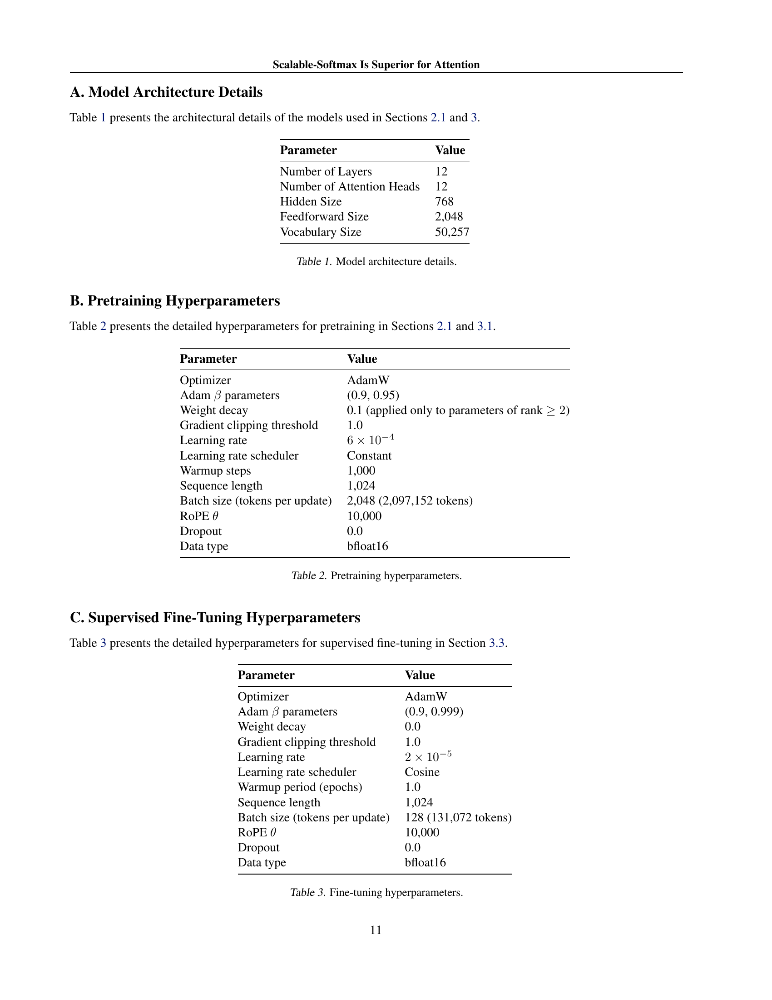

 


 2501.19399 
 Ken M. Nakanishi et el. 
 
 🤗 2025-02-03 
 



↗ arXiv


↗ Hugging Face


↗ Papers with Code


### TL;DR



본 논문은 **트랜스포머 기반 언어 모델에서 어텐션 메커니즘의 성능 저하 문제**를 다룹니다.  긴 문장을 처리할 때, 기존의 Softmax 함수는 중요한 정보를 제대로 파악하지 못하고 어텐션 분포가 평평해지는 현상(어텐션 페이딩)이 발생합니다. 이는 모델의 성능 저하 및 긴 문장 처리 능력 저하로 이어집니다. 

본 논문에서는 이 문제를 해결하기 위해 **Scalable-Softmax(SSMax)**라는 새로운 함수를 제안합니다. SSMax는 입력 벡터의 크기에 따라 동적으로 스케일링되어 어텐션 페이딩을 방지하고 중요 정보에 대한 집중도를 높입니다. 실험 결과, SSMax를 사용한 모델은 **학습 속도 향상 및 장문 컨텍스트에서의 성능 향상**을 보였으며, 특히 **핵심 정보 검색** 과제에서 우수한 성능을 나타냈습니다.  SSMax는 기존 아키텍처와의 호환성이 높아 적용이 용이하다는 장점도 있습니다.



#### Key Takeaways


 기존 Softmax의 한계점인 어텐션 저하 문제를 해결하기 위해 Scalable-Softmax(SSMax) 제안 



 SSMax는 장문 컨텍스트에서의 언어 모델 성능을 크게 향상시키며, 학습 속도 또한 향상 



 SSMax는 기존 트랜스포머 아키텍처와의 호환성이 높고 구현이 용이 


#### Why does it matter?
이 논문은 **장문 컨텍스트에서의 어텐션 메커니즘의 한계를 극복**하기 위한 새로운 방법을 제시하여 **장문 이해 및 생성 모델의 성능 향상**에 크게 기여할 수 있습니다.  **기존의 Softmax 함수의 문제점을 분석하고 개선된 Scalable-Softmax를 제안**함으로써,  장문 처리 분야의 연구에 새로운 방향을 제시하고 향후 연구의 발전에 중요한 영향을 미칠 것으로 예상됩니다. 특히, **다양한 모델 아키텍처와의 호환성 및 효율성**을 고려하여 실제 응용에 쉽게 적용될 수 있다는 점에서 그 중요성이 더욱 부각됩니다.

------
#### Visual Insights

> 🔼 그림 1은 Softmax와 SSMax의 비교를 보여줍니다. 입력 벡터의 크기가 증가함에 따라 Softmax의 출력 벡터 최대값은 감소하는 반면, SSMax는 입력 크기에 관계없이 최대값을 1에 가깝게 유지합니다. 이는 Softmax에서 발생하는 어텐션 감소 현상(attention fading)을 SSMax가 효과적으로 방지함을 보여줍니다. 입력 벡터는 마지막 요소를 제외하고는 모든 요소가 -2로 구성되며, 마지막 요소는 +3으로 설정됩니다. SSMax의 스케일링 매개변수 s는 0.43으로 설정되었습니다.
> 

> 
read the caption

> Figure 1:  Comparison of Softmax and SSMax, illustrating the issue of attention fading and the effectiveness of SSMax in preventing it. As the input vector size increases, the maximum value of the output vector produced by Softmax decreases, demonstrating the problem of attention fading. In contrast, SSMax keeps the maximum value close to 1, regardless of the input size. The input vector consists of -2 for all elements except the last, which is set to +3. The scaling parameter s𝑠sitalic_s of SSMax is set to 0.43.
> 


| Parameter | Value |
|---|---| 
| Number of Layers | 12 |
| Number of Attention Heads | 12 |
| Hidden Size | 768 |
| Feedforward Size | 2,048 |
| Vocabulary Size | 50,257 |

> 🔼 표 1은 본 논문의 2.1절과 3절에서 사용된 모델의 구조적 세부 정보를 보여줍니다.  모델의 레이어 수, 어텐션 헤드 수, 히든 사이즈, 피드포워드 사이즈, 그리고 어휘집 크기를 포함하여 모델의 주요 하이퍼파라미터들을 명시적으로 기술합니다. 이 정보는 모델의 크기와 복잡성에 대한 이해를 돕고, 실험 결과 해석에 중요한 맥락을 제공합니다.
> 

> 
read the caption

> Table 1: Model architecture details.
> 

### In-depth insights

#### Attention Fading
본 논문에서 '어텐션 페이딩'은 트랜스포머 기반 언어 모델의 어텐션 메커니즘에서 발생하는 현상으로, **컨텍스트 크기가 증가함에 따라 어텐션 분포가 평평해지는 현상**을 의미합니다. 이는 소프트맥스 함수의 특성으로 인해 입력 벡터의 크기가 커질수록 최대값이 0에 가까워지기 때문입니다.  결과적으로 모델은 중요한 정보에 효과적으로 집중할 수 없게 되어, **긴 문맥에 대한 일반화 능력이 저하**됩니다.  이러한 어텐션 페이딩 문제를 해결하기 위해, 본 연구는 **스케일러블 소프트맥스(SSMax)**를 제안합니다.  SSMax는 입력 벡터 크기에 따라 스케일링을 조정하여 어텐션 분포가 평평해지는 것을 방지하며, 실험 결과를 통해 **긴 문맥에서의 성능 향상**을 보여줍니다.  **학습 과정 전반에 SSMax를 적용한 모델**은 뛰어난 성능을 보였으며, 기존 모델에 SSMax를 적용하는 것만으로도 성능 개선이 가능함을 확인했습니다.  결론적으로, 어텐션 페이딩 현상은 긴 문맥 처리에 대한 모델 성능을 저해하며, SSMax는 이를 효과적으로 해결하는 핵심적인 방법론임을 시사합니다.

#### SSMax Design
논문에서 제시된 Scalable-Softmax (SSMax)의 설계는 기존 Softmax 함수의 한계를 극복하기 위한 혁신적인 시도입니다. **기존 Softmax는 입력 벡터의 크기가 증가함에 따라 출력 벡터의 최대값이 0에 가까워지는 현상인 어텐션 페이딩 문제**를 가지고 있습니다. 이는 긴 문맥을 처리하는 Transformer 모델의 성능 저하로 이어집니다. SSMax는 이 문제를 해결하기 위해 **입력 벡터의 크기를 고려하여 확률 분포를 조정**합니다.  **스케일링 파라미터(s)를 도입**하여 입력 벡터의 크기에 따라 지수 함수의 기저를 동적으로 조절함으로써 어텐션 페이딩을 효과적으로 완화합니다.  **바이어스 파라미터(b) 추가**를 통해 학습 속도 향상을 도모하는 것도 고려되었으나,  실험 결과 긴 문맥 처리 성능에는 다소 부정적인 영향을 미치는 것으로 나타났습니다. **입력 벡터 크기의 로그 함수와 관련된 관계식**을 통해 SSMax의 설계가 이론적으로 정당화됩니다.  결과적으로 SSMax는  Transformer 모델에 손쉽게 통합될 수 있으며, 긴 문맥 처리 및 주요 정보 검색 성능을 향상시키는 효과적인 방법으로 제시됩니다.

#### Empirical Results
본 논문에서 제시된 Scalable-Softmax (SSMax)의 실험적 결과는 **긴 문맥에 대한 일반화 성능 향상**을 명확히 보여줍니다.  SSMax를 사용한 모델은 기존 Softmax 모델보다 훈련 손실 감소 속도가 빨랐고, 특히 긴 문맥에서 **훨씬 낮은 테스트 손실**을 기록했습니다.  이는 SSMax가 어텐션 메커니즘의 한계를 극복하고, 긴 문맥 내의 중요 정보에 대한 집중도를 높이는 데 효과적임을 시사합니다.  **Needle-In-A-Haystack 테스트**에서도 SSMax의 우수성이 입증되었는데, 긴 문맥에서도 SSMax를 사용한 모델이 중요 정보를 효과적으로 검색하는 능력을 보였습니다.  **어텐션 분석** 결과는 SSMax가 중요 토큰에 대한 어텐션을 효과적으로 할당하는 것을 보여주어, 긴 문맥에서도 모델의 집중력을 유지하는 데 기여함을 확인시켜줍니다.  **전반적으로 SSMax는 긴 문맥 처리 성능을 향상시키는 강력한 방법**으로 평가할 수 있습니다.  하지만, 사후 훈련에서 SSMax를 적용하는 경우에는 단점이 존재한다는 점도 유의해야 합니다.

#### Retrieval Analysis
본 논문에서는 검색 분석에 대한 심층적인 고찰이 부족하여 자세한 내용을 제공할 수 없습니다. 하지만, 일반적으로 검색 분석은 **검색 시스템의 성능을 평가하고 개선하기 위해 수행되는 중요한 단계**입니다.  검색 결과의 정확성, 관련성, 효율성 등을 다양한 지표를 활용하여 분석합니다.  **정확성은 검색어와 일치하는 문서를 얼마나 정확하게 찾아내는지**를, **관련성은 사용자의 검색 의도와 검색 결과의 적합성**을, **효율성은 검색 속도와 자원 소모량**을 의미합니다. 검색 분석을 통해 **시스템의 문제점을 파악하고 개선 방향을 설정**할 수 있으며, 사용자 경험을 향상시키는 데 크게 기여합니다.  **다양한 평가 지표 및 분석 기법**을 통해 시스템의 강점과 약점을 파악하고, 지속적인 성능 개선을 위한 방향을 제시하는 것이 중요합니다.

#### Future Work
본 논문의 핵심 아이디어는 **확장 가능한 소프트맥스(SSMax)**를 사용하여 트랜스포머 기반 언어 모델의 어텐션 메커니즘을 개선하는 것입니다.  향후 연구 방향으로는 다음과 같은 세 가지 중요한  주제를 고려할 수 있습니다. 첫째, **SSMax의 다양한 아키텍처 및 모델 크기와의 호환성**을 더욱 심층적으로 조사해야 합니다.  다양한 크기의 모델에 SSMax를 적용했을 때 성능 향상이 어떻게 달라지는지, 그리고 메모리나 계산 비용에 어떤 영향을 미치는지 등을 분석할 필요가 있습니다. 둘째, **SSMax와 다른 장기 문맥 처리 기법들과의 상호작용**에 대한 연구가 필요합니다.  예를 들어, 스파스 어텐션 메커니즘이나 개선된 위치 인코딩 기법과 SSMax를 결합하면 시너지 효과를 얻을 수 있을 것입니다. 마지막으로, **SSMax의 이론적 토대를 더욱 강화**하고 그 효과를 수학적으로 엄밀하게 분석하는 연구가 필요합니다.  SSMax의 성능 향상에 기여하는 요인을 명확하게 파악하여, 더욱 효율적이고 강력한 어텐션 메커니즘을 개발하는데 기여할 수 있을 것입니다.

### More visual insights

More on figures

> 🔼 그림 2는 학습된 매개변수 pn과 입력 벡터 크기 n 사이의 관계를 보여줍니다. 빨간 점은 학습 후 pn의 학습된 값을 나타내고, 파란색 곡선은 pn ≈ a1logn + a2 형태의 적합된 로그 함수입니다. 이 결과는 pn이 n에 따라 로그적으로 의존한다는 것을 시사하며, 이는 식 (4)에서 Softmax를 재구성하는 동기를 부여합니다.  즉, 입력 벡터의 크기가 증가함에 따라 Softmax 함수의 최대값이 감소하는 현상(attention fading)을 해결하기 위해 Softmax 함수를 수정해야 함을 보여주는 그림입니다.
> 

> 
read the caption

> Figure 2:  Relationship between pnsubscript𝑝𝑛p_{n}italic_p start_POSTSUBSCRIPT italic_n end_POSTSUBSCRIPT and the input vector size n𝑛nitalic_n. The red dots represent the learned values of pnsubscript𝑝𝑛p_{n}italic_p start_POSTSUBSCRIPT italic_n end_POSTSUBSCRIPT after training, and the blue curve is a fitted logarithmic function of the form pn≈a1⁢log⁡n+a2subscript𝑝𝑛subscript𝑎1𝑛subscript𝑎2p_{n}\approx a_{1}\log n+a_{2}italic_p start_POSTSUBSCRIPT italic_n end_POSTSUBSCRIPT ≈ italic_a start_POSTSUBSCRIPT 1 end_POSTSUBSCRIPT roman_log italic_n + italic_a start_POSTSUBSCRIPT 2 end_POSTSUBSCRIPT. This result suggests that pnsubscript𝑝𝑛p_{n}italic_p start_POSTSUBSCRIPT italic_n end_POSTSUBSCRIPT depends logarithmically on n𝑛nitalic_n, motivating the reformulation of Softmax in Equation 4.
> 

> 🔼 그림 3은 Softmax와 SSMax의 동작을 보여주는 예시입니다. 입력 벡터의 크기 n이 (0, 1/(n-2), 2/(n-2), ..., (n-1)/(n-2), 1, z_max)로 주어질 때, Softmax와 SSMax가 z_max 값을 어떻게 변환하는지를 보여줍니다. 가로축은 z_max의 값을, 세로축은 변환된 값을 나타냅니다. 빨간색과 주황색 선은 서로 다른 스케일링 매개변수 s를 사용한 SSMax를, 파란색 선은 Softmax를 나타내며, 선의 스타일은 서로 다른 입력 벡터 크기를 나타냅니다. 이 그림은 Softmax에서는 주의 집중을 위해 필요한 z_max 값이 n이 커짐에 따라 무한정 증가하지만, SSMax에서는 z_max 값이 다른 값보다 약 1/s만큼 크면 주의가 집중됨을 보여줍니다. 즉, SSMax는 입력 벡터 크기에 관계없이 주의 집중을 유지할 수 있음을 시각적으로 보여주는 예시입니다.
> 

> 
read the caption

> Figure 3:  An example illustrating the behavior of Softmax and SSMax for an input vector of size n𝑛nitalic_n given by (0,1n−2,2n−2,…,n−1n−2,1,zmax)01𝑛22𝑛2…𝑛1𝑛21subscript𝑧max(0,\frac{1}{n-2},\frac{2}{n-2},\dots,\frac{n-1}{n-2},1,z_{\mathrm{max}})( 0 , divide start_ARG 1 end_ARG start_ARG italic_n - 2 end_ARG , divide start_ARG 2 end_ARG start_ARG italic_n - 2 end_ARG , … , divide start_ARG italic_n - 1 end_ARG start_ARG italic_n - 2 end_ARG , 1 , italic_z start_POSTSUBSCRIPT roman_max end_POSTSUBSCRIPT ). The horizontal axis represents the value of zmaxsubscript𝑧maxz_{\mathrm{max}}italic_z start_POSTSUBSCRIPT roman_max end_POSTSUBSCRIPT, while the vertical axis represents its transformed value. The red and orange lines correspond to SSMax with different scaling parameters s𝑠sitalic_s, and the blue lines correspond to Softmax, with line styles indicating different input vector sizes. This figure demonstrates that, under Softmax, the value of zmaxsubscript𝑧maxz_{\mathrm{max}}italic_z start_POSTSUBSCRIPT roman_max end_POSTSUBSCRIPT required to focus attention increases indefinitely as n𝑛nitalic_n grows. In contrast, SSMax ensures that attention is focused as long as zmaxsubscript𝑧maxz_{\mathrm{max}}italic_z start_POSTSUBSCRIPT roman_max end_POSTSUBSCRIPT exceeds the other values by approximately 1s1𝑠\frac{1}{s}divide start_ARG 1 end_ARG start_ARG italic_s end_ARG, regardless of n𝑛nitalic_n.
> 

> 🔼 그림 4는 표준 Transformer 모델과 여러 SSMax 변형 모델의 학습 곡선을 비교한 것입니다.  SSMax 변형 모델들은 모두 표준 Transformer 모델보다 훈련 손실이 지속적으로 낮았습니다. 특히, 편향 매개변수를 포함한 SSMax 모델 (d)이 훈련 과정 전체에서 가장 낮은 손실을 보였습니다. 또한, 스케일링 매개변수를 제거한 SSMax 모델 (c)의 경우 학습 곡선에 미치는 영향이 (b)와 비교했을 때 거의 없다는 것을 알 수 있습니다.
> 

> 
read the caption

> Figure 4:  Learning curves comparing the standard Transformer (a) and SSMax variants (b)–(d). All SSMax variants achieve consistently lower training loss compared to (a). Among them, the model with SSMax incorporating a bias parameter (d) exhibits the lowest loss throughout training. The results also indicate that removing the scaling parameter, as in (c), has little impact on the learning curve compared to (b).
> 

> 🔼 그림 5는 문맥 크기가 최대 20,000 토큰까지 확장된 상황에서의 위치별 테스트 손실을 보여줍니다. x축은 문맥 크기를, y축은 테스트 손실을 나타냅니다. 추가적인 훈련 없이 RoPE의 θ값을 훈련 시 값의 50배로 설정했습니다. 회색 점선은 1024 토큰의 훈련 시퀀스 길이를 나타냅니다. 그림은 (a)~(f) 구성을 따릅니다. SSMax 모델 (b)와 (c)는 (a)와 비교하여 장문맥 일반화 성능이 향상되었지만, (d)는 바이어스 매개변수로 인해 성능이 저하되었습니다. Softmax를 훈련 후 SSMax로 바꾼 모델 (e)는 짧은 문맥에서 어려움을 겪는 반면, 미세 조정 마지막 단계에서 SSMax로 전환한 (f)는 (b)와 거의 동등한 성능을 달성했습니다.
> 

> 
read the caption

> Figure 5:  Per-position test loss across context sizes up to 20,000. The x-axis represents context size, and the y-axis represents test loss. RoPE’s θ𝜃\thetaitalic_θ was set to 50 times the training value, with no additional training after modification. The gray dotted line indicates the training sequence length of 1024. Results correspond to configurations (a)–(f). SSMax models (b) and (c) demonstrate improved long-context generalization compared to (a), while (d) exhibits degraded performance due to the bias parameter. Model (e), where Softmax was replaced with SSMax post-training, struggles with shorter contexts, whereas (f), which switched to SSMax during the final phase of pretraining, achieves performance somewhat close to (b), though not entirely equivalent.
> 

> 🔼 그림 6은 Needle-In-A-Haystack 테스트 결과를 보여줍니다. 가로축은 문맥의 길이를, 세로축은 문맥 내에서 바늘(목표 정보)이 삽입된 깊이를 나타냅니다. 색상은 검색 정확도를 나타냅니다. RoPE의 θ는 사전 훈련 값보다 50배 증가한 500,000으로 설정되었습니다. 표준 Transformer(a)는 짧은 문맥을 넘어서면 주요 정보 검색에 실패하지만, SSMax 모델(b)는 훈련 시 문맥 길이보다 약 10배 더 긴 문맥에서도 높은 검색 정확도를 유지합니다. 모델 (c)와 (d)는 (b)보다 검색 정확도가 낮은데, 이는 스케일링 매개변수 제거 또는 바이어스 매개변수 도입이 검색 성능을 저하시키기 때문입니다. 사전 훈련 후 또는 사전 훈련 중에 Softmax를 SSMax로 바꾼 모델 (e)와 (f)는 (a)보다 부분적으로 성능이 향상되지만 (b)에는 훨씬 못 미칩니다.
> 

> 
read the caption

> Figure 6:  Needle-In-A-Haystack test results. The horizontal axis represents context size, while the vertical axis denotes the depth at which the needle is embedded within the context. Colors indicate retrieval accuracy. RoPE’s θ𝜃\thetaitalic_θ was set to 500,000, a 50-fold increase from the pretraining value. The standard Transformer (a) fails to retrieve key information beyond short context sizes, while the SSMax model (b) maintains high retrieval accuracy even at context sizes approximately 10 times longer than in training. Models (c) and (d) show lower retrieval accuracy than (b), demonstrating that removing the scaling parameter or introducing a bias parameter degrades retrieval performance. Models where Softmax was replaced with SSMax after pretraining (e) and during pretraining (f) show partial improvements over (a) but remain far below (b).
> 

> 🔼 그림 7은 주의 메커니즘에서 핵심 정보 검색에 대한 각 모델의 성능을 보여주는 주의 헤드별 바늘 점수 분포를 나타냅니다. 가로축은 바늘 점수에 따라 순위가 매겨진(높은 점수에서 낮은 점수 순서) 주의 헤드를 나타내고, 세로축은 해당 바늘 점수를 나타냅니다. 명확성을 위해 모든 144개의 헤드 대신 상위 25개의 헤드만 표시했습니다. RoPE의 θ는 사전 훈련보다 50배 증가한 500,000으로 설정되었습니다. 문맥 크기는 8000이었고, '특별한 마법 도쿄 번호는: 8106422.'라는 바늘 문장이 50% 깊이에 삽입되었습니다. 결과는 표준 트랜스포머(a)는 핵심 토큰에 중요한 주의를 할당하지 못하지만, SSMax(b)는 효과적으로 핵심 토큰에 주의를 집중한다는 것을 보여줍니다. 모델 (c), (d), (e) 및 (f)는 (a)보다 더 많은 주의를 할당하지만 (b)에서 달성한 초점에는 미치지 못합니다. 추론 결과는 (a)가 전체 검색에 실패했고, (b)와 (c)는 올바른 숫자를 성공적으로 검색했으며, (d), (e) 및 (f)는 첫 번째 자릿수만 검색하고 전체 숫자는 검색하지 못했음을 나타냅니다.
> 

> 
read the caption

> Figure 7:  Needle score distribution across attention layers and heads. The horizontal axis represents attention heads ranked by needle score (highest to lowest), while the vertical axis shows the corresponding needle score. Note that only the top 25 heads are shown for clarity, rather than all 144 heads. RoPE’s θ𝜃\thetaitalic_θ was set to 500,000, a 50-fold increase from pretraining. The context size was 8000, with the needle sentence “The special magic Tokyo number is: 8106422.” inserted at a depth of 50%. The results demonstrate that the standard Transformer (a) fails to allocate significant attention to key tokens, whereas SSMax (b) effectively concentrates attention on them. Models (c), (d), (e), and (f) allocate more attention than (a) but fail to match the focus achieved by (b). Inference results indicate that (a) failed retrieval entirely, (b) and (c) successfully retrieved the correct number, and (d), (e), and (f) retrieved only the first digit but failed to recall the full number.
> 

> 🔼 그림 8은 다양한 모델들에 대한 최고 바늘 점수 분포를 보여줍니다. 각 모델은 100번의 시험을 거쳤고, 각 시험에서 가장 높은 바늘 점수(그림 7의 가장 왼쪽 값에 해당)가 기록되었습니다. 가로축은 최고 바늘 점수의 순위(내림차순)를 나타내고, 세로축은 해당 점수를 나타냅니다. 마커는 검색된 숫자가 완전히 정확한지(∙), 첫 번째 자릿수만 정확한지(▲), 완전히 잘못된지(×)를 나타냅니다. RoPE의 θ는 사전 훈련 값보다 50배 높은 500,000으로 설정되었습니다. 문맥 크기는 8000으로 고정되었고, 도시 이름, 숫자, 삽입 깊이는 무작위로 할당되었습니다. 결과는 표준 Transformer(a)가 주요 토큰에 대한 집중을 실패한 반면, SSMax(b)는 강력한 집중을 보여줌을 확인시켜줍니다. 모델 (c), (d), (e), (f)는 (a)보다 부분적으로 개선되었지만 (b)의 집중 수준에는 미치지 못했습니다.
> 

> 
read the caption

> Figure 8:  Top needle score distribution across models. Each model was evaluated over 100 trials, and the highest needle score from each trial (corresponding to the leftmost value in Figure 7) was recorded. The horizontal axis represents the rank of the top needle scores, sorted in descending order, while the vertical axis shows the corresponding score. Different markers indicate whether the retrieved number was fully correct (∙∙\bullet∙), incorrect but with the first digit correct (▲▲\blacktriangle▲), or completely incorrect (×\bm{\times}bold_×). RoPE’s θ𝜃\thetaitalic_θ was set to 500,000, a 50-fold increase from pretraining. Context size was fixed at 8000, with city names, numbers, and insertion depths randomly assigned. The results confirm that the standard Transformer (a) fails to focus attention on key tokens, whereas SSMax (b) exhibits strong concentration. Models (c), (d), (e), and (f) show partial improvements over (a) but fail to match (b)’s level of attention focus.
> 

More on tables


| Parameter | Value |
|---|---| 
| Optimizer | AdamW |
| Adam \(\beta\) parameters | (0.9, 0.95) |
| Weight decay | 0.1 (applied only to parameters of rank \(\geq 2\)) |
| Gradient clipping threshold | 1.0 |
| Learning rate | <math alttext="6\times 10^{-4}" class="ltx_Math" display="inline" id="A2.T2.3.3.1.m1.1"><semantics id="A2.T2.3.3.1.m1.1a"><mrow id="A2.T2.3.3.1.m1.1.1"><mn id="A2.T2.3.3.1.m1.1.1.2">6</mn><mo id="A2.T2.3.3.1.m1.1.1.1" lspace="0.222em" rspace="0.222em">×</mo><msup id="A2.T2.3.3.1.m1.1.1.3"><mn id="A2.T2.3.3.1.m1.1.1.3.2">10</mn><mrow id="A2.T2.3.3.1.m1.1.1.3.3"><mo id="A2.T2.3.3.1.m1.1.1.3.3a">−</mo><mn id="A2.T2.3.3.1.m1.1.1.3.3.2">4</mn></mrow></msup></mrow><annotation-xml encoding="MathML-Content" id="A2.T2.3.3.1.m1.1b"><apply id="A2.T2.3.3.1.m1.1.1"><times id="A2.T2.3.3.1.m1.1.1.1"></times><cn id="A2.T2.3.3.1.m1.1.1.2" type="integer">6</cn><apply id="A2.T2.3.3.1.m1.1.1.3"><csymbol cd="ambiguous" id="A2.T2.3.3.1.m1.1.1.3.1."></csymbol><cn id="A2.T2.3.3.1.m1.1.1.3.2" type="integer">10</cn><apply id="A2.T2.3.3.1.m1.1.1.3.3"><minus id="A2.T2.3.3.1.m1.1.1.3.3.1."></minus><cn id="A2.T2.3.3.1.m1.1.1.3.3.2" type="integer">4</cn></apply></apply></apply></annotation-xml><annotation encoding="application/x-tex" id="A2.T2.3.3.1.m1.1c">6\times 10^{-4}</annotation><annotation encoding="application/x-llamapun" id="A2.T2.3.3.1.m1.1d">6 \times 10 start_POSTSUPERSCRIPT - 4 end_POSTSUPERSCRIPT</annotation></semantics></math> |
| Learning rate scheduler | Constant |
| Warmup steps | 1,000 |
| Sequence length | 1,024 |
| Batch size (tokens per update) | 2,048 (2,097,152 tokens) |
| RoPE <math alttext="\theta" class="ltx_Math" display="inline" id="A2.T2.4.4.1.m1.1"><semantics id="A2.T2.4.4.1.m1.1a"><mi id="A2.T2.4.4.1.m1.1.1">\theta</mi><annotation-xml encoding="MathML-Content" id="A2.T2.4.4.1.m1.1b"><ci id="A2.T2.4.4.1.m1.1.1">𝜃</ci></annotation-xml><annotation encoding="application/x-tex" id="A2.T2.4.4.1.m1.1c">\theta</annotation><annotation encoding="application/x-llamapun" id="A2.T2.4.4.1.m1.1d">italic_θ</annotation></semantics></math> | 10,000 |
| Dropout | 0.0 |
| Data type | bfloat16 |
> 🔼 표 2는 논문의 3.1절(학습 곡선 분석)에서 사용된 Transformer 모델의 사전 학습 하이퍼파라미터를 보여줍니다.  AdamW 최적화기를 사용하였고, 학습률, 배치 크기, 드롭아웃 비율 등의 세부 설정값들을 포함합니다.  이 표는 모델의 사전 학습 과정에 대한 자세한 정보를 제공하여 재현성을 높입니다.
> 

> 
read the caption

> Table 2: Pretraining hyperparameters.
> 


| Parameter | Value |
|---|---| 
| Optimizer | AdamW |
| Adam \(\beta\) parameters | (0.9, 0.999) |
| Weight decay | 0.0 |
| Gradient clipping threshold | 1.0 |
| Learning rate | <math>2\times 10^{-5}</math> |
| Learning rate scheduler | Cosine |
| Warmup period (epochs) | 1.0 |
| Sequence length | 1,024 |
| Batch size (tokens per update) | 128 (131,072 tokens) |
| RoPE \(\theta\) | 10,000 |
| Dropout | 0.0 |
| Data type | bfloat16 |
> 🔼 표 3은 본 논문의 3.3절에서 수행된 지도 학습 파인튜닝에 사용된 하이퍼파라미터들을 자세히 보여줍니다.  최적화 알고리즘, 학습률, 배치 크기, 드롭아웃 비율, 그리고 RoPE(Rotary Position Embedding)의 θ값 등 파인튜닝 과정에 영향을 미치는 다양한 설정 값들이 포함되어 있습니다. 이 표는 실험의 재현성을 확보하고, 사용된 하이퍼파라미터의 세부적인 내용을 이해하는 데 도움을 줍니다.
> 

> 
read the caption

> Table 3: Fine-tuning hyperparameters.
> 

### Full paper



