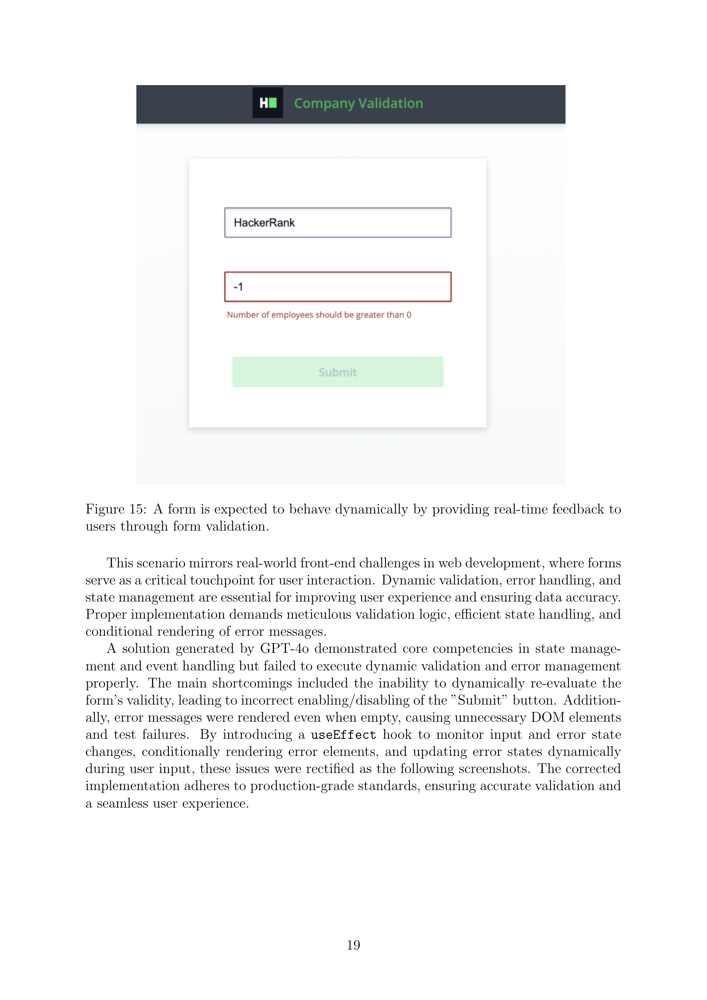

 


 2502.00226 
 Jun Xing et el. 
 
 🤗 2025-02-06 
 



↗ arXiv


↗ Hugging Face


↗ Papers with Code


### TL;DR



현존하는 벤치마크들은 단일 파일 문제 또는 특정 라이브러리에 초점을 맞추어 실제 소프트웨어 개발 환경을 충분히 반영하지 못한다는 한계가 있습니다. 이에 본 연구는 **HackerRank-ASTRA 벤치마크**를 제시하여, 실제 다중 파일 프로젝트 문제를 통해 LLM의 정확성과 일관성을 엄격하게 평가합니다.  이는 실제 개발 시나리오를 보다 잘 반영하여, **모델의 실제 적용 가능성에 대한 보다 현실적인 평가**를 제공합니다.

본 연구는 다양한 프로그래밍 언어와 프레임워크를 아우르는 65개의 문제를 사용하여 실험을 진행했습니다.  결과적으로, 상위 LLM 모델들은 평균 75%의 성능을 보였으나, 통계적으로 유의미한 차이는 없었습니다. 하지만, **Claude-3.5-Sonnet-1022 모델은 가장 높은 일관성**을 보였으며, 이는 실제 소프트웨어 개발에 중요한 의미를 가집니다.  또한, **XML 형식의 출력이 JSON 형식보다 우수한 성능**을 보였음을 확인했습니다. 이러한 결과는 LLM의 성능 향상 및 실제 적용 가능성 향상을 위한 중요한 시사점을 제공합니다.



#### Key Takeaways


 HackerRank-ASTRA 벤치마크는 실제 소프트웨어 개발 문제를 반영하여 LLM의 성능을 평가합니다. 



 상위 LLM 모델들은 유사한 성능을 보이지만, Claude-3.5-Sonnet-1022 모델은 가장 높은 일관성을 보입니다. 



 XML 형식의 출력이 JSON 형식보다 성능이 더 우수합니다. 


#### Why does it matter?
본 논문은 **실제 소프트웨어 개발 시나리오를 반영한 벤치마크**를 제시하여, 대규모 언어 모델(LLM)의 실제 적용 가능성을 평가하는 데 중요한 기여를 합니다. 기존 연구의 한계를 극복하고 **다양한 프로그래밍 언어 및 여러 파일로 구성된 프로젝트 기반 문제**를 다루는 점에서 특히 가치가 있습니다.  연구 결과는 **LLM의 성능과 신뢰성을 향상**시키기 위한 방향을 제시하며, 미래의 연구를 위한 새로운 가능성을 열어줍니다.  또한, **실제 산업 현장의 요구사항을 반영**하여, 현실적인 문제 해결에 대한 깊이 있는 통찰력을 제공합니다. 따라서, 소프트웨어 공학 및 AI 분야 연구자들에게 중요한 자료이며, 관련 분야의 발전에 크게 기여할 것으로 예상됩니다.

------
#### Visual Insights

> 🔼 그림 1은 HackerRank-ASTRA 벤치마크의 주요 기술 빈도를 보여줍니다. 각 막대는 특정 주요 기술(예: React 프론트엔드 개발, Node.js 백엔드 개발 등)과 해당 기술이 포함된 문제의 수를 나타냅니다. 이 그림을 통해 HackerRank-ASTRA 벤치마크가 다양한 프론트엔드 개발 기술을 망라하고 있음을 알 수 있습니다. 각 기술의 문제 수는 해당 기술의 중요도 또는 벤치마크에서의 대표성을 반영할 수 있습니다.  자세한 기술 분포는 본 논문의 2.3절 ‘Skill Domains’ 에서 확인할 수 있습니다.
> 

> 
read the caption

> Figure 1: Distribution of v1 HackerRank-ASTRA benchmark main skill frequency.
> 


| Statistic | Value |
|---|---| 
| Total Project Questions | 65 |
| Count of Main Skill Categories | 10 |
| Count of Sub Skill Categories | 34 |
| Average Number of Test Cases | 6.7 |
| Average Input Files | 12 |
| Average Input Character Length | 22,863 |
| Average Problem Statement Character Length | 718 |
| Average Output Character Length | 2,744 |
| Average Expected Lines of Code | 84 |
| Average Modified Code Files | 2.3 |

> 🔼 표 1은 HackerRank-ASTRA 벤치마크의 주요 통계를 보여줍니다.  총 질문 수, 주요 기술 카테고리 수, 하위 기술 카테고리 수, 평균 테스트 케이스 수, 평균 입력 파일 수, 평균 입력 문자 길이, 평균 문제 설명 문자 길이, 평균 출력 문자 길이, 평균 예상 코드 줄 수, 평균 수정된 코드 파일 수 등의 정보를 담고 있습니다. 이 표는 벤치마크 데이터셋의 규모와 특징을 요약하여 보여줍니다.
> 

> 
read the caption

> Table 1: Key Statistics of v1 HackerRank-ASTRA Benchmark
> 

### In-depth insights

#### LLM Project Eval
LLM 프로젝트 평가는 대규모 언어 모델(LLM)의 실제 응용 가능성을 평가하는 데 매우 중요합니다.  단순한 코딩 문제 해결을 넘어, **다중 파일 프로젝트 환경에서의 모델의 정확성과 일관성**을 평가하는 것이 중요하며, 이를 위해서는 실제 소프트웨어 개발 시나리오를 반영한 벤치마크가 필요합니다.  HackerRank-ASTRA 벤치마크는 이러한 요구사항을 충족하기 위해 개발되었으며, 다양한 프런트엔드 프레임워크를 활용한 프로젝트 기반 코딩 문제를 제공합니다.  평가 지표는 단순한 정확도 측정을 넘어, **일관성 및 신뢰도를 고려한 다양한 지표(예: 평균 점수, Median SD)**를 포함합니다.  **다양한 기술 영역과 하위 기술들을 아우르는 문제 구성**은 LLM의 실제 개발 능력을 보다 포괄적으로 평가할 수 있도록 도와줍니다.  하지만,  **모델의 일관성 확보 및 형식 오류 처리**는 여전히 개선이 필요한 부분이며,  실제 소프트웨어 개발과 유사한 복잡한 상황을 반영한 평가는 앞으로도 지속적인 연구가 필요함을 시사합니다.

#### ASTRA Benchmark
HackerRank의 ASTRA 벤치마크는 **실제 소프트웨어 개발 시나리오를 반영한 다중 파일 프로젝트 기반의 코딩 과제**를 제공하여 대규모 언어 모델(LLM)의 정확성과 일관성을 평가하는 획기적인 벤치마크입니다. 기존 벤치마크와 달리 단일 파일 문제나 특정 라이브러리에 국한되지 않고, **여러 파일과 프레임워크를 아우르는 복잡한 프로젝트 환경**에서 모델의 성능을 평가합니다.  **다양한 프런트엔드 기술(Node.js, React.js, Angular.js 등)을 포함하며, 32회 반복 실행을 통해 모델의 일관성을 측정하는 점이 특징**입니다.  평가 지표로는 평균 점수, pass@1, 그리고 중앙값 표준편차를 사용하여 모델의 정확성과 안정성을 종합적으로 평가합니다.  **실제 산업 현장의 코딩 과제를 반영**하여 개발자의 실제 역량과 LLM의 성능을 비교 분석하는 데 유용하며,  **모델의 강점과 약점을 명확히 파악하고, 실제 소프트웨어 개발 환경에 대한 적용 가능성을 높이는 데 크게 기여**할 것으로 기대됩니다.  또한,  **XML/JSON 형식의 출력을 지원**하여 다양한 프로그래밍 언어와의 호환성을 높였습니다.

#### Consistency Metrics
연구 논문에서 '일관성 지표'에 대한 심층적인 논의는 **모델의 예측값이 여러 번 실행 시 일관성을 유지하는 정도를 정량적으로 측정**하는 방법에 대한 중요한 통찰력을 제공합니다.  단순히 정확도만 평가하는 것이 아니라, **동일한 입력에 대해 모델이 반복적으로 같은 결과를 생성하는지**를 평가함으로써 모델의 안정성과 신뢰성을 확인하는 데 초점을 맞춥니다. 이러한 일관성 지표는 **실제 환경에서 모델의 성능을 예측하는 데 중요한 역할**을 하며, **모델 개발 과정에서 발생 가능한 오류 및 편향을 감지**하는 데 도움을 줍니다.  특히, 다양한 분야의 소프트웨어 개발 문제를 다루는 모델의 경우, 일관된 결과를 생성하는 능력은 실용성 측면에서 매우 중요하며, 이를 평가하는 일관성 지표는 모델의 품질과 신뢰성을 향상시키는 데 필수적입니다.  따라서, **일관성 지표는 모델의 성능을 포괄적으로 평가하기 위한 필수적인 요소**이며, 앞으로 더욱 심도있는 연구와 개발이 필요한 분야입니다.

#### Format Impact
본 논문의 "Format Impact" 부분은 XML과 JSON 두 가지 형식의 출력물에 대한 LLMs의 성능 차이를 분석한 결과를 제시합니다. **XML 형식이 JSON 형식보다 전반적으로 더 높은 정확도를 보였다는 점이 주목할 만합니다.**  이는 LLMs의 학습 데이터셋에 XML 형식의 코드가 더 풍부하게 포함되어 있기 때문일 가능성이 높습니다.  **XML이 JSON보다 구조적이고 계층적인 정보 표현에 유리하기 때문에 LLMs가 코드의 구조를 더 잘 파악하고 정확한 결과를 생성하는 데 도움이 되었을 수 있습니다.**  하지만 이러한 결과는 사용된 LLMs과 데이터셋에 따라 달라질 수 있으므로,  다양한 모델과 데이터셋을 이용한 추가적인 실험이 필요합니다. 또한, **XML과 JSON의 구조적 차이가 LLMs의 성능 차이에 어떻게 영향을 미치는지에 대한 더 깊이 있는 분석이 필요합니다.**  결론적으로, 코드 생성 작업에서 출력 형식의 선택은 모델 성능에 상당한 영향을 미치므로,  **개발자는 사용하는 모델과 데이터셋의 특성을 고려하여 최적의 형식을 선택해야 합니다.**  이 연구는 LLMs의 코드 생성 성능 평가에 있어 출력 형식의 중요성을 강조하며, 향후 연구 방향을 제시하는 데 기여합니다.

#### Future Work
본 논문의 "향후 연구 방향" 부분은 현재 연구의 한계점을 명확히 제시하고, 이를 극복하기 위한 구체적인 후속 연구 과제들을 제시하는 데 중점을 둡니다. **다양한 백엔드 기술 및 스킬을 포함하도록 벤치마크의 범위를 확장**하여 현재 프론트엔드 중심의 편향성을 해소하고, **에이전트 기반 접근 방식을 도입**하여 모델의 동적 문제 해결 능력을 평가하는 것을 제안합니다. 또한, **단계적인 피드백을 통합**하여 모델의 점진적인 개선 과정을 평가하고, 보다 다양한 최첨단 모델을 포함하여 실험을 확장할 것을 제안합니다. 이는 벤치마크의 객관성과 신뢰도를 높이고, 보다 현실적인 소프트웨어 개발 환경을 반영하는 데 기여할 것입니다.  **GitHub 및 HuggingFace를 통해 벤치마크를 오픈 소싱**하여 보다 광범위한 참여와 협업을 유도하고, 벤치마크의 지속적인 발전을 도모합니다.  **다양한 프로그래밍 언어와 도메인을 포함**시켜 모델의 일반화 능력을 더욱 포괄적으로 평가하고, 더욱 발전된 벤치마크를 만들겠다는 의지를 보여줍니다.

### More visual insights

More on figures

> 🔼 그림 2는 HackerRank-ASTRA 벤치마크의 하위 기술 빈도를 보여줍니다. 각 하위 기술이 문제에서 얼마나 자주 등장하는지 보여주는 막대 그래프입니다.  이 그래프는 벤치마크 데이터셋 내의 다양한 프로그래밍 기술 및 관련 하위 기술들의 분포를 시각적으로 나타냅니다.  각 막대의 높이는 특정 하위 기술이 벤치마크의 문제들에서 나타나는 빈도를 나타냅니다. 이를 통해 어떤 하위 기술들이 벤치마크에서 얼마나 중요한 역할을 하는지 파악할 수 있습니다.
> 

> 
read the caption

> Figure 2: Distribution of v1 HackerRank-ASTRA benchmark sub-skill frequency.
> 

> 🔼 이 그림은 Node.js와 Express를 사용하여 제품 레코드를 관리하는 RESTful API 개발을 보여주는 예제 프로젝트의 구조를 나타냅니다. 이는 실제 전자상거래 개발 시나리오를 시뮬레이션하며, app.js 파일, models 폴더(products.js 포함), routes 폴더(products.js 포함), controllers 폴더(products.js 포함), 그리고 package.json 파일로 구성됩니다.  각 부분은 API의 서버 구현, 데이터 모델, 라우팅, 컨트롤러 로직, 그리고 프로젝트 의존성을 담당합니다.
> 

> 
read the caption

> Figure 3: Project structure of a sample RESTful API problem.
> 

> 🔼 그림 4는 HackerRank-ASTRA 벤치마크 평가 파이프라인의 개략도를 보여줍니다.  데이터 준비 단계에서 질문 목록이 포함된 CSV 파일을 읽어들이고, S3 버킷에서 해당 프로젝트 파일을 가져옵니다.  그 후, 모델에 전달할 구조화된 프롬프트를 생성합니다.  이 프롬프트에는 질문 지침, 문제 설명, 프로젝트 파일에 대한 정보가 포함됩니다.  솔루션 생성 단계에서는 생성된 프롬프트를 선택된 AI 모델(예: ol, Gemini, Claude)에 보내고, 모델은 지정된 형식(예: XML 또는 JSON)으로 솔루션을 생성합니다.  후처리 단계에서는 구문 분석 오류나 형식 문제 등을 검증하고 수정합니다.  솔루션 통합 단계에서는 검증된 솔루션을 프로젝트 파일에 통합합니다.  테스트 케이스 검증 단계에서는 도커 컨테이너에서 업데이트된 프로젝트를 실행하여 미리 정의된 테스트 케이스에 따라 평가합니다. 부분 결과 저장 단계에서는 각 질문에 대한 평가 결과를 CSV 파일에 기록합니다.  전체 집계 단계에서는 모든 질문을 평가한 후, 각 질문에 대한 주요 성능 지표를 계산합니다.  평가 지표에는 평균 점수, 평균 Pass@1, 표준 편차, 평균 테스트 케이스 통과율 등이 포함됩니다.
> 

> 
read the caption

> Figure 4: Diagram of v1 HackerRank-ASTRA benchmark evaluation pipeline.
> 

> 🔼 그림 5는 HackerRank-ASTRA 벤치마크의 첫 번째 버전(v1)에서 사용된 XML 프롬프트를 보여줍니다.  이 프롬프트는 모델이 문제 해결에 필요한 여러 파일을 생성하도록 지시하는데,  XML 형식을 사용하여 모델 출력을 통합하고 일관성 있고 신뢰할 수 있는 평가를 가능하게 합니다. 프롬프트는 질문에 대한 지침, 문제 설명, 그리고 솔루션에 필요한 프로젝트 파일을 포함합니다.  XML 구조는 파일 경로와 내용을 명확하게 정의하여 모델이 올바른 형식으로 출력을 생성하도록 유도합니다.  XML 구조를 사용함으로써, 다중 파일 수정을 필요로 하는 HackerRank-ASTRA 벤치마크의 특성에 맞춰 모델의 출력을 단일 파일로 통합하여 일관성 있는 평가를 가능하게 합니다.
> 

> 
read the caption

> Figure 5: XML prompt of v1 HackerRank-ASTRA benchmark.
> 

> 🔼 그림 6은 HackerRank-ASTRA 벤치마크의 버전 1에 사용된 JSON 프롬프트를 보여줍니다. 이 프롬프트는 모델이 문제 설명과 관련 소스 코드 파일을 입력으로 받아, 문제 해결에 필요한 코드를 JSON 코드 블록 형태로 출력하도록 지시합니다.  JSON 객체의 키는 상대 파일 경로이고, 값은 파일 콘텐츠 문자열입니다. 응답에는 문제 해결에 필요한 파일만 포함되어야 하며, JSON 코드 블록 외부에는 추가적인 지시사항이나 설명이 없어야 합니다.  모델은 JSON 포맷팅에 필요한 문자를 적절하게 이스케이프 처리해야 하지만, 코드 구문에 필요한 문자는 이스케이프하지 않아야 합니다. 또한, 파일 콘텐츠의 줄 바꿈과 탭 문자는 항상 이스케이프 처리해야 합니다. 이러한 지침은 모델이 일관되고 구조화된 출력을 생성하도록 돕고, 벤치마크의 평가 과정을 표준화하는 데 기여합니다.
> 

> 
read the caption

> Figure 6: JSON prompt of v1 HackerRank-ASTRA benchmark.
> 

> 🔼 그림 7은 주요 기술 분류별 모델 성능 비교를 보여줍니다.  각 주요 기술(예: AngularJS, Node.js, React 등)에 대해 다섯 개의 대규모 언어 모델(LLM)의 평균 점수를 비교하여 각 모델의 강점과 약점을 보여줍니다.  세로축은 평균 점수를 나타내고, 가로축은 각 주요 기술을 나타냅니다. 이를 통해 특정 프런트엔드 개발 과제에 가장 적합한 모델을 파악하는 데 도움이 됩니다.  특정 기술에 대한 모델의 상대적 강점과 약점을 시각적으로 비교하여 사용자에게 직관적인 이해를 제공합니다.
> 

> 
read the caption

> Figure 7: Model performance comparison by main skill categories.
> 

> 🔼 그림 8은 HackerRank-ASTRA 벤치마크의 하위 기술 분야별 모델 성능 비교를 보여줍니다. 이 그림은 총 3개의 그림으로 나누어져 있으며, 그림 8은 그 첫 번째 부분입니다. 각 그래프는 특정 하위 기술 분야에 대한 여러 모델(GPT-40, ol-preview, ol, gemini-1.5-pro, claude-sonnet-3.5)의 평균 점수를 비교하여 보여줍니다. x축은 하위 기술 분야, y축은 평균 점수를 나타냅니다.  각 하위 기술 분야별로 모델의 성능 차이를 한눈에 확인할 수 있도록 시각적으로 표현되어 있습니다. 각 모델의 성능을 세부적으로 비교 분석하는 데 유용합니다.
> 

> 
read the caption

> Figure 8: Model performance comparison by sub-skill categories (1/3).
> 

> 🔼 그림 9는 논문의 4.3절 'Sub-Skill Model Performance Summary'에서 다루는 하위 기술별 모델 성능 비교를 보여주는 세 개의 그림 중 두 번째 그림입니다. 이 그림은 다양한 프런트엔드 개발 하위 기술들에 대한 다섯 개의 모델(ol, ol-preview, Claude-3.5-Sonnet, Gemini-1.5-pro, GPT-40-0513)의 평균 점수를 비교 분석하여 각 모델의 강점과 약점을 보여줍니다. 각 하위 기술별로 모델의 성능 차이를 시각적으로 보여주어, 특정 기술에 특화된 모델을 선택하는 데 유용한 정보를 제공합니다.  그림 10과 함께 4.3절의 내용을 더 자세히 설명합니다.
> 

> 
read the caption

> Figure 9: Model performance comparison by sub-skill categories (2/3).
> 

> 🔼 그림 10은 논문의 하위 기술 범주별 모델 성능 비교를 보여줍니다. 이 그림은 다양한 프런트엔드 개발 하위 기술에 대한 다섯 가지 주요 언어 모델(ol, ol-preview, Claude-3.5-Sonnet-1022, Gemini-1.5-pro, GPT-40-0513)의 평균 점수를 비교하여 각 모델의 강점과 약점을 보여줍니다.  세부 기술별로 모델 성능이 크게 달라지는 것을 보여주어 특정 작업에 가장 적합한 모델을 선택하는 것이 중요함을 시사합니다.  각 모델의 상대적 강점과 약점을 파악하여 프로젝트 요구사항에 따라 적절한 모델을 선택하는 데 도움이 됩니다.
> 

> 
read the caption

> Figure 10: Model performance comparison by sub-skill categories (3/3).
> 

> 🔼 그림 11은 모델의 평균 출력 길이, 평균 점수, 그리고 입력 길이 간의 상관관계를 보여주는 산점도입니다. 각 점은 하나의 문제에 대한 모델의 성능을 나타내며, x축은 평균 출력 길이, y축은 평균 점수, 색상은 입력 길이를 나타냅니다. 이 그림을 통해 모델의 출력 길이가 길어질수록 평균 점수가 낮아지는 경향이 있음을 확인할 수 있습니다. 반면 입력 길이와 평균 점수 사이에는 약한 음의 상관관계가 나타납니다. 즉, 입력 길이가 길어질수록 평균 점수가 약간 낮아지는 경향이 있지만 그 영향은 출력 길이에 비해 미미합니다.
> 

> 
read the caption

> Figure 11: Scatter Plot of Average Output vs Average Score vs Input Length.
> 

> 🔼 그림 12는 GPT-4o-0513 모델이 제품 처리를 위해 정의한 라우트들을 보여줍니다.  이 라우트들은 제품 생성, 조회, 업데이트를 위한 POST, GET, PATCH 요청을 처리하도록 정의되어 있습니다.  하지만, DELETE와 PUT 요청에 대한 405 에러 처리를 통해 해당 요청을 허용하지 않도록 설정되어 있는 점도 확인할 수 있습니다.  이 그림은 모델이 생성한 코드의 구체적인 내용을 보여주어 모델의 정확성과 기능 구현 방식을 이해하는 데 도움이 됩니다.
> 

> 
read the caption

> Figure 12: The routes defined by GPT-4o-0513 for handling products.
> 

> 🔼 그림 13은 GPT-40-0513이 생성한 app.js 파일의 코드 스니펫입니다. 이 코드는 Node.js 기반 웹 애플리케이션의 백엔드 로직을 보여주는 것으로, express.js 프레임워크를 사용하여 라우팅 및 미들웨어를 설정하고 있습니다. 그림에서 보이는 코드는 주요 라우팅 구성을 담고 있으며, 실제로는 더 많은 코드가 포함될 수 있습니다. 이 그림은 논문의 실험 설정 부분에서, GPT-40-0513 모델이 생성한 코드의 일부를 보여주는 예시로 사용되었습니다.
> 

> 
read the caption

> Figure 13: The app.js provided by GPT-4o-0513.
> 

> 🔼 그림 14는 Node.js와 Express를 사용하여 RESTful API를 구현하는 문제에 대한 app.js 파일 수정 사항을 보여줍니다.  LLM 모델이 생성한 코드에서 라우팅을 메인 애플리케이션 파일에 제대로 통합하지 못한 오류를 수정해야 함을 보여줍니다.  즉,  '/products' 경로에 대한 라우팅이 제대로 설정되지 않아 404 오류가 발생했던 부분을 수정한 코드입니다. 이는 멀티 파일 프로젝트에서 모델의 종합적인 기능 검증에 대한 중요성을 강조합니다.
> 

> 
read the caption

> Figure 14: Fixes required in app.js.
> 

> 🔼 그림 15는 실시간 피드백을 통해 양식 유효성 검사를 제공하여 동적으로 동작할 것으로 예상되는 양식을 보여줍니다. 이는 웹 개발에서 사용자와 상호 작용하는 데 중요한 역할을 하는 양식에 대한 실제 시나리오를 반영합니다. 동적 유효성 검사, 오류 처리 및 상태 관리는 사용자 경험을 개선하고 데이터 정확성을 보장하는 데 필수적입니다. 올바른 구현은 꼼꼼한 유효성 검사 논리, 효율적인 상태 처리 및 오류 메시지의 조건부 렌더링을 요구합니다.
> 

> 
read the caption

> Figure 15: A form is expected to behave dynamically by providing real-time feedback to users through form validation.
> 

> 🔼 이 그림은 React 프로젝트에서 동적 양식의 유효성 검사를 구현하는 방법을 보여줍니다.  useEffect 훅을 사용하여 오류 또는 입력 값이 변경될 때마다 양식의 유효성을 다시 평가하고, UI가 항상 올바른 유효성 검사 상태를 반영하도록 합니다. 이를 통해 사용자에게 실시간 피드백을 제공하고, 양식 제출 전에 유효성 검사를 완료하도록 안내할 수 있습니다.  이는 최신 웹 개발 환경에서 일반적으로 사용되는 방법론이며,  사용자 경험을 향상시키는 데 매우 중요한 부분입니다.
> 

> 
read the caption

> Figure 16: A useEffect hook should be used to re-evaluate the form’s validity whenever any error or input changes.
> 

> 🔼 그림 17은 실제 에러 메시지가 있을 때만 에러 요소를 렌더링하는 방법을 보여줍니다.  React 프로젝트에서 동적 폼을 만드는 문제에 대한 설명과 관련이 있습니다.  이 그림은 사용자 입력에 따라 에러 메시지가 실시간으로 표시되고 사라지는 방식을 보여주는 예시를 제공합니다.  즉, 에러가 발생하지 않으면 에러 메시지가 표시되지 않고, 에러가 발생하면 에러 메시지가 표시되는 것을 의미합니다. 이는 사용자 경험을 향상시키기 위해 에러 처리를 명확하게 하는 방법을 보여줍니다.
> 

> 
read the caption

> Figure 17: Render error elements only when there is an actual error message.
> 

> 🔼 해당 그림은 사용자 입력에 따라 에러 상태를 동적으로 업데이트하는 handleChange 함수를 보여줍니다.  UI가 항상 올바른 유효성 검사 상태를 반영하도록 하기 위해 사용자 입력이 있을 때마다 에러 상태를 업데이트하는 방법을 설명합니다.  즉, 사용자가 입력 필드에 값을 입력할 때마다 유효성 검사가 실행되고, 에러가 발생하면 에러 메시지가 표시되고, 에러가 없으면 에러 메시지가 사라지며, 제출 버튼의 활성화/비활성화 상태가 업데이트됩니다. 이를 통해 실시간으로 사용자에게 피드백을 제공하고 사용자 경험을 향상시킵니다.
> 

> 
read the caption

> Figure 18: The handleChange function should update the error state dynamically based on user input to ensure the UI always reflects the correct validation status.
> 

> 🔼 그림 19는 길이 변환기의 기능을 보여줍니다. 사용자는 킬로미터, 미터, 센티미터와 같은 다양한 단위 간에 실시간으로 길이를 변환할 수 있습니다.  두 개의 입력 필드가 있으며, 각 필드에는 단위 선택을 위한 드롭다운 메뉴가 있습니다. 사용자가 한 입력 필드에 값을 입력하면, 선택된 단위에 따라 다른 입력 필드의 값이 자동으로 업데이트됩니다. 마찬가지로, 드롭다운 메뉴에서 단위를 변경하면 연관된 입력 필드에 대한 변환된 값이 다시 계산됩니다. 이 기능은 전자 상거래, 건축, 공학 등 정확하고 동적인 변환이 중요한 다양한 분야에서 볼 수 있는 실제 사용 사례를 반영합니다.
> 

> 
read the caption

> Figure 19: Length Converter functionality.
> 

> 🔼 그림 20은 Angular 컴포넌트의 input1 필드를 컴포넌트의 input1 속성에 바인딩하는 방법을 보여줍니다. input1 필드의 값이 변경되면 onInput1() 메서드가 호출되어 단위 변환이 수행됩니다. 즉, 사용자가 input1 필드에 값을 입력하거나 변경하면 해당 값이 컴포넌트의 input1 속성에 자동으로 업데이트되고, 이에 따라 onInput1() 메서드가 실행되어 단위 변환 로직이 작동합니다. 이는 양방향 데이터 바인딩의 효율적인 사용 예시입니다.
> 

> 
read the caption

> Figure 20: This binds the input1 field to the component’s input1 property. Any changes to the input field will trigger the onInput1() method for conversion.
> 

> 🔼 그림 21은 각 입력 필드가 변경될 때마다 해당 입력 필드가 업데이트되는지 확인하는 변환 로직을 보여줍니다. 사용자가 입력 필드에 값을 입력하면, 이 값은 컴포넌트의 input1 속성에 바인딩됩니다. 그리고 onInput1() 메서드가 호출되어 단위 변환 로직이 실행됩니다.  이 메서드는 선택된 입력 단위와 출력 단위에 따라 입력 값을 변환하고, 변환된 값을 input2 필드에 업데이트합니다.  즉, 사용자가 km 필드에 값을 입력하면 m 필드가 자동으로 계산된 값으로 업데이트되고, 반대로 m 필드에 값을 입력하면 km 필드가 업데이트되는 방식입니다. 이 과정은 실시간으로 이루어지며 양방향 데이터 바인딩을 통해 매끄러운 사용자 경험을 제공합니다.
> 

> 
read the caption

> Figure 21: The conversion logic should ensure that the corresponding input field is updated whenever a change occurs.
> 

> 🔼 그림 22는 Angular 프로젝트에서 Length Converter 컴포넌트의 초기 상태를 보여줍니다.  ngOnInit() 라이프사이클 훅은 컴포넌트의 속성값들을 초기화하는 역할을 합니다. 초기 상태에서 input1과 input2는 null 값을 가지며, 기본 단위는 킬로미터(Kilometer)와 미터(Meter)로 설정됩니다.  이는 컴포넌트가 처음 렌더링될 때 사용자에게 보여지는 초기 값을 설정하는 중요한 과정입니다. 이러한 초기화를 통해 사용자는 컴포넌트를 처음 사용할 때 혼란 없이 단위 변환 기능을 사용할 수 있습니다.
> 

> 
read the caption

> Figure 22: The ngOnInit() lifecycle hook initializes the component’s state. Initially, the input1 and input2 should be set to null, with the default units being Kilometer and Meter.
> 

> 🔼 이 그림은 컨트롤러 액션에서 사용할 수 있도록 AuthenticateUser 컨서트에 current_user 메서드를 추가하는 방법을 보여줍니다.  인증된 사용자를 확인하고 보호된 경로에 대한 접근을 제어하는 데 필수적인 부분입니다.  이 수정을 통해 인증 관련 문제 해결 및 애플리케이션 보안 강화를 위한 핵심 코드가 제시됩니다.
> 

> 
read the caption

> Figure 23: Fix: Adding the current_user method to the AuthenticateUser concern to ensure that the method is available for use in the controller actions.
> 

> 🔼 그림 24는 Ruby on Rails 기반 작업 게시판 API 개발 과제에서 데이터 무결성을 향상시키기 위해 추가된 유효성 검사를 보여줍니다.  유효성 검사를 추가하여 잘못된 작업 항목이 생성되는 것을 방지합니다.  이 그림은 `Job` 모델에 추가된 `validates` 메서드를 보여주는데, 이는 제목, 설명, 회사, 위치 필드에 대한 유효성 검사를 수행하여 각 필드가 비어 있지 않도록 합니다. 이러한 유효성 검사를 통해 데이터베이스에 잘못된 정보가 저장되는 것을 방지하여 데이터 무결성을 보장하고 애플리케이션의 안정성을 높입니다.
> 

> 
read the caption

> Figure 24: Fix: Adding validations ensured that only valid job entries were created, improving data integrity.
> 

> 🔼 그림 25는 수정된 응답을 보여줍니다. 이전 응답에는 작업 ID만 포함되었지만, 수정된 응답에는 관련된 작업 및 사용자에 대한 세부 정보(application ID, job ID, user ID, 상태)가 추가되어 응답이 더욱 포괄적이고 유용해졌습니다. 이를 통해 API가 제공하는 데이터의 완전성이 향상되었습니다.
> 

> 
read the caption

> Figure 25: Fix: The response was updated to include details about the associated job and user, making it more comprehensive.
> 

More on tables


| Models | Context Length | Default Temperature |
|---|---|---|
| o1 | 200,000 tokens | 1 |
| o1-preview | 128,000 tokens | 1 |
| GPT-4o-0513 | 128,000 tokens | 1 |
| Claude-3.5-Sonnet-1022 | 200,000 tokens | 1 |
| Gemini-1.5-pro | 128,000 tokens | 1 |
> 🔼 표 2는 다양한 언어 모델의 컨텍스트 길이와 기본 온도 설정을 보여줍니다.  컨텍스트 길이는 모델이 처리할 수 있는 입력 토큰의 최대 개수를 나타내며, 기본 온도는 모델의 출력 확률 분포에 영향을 주는 매개변수입니다.  높은 온도는 더 창의적이고 다양한 출력을 생성하지만, 낮은 온도는 더 정확하고 예측 가능한 출력을 생성합니다. 이 표는 실험에 사용된 다양한 모델의 매개변수 설정을 비교하여 이해하는 데 도움이 됩니다.
> 

> 
read the caption

> Table 2: Context length and default temperature of models.
> 


| Model | Mean Score | Consistency (SD) | Mean Pass@1 |
|---|---|---|---| 
| o1 | 75.80% | 0.11 | 63.92% |
| o1-preview | 75.55% | 0.17 | 60.89% |
| Claude-3.5-Sonnet-1022 | 75.07% | 0.05 | 62.74% |
| Gemini-1.5-pro | 71.17% | 0.13 | 58.15% |
| GPT-4o-0513 | 69.52% | 0.20 | 58.15% |
> 🔼 표 3은 HackerRank-ASTRA 벤치마크 v1 버전에 대한 다섯 가지 최첨단 언어 모델(ol, ol-preview, Claude-3.5-Sonnet-1022, Gemini-1.5-pro, GPT-40-0513)의 성능을 비교한 표입니다. 평균 점수, 일관성(표준 편차), 평균 Pass@1 세 가지 지표를 통해 모델의 정확성과 안정성을 평가합니다.  Claude-3.5-Sonnet-1022 모델이 가장 높은 일관성을 보여주는 것을 확인할 수 있습니다.
> 

> 
read the caption

> Table 3: Model performance comparison for the v1 HackerRank-ASTRA benchmark.
> 


| Subskill (Occurrence) | Winning Models |
|---|---| 
| Form Handling (31) | o1 |
| API Integration (18) | Claude-3.5-Sonnet, o1 |
| State Management (12) | Claude-3.5-Sonnet |
| Data Filtering (11) | Claude-3.5-Sonnet |
| Controlled Components (10) | Gemini-1.5-Pro |
| Search Functionality (9) | o1-preview |
| Database Interaction (8) | Claude-3.5-Sonnet |
| EventEmitter (6) | o1 |
| Component Reuse (3) | Claude-3.5-Sonnet |
| Pagination and API (3) | o1 |
| Regex (3) | o1-preview |
| Routing (3) | GPT-4o |
| Sorting (3) | Claude-3.5-Sonnet |
> 🔼 표 4는 HackerRank-ASTRA 벤치마크의 하위 기술 범주별로 성능이 가장 우수한 모델을 보여줍니다. 각 하위 기술 범주에 대해 발생 횟수와 함께 가장 높은 점수를 기록한 모델을 나열하여, 특정 프로그래밍 과제에서 어떤 모델이 가장 효과적인지 보여줍니다. 이 표는 다양한 프로그래밍 기술에 대한 모델의 강점과 약점을 이해하는 데 도움이 됩니다.
> 

> 
read the caption

> Table 4: Winning models by sub-skill categories.
> 


| Model | Mean Score | Mean Pass@1 |
|---|---|---|
| o1-preview | 75.56% | 60.89% |
| Claude-3.5-Sonnet-1022 | 75.07% | 62.74% |
| Gemini-1.5-Pro | 71.17% | 58.15% |
| GPT-4o-0513 | 69.53% | 50.91% |
> 🔼 표 5는 HackerRank-ASTRA 벤치마크 평가에서 XML 형식으로 출력된 모델 결과를 보여줍니다. 모델별로 평균 점수와 평균 Pass@1 지표를 제시하여, 각 모델의 정확도와 일관성을 비교 분석하는 데 도움이 되는 정보를 제공합니다.  XML 형식을 사용한 이유는 HackerRank-ASTRA 벤치마크가 다중 파일 수정을 필요로 하는 과제를 포함하고 있기 때문입니다. XML은 구조화된 데이터 형식으로 결과를 단일 파일로 통합하여 일관성 있는 평가를 가능하게 합니다.
> 

> 
read the caption

> Table 5: XML format model results.
> 


| Model | Mean Score | Mean Pass@1 |
|---|---|---|
| o1-preview | 72.36% | 54.75% |
| Gemini-1.5-Pro | 70.08% | 53.56% |
| Claude-3.5-Sonnet-1022 | 70.04% | 57.50% |
| GPT-4o-0513 | 68.13% | 50.31% |
> 🔼 표 6은 JSON 형식의 모델 결과를 보여줍니다.  모델 이름(ol-preview, Gemini-1.5-Pro, Claude-3.5-Sonnet-1022, GPT-40-0513), 평균 점수(Mean Score), 그리고 평균 Pass@1(Mean Pass@1)를 포함합니다.  이 표는 모델의 정확성 및 일관성을 JSON 형식의 출력에 대해 평가한 결과를 요약하여 보여줍니다.
> 

> 
read the caption

> Table 6: JSON format model results.
> 

### Full paper



