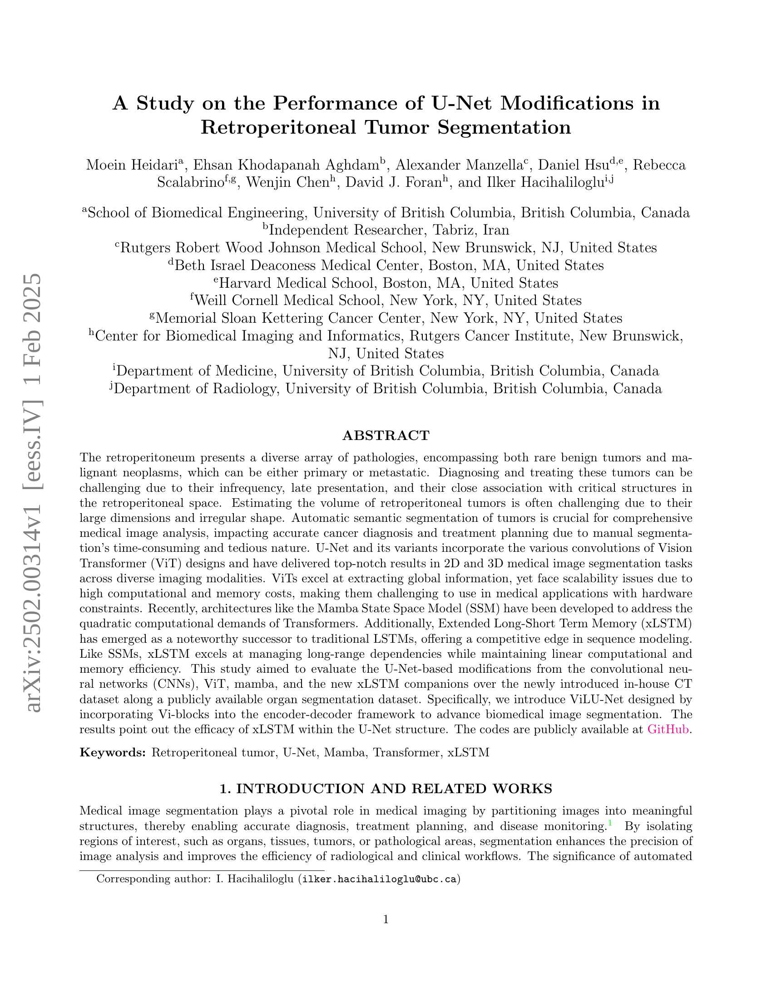
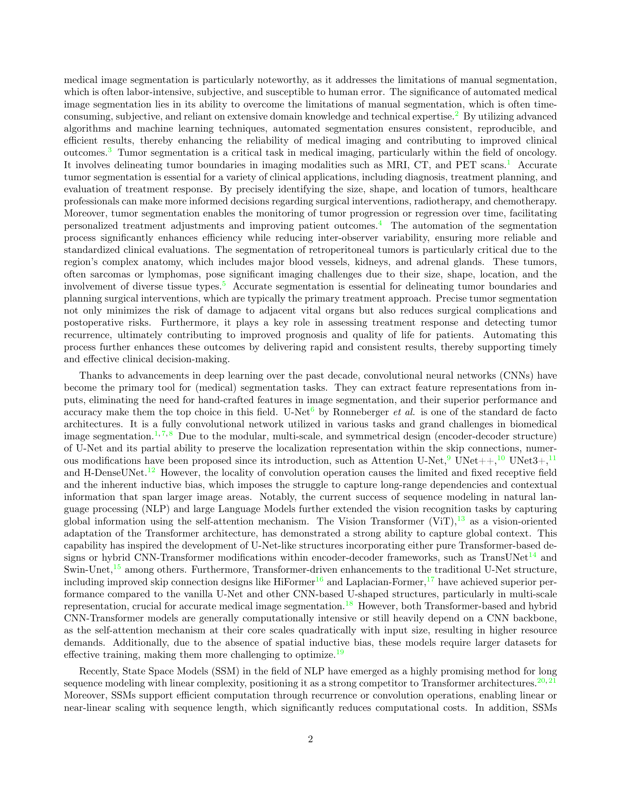
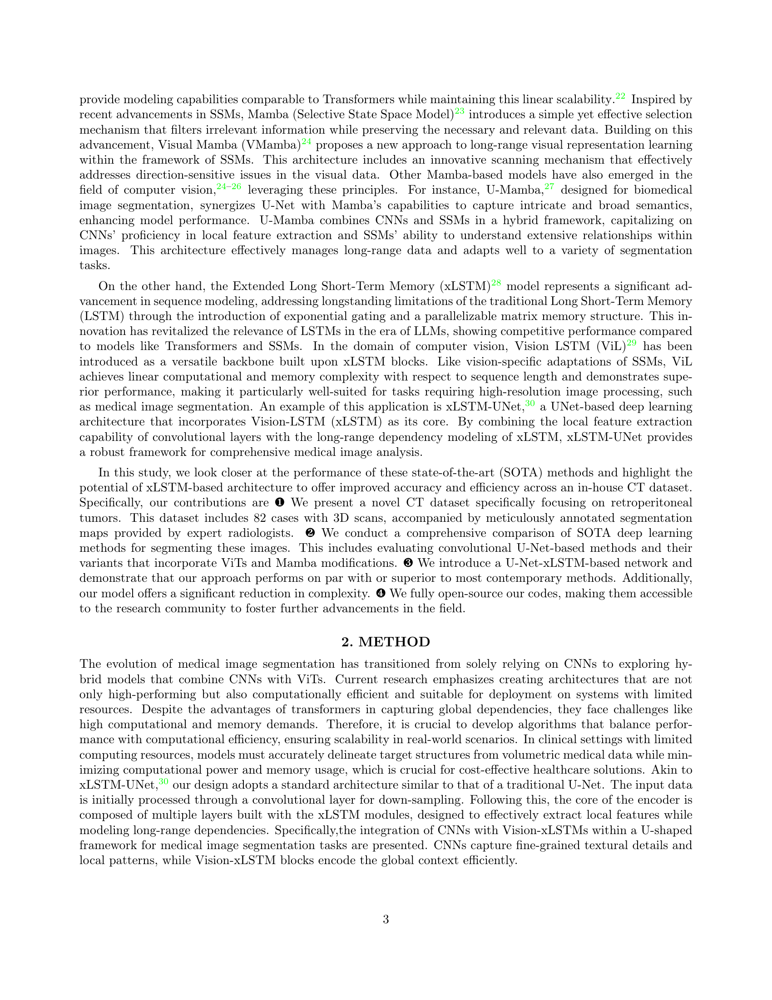
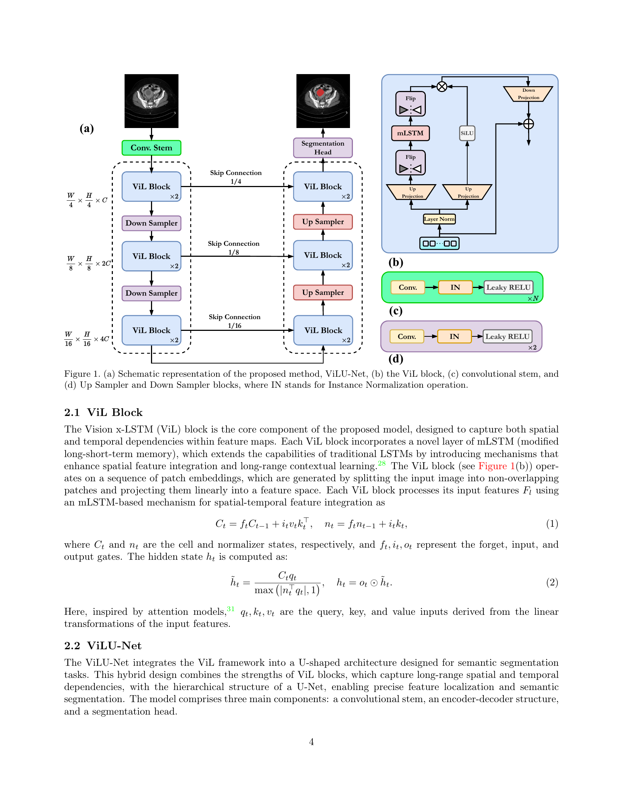
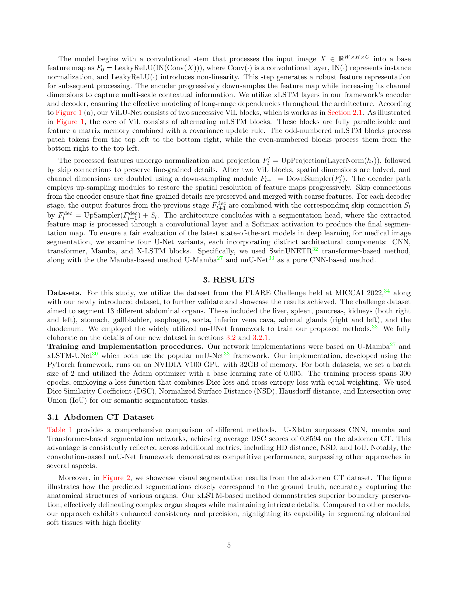
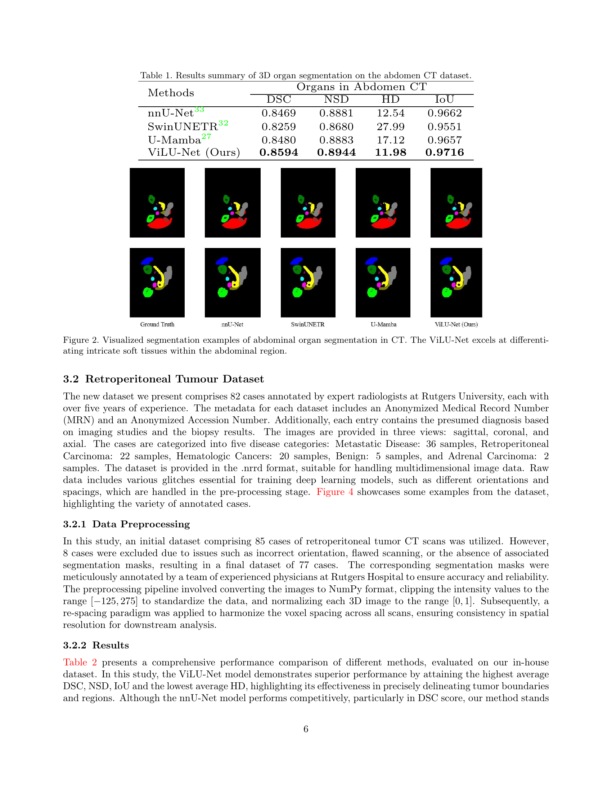
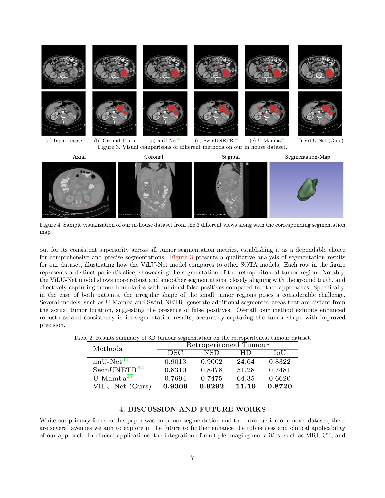
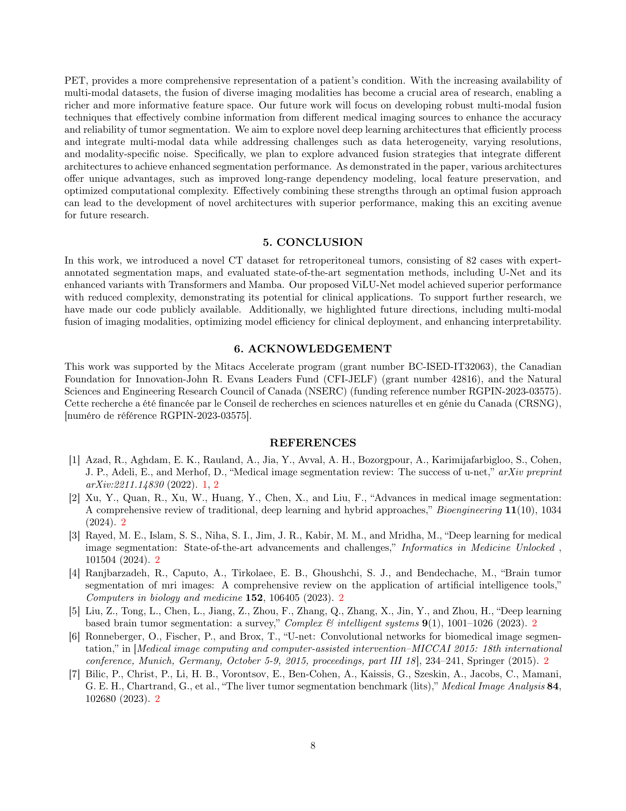
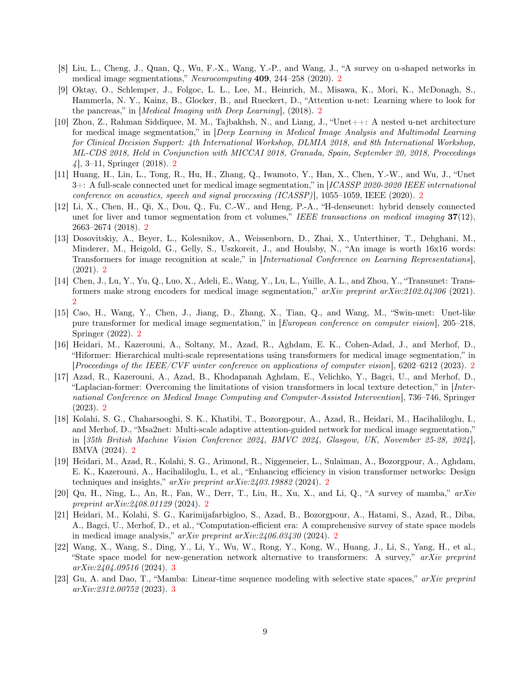
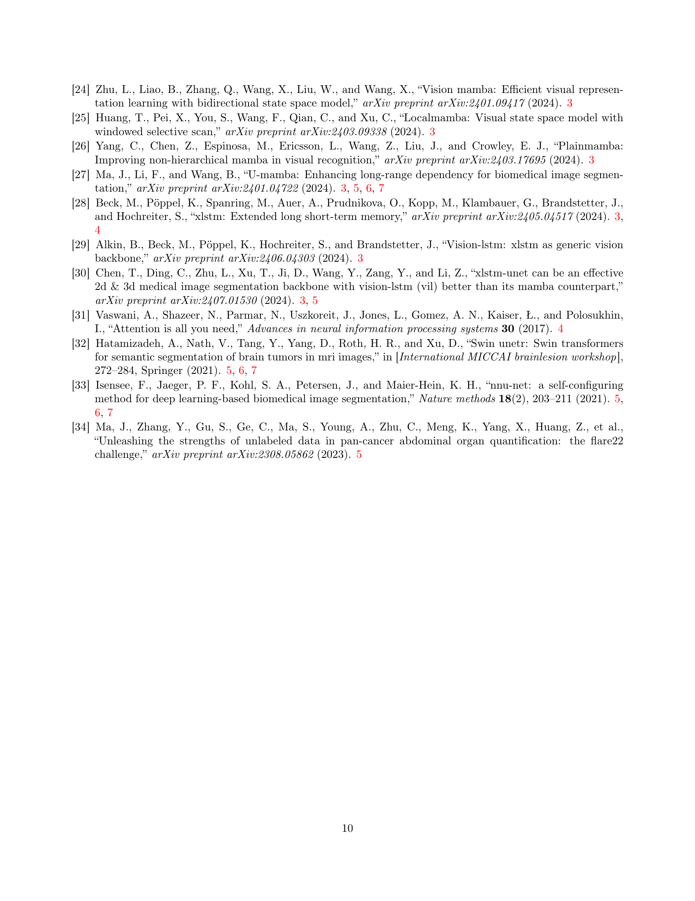

 


 2502.00314 
 Moein Heidari et el. 
 
 🤗 2025-02-04 
 



↗ arXiv


↗ Hugging Face


### TL;DR



후복막 종양은 위치와 모양이 불규칙하여 수동 분할이 어렵고 시간이 많이 소요되는 문제가 있습니다. 이를 해결하기 위해 기존의 U-Net 모델을 개선한 다양한 딥러닝 기법이 제시되었지만, 계산 비용이 높거나 성능이 제한적이었습니다. 본 연구는 이러한 문제를 해결하기 위해 새로운 xLSTM 아키텍처를 기반으로 한 ViLU-Net 모델을 제시합니다.

ViLU-Net 모델은 기존 U-Net 모델의 장점을 유지하면서 xLSTM의 장점을 활용하여 복잡한 후복막 종양의 형태를 효과적으로 포착합니다.  **실험 결과, ViLU-Net은 기존 최첨단 모델보다 높은 정확도를 달성**하였으며, **계산 효율성 또한 향상**되었습니다.  **새로운 후복막 종양 CT 데이터셋과 공개된 소스코드**를 제공하여 다른 연구자들의 연구를 지원합니다.



#### Key Takeaways


 ViLU-Net은 기존 U-Net 기반 모델에 비해 후복막 종양 분할 정확도를 크게 향상시켰습니다. 



 새로운 xLSTM 아키텍처는 계산 비용을 줄이면서도 우수한 성능을 제공합니다. 



 본 연구는 새로운 후복막 종양 CT 데이터셋과 공개된 코드를 제공하여, 관련 분야 연구를 활성화시키는데 기여할 것입니다. 


#### Why does it matter?
본 논문은 **의료 영상 분할 분야의 최신 동향을 반영**하여 효율성과 정확성을 동시에 향상시킨 새로운 U-Net 기반 모델을 제시합니다.  **복잡한 후복막 종양의 정확한 자동 분할**이라는 어려운 문제에 효과적으로 대처하여, 의료 영상 분석 및 진단의 정확성 향상에 크게 기여할 수 있습니다. 또한, 공개된 코드와 데이터셋을 통해 **다른 연구자들의 후속 연구를 촉진**하고, 의료 영상 분야의 발전에 기여할 것으로 기대됩니다. 새로운 xLSTM 기반 아키텍처는 다른 SOTA(최첨단) 기법들과 비교하여 뛰어난 성능을 보이며, **의료 영상 분석 분야의 새로운 패러다임을 제시**할 가능성을 보여줍니다.

------
#### Visual Insights

> 🔼 그림 1은 제안된 방법인 ViLU-Net의 개략적인 구조를 보여줍니다. (a)는 전체 네트워크 아키텍처를, (b)는 네트워크의 핵심 구성 요소인 ViL 블록의 내부 구조를, (c)는 입력 이미지를 처리하는 합성곱 스템(convolutional stem)을, 그리고 (d)는 인코더-디코더 구조에서 특징맵의 크기를 조절하는 업샘플러(Up Sampler)와 다운샘플러(Down Sampler) 블록을 각각 나타냅니다. ViL 블록은 수정된 장단기 메모리(modified Long Short-Term Memory, mLSTM)을 사용하여 공간 및 시간적 의존성을 모두 포착하도록 설계되었습니다. IN은 인스턴스 정규화(Instance Normalization) 연산을 나타냅니다.
> 

> 
read the caption

> Figure 1: (a) Schematic representation of the proposed method, ViLU-Net, (b) the ViL block, (c) convolutional stem, and (d) Up Sampler and Down Sampler blocks, where IN stands for Instance Normalization operation.
> 


| (a) Input Image | (b) Ground Truth | (c) nnU-Net [33] | (d) SwinUNETR [32] | (e) U-Mamba [27] | (f) ViLU-Net (Ours) |
|---|---|---|---|---|---| 
|  |  |  |  |  |  |
|  |  |  |  |  |  |

> 🔼 표 1은 복부 CT 데이터셋에서 3차원 기관 분할의 결과를 요약한 표입니다.  다양한 방법(nnU-Net, SwinUNETR, U-Mamba, ViLU-Net)을 사용하여 복부 CT 스캔에서 여러 기관을 분할하고, 각 방법의 성능을 DSC(Dice Similarity Coefficient), NSD(Normalized Surface Distance), HD(Hausdorff Distance), IoU(Intersection over Union) 지표로 평가하여 비교 분석한 결과를 보여줍니다.  각 지표는 분할 정확도를 나타내는 지표로써, 값이 높을수록 성능이 우수함을 의미합니다.
> 

> 
read the caption

> Table 1: Results summary of 3D organ segmentation on the abdomen CT dataset.
> 

### In-depth insights

#### Retroperitoneal AI
**복강후복막강(retroperitoneum)**은 신장, 췌장, 대동맥 등 중요 기관들이 위치한 복잡한 해부학적 공간입니다. 이 영역의 종양은 발견이 어렵고, 수술이 복잡하여 정확한 진단 및 치료 계획 수립이 어려운데, 인공지능(AI) 기술은 이러한 어려움을 극복하는 데 도움을 줄 수 있습니다.  **AI 기반 의료영상 분석**을 통해 종양의 위치, 크기, 형태를 정확하게 파악하고, 주변 장기와의 관계를 명확히 함으로써, **수술 전 계획 및 수술 중 의사결정**에 중요한 정보를 제공할 수 있습니다.  **AI는 또한 방사선 치료 계획 수립**에도 유용하게 활용될 수 있습니다.  AI 기반 자동화 시스템은 종양의 3차원적 구조를 정확하게 모델링하여 방사선 조사 범위를 최적화하고, 주변 장기의 손상을 최소화하는 데 기여할 수 있습니다.  **다만, AI 기술의 임상 적용을 위해서는 충분한 데이터 확보 및 알고리즘 성능 검증이 필수적이며**,  AI 시스템의 신뢰성 확보를 위한 지속적인 연구와 개발이 필요합니다.  **향후 연구 방향은 다양한 의료 영상 데이터의 통합 분석**,  **AI 모델의 설명력 개선**, 그리고 **임상적 유용성 증명**에 초점을 맞춰야 할 것입니다.

#### U-Net Variants
본 논문에서는 U-Net의 여러 변형 모델들이 **의료 영상 분할** 문제, 특히 복잡한 후복막 종양의 자동 분할에 어떻게 적용되는지 심도있게 논의합니다.  **기존 U-Net의 한계**를 극복하기 위해 Vision Transformer(ViT), Mamba State Space Model(SSM), Extended Long Short-Term Memory(xLSTM) 등 다양한 아키텍처가 U-Net에 통합되어 사용됩니다.  ViT는 전역 정보 추출에 탁월하지만 계산 비용이 높다는 단점이 있으며, SSM과 xLSTM은 이러한 문제를 해결하기 위한 대안으로 제시됩니다.  **각 변형 모델의 장단점**을 비교 분석하고, 특히 새로운 ViLU-Net 모델의 구조와 성능을 자세히 설명하며, 실험 결과를 통해 **xLSTM 기반의 U-Net 변형 모델이 효율성과 정확성 면에서 우수한 성능**을 보임을 확인합니다.  결론적으로, 이 논문은 다양한 U-Net 변형 모델의 비교 분석을 통해 후복막 종양 분할의 정확도와 효율성을 향상시키는 데 기여하며, 특히 xLSTM 기반 모델의 유용성을 강조합니다.

#### xLSTM-UNet
xLSTM-UNet은 기존 U-Net 구조에 **장기 의존성을 효과적으로 모델링하는 xLSTM(Extended Long Short-Term Memory)** 블록을 통합한 새로운 의료 영상 분할 아키텍처를 제시합니다.  **CNN(Convolutional Neural Network)의 국소적 특징 추출 능력과 xLSTM의 장기 의존성 모델링 능력을 결합**하여 정확도와 효율성을 향상시키는 것을 목표로 합니다.  기존의 Transformer 기반 모델들이 가지는 높은 계산 비용 및 메모리 요구량 문제를 해결하기 위한 대안으로 제시되며, **선형 시간 복잡도**를 가지는 xLSTM의 특성으로 인해 제한된 자원 환경에서도 효율적으로 동작할 수 있습니다.  **의료 영상 분할의 다양한 과제에 적용 가능성**이 높으며, 특히 복잡한 해부학적 구조를 가진 영역에서의 정확한 분할에 효과적일 것으로 기대됩니다.  더불어, **공개적으로 코드를 공유**함으로써 학계 및 산업계의 추가적인 연구와 개발을 촉진하는 역할을 할 것으로 예상됩니다.

#### Abdomen CT Data
복부 CT 데이터는 다양한 복부 장기의 3차원 이미지 데이터셋으로, **정확한 장기 분할**을 위한 기준 자료로 활용됩니다.  본 논문에서는 이 데이터셋을 이용하여 다양한 U-Net 변형 모델의 성능을 비교 분석했으며, 특히 **xLSTM 기반의 ViLU-Net 모델**이 기존의 CNN, Transformer, Mamba 기반 모델들에 비해 **우수한 성능**을 보임을 확인했습니다.  **정량적 평가 지표** (DSC, NSD, HD, IoU)를 통해 ViLU-Net의 우월성이 입증되었으며, 시각적 비교 분석을 통해 **복잡한 장기 경계의 정확한 구분** 능력을 확인했습니다. 이는 ViLU-Net이 **장기의 해부학적 구조**를 효과적으로 학습하고 표현할 수 있음을 시사하며, 향후 임상 적용 가능성을 높여줍니다.  그러나 **데이터셋의 크기 및 다양성**에 따른 성능 한계와, **다른 의료 영상 데이터셋**으로의 일반화 가능성 여부에 대한 추가 연구가 필요합니다.

#### Future Research
미래 연구 부분은 다양한 영상 의학 모달리티의 융합을 통해 종양 분할의 정확성과 신뢰성을 향상시키는 데 초점을 맞춰야 합니다. **다양한 의학 영상(MRI, CT, PET 등)의 정보를 효과적으로 통합하는 멀티 모달 융합 기술 개발**이 중요하며, 데이터 이질성, 해상도 차이, 모달리티 특유의 잡음 등의 과제를 해결하는 심층 학습 구조를 연구해야 합니다.  **효율적인 계산 및 메모리 사용을 위한 알고리즘 개발** 또한 필수적입니다. 특히 제한된 자원을 가진 임상 환경에서도 적용 가능하도록 확장성을 고려해야 합니다. 또한, **모델의 해석력 향상을 위한 연구**도 중요한데, 의료 현장에서 모델의 예측 결과를 신뢰하고 해석하기 위해서는 모델의 결정 과정을 투명하게 이해할 수 있어야 합니다.  **다양한 종류의 종양과 해부학적 구조에 대한 일반화 성능 개선**,  그리고 **임상 적용을 위한 지속적인 검증**을 통해 모델의 신뢰도를 높여야 합니다.  마지막으로, **새로운 지표 및 평가 방법 연구**를 통해 종양 분할 성능의 객관적인 평가 체계를 마련하는 것이 중요합니다. 이를 통해 미래 연구는 더욱 정확하고 효율적이며 신뢰할 수 있는 종양 분할 기술 개발을 목표로 해야 합니다.

### More visual insights

More on figures

> 🔼 그림 2는 복부 CT 영상의 기관 분할 결과를 시각적으로 보여줍니다. ViLU-Net 모델은 복잡한 복부 연조직을 정확하게 구분하는 능력을 보여주는 여러 예시가 포함되어 있습니다.  특히, 서로 다른 기관들 사이의 경계를 명확하게 구분하고, 미세한 구조까지도 정확하게 분할하여 기존의 방법들보다 더욱 정확하고 세밀한 분할 결과를 제공합니다. 그림에는 각 기관의 Ground truth(실제 정답)와 ViLU-Net을 포함한 다른 모델들의 예측 결과가 함께 제시되어 있으며, 비교를 통해 ViLU-Net의 우수성을 확인할 수 있습니다.
> 

> 
read the caption

> Figure 2: Visualized segmentation examples of abdominal organ segmentation in CT. The ViLU-Net excels at differentiating intricate soft tissues within the abdominal region.
> 

> 🔼 그림 3은 본 논문에서 새롭게 제시된 복강 내 종양 CT 데이터셋을 사용하여 다양한 의료 영상 분할 방법들을 시각적으로 비교한 것입니다. 그림은 입력 의료 영상과 정답 마스크(Ground Truth), 그리고 CNN, Transformer, Mamba 및 xLSTM 기반의 네 가지 U-Net 변형 모델의 분할 결과를 보여줍니다. 각 행은 다른 환자의 슬라이스를 나타내며, 복강 내 종양 영역의 분할 결과를 보여줍니다. ViLU-Net 모델은 경계를 정확하게 포착하고, 작은 종양 부위도 효과적으로 분할하여 다른 모델보다 정확도가 높음을 시각적으로 보여줍니다.
> 

> 
read the caption

> Figure 3: Visual comparisons of different methods on our in house dataset.
> 

### Full paper



