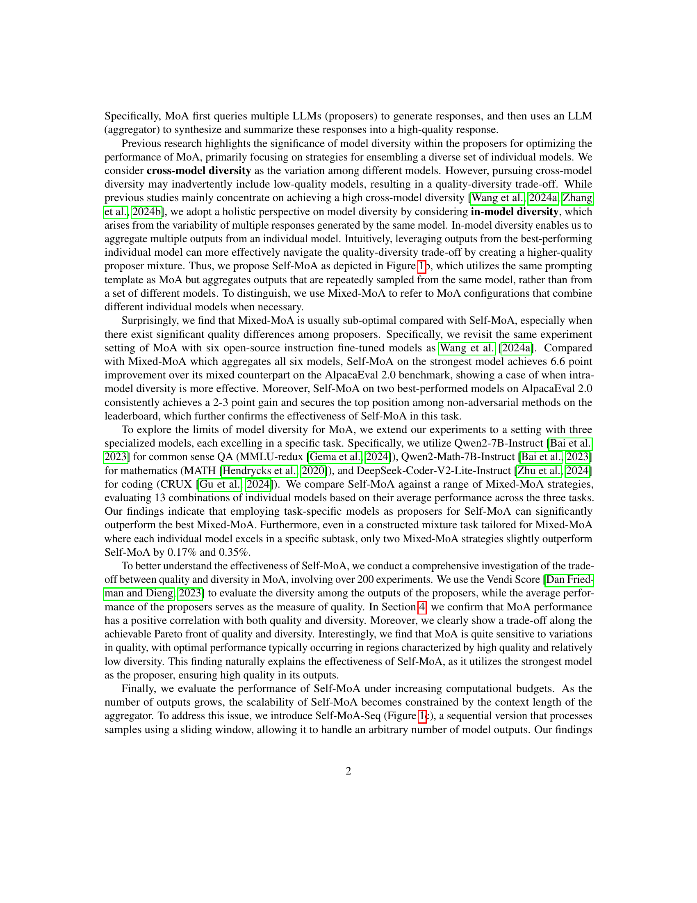
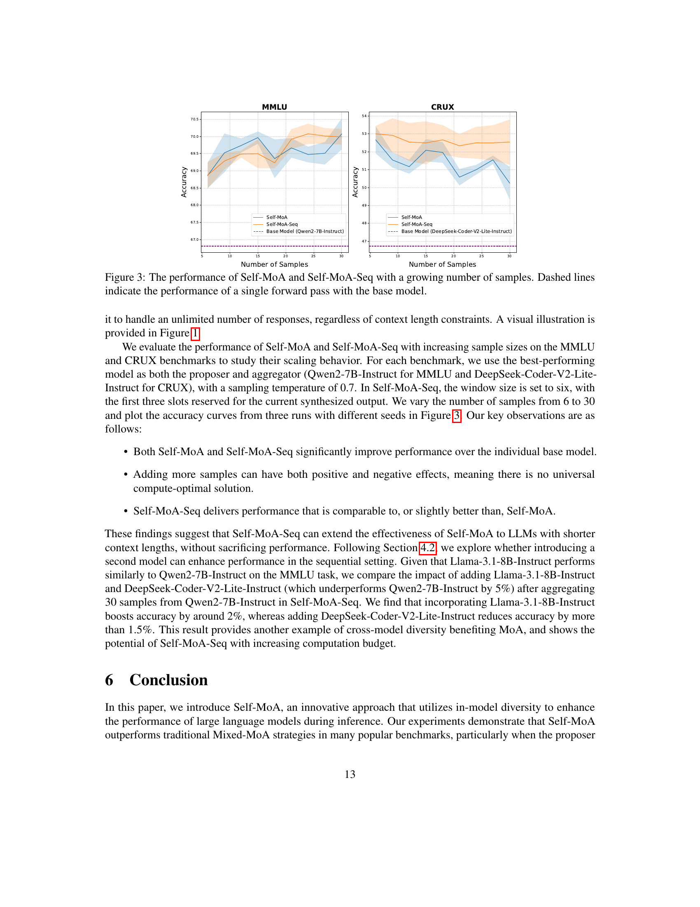

 


 2502.00674 
 Wenzhe Li et el. 
 
 🤗 2025-02-05 
 



↗ arXiv


↗ Hugging Face


### TL;DR



대규모 언어 모델(LLM)의 성능 향상을 위해 여러 모델의 출력을 결합하는 앙상블 기법이 널리 사용됩니다. 하지만 기존 연구는 다양한 모델의 조합에 초점을 맞춰, 낮은 성능의 모델이 포함될 경우 전체 성능을 저하시킬 수 있다는 문제점이 있었습니다. 이 논문은 이러한 문제를 해결하기 위해 단일 최고 성능 LLM을 반복적으로 사용하여 출력을 결합하는 새로운 방법인 Self-MoA를 제시합니다.

Self-MoA는 기존의 다양한 LLM을 혼합하는 방법보다 여러 벤치마크에서 더 나은 성능을 보였습니다. 특히, AlpacaEval 2.0 벤치마크에서는 6.6%의 성능 향상을 기록했습니다. 또한, 본 논문에서는 모델 성능과 다양성 간의 상관관계를 분석하여 모델 성능이 앙상블 성능에 더 중요한 요소임을 밝혔습니다.  마지막으로, 제한된 컨텍스트 길이 내에서도 효율적으로 많은 LLM 출력을 처리할 수 있는 Self-MoA-Seq를 제시했습니다.



#### Key Takeaways


 단일 최고 성능 LLM의 반복적 활용(Self-MoA)이 다양한 LLM 혼합보다 우수한 성능을 보임 



 모델 성능(quality)이 모델 다양성(diversity)보다 LLM 앙상블 성능에 더 큰 영향을 미침 



 Self-MoA의 순차적 버전(Self-MoA-Seq)을 통해 제한된 컨텍스트 길이 내에서도 확장성 있는 앙상블 가능 


#### Why does it matter?
본 논문은 **대규모 언어 모델(LLM) 앙상블**에 대한 기존의 생각을 뒤집고, **단일 최고 성능 모델을 반복적으로 활용하는 새로운 방법(Self-MoA)**을 제시하여 성능 향상을 이끌어냈다는 점에서 중요합니다. 기존 연구들이 다양한 모델들을 혼합하는 데 집중한 반면, 본 연구는 **단일 모델 내 다양성 활용**의 효과를 입증했습니다. 이는 **계산 비용 효율적인 LLM 활용** 전략을 제시하며, 향후 LLM 연구 및 응용에 큰 영향을 미칠 것으로 예상됩니다. 또한, 다양한 벤치마크에서 Self-MoA가 기존 방법을 능가하는 결과를 보여주어, **실용적인 측면에서도 의미가 크다**고 할 수 있습니다.  이러한 연구 결과는 **LLM 앙상블 기법의 새로운 패러다임을 제시**하며, 향후 연구 방향에 대한 시사점을 제공합니다.

------
#### Visual Insights

> 🔼 그림 1은 MoA, Self-MoA, 그리고 Self-MoA-Seq의 비교를 보여줍니다. (a) MoA에서는 여러 모델이 질의에 응답하고, 그 결과를 집계하는 모델이 종합합니다. (b) Self-MoA는 단일 모델에서 반복적으로 샘플링하여 이 과정을 간소화합니다. (c) Self-MoA-Seq는 지금까지 생성된 최고의 결과와 후보 결과를 결합하는 슬라이딩 윈도우 방식을 사용하여 Self-MoA를 확장합니다. 각 시간 단계에서 종합된 출력은 집계 모델의 편향을 줄이고, 문맥 길이 요구사항을 줄이며, 방법의 적용 가능성을 확장하기 위해 반복됩니다. MoA는 여러 라운드의 집계로 확장될 수 있지만(부록 A.1 참조), Self-MoA와 Self-MoA-Seq는 더 많은 출력으로 확장될 수 있으나, 명확성을 위해 여기서는 생략했습니다.
> 

> 
read the caption

> Figure 1: Comparison of MoA, Self-MoA, and Self-MoA-Seq. (a) In MoA, multiple models respond to a query, followed by an aggregator synthesizing their outputs. (b) Self-MoA simplifies this by repeatedly sampling from a single model. (c) Self-MoA-Seq extends Self-MoA by applying a sliding window to combine the best output so far with candidate outputs. At each timestep, the synthesized output is repeated to bias the aggregator towards it, reducing the context length requirements and expanding the method’s applicability. Note that MoA can extend to multiple rounds of aggregation (Appendix A.1), while Self-MoA and Self-MoA-Seq can extend to more outputs, but we omit them here for clarity.
> 


|                 | Model Configuration                | LC Win Rate |
|-----------------|------------------------------------|--------------|
| Individual      | WizardLM-2-8x22B                   | 53.1         |
|                 | Qwen1.5-110B-Chat                  | 43.9         |
|                 | LLaMA-3-70B-Instruct                | 34.4         |
|                 | Qwen1.5-72B-Chat                    | 36.6         |
|                 | Mixtral-8x22B-Instruct-v0.1         | 30.2         |
|                 | dbrx-instruct                       | 25.4         |
| Mixed-MoA       | 2-Layer MoA [Wang et al., 2024a]   | 59.1         |
| Self-MoA       | 2-Layer Self-MoA + WizardLM         | **65.7**     |

> 🔼 표 1은 AlpacaEval 2.0 리더보드에서 Self-MoA와 Mixed-MoA의 성능을 비교한 표입니다.  Qwen1.5-110B-Chat 모델을 집계자(aggregator)로 사용했으며, 개별 모델(Individual)의 성능, Mixed-MoA(여러 모델의 출력을 결합), 그리고 Self-MoA(최고 성능 모델의 여러 출력을 결합)의 결과를 보여줍니다.  LC Win Rate는 길이를 고려한 승률을 나타내며, Self-MoA가 Mixed-MoA보다 높은 승률을 기록한 것을 확인할 수 있습니다.
> 

> 
read the caption

> Table 1: Comparison of Self-MoA and Mixed-MoA on AlpacaEval 2.0 leaderboard. We use Qwen1.5-110B-Chat as the aggregator.
> 

### In-depth insights

#### In-Model Diversity Wins
"모델 내 다양성이 승리한다"는 제목에 대한 심층적인 분석을 통해, 본 논문은 **단일 최고 성능 모델에서 반복적으로 샘플링하여 생성된 다양한 출력을 활용**하는 전략의 효과에 대해 논의합니다. 이는 기존의 다양한 모델들을 결합하는 방식과 비교하여, **단일 모델 내의 다양성만으로도 상당한 성능 향상**을 이끌어낼 수 있음을 시사합니다. 이러한 결과는 모델 선택의 중요성과 더불어, **모델 성능의 질적 측면이 양적 다양성보다 우선시되어야 함**을 보여주는 중요한 발견입니다.  **모델의 질과 다양성 사이의 균형**에 대한 추가적인 분석을 통해, 고품질 모델 중심의 전략이 최적의 성능을 달성하는 데 효과적임을 확인할 수 있습니다. 본 연구는 기존의 앙상블 방법론에 대한 새로운 시각을 제공하며, **추후 LLM 성능 향상 및 효율적인 추론 방법 연구**에 중요한 함의를 제시합니다.

#### Quality vs. Diversity
본 논문은 품질 대비 다양성의 균형을 이루는 것이 **MoA(Mixture-of-Agents) 모델의 성능 향상**에 중요함을 보여줍니다. 단순히 다양한 모델을 혼합하는 것보다 **최고 성능 모델의 출력을 여러 번 활용하는 Self-MoA**가 더 효과적임을 실험적으로 증명합니다. **품질이 낮은 모델을 포함하면 성능이 저하**될 수 있으며, **품질과 다양성 사이의 상충관계**가 존재한다는 것을 발견합니다. 따라서 **최고 품질의 모델을 선택하고** 그 출력의 다양성을 활용하는 것이 **MoA 성능 최적화**에 중요한 전략임을 시사합니다.  **Self-MoA는 계산 비용 증가** 문제를 해결하기 위해 **순차적 버전인 Self-MoA-Seq**를 제시하며, 긴 문맥 길이 제약 없이 **확장성 있는 앙상블**을 가능하게 합니다.

#### Self-MoA Scalability
Self-MoA의 확장성은 모델의 컨텍스트 길이 제약으로 인해 제한적입니다. **단일 모델에서 반복적으로 샘플링된 여러 응답을 집계**하는 Self-MoA는 응답 수가 증가함에 따라 성능이 저하될 수 있습니다. 이는 집계 모델의 컨텍스트 길이 제한으로 인해 발생합니다.  **Self-MoA-Seq**는 이러한 한계를 극복하기 위해 제안된 방법으로, **슬라이딩 윈도우 기법**을 사용하여 컨텍스트 길이 제약 없이 많은 응답을 처리할 수 있도록 설계되었습니다.  **Self-MoA-Seq는 Self-MoA와 동등하거나 더 나은 성능**을 제공하며, **확장성 있는 앙상블 기법**으로서 효과적임을 보여줍니다.  하지만,  **샘플링 횟수가 증가할수록 다양성이 정체**될 수 있다는 점과, 많은 수의 샘플을 처리하는 것이 집계 모델의 어려움으로 작용한다는 점은 여전히 고려해야 할 부분입니다.

#### Specialized Model MoA
본 논문에서 제시된 '전문화된 모델 MoA' 개념은 **단일 최고 성능 모델의 반복적 샘플링을 통해 다양성을 확보**하는 전략입니다. 이는 기존의 다양한 모델들을 혼합하는 MoA와 대조적이며, **개별 모델의 질적 차이에 따른 성능 저하 문제를 해결**하고자 합니다.  **단일 모델의 반복 사용은 질적인 측면에서 우수성을 유지**하면서 모델 출력의 변화를 통해 다양성을 확보하는 효율적인 방법입니다.  실험 결과는 이러한 전략이 다양한 벤치마크에서 기존 방법을 능가하는 성능을 보임을 보여줍니다. **모델의 질과 다양성 사이의 균형점을 찾는 것이 중요**하며, 본 논문은 이를 체계적으로 분석하여 제시합니다. 특히, 질적인 측면이 다양성보다 MoA 성능에 더 큰 영향을 미치는 것으로 나타났습니다.

#### Future of Ensemble LLMs
앙상블 LLM의 미래는 **다양성과 품질의 균형**을 어떻게 잘 맞출 것인가에 달려 있습니다.  본 논문에서 제시된 Self-MoA처럼 단일 최고 성능 모델의 반복적인 샘플링을 통해 내부 다양성을 극대화하는 방식이 효과적임을 보여주었습니다. 하지만 다양한 모델을 결합하는 기존의 앙상블 방식 또한 특정 상황, **예를 들어 서로 다른 하위 작업에 특화된 모델을 결합하는 경우**에 유용할 수 있습니다.  미래 연구는 **계산 비용 효율성**, **다양한 모델 간의 효과적인 상호 작용 전략**, 그리고 **더욱 정교한 품질 평가 지표** 개발에 초점을 맞춰야 합니다.  특히 **모델의 품질에 대한 민감도**를 고려하여 다양성과 품질 간의 최적 균형점을 찾는 연구가 중요하며, 이를 통해 앙상블 LLM의 성능을 더욱 향상시킬 수 있을 것입니다.  **순차적 앙상블 기법**의 발전 또한 긴 문맥 길이 제약을 극복하고, 계산 효율성을 높이는 데 중요한 역할을 할 것입니다.  궁극적으로 **모델의 특징과 과제의 특징을 고려한 동적 앙상블 전략**의 개발이 앙상블 LLM의 성능을 획기적으로 발전시키는 열쇠가 될 것입니다.

### More visual insights

More on tables


| Model Configuration | LC Win Rate |
|---|---|---|
| Individual | gemma-2-9b-it-WPO-HB | 76.7 |
| Individual | gemma-2-9b-it-SimPO | 72.4 |
| Self-MoA | Self-MoA + gemma-2-9b-it-WPO-HB | **78.5** |
| Self-MoA | Self-MoA + gemma-2-9b-it-SimPO | 75.0 |
> 🔼 표 2는 최고 성능 모델을 제안자와 집계자 모두로 사용하여 AlpacaEval 2.0 리더보드에서 Self-MoA가 최첨단 성능을 달성했음을 보여줍니다. 컨텍스트 창 크기 제약으로 인해 출력 4개만 앙상블했습니다. 이 표는 다양한 모델 구성(개별 모델, Mixed-MoA, Self-MoA)에 따른 AlpacaEval 2.0의 LC 승률을 비교 분석합니다. 특히 Self-MoA는 최고 성능 모델을 반복적으로 샘플링하여 모델 내 다양성을 활용하며, 기존의 여러 모델을 혼합하는 방식인 Mixed-MoA보다 우수한 성능을 보입니다. 컨텍스트 창 제약을 고려하여 출력 개수를 4개로 제한한 점도 중요한 특징입니다.
> 

> 
read the caption

> Table 2: Self-MoA achieves state-of-the-art performance on the AlpacaEval 2.0 leaderboard when using top-performing models as both proposers and aggregators. We only ensemble 4 outputs due to context window constraints.
> 


|   | Aggregator | Proposer | MMLU | CRUX | MATH |
|---|---|---|---|---|---| 
| Individual | - | i | 66.16 | 36.25 | 53.81 |
|  | - | d | 60.91 | 49.51 | 53.82 |
|  | - | m | 54.36 | 27.88 | 69.574 |
| Mixed-MoA | i | iimmdd | 67.89 | 42.88 | 64.38 |
|  |  | imdddd | 67.42 | 44.50 | 63.90 |
|  |  | iiiimd | 68.90 | 41.25 | 63.00 |
|  |  | immmmd | 66.63 | 42.75 | 66.02 |
|  |  | iimmmm | 66.23 | 39.25 | 66.10 |
|  |  | iiimmm | 67.49 | 38.25 | 64.16 |
|  |  | iiiimm | 68.00 | 37.00 | 62.92 |
|  |  | iidddd | 68.21 | 45.50 | 62.56 |
|  |  | iiiddd | 68.21 | 42.88 | 62.38 |
|  |  | iiiidd | 68.47 | 40.75 | 61.24 |
|  |  | mmdddd | 66.34 | 46.75 | 66.48 |
|  |  | mmmddd | 65.80 | 47.00 | 67.32 |
|  |  | mmmmdd | 65.44 | 42.50 | 67.62 |
| Self-MoA | i | 6 × TaskBest | **69.01** | 50.75 | 68.42 |
|  | TaskBest | 6 × TaskBest | **69.01** | **52.62** | 69.80<a class="ltx_ref ltx_font_medium" href="https://arxiv.org/html/2502.00674v1#footnote4" title="Footnote 4 ‣ Table 3 ‣ Evaluation datasets. ‣ 3.2 Experiments on Multiple Datasets with Specialized Models ‣ 3 Is Ensembling Different LLMs Beneficial? ‣ Rethinking Mixture-of-Agents: Is Mixing Different Large Language Models Beneficial?">4</a> |
> 🔼 표 3은 MMLU, CRUX, MATH 세 가지 벤치마크에서 Self-MoA와 Mixed-MoA의 성능을 비교한 표입니다. i, m, d는 각각 Qwen2-7B-Instruct, DeepSeek-Coder-V2-Lite-Instruct, Qwen2-Math-7B-Instruct 모델을 나타내며, 각 모델은 특정 작업에 특화되어 있습니다. 평균 성능은 세 가지 벤치마크의 평균 정확도를 나타냅니다. TaskBest는 각 작업에 가장 적합한 모델을 제안자와 집계자로 모두 사용했음을 나타냅니다. 이 표는 다양한 모델 조합과 설정 하에서 Self-MoA가 Mixed-MoA보다 우수한 성능을 보임을 보여줍니다.
> 

> 
read the caption

> Table 3: Comparison of Self-MoA and Mixed-MoA in MMLU, CRUX, and MATH. The labels i, m, and d refer to Qwen2-7B-Instruct, DeepSeek-Coder-V2-Lite-Instruct, and Qwen2-Math-7B-Instruct, respectively. The average performance represents the mean accuracy across MMLU, CRUX, and MATH. TaskBest indicates that we use the strongest model for each task as both proposer and aggregator.
> 


| Dataset | \alpha Coefficient | \alpha P-value | \beta Coefficient | \beta P-value | R2 |
|---|---|---|---|---|---| 
| MMLU | 2.558 ± 0.176 | &lt;0.001 | 1.841 ± 0.176 | &lt;0.001 | 0.771 |
| CRUX | 4.548 ± 0.459 | &lt;0.001 | 1.421 ± 0.459 | &lt;0.001 | 0.685 |
| MATH | 4.719 ± 0.416 | &lt;0.001 | 2.839 ± 0.416 | &lt;0.001 | 0.760 |
> 🔼 표 4는 다양성(d)과 품질(q)에 따른 MoA 성능(t)의 선형 회귀 분석 결과를 보여줍니다.  본 논문의 4장 'The Quality-Diversity Trade-off' 섹션에서 MoA의 성능에 영향을 미치는 다양성과 품질의 상관관계를 정량적으로 분석하기 위해 선형 회귀 분석을 실시하였으며,  그 결과를 표 4에 제시하고 있습니다.  각 데이터셋(MMLU, CRUX, MATH)에 대해 계수(α, β), p-값, 그리고 결정계수(R²)를 보여주어 다양성과 품질이 MoA 성능에 미치는 영향의 크기와 통계적 유의성을 파악할 수 있도록 합니다.
> 

> 
read the caption

> Table 4: Linear regression (Equation 1) of MoA’s performance t𝑡titalic_t on diversity d𝑑ditalic_d and quality q𝑞qitalic_q.
> 


| Dataset | Method | Avg. (K=1) | K=2 | K=3 | K=4 |  |
|---|---|---|---|---|---|---|
| MMLU | K-Norm | 0.771 | 0.809 | 0.832 | 0.845 |  |
|  | Centered-1/K-Norm | 0.771 | 0.881 | 0.902 | 0.903 |  |
| CRUX | K-Norm | 0.685 | 0.736 | 0.765 | 0.779 |  |
|  | Centered-1/K-Norm | 0.685 | 0.753 | 0.758 | 0.753 |  |
| MATH | K-Norm | 0.760 | 0.720 | 0.692 | 0.672 |  |
|  | Centered-1/K-Norm | 0.760 | 0.720 | 0.692 | 0.672 |  |
> 🔼 표 5는 다양한 품질 측정 방법을 사용했을 때 선형 회귀 분석의 R 제곱 값을 보여줍니다. 이 표는 세 가지 데이터 세트 모두에서 중앙 1/K-놈(K=2)을 사용하는 것이 가장 좋은 성능을 낸다는 것을 보여줍니다.  R 제곱 값은 독립 변수(다양성 및 품질)가 종속 변수(MoA 성능)을 얼마나 잘 설명하는지를 나타내는 지표입니다.  R 제곱 값이 높을수록 독립 변수가 종속 변수의 변동을 더 잘 설명한다는 것을 의미합니다.  표에서 볼 수 있듯이, 중앙 1/K-놈(K=2)을 사용하면 세 가지 데이터 세트 모두에서 R 제곱 값이 가장 높아집니다. 이는 중앙 1/K-놈(K=2) 방법이 MoA의 성능을 가장 잘 설명하는 품질 측정 방법임을 시사합니다.
> 

> 
read the caption

> Table 5: The R2superscript𝑅2R^{2}italic_R start_POSTSUPERSCRIPT 2 end_POSTSUPERSCRIPT of the linear regression when we use different quality measurement methods. We find using Centered-1/K-Norm with K=2 can achieve good performance among all these three datasets.
> 


|   | Aggregator | Proposer | Average |
|---|---|---|---|
| Individual | - | i | 52.07 |
|  | - | d | 54.74 |
|  | - | m | 50.60 |
| Mixed-MoA | i | iimmdd | 58.38 |
|  |  | imdddd | 58.61 |
|  |  | iiiimd | 57.72 |
|  |  | immmmd | 58.47 |
|  |  | iimmmm | 57.19 |
|  |  | iiimmm | 56.63 |
|  |  | iiiimm | 55.97 |
|  |  | iidddd | 58.76 |
|  |  | iiiddd | 57.82 |
|  |  | iiiidd | 56.82 |
|  |  | mmdddd | 59.86 |
|  |  | mmmddd | 60.04 |
|  |  | mmmmdd | 58.52 |
| Self-MoA | i | dddddd | 59.69 |
|  | i | 6 × TaskBest | 62.73 |
|  | TaskBest | 6 × TaskBest | 63.81 |
> 🔼 표 6은 세 가지 벤치마크(MMLU, CRUX, MATH)를 혼합한 혼합 과제에서 Self-MoA와 Mixed-MoA의 성능을 비교한 표입니다. 세 가지 과제의 평균 성능으로 측정되며, 표 3의 결과를 기반으로 합니다. 상위 두 개의 평균 성능을 가진 Mixed-MoA 모델은 밑줄로 강조 표시되어 있습니다.  이 표는 다양한 모델 조합을 사용한 MoA 전략의 성능을 비교하여, 단일 최고 성능 모델을 반복적으로 사용하는 Self-MoA 전략의 효과를 보여줍니다. 특히,  각 과제에 특화된 모델을 사용하여 성능 차이를 분석합니다.
> 

> 
read the caption

> Table 6: Comparison of Self-MoA and Mixed-MoA on the mixture task of MMLU, CRUX, and MATH, measured by the average performance of three tasks from Table 3. Mixed-MoA models with top two average performances are highlighted by underline.
> 


|       | Aggregator | Proposer | MMLU |
|---|---|---|---|
| Individual | - | i | 66.16 |
|  | - | l | 66.40 |
| Mixed-MoA | i | iiilll | 70.73 |
| Self-MoA | i | iiiiii | 69.01 |
|  | i | llllll | 71.27 |
> 🔼 표 7은 Llama-3.1-8B-Instruct와 Qwen2-7B-Instruct 두 모델을 사용한 MoA(Mixture-of-Agents)의 성능을 보여줍니다.  Llama-3.1-8B-Instruct는 'l'로, Qwen2-7B-Instruct는 'i'로 약칭하여 표에 표기했습니다. 표는 개별 모델의 성능,  다양한 비율로 두 모델을 혼합하여 사용한 MoA의 성능, 그리고 Self-MoA (단일 모델 반복 사용)의 성능을 MMLU 벤치마크 기준으로 비교 분석합니다. Self-MoA가 혼합 방식보다 더 나은 성능을 보이는지 확인하기 위한 실험 결과를 제시합니다.
> 

> 
read the caption

> Table 7: MoA of Llama-3.1-8B-Instruct and Qwen2-7B-Instruct. l is short for Llama-3.1-8B-Instruct and i is short for Qwen2-7B-Instruct.
> 


| Model Configuration | LC Win Rate | # Forward Passes |
|---|---|---|
| Mixed-MoA | 65.4 | 13 |
| Self-MoA 2-Layer Self-MoA + WizardLM-2-8x22B | **65.7** | 7 |
> 🔼 표 8은 3-레이어 혼합 MoA(Mixture-of-Agents)의 결과를 보여줍니다.  표에는 모델 구성, LC 승률, 그리고 순방향 패스 수가 포함되어 있습니다.  모델 구성은 사용된 모델의 종류와 레이어 수를 나타냅니다. LC 승률은 모델의 성능을 나타내는 지표이고, 순방향 패스 수는 모델 추론에 필요한 계산량을 나타냅니다. 이 표는 Self-MoA와 비교하여 3-레이어 혼합 MoA의 효율성을 분석하는 데 사용됩니다.
> 

> 
read the caption

> Table 8: Results of 3-Layer Mixed-MoA.
> 


| R-square | Level |
|---|---| 
| [0,0.2) | Very weak |
| [0.2,0.4) | Weak |
| [0.4,0.6) | Median |
| [0.6,0.8) | Strong |
| [0.8,1.0] | Very Strong |
> 🔼 표 9는 R-제곱 값의 해석에 대한 표입니다. R-제곱 값은 독립 변수가 종속 변수를 얼마나 잘 설명하는지를 나타내는 지표입니다. 이 표에서는 R-제곱 값의 범위에 따라 영향력의 정도를 '매우 약함', '약함', '중간', '강함', '매우 강함' 등의 수준으로 분류하여 설명하고 있습니다.  R-제곱 값이 0에 가까울수록 독립 변수의 설명력이 낮고, 1에 가까울수록 독립 변수의 설명력이 높음을 의미합니다.
> 

> 
read the caption

> Table 9: The interpretation of R-square
> 


|                       | Model Configuration | Avg. | 1st turn | 2nd turn | # Forward Passes |
| :-------------------- | :-------------------- | :---- | :-------- | :-------- | :----------------- |
| Individual            | WizardLM-2-8x22B       | 8.99  | 9.05      | 8.93      | 1                  |
|                       | Qwen1.5-110B-Chat     | 8.61  | 8.77      | 8.45      | 1                  |
|                       | LLaMA-3-70B-Instruct   | 8.84  | 9.14      | 8.54      | 1                  |
|                       | Qwen1.5-72B-Chat      | 8.62  | 8.66      | 8.58      | 1                  |
|                       | Mixtral-8x22B-Instruct-v0.1 | 8.49  | 8.89      | 8.09      | 1                  |
|                       | dbrx-instruct          | 7.82  | 8.21      | 7.43      | 1                  |
| Mixed-MoA            | 2-Layer MoA            | 9.06  | 9.23      | 8.89      | 7                  |
|                       | 2-Layer MoA w/ GPT-4o  | 9.39  | 9.40      | 9.37      | 7                  |
|                       | 3-Layer MoA            | 9.25  | 9.44      | 9.07      | 13                 |
|                       | 3-Layer MoA w/ GPT-4o  | 9.40  | 9.49      | 9.31      | 13                 |
| Self-MoA + WizardLM-2-8x22B | 2-Layer Self-MoA      | 9.13  | 9.36      | 8.89      | 7                  |
|                       | 2-Layer Self-MoA w/ GPT-4o | **9.52** | 9.56      | 9.47      | 7                  |
> 🔼 표 10은 MT-Bench 벤치마크에서 Self-MoA와 Mixed-MoA의 성능을 비교한 결과를 보여줍니다.  Qwen1.5-110B-Chat과 GPT-4o를 집계 모델(aggregator)로 사용했습니다. 표에는 각 모델 구성(Individual, Mixed-MoA, Self-MoA)에 대한 평균 점수, 1차 시도 점수, 2차 시도 점수, 그리고 각 모델이 응답을 생성하기 위해 필요한 전달 단계(forward passes) 수가 포함되어 있습니다.  Self-MoA가 Mixed-MoA보다 우수한 성능을 보임을 확인할 수 있습니다. 특히 GPT-4o를 집계기로 사용하는 Self-MoA는 3-Layer MoA보다 적은 전달 단계로 더 나은 성능을 달성합니다.
> 

> 
read the caption

> Table 10: Comparison of Self-MoA and Mixed-MoA on MT-Bench. We use Qwen1.5-110B-Chat and GPT-4o as the aggregator.
> 


|       | Aggregator | Proposer | MMLU | CRUX | MATH | Average | WeightedAvg |
| :---- | :----------: | :-------: | :----: | :----: | :----: | :------: | :---------: |
| Individual | - | `i` | 66.16 | 36.25 | 53.81 | 52.07 | 54.46 |
| Individual | - | `d` | 60.91 | 49.51 | 53.82 | 54.74 | 55.65 |
| Individual | - | `m` | 54.36 | 27.88 | 69.57 | 50.60 | 52.80 |
| Mixed-MoA | `i` | `iimmdd` | 67.89 | 42.88 | 64.38 | 58.38 | 60.40 |
| Mixed-MoA | `i` | `imdddd` | 67.42 | 44.50 | 63.90 | 58.61 | 60.46 |
| Mixed-MoA | `i` | `iiiimd` | 68.90 | 41.25 | 63.00 | 57.72 | 59.94 |
| Mixed-MoA | `i` | `immmmd` | 66.63 | 42.75 | 66.02 | 58.47 | 60.40 |
| Mixed-MoA | `i` | `iimmmm` | 66.23 | 39.25 | 66.10 | 57.19 | 59.38 |
| Mixed-MoA | `i` | `iiimmm` | 67.49 | 38.25 | 64.16 | 56.63 | 59.00 |
| Mixed-MoA | `i` | `iiiimm` | 68.00 | 37.00 | 62.92 | 55.97 | 58.47 |
| Mixed-MoA | `i` | `iidddd` | 68.21 | 45.50 | 62.56 | 58.76 | 60.58 |
| Mixed-MoA | `i` | `iiiddd` | 68.21 | 42.88 | 62.38 | 57.82 | 59.86 |
| Mixed-MoA | `i` | `iiiidd` | 68.47 | 40.75 | 61.24 | 56.82 | 59.05 |
| Mixed-MoA | `i` | `mmdddd` | 66.34 | 46.75 | 66.48 | 59.86 | 61.45 |
| Mixed-MoA | `i` | `mmmddd` | 65.80 | 47.00 | 67.32 | 60.04 | 61.57 |
| Mixed-MoA | `i` | `mmmmdd` | 65.44 | 42.50 | 67.62 | 58.52 | 60.39 |
| Self-MoA | `i` | `dddddd` | 65.23 | 50.75 | 63.08 | 59.69 | 60.86 |
| Self-MoA | `i` | 6×TaskBest | 69.01 | 50.75 | 68.42 | 62.73 | 64.21 |
| Self-MoA | `i` | TaskBest | 69.01 | 52.62 | 69.80 | 63.81 | 65.14 |
> 🔼 표 11은 세 가지 하위 작업의 가중치 합성을 사용하여 Self-MoA와 Mixed-MoA를 비교한 것입니다. CRUX와 같이 분산이 큰 작업이 전반적인 성능 지표에 불균형적인 영향을 미치는 것을 방지하기 위해 각 하위 작업에 가중치가 할당되었습니다. 이러한 접근 방식을 통해 보다 균형 잡힌 평가가 보장되어 두 모델 간의 공정한 비교가 가능해집니다.
> 

> 
read the caption

> Table 11: This table compares Self-MoA and Mixed-MoA using a weighted composition of three sub-tasks. The weights are assigned to each sub-task to prevent a high-variance task, such as CRUX, from disproportionately influencing the overall performance metrics. This approach ensures a more balanced evaluation, allowing for a fairer comparison between the two models.
> 


| Model Configuration | LC Win Rate | # Forward Passes |
|---|---|---|
| Mixed-MoA | 59.1 | 7 |
| Self-MoA | 65.7 | 7 |
| Mixed-USC | 53.8 | 7 |
| Self-USC + WizardLM-2-8x22B | 60.2 | 7 |
> 🔼 표 12는 AlpacaEval 2.0 리더보드에서 Self-MoA, Mixed-MoA 및 Universal Self-Consistency(USC)의 성능을 비교한 것입니다.  Qwen1.5-110B-Chat 모델을 집계자(Aggregator)로 사용했습니다.  표에는 각 모델 구성에 대한 LC 승률(LC Win Rate)과 순방향 패스 수(Forward Passes)가 나타나 있습니다. LC 승률은 모델의 성능을 나타내는 지표이며, 순방향 패스 수는 모델의 계산 비용을 나타내는 지표입니다.  이 표는 Self-MoA가 다른 방법들에 비해 AlpacaEval 2.0에서 더 높은 성능을 달성함을 보여줍니다.
> 

> 
read the caption

> Table 12: Comparison of Self-MoA, Mixed-MoA, and Universal Self-Consistency (USC) on AlpacaEval 2.0 leaderboard. We use Qwen1.5-110B-Chat as the aggregator.
> 

### Full paper



