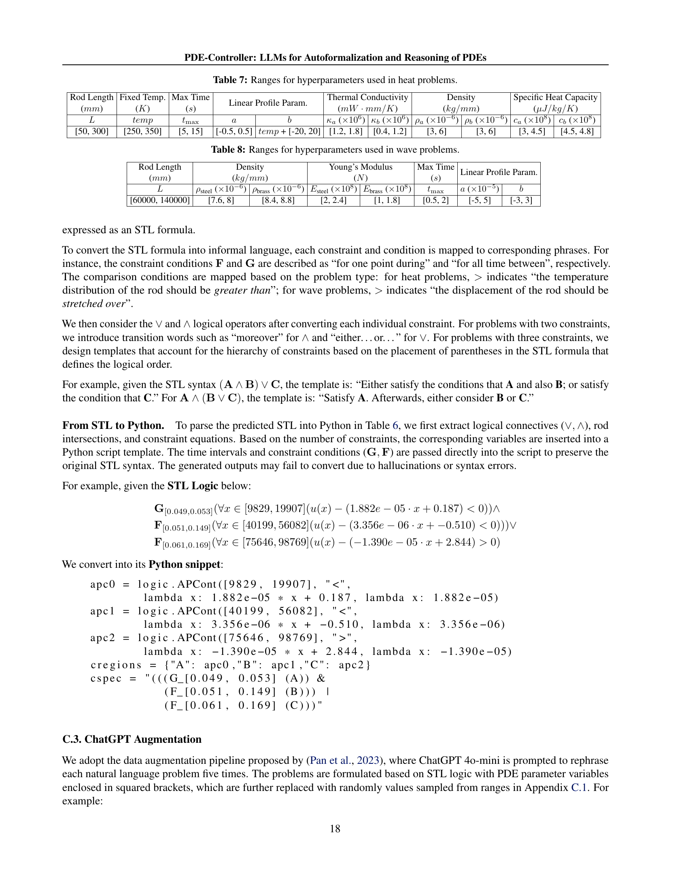

 


 2502.00963 
 Mauricio Soroco et el. 
 
 🤗 2025-02-13 
 



↗ arXiv


↗ Hugging Face


### TL;DR



기존의 PDE 제어 방식은 수동으로 문제를 형식화하고 전문적인 지식이 필요하다는 어려움이 있었습니다. 이는 시간과 자원 낭비를 초래하고 접근성을 제한했습니다.  본 논문에서는 이러한 문제를 해결하기 위해 **LLM 기반의 PDE 제어 자동화 프레임워크인 PDE-Controller**를 제시합니다.

PDE-Controller는 **자연어 지침을 형식적인 명세로 변환**하고, **새로운 하위 목표를 제시하여 PDE 제어의 효율성을 높입니다.**  **대규모의 데이터셋**을 구축하고, **강화 학습을 통해 모델을 학습**시켜, 자동화된 형식화, 추론, 프로그램 합성을 달성했습니다.  **실험 결과, 기존 모델보다 최대 62% 향상된 성능**을 보였습니다.  **본 연구는 모든 데이터, 코드, 모델을 공개**하여 향후 연구에 기여할 것입니다.



#### Key Takeaways


 LLM을 이용하여 비형식적인 자연어 지침을 형식적인 명세로 변환하고, PDE 제어의 유용성을 높이기 위한 추론 및 계획 단계를 실행하는 프레임워크를 개발했습니다. 



 새로운 데이터셋, 수학 추론 모델, 평가 지표를 통해 PDE 제어 문제의 자동화 및 이전 최첨단 모델보다 62% 향상된 성능을 달성했습니다. 



 모든 데이터, 모델 체크포인트, 코드를 공개하여, 복잡한 과학 및 공학 문제 해결에 LLMs의 잠재력을 보여주었습니다. 


#### Why does it matter?
**본 논문은 AI가 과학 및 공학 문제를 해결하는 데 중요한 역할을 할 수 있음을 보여줍니다.**  특히, **편미분 방정식(PDE) 제어 분야에서 LLMs의 잠재력을 보여줌으로써, 과학 및 공학 연구에 새로운 가능성을 제시합니다.**  **데이터셋, 모델, 평가 지표를 모두 공개하여 향후 연구를 위한 토대를 마련하였고, 이는 다른 AI for Science 연구에 큰 영향을 미칠 것입니다.**

------
#### Visual Insights

> 🔼 이 그림은 PDE-Controller 프레임워크의 개념도를 보여줍니다. 자연어로 된 비공식적인 PDE 제어 문제를 LLM(대규모 언어 모델)을 이용하여 STL(Signal Temporal Logic) 형식의 공식적인 명세로 변환하는 과정을 나타냅니다.  LLM은 물리학 및 역학적 지식을 활용하여 문제를 해결하고, 최적의 PDE 제어를 위한 추론 및 계획 단계를 수행합니다. 이 과정에서 생성된 공식적인 명세는 외부 솔버(예: GUROBI)를 이용하여 최적화되고, 그 결과는 제어 유틸리티로 측정됩니다.  데이터셋, 수리 추론 모델, 새로운 평가 지표를 포함하는 전체적인 솔루션을 보여주는 그림입니다.  본 연구에서 제시하는 PDE-Controller는 기존의 LLM 프롬프팅 방식보다 PDE 제어의 유틸리티 향상에 있어 최대 62% 향상된 성능을 보입니다.
> 

> 
read the caption

> Figure 1: We build LLMs for automated, accelerated PDE control.
> 


| Num. Constraints | 1 | 2 | 3 | Total Num. |
|---|---|---|---|---|
| STLs | 6 | 72 | 1296 | 1374 |
| Heat (Train) | 3840 | 45792 | 817776 | 867408 |
| Heat (Test) | 960 | 11448 | 204768 | 217176 |
| Wave (Train) | 3840 | 45504 | 795744 | 845088 |
| Wave (Test) | 960 | 11304 | 196992 | 209256 |

> 🔼 본 표는 논문의 데이터셋에 대한 정보를 요약하여 보여줍니다.  자세히는 자동 공식화(Autoformalization)와 프로그램 합성(Program Synthesis)에 사용된 데이터셋의 크기와 구성을 보여줍니다.  제약 조건의 개수(Num. Constraints)에 따라 데이터셋이 나뉘어져 있으며, 각 제약 조건 개수별로 학습(Train) 및 테스트(Test) 데이터셋의 크기가 열(Heat) 및 파동(Wave) 방정식 문제에 대해 제시되어 있습니다.  총 데이터셋 크기는 제약 조건 개수별 열 및 파동 방정식 데이터의 합계로 나타납니다.
> 

> 
read the caption

> Table 1: Our dataset for autoformalization and program synthesis.
> 

### In-depth insights

#### LLM PDE Control
LLM 기반 편미분 방정식(PDE) 제어는 **거대한 잠재력**을 지닌 매력적인 분야입니다.  이 접근 방식은 기존의 수동적이고 전문적인 PDE 제어 방법을 자동화하고 민주화할 수 있습니다.  **LLM의 강력한 언어 이해 및 추론 능력**을 활용하여 비공식적인 자연어 명령어를 공식적인 명세서로 변환하고, 계획 단계를 거쳐 PDE 제어의 유용성을 높일 수 있습니다.  하지만, **도메인 특화 지식의 부족**은 LLM이 정확한 수학적 추론을 수행하는 데 어려움을 야기하며, 이는 **대규모 고품질 데이터셋의 필요성**을 시사합니다.  **데이터 증강 기법**과 **강화 학습 기반의 미세 조정**은 LLM의 PDE 제어 성능을 향상시키는 데 중요한 역할을 합니다.  **자동화된 형식화 및 프로그램 합성**은 전문 지식 없이도 PDE 제어를 가능하게 하며, **새로운 과학적 발견 및 공학적 혁신**으로 이어질 수 있는 획기적인 전환점을 제시합니다.  하지만 **일반화 능력 및 견고성**에 대한 추가적인 연구가 필요하며, **실제 세계의 복잡한 문제**에 대한 적용성을 검증하는 것이 중요합니다.

#### Autoformalization
본 논문에서 제시된 자동 공식화(Autoformalization)는 비정형 자연어로 기술된 편미분 방정식(PDE) 제어 문제를 **정형적인 형식 언어(STL)**로 변환하는 핵심 과정입니다.  **LLM(대규모 언어 모델)**을 활용하여 비정형 문제 기술에서 추출된 제약 조건들을 정확하게 STL로 표현함으로써, 추후 **PDE 시스템 제어를 위한 자동화된 추론 및 계획 단계**를 가능하게 합니다. 이는 인간의 노력을 최소화하고 폭넓은 과학자 및 엔지니어들에게 PDE 제어를 접근 가능하게 만드는 중요한 발전입니다.  **높은 정확도(64% 이상)**를 달성한 자동 공식화는 LLM의 과학적 추론 능력을 보여주는 주요 성과이며, **실제 PDE 문제 해결에 필요한 실행 가능한 프로그램으로의 변환(프로그램 합성)**을 위한 기반을 마련합니다.  하지만, 인간이 작성한 데이터의 경우 소음 및 구조화되지 않은 텍스트로 인해 정확도가 다소 낮아지는 등의 한계점도 존재합니다.  **다양한 합성 데이터 및 실제 데이터를 통한 훈련**은 자동 공식화의 성능을 향상시키고, 다양한 PDE 문제에 대한 적용성을 높이는 데 기여합니다.

#### Reasoning & RLHF
본 논문의 "Reasoning & RLHF" 부분은 **LLM이 과학적 추론을 통해 편미분 방정식(PDE) 제어 문제를 해결하는 방법**을 제시합니다.  **강화 학습(RLHF)**을 이용하여, LLM이 PDE 제어 문제를 위한 최적의 부분 목표(subgoal)을 생성하고, 이를 통해 최종 목표 달성을 위한 효율적인 경로를 계획하는 과정을 보여줍니다.  **단순히 프롬프트 엔지니어링을 넘어, LLM이 자체적으로 추론하고 계획을 세우는 능력**을 강조하는 것이 핵심입니다.  이러한 과정에서 **인간의 피드백(RLHF)**을 통해 LLM의 추론 능력을 향상시키고, 더욱 효과적인 PDE 제어 전략을 학습시키는 데 초점을 맞추고 있습니다.  **자동화된 PDE 제어 시스템 구축을 위한 핵심적인 단계**로서, LLM 기반 과학적 추론의 가능성을 보여주는 중요한 부분입니다.  **데이터셋 구성 및 모델 학습 전략** 또한 이러한 추론 과정의 효율성과 성능에 중요한 영향을 미칩니다.  결론적으로, "Reasoning & RLHF"는 LLM의 과학적 추론 능력과 강화 학습을 결합하여 복잡한 과학 및 공학 문제를 해결하는 새로운 패러다임을 제시하는 부분입니다.

#### Dataset Creation
본 논문에서 데이터셋 구축에 대한 심층적인 논의는 아쉽게도 부족하지만, 제시된 정보를 바탕으로 추론해 볼 수 있습니다. **합성 데이터와 실제 데이터를 혼합하여 사용**한 점이 특징적입니다. **합성 데이터는 다양한 시나리오를 생성**하여 모델의 일반화 성능을 높이는 데 기여했을 것으로 예상되며, **실제 데이터는 현실 세계 문제에 대한 모델의 적용 가능성을 평가**하는 데 중요한 역할을 했을 것입니다.  **데이터셋의 규모가 방대**하다는 점도 주목할 만합니다.  2백만 개 이상의 합성 샘플과 수십 개의 실제 샘플을 통해 다양한 상황과 조건에서의 모델 성능을 폭넓게 평가할 수 있었을 것입니다. 하지만, **실제 데이터 수집 과정에 대한 자세한 설명이 부족**한 점은 아쉽습니다. 데이터 품질 확보를 위한 노력이나 데이터 편향에 대한 고려 사항 등에 대한 추가 정보가 있었다면 더욱 완성도 높은 연구가 되었을 것입니다.  전반적으로, **데이터셋 구축 전략은 모델의 성능 평가에 있어 중요한 요소**임을 보여주는 사례라고 할 수 있습니다. 다만, **데이터셋 구축 과정에 대한 더욱 자세한 정보 공개**를 통해 재현성을 높이고 연구의 신뢰도를 더욱 향상시킬 수 있었을 것입니다.

#### Future of LLMs
LLM의 미래는 **과학적 추론과 응용 수학 문제 해결 능력의 향상**에 달려 있습니다. PDE-Controller와 같은 프레임워크는 LLM이 편미분 방정식(PDE) 제어 문제를 자동으로 공식화하고 추론할 수 있도록 함으로써 이러한 발전에 기여합니다.  **자동 공식화와 프로그램 합성을 위한 대규모 데이터셋 구축**은 LLM의 성능 향상에 필수적입니다.  **강화 학습 기반의 과학적 추론 능력 향상**은 LLM이 복잡한 과학 및 엔지니어링 문제를 해결하는 데 도움이 될 것입니다.  하지만, **신뢰성 있는 결과를 얻기 위한 지속적인 개선**과 **실제 세계 문제에 대한 적용 가능성**을 높이는 연구가 중요합니다.  앞으로는 **도메인 특화된 지식과 추론 능력을 결합**한 LLM의 발전이 기대됩니다.  그리고, **인간의 피드백을 통한 지속적인 학습**을 통해  LLM의 성능 향상 및 신뢰성 확보가 이루어질 것입니다.  이는 **AI가 과학 기술 발전에 더욱 크게 기여**할 수 있게 할 것입니다.

### More visual insights

More on figures

> 🔼 그림 2는 편미분 방정식(PDE) 제어의 개념을 보여줍니다.  PDE는 물리적 시스템(예: 막대의 온도 또는 변형)을 모델링하는 데 사용됩니다.  PDE 제어의 목표는 시스템이 공간 및 시간적 제약 조건(예: 특정 온도 범위 내 유지)을 만족하도록 외부 입력(예: 열 또는 힘)을 조정하는 것입니다. 그림은 열 방정식과 파동 방정식을 사용하여 막대의 온도 및 변형을 제어하는 예시를 보여줍니다.  시간에 따라 변하는 열원 또는 힘을 입력으로 사용하여 시스템의 온도 또는 변형을 원하는 범위 내에서 유지하도록 제어합니다.
> 

> 
read the caption

> Figure 2: PDE control adjusts inputs (heat, force) to ensure systems (modeled by PDEs) satisfy spatiotemporal constraints.
> 

> 🔼 그림 3은 PDE 제어 문제를 자동으로 공식화하고 풀기 위한 PDE-Controller 프레임워크의 개요를 보여줍니다.  먼저, Translator는 비공식적인 자연어 형태의 PDE 제어 문제를 STL(Signal Temporal Logic)을 이용한 공식적인 명세로 변환합니다.  Controller는 새로운 STL 하위 목표(subgoal)를 제안하고, Coder는 각각의 STL을 특수화된 파이썬 프로그램으로 합성하여 외부 최적화기를 통해 최적화합니다. 초기 조건(i)에서 시작하여 PDE 추론은 원래 문제를 풀기 전에 하위 목표(ii)를 먼저 최적화하여 제어가 끝났을 때의 유틸리티(iii)를 향상시킵니다.  Controller는 사람의 피드백을 기반으로 강화 학습(RLHF)을 통해 학습됩니다.
> 

> 
read the caption

> Figure 3: Overview of our PDE-Controller framework. The Translator directly autoformalizes an informal PDE control problem ( yellow) into formal specifications with STL ( blue). The Controller proposes novel STL subgoals ( purple). Each STL is synthesized into specialized Python programs by the Coder ( green) and optimized externally (white). From the initial condition (i.), our PDE reasoning optimizes a subgoal (ii.) before the original problem, improving the utility at the end of control (iii.). We train the Controller with reinforcement learning from human feedback (RLHF).
> 

> 🔼 그림 4는 본 논문에서 제시하는 PDE 제어 문제의 자동 공식화(Translator LLM) 및 프로그램 합성(Coder LLM)을 위한 지도 학습 미세 조정(SFT) 워크플로우를 보여줍니다. 유틸리티는 평가에만 사용되며 SFT에는 사용되지 않습니다. 추론 없이 Translator와 Coder는 원래 문제를 충실하게 직접 해결하려고 시도합니다.  즉, 자연어로 표현된 PDE 제어 문제를 받아 Translator는 수학적 공식(STL)으로 변환하고, Coder는 이를 바탕으로 PDE 시뮬레이터와 최적화 도구(Gurobi)를 사용할 수 있는 실행 가능한 파이썬 프로그램을 생성합니다.  이 과정에서,  Translator와 Coder는  물리적 시스템의 특성과 제약 조건을 정확하게 반영하여 프로그램을 생성하는 것을 목표로 합니다.  하지만,  추론 과정 없이 이루어지기 때문에, 복잡한 문제나 불완전한 정보가 주어지는 경우 최적의 해결책을 제시하지 못할 수 있습니다.  따라서, 본 논문에서는 추후 추론 기능을 추가하여 더욱 효율적이고 강력한 PDE 제어 시스템을 구축하는 방안을 모색합니다.
> 

> 
read the caption

> Figure 4: Workflow for supervised fine-tuning (SFT) of autoformalization (Translator LLM) and program synthesis (Coder LLM). Note that the utility is only used for evaluation and not used for SFT. Without reasoning, the Translator and Coder try to faithfully and directly solve the original problem.
> 

> 🔼 그림 5는 강화 학습 기반의 인간 피드백(RLHF)을 통해 PDE 제어 추론을 학습하는 과정을 보여줍니다.  Controller LLM은 입력 프롬프트를 받아 선행 학습된 선호도 데이터를 사용하여 하위 목표 STL인 ϕ′를 제안합니다. 초기 조건 u(0)에서 PDE 시스템은 ϕ′에 의해 제어되어 u′ 상태에 도달하고, 그 다음 원래 STL인 ϕ에 의해 제어되어 최종 상태 u*′에 도달합니다.  이 추론을 통해 얻은 효용 r(ϕ|ϕ′)는 ϕ를 직접 풀어 얻은 효용 r(ϕ)보다 더 높을 것으로 예상됩니다.  즉, 하위 목표를 설정하여 원래 문제를 더 효과적으로 해결하는 과정을 보여주는 것입니다.
> 

> 
read the caption

> Figure 5: Learning PDE control reasoning via RLHF. Given the input prompt, our Controller LLM trained with preference data via reinforcement learning, will propose a subgoal STL ϕ′superscriptitalic-ϕ′\phi^{\prime}italic_ϕ start_POSTSUPERSCRIPT ′ end_POSTSUPERSCRIPT. From the initial condition u(0)superscript𝑢0u^{(0)}italic_u start_POSTSUPERSCRIPT ( 0 ) end_POSTSUPERSCRIPT, the PDE system is controlled by ϕ′superscriptitalic-ϕ′\phi^{\prime}italic_ϕ start_POSTSUPERSCRIPT ′ end_POSTSUPERSCRIPT to reach state u′superscript𝑢′u^{\prime}italic_u start_POSTSUPERSCRIPT ′ end_POSTSUPERSCRIPT, and then further controlled by the original STL ϕitalic-ϕ\phiitalic_ϕ to reach the final state u∗⁣′superscript𝑢′u^{*\prime}italic_u start_POSTSUPERSCRIPT ∗ ′ end_POSTSUPERSCRIPT. We expect the utility achieved via this reasoning, r⁢(ϕ|ϕ′)𝑟conditionalitalic-ϕsuperscriptitalic-ϕ′r(\phi|\phi^{\prime})italic_r ( italic_ϕ | italic_ϕ start_POSTSUPERSCRIPT ′ end_POSTSUPERSCRIPT ), to outperform r⁢(ϕ)𝑟italic-ϕr(\phi)italic_r ( italic_ϕ ) achieved by directly solving ϕitalic-ϕ\phiitalic_ϕ.
> 

> 🔼 그림 6은 논문의 3.4절 PDE 추론 섹션에 있는 그림으로, 열(상단)과 파동(하단) 문제에 대한 LLM 추론의 사례 연구를 보여줍니다. 그림 왼쪽에서 오른쪽으로, 먼저 초기 조건 u(0)에서 직접 ϕ를 풀면 r(ϕ)가 생성됩니다. 그런 다음, 추론을 통해 u(0)에서 ϕ′를 풀어 u′를 얻은 후, u′에서 ϕ를 풀면 r(ϕ|ϕ′)가 생성됩니다. 검은색 곡선은 t 또는 t′에서 시스템 상태(열의 경우 온도, 파동의 경우 변위)를 나타내고, 색상이 있는 부분은 제약 조건을 나타냅니다. 제약 조건은 시간 범위 [t1, t2]에 적용될 수 있지만, t와 t′는 이 범위에 속하지 않을 수도 있습니다. 자세한 내용은 부록 B.3에 있는 STL을 참조하십시오.
> 

> 
read the caption

> Figure 6: Case study of LLM reasoning for PDE control on heat (top) and wave (bottom) problems (symbols are aligned with Fig. 5). From left to right: Directly solving ϕitalic-ϕ\phiitalic_ϕ from the initial condition u(0)superscript𝑢0u^{(0)}italic_u start_POSTSUPERSCRIPT ( 0 ) end_POSTSUPERSCRIPT (1st column) yields r⁢(ϕ)𝑟italic-ϕr(\phi)italic_r ( italic_ϕ ) (2nd column); Reasoning: solving ϕ′superscriptitalic-ϕ′\phi^{\prime}italic_ϕ start_POSTSUPERSCRIPT ′ end_POSTSUPERSCRIPT from u(0)superscript𝑢0u^{(0)}italic_u start_POSTSUPERSCRIPT ( 0 ) end_POSTSUPERSCRIPT to get u′superscript𝑢′u^{\prime}italic_u start_POSTSUPERSCRIPT ′ end_POSTSUPERSCRIPT (3rd column) then solving ϕitalic-ϕ\phiitalic_ϕ from u′superscript𝑢′u^{\prime}italic_u start_POSTSUPERSCRIPT ′ end_POSTSUPERSCRIPT to get r⁢(ϕ|ϕ′)𝑟conditionalitalic-ϕsuperscriptitalic-ϕ′r(\phi|\phi^{\prime})italic_r ( italic_ϕ | italic_ϕ start_POSTSUPERSCRIPT ′ end_POSTSUPERSCRIPT ) (4th column). Black curves indicate the system’s states (temperature for heat, displacement for wave) at t𝑡titalic_t or t′superscript𝑡′t^{\prime}italic_t start_POSTSUPERSCRIPT ′ end_POSTSUPERSCRIPT. Colored segments are constraints, with dashes for inequalities (≥\geq≥ when dashes are above the solid, and vice versa). Although we plot constraints, they may constrain temporal ranges [t1,t2]subscript𝑡1subscript𝑡2[t_{1},t_{2}][ italic_t start_POSTSUBSCRIPT 1 end_POSTSUBSCRIPT , italic_t start_POSTSUBSCRIPT 2 end_POSTSUBSCRIPT ] ∌t,t′𝑡superscript𝑡′absent\not\owns t,t^{\prime}∌ italic_t , italic_t start_POSTSUPERSCRIPT ′ end_POSTSUPERSCRIPT. STLs can be found in Appendix B.3.
> 

> 🔼 그림 7은 서로 다른 난이도(쉬움, 중간, 어려움)의 열 문제에 대한 사례 연구를 보여줍니다. 그림은 초기 조건 u(0)에서 직접적으로 ϕ를 푸는 경우(첫 번째 열)와, 먼저 ϕ'를 풀어 u'를 얻은 다음 ϕ를 풀어 r(ϕ|ϕ')를 얻는 추론 과정을 보여줍니다(두 번째 열). 검은색 곡선은 t 또는 t'에서 시스템 상태(열의 경우 온도, 파동의 경우 변위)를 나타냅니다. 색상이 있는 부분은 제약 조건을 나타내며, 실선 위에 있는 대시는 ≥ 부등식을, 실선 아래에 있는 대시는 ≤ 부등식을 나타냅니다. 제약 조건은 항상 표시되지만, 실제로는 [t1, t2]의 다른 시간 범위를 제약할 수 있고, t, t'이 [t1, t2]에 포함되지 않을 수도 있습니다.
> 

> 
read the caption

> Figure 7: Case study of heat problems with different difficulty levels: easy (top), medium (middle), hard (bottom). Symbols are aligned with Fig. 5. From left to right: Directly solving ϕitalic-ϕ\phiitalic_ϕ from the initial condition u(0)superscript𝑢0u^{(0)}italic_u start_POSTSUPERSCRIPT ( 0 ) end_POSTSUPERSCRIPT (1st column) yields r⁢(ϕ)𝑟italic-ϕr(\phi)italic_r ( italic_ϕ ) (2nd column). Reasoning: solving ϕ′superscriptitalic-ϕ′\phi^{\prime}italic_ϕ start_POSTSUPERSCRIPT ′ end_POSTSUPERSCRIPT from u(0)superscript𝑢0u^{(0)}italic_u start_POSTSUPERSCRIPT ( 0 ) end_POSTSUPERSCRIPT to get u′superscript𝑢′u^{\prime}italic_u start_POSTSUPERSCRIPT ′ end_POSTSUPERSCRIPT (3rd column) then solving ϕitalic-ϕ\phiitalic_ϕ from u′superscript𝑢′u^{\prime}italic_u start_POSTSUPERSCRIPT ′ end_POSTSUPERSCRIPT to get r⁢(ϕ|ϕ′)𝑟conditionalitalic-ϕsuperscriptitalic-ϕ′r(\phi|\phi^{\prime})italic_r ( italic_ϕ | italic_ϕ start_POSTSUPERSCRIPT ′ end_POSTSUPERSCRIPT ) (4th column) Black curves indicate the system’s states (temperature for heat, displacement for wave) at t𝑡titalic_t or t′superscript𝑡′t^{\prime}italic_t start_POSTSUPERSCRIPT ′ end_POSTSUPERSCRIPT. Colored segments are constraints, with dashes for inequalities (≥\geq≥ when dashes are above the solid, ≤\leq≤ when dashes are below the solid). Note that although we always plot constraints (segments), they actually constrain different temporal ranges [t1,t2]subscript𝑡1subscript𝑡2[t_{1},t_{2}][ italic_t start_POSTSUBSCRIPT 1 end_POSTSUBSCRIPT , italic_t start_POSTSUBSCRIPT 2 end_POSTSUBSCRIPT ] and it is possible that t,t′∉[t1,t2]𝑡superscript𝑡′subscript𝑡1subscript𝑡2t,t^{\prime}\notin[t_{1},t_{2}]italic_t , italic_t start_POSTSUPERSCRIPT ′ end_POSTSUPERSCRIPT ∉ [ italic_t start_POSTSUBSCRIPT 1 end_POSTSUBSCRIPT , italic_t start_POSTSUBSCRIPT 2 end_POSTSUBSCRIPT ].
> 

> 🔼 그림 8은 다양한 난이도(쉬움, 중간, 어려움)의 파동 문제에 대한 사례 연구를 보여줍니다. 그림은 쉬운 문제, 중간 문제, 어려움 문제를 각각 상단, 중간, 하단에 표시합니다. 그림 5와 기호가 일치합니다. 왼쪽에서 오른쪽으로:  1열: 초기 조건 u(0)에서 ϕ를 직접 풀면 r(ϕ)가 생성됩니다. 2열: r(ϕ)를 보여줍니다. 3열: u(0)에서 ϕ′를 풀어 u′를 얻은 후, u′에서 ϕ를 풀면 r(ϕ|ϕ′)가 생성됩니다. 4열: r(ϕ|ϕ′)를 보여줍니다. 검은색 곡선은 t 또는 t′에서 시스템 상태(열 문제의 경우 온도, 파동 문제의 경우 변위)를 나타냅니다. 색상이 있는 부분은 제약 조건을 나타내며, 실선 위에 있는 대시는 부등식(≥)을, 실선 아래에 있는 대시는 부등식(≤)을 나타냅니다. 제약 조건(선)은 항상 표시되지만, 실제로는 서로 다른 시간 범위 [t1, t2]를 제약하며, t, t′이 [t1, t2]에 포함되지 않을 수도 있습니다.
> 

> 
read the caption

> Figure 8: Case study of wave problems with different difficulty levels: easy (top), medium (middle), hard (bottom). Symbols are aligned with Fig. 5. From left to right: Directly solving ϕitalic-ϕ\phiitalic_ϕ from the initial condition u(0)superscript𝑢0u^{(0)}italic_u start_POSTSUPERSCRIPT ( 0 ) end_POSTSUPERSCRIPT (1st column) yields r⁢(ϕ)𝑟italic-ϕr(\phi)italic_r ( italic_ϕ ) (2nd column). Reasoning: solving ϕ′superscriptitalic-ϕ′\phi^{\prime}italic_ϕ start_POSTSUPERSCRIPT ′ end_POSTSUPERSCRIPT from u(0)superscript𝑢0u^{(0)}italic_u start_POSTSUPERSCRIPT ( 0 ) end_POSTSUPERSCRIPT to get u′superscript𝑢′u^{\prime}italic_u start_POSTSUPERSCRIPT ′ end_POSTSUPERSCRIPT (3rd column) then solving ϕitalic-ϕ\phiitalic_ϕ from u′superscript𝑢′u^{\prime}italic_u start_POSTSUPERSCRIPT ′ end_POSTSUPERSCRIPT to get r⁢(ϕ|ϕ′)𝑟conditionalitalic-ϕsuperscriptitalic-ϕ′r(\phi|\phi^{\prime})italic_r ( italic_ϕ | italic_ϕ start_POSTSUPERSCRIPT ′ end_POSTSUPERSCRIPT ) (4th column) Black curves indicate the system’s states (temperature for heat, displacement for wave) at t𝑡titalic_t or t′superscript𝑡′t^{\prime}italic_t start_POSTSUPERSCRIPT ′ end_POSTSUPERSCRIPT. Colored segments are constraints, with dashes for inequalities (≥\geq≥ when dashes are above the solid, ≤\leq≤ when dashes are below the solid). Note that although we always plot constraints (segments), they actually constrain different temporal ranges [t1,t2]subscript𝑡1subscript𝑡2[t_{1},t_{2}][ italic_t start_POSTSUBSCRIPT 1 end_POSTSUBSCRIPT , italic_t start_POSTSUBSCRIPT 2 end_POSTSUBSCRIPT ] and it is possible that t,t′∉[t1,t2]𝑡superscript𝑡′subscript𝑡1subscript𝑡2t,t^{\prime}\notin[t_{1},t_{2}]italic_t , italic_t start_POSTSUPERSCRIPT ′ end_POSTSUPERSCRIPT ∉ [ italic_t start_POSTSUBSCRIPT 1 end_POSTSUBSCRIPT , italic_t start_POSTSUBSCRIPT 2 end_POSTSUBSCRIPT ].
> 

> 🔼 그림 9는 그림 6에서 제시된 열 문제(위쪽)와 파동 문제(아래쪽)에 대한 합성 제어 입력을 보여줍니다. 왼쪽 패널은 목표 함수 ϕ를 직접 풀어 얻은 해를 보여주고, 오른쪽 패널은 하위 목표 ϕ′을 먼저 풀고 그 결과를 바탕으로 ϕ를 풀어 얻은 해를 보여줍니다. 빨간색 점선은 제어 방식이 ϕ′에서 ϕ로 전환되는 시점을 나타냅니다.  즉,  더 나은 제어 성능을 위해 하위 목표를 설정하고 순차적으로 최적화하는 과정을 시각적으로 보여줍니다.
> 

> 
read the caption

> Figure 9: Synthesized control inputs for the heat (top) and the wave (bottom) problems in Fig.6. Left: Solution for directly solving ϕitalic-ϕ\phiitalic_ϕ. Right: Solution for solving ϕitalic-ϕ\phiitalic_ϕ based on subgoal ϕ′superscriptitalic-ϕ′\phi^{\prime}italic_ϕ start_POSTSUPERSCRIPT ′ end_POSTSUPERSCRIPT, where red vertical dashes indicate the control shift from ϕ′superscriptitalic-ϕ′\phi^{\prime}italic_ϕ start_POSTSUPERSCRIPT ′ end_POSTSUPERSCRIPT to ϕitalic-ϕ\phiitalic_ϕ.
> 

More on tables


| Purpose | Metric |
|---|---| 
| LLM-generated STL (<math alttext="\hat{\phi}" class="ltx_Math" display="inline" id="S4.T2.1.1.1.1.1.1.m1.1"><semantics id="S4.T2.1.1.1.1.1.1.m1.1a"><mover accent="true" id="S4.T2.1.1.1.1.1.1.m1.1.1" xref="S4.T2.1.1.1.1.1.1.m1.1.1.cmml"><mi id="S4.T2.1.1.1.1.1.1.m1.1.1.2" xref="S4.T2.1.1.1.1.1.1.m1.1.1.2.cmml">ϕ</mi><mo id="S4.T2.1.1.1.1.1.1.m1.1.1.1" xref="S4.T2.1.1.1.1.1.1.m1.1.1.1.cmml">^</mo></mover><annotation-xml encoding="MathML-Content" id="S4.T2.1.1.1.1.1.1.m1.1b"><apply id="S4.T2.1.1.1.1.1.1.m1.1.1.cmml" xref="S4.T2.1.1.1.1.1.1.m1.1.1"><ci id="S4.T2.1.1.1.1.1.1.m1.1.1.1.cmml" xref="S4.T2.1.1.1.1.1.1.m1.1.1.1">^</ci><ci id="S4.T2.1.1.1.1.1.1.m1.1.1.2.cmml" xref="S4.T2.1.1.1.1.1.1.m1.1.1.2">italic-ϕ</ci></apply></annotation-xml><annotation encoding="application/x-tex" id="S4.T2.1.1.1.1.1.1.m1.1c">\hat{\phi}</annotation><annotation encoding="application/x-llamapun" id="S4.T2.1.1.1.1.1.1.m1.1d">over^ start_ARG italic_ϕ end_ARG</annotation></semantics></math>) could be valid, but there might be semantic mistakes2 | IoU: Intersection over union (satisfying areas) between the true STL, <math alttext="\phi" class="ltx_Math" display="inline" id="S4.T2.2.2.2.2.1.1.m1.1"><semantics id="S4.T2.2.2.2.2.1.1.m1.1a"><mi id="S4.T2.2.2.2.2.1.1.m1.1.1" xref="S4.T2.2.2.2.2.1.1.m1.1.1.cmml">ϕ</mi><annotation-xml encoding="MathML-Content" id="S4.T2.2.2.2.2.1.1.m1.1b"><ci id="S4.T2.2.2.2.2.1.1.m1.1.1.cmml" xref="S4.T2.2.2.2.2.1.1.m1.1.1">italic-ϕ</ci></annotation-xml><annotation encoding="application/x-tex" id="S4.T2.2.2.2.2.1.1.m1.1c">\phi</annotation><annotation encoding="application/x-llamapun" id="S4.T2.2.2.2.2.1.1.m1.1d">italic_ϕ</annotation></semantics></math>, and the LLM’s generation, <math alttext="\hat{\phi}" class="ltx_Math" display="inline" id="S4.T2.3.3.3.3.2.2.m2.1"><semantics id="S4.T2.3.3.3.3.2.2.m2.1a"><mover accent="true" id="S4.T2.3.3.3.3.2.2.m2.1.1" xref="S4.T2.3.3.3.3.2.2.m2.1.1.cmml"><mi id="S4.T2.3.3.3.3.2.2.m2.1.1.2" xref="S4.T2.3.3.3.3.2.2.m2.1.1.2.cmml">ϕ</mi><mo id="S4.T2.3.3.3.3.2.2.m2.1.1.1" xref="S4.T2.3.3.3.3.2.2.m2.1.1.1.cmml">^</mo></mover><annotation-xml encoding="MathML-Content" id="S4.T2.3.3.3.3.2.2.m2.1b"><apply id="S4.T2.3.3.3.3.2.2.m2.1.1.cmml" xref="S4.T2.3.3.3.3.2.2.m2.1.1"><ci id="S4.T2.3.3.3.3.2.2.m2.1.1.1.cmml" xref="S4.T2.3.3.3.3.2.2.m2.1.1.1">^</ci><ci id="S4.T2.3.3.3.3.2.2.m2.1.1.2.cmml" xref="S4.T2.3.3.3.3.2.2.m2.1.1.2">italic-ϕ</ci></apply></annotation-xml><annotation encoding="application/x-tex" id="S4.T2.3.3.3.3.2.2.m2.1c">\hat{\phi}</annotation><annotation encoding="application/x-llamapun" id="S4.T2.3.3.3.3.2.2.m2.1d">over^ start_ARG italic_ϕ end_ARG</annotation></semantics></math>. |
| Python programs generated by Coder may not be runnable due to bugs. | Executability: The ratio of executable programs to the total. <i>This doesn’t ensure the executed result (utility <math alttext="r" class="ltx_Math" display="inline" id="S4.T2.4.4.4.1.1.1.1.m1.1"><semantics id="S4.T2.4.4.4.1.1.1.1.m1.1a"><mi id="S4.T2.4.4.4.1.1.1.1.m1.1.1" xref="S4.T2.4.4.4.1.1.1.1.m1.1.1.cmml">r</mi><annotation-xml encoding="MathML-Content" id="S4.T2.4.4.4.1.1.1.1.m1.1b"><ci id="S4.T2.4.4.4.1.1.1.1.m1.1.1.cmml" xref="S4.T2.4.4.4.1.1.1.1.m1.1.1">𝑟</ci></annotation-xml><annotation encoding="application/x-tex" id="S4.T2.4.4.4.1.1.1.1.m1.1c">r</annotation><annotation encoding="application/x-llamapun" id="S4.T2.4.4.4.1.1.1.1.m1.1d">italic_r</annotation></semantics></math>) is correct.</i> | 
| Compare the final PDE control utility <math alttext="r(\hat{\phi})" class="ltx_Math" display="inline" id="S4.T2.5.5.5.1.1.1.m1.1"><semantics id="S4.T2.5.5.5.1.1.1.m1.1a"><mrow id="S4.T2.5.5.5.1.1.1.m1.1.2" xref="S4.T2.5.5.5.1.1.1.m1.1.2.cmml"><mi id="S4.T2.5.5.5.1.1.1.m1.1.2.2" xref="S4.T2.5.5.5.1.1.1.m1.1.2.2.cmml">r</mi><mo id="S4.T2.5.5.5.1.1.1.m1.1.2.1" xref="S4.T2.5.5.5.1.1.1.m1.1.2.1.cmml">⁢</mo><mrow id="S4.T2.5.5.5.1.1.1.m1.1.2.3.2" xref="S4.T2.5.5.5.1.1.1.m1.1.1.cmml"><mo id="S4.T2.5.5.5.1.1.1.m1.1.2.3.2.1" stretchy="false" xref="S4.T2.5.5.5.1.1.1.m1.1.1.cmml">(</mo><mover accent="true" id="S4.T2.5.5.5.1.1.1.m1.1.1" xref="S4.T2.5.5.5.1.1.1.m1.1.1.cmml"><mi id="S4.T2.5.5.5.1.1.1.m1.1.1.2" xref="S4.T2.5.5.5.1.1.1.m1.1.1.2.cmml">ϕ</mi><mo id="S4.T2.5.5.5.1.1.1.m1.1.1.1" xref="S4.T2.5.5.5.1.1.1.m1.1.1.1.cmml">^</mo></mover><mo id="S4.T2.5.5.5.1.1.1.m1.1.2.3.2.2" stretchy="false" xref="S4.T2.5.5.5.1.1.1.m1.1.1.cmml">)</mo></mrow></mrow><annotation-xml encoding="MathML-Content" id="S4.T2.5.5.5.1.1.1.m1.1b"><apply id="S4.T2.5.5.5.1.1.1.m1.1.2.cmml" xref="S4.T2.5.5.5.1.1.1.m1.1.2"><times id="S4.T2.5.5.5.1.1.1.m1.1.2.1.cmml" xref="S4.T2.5.5.5.1.1.1.m1.1.2.1"></times><ci id="S4.T2.5.5.5.1.1.1.m1.1.2.2.cmml" xref="S4.T2.5.5.5.1.1.1.m1.1.2.2">𝑟</ci><apply id="S4.T2.5.5.5.1.1.1.m1.1.1.cmml" xref="S4.T2.5.5.5.1.1.1.m1.1.2.3.2"><ci id="S4.T2.5.5.5.1.1.1.m1.1.1.1.cmml" xref="S4.T2.5.5.5.1.1.1.m1.1.1.1">^</ci><ci id="S4.T2.5.5.5.1.1.1.m1.1.1.2.cmml" xref="S4.T2.5.5.5.1.1.1.m1.1.1.2">italic-ϕ</ci></apply></apply></annotation-xml><annotation encoding="application/x-tex" id="S4.T2.5.5.5.1.1.1.m1.1c">r(\hat{\phi})</annotation><annotation encoding="application/x-llamapun" id="S4.T2.5.5.5.1.1.1.m1.1d">italic_r ( over^ start_ARG italic_ϕ end_ARG )</annotation></semantics></math> to true utlity <math alttext="r(\phi)" class="ltx_Math" display="inline" id="S4.T2.6.6.6.2.2.2.m2.1"><semantics id="S4.T2.6.6.6.2.2.2.m2.1a"><mrow id="S4.T2.6.6.6.2.2.2.m2.1.2" xref="S4.T2.6.6.6.2.2.2.m2.1.2.cmml"><mi id="S4.T2.6.6.6.2.2.2.m2.1.2.2" xref="S4.T2.6.6.6.2.2.2.m2.1.2.2.cmml">r</mi><mo id="S4.T2.6.6.6.2.2.2.m2.1.2.1" xref="S4.T2.6.6.6.2.2.2.m2.1.2.1.cmml">⁢</mo><mrow id="S4.T2.6.6.6.2.2.2.m2.1.2.3.2" xref="S4.T2.6.6.6.2.2.2.m2.1.2.cmml"><mo id="S4.T2.6.6.6.2.2.2.m2.1.2.3.2.1" stretchy="false" xref="S4.T2.6.6.6.2.2.2.m2.1.2.cmml">(</mo><mi id="S4.T2.6.6.6.2.2.2.m2.1.1" xref="S4.T2.6.6.6.2.2.2.m2.1.1.cmml">ϕ</mi><mo id="S4.T2.6.6.6.2.2.2.m2.1.2.3.2.2" stretchy="false" xref="S4.T2.6.6.6.2.2.2.m2.1.2.cmml">)</mo></mrow></mrow><annotation-xml encoding="MathML-Content" id="S4.T2.6.6.6.2.2.2.m2.1b"><apply id="S4.T2.6.6.6.2.2.2.m2.1.2.cmml" xref="S4.T2.6.6.6.2.2.2.m2.1.2"><times id="S4.T2.6.6.6.2.2.2.m2.1.2.1.cmml" xref="S4.T2.6.6.6.2.2.2.m2.1.2.1"></times><ci id="S4.T2.6.6.6.2.2.2.m2.1.2.2.cmml" xref="S4.T2.6.6.6.2.2.2.m2.1.2.2">𝑟</ci><ci id="S4.T2.6.6.6.2.2.2.m2.1.1.cmml" xref="S4.T2.6.6.6.2.2.2.m2.1.1">italic-ϕ</ci></apply></annotation-xml><annotation encoding="application/x-tex" id="S4.T2.6.6.6.2.2.2.m2.1c">r(\phi)</annotation><annotation encoding="application/x-llamapun" id="S4.T2.6.6.6.2.2.2.m2.1d">italic_r ( italic_ϕ )</annotation></semantics></math>. | Utility RMSE: Relative mean square error on utility. |
> 🔼 본 표는 논문의 4장 실험에서, 번역기(Translator)의 자동 공식화와 코더(Coder)의 프로그램 합성 성능을 평가하기 위해 사용된 지표들을 보여줍니다.  자동 공식화의 정확성을 평가하는 IoU(Intersection over Union), 생성된 코드의 실행 가능성을 나타내는 실행 가능성, 그리고 최종 PDE 제어 유틸리티 r($)와의 오차를 측정하는 유틸리티 RMSE(Root Mean Square Error) 지표가 포함되어 있습니다. 각 지표는 서로 다른 측면에서 모델의 성능을 보완적으로 평가하는 역할을 합니다.
> 

> 
read the caption

> Table 2: Metrics for the evaluation of autoformalization (Translator) and program synthesis (Coder).
> 


| PDE | Model | IoU () (Translator) | Executability () (Coder) | Utility RMSE () | 
|---|---|---|---|---| 
| Heat | Ours | **0.992** (0.07) | **0.9978** (0.0015) | **0.0173** (0.0065) | 
|  | MathCoder2 | **0.772** (0.35) | 0.9592 (0.0166) | 0.2058 (0.0672) | 
|  | GPT (4o) | - | 0.5807 (0.3244) | 0.0445 (0.0437) | 
|  | GPT (o1-mini) | **0.3561** (0.2857) | **0.0898** (0.0165) | 
| Wave | Ours | **0.992** (0.07) | **0.9620** (0.0098) | **0.0076** (0.0011) | 
|  | MathCoder2 | **0.772** (0.35) | **0.9340** (0.0242) | 0.1089 (0.0485) | 
|  | GPT (4o) | - | 0.6799 (0.2523) | 0.0868 (0.0500) | 
|  | GPT (o1-mini) | 0.4041 (0.2771) | **0.0757** (0.0149) | 
> 🔼 표 3은 PDE 제어 문제에 대한 비공식적 자연어 설명을 공식적인 STL(Signal Temporal Logic) 명세로 변환하는 모델인 Translator와 공식 STL 명세를 실행 가능한 Python 코드로 변환하는 모델인 Coder의 성능을 보여줍니다. 세 가지 지표(IoU, 실행 가능성, Utility RMSE)를 사용하여 평가되었으며, 세 번의 시드를 사용하여 얻은 결과의 표준 편차도 함께 제시되어 있습니다.  표에는 각 모델의 성능을 비교하고, 각 지표에서 가장 좋은 성능을 보인 모델은 굵게 표시하고, 두 번째로 좋은 성능을 보인 모델은 밑줄을 쳐서 표시했습니다.  이는 모델의 자동 공식화 및 프로그램 합성 능력을 정량적으로 비교 분석한 결과를 보여줍니다.
> 

> 
read the caption

> Table 3: Autoformalization and program synthesis. Deviations over 3 seeds are in parentheses. Bold indicates the best, underline denotes the runner-up.
> 


| IoU (<mo stretchy="false">↑</mo>) |
|---|---| 
|(Translator)|
> 🔼 표 4는 논문의 3.2절에서 설명하는 수동으로 작성된 데이터에 대한 자동 공식화 및 프로그램 합성 결과를 보여줍니다. 세 가지 지표(IoU, 실행 가능성, Utility RMSE)를 사용하여 모델의 성능을 평가했습니다. 세 번의 시드에 대한 표준 편차가 괄호 안에 표시되어 있으며, 가장 좋은 결과는 굵게, 두 번째로 좋은 결과는 밑줄이 표시되어 있습니다. 이 표는 다양한 모델(Ours, MathCoder2, GPT-40, GPT-01-mini)을 비교 분석하여, 제안된 PDE-Controller의 성능 우수성을 보여줍니다.
> 

> 
read the caption

> Table 4: Autoformalization and program synthesis on manually written data (Sec. 3.2). Deviations over 3 seeds are in parentheses. Bold indicates the best, underline denotes the runner-up.
> 


| Executability ()| 
|---|---| 
| (Coder)| 
> 🔼 표 5는 논문에서 제시된 PDE 제어 추론 데이터의 개요를 보여줍니다. 무작위 샘플링의 성공률(P)을 기준으로 문제의 난이도를 세 가지 수준(쉬움, 중간, 어려움)으로 구분했습니다. 각 난이도 수준별로 훈련, 테스트 세트의 비율과 전체 문제 수를 나타냅니다.  열은 각각 난이도 수준, 훈련 세트의 (성공, 실패) 쌍의 수, 테스트 세트의 (성공, 실패) 쌍의 수, 그리고 전체 (성공, 실패) 쌍의 수를 보여줍니다. 마지막 열은 각 난이도 수준에서 무작위 샘플링의 성공률을 백분율로 나타냅니다.
> 

> 
read the caption

> Table 5: Overview of our reasoning data. We threshold 3 difficulty levels of questions by the Success Rate P¯¯𝑃\overline{P}over¯ start_ARG italic_P end_ARG of random sampling.
> 


| Utility | RMSE () |
|---|---|
> 🔼 표 6은 제안된 컨트롤러 LLM을 사용하여 PDE 제어 문제에 대한 과학적 추론 결과를 보여줍니다. 5개의 시드에 대한 표준 편차를 괄호 안에 표시했습니다.  '유효한 STL ϕ′(%) (Valid STL ϕ′ (%))' 열은 제안된 하위 목표 STL ϕ′이 구문 오류나 부적절한 시간 제약 없이 유효한 비율을 나타냅니다.  굵은 글씨는 가장 좋은 성능을, 밑줄은 두 번째로 좋은 성능을 나타냅니다.  'x'는 유효한 STL이 생성되지 않은 경우를, '-'는 해당 사항이 없는 경우를 의미합니다.
> 

> 
read the caption

> Table 6:  Scientific reasoning over PDE control problems via our Controller LLM. Deviations over 5 seeds are in parentheses. “Valid STL ϕ′superscriptitalic-ϕ′\phi^{\prime}italic_ϕ start_POSTSUPERSCRIPT ′ end_POSTSUPERSCRIPT (%)”: ratio of valid proposed subgoal STL ϕ′superscriptitalic-ϕ′\phi^{\prime}italic_ϕ start_POSTSUPERSCRIPT ′ end_POSTSUPERSCRIPT (i.e. without any syntax errors or improper time constraints). Bold indicates the best, underline denotes the runner-up. “x” indicates no valid STLs were generated for evaluation. “-” indicates not applicable.
> 


| PDE | Model | IoU (↑) (Translator) | Executability (↑) (Coder) | Utility RMSE (↓) |
|---|---|---|---|---|
| Heat | Ours | 0.7108 (0.0043) | 0.8235 (0.0) | 2.4687 (0.0) |
|  | MathCoder2 | 0.3383 (0.068) | 0.9804 (0.0277) | 0.0004 (0.0005) |
|  | GPT (4o) | - | 0.4314 (0.3328) | 1.8555 (0.0136) |
|  | GPT (o1-mini) | - | 0.3530 (0.3050) | 0.1738 (0.0207) |
| Wave | Ours | 0.6493 (0.0) | 1.0 (0.0) | 0.0119 (0.0) |
|  | MathCoder2 | 0.1953 (0.045) | 1.0 (0.0) | 0.0129 (0.0012) |
|  | GPT (4o) | - | 0.5882 (0.4437) | 0.0105 (0.0) |
|  | GPT (o1-mini) | - | 0.3922 (0.4160) | 0.0098 (0.0) |
> 🔼 표 7은 열 문제에 사용된 초매개변수의 범위를 보여줍니다.  열 전도율, 밀도, 비열과 같은 재료의 물리적 특성과 함께, 막대의 길이, 한쪽 끝의 고정 온도, 최대 시간, 선형 프로파일 매개변수(a, b)의 범위가 나열되어 있습니다. 이러한 매개변수들은 열 방정식을 사용하여 열 제어 문제를 모델링하는 데 사용됩니다. 표는 각 초매개변수의 최소값과 최대값을 제시하여, 이 표에 제시된 범위 내에서 열 문제를 위한 초매개변수가 무작위로 샘플링되었음을 나타냅니다.
> 

> 
read the caption

> Table 7: Ranges for hyperparameters used in heat problems.
> 


| IoU (↑) |
|---|---| 
| (Translator) |
> 🔼 표 8은 파동 문제에 사용된 초매개변수의 범위를 보여줍니다.  표에는 막대의 길이(L), 강철과 황동의 밀도(ρ), 강철과 황동의 탄성률(E), 선형 프로필 매개변수(a, b), 최대 시간(tmax) 등의 초매개변수의 범위가 나와 있습니다. 각 초매개변수는 파동 문제의 시뮬레이션에 사용되는 값의 범위를 나타냅니다.
> 

> 
read the caption

> Table 8: Ranges for hyperparameters used in wave problems.
> 


| Executability (<mo stretchy="false">↑</mo>) |
|---|---| 
| (Coder) |
> 🔼 표 9는 GPT를 사용하여 증강된 문제의 자연어와 원래 문제 간의 평균 상대 편집 거리를 보여줍니다. 괄호 안의 값은 표준 편차를 나타냅니다.  이 표는 GPT가 생성한 다섯 가지 다른 버전의 문제 설명과 원래 문제 간의 유사성을 정량적으로 측정하여, GPT가 생성한 문제 설명의 다양성과 원래 문제와의 의미론적 유사성을 평가하는 데 사용됩니다.  편집 거리가 낮을수록 GPT가 생성한 문제 설명이 원래 문제와 더 유사함을 의미합니다.
> 

> 
read the caption

> Table 9: Averaged relative edit distance between the problem’s natural language and 5 GPT augmentions. Deviations are in parentheses.
> 


| Utility | RMSE () |
|---|---|
> 🔼 표 10은 End-to-end 자동 형식화 및 프로그램 합성 결과를 보여줍니다. Coder는 Translator의 STL 출력을 사용하여 Python 코드를 생성하고, MathCoder2는 자체 STL 출력을 사용하여 Python 코드를 생성합니다. Coder-only는 자연어로부터 직접 Python 코드를 생성하도록 미세 조정된 MathCoder2 모델입니다. Translator와 Coder의 자동 형식화 및 프로그램 합성과 비교할 수 있도록, Coder-only는 Translator와 Coder와 동일한 설정(Appendix E 참조)으로 6000단계 동안 학습되었습니다. Coder에 대한 평가는 제로샷 방식으로 진행되었고, MathCoder2는 두 개의 몇몇 샷 예시를 사용하여 평가되었습니다. 가장 좋은 결과는 굵게 표시하고, 두 번째로 좋은 결과는 밑줄로 표시했습니다.
> 

> 
read the caption

> Table 10: End-to-end autoformalization and program synthesis. The Coder produces Python using the Translator’s STL output. MathCoder2 produces Python using its own STL output. Coder-only is a MathCoder2 model fine-tuned to produce python directly from natural language and seeing no STL. To be comparable with the Translator + Coder autoformalization and program synthesis, Coder-only is trained for 6000 steps with the same settings as the Translator and Coder (Appendix E). The evaluation for Coders is zero-shot. MathCoder2 is evaluated with two few-shot examples. Bold indicates the best, underline indicates the runner up.
> 


| Heat | Training | Testing | Total |
|---|---|---|---|
| Num. <math alttext="(\phi^{"(w)},\phi^{"(l)}" class="ltx_Math" display="inline">(\phi^{"(w)},\phi^{"(l)})</math> Pairs | 4813 | 1181 | 5994 |
| Easy <math alttext="\overline{P}\in(0.8,1)" class="ltx_Math" display="inline">\overline{P}\in(0.8,1)</math> | 27.1% | 26.1% | 26.9% |
| Medium <math alttext="\overline{P}\in(0.5,0.8]"
class="ltx_Math" display="inline">\overline{P}\in(0.5,0.8]</math> | 37.3% | 37.8% | 37.4% |
| Hard <math alttext="\overline{P}\in[0,0.5]" class="ltx_Math" display="inline">\overline{P}\in[0,0.5]</math> | 35.6% | 36.2% | 35.7% |
| Wave | Training | Testing | Total |
|---|---|---|---|
| Num. <math alttext="(\phi^{"(w)},\phi^{"(l)}" class="ltx_Math" display="inline">(\phi^{"(w)},\phi^{"(l)})</math> Pairs | 3812 | 966 | 4778 |
| Easy <math alttext="\overline{P}\in(0.88,1)" class="ltx_Math" display="inline">\overline{P}\in(0.88,1)</math> | 32.5% | 33.6% | 32.7% |
| Medium <math alttext="\overline{P}\in(0.55,0.88]" class="ltx_Math" display="inline">\overline{P}\in(0.55,0.88]</math> | 33.1% | 32.5% | 33.0% |
| Hard <math alttext="\overline{P}\in[0,0.55]" class="ltx_Math" display="inline">\overline{P}\in[0,0.55]</math> | 34.4% | 33.9% | 34.3% |
> 🔼 표 11은 연구 논문의 3.2절에서 설명하는 수동으로 작성된 데이터를 사용한 엔드투엔드 자동 공식화 및 프로그램 합성 결과를 보여줍니다.  Coder 모델은 Translator 모델의 STL 출력을 사용하여 Python 코드를 생성하고, MathCoder2 모델은 자체 STL 출력을 사용하여 Python 코드를 생성합니다.  비교를 위해, Translator와 Coder 모델과 동일한 설정으로 6000단계 동안 미세 조정된 MathCoder2 모델인 Coder-only 모델도 포함했습니다 (Appendix E 참조). Coder 모델 평가는 제로샷 방식으로 진행되었고, MathCoder2 모델은 두 개의 몇 샷 예시를 사용하여 평가되었습니다. 표에 제시된 결과는 세 번의 시드에 걸친 평균값이며, 표준 편차는 괄호 안에 표시되어 있습니다. 가장 좋은 성능은 굵게, 두 번째로 좋은 성능은 밑줄로 표시되어 있습니다.
> 

> 
read the caption

> Table 11: End-to-end autoformalization and program synthesis on manually written data (Sec. 3.2). The Coder produces Python using the Translator’s STL output. MathCoder2 produces Python using its own STL output. Coder-only is a MathCoder2 model fine-tuned to produce python directly from natural language and seeing no STL. To be comparable with the Translator + Coder autoformalization and program synthesis, Coder-only is trained for 6000 steps with the same settings as the Translator and Coder (Appendix E). The evaluation for Coders is zero-shot. MathCoder2 is evaluated with two few-shot examples. Deviations over 3 seeds are in parentheses. Bold indicates the best, underline indicates the runner up.
> 


| PDE | Difficulty Level | Success Rate 
 

 
P

 

 (

 
↑

 
) | Utility Gain 
 

 
Δr

 

 (

 
↑

 
) |  |  |  |  |  |
 |---|---|---|---|---|---|---|---|---|---|---|
 | Heat | Easy | **0.966** (0.0453) | **0.886** (0.0365) | 0.396 (0.2419) | x | 0.718 (0.1012) | **2.233** (0.6662) | 1.594 (1.0333) | 0.795 (07985) | x | **1.614** (0.0262) |
 |  | Medium | **0.877** (0.1010) | **0.694** (0.0909) | 0.340 (0.2324) | 0 (0) | 0.468 (0.0912) | **1.090** (0.5030) | **0.526** (0.6986) | -0.109 (0.2659) | -0.601 (0) | 0.222 (0.0560) |
 |  | Hard | **0.592** (0.1692) | 0.356 (0.1319) | 0.236 (0.1887) | 0 (0) | **0.469** (0.1147) | **1.035** (0.8486) | -0.380 (1.2688) | -0.964 (0.5101) | -1.489 (0) | **0.855** (0.0611) |
 |  | All | **0.812** (0.1052) | **0.645** (0.0864) | 0.324 (0.221) | x | 0.552 (0.1024) | **1.453** (0.6726) | 0.580 (1.0002) | -0.093 (0.5249) | x | **0.897** (0.0477) |
 | Wave | Easy | 0.936 (0.0600) | 0.928 (0.0232) | **0.954** (0.0725) | x | **1** (0) | 1.423 (0.4135) | 1.110 (0.4986) | **1.601** (0.1794) | x | **1.706** (0) |
 |  | Medium | **0.833** (0.1009) | 0.737 (0.0894) | 0.769 (0.0362) | x | **0.933** (0.0408) | **0.901** (0.4389) | 0.704 (0.7072) | **0.830** (0.2122) | x | 0.652 (0.0191) |
 |  | Hard | **0.328** (0.1220) | 0.294 (0.1620) | 0.324 (0.1036) | x | **0.386** (0.1013) | **-0.349** (0.4357) | **-0.531** (0.8028) | -0.670 (0.1945) | x | -0.609 (0.0196) |
 |  | All | **0.699** (0.0943) | 0.653 (0.915) | 0.682 (0.0708) | x | **0.773** (0.0474) | **0.658** (0.4293) | 0.427 (0.6695) | **0.587** (0.1954) | x | 0.583 (0.0129) |
 | PDE | Difficulty Level | Success Rate 
 

 
P

 

 (

 
↑

 
) | Utility Gain 
 

 
Δr

 

 (

 
↑

 
) |  |  |  |  |  |
 |---|---|---|---|---|---|---|---|---|---|---|
 |  Ours  | Random Sampling | Math-Coderv2 | GPT (o1-mini) | GPT (4o) | Ours  | Random Sampling | Math-Coderv2 | GPT (o1-mini) | GPT (4o) |
 | Valid STL 

 
ϕ′

 
 (%) (

 
↑

 
) | **82.70** (1.97) | - | **42.45** (10.54) | 0.04 (0.10) | 2.55 (0.65) | **82.70** (1.97) | - | **42.45** (10.54) | 0.04 (0.10) | 2.55 (0.65) |
> 🔼 표 12는 제안된 Controller LLM을 사용한 PDE 제어 문제에 대한 종단 간 과학적 추론 결과를 보여줍니다. 5개의 시드에 대한 표준 편차가 괄호 안에 표시됩니다. '유효한 STL ϕ′(%)'는 구문 오류 없이 제안된 하위 목표 STL ϕ′의 비율을 나타냅니다. 굵은 글씨는 최고 성능을, 밑줄은 두 번째로 높은 성능을 나타냅니다. 'x'는 평가를 위해 생성된 유효한 STL이 없음을, '-'는 해당 사항 없음을 나타냅니다.
> 

> 
read the caption

> Table 12:  End-to-end scientific reasoning over PDE control problems via our Controller LLM. Deviations over 5 seeds are in parentheses. “Valid STL ϕ′superscriptitalic-ϕ′\phi^{\prime}italic_ϕ start_POSTSUPERSCRIPT ′ end_POSTSUPERSCRIPT (%)” is the ratio of proposed subgoal STL ϕ′superscriptitalic-ϕ′\phi^{\prime}italic_ϕ start_POSTSUPERSCRIPT ′ end_POSTSUPERSCRIPT without any syntax errors. Bold indicates the best, underline denotes the runner-up. “x” indicates no valid STLs were generated for evaluation. “-” indicates not applicable.
> 


| Random | Sampling |
|---|---|
> 🔼 이 표는 제안된 하위 목표 STL의 유효성 비율을 어려움 수준(쉬움, 중간, 어려움)과 PDE(열 방정식, 파동 방정식) 유형에 따라 보여줍니다.  각 난이도 수준에 대해 우리 모델(Ours), MathCoder2, GPT(01-mini), GPT(40)의 유효한 STL 생성 비율을 나타냅니다.  이를 통해 각 모델의 하위 목표 생성 능력의 강점과 약점을 파악하고, 난이도에 따른 성능 차이를 비교 분석할 수 있습니다.  특히, 우리 모델이 다른 모델들보다 상대적으로 높은 유효한 STL 생성 비율을 보이는 것을 확인할 수 있습니다.
> 

> 
read the caption

> Table 13:  Proportion of valid subgoal STL generations
> 


| Math- | Coderv2 |
|---|---|
> 🔼 본 표는 제안된 하위 목표 STL을 사용하여 생성된 유효한 Python 프로그램의 비율을 보여줍니다.  다양한 난이도(쉬움, 중간, 어려움)의 문제와 모델(Ours, MathCoder2, GPT-01-mini, GPT-40)별로 유효한 Python 프로그램 생성 비율을 제시합니다. 이는 제안된 하위 목표가 원래 PDE 제어 문제를 해결하는 데 얼마나 효과적인지를 평가하는 데 도움이 됩니다.  높은 비율은 모델이 하위 목표를 효과적으로 생성하고, 이를 바탕으로 실행 가능한 Python 코드를 생성하여 PDE 제어 문제를 더 잘 해결할 수 있음을 시사합니다.
> 

> 
read the caption

> Table 14:  Proportion of valid subgoal Python program generations
> 

### Full paper



