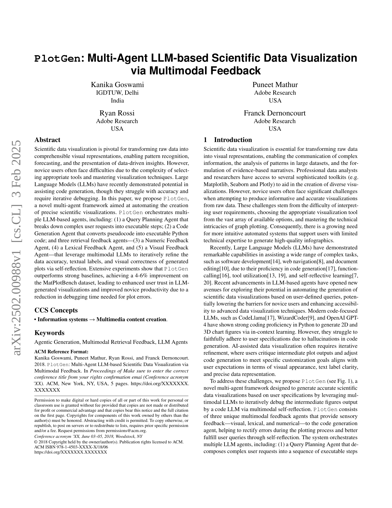
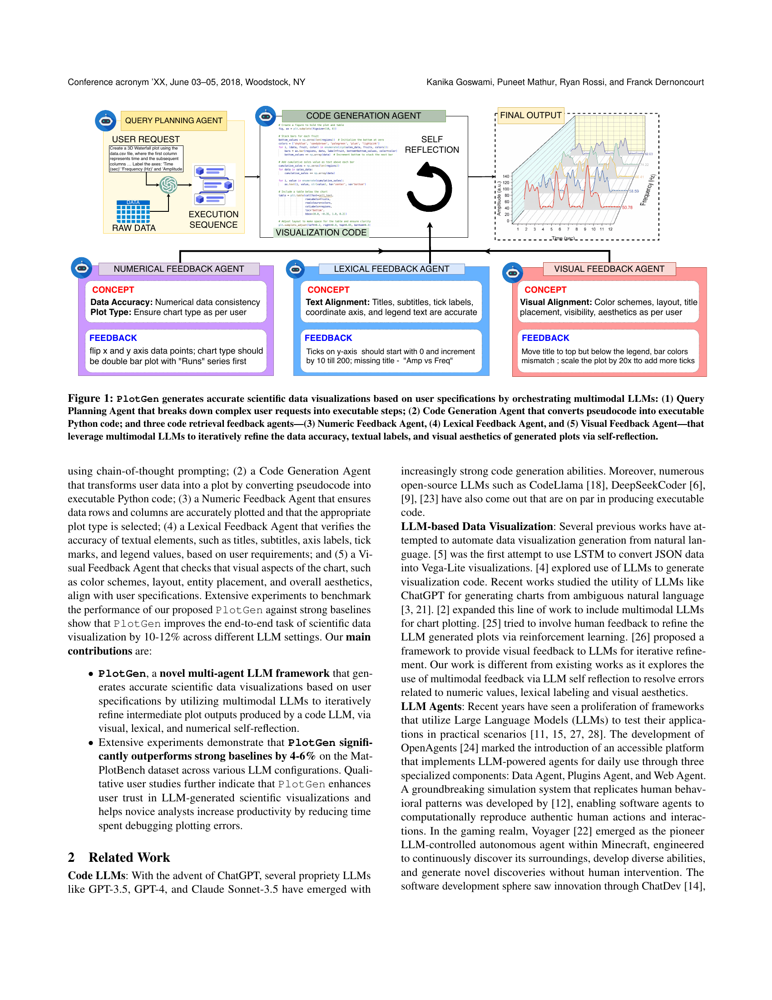
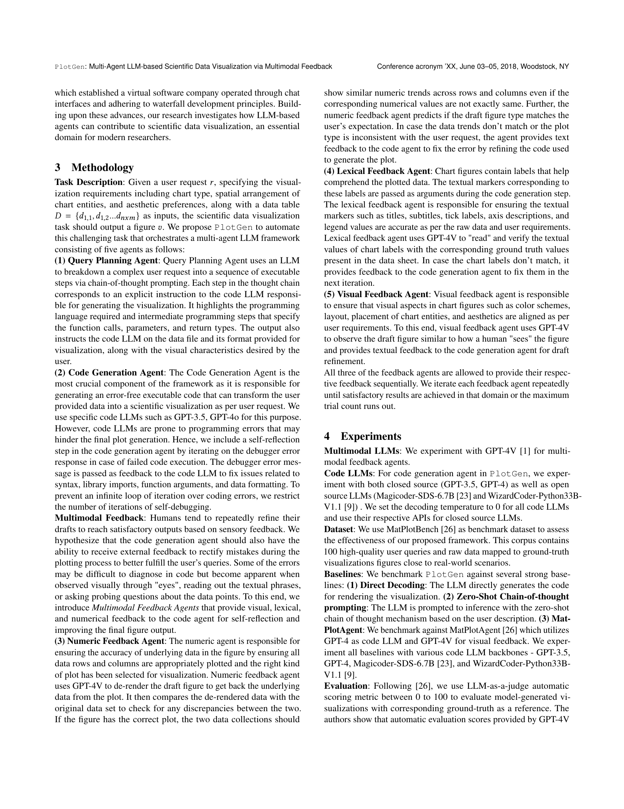
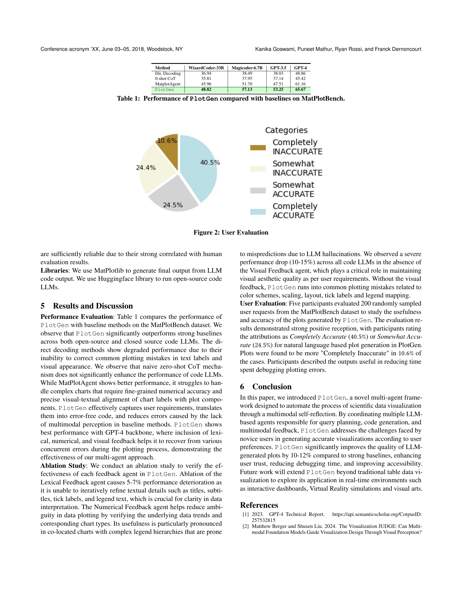
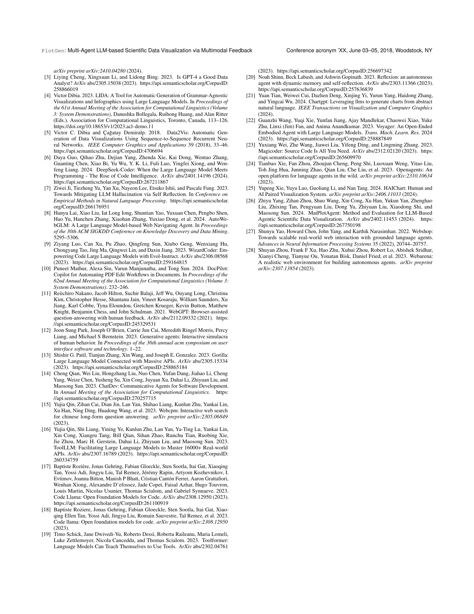

 


 2502.00988 
 Kanika Goswami et el. 
 
 🤗 2025-02-07 
 



↗ arXiv


↗ Hugging Face


### TL;DR



과학 데이터 시각화는 전문가에게는 쉬운 일이지만, 초보자에게는 어려운 작업입니다. 적절한 도구를 선택하고 시각화 기술을 익히는 데 어려움을 겪기 때문입니다. 최근 대규모 언어 모델(LLM)이 코드 생성에 유용하다는 것이 입증되었지만, 정확성이 부족하고 반복적인 디버깅이 필요하다는 단점이 있습니다.

본 논문에서는 이러한 문제를 해결하기 위해 PlotGen이라는 새로운 다중 에이전트 프레임워크를 제시합니다. PlotGen은 질의 계획 에이전트, 코드 생성 에이전트, 그리고 수치적, 어휘적, 시각적 피드백 에이전트로 구성되어 있으며, 이들 에이전트는 다중 모달 LLM을 활용하여 반복적으로 시각화를 개선합니다. 실험 결과, PlotGen은 기존 방법보다 성능이 뛰어나다는 것을 보여주었으며, 초보 사용자의 생산성 향상에도 기여할 수 있음을 시사합니다.



#### Key Takeaways


 PlotGen은 다중 모달 LLM 에이전트를 활용하여 과학적 데이터 시각화 생성을 자동화합니다. 



 PlotGen은 수치적, 어휘적, 시각적 피드백 메커니즘을 통해 생성된 시각화의 정확성 및 시각적 완성도를 향상시킵니다. 



 PlotGen은 기존 방법보다 4~6% 향상된 성능을 보이며, 초보 사용자의 생산성을 높이고 신뢰도를 향상시킵니다. 


#### Why does it matter?
본 논문은 **LLM 기반의 다중 에이전트 프레임워크를 사용하여 과학적 데이터 시각화를 자동화**하는 새로운 방법을 제시하여, **초보 사용자의 생산성 향상 및 전문가 수준의 시각화 생성**을 가능하게 합니다. 이는 **LLM 에이전트의 활용 및 다중 모달 피드백 메커니즘**에 대한 연구에 중요한 시사점을 제공하며, 향후 연구의 새로운 방향을 제시합니다. 특히, **자동화된 데이터 시각화 도구 개발** 및 **LLM 기반 시각화 시스템의 성능 향상**에 기여할 수 있습니다.

------
#### Visual Insights

> 🔼 그림 1은 PlotGen이 다양한 모드를 지원하는 거대 언어 모델(LLM)들을 활용하여 정확한 과학적 데이터 시각화를 생성하는 과정을 보여줍니다. PlotGen은 사용자의 요청을 실행 가능한 단계들로 분해하는 질의 계획 에이전트(Query Planning Agent), 의사 코드를 실행 가능한 파이썬 코드로 변환하는 코드 생성 에이전트(Code Generation Agent), 그리고 데이터 정확도, 텍스트 레이블, 시각적 미적 요소를 반복적으로 개선하는 세 개의 코드 검색 피드백 에이전트(Numeric, Lexical, Visual Feedback Agent)로 구성됩니다. 이러한 에이전트들은 자기 반성을 통해 생성된 플롯의 데이터 정확성, 텍스트 레이블, 시각적 미적 요소를 반복적으로 개선합니다.
> 

> 
read the caption

> Figure 1. PlotGen generates accurate scientific data visualizations based on user specifications by orchestrating multimodal LLMs: (1) Query Planning Agent that breaks down complex user requests into executable steps; (2) Code Generation Agent that converts pseudocode into executable Python code; and three code retrieval feedback agents—(3) Numeric Feedback Agent, (4) Lexical Feedback Agent, and (5) Visual Feedback Agent—that leverage multimodal LLMs to iteratively refine the data accuracy, textual labels, and visual aesthetics of generated plots via self-reflection.
> 


| Method | WizardCoder-33B | Magicoder-6.7B | GPT-3.5 | GPT-4 |
|---|---|---|---|---|
| Dir. Decoding | 36.94 | 38.49 | 38.03 | 48.86 |
| 0-shot CoT | 35.81 | 37.95 | 37.14 | 45.42 |
| MatplotAgent | 45.96 | 51.70 | 47.51 | 61.16 |
| PlotGen | 48.82 | 57.13 | 53.25 | 65.67 |

> 🔼 표 1은 MatPlotBench 데이터셋을 사용하여 PlotGen의 성능을 기준 모델들과 비교한 결과를 보여줍니다.  PlotGen은 쿼리 계획, 코드 생성, 다중 모드 피드백 에이전트를 조정하여 사용자의 요구 사항에 맞는 정확한 시각화를 생성합니다. 표에는 직접 디코딩, 제로샷 사고 과정 프롬프트, MatPlotAgent를 포함한 여러 기준 모델의 성능과 PlotGen의 성능이 다양한 코드 LLM(GPT-3.5, GPT-4, Magicoder-6.7B, WizardCoder-33B)에 대해 비교되어 있습니다. PlotGen은 모든 기준 모델에 비해 상당히 높은 성능을 보여주는 것을 알 수 있습니다.
> 

> 
read the caption

> Table 1.  Performance of PlotGen compared with baselines on MatPlotBench.
> 

### Full paper



