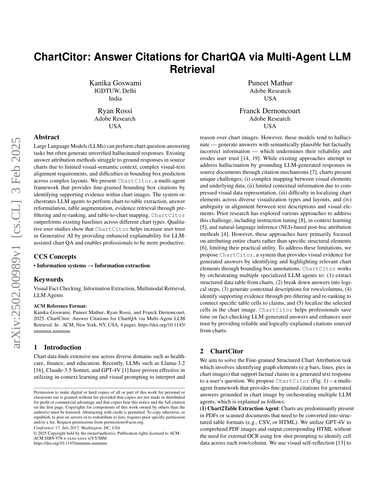
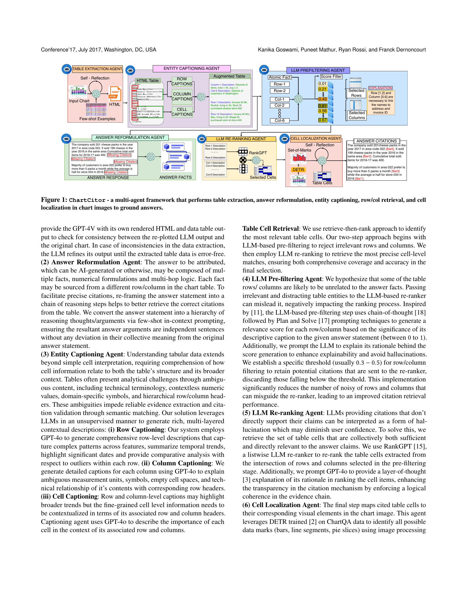
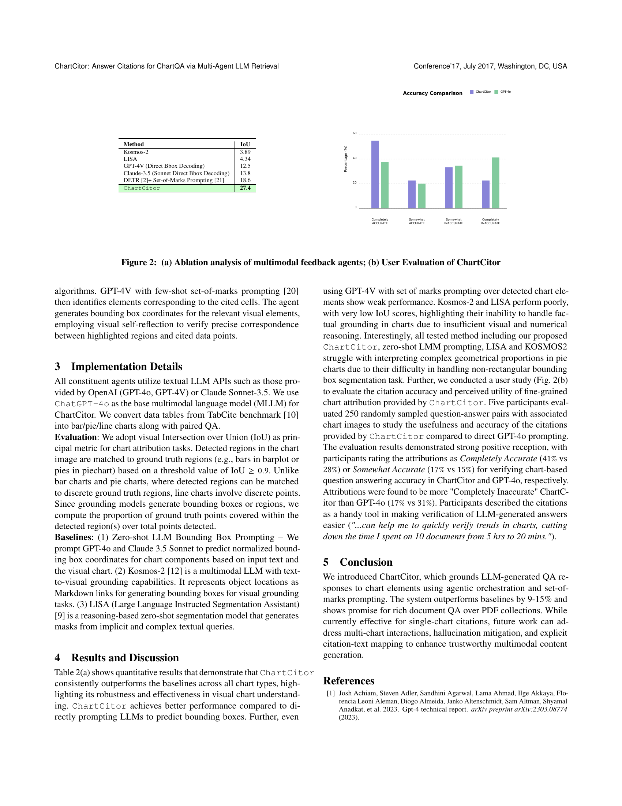
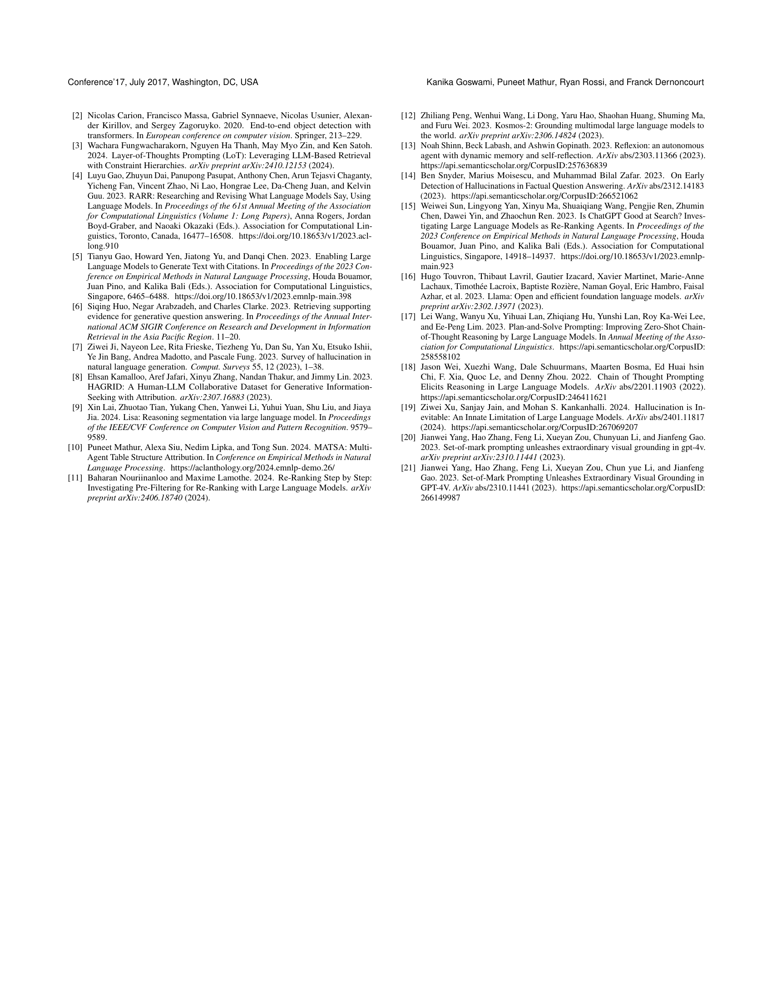

 


 2502.00989 
 Kanika Goswami et el. 
 
 🤗 2025-02-07 
 



↗ arXiv


↗ Hugging Face


### TL;DR



기존의 대형 언어 모델(LLM) 기반 차트 질의응답 시스템은 사실과 다른 정보를 생성하는 환각 현상으로 신뢰도가 떨어지는 문제가 있습니다.  또한, 답변의 근거를 차트 내에서 정확하게 찾아 제시하는 데 어려움이 있습니다. 이는 차트의 시각적 요소와 텍스트 데이터 간의 복잡한 매핑, 제한된 문맥 정보, 다양한 시각화 유형, 그리고 텍스트 설명과 시각적 요소 간의 모호성 등 여러 가지 이유로 발생합니다.

본 논문에서는 이러한 문제를 해결하기 위해 ChartCitor라는 멀티 에이전트 프레임워크를 제시합니다.  ChartCitor는 LLM 에이전트들을 활용하여 차트에서 표를 추출하고, 답변을 재구성하며, 표를 보강하고, 사전 필터링 및 재순위 지정을 통해 증거를 검색하고, 표와 차트 간의 매핑을 수행합니다.  실험 결과, ChartCitor는 기존 방법보다 다양한 차트 유형에서 우수한 성능을 보였으며, 정성적 사용자 연구를 통해 사용자 신뢰도 향상에 기여하는 것으로 나타났습니다.



#### Key Takeaways


 LLM 기반 차트 질의응답 시스템의 신뢰성 향상 



 멀티 에이전트 프레임워크를 통한 정확한 출처 제시 



 다양한 차트 유형에 대한 우수한 성능 


#### Why does it matter?
본 논문은 **LLM 기반 차트 질의응답 시스템의 신뢰성 문제**를 해결하기 위한 혁신적인 접근 방식을 제시하여, 연구자들에게 **설명 가능성과 정확성이 향상된 차트 분석 시스템 개발**에 대한 새로운 가능성을 열어줍니다.  특히, **다양한 유형의 차트 데이터를 효과적으로 처리**할 수 있는 **멀티 에이전트 프레임워크**를 제안하여, 해당 분야의 연구 발전에 크게 기여할 수 있습니다.  또한, **정확한 출처 제시를 통한 사용자 신뢰도 향상**은 생성형 AI 분야의 중요한 과제를 해결하는 데 기여하며, 향후 연구의 새로운 방향을 제시합니다.

------
#### Visual Insights

### Full paper



