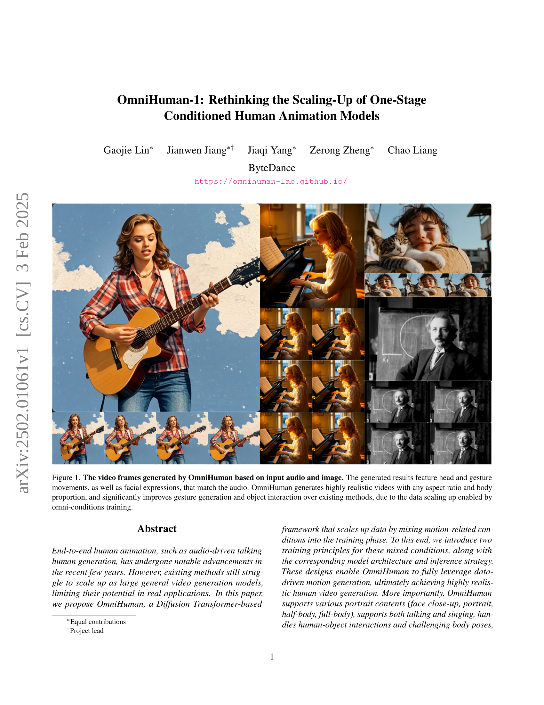
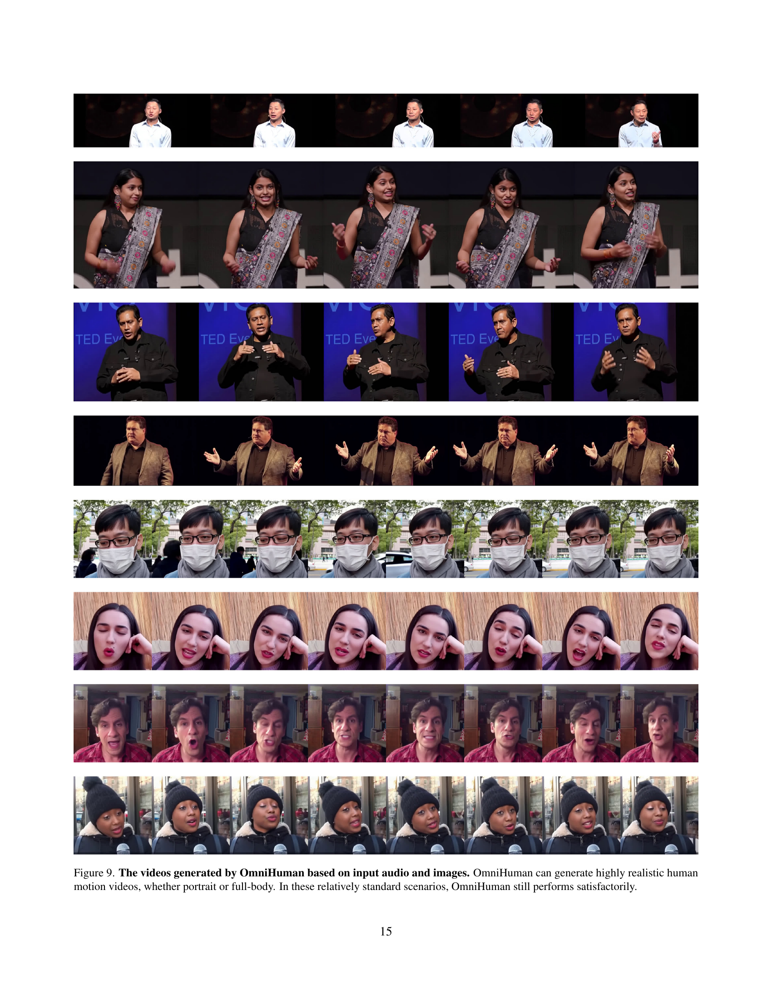

 


 2502.01061 
 Gaojie Lin et el. 
 
 🤗 2025-02-04 
 



↗ arXiv


↗ Hugging Face


### TL;DR



현존하는 인간 애니메이션 모델들은 제한된 데이터셋과 복잡한 전처리 과정으로 인해 **일반화 성능이 떨어지고 적용 가능한 상황이 제한적**입니다.  **대규모 데이터 학습을 통한 일반화된 모델 개발이 어려운 점**이 주요 문제입니다.  이는 데이터의 품질과 양 모두에 제약이 있기 때문입니다.

본 논문에서는 이러한 문제를 해결하기 위해 **OmniHuman이라는 새로운 모델을 제안**합니다. OmniHuman은 **텍스트, 오디오, 포즈 등 다양한 조건을 혼합하여 학습 데이터의 규모를 확장**하고, **새로운 다중 조건 훈련 전략을 통해 모델의 일반화 성능을 향상**시키는 방식을 사용합니다.  그 결과, **사실적인 영상 생성과 다양한 상황 및 인물 유형에 대한 적용성이 크게 향상**되었음을 보여줍니다. 이는 기존 모델들보다 더욱 **사실적이고 다양한 애니메이션 생성**을 가능하게 합니다.



#### Key Takeaways


 다중 조건(텍스트, 오디오, 포즈)을 혼합한 훈련 전략을 통해 기존 한계를 극복하고 대규모 데이터셋을 효과적으로 활용 



 다양한 인물 유형(얼굴 클로즈업, 반신, 전신)과 상황(말하기, 노래하기)을 지원하는 사실적이고 유연한 인간 애니메이션 생성 



 기존 방법보다 제스처 생성 및 객체 상호 작용 성능이 크게 향상되어 실제 애플리케이션에 대한 잠재력 확대 


#### Why does it matter?
이 논문은 **대규모 데이터 학습을 통한 일반화된 인간 애니메이션 모델 개발의 어려움을 해결**하는 새로운 방법을 제시합니다.  기존의 제한적인 데이터셋과 복잡한 전처리 과정에 의존하는 대신, **다양한 조건(텍스트, 오디오, 포즈)을 혼합하여 학습 데이터의 규모를 확장**하는 접근 방식을 채택했습니다. 이는 인간 애니메이션 분야의 연구 방향에 중요한 영향을 미칠 뿐만 아니라, **더욱 사실적이고 다양한 애니메이션 생성을 가능**하게 함으로써 관련 응용 분야의 발전을 촉진할 것입니다. 또한 제시된 **다중 조건 훈련 전략은 다른 영역의 생성 모델 연구에도 적용**될 수 있어 폭넓은 파급 효과를 기대할 수 있습니다.

------
#### Visual Insights

> 🔼 그림 1은 OmniHuman 모델이 오디오 및 이미지 입력을 기반으로 생성한 비디오 프레임을 보여줍니다. 생성된 결과는 오디오와 일치하는 머리와 제스처 동작, 얼굴 표정을 보여줍니다. OmniHuman은 어떤 종횡비와 신체 비율이든 매우 사실적인 비디오를 생성하며, 전방향 조건부 학습으로 인해 기존 방법보다 제스처 생성과 객체 상호작용이 크게 향상되었습니다.
> 

> 
read the caption

> Figure 1: The video frames generated by OmniHuman based on input audio and image. The generated results feature head and gesture movements, as well as facial expressions, that match the audio. OmniHuman generates highly realistic videos with any aspect ratio and body proportion, and significantly improves gesture generation and object interaction over existing methods, due to the data scaling up enabled by omni-conditions training.
> 

### In-depth insights

#### OmniHuman: Data Scaling
OmniHuman은 기존의 한계를 극복하고 대규모 데이터 학습을 가능하게 하는 핵심 전략으로 **다양한 조건(omni-conditions)을 혼합한 학습 방식**을 제시합니다.  단순히 데이터 양을 늘리는 것이 아니라, **텍스트, 오디오, 포즈 등 다양한 조건 정보를 결합하여 학습**함으로써, 각 조건의 한계를 상호 보완하고 모델의 일반화 능력을 향상시킵니다.  **약한 조건(예: 오디오)의 데이터는 강한 조건(예: 포즈) 학습에 활용**하여 데이터 낭비를 최소화하고, 강한 조건은 낮은 비율로 학습하여 과적합을 방지합니다. 이러한 전략은 **데이터 확장의 어려움을 해결하고 다양한 스타일, 자세, 배경 등의 인간 동작을 포괄적으로 학습**할 수 있도록 지원합니다. 결과적으로, OmniHuman은 **기존 방법보다 훨씬 사실적이고 다양한 인간 애니메이션 생성**을 가능하게 합니다.

#### Mixed-Condition Training
본 논문에서 제안하는 혼합 조건부 학습(Mixed-Condition Training)은 **다양한 모션 관련 조건(텍스트, 오디오, 포즈)**을 혼합하여 사용하는 훈련 전략입니다. 기존의 단일 조건부 방법의 한계를 극복하기 위해, **약한 조건(오디오)**과 **강한 조건(포즈)**을 결합하여 학습 데이터의 규모를 확장하고 모델의 일반화 능력을 향상시키는 것을 목표로 합니다. 이를 위해, **강한 조건은 약한 조건의 데이터를 활용 가능**하게 하고, **조건의 강도에 따라 훈련 비율을 조정**하는 두 가지 원칙을 제시합니다. 이러한 전략을 통해, 제한된 데이터셋으로는 학습이 어려웠던 다양한 자세, 배경, 조명 등을 포함한 일반적인 인간 동작 생성이 가능해집니다. **데이터의 효율적인 사용**과 **모델의 강건성 향상**을 동시에 달성하는 핵심 전략이라 할 수 있습니다.

#### Ablation Study Insights
본 논문의 ‘에이블레이션 스터디 인사이트’ 부분은 **다양한 조건(오디오, 포즈, 참조 이미지 비율 등)들을 제거하거나 변경하면서 모델 성능에 미치는 영향을 분석**합니다. 이를 통해 각 조건의 중요성과 상호작용을 파악하고, **모델의 일반화 성능을 향상시키는 최적의 조건 조합**을 찾는 데 초점을 맞춥니다. 특히, **오디오와 포즈 조건의 훈련 비율 조정**을 통한 실험은 **강한 조건(포즈)이 약한 조건(오디오)의 학습에 미치는 영향**과 그 최적의 균형점을 보여줍니다.  또한, **참조 이미지의 비율 조정**을 통한 실험은 참조 이미지가 영상 생성의 시각적 일관성과 품질에 미치는 중요한 영향을 강조하며,  **최적의 비율을 찾는 것이 시각적 충실도와 모델의 안정성을 유지하는 데 중요**함을 보여줍니다.  결론적으로, 이 에이블레이션 스터디는 모델의 설계 및 훈련 전략 개선에 중요한 통찰력을 제공하며, **더욱 강건하고 일반화된 영상 생성 모델을 개발하는 데 중요한 단서**를 제공합니다.

#### Generalization Limits
본 논문에서 다루는 "일반화의 한계"는 크게 두 가지 측면에서 고찰될 수 있습니다. 첫째, **기존의 단일 조건 모델(예: 오디오 또는 포즈 기반)**은 데이터 전처리 과정에서 필터링으로 인해 데이터 활용의 제약이 발생합니다.  이는 특정 조건에 과도하게 집중하여 모델의 일반화 능력을 저해하는 요인이 됩니다. 둘째, **데이터 스케일링의 어려움**이 존재합니다. 단순히 데이터 양을 늘리는 것만으로는 모델 성능 향상에 기여하지 못하며, 오히려 과적합 문제를 야기할 수 있습니다. 따라서, 다양한 조건(텍스트, 오디오, 포즈 등)을 혼합하여 학습하는 **옴니-조건 학습 전략**이 제시되었습니다. 이는 다양한 조건들 간의 상호 보완적 관계를 활용하여 데이터 활용의 효율성을 높이고, 궁극적으로 모델의 일반화 성능을 향상시키는 데 기여합니다.  본 논문은 이러한 일반화의 한계를 극복하고자  **다중 조건 학습**과 **데이터 혼합**이라는 혁신적인 방법을 제시하여 주목할 만합니다.

#### Future Research Paths
미래 연구 방향에 대한 심도있는 고찰은 **OmniHuman 모델의 한계점을 파악하고 개선 방향을 모색하는 데서 출발**해야 합니다.  현재 모델은 다양한 조건(텍스트, 오디오, 포즈)을 통합적으로 처리하지만, **극도로 사실적인 고화질 영상 생성에 있어서 여전히 제한적**입니다. 따라서, **더욱 방대한 양의 고품질 데이터 확보** 및 **모델의 확장성을 높이는 연구**가 필수적입니다.  특히, **다양한 인종과 연령대, 신체적 특징을 반영한 데이터셋 구축**을 통해 모델의 일반화 성능을 향상시켜야 합니다. 또한, **실시간 처리 속도 향상**과 **에너지 효율적인 모델 설계**를 위한 연구도 중요한 과제입니다.  **인간의 미세한 표정이나 제스처까지 정확하게 구현**하기 위한 고급 모델링 기법 개발도 필요하며, 이를 위해 **심층적인 인간 행동 분석**과 **생체역학적 지식을 모델링에 접목**하는 연구가 요구됩니다.  마지막으로, **윤리적 문제** 또한 심각하게 고려해야 합니다.  **딥페이크 기술 악용 방지**를 위한 기술적, 법적 제도적 방안 마련이 절실히 필요하며, **AI 모델의 투명성 확보** 및 **책임 있는 기술 개발**에 대한 사회적 논의가 활발히 이루어져야 합니다.

### More visual insights

More on figures

> 🔼 그림 2는 OmniHuman의 프레임워크를 보여줍니다. OmniHuman 모델은 DiT 아키텍처를 기반으로 하며 텍스트, 이미지, 오디오, 포즈를 포함한 여러 모달리티를 동시에 조건화할 수 있습니다. 또한, 모션 관련 조건의 정도에 따라 단계적인 다단계 훈련을 사용하는 옴니-조건 훈련 전략을 사용합니다. 이러한 혼합 조건 훈련을 통해 OmniHuman 모델은 혼합 데이터의 확장으로부터 이점을 얻을 수 있습니다.
> 

> 
read the caption

> Figure 2: The framework of OmniHuman. It consists of two parts: (1) the OmniHuman model, which is based on the DiT architecture and supports simultaneous conditioning with multiple modalities including text, image, audio, and pose; (2) the omni-conditions training strategy, which employs progressive, multi-stage training based on the motion-related extent of the conditions. The mixed condition training allows the OmniHuman model to benefit from the scaling up of mixed data.
> 

> 🔼 그림 3은 오디오 기반 초상화 애니메이션 기준 모델들과의 정량적 비교 결과를 보여줍니다.  표는 다양한 지표(IQA, ASE, Sync-C, FID, FVD)를 사용하여 OmniHuman 모델과 기존 모델들의 성능을 비교 분석한 결과를 보여줍니다.  각 지표는 이미지 품질, 심미성, 동기화 정확도, 그리고 생성된 비디오의 실제 비디오와의 차이를 나타냅니다. 이를 통해 OmniHuman 모델의 성능 우위를 수치적으로 제시합니다. 두 개의 데이터셋(CelebV-HQ, RAVDESS)에 대한 결과를 각각 보여주어 모델의 일반화 성능도 평가합니다.
> 

> 
read the caption

> Figure 3: Quantitative comparisons with audio-conditioned portrait animation baselines.
> 

> 🔼 그림 4는 오디오 기반 신체 애니메이션 기준 모델들과의 정량적 비교 결과를 보여줍니다.  표에는 다양한 지표(IQA, ASE, Sync-C, FID, FVD, HKV, HKC)를 사용하여 OmniHuman 모델의 성능을 기존 모델들과 비교 분석한 결과가 수치화되어 나타나 있습니다. 각 지표는 이미지 품질, 심미성,  오디오-비디오 동기화 정확도,  이미지/비디오 차이, 손의 움직임 자연스러움, 손의 움직임 다양성 등을 평가하는데 사용되었습니다. 이 표를 통해 OmniHuman 모델의 성능을 보다 명확하게 이해하고 기존 모델들과의 차이점을 정량적으로 파악할 수 있습니다.
> 

> 
read the caption

> Figure 4: Quantitative comparisons with audio-conditioned body animation baselines.
> 

> 🔼 그림 5는 오디오 조건에 대한 다양한 훈련 비율의 주관적 비교를 보여줍니다.  구체적으로, 오디오 데이터의 비율을 10%, 50%, 100%로 다르게 설정하여 모델을 훈련시킨 후, 각 모델의 성능을 주관적인 평가를 통해 비교 분석한 결과를 시각적으로 제시합니다.  다양한 비율의 오디오 훈련 데이터가 모델의 최종 성능에 미치는 영향, 특히 립싱크 정확도, 액션 다양성, 그리고 전체적인 시각적 품질에 대한 영향을 평가하기 위한 실험 결과를 보여줍니다.  이를 통해 적절한 오디오 훈련 데이터 비율을 설정하는 것이 모델 성능 향상에 중요하다는 것을 보여주는 그림입니다.
> 

> 
read the caption

> Figure 5: Subjective comparison of different training ratios for audio conditions.
> 

> 🔼 그림 6은 오디오 조건 비율에 대한 추가 연구 결과를 보여줍니다. 세 가지 다른 오디오 비율(위쪽: 10%, 중간: 50%, 아래쪽: 100%)로 모델을 학습시킨 후 동일한 입력 이미지와 오디오를 사용하여 오디오 중심 설정에서 테스트했습니다. 이는 오디오 데이터 비율이 모델 성능에 미치는 영향을 보여주는 것입니다. 즉, 적절한 오디오 데이터 비율을 사용해야 모델의 성능을 최적화할 수 있음을 보여줍니다.
> 

> 
read the caption

> Figure 6: Ablation study on different audio condition ratios. The models are trained with different audio ratios (top: 10%, middle: 50%, bottom: 100%) and tested in an audio-driven setting with the same input image and audio.
> 

> 🔼 이 그림은 논문의 4.3절(Ablation Studies on Omni-Conditions Training)에서 다양한 자세 조건 비율(20%, 50%, 80%)로 훈련된 모델들을 동일한 입력 이미지와 오디오를 사용하여 오디오 중심 설정에서 테스트한 결과를 보여줍니다.  각 행은 특정 자세 조건 비율로 훈련된 모델의 결과이며,  오디오 입력에 따른 인물의 동작을 시각적으로 비교 분석하여 자세 조건 비율이 모델 성능에 미치는 영향을 보여줍니다.  자세 조건 비율이 낮을수록(20%) 과도한 동작이 발생하고, 높을수록(80%) 자연스럽지 못한 제한적인 동작을 보이는 것을 확인할 수 있습니다.  50% 비율이 가장 균형잡힌 결과를 보여줍니다.
> 

> 
read the caption

> Figure 7: Ablation study on different pose condition ratios. The models are trained with different pose ratios (top: 20%, middle: 50%, bottom: 80%) and tested in an audio-driven setting with the same input image and audio.
> 

> 🔼 이 그림은 오디오 기반 설정에서 동일한 입력 이미지와 오디오를 사용하여 서로 다른 자세 비율(위쪽: 20%, 중간: 50%, 아래쪽: 80%)로 훈련된 모델을 테스트한 결과를 보여줍니다. 자세 비율이 다르면 생성된 비디오의 움직임과 표현에 어떤 영향을 미치는지 보여주는 실험 결과입니다.  즉, 훈련 데이터에 자세 정보가 얼마나 포함되는지에 따라 결과 영상의 자연스러움과 정확도가 달라짐을 보여주는 것입니다.  각 행은 특정 자세 비율로 훈련된 모델의 결과를 나타내며, 같은 오디오 입력에 대한 반응을 보여줍니다.
> 

> 
read the caption

> Figure 8: Ablation study on different pose condition ratios. The models are trained with different pose ratios (top: 20%, middle: 50%, bottom: 80%) and tested in an audio-driven setting with the same input image and audio.
> 

### Full paper



