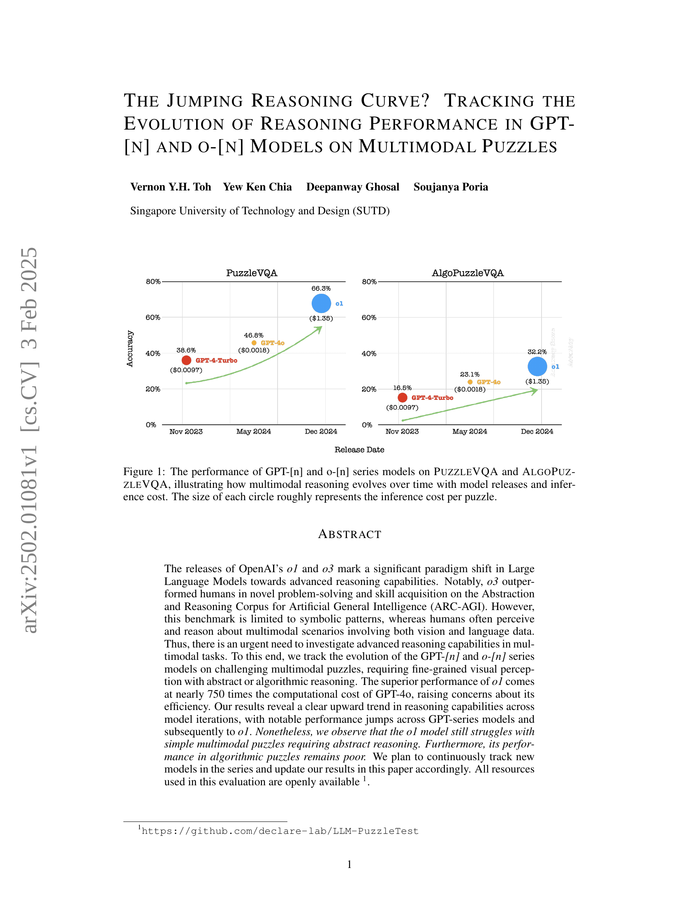

 


 2502.01081 
 Vernon Y. H. Toh et el. 
 
 🤗 2025-02-04 
 



↗ arXiv


↗ Hugging Face


### TL;DR



최근 대규모 언어 모델(LLM)의 발전에도 불구하고, **인간 수준의 멀티모달 추론 능력**을 달성하는 데는 여전히 어려움이 있습니다. 기존 연구들은 주로 상징적 패턴에 초점을 맞추어 왔지만, 실제 세계 문제 해결에는 시각 및 언어 정보를 포함한 다양한 모달리티를 이해하고 추론하는 능력이 필요합니다. 본 논문에서는 **GPT-[n] 및 o-[n] 모델 계열의 멀티모달 추론 능력**을 PUZZLEVQA 및 ALGOPUZZLEVQA 퍼즐을 통해 평가하여 그 발전 추이를 분석합니다.  

본 연구는 **GPT-4 Turbo, GPT-40, o1 모델의 성능을 다양한 멀티모달 퍼즐에서 비교 분석**하여, o1 모델이 뛰어난 추론 능력을 보이지만, **추론 비용이 매우 높음**을 밝힙니다.  **시각적 인식 능력이 추론 성능의 주요 제한 요소**임을 밝히고,  **시각적 정보 및 추론 단계에 대한 추가 정보 제공을 통해 모델 성능 향상 가능성**을 제시합니다.  이 연구는 **멀티모달 추론의 한계를 명확히 밝힘으로써 향후 연구 방향을 제시**하는 데 중요한 의미를 가집니다.



#### Key Takeaways


 GPT 모델 계열의 멀티모달 추론 성능이 시간 경과에 따라 향상되었지만, 여전히 복잡한 퍼즐 해결에는 어려움이 있음 



 01 모델이 기존 GPT 모델들보다 뛰어난 성능을 보이지만, 추론 비용이 훨씬 높음 



 시각적 인식 능력이 멀티모달 추론의 주요 제한 요소임을 밝히고, 시각적 정보와 추론 과정에 대한 추가적인 정보 제공을 통해 모델 성능 향상 가능성 제시 


#### Why does it matter?
**본 논문은 다양한 멀티모달 추론 벤치마크에서 최첨단 모델의 성능을 평가하고 제한 사항을 밝히는 데 중요한 의미가 있습니다.**  이는 **인공지능 분야의 핵심 과제인 일반적인 추론 능력 향상에 대한 연구 방향을 제시**하고, **향후 연구를 위한 새로운 벤치마크 및 평가 방법론을 제시**합니다.  **특히, 멀티모달 추론의 한계점을 명확히 밝힘으로써, 향후 연구에서 개선 방향을 제시**할 수 있는 토대를 마련했습니다.  **다양한 모델의 비교 분석을 통해 멀티모달 추론 발전의 현황과 미래 방향을 제시**함으로써, 관련 분야 연구자들에게 큰 영향을 미칠 수 있습니다.

------
#### Visual Insights

> 🔼 그림 1은 시간에 따른 모델 출시 및 추론 비용과 함께 다중 모드 추론이 어떻게 발전하는지 보여주는 PuzzleVQA 및 AlgoPuzzleVQA에 대한 GPT-[n] 및 o-[n] 계열 모델의 성능을 보여줍니다. 각 원의 크기는 대략적으로 퍼즐당 추론 비용을 나타냅니다.  GPT-4, GPT-4 Turbo, GPT-4 0, 그리고 o-1 모델의 PuzzleVQA와 AlgoPuzzleVQA 성능을 시각적으로 비교하여, 시간에 따른 성능 변화와 각 모델의 추론 비용을 보여줍니다.  x축은 모델 출시일, y축은 정확도를 나타내며, 원의 크기는 추론 비용을 나타냅니다.
> 

> 
read the caption

> Figure 1: The performance of GPT-[n] and o-[n] series models on PuzzleVQA and AlgoPuzzleVQA, illustrating how multimodal reasoning evolves over time with model releases and inference cost. The size of each circle roughly represents the inference cost per puzzle.
> 


|                     |       | Open Ended                     |                     | Multi Choice                     |
|----------------------|-------|---------------------------------|---------------------|---------------------------------|
| 

**PuzzleVQA**

 |       | GPT-4-Turbo | GPT-4o | o1                              |
|                      |       |                                 |                     |                                 |
|                      | **Colors** | 51.0                             | 72.5                   | 80.5                             |
|                      | **Numbers** | 82.5                             | 84.5                   | 96.5                             |
|                      | **Shapes**  | 32.5                             | 51.5                   | 54.5                             |
|                      | **Size**    | 19.0                             | 39.0                   | 54.5                             |
|                      | **Colors & Numbers** | 54.5                             | 48.0                   | 97.0                             |
|                      | **Colors & Shapes** | 30.0                             | 45.5                   | 75.0                             |
|                      | **Colors & Size**  | 31.5                             | 21.5                   | 30.0                             |
|                      | **Numbers & Shapes** | 31.5                             | 20.0                   | 78.0                             |
|                      | **Numbers & Size**  | 24.5                             | 34.5                   | 41.5                             |
|                      | **Size & Shapes**   | 28.5                             | 50.5                   | 55.0                             |
|                      | **Average**      | 38.6                             | 46.8                   | 66.3                             |
| 

**AlgoPuzzleVQA**

 | **Board Tiling** | 46.0                             | 46.0                   | 51.0                             |
|                      | **Calendar**     | 43.0                             | 52.0                   | 83.0                             |
|                      | **Chain Link**    | 1.0                              | 3.0                    | 1.0                              |
|                      | **Checker Move**  | 3.0                              | 7.0                    | 34.0                             |
|                      | **Clock**         | 0.0                              | 3.0                    | 6.0                              |
|                      | **Colour Hue**    | 5.0                              | 10.0                   | 15.0                             |
|                      | **Map Colour**    | 10.0                             | 22.0                   | 21.0                             |
|                      | **Maze Solve**    | 16.0                             | 8.0                    | 17.0                             |
|                      | **Move Box**      | 20.0                             | 23.0                   | 23.0                             |
|                      | **N-Queens**      | 17.0                             | 16.0                   | 16.0                             |
|                      | **Number Slide**  | 14.0                             | 32.0                   | 71.0                             |
|                      | **Rotten Fruits** | 32.0                             | 53.0                   | 43.0                             |
|                      | **Rubik’s Cube**  | 32.0                             | 44.0                   | 54.0                             |
|                      | **Think A Dot**   | 36.0                             | 41.0                   | 32.0                             |
|                      | **Tower of Hanoi** | 0.0                              | 2.0                    | 39.0                             |
|                      | **Water Jugs**    | 8.0                              | 23.0                   | 42.0                             |
|                      | **Wheel of Fortune** | 14.0                             | 29.0                   | 31.0                             |
|                      | **Wood Slide**    | 0.0                              | 1.0                    | 0.0                              |
|                      | **Average**       | 16.5                             | 23.1                   | 32.2                             |

> 🔼 표 1은 GPT-[n] 및 o-[n] 모델의 PuzzleVQA 및 AlgoPuzzleVQA에 대한 정확도 점수를 보여줍니다.  PuzzleVQA는 추상적인 추론 능력을 평가하기 위해 다양한 시각적 퍼즐을 제공하는 반면, AlgoPuzzleVQA는 알고리즘적 사고를 필요로 하는 퍼즐을 포함합니다. 표에는 각 모델이 다양한 퍼즐 유형(색상, 숫자, 모양, 크기 등)에 대해 달성한 정확도가 자세히 나와 있으며, 다중 선택 및 개방형 응답 설정 모두에 대한 결과를 보여줍니다. 이를 통해 다양한 유형의 시각적 추론 문제에 대한 각 모델의 강점과 약점을 비교 분석할 수 있습니다.  각 퍼즐 유형별 정확도는 모델의 시각적 지각 및 추론 능력을 보다 자세히 이해하는 데 도움이 됩니다.
> 

> 
read the caption

> Table 1: Accuracy scores of GPT-[n] and o-[n] models on PuzzleVQA and AlgoPuzzleVQA.
> 

### In-depth insights

#### Multimodal Reasoning
본 논문은 **다양한 모드(시각, 언어)의 정보를 통합하여 추론하는 능력**인 다중 모드 추론(Multimodal Reasoning)에 대해 심도 있게 다룹니다.  특히, GPT 모델 계열의 발전 과정을 추적하여 다중 모드 퍼즐 해결 능력의 변화를 분석합니다.  **GPT-4와 같은 대규모 언어 모델이 기존의 기호적 패턴 인식 테스트에서는 우수한 성능을 보이지만, 시각적 정보와 언어적 정보를 모두 필요로 하는 다중 모드 문제 해결에는 여전히 어려움**을 겪는다는 점을 보여줍니다.  **특히, 시각적 지각 능력의 부족이 다중 모드 추론의 주요 병목 현상**임을 밝히고, 이를 개선하기 위한 추가적인 연구의 필요성을 강조합니다.  또한, 다중 모드 추론 평가를 위한 새로운 벤치마크 데이터셋의 중요성을 시사하며, **향후 다중 모드 추론 능력 향상을 위한 모델 개발 및 평가 방향**을 제시합니다.  **단순히 기호적 패턴 인식을 넘어, 인간처럼 복잡한 다중 모드 상황을 이해하고 추론하는 인공지능 모델 개발**을 위한 중요한 이정표가 될 것으로 예상됩니다.

#### GPT Evolution
본 논문은 GPT 모델의 발전 과정에 대한 흥미로운 분석을 제공합니다. **특히, 다양한 멀티모달 퍼즐 해결 능력 변화**를 추적하여 GPT 시리즈의 추론 능력 향상을 보여줍니다. 초기 모델보다 개선된 성능은 주목할 만하지만, **계산 비용의 급증** 또한 중요한 문제로 제기됩니다.  **높아진 성능은 복잡한 추론 과정**을 거침을 시사하며, 이는 곧 **에너지 소모 증가**로 이어집니다.  흥미롭게도, 간단한 퍼즐에서도 높은 정확도를 달성하지 못하는 한계점이 드러나며, **인간 수준의 추론 능력**과의 차이를 보여줍니다. **시각적 인지 능력의 부족**은 모델의 주요 약점으로 지적되고, 이를 개선하기 위한 추가 연구의 필요성을 강조합니다.  **미래 연구**에서는 이러한 한계를 극복하고 **더욱 효율적이고 강력한 멀티모달 추론 모델**을 개발하는데 초점을 맞춰야 할 것입니다.

#### Puzzle Benchmarks
본 논문에서 제시된 퍼즐 벤치마크는 **다양한 모달리티를 통합한 추론 능력**을 평가하기 위한 핵심적인 도구로서, 기존의 기호적 패턴에 국한된 벤치마크의 한계를 넘어 **시각적 정보와 언어적 정보의 통합된 이해 및 추론 능력**을 평가합니다. 특히, **복잡한 시각적 패턴 인식과 추상적 추론 능력**을 요구하는 다양한 퍼즐 유형을 포함하여 모델의 능력을 다각적으로 평가하고자 합니다.  **단순한 패턴 인식을 넘어 알고리즘 설계 및 최적화 능력**까지 평가함으로써,  모델의 진정한 일반화 능력을 평가하고자 하는 의도를 보여줍니다.  이러한 벤치마크는 **인공지능 모델의 발전 방향**을 제시하고, **실제 세계 문제 해결 능력**을 향상시키기 위한 중요한 지표가 될 수 있음을 시사합니다.  **다양한 난이도와 유형의 퍼즐**을 통해 모델의 강점과 약점을 파악하고 개선 방향을 제시할 수 있다는 점에서 큰 의의가 있습니다.

#### Reasoning Bottlenecks
본 논문의 "추론 병목 현상" 부분은 **다양한 모델들이 시각적 추론 과제에서 어려움을 겪는 이유**를 심층적으로 분석한 결과를 보여줍니다. 특히, **시각적 지각 능력의 부족**이 주된 원인으로 지목되며, 이는 모델들이 이미지 내 정보를 정확하게 해석하고 추출하는 데 어려움을 겪기 때문입니다.  **유추적 추론 능력의 한계** 또한 중요한 문제점으로 제기됩니다.  이는 단순히 시각적 정보만으로는 문제 해결이 불가능하고, 더 높은 수준의 추론 능력이 필요함을 시사합니다.  **다중 모달 문제 풀이에서의 어려움** 또한 언급되어, 이미지와 텍스트 정보를 통합적으로 처리하는 능력이 아직 부족함을 강조합니다.  **모델의 성능 향상을 위해서는 시각적 지각 능력과 추론 능력 모두를 개선해야 함**을 시사하는 결과입니다.  **OpenAI의 새로운 모델들은 이러한 문제점을 어느 정도 해결했지만, 여전히 완벽한 수준에는 이르지 못하고 있으며, 높은 비용이 요구된다**는 점이 중요한 시사점입니다.

#### Future Directions
본 논문은 다양한 멀티모달 퍼즐에서 GPT-n 및 o-n 모델의 추론 성능을 평가했습니다. **미래 연구 방향은 다음과 같이 제시될 수 있습니다.** 첫째, **더욱 복잡하고 다양한 멀티모달 퍼즐 데이터셋을 개발**하여 모델의 추론 능력을 포괄적으로 평가해야 합니다. 둘째, **모델의 시각적 지각 능력 향상**에 초점을 맞춘 연구가 필요합니다. 특히, o-n 모델의 경우 시각적 정보 해석에 어려움을 보였으므로 이 부분에 대한 개선이 중요합니다. 셋째, **추론 과정의 투명성을 높이는 연구**를 통해 모델의 의사결정 과정을 이해하고, 오류를 분석하여 성능 향상에 활용할 수 있습니다. 마지막으로, **다양한 벤치마크와의 비교 분석**을 통해 제안된 퍼즐 데이터셋의 유용성을 검증하고, 멀티모달 추론 연구의 발전에 기여할 수 있습니다.  특히, 인간 수준의 추론 능력을 달성하기 위해서는 **모델의 시각적 지각 능력과 추론 능력을 동시에 향상**시키는 연구가 필수적입니다.

### More visual insights

More on figures

> 🔼 그림 2는 시간에 따른 OpenAI 모델의 ARC-AGI(Abstraction and Reasoning Corpus for Artificial General Intelligence)  반비공개 v1 점수를 보여줍니다.  x축은 모델 출시일을 나타내고, y축은 ARC-AGI 점수를 백분율로 나타냅니다. 이 그래프는 시간이 지남에 따라 OpenAI의 언어 모델의 추론 능력 발전을 보여주는 시각적 자료입니다.  다양한 GPT 모델과 최근 출시된 o-시리즈 모델의 점수를 비교하여 각 모델의 성능과 발전 추세를 파악할 수 있습니다.
> 

> 
read the caption

> Figure 2: ARC-AGI semi-private scores of the OpenAI models over time.
> 

> 🔼 본 그림은 논문의 PuzzleVQA 데이터셋에 있는 추상적인 퍼즐 두 가지 예시를 보여줍니다. 왼쪽은 색상과 도형 카테고리의 퍼즐이고, 오른쪽은 색상과 숫자 카테고리의 퍼즐입니다.  각 퍼즐은 여러 개의 시각적 요소(색상, 도형, 숫자)로 구성되어 있으며, 모델이 시각적 패턴을 인식하고 추론하여 빈칸을 채우는 능력을 평가하기 위해 사용됩니다. 이 그림은 모델의 다중 모드 추론 능력의 한계를 보여주는 데 사용됩니다.  GPT-4와 같은 모델은 비교적 간단한 추상적 추론 문제에서도 어려움을 겪는다는 점을 시각적으로 보여줍니다.
> 

> 
read the caption

> Figure 3: Case study on an abstract puzzle from the Colors & Shapes (left) category and Colors & Numbers (right) category in PuzzleVQA.
> 

> 🔼  그림 4는 PUZZLEVQA의 추상적인 퍼즐의 예시를 보여줍니다.  단일 개념(숫자, 색상, 크기, 모양)과 이중 개념(숫자와 색상, 숫자와 모양 등)을 사용한 퍼즐이 포함되어 있습니다.  이 퍼즐들은 숫자, 색상, 크기, 모양과 같은 기본적인 개념들을 중심으로 디자인되었으며, 다양한 추상적 패턴 인식과 추론 능력을 평가하는 데 사용됩니다. 퍼즐은 시각적 정보와 언어적 질문을 모두 포함하고 있어 시각-언어적 추론 능력을 평가하는 데 적합합니다.
> 

> 
read the caption

> Figure 4: Example single-concept and dual-concept abstract puzzles in PuzzleVQA, designed around fundamental concepts such as numbers, colors, size, and shapes.
> 

> 🔼 이 그림은 논문의 ALGOPUZZLEVQA 퍼즐들의 예시를 보여줍니다.  위쪽 행에는 시각적 특징을 보이는 퍼즐들이, 아래 두 행에는 알고리즘적 특징을 보이는 퍼즐들이 나열되어 있습니다. 각 특징에 대해, 각 범주에서 최소 하나 이상의 퍼즐 예시가 제시되어 있습니다.  표제어 범주가 모든 퍼즐을 포괄하는 것은 아니며, 일부 퍼즐은 표제어에 나열되지 않은 추가 범주에 속할 수 있습니다. 자세한 범주 분류는 B.1절을 참조하십시오.  요약하자면, 시각적 추론과 알고리즘적 문제 해결 능력을 평가하기 위한 다양한 유형의 퍼즐들을 보여주는 그림입니다.
> 

> 
read the caption

> Figure 5: Example of puzzles from AlgoPuzzleVQA with visual features represented in the top row and algorithmic features in the bottom two rows. For each feature, at least one puzzle instance from each category is presented. Note that the header categories are not exhaustive, as some puzzles may belong to additional categories not listed in the headers. The complete categorization can be found in Section B.1.
> 

> 🔼 그림 6은 AlgoPuzzleVQA의 Clock 퍼즐에 대한 사례 연구를 보여줍니다. 다중 선택 및 개방형 설정 모두에서 GPT-4 모델의 성능을 비교 분석하여 시각적 지각과 추론 능력의 차이를 보여줍니다. 다중 선택 설정에서는 모델이 정답을 선택하지만, 추론 과정에 오류가 있음을 보여줍니다. 반면 개방형 설정에서는 모델이 시계 시간을 잘못 해석하여 오답을 출력합니다. 이는 시각적 정보 처리와 추론 과정의 복잡성을 보여주는 대표적인 예시입니다.
> 

> 
read the caption

> Figure 6: Case study on Clock in AlgoPuzzleVQA on multiple-choice and open-ended setting.
> 

> 🔼 그림 7은 논문의 ALGOPUZZLEVQA 섹션에서 다루는 Chain Link 퍼즐에 대한 사례 연구입니다. 다중 선택 및 개방형 응답 설정에서의 모델 성능을 보여줍니다.  다중 선택 설정에서는 모델이 정답을 선택했지만 추론 과정이 잘못되었고, 개방형 응답 설정에서는 모델이 다른 답을 제시하는 것을 보여줍니다. 이는 다중 선택과 개방형 응답 설정 간의 모델 성능 차이를 보여주는 중요한 사례 연구입니다.
> 

> 
read the caption

> Figure 7: Case study on Chain Link in AlgoPuzzleVQA on multiple-choice and open-ended setting.
> 

> 🔼 그림 8은 AlgoPuzzleVQA의 Number Slide 퍼즐에 대한 GPT-[n] 및 o-[n] 모델의 사례 연구를 보여줍니다.  각 모델의 퍼즐 풀이 과정과 결과를 보여주는 세부적인 예시를 통해 모델들의 시각적 인식 및 추론 능력의 차이를 분석합니다. 특히, GPT-40 및 GPT-4-Turbo는 퍼즐의 빈 칸 위치를 잘못 인식하여 오답을 도출하는 반면, o-[n] 모델은 정확한 시각적 인식을 바탕으로 올바른 해답을 제시하는 모습을 보여줍니다.
> 

> 
read the caption

> Figure 8: Case study on Number Slide in AlgoPuzzleVQA across GPT-[n] and o-[n] models.
> 

> 🔼 그림 9는 PuzzleVQA의 Numbers & Size 카테고리에 속한 추상적인 퍼즐에 대한 사례 연구입니다.  세 가지 다른 프롬프트 (원본, 지각 정보 추가, 지각 및 유도 정보 추가)를 사용하여 모델의 추론 과정과 어려움을 보여줍니다. 각 프롬프트는 퍼즐의 시각적 세부 정보와 기저 패턴에 대한 설명을 포함하여 점진적으로 더 많은 정보를 제공합니다. 이를 통해 모델의 지각 및 유도 추론 능력을 평가하고, 어떤 종류의 정보가 모델의 성능 향상에 도움이 되는지 분석합니다.  각 프롬프트에 대한 모델의 출력 결과와 정답을 비교하여 모델의 추론 능력의 강점과 약점을 파악할 수 있습니다.
> 

> 
read the caption

> Figure 9: Case study on an abstract puzzle from the Numbers & Size category in PuzzleVQA.
> 

More on tables


| PuzzleVQA |  | GPT-4-Turbo |  |  | GPT-4o |  |  | o1 |  |  |  |
|---|---|---|---|---|---|---|---|---|---|---|---|---|
|  |  | **Open Ended** |  |  |  |  |  |  |  |  |  |
|  |  | **GPT-4-Turbo** |  |  | **GPT-4o** |  |  | **o1** |  |  |  |
| ** ** **Colors** |  | **Original** | **w/**}}
> 🔼 표 2는 PuzzleVQA에 대한 GPT-[n] 및 o-[n] 모델의 병목 분석 결과를 보여줍니다. '원본'은 질문과 이미지만 입력으로 제공되는 기본 설정을 나타냅니다. 다양한 모드의 추론 병목 현상을 밝히기 위해 시각적 인식(p.) 및 귀납적 추론(i.)에 대한 정답 설명을 입력에 점진적으로 추가했습니다. 그림 11에서는 병목 분석에 사용된 다양한 프롬프트의 예시를 제공합니다.  즉, 이 표는 모델의 성능 저하 원인을 분석하기 위해 시각적 정보와 추론 과정을 단계적으로 추가하며 실험한 결과를 보여줍니다.  각 단계에서 모델의 정확도 변화를 통해 시각적 인식 및 귀납적 추론 능력의 영향을 파악할 수 있습니다.
> 

> 
read the caption

> Table 2: Bottleneck analysis of GPT-[n] and o-[n] models on PuzzleVQA. Original refers to our main setting where only a question and an image are provided as input. To reveal the specific multimodal reasoning bottlenecks, we progressively inject ground-truth explanations in the input for visual perception (p.) and inductive reasoning (i.). We provide an example of the different prompts used in the bottleneck analysis in Figure 11.
> 


| Puzzle | Multimodal | Test |
|---|---|---|
| Category | Templates | Instances |
| Numbers | 2 | 200 |
| Colors | 2 | 200 |
| Shapes | 2 | 200 |
| Size | 2 | 200 |
| Numbers & Shapes | 2 | 200 |
| Numbers & Colors | 2 | 200 |
| Numbers & Size | 2 | 200 |
| Shapes & Colors | 2 | 200 |
| Shapes & Size | 2 | 200 |
| Colors & Size | 2 | 200 |
| Total | 20 | 2000 |
> 🔼 PuzzleVQA 데이터셋의 통계를 보여주는 표입니다.  각 퍼즐 유형(색상, 숫자, 모양, 크기 등)별 및 이들의 조합 유형별로 제공되는 퍼즐 템플릿 수와 각 템플릿에서 생성된 퍼즐 인스턴스 수를 나타냅니다. 총 2,000개의 퍼즐 인스턴스가 10가지 퍼즐 범주에 걸쳐 분포되어 있습니다. 단일 개념 퍼즐과 이중 개념 퍼즐을 모두 포함하고 있어 다양한 다중 모드 추론 능력을 평가하는 데 유용합니다.
> 

> 
read the caption

> Table 3: Dataset statistics of PuzzleVQA.
> 


| Puzzle | Colour | Position | Shape/Size | Text | Arithmetic | Boolean Logic | Combinatorics | Graphs | Optimization | Search | Sets |
|---|---|---|---|---|---|---|---|---|---|---|---| 
| Board Tiling | ✓ | ✓ | ✗ | ✗ | ✓ | ✓ | ✗ | ✗ | ✗ | ✗ | ✗ |
| Calendar | ✗ | ✓ | ✗ | ✓ | ✓ | ✗ | ✗ | ✗ | ✗ | ✗ | ✗ |
| Chain Link | ✗ | ✓ | ✓ | ✗ | ✓ | ✗ | ✗ | ✗ | ✓ | ✗ | ✓ |
| Checker Move | ✓ | ✓ | ✗ | ✗ | ✓ | ✓ | ✗ | ✗ | ✗ | ✓ | ✗ |
| Clock | ✗ | ✓ | ✓ | ✓ | ✓ | ✗ | ✗ | ✗ | ✗ | ✗ | ✗ |
| Colour Hue | ✓ | ✓ | ✗ | ✗ | ✓ | ✗ | ✗ | ✗ | ✓ | ✗ | ✗ |
| Map Colour | ✓ | ✓ | ✓ | ✓ | ✓ | ✓ | ✓ | ✓ | ✗ | ✓ | ✗ |
| Maze Solve | ✓ | ✓ | ✗ | ✗ | ✓ | ✗ | ✗ | ✓ | ✓ | ✓ | ✗ |
| Move Box | ✓ | ✓ | ✗ | ✗ | ✓ | ✗ | ✗ | ✓ | ✓ | ✓ | ✗ |
| N-Queens | ✗ | ✓ | ✗ | ✗ | ✓ | ✓ | ✗ | ✗ | ✗ | ✓ | ✗ |
| Number Slide | ✗ | ✓ | ✗ | ✓ | ✓ | ✗ | ✓ | ✗ | ✓ | ✓ | ✓ |
| Rotten Fruits | ✗ | ✓ | ✗ | ✗ | ✓ | ✓ | ✗ | ✓ | ✓ | ✓ | ✗ |
| Rubik’s Cube | ✓ | ✓ | ✗ | ✗ | ✓ | ✗ | ✗ | ✓ | ✗ | ✗ | ✗ |
| Think A Dot | ✓ | ✓ | ✓ | ✗ | ✓ | ✓ | ✗ | ✗ | ✗ | ✗ | ✓ |
| Tower of Hanoi | ✗ | ✓ | ✓ | ✗ | ✓ | ✓ | ✗ | ✗ | ✓ | ✓ | ✗ |
| Water Jugs | ✗ | ✓ | ✓ | ✓ | ✓ | ✓ | ✗ | ✗ | ✓ | ✓ | ✗ |
| Wheel of Fortune | ✗ | ✓ | ✓ | ✓ | ✓ | ✗ | ✗ | ✗ | ✗ | ✗ | ✗ |
| Wood Slide | ✗ | ✓ | ✓ | ✗ | ✓ | ✗ | ✗ | ✗ | ✓ | ✓ | ✗ |
> 🔼 AlgoPuzzleVQA 퍼즐의 구성요소를 계층적으로 분류한 표입니다. 각 퍼즐은 시각적 특징(색상, 위치, 모양/크기, 텍스트)과 알고리즘적 특징(산술, 부울 논리, 조합, 그래프, 최적화, 탐색, 집합)으로 분류됩니다. 표의 각 행은 하나의 퍼즐을 나타내며, 각 열은 해당 퍼즐이 가지는 시각적 또는 알고리즘적 특징의 유무를 체크 표시(✓)로 표기합니다.  이를 통해 각 퍼즐의 복잡도와 요구되는 추론 능력의 종류를 파악할 수 있습니다. 예를 들어, '체커 이동(Checker Move)' 퍼즐은 위치(Position)와 산술(Arithmetic) 특징을 모두 가지는 반면, '색상 색조(Colour Hue)' 퍼즐은 색상(Colour) 특징만을 가집니다.
> 

> 
read the caption

> Table 4: Ontological categorization of the puzzles in AlgoPuzzleVQA.
> 

### Full paper



