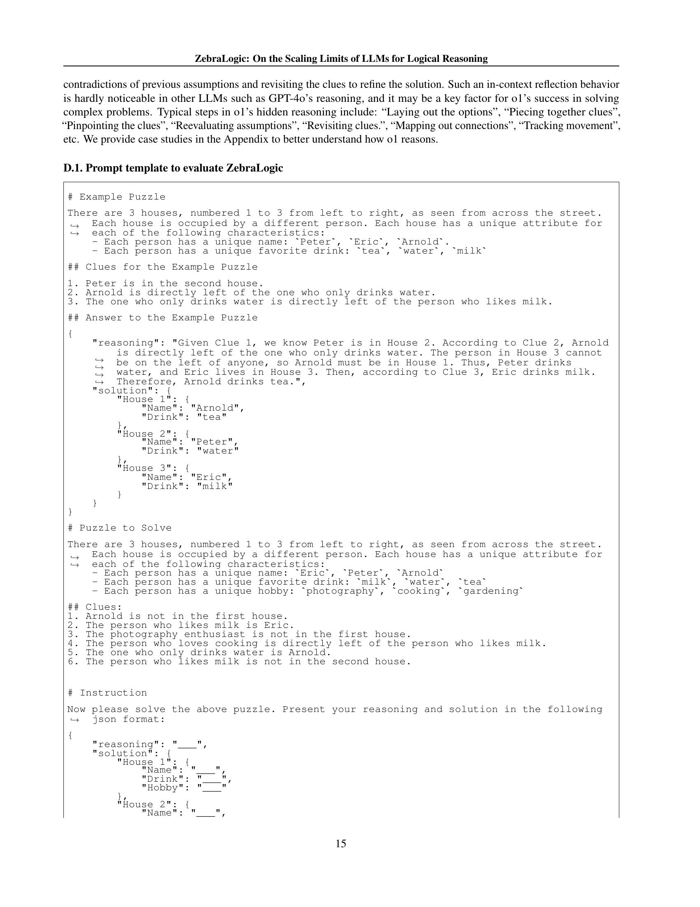

 


 2502.01100 
 Bill Yuchen Lin et el. 
 
 🤗 2025-02-04 
 



↗ arXiv


↗ Hugging Face


### TL;DR



본 연구는 대규모 언어 모델(LLM)의 복잡한 비단조 추론(non-monotonic reasoning)에서의 논리적 추론 능력과 확장성을 조사합니다. 기존 연구들은 상식적 지식과 일반적 지식을 요구하는 과제에 초점을 맞추었지만, 복잡한 연역적 문제 해결 능력은 불확실했습니다. 이러한 한계를 극복하기 위해, 연구진은 제약 만족 문제(CSP)에서 파생된 논리 격자 퍼즐을 사용하여 LLM의 추론 성능을 평가하는 ZebraLogic이라는 포괄적인 평가 프레임워크를 개발했습니다.

ZebraLogic은 모델 크기, 샘플링, 그리고 추론 시간 계산과 같은 다양한 측면을 체계적으로 조사하여 LLM의 추론 능력을 평가합니다. 실험 결과, 문제의 복잡성이 증가함에 따라 정확도가 크게 감소하는 '복잡성의 저주' 현상을 발견하였습니다. 이러한 현상은 모델 크기 증가나 추론 시간 증가로는 해결되지 않으며, LLM의 고유한 추론 능력의 한계를 시사합니다. 연구진은 Best-of-N 샘플링, 백트래킹, 자가 검증 프롬프트와 같은 전략을 활용하여 논리적 추론 성능을 향상시키는 방안을 탐색하였습니다.



#### Key Takeaways


 LLM의 논리적 추론 성능은 문제의 복잡성이 증가함에 따라 급격히 감소한다. 



 모델 크기 증가나 추론 시간 증가는 복잡한 논리 추론 문제 해결에는 한계가 있다. 



 Best-of-N 샘플링, 백트래킹, 자가 검증 프롬프트 등의 전략을 통해 논리적 추론 성능을 향상시킬 수 있다. 


#### Why does it matter?
본 논문은 **대규모 언어 모델(LLM)**의 논리적 추론 능력의 한계를 규명하고, 이를 개선하기 위한 방향을 제시하여 **AI 연구 전반**에 중요한 시사점을 제공합니다. 특히, 논리 퍼즐을 이용한 체계적인 평가 프레임워크를 제시하고, 모델 크기 및 추론 시간 증가가 성능 향상에 미치는 영향을 분석하여 **LLM의 확장성 한계**에 대한 이해를 높였습니다.  이는 향후 LLM의 논리적 추론 능력 향상을 위한 연구 방향을 제시하는 데 중요한 역할을 할 것입니다.

------
#### Visual Insights

> 🔼 그림 1은 세 가지 하위 그림으로 구성되어 있으며, 모두 대규모 언어 모델(LLM)의 논리적 추론 성능에 대한 크기 조정 효과를 보여줍니다. 왼쪽 그림은 Llama-3 모델의 정확도를 Z3 충돌 수와 비교하여 모델 크기가 추론 성능에 미치는 영향을 보여줍니다. 가운데 그림은 gpt-4o(-mini), o1, R1 모델의 성능을 비교하여 모델 크기와 테스트 시간 계산량의 영향을 보여줍니다. 오른쪽 그림은 pass@k 지표를 사용하여 여러 샘플 크기에 따른 반복 샘플링의 크기 조정 효과를 보여줍니다. 각 그림은 LLM의 추론 능력 확장에 대한 중요한 통찰력을 제공합니다.
> 

> 
read the caption

> Figure 1:  Accuracy vs number of Z3 conflicts for Llama-3 (left), showing the size scaling effect on the reasoning performance. The middle figure shows the curves for gpt-4o(-mini) vs o1 and R1, showing the scaling effect of model size and test-time compute. The right figure shows the scaling effect of repeated sampling by pass@k metric with different sample sizes.
> 


Model Names | Overall Grid-level acc. | Small &lt;103 | Medium 103~106 | Large 106~109 | X-Large &gt;109 | Cell-level Acc. 
---|---|---|---|---|---|---
o1-full  | https://arxiv.org/html/2502.01100/10.10.10.1.pic1.png | https://arxiv.org/html/2502.01100/11.11.11.2.pic1.png | https://arxiv.org/html/2502.01100/12.12.12.3.pic1.png | https://arxiv.org/html/2502.01100/13.13.13.4.pic1.png | https://arxiv.org/html/2502.01100/14.14.14.5.pic1.png | https://arxiv.org/html/2502.01100/15.15.15.6.pic1.png
DeepSeek-R1  | https://arxiv.org/html/2502.01100/16.16.16.1.pic1.png | https://arxiv.org/html/2502.01100/17.17.17.2.pic1.png | https://arxiv.org/html/2502.01100/18.18.18.3.pic1.png | https://arxiv.org/html/2502.01100/19.19.19.4.pic1.png | https://arxiv.org/html/2502.01100/20.20.20.5.pic1.png | https://arxiv.org/html/2502.01100/21.21.21.6.pic1.png
o1-preview  | https://arxiv.org/html/2502.01100/22.22.22.1.pic1.png | https://arxiv.org/html/2502.01100/23.23.23.2.pic1.png | https://arxiv.org/html/2502.01100/24.24.24.3.pic1.png | https://arxiv.org/html/2502.01100/25.25.25.4.pic1.png | https://arxiv.org/html/2502.01100/26.26.26.5.pic1.png | https://arxiv.org/html/2502.01100/27.27.27.6.pic1.png
o1-mini  | https://arxiv.org/html/2502.01100/28.28.28.1.pic1.png | https://arxiv.org/html/2502.01100/29.29.29.2.pic1.png | https://arxiv.org/html/2502.01100/30.30.30.3.pic1.png | https://arxiv.org/html/2502.01100/31.31.31.4.pic1.png | https://arxiv.org/html/2502.01100/32.32.32.5.pic1.png | https://arxiv.org/html/2502.01100/33.33.33.6.pic1.png
Claude Sonnet 3.5  | https://arxiv.org/html/2502.01100/34.34.34.1.pic1.png | https://arxiv.org/html/2502.01100/35.35.35.2.pic1.png | https://arxiv.org/html/2502.01100/36.36.36.3.pic1.png | https://arxiv.org/html/2502.01100/37.37.37.4.pic1.png | https://arxiv.org/html/2502.01100/38.38.38.5.pic1.png | https://arxiv.org/html/2502.01100/39.39.39.6.pic1.png
Llama-3.1-405B  | https://arxiv.org/html/2502.01100/40.40.40.1.pic1.png | https://arxiv.org/html/2502.01100/41.41.41.2.pic1.png | https://arxiv.org/html/2502.01100/42.42.42.3.pic1.png | https://arxiv.org/html/2502.01100/43.43.43.4.pic1.png | https://arxiv.org/html/2502.01100/44.44.44.5.pic1.png | https://arxiv.org/html/2502.01100/45.45.45.6.pic1.png
GPT-4o  | https://arxiv.org/html/2502.01100/46.46.46.1.pic1.png | https://arxiv.org/html/2502.01100/47.47.47.2.pic1.png | https://arxiv.org/html/2502.01100/48.48.48.3.pic1.png | https://arxiv.org/html/2502.01100/49.49.49.4.pic1.png | https://arxiv.org/html/2502.01100/50.50.50.5.pic1.png | https://arxiv.org/html/2502.01100/51.51.51.6.pic1.png
Gemini-1.5-Pro  | https://arxiv.org/html/2502.01100/52.52.52.1.pic1.png | https://arxiv.org/html/2502.01100/53.53.53.2.pic1.png | https://arxiv.org/html/2502.01100/54.54.54.3.pic1.png | https://arxiv.org/html/2502.01100/55.55.55.4.pic1.png | https://arxiv.org/html/2502.01100/56.56.56.5.pic1.png | https://arxiv.org/html/2502.01100/57.57.57.6.pic1.png
Mistral-Large-2  | https://arxiv.org/html/2502.01100/58.58.58.1.pic1.png | https://arxiv.org/html/2502.01100/59.59.59.2.pic1.png | https://arxiv.org/html/2502.01100/60.60.60.3.pic1.png | https://arxiv.org/html/2502.01100/61.61.61.4.pic1.png | https://arxiv.org/html/2502.01100/62.62.62.5.pic1.png | https://arxiv.org/html/2502.01100/63.63.63.6.pic1.png
Qwen2.5-72B  | https://arxiv.org/html/2502.01100/64.64.64.1.pic1.png | https://arxiv.org/html/2502.01100/65.65.65.2.pic1.png | https://arxiv.org/html/2502.01100/66.66.66.3.pic1.png | https://arxiv.org/html/2502.01100/67.67.67.4.pic1.png | https://arxiv.org/html/2502.01100/68.68.68.5.pic1.png | https://arxiv.org/html/2502.01100/69.69.69.6.pic1.png
Gemini-1.5-Flash  | https://arxiv.org/html/2502.01100/70.70.70.1.pic1.png | https://arxiv.org/html/2502.01100/71.71.71.2.pic1.png | https://arxiv.org/html/2502.01100/72.72.72.3.pic1.png | https://arxiv.org/html/2502.01100/73.73.73.4.pic1.png | https://arxiv.org/html/2502.01100/74.74.74.5.pic1.png | https://arxiv.org/html/2502.01100/75.75.75.6.pic1.png
Llama-3.1-70B  | https://arxiv.org/html/2502.01100/76.76.76.1.pic1.png | https://arxiv.org/html/2502.01100/77.77.77.2.pic1.png | https://arxiv.org/html/2502.01100/78.78.78.3.pic1.png | https://arxiv.org/html/2502.01100/79.79.79.4.pic1.png | https://arxiv.org/html/2502.01100/80.80.80.5.pic1.png | https://arxiv.org/html/2502.01100/81.81.81.6.pic1.png
DeepSeek-v2.5  | https://arxiv.org/html/2502.01100/82.82.82.1.pic1.png | https://arxiv.org/html/2502.01100/83.83.83.2.pic1.png | https://arxiv.org/html/2502.01100/84.84.84.3.pic1.png | https://arxiv.org/html/2502.01100/85.85.85.4.pic1.png | https://arxiv.org/html/2502.01100/86.86.86.5.pic1.png | https://arxiv.org/html/2502.01100/87.87.87.6.pic1.png
GPT-4o-mini  | https://arxiv.org/html/2502.01100/88.88.88.1.pic1.png | https://arxiv.org/html/2502.01100/89.89.89.2.pic1.png | https://arxiv.org/html/2502.01100/90.90.90.3.pic1.png | https://arxiv.org/html/2502.01100/91.91.91.4.pic1.png | https://arxiv.org/html/2502.01100/92.92.92.5.pic1.png | https://arxiv.org/html/2502.01100/93.93.93.6.pic1.png
Gemma-2-27B  | https://arxiv.org/html/2502.01100/94.94.94.1.pic1.png | https://arxiv.org/html/2502.01100/95.95.95.2.pic1.png | https://arxiv.org/html/2502.01100/96.96.96.3.pic1.png | https://arxiv.org/html/2502.01100/97.97.97.4.pic1.png | https://arxiv.org/html/2502.01100/98.98.98.5.pic1.png | https://arxiv.org/html/2502.01100/99.99.99.6.pic1.png
Llama-3.1-8B  | https://arxiv.org/html/2502.01100/100.100.100.1.pic1.png | https://arxiv.org/html/2502.01100/101.101.101.2.pic1.png | https://arxiv.org/html/2502.01100/102.102.102.3.pic1.png | https://arxiv.org/html/2502.01100/103.103.103.4.pic1.png | https://arxiv.org/html/2502.01100/104.104.104.5.pic1.png | https://arxiv.org/html/2502.01100/105.105.105.6.pic1.png
Phi-3.5-4B  | https://arxiv.org/html/2502.01100/106.106.106.1.pic1.png | https://arxiv.org/html/2502.01100/107.107.107.2.pic1.png | https://arxiv.org/html/2502.01100/108.108.108.3.pic1.png | https://arxiv.org/html/2502.01100/109.109.109.4.pic1.png | https://arxiv.org/html/2502.01100/110.110.110.5.pic1.png | https://arxiv.org/html/2502.01100/111.111.111.6.pic1.png

> 🔼 표 1은 ZebraLogic 벤치마크에서 다양한 대규모 언어 모델(LLM)의 성능을 보여줍니다.  전체 정확도는 모델이 정답을 맞춘 퍼즐의 비율을 나타내며, 퍼즐의 검색 공간 크기(섹션 2.3 참조)에 따라 small, medium, large, x-large 그룹으로 나누어 정확도를 보고합니다. 셀 정확도는 개별 셀을 올바르게 채운 비율을 나타냅니다.  부록 A에는 더 많은 모델 결과가 포함되어 있습니다.
> 

> 
read the caption

> Table 1: Performance of LLMs on ZebraLogic. The overall accuracy is calculated based on the number of puzzles solved correctly. We also report the accuracy on small, medium, large, and x-large groups based on the size of the search space (see Sec. 2.3). The cell accuracy indicates the percentage of individual cells filled correctly. See Appx. A for more model results.
> 

### In-depth insights

#### LLM Reasoning Limits
본 논문은 대규모 언어 모델(LLM)의 추론 능력의 한계를 심도 있게 다룹니다. **복잡성의 저주** 라는 개념을 통해, 문제의 복잡도가 증가함에 따라 LLM의 정확도가 급격히 감소하는 현상을 보여줍니다.  **모델 크기의 확장이나 추론 시간 증가만으로는 이러한 한계를 극복할 수 없음**을 강조하며, 기존 LLM의 추론 능력에 내재된 제약을 시사합니다.  **탐색 공간의 크기와 Z3 충돌 수**라는 두 가지 지표를 통해 문제의 복잡성을 정량화하고, 다양한 LLM 모델의 성능을 체계적으로 비교 분석합니다.  결과적으로, LLM의 추론 능력 향상을 위해서는 단순한 모델 확장이나 계산 시간 증가보다 **새로운 접근 방식**이 필요함을 시사합니다.  **최적의 샘플링 전략이나 효과적인 추론 토큰 활용** 등이 향후 연구 방향으로 제시됩니다.  **자기 검증 프롬프트**의 활용 가능성도 언급되나, 그 효과는 제한적임을 밝힙니다.

#### ZebraLogic Dataset
ZebraLogic 데이터셋은 논리 퍼즐을 기반으로 대규모 언어 모델(LLM)의 추론 능력을 평가하기 위해 고안된 포괄적인 평가 프레임워크의 핵심 구성 요소입니다. **제약 만족 문제(CSP)에서 파생된 논리 그리드 퍼즐을 사용하여 LLM의 추론 성능을 체계적으로 평가**합니다.  데이터셋은 **제어 가능하고 정량화 가능한 복잡성**을 지닌 퍼즐을 생성하여 모델의 확장성 한계를 연구할 수 있도록 설계되었습니다.  **다양한 검색 공간 복잡성과 논리적 제약 조건**을 포함하여 모델의 추론 능력을 다양한 난이도에서 평가할 수 있는 구조화된 환경을 제공합니다.  **퍼즐의 복잡성은 검색 공간 크기와 Z3 충돌 수로 측정**되며, 이러한 지표를 통해 LLM의 성능 저하 현상인 "복잡성의 저주"를 밝히는 데 중요한 역할을 합니다.  **데이터셋의 규모와 다양성**은 LLM의 추론 능력에 대한 심도 있는 이해를 제공하며, 향후 연구 방향을 제시하는 데 유용하게 활용될 수 있습니다.

#### Complexity's Curse
논문에서 제시된 "복잡성의 저주" 개념은 **대규모 언어 모델(LLM)이 논리적 추론 문제의 복잡성이 증가함에 따라 정확도가 급격히 감소하는 현상**을 설명합니다. 이는 단순히 모델의 크기나 연산 시간을 늘리는 것만으로 해결되지 않는 본질적인 한계를 시사합니다.  **검색 공간의 크기**와 **Z3 충돌 수**라는 두 가지 측정 방식을 통해 복잡성을 정량화하여, 모델의 성능 저하가 단순히 데이터 부족이나 계산 능력의 한계 때문이 아닌, **LLM의 추론 능력 자체의 고유한 제약** 때문임을 보여줍니다.  이러한 발견은 LLM의 추론 능력 향상을 위한 새로운 접근 방식을 모색해야 함을 강조하며, **단순한 확장보다는 더욱 효과적인 추론 전략**의 필요성을 시사합니다. 특히, **최적의 추론 토큰 비율**을 찾는 등의 연구가 LLM의 추론 능력 향상에 중요한 역할을 할 것으로 예상됩니다.

#### Scaling Strategies
논문에서 제시된 다양한 스케일링 전략들을 종합적으로 고찰해보면, 단순히 모델 크기 확장만으로는 복잡한 논리 추론 문제 해결에 한계가 있음을 알 수 있습니다. **대규모 언어 모델의 논리적 추론 능력 향상을 위해서는 모델 크기 확장 외에도 다양한 전략이 필요하며, 이러한 전략들은 상호 보완적으로 작용하여 시너지 효과를 낼 수 있다는 점이 중요합니다.**  **샘플링 기법의 개선을 통해 추론 과정에서의 불확실성을 줄이고, 추론 시간을 증가시켜 더욱 심도있는 추론을 가능하게 하는 것이 중요한 전략 중 하나입니다.**  **특히, Chain-of-Thought(CoT)와 같은 추론 과정을 명시적으로 표현하는 기법들을 활용하여 모델의 추론 과정을 투명하게 만들고, 이를 통해 추론의 정확성과 효율성을 높일 수 있습니다.**  하지만,  **단순한 샘플링 증가나 CoT 토큰 수 증가만으로는 복잡성의 저주(curse of complexity) 현상을 완전히 극복할 수 없다는 점을 인지해야 합니다.** 따라서, **추론의 확장성을 높이기 위해서는 모델의 근본적인 추론 능력을 향상시키는 연구가 필요하며,  신경 기호 방법론과 같은 새로운 접근법을 적극적으로 활용하는 것도 중요한 과제로 생각됩니다.**  결론적으로,  **모델 크기 확장, 샘플링 기법, CoT 기법 등 다양한 스케일링 전략을 효율적으로 조합하고, 이를 통해 모델의 근본적인 추론 능력을 향상시키는 것이 앞으로의 중요한 연구 방향이 될 것입니다.**

#### Future Directions
논문의 "미래 방향"에 대한 제 생각을 요약하면 다음과 같습니다.  **LLM의 추론 능력 향상**은 앞으로도 중요한 연구 과제입니다.  **ZebraLogic과 같은 구조화된 평가 프레임워크**를 통해 LLM의 추론 성능을 체계적으로 평가하고 개선 방향을 제시하는 것은 매우 중요합니다.  **복잡도의 저주를 극복**하기 위한 새로운 접근법, 예를 들어 **더 효율적인 탐색 알고리즘**이나 **더욱 정교한 추론 메커니즘**의 개발이 필요합니다. **자기 검증 기법**과 같은 기술을 활용하여 LLM의 추론 신뢰성을 높이는 것도 중요한 과제이며, **신경 기호 통합 접근법**을 통해 LLM의 상징적 추론 능력을 강화하는 연구 또한 주목할 만합니다.  **다양한 유형의 논리 퍼즐을 포함하는 더욱 확장된 데이터셋**을 구축하여 더 포괄적인 평가를 수행하는 것도 중요한 미래 방향 중 하나입니다.  **대규모 언어 모델의 크기 증가만으로는 추론 능력의 한계를 극복할 수 없음**을 보여주는 ZebraLogic의 결과는,  **LLM의 추론 능력 향상을 위한 근본적인 한계**를 극복하기 위한 새로운 연구 방향을 제시해 줍니다.

### More visual insights

More on figures

> 🔼 그림 2는 ZebraLogic 퍼즐의 예시입니다. 3개의 집(N=3)과 3개의 속성(M=3), 그리고 6개의 단서(K=6)가 있습니다. 배경에는 속성, 가능한 값, 그리고 유일성 제약 조건이 설명되어 있습니다. 단서들은 속성에 대한 추가적인 제약 조건을 제공합니다. 모델의 과제는 이러한 단서들을 바탕으로 각 집에 속성을 정확하게 할당하는 것입니다. 그림의 해결책 그리드에 설명되어 있습니다.
> 

> 
read the caption

> Figure 2:  This example of ZebraLogic features 3 houses (N=3) and 3 attributes (M=3), with 6 clues (K=6). The Background outlines the attributes, their possible values, and the uniqueness constraints. The Clues provide additional constraints regarding the attributes. The task for the model is to determine the correct assignment of attributes to each house based on these clues, as illustrated in the Solution grid.
> 

> 🔼 그림 3은 ZebraLogic 퍼즐에서 다양한 크기의 언어 모델(LLM)을 사용하여 모델 크기와 테스트 시간 계산의 두 가지 측면에서 확장성을 비교 분석한 결과를 보여줍니다. 왼쪽 그래프는 모델 크기가 증가함에 따라 정확도 변화를 보여주는 반면, 오른쪽 그래프는 샘플 크기 증가(pass@k 평가)와 사고 과정의 길이 확장을 통한 테스트 시간 계산 증가에 따른 정확도 변화를 보여줍니다. 두 경우 모두 검색 공간의 복잡성이 특정 수준을 넘어서면 수익 체감 현상이 나타납니다. 즉, 모델 크기 또는 테스트 시간 계산을 더 증가시켜도 정확도 향상에는 한계가 있음을 의미합니다. 자세한 내용은 본문 3절을 참조하십시오.
> 

> 
read the caption

> Figure 3:  Accuracy vs Search Space Size (log scale) comparing multiple scaling behavior of LLMs on ZebraLogic. Left: Scaling model sizes. Right: Scaling test-time compute through two approaches - increasing sample size (via pass@k evaluation) and extending chain-of-thought reasoning length. Both model size and test-time compute show diminishing returns as search space complexity grows beyond a certain complexity. More results are presented in Sec. 3.
> 

> 🔼 그림 4는 o1 모델이 생성하는 숨겨진 사고 과정 토큰(CoT) 수와 Z3 충돌 수 간의 관계를 보여줍니다. 각 점은 특정 수의 Z3 충돌을 가진 하나의 예시를 나타냅니다. Z3 충돌 수가 많을수록 추론 문제가 더 어렵다는 것을 의미합니다. 이 그래프는 o1 모델이 문제의 복잡성에 따라 더 많은 숨겨진 사고 과정을 생성하는 것을 보여줍니다. 즉, 더 복잡한 문제일수록 o1 모델이 문제 해결을 위해 더 많은 사고 과정을 거친다는 것을 시각적으로 보여주는 그림입니다.
> 

> 
read the caption

> Figure 4: The o1 models’ hidden CoT tokens vs. the number of Z3 conflicts. Each point is an example with a certain number of Z3 conflicts. Larger number of Z3 conflicts are associated with harder reasoning problems.
> 

> 🔼 그림 5는 두 가지 주요 측면을 보여줍니다. 상단은 o1-mini와 o1-preview 모델에서 생성된 숨겨진 추론 토큰의 분포를 보여주는 반면, 하단은 GPT-4o-mini, GPT-4o, o1-mini 및 o1-preview 모델에서 생성된 보이는 추론 토큰의 분포를 보여줍니다. o1-mini는 평균 5,144.6개의 숨겨진 추론 토큰을 생성하고, o1-preview는 평균 5,346.3개를 생성합니다. GPT-4o-mini는 평균 502.9개, GPT-4o는 평균 543.7개, o1-mini는 평균 305.7개, o1-preview는 평균 402.4개의 보이는 추론 토큰을 생성합니다. 이 그림은 모델의 추론 과정에서 생성되는 다양한 유형의 토큰 분포를 비교 분석하여 모델의 추론 성능을 이해하는 데 도움을 줍니다.
> 

> 
read the caption

> Figure 5:  Top: Distribution of hidden reasoning tokens generated by o1-mini and o1-preview models. Bottom: Distribution of visible reasoning tokens across GPT-4o-mini, GPT-4o, o1-mini, and o1-preview models. Mean hidden reasoning tokens per model: o1-mini generates 5,144.6 tokens and o1-preview generates 5,346.3 tokens. Mean visible reasoning tokens per model: GPT-4o-mini (502.9), GPT-4o (543.7), o1-mini (305.7), and o1-preview (402.4).
> 

> 🔼 그림 6은 ZebraLogic 퍼즐의 크기에 따른 Best-of-N(BoN) 샘플링을 사용한 추론 시간 계산의 확장성 분석 결과를 보여줍니다.  각 그래프는 Small, Medium, Large, X-Large 의 네 가지 퍼즐 크기 그룹에 대한 모델 성능에 미치는 샘플 수 증가의 영향을 보여줍니다. 샘플 수가 증가함에 따라 모델 성능이 어떻게 변하는지 보여주는 곡선을 통해 추론 시간 계산의 확장성을 평가합니다.
> 

> 
read the caption

> Figure 6:  Analysis of inference-time compute scaling using Best-of-N (BoN) sampling across different ZebraLogic puzzle size groups. The curves demonstrate how increasing the number of samples affects model performance, with separate plots for Small, Medium, Large, and X-Large puzzle categories.
> 

> 🔼 그림 7은 ZebraLogic 퍼즐의 크기별 복잡도 지표를 보여주는 히트맵입니다. 왼쪽 히트맵은 (집의 수 × 속성의 수) 그리드 구성에 따라 Small부터 X-Large까지 분류된 로그 스케일 검색 공간 크기를 나타냅니다. 오른쪽 히트맵은 풀이 과정에서 발생한 Z3 충돌의 평균 수를 보여주며, 수치가 높을수록 논리적 복잡성이 더 크다는 것을 의미합니다.
> 

> 
read the caption

> Figure 7:  Heatmaps illustrating puzzle complexity metrics across different ZebraLogic problem sizes. The left heatmap represents the log-scaled search space size, categorized from Small to X-Large based on the grid configurations (houses × attributes). The right heatmap shows the average number of Z3 conflicts encountered during solving, with higher counts indicating greater logical complexity.
> 

### Full paper



