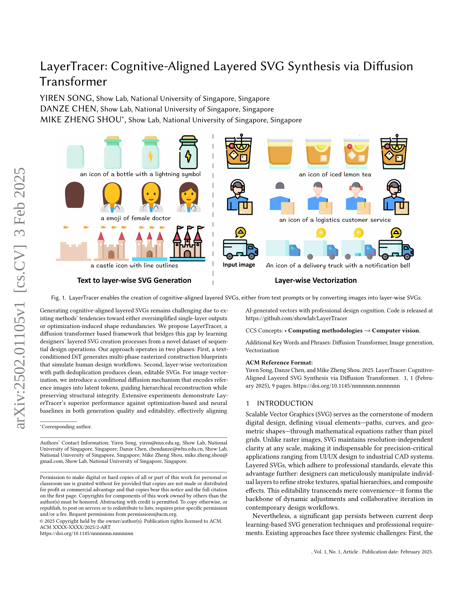
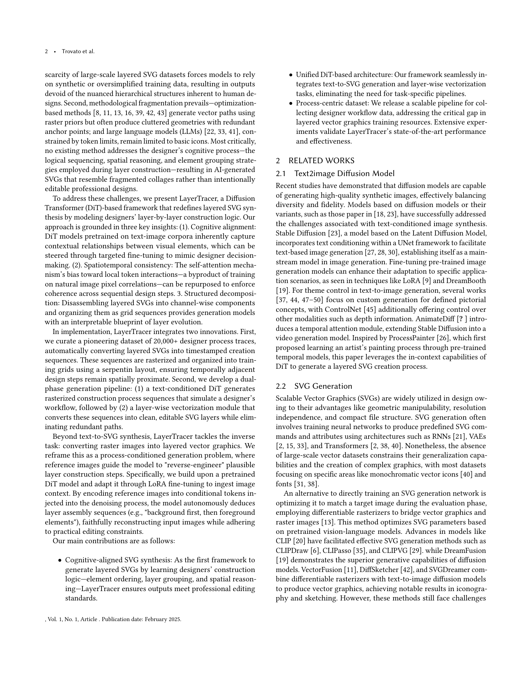
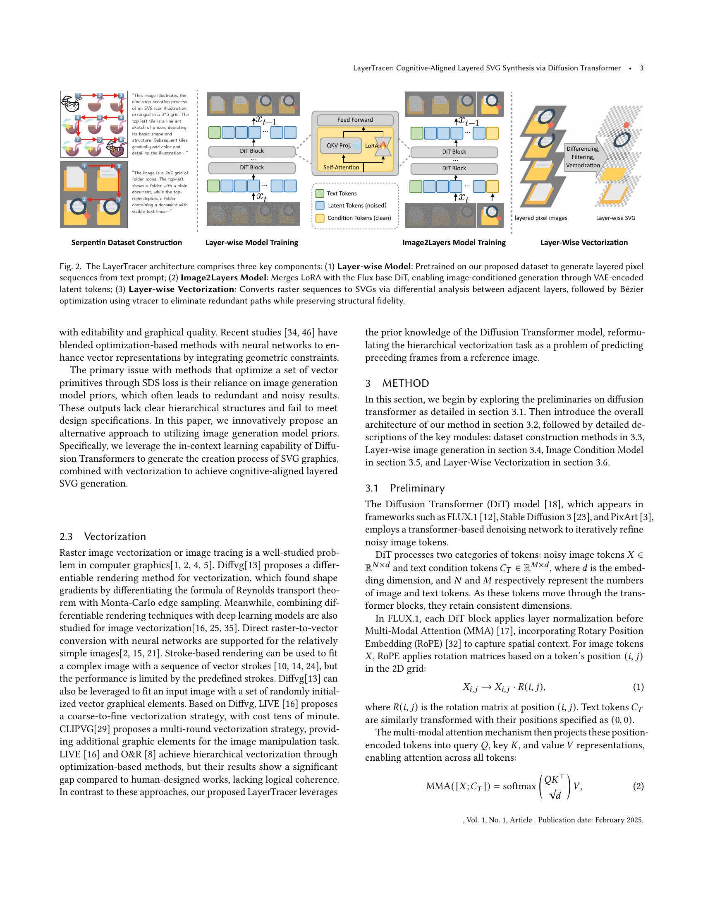
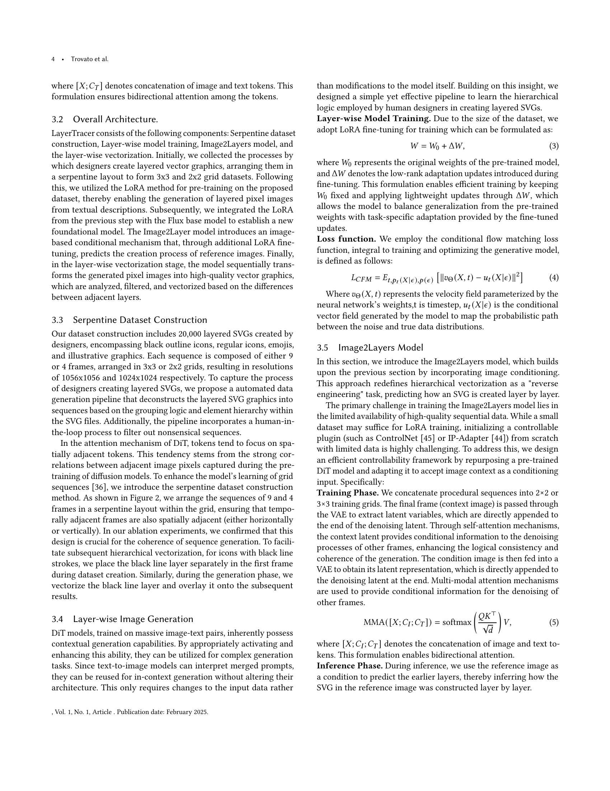
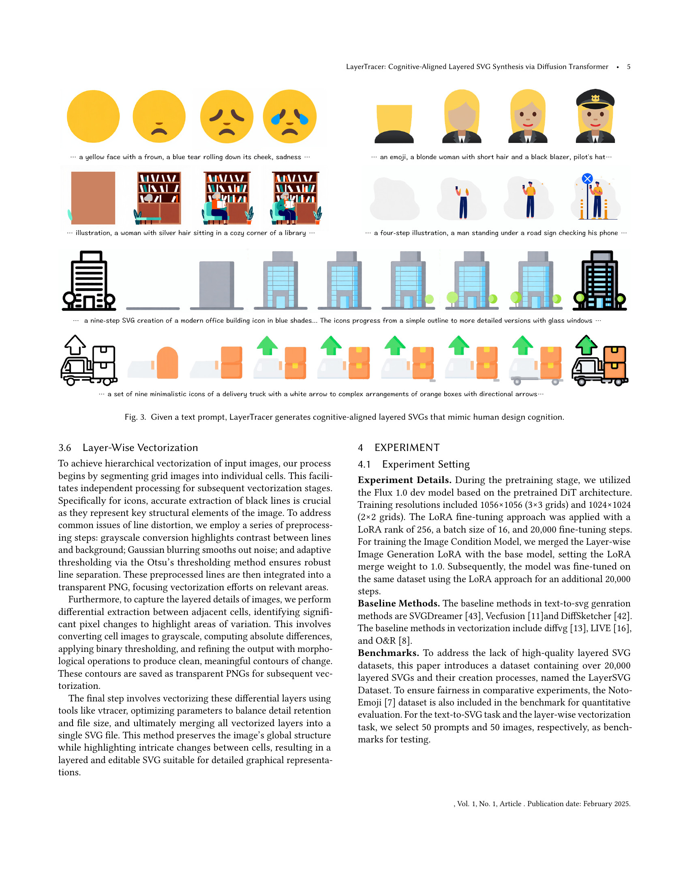
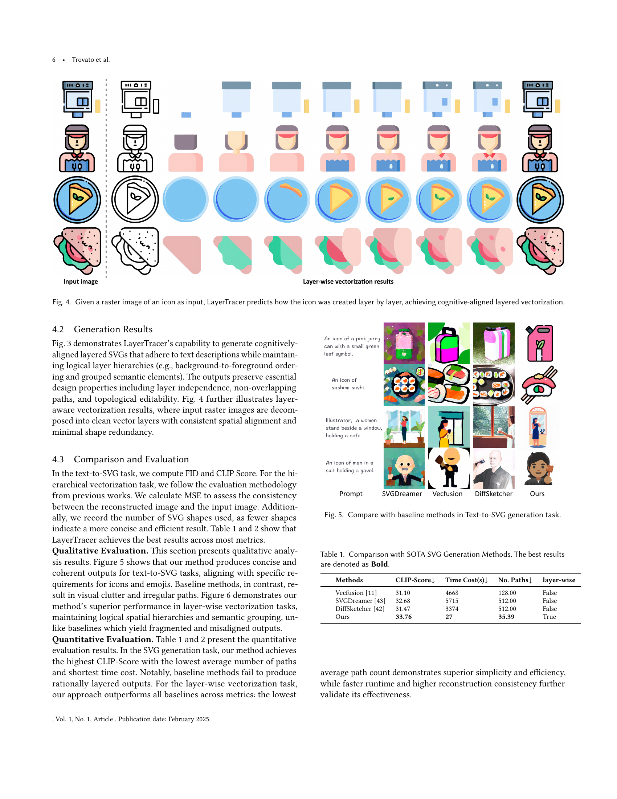
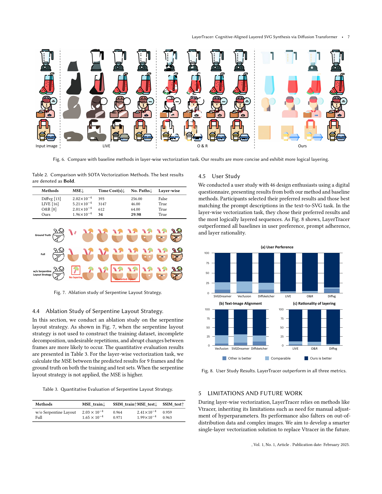
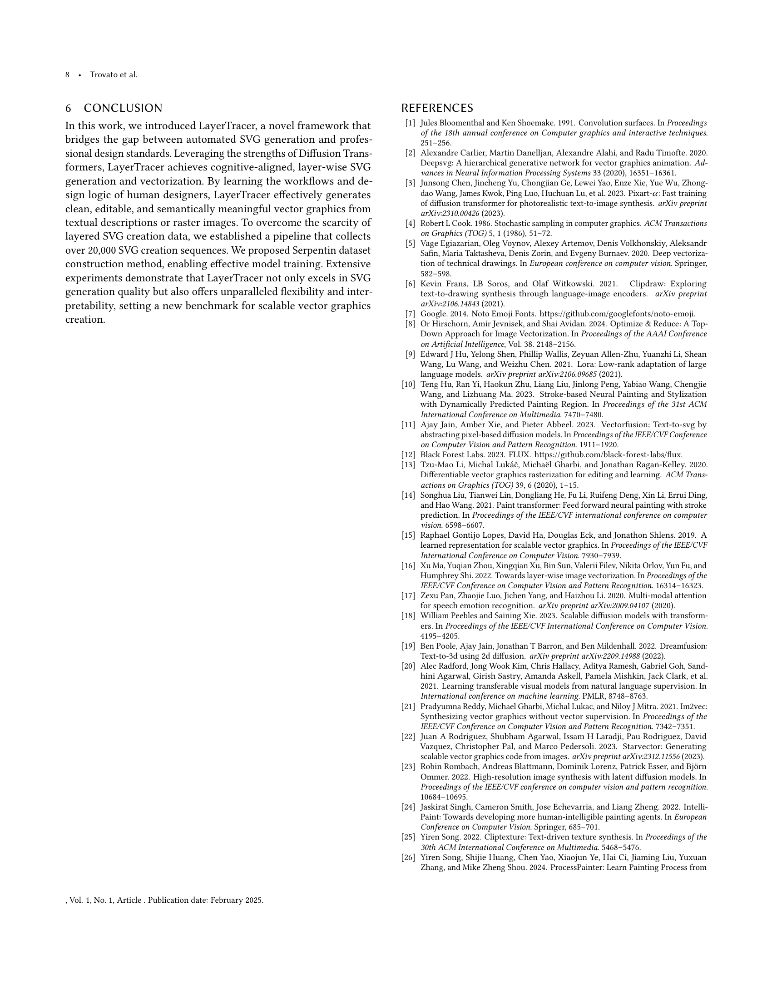
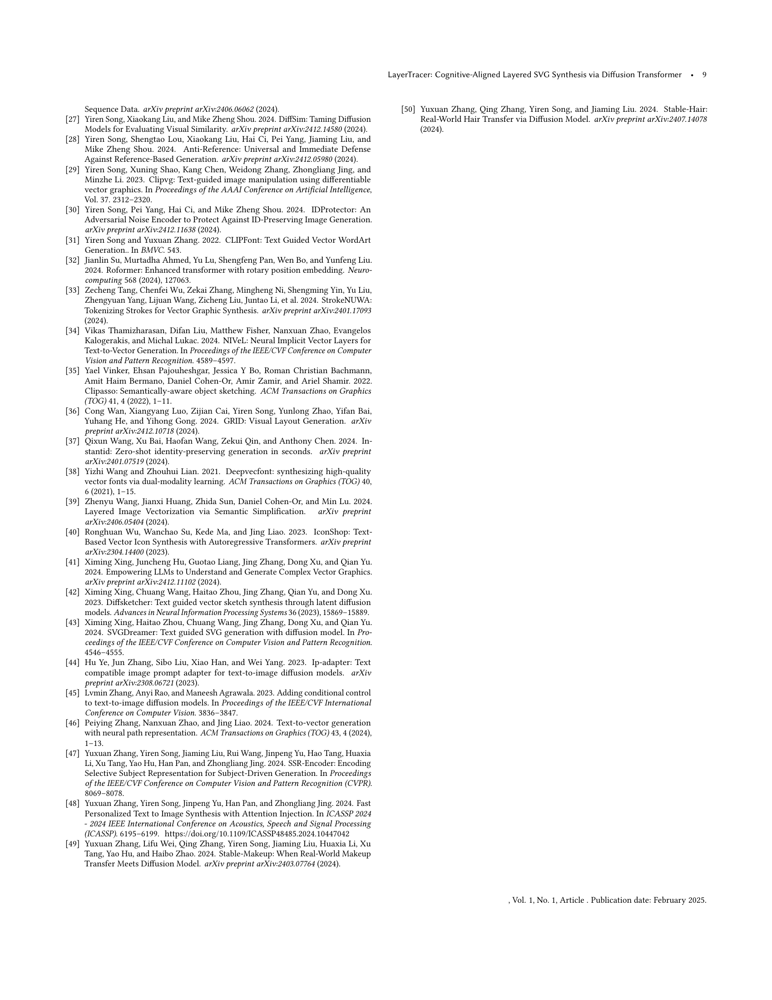

 


 2502.01105 
 Yiren Song et el. 
 
 🤗 2025-02-06 
 



↗ arXiv


↗ Hugging Face


### TL;DR



기존의 계층적 SVG 생성 방법들은 단순화된 결과물이나 최적화로 인한 불필요한 형태 중복이라는 한계점을 가지고 있습니다.  **LayerTracer는 이러한 문제를 해결하기 위해 디자이너의 계층적 디자인 과정을 모방하는 새로운 접근 방식을 제시합니다.**  이는 텍스트 또는 이미지를 입력받아 다단계의 래스터화된 설계 청사진을 생성하고, 중복 경로를 제거하는 벡터화 과정을 거쳐 최종적으로 편집 가능한 SVG를 생성하는 방식입니다.

LayerTracer는 **텍스트 조건부 DiT(Diffusion Transformer)를 사용하여 다단계 래스터화된 생성 과정을 시뮬레이션**하고, **경로 중복 제거를 통한 계층적 벡터화**를 통해 깨끗하고 편집 가능한 SVG를 생성합니다. **이미지 벡터화의 경우, 조건부 확산 메커니즘을 통해 참조 이미지를 잠재 토큰으로 인코딩하여 계층적 재구성을 유도**합니다.  실험 결과, LayerTracer는 생성 품질 및 편집성 면에서 기존 방법보다 뛰어난 성능을 보였으며, 실제 디자이너의 작업 방식과 일치하는 결과를 보여줍니다.



#### Key Takeaways


 LayerTracer는 디자이너의 계층적 SVG 생성 과정을 학습하여 인지적으로 정렬된 SVG 합성을 수행하는 최초의 프레임워크입니다. 



 LayerTracer는 텍스트 프롬프트 및 이미지 변환 모두를 지원하며, 품질과 편집성 면에서 기존 방법보다 우수한 성능을 보입니다. 



 LayerTracer는 새로운 데이터셋 생성 파이프라인을 통해 계층적 SVG 생성을 위한 훈련 데이터 부족 문제를 해결합니다. 


#### Why does it matter?
**본 논문은 계층적 SVG 합성 분야에서의 혁신적인 접근 방식을 제시하여**, **디자이너의 인지 과정을 모방하는 새로운 방법론을 제시합니다.** 이는 **디지털 디자인 및 벡터 그래픽 관련 연구에 중요한 영향을 미칠 뿐만 아니라**,  **향후 연구를 위한 새로운 가능성을 열어줍니다.**  **특히, 제한된 데이터셋 문제를 해결하고, 보다 실용적이고 편집 가능한 AI 생성 SVG를 가능하게 함으로써**,  **UI/UX 디자인, 산업 CAD 시스템 등 다양한 분야에 광범위한 응용 가능성**을 제공합니다.

------
#### Visual Insights

> 🔼 그림 1은 LayerTracer가 텍스트 프롬프트 또는 이미지를 계층적 SVG로 변환하여 인지적으로 정렬된 계층적 SVG를 생성하는 방법을 보여줍니다.  LayerTracer는 텍스트를 입력받아 단계별로 레이어를 생성하는 과정을 거치며, 이미지를 입력받으면 이미지를 레이어별로 분해하여 벡터화합니다.  텍스트 기반 생성에서는 텍스트에서 다양한 스타일의 아이콘이나 그림을 생성하고, 이미지 기반 생성에서는 이미지에서 레이어 정보를 추출하여 벡터 그래픽으로 변환하는 과정을 나타냅니다. 이를 통해 사용자는 텍스트 또는 이미지를 사용하여 원하는 계층적 SVG를 손쉽게 생성하고 편집할 수 있습니다.
> 

> 
read the caption

> Figure 1. LayerTracer enables the creation of cognitive-aligned layered SVGs, either from text prompts or by converting images into layer-wise SVGs.
> 


| Methods | CLIP-Score ↓ | Time Cost(s) ↓ | No. Paths ↓ | layer-wise | 
|---|---|---|---|---| 
| Vecfusion (Jain et al., 2023) | 31.10 | 4668 | 128.00 | False | 
| SVGDreamer (Xing et al., 2024b) | 32.68 | 5715 | 512.00 | False | 
| DiffSketcher (Xing et al., 2023) | 31.47 | 3374 | 512.00 | False | 
| Ours | **33.76** | **27** | **35.39** | True | 

> 🔼 표 1은 최첨단 SVG 생성 방법들과 LayerTracer의 성능을 비교 분석한 결과를 보여줍니다.  FID와 CLIP 점수, 생성된 SVG의 경로 개수, 생성 시간 등 다양한 지표를 통해 LayerTracer가 기존 방법들보다 우수한 성능을 보임을 보여줍니다.  특히, 계층적 구조를 갖는 SVG 생성에서 LayerTracer의 뛰어난 성능을 강조하며,  '굵게' 표시된 값들이 최고 성능임을 나타냅니다.  이는 LayerTracer가  텍스트 기반 SVG 생성 작업에서  더욱 효율적이고 질적으로 우수한 결과물을 생성함을 시사합니다.
> 

> 
read the caption

> Table 1. Comparison with SOTA SVG Generation Methods. The best results are denoted as Bold.
> 

### In-depth insights

#### Layered SVG Synthesis
레이어드 SVG 합성은 **복잡한 벡터 그래픽을 생성하는 데 있어 중요한 과제**입니다. 기존 방법들은 단순화된 단일 레이어 출력이나 최적화로 인한 형태 중복이라는 문제점을 가지고 있었습니다.  **LayerTracer는 이러한 문제점들을 해결하기 위해 제안된 솔루션**으로, 디자이너의 계층적 SVG 생성 과정을 학습하여 **텍스트 또는 이미지 입력으로부터 다층적인 SVG를 생성**합니다.  **핵심은 텍스트 조건부 DiT(Diffusion Transformer)를 활용하여 다단계 라스터화된 설계 청사진을 생성하고, 경로 중복 제거를 통한 계층적 벡터화를 수행하는 것**입니다. 이는 인간의 디자인 워크플로우를 모방하여 **더욱 자연스럽고 편집 가능한 SVG 생성**을 가능하게 합니다.  LayerTracer는 이미지 벡터화를 위해 참조 이미지를 잠재 토큰으로 인코딩하여 계층적 재구성을 유도하는 조건부 확산 메커니즘도 도입하였습니다.  **결과적으로, LayerTracer는 생성 품질과 편집 가능성 측면에서 기존 방법보다 우수한 성능**을 보이며, **인지적으로 정렬된 레이어드 SVG 합성을 위한 중요한 발전**을 제시합니다.

#### Diffusion Transformer
본 논문에서 "확산 트랜스포머(Diffusion Transformer)"는 **계층적 SVG 합성을 위한 핵심적인 기반 기술**로 제시됩니다.  이는 단순히 이미지 생성을 넘어, **디자이너의 인지적 과정을 모방하여 계층적인 벡터 그래픽을 생성하는** 능력을 강조합니다.  기존의 최적화 기반 방법론과 달리, 확산 트랜스포머는 **텍스트나 이미지 입력으로부터 다단계 합성 과정을 학습하여** 레이어 간의 일관성과 의미론적 연관성을 보장합니다.  **순차적인 설계 과정을 시뮬레이션하여** 레이어 간의 종속성과 구조적 무결성을 유지하는 데 탁월한 성능을 보이는 것이 특징입니다.  **이를 통해 기존 방법론의 한계인 과도한 단순화 또는 불필요한 중복을 극복하고, 편집 가능성이 뛰어난 고품질의 계층적 SVG를 생성**하는 것이 가능해집니다.  **본 논문에서 제시된 방법론은 디자인 도구 개발 및 벡터 그래픽 분야에 시사하는 바가 매우 크며,** 향후 연구에서 다양한 분야에 활용될 가능성이 높습니다.

#### Cognitive Alignment
본 논문에서 제시된 '인지적 정렬(Cognitive Alignment)' 개념은 **AI 기반 SVG 생성 모델이 단순히 시각적 유사성을 넘어 인간 디자이너의 디자인 과정을 모방**하도록 하는 데 중점을 둡니다.  이는 단순히 최적화된 형태를 생성하는 것이 아니라, **계층적 구조, 요소 배치 순서, 공간적 추론 등 디자이너의 인지적 과정을 반영**하여 실제 디자인 작업과 유사한 방식으로 SVG를 생성하는 것을 의미합니다.  이러한 접근 방식은 기존의 단순한 최적화 기반 방법이나 과도하게 단순화된 결과물을 생성하는 기존 모델의 한계를 극복하고, **편집 가능성과 디자인의 질을 높이는 데 크게 기여**합니다.  **Diffusion Transformer 모델의 문맥 이해 능력을 활용**, 디자이너의 의도를 보다 정확하게 반영하고, **시간적 일관성을 유지**하며 계층적으로 SVG를 생성하는 것이 핵심입니다.  즉, 단순히 결과물을 생성하는 것이 아닌, **인간의 사고 과정을 모방하는 지능적인 시스템**을 구축하는 데 초점을 맞추고 있습니다.

#### Vectorization Method
본 논문에서 제시된 벡터화 방법은 기존의 단순한 레이어별 벡터 변환 방식을 넘어, **인지적 정렬(cognitive alignment)**을 고려한 계층적 벡터화 전략을 제시합니다.  이는 단순히 래스터 이미지를 벡터로 변환하는 것이 아니라, 디자이너의 디자인 과정을 모방하여 레이어 간의 상호작용과 계층적 구조를 반영하는 방식입니다.  **차별적 추출(differential extraction)** 기법을 통해 레이어 간의 변화를 정확하게 포착하고, **vtracer와 같은 벡터화 도구**를 활용하여 효율적인 벡터 그래픽을 생성합니다.  이러한 접근 방식은 단순히 벡터화된 이미지를 생성하는 것을 넘어, **편집 가능하고 의미있는 레이어 구조**를 가진 벡터 그래픽을 생성한다는 데 큰 의의가 있습니다.  **블랙 라인 레이어(black line layer)의 전처리**를 통해 윤곽선을 정확하게 추출하고,  레이어 간의 시각적 일관성을 유지하면서 효율적인 벡터화를 수행합니다.  결과적으로, LayerTracer는 **다른 벡터화 기법보다 더욱 정확하고 효율적이며, 디자인 의도를 반영한** 고품질의 벡터 그래픽을 생성할 수 있게 합니다.

#### Future Enhancements
LayerTracer는 SVG 합성 분야에서 고무적인 발걸음이지만, **미래 개선**을 위한 여지가 많습니다. **데이터셋 확장**은 모델의 일반화 능력을 높이는 데 중요하며, 다양한 스타일과 복잡도의 SVG를 포함하는 더욱 방대한 데이터가 필요합니다. **벡터화 알고리즘 개선** 또한 필수적입니다. 현재의 방법은 완벽하지 않으며, 더욱 정교하고 효율적인 벡터화 기술을 통해 더욱 깨끗하고 정확한 SVG 생성을 가능하게 할 수 있습니다.  **모델 아키텍처의 개선**도 고려해야 할 부분입니다.  더욱 효율적이고 강력한 DiT 모델 또는 다른 생성 모델 아키텍처를 활용하여 성능과 생성 품질을 향상시킬 수 있습니다. 또한, **사용자 인터페이스 개선**을 통해 사용자 친화적인 디자인 도구를 제공하는 것도 중요합니다.  마지막으로, **다양한 응용 분야**에 대한 연구가 필요합니다. LayerTracer를 다양한 디자인 작업에 적용하고, 그에 맞는 추가적인 기능을 개발하는 것이 중요한 미래 연구 방향입니다.

### More visual insights

More on figures

> 🔼 그림 2는 LayerTracer의 세 가지 주요 구성 요소를 보여줍니다. 첫째, 텍스트 프롬프트로부터 계층화된 픽셀 시퀀스를 생성하도록 제안된 데이터셋으로 사전 훈련된 계층별 모델입니다. 둘째, Flux 기본 DiT와 LoRA를 병합하여 VAE로 인코딩된 잠재 토큰을 통해 이미지 조건부 생성을 가능하게 하는 Image2Layers 모델입니다. 셋째, 인접 계층 간의 차이 분석과 vtracer를 사용한 베지어 최적화를 통해 중복 경로를 제거하고 구조적 충실도를 유지하면서 래스터 시퀀스를 SVG로 변환하는 계층별 벡터화 과정입니다. 이 그림은 LayerTracer의 전체 아키텍처와 각 구성 요소의 기능을 시각적으로 보여주어 시스템의 작동 방식을 이해하는 데 도움을 줍니다.
> 

> 
read the caption

> Figure 2. The LayerTracer architecture comprises three key components: (1) Layer-wise Model: Pretrained on our proposed dataset to generate layered pixel sequences from text prompt; (2) Image2Layers Model: Merges LoRA with the Flux base DiT, enabling image-conditioned generation through VAE-encoded latent tokens; (3) Layer-wise Vectorization: Converts raster sequences to SVGs via differential analysis between adjacent layers, followed by Bézier optimization using vtracer to eliminate redundant paths while preserving structural fidelity.
> 

> 🔼 그림 3은 LayerTracer가 텍스트 프롬프트를 입력받아 인간의 디자인 인지를 모방한 인지적으로 정렬된 계층적 SVG를 생성하는 과정을 보여줍니다.  단순한 텍스트 설명을 넘어, LayerTracer는 다양한 디자인 요소들의 계층적 배치, 시각적 일관성 및 편집 가능성까지 고려하여 실제 디자이너의 작업 과정을 모방합니다.  결과물은 단순한 이미지 생성을 넘어, 각 레이어를 독립적으로 편집하고 조작할 수 있을 만큼 정교하고 편집 가능한 벡터 그래픽을 제공합니다. 이는 단순한 이미지 생성을 넘어, 실제 디자인 작업에서 활용될 수 있음을 의미합니다.
> 

> 
read the caption

> Figure 3. Given a text prompt, LayerTracer generates cognitive-aligned layered SVGs that mimic human design cognition.
> 

> 🔼 그림 4는 LayerTracer가 입력으로 받은 아이콘의 래스터 이미지를 기반으로, 해당 아이콘이 레이어별로 어떻게 생성되었는지 예측하는 과정을 보여줍니다.  단순히 벡터화하는 것을 넘어, 사람의 인지 과정을 모방하여 레이어의 생성 순서 및 계층 구조를 고려한, 인지적으로 정렬된 레이어 벡터화(cognitive-aligned layered vectorization)를 수행합니다.  즉, 단순히 이미지를 벡터로 변환하는 것이 아니라, 디자이너가 실제로 아이콘을 디자인할 때 어떤 순서와 방법으로 레이어를 만들었을지를 추론하여 그 과정을 재현하는 것을 의미합니다.  결과적으로, 각 레이어는 독립적이며, 레이어 간 중첩이 없고, 편집 가능한 구조를 가집니다.
> 

> 
read the caption

> Figure 4. Given a raster image of an icon as input, LayerTracer predicts how the icon was created layer by layer, achieving cognitive-aligned layered vectorization.
> 

> 🔼 본 그림은 LayerTracer와 기존 Text-to-SVG 생성 방법(SVGDreamer, Vecfusion, DiffSketcher) 간의 성능 비교 결과를 보여줍니다. 다양한 텍스트 프롬프트에 대한 각 모델의 SVG 생성 결과를 시각적으로 보여줌으로써, LayerTracer가 경쟁 모델들보다 더 정확하고, 세부적인 벡터 그래픽을 생성함을 보여줍니다.  특히, LayerTracer는 더욱 간결하고 일관성 있는 결과물을 생성하며,  세부적인 요소들의 배치 및 계층 구조를 더 잘 표현하는 것을 확인할 수 있습니다.
> 

> 
read the caption

> Figure 5. Compare with baseline methods in Text-to-SVG generation task.
> 

> 🔼 그림 6은 기존의 레이어별 벡터화 방법들과 LayerTracer의 결과를 비교하여 보여줍니다.  LayerTracer는 입력 이미지를 레이어별로 분해하여 벡터화하는 과정을 보여줍니다. 기존 방법들은 벡터화 결과가 복잡하고 레이어의 계층 구조가 명확하지 않은 반면, LayerTracer는 더욱 간결하고 논리적인 레이어 구조를 보여주는 것을 알 수 있습니다. 이는 더욱 효율적이고 편집하기 쉬운 SVG 결과물을 생성한다는 것을 의미합니다.  각각의 레이어가 의미있는 시각적 요소를 나타내며, 전체적인 이미지 구조를 유지하면서도 각 부분을 독립적으로 편집할 수 있도록 하는 것을 보여줍니다.
> 

> 
read the caption

> Figure 6. Compare with baseline methods in layer-wise vectorization task. Our results are more concise and exhibit more logical layering.
> 

> 🔼 그림 7은 LayerTracer 모델 학습에 사용된 데이터셋 구성 전략인 ‘Serpentine Layout Strategy’의 효과를 검증하기 위한 실험 결과를 보여줍니다.  Serpentine Layout 전략을 사용하지 않은 경우(왼쪽) 생성된 SVG 이미지 시퀀스에서 레이어 간 불일치, 원치 않는 중복, 갑작스러운 변화 등의 문제가 발생하는 것을 확인할 수 있습니다. 반면, Serpentine Layout 전략을 적용한 경우(오른쪽) 보다 일관성 있고 논리적인 레이어 구조를 가진 SVG 시퀀스가 생성됨을 시각적으로 보여줍니다. 이는 Serpentine Layout 전략이 모델의 레이어 생성 과정 학습에 중요한 역할을 한다는 것을 시사합니다.
> 

> 
read the caption

> Figure 7. Ablation study of Serpentine Layout Strategy.
> 

More on tables


| Methods | MSE ↓ | Time Cost(s) ↓ | No. Paths ↓ | Layer-wise | 
|---|---|---|---|---| 
| Diffvg (Li et al., 2020) | 2.02e-04 | 393 | 256.00 | False | 
| LIVE (Ma et al., 2022) | 5.21e-04 | 3147 | 46.00 | True | 
| O&R (Hirschorn et al., 2024) | 2.01e-04 | 612 | 64.00 | True | 
| Ours | 1.96e-04 | 34 | 29.98 | True |
> 🔼 표 2는 최첨단 벡터화 방법들과 LayerTracer의 성능을 비교한 결과를 보여줍니다.  MSE(Mean Squared Error), 처리 시간, SVG 경로 수, 계층적 벡터화 여부 등 여러 지표를 통해 LayerTracer가 기존 방법들보다 우수한 성능을 보임을 보여줍니다. 특히, MSE가 낮고 처리 시간이 짧으며, SVG 경로 수가 적다는 것은 LayerTracer가 더 효율적이고 정확하며 간결한 벡터 그래픽을 생성함을 의미합니다.  계층적 벡터화 여부는 LayerTracer가 이미지의 계층적 구조를 효과적으로 파악하여 벡터화 작업을 수행했음을 나타냅니다.  결과적으로 이 표는 LayerTracer의 우수한 벡터화 성능을 객관적으로 보여주는 중요한 근거 자료입니다.
> 

> 
read the caption

> Table 2. Comparison with SOTA Vectorization Methods. The best results are denoted as Bold.
> 


| Methods | MSE_train ↓ | SSIM_train ↑ | MSE_test ↓ | SSIM_test ↑ |
|---|---|---|---|---|
| w/o Serpentine Layout | 2.03 × 10-4 | 0.964 | 2.41 × 10-4 | 0.959 |
| Full | 1.65 × 10-4 | 0.971 | 1.99 × 10-4 | 0.963 |
> 🔼 표 3은 뱀 모양 레이아웃 전략의 정량적 평가 결과를 보여줍니다.  뱀 모양 레이아웃 전략을 사용하여 학습 데이터셋을 구성했을 때와 사용하지 않았을 때의 성능 차이를 MSE(Mean Squared Error)와 SSIM(Structural Similarity Index) 지표를 통해 정량적으로 비교 분석합니다.  훈련 및 테스트 세트에 대한 MSE와 SSIM 값을 제시하여 뱀 모양 레이아웃 전략의 효과를 명확히 보여줍니다.  특히, 레이어 단위 벡터화 작업에서 뱀 모양 레이아웃 전략의 중요성을 강조합니다.
> 

> 
read the caption

> Table 3. Quantitative Evaluation of Serpentine Layout Strategy.
> 

### Full paper



