 


 2502.01142 
 Xinyan Guan et el. 
 
 🤗 2025-02-04 
 



↗ arXiv


↗ Hugging Face


### TL;DR



대규모 언어 모델(LLM)은 추론 능력이 뛰어나지만, 매개변수적 지식의 한계로 인해 사실적 오류가 발생하는 문제가 있습니다. 기존의 RAG(Retrieval-Augmented Generation)는 이 문제를 해결하기 위한 방안으로 제시되었지만, 비효율적인 작업 분해 및 불필요한 검색으로 인해 성능 저하를 야기했습니다. 이러한 문제를 해결하기 위해 본 논문에서는 DeepRAG라는 새로운 프레임워크를 제시합니다.

DeepRAG는 추론 과정을 MDP(Markov Decision Process)로 모델링하여, 전략적이고 적응적인 정보 검색을 가능하게 합니다.  질의를 반복적으로 분해하여, 매개변수적 추론과 외부 지식 검색 중 어떤 전략을 사용할지 동적으로 결정합니다. 실험 결과, DeepRAG는 기존 방법보다 정확도를 21.99% 향상시키고 검색 효율성도 개선하여,  LLM 기반 추론의 효율성 및 정확성 향상에 기여합니다.  본 논문의 접근 방식은 복잡한 질의에 대한 효과적인 추론 과정을 구축하는 데 중요한 시사점을 제공합니다.



#### Key Takeaways


 DeepRAG는 **마르코프 의사 결정 과정(MDP)**으로 모델링된 새로운 RAG 프레임워크입니다. 



 **단계적 질의 분해 및 적응적 정보 검색**을 통해 기존 RAG의 문제점인 비효율적인 작업 분해 및 중복 검색을 해결합니다. 



 실험 결과, DeepRAG는 기존 방법보다 **정확도를 21.99% 향상**시키고, **검색 효율성도 개선**했습니다. 


#### Why does it matter?
본 논문은 **대규모 언어 모델(LLM)**의 추론 능력 향상에 중점을 두고 있으며, **정보 검색을 활용한 추론 과정의 효율성을 높이는 새로운 프레임워크 DeepRAG**를 제시합니다.  LLM의 한계점인 사실적 오류를 해결하기 위해, **RAG(Retrieval-Augmented Generation)** 기반 추론의 효율성을 높이는 것은 매우 중요한 연구 주제입니다. DeepRAG는 기존 RAG의 한계를 극복하고, **더욱 정확하고 효율적인 추론 결과**를 도출하는 방식을 제시함으로써, 관련 분야 연구에 상당한 영향을 미칠 것으로 예상됩니다.  특히 **단계적 검색 및 적응적 의사결정**과 같은 혁신적인 기법을 통해, **LLM의 지식 경계를 효과적으로 파악하고 활용**할 수 있는 가능성을 보여주어, 향후 연구 방향을 제시하는 데 의미가 있습니다.

------
#### Visual Insights

> 🔼 그림 1은 인간의 사고 과정과 DeepRAG의 작동 방식 간의 대응 관계를 보여줍니다.  DeepRAG은 질문에 대한 답변을 생성하기 위해, 인간처럼 단계적으로 정보를 검색하는 과정을 모델링합니다.  '검색 기록(Retrieval Narrative)'은 이전에 얻은 정보를 바탕으로 새로운 하위 질문을 생성하여 구조적이고 적응적인 검색 흐름을 보장합니다. '원자적 의사결정(Atomic Decisions)'은 각 하위 질문에 대해 외부 지식을 검색할지 아니면 모델 자체의 매개변수적 지식에만 의존할지 동적으로 결정하는 과정입니다.  즉, DeepRAG는 단순히 정보를 검색하는 것이 아니라, 인간처럼 상황에 맞춰 전략적으로 정보를 활용하는 방식으로 동작합니다.
> 

> 
read the caption

> Figure 1: Correspondence between human thinking processes and DeepRAG. Specifically, retrieval narrative ensures a structured and adaptive retrieval flow, generating subqueries informed by previously retrieved information, and atomic decisions dynamically determines whether to retrieve external knowledge or rely solely on the parametric knowledge for each subquery.
> 


| Types | Methods | Hotpot QA EM | Hotpot QA F1 | 2WikiMultihopQA EM | 2WikiMultihopQA F1 |  | CAG EM | CAG F1 | PopQA EM | PopQA F1 | Web Question EM | Web Question F1 | Avg | 
|---|---|---|---|---|---|---|---|---|---|---|---|---|---|---|
| **Llama-3-8B** |  |  |  |  |  |  |  |  |  |  |  |  |  |
| Reasoning | CoT | 27.20 | 37.75 | 28.20 | 34.85 |  | 7.17 | 10.41 | 21.20 | 25.33 | 25.20 | 40.56 | 25.79 |
|  | CoT-Retrieve | 34.90 | 46.85 | 35.80 | 43.41 |  | 55.45 | 64.08 | 32.80 | 45.87 | 22.90 | 39.22 | 42.13 |
|  | CoT* | 21.80 | 31.69 | 25.60 | 30.89 |  | 5.30 | 7.58 | 23.10 | 25.31 | 26.80 | 40.20 | 23.83 |
|  | CoT-Retrieve* | 22.50 | 32.15 | 23.70 | 29.21 |  | 44.86 | 55.69 | 38.70 | 45.64 | 17.60 | 29.20 | 33.93 |
|  | IterDRAG | 23.20 | 30.95 | 19.60 | 24.80 |  | 38.32 | 46.18 | 22.70 | 34.53 | 15.90 | 26.79 | 28.30 |
|  | Auto-RAG | 25.80 | 36.09 | 23.00 | 30.09 |  | 49.22 | 59.61 | 27.80 | 42.02 | 17.40 | 32.94 | 34.40 |
| Adaptive | FLARE | 23.80 | 32.88 | 30.30 | 37.45 |  | 34.89 | 43.45 | 28.80 | 40.61 | 28.80 | 40.61 | 34.16 |
|  | DRAGIN | 27.60 | 38.05 | 29.10 | 35.68 |  | 4.05 | 7.18 | 22.60 | 28.53 | 21.20 | 38.72 | 25.27 |
|  | UAR | 29.70 | 40.66 | 34.80 | 42.40 |  | 52.96 | 61.53 | 33.00 | 45.95 | 22.70 | 39.10 | 40.28 |
|  | TAARE | 30.60 | 41.43 | 35.20 | 42.85 |  | 52.96 | 61.59 | 33.20 | 46.01 | 23.40 | 39.56 | 40.68 |
| Ours | DeepRAG-Imi | 35.10 | 46.59 | 47.20 | 52.33 |  | 50.47 | 59.55 | 43.60 | 48.50 | 30.00 | 41.76 | 45.38 |
|  | DeepRAG | 40.70 | 51.54 | 48.10 | 53.25 |  | 52.96 | 61.92 | 42.50 | 47.80 | 32.70 | 45.24 | 47.67 |
| **Qwen-2.5-7B** |  |  |  |  |  |  |  |  |  |  |  |  |  |
| Reasoning | CoT | 18.90 | 27.81 | 23.40 | 28.97 |  | 3.12 | 5.71 | 15.20 | 19.20 | 18.30 | 34.86 | 19.55 |
|  | CoT-Retreive | 24.90 | 34.78 | 18.60 | 23.44 |  | 41.43 | 51.47 | 27.30 | 41.20 | 15.10 | 29.84 | 30.81 |
|  | CoT* | 17.60 | 26.15 | 25.10 | 29.62 |  | 3.12 | 5.62 | 7.90 | 11.06 | 15.60 | 32.45 | 17.42 |
|  | CoT-Retrieve* | 23.40 | 32.29 | 22.40 | 27.51 |  | 43.30 | 54.51 | 26.60 | 35.46 | 13.80 | 25.60 | 30.49 |
|  | IterDRAG | 13.70 | 26.84 | 9.30 | 20.47 |  | 21.81 | 39.59 | 18.00 | 31.44 | 12.50 | 26.95 | 22.06 |
| Adaptive | FLARE | 23.40 | 32.06 | 21.80 | 26.51 |  | 34.89 | 42.62 | 19.00 | 28.24 | 16.10 | 31.89 | 27.65 |
|  | DRAGIN | 16.70 | 24.60 | 12.40 | 16.76 |  | 3.43 | 5.45 | 12.00 | 15.80 | 17.40 | 32.43 | 15.70 |
|  | UAR | 24.50 | 34.22 | 23.90 | 28.20 |  | 34.89 | 43.92 | 27.00 | 40.47 | 16.60 | 32.28 | 30.60 |
|  | TAARE | 25.30 | 35.03 | 21.30 | 25.67 |  | 40.81 | 50.78 | 27.00 | 40.92 | 18.20 | 33.14 | 31.81 |
| Ours | DeepRAG-Imi | 30.40 | 39.44 | 32.00 | 38.32 |  | 47.98 | 56.99 | 37.50 | 40.72 | 23.90 | 38.62 | 38.59 |
|  | DeepRAG | 32.10 | 41.14 | 40.40 | 44.87 |  | 51.09 | 59.76 | 40.60 | 43.19 | 24.20 | 38.83 | 41.62 |

> 🔼 표 1은 DeepRAG와 다른 기준 모델들의 다섯 가지 벤치마크에 대한 실험 결과를 종합적으로 보여줍니다. 각 데이터 세트에서 가장 높은 점수와 두 번째로 높은 점수는 굵게/밑줄로 표시되어 있습니다. DeepRAG-Imi(1단계)와 DeepRAG(2단계)는 모든 테스트 시나리오에서 기존 방법보다 우수한 성능을 보여줍니다. 이 표는 DeepRAG 모델의 성능을 다양한 측면에서 평가하고 기존 방법들과 비교 분석하여 DeepRAG의 효과를 명확하게 제시합니다.  각 데이터셋에 대한 정확도와 F1 점수를 비교하여 모델의 성능을 정량적으로 평가하고, 다양한 유형의 질문(다중 단계 추론, 시간 관련 질문, 이종 지식 기반 질문 등)에 대한 DeepRAG의 일반화 성능을 확인할 수 있습니다.
> 

> 
read the caption

> Table 1: The overall experimental results of DeepRAG and other baselines on five benchmarks. The best/second best scores in each dataset are bolded/underlined. DeepRAG-Imi (Stage I) and DeepRAG (Stage II) both demonstrate superior performance compared to existing methods across all test scenarios.
> 

### In-depth insights

#### Adaptive RAG
적응형 RAG는 **정적 지식베이스에만 의존하는 기존 RAG의 한계를 극복**하기 위해 등장했습니다.  **문의의 복잡성과 맥락을 고려하여** 동적으로 지식 소스를 선택하고, **필요에 따라 파라미터 지식과 외부 지식을 적절히 결합**하는 것이 핵심입니다. 이를 위해 다양한 전략이 연구되었는데, 분류기 기반, 신뢰도 기반, 그리고 LLM 기반 접근 방식 등이 있습니다.  **각 접근 방식은 장단점을 가지고 있지만**,  궁극적으로는 **LLM의 추론 능력과 지식 베이스 활용 능력을 최적으로 통합**하는 것을 목표로 합니다.  **효율적인 질의 분해 및 적응적 정보 검색**은 적응형 RAG의 성공에 중요한 요소이며,  **지식 경계의 정확한 인식** 역시 성능 향상에 필수적입니다.  미래 연구는 **더욱 정교한 적응 전략**과 **다양한 지식 소스 통합**에 초점을 맞출 것으로 예상됩니다.

#### MDP-Based RAG
MDP 기반 RAG는 **강화학습** 개념을 도입하여 기존 RAG의 한계를 극복하고자 하는 접근 방식입니다. 기존 RAG는 질문에 대한 답변을 생성하기 위해 단순히 관련 정보를 검색하고 조합하는 방식으로, 복잡한 추론이나 다단계 질의가 필요한 경우에는 성능이 저하될 수 있습니다. 반면 MDP 기반 RAG는 **상태(state), 행동(action), 보상(reward)** 등의 MDP 구성 요소를 이용하여 질문 분석, 정보 검색, 답변 생성 과정을 단계적으로 모델링합니다. 각 단계에서 최적의 행동을 선택하여 효율적인 정보 검색 및 답변 생성을 유도하는 것이 핵심입니다.  **상태는 현재까지 처리된 정보**, **행동은 추가적인 정보 검색 여부 또는 매개변수적 추론 사용 여부**, 그리고 **보상은 답변의 정확도와 검색 비용** 등으로 정의될 수 있습니다. 이를 통해 MDP 기반 RAG는 복잡한 추론 문제에도 효과적으로 대처하고, 불필요한 검색을 줄이며, 답변의 정확성을 높일 수 있습니다.  **모델 학습은 주로 강화학습 알고리즘**을 통해 이루어지며, 다양한 QA 데이터셋을 이용하여 모델의 성능을 평가할 수 있습니다.  하지만, **MDP 모델의 설계 및 강화학습 알고리즘의 선택**은 성능에 큰 영향을 미치므로,  적절한 설계와 최적화가 매우 중요합니다.

#### Knowledge Boundary
본 논문에서 '지식 경계(Knowledge Boundary)'는 **대규모 언어 모델(LLM)**이 **자신의 지식 범위를 정확히 인식하는 능력**의 한계를 의미합니다.  LLM은 방대한 데이터를 학습하지만, 그 지식은 여전히 불완전하며, **정확성과 시의성 측면에서 한계**를 가지고 있습니다.  따라서 LLM은 자신이 알고 있는 것과 모르는 것을 구분하는 데 어려움을 겪고, 이로 인해 **사실적 오류(hallucination)**가 발생할 수 있습니다.  이러한 문제를 해결하기 위해 본 논문에서는 **지식 경계를 명확히 인식하고, 적응적으로 외부 지식을 활용하는 새로운 프레임워크**를 제안합니다.  이는 단순히 외부 지식을 무분별하게 활용하는 기존의 방법론과 달리, **LLM의 지식 범위를 고려하여 전략적이고 적응적인 정보 검색**을 수행하는 것을 목표로 합니다.  **지식 경계에 대한 명확한 이해**는 LLM 기반 응용의 신뢰성 향상에 필수적이며, 본 논문의 핵심 기여 중 하나입니다.

#### Retrieval Efficiency
본 논문의 "Retrieval Efficiency" 부분은 **효율적인 정보 검색**에 대한 심도있는 분석을 제시합니다.  단순히 검색 횟수만 비교하는 것이 아니라, 정확도와의 상관관계를 고려하여 **비용 대비 효과**를 평가합니다.  이는 단순히 검색 결과의 수량이 아닌, **질적 평가**를 통해 실질적인 효율성을 측정하고자 함을 보여줍니다.  특히, 기존의 confidence-based 방법론의 한계점을 지적하며, **상황에 맞는 적응적 검색 전략**의 중요성을 강조합니다.  DeepRAG 모델은 불필요한 검색을 최소화하면서 정확도를 높이는 전략을 제시하여, **자원의 효율적인 사용**이라는 측면에서 큰 의미를 지닙니다.  이는 단순히 기술적 개선을 넘어, **실용적인 측면**까지 고려한 연구임을 시사합니다.

#### Future of RAG
RAG(Retrieval-Augmented Generation)의 미래는 **더욱 정교하고 적응적인 검색 전략**과 **지식 경계에 대한 모델의 인식 향상**에 달려 있습니다.  이는 모델이 질문의 복잡성을 이해하고, 필요에 따라 파라메트릭 추론과 외부 지식 검색을 전략적으로 결합하는 것을 의미합니다.  **지식 경계를 명확히 인식하는 모델**은 불필요한 검색을 줄이고, 더 정확한 답변을 생성할 수 있습니다. 또한, **다양한 데이터 소스와 질의 유형에 대한 적응성**을 높이는 연구가 중요하며, 특히 **시간에 민감한 정보**를 처리하는 능력 향상에 대한 연구가 필요합니다.  궁극적으로, RAG는 **LLM(Large Language Model)의 한계를 극복**하고 **사실적이고 일관성 있는 답변**을 생성하는 데 필수적인 기술이 될 것입니다.  **신뢰성 있는 지식 기반**을 구축하고, **효율적인 검색 전략**을 개발하는 것은 RAG의 미래를 위한 핵심 과제입니다.

### More visual insights

More on figures

> 🔼 그림 2는 제안된 DeepRAG 프레임워크의 개요를 보여줍니다.  DeepRAG는 세 가지 단계로 구성됩니다. 1단계는 이진 트리 탐색을 사용하여 모방 학습을 위한 데이터를 합성하는 단계입니다. 이를 통해 모델은 검색 패턴을 학습할 수 있습니다. 2단계는 모방 학습 단계로, 1단계에서 생성된 데이터를 사용하여 모델을 미세 조정합니다. 3단계는 보정 단계로, LLM의 지식 경계에 대한 인식을 더욱 개선하기 위해 이진 트리 탐색을 사용하여 기본 설정 데이터를 생성하는 단계입니다.  데이터셋이 주어지면, 먼저 이진 트리 탐색을 사용하여 모방 학습을 위한 데이터를 합성하고, 이를 통해 모델은 검색 패턴을 학습합니다. 그런 다음, 이진 트리 탐색을 사용하여 LLM의 지식 경계에 대한 인식을 더욱 보정하기 위한 기본 설정 데이터를 구성합니다.
> 

> 
read the caption

> Figure 2: An overview of DeepRAG, our framework comprises three steps: (1) Binary Tree Search, (2) Imitation Learning, and (3) Chain of Calibration. Given a dataset, we first employ binary tree search to synthesize data for imitation learning, enabling the model to learn retrieval patterns. Subsequently, we use binary tree search to construct preference data for further calibrating the LLM’s awareness of its knowledge boundaries.
> 

> 🔼 그림 3은 질문 분해의 효과를 보여줍니다. (a)는 질문 당 평균 하위 질문 수의 분포를 보여주고, 대부분의 질문이 3~5개의 하위 질문으로 분해됨을 보여줍니다. (b)는 검색 횟수의 분포를 보여주며, 검색 횟수가 0~2회에 집중되어 있음을 보여줍니다. 이는 DeepRAG가 질문을 효과적으로 분해하고 불필요한 검색을 최소화함을 시사합니다.
> 

> 
read the caption

> Figure 3: (a) Subquery Statistics. (b) Retrieval Statistics.
> 

More on tables


| Dataset | Method | EM | Avg. Retrievals |  |  |  | 
|---|---|---|---|---|---|---|
| 2WMQA | FLARE | 30.30 | 0.99 | 1.00 | 0.99 |  | 
|  | DRAGIN | 29.10 | 1.03 | 1.03 | 1.03 |  | 
|  | UAR | 34.80 | 0.81 | 0.68 | 0.89 |  | 
|  | TAARE | 35.20 | 0.93 | 0.93 | 0.97 |  | 
|  | IterDRAG | 19.60 | 2.46 | 2.49 | 2.45 |  | 
|  | Auto-RAG | 23.00 | 6.26 | 4.13 | 1.81 |  | 
|  | DeepRAG-Imi | 47.20 | 1.13 | 0.95 | 1.28 |  | 
|  | DeepRAG | 48.10 | 1.09 | 0.92 | 1.25 |  | 
| WQ | FLARE | 28.80 | 0.00 | 0.00 | 0.00 |  | 
|  | DRAGIN | 21.20 | 0.00 | 0.00 | 0.00 |  | 
|  | UAR | 22.70 | 0.96 | 0.95 | 0.97 |  | 
|  | TAARE | 23.40 | 0.66 | 0.65 | 0.66 |  | 
|  | IterDRAG | 15.90 | 2.25 | 2.16 | 2.27 |  | 
|  | Auto-RAG | 17.40 | 4.52 | 3.03 | 2.35 |  | 
|  | DeepRAG-Imi | 30.00 | 0.43 | 0.13 | 0.56 |  | 
|  | DeepRAG | 32.70 | 0.28 | 0.12 | 0.36 |  | 
> 🔼 표 2는 2WikiMultihopQA(2WMQA)와 WebQuestions(WQ) 데이터셋에서 다양한 적응형 검색 방법들을 사용했을 때 검색 빈도를 분석한 결과입니다.  '정답' 열은 모델이 정답을 생성한 경우의 평균 검색 횟수를 나타내고, '오답' 열은 모델이 오답을 생성한 경우의 평균 검색 횟수를 보여줍니다. 이 표는 모델의 정확도와 검색 효율성 간의 관계를 분석하는 데 도움을 줍니다.  정확도가 높은 모델이 반드시 검색 횟수가 많다는 것을 의미하지는 않으며, 적응형 검색 전략이 모델의 성능에 미치는 영향을 이해하는 데 중요한 통찰력을 제공합니다.
> 

> 
read the caption

> Table 2:  Retrieval frequency analysis on 2WikiMultihopQA(2WMQA) and WebQuestions(WQ) across different adaptive retrieval methods. 'Correct' indicates the average number of retrievals for instances where the model produced correct answers, while 'Incorrect' represents the average retrievals for cases with incorrect answers.
> 


| Method | F1 | Acc | Balanced Acc | MCC |
|---|---|---|---|---|
| FLARE | 0.000 | 0.718 | 0.500 | 0.000 |
| DRAGIN | 0.007 | 0.709 | 0.495 | -0.045 |
| UAR | 0.481 | **0.756** | 0.648 | 0.341 |
| TAARE | 0.127 | 0.712 | 0.518 | 0.078 |
| Iter-DRAG | 0.000 | 0.718 | 0.500 | 0.000 |
| Auto-RAG | 0.000 | 0.718 | 0.500 | 0.000 |
| DeepRAG-Imi | 0.580 | 0.732 | 0.709 | 0.393 |
| DeepRAG | **0.621** | 0.749 | **0.743** | **0.451** |
> 🔼 이 표는 2WikiMultihopQA 데이터셋에서 다양한 적응형 검색 증강 방법의 내부 지식 활용에 대한 분석 결과를 보여줍니다.  각 방법에 대해 F1 점수, 정확도, 균형잡힌 정확도, 매튜 상관 계수(MCC)를 제시하여 모델이 내부 지식을 얼마나 효과적으로 활용하는지 평가합니다.  F1 점수와 정확도는 기본 성능 지표이고, 균형잡힌 정확도와 MCC는 검색이 필요한 경우와 필요하지 않은 경우의 불균형을 고려합니다.  이를 통해 각 방법의 강점과 약점, 특히 검색의 필요성을 정확하게 판단하는 능력을 비교 분석합니다.
> 

> 
read the caption

> Table 3: Analysis of internal knowledge utilization across different adaptive retrieval methods on 2WikiMultihopQA.
> 


| Method | ID | CAG | PopQA | WebQuestion | Avg |
|---|---|---|---|---|---| 
| DeepRAG-Imi | **49.46** | 50.47 | **43.60** | **30.00** | **44.60** |
| most | 47.31 | 51.09 | 31.30 | 28.00 | 41.12 |
| random | 44.76 | **51.40** | 34.80 | 27.10 | 40.56 |
> 🔼 이 표는 논문의 모방 학습 단계에 대한 절삭 연구 결과를 보여줍니다.  두 개의 내부 데이터셋인 HotpotQA와 2WikiMultihopQA에 대한 평균 점수를 나타내는 ID를 포함하여,  모방 학습 단계에서 다양한 전략(최소 검색 비용 전략, 최대 검색 비용 전략, 무작위 경로 선택 전략)을 사용했을 때의 성능을 보여주는 표입니다.  각 전략에 따른 평균 점수와 평균 검색 횟수를 비교하여 모방 학습 단계의 효과를 분석합니다.  CAG, PopQA, WebQuestion 데이터셋에 대한 결과도 포함되어 있습니다.
> 

> 
read the caption

> Table 4: Experiment results of the ablation study on the Imitation Learning Stage. ID refers to the average score of two in-distribution dataset HotpotQA and 2WikiMultihopQA.
> 


| Method | ID | CAG | PopQA | WebQuestion | Avg |
|---|---|---|---|---|---| 
| DeepRAG | **52.40** | **61.92** | **47.80** | **45.24** | **47.67** |
| all-node | 50.92 | 50.47 | 41.50 | 32.70 | 45.30 |
| sentence-wise | 30.16 | 12.46 | 20.00 | 12.90 | 21.14 |
> 🔼 이 표는 논문의 '3.4 Chain of Calibration' 섹션에 포함된 표로, Chain of Calibration 단계에 대한 ablation study 결과를 보여줍니다.  구체적으로는, 최적 경로의 노드에서만 기반하여 선호도 쌍을 구성하는 기본 DeepRAG 방법과, 모든 노드 또는 문장 수준의 부분 순서 쌍을 기반으로 선호도 쌍을 구성하는 대안적인 방법들을 비교 분석한 결과입니다.  각 방법의 성능(F1 점수, 정확도, EM 점수)과 평균 검색 횟수를 HotpotQA, 2WMQA, CAG, PopQA, WebQuestion 데이터셋별로 비교하여,  Chain of Calibration 단계의 효과를 검증하고 있습니다.
> 

> 
read the caption

> Table 5: Experiment results of the ablation study on the Chain of Calibration Stage.
> 


| Models | ID | CAG | PopQA | WQ | Avg |
|---|---|---|---|---|---| 
| QwQ-32B | 31.43 | 3.43 | 10.60 | 15.10 | 18.40 |
| gpt-4o-turbo | 60.6 | 23.36 | 43.50 | 25.35 | 42.68 |
| DeepRAG-qwen | 43.00 | 51.09 | 40.60 | 24.20 | 40.38 |
| DeepRAG-llama | 52.40 | 52.96 | 42.50 | 32.70 | 46.59 |
> 🔼 표 6은 강력한 기준 모델들에 대한 DeepRAG의 성능을 보여줍니다.  QwQ-32B-preview와 gpt-40-turbo와 같은 최신 최첨단 오픈소스 모델들과 DeepRAG의 성능을 비교하여,  다양한 QA 데이터셋(CAG, PopQA, WebQuestion)에서의 EM(Exact Match)과 F1 점수를 제시합니다.  이를 통해 DeepRAG가 동적 인지 결정을 통해 외부 지식베이스를 활용함으로써 평균적으로 우수한 성능을 달성함을 보여줍니다.
> 

> 
read the caption

> Table 6: Performance against strong baseline models.
> 


|               | HotpotQA | 2WMQA | CAG  | PopQA | WebQuestion | Avg   |
| :------------ | :------- | :---- | :--- | :---- | :----------- | :---- |
| DeepRAG-Imi   | 46.59    | **52.33** | 50.47 | **43.60** | **30.00** | **44.60** |
| most          | **47.73** | 46.88 | 51.09 | 31.30 | 28.00       | 41.12 |
| random        | 46.78    | 42.75 | **51.40** | 34.80 | 27.10       | 40.56 |
> 🔼 이 표는 논문의 모방 학습 단계에서의 제거 연구에 대한 자세한 실험 결과를 보여줍니다.  모방 학습 단계에서 사용된 데이터 구성 전략의 차이에 따른 성능 변화를 비교 분석하여, 제안된 방법의 효과성을 검증합니다.  구체적으로는 HotpotQA, 2WikiMultihopQA, CAG, PopQA, WebQuestions 다섯 가지 데이터셋에서 F1 점수와 EM 점수를 측정하여 각 전략의 성능을 평가합니다.  'most', 'random' 등의 다른 데이터 구성 전략과 비교하여 DeepRAG의 우수성을 보여줍니다.
> 

> 
read the caption

> Table 7: Detailed Experiment results of the ablation study on the Imitation Learning Stage.
> 


|                    | HotpotQA | 2WMQA | CAG  | PopQA | WebQuestion | Avg   |
|--------------------|----------|--------|-------|-------|-------------|-------|
| **DeepRAG**         | **51.54** | **53.25** | **61.92** | **47.80** | **45.24** | **47.67** |
| all-node            | 49.99    | 51.85  | 50.47 | 41.50 | 32.70       | 45.30 |
| sentence-wise       | 29.03    | 31.28  | 12.46 | 20.00 | 12.90       | 21.14 |
> 🔼 표 8은 'Chain of Calibration' 단계에서 수행된 ablation study의 자세한 실험 결과를 보여줍니다.  이 표는 DeepRAG 모델의 성능에 영향을 미치는 요소들을 분석하기 위해,  최적 경로의 노드에서만 선호도 쌍을 구성하는 기본 방법과, 모든 노드에 대해 선호도 쌍을 구성하는 방법, 문장 수준의 부분 순서 쌍을 검색 효율성에 따라 구성하는 방법 등 세 가지 다른 전략을 비교 분석한 결과를 제시합니다.  각 전략에 따른 정확도와 검색 빈도를 비교하여 어떤 전략이 가장 효과적인지, 그리고 각 전략의 장단점이 무엇인지 확인할 수 있습니다.  특히, 최적 경로 기반의 기본 방법이 다른 방법들에 비해 더 높은 정확도를 달성하고 검색 비용을 줄이는 것을 확인할 수 있습니다.
> 

> 
read the caption

> Table 8: Detailed experiment results of the ablation study on the Chain of Calibration Stage.
> 

### Full paper


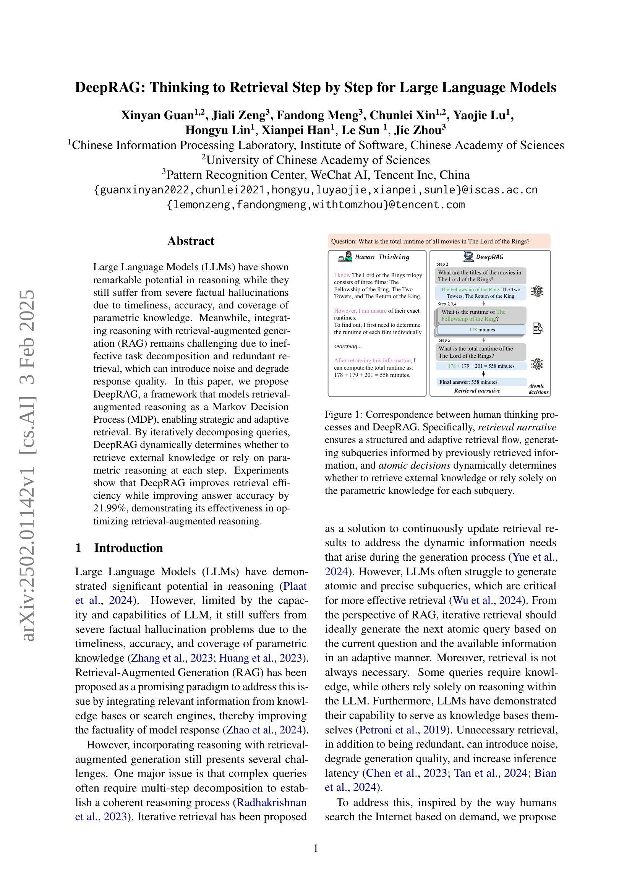
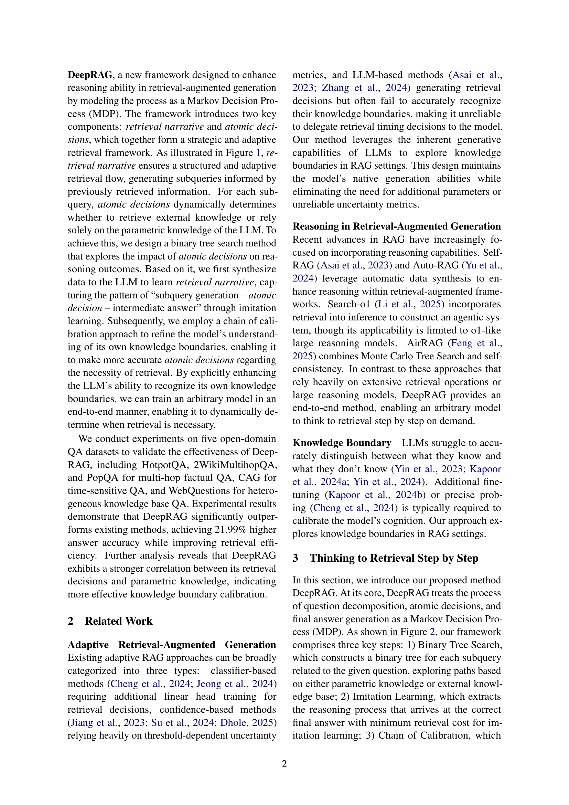
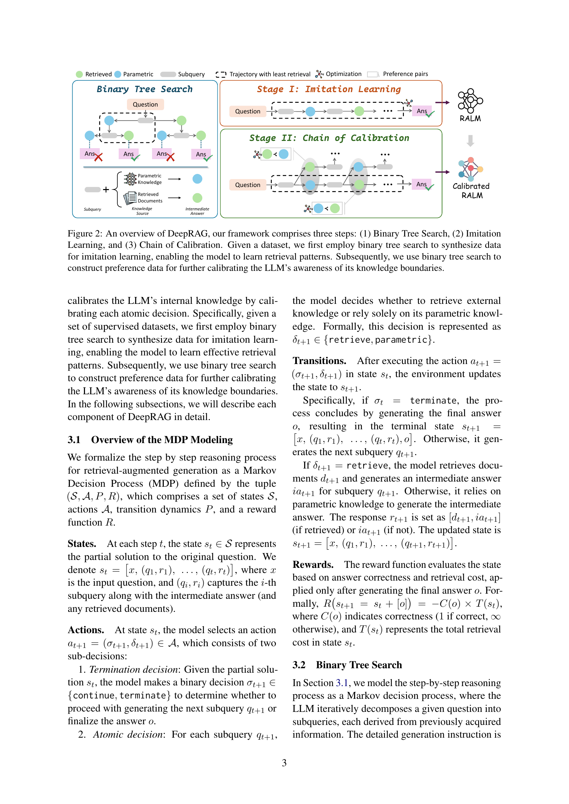
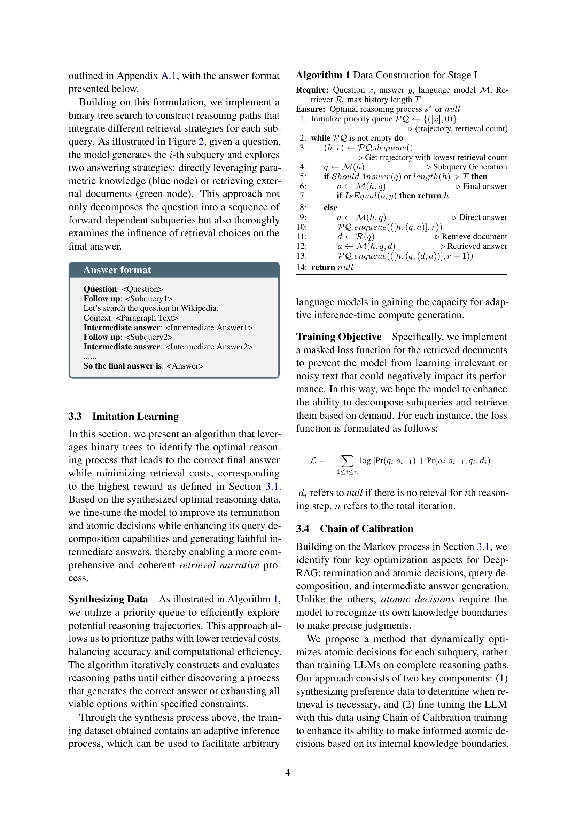
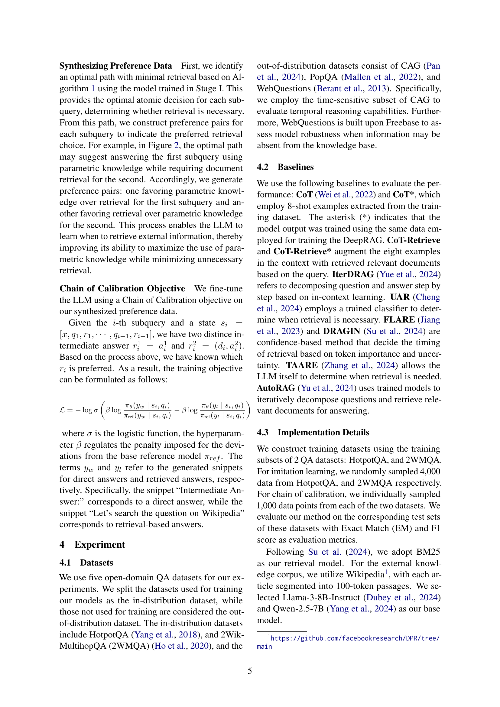
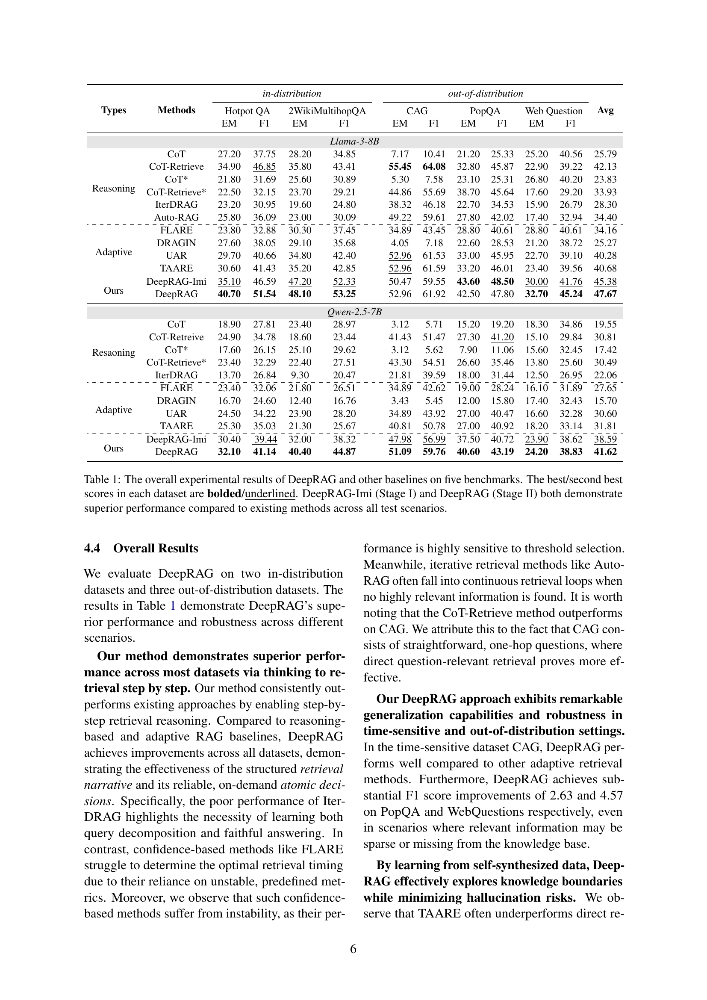
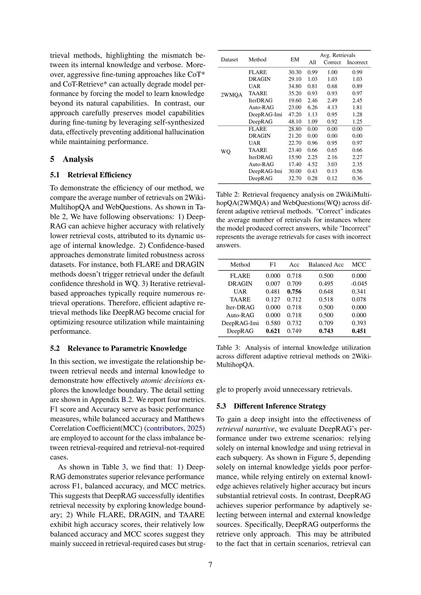
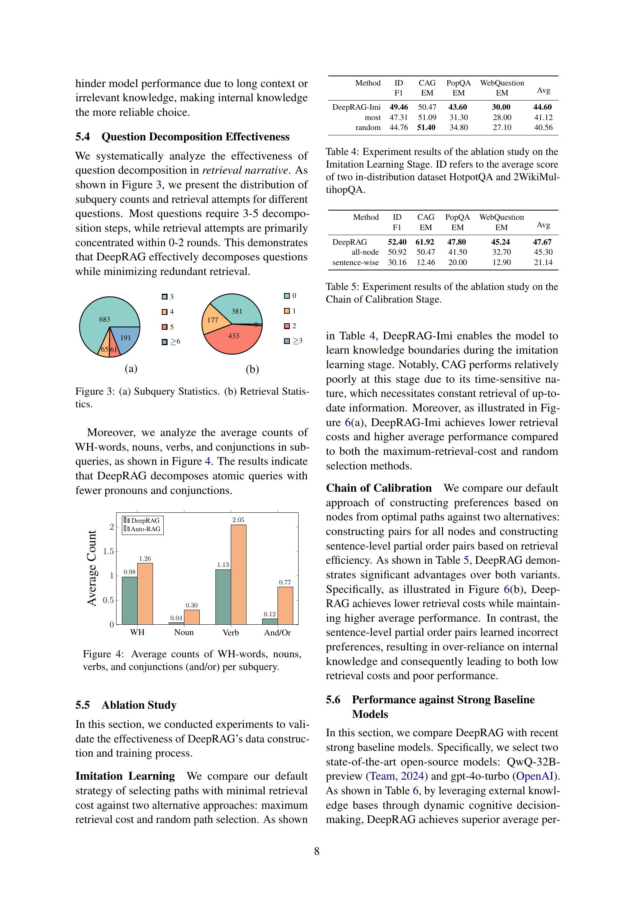
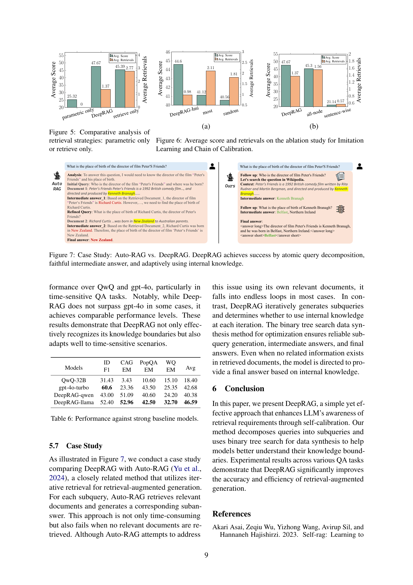
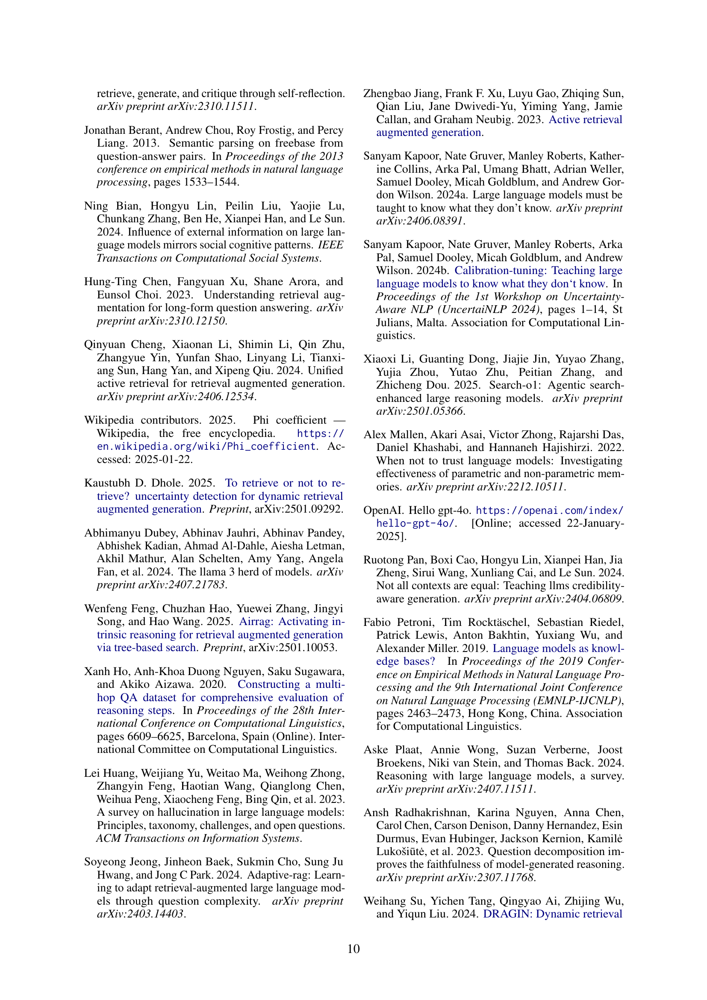
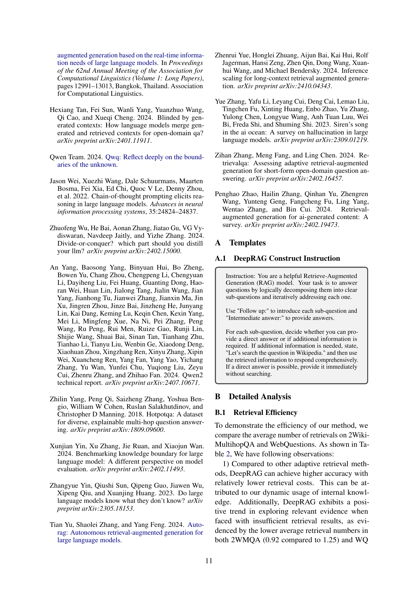
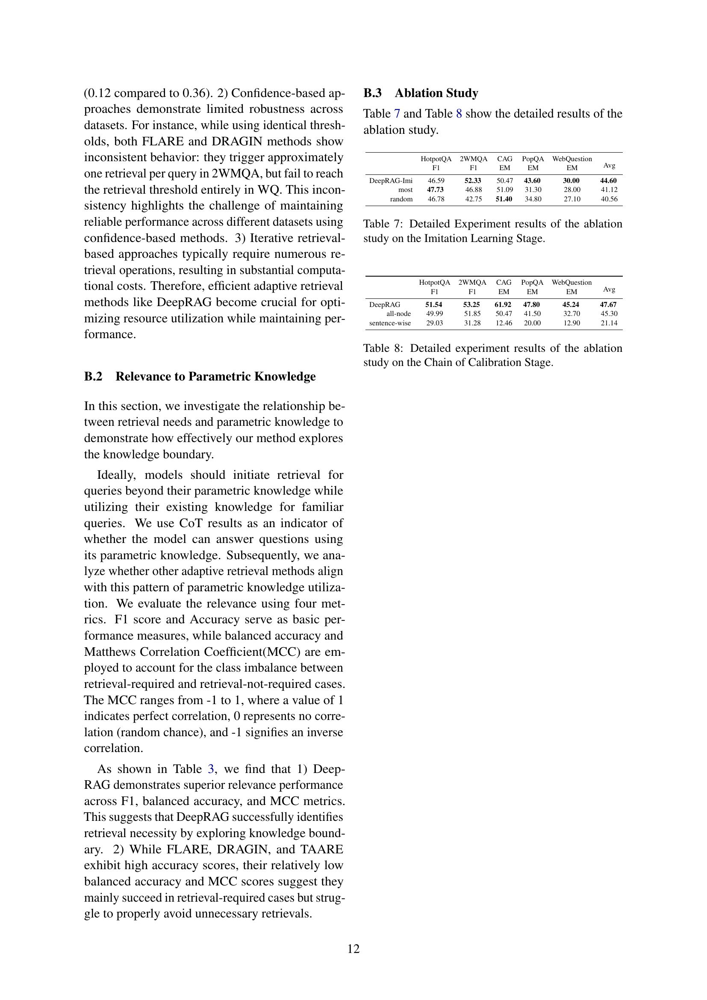
