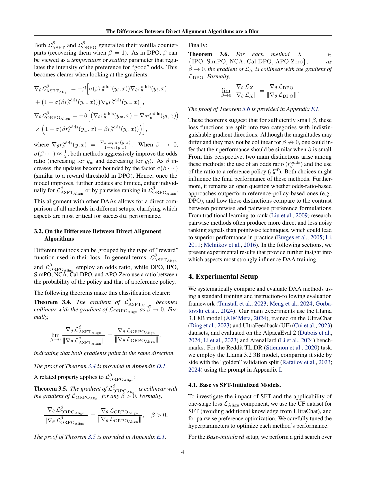
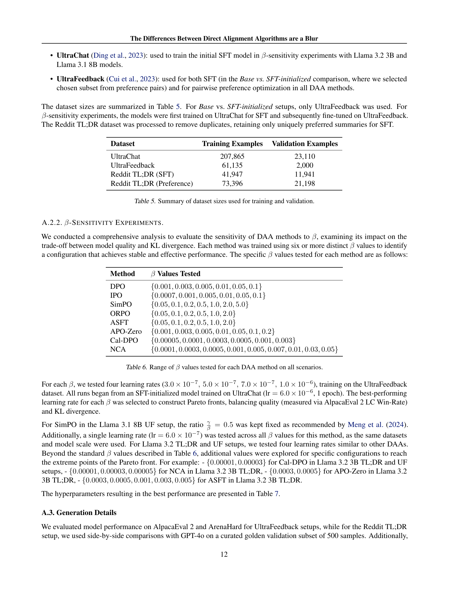

 


 2502.01237 
 Alexey Gorbatovski et el. 
 
 🤗 2025-02-04 
 



↗ arXiv


↗ Hugging Face


### TL;DR



본 논문은 대규모 언어 모델(LLM)을 인간의 가치에 맞추는 과정인 **모델 정렬**에서 최근 주목받고 있는 **직접 정렬 알고리즘(DAA)**에 대한 연구입니다.  기존 DAA들은 이론적 설계, 구현 세부 사항, SFT(Supervised Fine-Tuning) 단계 유무 등에서 차이를 보이며, 이로 인해 성능 비교 및 최적화가 어려웠습니다. 특히, 단일 단계 방식과 2단계 방식의 성능 차이에 대한 명확한 분석이 부족했습니다.

본 연구에서는 **명시적인 SFT 단계를 단일 단계 DAA에 통합**하고, **β 파라미터를 도입**하여 알고리즘을 일반화했습니다. 이를 통해 단일 단계 방법(ORPO, ASFT)의 성능을 2단계 방법 수준으로 향상시켰으며, 성능 차이의 주요 원인이 쌍방향(pairwise) vs. 단일(pointwise) 목적 함수 선택에 있음을 밝혔습니다. 또한, SFT 단계에 사용되는 데이터 양의 영향을 분석하여, **소량의 데이터만으로도 상당한 성능 향상**을 얻을 수 있음을 보였습니다. 이 연구는 DAA의 성능을 향상시키고 최적화하는 데 중요한 통찰력을 제공합니다.



#### Key Takeaways


 단일 단계 DAAλ” 이전에 생각했던 것보다 2단계 DAA보다 성능이 떨어짐 



 SFT 단계와 최적화 파라미터 β를 도입하면 DAAμ 성능을 크게 향상시킬 μ 있음 



 Pairwise 접근 방식이 Pointwise 접근 방식보다 성능이 우수함 


#### Why does it matter?
본 논문은 **다양한 직접 정렬 알고리즘(DAA)의 성능 차이를 체계적으로 분석**하고, **성능 향상을 위한 새로운 방법론을 제시**함으로써, 자연어 모델 정렬 분야의 연구 발전에 크게 기여합니다. 특히, **단일 단계 및 2단계 방법의 차이점을 명확히 밝히고**, **최적화 파라미터 β를 도입**하여 알고리즘의 일반화 및 성능 향상을 이끌어냈다는 점에서 높은 가치를 지닙니다. 또한, **SFT 단계의 중요성과 데이터 크기의 영향**을 실험적으로 검증하여, 향후 연구 방향을 제시하고 있습니다. 이러한 결과는 자연어 모델 정렬 분야의 연구자들에게 실질적인 도움을 줄 뿐만 아니라, 새로운 연구 영역을 개척하는 데 중요한 역할을 할 것으로 기대됩니다.

------
#### Visual Insights

> 🔼 그림 1은 ASFT와 ORPO 알고리즘의 성능에 미치는 β 매개변수의 영향을 보여줍니다. β 매개변수를 조정(3.1.2절 참조)하면 ASFT와 ORPO 알고리즘의 성능이 어떻게 변하는지를 보여주는 그림입니다. Llama 3.2 3B TL;DR 설정에서는 GPT-4 승률을, Llama 3.1 8B UF 시나리오에서는 AlpacaEval 2 LC 승률을 기준으로 결과를 제시합니다.  학습률 등 다른 모든 하이퍼파라미터는 β=1일 때 각 방법의 최적 구성을 기준으로 그리드 검색을 통해 선택되었습니다. 자세한 내용은 5.2절을 참조하십시오.
> 

> 
read the caption

> Figure 1:  Impact of the β𝛽\betaitalic_β Parameter on ASFT and ORPO Alignment Quality. The plot shows how tuning β𝛽\betaitalic_β (Section 3.1.2) affects both ASFT and ORPO performance. Results are reported for GPT-4 Win Rate in the Llama 3.2 3B TL;DR setup and for AlpacaEval 2 LC Win Rate in the Llama 3.1 8B UF scenario. All other hyperparameters (e.g., learning rates) are selected via grid search, using each method’s best configuration at β=1𝛽1\beta=1italic_β = 1 as the baseline. See Section 5.2 for more details.
> 


| Win / Tie / Lose Rate % |
|---|---|---|
| 35.6 / 4.8 / **59.6** | 91.2 / 1.0 / 7.8  |  91.4 / 0.4 / 8.2 |
| 91.6 / 0.2 / 8.2 | 90.2 / 0.6 / 9.2 | 92.6 / 0.6 / 6.8 |
| 91.8 / 1.0 / 7.2 | 91.4 / 0.4 / 8.2 | 87.2 / 1.0 / 11.8 |

> 🔼 표 1은 Llama 3.1 8B 모델과 UF 데이터셋을 사용한 기본 및 SFT 초기화 정렬 알고리즘을 보여줍니다. SFT 초기화 방법은 기존의 ℒSFT가 없는 방법에 비해 더 나은 성능을 보여줍니다. † 표시는 최적의 하이퍼파라미터(ORPO의 경우 lr=1×10⁻⁶, ASFT의 경우 lr=7×10⁻⁷)를 사용하여 ℒSFT로 학습한 결과를 나타냅니다. 다른 설정의 경우 최적 하이퍼파라미터는 표준 SFT ORPO/ASFT에 대해 lr=5×10⁻⁷, 기본 ORPO/ASFT에 대해 lr=1×10⁻⁵/6×10⁻⁶입니다.
> 

> 
read the caption

> Table 1: Base and SFT-initialized alignment methods on the Llama 3.1 8B model with the UF dataset. SFT-initialized methods demonstrate better performance compared to their traditional formulations without ℒSFTsubscriptℒSFT\mathcal{L}_{\mathrm{SFT}}caligraphic_L start_POSTSUBSCRIPT roman_SFT end_POSTSUBSCRIPT. Results marked with ††{\dagger}† correspond to training with ℒSFTsubscriptℒSFT\mathcal{L}_{\mathrm{SFT}}caligraphic_L start_POSTSUBSCRIPT roman_SFT end_POSTSUBSCRIPT, using the best hyperparameters: lr=1×10−6lr1superscript106\text{lr}=1\times 10^{-6}lr = 1 × 10 start_POSTSUPERSCRIPT - 6 end_POSTSUPERSCRIPT for ORPO and lr=7×10−7lr7superscript107\text{lr}=7\times 10^{-7}lr = 7 × 10 start_POSTSUPERSCRIPT - 7 end_POSTSUPERSCRIPT for ASFT. For other setups, the best hyperparameters are: lr=5×10−7lr5superscript107\text{lr}=5\times 10^{-7}lr = 5 × 10 start_POSTSUPERSCRIPT - 7 end_POSTSUPERSCRIPT for standard SFT ORPO/ASFT, and lr=1×10−5lr1superscript105\text{lr}=1\times 10^{-5}lr = 1 × 10 start_POSTSUPERSCRIPT - 5 end_POSTSUPERSCRIPT/6×10−66superscript1066\times 10^{-6}6 × 10 start_POSTSUPERSCRIPT - 6 end_POSTSUPERSCRIPT for Base ORPO/ASFT.
> 

### In-depth insights

#### DAA Taxonomy
본 논문에서는 다양한 직접 정렬 알고리즘(Direct Alignment Algorithm, DAA)들을 **세 가지 주요 특징**을 중심으로 분류하는 체계적인 분류법, 즉 DAA 분류 체계를 제시합니다. 첫째, **손실 함수의 종류**에 따른 분류로, 쌍별 순위 매기기(pairwise) 손실과 점별(pointwise) 손실 함수로 나눕니다. 둘째, **보상의 유형**에 따른 분류로, 명시적인 보상 함수를 사용하는 방법과 암시적인 보상 함수를 사용하는 방법으로 구분합니다. 마지막으로, **학습 단계**의 유무에 따라 단일 단계(one-stage)와 2단계(two-stage) 방법으로 분류합니다. 이러한 다차원적 분류를 통해 각 DAA의 강점과 약점을 명확히 파악하고, **알고리즘 선택에 대한 유용한 지침**을 제공합니다. 특히, SFT(Supervised Fine-Tuning) 단계의 유무가 성능에 미치는 영향과 쌍별 대 점별 손실 함수 선택의 중요성을 강조하며,  **알고리즘 성능 비교의 중요성**을 다시 한번 상기시켜 줍니다.  **보다 효율적이고 정확한 언어 모델 정렬**을 위한 연구 방향을 제시하는 데 중요한 역할을 합니다.

#### SFT's Impact
본 논문은 SFT(Supervised Fine-Tuning)의 영향을 다각적으로 분석합니다. **단계적 접근법에서 SFT는 성능 향상에 필수적임을 보여줍니다.**  SFT 단계를 거친 후에 직접 정렬 알고리즘(DAA)을 적용하면 ORPO와 ASFT 모두 성능이 크게 향상되는 것을 확인했습니다.  흥미로운 점은 **SFT에 전체 데이터셋을 사용할 필요가 없다는 점**입니다.  일부 데이터만으로도 상당한 성능 향상을 얻을 수 있으며, 계산 비용을 절감하는 효과를 가져옵니다.  이러한 결과는 **SFT 단계의 중요성**과 더불어, 효율적인 SFT 전략의 가능성을 시사합니다.  **데이터 크기와 SFT의 상관관계**를 명확히 규명하여, 향후 연구 방향을 제시하는데 큰 기여를 할 것입니다.

#### Beta Tuning
본 논문에서 "베타 튜닝"이라는 개념은 명시적으로 제시되지 않았지만, 베타(β) 파라미터를 활용한 ASFT와 ORPO 알고리즘의 성능 향상에 대한 분석에서 유추할 수 있습니다.  **베타 파라미터는 선호도 최적화의 강도를 제어하는 역할**을 하며, 이를 통해 단일 단계 방법론인 ASFT와 ORPO의 성능을 기존의 이단계 방법론(DPO 등)과 유사한 수준까지 끌어올렸다는 점이 중요합니다. **베타 값을 조절함으로써 선호도를 더욱 공격적으로(작은 베타 값) 또는 완화적으로(큰 베타 값) 최적화**할 수 있으며, 이는 모델의 성능과 일반화 능력 사이의 균형을 맞추는 데 중요한 역할을 합니다.  **베타 튜닝은 단순한 하이퍼파라미터 튜닝을 넘어, 모델의 학습 동역학에 대한 심층적인 이해를 바탕으로 최적의 성능을 도출하는 중요한 과정**임을 시사합니다.  실험 결과를 통해 확인된 바와 같이, 베타 값의 적절한 조정은 ASFT와 ORPO의 성능을 크게 향상시키는 효과가 있으며, 이는 향후 다양한 직접 정렬 알고리즘의 설계 및 최적화에 중요한 시사점을 제공합니다.  **베타 튜닝을 통해 얻은 결과는 단순히 성능 개선에 그치지 않고,  직접 정렬 알고리즘의 설계 원리와 성능 향상 전략에 대한 귀중한 통찰력을 제공**해 줍니다.

#### Pairwise vs. Pointwise
본 논문에서 저자들은 **Pairwise 접근 방식**과 **Pointwise 접근 방식** 간의 차이점을 면밀히 조사하여 언어 모델 정렬의 맥락에서 각 접근 방식의 강점과 약점을 심층적으로 분석합니다.  Pairwise 방법은 두 샘플 간의 상대적 선호도를 직접적으로 최적화하는 반면, Pointwise 방법은 개별 샘플의 절대적 점수를 최적화합니다.  **Pairwise 방법**은 상대적 순위를 더 잘 포착하지만, 계산 비용이 더 많이 들 수 있습니다. 반면에 **Pointwise 방법**은 계산 효율성이 높지만, 상대적 순위 정보를 덜 정확하게 반영할 수 있습니다. 이러한 차이점은 다양한 데이터 크기 및 모델 용량에 따라 다른 영향을 미치며, **데이터 크기가 증가함에 따라 pairwise 방법의 우수성이 더욱 두드러지게 나타납니다.**  저자들은 실험 결과를 통해 이러한 주장을 뒷받침하고, **특정 문제 및 모델 아키텍처에 가장 적합한 접근 방식**을 선택하는 데 도움이 되는 지침을 제공합니다.

#### Future Work
본 논문은 다양한 직접 정렬 알고리즘(DAA)을 포괄적으로 분석하고 비교하여, **짝 비교 방식이 점수 비교 방식보다 우수하며, 특히 대규모 모델에서 더욱 효과적**임을 보여줍니다.  하지만, 본 연구는 제한된 데이터셋과 모델 크기에 의존하며, GPT 기반 평가의 편향성이 존재합니다. 따라서 **향후 연구는 다양한 데이터셋과 모델 크기를 사용하여 일반화 성능을 검증**하고, **더욱 객관적인 평가 지표를 개발**해야 합니다. 또한, **단일 단계와 2단계 방법의 성능 차이에 대한 심층적 분석**을 통해 각 방법의 장단점을 명확히 파악하고, **모델의 용량과 DAA의 유형 간 상호 작용**을 규명하는 연구가 필요합니다.  **다양한 하이퍼파라미터 최적화 전략**을 비교분석하고, **비용 효율적인 SFT 데이터 사용 전략**을 연구하여 실제 적용 가능성을 높여야 합니다.  마지막으로, **다른 정렬 방법들과의 비교 연구**를 통해 DAA의 장점과 한계를 명확히 밝히는 것이 중요합니다.

### More visual insights

More on figures

> 🔼 그림 2는 Llama 3.2 3B 모델을 사용하여 Reddit TL;DR 요약 작업에 대한 GPT-4 평가 결과를 보여줍니다. 여러 정렬 알고리즘(행)이 최적의 하이퍼파라미터를 사용하여 비교되었으며, 각 알고리즘은 간결하고 정확한 요약을 생성하는 것을 목표로 합니다. 대부분의 알고리즘이 90% 이상의 승률을 기록한 반면, ASFT는 87.2%의 승률을 기록하여 견고한 요약 성능을 유지했습니다. 자세한 내용은 5.2절을 참조하십시오.
> 

> 
read the caption

> Figure 2: GPT-4 Evaluation of Llama 3.2 3B TL;DR setup. The comparison shows multiple alignment methods (rows) using their best hyperparameters, where each approach aims to generate concise and accurate summaries. Most methods exceed 90% Win Rate; ASFT achieves 87.2%, maintaining robust summarization performance. See Section 5.2 for more details.
> 

> 🔼 그림 3은 Llama 3.1 8B UF 모델을 AlpacaEval 2 LC 지표로 평가한 결과를 보여주는 파레토 프런트입니다.  수평축은 기준 모델과의 KL 발산을 나타내고, 수직축은 정렬 성능(LC 값)을 나타냅니다.  그림에서 알 수 있듯이, 짝 비교 방식(pairwise)을 사용한 방법들이 점 비교 방식(pointwise)을 사용한 방법들보다 더 높은 LC 값을 달성했습니다.  하지만 신뢰 구간이 겹치는 부분이 있어 통계적으로 유의미한 차이가 있다고 단정할 수는 없습니다. 자세한 내용은 본문 5.3절을 참조하세요.
> 

> 
read the caption

> Figure 3: Pareto front for alignment quality and KL divergence. Results for Llama 3.1 8B UF on AlpacaEval 2 LC. Methods are grouped into pairwise and pointwise categories, with pairwise achieving higher LC values while remaining within overlapping confidence intervals. See Section 5.3 for more details.
> 

More on tables


| Init | Method | LC% (std) | WR% (std) | AH% (CI) |
|---|---|---|---|---|
| Base | SFT | 6.7 (0.43) | 4.5 (0.63) | 3.5 (-0.7, 0.8) |
| SFT | ORPO | **24.1** (0.84) | **17.8** (1.17) | **15.3** (-1.6, 1.8) |
| SFT | ASFT | 16.4 (0.72) | 11.9 (0.99) | 10.6 (-1.2, 1.3) |
| Base | ORPO | 14.8 (0.71) | 10.3 (0.95) | 8.4 (-1.3, 1.3) |
| Base | ASFT | 14.5 (0.73) | 10.2 (0.94) | 7.5 (-1.1, 1.2) |
| SFT | ORPO† | 13.4 (0.69) | 9.3 (0.91) | 7.7 (-0.9, 1.1) |
| SFT | ASFT† | 11.4 (0.63) | 7.5 (0.83) | 7.5 (-1.1, 1.1) |
| SFT | DPO | **23.4** (0.85) | **20.0** (1.18) | **17.5** (-1.8, 1.8) |
> 🔼 표 2는 Llama 3.2 3B 및 Llama 3.1 8B 모델에 대한 AlpacaEval 2 및 ArenaHard 평가 결과를 보여줍니다.  SFT(Supervised Fine-Tuning) 모델은 UltraChat 데이터셋으로 학습되었습니다. 각 방법에 대한 최적의 하이퍼파라미터는 4.2절에 따라 선택되었습니다.  굵은 값은 각 벤치마크에서 최고 성능을 나타내고, 밑줄 친 값은 두 번째로 높은 성능을 나타냅니다. 자세한 내용은 5.3절을 참조하십시오.
> 

> 
read the caption

> Table 2: AlpacaEval 2 and ArenaHard Results for Llama 3.2 3B and Llama 3.1 8B UF. The SFT model was trained on the UltraChat dataset. The best hyperparameters for each method were selected according to Section 4.2. Bold values indicate the best performance for each benchmark, while underlined values represent the second-best performance. See Section 5.3 for more details.
> 


| Method | Llama 3.2 3B UF |  |  | Llama 3.1 8B UF |  |  |
|---|---|---|---|---|---|---|
|  | AlpacaEval 2 | ArenaHard |  | AlpacaEval 2 | ArenaHard |  |
|---|---|---|---|---|---|---|
|  | LC% (std) | WR% (std) | WR% (CI) | LC% (std) | WR% (std) | WR% (CI) |
|---|---|---|---|---|---|---|
| SFT | 5.02 (0.34) | 3.21 (0.55) | 1.4 (-0.4, 0.4) | 10.27 (0.54) | 5.44 (0.70) | 2.6 (-0.5, 0.6) |
| DPO | 11.43 (0.58) | 11.79 (0.99) | 6.8 (-1.0, 0.9) | 26.82 (0.77) | 23.69 (1.25) | 19.0 (-1.9, 1.8) |
| IPO | 11.24 (0.60) | 11.67 (1.01) | 6.8 (-1.0, 1.1) | 28.18 (0.83) | 24.43 (1.26) | 19.1 (-1.6, 1.5) |
| SimPO | 10.56 (0.44) | 11.94 (0.95) | 6.4 (-1.0, 1.1) | 27.65 (0.77) | 25.62 (1.29) | 21.5 (-1.9, 1.9) |
| ORPO | 10.67 (0.50) | 12.23 (0.97) | 6.6 (-1.0, 1.1) | 28.25 (0.71) | 28.59 (1.33) | 20.9 (-2.0, 2.0) |
| APO Zero | 10.36 (0.53) | 11.22 (0.98) | 6.0 (-1.0, 0.9) | 23.15 (0.76) | 19.03 (1.18) | 17.3 (-1.8, 1.8) |
| NCA | 10.33 (0.53) | 11.02 (0.97) | 5.1 (-0.7, 0.8) | 23.21 (0.80) | 18.67 (1.17) | 15.1 (-1.5, 1.6) |
| Cal-DPO | 10.62 (0.57) | 10.15 (0.94) | 4.8 (-0.9, 0.9) | 23.19 (0.82) | 18.85 (1.18) | 15.2 (-1.5, 1.6) |
| ASFT | 10.63 (0.55) | 9.21 (0.88) | 5.1 (-0.9, 0.9) | 20.82 (0.79) | 16.34 (1.13) | 13.5 (-1.6, 1.5) |
> 🔼 이 표는 다양한 직접 정렬 알고리즘(Direct Alignment Algorithms, DAAs)들이 원래 제시되었을 때 길이 기반 확률 정규화(length-based probability normalization)를 사용했는지 여부를 보여줍니다.  ✓는 길이 기반 정규화를 사용했음을, ✗는 사용하지 않았음을 의미합니다.  표를 통해 각 알고리즘의 원래 설계에서의 차이점을 명확히 이해할 수 있습니다.
> 

> 
read the caption

> Table 3: Methods that include (✓) or omit (✗) length-based probability normalization in their original formulation.
> 


| Method | Use normalization |
|---|---| 
| DPO (Rafailov et al., 2023) | ✗ |
| IPO (Azar et al., 2023) | ✗ |
| SimPO (Meng et al., 2024) | ✓ |
| NCA (Chen et al., 2024) | ✗ |
| Cal-DPO (Xiao et al., 2024) | ✗ |
| APO-Zero (D’Oosterlinck et al., 2024) | ✗ |
| ORPO (Hong et al., 2024) | ✓ |
| ASFT (Wang et al., 2024) | ✓ |
> 🔼 이 표는 Llama 3.2 3B 및 Llama 3.1 8B 모델에 대한 대표적인 훈련 하이퍼파라미터를 보여줍니다.  표에는 최대 토큰 길이, 에포크 수, 학습률(SFT, 기본 초기화, 정렬), 최적화기, 옵티마이저의 하이퍼파라미터(Adam β1, β2), 배치 크기, 학습 일정, 웜업 비율, 최대 그래디언트 놈, 메모리 최적화, 어텐션 메커니즘 등 다양한 하이퍼파라미터가 포함되어 있습니다. 이러한 하이퍼파라미터는 Llama 모델을 훈련하는 데 사용된 설정을 자세히 설명하여 재현성을 높이는 데 도움이 됩니다.
> 

> 
read the caption

> Table 4: Representative training hyperparameters for Llama 3.2 3B and Llama 3.1 8B models.
> 


| Hyperparameter | Value |
|---|---| 
| Max Tokens Length | 1024 (TL;DR setup), 4096 (UF setup) |
| Epochs | 1 (or 2 when specified) |
| Learning Rate (SFT) | 6.0 × 10-6 |
| Learning Rate (Base Init.) | {6.0 × 10-6, 8.0 × 10-6, 1.0 × 10-5} |
| Learning Rate (Alignment) | {3.0 × 10-7, 5.0 × 10-7, 7.0 × 10-7, 1.0 × 10-6} |
| Optimizer | Adam (Kingma & Ba, 2014) |
| Adam β1 | 0.9 |
| Adam β2 | 0.95 |
| Batch Size | 128 |
| Learning Schedule | Linear Decay |
| Warm-up Ratio | 0.03 |
| Max Gradient Norm | 2 |
| Memory Optimization | DeepSpeed (Rasley et al., 2020) |
| Attention Mechanism | Flash Attention 2 (Dao, 2023) |
> 🔼 이 표는 본 논문에서 사용된 세 가지 데이터셋(UltraChat, UltraFeedback, Reddit TL;DR)의 크기를 요약하여 보여줍니다. 각 데이터셋은 훈련과 검증에 사용된 예제의 수를 나타냅니다. Reddit TL;DR 데이터셋은 SFT(Supervised Fine-Tuning)와 선호도(Preference) 평가에 각각 다른 크기의 데이터가 사용되었음을 보여줍니다.
> 

> 
read the caption

> Table 5: Summary of dataset sizes used for training and validation.
> 


| Dataset | Training Examples | Validation Examples |
|---|---|---|
| UltraChat | 207,865 | 23,110 |
| UltraFeedback | 61,135 | 2,000 |
| Reddit TL;DR (SFT) | 41,947 | 11,941 |
| Reddit TL;DR (Preference) | 73,396 | 21,198 |
> 🔼 이 표는 논문의 실험 설정에서 다양한 직접 정렬 알고리즘(DAA)에 대해 테스트된 β 값의 범위를 보여줍니다. 각 DAA 메서드에 대해 여러 개의 β 값을 사용하여 성능과 KL 발산 간의 절충을 조사했습니다.  β 값은 각 알고리즘의 최적 성능을 찾기 위해 신중하게 선택되었습니다.
> 

> 
read the caption

> Table 6: Range of β𝛽\betaitalic_β values tested for each DAA method on all scenarios.
> 


| Method | \beta Values Tested |
|---|---| 
| DPO | {0.001, 0.003, 0.005, 0.01, 0.05, 0.1} |
| IPO | {0.0007, 0.001, 0.005, 0.01, 0.05, 0.1} |
| SimPO | {0.05, 0.1, 0.2, 0.5, 1.0, 2.0, 5.0} |
| ORPO | {0.05, 0.1, 0.2, 0.5, 1.0, 2.0} |
| ASFT | {0.05, 0.1, 0.2, 0.5, 1.0, 2.0} |
| APO-Zero | {0.001, 0.003, 0.005, 0.01, 0.05, 0.1, 0.2} |
| Cal-DPO | {0.00005, 0.0001, 0.0003, 0.0005, 0.001, 0.003} |
| NCA | {0.0001, 0.0003, 0.0005, 0.001, 0.005, 0.007, 0.01, 0.03, 0.05} |
> 🔼 표 7은 세 가지 다른 설정(Llama 3.2 3B TL;DR, Llama 3.2 3B UF, Llama 3.1 8B UF)에서 다양한 직접 정렬 알고리즘(DAA)에 대해 최적의 하이퍼파라미터를 보여줍니다. 각 DAA 방법과 설정에 대해 최상의 성능을 달성한 학습률과 베타(β) 값을 확인할 수 있습니다. 이 표는 각 알고리즘의 성능을 최적화하는 데 사용된 구체적인 하이퍼파라미터 설정을 이해하는 데 도움이 됩니다.
> 

> 
read the caption

> Table 7: Best hyperparameters for each DAA method across setups.
> 


Method | Llama 3.2 3B TL;DR |  | Llama 3.2 3B UF |  | Llama 3.1 8B UF |  | 
---|---|---|---|---|---|---
DPO | 7.0x10^-7 | 0.05 | 1.0x10^-6 | 0.01 | 1.0x10^-6 | 0.003 
IPO | 1.0x10^-6 | 0.005 | 7.0x10^-7 | 0.001 | 1.0x10^-6 | 0.001 
SimPO | 3.0x10^-7 | 0.5 | 7.0x10^-7 | 1.0 | 6.0x10^-7 | 1.0 
ORPO | 3.0x10^-7 | 0.5 | 5.0x10^-7 | 0.2 | 5.0x10^-7 | 0.5 
ASFT | 3.0x10^-7 | 0.001 | 1.0x10^-6 | 0.2 | 7.0x10^-7 | 0.1 
APO Zero | 3.0x10^-7 | 0.001 | 3.0x10^-7 | 0.005 | 3.0x10^-7 | 0.003 
NCA | 3.0x10^-7 | 0.0001 | 3.0x10^-7 | 0.0005 | 3.0x10^-7 | 0.0003 
Cal-DPO | 3.0x10^-7 | 0.00003 | 5.0x10^-7 | 0.0003 | 3.0x10^-7 | 0.0003
> 🔼 이 표는 Llama 3.1 8B 및 Llama 3.2 3B 모델에 사용된 텍스트 생성 관련 하이퍼파라미터들을 보여줍니다.  구체적으로는 온도(temperature), Top-k, Top-p 및 최대 토큰 수(Max New Tokens) 등의 값들이 포함되어 있으며,  Llama 3.1 8B와 Llama 3.2 3B 모델 각각에 대해 서로 다른 설정이 있음을 확인할 수 있습니다. 이 하이퍼파라미터들은 모델이 텍스트를 생성하는 방식에 영향을 미치는 중요한 요소들입니다.  예를 들어, 온도가 높을수록 생성되는 텍스트는 더욱 다양하고 예측 불가능해지는 반면, Top-k나 Top-p는 생성 과정의 무작위성을 조절하는 역할을 합니다.  최대 토큰 수는 생성되는 텍스트의 최대 길이를 제한합니다.
> 

> 
read the caption

> Table 8: Generation hyperparameters for Llama 3.1 8B and Llama 3.2 3B models.
> 

### Full paper



