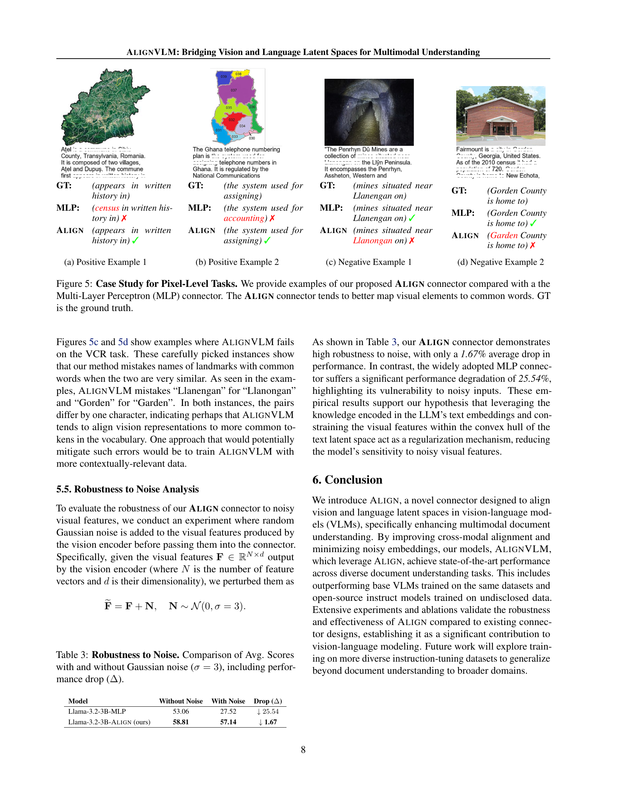

 


 2502.01341 
 Ahmed Masry et el. 
 
 🤗 2025-02-04 
 



↗ arXiv


↗ Hugging Face


### TL;DR



기존의 비전-언어 모델(VLM)은 시각적 특징과 언어 임베딩을 효과적으로 정렬하는 데 어려움을 겪어 왔습니다. 특히, 딥 퓨전 방식은 계산 비용이 높고, 섀로우 퓨전 방식은 모달 간 불일치 문제를 야기했습니다. 이러한 문제를 해결하기 위해 본 논문에서는 ALIGNVLM이라는 새로운 VLM을 제시합니다.

ALIGNVLM은 **ALIGN이라는 혁신적인 연결 모듈**을 사용하여 시각적 특징을 LLM의 기존 사전 훈련된 어휘 임베딩의 확률 분포로 매핑하고, 이를 가중 평균하여 LLM 입력으로 사용합니다. 이는 **LLM의 언어적 사전 정보**를 활용하여 시각적 특징이 LLM이 효과적으로 해석할 수 있는 영역에 매핑되도록 보장합니다. 실험 결과, ALIGNVLM은 기존 방법보다 우수한 성능을 보였으며, 특히 문서 이해 작업에서 탁월한 성능을 보였습니다.



#### Key Takeaways


 ALIGNVLM은 시각적 특징과 언어 임베딩의 효과적인 정렬을 통해 멀티모달 문서 이해 작업에서 최첨단 성능을 달성했습니다. 



 기존의 딥 퓨전 및 섀로우 퓨전 방식의 한계를 극복하는 새로운 ALIGN 모듈을 제시했습니다. 



 다양한 모델 크기와 벤치마크에서 ALIGNVLM의 강건성과 효율성을 실험적으로 입증했습니다. 


#### Why does it matter?
본 논문은 **시각 및 언어 데이터를 효과적으로 통합하는 새로운 접근 방식**을 제시하여 다양한 문서 이해 작업에서 최첨단 성능을 달성함으로써 멀티모달 AI 연구에 중요한 기여를 합니다. 이는 **현재 멀티모달 모델링 연구의 주요 과제인 모달 간 정렬 문제**에 대한 효과적인 해결책을 제공하며, 향후 연구를 위한 새로운 방향을 제시합니다. 특히, **비효율적인 딥 퓨전 기법과 오류 발생 가능성이 높은 섀로우 퓨전 기법을 극복**하는 대안을 제시하여 멀티모달 모델링의 효율성 및 정확성 향상에 크게 기여할 것으로 예상됩니다.

------
#### Visual Insights

> 🔼 그림 1은 다양한 VLM 커넥터의 성능을 비교 분석한 결과를 보여줍니다. 제안된 Align 커넥터는 동일한 훈련 설정을 사용하는 다른 방법들보다 모든 벤치마크에서 우수한 성능을 보였습니다. 원형 그래프에서 반지름은 최대 점수에 대한 비율을 나타내며, 0.7에서 잘립니다. 검은 점은 잘린 부분을 나타냅니다. 이 그림은 Align 커넥터가 다양한 비전-언어 모델(VLMs) 연결 방식 중에서 가장 효과적임을 시각적으로 보여줍니다.
> 

> 
read the caption

> Figure 1: Performance of Different VLM Connectors. The proposed Align connector outperforms other methods across benchmarks using the same training configuration. Radial distance is proportion of maximal score, truncated at 0.70.70.70.7 (black dot).
> 


| Model | DocVQA VAL | InfoVQA VAL | DeepForm TEST | KLC TEST | WTQ TEST | TabFact TEST | ChartQA TEST | TextVQA VAL | TableVQA TEST | Avg. Score |
|---|---|---|---|---|---|---|---|---|---|---|
| **Closed-Source VLMs** |  |  |  |  |  |  |  |  |  |  |
| (*Opaque Training Data*) |  |  |  |  |  |  |  |  |  |  |
| Claude-3.5 Sonnet | 88.48 | 59.05 | 31.41 | 24.82 | 47.13 | 53.48 | 51.84 | **71.42** | **81.27** | 56.54 |
| GeminiPro-1.5 | 91.23 | **73.94** | 32.16 | 24.07 | **50.29** | 71.22 | 34.68 | 68.16 | 80.43 | 58.46 |
| GPT-4o 20240806 | **92.80** | 66.37 | **38.39** | **29.92** | 46.63 | **81.10** | **85.70** | 70.46 | 72.87 | **64.91** |
| **Open-Source Instruct VLMs** |  |  |  |  |  |  |  |  |  |  |
| (*Semi-Opaque Training Data*) |  |  |  |  |  |  |  |  |  |  |
| Janus-1.3B [Wu et al., 2024a] | 30.15 | 17.09 | 0.62 | 15.06 | 9.30 | 51.34 | 57.20 | 51.97 | 18.67 | 27.93 |
| Qwen2-VL-2B [Wang et al., 2024] | **89.16** | **64.11** | 32.38 | 25.18 | 38.20 | 57.21 | 73.40 | 79.90 | 43.07 | **55.84** |
| InternVL-2.5-2B [Chen et al., 2024b] | 87.70 | 61.85 | 13.14 | 16.58 | 36.33 | 57.26 | 74.96 | 76.85 | 42.20 | 51.87 |
| DeepSeek-VL2-Tiny-3.4B [Wu et al., 2024b] | 88.57 | 63.88 | 25.11 | 19.04 | 35.07 | 52.15 | 80.92 | **80.48** | 56.30 | 55.72 |
| Phi3.5-Vision-4B [Abdin et al., 2024] | 86.00 | 56.20 | 10.47 | 7.49 | 17.18 | 30.43 | **82.16** | 73.12 | **70.70** | 48.19 |
| Qwen2-VL-7B [Wang et al., 2024] | **93.83** | **76.12** | 34.55 | 23.37 | **52.52** | 74.68 | **83.16** | **84.48** | **53.97** | **64.08** |
| LLaVA-NeXT-7B [Xu et al., 2024] | 63.51 | 30.90 | 1.30 | 5.35 | 20.06 | 52.83 | 52.12 | 65.10 | 32.87 | 36.00 |
| DocOwl1.5-8B [Hu et al., 2024] | 80.73 | 49.94 | **68.84** | **37.99** | 38.87 | **79.67** | 68.56 | 68.91 | 52.60 | 60.68 |
| InternVL-2.5-8B [Chen et al., 2024b] | 91.98 | 75.36 | 34.55 | 22.31 | 50.33 | 74.75 | 82.84 | 79.00 | 52.10 | 62.58 |
| Ovis-1.6-Gemma2-9B [Lu et al., 2024] | 88.84 | 73.97 | 45.16 | 23.91 | 50.72 | 76.66 | 81.40 | 77.73 | 48.33 | 62.96 |
| Llama3.2-11B [Grattafiori et al., 2024] | 82.71 | 36.62 | 1.78 | 3.47 | 23.03 | 58.33 | 23.80 | 54.28 | 22.40 | 34.04 |
| Pixtral-12B [Agrawal et al., 2024] | 87.67 | 49.45 | 27.37 | 24.07 | 45.18 | 73.53 | 71.80 | 76.09 | 67.13 | 58.03 |
| **Document Understanding Instructed Models** |  |  |  |  |  |  |  |  |  |  |
| (*Instruction Tuned on BigDocs-7.5M + DocDownStream [Rodriguez et al., 2024a; Hu et al., 2024]*) |  |  |  |  |  |  |  |  |  |  |
| Qwen2-VL-2B (base+) [Qwen et al., 2025] | 57.23 | 31.88 | 49.31 | 34.39 | 31.61 | 64.75 | 68.60 | **61.01** | 47.53 | 49.59 |
| **AlignVLM-Llama-3.2-1B (ours)** | 72.42 | 38.16 | 60.47 | 33.71 | 28.66 | 71.31 | 65.44 | 48.81 | 50.29 | 52.14 |
| **AlignVLM-Llama-3.2-3B (ours)** | **79.63** | **44.53** | **63.49** | **35.25** | **38.59** | **78.51** | **71.88** | 57.38 | **60.10** | **58.81** |
| DocOwl1.5-8B (base+) [Hu et al., 2024] | 78.70 | 47.62 | 64.39 | 36.93 | 35.69 | 72.65 | 65.80 | 67.30 | 49.03 | 57.56 |
| Llama3.2-11B (base+) [Grattafiori et al., 2024] | 78.99 | 44.27 | **67.05** | **37.22** | 40.18 | 78.04 | 71.40 | **68.46** | 56.73 | 60.26 |
| **AlignVLM-Llama-3.1-8B (ours)** | **81.18** | **53.75** | 63.25 | 35.50 | **45.31** | **83.04** | **75.00** | 64.60 | **64.33** | **62.88** |

> 🔼 표 1은 일반적인 문서 벤치마크에 대한 주요 결과를 보여줍니다. 이 표에서는 ALIGNVLM 모델의 성능을 최첨단(SOTA) 오픈 및 클로즈 소스 지시 모델 및 3.3절에 설명된 절차에 따라 학습된 기본 모델과 비교합니다. ALIGNVLM 모델은 동일한 데이터 체제로 학습된 모든 기본 VLM 모델보다 성능이 우수합니다. 또한, 본 연구의 모델은 데이터 체제가 더욱 목표 지향적이고 최적화된 최첨단 모델과 비교했을 때에도 여러 문서 벤치마크에서 경쟁력 있는 성능을 보여줍니다. 색상 코드는 클로즈 소스 모델, 7B 미만 매개변수의 오픈 소스 모델, 7-12B 매개변수의 오픈 소스 모델을 구분하기 위해 사용됩니다.
> 

> 
read the caption

> Table 1: Main Results on General Document Benchmarks. We compare AlignVLM (ours) with state-of-the-art (SOTA) open and closed-source instructed models, and with base models that we trained using the process described in Section 3.3. AlignVLM models outperform all Base VLM models trained in the same data regime. Our models also perform competitively across document benchmarks even compared with SOTA models, in which the data regime is more targeted and optimized. Color coding for comparison: closed-source models, open-source models below 7B parameters, open-source models between 7-12B parameters.
> 

### In-depth insights

#### Vision-Text Alignment
이 논문은 **비전-텍스트 정렬(Vision-Text Alignment)** 문제에 대한 심도있는 논의를 제공합니다.  이는 컴퓨터 비전과 자연어 처리 분야를 융합하는 다양한 비전-언어 모델(VLM)의 핵심 과제입니다.  기존의 접근 방식들은 다층 퍼셉트론(MLP)이나 어텐션 메커니즘을 사용하지만, **분포 외(out-of-distribution) 입력이나 노이즈**로 인해 모달 간의 정렬이 제대로 이루어지지 않는 문제점을 지적합니다.  **ALIGNVLM**은 이러한 문제를 해결하기 위해 새로운 정렬 방법을 제시하는데, 이는 **LLM의 기존 텍스트 임베딩의 가중 평균**으로 시각적 특징을 매핑하는 방식입니다. 이를 통해 LLM이 효과적으로 해석할 수 있는 공간 내에 시각적 특징이 위치하도록 보장하고, **노이즈에 대한 강인성**을 높입니다.  결과적으로 ALIGNVLM은 기존 방법들보다 우수한 성능을 보이며, 특히 문서 이해 작업에서 효과적임을 실험적으로 증명합니다.  **단순한 프로젝션 방식을 벗어나 LLM의 언어적 사전 지식을 활용**한다는 점이 핵심적인 차별점입니다.

#### ALIGNVLM Model
ALIGNVLM 모델은 비전과 언어의 잠재 공간을 연결하여 다양한 문서 이해 작업에서 최첨단 성능을 달성하는 것을 목표로 하는 비전-언어 모델입니다. **핵심은 ALIGN이라는 새로운 커넥터 모듈**로, 이미지에서 추출된 시각적 특징을 LLM의 사전 훈련된 어휘 임베딩의 가중 평균으로 매핑합니다. 이는 **시각적 특징이 LLM이 효과적으로 해석할 수 있는 영역 내에 머무르도록 보장**하고, 잡음이나 분포 외 데이터로 인한 오류를 줄이는 데 도움이 됩니다.  ALIGNVLM은 세 단계의 훈련 과정을 거치며, 각 단계는 특정 작업에 맞춰 데이터셋을 조정합니다. **첫 번째 단계는 ALIGN 모듈을 훈련**시키고, **두 번째 단계는 문서 이해 능력을 향상**시키며, **세 번째 단계는 지시어 미세 조정**을 수행합니다.  여러 벤치마크에서 기존 방법보다 우수한 성능을 보여주는 등,  **강력한 견고성과 효율성**을 입증했습니다.  특히 잡음에 대한 강인성이 뛰어나며, 다양한 크기의 모델에서도 우수한 성능을 유지합니다.  **픽셀 수준 작업에서도 효과적**이며, 텍스트와 이미지의 정렬을 개선하는 데 기여합니다.

#### Connector Designs
본 논문은 비전-언어 모델(VLM)에서 시각적 특징과 언어 임베딩을 연결하는 **다양한 커넥터 설계**를 심도 있게 다룹니다.  기존의 MLP(다층 퍼셉트론) 기반 방법은 **분포 외(out-of-distribution) 입력** 또는 **잡음이 많은 입력**으로 인해 모달 간 정렬에 어려움을 겪는다는 점을 지적합니다. 이에 반해, 본 연구는 **새로운 커넥터 ALIGN**을 제안합니다. ALIGN은 시각적 특징을 LLM의 기존 사전 훈련된 어휘 임베딩의 가중 평균으로 매핑하여, **LLM이 효과적으로 해석할 수 있는 영역**에 시각적 특징이 매핑되도록 합니다. 이는 **잡음에 대한 강건성**을 높이고 성능을 향상시키는 데 기여합니다.  실험 결과는 ALIGN이 기존의 MLP, Perceiver Resampler, Ovis 등의 커넥터보다 **우수한 성능**을 보여줌을 확인하며, 특히 문서 이해 작업에서 효과적임을 보여줍니다.  **다양한 크기의 모델**에 대한 실험을 통해 ALIGN의 **범용성과 강건성**을 검증합니다.  결론적으로, ALIGN은 시각적 특징과 언어 임베딩 간의 연결을 개선하는 효과적인 방법으로, 향후 다양한 VLM 연구에 기여할 것으로 기대됩니다.  **가중 평균 매핑 기법**을 통해 잡음에 대한 강인성을 확보하고, **LLM의 사전 훈련된 지식**을 활용하여 성능 향상을 이끌어낸 점이 주요 강점입니다.

#### Pixel-Level Analysis
본 논문에서 "픽셀 단위 분석"은 **이미지의 픽셀 수준 정보를 활용하여 시각적 요소와 텍스트 간의 정합성을 평가**하는 접근 방식을 의미합니다.  기존의 어프로치가 이미지 전체 또는 특정 영역에 대한 추상적인 정보에 의존하는 것과 달리, **픽셀 단위 정보를 직접적으로 활용**하여 보다 세밀한 분석을 수행합니다. 이는 특히 흐릿하거나 부분적으로 가려진 텍스트, 손상된 문서 이미지 등 다양한 노이즈 환경에서 모델 성능을 향상시키는 데 중요한 역할을 합니다.  **VCR 벤치마크를 활용한 실험**을 통해 픽셀 수준 정보의 활용이 얼마나 효과적인지를 보여주며, 이를 통해 **모델의 강건성과 정확성을 입증**합니다.  특히 **ALIGNVLM 모델은 MLP 모델에 비해 픽셀 수준 분석에서 훨씬 더 우수한 성능**을 보여주는 것을 강조합니다.  결론적으로 픽셀 단위 분석은 다양한 실제 환경에서의 시각-언어 모델의 성능을 개선하고, **모델의 해석력을 높이는데 기여**하는 중요한 기술임을 보여줍니다.

#### Noise Robustness
본 논문에서 다룬 잡음에 대한 강건성(Noise Robustness) 부분은 **ALIGNVLM 모델이 이미지의 잡음에 얼마나 잘 견디는지**를 보여줍니다.  실험 결과는 가우시안 잡음을 추가했을 때, ALIGNVLM 모델은 기존의 MLP 방식보다 성능 저하가 훨씬 적다는 것을 보여주었습니다. 이는 **ALIGN 모듈이 LLM의 사전 훈련된 어휘 임베딩에 대한 확률 분포로 시각적 특징을 매핑**하여 잡음이나 이상치 입력에 대한 강건성을 높였기 때문입니다.  **시각적 특징이 LLM의 문맥적 공간 내에 국한**되어 있으므로, 잡음이 있더라도 LLM이 효과적으로 해석할 수 있는 영역에 머무르게 됩니다. 이러한 결과는 ALIGNVLM이 실제 환경에서의 잡음이나 불완전한 데이터에 더욱 강건하게 동작함을 시사합니다. 따라서, **ALIGNVLM의 핵심 강점 중 하나는 잡음에 대한 강건성**임을 알 수 있습니다.  이러한 특징은 실제 문서 이해와 같은 다양한 응용 분야에서 중요한 이점을 제공합니다.  **특히 품질이 좋지 않은 스캔된 문서 이미지 처리**에 효과적임을 보여줍니다.

### More visual insights

More on figures

> 🔼 그림 2는 ALIGNVLM 모델의 아키텍처를 보여줍니다. 이미지의 시각적 특징이 추출되고, 이는 LLM 임베딩에 대한 확률 분포를 생성하는 데 사용됩니다. 가중 평균을 사용하여 이 확률과 임베딩을 결합하여 시각적 입력 벡터를 생성합니다. 텍스트 입력은 토큰화되고 해당 임베딩이 임베딩 매트릭스에서 선택되어 LLM에 입력으로 사용됩니다. 시각적 계층은 파란색으로, 텍스트 계층은 보라색으로 표시되어 있습니다. 시각적 인코더는 이미지에서 시각적 특징을 추출하고, ALIGN 모듈은 시각적 특징을 LLM의 텍스트 임베딩에 매핑하여 시각적 특징과 텍스트 임베딩 간의 정렬을 개선합니다. 최종적으로, 이 결합된 정보는 LLM에 입력되어 텍스트 출력을 생성합니다.
> 

> 
read the caption

> Figure 2: AlignVLM Model Architecture. The vision encoder extracts image features, which are processed to produce probabilities over the LLM embeddings. A weighted average combines these probabilities with embeddings to generate vision input vectors. Text inputs are tokenized, and the corresponding embeddings are selected from the embedding matrix, which is then used as input to the LLM. We display the vision layers in blue, and the text layers in purple.
> 

> 🔼 이 그림은 ALIGN 모듈이 생성한 LLM 텍스트 토큰의 확률 분포를 보여줍니다.  그림에서 보이는 것처럼, 확률 분포는 문서 이미지의 빈 공간(whitespace)과 관련된 토큰에 대해 더 높은 값을 가지는 조밀한 분포를 나타냅니다. 이는 ALIGN이 시각적 특징을 LLM의 기존 텍스트 임베딩 공간 내에 매핑하는 방법을 보여주는 것으로, 잡음이나 분포 밖의 입력(out-of-distribution inputs)의 위험을 줄이고 여러 모드 간의 정렬을 향상시킵니다.
> 

> 
read the caption

> Figure 3: Probability distribution over the LLM text tokens, showing dense probabilities and higher values for tokens associated with white space in document images.
> 

> 🔼 그림 4는 쉬운 VCR 작업과 어려운 VCR 작업에서 Llama-3.2-3B-Align과 Llama-3.2-3B-MLP의 성능을 비교한 막대 그래프입니다. Llama-3.2-3B-Align 모델이 두 작업 모두에서 Llama-3.2-3B-MLP 모델보다 상당히 높은 정확도를 보여주는 것을 알 수 있습니다. 이는 ALIGN 모듈이 시각적 특징과 언어적 특징 간의 정렬을 개선하여 다중 모드 문서 이해 작업의 성능을 향상시킨다는 것을 시각적으로 보여줍니다.
> 

> 
read the caption

> Figure 4:  Comparison of Llama-3.2-3b-Align and Llama-3.2-3B-MLP on the Easy and Hard VCR tasks.
> 

> 🔼 그림 5는 픽셀 수준 작업에 대한 사례 연구를 보여줍니다. ALIGNVLM과 MLP 커넥터의 성능을 비교하여 이미지의 픽셀 수준 단서를 사용하여 텍스트를 복구하는 능력을 보여줍니다. (a)는 ALIGNVLM이 일반적인 단어에 시각적 요소를 매핑하여 정확한 결과를 생성하는 긍정적인 예시를 보여줍니다. 반면에 MLP 커넥터는 일반적인 단어 대신 덜 일반적인 단어를 사용하여 텍스트를 부정확하게 매핑합니다.
> 

> 
read the caption

> (a) Positive Example 1
> 

More on tables


| Model | DocVQA VAL | InfoVQA VAL | DeepForm TEST | KLC TEST | WTQ TEST | TabFact TEST | ChartQA TEST | TextVQA VAL | TableVQA TEST | Avg. Score |
|---|---|---|---|---|---|---|---|---|---|---|
| Llama-3.2-3B-**MLP** | 71.46 | 37.56 | 62.07 | 33.36 | 28.94 | 73.22 | 66.48 | 53.56 | 50.96 | 53.06 |
| Llama-3.2-3B-**Perciever R.** | 69.08 | 34.13 | 57.08 | 31.75 | 27.95 | 71.93 | 65.16 | 51.33 | 47.76 | 50.68 |
| Llama-3.2-3B-**Ovis** | 74.68 | 42.11 | 58.02 | 33.50 | 33.13 | 76.67 | 67.92 | 52.60 | 53.93 | 54.72 |
| Llama-3.2-3B-**Align** (ours) | **79.63** | **44.53** | **63.49** | **35.25** | **38.59** | **78.51** | **71.88** | **57.38** | **60.10** | **58.81** |
> 🔼 표 2는 다양한 비전-언어 모델(VLM) 커넥터 설계의 성능에 미치는 영향을 보여줍니다. 제안된 Align 커넥터는 기본 다층 퍼셉트론(MLP), Perceiver Resampler 및 Ovis와 비교됩니다. 실험 결과는 Align 커넥터가 모든 벤치마크에서 다른 대안보다 일관되게 우수한 성능을 나타냄을 보여줍니다.
> 

> 
read the caption

> Table 2: Impact of Connector Designs on VLM Performance: We present the results of experiments evaluating different connector designs for conditioning LLMs on visual features. Our proposed Align connector is compared against a basic Multi-Layer Perceptron (MLP), the Perceiver Resampler, and Ovis. The results demonstrate that Align consistently outperforms these alternatives across all benchmarks.
> 


| GT: | (appears in written history in) |
|---|---| 
| MLP: | (census in written history in)✗ |
| Align | (appears in written history in)✓ |
> 🔼 표 3은 가우시안 노이즈가 추가되었을 때와 추가되지 않았을 때의 평균 점수를 비교하여 모델의 견고성을 평가한 결과를 보여줍니다. 가우시안 노이즈의 표준편차는 3으로 설정되었습니다. 표에는 노이즈가 없는 경우와 노이즈가 있는 경우의 평균 점수와 성능 저하 정도(Δ)가 포함되어 있습니다. 이를 통해 다양한 모델의 노이즈에 대한 강건성을 비교 분석할 수 있습니다.
> 

> 
read the caption

> Table 3: Robustness to Noise. Comparison of Avg. Scores with and without Gaussian noise (σ=3𝜎3\sigma=3italic_σ = 3), including performance drop (ΔΔ\Deltaroman_Δ).
> 


| GT: | (the system used for assigning) |
|---|---| 
| MLP: | (the system used for accounting) ✗ |
| Align | (the system used for assigning) ✓ |
> 🔼 이 표는 논문의 실험 설정에 대한 세부 정보를 제공합니다.  세 가지 다른 크기의 LLM 백본(Llama 3.2-1B, Llama 3.2-3B, Llama 3.1-8B)에 대해 세 가지 훈련 단계(Stage 1, Stage 2, Stage 3)에서 사용된 하이퍼파라미터들을 보여줍니다. 각 단계는 다른 데이터셋과 훈련 목표를 가지고 있으며, 이에 따라 훈련 가능한 파라미터, 배치 크기, 텍스트 최대 길이, 에폭 수, 학습률 등이 다릅니다.  이 표를 통해 독자가 논문에서 수행된 실험의 재현성을 높일 수 있도록 구체적인 실험 설정을 제공합니다.
> 

> 
read the caption

> Table 4: Detailed hyperparameters for each training stage across different LLM backbones.
> 

### Full paper



