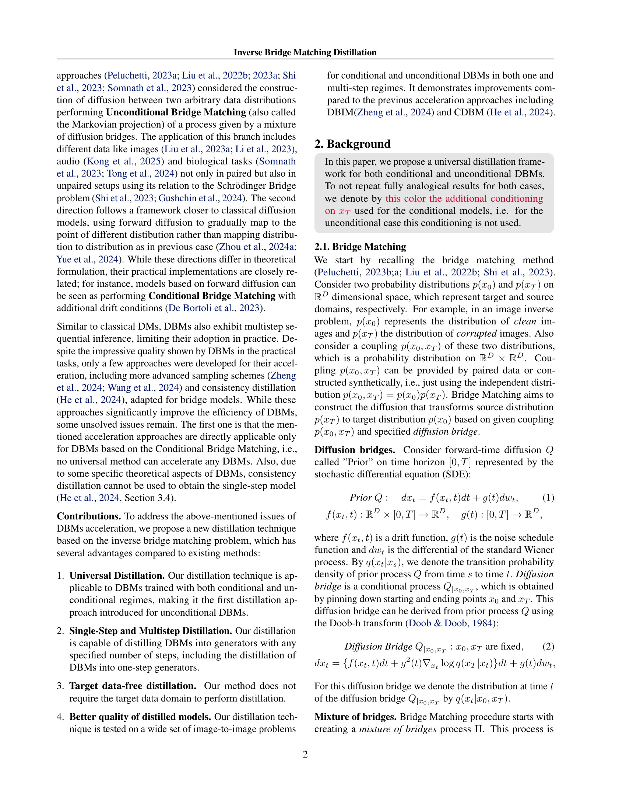

 


 2502.01362 
 Nikita Gushchin et el. 
 
 🤗 2025-02-05 
 



↗ arXiv


↗ Hugging Face


### TL;DR



기존의 확산 브리지 모델(DBM)은 이미지에서 이미지로의 변환 작업에 효과적이지만, 추론 속도가 느린 문제점이 있었습니다.  특히, 조건부 DBM에 대한 가속화 방법은 제한적이었고, 비조건부 DBM에 대한 효과적인 방법은 거의 없었습니다. 기존의 DBM 증류 기술은 단일 단계 생성기를 사용할 수 없거나, 학습에 추가적인 데이터를 필요로 했습니다. 이러한 문제는 DBM의 실용적인 적용에 큰 걸림돌이었습니다.

본 연구에서는 역방향 브리지 매칭을 기반으로 한 새로운 증류 기술을 제안합니다. 이 기술은 조건부 및 비조건부 DBM 모두에 적용 가능하며, 단일 단계 또는 다단계 생성기로의 증류를 지원합니다. 또한, 별도의 타겟 데이터 없이도 학습이 가능합니다. 실험 결과, 제안된 방법은 다양한 이미지 변환 작업에서 DBM의 추론 속도를 4배에서 100배까지 향상시켰으며, 경우에 따라 기존 모델보다 더 나은 성능을 보였습니다. 이는 DBM의 실용성을 크게 향상시키는 중요한 결과입니다.



#### Key Takeaways


 역방향 브리지 매칭 기반의 새로운 증류 기술을 통해 DBM 추론 속도를 획기적으로 개선했습니다. 



 조건부 및 비조건부 DBM 모두에 적용 가능한 범용적인 증류 방법을 제시했습니다. 



 단일 단계 생성기를 사용하여 DBM을 증류하고, 별도의 타겟 데이터 없이도 효과적인 증류가 가능함을 보였습니다. 


#### Why does it matter?
본 논문은 **확산 브리지 모델(DBM)**의 추론 속도를 크게 향상시키는 새로운 증류 기술을 제시하여, 다양한 이미지 변환 작업에서 DBM의 실용성을 높였습니다. 특히, 기존 기술의 한계를 극복하고 조건부 및 비조건부 DBM 모두에 적용 가능하다는 점에서 **연구의 파급 효과가 클 것**으로 예상됩니다.  또한, 단일 단계 생성기를 사용하여 DBM을 증류할 수 있다는 점과, 학습에 별도의 타겟 데이터가 필요하지 않다는 점도 주목할 만합니다. 이는 향후 DBM 관련 연구의 새로운 방향을 제시하고, 다양한 응용 분야에서의 DBM 활용을 촉진할 것으로 기대됩니다.

------
#### Visual Insights

> 🔼 그림 1은 다양한 이미지-이미지 변환 작업과 데이터셋에서 역방향 브리지 매칭 증류(IBMD) 기법을 사용하여 증류된 DBM 모델의 출력 결과를 보여줍니다.  자세히 살펴보면, 원본 DBM 모델(Teacher)은 500번 이상의 순전파 단계(NFE)를 사용하는 반면, IBMD를 통해 증류된 모델은 4번 이하의 순전파 단계만을 사용합니다. 이는 IBMD가 DBM 모델의 추론 속도를 크게 향상시키는 것을 보여줍니다. 그림은 초해상도, 이미지 복원, 스케치-이미지 변환 등 다양한 작업에 대한 결과를 포함합니다. 각 작업마다 입력 이미지와 Teacher 모델, IBMD 모델의 출력 이미지가 함께 제시되어 성능 비교를 용이하게 합니다.
> 

> 
read the caption

> Figure 1: Outputs of DBMs models distilled by our Inverse Bridge Matching Distillation (IBMD) approach on various image-to-image translation tasks and datasets (\wasyparagraph5). Teachers use NFE≥500absent500\geq 500≥ 500 steps, while IBMD distilled models use NFE≤4absent4\leq 4≤ 4.
> 


| Input | IBMD (<ins>Ours</ins>) | Teacher |
|---|---|---|
| Super-resolution | https://arxiv.org/html/2502.01362/images/teaser/pool_input.png | https://arxiv.org/html/2502.01362/images/teaser/pool_ibmd.png | https://arxiv.org/html/2502.01362/images/teaser/pool_teacher.png |
| JPEG restoration | https://arxiv.org/html/2502.01362/images/teaser/jpeg_5_input.png | https://arxiv.org/html/2502.01362/images/teaser/jpeg_5_ibmd.png | https://arxiv.org/html/2502.01362/images/teaser/jpeg_5_teacher.png |
| Inpainting | https://arxiv.org/html/2502.01362/images/teaser/new_inpainting_input.png | https://arxiv.org/html/2502.01362/images/teaser/new_inpainting_student.png | https://arxiv.org/html/2502.01362/images/teaser/new_inpainting_teacher.png |
| Normal-to-Image | https://arxiv.org/html/2502.01362/images/teaser/diode_input.png | https://arxiv.org/html/2502.01362/images/teaser/diode_student.png | https://arxiv.org/html/2502.01362/images/teaser/diode_teacher.png |
| Sketch-to-Image | https://arxiv.org/html/2502.01362/images/teaser/image_grid_input_e2h.png | https://arxiv.org/html/2502.01362/images/teaser/image_grid_student_e2h.png | https://arxiv.org/html/2502.01362/images/teaser/image_grid_teacher_e2h.png |

> 🔼 표 1은 이미지 초해상도 작업에 대한 결과를 보여줍니다. 이 표에는 다양한 모델들(DDRM, DDNM, IGDM, ADM, CDSB, I2SB, 그리고 제안된 IBMD)의 성능을 나타내는 FID(Fréchet Inception Distance)와 CA(Classifier Accuracy) 점수가 제시되어 있습니다. NFE(Number of Forward Euler steps)는 각 모델의 추론 속도를 나타내는 지표이며, 낮을수록 빠릅니다. I2SB는 본 논문의 저자들이 이전에 발표한 모델이며, 이 표에서는 기준 모델(Baseline)로 사용되었습니다. 이 표를 통해 제안된 IBMD 모델이 기존 모델들에 비해 FID 점수가 낮고 CA 점수가 높으며, NFE가 훨씬 낮다는 것을 확인할 수 있습니다. 즉, IBMD는 기존 모델들보다 더 높은 이미지 품질을 더 빠르게 생성한다는 것을 의미합니다.
> 

> 
read the caption

> Table 1: Results on the image super-resolution task. Baseline results are taken from I2SB (Liu et al., 2023a).
> 

### In-depth insights

#### IBMD: Inverse Problem
IBMD의 역문제 접근 방식은 **기존의 DBM 증류 기술의 한계를 극복**하기 위해 고안되었습니다.  기존 방법들은 조건부 DBM에만 적용 가능하거나 다중 단계 생성기를 필요로 하는 등의 제약이 있었습니다.  하지만 IBMD는 **조건부 및 비조건부 DBM 모두에 적용 가능**하며, **단일 단계 생성기로의 증류**도 지원합니다.  **역방향 브리지 매칭**을 통해 손상된 이미지만을 이용하여 학습할 수 있다는 점 또한 중요한 강점입니다.  이러한 특징은  DBM의 추론 속도를 크게 향상시키고, 특정 설정에서는 기존 모델보다 더 나은 성능을 제공할 수 있음을 시사합니다. **역문제를 풀기 위한 추론 가능한 목적 함수**를 도출해 실제 적용 가능성을 높인 점도 주목할 만합니다.  본 연구는  DBM 증류의 새로운 지평을 열고, 다양한 이미지 변환 작업에서 DBM의 활용성을 넓힐 것으로 기대됩니다.

#### Universal Distillation
본 논문에서 제시된 역방향 브릿지 매칭 증류(IBMD) 기법의 핵심은 **범용성(Universality)**에 있습니다.  기존의 증류 기술들이 특정 조건부 확산 브릿지 모델(Conditional DBM)에만 적용 가능했던 것과 달리, IBMD는 **조건부 및 비조건부(Unconditional) DBM 모두에 적용 가능**하다는 강점을 지닙니다. 이는 다양한 유형의 이미지 변환 작업에 적용 가능하다는 것을 의미하며, 모델의 유연성과 활용성을 크게 높입니다.  **단일 단계 생성기(Single-step generator)를 사용한 증류**를 지원하여 추론 속도를 획기적으로 향상시키는 동시에, **목표 데이터가 필요없는(Target data-free)** 학습 방식을 통해 데이터 의존성을 낮추고, 다양한 작업에 대한 적용 가능성을 높였습니다. 이러한 범용성은 **다양한 응용 분야**에서 DBM의 활용성을 확장하는 데 중요한 의미를 지닙니다.

#### Single-step DBM
단일 단계 확산 브리지 모델(DBM)은 다중 단계 모델의 느린 추론 속도 문제를 해결하기 위한 중요한 연구 분야입니다. **기존의 다중 단계 DBM은 이미지 대 이미지 변환과 같은 작업에서 우수한 성능을 보이지만, 느린 추론 속도로 인해 실제 적용에 어려움을 겪습니다.** 단일 단계 DBM은 이러한 문제를 해결하기 위해 한 번의 단계로 이미지를 생성하여 추론 속도를 크게 향상시키는 것을 목표로 합니다.  **역 브리지 매칭 증류 기법은 기존의 DBM을 단일 단계 모델로 효과적으로 변환하는 데 중요한 역할을 합니다.** 이 기법은 조건부 및 비조건부 DBM 모두에 적용될 수 있으며, 단일 단계 생성자를 사용하여 모델을 증류하는 과정을 포함합니다. 손상된 이미지만을 사용하여 학습할 수 있다는 점 또한 큰 장점입니다.  하지만 단일 단계 DBM은 여전히 **다중 단계 모델에 비해 성능 저하**를 보일 수 있습니다. 따라서 다중 단계 증류 및 고급 샘플링 기법과 같은 추가적인 기술을 통해 이러한 한계를 극복하기 위한 지속적인 연구가 필요합니다.  **단일 단계 DBM의 개발은 실시간 이미지 변환 및 다양한 응용 분야에 DBM을 적용하는 데 중요한 돌파구**가 될 수 있습니다.

#### Data-free Distillation
데이터 없는 증류는 **교사 모델의 지식을 학습 데이터에 직접 접근하지 않고 전달**하는 혁신적인 방법입니다. 이는 기존 증류 방법의 한계를 극복하고 다양한 응용 분야에서 효율성을 높일 수 있는 잠재력을 가지고 있습니다. **데이터에 대한 접근이 제한적이거나 비용이 많이 드는 경우**, 데이터 없는 증류는 특히 유용합니다. **개인정보 보호** 측면에서도 민감한 데이터를 직접 사용하지 않으므로 안전한 기술입니다.  하지만, 데이터 없는 증류는 **성능 저하** 가능성이 있으며, **교사 모델의 선택과 설계**에 따라 결과가 크게 달라질 수 있습니다. 따라서 효과적인 데이터 없는 증류 기법을 개발하려면 교사 모델과 학생 모델의 관계를 면밀히 이해하고, 다양한 실험을 통해 최적의 파라미터를 찾는 것이 중요합니다.  **특히, 전이 학습과 결합**하여 새로운 데이터셋에 대한 적응력을 높이는 연구가 필요합니다.

#### DBM Acceleration
본 논문에서는 확산 브리지 모델(DBM)의 추론 속도 향상에 대한 심도있는 논의를 제시합니다. 기존 DBM은 다단계 순차적 추론으로 인해 속도가 느린 문제점을 가지고 있었는데, 이를 해결하기 위해 역 브리지 매칭 증류 기법을 제안합니다. **이 기법은 조건부 및 비조건부 DBM 모두에 적용 가능하며, 단일 단계 생성기를 사용하여 모델을 증류할 수 있다는 장점**이 있습니다. 또한, 손상된 이미지만을 사용하여 학습할 수 있고, 추론 속도를 최대 100배까지 향상시킬 수 있으며, 경우에 따라 기존 모델보다 더 나은 성능을 보여줍니다. 다양한 실험 결과를 통해 제안된 기법의 효율성과 우수성을 검증하였습니다. **특히, 초해상도, JPEG 복원, 스케치-이미지 변환 등 다양한 작업에서 DBM의 추론 속도를 크게 개선**시켰습니다.  **역 브리지 매칭 증류는 DBM 가속화의 새로운 패러다임을 제시**하며, 향후 연구 방향에 대한 시사점을 제공합니다.

### More visual insights

More on figures

> 🔼 그림 2는 (조건부) 브리지 매칭의 개요를 보여줍니다.  데이터 결합 p(x0, xT)에서 쌍 (x0, xT)을 샘플링하여 시작합니다. 그런 다음 랜덤 시간 t~U[0,T]에 확산 브리지 q(xt|x0, xT)에서 중간 샘플 xt를 추출합니다.  모델 x^0은 MSE 손실을 사용하여 xt에서 x0을 재구성하도록 학습됩니다. 조건부 설정에서는 x^0이 추가 입력으로 xT를 조건으로 하여 최종 상태에 대한 정보를 활용하여 재구성을 개선합니다.
> 

> 
read the caption

> Figure 2: Overview of (Conditional) Bridge Matching with x^0subscript^𝑥0\widehat{x}_{0}over^ start_ARG italic_x end_ARG start_POSTSUBSCRIPT 0 end_POSTSUBSCRIPT reparameterization. The process begins by sampling a pair (x0,xT)subscript𝑥0subscript𝑥𝑇(x_{0},x_{T})( italic_x start_POSTSUBSCRIPT 0 end_POSTSUBSCRIPT , italic_x start_POSTSUBSCRIPT italic_T end_POSTSUBSCRIPT ) from the data coupling p⁢(x0,xT)𝑝subscript𝑥0subscript𝑥𝑇p(x_{0},x_{T})italic_p ( italic_x start_POSTSUBSCRIPT 0 end_POSTSUBSCRIPT , italic_x start_POSTSUBSCRIPT italic_T end_POSTSUBSCRIPT ). An intermediate sample xtsubscript𝑥𝑡x_{t}italic_x start_POSTSUBSCRIPT italic_t end_POSTSUBSCRIPT is then drawn from the diffusion bridge q⁢(xt|x0,xT)𝑞conditionalsubscript𝑥𝑡subscript𝑥0subscript𝑥𝑇q(x_{t}|x_{0},x_{T})italic_q ( italic_x start_POSTSUBSCRIPT italic_t end_POSTSUBSCRIPT | italic_x start_POSTSUBSCRIPT 0 end_POSTSUBSCRIPT , italic_x start_POSTSUBSCRIPT italic_T end_POSTSUBSCRIPT ) at a random time t∼U⁢[0,T]similar-to𝑡𝑈0𝑇t\sim U[0,T]italic_t ∼ italic_U [ 0 , italic_T ]. The model x^0subscript^𝑥0\widehat{x}_{0}over^ start_ARG italic_x end_ARG start_POSTSUBSCRIPT 0 end_POSTSUBSCRIPT is trained with an MSE loss to reconstruct x0subscript𝑥0x_{0}italic_x start_POSTSUBSCRIPT 0 end_POSTSUBSCRIPT from xtsubscript𝑥𝑡x_{t}italic_x start_POSTSUBSCRIPT italic_t end_POSTSUBSCRIPT. In the conditional setting (dashed red path), x^0subscript^𝑥0\widehat{x}_{0}over^ start_ARG italic_x end_ARG start_POSTSUBSCRIPT 0 end_POSTSUBSCRIPT is also conditioned on xTsubscript𝑥𝑇x_{T}italic_x start_POSTSUBSCRIPT italic_T end_POSTSUBSCRIPT as an additional input, leveraging information about the terminal state to improve reconstruction.
> 

> 🔼 그림 3은 역방향 브리지 매칭 증류(IBMD) 방법의 개요를 보여줍니다. 목표는 훈련된 (조건부) 브리지 매칭 모델을 생성자 Gθ(z, xT)로 증류하는 것입니다. 여기서 생성자는 손상된 데이터 p(xT)를 사용하여 샘플을 생성하는 것을 학습합니다. 생성자 Gθ(z, xT)는 결합 pθ(x0, xT) = pθ(x0|xT)p(xT)를 정의하고, pθ(x0, xT)를 사용한 브리지 매칭을 통해 동일한 (조건부) 브리지 매칭 모델 x^0ϕ = x^0θ을 생성하도록 생성자를 학습하는 것을 목표로 합니다. 이를 위해, 교사 모델과 동일한 방식으로 결합 pθ를 사용하여 브리지 모델 x^0ϕ을 학습하고, 정리 3.2에 제시된 새로운 목적 함수를 사용하여 생성자 모델 Gθ를 업데이트합니다.
> 

> 
read the caption

> Figure 3: Overview of our method Inverse Bridge Matching Distillation (IBMD). The goal is to distill a trained (Conditional) Bridge Matching model into a generator Gθ⁢(z,xT)subscript𝐺𝜃𝑧subscript𝑥𝑇G_{\theta}(z,x_{T})italic_G start_POSTSUBSCRIPT italic_θ end_POSTSUBSCRIPT ( italic_z , italic_x start_POSTSUBSCRIPT italic_T end_POSTSUBSCRIPT ), which learns to produce samples using the corrupted data p⁢(xT)𝑝subscript𝑥𝑇p(x_{T})italic_p ( italic_x start_POSTSUBSCRIPT italic_T end_POSTSUBSCRIPT ). Generator Gθ⁢(z,xT)subscript𝐺𝜃𝑧subscript𝑥𝑇G_{\theta}(z,x_{T})italic_G start_POSTSUBSCRIPT italic_θ end_POSTSUBSCRIPT ( italic_z , italic_x start_POSTSUBSCRIPT italic_T end_POSTSUBSCRIPT ) defines the coupling pθ⁢(x0,xT)=pθ⁢(x0|xT)⁢p⁢(xT)subscript𝑝𝜃subscript𝑥0subscript𝑥𝑇subscript𝑝𝜃conditionalsubscript𝑥0subscript𝑥𝑇𝑝subscript𝑥𝑇p_{\theta}(x_{0},x_{T})=p_{\theta}(x_{0}|x_{T})p(x_{T})italic_p start_POSTSUBSCRIPT italic_θ end_POSTSUBSCRIPT ( italic_x start_POSTSUBSCRIPT 0 end_POSTSUBSCRIPT , italic_x start_POSTSUBSCRIPT italic_T end_POSTSUBSCRIPT ) = italic_p start_POSTSUBSCRIPT italic_θ end_POSTSUBSCRIPT ( italic_x start_POSTSUBSCRIPT 0 end_POSTSUBSCRIPT | italic_x start_POSTSUBSCRIPT italic_T end_POSTSUBSCRIPT ) italic_p ( italic_x start_POSTSUBSCRIPT italic_T end_POSTSUBSCRIPT ) and we aim to learn the generator in such way that Bridge Matching with pθ⁢(x0,xT)subscript𝑝𝜃subscript𝑥0subscript𝑥𝑇p_{\theta}(x_{0},x_{T})italic_p start_POSTSUBSCRIPT italic_θ end_POSTSUBSCRIPT ( italic_x start_POSTSUBSCRIPT 0 end_POSTSUBSCRIPT , italic_x start_POSTSUBSCRIPT italic_T end_POSTSUBSCRIPT ) produces the same (Conditional) Bridge Matching model x^0ϕ=x^0θsuperscriptsubscript^𝑥0italic-ϕsuperscriptsubscript^𝑥0𝜃\widehat{x}_{0}^{\phi}=\widehat{x}_{0}^{\theta}over^ start_ARG italic_x end_ARG start_POSTSUBSCRIPT 0 end_POSTSUBSCRIPT start_POSTSUPERSCRIPT italic_ϕ end_POSTSUPERSCRIPT = over^ start_ARG italic_x end_ARG start_POSTSUBSCRIPT 0 end_POSTSUBSCRIPT start_POSTSUPERSCRIPT italic_θ end_POSTSUPERSCRIPT. To do so, we learn a bridge model x^0ϕsuperscriptsubscript^𝑥0italic-ϕ\widehat{x}_{0}^{\phi}over^ start_ARG italic_x end_ARG start_POSTSUBSCRIPT 0 end_POSTSUBSCRIPT start_POSTSUPERSCRIPT italic_ϕ end_POSTSUPERSCRIPT using coupling pθsubscript𝑝𝜃p_{\theta}italic_p start_POSTSUBSCRIPT italic_θ end_POSTSUBSCRIPT in the same way as the teacher model was learned. Then, we use our novel objective given in Theorem 3.2 to update the generator model Gθsubscript𝐺𝜃G_{\theta}italic_G start_POSTSUBSCRIPT italic_θ end_POSTSUBSCRIPT.
> 

> 🔼 이 그림은 IBMD-I2SB 모델을 사용하여 ImageNet 256x256 이미지에 대해 4배 초고해상도(bicubic kernel 사용)를 수행한 결과를 보여줍니다.  입력 이미지와 IBMD(NFE=1), Teacher 모델(NFE=1000), 그리고 참조 이미지(ground truth)를 비교하여, IBMD 모델이 Teacher 모델과 유사한 성능을 보이며, 고해상도 이미지 생성에 효과적임을 시각적으로 보여줍니다.  NFE는 신경망 순전파 횟수를 의미합니다. IBMD는 제안된 역방향 브리지 매칭 증류 기법을 활용합니다.
> 

> 
read the caption

> Figure 4: Uncurated samples for IBMD-I2SB distillation of 4x-super-resolution with bicubic kernel on ImageNet 256×256256256256\times 256256 × 256 images.
> 

> 🔼 이 그림은 IBMD-I2SB 방법을 사용하여 ImageNet 데이터셋의 256x256 크기 이미지에 대해 4배 Super-resolution을 수행한 결과를 보여줍니다.  특히, 풀링(pooling) 기반의 커널을 사용한 경우를 나타냅니다.  그림에는 원본 이미지(Input), IBMD(Ours) 기법을 NFE(Number of Forward Euler steps)=1로 적용한 결과, NFE=1000으로 학습된 Teacher 모델 결과, 그리고 참조(Reference) 이미지가 비교되어 제시되어 있습니다.  IBMD가 Teacher 모델보다 빠르면서도 비슷한 성능을 보임을 시각적으로 확인할 수 있습니다.  각각의 이미지 쌍을 통해 IBMD의 성능을 정성적으로 평가하고 Teacher 모델과의 차이점을 확인할 수 있습니다.
> 

> 
read the caption

> Figure 5: Uncurated samples for IBMD-I2SB distillation of 4x-super-resolution with pool kernel on ImageNet 256×256256256256\times 256256 × 256 images.
> 

> 🔼 이 그림은 IBMD-I2SB 모델을 사용하여 ImageNet 256x256 이미지의 JPEG 복원(QF=5) 작업에 대한 결과를 보여줍니다.  IBMD-I2SB는 역방향 브릿지 매칭 증류 기법을 사용하여 느린 추론 문제를 해결하는 기법입니다. 그림에서는 입력 이미지, NFE(Number of Forward Euler steps)가 1인 IBMD 모델의 출력, NFE가 1000인 teacher 모델의 출력, 그리고 참조(Reference) 이미지를 비교하여 보여줍니다. IBMD 모델은 teacher 모델보다 훨씬 적은 계산량으로 teacher 모델과 유사한 성능을 보여줍니다.  다양한 이미지 예시를 통해, IBMD가 teacher 모델과 비교하여 이미지 품질을 유지하면서도 추론 속도를 크게 향상시킬 수 있음을 확인할 수 있습니다.
> 

> 
read the caption

> Figure 6: Uncurated samples for IBMD-I2SB distillation of Jpeg restoration with QF=5 on ImageNet 256×256256256256\times 256256 × 256 images.
> 

> 🔼 그림 7은 ImageNet 256x256 이미지에 대해 품질 계수(QF)가 10인 JPEG 복원에 대한 IBMD-I2SB 증류의 비교 결과를 보여줍니다.  왼쪽에서부터 입력 이미지, NFE(Noise-Free Evaluation) 1인 IBMD(Inverse Bridge Matching Distillation) 모델의 출력, NFE 1000인 teacher 모델의 출력, 그리고 참조 이미지가 나열되어 있습니다. 이 그림은 IBMD 방법이 teacher 모델의 품질에 가깝게 복원 결과를 생성할 수 있음을 시각적으로 보여주며, 특히 teacher 모델보다 훨씬 적은 연산(NFE 1 vs NFE 1000)으로도 좋은 성능을 낼 수 있음을 강조합니다.
> 

> 
read the caption

> Figure 7: Uncurated samples for IBMD-I2SB distillation of Jpeg restoration with QF=10 on ImageNet 256×256256256256\times 256256 × 256 images.
> 

> 🔼 그림 8은 ImageNet 256x256 이미지 데이터셋에서 학습된 IBMD-I2SB 모델의 인페인팅 결과를 보여줍니다.  IBMD-I2SB는 역방향 브릿지 매칭 증류 기법을 사용하는 모델로, 이 그림에서는 NFE(Number of Forward Euler steps)를 4로 설정하여 학습한 후, 추론 시에는 NFE를 1, 2, 4, 1000으로 다르게 설정하여 결과를 비교합니다. NFE 값이 클수록 더 많은 계산을 수행하지만, 그에 따라 더 정교한 이미지 생성이 가능할 것으로 예상됩니다. 그림을 통해 각 NFE 설정에 따른 인페인팅 결과의 차이를 직관적으로 확인할 수 있습니다.  입력 이미지(Input), NFE=1, NFE=2, NFE=4로 추론한 결과, NFE=1000으로 추론한 Teacher 모델의 결과, 그리고 참조 이미지(Reference)를 함께 비교하여 모델 성능을 평가할 수 있도록 구성되어 있습니다.
> 

> 
read the caption

> Figure 8: Uncurated samples for IBMD-I2SB distillation trained for inpaiting with NFE=4absent4=4= 4 and inferenced with different inference NFE on ImageNet 256×256256256256\times 256256 × 256 images.
> 

> 🔼 그림 9는 ImageNet 256x256 이미지에 대해, 다른 추론 단계(NFE)를 사용하여 IBMD-DDBM 증류(NFE=4로 학습)의 결과물을 보여줍니다.  IBMD-DDBM은 역방향 브리지 매칭 증류 기법을 사용하여, 빠른 추론이 가능하도록  확산 브리지 모델을 작은 모델로 증류하는 기법입니다. 그림은 입력 이미지와, IBMD-DDBM이 NFE=1, 2, 4로 추론한 결과, 그리고 NFE=500으로 추론한 원본 모델의 결과, 그리고 실제 이미지(Reference)를 비교하여 보여줍니다. 이를 통해, IBMD-DDBM이 원본 모델과 유사한 결과를 빠른 속도로 생성할 수 있음을 시각적으로 확인할 수 있습니다.
> 

> 
read the caption

> Figure 9: Uncurated samples for IBMD-DDBM distillation trained for inpaiting with NFE=4absent4=4= 4 and inferenced with different inference NFE on ImageNet 256×256256256256\times 256256 × 256 images.
> 

> 🔼 이 그림은 IBMD-DDBM (Inverse Bridge Matching Distillation - Denoising Diffusion Bridge Model) 방법을 사용하여 DIODE-Outdoor 데이터셋(256x256 해상도)에서 훈련된 모델의 결과를 보여줍니다.  IBMD-DDBM은 역방향 브릿지 매칭을 기반으로 한 증류 기법으로, 느린 추론 속도를 가진 기존 확산 브릿지 모델을 더 빠르게 만들기 위해 고안되었습니다. 그림에는 훈련 세트에서 추론된 NFE(Number of Forward Euler steps)가 2인 모델과 1인 모델의 결과가 나란히 비교되어 있습니다.  각 열은 입력 이미지, NFE=2 모델의 출력, NFE=1 모델의 출력, NFE=500으로 훈련된 기존 모델의 출력, 그리고 참조 이미지를 순서대로 보여줍니다. 이를 통해 IBMD-DDBM이 추론 속도를 높이면서도 기존 모델과 비슷한 수준의 이미지 생성 품질을 유지하는지 확인할 수 있습니다.
> 

> 
read the caption

> Figure 10: Uncurated samples from IBMD-DDBM distillation trained on the DIODE-Outdoor dataset (256×256256256256\times 256256 × 256) with NFE=2absent2=2= 2 and NFE=1absent1=1= 1, inferred using the corresponding NFEs on the training set.
> 

> 🔼 그림 11은 Edges to Handbags 데이터셋(64x64)에서 학습된 IBMD-DDBM의 결과물을 보여줍니다.  NFE(Number of Function Evaluations)는 2와 1로 설정되어 있으며, 각각에 해당하는 NFE를 사용하여 테스트 세트에서 추론된 결과입니다. 그림은 입력 이미지, NFE=1로 추론된 결과, NFE=2로 추론된 결과, NFE=500의 Teacher 모델 결과, 그리고 참조 이미지를 비교하여 보여줍니다. 이를 통해 IBMD-DDBM의 효율성과 Teacher 모델과의 성능 비교를 시각적으로 확인할 수 있습니다. 특히, 적은 NFE로도 Teacher 모델과 유사한 결과를 얻을 수 있음을 보여줍니다.
> 

> 
read the caption

> Figure 11: Uncurated samples from IBMD-DDBM distillation trained on the DIODE-Outdoor dataset (256×256256256256\times 256256 × 256) with NFE=2absent2=2= 2 and NFE=1absent1=1= 1, inferred using the corresponding NFEs on the test set.
> 

> 🔼 그림 12는 Edges to Handbags 데이터셋(64x64)을 사용하여 훈련된 IBMD-DDBM 증류의 예시를 보여줍니다.  NFE(Noise Free Estimation)는 2와 1로 설정되었으며, 각각에 해당하는 NFE를 사용하여 훈련 데이터셋에서 추론한 결과입니다. 그림은 입력 이미지, NFE=1인 IBMD(ours) 모델의 출력, NFE=2인 IBMD(ours) 모델의 출력, NFE=500인 Teacher 모델의 출력, 그리고 참조 이미지를 순서대로 보여줍니다. 이를 통해, IBMD 모델이 Teacher 모델과 비슷한 결과를 생성하는 것을 확인할 수 있습니다. 특히, NFE를 낮추면서도 Teacher 모델과 유사한 성능을 유지한다는 점을 보여줍니다.
> 

> 
read the caption

> Figure 12: Uncurated samples from IBMD-DDBM distillation trained on the Edges →→\rightarrow→ Handbags dataset (64×64646464\times 6464 × 64) with NFE=2absent2=2= 2 and NFE=1absent1=1= 1, inferred using the corresponding NFEs on the training set.
> 

More on tables


| 4× super-resolution (bicubic) | ImageNet (256 × 256) |  |  |
|---|---|---|---|
|  | **NFE** | **FID ↓** | **CA ↑** |
| DDRM (Kawar et al., 2022) | 20 | 21.3 | 63.2 |
| DDNM (Wang et al., 2023) | 100 | 13.6 | 65.5 |
| ΠGDM (Song et al., 2023) | 100 | 3.6 | 72.1 |
| ADM (Dhariwal & Nichol, 2021) | 1000 | 14.8 | 66.7 |
| CDSB (Shi et al., 2022) | 50 | 13.6 | 61.0 |
| I²SB (Liu et al., 2023a) | 1000 | 2.8 | 70.7 |
| IBMD-I²SB (**Ours**) | 1 | **2.5** | **72.4** |
> 🔼 표 2는 QF(Quality Factor) 값이 5인 JPEG 이미지 복원 작업에 대한 결과를 보여줍니다.  이 표는 다양한 방법(DDRM, IGDM, Palette, CDSB, I2SB, 그리고 제안된 IBMD)을 사용하여 얻은 FID(Fréchet Inception Distance)와 CA(Classifier Accuracy) 점수를 비교합니다.  FID는 생성된 이미지의 품질을, CA는 이미지의 정확성을 측정하는 지표입니다. 낮은 FID 값과 높은 CA 값은 더 좋은 성능을 나타냅니다.  기준 성능은 I2SB (Liu et al., 2023a) 논문에서 제시된 결과를 바탕으로 합니다.  이 표는 제안된 IBMD 방법이 기존 방법들과 비교하여 얼마나 효율적이고 효과적인지를 보여주는 데 중점을 둡니다.  NFE(Number of Forward Euler steps)는 모델이 이미지를 생성하는 데 걸리는 단계 수를 나타내며, 이 값이 낮을수록 빠른 추론 속도를 의미합니다.
> 

> 
read the caption

> Table 2: Results on the image JPEG restoration task with QF=5. Baseline results are taken from I2SB (Liu et al., 2023a).
> 


| JPEG restoration, QF=5 | ImageNet (256 \times 256) |  |  |
|---|---|---|---|
| **NFE** | **FID ↓** | **CA ↑** |  |
| DDRM (Kawar et al., 2022) | 20 | 28.2 | 53.9 |
| ΠGDM (Song et al., 2023) | 100 | 8.6 | 64.1 |
| Palette (Saharia et al., 2022) | 1000 | 8.3 | 64.2 |
| CDSB (Shi et al., 2022) | 50 | 38.7 | 45.7 |
| I²SB (Liu et al., 2023a) | 1000 | **4.6** | 67.9 |
| I²SB (Liu et al., 2023a) | 100 | 5.4 | 67.5 |
| IBMD-I²SB (**Ours**) | 1 | <u>**5.3**</u> | 67.2 |
> 🔼 표 3은 이미지 초해상도 작업에 대한 결과를 보여줍니다. 이 표는 다양한 방법(DDRM, DDNM, IGDM, ADM, CDSB, I2SB, IBMD-I2SB)을 사용하여 얻은 FID(Fréchet Inception Distance)와 CA(Classifier Accuracy) 점수를 비교 분석합니다.  낮은 FID 점수와 높은 CA 점수는 더 나은 성능을 나타냅니다.  기준 성능은 I2SB(Liu et al., 2023a) 논문의 결과를 사용했습니다.  IBMD-I2SB는 제안된 역방향 브리지 매칭 증류 기법을 사용한 결과이며, NFE(Number of Forward Euler steps) 값이 1로, 다른 방법들에 비해 훨씬 빠른 추론 속도를 보입니다.
> 

> 
read the caption

> Table 3: Results on the image super-resolution task. Baseline results are taken from I2SB (Liu et al., 2023a).
> 


| Method | NFE | FID ↓ | CA ↑ |
|---|---|---|---|
| 4× super-resolution (pool) |  |  |  |
| ImageNet (256 × 256) |  |  |  |
| DDRM (Kawar et al., 2022) | 20 | 14.8 | 64.6 |
| DDNM (Wang et al., 2023) | 100 | 9.9 | 67.1 |
| ΠGDM (Song et al., 2023) | 100 | 3.8 | 72.3 |
| ADM (Dhariwal & Nichol, 2021) | 1000 | 3.1 | 73.4 |
| CDSB (Shi et al., 2022) | 50 | 13.0 | 61.3 |
| I²SB (Liu et al., 2023a) | 1000 | 2.7 | 71.0 |
| IBMD-I²SB (Ours) | 1 | 2.6 | 72.7 |
> 🔼 표 4는 QF(Quality Factor) 값이 10일 때 이미지 JPEG 복원 작업에 대한 결과를 보여줍니다.  이 표에는 제안된 IBMD(Inverse Bridge Matching Distillation) 방법과 기존의 다른 방법들(DDRM, IGDM, Palette, CDSB, I2SB)의 성능을 비교하여  FID(Fréchet Inception Distance)와 CA(Classifier Accuracy) 지표를 사용하여 모델의 이미지 복원 품질과 효율성을 평가하고 있습니다.  기준 성능은 I2SB(Liu et al., 2023a) 논문의 결과를 바탕으로 합니다.  NFE(Number of Forward Euler steps)는 모델의 추론 속도와 관련된 지표입니다. 낮은 NFE 값은 더 빠른 추론 속도를 나타냅니다.  표는 각 방법의 NFE, FID, CA 값을 제시하여,  IBMD의 우수성을 보여주고자 합니다.
> 

> 
read the caption

> Table 4: Results on the image JPEG restoration task with QF=10. Baseline results are taken from I2SB (Liu et al., 2023a).
> 


| JPEG restoration, QF=10. | ImageNet (256 × 256) |  |  |
|---|---|---|---|
|  | **NFE** | **FID ↓** | **CA ↑** |
| DDRM (Kawar et al., 2022) | 20 | 16.7 | 64.7 |
| ΠGDM (Song et al., 2023) | 100 | 6.0 | 71.0 |
| Palette (Saharia et al., 2022) | 1000 | 5.4 | 70.7 |
| CDSB (Shi et al., 2022) | 50 | 18.6 | 60.0 |
| I²SB (Liu et al., 2023a) | 1000 | **3.6** | 72.1 |
| I²SB (Liu et al., 2023a) | 100 | 4.4 | 71.6 |
| IBMD-I²SB (**Ours**) | 1 | <ins>3.8</ins> | 72.4 |
> 🔼 표 5는 이미지-투-이미지 변환 작업(훈련 세트)에 대한 결과를 보여줍니다. 방법들은 NFE(단계 수)에 따라 그룹화되어 있으며, 각 그룹 내 최고 성능 지표는 굵게 표시되어 있습니다. 기준선 결과는 CDBM에서 가져왔습니다.  NFE가 2보다 큰 그룹, NFE가 2인 그룹, NFE가 1인 그룹으로 나뉘어 각 그룹 내 최고 성능을 비교 분석합니다. 이를 통해 제안된 방법의 효율성과 성능을 다양한 단계 수에서 평가하고 기존 방법과 비교합니다.
> 

> 
read the caption

> Table 5: Results on the Image-to-Image Translation Task (Training Sets). Methods are grouped by NFE (>2absent2>2> 2, 2222, 1111), with the best metrics bolded in each group. Baselines results are taken from CDBM.
> 


|                       | **NFE** | Edges → Handbags (64 × 64) |   | DIODE-Outdoor (256 × 256) |   |
|-----------------------|---------|-----------------------------|---|-----------------------------|---|
|                       | **FID** ↓ | **IS** ↑                    |   | **FID** ↓                    | **IS** ↑ |
| DDIB (Su et al., 2022) | ≥ 40    | 186.84                       | 2.04 | 242.3                        | 4.22 |
| SDEdit (Meng et al., 2021) | ≥ 40    | 26.5                         | 3.58 | 31.14                        | 5.70 |
| Rectified Flow (Liu et al., 2022a) | ≥ 40    | 25.3                         | 2.80 | 77.18                        | 5.87 |
| I2SB (Liu et al., 2023a) | ≥ 40    | 7.43                         | 3.40 | 9.34                         | 5.77 |
| DBIM (Zheng et al., 2024) | 50      | 1.14                         | 3.62 | 3.20                         | 6.08 |
| DBIM (Zheng et al., 2024) | 100     | 0.89                         | 3.62 | 2.57                         | 6.06 |
| CBD (He et al., 2024)   | 2       | 1.30                         | 3.62 | 3.66                         | 6.02 |
| CBT (He et al., 2024)   |         | 0.80                         | 3.65 | 2.93                         | 6.06 |
| IBMD-DDBM (Ours)       |         | 0.67                         | 3.69 | 3.12                         | 5.92 |
| Pix2Pix (Isola et al., 2017) | 1       | 74.8                         | 4.24 | 82.4                         | 4.22 |
| IBMD-DDBM (Ours)       |         | 1.26                         | 3.66 | 4.07                         | 5.89 |
> 🔼 표 6은 이미지 인페인팅 작업에 대한 결과를 보여줍니다.  방법들은 NFE(Noise Free Evaluation) 단계 수에 따라 그룹화되어 있으며, 각 그룹 내 최고 성능 지표는 굵게 표시되어 있습니다. 기준 성능은 CDBM(Conditional Bridge Matching) 모델의 결과를 바탕으로 합니다. 이 표는 다양한 인페인팅 방법들의 성능을 비교 분석하여, 제안된 방법의 우수성을 보여줍니다. 특히, NFE 단계 수를 줄이면서도 성능 저하를 최소화하는지 여부를 확인할 수 있습니다.  각 방법의 FID(Fréchet Inception Distance)와 CA(Classifier Accuracy) 값을 통해 정량적인 성능 비교가 가능합니다.
> 

> 
read the caption

> Table 6: Results on the Image Inpainting Task. Methods are grouped by NFE (>4absent4>4> 4, 4444, 2222, 1111), with the best metrics bolded in each group. Baselines results are taken from CDBM.
> 


| Inpainting, Center (128x128) | ImageNet (256x256) |  |  |
|---|---|---|---|
|  | NFE | FID ↓ | CA ↑ |
| DDRM (Kawar et al., 2022) | 20 | 24.4 | 62.1 |
| ΠGDM (Song et al., 2023) | 100 | 7.3 | 72.6 |
| DDNM (Wang et al., 2022) | 100 | 15.1 | 55.9 |
| Palette (Saharia et al., 2022) | 1000 | 6.1 | 63.0 |
| I²SB (Liu et al., 2023a) | 10 | 5.4 | 65.97 |
| DBIM (Zheng et al., 2024) | 50 | 3.92 | 72.4 |
| DBIM (Zheng et al., 2024) | 100 | **3.88** | **72.6** |
| CBD (He et al., 2024) | 4 | 5.34 | 69.6 |
| CBT (He et al., 2024) | 4 | 4.77 | 70.3 |
| IBMD-I²SB (**Ours**) | 4 | 5.1 | 70.3 |
| IBMD-DDBM (**Ours**) | 4 | **4.03** | **72.2** |
| CBD (He et al., 2024) | 2 | 5.65 | 69.6 |
| CBT (He et al., 2024) | 2 | 5.34 | 69.8 |
| IBMD-I²SB (**Ours**) | 2 | 5.3 | 65.7 |
| IBMD-DDBM (**Ours**) | 2 | **4.23** | **72.3** |
| IBMD-I²SB (**Ours**) | 1 | 6.7 | 65.0 |
| IBMD-DDBM (**Ours**) | 1 | **5.87** | **70.6** |
> 🔼 표 7은 다양한 실험 설정에 대한 세부 정보를 보여줍니다. NFE는 3.5절에서 설명하는 다단계 학습을 나타내고, L/K는 3.4절의 알고리즘에서 설명하는 브리지/학생 그래디언트 반복 비율을 나타냅니다. Grad Updates는 학생 그래디언트 단계 수를 보여주고, Noise는 확률적 파이프라인 통합 여부를 나타냅니다.
> 

> 
read the caption

> Table 7: Table entries specify experimental configurations: NFE indicates multistep training (Sec. \wasyparagraph3.5); L𝐿Litalic_L/K𝐾Kitalic_K represents bridge/student gradient iteration ratios (Alg. \wasyparagraph3.4); Grad Updates shows student gradient steps; Noise notes stochastic pipeline incorporation.
> 


| Task | Dataset | Teacher | NFE | L/K ratio | LR | Grad Updates | Noise |
|---|---|---|---|---|---|---|---| 
| 4× super-resolution (bicubic) | ImageNet | I2SB | 1 | 5:1 | 5e-5 | 3000 | ✓ |
| 4× super-resolution (pool) | ImageNet | I2SB | 1 | 5:1 | 5e-5 | 3000 | ✓ |
| JPEG restoration, QF =5 | ImageNet | I2SB | 1 | 5:1 | 5e-5 | 2000 | ✓ |
| JPEG restoration, QF =10 | ImageNet | I2SB | 1 | 5:1 | 5e-5 | 3000 | ✓ |
| Center-inpainting (128×128) | ImageNet | I2SB | 4 | 5:1 | 5e-5 | 2000 | ✗ |
| Sketch to Image Edges → Handbags | Edges → Handbags | DDBM | 2 | 5:1 | 1e-5 | 300 | ✓ |
| Sketch to Image Edges → Handbags | Edges → Handbags | DDBM | 1 | 5:1 | 1e-5 | 14000 | ✓ |
| Normal to Image | DIODE-Outdoor | DDBM | 2 | 5:1 | 1e-5 | 500 | ✓ |
| Normal to Image | DIODE-Outdoor | DDBM | 1 | 5:1 | 1e-5 | 3700 | ✓ |
| Center-inpainting (128×128) | ImageNet | DDBM | 4 | 1:1 | 3e-6 | 3000 | ✓ |
> 🔼 표 8은 논문에서 사용된 데이터셋, 코드 및 라이선스 정보를 보여줍니다.  각 데이터셋의 이름, URL, 인용 정보 및 라이선스가 명시되어 있어, 연구의 재현성을 높이고 사용된 자료의 출처를 명확히 합니다.  특히, 이미지 생성 모델 학습에 사용된 Edge-Handbags, DIODE-Outdoor, ImageNet 데이터셋과, 확산 모델(diffusion model) 관련 코드들의 출처를 상세하게 제공하여, 다른 연구자들이 동일한 실험을 반복하거나 유사한 연구를 수행하는 데 도움을 줍니다.
> 

> 
read the caption

> Table 8: The used datasets, codes and their licenses.
> 

### Full paper



