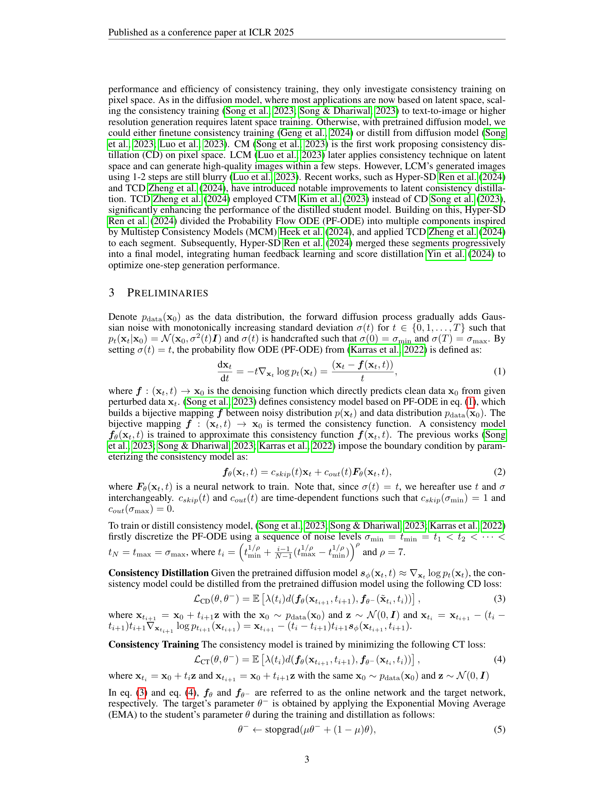

 


 2502.01441 
 Quan Dao et el. 
 
 🤗 2025-02-04 
 



↗ arXiv


↗ Hugging Face


### TL;DR



일관성 모델은 고품질 이미지를 생성하는 새로운 생성 모델로, 특히 잠재 공간에서의 성능이 중요합니다. 하지만 기존의 일관성 모델 훈련 기법은 잠재 공간에서 이상치(outlier)에 취약하여 성능이 저하되는 문제가 있었습니다. 

본 연구는 이 문제를 해결하기 위해 **Cauchy 손실 함수**를 사용하고, **초기 시간 단계에서 확산 손실**을 적용하며, **최적 전송 매칭(OT)**과 **적응형 스케일링 스케줄러**를 도입했습니다. 또한, **비-스케일링 LayerNorm**을 사용하여 모델의 강건성을 높였습니다. 이를 통해 잠재 공간에서의 일관성 모델 훈련 성능을 크게 향상시켜, 기존 확산 모델과의 성능 격차를 줄였습니다.



#### Key Takeaways


 잠재 공간의 이상치 문제를 해결하기 위해 Cauchy 손실 함수를 도입 



 초기 시간 단계에서 확산 손실 및 최적 전송 매칭을 활용하여 성능 향상 



 적응적 스케일링 스케줄러와 비스케일링 LayerNorm을 통해 강건하고 효율적인 훈련 과정 구현 


#### Why does it matter?
본 논문은 **잠재적 일관성 모델의 성능을 크게 향상시키는 새로운 훈련 기법**을 제시하여, 잠재 공간에서의 이미지 생성 작업에 중요한 발전을 가져왔습니다. 이는 **대규모 데이터셋을 사용한 잠재적 일관성 모델 훈련의 어려움을 해결**하고, 향후 연구를 위한 새로운 방향을 제시할 것입니다.  **잠재 공간에서의 고품질 이미지 생성**은 텍스트-이미지 생성, 비디오 생성 등 다양한 분야에서 핵심적인 기술이며, 본 연구는 이러한 분야의 발전에 크게 기여할 것입니다.

------
#### Visual Insights

> 🔼 그림 1은 픽셀 공간과 잠재 공간의 임펄스 노이즈 비교를 보여주는 상자 수염 그림(Box and Whisker Plot)입니다. 오른쪽 열은 21개의 이산화 단계에서 TD 값의 통계를 보여줍니다. 다른 이산화 단계도 동일한 패턴을 보이며, 총 이산화 단계 수에 관계없이 임펄스 이상치가 지속적으로 나타납니다. 파란색 상자는 데이터의 사분위수 범위를 나타내고, 녹색과 주황색 점선은 각각 내부 및 외부 울타리를 나타냅니다. 이상치는 빨간색 점으로 표시됩니다. 이 그림은 잠재 공간에서의 훈련 데이터의 통계적 특성, 특히 임펄스 이상치의 존재에 초점을 맞추고 있습니다. 이러한 이상치는 잠재 공간에서의 일관성 훈련 성능 저하의 주요 원인으로 제시됩니다.
> 

> 
read the caption

> Figure 1: Box and Whisker Plot: Impulsive noise comparison between pixel and latent spaces. The right column shows the statistics of TD values at 21 discretization steps. Other discretization steps exhibit same behavior, where impulsive outliers are consistently present regardless of the total discretization steps. The blue boxes represent interquartile ranges of the data, while the green and orange dashed lines indicate inner and outer fences, respectively. Outliers are marked with red dots.
> 


| Model | NFE↓ | FID↓ | Recall↑ | Epochs | Total Bs |
|---|---|---|---|---|---| 
| **Pixel Diffusion Model** |  |  |  |  |  |
| WaveDiff (Phung et al., 2023) | 2 | 5.94 | 0.37 | 500 | 64 |
| Score SDE (Song et al., 2020) | 4000 | 7.23 | - | 6.2K | - |
| DDGAN (Xiao et al., 2021) | 2 | 7.64 | 0.36 | 800 | 32 |
| RDUOT (Dao et al., 2023b) | 2 | 5.60 | 0.38 | 600 | 24 |
| RDM (Teng et al., 2023) | 270 | 3.15 | 0.55 | 4K | - |
| UNCSN++ (Kim et al., 2021) | 2000 | 7.16 | - | - | - |
| **Latent Diffusion Model** |  |  |  |  |  |
| LFM-8 (Dao et al., 2023a) | 85 | 5.82 | 0.41 | 500 | 112 |
| LDM-4 (Rombach et al., 2021) | 200 | 5.11 | 0.49 | 600 | 48 |
| LSGM (Vahdat et al., 2021) | 23 | 7.22 | - | 1K | - |
| DDMI (Park et al., 2024) | 1000 | 7.25 | - | - | - |
| DIMSUM (Phung et al., 2024) | 73 | 3.76 | 0.56 | 395 | 32 |
| LDM-8† | 250 | 8.85 | - | 1.4K | 128 |
| **Latent Consistency Model** |  |  |  |  |  |
| iLCT (Song & Dhariwal, 2023) | 1 | 37.15 | 0.12 | 1.4K | 128 |
| iLCT (Song & Dhariwal, 2023) | 2 | 16.84 | 0.24 | 1.4K | 128 |
| Ours | 1 | 7.27 | 0.50 | 1.4K | 128 |
| Ours | 2 | 6.93 | 0.52 | 1.4K | 128 |
(a) CelebA-HQ

| Model | NFE↓ | FID↓ | Recall↑ | Epochs | Total Bs |
|---|---|---|---|---|---| 
| **Pixel Diffusion Model** |  |  |  |  |  |
| WaveDiff (Phung et al., 2023) | 2 | 5.94 | 0.37 | 500 | 64 |
| Score SDE (Song et al., 2020) | 4000 | 7.23 | - | 6.2K | - |
| DDGAN (Xiao et al., 2021) | 2 | 5.25 | 0.36 | 500 | 32 |
| **Latent Diffusion Model** |  |  |  |  |  |
| LFM-8 (Dao et al., 2023a) | 90 | 7.70 | 0.39 | 90 | 112 |
| LDM-8 (Rombach et al., 2021) | 400 | 4.02 | 0.52 | 400 | 96 |
| LDM-8† | 250 | 10.81 | - | 1.8K | 256 |
| **Latent Consistency Model** |  |  |  |  |  |
| iLCT (Song & Dhariwal, 2023) | 1 | 52.45 | 0.11 | 1.8K | 256 |
| iLCT (Song & Dhariwal, 2023) | 2 | 24.67 | 0.17 | 1.8K | 256 |
| Ours | 1 | 8.87 | 0.47 | 1.8K | 256 |
| Ours | 2 | 7.71 | 0.48 | 1.8K | 256 |
(b) LSUN Church

| Model | NFE↓ | FID↓ | Recall↑ | Epochs | Total Bs |
|---|---|---|---|---|---| 
| **Latent Diffusion Model** |  |  |  |  |  |
| LFM-8 (Dao et al., 2023a) | 84 | 8.07 | 0.40 | 700 | 128 |
| LDM-4 (Rombach et al., 2021) | 200 | 4.98 | 0.50 | 400 | 42 |
| LDM-8† | 250 | 10.23 | - | 1.4K | 128 |
| **Latent Consistency Model** |  |  |  |  |  |
| iLCT (Song & Dhariwal, 2023) | 1 | 48.82 | 0.15 | 1.4K | 128 |
| iLCT (Song & Dhariwal, 2023) | 2 | 21.15 | 0.19 | 1.4K | 128 |
| Ours | 1 | 8.72 | 0.42 | 1.4K | 128 |
| Ours | 2 | 8.29 | 0.43 | 1.4K | 128 |
(c) FFHQ

> 🔼 표 1은 세 가지 데이터셋(CelebA-HQ, LSUN Church, FFHQ)에 대해 256x256 해상도로 훈련된 모델의 성능을 보여줍니다.  표에는 각 모델의 FID(Fréchet Inception Distance) 점수, 재현율, 학습에 사용된 에포크 수, 총 NFE(Number of Function Evaluations), 배치 크기 등의 정보가 포함되어 있습니다.  특히,  Pixel Diffusion Model과 Latent Diffusion Model, 그리고 Latent Consistency Model의 성능을 비교하여 제시하고 있으며, 본 논문에서 제안하는 방법을 사용한 모델의 성능도 함께 나타냅니다.  † 기호는 동일한 확산 전파(diffusion forward) 과정과 동일한 구조의 모델을 사용하여 본 연구진의 머신에서 훈련되었음을 의미합니다.
> 

> 
read the caption

> Table 1: Our performance on CelebA-HQ, LSUN Church, FFHQ datasets at resolution 256×256256256256\times 256256 × 256. (††\dagger†) means training on our machine with the same diffusion forward and equivalent architecture.
> 

### In-depth insights

#### Latent Space Pitfalls
본 논문에서 다루는 ‘잠재 공간의 함정’은 잠재 공간에서의 일관성 모델 훈련의 어려움을 의미합니다. **픽셀 공간과 달리 잠재 공간은 극단적인 이상치(outliers)를 포함하고 있으며, 이는 기존의 일관성 훈련 기법의 성능을 저해합니다.** 이러한 이상치는 잠재 공간 데이터의 통계적 특성으로 인해 발생하며, **일반적인 손실 함수(loss function)는 이러한 이상치에 취약하여 모델의 훈련 안정성을 해칩니다.** 따라서, 본 논문에서는 이러한 문제를 해결하기 위해 새로운 손실 함수(Cauchy loss)와 훈련 전략을 제시하고 있으며, 잠재 공간에서의 일관성 모델 훈련 성능을 향상시키는 것을 목표로 합니다.  **특히, Cauchy loss는 이상치에 대한 강건성을 높여 훈련 과정의 안정성을 확보하고, 추가적인 손실 함수(diffusion loss)와 최적 전달(Optimal Transport) 기법을 활용하여 모델 성능을 더욱 향상시킵니다.**  결론적으로, **잠재 공간의 통계적 특성을 고려한 새로운 훈련 전략은 잠재 공간 기반 생성 모델의 성능 개선에 중요한 역할을 합니다.**

#### Cauchy Loss Triumph
**코시 손실 함수의 놀라운 성과**는 극단값 아웃라이어에 대한 강건성(robustness)을 보여줍니다. 기존의 의학 영상 분석 분야에서 사용되던 코시 손실 함수는 잠재 공간에서의 훈련 불안정성 문제를 해결하는 데 효과적임을 보여줍니다. **잠재 공간 데이터의 특징인 충격적인 아웃라이어**는 기존의 손실 함수로는 다루기 어려운데, 코시 손실 함수는 이러한 아웃라이어의 영향을 완화하여 안정적인 훈련을 가능하게 합니다. 이는 특히 고해상도 이미지 생성이나 비디오 생성과 같이 대규모 데이터셋을 다루는 작업에서 중요한 의미를 지닙니다.  **결과적으로, 코시 손실 함수를 사용함으로써 잠재 일관성 모델의 성능 향상**은 물론, 고품질 이미지 생성의 효율성까지 증대시키는 긍정적 효과를 기대할 수 있습니다.  **추가적으로, 잠재 공간의 통계적 특성 분석**을 통해 코시 손실 함수가 아웃라이어 문제에 효과적으로 대응함을 보여주는 실험 결과는 이 연구의 신뢰성을 높입니다.  **다른 강건한 손실 함수들과의 비교 분석** 또한 코시 손실 함수의 우수성을 뒷받침합니다.

#### Diffusion Loss Boost
본 논문에서 제안하는 '확산 손실 증강 (Diffusion Loss Boost)' 기법은 **잠재 공간에서의 일관성 모델 학습 안정성을 높이는 데 중점**을 둡니다. 기존의 일관성 모델 학습 방식은 잠재 공간의 특성(예: 임펄스성 이상치)을 충분히 고려하지 못해 성능 저하를 야기했습니다.  따라서, **초기 시간 단계에서 확산 손실을 추가함으로써** 모델이 잠재 공간의 특성을 더 잘 학습하고, 안정적인 학습 과정을 유도합니다.  이는 곧, **고품질 이미지 생성을 위한 견고한 기반**을 마련하는 것과 같습니다.  **추가적으로, 최적 수송(OT) 매칭 기법을 도입**하여 학습 과정의 변동성을 줄이고, 더욱 효율적인 학습을 가능하게 합니다.  이러한 접근 방식은 단순히 손실 함수를 개선하는 것을 넘어, 잠재 공간의 통계적 특성을 이해하고 이를 모델 학습에 효과적으로 반영하는 **통찰력 있는 전략**임을 보여줍니다.  결과적으로, 이 기법은 잠재 공간 기반 일관성 모델의 성능을 획기적으로 향상시키고, 확산 모델과의 성능 격차를 크게 줄입니다.

#### Adaptive Scaling
본 논문에서 제안하는 적응적 스케일링 기법은 **일반적인 고정 스케일링 방식의 한계를 극복하기 위한 중요한 전략**입니다. 기존의 고정된 스케일링 값은 다양한 노이즈 수준과 데이터 특성에 적절히 대응하지 못하여 성능 저하를 야기할 수 있습니다.  **데이터의 특성과 노이즈 수준에 따라 동적으로 스케일링 값을 조정**함으로써, 모델의 안정성과 성능을 향상시킵니다.  **적응적 스케일링은 특히 충격적인 이상치(impulsive outlier)가 많은 잠재 공간(latent space)에서 효과적**입니다. 이는 이상치의 영향을 완화하고, 모델 학습의 안정성을 확보하는 데 크게 기여합니다.  **최적의 스케일링 전략은 데이터의 통계적 특성과 모델의 민감도에 따라 결정**되므로, **실험적 검증을 통해 최적의 스케일링 방식을 찾는 것이 중요**합니다.  결론적으로, 적응적 스케일링은 잠재 공간에서의 일관성 모델 학습 성능을 향상시키는 핵심 요소이며, 향후 연구에서도 지속적인 개선과 발전이 필요한 중요한 부분입니다.

#### Future of CT
CT(Consistency Training)의 미래는 **잠재 공간에서의 성능 개선**에 달려 있습니다. 본 논문에서 제시된 바와 같이, 잠재 공간은 픽셀 공간보다 훨씬 더 극단적인 이상치를 포함하고 있어, 기존의 CT 방법론으로는 고품질 이미지 생성이 어렵습니다. 따라서 **강건한 손실 함수(예: Cauchy 손실)**의 도입, **초기 시간 단계에서의 확산 손실 추가**, **OT(Optimal Transport) 매칭을 통한 분산 감소**, **적응적 스케일링 스케줄러** 등의 기술이 필수적입니다. 또한, **Non-scaling LayerNorm**과 같은 네트워크 구조의 개선을 통해 잠재 공간의 통계적 특성을 보다 효과적으로 포착해야 합니다.  **다양한 데이터셋과 더 큰 규모의 모델**을 사용한 실험을 통해 이러한 기술들이 실제로 성능 향상에 기여하는지 확인하고, **다양한 응용 분야**로의 확장 가능성을 검토하는 것이 중요합니다.  결국, CT의 미래는 **잠재 공간에서의 한계를 극복하고, 픽셀 공간의 성능과의 격차를 줄이는 것**에 있습니다.  **효율적인 샘플링 기법**의 발전도 중요한 연구 과제 중 하나가 될 것입니다.

### More visual insights

More on figures

> 🔼 그림 2(a)는 다양한 강건한 손실 함수(로버스트 손실 함수)의 값을 비교하여 보여줍니다.  x축은 손실 함수의 입력값인 잔차(residual, ||x - y||/c)를 c로 나눈 값을 나타내고, y축은 각 손실 함수의 값을 나타냅니다.  세 가지 손실 함수, 즉 Cauchy 손실, Pseudo-Huber 손실, 그리고 Geman-McClure 손실이 비교 대상입니다.  이 그림은 각 손실 함수가 이상치(outlier)에 대해 어떻게 다른 반응을 보이는지 보여주기 위해 그려졌습니다.  Cauchy 손실은 이상치에 대해 대수적으로 증가하는 것을 볼 수 있고, Pseudo-Huber 손실은 선형적으로 증가하며, Geman-McClure 손실은 이상치에 대해 값이 1로 포화되는 것을 보여줍니다.
> 

> 
read the caption

> (a) Robust Loss
> 

> 🔼 그림 2(b)는 다양한 강건한 손실 함수(Pseudo-Huber, Cauchy, Geman-McClure)의 도함수를 보여줍니다.  각 손실 함수는 이상치에 대한 민감도가 다르며, 이는 도함수의 기울기 변화에서 확인할 수 있습니다. Pseudo-Huber 손실 함수는 L1 손실 함수와 유사하게 큰 잔차에 대해 선형적으로 증가하는 반면, Cauchy 손실 함수는 대수적으로 증가하여 이상치의 영향을 완화합니다.  Geman-McClure 손실 함수는 이상치에 대해 도함수 값이 0에 가까워져 이상치를 거의 무시하는 것을 보여줍니다. 이 그림은 서로 다른 손실 함수들이 이상치에 어떻게 반응하는지, 그리고 잠재 공간에서의 이상치 처리에 어떤 손실 함수가 적합한지 이해하는 데 도움을 줍니다.
> 

> 
read the caption

> (b) Derivative of Robust Loss
> 

> 🔼 그림 2는 Pseudo-Huber, Cauchy, 그리고 Geman-McClure 손실 함수의 강건성을 분석한 그래프입니다. (a)는 세 가지 손실 함수의 값을, (b)는 각 손실 함수의 도함수를 보여줍니다.  x축은 오차의 크기를 나타내고, y축은 손실 함수의 값 또는 도함수의 값을 나타냅니다.  이 그래프를 통해 세 가지 손실 함수가 이상치에 대해 어떻게 다르게 반응하는지 비교 분석할 수 있습니다. 특히, Cauchy 손실 함수가 이상치에 대해 가장 강건하게 동작하는 것을 확인할 수 있습니다.  이는  본 논문에서 제안하는 Latent Consistency Model의 훈련 안정성을 높이는데 중요한 역할을 합니다.
> 

> 
read the caption

> Figure 2: Analysis of robust loss: Pseudo-Huber, Cauchy, and Geman-McClure
> 

> 🔼 그림 3은 최적의 전송(Optimal Transport)을 사용하여 각 반복마다 최적의 결합(coupling)을 생성하는 과정을 보여줍니다. 이는 훈련 중 분산을 줄이고 성능을 향상시키는 데 도움이 됩니다.  좀 더 자세히 설명하면, 최적 전송 기법은 노이즈와 데이터 간의 매핑을 최적화하여 훈련 과정의 불확실성을 줄이고 안정성을 높입니다. 그림에서는 최적 전송 매핑과 무작위 매핑을 비교하여 최적 전송을 사용했을 때 훈련 과정이 더욱 안정적이고 효율적으로 진행되는 것을 시각적으로 보여줍니다.
> 

> 
read the caption

> Figure 3: Each iteration, we use optimal transport to produce the optimal coupling. This helps reduce the variance during training, leading to better performance.
> 

> 🔼 그림 4는 제안된 방법에서 사용된 c 매개변수의 스케줄링에 따른 모델 수렴도를 보여줍니다. 왼쪽 그래프는 본 논문에서 제안하는 c 값의 변화를 보여주며, 가운데와 오른쪽 그래프는 각각 제안된 c 값을 사용했을 때의 FID(Fréchet Inception Distance)와 재현율 성능을 다른 c 값들을 사용했을 때의 성능과 비교하여 보여줍니다. 이를 통해 제안된 c 값 스케줄링이 모델의 FID와 재현율 성능을 향상시키는 데 효과적임을 시각적으로 확인할 수 있습니다.
> 

> 
read the caption

> Figure 4: Model convergence plot on different c𝑐citalic_c schedule. (Left) Our proposed c𝑐citalic_c values. Performance on FID (Middle) and Recall (Right) of our proposed c𝑐citalic_c in comparison with different choices.
> 

> 🔼 그림 5는 제시된 방법을 사용하여 생성된 이미지 샘플을 보여줍니다. (a)는 CelebA-HQ 데이터셋에서 생성된 결과이며, 고해상도 얼굴 이미지의 다양성과 질을 보여줍니다. 이 이미지들은 제시된 방법의 성능을 시각적으로 보여주는 증거입니다. 본 논문의 5장 실험 부분에서 이 그림이 사용되었습니다.
> 

> 
read the caption

> (a) CelebA-HQ
> 

> 🔼 그림 (b)는 논문의 실험 결과 중 하나로, LSUN Church 데이터셋을 사용하여 훈련된 잠재적 일관성 모델의 이미지 생성 결과를 보여줍니다.  구체적으로, 다양한 이미지 생성 방법 (예: 1단계 또는 2단계 샘플링)과 관련된 성능 지표(FID, Recall)를 제시합니다.  이 그림을 통해 모델의 이미지 생성 품질과 효율성을 평가할 수 있으며, 본 논문에서 제시하는 개선된 훈련 기법의 효과를 시각적으로 확인할 수 있습니다.  이는 픽셀 공간이 아닌 잠재 공간에서의 훈련 결과를 보여주는 것으로, 대규모 데이터셋을 활용한 이미지 생성 작업의 가능성을 보여줍니다.
> 

> 
read the caption

> (b) LSUN Church
> 

> 🔼 이 그림은 논문의 5장 실험 부분에서 CelebA-HQ, LSUN Church, FFHQ 세 가지 데이터셋에 대해 제안된 방법의 성능을 보여주는 표의 일부입니다.  (c) FFHQ는 FFHQ 데이터셋에 대한 결과를 보여줍니다. 표에는 각 모델(픽셀 확산 모델, 잠재 확산 모델, 잠재 일관성 모델)에 대한 FID(Fréchet Inception Distance) 점수, 재현율, 학습 에폭 수, 총 배치 크기 등의 정보가 포함되어 있습니다. 이를 통해 제안된 방법이 기존 방법들에 비해 얼마나 우수한 성능을 보이는지 비교 분석할 수 있습니다. 특히, 잠재 일관성 모델에서 제안된 방법이 기존 방법보다 FID 점수가 훨씬 낮고 재현율이 높다는 것을 확인할 수 있습니다.
> 

> 
read the caption

> (c) FFHQ
> 

> 🔼 그림 5는 제시된 개선된 훈련 기법을 사용하여 생성된 이미지의 질적 결과를 보여줍니다. 256x256 해상도에서 한 번의 샘플링(1-NFE)으로 생성된 CelebA-HQ, LSUN Church, FFHQ 데이터셋의 이미지들이 각각 (a), (b), (c)에 표시되어 있습니다. 이 그림은 제시된 방법이 다양한 데이터셋에서 고품질 이미지 생성에 효과적임을 시각적으로 보여줍니다.
> 

> 
read the caption

> Figure 5: Our qualitative results using 1-NFE at resolution 256×256256256256\times 256256 × 256
> 

> 🔼 그림 5는 제시된 방법을 사용하여 생성한 이미지 샘플을 보여줍니다.  (a)는 CelebA-HQ 데이터셋에서 생성한 이미지를, (b)는 LSUN Church 데이터셋, (c)는 FFHQ 데이터셋에서 생성한 이미지를 각각 보여줍니다. 각 데이터셋에 대해 256x256 해상도의 이미지가 여러 개 제시되어, 모델이 생성한 이미지의 다양성과 화질을 시각적으로 보여줍니다. 이는 1-NFE(한 번의 샘플링)로 생성된 이미지들입니다. 이 그림은 본 논문에서 제안된 방법의 성능을 시각적으로 평가하는 데 중요한 역할을 합니다.
> 

> 
read the caption

> (a) CelebA-HQ
> 

> 🔼 그림 (b)는 논문의 실험 결과 중 하나로, LSUN Church 데이터셋을 사용하여 훈련된 잠재 일관성 모델의 이미지 생성 결과를 보여줍니다.  이 그림은 모델이 생성한 이미지의 시각적 품질과 다양성을 평가하는 데 사용됩니다.  구체적으로는,  모델이 한 번 또는 두 번의 샘플링 단계를 거쳐 생성한 이미지들이 여러 개 나열되어 있으며, 이를 통해 잠재 일관성 모델의 성능을 직관적으로 확인할 수 있습니다.  각 이미지는 교회 건물을 묘사하고 있으며, 모델의 이미지 생성 능력이 얼마나 정확하고 세밀한지를 보여줍니다.
> 

> 
read the caption

> (b) LSUN Church
> 

> 🔼 그림 (c)는 논문의 실험 결과를 보여주는 표의 일부분으로, FFHQ 데이터셋에 대한 결과를 보여줍니다. FFHQ는 고해상도 얼굴 이미지 데이터셋으로, 이 그림에서는 제안된 방법을 사용했을 때의 성능을 보여줍니다.  표에는 FID(Fréchet Inception Distance)와 Recall 지표가 포함되어 있으며, FID는 생성된 이미지의 품질을 나타내고 Recall은 다양성을 나타냅니다. 낮은 FID 값과 높은 Recall 값은 좋은 성능을 의미합니다. 이 표에서 제안된 방법이 다른 방법들에 비해 얼마나 좋은 성능을 보이는지 확인할 수 있습니다.
> 

> 
read the caption

> (c) FFHQ
> 

> 🔼 그림 6은 잠재 공간에서 iLCT 모델을 사용하여 생성한 이미지의 질적 결과를 보여줍니다. 이미지는 256x256 해상도로 생성되었으며, 각 이미지는 하나의 순방향 확산 과정(1-NFE)을 통해 생성되었습니다. 이 그림은 iLCT 모델의 성능을 시각적으로 보여주는 것으로, 생성된 이미지의 다양성과 품질을 평가하는 데 도움이 됩니다. 특히, 잠재 공간에서 훈련된 일관성 모델의 성능을 평가하는 데 중요한 역할을 합니다. 그림을 통해 저해상도 이미지 생성의 한계와 개선점을 확인할 수 있습니다.
> 

> 
read the caption

> Figure 6: iLCT qualitative results using 1-NFE at resolution 256×256256256256\times 256256 × 256
> 

> 🔼 이 그림은 논문의 부록에 포함되어 있으며, CelebA-HQ 데이터셋을 사용하여 256x256 해상도로 생성된 한 단계(one-step) 샘플 이미지들을 보여줍니다.  각 이미지는 일관성 모델(Consistency Model)을 사용하여 생성되었으며, 이미지의 품질과 다양성을 시각적으로 확인할 수 있도록 여러 개의 샘플 이미지들이 나열되어 있습니다.  이 그림은 논문에서 제안된 방법의 성능을 보여주는 데에 도움을 주는 추가적인 자료입니다.
> 

> 
read the caption

> Figure 7: One-step samples on CelebA-HQ 256×256256256256\times 256256 × 256
> 

> 🔼 이 그림은 논문의 부록 섹션에 포함되어 있으며, CelebA-HQ 데이터셋을 사용하여 256x256 해상도로 생성된 두 단계 샘플 이미지들을 보여줍니다.  각 이미지는 일관성 모델을 두 번 실행하여 생성되었으며, 이미지의 다양성과 품질을 보여주는 시각적 자료입니다.  이 그림을 통해 독자는 제안된 방법의 성능을 직관적으로 이해할 수 있습니다.
> 

> 
read the caption

> Figure 8: Two-step samples on CelebA-HQ 256×256256256256\times 256256 × 256
> 

> 🔼 그림 9는 LSUN Church 데이터셋을 사용하여 256x256 해상도로 생성된 이미지 샘플들을 보여줍니다. 이 이미지들은 일관성 모델을 한 번의 단계(one-step)로 학습시켜 얻은 결과물입니다.  각 샘플 이미지는 교회 건축물의 다양한 스타일과 구도를 보여주며, 모델의 이미지 생성 능력을 시각적으로 보여줍니다. 모델이 다양한 종류의 교회 건축물을 잘 생성하고 있음을 확인할 수 있습니다.
> 

> 
read the caption

> Figure 9: One-step samples on LSUN Church 256×256256256256\times 256256 × 256
> 

> 🔼 이 그림은 논문의 실험 결과 부분에 포함되어 있으며, LSUN Church 데이터셋을 사용하여 256x256 해상도로 생성된 이미지들을 보여줍니다.  두 단계의 샘플링 과정을 거친 결과 이미지들이 제시되어 있으며, 모델의 성능을 시각적으로 평가하는 데 활용됩니다.  각 이미지는 모델이 생성한 건축물 이미지의 예시이며,  다양한 건축 양식과 시각적 특징을 보여줍니다. 그림은 모델의 이미지 생성 능력을 보여주는 중요한 증거자료입니다.
> 

> 
read the caption

> Figure 10: Two-step samples on LSUN Church 256×256256256256\times 256256 × 256
> 

> 🔼 그림 11은 논문의 실험 결과로, 고해상도 얼굴 이미지 데이터셋인 FFHQ에서 제안된 방법을 사용하여 생성한 이미지 샘플들을 보여줍니다. 한 번의 단계(one-step)만으로 생성되었으며, 이미지의 크기는 256x256 픽셀입니다. 이 그림은 제안된 방법의 성능을 시각적으로 보여주는 역할을 합니다. 생성된 이미지들의 다양성, 사실성, 그리고 화질 등을 통해 모델의 성능을 평가할 수 있습니다.
> 

> 
read the caption

> Figure 11: One-step samples on FFHQ 256×256256256256\times 256256 × 256
> 

### Full paper



