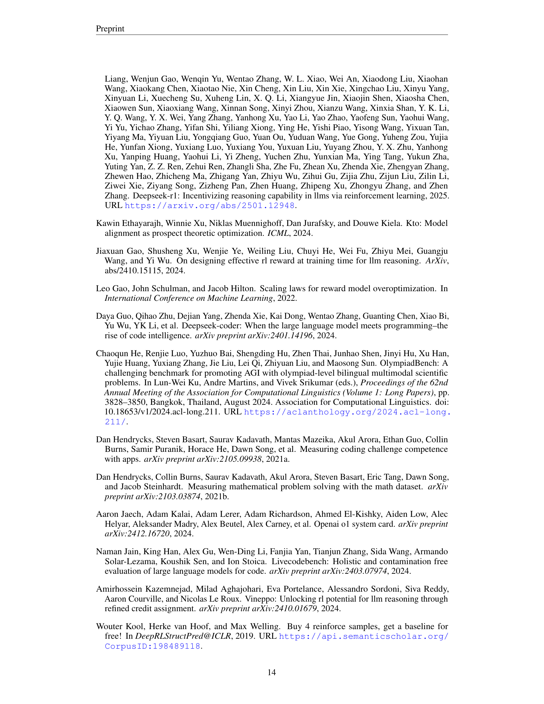
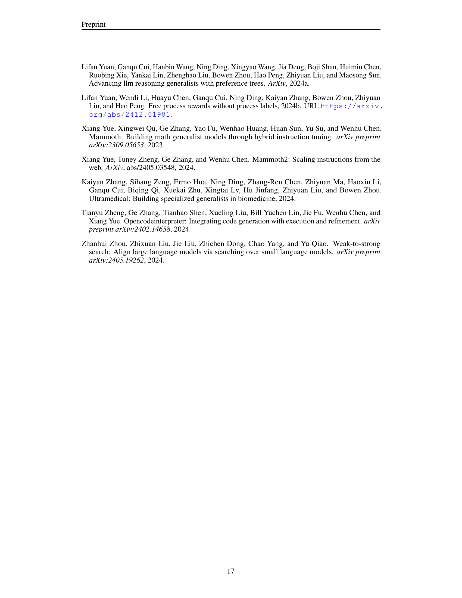

 


 2502.01456 
 Ganqu Cui et el. 
 
 🤗 2025-02-04 
 



↗ arXiv


↗ Hugging Face


### TL;DR



대규모 언어 모델(LLM)의 추론 능력 향상을 위해 **밀집형 과정 보상**이 주목받고 있지만, 고품질 과정 라벨 수집의 어려움과 **보상 해킹** 문제로 인해 온라인 학습에 적용하는 데 어려움이 있었습니다. 기존 연구들은 막대한 비용이 드는 고품질 라벨 수집에 의존하거나, 추정 기반 방법을 사용하여 효율성이 떨어지는 한계를 보였습니다.

본 논문에서는 **암묵적 과정 보상(Implicit Process Rewards)**을 활용한 PRIME(Process Reinforcement through IMplicit rEwards)이라는 새로운 강화 학습 방법을 제안합니다. PRIME은 정책 롤아웃과 결과 라벨만을 사용하여 온라인 PRM 업데이트를 가능하게 하여, 고품질 라벨 수집의 어려움과 보상 해킹 문제를 동시에 해결합니다.  다양한 강화 학습 알고리즘과 호환되며, 별도의 보상 모델 학습 단계가 필요하지 않아 개발 비용도 크게 절감합니다. 실험 결과, 수학 및 코딩 문제 해결 능력에서 상당한 성능 향상을 보였습니다.



#### Key Takeaways


 암묵적 과정 보상 모델(PRM)을 이용하여 온라인에서 PRM을 효율적으로 업데이트하는 방법 제시 



 다양한 강화 학습 알고리즘과 호환 가능하며, 기존 방식 대비 2.5배의 샘플 효율 향상 및 6.9%의 성능 향상 달성 



 수학 및 코딩 추론 벤치마크에서 기존 SOTA 모델들을 능가하는 성능을 기록 


#### Why does it matter?
본 논문은 **대규모 언어 모델(LLM)의 강화 학습에서 밀집형 과정 보상을 효율적으로 활용하는 방법**을 제시하여, 기존의 희소한 결과 보상 기반 방법의 한계를 극복하고 LLM의 추론 능력 향상에 크게 기여할 수 있습니다.  **온라인 학습과 보상 해킹 문제를 동시에 해결**하며, 다양한 강화 학습 알고리즘과의 호환성을 높였기에, LLM 강화 학습 분야의 연구 방향에 중요한 영향을 미칠 것으로 예상됩니다. 특히 **수학 및 코딩 문제 해결** 능력 향상에 대한 실험 결과는 해당 분야 연구자들에게 상당한 가치를 제공합니다.

------
#### Visual Insights

> 🔼 그림 1은 몇몇 경쟁 수준 수학 벤치마크에서 Eurus-2-7B-PRIME의 성능을 보여줍니다.  Eurus-2-7B-PRIME은 기존의 최첨단 수학 모델 및 대규모 모델들을 능가하는 성능을 보여주며, 특히 Eurus-2-7B-SFT 대비 16.7%의 성능 향상을 보입니다. 이는 PRIME이 복잡한 다단계 추론이 필요한 과제에서도 효과적으로 성능을 향상시킨다는 것을 의미합니다.  그래프는 다양한 벤치마크(AIME 2024, AMC, Minerva Math, OlympiadBench, MATH-500)에 대한 정확도를 비교하여 보여줍니다.
> 

> 
read the caption

> Figure 1: Overall math performance. Eurus-2-7B-PRIME excels at competition-level mathematics benchmarks, outperforming advanced math models and larger models. Notably, PRIME brings substantial performance gain (+16.7%) over Eurus-2-7B-SFT.
> 


| Model | Eurus-2-7B-PRIME | Qwen2.5-Math-7B-Instruct |
|---|---|---|
| Base Model | Qwen2.5-Math-7B | Qwen2.5-Math-7B |
| SFT Data | 230K (open-source) | 2.5M (open-source & in-house) |
| RM Data | 0 | 618K (in-house) |
| RM | Eurus-2-7B-SFT | Qwen2.5-Math-RM (72B) |
| RL Data | 150K queries × 4 samples | 66K queries × 32 samples |

> 🔼 표 1은 Eurus-2-7B-PRIME과 Qwen2.5-Math-7B-Instruct 모델 학습에 필요한 자원(기반 모델, SFT 데이터, RM 데이터, RM, RL 데이터)을 비교한 표입니다.  Eurus-2-7B-PRIME 모델은 Qwen2.5-Math-7B 모델을 기반으로 하며, 상대적으로 적은 양의 SFT 데이터와 RL 데이터만 사용하여 Qwen2.5-Math-7B-Instruct 모델보다 훨씬 효율적인 학습이 가능함을 보여줍니다. 특히, PRIME은 별도의 RM 학습 단계가 필요 없어 개발 오버헤드를 크게 줄일 수 있다는 것을 강조합니다.
> 

> 
read the caption

> Table 1: The comparison of resource requirements between Eurus-2-7B-PRIME and Qwen2.5-Math-7B-Instruct.
> 

### In-depth insights

#### Implicit Reward RL
암묵적 보상 강화 학습(Implicit Reward RL)은 **정책(policy)의 중간 단계에 대한 명시적인 보상 없이도** 에이전트가 최적의 행동을 학습할 수 있도록 하는 방법입니다. 이는 복잡한 작업에서 **전체 과정의 결과만을 보상으로 사용하는 것보다 훨씬 효율적**일 수 있습니다. 암묵적 보상은 종종 **에이전트의 내부 상태나 행동 패턴을 통해 추론**되며, **정책의 성능을 측정하는 다른 지표들을 보상으로 활용**하기도 합니다.  **보상 신호를 직접 설계하는 어려움과 노이즈 문제를 완화**하는 효과가 있습니다.  하지만 암묵적 보상은 **보상 신호의 해석 가능성과 신뢰성이 떨어질 수 있다는 단점**이 있습니다. 따라서 **보상 신호의 질을 관리하고,  학습 과정을 모니터링**하는 것이 중요하며, **다양한 암묵적 보상 설계 및 평가 방법에 대한 추가 연구**가 필요합니다.  **특히 대규모 언어 모델(LLM)의 훈련에 적용**될 때, 효율성과 안전성 측면에서 더욱 주의 깊은 고려가 필요합니다.

#### Online PRM Update
본 논문에서 **온라인 PRM 업데이트**는 핵심적인 역할을 합니다. 기존의 방법들은 고품질의 프로세스 레이블을 수집하는 데 어려움을 겪었지만, 이 논문에서는 **암묵적 프로세스 보상**을 활용하여 정책 롤아웃과 결과 레이블만으로 온라인 PRM 업데이트를 가능하게 합니다. 이는 고품질 레이블 수집의 어려움을 해결하고 **보상 해킹** 문제를 완화하는 데 기여합니다.  **암묵적 PRM**은 결과 레이블만으로도 학습이 가능하며, 추론 시에는 토큰 단위의 밀집 보상을 생성하여 다양한 강화 학습 알고리즘과의 호환성을 높입니다.  온라인 업데이트를 통해 PRM은 정책의 변화에 적응하고 과적합을 방지하며, 효율적인 강화 학습을 가능하게 합니다.  **결과적으로, 온라인 PRM 업데이트는 PRIME의 핵심적인 장점이며, 대규모 언어 모델의 추론 능력 향상에 크게 기여합니다.**

#### Scalable Reward Model
본 논문에서 제시된 확장 가능한 보상 모델은 **대규모 언어 모델(LLM)**의 강화 학습에서 효율성과 성능을 향상시키는 핵심 요소입니다.  **명시적 보상 모델 훈련의 어려움**을 해결하기 위해 암시적 보상 모델을 활용하여 **온라인 업데이트**를 가능하게 합니다.  이를 통해 고품질의 보상 레이블 수집에 드는 높은 비용을 절감하고 보상 해킹 문제를 완화합니다.  **간단한 훈련 절차**와 **다양한 강화 학습 알고리즘과의 호환성**은 모델의 확장성과 실용성을 더욱 높입니다.  암시적 보상 모델의 설계 및 초기화 전략 또한 성능 향상에 중요한 역할을 합니다.  **SFT(Supervised Fine-Tuning) 모델**을 초기화 모델로 사용함으로써 별도의 보상 모델 훈련 과정을 생략하고 효율성을 높입니다.  결론적으로, **온라인 업데이트**, **암시적 보상**, 그리고 **효율적인 초기화 전략**을 결합한 이 확장 가능한 보상 모델은 LLM의 강화 학습에서 중요한 발전을 이끌어낼 수 있습니다.

#### Math & Code Benchmarks
본 논문은 수학 및 코드 관련 벤치마크에 대한 심층적인 분석을 제공합니다. **다양한 난이도의 수학 문제와 코딩 과제를 포함하는 포괄적인 벤치마크 세트**를 사용하여, 제안된 방법의 성능을 평가하고 기존 방법과 비교 분석합니다. 특히, **대규모 언어 모델(LLM)의 추론 성능 향상에 초점**을 맞추어, 다양한 복잡도의 문제 해결 능력을 정량적으로 평가합니다.  **정확도, 효율성, 일반화 능력 등 다양한 지표**를 통해, 모델의 성능을 종합적으로 분석하고, 향후 연구 방향을 제시합니다. **새로운 벤치마크 디자인 및 평가 방식**을 제안함으로써, LLM의 추론 능력 향상에 대한 연구에 중요한 기여를 합니다.  **실험 결과는 제안된 방법의 우수성을 입증**하며, LLM 기반 문제 해결 기술 발전에 중요한 의미를 가집니다.

#### Zero-shot RL
논문에서 제시된 제로샷 강화학습(Zero-shot RL)에 대한 심층적인 분석 결과는 다음과 같습니다. **기존의 사전 학습된 모델을 활용하여 추가적인 데이터 없이도 직접 강화 학습을 수행하는 접근 방식**을 보여줍니다. 이는 **데이터 효율성을 극대화**하고 **학습 비용을 절감**하는 데 중요한 의미를 가집니다. 하지만, **초기 성능이 우수한 반면 학습 과정에서 성능 향상이 둔화되는 한계**를 보였으며, 향후 추가 연구를 통해 이러한 문제점을 해결하고 성능을 더욱 향상시킬 필요가 있습니다. 특히, **대규모 언어 모델(LLM)의 기반 모델을 활용**하여 제로샷 강화 학습을 실험한 결과, **매우 효율적인 학습**과 **놀라운 성능 향상**을 확인하였습니다.  **초기 모델의 품질**이 결과에 큰 영향을 미치는 것으로 나타났고, **모델의 크기**가 클수록 더 나은 성능 향상을 보였습니다. 이러한 결과는 **제로샷 강화학습 접근법이 LLM의 추론 능력 향상에 매우 유용한 전략**임을 시사하며, 앞으로 이 분야의 연구가 더욱 활발하게 진행될 것으로 예상됩니다.

### More visual insights

More on figures

> 🔼 그림 2는 PRIME의 작동 과정을 보여줍니다.  PRIME은 (1) 정책 모델과 암시적 PRM을 모두 참조 모델로 초기화하고, (2) 각 프롬프트에 대해 여러 응답을 샘플링하고 출력 정확도 필터를 적용하며, (3) 암시적 PRM을 사용하여 암시적 과정 보상을 얻고 교차 엔트로피(CE) 손실을 사용하여 업데이트하고, (4) 이점과 정책 손실을 계산하여 정책 모델을 업데이트하는 방식으로 동작합니다.
> 

> 
read the caption

> Figure 2: Illustration of PRIME. PRIME follows that (1) initialize policy model and the Implicit PRM both with the reference model; (2) sample multiple responses for each prompt and filter with output accuracy; (3) obtain implicit process rewards by the Implicit PRM and update it using cross-entropy (CE) loss; (4) compute advantage and policy loss then update the policy model.
> 

> 🔼 그림 3은 온라인 프롬프트 필터링이 훈련 보상에 미치는 영향을 보여줍니다.  온라인 프롬프트 필터링을 사용하지 않은 경우와 비교하여, 필터링을 적용했을 때 보상의 분산이 크게 감소하고 보상의 안정성이 증가함을 보여줍니다. 이는 훈련 과정에서 더 안정적이고 효율적인 결과를 얻을 수 있음을 시사합니다.
> 

> 
read the caption

> Figure 3: Impact of online prompt filtering on training rewards.
> 

> 🔼 이 그림은 10단계 이동 평균을 사용하여 에피소드 학습 과정에서의 누적 보상을 보여줍니다.  PRIME 알고리즘과 기준 알고리즘(RLOO w/ OV Only)의 학습 곡선을 비교하여 PRIME의 학습 효율성을 시각적으로 보여줍니다.  PRIME이 RLOO w/ OV Only 보다 훨씬 빠르게 수렴하는 것을 확인할 수 있습니다.
> 

> 
read the caption

> (a) Outcome training rewards (10-step moving).
> 

> 🔼 그림 (b)는 다양한 경사도 단계에서의 테스트 정확도를 보여줍니다.  즉, 강화 학습 모델을 훈련하는 동안 여러 단계에서 모델의 성능을 평가한 결과를 나타냅니다.  x축은 경사도 단계(gradient step)의 수를, y축은 테스트 데이터셋에 대한 모델의 정확도를 나타냅니다.  이를 통해 훈련 과정에서 모델의 성능 변화 추이를 파악하고, 최적의 훈련 단계를 확인하는 데 도움이 됩니다.
> 

> 
read the caption

> (b) Test accuracy across different gradient steps.
> 

> 🔼 그림 4는 PRIME과 RLOO(Outcome Verifier 사용)의 성능을 비교하여 밀집 보상(dense reward)의 효과를 보여줍니다. PRIME은 RLOO에 비해 샘플 효율성이 2.5배 향상되었고, 성능이 6.9% 향상되었습니다.  PRIME은 후속 작업(downstream tasks)에서도 RLOO보다 훨씬 우수한 성능을 보였습니다.  즉, 밀집 보상을 사용한 PRIME이 희소 보상(sparse reward)을 사용한 RLOO보다 훨씬 효율적이고 성능이 뛰어나다는 것을 보여주는 결과입니다.
> 

> 
read the caption

> Figure 4:  The effect of dense reward. We compare PRIME and RLOO with outcome verifier (OV). Dense rewards in PRIME lead to 2.5×2.5\times2.5 × sample efficiency and 6.9%percent6.96.9\%6.9 % performance improvement. PRIME also substantially outperforms RLOO on downstream tasks.
> 

> 🔼 이 그림은 10단계 이동 평균을 사용하여 훈련 보상을 보여줍니다. 즉, 각 지점은 이전 10단계의 보상 평균을 나타냅니다. 이는 보상 신호의 변동성을 줄이고 보다 안정적인 추세를 보여주는 데 도움이 됩니다.  그림은 훈련 과정에서 보상이 어떻게 변화하는지 보여주어, 모델이 시간이 지남에 따라 학습하는 방식을 이해하는 데 유용합니다.  보상이 높을수록 모델 성능이 좋다는 것을 의미합니다.
> 

> 
read the caption

> (a) Outcome training rewards (10-step moving).
> 

> 🔼 그림 (b)는 여러 최적화 단계에 따른 테스트 정확도 변화를 보여줍니다.  다양한 최적화 단계에서 모델 성능을 평가하여, 학습 과정의 효율성 및 성능 향상을 확인합니다.  PRIME 모델이 다른 최적화 방법보다 얼마나 빠르게 수렴하고 높은 정확도에 도달하는지 보여주는 지표입니다.
> 

> 
read the caption

> (b) Test accuracy across different gradient steps.
> 

> 🔼 그림 5는 다양한 방식으로 학습된 보상 모델(PRM)의 성능을 비교한 결과를 보여줍니다.  SFT(Supervised Fine-Tuning) 모델로 초기화된 온라인 PRM이 가장 좋은 결과를 보였습니다. 놀랍게도, 추가적인 롤아웃 데이터로 사전 훈련된 PRM을 사용하면 온라인 및 오프라인 설정 모두에서 성능이 저하되는 것을 확인했습니다. 이는 추가 데이터를 사용한 사전 훈련이 실제 RL 환경에 적합하지 않은 과적합된 모델을 생성할 수 있음을 시사합니다. 온라인 학습을 통해 PRM을 지속적으로 업데이트하는 것이 과적합을 방지하고 최적의 성능을 유지하는 데 중요함을 보여줍니다.
> 

> 
read the caption

> Figure 5: Comparison of different PRMs. Online PRM initialized from SFT model achieved the best results. Surprisingly, using PRMs trained on extra rollouts hurts the performance in both online and offline settings.
> 

> 🔼 그림 6은 PRIME 모델의 핵심 구성 요소인 암묵적 프로세스 보상 모델(Implicit PRM)의 온라인 업데이트가 모델 성능에 미치는 영향을 보여줍니다.  온라인으로 PRM을 업데이트하면 오버옵티마이제이션(과적합)을 방지하고 훈련 전 과정에서 높은 정확도를 유지할 수 있음을 보여줍니다. 반면 오프라인으로 PRM을 훈련시키면 처음에는 높은 정확도를 보이지만, 훈련이 진행될수록 정확도가 점차 감소하는 과적합 현상이 발생합니다. 이는 온라인 업데이트를 통해 PRM이 정책 모델의 변화에 적응하여 더 나은 성능을 달성할 수 있음을 시사합니다.
> 

> 
read the caption

> Figure 6: Impact of PRM online update. The offline PRM is gradully been overoptimized while online PRMs achieve higher accuracy throughout training.
> 

> 🔼 이 그림은 PRIME 모델의 두 가지 다른 참조 정책 구현 방식을 보여줍니다. (a)는 현재 정책의 로그 확률을 PRM의 참조 모델 πref로 사용하는 반면, (b)는 초기 SFT 모델을 참조 모델로 사용합니다.  (a)의 경우,  PRM은 현재 정책의 로그 확률을 기반으로 훈련되고, (b)의 경우 초기 SFT 모델을 기준으로 KL 손실을 계산하여 PRM을 훈련합니다. 두 가지 방식의 차이점과 성능을 비교 분석합니다.
> 

> 
read the caption

> (a) Policy ref: We use the policy logprob as πrefsubscript𝜋ref\pi_{\text{ref}}italic_π start_POSTSUBSCRIPT ref end_POSTSUBSCRIPT for PRM.
> 

> 🔼 그림 7(b)는 'SFT ref' 방법에 대한 설명입니다.  이 방법은 PRM(Process Reward Model)과 KL(Kullback-Leibler divergence) 계산을 위해 초기 정책(initial policy)을 πref (파이 써브스크립트 ref)로 유지하는 것을 보여줍니다. 즉,  모델 학습 과정의 처음 단계에서 사용된 정책을 참조하여 PRM을 초기화하고,  KL divergence를 계산하는 데 사용한다는 의미입니다. 이는 모델의 학습 과정 중 발생할 수 있는 분포 변화(distribution shift)에 대한 안정성을 확보하기 위한 전략입니다.
> 

> 
read the caption

> (b) SFT ref: We retain the initial policy to provide πrefsubscript𝜋ref\pi_{\text{ref}}italic_π start_POSTSUBSCRIPT ref end_POSTSUBSCRIPT for PRM and KL.
> 

> 🔼 그림 7은 두 가지 다른 참조 정책 구현 방식을 비교합니다. 하나는 실행 중인 정책의 이전 logprob을 참조로 사용하는 방식(policy ref)이고, 다른 하나는 초기 SFT 모델을 참조 모델로 사용하는 방식(SFT ref)입니다.  policy ref는 현재 정책의 확률 분포를 참조하여 보다 동적인 업데이트를 수행하지만,  SFT ref는 초기 모델을 기준으로 하여 더 안정적인 학습을 유도합니다. 두 방식의 성능 차이를 비교하여 최적의 참조 정책 선택에 대한 통찰력을 제공합니다.
> 

> 
read the caption

> Figure 7: Comparison of different reference policy implementations. One uses the running policy’s old logprobs as reference (policy ref) while the other uses the initial SFT model as the reference model (SFT ref).
> 

> 🔼 그림 8은 PRIME 알고리즘에서 사용되는 암시적 PRM(Process Reward Model)의 기준 모델 선택 전략 비교 결과를 보여줍니다. 두 가지 전략은, (1) 현재 정책 모델의 로그 확률을 기준 모델로 사용하는 방법과 (2) 초기 SFT(Supervised Fine-Tuning) 모델을 기준 모델로 사용하는 방법입니다. 이 그림은 두 가지 전략의 보상(Reward)이 비슷함을 보여줍니다.  즉, 정책 모델 또는 초기 SFT 모델 중 어느 것을 기준 모델로 사용하더라도 PRIME의 성능에 미치는 영향은 크지 않다는 것을 시사합니다.
> 

> 
read the caption

> Figure 8: Different reference model for PRM. We compare two reference model selection strategies for PRIME. Using the policy model as reference and using the initial SFT model as reference. Their rewards are similar.
> 

> 🔼 이 그림은 학습 샘플에 대한 PRM(Process Reward Model)의 분류 정확도를 보여줍니다.  단순히 정확도만 나타내는 것이 아니라,  실제 학습 과정에서 PRM의 성능 변화를 보여주는 시계열 그래프일 가능성이 높습니다.  x축은 학습 단계 또는 시간을, y축은 PRM의 분류 정확도를 나타낼 것입니다.  이 그래프를 통해 PRM이 학습 데이터에 얼마나 잘 적응하고 있는지, 그리고 학습 과정에서 성능이 어떻게 변화하는지를 파악할 수 있습니다. 특히, 다른 학습 방법(예: 단순 전방 또는 이중 전방)과 비교하여 PRM의 효율성과 안정성을 평가하는 데 사용될 수 있습니다.
> 

> 
read the caption

> (a) PRM classification accuracy on training samples.
> 

> 🔼 그림 (b)는 이 논문의 5.3절 '단일 전달 대 단일 전달'에서 다양한 강화 학습 알고리즘에 대한 훈련 결과를 보여줍니다. 특히, 훈련 과정에서 얻어지는 누적 보상의 변화를 나타냅니다.  단일 전달 방법과 이중 전달 방법의 성능을 비교 분석하여, 각 방법의 효율성과 안정성을 평가합니다.  이중 전달 방법은 단일 전달 방법보다 훈련 과정에서의 보상 값이 더 높고 안정적인 경향을 보여줍니다.
> 

> 
read the caption

> (b) Training outcome rewards.
> 

> 🔼 그림 9는 PRIME 모델의 학습 과정에서 단일 전달(single forward) 방식과 이중 전달(double forward) 방식을 비교 분석한 결과를 보여줍니다. 이중 전달 방식은 온라인 업데이트 이후 더 높은 정확도를 달성하지만, 두 방식 모두 학습 과정에서 유사한 보상(rewards)을 얻는다는 것을 보여줍니다. 즉, 이중 전달 방식이 정확도 측면에서는 우수하지만, 학습 효율성 측면에서는 단일 전달 방식과 큰 차이가 없음을 시사합니다.  두 방식의 차이는 온라인 업데이트 이후에 나타나므로, 학습 초기 단계에서는 두 방식 간의 성능 차이가 미미합니다.
> 

> 
read the caption

> Figure 9: Single and double forward. While double forward methods obtain higher accuracy after online update, the two variants achieve similar rewards during training.
> 

> 🔼 그림 10은 다양한 강화 학습 알고리즘(REINFORCE, GRPO, PPO)에 PRIME 기법을 적용했을 때의 성능 향상을 보여줍니다. PRIME을 적용하지 않았을 때와 비교하여, 세 가지 알고리즘 모두 RLOO와 유사한 수준의 성능 향상을 보이는 것을 확인할 수 있습니다. 이는 PRIME 기법이 특정 알고리즘에 국한되지 않고 다양한 강화 학습 알고리즘에 적용 가능하며 폭넓은 활용성을 가짐을 시사합니다.
> 

> 
read the caption

> Figure 10: PRIME also benefits REINFORCE, GRPO, and PPO, achieving similar improvement as RLOO.
> 

> 🔼 그림 11은 PPO의 기존 값 모델 또는 암묵적 PRM(Process Reward Model)과 보상 모델의 성능을 비교한 것입니다. 실험 결과, 기존 값 모델이나 암묵적 PRM을 사용한 경우 보상 모델을 사용했을 때보다 성능이 현저히 떨어지는 것을 보여줍니다. 즉, 언어 모델의 강화 학습에서 보상 모델이 값 모델보다 훨씬 효과적임을 시사합니다.
> 

> 
read the caption

> Figure 11: Comparison of value models and reward models. We show that value models, either the original PPO one or Implicit PRM, is substaintially worse than reward models.
> 

More on tables


| Method | Step | AIME 2024 | AMC | MATH-500 | MinervaMath | OlympiadBench | LeetCode | LiveCodeBench | Avg. |
|---|---|---|---|---|---|---|---|---|---| 
| **GPT-4o** | - | 9.3 | 45.8 | 76.4 | 36.8 | 43.3 | 58.9 | 48.8 | 45.6 |
| **Llama-3.1-70B-Inst.** | - | 20.0 | 37.3 | 65.0 | 37.1 | 30.5 | 35.0 | 34.4 | 37.0 |
| **Qwen2.5-Math-7B-Inst.** | - | 13.3 | 50.6 | 79.8 | 34.6 | 40.7 | 11.7 | 11.3 | 34.6 |
| **Eurus-2-7B-SFT** | 0 | 3.3 | 30.1 | 66.2 | 32.7 | 29.8 | 21.7 | 17.8 | 28.8 |
| **RLOO w/ OV Only** | 240 | 20.0 | 47.0 | 73.2 | 36.4 | 35.4 | 28.3 | 26.7 | 36.9 |
|  | 80 | 20.0 | 41.0 | 68.2 | 38.2 | 37.0 | 26.7 | 26.6 | 36.8 |
|  | 160 | 13.3 | 42.2 | 72.0 | 37.1 | 38.7 | 26.7 | 25.6 | 36.5 |
|  | 240 | 20.0 | 50.6 | 78.2 | 39.3 | 40.3 | 31.1 | 27.5 | 41.0 |
|  | 320 | 16.7 | 51.8 | 77.8 | 39.7 | 41.5 | 36.1 | 28.5 | 41.7 |
| **Eurus-2-7B-PRIME** | 592 | 26.7 | 57.8 | 79.2 | 38.6 | 42.1 | 33.3 | 28.6 | 43.9 |
> 🔼 표 2는 PRIME과 결과 검증자(OV)를 사용한 RLOO의 상세 결과를 보여줍니다. 동일한 240단계에서 PRIME으로 학습된 모델이 결과 보상으로 학습된 모델보다 전반적으로 성능이 우수함을 보여줍니다.  다양한 수학 관련 벤치마크(AIME 2024, AMC, MATH-500, Minerva Math, OlympiadBench, LeetCode, LiveCodeBench)에 대한 정확도(%)를 비교하여 PRIME의 효율성과 효과를 보여줍니다.
> 

> 
read the caption

> Table 2: Detailed results of PRIME and RLOO w/ outcome verifier (OV). At the same 240 steps, the model trained by PRIME is generally better than the model trained by outcome rewards.
> 


| Method | Step | AIME 2024 | AMC | MATH-500 | MinervaMath | OlympiadBench | LeetCode | LiveCodeBench | Avg. |
|---|---|---|---|---|---|---|---|---|---| 
| **RLOO** | 240 | 20.0 | 47.0 | 73.2 | 36.4 | 35.4 | 28.3 | 26.7 | 36.9 |
| **RLOO w/ PRIME** | 240 | 20.0 | 50.6 | 78.2 | 39.3 | 40.3 | 31.1 | 27.5 | 41.0 |
| **REINFORCE** | 240 | 6.7 | 47.0 | 72.6 | 36.0 | 37.2 | 27.2 | 25.0 | 36.0 |
| **REINFORCE w/ PRIME** | 240 | 6.7 | 50.0 | 76.4 | 36.8 | 39.1 | 27.8 | 27.5 | 37.8 |
| **GRPO** | 240 | 10.0 | 44.6 | 73.2 | 37.5 | 36.6 | 25.0 | 25.8 | 36.1 |
| **GRPO w/ PRIME** | 240 | 16.7 | 47.0 | 75.0 | 34.9 | 38.2 | 28.9 | 23.9 | 37.8 |
| **PPO** | 240 | 10.0 | 41.0 | 73.6 | 36.0 | 36.3 | 28.3 | 25.7 | 35.8 |
| **PRIME as Value Model** | 240 | 16.7 | 44.6 | 72.6 | 34.6 | 35.7 | 27.8 | 24.6 | 36.6 |
| **PPO w/ PRIME** | 240 | 13.3 | 50.6 | 77.4 | 37.1 | 40.6 | 30.0 | 26.7 | 39.4 |
> 🔼 표 3은 다양한 강화 학습 알고리즘에 대한 테스트 결과를 보여줍니다.  PRIME(Process Reinforcement through IMplicit rEwards) 방법을 사용하여 학습된 모델의 성능을 REINFORCE, GRPO, PPO 알고리즘으로 학습된 모델과 비교 분석합니다.  각 알고리즘의 성능은 AIME 2024, AMC, MATH-500, Minerva Math, OlympiadBench, LeetCode, LiveCodeBench 등 다양한 벤치마크에서 평가됩니다.  표는 각 벤치마크에 대한 정확도를 보여주며, PRIME이 다른 알고리즘에 비해 성능 향상을 가져왔는지 보여줍니다.
> 

> 
read the caption

> Table 3: Testset results of different RL algorithms.
> 


| Action Name | Description |
|---|---| 
| **ASSESS** | Analyze current situation, identify key elements and goals |
| **ADVANCE** | Move forward with reasoning - calculate, conclude, or form hypothesis |
| **VERIFY** | Check accuracy of current approach, look for errors |
| **SIMPLIFY** | Break complex problems into simpler parts |
| **SYNTHESIZE** | Combine multiple pieces of information into complete solution |
| **PIVOT** | Change strategy when current approach isn’t working |
| **OUTPUT** | Summarize thought process and present final answer |
> 🔼 이 표는 행동 중심적 사고 과정 추론 프레임워크에서 사용되는 행동들을 설명합니다. 각 행동은 추론 과정의 특정 단계를 나타내며, 문제 해결 과정 전반에 걸쳐 문제 평가, 해결 방안 모색, 정확성 검증, 문제 단순화, 정보 통합, 전략 수정, 최종 답변 제시 등의 역할을 수행합니다.
> 

> 
read the caption

> Table 4: Actions in action-centric chain-of-thought reasoning framework.
> 


| Task | Dataset | Size | Avg. Response Length | Source |
|---|---|---|---|---|
| Math | MathInstruct-MATH (Yue et al., 2023) | 12715 | 964.01 | https://huggingface.co/datasets/TIGER-Lab/MathInstruct |
|  | OpenMathIns-2-Aug_Math (Toshniwal et al., 2024) | 15086 | 1202.25 | https://huggingface.co/datasets/nvidia/OpenMathInstruct-2 |
|  | Numina (Li et al., 2024) | 55845 | 1331.61 | https://huggingface.co/datasets/AI-MO/NuminaMath-CoT |
|  | Reasoning-001 (SkunkworksAI, 2024) | 29831 | 1316.49 | https://huggingface.co/datasets/SkunkworksAI/reasoning-0.01 |
| Coding | Code-Feedback (Zheng et al., 2024) | 27663 | 1805.16 | https://huggingface.co/datasets/m-a-p/Code-Feedback |
|  | Magicoder (Wei et al., 2024) | 24480 | 1828.72 | https://huggingface.co/datasets/ise-uiuc/Magicoder-Evol-Instruct-110K |
|  | Magicoder-OSS (Wei et al., 2024) | 28980 | 1850.05 | https://huggingface.co/datasets/ise-uiuc/Magicoder-OSS-Instruct-75K |
| Biomedicine | UltraMedical_mc (Zhang et al., 2024) | 35163 | 891.06 | https://huggingface.co/datasets/TsinghuaC3I/UltraMedical |
| Total / Avg. | - | 229763 | 1390.75 | - |
> 🔼 본 표는 논문의 SFT(Supervised Fine-Tuning) 단계에서 사용된 데이터의 통계를 보여줍니다.  데이터셋의 이름, 크기, 평균 응답 길이, 출처, 그리고 데이터셋이 수행하는 작업(수학, 코딩, 생의학)을 포함합니다.  SFT 데이터셋은 다양한 공개 데이터셋을 결합하여 구성되었으며, 총 229,763개의 데이터로 구성되어 있습니다. 각 데이터셋의 평균 응답 길이는 1390 토큰입니다.  표에는 각 데이터셋의 출처 URL도 포함되어 있습니다.
> 

> 
read the caption

> Table 5: Data statistics of SFT data.
> 


| Dataset | Generator Model | Num. Inst | Resp/Inst | Step-level/Response-level |
|---|---|---|---|---|
| UltraInteract | Llama-3.1-8B-Inst | 20177 | 8 | Response-level |
|  | Llama-3.1-8B-Base | 13570 | 8 | Response-level |
|  | Qwen2.5-72B-Inst | 4758 | 8 | Response-level |
|  | Qwen2.5-Math-7B-Base | 25713 | 8 | Response-level |
| Numina-SynMath | Llama-3.1-8B-Inst | 4783 | 8 | Response-level |
|  | Qwen2.5-Math-7B-Base | 5806 | 8 | Response-level |
| Numina-Olympiads | Llama-3.1-8B-Inst | 2909 | 8 | Response-level |
|  | Qwen2.5-Math-7B-Base | 4739 | 8 | Response-level |
> 🔼 표 6은 EurusPRM이라는 훈련 데이터셋의 통계 정보를 보여줍니다.  EurusPRM 데이터셋은 다양한 언어 모델(Llama-3.1-8B-Inst, Llama-3.1-8B-Base, Qwen2.5-72B-Inst, Qwen2.5-Math-7B-Base)로 생성되었으며, 데이터셋의 크기(Num. Inst), 각 인스턴스 당 응답 개수(Resp/Inst), 그리고 평가 방식이 스텝 레벨인지 응답 레벨인지(Step-level/Response-level) 등을 보여줍니다.  데이터셋은 여러 다른 소스 (UltraInteract, Numina-SynMath, Numina-Olympiads)에서 수집되었습니다. 이 표는 EurusPRM 모델의 훈련에 사용된 데이터의 특성을 이해하는 데 도움을 줍니다.
> 

> 
read the caption

> Table 6: Data statistics of EurusPRM training dataset.
> 

### Full paper



