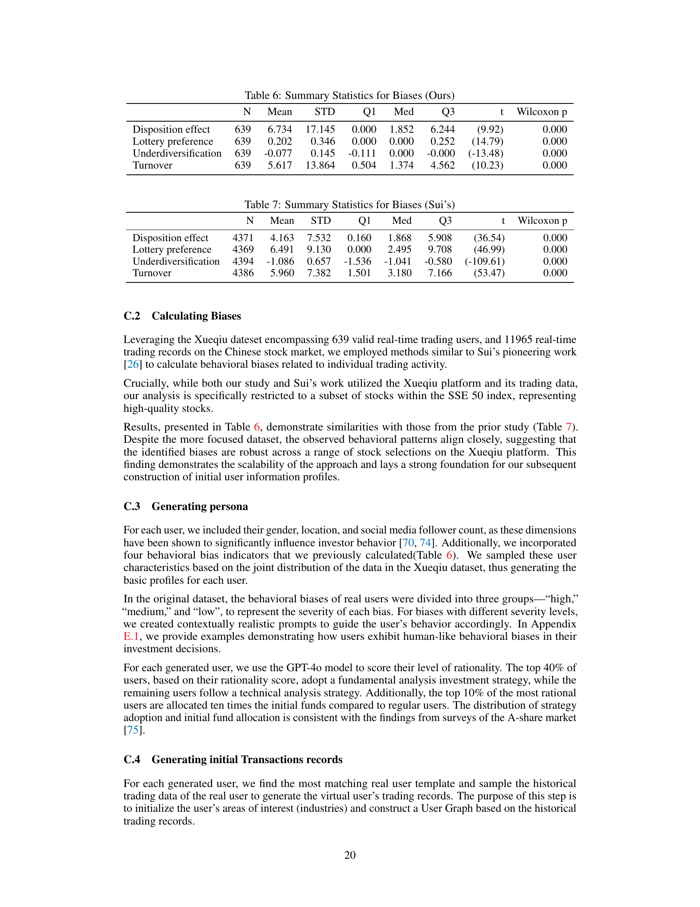

 


 2502.01506 
 Yuzhe Yang et el. 
 
 🤗 2025-02-06 
 



↗ arXiv


↗ Hugging Face


↗ Papers with Code


### TL;DR



기존 금융 시장 모델의 한계를 극복하기 위해, 본 논문에서는 **대규모 언어 모델(LLM)**을 활용한 새로운 다중 에이전트 시뮬레이션 프레임워크인 TwinMarket을 제안합니다. 기존의 규칙 기반 에이전트 모델은 인간 행동의 복잡성과 다양성을 충분히 반영하지 못하는 한계가 있었으나, TwinMarket은 LLM을 통해 **개별 투자자의 인지적 편향, 감정 변화, 비합리적 요소** 등을 고려하여 보다 현실적인 시뮬레이션을 제공합니다. 특히, 시뮬레이션된 주식 시장 환경에서 **개별 행동이 집단 행동과 출현 현상**으로 이어지는 과정을 분석하여, 금융 버블이나 경기침체와 같은 거시적 현상을 설명하는 새로운 통찰력을 제공합니다.

TwinMarket은 **BDI(Belief-Desire-Intention) 프레임워크**를 기반으로 에이전트의 의사결정 과정을 투명하고 해석 가능하게 모델링합니다. 또한, **소셜 미디어 플랫폼**을 시뮬레이션하여 에이전트 간의 동적인 정보 교환 및 사회적 영향 과정을 구현하고, 여론 주도자와 정보 확산의 역동성을 분석합니다. 다양한 금융 자산과 대규모 모집단에 대한 실험을 통해 **집단 규모와 상호 작용의 복잡성이 집단 행동과 출현 현상**에 미치는 영향을 조사합니다. 이 연구는 **실제 데이터를 기반으로 실제 시장과의 정렬**을 시도하며, **동적인 상호 작용 모델링** 및 **확장 가능한 시장 시뮬레이션**을 통해 개별 행동에서부터 거시적 현상으로 이어지는 메커니즘을 밝히는 데 기여합니다.



#### Key Takeaways


 LLM 기반 다중 에이전트 프레임워크인 TwinMarket을 통해 금융 시장을 현실적으로 시뮬레이션할 수 있음 



 개별 투자자의 행동과 시장의 거시적 현상 간의 복잡한 상호 작용을 보여줌 



 소셜 네트워크를 통한 정보 전파가 시장 변동성과 집단 행동에 미치는 영향을 분석함 


#### Why does it matter?
본 논문은 **대규모 언어 모델(LLM)**을 활용하여 금융 시장의 **미시적 행동**과 **거시적 현상**을 현실적으로 시뮬레이션하는 새로운 프레임워크인 TwinMarket을 제시함으로써, 사회과학 연구에 중요한 영향을 미칩니다.  **LLM 기반 에이전트**를 사용하여 복잡한 인간 행동을 모델링하고, **상호 작용 및 피드백 메커니즘**을 통해 나타나는 **집단 행동과 출현 현상**을 탐구합니다. 금융 시장의 다양한 스타일리쉬드 팩트들을 재현하고, **소셜 네트워크**를 통한 정보 전파의 영향을 분석하여, 시장 변동성과 거시적 현상을 설명하는 새로운 통찰력을 제공합니다.  이 연구는 **미시적 행동과 거시적 결과 간의 복잡한 상호 작용**에 대한 이해를 높이고, 향후 연구를 위한 새로운 방향을 제시합니다.

------
#### Visual Insights

> 🔼 그림 1은 TwinMarket 시뮬레이션 환경에 대한 개요를 보여줍니다. 각 사용자는 소셜 네트워크 내에서 고유한 페르소나를 가지며 실시간으로 환경과 상호 작용하고 자신의 행동을 통해 환경에 영향을 미칩니다. 사용자들은 서로 다른 배경, 투자 스타일, 행동적 편향을 가지고 있으며, 이는 그들의 투자 결정에 영향을 미칩니다.  그림은 사용자들이 정보를 검색하고, 다른 사용자들과 소통하며, 투자 결정을 내리고, 소셜 미디어를 통해 상호 작용하는 과정을 보여줍니다. TwinMarket 프레임워크를 통해 연구자들은 미시적 수준의 개별 행동에서 거시적 수준의 집단 행동 및 사회적 현상의 출현을 연구할 수 있습니다.  예를 들어, 개별 투자자들의 행동이 어떻게 시장 거품이나 불황과 같은 집단적 결과로 이어지는지 관찰할 수 있습니다.
> 

> 
read the caption

> Figure 1: Overview of TwinMarket environment, where each user has a unique persona within the social network, interacts with the environment in real-time, and influences it through their actions. This framework enables the study of emergent social phenomena.
> 


| System | Agent Customization | Social Interactions | Simulation Scale |
|---|---|---|---|
| **CompeteAI** | Simple predefined prompts | Competition between 2 restaurants | Less than 100 agents |
| **EconAgent** | Uses demographic info | No interaction considered | 100 agents |
| **ASFM** | Two fixed strategies | No interaction considered | Not disclosed |
| **TwinMarket** | Highly customizable agents | Rich multi-agent interactions | 1000 agents, scalable |

> 🔼 이 표는 TwinMarket과 기존의 유사한 시스템(CompeteAI, EconAgent, ASFM)을 비교하여 TwinMarket의 고유한 특징과 장점을 보여줍니다.  구체적으로는 에이전트의 사용자 정의 가능성, 에이전트 간의 상호 작용, 시뮬레이션 규모 세 가지 측면에서 비교 분석하여 TwinMarket이 에이전트의 다양성과 상호 작용의 풍부함, 그리고 시뮬레이션의 확장성 측면에서 우수함을 강조합니다.  이는 TwinMarket의 차별성과 실제 시장 시뮬레이션에 대한 적합성을 이해하는 데 중요한 정보를 제공합니다.
> 

> 
read the caption

> Table 1: Comparison of TwinMarket with Existing Literature
> 

### In-depth insights

#### LLM in Finance
금융 분야에서의 거대 언어 모델(LLM) 활용은 **데이터 분석, 위험 관리, 투자 전략 개발** 등 다양한 영역에서 혁신적인 가능성을 제시합니다.  LLM은 방대한 금융 데이터를 분석하여 **시장 동향 예측, 투자 포트폴리오 최적화** 등에 활용될 수 있으며, **자연어 처리 능력**을 바탕으로 투자 보고서 작성, 고객 상담 자동화 등에도 적용 가능합니다.  하지만, **데이터 편향, 모델의 해석 불가능성, 예측의 불확실성** 등의 한계점 또한 존재합니다.  **윤리적 문제, 규제 준수** 또한 중요한 고려 사항입니다.  향후 LLM의 금융 분야 적용은 **설명 가능한 AI(XAI) 기술 발전, 데이터 품질 개선, 규제 환경 정비** 등을 통해 더욱 발전할 것으로 예상되며, **개인 맞춤형 금융 서비스 제공, 금융 시스템 효율 증대**에 크게 기여할 수 있을 것입니다.  **리스크 관리 및 투명성 확보**를 위한 노력과 함께,  **사회적 책임**을 고려한  LLM의 발전 방향 모색이 중요합니다.

#### BDI Agent Design
BDI(Belief-Desire-Intention) 에이전트 설계는 인간의 의사결정 과정을 시뮬레이션하기 위한 강력한 프레임워크를 제공합니다. **에이전트의 신념(Belief)은 시장 상황에 대한 그들의 이해를 반영하며, 욕구(Desire)는 그들의 목표와 선호도를 나타내고, 의도(Intention)는 그들의 행동 계획을 보여줍니다.**  이러한 세 가지 요소의 상호작용은 에이전트의 행동을 결정짓는 역동적인 과정을 생성합니다.  **실제 금융 시장 참여자들의 복잡한 행동을 반영하기 위해서는 신념, 욕구, 의도를 현실적으로 모델링하는 것이 중요합니다.**  예를 들어, 과도한 자신감이나 손실 회피와 같은 인지적 편향을 고려하고, 사회적 상호 작용과 정보 확산의 영향을 통합해야 합니다.  **LLM(Large Language Model)을 활용하여 에이전트의 인지적 능력을 향상시키고, 다양하고 현실적인 행동을 생성할 수 있습니다.** LLM은 에이전트가 뉴스 기사나 소셜 미디어 게시물을 분석하고, 시장 동향에 대한 통찰력을 얻고, 그들의 신념과 의도를 수정하는 데 도움이 될 수 있습니다.  궁극적으로, **잘 설계된 BDI 에이전트는 미시적 수준의 개별적 의사 결정과 거시적 수준의 집단적 행동 사이의 복잡한 상호 작용을 포착하여, 시장의 등락이나 금융 위기와 같은 출현 현상을 더욱 정확하게 시뮬레이션할 수 있게 해줍니다.**

#### Market Emergence
본 논문에서 제시된 TwinMarket 프레임워크는 **개별 투자자의 미시적 행동과 거시적 시장 현상 간의 상호작용을 훌륭하게 모델링**합니다. 특히, 다양한 행동 편향을 가진 개별 에이전트들이 상호 작용하면서 나타나는 **시장의 출현 현상**에 대해 심도 있게 분석합니다. **LLM 기반의 에이전트는 복잡한 의사 결정 과정과 사회적 상호 작용을 사실적으로 반영**하여, 기존의 규칙 기반 모델보다 더욱 현실적인 시뮬레이션을 제공합니다.  **정보 확산과 집단 행동의 역할**을 강조하며, 자기 충족적 예언과 같은 현상이 시장 변동성에 미치는 영향을 보여줍니다. 이러한 분석은 **미시적 행동이 거시적 결과로 이어지는 복잡한 과정**을 이해하는 데 중요한 시사점을 제공합니다. TwinMarket은 실제 시장 데이터와의 정합성을 통해 시뮬레이션의 현실성을 높이며, 다양한 규모의 시뮬레이션을 통해 시장 출현 현상에 대한 새로운 통찰력을 제공합니다.  **확장성과 실제 시장 데이터와의 연동**을 통해 실제 시장의 복잡성을 잘 반영한 점이 특징적입니다.

#### Social Dynamics
연구 논문의 '사회 역동성' 부분에 대한 심층적인 분석을 통해 얻을 수 있는 통찰력은 다음과 같습니다. **다양한 개인의 의사결정 과정과 행동의 복잡성을 포착하는 데 초점을 맞춰, 미시적 수준에서 거시적 수준의 사회적 결과로 이어지는 메커니즘을 밝히는 데 중점을 둡니다.**  **정보 전파와 사회적 영향의 역할에 대한 깊이 있는 이해를 제공하며**, 개별 행동이 집단 행동으로 이어지는 과정과 이를 통해 어떻게 금융 시장에서 버블이나 불황과 같은 **새로운 현상**이 등장하는지 보여줍니다. 특히, **자기 충족적 예언**, **소문**, **감정 변화**가 시장 변동성에 미치는 영향을 심층적으로 분석하여 사회적 상호작용과 집단 행동의 역학 관계를 밝힙니다. **다양한 규모의 시뮬레이션을 통해 그룹 크기와 상호작용 복잡성이 집단 행동과 새로운 현상에 미치는 영향을 조사함으로써,  개인의 의사결정과 사회경제적 패턴 간의 복잡한 상호 작용에 대한 귀중한 통찰력을 제공합니다.**

#### Scalability & Limits
본 논문에서 제시된 에이전트 기반 시뮬레이션 모델의 확장성과 한계에 대한 심층적인 논의가 필요합니다. **확장성** 측면에서는, 다수의 에이전트와 복잡한 상호작용을 효율적으로 처리할 수 있는 아키텍처 설계 및 알고리즘 최적화가 중요합니다. **실시간 성능**을 유지하면서 에이전트 수를 늘리는 방안과, 계산 비용을 효과적으로 관리하는 전략을 고려해야 합니다. 또한, **데이터 처리 능력**의 확장성도 중요한 요소입니다. 모델이 실제 금융 시장 데이터의 규모를 처리하고 분석할 수 있도록 데이터베이스 관리 시스템 및 분석 알고리즘을 개선해야 합니다. 한계 측면에서는, **모델의 가정**에 대한 검토가 필요합니다. 예를 들어, 에이전트의 합리성, 정보의 완전성, 시장의 효율성 등의 가정이 실제 시장과 얼마나 부합하는지에 대한 평가가 필요하며, 이러한 가정의 한계를 극복하기 위한 노력이 필요합니다. 또한, **LLM의 한계**도 고려해야 합니다. LLM의 출력이 항상 일관되고 예측 가능한 것은 아니므로, 이로 인한 시뮬레이션 결과의 불확실성을 줄이기 위한 방안을 마련해야 합니다.  **모델 검증**을 위한 엄격한 절차도 필요합니다.  시뮬레이션 결과가 실제 금융 시장의 현상과 얼마나 잘 일치하는지, 그리고 모델의 예측력이 얼마나 높은지에 대한 평가가 필요하며, 이를 통해 모델의 신뢰성을 확보해야 합니다. 마지막으로, **윤리적 고려 사항**도 중요합니다.  시뮬레이션 모델이 악용될 가능성을 고려하여 적절한 안전 장치를 마련하고,  모델의 결과 해석에 대한 윤리적 지침을 제시해야 합니다.

### More visual insights

More on figures

> 🔼 그림 2는 TwinMarket에서 생성된 사용자 프로필의 예시를 보여줍니다. 사용자의 인구통계학적 정보, 투자 스타일 및 행동적 편향이 자세히 설명되어 있습니다.  사용자의 거주지, 성별과 같은 인구 통계학적 정보와 함께, 위험 회피 성향, 과도한 자신감 등의 행동적 편향과 장기 투자, 단기 투자와 같은 투자 스타일을 보여줍니다. 이러한 정보는 TwinMarket 시뮬레이션에서 사용자의 행동을 현실적으로 모델링하는 데 사용됩니다.
> 

> 
read the caption

> Figure 2: An example of a generated user profile, with demographics, investment style, and behavioral biases.
> 

> 🔼 그림 3은 TwinMarket의 전반적인 워크플로우를 보여줍니다. 먼저, Xueqiu 데이터와 계산된 행동적 편향을 사용하여 사용자 프로필을 초기화합니다. 그런 다음, 거래일과 비거래일을 구분하여 LLM을 사용하여 매일 사용자 행동을 시뮬레이션합니다. 거래일에는 시스템이 반복적으로 거래를 실행하고 모든 날에 사용자 프로필을 업데이트하여 시뮬레이션으로 다시 돌아갑니다. 마지막으로, 시뮬레이션 완료 후 미시적 및 거시적 지표를 사용하여 시스템 성능을 검증합니다.
> 

> 
read the caption

> Figure 3: The overall workflow of the TwinMarket involves the following iterative process: ① User Data Initialization: User profiles are initialized using Snowball data and their calculated behavioral biases. ② Daily Simulation: Using LLMs to simulate daily user behavior, distinguishing between trading and non-trading days. ③ Iterative Trading & Update: The system iteratively executes trades on trading days and updates user profiles on all days, looping back to simulation. ④ Post-Simulation Validation: System performance is validated using micro and macro metrics after simulation completion.
> 

> 🔼 그림 4는 가격 지수와 신념의 상승과 하락이 동시에 발생하는 것을 보여주는 그래프입니다. 강한 상관관계를 보여주며, 투자자들의 낙관적인 예상이 가격 상승을 불러오고, 이는 다시 투자자들의 낙관적인 믿음을 강화하는 자기 충족적 예언의 메커니즘을 보여줍니다. 그러나 가격이 지속 불가능한 수준까지 상승하면 시장이 조정되면서 가격과 신념 모두 급격히 하락하는 모습을 보여줍니다. 이는 시장 버블과 붕괴의 전형적인 패턴을 보여주는 것으로, 집단적 신념 형성이 시장의 상승과 하락을 모두 주도할 수 있음을 시사합니다.
> 

> 
read the caption

> Figure 4: Simultaneous rise and fall of the price index and belief, illustrating their strong correlation.
> 

> 🔼 그림 5는 TwinMarket 시뮬레이션 결과가 실제 금융 시장의 특징을 얼마나 잘 재현하는지 보여줍니다. (a)는 수익률 분포가 정규분포가 아닌 두꺼운 꼬리를 가진 비정규 분포임을, (b)는 주가 하락 시 변동성이 증가하는 레버리지 효과를, (c)는 거래량과 수익률 간의 양의 상관관계를, 그리고 (d)는 변동성이 군집화되는 현상을 보여줍니다. 이러한 결과는 TwinMarket이 실제 금융 시장의 주요 현상들을 성공적으로 재현함을 시사합니다.
> 

> 
read the caption

> Figure 5: (a) Fat-tailed return distributions, (b) the leverage effect, (c) the volume-return relationship, and (d) volatility clustering. The results demonstrate that TwinMarket successfully replicates real market phenomena.
> 

> 🔼 그림 6은 루머 유포가 사용자 행동과 시장 역학에 미치는 영향을 보여줍니다. (a)는 루머에 노출되었을 때 사용자의 신념 점수가 크게 하락하는 것을 보여줍니다. (b)는 사용자가 매도 경향을 강하게 보이면서 매수/매도 비율이 급격히 증가하는 것을 보여줍니다. (c)는 루머에 대한 집단적 반응이 시장 하락을 촉발하여 주가가 크게 하락하는 것을 보여줍니다. 이 그림은 루머 유포가 투자자들의 심리에 미치는 영향과 이로 인해 발생하는 시장 변동성을 효과적으로 시각화하여 보여줍니다.
> 

> 
read the caption

> Figure 6: Impact of rumor propagation on user behavior and market dynamics. (a) Users’ belief scores significantly decline under rumor exposure. (b) Users exhibit a stronger tendency to sell, leading to a sharp increase in the Sell/Buy ratio. (c) The collective reaction to rumors triggers a market downturn, causing a notable drop in stock prices.
> 

> 🔼 그림 7은 사용자들의 거래 행동을 기반으로 구성된 사회적 네트워크의 인접 행렬 히트맵을 보여줍니다. 특히 빨간색 상자로 표시된 영역에서 밀도 패턴의 명확한 차이가 나타나는데, 이는 사용자 그룹 간의 강한 행동 양극화를 시사합니다. 즉, 유사한 거래 패턴을 가진 사용자들은 서로 강하게 연결되어 있고, 반대로 다른 거래 패턴을 가진 사용자들은 서로 약하게 연결되어 있거나 연결되지 않은 것을 의미합니다. 이러한 양극화는 정보 전파 및 집단적 시장 행동에 영향을 미치는 요인 중 하나로, 시장의 다양한 현상을 이해하는 데 중요한 역할을 합니다.
> 

> 
read the caption

> Figure 7: The adjacency matrix heatmap highlights distinct density patterns, particularly in the  red-boxed regions, indicating strong behavioral polarization among user groups.
> 

> 🔼 그림 8은 고차 중앙성 사용자와 저차 중앙성 사용자의 평균 좋아요 추세를 보여줍니다. 고차 중앙성 사용자는 네트워크 내에서 더 큰 영향력을 행사하며, 그들의 게시물은 더 많은 좋아요를 받는 경향이 있습니다. 이는 정보 전파와 집단 행동의 역학 관계를 보여주는 것으로, 의견 선도자의 역할과 시장 심리에 미치는 영향을 강조합니다.
> 

> 
read the caption

> Figure 8: Average likes trends in high-centrality users and low-centrality users.
> 

> 🔼 그림 9는 5개월 동안 시뮬레이션된 주가 지수와 실제 주가 지수를 비교한 그래프입니다. 시뮬레이션 결과는 실제 주가 지수의 추세와 움직임을 매우 잘 반영하고 있으며, 이는 TwinMarket 모델이 실제 시장을 정확하게 시뮬레이션할 수 있음을 보여줍니다. 특히 시뮬레이션 결과는 실제 주가 지수의 상승과 하락 추세를 정확하게 예측하고 있으며, 이는 TwinMarket 모델이 시장의 장기적인 움직임을 예측하는 데에도 효과적임을 시사합니다.
> 

> 
read the caption

> Figure 9: Simulated and real index price comparison.
> 

> 🔼 그림 10은 14일 간격으로 집계된 날짜별 뉴스의 평균 개수 분포를 보여줍니다. x축은 날짜를 나타내고, 각 막대는 해당 날짜를 시작으로 14일 동안 각 주제에 대한 뉴스의 평균 개수 분포를 나타냅니다. 이는 시간에 따른 뉴스 주제별 분포 변화를 보여주는 시각적 자료로, 특정 기간 동안 특정 주제에 대한 뉴스 보도량의 변화 추이를 파악하는 데 유용합니다.
> 

> 
read the caption

> Figure 10: The x-axis indicates the date, and each bar represents the distribution of the average number of news for each topic over a 14-day period beginning with that data.
> 

> 🔼 그림 11은 사용자 네트워크를 보여주는 코드 다이어그램입니다. 각 노드는 선호하는 거래 산업으로 분류된 사용자를 나타냅니다. 사용자 간의 연결은 거래 패턴의 행동 유사성을 나타내며, 투자 행동이 일치하는 사용자 클러스터를 강조합니다. 이 그림은 시간이 지남에 따라 사용자의 투자 선호도가 어떻게 변화하고 시장 영향력과 정보 전파에 동적인 변화가 일어나는지 보여줍니다. 또한, 시장 상황에 따라 사용자들이 어떻게 다른 선호도를 보이는지 보여줍니다. 예를 들어, 특정 산업에 대한 긍정적 정보가 시장 심리를 바꾸어 투자자들이 보유 자산을 조정하도록 유도하는 경우입니다. 더 나아가, 사용자 간의 연결 구조는 거래 행동 변화에 따라 동적으로 적응합니다. 유사한 거래 패턴을 가진 사용자들은 더욱 긴밀한 클러스터를 형성하고, 선호도가 다른 사용자들은 상대적으로 덜 연결됩니다. 이는 사회적 영향과 정보 확산이 금융 시장 구조를 형성하는 데 중요한 역할을 한다는 것을 보여줍니다.
> 

> 
read the caption

> Figure 11: Chord diagram illustrating the user network, where each node represents a user, categorized by their preferred trading industry. Connections between users indicate behavioral similarity in trading patterns, highlighting clusters of users with aligned investment behaviors.
> 

> 🔼 그림 12는 소셜 미디어에서 게시물 전파 과정의 한 예시를 보여줍니다. 하나의 게시물이 여러 경로를 통해 확산되어 여러 개의 전파 체인을 형성할 수 있음을 보여줍니다. 각 분기는 정보가 확산되는 다른 경로를 나타내며, 널리 공유되는 콘텐츠의 도달 범위와 영향력을 강화합니다. 이 그림은 정보 확산의 역동성을 보여주는 시각적 도구 역할을 합니다.
> 

> 
read the caption

> Figure 12: Example of post-propagation chain.
> 

> 🔼 그림 13은 소셜 네트워크에서 게시물 전파 체인의 예시를 보여줍니다.  한 게시물이 여러 사용자에게 전파될 때, 각각의 전파 경로는 게시물의 도달 범위와 영향력을 강화합니다. 특히, 일부 사용자는 다른 사용자보다 훨씬 더 많은 재게시 횟수를 보이는데, 이는 이들이 의견 리더 역할을 하고 있음을 시사합니다. 이러한 의견 리더들은 다른 사용자들의 행동과 시장 심리를 형성하는 데 상당한 영향을 미칩니다.
> 

> 
read the caption

> Figure 13: Example of post-propagation chains in social network
> 

More on tables


| Usage | Source | Quantity/Time Period | Data Type |
|---|---|---|---|
| **Construct Initial User Profile** | Xueqiu1 | 639 users | User Profile |
|  |  | 11,965 transactions | Transactions Details |
| **Train Stock Recommendation System** | Guba Stock Forum2 | 83,246 transactions | Transactions Details |
| **Update Fundamental Stock Data** | CSMAR3 | Jan 2023 - Dec 2023 | Stock Data4 |
| **Build Information Retrieval Database** | Sina5 &amp; 10jqka6 | Jan 2023 - Dec 2023 | News Articles |
|  | CNINFO7 |  | Company Announcements |
> 🔼 TwinMarket 시뮬레이션에 사용된 데이터 소스를 요약한 표입니다. 사용된 데이터는 사용자 프로필 생성, 주식 추천 시스템 훈련, 기본 주식 데이터 업데이트, 정보 검색 데이터베이스 구축 등 다양한 목적으로 사용됩니다. 각 데이터 소스의 유형, 수량, 기간 등의 정보를 포함합니다.
> 

> 
read the caption

> Table 2: Summary of data sources for TwinMarket.
> 


| Website | Website | Website |
|---|---|---|
| 1 <a href="https://xueqiu.com/" style="font-size:70%;">https://xueqiu.com/</a> | 2 <a href="https://guba.eastmoney.com/" style="font-size:70%;">https://guba.eastmoney.com/</a> | 3 <a href="https://data.csmar.com/" style="font-size:70%;">https://data.csmar.com/</a> |
|  4 We choose the 50 largest and most liquid stocks on the Shanghai Stock Exchange (known as the SSE 50 index). |  |  |
| 5 <a href="https://www.sina.com.cn/" style="font-size:70%;">https://www.sina.com.cn/</a> | 6 <a href="https://www.10jqka.com.cn/" style="font-size:70%;">https://www.10jqka.com.cn/</a> | 7 <a href="http://www.cninfo.com.cn/new/index.jsp" style="font-size:70%;">http://www.cninfo.com.cn/new/index.jsp</a> |
> 🔼 이 표는 본 논문의 3장 'TwinMarket의 프레임워크' 섹션에 있는 표로, Belief-Desire-Intention (BDI) 에이전트 모델의 각 구성 요소인 Belief, Desire, Intention의 정의와 각 구성 요소에 해당하는 행동 공간(Action Space)을 보여줍니다.  각 에이전트의 의사결정 과정을 이해하는 데 도움이 되는 정보를 담고 있습니다.  Belief은 시장에 대한 에이전트의 이해와 예측, Desire는 에이전트의 목표, Intention은 에이전트의 행동을 나타냅니다. Action Space는 각 구성요소가 수행할 수 있는 구체적인 행동을 보여줍니다. 예를 들어, Belief 구성요소의 Action Space는 Query와 Search이고, Intention 구성요소의 Action Space는 Social Media와 Trading입니다.
> 

> 
read the caption

> Table 3: The definition and action space for each BDI agent.
> 


| Agent | Definition | Action Space |
|---|---|---|
| Belief | Market understanding & prediction | - |
| Desire | Information retrieval goals | Query, Search |
| Intention | Environment interaction & decision making | Social Media, Trading |
> 🔼 이 표는 TwinMarket 시뮬레이션에 사용된 두 가지 플랫폼인 Xueqiu와 Guba의 통계를 보여줍니다. Xueqiu 데이터는 TwinMarket 에이전트의 초기 프로필을 생성하는 데 사용되었고, Guba 데이터는 주식 추천 시스템을 만드는 데 사용되었습니다.  두 플랫폼 모두에서 수집된 데이터 기간, 평균 거래 횟수 등이 제시되어 TwinMarket 시뮬레이션에 사용된 데이터의 특징을 이해하는 데 도움을 줍니다. Xueqiu 데이터는 최근 데이터를 사용하여 시장의 현황을 반영하지만, Guba 데이터는 장기간 데이터를 사용하여 시장의 장기적 동향을 파악하는 데 도움을 줄 수 있습니다.  두 데이터셋의 차이는 TwinMarket 시뮬레이션의 다양한 측면에 사용되는 데이터의 특성을 보여줍니다.
> 

> 
read the caption

> Table 4: Platform Statistics: Xueqiu and Guba
> 


| Platform | Time Period | Avg. Trading Per stock |
|---|---|---|
| Xueqiu | 2023-01-03 to 2023-12-06 | 239 |
| Guba | 2017-06-27 to 2024-06-03 | 1665 |
> 🔼 이 표는 논문의 데이터 소스에 대한 통계를 보여줍니다.  구체적으로, 뉴스 기사, 공시 정보 등 다양한 정보 유형의 수량, 평균 토큰 수, 그리고 일일 평균을 제시하여 TwinMarket 시뮬레이션에 사용된 데이터의 규모와 특징을 요약합니다.  데이터 유형별 통계를 통해 TwinMarket 시뮬레이션의 현실성과 데이터 기반의 견고함을 보여줍니다.
> 

> 
read the caption

> Table 5: Statistics of information sources by type
> 


| Type | Num | Avg. Tok. | Avg. Per day |
|---|---|---|---| 
| News Articles | 1044K | 220 | 2860 |
| Announcements | 5.6K | 21283 | 15 |
> 🔼 이 표는 논문의 저자들이 개발한 모델에서 추출한 투자자들의 편향에 대한 요약 통계를 보여줍니다.  구체적으로, 처분 효과, 복권 선호도, 과소 다변화, 자산 회전율 등 네 가지 편향에 대한 평균, 표준편차, 1사분위수, 중앙값, 3사분위수, t-검정 결과 및 윌콕슨 순위합 검정 결과를 제시합니다.  이는 논문에서 제시된 에이전트 기반 모델의 현실성을 평가하는 데 중요한 역할을 합니다.
> 

> 
read the caption

> Table 6: Summary Statistics for Biases (Ours)
> 


|                | N    | Mean   | STD    | Q1    | Med   | Q3    | t       | Wilcoxon p |
|----------------|------|--------|--------|-------|-------|-------|---------|-------------|
| Disposition effect | 639  | 6.734  | 17.145 | 0.000 | 1.852 | 6.244 | (9.92)  | 0.000       |
| Lottery preference | 639  | 0.202  | 0.346  | 0.000 | 0.000 | 0.252 | (14.79) | 0.000       |
| Underdiversification | 639  | -0.077 | 0.145  | -0.111 | 0.000 | -0.000 | (-13.48)| 0.000       |
| Turnover           | 639  | 5.617  | 13.864 | 0.504 | 1.374 | 4.562 | (10.23) | 0.000       |
> 🔼 표 7은 Sui 등의 연구에서 제시된 투자자 편향에 대한 요약 통계를 보여줍니다.  Sui의 연구는 중국 주식 시장에서 실제 거래 데이터를 기반으로 투자자들의 행동 편향을 분석한 연구입니다. 표는 표본 크기(N), 평균(Mean), 표준편차(STD), 1사분위수(Q1), 중앙값(Med), 3사분위수(Q3), t-검정 결과(t), 그리고 Wilcoxon 부호 순위 검정의 p값(p)을 제시합니다.  분석된 편향은 과매도 효과(Disposition effect), 복권 선호도(Lottery preference), 충분하지 않은 분산투자(Underdiversification), 그리고 거래 회전율(Turnover)입니다. 각 편향에 대한 통계치는 해당 편향의 정도와 분포를 보여주는 유용한 정보를 제공합니다.
> 

> 
read the caption

> Table 7: Summary Statistics for Biases (Sui’s)
> 


|       | N       | Mean     | STD      | Q1      | Med     | Q3      | t         | Wilcoxon p |
| :----- | :------ | :------- | :------- | :------ | :------ | :------ | :-------- | :--------- |
| Disposition effect | 4371    | 4.163    | 7.532    | 0.160    | 1.868    | 5.908    | (36.54)   | 0.000      |
| Lottery preference | 4369    | 6.491    | 9.130    | 0.000    | 2.495    | 9.708    | (46.99)   | 0.000      |
| Underdiversification | 4394    | -1.086   | 0.657    | -1.536   | -1.041   | -0.580   | (-109.61) | 0.000      |
| Turnover | 4386    | 5.960    | 7.382    | 1.501    | 3.180    | 7.166    | (53.47)   | 0.000      |
> 🔼 이 표는 TwinMarket 시뮬레이션의 확장성을 평가하기 위해 수행된 1,000명의 에이전트를 사용한 확장된 시뮬레이션 결과를 보여줍니다.  RMSE(Root Mean Squared Error), MAE(Mean Absolute Error), 상관 관계, 예상 지연 및 최대 상호 상관 관계를 포함한 다양한 지표를 사용하여 모델의 정확성과 일반화 능력을 평가합니다. 이를 통해 TwinMarket이 확장성을 유지하면서 실제 시장 동향을 정확하게 반영할 수 있는지 확인하고, 향후 연구를 위한 견고한 토대를 마련합니다.
> 

> 
read the caption

> Table 8: Platform Statistics for Scaled-Up Validation
> 

### Full paper



