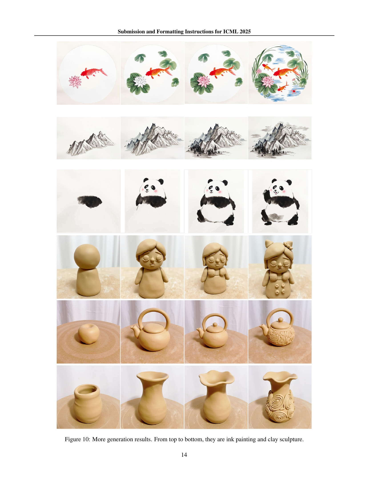

 


 2502.01572 
 Yiren Song et el. 
 
 🤗 2025-02-04 
 



↗ arXiv


↗ Hugging Face


### TL;DR



AI가 단계별 과정을 생성하는 것은 오랫동안 어려운 과제였습니다. 기존 방법들은 데이터 부족, 논리적 연속성 및 시각적 일관성 유지의 어려움, 다양한 도메인에 대한 일반화 부족 등의 문제점을 가지고 있었습니다. 특히, 복잡한 구조 변환이 필요한 작업(요리법, 공예 등)에서는 더욱 어려움이 있었습니다.  

본 논문에서는 이러한 문제점들을 해결하기 위해, 21가지 작업(그림, 공예, 요리 등)에 대한 24,000개 이상의 시퀀스를 포함하는 새로운 대규모 다중 도메인 데이터셋을 구축하고, diffusion transformer 기반의 새로운 프레임워크인 MakeAnything을 제시합니다.  MakeAnything은 비대칭 LoRA와 ReCraft 모델을 통해 텍스트 및 이미지 기반의 다중 도메인 절차적 시퀀스 생성을 가능하게 합니다.  실험 결과, MakeAnything은 기존 방법들보다 우수한 성능을 보였으며, 새로운 성능 기준을 제시했습니다.



#### Key Takeaways


 MakeAnything는 텍스트 또는 이미지를 사용하여 그림, 공예, 요리 등 다양한 분야의 단계별 절차적 튜토리얼을 생성하는 새로운 프레임워크입니다. 



 비대칭 LoRA와 ReCraft 모델을 통해 다중 도메인 일반화 성능과 제한된 데이터 상황에서의 이미지 기반 생성 성능을 크게 향상시켰습니다. 



 21가지 작업, 24,000개 이상의 시퀀스를 포함하는 새로운 대규모 다중 도메인 데이터셋을 제공합니다. 


#### Why does it matter?
본 논문은 **다중 도메인 절차적 시퀀스 생성을 위한 새로운 프레임워크인 MakeAnything**을 제시하여, **텍스트 또는 이미지를 기반으로 다양한 작업(그림, 공예, 요리 등)에 대한 단계별 절차적 튜토리얼을 사실적이고 논리적으로 생성**하는 방법을 제시합니다.  이는 **기존 방법의 한계를 극복하고 새로운 성능 기준을 제시**함으로써, 절차적 이해 및 생성 분야의 연구에 중요한 기여를 합니다. 또한 **새로운 대규모 다중 도메인 데이터셋**을 공개하여 후속 연구에 도움을 주고, **비대칭 LoRA 및 ReCraft 모델**과 같은 기술적 혁신을 통해 다양한 도메인에 대한 일반화 성능을 향상시키고, 제한된 데이터로도 효과적인 이미지 기반 생성을 가능하게 합니다.  이러한 결과는 **인공지능 기반 창의적 콘텐츠 생성** 및 **인간 지능의 시뮬레이션** 연구에 널리 활용될 수 있으며, 다양한 응용 분야에서의 혁신을 주도할 수 있을 것입니다.

------
#### Visual Insights

> 🔼 그림 1은 MakeAnything이라는 도구를 소개합니다. MakeAnything은 그림 그리기, 공예, 요리와 같은 활동에 대한 단계별 절차적 튜토리얼을 사실적이고 논리적으로 생성하는 도구입니다. 텍스트 설명이나 조건부 이미지를 기반으로 작동합니다. 그림에서는 다양한 활동(목재 장난감 조각, 중국화, 초상화, 미트볼 스파게티 레시피, 레고 배 조립, 로봇 발 제작, 컵케이크 인형 만들기 등)의 예시가 보여집니다. 각 예시는 MakeAnything을 사용하여 생성된 단계별 지침을 시각적으로 보여줍니다.
> 

> 
read the caption

> Figure 1: We introduce MakeAnything, a tool that realistically and logically generates step-by-step procedural tutorial for activities such as painting, crafting, and cooking, based on text descriptions or conditioned images.
> 


| Task | Alignment (G | H | C) | Coherence (G | H) | Usability (G | H) |
|---|---|---|---| 
| Painting | 4.50 | 4.27 | 34.24 | 4.80 | 3.98 | 4.60 | 4.13 |
| Sketch | 4.10 | 3.97 | 29.35 | 4.70 | 4.11 | 4.10 | 4.13 |
| Sand Art | 4.20 | 4.30 | 31.82 | 4.70 | 4.12 | 4.30 | 4.18 |
| Portrait | 4.25 | 4.28 | 33.84 | 5.00 | 4.28 | 4.05 | 4.33 |
| Icon | 3.45 | 4.33 | 31.46 | 3.50 | 4.17 | 3.15 | 4.25 |
| Landscape Ill. | 4.55 | 4.28 | 32.25 | 4.85 | 3.95 | 4.50 | 4.12 |
| Illustration | 3.12 | 4.17 | 31.68 | 3.40 | 4.07 | 2.45 | 4.07 |
| LEGO | 4.60 | 4.32 | 34.40 | 4.90 | 4.15 | 4.75 | 4.00 |
| Transformer | 4.75 | 4.30 | 33.03 | 4.90 | 4.23 | 4.75 | 4.15 |
| Cook | 3.20 | 4.21 | 34.41 | 4.25 | 4.03 | 3.65 | 3.90 |
| Clay Toys | 4.30 | 4.17 | 35.25 | 4.50 | 4.30 | 4.20 | 4.30 |
| Pencil Sketch | 3.85 | 4.33 | 34.44 | 4.50 | 4.20 | 3.80 | 4.25 |
| Chinese Painting | 4.80 | 4.37 | 33.46 | 4.90 | 4.22 | 4.70 | 4.33 |
| Fabric Toys | 4.35 | 4.30 | 32.83 | 4.60 | 4.08 | 4.40 | 4.30 |
| Oil Painting | 4.90 | 4.30 | 37.30 | 4.95 | 4.17 | 4.85 | 4.20 |
| Wood Sculpture | 4.65 | 4.32 | 33.83 | 4.85 | 4.23 | 4.65 | 4.08 |
| Clay Sculpture | 4.30 | 4.17 | 35.25 | 4.50 | 4.30 | 4.20 | 4.30 |
| Brush Modeling | 4.20 | 4.33 | 32.27 | 4.15 | 4.03 | 4.05 | 4.25 |
| Jade Carving | 4.90 | 4.28 | 32.93 | 4.85 | 4.12 | 4.75 | 4.00 |
| Line Draw | 4.10 | 4.20 | 30.76 | 4.20 | 3.97 | 3.90 | 4.08 |
| Emoji | 3.75 | 4.25 | 34.20 | 3.60 | 4.17 | 3.80 | 4.18 |

> 🔼 표 1은 다양한 작업에 걸쳐 절차적 시퀀스 생성 결과에 대한 종합 평가를 보여줍니다.  세 가지 주요 지표인 일관성(Coherence), 정합성(Alignment), 유용성(Usability)을 사용하여 각 작업에 대한 GPT 점수(G), 사람 평가 점수(H), CLIP 점수(C)를 종합적으로 평가합니다.  각 지표는 GPT와 사람 평가자의 평가를 모두 포함하며, 이는 절차적 시퀀스 생성 모델의 성능을 다각적으로 평가하기 위한 것입니다.  표는 다양한 작업(예: 그림, 조각, 요리 등)에 대한 모델의 성능을 비교 분석하는 데 사용됩니다.
> 

> 
read the caption

> Table 1: Combined Evaluation of Procedural Sequence Generation Results Across Different Tasks. Abbreviations: G = GPT score, H = Human evaluation, C = CLIP score.
> 

### In-depth insights

#### Multi-domain Dataset
본 논문에서 제시된 다중 도메인 데이터셋은 **다양한 영역의 절차적 작업을 포괄하는 방대한 규모의 데이터**를 제공하여 기존의 단일 도메인 연구의 한계를 극복하는 데 중요한 역할을 합니다. **회화, 공예, 요리 등 21가지 작업에 걸쳐 24,000개 이상의 절차적 시퀀스**를 포함, 각 작업의 특성을 반영한 계층적 주석이 포함되어 있어 **모델의 다양한 작업에 대한 일반화 능력 향상**에 기여합니다. 특히, **데이터셋의 규모와 다양성은 다중 도메인 절차적 생성 모델의 성능 평가 및 향후 연구의 발전**에 중요한 기반을 마련합니다. 또한, 데이터셋의 부족으로 인해 어려움을 겪던 **역방향 엔지니어링(reverse-engineering)** 과제 해결에 도움을 줄 수 있으며, **인간의 창의적 지능을 모방하는 AI 시스템 개발에 필수적인 고품질 데이터**를 제공합니다.  **데이터 불균형 문제** 또한 고려하여 설계되었다는 점도 주목할 만 합니다.  하지만, 데이터셋의 수집 및 주석 과정에 대한 자세한 설명이 부족한 점은 향후 개선이 필요한 부분입니다.

#### Diffusion Transformer
본 논문에서 다룬 ‘확산 트랜스포머(Diffusion Transformer)’는 **이미지 생성 분야의 혁신적인 기술**로 평가받고 있습니다. 기존 확산 모델의 강점인 고품질 이미지 생성 능력과 트랜스포머의 장점인 시퀀스 처리 능력을 결합하여 **다양한 도메인에서의 절차적 시퀀스 생성**이라는 어려운 문제를 해결하고 있습니다. 특히, 텍스트 또는 이미지 조건을 활용하여 단계별 생성 과정을 만들어내는 능력은 **인간의 창의적 활동을 모방하는 AI 모델**로서 큰 의미를 지닙니다.  논문에서는 비대칭 저계층 적응(Asymmetric LoRA) 기법을 통해 **다중 작업(multi-task) 성능을 향상**시키고, 제한된 데이터로도 효과적인 학습을 가능하게 하는 ReCraft 모델을 제시하여 **데이터 효율성 문제**를 개선했습니다.  **다양한 분야의 절차적 과정 생성**에 적용 가능하다는 점에서 향후 발전 가능성이 높으며, **인공지능 기반 교육 및 창작 도구** 개발에 중요한 역할을 할 것으로 예상됩니다.  하지만, 아직까지는 제한된 해상도 및 프레임 수 등의 기술적 한계가 있으며, 이러한 문제점을 해결하기 위한 추가적인 연구가 필요합니다.

#### Asymmetric LoRA
본 논문에서 제안하는 비대칭 LoRA는 **기존의 LoRA 방식을 개선하여 다중 작업(multi-task) 환경에서의 일반화 성능과 특정 작업 성능 간의 균형을 맞추는 데 중점을 둡니다.** 기존 LoRA는 단일 매트릭스를 사용하여 모든 작업에 대한 조정을 수행하지만, 비대칭 LoRA는 **작업 특화 매트릭스(B)와 공유 중앙 매트릭스(A)를 분리하여 사용함으로써** 개별 작업에 대한 세밀한 조정을 가능하게 합니다. 이를 통해 **일반화 성능을 유지하면서 동시에 특정 작업에 대한 성능 향상을 달성할 수 있습니다.** 또한, 제한된 데이터 환경에서도 효과적으로 작동하여 데이터 부족 문제를 해결하는 데 기여합니다.  **비대칭 구조는 메모리 효율성을 높이고, 계산 비용을 줄이는 데 효과적입니다.**  이러한 특징들로 인해 비대칭 LoRA는 다양한 분야의 작업에 적용 가능하며, 특히 제한된 데이터로 학습해야 하는 상황에서 유용하게 활용될 수 있을 것으로 예상됩니다.

#### ReCraft Model
ReCraft 모델은 **정지된 이미지를 단계별 제작 과정으로 분해하는 기능**을 가진 MakeAnything 프레임워크의 핵심 구성 요소입니다. 기존의 사전 훈련된 Flux 모델을 기반으로 최소한의 수정만으로 이미지 조건 생성 모델로 확장하여 **데이터 부족 문제를 해결**합니다.  **비대칭 LoRA(Low-Rank Adaptation)**를 사용하여 사전 훈련된 인코더와 과제별로 미세 조정된 디코더를 결합함으로써 일반화와 도메인 특수 성능 간의 균형을 맞춥니다.  ReCraft는 대상 이미지에서 추출된 잠재 토큰을 잡음이 있는 잠재 토큰과 연결하여 다중 모드 어텐션 메커니즘을 통해 다른 프레임의 잡음 제거에 조건 정보를 제공합니다.  **결과적으로, ReCraft는 제한된 데이터로도 효율적인 훈련과 강력한 성능을 달성**하며, 이미지를 기반으로 생성 과정을 단계별로 예측하여 실제 제작 과정을 재현하는 역할을 합니다.  **이를 통해 사용자는 기존 작품을 분석하고 단계별 제작 과정을 이해하는 데 활용**할 수 있습니다.

#### Future Work
논문의 "향후 연구" 부분은 **MakeAnything 모델의 한계점을 명확히 인지하고 있으며, 이를 극복하기 위한 구체적인 방향을 제시**하고 있습니다.  현재 모델의 제한된 해상도와 고정된 프레임 수는 향후 개선되어야 할 주요 과제로 언급됩니다.  **임의의 길이를 갖는 시퀀스 생성과 고해상도 출력**을 지원하는 것이 중요하며, 이를 위해  **더욱 강력한 diffusion transformer 아키텍처와 훈련 방법론**을 연구해야 합니다.  또한, 다양한 도메인과 작업 유형에 대한 일반화 성능을 높이기 위한 추가적인 데이터 수집 및 모델 개선 방안도 제시되어야 할 것입니다.  **특히,  비디오 생성과의 통합, 사용자 상호작용 기능 추가,  다양한 모달리티를 지원하는 멀티모달 확장** 등이 흥미로운 연구 주제가 될 수 있을 것입니다.  **데이터 셋의 질적 향상** 또한 중요하며, 더욱 다양하고 정교한 procedural sequence 데이터가 확보되어야 실질적인 성능 개선을 기대할 수 있을 것입니다.  전반적으로, 이 논문은 단순히 기술적인 한계를 제시하는 것에 그치지 않고,  **실제 응용 가능성을 높이기 위한 발전 방향을 제시**함으로써 연구의 미래 가치를 더욱 높이고 있습니다.

### More visual insights

More on figures

> 🔼 그림 2는 MakeAnything 프레임워크의 핵심 구성 요소 두 가지를 보여줍니다. 첫째, 비대칭 LoRA 모듈은 비대칭 LoRA를 통해 다양한 생성 과정을 텍스트 프롬프트에서 생성합니다. 둘째, ReCraft 모델은 사전 훈련된 LoRA 가중치를 Flux 기본 모델과 병합하여 이미지 조건부 기본 모델을 구성하여 주입된 시각 토큰을 통해 프로세스 예측을 가능하게 합니다.  즉, 텍스트 기반의 생성 과정과 이미지 기반의 생성 과정을 모두 처리하는 모듈을 보여줍니다. 비대칭 LoRA 모듈은 다양한 도메인에 대한 일반화 능력을 향상시키고, ReCraft 모델은 이미지를 생성 과정으로 디코딩하여 이미지 기반의 생성 과정을 가능하게 합니다.
> 

> 
read the caption

> Figure 2: The MakeAnything framework comprises two core components: (1) an Asymmetric LoRA module that generates diverse creation processes from text prompts through asymmetric LoRA, and (2) the ReCraft Model, which constructs an image-conditioned base model by merging pretrained LoRA weights with the Flux foundation model, enabling process prediction via injected visual tokens.
> 

> 🔼 그림 3은 MakeAnything 데이터셋의 예시를 보여줍니다. 이 데이터셋은 그림 그리기, 공예, 레고 조립, 요리 등 21가지 작업에 대한 24,000개 이상의 단계별 절차적 시퀀스를 포함하고 있습니다. 각 작업은 여러 단계로 구성된 과정을 보여주는 여러 이미지 시퀀스로 표현되어 있으며, 인공지능 모델이 다양한 도메인의 절차적 작업을 이해하고 생성하는 데 사용됩니다.  이를 통해 MakeAnything 모델은 다양한 작업에 대한 단계별 설명서를 생성하는 능력을 보여줍니다.
> 

> 
read the caption

> Figure 3: Examples from the MakeAnything Dataset, which consists of 21 tasks with over 24,000 procedural sequences.
> 

> 🔼 그림 4는 MakeAnything 모델의 생성 결과를 보여줍니다. 상단은 텍스트 프롬프트를 조건으로 한 텍스트-시퀀스 출력 결과를, 중간은 ReCraft 모델을 통해 재구성한 이미지-시퀀스 결과를, 하단은 절차적 LoRA(파란색)와 스타일 LoRA(빨간색)를 결합하여 보이지 않는 도메인에서 일반화한 결과를 보여줍니다.  각 부분은 MakeAnything 모델의 다양한 기능과 성능을 보여주는 대표적인 예시들을 담고 있습니다.  텍스트-시퀀스 부분은 다양한 작업(예: 그림 그리기, 요리 레시피 등)에 대한 단계별 과정을 텍스트 설명만으로 생성하는 능력을, 이미지-시퀀스 부분은 입력 이미지를 기반으로 단계별 생성 과정을 예측하는 능력을, 그리고 하단의 일반화 부분은 학습되지 않은 새로운 도메인에서도 기존에 학습한 지식을 활용하여 새로운 스타일의 생성 과정을 만들어낼 수 있는 능력을 각각 시각적으로 보여줍니다.
> 

> 
read the caption

> Figure 4: Generation results of MakeAnything. From top: Text-to-Sequence outputs conditioned on textual prompts; Image-to-Sequence reconstructions via ReCraft Model; Unseen Domain generalization combining procedural LoRA (blue) with stylistic LoRA (red).
> 

> 🔼 그림 5는 제시된 다양한 작업(task)들에 대해 제안된 MakeAnything 모델과 기존 기준 모델(baseline)들의 성능을 비교한 결과를 보여줍니다.  각 작업 유형에 따라, MakeAnything는 텍스트 또는 이미지를 기반으로 순차적 과정(procedural sequence)을 생성하는 능력을 보여주는 반면, 다른 기준모델들은 특정 작업이나 데이터셋에 제한적인 성능을 나타냅니다.  비교 대상은 ProcessPainter, Flux, Ideogram, Inverse Painting, 그리고 PaintsUndo 등이며, 그림은 각 모델의 생성 결과를 시각적으로 보여주어 MakeAnything의 우수성을 직관적으로 이해하도록 돕습니다. 세부적으로는, 텍스트를 기반으로 한 순차적 생성 작업(Text-to-Sequence)과 이미지를 기반으로 한 순차적 생성 작업(Image-to-Sequence) 결과가 각각 비교되어 제시됩니다.
> 

> 
read the caption

> Figure 5: Compare with baselines on different tasks.
> 

> 🔼 그림 6은 본 논문에서 제안하는 MakeAnything 모델의 성능에 대한 ablation study 결과를 보여줍니다.  세 가지 작업(초상화, 스케치, 기타)에 대해 기본 모델, 비대칭 LoRA 없이, 그리고 비대칭 LoRA를 사용한 세 가지 경우의 성능을 비교 분석합니다. 각 경우의 정렬, 일관성, 유용성을 GPT 및 사람 평가자의 평가를 통해 정량적으로 비교하여, 비대칭 LoRA의 효과를 명확하게 제시합니다. 특히, 작은 데이터셋으로 과적합되는 문제를 비대칭 LoRA가 어떻게 해결하는지 보여줍니다.
> 

> 
read the caption

> Figure 6: Ablation study results.
> 

> 🔼 그림 7은 GPT와 인간 평가자 모두에 의해 평가된 세 가지 작업(초상화, 목조 조각, 직물 장난감 제작)에 대한 비교 결과를 보여줍니다.  각 작업에 대해 GPT와 인간 평가자는 정렬, 응집력, 유용성 세 가지 측면에서 생성된 시퀀스를 평가했습니다. 이를 통해 MakeAnything 모델의 성능을 다른 기준 모델들과 비교 분석하여, MakeAnything이 세 가지 측면 모두에서 우수한 성능을 보임을 시각적으로 확인할 수 있습니다.
> 

> 
read the caption

> Figure 7: Comparison results on three tasks, evaluated by GPT and humans respectively.
> 

> 🔼 그림 8은 MakeAnything 모델이 생성한 다양한 종류의 단계별 과정 시퀀스 결과를 보여줍니다.  위에서부터 순서대로 초상화, 샌드 아트, 풍경 일러스트, 회화, 레고 조립, 변형 로봇 제작, 요리 과정을 나타냅니다. 각 과정은 여러 단계로 나뉘어져 있으며, 각 단계마다 생성된 이미지는 이전 단계의 결과를 토대로 논리적으로 이어집니다. 이는 MakeAnything 모델이 다양한 도메인에서 일관되고 논리적인 단계별 지침을 생성할 수 있음을 보여주는 좋은 예시입니다.
> 

> 
read the caption

> Figure 8: More generation results. From top to bottom, they are portrait, Sand Art, landscape illustration, painting, LEGO, transformer, and cook respectively.
> 

> 🔼 그림 9는 MakeAnything 모델이 생성한 결과물 중 일부를 보여줍니다. 상단부터 하단까지, 유화 그림과 선 그림의 생성 과정을 단계별로 보여주는 이미지 시퀀스입니다. 각 시퀀스는 단계별로 이미지가 생성되는 과정을 보여주며, MakeAnything 모델의 다양한 도메인 및 스타일을 다루는 능력을 시각적으로 보여줍니다. 그림은 각 단계의 시각적 일관성과 논리적 흐름을 강조하여, 생성된 결과물의 품질과 모델의 성능을 평가하는 데 도움이 됩니다.
> 

> 
read the caption

> Figure 9: More generation results. From top to bottom, they are oil painting and line draw.
> 

> 🔼 그림 10은 MakeAnything 모델이 생성한 결과물 중 일부를 보여줍니다.  위에서부터 아래로 잉크 그림과 점토 조각의 제작 과정을 단계별로 시각화하고 있습니다. 각 과정은 여러 단계로 나뉘어 있으며, 각 단계별 이미지는 이전 단계의 이미지와 논리적으로 연결되어 전체적인 제작 과정을 명확하게 보여줍니다. 이 그림은 MakeAnything 모델이 다양한 분야의 제작 과정을 정확하고 일관성 있게 생성할 수 있음을 시각적으로 보여주는 증거입니다.
> 

> 
read the caption

> Figure 10: More generation results. From top to bottom, they are ink painting and clay sculpture.
> 

More on tables


| Model | Task | Alignment(G | C) | Coherence | Usability |
|---|---|---|---|---|
| Base Model | Portrait | 3.75 | 29.78 | 3.45 | 3.35 |
|  | Wood | 3.25 | 35.29 | 2.95 | 2.65 |
|  | Fabric toys | 3.55 | 32.95 | 4.00 | 3.85 |
| w/o Asymmetric LoRA | Portrait | 4.25 | 31.08 | 4.50 | 4.15 |
|  | Wood Sculpture | 3.55 | 31.05 | 4.35 | 3.75 |
|  | Fabric toys | 3.75 | 30.72 | 3.15 | 3.20 |
| Full | Portrait | 4.55 | 32.95 | 4.75 | 4.25 |
|  | Wood Sculpture | 4.25 | 33.89 | 3.80 | 4.05 |
|  | Fabric toys | 4.40 | 32.01 | 4.25 | 4.35 |
> 🔼 표 2는 GPT 평가와 CLIP 점수를 사용한 제거 연구 결과를 보여줍니다.  GPT 평가는 생성된 시퀀스의 정합성, 일관성, 유용성을 측정하는 반면, CLIP 점수는 텍스트와 이미지 간의 정렬을 측정합니다.  이 표는 비대칭 LoRA,  전체 모델 및 기준 모델을 포함하여 다양한 모델 구성 요소의 성능을 비교 분석하여 MakeAnything 모델의 효율성과 다양한 구성 요소의 기여도를 보여줍니다. 각 작업에 대한 정렬, 일관성 및 유용성 점수가 제시됩니다.
> 

> 
read the caption

> Table 2: Ablation Study Results Using GPT Evaluation and CLIP Score.
> 


| Category | Methods | Alignment | Coherence | Usability |
|---|---|---|---|---|
| Painting | Processpainter | 0.24 | 0.26 | 0.22 |
|  | Ideogram | 0.32 | 0.14 | 0.26 |
|  | Flux | 0.02 | 0.04 | 0.00 |
|  | Ours | **0.42** | **0.56** | **0.52** |
| Others | Ideogram | 0.36 | 0.30 | 0.32 |
|  | Flux | 0.28 | 0.28 | 0.30 |
|  | Ours | **0.36** | **0.42** | **0.38** |
> 🔼 표 3은 제시된 텍스트를 기반으로 순차적 시퀀스를 생성하는 방법에 대한 비교 결과를 보여줍니다. GPT 평가를 사용하여 ProcessPainter, Ideogram, Flux 및 MakeAnything 모델의 성능을 '회화' 및 '기타' 작업으로 나누어 정렬, 일관성 및 유용성 측면에서 비교 분석했습니다. MakeAnything 모델은 다른 모델보다 우수한 성능을 보여줍니다.
> 

> 
read the caption

> Table 3: Compare with Text-to-Sequence methods (GPT)
> 


| Category | Methods | Consistency | Coherence | Usability |
|---|---|---|---|---|
| Painting | Inverse Paints | 0.02 | 0.00 | 0.02 |
|  | PaintsUndo | 0.18 | 0.30 | 0.24 |
|  | Ours | **0.80** | **0.70** | **0.74** |
> 🔼 표 4는 GPT 평가를 사용한 이미지-시퀀스 생성 방법에 대한 비교 결과를 보여줍니다.  세 가지 방법(Inverse Painting, PaintsUndo, MakeAnything)의 일관성, 응집력, 유용성 점수를 비교하여 MakeAnything 모델의 우수성을 보여줍니다. 특히, MakeAnything은 다른 두 방법보다 세 가지 지표 모두에서 상당히 높은 점수를 기록했습니다.
> 

> 
read the caption

> Table 4: Compare with Image-to-Sequence methods (GPT)
> 


| Category | Methods | Alignment | Coherence | Usability |
|---|---|---|---|---|
| Painting | Processpainter | 0.06 | 0.10 | 0.14 |
|  | Ideogram | 0.06 | 0.06 | 0.10 |
|  | Flux | 0.21 | 0.15 | 0.13 |
|  | Ours | **0.67** | **0.69** | **0.63** |
| Others | Ideogram | 0.19 | 0.19 | 0.17 |
|  | Flux | 0.11 | 0.13 | 0.12 |
|  | Ours | **0.70** | **0.68** | **0.71** |
> 🔼 표 5는 인간 평가자에 의한 결과를 바탕으로 텍스트-시퀀스 생성 방법들을 비교 분석한 표입니다.  세 가지 지표(정렬도, 일관성, 유용성)에 대해 ProcessPainter, Ideogram, Flux 및 제안된 MakeAnything 모델의 성능을 보여줍니다.  'Painting' 과 'Others' 두 가지 카테고리로 나뉘어 각 방법들의 성능을 비교함으로써, MakeAnything 모델의 우수성을 보다 명확하게 제시합니다. 
> 

> 
read the caption

> Table 5: Compare with Text-to-Sequence methods (Human)
> 


| Category | Methods | Consistency | Coherence | Usability |
|---|---|---|---|---|
| Painting | Inverse Paints | 0.27 | 0.31 | 0.33 |
|  | PaintsUndo | 0.18 | 0.08 | 0.06 |
|  | Ours | **0.55** | **0.61** | **0.61** |
> 🔼 표 6은 사람의 평가를 기반으로 이미지에서 시퀀스 생성 방법들을 비교 분석한 결과를 보여줍니다.  '일관성', '결합성', '유용성' 세 가지 지표를 사용하여 역 이미지 페인팅, 페인츠 언두 및 제안된 MakeAnything 모델의 성능을 비교 분석합니다. 각 지표는 1에서 5까지의 점수로 평가되며, 높은 점수일수록 더 나은 성능을 나타냅니다.
> 

> 
read the caption

> Table 6: Compare with Image-to-Sequence methods (Human)
> 

### Full paper



