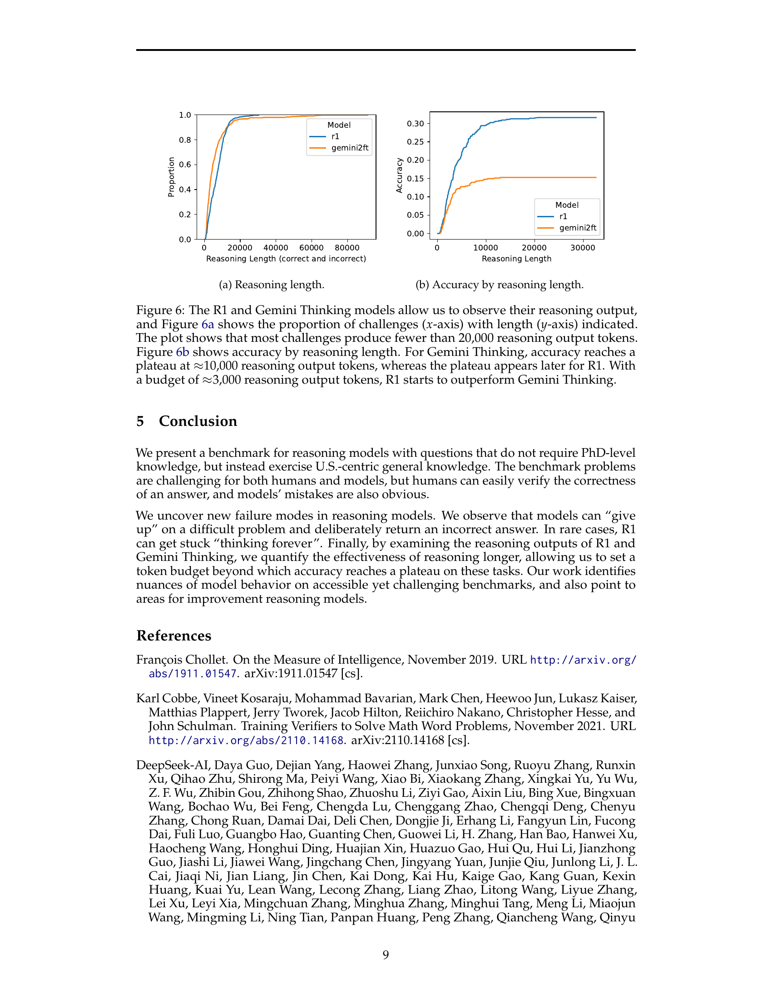

 


 2502.01584 
 Carolyn Jane Anderson et el. 
 
 🤗 2025-02-04 
 



↗ arXiv


↗ Hugging Face


### TL;DR



최근 대규모 언어 모델(LLM)은 추론 능력 향상에 중점을 두고 발전하고 있지만, 기존 벤치마크는 전문적인 지식을 필요로 하여 일반적인 추론 능력 평가에 한계가 있습니다. 또한, 기존 벤치마크는 문제의 난이도를 평가하거나, 모델의 오류를 쉽게 확인하기 어렵다는 단점이 있습니다.

본 연구는 NPR Sunday Puzzle Challenge를 기반으로 **일반적인 지식만으로도 풀 수 있지만, 난이도가 높은 퍼즐**을 이용하여 새로운 벤치마크를 제시합니다. 이 벤치마크는 인간과 모델 모두에게 어려운 문제를 제공하지만, 정답 확인이 용이하고 모델의 실수를 쉽게 파악할 수 있다는 장점이 있습니다. 연구 결과, 기존 벤치마크에서는 나타나지 않았던 모델의 새로운 오류 유형과, 추론 시간에 따른 성능 향상의 한계점을 발견하였습니다.



#### Key Takeaways


 일반 상식 기반 추론 능력 평가를 위한 새로운 벤치마크 제시 



 기존 벤치마크에서 드러나지 않았던 모델의 새로운 오류 유형 발견 



 추론 시간 증가에 따른 정확도 향상 효과의 정량적 분석 


#### Why does it matter?
본 논문은 **일반적인 지식만으로도 풀 수 있는 새로운 벤치마크**를 제시하여, 최신 대규모 언어 모델의 추론 능력을 평가하는 새로운 기준을 제시합니다. **기존의 전문적인 지식을 요구하는 벤치마크의 한계를 극복**하고, 모델의 오류를 쉽게 파악할 수 있도록 함으로써, 향후 연구의 방향을 제시하고 있습니다. 또한, 모델의 추론 과정을 분석하여 새로운 유형의 실패 사례를 발견하고, 추론 시간에 따른 정확도 향상 효과를 정량적으로 분석함으로써, **모델 성능 향상을 위한 새로운 기술 개발**에 대한 시사점을 제공하고 있습니다.

------
#### Visual Insights

> 🔼 그림 1은 NPR 선데이 퍼즐 챌린지에서 최신 추론 모델들의 성능을 벤치마킹한 결과를 보여줍니다.  문제들은 일반적인 상식을 바탕으로 하지만 사람이 풀기에는 어려운 반면, 정답의 검증은 쉽습니다. 이러한 일반 상식 퍼즐을 통해 기존의 전문적인 지식을 요구하는 벤치마킹으로는 드러나지 않았던 추론 모델 간의 성능 차이를 보여줍니다.
> 

> 
read the caption

> Figure 1: We benchmark the latest reasoning models on the NPR Sunday Puzzle Challenge. The questions exercise general knowledge and are difficult for humans to solve, but the answers are easy to verify. These general knowledge puzzles show capability differences between reasoning models that are not evident from benchmarks that exercise deep technical knowledge.
> 

### In-depth insights

#### Reasoning Models
본 논문은 **추론 모델(Reasoning Models)**이라는 주제에 대해 심도있게 다루고 있습니다.  특히, 기존의  PhD 수준 지식을 요구하는 벤치마크와 달리, 일반적인 상식만으로도 해결 가능한 새로운 벤치마크를 제시하여 **일반적인 추론 능력**을 평가하는 데 초점을 맞추고 있습니다.  **OpenAI의 01 모델**이 다른 모델들에 비해 상당히 높은 정확도를 보이는 것을 확인했으며, 기존 벤치마크에서는 드러나지 않았던 **새로운 유형의 오류**를 발견했습니다.  이는 기존 벤치마크의 한계와 **추론 모델의 성능 향상 방향**을 제시하는 중요한 발견입니다.  또한, 모델의 추론 과정을 분석하여 **추론 시간과 정확도 간의 관계**를 정량적으로 분석하고, 추론 시간을 제한하는 것이 모델의 정확도에 미치는 영향을 밝히고 있습니다.  이는 **더 효율적인 추론 기법 개발**에 중요한 시사점을 제공합니다.

#### Benchmark Puzzles
본 논문에서 제시된 벤치마크 퍼즐은 **일반적인 상식만으로도 이해하고 풀 수 있지만, 해결하기는 어려운 문제들**로 구성되어 있습니다.  **전문적인 지식이 필요하지 않기 때문에 다양한 배경을 가진 사람들이 참여하여 벤치마크의 유효성을 검증**할 수 있다는 장점이 있습니다.  또한, **정답의 검증이 용이하여 모델의 오류를 쉽게 파악**할 수 있으며, **기존 벤치마크에서 드러나지 않았던 모델의 한계점을 드러내는 데 효과적**입니다. 특히, 모델이 추론 과정에서 포기하거나 잘못된 답을 제시하는 등의 새로운 오류 유형을 발견하는 데 기여하였으며,  **추론 과정의 길이와 정확도 간의 상관관계를 분석하여 효율적인 추론 전략을 수립**하는 데 도움을 줄 수 있습니다.  **일반적인 상식을 기반으로 하면서도 높은 난이도를 유지**하는 퍼즐들은,  대규모 언어 모델의 추론 능력을 평가하는 데 유용한 도구로 활용될 수 있습니다.

#### Model Failures
본 논문은 대규모 언어 모델(LLM)의 추론 능력을 평가하기 위한 새로운 벤치마크를 제시하며, 기존 벤치마크와 달리 전문적인 지식이 필요 없다는 점을 강조합니다.  흥미롭게도, 이 연구는 **기존 벤치마크에서는 드러나지 않았던 모델의 실패 양상**을 보여줍니다.  특히, DeepSeek R1 모델은 정답을 알면서도 ‘포기’ 선언을 하거나, 답을 찾지 못하고 계속해서 추론하는 현상을 보입니다.  이는 모델의 불확실성이나 추론 과정의 한계를 시사하며, **추론 과정을 중단하고 결론을 내리는 메커니즘 개선**이 필요함을 보여줍니다.  또한, 모델이 산술적 실수를 하거나 잘못된 정보를 생성하는 등의 일반적인 실패 양상도 여전히 존재함을 확인했습니다. 이러한 **다양한 실패 양상을 분석**함으로써, LLM의 추론 능력 향상을 위한 보다 심도있는 연구가 필요하며, 벤치마크 설계의 중요성을 강조합니다.  **일반적인 지식만으로도 해결 가능하지만 추론 능력이 요구되는 문제**를 통해 모델의 한계점을 드러냄으로써, 향후 LLM 연구의 방향을 제시하는 데 기여하고 있습니다.

#### Reasoning Limits
본 논문은 대규모 언어 모델(LLM)의 추론 능력에 대한 한계를 탐구합니다. **특히, 일반적인 지식만으로 해결 가능한 문제를 통해 기존의 전문적인 지식을 요구하는 벤치마크와 차별화**하여 모델의 추론 능력을 평가합니다.  흥미롭게도, **일부 모델은 답을 찾는 과정에서 '포기'하거나 틀린 답을 제시하기도 하며,  모델의 추론 과정에 대한 분석을 통해 새로운 유형의 실패 사례를 발견**합니다. 또한, 모델이 추론 시간을 더 길게 할당하더라도 정확도가 향상되지 않는 지점을 확인하여 **추론에 필요한 시간 및 자원의 효율성에 대한 중요한 시사점**을 제시합니다.  결론적으로, 이 연구는 LLM의 추론 능력에 대한 깊이 있는 이해와 함께, **향후 모델 개발 방향에 대한 중요한 통찰력**을 제공합니다.

#### Future Work
본 논문은 추론 모델의 성능을 평가하기 위한 새로운 벤치마크를 제시하고, 기존 벤치마크의 한계점을 지적합니다. **미래 연구 방향**으로는, **더욱 다양하고 포괄적인 지식을 요구하는 문제들을 추가하여 벤치마크의 범위를 확장**할 수 있습니다. 또한, 모델의 추론 과정을 보다 자세히 분석하고, **오류 유형을 분류하여 모델 개선에 활용**하는 연구가 필요합니다.  **추론 과정의 효율성을 높이는 기법들을 개발**하고, **모델의 불확실성을 정량적으로 측정**하는 방법을 연구하는 것도 중요한 과제입니다.  마지막으로, **본 논문에서 제시된 벤치마크를 다양한 언어 및 문화권에 적용**하여 일반화 가능성을 검증하고,  **다양한 추론 모델의 비교 분석을 통해 각 모델의 강점과 약점을 파악**하는 연구가 필요합니다.

### More visual insights

More on figures

> 🔼 그림 2는 DeepSeek R1 모델이 4.2 챌린지 문제에 대해 추론하는 과정의 마지막 몇 줄을 보여줍니다. 이 챌린지는 모델의 추론 능력과 일반적인 지식을 평가하기 위해 고안된 질문들을 포함하고 있습니다. 그림은 모델이 문제 해결에 어려움을 겪고, 답을 찾지 못하고 포기하는 과정을 보여주며, 모델의 추론 과정과 한계점을 이해하는 데 도움을 줍니다.
> 

> 
read the caption

> Figure 2: The last few lines of R1’s output on Challenge 4.2.
> 

> 🔼 그림 3은 논문의 4.2절 '모델이 어떻게 포기하는가'에서 다루는 챌린지에 대한 DeepSeek R1 모델의 마지막 출력 부분을 보여줍니다. R1 모델은 문제 해결에 실패하고, ‘포기’를 선언하기 전에 몇 가지 잘못된 답변과 추론 과정을 보여줍니다. 이를 통해 모델의 추론 과정에서 발생할 수 있는 오류 유형과 제한점을 보여줍니다.
> 

> 
read the caption

> Figure 3: The last few lines of R1’s output on Challenge 4.2.
> 

### Full paper



