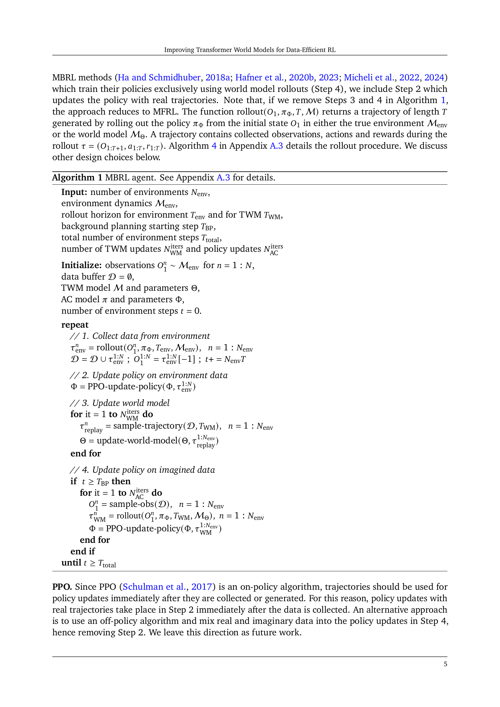
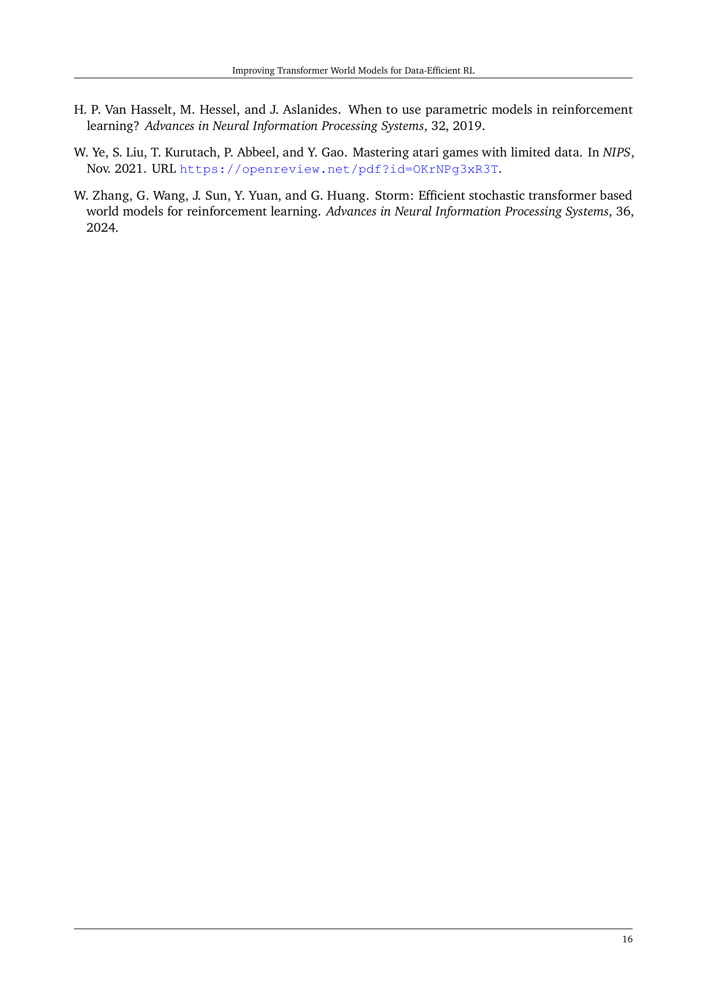

 


 2502.01591 
 Antoine Dedieu et el. 
 
 🤗 2025-02-04 
 



↗ arXiv


↗ Hugging Face


### TL;DR



본 논문은 모델 기반 강화 학습(MBRL)에서 **변환기 월드 모델(TWM)**을 개선하여 데이터 효율성을 높이는 방법을 제시합니다. 기존의 MBRL 알고리즘은 많은 데이터를 필요로 하고 일반화 능력이 부족한 문제점이 있었습니다. 본 논문에서는 이러한 문제점을 해결하기 위해 **세 가지 핵심적인 개선 사항**을 제시합니다. 첫째, 실제 데이터와 가상 데이터를 함께 사용하는 Dyna with warmup 기법을 통해 학습 효율을 높였습니다. 둘째, 이미지 패치에 대한 nearest neighbor tokenizer를 사용하여 TWM 입력을 개선했습니다. 셋째, block teacher forcing을 통해 TWM이 미래 토큰을 효율적으로 예측하도록 했습니다. 이러한 개선 사항을 통해 개발된 알고리즘은 Craftax-classic 벤치마크에서 최첨단 성능을 달성했으며, 인간 수준의 성능을 능가하는 결과를 보여주었습니다.

본 논문의 주요 기여는 다음과 같습니다. 첫째, **데이터 효율적인 MBRL 알고리즘**을 제시하여, 기존 알고리즘의 한계를 극복했습니다. 둘째, **TWM의 세 가지 핵심적인 개선 사항**을 제시하여, 샘플 효율성, 일반화 능력, 성능 향상을 모두 달성했습니다. 셋째, **Craftax-classic 벤치마크**에서 인간 수준을 능가하는 최고 성능을 달성하여, MBRL 분야의 발전에 크게 기여했습니다. 본 연구 결과는 향후 **복잡한 환경에서의 AI 에이전트 개발**에 대한 새로운 가능성을 제시하며, 더욱 효율적이고 강력한 AI 시스템 개발에 중요한 의미를 지닙니다.



#### Key Takeaways


 변환기 월드 모델(TWM)을 사용한 모델 기반 강화 학습(MBRL) 알고리즘이 Craftax-classic 벤치마크에서 최첨단 성능을 달성했습니다. 



 Dyna with warmup, nearest neighbor tokenizer, block teacher forcing 등 세 가지 핵심적인 개선 사항을 통해 샘플 효율성과 일반화 능력을 향상시켰습니다. 



 제시된 방법은 인간 수준을 능가하는 성능을 달성하여, 복잡한 환경에서의 AI 에이전트 개발에 새로운 가능성을 열었습니다. 


#### Why does it matter?
본 논문은 **데이터 효율적인 강화 학습(RL)** 에서 새로운 기술을 제시하여, 복잡한 환경에서 인간 수준의 성능을 달성한 최초의 연구라는 점에서 중요합니다. 특히, **변환기 기반 월드 모델(TWM)**을 개선하여 샘플 효율성을 높이고 일반화 능력을 향상시킨 점은 **모델 기반 강화 학습(MBRL)** 분야의 발전에 크게 기여합니다. 또한, 제시된 방법은 **다양한 RL 문제**에 적용될 수 있는 잠재력을 지니고 있으며, 향후 연구를 위한 새로운 가능성을 제시합니다. 이러한 연구 결과는 **AI 시스템 개발**에 있어 중요한 의미를 지니며, 더욱 효율적이고 강력한 AI 에이전트 개발에 도움이 될 것입니다.

------
#### Visual Insights

> 🔼 그림 1은 Craftax-classic 환경에서의 에이전트 성능을 보여줍니다. 왼쪽 패널은 누적 보상을 시간에 따라 나타낸 그래프로, 제시된 방법들이 이전에 발표된 모델 기반 강화 학습 (MBRL) 및 모델 자유 강화 학습 (MFRL) 방법들을 능가하며, 인간 전문가의 성능을 처음으로 뛰어넘었음을 보여줍니다. 가운데 패널은 Craftax-classic 환경에서 에이전트가 관찰하는 63x63 픽셀 이미지를 보여줍니다. 이 이미지는 7x7 픽셀의 9x9 패치로 구성되며, 에이전트 주변의 지도, 에이전트의 체력 및 인벤토리를 나타냅니다. 오른쪽 패널은 이미지에서 추출된 64개의 서로 다른 패치들을 보여줍니다.
> 

> 
read the caption

> Figure 1:  [Left] Reward on Craftax-classic. Our best MBRL and MFRL agents outperform all the previously published MFRL and MBRL results, and for the first time, surpass the reward achieved by a human expert. We display published methods which report the reward at 1M steps with horizontal line from 900k to 1M steps. [Middle] The Craftax-classic observation is a 63×63636363\times 6363 × 63 pixel image, composed of 9×9999\times 99 × 9 patches of 7×7777\times 77 × 7 pixels. The observation shows the map around the agent and the agent’s health and inventory. Here we have rendered the image at 144×144144144144\times 144144 × 144 pixels for visibility. [Right] 64646464 different patches.
> 


|    |   |
|---|---|
|  |   |

> 🔼 표 1은 Craftax-classic 환경에서 1백만 번의 환경 상호작용 후의 결과를 보여줍니다.  Crafter 환경에서의 결과는 * 표시로 구분되어 있으며, Craftax-classic과 완전히 일치하지 않을 수 있습니다.  알 수 없는 값은 —으로 표시됩니다.  단일 A100 GPU에서 측정된 시간은 † 표시로 나타냅니다.  DreamerV3 결과는 저자의 코드를 기반으로 하지만, 하이퍼파라미터 차이로 인해 보고된 수치와 약간 다를 수 있습니다. IRIS와 A-IRIS는 점수에 대한 표준 오차를 보고하지 않습니다.
> 

> 
read the caption

> Table 1: Results on Craftax-classic after 1M environment interactions. * denotes results on Crafter, which may not exactly match Craftax-classic. — means unknown. †denotes the reported timings on a single A100 GPU. Our DreamerV3 results are based on the code from the author, but differ slightly from the reported number, perhaps due to hyperparameter discrepancies. IRIS and ΔΔ\Deltaroman_Δ-IRIS do not report standard errors for the score.
> 

### In-depth insights

#### Data-Efficient MBRL
본 논문은 데이터 효율적인 모델 기반 강화 학습(MBRL) 방법에 대한 심층적인 논의를 제공합니다. **핵심은 제한된 데이터로도 높은 성능을 달성하는 것**이며, 이를 위해 변환기 기반 세계 모델(TWM)을 중심으로 다양한 개선 사항을 제시합니다.  **주요 개선 사항**은 Dyna with warmup(실제 및 가상 데이터를 활용한 정책 훈련),  가장 가까운 이웃 토큰화(이미지 패치에 대한 효율적인 입력 생성), 블록 교사 강제(TWM 입력에 대한 효율적인 처리) 등입니다. 이러한 개선을 통해 Craftax-classic 벤치마크에서 **인간 수준을 능가하는 성능**을 달성했으며, 기존 방법보다 훨씬 높은 데이터 효율성을 보여줍니다.  **변환기 세계 모델의 개선**은 MBRL 알고리즘의 성능과 데이터 효율성을 크게 향상시키는 핵심 요소임을 강조합니다.  **특히, 패치 기반 토큰화와 블록 교사 강제는 변환기 세계 모델의 성능을 개선**하는 데 중요한 역할을 하며, 향후 연구에서도 활용 가능성이 높은 핵심 기술입니다.  **데이터 효율성과 일반화 능력의 향상**은  MBRL 분야의 중요한 발전이며, 다양한 응용 분야에 대한 파급 효과가 클 것으로 기대됩니다.

#### Transformer WM
본 논문에서 제시된 Transformer WM(World Model)은 기존의 모델 기반 강화학습(MBRL) 방식의 한계를 극복하기 위해 **트랜스포머 구조를 활용한 혁신적인 세계 모델**입니다.  기존 VQ-VAE(Vector Quantized Variational Autoencoder) 기반의 토큰화 방식 대신, **패치 기반의 최근접 이웃 토큰화(NNT)**를 제안하여, 학습 효율성을 높이고 모델의 안정성을 향상시켰습니다.  **블록 교사 강화(BTF)** 기법을 통해, 시간 단계 내의 미래 토큰들을 공동으로 추론하여 예측 정확도를 높였으며, **Dyna with warmup** 전략을 통해 실제 환경 데이터와 시뮬레이션 데이터를 결합하여 학습 효율을 높였습니다. 이를 통해 **데이터 효율적인 강화학습 에이전트**를 구축하여 Craftax-classic 벤치마크에서 최첨단 성능을 달성하였습니다. 특히, **인간 수준을 능가하는 성능**을 보이며, Transformer WM의 우수성을 입증하였습니다.

#### Dyna with Warmup
본 논문에서 제시된 "Dyna with Warmup" 기법은 **모델 기반 강화학습(MBRL)**에서 모델의 불확실성을 해결하고 학습 효율을 높이는 중요한 전략입니다.  기존 Dyna 알고리즘의 단점인 초기 모델의 부정확성으로 인한 학습 불안정성 문제를 해결하기 위해, **실제 환경 데이터로 모델을 충분히 사전 학습**시킨 후 가상 데이터를 활용하는 방식을 채택했습니다. 이는 마치 아이가 실제 경험을 통해 세상을 배우고 이해한 후, 상상력을 통해 더욱 풍부한 경험을 쌓는 것과 유사합니다. **Warmup 단계**를 통해 모델의 정확도를 확보함으로써, 가상 데이터 학습으로 인한 부정확성으로 인한 오류 전파를 최소화합니다.  **실제 데이터와 가상 데이터의 혼합 학습**은 데이터 효율성을 극대화하고, 강화학습 에이전트의 일반화 능력을 향상시키는 데 기여합니다. 이러한 전략은 특히 복잡하고 탐색이 어려운 환경에서 **샘플 효율성을 크게 개선**할 수 있으며,  **최첨단 성능**을 달성하는 데 중요한 역할을 합니다.

#### Tokenizer Enhancements
본 논문에서 제안하는 토크나이저 개선은 크게 두 가지 측면을 다룹니다. 첫째, **패치 분할(Patch Factorization)**을 통해 이미지를 여러 작은 패치로 나누어 각 패치를 독립적으로 토크나이징함으로써, 전체 이미지를 한꺼번에 처리하는 기존 방식보다 효율성을 높였습니다. 둘째, **최근접 이웃 토크나이저(Nearest Neighbor Tokenizer, NNT)**를 사용하여 VQ-VAE를 대체함으로써, 코드북의 의미가 훈련 과정에서 변하지 않도록 안정성을 확보했습니다. 이는 훈련 과정의 안정성을 높이고, 보다 신뢰할 수 있는 월드 모델을 학습하는 데 기여합니다.  NNT는 코드북에 새로운 코드를 추가하는 방식으로 동작하여, 코드북의 크기가 커질 수 있지만, 이는 월드 모델의 표현력을 높이고, 일반화 성능을 향상시키는 데 도움이 될 수 있습니다.  **결론적으로, 제안된 토크나이저 개선은 효율성과 안정성을 동시에 향상시켜, 더욱 정확하고 효과적인 월드 모델 학습을 가능하게 합니다.**

#### Future Research
본 논문은 변환기 월드 모델을 사용하는 비전 기반 MBRL 에이전트에 대한 세 가지 개선 사항을 제시합니다. **워밍업이 있는 다이나**, **패치 최근접 이웃 토큰화**, **블록 교사 강제**가 그것입니다. 이러한 개선 사항은 도전적인 Craftax-classic 벤치마크에서 이전 SOTA 에이전트보다 상당히 높은 보상과 점수를 달성하는 MBRL 에이전트를 만듭니다.  **미래 연구는 우선 순위 경험 재생을 통해 TWM 훈련을 가속화하는 것**과, **상상의 경험과 실제 경험을 혼합하여 정책 업데이트를 개선하는 오프 정책 RL 알고리즘을 사용하는 것**에 초점을 맞출 수 있습니다.  또한, **SAM과 Dino-V2와 같은 큰 사전 훈련된 모델에서 패치와 토큰을 추출**하여 토큰화기를 일반화하고 패치 크기 및 외관 변화에 대한 민감도를 줄일 수 있습니다.  **재구성이 불가능한 비재구성 월드 모델**을 탐구하기 위해 TWM에 의해 생성된 잠재 토큰을 직접 받아들이는 정책으로 정책을 수정하는 방안도 고려할 수 있습니다.  **결론적으로, 이 연구는 향상된 MBRL 알고리즘을 제공하지만, 더 많은 연구가 이러한 방법의 일반성과 효율성을 더 잘 이해하기 위해 필요합니다.**

### More visual insights

More on figures

> 🔼 그림 2는 L=2, T=2일 때 변압기 세계 모델(TWM)을 훈련시키는 두 가지 방법을 보여줍니다.  왼쪽은 일반적인 오토회귀 모델 훈련으로, 이전 시점의 토큰을 사용하여 현재 시점의 토큰을 예측합니다.  오른쪽은 블록 교사 강제(BTF) 방법으로, 이전 시점의 토큰을 사용하여 현재 시점의 모든 토큰을 동시에 예측합니다.  각 시점의 토큰은 같은 색으로 표시되어 있으며, 단순화를 위해 행동 토큰은 제외되어 있습니다. BTF는 블록 인과적 주의 메커니즘을 사용하여 현재 시점의 토큰 간의 상호 작용을 고려합니다.
> 

> 
read the caption

> Figure 2:  Approaches for TWM training with L=2𝐿2L=2italic_L = 2, T=2𝑇2T=2italic_T = 2. qtℓsuperscriptsubscript𝑞𝑡ℓq_{t}^{\ell}italic_q start_POSTSUBSCRIPT italic_t end_POSTSUBSCRIPT start_POSTSUPERSCRIPT roman_ℓ end_POSTSUPERSCRIPT denotes token ℓℓ\ellroman_ℓ of timestep t𝑡titalic_t. Tokens in the same timestep have the same color. We exclude action tokens for simplicity. [Left] Usual autoregressive model training with teacher forcing. [Right] Block teacher forcing predicts token qt+1ℓsuperscriptsubscript𝑞𝑡1ℓq_{t+1}^{\ell}italic_q start_POSTSUBSCRIPT italic_t + 1 end_POSTSUBSCRIPT start_POSTSUPERSCRIPT roman_ℓ end_POSTSUPERSCRIPT from input token qtℓsuperscriptsubscript𝑞𝑡ℓq_{t}^{\ell}italic_q start_POSTSUBSCRIPT italic_t end_POSTSUBSCRIPT start_POSTSUPERSCRIPT roman_ℓ end_POSTSUPERSCRIPT with block causal attention.
> 

> 🔼 그림 3은 논문의 3장에서 제시된 개선 사항들을 순차적으로 적용하여 기준 MBRL 에이전트를 최첨단 수준의 에이전트로 발전시키는 과정을 보여줍니다. Craftax-classic 환경에서 실험한 결과를 나타내며, 점선으로 표시된 200k 단계부터는 모델이 상상 속에서 학습을 시작합니다. 이는 모델 기반 강화 학습(MBRL)의 성능 향상에 있어서 단계별 개선이 미치는 영향을 시각적으로 보여줍니다.
> 

> 
read the caption

> Figure 3:  The ladder of improvements presented in Section 3 progressively transforms our baseline MBRL agent into a state-of-the-art method on Craftax-classic. Training in imagination starts at step 200k, indicated by the dotted vertical line.
> 

> 🔼 그림 4는 Craftax-classic 환경에서 1백만 번의 환경 상호작용 후 수행된 여러 가지 ablation 실험 결과를 보여줍니다.  각 ablation 실험은 제안된 방법의 특정 구성 요소를 제거하여 그 영향을 평가합니다.  구체적으로, Dyna 메커니즘, NNT 토크나이저, 패치 분할, 블록 teacher forcing 등이 제거된 경우의 성능 변화를 보여줍니다. 또한, 배경 계획(background planning)을 시작하는 시점(TBP)의 변화에 따른 성능 변화와, RNN 또는 작은 모델을 제거했을 때의 영향도 나타냅니다. 이러한 ablation 실험을 통해 각 구성 요소의 중요성을 정량적으로 확인할 수 있으며, 제안된 방법의 성능 향상에 기여하는 요소들을 명확히 보여줍니다.
> 

> 
read the caption

> Figure 4: Ablations results on Craftax-classic after 1M environment interactions.
> 

> 🔼 그림 5는 세 가지 다른 관점에서 모델 기반 강화 학습(MBRL) 에이전트의 성능에 대한 분석을 보여줍니다. 왼쪽 그래프는 NNT(Nearest Neighbor Tokenizer)가 사용하는 패치의 크기가 실제 크기와 다를 때 MBRL 성능이 어떻게 변하는지 보여줍니다. 패치 크기가 실제 크기보다 작거나 클 때 성능이 다소 저하되지만, 패치가 양자화되지 않으면 성능이 크게 저하됨을 보여줍니다. 가운데 그래프는 개선 사항들의 단계적 적용이 MBRL 성능 향상에 중요함을 보여줍니다. 개선 사항 중 하나라도 제거하면 성능이 저하됩니다. 오른쪽 그래프는 정책을 훈련하기 전에 세계 모델을 먼저 예열하는 것이 성능에 중요함을 보여줍니다. 세계 모델의 예열 없이 가상 궤적 데이터로 정책을 훈련하면 성능이 크게 저하됩니다. 각 방법에 대해 가상 데이터를 사용한 훈련은 색상으로 구분된 수직선에서 시작하며, 초기에는 성능 저하가 발생합니다.
> 

> 
read the caption

> Figure 5: [Left] MBRL performance decreases when NNT uses patches of smaller or larger size than the ground truth, but it remains competitive. However, performance collapses if the patches are not quantized. [Middle] Removing any rung of the ladder of improvements leads to a drop in performance. [Right] Warming up the world model before using it to train the policy on imaginary rollouts is required for good performance. BP denotes background planning. For each method, training in imagination starts at the color-coded vertical line, and leads to an initial drop in performance.
> 

More on tables


|  | 
|---|---| 
|  |
> 🔼 표 2는 Craftax 환경에서 1백만 번의 환경 상호작용 후의 결과를 보여줍니다. 이전 최고 성능(SOTA)은 기호형 입력을 사용했지만, 이 표에서는 이미지 입력을 사용한 결과를 제시합니다. 따라서 이전 SOTA의 점수는 알 수 없지만, 본 논문의 방법으로 얻은 보상과 점수를 비교하여 성능 향상을 확인할 수 있습니다.
> 

> 
read the caption

> Table 2:  Results on Craftax after 1M environment interactions. The previous SOTA reward uses symbolic input (score is unknown), whereas our results use image input.
> 


|   | 
|---|---| 
|  |
> 🔼 표 3은 논문의 3.1절 'MFRL Baseline'에서 사용된 모델 자유 강화 학습(MFRL) 에이전트의 초매개변수를 보여줍니다.  표에는 환경 설정, 모델 크기, PPO(Proximal Policy Optimization) 최적화 알고리즘의 학습 매개변수 등이 포함되어 있습니다.  각 매개변수는 이미지 크기, CNN 출력 크기, RNN 은닉층 크기, 행위자-비평가 네트워크 크기, 감마(discount factor), 람다(GAE 계수), 엔트로피 계수, 학습률 등 MFRL 에이전트의 구조와 학습 과정을 상세하게 정의합니다. 이를 통해 독자는 에이전트의 구조와 학습 방법을 보다 명확하게 이해할 수 있습니다.
> 

> 
read the caption

> Table 3: MFRL hyperpameters.
> 


| image             |
|------------------|
|  |

> 🔼 표 4는 논문의 3.6절 'Block teacher forcing'에서 사용된 Transformer World Model의 하이퍼파라미터들을 보여줍니다.  환경 설정, 아키텍처, 학습 관련 하이퍼파라미터들이 상세하게 나열되어 있어, 모델의 구조와 학습 과정을 이해하는 데 도움을 줍니다. 특히 시퀀스 길이, 임베딩 차원, 레이어 수, 헤드 수 등 모델의 크기와 관련된 정보와 causal 또는 block causal attention 사용 여부, 위치 정보 임베딩 방식 등 모델 아키텍처의 세부 사항, 그리고 최적화 알고리즘, 학습률, 드롭아웃 비율 등 학습 과정에 대한 정보를 포함하고 있습니다.
> 

> 
read the caption

> Table 4: Hyperparameters for the transformer world model.
> 


|                   |
|------------------|
|  |

> 🔼 표 5는 논문의 A.3.4절(Hyperparameters)에서 설명하는 MBRL 학습 파이프라인의 주요 매개변수들을 보여줍니다.  각 매개변수는 환경 설정, 모델 아키텍처, 학습 과정 등에 관련된 값들을 포함합니다.  여기에는 환경에서의 롤아웃 지평선, TWM(Transformer World Model) 롤아웃 지평선, 버퍼 크기, 토크나이저 업데이트 횟수, TWM 업데이트 횟수, PPO(Proximal Policy Optimization) 업데이트 매개변수 등이 포함되어 있습니다.  이 표는 MBRL 모델의 구성요소를 이해하는 데 도움이 되며, 실험 설정 및 결과 해석에 중요한 역할을 합니다.
> 

> 
read the caption

> Table 5: MBRL main parameters.
> 


Method|Parameters|Reward (%)|Score (%)|Time (min)
---|---|---|---|---
Human Expert|NA|*65.0±10.5|*50.5±6.8|NA
M1: Baseline|60.0M|31.93±2.22|4.98±0.50|560
M2: M1 + Dyna|60.0M|43.36±1.84|8.85±0.63|563
M3: M2 + patches|56.6M|58.92±1.03|19.36±1.42|746
M4: M3 + NNT|58.5M|64.96±1.13|25.55±0.86|1328
M5: M4 + BTF. Our best MBRL|58.5M|**67.42**±0.55|**27.91**±0.63|759
Previous best MFRL (Moon et al., 2024)|4.0M|*46.91±2.41|*15.60±1.66|—
Previous best MFRL (our implementation)|4.0M|47.40±0.58|10.71±0.29|26
Our best MFRL|55.6M|55.49±1.33|16.77±1.11|15
DreamerV3 (Hafner et al., 2023)|201M|*53.2±8.|*14.5±1.6|—
Our DreamerV3|201M|47.18±3.88|—|2100
IRIS (Micheli et al., 2022)|48M|*25.0±3.2|*6.66|†8330
Δ-IRIS (Micheli et al., 2024)|25M|*35.0±3.2|*9.30|†833
Curious Replay (Kauvar et al., 2023)|—|—|—|*19.4±1.6|——
> 🔼 표 6는 논문에서 다루는 두 가지 환경, 즉 Craftax-classic과 Craftax (full)의 차이점을 보여줍니다.  각 환경의 이미지 크기, 패치 크기, 그리드 크기, 액션 공간 크기, 최대 보상(업적 개수), 그리고 환경에서 사용되지 않은 심볼릭(원-핫) 입력 크기 등의 차이를 비교합니다.  또한, 각 환경에 대한 MFRL과 MBRL 에이전트에 사용된 매개변수(환경 수, 롤아웃 지평선 등)도 함께 제시하여 두 환경에서의 실험 설정 차이를 명확히 보여줍니다.
> 

> 
read the caption

> Table 6: Environment Craftax-classic vs Craftax (full).
> 

### Full paper



