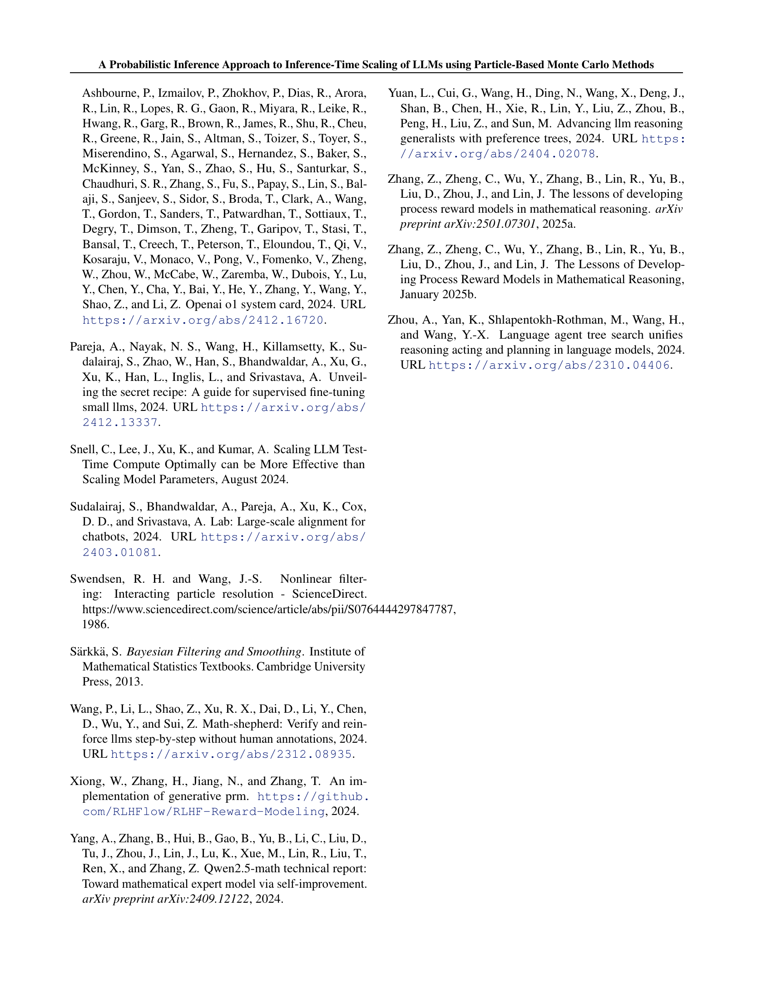

 


 2502.01618 
 Isha Puri et el. 
 
 🤗 2025-02-06 
 



↗ arXiv


↗ Hugging Face


↗ Papers with Code


### TL;DR



대규모 언어 모델(LLM)의 성능 향상을 위해 모델 크기나 데이터 양을 늘리는 기존 방식은 한계에 직면했습니다.  본 논문은 **추론 시간 자체를 확장**하여 성능을 개선하는 새로운 접근 방식을 제시합니다. 기존의 보상 모델 기반 검색 방식은 근사 오류로 인한 보상 조작에 취약하지만, 이 논문은 **확률적 추론**을 이용하여 이 문제를 해결합니다.  이는 보상 모델의 최적점이 아닌 상태 분포의 일반적인 집합을 탐색하여 더욱 정확한 결과를 도출합니다.

본 논문은 **입자 기반 몬테 카를로 방법**을 이용하여  LLM의 추론 시간 확장 문제를 해결합니다.  **입자 필터링**이라는 기법을 사용하여, 불완전한 보상 모델에서도 강건한 성능을 유지하며 추론 시간을 효과적으로 확장합니다. 실험 결과, 기존 방법 대비 최대 16배 향상된 확장률을 보였으며, 소규모 모델에서도 대형 모델 수준의 성능을 달성했습니다.  이러한 결과는 **확률적 추론 기법을 LLM에 적용**하는 새로운 가능성을 제시하며, 향후 연구 방향에 대한 중요한 시사점을 제공합니다.



#### Key Takeaways


 입자 기반 몬테 카를로 방법을 이용한 새로운 추론 시간 확장 기법 제안 



 기존 방법 대비 최대 16배 향상된 확장 성능 



 불완전한 보상 모델에 대한 강건성 확보 


#### Why does it matter?
본 논문은 **추론 시간 확장을 위한 새로운 확률적 추론 접근 방식**을 제시하여, 기존의 방법보다 훨씬 효율적이고 강력한 성능을 보여줍니다. 이는 **대규모 언어 모델의 성능 향상**에 크게 기여할 뿐만 아니라, **제한된 자원 환경에서도 고성능 모델을 활용**할 수 있는 가능성을 열어줍니다. 또한, **확률적 추론과 대규모 언어 모델의 추론 시간 확장을 연결**하는 새로운 연구 분야를 개척하여, 후속 연구에 대한 중요한 방향을 제시합니다.

------
#### Visual Insights

> 🔼 그림 1은 추론 시간 확장을 위한 상태 공간 모델을 보여줍니다.  'c'는 프롬프트를 나타내고, x₁, ..., xₜ는 LLM의 부분 출력 시퀀스를, o₁, ..., oₜ는 각 부분 출력에 대한 '수락 여부' 관측값을 나타냅니다.  본 논문에서는 추론 시간 확장을 확률적 추론 문제로 설정하여, 모든 oₜ가 1 (즉, 모든 부분 출력이 수락됨)인 조건에서 잠재 상태 x₁, ..., xₜ를 추정하는 것을 목표로 합니다.  모델은 프롬프트가 주어졌을 때 LLM이 생성하는 토큰 시퀀스와, 각 토큰이 수락되는지 여부를 나타내는 보상 모델로 구성됩니다.
> 

> 
read the caption

> Figure 1: State-space model for inference-time scaling. c𝑐citalic_c is a prompt, x1,…,xTsubscript𝑥1…subscript𝑥𝑇x_{1},\dots,x_{T}italic_x start_POSTSUBSCRIPT 1 end_POSTSUBSCRIPT , … , italic_x start_POSTSUBSCRIPT italic_T end_POSTSUBSCRIPT are sequence of partial LLM outputs and o1,…,oTsubscript𝑜1…subscript𝑜𝑇o_{1},\dots,o_{T}italic_o start_POSTSUBSCRIPT 1 end_POSTSUBSCRIPT , … , italic_o start_POSTSUBSCRIPT italic_T end_POSTSUBSCRIPT are the “observed” acceptance. We cast inference-time scaling as to estimate the latent states conditioned on ot=1subscript𝑜𝑡1o_{t}=1italic_o start_POSTSUBSCRIPT italic_t end_POSTSUBSCRIPT = 1 for t=1,2,…,T𝑡12…𝑇t=1,2,\dots,Titalic_t = 1 , 2 , … , italic_T, i.e. all being accepted.
> 


| Model | Method | MATH500 | AIME 2024 |
|---|---|---|---| 
| **Closed-Source LLMs** |  |  |  |
| GPT-4o | - | 76.2 | 13.3 |
| o1-preview | - | **87.0** | **40.0** |
| Claude3.5-Sonnet | - | 78.3 | 16.0 |
| **Open-Source LLMs** |  |  |  |
| Llama-3.1-70B-Instruct | - | 65.7 | 16.6 |
| Qwen2.5-Math-72B-Instruct | - | 82.0 | 30.0 |
| **Open-Source SLMs** |  |  |  |
| Llama-3.2-1B-Instruct | Pass@1 | 26.8 | 0.0 |
|  | BoN | 46.6 | 3.3 |
|  | WBoN | 47.8 | 3.3 |
|  | DVTS | 52.8 | 6.6 |
|  | Ours - PF | **59.6** | **10.0** |
| Llama-3.1-8B-Instruct | Pass@1 | 49.9 | 6.6 |
|  | BoN | 58.6 | 10.0 |
|  | WBoN | 59.0 | 10.0 |
|  | DVTS | 65.7 | 13.3 |
|  | Ours - PF | **74.4** | **16.6** |
| **Open-Source Math SLMs** |  |  |  |
| Qwen2.5-Math-1.5B-Instruct | Pass@1 | 70.0 | 10.0 |
|  | BoN | 82.6 | 13.3 |
|  | WBoN | 82.8 | 13.3 |
|  | DVTS | 83.4 | 16.6 |
|  | Ours - PF | **85.4** | **23.3** |
| Qwen2.5-Math-7B-Instruct | Pass@1 | 79.6 | 16.6 |
|  | BoN | 83.0 | 20.0 |
|  | WBoN | 84.6 | 20.0 |
|  | DVTS | 85.4 | 20.0 |
|  | Ours - PF | **87.0** | **23.3** |

> 🔼 표 1은 MATH500 및 AIME 2024 데이터셋에서 다양한 크기의 언어 모델(LLM)들의 성능을 보여줍니다.  각 모델의 기본 성능(Pass@1)과  Qwen2.5-Math-PRM-7B 보상 모델을 사용한 세 가지 추론 시간 확장 기법(BoN, WBoN, DVTS) 및 제안된 확률적 추론 기반 방법(PF)의 성능을 비교합니다.  굵은 글씨는 각 범주에서 가장 좋은 성능을, 기울임꼴은 전체적으로 가장 좋은 성능을 나타냅니다.  모든 추론 시간 확장 기법은 64번의 모델 생성이라는 계산 비용 제한 하에 실행되었습니다. 특히, Qwen2.5-Math-7B 모델은 추론 시간 확장을 통해 MATH500 데이터셋에서 o1-preview 모델과 동등한 성능을 달성하여, 더 작은 모델에서 경쟁력 있는 성능을 달성하기 위한 추론 시간 확장의 효과를 보여줍니다.
> 

> 
read the caption

> Table 1: Results of various LLMs on MATH500 and AIME 2024 where bold indicates the best in each category and italic indicates the overall best. The table highlights the performance of Inference Scaling methods, where Qwen2.5-Math-PRM-7B was used as the Reward Model. Each inference scaling methods were run with a computational budget of 64 model generations. Notably, the Qwen2.5-Math-7B model, when scaled with inference-time compute, achieves performance on par with o1-preview in MATH500, further showcasing the power of inference-time scaling for competitive performance with smaller models.
> 

### In-depth insights

#### Inference Scaling
본 논문은 **추론 시간 확장(Inference-Time Scaling)**이라는 주제에 대해 심도있게 다루고 있습니다. 기존의 모델 크기나 데이터 증가를 통한 성능 향상의 한계를 극복하기 위해, **추론 단계에서의 계산량 증가**를 통한 새로운 접근 방식을 제시합니다.  이는 보상 모델의 근사 오류로 인한 보상 해킹 문제를 완화하는 데 초점을 맞추고 있습니다.  **확률적 추론** 프레임워크를 활용하여, 상태 공간 모델의 상태 분포를 직접 최적화하는 대신, 샘플링 기반 기법을 통해 전형적인 상태 분포를 탐색합니다.  **입자 필터링 기반의 몬테 카를로 방법**을 적용하여 효율적이고 강력한 추론 시간 확장 방법을 제시하며, 다양한 수학적 추론 과제에서 기존의 결정론적 탐색 방식보다 4~16배 우수한 확장 성능을 보임을 실험적으로 입증합니다.  이는 **작은 언어 모델에서도 대규모 모델과 유사한 성능**을 달성할 수 있음을 시사합니다.

#### PF for LLMs
본 논문에서 제시된 'PF for LLMs'는 **입력값이 주어지면, 확률적 추론 기법인 입자 필터링(PF)을 활용하여 대규모 언어 모델(LLM)의 추론 시간을 확장하는 방법**을 의미합니다. 기존의 보상 모델 기반 검색 방식과 달리, PF는 상태 공간 모델의 상태 분포를 탐색하여 최적의 모드를 찾는 대신, **전형적인 상태 집합을 탐색**합니다. 이는 보상 모델의 오류에 대한 강건성을 높이고, **탐색과 활용 간의 균형을 유지**하는 데 도움이 됩니다.  **불완전한 보상 모델을 고려**하여 다양한 후보들을 유지하고, 관측된 증거를 기반으로 가중치를 반복적으로 업데이트함으로써, PF는 불완전한 보상 모델에도 강건한 확장성을 제공합니다.  **실험 결과는 PF가 결정론적 검색 방식보다 4~16배 빠른 확장 속도**를 보임을 보여주며, 소규모 LLM이 제한된 계산 예산 내에서도 우수한 성능을 달성할 수 있음을 시사합니다.

#### PRM Imperfection
본 논문에서 다루는 'PRM Imperfection'은 **보상 모델(PRM)**의 불완전성을 의미합니다.  PRM은 강화학습 기반의 추론 시간 확장 방법에서 중요한 역할을 하는데,  **실제 문제 해결 능력과 완벽하게 일치하지 않는 근사치**이기 때문에 오류가 발생할 가능성이 있습니다. 이러한 오류는 **보상 해킹(reward hacking)**으로 이어질 수 있으며, 모델이 실제로는 정확하지 않은 답을 내놓더라도 보상을 최대화하는 방향으로 학습될 수 있습니다.  **확률적 추론 접근 방식**은 이러한 PRM의 불완전성 문제를 완화하기 위한 해결책으로 제시됩니다.  **샘플링 기반 기법**을 통해 보상 모델의 최적값(mode)을 찾는 대신, **상태 분포의 전형적인 집합(typical set)**을 탐색함으로써 보상 모델의 근사 오류에 대한 의존도를 낮추고, **탐색(exploration)과 활용(exploitation)의 균형**을 이룰 수 있게 됩니다.  결과적으로, **더욱 강건하고 정확한 추론 시간 확장**이 가능해집니다.

#### Future Work
본 논문은 확률적 추론 방법을 사용하여 LLM의 추론 시간 확장에 대한 새로운 접근 방식을 제시합니다.  **향후 연구 방향으로는 먼저, 다양한 종류의 LLM과 PRM에 대한 실험적 평가를 확장하여 일반화 가능성을 높이는 것이 중요합니다.**  다양한 과제 유형 및 모델 크기에 대한 로버스트성을 확인하고, 제안된 방법의 효율성을 더욱 높이기 위한 최적화 기법을 연구해야 합니다.  **두 번째로, 불완전한 보상 모델에 대한 로버스트성을 더욱 강화하는 연구가 필요합니다.**  보상 모델의 불확실성을 명시적으로 고려하는 방법론을 개발하고, 보상 해킹 문제를 효과적으로 완화하는 기법을 개발해야 합니다.  **세 번째로,  병렬 처리 및 반복 계산을 포함한 다양한 계산 자원 할당 전략에 대한 심층적인 연구가 필요합니다.**  계산 자원을 효율적으로 배분하여 성능을 극대화할 수 있는 최적의 전략을 찾아내는 것이 중요합니다.  **마지막으로, 제안된 방법을 다른 응용 분야에 적용하는 연구를 수행할 수 있습니다.** 예를 들어, 자연어 처리 이외의 영역, 특히 추론 능력이 중요한 분야에 적용하여 그 효과를 검증하는 것이 필요합니다.

#### Ablation Study
본 논문의 ‘절제 연구(Ablation Study)’ 부분은 모델 성능에 영향을 미치는 요소들을 체계적으로 분석하여 **각 요소의 기여도를 정량적으로 평가**하는 데 중점을 둡니다.  **여러 가지 PRM(Process Reward Model)의 성능 비교**, **보상 집계 전략의 영향 분석**, **LLM 생성 온도의 최적화** 등을 통해 모델 성능 향상에 가장 효과적인 요소와 그 이유를 밝히고자 합니다. 이를 통해, 제안된 방법의 견고성과 일반화 능력을 더욱 강화하고, 향후 연구 방향을 제시하는 데 도움을 줄 수 있을 것입니다.  **특히, 다양한 하이퍼파라미터 설정에 따른 성능 변화를 분석하여 최적의 설정을 도출**하고, 이를 통해 모델의 효율성을 극대화하는 데 기여할 것으로 예상됩니다.  **각 요소의 상호 작용 효과**에 대한 분석도 포함되어, 보다 포괄적인 이해를 제공할 수 있을 것으로 기대합니다.  절제 연구의 결과는 제안된 방법의 강점과 한계를 명확히 제시하고, **향후 연구를 위한 중요한 시사점**을 제공할 것입니다.

### More visual insights

More on figures

> 🔼 그림 2(a)는 Llama-3.2-1B-Instruct 모델에 대한 다양한 추론 시간 확장 기법들의 성능을 보여줍니다.  그래프는 모델 생성 횟수(예산)에 따른 정확도 변화를 나타냅니다.  Llama-3.2-1B-Instruct 모델을 사용하여 Pass@1, BON, WBON, DVTS, 그리고 본 논문에서 제안하는 Particle Filtering (PF) 방법의 성능을 비교합니다.  각 방법의 정확도가 모델 생성 횟수에 따라 어떻게 증가하는지 보여주며, 특히 Particle Filtering 방법이 다른 방법들에 비해 더 효율적으로 정확도를 높이는 것을 보여줍니다.
> 

> 
read the caption

> (a) Llama-3.2-1B-Instruct
> 

> 🔼 그림 2b는 Llama-3.1-8B-Instruct 모델에 대한 다양한 추론 시간 확장 방법들의 성능을 보여줍니다.  그래프는 여러 추론 예산(모델 생성 횟수)에 따른 정확도를 나타냅니다.  Llama-3.1-8B-Instruct 모델은 다양한 방법들 중에서 Particle Filtering (PF) 방법을 사용했을 때 가장 높은 정확도를 달성하는 것을 보여줍니다.  이 그림은 제안된 PF 방법이 기존의 방법들보다 훨씬 더 효율적으로 추론 시간을 확장할 수 있음을 시각적으로 보여주는 역할을 합니다.
> 

> 
read the caption

> (b) Llama-3.1-8B-Instruct
> 

> 🔼 그림 (c)는 Qwen2.5-Math-1.5B-Instruct 모델에 대한 결과를 보여줍니다. 이 그림은 다양한 추론 시간 확장 방법들을 비교하여, 제안된 방법(PF)이 다른 방법들보다 훨씬 더 빠른 확장 속도를 가지는 것을 보여줍니다. 특히, 제한된 계산 비용 내에서 Qwen2.5-Math-1.5B-Instruct 모델의 정확도가 GPT-40를 능가하는 것을 보여줍니다.
> 

> 
read the caption

> (c) Qwen2.5-Math-1.5B-Instruct
> 

> 🔼 그림 2(d)는 Qwen2.5-Math-7B-Instruct 모델에 대한 여러 가지 추론 시간 확장 방법들의 성능을 보여줍니다.  수평축은 모델 생성 횟수(계산 비용)이고, 수직축은 정확도입니다. 이 그림은 제안된 입자 필터링 방법이 다른 방법들(가중치 BON, DVTS, 0-shot CoT)보다 훨씬 빠르게 확장되고, 제한된 계산 비용 내에서도 높은 정확도를 달성함을 보여줍니다. 특히, Qwen2.5-Math-7B-Instruct 모델은 입자 필터링을 사용하여 32회의 롤아웃만으로도 GPT-40 수준의 정확도에 도달합니다.
> 

> 
read the caption

> (d) Qwen2.5-Math-7B-Instruct
> 

> 🔼 그림 2는 다양한 모델 계열에서 다른 추론 시간 확장 방법과 비교하여 PF의 성능을 보여줍니다. (a)와 (b)는 Llama-3 계열의 결과를 보여주는데, PF가 WBoN과 DVTS를 능가하고 Llama-3.1-70B 및 GPT-4와 같은 훨씬 더 큰 모델의 성능에 근접함을 보여줍니다. (c)와 (d)는 Qwen 계열의 결과를 보여주는데, PF가 기준선보다 우수한 확장성을 달성하여 더 작은 모델인 Qwen-2.5-Math-1.5B-Instruct가 제한된 컴퓨팅 예산 내에서 GPT-4의 성능을 능가할 수 있음을 보여줍니다. 더 큰 Qwen-2.5-Math-7B-Instruct 모델은 MATH500에서 o1-preview 성능에 효율적으로 도달합니다.
> 

> 
read the caption

> Figure 2:  Performance of PF compared to other inference-time scaling methods across different model families. Figure 2(a) and Figure 2(b) demonstrate results for the Llama-3 family, where PF outperforms WBoN and DVTS in both cases and approaches the performance of much larger models like Llama-3.1-70B and even GPT-4o . Figure 2(c) and Figure 2(d) show results for the Qwen family, where PF achieves superior scaling against baslines, enabling the smaller model Qwen2.5-Math-1.5B-Instruct to surpass GPT-4o in performance within a limited compute budget. Larger Qwen2.5-Math-7B-Instruct model efficiently scale to match o1-preview performance on MATH500.
> 

> 🔼 그림은 추론 시간 확장을 위한 입자 필터링 방법을 보여줍니다.  (a)는 입자 필터링이 보상 값을 사용하여 소프트맥스 분포를 생성하고, 이를 기반으로 확률적 샘플링을 통해 N개의 샘플을 확장하는 과정을 나타냅니다.  즉, 각 단계에서 모델이 생성한 부분적인 답변에 대해 보상 값을 계산하고, 이를 확률로 변환하여 다음 단계의 입자들을 생성합니다. 보상 값이 높은 부분 답변일수록 다음 단계에서 선택될 확률이 높아집니다.  하지만, 단순히 보상 값이 높은 것만 선택하는 것이 아니라, 확률적 샘플링을 통해 다양한 가능성을 탐색합니다.  이를 통해 최적의 답변을 찾는 것 보다,  전체적인 상태 분포를 잘 반영하는 답변들을 찾는 것을 목표로 합니다.
> 

> 
read the caption

> (a) Particle filtering uses the rewards to produce a softmax distribution and does stochastic expansion of N𝑁Nitalic_N based sampling.
> 

> 🔼 그림은 빔 서치 알고리즘의 동작 방식을 보여줍니다. 빔 서치는 보상(Reward)을 정확한 값으로 간주하고, 빔 크기 N과 빔 너비 M을 기반으로 결정적으로 후보군을 확장합니다.  즉, 가장 높은 보상을 가진 N개의 후보를 선택하고, 각 후보에 대해 M개의 후속 후보를 생성하여 탐색 공간을 확장하는 방식입니다.  이 과정에서 불확실성을 고려하지 않고, 보상 값을 신뢰하여 다음 단계의 후보를 결정합니다.  이는 확률적 접근 방식과 대조됩니다.
> 

> 
read the caption

> (b) Beam search treats the rewards as exact and performs deterministic expansion based on beam size N𝑁Nitalic_N and beam width M𝑀Mitalic_M.
> 

> 🔼 그림 3은 입자 필터링과 가장 유사한 탐색 기반 방법인 빔 서치를 나란히 비교한 것입니다. 그림 3(b)의 빔 서치는 보상이 정확하다고 암시적으로 가정하여 선택 및 확장이 결정적이지만, 그림 3(a)의 입자 필터링은 보상에 대한 불확실성을 고려하여 샘플링을 통해 확장을 전파합니다. 입자 필터링의 자세한 단계별 버전은 부록 A.1의 그림 9에서 확인할 수 있습니다.
> 

> 
read the caption

> Figure 3: A side-by-side comparison between particle filtering and its closet search-based counterpart, beam search. Compared with beam search in Figure 3(b) where the selection and expansion is deterministic (implicitly assumes the rewards are correct), particle filtering in Figure 3(a) trust the rewards with uncertainty and propagate the expansion via sampling. A more detailed, step-by-step version of particle filtering can be found in Figure 9 of Appendix A.1.
> 

### Full paper



