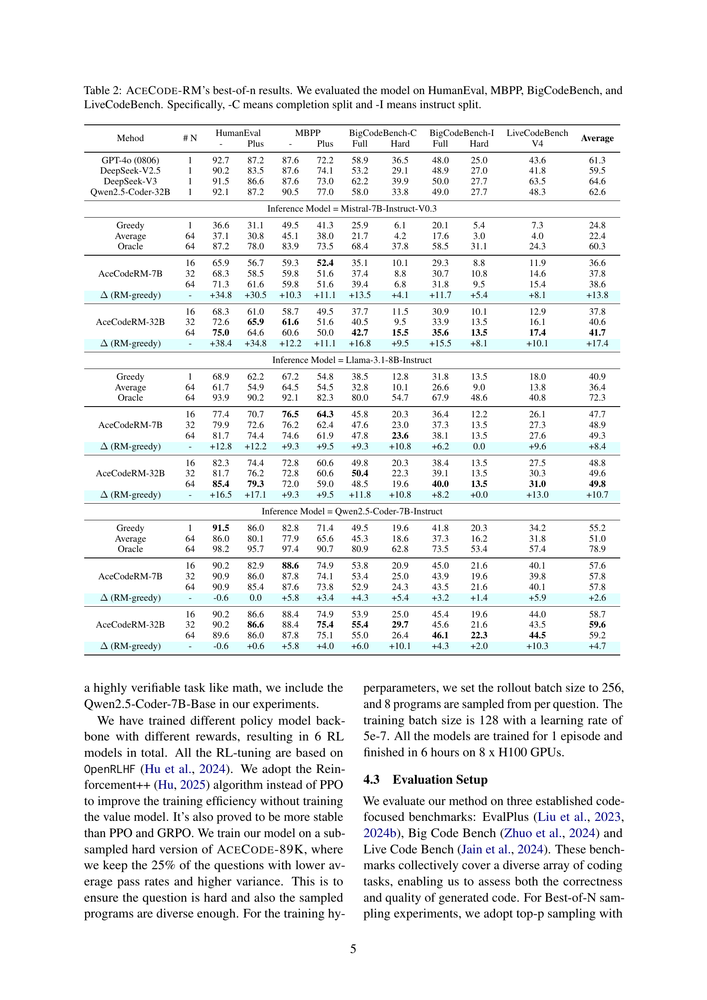

 


 2502.01718 
 Huaye Zeng et el. 
 
 🤗 2025-02-05 
 



↗ arXiv


↗ Hugging Face


↗ Papers with Code


### TL;DR



최근 코드 생성 모델은 주로 **지도 학습 미세 조정**에 의존해 왔으며, **강화 학습의 잠재력은 크게 활용되지 못했습니다.** 이는 코드 도메인에서 신뢰할 수 있는 보상 데이터나 모델이 부족하기 때문입니다. 본 논문에서는 이러한 문제를 해결하기 위해 **자동화된 대규모 테스트 케이스 합성**을 활용하여 코드 모델 훈련을 향상시키는 새로운 방법을 제시합니다.  기존 코드 데이터로부터 **(질문, 테스트 케이스) 쌍**을 생성하고, 이를 바탕으로 통과율 기반의 보상 모델을 구축하여 강화 학습을 수행했습니다.

본 연구는 **새로운 보상 모델을 통해 Llama-3.1-8B-Ins 및 Qwen2.5-Coder-7B-Ins 모델의 성능이 각각 평균 10점과 5점 향상**되었음을 보여줍니다. 또한,  HumanEval, MBPP, Big-CodeBench, LiveCodeBench 등 다양한 벤치마크에서 일관된 성능 향상을 확인했습니다. 특히, **Qwen2.5-Coder-base 모델부터 R1 스타일 훈련을 통해 HumanEval-plus 및 MBPP-plus에서 각각 25% 및 6% 이상의 성능 향상**을 달성했습니다.  이 연구는 **ACECODE-89K라는 대규모 검증 가능한 코드 훈련 데이터셋**을 제공하며, 코드 생성 모델에 대한 강화 학습의 잠재력을 보여주는 중요한 결과입니다.



#### Key Takeaways


 자동화된 대규모 테스트 케이스 합성을 통해 코드 생성 모델의 강화 학습 훈련 개선 



 새로운 보상 모델과 테스트 케이스 통과 보상을 활용한 강화 학습으로 다양한 벤치마크에서 일관된 성능 향상 달성 



 대규모 검증 가능한 코드 훈련 데이터셋 ACECODE-89K 공개 


#### Why does it matter?
본 논문은 **코드 생성 모델에 강화 학습을 적용하는 데 있어 주요 과제였던 신뢰할 수 있는 보상 신호 부족 및 테스트 케이스 데이터 부족 문제를 해결**하기 위해 자동화된 대규모 테스트 케이스 합성 파이프라인을 설계했습니다. 이를 통해 기존 코드 데이터에서 방대한 양의 질문-테스트 케이스 쌍을 생성하고, 이를 이용하여 보상 모델을 학습하고 강화 학습을 수행하여 코드 생성 모델의 성능을 향상시켰습니다. 이는 코드 생성 모델 연구에 있어 **새로운 방향을 제시**하고, 향후 연구에 중요한 영향을 미칠 것으로 기대됩니다. 또한, **대규모의 검증 가능한 코드 훈련 데이터 세트인 ACECODE-89K를 공개**하여 연구 커뮤니티의 발전에도 기여했습니다. 

------
#### Visual Insights

> 🔼 이 그림은 논문에서 제시하는 모델의 전체 워크플로우를 보여줍니다. 먼저, 기존 코드 데이터셋에서 시작하여 형식이 잘 갖춰진 질문과 해당 테스트 케이스를 생성합니다. 그런 다음, 강력한 모델을 사용하여 노이즈가 많은 테스트 케이스를 필터링합니다. 마지막으로, 필터링된 테스트 케이스를 사용하여 보상 모델 학습과 강화 학습을 위한 양성 및 음성 프로그램 쌍을 수집합니다.
> 

> 
read the caption

> Figure 1: Overall Workflow of our model: We start from the seed code dataset to create well-formatted questions and corresponding test cases. Then we adopt strong models like filter the noisy test cases. Finally, we adopt these test cases to harvest positive and negative program pairs for reward model training and RL.
> 


| Subset | Evol | OSS | Stack Python | Overall |
|---|---|---|---|---|
| Before Filtering |  |  |  |  |
| # Examples | 36,256 | 37,750 | 50,000 | 124,006 |
| # Avg Test Cases | 19.33 | 17.21 | 18.27 | 18.27 |
| After Filtering |  |  |  |  |
| # Examples | 27,853 | 26,346 | 35,223 | 89,422 |
| # Avg Test Cases | 14.77 | 16.11 | 15.79 | 15.56 |
| # Pairs | 89,089 | 91,636 | 126,784 | 307,509 |

> 🔼 AceCode-89K 데이터셋의 통계를 보여주는 표입니다. 필터링 전후의 데이터셋 크기, 평균 테스트 케이스 수, 생성된 프로그램 쌍의 수를 보여줍니다. 필터링 과정을 통해 품질이 낮은 테스트 케이스를 제거하여 데이터셋의 신뢰도를 높였음을 보여줍니다.
> 

> 
read the caption

> Table 1: Dataset statistics of AceCode-89K before and after test-case filtering.
> 

### In-depth insights

#### RL in Code Generation
코드 생성 분야에서 강화 학습(RL)의 적용은 아직 초기 단계이지만, **감독 학습 기반 미세 조정의 한계를 극복할 잠재력**을 가지고 있습니다. 기존의 감독 학습은 방대한 양의 라벨링된 데이터에 의존하지만, RL은 **보상 함수를 통해 학습 에이전트를 유도**함으로써, 더 적은 양의 데이터로 효율적인 학습을 가능하게 합니다.  특히, 코드 생성의 경우, 실행 가능한 코드의 정확성과 효율성을 평가하는 것이 중요한데, RL은 이러한 요구사항을 충족하는 보상 함수를 설계할 수 있습니다. 하지만, **적절한 보상 함수의 설계가 어려움**과 더불어, **안정적인 RL 훈련을 위한 알고리즘 및 하이퍼파라미터 튜닝** 역시 중요한 과제입니다.  **자동화된 테스트 케이스 생성**을 통해 보상 신호를 효율적으로 생성하는 연구는 RL 기반 코드 생성 모델의 발전에 큰 기여를 할 것입니다. 앞으로 코드 생성에 대한 RL의 적용은 더욱 확장될 것이며,  **더욱 복잡하고 다양한 코드 생성 과제**에 대한 해결책을 제시할 것으로 기대됩니다.

#### Test-Case Synthesis
본 논문에서 제시된 테스트 케이스 합성(Test-Case Synthesis) 방법은 **자동화된 대규모 테스트 케이스 생성**을 통해 코드 모델 학습을 향상시키는 핵심 전략입니다. 기존 코드 데이터에서 (질문, 테스트 케이스) 쌍을 생성하는 파이프라인을 설계하여, 통과율 기반 선호도 쌍을 구성하고, 이를 통해 보상 모델을 학습합니다.  **자동화된 테스트 케이스 생성**은 기존의 수동적인 방식에 비해 **확장성과 효율성을 크게 향상**시키며, RL 기반 코드 모델 학습에 필수적인 **신뢰할 수 있는 보상 신호**를 제공합니다.  **GPT-4와 같은 강력한 언어 모델**을 활용하여 질문을 LeetCode 스타일로 재작성하고 테스트 케이스를 생성하는 과정은 높은 정확도와 효율성을 보장합니다.  하지만, 생성된 테스트 케이스의 품질을 관리하고 노이즈를 제거하는 필터링 과정 또한 중요하며, **Qwen2.5-Coder와 같은 강력한 코드 모델**을 활용하여 필터링을 수행함으로써 정확성을 높입니다.  결과적으로, 이러한 자동화된 테스트 케이스 합성 방법은 RL 기반 코드 모델 학습의 효율성과 성능 향상에 크게 기여합니다.

#### Reward Model Training
본 논문에서 제시된 'Reward Model Training' 부분은 코드 생성 모델의 성능 향상을 위해 **자동화된 테스트 케이스 생성**을 활용하여 보상 모델을 학습시키는 방법에 초점을 맞추고 있습니다.  기존의 코드 품질 평가 방식의 어려움을 극복하고자,  **대규모 테스트 케이스**를 자동으로 생성하여 보상 신호로 활용하는 방식을 제안합니다.  **Bradley-Terry 손실 함수**를 사용하여 선호도 쌍을 기반으로 보상 모델을 학습시키고, 이를 통해 기존 모델의 성능을 향상시키는 것을 목표로 합니다. 이러한 접근 방식은 **기존 지도 학습 방식의 한계를 극복**하고, 강화 학습을 이용한 코드 생성 모델 학습의 가능성을 보여줍니다.  특히, 생성된 코드의 통과율을 기반으로 보상을 부여하는 방식은 **객관적인 성능 평가**를 가능하게 하여 더욱 효과적인 강화 학습을 가능하게 만듭니다.

#### Reinforcement Learning
본 논문에서 강화 학습(Reinforcement Learning)은 코드 생성 모델의 성능 향상에 핵심적인 역할을 합니다. 기존의 지도 학습 방식(Supervised Fine-Tuning)에 비해 **신뢰할 수 있는 보상 신호(reward signal)** 부족으로 인해 코드 영역에서 강화 학습의 잠재력이 제대로 활용되지 못했습니다. 본 연구는 이 문제를 해결하기 위해 **자동화된 대규모 테스트 케이스 생성** 기법을 활용하여 코드 모델 학습을 개선합니다.  **ACECODE-89K** 라는 대규모 데이터셋을 구축하고, 이를 통해 통과율(pass rate) 기반의 보상 모델을 학습, PPO(Proximal Policy Optimization) 알고리즘을 사용한 강화 학습을 수행하여 모델 성능을 향상시켰습니다. 특히, **Qwen2.5-Coder-base 모델에서 직접 강화 학습을 시작하여 HumanEval-plus 및 MBPP-plus에서 상당한 성능 향상**을 달성, 기존의 방식에 비해 훨씬 효율적인 결과를 보여줍니다.  **다양한 벤치마크에서 일관된 성능 향상**을 보이며 강화 학습의 코드 생성 모델 학습 효용성을 입증합니다.  하지만, 보상 모델의 견고성 향상을 위한 추가 연구가 필요함을 시사합니다.

#### Future of Coder Models
코더 모델의 미래는 **자동화된 테스트 케이스 합성을 통한 강화 학습**의 발전에 달려 있습니다.  이를 통해 신뢰할 수 있는 보상 신호를 생성하고, 대규모의 검증 가능한 코드 훈련 데이터셋을 구축할 수 있습니다.  **ACECODE-89K 와 같은 대규모 데이터셋**은 보다 강력하고 일반화된 코드 생성 모델을 훈련하는 데 중요한 역할을 합니다.  앞으로는 **RL 기반 훈련**을 통해 모델의 성능을 획기적으로 향상시키고,  더욱 복잡하고 어려운 코딩 과제를 해결할 수 있을 것입니다.  또한,  **다양한 프로그래밍 언어와 코딩 스타일**에 대한 지원을 확장하고,  **실제 개발 환경과의 통합**을 통해 모델의 실용성을 높이는 연구가 활발해질 것으로 예상됩니다.  궁극적으로, 코드 생성 모델은 개발자의 생산성을 향상시키고,  소프트웨어 개발 프로세스의 전반적인 효율성을 높이는 데 기여할 것입니다.  하지만, **보상 모델의 편향성** 및 **테스트 케이스의 신뢰성**에 대한 지속적인 연구가 필요합니다.

### More visual insights

More on tables


| Method | # N | HumanEval - | HumanEval Plus | MBPP - | MBPP Plus | BigCodeBench-C Full | BigCodeBench-C Hard | BigCodeBench-I Full | BigCodeBench-I Hard | LiveCodeBench V4 | Average |
|---|---|---|---|---|---|---|---|---|---|---|---|
| GPT-4o (0806) | 1 | 92.7 | 87.2 | 87.6 | 72.2 | 58.9 | 36.5 | 48.0 | 25.0 | 43.6 | 61.3 |
| DeepSeek-V2.5 | 1 | 90.2 | 83.5 | 87.6 | 74.1 | 53.2 | 29.1 | 48.9 | 27.0 | 41.8 | 59.5 |
| DeepSeek-V3 | 1 | 91.5 | 86.6 | 87.6 | 73.0 | 62.2 | 39.9 | 50.0 | 27.7 | 63.5 | 64.6 |
| Qwen2.5-Coder-32B | 1 | 92.1 | 87.2 | 90.5 | 77.0 | 58.0 | 33.8 | 49.0 | 27.7 | 48.3 | 62.6 |
| Inference Model = Mistral-7B-Instruct-V0.3 |  |  |  |  |  |  |  |  |  |  |  |
| Greedy | 1 | 36.6 | 31.1 | 49.5 | 41.3 | 25.9 | 6.1 | 20.1 | 5.4 | 7.3 | 24.8 |
| Average | 64 | 37.1 | 30.8 | 45.1 | 38.0 | 21.7 | 4.2 | 17.6 | 3.0 | 4.0 | 22.4 |
| Oracle | 64 | 87.2 | 78.0 | 83.9 | 73.5 | 68.4 | 37.8 | 58.5 | 31.1 | 24.3 | 60.3 |
| AceCodeRM-7B | 16 | 65.9 | 56.7 | 59.3 | 52.4 | 35.1 | 10.1 | 29.3 | 8.8 | 11.9 | 36.6 |
|  | 32 | 68.3 | 58.5 | 59.8 | 51.6 | 37.4 | 8.8 | 30.7 | 10.8 | 14.6 | 37.8 |
|  | 64 | 71.3 | 61.6 | 59.8 | 51.6 | 39.4 | 6.8 | 31.8 | 9.5 | 15.4 | 38.6 |
| Δ (RM-greedy) | - | +34.8 | +30.5 | +10.3 | +11.1 | +13.5 | +4.1 | +11.7 | +5.4 | +8.1 | +13.8 |
| AceCodeRM-32B | 16 | 68.3 | 61.0 | 58.7 | 49.5 | 37.7 | 11.5 | 30.9 | 10.1 | 12.9 | 37.8 |
|  | 32 | 72.6 | 65.9 | 51.6 | 40.5 | 9.5 | 33.9 | 13.5 | 16.1 | 40.6 |
|  | 64 | 75.0 | 64.6 | 50.0 | 42.7 | 15.5 | 35.6 | 13.5 | 17.4 | 41.7 |
| Δ (RM-greedy) | - | +38.4 | +34.8 | +12.2 | +11.1 | +16.8 | +9.5 | +15.5 | +8.1 | +10.1 | +17.4 |
| Inference Model = Llama-3.1-8B-Instruct |  |  |  |  |  |  |  |  |  |  |  |
| Greedy | 1 | 68.9 | 62.2 | 67.2 | 54.8 | 38.5 | 12.8 | 31.8 | 13.5 | 18.0 | 40.9 |
| Average | 64 | 61.7 | 54.9 | 64.5 | 54.5 | 32.8 | 10.1 | 26.6 | 9.0 | 13.8 | 36.4 |
| Oracle | 64 | 93.9 | 90.2 | 92.1 | 82.3 | 80.0 | 54.7 | 67.9 | 48.6 | 40.8 | 72.3 |
| AceCodeRM-7B | 16 | 77.4 | 70.7 | 76.5 | 64.3 | 45.8 | 20.3 | 36.4 | 12.2 | 26.1 | 47.7 |
|  | 32 | 79.9 | 72.6 | 62.4 | 47.6 | 23.0 | 37.3 | 13.5 | 27.3 | 48.9 |
|  | 64 | 81.7 | 74.4 | 61.9 | 47.8 | 23.6 | 38.1 | 13.5 | 27.6 | 49.3 |
| Δ (RM-greedy) | - | +12.8 | +12.2 | +9.3 | +9.5 | +9.3 | +10.8 | +6.2 | 0.0 | +9.6 | +8.4 |
| AceCodeRM-32B | 16 | 82.3 | 74.4 | 72.8 | 60.6 | 49.8 | 20.3 | 38.4 | 13.5 | 27.5 | 48.8 |
|  | 32 | 81.7 | 76.2 | 60.6 | 50.4 | 22.3 | 39.1 | 13.5 | 30.3 | 49.6 |
|  | 64 | 85.4 | 79.3 | 59.0 | 48.5 | 19.6 | 40.0 | 13.5 | 31.0 | 49.8 |
| Δ (RM-greedy) | - | +16.5 | +17.1 | +9.3 | +9.5 | +11.8 | +10.8 | +8.2 | 0.0 | +13.0 | +10.7 |
| Inference Model = Qwen2.5-Coder-7B-Instruct |  |  |  |  |  |  |  |  |  |  |  |
| Greedy | 1 | 91.5 | 86.0 | 82.8 | 71.4 | 49.5 | 19.6 | 41.8 | 20.3 | 34.2 | 55.2 |
| Average | 64 | 86.0 | 80.1 | 77.9 | 65.6 | 45.3 | 18.6 | 37.3 | 16.2 | 31.8 | 51.0 |
| Oracle | 64 | 98.2 | 95.7 | 97.4 | 90.7 | 80.9 | 62.8 | 73.5 | 53.4 | 57.4 | 78.9 |
| AceCodeRM-7B | 16 | 90.2 | 82.9 | 88.6 | 74.9 | 53.8 | 20.9 | 45.0 | 21.6 | 40.1 | 57.6 |
|  | 32 | 90.9 | 86.0 | 74.1 | 53.4 | 25.0 | 43.9 | 19.6 | 39.8 | 57.8 |
|  | 64 | 90.9 | 85.4 | 73.8 | 52.9 | 24.3 | 43.5 | 21.6 | 40.1 | 57.8 |
| Δ (RM-greedy) | - | -0.6 | 0.0 | +5.8 | +3.4 | +4.3 | +5.4 | +3.2 | +1.4 | +5.9 | +2.6 |
> 🔼 표 2는 AceCode-RM 모델의 성능을 HumanEval, MBPP, BigCodeBench, LiveCodeBench 데이터셋에서 best-of-n 방식으로 평가한 결과를 보여줍니다.  -C는 completion split, -I는 instruction split을 의미합니다.  각 데이터셋별 Plus, Full, Hard 등 여러 하위 벤치마크의 결과와 평균 성능을 보여주어, 모델의 코드 생성 능력을 다각적으로 평가합니다.
> 

> 
read the caption

> Table 2: AceCode-RM’s best-of-n results. We evaluated the model on HumanEval, MBPP, BigCodeBench, and LiveCodeBench. Specifically, -C means completion split and -I means instruct split.
> 


| Model | HumanEval - | HumanEval Plus | MBPP - | MBPP Plus | BigCodeBench (C) Full | BigCodeBench (C) Hard | BigCodeBench (I) Full | BigCodeBench (I) Hard | LiveCodeBench V4 | Average |
|---|---|---|---|---|---|---|---|---|---|---|
| DeepSeek-V2.5 | 90.2 | 83.5 | 87.6 | 74.1 | 53.2 | 29.1 | 48.9 | 27.0 | 41.8 | 59.5 |
| Baseline = Qwen2.5-7B-Instruct |  |  |  |  |  |  |  |  |  |  |
| Baseline | 81.7 | 73.2 | 79.4 | 67.7 | 45.6 | 16.9 | 38.4 | 14.2 | 29.0 | 49.6 |
| AceCoderRM | 83.5 | 77.4 | 83.1 | 71.2 | 46.8 | 16.9 | 39.0 | 14.9 | 30.3 | 51.5 |
| AceCoderRule | 84.1 | 77.4 | 80.2 | 68.3 | 46.8 | 15.5 | 40.2 | 15.5 | 30.1 | 50.9 |
| Δ (RL-baseline) | +2.4 | +4.3 | +3.7 | +3.4 | +1.2 | 0.0 | +1.8 | +1.4 | +1.3 | +2.1 |
| Baseline = Qwen2.5-Coder-7B-Base |  |  |  |  |  |  |  |  |  |  |
| Baseline | 61.6 | 53.0 | 76.9 | 62.9 | 45.8 | 16.2 | 40.2 | 14.2 | 28.7 | 44.4 |
| AceCoderRM | 83.5 | 75.6 | 80.2 | 67.2 | 41.9 | 14.9 | 36.8 | 16.2 | 25.7 | 49.1 |
| AceCoderRule | 84.1 | 78.0 | 82.3 | 69.3 | 48.6 | 18.2 | 43.2 | 18.2 | 28.5 | 52.3 |
| Δ (RL-baseline) | +22.5 | +25.0 | +5.4 | +6.4 | +2.8 | +2.0 | +3.1 | +4.1 | -0.2 | +7.9 |
| Baseline = Qwen2.5-Coder-7B-Instruct |  |  |  |  |  |  |  |  |  |  |
| Baseline | 91.5 | 86.0 | 82.8 | 71.4 | 49.5 | 19.6 | 41.8 | 20.3 | 34.2 | 55.2 |
| AceCoderRM | 89.0 | 84.1 | 86.0 | 72.8 | 50.4 | 18.9 | 42.0 | 19.6 | 35.0 | 55.3 |
| AceCoderRule | 90.9 | 84.8 | 84.1 | 71.7 | 50.9 | 23.0 | 43.3 | 19.6 | 34.9 | 55.9 |
| Δ (RL-baseline) | -0.6 | -1.2 | +3.2 | +1.3 | +1.4 | +3.4 | +1.5 | -0.7 | +0.8 | +0.7 |
> 🔼 본 표는 AceCoder의 강화학습 결과를 보여줍니다. Reinforcement++ 알고리즘을 사용하여 세 가지 초기 정책 모델(Qwen2.5-7B-Instruct, Qwen2.5-Coder-7B-Base, Qwen2.5-Coder-7B-Instruct)과 두 가지 보상 유형(AceCode-RM, 이진 통과율)으로 학습을 수행했습니다. 다양한 벤치마크(HumanEval, MBPP, BigCodeBench, LiveCodeBench)에서 일관된 성능 향상을 보여줍니다.
> 

> 
read the caption

> Table 3: AceCoder’s Performance after RL tuning using Reinforcement++ algorithm. We start with 3 different initial policy models and 2 kind of reward types, where R⁢M𝑅𝑀RMitalic_R italic_M means using our trained AceCode-RM and R⁢u⁢l⁢e𝑅𝑢𝑙𝑒Ruleitalic_R italic_u italic_l italic_e means using the binary pass rate. Results show consistent improvement across various benchmarks.
> 


| Method & RM | HumanEval - | HumanEval Plus | MBPP - | MBPP Plus | BigCodeBench-C Full | BigCodeBench-C Hard | BigCodeBench-I Full | BigCodeBench-I Hard | LiveCodeBench V4 | Average |
|---|---|---|---|---|---|---|---|---|---|---|
| Greedy | 68.9 | 62.2 | 67.2 | 54.8 | 38.5 | 12.8 | 31.8 | 13.5 | 18.0 | 40.9 |
| Average | 50.1 | 42.2 | 57.9 | 47.2 | 22.0 | 10.6 | 18.2 | 12.0 | 14.9 | 30.6 |
| InternLM2-RM-8B | 57.9 | 55.5 | 66.7 | 54.0 | 38.7 | 8.8 | 29.8 | 8.8 | 15.1 | 37.3 |
| Skywork-Gemma-27B | 73.8 | 67.1 | 64.3 | 53.4 | 40.1 | 14.9 | 32.5 | 12.8 | 23.6 | 42.5 |
| Skywork-Llama-3.1-8B | 67.7 | 61.6 | 69.6 | 56.9 | 40.6 | 10.8 | 31.8 | 12.2 | 18.8 | 41.1 |
| Δ (max(other RM)-greedy) | +4.9 | +4.9 | +2.4 | +2.1 | +2.1 | +2.0 | +0.6 | -0.7 | +5.6 | +2.7 |
| AceCode-RM-7B | 77.4 | 70.7 | 76.5 | 64.3 | 45.8 | 20.3 | 36.4 | 12.2 | 26.1 | 47.7 |
| Δ (RM-greedy) | +8.5 | +8.5 | +9.3 | +9.5 | +7.3 | +7.4 | +4.6 | -1.4 | +8.1 | +6.9 |
> 🔼 본 표는 Llama-3.1-8B-Inst 모델을 사용하여 Best-of-16 샘플링 방식으로 평가한 AceCode-RM의 성능을 다른 오픈소스 리워드 모델들과 비교 분석한 결과를 보여줍니다. Reward Bench에서 최고 순위를 기록한 모델들과 비교했을 때, AceCode-RM이 상당히 더 나은 성능 향상을 보여주는 것을 확인할 수 있습니다.  표에는 HumanEval, MBPP, BigCodeBench-C, BigCodeBench-I, LiveCodeBench의 다양한 지표에 대한 결과가 포함되어 있으며, 각 모델의 Greedy 성능과 비교하여 AceCode-RM의 개선 정도를 명확하게 제시합니다.
> 

> 
read the caption

> Table 4: AceCode-RM’s performance against other open-sourced reward models in terms of Best-of-16 sampling for Llama-3.1-8B-Inst. We can see the top-ranked RM on Reward Bench get little improvements compared to ours.
> 


| Method | HumanEval - | HumanEval Plus | MBPP - | MBPP Plus | BigCodeBench-C Full | BigCodeBench-C Hard | BigCodeBench-I Full | BigCodeBench-I Hard | LiveCodeBench V4 | Average |
|---|---|---|---|---|---|---|---|---|---|---|
| Inference Model = Llama-3.1-8B-Instruct |  |  |  |  |  |  |  |  |  |  |
| RM w/o Test Case Filter | 73.8 | 65.9 | 73.3 | 61.4 | 44.6 | 17.6 | 35.5 | 9.5 | 25.1 | 45.2 |
| RM w/ Test Filter | 77.4 | 70.7 | 76.5 | 64.3 | 45.8 | 20.3 | 36.4 | 12.2 | 26.1 | 47.7 |
| Δ (w/ Filter - w/o Filter) | +3.7 | +4.9 | +3.2 | +2.9 | +1.2 | +2.7 | +0.9 | +2.7 | +1.0 | +2.6 |
| Inference Model = Qwen2.5-Coder-7B-Instruct |  |  |  |  |  |  |  |  |  |  |
| RM w/o Test Case Filter | 91.5 | 86.0 | 86.0 | 72.2 | 52.5 | 21.6 | 43.4 | 19.6 | 36.9 | 56.6 |
| RM w/ Test Filter | 90.2 | 82.9 | 88.6 | 74.9 | 53.8 | 20.9 | 45.0 | 21.6 | 40.1 | 57.6 |
| Δ (w/ Filter - w/o Filter) | -1.2 | -3.0 | +2.6 | +2.6 | +1.3 | -0.7 | +1.6 | +2.0 | +3.2 | +0.9 |
> 🔼 이 표는 테스트 케이스 필터링이 Best-of-16 샘플링 성능에 미치는 영향을 보여주는 실험 결과를 보여줍니다.  테스트 케이스 필터링을 적용했을 때와 적용하지 않았을 때의 HumanEval, MBPP, BigCodeBench, LiveCodeBench 성능 비교를 통해 필터링의 효과를 정량적으로 분석합니다.  각 지표별로 Plus, Full, Hard 등 다양한 난이도의 결과를 제시하여 필터링 효과의 범위를 폭넓게 다룹니다.  Llama-3.1-8B-Instruct 와 Qwen2.5-Coder-7B-Instruct 두 모델에 대한 결과를 각각 제시하여 모델 종류에 따른 영향도 확인합니다.
> 

> 
read the caption

> Table 5: Ablation study on test-case filtering. Results are Best-of-16 sampling performance.
> 


| Method | HumanEval - | HumanEval Plus | MBPP - | MBPP Plus | BigCodeBench-C Full | BigCodeBench-C Hard | BigCodeBench-I Full | BigCodeBench-I Hard | LiveCodeBench V4 | Average |
|---|---|---|---|---|---|---|---|---|---|---|
| Inference Model = Llama-3.1-8B-Instruct |
| AceCode-RM (LLama) | 65.9 | 59.1 | 69.6 | 57.9 | 42.7 | 12.8 | 32.9 | 13.5 | 19.9 | 41.6 |
| AceCode-RM (Qwen) | 77.4 | 70.7 | 76.5 | 64.3 | 45.8 | 20.3 | 36.4 | 12.2 | 26.1 | 47.7 |
| Δ (Qwen-Llama) | +11.6 | +11.6 | +6.9 | +6.3 | +3.1 | +7.4 | +3.5 | -1.4 | +6.2 | +6.1 |
| Inference Model = Qwen2.5-Coder-7B-Instruct |
| AceCode-RM (LLama) | 87.8 | 81.7 | 82.0 | 67.7 | 50.5 | 25.0 | 39.0 | 19.6 | 32.4 | 54.0 |
| AceCode-RM (Qwen) | 90.2 | 82.9 | 88.6 | 74.9 | 53.8 | 20.9 | 45.0 | 21.6 | 40.1 | 57.6 |
| Δ (Qwen-Llama) | +2.4 | +1.2 | +6.6 | +7.1 | +3.2 | -4.1 | +6.0 | +2.0 | +7.7 | +3.6 |
> 🔼 표 6은 AceCode-RM의 성능 비교 결과를 보여줍니다.  AceCode-RM (Llama)는 Llama-3.1-Inst-8B를 기반으로, AceCode-RM (Qwen)은 Qwen-Coder-2.5-7B-Inst를 기반으로 학습되었습니다.  표는 HumanEval, MBPP, BigCodeBench, LiveCodeBench의 네 가지 벤치마크에 대한 Best-of-16 샘플링 성능을 보여줍니다.  각 벤치마크는 여러 하위 벤치마크로 나뉘며,  각 모델의 성능을 다양한 측면에서 비교 분석할 수 있도록 합니다. Llama와 Qwen 기반 모델의 성능 차이를 보여주어, 기반 모델 선택이 AceCode-RM의 성능에 미치는 영향을 분석하는 데 도움이 됩니다.
> 

> 
read the caption

> Table 6: Comparison of AceCode-RM’s performance trained on different base model, where AceCode-RM (Llama) is based on Llama-3.1-Inst-8B and AceCode-RM (Qwen) is based on Qwen-Coder-2.5-7B-Inst. Results are Best-of-16 sampling performance.
> 


{
  "question": "Given a string, return the longest palindromic substring within that string.",
  "tests": [
    "assert longestPalindrome("babad") == "bab" or "aba"",
    "assert longestPalindrome("cbbd") == "bb"",
    "assert longestPalindrome("a") == "a"",
    "assert longestPalindrome("ac") == "a"",
    "assert longestPalindrome("aa") == "aa"",
    "assert longestPalindrome("bbbab") == "bbbab"",
    "assert longestPalindrome("bananas") == "anana"",
    "assert longestPalindrome("racecar") == "racecar"",
    "assert longestPalindrome("Racecar") == "Racecar"",
    "assert longestPalindrome("A man, a plan, a canal: Panama") == "amanaplanacanalpanama"",
    "assert longestPalindrome("00000100000") == "00000100000"",
    "assert longestPalindrome("12321") == "12321"",
    "assert longestPalindrome("909") == "909"",
    "assert longestPalindrome("") == """,
    "assert longestPalindrome("aaba") == "aba" or "aa"",
    "assert longestPalindrome("abccba") == "abccba"",
    "assert longestPalindrome("abcba") == "abcba"",
    "assert longestPalindrome("xabax") == "xabax"",
    "assert longestPalindrome("xabba") == "abba"",
    "assert longestPalindrome("xabbaxy") == "abba""
  ]
}
> 🔼 이 표는 논문의 3장 Methodology, 3.1절 Problem Formulation에서 사용된 프롬프트를 보여줍니다.  이 프롬프트는 기존 코드 데이터셋을 LeetCode 스타일의 질문과 테스트 케이스로 변환하는 데 사용되었습니다.  프롬프트는 GPT-40-mini와 같은 큰 언어 모델이 질문을 생성하고 해당 질문에 대한 20개 정도의 테스트 케이스를 생성하도록 지시하는 세부적인 지침을 포함하고 있습니다. 이러한 질문과 테스트 케이스는 추후 reward model을 학습하고 강화 학습을 수행하는 데 사용됩니다.
> 

> 
read the caption

> Table 7: Prompt Used for Converting Seed Code Dataset into LeetCode-style Questions and Test Cases
> 

### Full paper



