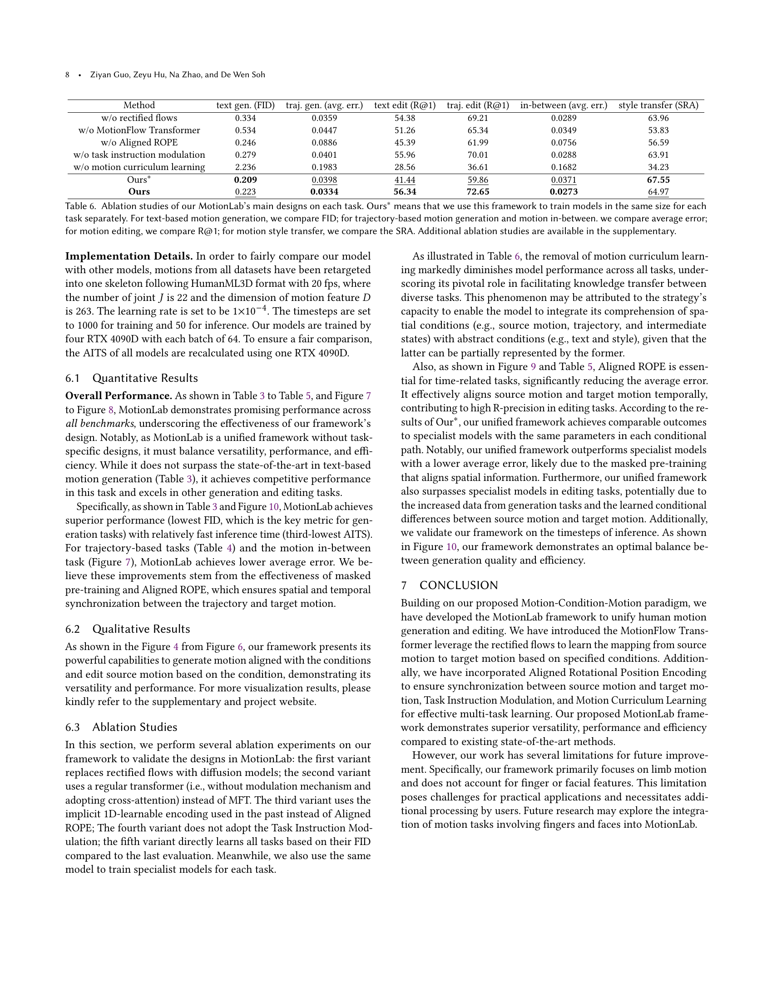

 


 2502.02358 
 Ziyan Guo et el. 
 
 🤗 2025-02-07 
 



↗ arXiv


↗ Hugging Face


↗ Papers with Code


### TL;DR



기존의 인간 동작 생성 및 편집 연구는 특정 작업에 국한된 해결책을 제시하여 비효율적이었습니다. 이에 본 논문에서는 **Motion-Condition-Motion이라는 새로운 패러다임**을 제안하고, 이를 기반으로 **다양한 작업을 통합적으로 처리**할 수 있는 **MotionLab이라는 통합 프레임워크**를 제시합니다.

MotionLab은 **MotionFlow Transformer**를 통해 **작업 특정 모듈 없이도 다양한 조건(텍스트, 궤적 등)을 활용**하여 동작 생성 및 편집을 수행합니다. 또한 **Aligned Rotational Position Encoding**과 **Task Instruction Modulation**을 도입하여 **시간 동기화** 및 **작업 구분**을 개선하고, **Motion Curriculum Learning** 전략을 통해 **다양한 작업 간의 효율적인 학습 및 지식 공유**를 실현합니다.  실험 결과, MotionLab은 기존 방법들보다 뛰어난 성능과 효율성을 보였습니다.



#### Key Takeaways


 MotionLab은 텍스트, 궤적 등 다양한 조건을 사용하여 인간 동작 생성 및 편집 작업을 통합하는 프레임워크입니다. 



 MotionFlow Transformer는 작업 특정 모듈 없이도 조건부 생성 및 편집 성능을 향상시킵니다. 



 Motion Curriculum Learning은 여러 작업에 대한 효율적인 학습과 지식 공유를 가능하게 합니다. 


#### Why does it matter?
본 논문은 **인간 동작 생성 및 편집을 위한 통합 프레임워크 MotionLab**을 제시하여 연구자들에게 **다양한 작업에 대한 효율적인 솔루션**을 제공합니다.  **다양한 모달리티(텍스트, 궤적 등)를 통합**하고 **작업 특화 모듈 없이도 여러 작업을 처리**할 수 있는 능력은 관련 분야 연구에 큰 영향을 미칠 것입니다. 또한 **새로운 패러다임과 학습 전략**은 **추가적인 연구**를 위한 새로운 길을 열어줍니다.

------
#### Visual Insights

> 🔼 그림 1은 MotionLab의 다양성, 성능 및 효율성을 보여줍니다. 이 그림은 텍스트 기반 모션 생성, 궤적 기반 모션 생성, 모션 보간 및 스타일 변환과 같은 여러 작업을 수행하는 MotionLab의 기능을 보여줍니다. 투명한 모션은 소스 모션 또는 조건을 나타내고, 다른 모션은 목표 모션을 나타냅니다.  비교를 위해 MotionLCM, OmniControl, MotionFix, CondMDI 및 MCM-LDM과 같은 기존 최첨단 모델의 결과도 함께 제시되어 MotionLab의 우수성을 강조합니다. SMPL을 사용하여 모든 모션을 나타냅니다.  웹사이트와 부록에서 더 자세한 정성적 결과를 확인할 수 있습니다.
> 

> 
read the caption

> Figure 1. Demonstration of our MotionLab’s versatility, performance and efficiency. Previous SOTA refer to multiple expert models, including MotionLCM (Dai et al., 2025), OmniControl (Xie et al., 2023), MotionFix (Athanasiou et al., 2024), CondMDI (Cohan et al., 2024) and MCM-LDM (Song et al., 2024). All motions are represented using SMPL (Loper et al., 2023), where transparent motion indicates the source motion or condition, and the other represents the target motion. More qualitative results are available in the website and appendix.
> 


| Method | text-based generation | text-based editing | trajectory-based generation | trajectory-based editing | in-between | style transfer |
|---|---|---|---|---|---|---|
| MDM [2023] | ✓ | × | × | × | - | × |
| MLD [2023] | ✓ | × | × | × | × | × |
| OmniControl [2023] | ✓ | × | ✓ | × | - | × |
| MotionFix [2024] | - | ✓ | × | × | - | × |
| CondMDI [2024] | ✓ | × | ✓ | × | ✓ | × |
| MCM-LDM [2024] | × | × | × | × | - | ✓ |
| MotionGPT [2023] | ✓ | - | × | × | ✓ | × |
| MotionCLR [2024] | ✓ | - | × | × | - | - |
| Ours | ✓ | ✓ | ✓ | ✓ | ✓ | ✓ |

> 🔼 표 1은 인간 동작 생성 및 편집에 중점을 둔 다양한 방법들을 요약한 표입니다. 각 방법이 특정 작업에 대해 학습되었는지 여부를 보여줍니다. ✓는 해당 작업에 대해 학습되었음을, ×는 학습되지 않았음을, -는 학습되지 않았지만 제로샷 방식으로 구현할 수 있음을 나타냅니다. 이 표는 다양한 방법들의 기능을 비교하여 MotionLab의 강점을 보여주는 데 사용됩니다.
> 

> 
read the caption

> Table 1. Summary of different methods focusing on motion generation and editing. ✓✓\checkmark✓ indicates that the method has been trained for the task, ×\times× indicates that the method has not been trained, and −-- indicates that the method has not been trained but can be implemented in a zero-shot manner.
> 

### In-depth insights

#### Unified Motion Model
본 논문에서 제안하는 "통합 모션 모델"은 기존의 분리된 인간 동작 생성 및 편집 방법론의 한계를 극복하기 위해 **모션-조건-모션 패러다임**을 도입한 혁신적인 시도입니다. 이는 **소스 모션, 조건, 타겟 모션**이라는 세 가지 개념을 중심으로 다양한 작업(텍스트 기반 모션 생성/편집, 궤적 기반 모션 생성/편집, 모션 스타일 전이 등)을 통합적으로 처리합니다.  **MotionFlow Transformer**를 이용해 조건에 따라 소스 모션에서 타겟 모션으로의 매핑을 학습하며, **정렬된 회전 위치 인코딩**을 통해 시간적 동기화를 보장하고, **작업 지시 변조**와 **모션 커리큘럼 학습**으로 효율적인 다중 작업 학습 및 지식 공유를 가능하게 합니다.  **다양한 작업의 통합**은 데이터 효율성을 높이고 모델의 일반화 능력을 향상시키는 데 크게 기여하며, **실시간 추론 효율성** 또한 중요한 장점입니다. 하지만 손가락이나 얼굴 표정 등 세밀한 동작 표현에는 아직 한계가 있어 추가적인 연구가 필요해 보입니다.

#### MFT Architecture
본 논문에서 제안하는 MFT(MotionFlow Transformer) 아키텍처는 **다양한 모달리티(텍스트, 자세, 스타일 등)를 통합적으로 처리하여 인간의 움직임 생성 및 편집 작업을 통합적으로 수행**하는 것을 목표로 합니다.  **핵심은 정류 흐름(Rectified Flows)**을 이용하여 소스 동작에서 조건에 따라 타겟 동작으로의 매핑을 학습하는 것입니다. 이는 단순히 조건을 입력으로 받는 기존 방법들과 달리, 소스 동작과 조건의 정보를 모두 활용하여 더욱 정확하고 세밀한 제어가 가능하도록 합니다.  **결합된 어텐션(Joint Attention)** 메커니즘을 통해 각 모달리티의 특징들을 효과적으로 상호 작용시키고, **정렬된 회전 위치 인코딩(Aligned ROPE)**을 통해 시간적 동기화를 보장합니다.  **과제 지시 조절(Task Instruction Modulation)**은 다양한 작업들을 구분하고, **움직임 커리큘럼 학습(Motion Curriculum Learning)**은 효율적인 다중 작업 학습과 지식 공유를 가능하게 합니다.  결론적으로 MFT 아키텍처는 **모듈성, 효율성, 일반화 성능**을 갖춘 혁신적인 프레임워크로서 인간의 움직임 데이터 처리 분야에 중요한 기여를 할 것으로 예상됩니다.

#### Curriculum Learning
본 논문에서 제시된 커리큘럼 학습 전략은 **다양한 작업의 난이도를 고려하여 순차적으로 학습시키는 방식**을 채택하고 있습니다.  쉬운 작업부터 시작하여 점진적으로 어려운 작업을 추가함으로써 모델이 각 작업의 특징을 효과적으로 학습하고, 이전에 학습한 지식을 활용하여 새로운 작업에 빠르게 적응할 수 있도록 합니다. 이는 특히 다양한 모달리티(텍스트, 자세, 스타일 등)를 결합한 복잡한 인간 모션 관련 작업들을 통합적으로 학습하는 데 매우 효과적입니다. **마스크된 사전 학습**을 통해 모션의 기본적인 특징들을 먼저 학습하고, 이후 지도 학습 단계에서 점진적으로 다양한 작업들을 추가하는 방식은 **과적합을 방지**하고 **모델의 일반화 성능을 향상**시키는 데 중요한 역할을 합니다.  또한, 이러한 커리큘럼 학습은 모델이 **다양한 작업 간의 지식을 효율적으로 공유**할 수 있도록 지원하며, 학습 과정 전반에서 **모델의 안정성 및 효율성을 높이는 데 기여**합니다.  즉, 본 논문의 커리큘럼 학습은 단순히 작업의 순서를 정하는 것을 넘어, **모델 학습의 전 과정을 설계하는 전략적 접근방식**으로 이해할 수 있습니다.

#### Ablation Experiments
본 논문의 "절제 실험(Ablation Experiments)" 부분은 **모델의 각 구성 요소가 전체 성능에 미치는 영향을 측정**하기 위한 체계적인 접근 방식을 보여줍니다.  **각 구성요소를 제거하거나 변경하여 성능 변화를 분석**함으로써, 각 요소의 중요성과 상호작용을 명확히 밝히는 것을 목표로 합니다.  구체적으로는, **정류 흐름(Rectified Flows), MotionFlow Transformer, 정렬된 회전 위치 인코딩(Aligned Rotational Position Encoding), 작업 지시 변조(Task Instruction Modulation), 그리고 모션 커리큘럼 학습(Motion Curriculum Learning)** 등 핵심 구성 요소들을 개별적으로 제거하거나 변형한 실험 결과를 제시하여, 각 요소의 기여도를 정량적으로 평가합니다.  이를 통해, **모델의 설계 선택이 최종 성능에 미치는 영향을 명확히 드러내고, 향후 연구를 위한 방향을 제시**하는 데 기여합니다.  **절제 실험 결과는 모델의 강점과 약점을 파악하고, 개선 방향을 모색하는 데 유용한 정보**를 제공합니다.  특히, **모션 커리큘럼 학습의 효과**는 다른 구성 요소들에 비해 상대적으로 큰 영향을 미치는 것으로 나타나, **다중 작업 학습(multi-task learning)에서의 효율성을 높이는 데 중요한 역할**을 한다는 점을 시사합니다.

#### Future Work
본 논문의 "미래 연구" 부분에 대한 심층적인 고찰을 통해, **MotionLab 프레임워크의 확장성 및 한계점을 극복**하기 위한 방향을 제시할 수 있습니다.  **다양한 모달리티(시각, 청각, 촉각 등)의 통합**을 통해 보다 풍부하고 현실적인 모션 생성 및 편집이 가능할 것입니다.  또한, **손가락이나 얼굴과 같은 세밀한 부분의 모션 제어** 기능을 추가하여 표현력을 향상시킬 수 있으며, **대규모 데이터셋을 활용한 추가적인 학습**을 통해 모델의 성능을 더욱 개선하는 연구가 필요합니다.  **실시간 성능 향상**을 위한 최적화 연구도 중요한 과제이며, **다양한 애플리케이션(게임, 영화, VR/AR 등)에 대한 적용 및 실험**을 통해 MotionLab의 실용성을 검증하는 것이 중요합니다.  **윤리적 문제 및 프라이버시 보호**에 대한 고려 또한 미래 연구에 포함되어야 할 중요한 부분입니다. 마지막으로 **다른 인공지능 기술(예: 강화학습)과의 결합**을 통해 더욱 지능적인 모션 생성 및 편집 시스템을 구축하는 연구가 진행될 수 있습니다.

### More visual insights

More on figures

> 🔼 그림 2는 확산 모델과 정류 흐름(Rectified Flows)의 경로 차이를 보여줍니다. 확산 모델은  xₜ = √(1-αt)x₀ + √αtϵ 와 같은 경로를 따르는 반면, 정류 흐름은 xₜ = (1-t)x₀ + tx₁ 와 같은 경로를 따릅니다. 여기서 αt는 시간에 따른 확산 계수, x₀는 초기 노이즈, ϵ는 노이즈 벡터, x₁은 목표 데이터입니다.  정류 흐름은 일정한 속도를 유지하여 보다 강건한 학습을 가능하게 하며, 모델 효율성을 높입니다 (Zhao et al., 2024).
> 

> 
read the caption

> Figure 2. Demonstration of the difference trajectory between diffusion models and rectified flows. This difference lies in that the trajectory of diffusion models is based on xt=(1−αt¯)⁢x0+αt¯⁢ϵsubscript𝑥𝑡1¯subscript𝛼𝑡subscript𝑥0¯subscript𝛼𝑡italic-ϵx_{t}=\sqrt{(1-\overline{\alpha_{t}})}x_{0}+\sqrt{\overline{\alpha_{t}}}\epsilonitalic_x start_POSTSUBSCRIPT italic_t end_POSTSUBSCRIPT = square-root start_ARG ( 1 - over¯ start_ARG italic_α start_POSTSUBSCRIPT italic_t end_POSTSUBSCRIPT end_ARG ) end_ARG italic_x start_POSTSUBSCRIPT 0 end_POSTSUBSCRIPT + square-root start_ARG over¯ start_ARG italic_α start_POSTSUBSCRIPT italic_t end_POSTSUBSCRIPT end_ARG end_ARG italic_ϵ, while the trajectory of rectified flows is based on xt=(1−t)⁢x0+t⁢x1subscript𝑥𝑡1𝑡subscript𝑥0𝑡subscript𝑥1x_{t}=(1-t)x_{0}+tx_{1}italic_x start_POSTSUBSCRIPT italic_t end_POSTSUBSCRIPT = ( 1 - italic_t ) italic_x start_POSTSUBSCRIPT 0 end_POSTSUBSCRIPT + italic_t italic_x start_POSTSUBSCRIPT 1 end_POSTSUBSCRIPT. This distinction leads to more robust learning by maintaining a constant velocity, contributing to model’s efficiency (Zhao et al., 2024).
> 

> 🔼 그림 3은 제안된 MotionLab 프레임워크의 전체 아키텍처와 MotionFlow Transformer (MFT) 블록의 세부 구조를 보여줍니다. MotionLab은 Motion-Condition-Motion 패러다임을 기반으로 하며, 소스 모션, 조건, 그리고 타겟 모션의 세 가지 개념을 사용하여 다양한 휴먼 모션 생성 및 편집 작업을 통합합니다. MFT는 소스 모션을 조건에 따라 타겟 모션으로 매핑하기 위해 정류 흐름을 활용합니다. 또한, 다양한 모드(소스 모션, 타겟 모션, 텍스트, 궤적, 스타일 등)를 통합하고 조건부 생성 및 편집 기능을 향상시키기 위해 공동 어텐션 메커니즘과 조건 경로를 사용합니다. 정렬된 회전 위치 인코딩(Aligned ROPE)을 통해 소스 모션과 타겟 모션 간의 시간 동기화를 보장합니다. 작업 지시 변조(Task Instruction Modulation)는 각 작업에 대한 추가적인 임베딩을 도입하여 다양한 작업을 원활하게 통합합니다. 그림 (b)는 MFT 블록의 내부 구조를 자세히 보여줍니다. 공동 어텐션, 조건 경로, 정렬된 ROPE의 각 구성 요소가 어떻게 상호 작용하고 정보를 처리하는지 보여줍니다.
> 

> 
read the caption

> Figure 3. Illustration of our MotionLab and the detail of its MotionFlow Transformer (MFT).
> 

> 🔼 그림 4는 MotionLab을 사용한 텍스트 기반 모션 생성의 정성적 결과를 보여줍니다.  이 그림에서는 다양한 텍스트 프롬프트에 대한 생성된 모션 시퀀스가 제시됩니다. 시간이 지남에 따라 모션 시퀀스가 밝은 색에서 어두운 색으로 변화하여 시간 경과에 따른 모션의 변화를 명확하게 보여줍니다.  각 이미지는 텍스트 프롬프트에 따라 생성된 3D 캐릭터의 동작을 시각적으로 보여주며, MotionLab의 모션 생성 능력을 다양한 측면에서 보여주는 예시입니다.
> 

> 
read the caption

> Figure 4. Qualitative results of MotionLab on the text-based motion generation. For clarity, as time progresses, motion sequences transit from light to dark colors.
> 

> 🔼 그림 5는 MotionLab을 사용한 텍스트 기반 모션 편집의 정성적 결과를 보여줍니다. 투명한 모션은 소스 모션이고, 나머지 모션은 생성된 모션입니다.  즉, 사용자가 텍스트를 입력하여 기존 모션을 수정하는 작업의 결과를 보여주는 이미지들입니다. 각 이미지는 소스 모션과 수정된 모션을 비교하여 텍스트 입력에 따른 모션 변화를 시각적으로 보여줍니다. 이를 통해 MotionLab이 텍스트 명령을 정확하게 이해하고 모션을 효과적으로 수정하는 능력을 확인할 수 있습니다.
> 

> 
read the caption

> Figure 5. Qualitative results of MotionLab on the text-based motion editing. The transparent motion is the source motion, and the other is the generated motion.
> 

> 🔼 그림 6은 MotionLab이 궤적 기반 모션 생성 작업에서 보여주는 정성적 결과를 보여줍니다.  빨간색 공은 골반, 오른손, 오른발의 궤적을 나타냅니다.  이 그림은 MotionLab이 주어진 궤적을 따라 사람의 움직임을 생성하는 능력을 시각적으로 보여줍니다.  각 움직임은 궤적의 정확성과 자연스러움을 평가하는 데 도움이 되는 다양한 자세와 동작을 포함합니다.  이러한 시각적 예시는 MotionLab의 성능과 궤적 기반 모션 생성 작업의 효율성을 더 잘 이해하는 데 도움이 됩니다.
> 

> 
read the caption

> Figure 6. Qualitative results of MotionLab on the trajectory-based motion generation. The red balls are the trajectory of the pelvis, right hand and right foot.
> 

> 🔼 그림 7은 제안된 모델과 CondMDI 모델의 HumanML3D 데이터셋 기반 모션 중간 생성 성능 비교 결과를 보여줍니다.  CondMDI는 기존의 모션 중간 생성 모델이며, 본 논문의 모델은 새롭게 제안된 모델입니다.  그림은 FID(Fréchet Inception Distance), 평균 오차, R-precision, 다양성, 발 스케이팅 비율 등 다양한 지표를 통해 두 모델의 성능을 비교 분석합니다.  결과적으로, 본 논문에서 제안된 모델이 CondMDI보다 모든 지표에서 더 나은 성능을 보임을 시각적으로 나타냅니다. 이는 제안된 모델의 우수성을 보여주는 중요한 실험 결과입니다.
> 

> 
read the caption

> Figure 7. Comparison of the motion in-between with CondMDI (Cohan et al., 2024) on HumanML3D (Guo et al., 2022a), which shows that our model outperforms CondMDI.
> 

> 🔼 그림 8은 HumanML3D 데이터셋의 일부분을 사용하여 제안된 MotionLab 모델과 MCM-LDM 모델의 모션 스타일 전이 성능을 비교한 결과를 보여줍니다.  두 모델 모두 소스 모션의 의미를 유지하면서 스타일을 변환하는 능력을 평가합니다.  결과는 MotionLab 모델이 소스 모션의 의미를 더 잘 보존하면서 동시에 스타일 모션의 스타일을 더 효과적으로 학습할 수 있음을 시각적으로 보여줍니다.  즉, MotionLab은 원본 동작의 특징을 더 잘 유지하면서 스타일을 전이하는 성능이 더 우수함을 나타냅니다.
> 

> 
read the caption

> Figure 8. Comparison of the motion style transfer with MCM-LDM (Song et al., 2024) on a subset of HumanML3D (Guo et al., 2022a). This shows that our model has a stronger ability to preserve the semantics of source motion and a stronger ability to learn the style of style motion.
> 

> 🔼 그림 9는 MotionLab의 모션 중간삽입 작업에 대한 ablation 연구 결과를 보여줍니다. 베이지색 모션은 1D 학습 가능한 위치 인코딩을 사용하고, 보라색 모션은 정렬된 ROPE(Rotational Position Encoding)을 사용하며, 회색 모션은 키프레임에서 제공된 포즈입니다. 이 그림은 정렬된 ROPE의 중요성을 보여주며, 정렬된 ROPE를 사용한 보라색 모션이 다른 방법들보다 더 자연스럽고 정확한 중간 모션을 생성함을 시각적으로 보여줍니다.  1D 학습 가능한 위치 인코딩은 시간적 정렬에 어려움을 겪는 반면, 정렬된 ROPE는 소스 모션과 타겟 모션 간의 시간적 동기화를 더 잘 유지하여 더욱 자연스러운 중간 모션을 생성합니다.
> 

> 
read the caption

> Figure 9. Ablation results of MotionLab on the motion in-between. Beige motion is use 1D-learnable position encoding, purple motion use Aligned ROPE, and gray motions are the poses provided in keyframes, demonstrating the importance of Aligned ROPE.
> 

> 🔼 그림 10은 본 논문에서 제안된 MotionLab 모델을 포함한 여러 텍스트 기반 모션 생성 모델들의 추론 시간을 비교 분석한 결과를 보여줍니다.  HumanML3D 데이터셋의 테스트셋을 사용하여 모델 및 데이터 로딩 시간을 제외하고, 동일한 RTX 4090D GPU에서 모든 모델의 추론 시간(AITS)을 측정했습니다. 그래프에서 각 점은 FID(Fréchet Inception Distance, 이미지 생성 모델의 성능 평가 지표) 값과 AITS 값을 나타내며, 점이 왼쪽 아래 모서리에 가까울수록 FID 값이 낮고 AITS 값이 짧다는 것을 의미합니다. 즉, 모델의 성능이 우수하고 추론 속도가 빠르다는 것을 나타냅니다.  본 논문에서 제안된 MotionLab 모델은 낮은 FID 값과 빠른 AITS 값을 동시에 달성하여 우수한 성능과 효율성을 보여줍니다.
> 

> 
read the caption

> Figure 10. Comparison of the inference time on text-based motion generation. We calculate AITS on the test set of HumanML3D (Guo et al., 2022a) without model or data loading parts. All tests are performed on the same RTX 4090D. The closer the model’s points are to the lower left corner, the stronger the model is.
> 

More on tables


| Task | Source Motion | Condition | Target Motion |
|---|---|---|---|
| unconditional generation | ∅ | ∅ | ✓ |
| masked reconstruction | masked source motion | ∅ | source motion |
| reconstruction | complete source motion | ∅ | source motion |
| text-based generation | ∅ | text | ✓ |
| trajectory-based generation | ∅ | text/joints’ coordinates | ✓ |
| motion in-between | ∅ | text/poses in keyframes | ✓ |
| text-based editing | ✓ | text | ✓ |
| trajectory-based editing | ✓ | text/joints’ coordinates | ✓ |
| style transfer | ✓ | style motion | ✓ |
> 🔼 표 2는 본 논문에서 제안하는 Motion-Condition-Motion 패러다임 내에서 다양한 인간 동작 작업들을 구조화한 방식을 보여줍니다.  'Source Motion', 'Condition', 'Target Motion' 이라는 세 가지 개념을 사용하여 인간 동작 생성과 편집 작업들을 통합적으로 표현합니다. 각 작업의 입력과 출력에 해당하는 세 가지 요소가 어떻게 상호작용하는지 보여주는 것이 핵심입니다. 예를 들어, 텍스트 기반 동작 생성 작업에서는 Source Motion이 없고, Condition은 텍스트이며, Target Motion은 생성된 동작이 됩니다. 반면, 텍스트 기반 동작 편집에서는 Source Motion이 기존 동작이고, Condition이 텍스트 수정 지시사항이며, Target Motion은 수정된 동작이 됩니다. 이 표는 본 논문의 핵심 패러다임을 이해하는 데 필수적인 정보를 제공합니다.
> 

> 
read the caption

> Table 2. Structuring human motion tasks within our Motion-Condition-Motion paradigm.
> 


| Method | FID↓ | R@3↑ | Diversity→ | MMDist↓ | MModality↑ | AITS↓ |
|---|---|---|---|---|---|---|
| GT | 0.002 | 0.797 | 9.503 | 2.974 | 2.799 | - |
| T2M (Guo et al., 2022b) | 1.087 | 0.736 | 9.188 | 3.340 | 2.090 | **0.040** |
| MDM (Tevet et al., 2023) | 0.544 | 0.611 | **9.559** | 5.566 | ***2.799*** | 26.04 |
| MotionDiffuse (Zhang et al., 2022) | 1.954 | 0.739 | 11.10 | 2.958 | 0.730 | 15.51 |
| MLD (Chen et al., 2023) | 0.473 | 0.772 | 9.724 | 3.196 | 2.413 | 0.236 |
| T2M-GPT (Zhang et al., 2023b) | **0.116** | 0.775 | 9.761 | 3.118 | 1.856 | 11.24 |
| MotionGPT (Jiang et al., 2023) | 0.232 | 0.778 | ***9.528*** | 3.096 | 2.008 | 1.240 |
| CondMDI (Cohan et al., 2024) | 0.254 | 0.6450 | 9.749 | - | - | 57.25 |
| MotionLCM (Dai et al., 2025) | 0.304 | 0.698 | 9.607 | 3.012 | 2.259 | ***0.045*** |
| MotionCLR (Chen et al., 2024) | 0.269 | **0.831** | 9.607 | **2.806** | 1.985 | 0.830 |
| **Ours** | ***0.223*** | ***0.805*** | 9.589 | ***2.881*** | **3.029** | 0.068 |
> 🔼 표 3은 HumanML3D 데이터셋(Guo et al., 2022a)을 사용한 텍스트 기반 모션 생성 평가 결과를 보여줍니다.  모델의 성능은 FID(Fréchet Inception Distance), R@3(Recall@3), 다양성, AITS(Average Inference Time per Sample) 및 Foot skating ratio 지표를 통해 평가하였습니다.  AITS는 RTX 4090D 그래픽 카드를 사용하여 재계산되었습니다.  표에서 가장 좋은 성능을 보인 모델은 굵게, 그 다음으로 좋은 성능을 보인 모델은 밑줄이 그어져 있습니다.  FID는 생성된 모션 분포와 실제 모션 분포 간의 차이를 측정하며, 값이 낮을수록 좋습니다. R@3은 상위 3개의 생성된 모션 중 실제 모션과 일치하는 모션의 비율을 나타내며, 값이 높을수록 좋습니다. 다양성은 생성된 모션의 다양성을 측정합니다. Foot skating ratio는 모션의 물리적 타당성을 측정합니다. AITS는 모델의 추론 효율성을 나타냅니다.
> 

> 
read the caption

> Table 3. Evaluation of text-based motion generation on HumanML3D(Guo et al., 2022a) dataset. All AITS have been recalculated on RTX 4090D. The models in bold are the optimal models, and the models in underline are the sub-optimal models.
> 


| Method | Joints | FID ↓ | R@3 ↑ | Diversity → | Foot skate ratio ↓ | Average Error ↓ | AITS ↓ |
|---|---|---|---|---|---|---|---| 
| GT | - | 0.002 | 0.797 | 9.503 | 0.000 | - | - |
| GMD <cite class="ltx_cite ltx_citemacro_citep">(Karunratanakul et al., 2023)</cite> | pelvis | 0.576 | 0.665 | 9.206 | 0.101 | 0.1439 | 137.0 |
| PriorMDM <cite class="ltx_cite ltx_citemacro_citep">(Shafir et al., 2023)</cite> | pelvis | 0.475 | 0.583 | 9.156 | - | 0.4417 | 19.83 |
| OmniControl <cite class="ltx_cite ltx_citemacro_citep">(Xie et al., 2023)</cite> | pelvis | 0.212 | 0.678 | 9.773 | 0.057 | 0.3226 | 39.78 |
| MotionLCM <cite class="ltx_cite ltx_citemacro_citep">(Dai et al., 2025)</cite> | pelvis | 0.531 | 0.752 | 9.253 | - | 0.1897 | 0.035 |
| Ours | pelvis | 0.095 | 0.740 | 9.502 | 0.007 | 0.0286 | 0.133 |
| OmniControl <cite class="ltx_cite ltx_citemacro_citep">(Xie et al., 2023)</cite> | all | 0.310 | 0.693 | 9.502 | 0.061 | 0.0404 | 76.71 |
| Ours | all | 0.126 | 0.765 | 9.554 | 0.002 | 0.0334 | 0.134 |
> 🔼 표 4는 논문에서 제시된 Trajectory-based Motion Generation 방법의 HumanML3D 데이터셋(Guo et al., 2022a) 기반 평가 결과를 보여줍니다.  각 모델의 평가 지표는 Joints FID (얼마나 실제 동작과 생성된 동작의 분포가 유사한지), R@3 (상위 3개의 생성 결과 중 실제 동작과 일치하는 비율), Diversity (생성된 동작의 다양성), Average Error (평균 오차), AITS (샘플당 평균 추론 시간) 입니다.  RTX 4090D GPU를 사용하여 모든 모델의 AITS를 재계산했습니다.  이 표는 모델의 성능과 효율성을 비교하는 데 사용됩니다.  Pelvis, Foot, Skate 세 가지 부분에 대해서도 평가 결과가 제시되어 있습니다.
> 

> 
read the caption

> Table 4. Evaluation of trajectory-based motion generation on HumanML3D(Guo et al., 2022a) dataset. AITS of all models have been recalculated on RTX 4090D.
> 


| Method | Condition | R@1 ↑ | R@2 ↑ | R@3 ↑ | AvgR ↓ | Average Error ↓ | AITS ↓ |
|---|---|---|---|---|---|---|---| 
| GT | - | 73.15 | 84.09 | 89.49 | 2.09 | - | - |
| TMED* (Athanasiou et al., 2024) | text | 38.69 | 50.61 | 62.23 | 4.15 | - | 26.57 |
| **Ours** | text | 56.34 | 70.40 | 77.24 | 3.54 | - | 0.16 |
| TMED* (Athanasiou et al., 2024) | trajectory | 60.01 | 73.33 | 82.69 | 2.67 | 0.129 | 30.56 |
| **Ours** | trajectory | 72.65 | 82.71 | 87.89 | 2.20 | 0.027 | 0.19 |
> 🔼 표 5는 MotionFix 데이터셋(Athanasiou et al., 2024)을 사용하여 텍스트 기반 및 궤적 기반 모션 편집에 대한 평가 결과를 보여줍니다. 원래 모델은 SMPL 형식의 골격을 사용하여 학습되었지만, 본 연구의 모델은 HumanML3D 형식을 사용하여 학습되었기 때문에, TMED*는 원래 모델을 재구현한 것을 의미합니다. 모든 모델의 AITS(Average Inference Time per Sample)는 RTX 4090D에서 재계산되었습니다.  표에는 텍스트 및 궤적 조건 하에서의 모션 편집 성능을 R@1, R@2, R@3, AvgR(평균 재현율), 평균 오차, 그리고 AITS(평균 추론 시간) 지표를 사용하여 비교 분석한 결과가 제시되어 있습니다.
> 

> 
read the caption

> Table 5. Evaluation of text-based and trajectory-based motion editing on MotionFix (Athanasiou et al., 2024) dataset. TMED∗ mean that we re-implement the models since original models are trained on the skeleton of SMPL format, while our models are trained on HumanML3D format. AITS of all models have been recalculated on RTX 4090D.
> 


| Method | text gen. (FID) | traj. gen. (avg. err.) | text edit (R@1) | traj. edit (R@1) | in-between (avg. err.) | style transfer (SRA) |
|---|---|---|---|---|---|---|
| w/o rectified flows | 0.334 | 0.0359 | 54.38 | 69.21 | 0.0289 | 63.96 |
| w/o MotionFlow Transformer | 0.534 | 0.0447 | 51.26 | 65.34 | 0.0349 | 53.83 |
| w/o Aligned ROPE | 0.246 | 0.0886 | 45.39 | 61.99 | 0.0756 | 56.59 |
| w/o task instruction modulation | 0.279 | 0.0401 | 55.96 | 70.01 | 0.0288 | 63.91 |
| w/o motion curriculum learning | 2.236 | 0.1983 | 28.56 | 36.61 | 0.1682 | 34.23 |
| Ours* | **0.209** | <u>0.0398</u> | <u>41.44</u> | <u>59.86</u> | <u>0.0371</u> | **67.55** |
| **Ours** | <u>0.223</u> | **0.0334** | **56.34** | **72.65** | **0.0273** | <u>64.97</u> |
> 🔼 표 6은 MotionLab의 주요 설계에 대한 각 작업에 대한 ablation study 결과를 보여줍니다. Ours*는 동일한 크기의 모델을 각 작업에 대해 개별적으로 학습시킨 것을 의미합니다. 텍스트 기반 모션 생성의 경우 FID를 비교하고, 궤적 기반 모션 생성과 모션 중간 삽입의 경우 평균 오차를 비교하며, 모션 편집의 경우 R@1을 비교하고, 모션 스타일 변환의 경우 SRA를 비교합니다. 추가적인 ablation study 결과는 보충 자료에 있습니다.
> 

> 
read the caption

> Table 6. Ablation studies of our MotionLab’s main designs on each task. Ours∗ means that we use this framework to train models in the same size for each task separately. For text-based motion generation, we compare FID; for trajectory-based motion generation and motion in-between. we compare average error; for motion editing, we compare R@1; for motion style transfer, we compare the SRA. Additional ablation studies are available in the supplementary.
> 


| Method | text gen. (FID) | traj. gen. (avg. err.) | text edit (R@1) | traj. edit (R@1) | in-between (avg. err.) | style transfer (SRA) |
|---|---|---|---|---|---|---|
| 1D-Learnable | 0.246 | 0.0886 | 45.39 | 61.99 | 0.0756 | 56.59 |
| 3D-Learnable | 0.346 | 0.1865 | 35.46 | 53.74 | 0.1460 | 58.81 |
| 3D-ROPE | 0.241 | 0.0579 | 51.34 | 70.00 | 0.0354 | 62.46 |
| 1D-ROPE (ours) | 0.223 | 0.0334 | 56.34 | 72.65 | 0.0273 | 64.97 |
> 🔼 표 7은 MotionLab의 다양한 위치 인코딩 방법(1D 학습 가능, 3D 학습 가능, 3D ROPE, 1D ROPE)을 각 과제(텍스트 기반 생성, 궤적 기반 생성, 텍스트 기반 편집, 궤적 기반 편집, 중간 동작 생성, 스타일 전이)에 적용했을 때의 성능 비교 결과를 보여줍니다.  각 위치 인코딩 방법의 성능을 FID(텍스트 기반 생성), 평균 오차(궤적 기반 생성 및 중간 동작 생성), R@1(텍스트 및 궤적 기반 편집), SRA(스타일 전이) 지표를 사용하여 평가하였습니다. 이 표는 MotionLab에서 제안하는 Aligned ROPE 기법의 효과를 확인하기 위한 ablation study의 결과를 제시합니다.
> 

> 
read the caption

> Table 7. Ablation studies of our MotionLab’s position encoding on each task.
> 


| Method | text gen. (FID) | traj. gen. (avg. err.) | text edit (R@1) | traj. edit (R@1) | in-between (avg. err.) | style transfer (SRA) |
|---|---|---|---|---|---|---|
| random selection based on FID | 2.236 | 0.1983 | 28.56 | 36.61 | 0.1682 | 34.23 |
| removing the masked pre-training | 0.861 | 0.0932 | 44.99 | 63.92 | 0.0639 | 57.59 |
| supervised fine-tuning all tasks together | 1.331 | 0.1317 | 38.19 | 55.22 | 0.1143 | 50.59 |
| masked pre-training in order | 0.256 | 0.0423 | 56.33 | 69.31 | 0.0264 | 64.39 |
| motion curriculum learning | 0.223 | 0.0334 | 56.34 | 72.65 | 0.0273 | 64.97 |
> 🔼 표 8은 MotionLab의 모션 커리큘럼 학습에 대한 ablation study 결과를 보여줍니다.  각 작업(텍스트 기반 생성, 궤적 기반 생성, 텍스트 기반 편집, 궤적 기반 편집, 중간 동작 생성, 스타일 전이)에 대해,  다양한 구성 요소(정류 흐름, MotionFlow Transformer, 정렬된 ROPE, 작업 지시 조정, 모션 커리큘럼 학습)를 제거했을 때의 성능 변화를 보여줍니다. 이를 통해 각 구성 요소의 중요성과 모션 커리큘럼 학습의 효과를 정량적으로 평가합니다.  FID(Fréchet Inception Distance), 평균 오차, R@1(Rank-1 정확도), SRA(Style Recognition Accuracy) 와 같은 다양한 지표를 사용하여 성능을 측정합니다.
> 

> 
read the caption

> Table 8. Ablation studies of our MotionLab’s motion curriculum learning on each task.
> 


| Task | Instruction |
|---|---| 
| unconditional generation | “reconstruct given masked source motion.” |
| masked source motion generation | “reconstruct given masked source motion.” |
| reconstruct source motion | “reconstruct given masked source motion.” |
| trajectory-based generation (without text) | “generate motion by given trajectory.” |
| in-between (without text) | “generate motion by given key frames.” |
| style-based generation | “generate motion by given style.” |
| trajectory-based editing | “edit source motion by given trajectory.” |
| text-based editing | “edit source motion by given text.” |
| style transfer | “generate motion by the given style and content.” |
| in-between (with text) | “generate motion by given text and key frames.” |
| trajectory-based generation (with text) | “generate motion by given text and trajectory.” |
| text-based generation | “generate motion by given text.” |
> 🔼 표 9는 MotionLab 모델의 Task Instruction Modulation에서 각 작업에 대해 사용되는 지시 사항들을 보여줍니다.  각 작업(무조건 생성, 마스크된 재구성, 재구성, 텍스트 기반 생성, 궤적 기반 생성, 모션 중간 생성, 텍스트 기반 편집, 궤적 기반 편집, 스타일 전이)에 대해 입력으로 사용되는 소스 모션, 조건, 그리고 목표 모션의 종류를 명확히 설명하여 MotionLab 모델이 다양한 작업들을 어떻게 통합하고 처리하는지 이해하는 데 도움을 줍니다.  즉, 각 작업에 대한 입력값과 출력값을 명시하여 Motion-Condition-Motion 패러다임을 구현하는 방법을 자세하게 보여줍니다.
> 

> 
read the caption

> Table 9. Instructions in the Task Instruction Modulations for each task.
> 


| Task | Source Motion Guidance | Condition Guidance |
|---|---|---|
| trajectory-based generation (without text) | - | 1.5 |
| in-between (without text) | - | 1.5 |
| text-based generation | - | 2.5 |
| style-based generation | - | 2.5 |
| trajectory-based editing (without text) | 2 | 2 |
| text-based editing | 2 | 2 |
| style transfer | 2.5 | 2.5 |
| in-between (with text) | - | 2 |
| trajectory-based generation (with text) | - | 2 |
| trajectory-based editing | 2 | 2 |
> 🔼 표 10은 MotionLab 프레임워크에서 각 작업에 대해 적용된 Classifier-Free Guidance (CFG)의 강도를 보여줍니다.  CFG는 생성 과정에서 조건(예: 텍스트, 궤적, 스타일)과 목표 동작 간의 일치도를 높이는 데 사용되는 기법입니다. 이 표는 각 작업의 유형에 따라 CFG의 강도(λc 와 λs 값)를 나타내어, 어떤 작업이 더 강한 조건 지침을 필요로 하는지 보여줍니다.  높은 값은 더 강한 조건 지침을 의미합니다.  이를 통해 MotionLab이 다양한 작업에 대해 적절한 수준의 조건 제어를 적용함으로써,  다양한 작업에 대한 성능 균형을 맞추는 방식을 이해하는 데 도움이 됩니다.
> 

> 
read the caption

> Table 10. Strength of classifier free guidance for each task.
> 

### Full paper



