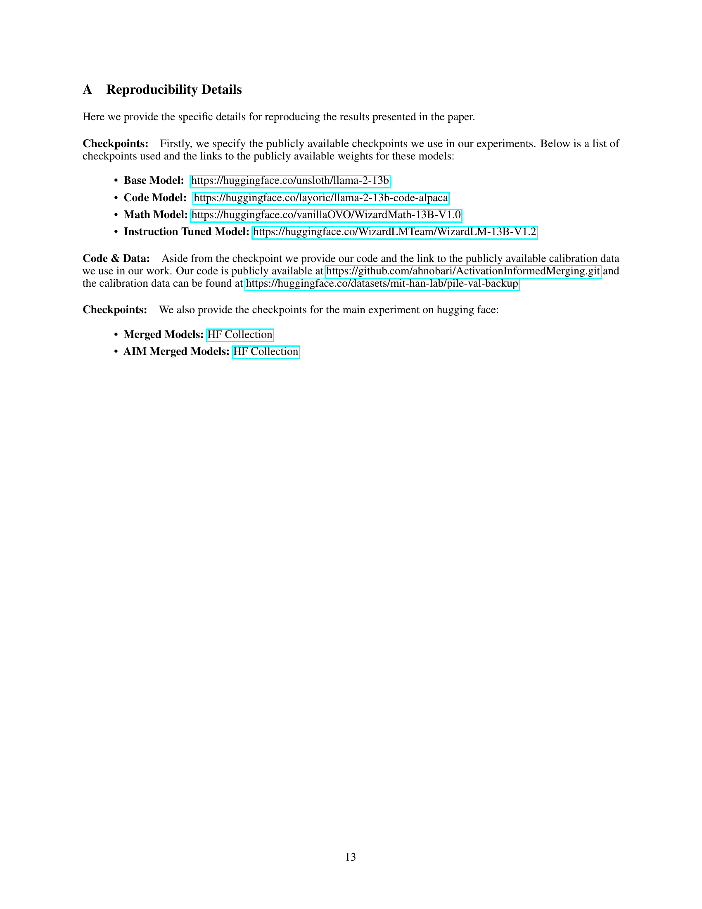

 


 2502.02421 
 Amin Heyrani Nobari et el. 
 
 🤗 2025-02-06 
 



↗ arXiv


↗ Hugging Face


↗ Papers with Code


### TL;DR



본 논문은 여러 개의 미세 조정된 대규모 언어 모델(LLM)을 효율적으로 결합하는 새로운 방법인 **Activation-Informed Merging (AIM)**을 제시합니다. 기존의 LLM 병합 방법은 주로 모델의 가중치 공간에 초점을 맞추지만, AIM은 **LLM의 활성화 공간 정보**를 통합하여 병합 과정을 개선합니다. 이는 지속적인 학습(CL)과 모델 압축의 원리를 활용하여 기본 모델의 중요한 가중치를 보존하는 데 중점을 둡니다. 

AIM은 임의의 기존 병합 방법에 적용 가능한 유연하고 보완적인 솔루션으로 설계되었습니다.  실험 결과, AIM은 여러 벤치마크에서 병합 모델의 성능을 크게 향상시키는 것으로 나타났습니다. 특히, **최대 40%의 성능 향상**을 보이며, 활성화 공간 정보를 고려하는 것이 LLM 모델 병합 전략에 상당한 발전을 가져올 수 있음을 시사합니다. 이는 **LLM의 성능 향상 및 다양한 인공지능 시스템의 개발**에 중요한 의미를 지닙니다.



#### Key Takeaways


 활성화 공간 정보를 활용하여 LLM 병합 과정에서 성능 및 강건성 향상 



 다양한 벤치마크에서 기존 방법 대비 최대 40% 성능 향상 확인 



 지속적 학습 및 모델 압축 원리 적용으로 기존 모델의 중요 가중치 보존 


#### Why does it matter?
본 논문은 **대규모 언어 모델(LLM) 병합 전략 개선**에 중요한 의미를 지닙니다. 활성화 공간 정보를 활용하여 모델 병합의 성능과 견고성을 향상시키는 새로운 방법을 제시함으로써, 기존 방법의 한계를 극복하고 LLM 연구의 새로운 방향을 제시합니다. 특히, **다양한 벤치마크에서 최대 40%의 성능 향상**을 보여주는 실험 결과는 LLM 개발 및 응용에 큰 영향을 미칠 것으로 예상됩니다. 또한, **지속적 학습(CL) 및 모델 압축** 원리를 통합하여 기존 모델의 중요한 가중치를 보존하는 데 중점을 둠으로써, 좀 더 강건하고 일반화된 LLM 병합 모델을 구축할 수 있는 가능성을 열어줍니다.  이러한 연구 결과는 LLM 분야의 발전에 크게 기여할 뿐만 아니라, 다양한 인공지능 시스템 개발에 널리 활용될 것으로 예상됩니다.

------
#### Visual Insights

> 🔼 그림 1은 제안된 활성화 정보 기반 대규모 언어 모델 병합(AIM) 방법의 개요를 보여줍니다.  기존의 모델 병합 방법과 달리, AIM은 미세 조정된 여러 LLM의 활성화 공간 정보를 통합하여 성능과 강건성을 향상시킵니다.  그림에서는 사전 훈련된 기본 모델과 여러 개의 미세 조정된 모델의 매개변수와 임베딩이 병합되는 과정을 보여주고, AIM이 활성화 공간 정보를 활용하여 기본 모델의 중요한 가중치를 보존하는 방식을 설명합니다.  보정 데이터셋을 사용하여 AIM은 병합 과정 중 중요한 가중치를 선택적으로 우선시함으로써 성능 향상을 달성합니다.  이 그림은 AIM의 핵심 개념과 동작 방식을 시각적으로 이해하는 데 도움이 됩니다.
> 

> 
read the caption

> Figure 1: Overview of the proposed activation-informed merging (AIM) in LLMs.
> 


| Method | Model(s) | AIM | HumanEval | MBPP | MMLU | MATH | GSM8K | IFEval | HV Gain |
|---|---|---|---|---|---|---|---|---|---| 
| **Base Models** |  |  |  |  |  |  |  |  |  |
| - | Base | - | 17.07 | 27.80 | 52.18 | 0.70 | 4.20 | 25.10 | - |
| - | Code | - | 17.07 | 31.60 | 52.91 | 6.00 | 24.10 | 26.25 | - |
| - | Instruction Tuned | - | 26.83 | 34.80 | 53.41 | 7.50 | 43.40 | 35.67 | - |
| - | Math | - | 15.24 | 27.60 | 51.89 | 13.10 | 59.10 | 21.58 | - |
| **Merged Models** |  |  |  |  |  |  |  |  |  |
| DARE Task Arithmetic | Code + Instruction Tuned | No | 26.83 | 34.40 | 53.53 | 8.40 | 45.80 | 33.42 | 0.27 |
|  |  | Yes | 29.27 (+9.09%) | 36.00 (+4.65%) | 54.18 (+1.21%) | 8.30 (-1.19%) | 46.20 (+0.87%) | 32.00 (-4.25%) | 0.28 (+2.49%) |
| DARE Task Arithmetic | Code + Math | No | 16.46 | 28.60 | 51.96 | 15.10 | 64.70 | 22.02 | 0.23 |
|  |  | Yes | 15.85 (-3.71%) | 29.60 (+3.50%) | 52.50 (+1.04%) | 14.80 (-1.99%) | 64.10 (-0.93%) | 21.91 (-0.50%) | 0.23 (-1.65%) |
| DARE Task Arithmetic | Instruction Tuned + Math | No | 5.49 | 19.00 | 51.08 | 9.80 | 54.30 | 32.35 | 0.18 |
|  |  | Yes | 12.20 (+122.22%) | 28.20 (+48.42%) | 52.72 (+3.21%) | 12.90 (+31.63%) | 62.20 (+14.55%) | 31.96 (-1.21%) | 0.26 (+40.71%) |
| DARE Task Arithmetic | Code + Instruction Tuned + Math | No | 11.59 | 19.60 | 50.89 | 9.10 | 49.70 | 33.20 | 0.16 |
|  |  | Yes | 15.85 (+36.76%) | 27.00 (+37.76%) | 52.59 (+3.34%) | 12.20 (+34.07%) | 60.70 (+22.13%) | 33.59 (+1.17%) | 0.23 (+40.59%) |
| DARE Ties | Code + Instruction Tuned | No | 30.49 | 35.20 | 53.40 | 8.60 | 46.20 | 33.28 | 0.28 |
|  |  | Yes | 30.49 | 36.80 (+4.55%) | 54.02 (+1.16%) | 8.60 | 47.20 (+2.16%) | 33.16 (-0.36%) | 0.29 (+1.63%) |
| DARE Ties | Code + Math | No | 17.07 | 27.40 | 51.92 | 14.90 | 63.60 | 22.53 | 0.23 |
|  |  | Yes | 17.68 (+3.57%) | 29.00 (+5.84%) | 52.61 (+1.33%) | 15.20 (+2.01%) | 63.90 (+0.47%) | 21.10 (-6.35%) | 0.24 (+4.00%) |
| DARE Ties | Instruction Tuned + Math | No | 8.54 | 23.80 | 51.39 | 9.20 | 54.10 | 33.89 | 0.20 |
|  |  | Yes | 15.85 (+85.60%) | 30.20 (+26.89%) | 52.89 (+2.92%) | 11.60 (+26.09%) | 57.80 (+6.84%) | 35.63 (+5.13%) | 0.26 (+31.22%) |
| DARE Ties | Code + Instruction Tuned + Math | No | 13.41 | 21.20 | 51.15 | 8.70 | 51.50 | 35.75 | 0.17 |
|  |  | Yes | 19.51 (+45.49%) | 28.60 (+34.91%) | 52.63 (+2.89%) | 11.60 (+33.33%) | 57.00 (+10.68%) | 36.20 (+1.26%) | 0.24 (+41.28%) |
| Task Arithmetic | Code + Instruction Tuned | No | 29.27 | 33.80 | 53.44 | 8.60 | 47.10 | 31.60 | 0.28 |
|  |  | Yes | 29.88 (+2.08%) | 35.80 (+5.92%) | 54.12 (+1.27%) | 7.80 (-9.30%) | 46.60 (-1.06%) | 32.01 (+1.30%) | 0.28 (+0.61%) |
| Task Arithmetic | Code + Math | No | 18.29 | 28.60 | 52.10 | 15.00 | 64.70 | 21.92 | 0.24 |
|  |  | Yes | 17.68 (-3.34%) | 29.20 (+2.10%) | 52.52 (+0.81%) | 14.60 (-2.67%) | 64.50 (-0.31%) | 21.54 (-1.73%) | 0.24 (-2.65%) |
| Task Arithmetic | Instruction Tuned + Math | No | 4.27 | 20.20 | 51.50 | 10.00 | 54.20 | 31.31 | 0.18 |
|  |  | Yes | 8.54 (+100.00%) | 26.40 (+30.69%) | 52.83 (+2.58%) | 12.80 (+28.00%) | 61.30 (+13.10%) | 32.62 (+4.18%) | 0.24 (+34.52%) |
| Task Arithmetic | Code + Instruction Tuned + Math | No | 11.59 | 19.60 | 51.20 | 9.00 | 52.70 | 32.87 | 0.16 |
|  |  | Yes | 15.24 (+31.49%) | 27.40 (+39.80%) | 52.63 (+2.79%) | 12.00 (+33.33%) | 58.10 (+10.25%) | 33.91 (+3.16%) | 0.22 (+31.97%) |
| Ties Merging | Code + Instruction Tuned | No | 16.46 | 23.60 | 52.70 | 2.70 | 5.40 | 24.48 | 0.00 |
|  |  | Yes | 15.24 (-7.41%) | 24.20 (+2.54%) | 53.15 (+0.85%) | 2.60 (-3.70%) | 5.20 (-3.70%) | 22.87 (-6.58%) | 0.05 (+inf%) |
| Ties Merging | Code + Math | No | 15.85 | 26.80 | 51.86 | 14.30 | 62.60 | 21.63 | 0.20 |
|  |  | Yes | 15.85 | 28.60 (+6.72%) | 52.29 (+0.83%) | 15.30 (+6.99%) | 63.80 (+1.92%) | 22.64 (+4.67%) | 0.23 (+13.55%) |
| Ties Merging | Instruction Tuned + Math | No | 28.05 | 34.60 | 54.45 | 8.70 | 44.70 | 34.04 | 0.23 |
|  |  | Yes | 27.44 (-2.17%) | 35.00 (+1.16%) | 54.74 (+0.53%) | 9.30 (+6.90%) | 46.10 (+3.13%) | 34.51 (+1.38%) | 0.25 (+6.38%) |
| Ties Merging | Code + Instruction Tuned + Math | No | 21.34 | 29.20 | 53.97 | 6.30 | 29.20 | 26.95 | 0.11 |
|  |  | Yes | 20.73 (-2.86%) | 29.20 | 54.46 (+0.91%) | 5.70 (-9.52%) | 23.70 (-18.84%) | 25.98 (-3.60%) | 0.11 (+4.33%) |
| WIDEN | Code + Instruction Tuned | No | 26.22 | 35.60 | 54.90 | 8.30 | 45.00 | 30.42 | 0.27 |
|  |  | Yes | 25.61 (-2.33%) | 34.60 (-2.81%) | 54.97 (+0.13%) | 8.20 (-1.20%) | 44.10 (-2.00%) | 31.60 (+3.88%) | 0.26 (-0.93%) |
| WIDEN | Code + Math | No | 17.07 | 29.40 | 53.35 | 14.20 | 64.40 | 24.02 | 0.24 |
|  |  | Yes | 17.07 | 29.60 (+0.68%) | 53.36 (+0.02%) | 14.30 (+0.70%) | 62.20 (-3.42%) | 23.95 (-0.29%) | 0.24 (-1.22%) |
| WIDEN | Instruction Tuned + Math | No | 24.39 | 30.40 | 54.20 | 14.60 | 66.00 | 30.82 | 0.30 |
|  |  | Yes | 23.78 (-2.50%) | 32.00 (+5.26%) | 54.69 (+0.90%) | 15.10 (+3.42%) | 68.20 (+3.33%) | 31.23 (+1.33%) | 0.31 (+2.54%) |
| WIDEN | Code + Instruction Tuned + Math | No | 25.00 | 33.20 | 54.58 | 13.50 | 64.20 | 31.44 | 0.29 |
|  |  | Yes | 26.83 (+7.32%) | 32.80 (-1.20%) | 54.98 (+0.73%) | 14.40 (+6.67%) | 64.00 (-0.31%) | 32.82 (+4.39%) | 0.30 (+4.70%) |

> 🔼 표 1은 다양한 모델 병합 시나리오와 방법에 따른 벤치마크 결과를 보여줍니다.  AIM(Activation-Informed Merging)을 적용하지 않은 모델과 비교하여 백분율 변화를 강조하여 각 지표에 대한 상대적 변화를 보여줍니다.  최고 성능의 미세 조정된 대규모 언어 모델과 기본 모델은 노란색으로 강조 표시되고, 최고 성능의 병합 모델은 파란색으로 표시됩니다.  결과는 AIM을 적용하면 대부분의 경우 모든 벤치마크에서 병합 모델의 성능이 크게 향상되고, 종종 HV Gain이 증가함을 보여줍니다.
> 

> 
read the caption

> Table 1:  Benchmark Results Across Various Merging Scenarios and Methods. Percentage changes are shown relative to models merged without AIM, with these differences highlighted for each metric. The highest-performing fine-tuned large language models and base models are highlighted in yellow, while the best-performing merged models are marked in blue. The results demonstrate that, in most cases, applying AIM significantly enhances the performance of merged models across all benchmarks, often increasing HV Gain.
> 

### In-depth insights

#### Activation-Informed Merging
활성화 정보 기반 병합(Activation-Informed Merging)은 **여러 미세 조정된 대규모 언어 모델(LLM)의 활성화 공간 정보를 활용하여 모델 성능을 향상시키는 새로운 기법**입니다. 기존의 가중치 공간 기반 병합 방법과 달리, AIM은 기본 모델의 중요한 가중치를 보존하는 동시에 미세 조정된 모델의 새로운 지식을 통합하는 데 중점을 둡니다. 이는 **지속적인 학습(CL) 및 모델 압축의 원리를 활용**하여 수행됩니다.  **작업에 구애받지 않는 보정 집합을 사용**하여 AIM은 병합 과정 중 중요한 가중치를 선택적으로 우선시합니다. 실험 결과, AIM은 여러 벤치마크에서 병합된 모델의 성능을 크게 향상시키는 것으로 나타났으며, 최대 40%의 성능 향상을 보였습니다. 이는 **활성화 공간 정보를 고려하는 것이 LLM 모델 병합 전략에 상당한 발전**을 가져올 수 있음을 시사합니다.

#### Continual Learning Lens
본 논문은 모델 병합(Model Merging) 문제를 **지속적 학습(Continual Learning)** 관점에서 접근하는 참신한 시각을 제시합니다.  기존의 모델 병합 방식들이 주로 모델 파라미터의 가중치 공간에 초점을 맞춘 반면, 본 연구는 **활성화 공간(Activation Space)의 정보**를 활용하여 기존 모델의 중요한 특징들을 보존하면서 새로운 지식을 통합하는 데 중점을 둡니다. 이는 기존 모델의 성능 저하(Catastrophic Forgetting)를 방지하는 데 효과적이며, **기존 모델 병합 방법과의 호환성**을 유지하면서 성능 향상을 가져올 수 있음을 시사합니다.  특히, **기저 모델(Base Model)의 활성화 패턴** 분석을 통해 중요 가중치를 식별하고, 이를 보호하는 전략을 통해 벤치마크 성능을 최대 40%까지 향상시키는 결과를 보여줍니다. 이러한 접근 방식은 대규모 언어 모델(LLM)의 지속적인 학습 및 발전에 중요한 시사점을 제공합니다.

#### Merging Method Enhancements
본 논문은 여러 개의 미세 조정된 거대 언어 모델(LLM)을 결합하는 모델 병합(model merging) 기법을 향상시키는 방법에 대해 심도 있게 논의합니다. **활성화 공간 정보(activation space information)를 활용하여 기존 병합 방법의 성능과 강건성을 개선**하는 새로운 기법인 AIM(Activation-Informed Merging)을 제시합니다. AIM은 기존 방법에 대한 보완책으로 설계되었으며, **기저 모델의 중요한 가중치를 보존**하는 데 중점을 둡니다. 이는 지속 학습(continual learning)과 모델 압축의 원리를 활용하여 수행됩니다. 또한 과제에 독립적인 보정 집합(calibration set)을 사용하여 병합 과정에서 중요한 가중치를 선택적으로 우선시합니다. 실험 결과, AIM은 다양한 벤치마크에서 병합 모델의 성능을 상당히 향상시키는 것으로 나타났습니다. 특히, **벤치마크 성능이 최대 40%까지 향상**되었다는 점을 강조합니다. 이는 LLM의 활성화 공간 정보를 고려하는 것이 모델 병합 전략에 상당한 발전을 가져올 수 있음을 시사합니다.

#### Hypervolume-Based Metric
본 논문에서 제시된 초점은 다양한 과제에 대한 성능의 균형을 고려하는 다목적 최적화 관점에서 LLM 병합을 평가하는 새로운 방법론을 제시하는 것입니다. **하이퍼볼륨 기반 지표**는 각 모델의 여러 벤치마크 결과를 N차원 공간의 점으로 표현하고, 이를 통해 모델 성능의 다면적 측면을 포착합니다.  특히, 파레토 최적 모델 집합에 대한 하이퍼볼륨을 계산하여 병합 모델이 다목적 최적화 프런티어에 얼마나 기여하는지 정량적으로 측정합니다.  **HV Gain**은 병합 모델 추가로 인한 하이퍼볼륨 증가를 정규화하여, 단순 성능 개선이 아닌 **전반적인 다목적 성능 향상**에 대한 통찰력을 제공합니다. 이는 기존의 개별 벤치마크 성능 평가를 넘어, 다양한 과제에서의 균형 잡힌 성능 향상 여부를 종합적으로 평가하는 데 유용한 지표가 될 수 있다는 것을 시사합니다.  **단일 목표 최적화** 관점만 고려하는 기존 방법론과 달리, 하이퍼볼륨 기반 지표는 LLM 병합의 다면적인 특징을 보다 잘 반영하며, 모델 선택 및 평가에 있어서 새로운 관점을 제공합니다.

#### Future Research
본 논문은 활성화 공간 정보를 활용한 대규모 언어 모델 병합 기법인 AIM을 제시하며, 기존 방법들보다 최대 40% 향상된 성능을 보였습니다. **미래 연구는 활성화 공간 정보 활용의 심화 및 다양한 모델 병합 방법과의 결합을 통해 성능 향상을 도모**할 수 있습니다. 특히, **전이 학습된 모델의 활성화 공간 정보를 추가적으로 활용**하고, **비선형적인 활성화 척도 및 완화 기법을 연구**하여 성능 향상을 꾀할 수 있을 것입니다. 또한, **다양한 하이퍼파라미터에 대한 폭넓은 실험**과 **이론적인 분석**을 통해 AIM의 일반화 성능을 높이고, 다양한 모델 아키텍처 및 작업에 대한 적용 가능성을 검증하는 후속 연구가 필요합니다.  **다양한 실험 환경과 벤치마크를 통해 AIM의 범용성을 검증**하고, **더욱 효율적이고 일반화된 모델 병합 방법론을 개발**하는 것이 중요합니다.  **특히, AIM을 다른 모델 압축 및 지식 증류 기법과 통합**하는 연구도 기대됩니다.  궁극적으로는, **AIM을 바탕으로 더욱 강력하고 효율적인 대규모 언어 모델을 개발**하는 것이 미래 연구의 주요 목표가 될 것입니다.  **모델 병합 과정의 투명성을 높이는 연구**도 중요합니다.

### More visual insights

More on figures

> 🔼 그림 2는 다양한 시나리오에서 모델의 Pareto 최적 전선을 보여줍니다. 이 그림은 표 1에 제시된 모든 모델의 벤치마크 결과를 나타내지만, 가독성을 높이기 위해 각 경우의 지배적인 점만 시각화했습니다. AIM을 적용했을 때 HV Gain이 증가한 것을 Pareto 전선이 AIM을 적용했을 때 적용하지 않았을 때보다 더 앞으로 이동한 것을 통해 명확하게 알 수 있습니다.
> 

> 
read the caption

> Figure 2: The Pareto fronts of models under different scenarios. Note that the points in these plots represent all models benchmarked in Table 1, however, to make the plots more readable, we only visualize the dominating points in each case. The measured increases in HV Gain when AIM is applied can be clearly seen in the Pareto frontier shifting further forward when AIM is applied compared to when only a population of merged models is evaluated.
> 

> 🔼 그림 3은 다양한 모델 병합 방법에 대한 완화 계수 ω의 영향에 대한 분석 연구 결과를 보여줍니다.  x축은 1-ω 값을 나타내며, ω 값이 감소할수록 더 공격적인 완화(즉, 기본 모델의 가중치에 대한 변화를 더 적게 허용)를 의미합니다.  그림은 Arithmetic 및 DARE와 같은 특정 작업의 경우, ω값을 더 작게 설정하더라도 성능이 향상될 수 있음을 보여줍니다.  전반적으로 ω값을 0.4 또는 0.6으로 설정하는 것이 다양한 방법에 대해 좋은 균형을 이루는 것으로 나타났습니다. 이는 HV Gain (Hypervolume Gain)의 변화를 기준으로 평가하였습니다.
> 

> 
read the caption

> Figure 3: Ablation Study of the Impact of the Relaxation Factor ω𝜔\omegaitalic_ω on Merged Model Performance. This figure plots the relative change in HV Gain compared to scenarios without relaxation. The x-axis represents 1−ω1𝜔1-\omega1 - italic_ω, reflecting that decreasing ω𝜔\omegaitalic_ω results in more aggressive relaxation. The plot indicates that for some tasks, such as Arithmetic and DARE, smaller values of ω𝜔\omegaitalic_ω continue to yield benefits. Overall, ω𝜔\omegaitalic_ω settings of 0.4 or 0.6 appear to strike a good balance across various methods.
> 

### Full paper



