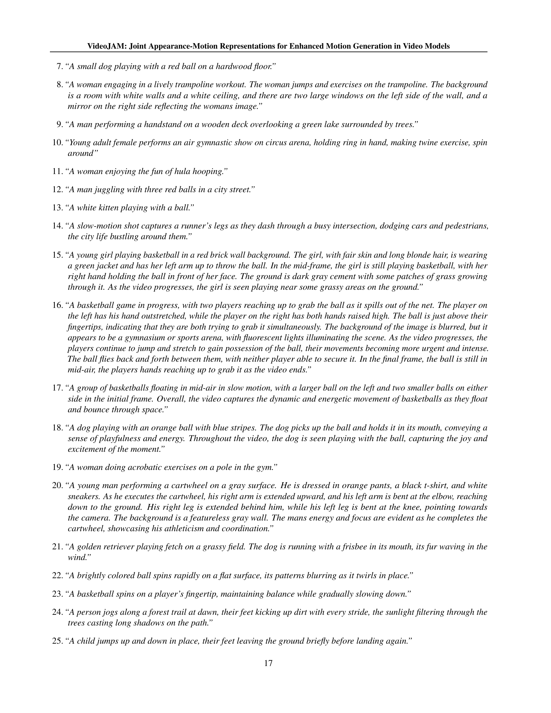

 


 2502.02492 
 Hila Chefer et el. 
 
 🤗 2025-02-05 
 



↗ arXiv


↗ Hugging Face


↗ Papers with Code


### TL;DR



최근 비디오 생성 모델은 비약적인 발전을 이루었지만, 여전히 **실제 세계의 움직임, 역학 및 물리 법칙을 정확하게 포착하는 데 어려움**을 겪고 있습니다. 기존 모델은 외관 정확도에 치우쳐 움직임 일관성이 부족한 결과를 초래하는데, 이는 기존의 픽셀 재구성 목표 때문입니다.  이러한 문제는 단순한 움직임 유형에서도 나타나며, 모델의 훈련 데이터 양과는 무관합니다.

본 논문에서는 이러한 문제를 해결하기 위해 **VideoJAM이라는 새로운 프레임워크**를 제안합니다. VideoJAM은 **외관과 움직임을 통합적으로 학습**하도록 모델을 유도하고, **추론 단계에서 모델 자체의 움직임 예측을 활용**하여 움직임 일관성을 높입니다. VideoJAM은 다양한 모델 크기와 움직임 유형에 적용 가능하며, 기존 최첨단 모델을 능가하는 성능을 보입니다. 또한, 데이터나 모델 크기의 변화 없이도 성능 향상을 달성합니다.



#### Key Takeaways


 VideoJAM은 동영상 생성 모델의 움직임 일관성을 크게 향상시킵니다. 



 VideoJAM은 기존 모델에 최소한의 수정만으로 적용 가능합니다. 



 VideoJAM은 외관과 움직임의 상호 보완적인 관계를 강조합니다. 


#### Why does it matter?
본 논문은 **동영상 생성 모델의 움직임 일관성 문제**를 해결하기 위한 새로운 프레임워크인 VideoJAM을 제시하여, 연구자들에게 **새로운 연구 방향**을 제시하고 기존 모델의 성능을 향상시키는 데 중요한 의미를 가집니다. 특히 **외관과 움직임의 상호 보완적인 관계**를 강조하고, 이를 효과적으로 통합하는 방법을 제시하여, 향후 **더욱 사실적이고 자연스러운 동영상 생성**을 위한 연구에 기여할 것입니다.

------
#### Visual Insights

> 🔼 이 그림은 VideoJAM이 생성한 텍스트-비디오 샘플들을 보여줍니다. VideoJAM은 비디오 생성 모델에 강력한 모션 사전 정보를 명시적으로 적용하는 프레임워크입니다. VideoJAM 프레임워크는 다양한 유형의 동작에서 모션 일관성을 크게 향상시킵니다. 그림에는 발레 무용수, 스케이트보더, 아크로뱃 등 다양한 동작을 수행하는 사람들의 비디오 샘플이 포함되어 있습니다. 각 샘플은 텍스트 프롬프트로부터 생성되었으며, VideoJAM 프레임워크를 통해 생성된 비디오는 모션이 매우 자연스럽고 일관성이 있습니다.
> 

> 
read the caption

> Figure 1: Text-to-video samples generated by VideoJAM. We present VideoJAM, a framework that explicitly instills a strong motion prior to any video generation model. Our framework significantly enhances motion coherence across a wide variety of motion types.
> 


| Method | Text Faith. | Quality | Motion | Appearance | Motion |
|---|---|---|---|---|---| 
| **Human Eval** | | | **Motion** | | **Motion** |
| CogVideo2B | 84.3 | 94.5 | 96.1 | 68.3 | 90.0 |
| CogVideo5B | 62.5 | 74.7 | 68.8 | 71.9 | 90.1 |
| PyramidFlow | 76.6 | 83.6 | 82.8 | 73.1 | 89.6 |
| DiT-4B | 71.1 | 77.3 | 82.0 | 75.2 | 78.3 |
| +VideoJAM | - | - | - | 75.1 | 93.7 |

> 🔼 표 1은 VideoJAM-bench를 사용하여 기존 연구와 VideoJAM-4B 모델의 성능을 비교한 결과를 보여줍니다.  인간 평가자들은 VideoJAM이 기존 모델보다 얼마나 우수한지에 대한 투표 비율을 제시하고, 자동화된 지표는 VBench를 사용합니다.  자세히 살펴보면, 각 모델의 텍스트 충실도, 품질, 동작, 외관, 동작 일관성 점수가 표시되어 VideoJAM-4B 모델이 다양한 측면에서 뛰어난 성능을 보임을 보여줍니다.
> 

> 
read the caption

> Table 1: Comparison of VideoJAM-4B with prior work on VideoJAM-bench. Human evaluation shows percentage of votes favoring VideoJAM; automatic metrics use VBench.
> 

### In-depth insights

#### Motion Incoherence
본 논문에서 'Motion Incoherence'는 **기존 생성적 비디오 모델이 실제 세계의 움직임을 정확하게 포착하는 데 어려움을 겪는 현상**을 지칭합니다.  이는 단순히 화질 저하 문제가 아닌, **물리 법칙이나 동작의 자연스러움을 위반하는 비일관적인 모션**이 생성되는 것을 의미합니다.  **기존 모델의 픽셀 재구성 목표가 외관 정확도에 치우쳐 모션 일관성을 희생하기 때문**이라고 논문은 주장합니다.  예를 들어, 간단한 동작(조깅)에서도 발이 반복적으로 같은 다리에 착지하는 오류를 보이거나, 체조 동작에서 신체가 비정상적으로 변형되거나, 물체가 다른 물체를 통과하는 비현실적인 모션을 생성하는 등 다양한 형태로 나타납니다. 이러한 문제는 단순히 데이터 크기나 모델 규모의 한계가 아닌, **학습 목적 함수 자체의 문제**임을 시사하며, 이는 VideoJAM 모델 개발의 주요 동기가 됩니다. 따라서 VideoJAM은 모션 일관성을 향상시키기 위해 **외관과 모션을 함께 학습하는 새로운 프레임워크**를 제시합니다.

#### VideoJAM Framework
VideoJAM 프레임워크는 **동시에 외관과 움직임을 예측**하는 훈련 방식과 추론 시 **모델 자체의 움직임 예측을 활용**하는 Inner-Guidance 메커니즘이라는 두 가지 주요 구성 요소로 이루어져 있습니다. 훈련 과정에서는 외관과 움직임 정보를 결합한 표현을 학습하여 생성된 픽셀과 해당 움직임을 동시에 예측하도록 모델을 유도합니다. 이는 기존의 외관 중심 접근 방식의 한계를 극복하고 **움직임 일관성을 향상**시키는 데 중요한 역할을 합니다.  추론 과정에서는 Inner-Guidance가 모델이 생성하는 비디오의 움직임 일관성을 제어합니다. 이는 **외부 신호에 의존하지 않고 모델 내부의 움직임 예측**을 활용하여 실시간으로 움직임을 조정함으로써, 다양한 유형의 동작에 걸쳐 움직임의 일관성을 크게 향상시킵니다.  **최소한의 수정만으로 다양한 비디오 모델에 적용**할 수 있다는 점 또한 장점입니다.  결론적으로 VideoJAM 프레임워크는 훈련 및 추론 방식을 효과적으로 통합하여 **시각적 품질과 움직임 일관성 모두를 향상**시키는 강력한 비디오 생성 프레임워크로 평가할 수 있습니다.

#### Inner-Guidance
본 논문에서 제시된 'Inner-Guidance'는 기존의 비디오 생성 모델이 갖는 시간적 일관성 문제를 해결하기 위한 핵심 기법입니다. **기존 방식은 외부 신호에 의존하는 반면,** Inner-Guidance는 모델 자체의 **움직임 예측값을 활용하여 동적인 안내 신호를 생성**합니다. 이를 통해 모델은 생성 과정 전반에 걸쳐 자체 출력을 지속적으로 개선하고, 시간적 일관성을 유지하면서 보다 자연스러운 동작을 생성할 수 있습니다.  이는 **모델이 자체 예측을 통해 동작에 대한 내부적 이해를 높이고** 이를 생성 과정에 적용함으로써, 기존 방식의 한계점을 뛰어넘는 혁신적인 접근 방식임을 보여줍니다.  특히, **기존 방법들의 가정이 유효하지 않은 상황**에서도 효과적으로 적용될 수 있는 새로운 공식을 제시하여, 다양한 모션 유형과 모델 크기에 걸쳐 **시간적 일관성을 크게 향상**시키는 성능을 보여줍니다. 단순히 외형적인 화질 개선뿐 아니라, 동작의 자연스러움과 물리적 일관성을 동시에 향상시키는 결과를 통해, 외형과 동작이 상호 보완적으로 작용하여 시너지를 창출할 수 있음을 강조합니다.

#### Ablation Studies
본 논문의 **절제 연구(Ablation Studies)**는 제안된 VideoJAM 프레임워크의 핵심 구성 요소들의 중요성을 밝히는 데 중점을 둡니다.  **텍스트 안내, 내부 안내, 광학 흐름** 등의 각 요소를 제거했을 때 성능 변화를 정량적으로 분석하여 VideoJAM의 효과를 입증합니다.  특히, **내부 안내 메커니즘** 제거 시 운동 일관성이 크게 저하되는 것을 확인, 이 메커니즘의 핵심적인 역할을 보여줍니다. 또한, **광학 흐름**을 사용하지 않을 때도 성능 저하가 발생, 제안된 방법이 단순히 텍스트 정보에 의존하지 않고 시각적 정보와의 상호작용을 통해 효과를 발휘함을 시사합니다.  **절제 연구** 결과는 VideoJAM의 각 구성 요소가 상호 보완적으로 작용하여 최종 성능을 달성하는 것을 보여주는 강력한 증거를 제공합니다.  **결과적으로, VideoJAM의 설계는 섬세하고 효율적이며, 각 구성 요소의 중요성을 명확히 제시합니다.**

#### Future Work
본 논문의 "미래 연구" 부분은 **VideoJAM 프레임워크의 확장성 및 개선**에 초점을 맞출 것으로 예상됩니다.  **다양한 비디오 모델에 대한 적용성 테스트**를 확대하여 VideoJAM의 범용성을 더욱 입증하고, **더욱 복잡하고 사실적인 물리적 상호작용**을 모델링할 수 있도록 프레임워크를 개선하는 연구가 진행될 것입니다.  또한, **더욱 효율적인 모션 표현 기법**을 탐구하여 계산 비용을 줄이고 성능을 향상시키는 방안을 모색할 수 있으며, **다양한 모션 유형에 대한 더욱 정교한 제어 기능**을 구현하는 연구도 중요한 과제가 될 것입니다.  **실제 세계 데이터를 활용한 학습 전략**을 개선하여 모델의 일반화 성능을 높이고, **비디오 생성의 품질과 일관성**을 더욱 향상시키는 연구가 이어질 것으로 예상됩니다.  **다른 모달리티(예: 오디오)**와의 통합을 통해 더욱 풍부하고 몰입적인 비디오 생성 경험을 제공하는 방안도 흥미로운 연구 주제가 될 것입니다.

### More visual insights

More on figures

> 🔼 본 그림은 DiT-30B 모델이 생성한 비디오의 동작 불일치 사례를 보여줍니다. (a)는 단순한 동작(조깅)에서 같은 다리로 반복적으로 발을 디디는 등의 문제를, (b)는 복잡한 동작(체조)에서의 어려움을, (c)는 물리적 법칙 위배(훌라후프가 여성을 통과하는 등)를, (d)는 단순 반복 패턴 재현 실패를 보여줍니다. 이는 기존 비디오 생성 모델의 한계를 시각적으로 보여주는 예시입니다.
> 

> 
read the caption

> Figure 2: Motion incoherence in video generation. Examples of incoherent generations by DiT-30B (Peebles & Xie, 2023). The model struggles with (a) basic motion, e.g., jogging (stepping on the same leg repeatedly); (b) complex motion e.g., gymnastics; (c) physics, e.g., object dynamics (the hoop passes through the woman); and (d) rotational motion, failing to replicate simple repetitive patterns.
> 

> 🔼 이 그림은 비디오 프레임을 무작위로 바꾼 후와 바꾸기 전 모델의 손실을 비교하여, 기존 DiT 모델(주황색)과 미세 조정된 VideoJAM 모델(파란색)의 시간적 섭동에 대한 민감도를 보여줍니다.  t≤60 에서 기존 모델은 시간적 섭동에 거의 불변이지만, VideoJAM 모델은 시간적 무관성에 매우 민감하게 반응하는 것을 알 수 있습니다. 이는 VideoJAM이 시간적 일관성을 향상시키는 데 효과적임을 시사합니다.
> 

> 
read the caption

> Figure 3: Motivation Experiment. We compare the model’s loss before and after randomly permuting the video frames, using a “vanilla” DiT (orange) and our fine-tuned model (blue). The original model is nearly invariant to temporal perturbations for t≤60𝑡60t\leq 60italic_t ≤ 60.
> 

> 🔼 그림 4는 VideoJAM 프레임워크를 보여줍니다. VideoJAM은 두 가지 구성 요소로 이루어져 있습니다. (a) 학습 단계에서는 입력 비디오 x₁ 및 해당 모션 표현 d₁을 받습니다. 두 신호 모두 노이즈를 추가하고 선형 계층 Wi+n을 사용하여 단일 공유 잠재 표현으로 임베딩합니다. 확산 모델은 입력을 처리하고, 두 개의 선형 투영 계층은 공유 잠재 표현으로부터 외관과 모션을 모두 예측합니다. (b) 추론 단계에서는 모델 자체의 잡음이 포함된 모션 예측을 사용하여 각 단계의 비디오 예측을 안내하는 Inner-Guidance를 제안합니다. 이는 모델이 생성된 프레임의 모션 일관성을 유지하도록 하는 데 도움이 됩니다.
> 

> 
read the caption

> Figure 4: VideoJAM Framework. VideoJAM is constructed of two units; (a) Training. Given an input video x1subscript𝑥1x_{1}italic_x start_POSTSUBSCRIPT 1 end_POSTSUBSCRIPT and its motion representation d1subscript𝑑1d_{1}italic_d start_POSTSUBSCRIPT 1 end_POSTSUBSCRIPT, both signals are noised and embedded to a single, joint latent representation using a linear layer, Wi⁢n+subscriptsuperscriptW𝑖𝑛\textbf{W}^{+}_{in}W start_POSTSUPERSCRIPT + end_POSTSUPERSCRIPT start_POSTSUBSCRIPT italic_i italic_n end_POSTSUBSCRIPT. The diffusion model processes the input, and two linear projection layers predict both appearance and motion from the joint representation. (b) Inference. We propose Inner-Guidance, where the model’s own noisy motion prediction is used to guide the video prediction at each step.
> 

> 🔼 이 그림은 VideoJAM-30B 모델이 생성한 텍스트-비디오 결과를 보여줍니다.  VideoJAM은 달리기와 같은 기본 동작부터 곡예와 같은 복잡한 동작, 장애물 뛰어넘기와 같이 향상된 물리적 현상까지 다양한 종류의 동작 생성을 가능하게 합니다. 그림에는 다양한 동작과 상황을 보여주는 여러 개의 비디오 스틸 이미지가 포함되어 있으며, VideoJAM 모델이 얼마나 다양하고 현실적인 동작을 생성하는지 보여줍니다.
> 

> 
read the caption

> Figure 5: Text-to-video results by VideoJAM-30B. VideoJAM enables the generation of a wide variety of motion types, from basic motion (e.g., running) to complex motion (e.g., acrobatics), and improved physics (e.g., jumping over a hurdle).
> 

> 🔼 그림 6은 VideoJAM-30B와 주요 기준 모델(Sora, Kling, DiT-30B)을 VideoJAM-bench의 대표적인 프롬프트에 적용하여 생성한 비디오의 질적 비교를 보여줍니다. 기준 모델들은 기본 동작(예: 달리기)을 생성하는 데 어려움을 겪고, Sora의 경우 뒤로 가는 동작을 보이거나(두 번째 행), Kling의 경우 비자연스러운 동작을 보이는 등(두 번째 행) 문제가 있습니다. 생성된 콘텐츠는 기본적인 물리 법칙을 위배하는 경우가 있는데, 예를 들어 사람이 물체를 통과하는 경우(DiT, 첫 번째 행)나 물체가 나타나거나 사라지는 경우(Sora, DiT, 네 번째 행)가 있습니다. 복잡한 동작의 경우 기준 모델들은 정지된 동작이나 변형을 보입니다(Sora, Kling, 첫 번째, 세 번째 행). 반대로 VideoJAM은 모든 경우에 시간적으로 일관성 있는 비디오를 생성하며 물리 법칙을 더 잘 준수합니다.
> 

> 
read the caption

> Figure 6: Qualitative comparisons between VideoJAM-30B and the leading baselines- Sora, Kling, and DiT-30B on representative prompts from VideoJAM-bench. The baselines struggle with basic motion, displaying “backward motion” (Sora, 2nd row) or unnatural motion (Kling, 2nd row). The generated content defies the basic laws of physics e.g., people passing through objects (DiT, 1st row), or objects that appear or evaporate (Sora, DiT, 4th row). For complex motion, the baselines display static motion or deformations (Sora, Kling, 1st, 3rd row). Conversely, in all cases, VideoJAM produces temporally coherent videos that better adhere to the laws of physics.
> 

> 🔼 그림 7은 VideoJAM 기법의 한계를 보여줍니다. (a)는 '줌 아웃'된 영상에서 움직이는 물체가 전체 프레임의 작은 부분만 차지할 때 VideoJAM이 효과적이지 못함을 보여줍니다. 움직임이 미세하게 나타나기 때문에 모델이 움직임을 정확히 포착하지 못하는 것입니다. (b)는 물체 간의 상호 작용이 복잡한 물리 현상이 있을 때 VideoJAM이 효과적이지 못함을 보여줍니다. 물리 법칙에 어긋나는 움직임이 발생하기 때문입니다.  예를 들어, 축구공이 선수의 발에 닿기 전에 궤적이 바뀌는 경우가 있습니다. 이는 VideoJAM이 물리적 상호작용을 명시적으로 모델링하지 않기 때문에 발생합니다.
> 

> 
read the caption

> Figure 7: Limitations. Our method is less effective for: (a) motion observed in “zoom-out” (the moving object covers a small part of the frame). (b) Complex physics of object interactions.
> 

> 🔼 그림 8은 비디오 생성 과정에서 시간 정보의 중요성을 보여주는 실험 결과를 보여줍니다.  소음이 추가된 비디오를 서로 다른 단계(20, 60, 80)에서 입력으로 사용하여 생성을 계속 진행했습니다.  60단계까지는 생성된 비디오의 대략적인 움직임과 구조가 대부분 결정되는 것을 보여줍니다. 즉, 초기 단계에서 이미 비디오의 주요 동작이 형성되며, 후반부 단계에서는 세부적인 부분이 조정되는 것을 시각적으로 확인할 수 있습니다.
> 

> 
read the caption

> Figure 8: Qualitative motivation. We noise input videos to different timesteps (20,60,8020608020,60,8020 , 60 , 80) and continue the generation. By step 60606060, the video’s coarse motion and structure are mostly determined.
> 

More on tables


| Method | Text Faith. | Quality | Motion | Appearance | Motion |
|---|---|---|---|---|---| 
| **Human Eval** |  |  | **Human Eval** |  | **Auto. Metrics** |
| CogVideo5B | 73.4 | 71.9 | 85.9 | 71.9 | 90.1 |
| RunWay Gen3 | 72.2 | 76.6 | 77.3 | 73.2 | 92.0 |
| Mochi | 56.1 | 65.6 | 74.2 | 69.9 | 89.7 |
| Sora | 56.3 | 51.7 | 68.5 | 75.4 | 91.7 |
| Kling 1.5 | 51.8 | 45.9 | 63.8 | 76.8 | 87.1 |
| DiT-30B | 71.9 | 74.2 | 72.7 | 72.4 | 88.1 |
| **+VideoJAM** | - | - | - | 73.4 | 92.4 |
> 🔼 표 2는 VideoJAM-bench에서 VideoJAM-30B 모델의 성능을 기존 연구들과 비교한 결과를 보여줍니다.  인간 평가자들은 VideoJAM이 기존 모델보다 얼마나 더 나은지를 비율로 평가했으며, 자동 평가 지표로는 VBench를 사용했습니다. 표에는 텍스트 충실도, 품질, 동작, 외관, 그리고 동작 일관성 등 다양한 측면에서의 비교 결과가 제시되어 있습니다. 이를 통해 VideoJAM-30B가 동작 생성 측면에서 우수함을 보여줍니다.
> 

> 
read the caption

> Table 2: Comparison of VideoJAM-30B with prior work on VideoJAM-bench. Human evaluation shows percentage of votes favoring VideoJAM; automatic metrics use VBench.
> 


| Ablation type | Text Faith. | Quality | Motion | Appearance | Motion |
|---|---|---|---|---|---| 
| **Human Eval** |  |  | **Auto. Metrics** |  | **Auto. Metrics** |
| w/o text guidance | 68.0 | 62.5 | 63.3 | 74.5 | 93.3 |
| w/o Inner-Guidance | 68.9 | 64.4 | 66.2 | 75.3 | 93.1 |
| w/o optical flow | 79.0 | 70.4 | 80.2 | 74.7 | 90.1 |
| IP2P guidance | 73.7 | 85.2 | 78.1 | 72.0 | 90.4 |
| +VideoJAM-4B | - | - | - | 74.9 | 93.7 |
> 🔼 표 3은 VideoJAM 프레임워크의 주요 구성 요소를 VideoJAM-bench를 사용하여 VideoJAM-4B에 적용한 ablation 연구 결과를 보여줍니다.  Human evaluation은 VideoJAM에 대한 찬성표 비율을 나타냅니다.  구체적으로는,  텍스트 안내, Inner-Guidance, 광학 흐름, 그리고 IP2P 안내의 네 가지 주요 구성 요소를 각각 제거했을 때 VideoJAM-4B의 성능 변화를 정량적으로 분석한 것입니다.  각 ablation 실험 결과는 텍스트 충실도, 화질, 동작의 질, 외관, 동작 일관성 등 여러 지표를 통해 평가되었으며,  사람의 평가를 통해 VideoJAM에 대한 지지율을 측정했습니다.  이 표는 VideoJAM의 각 구성 요소가 전체 시스템 성능에 미치는 영향을 이해하는 데 도움이 됩니다.
> 

> 
read the caption

> Table 3: Ablation study. Ablations of the primary components of our framework on VideoJAM-4B using VideoJAM-bench. Human evaluation shows percentage of votes favoring VideoJAM.
> 


| Method | Aesthetic Quality | Image Quality | Subject Consistency | Background Consistency | Motion Smoothness | Motion Degree | Dynamic Degree |
|---|---|---|---|---|---|---|---| 
| CogVideo2B | 46.9 | 48.9 | 87.8 | 93.9 | 97.1 | 88.6 |
| CogVideo5B | 51.1 | 52.9 | 91.3 | 95.3 | 97.3 | 87.5 |
| DiT-4B | 51.8 | 61.4 | 93.0 | 96.7 | 99.3 | 38.3 |
| +VideoJAM-4B | 51.6 | 61.1 | 93.5 | 96.7 | 98.8 | 87.5 |
> 🔼 표 4는 VideoJAM-bench 기준으로 VideoJAM 4B 모델과 기존 연구를 비교한 자동 VBench 측정값의 세부 분석 결과를 보여줍니다.  동적 정도(높을수록 더 많은 움직임을 의미)와 동작 부드러움(높을수록 더 부드러운 움직임을 의미) 사이의 최적 균형을 VideoJAM 모델이 달성했음을 보여줍니다. 표에는 미적 품질, 이미지 품질, 주제 일관성, 배경 일관성, 동작 부드러움, 동적 정도 등 다양한 측정 지표가 포함되어 모델의 성능을 다각적으로 평가합니다.
> 

> 
read the caption

> Table 4: Breakdown of the automatic metrics from VBench comparing our 4B model and previous work on VideoJAM-bench. Our method strikes the best balance between the dynamic degree (higher implies more motion) and the motion smoothness (higher implies smooth motion).
> 


| Method | Aesthetic Quality | Image Quality | Subject Consistency | Background Consistency | Motion Smoothness | Motion Degree | Dynamic Degree |
|---|---|---|---|---|---|---|---| 
| CogVideo5B | 51.1 | 52.9 | 91.3 | 95.3 | 97.3 | 87.5 |
| RunWay Gen3 | 55.1 | 55.1 | 90.7 | 95.2 | 98.4 | 84.4 |
| Mochi | 49.5 | 48.8 | 89.7 | 95.2 | 98.4 | 78.1 |
| Sora | 56.8 | 57.7 | 93.0 | 96.4 | 98.7 | 82.0 |
| Kling 1.5 | 58.5 | 60.4 | 93.9 | 96.5 | 99.2 | 64.8 |
| DiT-30B | 49.2 | 56.8 | 91.3 | 95.5 | 98.8 | 71.1 |
| +VideoJAM-30B | 51.2 | 55.9 | 93.0 | 96.1 | 99.0 | 82.3 |
> 🔼 표 5는 VideoJAM-bench에 대한 이전 연구와 30B 모델을 비교하여 VBench에서 자동으로 측정한 지표를 분석한 결과입니다.  동적 정도(높을수록 더 많은 움직임을 의미)와 동작 부드러움(높을수록 더 부드러운 움직임을 의미) 간의 최적의 균형을 VideoJAM이 제공함을 보여줍니다.  각 지표는 외관(미적 품질, 이미지 품질, 주제 일관성, 배경 일관성)과 움직임(동작 부드러움, 동적 정도)으로 나뉘어 분석됩니다.
> 

> 
read the caption

> Table 5: Breakdown of the automatic metrics from VBench comparing our 30B model and previous work on VideoJAM-bench. Our method strikes the best balance between the dynamic degree (higher implies more motion) and the motion smoothness (higher implies smooth motion).
> 


| Method | Human Eval |  |  | Auto. Metrics |  |
|---|---|---|---|---|---|---|
|  | **Text Faith.** | **Quality** | **Motion** | **Appearance** | **Motion** |
| CogVideo5B | 61.4 | 77.0 | 78.7 | 70.8 | 88.8 |
| Mochi | 53.5 | 59.4 | 69.1 | 70.4 | 85.1 |
| DiT-30B | 60.3 | 64.6 | 66.1 | 70.5 | 87.3 |
| +VideoJAM-30B | - | - | - | 73.7 | 90.8 |
> 🔼 표 6은 VideoJAM-30B 모델과 기존 Movie Gen 벤치마크에서의 비교 결과를 보여줍니다. 사람의 평가는 VideoJAM에 대한 찬성표 비율을 나타내며, 자동 평가는 VBench 지표를 사용합니다. 이 표는 VideoJAM-30B 모델이 다양한 측면에서 기존 최고 성능 모델들에 비해 얼마나 우수한 성능을 보이는지 보여주는 정량적 비교 결과를 제시합니다.
> 

> 
read the caption

> Table 6: Comparison of VideoJAM-30B with prior work on the Movie Gen benchmark. Human evaluation shows percentage of votes favoring VideoJAM; automatic metrics use VBench.
> 


| Method | Aesthetic Quality | Image Quality | Subject Consistency | Background Consistency | Motion Smoothness | Motion Degree | Dynamic Degree |
|---|---|---|---|---|---|---|---| 
| CogVideo5B | 50.9 | 51.9 | 89.5 | 94.7 | 97.5 | 81.6 |
| Mochi | 50.4 | 50.1 | 89.0 | 95.4 | 98.9 | 60.7 |
| DiT-30B | 48.7 | 50.6 | 90.8 | 95.3 | 98.9 | 67.8 |
| +VideoJAM-30B | 51.5 | 56.4 | 93.3 | 96.2 | 99.1 | 76.9 |
> 🔼 표 7은 Movie Gen 벤치마크에서 VideoJAM의 30B 모델과 기존 연구 결과를 비교한 VBench의 자동 평가 지표를 세분화하여 보여줍니다.  자동 평가 지표는 외관(Appearance)과 움직임(Motion) 측면으로 나뉘며, 각각 미적 품질, 이미지 품질, 주제 일관성, 배경 일관성, 동작 부드러움, 동작 역동성 점수를 포함합니다. VideoJAM은 동작의 역동성(Dynamic Degree)과 부드러움(Smoothness) 사이의 균형을 가장 잘 맞추어, 과도한 움직임 없이도 자연스럽고 매끄러운 동작을 생성하는 것을 보여줍니다.  즉, VideoJAM은  자연스러운 움직임을 생성하면서 동시에 움직임의 양을 효율적으로 조절한다는 것을 의미합니다.
> 

> 
read the caption

> Table 7: Breakdown of the automatic metrics from VBench comparing our 30B model and previous work on the Movie Gen benchmark. Our method strikes the best balance between the dynamic degree (higher implies more motion) and the motion smoothness (higher implies smooth motion).
> 

### Full paper



